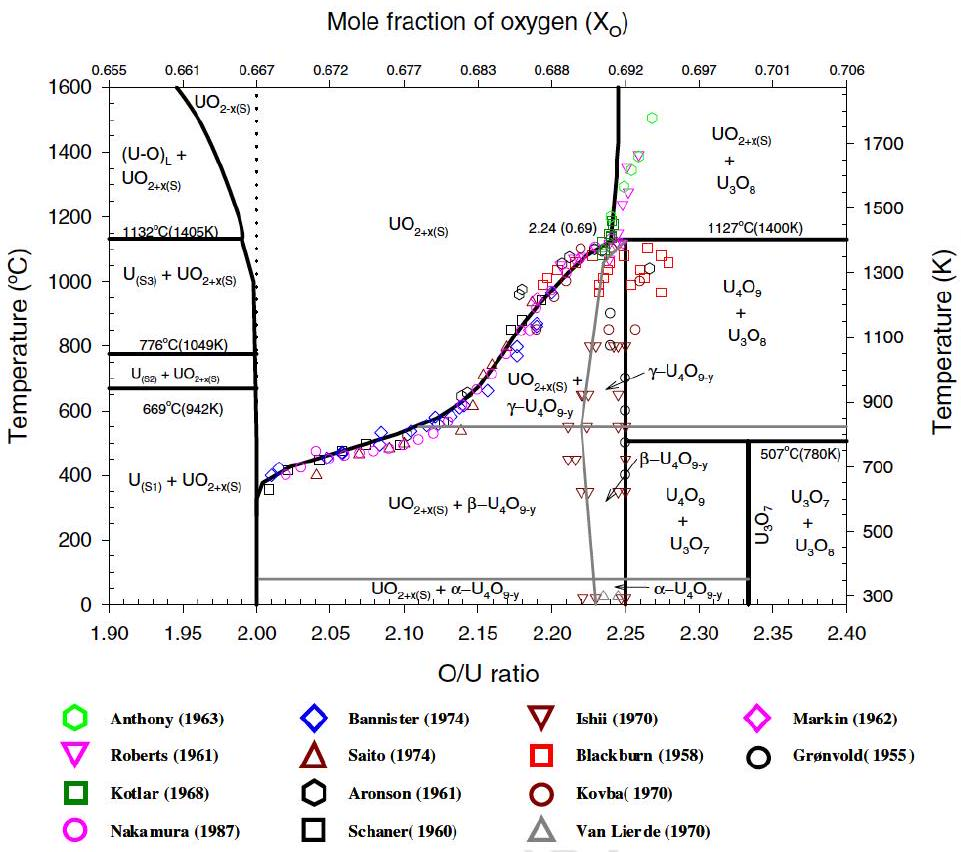
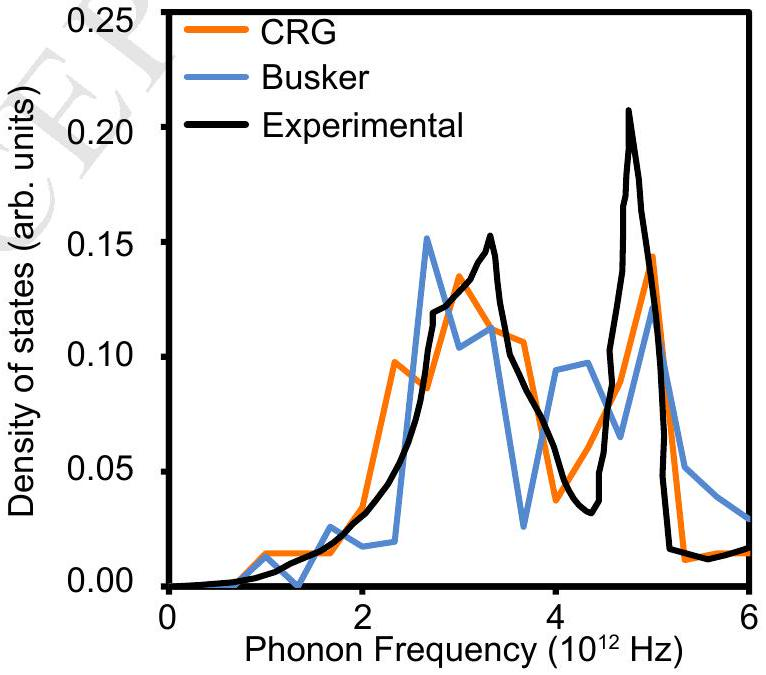
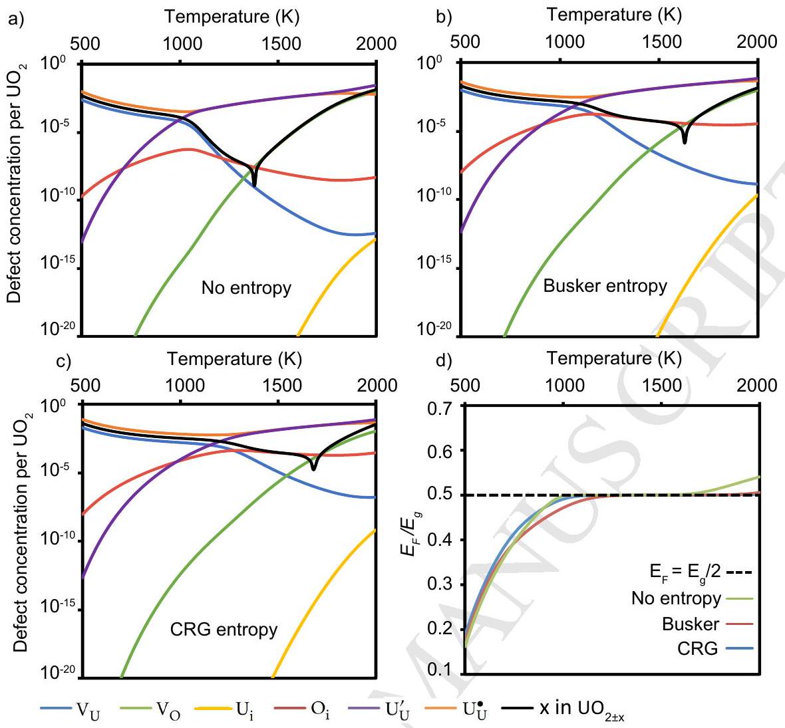
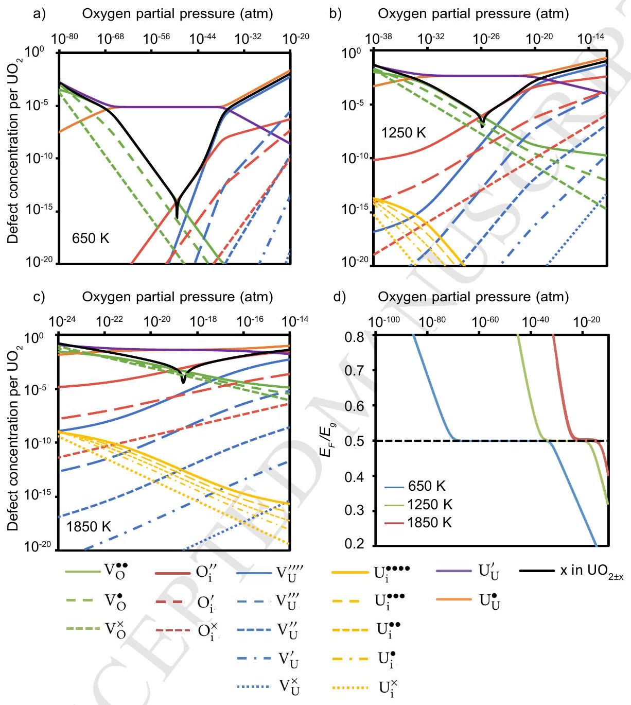
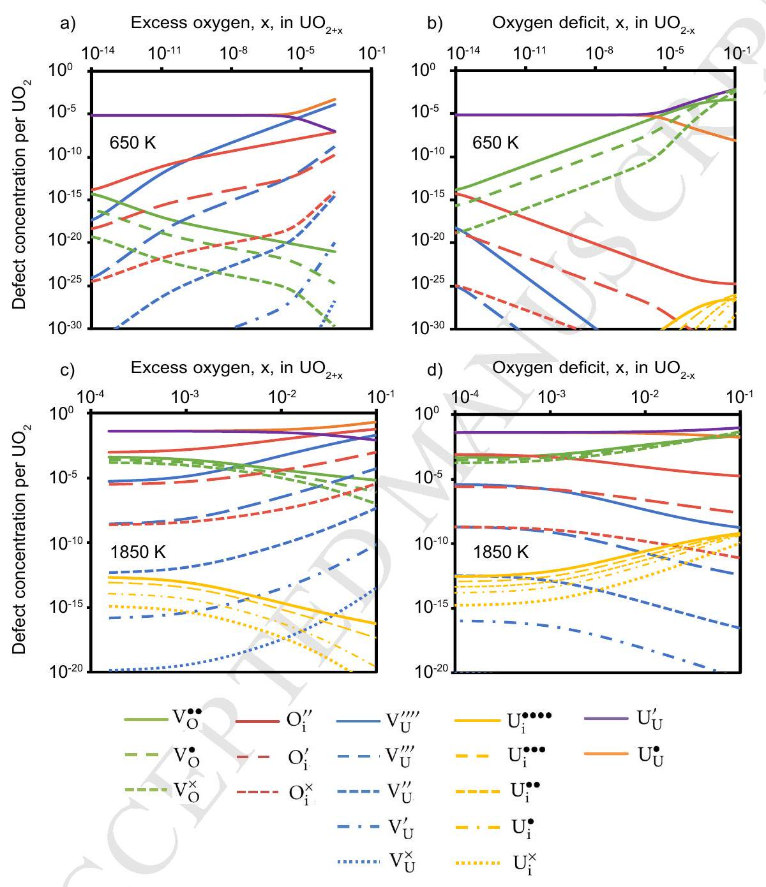

## Accepted Manuscript

The defect chemistry of $\mathrm{UO}_{2 \pm x}$ from atomistic simulations
M.W.D. Cooper, S.T. Murphy, D.A. Andersson

PII: S0022-3115(17)31402-2
DOI: 10.1016/j.jnucmat.2018.02.034
Reference: NUMA 50807

To appear in: Journal of Nuclear Materials

Received Date: 6 October 2017
Revised Date: 21 February 2018
Accepted Date: 21 February 2018

Please cite this article as: M.W.D. Cooper, S.T. Murphy, D.A. Andersson, The defect chemistry of $\mathrm{UO}_{2 \pm x}$ from atomistic simulations, Journal of Nuclear Materials (2018), doi: 10.1016/ j.jnucmat.2018.02.034.

This is a PDF file of an unedited manuscript that has been accepted for publication. As a service to our customers we are providing this early version of the manuscript. The manuscript will undergo copyediting, typesetting, and review of the resulting proof before it is published in its final form. Please note that during the production process errors may be discovered which could affect the content, and all legal disclaimers that apply to the journal pertain.

# The defect chemistry of $\mathrm{UO}_{2 \pm x}$ from atomistic simulations 

M. W. D. Cooper ${ }^{\text {a }}$, S. T. Murphy ${ }^{\text {b,c }}$, D. A. Andersson ${ }^{\text {a }}$ ${ }^{a}$ Materials Science and Technology Division, Los Alamos National Laboratory P.O. Box 1663, Los Alamos, NM 87545, USA ${ }^{b}$ Department of Engineering, Lancaster University, Bailrigg, Lancaster, LA1 4YW, UK ${ }^{c}$ Materials Science Institute, Lancaster University, Bailrigg, Lancaster, LA1 4YW, UK

#### Abstract

Control of the defect chemistry in $\mathrm{UO}_{2 \pm x}$ is important for manipulating nuclear fuel properties and fuel performance. For example, the uranium vacancy concentration is critical for fission gas release and sintering, while all oxygen and uranium defects are known to strongly influence thermal conductivity. Here the point defect concentrations in thermal equilibrium are predicted using defect energies from density functional theory (DFT) and vibrational entropies calculated using empirical potentials. Electrons and holes have been treated in a similar fashion to other charged defects allowing for structural relaxation around the localized electronic defects. Predictions are made for the defect concentrations and non-stoichiometry of $\mathrm{UO}_{2 \pm x}$ as a function of oxygen partial pressure and temperature. If vibrational entropy is omitted, oxygen interstitials are predicted to be the dominant mechanism of excess oxygen accommodation over only a small temperature range ( 1265 K to 1350 K ), in contrast to experimental observation. Conversely, if vibrational entropy is included oxygen interstitials dominate from 1165 K to 1680 K (Busker potential) or from 1275 K to 1630 K (CRG potential). Below these temperature ranges excess oxygen is predicted to be accommodated by uranium vacancies, while above them the system is hypo-stoichiometric with oxygen deficiency accommodated by oxygen vacancies. Our results are discussed in the context of oxygen clustering, formation of $\mathrm{U}_{4} \mathrm{O}_{9}$, and issues for fuel behavior. In particular, the variation of the uranium vacancy concentrations as a function of temperature and oxygen partial pressure will underpin future studies into fission gas diffusivity and broaden the understanding of $\mathrm{UO}_{2 \pm x}$ sintering.

## 1. Introduction

Due to its radiation tolerance, high melting point, and chemical stability $\mathrm{UO}_{2}$ has been widely deployed as a nuclear reactor fuel. Particularly important is its ability to accommodate significant compositional changes without altering its crystal structure. This enables it to incorporate large concentrations of soluble fission products and radiation damage without the detrimental volume changes associated with phase transitions. The way in which large deviations in non-stoichiometry of $\mathrm{UO}_{2 \pm x}$ are accommodated can be understood in terms of its defect chemistry as function of oxygen partial pressure and temperature. Furthermore, defining the populations of uranium and oxygen defects for a given set of conditions is of great importance for understanding thermophysical and thermomechanical properties, mass transport during sintering, and fission gas release [1-4].

Uranium has a number of f and d electrons in its ground state of [Rn] 5f3 6d1 7s2, which enables it to access several valence states that are similar in energy. For example, uranium is nominally $\mathrm{U}^{4+}$ in $\mathrm{UO}_{2}$ but can readily oxidize to $\mathrm{U}^{5+}$ creating a low energy $\mathrm{U}_{\mathrm{U}}^{\bullet}$ charge compensation mechanism for the negatively charged hyper-stoichiometric defects $\mathrm{V}_{\mathrm{U}}^{\prime \prime \prime \prime}$ and $\mathrm{O}_{\mathrm{i}}^{\prime \prime}$ (represented using Kröger-Vink notation [5]). As evidenced by the phase diagram (see Figure 1), $\mathrm{UO}_{2}$ can be oxidized to $\mathrm{UO}_{2+x}$ or $\mathrm{U}_{4} \mathrm{O}_{9}$ [6, 7], and even up to $\mathrm{UO}_{3}$ through further oxidation to $\mathrm{U}^{6+}$ [8]. The reduction of $\mathrm{UO}_{2}$ to $\mathrm{UO}_{2-x}$ is also possible but only at high temperatures (above 1700 K ), highlighting the reluctance of $\mathrm{U}^{4+}$ to be reduced to $\mathrm{U}^{3+}$ compared to its tendency for oxidation. By fitting to a large set of experimental data [9-23] Guéneau et al. [24] modelled the $\mathrm{O} / \mathrm{U}$ ratio of $\mathrm{UO}_{2 \pm x}$ for different oxygen partial pressures and temperatures. Due

[^0]to the high entropy of gaseous $\mathrm{O}_{2}$, for a fixed oxygen partial pressure the $\mathrm{O} / \mathrm{U}$ is reduced for increasing temperatures. Experiments have shown that at 1073 K hyper-stoichiometry $\left(\mathrm{UO}_{2+x}\right)$ is accommodated by oxygen interstitials [25,26]. At lower temperatures $\mathrm{UO}_{2+x}$ is known to phase separate into $\mathrm{UO}_{2}$ and $\mathrm{U}_{4} \mathrm{O}_{9}$ (see Figure 1), such that defects in $\mathrm{UO}_{2+x}$ are not the primary mechanism governing the accommodation of excess oxygen [7].

Atomic scale simulations are well suited to investigate the behaviour of point defects and their influence on material properties. The description of interatomic forces in a system can be represented using either density function theory (DFT) or empirical potentials. The former has the advantage of accurately describing complex interactions, including charge transfer, from first principles, while the computational efficiency of the latter enables the dynamical simulation of systems inaccessible to electronic structure methods. Both approaches have been widely applied to defects in $\mathrm{UO}_{2 \pm x}[27-42]$. DFT has been reported to predict uranium vacanies as the dominant defect in $\mathrm{UO}_{2+x}$ [36, 37], in contradiction to experimental observation [25]. The omission of vibration entropy from the calculated defect formation energies has been suggested as a possible explanation [33]. A number of recent studies have shown that attempt frequencies derived from empirical potentials and DFT activation energies can be successfully combined within an Arrhenius relationship to describe fission product and point defect diffusivity in $\mathrm{UO}_{2}$ [31, 43]. We have adopted a similar approach in our investigation of defect chemistry in $\mathrm{UO}_{2 \pm x}$ by including vibrational entropy from empirical calculations and defect energies from DFT $+U$. A full point defect chemistry assessment of $\mathrm{UO}_{2}$ that includes vibrational entropy and treatment of the structural relaxation around localized electronic defects has not yet been performed, providing the motivation for our study. Furthermore, while the model of Guéneau et al. [24] can provide a superior oxygen partial pressure dependence for nonstoichiometry it does not include uranium defects, which are needed to understand fission gas release and sintering.

Using a defect analysis similar to that carried out on $\mathrm{ThO}_{2}$ by Murphy et al. [44] and on $\mathrm{UO}_{2}$ by Crocombette [33], in this work the defect concentrations of $\mathrm{UO}_{2 \pm x}$ are predicted as a function of oxygen partial pressure, temperature, and $x$. Unlike the previous work [33, 44], which only includes DFT energies, our analysis also includes vibrational entropy calculated using empirical potentials. Our results are discussed with reference to experiment and in the context of important nuclear fuel behavior.

## 2. Method

### 2.1. Defect energies

The Vienna ab initio Simulation Package (VASP) [45-47] has been deployed for DFT calculations with the local density approximation (LDA) applied to the local exchange and correlation potential. The projector augmented wave (PAW) method has been used to represent the wave function and core electrons have been accounted for within the frozen core approximation [48, 49]. Correct treatment of the strongly correlated 5f electrons necessitates use of the LDA $+U$ functional developed by Lichtenstein et al. [50] (similarly to previous DFT studies of $\mathrm{UO}_{2}$ [31-35], $U=4.5 \mathrm{eV}$ and $J=0.51 \mathrm{eV}$ were taken from Dudarev et al. [51] for the U atoms). Use of the $U$ parameter creates metastable states, which have been dealt with using the U-ramping method outlined by Meredig et al. [52]. Although not used in this study, it is worth noting that occupation matrix control has also been successfully implemented for finding the electronic ground state of $\mathrm{UO}_{2}$ [53]. The lowest energy non-collinear $3-\mathbf{k}$ ordering, which due to computational cost, prevents use in supercells sufficiently large for the calculation of accurate defect energies. Therefore, spin-polarization with a $1-\mathbf{k}$ antiferromagnetic ordering has been used to provide a reasonable description of the lowest energy ordering. Spin orbit coupling has been shown to be over an order of magnitude weaker than coulombic interactions in 5f systems [54] justifying the use of $1-\mathbf{k}$ antiferromagnetic ordering. A 500 eV plane-wave cut-off energy was used. A $2 \times 2 \times 2$ Monkhorst-Pack $k$-point mesh [55] was used for $k$ space integration with Gaussian smearing of 0.05 eV .

Using the DFT description of interatomic forces and energies described above, energy minimization calculations were carried out on a supercell consisting of a $2 \times 2 \times 2$ extension ( 96 atoms) of the $\mathrm{UO}_{2}$ fluorite unit cell ( 12 atoms). The $U$-ramping method has been applied to the uranium ions by carrying out 20 ionic relaxation steps at each value of $U$ from 0.51 eV to 4.5 eV with increments of 0.5 eV and $J=0.51 \mathrm{eV}$ throughout. Then the ionic positions and cell parameters were relaxed and converged to within $10^{-4} \mathrm{eV}$ and the electronic relaxation loop was converged to within $10^{-6} \mathrm{eV}$.

Uranium, oxygen, and electronic defects have been considered. Given the symmetry of the $\mathrm{UO}_{2}$ lattice there is just one unique site for uranium vacancies, oxygen vacancies, and interstitials. The ionic nature of $\mathrm{UO}_{2}$ necessitates the consideration of charged defects. Furthermore, the ability of $\mathrm{U}^{4+}$ to oxidize (reduce) to $\mathrm{U}^{5+}\left(\mathrm{U}^{3+}\right)$ must be considered explicitly. By assuming charge localization at the defect (or for holes and electrons at a uranium ion), the effective charge (overall supercell charge) is treated as the defect charge and Kröger-Vink notation [5] can be used as such:

$$
\begin{aligned}
& \text { Electronic defects : } \mathrm{U}_{\mathrm{U}}^{\bullet}, \text { and } \mathrm{U}_{\mathrm{U}}^{\prime} \\
& \text { Oxygen interstitials : } \mathrm{O}_{\mathrm{i}}^{\times}, \mathrm{O}_{\mathrm{i}}^{\prime} \text {, and } \mathrm{O}_{\mathrm{i}}^{\prime \prime} \\
& \text { Oxygen vacancies : } \mathrm{V}_{\mathrm{O}}^{\times}, \mathrm{V}_{\mathrm{O}}^{\bullet} \text {, and } \mathrm{V}_{\mathrm{O}}^{\bullet \bullet} \\
& \text { Uranium interstitials : } \mathrm{U}_{\mathrm{i}}^{\times}, \mathrm{U}_{\mathrm{i}}^{\bullet}, \mathrm{U}_{\mathrm{i}}^{\bullet \bullet}, \mathrm{U}_{\mathrm{i}}^{\bullet \bullet \bullet} \text {, and } \mathrm{U}_{\mathrm{i}}^{\bullet \bullet \bullet \bullet ~} \\
& \text { Uranium vacancies : } \mathrm{V}_{\mathrm{U}}^{\times}, \mathrm{V}_{\mathrm{U}}^{\prime}, \mathrm{V}_{\mathrm{U}}^{\prime \prime}, \mathrm{V}_{\mathrm{U}}^{\prime \prime \prime} \text {, and } \mathrm{V}_{\mathrm{U}}^{\prime \prime \prime \prime}
\end{aligned}
$$

It should be noted that we have not considered defect clusters and all supercells used in this work contain just one defect. The DFT lattice energies have been corrected for the interactions between the charged defect with its periodic images through the Madelung energy such that [56-58]:

$$
E_{\infty}=E_{L}+\frac{q^{2} \alpha}{2 \epsilon L}
$$

where $E^{\infty}$ is the lattice energy in the dilute limit, $E(L)$ is the lattice energy in a supercell of length $L$, and $q$ is the supercell charge. $\alpha=2.837$ is the Madelung constant of a point charge $q$ placed in a homogeneous background charge $-q$ and $\epsilon=22$ is the dielectric constant taken from experiment [59]. In addition to the charge correction above, we have applied a potential alignment correction due to the shift in band structure of the defective supercell with respect to the perfect supercell. The potential alignment correction, $\Delta \Phi$, applied to the defective lattice energy was calculated as [60]:

$$
\Delta \Phi=\left\langle\phi_{K S}^{\text {bulk }}\right\rangle-\left\langle\phi_{K S}^{\text {defect }}\right\rangle
$$

where $\left\langle\phi_{K S}^{\text {bulk }}\right\rangle$ and $\left\langle\phi_{K S}^{\text {defect }}\right\rangle$ are the average Kohn-Sham potentials in the perfect and defective supercells respectively. The differences in energy between the defective and the perfect supercell (defect energy) are summarized in Table 1.

### 2.2. Defect vibrational entropies

Nuclear fuel is fabricated and operates at very high temperatures. The contribution of vibrational entropy to the free energy of defect formation may therefore be significant. Phonon frequencies are determined through force calculations associated with atom displacements from their ground state positions. For the perfect supercell the high degree of symmetry limits the number of force calculations required. Conversely, the low symmetry of the defective supercells means there are a very large number of force calculations required to determine the phonon modes. This is compounded by the issue of metastable electronic states in DFT $+U$ calculations of $\mathrm{UO}_{2}$, creating a very significant computation challenge. We have, therefore, opted to use a similar approach to that carried out by Andersson et al. [31] for Xe in $\mathrm{UO}_{2}$, whereby vibrational entropies are calculated using empirical potentials.

Phonon frequencies have been determined from the second derivative matrix [61] of a $4 \times 4 \times 4$ expansion of the fluorite unit cell evaluated in the General Utility Lattice Program (GULP) [62] with interatomic forces described by the Busker potential [63] and the Cooper, Rushton and Grimes (CRG) potential [64]. Both defective and perfect supercells have been relaxed under constant zero pressure. Figure 2 shows the phonon density of states (DOS) of the perfect $\mathrm{UO}_{2}$ supercell calculated using the Busker and CRG potentials with comparison to the experimental data of Dolling et al. [65]. Both potentials provide similar descriptions of the phonon DOS, which are reasonable compared to the experimental results. However, the Busker potential has a peak at $4 \times 10^{12} \mathrm{~Hz}$ that is not present in either the experimental data or the results using the CRG potential.

The phonon frequencies in $\mathrm{Hz}, v_{n}$, have been used in the following summation to determine the vibrational entropy, $S$ :

$$
S=k_{B} \sum_{n=1}^{3 N-3} \ln \left(\frac{h v_{n}}{k_{B} T}\right)+(3 N-3) k_{B}
$$

where $k_{B}$ is the Boltzmann constant, $T$ is the temperature in K , and $h$ is Planck's constant. $S$ is linearly dependent on supercell volume, $V$, and $\frac{d S}{d V}$ has also been calculated for each defective and non-defective supercell. By combining $\frac{d S}{d V}$ with $\frac{d V}{d T}$ from Fink [66] the vibrational entropy has been adjusted for thermal expansion. Tables 2 and 3 summarize the defect vibrational entropies (difference between defective and perfect supercells) and the vibrational entropy of $\mathrm{UO}_{2}$ per formula unit.

The Busker potential is a rigid ion model with formal charges [63] and the CRG potential uses fixed partial charges that are proportional and, within the context of the model, equivalent to the formal charges [64]. This presents a problem when trying to use rigid ion models to calculate the vibrational entropy of nonformally charged defects (e.g. $\mathrm{V}_{\mathrm{U}}^{\prime \prime \prime}$ or $\mathrm{V}_{\mathrm{O}}^{\bullet}$ ). An important contribution to the vibrational entropy of defects is the extent to which they expand the $\mathrm{UO}_{2}$ lattice (defect volume) resulting in a change in system entropy via $\frac{d S}{d V}$ for $\mathrm{UO}_{2},\left(\frac{d S}{d V}\right)_{U_{O_{2}}}$. Table 4 shows the defect volumes for defects in $\mathrm{UO}_{2}$ with various charges states. Evidently the charge state has a significant effect on the defect volume, whereby more negatively charged defects have a greater defect volume (associated with the volume of an electron). It is, therefore, possible to calculate the change in vibrational entropy of the non-formally charged defect with respect to that of the formally charged defect (by using the corresponding change in defect volume). For a non-formally charged defect with effective/supercell charge, $q$, the following correction has been applied to the entropy calculated for the formally charged defects (e.g. $\mathrm{V}_{\mathrm{O}}^{\bullet \bullet}$ and $\mathrm{V}_{\mathrm{U}}^{\prime \prime \prime}$ ):

$$
\Delta S_{q}=\Delta S_{\text {form }}+\left(V_{q}-V_{\text {form }}\right) \cdot\left(\frac{d S}{d V}\right)_{U O_{2}}
$$

where $\Delta S_{\text {form }}$ is the defect entropy of a formally charged defect (see Tables 2 and 3) and $V_{\text {form }}$ is the defect volume of a formally charged defect (e.g. $\mathrm{V}_{\mathrm{U}}^{\prime \prime \prime}$ ). $\Delta S_{q}$ and $V_{q}$ are the defect entropy and volume, respectively, of a defect with effective charge $Q$ (e.g. $\mathrm{q}=-2$ for $\mathrm{V}_{\mathrm{U}}^{\prime \prime}$ ). Defect volumes have been determined from geometry relaxation in DFT and are summarized in Table 4, with the change in defect volume with respect to the formally charged defect, ( $V_{q}-V_{\text {form }}$ ), shown in parentheses.

### 2.3. Defect formalism

Using the defect energy, $\Delta E$, from DFT and defect vibrational entropy, $\Delta S$, from empirical potentials, we wish to determine defect concentrations as a function of temperature and oxygen partial pressure. Within a point defect model and using Boltzmann statistics, the concentration of a given defect is described by:

$$
c_{i}=m_{i} \exp \left(\frac{-\Delta G_{f}^{i}}{k_{B} T}\right)
$$

where $m_{i}, c_{i}$, and $\Delta G_{f}^{i}$ are the multiplicity, the concentration, and the free energy of formation for defect $i$, respectively.

The defect energy, $\Delta E$, and defect entropy, $\Delta S$, are used to define $\Delta G_{f}^{i}$ as:

$$
\Delta G_{f}=\Delta E-T \Delta S+\sum_{\alpha} n_{\alpha} \mu_{\alpha}+q_{i} \mu_{e}
$$

where $n_{\alpha}$ is the number of species, $\alpha$, added to the system to make defect $i$ and $\mu_{\alpha}$ is the chemical potential of species, $\alpha$. The electron potential is $\mu_{e}$ and the charge of the defect, $q_{i}$, is equivalent to the supercell charge. Due to the localisation of holes, $\mathrm{U}_{\mathrm{U}}^{\bullet}$, and electrons, $\mathrm{U}_{\mathrm{U}}^{\prime}$, in $\mathrm{UO}_{2}$ and the structural relaxation around such electronic defects, energy minimisation was carried out on perfect supercells with an electron added/removed, such that $n_{\alpha}=0$ and $q_{i}=-1 /+1$. For comparison, similarly to previous work on $\mathrm{ThO}_{2}$ [44], the electron and hole concentrations were alternatively determined from the position of the

Fermi-level within the band structure as defined from the perfect supercell. However, it was found that $\mathrm{O} / \mathrm{U}$ never exceeded 2.0001 in contrast to the experimental observation that $\mathrm{UO}_{2}$ is readily oxidized to $\mathrm{O} / \mathrm{U}=2.25$. Conversely, by treating $\mathrm{U}_{\mathrm{U}}^{\bullet}$ and $\mathrm{U}_{\mathrm{U}}^{\prime}$ in the same manner as all other defects in the system with full structural relaxation significant oxidation of $\mathrm{UO}_{2}$ at low temperature was predicted, as will be shown in the results section. This approach also has the advantage of allowing the calculation of $\mathrm{U}_{\mathrm{U}}^{\bullet}$ and $\mathrm{U}_{\mathrm{U}}^{\prime}$ vibrational entropy.

The chemical potential of $\mathrm{UO}_{2}$ can be defined in terms of the chemical potentials per formula unit of the constituent species: metal uranium, $\mu_{U}\left(p_{O_{2}}, T\right)$, and oxygen, $\mu_{O_{2}}\left(p_{O_{2}}, T\right)$ :

$$
\mu_{U}\left(p_{O_{2}}, T\right)+\mu_{O_{2}}\left(p_{O_{2}}, T\right)=\mu_{U O_{2(s)}}
$$

The approach of Finnis et al. [67] is employed to remove the use of DFT, which is known to provide a poor description of the oxygen dimer, by referencing the experimental formation energy of $\mathrm{UO}_{2}, \Delta G_{f}^{U O_{2}}\left(p_{O_{2}}, T\right)=$ -11.23 eV [68], via:

$$
\Delta G_{f}^{U O_{2}}\left(p_{O_{2}}^{\circ}, T^{\circ}\right)=\mu_{U O_{2(s)}}-\mu_{U_{(s)}}-\mu_{O_{2(g)}}\left(p_{O_{2}}^{\circ}, T^{\circ}\right)
$$

The temperature dependence of the oxygen chemical dependence is captured by using the ideal gas relations to extrapolate from standard temperature and pressure, $\mu_{\mathrm{O}_{2}(g)}\left(p_{\mathrm{O}_{2}}^{\circ}, T^{\circ}\right)$ :

$$
\mu_{O_{2}(g)}\left(p_{O_{2}}, T\right)=\mu_{O_{2}(g)}\left(p_{O_{2}}^{\circ}, T^{\circ}\right)+\Delta \mu(T)+\frac{1}{2} k_{B} T \log \left(\frac{p_{O_{2}}}{p_{O_{2}}^{\circ}}\right)
$$

and $\Delta \mu(T)$ is defined as:

$$
\Delta \mu(T)=-\frac{1}{2}\left(S_{O_{2}}^{\circ}-C_{P}^{\circ}\right)\left(T-T^{\circ}\right)+C_{P}^{\circ} T \log \left(\frac{T}{T^{\circ}}\right)
$$

where $S_{O_{2}}^{\circ}=0.0021 \mathrm{eV} / \mathrm{K}$ and $C_{P}^{\circ}=7 k_{B}=0.000302 \mathrm{eV} / \mathrm{K}$ are the molecular entropy at STP and the constant pressure specific heat, respectively.

The overall charge neutrality of the system (summed over all defects) must be maintained. Thus, any possible combination of charged defects must satisfy the following criteria:

$$
\sum_{i} q_{i} c_{i}=0
$$

where the left hand side is the sum of all defect charges in the system. All charged defect formation energies (including $\mathrm{U}_{\mathrm{U}}^{\bullet}$ and $\mathrm{U}_{\mathrm{U}}^{\prime}$ ) are dependent on the electron potential and there is only one electron potential for which charge neutrality is satisfied. The Defect Analysis Package [69] is used to determine the charge neutral combination of defect concentrations for a given set of conditions. The resultant defect concentrations can be expressed as a function of temperature or oxygen partial pressure, which can be plotted to produce Brouwer diagrams.

The deviation from stoichiometric $\mathrm{UO}_{2}$ is determined by the defect concentrations. In this work we have defined defect concentrations as per formula unit. Thus, $y$ and $z$ in $\mathrm{U}_{1+y} \mathrm{O}_{2+z}$ are given by:

$$
\begin{aligned}
y & =\left[\mathrm{U}_{\mathrm{i}}\right]-\left[\mathrm{V}_{\mathrm{U}}\right] \\
z & =\left[\mathrm{O}_{\mathrm{i}}\right]-\left[\mathrm{V}_{\mathrm{O}}\right]
\end{aligned}
$$

where $\left[\mathrm{U}_{\mathrm{i}}\right],\left[\mathrm{V}_{\mathrm{U}}\right],\left[\mathrm{O}_{\mathrm{i}}\right]$, and $\left[\mathrm{V}_{\mathrm{O}}\right]$ are the total concentrations (summed over all charge states) per formula unit of the corresponding defects. Therefore, $x$ in $\mathrm{UO}_{2+x}$ or $-x$ in $\mathrm{UO}_{2-x}$ can be defined as such:

$$
\begin{aligned}
2+x & =\frac{2+z}{1+y} \\
x & =\frac{2+\left[\mathrm{O}_{\mathrm{i}}\right]-\left[\mathrm{V}_{\mathrm{O}}\right]}{1+\left[\mathrm{U}_{\mathrm{i}}\right]-\left[\mathrm{V}_{\mathrm{U}}\right]}-2
\end{aligned}
$$

## 3. Results and discussion

### 3.1. Temperature dependence

The defect energies from DFT (see section 2.1) and defect vibrational entropies from empirical potentials (see section 2.2) have been combined into the defect formalism described in section 2.3. Defect concentrations have been calculated as a function of temperature with fixed oxygen partial pressure of $10^{-20}$ with a) no vibrational entropy contributions (included for comparison with previous work [28, 33]), or contributions from b) the Busker potential and c) CRG potential (see Figure 3). The analysis was carried out by treating localized electrons and holes ( $\mathrm{U}^{\prime}$ and $\mathrm{U}^{\bullet}$ ) as defects with charges of -1 and +1 respectively. This allows for effects such as structural relaxation around the localized charge to be accounted for.

Figures 3a), b), and c) all show a reduction in hyper-stoichiometry with increasing temperature at constant oxygen partial pressure in line with the results of Guéneau et al. [24] and experimental work [70]. This is unsurprising as, due to the high entropy of oxygen gas relative to oxygen in the solid, the fixed oxygen partial pressure environment becomes more reducing at high temperature. Nonetheless, the trend of decreasing O/U with increasing temperature was not reproduced without explicitly treating the electronic defects in energy minimisation calculations. Perfect stoichiometry occurs at $1350 \mathrm{~K}, 1680 \mathrm{~K}$, and 1630 K for the cases where entropy is a) omitted, b) entropy using the Busker potential, and c) entropy using the CRG potential, respectively, for $10^{-20} \mathrm{~atm}$. In all three cases perfect stoichiometry occurs at $\left[\mathrm{O}_{\mathrm{i}}\right]=\left[\mathrm{V}_{\mathrm{O}}\right]$ due to oxygen disorder being orders of magnitude greater than cation disorder. Thus, the inclusion of vibrational entropy favours $\mathrm{O}_{\mathrm{i}}$ over $\mathrm{V}_{\mathrm{O}}$ leading to stoichiometry at a higher temperature (more reducing environment). In Figure 3a the entropy is not included for atoms in the solid state but is still included for the $\mathrm{O}_{2}$ dimer. Therefore, by including the entropy of oxygen atoms in the solid state the defect concentrations are shifted in favor of $\mathrm{O}_{\mathrm{i}}$ over $\mathrm{V}_{\mathrm{O}}$, see Figures 3b and 3c. In addition to affecting the $\mathrm{O} / \mathrm{U}$ ratio as a function of temperature, it should be noted that the underlying defect concentrations are significantly different if entropy is included. For example, by including entropy $\mathrm{V}_{\mathrm{U}}$ concentrations are several orders of magnitude higher than without entropy. Nuclear fuel issues that depend on the $\mathrm{V}_{\mathrm{U}}$ concentration, such as vacancy-mediated fission gas diffusivity or diffusion-assisted grain growth during sintering, would be significantly underestimated without the inclusion of vibrational entropy.

For $\mathrm{UO}_{2+x}$ at $500 \mathrm{~K} x=0.0048$ when vibrational entropy is omitted, or $x=0.0198$ and $x=0.0391$ with entropy included using the Busker and the CRG potentials, respectively. Given that the change in entropy due to defect formation is positive (see the Schottky and Frenkel entropies in Tables 2 and 3), it is not surprising that omitting vibrational entropy predicts lower hyper-stoichiometry. Although $\mathrm{V}_{\mathrm{U}}$ dominates at low temperatures, excess oxygen is accommodated by $\mathrm{O}_{\mathrm{i}}$ for higher temperatures. As shown in Figures 3b and 3c, if entropy is included $\mathrm{O}_{\mathrm{i}}$ dominates from 1165 K to 1680 K (Busker potential) and 1265 K to 1630 K (CRG potential). If entropy is excluded $\mathrm{O}_{\mathrm{i}}$ dominates only from 1275 K to 1350 K (see Figure 3a). Above these temperatures, oxygen disorder remains dominanant and $\left[\mathrm{V}_{\mathrm{O}}\right]>\left[\mathrm{O}_{\mathrm{i}}\right]$, such that $\mathrm{O} / \mathrm{U}<2$. While in $\mathrm{UO}_{2+x}$ vibrational entropy appears to favor $\mathrm{O}_{\mathrm{i}}$ over $\mathrm{V}_{\mathrm{U}}$, it is not sufficient to account for the experimental observation that excess oxygen is accommodated by $\mathrm{O}_{\mathrm{i}}$ as low as 1075 K [25]. This difference may be a low temperature limitation of the point defect assumption, which neglects the experimentally observed clusters [25]. The DFT modeling work of Andersson et al. [71] and that of Brincat et al. [72] show that Willis clusters and split di-interstitial clusters are more favorable than isolated oxygen interstitials. If oxygen clusters were included in our analysis they would be expected dominate over $\mathrm{V}_{\mathrm{U}}$ to lower temperatures. However, the complex charge distribution and geometry of large clusters is incompatible with the calculation of vibrational entropy using a rigid ion interatomic potential and is, therefore, beyond the scope of this work. By considering the formation energy and entropy of $\mathrm{O}_{\mathrm{i}}$ clusters future work could make a more quantitative comparison with experiment and the CALPHAD model of Guéneau et al. [24]. Experimentally, it is observed that below $650-700 \mathrm{~K} \mathrm{UO}_{2+x}$ undergoes a phase transition to a two phase $\mathrm{UO}_{2}+\mathrm{U}_{4} \mathrm{O}_{9}$ system [6]. Thus, our prediction of $\mathrm{V}_{\mathrm{U}}$ dominance below 700 K would not be observed due precipitation of the $\mathrm{U}_{4} \mathrm{O}_{9}$ phase.

Regardless of the empirical potential used or even if vibrational entropy is omitted, the same trends are observed regarding charge compensation and defect charge states. At low temperatures the ratio of $\left[\mathrm{V}_{\mathrm{U}}\right]:\left[\mathrm{U}_{\mathrm{U}}^{\bullet}\right]$ is approximately 1:4, indicating formally charged $\mathrm{V}_{\mathrm{U}}^{\prime \prime \prime \prime}$ charge compensated by holes. All other defects in the system are at small enough concentrations that they can be charge compensated by
small perturbations to the $\left[\mathrm{V}_{\mathrm{U}}\right]=4\left[\mathrm{U}_{\mathrm{U}}^{\bullet}\right]$ balance. In these regimes relatively high concentrations of hyperstoichiometric defects are coupled to the electronic defects driving up the hole concentration with respect to the electron concentration. The fraction $\left[\mathrm{U}_{\mathrm{U}}^{\prime}\right] /\left[\mathrm{U}_{\mathrm{U}}^{\bullet}\right]$ dictates the position of the Fermi level within the band gap via the following expression assuming non-degenerate electrons (i.e. low $\mathrm{U}_{\mathrm{U}}^{\prime}$ and $\mathrm{U}_{\mathrm{U}}^{\bullet}$ concentrations):

$$
E_{F}=\frac{k_{B} T \ln \left(\frac{\left[\mathrm{U}_{\mathrm{U}}^{\prime}\right]}{\left[\mathrm{U}_{\mathrm{U}}^{*}\right]}\right)+E_{g}}{2}
$$

where $E_{F}$ is the Fermi level and $E_{g}=\Delta E_{\mathrm{U}^{\bullet}}+\Delta E_{\mathrm{U}^{\prime}}=1.5 \mathrm{eV}$ is the band gap (from experiment $E_{g}=2.3 \mathrm{eV}$ ). Figure 3d shows $E_{F} / E_{g}$ as a function of temperature based on the data in Figure 3a, 3b and 3c. The hyperstoichiometry of $\mathrm{UO}_{2+x}$ at low temperature results in $p$-type doping and drives the Fermi-level down below $E_{F}=E_{g} / 2$. As the temperature is increased the $\mathrm{O}_{\mathrm{i}}^{\prime \prime}$ and $\mathrm{V}_{\mathrm{U}}^{\prime \prime \prime \prime}$ concentrations decrease as $\mathrm{UO}_{2+x}$ is reduced and the electron-hole pair reaction becomes dominant, such that the concentration of $\mathrm{U}_{\mathrm{U}}^{\bullet}$ is decoupled from the concentration of $\mathrm{V}_{\mathrm{U}}^{\prime \prime \prime}$. Rather $\left[\mathrm{U}_{\mathrm{U}}^{\prime}\right]=\left[\mathrm{U}_{\mathrm{U}}^{\bullet}\right]$, and thus $E_{F}=E_{g} / 2 \pm 0.001 \mathrm{eV}$ from 1020 K to 1560 K without entropy, from 1290 K to 1840 K with entropy using the Busker potential, and from 1130 K to 1950 K with entropy using the CRG potential, see Figure 3d). At high temperatures hypo-stoichiometric $\mathrm{UO}_{2-x}$ is accommodated by $\mathrm{V}_{\mathrm{O}}^{\bullet \bullet}$. As the concentration of $\mathrm{V}_{\mathrm{O}}^{\bullet \bullet}$ begins to approach that of $\left[\mathrm{U}_{\mathrm{U}}^{\prime}\right]=\left[\mathrm{U}_{\mathrm{U}}^{\bullet}\right]$, it drives up the concentration of $\mathrm{U}_{\mathrm{U}}^{\prime}$ and drives down the concentration of $\mathrm{U}_{\mathrm{U}}^{\bullet}$. This $n$-type doping pushes $E_{F}$ above $E_{g} / 2$, as shown in Figure 3d). This is most significant for the case without vibrational entropy in line with higher levels of hypo-stoichiometry and a lower temperature for $\mathrm{O} / \mathrm{U}=2$.

Note that throughout this discussion both the CRG and Busker potentials give qualitatively consistent results despite using different potential forms and fitting to different $\mathrm{UO}_{2}$ properties. For conciseness, henceforth only results using vibrational entropy from the CRG potential in combination with DFT energies will be discussed.

### 3.2. Oxygen partial pressure and non-stoichiometry dependence

Whereas the total concentrations (summed over all charge states) for $\mathrm{V}_{\mathrm{U}}, \mathrm{V}_{\mathrm{O}}, \mathrm{U}_{\mathrm{i}}$, and $\mathrm{O}_{\mathrm{i}}$ are plotted in Figure 3, in Figure 4 the concentrations for these defects with different charges are shown as a function of oxygen partial pressure. Formally charged defects are shown with solid lines, while non-formally charged defects are shown by dashed lines. As a general rule formally charged defects dominate over a large range of oxygen partial pressures. However, for all temperatures and for low oxygen partial pressures (where oxygen vacancy concentrations are high) $\mathrm{V}_{\mathrm{O}}^{\times}$and $\mathrm{V}_{\mathrm{O}}^{\bullet}$ dominate over $\mathrm{V}_{\mathrm{O}}^{\bullet \bullet}$. At $650 \mathrm{~K} \mathrm{UO}_{2-x}$ is only predicted for extremely low oxygen partial pressures ( $<10^{-50} \mathrm{~atm}$ in Figure 4a). This is in line with the widely observed behaviour that it is not possible to reduce $\mathrm{UO}_{2}$ to $\mathrm{UO}_{2-x}$ at low temperatures (see Figure 1).

At 1850 K the hyper-stoichiometric regime is dominated by oxygen interstitials with formal charge, $\mathrm{O}_{\mathrm{i}}^{\prime \prime}$, in agreement with the work of Dorado et al. [28]. At 1250 K and 650 K , while excess is oxygen is initially accommodated by $\mathrm{O}_{\mathrm{i}}^{\prime \prime}$, higher degrees of hyper-stoichiometry are due to $\mathrm{V}_{\mathrm{U}}^{\prime \prime \prime \prime}$. The importance of formally charged defects, as expected due to the ionic nature of $\mathrm{UO}_{2}$ and from previous DFT studies [33, 34], supports our use of rigid ion empirical models as the basis for vibrational entropy calculations.

In comparison to the work on $\mathrm{ThO}_{2}$ by Murphy et al. [44] it is clear that $\mathrm{UO}_{2}$ is far more readily oxidized. This is consistent with the phase diagrams for $\mathrm{UO}_{2}$ and $\mathrm{ThO}_{2}$, whereby $\mathrm{ThO}_{2}$ exists primarily as a line compound with some degree of hypo-stoichiometry at high temperatures [73] whereas $\mathrm{UO}_{2}$ is oxidized to $\mathrm{UO}_{2+x}$ over a wide temperature range. The difference between Th and U is due to the relative ease with which $\mathrm{U}^{4+}$ can form $\mathrm{U}^{5+}$. The electronic structure of U is $[\mathrm{Rn}] 5 \mathrm{f} 36 \mathrm{~d} 17 \mathrm{~s} 2$, which enables it to lose up to 6 electrons from its outer shell and readily form $\mathrm{U}^{4+}, \mathrm{U}^{5+}$ and $\mathrm{U}^{6+}$. Conversely, Th has only 4 electrons in its outer shell, $[\mathrm{Rn}]$ 6d2 7s2, making the formation of $\mathrm{Th}^{5+}$, and therefore $\mathrm{ThO}_{2+x}$, unfavourable. Furthermore, previous modelling work has shown that what little hyper-stoichiometry occurs in $\mathrm{ThO}_{2}$ is accommodated by the poroxo-oxygen interstitial defect [44, 74], which requires fewer charge compensating holes per excess oxygen ion than the regular oxygen interstitial defect.

Figure 5 shows the same defect concentrations as in Figure 4 but plotted as function of $x$ for $\mathrm{UO}_{2+x}$ (a and c) and for $\mathrm{UO}_{2-x}(\mathrm{~b}$ and d) at $650 \mathrm{~K}(\mathrm{a}$ and b$)$ and $1850 \mathrm{~K}(\mathrm{c}$ and d). At 650 K oxygen interstitials are responsible for hyper-stoichiometry in $\mathrm{UO}_{2+x}$ for $0<\mathrm{x}<1.2 \times 10^{-9}$. For $\mathrm{x}>1.2 \times 10^{-9}$ and $T=650 \mathrm{~K}$, uranium vacancies are dominant. It should be noted again that if the ability of oxygen interstitials to cluster were included the balance between uranium vacancies and oxygen interstitials might be shifted. At

1850 K hyper-stoichiometry is dominated by oxygen interstitials regardless of the level of excess oxygen. In all cases the uranium vacancy concentration is greatly increased with hyper-stoichiometry explaining the improved sintering performance of $\mathrm{UO}_{2+x}$ compared to $\mathrm{UO}_{2}$, given uranium diffusivity is vacancy mediated [28]. This is also important for uranium-vacancy-assisted fission gas diffusion, which would be enhanced for high O/U. Given the O/U of nuclear fuel varies as a function of burnup and position in the fuel pellet, these results provide insight into the coupling, via uranium vacancy concentrations, of $\mathrm{O} / \mathrm{U}$ to fission gas diffusivity and, therefore, fission gas release. Predicting accurate values for the defect concentrations that define O/U in nuclear fuel is an important step towards understanding how non-stoichiometry plays a role in the complex phenomena that govern fuel performance.

## 4. Conclusions

DFT calculations of defect energies have been combined with empirical potential calculations of defect vibrational entropy in a full analysis of $\mathrm{UO}_{2 \pm x}$ point defect concentrations as a function of oxygen partial pressure, temperature, and $x$. Electrons and holes were treated in a manner consistent with the other charged defects, allowing for localization and the associated structural relaxation. It was found that it was necessary to treat localized electronic defects in this manner to reproduce the experimental observation that significant hyper-stoichiometry is accommodated at low temperatures, as well as the trend for decreasing $\mathrm{O} / \mathrm{U}$ from low to intermediate temperatures. For a fixed oxygen partial pressure $\mathrm{UO}_{2+x}$ reduces with increasing temperature, achieving $\mathrm{O} / \mathrm{U}=2$ at 1700 K for an oxygen partial pressure of $10^{-20} \mathrm{~atm}$. Formally charged defects were found to dominate, as expected due to the ionicity of $\mathrm{UO}_{2}$. Similar results were obtained for the two empirical potentials used. The inclusion of vibrational entropy significantly increased the temperature range over which hyper-stoichiometry is accommodated through oxygen defects. However, we still predict $\mathrm{V}_{\mathrm{U}}^{\prime \prime \prime \prime}$ to be more favorable than $\mathrm{O}_{\mathrm{i}}^{\prime \prime}$ at 1075 K , at which temperature Willis observed oxygen interstitial clustering (not considered here) to dominate [25]. Hypo-stoichiometric $\mathrm{UO}_{2-x}$ was only predicted at reasonable oxygen partial pressures for very high temperatures, in line with previous studies that showed that $\mathrm{UO}_{2}$ cannot be reduced at low temperature [9-24].

## 5. Acknowledgements

This work was funded by the U.S. department of Energy, Office of Nuclear Energy, Nuclear Energy Advanced Modeling Simulation (NEAMS) program. Los Alamos National Laboratory, an affirmative action/equal opportunity employer, is operated by Los Alamos National Security, LLC, for the National Nuclear Security Administration of the U.S. Department of Energy under Contract No. DE-AC52-06NA25396.

## 6. References

[1] C. R. A. Catlow, Proc. R. Soc. A 364, 473 (1978).
[2] R. G. J. Ball and R. W. Grimes, J. Nucl. Mater. 188, 216 (1992).
[3] D. A. Andersson, B. P. Uberuaga, P. V. Nerikar, C. Unal, and C. R. Stanek, Phys. Rev B 84, 054105 (2011).
[4] X.-Y. Liu, C. M. W. D., K. J. McClellan, J. C. Lashley, D. D. Byler, B. D. C. Bell, R. W. Grimes, C. R. Stanek, and D. A. Andersson, Phys. Rev. App. 6, 044015 (2016).
[5] F. A. Kröger and H. J. Vink, Solid State Physics 3, 307 (1956).
[6] H. R. Hoekstra, A. Santoro, and S. Siegel, J. Inorg. Nucl. Chem. 18, 166 (1961).
[7] B.-E. Schaner, J. Nucl. Mater. 2, 110 (1960).
[8] E. H. P. Cordfunke and P. Aling, Trans. Faraday Soc. 61, 50 (1965).
[9] M. Tetenbaum and P. D. Hunt, J. Chem. Phys. 49, 4739 (1968).
[10] A. Pattoret, PhD Thesis, University Libre De Bruxelles (1969).
[11] N. A. Javed, J. Nucl. Mater. 43, 219 (1972).
[12] P. Gerdanian, M. Dodé, and J. Extrait, J. Chim. Phys. 62, 171 (1965).
[13] A. Kotlar, P. Gerdanian, and M. Dodé, J. Chim. Phys. 64, 862 (1967).
[14] A. Kotlar, P. Gerdanian, and M. Dodé, J. Chim. Phys. 64, 1135 (1967).
[15] A. Kotlar, P. Gerdanian, and M. Dodé, J. Chim. Phys. 65, 687 (1968).
[16] K. Hagemark and M. Broli, J. Inorg. Nucl. Chem. 28, 2837 (1966).
[17] P. E. Blackburn, J. Phys. Chem. 62, 897 (1958).
[18] L. E. J. Roberts and A. J. Walter, J. Inorg. Nucl. Chem. 22, 213 (1961).
[19] S. Aronson and J. Belle, J. Phys. Chem. 35, 1382 (1961).
[20] D. L. Marchidan and S. Matei, Rev. Roum. Chimie 20, 1365 (1975).
[21] Y. Saito, J. Nucl. Mater. 51, 112 (1974).
[22] K. Kuikkola, Acta Chem. Scand. 16, 327 (1962).
[23] T. Nakamura and T. Fujino, J. Nucl. Mater. 149, 80 (1987).
[24] C. Guéneau, M. Baichi, D. Labroche, C. Chatillon, and B. Sundman, J. Nucl. Mater. 304, 161 (2002).
[25] B. T. M. Willis, Acta Cryst. 34, 88 (1978).
[26] S.-H. Kang, J.-H. Lee, H.-I. Yoo, H.-S. Kim, and Y.-W. Lee, J. Nucl. Mater. 277, 339 (2000).
[27] B. Dorado and P. Garcia, Phys. Rev. B 87, 195139 (2013).
[28] B. Dorado, D. A. Andersson, C. R. Stanek, M. Bertolus, B. P. Uberuaga, G. Martin, M. Freyss, and P. Garcia, Phys. Rev. B 86, 035110 (2012).
[29] A. E. Thompson and C. Wolverton, Phys. Rev. B 84, 134111 (2011).
[30] D. A. Andersson, T. Watanabe, C. Dea, and B. P. Uberuaga, Phys. Rev. B 80, 060101 (2009).
[31] D. A. Andersson, P. Garcia, X.-Y. Liu, G. Pastore, M. Tonks, P. Millett, B. Dorado, D. R. Gaston, D. Andrs, R. L. Williamson, et al., J. Nucl. Mater. 451, 225 (2014).
[32] M. Iwasawa, Y. Chen, Y. Kaneta, T. Ohnuma, H.-Y. Geng, and M. Kinoshita, Mater. Trans. 47, 2651 (2006).
[33] J.-P. Crocombette, J. Nucl. Mater. 429, 70 (2012).
[34] E. Vathonne, J. Wiktor, M. Freyss, G. Jomard, and M. Bertolus, J. Phys.: Condens. Matter 26, 349601 (2014).
[35] B. Dorado, G. Jomard, M. Freyss, and M. Bertolus, Phys. Rev. B 82, 035114 (2010).
[36] J.-P. Crocombette, F. Jollet, L. Thien Nga, and T. Petit, Phys. Rev. B 64, 104107 (2001).
[37] J.-P. Crocombette, D. Torumba, and A. Chartier, Phys. Rev. B 83, 184107 (2011).
[38] J. Yu, R. Devanathan, and W. J. Weber, J. Phys.: Condens. Matter 21, 435401 (2009).
[39] R. Grimes and C. R. A. Catlow, Philos. Trans. R. Soc. A Math. Phys. Eng. Sci. 335, 609 (1991).
[40] K. Govers, S. Lemehov, M. Hou, and M. Verwerft, J. Nucl. Mater. 366, 161 (2007).
[41] M. W. D. Cooper, S. T. Murphy, M. J. D. Rushton, and R. W. Grimes, J. Nucl. Mater. 461, 206 (2015).
[42] M. W. D. Cooper, S. C. Middleburgh, and R. W. Grimes, Solid State Ionics 266, 68 (2015).
[43] E. Vathonne, D. A. Andersson, M. Freyss, R. Perriot, M. W. D. Cooper, C. R. Stanek, and M. Bertolus, Inorg. Chem. 56, 125 (2017).
[44] S. T. Murphy, M. W. D. Cooper, and R. W. Grimes, Solid State Ionics 267, 80 (2014).
[45] G. Kresse and J. Hafner, Phys. Rev. B 48, 13115 (1993).
[46] G. Kresse and J. Furthmüller, Phys. Rev. B 54, 11169 (1996).
[47] G. Kresse and J. Furthmüller, Comput. Mater. Sci. 6, 15 (1996).
[48] P. E. Blöchl, Phys. Rev. B 50, 17953 (1994).
[49] G. Kresse and D. Joubert, Phys. Rev. B 59, 1758 (1999).
[50] A. I. Lichtenstein, V. I. Anisimov, and J. Zaanen, Phys. Rev. B 52, R5467 (1995).
[51] S. L. Dudarev, D. N. Mahn, and A. P. Sutton, Philos. Mag. B 75, 613 (1997).
[52] B. Meredig, A. Thompson, H. A. Hansen, C. Wolverton, and A. Van der Walle, Phys. Rev. B 82, 195128 (2010).
[53] B. Dorado, A. Amadon, M. Freyss, and M. Bertolus, Phys. Rev. B 79, 235125 (2009).
[54] P. Santini, R. Lemánski, and P. Erdos, Adv. Phys. 48, 537 (1999).
[55] H. J. Monkhorst and J. D. Pack, Phys. Rev. B 13, 5188 (1976).
[56] M. Leslie and N. J. Gillan, J. Phys. C 18, 973 (1985).
[57] S. Lany and A. Zunger, Model. Simul. Mater. Sci. Eng. 17, 084002 (2009).
[58] S. Murphy and N. D. M. Hine, Phys. Rev. B 87, 094111 (2013).
[59] K. Gesi and J. Tateno, J. Appl. Phys. 8, 1358 (1969).
[60] S. E. Taylor and F. Bruneval, Phys. Rev. B 84, 075155 (2011).
[61] C. R. A. Catlow and W. C. Mackrodt, Computer Simulation of Solids. Lecture Notes in Physics Lecture Notes in Physics no. 166, 1 (1982).
[62] J. D. Gale, J. Chem. Soc., Faraday Trans. 93, 629 (1997).
[63] G. Busker, A. Chroneos, R. W. Grimes, and I.-W. Chen, J. Am. Ceram. Soc. 82, 1553 (1999).
[64] M. W. D. Cooper, M. J. D. Rushton, and R. W. Grimes, J. Phys. Condens. Matter 26, 105401 (2014).
[65] G. Dolling, R. A. Cowley, and A. D. B. Woods, Can. J. Phys. 43, 1397 (1965).
[66] J. Fink, J. Nucl. Mater. 279, 1 (2000), ISSN 00223115.
[67] M. W. Finnis, A. Y. Lozovoi, and A. Alavi, Annu. Rev. Mater. Res. 35, 167 (2005).
[68] S. S. Zumdal, Chemical Principles 6th Ed. (Houghton Mifflin Company, Boston, 2009).
[69] S. T. Murphy and D. M. Hine, Chem. Mater. 26, 1629 (2014).
[70] W. Miekeley and F. W. Felix, J. Nucl. Mater. 42, 297 (1972).
[71] D. A. Andersson, G. Baldinozzi, L. Desgranges, D. R. Conradson, and S. D. Conradson, Inorg. Chem. 52, 2769 (2013).
[72] N. A. Brincat, M. Molinari, S. C. Parker, G. C. Allen, and M. T. Storr, J. Nucl. Mater. 456, 329 (2015).
[73] R. J. Ackermann and M. Tetenbaum, Conference: International colloquium on materials for hightemperature energy Toronto, Canada (1971).
[74] S. C. Middleburgh, G. Lumpkin, and R. Grimes, Solid State Ionics 253, 119 (2013).
[75] J. D. Higgs, J. D. Thompson, B. J. Lewis, and S. C. Vogul, J. Nucl. Mater. 366, 297 (2007).
[76] M. J. Bannister and W. J. Buykx, J. Nucl. Mater. 55, 80 (1974).
[77] A. M. Anthony, R. Kiyoura, and T. Sata, J. Nucl. Mater. 10, 8 (1963).
[78] W. V. Lierde, J. Pelsmaekers, and A. Lecocq-Robert, J. Nucl. Mater. 37, 276 (1970).
[79] T. L. Markin and R. J. Bones, UKAEA Report AERE-R 4042 (1962).
[80] T. Ishii, K. Naito, and K. Oshima, Solid State Commun. 8, 677 (1970).
[81] F. Grønvold, J. Inorg. Chem. 1, 357 (1955).

Figure 1: U-O phase diagram taken from Ref. [75] with experimental data [7, 15, 17, 18, 21, 23, 76-81] shown by points.

Table 1: DFT data for the defect energies with various effective (overall supercell) charges. Non-defective with $q \neq 0$ refers to $\mathrm{U}_{\mathrm{U}}^{\prime}$ and $\mathrm{U}_{\mathrm{U}}^{\bullet}$. The $2 \times 2 \times 2$ supercells have been corrected for the interaction of the charged defect with its periodic images using Equation 1 and corrected for potential alignment using Equation 2.
| Effective charge, q (e) | Defect energy ( $\Delta E$ ) |  |  |  |  |
| :--- | :--- | :--- | :--- | :--- | :--- |
|  | non-defective (eV) | $\mathrm{V}_{\mathrm{O}}(\mathrm{eV})$ | $\mathrm{O}_{\mathrm{i}}(\mathrm{eV})$ | $\mathrm{V}_{\mathrm{U}}(\mathrm{eV})$ | $\mathrm{U}_{\mathrm{i}}(\mathrm{eV})$ |
| -4 | - | - | - | 53.3362 | - |
| -3 | - | - | - | 44.7741 | - |
| -2 | - | - | 11.5461 | 36.2940 | - |
| -1 | 10.0259 | - | 2.7032 | 27.7976 | - |
| 0 | 0 | 12.0236 | -5.9448 | 19.4667 | -4.6819 |
| +1 | -8.5272 | 2.2431 | - | - | -14.6759 |
| +2 | - | -7.3214 | - | - | -24.5108 |
| +3 | - | - | - | - | -34.3122 |
| +4 | - | - | - | - | -43.9720 |

Table 2: Using the Busker potential [63], the change in lattice entropy of $\mathrm{UO}_{2}$ due to a formally charged defect ( $\Delta S_{\text {vib }}$ ) and the vibrational entropy of the $\mathrm{UO}_{2}$ lattice per formula unit, which is used to calculate the chemical potential of the U atoms. Reaction entropies are reported for the Schottky (SD), oxygen (OFP) and uranium (UFP) Frenkel reactions.
| T (K) | Lattice entropy $\mathrm{UO}_{2}\left(k_{B}\right)$ | Defect entropy for host defects ( $\Delta S_{v i b}$ ) |  |  |  |  |  | Reaction entropy |  |  |
| :--- | :--- | :--- | :--- | :--- | :--- | :--- | :--- | :--- | :--- | :--- |
|  |  | $\mathrm{V}_{\mathrm{O}}^{\bullet \bullet}\left(k_{B}\right)$ | $\mathrm{O}_{\mathrm{i}}^{\prime \prime}\left(k_{B}\right)$ | $\mathrm{V}_{\mathrm{U}}^{\prime \prime \prime \prime}\left(k_{B}\right)$ | $\mathrm{U}_{\mathrm{i}}^{\bullet \bullet \bullet \bullet}\left(k_{B}\right)$ | $\mathrm{U}_{\mathrm{U}}^{\bullet}\left(k_{B}\right)$ | $\mathrm{U}_{\mathrm{U}}^{\prime}\left(k_{B}\right)$ | SD ( $k_{B}$ ) | OFP ( $k_{B}$ ) | UFP ( $k_{B}$ ) |
| 400 | 7.785 | -0.245 | 8.305 | 2.410 | 10.180 | -1.195 | 4.309 | 9.714 | 7.959 | 12.600 |
| 600 | 11.531 | -1.544 | 9.705 | 1.085 | 11.580 | -1.149 | 4.243 | 9.528 | 8.060 | 12.665 |
| 800 | 14.219 | -2.490 | 10.752 | 0.103 | 12.627 | -1.103 | 4.177 | 9.343 | 8.160 | 12.730 |
| 1000 | 16.328 | -3.242 | 11.606 | -0.686 | 13.481 | -1.057 | 4.110 | 9.157 | 8.262 | 12.795 |
| 1200 | 18.069 | -3.872 | 12.339 | -1.353 | 14.214 | -1.010 | 4.043 | 8.972 | 8.364 | 12.861 |
| 1400 | 19.559 | -4.419 | 12.989 | -1.936 | 14.864 | -0.964 | 3.976 | 8.785 | 8.467 | 12.927 |
| 1600 | 20.863 | -4.903 | 13.577 | -2.458 | 15.452 | -0.917 | 3.908 | 8.590 | 8.570 | 12.993 |
| 1800 | 22.026 | -5.341 | 14.119 | -2.933 | 15.994 | -0.870 | 3.840 | 8.410 | 8.673 | 13.060 |
| 2000 | 23.078 | -5.742 | 14.624 | -3.371 | 16.499 | -0.822 | 3.771 | 8.222 | 8.882 | 13.127 |

Table 3: Using the CRG potential [64], the change in lattice entropy of $\mathrm{UO}_{2}$ due to a formally charged defect ( $\Delta S_{v i b}$ ) and the vibrational entropy of the $\mathrm{UO}_{2}$ lattice per formula unit, which is used to calculate the chemical potential of the U atoms. Reaction entropies are reported for the Schottky (SD), oxygen (OFP) and uranium (UFP) Frenkel reactions.
| T (K) | Lattice entropy $\mathrm{UO}_{2}\left(k_{B}\right)$ | Defect entropy for host defects ( $\Delta S_{v i b}$ ) |  |  |  |  |  | Reaction entropy |  |  |
| :--- | :--- | :--- | :--- | :--- | :--- | :--- | :--- | :--- | :--- | :--- |
|  |  | $\mathrm{V}_{\mathrm{O}}^{\bullet \bullet}\left(k_{B}\right)$ | $\mathrm{O}_{\mathrm{i}}^{\prime \prime}\left(k_{B}\right)$ | $\mathrm{V}_{\mathrm{U}}^{\prime \prime \prime \prime}\left(k_{B}\right)$ | $\mathrm{U}_{\mathrm{i}}^{\bullet \bullet \bullet ~}\left(k_{B}\right)$ | $\mathrm{U}_{\mathrm{U}}^{\bullet}\left(k_{B}\right)$ | $\mathrm{U}_{\mathrm{U}}^{\prime}\left(k_{B}\right)$ | SD ( $k_{B}$ ) | OFP ( $k_{B}$ ) | UFP ( $k_{B}$ ) |
| 400 | 9.094 | 0.1654 | 9.591 | 4.517 | 11.043 | -1.145 | 4.264 | 13.942 | 9.756 | 15.316 |
| 600 | 12.872 | -1.148 | 11.074 | 3.280 | 12.527 | -1.079 | 4.181 | 13.855 | 9.926 | 15.560 |
| 800 | 15.591 | -2.109 | 12.205 | 2.396 | 13.658 | -1.013 | 4.099 | 13.768 | 10.096 | 15.807 |
| 1000 | 17.731 | -2.877 | 13.144 | 1.706 | 14.597 | -0.947 | 4.015 | 13.683 | 10.267 | 16.054 |
| 1200 | 19.505 | -3.523 | 13.962 | 1.138 | 15.414 | -0.880 | 3.932 | 13.597 | 10.439 | 16.302 |
| 1400 | 21.026 | -4.085 | 14.696 | 0.654 | 16.149 | -0.814 | 3.849 | 13.511 | 10.611 | 16.803 |
| 1600 | 22.363 | -4.585 | 15.370 | 0.233 | 16.822 | -0.747 | 3.764 | 13.425 | 10.785 | 17.055 |
| 1800 | 23.559 | -5.039 | 15.998 | -0.142 | 17.450 | -0.680 | 3.680 | 13.338 | 10.959 | 17.308 |
| 2000 | 24.643 | -5.456 | 16.590 | -0.480 | 18.042 | -0.612 | 3.594 | 13.252 | 11.134 | 17.563 |

Figure 2: The phonon DOS of $\mathrm{UO}_{2}$ from experiment [65], and the CRG [64] and Busker [63] empirical potential models.

Figure 3: The defect concentrations in $\mathrm{UO}_{2 \pm x}$ as function of temperature ( $500-2000 \mathrm{~K}$ ) for an oxygen partial pressure of $10^{-20} \mathrm{~atm}$. The results are calculated with contributions from DFT energies ( $\mathrm{a}, \mathrm{b}$, and c ), with vibrational entropies either a) omitted or calculated using b) the Busker potential and c) the CRG potential. The lines represent the sum of all charge states for a given defect. d) Based on the fraction $\mathrm{U}_{\mathrm{U}}^{\prime} / \mathrm{U}_{\mathrm{U}}^{\bullet}$ from a), b), and c) the Fermi level is calculated using Equation 16 and is shown as a fraction of the band gap (from our calculations $E_{g}=\Delta E_{U_{U}^{\prime}}+\Delta E_{U_{U}^{\bullet}}=1.5 \mathrm{eV}$ ).

Table 4: DFT data for the defect volumes with various effective (overall supercell) charges. Non-defective with $q= \pm 1$ refers to $\mathrm{U}_{\mathrm{U}}^{\prime}$ and $\mathrm{U}_{\mathrm{U}}^{\bullet}$. The difference in volume between the non-formally and formally charged defects is shown in parentheses and is used in combinations with a $\left(\frac{d S}{d V}\right)_{U O_{2}}=0.341 k_{B} \AA^{-3}$ and $0.447 k_{B} \AA^{-3}$ for the Busker and CRG potentials respectively.
| Effective charge, q (e) | Defect volume, $V_{q}$ in equation 4 |  |  |  |
| :--- | :--- | :--- | :--- | :--- |
|  | $\mathrm{V}_{\mathrm{O}}\left(\AA^{3}\right)$ | $\mathrm{O}_{\mathrm{i}}\left(\AA^{3}\right)$ | $\mathrm{V}_{\mathrm{U}}\left(\AA^{3}\right)$ | $\mathrm{U}_{\mathrm{i}}\left(\AA^{3}\right)$ |
| -4 | - | - | 40.50 (0.00) | - |
| -3 | - | - | 28.32 (-12.18) | - |
| -2 | - | 19.92 (0.00) | 14.88 (-25.62) | - |
| -1 | - | 7.97 (-11.96) | 2.51 (-37.99) | - |
| 0 | 0.96 (20.34) | -4.544 (-24.47) | -10.31 (-50.81) | 23.85 (40.14) |
| +1 | -11.01 (8.37) | - | - | 13.56 (29.86) |
| +2 | -19.38 (0.00) | - | - | 2.78 (19.08) |
| +3 | - | - | - | -7.72 (8.58) |
| +4 | - | - | - | -16.30 (0.00) |

Figure 4: The concentrations of defects with various charges in $\mathrm{UO}_{2 \pm x}$ as function of oxygen partial pressure at temperatures of a) 650 K, b) 1250 K , and c) 1850 K . The results are calculated with contributions from DFT energies and vibrational entropies calculated the CRG potential. d) Based on the fraction $\mathrm{U}_{\mathrm{U}}^{\prime} / \mathrm{U}_{\mathrm{U}}^{\bullet}$ from a), b), and c) the Fermi level is calculated using Equation 16 and is shown as a fraction of the band gap (from our calculations $E_{g}=\Delta E_{U_{U}^{\prime}}+\Delta E_{U_{U}^{\bullet}}=1.5 \mathrm{eV}$ ). Formal defect charge states are shown by solid lines and non-formal charge states by dashed lines.

Figure 5: The defect concentrations with various charges in $\mathrm{a}, \mathrm{c}) \mathrm{UO}_{2+x}$ and $\left.\mathrm{b}, \mathrm{d}\right) \mathrm{UO}_{2-x}$ as function of $x$ at an oxygen partial pressure of $10^{-20}$ and temperatures of $\left.\mathrm{a}, \mathrm{b}\right) 650 \mathrm{~K}$, and $\left.\mathrm{c}, \mathrm{d}\right) 1850 \mathrm{~K}$. Formal defect charge states are shown by solid lines and non-formal charge states by dashed lines.

[^0]:    Email address: cooper_m@lanl.gov (M. W. D. Cooper)

