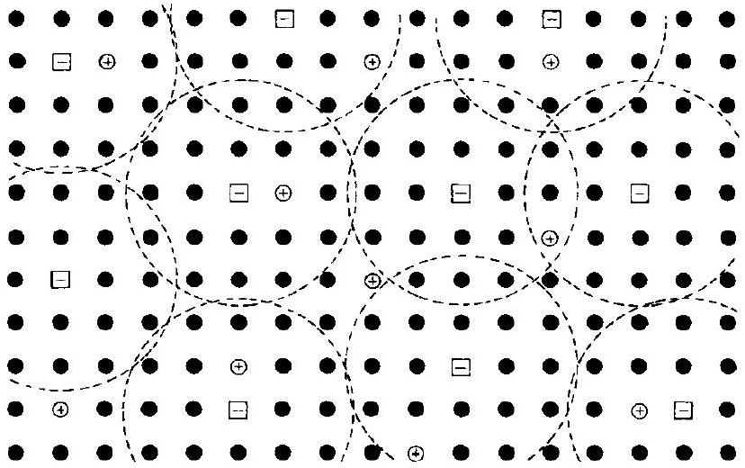
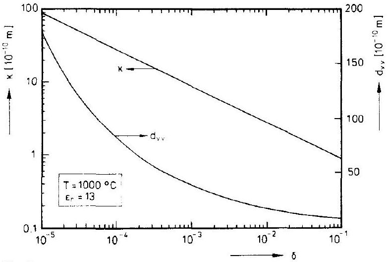
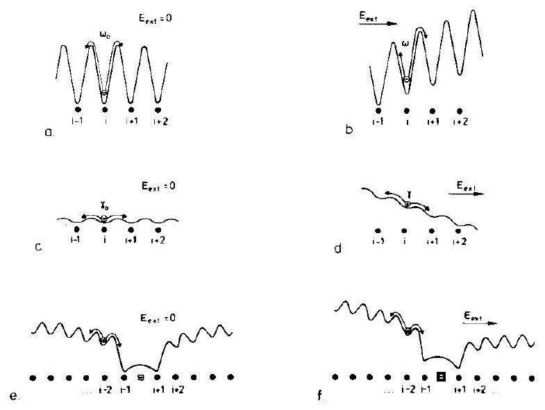
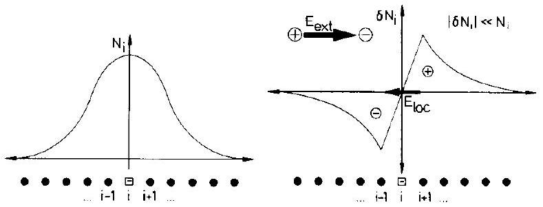
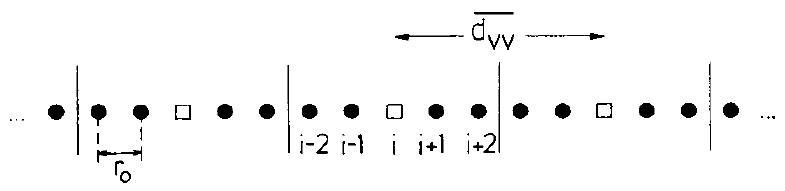
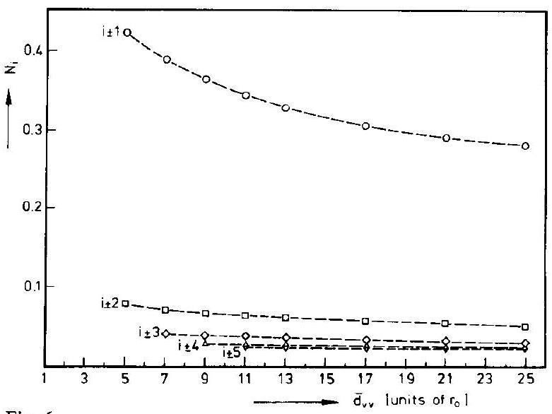
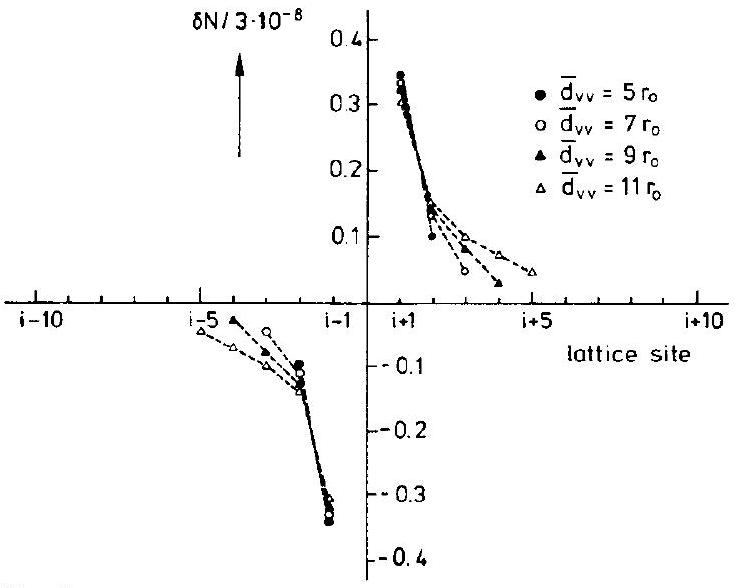
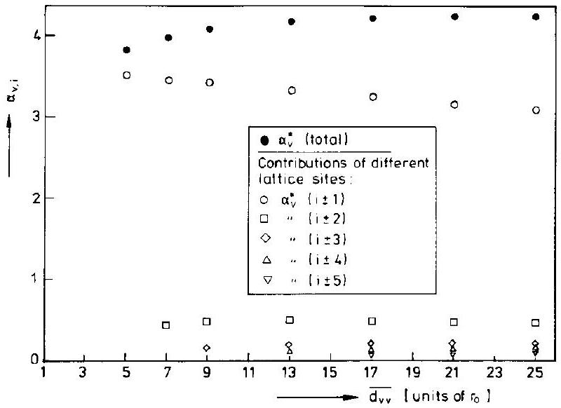

# Electrotransport in Ionic Crystals: II. A Dynamical Model 

J. Janek and M. Martin Institut für Physikalische Chemie und Elektrochemie und Sonderforschungsbereich 173 der Universität Hannover, Callinstr. 3-3A, D-30167 Hannover, Germany

## Key Words: Crystals / Diffusion / Electrochemistry / Electrotransport / Oxides

#### Abstract

A microscopic model of electrotransport in semiconducting ionic crystals is described, which is based on electrostatically interacting hopping charge carriers (cation vacancies and electron holes). Formulating rate equations for the thermally activated motion of electronic and ionic defects in external fields allows for the calculation of stationary charge distributions. In the case of large differences in the mobilities of both defects an adiabatic approximation can be introduced which allows to separate the motion of electron holes and vacancies. The formal problem is identical to the solution of the Poisson-Boltzmann equation for large defect concentrations. An expression for the charge of transport is derived which is equivalent to the Debye-Hückel expression for the relaxation effect but includes distinct geometrical positions around a central point charge.

## 0. Introduction

Investigations of the transport properties of some semiconducting transition metal oxides $\left(\mathrm{Co}_{1-\delta} \mathrm{O}, \mathrm{Fe}_{1-\delta} \mathrm{O}\right.$ and $\mathrm{Cu}_{2-\delta} \mathrm{O}$ ) proove that the fluxes of ionic and electronic defects are coupled dynamically [1-5]. This coupling is well established within the formalism of linear irreversible thermodynamics [6]. Wagner demonstrated the influence of the coupling on measurable transport properties [7].

In the preceeding paper [8] we have shown that the flux coupling phenomenon in disordered ionic crystals can be explained by liquid electrolyte theory, due to a number of properties common in both liquid electrolytes and disordered ionic crystals. However, the use of this theory is limited to the low defect concentration regime, where the electrostatic interaction energy is small compared to the thermal energy. Quantitatively measurable defect concentrations are usually much higher, so that from liquid electrolyte theory, if at all, only qualitative statements can be drawn.

One way to describe solid electrolytes exhibiting higher defect concentrations than those tractable with liquid electrolyte theory is the use of an association model, which we discussed for simple model systems in [8]. But such a model is also only justified at low defect concentrations. The central assumption of associates behaving as point charges is no more valid at high defect concentrations. Rather asso-
ciates have to be regarded as electric dipoles. We will show that one consequence of the use of the association model at too high defect concentrations is a wrong prediction of the concentration dependence of the coupling strength in our model systems.

## I. The Model

In the following we propose a model to account for the dynamic interaction of vacancies and electron holes in a simple semiconducting oxide. Since the oxygen sublattice of the oxide is nearly perfect we can focus on the cation sublattice which is modeled by a regular lattice, built of electrically neutral mass points, negatively charged vacancies and localized positive charges distributed over the neutral mass points (see Fig. 1). This system can be taken as a simplified picture of the cation sublattice of an oxide $\mathrm{A}_{2-\delta} \mathrm{O}$ containing the irregular structure elements $\mathrm{V}_{\mathrm{A}}^{\prime}$ (cation vacancies), and electron holes, $\mathrm{h}^{\cdot}$, for charge compensation. Further elements of our model are the following assumptions:

1. The vacancies move via thermally activated jumps with a limiting jump frequency $\omega_{0}$ (see Fig. 3a). This limiting frequency expresses the mobility for the case of negligible interactions with surrounding charge carriers, i.e. for the case of infinite dilution.

Fig. 1
Part of a cubic cation lattice containing singly charged vacancies and electron holes. The vacancies take random positions, but hold an average distance between itselves

$$
\begin{aligned}
& V^{\prime} \boxminus \\
& h^{\prime} \oplus
\end{aligned}
$$

2. The motion of the electron holes may also be regarded as thermally activated (see Fig. 3b). Their limiting jump frequency, $\gamma_{0}$, is orders of magnitude higher than the jump frequency of the vacancies ( $\gamma_{0} \simeq 10^{5} \omega_{0}$ ). In the present model we assume that the electron holes are localised on regular cation sites (not on vacant cation sites or on oxygen ions).
3. The activation energies $E_{0, \mathrm{i}}^{\mathrm{a}}$ for the limiting jump frequencies of both charge carriers (see section II.4), are determined by the nearest neighbours (oxygen anions), which are assumed to be undisturbed by the presence of point defects.
4. Vacancies and electron holes move in a matrix of $\mathrm{A}^{+}$-ions. They are charged relative to this matrix singly negative resp. singly positive. Consequently, vacancies and holes interact by electrostatic forces. The matrix represents a dielectric medium.
5. All ions remain on their regular crystallographic positions. Lattice deformations around vacancies or holes are not included in this model.
6. The large difference in the mobilities of vacancies and holes allows for the use of an adiabatic approximation, i.e. the electron holes will follow the motion of the vacancies instantaneously.

Fig. 1 shows a small part of an idealized two-dimensional cation sublattice. The vacancies are distributed with an average distance $\overline{d_{\mathrm{VV}}}$, which is concentration dependent. The much more mobile electron holes are distributed between the vacancies. Assuming that the vacancies create a fcc-lattice within a three-dimensional cation sublattice (fcc), $\overline{d_{\mathrm{VV}}}$ can be calculated easily. Fig. 2 shows $\overline{d_{\mathrm{VV}}}$ and the Debyelength $\kappa$ (see Eq. (1)) for this model system as a function of nonstoichiometry $\delta$.

Fig. 2
Debye-length $\kappa$ and mean distance $\overline{d_{\mathrm{VV}}}$ between vacancies for a fcccation sublattice (corresponding to an oxide $\mathrm{A}_{2-\delta} \mathrm{O}$ )

## II. Formal Treatment

In a lattice containing just one charged defect, the activation energies for successive defect jumps are the same, independent of the jump direction. In a real crystal, containing several charged defects, the jumping defect possesses an
additional potential energy due to the electrostatic interaction with the surrounding defects. This interaction energy leads to a correlation of successive jumps of one particle and also to a correlation of jumps of different particles, i.e. to different activation energies for jumps in different directions.

For the case of solid electrolytes with exceptionally high ionic conductivity (and negligible electronic conductivity) Funke developed a model, based on the Debye-Hückeltheory, to explain the frequency-dependent conductivity [9, 10]. In the case of solid electrolytes containing two differently charged defects (vacancy and electron hole), the situation becomes more complex. The correlation of jumps of one charge carrier now depends on the mobility of both different charge carriers. Both charged defects experience the Coulomb fields of equal and countercharged defects, whereby the direct surrounding of every defect is dominated by countercharged defects. A cation vacancy in its potential minimum experiences an attractive interaction with neighbouring electron holes and a repulsive interaction with the neighbouring vacancies. A large difference in the limiting mobilities of both charge carriers leads to different correlation effects for both species: If a highly mobile electron hole jumps, the surrounding electron holes with equal mobility will follow this jump more or less immediately. The much less mobile neighbouring cation vacancies will stay at their positions, i.e. they can be regarded as static. As a result, the jumps of the electron holes are correlated with respect to vacancy positions. If a vacancy jumps, the electron holes will follow this jump immediately. Consequently, vacancy jumps can be regarded as uncorrelated with respect to the electron hole positions.

Within liquid electrolyte theory, this correlation effect can be discussed by introducing the relaxation time $\theta$ [11],

$$
\begin{aligned}
& \Theta=\frac{\left|z_{1}\right|+\left|z_{2}\right|}{\left|z_{2}\right| b_{1}^{0}+\left|z_{1}\right| b_{2}^{0}} \cdot \frac{\left|z_{1}\right|\left|z_{2}\right| \cdot \kappa^{2}}{k_{\mathrm{B}} T} \\
& \kappa=\left(\frac{\varepsilon_{0} \varepsilon_{\mathrm{r}} k_{\mathrm{B}} T}{2 e_{0}^{2} N_{\mathrm{L}}}\right)^{1 / 2} \cdot\left(\frac{1}{2} \sum_{\mathrm{i}=1}^{2} z_{\mathrm{i}}^{2} c_{\mathrm{i}}\right)^{-1 / 2},
\end{aligned}
$$

which is (for the case of a simple binary electrolyte) determined by the limiting mobilities $b_{\mathrm{i}}^{0}$ ( $b_{\mathrm{i}}^{0}$ represents the mobility of a defect at infinite dilution, i.e. without interaction with other defects) of both charge carriers and the Debye-length $\kappa$ ( $k_{\mathrm{B}}$ : Boltzmann constant, $T$ : absolute temperature, $\varepsilon_{0}$ : dielectric field constant, $\varepsilon_{\mathrm{r}}$ : relative dielectric constant, $e_{0}$ : electron charge, $N_{\mathrm{L}}$ : Avogadro's number, $z_{\mathrm{j}}$ : formal charge number, $c_{\mathrm{i}}$ : molar concentration). $\theta$ determines the time which a charge cloud around a central charge needs to relax after a disturbance of the stationary distribution. By using the relations

$$
b_{\mathrm{h}}^{0}=\frac{D_{\mathrm{h}}^{0}}{k_{\mathrm{B}} T}=\frac{1}{6 k_{\mathrm{B}} T} \cdot R_{0}^{2} \cdot \omega_{0}
$$

$$
b_{\mathrm{v}}^{0}=\frac{D_{\mathrm{v}}^{0}}{k_{\mathrm{B}} T}=\frac{1}{6 k_{\mathrm{B}} T} \cdot R_{0}^{2} \cdot \gamma_{0},
$$

the relaxation time for our model system ( $z_{1}=z_{\mathrm{V}}=-1$; $z_{2}=z_{\mathrm{h}}=1$ ) can be expressed as a function of the jump frequencies of both charge carriers:

$$
\Theta=\frac{12}{\omega_{0}+\gamma_{0}} \cdot\left(\frac{\kappa}{R_{0}}\right)^{2} .
$$

$R_{0}$ represents the jump length for both charge carriers, which is identical to the lattice parameter, whereas $D_{i}^{0}$ represents the self-diffusion coefficient for the limit of infinite dilution. Eq. (4) shows that the jump frequency of the more mobile charge carrier determines the relaxation time. Using our assumption, $\gamma_{0}=10^{5} \omega_{0}$, and introducing characteristic times between successive jumps, $\tau_{\mathrm{V}}=\omega_{0}^{-1}$ and $\tau_{\mathrm{h}}=\gamma_{0}^{-1}$, the relaxation time results as

$$
\Theta \simeq 12 \tau_{\mathrm{h}} \cdot\left(\frac{\kappa}{R_{0}}\right)^{2}
$$

In our model system, the Debye-length $\kappa$ is usually larger than the lattice parameter $R_{0}$, so that the relaxation time of the charge cloud is always larger than the characteristic time between successive jumps of an electron hole. It means that the charge cloud around an electron hole can be regarded as static. Introducing the characteristic time between successive vacancy jumps,

$$
\Theta \simeq 12 \cdot 10^{-5} \tau_{\mathrm{V}} \cdot\left(\frac{\kappa}{R_{0}}\right)^{2}
$$

we recognize the relaxation time to be much smaller than this characteristic time. This means that the relaxation of the charge cloud around a vacancy after a jump of the vacancy occurs almost immediately.

Figs. 3e and 3f show activation barriers (potential energies) for jumps of an electron hole in the neighborhood of a vacancy. The negative charge of the vacancy creates a Coulomb trap for the electron hole and modifies its activation energies for jumps. If an electron hole becomes trapped, the result is a vacancy-hole pair that can be regarded as an electrical dipole. In the absence of an external electric field (Fig. 3a), the distribution of the electron hole around the vacancy will be symmetric (see Fig. 4a). In an external dielectric-field, $E_{\text {ext }}$, the charge distribution around the vacancy becomes asymmetric due to the change in activation energies (Fig. 3f), and produces an additional local electrical field around the vacancy (see Fig. 4b).

The aim of the subsequent procedure is to calculate the influence of the described correlation on the transport coefficients of our model system. First, we will show in section II. 1 that the cross coefficient, connecting vacancy and electron hole fluxes, is directly determined by the local electric field around the charge carriers. This local electric field

Fig. 3
Activation barriers for vacancies and electron holes in an one-dimensional crystal: (a) shows the activation barriers for the vacancies in the absence, (b) in the presence of an external electric field; (c) and (d) show the same for the electron holes. (e) and (f) demonstrate the influence of a vacancy on the activation barriers of an electron hole

Fig. 4
Charge distribution of electron holes around a vacancy in the absence resp. presence of an external electric field. It is important to note that $\delta N$ represents the deviation of the charge distribution due to an external electric field from the equilibrium distribution. In this figure $\delta N$ is strongly magnified

has to be calculated as a summation of the Coulomb fields of the surrounding point charges. The approach which we use for the calculation of these Coulomb fields is based on finding stationary solutions for rate equations of the electron hole population at each lattice site (section II.2). The large difference in mobilities of vacancies and electron holes allows to formulate these rate equations assuming static vacancy positions. In section II.4, it is shown how the electron hole jump frequencies are influenced by both external and additional local fields, and that both contributions can be separated. Determining the jump frequencies as functions of vacancy and electron hole positions, the rate equations can be solved, assuming a stationary state (section II.5). The solution gives the electron hole distribution within the lattice and allows for the calculation of the local electric field.

To account for the influence not only of the nearest neighbour surrounding on the local field, a self consistent charge distribution has to be determined (section II.6). As the final result an expression for the charge of transport of the vacancies, $\alpha_{\mathrm{V}}^{*}$, is derived (section II.7). This expression is closely related to the expression given in [8], derived from liquid electrolyte theory.

In sections III. 1 and III. 2 we give quantitative results from calculations of $\alpha_{\mathrm{V}}^{*}$ for our model system, based on one- and three-dimensional lattices. The results are comparable to results from liquid electrolyte theory and show, within the limits of our assumptions, that the dynamical interaction between vacancy and electron hole fluxes is appreciable.

## II. 1 The Vacancy Flux

The fluxes $j_{\mathrm{i}}$ of vacancies ( V ) and electron holes ( h ) are given within (linear) irreversible thermodynamics as
$j_{\mathrm{V}}=-L_{\mathrm{VV}} \cdot \nabla \eta_{\mathrm{V}}-L_{\mathrm{Vh}} \cdot \nabla \eta_{\mathrm{h}}$
$j_{\mathrm{h}}=-L_{\mathrm{hV}} \cdot \nabla \eta_{\mathrm{V}}-L_{\mathrm{hh}} \cdot \nabla \eta_{\mathrm{h}}$,
determined by the gradients of the electrochemical potentials $\eta_{1}$,
$\eta_{\mathrm{i}}=\mu_{\mathrm{i}}+z_{\mathrm{i}} F \phi$,
and the phenomenological transport coefficients $L_{\mathrm{ij}}$. In the case of a chemical homogeneous semiconductor (crystal length: $\Delta x)$, a voltage $U_{\text {ext }}$,
$U_{\mathrm{ext}}=\Delta \phi^{\mathrm{Me}}$,
applied by the use of inert metallic electrodes ( Me ), produces within the homogeneous crystal ( $\nabla \mu_{\mathrm{i}}=0$ ) an electric field $E_{\text {ext }}$,
$E_{\mathrm{ext}}=-\frac{\Delta \phi^{\mathrm{Me}}}{\Delta x} \cdot e$,
where $e$ is the unit vector in the direction of the external electric field. This field causes the driving forces
$\nabla \eta_{\mathrm{h}}^{\mathrm{AX}}=-\left(z_{\mathrm{h}} F\right) \cdot \boldsymbol{E}_{\mathrm{ext}} \quad \nabla \eta_{\mathrm{V}}^{\mathrm{AX}}=-\left(z_{\mathrm{V}} F\right) \cdot \boldsymbol{E}_{\mathrm{ext}}$
for the fluxes of vacancies and holes, provided that no polarization takes place at the interfaces between the electrodes and the crystal. Insertion of these expressions into Eq. (7) gives

$$
j_{\mathrm{V}}=\left(z_{\mathrm{V}} F\right) L_{\mathrm{VV}} \cdot\left(E_{\mathrm{ext}}+\frac{z_{\mathrm{h}}}{z_{\mathrm{V}}} \cdot \frac{L_{\mathrm{Vh}}}{L_{\mathrm{VV}}} \cdot E_{\mathrm{ext}}\right)
$$

and shows that the influence of the cross coefficient $L_{\mathrm{Vh}}$ can be understood as an electric field adding to the external field. As suggested in the previous paper [8], from the analogy with liquid electrolytes this additional field arises from the asymmetry of the Debye-Hückel screening cloud induced by the external field (relaxation effect). Therefore we will use the following definitions:
$E_{\text {loc }}=E_{\text {ext }}+E_{\text {relax }} \quad E_{\text {relax }}=\frac{z_{\mathrm{h}}}{z_{\mathrm{V}}} \cdot \frac{L_{\mathrm{Vh}}}{L_{\mathrm{VV}}} \cdot E_{\text {ext }}$.

Defining the ratio of $L_{\mathrm{Vh}}$ and $L_{\mathrm{VV}}$ as $\alpha_{\mathrm{V}}^{*}$, the charge of transport of the vacancies [3],
$\alpha_{\mathrm{V}}^{*}=\frac{L_{\mathrm{Vh}}}{L_{\mathrm{VV}}}$,

Eq. (13) can also be written as
$j_{\mathrm{V}}=F L_{\mathrm{VV}} \cdot\left(z_{\mathrm{V}}+\alpha_{\mathrm{V}}^{*}\right) \cdot E_{\mathrm{ext}}$
with $z_{\mathrm{h}}=1$. This relation demonstrates that the influence of the cross coefficient formally can be described as a deviation of the vacancy charge from its formal value $z_{\mathrm{V}}$. The kinetic term $\alpha_{\mathrm{V}}^{*}$ has to be added to the formal charge, $z_{\mathrm{V}}$, for the correct calculation of the vacancy flux in an external electric field. Regarding Eqs. (14) and (15), the charge of transport can be expressed as the ratio of the additional local electric field $E_{\text {relax }}$ around a vacancy and the external electric field, $E_{\text {ext }}$ :
$\alpha_{\mathrm{V}}^{*}=\frac{z_{\mathrm{V}}}{z_{\mathrm{h}}} \cdot \frac{E_{\text {relax }}}{E_{\text {ext }}}$.

This local electric field at a position $\boldsymbol{R}_{\mathrm{V}}$ of a vacancy can be calculated by a summation of the Coulomb fields produced by all charge carriers i present in the crystal:
$\boldsymbol{E}_{\text {relax }}\left(\boldsymbol{R}_{\mathrm{V}}\right)=\frac{e_{0}}{4 \pi \varepsilon_{0} \varepsilon_{\mathrm{r}}}$

$$
\left[z_{\mathrm{h}} \sum_{\substack{\mathrm{i} \\ \text { holes }}} N\left(\boldsymbol{r}_{\mathrm{i}}\right) \frac{\left(\boldsymbol{R}_{\mathrm{V}}-\boldsymbol{r}_{\mathrm{i}}\right)}{\left|\boldsymbol{R}_{\mathrm{V}}-\boldsymbol{r}_{\mathrm{i}}\right|^{3}}+z_{\mathrm{V}} \sum_{\substack{\mathrm{j} \\ \text { vacancies }}} N_{\mathrm{V}}\left(\boldsymbol{r}_{\mathrm{j}}\right) \frac{\left(\boldsymbol{R}_{\mathrm{V}}-\boldsymbol{r}_{\mathrm{j}}\right)}{\left|\boldsymbol{R}_{\mathrm{V}}-\boldsymbol{r}_{\mathrm{j}}\right|^{3}}\right]
$$

In the absence of external electric fields this relaxation field vanishes due to the homogeneous charge distribution. Fluctuations of charge carrier concentrations produce small but negligible temporary local fields.

For the calculation of the local field around a vacancy in the presence of an external electric field, we assume that the influence of an asymmetric distribution of neighbouring vacancies on the local field is small compared to the influence of the electron holes.

## II. 2 The Rate Equations

According to our assumptions (see section I), the dynamics of electron holes in the lattice can be described by rate equations of the form
$\dot{N}_{\mathrm{i}}=-N_{\mathrm{i}} \cdot \sum_{\mathrm{j}=1}^{\mathrm{k}} \gamma_{\mathrm{ij}}+\sum_{\mathrm{j}=1}^{\mathrm{k}} N_{\mathrm{j}} \cdot \gamma_{\mathrm{ji}}$,
where $\gamma_{\mathrm{ij}}$ represents the electron hole jump frequency between lattice sites i and $\mathrm{j} . N_{\mathrm{i}}$ gives the (electron hole) parti-
cle density on the i-th lattice site, $\dot{N}_{\mathrm{i}}$ equals the change of the particle density on the i-th lattice site with time. Eq. (19) means that a change of the electron hole density with time on the i-th lattice site depends on the charge densities at all neighbour sites and on the jump frequencies from and to the i-th lattice site.

A crystal, built of $n$ lattice sites has to be described by a system of $n$ rate equations, of the form given in Eq. (19). In matrix form this system is given by
$\dot{N}=\hat{\Gamma} \cdot N$
with the vector $N=\left(N_{1}, N_{2}, \ldots N_{\mathrm{n}}\right)$ and the matrix elements
$\Gamma_{\mathrm{ij}}=-\delta_{\mathrm{ij}} \sum_{\mathrm{k}=1}^{\mathrm{n}} \delta_{\mathrm{ik}}^{*} \cdot \gamma_{\mathrm{ik}}+\left(1-\delta_{\mathrm{ij}}\right) \delta_{\mathrm{ij}}^{*} \cdot \gamma_{\mathrm{ji}}$.

The modified Kronecker symbol $\delta_{\mathrm{ij}}^{*}$ is defined as
$\delta_{\mathrm{ij}}^{*}=1 \Leftrightarrow$ lattice sites i and j are neighbour sites
$\delta_{\mathrm{ij}}^{*}=0 \Leftrightarrow$ lattice sites i and j are no neighbour sites.

## II. 3 The Lattice

According to Eq. (20), the system of rate equations can be formulated, containing the complete information about the distribution of the electron holes over all lattice sites. A general solution is, however, impossible due to the defectdefect interaction. To obtain approximate solutions it is common to define a small part of a lattice (cell) with representative properties, containing only a small number of lattice sites [12]. The cell used here is a specially defined part of our model lattice, containing just one vacancy and one electron hole. The advantages of such a choice are obvious:

1. In a first step the distribution of a single electron hole around a single, static vacancy can be calculated, excluding the influence of the surrounding charge carriers. Periodic boundary conditions can be used to simulate an extended crystal.
2. In a second step, the influence of surrounding charges can be included by distributing copies of the calculated cell around the central cell and taking their contribution to the Coulomb field into account.

Fig. 5 shows a small part of an one-dimensional lattice. If we assume equal distances between all neighbouring vacan-

Fig. 5
One-dimensional lattice with vacancies at a constant distance $d_{\mathrm{VV}}$. The lattice depicted can be regarded as composed of a large number of unit cells containing one vacancy and four surrounding lattice sites

cies, the concentration of vacancies (electron holes) is determined by the number of lattice sites creating one cell (in Fig. 5 the site fraction of vacancies equals $1 / 5$ ).

## II. 4 The Jump Frequencies

Regarding the electron holes, each lattice site is characterized by a potential energy with respect to the vacancy positions, and by activation energies for jumps to the neighbouring lattice sites. These energies are determined by superposition of the undisturbed lattice potential and the electrostatic potential determined by the surrounding charge carriers. The jump frequencies of a charge in an otherwise perfect lattice are isotropic. The jump frequencies for a charge in the vicinity of another electric charge become anisotropic. We define the jump frequency of an electron hole in the absence of other charges and external fields as
$\gamma_{0}=v \cdot \exp \left(-\frac{E_{0, \mathrm{~h}}^{\mathrm{a}}}{k_{\mathrm{B}} T}\right)$,
where $v$ represents a constant (concentration independent) frequency factor and $E_{0}^{\mathrm{a}}$ the activation energy. The modified jump frequency in the presence of electric fields (Coulomb fields or external fields) can be written as (see also Fig. 6)
$\gamma_{\mathrm{ij}}=v \cdot \exp \left(-\frac{\left(E_{0, \mathrm{~h}}^{\mathrm{a}}+\Delta E_{\mathrm{ij}}^{\mathrm{a}}\right)}{k_{\mathrm{B}} T}\right)=\gamma_{0} \cdot \exp \left(-\frac{\Delta E_{\mathrm{ij}}^{\mathrm{a}}}{k_{\mathrm{B}} T}\right)$.

In the present case, both the additional local field $E_{\text {relax }}(r)$, which is due to all point charges, and the external field $E_{\text {ext }}$ modify the activation energy for jumps between lattice sites i and j (see Fig. 6):

Fig. 6
Electron hole distribution in the absence of an external electric field for an one-dimensional lattice as a function of the vacancy distance (vacancy concentration); $N_{\mathrm{i}}$ represents the partial positive charge on the various lattice sites around a vacancy (at positions $i \pm 1, i \pm 2, \ldots$ ). The sum of the partial charges $N_{\mathrm{i}}$ for a choosen concentration is equal to one positive electron charge

$$
\begin{aligned}
\Delta E_{\mathrm{ij}}^{\mathrm{a}} & =\left(z_{\mathrm{i}} e_{0}\right) \int_{\mathbf{r}_{\mathrm{i}}}^{\mathbf{r}_{\mathrm{a}}} E_{\mathrm{relax}}(\boldsymbol{r}) \mathrm{d} \boldsymbol{r}+\left(z_{\mathrm{i}} e_{0}\right) E_{\mathrm{ext}} \cdot\left(\boldsymbol{r}_{\mathrm{a}}-\boldsymbol{r}_{\mathrm{i}}\right) \\
& =\Delta E_{\mathrm{ij}, \text { relax }}^{\mathrm{a}}+\Delta E_{\mathrm{ij}, \text { ext }}^{\mathrm{a}}
\end{aligned}
$$

The influence of the local and the external field on the jump frequencies is different. Local fields can reach appreciable field strengths. The electric field of an elementary point charge is $E_{\text {loc }} \simeq 10^{10} \mathrm{~V} \mathrm{~m}^{-1}$ in a distance of a typical lattice parameter ( $3 \AA$ ). Thus the potential energy of one elementary charge in the vicinity of another elementary charge takes values comparable or even larger than the thermal energy.

In contrast, the field strength of external fields normally used for conductivity experiments is $E_{\mathrm{ext}} \simeq 10^{2}-10^{3} \mathrm{~V} \mathrm{~m}^{-1}$, which means that $E_{\mathrm{ij}, \text { ext }}^{\mathrm{a}}$ is very small compared to $k_{\mathrm{B}} T$. Consequently, that part of the Boltzmann factor in Eq. (23), including the external field, can be linearized, whereas the influence of local fields has to be included by an exponential term:

$$
\gamma_{\mathrm{ij}}=\gamma_{0} \cdot \exp \left(-\frac{\Delta E_{\mathrm{ij}, \text { relax }}^{\mathrm{a}}}{k_{\mathrm{B}} T}\right) \cdot\left(1+\frac{\Delta E_{\mathrm{ij}, \text { ext }}^{\mathrm{a}}}{k_{\mathrm{B}} T}\right) .
$$

## II.5 Stationary States

In the stationary state, where the particle density $N_{\mathrm{j}}$ at every site $i$ is constant in time,

$$
\dot{N}=0,
$$

one obtains, for both absence or presence of an external electric field, a Boltzmann distribution,

$$
\frac{N_{\mathrm{j}}}{N_{\mathrm{i}}}=\frac{\exp \left(-\frac{E_{\mathrm{j}}}{k_{\mathrm{B}} T}\right)}{\exp \left(-\frac{E_{\mathrm{i}}}{k_{\mathrm{B}} T}\right)},
$$

for the electron hole densities $N_{\mathrm{i}}$, as can be prooved by combining Eqs. (19), (25) and (26). As discussed above the presence of an external electric field leads to a linear modification of the jump frequencies $\gamma_{\mathrm{ij}}$ in the matrix elements $\Gamma_{\mathrm{ij}}$ :

$$
\begin{aligned}
\Gamma_{\mathrm{ij}}= & -\delta_{\mathrm{ij}} \cdot \sum_{\mathrm{k}=1}^{\mathrm{n}} \delta_{\mathrm{ik}}^{*} \gamma_{\mathrm{ik}} \cdot\left(1+\frac{z_{\mathrm{h}} e_{0} E_{\mathrm{ext}} \cdot\left(r_{\mathrm{ik}}^{\mathrm{a}}-r_{\mathrm{i}}\right)}{k_{\mathrm{B}} T}\right) \\
& +\left(1-\delta_{\mathrm{ij}}\right) \cdot \delta_{\mathrm{ij}}^{*} \gamma_{\mathrm{ji}} \cdot\left(1+\frac{z_{\mathrm{h}} e_{0} E_{\mathrm{ext}} \cdot\left(r_{\mathrm{ji}}^{\mathrm{a}}-r_{\mathrm{j}}\right)}{k_{\mathrm{B}} T}\right)
\end{aligned}
$$

With Eqs. (20), (21), (25) and (28), the condition for stationarity can be written as

$$
0=\left(\hat{\Gamma}_{0}+\frac{z_{\mathrm{h}} e_{0} E_{\mathrm{ext}}}{k_{\mathrm{B}} T} \hat{\Gamma}_{\mathrm{relax}}\right) \cdot N,
$$

where $\hat{\Gamma}_{0}$ is now independent of $E_{\text {ext }}$ while $\Gamma_{\text {relax }}$ is the proportionality factor for $E_{\text {ext }}$. The matrix elements of $\hat{\boldsymbol{\Gamma}}_{\text {relax }}$ are given as

$$
\begin{aligned}
\Gamma_{\mathrm{ij}}^{\mathrm{relax}}= & -\delta_{\mathrm{ij}} \cdot \sum_{\mathrm{k}=1}^{\mathrm{n}} \delta_{\mathrm{ik}}^{*} \gamma_{\mathrm{ik}} \cdot\left[\boldsymbol{e}\left(r_{\mathrm{ik}}^{\mathrm{a}}-r_{\mathrm{i}}\right)\right] \\
& +\left(1-\delta_{\mathrm{ij}}\right) \cdot \delta_{\mathrm{ij}}^{*} \gamma_{\mathrm{ji}} \cdot\left[\boldsymbol{e}\left(r_{\mathrm{ji}}^{\mathrm{a}}-r_{\mathrm{j}}\right)\right]
\end{aligned}
$$

Since the factor ( $z_{\mathrm{h}} e_{0} E_{\mathrm{ext}} / k_{\mathrm{B}} T$ ) is very small compared to 1 (see discussion above), the external field leads only to a small linear deviation $\delta N$ of the electron hole distribution with respect to the distribution $N_{0}$ in the absence of external fields:

$$
N=N_{0}+\delta N .
$$

Combining Eqs. (29) and (31) we get

$$
0=\left(\hat{\Gamma}_{0}+\frac{z_{\mathrm{h}} e_{0} E_{\mathrm{ext}}}{k_{\mathrm{B}} T} \hat{\Gamma}_{\mathrm{relax}}\right) \cdot\left(N_{0}+\delta N\right),
$$

which gives, by neglecting the small second order term:

$$
\hat{\Gamma}_{0} \cdot \delta N=-\left(\frac{z_{\mathrm{h}} e_{0} E_{\mathrm{ext}}}{k_{\mathrm{B}} T}\right) \hat{\Gamma}_{\mathrm{relax}} \cdot N_{0} .
$$

The deviation $\delta N$ in the electron hole distribution caused by an external electric field results as the solution of an inhomogeneous system of linear equations. For solving Eq. (33), firstly the electron hole density $N_{0}$ in the absence of an external electric field has to be calculated using Eq. (29) with $E_{\text {ext }}=0$.

## II.6 Self Consistent Charge Distribution

In contrast to the small lattice cell containing a pair of countercharged defects, a real lattice contains a large number of defects interacting via Coulomb interaction over long distances.

An exact calculation of the local field at a discrete lattice site should include the positions of all point charges in the lattice. To account for this we used the following stepwise procedure:
(1) The electron hole distribution is computed for a small lattice cell containing one vacancy and one electron hole. The diameter of the cell corresponds to $\overline{d_{\mathrm{VV}}}$. (2) The resulting distribution from step (1) has to be corrected for the influence of surrounding vacancies and electron holes in a macroscopic lattice. For this we create a set of copies of the initially computed charge distribution, which are placed around the central cell. Then, the electron hole distribution in the central cell is computed again, but taking into ac-
count the Coulomb interaction with the vacancies and holes in the surrounding lattice cells. (3) The new charge distribution calculated for the central cell is again projected around the central lattice cell and a new local electric field in the central cell is computed. This procedure is repeated till a self consistent charge distribution of holes and vacancies is reached.

## II. 7 The Charge of Transport

With Eqs. (17), (18) and (33) an expression for the charge of transport $\alpha_{\mathrm{V}}^{*}$ of the vacancies can be given,

$$
\alpha_{\mathrm{V}}^{*}=-\frac{\left(z_{\mathrm{v}} e_{0}\right) \cdot\left(z_{\mathrm{h}} e_{0}\right)}{4 \pi \varepsilon_{0} \varepsilon_{\mathrm{r}} k_{\mathrm{B}} T} \cdot \sum_{\mathrm{i}}\left[\left(\hat{\Gamma}_{0}^{-1} \hat{\Gamma}_{\text {relax }}\right) z_{\mathrm{h}} N_{0}\right] \cdot \frac{1}{\left|R-r_{\mathrm{i}}\right|^{2}},
$$

which is determined by the asymmetric part of the electron hole distribution around a vacancy in the presence of an external electric field:

$$
\delta N=\frac{z_{\mathrm{h}} e_{0} E_{\mathrm{ext}}}{k_{\mathrm{B}} T} \cdot\left[\left(\hat{\Gamma}_{0}^{-1} \hat{\Gamma}_{\mathrm{relax}}\right) N_{0}\right] .
$$

$\alpha_{\mathrm{V}}^{*}$ is (within a linear approximation) independent of the strength of the external electric field.

## III. Results

## III.1 Results for One-dimensional Lattices

Using the described procedure, we computed the electron hole distributions around a vacancy in an one-dimensional lattice (see Fig. 5) for different vacancy concentrations. Fig. 6 demonstrates the symmetric electron hole distribution along the different cation sites neighbouring a vacancy

Fig. 7
Asymmetric electron hole distribution in the presence of an external electric field for an one-dimensional lattice as a function of the lattice site for different vacancy distances (vacancy concentrations); $\delta N_{\mathrm{i}}$ represents the deviation of the charge distribution on the various lattice sites around a vacancy (at positions $i \pm 1, i \pm 2, \ldots$ ) from the equilibrium distribution (see Fig. 6). It should be noted that $\delta N_{\mathrm{i}}$ is much smaller than $N_{\mathrm{i}}$

in the absence of an external electric field. $N_{\mathrm{i}} e_{0}$ has to be regarded as the partial positive charge located at a distinct lattice site. The sum of all partial charges in a calculated cell equals one elementary charge. Fig. 7 shows the asymmetric part of the electron hole distribution in the presence of an external electric field. The deviation of the charge distribution from the stationary distribution in the absence of an electric field is very small. Fig. 8 presents the charge of transport computed for a singly charged vacancy. The results, presented in Figs. 7 and 8, clearly demonstrate that the electrostatic force between vacancies and electron holes is sufficient to explain a strong kinetic coupling between both, measured by the vacancy charge of transport.

Fig. 8
Calculated values for the charge of transport of the singly charged vacancies as a function of the vacancy distance (vacancy concentration) for an one-dimensional lattice. The figure shows the total charge of transport for each concentration (filled circles) and the contributions of the different lattice sites around the vacancy to the total charge of transport

## III. 2 Results for Three-dimensional Lattices

The calculation of the charge of transport for threedimensional lattices requires much more computational work than for one-dimensional lattices. The coordination number in the case of a fcc-lattice is 12 , leading to a much more complicated system of rate equations. Therefore, we calculated the charge of transport for only one vacancy concentration, using the following assumptions:

1. To simplify the calculation we assume the vacancies to be ordered, creating themselves a fcc-lattice within the fcc-cation lattice. With respect to this assumption, the geometry is fixed by a dodecahedron.
2. The influence of the surrounding charges on the charge distribution in the chosen unit cell is taken into account by the same self-consistent procedure as described for one-dimensional lattices.

With these assumptions, we calculated the charge of transport for a singly charged vacancy, surrounded by 54 lattice sites of a fcc-lattice with a lattice parameter $r_{0}=0.3 \mathrm{~nm}$.

The site fraction of the vacancies, which is equivalent to the deviation from stoichiometry, $\delta$, is then $1.8 \%$, and the mean distance between two vacancies is approximately 15 nm . For this concentration, the charge of transport of the vacancy results as

$$
\alpha_{\mathrm{v}}=1.26\left(\varepsilon_{\mathrm{r}}=10 ; T=1273 \mathrm{~K} ; z_{\mathrm{h}}=-z_{\mathrm{v}}=1\right) .
$$

The contribution of the different coordination spheres around the vacancy results as

$$
\alpha_{v}^{(1)}=0.94 \quad \alpha_{v}^{(2)}=0.32,
$$

where the superscript (1) denotes the first coordination sphere, containing the 12 next neighbour sites, and (2) denotes the second coordination sphere, containing the 42 next nearest neighbour sites.

A comparison with the charges of transport calculated for one-dimensional lattices shows that those are by a factor of three larger. In addition, the influence of the second coordination sphere onto the charge of transport is larger for the case of a three-dimensional lattice. This effect is due to the fact that the number of sites in different coordination spheres is constant for a one-dimensional lattice, but increases drastically with distance for the three-dimensional lattice.

## IV. Discussion

The intention of our work is to give a simple dynamic picture for the electrotransport phenomenon in semiconductors that is not restricted to dilute electrolytes, and that helps to understand the physics behind the coupling phenomenon.

The formal analysis explicitly shows that the dynamic interaction between moving vacancies and electron holes in our model system, expressed via the charge of transport, can be interpreted on the basis of electrostatic interaction. In the non-equilibrium state a relaxation field exists at the position of a vacancy, reducing the externally applied electric field. Comparing our final result for the charge of transport, Eq. (34), with the equivalent expression derived from liquid electrolyte theory [8],

$$
\alpha_{\mathrm{V}}^{*}=-\frac{\left(z_{\mathrm{V}} e_{0}\right) \cdot\left(z_{\mathrm{h}} e_{0}\right)}{4 \pi \varepsilon_{0} \varepsilon_{\mathrm{r}} k_{\mathrm{B}} T} \cdot \frac{1-\sqrt{1 / 2}}{3} \cdot \frac{1}{\kappa},
$$

one recognizes the close relationship between both equations. The only difference is given by the expression for the geometrical distribution of counter charges around the central charge. Within the Debye-Hückel theory, the counter charge distribution is assumed to be isotropic and continuous. Clearly, this approximation can only be used at low defect concentrations, if the number of lattice sites within a distinct radius between two spherical surfaces is large. Within our model, such an approximation is avoided by taking all surrounding lattice sites and the corresponding
charge concentrations into account. By doing so, the relaxation field can be calculated for higher charge carrier concentrations.

A comparison between our result for the three dimensional lattice at a vacancy concentration of $1.8 \% \left(\alpha_{\mathrm{V}}^{*}=1.26\right)$ and the corresponding result from the application of the Debye-Hückel theory to the equivalent system $\mathrm{A}_{2-\delta} \mathrm{O}(\alpha \stackrel{*}{\mathrm{~V}} \approx 0.5)$ in [8] shows no satisfactory agreement. But it is important to note that this comparison is useless because the Debye-Hückel theory is not valid for such high concentrations.

One conclusion is that the use of the electrostatic interaction within our approach leads to an explanation of both the kinetic cross effect between vacancies and holes, and of the thermodynamic approach of associates. As shown in Fig. 6 the electron density in the direct vicinity of a vacancy is higher than on next nearest lattice sites. As expected, this density decreases with decreasing defect concentration. Another feature of our calculations concerns the fact that $\alpha_{\mathrm{V}}^{*}$, calculated for one-dimensional lattices, increases with decreasing vacancy concentration. This increase may be qualitatively understood by the fact that with increasing concentration the asymmetrical charge densities (produced by electron holes) around vacancies overlap and therefore will be reduced. Our numerical results show that this tendency is reversed by further decreasing the vacancy concontration. Because the resulting maximum of $\alpha \stackrel{*}{\mathrm{~V}}$ is very flat, this result cannot be seen from Fig. 8.

As we have stated in the previous paper [8] it is important to realize that the charge of transport of the vacancy can take appreciable values if one assumes that $L_{22} \approx 10^{5} L_{11}$. From the relation $L_{12} L_{21} \leq L_{11} L_{22}$ which is a direct consequence of a positive entropy production for irreversible processes the limits for the charge of transport $\alpha_{\mathrm{V}}^{*}$ are $-\sqrt{10^{5}} \leq \alpha_{\mathrm{V}}^{*} \leq \sqrt{10^{5}}$.

The problem described in this paper is intimately related to the question of correlation of ionic motion in superionic conductors. As mentioned above, the Debye-Hückel approach is also used to interpret conductivity behaviour of these materials. In [13] Schmalzried investigated the correlation of the movement of oxygen vacancies in doped zirconia. He suggested that the electrostatic interaction between moving defects leads to a correlation of their jumps. These basic ideas of Schmalzried were taken in by Funke to develop a model for the ionic jump correlation in solid silver-electrolytes $[9,10]$. The main difference between these works to our problem is the fact that in (ideal) solid electrolytes only one mobile charge carrier exists. Our approach is applicable to systems containing one highly mobile charge carrier (electron or electron hole) and one much less mobile charge carrier (ionic vacancy or interstitial ion). One system, fulfilling these requirements, may be $\mathrm{Cu}_{2} \mathrm{O}$. At low and intermediate oxygen activities, the defect structure of this oxide is governed by cation vacancies and electron holes [14]. Unfortunately, not enough data are existing in the literature to determine the charge of transport of the vacancies. Therefore, it seems desirable to realize experiments for the determination of $\alpha \stackrel{*}{\mathrm{~V}}$ in $\mathrm{Cu}_{2} \mathrm{O}$.

We would like to thank H. Schmalzried for his helpful support and his motivation and H.-I, Yoo for valuable discussions related to the charge of transport. One of us (J.J.) is grateful to the Fonds der Chemischen Industrie for financial support. We are indepted to the Deutsche Forschungsgemeinschaft and the SFB 173 of the University of Hannover.

## References

[1] J. Janek, Thesis, University of Hannover (Germany) 1992.
[2] M. Schröder, Diplomarbeit, University of Hannover (Germany) 1991.
[3] H.-I. Yoo, M. Martin, H. Schmalzried, and J. Janek, Z. Phys. Chem. N.F. 168, 129 (1990).
[4] M. Martin and H.-I. Yoo, Radiat. Eff. Def. Solids, 119-121, 735 (1991).
[5] H.-I. Yoo and M. Martin, Ceram. Trans. 24, 103 (1991).
[6] S. R. De Groot and P. Mazur, Non-Equilibrium Thermodynamics, North-Holland, Amsterdam, 1962.
[7] C. Wagner, Progr. Solid State Chem. 10 (1), 3 (1975).
[8] J. Janek, M. Martin, and H.-I. Yoo, Ber. Bunsenges. Phys. Chem. 98, 655 (1994).
[9] K. Funke and I. Riess, Z. Phys. Chem. N. F. 140, 217 (1984).
[10] K. Funke, Progr. Solid State Chem. 22, 111 (1993).
[11] P. Debye and H. Falkenhagen, Phys. Z. 29, 401 (1928).
[12] Computer Simulation of Solids, ed. by C.R.A. Catlow and W.C. Mackrodt, Springer, Berlin, 1982.
[13] H. Schmalzried, Z. Phys. Chem. N.F. 105, 47 (1977).
[14] J. Xue and R. Dieckmann, J. Phys. Chem. Sol. 51 (11), 1263 (1990).
(Received: August 17, 1993
E 8439
final version: January 20, 1994)

