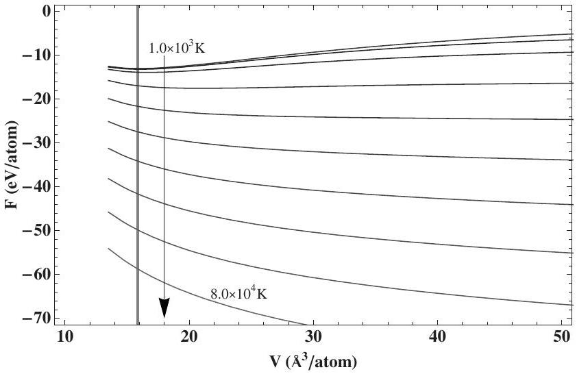
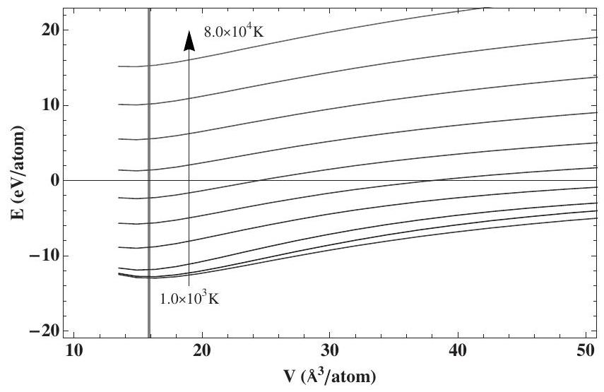
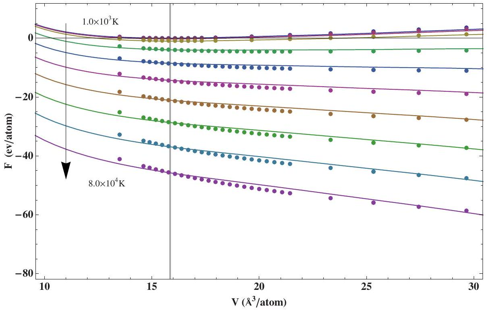
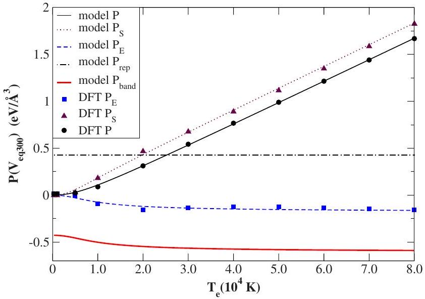
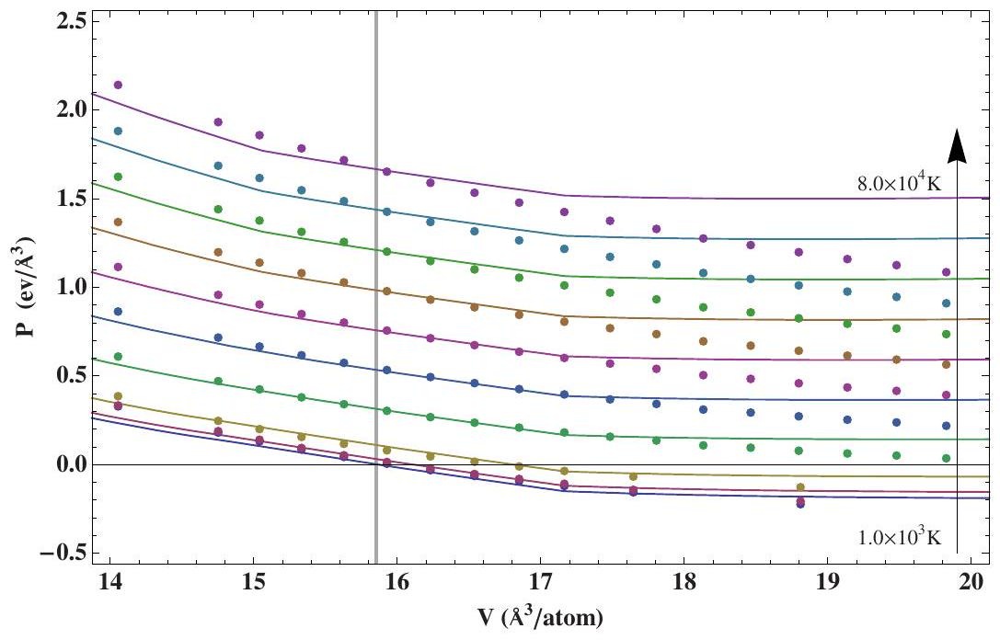

# Development of an electron-temperature-dependent interatomic potential for molecular dynamics simulation of tungsten under electronic excitation 

S. Khakshouri, ${ }^{1, *}$ D. Alfè, ${ }^{1,2}$ and D. M. Duffy ${ }^{1,3}$ ${ }^{1}$ Department of Physics and Astronomy, Materials Simulation Laboratory, and London Centre for Nanotechnology, University College London, Gower Street, London WC1E 6BT, United Kingdom ${ }^{2}$ Department of Earth Sciences, University College London, Gower Street, London WC1E 6BT, United Kingdom ${ }^{3}$ EURATOM/UKAEA Fusion Association, Culham Science Centre, Oxfordshire OX14 3DB, United Kingdom (Received 17 September 2008; revised manuscript received 6 November 2008; published 5 December 2008)

#### Abstract

Irradiation of a metal by lasers or swift heavy ions causes the electrons to become excited. In the vicinity of the excitation, an electronic temperature is established within a thermalization time of $10-100 \mathrm{fs}$, as a result of electron-electron collisions. For short times, corresponding to less than 1 ps after excitation, the resulting electronic temperature may be orders of magnitude higher than the lattice temperature. During this short time, atoms in the metal experience modified interatomic forces as a result of the excited electrons. These forces can lead to ultrafast nonthermal phenomena such as melting, ablation, laser-induced phase transitions, and modified vibrational properties. We develop an electron-temperature-dependent empirical interatomic potential for tungsten that can be used to model such phenomena using classical molecular dynamics simulations. Finitetemperature density functional theory calculations at high electronic temperatures are used to parametrize the model potential.

DOI: 10.1103/PhysRevB.78.224304
PACS number(s): 78.70.-g, 61.80.Az, 89.30.Jj, 61.82.Bg

## I. INTRODUCTION

Exposure to lasers or swift ion irradiation can cause electrons in a metal to become highly excited. An electronic temperature is established within a thermalization time of $\sim 10-100 \mathrm{fs},{ }^{1,2}$ as a result of electron-electron collisions. This is significantly shorter than the time required to establish equilibrium with the lattice, which occurs on the time scale of picoseconds. After the electronic thermalization, but before equilibration with the lattice, the electronic temperature $T_{e}$ in the vicinity of the excitation may be of orders of magnitude higher than the lattice temperature $T_{l}$. This is referred to as a "hot-electron cold lattice" situation.

The initial excitation energies $E_{x}$ prior to electron thermalization are typically in the region of $1-10 \mathrm{eV}$ per atom, corresponding to $E_{x} / k_{B}$ in the range of $10^{4}-10^{5} \mathrm{~K}$ ( $k_{B}$ is Boltzmann's constant). Ballistic transport of energy away from the excited region during the thermalization period means that when an electronic temperature is established, it is generally lower than this. However for a short period of time after thermalization, electronic temperatures may be in the range of several $10^{4} \mathrm{~K}$. These temperatures, which are similar in magnitude to the Fermi temperature, are sufficient to modify the interatomic forces between atoms. The temperature decreases rapidly as heat diffuses through the electrons to colder parts of the metal, bringing the excited region and the rest of the metal into a global equilibrium.

The effects of highly excited electrons on the dynamics of atoms in a solid are often separated into two distinct categories. Thermal effects, occurring on time scales on the order of picoseconds, are the result of the transfer of kinetic energy from the electrons to the lattice via electron-phonon interactions. These effects are governed by the time scale for electron-lattice equilibration $\tau=C_{l} / g$ (where $g$ is known as the electron-phonon coupling strength and $C_{l}$ is the specificheat capacity of the lattice). The kinetic energy transferred to
the lattice from the excited electrons may then be sufficient to cause damage of the material or even melting. Nonthermal effects occur on shorter (sub-picosecond) time scales and arise as the result of the modification of the interatomic forces in the material when electrons are excited. By modifying the interactions between the atoms, the excited electrons induce near instantaneous forces on the atoms. It then takes a short time for these forces to have an effect on the motion of the atoms. The modified forces have the potential to give rise to a variety of ultrafast phenomena. These include nonthermal melting, ablation, modified vibrational properties, and laser-induced phase transitions. The possibility of nonthermal mechanisms was initially proposed by Van Vechten et al. ${ }^{3}$ Many examples can be found in the review by Bennemann. ${ }^{1}$ The dividing line between the time scale for thermal and nonthermal effects is typically regarded as being around $1 \mathrm{ps} .^{4}$

The occurrence of nonthermal effects is more widely established in covalently bonded insulators and semiconductors than metals. Electronic excitations in these materials can promote electrons from the valence band to the conduction band. Such excitations tend to persist longer (have longer lifetimes), allowing more time for the modified forces to have an effect on atomic motions. In metals, the excitation energy disperses rapidly through the system, and it is often assumed that the time for which a sufficient concentration of highly excited electrons exists is too short to affect atomic motion significantly.

Ultrashort (femtosecond) pulsed laser experiments have provided experimental evidence for nonthermal effects in semiconductors. ${ }^{4-7}$ These experiments point toward changes occurring a short time after irradiation with intense pulses at high fluence. This is different from thermal melting of the material that can be induced at lower fluence, occurring on longer time scales. There has been some experimental evidence that similar phenomena occur in metals. Experiments
by Guo et al. ${ }^{8}$ indicated that laser radiation resonant with the gap between two parallel bands in Al can bring about a nonthermal structural phase transition. Workers from the same group observed similar effects brought about by nonresonant radiation in $\mathrm{Au} .^{9}$

The theoretical treatment of nonthermal effects requires an explicit model for the electronic structure of the material and how this changes when electrons occupy energy levels with a nondegenerate distribution. Finite-temperature density functional theory (DFT) can be used to study the properties of materials at high electronic temperatures. Silvestrelli et al. ${ }^{10,11}$ explicitly demonstrated nonthermal melting of Si using ab initio molecular dynamics simulations. Changes in the electronic structure may also be calculated using tightbinding theory. Tight-binding molecular dynamics has been used to simulate laser-induced melting in $\mathrm{Si},{ }^{12}$ ultrafast ablation of graphite films, ${ }^{13}$ and laser-induced femtosecond graphitization of diamond. ${ }^{14}$

Insights into nonthermal effects can also be obtained with static calculations. Recoules et al. ${ }^{15}$ used density functional perturbation theory (DFPT) to calculate phonon-dispersion curves in gold and aluminum at high electron temperatures. A study by Botin and Zerah ${ }^{16}$ employed ab initio methods to predict how formation enthalpies of monovacancies change at high electronic temperatures. Zijlstra et al. ${ }^{17}$ used finitetemperature density functional theory to predict that a pressure-induced structural phase transition in As may also be induced by an ultrashort laser pulse.

These approaches are much more computationally expensive than classical molecular dynamics (MD) simulations (using effective empirical interatomic potentials) and are therefore restrictive in terms of the system sizes and time scales that can be simulated. We develop a simplified description of the modification of interatomic forces in transition metals with highly excited electrons. The aim is to construct an empirical interatomic potential that can be used in classical molecular dynamics simulations, which accounts for changes in the forces atoms in a metal experience as a result of elevated electronic temperatures. This will enable the simulation of nonthermal effects on larger time and length scales. The electronic temperature features as a variable parameter in the potential developed here. An empirical interatomic potential was constructed by Recoules et al. ${ }^{15}$ to simulate gold at a fixed electronic temperature of $k_{B} T_{e} =6.5 \mathrm{eV}$. The ability to vary the electronic temperature continuously means that the potential developed here could be used in simulations in which the temperature changes during the simulation itself. This would enable atomistic simulations of metals in highly nonequilibrium situations, such as laserand swift heavy-ion irradiation, to predict structural modifications by electronic excitation. ${ }^{18}$

Tungsten (W) is a particularly heat resistant metal and is being proposed as a candidate material for plasma-facing components in fusion reactors. ${ }^{19}$ The high binding energy and melting point of tungsten stem from the roughly halffilled $d$ band. In this sense W shares characteristics with the other transition metals in groups VB and VIB.

In order to construct the interatomic potential, we begin by performing static finite-temperature DFT calculations on a perfect lattice of W at different volumes. The aim is to
obtain information about the metal at high electronic temperatures and use this to develop and parametrize an electron-temperature-dependent empirical potential. This is similar to the approach suggested by Zeria and Bottin in Ref. 16. After discussing the DFT calculations in Sec. II, we will introduce the model on which the empirical potential is based in Sec. III. Fitting of this potential to reproduce the DFT data is discussed in Sec. IV. We conclude in Sec. V with a general discussion.

## II. TUNGSTEN AT HIGH ELECTRON TEMPERATURES

## A. Finite-temperature density functional theory

Mermin ${ }^{20}$ generalized the Hohenberg-Kohn theorem underlying density functional theory to electrons at finite temperatures by proving that the electronic grand potential is a unique functional of the equilibrium electron density. By constructing approximate free-energy functionals, the equilibrium free energy for electrons in a material at different electronic temperatures can be estimated. As discussed above, the thermalization of excited electrons typically takes of the order of 10-100 fs. In this work we do not attempt to reproduce the nonthermal nature of the electrons in the early stages after excitation. The electrons in the excited region are treated as being in a local thermal equilibrium with a welldefined temperature $T_{e}$. The effects of the space and time dependence of $T_{e}$ are neglected. In this context nonthermal refers to the situation where the electrons have a well-defined temperature $T_{e}$ that is different from the lattice temperature $T_{l}$.

The electronic free energy may be expressed as

$$
F=E-T_{e} S .
$$

The energy $E$ consists of the usual terms in a DFT energy

$$
E=E_{k}+E_{e Z}+E_{H}+E_{\mathrm{xc}}+E_{Z Z},
$$

where $E_{k}, E_{e Z}, E_{H}, E_{\mathrm{xc}}$, and $E_{Z Z}$ are the kinetic, electron-core interaction, Hartree, exchange-correlation, and core-core interaction energies, respectively. At finite temperatures, $E$ is an average taken over the thermal distribution of states. The entropy $S$ is given by the formula for independent particles occupying single-particle states ${ }^{21}$

$$
S=-2 k_{B} \sum_{i}\left[f_{i} \ln f_{i}+\left(1-f_{i}\right) \ln \left(1-f_{i}\right)\right],
$$

where the sum is over all one-electron eigenstates, and $f_{i}$ is the occupation of state $i$. At thermal equilibrium, the states will be populated according to a Fermi-Dirac distribution $f\left(\epsilon_{i}\right)=\left(1+\mathrm{e}^{\left(\epsilon_{i}-\lambda\right) / k_{B} T_{e}}\right)^{-1}$, where $\epsilon_{i}$ is the energy of eigenstate $i$, and $\lambda$ is the chemical potential.

The one-electron eigenstates correspond to solutions of a single-particle Schrödinger equation,

$$
\left[-\frac{\hbar^{2}}{2 m} \nabla^{2}+V_{\mathrm{eff}}(\mathbf{r})\right] \psi_{i}=\epsilon_{i} \psi_{i}
$$

where $\psi_{i}$ are the Kohn-Sham orbitals with eigenenergies $\epsilon_{i}$. The single-particle effective potential is $V_{\text {eff }}(\mathbf{r})=V_{Z}+V_{H} +V_{\mathrm{xc}}$, where $V_{Z}, V_{H}$, and $V_{\mathrm{xc}}$ are the ionic, Hartree, and exchange-correlation potentials.

The electron density that minimizes the free-energy functional is

$$
\rho(\mathbf{r})=2 \sum_{i} f_{i}\left|\psi_{i}(\mathbf{r})\right|^{2} .
$$

This clearly depends on $T_{e}$ due to the occupation numbers $f_{i}$. Since the effective Hamiltonian depends on the electron density $\rho(\mathbf{r})$ through the effective potential $V_{\text {eff }}(\mathbf{r})$, and the electron density $\rho(\mathbf{r})$ depends on $T_{e}$, the effective Hamiltonian itself depends on the electron temperature $H_{\text {eff }}\left(T_{e}\right)$. For this reason the energy eigenvalues $\epsilon_{i}$ and the density of states calculated using finite-temperature DFT depend on the electronic temperature $T_{e}$, as do all quantities that depend in any way on $\rho(\mathbf{r})$.

A useful way of rewriting the DFT energy $E$ is

$$
E=\sum_{i} f_{i} \epsilon_{i}-\frac{1}{2} E_{H}-\int \rho(\mathbf{r}) V_{\mathrm{xc}} d \mathbf{r}+E_{\mathrm{xc}}+E_{Z Z}
$$

The first term, which is a sum over one-electron eigenenergies $\epsilon_{i}$, is the band energy $E_{\text {band }}$. The second term corrects for the double counting of the electron-electron interaction energy in the single-particle treatment. The third term subtracts the energy arising from the exchange-correlation potential (defined as $V_{\mathrm{xc}}=\delta E_{\mathrm{xc}} / \delta \rho$ ) and the fourth term adds the correct exchange-correlation energy $E_{\mathrm{xc}}$. The third and fourth terms are necessary because in general $E_{\mathrm{xc}} \neq \int V_{\mathrm{xc}} \rho(\mathbf{r}) d \mathbf{r}$. The final term is the core-core interaction energy.

Each term in $E$ depends on the electronic temperature with the exception of the ion-ion repulsion $E_{Z Z}$. The first term does so as a result of changes in the occupation numbers $f_{i}$ and the eigenvalues $\epsilon_{i}$. The second, third, and fourth terms depend on electron temperature due to changes in the electron density $\rho(\mathbf{r})$. It should be noted that in principle the exchange-correlation functional used for the evaluation of $E_{\mathrm{xc}}$ should depend on temperature, but the approximate functional used here is independent of $T_{e}$.

In the empirical tight-binding band model, ${ }^{22}$ the four last terms $\left(E-E_{\text {band }}\right)$ are grouped together into a sum of repulsive pairwise potentials, which are empirical and fitted to experimental values of lattice constant, cohesive energy, and bulk modulus. $E_{\text {band }}$ makes an attractive contribution to the interatomic forces. We will make use of this partitioning of the energy in the development of the electronic temperature dependent model in Sec. III.

## B. Technical details

We have performed static finite-temperature DFT calculations on a perfect lattice of W at different volumes for a range of electron temperatures from 300 up to 80000 K . Only the $5 d^{4} 6 s^{2}$ valence electrons have been treated explicitly. This means that excitations from core electrons into the valence band cannot be accounted for. Even for the very high electron temperatures of interest here, the probability of these excitations is negligible, as the highest core states are separated from the valence band by approximately 40 eV .

The Perdew-Burke-Ernzerhof ${ }^{23}$ generalized gradient approximation (GGA) was used for the exchange-correlation

FIG. 1. DFT free energy against volume. The lines correspond to electronic temperatures $T_{e}=(0.1,0.5,1,2,3,4,5,6,7,8) \times 10^{4} \mathrm{~K}$. The arrow indicates increasing temperatures. The free energy shifts downward with increasing $T_{e}$. The vertical line is at $V_{\text {eq } 300}$; the equilibrium volume at $T_{e}=300 \mathrm{~K}$.

functional $E_{\mathrm{xc}}$. The projector-augmented-wave (PAW) (Ref. 24) implementation of DFT was performed using the VASP code, ${ }^{25,26}$ with a plane-wave cutoff of 223 eV and a Monkhorst-Pack mesh of $11 \times 11 \times 11 k$ points. As these calculations are done for a perfect lattice they involve only one atom explicitly. Fifty bands were used to ensure that there were enough states at sufficiently high energies to sample the full Fermi-Dirac distribution effectively. This number of bands ensures that even at the highest electronic temperatures there are still bands at high energy that are fully unoccupied.

## C. Results from finite-temperature DFT calculations

Results for the electronic free energy $F$ as a function of volume for electronic temperatures from $1000-80000 \mathrm{~K}$ are summarized in Fig. 1. The free-energy curves themselves shift toward more negative values with increasing $T_{e}$. This shift is dominated by the entropic contribution to the free energy $-T_{e} S$. The energy $E$ against volume is plotted for different electronic temperatures in Fig. 2. These curves shift upward as $T_{e}$ increases, as higher energy states are populated.

As we are interested in forces, the shape of the freeenergy curves is of more significance than constant shifts. Between 300 and 20000 K the position of the free-energy minimum, corresponding to the equilibrium lattice parameter, shifts to larger values. A minimum in the free energy ceases to exist at a temperature between 20000 and 30000 K . This indicates that if the solid is free to do so it would expand. This would occur, for example, at a surface excited by a laser pulse. When the system is constrained to a fixed volume, this manifests itself as an increase in the pressure.

The electronic pressure is related to the derivative of the electronic free energy with respect to volume $P=-\partial F / \partial V$. The circular points in Fig. 4 show the electronic pressure calculated from the derivative of the DFT free energy at the equilibrium volume corresponding to 300 K . The energetic

FIG. 2. DFT energy against volume. The lines correspond to electronic temperatures $T_{e}=(0.1,0.5,1,2,3,4,5,6,7,8) \times 10^{4} \mathrm{~K}$. The arrow indicates increasing temperatures. The energy shifts upward with increasing $T_{e}$. The vertical line is at $V_{\text {eq300 }}$.

and entropic contributions to the pressure are also shown (see squares and triangles in Fig. 4).

Bottin and Zerah ${ }^{16}$ found that the change in pressure $P$ with electronic temperature makes an important contribution to changes in the enthalpy of forming monovacancies at different electronic temperatures. An increase in the pressure (at fixed volume) is clearly seen with increasing electronic temperature. It is seen that the increase is dominated by the entropic contribution to the free energy. The energetic contribution initially becomes more negative with increasing $T_{e}$.

Above $T_{e}=30000 \mathrm{~K}$ it is seen that the free energy is repulsive in nature. It is worth noting the different effects this may have under different conditions. At fixed volume, the purely repulsive interactions can lead to increased melting temperatures ${ }^{15}$ and increased vibrational frequencies. ${ }^{15}$ These effects arise if the modified forces (even if they are purely repulsive) make it harder to move atoms out of their equilibrium positions. When the volume is free to change, as, for example, near a surface, the repulsions will lead to rapid expansion of the surface layer into the vacuum.

It is worth noting that the loss of the free-energy minimum occurs at a significantly lower temperature in tungsten than that reported for gold by Recoules et al., ${ }^{15}$ which was above 60000 K . This difference can be explained by observing that the Fermi energy in noble metals occurs in the $s-p$ band portion of the density of states, where the density of states is very low. In transition metals such as W, the Fermi energy lies in the $d$ band portion of the density of states, where the density of states is higher, and with a number of $d$ band states still unoccupied. This leads to a more drastic effect on smearing of the Fermi-Dirac distribution in W than Au. More subtle effects take place in Au due to modified screening behavior as $d$ band electrons are excited into the $s-p$ band, causing changes in the shape of the density of states. ${ }^{15}$

In Sec. III we will introduce a simplified model aimed at reproducing the effects observed here. This will be used to construct an interatomic potential for W that depends on the electronic temperature $T_{e}$.

## III. MODEL INTERATOMIC POTENTIAL

Finnis-Sinclair potentials have been utilized successfully for many years in modeling transition metals. These potentials are empirical in that they contain parameters that are fit to reproduce certain quantities measured experimentally or calculated from first-principles calculations. Our aim is to develop a method that utilizes existing empirical potentials that are successful under normal conditions (in the absence of electronic excitations) and modify these to account for changes that occur at high electronic temperatures. This means that an existing empirical potential, in this case the Finnis-Sinclair potential for $\mathrm{W},{ }^{27}$ serves as the starting point for the potential developed here. This ensures that under normal conditions, when the electronic temperature is low, the potential reproduces the properties it was initially designed to reproduce.

## A. Finnis-Sinclair potential

The general form for the potential energy in embedded atom model (EAM) potentials is given by

$$
E_{\mathrm{total}}=\sum_{i} F_{\mathrm{emb}}\left[\rho_{i}\right]+\frac{1}{2} \sum_{i \neq j} V\left(r_{i j}\right),
$$

where $r_{i j}$ is the distance between atoms $i$ and $j$, and the sums run over all $N$ atoms in the system. The second term, which is a pairwise sum, is the repulsive part of the potential energy. The first term is the cohesive part comprising a sum of terms involving $F_{\text {emb }}$ : the embedding function. This manybody interaction takes as its argument an "effective density" $\rho_{i}$ represented by a pairwise sum

$$
\rho_{i}=\sum_{j \neq i} \phi\left(r_{i j}\right) .
$$

In the Finnis-Sinclair potential, the cohesive embedding function takes the form

$$
F_{\mathrm{emb}}\left[\rho_{i}\right]=-A \sqrt{\rho_{i}},
$$

where $A$ is a constant. Several different models share this form of embedding function but use different forms for the functions $V(r)$ and $\phi(r)$. In the Finnis-Sinclair-type potentials ${ }^{27,28}$ both of these are described by polynomial functions. Parameters that are used to empirically fit the potentials to reproduce physical quantities (such as the binding energy, lattice parameter, thermal-expansion coefficient, or defect formation energies) enter in terms of the constant $A$ and constants in the polynomial coefficients of the functions $\phi(r)$ and $V(r)$.

## B. Second-moment approximation

One line of reasoning leading to the particular form taken by the attractive part of the Finnis-Sinclair potentials is the second-moment approximation in tight-binding theory. The electrons associated with each atomic site $i$ may be described by a local density of states $d_{i}(E)$. The local density of states refers to valence electrons that are important in determining the bonding behavior. The local density of states allows the
contribution to the band energy $E_{\text {band }}$ made by the electrons at atomic site $i$ to be written as ${ }^{29}$

$$
E_{\mathrm{band}}^{(i)}=2 \int_{-\infty}^{E_{F}}\left(E-\alpha_{i}\right) d_{i}(E) d E
$$

where $E_{F}$ is the Fermi energy, $\alpha_{i}$ is the center of gravity of the local density of states $d_{i}(E)$, and the factor of 2 accounts for spin degeneracy. Note that Eq. (10) is a $T_{e}=0$ expression, making use of a degenerate Fermi-Dirac distribution.

Ackland et al. ${ }^{30}$ showed that if the density of states scales as $d_{i}(E)=\left(1 / W_{i}\right) d\left(E / W_{i}\right)$, where $W_{i}$ is a parameter describing the width of the density of states, and assuming local charge neutrality (i.e., a constant number of electrons at each atomic site), then the cohesive band energy is proportional to the width of the density of states irrespective of the shape of the density of states. This allows simple models to be constructed for the evaluation of the band energy. An example is the rectangular density-of-states model that was developed by Friedel ${ }^{31,32}$ to describe the narrow $d$ band contribution to the valence band in transition metals.

Consider a rectangular model for the local density of states. This consists of a top-hat function $d_{i}(E)$ centered at $E=\alpha_{i}$, with a width $W_{i}$ and an area corresponding to $N_{a}$ electronic states ( $N_{a}=5$ for a $d$ band). The function takes the value $N_{a} / W_{i}$ for energies $\left|E-\alpha_{i}\right| \leq W_{i} / 2$ and zero otherwise. The local charge neutrality condition demands that each site $i$ is occupied by $N_{e}$ electrons. This is expressed as

$$
N_{e}=2 \int_{\alpha_{i}-W_{i} / 2}^{E_{F}} d_{i}(E) d E=\frac{2 N_{a}}{W_{i}}\left[E_{F}-\alpha_{i}+\left(\frac{W_{i}}{2}\right)\right] .
$$

The Fermi energy $E_{F}$ takes the same value at all atomic sites so Eq. (11) is an equation for the center of gravity $\alpha_{i}$ of the local density of states at each atomic site $i$ or more precisely the energy difference $\alpha_{i}-E_{F}$,

$$
\alpha_{i}-E_{F}=\frac{W_{i}}{2}-\frac{N_{e} W_{i}}{2 N_{a}}
$$

This value for $\alpha_{i}$ ensures that there are $N_{e}$ electrons at each site. Using this result, in the evaluation of the integral (10) for a rectangular density of states, gives band energy contribution from atomic site $i$ as

$$
E_{\mathrm{band}}^{(i)}=-\frac{N_{e} W_{i}}{4 N_{a}}\left(N_{a}-2 N_{e}\right)
$$

If the number of electrons $N_{e}$ at each site is fixed then the band energy contribution is proportional to the width $W_{i}$ of the local density of states.

The second-moment theorem ${ }^{29}$ relates the width of the local density of states, as measured by its second central moment $\mu_{i}^{(2)}$, to a sum of squares of hopping integrals between atom $i$ and surrounding atoms,

$$
\mu_{i}^{(2)}=\int_{-\infty}^{\infty}\left(E-\alpha_{i}\right)^{2} d_{i}(E) d E=5 \sum_{j \neq i} \beta^{2}\left(r_{i j}\right)
$$

where $\beta^{2}\left(r_{i j}\right)$ is an average square of the hopping integrals between atomic orbitals on atoms $i$ and $j$. The hopping integrals, describing tunneling of electrons between atomic sites,
fall off rapidly with the distance between two atoms. As atoms move closer together, increased tunneling leads to a widening of the local electronic energy levels, giving rise to a wider local density of states. Since the band energy is proportional to the width [as in Eq. (13)], an increased density of atoms surrounding a particular atom $i$ leads to a more negative contribution to the cohesive band energy $E_{\text {band }}^{(i)}$. This is encoded in the relation,

$$
E_{\text {band }}^{(i)} \propto W_{i} \propto\left[\mu_{i}^{(2)}\right]^{1 / 2} .
$$

This relation underlies the square-root form for the embedding function of the Finnis-Sinclair model in Eq. (9). This connection implies a proportionality between the empirical local density function and the second moment of the local density of states $\rho_{i} \propto \mu_{i}^{(2)}$. Although the functions $\phi\left(r_{i j}\right)$ that give rise to $\rho_{i}$ are obtained empirically, this relation also implies a connection between $\phi\left(r_{i j}\right)$ and the hopping integrals $\beta^{2}\left(r_{i j}\right)$. ${ }^{33}$

## C. Model interatomic potential for high electronic temperatures

We now develop a model to extend the Finnis-Sinclair potential to high electronic temperatures. Using the decomposition of energy in Eq. (6), the electronic free energy may be written as

$$
F=\sum_{i} f_{i} \epsilon_{i}-\frac{1}{2} E_{H}-\int \rho(\mathbf{r}) V_{\mathrm{xc}} d \mathbf{r}+E_{\mathrm{xc}}+E_{Z Z}-T_{e} S
$$

The band energy $E_{\text {band }}$ and the entropic contribution to the free energy $-T_{e} S$ will be dealt with in terms of a modified electron-temperature-dependent embedding function $F_{\text {emb }}\left[\rho_{i}, T_{e}\right]$. The remaining terms are grouped together into sum of pairwise potentials. We begin by developing a model for how the band energy $E_{\text {band }}^{(i)}$ and the entropy $S$ change with electronic temperature.

## 1. Band energy

The valence electron density of states in transition metals may be described as a superposition of a broad $s-p$ band and a narrow $d$ band. ${ }^{32,34}$ The Fermi energy lies within the $d$ band. In transition metals, especially with near half-filled $d$ orbitals such as tungsten, the cohesive energy is dominated by the $d$-orbital contribution to the band energy. For this reason, second-moment model treatments often consider the $d$ band contribution of the energy only.

At high electronic temperatures, electrons may occupy a wide range of energy states lying above the $d$ band. This means the model density of sates used here must account for a range of states lying in the $s-p$ band that are unoccupied at $T_{e}=0$.

For simplicity, we adopt a rectangular band model for the local density of states. The $d$ band contribution to the density of states consists of a top-hat function centered at $E=\alpha_{i}$, with width $W_{i}$ and height $h_{i}=N_{a} / W_{i}$. It has already been established that at $T_{e}=0$ the band energy in this model is given by Eq. (13). At finite electronic temperatures, the states are
populated according to a nondegenerate Fermi-Dirac distribution $f(E)$. The $d$ band contribution to the band energy within this model is calculated as

$$
E_{d \text { band }}^{(i)}=2 \frac{N_{a}}{W_{i}} \int_{\alpha_{i}-W_{i} / 2}^{\alpha_{i}+W_{i} / 2} f(E)\left(E-\alpha_{i}\right) d E
$$

where $f(E)$ is the Fermi-Dirac distribution $f(E)=(1 \left.+e^{(E-\lambda) / k_{B} T_{e}}\right)^{-1}$, and $\lambda$ is the chemical potential.

At high electronic temperatures, additional states above the $d$ band need to be accounted for. To achieve this, we extend the rectangular $d$ band with a constant density of states at the same height $h_{i}=N_{a} / W_{i}$, for all energies $E>\alpha_{i} +W_{i} / 2$. This "extension" is intended to account for the freeelectronlike $s-p$ states that lie above the $d$ band. The contribution to the band energy from these states is calculated using

$$
E_{s-p \text { band }}^{(i)}=2 \frac{N_{a}}{W_{i}} \int_{\alpha_{i}+W_{i} / 2}^{\infty} f(E)\left(E-\alpha_{i}\right) d E
$$

This is the same integral as Eq. (17) but over a different range. The total band energy contribution from atom $i$ is $E_{\text {band }}^{(i)}$, which equals the sum of Eqs. (17) and (18). After evaluating the integrals, this can be expressed as

$$
\begin{aligned}
E_{\mathrm{band}}^{(i)}= & -N_{a} k_{B} T_{e} \ln \left(1+e^{\left(\lambda-\alpha_{i}+W_{i} / 2\right) / k_{B} T_{e}}\right) \\
& -\frac{2 N_{a}}{W_{i}}\left(k_{B} T_{e}\right)^{2} \mathrm{Li}_{2}\left(-e^{\left(\lambda-\alpha_{i}+W_{i} / 2\right) / k_{B} T_{e}}\right),
\end{aligned}
$$

where $\mathrm{Li}_{2}$ is the dilogarithm function defined by ${ }^{35}$

$$
\int_{0}^{\infty} \frac{x}{e^{x-\mu}+1} d x=-\operatorname{Li}_{2}\left(-e^{\mu}\right)
$$

We will assume that local charge neutrality is maintained. This may be violated for a brief time after electronic excitation, but it is assumed that it is restored quickly during the electron thermalization time. Local charge neutrality requires the number of electrons at each atomic site to remain fixed at $N_{e}$. The number of electrons is calculated by integrating over the product of the density of states and the occupation of states

$$
N_{e}=2 \frac{N_{a}}{W_{i}} \int_{\alpha_{i}-W_{i} / 2}^{\infty} f(E) d E
$$

which results in

$$
\alpha_{i}-\lambda=\frac{W_{i}}{2}-k_{B} T_{e} \ln \left[e^{N_{e} W_{i} / 2 N_{a} k_{B} T_{e}}-1\right]
$$

The chemical potential $\lambda$ must be the same everywhere. If the chemical potential were different at a given atomic site, this would cause a flow of electrons and violation of local charge neutrality. To maintain local charge neutrality, the center of gravity of the local density of states at each site shifts according to Eq. (22). It can be seen that as $T_{e} \rightarrow 0$, this reduces to Eq. (12) for $\alpha_{i}-E_{F}$, as expected. It can also be confirmed that as $T_{e} \rightarrow 0$, the band energy in Eq. (19) reduces to that of the rectangular model in Eq. (13).

It should be noted that although in a one-electron treatment (such as DFT) the density of states changes with electronic temperature, the simple model used here assumes the density of states itself to be independent of temperature. The temperature dependence in this model is brought about only by changes in the Fermi-Dirac occupation of states.

## 2. Entropy

The contribution to the entropy from electrons at site $i$ is calculated according to Eq. (3), using the same model for the density of states as above

$$
S^{(i)}=-2 k_{B} \frac{N_{a}}{W_{i}} \int_{\alpha_{i}-W_{i} / 2}^{\infty}[f \ln f+(1-f) \ln (1-f)] d E
$$

where $f=f(E)$ relates to the Fermi-Dirac distribution as before. The integral may be evaluated to give

$$
\begin{aligned}
S^{(i)}= & -2 k_{B} \frac{N_{a}}{W_{i}}\left[-k_{B} T_{e} \frac{\pi^{2}}{3}-\frac{\lambda^{2}}{k_{B} T_{e}}+\frac{\lambda}{k_{B} T_{e}}\left[\alpha_{i}-\left(\frac{W_{i}}{2}\right)\right]\right. \\
& -\left[\alpha_{i}-\left(\frac{W_{i}}{2}\right)\right] \ln \left(1+e^{\left(\alpha_{i}-\lambda-W_{i} / 2\right) / k_{B} T_{e}}\right) \\
& +\lambda \ln \left(1+e^{-\left(\alpha_{i}-\lambda-W_{i} / 2\right) / k_{B} T_{e}}\right) \\
& \left.-2 k_{B} T_{e} \mathrm{Li}_{2}\left(-e^{\left(\alpha_{i}-\lambda-W_{i} / 2\right) / k_{B} T_{e}}\right)\right]
\end{aligned}
$$

To ensure local charge neutrality, $\alpha_{i}-\lambda$ takes the same value as in Eq. (22). With the correct value of $\alpha_{i}$, both $S^{(i)}$ and $E_{\text {band }}^{(i)}$ are independent of $\lambda$, which is an arbitrary constant in $\alpha_{i}$, the energy corresponding to the center of gravity of the local density of states.

Since Eq. (24) is complicated, it is worth looking at the entropy in various limits. At low electronic temperatures, the Fermi-Dirac distribution is highly degenerate. The integrand in Eq. (23) is zero at all energies except for a region of width $\sim k_{B} T_{e}$ around the Fermi energy $E_{F}$, where $f(E)$ changes abruptly from 1 to 0 . This allows us to approximate the integral as $S \sim-2 k_{B}\left(N_{a} / W_{i}\right)\left(k_{B} T_{e} \ln 0.5\right)$. The entropic contribution to the pressure is $P_{s}=+T_{e} \partial S / \partial V$. In this limit, this scales as $P_{S} \sim-\left(k_{B} T_{e} / W_{i}\right)^{2}\left(\partial W_{i} / \partial V\right)$. Since $\partial W_{i} / \partial V<0$, this makes a positive contribution, increasing with temperature. In the opposite limit, when $k_{B} T_{e} \gg\left(N_{e} W_{i} / 2 N_{a}\right)$, the occupation of states is low at all energies $f(E) \ll 1$, and the first term dominates the integral (23). In this limit $S \sim -k_{B} N_{e} \ln \left(N_{e} W_{i} / 2 N_{a} k_{B} T_{e}\right)$. The entropic contribution to the pressure is then $P_{s} \sim-\left(k_{B} T_{e} / W_{i}\right)\left(\partial W_{i} / \partial V\right)$. This corresponds to a positive contribution that is linear in $T_{e}$. This is observed in the DFT calculations at high temperatures (see Fig. 4). Generally, the increase in height of the local density of states $h_{i}=N_{a} / W_{i}$ that occurs at larger volumes (lower density) leads to an increase in the electronic entropy, making a positive contribution to the pressure.

## 3. Modified embedding function

We now have a simple model for the changes in the electronic free energy $F$ with electron temperature $T_{e}$ brought
about by the band energy $E_{\text {band }}$ and the entropic contribution $-T_{e} S$. The expressions for $E_{\text {band }}$ and $S$ obtained above are based on a rectangular model density of states and its extension to accommodate states above the $d$ band. This local density of states (associated with each atom $i$ ) is characterized by a rectangle with area $N_{a}$ and width $W_{i}$. The secondmoment theorem relates the width $W_{i}$ to a sum of hopping integrals between atom $i$ and neighboring atoms. The relationship between a rectangular density-of-states model and the Finnis-Sinclair model was established in Sec. III B through the connection $W_{i} \propto\left(\mu_{i}^{(2)}\right)^{1 / 2} \propto\left(\rho_{i}\right)^{1 / 2}$.

We subsume the band energy $E_{\text {band }}$ and the entropic contribution to the free energy $-T_{e} S$ into a modified embedding function that depends on the electronic temperature $F_{\text {emb }}\left[\rho_{i}, T_{e}\right]$. At low electronic temperatures we require the embedding function to reduce to the Finnis-Sinclair form,

$$
F_{\mathrm{emb}}\left[\rho_{i}, T_{e}\right] \rightarrow-A \sqrt{\rho_{i}} .
$$

At low temperatures, the sum $E_{\text {band }}^{(i)}-T_{e} S^{(i)}$ reduces to the band energy of the rectangular model in Eq. (13). In order to map the embedding function of the existing empirical FinnisSinclair potential (corresponding to $T_{e}=0$ ) onto the rectangular model, we require the empirical embedding function to equal the band energy of the rectangular model at $T_{e}=0$. This gives the equation

$$
-\frac{N_{e} W_{i}}{4 N_{a}}\left(N_{a}-2 N_{e}\right)=-A \sqrt{\rho_{i}} .
$$

We express the proportionality between the second moment $\mu_{i}^{(2)}$ and the empirical density function $\rho_{i}$ using a constant of proportionality $c$,

$$
\mu_{i}^{(2)}=\frac{\rho_{i}}{c} .
$$

Furthermore, the width of a rectangular distribution with area $N_{a}$ is related to its second central moment by $W_{i}^{2} =\left(12 / N_{a}\right) \mu_{i}^{(2)}$. Using these relations in Eq. (26) allows us to obtain a value for $c$ that relates the empirical embedding function of the Finnis-Sinclair potential to the $T_{e}=0$ band energy for a rectangular density-of-states model with a width

$$
W_{i}=\sqrt{\frac{12}{N_{a}} \frac{\rho_{i}}{c}} .
$$

The equation for $c$ obtained in this way is

$$
c=\frac{3 N_{e}^{2}\left(N_{a}-2 N_{e}\right)^{2}}{4 A^{2} N_{a}^{3}} .
$$

This same value for $c$ is assumed to hold for all electronic temperatures $T_{e}$ and allows the model for the electron-temperature-dependent band energy and entropy obtained above to be used as an electron-temperature-dependent modified embedding function,

$$
F_{\mathrm{emb}}\left[\rho_{i}, T_{e}\right]=E_{\mathrm{band}}^{(i)}-T_{e} S^{(i)},
$$

where $E_{\text {band }}^{(i)}$ and $S^{(i)}$ are the expressions in Eqs. (19) and (24), respectively, with the value for $\alpha_{i}-\lambda$ in Eq. (22). For a given atomic configuration, the local density $\rho_{i}$ is calculated using
a pairwise sum involving the original unmodified FinnisSinclair empirical function $\phi\left(r_{i j}\right)$. This is related to $W_{i}$, which appears in equations for $E_{\text {band }}^{(i)}, S^{(i)}$, and $\alpha_{i}-\lambda$ through Eq. (28).

## 4. Repulsive term

The repulsive term in the electronic free energy is attributed to

$$
E_{\mathrm{rep}}=-\frac{1}{2} E_{H}-\int \rho(\mathbf{r}) V_{\mathrm{xc}} d \mathbf{r}+E_{\mathrm{xc}}+E_{Z Z}
$$

The core-core interaction energy $E_{Z Z}$ is clearly repulsive in nature. Since the electron-electron interaction in $E_{H}$ is repulsive, its negative makes an attractive contribution, which can be said to screen the core-core repulsion. In the empirical tight-binding band model, total sum of these four terms is treated in terms of a sum of empirical repulsive pair potentials. We will follow this approach and attribute these terms to the pairwise sum in the Finnis-Sinclair potential

$$
E_{\mathrm{rep}}=\frac{1}{2} \sum_{i, j} V\left(r_{i j}\right) .
$$

The electron temperature dependence of these terms is assumed to be negligible. This approach was also taken in the tight-binding treatments of Jeschke et al., ${ }^{13}$ where only the band energy dependence on $T_{e}$ was accounted for, and the repulsive term was assumed to be independent of electronic temperature. There will be electron-temperature dependence in the Hartree and exchange-correlation terms due to changes in the electron density [Eq. (5)]. However, it is assumed that the repulsive interaction is dominated by the core-core repulsion, which is unaffected by the electronic excitations in the valence band.

In summary, the new interatomic potential consists of the pairwise functions $\phi\left(r_{i j}\right)$ and $V\left(r_{i j}\right)$ of the Finnis-Sinclair potential ${ }^{27}$ and a modified embedding function $F_{\text {emb }}\left[\rho_{i}, T_{e}\right]$. $\phi(r)$ is used for the calculation of the local density $\rho_{i}$ and $V(r)$ gives the repulsive part of the interatomic potential. Both of these functions are taken directly from the original Finnis-Sinclair model and are assumed to be independent of the electronic temperature $T_{e}$. The embedding function $F_{\text {emb }}\left[\rho_{i}, T_{e}\right]$ depends on $T_{e}$ and reduces to the original squareroot form [Eq. (9)] at low temperatures.

## IV. FITTING

## A. Fitting parameters

We now have the ingredients for an electron-temperaturedependent interatomic potential. It is based on modifying an empirical Finnis-Sinclair potential that is adequate at low electron temperatures ( $T_{e}=0$ ).

The modified embedding function contains the parameters $N_{e}$ and $N_{a}$ corresponding to the number of electrons at each atomic site and the area of the rectangular portion of the local density of states, respectively. The embedding function is based on a model density of states that is highly simplified. The density of states implicit in finite-temperature DFT cal-
culations has a much more complicated structure. In addition to this, the density of states changes with electron temperature $T_{e}$, as the electron density changes when the oneelectron orbitals are occupied differently. These features will have an effect on how the free energy $F$ changes with electronic temperature.

As the form of the density of states used in the model does not capture all of the details of the DFT calculation, we use $N_{e}$ and $N_{a}$ as free parameters to fit the modified potential to the finite-temperature DFT data obtained in Sec. II. In other words $N_{e}$ and $N_{a}$ are chosen to make the simplified model (based on the rectangular density of states) reproduce the finite-temperature DFT data.

In principle we expect these quantities not to deviate too much from the underlying physical parameters despite the model for the density of states being highly simplified. There are six valence electrons in tungsten corresponding to $5 d^{4} 6 s^{2}$. Since it is likely that all valence electrons are affected by the nondegenerate Fermi-Dirac distribution at high temperatures, we expect $N_{e}$ not to deviate too much from 6 . The model density of states does not unambiguously distinguish between different parts of the valence band. If the rectangular part corresponds approximately to the $d$ band portion of the density of states, then we expect $N_{a}$ not to deviate too much from 5 . Similarly, the width $W_{i}$ evaluated at the equilibrium density for tungsten would be expected to be of a similar magnitude to values quoted in the literature for the width of the $d$ band of tungsten, which lie in the range of $9.3-11.4 \mathrm{eV} .^{28,34}$

## B. Fitting methodology and results

An important question is which features of the DFT data we require the model to reproduce. The model interatomic potential consists of

$$
F=\sum_{i} F_{\mathrm{emb}}\left[\rho_{i}, T_{e}\right]+\frac{1}{2} \sum_{i \neq j} V\left(r_{i j}\right),
$$

where the sums run over all atoms in the system. For a given atomic configuration, this expression represents the electronic free energy of the system, including the ion-ion interactions. Evaluating Eq. (33) for a perfect bcc lattice over a range of lattice parameters and at various electronic temperatures should reproduce the $F-V$ curves from finitetemperature DFT calculations described in Sec. II. An arbitrary constant in the free energy can be eliminated by choosing the minimum free energy of the $T_{e}=300 \mathrm{~K}$ curves to be zero for the DFT data as well as the model interatomic potential.

A preliminary fit to the DFT free-energy data resulted in fit 1 (parameters are given in Table I) and reveals that the model qualitatively reproduces the $F-V$ curves (see Fig. 3). As discussed earlier, a significant contribution to the change in electronic free energy with $T_{e}$ corresponds to constant shifts of the $F$ - $V$ curves. These shifts are well reproduced by the model after fitting; however the gradient $d F / d V$ is generally underestimated by the model. The free-energy shifts reflect changes in the system free energy with electronic temperature, but they are not relevant to the dynamics of the

TABLE I. Model parameters obtained using the two different fitting procedures. Fit 1: model is fit to the DFT $F-V$ curves. Fit 2: model is fit to the pressure at $V_{\text {eq300 }}$. In fitting, the following constraints on $N_{e}$ and $N_{a}$ were imposed: $0.1>N_{e} \leq 10$ and $N_{a}>N_{e} / 2$.
|  | DFT data input | $N_{e}$ | $N_{a}$ |
| :--- | :---: | :---: | :---: |
| Fit 1 | $F-V$ curves | 4.8690 | 4.2375 |
| Fit 2 | $P\left(V_{\text {eq300 }}\right)$ values | 6.5826 | 7.3592 |

atoms as forces depend on derivatives of the free energy with respect to atomic coordinates. Although there will be temperature gradients in the system, we expect the resulting spatial differences in free energy to be insignificant on the length scale relevant for interatomic forces.

The force on atom $i$ is given by $\mathbf{f}^{(i)}=-\nabla_{i} F$, where $\nabla_{i}$ represents a derivative with respect to the coordinates of atom $i$. In this model, the temperature dependence comes from the modified embedding function $F_{\text {emb }}$, corresponding to $E_{\text {band }} -T_{e} S$, while the repulsive contribution $E_{\text {rep }}$ is assumed to be independent of $T_{e}$. The contribution to the force stemming from the embedding function is given by

$$
\mathbf{f}_{\mathrm{emb}}^{(i)}=-\nabla_{i} \sum_{j} F_{\mathrm{emb}}\left[\rho_{j}, T_{e}\right]=-\sum_{j} \frac{d F_{\mathrm{emb}}}{d \rho_{j}} \nabla_{i} \rho_{j} .
$$

The electronic pressure defined as $P=-\partial F / \partial V$ is of more relevance to the interatomic forces than the free energy itself. We may calculate the contribution to the pressure stemming from the embedding function as

$$
P_{\mathrm{emb}}=-\sum_{i} \frac{\partial F_{\mathrm{emb}}\left[\rho_{i}, T_{e}\right]}{\partial V}=-\sum_{i} \frac{d F_{\mathrm{emb}}}{d \rho_{i}} \frac{\partial \rho_{i}}{\partial V},
$$

where $\rho_{i}$ is evaluated for a perfect lattice at a given volume $V$. It can be seen that both the pressure and the interatomic forces depend on the derivative $d F_{\text {emb }} / d \rho_{i}$. By looking at a perfect lattice over a range of volumes $V$, we are using global changes in $\rho_{i}$ to shed light on what happens when $\rho_{i}$ changes due to changes in the local atomic environment.

In light of this, we fit the model to the pressure obtained from the DFT calculations. In particular, we require the potential to reproduce the increase in pressure with $T_{e}$ at the volume corresponding to the equilibrium volume at $T_{e} =300 \mathrm{~K}$ denoted by $V_{\text {eq } 300}$. This pressure is experienced by an electronically excited region that cannot expand. It will also determine the initial rate of expansion of an irradiated metal surface into the vacuum.

The parameters obtained by fitting to the DFT electronic pressure at $V_{\text {eq } 300}=15.86 \AA^{3} /$ atom resulted in fit 2 (parameters are given in Table I). The results of this fit can be seen in Figs. 4 and 5. The pressure at $V_{\text {eq300 }}$ is reproduced well by the model for the full range of electronic temperatures. From Fig. 5 it can be seen that at large deviations from $V_{\text {eq } 300}$, the model pressure begins to deviate from the DFT pressure. This means that the model is less successful when there are large deviations from the equilibrium density. It should also be noted that this fit did not reproduce the DFT free-energy offsets accurately, as the fit shown in Fig. 3, but underesti-

FIG. 3. (Color online) Free energy against volume at temperatures $T_{e}=(0.1,0.5,1,2,3,4,5,6,7,8) \times 10^{4} \mathrm{~K}$. Points are DFT data; lines are the model fit to DFT free-energy curves (fit 1). A constant was added to the model and the DFT values to make $F=0$ occur at $V =15.86$ and $T=300 \mathrm{~K}$ for both. This version of the fit reproduces the free energies qualitatively but generally underestimates the pressures, so it is not recommended. Note that this is different to the model fit 2 shown in Figs. 4 and 5. The vertical line is at $V_{\text {eq } 300}$.

mated their magnitude significantly. However, this fitting result is preferred, as the pressure (and the shape of the freeenergy curve) is of more relevance to the interatomic forces than the free energy itself. The values obtained for $N_{e}$ and $N_{a}$ do not deviate significantly from what is expected from the electronic structure of tungsten. At the equilibrium density for 300 K , these values correspond to $W_{i}=5.8 \mathrm{eV}$ and a height of the density of states $h_{i}=1.26 \mathrm{eV}^{-1}$.

It can be seen from Fig. 4 that the entropic contribution to the pressure is the dominant contributor to the increase in pressure at high electronic temperatures. The band energy makes a negative contribution to pressure with increasing $T_{e}$. Even though the fit involved only the total pressure, the subdivision between the energetic and entropic contributions in the model is correct since these contributions to the DFT pressure are reproduced by the model as well.

## V. CONCLUSION

We have constructed an electron-temperature-dependent interatomic potential that can be used in classical molecular dynamics simulations of tungsten under conditions of electronic excitation. The potential, which is based on a simplified model for the density of states, has been empirically fitted to reproduce features of the electronic free energy obtained from finite-temperature DFT calculations. Specifically, the increase in pressure with electronic temperature near the equilibrium volume for low temperatures is reproduced for a very wide range of electronic temperatures. The model correctly captures the temperature dependence of the energetic and entropic contributions to the electronic pressure. It also captures the initial increase in equilibrium lattice parameter with electronic temperature and the subsequent loss of a free-energy minimum at high electronic temperatures.

The results indicate that the model contains some of the main factors leading to changes in the free energy with electron temperature in W . These ingredients are the nondegenerate Fermi-Dirac distribution describing the population of single-particle states at high temperatures, the imposition of local charge neutrality, and the changes in the height of the local density of states at a given site with changes in the local density of atoms. The model correctly captures the fact that the increase in pressure with electronic temperature is dominated by the electronic entropy. This will give rise to repulsion between atoms in an electronically excited region.

FIG. 4. (Color online) Full pressure and contributions to pressure, against $T_{e}$ at the equilibrium volume for low temperatures $V_{\text {eq300 }}$. Points are DFT data: total pressure $P$, energetic contribution $P_{E}$, and entropic ( $-T_{e} S$ ) contribution $P_{S}$. Lines are a fit of the model to the DFT pressure at $V_{\text {eq300 }}$ (fit 2). In addition to the total energy, the contributions made by band energy $P_{\text {band }}$ and repulsion $P_{\text {rep }}$ are shown for the model but not for the DFT results.

FIG. 5. (Color online) Pressure against volume at different electronic temperatures $T_{e}=(0.1,0.5,1,2,3,4,5,6,7,8) \times 10^{4} \mathrm{~K}$. Points are DFT data; lines are a fit of the model to the DFT pressure at $V_{\text {eq300 }}$ (fit 2 ). The vertical line is at $V_{\text {eq } 300}$.

At low electron temperatures describing the metal in the absence of electronic excitation, the potential reduces to the empirical Finnis-Sinclair potential for tungsten. ${ }^{27}$

The interatomic potential developed here can be incorporated into classical molecular dynamics simulations. For a given electronic temperature, the potential is equivalent to an EAM potential. The embedding function has been constructed to represent the band energy and entropic contributions to the electronic free energy for a given electronic temperature.

The approach developed here demonstrates a scheme for incorporating the electron temperature into the framework of EAM potentials through the use of a modified embedding function and finite-temperature density functional theory calculations. In principle this approach could be used to construct a numerically tabulated electron-temperaturedependent embedding function directly without the use of an intermediate model as was done here.

The simple model used here to construct the electron-temperature-dependent embedding function is applicable to transition metals such as W , where the dominant effect of elevated electronic temperature is smearing of the FermiDirac distribution. For noble metals such as Au , more subtle effects causing changes in the shape of the density of states are important. ${ }^{15}$ Magnetic transition metals are also expected to have more complicated behavior.

The potential developed here could be used in molecular dynamics simulations, in which the electronic temperature evolves in time and space during the simulation itself. This relates to the framework currently used in two-temperature
model molecular dynamics (2TM-MD) simulations. ${ }^{36-44}$ In such treatments, the electronic temperature is typically defined within coarse-grained electron temperature cells (Refs. 42-44), each of which contains approximately $10^{2}-10^{3}$ atoms. The electron temperature evolves according to a diffusion equation, which is iterated numerically at each MD time step. The interatomic potential developed here could be used in such simulations, enabling the interatomic forces experienced by atoms to be modified interactively, according to the electron temperature in their respective coarse-grained cell. This amounts to a computationally inexpensive method that can be applied to the study of nonthermal effects in the dynamics of electronically excited metals.

In the absence of a temporally evolving electron temperature, the method used here is a means of extrapolating from a set of finite-temperature DFT calculations to calculate a wide range of properties very efficiently for any given electronic temperature. The effective interatomic potential could be used to predict changes in defect formation energy, melting temperature, and vibrational properties with electronic temperature obtained previously with other methods, ${ }^{15,16}$ with very little additional computational expense.

## ACKNOWLEDGMENTS

We are grateful to C. Cazorla Silva, A. M. Stoneham, and M. J. Gillan for useful discussions. We acknowledge support of EPSRC-GB under Grant No. EP/D079578 and the European Communities under the contract of Association between EURATOM and UKAEA.

[^0](1979).
${ }^{4}$ D. von der Linde, K. Sokolowski-Tinten, and J. Bialkowski, Appl. Surf. Sci. 109-110, 1 (1997).
${ }^{5}$ K. Sokolowski-Tinten, J. Bialkowski, and D. von der Linde, Phys. Rev. B 51, 14186 (1995).
${ }^{6}$ C. W. Siders, A. Cavalleri, K. Sokolowski-Tinten, Cs. Tóth, T.

Guo, M. Kammler, M. Horn von Hoegen, K. R. Wilson, D. von der Linde, and C. P. J. Barty, Science 286, 1340 (1999).
${ }^{7}$ K. Sokolowski-Tinten, J. Solis, J. Bialkowski, J. Siegel, C. N. Afonso, and D. von der Linde, Phys. Rev. Lett. 81, 3679 (1998).
${ }^{8}$ C. Guo, G. Rodriguez, A. Lobad, and A. J. Taylor, Phys. Rev. Lett. 84, 4493 (2000).
${ }^{9}$ C. Guo and A. J. Taylor, Phys. Rev. B 62, R11921 (2000).
${ }^{10}$ P. L. Silvestrelli, A. Alavi, M. Parrinello, and D. Frenkel, Phys. Rev. Lett. 77, 3149 (1996).
${ }^{11}$ P. L. Silvestrelli, A. Alavi, M. Parrinello, and D. Frenkel, Phys. Rev. B 56, 3806 (1997).
${ }^{12}$ A. Gambirasio, M. Bernasconi, and L. Colombo, Phys. Rev. B 61, 8233 (2000).
${ }^{13}$ H. O. Jeschke, M. E. Garcia, and K. H. Bennemann, Phys. Rev. Lett. 87, 015003 (2001).
${ }^{14}$ H. O. Jeschke, M. E. Garcia, and K. H. Bennemann, Phys. Rev. B 60, R3701 (1999).
${ }^{15}$ V. Recoules, J. Clérouin, G. Zérah, P. M. Anglade, and S. Mazevet, Phys. Rev. Lett. 96, 055503 (2006).
${ }^{16}$ F. Bottin and G. Zérah, Phys. Rev. B 75, 174114 (2007).
${ }^{17}$ E. S. Zijlstra, N. Huntemann, and M. E. Garcia, New J. Phys. 10, 033010 (2008).
${ }^{18}$ N. Itoh and A. Stoneham, Materials Modification by Electronic Excitation (Cambridge University Press, Cambridge, 2001).
${ }^{19}$ H. Bolt, V. Barabash, W. Krauss, J. Linke, R. Neu, S. Suzuki, N. Yoshida, and ASDEX Upgrade Team, J. Nucl. Mater. 329-333, 66 (2004).
${ }^{20}$ N. D. Mermin, Phys. Rev. 137, A1441 (1965).
${ }^{21}$ M. J. Gillan, J. Phys.: Condens. Matter 1, 689 (1989).
${ }^{22}$ M. Finnis, Interatomic Forces in Condensed Matter (Oxford University Press, Oxford, 2003).
${ }^{23}$ J. P. Perdew, K. Burke, and M. Ernzerhof, Phys. Rev. Lett. 77, 3865 (1996).
${ }^{24}$ G. Kresse and D. Joubert, Phys. Rev. B 59, 1758 (1999).
${ }^{25}$ G. Kresse and J. Furthmüller, Phys. Rev. B 54, 11169 (1996).
${ }^{26}$ G. Kresse and J. Furthmüller, Comput. Mater. Sci. 6, 15 (1996).
${ }^{27}$ M. W. Finnis and J. E. Sinclair, Philos. Mag. A 50, 45 (1984).
${ }^{28}$ P. M. Derlet, D. Nguyen-Manh, and S. L. Dudarev, Phys. Rev. B 76, 054107 (2007).
${ }^{29}$ A. Sutton, Electronic Structure of Materials (Clarendon, Oxford, 1993).
${ }^{30}$ G. J. Ackland, M. W. Finnis, and V. Vitek, J. Phys. F: Met. Phys. 18, L153 (1988).
${ }^{31} \mathrm{~J}$. Friedel, in The Physics of Metals 1: Electrons, edited by J. Ziman (Cambridge University Press, Cambridge, 1969), pp. 340-408.
${ }^{32}$ J. Friedel, J. Phys. F: Met. Phys. 3, 785 (1973).
${ }^{33}$ G. J. Ackland and S. K. Reed, Phys. Rev. B 67, 174108 (2003).
${ }^{34}$ W. A. Harrison, Electronic Structure and the Properties of Solids: The Physics of the Chemical Bond (Freeman, San Francisco, 1980).
${ }^{35}$ www.mathworld.wolfram.com
${ }^{36}$ C. Schäfer, H. M. Urbassek, and L. V. Zhigilei, Phys. Rev. B 66, 115404 (2002).
${ }^{37}$ D. S. Ivanov and L. V. Zhigilei, Phys. Rev. B 68, 064114 (2003).
${ }^{38}$ D. S. Ivanov and L. V. Zhigilei, Appl. Phys. A: Mater. Sci. Process. 79, 977 (2004).
${ }^{39}$ A. Duvenbeck, F. Sroubek, Z. Sroubek, and A. Wucher, Nucl. Instrum. Methods Phys. Res. B 225, 464 (2004).
${ }^{40}$ A. Duvenbeck and A. Wucher, Phys. Rev. B 72, 165408 (2005).
${ }^{41}$ Y. Yamashita, T. Yokomine, S. Ebara, and A. Shimizu, Fusion Eng. Des. 81, 1695 (2006).
${ }^{42}$ D. M. Duffy and A. M. Rutherford, J. Phys.: Condens. Matter 19, 016207 (2007).
${ }^{43}$ A. M. Rutherford and D. M. Duffy, J. Phys.: Condens. Matter 19, 496201 (2007).
${ }^{44}$ D. M. Duffy, N. Itoh, A. M. Rutherford, and A. M. Stoneham, J. Phys.: Condens. Matter 20, 082201 (2008).

[^0]:    *sascha.khakshouri@ucl.ac.uk
    ${ }^{1}$ K. H. Bennemann, J. Phys.: Condens. Matter 16, R995 (2004).
    ${ }^{2}$ M. Lisowski, P. A. Loukakos, U. Bovensiepen, J. Stähler, C. Gahl, and M. Wolf, Appl. Phys. A: Mater. Sci. Process. 78, 165 (2004).
    ${ }^{3}$ J. A. Van Vechten, R. Tsu, and F. W. Saris, Phys. Lett. 74A, 422

