# Thermodynamics and Transport of Ionic and Electronic Defects in Crystalline Oxides 

Martijn H. R. Lankhorst, Henny J. M. Bouw meester, ${ }^{\dagger}$ and Henk Verw eij* Department of Chemical Technology, Laboratory of Inorganic Materials Science, University of Twente, Enschede, The Netherlands

The first part of this article concerns the thermodynamics of point defects. In the traditional analysis of reactions in which point defects are involved, point defects are assumed to be ideally diluted, which leads to familiar mass-actiontype equations. In this article, situations in which deviations from ideal mass-action-type behavior occur are investigated by evaluating the influence of defect interactions on the chemical potentials of point defects. Expressions for chemical potentials are derived for the case of weak interactions between neighboring defects. Strong repelling interactions between neighboring defects are discussed using the concept of excluded configurations, and strong attractive interactions are analyzed by introducing clusters. The chemical potential of electrons occupying energy states in an electron band also is analyzed as a function of bandwidth and electron occupation number. An expression for the chemical potential of electrons in partially filled bands is derived, which incorporates the average density of states at the Fermi level. Also discussed is the relationship between formation energies and entropies of defects in oxides and the measurable energy and entropy part of the oxygen chemical potential. The second part of this article concerns the transport of ionic and electronic defects in oxides. Within the framework of irreversible thermodynamics, a formalism is presented that allows the description of the general case in which ambipolar diffusion of ions and electrons in oxides is governed by contributions of several ionic and electronic point defects. The formalism allows the handling of defect association, defect interactions, and coupling of the overall ionic and electronic fluxes. The origin of the coupling and its influence on the net oxygen transport and electric current density is investigated.
H. U. Anderson-contributing editor

Manuscript No. 192107. Received December 12, 1996; approved May 8, 1997.
*Member, American Ceramic Society.
${ }^{\dagger}$ To whom correspondence should be addressed.

## I. General Introduction

Many properties of transition-metal oxides are controlled by the extent of oxygen nonstoichiometry and the related presence of ionic and electronic defects. The variable oxygen nonstoichiometry can be used to fine-tune relevant physical properties at low temperature. For instance, the transition temperature in high- $T_{\mathrm{C}}$ superconducting oxides ${ }^{1}$ and the magnetic properties ${ }^{2}$ of transition-metal oxides are known to be strong functions of the oxygen nonstoichiometry. Important phenomena in ceramics technology, such as sintering ${ }^{3}$ and segregation, ${ }^{4,5}$ also depend on concentrations of electronic and ionic defects. Furthermore, the equilibrium concentration of defects determines, together with their mobility as a kinetic parameter, the magnitude of the ionic and electronic conductivity in solids. Mixed-conducting oxides showing both high electronic and ionic conductivity enable transport of neutral oxygen through the material in a gradient of oxygen partial pressure ( $P_{\mathrm{O}_{2}}$ ). Dense membranes made from these oxides have potential application in separation of oxygen from air. ${ }^{6,7}$ Another promising application of such membranes is the selective supply (or removal) of oxygen in chemical processes, including the partial oxidation of light hydrocarbons, e.g., natural gas to valueadded products such as ethane/ethene ${ }^{8}$ and syngas, ${ }^{9}$ as well as the reduction and recovery of waste. ${ }^{10}$ Furthermore, if mixed conducting oxides are used as electrode material in, e.g., solidoxide fuel cells, oxygen pumps, and gas sensors, oxygen electrode kinetics can be improved significantly. ${ }^{11}$

The general purpose of this article is to review theoretical models used to describe the defect chemistry and transport of ionic and electronic point defects in oxides. Attention is focused on the effects that can be expected at intermediate and high concentration of point defects. This article is divided in two parts. The first part concerns the equilibrium thermodynamics of ionic and electronic defects. The validity of the traditional mass-action-type equations commonly used in defect chemical models is investigated. Emphasis is placed on the role of defect interactions, the so-called site exclusion effect and the Fermi condensation of electrons in partially filled electron bands. The second part concerns transport of ionic and electronic defects in mixed-conducting oxides. The influence
of site exclusion and defect interactions on the transport of individual defects is analyzed. General expressions are presented that describe overall transport of ions and electrons in case the contributions of several mobile defects with various valence states have to be considered. The origin and relevance of coupling between ionic and electronic fluxes is stressed. The Wagner theory ${ }^{12}$ is used to combine the overall ionic and electronic flux to describe the transport of neutral oxygen. Finally, the possible enhancement of the oxygen flux by an externally applied electric current is discussed.

## II. Thermodynamics of Ionic and Electronic Defects in Oxides

## (1) Introduction

The defect equilibria for the formation and annihilation of ionic and electronic defects are commonly analyzed using a traditional formalism, ${ }^{13-16}$ in which the relationships among point defect concentrations and environmental parameters are expressed by simple mass-action-type equations. The latter are based on the assumption that point defects can be treated as noninteracting and ideally diluted species for which chemical potentials can be defined. The general purpose of this section is to investigate how these mass-action-type equations must be changed when point defects no longer behave ideally. Nonideal behavior in most cases reflects the presence of defect interactions but may also originate from the condensation of electronic defects in the case of, e.g., a high concentration of delocalized electrons in a wide electron band. Before starting the thermodynamic analysis of nonideal point defects, the formal basis for assigning chemical potentials to point defects is discussed. This is not straightforward, because, as noted in the next section, the thermodynamic definition of a chemical potential for a particular type of point defect in most cases is in conflict with the demand of charge neutrality and that of a constant lattice-site ratio in the crystalline oxide. In the succeeding sections, expressions for the chemical potentials of point defects are derived using statistical thermodynamics. These chemical potentials are used to derive equations that relate defect concentrations to environmental parameters, such as oxygen partial pressure and temperature. It is shown that such equations are not always of the familiar mass-action-type.

Throughout the first part of this article, the oxygen-deficient perovskite lattice $\mathrm{ABO}_{3-\delta}$ is used as a model system. Here, the A site is occupied by either an alkali, an alkaline-earth, or a rare-earth ion, whereas the B site is a late transition metal, e.g., cobalt, iron, chromium, and manganese, with a variable valence. The parameter $\delta$ reflects the departure from ideal oxygen stoichiometry. To simplify the analysis, we henceforth assume that $\delta$ is determined only by the presence of doubly ionized lattice oxygen vacancies. Using the Kröger-Vink notation for structure elements, ${ }^{17}$ these are denoted by $V_{\mathrm{O}}^{\cdot \cdot}$. The annihilation of oxygen vacancies upon oxygen insertion is assumed to be charge compensated by the formation of localized electronic

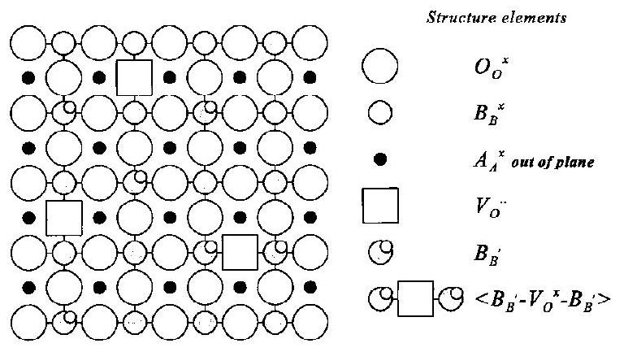
Fig. 1. Planar projection of the $\mathrm{ABO}_{3}$ perovskite lattice. All structure elements mentioned in the text are shown.

species on the B sites, $\mathrm{B}_{\mathrm{B}}^{\prime}$. In accordance with Kröger and Vink, ${ }^{17}$ the "valence" of a structure element is defined relative to that of the host lattice ion residing on the particular sublattice involved. Structure elements considered to occur in $\mathrm{ABO}_{3-\delta}$ are shown in Fig. 1. Not shown in Fig. 1 are delocalized electrons occupying energy states in electron bands, which species are denoted as $\mathrm{e}^{\prime}$.

## (2) Validity of Assigning Chemical Potentials to Point Defects

When considering different types of structure elements in the perovskite lattice, we must be aware that their numbers are not independent but are related to each other by two important requirements. On the one hand, there is the structure conservation requirement. For example, in the perovskite structure, the total number of O sites must be 3 times that of A and B sites. The addition of a single structure element on a B site therefore must be compensated either by the removal of another structure element from the B sublattice or by the addition of one structure element on the A sublattice and three on the O sublattice. In the latter case, the lattice site ratio remains intact, although the total number of $\mathrm{ABO}_{3}$ units increases by one. On the other hand, the number of structure elements is constrained by the charge neutrality requirement.

Relationships among changes in the number of point defects are governed by reactions between defects. Any defect chemical reaction can be written as

$$
\sum_{j} \xi_{j} A_{j} \rightleftharpoons 0
$$

where $\xi_{j}$ are the "stoichiometric coefficients" and $A_{j}$ the symbols for either point defects or neutral components involved in the reaction. Because, in this section, only exchange of oxygen between the gas phase and the oxide is considered, the neutral component involved in the reaction is always oxygen from the gas phase. In addition to conservation of mass, the values of the stoichiometric coefficients are determined by the structure and charge requirements. ${ }^{13}$ The purpose of the succeeding sections is to define chemical potentials for point defects that lead to physically correct results when these are substituted in

$$
\sum_{j} \xi_{j} \mu_{j}=0
$$

which is referred to as the equilibrium condition. Here $\mu_{j}$ represents the chemical potential of the species $A_{j}$. By definition, the expression for the chemical potential of a point defect is obtained by partial differentiation of the oxide Helmholtz free energy $F^{\text {oxide }}$ with respect to the number of those point defects. For the $j$ th point defect, this results in

$$
\mu_{j}=\left(\frac{\partial F^{\text {oxide }}}{\partial N_{j}}\right)_{T, V, N_{k \neq j}}
$$

For the evaluation of Eq. (3), the temperature $T$, the volume $V$, and the number of all other types of defects $N_{k \neq j}$ must be kept constant.
(A) Structure Conservation Requirement: The total Helmholtz free energy of the perovskite lattice containing $N$ units of $\mathrm{ABO}_{3}$ can be expressed as

$$
F^{\text {oxide }}=F^{\text {oxide }}\left(N_{\mathrm{B}_{\mathrm{B}}^{\prime}}, N_{V_{\mathrm{O}}}, N_{\mathrm{B}_{\mathrm{B}}}^{\times}, N_{\mathrm{O}_{\mathrm{O}}}^{\times}, N, T\right)
$$

where $N_{\mathrm{B}_{\mathrm{B}}^{\prime}}, N_{V_{\mathrm{O}}^{\circ}}, N_{\mathrm{B}_{\mathrm{B}}^{*}}$, and $N_{\mathrm{O}_{\mathrm{O}}^{*}}$ are the numbers of structure elements. In writing Eq. (4), we have postulated that the number of $\mathrm{A}_{\mathrm{A}}^{\mathrm{x}}$ structure elements is constant. The constraint imposed by the structure relates the number of lattice oxygen vacancies to that of regular lattice oxygen ions:

$$
N_{V_{\mathrm{O}}}+N_{\mathrm{O}_{\mathrm{O}}}=3 N
$$

A similar expression exists for defects occuring on the B sites:

$$
N_{\mathrm{B}_{\mathrm{B}}^{\prime}}+N_{\mathrm{B}_{\mathrm{B}}} \times=N
$$

As a consequence, none of the structure elements can be added independently to the perovskite lattice without violating one of the above constraints. Because Eq. (3) shows that a chemical potential of any point defect is defined as the change in oxide free energy upon adding a single point defect, under the requirement that no changes occur in the numbers of all other point defects, we conclude that, from a thermodynamic point of view, true chemical potentials cannot be assigned to structure elements. From a purely mathematical point of view, however, the partial differentiation of Eq. (4) can be performed. Because partial differentiation is in conflict with the structure conservation requirement, the resulting chemical potentials have no physical meaning in the sense that their values can be measured experimentally. They are, therefore, referred to as virtual chemical potentials. ${ }^{18}$ To investigate whether these virtual chemical potentials can be used in a defect chemical analysis, we consider the oxide free energy in terms of building units ${ }^{19}$ by regarding point defects as combinations of structure elements. For the perovskite lattice described above, the following building units are defined:

$$
\begin{array}{ll}
V_{\mathrm{O}}^{\ddot{O}}-\mathrm{O}_{\mathrm{O}}^{\times} & \text {oxygen vacancy building unit } \\
\mathrm{B}_{\mathrm{B}}^{\prime}-\mathrm{B}_{\mathrm{B}}^{\times} & \text {localized electron on } \mathrm{B} \text {-site building unit }
\end{array}
$$

For example, adding a $V_{\mathrm{O}}^{\prime \prime}-\mathrm{O}_{\mathrm{O}}^{\times}$building unit in the perovskite lattice reflects the addition of an oxygen vacancy $V_{\mathrm{O}}^{\bullet}$ and the removal of a regular lattice oxygen ion, $\mathrm{O}_{\mathrm{O}}^{\times}$. Because building units are defined relative to the ideal lattice, these species are sometimes referred to as relative building units. The addition of a building unit does not violate the structure conservation requirement. For brevity, we henceforth use the following shorthand notation for building units: $\left\{V_{\mathrm{O}}^{\bullet \bullet}\right\}=V_{\mathrm{O}}^{\bullet \bullet-} \mathrm{O}_{\mathrm{O}}^{\times}$and $\left\{\mathrm{B}_{\mathrm{B}}^{\prime}\right\}= \mathrm{B}_{\mathrm{B}}^{\prime}-\mathrm{B}_{\mathrm{B}}^{\times}$. Here, the Kröger-Vink notation ${ }^{17}$ is used in combination with braces to distinguish building units from structure elements. Furthermore, the number of oxygen vacancy building units is equal to the number of regular lattice oxygen ions being replaced by oxygen vacancies. Hence, the number of oxygen vacancy building units equals the number of oxygen vacancy structure elements.

The Helmholtz free energy of the oxide can be expressed in terms of the number of building units of oxygen vacancies and localized electrons on B sites:

$$
F^{\text {oxide }}=F^{\text {oxide }}\left(N_{\left\{\mathrm{B}_{\mathrm{B}}^{\prime}\right.}, N_{\left\{\mathrm{V}_{\mathrm{O}}\right\}}, N, T\right)
$$

In accordance with Eq. (3), chemical potentials for building units can be defined by partial differentiation of Eq. (7) with respect to the number of building units. Neglecting for a moment the charge neutrality requirement, chemical potentials of building units do have a physical meaning in the sense that their definition involves a process that does not violate the structure conservation requirement.

Using the rules of differentiating composite functions, it can be shown that structure conservation requires that virtual chemical potentials of structure elements are related to those of building units, as follows:

$$
\begin{aligned}
& \mu_{\left\{V_{O ̈}\right\}}=\mu_{V_{O}}-\mu_{O_{O}^{\times}}^{\times} \\
& \mu_{\left\{B_{B}^{\prime}\right\}}=\mu_{B_{B}^{\prime}}-\mu_{B_{B}^{\times}}^{\times}
\end{aligned}
$$

Because all defect reactions must obey the structure conservation requirement, Eq. (8) shows that substitution of virtual chemical potentials of structure elements into the equilibrium condition of any defect reaction yields the same result as substitution of chemical potentials for building units. ${ }^{18}$ However, compared with analysis in terms of building units, this has two disadvantages. First, partial differentiation of $F^{\text {oxide }}$ with respect to the number of a particular type of structure element is not unique. The result depends on the manner in which the structure conservation requirement is implemented in the ex-
pression for $F^{\text {oxide }}$. However, this does not affect Eq. (8), from which it can be concluded that the chemical potential of a building unit can be partitioned in an abritrary way into the chemical potentials of the constituent structure elements. Another important drawback of using structure elements is that expressions for $F^{\text {oxide }}$ in terms of structure elements become rather complicated when we need to account for defect interactions and site exclusion effects. For these reasons, the thermodynamics of defect reactions are considered in terms of building units in the succeeding sections.
(B) Charge Neutrality Requirement: Guggenheim ${ }^{20}$ has reported that, in the case of charged building units, the partial differential in Eq. (3) cannot be accomplished without violating the charge neutrality requirement. However, formal expressions for the chemical potential of building units can be derived by differentiating the total free energy of a charge neutral sample. We thus leave out the change in free energy caused by charging of the specimen when adding charged defects. If charging is account for, we obtain the following expression for the chemical potential of the jth building unit:

$$
\begin{aligned}
\mu_{j}= & \left(\frac{\partial F^{\text {oxide }}}{\partial N_{j}}\right)_{T, N_{k \neq j}}=\left(\frac{\partial F^{\text {neutral }}}{\partial N_{j}}\right)_{T, N_{k \neq j}} \\
& +\left(\frac{\partial F^{\text {charging }}}{\partial N_{j}}\right)_{T, N_{k \neq j}}=\mu_{j}^{\text {neutral }}+\mu_{j}^{\text {charging }}
\end{aligned}
$$

where $\mu_{j}^{\text {neutral }}$ represents the chemical potential of a building unit as defined in the preceding section. Commonly, only the neutral part of the chemical potentials is substituted into the condition for equilibrium. The question occurs whether the omitting of $\mu_{j}^{\text {charging }}$ is allowed.

Because all defect reactions must obey the conservation of charge, the value of $F^{\text {charging }}$ remains unaltered when such a defect reaction proceeds in either direction. For example, let us consider the reaction in which oxygen from the gas phase is incorporated into the perovskite lattice. Two $\left\{V_{\mathrm{O}}^{\bullet \bullet}\right\}$ building units are annihilated, whereas four $\left\{\mathrm{B}_{\mathrm{B}}^{\prime}\right\}$ building units are needed for charge compensation:

$$
\mathrm{O}_{2}^{\text {gas }}+2\left\{V_{\mathrm{O}}^{\bullet \bullet}\right\}+4\left\{\mathrm{~B}_{\mathrm{B}}^{\prime}\right\} \leftrightharpoons \text { nil }
$$

Minimization of the total free energy, including that of the gas phase, leads to

$$
\mu_{\mathrm{O}_{2}^{\text {gas }}}=2\left(\frac{\partial F^{\text {oxide }}}{\partial N_{\mathrm{O}}}\right)_{T}=2\left(\frac{\partial F^{\text {neutral }}}{\partial N_{\mathrm{O}}}\right)_{T}
$$

where $N_{\mathrm{O}}$ is the number of oxygen nuclei in the oxide. In the derivation of Eq. (11), charging of the sample has been neglected, because the total charge of the oxide is not affected during oxygen incorporation. Equation (11) can be rewritten as

$$
\mu_{\mathrm{O}_{2}^{\text {gas }}}=2\left(\frac{\partial F^{\text {neutral }}}{\partial N_{\left\{V_{\mathrm{O}}\right\}}}\right)_{T} \frac{\Delta N_{\left\{V_{\mathrm{O}}\right\}}}{\Delta N_{\mathrm{O}}}+2\left(\frac{\partial F^{\text {neutral }}}{\partial N_{\left\{\mathrm{B}_{\mathrm{B}}^{\prime}\right\}}}\right)_{T} \frac{\Delta N_{\left\{\mathrm{B}_{\mathrm{B}}^{\prime}\right\}}}{\Delta N_{\mathrm{O}}}
$$

Conservation of mass and charge requires that $\Delta N_{\left\{\mathrm{V}_{\mathrm{O}}\right\}}= -\Delta N_{\mathrm{O}}$ and $\Delta N_{\left\{\mathrm{B}_{\mathrm{B}}^{\prime}\right\}}=2 \Delta N_{\left\{V_{\mathrm{O}}\right\}}$, respectively, which leads to the desired equilibrium condition for the oxygen incorporation reaction,

$$
\mu_{\mathrm{O}_{2}^{\mathrm{gas}}}^{\text {gas }}=-2 \mu_{\left\{V_{\mathrm{O}}^{\mathrm{o}}\right\}}^{\text {neutral }}-4 \mu_{\left\{\mathrm{B}_{\mathrm{B}}^{\mathrm{B}}\right\}}^{\text {neutral }}
$$

It thus follows that $\mu_{\left\{V_{\mathrm{O}}\right\}}^{\text {neutral }}$ and $\mu_{\mathrm{B}_{\mathrm{B}}^{\mathrm{B}}}^{\text {neural }}$ can be used as mathematical tools in the equilibrium condition, and the terms $\mu_{\left\{V_{\mathrm{O}}\right\}}^{\text {charging }}$ and $\mu_{\left\{\mathrm{B}_{\mathrm{B}}^{\mathrm{B}}\right\}}^{\text {charging }}$ can be omitted.

As mentioned in the previous section, the consequence of the structure conservation requirement is that partitioning the chemical potential of a building unit into chemical potentials of structure elements is arbitrary. The consequence of the charge neutrality conservation is that partitioning $\mu_{\mathrm{O}_{2}^{\text {gas }}}$ in $\mu_{\left\{V_{\mathrm{o}}\right\}}^{\text {neutral }}$ and
$\mu_{\left\{\mathrm{B}_{\mathrm{B}}^{\mathrm{B}}\right\}}^{\text {neural }}$ also is aribtrary. It is, therefore, impossible to determine absolute values of $\mu_{\left\{\widetilde{V}_{O}\right\}}^{\text {neutral }}$ and $\mu_{\left\{B_{B}\right\}}^{\text {neutral }}$ from thermodynamic data. As discussed in Section II(4), it is possible, in some cases, to attribute relative changes in the magnitude of $\mu_{\mathrm{O}_{2}}{ }^{\text {gas }}$, e.g., as a function of temperature and oxygen stoichiometry to changes in the chemical potential of either $\left\{\mathrm{B}_{\mathrm{B}}^{\prime}\right\}$ or $\left\{V_{\mathrm{O}}^{\bullet \bullet}\right\}$. Data from spectroscopic and Seebeck measuremènts may aid to separate the relative contributions to $\mu_{\mathrm{O}_{2}}$ gas of electronic species from that of ionic species. Thus, from an experimental point of view, it continues to make sense to define separate chemical potentials for building units.

## (3) Expressions for the Chemical Potential of Point Defects

In Section II(2), we saw that expressions for the chemical potential of building units can be derived by partial differentiation of the Helmholtz free energy, $F^{\text {oxide }}$. The latter is related to the partition sum of the canonical ensemble $Z$ by

$$
F^{\text {oxide }}=-k_{\mathrm{B}} T \ln Z
$$

where $k_{\mathrm{B}}$ is Boltzman's constant. The partition sum $Z$ can be evaluated from ${ }^{21,22}$

$$
Z=\sum_{j=1}^{j=\Omega} \exp \left(\mathrm{E}_{j} / k_{\mathrm{B}} T\right)
$$

where $E_{j}$ is the total energy of the $j$ th configuration and $\Omega$ the total number of possible configurations. For the perovskite lattice consisting of $N$ units of $\mathrm{ABO}_{3}$, containing $N_{\left\{V_{\mathrm{O}}\right\}}$ oxygen vacancy building units and $N_{\left\{\mathrm{B}_{\mathrm{B}}^{\prime}\right\}}$ localized electrons on B-site building units, one configuration corresponds to a unique arrangement of these building units over accessible lattice sites. The total number of ways to arrange the building units among all lattice sites is given by

$$
\Omega=\frac{N!}{N_{\left\{\mathrm{B}_{\mathrm{B}}^{\prime}\right\}}!\left(N-N_{\left\{\mathrm{B}_{\mathrm{B}}^{\prime}\right\}}\right)!} \frac{(3 N)!}{N_{\left\{V_{\mathrm{O}}\right\}}!\left(3 N-N_{\left\{V_{\mathrm{O}}\right\}}\right)!}
$$

where the fact that two building units cannot occupy the same site simultaneously has been accounted for. This effect is henceforth referred to in this paper as the site exclusion effect. Additional configurations originating from spin and vibrational degrees of freedom have been omitted from the expression for $\Omega$. The effect of these contributions on the defect chemical potential is discussed in Section $\mathrm{II}(4)(B)$.

To understand the physical meaning of the partition sum, note that the term

$$
\frac{1}{Z} \exp \left(\mathrm{E}_{j} / k_{\mathrm{B}} T\right)
$$

should be interpreted as the probability of the occurrence of the $j$ th configuration. Configurations with a high energy thus are less likely to occur than those with a lower energy. The parameter $E_{j}$ contains all energy-related terms, such as defect formation, coulombic interaction, and polarization energies. The total energy associated with defect interactions depends on the relative positions of the defects and, thus, is a function of a particular type of configuration. As a result, the partition sum $Z$ cannot be evaluated analytically, except for some simple limiting cases, which are discussed in the following sections. Because small polarons correspond to electrons that, because of interactions with the lattice, localize near specific lattice sites, ${ }^{23}$ the expressions for the chemical potential of electronic building units derived below can be applied also in the case of small polarons.
(A) Randomly Distributed and Noninteracting Point Defects: In the case of noninteracting defects, the defect formation energy does not depend on the number of defects already present in the lattice. The formation energy of a particular building unit is a function of local structure only and, hence, can be regarded as a constant. As a result, the total energy $E_{j}$
needed for creation of building units in the perovskite lattice is linearly related to their number:

$$
E_{j}=N_{\left\{\mathrm{B}_{\mathrm{B}}^{\prime}\right.} \epsilon_{\left\{\mathrm{B}_{\mathrm{B}}^{\prime}\right\}}^{0}+N_{\left\{V_{\mathrm{O}}\right\}} \epsilon_{\left\{V_{\mathrm{O}}\right\}}^{0}
$$

where $\epsilon_{\left\{\mathrm{B}_{\mathrm{B}}^{\prime}\right\}}^{0}$ and $\epsilon_{\left\{V_{\mathrm{O}}\right\}}^{0}$ are the formation energies of the corresponding building units. Other constant-energy terms have been neglected in Eq. (18), because their values do not affect the chemical potentials of building units. The partition sum can be split into $Z=\Omega Q$, where $Q$ is the average value of the term $\exp \left(-E_{j} / k_{\mathrm{B}} T\right)$ over all possible configurations. Because none of the terms on the right-hand side of Eq. (18) depends on configuration, all configurations have equal probability. This means that defects are distributed randomly over available sites. Omitting the subscript $j$ in $E_{j}, Q$ can be simplified to

$$
Q=\exp \left(-E / k_{\mathrm{B}} T\right) \frac{1}{\Omega} \sum_{j=1}^{j=\Omega}=\exp \left(-E / k_{\mathrm{B}} T\right)
$$

Using Eqs. (14) and (19), the following expression for the Helmholtz free energy is obtained:

$$
F^{\text {oxide }}=-k_{\mathrm{B}} T \ln \Omega Q=E-T\left(k_{\mathrm{B}} \ln \Omega\right)
$$

The entropy is given by $S^{\text {oxide }}=k_{\mathrm{B}} \ln \Omega$, which is the wellknown expression for randomly distributed defects. Note that a random distribution of defects is implicit in the assumption made of noninteracting defects.

From Eq. (3), the chemical potential of a building unit can be found by differentiation, which, for the perovskite lattice, yields

$$
\begin{aligned}
& \mu_{\left\{\mathrm{B}_{\mathrm{B}}^{\prime}\right\}}=\epsilon_{\left\{\mathrm{B}_{\mathrm{B}}^{\prime}\right\}}^{0}+k_{\mathrm{B}} T \ln \left(\frac{N_{\left\{\mathrm{B}_{\mathrm{B}}^{\prime}\right\}}}{N-N_{\left\{\mathrm{B}_{\mathrm{B}}^{\prime}\right\}}}\right) \\
& \mu_{\left\{V_{\mathrm{O}}\right\}}=\epsilon_{\left\{V_{\mathrm{O}}\right\}}^{0}+k_{\mathrm{B}} T \ln \left(\frac{N_{\left\{V_{0}\right\}}}{3 N-N_{\left\{V_{\mathrm{O}}\right\}}}\right)
\end{aligned}
$$

The site exclusion effect results in the exclusion term in the denominator of the logarithmic part of the chemical potential. Except for these exclusion terms, Eqs. (21) and (22) resemble the traditional form used for ideally diluted species. Upon substitution into the equilibrium condition for the oxygen incorporation reaction, expressed by Eq. (13), we obtain

$$
P_{\mathrm{O}_{2}}^{\operatorname{gas}}\left(\frac{N_{\left\{V_{\mathrm{O}}\right\}}}{3 N-N_{\left\{V_{\mathrm{O}}\right\}}}\right)^{2}\left(\frac{N_{\left\{\mathrm{B}_{\mathrm{B}}^{\prime}\right\}}}{N-N_{\left\{\mathrm{B}_{\mathrm{B}}^{\prime}\right\}}}\right)^{4}=\exp \left[-\left(\mu_{\mathrm{O}_{2}}^{0}-\Delta F_{\mathrm{O}_{2}}^{0}\right) / k_{\mathrm{B}} T\right]
$$

which relates the defect concentrations to temperature and oxygen partial pressure. In deriving Eq. (23), the following expression was used for the chemical potential of gas-phase oxygen: ${ }^{24}$

$$
\mu_{\mathrm{O}_{2}^{\operatorname{gas}}}\left(P_{\mathrm{O}_{2}^{\text {gas }}}, T\right)=\mu_{\mathrm{O}_{2}^{\text {gas }}}^{0}(T)+k_{\mathrm{B}} T \ln P_{\mathrm{O}_{2}^{\text {gas }}}
$$

In Eq. (23), $\Delta F_{\mathrm{O}_{2}}^{0}$ is a free-energy term that is a function of temperature only. Its value is related to the formation energies of the building units: $\Delta F_{\mathrm{O}_{2}}^{0}=-2 \epsilon_{\left\{V_{\mathrm{O}}\right\}}-4 \epsilon_{\left\{\mathrm{B}_{\mathrm{B}}^{\prime}\right\}}$. As discussed in Section $\mathrm{II}(4)(B), \Delta F_{\mathrm{O}_{2}}^{0}$ also contains contributions resulting from spin and vibrational degrees of freedom.

The above analysis in terms of building units can be compared with the traditional formalism discussed by Kröger. ${ }^{13}$ In this theory, virtual chemical potentials are assigned to randomly distributed and noninteracting structure elements. In terms of structure elements, the oxygen incorporation reaction can be written as

$$
\mathrm{O}_{2}^{\text {gas }}+2 V_{\mathrm{O}}+4 \mathrm{~B}_{\mathrm{B}}^{\prime} \leftrightharpoons 2 \mathrm{O}_{\mathrm{O}}^{\times}+4 \mathrm{~B}_{\mathrm{B}}^{\times}
$$

The condition for equilibrium is formulated as

$$
\mu_{\mathrm{O}_{2}^{\text {gas }}}+2 \mu_{V_{\mathrm{O}}}+4 \mu_{\mathrm{B}_{\mathrm{B}}^{\prime}}=2 \mu_{\mathrm{O}_{\mathrm{O}}^{\times}}^{\times}+4 \mu_{\mathrm{B}_{\mathrm{B}}^{\times}}^{\times}
$$

whereas the chemical potential of the $k$ th structure element is represented as

$$
\mu_{k}=\mu_{k}^{0}+k_{\mathrm{B}} T \ln \left(\frac{N_{k}}{v_{k} N}\right)
$$

where $\mu_{k}^{0}$ is a concentration-independent chemical potential. The stoichiometric parameter $\nu_{k}=3$ for structure elements located on the oxygen sublattice and $\nu_{k}=1$ for those on the B sublattice. When the virtual chemical potential of $\mathrm{O}_{\mathrm{O}}^{\times}$is subtracted from that of $V_{\mathrm{O}}^{\bullet}$, the result obtained is equal to the chemical potential of the $\left\{V_{\mathrm{O}}^{\bullet \bullet}\right\}$ building unit given by Eq. (22). This equality is easily explained by the fact that the exclusion term in the chemical potential of the oxygen vacancy building unit is equal to the concentration of regular lattice oxygen ions. A similar equality is found for the defects located on the B sites. Hence, the expressions of Eq. (8) apply, which means that the traditional analysis in terms of structure elements is valid in this case. Substituting the virtual chemical potentials of structure elements of Eq. (27) into Eq. (26) leads to

$$
P_{\mathrm{O}_{2}^{\operatorname{gas}}}\left(\frac{N_{V_{\mathrm{O}}}}{N_{\mathrm{O}_{\mathrm{O}}^{\times}}}\right)^{2}\left(\frac{N_{\mathrm{B}_{\mathrm{B}}^{\prime}}}{N_{\mathrm{B}_{\mathrm{B}}^{\times}}}\right)^{4}=\exp \left[-\left(\mu_{\mathrm{O}_{2}}^{0}-\Delta F_{\mathrm{O}_{2}}^{0}\right) / k_{\mathrm{B}} T\right]
$$

which has the appearance of a mass-action-type equation and where $\Delta F_{\mathrm{O}_{2}}^{0}$ contains the $\mu^{0}$ values of all structure elements involved. If the structure conservation requirements expressed by Eqs. (5) and (6) are substituted into Eq. (28), the resulting expression is identical to Eq. (23), which was derived using chemical potentials of building units. Equations with a mass-action-type appearance are obtained for all defect reactions involving randomly distributed and noninteracting structure elements.

In conclusion, the traditional formalism, which uses virtual chemical potentials for structure elements, leads to correct thermodynamic expressions for the equilibrium between point defects when defect interactions can be neglected. In the following section, it is shown that simple mass-action-type equations no longer are obtained, when such interactions need to be accounted for.
(B) Interactions between Point Defects: Usually, the assumption of noninteracting point defects is valid only at low concentrations of charged defects. Because point defects in the solid state often are charged, the most important interactions to consider are the coulombic ones. A problem emerges how to implement the long-range coulombic interactions into a statistical thermodynamic formulation of point defects. As a first attempt, the Debye-Hückel theory ${ }^{25}$ can be applied, which yields the following term to be added to the expression for the chemical potential of building units:

$$
-\frac{z^{2} e^{2}}{8 \pi \epsilon} \frac{\kappa}{1+\kappa a}
$$

where $a$ is the distance of nearest approach, $z$ the valence of the defect, $e$ the elementary charge, $\boldsymbol{\epsilon}$ the dielectric constant of the lattice, and $\kappa^{-1}$ the Debye length. ${ }^{25}$ Unfortunately, the DebyeHückel theory gives correct results only at low concentrations of charged defects.

Another way to incorporate coulombic interactions between point defects was adopted by Atlas, ${ }^{26}$ Manes, ${ }^{27}$ and Ling. ${ }^{28,29}$ These authors used unscreened, long-range coulombic potentials, resulting in Madelung-type energy terms. The entropy of defects is assumed not to be affected by these interactions. Although these authors used point defects that are assumed to be localized on the lattice sites, it is questionable whether screening effects can be neglected. Similar to delocalized electronic charge carriers, mobile charged point defects preferentially occupy sites that diminish the total coulombic interaction energy. Clearly, such a rearrangement of point defects affects the energy and entropy of defects. At present, no analytical
model is available that can be used to evaluate the extent to which both energy and entropy of point defects change under the influence of screening of coulombic interactions.

Under the assumption that the combination of screened coulombic interactions, polarization, and relaxation effects leads to effective interactions that are short-ranged, expressions for the chemical potential can be derived only in a few simple cases discussed below.
(a) Weak interactions between neighboring defects: The most simple approach to incorporate short-range defect interactions into the partition sum is to account for the interaction energy between defects on neighboring sites. ${ }^{15,30}$ This may be appropriate for oxides in which the Debye length is small because of the presence of high concentrations of mobile point defects.

As a starting point, we take again the perovskite lattice containing $\left\{\mathrm{B}_{\mathrm{B}}^{\prime}\right\}$ and $\left\{V_{\mathrm{O}}^{\bullet \bullet}\right\}$ building units. The inclusion of interaction energies between neighboring defects leads to the following energy term $E_{j}$ (see Eq. (18)):

$$
\begin{aligned}
E_{j}= & N_{\left\{\mathrm{B}_{\mathrm{B}}^{\prime}\right\}} \epsilon_{\left\{\mathrm{B}_{\mathrm{B}}^{\prime}\right\}}^{0}+N_{\left\{V_{\mathrm{O}}\right.} \epsilon_{\left\{V_{\mathrm{O}}\right\}}^{0} \\
& +N_{\left\{\mathrm{B}_{\mathrm{B}}^{\prime}\right\}-\left\{\mathrm{B}_{\mathrm{B}}^{\prime}\right\}}^{j} \epsilon_{\left\{\mathrm{B}_{\mathrm{B}}^{\prime}\right\}-\left\{\mathrm{B}_{\mathrm{B}}^{\prime}\right\}} \\
& +N_{\left\{\mathrm{B}_{\mathrm{B}}^{\prime}\right\}-\left\{V_{\mathrm{O}}^{\prime}\right\}}^{j} \epsilon_{\left\{\mathrm{B}_{\mathrm{B}}^{\prime}\right\}-\left\{V_{\mathrm{O}}^{\prime}\right\}} \\
& +N_{\left\{V_{\mathrm{O}}^{\prime}\right\}-\left\{V_{\mathrm{O}}^{\prime}\right\}}^{j} \epsilon_{\left\{V_{\mathrm{O}}^{\prime}\right\}-\left\{V_{\mathrm{O}}^{\prime}\right\}}
\end{aligned}
$$

where $N_{\left\{V_{\mathrm{O}}\right\}-\left\{V_{\mathrm{O}}\right\}}^{j^{\prime \prime}}$ represents the number of neighboring oxy-gen-vacancy building units in the $j$ th configuration and $\epsilon_{\left\{V_{0,}\right\}-\left\{V_{0,}\right\}}$ the energy needed to locate two oxygen-vacancy building units on neighboring lattice sites, starting from infinite separation. Corresponding parameters are used to designate the number and interaction energies of $\left\{\mathrm{B}_{\mathrm{B}}^{\prime}\right\}-\left\{V_{\mathrm{O}}^{\bullet}\right\}$ and $\left\{V_{\mathrm{O}}^{\bullet}\right\}-\left\{V_{\mathrm{O}}^{\bullet}\right\}$ pairs. Unfortunately, the number of such pairs depends on the particular configuration involved, which makes evaluation of the partition sum difficult. Therefore, it is tempting to replace $N_{\left\{V_{\mathrm{O}}\right\}-\left\{V_{\mathrm{O}}\right\}}^{j}, N_{\left\{\mathrm{B}_{\mathrm{B}}^{\prime}\right\}-\left\{V_{\mathrm{O}}\right\}}^{j}$, and $N_{\left\{\mathrm{B}_{\mathrm{B}}^{\prime}\right\}-\left\{\mathrm{B}_{\mathrm{B}}^{\prime}\right\}}^{j}$ in Eq. (30) by the average number of neighboring defects in a random distribution. Although the calculation is simplified in this manner, the averaging method is allowed only in the case of weak defect interactions. If the energy associated with repulsive interaction between neighboring defects is to be large, then configurations that include such defect pairs become less likely. This demonstrates that defect interactions affect the total energy and the total configurational entropy. Incorporation of the random number of defect pairs into Eq. (30) greatly simplifies evaluation of $Q$. In doing so, all configuration-dependent terms are replaced by terms that depend only on the concentration of oxygen vacancies and localized electrons. We obtain

$$
\begin{aligned}
Q= & \exp \left[-\left(N_{\left\{\mathrm{B}_{\mathrm{B}}^{\prime}\right.} \epsilon_{\left\{\mathrm{B}_{\mathrm{B}}^{\prime}\right\}}^{0}+N_{\left\{V_{\mathrm{O}}\right\}} \epsilon_{\left\{V_{\mathrm{O}}\right\}}^{0}\right.\right. \\
& +\left\langle N_{\left\{\mathrm{B}_{\mathrm{B}}^{\prime}\right\}-\left\{\mathrm{B}_{\mathrm{B}}^{\prime}\right\}}\right\rangle \epsilon_{\left\{\mathrm{B}_{\mathrm{B}}^{\prime}\right\}-\left\{\mathrm{B}_{\mathrm{B}}^{\prime}\right\}} \\
& +\left\langle N_{\left\{\mathrm{B}_{\mathrm{B}}^{\prime}\right\}-\left\{V_{\mathrm{O}}\right\}}\right\rangle \epsilon_{\left\{\mathrm{B}_{\mathrm{B}}^{\prime}\right\}-\left\{V_{\mathrm{O}}\right\}} \\
& \left.\left.+\left\langle N_{\left\{V_{\mathrm{O}}\right\}-\left\{V_{\mathrm{O}}\right\}}\right\rangle \epsilon_{\left\{V_{\mathrm{O}}\right\}-\left\{V_{\mathrm{O}}\right\}}\right) / k_{\mathrm{B}} T\right]
\end{aligned}
$$

where $N_{\left\{V_{\ddot{O}}\right\}-\left\{V_{\ddot{O}}\right\}}$ represents the average number of neighboring oxygen vacancy building units in a random distribution. Similar notations are used to express the average number of the other types of defect pairs. Partial differentiation of the corresponding Helmholtz free-energy expression yields the following expressions for the chemical potential of $\left\{\mathrm{B}_{\mathrm{B}}^{\prime}\right\}$ and $\left\{V_{\mathrm{O}}^{\bullet \bullet}\right\}$ building units:

$$
\begin{aligned}
\mu_{\left\{\mathrm{B}_{\mathrm{B}}^{\prime}\right\}}= & \epsilon_{\left\{\mathrm{B}_{\mathrm{B}}^{\prime}\right\}}^{0}+\langle N\rangle_{\left\{\mathrm{B}_{\mathrm{B}}^{\prime}\right\}}^{\left.\left\{\mathrm{B}_{\mathrm{B}}^{\prime}\right\}\right\}-\left\{\mathrm{B}_{\mathrm{B}}^{\prime}\right\}} \epsilon_{\left\{\mathrm{B}_{\mathrm{B}}^{\prime}\right\}-\left\{\mathrm{B}_{\mathrm{B}}^{\prime}\right\}} \\
& +\langle N\rangle_{\left\{\mathrm{B}_{\mathrm{B}}^{\prime}\right\}}^{\left\{\mathrm{B}_{\mathrm{B}}^{\prime}\right\}-\left\{V_{\mathrm{O}}^{\prime}\right\}} \epsilon_{\left\{\mathrm{B}_{\mathrm{B}}^{\prime}\right\}-\left\{V_{\mathrm{O}}^{\prime}\right\}}+k_{\mathrm{B}} T \ln \left(\frac{N_{\left\{\mathrm{B}_{\mathrm{B}}^{\prime}\right\}}}{N-N_{\left\{\mathrm{B}_{\mathrm{B}}^{\prime}\right\}}}\right)
\end{aligned}
$$

$$
\begin{aligned}
\mu_{\left\{V_{\ddot{\mathrm{O}}}\right\}}= & \epsilon_{\left\{V_{\mathrm{O}}^{0}\right\}}^{0}+\langle N\rangle_{\left\{V_{\mathrm{O}}\right\}}^{\left\{V_{\ddot{O}}\right\}-\left\{V_{\mathrm{O}}\right\}} \epsilon_{\left\{V_{\mathrm{O}}\right\}-\left\{V_{\mathrm{O}}\right\}} \\
& +\langle N\rangle_{\left\{V_{\mathrm{O}}\right\}}^{\left\{\mathrm{B}_{\mathrm{O}}^{\prime}\right\}-\left\{V_{\mathrm{O}}\right\}} \epsilon_{\left\{\mathrm{B}_{\mathrm{B}}^{\prime}\right\}-\left\{V_{\mathrm{O}}^{\prime}\right\}}+k_{\mathrm{B}} T \ln \left(\frac{N_{\left\{V_{\mathrm{O}}\right\}}}{3 N-N_{\left\{V_{\mathrm{O}}\right\}}}\right)
\end{aligned}
$$

where the shorthand notation

$$
\langle N\rangle_{\left\{\mathrm{B}_{\mathrm{B}}^{\prime}\right\}}^{\left\{\mathrm{B}_{\mathrm{B}}^{\prime}\right\}-\left\{\mathrm{B}_{\mathrm{B}}^{\prime}\right\}}
$$

is introduced for the partial differential of $N_{\left\{\mathrm{B}_{\mathrm{B}}^{\prime}\right\}-\left\{\mathrm{B}_{\mathrm{B}}^{\prime}\right\}}$ with respect to $N_{\left\{\mathrm{B}_{\mathrm{B}}^{\prime}\right\}}$. Comparison with the corresponding expressions derived under the assumption that defect interactions can be neglected (see Eqs. (21) and (22)) shows that, for both defects, the energy part of the chemical potential is affected by the defect interactions, whereas the entropy term is not. Because of the presence of the partial derivatives in Eqs. (32) and (33), the mass-action-type equation for the oxygenincorporation reaction, given by Eq. (10), is modified to

$$
\begin{array}{r}
P_{\mathrm{O}_{2}^{\text {gas }}}\left(\frac{N_{\left\{V_{\ddot{O}}\right\}}}{3 N-N_{\left\{V_{\ddot{O}}\right\}}}\right)^{2}\left(\frac{N_{\left\{\mathrm{B}_{\mathrm{B}}^{\prime}\right\}}}{N-N_{\left\{\mathrm{B}_{\mathrm{B}}^{\prime}\right\}}}\right)^{4} f\left(N_{\left\{V_{\mathrm{O}}\right\}}, N_{\left\{\mathrm{B}_{\mathrm{B}}^{\prime}\right\}}\right)= \\
\exp \left[-\left(\mu_{\mathrm{O}_{2}}^{0}-\Delta F_{\mathrm{O}_{2}}^{0}\right) / k_{\mathrm{B}} T\right]
\end{array}
$$

where $\Delta F_{\mathrm{O}_{2}}^{0}$ is the same as in Eq. (23), and the function $f$ contains all the terms originating from defect-interactions:

$$
\begin{aligned}
f= & \exp \left[2\langle N\rangle_{\left\{V_{\ddot{O}}\right\}}^{\left\{V_{\ddot{O}}\right\}-\left\{V_{O}\right\}}\left(\epsilon_{\left\{V_{O}\right\}-\left\{V_{O}\right\}} / k_{\mathrm{B}} T\right)\right. \\
& +4\langle N\rangle_{\left\{\mathrm{B}_{\mathrm{B}}^{\prime}\right\}}^{\left\{\mathrm{B}_{\mathrm{B}}^{\prime}\right\}-\left\{\mathrm{B}_{\mathrm{B}}^{\prime}\right\}}\left(\epsilon_{\left\{\mathrm{B}_{\mathrm{B}}^{\prime}\right\}-\left\{\mathrm{B}_{\mathrm{B}}^{\prime}\right\}} / k_{\mathrm{B}} T\right) \\
& +\left(4\langle N\rangle_{\left\{V_{\mathrm{O}}^{\prime}\right\}}^{\left\{\mathrm{B}_{\mathrm{B}}^{\prime}-\mathrm{B}_{\mathrm{B}}^{\prime}\right\}}+2\langle N\rangle_{\left\{V_{\mathrm{O}}^{\prime}\right\}}^{\left\{\mathrm{B}_{\mathrm{B}}^{\prime}\right\}-\left\{V_{\mathrm{O}}^{\prime}\right\}}\right) \\
& \left.\times\left(\epsilon_{\left\{\mathrm{B}_{\mathrm{B}}^{\prime}\right\}-\left\{V_{\mathrm{O}}^{\prime}\right\}} / k_{\mathrm{B}} T\right)\right]
\end{aligned}
$$

(b) Strong attractive interactions-Clusters: Neighboring defects that are bound by strong attractive interactions can be treated as a cluster. Each cluster behaves as a separate point defect for which a chemical potential can be defined. ${ }^{28}$ The formation of clusters decreases the energy of the involved defects but also the total configurational entropy. Therefore, clustering is favored when the temperature decreases.

As an example, a cluster of type $\mathrm{B}_{\mathrm{B}}^{\prime}-\mathrm{V}_{\mathrm{O}}^{\bullet}-\mathrm{B}_{\mathrm{B}}^{\prime}$ was proposed by Van Roosemalen and Cordfunke ${ }^{31}$ to model experimental data of oxygen nonstroichiometry in perovskites $\mathrm{LaMnO}_{3-\delta}$ and $\mathrm{LaCoO}_{3-\delta}$. The authors assumed that nonassociated $\mathrm{B}_{\mathrm{B}}^{\prime}$ or $V_{\mathrm{O}}^{\cdot \ddot{\mathrm{O}}}$ defects are not present. The concentration of the clusters is thus equal to the total number of oxygen vacancies in the lattice. In the following, we derive expressions that relate the number of clusters $\mathrm{B}_{\mathrm{B}}^{\prime}-V_{\mathrm{O}}^{\bullet-}-\mathrm{B}_{\mathrm{B}}^{\prime}$ to oxygen partial pressure and temperature.

We first examine the result obtained by applying the traditional formalism, using chemical potentials for structure elements. The chemical potential of the cluster then becomes (see Eq. (27))

$$
\mu_{\mathrm{c}}=\mu_{\mathrm{c}}^{0}+k_{\mathrm{B}} T \ln \left(\frac{N_{\mathrm{c}}}{v_{\mathrm{c}} N}\right)
$$

where the subscript c stands for cluster and $\nu_{\mathrm{c}}$ is the number of ways to place a single cluster in the lattice (with no other defects) divided by the number of $\mathrm{ABO}_{3}$ units. In the perovskite lattice, $\nu_{\mathrm{c}}=3$. Substituting the appropriate chemical potentials in the equilibrium condition for the oxygenincorporation reaction, which, in this case, is given by

$$
\mathrm{O}_{2}^{\text {gas }}+2\left\langle\mathrm{~B}_{\mathrm{B}}^{\prime}-V_{\mathrm{O}}^{\bullet \bullet}-\mathrm{B}_{\mathrm{B}}^{\prime}\right\rangle \leftrightharpoons 4 \mathrm{~B}_{\mathrm{B}}^{\times}+2 \mathrm{O}_{\mathrm{O}}^{\times}
$$

results in the following mass-action-type equation:

$$
\frac{P_{\mathrm{O}_{2}^{\mathrm{gas}}}^{\operatorname{gas}} N_{V_{\ddot{O}}}^{2} N^{4}}{\left(3 N-N_{V_{\ddot{O}}}\right)^{2}\left(N-2 N_{V_{\ddot{O}}}\right)^{4}}=\exp \left[-\left(\mu_{\mathrm{O}_{2}}^{0}-\Delta F_{\mathrm{O}_{2}}^{0}\right) / k_{\mathrm{B}} T\right]
$$

Equation (38) is similar to that used by Van Roosmalen and Cordfunke. ${ }^{31}$ Besides the assumption that all vacancies are present in clusters, charge neutrality is assumed for the derivation of Eq. (38).

For randomly distributed and noninteracting point defects, the use of traditional chemical potentials for structure elements results in simple mass-action-type equations for defect reactions. Similar equations are obtained when these defects are described in terms of building units. Equation (38) also might be obtained when clusters are described as building units: $\left\{\mathrm{B}_{\mathrm{B}}^{\prime}-V_{\mathrm{O}}^{\bullet}-\mathrm{B}_{\mathrm{B}}^{\prime}\right\}$. (Braces are used to identify the cluster as a building unit.) The latter can be derived from the involved structure elements as follows: $\mathrm{B}_{\mathrm{B}}^{\prime}-V_{\mathrm{O}}^{\bullet \bullet}-\mathrm{B}_{\mathrm{B}}^{\prime}-2 \mathrm{~B}_{\mathrm{B}}^{\times}-\mathrm{O}_{\mathrm{O}}^{\times}$. The clusters are introduced to handle attractive interactions between $\mathrm{B}_{\mathrm{B}}^{\prime}$ and $V_{\mathrm{O}} \ddot{ }$ species. Mutual interactions between clusters are neglected. Therefore, the energy part of the chemical potentials can be regarded as constant. The partition sum can be written as

$$
Z=\left[\exp \left(-N_{\mathrm{c}} \epsilon_{\mathrm{c}}^{0} / k_{\mathrm{B}} T\right)\right] \Omega_{\mathrm{c}}
$$

where $N_{\mathrm{c}}$ and $\boldsymbol{\epsilon}_{\mathrm{c}}^{0}$ are the number and formation energy of the cluster, respectively, and $\Omega_{\mathrm{c}}$ the number of ways for placing $N_{\mathrm{c}}$ clusters in the lattice. The implementation of the site exclusion effect into $\Omega_{\mathrm{c}}$ is somewhat complicated, because each cluster occupies multiple lattice sites. Nevertheless, we can obtain expressions for $\Omega_{\mathrm{c}}$ in such cases by utilizing the generalized exclusion concept as discussed by Ling. ${ }^{28,29}$ Following his approach, the total number of ways to place the first cluster into the perovskite lattice is given by $\nu_{\mathrm{c}} N$, where $\nu_{\mathrm{c}}$ has the same meaning as in Eq. (36). The second cluster can be placed in $\nu_{\mathrm{c}} N-\Lambda_{\mathrm{c}}$ number of ways, the third in $\nu_{\mathrm{c}} N-2 \Lambda_{\mathrm{c}}$ number of ways, etc., where $\Lambda_{\mathrm{c}}$ represents the number of ways that are excluded by placing a single cluster. For the perovskite lattice, $\Lambda_{\mathrm{c}}=11$. Therefore, the total number of ways for placing $N_{\mathrm{c}}$ indistinguishable clusters into the lattice is given by

$$
\Omega_{\mathrm{c}}=\frac{\left(v_{\mathrm{c}} N\right)!}{N_{\mathrm{c}}!\left(v_{\mathrm{c}} N-\Lambda_{\mathrm{c}} N_{\mathrm{c}}\right)!}
$$

The parameter $\Lambda_{\mathrm{c}}$ is assumed to be independent of the number of clusters already placed into the lattice. However, at high cluster concentrations, where the number of neighboring clusters is large, the number of excluded ways for placing another cluster should be $<11$. This implies that $\Omega_{\mathrm{c}}$ always should be somewhat larger than the value calculated from Eq. (40). Differentiating the corresponding Helmholtz free-energy expression with respect to $N_{\mathrm{c}}$ leads to the following expression for the chemical potential of the $\left\{\mathrm{B}_{\mathrm{B}}^{\prime}-V_{\mathrm{O}}^{\bullet}-\mathrm{B}_{\mathrm{B}}^{\prime}\right\}$ building unit:

$$
\mu_{\mathrm{c}}=\epsilon_{\mathrm{c}}^{0}+k_{\mathrm{B}} T \ln \left(\frac{N_{\mathrm{c}}}{v_{\mathrm{c}} N-\Lambda_{\mathrm{c}} N_{\mathrm{c}}}\right)
$$

Substitution into the equilibrium condition for the oxygen incorporation reaction

$$
\mathrm{O}_{2}^{\text {gas }}+2\left\{\left\langle\mathrm{~B}_{\mathrm{B}}^{\prime}-V_{\mathrm{O}}^{\bullet}-\mathrm{B}_{\mathrm{B}}^{\prime}\right\rangle\right\} \leftrightharpoons \text { nil }
$$

leads to

$$
P_{\mathrm{O}_{2}^{\text {gas }}}\left(\frac{N_{V_{\mathrm{O}}}}{3 N-11 N_{V_{\mathrm{O}}}}\right)^{2}=\exp \left[-\left(\mu_{\mathrm{O}_{2}}^{0}-\Delta F_{\mathrm{O}_{2}}^{0}\right) k_{\mathrm{B}} T\right]
$$

where $N_{\mathrm{c}}=N_{\mathrm{V}_{\mathrm{O}}}$, and both values for $\Lambda_{\mathrm{c}}$ and $\nu_{\mathrm{c}}$ appropriate for the $\mathrm{ABO}_{3}$ lattice have been substituted. Moreover, in Eq. (43), $\Delta F_{\mathrm{O}_{2}}^{0}=-2 \epsilon_{\mathrm{c}}^{0}$.

To compare Eq. (43) with Eq. (38), obtained by applying the traditional formalism, we define a function $f(\delta)$ as

$$
f(\delta)=\ln P_{\mathrm{O}_{2}^{\text {gas }}}+\frac{\mu_{\mathrm{O}_{2}}^{0}-\Delta F_{\mathrm{O}_{2}}^{0}}{k_{\mathrm{B}} T}
$$

which does not depend on temperature. In Fig. 2, $f$ is plotted as a function of $\ln \delta$ for both models. For low vacancy concen-

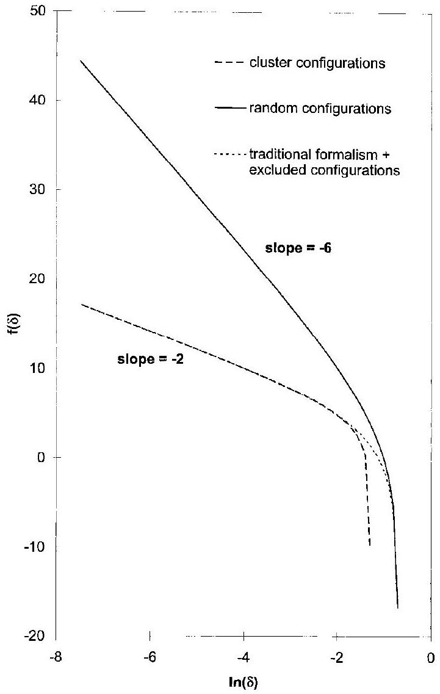
Fig. 2. Plot of $f(\delta)$, defined as $\ln \left(P_{\mathrm{O}_{2}}^{\text {gas }}\right)+\left(\mu_{\mathrm{O}_{2}}^{0}-\Delta F_{\mathrm{O}_{2}}^{0}\right) / k_{\mathrm{B}} T$, vs $\ln \delta$. Function $f$ is calculated using Eq. (43) (cluster configurations), Eq. (23) (random configurations), and Eq. (38) (traditional formalism) or Eq. (48) (excluded configurations).

tration, the traditional formalism is in perfect agreement with the analysis in terms of building units. Also shown is the case when $\left\{V_{\mathrm{O}}^{\bullet \bullet}\right\}$ and $\left\{\mathrm{B}_{\mathrm{B}}^{\prime}\right\}$ defects are randomly distributed and noninteracting while no clusters are formed. The result obtained in this case deviates from those derived from the cluster models. The cluster models lead to a $P_{\mathrm{O}_{2}}^{-n}$ dependence of $\delta$ with $n=1 / 2$, which is in agreement with experimental observations. ${ }^{32,33}$ In the random model, $n=1 / 6$, which is not supported by experiment. At high vacancy concentrations, the two cluster models show a small difference. In the traditional formalism, ideally diluted structure elements are assumed even at high concentrations. The analysis in terms of building units overestimates the effect of site exclusions at high defect concentrations. The actual value or $f(\delta)$ therefore is between the values calculated from the two cluster models.
(c) Strong repulsive interactions-Excluded configurations: The effect of strong repulsive interaction can be handled easily using the principle of excluded configurations. ${ }^{15,27,34}$ This principle states that configurations exhibiting strong repulsive interactions between neighboring defects can be neglected in the partition function when the interaction energy involved within each configuration is large compared with $k_{\mathrm{B}} T$. In other words, the statistical weight of these configurations has become zero. By this principle, the configurational entropy is lower than its random value.

To illustrate the principle of excluded configurations, we continue examination of the cluster model proposed by Van Roosmalen and Cordfunke. ${ }^{31}$ Two types of building units are present in the lattice, i.e., $\left\{V_{\mathrm{O}}^{\cdot \cdot}\right\}$ and $\left\{\mathrm{B}_{\mathrm{B}}^{\prime}\right\}$. The total number of random configurations thus equals the value given by Eq. (16). By applying the concept of excluded configurations, we postulate that only those configurations in which all $\left\{V_{\text {O. }}^{\bullet}\right\}$ building
units have two neighboring $\left\{\mathrm{B}_{\mathrm{B}}^{\prime}\right\}$ defects contribute to the partition sum. The energy of configurations in which no clusters are present is considered to be very large, so that these can be neglected in the partition sum. In the perovskite structure, each B site has six neighboring oxygen sites while each oxygen site has two neighboring B sites. The probability that a single oxygen vacancy has two neighboring $\left\{\mathrm{B}_{\mathrm{B}}^{\prime}\right\}$ building units is ( $N_{\left\{\mathrm{B}_{\mathrm{B}}^{\prime}\right\}} / N)^{2}$. The probability, $p$, that all vacancies, $N_{\left\{V_{\mathrm{O}}\right\}}$, have two neighboring $\left\{\mathrm{B}_{\mathrm{B}}^{\prime}\right\}$ building units is, therefore,

$$
p=\left(\frac{N_{\left\{\mathrm{B}_{\mathrm{B}}^{\prime}\right\}}^{\prime}}{N}\right)^{2 N_{\left\{V_{0}\right\}}}
$$

Hence, the total number of allowable configurations is equal to the total number of random configurations, $\Omega$, given by Eq. (16), multiplied with the probability $p$. The configurational entropy can be evaluated from $S_{\text {oxide }}=k_{\mathrm{B}} \ln \Omega p$. Using Eqs. (16), (18), and (45) to evaluate the chemical potential of oxygen vacancies and that of localized electrons on B sites, we obtain

$$
\begin{aligned}
& \mu_{\left\{V_{\mathrm{O}}\right\}}=\epsilon_{\left\{V_{\mathrm{O}}\right\}}^{0}+k_{\mathrm{B}} T \ln \left(\frac{N_{\left\{V_{\mathrm{O}}\right\}} N^{2}}{\left(3 N-N_{\left\{V_{\mathrm{O}}\right\}}\right) N_{\left\{\mathrm{B}_{\mathrm{B}}^{\prime}\right\}}^{2}}\right) \\
& \mu_{\left\{\mathrm{B}_{\mathrm{B}}^{\prime}\right\}}=\epsilon_{\left\{\mathrm{B}_{\mathrm{B}}^{\prime}\right\}}^{0}+k_{\mathrm{B}} T \ln \left(\frac{N_{\left\{\mathrm{B}_{\mathrm{B}}^{\prime}\right\}}}{N-N_{\left\{\mathrm{B}_{\mathrm{B}}^{\prime}\right\}}}\right)-2 k_{\mathrm{B}} T\left(\frac{N_{\left\{V_{\mathrm{O}}^{\prime}\right\}}}{N_{\left\{\mathrm{B}_{\mathrm{B}}^{\prime}\right\}}}\right)
\end{aligned}
$$

where $\epsilon_{\left\{V_{0}{ }^{0}\right\}}^{0}$ and $\epsilon_{\left\{\mathrm{B}_{\mathrm{B}}^{\prime}\right\}}^{0}$ are the formation energies of the building units, and both can be regarded to be constant. Equations (46) and (47) differ strongly from the chemical potentials derived for the random case given by Eqs. (21) and (22). From Eqs. (46) and (47), the following expression for the exchange reaction with gas-phase oxygen is obtained:

$$
\frac{P_{\mathrm{O}_{2}}^{\operatorname{gas}} N_{\left\{V_{\mathrm{O}}\right\}}^{2} N^{4}}{\left(3 N-N_{\left\{V_{\mathrm{O}}\right\}}\right)^{2}\left(N-2 N_{\left\{V_{\mathrm{O}}\right\}}\right)^{4}}=\exp \left[-\left(\mu_{\mathrm{O}_{2}}^{0}-\Delta F_{\mathrm{O}_{2}}^{0}\right) / k_{\mathrm{B}} T\right]
$$

where $\Delta F_{\mathrm{O}_{2}}^{0}=-2 \epsilon_{\left\{V_{\mathrm{O}}\right\}}^{0}-4 \epsilon_{\left\{\mathrm{B}_{\mathrm{B}}^{\prime}\right\}}^{0}+4 k_{\mathrm{B}} T$ and use has been made of the charge neutrality principle; i.e., $N_{\left\{\mathrm{B}_{\mathrm{B}}^{\prime}\right\}}=2 N_{\left\{V_{\mathrm{O}}\right\}}$. The result is identical to that obtained in the preceding section, applying the traditional formalism to the cluster (also see Fig. 2).

The concept of excluded configurations has been applied to model data of oxygen nonstoichiometry of $\mathrm{YBa}_{2} \mathrm{Cu}_{3} \mathrm{O}_{7-y}$ by Verweij and Feiner. ${ }^{34}$ Contrary to the above, oxygen incorporation in $\mathrm{YBa}_{2} \mathrm{Cu}_{3} \mathrm{O}_{7-y}$ cannot be described by a simple mass-action-type law. The reason is that, in its structure, no simple clusters can be identified.
(C) The Chemical Potential of Electrons: Conductivity measurements on many oxides containing variable-valence ions indicate that these can be insulators, hopping conductors, semiconductors, metallic, or semimetallic. For semiconducting and metallic transition-metal oxides, two classes can be identified. Materials can be either of the charge-transfer or of the charge-disproportionation type. ${ }^{35,36}$ In the latter type, acceptor doping creates positive holes in the narrow electron band constituted by the $3 d^{n}$ states of the transition-metal atoms. In tran-sition-metal oxides of the charge-transfer type, electron holes are formed preferentially in relatively wide electron bands with mainly O2 $p$ character. Because electron thermodynamics of wide bands differ from that of narrow bands, our concern is to investigate how the bandwidth affects the expression for the electron chemical potential.

Below, Fermi-Dirac statistics is used to derive expressions for the chemical potential of electrons occupying states in a partially filled electron band of width $W$. Depending on the degree of electron occupancy, this band may correspond to a valence or conduction band in a semiconductor or to a partially filled band, such as in metallic conductors. It is justified to treat the itinerant electrons in a particular band exclusively and leave
all other partially or completely filled bands out of consideration. For each of these bands, an electron chemical potential can be defined, which, in equilibrium, must equal the chemical potential of the electrons in the particular electron band under investigation. Because, according to large-polaron theory, ${ }^{37}$ large polarons can be treated as itinerant electrons with an increased mass and a reduced energy, the form of the chemical potentials presented below also applies to large polarons.

The total number of states in the band is $2 N$, where $N$ is of the order of the number of unit cells. The factor 2 results from the spin multiplicity. The occupation probability of a single electron state with energy $\epsilon, f(\epsilon)$, is given by the Fermi-Dirac distribution function: ${ }^{22}$

$$
f(\epsilon)=\left\{\exp \left[(\epsilon-\mu) / k_{\mathrm{B}} T\right]+1\right\}^{-1}
$$

where $\mu$ is the electron chemical potential. To evaluate the total number of electrons $N_{\mathrm{e}}$ in the band, we must sum the occupation probabilities of all $2 N$ electron states. Defining the density of states $g(\epsilon)$ as the number of electron states normalized with respect to $N$ in a small energy interval $\mathrm{d} \epsilon$, the electron occupation number, $n$, defined as $N_{\mathrm{e}} / N$ can be evaluated from

$$
n=\int_{\epsilon^{\mathrm{top}}-W}^{\epsilon^{\mathrm{top}}} f(\epsilon) g(\epsilon) \mathrm{d} \epsilon
$$

where $\epsilon^{\text {top }}$ is the energy at the top of the band and $W$ the band width. The density of states is defined in such a way that the total number of states in the band is $2 N$. When an analytical expression for $g(\epsilon)$ exists, Eq. (50) can be integrated to yield the electron occupation number as a function of electron chemical potential.

Analytical integration of Eq. (50) can be performed for two simple cases. The first case is when the band is very narrow. As mentioned above, narrow electron bands are expected, for instance, in oxides of the charge disporportionation type. In such a case, all energy levels have about the same energy, $\epsilon \approx \epsilon^{\text {top }}$. As a result, $f$ is constant, and Eq. (50) becomes

$$
\mu=\epsilon^{\mathrm{top}}+k_{\mathrm{B}} T \ln \left(\frac{n}{2-n}\right)
$$

The expression for the entropy part of Eq. (51) is similar to that derived in Section $\mathrm{II}(3)(A)$ for the configurational entropy of randomly distributed building units. This is because electrons, similar to building units, obey Fermi-Dirac statistics. In a localized scheme, the electrons are associated with any of the equivalent available ionic sites. In a narrow-band scheme, the electron occupies any of the (nearly) degenerate energy levels. The influence of electron spin is to double the total number of available energy levels. Hence, the maximum value for the occupation number is $n=2$. In the limit of a narrow band, this maximum implies that two electrons of opposite spin are in the vicinity of one atom. If coulombic repulsion between these electrons leads to interaction energies, which are large compared with the bandwidth, the electrons tend to localize (Mott localization). ${ }^{23}$ This is why the one-electron theory breaks down for narrow electron bands. In the localized scheme, the site exclusion effect precludes the occupation of the same lattice sites by two electrons. As a result, the entropy part of Eq. (51) differs from the one that is obtained by adding the spin and configurational entropy of electronic building units. The spin entropy of electronic building units is discussed in Section II(4)(B).

The second case in which Eq. (50) can be integrated analytically is when the electron occupation number $n$ is either small or $\sim 2$, which corresponds with an almost completely empty or filled band, respectively. Below, we derive an expression for the chemical potential of electrons in case the band is almost filled. From Ref. 38, it follows that $\mu-\epsilon \gg k_{\mathrm{B}} T$ for an almost filled band, in which case we can use the approximation

$$
f(\epsilon) \approx 1-\exp \left[-(\mu-\epsilon) / k_{\mathrm{B}} T\right]
$$

Substituting this expression into Eq. (50) and integrating from $\epsilon=\epsilon^{\text {top }}-W$ to $\epsilon=\epsilon^{\text {top }}$, we obtain

$$
\mu=k_{\mathrm{B}} T \ln I-k_{\mathrm{B}} T \ln (2-n)
$$

where $I$ is a term independent of the electron occupation number:

$$
I=\int_{\epsilon^{\mathrm{top}}-W}^{\epsilon^{t o p}} \exp \left(\epsilon / k_{\mathrm{B}} T\right) \mathrm{g}(\epsilon) \mathrm{d} \epsilon
$$

Note that $2-n$ is the electron-hole occupation number and that Eq. (53) is similar to the negative value of the chemical potential of ideally diluted electron holes. When the band is wide, i.e., $W \gg k_{\mathrm{B}} T$, integration of Eq. (54) can be performed analytically using the well-established expression for the density of states at the top of the band: ${ }^{38}$

$$
g(\epsilon)=\frac{\mathrm{V}_{\mathrm{uc}} m^{*}}{\hbar^{2} \pi^{2}} \sqrt{\frac{2 m^{*}}{\hbar^{2}}\left(\epsilon^{\mathrm{top}}-\epsilon\right)}
$$

where $m^{*}$ is the effective electron mass near the top of the band, $\hbar=h / 2 \pi, h$ Planck's constant, and $\mathrm{V}_{\mathrm{uc}}$ the volume of the unit cell. Equation (55) resembles that for the density of states of a free-electron gas with effective electron mass $m^{*}$. Integrating and substituting the resulting expression for $I$ in the expression for $\mu$ given by Eq. (53) leads to

$$
\begin{gathered}
\mu=\left(\epsilon^{\text {top }}-\frac{3}{2} k_{\mathrm{B}} T\right)-T\left[-\frac{3}{2} k_{\mathrm{B}}-\frac{3}{2} k_{\mathrm{B}} \ln \left(\frac{\mathrm{~V}_{\mathrm{uc}}^{2 / 3} m^{*} k_{\mathrm{B}} T}{2 \pi \hbar^{2}}\right)\right. \\
\left.+k_{\mathrm{B}} \ln \left(\frac{2-n}{2}\right)\right]
\end{gathered}
$$

Here, the first term (between parentheses) on the right-hand side is the energy part of the chemical potential, and the term between brackets following the temperature $T$ is the entropy part. As expected from the equipartition law, ${ }^{22}$ a term $-(3 / 2) k_{\mathrm{B}} T$ resulting from the kinetic energy of nearly free electron holes appears in the energy part of the chemical potential. Because the value of the effective electron mass $m^{*}$ increases with decreasing bandwidth, the entropy of electrons appears to be a function of the bandwidth.

In general, integration of Eq. (50) can be performed only numerically, provided that the functional dependence of $g(\epsilon)$ is known. Below, the electron chemical potential is evaluated numerically as a function of $n$ and $W$, using the following expression for $g(\epsilon)$ :

$$
g(\epsilon)=\frac{3}{W} \sqrt{1-\frac{2|\epsilon+0.5 W|}{W}}
$$

Although Eq. (57) resembles no known dispersion for the density of states in a solid, it predicts a square root of energy dependence at the top and the bottom of the band. This expression is introduced by us to show how the electron chemical potential, including its energy and entropy parts, is related to the width of the band. We have defined $g(\epsilon)$ in such a way that the energy at the top of the band equals zero, while the total number of electron states in the band is equal to 2. In Fig. 3, the density of electron states is plotted as a function of energy for the case $W=20 k_{\mathrm{B}} T$. The Fermi-Dirac distribution function for $\mu=-4 k_{B} T$ is shown for comparison. Only those electron states within a few $k_{\mathrm{B}} T$ of $\mu$ are partially occupied, whereas all the other electron states are either completely filled when they are well below $\mu$ or empty when above $\mu$. Because the total number of energy states within a few $k_{\mathrm{B}} T$ of $\mu$ is much less for a wide band than for a narrow band, the electron entropy in the former case is much smaller. This is confirmed by numerical calculations, the results of which are shown in Fig. 4. At each value of $n$, the absolute value of the electron entropy for a band with zero bandwidth is larger than the corresponding value for a wide band ( $W=20 k_{\mathrm{B}} T$ ). Although the total number entropy of all electrons in the band is zero when the band is completely

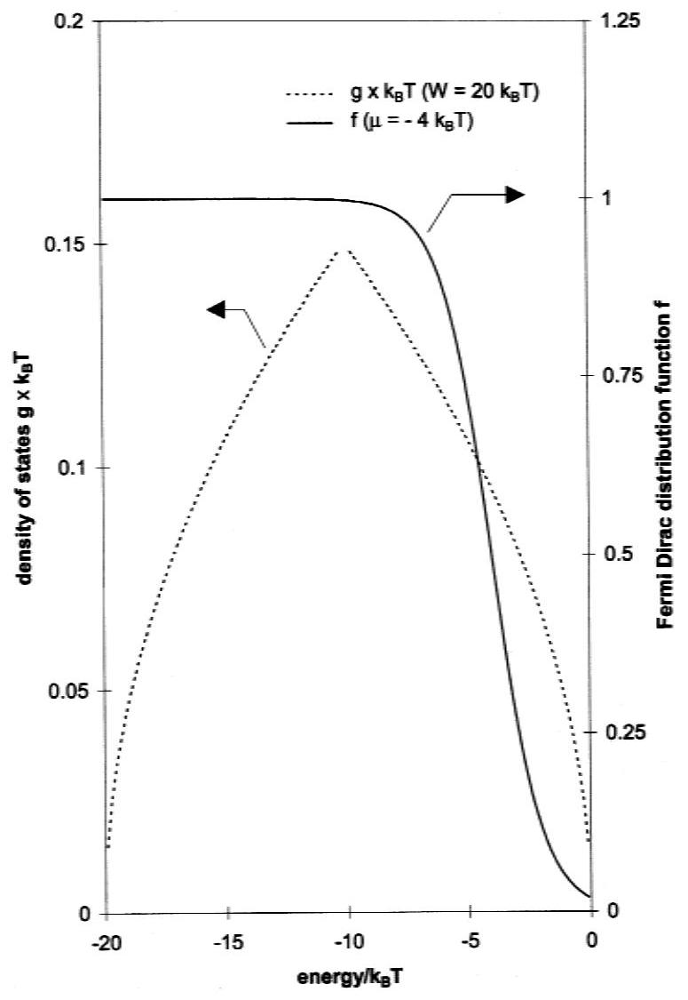
Fig. 3. Plot of the density of states, $g$, derived from Eq. (57), as a function of energy. Energy at the top of the band is zero. Bandwidth, $W$, is $20 k_{\mathrm{B}} T$. Fermi-Dirac distribution function $f$, when $\mu=-4 k_{\mathrm{B}} T$, also is shown as a function of energy.

filled, its first derivative, defined as the electron entropy, becomes very large when the electron occupation number approaches 2, both in the narrow and in the wide band (see Eqs. (51) and (53)). The sign of the electron entropy is negative, which corresponds with a positive entropy for electron holes. If similar calculations were performed for almost-empty bands, the sign of the electron entropy would have been positive. The electron entropy is related to the Seebeck coefficient; this explains why it is possible to determine from Seebeck measurements whether a material is n-type or $p$-type. ${ }^{46}$

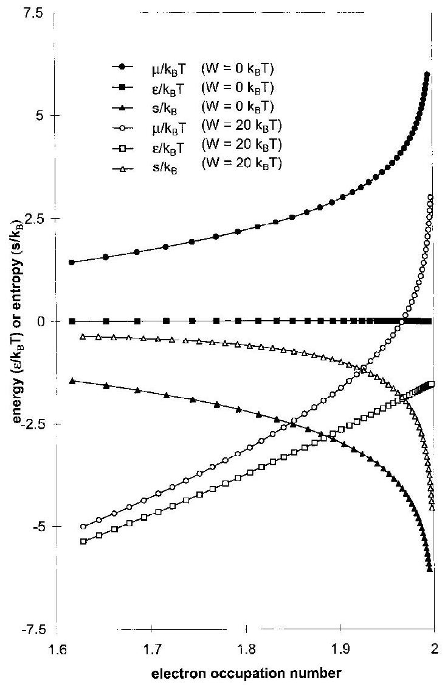
Fig. 4. Plot of the electron chemical potential $\mu$ and its energy $\boldsymbol{\epsilon}$ and entropy $s$ as a function of the bandwidth $W$ and the electron occupation number in the band. Calculations were based on Eqs. (50) and (57).

The energy part of the chemical potential is constant for a narrow band, and it decreases with decreasing occupation number in a wide band. In agreement with Eq. (56), the electron energy is approximated by $-(3 / 2) k_{\mathrm{B}} T$ when the wide band is almost completely filled. With decreasing occupation number, the value of the electron chemical potential approaches its energy part because of the vanishing influence of the electron entropy. Because, in this case, the Fermi-Dirac distribution function can be approximated by a step function, Eq. (50) simplifies to

## Panel A. Rigid-Band Model

In the model used to derive Eq. (61), the Fermi level moves upwards at a rate determined by $g(\mu)$ when electrons created by vacancy formation are donated to the band. Implicitly, it is assumed that the electron band is rigid in the sense that it does not change its shape or position when oxygen ions are removed from the solid. Although, in this view, commonly referred to as the electron-gas rigid-band model, ${ }^{39}$ important features, such as screening, electron correlation, and exchange, are neglected. Observed chemical potential variations for alkali-metal intercalated transition-metal dichalcogenides have been found to correlate well with density-of-states calculations ${ }^{40}$ and X-ray absorption measurements. ${ }^{41}$ McKinnon and Selwyn ${ }^{42}$ criticized the validity of the electron-gas rigid-band model. With reference to the screened impurity rigid-band model developed by Friedel, ${ }^{43}$ these authors proposed that, when ionized impurities are added or removed, the entire band shifts because of the perturbation constituted by the screened coulomb-potential of the impurity. Because the latter shift is exactly opposite to the shift in the Fermi level expected from the change in electron occupancy, the resulting value of the Fermi level remains unaffected. Sellmyer ${ }^{39}$ concluded that both rigid-band models would have the same implications for an experiment in which energies are usually measured only relative to the bottom of the band. However, in point defect studies, energies are measured on an absolute scale, and, therefore, the results depend on which model is applicable. We found strong support in favor of the applicability of the electron-gas rigid-band model for the oxygen-deficient perovskites $\mathrm{La}_{1-x} \mathrm{Sr}_{x} \mathrm{CoO}_{3-\delta} \cdot{ }^{44}$ We found that, in these materials, the equilibrium $\mu_{\mathrm{O}_{2}}$ appears to decrease almost linearly with increasing net electron occupancy, i.e., $2 \delta-x$. Because changes in the chemical potential of the oxygen ions are expected to vary with $\delta$ instead of $2 \delta-x$, we concluded that the observed dependence results from variations in the Fermi level.

$$
n=\int_{\epsilon^{\mathrm{top}}-W}^{\mu} g(\epsilon) \mathrm{d} \epsilon
$$

Taylor expansion and, omitting second and higher-order terms, gives, after rearranging.

$$
\mu=\mu\left(n^{0}\right)+\frac{1}{g\left(\mu\left(n^{0}\right)\right)}\left(n-n^{0}\right)
$$

To show that Eq. (59) is a fair approximation of the electron chemical potential in partially filled wide bands, the value of $g(\mu)$ is compared with that obtained from numerical differentiation of $n$ with respect to $\mu$. Results are given in Fig. 5, showing that, for a width $W=20 k_{\mathrm{B}} T$, the density of states is in reasonable agreement with the slope of $n$ as function of $\mu$.

In contradiction to Eqs. (51) and (53), Eq. (59) does not lead to the familiar mass-action-type equation when substituted into the equilibrium condition. Let us suppose the following oxygen incorporation reaction:

$$
\mathrm{O}_{2}^{\text {gas }}+2\left\{V_{\mathrm{O}}^{\bullet}\right\}+4 \mathrm{e}^{\prime} \leftrightharpoons \mathrm{nil}
$$

where $\mathrm{e}^{\prime}$ is an electron in a partially filled wide band, and the lattice oxygen vacancies are assumed to be randomly distributed and noninteracting. Substituting Eqs. (22) and (59) into the equilibrium condition for Eq. (60) leads to

$$
P_{\mathrm{O}_{2}^{\text {gas }}}\left(\frac{N_{\left\{V_{\ddot{O}}\right\}}}{3 N-N_{\left\{V_{O ̈}\right\}}}\right)^{2} \exp \left[4\left(n-n^{0}\right) / g\left(\mu\left(n^{0}\right)\right) k_{\mathrm{B}} T\right]=
$$

where $\Delta F_{\mathrm{O}_{2}}^{0}=-2 \epsilon_{\left\{V_{\mathrm{O}}\right\}}^{0}-4 \mu\left(n^{0}\right)$.

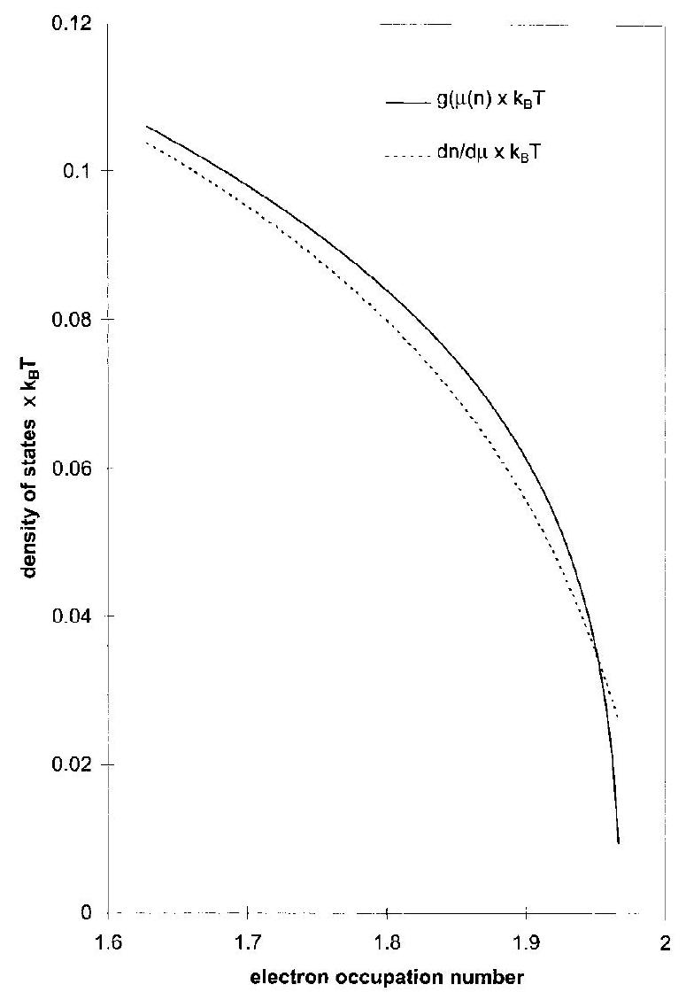
Fig. 5. Comparison of the local density of states at $\epsilon=\mu, g(\mu)$ with the slope $\mathrm{d} n / \mathrm{d} \mu$ as a function of the electron occupation number in the band. Calculations were made using Eqs. (50) and (57), assuming a band width $W=20 k_{\mathrm{B}} T$.

When Eq. (61) applies, the density of states $g\left(\mu\left(n^{0}\right)\right)$ can be obtained by measuring $N_{\left\{V_{\mathrm{O}}\right\}}$ as a function of temperature and oxygen-gas partial pressure.

## (4) Analyzing Experimental Data

We have analyzed reactions between defects by substitution of the appropriate expressions for the chemical potentials of the involved defects into the condition that applies at equilibrium. We have demonstrated that this approach leads to familiar mass-action-type equations only when defect interactions, site exclusion effects, and condensation of electronic defects can be neglected. The purpose of this section is to analyze how defect formation energies are related to experimental data of $\mu_{\mathrm{O}_{2}^{\text {gas }}}$ as a function of temperature and oxygen stoichiometry.
(A) Evaluation of Partial Energy and Entropy of Oxygen: This can be of great help in the interpretation of data from oxygen nonstoichiometry measurements. ${ }^{45,47-49}$ The partial energy $\epsilon_{\mathrm{O}_{2}}{ }^{\text {oxide }}$ and entropy $s_{\mathrm{O}_{2}}{ }^{\text {oxide }}$ associated with oxygen incorporation into the oxide are defined by

$$
\begin{aligned}
\epsilon_{\mathrm{O}_{2}^{\text {oxide }}}=\left(\frac{\partial E^{\text {oxide }}}{\partial N_{\mathrm{O}_{2}}}\right)_{T} & =\left(\frac{\partial \mu_{\mathrm{O}_{2}^{\text {gas }} / T}}{\partial 1 / T}\right)_{N_{\mathrm{O}}} \\
S_{\mathrm{O}_{2}^{\text {oxide }}}=\left(\frac{\partial S^{\text {oxide }}}{\partial N_{\mathrm{O}_{2}}}\right)_{T} & =-\left(\frac{\partial \mu_{\mathrm{O}_{2}^{\text {gas }}}}{\partial T}\right)_{N_{\mathrm{O}}}
\end{aligned}
$$

where $E^{\text {oxide }}$ and $S^{\text {oxide }}$ are the energy and entropy part of $F^{\text {oxide }}$, respectively. In the derivation of Eqs. (62) and (63), we used the thermodynamic Maxwell relations and the condition for equilibrium between the oxide and the surrounding gas: $\mu_{\mathrm{O}_{2}^{\text {gas }}}=\epsilon_{\mathrm{O}_{2}^{\text {oxide }}}-T \mathrm{~s}_{\mathrm{O}_{2}^{\text {oxide }}}$. The values of $\epsilon_{\mathrm{O}_{2}^{\text {oxide }}}$ and $\mathrm{S}_{\mathrm{O}_{2}^{\text {oxide }}}$ thus can be obtained by measuring $\mu_{\mathrm{O}_{2}^{\text {gas }}}$ as a function of temperature at constant oxygen stoichiometry. To obtain correct values for $\epsilon_{\mathrm{O}_{2}^{\text {oxide }}}$ and $s_{\mathrm{O}_{2}^{\text {oxide }}}$, the $P_{\mathrm{O}_{2}^{\text {gas }}}$-independent part of $\mu_{\mathrm{O}_{2}^{\text {gas }}}$, i.e., $\mu_{\mathrm{O}_{2}^{\text {gas }}}^{0}$, also must be differentiated. Expressions for $\mu_{\mathrm{O}_{2}^{\text {gas }}}^{0}$ can be found in the literature. ${ }^{24,34}$

The following step in the analysis is to place $\epsilon_{\mathrm{O}_{2}^{\text {oxide }}}$ and $s_{\mathrm{O}_{2}^{\text {oxide }}}$ in the framework of a point-defect model. As an example, we consider the oxygen-incorporation reaction given by Eq. (60). From Eqs. (62 ) and (63) and the equilibrium condition for this reaction, it follows that

$$
\begin{aligned}
& \epsilon_{\mathrm{O}_{2}^{\text {oxide }}}=-2 \epsilon_{\left\{V_{\mathrm{O}}\right\}}-4 \epsilon_{\mathrm{e}^{\prime}} \\
& s_{\mathrm{O}_{2}^{\text {oxide }}}=-2 s_{\left\{V_{\mathrm{O}}\right\}}-4 s_{\mathrm{e}^{\prime}}
\end{aligned}
$$

where, based on Eq. (60), $\epsilon_{\left\{V_{0}\right\}}$ and $s_{\left\{V_{0}\right\}}$ are the energy and entropy of randomly distributed and noninteracting oxygen vacancy building units, and $\epsilon_{\mathrm{e}^{\prime}}$ and $S_{\mathrm{e}^{\prime}}$ are the corresponding quantities for the delocalized electrons. Appropriate expressions for the energy and entropy of these defects can be taken from Eqs. (22) and (59). Substitution of these expressions into Eqs. (64) and (65) and using the condition of charge neutrality, i.e., $n-n^{0}=2\left(\delta-\delta^{0}\right)$, leads to

$$
\begin{aligned}
& \epsilon_{\mathrm{O}_{2}^{\text {oxide }}}=\Delta \epsilon_{\mathrm{O}_{2}}^{0}-8 \frac{\delta-\delta^{0}}{g\left(\epsilon_{\mathrm{F}}\right)} \\
& s_{\mathrm{O}_{2}^{\text {oxide }}}=\Delta s_{\mathrm{O}_{2}}^{0}+2 k_{\mathrm{B}} \ln \left(\frac{\delta}{3-\delta}\right)
\end{aligned}
$$

where $\Delta \epsilon_{\mathrm{O}_{2}}^{0}$ and $\Delta s_{\mathrm{O}_{2}}^{0}$ are energy and entropy terms that are independent of $\delta$ and $\epsilon_{\mathrm{F}}$, and where $\epsilon_{\mathrm{F}}$ is the Fermi energy, which equals the electron chemical potential. The parameter $\Delta \epsilon_{\mathrm{O}_{2}}^{0}$ contains the constant formation energies of lattice oxygen vacancies and delocalized electrons. Neglecting vibrational effects, Eqs. (66) and (67) show that $\epsilon_{\mathrm{O}_{2}^{\text {oxide }}}$ and $\mathrm{s}_{\mathrm{O}_{2}^{\text {oxide }}}$ are independent of temperature. In Fig. 6, experimental data of these quantities for $\mathrm{La}_{0.8} \mathrm{Sr}_{0.2} \mathrm{CoO}_{3-\delta}$ obtained at four different temperatures are plotted as a function of the nonstoichiometry parameter $\delta$. Data were obtained from electromotive force (emf) measurements at constant oxygen stoichiometry as a

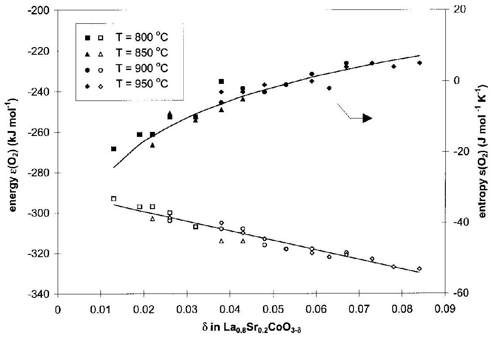
Fig. 6. Plot of the energy and entropy of oxygen incorporation into $\mathrm{La}_{0.8} \mathrm{Sr}_{0.2} \mathrm{CoO}_{3-\delta}$ as a function of $\delta$ and temperature. ${ }^{45}$ Lower and upper lines represent best fits to Eqs. (66) and (67), respectively.

function of temperature, using a zirconia electrolytic cell enclosing the sample. ${ }^{45,50} \epsilon_{\mathrm{O}_{2}^{\text {oxide }}}$ and $\mathrm{S}_{\mathrm{O}_{2}^{\text {oxide }}}$ can be fitted to Eqs. (66) and (67), respectively, which demonstrates that oxygen vacancies are randomly distributed and electrons are delocalized in $\mathrm{La}_{0.8} \mathrm{Sr}_{0.2} \mathrm{CoO}_{3-\delta}$. The latter observation is in agreement with the measured metallic conduction at elevated temperatures in this compound. ${ }^{51}$

An advantage of the above procedure is that more insight is gained into the defect statistics. In $\mathrm{La}_{0.8} \mathrm{Sr}_{0.2} \mathrm{CoO}_{3-\delta}, \mathrm{S}_{\mathrm{O}_{2}^{\text {oxide }}}$ is a function of $\delta$ and is associated with the configurational entropy of oxygen vacancies. No contribution resulting from the entropy of electrons can be identified. On the other hand, the change in $\epsilon_{\mathrm{O}_{2}^{\text {oxide }}}$ is determined by the corresponding change of the Fermi energy.

In Section $\mathrm{II}(2)(B)$, we concluded that, because of the charge neutrality requirement, the chemical potentials of charged building units cannot be measured separately. The above example shows that it remains possible to ascribe changes in $\mu_{\mathrm{O}_{2}}{ }^{\text {gas }}$ to originate from contributions resulting from the individual defects.
$\mu_{\mathrm{O}_{2}}^{0}{ }_{\text {gas }}$ and, consequently, all energies in Eqs. (64) and (66) are defined with respect to the energy of an isolated $\mathrm{O}_{2}$ molecule at 0 K . However, in measurement of, for example, thermionic emission and also in model calculations, the energy associated with the incorporation of either an electron or an $\mathrm{O}^{2-}$ ion into the oxide is commonly determined relative to the energy of this particle at 0 K under vacuum. Therefore, to compare with such experiments or calculations, the energy associated with the dissociation of $\mathrm{O}_{2}$ into two O atoms $(496 \mathrm{~kJ} / \mathrm{mol})^{52}$ and 2 times the $\mathrm{O} / \mathrm{O}^{2-}$ electron affinity $(702 \mathrm{~kJ} / \mathrm{mol})^{53}$ should be subtracted from $\Delta \epsilon_{\mathrm{O}_{2}}^{0}$. The final step in the analysis is to correct the values of $\Delta \epsilon_{\mathrm{O}_{2}}^{0}$ and $\Delta s_{\mathrm{O}_{2}}^{0}$ for contributions resulting from the changes in vibrational Helmholz free energy and electron-spin entropy with oxygen stoichiometry changes. In the following section, we discuss how to obtain approximate values for these contributions.
(B) Vibrational and Spin Terms in the Helmholtz Free Energy of Oxides: In Section II(2)(A), we showed that a building unit consists of two structure elements. Suppose that the spin of the first structure element is $S_{1}$, while that of the second is $S_{2}$. Then, the total number of possible spin configurations, $\Omega_{\text {spin }}$, is given by

$$
\Omega_{\mathrm{spin}}=\left(2 S_{1}+1\right)^{N_{1}}\left(2 S_{2}+1\right)^{N_{2}}
$$

where $N_{1}$ and $N_{2}$ are the numbers of the respective structure
elements. Combining $S_{\text {spin }}=k_{\mathrm{B}} \ln \Omega_{\text {spin }}$ with site conservation $N_{1}+N_{2}=N$ results in the following entropy of spin:

$$
S_{\mathrm{spin}}=k_{\mathrm{B}} N_{1} \ln \left(\frac{2 S_{1}+1}{2 S_{2}+1}\right)+k_{\mathrm{B}} N \ln \left(2 S_{2}+1\right)
$$

Differentiating with respect to $N_{1}$ shows that the spin entropy part of the chemical potential of electronic building units is given by

$$
s_{\mathrm{spin}}=k_{\mathrm{B}} \ln \left(\frac{2 S_{1}+1}{2 S_{2}+1}\right)
$$

Let us take as an example the $\left\{\mathrm{Cu}_{\mathrm{Cu}}^{\prime}\right\}$ building unit, where $\mathrm{Cu}_{\mathrm{Cu}}^{\times}$represents a $\mathrm{Cu}^{2+}$ ion that has the $d^{9}$ configuration. The spin of the $\mathrm{Cu}_{\mathrm{Cu}}^{\prime}$ structure element ( $d^{10}$ closed-shell configuration) is zero, while that of $\mathrm{Cu}_{\mathrm{Cu}}^{\times}$is $1 / 2$. Hence, the spin multiplicity of these structure elements is given by 1 and 2 , respectively. The entropy of spin for this building unit thus is equal to $k_{\mathrm{B}} \ln 1 / 2$. This procedure differs from that used in Section $\mathrm{II}(3)(C)$. There we assumed that, in the framework of oneelectron band theory, each nearly free electron has spin $\frac{1}{2}$ and, as a result, the total number of available levels and the electron density of energy states is doubled. In this section, the total spin of an electronic structure element is calculated by adding the spins of all valence electrons of the ion.

In addition to spin, the structure elements also can possess orbital angular momentum $L$. Because, for the $3 d^{n}$ electronic configuration of the transition metals, the spin-orbit coupling is relatively weak, ${ }^{54}$ the total degeneracy of the electronic state in the transition metals can be calculated from $(2 S+1)(2 L+1)$. Accordingly, Eqs. (68)-(70) can be modified to account for the degeneracies associated with the orbital angular momentums $L_{1}$ and $L_{2}$ of the respective structure elements.

Approximate values for the vibrational terms in the freeenergy expression can be obtained, considering the influence of creation of oxygen vacancies on the total vibrational free energy. In the perfect crystal, each ion has six degrees of freedom: three degrees of freedom in both momentum and position space. The potential energy function near the minimum at a lattice site can be approximated by a quadratic function of the three position coordinates. The kinetic energy is a quadratic function of the three momentum coordinates. Hence, there are $6 N$ quadratic terms in the expression of the energy for each oxygen ion. In accordance with the classical equipartition law, ${ }^{22}$ each quadratic term contributes $0.5 k_{\mathrm{B}} T$ to the total en-
ergy of the system. Upon incorporation of one oxygen molecule, two oxygen ions are added to the lattice; therefore, 12 quadratic energy terms appear in the expression for the energy. As a result, we obtain

$$
\Delta \epsilon_{\mathrm{O}_{2}}^{\text {vibrational }}=6 k_{\mathrm{B}} T
$$

where $\Delta \epsilon_{\mathrm{O}_{2}}^{\text {vibrational }}$ denotes that part of $\Delta \epsilon_{\mathrm{O}_{2}}^{0}$ that originates from the vibrational degrees of freedom.

No simple relation exists to calculate the absolute entropy. It is possible, however, to calculate changes in the entropy as a function of temperature. Using the classical equipartition law, we find

$$
\frac{\partial \Delta \mathrm{s}_{\mathrm{O}_{2}}^{\text {vibrational }}}{\partial T}=\frac{1}{T} \frac{\partial \Delta \epsilon_{\mathrm{O}_{2}}^{\text {vibrational }}}{\partial T}=\frac{6 k_{\mathrm{B}}}{T}
$$

Equation (72) can be used to transform experimental data of entropy at different temperatures to a reference temperature above the Debye temperature.

## III. Ionic and Electronic Transport in Oxides

## (1) Introduction

The transport of oxygen through mixed ionic and electronconducting oxides is commonly described using either Wagner's theory ${ }^{12}$ or the ambipolar diffusion model. ${ }^{55,56}$ In their most traditional form, both formalisms are restricted to the simultaneous transport of a single-ionic-type defect and a single-electronic type defect that are ideally diluted and do not interact. Maier and Schwitzgebel ${ }^{57}$ have shown that, when several ionic and electronic defects contribute to the overall transport, defects can be grouped into so-called conservative ensembles. An advantage of conservative ensembles is that, within the Wagner theory, they can be dealt with as if they were single-defect species. As such, the concept of conservative ensembles allows the incorporation of defect association into the theory of ambipolar diffusion. An additional advantage of the theory of conservative ensembles is that it allows interpretation of the occurrence of cross-coefficients between the overall ionic and electronic fluxes. Janek and co-workers ${ }^{58,59}$ have shown that the value of the cross-coefficients also can be evaluated when they originate from coulombic interactions between defects.

The purpose of this section is to review the above theories and to show how they can be useful in deriving general expressions for the ambipolar diffusion of ions and electrons in oxides. These expressions fit into the framework of irreversible thermodynamics and can include defect interactions, the contributions of several ionic and electronic defects with various valence states, and the coupling of overall ionic and electronic fluxes. Also, the influence of the magnitude of the crosscoefficients on the rate of ambipolar diffusion is investigated.

We start with deriving expressions that describe the transport of individual defects. The role of the site-exclusion effect on the thermally activated hopping transport of localized defects is analyzed. In Section III(3), two theories are discussed that enable investigation of the origin and magnitude of coupling of the overall ionic and electronic fluxes. First, the coupling is explained in terms of the presence of mobile defects with a variable ionization degree, which leads to a coupled-diffusionreaction process that can be handled using the theory of conservative ensembles. In the second theory, the occurrence of cross-coefficients between the overall ionic and electronic fluxes is related to direct coulombic interactions between defects. In the remaining sections, electronic and ionic fluxes are combined using both Wagner's theory ${ }^{12}$ and the ambipolar diffusion model ${ }^{55,56}$ to study the net oxygen flux and electric current density. Although, in general, overall transport of the neutral component, here oxygen, is influenced by both bulk and
surface exchange kinetics, ${ }^{60}$ the discussion is focused primarily on transport in the bulk.

Throughout this section, we describe the transport of defects in terms of building units. ${ }^{19}$ Because a building unit is defined relative to the ideal defect-free lattice, the description in terms of building units ensures that the transport of defects does not violate the structure conservation requirement (see Section II(2)(A)).

## (2) Transport of Individual Defects

Various types of mechanisms have been proposed for the transport of ionic and electronic point defects in solids. The transport of electrons and electron holes in metals and semiconductors is commonly described with the Boltzmann transport theory. ${ }^{61}$ Expressions for the diffusivity of small ${ }^{62}$ and large ${ }^{37}$ polarons have been derived by incorporating electronphonon interactions in the Boltzmann transport theory. The most commonly used mechanism to describe the transport of localized ionic and electronic point defects in crystalline solids is based on the thermally activated hopping of point defects to neighboring lattice sites. Two approaches to derive expressions for the hopping transport of localized defects are encountered in the literature. The first uses linear irreversible thermodynamic theory, ${ }^{63}$ and the second is based on atomistic reactionrate theory. ${ }^{64,65}$ The resulting transport expressions of these two approaches are the same when defects are noninteracting, as is the case for ideally diluted solutions. The purpose of this section is to find out how the expressions for transport change when the site exclusion effect is explicitly accounted for. As an example for the transport of point defects by means of hopping, we consider oxygen-ion transport in an oxygen-deficient $\mathrm{ABO}_{3-\delta}$ perovskite. In these perovskites, oxygen ions are believed to move through the lattice via an activated hopping process over vacant oxygen lattice sites $\left\{V_{\mathrm{O}}^{\bullet}\right\}$.

According to linear irreversible thermodynamics, the flux of any defect is linearly related to its thermodynamic generalized driving force. For transport of defects, the driving force is the negative gradient in the electrochemical potential, $-\nabla \eta$. Assuming that defect interactions can be neglected and, as a result, no cross-coefficients appear, the flux of oxygen vacancy building units $J_{\left\{V_{\mathrm{O}}\right\}}$ is given by ${ }^{63}$

$$
J_{\left\{V_{\ddot{\mathrm{O}}\}}\right.}=-\mathrm{s}_{\left\{V_{\ddot{\mathrm{O}}\}}\right.} \nabla \eta_{\left\{V_{\ddot{\mathrm{O}}}\right\}}
$$

where we have introduced the transport coefficient $\mathrm{s}_{\left\{V_{\ddot{\mathrm{O}}}\right\}}$, which is related to the conductivity of the vacancies $\sigma_{\left\{V_{\mathrm{O}}\right\}}$ as follows:

$$
\mathrm{S}_{\left\{V_{\ddot{\mathrm{O}}}\right\}}=\frac{\sigma_{\left\{V_{\ddot{\mathrm{O}}}\right\}}}{z_{\left\{V_{\ddot{\mathrm{O}}}\right\}}^{2} e^{2}}
$$

where $z_{\left\{V_{\mathrm{O}}\right\}}$ is the valence of the lattice oxygen vacancy; i.e., $z_{\left\{V_{\mathrm{O}}\right\}}=2$. The more general case in which cross-coefficients between the defect fluxes cannot be neglected, e.g., due to the presence of coulombic interactions, is discussed in Section III(3)(B). Linear-irreversible thermodynamics does not yield expressions that relate $\mathrm{s}_{\left\{V_{\mathrm{o}}\right\}}$ to parameters such as oxygen vacancy concentration and temperature. Further evaluation of $\mathrm{s}_{\left\{V_{0,}\right\}}$ requires considerations from an atomistic point of view.

It is commonly assumed that $\mathrm{s}_{\left\{V_{\mathrm{o}}\right\}}$ is linearly related to the concentration of oxygen vacancies $c_{\left\{V_{\mathrm{OH}}\right\}}{ }^{63,65}$

$$
\mathrm{s}_{\left\{V_{\ddot{\mathrm{O}}}\right\}}=c_{\left\{V_{\ddot{\mathrm{O}}}\right\}} b_{\left\{V_{\ddot{\mathrm{O}}}\right\}}
$$

where $b_{\left\{V_{\mathrm{O}}\right\}}$ is the mechanical mobility, the value of which is regarded to be constant for ideally diluted defects at constant temperature. In general, however, $b_{\left\{V_{\mathrm{O}}\right\}}$ depends on oxygen vacancy concentration. Because an oxygen vacancy can move to a neighboring site only when that site is occupied by a regular lattice oxygen ion, $b_{\left\{V_{\mathrm{O}}\right\}}$ must be proportional to the site occupancy of regular lattice oxygen ions:

$$
b_{\left\{V_{\ddot{\mathrm{O}}}\right\}}=b_{\left\{V_{\ddot{\mathrm{O}}\}}^{0}\right.}\left(\frac{3 c^{0}-c_{\left\{V_{\ddot{\mathrm{O}}\}}\right.}}{3 c^{0}}\right)=b_{\left\{V_{\ddot{\mathrm{O}}\}}^{0}\right.}\left(1-\frac{c_{\left\{V_{\ddot{\mathrm{O}}\}}\right.}}{3 c^{0}}\right)
$$

where $c^{0}$ is the concentration of units $\mathrm{ABO}_{3}$ and use has been made of Eq. (5). In this formalism, $b_{\left\{V_{\mathrm{O}}\right\}}^{0}$ is independent of vacancy concentration but is expected to be thermally activated. The term $c_{\left\{V_{\mathrm{O}}^{*}\right\}} / 3 c^{0}$ in Eq. (76) corresponds with the fraction of neighboring sites that is excluded in the statistics of the hopping process. Combining Eqs. (75) and (76) shows that $\mathrm{s}_{\left\{V_{0}\right\}}$ is proportional to the concentration of both unoccupied and occupied sites. Therefore, the flux is expected to be maximum when one-half of the accessible sites are occupied. ${ }^{56,65}$

Under the assumption that the oxygen vacancies are randomly distributed and noninteracting, the electrochemical potential of oxygen vacancy building units is given by (see Eq. (22))

$$
\eta_{\left\{V_{\mathrm{O}}\right\}}=\mu_{\left\{V_{\mathrm{O}}\right\}}^{0}+k_{\mathrm{B}} T \ln \left(\frac{c_{\left\{V_{\ddot{O}}\right\}}}{3 c^{0}-c_{\left\{V_{\mathrm{O}}\right\}}}\right)+z_{\left\{V_{\mathrm{O}}\right\}} e \Phi
$$

where $\Phi$ is the internal electric potential and $\mu_{\left\{V_{\mathrm{o}}\right\}}^{0}$ the con-centration-independent part of $\mu_{\left\{V_{\mathrm{G}}\right\}}$. The denominator of the term between parentheses in Eq. (77) originates from the site exclusion effect, which states that two defects cannot occupy a single site simultaneously. The flux of oxygen vacancies can be derived by differentiating Eq. (77). Making the appropriate rearrangements, if follows that

$$
\begin{aligned}
J_{\left\{V_{\ddot{\mathrm{O}}\}}\right.}=-b_{\left\{V_{\ddot{\mathrm{O}}}\right\}}^{0} \mathrm{k}_{\mathrm{B}} T & \left\{\nabla_{c_{\left\{V_{\ddot{\mathrm{O}}}\right\}}}\right. \\
& \left.+\left[\frac{z_{\left\{V_{\ddot{\mathrm{O}}\}}\right.} e c_{\left\{V_{\ddot{\mathrm{O}}}\right.}\left(1-\frac{c_{\left\{V_{\ddot{\mathrm{O}}}\right\}}}{3 c^{0}}\right)}{k_{\mathrm{B}} T}\right] \nabla \Phi\right\}
\end{aligned}
$$

The site-exclusion terms in Eqs. (76) and (77) are canceled. As a result, the first term on the right-hand side in Eq. (78) relates the flux of oxygen vacancies to the gradient in oxygen vacancy concentration, as predicted by Fick's first law of diffusion: $J_{\left\{V_{0}\right\}}=-D_{\mathrm{F}} \nabla c_{\left\{V_{0}\right\}}$. The corresponding Fick's diffusion coefficient is given by $D_{\mathrm{F}}=k_{\mathrm{B}} T b_{\left\{V_{\mathrm{O}}\right\}}^{0}$. Its relationship with conductivity can be expressed by

$$
\sigma_{\left\{V_{\ddot{\mathrm{O}}}\right\}}=\frac{Z_{\left\{V_{\ddot{\mathrm{O}}}\right.}^{2} e^{2} c_{\left\{V_{\ddot{\mathrm{O}}\}}\right.}\left(1-\frac{c_{\left\{V_{\ddot{\mathrm{O}}}\right\}}}{3 c^{0}}\right) D_{\mathrm{F}}}{k_{\mathrm{B}} T}
$$

For low vacancy concentration, the term $1-c_{\left\{V_{\mathrm{O}}\right\}} / 3 c^{0}$ vanishes, and the result obtained is equal to the result valid in the ideally diluted regime. ${ }^{63}$ If the oxygen self-diffusion coefficient $D_{\mathrm{O}}= D_{\mathrm{F}}\left(c_{\left\{V_{\mathrm{O}}\right.} / 3 c^{0}\right)$ is inserted in Eq. (79), the Nernst-Einstein equation is obtained. However, $D_{\mathrm{O}}$ is, in general, a strong function of the oxygen vacancy concentration. The vacancy diffusion coefficient $D_{V}$ is related to Fick's diffusion coefficient as follows: $D_{V}=D_{\mathrm{F}}\left(1-c_{\left\{V_{\mathrm{o}}\right\}} / 3 c^{0}\right) . D_{V}$ is proportional to the fraction of regular lattice oxygen ions. Because this factor is $\sim 1$ for low vacancy concentration, $D_{V}$, in contrast with $D_{\mathrm{O}}$, generally is only a weak function of the vacancy concentration. As an example of a material in which both $D_{V}$ and $D_{\mathrm{O}}$ depend strongly on vacancy concentration, we consider $\mathrm{YBa}_{2} \mathrm{Cu}_{3} \mathrm{O}_{7-y}$. In this compound, oxygen vacancy transport is confined to the basal ( $a-b$ ) plane. ${ }^{66}$ The fraction of oxygen vacancies in this plane can be any value between 0 and 1 . Because the oxygenion conductivity is proportional to both the fraction of oxygen vacancies and regular oxygen ions, a maximum value is expected for the ionic conductivity when the site occupancy in the basal plane is exactly one-half. Indeed, such a maximum has been observed from oxygen permeation experiments by Patrakeev et al. ${ }^{66}$

Finally, the basic transport equation represented by Eq. (78) also can be derived from an atomistic approach based on ki-
netic reaction-rate theory, when the site-exclusion effect is explicitly accounted for.

## (3) Coupling of Ionic and Electronic Transport

In the previous section, defect interactions were neglected. As a result, no cross-coefficients appear in Eq. (73) describing the transport of a single defect. In general, however, the electronic and ionic fluxes can be coupled, resulting in crosscoefficients in the corresponding transport equations. The purpose of this section is to show that coupling can be described in two ways. First, the appearance of measurable crosscoefficients is attributed to the simultaneous transport of ionic defects with different valence states. In Section III(3)(A), we derive general expressions for the overall ionic and electronic fluxes on the basis of the theory of conservative ensembles developed by Maier and Schwitzgebel. ${ }^{57}$ Second, coupling is attributed to interactions between mobile electronic and ionic defects. In Section III(3)(B), we derive expressions for the cross-coefficients in nonstoichiometric $\mathrm{Co}_{1-\delta} \mathrm{O}$ for the case where these interactions are assumed to be purely coulombic. The compound $\mathrm{Co}_{1-\delta} \mathrm{O}$ is used as an example because Dieckmann ${ }^{67}$ has shown that experimental data of cobalt nonstoichiometry can be modeled using the traditional formalism (see Section $\mathrm{II}(3)(A)$ ) based on the noninteracting, ideally diluted defects $\left\{V_{\mathrm{Co}}^{\prime \prime}\right\},\left\{V_{\mathrm{Co}}^{\prime}\right\},\left\{V_{\mathrm{Co}}^{\times}\right\}$, and $\mathrm{h}^{\bullet}$, whereas Tetot et al. ${ }^{68}$ have demonstrated that the nonstoichiometry of $\mathrm{Co}_{1-\delta} \mathrm{O}$ equally can be well analyzed in terms of only two defects, i.e., doubly ionized cobalt vacancies $\left\{V_{\mathrm{Co}}^{\prime \prime}\right\}$ and electron holes $\mathrm{h}^{\prime}$, if a Debye-Hückel correction (see Eq. (29)) is applied to account for the coulombic defect interactions. Therefore, the value of the cross-coefficients in $\mathrm{Co}_{1-\delta} \mathrm{O}$ can be calculated in both ways. An additional advantage of using $\mathrm{Co}_{1-\delta} \mathrm{O}$ as an example is that the theoretical values can be compared with experimental data, ${ }^{69,70}$ which is done in Section III(3)(C).
(A) Conservative Ensembles: In this section, the concept of conservative ensembles, developed by Maier and Schwitzgebel, ${ }^{57}$ is used to derive general expressions for the overall ionic and electronic fluxes when there are contributions of an arbitrary number of electronic, oxygen-related, and cationrelated defects. These expressions fit into the framework of linear irreversible thermodynamics. Let us first introduce three levels of transport in mixed conducting oxides. Experimentally accessible fluxes and electrochemical potential gradients are restricted to those of electrons and neutral components (experimental level). Fluxes and electrochemical potential gradients of point defects (defect level) generally cannot be measured directly. We show that the fluxes, transport coefficients, and electrochemical potential gradients at the defect level are related to their counterparts at the experimental level. An intermediate ensemble level is introduced to deal with properties of groups of defects.

If more than two defects determine overall diffusion, then internal defect reactions have to be accounted for. Maier and Schwitzgebel ${ }^{57}$ have shown that, for a binary oxide, in such a case, the transport problem can be reduced to the transport of only oxygen ions $\mathrm{O}^{*}$, cations $\mathrm{A}^{*}$, and electrons $\mathrm{e}^{*}$, where the asterisks designate that these species must be regarded as ensembles, rather than defects. These ensembles can be treated similar to transport species for which valence, concentration, and chemical potential are well-defined. The valence of an ensemble can be chosen freely; however, it preferably is set to valences of charge carriers commonly present in known ionic and electronic conductors. For example, the valence of $\mathrm{O}^{*}$ is preferably $2-$, which is in agreement with the $\mathrm{O}^{2-}$ conduction in well-known electrolytes, such as $\mathrm{ZrO}_{2}$ and $\mathrm{CeO}_{2}$ doped with aliovalent oxides.
(a) Elements of conservative ensembles: We begin by considering the elements that belong to the ensembles in a binary oxide $\mathrm{A}^{2+} \mathrm{O}^{2-}$. The $\mathrm{O}^{*}$ ensemble contains all oxygenrelated defects, such as oxygen vacancies $\left\{V_{\mathrm{O}}^{\bullet \ddot{O}}\right\},\left\{V_{\dot{\mathrm{O}}}^{\cdot}\right\},\left\{V_{\mathrm{O}}^{\times}\right\}$, and oxygen interstitials, $\left\{\mathrm{O}_{i}^{\prime \prime}\right\},\left\{\mathrm{O}_{i}^{\prime}\right\}$, and $\left\{\mathrm{O}_{i}^{\times}\right\}$, whereas the $\mathrm{A}^{*}$
ensemble contains all types of cation vacancies $\left\{V_{\mathrm{A}}^{\prime \prime}\right\},\left\{V_{\mathrm{A}}^{\prime}\right\}$, and $\left\{V_{\mathrm{A}}^{\times}\right\}$. The $\mathrm{e}^{*}$ ensemble contains all electronic defects, such as free electrons $\mathrm{e}^{\prime}$ and $\mathrm{h}^{\bullet},^{\ddagger}$ in addition to those ionic defects that effectively bear an electronic charge carrier. This is schematically illustrated in Fig. 7. The ionic defects in the intersecting regions belong to the ionic ensemble as well as to the $\mathrm{e}^{*}$ ensemble. For each defect, $z_{i}$ is the charge, $c_{i}$ the concentration, $J_{i}$ the flux, and $\eta_{i}$ the electrochemical potential. Subscripts $i, j$, and $k$ denote electronic, $\mathrm{O}^{*}$, and $\mathrm{A}^{*}$ ensembles, respectively. Further, we define $n_{\mathrm{O}}, n_{\mathrm{A}}$, and $n_{e}$ as the total number of types of O-related, A-related, and electronic defects, respectively. Using these definitions, we can relate the concentrations ( $c_{\mathrm{O}}^{*}, c_{\mathrm{A}}^{*}$, and $c_{\mathrm{e}}^{*}$ ) and the fluxes ( $J_{\mathrm{O}}^{*}, J_{\mathrm{A}}^{*}$, and $J_{e}^{*}$ ) of the ensembles to the concentration and fluxes of their elements. For the O* ensemble,

$$
\begin{aligned}
c_{\mathrm{O}}^{*} & =c_{\mathrm{O}}^{0}+\sum_{j=1}^{n_{\mathrm{O}}} m_{j} c_{j} \\
J_{\mathrm{O}}^{*} & =\sum_{j=1}^{n_{\mathrm{O}}} m_{j} J_{j}
\end{aligned}
$$

for the A* ensemble,

$$
\begin{aligned}
& c_{\mathrm{A}}^{*}=c_{\mathrm{A}}^{0}+\sum_{k=1}^{n_{\mathrm{A}}} m_{k} c_{k} \\
& J_{\mathrm{A}}^{*}=\sum_{k=1}^{n_{\mathrm{A}}} m_{k} J_{k}
\end{aligned}
$$

and for the $\mathrm{e}^{*}$ ensemble,

$$
c_{\mathrm{e}}^{*}=-\sum_{i=1}^{n_{e}} z_{i} c_{i}+\sum_{j=1}^{n_{\mathrm{O}}}\left(z_{\mathrm{O}}^{*}-z_{j} m_{j}\right) m_{j} c_{j}+\sum_{k=1}^{n_{\mathrm{A}}}\left(z_{\mathrm{A}}^{*}-z_{k} m_{k}\right) m_{k} c_{k}
$$

[^0]
## conservative ensembles

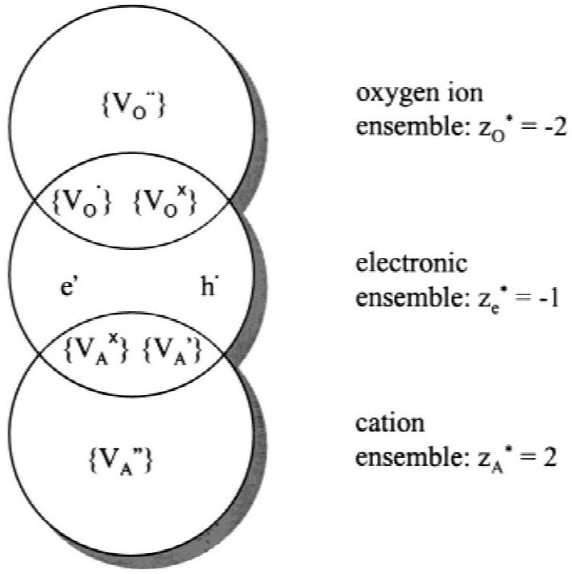
Fig. 7. Schematic picture of the $\mathrm{O}^{*}, \mathrm{~A}^{*}$, and $\mathrm{e}^{*}$ conservative ensembles. Only electrons and electron holes as well as oxygen and cation vacancies with various valences are considered as elements in the figure. Defects in the intersecting regions result in the appearance of cross-coefficients between ionic and electronic fluxes (see Section III(3)(A)).

$$
J_{\mathrm{e}}^{*}=-\sum_{i=1}^{n_{e}} z_{i} J_{i}+\sum_{j=1}^{n_{\mathrm{O}}}\left(z_{\mathrm{O}}^{*}-z_{j} m_{j}\right) m_{j} J_{j}+\sum_{k=1}^{n_{\mathrm{A}}}\left(z_{\mathrm{A}}^{*}-z_{k} m_{k}\right) m_{k} J_{k}
$$

where $z_{\mathrm{O}}^{*}$ and $z_{\mathrm{A}}^{*}$ are the respective valencies of the $\mathrm{O}^{*}$ and $\mathrm{A}^{*}$ ensembles, and $z_{e}^{*}=-1$. The parameter $m$ designates whether the defect represents a vacant site in the lattice; e.g., $m=-1$ indicates a vacant site and $m=+1$ indicates a nonvacant site. The values of the valence and the parameter $m$ for some defects are given in Table I. The parameters $c_{\mathrm{O}}^{0}$ and $c_{\mathrm{A}}^{0}$ represent the concentrations of O and A atoms in the lattice at ideal stoichiometry, respectively. As a result, the ensemble concentrations $c_{\mathrm{O}}^{*}$ and $c_{\mathrm{A}}^{*}$ are directly related to the absolute stoichiometry of the sample, irrespective of the defect concentrations. Also, ionic defects that obey $m_{j} z_{j}=z_{\mathrm{O}}^{*}$ or $m_{k} z_{k}=z_{\mathrm{A}}^{*}$ do not contribute to the electronic ensemble. Ionic defects that do not satisfy this condition are associated with electronic charge carriers and, therefore, also belong to the $\mathrm{e}^{*}$ ensemble. This results in the appearance of cross-coefficients between the ionic and electronic fluxes, to which point we return below.
(b) Internal defect reactions: To relate the electrochemical potential of ensembles to the electrochemical potential of the individual defects, we consider all internal defect reactions at the defect level. Examples of such reactions are

$$
\begin{gathered}
\left\{V_{\mathrm{O}}^{\bullet}\right\}+e^{\prime} \rightleftharpoons\left\{V_{\mathrm{O}}^{\cdot}\right\} \\
\left\{V_{\mathrm{O}}^{\bullet \bullet}\right\}+\left\{O_{i}^{\prime \prime}\right\} \rightleftharpoons \mathrm{nil} \\
e^{\prime}+h^{\cdot} \rightleftharpoons \mathrm{nil}
\end{gathered}
$$

The ensembles are defined in such a way that these internal defect reactions do not influence the concentration of the ensembles. Thus, although internal defect reactions result in source and sink terms in the expressions for conservation of defect concentrations, their contributions cancel out in the expression for the conservation of ensemble concentration. It is for this reason that they are called "conservative" ensembles. In equilibrium, the electrochemical potentials of defects are related to each other through the internal defect reactions. This remains valid under nonequilibrium conditions if the internal defect reactions proceed fast compared with the transport of matter. ${ }^{71}$ Using the internal defect reactions, the electrochemical potential of each defect can be related to the electrochemical potentials of the ensembles, ( $\eta_{\mathrm{O}}^{*}, \eta_{\mathrm{A}}^{*}$, and $\eta_{e}^{*}$ ). The result of such analysis for the electrochemical potentials of all types of O-related, A-related, and electronic defects can be enumerated as follows:

$$
\begin{aligned}
\eta_{j} & =m_{j} \eta_{\mathrm{O}}^{*}+\left(z_{\mathrm{O}}^{*}-z_{j} m_{j}\right) m_{j} \eta_{e}^{*} \quad \text { O-related defects } \\
\eta_{k} & =m_{k} \eta_{\mathrm{A}}^{*}+\left(z_{\mathrm{A}}^{*}-z_{k} m_{k}\right) m_{k} \eta_{e}^{*} \quad \text { A-related defects } \\
\eta_{i} & =-z_{i} \eta_{e}^{*} \quad \text { electronic defects }
\end{aligned}
$$

(c) Transport equations: Next we relate the fluxes of ensembles to the corresponding electrochemical potential gradients. First, the transport equations of all individual defects are considered. In agreement with Eq. (73), these are of the type

$$
J=-s \nabla \eta
$$

We have neglected cross-coefficients between defect fluxes,

Table I. Valence and Parameter $\boldsymbol{m}$ for Some Defects Used in Section III(3)(A)
| Defect | Ensemble | Valence | $m$ |
| :--- | :---: | :---: | :---: |
| $\left\{V_{\ddot{\circ}}^{\circ}\right\}$ | $\mathrm{O}^{*}$ | +2 | -1 |
| $\left\{V_{\circ}^{\circ}\right\}$ | $\mathrm{O}^{*}$ | 0 | -1 |
| $\left\{\mathrm{O}_{i}^{\prime \prime}\right\}$ | $\mathrm{O}^{*}$ | -2 | +1 |
| $\left\{V_{\mathrm{A}}^{\prime}\right\}$ | $\mathrm{A}^{*}$ | -1 | -1 |
| $\mathrm{e}^{\prime}$ | $\mathrm{e}^{*}$ | -1 |  |
| $\mathrm{~h}^{*}$ | $\mathrm{e}^{*}$ | +1 |  |

which is done to show that cross-coefficients can appear at the ensemble level, even when they are neglected at the defect level. Substituting Eqs. (86)-(89) into Eqs. (81), (83), and (85), the following transport equations at the ensemble level are obtained:

$$
\begin{array}{rlr}
J_{\mathrm{O}}^{*} & =-s_{\mathrm{OO}}^{*} \nabla \eta_{\mathrm{O}}^{*} & -s_{\mathrm{Oe}}^{*} \nabla \eta_{\mathrm{e}}^{*} \\
J_{\mathrm{A}}^{*} & = & -s_{\mathrm{AA}}^{*} \nabla \eta_{\mathrm{A}}^{*} \\
J_{\mathrm{e}}^{*} & =-s_{\mathrm{Ae}}^{*} \nabla \eta_{\mathrm{e}}^{*} \nabla \eta_{\mathrm{O}}^{*} & -s_{\mathrm{eA}}^{*} \nabla \eta_{\mathrm{A}}^{*} \\
-s_{\mathrm{ee}}^{*} \nabla \eta_{\mathrm{e}}^{*}
\end{array}
$$

where the Onsager transport coefficients $s_{m n}^{*}$ are given by

$$
\begin{aligned}
& s_{\mathrm{OO}}^{*}=\sum_{j=1}^{n_{\mathrm{O}}} s_{j} \\
& s_{\mathrm{AA}}^{*}=\sum_{k=1}^{n_{\mathrm{A}}} s_{k} \\
& s_{\mathrm{ee}}^{*}=\sum_{i=1}^{n_{\mathrm{e}}} z_{i}^{2} s_{i}+\sum_{j=1}^{n_{\mathrm{O}}}\left(z_{\mathrm{O}}^{*}-m_{j} z_{j}\right)^{2} s_{j}+\sum_{k=1}^{n_{\mathrm{A}}}\left(z_{\mathrm{A}}^{*}-m_{k} z_{k}\right)^{2} s_{k} \\
& s_{\mathrm{Oe}}^{*}=s_{\mathrm{eO}}^{*}=\sum_{j=1}^{n_{\mathrm{O}}}\left(z_{\mathrm{O}}^{*}-m_{j} z_{j}\right) s_{j} \\
& s_{\mathrm{Ae}}^{*}=s_{\mathrm{eA}}^{*}=\sum_{k=1}^{n_{\mathrm{A}}}\left(z_{\mathrm{A}}^{*}-m_{k} z_{k}\right) s_{k}
\end{aligned}
$$

Cross-coefficients appear at the ensemble level, fulfilling the Onsager reciprocal relation $s_{m n}^{*}=s_{n m}^{*} .{ }^{72}$ The cross-coefficient presence is due to the fact that distinct ionic defects effectively carry electronic charge carriers with them. In Fig. 7, these defects are placed in the intersecting area where the ionic and electronic ensembles overlap. However, whether crosscoefficients appear depends upon the choices made for the valences of the ensembles. As an example, let us consider the case in which $\left\{V_{\dot{\mathrm{O}}}^{\cdot}\right\}$ and $e^{\prime}$ defects are the majority defects at the defect level. Then, zero cross-coefficients are found at the ensemble level when $z_{\mathrm{O}}^{*}=-1$. However, commonly used ionic probes measure electrochemical potential gradients in $\mathrm{O}^{2-}$ rather than in $\mathrm{O}^{-}$, which means that, at the experimental level, nonzero cross-coefficients continue to be observed.

Another case in which oxygen-ion transport at the experimental level differs from that at the ensemble level results when the transport of cations cannot be neglected. Suppose an oxygen chemical gradient is applied to a sample of the compound $\mathrm{A}_{v} \mathrm{O}$, where $v$ is the stoichiometric number. Consequently, oxygen anions move from the high to the low oxygen partial pressure side. Because the oxygen-anion chemical gradient results in an opposite chemical gradient for cations, these latter ions move from the low to the high oxygen partial pressure side. At the gas-solid interfaces, the following reaction takes place:

$$
v \mathrm{~A}^{*}+\mathrm{O}^{*} \rightleftarrows \mathrm{~A}_{v} \mathrm{O}
$$

As a result, the total flux of oxygen ions at the gas-solid interface is the sum of the bulk oxygen ensemble flux $J_{\mathrm{O}}^{*}$ in addition to the number of oxygen anions originating from dissociation of $\mathrm{A}_{\nu} \mathrm{O}$. The latter part is directly related to the ensemble flux of cations $J_{\mathrm{A}}^{*}$ by mass balance. Thus, the total oxygen flux that can be measured by an oxygen-ion-conducting probe becomes

$$
J_{\mathrm{O}}^{\text {total }}=J_{\mathrm{O}}^{*}-\frac{1}{v} J_{\mathrm{A}}^{*}
$$

If Eq. (93) is used with the condition of equilibrium for the reaction in Eq. (92) $\left(v \nabla \eta_{\mathrm{A}}^{*}+\nabla \eta_{\mathrm{O}}^{*}=0\right)$ to transform Eq. (90), the result is

$$
\begin{aligned}
J_{\mathrm{O}}^{\text {total }} & =-\left(s_{\mathrm{OO}}^{*}+\frac{s_{\mathrm{AA}}^{*}}{v^{2}}\right) \nabla \eta_{\mathrm{O}}^{*}-\left(s_{\mathrm{Oe}}^{*}-\frac{s_{\mathrm{Ae}}^{*}}{v}\right) \nabla \eta_{\mathrm{e}}^{*} \\
J_{\mathrm{e}}^{*} & =-\left(s_{\mathrm{eO}}^{*}-\frac{s_{\mathrm{Ae}}^{*}}{v}\right) \nabla \eta_{\mathrm{O}}^{*}-s_{\mathrm{ee}}^{*} \nabla \eta_{\mathrm{e}}^{*}
\end{aligned}
$$

Wiemhöfer ${ }^{73}$ has derived transport coefficients for the compound $\mathrm{Cu}_{2} \mathrm{O}$, which may seem to differ from $s_{\mathrm{OO}}^{*}$ and $s_{\mathrm{Oe}}^{*}$ in Eq. (91). However, the transport coefficients between the parentheses in Eq. (94) are in agreement with those obtained by Wiemhöfer.
(B) Coulombic Defect Interactions: In the previous section, defect interactions were neglected. As a result, no crosscoefficients appeared in the transport expression for individual defects given by Eq. (89). However, coupling of the fluxes of ionic and electronic defects is nonnegligible if the causing defect interactions are strong. We now show how the extent of the coupling can be evaluated in case such defect interactions are assumed to be purely coulombic.

From Debye-Hückel theory, ${ }^{25}$ in the immediate neighborhood of a charged defect, a cloud with opposite charge is formed. The extent of this cloud is of the order of the Debye screening length, $L_{\mathrm{D}}$ (see Panel B). When the charged defect moves from the center of the cloud to another site, the charge cloud relaxes to a new position. During relaxation, an electric field is present because of the asymmetrical charge distribution. This electric field decreases the jump probability of the central defect. In the Debye-Hückel-Onsager theory, ${ }^{74}$ used to describe the transport properties of ionic species in liquid electrolytes, the latter field is referred to as the relaxation field.

Janek and co-workers ${ }^{58,59}$ have used the relaxation effect to derive expressions for the transport of ionic and electronic defects in ionic crystals. As an example, we use their theory to obtain expressions for the transport coefficients of cobalt vacancy building units $\left\{V_{\mathrm{Co}}^{\prime \prime}\right\}$ and electron holes $\mathrm{h}^{*}$ in $\mathrm{Co}_{1-\delta} \mathrm{O}$. In this material, the number of cobalt vacancies is one-half the number of electron holes, whereas we can safely assume that the mobility of cobalt vacancies is much smaller than that of the electron holes. Adopting again the linear irreversible thermodynamic approach, the following transport equations are used to describe the fluxes of cation vacancies and electron holes:

$$
\begin{aligned}
& J_{\left\{V_{\mathrm{CO}}^{\prime \prime}\right.}=-s_{\left\{V_{\mathrm{CO}}^{\prime \prime}\right\}\left\{V_{\mathrm{CO}}^{\prime \prime}\right\}} \nabla \eta_{\left\{V_{\mathrm{CO}}^{\prime \prime}\right.}-s_{\left\{V_{\mathrm{CO}}^{\prime \prime}\right\}} \cdot \nabla \eta_{h} \\
& J_{\mathrm{h}}=-s_{\mathrm{h}\left\{V_{\mathrm{CO}}^{\prime \prime}\right\}} \nabla \eta_{\left\{V_{\mathrm{CO}}^{\prime \prime}\right.}^{\prime \prime}-s_{\mathrm{h} \cdot \mathrm{~h}} \cdot \nabla \eta_{\mathrm{h}}
\end{aligned}
$$

where we have introduced the transport coefficients $s_{\left\{V_{\mathrm{Co}}^{\prime \prime}\right\}\left\{V_{\mathrm{Co}_{\mathrm{o}}}^{\prime \prime}\right\}}$, $s_{\mathrm{hh}}, s_{\left\{V_{\mathrm{C}_{\mathrm{o}}}^{\prime \prime} \mathrm{h}\right.}$, and $s_{\mathrm{h}\left\{V_{\mathrm{CO}_{\mathrm{o}}}^{\prime \prime}\right\}}$. According to the Onsager reciprocal relation, ${ }^{72}$ the last two cross-coefficients must be equal. Under the assumption that the origins of the cross-coefficients are purely coulombic, the transport coefficients can be related to the respective transport coefficients of cobalt vacancies and electron holes at infinite dilution, i.e., $s_{\left\{V_{\mathrm{CO}_{\mathrm{O}}}^{\prime \prime}\right\}}^{0}$ and $s_{\mathrm{h}}^{0}$. These relations are ${ }^{58}$

$$
\begin{aligned}
& s_{\left\{V_{\mathrm{CO}}^{\prime \prime}\right\}\left\{V_{\mathrm{CO}}^{\prime \prime}\right\}}=s_{\left\{V_{\mathrm{CO}}^{\prime \prime}\right\}}^{0} \\
& s_{\mathrm{h} \cdot \mathrm{~h}}=s_{\mathrm{h} \cdot}^{0}(1-f) \\
& s_{\left\{V_{\mathrm{CO}}^{\prime \prime}\right\} \cdot}=s_{\mathrm{h} \cdot\left\{V_{\mathrm{CO}}^{\prime \prime}\right\}}=\frac{c_{\mathrm{h} \cdot}}{c_{\left\{V_{\mathrm{CO}}^{\prime \prime}\right\}}} s_{\left\{V_{\mathrm{CO}}^{\prime \prime}\right\}}^{0} f
\end{aligned}
$$

where $f$ is given by

$$
f=\frac{e^{2}(1-\sqrt{1 / 3})}{12 \pi \epsilon k_{\mathrm{B}} T} \frac{\kappa}{1+\kappa a}
$$

In Eq. (97), $a$ is the distance of nearest approach and $\boldsymbol{\epsilon}$ the dielectric constant of the solid oxide. At infinite dilution, $f$ approaches zero and the cross-coefficients disappear. Note that $S_{\left\{V_{\mathrm{Co}}^{\prime \prime}\right\}\left\{V_{\mathrm{Co}}^{\prime \prime}\right\}}$ is not affected by coulombic defect interactions.

## Panel B. Local Charge Neutrality

Local charge neutrality is used explicitly in deriving the ambipolar diffusion coefficient, Eq. (118), whereas it is implicitly assumed in the Wagner treatment when substituting equilibrium data of oxygen nonstoichiometry into Eqs. (106) or (107). In this panel, the validity of the assumption of local charge neutrality is discussed.

To calculate the extent of the space charge zones in mixed conductors, the Poisson equation should be used. It relates the gradient in the electric field to the electric space charge density ( $\rho^{\text {sc }}$ ):

$$
\nabla E=-\frac{\rho^{\mathrm{sc}}}{\epsilon}=-\frac{e \Delta c^{\mathrm{sc}}}{\epsilon}
$$

The parameter $\Delta c^{\mathrm{sc}}$ represents the space charge concentration needed to create the gradient in the electric field. If the mixed conductor is placed in an oxygen potential gradient, an electric field is developed, the magnitude of which is given by Eq. (120). Differentiating Eq. (120) and comparing with Eq. (B-1) shows that, to create the required gradient in the electric field, $\Delta c^{\mathrm{sc}}$ must be given by

$$
\Delta c^{\mathrm{sc}} \approx \frac{\epsilon k_{\mathrm{B}} T}{e^{2} L^{2}}
$$

Substituting $T=1000 \mathrm{~K}, L=1 \mathrm{~nm}$, and $\epsilon=2 \times 10^{-11}$
$\mathrm{F} \cdot \mathrm{m}^{-2}$, we obtain $\Delta c^{\mathrm{sc}} \approx 10^{25} \mathrm{~m}^{-3}$. Defect concentrations in mixed-conducting oxides showing enhanced oxygen transport are typically $c \approx 10^{27} \mathrm{~m}^{-3}$. Thus, even in the case of mixed-conducting layers with a thickness in the range of nanometers, deviations from local charge neutrality are relatively small compared with the absolute values of the defect concentrations. This shows that electric fields can develop in the bulk of mixed conductors without significantly violating the assumption of local charge neutrality. Although deviations from local charge neutrality are relatively small in the bulk of mixed-conducting perovskites, substantial deviations from local charge neutrality can be expected at the gas-solid interface because of segregation or adsorption of ionic species at the surface. The extent of space charge layers at the surface is the Debye length, $L_{\mathrm{D}}$, which can be calculated by approximately

$$
L_{\mathrm{D}}=\kappa^{-1}=\sqrt{\frac{k_{\mathrm{B}} T \epsilon}{e^{2}}\left(\frac{\gamma_{\mathrm{e}}}{z_{\mathrm{e}}^{2 *} c_{\mathrm{e}}^{*}}+\frac{\gamma_{\mathrm{O}}}{z_{\mathrm{O}}^{2 *} c_{\mathrm{O}}^{*}}\right)}
$$

The Debye length typically is a few Ångstroms for mixedconducting oxides containing large concentrations of mobile charge carriers. Because of the extremely small size of the space charge layer, transport through such a layer can be regarded as an interfacial process.

This can be understood as follows. The charge cloud around the cobalt vacancy is formed mainly by electron holes. The electron holes respond quickly to a movement of the vacancy, and, hence, the relaxation field is small. Conversely, when an electron hole moves, the surrounding vacancies cannot respond immediately, and, as a result, a relaxation field is built up that decreases the velocity of the electron hole by a factor ( $1-f$ ).

The role of the cross-coefficients becomes clear when the vacancy and electron hole flux are formulated as follows:

$$
\begin{aligned}
& J_{\left\{V_{\mathrm{CO}\}}^{\prime \prime}\right.}=-s_{\left\{V_{\mathrm{CO}}^{\prime \prime}\right\}\left\{V_{\mathrm{CO}}^{\prime \prime}\right\}} \nabla \eta_{\left\{V_{\mathrm{CO}}^{\prime \prime}\right\}} \\
& J_{\mathrm{h}}=-s_{\mathrm{h} \cdot \mathrm{~h}} \cdot \nabla \eta_{\mathrm{h}} \cdot+\frac{s_{\mathrm{h} \cdot\left\{\mathrm{~V}_{\mathrm{CO}}^{\prime \prime}\right\}}}{s_{\left\{V_{\mathrm{CO}}^{\prime \prime}\right\}}\left\{V_{\mathrm{CO}}^{\prime \prime}\right\}} J_{\left\{V_{\mathrm{CO}}^{\prime \prime}\right\}}
\end{aligned}
$$

where use has been made of $s_{\mathrm{h} \cdot \mathrm{h} \cdot} \gg s_{\left\{V_{\mathrm{C} \mathrm{O}}^{\prime \prime}\right\}\left\{V_{\mathrm{Co}}^{\prime \prime}\right\}} \geq \mid s_{\left\{V_{\mathrm{C} 0}^{\prime \prime}\right\} \mathrm{h} \cdot \mid}$. Equation (98) shows that the fast electron holes do not drag cation vacancies, but the relatively slow vacancies drag $s_{\mathrm{h} \cdot\left\{V_{\mathrm{Co} \mathrm{O}}^{\prime \prime}\right\}} S_{\left.\left\{V_{C_{O}}^{\prime \prime}\right\} V_{C_{O}}^{\prime \prime}\right\}}=2 f$ electron holes with them. For this reason, Janek et al. ${ }^{58}$ have referred to $\left.s_{\mathrm{h} \cdot\left\{V_{\mathrm{CO}_{\mathrm{O}}}^{\prime \prime}\right.}\right\} / s_{\left\{V_{\mathrm{CO}_{\mathrm{O}}}^{\prime \prime}\right\}\left\{V_{\mathrm{CO}_{\mathrm{O}}}^{\prime \prime}\right\}}$ as the charge of transport of the cations. The name, however, is somewhat misleading, because this ratio does not have the dimension of charge. In the next section, we show that the charge of transport calculated from Eq. (96) is in fair agreement with experimental results.
(C) Example-Evaluation of the Cation Charge of Transport in $\mathrm{Co}_{1-\delta} \mathrm{O}$ : As an example, we use the two formalisms discussed in the previous sections to evaluate the cation charge of transport in $\mathrm{Co}_{1-\delta} \mathrm{O}$. First, the theory of conservative ensembles is used. Dieckmann ${ }^{67}$ has shown that data of cobalt nonstoichiometry can be modeled by assuming the presence of the following defects: $\left\{V_{\text {Co }}^{\prime \prime}\right\},\left\{V_{\text {Co }}^{\prime}\right\},\left\{V_{\mathrm{Co}_{\mathrm{o}}}^{\times}\right\}$, and $\mathrm{h}^{\circ}$. In Fig. 8, the defect concentrations at $1000^{\circ} \mathrm{C}$ are plotted as a function of oxygen partial pressure. These values have been calculated from the defect model and the corresponding equilibrium constants reported by Dieckmann. ${ }^{67}$ If the concept of conservative ensembles is used, the ensemble transport coefficients $s_{\mathrm{CoCo}}^{*}$, $s_{\text {Coe }}^{*}$, and $s_{\text {ee }}^{*}$ can be expressed in terms of the transport coefficients of the involved defects as follows (see Eq. (91)):

$$
\begin{aligned}
& s_{\mathrm{CoCo}}^{*}=s_{\left\{V_{\mathrm{Co}}^{\times}\right.}^{\times}+s_{\left\{V_{\mathrm{Co}}^{\prime}\right\}}+s_{\left\{V_{\mathrm{Co}}^{\prime \prime}\right\}} \\
& s_{\mathrm{Coe}}^{*}=s_{\mathrm{eCo}}^{*}=2 s_{\left\{V_{\mathrm{Co}}^{\times}\right\}}^{\times}+s_{\left\{V_{\mathrm{Co}}^{\prime}\right\}} \\
& s_{\mathrm{ee}}^{*}=s_{\mathrm{h} \cdot}+4 s_{\left\{V_{\mathrm{Co}}^{\times}\right\}}^{\times}+s_{\left\{V_{\mathrm{Co}}^{\prime}\right\}}
\end{aligned}
$$

The cation charge of transport is given by

$$
\frac{s_{\mathrm{Coe}}^{*}}{s_{\mathrm{CoCo}}^{*}}=\frac{2 s_{\left\{V_{\mathrm{Co}}^{\times}\right.}^{\times}+s_{\left\{V_{\mathrm{Co}}^{\prime}\right\}}}{s_{\left\{V_{\mathrm{Co}\}}^{\times}\right.}+s_{\left\{V_{\mathrm{Co}}^{\prime}\right\}}+s_{\left\{V_{\mathrm{Co}}^{\prime \prime}\right.}}
$$

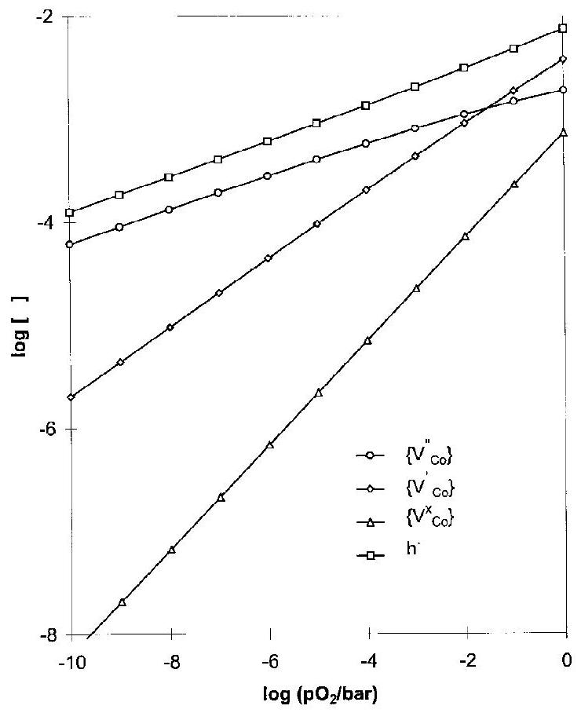
Fig. 8. Defect concentrations in $\mathrm{Co}_{1-\delta} \mathrm{O}$ according to the model of Dieckmann. ${ }^{67}$

For comparison with experimental data, the values of the transport coefficients must be known. Under the asssumption that the characteristic time for a vacancy jump is long compared with the residence time of an electron hole at a cation vacancy, the mechanical mobilities of all cation vacancies are equal. ${ }^{67}$ Simplifying Eq. (100) by dividing the mechanical mobilities in the numerator and denominator leads to the following expressions in which only the concentrations of vacancies remain:

$$
\frac{s_{\mathrm{Coe}}^{*}}{s_{\mathrm{CoCo}}^{*}}=\frac{2 c_{\left\{V_{\mathrm{Co}}^{\times}\right\}}+c_{\left\{V_{\mathrm{Co}}^{\prime}\right\}}}{c_{\left\{V_{\mathrm{Co}}\right\}}^{\times}+c_{\left\{V_{\mathrm{Co}}^{\prime}\right\}}+c_{\left\{V_{\mathrm{Co}}^{\prime \prime}\right.}}=2-\alpha
$$

In Eq. (101), $\alpha$ is the average valence of the cation vacancies, which quantity was first introduced by Martin. ${ }^{75}$ In Fig. 9, experimental data of the charge of transport ${ }^{69,70}$ are compared with values calculated from Eq. (101), in which $\alpha$ is evaluated using the defect model of Dieckmann. ${ }^{67}$ The experimental values follow the same trend as the theoretical lines. Adjusting the defect mobilities would further improve the agreement between experiment and theory.

As stated in Section $\mathrm{III}(3)(B)$, the measurable coupling between ionic and electronic fluxes also can be explained in terms of coulombic defect interactions using the Debye-Hückel-Onsager theory. Modeling the cobalt nonstoichiometry using a Debye-Hückel correction to account for coulombic interactions, Tetot et al. ${ }^{68}$ have shown that $\left\{V_{\text {Co }}^{\prime \prime}\right\}$ and $\mathrm{h} \cdot$ must be the major defects in $\mathrm{Co}_{1-\delta} \mathrm{O}$. Thus, we can calculate the cation charge of transport from Eqs. (96) and (97). Figure 10 shows that, when the distance of nearest approach is set to the radius of the $\mathrm{Co}^{2+}$ ion ( $0.79 \AA$ ), good agreement is obtained between experimental and calculated results.

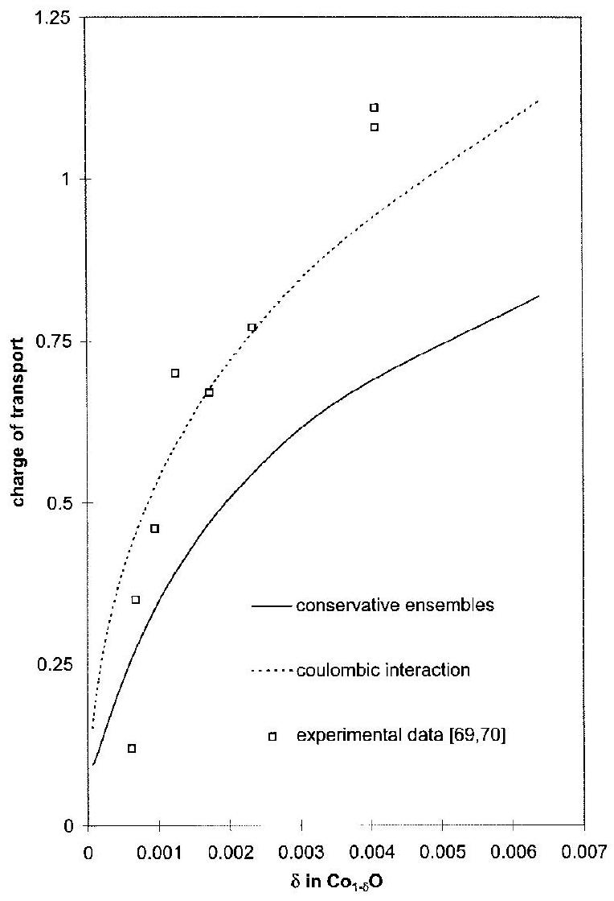
Fig. 9. Comparison of theoretical and experimental ${ }^{69,70}$ values for the charge of transport in $\mathrm{Co}_{1-\delta} \mathrm{O}$ as a function of the cobalt nonstoichiometry $\delta$.

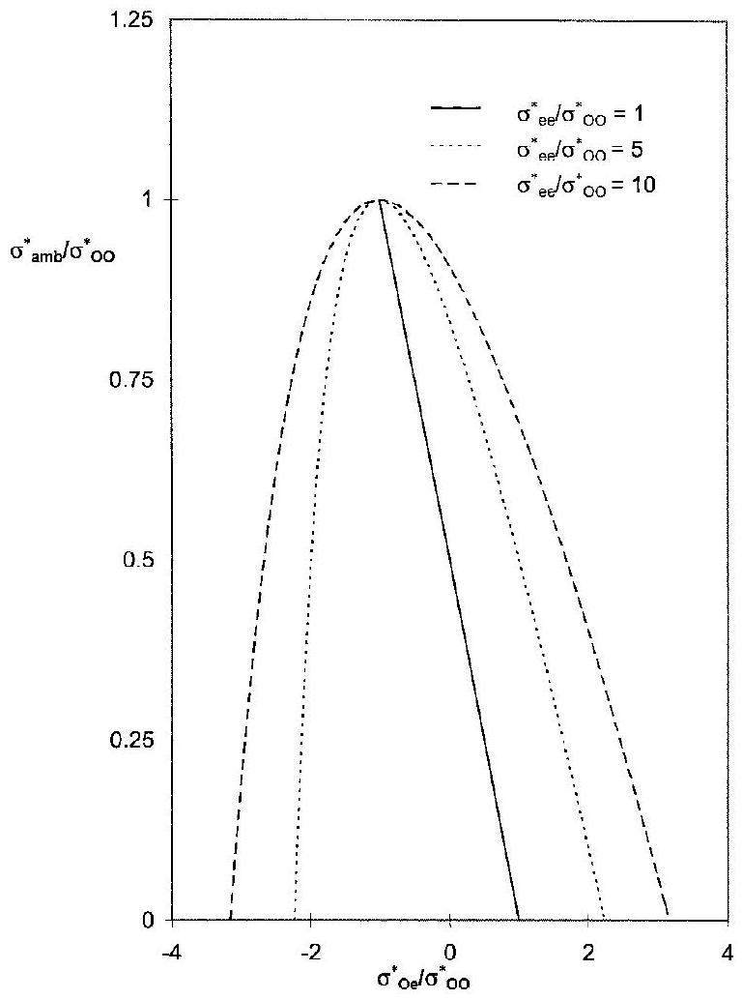
Fig. 10. Influence of cross-coefficients on ambipolar conductivity. Only those points are shown for which both the ambipolar conductivity and the total conductivity are positive.

## (4) Models for Bulk Oxygen Transport

In this section, we discuss two theories that describe ambipolar or chemical diffusion in mixed conductors. In both theories, no external electric fields are applied. Oxygen transport in the presence of externally applied electric fields is considered in Section III(5). First to be discussed is the tarnishing theory developed by Wagner. ${ }^{12}$ There, expressions for the transport of neutral components through the crystal lattice are derived by using the equilibrium between the neutral components and the ions and electrons. Because, in this approach, only electrochemical potentials of ions, electrons, and the neutral components are involved, the Wagner theory has more general validity than the ambipolar diffusion model, which is the second theory to be discussed. In the ambipolar diffusion model, the driving force for bulk transport of ions and electrons is made up by concentration and electric potential gradients. The fluxes of ions and electrons are related in this model by the requirement of local charge neutrality (see Panel B). A disadvantage of this model compared to the Wagner theory is that cross-coefficients between the fluxes of ions and electrons cannot be accounted for. An advantage is that it gives more insight into the role of the internal electric field during transport.

The transport of cations is neglected. A discussion about mixed cation-electron transport is provided by Martin. ${ }^{75}$ To keep the discussion given below as general as possible, the transport equations for the O* and e* ensemble (Eq. (90)) are used as the starting point.
(A) Wagner Theory: Following Dudley and Steele, ${ }^{76}$ we introduce the following conductivity coefficients to simplify the derivations:

$$
\sigma_{m n}^{*}=z_{m} z_{n} e^{2} s_{m n}^{*}
$$

where subscripts $m$ and $n$ are used to designate the ionic and the electronic ensemble. The corresponding transference numbers $t_{m n}^{*}$ are given by

$$
\begin{aligned}
t_{m n}^{*} & =\frac{\sigma_{m n}^{*}}{\sigma_{\text {total }}} \\
\sigma_{\text {total }} & =\sum_{m} \sum_{n} \sigma_{m n}^{*}
\end{aligned}
$$

Oxygen chemical diffusion is characterized by conservation of charge,

$$
\nabla\left(z_{\mathrm{O}}^{*} J_{\mathrm{O}}^{*}+z_{\mathrm{e}}^{*} J_{\mathrm{e}}^{*}\right)=0
$$

in which the differential equation can be solved by the coupled current condition,

$$
z_{\mathrm{O}}^{*} J_{\mathrm{O}}^{*}+z_{\mathrm{e}}^{*} J_{\mathrm{e}}^{*}=0
$$

Combining Eqs. (90) and (102)-(105) yields, for the local oxygen ensemble flux,

$$
\begin{aligned}
J_{\mathrm{O}}^{*} & =-\frac{\sigma_{\text {total }}}{2 z_{\mathrm{O}}^{* 2} e^{2}}\left(t_{\mathrm{ee}}^{*} t_{\mathrm{OO}}^{*}-t_{\mathrm{eO}}^{*} t_{\mathrm{Oe}}^{*}\right) \nabla\left(2 \eta_{\mathrm{O}}^{*}-2 \frac{z_{\mathrm{O}}^{*}}{z_{\mathrm{e}}^{*}} \eta_{\mathrm{e}}^{*}\right) \\
& =-\frac{\sigma_{\text {amb }}}{2 z_{\mathrm{O}}^{* 2} e^{2}} \nabla \mu_{\mathrm{O}_{2}}^{\text {oxide }}
\end{aligned}
$$

where we have introduced the so-called ambipolar conductivity $\sigma_{\text {amb }}$ and the oxygen chemical potential in the oxide bulk $\mu_{\mathrm{O}_{2}}^{\text {oxide }}$. Equation (106) is consistent with irreversible thermodynamics, becuase the flux of oxygen is directly related to its chemical potential gradient. At equilibrium $\mu_{\mathrm{O}_{2}}^{\text {oxide }}$ is equal to the gas-phase chemical potential. Under nonequilibrium conditions, a gradient in $\mu_{\mathrm{O}_{2}}^{\text {oxide }}$ is the driving force for bulk oxygen transport. The question occurs as to the relation between $\mu_{\mathrm{O}_{2}}^{\text {oxide }}$ and $\mu_{\mathrm{O}_{2}}^{\text {gas }}$ at the gas-solid interface under nonequilibrium conditions. If transport is completely limited by diffusion through the bulk, then $\mu_{\mathrm{O}_{2}}^{\text {oxide }}=\mu_{\mathrm{O}_{2}}^{\text {gas }}$. On the other hand, if rate limitations by surface oxygen exchange occur, the difference between $\mu_{\mathrm{O}_{2}}^{\text {oxide }}$ at the interface and $\mu_{\mathrm{O}_{2}}^{\text {gas }}$ represents the driving force for the interfacial process. Although virtual equilibrium between $\mathrm{O}^{2-}$ and $\mathrm{e}^{-}$species often is assumed to derive the Wagner equation, ${ }^{55}$ the present discussion shows that the assumption of bulk limited transport suffices.

The steady-state oxygen flux $J_{\mathrm{O}_{2}}$ through a membrane of thickness $L$, using $J_{\mathrm{O}_{2}}=0.5 J_{\mathrm{O}}^{*}$, becomes

$$
J_{\mathrm{O}_{2}}=-\left(\frac{1}{4 z_{\mathrm{O}}^{* 2} e^{2} L}\right) \int_{\substack{\mu_{\mathrm{O}_{2}} \\ \mu_{\mathrm{O}_{2}}}}^{\substack{\text { oxide }, x=0 \\ \text { oxide }, x=L}} \sigma_{\text {amb }} \mathrm{d} \mu_{\mathrm{O}_{2}}^{\text {oxide }}
$$

where the integration limits are the oxygen chemical potentials, $\mu_{\mathrm{O}_{2}}^{\text {oxide }}$, at the membrane boundaries $x=0$ and $x=L$ (where $x$ is the distance coordinate). Non-steady-state oxygen transport
is analyzed most commonly in terms of Fick's first law of diffusion:

$$
\begin{aligned}
J_{\mathrm{O}}^{*} & =-\tilde{D} \nabla c_{O}^{*} \\
\tilde{D} & =\frac{\sigma_{\mathrm{amb}}}{2 z_{\mathrm{O}}^{* 2} e^{2}}\left(\frac{\mathrm{~d} \mu_{\mathrm{O}_{2}}^{\mathrm{oxide}}}{\mathrm{~d} c_{\mathrm{O}}^{*}}\right)
\end{aligned}
$$

where $\tilde{D}$ is the chemical diffusion coefficient. The advantage of using Eq. (108) instead of Eq. (106) for non-steady-state transport is that the former can be related easily to conservation of mass, given by

$$
\frac{\partial c_{\mathrm{O}}^{*}}{\partial t}=-\nabla \cdot J_{\mathrm{O}}^{*}
$$

Combining Eqs. (108) and (109) leads to

$$
\frac{\partial c_{\mathrm{O}}^{*}}{\partial t}=\left(\nabla \cdot \tilde{D} \nabla c_{\mathrm{O}}^{*}\right) \approx \tilde{D} \nabla^{2} c_{\mathrm{O}}^{*}
$$

where the approximation is justified when $\tilde{D}$ does not vary too much with concentration of the oxygen-ion ensemble. The equation obtained is Fick's second law of diffusion, for which, in most cases, simple analytical solutions can be found.

No assumptions have been made about the statistics of the involved defect species. ${ }^{77}$ Therefore, Eqs. (106) and (110) have general validity. However, the defect statistics do influence the oxygen partial pressure and temperature dependence of the transport parameters $\tilde{D}$ and $\sigma_{\text {amb }}$.

Experimental data of oxygen stoichiometry are obtained for neutral samples. Using these data for the purpose of modeling data of oxygen permeation requires that the condition of local charge neutrality, given by

$$
z_{\mathrm{O}}^{*} c_{\mathrm{O}}^{*}+z_{\mathrm{e}}^{*} c_{\mathrm{e}}^{*}=\mathrm{constant}
$$

must be satisfied under transport conditions as well. Panel B shows that this condition is valid except for very thin zones adjacent to the gas-solid interfaces. The condition of local charge neutrality has not been used to derive Eq. (106).

The influence of the cross-coefficients on the magnitude of the ambipolar conductivity has been investigated. In Fig. 10, $\sigma_{\mathrm{amb}} / \sigma_{\mathrm{OO}}^{*}$ is shown as a function of $\sigma_{\mathrm{Oe}}^{*} / \sigma_{\mathrm{OO}}^{*}$ for three different values of $\sigma_{\mathrm{ee}}^{*} / \sigma_{\mathrm{OO}}^{*}$. When $\sigma_{\mathrm{ee}}^{*} / \sigma_{\mathrm{OO}}^{*}>1$, the ambipolar conductivity shows a maximum when $\sigma_{\mathrm{OO}}^{*}=\tau_{\mathrm{Oe}}^{*}$. The value of the ambipolar conductivity at the maximum is equal to $\sigma_{\mathrm{OO}}^{*}$. Similarly, the maximum value of the ambipolar conductivity is equal to $\sigma_{\mathrm{ee}}^{*}$ when $\sigma_{\mathrm{ee}}^{*} / \sigma_{\mathrm{OO}}^{*}<1$, which is reached when $\sigma_{\mathrm{ee}}^{*}= \tau_{\mathrm{Oe}}^{*}$. It is further concluded from Fig. 10 that, compared with the case in which cross-coefficients are negligible, the ambi-

## Panel C. Limiting Conditions for Cross-coefficients

The limiting values that can be adopted by crosscoefficients are determined by the corresponding values of the diagonal coefficients. This can be shown by evaluating the total entropy production per unit time $\mathrm{d} S / \mathrm{d} t$ at constant temperature. The latter is defined as follows: ${ }^{78}$

$$
\frac{\mathrm{d} S}{\mathrm{~d} t}=\frac{-1}{T}\left(J_{\mathrm{O}}^{*} \cdot \nabla \eta_{\mathrm{O}}^{*}+J_{\mathrm{e}}^{*} \cdot \nabla \eta_{\mathrm{e}}^{*}\right)
$$

Combining Eq. (C-1) with the coupled current condition and Eq. (106) shows that the entropy production per unit time is directly related to the squared value of the oxygen chemical potential gradient.

$$
\frac{\mathrm{d} S}{\mathrm{~d} t}=\frac{-1}{T}\left(J_{\mathrm{O}_{2}} \cdot \nabla \mu_{\mathrm{O}_{2}}\right)=\frac{\sigma_{\mathrm{amb}}}{4 z_{\mathrm{O}}^{* 2} e^{2} T}\left(\nabla \mu_{\mathrm{O}_{2}} \cdot \nabla \mu_{\mathrm{O}_{2}}\right)
$$

Because the second law of thermodynamics states that $\mathrm{d} S / \mathrm{d} t \geq 0$, Eq. (C-2) shows that the ambipolar conductivity cannot be negative. Hence, oxygen transport against the oxygen chemical potential gradient is not possible. Similarly, it is found that, in the case when only an external electric potential gradient is applied but with no oxygen chemical potential gradient, the total conductivity $\sigma_{\text {total }}$ also is positive or zero. Combining these two conditions, ( $\sigma_{\text {total }} \geq 0$ and $\sigma_{\text {amb }} \geq 0$ ), leads to the following condition for the cross-coefficients: $\sigma_{\mathrm{eO}} \sigma_{\mathrm{Oe}} \leq \sigma_{\mathrm{ee}} \sigma_{\mathrm{OO}}$. With some algebra, it can be shown that the cross-coefficients derived from the conservative ensemble theory (Eq. (91)) satisfy this condition.
polar conductivity increases when the cross-coefficients are negative and decreases otherwise. It is expected, however, that $\sigma_{\mathrm{Oe}}^{*}$ is negative, because, otherwise, the electrons would drag oxygen ions with them. The latter situation seems to be possible only when the type of interaction between electrons and oxygen ions is attractive and, therefore, noncoulombic.
(B) Example: Steady-State Oxygen Permeation through Perovskite $\mathrm{La}_{1 \rightarrow x} \mathrm{Sr}_{x} \mathrm{FeO}_{3-\delta}$ : As an example, the Wagner theory is applied to study steady-state oxygen transport through mixed conducting $\mathrm{La}_{1-\lambda} \mathrm{Sr}_{x} \mathrm{FeO}_{3-\delta}$ membranes. In these materials, $t_{\mathrm{ee}}^{*} \approx 1$ over a large range in oxygen partial pressure and temperature, and, as a result, cross-coefficients disappear in $\sigma_{\text {amb }}$. Equation (107) simplifies to

$$
J_{\mathrm{O}_{2}}=-\left(\frac{1}{4 z_{\mathrm{O}}^{* 2} e^{2} L}\right) \int_{\substack{\mu_{\mathrm{O}_{2}} \\ \mu_{\mathrm{O}_{2}}}}^{\substack{\text { oxide }, x=0 \\ \text { oxide }, x=L}} \sigma_{\mathrm{OO}}^{*} \mathrm{~d} \mu_{\mathrm{O}_{2}}^{\text {oxide }}
$$

It generally is accepted that, in $\mathrm{La}_{1-x} \mathrm{Sr}_{x} \mathrm{FeO}_{3-\delta}$, only doubly charged oxygen vacancies contribute to ionic transport. Therefore, the Nernst-Einstein equation (Eq. (73)) can be substituted into Eq. (112). This leads to

$$
J_{\mathrm{O}_{2}}=\frac{D_{\mathrm{F}}}{4 k_{\mathrm{B}} T L} \int_{\mu_{\mathrm{O}_{2}}^{\text {oxide }, x=0}}^{\mu_{\mathrm{O}_{2}}^{\text {oxide }, x=L}} c_{\left\{V_{\mathrm{O}}\right\}}\left(1-\frac{c_{\left\{V_{\ddot{\mathrm{O}}}\right\}}}{3 c^{0}}\right) d \mu_{\mathrm{O}_{2}}^{\text {oxide }}
$$

where it is assumed that $D_{\mathrm{F}}$ is constant over the applied oxygen chemical potential gradient. Equation (113) shows that calculating the total steady-state oxygen flux is reduced to integrating the equilibrium oxygen vacancy concentration over the applied oxygen chemical potential gradient. Data of $c_{\left\{V_{0}\right\}}$ in $\mathrm{La}_{1 \rightarrow x} \mathrm{Sr}_{x} \mathrm{FeO}_{3}$ as a function of $\mu_{\mathrm{O}_{2}}$ have been obtained from gravimetric measurements. ${ }^{79}$ Ten Elshof et al. ${ }^{80}$ have shown that theoretically obtained oxygen permeation values using Eq. (113) are in good agreement with experimental ones. Both experimental and theoretical results are given in Fig. 11.
(C) Ambipolar Diffusion Model: In the so-called ambipolar diffusion model, ${ }^{55,56}$ the oxygen transport equations are based on concentration and electric potential gradients, rather than on electrochemical potential gradients, as in the Wagner theory. Again, we start with the expressions for the transport of
the oxygen ion and the electron ensemble given by Eq. (90). Neglecting cross-coefficients, these expressions can be transformed into

$$
\begin{aligned}
& J_{\mathrm{e}}^{*}=-D_{\mathrm{e}}^{*} \gamma_{\mathrm{e}} \nabla c_{\mathrm{e}}^{*}-\frac{Z_{\mathrm{e}}^{*} D_{\mathrm{e}}^{*} c_{\mathrm{e}}^{*} e}{k_{\mathrm{B}} T} \nabla \Phi \\
& J_{\mathrm{O}}^{*}=-D_{\mathrm{O}}^{*} \gamma_{\mathrm{O}} \nabla c_{\mathrm{O}}^{*}-\frac{Z_{\mathrm{O}}^{*} D_{\mathrm{O}}^{*} c_{\mathrm{O}}^{*} e}{k_{\mathrm{B}} T} \nabla \Phi
\end{aligned}
$$

where $D_{\mathrm{O}}^{*}$ and $D_{\mathrm{e}}^{*}$ are diffusion coefficients of the oxygen and electron ensemble, respectively. These diffusion coefficients have been obtained from the Onsager transport coefficients $s_{\mathrm{OO}}^{*}$ and $s_{\mathrm{ee}}^{*}$, using

$$
\begin{aligned}
& D_{\mathrm{O}}^{*}=\frac{S_{\mathrm{OO}}^{*} k_{\mathrm{B}} T}{c_{\mathrm{O}}^{*}} \\
& D_{\mathrm{e}}^{*}=\frac{S_{\mathrm{ee}}^{*} k_{\mathrm{B}} T}{c_{\mathrm{e}}^{*}}
\end{aligned}
$$

The activity coefficients $\gamma_{\mathrm{o}}$ and $\gamma_{\mathrm{e}}$ appear in Eq. (114), because chemical potential gradients have been replaced by concentration gradients. These values can be calculated from the relation between $\mu$ and $c$ :

$$
\begin{aligned}
& \gamma_{\mathrm{O}}=\frac{1}{k_{\mathrm{B}} T} \frac{\mathrm{~d} \mu_{\mathrm{O}}^{*}}{\mathrm{~d} \ln c_{\mathrm{O}}^{*}}=\frac{\mathrm{d} \ln a_{\mathrm{O}}^{*}}{\mathrm{~d} \ln c_{\mathrm{O}}^{*}} \\
& \gamma_{\mathrm{e}}=\frac{1}{k_{\mathrm{B}} T} \frac{\mathrm{~d} \mu_{\mathrm{e}}^{*}}{\mathrm{~d} \ln c_{\mathrm{e}}^{*}}=\frac{\mathrm{d} \ln a_{\mathrm{e}}^{*}}{\mathrm{~d} \ln c_{\mathrm{e}}^{*}}
\end{aligned}
$$

i.e., they are equal to 1 only in the case when activities can be replaced by concentrations. However, in general, the chemical potential of an ensemble is a complex function of its concentration, which leads to concentration-dependent activity coefficients. Such nonideal behavior of the ensemble reduces the usefulness of the ambipolar diffusion model.

When the coupled current condition $\left(z_{\mathrm{O}}^{*} J_{\mathrm{O}}^{*}+z_{\mathrm{e}}^{*} J_{\mathrm{e}}^{*}=0\right)$ is used in combination with the local charge neutrality assumption, i.e., $z_{\mathrm{O}}^{*} c_{\mathrm{O}}^{*}+z_{\mathrm{e}}^{*} c_{\mathrm{e}}^{*}=0$, Eq. (114) is transformed to

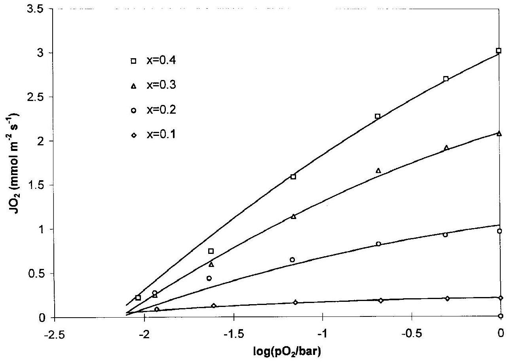
Fig. 11. Oxygen permeation as a function of the oxygen partial pressure maintained at the high-pressure side of $\mathrm{La}_{1 \rightarrow-} \mathrm{Sr}_{x} \mathrm{FeO}_{3-\delta}$ membranes measured by ten Elshof et al. ${ }^{80}$ Theoretical lines are calculated using Eq. (113).

$$
\begin{aligned}
J_{\mathrm{e}}^{*} & =-D_{\mathrm{amb}} \nabla c_{\mathrm{e}}^{*} \\
J_{\mathrm{O}}^{*} & =-D_{\mathrm{amb}} \nabla c_{\mathrm{O}}^{*}
\end{aligned}
$$

where $D_{\text {amb }}$ is the ambipolar diffusion coefficient, given by

$$
D_{\mathrm{amb}}=\frac{\left(z_{\mathrm{O}}^{* 2} c_{\mathrm{O}}^{*} \gamma_{\mathrm{e}}+z_{\mathrm{e}}^{* 2} c_{\mathrm{e}}^{*} \gamma_{\mathrm{O}}\right) D_{\mathrm{e}}^{*} D_{\mathrm{O}}^{*}}{z_{\mathrm{e}}^{* 2} D_{\mathrm{e}}^{*} c_{\mathrm{e}}^{*}+z_{\mathrm{O}}^{* 2} D_{\mathrm{O}}^{*} c_{\mathrm{O}}^{*}}
$$

In the Wagner treatment, the bulk oxygen chemical potential has been defined to combine the expressions for oxygen-ion and electron transport. In the ambipolar diffusion model, the equilibrium between ionic and electronic species is used only at the gas-solid interfaces to calculate the concentration of these species. In this model, expressions for oxygen-ion and electron transport are combined by assuming local charge neutrality, the validity of which is restricted to the bulk of the oxide. The ambipolar diffusion coefficient has a meaning similar to that of the chemical diffusion coefficient defined in the Wagner theory. However, because cross-coefficients have been neglected in the derivation of Eq. (117), the chemical diffusion coefficient has a wider range of validity.

In the case where $c_{\mathrm{e}}^{*} D_{\mathrm{e}}^{*} \ll c_{\mathrm{O}}^{*} D_{\mathrm{O}}^{*}$, Eq. (118) reduces to

$$
D_{\mathrm{amb}}=\left(\frac{z_{\mathrm{O}}^{* 2} c_{\mathrm{O}}^{*} \gamma_{\mathrm{e}}}{z_{\mathrm{e}}^{* 2} c_{\mathrm{e}}^{*} \gamma_{\mathrm{O}}}+1\right) \gamma_{\mathrm{O}} D_{\mathrm{O}}^{*}
$$

where the term between the parentheses is the thermodynamic enhancement factor. Equation (119) shows that overall ambipolar diffusion is determined by the diffusion of the slowestmoving ensemble. The thermodynamic enhancement factor originates from the influence of the electric field built up by the fastest-moving ensemble. An expression for the electric field can be obtained by combining Eqs. (114) and (117):

$$
E=-\nabla \Phi=\frac{J_{\mathrm{O}}^{*} k_{\mathrm{B}} T}{z_{\mathrm{O}}^{*} e c_{\mathrm{O}}^{*}}\left(\frac{1}{D_{\mathrm{O}}^{*}}-\frac{\gamma_{\mathrm{O}}}{D_{\mathrm{amb}}}\right)
$$

The discussion in Panel B shows that the presence of an electric field varying throughout the membrane is not in conflict with the assumption of local charge neutrality.

## (5) Oxygen Transport in the Presence of External Electric Fields

In the previous section, equations were derived under the assumption that no external electric field was applied. In this section, we discuss how the transport of oxygen is influenced by an external electric field using the Wagner approach.

The measurable electric potential difference, $\Delta \mathbf{V}$, over a mixed ionic-electronic conducting membrane using two identical metallic probes is related to the electrochemical potential difference of the electron ensemble and is given by

$$
\Delta \mathbf{V}=\frac{\Delta \eta_{\mathrm{e}}^{*}}{z_{e}^{*} e}=\frac{\Delta \mu_{e}^{*}}{z_{\mathrm{e}}^{*} e}+\Delta \Phi
$$

If polarization losses occur at the electrode-oxide interfaces, these have to be added to $\Delta \mathbf{V}$ to obtain the total measurable electric potential difference. $\Delta \mathbf{V}$ differs from the electric potential in the bulk of mixed conductors, $\Delta \Phi$, because it also contains the change in chemical potential of the electron ensemble across the membrane. When a net electric current flows through the membrane, the coupled current condition (Eq. (105)) transforms to

$$
\mathbf{i}=e\left(z_{\mathrm{e}}^{*} J_{\mathrm{e}}^{*}+z_{\mathrm{O}}^{*} J_{\mathrm{O}}^{*}\right)
$$

where $\mathbf{i}$ is the measurable electric current density. Combining Eqs. (121), (122), and (102) with Eq. (90), following the Wagner approach, leads to:

$$
\mathbf{i}=-\left(\frac{\sigma_{\mathrm{OO}}^{*}+\sigma_{\mathrm{eO}}^{*}}{2 z_{\mathrm{O}}^{*} e}\right) \nabla \mu_{\mathrm{O}_{2}}^{\text {oxide }}-\sigma_{\text {total }} \nabla \mathbf{V}
$$

$$
J_{\mathrm{O}_{2}}=-\left(\frac{\sigma_{\mathrm{OO}}^{*}}{4 z_{\mathrm{O}}^{* 2} e^{2}}\right) \nabla \mu_{\mathrm{O}_{2}}-\left(\frac{\sigma_{\mathrm{OO}}^{*}+\sigma_{\mathrm{eO}}^{*}}{2 z_{\mathrm{O}}^{*} e}\right) \nabla \mathbf{V}
$$

In Eq. (123), the externally applied forces, i.e., oxygen chemical potential gradients and electric potential gradients, are related to the measurable oxygen flux and electric current density. Equation (123) also is consistent with linear irreversible thermodynamics, because the cross terms are equal.

Under open-circuit conditions, i.e., when $\mathbf{i}=0$, it follows from Eq. (123) that

$$
\Delta \mathbf{V}=\frac{1}{2 z_{\mathrm{O}}^{*} e} \int_{\mu_{\mathrm{O}_{2}}^{\text {oxide, } x=0}}^{\mu_{\mathrm{O}_{2}}^{\text {oxide, } x=L}}\left(t_{\mathrm{OO}}^{*}+t_{\mathrm{Oe}}^{*}\right) \mathrm{d} \mu_{\mathrm{O}_{2}}^{\text {oxide }}
$$

which expression reduces to the well-known Nernst equation for solid-oxide electrolytes for which $t_{\mathrm{OO}}^{*}+t_{\mathrm{Oe}}^{*} \approx 1$. Another important relation that can be obtained from Eq. (123) is the influence of an external electric current flowing through the membrane on the oxygen flux:

$$
J_{\mathrm{O}_{2}}=J_{\mathrm{O}_{2}}^{\mathrm{i}=0}+\frac{\mathbf{i}}{2 z_{\mathrm{O}}^{*} e L} \int_{x=0}^{x=L}\left(t_{\mathrm{OO}}^{*}+t_{\mathrm{Oe}}^{*}\right) \mathrm{d} x
$$

Equation (125) shows that the oxygen transport can be increased significantly, depending on the magnitude of the electric current density and the total ionic transference number. Equations (124) and (125) can be used advantageously to measure the total ionic transference number, which is given by the sum $t_{\mathrm{OO}}^{*}+t_{\mathrm{Oe}}^{*}$. These parameters cannot be determined separately from the measurement of the open-circuit potential difference or from the change in oxygen flux by electrochemical pumping of oxygen through the membrane. However, if data of the total ionic transference number are combined with that of ambipolar and total conductivity, then separation of the oxy-gen-ion transport number and the cross-coefficient transfer number is possible. The procedure described above is an alternative procedure for measuring the cross-coefficients in mixed conductors. Generally, such a measurement requires the use of ionic and electronic blocking electrodes ${ }^{76,81}$ (see Fig. 12). In Panel D, conductivities obtained with various experimental techniques are listed and related to the conductivity coeffecients defined in Eq. (102).

## IV. Summary

Although exact values of chemical potentials of charged building units cannot be measured from experiments performed at equilibrium, it is useful to define chemical potentials for building units for two major reasons. The first is that chemical potentials can be used as mathematical tools that can be substituted into the equilibrium condition for any defect chemical

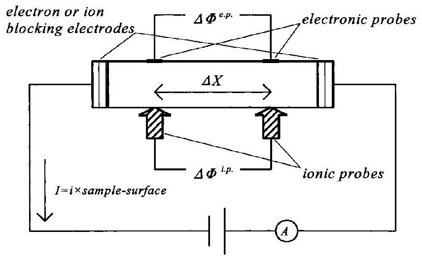
Fig. 12. Schematics of a four-point direct-current measurement on a mixed ionic-electronic conducting sample using both ionic and electronic probes, but with a blocked ion or electron flux.

Panel D. Relationship between Experimental Parameters and Conductivity Coefficients ${ }^{\dagger}$
| Experimental method | Measurable parameter | Expressed in terms of conductivity coefficients | For prevailing electronic conduction |
| :--- | :--- | :--- | :--- |
| Steady-state oxygen permeation | $\sigma_{\text {amb }}$ (ambipolar conduçtivity) | $\frac{\sigma_{\mathrm{ee}}^{*} \sigma_{\mathrm{OO}}^{*}-\sigma_{\mathrm{eO}}^{*} \sigma_{\mathrm{Oe}}^{*}}{\sigma_{\mathrm{ee}}^{*}+\sigma_{\mathrm{OO}}^{*}+\sigma_{\mathrm{Oe}}^{*}+\sigma_{\mathrm{eO}}^{*}}$ | $\sigma_{\mathrm{OO}}^{*}$ |
| Non-steady-state oxygen permeation | D (chemical diffusion coefficient) | $\frac{\sigma_{\text {amb }}}{8 e^{2}} \frac{\mathrm{~d} \mu_{\mathrm{O}_{2}}}{\mathrm{dc}_{\mathrm{O}^{2-}}}$ | $\frac{\sigma_{\mathrm{OO}}}{8 e^{2}} \frac{\mathrm{~d} \mu_{\mathrm{O}_{2}}}{\mathrm{~d} c_{\mathrm{O}^{2}}}$ |
| Measurement of the total conductivity | $\sigma_{\text {total }}$ (total conductivity) | $\sigma_{\mathrm{ee}}^{*}+\sigma_{\mathrm{OO}}^{*}+\sigma_{\mathrm{eO}}^{*}+\sigma_{\mathrm{Oe}}^{*}$ | $\sigma_{\mathrm{ee}}^{*}$ |
| Ionic electrochemical potential difference with suppressed electron flux | $\sigma_{\mathrm{O}}^{\prime}=\left(\frac{i \cdot \Delta X}{\Delta \Phi^{\mathrm{i} \cdot \mathrm{p}}}\right)_{J_{\mathrm{e}}=0}$ | $\sigma_{\mathrm{OO}}^{*}\left(1-\frac{\sigma_{\mathrm{Oe}}^{*} \sigma_{\mathrm{eO}}^{*}}{\sigma_{\mathrm{OO}}^{*} \sigma_{\mathrm{ee}}^{*}}\right)$ | $\sigma_{\mathrm{OO}}^{*}$ |
| Electronic electrochemical potential difference with suppressed ion flux | $\sigma_{\mathrm{e}}^{\prime}=\left(\frac{i \cdot \Delta X}{\Delta \Phi^{\mathrm{e} . \mathrm{p} .}}\right)_{J_{\mathrm{i}}=0}$ | $\sigma_{\mathrm{ee}}^{*}\left(1-\frac{\sigma_{\mathrm{Oe}}^{*} \sigma_{\mathrm{eO}}^{*}}{\sigma_{\mathrm{OO}}^{*} \sigma_{\mathrm{ee}}^{*}}\right)$ | $\sigma_{\mathrm{ee}}^{*}$ |
| Electronic electrochemical potential difference with suppressed electron flux | $\sigma_{\mathrm{O}}^{\prime \prime}=\left(\frac{i \cdot \Delta X}{\Delta \Phi^{\text {e.p. }}}\right)_{J_{\mathrm{e}}=0}$ | $\sigma_{\mathrm{Oe}}^{*}\left(1-\frac{\sigma_{\mathrm{Oo}}^{*} \sigma_{\mathrm{ee}}^{*}}{\sigma_{\mathrm{Oe}}^{*} \sigma_{\mathrm{eO}}^{*}}\right)$ | $-\frac{\sigma_{\mathrm{OO}}^{*} \sigma_{\mathrm{ee}}^{*}}{\sigma_{\mathrm{eO}}^{*}}$ |
| Ionic electrochemical potential difference with suppressed ion flux | $\sigma_{\mathrm{e}}^{\prime \prime}=\left(\frac{i \cdot \Delta X}{\Delta \Phi^{\mathrm{i} . \mathrm{p} .}}\right)_{J_{\mathrm{i}}=0}$ | $\sigma_{\mathrm{eO}}^{*}\left(1-\frac{\sigma_{\mathrm{OO}}^{*} \sigma_{\mathrm{ee}}^{*}}{\sigma_{\mathrm{Oe}}^{*} \sigma_{\mathrm{eO}}^{*}}\right)$ | $-\frac{\sigma_{\mathrm{OO}}^{*} \sigma_{\mathrm{ee}}^{*}}{\sigma_{\mathrm{Oe}}^{*}}$ |

${ }^{\dagger}$ Parameters $\Delta X, i, \Delta \Phi^{\mathrm{i} . \mathrm{p} .}$ and $\Delta \Phi^{\mathrm{e} . \mathrm{p} .}$ are defined in Fig. 12.
reaction that leads to correct thermodynamic expressions for the defect reaction under consideration. Second, observed changes in the energy and entropy of oxygen as a function of changing temperature or oxygen stoichiometry sometimes can be explained in terms of the energy and entropy changes of a particular building unit.

Expressions derived for the oxygen incorporation reaction using noninteracting building units are equal to the familiar mass-action-type equations, which expressions are obtained when applying the traditional formalism in terms of structure elements.

For some simple cases, expressions have been derived for the chemical potential of interacting point defects. Weak interactions between neighboring defects affect the energy term in the chemical potentials of these defects, but not in the entropy. Strong interactions can be handled by introducing clusters or by using the concept of excluded configurations. It is further shown that electrons occupying energy states in electron bands cannot be described on the basis of thermodynamics of localized defect species. The chemical potential of delocalized electrons in a partially filled wide band is related to the density of states at the Fermi level.

The developed models enable comparison of thermodynamic data with measured or calculated defect formation energies, after corrections for the dissociation energy of oxygen, the $\mathrm{O} / \mathrm{O}^{2-}$ electron affinity, and contributions resulting from electron spin and phonons.

Starting from irreversible thermodynamics, equations have been derived for the thermally activated transport of localized electronic and ionic defects. It is shown that, when the site exclusion effect is accounted for, the resulting defect conductivity shows a maximum when the site occupation of defects is one-half of its maximum value.The expressions obtained are in agreement with a derivation based on atomistic reaction-rate theory. The conservative ensemble theory shows that coupling of the overall ionic and electronic fluxes always occurs when mobile ionic defects of different valences are present. In this theory, the cross-coefficients result from ionic defects whose
"effective" valence, defined as the valence multiplied by the factor -1 when the defects are vacant lattice sites, differs from that of the ensemble they belong to. These defects drag one or more electrons or electron holes with them. For the compound $\mathrm{Co}_{1-\delta} \mathrm{O}$, it has been shown that the magnitude of the charge of transport can be evaluated when defect interactions are purely coulombic. The resulting values are in good agreement with experimental data.

Using the Wagner treatment, an expression for oxygen transport has been derived by combining transport equations obtained for the electron and oxygen-ion ensembles. The resulting equation is consistent with irreversible thermodynamics, because the flux of oxygen is directly related to its chemical potential gradient. The corresponding transport parameter is the ambipolar conductivity. The latter parameter contains all kinetic and thermodynamic properties of the electronic and ionic defects. With the framework of the ambipolar diffusion model, a similar expression can be derived in which the kinetic parameter is the ambipolar diffusion coefficient. The latter expression, however, has less general validity than that derived from irreversible thermodynamics, because cross-coefficients between the ionic and electronic fluxes are not accounted for in the ambipolar diffusion model. When an electric potential difference also is present, the change in the oxygen flux depends on the electric potential gradient and the total oxygen-ion transference number.

## References

${ }^{1}$ A. T. Jacobsen, J. M. Newsam, D. C. Johnston, J. P. Stokes, S. Bhattacharya, J. T. Lewandowski, D. P. Goshorn, M. J. Higgins, and M. S. Alvarez, "Synthesis, Structural Chemistry, and Properties of $\mathrm{YBa}_{2} \mathrm{Cu}_{3} \mathrm{O}_{7-x}$ "; pp. 43-61 in Chemistry of Oxide Superconductors. Edited by C. N. R. Rao. Blackwell Scientific Publications, Oxford, U.K., 1988.
${ }^{2}$ H. Taguchi, M. Shimada, and M. Koizumi, "The Effect of Oxygen Vacancy on the Magnetic Properties in the System $\mathrm{SrCoO}_{3-8}$," J. Solid State Chem., 29, 221-25 (1979).
${ }^{3}$ P. J. L. Reijnen, "Nonstoichiometry and Sintering in Ionic Solids"; p. 219 in Problems of Nonstoichiometry. Edited by A. Rabenau. North-Holland, Amsterdam, The Netherlands, 1970.
${ }^{4}$ S. B. Desu and D. A. Payne, "Interfacial Segregation in Perovskites: I, Theory," J. Am. Ceram. Soc., 73, 3391-97 (1990).
${ }^{5}$ J. A. S. Ikeda and Y. Chiang, "Space Charge Segregation at Grain Boundaries in Titanium Dioxide: I, Relationship between Lattice Defect Chemistry and Space Charge Potential," J. Am. Ceram. Soc., 76, 2437-46 (1993).
${ }^{6}$ M. F. Carolan, P. N. Dyer, J. M. LaBar Sr., and R. M. Thorogood, "Process for Recovering Oxygen from Gaseous Mixture Containing Water or Carbon Dioxide, Which Process Employs Ion Transport Membranes," U.S. Pat. No. 5273 628, 1993.
${ }^{7}$ H. J. M. Bouwmeester and A. J. Burggraaf, "Dense Ceramic Membranes for Oxygen Separation''; Ch. 14, pp. 481-553 in CRC Handbook of Solid State Electrochemistry. Edited by P. J. Gellings and H. J. M. Bouwmeester. CRC Boca Raton, FL, 1997.
${ }^{8}$ E. A. Hazbun, "Ceramic Membrane and Use Thereof for Hydrocarbon Conversion," U.S. Pat. No. 4827 071, 1989.
${ }^{9}$ U. Balachandran, J. T. Dusek, S. M. Sweeney, R. B. Poeppel, R. L. Mieville, P. S. Maiya, M. S. Kleefisch, S. Pei, T. P. Kobylinsky, C. A. Udovich, and A. C. Bose, "Methane to Synthesis Gas via Ceramic Membranes," Am. Ceram. Soc. Bull., 74 [1] 71 (1995).
${ }^{10}$ A. G. Dixon, W. R. Moser, and Y. H. Ma, "Waste Reduction and Recovery Using $\mathrm{O}_{2}$-Permeable Membrane Reactors," Ind. Eng. Chem. Res., 33, 3015, (1994).
${ }^{11}$ R. J. H. Voorhoeve, "Perovskite-Related Oxides as Oxidation-Reduction Catalysts''; pp. 129-80 in Advanced Materials in Catalysis. Edited by J. J. Burton and R. L. Garten. Academic Press, New York, 1977.
${ }^{12}$ (a)C. Wagner, "Beitrag zur Theorie des Anlaufsvorgangs," Z. Phys. Chem. B, 21, 25, (1933); (b)ibid., "Beitrag zur Theories des Anlaufsvorgangs II," Z. Phys. Chem. B, 32, 447, (1936).
${ }^{13}$ F. A. Kröger, The Chemistry of Imperfect Crystals; Ch. 9. North-Holland, Amsterdam, The Netherlands, 1964.
${ }^{14}$ J. Maier, "Defect Chemistry: Composition, Transport, and Reactions in the Solid State; Part I: Thermodynamics," Angew. Chem. Int. Ed. Eng., 32, 313-35, (1993).
${ }^{15}$ J. S. Anderson, "The Thermodynamics and Theory of Nonstoichiometric Compounds''; pp. 1-76 in Problems of Nonstoichiometry. Edited by A. Rabenau. North-Holland, Amsterdam, The Netherlands, 1970.
${ }^{16}$ O. T. Sørensen, "Thermodynamics and Defect Structure of Nonstoichiometric Oxides"; pp. 1-59 in Nonstoichiometric Oxides. Edited by O. T. Sørensen. Academic Press, New York, 1981.
${ }^{17}$ F. A. Kröger and H. J. Vink, "Relations between the Concentrations of Imperfections in Crystalline Solids"; p. 307 in Solid State Physics, Vol. 3. Edited by F. Seitz and D. Turnball. Academic Press, New York, 1956.
${ }^{18}$ F. A. Kröger, F. H. Stieltjes, and H. J. Vink, "Thermodynamics and Formulation of Reactions Involving Imperfections in Solids," Philips Res. Rep., 14, 557 (1959).
${ }^{19}$ W. Schottky, "Statistik und Thermodynamik der Unordnungs Zustände in Kristallen, Insbesondere bei Geringer Fehlordnung," Z. Elektrochem., 45, 33 (1939).
${ }^{20}$ E. A. Guggenheim, Thermodynamics: An Advanced Treatment for Chemists and Physicists; Ch. 8. North-Holland, Amsterdam, The Netherlands, 1967.
${ }^{21}$ H. B. Callen, Thermodynamics and an Introduction to Thermostatics; Ch. 17. Wiley, New York, 1980.
${ }^{22}$ R. K. Pathria, Statistical Mechanics; Ch. 3. Pergamon Press, Oxford, U. K., 1972.
${ }^{23}$ D. Adler, "The Imperfect Solid-Transport Properties"; pp. 237-32 in Treatise on Solid State Chemistry, Vol. 2, Defects in Solids. Edited by N. B. Hannay. Plenum Press, New York, 1975.
${ }^{24}$ Commission on Thermodynamics, International Union of Pure and Applied Electrochemistry, International Thermodynamic Tables of the Fluid State-9, Oxygen. Blackwell Scientific Publications, Oxford, U.K., 1987.
${ }^{25}$ R. Fowler and E. A. Guggenheim, Statistical Thermodynamics; Ch. 9. University Press, Cambridge, U.K., 1960.
${ }^{26}$ L. M. Atlas, "Spacing Statistics and the Distribution of Interacting Lattice Defects''; pp. 425-43 in The Chemistry of Extended Defects in Non-Metallic Solids, Proceedings of the Institute for Advanced Study on the Chemistry of Extended Effects in Non-Metallic Solids. Edited by L. Eyring and M. O'Keeffe. North-Holland, Amsterdam, The Netherlands, 1970.
${ }^{27}$ L. Manes, "A New Method of Statistical Thermodynamics and its Application to Oxides of the Lanthanide and Actinide Series"; pp. 99-154 in Nonstoichiometric Oxides. Edited by O. T. Sørensen. Academic Press, New York, 1981.
${ }^{28}$ S. Ling, "High-Concentration Point Defect Chemistry: Statistical Thermodynamic Approach Applied to Nonstoichiometric Cerium Dioxides," Phys. Rev. B: Condens. Matter, 49, 864, (1994).
${ }^{29}$ S. Ling, "Statistical Thermodynamic Formulation of High-Concentration Point Defect Chemistry in Perovskite Crystalline Systems: Application to Stron-tium-Doped Lanthanum Chromite," J. Phys. Chem. Solids, 55, 1445-59 (1994).
${ }^{30}$ R. J. Thorn and G. H. Winslow, "Nonstoichiometry in Uranium Dioxide," J. Chem. Phys., 44, 2632 (1966).
${ }^{31}$ J. A. M. van Roosmalen and E. H. P. Cordfunke, "A New Defect Model to Describe the Oxygen Deficiency in Perovskite-type Oxides," J. Solid State Chem., 93, 212-19 (1991).
${ }^{32}$ M. Seppänen, M. Kytö, and P. Taskinen, "Defect Structure and Nonstoichiometry of $\mathrm{LaCoO}_{3}$," Scand. J. Metall., 9, 3-11 (1980).
${ }^{33}$ J. Mizusaki, Y. Mima, S. Yamauchi, K. Fueki, and H. Tagawa, "Nonstoichiometry of the Perovskite-type Oxides $\mathrm{La}_{1-x} \mathrm{Sr}_{x} \mathrm{CoO}_{3-\delta}$," J. Solid State Chem., 80, 102-11 (1989).
${ }^{34}$ H. Verweij and L. F. Feiner, "Oxidation Thermodynamics Applied as a

Tool in the Study of the Electronic Structure of the High- $T_{\mathrm{c}}$ Superconductor $\mathrm{YBa}_{2} \mathrm{Cu}_{3} \mathrm{O}_{6+y}$ " Philips J. Res., 44, 99 (1989).
${ }^{35}$ J. Zaanen, G. A. Sawatzky, and J. W. Allen, "Band Gaps and Electronic Structure of Transition-Metal Compounds," Phys. Rev. Lett., 55, 418 (1985).
${ }^{36}$ J. B. Torrence and P. Lacorro, "Simple and Perovskite Oxides of Transi-tion-Metals: Why Some are Metallic, while Most are Insulating," J. Solid State Chem., 90, 168-72 (1991).
${ }^{37}$ J. Appel, "Polarons"; pp. 193-391 in Solid State Physics, Vol. 21. Edited by F. Seitz, D. Turnball, and H. Ehrenreich. Academic Press, New York, 1968.
${ }^{38}$ N. W. Ashcroft and N. D. Mermin, Solid State Physics; Ch. 28. Saunders College, Philadelphia, PA, and C. B. S. Publishing, Tokyo, Japan, 1976.
${ }^{39}$ D. J. Sellmyer, "Electronic Structure of Metallic Compounds and Alloys: Experimental Aspects; pp. 83-248 in Solid State Physics, Vol. 33. Edited by H. Ehrenreich, F. Seitz, and D. Turnball. Academic Press, New York, 1978.
${ }^{40}$ J. Rouxel, "The Electronic Transfer and the Formation of Cationic Intercalation Compounds," Mater. Res. Soc. Symp. Proc. 135, 431 (1989).
${ }^{41}$ J. R. Dahn, J. N. Reimers, T. Tiedje, Y. Gao, A. K. Sleigh, W. R. McKinnon, and S. Cramm, "Correlation between X-ray Absorption and Chemical Potential Measurements in Lithium Intercalated Carbons," Phys. Rev. Lett., 68, 835 (1992).
${ }^{42}$ W. R. McKinnon and L. S. Selwyn, "Ionic and Electronic Contributions to the Li Chemical Potential in $\mathrm{Li}_{x} \mathrm{Ru}_{z} \mathrm{Mo}_{6-z}$," Phys. Rev. B: Condens. Matter, 35, 7275 (1987).
${ }^{43}$ J. Friedel, "Electronic Structure of Primary Solid Solutions in Metals," Adv. Phys., 3, 446 (1954).
${ }^{44}$ M. H. R. Lankhorst, H. J. M. Bouwmeester, and H. Verweij, "Use of the Rigid Band Formalism to Interpret the Relationship between O-Chemical Potential and Electron Concentration in $\mathrm{La}_{1-x} \mathrm{Sr}_{x} \mathrm{CoO}_{3-\delta}$," Phys. Rev. Lett, 77, 2989 (1996).
${ }^{45}$ B. C. H. Steele, "Measurement of High-Temperature Thermodynamic Properties of Nonstoichiometric Oxides Using Solid-State EMF and Coulometric Techniques''; p. 165 in Mass Transport in Oxides. Edited by J. B. Wachtman and A. D. Franklin. Special Publication 296. U.S. National Bureau of Standards, Gaithursberg, MD, 1968.
${ }^{46}$ R. D. Barnard. Thermoelectricity in Metals and Alloys; Ch. 2. Taylor \& Francis, London, U.K., 1972.
${ }^{47}$ I. Riess, H. Janczikowski, and J. Nölting, " $\mathrm{O}_{2}$ Chemical Potential of Nonstoichiometric Ceria, $\mathrm{CeO}_{2-x}$, Determined by a Solid Electrochemical Method," J. Appl. Phys., 61, 4931-32 (1987).
${ }^{48}$ Q. Zhang, T. Atake, and Y. Saito, "Oxygen Nonstoichiometry in High- $T_{\mathrm{c}}$ Superconductor $\mathrm{HgBa}_{2} \mathrm{Cu}_{3} \mathrm{O}_{6+x}$ and Application of Coulometric Titration," Solid State Ionics, 50, 209, (1992).
${ }^{49}$ T. Maruyama, A. Yamanaka, and Y. Saito, "Phase Relation in $\mathrm{BaBiO}_{3-x}$ by Coulometric Titration," Solid State Ionics, 36, 121 (1989).
${ }^{50}$ M. H. R. Lankhorst, H. J. M. Bouwmeester, B. A. Boukamp, and H. Verweij, "Oxygen Nonstoichiometry and Oxygen Diffusivity of Mixed Conducting Perovskites''; pp. 83-93 in Proceedings of the First International Symposium on Ceramic Membranes, Vol. 95-24. Edited by H. U. Anderson, A. C. Khandkar, and M. Liu. The Electrochemical Society, Pennington, NJ, 1997.
${ }^{51}$ J. Mizusaki, J. Tabuchi, T. Matsuura, S. Yamauchi, and K. Fueki, "Electrical Conductivity and Seebeck Coefficient of Nonstoichiometric $\mathrm{La}_{1-x} \mathrm{Sr}_{x} \mathrm{CoO}_{3-\delta}$," J. Electrochem. Soc., 136, 2082 (1989).
${ }^{52}$ I. Barin, O. Knacke, and O. Kubaschewski, Thermochemical Properties of Inorganic Substances (with supplement). Springer Verlag, Berlin, Heidelberg, New York and Verlag Stahleisen, Dusseldorf, 1973 and 1977.
${ }^{53}$ F. Seitz, The Modern Theory of Solids; p. 83. McGraw-Hill, New York, London, 1940.
${ }^{54}$ C. J. Ballhausen, Introduction to Ligand Field Theory; p. 113. McGrawHill, New York, 1962.
${ }^{55}$ L. Heyne, "Electrochemistry of Mixed Ionic-Electronic Conductors"; pp. 169-221 in Solid Electrolytes. Edited by S. Geller. Springer-Verlag, Berlin, Germany, 1977.
${ }^{56}$ H. L. Tuller, "Mixed Conduction in Nonstoichiometric Oxides"; pp. 271337 in Nonstoichiometric Oxides. Edited by O. T. Sørensen. Academic Press, New York, 1981.
${ }^{57}$ J. Maier and G. Schwitzgebel, "Theoretical Treatment of the Diffusion Coupled with Reaction, Applied to the Example of a Binary Solid Compound MX," Phys. Status Solidi B, 113, 535 (1982).
${ }^{58}$ J. Janek, M. Martin, and H.-I. Yoo, "Electrotransport in Ionic Crystals: I. Application of Liquid Electrolyte Theory," Ber. Bunsen-Ges. Phys. Chem., 98, 655 (1994).
${ }^{59}$ J. Janek and M. Martin, "Electrotransport in Ionic Crystals: II. A Dynamical Model," Ber. Bunsen-Ges. Phys. Chem., 98, 665 (1994).
${ }^{60}$ H. J. M. Bouwmeester, H. Kruidhof, and A. J. Burggraaf, "Importance of the Surface Exchange Kinetics as Rate-Limiting Step in Oxygen Permeation through Mixed Conducting Oxides," Solid State Ionics, 72, 185 (1994).
${ }^{61}$ N. W. Ashcroft and N. D. Mermin, Solid State Physics; Ch. 16. Saunders College, Philadelphia, PA, and C. B. S. Publishing, Tokyo, Japan, 1976.
${ }^{62}$ I. G. Austin and N. F. Mott, "Polarons in Crystalline and Noncrystalline Materials," Adv. Phys., 18, 41 (1969).
${ }^{63}$ H. Rickert, Electrochemistry of Solids, An Introduction; Ch. 6. SpringerVerlag, Berlin, Germany, 1982.
${ }^{64}$ A. T. Fromhold Jr., ''Space Charge Effects and Transport in Oxide Films''; pp. 37-50 in High-Temperature Corrosion, International Corrosion Conference Series, National Association of Corrosion Engineers. Edited by R. A. Rapp. Houston, TX, 1983.
${ }^{65}$ J. B. Goodenough, "Fast Ionic Conduction in Solids," Proc. R. Soc. London A, 393, 215 (1984).
${ }^{66}$ M. V. Patrakeev, I. A. Leonidov, V. L. Kozhevnikov, V. I. Tsidilkovskii,
A. K. Demin, and A. V. Nikolaev, "The Oxygen Permeation through $\mathrm{YBa}_{2} \mathrm{Cu}_{3} \mathrm{O}_{6+x}$," Solid State Ionics, 66, 61 (1993).
${ }^{67}$ R. Dieckmann, "Cobaltous Oxide Point Defect Structure and Nonstoichiometry, Electrical conductivity, Cobalt Tracer Diffusion," Z. Phys. Chem. Neue Folge, 107, 189 (1977).
${ }^{68}$ R. Tetot, B. Nacer, and G. Boureau, "Statistical Thermodynamics and Defect Structure of $\mathrm{Co}_{1-\delta} \mathrm{O}$ under Usual Oxygen Partial Pressures. A Monte Carlo Study," J. Phys. Chem. Solids, 55, 617 (1994).
${ }^{69}$ H.-I. Yoo and J.-H. Lee, ''Correlation of the Cationic 'Charge of Transport' with the Nonstoichiometry and the Oxygen Exponents in $\mathrm{Co}_{1-\delta} \mathrm{O}$," J. Phys. Chem. Solids, 57, 65 (1996).
${ }^{70}$ H.-I. Yoo and J.-H. Lee, "Interference between Electronic and Ionic Flows in Semiconducting $\mathrm{Co}_{1-\delta} \mathrm{O}$," Solid State Ionics, 80, 5 (1995).
${ }^{71}$ J. Maier, "Mass Transport in the Presence of Internal Defect Reactions, Concept of Conservative Ensembles: I, Chemical Diffusion in Pure Compounds," J. Am. Ceram. Soc., 76, 1212 (1993).
${ }^{72}$ (a)L. Onsager, "Reciprocal Relations in Irreversible Processes. I," Phys. Rev., 37, 405 (1931); (b)ibid., "Reciprocal Relations in Irreversible Processes. II," Phys. Rev., 38, 2265 (1931).
${ }^{73}$ H.-D. Wiemhöfer, "Coupling between Electron and Ion Transport in Mixed Conductors," Solid State Ionics, 40/41, 530 (1990).
${ }^{74}$ (a) J. O’M. Bockris and A. K. N. Reddy, Modern Electrochemistry, Vol. 1; p. 180. Plenum Press, New York, 1970; (b) P. Debye and E. Hückel, "Lowering
of Freezing Point and Related Phenomena," Z. Phys., 24, 185 (1923); (c) L. Onsager and R. M. Fuoss, "Diffusion, Conductance, and Viscous Flow in Arbitrary Mixtures of Strong Electrolytes," J. Phys. Chem., 36, 2689 (1932).
${ }^{75}$ M. Martin, "Transport in Oxides in an Oxygen Potential Gradient," Solid State Phenom., 21 \& 22, 1 (1992).
${ }^{76}$ G. J. Dudley and C. H. Steele, "Theory and Practice of a Powerful Technique for Electrochemical Investigation of Solid Solution Electrode Materials," J. Solid State Chem., 31, 233 (1980).
${ }^{77}$ M. H. R. Lankhorst, H. J. M. Bouwmeester, and H. Verweij, "Theory of Oxygen Transport in Mixed Conducting Perovskites; pp. 697-702 in Electroceramics IV, Proceedings of the 4th International Conference on Electroceramics and Applications, Vol. II. Edited by R. Waser, S. Hoffman, D. Bonnenberg, and Ch. Hoffmann. Verlag der Augustinus Buchhandlung, Aachen, Germany, 1994.
${ }^{78}$ S. R. de Groot and P. Mazur, Non-Equilibrium Thermodynamics; p. 39. North-Holland, Amsterdam, The Netherlands, 1962.
${ }^{79}$ J. Mizusaki, M. Yoshihiro, S. Yamauchi, and K. Fueki, "Nonstoichiometry and Defect Structure of the Perovskite-type Oxides $\mathrm{La}_{1-x} \mathrm{Sr}_{x} \mathrm{FeO}_{3-\delta}$," J. Solid State Chem., 58, 257 (1985).
${ }^{80}$ J. E. ten Elshof, H. J. M. Bouwmeester, and H. Verweij, "Oxygen Transport through $\mathrm{La}_{1-x} \mathrm{Sr}_{x} \mathrm{FeO}_{3-\delta}$, Part I: Permeation in Air-He Gradients," Solid State Ionics, 81, 97 (1995).
${ }^{81}$ C. Wagner, "Equations for Transport in Solid Oxides and Sulfides of Transition Metals," Prog. Solid State Chem., 10, 3 (1975).

Martin H. R. Lankhorst graduated from the University of Twente (The Netherlands) with a degree (honors) in applied physics in 1993. He received his Ph.D. degree (honors) in inorganic material science from the University of Twente in 1997. This paper was written on the basis of his dissertation titled, "Thermodynamics and Transport Properties of Mixed Ionic and Electronic Conducting Perovskite-type Oxides." Presently, Dr. Lankhorst is a postdoctoral research associate at the Netherlands Energy Research Foundation ECN. His current research interest is focused on solid oxide fuel cells and oxygen generators.

Henny J. M. Bouwmeester received his degree (honors) in inorganic chemistry in 1982 from the University of Groningen (The Netherlands). From the same university, he received his Ph.D. degree on the basis of a dissertation titled, "Studies in Intercalation Chemistry of Some TransitionMetal Dichalcogenides." For three years he was involved with industrial research in the development of the ion sensitive field effect transistor (ISFET) for medical application at Sentron V.O.F., in The Netherlands. In 1988, he was appointed Assistant Professor at the University of Twente, where he heads the research team on dense membranes and defect chemistry in the Laboratory for Inorganic Materials Science. Dr. Bouwmeester's research interests include defect chemistry, solid-state thermodynamics and electrochemistry, ceramic surfaces, and catalysis, in which fields he has authored and coauthored several book chapters and more than 70 research papers.

Henk Verweij received his degree in chemical engineering from the Technische Hogeschool Delft (The Netherlands) in 1975. Afterwards he became a research scientist at Philips Research Laboratories. He received his Ph.D. degree in inorganic chemistry from the Technische Hogeschool Eindhoven in 1980 on the basis of a dissertation titled, "Melting and Fining of Arsenic-Containing Silicate Glass Batches." He then researched translucent materials for sodium vapor lamps, insulating materials, and defect chemistry of nonstoichiometric materials. In 1992, he became Professor of Inorganic Materials Science at the University of Twente.

[^0]:    ${ }^{\ddagger}$ Note that, in, e.g., the $\mathrm{ABO}_{3-\delta}$ perovskite structure, localized electrons $\left\{\mathrm{B}_{\mathrm{B}}^{\prime}\right\}$ and holes $\left\{\mathrm{B}_{\mathrm{B}}\right\}$ also belong to the $\mathrm{e}^{*}$ ensemble.

