# Grain-scale study of the grain boundary effect on $\mathrm{UO}_{2}$ fuel oxidation and fission gas release under reactor conditions 

Min Liu, Qinjun Kang, Hongwu Xu Earth and Environmental Science Division, Los Alamos National Laboratory, Los Alamos, NM 87544, USA

## HIGHLIGHTS

- $\mathrm{UO}_{2}$ oxidation under reactor condition and its effect on heat transfer are studied.
- Grain texture effect on thermal conductivity is investigated.
- Effect of grain boundary and sizes on oxidation is studied.
- Impact of $\mathrm{UO}_{2}$ oxidation on fission gas diffusion is explored.

## ARTICLE INFO

## Article history:

Received 14 March 2020
Received in revised form 25 July 2020
Accepted 8 August 2020
Available online 11 August 2020

## Keywords:

Grain/pore-scale modelling
Reactive transport
Grain boundary
$\mathrm{UO}_{2}$ oxidation
Fission gas diffusion

#### Abstract

In a nuclear reactor, when the fuel cladding fails, the water/steam ( $\mathrm{H}_{2} \mathrm{O}$ ) will enter the fuel rod and react with the fuel producing $\mathrm{UO}_{2+\mathrm{x}}$ and hydrogen $\left(\mathrm{H}_{2}\right)$. This paper investigates the oxidation of Uranium Dioxide ( $\mathrm{UO}_{2}$ ) and its effect on fuel behaviors under reactor conditions. A grain-scale reactive transport model is applied to simulate the chemical reactions between $\mathrm{UO}_{2}$ and $\mathrm{H}_{2} \mathrm{O}$. Coupled thermal conduction, mass transfer and chemical reactions are considered in the model. The complex physicochemical processes are simulated on the microstructures derived from real images of $\mathrm{UO}_{2}$. The effect of grain boundary and grain size on the temperature drop across the fuel is first studied and the relationship between the grain boundary density and temperature drop is revealed. Simulations of oxidation are then conducted with different grain boundaries and sizes. The impact of oxidation on temperature drop and fuel effective thermal conductivity is investigated. Simulation results demonstrate that fuel oxidation results in higher temperature drops by lowering the effective fuel thermal conductivity. Studies on the effect of grain boundary diffusivity on oxidation are also carried out. Our results show that higher grain boundary diffusivity can lead to faster oxidation in fuel. Oxidation effect on the fission gas diffusion in the fuel is also studied. It is found that oxidation enhances the fission gas (Xenon) diffusion in the fuel. In a finer-grained fuel, the concentration of fission gas can increase up to $40 \%$ due to fuel oxidation. The results indicate that accounting for the effects of grain boundary density and diffusivity is imperative for accurately predicting fuel oxidation and fission gas release for nuclear fuel at microscale. The presented model provides a numerical tool to quantitatively analyze the effects of fuel microstructure on fuel behaviors under reactor conditions.

© 2020 Elsevier Ltd. All rights reserved.

## 1. Introduction

Detailed understanding of the physicochemical behaviors of Uranium Dioxide ( $\mathrm{UO}_{2}$ ) under both normal and accidental conditions is essential for assessing the efficiency and safety of nuclear reactors (Timofeev et al., 2018). In a water-cooled reactor accident where the fuel cladding fails, the cladding can no longer provide a barrier between the fuel and water and consequently the coolant

[^0]will enter the fuel rod via the breach on the cladding. The coolant water or steam ( $\mathrm{H}_{2} \mathrm{O}$ ) will react with the $\mathrm{UO}_{2}$ fuel, resulting in oxidation and release of hydrogen into the gap between fuel and cladding (Fig. 1). Fuel oxidation will then affect the thermal performance and fission gas release in the fuel rod (Lewis et al., 1990; Massih, 2018).

The oxidation process of $\mathrm{UO}_{2}$ under operation conditions is known to be controlled by two important mechanisms: the diffusion of oxidant and oxidation reactions (Cox et al., 1986; Olander et al., 1997). The oxidant, such as $\mathrm{O}_{2}$, is produced by the decomposition of $\mathrm{H}_{2} \mathrm{O}$ molecules as a result of radiolysis. The oxygen is then

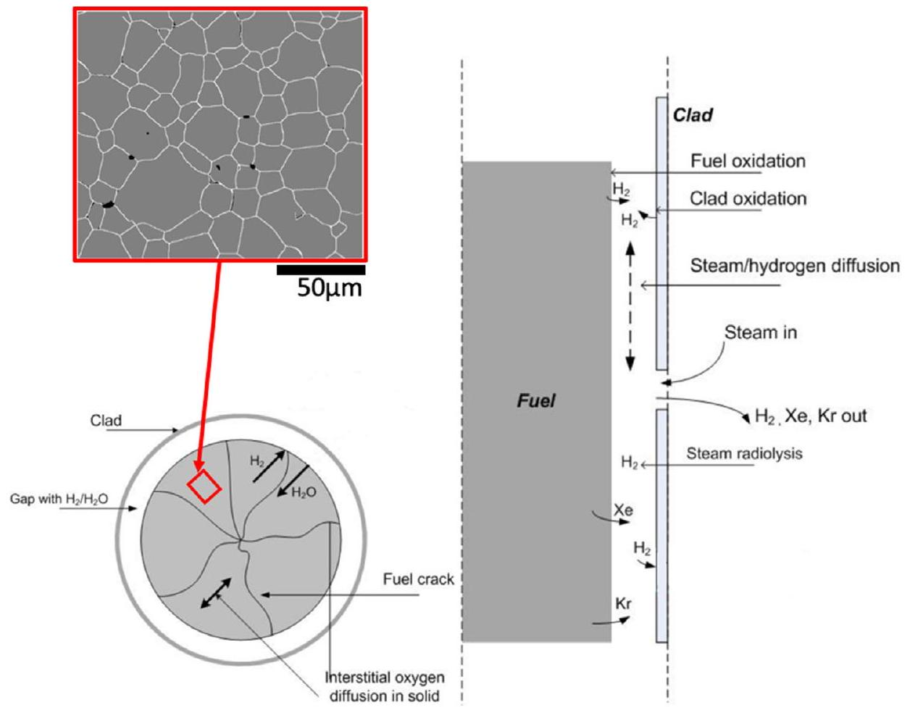
Fig. 1. Schematic figure showing the physical and chemical processes in defective fuel (reproduced from Massih (2018)).

transported through the $\mathrm{UO}_{2}$ fuel pellet by diffusion leading to oxidation. During the process of oxidation, the fuel stoichiometry would increase from $\mathrm{UO}_{2}$ to $\mathrm{UO}_{2+\mathrm{x}}$, which alters the thermal and chemical properties of the material (Allen and Holmes, 1995). The oxidation of $\mathrm{UO}_{2}$ fuel under reactor conditions has been extensively studied both experimentally and numerically. For example, Abrefah et al. (1994) measured the oxidation of $\mathrm{UO}_{2}$ in a high temperature range from 1273 K to 1623 K . They investigated the oxidation behaviors of $\mathrm{UO}_{2}$ in pure steam and steam-hydrogen mixtures. The results show that the fuel oxidation rate is greatly affected by the pressure and composition of water in gas mixtures.

Taylor (2005) investigated the $\mathrm{UO}_{2}$ oxidation behaviors at low and high temperatures using phenomenological modelling. Their results show that the temperature difference can result in the discrepancy in microstructure variations and oxidation products of $\mathrm{UO}_{2}$ fuel. When the temperature is over 2000 K , the oxidation process is controlled by surface reaction kinetics and oxygen diffusion. Higgs et al. (2007) developed a conceptual model to evaluate the fuel oxidation in defective fuels under operation conditions using a finite element method. They considered the gas transport and the oxidation of $\mathrm{UO}_{2}$ in a fuel component. The changes of oxygen-to-uranium ratio and temperatures in the fuel are predicted. The results show that the oxidation decreases with the distance from the defect on cladding. The reduction of $\mathrm{UO}_{2}$ thermal conductivity increases the fuel temperature as a result of oxidation. Andersson et al. (2013) applied density functional theory to calculate the formation of $\mathrm{UO}_{2+\mathrm{x}}$ caused by fuel oxidation. They simulated the oxidation process by adding oxygen atoms into the $\mathrm{UO}_{2}$ cells and optimized the local geometry with molecular dynamics simulations. The calculated results indicate that the stable compounds of $\mathrm{UO}_{2+\mathrm{x}}$ are $\mathrm{U}_{4} \mathrm{O}_{8.889}, \mathrm{U}_{3} \mathrm{O}_{7}$ and $\mathrm{U}_{3} \mathrm{O}_{7.333}$.

However, most of the numerical studies on fuel oxidation are either focused on the fuel component scale (cm) or molecular scale $(\mathrm{nm})$. There are very few studies carried out at the micro- or grainscale ( $\mu \mathrm{m}$ ) where physical phenomenon usually occurs (Bijeljic and

Blunt, 2006; Ghanbarian et al., 2018; Ghanbarian and Daigle, 2016; Liu and Mostaghimi, 2016; Song et al., 2018). Besides, it has been understood that the microstructural characteristics including grain sizes and grain boundaries can influence oxygen diffusion in $\mathrm{UO}_{2}$ fuel (Sabioni et al., 2000; Yajima et al., 1966). Yet, numerical studies on $\mathrm{UO}_{2}$ oxidation in fuel with grain boundaries are scarce. Knowledge on the impact of grain boundaries on $\mathrm{UO}_{2}$ fuel oxidation is imperative for understanding the phenomenon of oxidation and assessing the reactor efficiency and safety.

Besides, in nuclear fuel, the release and transport of fission gas is of great importance for the safe operation of nuclear reactors (Catlow, 1978; Davies and Long, 1963). The structure of a fuel rod includes fuel pellets, cladding and the gap between fuel and cladding. The gap between the fuel and the cladding is usually filled with helium gas to permit better thermal contact between the fuel and the cladding. As the fuel burnup increases, the fuel swells. If the fuel has direct contact with cladding, the swelled fuel imposes mechanical stresses on the cladding, causing potential damage and safety problems (Lamarsh, 1966). Fission gas is produced as a result of nuclear fission and then released into the fuel-to-cladding gap. This will increase the inner pressure on the cladding and cause potential mechanical damage to the fuel rod. In the fuel rod without any damage, the fission gas is confined in the rods. Once the cladding is breached under undesirable circumstances, the fission gas will leak out via the breach on the fuel rod (Tonks et al., 2018). In addition, helium is often used as the filling gas at a specified pressure in the fuel rods of reactors, which enhances heat conduction from the fuel pellets to the cladding. The behaviors of helium are crucial for the performance of nuclear reactors (Hore-Lacy, 2016). The produced fission gas will replace the helium in the gap between fuel and cladding. This would lead to the reduction of thermal conductivity and mechanical strength of the fuel rod, decreasing the efficiency and safety of nuclear reactor (Matzke, 1980). The behaviors of fission product released in $\mathrm{UO}_{2}$ fuel have been studied extensively (Hargreaves and Collins,

1976; Lassmann and Benk, 2000; Une et al., 1992). Recently, several numerical models were developed with the assumption of fission gas diffusion in pure $\mathrm{UO}_{2}$ fuel without oxidized component (Andersson et al., 2015; Lim et al., 2016; Millett et al., 2012). Millett et al. (2012) developed a numerical model for fission gas release in grain boundaries of pure $\mathrm{UO}_{2}$ fuel. They studied the effect of gas bubble growth and coalescence on grain boundary properties. It was found the grain boundary percolation effect can lead to a great reduction of fission gas release rate. Lim et al. (2016) applied a finite element model to study the effect of microstructure and grain boundary on the diffusion of fission product in pure $\mathrm{UO}_{2}$ fuel. They simulated the fission gas diffusion in grain boundaries with different diffusivity and connectivity. The results showed that the percolation of fission gas along grain boundary can greatly affect the bulk diffusivity of the fuel and consequently influence the fission product concentration in the fuel.

In previous studies, few models have considered the fission gas diffusion behaviors in fuel during oxidation. Study on fission gas release in fuel during oxidation is necessary for evaluating the reactor safety and fuel performance. The diffusivity of fission gases like $K r$ and $X e$, is known to be higher in hyper-stoichiometric fuel (Rest et al., 2019). The released fission products may present different behaviors in the oxidized $\mathrm{UO}_{2+\mathrm{x}}$ fuel (Colle et al., 2006; Cox et al., 1986; Massih, 2018). Numerical modelling of fission gas diffusion in oxidized fuel is imperative to quantitatively describe the fission gas diffusion when oxidation occurs in the nuclear fuel.

For the numerical modelling at grain-scale (or pore-scale), Direct Numerical Simulation (DNS) has become a popular approach for investigating physical-chemical processes in microstructures of materials in the past decade (Babaei and Yun Seng, 2019; Blunt et al., 2013; Ghanbarian et al., 2016; Guo et al., 2018; Kang et al., 2007, 2002; Liu and Mostaghimi, 2018b; Liu et al., 2018, 2020b; Tahmasebi et al., 2015). In this method, simulations are conducted directly on the images of the microstructures of materials. Numerical methods including conventional computational fluid dynamics techniques, smooth particle hydrodynamics and lattice Boltzmann methods have been applied for simulating phys-ical-chemical processes in different materials (Babaei and Sedighi, 2018; Chen et al., 2019; Kang et al., 2014, 2010; Liu and Mostaghimi, 2017a, 2017b, 2018a; Liu et al., 2017; Mostaghimi et al., 2016; Pereira Nunes et al., 2016; Tartakovsky and Meakin, 2006). Chen et al. (2018) applied a pore-scale model based on lattice Boltzmann method to study the effect of macroscopic pores on reaction processes in micro-porous media. They simulated the dif-fusion-reaction processes in hierarchical porous media and predicted the evolution of microstructures and reaction rates. Their results showed that the desirable pore structure has front-loose and back-tight features, which can best enhance the reaction rate and improve performance of catalyst in chemical engineering applications. Tahmasebi and Kamrava (2019) used a micro-scale model to simulate the thermal-mechanical process during $\mathrm{CO}_{2}$ injection into subsurface rocks. They investigated the deformation of material microstructures due to external force loading and thermal conduction. The results demonstrated that the coupled microscale model can provide accurate predictions of the material deformation caused by thermal and mechanical factors.

In this paper, we apply a grain-scale model developed by Liu et al. (2020a) to simulate $\mathrm{UO}_{2}$ oxidation at micro-scale. The thermal-chemical processes coupling heat conduction and oxidation are directly simulated on the images of $\mathrm{UO}_{2}$ fuel microstructures. The grain boundary effect on fuel oxidation is investigated. The impact of oxidation on fission gas diffusion is also studied. The purpose of this work is to quantitatively describe the effects of grain boundary on $\mathrm{UO}_{2}$ oxidation and fission gas diffusion, and provide insights into the fuel behaviors under reactor conditions.

## 2. Methods

### 2.1. Mathematical model

The fuel oxidation and fission gas diffusion are complicated. They are controlled by processes with strong dependence on temperature. The current model is focused on modelling these physi-cal-chemical processes at grain-scale under defective fuel conditions.

### 2.1.1. Oxidation reactions

In the scenario of fuel cladding failure in an operational nuclear reactor, the water steam enters the fuel rod through the breach on the cladding and then results in oxidation of $\mathrm{UO}_{2}$ fuel.

During the reaction process, the hydrogen and oxygen are produced by radiolysis of water. Then, the $\mathrm{UO}_{2}$ is oxidized into $\mathrm{UO}_{2+\mathrm{x}}$ by reacting with the produced oxygen. Due to radiolysis, $\mathrm{H}_{2} \mathrm{O}$ molecules are decomposed into hydrogen and oxygen, which can be expressed as,
$x \mathrm{H}_{2} \mathrm{O} \leftrightarrow x \mathrm{H}_{2}+\frac{x}{2} \mathrm{O}_{2}$

Then, the $\mathrm{UO}_{2}$ fuel reacts with oxygen via,
$\mathrm{UO}_{2}+\frac{x}{2} \mathrm{O}_{2} \leftrightarrow \mathrm{UO}_{2+x}$

Thus, the fuel oxidation can be expressed with an overall equation (Olander et al., 1999),
$\mathrm{UO}_{2}+x \mathrm{H}_{2} \mathrm{O} \leftrightarrow \mathrm{UO}_{2+x}+x \mathrm{H}_{2}$

In this reaction, $\mathrm{UO}_{2}$ is oxidized into hyper-stoichiometric fuel $\mathrm{UO}_{2+\mathrm{x}}$. Hydrogen gas $\mathrm{H}_{2}$ is produced. For oxidation reaction rate, the following equation is considered (Carter and Lay, 1970),
$r=k\left[C_{o}(t)-C_{H_{2}}(t) / K_{e q}\right]$
where $k$ is the reaction rate coefficient ( $\mathrm{m} / \mathrm{s}), C_{o}(t)$ and $C_{\mathrm{H}_{2}}(t)$ are the concentration ( $\mathrm{mol} \cdot \mathrm{m}^{-3}$ ) of oxygen and hydrogen at time $t . K_{\text {eq }}$ is the equilibrium constant. The fuel is assumed to be initially stoichiometric. The reaction rate coefficient $k$ can be determined by (Cox et al., 1986),
$k=36.5 \times 10^{-2} \exp \left(-\frac{23500}{T}\right)$
where $T$ is the temperature (K). The equilibrium constant of oxygen in fuel is thermodynamically described by (Blackburn, 1973; Park et al., 1997),
$K_{e q}=1.0 \times 10^{-3}\left(\frac{33.1+8.68 \beta-5.19 \times 10^{-2} T+0.45 \beta^{2}+1.84 \times 10^{-5} T^{2}-7.83 \times 10^{-3} \beta T}{1+0.269 \beta-6.22 \times 10^{-4} T+0.02 \beta^{2}+1.39 \times 10^{-7} T^{2}-7.45 \times 10^{-5} \beta T}\right)$
where $\beta=\log \left(\frac{\varepsilon}{1-\varepsilon}\right)$, $\varepsilon$ is the mole fraction of $\mathrm{H}_{2}$. Diffusion in solid state materials is considered in the current study. The oxygen and Xenon diffusivity values (shown in Table 1) refer to the solid-state diffusivity in Uranium materials, which is different from the diffusivity in liquids or gases. The transport of oxygen and hydrogen can be described by the diffusion equation,
$\frac{\partial C_{0}}{\partial t}=\nabla \cdot\left(D_{0} \nabla C_{0}\right)$,
$\frac{\partial C_{H_{2}}}{\partial t}=\nabla \cdot\left(D_{H_{2}} \nabla C_{H_{2}}\right)$,

The oxygen interstitial is a compensating acceptor in electronirradiated $\mathrm{UO}_{2}$ material. It denotes the vacancy occupied by oxygen in the solid material (Belle and Lustman, 1957). The diffusion coef-

Table 1
The parameters used in simulations.
| Parameter | Before oxidation (at $\mathbf{1 0 0 0 ~ K}$ ) | After oxidation (at $\mathbf{1 0 0 0 ~ K}$ ) | Units |
| :--- | :--- | :--- | :--- |
| Thermal conductivity of $\mathrm{UO}_{2}$ grains | 3.5 | 1.8 | $\mathrm{W} / \mathrm{m} \cdot \mathrm{K}$ |
| Thermal conductivity of grain boundary | 2.0 | 1.0 | $\mathrm{W} / \mathrm{m} \cdot \mathrm{K}$ |
| Oxygen diffusivity in fuel matrix | $1.89 \times 10^{-11}$ | $9.3 \times 10^{-14}$ | $\mathrm{m}^{2} \mathrm{~s}^{-1}$ |
| Oxygen diffusivity in grain boundary | $1.89 \times 10^{-8}$ | $9.3 \times 10^{-11}$ | $\mathrm{m}^{2} \mathrm{~s}^{-1}$ |
| Hydrogen diffusivity in fuel matrix | $2.28 \times 10^{-12}$ | $1.18 \times 10^{-14}$ | $\mathrm{m}^{2} \mathrm{~s}^{-1}$ |
| Hydrogen diffusivity in grain boundary | $2.28 \times 10^{-9}$ | $1.18 \times 10^{-11}$ | $\mathrm{m}^{2} \mathrm{~s}^{-1}$ |
| Oxidation rate constant | $2.27 \times 10^{-11}$ | $2.27 \times 10^{-11}$ | $\mathrm{m} \cdot \mathrm{s}^{-1}$ |
| Xenon diffusivity in fuel matrix | $1.68 \times 10^{-13}$ | $3.58 \times 10^{-11}$ | $\mathrm{m}^{2} \mathrm{~s}^{-1}$ |
| Xenon diffusivity in grain boundary | $1.68 \times 10^{-10}$ | $3.58 \times 10^{-8}$ | $\mathrm{m}^{2} \mathrm{~s}^{-1}$ |

ficient for oxygen interstitials $D_{O}\left(\mathrm{~m}^{2} \mathrm{~s}^{-1}\right)$ in fuel matrix, is a temperature-dependent variable, which can be calculated via (Meachen, 1989),

$$
D_{O}=2.5 \times 10^{-4} \exp \left(-\frac{16400}{T}\right)
$$

The oxygen diffusion coefficient in $\mathrm{UO}_{2+\mathrm{x}}$ is computed via (Berthinier et al., 2013),
$D_{x}=1.51 \times 10^{-8}\left\{\mathrm{x}+\left[\chi^{2}+500 \exp (-18.7 / \mathrm{T})^{1 / 2}\right]\right\} \exp \left(-\frac{12000}{T}\right)$

The diffusion coefficient for Hydrogen, $D_{H_{2}}\left(\mathrm{~m}^{2} \mathrm{~s}^{-1}\right)$ is calculated via (Wheeler, 1971),

$$
D_{H_{2}}=3.7 \times 10^{-6} \exp \left(-\frac{14300}{T}\right)
$$

### 2.1.2. Thermal conduction in the fuel

The temperature drop in the fuel of an operational Light Water Reactor (LWR) varies due to different fuel designs and manufactures. The highest temperature drop can reach up to $10^{4}{ }^{\circ} \mathrm{C} / \mathrm{cm}$ (Olander, 1976). The temperature drop would significantly affect the properties of the fuel. Heat production and transfer in the fuel is essential for determining the temperature drop across the fuel. The heat conduction in the fuel is governed by,

$$
\rho_{s} \sigma_{s} \frac{\partial T}{\partial t}=\nabla \cdot\left(\lambda_{s} \nabla T\right)+q_{v},
$$

where $\rho_{s}$ is the fuel density ( $k g m^{-3}$ ), $\sigma_{s}$ is the specific heat capacity of the fuel $\left(\mathrm{Jmol}^{-1} \mathrm{~K}^{-1}\right), \lambda_{s}$ is the thermal conductivity of the fuel ( $W m^{-1} k^{-1}$ ) and $q_{v}$ is the volumetric heat production rate ( $W m^{-3}$ ). The density is function of temperature. When $273 K<T<923 K$, it can be expressed as (Fink, 2000),

$$
\begin{aligned}
\rho_{s}(T)= & 10.963 \times\left(0.99734+9.802 \times 10^{-6} T-2.705 \times 10^{-10} T^{2}\right. \\
& \left.+4.391 \times 10^{-13} T^{3}\right)^{-3}
\end{aligned}
$$

When $T \geq 923 K$, the density is calculated by (Fink, 2000),

$$
\begin{aligned}
\rho_{s}(T)= & 10.963 \times\left(0.99672+1.179 \times 10^{-5} T-2.429 \times 10^{-9} T^{2}\right. \\
& \left.+1.219 \times 10^{-12} T^{3}\right)^{-3}
\end{aligned}
$$

The specific heat capacity $\sigma_{s}$ is thermodynamically determined by temperature and the value of $x$, via (Lewis et al., 2004),

$$
\begin{aligned}
\sigma_{s}(x, T)= & 52.174+45.806 x+\left(87.951 \times 10^{-3}-7.3461 \times 10^{-2} x\right) T \\
& +(1-x)\left\{-84.241 \times 10^{-6} T^{2}+31.542 \times 10^{-9} T^{3}\right. \\
& \left.-2.6334 \times 10^{-12} T^{4}\right\}-(713910+295090 x) T^{-2}
\end{aligned}
$$

The thermal conductivity $\lambda_{s}$ is also a function of temperature, which can be expressed as (Fink, 2000),

$$
\begin{aligned}
\lambda_{S}(T)= & \frac{100}{7.541+0.01769 T+3.6142(T / 1000)^{2}} \\
& +\frac{6400}{(T / 1000)^{5 / 2}} \exp \left(\frac{-16350}{T}\right)
\end{aligned}
$$

Thus, the thermal conductivity can be calculated at a given temperature $T$ during reactions.

### 2.1.3. Fission gas diffusion

The transport of fission gas (Xenon) in fuel is describe by the diffusion equation,

$$
\frac{\partial C_{F}}{\partial t}=\nabla \cdot\left(D_{F} \nabla C_{F}\right),
$$

The diffusivity of fission gas (Xenon) $D_{F}\left(\mathrm{~m}^{2} \mathrm{~s}^{-1}\right)$ in bulk fuel, is computed via (Davies and Long, 1963),

$$
D_{F}=7.6 \times 10^{-10} \exp \left(-\frac{70000}{R T}\right)
$$

where $r$ is the ideal gas constant. The fission gas diffusion coefficient in oxidized fuel $\mathrm{UO}_{2+\mathrm{x}}$ can be calculated as (Skim, 1999),

$$
D_{F x}=7.6 \times 10^{-10} \exp \left(-\frac{35000}{R T}\right) g(x)
$$

where $g(x)=1+493 x+32182 x^{2}$ and $x$ is deviation from stoichiometry in $\mathrm{UO}_{2+\mathrm{x}}$.

### 2.2. Numerical methods

The governing equations are solved using the finite volume method developed in Liu et al. (2020a). Direct numerical simulations are performed on the microstructures derived from Scanning Electron Microscope images of $\mathrm{UO}_{2}$ fuel (Hiezl et al., 2015). Each pixel of the image represents a grid block. Thus, meshing is not needed for the simulation domain. The details of the numerical method and validations have been presented in Liu et al. (2020a) and Liu and Mostaghimi (2018a).

The image size of the fuel samples is $199.1 \times 171.8 \mu \mathrm{~m}^{2}$ with a resolution of 24.3 nm . The left boundary of the fuel sample is assumed to be closer to the center of fuel pellet. The temperature at the left boundary is set as 1000 K for operational reactor condition (Rust, 1979) and heat transfer from left to right. The thermal conductivity of $\mathrm{UO}_{2}$ grains and boundary is $3.5 \mathrm{~W} / \mathrm{m} \cdot \mathrm{K}$ and $2.0 \mathrm{~W} / m \cdot K$ (at temperature 1000 K ), respectively (Fink, 2000; Massih, 2018). The volumetric heat rate $q_{d}$ is $6.0 \times 10^{8} \mathrm{~W} / \mathrm{m}^{3}$ corresponding to the rate under reactor condition (Lamarsh and Baratta, 2001).

Diffusivity for oxygen in $\mathrm{UO}_{2}$ is set as, $D_{o}=1.89 \times 10^{-11} \mathrm{~m}^{2} \mathrm{~s}^{-1}$ at 1000 K (Meachen, 1989). In the work by Williams et al. (2015), the ratio of diffusion coefficient in grain boundaries and bulk grain ranges from $10^{2}$ to $10^{6}$. In current simulations, we set the diffusivity of oxygen in grain boundary as $1.89 \times 10^{-8} \mathrm{~m}^{2} \mathrm{~s}^{-1}$ corresponding to the ratio $10^{3}$. The oxidization rate constant, $k$ is $2.27 \times 10^{-11} m \cdot \mathrm{~s}^{-1}$ at 1000 K (Cox et al., 1986). The thermal conductivity of $\mathrm{UO}_{2+\mathrm{x}}$ grain is set as $1.8 \mathrm{~W} / \mathrm{m} \cdot \mathrm{K}$. The thermal conductivity of grain

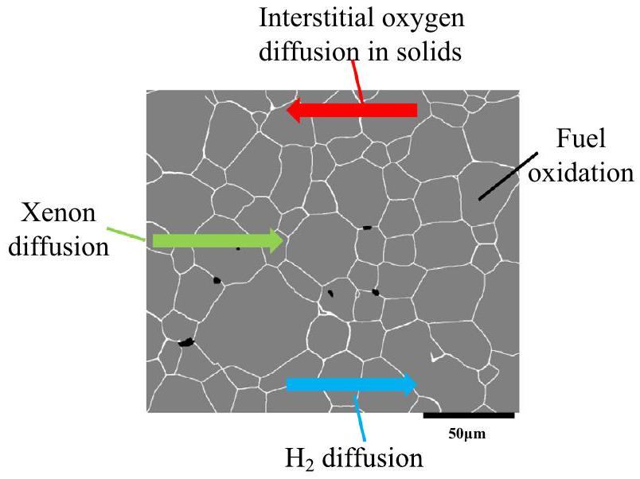
Fig. 2. The images of $\mathrm{UO}_{2}$ fuel with grain boundaries (grey-grains, white-grain boundaries, black-pore) with schematic of physical-chemical processes simulated in the modelling.

boundary is set as $1.0 \mathrm{~W} / \mathrm{m} \cdot \mathrm{K}$ at 1000 K (White and Nelson, 2013). A constant oxygen concentration of $1.2 \times 10^{-6} \mathrm{~mol} \cdot \mathrm{~m}^{-3}$ (Blackburn, 1973) is assumed at the right boundary of the fuel sample. Thermal conductivity, diffusivity and reaction rate constant of $\mathrm{UO}_{2}$ fuel are all temperature dependent variables, which are calculated at different temperatures based on equations in Section 2.1.

Diffusion in solid state materials is considered in current study. The oxygen and Xenon diffusivity values (shown in Table 1) refer to the solid-state diffusivity in Uranium materials, which is different from the diffusivity in liquids or gases. For fission gas diffusion,
a constant concentration of Xenon ( $C_{x e}=1$ ) is enforced at the left boundary of the fuel. The diffusion coefficients of Xenon gas in $\mathrm{UO}_{2}$ and $\mathrm{UO}_{2+\mathrm{x}}$ at different temperatures are calculated via Eqs. (18) and (19). The diffusivity of Xenon gas in $\mathrm{UO}_{2}$ fuel is $1.68 \times 10^{-13} \mathrm{~m}^{2} \mathrm{~s}^{-1}$ at a temperature of 1000 K . The ratio of diffusivity in grain boundary to fuel matrix is set as $10^{3}$ (Lim et al., 2016). Thus, the diffusion coefficient of Xenon in grain boundary is $1.68 \times 10^{-10} m^{2} s^{-1}$ (at 1000 K ). The parameters used in the simulations are presented in Table 1.

## 3. Results and discussion

### 3.1. The effect of grain boundary density on $\mathrm{UO}_{2}$ thermal conduction

Accurately predicting the evolution of fuel thermal conductivity is essential for assessing fuel performance in nuclear reactors (Lamarsh and Baratta, 2001; Lewis, 1977; Yamasaki et al., 2007). In nuclear fuel, the microstructural features, such as grain sizes and grain boundaries, are known to affect the thermal conductivity of $\mathrm{UO}_{2}$ fuel (Shrestha et al., 2019; Yamasaki et al., 2007). In this section, the effect of grain boundary density on temperature drop across $\mathrm{UO}_{2}$ fuel is investigated. The grain boundary density is calculated via, $f=\frac{A_{G B}}{A_{B u l k}}$, where $A_{G B}$ is the total area of grain boundary and $A_{\text {Bulk }}$ is the bulk area on $\mathrm{UO}_{2}$ fuel image. Figs. 2 and 3 are the digitalized image, which are extracted from Scanning Electron Microscope images of $\mathrm{UO}_{2}$ fuel in the experiments (Hiezl et al., 2015). The grey color in the image refers to the grains. The white color represents the grain boundary and the black color denotes the pore space. Fig. 2 shows a schematic of the physical and chemical processes modeled, which include diffusion of oxygen, hydro-

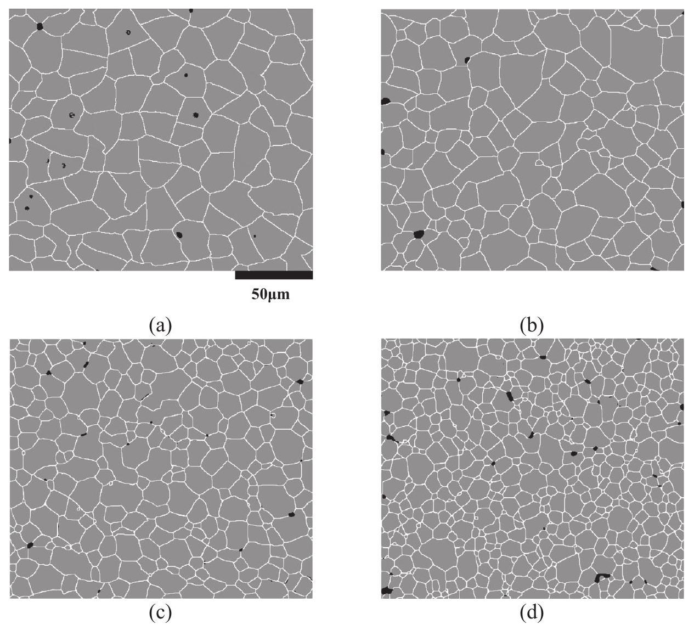
Fig. 3. The images of fuels with different grain boundaries densities: (a) $f=5.1 \%$; (b) $f=6.2 \%$; (c) $f=7.6 \%$; (d) $f=10.1 \%$. (grey-grains, white-grain boundaries, black-pore).

gen and Xenon in solids and fuel oxidation in matrix. The grain boundary density in image of Fig. 2 is calculated as $3.9 \%$. Four other fuel samples are demonstrated in Fig. 3. The grain boundary densities are calculated as $5.1 \%, 6.2 \%, 7.6 \%$ and $10.1 \%$. The simulations of thermal conduction are carried out directly on the images of the five fuel samples. The temperature distributions are computed.

The temperature profiles in the five samples are demonstrated in Fig. 4. The temperature decreases from left to right due to thermal conduction. The temperature in the fuel with grain boundary density of $3.9 \%$ keeps the highest among all the five samples. At the right boundary (or outlet) of the fuel, the temperature is calculated as 973 K . With the increase of grain boundary density, the calculated temperature at the right boundary decreases. For instance, when the grain boundary density of the fuel is $6.2 \%$, the temperature of the right boundary has reduced to 971 K . The lowest temperature at the right boundary is computed as 970 K in the fuel with a grain boundary density of $10.1 \%$. This can be explained by the lower thermal conductivity of grain boundary. Denser grain boundaries result in lower thermal conductivity of the whole fuel, consequently reducing the temperature at the outlet.

Fig. 5 shows the temperature drops across the fuels with different grain boundary densities. The denser the grain boundaries, the larger the calculated temperature drop. The largest temperature drop is calculated as 29.9 K in the fuel with the highest grain density of $10.1 \%$. For the fuel with grain boundary density of $6.2 \%$, the

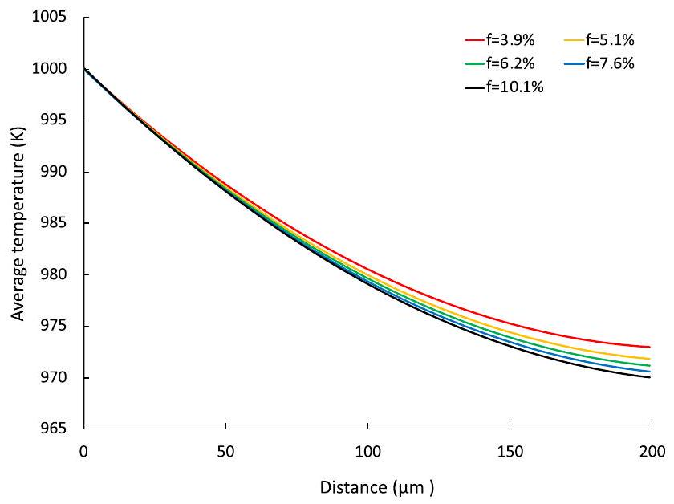
Fig. 4. Temperature profile across the $\mathrm{UO}_{2}$ fuel.

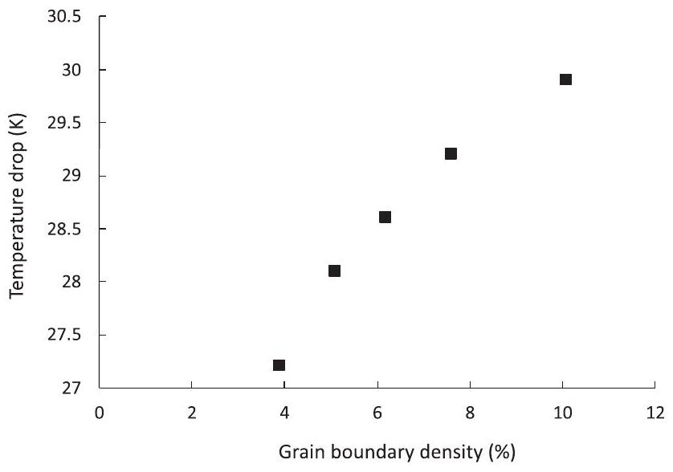
Fig. 5. Relationship between temperature drop and grain boundary density.

temperature drop is calculated as 28.6 K . The lowest temperature drop is computed as 27.2 K when the grain boundary density is $3.9 \%$.

### 3.2. The effect of grain boundary on oxidation of $\mathrm{UO}_{2}$

In this section, the effect of grain boundary on the process of $\mathrm{UO}_{2}$ oxidation is investigated. Simulations of $\mathrm{UO}_{2}$ oxidations are carried out on the images of three samples with fine grains ( $f=10.1 \%$ ), medium grains ( $f=6.2 \%$ ) and coarse grains ( $f=3.9 \%$ ). Fig. 6 shows the initial $\mathrm{UO}_{2}$ images extracted from experiments.

Under reactor conditions, the temperature at the center of $\mathrm{UO}_{2}$ fuel pellet can reach up to 1500 K (Lamarsh and Baratta, 2001; Rust, 1979). Thus, we apply a constant temperature of 1000 K at the left boundary of the fuel sample (closer to the fuel pellet center). Fig. 7 shows the simulation results of oxidized fuel in the three fuel samples at different reaction times. The results show that oxidation preferably occurs along the grain boundaries, and then advances from boundary to the grain interior. For example, in the medium-grained fuel, the oxidized fuel (dark red color) is mainly concentrated at the grain boundaries at $\mathrm{t}=15 \mathrm{~h}$ (Fig. 7d). With the increase of reaction time, the oxidized area expands from the grain boundary towards the center of each grain. This can be explained by the high diffusivity of oxygen along grain boundaries. Mass transfer in grain boundaries is faster leading to higher concentrations of oxygen. Thus, the oxidation of the fuel along the grain boundaries is faster. The fraction of oxidized fuel at different reaction times is also calculated. At the reaction time of 60 h (Fig. 7c), 63\% of the fine-grained fuel is oxidized. However, that fraction is $48 \%$ for the medium-grained fuel as shown in Fig. 7(f). The lowest fraction is for the fuel with coarse grains where only $22 \% \mathrm{UO}_{2}$ fuel is oxidized at 60 h . Clearly, oxidation is faster in fuel with higher grain boundary density (or finer grains) because of the faster oxygen diffusion in the grain boundary.

The average effective reaction rate for the full fuel sample can be calculated from the change of oxidized area via, $\eta^{\text {eff }}=\frac{\Delta \omega_{o x}}{\Delta t V_{m} A}$ where $\Delta \omega_{o x}$ is the increased fraction of oxidized fuel, $A$ is the specific surface area and $\Delta t$ is the reaction time period. The variations of average reaction rates with time are presented in Fig. 8. The reaction rate decreases with time for all the three fuel samples. The oxidation rate is the highest for the fine-grained fuel and lowest for the coarse-grained fuel. At a reaction time of 60 h , the reaction rate of fine-grained fuel is $2.2 \times 10^{-7} \mathrm{~mol} \cdot \mathrm{~m}^{-2} \mathrm{~s}^{-1}$, almost three times the rate of $7 \times 10^{-8} \mathrm{~mol} \cdot \mathrm{~m}^{-2} \mathrm{~s}^{-1}$ for coarse-grained fuel. The reaction rate of medium-grained fuel is calculated as $1.3 \times 10^{-7} \mathrm{~mol} \cdot \mathrm{~m}^{-2} \mathrm{~s}^{-1}$. The oxidation rate shows great dependence on grain boundary density. At a given grain boundary density, the current model allows to predict the time dependent oxidation rate. The predicted oxidation rate can be used to calculate the lifetime of the fuel pellet in defective fuel rods under reactor conditions.

### 3.3. The impact of oxidation on temperature drop

The effective thermal conduction of nuclear fuel pellet is essential for assessing the efficiency and safety of the reactor. It is required by safety assessment that the fuel should be able to effectively conduct away the produced heat, without leading to potential temperature increase and material melting. The thermal degradation of the fuel pellet under normal operation and accident conditions can greatly diminish this ability (Lewis, 1977). Due to the oxidation, the fuel stoichiometry will increase from $\mathrm{UO}_{2}$ to $\mathrm{UO}_{2+\mathrm{x}}$. The change of material property will affect the thermal behaviors of the fuel (Burns et al., 2012). With the increase of reaction time, more $\mathrm{UO}_{2}$ is oxidized. This will significantly affect the temperature drop across the fuel (Massih, 2018). In this section,

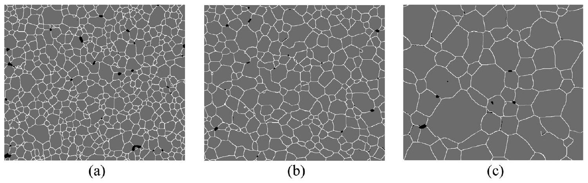
Fig. 6. The initial images of the $\mathrm{UO}_{2}$ samples: (a) Fine grain ( $f=10.1 \%$ ); (b) Medium grain. ( $f=6.2 \%$ ) and (c) Coarse grain ( $f=3.9 \%$ ) (grey-grains, white-grain boundaries, blackpore).

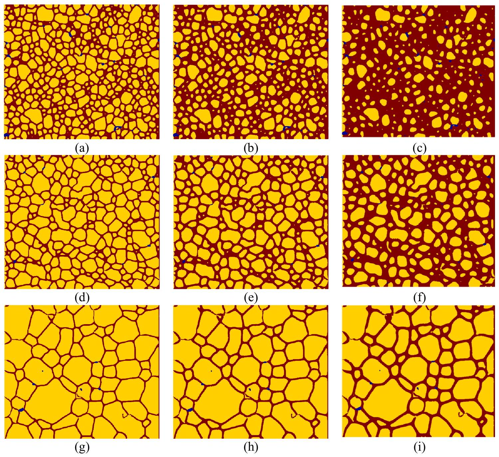
Fig. 7. Oxidized fuel at different reaction times for fine grain ( $\mathrm{a}-15 \mathrm{~h}$; b- 30 h and c- 60 h ), medium grain (d-15 h; e-30 h and f-60 h); coarse grain ( $\mathrm{g}-15 \mathrm{~h}$; h-30 h and i-60 h) (Red-oxidized fuel; yellow- $\mathrm{UO}_{2}$ fuel; blue-pore space). (For interpretation of the references to the colors in this figure, the reader is referred to the web version of this article.)

the effect of fuel oxidation on temperature drops is investigated. Thermal conduction is simulated in fuels with different grain boundary and grain sizes.

Fig. 9 shows the temperature profiles in three fuel samples at different reaction times. The temperature decreases with time due to the lower thermal conductivity of oxidized fuel. This indicates that the oxidation of fuel causes reduction of effective thermal conductivity of the whole fuel, which may increase the risk
of fuel melting in high-burnup reactors (Burns et al., 2012). Besides, the temperature drop varies in fuel samples with different grain boundaries. For example, at reaction time of 60 h , the temperature at the right boundary of fuel (at a distance of $199.1 \mu \mathrm{~m}$ ) is 957 K for the fine-grained fuel. However, the temperature is 960 K for the medium-grained fuel at the same location and time. The highest temperature is observed in the coarse-grained fuel, where the temperature is 968 K .

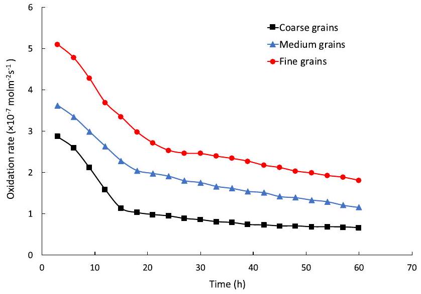
Fig. 8. The variations of oxidation rates with time in three samples with different grain sizes.

The temperature drops across the oxidized fuel are calculated in the three fuel samples. The relationship between the temperature drop and the fraction of oxidized fuel is demonstrated in Fig. 10. As shown in the figure, the temperature drop increases with the fraction of oxidized fuel. This is due to the lower thermal conductivity of the oxidized products $\mathrm{UO}_{2+\mathrm{x}}$. In the medium-grained fuel, the temperature drop is 31 K with an oxidation fraction of 0.22 . When the fraction of oxidized fuel increases to 0.48 , the temperature drop reaches 35 K . Linear relationships between temperature drop $(\Delta T)$ and fraction of oxidized fuel $(\xi)$ are fitted based on the simulation results in each fuel sample. For the fuel with coarse grains, a relationship of $\Delta T=9.123 \xi+26.437$, is obtained. In the mediumgrained and fine-grained fuel, the equations are fitted as $\Delta T=12.888 \xi+28.649$ and $\Delta T=16.198 \xi+29.312$, respectively. In the fine-grained fuel, the temperature drop increases fastest with a rate of 16.198 . The slowest increase of temperature drop is calculated as 9.123 in the coarse-grained fuel. The results indicate that the effective thermal conductivity in fuel with denser grain boundary (or finer grains) is more sensitive to the fuel oxidation. By using this numerical method, the temperature drops and effective thermal conductivity in oxidized fuel can be quantitatively predicted. This model provides a potential tool for quantitative assessment of the fuel performance when oxidation occurs in nuclear reactors.

### 3.4. The effect of grain boundary diffusivity on $\mathrm{UO}_{2}$ oxidation

In nuclear fuel, the grain boundary diffusivity varies due to different material and/or manufacture conditions (Sabioni et al., 2000). In this section, we investigate the effect of grain boundary

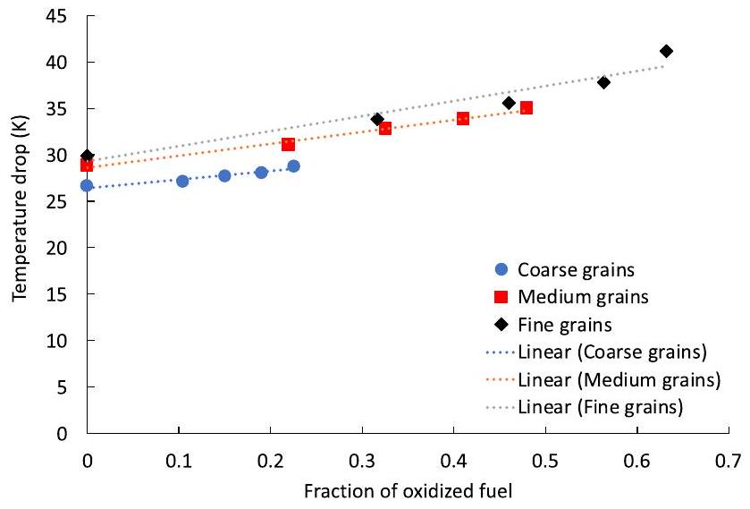
Fig. 10. The relationship between the temperature drop and the fraction of oxidized fuel.

diffusivity on $\mathrm{UO}_{2}$ oxidation. Simulations with different grain boundary diffusion coefficients are carried out on the images of the large-grained fuel (Fig. 6c). The bulk fuel diffusivity is defined as the diffusivity in solid fuel matrix. The value of the bulk diffusivity used in current study is $1.89 \times 10^{-11} m^{2} s^{-1}(1000 \mathrm{~K})$. The ratios of grain boundary diffusivity to bulk fuel diffusivity considered in the simulations are 100,1000 and 10000 . Fig. 11 plots the variations of oxidized $\mathrm{UO}_{2}$ fuel with reaction time.

The simulation results show that at the same reaction time, the higher the grain boundary diffusivity ratio, the larger the fraction of oxidized fuel. For example, at a reaction time of 60 h , only $5 \%$ of the fuel is oxidized with the diffusivity ratio of 100 . This fraction is $23 \%$ and $36 \%$ when the ratios are 1000 and 10000 , respectively. It is thus evident that higher grain boundary diffusivity can greatly accelerate the oxidation. This again can be explained by the faster mass transfer of oxygen in grain boundaries. Due to the higher diffusivity of oxygen in grain boundary when comparing with the grain matrix, the grain boundary functions as faster paths for oxygen transport. Higher grain boundary diffusivity leads to faster mass transfer of reactant, leading to higher oxidation rate in the fuel. The results suggest that the ratio of grain boundary diffusivity to bulk fuel diffusivity for oxygen is an important factor in determining the oxidation rates of fuel. It is necessary to evaluate the oxygen diffusivity in grain boundary for accurately predicting the oxidation rates in fuel.

### 3.5. The oxidation effect on fission gas diffusion

During the nuclear fission process in reactors, fission gas is generally produced as a result of fuel irradiation. The generation and

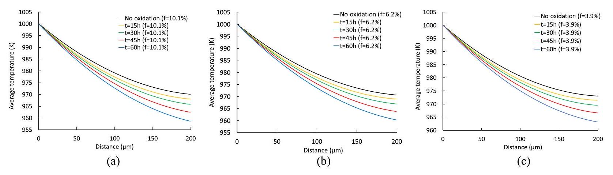
Fig. 9. Temperature profiles across the $\mathrm{UO}_{2}$ samples at different reaction time: (a) Fine grains $(f=10.1 \%)$; (b) Medium grain $(f=6.2 \%)$ and (c) Coarse grain ( $f=3.9 \%$ ).

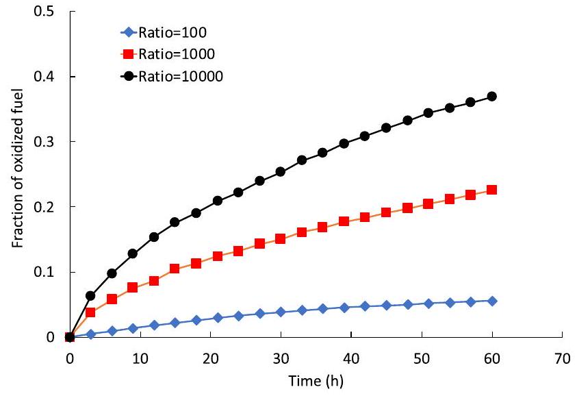
Fig. 11. The fractions of oxidized $\mathrm{UO}_{2}$ with different ratios of grain boundary diffusivity to bulk fuel diffusivity at different reaction times in a large-grained fuel.

transport of fission gas could cause fuel thermal degradation, fuel swelling, and the reduction of melting point (Massih, 2018). This will greatly influence the operational safety of nuclear reactors. Under the condition of fuel oxidation, the effective fuel thermal conductivity changes which will affect the temperaturedependent process of fission gas diffusion. Besides, the fission gas demonstrates different diffusivities in oxidized $\mathrm{UO}_{2+\mathrm{x}}$. This will also influence the fission gas diffusion (Miekeley and Felix, 1972). In this section, we investigate the effect of oxidation on fission gas diffusion under low burnup reactor conditions prior to bubble growth and coalescence. To illustrate the impact of fuel oxidation on fission gas diffusion, simulations of fission gas diffusion in fuels with and without fuel oxidation are carried out and compared.

Fig. 12 shows the fission gas concentration distributions in fuels with and without oxidation for three fuel samples. The concentration distribution is strongly affected by the grain boundaries, which provide fast paths for fission gas (Xenon) transport. The con-
centration of Xenon in regions with denser grain boundaries is higher than that in regions with fewer boundaries. Higher grain boundary densities lead to faster Xenon diffusions. The highest diffusion is calculated at the largest grain boundary density of $f=10.1 \%$. Specifically, Fig. 12-a2 shows the Xenon concentration distribution in an oxidized fuel with coarse grains ( $f=3.9 \%$ ) at a reaction time of 15 h . The concentration in the bottom-left region (in the black circle) with small grains, is higher than that in the regions with fewer boundaries and large grains (black circlet at the top-left). Compared with the concentration distribution in the fuel without oxidation, the fission gas in oxidized fuel presents higher concentration and wider distribution. For instance, Fig. 12b1 shows the Xenon concentration distribution in the fuel without oxidation. The Xenon concentration in the black circle is mainly concentrated at the grain boundaries. The concentration in the grains is much lower than that at the same location in Fig. 12-b2, where oxidation is considered at a reaction time of 15 h . The results demonstrate that oxidation enhances the Xenon gas diffusion in the fuel. This can be explained by the different diffusivity values in pure and oxidized fuels. As shown in Table 1, the diffusivity of Xenon in the oxidized fuel is $3.58 \times 10^{-11} \mathrm{~m}^{2} \mathrm{~s}^{-1}$, higher than the diffusivity in the fuel without oxidation $\left(1.68 \times 10^{-13} \mathrm{~m}^{2} \mathrm{~s}^{-1}\right)$. Thus, the diffusion of Xenon is stronger in the oxidized fuel than in the initial $\mathrm{UO}_{2}$ fuel material.

The average concentration of Xenon gas for the whole fuel is computed and presented in Fig. 13. As shown in the figure, the average concentration of Xenon in the oxidized fuel (red) is higher than that in the fuel without oxidation (blue). In fine-grained fuel without oxidation, the average concentration of Xenon in the whole fuel sample is 0.33 while that in the oxidized fuel is 0.46 . There is an increase of $0.13(40 \%)$ in concentration after fuel oxidation. However, in the coarse-grained fuel, the increase of concentration is less. When there is no oxidation in the fuel, the concentration is calculated as 0.21 . The concentration of Xenon in oxidized fuel with coarse grains is 0.28 . The concentration increase is only 0.07 , which is half the value in finer-grained fuel samples. This can be explained by the higher oxidation rate in the fuel with finer grains. For the same reaction time ( 15 h ), there

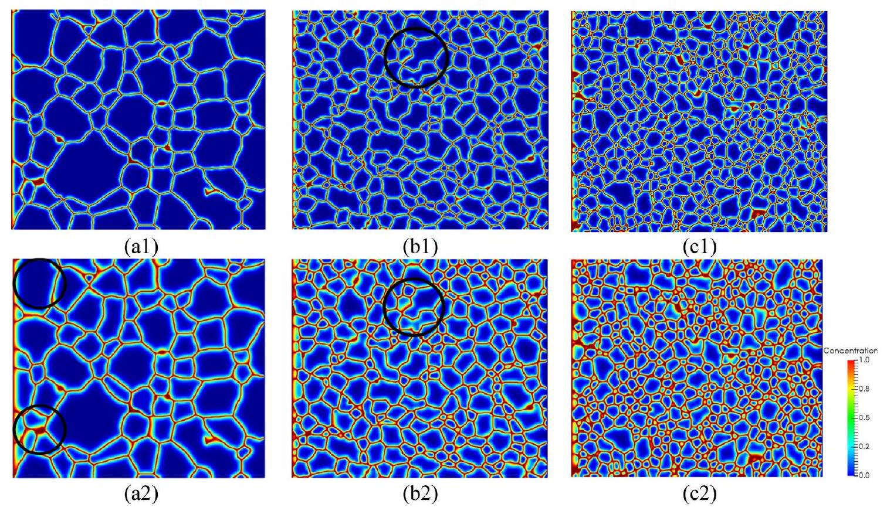
Fig. 12. Fission gas (Xenon) concentration distributions for: coarse ( $f=3.9 \%$ ) (a1), medium ( $f=6.2 \%$ ) (b1), and fine ( $f=10.1 \%$ ) (c1) grains without oxidation; coarse ( $f=3.9 \%$ ) (a2), medium ( $f=6.2 \%$ ) (b2), and fine ( $f=10.1 \%$ ) (c2) grains after 15 h of oxidation.

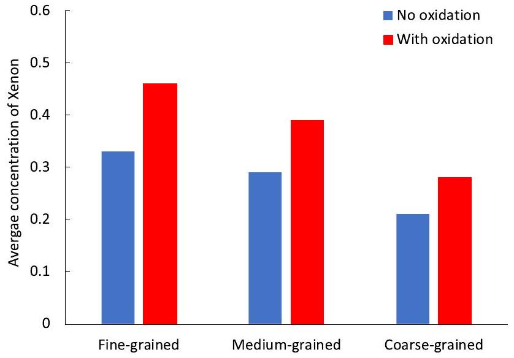
Fig. 13. The average concentration of Xenon in the whole fuel sample.

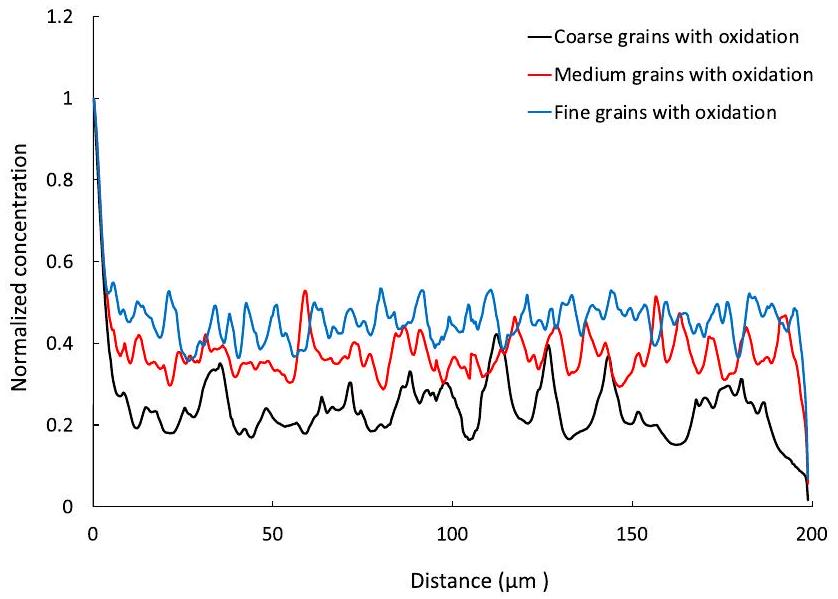
Fig. 14. The concentration profiles of Xenon in oxidized fuels at a reaction time of 15 h.

is more oxidized fuel in the finer-grained fuel. This leads to higher effective diffusivity of fission gas in the whole fuel sample, causing higher concentrations of fission gas.

The concentration profiles for Xenon across the fuel is also calculated. In Fig. 14, each concentration profile uncovers the process of mass transfer affected by local microstructures, reflecting the grain size and grain boundary distributions. The fluctuations of the concentration profiles represent the local concentration gradients between grains and boundaries caused by the diffusivity difference. The low frequency of fluctuations reflects the local regions with large grains and less grain boundaries. Moreover, the local concentration gradients are sensitive to the grain sizes and boundaries. Concentration profiles for the fuel with coarse grains have larger fluctuations demonstrating higher concentration gradients. For the fuel with fine grains, there is more uniform grain size distribution with smaller grains and a higher grain boundary density. Thus, the fluctuations in concentration profile are smaller due to the lower concentration gradient. The results indicate the fission gas diffusion is greatly affected by the local microstructures of the fuel. Incorporation of grain boundary and grain size into the simulations is necessary for accurately predicting the fission gas diffusion in nuclear fuel.

## 4. Conclusions

In this paper, we have studied the fuel oxidation and fission gas behaviors in fuels with varying microstructural features. The effect
of grain boundaries on fuel effective thermal conduction is investigated. The results show that the grain boundary reduces the overall thermal conductivity of the fuel. This effect is closely related with grain boundary density. It is found the temperature drop across a fuel increases with the grain boundary density.

We have also studied the impact of grain boundary on oxidation of $\mathrm{UO}_{2}$. Simulations of $\mathrm{UO}_{2}$ fuel oxidation were performed. The results are compared among three fuel samples with fine grains, medium grains and coarse grains. It has been demonstrated that oxidation preferably occurs along the grain boundaries, and then advances from boundary to the center of grains. It is also found that oxidation is faster in fuel with higher grain boundary density (or finer grains) because of the faster oxygen diffusion in the grain boundary. The average effective reaction rate for fuel oxidation is computed. The oxidation rate shows great dependence on grain boundary density. Denser grain boundary causes higher average oxidation rate. The effect of fuel oxidation on temperature drop is also explored. The results indicated oxidation reduces effective thermal conductivity of the fuel. The temperature drop increases with the fraction of oxidized fuel. A linear relationship was fitted to quantitively calculate the temperature drops in oxidized fuel. Simulations of oxidation are also carried out in fuel with various grain boundary diffusivities. It is indicated that higher grain boundary diffusivity can greatly accelerate the oxidation. The grain boundary diffusivity is an important factor in determining the oxidation rates of fuel. It is necessary to evaluate the oxygen diffusivity in grain boundary for accurately predicting the oxidation rates in fuel.

The fission gas (Xenon) diffusion in oxidized fuel is also investigated. The concentration distribution of fission gas is strongly affected by the grain boundaries. The concentration of Xenon in regions with denser grain boundaries is higher than those with less boundaries. Also, the results show that oxidation enhances the fission gas (Xenon) diffusion in the fuel. This can be explained by the higher diffusivity of fission gas in oxidized fuel. The average concentration of fission gas (Xenon) in fuel is calculated. The results demonstrate that the concentration of fission gas increases by $40 \%$ after the fuel is oxidized. The concentration profiles for Xenon gas across the fuel is also calculated and compared. The local concentration gradients of fission gas are sensitive to the grain boundaries and grain sizes. The local regions with large grains and less grain boundaries possess larger concentration gradients.

In short, the current model provides a numerical approach to better understand and quantitatively characterize the thermal conduction, fission gas diffusion and fuel oxidation behaviors under reactor conditions, which is important for improving reactor efficiency and safety.

## CRediT authorship contribution statement

Min Liu: Conceptualization, Data curation, Formal analysis, Methodology, Writing - original draft. Qinjun Kang: Conceptualization, Project administration, Writing - review \& editing. Hongwu Xu: Conceptualization, Project administration, Writing review \& editing.

## Declaration of Competing Interest

The authors declare that they have no known competing financial interests or personal relationships that could have appeared to influence the work reported in this paper.

## Acknowledgments

Research presented in this article was supported by the Laboratory Directed Research and Development (LDRD) program of Los

Alamos National Laboratory (LANL) under project number 20180007 DR. LANL, an affirmative action/equal opportunity employer, is managed by Triad National Security, LLC, for the National Nuclear Security Administration of the U.S. Department of Energy under contract 89233218CNA000001.

## References

Abrefah, J., Aguiar Braid, A.d., Wang, W., Khalil, Y., Olander, D.R., 1994. High temperature oxidation of UO2 in steam-hydrogen mixtures. J. Nucl. Mater. 208 (1-2), 98-110.
Allen, G.C., Holmes, N.R., 1995. A mechanism for the UO2 to $\alpha$-U3O8 phase transformation. J. Nucl. Mater. 223 (3), 231-237.
Andersson, D.A., Baldinozzi, G., Desgranges, L., Conradson, D.R., Conradson, S.D., 2013. Density functional theory calculations of UO 2 oxidation: evolution of UO $2+x$, U $409-y$, U 307 , and U 30 8. Inorg. Chem. 52 (5), 2769-2778.
Andersson, D.A., Tonks, M.R., Casillas, L., Vyas, S., Nerikar, P., Uberuaga, B.P., Stanek, C.R., 2015. Multiscale simulation of xenon diffusion and grain boundary segregation in UO2. J. Nucl. Mater. 462, 15-25.
Babaei, M., Sedighi, M., 2018. Impact of phase saturation on wormhole formation in rock matrix acidizing. Chem. Eng. Sci. 177, 39-52.
Babaei, M., Yun Seng, M.C., 2019. Integrating adsorption and diffusion in nanopores using thermodynamics and equations of state. Ind. Eng. Chem. Res. 58 (36), 16945-16962.
Belle, J., Lustman, B., 1957. Properties of UO2, 184. Bettis Plant.
Berthinier, C., Rado, C., Chatillon, C., Hodaj, F., 2013. Thermodynamic assessment of oxygen diffusion in non-stoichiometric $\mathrm{UO} 2 \pm \mathrm{x}$ from experimental data and Frenkel pair modeling. J. Nucl. Mater. 433 (1-3), 265-286.
Bijeljic, B., Blunt, M.J., 2006. Pore-scale modeling and continuous time random walk analysis of dispersion in porous media: RAPID COMMUNICATION. Water Resour. Res. 42 (1). https://doi.org/10.1029/2005WR004578.
Blackburn, P.E., 1973. Oxygen pressures over fast breeder reactor fuel (I) A model for. J. Nucl. Mater. 46 (3), 244-252.
Blunt, M.J., Bijeljic, B., Dong, H.u., Gharbi, O., Iglauer, S., Mostaghimi, P., Paluszny, A., Pentland, C., 2013. Pore-scale imaging and modelling. Adv. Water Resour. 51, 197-216.
Burns, P.C., Ewing, R.C., Navrotsky, A., 2012. Nuclear Fuel in a Reactor Accident. Science 335 (6073), 1184-1188.
Carter, R.E., Lay, K.W., 1970. Surface-controlled oxidation-reduction of UO2. J. Nucl. Mater. 36 (1), 77-86.
Catlow, C.R.A., 1978. Fission gas diffusion in uranium dioxide. Proc. Royal Soc. London. A. Math. Phys. Sci., 364(1719): 473-497.
Chen, L.i., Zhang, R., Kang, Q., Tao, W.-Q., 2019. Pore-scale study of pore-ionomer interfacial reactive transport processes in proton exchange membrane fuel cell catalyst layer. Chem. Eng. J. 391, 123590. https://doi.org/10.1016/j. сеј.2019.123590.
Chen, L.i., Zhang, R., Min, T., Kang, Q., Tao, W., 2018. Pore-scale study of effects of macroscopic pores and their distributions on reactive transport in hierarchical porous media. Chem. Eng. J. 349, 428-437.
Colle, J.Y., Hiernaut, J.-P., Papaioannou, D., Ronchi, C., Sasahara, A., 2006. Fission product release in high-burn-up UO2 oxidized to U3O8. J. Nucl. Mater. 348 (3), 229-242.
Cox, D. et al., 1986. Oxidation of UO 2 in air and steam with relevance to fission product releases, American Chemical Society, Division of Nuclear Chemistry and Technology.
Davies, D., Long, G., 1963. The emission of xenon-133 from lightly irradiated uranium dioxide spheroids and powders, United Kingdom Atomic Energy Authority. Research Group. Atomic Energy ....
Fink, J.K., 2000. Thermophysical properties of uranium dioxide. J. Nucl. Mater. 279 (1), 1-18.

Ghanbarian, B., Aslannejad, H., Raoof, A., 2018. Modeling water imbibition into coated and uncoated papers. Chem. Eng. Sci. 189, 33-42.
Ghanbarian, B., Daigle, H., 2016. Thermal conductivity in porous media: Percolation-based effective-medium approximation. Water Resour. Res. 52 (1), 295-314.

Ghanbarian, B., Hunt, A.G., Daigle, H., 2016. Fluid flow in porous media with rough pore-solid interface: FLOW IN ROUGH-WALLED POROUS MEDIA. Water Resour. Res. 52 (3), 2045-2058.
Guo, B.o., Ma, L., Tchelepi, H.A., 2018. Image-based micro-continuum model for gas flow in organic-rich shale rock. Adv. Water Resour. 122, 70-84.
Hargreaves, R., Collins, D., 1976. A quantitative model for fission gas release and swelling in irradiated uranium dioxide. J. Br. Nucl. Energy Soc. 15 (4), 311-318.
Hiezl, Z., Hambley, D.I., Padovani, C., Lee, W.E., 2015. Processing and microstructural characterisation of a UO2-based ceramic for disposal studies on spent AGR fuel. J. Nucl. Mater. 456, 74-84.

Higgs, J.D., Lewis, B.J., Thompson, W.T., He, Z., 2007. A conceptual model for the fuel oxidation of defective fuel. J. Nucl. Mater. 366 (1-2), 99-128.
Hore-Lacy, I., 2016. Uranium for nuclear power: resources, mining and transformation to fuel. Woodhead Publishing.
Kang, Q., Chen, L.i., Valocchi, A.J., Viswanathan, H.S., 2014. Pore-scale study of dissolution-induced changes in permeability and porosity of porous media. J. Hydrol. 517, 1049-1055.

Kang, Q., Lichtner, P.C., Viswanathan, H.S., Abdel-Fattah, A.I., 2010. Pore scale modeling of reactive transport involved in geologic CO 2 sequestration. Transp. Porous Med. 82 (1), 197-213.
Kang, Q., Lichtner, P.C., Zhang, D., 2007. An improved lattice Boltzmann model for multicomponent reactive transport in porous media at the pore scale: MULTICOMPONENT REACTIVE TRANSPORT. Water Resour. Res. 43 (12). https://doi.org/10.1029/2006WR005551.
Kang, Q., Zhang, D., Chen, S., He, X., 2002. Lattice Boltzmann simulation of chemical dissolution in porous media. Phys. Rev. E 65 (3). https://doi.org/10.1103/ PhysRevE.65.036318.
Lamarsh, J.R., 1966. Introduction to nuclear reactor theory, 3. Addison-Wesley Reading, Massachusetts.
Lamarsh, J.R., Baratta, A.J., 2001. Introduction to nuclear engineering, 3. Prentice hall Upper Saddle River, NJ.
Lassmann, K., Benk, H., 2000. Numerical algorithms for intragranular fission gas release. J. Nucl. Mater. 280 (2), 127-135.
Lewis, B.J., Thompson, W.T., Akbari, F., Thompson, D.M., Thurgood, C., Higgs, J., 2004. Thermodynamic and kinetic modelling of fuel oxidation behaviour in operating defective fuel. J. Nucl. Mater. 328 (2-3), 180-196.
Lewis, B.J., Iglesias, F.C., Cox, D.S., Gheorghiu, E., 1990. A model for fission gas release and fuel oxidation behavior for defected UO 2 fuel elements. Nucl. Technol. 92 (3), 353-362.

Lewis, E.E., 1977. Nuclear power reactor safety.
Lim, H.C., Rudman, K., Krishnan, K., McDonald, R., Dickerson, P., Gong, B., Peralta, P., 2016. Effects of microstructural constraints on the transport of fission products in uranium dioxide at low burnups. J. Nucl. Mater. 477, 24-36.
Liu, M., Kang, Q., Xu, H., 2020a. Modelling uranium dioxide corrosion under repository conditions: A pore-scale study of the chemical and thermal processes. Corros. Sci. 167, 108530. https://doi.org/10.1016/ j.corsci.2020.108530.

Liu, M., Mostaghimi, P., 2016. Coupling lattice Boltzmann and finite volume methods for simulation of reactive transport. International Symposium of the Society of Core Analysts, Colorado, USA.
Liu, M., Mostaghimi, P., 2017a. Characterisation of reactive transport in pore-scale correlated porous media. Chem. Eng. Sci. 173, 121-130.
Liu, M., Mostaghimi, P., 2017b. Pore-scale simulation of dissolution-induced variations in rock mechanical properties. Int. J. Heat Mass Transf. 111, 842-851.
Liu, M., Mostaghimi, P., 2018a. Numerical simulation of fluid-fluid-solid reactions in porous media. Int. J. Heat Mass Transf. 120, 194-201.
Liu, M., Mostaghimi, P., 2018c. Reactive transport modelling in dual porosity media. Chem. Eng. Sci. 190, 436-442.
Liu, M., Shabaninejad, M., Mostaghimi, P., 2017. Impact of mineralogical heterogeneity on reactive transport modelling. Comput. Geosci. 104, 12-19.
Liu, M., Shabaninejad, M., Mostaghimi, P., 2018. Predictions of permeability, surface area and average dissolution rate during reactive transport in multi-mineral rocks. J. Petrol. Sci. Eng. 170, 130-138.
Liu, M., Starchenko, V., Anovitz, L.M., Stack, A.G., 2020b. Grain detachment and transport clogging during mineral dissolution in carbonate rocks with permeable grain boundaries. Geochim. Cosmochim. Acta 280, 202-220.
Massih, A., 2018. UO2 fuel oxidation and fission gas release. 2018:25, Tech. Rep.
Matzke, H.J., 1980. Gas release mechanisms in UO 2 -a critical review. Radiation Effects 53 (3-4), 219-242.
Meachen, J., 1989. Oxygen diffusion in uranium dioxide: a review. Nucl. Energy 28 (4), 221-226.

Miekeley, W., Felix, F.W., 1972. Effect of stoichiometry on diffusion of xenon in UO2. J. Nucl. Mater. 42 (3), 297-306.

Millett, P.C., Tonks, M.R., Biner, S.B., 2012. Grain boundary percolation modeling of fission gas release in oxide fuels. J. Nucl. Mater. 424 (1-3), 176-182.
Mostaghimi, P., Liu, M., Arns, C.H., 2016. Numerical Simulation of Reactive Transport on Micro-CT Images. Math. Geosci. 48 (8), 963-983.
Olander, D.R., Soo Kim, Y., Wang, W.-E., Yagnik, S.K., 1999. Steam oxidation of fuel in defective LWR rods. J. Nucl. Mater. 270 (1-2), 11-20.
Olander, D.R., Wang, W.-E., Kim, Y.S., Li, C.Y., Lim, S., Yagnik, S.K., 1997. Chemical processes in defective LWR fuel rods. J. Nucl. Mater. 248, 214-219.
Olander, D.R., 1976. Fundamental aspects of nuclear reactor fuel elements: solutions to problems, California Univ., Berkeley (USA). Dept. of Nuclear Engineering, https://www.osti.gov/servlets/purl/7343826.
Park, K., Yang, M.-S., Park, H.-S., 1997. The stoichiometry and the oxygen potential change of urania fuels during irradiation. J. Nucl. Mater. 247, 116-120.
Pereira Nunes, J.P., Blunt, M.J., Bijeljic, B., 2016. Pore-scale simulation of carbonate dissolution in micro-CT images. J. Geophys. Res. Solid Earth 121 (2), 558-576.
Rest, J., Cooper, M.W.D., Spino, J., Turnbull, J.A., Van Uffelen, P., Walker, C.T., 2019. Fission gas release from UO2 nuclear fuel: A review. J. Nucl. Mater. 513, 310345.

Rust, J.H., 1979. Nuclear power plant engineering, 16. Haralson Publishing Company Buchanan, Georgia.
Sabioni, A.C.S., Ferraz, W.B., Millot, F., 2000. Effect of grain-boundaries on uranium and oxygen diffusion in polycrystalline UO2. J. Nucl. Mater. 278 (2-3), 364-369.
Shrestha, K., Yao, T., Lian, J., Antonio, D., Sessim, M., Tonks, M.R., Gofryk, K., 2019. The grain-size effect on thermal conductivity of uranium dioxide. J. Appl. Phys. 126 (12), 125116. https://doi.org/10.1063/1.5116372.
Skim, Y., 1999. Fission gas release from UO 2+ x in defective light water reactor fuel rods, Argonne National Lab.
Song, W., Yao, B., Yao, J., Li, Y., Sun, H., Yang, Y., Zhang, L., 2018. Methane surface diffusion capacity in carbon-based capillary with application to organic-rich shale gas reservoir. Chem. Eng. J. 352, 644-654.

Tahmasebi, P., Javadpour, F., Sahimi, M., 2015. Multiscale and multiresolution modeling of shales and their flow and morphological properties. Sci. Rep. 5 (1). https://doi.org/10.1038/srep16373.
Tahmasebi, P., Kamrava, S., 2019. A pore-scale mathematical modeling of fluidparticle interactions: Thermo-hydro-mechanical coupling. Int. J. Greenhouse Gas Control 83, 245-255.
Tartakovsky, A.M., Meakin, P., 2006. Pore scale modeling of immiscible and miscible fluid flows using smoothed particle hydrodynamics. Adv. Water Resour. 29 (10), 1464-1478.
Taylor, P., 2005. Thermodynamic and kinetic aspects of UO2 fuel oxidation in air at 400-2000K. J. Nucl. Mater. 344 (1-3), 206-212.
Timofeev, A., Migdisov, A.A., Williams-Jones, A.E., Roback, R., Nelson, A.T., Xu, H., 2018. Uranium transport in acidic brines under reducing conditions. Nat. Commun. 9, 1469.
Tonks, M., Andersson, D., Devanathan, R., Dubourg, R., El-Azab, A., Freyss, M., Iglesias, F., Kulacsy, K., Pastore, G., Phillpot, S.R., Welland, M., 2018. Unit
mechanisms of fission gas release: Current understanding and future needs. J. Nucl. Mater. 504, 300-317.
Une, K., Nogita, K., Kashibe, S., Imamura, M., 1992. Microstructural change and its influence on fission gas release in high burnup UO2 fuel. J. Nucl. Mater. 188, 65-72.
Wheeler, V.J., 1971. The diffusion and solubility of hydrogen in uranium dioxide single crystals. J. Nucl. Mater. 40 (2), 189-194.
White, J.T., Nelson, A.T., 2013. Thermal conductivity of UO2+x and U4O9-y. J. Nucl. Mater. 443 (1-3), 342-350.
Williams, N.R., Molinari, M., Parker, S.C., Storr, M.T., 2015. Atomistic investigation of the structure and transport properties of tilt grain boundaries of UO2. J. Nucl. Mater. 458, 45-55.
Yajima, S., Furuya, H., Hirai, T., 1966. Lattice and grain-boundary diffusion of uranium in UO2. J. Nucl. Mater. 20 (2), 162-170.
Yamasaki, S., Arima, T., Idemitsu, K., Inagaki, Y., 2007. Evaluation of thermal conductivity of hyperstoichiometric $\mathrm{UO} 2+\mathrm{x}$ by molecular dynamics simulation. Int. J. Thermophys. 28 (2), 661-673.

[^0]:    E-mail addresses: minl@lanl.gov (M. Liu), qkang@lanl.gov (Q. Kang), hxu@lanl. gov (H. Xu)

