# 5 Diffusion in Oxides 

Manfred Martin

### 5.1 Introduction

Diffusion processes in crystalline oxides are governed by the same mechanisms as in crystalline metals, i.e. they proceed by means of point defects, and the two basic mechanisms are vacancy diffusion and interstitial diffusion. Both mechanisms have been described in detail in Chap. 1 of this book. There are, however, some important differences in the defect structures of oxides and metals, with severe implications for diffusion processes in oxides:

- Most oxides are ionic compounds, i.e. they consist of cations and anions with well defined, opposite charges.
- Crystalline oxides consist of at least two sublattices, a metal and an oxygen sublattice, or a cation and an anion sublattice. Due to the opposite charges of cations and anions diffusion proceeds always in the corresponding sublattice.
- The concentrations of point defects, vacancies as well as interstitials, which are necessary for diffusion depend not only on the intensive thermodynamic variables pressure, $p$, and temperature, $T$, but also on the chemical potential of the component oxygen, $\mu_{\mathrm{O}_{2}}=\mu_{\mathrm{O}_{2}}^{0}+R T \ln a_{\mathrm{O}_{2}}$. The oxygen activity, $a_{\mathrm{O}_{2}}=p_{\mathrm{O}_{2}}$ /bar, can be established easily by means of gas mixtures with different oxygen partial pressures, $p_{\mathrm{O}_{2}}$, and can be varied over many orders of magnitude.
- Oxides cover a wide range of materials, such as insulators, pure ionic conductors, semiconductors, mixed electronic and ionic conductors and also metallic oxides. The latter will not be considered in this chapter.
- The crystal structure of the oxide influences the defect structure. In structures with cubic close packing of the oxygen ions, such as the NaCl - or the spinel-structure, defects in the oxygen sublattice have much higher formation enthalpies and therefore much lower concentrations than defects in the cation sublattice(s). Consequently, oxygen diffusion is much slower than cation diffusion. In oxides with more open oxygen sublattices, such as the perovskite structure or the fluorite structure, oxygen defects are
formed more easily than cation defects. Therefore, these oxides show very often high oxygen diffusivities and are good oxygen ion conductors.

These introductory remarks show that diffusion in oxides depends largely on the defect structure of the oxide. The important dependence of the defect structure on the thermodynamic variables $p, T$ and $p_{\mathrm{O}_{2}}$ (so-called defect chemistry) will be discussed in detail in Sect. 5.2, where at first transition metal oxides with dominating cation disorder and then doped perovskites and fluorites with dominating disorder in the oxygen sublattice will be treated. In the subsequent sections self- and impurity diffusion, chemical diffusion and diffusion in external forces will be considered.

For a comprehensive treatment of defect chemistry and diffusion processes in oxides the reader is referred to the books of Schmalzried [1,2], Philibert [3], Kofstad [4], Allnatt and Lidiard [5], and Laskar et al. [6].

### 5.2 Defect Chemistry of Oxides

In this section the dependence of the defect fractions on the thermodynamic variables, $p, T$ and oxygen partial pressure, $p_{\mathrm{O}_{2}}$, will be calculated for binary oxides. A binary oxide can be written as $\mathrm{A}_{m} \mathrm{O}_{n}$, where $m$ and $n$ are integers. To consider deviations from the ideal stoichiometry, the so-called non-stoichiometry, $\delta$, is introduced. Then the correct formula for the nonstoichiometric oxide is $\mathrm{A}_{n-\delta} \mathrm{O}_{m}$ (or $\mathrm{A}_{m} \mathrm{O}_{n+\delta}$ ). For the sake of simplicity, in the subsequent discussion only monoxides with $m=n=1$ will be considered. The generalization of the results obtained for $\mathrm{A}_{1-\delta} \mathrm{O}$ to $\mathrm{A}_{m-\delta} \mathrm{O}_{n}$ is straightforward and results will be given if necessary.

In the exactly stoichiometric oxide AO, i.e. $\delta=0$, we have only thermal disorder, and the concentrations of point defects are determined by intrinsic defect equilibria such as the Schottky equilibrium, the Frenkel equilibrium and the anti-Frenkel equilibrium [7,8]. The corresponding defect formation processes are depicted in Fig. 5.1. For a quantitative description we use quasichemical reactions and the corresponding chemical equilibria:

$$
\begin{array}{lll}
\text { Schottky equilibrium: } & \text { nil } \rightleftharpoons \mathrm{V}_{\mathrm{A}}^{\prime \prime}+\mathrm{V}_{\mathrm{O}}^{\bullet \bullet} & K_{\mathrm{S}}=\left[\mathrm{V}_{\mathrm{A}}^{\prime \prime}\right] \cdot\left[\mathrm{V}_{\mathrm{O}}^{\bullet \bullet}\right] \\
\text { Frenkel equilibrium: } & \mathrm{A}_{\mathrm{A}}^{\mathrm{x}}+\mathrm{V}_{\mathrm{i}}^{\mathrm{x}} \rightleftharpoons \mathrm{~V}_{\mathrm{A}}^{\prime \prime}+\mathrm{A}_{\mathrm{i}}^{\bullet \bullet} & K_{\mathrm{F}_{\mathrm{A}}}=\left[\mathrm{V}_{\mathrm{A}}^{\prime \prime}\right] \cdot\left[\mathrm{A}_{\mathrm{i}}^{\bullet \bullet}\right] \\
\text { anti-Frenkel equilibrium: } & \mathrm{O}_{\mathrm{O}}^{\mathrm{x}}+\mathrm{V}_{\mathrm{i}}^{\mathrm{x}} \rightleftharpoons \mathrm{~V}_{\mathrm{O}}^{\bullet \bullet}+\mathrm{O}_{\mathrm{i}}^{\prime \prime} & K_{\mathrm{F}_{\mathrm{O}}}=\left[\mathrm{V}_{\mathrm{O}}^{\bullet \bullet}\right] \cdot\left[\mathrm{O}_{\mathrm{i}}^{\prime \prime}\right]
\end{array}
$$

Here we have used the so-called Kröger-Vink notation [9] for the structure element $\mathrm{S}_{\mathrm{p}}^{q}$. S stands for an ion (cation A or anion O ) or a vacancy (V) and p for the sublattice (A, O or interstitial). An excess charge, $q$, of $-1,0$ or +1 of the structure element relative to the ideal crystal is denoted by the symbols ${ }^{\prime}, \mathrm{x}$ or $\bullet$. These quasi-chemical reactions describe the defect formation processes shown in Fig. 5.1. $K_{\mathrm{S}}, K_{\mathrm{F}_{\mathrm{A}}}$ and $K_{\mathrm{F}_{\mathrm{O}}}$ are the chemical equilibrium

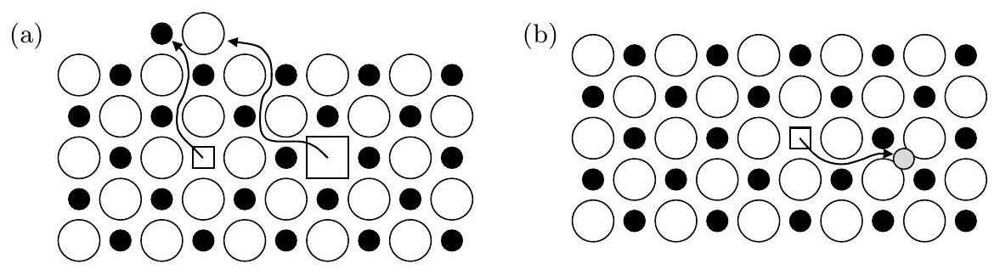
Fig. 5.1. Formation of Schottky defects (a) and Frenkel defects (b) in an oxide AO $(\bullet=$ cation, $\bigcirc=$ anion).

constants for the three equilibria, depending on temperature ${ }^{1}$. In the mass action laws in (5.1)-(5.3) we have assumed that the site fractions of vacancies and interstitials (defects), denoted by brackets, are small compared to the site fractions of regular cations and anions, and that the structure elements in each sublattice form an ideal mixture.

Incorporation of oxygen from the surrounding atmosphere into the crystal or removal of oxygen from the crystal results in the formation of a nonstoichiometric oxide with oxygen excess or oxygen deficit. It can also be described by a quasi-chemical reaction:

$$
\frac{1}{2} \mathrm{O}_{2}(\mathrm{~g})+\mathrm{V}_{\mathrm{O}}^{\bullet \bullet} \rightleftharpoons \mathrm{O}_{\mathrm{O}}^{\mathrm{x}}+2 \mathrm{~h} \cdot \quad K_{\mathrm{O}}=\frac{\left[\mathrm{h}^{\bullet}\right]^{2}}{\left(p_{\mathrm{O}_{2}}\right)^{1 / 2} \cdot\left[\mathrm{~V}_{\mathrm{O}}^{\bullet \bullet}\right]} .
$$

Oxygen from the gas phase, $\frac{1}{2} \mathrm{O}_{2}(\mathrm{~g})$, occupies an oxygen vacancy, $\mathrm{V}_{\mathrm{O}}^{\bullet \bullet}$, and for charge compensation electron holes, $\mathrm{h}^{\bullet}$, are produced (see also Fig. 5.2). Finally, the electronic equilibrium, resulting in the formation of electrons, $\mathrm{e}^{\prime}$, and electron holes, $\mathrm{h}^{\bullet}$, has to be considered:

$$
\operatorname{nil} \rightleftharpoons \mathrm{e}^{\prime}+\mathrm{h}^{\bullet} \quad K_{\mathrm{e}}=\left[\mathrm{e}^{\prime}\right] \cdot\left[\mathrm{h}^{\bullet}\right] .
$$

The fractions of all charged structure elements are coupled by the condition of local electrical neutrality:

$$
2\left[\mathrm{~V}_{\mathrm{A}}^{\prime \prime}\right]+2\left[\mathrm{O}_{\mathrm{i}}^{\prime \prime}\right]+\left[\mathrm{e}^{\prime}\right]=2\left[\mathrm{~V}_{\mathrm{O}}^{\bullet \bullet}\right]+2\left[\mathrm{~A}_{\mathrm{i}}^{\bullet \bullet}\right]+\left[\mathrm{h}{ }^{\bullet}\right] .
$$

The set of equations is completed by the site balances for each sublattice, e.g. $\left[\mathrm{A}_{\mathrm{A}}^{\mathrm{x}}\right]+\left[\mathrm{V}_{\mathrm{A}}^{\prime \prime}\right]=1$. Provided the equilibrium constants are known, all defect fractions and the non-stoichiometry

$$
\delta=\left[\mathrm{V}_{\mathrm{A}}^{\prime \prime}\right]+\left[\mathrm{O}_{\mathrm{i}}^{\prime \prime}\right]-\left[\mathrm{V}_{\mathrm{O}}^{\bullet \bullet}\right]-\left[\mathrm{A}_{\mathrm{i}}^{\bullet \bullet}\right]
$$

can be calculated as a function of the thermodynamic variables, $p, T$ and $p_{\mathrm{O}_{2}}$.

[^0]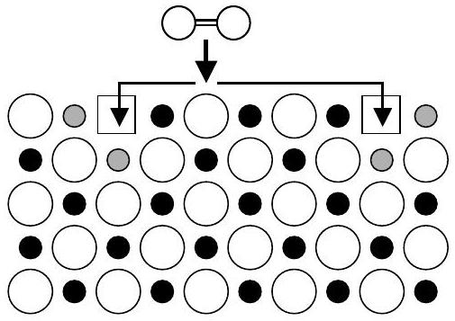
Fig. 5.2. Incorporation of an oxygen molecule $(\bigcirc=\bigcirc)$ from the gas phase into an oxide AO with dominating oxygen vacancies (see (5.4)). For each oxygen atom two electron holes are produced. For the sake of simplicity they are localized on cations (•).

### 5.2.1 Dominating Cation Disorder

## Oxygen Activity Dependent Disorder

In oxides with a fcc oxygen sublattice, i.e. cubic close packing of the oxygen ions, as in most transition metal oxides, the formation of oxygen vacancies and oxygen interstitials is energetically unfavourable in comparison with the formation of cation defects. Thus, we may regard the oxygen sublattice as perfect compared to the cation sublattice. This means that in the exactly stoichiometric oxide with $\delta=0$ the Frenkel equilibrium dominates ${ }^{2}$ and (5.2) and (5.6) simplify to $\left[\mathrm{V}_{\mathrm{A}}^{\prime \prime}\right]=\left[\mathrm{A}_{\mathrm{i}}^{\bullet \bullet}\right]=\left(K_{\mathrm{F}}\right)^{1 / 2}$. At fixed temperature, $T$, and pressure, $p$, the so-called stoichiometric point, $\delta=0$, corresponds to a well defined oxygen partial pressure, $p_{\mathrm{O}_{2}}^{*}$. If we increase the oxygen partial pressure relative to $p_{\mathrm{O}_{2}}^{*}$, oxygen is incorporated into the crystal. Since oxygen defects are only minority defects it is more convenient to formulate the incorporation of oxygen from the ambient atmosphere in terms of cation defects which is possible by 'adding' (5.4) and (5.1):

$$
\frac{1}{2} \mathrm{O}_{2}(\mathrm{~g}) \rightleftharpoons \mathrm{O}_{\mathrm{O}}^{\mathrm{x}}+\mathrm{V}_{\mathrm{A}}^{\prime \prime}+2 \mathrm{~h} \cdot \quad, \quad K_{\mathrm{A}}=\frac{\left[\mathrm{V}_{\mathrm{A}}^{\prime \prime}\right] \cdot\left[\mathrm{h}^{\bullet}\right]^{2}}{\left(p_{\mathrm{O}_{2}}\right)^{1 / 2}}
$$

Oxidation of the oxide results in the formation of new lattice sites in both the oxygen and the cation sublattices, i.e. now the crystal grows, in contrast to the incorporation of oxygen described in (5.4). While the new oxygen sublattice sites are occupied by oxygen ions the new cation lattice sites are empty, i.e. cation vacancies are formed (see Fig. 5.3). They are electrically compensated by the formation of electron holes.

Thus, for oxygen partial pressures that are sufficiently large compared to $p_{\mathrm{O}_{2}}^{*}$ cation vacancies and electron holes will be the majority defects, which results in a simplified condition of electrical neutrality, $2\left[\mathrm{~V}_{\mathrm{A}}^{\prime \prime}\right]=\left[\mathrm{h}^{\bullet}\right]$. Using this relation, the $p_{\mathrm{O}_{2}}$-dependence of the majority type of defects can be calculated from (5.8):

[^1]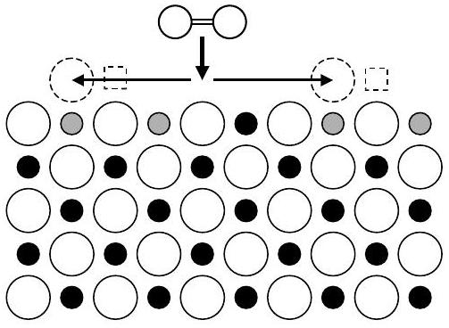
Fig. 5.3. Incorporation of an oxygen molecule $(\bigcirc=\bigcirc)$ from the gas phase into an oxide AO with dominating cation vacancies. For each oxygen atom a new occupied anion lattice site ( $\bigcirc$ ), a new unoccupied cation lattice site ( □ ) and two electron holes (•) are produced. For the sake of simplicity the electron holes are localized on cations.

$$
\left[\mathrm{V}_{\mathrm{A}}^{\prime \prime}\right]=\frac{1}{2}\left[\mathrm{~h}^{\bullet}\right]=\left(\frac{K_{\mathrm{A}}}{4}\right)^{1 / 3} \cdot\left(p_{\mathrm{O}_{2}}\right)^{1 / 6} .
$$

On the other hand, cation interstitials, $\mathrm{A}_{\mathrm{i}}^{\bullet \bullet}$, and electrons, $\mathrm{e}^{\prime}$, are only minority defects, and their fractions decrease with increasing $p_{\mathrm{O}_{2}}$ (see (5.2) and (5.5)) according to

$$
\begin{aligned}
{\left[\mathrm{A}_{\mathrm{i}}^{\bullet \bullet}\right] } & =K_{\mathrm{F}_{\mathrm{A}}} \cdot\left(\frac{K_{\mathrm{A}}}{4}\right)^{-1 / 3} \cdot\left(p_{\mathrm{O}_{2}}\right)^{-1 / 6}, \\
{\left[\mathrm{e}^{\prime}\right] } & =K_{\mathrm{e}} \cdot\left(2 K_{\mathrm{A}}\right)^{-1 / 3} \cdot\left(p_{\mathrm{O}_{2}}\right)^{-1 / 6} .
\end{aligned}
$$

For oxygen partial pressures that are sufficiently small compared to $p_{\mathrm{O}_{2}}^{*}$, cation interstitials and electrons will be the majority defects, which results in a simplified condition of electrical neutrality $\left[\mathrm{e}^{\prime}\right]=2\left[\mathrm{~A}_{\mathrm{i}}^{\bullet \bullet}\right]$. With this relation, the $p_{\mathrm{O}_{2}}$-dependence of the majority type of defects can be calculated from (5.8) and (5.2) by

$$
\left[\mathrm{A}_{\mathrm{i}}^{\bullet \bullet}\right]=\frac{1}{2}\left[\mathrm{e}^{\prime}\right]=\left(\frac{K_{\mathrm{F}_{\mathrm{A}}} \cdot K_{\mathrm{e}}}{4 K_{\mathrm{A}}}\right)^{1 / 3} \cdot\left(p_{\mathrm{O}_{2}}\right)^{-1 / 6} .
$$

In this regime, cation vacancies, $\mathrm{V}_{\mathrm{A}}^{\prime \prime}$, and electron holes, $\mathrm{h}^{\bullet}$, are the minority defects and their fractions decrease with decreasing $p_{\mathrm{O}_{2}}$ :

$$
\begin{aligned}
{\left[\mathrm{V}_{\mathrm{A}}^{\prime \prime}\right] } & =\left(\frac{4 K_{\mathrm{A}} \cdot K_{\mathrm{F}_{\mathrm{A}}}^{2}}{K_{\mathrm{e}}^{2}}\right)^{1 / 3} \cdot\left(p_{\mathrm{O}_{2}}\right)^{+1 / 6} \\
{[\mathrm{~h}] } & =\left(\frac{K_{\mathrm{A}} \cdot K_{\mathrm{e}}}{2 K_{\mathrm{F}_{\mathrm{A}}}}\right)^{1 / 3} \cdot\left(p_{\mathrm{O}_{2}}\right)^{+1 / 6}
\end{aligned}
$$

Equations (5.9) to (5.12) show that all defect fractions follow a power law dependence on $p_{\mathrm{O}_{2}}$ with typical exponents $1 / 6$ and $-1 / 6$ for oxygen partial pressures which are sufficiently larger or smaller than $p_{\mathrm{O}_{2}}^{*}$. In the close vicinity of $p_{\mathrm{O}_{2}}^{*}$ the fractions of the Frenkel defects do not depend on $p_{\mathrm{O}_{2}}$, $\left[\mathrm{V}_{\mathrm{A}}^{\prime \prime}\right]=\left[\mathrm{A}_{\mathrm{i}}^{\bullet \bullet}\right]=\left(K_{\mathrm{F}}\right)^{1 / 2}$. In contrast, the fractions of the minority defects, $\mathrm{e}^{\prime}$ and h , exhibit $p_{\mathrm{O}_{2}}$-dependencies with exponents $-1 / 4$ and $1 / 4$, respectively

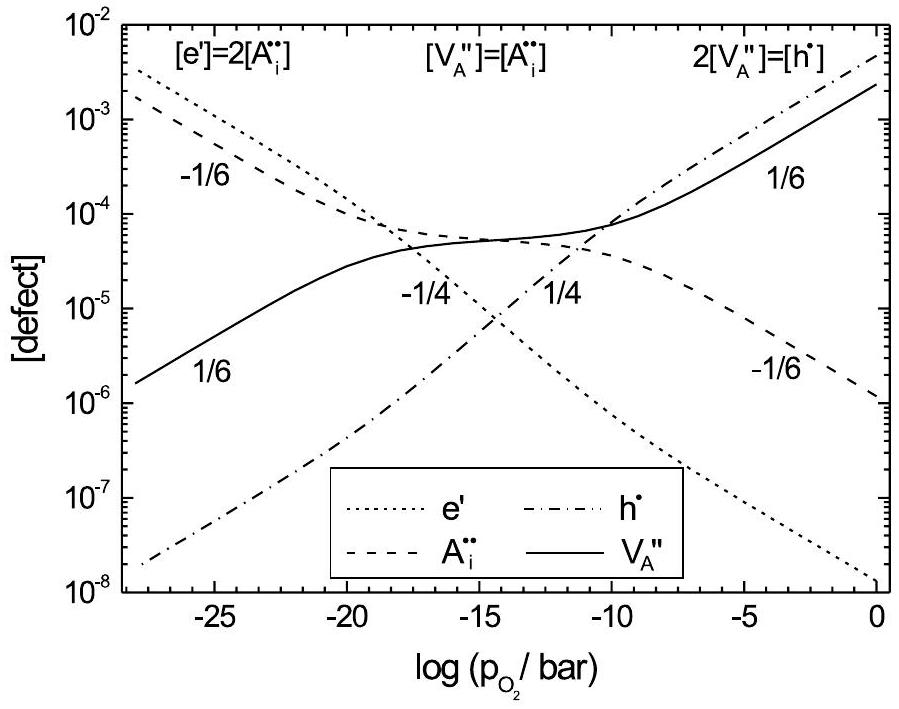
Fig. 5.4. Dependence of the defect fractions on the oxygen partial pressure $p_{\mathrm{O}_{2}}$ (Kröger-Vink-diagram) in an oxide AO with dominating Frenkel disorder at the stoichiometric point (see (5.9)-(5.12)).

(see (5.5) and (5.8)). In a double-logarithmic plot (Kröger-Vink diagram) we therefore obtain straight lines (see Fig. 5.4) and three typical regions corresponding to $\delta<0, \delta \approx 0$ and $\delta>0$.

Without going into further details we note that other exponents are also possible, mainly for two reasons:
i) Defects might form associates, e.g. a vacancy might trap an electron hole resulting in a singly ionised vacancy:

$$
\mathrm{V}_{\mathrm{A}}^{\prime \prime}+\mathrm{h}^{\bullet} \rightleftharpoons \mathrm{V}_{\mathrm{A}}^{\prime}
$$

If these vacancies become the majority defects they show a dependence $\left[\mathrm{V}_{\mathrm{A}}^{\prime}\right] \propto\left(p_{\mathrm{O}_{2}}\right)^{1 / 4}$. Similarly, cation interstitials might trap an electron, $\mathrm{A}_{\mathrm{i}}^{\bullet \bullet}+\mathrm{e}^{\prime} \rightleftharpoons \mathrm{A}_{\mathrm{i}}^{\bullet}$, resulting in a dependence $\left[\mathrm{A}_{\mathrm{i}}^{\bullet}\right] \propto\left(p_{\mathrm{O}_{2}}\right)^{-1 / 4}$.
ii) Often, there are also oxides of different stoichiometry, i.e. $\mathrm{A}_{3} \mathrm{O}_{4}, \mathrm{~A}_{2} \mathrm{O}_{3}$ or $\mathrm{A}_{2} \mathrm{O}$. For the oxide of a monovalent metal, e. g. $\mathrm{Cu}_{2} \mathrm{O}$, we obtain typical exponents $1 / 4$ and $-1 / 4$, and in the mixed-valent oxide $\mathrm{Fe}_{3} \mathrm{O}_{4}$ the exponents are $2 / 3$ and $-2 / 3$.

## Doping

Doping an oxide $\mathrm{A}_{1-\delta} \mathrm{O}$ with dominant cation disorder with an oxide of a higher valent metal B , e.g. $\mathrm{B}_{2} \mathrm{O}_{3}$ can be described by

$$
\mathrm{B}_{2} \mathrm{O}_{3} \rightarrow 2 \mathrm{~B}_{\mathrm{A}}^{\bullet}+\mathrm{V}_{\mathrm{A}}^{\prime \prime}+3 \mathrm{O}_{\mathrm{O}}^{\mathrm{x}}
$$

where we have assumed that the dopant B occupies regular cation lattice sites. To conserve the lattice structure of the host oxide AO the incorporation of two dopant cations, $\mathrm{B}_{\mathrm{A}}^{\bullet}$, and three oxygen ions, $\mathrm{O}_{\mathrm{O}}^{\mathrm{x}}$, demands the formation of one cation vacancy, $\mathrm{V}_{\mathrm{A}}^{\prime \prime}$. Since the dopant is charged it must be considered in the condition of electrical neutrality in (5.6), and the defect structure of the doped oxide will be changed:

$$
2\left[\mathrm{~V}_{\mathrm{A}}^{\prime \prime}\right]+\left[\mathrm{e}^{\prime}\right]=2\left[\mathrm{~A}_{\mathrm{i}}^{\bullet \bullet}\right]+\left[\mathrm{h}^{\bullet}\right]+\left[\mathrm{B}_{\mathrm{A}}^{\bullet}\right]
$$

i) For strong doping, the fraction of cation vacancies is directly given by the dopant fraction, (see (5.14)), and is independent of the thermodynamic variables $p, T$ and $p_{\mathrm{O}_{2}}$, i.e. the exponent of the $p_{\mathrm{O}_{2}}$-dependence is zero.
ii) For small dopant fractions, however, the disorder of the host oxide cannot be neglected, and the defect structure depends on the thermodynamic variables $p, T, p_{\mathrm{O}_{2}}$ and the dopant fraction as well.
iii) Coulombic interaction between the dopant ions, $\mathrm{B}_{\mathrm{A}}^{\bullet}$, and differently charged cation vacancies, $\mathrm{V}_{\mathrm{A}}^{\prime \prime}$ and $\mathrm{V}_{\mathrm{A}}^{\prime}$, may lead to the formation of solutevacancy pairs:

$$
\begin{array}{ll}
\mathrm{B}_{\mathrm{A}}^{\bullet}+\mathrm{V}_{\mathrm{A}}^{\prime} \rightleftharpoons\left\{\mathrm{B}_{\mathrm{A}}^{\bullet}, \mathrm{V}_{\mathrm{A}}^{\prime}\right\}^{\mathrm{x}} \quad, & K_{\mathrm{P}_{1}}=\frac{\left[\mathrm{P}_{1}\right]}{\left[\mathrm{B}_{\mathrm{A}}^{\bullet}\right] \cdot\left[\mathrm{V}_{\mathrm{A}}^{\prime}\right]} \\
\mathrm{B}_{\mathrm{A}}^{\bullet}+\mathrm{V}_{\mathrm{A}}^{\prime \prime} \rightleftharpoons\left\{\mathrm{B}_{\mathrm{A}}^{\bullet}, \mathrm{V}_{\mathrm{A}}^{\prime \prime}\right\}^{\prime} \quad, & K_{\mathrm{P}_{2}}=\frac{\left[\mathrm{P}_{2}\right]}{\left[\mathrm{B}_{\mathrm{A}}^{\bullet}\right] \cdot\left[\mathrm{V}_{\mathrm{A}}^{\prime \prime}\right]}
\end{array}
$$

Here we have denoted the solute-vacancy pairs containing singly and doubly ionised vacancies by $P_{1}$ and $P_{2}$.

### 5.2.2 Dominating Oxygen Disorder

In oxides where the oxygen ions do not form a cubic close packing but a more open substructure, for example, in the perovskites or fluorites, oxygen defects may be the dominating defects while cation defects are only minority defects. As before, the defect fractions are determined by (5.1)-(5.7), and typical exponents are obtained for the different disorder types. To increase the fraction of oxygen vacancies, these oxides are often doped with oxides of lower valent metals. Then, the condition of electrical neutrality in (5.6) simplifies to

$$
\left[\mathrm{B}_{\mathrm{A}}^{\prime}\right]=2\left[\mathrm{~V}_{\mathrm{O}}^{\bullet \bullet}\right]
$$

Thus, the negative excess charge of the dopant cation, $\mathrm{B}_{\mathrm{A}}^{\prime}$, is compensated by oxygen vacancies, and these oxides are good oxygen ion conductors. Some well know examples are

- yttria-stabilized zirconia, $\left(\mathrm{Zr}_{1-x} \mathrm{Y}_{x}\right) \mathrm{O}_{2-x / 2}$ (YSZ). Here, doping with $\mathrm{Y}_{2} \mathrm{O}_{3}$ increases the fraction of oxygen vacancies, $\left[\mathrm{Y}_{\mathrm{Zr}}^{\prime}\right]=2\left[\mathrm{~V}_{\mathrm{O}}^{\bullet \bullet}\right]$, and stabilizes the cubic fluorite structure. YSZ is a pure oxygen ion conductor over many orders of magnitude in $p_{\mathrm{O}_{2}}$ and is used as such in oxygen sensors and solid oxygen fuel cells (SOFC).
- Sr- and Mg-doped lanthanum gallate, $\left(\mathrm{La}_{1-x} \mathrm{Sr}_{x}\right)\left(\mathrm{Ga}_{1-y} \mathrm{Mg}_{y}\right) \mathrm{O}_{3-(x+y) / 2}$ (LSGM), which belongs to the class of perovskites $\mathrm{ABO}_{3}$. In LSGM oxygen vacancies are produced by co-doping in both cation sublattices, $\left[\mathrm{Sr}_{\mathrm{La}}^{\prime}\right]+\left[\mathrm{Mg}_{\mathrm{Ga}}^{\prime}\right]=2\left[\mathrm{~V}_{\mathrm{O}}^{\bullet \bullet}\right]$, resulting also in a good oxygen ion conductor.
However, at very low or very high oxygen partial pressures the electronic disorder can no longer be neglected and the oxide becomes a mixed ionic and electronic conductor. Examples are
- YSZ and LSGM, both of which become mixed conductors ( $\mathrm{V}_{\mathrm{O}}^{\bullet \bullet}$ and $\mathrm{e}^{\prime}$ ) at low oxygen partial pressures.
- strontium-doped lanthanum-chromate, $\left(\mathrm{La}_{1-x} \mathrm{Sr}_{x}\right) \mathrm{CrO}_{3-\delta}$, which is a good semiconductor at high oxygen partial pressures and becomes a mixed conductor at low oxygen partial pressures.

### 5.3 Self- and Impurity Diffusion in Oxides

For the definition of diffusion coefficients and flux equations the reader is referred to Sects. 1.1 to 1.3 of Chap. 1.

### 5.3.1 Diffusion in Oxides with Dominating Cation Disorder

Since cations are mobile in the cation sublattice by means of cation vacancies and in the interstitial sublattice as cation interstitials, the cation self-diffusion coefficient, $D_{\mathrm{A}}$, can be written as

$$
D_{\mathrm{A}}=D_{\mathrm{V}_{\mathrm{A}}} \cdot\left[\mathrm{~V}_{\mathrm{A}}\right]+D_{\mathrm{A}_{\mathrm{i}}} \cdot\left[\mathrm{~A}_{\mathrm{i}}\right]
$$

Here $D_{\mathrm{V}_{\mathrm{A}}}$ and $D_{\mathrm{A}_{\mathrm{i}}}$ are the self-diffusion coefficients of cation vacancies and cation interstitials, and $\left[\mathrm{V}_{\mathrm{A}}\right]$ and $\left[\mathrm{A}_{\mathrm{i}}\right]$ are the corresponding site fractions. If the self-diffusion coefficients of vacancies and interstitials do not depend on the oxygen partial pressure, the $p_{\mathrm{O}_{2}}$-dependence of the cation diffusion coefficient is solely determined by the $p_{\mathrm{O}_{2}}$-dependence of the defect fractions which has been calculated in the previous section. Then, the $p_{\mathrm{O}_{2}}$-dependence of the diffusion coefficient can be used to identify the disorder type of the oxide under investigation. At high $p_{\mathrm{O}_{2}}$ cation vacancies dominate while at low $p_{\mathrm{O}_{2}}$ cation interstitials are the dominating defects (see Fig. 5.4). We therefore obtain a minimum of the cation self-diffusion coefficient as a function of $p_{\mathrm{O}_{2}}$ and typical exponents in the $p_{\mathrm{O}_{2}}$-dependence left and right of the minimum. Since $D_{\mathrm{V}_{\mathrm{A}}}$ and $D_{\mathrm{A}_{\mathrm{i}}}$ are usually different from each other, the minimum in the diffusion coefficient is shifted relative to the stoichiometric point $(\delta=0)$.

## Cation Self- and Impurity Diffusion in Spinels $\mathbf{A}_{\mathbf{3}-\boldsymbol{\delta}} \mathbf{O}_{\mathbf{4}}$

The best-known oxide where the transition from a vacancy to an interstitial regime was found experimentally is magnetite, $\mathrm{Fe}_{3-\delta} \mathrm{O}_{4}$ [10]. It crystallizes in the spinel structure where the oxygen ions form a cubic close packing while the cations occupy well defined octahedral and tetrahedral sites. The observed exponents of the iron diffusion coefficients are $2 / 3$ at high $p_{\mathrm{O}_{2}}$ and $-2 / 3$ at low $p_{\mathrm{O}_{2}}$, as expected for dominating cation vacancies and cation interstitials, respectively (see Sect. 5.2.1). This typical behaviour of the cation diffusion coefficients remains the same if the spinel consists of several cations, e.g. $(\mathrm{Co}, \mathrm{Fe}, \mathrm{Mn})_{3} \mathrm{O}_{4}[11,12]$. Another example is manganese-zinc-ferrite, $\mathrm{Mn}_{1-x} \mathrm{Zn}_{x} \mathrm{Fe}_{2} \mathrm{O}_{4}$, where part of the Fe-ions in magnetite has been replaced by Mn - and Zn -ions. Cation tracer diffusion coefficients have been measured with radioactive isotopes in the thin-film geometry, using both the sectioning method (described already in Sect. 1.4.1 in Chap. 1) and the residual activity method [13]. In the sectioning method a thin layer of the sample is ground off and its activity, $A_{\text {sect }}$, is counted, while in the residual activity method the residual activity, $A_{\text {res }}$, of the sample after grinding off a thin layer is counted. In the first case the activity profile is a Gaussian curve, $A_{\text {sect }} \propto \exp \left(-x^{2} / 4 D^{*} t\right)$, while in the second case an error function is obtained, $A_{\text {res }} \propto\left(1-\operatorname{erf}\left(x / \sqrt{4 D^{*} t}\right)\right)$. Typical profiles from both methods are shown in Fig. 5.5 for diffusion of the radioisotope ${ }^{54} \mathrm{Mn}$ in manganese-ferrite. The diffusion coefficients obtained from both methods agree well. Figure 5.6 shows in a double-logarithmic plot results for the tracer diffusion coefficients of Mn , Fe and Zn and the impurity diffusion coefficient of Co as a function of the oxygen partial pressure [13]. All diffusion coefficients show a minimum as a function of $p_{\mathrm{O}_{2}}$. The slopes $+2 / 3$ and $-2 / 3$ at high and low $p_{\mathrm{O}_{2}}$ indicate that diffusion proceeds via cation vacancies and cation interstitials, respectively. While all diffusion coefficients are nearly the same in the vacancy regime, the diffusion coefficient of zinc is higher in the interstitial regime, resulting in a minimum of the Zn -diffusion coefficient which is shifted to higher oxygen partial pressures compared to the other cations. A more detailed analysis, considering that the cation sublattice in the spinel structure consists of two sublattices with octahedral and tetrahedral sites and that iron, manganese and cobalt cations exist in two charge states, +2 and +3 , can be found in [13].

## Cation Self- and Impurity Diffusion in Monoxides $\mathbf{A}_{\mathbf{1 -} \boldsymbol{\delta}} \mathbf{O}$

In most transition metal monoxides, such as $\mathrm{Co}_{1-\delta} \mathrm{O}, \mathrm{Ni}_{1-\delta} \mathrm{O}$ or $\mathrm{Mn}_{1-\delta} \mathrm{O}$, the oxide is reduced to the metal before the stoichiometric point, $\delta=0$, is reached. Thus, only a vacancy regime for cation diffusion is observed [14-16]. However, as mentioned before, the typical exponent in the $p_{\mathrm{O}_{2}}$-dependence of the cation diffusion coefficient quite often differs from the value $1 / 6$ that is expected if cation vacancies $V_{A}^{\prime \prime}$ would dominate. Subsequently, two examples will be discussed, pure cobalt oxide and gallium-doped cobalt oxide.

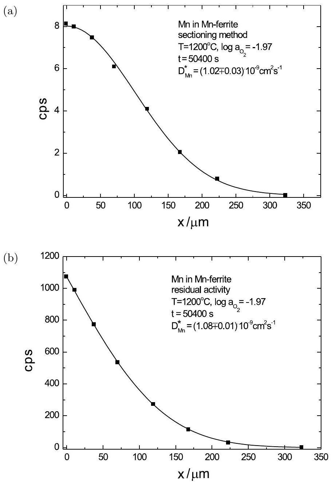
Fig. 5.5. Tracer sectioning profile (a) and residual activity profile (b) of ${ }^{54} \mathrm{Mn}$ in manganese ferrite [13] and corresponding fits with a Gaussian (a) and an errorfunction (b).

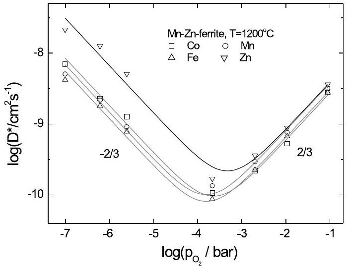
Fig. 5.6. Tracer diffusion coefficients of ${ }^{54} \mathrm{Mn},{ }^{59} \mathrm{Fe},{ }^{65} \mathrm{Zn}$, and ${ }^{57} \mathrm{Co}$ in $\mathrm{Mn}_{0.54} \mathrm{Zn}_{0.35} \mathrm{Fe}_{2.11} \mathrm{O}_{4}$ as a function of the oxygen activity at $T=1200^{\circ} \mathrm{C}$ (symbols) and fits (solid lines) [13].

Cobalt Monoxide, $\mathrm{Co}_{1-\delta} \mathrm{O}$
Cobalt monoxide, $\mathrm{Co}_{1-\delta} \mathrm{O}$, exists only with a cation deficit and is a p-type semiconductor. As shown by Dieckmann [17], the $p_{\mathrm{O}_{2}}$-dependence of three defect-dependent quantities, the non-stoichiometry, $\delta$, the cation tracer diffusion coefficient, $D_{\mathrm{Co}}^{*}$, and the electrical conductivity, $\sigma$, can be explained by a defect structure, where differently charged cation vacancies, $\mathrm{V}_{\text {Co }}^{\prime \prime}$ and $\mathrm{V}_{\text {Co }}^{\prime}$, and electron holes, $\mathrm{h}^{\bullet}$, are the dominating defects (see (5.13)). At intermediate oxygen partial pressures singly ionised cation vacancies $\mathrm{V}_{\text {Co }}^{\prime}$ dominate, and all three quantities, $\delta=\left[\mathrm{V}_{\mathrm{Co}}^{\prime}\right]$ (see (5.7)), $\sigma$, which is proportional to $\left[\mathrm{h}^{\bullet}\right]$, as well as the cation tracer diffusion coefficient ${ }^{3}, D_{\mathrm{Co}}^{*}=f_{0} \cdot D_{\mathrm{V}} \cdot\left[\mathrm{V}_{\mathrm{A}}^{\prime}\right]$, show the same dependence on $p_{\mathrm{O}_{2}}$ with a typical exponent $1 / 4$. Results for the tracer diffusion coefficient of cobalt, $D_{\mathrm{Co}}^{*}$, measured with the radiotracer method [18] and demonstrating this $p_{\mathrm{O}_{2}}$-dependence are shown in Fig. 5.7 together with results for impurity diffusion of Fe in CoO . The smaller slope can be explained by impurity-vacancy binding between iron ions and cation vacancies (see (5.16) and (5.17)). In the exact analysis one must consider that the charge states of both the iron ions and the cation vacancies change with decreasing $p_{\mathrm{O}_{2}}[19,20]$.

Ga-Doped Cobalt Monoxide, $\left(C o_{1-x} G a_{x}\right)_{1-\delta} O$
In $\mathrm{Co}_{1-\delta} \mathrm{O}$ doped with $\mathrm{Ga}_{2} \mathrm{O}_{3}$, resulting in $\left(\mathrm{Co}_{1-x} \mathrm{Ga}_{x}\right)_{1-\delta} \mathrm{O}$, both cation tracer diffusion coefficients, $D_{\mathrm{Co}}^{*}$ and $D_{\mathrm{Ga}}^{*}$, have been measured as a function

[^2]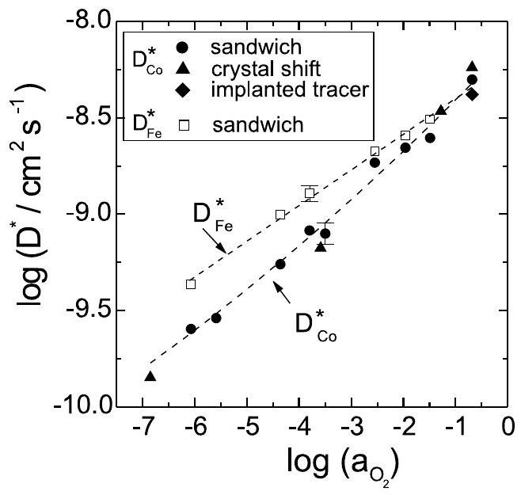
Fig. 5.7. Tracer diffusion coefficients of ${ }^{57} \mathrm{Co}$ and ${ }^{59} \mathrm{Fe}$ in $\mathrm{Co}_{1-\delta} \mathrm{O}$ as function of the oxygen activity at $1100^{\circ} \mathrm{C}$. Dashed lines are guides to the eyes. For the different experimental techniques see [18].

of the oxygen partial pressure, $p_{\mathrm{O}_{2}}$, and the dopant fraction, $x$, using radioisotopes [21]. The results depicted in Fig. 5.8 for a temperature of $1350^{\circ} \mathrm{C}$ show two typical features: (i) The dependence of both diffusion coefficients on the dopant fraction, $x$, is non-linear. (ii) At high oxygen partial pressures Co is the faster moving species while at low oxygen partial pressures Ga is faster than Co. To explain this behaviour we have to consider that the solute, Ga, and the solvent, Co, move by means of different diffusion mechanisms.

- In the dilute system, $x \ll 1$, the Ga ions are distinguishable, as tracer ions in tracer self-diffusion. Therefore, Ga is only mobile via solute-vacancy pairs, $P_{1}$ and $P_{2}$ (see (5.16) and (5.17)), and the solute diffusion coefficient, $D_{\mathrm{Ga}}^{*}$, is proportional to the association degrees $p_{1}=\left[\mathrm{P}_{1}\right] /[\mathrm{Ga}]$ and $p_{2}=\left[\mathrm{P}_{2}\right] /[\mathrm{Ga}]$ of solute ions bound in these pairs [22].

$$
D_{\mathrm{Ga}}^{*}=D_{\mathrm{Ga}, 1} \cdot p_{1}+D_{\mathrm{Ga}, 2} \cdot p_{2}
$$

The diffusion coefficients per defect, $D_{\mathrm{Ga}, 1}$ and $D_{\mathrm{Ga}, 2}$, depend only on temperature and include the mobilities of the defects and all physical correlation effects arising in solute tracer diffusion [22] (see also Sect. 1.9.1 in Chap. 1). The dependence of $D_{\mathrm{Ga}}^{*}$ on the defect concentrations, and hence on $x, T$ and $p_{\mathrm{O}_{2}}$ is given by the association degrees $p_{1}$ and $p_{2}$.

- In contrast, the solvent ion Co is mobile by means of free, i.e. unbound vacancies, $V_{A}^{\prime \prime}$ and $V_{A}^{\prime}$, and conceivably by vacancies bound in pairs. Since Co is the majority component, its tracer diffusion coefficient is proportional to the appropriate defect fractions (and not to the association degrees, as for the solute):

$$
D_{\mathrm{Co}}^{*}=D_{\mathrm{Co}, 1} \cdot\left[\mathrm{~V}_{\mathrm{Co}}^{\prime}\right]+D_{\mathrm{Co}, 2} \cdot\left[\mathrm{~V}_{\mathrm{O}}^{\prime \prime}\right]+D_{\mathrm{Co}, \mathrm{P}_{1}} \cdot\left[\mathrm{P}_{1}\right]+D_{\mathrm{Co}, \mathrm{P}_{2}} \cdot\left[\mathrm{P}_{2}\right]
$$

Here we have permitted different mobilities for the vacancies $V_{A}^{\prime \prime}$ and $V_{A}^{\prime}$.

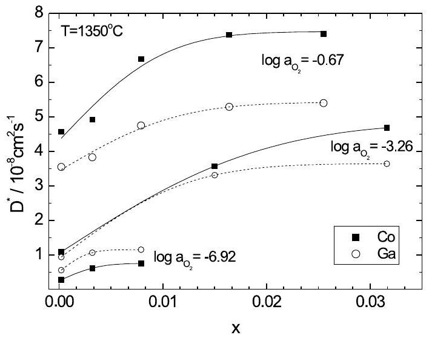
Fig. 5.8. Tracer diffusion coefficients of ${ }^{58} \mathrm{Co}$ and ${ }^{67} \mathrm{Ga}$ in $\left(\mathrm{Co}_{1-x} \mathrm{Ga}_{x}\right)_{1-\delta} \mathrm{O}$ as a function of the dopant fraction, $x$, at $T=1350^{\circ} \mathrm{C}$ and different oxygen activities [21].

The modelling of both measured diffusion coefficients, $D_{\mathrm{Co}}^{*}$ and $D_{\mathrm{Ga}}^{*}$, as a function of the oxygen partial pressure, $p_{\mathrm{O}_{2}}$, and the dopant fraction, $x$, yields the equilibrium constants $K_{\mathrm{P}_{1}}$ and $K_{\mathrm{P}_{2}}$ (see (5.16) and (5.17)) and the diffusion coefficients $D_{\mathrm{Co}, i}$ and $D_{\mathrm{Ga}, i}(i=1,2)$ [21]. The results show that there is essentially no binding between the dopant, $\mathrm{Ga}_{\mathrm{Co}}$. and singly ionised vacancies, $\mathrm{V}_{\mathrm{Co}}^{\prime}$, while there is strong binding between $\mathrm{Ga}_{\mathrm{Co}}$ and $\mathrm{V}_{\mathrm{Co}}^{\prime \prime}$. As a consequence, $D_{\mathrm{Co}, 1}$ and $D_{\mathrm{Co}, \mathrm{P}_{1}}$ are identical. $D_{\mathrm{Co}_{2}, \mathrm{P}_{2}}$ is two orders of magnitude smaller than $D_{\mathrm{Co}, 1}$ and $D_{\mathrm{Co}, 2}$ and can therefore be neglected. In summary, Ga is mobile by means of strongly bound pairs, $\left\{\mathrm{Ga}_{\text {Co }}^{\bullet}, \mathrm{V}_{\text {Co }}^{\prime \prime}\right\}^{\prime}$, and weakly bound pairs, $\left\{\mathrm{Ga}_{\mathrm{Co}}, \mathrm{V}_{\mathrm{Co}}^{\prime}\right\}$. Co is mobile by means of free vacancies, $\mathrm{V}_{\text {Co }}^{\prime \prime}$ and $\mathrm{V}_{\text {Coo }_{o}}^{\prime}$, and also by exchange with vacancies which are strongly bound in pairs $\left\{\mathrm{Ga}_{\mathrm{Co}}, \mathrm{V}_{\mathrm{Co}}^{\prime \prime}\right\}$. In the latter mechanism the vacancy performs jumps around the Ga ion, thereby moving the Co ion but without dissociating the pair.

The binding energy $E_{\mathrm{P}_{2}}$ determined from the equilibrium constant $K_{\mathrm{P}_{2}}= z \cdot \exp \left(E_{\mathrm{P}_{2}} / R T\right)$ turns out to depend slightly on temperature. Assuming nearest-neighbour pairs $(z=12)$ we obtain a binding energy of about $40 \mathrm{~kJ} / \mathrm{mol}$, while we obtain values of about $50 \mathrm{~kJ} / \mathrm{mol}$ if we assume nextnearest neighbour pairs $(z=6)$. The corresponding Coulomb energies (assuming point charges) are $72 \mathrm{~kJ} / \mathrm{mol}(z=12)$ and $50 \mathrm{~kJ} / \mathrm{mol}(z=6)$ which might be an indication for the next-nearest neighbour pairs, as proposed by theoretical calculations [23].

A detailed analysis of the diffusion coefficients, $D_{\mathrm{Ga}, i}$ and $D_{\mathrm{Co}, i}$, obtained from the fitting in terms of defect mobilities and correlation factors is impossible because the (physical) correlation factors are not known. However, we can draw some general conclusions.

- The diffusion coefficients $D_{\mathrm{Co}, 1}$ and $D_{\mathrm{Co}, 2}$ describe the motion of the solvent Co via free vacancies $\mathrm{V}_{\text {Co }}^{\prime}$ and $\mathrm{V}_{\text {Co }}^{\prime \prime}$, and can both be written
as a product of a vacancy diffusion coefficient and a correlation factor. If we assume that these correlation factors are identical to the geometric correlation factor in an fcc lattice, $f_{0}=0.781$, we obtain different vacancy diffusion coefficients, $D_{\mathrm{V}^{\prime}}$ and $D_{\mathrm{V}^{\prime \prime}}$ in Ga-doped CoO. This result is in agreement with measurements of the charge of transport ${ }^{4}$ in pure CoO [24], and the modelling of these data in terms of the Onsager-Fuoss-theory of liquid electrolytes shows also that the average mobility of the vacancies changes with the oxygen activity.
- The diffusion coefficients $D_{\mathrm{Ga}, 1}$ and $D_{\mathrm{Ga}, 2}$ describe the motion of the solute Ga by means of pairs $\mathrm{P}_{1}$ and $\mathrm{P}_{2}$, and both can be written in the form $D_{\mathrm{Ga}, i}=(1 / 6) \cdot s^{2} \cdot f_{\mathrm{B}, i} \cdot \omega_{\mathrm{B}, i}(i=1,2)$, where $s$ is the jump distance, $f_{\mathrm{B}, i}$ the correlation factor and $\omega_{\mathrm{B}, i}$ the impurity-vacancy exchange rate. The experimentally obtained ratio $D_{\mathrm{Ga}, 1} / D_{\mathrm{Ga}, 2}$ is about ten. If we assume that the exchange rates $\omega_{\mathrm{Ga}, 1}$ and $\omega_{\mathrm{Ga}, 2}$ are about the same for both mechanisms we can conclude that the correlation factor $f_{\mathrm{Ga}, 2}$ must be much smaller than $f_{\mathrm{Ga}, 1}$. This is in qualitative agreement with strong binding between $\mathrm{Ga}_{\mathrm{Co}}$ and $\mathrm{V}_{\mathrm{Co}}^{\prime \prime}$, compared to weak binding between $\mathrm{Ga}_{\mathrm{Co}}$ and $\mathrm{V}_{\mathrm{Co}}^{\prime}$.

### 5.3.2 Diffusion in Oxides with Dominating Oxygen Disorder

Oxygen defects are now the majority defects, while cation defects are only minority defects. Thus, oxygen diffusion will be much faster than cation diffusion.

## Oxygen Self-Diffusion

The determination of the self-diffusion coefficient of oxygen is accomplished by using one of the two stable oxygen isotopes, ${ }^{17} \mathrm{O}$ or ${ }^{18} \mathrm{O}$. The sample is annealed in an isotope-enriched atmosphere and the diffusion profile is generally determined by secondary ion mass spectrometry (SIMS) [25] (see Chap. 1, Sect. 1.4.1). Mathematically the experimental setup corresponds to the well-known infinite source solution [26]. However, if exchange of the oxygen isotope between the atmosphere and the oxide is not sufficiently fast there will be no equilibrium for the isotope at the surface. Most often, the rate of isotope exchange at the oxide surface is assumed to be proportional to the isotope concentrations in the gas and the solid, $c_{\mathrm{g}}$ and $c_{\mathrm{s}}$, resulting in

$$
-\left.D_{\mathrm{O}}^{*} \cdot \frac{\partial c}{\partial x}\right|_{x=0}=k \cdot\left(c_{\mathrm{s}}-c_{\mathrm{g}}\right)
$$

where $D_{\mathrm{O}}^{*}$ is the oxygen tracer diffusion coefficient and $k$ the surface exchange coefficient. The solution of the diffusion equation for a semi-infinite

[^3]medium subject to the boundary condition in (5.22) and having an initial concentration $c_{0}$ is [26]
$$
\begin{aligned}
c(x, t)= & c_{0}+\left(c_{\mathrm{g}}-c_{0}\right) \cdot\left\{\operatorname{erfc}\left(\frac{x}{\sqrt{4 D^{*} t}}\right)-\exp \left(\frac{k x}{D^{*}}+\frac{k^{2} t}{D^{*}}\right)\right. \\
& \left.\cdot \operatorname{erfc}\left(\frac{x}{\sqrt{4 D^{*} t}}+k \sqrt{\frac{t}{D^{*}}}\right)\right\} \quad .
\end{aligned}
$$

The parameters $D_{\mathrm{O}}^{*}$ and $k$ are then obtained by fitting (5.23) to the experimental profile. A detailed analysis of the conditions where $D_{\mathrm{O}}^{*}$ and $k$ can be determined unambiguously can be found in [27].

Two typical examples of oxygen diffusion in oxides of the $\mathrm{ABO}_{3}$ perovskite structure are shown in Fig. 5.9 [28]. Both examples belong to samples in the solid solution series between Sr-doped lanthanum cobaltate, $\mathrm{La}_{0.8} \mathrm{Sr}_{0.2} \mathrm{CoO}_{3-\delta}$, and Sr -doped lanthanum manganate, $\mathrm{La}_{0.8} \mathrm{Sr}_{0.2} \mathrm{MnO}_{3-\delta}$. The oxides are doped with SrO to increase the fraction of oxygen vacancies (see (5.18)). In the manganese-rich sample, $\mathrm{La}_{0.8} \mathrm{Sr}_{0.2} \mathrm{Mn}_{0.8} \mathrm{Co}_{0.2} \mathrm{O}_{3-\delta}$, the oxygen diffusion profile extends over a few microns and can be determined by SIMS depth profiling (Fig. 5.9a). In Sr-doped lanthanum cobaltate, $\mathrm{La}_{0.8} \mathrm{Sr}_{0.2} \mathrm{CoO}_{3-\delta}$, however, oxygen diffusion is much faster and the penetration depth is about two orders of magnitude larger (Fig. 5.9b). For such large penetration depths the SIMS depth profiling technique is no longer applicable; the SIMS line-scanning technique [25] is used instead. Here the SIMS analysis is performed on a section perpendicular to the sample surface. By fitting (5.23) to the profiles, the oxygen diffusion coefficient and the surface exchange coefficient in both materials were determined. It turns out that in $\mathrm{La}_{0.8} \mathrm{Sr}_{0.2} \mathrm{CoO}_{3-\delta}$ the oxygen diffusion coefficient is about five orders of magnitude larger than in $\mathrm{La}_{0.8} \mathrm{Sr}_{0.2} \mathrm{Mn}_{0.8} \mathrm{Co}_{0.2} \mathrm{O}_{3-\delta}$, while the surface exchange coefficient is about 2 orders of magnitude larger in the former oxide than in the latter.

In general, oxygen diffusion can proceed in the same way as described for cation diffusion in (5.19), namely by means of oxygen vacancies and oxygen interstitials. As discussed in [28] there is, however, no evidence for oxygen interstitials in $\mathrm{ABO}_{3}$ perovskite oxides, mainly for geometrical reasons. Thus the oxygen tracer diffusion coefficient is simply given by

$$
D_{\mathrm{O}}^{*}=f_{0} \cdot D_{\mathrm{V}} \cdot\left[\mathrm{~V}_{\mathrm{O}}^{\bullet \bullet}\right]
$$

where $f_{0}=0.69$ is the geometrical correlation factor for oxygen tracer diffusion in the oxygen sublattice of the $\mathrm{ABO}_{3}$ structure [29] and $D_{\mathrm{V}}$ the self-diffusion coefficient of oxygen vacancies. In several other perovskites the combination of oxygen diffusion coefficients and measured vacancy fractions shows that the self-diffusion coefficient of oxygen vacancies, $D_{\mathrm{V}}$, exhibits only small variations between different perovskites [29]. Thus, the

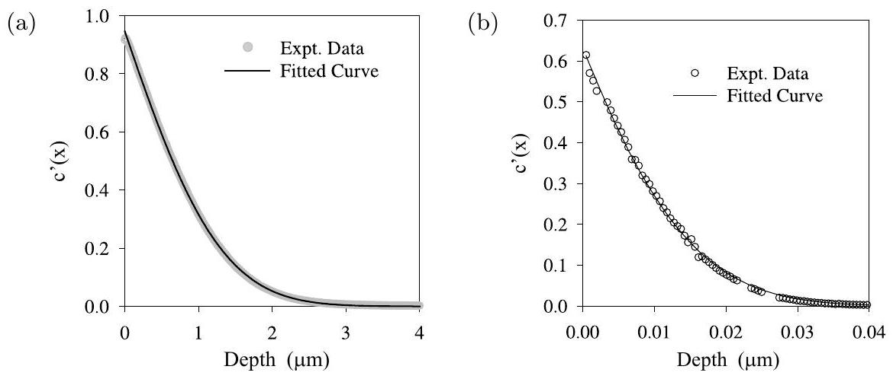
Fig. 5.9. Typical ${ }^{18} \mathrm{O}$ diffusion profiles, showing the normalized isotope fraction, $c^{\prime}(x)=\left(c(x)-c_{0}\right) /\left(c_{\mathrm{g}}-c_{0}\right)$, against depth, together with the fitted curves according to (5.23) [28]. (a) determined by SIMS depth profiling of a $\mathrm{La}_{0.8} \mathrm{Sr}_{0.2} \mathrm{Mn}_{0.8} \mathrm{Co}_{0.2} \mathrm{O}_{3-\delta}$ sample ( ${ }^{18} \mathrm{O}$ anneal at $1000^{\circ} \mathrm{C}$ for 3840 s ). (b) determined by SIMS linescanning of a $\mathrm{La}_{0.8} \mathrm{Sr}_{0.2} \mathrm{CoO}_{3-\delta}$ sample ( ${ }^{18} \mathrm{O}$ anneal at $1000^{\circ} \mathrm{C}$ for 1675 s ).

large difference of the observed oxygen diffusion coefficients is predominantly due to the difference in the oxygen vacancy concentrations between $\mathrm{La}_{0.8} \mathrm{Sr}_{0.2} \mathrm{Mn}_{0.8} \mathrm{Co}_{0.2} \mathrm{O}_{3-\delta}$ and $\mathrm{La}_{0.8} \mathrm{Sr}_{0.2} \mathrm{CoO}_{3-\delta}$.

## Cation Diffusion

In oxides with dominating oxygen disorder cation defects are only minority defects and consequently cation diffusion is much slower than oxygen diffusion. Cation diffusion is nevertheless important since the slowest moving species determine many fundamental processes, such as sintering [30], creep [31] or internal friction [32].

An important example is yttria-stabilized zirconia, $\left(\mathrm{Zr}_{1-x} \mathrm{Y}_{x}\right) \mathrm{O}_{2-x / 2}$ (YSZ), which exhibits very high oxygen ion conductivity and is therefore used as electrolyte material in high-temperature applications [33]. While there is a considerable amount of data available on the oxygen transport (e.g. [34, 35]), only little is known about the cation transport in YSZ [36, 37]. Figure 5.10 shows recent results for the diffusion coefficients of Y and Zr in single crystalline YSZ [38]. The diffusion coefficient of yttrium was measured using the radioactive isotope ${ }^{88} \mathrm{Y}$, while the diffusion coefficient of Zr was obtained by implanting the stable isotope ${ }^{96} \mathrm{Zr}$, annealing at elevated temperatures and subsequent SIMS analysis.

From Fig. 5.10 it can be seen that Zr diffusion becomes slower with increasing Y -content. This is due to the fact that the dopant yttrium determines the fraction of oxygen vacancies, $\left[\mathrm{Y}_{\mathrm{Zr}}^{\prime}\right]=2\left[\mathrm{~V}_{\mathrm{O}}^{\bullet \bullet}\right]$, which again determines via the Schottky equilibrium (see (5.1)) the fraction of cation vacancies. Thus cation diffusion should be slower the higher the dopant fraction, as

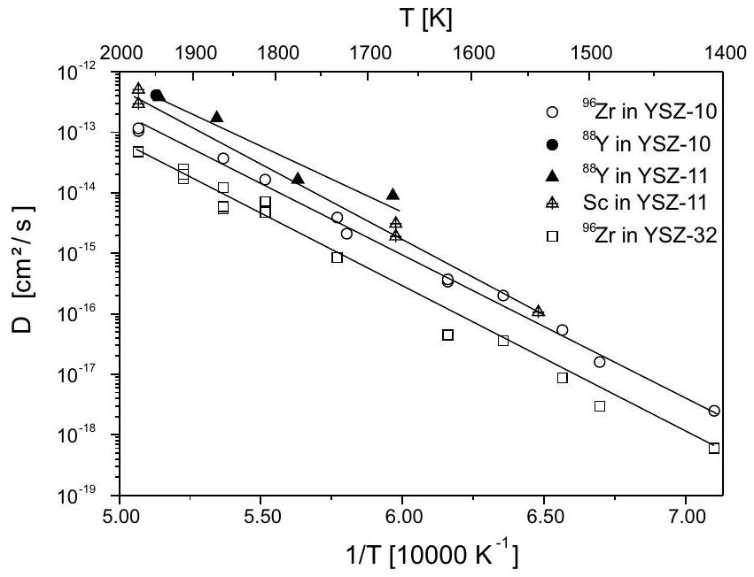
Fig. 5.10. Temperature dependence of the tracer diffusion coefficients of $\mathrm{Zr}, \mathrm{Y}$ and Sc in yttria-doped zirconia, YSZ, containing 10,11 and $32 \mathrm{~mol} \% \mathrm{Y}_{2} \mathrm{O}_{3}$ [38].

observed. As expected, comparison of the self-diffusion coefficients of oxygen and cations in YSZ shows that $D_{\mathrm{O}}$ is about 5 orders of magnitude larger than $D_{\text {cation }}$.

Similar results were found for doped lanthanum gallate, $\mathrm{La}_{1-x} \mathrm{Sr}_{x} \mathrm{Ga}_{1-y} \mathrm{Mg}_{y} \mathrm{O}_{3-(x+y) / 2}$ (LSGM), which has a higher oxygen ion conductivity than YSZ and is therefore a candidate for solid oxide fuel cells working at intermediate temperatures [39]. Here oxygen diffusion coefficients [40] and cation self- and impurity diffusion coefficients [41,42] have been measured. In contrast to YSZ there are two cation sublattices in the $\mathrm{ABO}_{3-}$ perovskite LSGM, an A- and a B-sublattice. In the perovskite structure (see Fig. 5.11), a direct jump of A-cations within the A-sublattice is possible, while a direct jump of B-cations within the B-sublattice is impossible due to the oxygen ion located between two nearest neighbour B-sites. Thus, for diffusion of B-cations curved diffusion pathways or jumps to next-nearest neighbour sites must be considered. Atomistic simulations of migration energies in lanthanum gallate [43] yield much higher migration energies for diffusion of B-cations than for diffusion of A-cations. The measured tracer diffusion coefficients of $\mathrm{La}, \mathrm{Sr}$ and Mg [41] and the impurity diffusion coefficients for Fe , Cr and Y [41] are, however, very similar and show identical activation energies, although Mg , Fe and Cr should occupy B-sites while La, Sr and Y occupy A-sites. These observations may be an indication for antisite disorder in the perovskite LSGM, i.e. a small fraction of B-cations may occupy A-sites. This would be sufficient to enable diffusion of B-cations with similar diffusion coefficients as A-cations. A more detailled diffusion model

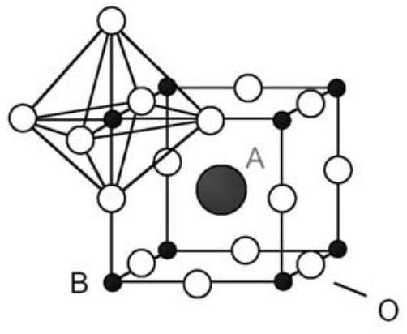
Fig. 5.11. Structure of the perovskite $\mathrm{ABO}_{3}$.

considers a defect cluster consisting of an A-site vacancy, a B-site vacancy and at least one oxygen vacancy [41]. This cluster is mobile as an entity, i.e. without dissociation by means of four, correlated jumps of A- and B-cations and oxygen ions. As a result, A- and B-cations have identical diffusivities.

### 5.4 Chemical Diffusion

So far we have considered self- and impurity diffusion processes in chemically homogeneous oxides without any concentration gradients. We will now consider diffusion in concentration gradients, which is called chemical diffusion. It is well known, from irreversible thermodynamics, that the real driving force for isothermal mass transport of a component $i$ is not its concentration gradient but the gradient of its electrochemical potential, $\eta_{i}=\mu_{i}+z_{i} \cdot F \cdot \Phi$, where $\mu_{i}$ is the chemical potential and $\Phi$ the electric potential [44] ( $z_{i}$ is the charge number and $F$, Faraday's constant) ${ }^{5}$. The resulting flux equation for component $i$ is

$$
j_{i}=-L_{i i} \cdot \nabla\left(\mu_{i}+z_{i} \cdot F \cdot \Phi\right)
$$

where $L_{i i}$ is the so-called Onsager transport coefficient ${ }^{6}$. For the sake of simplicity, we will consider only a binary oxide AO with dominating cation disorder. The results can easily be transferred to oxides with dominating oxygen disorder. We start with an oxide which is equilibrated at elevated temperatures and at a certain oxygen partial pressure, $p_{\mathrm{O}_{2}}^{(1)}$. If the partial pressure of the surrounding atmosphere is increased to $p_{\mathrm{O}_{2}}^{(2)}$ an oxidation process takes place. Oxygen is incorporated into the crystal by adding new lattice sites to the crystal and producing cation vacancies and electron holes (see (5.8)). In the case of reduction, lattice planes are annihilated and oxygen is released

[^4]to the atmosphere. To preserve local electrical neutrality during the resulting transport processes of cations and electronic defects their fluxes must be coupled:
$$
2 j_{\mathrm{A}^{2+}}+j_{\mathrm{h}} \bullet=0
$$

From (5.26) we can calculate the internal electrical potential gradient, $\nabla \Phi$ (the so-called Nernst field), and insert the resulting expression into the flux equation for the cations in (5.25). With the equilibrium $\mathrm{A}+2 \mathrm{~h}^{\bullet} \rightleftharpoons \mathrm{A}^{2+}$ between metal, A, cations, $\mathrm{A}^{2+}$, and electron holes, $\mathrm{h}^{\bullet}$, the flux of cations can be written as

$$
j_{\mathrm{A}^{2+}}=-L_{\mathrm{AA}} \cdot t_{\mathrm{el}} \cdot \nabla \mu_{\mathrm{A}}
$$

where $t_{\mathrm{el}}=L_{\mathrm{hh}} /\left(4 L_{\mathrm{AA}}+L_{\mathrm{hh}}\right)$ is the electronic transference number. Equation (5.27) is the so-called Wagner formula for chemical or ambipolar diffusion [45]. If the thermodynamic driving force, $\nabla \mu_{\mathrm{A}}$, is written in terms of the concentration gradient, $\nabla \mu_{\mathrm{A}}=\left(\partial \mu_{\mathrm{A}} / \partial c_{\mathrm{A}}\right) \cdot \nabla c_{\mathrm{A}}$, we obtain

$$
j_{\mathrm{A}^{2+}}=-L_{\mathrm{AA}} \cdot t_{\mathrm{el}} \cdot\left(\partial \mu_{\mathrm{A}} / \partial c_{\mathrm{A}}\right) \cdot \nabla c_{\mathrm{A}}=-\tilde{D} \cdot \nabla c_{\mathrm{A}}
$$

which defines the chemical diffusion coefficient, $\tilde{D}$. Due to the flux coupling, $j_{\mathrm{A}^{2+}}+j_{\mathrm{V}}=0$, the vacancy flux can also be written in terms of the chemical diffusion coefficient:

$$
j_{\mathrm{V}}=-\tilde{D} \cdot \nabla c_{\mathrm{V}}
$$

Finally, we write $L_{\mathrm{AA}}$ in terms of the diffusion coefficient $D_{\mathrm{A}}$ and the concentration $c_{\mathrm{A}}, L_{\mathrm{AA}}=D_{\mathrm{A}} \cdot c_{\mathrm{A}} / R T$ (Einstein relation) and make use of $\mu_{\mathrm{A}}=\mu_{\mathrm{A}}^{0}+R T \ln a_{\mathrm{A}}$, where $a_{\mathrm{A}}$ is the activity of A . The result for $\tilde{D}$ is

$$
\tilde{D}=D_{\mathrm{A}} \cdot t_{\mathrm{el}} \cdot \frac{\partial \ln a_{\mathrm{A}}}{\partial \ln x_{\mathrm{A}}}
$$

Thus, the chemical diffusion coefficient, $\tilde{D}$, is the product of the cation selfdiffusion coefficient, $D_{\mathrm{A}}$, the electronic transference number, $t_{\mathrm{el}}$, and the thermodynamic factor, $\partial \ln a_{\mathrm{A}} / \partial \ln x_{\mathrm{A}}$. Equation (5.30) applies also to oxides with dominating oxygen disorder if $D_{\mathrm{A}}, a_{\mathrm{A}}$ and $x_{\mathrm{A}}$ are substituted by $D_{\mathrm{O}}, a_{\mathrm{O}}$ and $x_{\mathrm{O}}$.

The chemical diffusion coefficient, $\tilde{D}$, of an oxide $\mathrm{A}_{1-\delta} \mathrm{O}$ determines the equilibration kinetics of $\delta$ after a change of the external oxygen partial pressure. It can be determined by measuring $\delta$ directly, e.g. via thermogravimetry or by measuring a quantity which is proportional to $\delta$, such as the electronic conductivity. These so-called relaxation experiments have been used to measure $\tilde{D}$ in various oxides such as CoO with dominating cation disorder [46], or $(\mathrm{La}, \mathrm{Mn}) \mathrm{CoO}_{3}[47]$ and $(\mathrm{La}, \mathrm{Sr}) \mathrm{CrO}_{3}[48]$ with dominating oxygen disorder.

If the oxide is a good semiconductor ( $t_{\mathrm{el}}=1$ ) and the majority defects are cation vacancies, $\mathrm{V}_{\mathrm{A}}^{\alpha^{\prime}}$ (with negative excess charge $\alpha=2,1,0$ ), and electron holes, $\mathrm{h}^{\bullet}$, (or oxygen vacancies, $\mathrm{V}_{\mathrm{O}}^{\alpha^{\bullet}}$, and electrons, $\mathrm{e}^{\prime}$ ) the formula for $\tilde{D}$ in (5.30) simplifies to (see appendix)

$$
\tilde{D}=D_{\mathrm{V}} \cdot(1+\alpha)
$$

Thus, from the measured chemical diffusion coefficient, $\tilde{D}$, the self-diffusion coefficient, $D_{\mathrm{V}}$, of the dominating vacancies can be calculated, if their excess charge is known. This is the normal procedure, e.g. mostly adopted in oxides with oxygen disorder where vacancies $\mathrm{V}_{\mathrm{O}}^{\bullet \bullet}(\alpha=2)$ dominate. If, on the other hand, the vacancy self-diffusion coefficient is known the excess charge of the vacancies can be calculated. As will be shown in Sect. 5.5.1, both the vacancy self-diffusion coefficient, $D_{\mathrm{V}}$, and the chemical diffusion coefficient, $\tilde{D}$, can be obtained simultaneously by performing tracer self-diffusion experiments during chemical diffusion. Then, from both diffusion coefficients the excess charge $\alpha$ can be obtained via (5.31).

In the general case of a mixed conductor, $t_{\mathrm{el}} \neq 1$, the chemical diffusion coefficient may show a strong dependence on the oxygen partial pressure for two reasons: (i) the electronic transference number, $t_{\mathrm{el}}$, depends on the oxygen partial pressure. (ii) if the stability field of the oxide contains the stoichiometric point, $\delta\left(p_{\mathrm{O}_{2}}^{*}\right)=0$, the thermodynamic factor and also the chemical diffusion coefficient exhibit a maximum at this oxygen partial pressure. This case is found, e.g., in $\mathrm{BaTiO}_{3}$ [49].

Another technique that has been used recently for the measurement of chemical diffusion coefficients in Fe-doped $\mathrm{SrTiO}_{3}$, which is a mixed conductor, uses the optical absorption of the sample [50]. In this way, time- and position-resolved concentration profiles of oxygen can be determined from which the chemical diffusion coefficient is evaluated.

### 5.5 Diffusion in Oxides Exposed to External Forces

If an oxide is exposed to external thermodynamic forces, e.g. an oxygen potential gradient or an electric potential gradient, defect fluxes are induced which again cause fluxes of the chemical components. As before, it is reasonable to distinguish between dominating oxygen disorder and dominating cation disorder.

In oxides where the oxygen ions are much more mobile than the cations, essentially only oxygen is driven through the oxide ${ }^{7}$. For pure oxygen ion conductors this situation corresponds to an electrolyte in a solid oxide fuel cell (applied oxygen potential gradient) or an electrochemical oxygen pump (applied electric potential gradient). For mixed conductors this situation corresponds to oxygen permeation cells. A detailed analysis of these cases is, however, beyond the scope of this chapter and can be found, e.g., in [51].

[^5]In oxides with dominating cation disorder external forces act on the mobile cations. The implications will be considered in more detail in the following sections.

### 5.5.1 Diffusion in an Oxygen Potential Gradient

## Chemical Diffusion in an Oxygen Potential Gradient

If an oxide $\mathrm{A}_{1-\delta} \mathrm{O}$ of thickness $\Delta z$ is exposed to an oxygen potential gradient, established, e.g., by different gas mixtures on both sides of the disc, different concentrations of cation vacancies, $c_{\mathrm{V}}^{(1)}$ and $c_{\mathrm{V}}^{(2)}$, are established on both sides of the disc (according to (5.9)). As a consequence, a vacancy flux, $j_{\mathrm{V}}= -\tilde{D} \cdot \nabla c_{\mathrm{V}}$ (see (5.29)), occurs from the high- to the low-oxygen potential side. Due to the flux coupling, $j_{\mathrm{A}^{2+}}+j_{\mathrm{V}}=0$, cations are driven in the opposite direction. When vacancies and cations arrive at the oxide surfaces, reduction and oxidation of the oxide occur at the low- and high-oxygen potential side, respectively:

$$
\mathrm{V}_{\mathrm{A}}^{\prime \prime}+2 \mathrm{~h}^{\cdot}+\mathrm{AO} \underset{\text { oxidation }}{\stackrel{\text { reduction }}{\rightleftarrows}} \mathrm{A}_{\mathrm{A}}^{\mathrm{x}}+\frac{1}{2} \mathrm{O}_{2}(\mathrm{~g})
$$

Thus, lattice planes are removed from the low oxygen potential side and added to the high oxygen potential side. As a result, the crystal surfaces move relatively to the immobile oxygen sublattice to the side of the higher oxygen activity. The crystal displacement and the vacancy concentration profile can be calculated by solving the diffusion equation [52]. After a short transient period the crystal moves with a constant velocity. A steady-state solution can be calculated by transforming from the laboratory reference frame ${ }^{8}$ to a moving coordinate system (coordinate $z$ ) which is fixed at one surface. The steady-state vacancy fraction profile in the moving system, $x_{\mathrm{V}}(z)$, is linear in position, $z$, to a very good approximation, and the steady state velocity, $v$, is given by

$$
x_{\mathrm{V}}=a+b \cdot z \quad, \quad v=\tilde{D} \cdot b
$$

with

$$
a=x_{\mathrm{V}}^{(1)} \quad, \quad b=\frac{x_{\mathrm{V}}^{(2)}-x_{\mathrm{V}}^{(1)}}{\Delta z}
$$

Experiments with the model system CoO exposed to an oxygen potential gradient confirm the shift of the crystal surfaces relatively to the immobile oxygen sublattice [52].

[^6]
## Tracer Diffusion in an Oxygen Potential Gradient

The motion of cation tracers (being chemically identical to the cation A or being an impurity) in an oxide which is exposed to an oxygen potential gradient is influenced by the directed vacancy flux in (5.29) in two respects: Firstly, the tracer diffusion coefficient is proportional to the vacancy fraction which varies linearly with position. Thus, tracer diffusion takes place with a linearly position dependent tracer diffusion coefficient. Secondly, the tracer ions are moved by the drifting vacancies. This drift flux of the tracer particles, which is over and above their normal Brownian motion, reflects the interaction of the tracer ions with the vacancies. In summary, the tracer flux consists of two parts: the first part, $j_{\text {tracer }}^{\text {diff }}$, describes Brownian motion, as in the case of a homogeneous crystal, but with the difference that the diffusion coefficient is position dependent. The second part is a drift term, $j_{\text {tracer }}^{\text {drift }}$, which is proportional to the vacancy flux, as will be shown below.

## Tracer Self-Diffusion in an Oxygen Potential Gradient

In this case the tracer ions $\mathrm{A}^{*}$ are chemically identical to the normal cations A, but in contrast to them they are distinguishable. Thus, the tracer diffusion coefficient, $D_{\mathrm{A}^{*}}=f_{0} \cdot D_{\mathrm{V}} \cdot x_{\mathrm{V}}$, contains the geometrical tracer correlation factor, $f_{0}$, and the first part of the flux of the tracer particles has the form

$$
j_{\mathrm{A}^{*}}^{\mathrm{diff}}=-f_{0} \cdot D_{\mathrm{V}} \cdot x_{\mathrm{V}} \cdot \nabla c_{\mathrm{A}^{*}}
$$

Since the tracer particles are chemically identical to the normal cations they are moved by the directed vacancy flux in the same way as the normal cations. However, only a fraction $x_{\mathrm{A} *}$ of the total amount of A exists as tracer. Therefore the drift flux of the tracer has the form:

$$
j_{\mathrm{A}^{*}}^{\mathrm{drift}}=-x_{\mathrm{A}^{*}} \cdot j_{\mathrm{V}}
$$

The source solution for this diffusion problem is given by [53]

$$
\begin{aligned}
c_{\mathrm{A}^{*}}(z, t)= & \frac{M}{D_{\mathrm{V}} \cdot b \cdot t} \cdot \exp \left(-\frac{2 a+b \cdot\left(z+z_{0}\right)}{D_{\mathrm{V}} \cdot f_{0} \cdot b^{2} \cdot t}\right) \\
& \cdot I_{0}\left(\frac{(a+b z)^{1 / 2} \cdot\left(a+b z_{0}\right)^{1 / 2}}{D_{\mathrm{V}} \cdot f_{0} \cdot b^{2} \cdot t}\right)
\end{aligned}
$$

where $M$ is the total amount of tracer per unit area, $z_{0}$ the initial position of the tracer source, and $I_{0}$ a Bessel function of order zero. In contrast to the source solution for a constant diffusion coefficient (Gaussian) the maximum of the curve shifts with increasing time to the side of higher oxygen potential, and the profile becomes more and more asymmetric. The initial tracer source position can be marked by inert markers. Its position in the moving system is $z_{\text {marker }}=z_{0}+v \cdot t$. The position of the maximum, $z_{\max }(t)$, relative to the marker position is then given by

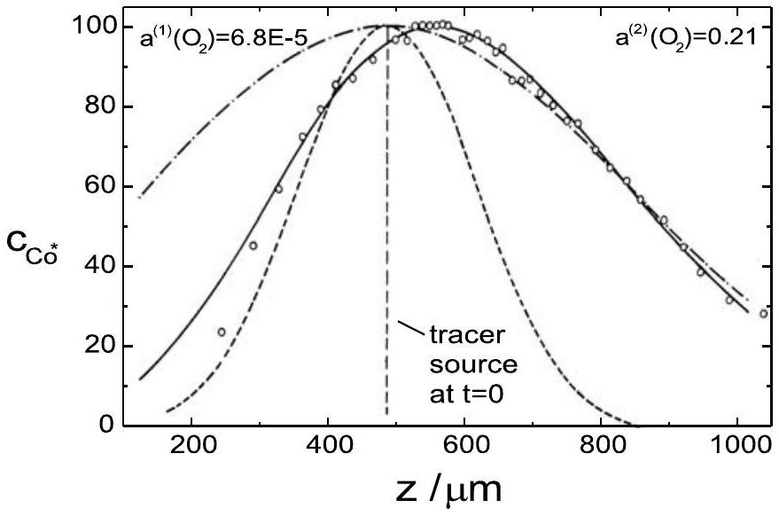
Fig. 5.12. Normalised tracer concentration profile of ${ }^{60} \mathrm{Co}$ in CoO in an oxygen potential gradient $\left(T=1210^{\circ} \mathrm{C}, a_{\mathrm{O}_{2}}^{(1)}=6.8 \cdot 10^{-5}, a_{\mathrm{O}_{2}}^{(2)}=0.21, \Delta z=1184 \mu \mathrm{~m}\right.$, $t=15 \mathrm{~h}$ ) [20]. o experimental concentrations; - best fit using (5.37); --- Gaussian profile for a homogeneous crystal at $a_{\mathrm{O}_{2}}^{(1)} ;-\cdot-$ Gaussian profile for a homogeneous crystal at $a_{\mathrm{O}_{2}}^{(2)}$.

$$
z_{\max }(t)-z_{\text {marker }}=\left(\tilde{D}-\frac{1}{2} \cdot f_{0} \cdot D_{\mathrm{V}}\right) \cdot b \cdot t
$$

Figure 5.12 shows a typical tracer concentration profile of ${ }^{60} \mathrm{Co}$ in $\mathrm{Co}_{1-\delta} \mathrm{O}$ in an oxygen potential gradient. By fitting of (5.37) the vacancy diffusion coefficient, $D_{\mathrm{V}}$, and the chemical diffusion coefficient, $\tilde{D}$, can be determined simultaneously. Using (5.31) the average excess charge of the cation vacancies was found to be $\alpha=0.86[20]$. This value is in reasonable agreement with values calculated on the basis of equilibrium constants (see Sect. 5.2.1). For comparison, the Gaussian profiles which one would obtain in a homogeneous crystal equilibrated at oxygen activities $a_{\mathrm{O}_{2}}^{(1)}$ and $a_{\mathrm{O}_{2}}^{(2)}$ are also shown in Fig. 5.12. The actual profile lies between the two Gaussian profiles.

Similar experiments have been performed for tracer diffusion of Fe in magnetite, $\mathrm{Fe}_{3} \mathrm{O}_{4}$, which was exposed to an oxygen potential gradient [54]. Due to the high electronic disorder in magnetite ( $\mathrm{Fe}^{2+}$ and $\mathrm{Fe}^{3+}$ ions are regular structure elements) the chemical diffusion coefficient, $\tilde{D}$, is identical to the vacancy diffusion coefficient, $D_{\mathrm{V}}$, in the vacancy regime, and identical to the interstitial diffusion coefficient, $D_{\mathrm{I}}$, in the interstitial regime [20]. This means, that the two parameters which can be determined simultaneously are the self-diffusion coefficient of the dominating defect and the correlation factor for tracer diffusion via this defect. In contrast to oxides with the $\mathrm{NaCl}-$ structure, e.g. CoO , the effective correlation factor for a jump sequence in the spinel $\mathrm{Fe}_{3} \mathrm{O}_{4}$ cannot be specified a priori since several vacancy and interstitial or interstitialcy mechanisms are possible in magnetite. This is due to the fact
that in the spinel structure two regular cation sites exist, an octahedrally and a tetrahedrally coordinated site. Likewise, several interstitial positions are possible.

In the vacancy regime, three basic vacancy mechanisms are discussed. They are characterised by jumps only within the octahedral sublattice, only within the tetetrahedral sublattice [55], or jumps between these two sublattices [56]. The geometrical correlation factors for these mechanisms are $f_{\mathrm{V}}=0.50, f_{\mathrm{V}}=0.56$, and $f_{\mathrm{V}}=0.73$, respectively. The correlation factor obtained from tracer experiments in an oxygen potential gradient is $f_{\mathrm{V}}=0.56 \pm 0.07[54]$ indicating preferred diffusion of Fe within the octahedral sublattice, in agreement with results of in situ Mößbauer spectroscopy [56].

In the interstitial regime, the correlation factor obtained from tracer experiments in an oxygen potential gradient is $f_{\mathrm{I}}=0.43 \pm 0.1$. Only a direct interstitial mechanism ( $f_{\mathrm{I}}=1$ ) can be excluded. The experimental accuracy is, however, too small to distinguish between different interstitial or interstitialcy mechanisms for which the theoretical correlation factors, $f_{\mathrm{I}}$, are between 0 and 1 [55].

## Impurity Diffusion in an Oxygen Potential Gradient

The flux of impurity ions, B , in an oxide which is exposed to an oxygen potential gradient consists also of two parts: a pure, diffusion term, which is characterized by the impurity diffusion coefficient, $D_{\mathrm{B}}$, and which describes Brownian motion of the impurity ions, and a second part which is again a drift term caused by the directed flux of vacancies which drift through the oxide. However, in contrast to self-diffusion, where the drift flux was always opposite to the vacancy flux and directly proportional to the fraction of tracers, now the magnitude and direction of the drift flux have to be calculated with the aid of linear transport theory. This means that transport coefficients $L_{i j} (i, j=\mathrm{A}, \mathrm{B})$ have to be used which describe the coupled transport of A and B under the influence of an applied oxygen potential gradient. The impurity drift flux was calculated in detail in [20] and can be written as

$$
j_{\mathrm{B}}^{\mathrm{drift}}=-j_{\mathrm{V}} \cdot x_{\mathrm{B}} \cdot \frac{D_{\mathrm{B}}}{D_{\mathrm{A}}} \cdot \beta
$$

As expected, the impurity drift flux is proportional to the vacancy flux, $j_{\mathrm{V}}$, and the fraction of impurities, $x_{\mathrm{B}}$. In addition it is proportional to the ratio of the diffusion coefficients of the impurity, $D_{\mathrm{B}}$, and the solvent, $D_{\mathrm{A}}$. This ratio reflects the fact that impurities and solvent ions exchange with different rates with vacancies. As a result they are moved differently by the vacancies. In contrast to these first terms, which are model independent, the last factor, $\beta$, depends on the microscopic model used. It describes essentially the interaction of the impurity with its neighbours which can be small (as is expected for homovalent impurities) or stronger (for aliovalent impurities). Particularly for higher valent impurities which possess a positive excess
charge there can be strong interaction with the negatively charged vacancies. Now the two possible limiting cases will be discussed: First, the situation where the interaction is small. This means that impurities and vacancies should drift in opposite directions, as in the case of self-diffusion. Second, the case of attractive interaction between impurities and vacancies. Then impurities and vacancies form bound pairs and the impurities should drift in the same direction as the vacancies. This qualitative picture is confirmed by the theoretical results for the constant $\beta$ in (5.39) which was calculated in [57] within the five-frequency model. Within this model the transport coefficients $L_{i j}(i, j=\mathrm{A}, \mathrm{B})$ are known exactly [22]. The five-frequency model (Fig. 1.18, note also footnote 15 in Chap. 1) is a nearest-neighbour model and uses five exchange rates of vacancies and ions: $\omega_{0}$ and $\omega_{1}$ for exchange of vacancies with solvent ions in the pure crystal (i.e. far away from the impurity) and in the next neighbourhood of the impurity; $\omega_{3}$ for vacancy jumps, which dissociate an impurity-vacancy pair; $\omega_{4}$ which creates a new pair; and $\omega_{2}$ for exchange of a vacancy and an impurity. For strong binding the parameter $\beta$ is negative, yielding an impurity drift flux in the same direction as the vacancies, while for weak binding $\beta$ is positive, and the drift flux is opposite to the vacancies. Thus, an impurity drift experiment in an oxygen potential gradient performed in the same way as described for tracer self-diffusion shows first by the direction in which the profile moves whether strong or weak impurityvacancy binding prevails, and second allows the determination of ratios of the exchange jump rates $\omega_{i}(i=0,1,2,3,4)$.

An example is impurity diffusion of Fe in CoO in an oxygen potential gradient. It was found, that the drift direction of the Fe-tracer profile depends on the oxygen potential region [19]. In region $\mathrm{I}\left(\log a_{\mathrm{O}_{2}} \approx-2\right)$ the profile drifts to the high oxygen potential side, i.e. opposite to the vacancies, while in region II ( $\log a_{\mathrm{O}_{2}} \approx-8$ ) the profile shifts to the low oxygen potential side, i.e. in the same direction as the vacancies. The impurity diffusion coefficient, $D_{\mathrm{Fe}}^{*}$, and the constant $\beta$ in (5.39) can be obtained from the profiles. To calculate from these data the vacancy exchange rates $\omega_{i}$ in the five-frequency model, or at least ratios of them, two additional experimental parameters are needed. These are: (i) the impurity correlation factor which was obtained from the isotope effect [58] and which changes from 0.78 in region I to 0.87 in region II. (ii) the impurity-vacancy binding energy, $\Delta g_{\text {pair }}$, which was obtained from the $p_{\mathrm{O}_{2}}$-dependence of the Fe-tracer diffusion coefficient. It is small compared to the thermal energy in region I and about 0.7 eV in region II [19]. All four quantities are known exactly as functions of the five rates $\omega_{i}(i=0,1,2,3$, 4) within the five-frequency model $[22]^{9}$. As a result four ratios of exchange rates can be calculated in regions I and II, respectively:

[^7]region I: $\quad \omega_{3} / \omega_{1}=0.29, \quad \omega_{2} / \omega_{1}=0.52, \quad \omega_{4} / \omega_{0}=0.53, \quad \omega_{4} / \omega_{3} \cong 1$
region II: $\quad \omega_{3} / \omega_{1}=0.02, \quad \omega_{2} / \omega_{1}=0.14, \quad \omega_{4} / \omega_{0}=0.60, \quad \omega_{4} / \omega_{3} \cong 300$
While the ratios $\omega_{2} / \omega_{1}$ and $\omega_{4} / \omega_{0}$ remain nearly unchanged in passing from region I to region II, $\omega_{4} / \omega_{3}$ increases drastically and $\omega_{3} / \omega_{1}$ decreases. This is mainly due to the fact that the escape rate, $\omega_{3}$, decreases in passing from region I to region II indicating the transition from weak to strong binding between Fe and vacancies. If the binding is mainly due to Coulombic interaction between oppositely charged structure elements, one cause for the change in $\Delta g_{\text {pair }}$ could be the change in the relative concentrations of the differently charged cation vacancies. At high oxygen activities (region I) vacancies $\mathrm{V}_{\text {Co }}^{\prime}$ dominate, whereas vacancies $\mathrm{V}_{\text {Co }}^{\prime \prime}$ become more important at lower oxygen activities (region II). As a result, there is stronger Coulombic interaction with trivalent iron at lower oxygen activities. On the other hand, iron exists as $\mathrm{Fe}^{2+}$ and $\mathrm{Fe}^{3+}$, and the fraction of trivalent iron decreases with decreasing oxygen activity, which results in a smaller degree of association. Another possible cause for the increase of $\Delta g_{\text {pair }}$ goes back to the different sizes of di- and trivalent iron ions. The larger ionic radius of $\mathrm{Fe}^{2+}$ would result in displacements of neighbouring ions which may be compensated by association of a vacancy.

## Demixing in an Oxygen Potential Gradient

If, instead of a pure oxide, a mixed oxide, $\left(\mathrm{A}_{1-x} \mathrm{~B}_{x}\right) \mathrm{O}$, in which oxygen is immobile, is exposed to a stationary oxygen potential gradient, again different cation vacancy fractions are established at the high and low oxygen potential sides. However, the resulting cation vacancy flux from the high to the low oxygen potential side causes fluxes of both cations, A and B . In general, they have different mobilities and the oxide will become enriched in the more mobile cation at the high oxygen potential side, while it will become enriched in the less mobile cation at the low oxygen potential side (see Fig. 5.13). This kinetic demixing process was studied first by Schmalzried et al. [59,60] considering steady-state demixing and homovalent solid solutions, e.g. ( $\mathrm{Co}, \mathrm{Mg}$ )O, where Co is the faster cation and becomes enriched at the high oxygen potential side of the oxide. The formal solution of the transient demixing problem with moving boundaries and time-dependent boundary values can be found in [61].

However, kinetic demixing may also be important in doped oxides $\left(\mathrm{A}_{1-x} \mathrm{~B}_{x}\right) \mathrm{O}$, where the kinetic segregation of impurities is of interest, e.g. during sintering or alloy corrosion [62]. The basis for the subsequent analysis is given by the general transport equations [44]

$$
j_{i}=-\sum_{j} L_{i j} \cdot \nabla \eta_{j}
$$

where $L_{i j}$ are the transport coefficients and $\eta_{j}$ is the electrochemical potential (see Sect. 5.4). As shown in [63], in a dilute oxide, $\mathrm{A}_{1-x} \mathrm{~B}_{x} \mathrm{O}(x \ll 1)$ ), the

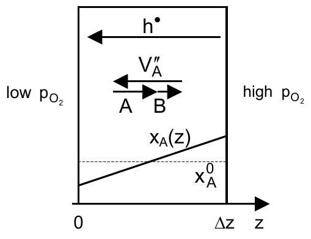
Fig. 5.13. Schematic representation of the fluxes of electron holes, cation vacancies and cations A and B, and the initial and steady state concentration profile of A in a mixed oxide $(\mathrm{A}, \mathrm{B}) \mathrm{O}$ exposed to an oxygen potential gradient for the case that component A is faster than B .

flux of the dopant, B , can be written as

$$
j_{\mathrm{B}}=-D_{\mathrm{B}} \cdot \nabla c_{\mathrm{B}}-j_{\mathrm{V}} \cdot \frac{L_{\mathrm{BB}}}{L_{\mathrm{AA}}} \cdot\left(\gamma+\frac{L_{\mathrm{BA}}}{L_{\mathrm{BB}}}\right)
$$

The dimensionless quantity $\gamma$ contains all physical correlation effects and is of the order of unity. Equation (5.41) shows that the dopant flux consists of two terms, a pure diffusion term, $-D_{\mathrm{B}} \nabla c_{\mathrm{B}}$, characterized by the dopant diffusion coefficient, $D_{\mathrm{B}}\left(=L_{\mathrm{BB}} R T / c_{\mathrm{B}}\right)$, and a drift term, which is proportional to the vacancy flux, $j_{\mathrm{V}}$. The direction of the drift term, which determines at which side of the sample the dopant becomes enriched, depends crucially on the sign and magnitude of the non-diagonal element $L_{\mathrm{BA}}$. Particularly in trivalent doped oxides, $\mathrm{AO}\left(+\mathrm{B}_{2} \mathrm{O}_{3}\right)$, solute-vacancy interactions might result in a non-vanishing cross term $L_{\mathrm{AB}}$. Thus the demixing behaviour or the kinetic segregation of the dopant B strongly depends on the strength of the solute-vacancy binding energy.

Demixing experiments with $\mathrm{Ga}_{2} \mathrm{O}_{3}$-doped CoO [64] clearly show demixing of Co and Ga with enrichment of Ga at the low oxygen potential side (see Fig. 5.14). Since the tracer diffusion coefficients of Co and Ga are also known (see Sect. 5.3.1), the ratio $L_{\text {GaCo }} / L_{\text {GaGa }}$ can be obtained from the demixing profile using (5.41). The result is $L_{\text {CoGa }} / L_{\text {GaGa }}=-1.7$, leading to the following interpretation. Due to the strong binding between the dopant Ga and the vacancies the drift flux of the dopant is directed to the side of lower oxygen potential (i.e. in the same direction as the vacancy flux), where the dopant Ga therefore becomes enriched. As shown in detail in [64] the result $L_{\text {CoGa }} / L_{\text {GaGa }}=-1.7$ can be explained adequately in terms of the five-frequency model of impurity diffusion [22] and strong impurity-vacancy binding, which was found independently in the tracer diffusion studies of this system [21].

Finally it should be mentioned that demixing in an oxygen potential gradient might be important also in oxygen ion conductors, such as yttria-doped zirconia (YSZ) or doped lanthanum gallate (LSGM). When these oxides are used as electrolytes, e.g. in solid oxide fuel cells (SOFCs), oxygen ions are driven through the electrolyte and simultaneously electrons are flowing through the external circuit. As soon as the cations, e.g. $\mathrm{Zr}^{4+}$ and $\mathrm{Y}^{3+}$ in

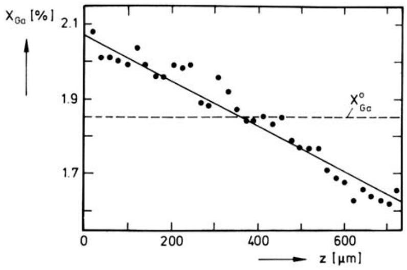
Fig. 5.14. Demixing profile of Ga in $\left(\mathrm{Co}_{1-x} \mathrm{Ga}_{x}\right) \mathrm{O}$ exposed to an oxygen potential gradient $\left(T=1250^{\circ} \mathrm{C}, a_{\mathrm{O}_{2}}^{(1)}=10^{-6}\right.$ (left), $a_{\mathrm{O}_{2}}^{(2)}=10^{-5}$ (right), $\Delta z=725 \mu \mathrm{~m}$, $x_{\mathrm{Ga}}^{0}=1.85 \%, t=38.5 \mathrm{~h}$ ) [64].

YSZ, have different diffusion coefficients (see Sect. 5.3.2) there will be demixing of the electrolyte. However, since cation diffusion is very slow, steadystate demixing will be reached only after rather long times. If, for example, the slowest diffusion coefficient is taken as $D=10^{-18} \mathrm{~m}^{2} \mathrm{~s}^{-1}$, one obtains 15000 years for an electrolyte thickness of 1 mm . However, for a thickness of $10 \mu \mathrm{~m}$ the time to reach the steady state is only 1.5 years which is comparable to the desired operating times of SOFCs.

### 5.5.2 Diffusion in an Electric Potential Gradient

In this section, electro-transport in oxides, i.e. the motion of ions due to an external electric potential gradient, $\nabla \Phi$, will be discussed. As in the previous section, where diffusion in an applied oxygen potential gradient was analyzed, the fluxes of the mobile components $i$ (ions and electronic defects) can be written as a sum of a diffusion and a drift flux, $j_{i}=j_{i}^{\text {diff }}+j_{i}^{\text {drift }}$. In a chemically homogeneous oxide without any gradients in chemical potentials, the diffusion fluxes vanish, and the drift flux can be written as

$$
j_{i}^{\mathrm{drift}}=-L_{i i}\left(\sum_{k} z_{k} \cdot \frac{L_{i k}}{L_{i i}}\right) \cdot F \cdot \nabla \Phi
$$

The sum in parentheses is usually denoted as effective charge, $z_{i, \text { eff }}$. It is identical to the formal charge, $z_{i}$, only if the cross coefficients $L_{i k}(i \neq k)$ are zero and, consequently, the fluxes are independent of each other ${ }^{10}$.

[^8]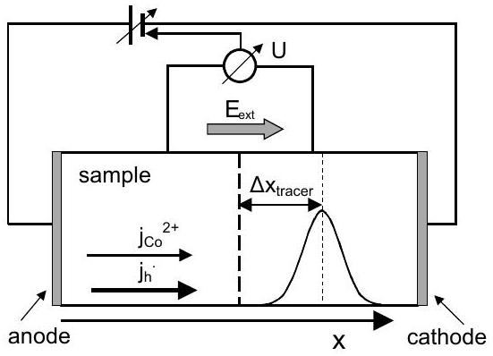
Fig. 5.15. Schematic experimental setup for the measurement of the effective charge in a constant electric potential gradient (sandwich experiment). The Gaussian curve shows the broadening and shift of a tracer concentration profile which has developed from a point source located originally in the middle of the crystal.

The effective charges are thus a measure of the cross coefficients which are again indicating defect-defect interactions. In homogeneous oxides exposed to an electric field, (radioactive) tracers can be used to measure the drift velocities of ions from which their effective charges can be calculated (Sect. 5.5.2). During demixing experiments, however, the oxide becomes chemically inhomogeneous resulting in drift and diffusion fluxes as well. This situation will be discussed in Sect. 5.5.2.

## Tracer Diffusion in an Electric Potential Gradient

Figure 5.15 shows the typical experimental setup which can be used to measure the effective charges, $z_{i, \text { eff }}$, of the host cation A or of impurity cations B in an oxide AO using radioactive tracers, $\mathrm{A}^{*}$ and $\mathrm{B}^{*}$. The tracer source is located between two single crystals of the oxide in a sandwich arrangement, and the electric potential gradient is applied by two reversible electrodes. Diffusional broadening of the tracer source results in a Gaussian profile from which the tracer diffusion coefficient can be obtained. Superimposed is a drift of the tracer concentration profile due to the applied electric field. As shown in detail in [18], the drift velocity of the tracer concentration profile, $v_{\mathrm{A}^{*}}^{\text {drift }}$ or $v_{\mathrm{B}^{*}}^{\text {drift }}$, allows the determination of the effective charges of the corresponding cations, A or B . For self-diffusion, i.e. tracers $\mathrm{A}^{*}$, we obtain

$$
v_{\mathrm{A}^{*}}^{\mathrm{drift}}=\frac{D_{\mathrm{A}}}{R T} \cdot z_{\mathrm{A}, \mathrm{eff}} \cdot F \cdot \nabla \Phi, \quad z_{\mathrm{A}, \mathrm{eff}}=z_{\mathrm{A}}+\frac{L_{\mathrm{Ah}}}{L_{\mathrm{AA}}}
$$

The effective charge of cation $\mathrm{A}, z_{\mathrm{A}, \text { eff }}$, contains the cross coefficient, $L_{\mathrm{Ah}}$, which indicates the flux coupling between cations and electron holes. $z_{\mathrm{A}, \text { eff }}$ is often called 'charge of transport'. For impurity tracer cations, B*, the result is

$$
v_{\mathrm{B}^{*}}^{\mathrm{drrift}}=\frac{D_{\mathrm{B}}}{R T} \cdot z_{\mathrm{B}, \mathrm{eff}} \cdot F \cdot \nabla \Phi, \quad z_{\mathrm{B}, \mathrm{eff}}=z_{\mathrm{B}}+\frac{L_{\mathrm{Bh}}}{L_{\mathrm{BB}}}+\frac{L_{\mathrm{BA}}}{L_{\mathrm{BB}}}
$$

The effective charge of $\mathrm{B}, z_{\mathrm{B}, \text { eff }}$, now contains two cross coefficients, $L_{\mathrm{Bh}}$ and $L_{\mathrm{BA}}$, which indicate flux coupling between B and h and between B and A .

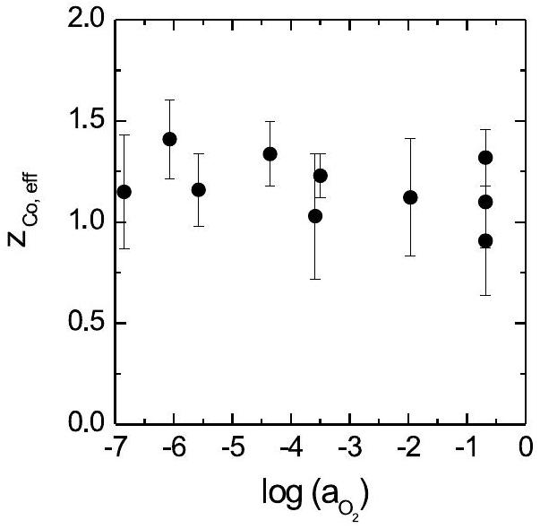
Fig. 5.16. Effective charge of cobalt in $\mathrm{Co}_{1-\delta} \mathrm{O}$ as a function of the oxygen activity at $1100^{\circ} \mathrm{C}$ [18].

Figure 5.16 shows results for the charge of transport of Co in CoO as a function of the oxygen partial pressure [18]. $z_{\text {Co,eff }}$ has a value close to +1 . Since the formal charge of Co in CoO is $z_{\mathrm{Co}}=2$ this result demonstrates clearly that the cross coefficient $L_{\mathrm{Coh}}$ is by no means negligible. The cross effect may be understood in terms of vacancy-electron hole associates, $\mathrm{V}_{\mathrm{Co}}^{\prime \prime}+\mathrm{h}^{\bullet} \rightleftharpoons \mathrm{V}_{\mathrm{Co}}^{\prime}$, and long-range Coulomb interactions between the oppositely charged vacancies and electron holes. Application of the Onsager-Fuoss theory to this system [65] has shown that long-range interactions are of minor significance compared to association reactions. If the lifetime of the associate, $\mathrm{V}_{\text {Co }}^{\prime}$, is long enough to move as an entity, a simple interpretation of the effective charge can be given: in an electric field, $\mathrm{Co}^{2+}$ ions move towards the cathode via lattice site exchange with vacancies. If the vacancy is associated with an electron hole, two positive charges (fixed on the cobalt ion) move towards the cathode and, at the same time, one positive charge (the hole associated with the vacancy) moves in the opposite direction during the exchange step. Thus, the net charge which is moved towards the cathode and which is the only quantity that can be measured is +1 . Additional evidence for vacancy-electron hole associates stems from measurements of the electrical conductivity [66]. The data were modelled by two different electronic conductivity processes, by means of free electron holes and by means of electron holes bound by vacancies. The lifetime of a vacancy-electron hole associate was found to be 20 times larger than the residence time of a free electron hole on a cation site.

The effective charges of the impurities indium and iron are shown in Fig. 5.17. Whereas $z_{\mathrm{Fe}, \mathrm{eff}}$ remains nearly constant with changing oxygen activity with a value of about $+1, z_{\text {In,eff }}$ decreases drastically with changing $a_{\mathrm{O}_{2}}$ and becomes even negative at $a_{\mathrm{O}_{2}}<10^{-4}$. This is equivalent to a reversal of the migration direction in the electric field. In the range of high

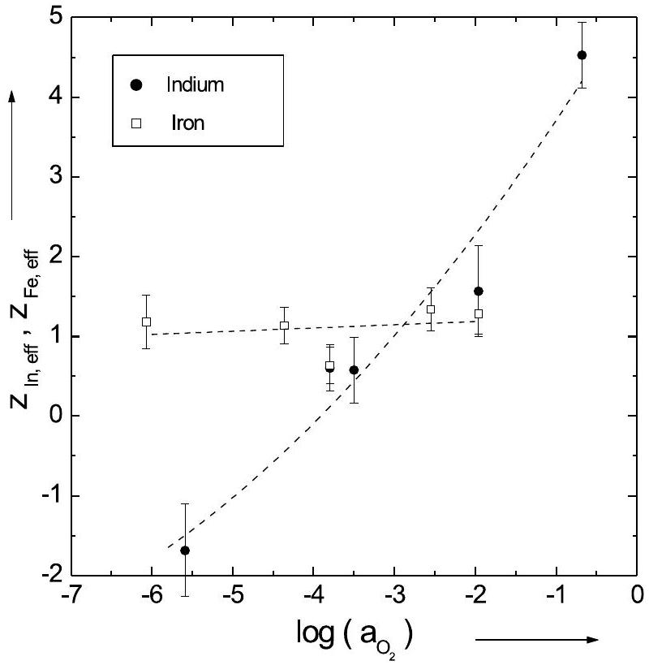
Fig. 5.17. Effective charges of indium and iron in $\mathrm{Co}_{1-\delta} \mathrm{O}$ as a function of the oxygen activity at $1100^{\circ} \mathrm{C}$ [18].

oxygen activities, the indium tracer moves towards the cathode, at low activities it moves towards the anode, and therefore virtually behaves like an anion. If we try to explain the observed behavior in the same way as for the Co ions and assume that the impurity ions move via vacancy-electron hole associates, $\mathrm{V}_{\mathrm{Co}}^{\prime}$ (majority defects), we expect $z_{\mathrm{In}, \mathrm{eff}}=+2$ (with the formal charge $z_{\mathrm{In}}=+3$ ) and $z_{\mathrm{Fe}, \text { eff }}=+2$ or +1 (with $z_{\mathrm{Fe}}=+3$ or +2 , respectively). It is obvious from Fig. 5.17 that the strong decrease of $z_{\mathrm{In}, \mathrm{eff}}$ and the appearance of negative values at low oxygen activities cannot be interpreted in this manner. Furthermore, the experimentally obtained value of $z_{\mathrm{Fe}, \mathrm{eff}} \approx+1$ at high oxygen activities is unexpected, because iron should have a formal charge of about +3 in this region. This means that in (5.44) the second ratio including the cross coefficient $L_{\mathrm{BA}}$ is also important. It is well known that this cross coefficient is due to the formation of impurity-vacancy pairs [22]. If the pair binding energy is strong enough to make the lifetime of the pair much longer than the time required for an individual jump of the impurity ion, the pair moves as an entity and the vacancy drags the impurity cation towards the anode. As a result, we find a negative effective charge, as observed experimentally. A more detailed formal analysis can be found in [67] and [68].

## Demixing in an Electric Potential Gradient

The external electric field can also cause demixing of an initially homogeneous oxide solid solution, e.g. $\left(\mathrm{A}_{1-x} \mathrm{~B}_{x}\right) \mathrm{O}$, if the cations have different mobilities. In semiconducting oxides demixing due to an electric field was found by several authors [69-72]. Demixing processes have important practical implications. Local composition changes can severely alter the physical, chemical and electrical properties and are therefore a source of high temperature degradation of materials in electric fields.

We consider a semiconducting, ternary oxide, $\left(\mathrm{A}_{1-x} \mathrm{~B}_{x}\right)_{1-\delta} \mathrm{O}$, with an immobile oxygen sublattice, where the cations are mobile via a vacancy mechanism. As in the previous section, the external electric field (see Fig. 5.18) causes fluxes of the homovalent cations, $\mathrm{A}^{2+}$ and $\mathrm{B}^{2+}$, and electron holes, $h^{\bullet}$, which are given by (5.40).

At the reversible electrodes the cations are involved in chemical reactions, e.g. at the cathode:

$$
\begin{aligned}
& \mathrm{A}^{2+}+2 \mathrm{e}^{-}(\mathrm{Pt})+\frac{1}{2} \mathrm{O}_{2}(\mathrm{~g}) \rightarrow \mathrm{AO} \\
& \mathrm{~B}^{2+}+2 \mathrm{e}^{-}+\frac{1}{2} \mathrm{O}_{2}(\mathrm{~g}) \rightarrow \mathrm{BO}
\end{aligned}
$$

This means that the oxide grows at the cathode. At the anode the opposite reactions take place, i.e. here the oxide dissociates into cations, electrons and oxygen molecules. Thus, both oxide surfaces move to the cathode side. In the steady state both surfaces and also both cations move with the same velocity, $v$ :

$$
v=\frac{j_{\mathrm{A}^{2+}}}{c_{\mathrm{A}}}=\frac{j_{\mathrm{B}^{2+}}}{c_{\mathrm{B}}} .
$$

Integration of (5.46) over the sample thickness yields

$$
\frac{x_{\mathrm{A}}^{(1)}}{x_{\mathrm{A}}^{(2)}} \cdot \frac{1-x_{\mathrm{A}}^{(2)}}{1-x_{\mathrm{A}}^{(1)}}=\exp \left(\frac{2 F U}{R T} \cdot \frac{\gamma-1}{\gamma}\right)
$$

where $x_{\mathrm{A}}^{(1)}$ and $x_{\mathrm{A}}^{(2)}$ are the unknown molar fractions of A at the oxide surfaces and $U$ is the applied voltage. $\gamma=D_{\mathrm{A}} / D_{\mathrm{B}}$ is a constant, since both

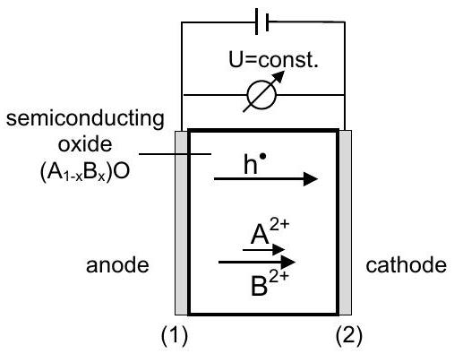
Fig. 5.18. Schematic representation of the fluxes in a mixed oxide ( $\mathrm{A}, \mathrm{B}$ ) O exposed to an electric potential gradient established by Pt -electodes.

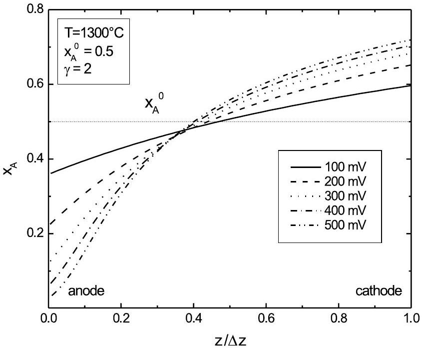
Fig. 5.19. Calculated steady state demixing profiles of component A in a mixed oxide $(\mathrm{A}, \mathrm{B}) \mathrm{O}$ as a function of the applied voltage $U\left(T=1300^{\circ} \mathrm{C}, x_{\mathrm{A}}^{0}=0.5\right.$, $\gamma=D_{\mathrm{A}} / D_{\mathrm{B}}=2$ ) [70].

diffusion coefficients are proportional to the cation vacancy fraction, $x_{\mathrm{V}}$. The concentration profile of A (and $\mathrm{B}, x_{\mathrm{A}}+x_{\mathrm{B}}=1$ ) can be obtained by integration of (5.46) and the overall mass balance for A . Details can be found in [70]. Figure 5.19 shows steady-state demixing profiles calculated in this way for different values of the applied voltage $U$. With increasing voltage the anode-side of the oxide is more and more depleted by the faster component A.

A typical result of a steady-state demixing experiment for $\left(\mathrm{Co}_{1-x} \mathrm{Ni}_{x}\right) \mathrm{O}$ is shown in Fig 5.20. Enrichment of Co near the cathode side of the oxide is found [73], as expected qualitatively due to the higher diffusivity of Co compared to Ni [74]. For a quantitative modelling of the demixing (solid line in Fig. 5.20) one also has to consider the cross terms in the transport coefficient matrix $L_{i j}\left(i, j=\mathrm{A}, \mathrm{B}, \mathrm{h}^{\bullet}\right)$. In particular the cross terms $L_{\mathrm{Ah}}$ and $L_{\mathrm{Bh}}$ are important, as shown in the previous sections. Finally it should be emphasized that the electric current during demixing is mainly conducted by electron holes, because $t_{\mathrm{h}} \cong 1$ and $t_{\text {cation }} \approx 10^{-4}$. Nevertheless, there is a demixing process for the cations as long as they have different mobilities.

Demixing in a heterovalently doped oxide, $\left(\mathrm{A}_{1-x} \mathrm{~B}_{x}\right) \mathrm{O}$, is more complicated. Due to Coulomb interactions between the defects (impurity-vacancy pairs) the cross term $L_{\mathrm{AB}}$ can no longer be neglected and might even determine the complete demixing behavior. An example is Ga-doped CoO, $\left(\mathrm{Co}_{1-x} \mathrm{Ga}_{x}\right) \mathrm{O}$, in which $\mathrm{Ga}_{\mathrm{Co}}$ and $\mathrm{V}_{\mathrm{A}}^{\prime \prime}$ form impurity-vacancy pairs, $\left\{\mathrm{Ga}_{\mathrm{Co}}, \mathrm{V}_{\mathrm{Co}}^{\prime \prime}\right\}^{\prime}$ [21]. These pairs have a negative excess charge and move to-

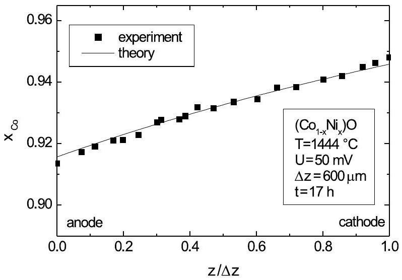
Fig. 5.20. Steady state demixing profile of Co in $\left(\mathrm{Ni}_{1-x} \mathrm{Co}_{x}\right) \mathrm{O}\left(T=1444^{\circ} \mathrm{C}\right.$, $\left.x_{\mathrm{A}}^{0}=0.932, \Delta z=600 \mu \mathrm{~m}, t=17 \mathrm{~h}\right) ;$ experiment; - theory.

wards the anode. Thus Ga is enriched at the anode side, independent of the ratio of the diffusion coefficients of Co and Ga [71].

### 5.6 Conclusion

In this chapter we have outlined the basics of diffusion processes in oxides. We have started in Sect. 5.2 with the so-called defect chemistry which describes all defect formation processes by quasi-chemical reactions and the corresponding equilibria. In this way, a quantitative calculation of the defect fractions in an oxide as a function of the intensive thermodynamic variables temperature, $T$, and oxygen partial pressure, $p_{\mathrm{O}_{2}}$, is possible. The most important reaction is the incorporation of oxygen into the oxide which results in the formation of a non-stoichiometric oxide, either with oxygen excess or oxygen deficit. In the most simple cases, we obtain typical regimes in the $p_{\mathrm{O}_{2}}$-dependence of the defect fractions. In each regime only two oppositely charged defects dominate which exhibit a power-law dependence on $p_{\mathrm{O}_{2}}$ with a typical exponent (Kröger-Vink-diagram, see Fig. 5.4).

In Sect. 5.3, the basic diffusion processes in oxides, vacancy diffusion and interstitial diffusion, have been considered. Self-diffusion and impurity diffusion were discussed for oxides with dominating cation disorder and for oxides with dominating oxygen disorder. Special emphasis was put on the role of defect-defect interactions, such as the formation of impurity-vacancy pairs. Chemical diffusion was treated in Sect. 5.4, and in Sect. 5.5 diffusion in oxides exposed to external forces was analysed. In particular the latter section shows that - apart from a fundamental interest - diffusion in oxides is of great practical importance, e.g. for long-term degradation processes of oxides in technical applications, such as fuel cells, sensors etc..

Finally it should be mentioned that several important topics concerning diffusion in oxides could not be discussed in detail in this chapter. Some of them are:

Creep of oxides: Mass transport in oxides due to mechanical forces is determined by the slowest moving species, which are the oxygen ions in oxides with cation disorder and the cations in oxides with oxygen disorder. Thus, measurements of the creep rate as a function of stress provide not only data on the mechanical strength of an oxide but they yield also information on the diffusivities of the minority defects (see e.g. [31]).

Solid state reactions between oxides: The formation of ternary oxides, for example the spinel formation $\mathrm{MgO}+\mathrm{Al}_{2} \mathrm{O}_{3} \rightarrow \mathrm{MgAl}_{2} \mathrm{O}_{4}$, proceeds by counter-diffusion of $\mathrm{Mg}^{2+}$ and $\mathrm{Al}^{3+}$ through the spinel $\mathrm{MgAl}_{2} \mathrm{O}_{4}$ resulting in parabolic growth laws for the thickness of the spinel layer, $\Delta x(t)=\left(2 k_{\mathrm{p}} t\right)^{1 / 2}$. The parabolic rate constant, $k_{\mathrm{p}}$, is a function of the diffusion coefficients of both cations [75].

Oxidation of metals: Diffusion controlled growth of an oxide layer on a metal is determined by ambipolar diffusion of cations and/or oxygen anions and electronic defects through the oxide. As shown by Wagner [45], the growth rate of the oxide layer is also determined by a parabolic rate law, where the parabolic rate constant, $k_{\mathrm{p}}$, is given as a function of the diffusion coefficients of cations and anions and the electronic transference number. If the oxide is anisotropic the parabolic rate constant depends on the orientation of the oxide relative to the metal substrate. This case was found in a recent investigation on the oxidation of the intermetallic, ordered compound CoGa $[76,77]$ where only Ga is oxidised and $\beta$ - $\mathrm{Ga}_{2} \mathrm{O}_{3}$ is formed.

### 5.7 Appendix

We consider a binary oxide $\mathrm{A}_{1-\delta} \mathrm{O}$ with cation disorder. Using $x_{\mathrm{A}}+x_{\mathrm{V}}=1$, the thermodynamic factor $\partial \ln a_{\mathrm{A}} / \partial \ln x_{\mathrm{A}}$ can be rewritten as:

$$
\frac{\partial \ln a_{\mathrm{A}}}{\partial \ln x_{\mathrm{A}}}=-x_{\mathrm{A}} \cdot \frac{\partial \ln a_{\mathrm{A}}}{\partial x_{\mathrm{V}}}
$$

Considering the equilibrium for the reaction $\mathrm{A}+\frac{1}{2} \mathrm{O}_{2} \rightleftharpoons \mathrm{AO}, K=1 /\left(a_{\mathrm{A}}\right.$. $\left.a_{\mathrm{O}_{2}}^{1 / 2}\right)$, the activity $a_{\mathrm{A}}$ can be expressed in terms of $a_{\mathrm{O}_{2}}$ :

$$
\frac{\partial \ln a_{\mathrm{A}}}{\partial \ln x_{\mathrm{A}}}=\frac{1}{2} \cdot \frac{x_{\mathrm{A}}}{x_{\mathrm{V}}} \cdot \frac{\partial \ln a_{\mathrm{O}_{2}}}{\partial \ln x_{\mathrm{V}}}
$$

As shown in Sect. 5.2.1, the vacancy fraction shows a simple power law dependence on $a_{\mathrm{O}_{2}}, x_{\mathrm{V}}=$ const $\cdot\left(a_{\mathrm{O}_{2}}\right)^{1 / m}$, where $m$ is the typical exponent for the dominating disorder type. For differently charged cation vacancies, $\mathrm{V}_{\mathrm{A}}^{\alpha^{\prime}}$, $m$ is given by $m=2+2 \alpha$, resulting in

$$
\frac{\partial \ln a_{\mathrm{A}}}{\partial \ln x_{\mathrm{A}}}=\frac{1}{2} \cdot \frac{x_{\mathrm{A}}}{x_{\mathrm{V}}} \cdot(2+2 \alpha)
$$

With this expression for the thermodynamic factor, the chemical diffusion coefficient $\tilde{D}$ in (5.30) can be written as

$$
\tilde{D}=\frac{D_{\mathrm{A}} \cdot x_{\mathrm{A}}}{x_{\mathrm{V}}} \cdot t_{\mathrm{el}} \cdot(1+\alpha)
$$

Finally, we use the jump balance, $D_{\mathrm{A}} x_{\mathrm{A}}=D_{\mathrm{V}} x_{\mathrm{V}}$, and obtain

$$
\tilde{D}=D_{\mathrm{V}} \cdot(1+\alpha) \cdot t_{\mathrm{el}}
$$

If $t_{\mathrm{el}}=1$ this expression simplifies to (5.31).

## Notation

$a_{i} \quad$ chemical activity of component $i$
$a_{\mathrm{O}_{2}} \quad$ chemical activity of oxygen
A metal A in the binary oxide AO or the ternary oxide $(\mathrm{A}, \mathrm{B}) \mathrm{O}$
$A_{\text {res }}$ residual activity
$A_{\text {sect }}$ activity during sectioning
B metal B in the ternary oxide $(\mathrm{A}, \mathrm{B}) \mathrm{O}$
$c_{i} \quad$ concentration of species $i$
$D_{i} \quad$ diffusion coefficient of species $i$
$D_{\text {A }}$ self-diffusion coefficient of A
$D_{\mathrm{A}_{\mathrm{i}}}$ interstitial self-diffusion coefficient
$D_{\mathrm{V}}$ vacancy self-diffusion coefficient
$\tilde{D}$ chemical diffusion coefficient
e $^{\prime}$ electron
$f_{0}$ geometrical correlation factor
$f_{\mathrm{B}} \quad$ impurity correlation factor
$F \quad$ Faraday constant
$\mathrm{h}^{\bullet}$ electron hole
$j_{i} \quad$ diffusion flux of species $i$
$k$ surface exchange coefficient
$k_{\mathrm{B}} \quad$ Boltzmann constant
$K$ equilibrium constant
$L_{i j}$ transport coefficient
$p$ pressure
$p_{\mathrm{O}_{2}}$ oxygen partial pressure
$p_{\mathrm{O}_{2}}^{*}$ oxygen partial pressure at the stoichiometric point ( $\delta=0$ )
$R$ universal gas constant
$\mathrm{S}_{\mathrm{p}}^{q} \quad$ structure element with excess charge $q$ in sublattice p
$t$ time
$T \quad$ temperature
$t_{\text {el }} \quad$ electronic transference number
$V_{\mathrm{m}}$ molar volume
$x$ position
$x_{i} \quad$ molar fraction of species $i$ (identical to $[i]$ )
$z$ position in the moving reference frame
$z_{i} \quad$ formal charge of species $i$
$z_{i, \text { eff }}$ effective charge of species $i$
$\delta$ non-stoichiometry of the oxide $\mathrm{A}_{1-\delta} \mathrm{O}$
$\eta_{i} \quad$ electrochemical potential of species $i$
$\mu_{i} \quad$ chemical potential of species $i$
$\mu_{\mathrm{O}_{2}} \quad$ chemical potential of oxygen
$\sigma$ electrical conductivity
$\Phi \quad$ electrical potential
$\omega_{i}$ jump rate of a vacancy in jump of type $i$

## References

1. H. Schmalzried: Solid State Reactions (VCH, Weinheim 1981)
2. H. Schmalzried: Chemical Kinetics of Solids (VCH, Weinheim 1995)
3. J. Philibert: Atom Movements - Diffusion and Mass Transport in Solids (Les Editions de Physique, Les Ulis 1991)
4. P. Kofstad: Nonstoichiometry, Diffusion and Electrical Conductivity in Binary Oxides (Wiley, New York 1972)
5. A.R. Allnatt, A.B. Lidiard: Atomic Transport in Solids (Cambridge University Press, Cambridge 1993)
6. Diffusion in Materials, ed by A.L. Laskar, J.L. Bocquet, G. Brebec, C. Monty (Kluwer Academic Publishers, Dordrecht 1990)
7. C. Wagner, W. Schottky: Z. Phys. Chem. B11, 163 (1930)
8. J. Frenkel: Z. Physik 53, 652 (1926)
9. F.A. Kröger: Chemistry of Imperfect Crystals (North-Holland, Amsterdam 1964)
10. R. Dieckmann, H. Schmalzried: Ber. Bunsenges. Phys. Chem. 81, 344 (1977)
11. R. Subramanian, S. Tinkler, R. Dieckmann: J. Phys. Chem. Solids 5, 69 (1994)
12. F.-H. Lu, S. Tinkler, R. Dieckmann: Solid State Ionics 62, 39 (1993)
13. J.-H. Lee, M. Martin, H.-I. Yoo: J. Phys. Chem. Solids 61, 1597 (2000)
14. M.L. Volpe, J. Reddy: J. Chem. Phys. 53, 1117 (1970)
15. R.A. Perkins, R.A. Rapp: Metall. Transact. 4, 193 (1973)
16. H. Boussetta, C. Monty: J. Phys. Chem. Solids 49, 369 (1988)
17. R. Dieckmann: Z. Phys. Chem. NF 107, 189 (1977)
18. M. Schroeder, M. Martin: Z. Phys. Chem. 207, 1 (1998)
19. M. Martin, S. Dorris: Ber. Bunsenges. Phys. Chem. 91, 779 (1987)
20. M. Martin: Mat. Sci. Rep. 7, 1 (1991)
21. R. Schmackpfeffer, M. Martin: Phil. Mag. A 68, 747 (1993)
22. A.R. Allnatt, A.B. Lidiard: Rep. Prog. Phys. 50, 373 (1987)
23. R.W. Grimes, S.P. Chen: J. Phys. Chem. Solids 61, 1263 (2000)
24. J. Janek, M. Martin, H.-I. Yoo: Ber. Bunsenges. Phys. Chem. 98, 655 (1994)
25. Secondary Ion Mass Spectrometry: Principles and Applications, ed by J.C. Vickerman, A. Brown, N.M. Reed (Clarendon Press, Oxford 1989)
26. J. Crank: The Mathematics of Diffusion (Oxford University Press, Oxford 1975)
27. P. Fielitz, G. Borchardt: Solid State Ionics 144, 71 (2001)
28. R.A. De Souza, J.A. Kilner: Solid State Ionics 106, 175 (1998)
29. T. Ishigaki, S. Yamaushi, K. Kishio, J. Mizusaki, K. Fueki: J. Solid State Chem. 73, 179 (1988)
30. Yet-Ming Chiang, Dunbar Bernie III, W.D. Kingery: Physical Ceramics, Chap. 5 (Wiley, New York 1977)
31. J.L. Routbort, K.C. Goretta, R.E. Cook, J. Wolfenstine: Solid State Ionics 129, 53 (2000)
32. M. Weller: Z. Metallk. 84, 381 (1993)
33. A. Hammou, J. Guindet. In: The CRC Handbook of Solid State Electrochemistry, ed by P.J. Gellings, H.J.M. Bouwmeester (CRC Press, Boca Raton 1996) p 407
34. S.P.S. Badwal: Solid State Ionics 52, 23 (1992)
35. P.S. Manning, J.D. Sirman, R.A. De Souza, J.A. Kilner: Solid State Ionics 100, 107 (1997)
36. H. Solmon, J. Chaumont, C. Dolin, C. Monty: Ceram. Trans. 24, 175 (1991)
37. M. Kilo, G. Borchardt, S. Weber, S. Scherrer, K. Tinschert: Ber. Bunsenges. Phys. Chem. 101, 1361 (1997)
38. M. Kilo, G. Borchardt, B. Lesage, S. Weber, S. Scherrer, M. Martin, M. Schroeder. In: SOFC-VII, PV 2001-16, ed by H. Yokokawa, S.C. Singhal (The Electrochemical Society Proceedings Series, Pennington NJ 2001) p 275
39. B.C.H. Steele: J. Materials Sci. 36, 1053 (2001)
40. T. Ishihara, J.A. Kilner, M. Honda: Solid State Ionics 113-115, 593 (1998)
41. O. Schulz, M. Martin, C. Argirusis, G. Borchardt: Phys. Chem. Chem. Phys. 5, 2308 (2003)
42. O. Schulz, S. Flege, M. Martin. In: SOFC-VIII, PV 2003-07, ed by S.C. Singhal, M. Dokiya (The Electrochemical Society Proceedings Series, Pennington NJ 2003) p 304
43. R.A. De Souza, J. Maier: Phys. Chem. Chem. Phys. 5, 740 (2003)
44. S.R. de Groot, P. Mazur: Non-Equilibrium Thermodynamics (North-Holland, Amsterdam 1962)
45. C. Wagner: Z. Phys. Chem. B 21, 25 (1933)
46. F. Morin, R. Dieckmann: J. Phys. Chem. Solids 51, 283 (1990)
47. A. Belzner, T.M. Gür, R.A. Huggins: Solid State Ionics 57, 327 (1992)
48. I. Yasuda, M. Hishinuma: Solid State Ionics 80, 141 (1995)
49. C.-R. Song, H.-I. Yoo: Solid State Ionics 124, 289 (1999)
50. I. Denk, U. Traub, F. Noll, J. Maier: Ber. Bunsenges. Phys. Chem. 99, 798 (1995)
51. The CRC Handbook of Solid State Electrochemistry, ed by P.J. Gellings, H.J.M. Bouwmeester (CRC Press, Boca Raton 1996)
52. M. Martin, H. Schmalzried: Ber. Bunsenges. Phys. Chem. 89, 124 (1985)
53. M. Martin: Z. Physik. Chem. NF 162, 245 (1989)
54. S. Dorris, M. Martin: Ber. Bunsenges. Phys. Chem. 94, 721 (1990)
55. N.L. Peterson, W.K. Chen, D. Wolf: J. Phys. Chem. Solids 41, 709 (1980)
56. K.D. Becker, V. von Wurmb: Z. Phys. Chem. NF 149, 77 (1986)
57. M. Martin: Ber. Bunsenges. Phys. Chem. 91, 772 (1987)
58. K. Hoshino, N. Peterson: J. Phys. Chem. Solids 46, 229 (1987)
59. H. Schmalzried, W. Laqua, P.L. Lin: Z. Naturforsch. 34a, 192 (1979)
60. H. Schmalzried, W. Laqua: Oxid. Met. 15, 339 (1981)
61. J.-O. Hong, O. Teller, M. Martin, H.-I. Yoo: Solid State Ionics 123, 75 (1999)
62. G. Petot-Ervas, C.J. Petot: J. Phys. Chem. Solids 51, 9016 (1990)
63. M. Martin: Ceramic Transactions 24, 91 (1991)
64. M. Martin, R. Schmackpfeffer: Solid State Ionics 72, 67 (1994)
65. J. Janek, M. Martin: Ber. Bunsenges. Phys. Chem. 98, 665 (1994)
66. F. Lange, M. Martin: Ber. Bunsenges. Phys. Chem. 101, 1 (1997)
67. M. Schroeder, M. Martin: Defect and Diffusion Forum 143-147, 1683 (1997)
68. M. Schoeder, J.-H. Lee, M. Martin: Solid State Ionics 101-103, 403 (1997)
69. D. Monceau. M. Filal, M. Tebtoub, C. Petot, G. Petot-Ervas: Solid State Ionics 73, 21 (1994)
70. O. Teller, M. Martin: Solid State Ionics 101-103, 475 (1997)
71. O. Teller, M. Martin: Ber. Bunsenges. Phys. Chem. 101, 1377 (1997)
72. J.-O. Hong, H.-I. Yoo: Solid State Ionics 113-115, 265 (1998)
73. M. Martin: Solid State Ionics 136-137, 331 (2000)
74. W.K. Chen, N.L. Peterson: J. Phys. Chem. Solids 34, 1093 (1973)
75. C. Wagner: Z. Anorg. Allg. Chem. 236, 320 (1938)
76. U. Koops, D. Hesse, M. Martin: J. Mater. Res. 17, 2489 (2002)
77. U. Koops, M. Martin: Z. Anorg. Allg. Chem. 629, 1688 (2003)

[^0]:    ${ }^{1}$ The temperature dependence of the equilibrium constants is given by $K= \exp \left(-\Delta G^{0} / R T\right)=\exp \left(\Delta S^{0} / R\right) \cdot \exp \left(-\Delta H^{0} / R T\right)$, where $\Delta G^{0}, \Delta S^{0}$ and $\Delta H^{0}$ are the standard Gibbs energy, entropy and enthalpy of the corresponding quasichemical reaction.

[^1]:    ${ }^{2}$ Here we have assumed that the fractions of the electronic defects are small compared to the fractions of the Frenkel defects. The opposite case, dominating electronic disorder, will not be considered.

[^2]:    ${ }^{3} f_{0}$ is the geometrical correlation factor appearing in tracer diffusion (see Sect. 1.3.1 in Chap. 1).

[^3]:    ${ }^{4}$ The charge of transport will be discussed in more detail in Sect. 5.5.2

[^4]:    ${ }^{5}$ For neutral particles ( $z_{i}=0$ ) the driving force for mass transport is the gradient of the chemical potential, as already discussed for metals in Sect. 1.3.2 of Chap. 1.
    ${ }^{6}$ Cross coefficients $L_{i j}$ are neglected in this section but will be considered in Sect. 5.5.

[^5]:    ${ }^{7}$ The (driven) motion of the slower cations is, however, a possible origin of long-term degradation processes, such as creep or kinetic demixing (see also Sect. 5.5.1).

[^6]:    ${ }^{8}$ Since oxygen is essentially immobile, the laboratory reference frame is identical to the lattice reference frame.

[^7]:    ${ }^{9}$ The dependence of the impurity diffusion coefficient and the impurity correlation factor on the exchange ratees $\omega_{i}$ can be found in Sect. 1.9.1 in Chap. 1, the expression for $\beta$ in [19], and the relation for the impurity-vacancy binding energy is given by $\omega_{4} / \omega_{3}=\exp \left(-\Delta g_{\text {pair }} / k_{\mathrm{B}} T\right)$.

[^8]:    ${ }^{10}$ In metals, the effective charge is frequently denoted by the symbol $z_{i}^{*}$.

