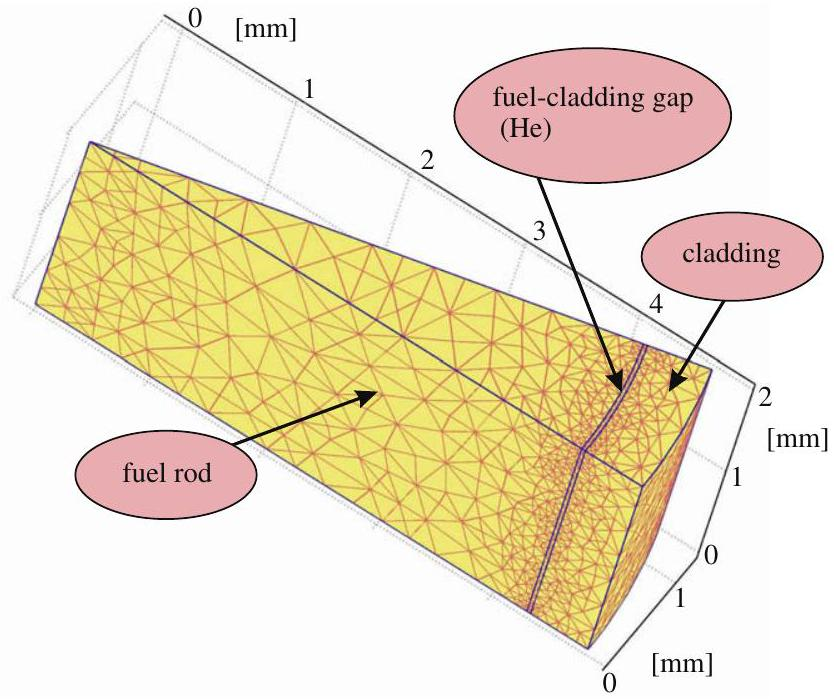
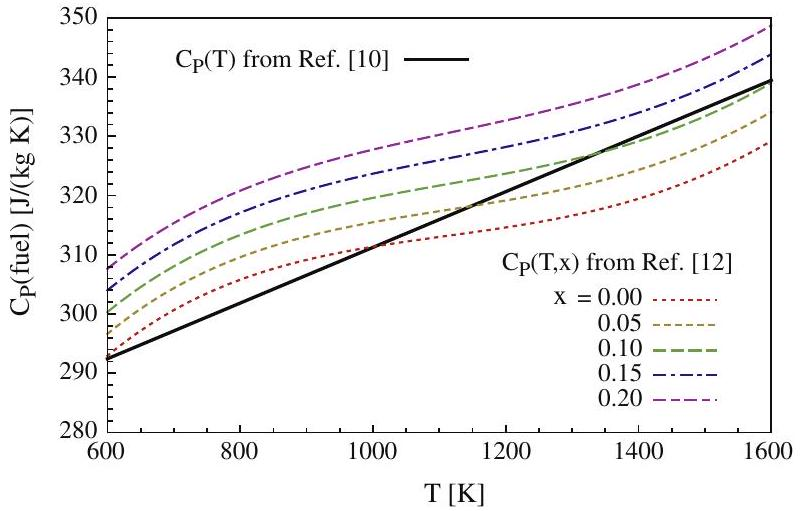
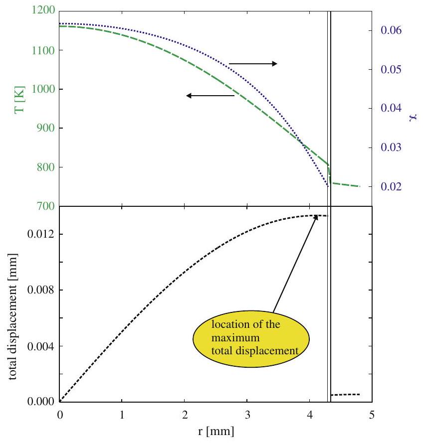
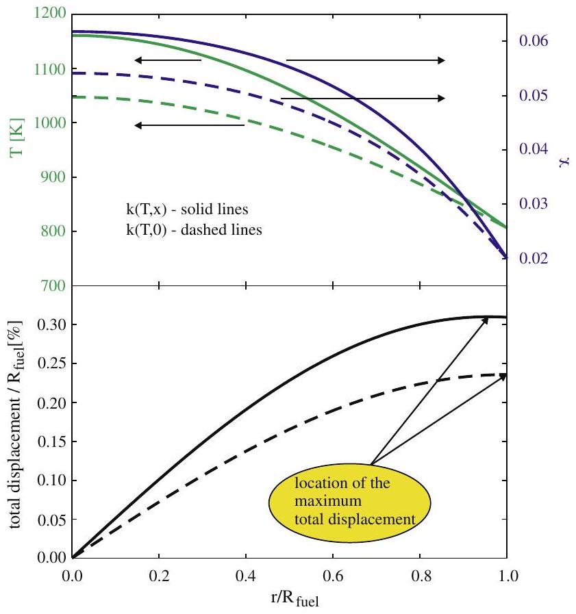
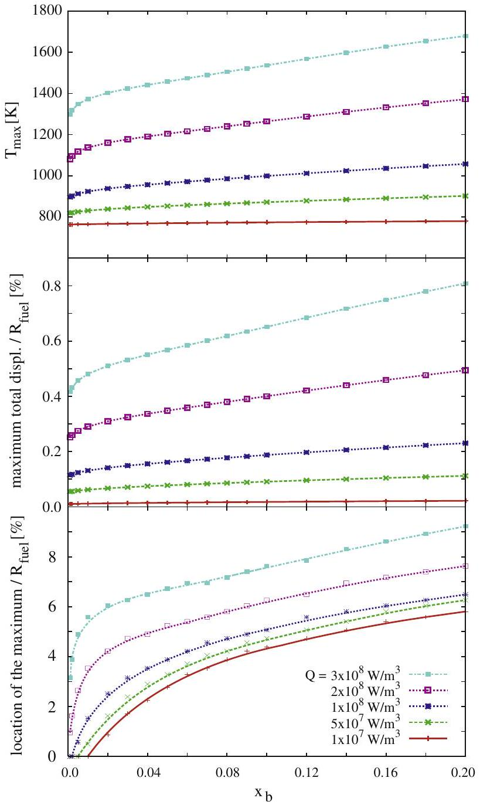
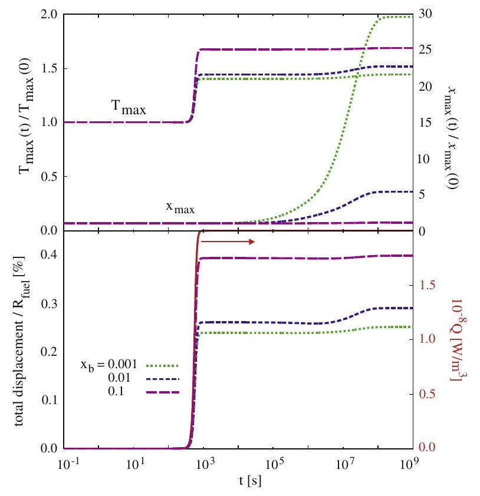
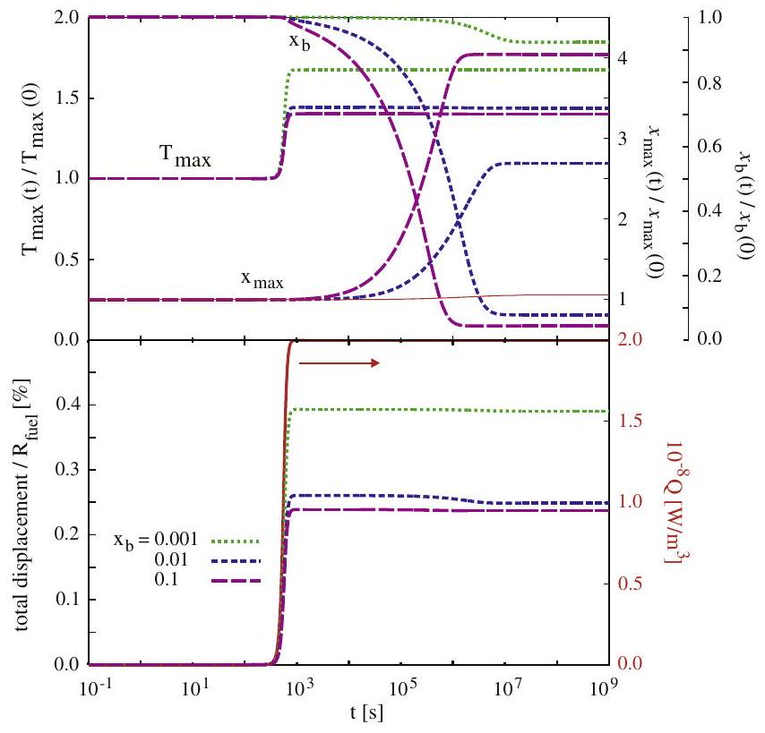
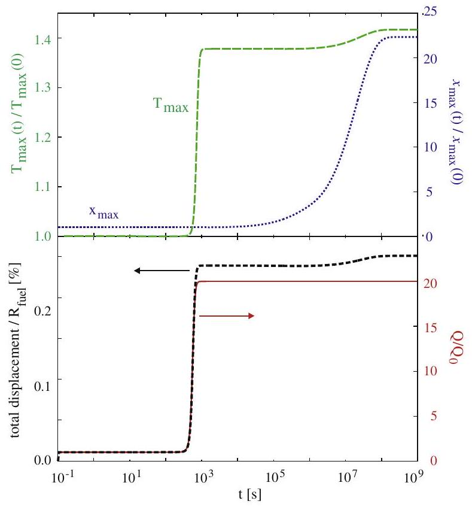
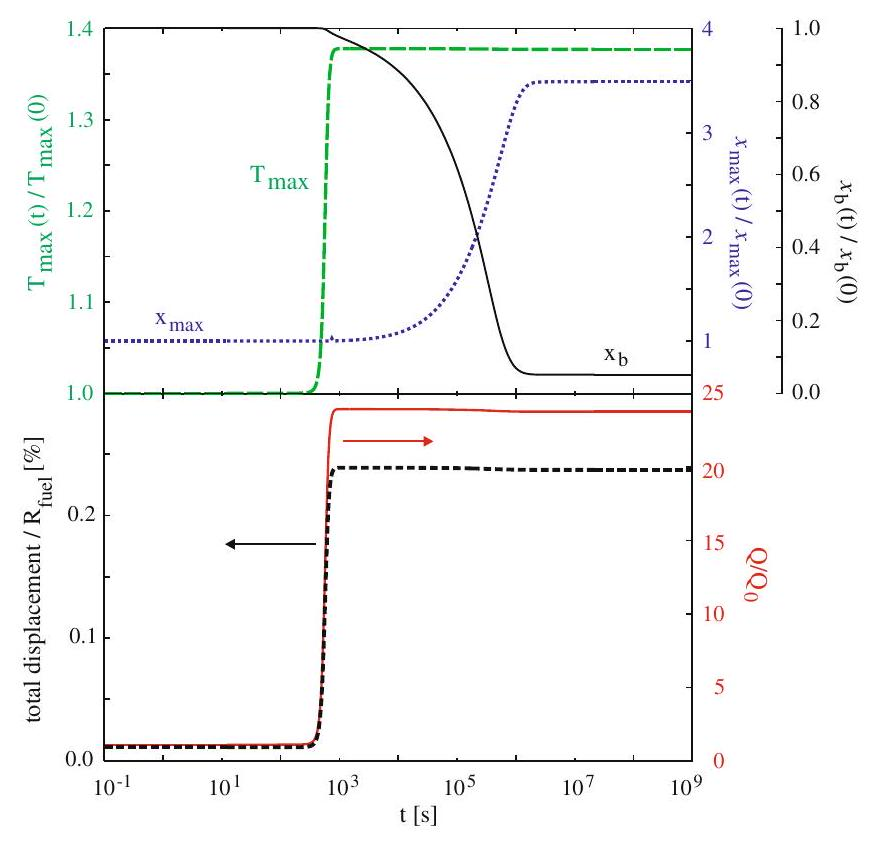
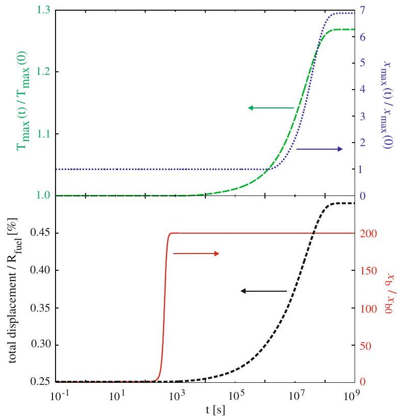

# Simulations of coupled heat transport, oxygen diffusion, and thermal expansion in $\mathrm{UO}_{2}$ nuclear fuel elements 

Bogdan Mihaila ${ }^{\mathrm{a}, *}$, Marius Stan ${ }^{\mathrm{a}}$, Juan Ramirez ${ }^{\mathrm{b}}$, Alek Zubelewicz ${ }^{\mathrm{a}}$, Petrica Cristea ${ }^{\mathrm{c}}$ ${ }^{\mathrm{a}}$ Los Alamos National Laboratory, Los Alamos, NM 87545, USA ${ }^{\mathrm{b}}$ Exponent Inc., Lisle, IL 60532, USA ${ }^{\mathrm{c}}$ University of Bucharest, Faculty of Physics, Bucharest-Magurele MG 11, Romania

## ARTICLE INFO

## Article history:

Received 22 June 2009
Accepted 9 September 2009

PACS:
28.41.Ak
44.10.+i
66.10.Cb

#### Abstract

We study the coupled thermal transport, oxygen diffusion, and thermal expansion of a typical nuclear fuel element consisting of $\mathrm{UO}_{2+x}$ fuel and stainless-steel cladding. Models of thermal, mechanical and chemical properties of the materials are used in a series of finite-element simulations to study the effect of the coupled phenomena on the temperature profile, oxygen distribution and radial deformation of the fuel element. The simulations include steady-state and time-dependent regimes in a variety of initialand boundary value conditions that include sudden changes in the power density, variable oxygen content in the atmosphere, and variable temperature of the coolant. The study reveals the difference in the characteristic times associated with these phenomena and the importance of performing coupled simulations.

© 2009 Elsevier B.V. All rights reserved.

## 1. Introduction

Understanding the evolving properties of nuclear fuels and predicting the behavior of nuclear fuel elements (ceramic fuel pellets or metallic fuel rods) are major challenges for fuel manufacturing, performance, and storage. For example, sintering of ceramic fuel pellets requires a strict control of composition, thermal treatment, pressure, and atmosphere [1]. Similar issues impact the casting of metallic fuel rods [2] and the manufacturing of pebble fuels. The large number of control parameters and the uncertainty associated with them leads often to challenging problems that can be addressed by a close integration of experimental, theoretical, and computational work [3].

Once in the reactor, the fuels and structural materials (pressure vessels, pipes, ducts, etc.) are subjected to severe radiation environments that change their thermo-mechanical properties [4]. For instance, ceramic fuels exhibit radial and angular cracks and the severity of such structural damages increases with burn-up [5]. Among the main causes responsible for the deterioration of structural damage leading to a decrease in thermal conductivity are fission product migration and gas bubbles accumulation.

When multi-component systems experience significant temperature gradients, the constituents are thermally driven apart by Fickian diffusion mechanisms. Simultaneously, gradients in the concentration of constituent components build up and drive

[^0]the diffusion through a distinct mechanism known as the Soret effect [6,7]. As a result, the microstructural properties evolve with position and time, sometimes producing severe changes in measurable macroscopic properties, such as thermal conductivity [8,9], or thermal expansion coefficients. This intricate scenario was confirmed by recent simulations of heat transport coupled with oxygen diffusion in typical $\mathrm{UO}_{2}$ fuel elements [ 10,11 ] as well as in CANDU reactors [12-14].

Recent reviews of fuel performance codes [15,16] demonstrate that extrapolating materials properties to high burn-up values is a challenging task. Predicting the thermal, mechanical and chemical phenomena in the fuel element is even more challenging. In this study we demonstrate that coupling heat transport, oxygen diffusion, and thermal expansion in a fuel pellet can provide insight into the main mechanisms that cause fuel damage. This is a complex computational task that involves a detailed knowledge of $\mathrm{UO}_{2}$ thermochemistry [4,17,18].

## 2. Computational set up

We focus on studying a simple schematic model aimed at elucidating general aspects of fuel behavior linked to the transport of the oxygen in the fuel element. The simulation domain consists of a cylindrical $\mathrm{UO}_{2+x}$ fuel pellet and steel cladding separated by a helium gap, as depicted in Fig. 1. In this "typical" fuel element, the pellet radius is $R_{\text {fuel }}=4.3 \mathrm{~mm}$, the helium gap width is 0.03 mm , and the cladding thickness is 0.5 mm . In this fuel element we solve for the coupled equations describing thermal expansion

Fig. 1. Geometry of the fuel element (urania pellet, helium gap and steel cladding) for the simulations presented in this paper. While our simulation capability is ready to handle multidimensional effects, the simulations presented in this paper are essentially one-dimensional simulations.

of the fuel pellet and steel cladding, heat transport, and oxygen diffusion. The domain shown in Fig. 1, is azimuthally symmetric, and therefore all simulations reported here are effectively one-dimensional (all gradients occur in the radial direction only). Nevertheless, we set up the simulations in a three-dimensional domain as a preview of future studies which will include multidimensional effects. Assuming that the heat generated by fission reactions in the fuel is uniformly distributed, a constant, volumetric source term, $Q$, is added to the heat transfer equation:

$$
\rho C_{p} \frac{\partial T}{\partial t}=\nabla \cdot(k \cdot \nabla T)+Q,
$$

where $\rho, C_{P}$ and $k$ are the density, specific heat at constant pressure and thermal conductivity, respectively. The models of the thermal conductivity, $k(T, x)$, and the heat capacity, $C_{P}(T, x)$, include dependence on the deviation from stoichiometry, $x$, in $\mathrm{UO}_{2+x}$.

Eq. (1) is coupled with the equation describing the diffusion of oxygen in the fuel pellet:

$$
\frac{n}{2} \frac{\partial x}{\partial t}=-\nabla \cdot J,
$$

Here, $n$ is the concentration of oxygen sites and the oxygen flux $J$ is given by [19,20]

$$
J=-\frac{n}{2} D(T, x) \cdot\left[\nabla x+\frac{x}{F(T, x)} \frac{Q}{R T^{2}} \nabla T\right],
$$

where $D(T, x)$ is the oxygen diffusivity in the fuel, $F(T, x)$ is the thermodynamic factor, $Q^{*}$ is the heat of transport of oxygen, and $R$ is the universal gas constant. In the parenthesis of Eq. (3), the first term is associated with the conventional Fickian diffusion, whereas the second term represents the Soret effect which accounts for the oxygen diffusion driven by the temperature gradient [6,7].

The predictive power of these simulations depends on the accuracy of solving self-consistently the system of coupled Eqs. (1)-(3) for temperature, non-stoichiometry, and thermal expansion profiles, and the uncertainty associated with the models of $\mathrm{UO}_{2+x}$ properties (i.e. the specific heat $C_{P}(T, x)$, the thermodynamic factor of oxygen $F(T, x)$, the thermal expansion coefficient $k(T, x)$ and the oxygen diffusivity in urania, $D(T, x)$. Developing models of these properties as functions of temperature and oxygen content, proves to be a challenging task, because in a nuclear reactor environment
strong irradiation induces complex defect species, microstructural changes, and the properties evolve with time.

In this work, the properties of the materials in the fuel element were obtained from previously published correlations or from analysis of previously published data, and are summarized in Table 1. A few comments regarding our choice of parameters for $\mathrm{UO}_{2+x}$ are in order: (i) First, we note that the expression for the heat of transport of oxygen, $Q^{*}$, was obtained by fitting experimental data from Ref. [19] for mixed fuels instead of $\mathrm{UO}_{2+x}$. However, in the absence of data for $\mathrm{UO}_{2+x}$, this should be acceptable because $Q^{*}$ depends only weekly on the plutonium content, as seen from Fig. 1in Ref. [19]. (ii) Second, we note that the temperature-dependence of the density and thermal expansion of $\mathrm{UO}_{2+x}$ in Table 1 do not include an explicit composition dependence [21,22] in accordance with the work of Martin [22], which suggests that there is little difference for these properties between stoichiometric and hyper-stoichiometric fuel. (iii) and, finally, we note that in contrast with our previous work [10] where the specific heat of $\mathrm{UO}_{2}$ was calculated in the temperature domain $600-1600 \mathrm{~K}$ based on a linear interpolation of the experimental data evaluated in SGTE and JANAF tables, i.e.

$$
C_{p}\left(\mathrm{UO}_{2}\right)=264.256+0.047 T[\mathrm{~J} /(\mathrm{kg} \mathrm{~K})],
$$

in this work we employ the composition-dependent model put forward in Ref. [12]. A comparison of the two models for the temperature and stoichiometry domains of interest here is depicted in Fig. 2. We emphasize that the results of all transient simulations presented next are insensitive to the choice of heat capacity model for $\mathrm{UO}_{2+x}$, and therefore we conclude that the stoichiometry effects of the $\mathrm{UO}_{2+x}$ heat capacity are not important and may be neglected, at least as our simulation scenarios are concerned.

With respect to the steel cladding material properties, in this paper we use a 316 grade stainless-steel cladding material instead of the 347 grade stainless-steel cladding used in Ref. [10]. This change was made for convenience, based on our ability to compile a consistent set of material properties for a cladding made of 316 grade austenitic stainless-steel based on the data readily available in the literature.

It is important to note that although both urania and plutonia adopt the same fluorite structure, plutonium oxide tends to be hypo-stoichiometric $\mathrm{PuO}_{2-x}$, while uranium oxides are most often hyper-stoichiometric $\left(\mathrm{UO}_{2+\alpha}\right)$. More remarkably, urania exhibits a negative heat of transport of oxygen [30]. Therefore, in urania the oxygen ions will migrate from the regions of low temperature to the regions of high temperature, leading to an increase in oxygen concentration close to the center of the fuel pellet. This effect is clearly seen from Eq. (3) which shows that the oxygen flux vanishes for steady-state conditions. Under this constraint, in materials with negative heat of transport, $Q^{*}$, the gradient of oxygen concentration follows the temperature gradient. This is the opposite of what occurs in a material with positive $Q^{*}$, such as hypostoichiometric $\mathrm{PuO}_{2-x}$ [31], in which the oxygen atoms migrate from the hot to the cold regions.

## 3. Results and discussions

In the following, we report results for both steady-state and time-dependent simulations corresponding to the fuel element described in Fig. 1. Solutions of the structural mechanics problem in the fuel and cladding are obtained self-consistently by solving for the temperature ( $T$ ) distribution within the fuel, helium gap and steel cladding, and by solving for the oxygen non-stoichiometry $(x)$ profile within the fuel. Symmetrical boundary conditions are used for solid mechanics, $T$, and $x$ along the straight edges of the fuel element (see Fig. 1). The fuel pellet and steel cladding are al-

Table 1
Summary of material properties corresponding to the fuel element depicted in Fig. 1. Here, $\alpha_{T}, E$ and $v$ denote the thermal expansion coefficient, Young's elasticity module and Poisson ratio, respectively. The other notations are defined in the text.
| Property (material) | Dependence on temperature $T(\mathrm{~K})$ and non-stoichiometry $x$ | Units | Source |
| :--- | :--- | :--- | :--- |
| $\rho\left(\mathrm{UO}_{2+x}\right)$ | $10960 \cdot\left(a+b T+c T^{2}+d T^{3}\right)^{-3}$ | $\mathrm{kg} / \mathrm{m}^{3}$ | [21,22] |
| $C_{P}\left(\mathrm{UO}_{2+x}\right)$ | $\begin{aligned} & a_{0}+b_{0} x+\left(a_{1}+b_{1} x\right) T+(1-x)\left(a T^{2}+b T^{3}+c T^{4}\right)-\left(a_{-2}+b_{-2} x\right) T^{-2} \\ & a_{0}=52.174, b_{0}=45.806 \\ & a_{1}=87.951 \cdot 10^{-3}, b_{1}=-7.3461 \cdot 10^{-2} \\ & a=-84.241 \cdot 10^{-6}, b=31.542 \cdot 10^{-9}, c=-2.6334 \cdot 10^{-12} \\ & a_{-2}=713910, b_{-2}=295090 \end{aligned}$ | J/(mol K) | [12] |
| $k\left(\mathrm{UO}_{2+x}\right)$ | $\lambda_{0}(T) \cdot \frac{\arctan [\theta(T, x)]}{\theta(T, x)}+5.95 \cdot 10^{-11} T^{3}$   with $\lambda_{0}(T)=\left[3.24 \cdot 10^{-2}+2.51 \cdot 10^{-4} T\right]^{-1}$ | W/(m K) | [23] |
| $Q^{*}\left(\mathrm{UO}_{2+x}\right)$ | $-1380.8-134435.5 \cdot \exp (-x / 0.0261)$ | J/mol | [24] |
| $F\left(\mathrm{UO}_{2+x}\right)$ | $\frac{2+x}{2 \cdot(1-3 x) \cdot(1-2 x)}$ |  | [25] |
| $D\left(\mathrm{UO}_{2+x}\right)$ | $10^{-9.386-4.26 \cdot 10^{3} / T+1.2 \cdot 10^{-3} T \cdot x-7.5 \cdot 10^{-4} T \cdot \log \left(\frac{2+x}{x}\right)}$ | $\mathrm{m}^{2} / \mathrm{s}$ | [1,25] |
| $\alpha_{T}\left(\mathrm{UO}_{2+\chi}\right)$ |  |  |  |
|  | $\left.\begin{array}{l} \left.\begin{array}{l} a=9.828 \cdot 10^{-6}, b=-6.390 \cdot 10^{-10} \\ c=1.33 \cdot 10^{-12}, d=-1.757 \cdot 10^{-17} \end{array}\right\} 273 \mathrm{~K}<T<923 \mathrm{~K} \\ \left.\begin{array}{l} a=1.1833 \cdot 10^{-5}, b=-5.013 \cdot 10^{-9} \\ c=3.756 \cdot 10^{-12}, d=-6.125 \cdot 10^{-17} \end{array}\right\} T>923 \mathrm{~K} \end{array}\right\}$ | m/(m K) | [21,22] |
| $E\left(\mathrm{UO}_{2+x}\right)$ | $2.334 \cdot 10^{11}\left(1-1.095 \cdot 10^{-4} T\right) \cdot \exp (-1.34 x)$ | Pa | [26] |
| $v\left(\mathrm{UO}_{2+x}\right)$ | 0.316 |  | [26] |
| $\rho(\mathrm{He})$ | $0.0818-8.275 \cdot 10^{-5}(T-600)$ | $\mathrm{kg} / \mathrm{m}^{3}$ | [27] |
| $C_{P}(\mathrm{He})$ | 5190 | $\mathrm{J} /(\mathrm{kg} \mathrm{K})$ | [27] |
| $k(\mathrm{He})$ | $0.0468+3.81 \cdot 10^{-4} T-6.79 \cdot 10^{-8} T^{2}$ | W/(m K) | [27] |
| $\rho$ (Steel) | $7989+0.127 T+1.51 \cdot 10^{-5} T^{2}$ | $\mathrm{kg} / \mathrm{m}^{3}$ | [28] |
| $C_{P}$ (steel) | $500+0.072 T-6.37 \cdot 10^{-4} T^{2}+1.73 \cdot 10^{-6} T^{3}$ | J/(kg K) | [29] |
| $k$ (Steel) | $7.956+1.919 \cdot 10^{-2} T-3.029 \cdot 10^{-6} T^{2}$ | W/(m K) | [28] |
| $\alpha_{T}$ (Steel) | $15.046 \cdot 10^{-6}+5.082 \cdot 10^{-9} T-1.014 \cdot 10^{-12} T^{2}$ | m/(m.K) | [28] |
| $E$ (Steel) | $2.116 \cdot 10^{11}-5.173 \cdot 10^{7} T-1.928 \cdot 10^{4} T^{2}$ | Pa | [28] |
| $v$ (Steel) | 0.290 |  | [28] |

Fig. 2. Comparison of the heat capacity of $\mathrm{UO}_{2+x}$ calculated using the composition independent model from Ref. [10] and the composition-dependent model from Ref. [12] at five different stoichiometry values, $x=0,0.05,0.1,0.15$ and 0.2 . All simulations results presented in this paper are insensitive to the choice of heat capacity model for $\mathrm{UO}_{2+\chi}$.

lowed to expand freely in the radial direction. A moving mesh application in the Lagrangian-Eulerian formulation is applied in the model to account for the changing gap size with thermal expansion of the fuel and the clad. The heat transport in the gap is approximated using an effective thermal conductivity and the helium in the gap is assumed to be in perfect contact with both the fuel pellet and the clad. Dirichlet-type (fixed-value) boundary conditions are imposed on the temperature at the cladding outer surface. We extend our previous studies [10] to include both

Dirichlet- (fixed-value) and Neumann-type (zero-flux) boundary conditions for the non-stoichiometry $x$ at the fuel pellet outer surface. As such, we are discussing here the limiting cases of a more realistic set of boundary conditions necessary to characterize the fuel behavior under normal and accident conditions, which require a linear combination of Dirichlet and Neumann boundary conditions.

All simulations were performed using the commercial finiteelement code COMSOL Multiphysics ${ }^{\text {™ }}$. The heat transport was modeled using the heat-transport by conduction component of the Heat Transfer Module in COMSOL, whereas the thermal deformation was calculated using the "plane strain" component of the structural mechanics module. For the purpose of the simulations discussed here, we consider only the free thermal deformation of the fuel pellet and the steel cladding in the radial direction at the expense of the gap. Because here we only consider a simplified geometry, we use the plane strain application of the structural mechanics module in static or transient regime, as appropriate. This does not constitute a limitation of the software and full 3 dimensional simulations will make the object of future work. The finite-elements mesh generated in COMSOL employs quadratic Lagrange elements. Within COMSOL Multiphysics ${ }^{\text {™ }}$, we chose the default un-symmetric multi-frontal method (UMFPACK) as a linear solver. All results presented here are converged with respect to the mesh-size distribution.

It is important to emphasize that the simulations presented here are intended as basic illustrations of fundamental principles. For a representative analysis of in-core behavior, one must take into account important aspects such as irradiation-induced modifications of material properties, irradiation-induced phenomena
such gaseous and solid fission product swelling, fuel densification or creep. Moreover, as outlined in Refs. [12,32], the fuel/steam reaction rate at the pellet surface is too low to give rise to the observed $\mathrm{O} / \mathrm{U}$ ratios typically seen in commercial defective fuel. Therefore, in realistic simulations, one must include the gas phase (steam) transport in the gap and especially into the fuel cracks that cannot be captured by the use of a simple boundary condition with $x_{b}$ or a uniform initial condition $x_{o}$ as considered in the current analysis. Nevertheless, the analysis presented here is aimed at developing the basic understanding of the underlying physics in connection with the nonlinear aspects of these coupled multiphysics phenomena.

### 3.1. Steady-state case

In a steady-state scenario, the time derivatives in Eqs. (1) and (2) are equal to zero and the local non-stoichiometry does not explicitly depend on time. Hence, the flux of oxygen atoms vanishes $(J=0)$ everywhere in the fuel pellet and the oxygen diffusivity plays no role in the steady-state solution.

In this section we examine the case of imposing Dirichlet-type boundary conditions on temperature, $T_{b}=750 \mathrm{~K}$, at the outer surface of the clad, and on non-stoichiometry, $x_{b}=0.02$, at the surface of the pellet. The heat generation rate due to the fission reaction is set to $Q=2 \times 10^{8} \mathrm{~W} / \mathrm{m}^{3}$, which is equivalent to a linear power level of approximately $11 \mathrm{~kW} / \mathrm{m}$ for the particular geometry in this problem).

The simulation results are presented in Fig. 3: the top panel shows the temperature (green, dashed line) and non-stoichiometry (blue, dotted line) distributions, whereas in the bottom panel shows the total displacement distribution along the radial direction of the fuel element. As expected, the temperature decreases with increasing radius and the temperature range in the fuel pellet is much larger in magnitude than the temperature in the steel cladding. Correspondingly, the thermal expansion is much larger in the pellet compared to the cladding. As a consequence, the following simulations will focus on the deformation effects in the fuel pellet, and deformations and distances will be shown relative to the radius of the fuel pellet, $R_{\text {fuel }}$.

To illustrate the effect of including the stoichiometry-dependence in the models of fuel properties, Fig. 4 compares results obtained using the $k(T, x)$ model developed by Amaya et al. [23] for the thermal conductivity of $\mathrm{UO}_{2+x}$, with results obtained by taking the limit $x \rightarrow 0$ in that model. As shown in the bottom panel of Fig. 4, the maximum total displacement is located at the outer edge of the fuel pellet when the non-stoichiometry effects in the thermal conductivity model are ignored, and the maximum deformation is located about $5 \%$ inside the fuel pellet when the nonstoichiometry effects in the thermal conductivity are taken into account. In addition, the maximum value of the total displacement is approximately $20 \%$ larger in the case when non-stoichiometry effects are considered. This is due to the fact that the thermal conductivity $k(T, x=0)$ is lower than $k(T, x \neq 0)$, and according to Fourier's law, a lower thermal conductivity implies a higher temperature gradient for the same heat flux. For the same wall temperature, this results in a higher core temperature and deformations. Therefore, not including the composition dependence on thermal conductivity may lead to significantly underestimating the core temperatures and deformations of the fuel element.

The thermal expansion effect described above is expected to be much larger for high $T_{b}$ values associated with abnormal operation regimes, such as accident-type conditions. During accidents, the power density may significantly increase. Fig. 5 shows the value of the temperature at the center of the pellet, $T_{\text {max, } 0}$, together with the maximum value of the total displacement and the location of this maximum (measured with respect to the outer edge of the fuel

Fig. 3. (top) Steady-state temperature (green, dashed line) and non-stoichiometry (blue, dotted line) radial distributions; (bottom) steady-state total displacement radial distribution. For this simulation we chose the parameters $T_{b}=750 \mathrm{~K}, x_{b}=0.02$ and $Q=2 \times 10^{8} \mathrm{~W} / \mathrm{m}^{3}$. (For interpretation of the references to colour in this figure legend, the reader is referred to the web version of this article.)

Fig. 4. Same as in Fig. 3. Here we compare results obtained with (solid lines) and without (dashed lines) including the $x$ dependence of the thermal conductivity of the fuel.

pellet) relative to the radius of the fuel pellet, $R_{\text {fuel }}$, as a function of the non-stoichiometry boundary value, $x_{b}$, for several values of $Q$ ranging from $10^{7}$ to $3 \times 10^{8} \mathrm{~W} / \mathrm{m}^{3}$ (or equivalent linear power levels between 0.6 and $17.4 \mathrm{~kW} / \mathrm{m}$ ). The results demonstrate that higher deviations from stoichiometry lead to higher temperatures

Fig. 5. Study of the steady-state dependence of the temperature at the center of the pellet, $T_{\text {max }, 0}$, the maximum value of the total displacement and the location of this maximum with respect to the outer edge of the fuel pellet, as a function of the nonstoichiometry boundary value, $x_{b}$, and the magnitude of the heat generation rate, $Q$. Displacements and locations are shown relative to the radius of the fuel pellet, $R_{\text {fuel }}$.

at the center of the pellet and higher deformations. The location of the maximum deformation migrates as much as $9 \%$ inside the fuel pellet. For zero deviation from stoichiometry, i.e. in the limit $x_{b} \rightarrow 0$, the maximum deformation is located at the outer surface of the fuel pellet.

The non-stoichiometry-driven change in the location of the maximum deformation due to thermal expansion as a function of the heat generation rate (or else reactor-operating conditions) suggests the existence of "weak" circular regions in the fuel pellet, favorable to nucleation of angular and radial cracks. This is consistent with the multiple-annulus aspect of the cross section of ceramic nuclear fuel pellets [33].

### 3.2. Time-dependent case

In this section we examine the temperature, non-stoichiometry and thermal expansion profiles in the fuel element under transient operating conditions. The characteristic times for the fuel pellet deformation, heat transport, and oxygen diffusion are useful in estimating the time response to changes in operating conditions. As discussed in our previous paper [10], the diffusion of heat and
oxygen is characterized by the Lewis number, $\operatorname{Le}(T, x)=\alpha(T, x) / D(T, x)$, which represents the ratio of the time required by the concentration field $x$ to equilibrate to the time required by the temperature field $T$ to equilibrate. Here, $\alpha=k /\left(\rho \cdot C_{P}\right)$ is the thermal diffusivity in $\mathrm{UO}_{2+x}$. The variability in the characteristic diffusion times as a function of the oxygen content plays an important role in the transient behavior of the fuel. For strongly non-stoichiometric fuel pellets at low temperatures, Le can be very large, which implies that changes in the temperature distribution can occur with negligible changes in the non-stoichiometry distribution. In contrast, for quasi-stoichiometric pellets $(x<0.001)$ at sufficiently high temperatures, Le can be smaller than 1 , thus indicating that oxygen atoms diffuse faster than heat.

In the following we study the characteristic time scale for deformations of the fuel pellet in response to sudden changes in the operating conditions and the correlations with the response in temperature and non-stoichiometry. We will consider three scenarios: The first two (start-up of reactors and time-dependent heat generation rate) scenarios correspond to the case when changes are induced by a rapid change in the heat generation rate, $Q$. In the absence of a detailed description of the dynamics of the nuclear reaction, we assume that the heat generation rate, $Q(t)$, starts out at an initial value, $Q_{0}$, and quickly (within 10 min ) reaches a value $Q_{\text {max }, 0}$ according to the equation

$$
Q(t)=Q_{0}+\frac{Q_{\max }-Q_{0}}{1+10 \exp [-(-10+t / \tau)]},
$$

where $\tau=45 \mathrm{~s}$ is a time constant.
The third scenario corresponds to the case of a sudden change in the non-stoichiometry at the outer face of the fuel pellet according to the equation

$$
x_{b}(t)=x_{b, 0}+\frac{x_{b, \max }-x_{b, 0}}{1+100 \exp [-(-5+t / \tau)]},
$$

where $x_{b, 0}$ and $x_{b, \text { max }}$ are the initial and final values, respectively, of the non-stoichiometry at the boundary. It is important to emphasize that the scenarios discussed here do not necessarily describe real accidents and are only intended to evaluate models and simulations.

### 3.2.1. Start-up of reactors

In this scenario we study the transient behavior of the fuel-pellet thermal expansion and its correlations to the distributions of temperature and non-stoichiometry in the fuel pellet when the reactor is started from ambient conditions. We assume that initially the pellet is characterized by uniformly distributed temperature, $T_{0}$ and non-stoichiometry, $x_{0}$. The heat generation rate varies from an initial value $Q_{0}=0 \mathrm{~W} / \mathrm{m}^{3}$ to a final value $Q_{\text {max }, 0}= 2 \times 10^{8} \mathrm{~W} / \mathrm{m}^{3}$, according to Eq. (4). The temperature at the outer surface of the steel cladding is maintained at $T_{b}=T_{0}=750 \mathrm{~K}$. We consider three initial non-stoichiometry cases: weak, moderate, and strong non-stoichiometry corresponding to $x_{0}=0.001,0.01$, and 0.1 , respectively, and perform simulations corresponding to both Dirichlet- and Neumann-type boundary conditions for the oxygen diffusion equation.

For the case of Dirichlet-type boundary conditions for the oxygen diffusion equation, Fig. 6 shows the time-dependence of the temperature, $T_{\text {max }}(t)$, and non-stoichiometry, $x_{\text {max }}(t)$, relative to the respective initial conditions, together with the time-dependence of the total displacement at the outer edge of the fuel pellet. The characteristic time for the fuel-pellet thermal expansion response is the same as the characteristic time for the temperature response. In contrast, the characteristic times of heat and oxygen diffusion are different due to the Lewis number that can vary widely as a function of $T$ and $x$, and depends strongly on the initial non-stoichiometry of the fuel, $x_{0}=x_{b}$. As noted previously [10],

Fig. 6. Start-up of reactors scenario with Dirichlet-type boundary conditions for the oxygen diffusion equation: (top) Transient response of the temperature and nonstoichiometry at the center of the fuel pellet; (bottom) Transient response of the total displacement at the outer edge of the fuel pellet and time-dependence of the heat generation rate. The temperature at the outer surface of the steel cladding is maintained at the initial temperature, $T_{b}=T_{0}=750 \mathrm{~K}$. Three initial non-stoichiometry values are considered: $x_{0}=0.001$ (dotted lines), $x_{0}=0.01$ (short-dashed lines) and $x_{0}=0.1$ (dashed lines).

after $\tau \sim 5 \times 10^{4} \mathrm{~s}$ (or 14 h ) the temperature and deformation distributions equilibrate irrespective of the initial non-stoichiometry, because the non-stoichiometry distribution does not vary greatly for times up to $10^{5} \mathrm{~s}$ (or 1 day). The non-stoichiometry distribution equilibrates for times of the order of $10^{6}-10^{8}$. The results show that the weaker the non-stoichiometry, the larger the variation in the non-stoichiometry profile with respect to the initial condition, $x_{0}$. For moderate initial non-stoichiometry values (see the distributions for initial non-stoichiometry $x_{0}=0.01$ ), the transient response in non-stoichiometry triggers a secondary transient response in the temperature and deformation profiles, before $T$ and $x$ equilibrate in the fuel pellet for times of the order of $10^{8} \mathrm{~s}$ (or 3 years).

Similar results are obtained for simulations in the case of Neu-mann-type oxygen concentration boundary conditions and the results are presented in Fig. 7, using the same notations as in Fig. 6. In addition, in the top panel of Fig. 7 we plot the time-dependence of the non-stoichiometry at the outer surface of the fuel pellet, $x_{b}(t)$ (black, solid line). Because Neumann-type boundary conditions enforce, by definition, a zero-flux value, the oxygen content in the fuel pellet is conserved and we observe a drop in the value of the non-stoichiometry at the outer edge of the fuel pellet, as expected. Again, due to the long characteristic times for oxygen diffusion, the characteristic time for the equilibration of the non-stoichiometry distribution is much larger than the characteristic time of temperature (and deformation) equilibration. For moderate initial nonstoichiometry values, the difference in characteristic times results in a secondary transient response in the temperature and deformation profiles. The late-time non-stoichiometry value at the outer surface of the fuel pellet decreases with respect to the initial non-stoichiometry value, $x_{0}$. Hence, the temperature and deformation at the outer surface of the fuel pellet also decrease. In contrast, for the case of Dirichlet-type boundary conditions, the amount of

Fig. 7. Start-up of reactors scenario with Neumann-type boundary conditions for the oxygen diffusion equation: Notations are similar to Fig. 6. In the top panel we also plot the time evolution of the non-stoichiometry at the outer edge of the fuel pellet, $x_{b}(t)$.

oxygen in the fuel pellet increases due to the influx of oxygen, leading to an increase in temperature and, subsequently, deformation.

### 3.2.2. Time-dependent heat generation rate

We consider now the behavior of the pellet when subjected to a change in the heat generation rate. As initial conditions, we use the temperature, non-stoichiometry, and deformation distributions obtained by solving the steady-state problem for a fuel element with the non-stoichiometry at the outer surface of the pellet, $x_{b}=0.001$, and corresponding to a heat generation rate $Q=10^{7} \mathrm{~W} / \mathrm{m}^{3}$. Then, we let the heat generation rate vary from the initial value, $Q_{0}=10^{7} \mathrm{~W} / \mathrm{m}^{3}$, to a final value $Q_{\text {max }, 0}= 2 \times 10^{8} \mathrm{~W} / \mathrm{m}^{3}$, according to Eq. (4). Simulations were performed assuming both Dirichlet- and Neumann-type oxygen content boundary conditions, and results are presented in Figs. 8 and 9. Again, the characteristic time for the fuel-pellet thermal expansion matches the characteristic time for heat diffusion, and both are significantly different from the characteristic time of oxygen diffusion: In this scenario, the trigger is the heat transport source term. Because of the short characteristic time of the heat diffusion, the temperature profile reacts quickly to the change in $Q(t)$. Given the large characteristic time of the oxygen diffusion, the change in the non-stoichiometry profile lags far behind. Although slow, the non-stoichiometry change triggers a secondary transient response in the profile of temperature and deformation. In the case of Dirichlet-type oxygen content boundary conditions, this results in a further increase in the temperature at the center of the fuel pellet and the total displacement at the outer surface of the fuel pellet (see Fig. 8). In the case of Neumann-type oxygen content boundary conditions, the secondary transient results in a small decrease in the temperature at the center of the fuel pellet and in the total displacement of the outer surface of the fuel pellet. The change is very small on the scale depicted in Fig. 9, as the non-stoichiometry in the original state was already small to begin with, and the oxygen-conservation in the fuel pellet, enforced via the Neu-mann-type boundary conditions, leads to a further decrease in

Fig. 8. Time-dependent heat generation rate scenario with Dirichlet-type boundary conditions for the oxygen diffusion equation: (top) Transient response of the temperature (green, dashed line) and non-stoichiometry (blue, dotted line) at the center of the fuel pellet; (bottom) Transient response of the total displacement at the outer edge of the fuel pellet (black, short-dashed line) and time-dependence of the heat generation rate, $Q(t)$ (red, solid line). The temperature at the outer surface of the steel cladding is maintained at the initial temperature, $T_{b}=T_{0}=750 \mathrm{~K}$. The initial temperature, non-stoichiometry and deformation profiles were obtained by solving the steady-state problem corresponding to a non-stoichiometry at the outer edge of the fuel pellet, $x_{b}=0.001$, and a heat generation rate $Q=10^{7} \mathrm{~W} / \mathrm{m}^{3}$. (For interpretation of the references to colour in this figure legend, the reader is referred to the web version of this article.)

Fig. 9. Time-dependent heat generation rate scenario with Neumann-type boundary conditions for the oxygen diffusion equation: Notations are similar to Fig. 8. In the top panel the (black) solid line depicts the time evolution of the nonstoichiometry at the outer edge of the fuel pellet, $x_{b}(t)$.

the non-stoichiometry value at the outer edge of the fuel pellet, $x_{b}(t)$ (Fig. 9). This effect becomes larger for larger initial non-stoichiometries, as shown in Fig. 7.

Fig. 10. Time-dependent non-stoichiometry boundary conditions scenario: (top) Transient response of the temperature (green, dashed line) and non-stoichiometry (blue, dotted line) at the center of the fuel pellet; (bottom) Transient response of the total displacement at the outer edge of the fuel pellet (black, short-dashed line) and time-dependence of the non-stoichiometry at the outer face of the fuel pellet, $x_{b}(t)$ (red, solid line). The temperature at the outer surface of the steel cladding is maintained at the initial temperature, $T_{b}=T_{0}=750 \mathrm{~K}$. The heat generation rate is constant, $Q=2 \times 10^{8} \mathrm{~W} / \mathrm{m}^{3}$. (For interpretation of the references to colour in this figure legend, the reader is referred to the web version of this article.)

### 3.2.3. Time-dependent non-stoichiometry boundary conditions

In this simulation we fix the temperature at the outer surface of the steel cladding, $T_{b}=750 \mathrm{~K}$ and also fix the heat generation rate, $Q=2 \times 10^{8} \mathrm{~W} / \mathrm{m}^{3}$. The non-stoichiometry at the outer surface of the fuel pellet, $x_{b}$, changes from an initial value $x_{b, 0}=0.001$ to a final value $x_{b, \text { max }}$ over the course of approximately 10 min , according to Eq. (5). This corresponds to moving from the $x_{b}=0.001$ to the $x_{b}=0.2$ points along the $Q=2 \times 10^{8} \mathrm{~W} / \mathrm{m}^{3}$ curve in Fig. 5. Fig. 10 shows the time-dependence of the temperature (top panel: green, dashed line) and non-stoichiometry (top panel: blue, dotted line) at the center of the fuel pellet, together with time-dependence of the total displacement (bottom panel: black, short-dashed line) at the outer edge of the fuel pellet. As in previous simulations, the time evolution of the total displacement due to thermal expansion follows the time evolution of the temperature. The non-stoichiometry at the center of the fuel pellet, $x_{\text {max, } 0}$ reacts slowly to the change in the boundary condition, reflecting the large time scales associated with oxygen diffusion. Unlike the "change in the heat generation rate" scenario, in this case the changes in temperature, non-stoichiometry and deformation occur at a time scale dictated by the diffusion of oxygen atoms, and we do not observe the "early" regimes seen in Figs. 6-9 during which the temperature and deformation experienced vast changes rather independently of $x$. In the current case, the "trigger" is the rather slow change in the non-stoichiometry profile and the temperature profile has time to respond.

## 4. Conclusions

We study the thermal expansion of $\mathrm{UO}_{2+x}$ nuclear fuel pellets in the context of a model coupling heat transfer and oxygen diffusion. While our simulation platform can easily handle multidimensional effects, in this paper we report only results of one-dimensional
simulations. Results of both steady-state and time-dependent simulations are discussed, with a special emphasis on tracking the effect of non-stoichiometry. In all our simulations, we used Dirichlet-type boundary condition for the temperature at the cladding outer surface, whereas for oxygen diffusion equation we considered both Dirichlet- and Neumann-type boundary conditions at the fuel pellet outer surface. All simulations were performed using the commercial finite-element code COMSOL Multiphysics ${ }^{\text {m. }}$.

We find that the presence of a deviation from stoichiometry in the $\mathrm{UO}_{2+x}$ nuclear fuel pellet gives rise to a maximum in the total displacement due to thermal expansion located inside rather than at the edge of the fuel pellet. The location of the maximum depends on the heat generation rate and the initial non-stoichiometry of the fuel. This may be suggestive of a zone-forming mechanism that may lead in part to the multiple-annulus aspect of the cross section of ceramic fuel pellet and radial fractures observed experimentally [31]. Further investigations are required to elucidate this mechanism.

Following a sudden change in operating conditions, the characteristic time of thermal expansion is, not surprisingly, the same as the characteristic time for the transient response of the temperature profile in the fuel element. However, the characteristic response for heat and oxygen diffusion can be very different due to the widely varying Lewis numbers. As a consequence, the non-stoichiometry and temperature/deformation evolve at different time scales and "secondary" transient responses in temperature/deformation can occur long after the "early" transient response to a sudden change in the heat generation rate. The dynamics of the characteristic times as a function of non-stoichiometry plays an important role in the transient behavior of the fuel.

Finally, we note that as far as the $\mathrm{UO}_{2+x}$ material parameters are concerned, including the stoichiometry-dependence in the model of thermal conductivity is of critical importance, whereas our simulations are insensitive to the inclusion of composition effects in the models of other properties, such as the heat capacity and thermal expansion.

## References

[1] K.D. Reeve, Ceramurgia Int. 1 (1975) 59.
[2] S.S. Hecker, M. Stan, J. Nucl. Mater. 383 (2008) 112.
[3] M. Stan, J. Nucl. Eng. Technol. 41 (2009) 39.
[4] P.E. Potter, J. Nucl. Mater. 389 (2009) 29.
[5] D.R. Olander, Fundamental Aspects of Nuclear Reactor Fuel Elements, TID-26711-P1, Technical Information Service, U.S. Department of Commerce, Springfield, Virginia, 1976.
[6] J. Janek, H. Timm, J. Nucl. Mater. 255 (1998) 116.
[7] C. Korte, J. Janek, H. Timm, Solid State Ionics 101-103 (1997) 465.
[8] Y. Philipponneau, J. Nucl. Mater. 188 (1992) 194.
[9] V.A. Kurepin, J. Nucl. Mater. 303 (2002) 65.
[10] J.C. Ramirez, M. Stan, P. Cristea, J. Nucl. Mater. 359 (2006) 174.
[11] C. Newman, G. Hanson, D. Gaston, J. Nucl. Mater. 392 (2009) 6.
[12] J.D. Higgs, B.J. Lewis, W.T. Thompson, D.M. Thompson, Z. He, J. Nucl. Mater. 366 (2007) 99.
[13] B.J. Lewis, W.T. Thompson, F. Akbari, D.M. Thompson, C. Thurgood, J. Higgs, J. Nucl. Mater. 328 (2004) 180.
[14] B.J. Lewis, B. Szpunar, F.C. Iglesias, J. Nucl. Mater. 306 (2002) 30.
[15] H.S. Aybar, P. Ortego, Prog. Nucl. Energy 46 (2005) 127.
[16] J.R. Matthews, Bull. Mater. Sci. 8 (1986) 93.
[17] M. Stan, J.C. Ramirez, P. Cristea, S.Y. Hu, C. Deo, B.P. Uberuaga, S. Srivilliputhur, S.P. Rudin, J.M. Wills, J. Alloy. Compd. 444-445 (2007) 415.
[18] P. Cristea, M. Stan, J.C. Ramirez, J. Optoelectron. Adv. Mater. 9 (2007) 1750.
[19] S.R. De Groot, Thermodynamics of Irreversible Processes, North Holland Publ. Co., Amsterdam, 1951.
[20] C. Sari, G. Schumacher, J. Nucl. Mater. 61 (1976) 192.
[21] J.K. Fink, J. Nucl. Mater. 279 (2000) 1.
[22] D.G. Martin, J. Nucl. Mater. 152 (1988) 94.
[23] M. Amaya, T. Kubo, Y. Korei, J. Nucl. Sci. Technol. 33 (1996) 636.
[24] T.B. Lindemer, T.M. Besmann, J. Nucl. Mater. 130 (1985) 473.
[25] P. Ruello, G. Chirlesan, G. Petot-Ervas, C. Petot, L. Desgranges, J. Nucl. Mater. 325 (2004) 202.
[26] D.T. Hagrman (Ed.), SCDAP/RELAP5/MOD3.1 Code Manual, MATPRO A Library of Materials Properties for Light-Water-Reactor Accident Analysis, NUREG/CR6150, EGG-2720, vol. IV, 1993.
[27] A. Bejan, Heat Transfer, first ed., John Wiley and Sons, New York, 1993.
[28] C. Basavaraju, in: Proceedings of the ASME Pressure Vessels and Piping Conference, 2004.
[29] M. Bauccio (Ed.), ASM Metals Reference Book, third ed., ASM, Materialss Park, OH, 1993.
[30] E.A. Aitken, J. Nucl. Mater. 30 (1969) 62.
[31] M. Stan, P. Cristea, J. Nucl. Mater. 344 (2005) 213.
[32] D.R. Olander, Y.S. Kim, W.E. Wang, S.K. Yagnik, J. Nucl. Mater. 270 (1999) 11.
[33] J. Arborelius, K. Backman, L. Hallstadius, M. Limba, J. Nillson, B. Rebensdorff, G. Zhou, K. Kitano, R. Lofstrom, G. Ronnberg, J. Nucl. Sci. Technol. 43 (2006) 967976.

[^0]:    * Corresponding author.

    E-mail address: bmihaila@lanl.gov (B. Mihaila).

