# Oxidative Corrosion of the $\mathbf{U O}_{\mathbf{2}}$ (001) Surface by Nonclassical Diffusion 

Joanne E. Stubbs ${ }^{1 *}$, Craig A. Biwer ${ }^{1} \dagger$, Anne M. Chaka ${ }^{2}$, Eugene S. Ilton ${ }^{2}$, Yingge Du ${ }^{2}$, John R. Bargar ${ }^{3}$, and Peter J. Eng ${ }^{1,4}$ ${ }^{1}$ Center for Advanced Radiation Sources, University of Chicago, Chicago, IL, USA. ${ }^{2}$ Pacific Northwest National Laboratory, Richland, WA, USA. ${ }^{3}$ Stanford Synchrotron Radiation Lightsource, Menlo Park, CA, USA. ${ }^{4}$ James Franck Institute, University of Chicago, Chicago, IL, USA. *Correspondence to: stubbs@cars.uchicago.edu. †Current Address: Department of Computational Medicine and Bioinformatics, University of Michigan, Ann Arbor, MI, USA

#### Abstract

Uranium oxide is central to every stage of the nuclear fuel cycle, from mining through fuel fabrication and use, to waste disposal and environmental cleanup. Its chemical and mechanical stability are intricately linked to the concentration of interstitial O atoms within the structure and the oxidation state of U. We have previously shown that during corrosion of the $\mathrm{UO}_{2}$ (111) surface under either $1 \mathrm{~atm} \mathrm{O}_{2}$ gas or oxygenated water at room temperature, oxygen interstitials diffuse into the substrate to form a superlattice with three-layer periodicity. In the current study, we present results from surface x-ray scattering that reveal the structure of the oxygen diffusion profile beneath the ( 001 ) surface. The first few layers below the surface oscillate strongly in their surface-normal lattice parameters, suggesting preferential interstitial occupation of every other layer below the surface, which is geometrically consistent with the interstitial network that forms below the oxidized (111) surface. Deeper layers are heavily contracted and indicate that the oxidation front penetrates $\sim 52 \AA$ below the (001) surface after 21 days of dry $\mathrm{O}_{2}$ gas exposure at ambient pressure and temperature. X-ray photoelectron spectroscopy indicates U is present as $\mathrm{U}(\mathrm{IV}), \mathrm{U}(\mathrm{V})$, and $\mathrm{U}(\mathrm{VI})$.

## Introduction

Oxidative corrosion is an important interfacial process that causes concern in a wide range of industrial materials. In the classical model of surface oxidation, oxygen diffuses randomly into a material and forms a concentration gradient with the highest oxygen concentration near the surface. Recently, however, surface-sensitive crystal truncation rod (CTR) x-ray diffraction combined with x-ray photoelectron spectroscopy (XPS) and density-functional theory (DFT) determined that in the initial stage of oxidation of the $\mathrm{UO}_{2}$ (111) surface, oxygen forms a self-organized nanoscale superlattice with 3-layer periodicity that persists deep into the structure. This nonclassical diffusion profile was found to be a result of the electron transfer from uranium atoms to the interstitial oxygen from as far as $6.1 \AA$ away. The focus of the present work is to determine whether this self-organization of oxygen interstitials generalizes to other surfaces such as $\mathrm{UO}_{2}(001)$, or if it is a unique consequence of the $\mathrm{UO}_{2}(111)$ surface structure.

Uraninite ( $\mathrm{UO}_{2}$ ) is the most economically important uranium mineral ${ }^{1}$, its synthetic analog is the basis of most nuclear fuels ${ }^{2}$, it is the desired product of many bioremediation strategies for $U$ contaminated soils and waters due to its low solubility ${ }^{3}$, and it is a key component of a complex metal-oxide system that is of fundamental interest in experimental and computational actinide science. ${ }^{4}$ Oxidative corrosion of $\mathrm{UO}_{2}$ ultimately produces $\mathrm{U}(\mathrm{VI})$ that is easily released and highly mobile in the environment, and results in loss of nuclear fuel rod integrity. ${ }^{5,6}$
$\mathrm{UO}_{2}$ crystallizes in the fluorite structure with a lattice parameter of $5.468 \AA$. It is face centered cubic in uranium with oxygen at ( $1 / 4,1 / 4,1 / 4$ ) and equivalent positions and a large, empty interstitial site at the body center. It can incorporate interstitial O up to a stoichiometry of $\mathrm{UO}_{2.25}\left(\mathrm{U}_{4} \mathrm{O}_{9}\right)$ resulting in minimal distortion of the uranium lattice and a contraction of the lattice parameter to $5.440 \AA .^{7}$ Further oxidation to $\mathrm{U}_{3} \mathrm{O}_{7}$ and $\mathrm{U}_{3} \mathrm{O}_{8}$ leads to substantial structural rearrangement, volume expansion, and material failure. ${ }^{8,9}$ In bulk $\mathrm{UO}_{2+\mathrm{x}}(\mathrm{x} \leq 0.25)$, the additional O atoms are thought to occupy positions approximately $1 \AA$ from the body center, and a number of complex interstitial cluster models have been proposed. ${ }^{7,9-26}$ We have previously shown that exposure of the $\mathrm{UO}_{2}$ (111) surface to either dry $\mathrm{O}_{2}$ gas or oxygenated water at room temperature results in an unusual, oscillatory diffusion profile with three-layer periodicity that is
distinct from previously proposed bulk $\mathrm{UO}_{2+\mathrm{x}}$ structures. ${ }^{27}$ From that study, it is clear that during corrosion of $\mathrm{UO}_{2}(111)$ at ambient pressure and temperature, the pattern of interstitial occupation is governed by the interplay of surface structure, redox behavior, thermodynamics, and oxygen diffusion kinetics. We posit that this mechanism is general and therefore should be observable on other $\mathrm{UO}_{2}$ terminations.

While the (111) surface is predicted to be the most stable when dry, the (001) surface is energetically favored by hydration and hydroxylation. ${ }^{28-30}$ Springell et al. (2015) investigated radiolytic corrosion under water of $\mathrm{UO}_{2}$ thin films with ( 001 ) orientation using x-ray diffraction and x-ray reflectivity. They observed nanometer-scale roughening and dissolution, accompanied by formation of a complex, nonstoichiometric oxide ${ }^{31}$ and their work further underscores the importance of understanding of atomic-scale oxidation behavior on the (001) surface. We extend our previous (111) work here to the (001) surface, which is characterized by alternating layers of $U$ and $O$, with twice as many $O$ atoms per layer as $U$ (Fig. 1). A stoichiometric termination of the surface on either a $U$ or $O$ layer would result in a net dipole moment, requiring removal or compensation of half the charge at the surface. Previous high-temperature, ultra-high vacuum (UHV) experiments and computational studies point to an O-terminated surface with half of the O atoms absent. ${ }^{29,30,32-34}$ Trenches with (111) facets have also been observed and their stability predicted by theoretical calculations. ${ }^{28,34,35}$ Alternatively, the dipole moment can be eliminated by hydroxylation of a bulk oxygen termination. ${ }^{28,30}$ Few surface structural studies have been published describing measurements of the (001) surface at ambient pressure and temperature and none have detailed atomic-scale structures. ${ }^{31,36}$ We have undertaken a crystal truncation rod (CTR) x-ray diffraction study, at ambient pressure and temperature, in order to determine the atomic-scale structural modifications that occur at and near the oxidized (001) surface with increasing $\mathrm{O}_{2}$ exposure. CTR takes advantage of weak lines or rods of diffracted intensity perpendicular to a surface and between Bragg peaks. Encoded in this weak scattering signal are the positions and occupancies of near-surface crystallographically-ordered atoms. ${ }^{37,38}$ This technique is ideally suited to measurements at atmospheric pressure, in complex sample environments, and of buried interfaces because it uses high-brightness, penetrating synchrotron x-rays.

## Experimental

Single crystals of $\mathrm{UO}_{2}$ were oriented and polished within $0.1^{\circ}$ of the ( 001 ) plane, annealed under UHV, polished again anaerobically, then mounted in x-ray transparent cells with Kapton domes designed for gas handling compatible with radioactive material containment. Surfaces were refreshed between experiments by repolishing, which reproducibly returns them to their unoxidized starting states. The polishing procedure and sample cell design have been described previously. ${ }^{27}$ Surfaces were exposed to $\sim$ 1 atm dry oxygen gas for periods of time up to 21 days either in their cells or in sealed glass containers prior to being mounted. Before measurement, the cells were flushed with He gas and gently evacuated so as to tightly wrap the crystal surfaces under Kapton in order to minimize undesirable photochemistry. The surfaces were further protected from air exposure by continuous He flow through a secondary, outer cell.

CTR data were collected at GSECARS Beamlines 13-IDC and 13-BMC at the Advanced Photon Source, Argonne National Laboratory. At 13-IDC, 16 keV x-rays from a cryogenically-cooled double crystal Si (111) monochromator were collimated with a pair of 1 m -long, Rh-coated Si Kirkpatrick-Baez mirrors, with a final beam profile of $0.1 \mathrm{~mm} \times 1.0 \mathrm{~mm}$ or $0.1 \mathrm{~mm} \times 1.5 \mathrm{~mm}$ (horizontal $\times$ vertical) defined by slits. At 13-BMC, 15 keV x-rays were focused horizontally with a water-cooled, side deflecting Rowland circle Si (111) monochromator and focused vertically with a dynamically bent, 1 m -long Rhcoated Si mirror. The final focused beam profiles were approximately $0.3 \mathrm{~mm} \times 0.5 \mathrm{~mm}$ (horizontal x vertical). In both stations, data were collected using Newport Kappa six ( $4+2$ ) circle diffractometers and Dectris PILATUS 100k pixel array detectors. The incident beam intensity was monitored with $\mathrm{N}_{2}$-filled ion chambers. Specular data were collected with the direction of the miscut perpendicular to the scattering plane and off-specular data were collected at $2^{\circ}$ fixed incidence angle. Diffraction signals were background-subtracted, integrated, normalized to the incident beam intensity, and corrected for polarization and intersection volume using the Python Data Shell software package. ${ }^{39}$ Each data set used for structural refinement included at least two pairs of symmetry equivalent rods, which were averaged in
plane group p 4 mm . Symmetry equivalent agreement was used to estimate systematic errors. A segment of the 20 L rod was collected repeatedly throughout each data set. The 21 day data set included a 00 L rod at both the beginning and end. Both the 20 L and 00 L stability tests indicate modest surface roughening (< 1 Å increase) during measurement, but no substantive structural changes. Data sets of sufficient size and quality for structural refinement were collected after $0,1,2,6,10$, and 21 days of $\mathrm{O}_{2}$ exposure.

Structural models were fit to the data with the differential evolution program GenX $\mathrm{X}^{40-42}$ using a reduced chi-squared ( $\chi^{2}$ ) parameter as the figure of merit. The $\mathrm{UO}_{2}$ unit cell was divided into two equivalent slabs that differ from one another only by translation, and a model of the interfacial region was constructed by stacking these slabs (Fig. 1). The bulk structure was fixed to that of stoichiometric $\mathrm{UO}_{2}$, with isotropic temperature factors ( $\mathrm{U}_{\text {iso }}$ ) of $0.004 \AA^{2}$ and $0.008 \AA^{2}$ for U and O , which are average values drawn from the literature. The aforementioned slab construct provides a physically reasonable approach to allowing expansion and contraction of the interfacial region layers and at the same time constrains the individual O atoms to move as a function of slab thickness, thereby avoiding difficulties posed by the weak (relative to U) O contribution to the scattering signal due to the large atomic number contrast between $U(Z=92)$ and $O(Z=8)$. To minimize the number of free parameters, we fit $U_{\text {iso }}$ 's for nearsurface U atoms and fixed those of all O at their bulk values. The uranium $\mathrm{U}_{\text {iso }}$ 's can therefore be taken as a more general measure of disorder at a given height. Occupancies of interstitial O atoms, initially placed at the body center of the unit cell, were allowed to vary but in most cases made negligible contributions to the final fits and were subsequently excluded. The adsorption of a hemi-uranyl oxygen ${ }^{27} 1.8 \AA$ above the topmost U atom was also tested, but its occupancy refined to zero in all fits, even when its height was allowed to vary.

While the positions and occupancies of O atoms in $\mathrm{UO}_{2+\mathrm{x}}$ refined from x-ray scattering data carry substantial uncertainty, the positions of $U$ atoms are well-determined with the method. As in our study of the $\mathrm{UO}_{2}$ (111) surface ${ }^{27}$, we use the contraction of structural slabs as a proxy for determining the heights of oxidized layers. Contraction of the topmost slab, Slab 0, moves only O atoms and no U, and is therefore difficult to measure with confidence. Surface roughness was modeled with the Robinson beta
parameter. ${ }^{37}$ Surfaces exposed to $\mathrm{O}_{2}$ gas for 6 days or more required the occupancies of the U and O atoms in the topmost slab to also be allowed to vary. Broad but physically plausible limits were applied to all fit parameters, and initial values were chosen at random. Errors for free parameters were estimated by determining the range of evaluated parameter values where $\chi^{2}$ was less than $5 \%$ larger than the best-fit $\chi^{2}$.

Two surfaces were prepared for XPS by the same methods used for CTR. One was reacted under oxygen gas for 21 days. A second sample was stored under nitrogen in a glass container while the other reacted and was treated as a control. Both were shipped to PNNL under nitrogen then transferred into the XPS via an anoxic glove box attached to the fast entry port. XPS measurements were performed at normal emission angle using a Kratos Axis Ultra DLD spectrometer. Detailed measurement and analysis procedures have been described previously. ${ }^{27,43}$

## Results and Discussion

The CTR data from the surface measured before $\mathrm{O}_{2}$ exposure are characterized by symmetric, "U"shaped valleys between Bragg peaks, suggesting a bulk-like termination. As oxidation proceeds, the "U"shaped valleys become "V"-shaped, consistent with decreased occupancy of the topmost crystallographically-ordered layer. The CTR's exhibit oscillations whose periods decrease with increasing $\mathrm{O}_{2}$ exposure time, indicating progressive thickening of a subsurface oxidized layer (Fig. 2). The appearance of oscillations on both specular and off-specular rods (Fig. 3) indicates a diffusion profile that shares the lateral order of the substrate and extends a well-defined distance into the bulk. Pronounced asymmetries develop about the Bragg peaks, with intensities shifted to higher scattering angle (plotted as the Miller index L in Figs. 2,3), indicating surface-normal lattice contraction, consistent with our previous oxidation experiments on the (111) surface. ${ }^{27}$

XPS analysis of the 21 -day oxidized surface indicates signal contributions of $55 \% \mathrm{U}(\mathrm{IV}), 38 \% \mathrm{U}(\mathrm{V})$, and $8 \%$ U(VI) (Fig. 4), comparable to the 20 -day oxidized (111) surface we described previously with
$63 \% \mathrm{U}(\mathrm{IV}), 31 \% \mathrm{U}(\mathrm{V})$, and $6 \% \mathrm{U}(\mathrm{VI})$ under similar preparation and measurement conditions. ${ }^{27}$ XPS analysis of the (001) control indicates $77 \% \mathrm{U}(\mathrm{IV}), 22 \% \mathrm{U}(\mathrm{V})$, and $2 \% \mathrm{U}(\mathrm{VI})$. This suggests minor oxidation may have occurred during preparation, storage, and handling. As the control was held under $\mathrm{N}_{2}$ for 21 days while the reacted sample oxidized, the control may have experienced oxidation due contamination of the $\mathrm{N}_{2}$ environment by a low but finite partial pressure of $\mathrm{O}_{2}$, and the actual difference between a freshly polished (001) surface and one oxidized for 21 days is likely underrepresented. It is nevertheless clear that significant oxidation occurred over the 21 -day reaction period relative to the partially oxidized control.

The best fit to the CTR data collected prior to $\mathrm{O}_{2}$ exposure uses a simple model, with a heavily contracted topmost layer (Slab 0) and a second layer (Slab 1) that is slightly expanded with respect to the bulk structure (Fig. 5). The fit indicates low surface roughness and does not require reduced U or O atom occupancies (Table 1), suggesting a surface termination similar to the bulk structure. This is inconsistent with the trenches described in UHV and theoretical studies ${ }^{28,34,35}$, although missing O atoms cannot be definitively ruled out given their weak x-ray scattering contributions. Because the surface was polished and cleaned with aqueous solutions prior to measurement, we assume it is hydroxylated and therefore do not consider the dipole moment described in the introduction.

Best fits to the data sets collected after $\mathrm{O}_{2}$ exposure indicate that the subsurface layers experience contraction in the surface-normal direction, and that the number of affected layers increases with exposure time (Fig. 5). The top 1 or 2 layers are strongly contracted ( $>4 \%$ ), and the profiles for 2-21 days $\mathrm{O}_{2}$ exposure all show a peak in slab thickness in Slab 2 and a dip in Slab 3. Slab thicknesses of the most oxidized profiles gently oscillate with a 2 -layer period below Slab 3 before damping out to a smooth profile wherein the extent of slab contraction saturates at around $1.3 \%$. Parameters for all fits are given in Table 1.

While the CTR profiles calculated from the fits agree well with the off-specular data, they fail to accurately reproduce all the features of the specular $(00 \mathrm{~L})$ rods, especially at 1 and 2 days of $\mathrm{O}_{2}$ exposure when incipient thin film oscillations are seen in the data but not the fits. In addition, the fit at 21 days
fails to reproduce the shape of the CTR data near 003 and 005 (Fig. 3). Disagreement between specular and off-specular data indicates the presence of laterally disordered atoms either at the surface or within the diffusion profile, which are effectively invisible to the off-specular measurements. Therefore, the 00L rods, which are insensitive to lateral structure and encode only laterally-averaged surface-normal electron density, were fit separately. Data at $1-10$ days $\mathrm{O}_{2}$ exposure were collected with insufficient point density to uniquely resolve interfacial structural features when fitting the specular rods alone, however all such fits required the inclusion of more slab thicknesses than the full data sets in the early stages of oxidation. This observation and the appearance of thin-film oscillations on the specular but not the off-specular rods at 1 and 2 days of $\mathrm{O}_{2}$ exposure indicate that the oxidation front signal in the off-specular data lags behind that in the specular data. This in turn suggests that the surface-normal penetration of oxygen may be more rapid than the lateral ordering of the interstitials and the lattice atoms that they displace.

The 21 day data were collected at a higher point density than the earlier data, and can therefore be used with more confidence in fitting the specular rod alone. The best fit better reproduces the broad midzone humps near 003 and 005 than the fit to the full data set. We interpret these humps as weak superlattice peaks arising from the 2-layer periodicity of the slab thickness oscillations (Fig. 6a). Specular data in the ranges $\mathrm{L}<1.26,2.67<\mathrm{L}<2.88,3.27<\mathrm{L}<3.39,5.22<\mathrm{L}<5.58$, and $\mathrm{L}>6.45$ were excluded from the fits because the corresponding images contained either diffuse multiple scattering (DMS) lines ${ }^{44}$ that interfered with the CTR signal or signal streaking at low $\mathrm{L}^{45}$, complicating structure factor extraction. Even so, the specular-only fit produces a better qualitative match to these less reliable data points when compared with the fit to the full data set (Fig. 6a). The specular-only fit indicates strong contraction of the topmost slab, and oscillations in slab thickness that are stronger than those derived from the fit to the full data set as well as offset by one slab in phase. Below Slab 8, fits to the full data set and the specular rod alone result in nearly identical, smooth profiles (Fig. 6b).

After 21 days of $\mathrm{O}_{2}$ exposure, the primary discrepancies between the fits to the full data set and the specular rod alone are in the phase and amplitude of the slab thickness oscillations. Neither profile presented in Fig. 6b is consistent with classical diffusion. Fits to the full data set can be perturbed to
produce a profile of similar phase to that of the specular-only fit, for example by allowing additional layers of atom occupancies to vary or by limiting which off-specular rods are included.

The specular rod is only sensitive to the surface normal component of the interface structure, unaffected by lateral disorder. By fitting only the specular rod the model will only be sensitive to the slab contractions and any loss of lateral coherence will be filtered out and not damp the amplitude of the oscillations as a fit to the full data set would, thus resulting in enhanced oscillation amplitude in the specular only analysis. The phase of the oscillations with respect to the topmost, partially occupied layer of atoms cannot be uniquely determined using CTR, as the technique cannot definitively assign an order to a layered material. However, it can precisely identify distances between layers of U in $\mathrm{UO}_{2+\mathrm{x}}$ as well as the periodicity of such layer relationships.

Fits to the full data sets and to the 21-day specular rod alone indicate near-surface oscillations in slab thickness with 2-slab periods. We have previously demonstrated the development of oscillatory slab contraction profiles below the (111) surface of $\mathrm{UO}_{2 .}{ }^{27}$ In that work, we showed using CTR, DFT, and partial density of states (PDOS) calculations that under similar experimental conditions to the ones used here, interstitial O atoms occupy $25 \%$ of every third layer below the (111) surface, and that these layers experience more extensive contraction than the ones surrounding them. We proposed a $2 \times 2(111)$ surface unit cell to describe this. We hypothesize that at ambient temperature and pressure, this is the preferred structure and that we should expect a similar interstitial arrangement below any surface, with the surface acting to laterally lock the phase of the oscillations. Figure 7a shows our (111) surface model ${ }^{27}$ with interstitials occupying one quarter of the body-centered sites in every third layer with a $2 \times 2$ arrangement. Figures 7b and 7c show a cube with (001) faces cut from the model in Figure 7a. These reveal interstitial-bearing layers (each with one-sixth interstitial occupancy) with two-slab spacing along all <001> directions. While CTR cannot resolve such a complex interstitial occupation pattern in $\mathrm{UO}_{2+\mathrm{x}}$, our analysis clearly indicates oscillations in slab contraction with two-layer periodicity in the upper region of the diffusion profile. By analogy with our (111) results, we infer that in this region O interstitials have ordered into every other slab (Fig. 7b). The one-sixth occupancy of the layers shown in Figure 7c might
explain why inclusion of interstitial O had negligible impacts on fits to the data. In the region below Slab 8, where the profiles are smooth but show strong contraction, we postulate that interstitial O atoms have entered the lattice and partially oxidized uranium atoms, resulting in lattice contraction, but have not yet ordered into every other layer.

As with the $\mathrm{UO}_{2}(111)$ surface, oxygen diffuses into the $\mathrm{UO}_{2}(001)$ surface at ambient temperature and pressure. The depth of the oxidation front increases with increasing exposure time, and after 21 days of $\mathrm{O}_{2}$ exposure, the best fits to the data require inclusion of 19 slab thicknesses indicating the oxidation front depth is $52 \AA$. This significantly exceeds the penetration depth ( 11 slabs, $35 \AA$ ) below the (111) surface under identical reaction conditions and time. Oxygen diffusion in $\mathrm{UO}_{2}$ is widely thought to proceed by the interstitialcy mechanism ${ }^{46}$, by which an O in one interstitial site displaces a lattice O into a second interstitial site, and the first then occupies the lattice site vacated by the second. Bai et al. (2013) described a "second-order" interstitialcy mechanism in which an interstitial O displaces one lattice O , which displaces a second lattice O into an interstitial site. ${ }^{47}$ If such cascading mechanisms are responsible for the diffusion observed in our experiments on both the (111) and (001) surfaces, the difference in penetration depths might be explained by the number of lattice oxygens that need to be displaced. Twice as many such displacements are required for the diffusion of O below the (111) surface as the (001), as there are two lattice O layers per structural slab below the former and only one for the latter. Thus the two penetration depths represent traversal of similar numbers of lattice oxygen layers: 19 for the (001) and 21 for the (111) surface. Furthermore, the kinetics of lattice O-layer traversal are similar throughout 1-21 days of oxidation for both surfaces (Fig. 8). Although we lack sufficient data in the early stages of oxidation to draw quantitative conclusions about kinetics, the data for both surfaces appear to obey similar logarithmic growth laws with respect to the number of lattice O layers traversed.

## Conclusions

The non-classical oxygen diffusion profiles presented here for the ( 001 ) surface are geometrically consistent with the O interstitial network that forms below the (111) surface under similar experimental
conditions. The kinetics with which the oxidation front traverses layers of lattice oxygen atoms are similar for the two surfaces. XPS indicates a comparable distribution of uranium oxidation states after oxidation for 21 and 20 days of the (001) and (111) surfaces, respectively. Our previous findings ${ }^{27}$ showed that the complex pattern of interstitial arrangement is driven by electron transfer from as many as 38 U atoms to each interstitial O, creating a sphere of influence for each that extends as far as $6.1 \AA$ away and places a limitation on the closest approach of two interstitials under these experimental conditions. The present results indicate that the phenomenon is universal, and prevails regardless of which surface is exposed. These findings offer a window into oxidation mechanisms and the structural characteristics of $\mathrm{UO}_{2+\mathrm{x}}$ formed during the early phases of $\mathrm{UO}_{2}$ oxidation at ambient pressure and temperature, with implications for ore formation and weathering, nuclear fuel production and disposal, and environmental remediation.

## Acknowledgements

This work was performed at GeoSoilEnviroCARS (Sector 13), Advanced Photon Source (APS), Argonne National Laboratory. GSECARS is supported by the National Science Foundation - Earth Sciences (EAR-1634415) and Department of Energy - GeoSciences (DE-FG02-94ER14466). This research used resources of the Advanced Photon Source, a U.S. Department of Energy (DOE) Office of Science User Facility operated for the DOE Office of Science by Argonne National Laboratory under Contract No. DE-AC02-06CH11357. Data analysis was completed in part with resources provided by the University of Chicago Research Computing Center. Additional support was provided by DOE-BER, Subsurface Biogeochemical Research, through the SLAC SFA program (DOE contract DE-AC0276SF00515). A.M.C. and E.S.I. were supported by the Geosciences Research Program at Pacific Northwest National Laboratory (PNNL), US DOE Office of Science, Office of Basic Energy Sciences, Division of Chemical Sciences, Geosciences and Biosciences. XPS data were collected in the Radiochemistry Annex at EMSL, a national scientific user facility sponsored by DOE-BER and located at PNNL. PNNL is a multiprogram national laboratory operated for DOE by Battelle. Early sample
preparation benefitted from access to the Berkeley Nanogeoscience Center. We thank R. Caciuffo (Institute for Transuranium Elements) and M. Paffett (Los Alamos National Laboratory) for providing $\mathrm{UO}_{2}$ crystals.

## References

1. Finch, R.; Murakami, T., Systematics and Paragenesis of Uranium Minerals. Reviews in Mineralogy 1999, 38, 91-179.
2. Wilson, P. D., The nuclear fuel cycle: from ore to wastes. Oxford University Press: New York, 1996.
3. Bargar, J. R.; Bernier-Latmani, R.; Giammar, D. E.; Tebo, B. M., Biogenic uraninite nanoparticles and their importance for uranium remediation. Elements 2008, 4, 407-412.
4. Conradson, S.; Manara, D.; Wastin, F.; Clark, D.; Lander, G.; Morales, L.; Rebizant, J.; Rondinella, V., Local structure and charge distribution in the UO2-U4O9 system. Inorganic Chemistry 2004, 43 (22), 6922-6935.
5. Shoesmith, D. W., Fuel corrosion processes under waste disposal conditions. Journal of Nuclear Materials 2000, 282 (1), 1-31.
6. McEachern, R. J.; Taylor, P., A review of the oxidation of uranium dioxide at temperatures below 400 degrees C. Journal of Nuclear Materials 1998, 254 (2-3), 87-121.
7. Cooper, R. I.; Willis, B.T. M., Refinement of the structure of beta-U4O9. Acta Crystallographica Section A 2004, 60, 322-325.
8. Allen, G. C.; Tempest, P. A.; Tyler, J. W., The formation of U3O8 on crystalline UO2. Philosophical Magazine B-Physics of Condensed Matter Statistical Mechanics Electronic Optical and Magnetic Properties 1986, 54 (2), L67-L71.
9. Allen, G. C.; Tempest, P. A.; Tyler, J. W., Characterization of crystalline UO2 oxidized in 1 torr of oxygen at $25^{\circ} \mathrm{C}, 225^{\circ} \mathrm{C}$ and $300^{\circ} \mathrm{C}$. 2. X-ray-diffraction and scanning electron-microscopy. Journal of the Chemical Society-Faraday Transactions I 1988, 84, 4061-4072.
10. Allen, G. C.; Tempest, P. A.; Tyler, J. W., Coordination model for the defect structure of hyperstoichiometric UO2+x and U4O9. Nature 1982, 295 (5844), 48-49.
11. Wang, J.; Ewing, R.; Becker, U., Average structure and local configuration of excess oxygen in UO2+x. Scientific Reports 2014, 4.
12. Willis, B., Positions of the Oxygen Atoms in UO2.13. Nature 1963, 197, 755-756.
13. Brincat, N.; Molinari, M.; Parker, S.; Allen, G.; Storr, M., Computer simulation of defect clusters in UO2 and their dependence on composition. Journal of Nuclear Materials 2015, 456, 329-333.
14. Ngayam-Happy, R.; Krack, M.; Pautz, A., Effects of stoichiometry on the defect clustering in uranium dioxide. Journal of Physics-Condensed Matter 2015, 27 (45), 13.
15. Murray, A. D.; Willis, B. T. M., A neutron-diffraction study of anion clusters in nonstoichiometric uranium dioxide. Journal of Solid State Chemistry 1990, 84 (1), 52-57.
16. Allen, G. C.; Tempest, P. A., Linear ordering of oxygen clusters in hyper-stoichiometric uranium dioxide. Journal of the Chemical Society-Dalton Transactions 1982, (11), 2169-2173.
17. Skomurski, F.; Wang, J.; Ewing, R.; Becker, U., Charge distribution and oxygen diffusion in hyperstoichiometric uranium dioxide UO2+x (x<= 0.25). Journal of Nuclear Materials 2013, 434 (1-3), 422-433.
18. Geng, H.; Chen, Y.; Kaneta, Y.; Kinoshita, M., Ab initio investigation on oxygen defect clusters in UO(2+x). Applied Physics Letters 2008, 93 (20).
19. Geng, H.; Chen, Y.; Kaneta, Y.; Iwasawa, M.; Ohnuma, T.; Kinoshita, M., Point defects and clustering in uranium dioxide by LSDA+U calculations. Physical Review B 2008, 77 (10).
20. Geng, H.; Chen, Y.; Kaneta, Y.; Kinoshita, M., Stability mechanism of cuboctahedral clusters in UO(2+x): First-principles calculations. Physical Review B 2008, 77 (18).
21. Andersson, D. A.; Lezama, J.; Uberuaga, B. P.; Deo, C.; Conradson, S. D., Cooperativity among defect sites in $\mathrm{AO}(2+\mathrm{x})$ and $\mathrm{A}(4) \mathrm{O}(9)(\mathrm{A}=\mathrm{U}, \mathrm{Np}, \mathrm{Pu})$ : Density functional calculations. Physical Review $B$ 2009, 79 (2).
22. Andersson, D.; Watanabe, T.; Deo, C.; Uberuaga, B., Role of di-interstitial clusters in oxygen transport in UO2+x from first principles. Physical Review B 2009, 80 (6).
23. Andersson, D. A.; Espinosa-Faller, F. J.; Uberuaga, B. P.; Conradson, S. D., Stability and migration of large oxygen clusters in UO2+x: Density functional theory calculations. Journal of Chemical Physics 2012, 136 (23), 10.
24. Vathonne, E.; Wiktor, J.; Freyss, M.; Jomard, G.; Bertolus, M., DFT plus U investigation of charged point defects and clusters in UO2. Journal of Physics-Condensed Matter 2014, 26 (32), 10.
25. Behera, R. K.; Watanabe, T.; Andersson, D. A.; Uberuaga, B. P.; Deo, C. S., Diffusion of oxygen interstitials in UO2+x using kinetic Monte Carlo simulations: Role of O/M ratio and sensitivity analysis. Journal of Nuclear Materials 2016, 472, 89-98.
26. Yu, J. G.; Bai, X. M.; El-Azab, A.; Allen, T. R., Oxygen transport in off-stoichiometric uranium dioxide mediated by defect clustering dynamics. Journal of Chemical Physics 2015, 142 (9), 8.
27. Stubbs, J. E.; Chaka, A. M.; Ilton, E. S.; Biwer, C. A.; Engelhard, M. H.; Bargar, J. R.; Eng, P. J., UO2 Oxidative Corrosion by Nonclassical Diffusion. Physical Review Letters 2015, 114, 246103.
28. Tan, A.; Grimes, R.; Owens, S., Structures of UO2 and PuO2 surfaces with hydroxide coverage. Journal of Nuclear Materials 2005, 344 (1-3), 13-16.
29. Skomurski, F. N.; Ewing, R. C.; Rohl, A. L.; Gale, J. D.; Becker, U., Quantum mechanical vs. empirical potential modeling of uranium dioxide (UO2) surfaces: (111), (110), and (100). American Mineralogist 2006, 91 (11-12), 1761-1772.
30. Rak, Z.; Ewing, R.; Becker, U., Hydroxylation-induced surface stability of AnO(2) (An = U, Np, Pu) from first-principles. Surface Science 2013, 608, 180-187.
31. Springell, R.; Rennie, S.; Costelle, L.; Darnbrough, J.; Stitt, C.; Cocklin, E.; Lucas, C.; Burrows, R.; Sims, H.; Wermeille, D.; Rawle, J.; Nicklin, C.; Nuttall, W.; Scott, T.; Lander, G., Water corrosion of spent
nuclear fuel: radiolysis driven dissolution at the UO2/water interface. Faraday Discussions 2015, 180, 301-311.
32. Ellis, W.; Taylor, T., He+ ion-scattering spectroscopy studies of UO2(HKL) surfaces. Surface Science 1980, 91 (2-3), 409-422.
33. TAYLOR, T.; ELLIS, W., DISTORTED SURFACE OXYGEN STRUCTURE ON UO2(100). Surface Science 1981, 107 (1), 249-262.
34. Muggelberg, C.; Castell, M. R.; Briggs, G. A. D.; Goddard, D. T., An STM study of the UO2(001) surface. Applied Surface Science 1999, 142 (1-4), 124-128.
35. Tan, A. H. H.; Abramowski, M.; Grimes, R. W.; Owens, S., Surface defect configurations on the (100) dipolar surface of UO2. Physical Review B 2005, 72 (3).
36. Strehle, M. M.; Heuser, B. J.; Elbakhshwan, M. S.; Han, X. C.; Gennardo, D. J.; Pappas, H. K.; Ju, H., Characterization of single crystal uranium-oxide thin films grown via reactive-gas magnetron sputtering on yttria-stabilized zirconia and sapphire. Thin Solid Films 2012, 520 (17), 5616-5626.
37. Robinson, I., Crystal truncation rods and surface roughness. Physical Review B 1986, 33 (6), 3830-3836.
38. Fenter, P., X-ray reflectivity as a probe of mineral-fluid interfaces: A user guide. Applications of Synchrotron Radiation in Low-Temperature Geochemistry and Environmental Sciences 2002, 49, 149220.
39. Trainor, T.; Newville, M.; Biwer, C.; Heberling, F.; Stubbs, J.; Eng, P. Python Data Shell. https://github.com/xraypy/tdl.
40. Bjorck, M.; Andersson, G., GenX: an extensible X-ray reflectivity refinement program utilizing differential evolution. Journal of Applied Crystallography 2007, 40, 1174-1178.
41. Bjorck, M., Fitting with differential evolution: an introduction and evaluation. Journal of Applied Crystallography 2011, 44, 1198-1204.
42. Bjorck, M. GenX. http://genx.sourceforge.net/.
43. Ilton, E. S.; Bagus, P. S., XPS determination of uranium oxidation states. Surface and Interface Analysis 2011, 43 (13), 1549-1560.
44. Nisbet, A.; Beutier, G.; Fabrizi, F.; Moser, B.; Collins, S., Diffuse multiple scattering. Acta Crystallographica a-Foundation and Advances 2015, 71, 20-25.
45. Leake, S.; Reinle-Schmitt, M.; Kalichava, I.; Pauli, S.; Willmott, P., Cluster method for analysing surface X-ray diffraction data sets using area detectors. Journal of Applied Crystallography 2014, 47, 207-214.
46. Dorado, B.; Freyss, M.; Amadon, B.; Bertolus, M.; Jomard, G.; Garcia, P., Advances in firstprinciples modelling of point defects in UO2: f electron correlations and the issue of local energy minima. Journal of Physics-Condensed Matter 2013, 25 (33), 13.
47. Bai, X.; El-Azab, A.; Yu, J.; Allen, T., Migration mechanisms of oxygen interstitial clusters in UO2. Journal of Physics-Condensed Matter 2013, 25 (1).

Table 1. Best fit parameters to CTR data. Estimated errors in parentheses. Parameters not listed were fixed at bulk values.
| Parameter |  | 0 days | 1 day | 2 days | 6 days | 10 days | 21 days (all rods) | 21 days (00L only) |
| :--- | :--- | :--- | :--- | :--- | :--- | :--- | :--- | :--- |
| \% Change in Thickness of |  |  |  |  |  |  |  |  |
|  | Slab 0 | -5.1(14) | -9(5) | -5(5) | -5(8) | -6(7) | -4(7) | -12(2) |
|  | Slab 1 | 0.26(9) | -0.5(4) | -1.2(3) | -4.0(7) | -4.4(5) | -3.7(4) | -1.54(14) |
|  | Slab 2 |  | -0.9(3) | -0.6(3) | -0.4(4) | -0.7(2) | -0.3(2) | -2.05(8) |
|  | Slab 3 |  | -1.1(4) | -0.9(3) | -1.3(4) | -1.5(2) | -1.1(2) | -0.04(8) |
|  | Slab 4 |  | -0.4(3) | -0.3(3) | -1.2(3) | -1.2(2) | -0.7(2) | -1.64(7) |
|  | Slab 5 |  | -0.3(3) | -0.4(3) | -1.1(2) | -1.4(2) | -1.3(2) | -0.65(7) |
|  | Slab 6 |  | -0.2(3) | -0.3(3) | -1.1(2) | -1.3(2) | -1.21(14) | -1.66(9) |
|  | Slab 7 |  | -0.3(3) | -0.3(3) | -1.2(2) | -1.4(2) | -1.36(12) | -1.19(8) |
|  | Slab 8 |  |  |  | -1.2(2) | -1.4(2) | -1.33(11) | -1.52(7) |
|  | Slab 9 |  |  |  | -1.1(2) | -1.3(2) | -1.32(10) | -1.30(6) |
|  | Slab 10 |  |  |  | -0.8(2) | -1.4(2) | -1.33(10) | -1.40(7) |
|  | Slab 11 |  |  |  | -0.5(2) | -1.3(2) | -1.29(10) | -1.34(7) |
|  | Slab 12 |  |  |  | -0.2(2) | -1.1(2) | -1.25(9) | -1.30(6) |
|  | Slab 13 |  |  |  |  | -0.7(2) | -1.20(10) | -1.21(7) |
|  | Slab 14 |  |  |  |  | -0.3(2) | -1.15(8) | -1.24(6) |
|  | Slab 15 |  |  |  |  | -0.1(2) | -1.11(11) | -1.12(6) |
|  | Slab 16 |  |  |  |  |  | -0.89(13) | -0.93(6) |
|  | Slab 17 |  |  |  |  |  | -0.52(13) | -0.50(6) |
|  | Slab 18 |  |  |  |  |  | -0.17(13) | -0.14(7) |
| $\mathrm{O}_{0}$ occupancy |  |  |  |  | 0.43(15) | 0.46(11) | 0.43(11) | 0.56(5) |
| U ${ }_{0}$ occupancy |  |  |  |  | 0.45(5) | 0.39(3) | 0.41(4) | 0.47(3) |
| $\mathrm{U}_{0} \mathrm{U}_{\text {iso }}\left(\AA^{2}\right)$ |  | 0.0088(10) | 0.014(4) | 0.007(3) | 0.021(14) | 0.004(7) | 0.008(4) | 0.029(8) |
| $\mathrm{U}_{1} \mathrm{U}_{\text {iso }}\left(\AA^{2}\right)$ |  | 0.0050(5) | 0.008(2) | 0.007(2) | 0.008(3) | 0.005(2) | 0.0086(14) | 0.013(2) |
| $\mathrm{U}_{2} \mathrm{U}_{\text {iso }}\left(\AA^{2}\right)$ |  |  | 0.005(2) | 0.007(2) | 0.0063(13) | 0.0060(12) | 0.0056(10) | 0.0074(7) |
| rms roughness (Å) |  | 1.2(2) | 1.8(3) | 3.6(3) | 1.9(3) | 2.5(2) | 2.2(2) | 2.0(2) |

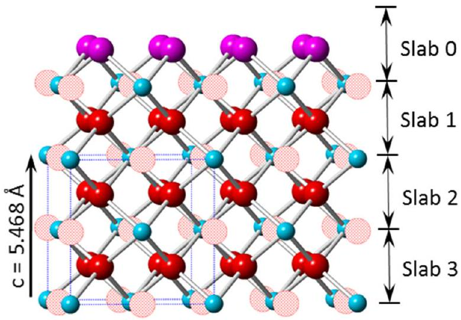
Figure 1. Structural model of the $\mathrm{UO}_{2}$ surface. Cyan $=\mathrm{U}$, solid red $=$ lattice O , magenta $=$ surface hydroxyl O, hatched red = body-centered interstitial sites, blue dashed lines denote unit cell edges. The structure is divided into slabs that are one-half unit cell in height for fitting.

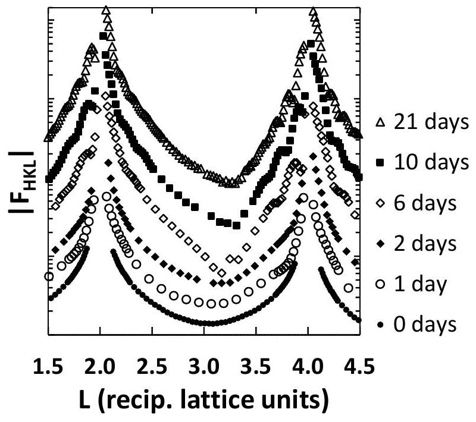
Figure 2. (a) Segment of 20 L CTR at $\mathrm{O}_{2}$ exposures ranging from 0-21 days. Symmetric, U-shaped valley between Bragg peaks gives way to asymmetric V-shaped valleys. Thin-film oscillations appear and their periods decrease with increasing exposure time. Bragg peaks show increasing asymmetry, with intensity shifted to high-L sides, indicating lattice contraction in the film. Symbols are larger than statistical error bars. Data are offset vertically for clarity.

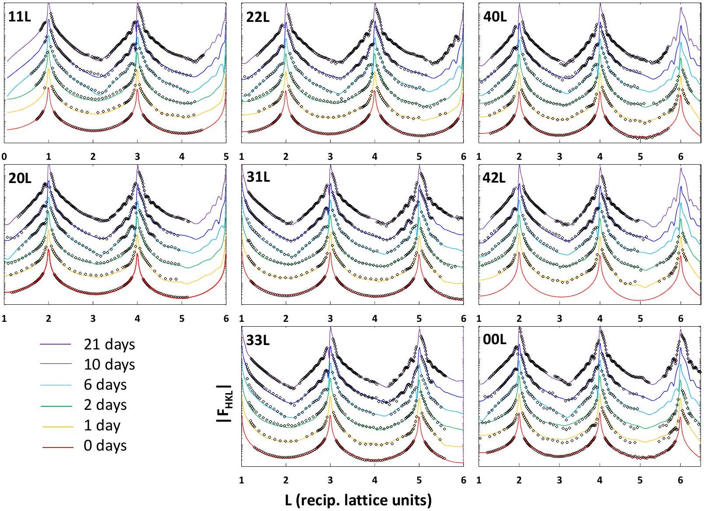
Figure 3. Best fits (colored lines) to data (symbols) for full data sets. Statistical error bars are smaller than symbols.

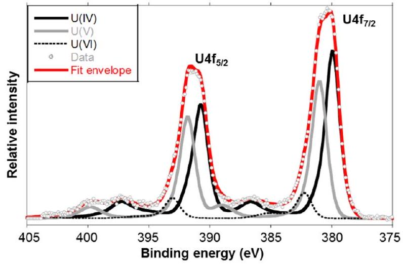
Figure 4. XPS data collected from the $\mathrm{UO}_{2}(001)$ surface after 21 days of $\mathrm{O}_{2}$ exposure. Significant $\mathrm{U}(\mathrm{V})$ and minor $\mathrm{U}(\mathrm{VI})$ are present, in addition to $\mathrm{U}(\mathrm{IV})$.

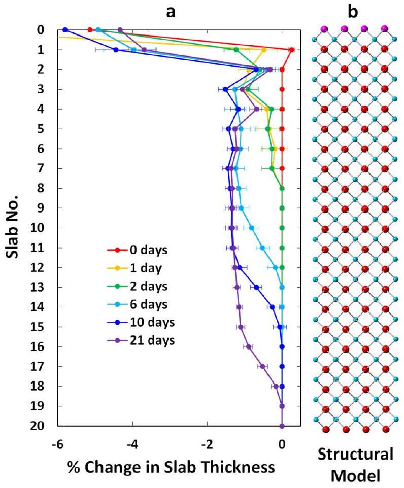
Figure 5. (a) Best-fit changes in slab thickness (from bulk) plotted vs. depth below the surface for 0-21 days $\mathrm{O}_{2}$ exposure for all rods fit together. The depth of the oxidation front increases with exposure time. The most oxidized surfaces show oscillations in slab thickness with two layer period below Slab 2. (b) Structural model shown beside (a) for scale. Cyan $=\mathrm{U}$, Red $=$ lattice O , Magenta $=\mathrm{O}$ of surface OH .

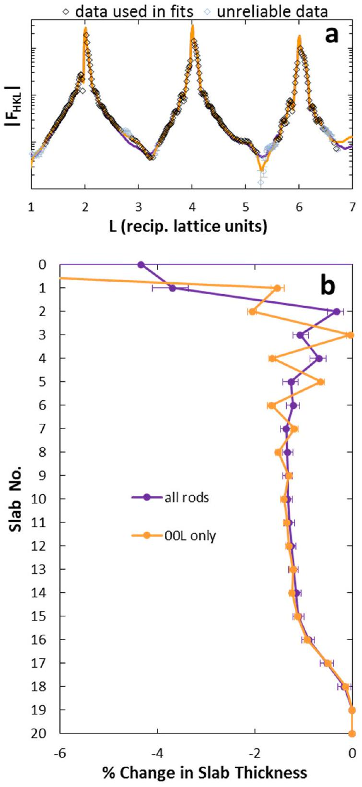
Figure 6. (a) Best fits (colored lines) to the measured specular rod (symbols) using the full data set and specular rod alone at 21 days. Data excluded from fits but used for qualitative comparison are labeled "unreliable" (b) Best-fit changes in slab thickness (from bulk) plotted vs. depth below the surface for 21 days $\mathrm{O}_{2}$ exposure for all rods fit together and the specular rod alone

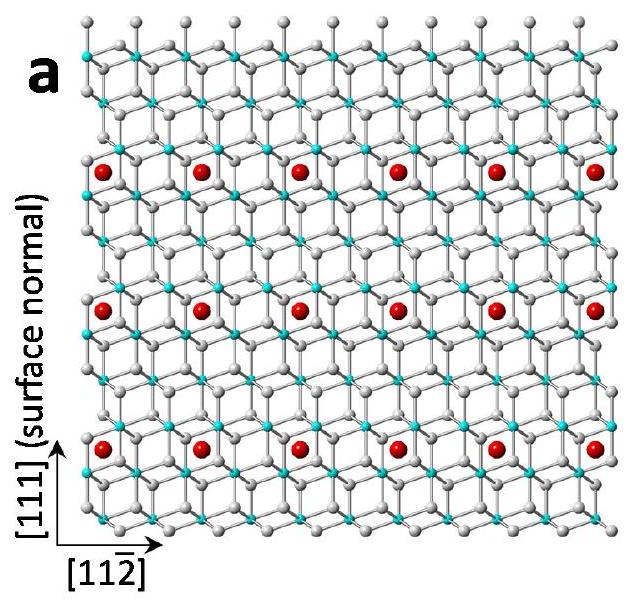
Figure 7. (a) Structural model of interstitial

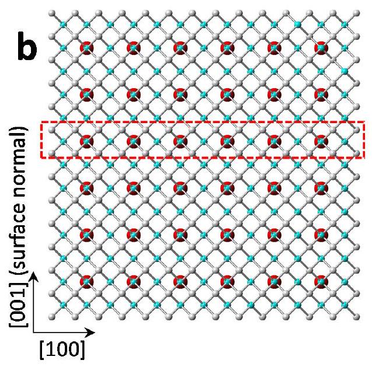

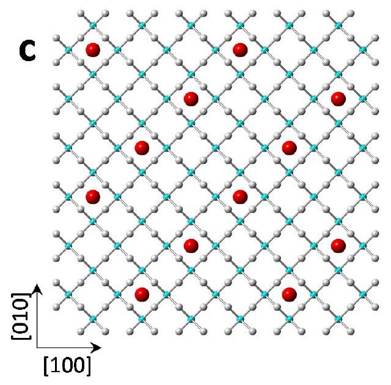
Figure 7. (a) Structural model of interstitial

occupation below the $\mathrm{UO}_{2}(111)$ surface from Stubbs et al. ${ }^{27}$ Cyan $=$ U, grey $=$ lattice O. Interstitial O atoms (red) occupy one quarter of the available sites in every third layer below the surface in a $2 \times 2$ arrangement. (b) The same structural model shown in (a) but rotated and truncated to expose the (001) surface, illustrating that in this orientation the interstitial O atoms are now found in every other slab below the (001) surface. (c) Plane of atoms highlighted in red box in (b) viewed down (001) surface normal direction illustrating that one sixth of the interstitial sites are occupied in each plane that holds interstitials.

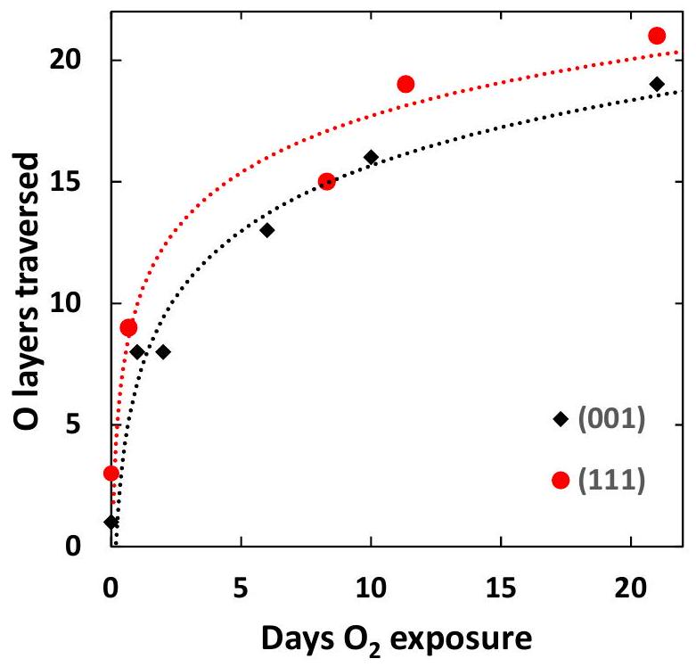
Figure 8. Kinetics of lattice O-layer traversal by oxidation fronts under (001) and (111) surfaces. Oxidation front penetration depth represented in lattice O layers appears to obey similar logarithmic growth laws under both surfaces. Dotted curves represent logarithmic guides to the eye.

## TOC Graphic

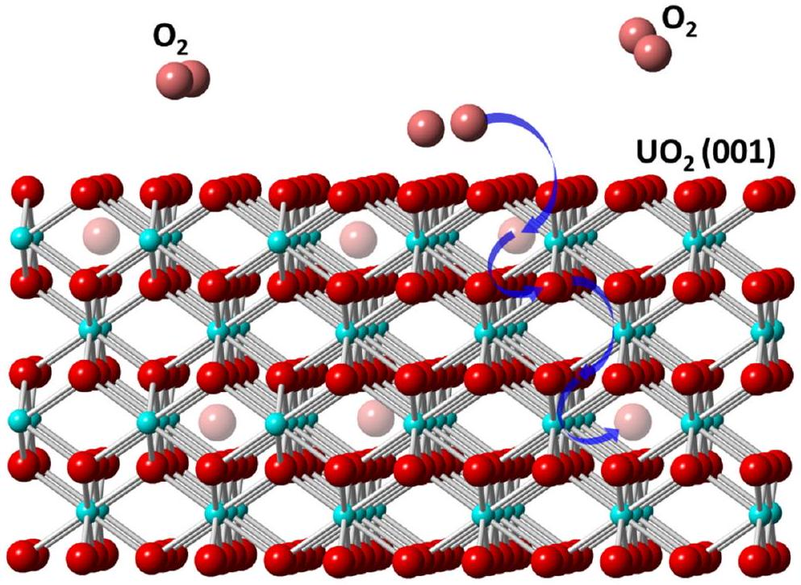

