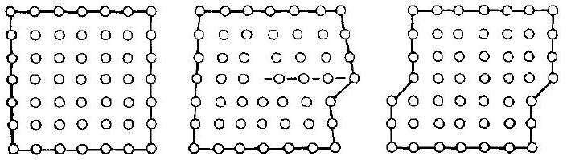
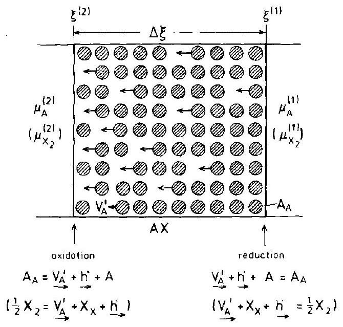
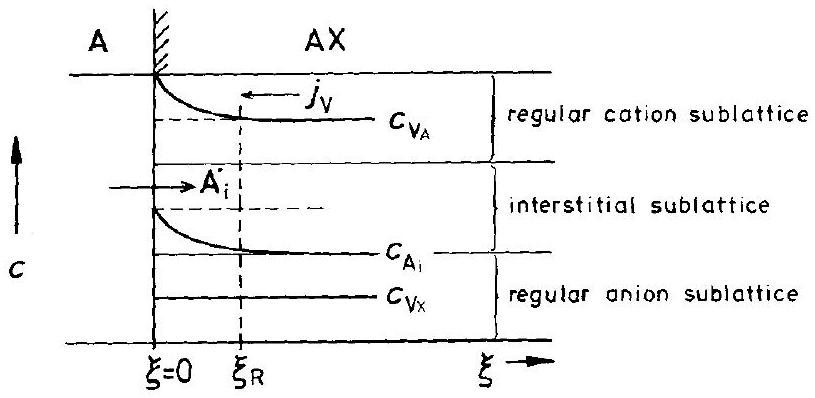

## 1 Introduction

In this first chapter, we will outline the scope of this book on the kinetics of chemical processes in the solid state. They are often different from the kinetics of processes in fluids because of structural constraints. After a brief historical introduction, typical situations of non-equilibrium crystals will be described. These will illustrate some basic concepts and our approach to understanding solid state kinetics.

### 1.1 Scope

Chemical reactions are processes in which atoms change positions while their outer electrons rearrange. If two atoms are going to react, they have first to meet each other. This means that they have to come close enough that forces between their outer electrons become operative. The prerequisite for the meeting of different individual atomic particles in an assemblage is their mixing on an atomic scale. Although this mixing can easily be visualized in gases or liquids, the mixing of solids (for example of crystals) at atomic dimensions is less obvious. There was even a saying long ago that solids do not react with each other. Such a statement, however, contradicts our experience since the arts of ceramics and metallurgy, in which reacting solids were involved, have been cultivated for thousands of years.

Normally, crystals do not exhibit convective flow and, therefore, mixing by convection at atomic dimensions is not possible. As a consequence, diffusive transport and heterogeneous reactions are the only processes which can be anticipated at this point.

The amazing evolution of solid state physics and chemistry over the last 30 years induced an intensive study of various solid state processes, particularly in the context of materials science. Materials have always been an important feature of civilization and are the basis of our modern technical society. Their preparation is often due solely to reactions between solids. Solid state reactions are also often responsible for the materials' adaptation to a specific technical purpose, or for the degradation of a material.

In retrospect, one can understand why solid state chemists, who were familiar with crystallographic concepts, found it so difficult to imagine and visualize the mobility of the atomic structure elements of a crystal. Indeed, there is no mobility of these particles in a perfect crystal, just as there is no mobility of an individual car on a densely packed parking lot. It was only after the emergence of the concept of disorder and point defects in crystals at the turn of this century, and later in the twenties and thirties when the thermodynamics of defects was understood, that the idea
of the mobility of atomic structure elements became clear and the reactivity of solids became a logical possibility.

Kinetics describe the course in space and time of a macroscopic chemical process. Processes of a chemical nature are driven by a system's deviation from its equilibrium state. By formulating the increase of entropy in a closed system, one can derive the specific thermodynamic forces which drive the system back towards equilibrium (or let the system attain a steady non-equilibrium state).

The production of species $i$ (number of moles per unit volume and time) is the velocity of reaction, $\dot{n}_{i}$. In the same sense, one understands the molar flux, $j_{i}$, of particles $i$ per unit cross section and unit time. In a linear theory, the rate and the deviation from equilibrium are proportional to each other. The factors of proportionality are called reaction rate constants and transport coefficients respectively. They are state properties and thus depend only on the (local) thermodynamic state variables and not on their derivatives. They can be rationalized by crystal dynamics and atomic kinetics with the help of statistical theories. Irreversible thermodynamics is the theory of the rates of chemical processes in both spatially homogeneous systems (homogeneous reactions) and inhomogeneous systems (transport processes). If transport processes occur in multiphase systems, one is dealing with heterogeneous reactions. Heterogeneous systems stop reacting once one or more of the reactants are consumed and the systems became nonvariant.

Solid state kinetics is distinguished from chemical kinetics in the fluid state in so far as the specific solid state properties (crystal lattice periodicity, anisotropy, and the ability to support a stress) influence the kinetic parameters (rate constants, transport coefficients) and/or the driving forces. Even if external stresses are not applied, such processes as diffusion, phase transitions, and other reactions will normally result in a change in the stress state of the solid, which in turn directly influences the course of the reaction. Since the yield strength of a solid (which is the limit of stress when plastic flow starts and dislocations begin to move) is easily reached through the action of the chemical Gibbs energy changes associated with solid state reactions, not only elastic deformations but plastic deformations as well occur frequently. While elastic deformations affect both kinetic parameters and driving forces, plastic deformations mainly affect transport coefficients.

In addition to stress, the other important influence on solid state kinetics (again differing from fluids) stems from the periodicity found within crystals. Crystallography defines positions in a crystal, which may be occupied by atoms (molecules) or not. If they are not occupied, they are called vacancies. In this way, a new species is defined which has attributes of the other familiar chemical species of which the crystal is composed. In normal unoccupied sublattices (properly defined interstitial lattices), the fraction of vacant sites is close to one. The motion of the atomic structure elements and the vacant lattice sites of the crystal are complementary (as is the motion of electrons and electron holes in the valence band of a semiconducting crystal).

Since irregular structure elements (point defects) such as interstitial atoms (ions) or vacancies must exist in a crystal lattice in order to allow the regular structure elements to move, two sorts of activation energies have to be supplied from a heat reservoir for transport and reaction. First, the energy to break bonds in the crystal
must be supplied in order to allow for the formation of the irregular structure elements. Second, energy must also be supplied to allow for individual and activated exchanges of atoms (ions, regular structure elements) with neighboring vacancies. Since these energies are of the same order of magnitude as the lattice energy, transport and reaction of atoms and ions in solids do not occur unless the temperature is sufficiently high that the thermal energy becomes a noticeable fraction of these bond energies. Gibbs energy changes in reacting systems, the gradients of which are the driving forces for transport, are comparable in solids and fluids. Hence, the Gibbs energy change per elementary jump length of an atomic structure element is always very small compared to its thermal energy (except for reactions in extremely small systems). This is the basic reason for the validity of linear kinetics, that is, the proportionality between flux and force. It also suggests that the kinetics of solid-solid interfaces are particularly prone to be nonlinear.

Are the formal solid state kinetics different from the chemical kinetics as presented in textbooks? One concludes from the foregoing remarks that if vacancies are taken into account as an additional species and if all structure elements of the crystal are regarded as the reacting particle ensemble, one may utilize the formal chemical kinetics. However, it is necessary to note the restrictions and constraints that are given by the crystallographic structure in which transport and reaction take place. Also, the elastic energy density gradient has to be added to all the other possible driving forces. Finally, the transport coefficients, in view of crystal symmetry, are tensors. In order to emphasize the differences between crystals and fluids, we mention that in coherent (and therefore stressed) multiphase multicomponent crystals the (nonuniform) equilibrium composition depends on the geometrical shape of the solid. The kinetic complexities that stem from these facts will be discussed in much detail in later sections.

The subject of kinetics is often subdivided into two parts: a) transport, b) reaction. Placing transport in the first place is understandable in view of its simpler concepts. Matter is transported through space without a change in its chemical identity. The formal theory of transport is based on a simple mathematical concept and expressed in the linear flux equations. In its simplest version, a linear partial differential equation (Fick's second law) is obtained for the irreversible process. Under steady state conditions, it is identical to the Laplace equation in potential theory, which encompasses the idea of a field at a given location in space which acts upon matter only locally, i.e. by its immediate surroundings. This, however, does not mean that the mathematical solutions to the differential equations with any given boundary conditions are simple. On the contrary, analytical solutions are rather the exception for real systems [J. Crank (1970)].

Two reasons are responsible for the greater complexity of chemical reactions: 1) atomic particles change their chemical identity during reaction and 2) rate laws are nonlinear in most cases. Can the kinetic concepts of fluids be used for the kinetics of chemical processes in solids? Instead of dealing with the kinetic gas theory, we have to deal with point defect thermodynamics and point defect motion. Transport theory has to be introduced in an analogous way as in fluid systems, but adapted to the restrictions of the crystalline state. The same is true for (homogeneous) chemical reactions in the solid state. Processes across interfaces are of great
importance in solids and so their kinetics should be discussed in depth. Finally, reaction rate constants and transport coefficients are interpreted theoretically, the underlying conceptual fundamentals are to be found in the dynamics on an atomic scale, and in quantum theory.

This monograph deals with kinetics, not with dynamics. Dynamics, the local (coupled) motion of lattice constituents (or structure elements) due to their thermal energy is the prerequisite of solid state kinetics. Dynamics can explain the nature and magnitude of rate constants and transport coefficients from a fundamental point of view. Kinetics, on the other hand, deal with the course of processes, expressed in terms of concentration and structure, in space and time. The formal treatment of kinetics is basically phenomenological, but it often needs detailed atomistic modeling in order to construct an appropriate formal frame (e.g., the partial differential equations in space and time).

Chemical solid state processes are dependent upon the mobility of the individual atomic structure elements. In a solid which is in thermal equilibrium, this mobility is normally attained by the exchange of atoms (ions) with vacant lattice sites (i.e., vacancies). Vacancies are point defects which exist in well defined concentrations in thermal equilibrium, as do other kinds of point defects such as interstitial atoms. We refer to them as irregular structure elements. Kinetic parameters such as rate constants and transport coefficients are thus directly related to the number and kind of irregular structure elements (point defects) or, in more general terms, to atomic disorder. A quantitative kinetic theory therefore requires a quantitative understanding of the behavior of point defects as a function of the (local) thermodynamic parameters of the system (such as $T, P$, and composition, i.e., the fraction of chemical components). This understanding is provided by statistical thermodynamics and has been cast in a useful form for application to solid state chemical kinetics as the socalled point defect thermodynamics.

After the formulation of defect thermodynamics, it is necessary to understand the nature of rate constants and transport coefficients in order to make practical use of irreversible thermodynamics in solid state kinetics. Even the individual jump of a vacancy is a complicated many-body problem involving, in principle, the lattice dynamics of the whole crystal and the coupling with the motion of all other atomic structure elements. Predictions can be made by simulations, but the relevant methods (e.g., molecular dynamics, MD, calculations) can still be applied only in very simple situations. What are the limits of linear transport theory and under what conditions do the (local) rate constants and transport coefficients cease to be functions of state? When do they begin to depend not only on local thermodynamic parameters, but on driving forces (potential gradients) as well? Various relaxation processes give the answer to these questions and are treated in depth later.

If we regard the crystal as a solvent for structure elements, and in particular for mobile point defects, remembering that particles involved in chemical reactions have to come together before they can react, then all chemical reactions in the solid state can be characterized by transport steps ( $t$ ) and by reaction steps ( $r$ ). Which of these steps controls the reaction kinetics? Designating $\delta g$ as the Gibbs energy dissipated per elementary step (jump or reaction) of the single atomic particle in the reacting ensemble, the process is said to be transport controlled if $\delta g_{r}<\delta \delta g_{t}(\ll k T)$ and
linear transport theory can then be applied. This means, for example, that in homogeneous diffusion controlled solid state reactions (e.g., point defect relaxation processes), the reaction rate constants can be expressed in terms of point defect diffusion coefficients. However, it does not mean that linear rate equations will always be found. If, for example, the rates, $\dot{c}_{i}$, are second order in $c_{i}$ (due to the bimolecular nature of the process), a linear rate law cannot be expected to hold until the reaction has progressed very close to the system's equilibrium state, where second order deviations from the equilibrium concentration can be neglected. Nevertheless, linear transport theory holds and the reacting system is always in local equilibrium (i.e., $\delta g \ll k T$ ).

Another solid state reaction problem to be mentioned here is the stability of boundaries and boundary conditions. Except for the case of homogeneous reactions in infinite systems, the course of a reaction will also be determined by the state of the boundaries (surfaces, solid-solid interfaces, and other phase boundaries). In reacting systems, these boundaries are normally moving in space and their geometrical form is often morphologically unstable. This instability (which determines the boundary conditions of the kinetic differential equations) adds appreciably to the complexity of many solid state processes and will be discussed later in a chapter of its own.

The general and basic kinetic problems will be introduced in the first five chapters of this monograph. Thereafter, distinct solid state processes found in classical heterogeneous solid state reactions (including nucleation and early growth), in the oxidation of metals, and in phase transformations of solids will be analyzed and treated in the subsequent chapters. While these problems have been treated in one way or another before, other chapters give a detailed (and as far as possible quantitative) discussion of modern aspects of solid state kinetics. These include internal reactions, internal oxidation and reduction, relaxation processes in crystals, the behavior of multicomponent single-phase and heterogeneous systems in thermodynamic potential gradients, reactions at and across interfaces, and the kinetics of special solids (e.g., silicates, hydrides, solid electrolytes, layered crystals, polymers). Finally, modern experimental methods for the study of solid state kinetics will be treated to some extent, stressing in-situ methods.

By necessity, the treatment of solid state kinetics has to be selective in view of the myriad processes which can occur in the solid state. This multitude is mainly due to three facts: 1) correlation lengths in crystals are often much larger than in fluids and may comprise the whole crystal, 2) a structure element is characterized by three parameters instead of only by two in a liquid (chemical species, electrical charge, type of crystallographic site), and 3) a crystal can be elastically stressed. The stress state is normally inhomogeneous. If the yield strength is exceeded, then plastic deformation and the formation of dislocations will change the structural state of a crystal. What we aim at in this book is a strict treatment of concepts and basic situations in a quantitative way, so far as it is possible. In contrast, the often extremely complex kinetic situations in solid state chemistry and materials science will be analyzed in a rather qualitative manner, but with clearcut thermodynamic and kinetic concepts.

### 1.2 Historical Remarks

Kinetics is concerned with many-particle systems which require movements in space and time of individual particles. The first observations on the kinetic effect of individual molecular movements were reported by R . Brown in 1828 . He observed the outward manifestation of molecular motion, now referred to as Brownian motion. The corresponding theory was first proposed in a satisfactory form in 1905 by A. Einstein. At the same time, the Polish physicist and physical chemist M. v. Smoluchowski worked on problems of diffusion, Brownian motion (and coagulation of colloid particles) [M. v. Smoluchowski (1916)]. He is praised by later leaders in this field [S. Chandrasekhar (1943)] as a scientist whose theory of density fluctuations represents one of the most outstanding achievements in molecular physical chemistry. Further important contributions are due to Fokker, Planck, Burger, Fürth, Ornstein, Uhlenbeck, Chandrasekhar, Kramers, among others. An extensive list of references can be found in [G.E. Uhlenbeck, L.S. Ornstein (1930); M.C. Wang, G.E. Uhlenbeck (1945)]. A survey of the field is found in [N. Wax, ed. (1954)].

Although Brown made his observations on liquids, the diffusional motion in crystals occurs similarly and, in fact, the discrete jump lengths in crystals simplify the treatment to some extent. According to Chandrasekhar, Pearson [K. Pearson (1905)] formulated the problem for the first time in general terms in this way: "A man starts from a point 0 and walks $l$ yards in a straight line; he then turns through any angle whatever and walks another $l$ yards in a second straight line. He repeats this process $n$ times. I require the probability that after these $n$ stretches he is at a distance between $r$ and $(r+\mathrm{d} r)$ from his starting point 0 ."

How can jumping motion of structure elements in crystals be achieved? Ancient schools taught their students that crystalline solids would not react with each other. This statement was always disproved by the experience of potters and blacksmiths and by observations on geological events. Early reports on diffusion in solids are apparently due to [W. Spring (1878)]. Roberts-Austen observed diffusion of Au in Pb before this century, but there was no explanation. An important step in the shaping of a correct picture was made in the early twenties by the Halle group of Tubandt in Germany, to which W. Jost belonged as a graduate student. He later wrote a monograph with the first quantitative treatment of solid state reactions [W. Jost: "Diffusion und chemische Reaktion in festen Stoffen" (1937)]. In Tubandt's group, it was found that one could perform the same electrical transference experiments with ionic crystals at sufficiently high temperatures as Hittorf had done already in 1853 with aqueous solutions of dissolved salts (electrolytes). Since this transference could not occur in a perfectly ordered crystal, the only reasonable explanation was that the crystal lattice was disordered, that is, imperfect. What was the nature of these imperfections? Smekal [A. Smekal (1925)] proposed "Lockerstellen", which was primarily a semantic way out. Jost argued that any proposal for a solution of this problem that did not comprise the whole bulk of the crystal but only localized distorted regions (Lockerstellen) would lead to intolerably large transport velocities of the species transferred in the electrical field along these distortions.

At about this time, J. Frenkel published a most seminal theoretical paper [J. Frenkel (1926)]. He suggested that in a similar way as (neutral) water dissociates to a very small extent into protons and hydroxyl ions, a perfect "lattice molecule" of a crystal (such as AgBr , which crystallizes in the B 1 -structure) will dissociate its regular structure elements, $\mathrm{Ag}_{\mathrm{Ag}}$, into silver ions which are activated to occupy vacant sites in the interstitial sublattice, $\mathrm{V}_{\mathrm{i}}$. (The notation is explained in the list of symbols.) They leave behind empty regular silver ion sites (silver vacancies) symbolized here by $\mathrm{V}_{\mathrm{Ag}}^{\prime}$. This dissociation process can be represented in a more chemical language (Kroeger-Vink notation) in Eqn. (1.1)

$$
A g_{A g}+V_{i}=A g_{i}^{\bullet}+V_{A g}^{\prime}
$$

The resulting equilibrium concentrations of these point defects (vacancies and interstitials) are the consequence of a compromise between the ordering interaction energy and the entropy contribution of disorder (point defects, in this case). To be sure, the importance of Frenkel's basic work for the further development of solid state kinetics can hardly be overstated. From here on one knew that, in a crystal, the concentration of irregular structure elements (in thermal equilibrium) is a function of state. Therefore the conductivity of an ionic crystal, for example, which is caused by mobile point defects, is a well defined physical property. However, contributions to the conductivity due to dislocations, grain boundaries, and other non-equilibrium defects can sometimes be quite significant.

Continued progress in solid state physical chemistry was made by Wagner and Schottky [C. Wagner, W. Schottky (1930); W. Schottky, H. Ulich, C. Wagner (1929)] as a part of their classic work on thermodynamics. They introduced the concept of the crystalline compound (e.g., binary AgBr ) as an ordered solid solution phase with a finite, although often extremely small, range of homogeneity. Deviations from the exact stoichiometric composition correspond to the existence of point defects. In Frenkel's line of reasoning, Wagner and Schottky were able to quantify the nonstoichiometry of a binary (or higher) compound as a function of state in thermodynamic equilibrium. It depends on all the independent state variables which, from a practical standpoint, are normally chosen to be $P, T$, and the chemical potentials of the independent components. With this concept in mind, it was possible to 'titrate' point defects in a crystal by a component vapor pressure in the same way as the chemist titrates aqueous electrolytes. The inflection point of the defect concentration vs. chemical potential curve marks the stoichiometric composition of the crystalline compound with respect to this component.

The concepts required for a quantitative treatment of the reactivity of solids were now clear, except for one important issue. According to the foregoing, point defect energies should be on the same order as lattice energies. Since the distribution of point defects in the crystal conforms to Boltzmann statistics, one was able to estimate their concentrations. It was found that the calculated defect concentrations were orders of magnitude too small and therefore could not explain the experimentally observed effects which depended on defect concentrations (e.g., conductivity, excess volume, optical absorption). Jost [W. Jost (1933)] provided the correct solution to this problem. Analogous to the fact that NaCl can be dissolved in $\mathrm{H}_{2} \mathrm{O}$
despite its high lattice energy, since the energy gain due to polarization almost balances the lattice energy, the energy gain due to polarization of the environment about point defects diminishes their formation energy appreciably. With this background, Mott and Littleton [N. F. Mott, M. J. Littleton (1938)] and later Lidiard and co-workers [A. B. Lidiard, M. J. Norgett (1972)] improved the early estimates in a proper way. The powerful computers of today help to obtain reliable theoretical numbers of point defect energies [C.R.A. Catlow (1989)] and thus the concentrations of irregular structure elements.

Since thermal disorder reflects a dynamic equilibrium, the (almost random) motion of atomic structure elements is already included in this dynamic concept. Therefore, the mobility of crystal components can be explained quantitatively, and particularly with regard to its dependence on the component chemical potentials. In a linear transport theory, one shows that chemical potential gradients act in the same way on mobile structure elements as do external forces, which results in a drift of atoms (ions) and in diffusional fluxes. With this understanding, Carl Wagner first worked out the kinetic theory of metal oxidation [C. Wagner (1933)] and later the basic formalism for a kinetic treatment of heterogeneous solid state reactions of the type $\mathrm{AX}+\mathrm{BX}=\mathrm{ABX}_{2}$, which is the formation of double salts [C. Wagner (1936)]. Today we regard this work as an example of a successful application of irreversible thermodynamics to the solid state. The stringent presuppositions which crystallography requires are fulfilled and local equilibrium is established during the reaction, a condition not necessarily true for other solid state reactions.

In 1937, Jost presented in his book on diffusion and chemical reactions in solids [W. Jost (1937)] the first overview and quantitative discussion of solid state reaction kinetics based on the Frenkel-Wagner-Schottky point defect thermodynamics and linear transport theory. Although metallic systems were included in the discussion, the main body of this monograph was concerned with ionic crystals. There was good reason for this preferential elaboration on kinetic concepts with ionic crystals. Firstly, one can exert forces on the structure elements of ionic crystals by the application of an electrical field. Secondly, a current of 1 mA over a duration of $1 \mathrm{~s}(=1 \mathrm{mC}$, easy to measure at that time) corresponds to only $10^{-8}$ moles of transported matter in the form of ions. Seen in retrospect, it is amazing how fast the understanding of diffusion and of chemical reactions in the solid state took place after the fundamental and appropriate concepts were established at about 1930, especially in metallurgy, ceramics, and related areas.

A second historical line which is of paramount importance to the present understanding of solid state processes is concerned with electronic particles (defects) rather than with atomic particles (defects). Let us therefore sketch briefly the history of semiconductors [see H. J. Welker (1979)]. Although the term 'semiconductor' was coined in 1911 [J. Königsberger, J. Weiss (1911)], the thermoelectric effect had already been discovered almost one century earlier [T. J. Seebeck (1822)]. It was found that PbS and ZnSb exhibited temperature-dependent thermopowers, and from todays state of knowledge use had been made of n-type and p-type semiconductors. Faraday and Hittorf found negative temperature coefficients for the electrical conductivities of $\mathrm{Ag}_{2} \mathrm{~S}$ and Se . In 1873, the decrease in the resistance of Se when irradiated by visible light was reported [W. Smith (1873); L. Sale (1873)]. It was also
with Se that rectifying properties were observed for the first time [W. Siemens (1876)]. Later on, copper oxides played an important role in the research on rectifiers, as highlighted by the introduction of the 'Schottky-barrier' [W. Schottky, W. Deutschmann (1929)]. Since 1925, semiconductor research has become an important issue for the development of the modern technical civilization. After World War II, the number of research papers grew accordingly, particularly on $\mathrm{Si}, \mathrm{Ge}$, and III -V compounds.

From the theorist's point of view, the work of Sommerfeld on the 'Electron Theory of Metals' was most seminal. It was eventually reviewed on a quantum mechanical basis in a famous article in the "Handbuch der Physik", Vol. XXIV/2 [A. Sommerfeld, H. Bethe (1933)]. Two years before, Heisenberg had introduced the 'electron hole'. A. H. Wilson worked on the theory of semiconductors, and it was understood that at $T=0 \mathrm{~K}$ their valence band was completely filled with electrons, whereas the conduction band was empty. At $T>0 \mathrm{~K}$, electrons are thermally excited from the valence band into the conduction band.

The classical phenomenological theory of rectifiers and transistors was given by [C. Wagner (1931); W. Schottky (1938); I. W. Davidov (1938); W. Shockley (1949)]. One understood that if a p-n junction is appropriately biased, the electronic carriers drift toward the barrier layer and, by flooding it, they lower the blocking resistance. The opposite effect is found by reversing the polarity. In 1958, the theory of wavemechanical tunneling led to the discovery of the tunnel diode. The computer industry stimulated the miniaturization of electronic devices, and the present time is characterized by worldwide contributions by many technical and research teams. The main goal is always the control of electron currents by electrical means. Integrating the circuits makes their functioning extremely fast.

The essential difference between treatments of chemical processes in the solid state and those in the fluid state is (aside from periodicity and anisotropy) the influence of the unique mechanical properties of a solid (such as elasticity, plasticity, creep, and fracture) on the process kinetics. The key to the understanding of most of these properties is the concept of the dislocation which is defined and extensively discussed in Chapter 3. In addition, other important structural defects such as grain boundaries, which are of still higher dimension, exist and are unknown in the fluid state.

As early as 1829, the observation of grain boundaries was reported. But it was more than one hundred years later that the structure of dislocations in crystals was understood. Early ideas on 'strain-figures' that move in elastic bodies date back to the turn of this century. Although the mathematical theory of dislocations in an elastic continuum was summarized by [V. Volterra (1907)], it did not really influence the theory of crystal plasticity. X-ray intensity measurements [C. G. Darwin (1914)] with single crystals indicated their 'mosaic structure' (i.e., subgrain boundaries) formed by dislocation arrays. Prandtl, Masing, and Polanyi, and in particular [U. Dehlinger (1929)] came close to the modern concept of line imperfections, which can move in a crystal lattice and induce plastic deformation.

In 1934, three papers were published which clearly described the dislocation in the sense of our current understanding [E. Orowan (1934); M. Polanyi (1934); G. I. Taylor (1934)]. Figure 1-1 shows a sketch of Taylor's dislocation, indicating its edge-

Figure 1-1. Schematic model of atomic positions before, during, and after the passage of an edge dislocation [G. I. Taylor (1934)].

character and its relation to the gliding of the upper part of the crystal relative to the lower part.

Burgers [J. M. Burgers (1939)], motivated by Volterra's work, was led to introduce another type of dislocation, also a limiting case of a line distortion in a crystal, the so-called screw dislocation. The screw dislocation in particular (as was emphasized by Frank and Read [see W. T. Read (1953)]) proved to be most important not only in explaining crystal growth processes but also in predicting grain boundary energies. It was not before 1950 that individual dislocation lines were observed by electron microscopy.

### 1.3 Four Basic Kinetic Situations

The purpose of the final sections of this introductory chapter is to adapt several kinetic concepts to the solid state so that in subsequent chapters we are familiar with some basic language, symbolism, and conceptual tools. All the quantities introduced are defined in the list of symbols.

### 1.3.1 Homogeneous Reactions: Point Defect Relaxation

A common example of a homogeneous solid state reaction is the formation of socalled Frenkel point defects in an almost stoichiometric binary ionic crystal (e.g., AgBr ). This thermal disorder reaction can be described as follows: Silver ions $\left(\mathrm{Ag}_{\mathrm{Ag}}\right)$ leave their regular lattice sites (to a small extent) due to thermal activation, which forces them on to empty interstitial (i) sites ( $\mathrm{Ag}_{\mathrm{i}}^{*}$ ), leaving behind vacancies ( $\mathrm{V}_{\mathrm{Ag}}^{\prime}$ ) in the regular silver ion sublattice (Fig. 1-2). At equilibrium, a definite equilibrium concentration of these point defects is established. A change in $T$ or $P$ leads to a new equilibrium distribution. The course of this equilibration is a defect relaxation process and the corresponding chemical reaction, in terms of the atomic structure elements, has already been formulated in Eqn. (1.1).

$$
A g_{A g}+V_{i}=A g_{i}^{*}+V_{A g}^{\prime}
$$

Figure 1-2. Two-dimensional schematic representation of the formation of Frenkel defect pairs in $\mathrm{AgBr}: \mathrm{Ag}_{\mathrm{Ag}}+\mathrm{V}_{\mathrm{i}}=\mathrm{Ag}_{\mathrm{i}}^{\bullet}+\mathrm{V}_{\mathrm{Ag}}^{\prime} . \square=$ vacant cation site.

Note that the balances of matter, sites, and charge are obeyed. According to standard kinetics, we formulate the rate equation of this defect equilibration process and denote, for simplicity sake, $\mathrm{Ag}_{\mathrm{i}}^{*}$ by $\mathrm{i}, \mathrm{V}_{\mathrm{Ag}}^{\prime}$ by V and $\mathrm{Ag}_{\mathrm{Ag}}$ by Ag . Let us designate the frequency of a site exchange between a vacancy and an ion on a different sublattice as $v$. According to a bimolecular rate equation, the time derivative of the concentration is

$$
\dot{c}_{\mathrm{i}}=\vec{v} \cdot c_{\mathrm{Ag}} \cdot N_{\mathrm{V}_{\mathrm{i}}}-\stackrel{\rightharpoonup}{v} \cdot c_{\mathrm{i}} \cdot N_{\mathrm{V}}
$$

or of the corresponding mole fraction

$$
\dot{N}_{\mathrm{i}}=\vec{v} \cdot\left(N_{\mathrm{Ag}} \cdot N_{\mathrm{V}_{\mathrm{i}}}\right)-\bar{v} \cdot\left(N_{\mathrm{i}} \cdot N_{\mathrm{V}}\right)
$$

Each product in brackets on the right hand side gives the average fraction of silver ions occurring with a vacancy as a neighbor. Site and charge balances are

$$
N_{\mathrm{Ag}}+N_{\mathrm{V}}=1 ; \quad N_{\mathrm{V}_{\mathrm{i}}}+N_{\mathrm{i}}=1 ; \quad N_{\mathrm{i}}=N_{\mathrm{V}}
$$

and since $N_{\mathrm{V}}, N_{\mathrm{i}} \ll 1$, Eqn. (1.3) yields

$$
\dot{N}_{\mathrm{i}}=\vec{v} \cdot\left(1-\frac{\bar{v}}{\vec{v}} \cdot N_{\mathrm{i}} \cdot N_{\mathrm{V}}\right)
$$

At equilibrium, $\dot{N}_{\mathrm{i}}=0$ and $N_{\mathrm{i}}(\mathrm{eq})=N_{\mathrm{V}}(\mathrm{eq})=N^{0}$. Therefore, the ratio ( $\bar{\nu} / \vec{\nu}$ ) is equal to $1 /\left(N^{0}\right)^{2}$ and

$$
\dot{N}_{\mathrm{i}}=\vec{v} \cdot\left(1-\frac{N_{\mathrm{i}}}{N^{0}} \cdot \frac{N_{\mathrm{V}}}{N^{0}}\right)
$$

We refer the actual defect fraction to the equilibrium value as a reference state by setting $N_{\mathrm{i}}=N_{\mathrm{V}}=N^{0}+\delta$. Equation (1.6) then reads

$$
\dot{\delta}=-\frac{2 \cdot \vec{v}}{N^{0}} \cdot\left(\delta+\frac{\delta^{2}}{N^{0}}\right)
$$

For sufficiently long times (i.e., $\delta \rightarrow 0$ ), the integration of Eqn. (1.7) yields

$$
\delta(t) \cong \delta(0) \cdot \mathrm{e}^{-\frac{2 \cdot \vec{v}}{N^{0}} \cdot t}
$$

so that we can define the Frenkel defect relaxation time as

$$
\tau_{\mathrm{R}}=N^{0} /(2 \cdot \vec{v})=1 /\left(2 N^{0} \cdot \overleftarrow{v}\right) .
$$

### 1.3.2 Steady State Flux of Point Defects in a Binary Compound

The Gibbs phase rule states that the (local) thermodynamic state of a binary compound is unambiguously determined by three state variables such as $P, T$ and $\mu_{k}$ ( $k$ being a component index). Therefore, if one fixes $\mu_{k}$ (at a given $P, T$ ) on opposite surfaces of the compound crystal (e.g., AX) at two different levels, all (local) equilibrium functions of state attain different values at the two surfaces. Since point defect concentrations are also functions of state, different point defect concentrations exist at the two crystal surfaces. Mobile point defects will start to move down their concentration gradient until a steady state is established in the frame of the crystal lattice. A common situation is given in Figure 1-3. Drifting cation vacancies are equivalent to a cation counter-flux in the opposite direction, as shown in Figure 1-3. Note that the arrows indicate only the extra jumps to the left, while the random thermal motion is disregarded. Anions are assumed to be immobile.

Let us analyze this transport situation. In a linear theory, the flux of, for example, vacancies of A in the AX compound is given by

$$
\boldsymbol{j}_{\mathrm{V}}=c_{\mathrm{V}} \cdot \boldsymbol{v}_{\mathrm{V}}=c_{\mathrm{V}} \cdot\left(b_{\mathrm{V}} \cdot \boldsymbol{K}_{\mathrm{V}}\right)
$$

Figure 1-3. The flux of cation vacancies in a transition metal oxide AX exposed to an oxygen potential gradient. Note that only the cation sublattice is depicted schematically.

if there are no other restrictions. From irreversible thermodynamics we know that the acting force $\boldsymbol{K}_{\mathrm{V}}$ is $-\nabla \mu_{\mathrm{V}}\left(=-R T \cdot \nabla \ln N_{\mathrm{V}}\right.$, as long as vacancies have small concentrations and do not interact with each other). Inserting $\nabla \mu_{\mathrm{V}}$ in Eqn. (1.10), one obtains Fick's first law by setting $b_{\mathrm{V}} \cdot R T=D_{\mathrm{V}}$. $D_{\mathrm{V}}$ is the vacancy diffusion coefficient, and the relation between $b$ and $D$ is called the Nernst-Einstein relation. $D_{\mathrm{V}}$ is constant for noninteracting, ideally diluted vacancies at low concentrations. Therefore, we have from Eqn. (1.10)

$$
j_{\mathrm{V}}=-D_{\mathrm{V}} \cdot \nabla c_{\mathrm{V}}=-D_{\mathrm{V}} \cdot \frac{c_{\mathrm{V}}^{\prime \prime}-c_{\mathrm{V}}^{\prime}}{\Delta \xi}
$$

where $\Delta \xi$ is the sample thickness. The steady state represented by Eqn. (1.11) implies that $\Delta c_{\mathrm{V}}$ is constant (and independent of $\Delta \xi$ ). Since we have fixed $\mu_{\mathrm{A}}\left(\xi^{\prime}\right)$ and $\mu_{\mathrm{A}}\left(\xi^{\prime \prime}\right)$ at the corresponding surfaces, we wish to express $\mu_{\mathrm{V}}$ in terms of $\mu_{\mathrm{A}}$ (or $\mu_{\mathrm{X}_{2}}$ ). This can be done by formulating the equilibrium condition for the A vacancy formation reaction,

$$
A_{A}=A+\left(V_{A}^{\prime}+h^{*}\right) \quad \text { or } \quad\left(A_{A}-V_{A}^{\prime}\right)=A+h^{*}
$$

where $\mathrm{A}_{\mathrm{A}}$ is the (regular) structure element and A denotes the chemical component A. $\mathrm{h}^{\cdot}$ denotes an electron hole which is formed to maintain electroneutrality $\left(N_{\mathrm{V}^{\prime}}=N_{\mathrm{h}}\right)$. From the site balance we know that $N_{\mathrm{A}_{\mathrm{A}}} \cong 1$, and therefore the equilibrium condition of Eqn. (1.12) states that the gradient in the chemical potential of component A is (in view of $\nabla \mu_{\mathrm{h}}=\nabla \mu_{\mathrm{V}}$ due to $N_{\mathrm{V}^{\prime}}=N_{\mathrm{h}} \cdot \ll 1$ )

$$
\nabla \mu_{\mathrm{A}}=-2 \cdot \nabla \mu_{\mathrm{V}}=-2 \cdot R T \cdot \nabla \ln N_{\mathrm{V}}
$$

Equation (1.13), integrated across the crystal, gives

$$
c_{\mathrm{V}}^{\prime}=c_{\mathrm{V}}^{\prime \prime} \cdot \mathrm{e}^{-\frac{\mu_{\mathrm{A}}^{\prime}-\mu_{\mathrm{A}}^{\prime \prime}}{2 \cdot R T}}
$$

where the primes denote the two opposite surfaces. Substituting Eqn. (1.14) into Eqn. (1.11) yields

$$
j_{\mathrm{V}}=-\frac{D_{\mathrm{V}} \cdot c_{\mathrm{V}}^{\prime \prime}}{\Delta \xi} \cdot\left(1-\mathrm{e}^{-\frac{\mu_{\mathrm{A}}^{\prime}-\mu_{\mathrm{A}}^{\prime \prime}}{2 \cdot R T}}\right)
$$

or

$$
j_{\mathrm{V}} \cong-\frac{D_{\mathrm{V}} \cdot c_{\mathrm{V}}^{\prime \prime}}{\Delta \xi}, \quad \mu_{\mathrm{A}}^{\prime}-\mu_{\mathrm{A}}^{\prime \prime}>R T
$$

The difference of the component potentials ( $\mu_{\mathrm{A}}^{\prime}-\mu_{\mathrm{A}}^{\prime \prime}$ ) can be established in two ways: 1) by reservoirs of component A with different activities and 2) by reservoirs of component $\mathrm{X}\left(\frac{1}{2} \mathrm{X}_{2}\right)$ with different activities (partial pressures). Note that $\mathrm{A}+\frac{1}{2} \mathrm{X}_{2}=\mathrm{AX}$, so that $\mu_{\mathrm{A}}+\frac{1}{2} \cdot \mu_{\mathrm{X}_{2}}=\mu_{\mathrm{AX}}^{0}$ or $\mathrm{d} \mu_{\mathrm{A}}+\frac{1}{2} \cdot \mathrm{~d} \mu_{\mathrm{X}_{2}}=0$. Since the cation vacancy (and cation) flux concerns only the cation sublattice, and the anions are im-
mobile and not involved in the transport reaction, the AX crystal is not shifted in case (1), that is, if the fluxes are driven by $\Delta \mu_{\mathrm{A}}$ of the A reservoirs. However, in case (2), the AX crystal as a whole is shifted by the vacancy flux in the direction of the oxidizing surface with the higher $\mu_{\mathrm{X}_{2}}$. This can be seen if one formulates the surface equilibria which correspond to Eqn. (1.12)

$$
\frac{1}{2} \cdot \mathrm{X}_{2}=\left[\mathrm{X}_{\mathrm{X}}+\mathrm{V}_{\mathrm{A}}^{\prime}\right]+\mathrm{h}^{\bullet}
$$

From the equilibrium condition of Eqn. (1.17), one derives

$$
\frac{1}{2} \cdot \nabla \mu_{\mathrm{X}_{2}}=2 \cdot R T \cdot \nabla \ln N_{\mathrm{V}}
$$

in accordance with Eqn. (1.13). The shift of the crystal can be read from Eqn. (1.17). At the oxidizing side the defect combination, $\left[\mathrm{X}_{\mathrm{X}}+\mathrm{V}_{\mathrm{A}}^{\prime}\right]$ is added to the crystal (the bracketed structure elements in Eqn. (1.17)), while at the reducing side, the opposite reaction occurs. The combination $\left[\mathrm{X}_{\mathrm{X}}+\mathrm{V}_{\mathrm{A}}^{\prime}\right]$, which corresponds to a 'lattice molecule' (see Section 2.2.1), is subtracted here from the crystal surface, one for every vacancy that passes across the crystal from $\xi^{\prime}$ to $\xi^{\prime \prime}$.

The defect inhomogeneity in the AX crystal which is imposed by the different component activities at $\xi^{\prime}$ and $\xi^{\prime \prime}$ results, in principle, in an inhomogeneity of the elastic state of the crystal. Elastic stresses influence the chemical potential $\mu_{\mathrm{V}}$ and thus their gradients provide a driving force for the flux. This is not taken into account here, but will be considered in Chapter 14.

### 1.3.3 The Kinetics of an Interface Reaction

Interfaces separate two phases such as $\alpha$ and $\beta$. An interface reaction can mean 1) component fluxes cross the stationary interface or 2 ) the interface moves due to a chemical reaction between the phases $\alpha$ and $\beta$ at the interface (phase boundary). Catalytic reactions are excluded from this discussion.

In order to describe interfaces kinetically, we choose the equilibrium state of the interface as the reference state. In (dynamic) equilibrium, the net fluxes of components $k$ vanish across an interface. Since the mobilities of the components in the interface are finite, there can be no driving forces acting upon component $k$ at equilibrium. For isothermal and isobaric crystals with electrically charged structure elements, this means that $\Delta \eta_{i}=0$ ( $i$ denoting the (charged) reversible carrier of type $i$ ). The explicit form of this equilibrium condition is

$$
-z_{i} \cdot F \cdot \Delta \varphi^{0}=\Delta \mu_{i}
$$

and signifies that a jump in the electrical potential exists across an interface at equilibrium. It is easy to verify that the imposition of the equilibrium condition $\Delta \eta_{i}=0(i=1,2, \ldots, n)$ for each individual charged component ( $i$ ) comprises, along with the condition of electroneutrality, the equilibrium for the electroneutral components.

Figure 1.4. The A/AX interface during flow of A-cations across the boundary ( $\xi=0$ ) into the (semiconducting) compound AX . Point defect relaxation reaction between $0<\xi<\xi_{\mathrm{R}}$ reads $V_{\mathrm{A}}^{\prime}+\mathrm{A}_{\mathrm{i}}^{*}=\mathrm{A}_{\mathrm{A}} \cdot \xi_{\mathrm{R}}=$ width of relaxation zone.

However, if $\Delta \eta_{i} \neq 0$ across a stationary interface, a flux of charged species $i$ results, which can be written in a linear theory as

$$
j_{i}=-l_{i} \cdot \Delta \eta_{i}
$$

where $l_{i}$ is the interface 'conductivity' of species $i$. It is the understanding of $l_{i}(\alpha / \beta)$ which is the most difficult part of any kinetic theory of interfaces. Consider the very simple model illustrated in Figure 1-4. Metal A (anode) is in contact with the Schottky disordered AX crystal. Schottky disorder means that equivalent fractions of cation and anion vacancies are present. Let us assume that $D_{\mathrm{i}} \ll D_{\mathrm{V}}\left(\mathrm{i}=\mathrm{A}_{\mathrm{i}}^{\circ}, \mathrm{V}=\mathrm{V}_{\mathrm{A}}^{\prime}\right)$. Under load, the electrical flux in the form of an ion flux is injected into the interstitial sublattice. This means that $j_{\mathrm{V}}(\xi=0)=0$. Since the flux of defects consists of a diffusive term and a field term, we have

$$
j_{\mathrm{V}}=-D_{\mathrm{V}} \cdot\left(\nabla c_{\mathrm{V}}-\frac{F \cdot c_{\mathrm{V}}}{R T} \cdot \nabla \varphi\right)
$$

and, therefore, at $\xi=0$

$$
c_{\mathrm{V}}=c_{\mathrm{V}}^{0} \cdot \mathrm{e}^{\frac{F}{R T} \cdot\left(\varphi-\varphi^{0}\right)}=c_{\mathrm{V}}^{0} \cdot \mathrm{e}^{\frac{F}{R T} \cdot \Delta U}
$$

where $\Delta U$ is the change in the interfacial voltage drop relative to its equilibrium value, and $c_{\mathrm{V}}^{0}=c_{\mathrm{V}}$ (eq) at $\xi=\infty$. For interstitials i , we have in analogy to Eqn. (1.21)

$$
j_{\mathrm{i}}=-D_{\mathrm{i}} \cdot\left(\nabla c_{\mathrm{i}}+\frac{F \cdot c_{\mathrm{i}}}{R T} \cdot \nabla \varphi\right)=-D_{\mathrm{i}} \cdot\left(\nabla c_{\mathrm{i}}+\frac{c_{\mathrm{i}}}{c_{\mathrm{V}}} \cdot \nabla c_{\mathrm{V}}\right)_{\xi=0}
$$

The second part of Eqn. (1.23) is obtained from Eqn. (1.22). From the requirement of electroneutrality and the definition of a (linearized) defect recombination zone of width $\xi_{\mathrm{R}}$, Eqns. (1.22) and (1.23) yield

$$
j_{\mathrm{i}}(0)=-\frac{2 \cdot D_{\mathrm{i}} \cdot \Delta c_{\mathrm{V}}}{\xi_{\mathrm{R}}}=-\frac{2 \cdot D_{\mathrm{i}} \cdot c_{\mathrm{V}}^{0}}{\xi_{\mathrm{R}}} \cdot\left(\mathrm{e}^{\frac{F}{R T} \cdot \Delta U}-1\right)
$$

and $z_{\mathrm{i}} \cdot F \cdot j_{\mathrm{i}}(0)$ is the steady state electrical current across the interface, driven by the applied voltage $\Delta U$. If we set $\xi_{\mathrm{R}}$ equal to the length $\sqrt{2 \cdot \tau_{\mathrm{R}} \cdot D_{\mathrm{i}}}$, where $\tau_{\mathrm{R}}$ is the relaxation time of Schottky defects for attaining equilibrium, Eqn. (1.24) yields for $\Delta U<R T / F$

$$
j_{\mathrm{i}}(0)=-\frac{2 \cdot D_{\mathrm{i}} \cdot c_{\mathrm{V}}^{0}}{\sqrt{2 \cdot \tau_{\mathrm{R}} \cdot D_{\mathrm{i}}}} \cdot \frac{F \cdot \Delta U}{R T}=j_{\mathrm{V}}^{0}\left(\xi>\xi_{\mathrm{R}}\right)
$$

This is the kinetic equation for a simple A/AX interface model and illustrates the general approach. The critical quantity which will be discussed later in more detail is the disorder relaxation time, $\tau_{\mathrm{R}}$. Generally, the A/AX interface behaves under steady state conditions similar to electrodes which are studied in electrochemistry. However, in contrast to fluid electrolytes, the reaction steps in solids comprise inhomogeneous distributions of point defects, which build up stresses at the boundary on a small scale. Plastic deformation or even cracking may result, which in turn will influence drastically the further course of any interface reaction.

### 1.3.4 Kinetics of Compound Formation: $\mathbf{A}+\mathbf{B}=\mathbf{A B}$

Let us begin the discussion of the last example of solid state kinetics in this introductory chapter with the assumption of local equilibrium at the $\mathrm{A} / \mathrm{AB}$ and $\mathrm{AB} / \mathrm{B}$ interfaces of the $\mathrm{A} / \mathrm{AB} / \mathrm{B}$ reaction couple (Fig. 1-5). Let us further assume that the reaction geometry is linear and the interfaces between the reactants and the product AB are planar. Later it will be shown that under these assumptions, the (moving) interfaces are morphologically stable during reaction.

Figure 1-5. Heterogeneous solid state reaction: the formation of compound AB .

Since the product compound separates the reactants spatially (Fig. 1-5), the reaction can only continue if either $\mathrm{A}, \mathrm{B}$, or both A and B are able to diffuse across the reaction layer and form additional AB at the respective interfaces. The increase in layer thickness, $\Delta \xi$, is then given as

$$
\Delta \dot{\xi}=V_{\mathrm{AB}} \cdot\left(\left|j_{\mathrm{A}}\right|+\left|j_{\mathrm{B}}\right|\right)
$$

where $V_{A B}$ designates the molar volume. Each flux of A and B can be written as the product of a transport coefficient ( $L_{i}$ ) and a driving force ( $X_{i}$ ) as, for example, given in Eqn. (1.27).

$$
j_{\mathrm{A}}=-L_{\mathrm{A}} \cdot \nabla \mu_{\mathrm{A}}=-\bar{L}_{\mathrm{A}} \cdot \frac{\Delta \mu_{\mathrm{A}}}{\Delta \xi}
$$

The right hand side is the result of integration. As long as local equilibrium prevails, the average value, $\bar{L}_{\mathrm{A}}$, of the transport coefficient, taken across the reaction layer, is determined by the thermodynamic parameters at the interfaces $A / A B$ and $A B / B$, and thus is independent of the reaction layer thickness $\Delta \xi$. If one inserts Eqn. (1.27) into Eqn. (1.26), a parabolic rate law is found

$$
\Delta \xi(t)=\sqrt{2 \cdot V_{\mathrm{AB}} \cdot\left(L_{\mathrm{A}} \cdot \Delta \mu_{\mathrm{A}}+L_{\mathrm{B}} \cdot \Delta \mu_{\mathrm{B}}\right)} \cdot \sqrt{t}
$$

and since $\Delta \mu_{\mathrm{A}}=\Delta \mu_{\mathrm{B}}=\Delta G_{\mathrm{AB}}^{0}$, we have finally

$$
\Delta \xi(t)=\sqrt{2 \cdot V_{\mathrm{AB}} \cdot \Delta G_{\mathrm{AB}}^{0} \cdot\left(L_{\mathrm{A}}+L_{\mathrm{B}}\right)} \cdot \sqrt{t}
$$

The increase $\Delta \dot{\xi}$ will occur at interface $\mathrm{A} / \mathrm{AB}$ if $L_{\mathrm{A}} / L_{\mathrm{B}} \ll 1$, and it will occur at $\mathrm{AB} / \mathrm{B}$ if $L_{\mathrm{A}} \gg L_{\mathrm{B}}$ (Fig. 1-5). We conclude that parabolic rate laws in heterogeneous solid state reactions are the result of two conditions, the prevalence of a linear geometry and of local equilibrium which includes the phase boundaries.

Up to this point it has been tacitly assumed that A and B move independently across the reaction product. This can be true for intermetallic compounds, but not for ionic crystals in which there is always a flux coupling due to the condition of electroneutrality. Let us formulate this coupling condition in a general way in the form

$$
j_{\mathrm{A}}+\alpha \cdot j_{\mathrm{B}}=0
$$

where $\alpha$ represents the coupling parameter. From Eqns. (1.26) and (1.30) one concludes that again the reaction kinetics is parabolic. The parabolic rate constant, however, is different from that given in Eqn. (1.29). Since for fluxes in ionic compounds the driving force is $\nabla \eta_{i}$ (the gradient of the electrochemical potential), Eqn. (1.30) is really the equation that determines $\nabla \varphi$, the gradient of the (inner) electrical potential in AB. The formal relations are somewhat lengthy and will be given explicitly in a later section.

In the last four sections, we have illustrated some basic kinetic concepts. We will repeatedly meet the underlying kinetic situations in the following chapters. In one way or the other, they will serve as starting points when we later analyze and discuss more complicated kinetic problems in greater depth.

## References

Burgers, J.M. (1939) Proc. K. ned. Akad. Wet., 42, 293
Catlow, C.R.A. (1989) Faraday Trans. II, 335
Chandrasekhar, S. (1943) Rev. Mod. Phys., 15, 1
Crank, J. (1970) The Mathematics of Diffusion, Oxford University Press, Oxford
Darwin, C.G. (1914) Phil. Mag. 27, 315, 675
Davidov, I. W. (1938) J. Techn. Phys. Moskau, 8, 3
Dehlinger, U. (1929) Ann. Phys., 2, 749
Frenkel, J. (1926) Z. Physik, 35, 652
Jost, W. (1933) J. Chem. Phys., 1, 466
Jost, W. (1937) Diffusion und chemische Reaktion in festen Stoffen, Th. Steinkopff, Dresden
Königsberger, J., Weiss, J. (1911) Ann. Phys., 35, 1
Lidiard, A.B., Norgett, M.J. (1972) in: Computational Solid State Physics (Eds.: F. Hermann, N. W. Dalton, T. R. Kochler), Plenum, New York

Mott, N. F., Littleton, M. J. (1938) Trans. Faraday Soc., 34, 485
Orowan, E. (1934) Z. Phys., 89, 634
Pearson, K. (1905) Nature, 77, 294
Polanyi, M. (1934) Z. Phys., 89, 660
Read, W. T. (1953) Dislocations in Crystals, McGraw Hill, New York
Sale, L. (1873) Pogg. Ann. Phys. Chem., 150, 333
Schottky, W., Deutschmann, W. (1929) Phys. Z., 30, 839
Schottky, W., Ulich, H., Wagner, C. (1929) Thermodynamik, Springer, Berlin
Schottky, W. (1938) Naturwiss., 26, 843
Seebeck, T. J. (1822) Abhandg. Königl. Akad. Wiss. Berlin, 263
Shockley, W. (1949) Bell Syst. Tech. J., 28, 435
Siemens, W. (1876) Pogg. Ann. Phys. Chem., 159, 117
Smekal, A. (1925) Phys. Z., 26, 707
Smith, W. (1873) Nature, 7, 303
Smoluchowski, M. v. (1916) Phys. Z., 17, 557, 585
Sommerfeld, A., Bethe, H. (1933) Handb. Physik (Flügge) XXIV/2, Springer, Berlin
Spring, W. (1878) Bull. Ac. Roy. Bruxelles, 45, 746
Taylor, G. I. (1934) Proc. Roy. Soc., A145, 362
Uhlenbeck, G.E., Ornstein, L.S. (1930) Phys. Rev., 36, 823
Volterra, W. (1907) Ann. Sci. Éc. norm. sup. Paris, 24, 401
Wagner, C., Schottky, W. (1930) Z. phys. Chem., B11, 163
Wagner, C. (1931) Phys. Z., 32, 641
Wagner, C. (1933) Z. phys. Chem., B21, 25
Wagner, C. (1936) Z. phys. Chem., B34, 309
Wang, M. C., Uhlenbeck, G. E. (1945) Rev. Mod. Phys., 17, 323
Wax, N. (Ed.) (1954) Selected Papers on Noise and Stochastic Processes, Dover, New York
Welker, H. J. (1979) Ann. Rev. Mat. Science, 9, 1

