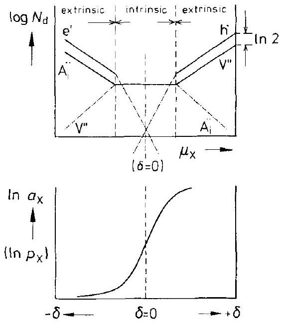
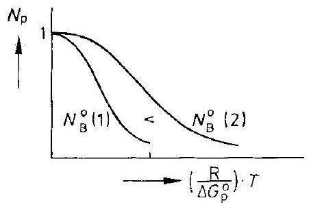
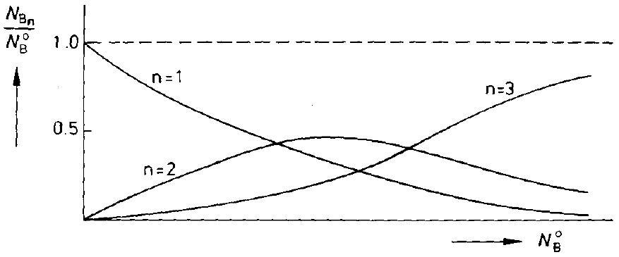
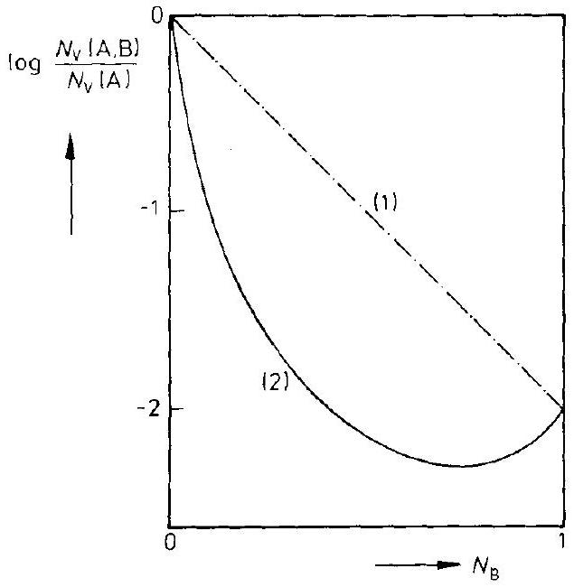

## 2 Thermodynamics of Point Defects

### 2.1 Introduction

Solid state reactions occur mainly by diffusional transport. This transport and other kinetic processes in crystals are always regulated by crystal imperfections. Reaction partners in the crystal are its structure elements ${ }^{1}$ (SE) as defined in the list of symbols (see also [W. Schottky (1958)]). Structure elements do not exist outside the crystal lattice and are therefore not independent components of the crystal in a thermodynamic sense. In the framework of linear irreversible thermodynamics, the chemical (electrochemical) potential gradients of the independent components of a non-equilibrium (reacting) system are the driving forces for fluxes and reactions. However, the flux of one independent chemical component always consists of the fluxes of more than one SE in the crystal. In addition, local reactions between SE's may occur.

Therefore, we have the following situation in the transport theory of crystals. One can, in principle, measure all the fluxes of individual SE's. One can also unambiguously determine the forces that act upon the independent chemical components. However, it is difficult to visualize the fluxes of the chemical component in a crystal lattice and the meaning of driving forces for SE's is not immediately obvious.

It is the purpose of this chapter to deal with these conceptual matters that are specific to solid state chemistry and to provide the thermodynamic basis for an appropriate kinetic theory. In addition, practical situations will be analyzed and applications will be discussed for the sake of illustration.

Chemists and physicists must always formulate correctly the constraints which crystal structure and symmetry impose on their thermodynamic derivations. Gibbs encountered this problem when he constructed the component chemical potentials of non-hydrostatically stressed crystals. He distinguished between mobile and immobile components of a solid. The conceptual difficulties became critical when, following the classical paper of Wagner and Schottky on ordered mixed phases as discussed in chapter 1, chemical potentials of statistically relevant SE's of the crystal lattice were introduced. As with the definition of chemical potentials of ions in electrolytes, it turned out that not all the mathematical operations ( $\partial G / \partial n_{i}$ ) could be performed for SE's of kind $i$ without violating the structural conditions of the crystal lattice. The origin of this difficulty lies in the fact that lattice sites are not the analogue of chemical species (components).

[^0]Nevertheless, the chemical potentials of SE's are frequently used instead of the chemical potentials of (independent) components of a crystalline system. Obviously, a crystal with its given crystal lattice structure is composed of SE's. They are characterized much more specifically than the crystal's chemical components, namely with regard to lattice site and electrical charge. The introduction of these two additional reference structures leads to additional balanced equations or constraints (beside the mass balances) and, therefore, SE's are not independent species in the sense of chemical thermodynamics, as are, for example, ( $n-1$ ) chemical components in an $n$ component system.

With the introduction of the lattice structure and electroneutrality condition, one has to define two elementary SE units which do not refer to chemical species. These elementary units are 1) the empty lattice site (vacancy) and 2) the elementary electrical charge. Both are definite (statistical) entities of their own in the lattice reference system and have to be taken into account in constructing the partition function of the crystal. Structure elements do not exist outside the crystal and thus do not have real chemical potentials. For example, vacancies do not possess a vapor pressure. Nevertheless, vacancies and other SE's of a crystal can, in principle, be 'seen', for example, as color centers through spectroscopic observations or otherwise. The electrical charges can be detected by electrical conductivity.

Since the state of a crystal in equilibrium is uniquely defined, the kind and number of its SE's are fully determined. It is therefore the aim of crystal thermodynamics, and particularly of point defect thermodynamics, to calculate the kind and number of all SE's as a function of the chosen independent thermodynamic variables. Several questions arise. Since SE's are not equivalent to the chemical components of a crystalline system, is it expedient to introduce 'virtual' chemical potentials, and how are they related to the component potentials? If immobile SE's exist (e.g., the oxygen ions in dense packed oxides), can their virtual chemical potentials be defined only on the basis of local equilibration of the other mobile SE's? Since mobile SE's can move in a crystal, what are the internal forces that act upon them to make them drift if thermodynamic potential differences are applied externally? Can one use the gradients of the virtual chemical potentials of the SE's for this purpose?

It has long been known that defect thermodynamics provides correct answers if the (local) equilibrium conditions between SE and chemical components of the crystal are correctly formulated, that is, if in addition to the conservation of chemical species the balances of sites and charges are properly taken into account. The correct use of these balances, however, is equivalent to the introduction of so-called 'building elements' ('Bauelemente') [W. Schottky (1958)]. These are properly defined in the next section and are the main content of it. It will be shown that these building units possess real thermodynamic potentials since they can be added to or removed from the crystal without violating structural and electroneutrality constraints, that is, without violating the site or charge balance of the crystal [see, for example, M. Martin et al. (1988)].

In a book on kinetics, the purpose of understanding the thermodynamics of point defects ( = irregular SE's) is the elucidation of their role as carriers in the elementary steps of mass transport. For any given values of $P, T$, and component chemical potentials, their equilibrium concentrations can be calculated if the magnitudes of
their Gibbs energies of formation are known. As long as chemical processes in the solid state obey the rate equations of (linear) irreversible thermodynamics, point defect thermodynamics can be applied on a local scale, although the (local) concentrations of the components are continuously changing with time. This is true in so far as point defect relaxation processes are sufficiently fast and therefore the transport coefficients (which are determined by mobilities and local concentrations of point defects) are still functions of state. This means that local point defect concentrations are still fully determined by $P, T$, and the local composition of the (independent) chemical components.

### 2.2 Thermodynamics of Crystals

In this section, we will outline point defect thermodynamics and quantify the considerations of the introduction.

### 2.2.1 Phenomenological Approach

Consider a crystal which is in equilibrium having $n$ chemical components ( $k= 1,2, \ldots, n)$. We can define (at any given $P$ and $T$ ) a Gibbs function, $G$, as a homogeneous function that is first order in the amount of components

$$
G=\sum_{k=1}^{n} \mu_{k} \cdot n_{k}
$$

where $\mu_{k}$ denotes the chemical potential and $n_{k}$ the number of moles of component $k$. From the first and second laws of thermodynamics, we derive

$$
\mathrm{d} G=\sum_{k=1}^{n} \mu_{k} \cdot \mathrm{~d} n_{k}-S \cdot \mathrm{~d} T+V \cdot \mathrm{~d} P
$$

and therefore, at a given $P$ and $T$

$$
\sum_{k=1}^{n} n_{k} \cdot \mathrm{~d} \mu_{k}=0 ; \quad \sum_{k=1}^{n} N_{k} \cdot \mathrm{~d} \mu_{k}=0
$$

which is the Gibbs-Duhem equation. It reduces the number of independent chemical potentials $\mu_{k}$ to ( $n-1$ ). From Eqn. (2.2), the chemical potential of component $k$ is given as the partial molar Gibbs energy

$$
\mu_{k}=\left(\frac{\partial G}{\partial n_{k}}\right)_{n_{j} \neq n_{k}}
$$

For a nearly stoichiometric $n$ component compound $p$, we obtain, in accordance with Eqn. (2.1),

$$
\sum_{k=1}^{n} N_{k} \cdot \mu_{k}=G_{p}^{0}, \quad \sum_{k=1}^{n} N_{k} \cdot \ln a_{k}=\frac{\Delta G_{p}^{0}}{R T}, \quad \Delta G_{p}^{0}=G_{p}^{0}-\sum_{k=1}^{n} N_{k} \cdot \mu_{k}^{0}
$$

where $a_{k}$ is the activity of $k$. Neglecting the small fractions of point defects, it is often expedient to refer the fractions $N_{k}$ to the number of lattice sites for component $k$ in the ideal compound, or to the number of unit cells in the compound lattice.

The immediate question is: How does one add a single component $k$ from an external reservoir to the crystal according to Eqn. (2.4) without violating any structural constraints, that is, the fixed relations between the numbers of sublattice sites? We denote a particular sublattice containing atoms (ions) of component $k$ by $\varkappa (\varkappa=1,2, \ldots, K)$ and write the exchange reaction between external reservoir ( $=$ buffer $\beta$ ) and crystal sublattice as

$$
k(\beta) \rightleftharpoons k(\varkappa)
$$

Since we can exchange $k(\beta)$ equally with either sublattice $\varkappa$ or $\lambda$, for example, we also have exchange between sublattices

$$
k(\varkappa) \rightleftharpoons k(\lambda)
$$

The equilibrium condition requires that

$$
\mu_{k(\beta)}=\mu_{k(\chi)}=\mu_{k(\lambda)}\left(=\mu_{k}\right)
$$

Therefore, according to Eqn. (2.4) we have

$$
\mathrm{d} G=\sum_{k=1}^{n} \mu_{k(x)} \cdot \mathrm{d} n_{k}
$$

and, because $\mathrm{d} n_{k}=\sum_{\varkappa=1}^{K} \mathrm{~d} n_{k(\varkappa)}$

$$
\mathrm{d} G=\sum_{\varkappa=1}^{K} \sum_{k=1}^{n} \mu_{k(\varkappa)} \cdot \mathrm{d} n_{k(\varkappa)}
$$

so that

$$
\mu_{k(x)}=\left(\frac{\partial G}{\partial n_{k(x)}}\right)_{n_{(\lambda)} \neq n_{k(x)}}
$$

Note that this differentiation is more specific than the differentiation of Eqn. (2.4).
The addition of a particle $k$ on the sublattice $\varkappa$, however, is possible only in two cases: 1) when vacancies are available in sublattice $\mathcal{\varkappa}$ or 2) when a potential $\varkappa$ site on the crystal surface is filled by adding $k(\beta)$ with the simultaneous formation of
vacancies on all other sublattices in such a way that the proportions of lattice sites in the various sublattices (as dictated by crystallography) are retained. In this second case, the number of unit cells of the crystal lattice has been increased by one. If we designate $z_{\alpha}$ as the number of sites in sublattice $\alpha(\alpha=\varkappa, \lambda, \ldots)$, the ratio in question is

$$
\frac{z_{\varkappa}}{z_{\lambda}}=m_{\varkappa, \lambda}
$$

where $m_{\varkappa, \lambda}$ is normally a simple rational number. With $K$ sublattices, we have $K-1$ equations of type (2.12), which constitute the structural constraints.

Structure elements are symbolized by $S_{\mathcal{K}}^{q}$. $S$ denotes either the particles of components $k$ or a vacancy V , and $q$ is the effective electrical charge relative to a perfect crystal. It is usual to indicate effective charges by (see also list of symbols)
${ }^{\mathrm{x}}=$ neutral
' ' ' ' ' ... ' singly, doubly, and triply negatively charged structure element
= singly, doubly, and triply positively charged structure element
Using these definitions, we can rewrite the exchange reaction (2.6) between buffer and crystal as

$$
k(\beta)+\mathrm{V}_{\varkappa}^{\times}=k_{\varkappa}^{\times}
$$

or

$$
k(\beta)=\left[k_{\varkappa}^{\times}-\mathrm{V}_{\varkappa}^{\times}\right]
$$

The corresponding equilibrium condition between component $k(\beta)$ and two SE's yields, instead of Eqn. (2.8)

$$
\mu_{k}=\mu_{k(\varkappa)}=\mu\left[k_{\varkappa}^{\times}-\mathrm{V}_{\varkappa}^{\times}\right]
$$

where $k(\varkappa)=\left[k_{\varkappa}^{\times}-\mathrm{V}_{\varkappa}^{\times}\right]$is called the 'building element'. If we now assign (virtual) chemical potentials to the individual SE's, Eqn. (2.15) becomes

$$
\mu_{k}=\mu_{k(\varkappa)}=\mu_{k_{\varkappa}^{\times}}-\mu_{v_{\varkappa}^{\times}}
$$

Instead of Eqn. (2.10) we then have

$$
\mathrm{d} G=\sum_{\varkappa=1}^{K} \sum_{k=1}^{n}\left(\mu_{k_{\varkappa}^{\times}}-\mu_{V_{\varkappa}^{\times}}\right) \cdot \mathrm{d} n_{k(\varkappa)}
$$

so that the (measurable, see Eqn. (2.15)) chemical potential of the building element $k(\varkappa)$ is

$$
\mu_{k(\varkappa)}=\mu_{k_{\varkappa}^{\times}}-\mu_{V_{\varkappa}^{\times}}=\left(\frac{\partial G}{\partial n_{k(\varkappa)}}\right)_{\substack{n_{k_{\lambda}^{\#}}, n_{k_{\lambda}}, n_{\mathrm{v}_{\lambda}} \\ k^{\#} \neq k, \lambda \neq \varkappa \\ \lambda=1,2, \ldots, K}}
$$

From Eqn. (2.18), we conclude that there is no experiment to determine the individual SE's chemical potential. The definition of the virtual chemical potential of a SE is implicit in Eqn. (2.16).

Using the symbol $k, \mathcal{\varkappa}$ (or $\mathrm{V}, \mathcal{\varkappa}$ ) for $k_{\varkappa}^{\times}$(or $\mathrm{V}_{\varkappa}^{\times}$), we can rewrite Eqn. (2.17) and cast it in the following form

$$
\mathrm{d} G=\sum_{\varkappa}\left[\sum_{k} \mu_{k, \varkappa} \cdot \mathrm{~d} n_{k, \varkappa}+\mu_{\mathrm{V}, \varkappa} \cdot \mathrm{~d} n_{\mathrm{V}, \varkappa}-\left(\mu_{\mathrm{V}, \varkappa} \cdot \mathrm{~d} n_{\mathrm{V}, \varkappa}+\sum_{\varkappa} \mu_{\mathrm{V}, \varkappa} \cdot \mathrm{~d} n_{k, \varkappa}\right)\right]
$$

From the crystal structure constraint, Eqn. (2.12), we can derive

$$
\frac{n_{\varkappa}}{n_{\lambda}}=m_{\varkappa, \lambda}, \quad \frac{n_{\varkappa}}{\sum n_{\lambda}}=\frac{n_{\varkappa}}{n}=m_{\varkappa}
$$

where $m_{\varkappa}$ is the fixed ratio of lattice sites $x$ to the total lattice sites. With the help of Eqn. (2.20) we can reformulate Eqn. (2.19) as

$$
\mathrm{d} G=\sum_{\varkappa} \sum_{i} \mu_{i, \varkappa} \cdot \mathrm{~d} n_{i, \varkappa}-\mu_{\mathrm{M}} \cdot \frac{\mathrm{~d} n}{z}
$$

with the definition

$$
\mu_{\mathrm{M}}=\sum_{\varkappa}\left(z \cdot m_{\varkappa}\right) \cdot \mu_{\mathrm{V}, \varkappa}=\sum \bar{m}_{\varkappa} \cdot \mu_{\mathrm{V}, \varkappa}
$$

which allows the definition of M as a new building element

$$
\mathrm{M}=\sum \bar{m}_{\varkappa} \cdot \mathrm{V}_{\varkappa}
$$

If $z$ corresponds to the number of lattice sites comprised by the formula unit of a compound (e.g. $\mathrm{AB}_{2} \mathrm{O}_{4}$ ), we call M a 'lattice molecule'. At equilibrium, M has a constant chemical potential $\mu_{\mathrm{M}}^{0}$, which we may set equal to zero by definition. Equation (2.21) then reduces to

$$
\mathrm{d} G=\sum_{\varkappa} \sum_{i} \mu_{i, \varkappa} \cdot \mathrm{~d} n_{i, \varkappa}
$$

While Eqn. (2.24) justifies the introduction of virtual chemical potentials of SE's including vacancies, it also assumes that the 'lattice molecule' M, according to Eqn. (2.23), is in equilibrium with all the vacancies $\mathrm{V}_{\varkappa}, \varkappa=1, \ldots, K$.

The above conclusions have been reached without consideration of the electrical charge $q$ on the structure elements. In ionic crystals, however, most of the SE's possess an effective electrical charge. Let us therefore consider an exchange reaction of electrical charge between two SE's, such as the redox reaction

$$
k_{\varkappa}^{\times}+j_{\varkappa}^{\times}=k_{\varkappa}^{+q}+j_{\varkappa}^{-q}
$$

Equation (2.25) gives, after rearrangement,

$$
k_{\varkappa}^{\times}-k_{\varkappa}^{+q}=j_{\varkappa}^{-q}-j_{\varkappa}^{\times}
$$

Accordingly, the electrical unit is $\mathrm{e}=1 / q \cdot\left(k_{\varkappa}^{\times}-k_{\varkappa}^{+q}\right)$, and its chemical potential can be formulated as

$$
\mu_{\mathrm{e}(\varkappa)}=1 / q \cdot\left(\mu_{k^{\times}, \varkappa}-\mu_{k^{q}, \varkappa}\right)
$$

In equilibrium, we have

$$
\mu_{\mathrm{e}(x)}=\mu_{\mathrm{e}(\lambda)}=\ldots\left(=\mu_{\mathrm{e}}\right)
$$

and thus

$$
\mu_{k^{a}, \varkappa}=\mu_{k^{\circ}, \varkappa}-q \cdot \mu_{\mathrm{e}}
$$

Application of Eqn. (2.24) to all SE's, including those which are charged, gives

$$
\mathrm{d} G=\sum_{\varkappa} \sum_{i}\left(\mu_{i, \varkappa}-\mu_{\mathrm{e}} \cdot q_{i, \varkappa}\right) \cdot \mathrm{d} n_{i, \varkappa}
$$

If one takes into account the electroneutrality condition of the crystal, which is $\sum_{\varkappa} \sum_{i} q_{i, \varkappa} \cdot n_{i, \varkappa}=0$, Eqn. (2.30) yields

$$
\mathrm{d} G=\sum_{\varkappa} \sum_{i} \mu_{i, \varkappa} \cdot \mathrm{~d} n_{i, \varkappa}
$$

where the summation goes over all structure elements $(i, \varkappa)$, be they charged or neutral.

The results of the discussion on the phenomenological thermodynamics of crystals can be summarized as follows. One can define chemical potentials, $\mu_{k}$, for components $k$ (Eqn. (2.4)), for building units (Eqn. (2.11)), and for structure elements (Eqn. (2.31)). The lattice construction requires the introduction of 'structural units', which are the vacancies $V_{\varkappa}$. Electroneutrality in a crystal composed of charged SE's requires the introduction of the electrical unit, e. The composition of an $n$ component crystal is fixed by ( $n-1$ ) independent mole fractions, $N_{k}$, of chemical components. ( $n-1$ ) is also the number of conditions for the definition of the component potentials $\mu_{k}$, as seen from Eqn. (2.4). For building units, we have ( $n-1$ ) independent composition variables and $n \cdot(K-1)$ equilibria between sublattices $\varkappa$, so that the number of conditions is $n \cdot K-1$, as required by the definition of the building element potential $\mu_{k(x)}$. For structure elements, the actual number of constraints is larger than the number of constraints required by Eqn. (2.18), which defines $\mu_{k(x)}$. This circumstance is responsible for the introduction of the concept of 'virtual' chemical potentials of SE's.

So far we have not specifically addressed crystals with non-localized electronic charge carriers. Their energy states are grouped in the conduction and valence bands. Using the previous notation of building elements, when we add the building element $\mathrm{e}^{\prime}$ to an empty state, $\varepsilon_{\mathrm{c}}$, of the conduction band, we have, in accordance with Eqn. (2.14),

$$
\mathrm{e}^{\prime}=\left[\mathrm{e}_{\mathrm{c}}-\varepsilon_{\mathrm{c}}\right]
$$

and the corresponding equation for the electron hole in the valence band is

$$
-\mathrm{e}^{\prime}=-\left[\mathrm{e}_{\mathrm{v}}-\varepsilon_{\mathrm{v}}\right]=\mathrm{h}^{\bullet}
$$

In (electronic) equilibrium

$$
\mu_{\mathrm{e}(x)}=\mu_{\mathrm{e}^{\prime}}=-\mu_{\mathrm{h}^{*}}=\mu_{\mathrm{e}}
$$

Note that $\mu_{\mathrm{e}(x)}$ is defined by Eqn. (2.27). For non-localized band electrons and holes we therefore have

$$
\mu_{\mathrm{e}^{\prime}}+\mu_{\mathrm{h}} \cdot=0
$$

Adding $\mathrm{d} n_{\mathrm{e}}$ negative charges to a crystal means that

$$
\mathrm{d} n_{\mathrm{e}}=\mathrm{d} n_{\mathrm{e}^{\prime}}-\mathrm{d} n_{\mathrm{h}}+\sum_{\varkappa} \mathrm{d} n_{\mathrm{e}(\varkappa)}
$$

The strict definition of the building element potential $\mu_{\mathrm{e}^{\prime}}$ is then given by

$$
\mu_{\mathrm{e}^{\prime}}=\left(\frac{\mathrm{\partial} G}{\partial n_{\mathrm{e}^{\prime}}}\right)_{n_{k(x)}, n_{\mathrm{h}}, n_{\mathrm{e}(x), n_{\mathrm{M}}}}
$$

Let us conclude with a short remark on the concentration dependence of the phenomenological potentials $\mu_{i}$ and, in particular, when point defects are involved. It is common and convenient to split the chemical potentials into two parts: 1) $\mu_{i}^{0}(P, T)$, which does not depend on the composition variables $N_{i}$, and 2 ) the composition dependent term $R T \cdot \ln a_{i}$, which for ideal solutions ( $a_{i}=N_{i}$ ) is simply $R T \cdot \ln N_{i}$. For non-ideal solutions, one introduces the excess term $R T \cdot \ln f_{i}=R T$. $\ln a_{i}-R T \cdot \ln N_{i}$. Let us write $\ln f_{i}$ as a power series of the form

$$
\ln f_{i}=\ln f_{i}^{0}+\sum_{j} N_{j} \cdot \varepsilon_{i}^{(j)}+\sum_{j} \sum_{k} N_{j} \cdot N_{k} \cdot \varepsilon^{(j, k)}+\ldots
$$

where $f_{i}$ is the activity coefficient. We will apply Eqn. (2.38) to crystals with interacting point defects and let the summation go over all point defects including $i$. For small point defect concentrations, the linearized form of Eqn. (2.38) is appropriate. The $\varepsilon_{i}^{(j)}$ are called interaction parameters. $f_{i}^{0}$ is $f_{i}\left(N_{j} \rightarrow 0\right)$, in the limit of an infinitely dilute solution. Comparing Eqn. (2.38) with the Taylor expansion of $\ln f_{i}$, viz.

$$
\ln f_{i}=\ln f_{i}^{0}+\sum \frac{\partial \ln f_{i}}{\partial N_{j}} \cdot N_{j}
$$

it is seen that

$$
\varepsilon_{i}^{(j)}=\frac{\partial \ln f_{i}}{\partial N_{j}}
$$

Multiplication by $R T$ gives the respective interaction energy terms. With the help of the Maxwell relations $\partial^{2} G / \partial n_{i} \partial n_{j}=\partial^{2} G / \partial n_{j} \partial n_{i}$ one shows that $\varepsilon_{i}^{(j)}=\varepsilon_{j}^{(i)}$. More details can be found in [C. Wagner (1952)].

Mole fractions may not always be the most suitable composition variables for SE's. This is due to crystal structure conditions and the fact that a crystal is built from sublattices, $x$, on which SE's are distributed in the sense of thermodynamic (sub) systems [H. Schmalzried, A. Navrotsky (1975)]. This point, however, concerns the subject matter of the next section.

### 2.2.2 Remarks on Statistical Thermodynamics of Point Defects

Statistical thermodynamics can provide explicit expressions for the phenomenological Gibbs energy functions discussed in the previous section. The statistical theory of point defects has been well covered in the literature [A. R. Allnatt, A. B. Lidiard (1993)]. Therefore, we introduce its basic framework essentially for completeness, for a better atomic understanding of the driving forces in kinetic theory, and also in order to point out the subtleties arising from the constraints due to the structural conditions of crystallography.

Although the statistical approach to the derivation of thermodynamic functions is fairly general, we shall restrict ourselves to a) crystals with isolated defects that do not interact (which normally means that defect concentrations are sufficiently small) and b) crystals with more complex but still isolated defects (i.e., defect pairs, associates, clusters). We shall also restrict ourselves to systems at some given ( $P, T$ ), so that the appropriate thermodynamic energy function is the Gibbs energy, $G$, which is then constructed as

$$
G=G_{P, T}^{0}(n)+\sum_{\mathrm{SE}} n_{i} \cdot g_{i}-T \cdot S_{\mathrm{conf}} ; \quad n=\sum n_{i}
$$

where $G^{0}$ is the Gibbs energy of the perfect crystal, $g_{i}$ is the (additional) Gibbs energy associated with the formation of SE $i$ in the real crystal with its defects (the summation goes over all SE's), and $S_{\text {conf }}$ is the configurational part of the crystal entropy.

From the above assumptions about the defects, we can state that a) $g_{i}=0$ for all regular SE's, b) $g_{i}>0$, but independent of concentration, for all irregular SE's, and c) the configurational entropy of the (single) defects in one sublattice is

$$
S_{\mathrm{conf}}=k \cdot \ln \Omega=k \cdot \ln \left(\frac{\prod_{i}\left(z_{i, \varkappa}\right)!}{\left(\sum_{i} z_{i, \varkappa}\right)!}\right)
$$

where $z_{i, \varkappa}=n_{i, \varkappa} \cdot N_{0}$. If there is more than one sublattice in the crystal, one has to sum the corresponding configurational entropies. In writing Eqn. (2.42), it has been assumed that irregular SE's have no internal degrees of freedom and that they retain
the point symmetry of the lattice. Otherwise, we would have to count the individual degenerate states. Since we are interested in the kinetic driving forces and therefore need the (gradients of the) chemical potentials and their dependence on concentration, we have to derive the $\mu_{i}$ functions from Eqn. (2.41) under the restrictions imposed by the conservation laws for mass, charge, and crystal lattice sites. The corresponding balance equations can always be written in the form

$$
\sum_{(\beta)} \beta_{i} \cdot n_{i}=\text { constant }
$$

The $\beta_{i}$ are numerical factors. In the case of the electroneutrality condition, $\beta_{i}$ is the effective charge on SE type $i$. Note that the equilibrium crystal is characterized by $\delta G=0$, subject to the constraints of Eqn. (2.43).

The simplest situation is met if we consider a one-component system (A) with vacancies only. Since there are no equations like that in Eqn. (2.43), we can readily obtain $\mu_{\mathrm{A}}$ and $\mu_{\mathrm{V}}$ from Eqn. (2.41) by differentiation and noting that $n=n_{\mathrm{A}}+n_{\mathrm{V}}$. Thus,

$$
\begin{aligned}
& \mu_{\mathrm{A}}=\mu^{0}+R T \cdot \ln \left(1-N_{\mathrm{V}}\right) \\
& \mu_{\mathrm{V}}=\mu^{0}+g_{\mathrm{V}}+R T \cdot \ln N_{\mathrm{V}}=\mu_{\mathrm{V}}^{0}+R T \cdot \ln N_{\mathrm{V}}
\end{aligned}
$$

where $\mu^{0}=\partial G_{P, T}^{0} / \partial n$. Equation (2.44) explains the meaning of the standard chemical potentials of A and V . At equilibrium, $\mu_{\mathrm{V}}=0$ and, therefore,

$$
N_{\mathrm{V}}=\mathrm{e}^{-\frac{\mu_{\mathrm{V}}^{0}}{R T}}
$$

Furthermore,

$$
G_{m}=\sum N_{i} \mu_{i}=\left(1-N_{\mathrm{V}}\right) \cdot\left(\mu^{0}+R T \cdot \ln \left(1-N_{\mathrm{V}}\right)\right)
$$

The other thermodynamic functions ( $H, U, F$, etc.) can be derived from $G$ as usual. For example, the partial enthalpy of vacancies is found to be

$$
h_{\mathrm{V}}=-\frac{\partial \ln N_{\mathrm{V}}}{\partial(1 / R T)}
$$

A second example will now be discussed in order to illustrate the application of the internal equilibrium condition in combination with structural constraints. Let us regard a crystal AX , such as AgBr , having Frenkel disorder in the cation sublattice (see Fig. 1-2). Structure elements which must be considered here are $\mathrm{A}_{\mathrm{A}}, \mathrm{X}_{\mathrm{X}}, \mathrm{V}_{\mathrm{A}}$, $\mathrm{V}_{\mathrm{i}}, \mathrm{A}_{\mathrm{i}}$. The structural constraint reads

$$
n_{\mathrm{A}_{\mathrm{A}}}+n_{\mathrm{V}_{\mathrm{A}}}=n_{\mathrm{X}_{\mathrm{X}}} ; \quad n_{\mathrm{V}_{\mathrm{i}}}+n_{\mathrm{A}_{\mathrm{i}}}=2 n_{\mathrm{X}_{\mathrm{X}}}
$$

Constructing $G$ as in Eqn. (2.41) but imposing the equilibrium condition $\delta G_{P, T}=0$ and using Lagrange's method of undetermined multipliers ( $\lambda_{\mathrm{A}}, \lambda_{\mathrm{j}}$ ) in order to meet the structural constraints, we obtain

$$
\begin{gathered}
\frac{\partial G}{\partial n_{\mathrm{A}_{\mathrm{A}}}}+\lambda_{\mathrm{A}}=0, \quad \mu_{\mathrm{A}_{\mathrm{A}}} \cong \mu_{\mathrm{A}_{\mathrm{A}}}^{0}=-\lambda_{\mathrm{A}} \\
\frac{\partial G}{\partial n_{\mathrm{V}_{\mathrm{A}}}}+\lambda_{\mathrm{A}}=0, \quad \mu_{\mathrm{V}_{\mathrm{A}}}^{0}+R T \cdot \ln N_{\mathrm{V}_{\mathrm{A}}}=\mu_{\mathrm{A}_{\mathrm{A}}}^{0}
\end{gathered}
$$

from which it follows that

$$
N_{\mathrm{V}_{\mathrm{A}}}=\mathrm{e}^{-\frac{\mu_{\mathrm{V}_{\mathrm{A}}}^{0}-\mu_{\mathrm{A}_{\mathrm{A}}}^{0}}{R T}}=\mathrm{e}^{-\frac{G_{\mathrm{V}}^{0}}{R T}}, \quad G_{\mathrm{V}}^{0}=\mu_{\mathrm{V}_{\mathrm{A}}}^{0}-\mu_{\mathrm{A}_{\mathrm{A}}}^{0}
$$

Analogous relations can be derived for $N_{\mathrm{A}_{\mathrm{i}}}$. Therefore, one concludes that

$$
\mu_{\mathrm{A}_{\mathrm{A}}}^{0}-\mu_{\mathrm{V}_{\mathrm{A}}}^{0}=\mu_{\mathrm{A}_{\mathrm{i}}}^{0}-\mu_{\mathrm{V}_{\mathrm{i}}}^{0}
$$

and we may recall that $\left[A_{A}-V_{A}\right]$ or $\left[A_{i}-V_{i}\right]$ were the definitions of the $A$ building element in Section 2.2.1 (see Eqn. (2.18)).

We now proceed to more realistic and complicated systems by considering crystals in which the point defects interact. If the interaction is due to forces between nearest neighbors only, then one may calculate the point defect concentrations by assuming that, in addition to single point defects, e.g. $i_{1}$ and $i_{2}$, pairs (or still higher clusters) of point defects form and that they are in internal equilibrium. These clusters are taken to be ideally diluted in the crystal matrix, in analogy to the isolated single defects. All the defect interactions are thus contained in the cluster formation reaction

$$
\mathrm{i}_{1}+\mathrm{i}_{2}=\mathrm{i}_{\mathrm{c}}
$$

with subscripts 1 and 2 denoting different (or the same) atomic defects, subscript c denoting the associate or cluster. In this way, the problem is similar to the single point defect problem as formulated in Eqns. (2.41)-(2.50). The evaluation of the term $T \cdot S_{\text {conf }}=R T \cdot \ln \Omega$ by combinatorial calculations, however, may prove to be very cumbersome due to site exclusion requirements [H. Schmalzried, A. Navrotsky (1975)]. For example, not only is it not possible for a second single point defect to be placed on the site of a first one, but it also cannot be placed on a nearest neighbor site without becoming a defect pair by definition. If the defect pair can exist in extended states (for example, if there is a relative energy minimum when separated at the second nearest neighbor distance), then calculating $S_{\text {conf }}$ by combinatorial methods is even less straightforward. Nevertheless, the clustering problem is most important in solid state kinetics, since clusters and single defects have different mobilities. Clusters are precursors to phase changes and to the precipitation of second phases in the matrix crystal.

A more practical discussion is given in Section 2.3. At this point, let us mention the Mayer cluster expansion technique originally applied to the imperfect gas [J. E. Mayer, M. Mayer (1940)] but to which Allnatt and Lidiard [A. R. Allnatt, A. B. Lidiard (1993)] have drawn attention in the present context. In this approach, $\ln \Omega$
is evaluated as the sum of an ideal lattice gas contribution (without the restriction of excluded sites) with a power series in defect fractions (in formal analogy to virial coefficients). The power series describes the excluded site corrections. Thus, one obtains the following expression for the configurational entropy ( $N=$ site fractions)

$$
S_{\mathrm{conf}}=-R \cdot\left[\sum_{r} N_{r} \cdot\left(\ln \frac{N_{r}}{y_{r}}-1\right)+\frac{1}{2} \sum_{r} \sum_{s} N_{r} \cdot N_{s} \cdot B_{r s}\right]
$$

where $y_{r}$ and $B_{r s}$ are dimensionless parameters characteristic of the defects and structure. $y_{r}$ is equal to the number of distinct orientations of the isolated defect of kind $r$ in the lattice. $B_{r s}$ embodies the restrictions if certain sites cannot be occupied. Other interaction models, for example the so-called regular solution model, the Bragg-Williams approach, and the Debye-Hückel theory, will be discussed in due course. See also [A. B. Lidiard (1957); A. R. Allnatt, A. B. Lidiard (1987)].

It has been mentioned that mole fractions are not always the most convenient composition variables since they often do not take into account particular features and conditions of the crystal structure. Normally, statistical considerations require composition variables which refer to the number of sites in a sublattice rather than to the number of component atoms. Let us discuss a simple example. Component B is dissolved in the interstitial lattice of crystal $\mathrm{A} . N_{\mathrm{B}}=n_{\mathrm{B}} /\left(n_{\mathrm{A}}+n_{\mathrm{B}}\right)$ does not have an immediate statistical meaning. However, if we know from the crystal structure condition that the number of interstitial sites per A-lattice site is $m_{1}$, then the fraction

$$
\bar{x}_{\mathrm{B}}=\frac{n_{\mathrm{B}}}{m_{\mathrm{i}} \cdot n_{\mathrm{A}}}=\frac{1}{m_{\mathrm{i}}} \cdot \frac{N_{\mathrm{B}}}{1-N_{\mathrm{B}}}
$$

is that which must be dealt with in evaluating the statistics of the solid solution. Moreover, if we knew that each B on sublattice i would block $b_{\mathrm{i}}$ neighboring sites, a still more relevant variable is

$$
x_{\mathrm{B}}=\frac{n_{\mathrm{B}}}{m_{\mathrm{i}} \cdot n_{\mathrm{A}}-b_{\mathrm{i}} \cdot n_{\mathrm{B}}}=\frac{N_{\mathrm{B}}}{m_{\mathrm{i}}-N_{\mathrm{B}} \cdot\left(1-b_{\mathrm{i}}\right)}
$$

From calculations like those which correspond to an evaluation of Eqns. (2.41) ff., one concludes that the activity of B , in the limit of a dilute solution, is directly proportional to $x_{\mathrm{B}}$.

Utilizing the framework of interaction parameters as introduced in the previous section (see Eqns. (2.38)-(2.40)), one finds upon some algebraic rearrangements

$$
\varepsilon_{\mathrm{B}}^{(\mathrm{B})}=\frac{1+b_{\mathrm{i}}}{m_{\mathrm{i}}-N_{\mathrm{B}} \cdot\left(1+b_{\mathrm{i}}\right)} \simeq \frac{1+b_{\mathrm{i}}}{m_{\mathrm{i}}}
$$

Note that the introduction of structural conditions and site exclusions suffices to obtain (apparent) interaction parameters, which differs from the concept of the Mayer cluster expansion approach.

### 2.3 Some Practical Aspects of Point Defect Thermodynamics

In principle, there are only three different types of point defects: vacant lattice sites on regularly occupied sublattices, interstitials on regularly unoccupied sublattices, and irregular (foreign) atoms (ions) present either in the interstitial sublattice or substituted for regular SE's. At thermal equilibrium, all possible kinds of point defects exist in finite (although often very small) concentrations, given by the Gibbs energy minimum. In metallic systems and in molecular crystals, there is no coupling of the various point defect concentrations through the condition of electroneutrality as there is in ionic crystals. Normally, point defects in ionic crystals possess effective electrical charges (relative to the ideal crystal lattice). For example, whereas an interstitial cation is frequently positively charged, a cation vacancy is often negatively charged. Since the numbers of positively and negatively charged equivalents of all irregular SE's must be equal, one can group them into various neutral combinations. The concentration of the combination with the lowest energy of formation often surpasses by far the concentrations of all the others. In such a case, it is appropriate to introduce the point defect disorder type for a crystal. The defects that constitute a disorder type are named 'majority defects'. Excess electrons and electron holes, if localized, are obviously defects in this sense. Even if excess electrons (holes) are not localized, they can compensate the electrical charges of ionic point defects for the sake of electroneutrality.

Let us now discuss some details of practical relevance. From the Gibbs phase rule, it is evident that crystals consisting of only one component (A) become nonvariant by the predetermination of two thermodynamic variables, which for practical reasons are chosen to be $P$ and $T$. In these one-component systems, it is easy to recognize the (isobaric) concentration dependence of the point defects on temperature. From the definition of the vacancy chemical potential for sufficiently small vacancy mole fractions $N_{\mathrm{V}}$, namely $\mu_{\mathrm{V}}=\mu_{\mathrm{V}}(P, T)+R T \cdot \ln N_{\mathrm{V}}$, together with the condition of equilibrium with the crystal's inert surroundings (gas, vacuum), one directly finds

$$
N_{\mathrm{V}}=\mathrm{e}^{-\frac{\mu_{\mathrm{V}}^{0}(\mathrm{~A})-\mu_{\mathrm{V}}^{0}(\mathrm{vac})}{R T}}
$$

Equation (2.57) can be compared with Eqn. (2.50). Noting that the standard value of the vacancy chemical potential of a crystal is only slightly dependent on $T, \mathrm{~N}_{\mathrm{V}}$ is in essence exponentially dependent on $(1 / T)$. This Arrhenius-type of temperature dependence is also found for the interstitials, since in view of the site-preserving formation reaction $A_{A}+V_{i}=A_{i}+V_{A}$, the equilibrium condition for this defect formation reaction shows that

$$
\mu_{\mathrm{A}_{\mathrm{i}}}=\mu_{\mathrm{A}_{\mathrm{A}}}^{0}+\mu_{\mathrm{V}_{\mathrm{i}}}^{0}-\mu_{\mathrm{V}_{\mathrm{A}}}
$$

The chemical potentials of the regular SE's $A_{A}$ and $V_{i}$ have been set (to a good approximation) equal to their standard potentials ( $N \cong 1$ ), so that $\mu_{\mathrm{A}_{\mathrm{i}}}$ and $\mu_{\mathrm{V}_{\mathrm{A}}}$ are
directly related to each other. In order to quantify the (isothermal) $P$ dependence, which is an important issue at high pressures (the crystal compressibilities are on the order of $10^{-6} \mathrm{bar}^{-1}$ ), the defect formation volume, $\Delta V_{\mathrm{d}}$, has to be known in order to add the integral $\int \Delta V_{\mathrm{d}} \cdot \mathrm{d} P$ term to the defect formation Gibbs energies.

Defect thermodynamics is more complicated when applied to binary (or multicomponent) compound crystals. For binary systems, there is one more independent thermodynamic variable to control. In the case of extended binary solid solutions, one would normally choose a composition variable for this purpose. For compounds with very narrow ranges of homogeneity (i.e., point defect concentrations), however, the composition is obviously not a convenient variable. The more natural choice is the chemical potential of one of the two components of the compound crystal. In practice one will often use the vapor pressure ( $\sim$ activity) of this component.

Two limiting cases must be distinguished. Point defect disorder caused by thermal activation is either larger or smaller than the change of point defect concentration due to the change in component chemical potential (inside the narrow homogeneity range of the compound). The first disorder type (thermal concentration larger) is called intrinsic, the second one (thermal concentration smaller) is called extrinsic.

Let us first discuss intrinsic disorder types where the number of moles of the components is almost constant and independent of the component activities. Thus, the majority point defect concentrations are also (almost) independent of the component activities. It follows that only two types of (intrinsic) defect formation reactions are allowed

$$
\begin{gathered}
\mathrm{i}_{1}+\mathrm{j}_{2}=\mathrm{i}_{2}+\mathrm{j}_{1} \\
\mathrm{i}_{1}+\mathrm{i}_{2}(+\ldots)=\mathrm{M}
\end{gathered}
$$

The first reaction is a site exchange reaction and so does not alter the number of lattice sites. The second reaction describes the formation of a complete lattice molecule M. An example of the first type of reaction (exchange reaction, Eqn. (2.59)) is the so-called Frenkel defect formation reaction in AX (e.g., in silver halides, see Fig. 1-2)

$$
A_{A}+V_{i}=A_{i}^{*}+V_{A}^{\prime}
$$

The equilibrium ( $\sum v_{i} \mu_{i}=0$ ) and electroneutrality ( $N_{\mathrm{A}}=N_{\mathrm{V}}=N_{\mathrm{F}}^{0}$ ) conditions lead to

$$
\left(N_{\mathrm{F}}^{0}\right)^{2}=K_{\mathrm{F}} ; \quad K_{\mathrm{F}}=\mathrm{e}^{-\frac{\sum v_{i} \mu_{i}^{0}}{R T}}
$$

An example of the second type of intrinsic reactions is the so-called Schottky defect formation reaction in AX (e.g., alkali halides)

$$
A_{A}+X_{X}=V_{A}^{\prime}+V_{X}^{\bullet}+A X
$$

The equilibrium and electroneutrality conditions lead to an equation with the same form as Eqn. (2.62) where $N_{\mathrm{F}}^{0}=N_{\mathrm{V}_{\mathrm{A}}^{\prime}}=N_{\mathrm{V}_{\mathrm{X}}^{\prime}}$. In contrast to Eqn. (2.61), however, the sites of a new lattice molecule AX have been added to the crystal which, for example, has consequences for the pressure dependence of $N_{\mathrm{F}}^{0}$.

If majority point defect concentrations depend on the activities (chemical potentials) of the components, extrinsic disorder prevails. Since the components $k$ are necessarily involved in the defect formation reactions, nonstoichiometry is the result. In crystals with electrically charged regular SE, compensating electronic defects are produced (or annihilated). As an example, consider the equilibrium between oxygen and appropriate SE's of the transition metal oxide CoO . Since all possible kinds of point defects exist in equilibrium, we may choose any convenient reaction between the component oxygen and the appropriate SE's of CoO (e.g., Eqn. (2.64))

$$
\frac{1}{2} \cdot \mathrm{O}_{2}=\mathrm{O}_{\mathrm{O}}^{\times}+\mathrm{V}_{\mathrm{Co}}^{\prime}+\mathrm{h}^{\bullet}
$$

in order to formulate the equilibrium condition. Along with the condition of electroneutrality, we obtain

$$
N_{\mathrm{h}} \cong N_{\mathrm{V}_{\mathrm{C}_{0}}^{\prime}}=N^{0} \cdot\left(\frac{p_{\mathrm{O}_{2}}}{p_{\mathrm{O}_{2}}^{0}}\right)^{1 / 4}
$$

as the law of mass action. The superscript ${ }^{0}$ indicates an arbitrary reference state. We have again assumed ideal behavior of the irregular SE's (in view of their low concentrations) and have chosen $\mathrm{V}_{\mathrm{Co}}^{\prime}$ as the appropriate point defect in reaction (2.64) since $\mathrm{V}_{\mathrm{C}_{0}}^{\prime}$ is known to be a majority defect. This means that all other defect concentrations (except the charge compensating electron holes) can be neglected in the balance equations, for example, in the charge-balance, which then reads $N_{\mathrm{V}_{\mathrm{Co}}} \cong N_{\mathrm{h}}$. If the singly ionized cation vacancy $\mathrm{V}_{\mathrm{Co}}^{\prime}$ is the majority atomic defect, then the regular oxygen ion sublattice of CoO is almost undisturbed. Thus, we may represent cobaltous oxide more correctly as $\mathrm{Co}_{1-\delta} \mathrm{O}$, with $\delta$ being the cation deficit ( $\delta= N_{\mathrm{V}_{\mathrm{Co}}^{\prime}} \cong N_{\mathrm{h}}$ ). The nonstoichiometry $\delta$ increases with increasing oxygen potential according to Eqn. (2.65). Since $N_{\mathrm{h}}$. increases in the same way, it is possible to control the electrical conductivity ( $\sigma \sim N_{\mathrm{h}}$.) of this semiconducting oxide by the oxygen pressure of the surrounding atmosphere. We can control the diffusion coefficient of the cobalt ions in an analogous way because cation diffusion occurs by site exchange of a vacancy with its neighboring cobalt ions.

Several additional remarks are appropriate. The disorder type of a pure, strictly stoichiometric crystal is always intrinsic. Starting from $\delta=0$, small changes in component activities leave the concentration of the majority defects approximately constant. The concentrations of all other (minority) defects are, however, activity dependent and can easily be calculated if the corresponding defect formation equilibria are formulated similar to Eqns. (2.64) and (2.65). Entering into the extrinsic regime means that one of the (intrinsic) minority defects now becomes a majority defect, as can be seen from Figure 2-1 (a so-called Kroeger-Vink diagram). If we plot the nonstoichiometry $\delta$ versus the component potential, then the stoichiometric composition, $\delta=0$, will be indicated by an inflection point [H. Schmalzried (1981a); H. Schmalzried (1981 b), p. 42 ff.].

We have seen that it is possible to control electron (and electron hole) concentrations by the chemical potential of a component of the crystalline compound within a finite range of homogeneity. This observation leads to an effect that is known as

Figure 2-1. Point defect fractions $N_{\mathrm{d}}$ and nonstoichiometry $\delta$ for $\mathrm{A}_{1-\delta} \mathrm{X}$ at given $P$ and $T$ (Kroeger-Vink diagram) a) as a function of the X component chemical potential, b) the same information in form of a 'titration curve'.

valence control by doping. Let us assign the electron holes ( $\mathrm{h}^{\bullet}$ ) in Eqn. (2.64) to the $\mathrm{Co}^{3+}$ cations in $\mathrm{Co}_{1-\delta} \mathrm{O}$. When we dissolve (at a fixed oxygen potential) additional heterovalent cations into cobaltous oxide, the binary crystal becomes a ternary one and its charge balance is further regulated by the redox couple $\mathrm{Co}^{2+} / \mathrm{Co}^{3+}$. For example, we can add $\mathrm{Li}^{+}$ions in the form of the component $\mathrm{Li}_{2} \mathrm{O}$. By adding more $\mathrm{Li}_{2} \mathrm{O}$ than the existing concentration of $\mathrm{V}_{\mathrm{Co}}^{\prime}$, charge compensation is essentially achieved by the balance $N_{\mathrm{Li}^{+}} \cong N_{\mathrm{Co}^{3+}}$, which is the aforementioned valence control by doping. More systematically it is the dependence of the electronic (majority) point defect concentration on the chemical potential (activity, concentration) of a further crystal component (here $\mathrm{Li}_{2} \mathrm{O}$ ).

Let us briefly reconsider the meaning of 'component'. For AX, elements are the obvious components. For higher systems, such as $\mathrm{AB}_{2} \mathrm{O}_{4}$ (spinel), we have various choices. The only requirement for the selection of appropriate components is that any composition in the system's range of homogeneity be established by the chosen three independent species. A trivial choice would be the three elements $\mathrm{A}, \mathrm{B}, \mathrm{O}$. Another more practical choice is $\mathrm{AO}, \mathrm{B}_{2} \mathrm{O}_{3}$, and $\mathrm{O}\left(\mathrm{O}_{2}\right)$. This choice is, in fact, the most practical one because the easiest way to prepare a nonstoichiometric spinel is by reacting the proper amounts of AO and $\mathrm{B}_{2} \mathrm{O}_{3}$ in an atmosphere with a predetermined $\mathrm{O}_{2}$ activity. The formulation of extrinsic defect formation reactions depends directly on the choice of the independent components. The results, however, which relate defect concentrations to component potentials are independent of the specific choice of the components in view of all existing internal defect equilibria.

It can be seen from Eqn. (2.65) and equivalent relations that phenomenological point defect thermodynamics does not give us absolute values of defect concentrations. Rather, within the limits of the approximations (e.g., ideally dilute solutions of irregular SE's in the 'solvent' crystal), we obtain relative changes in defect concentrations as a function of changes in the intensive thermodynamic variables ( $P, T$, $\mu_{k}$ ). Yet we also know that the crystal is stoichiometric (i.e., $\delta=0$ ) at the inflection
point of the nonstoichiometry function $\delta\left(\mu_{k}\right)$. Wagner [C. Wagner (1971)] evaluated and exploited this idea in order to experimentally determine absolute defect concentrations.

A theoretical calculation of absolute point defect concentrations requires that the defect formation energies and entropies be known. The early estimates of defect energies [W. Schottky (1935)] were made in order to explain the occurrence of different disorder types in ionic crystals having the same crystallographic structure (Frenkel disorder in silver halides; Schottky disorder in alkali halides). It has already been mentioned that the introduction of lattice energies [M. Born, J.E. Mayer (1932)] into Eqn. (2.62) yielded much lower Schottky defect concentrations than observed. By taking polarization effects into account, defect energy calculations on ionic crystals can be successfully performed [P. W. M. Jacobs (1990)]. The determination of Frenkel pair energies is, in principle, quite analogous. An additional amount of energy must be expended in order to squeeze the ions into the interstices of the interstitial sublattice and therefore Frenkel disorder will be preferred when the interstitial ions are small and/or the (static) dielectric constant $\varepsilon$ is high so that a large polarization energy is gained. A calculation of point defect formation energies is methodologically quite different for each of the different types of solids: metals, covalent crystals, ionic crystals, and van der Waals crystals [P. Flynn (1972)]. The computation of entropies [P. W. M. Jacobs (1990); J. Harding (1990)] requires an understanding of the changes in the vibrational spectrum of the crystal caused by point defects.

Defect clustering is the result of defect interactions. Pair formation is the most common mode of clustering. Let us distinguish the following situations: a) two point defects of the same sort form a defect pair ( $\mathrm{B}+\mathrm{B}=\mathrm{B}_{2}=[\mathrm{B}, \mathrm{B}] ; \mathrm{V}+\mathrm{V}=\mathrm{V}_{2}=[\mathrm{V}, \mathrm{V}]$ ) and b) two different point defects form a defect pair (electronic defects can be included here). The main question concerns the (relative) concentration of pairs as a function of the independent thermodynamic variables $\left(P, T, \mu_{k}\right)$. Under isothermal, isobaric conditions and given a dilute solution of B impurities, the equilibrium condition for the pair formation reaction $\mathrm{B}+\mathrm{B}=\mathrm{B}_{2}$ is $2 \cdot \mu_{\mathrm{B}}=\mu_{\mathrm{B}_{2}}$. The mass balance reads $N_{\mathrm{B}}+2 \cdot N_{\mathrm{B}_{2}}=N_{\mathrm{B}}^{0}$, where $N_{\mathrm{B}}^{0}$ denotes the overall B content in the matrix crystal. It follows, considering Eqns. (2.39) and (2.40), that

$$
\frac{N_{\mathrm{B}_{2}}}{N_{\mathrm{B}}^{2}}=\frac{f_{\mathrm{B}}^{2}}{f_{\mathrm{B}_{2}}} \cdot \mathrm{e}^{-\frac{\Delta G_{\mathrm{B}_{2}}}{R T}}=\frac{\left(f_{\mathrm{B}}^{0}\right)^{2}}{f_{\mathrm{B}_{2}}^{0}} \cdot \mathrm{e}^{-\left(\frac{\Delta G_{\mathrm{B}_{2}}}{R T}+N_{\mathrm{B}_{2}} \cdot \varepsilon_{\mathrm{B}_{2}}^{\left(\mathrm{B}_{2}\right)}-2 \cdot N_{\mathrm{B}} \cdot \varepsilon_{\mathrm{B}}^{(\mathrm{B})}\right)}
$$

The activity coefficients $f_{\mathrm{B}}$, etc., and the interaction parameters $\varepsilon_{\mathrm{B}}^{(\mathrm{B})}$, etc. were defined at the end of Section 2.1. Inserting Eqn. (2.66) into the mass balance for B, it is found that

$$
N_{\mathrm{B}}^{2} \cdot\left[2 \cdot \frac{\left(f_{\mathrm{B}}^{0}\right)^{2}}{f_{\mathrm{B}_{2}}^{0}} \cdot \mathrm{e}^{-\left(\frac{\Delta G_{\mathrm{B}_{2}}}{R T}+\frac{1}{2} \cdot N_{\mathrm{B}}^{0} \cdot \varepsilon_{\mathrm{B}_{2}}^{\left(\mathrm{B}_{2}\right)}-N_{\mathrm{B}} \cdot\left(2 \varepsilon_{\mathrm{B}}^{(\mathrm{B})}+\frac{1}{2} \varepsilon_{\mathrm{B}_{2}}^{\left(\mathrm{B}_{2}\right)}\right)\right)}\right]+N_{\mathrm{B}}=N_{\mathrm{B}}^{0}
$$

This equation for $N_{\mathrm{B}}$ (and thus $N_{\mathrm{B}_{2}}$ ) as a function of the impurity content $N_{\mathrm{B}}^{0}$ can be solved numerically. In the limit of $N_{\mathrm{B}}^{0} \ll 1, N_{\mathrm{B}}$ is approximately equal to $N_{\mathrm{B}}^{0}$, and $N_{\mathrm{B}_{2}}$ to $\left(N_{\mathrm{B}}^{0}\right)^{2}$.

If we analyze the vacancy pairing $\mathrm{V}+\mathrm{V}=\mathrm{V}_{2}$ in crystal A , the situation is appreciably simpler since at equilibrium, $\mu_{\mathrm{V}}=0$ throughout. It follows that $\mu_{\mathrm{V}_{2}}$ is independent of the divacancy concentration, which means that divacancies have the same (Arrhenius) temperature dependence as monovacancies (see Eqn. (2.57)) except for a factor 2 in the exponent.

Following a similar line of reasoning, we find from the equilibrium condition of the pairing reaction $\mathrm{B}+\mathrm{V}=[\mathrm{B}, \mathrm{V}]$ for the pairing of vacancies with impurities B in the A matrix

$$
N_{[\mathrm{B}, \mathrm{~V}]}=N_{\mathrm{B}}^{0} \cdot f(T), f(T)=\frac{\mathrm{e}^{-\frac{\Delta G_{[\mathrm{B}, \mathrm{~V}]}^{0}+\Delta G_{\mathrm{V}_{\mathrm{A}}}^{0}}{R T}}}{1+\mathrm{e}^{-\frac{\Delta G_{[\mathrm{B}, \mathrm{~V}]}^{0}+\Delta G_{\mathrm{V}_{\mathrm{A}}}^{0}}{R T}}}
$$

where $N_{\mathrm{B}}^{0}=N_{\mathrm{B}}+N_{[\mathrm{B}, \mathrm{V}]}$ is the overall fraction of $\mathbf{B}$. Thus, $f(T)$ is not a simple function of temperature and Gibbs energy of defect formation.

Let us also consider the pairing reaction $\mathrm{B}_{\mathrm{A}}^{*}+\mathrm{V}_{\mathrm{A}}^{\prime}=[\mathrm{B}, \mathrm{V}]$ in an ionic crystal AX , where the dopant $\mathrm{B}_{\mathrm{A}}^{\bullet}$ is a heterovalent cation and $\mathrm{V}_{\mathrm{A}}^{\prime}$ is the compensating cation vacancy. We define the degree of pairing to be $N_{\mathrm{P}}=N_{[\mathrm{B}, \mathrm{V}]} / N_{\mathrm{B}}$. From the mass balance equation $N_{\mathrm{B}}^{0}=N_{\mathrm{B}}+N_{[\mathrm{B}, \mathrm{V}]}$ and the condition of electroneutrality $N_{\mathrm{V}_{\mathrm{X}}}+ N_{\mathrm{B}_{\mathrm{A}}}=N_{\mathrm{V}_{\mathrm{A}}^{\prime}}$, one finds for the case that the undoped AX crystal exhibits Schottky type disorder (which means that $N_{\mathrm{V}_{\mathrm{A}}} \cdot N_{\mathrm{V}_{\mathrm{X}}}=K_{\mathrm{S}}$ )

$$
\frac{N_{\mathrm{P}}}{\left(N_{\mathrm{P}}-1\right)^{2}}-\frac{K_{\mathrm{S}} \cdot K_{\mathrm{P}}^{2}}{N_{\mathrm{P}}}=N_{\mathrm{B}}^{0} \cdot K_{\mathrm{P}}
$$

where $K_{\mathrm{P}}$ is the equilibrium constant for the pairing reaction as given by its Gibbs energy. Figures 2-2a and 2-2b show $N_{\mathrm{P}}$ as a function of (normalized) $T$ for a given
a)

b)

Figure 2-2. a) Fraction $N_{\mathrm{p}}$ of defect pairs (e.g., [B,V] in Schottky-disordered AX) as a function of the normalized temperature $\left(R /\left|\Delta G_{\mathrm{P}}^{0}\right|\right) \cdot T$ for various dopant concentrations $N_{\mathrm{B}}^{0}$. b) $N_{\mathrm{P}}$ as a function of $N_{\mathrm{B}}^{0}$ at given $T$. The parameter $K_{\mathrm{S}}$ denotes the Schottky equilibrium constant $\left(N_{\mathrm{V}_{\mathrm{A}}^{\prime}} \cdot N_{\mathrm{V}_{\mathrm{X}}^{\prime}}\right)$.

$N_{\mathrm{B}}^{0}$ (doping concentration), and as a function of $N_{\mathrm{B}}^{0}$ for a given temperature respectively. It is seen that $N_{\mathrm{P}}$ rapidly increases with doping concentration, the more so the higher $K_{\mathrm{P}}$. On the other hand, $N_{\mathrm{P}}$ decreases drastically with temperature if the thermal energy $R T$ approaches the pairing Gibbs energy.

Let us finally include higher clusters in the discussion. In kinetics, they are mainly relevant because the mobility of clustered point defects is quite different from the mobility of single defects. We shall treat the simplest possible situation. A matrix crystal A contains impurities B which form associates $\mathrm{B}_{n}, n=2,3, \ldots$. The total impurity content $N_{\mathrm{B}}^{0}$ is given by $\sum n \cdot N_{\mathrm{B}_{n}}$. The formation equation of $\mathrm{B}_{n}$ is

$$
n \cdot \mathrm{~B}=\mathrm{B}_{n}
$$

Obviously, the evaluation of $N_{\mathrm{B}}$ as a function of $N_{\mathrm{B}}^{0}$ depends decisively on the assumptions we make concerning the interactions between B neighbors or, more generally, those concerning $K_{n}(n)$. If we let $K_{n}=k^{n}$, which means that each increment $\Delta g$ in the Gibbs energy is the same if one B is added to $\mathrm{B}_{n}$, independent of $n$, then

$$
a_{\mathrm{B}_{n}}=\left(k \cdot a_{\mathrm{B}}\right)^{n}, \quad k>1
$$

For dilute solutions of B, which obey Henry's law, we therefore have

$$
N_{\mathrm{B}}+\sum_{n=2}^{n} n \cdot\left(k \cdot N_{\mathrm{B}}\right)^{n}=N_{\mathrm{B}}^{0}
$$

from which the cluster fractions $N_{\mathrm{B}_{n}}$ can be calculated numerically as a function of $N_{\mathrm{B}}^{0}$ (see also Fig. 2-3).

Figure 2-3. Fraction $N_{\mathrm{B}}$ of $\mathrm{B}_{n}$ clusters (schematic), as a function of the $N_{\mathrm{B}}^{0}$ doping level. The system contains $\mathrm{B}, \mathrm{B}_{2}, \mathrm{~B}_{3}(n=1,2,3)$.

### 2.4 Point Defects in Solid Solutions

We have discussed point defects in elements (A) and in nearly stoichiometric compounds having narrow ranges of homogeneity. Let us extend this discussion to the point defect thermodynamics of alloys and nonmetallic solid solutions. This topic is of particular interest in view of the kinetics of transport processes in those solid solutions which predominate in metallurgy and ceramics. Diffusion processes are governed by the concentrations and mobilities of point defects and, although in inhomogeneous crystals the components may not be in equilibrium, point defects are normally very close to local equilibrium.

We wish to determine under isothermal and isobaric conditions the concentration of defects as a function of the solid solution composition (e.g., $N_{\mathrm{B}}$ in alloy ( $\mathrm{A}, \mathrm{B}$ )). Consider a vacancy, the formation Gibbs energy of which is now a function of $N_{\mathrm{B}}$. In ideal (A,B) solutions, we may safely assume that the local composition in the vicinity of the vacancy does not differ much from $N_{\mathrm{B}}$ and $N_{\mathrm{A}}$ in the undisturbed bulk. Therefore, we may write the vacancy formation Gibbs energy $G_{\mathrm{V}}^{0}\left(N_{\mathrm{B}}\right)$ (see Eqn. (2.50)) as a series expansion $G_{\mathrm{V}}^{0}\left(N_{\mathrm{B}}\right)=G_{\mathrm{V}}^{0}(0)+\Delta G_{\mathrm{V}}^{0} \cdot N_{\mathrm{B}}+$ higher order terms, so that $\Delta G_{\mathrm{V}}^{0}=G_{\mathrm{V}}^{0}\left(N_{\mathrm{B}}=1\right)-G_{\mathrm{V}}^{0}\left(N_{\mathrm{B}}=0\right)$. It is still true (as was shown in Section 2.3) that the vacancy chemical potential $\mu_{\mathrm{V}}$ in the homogeneous equilibrium alloy is zero. Thus, we have (see Eqn. (2.57))

$$
N_{\mathrm{V}}=\mathrm{e}^{-\frac{\Delta G_{\mathrm{V}}^{0}}{R T} \cdot N_{\mathrm{B}}} \cdot \mathrm{e}^{-\frac{G_{\mathrm{V}}^{0}(0)}{R T}}=\mathrm{e}^{-\frac{\Delta G_{\mathrm{V}}^{0}}{R T} \cdot N_{\mathrm{B}}} \cdot N_{\mathrm{V}}(0)
$$

Figure 2-4 illustrates the validity of Eqn. (2.73) and also the linear approximation of $G_{\mathrm{V}}^{0}\left(N_{\mathrm{B}}\right)$ for $(\mathrm{Co}, \mathrm{Mg}) \mathrm{O}$.

In the case of nonideal solid solutions, the vacancies (or other point defects) by necessity interact differently with components A and B in their immediate surroundings. Therefore, the alloy composition near a vacancy differs from the bulk composition $N_{\mathrm{B}}$. This is analogous to the problem of energies and concentrations of gas atoms dissolved in alloys under a given gas vapor pressure [H. Schmalzried, A. Navrotsky (1975)]. Let us briefly indicate the approach to its solution and transfer it to the formulations in defect thermodynamics.

For pure metal A, Eqn. (2.57) (or Eqn. (2.73) with $N_{\mathrm{B}}=0$ ) represents $N_{\mathrm{V}}\left(G_{\mathrm{V}}^{0}\right)$, which we can write in this form

$$
N_{\mathrm{V}}=C \cdot \mathrm{e}^{-\frac{\Delta H_{\mathrm{V}}^{0}}{R T}}=C \cdot\left[\mathrm{e}^{-\frac{1}{r} \cdot \frac{\Delta H_{\mathrm{V}}^{0}}{R T}}\right] r
$$

$C$ contains the formation entropy and $r$ is the coordination number of the vacancy. Thus, $\Delta H_{\mathrm{V}}^{0} / r$ is the enthalpy per $\mathrm{V}-\mathrm{A}$ bond in the sense of the thermodynamics of regular solutions [H. Schmalzried, A. Navrotsky (1975)]. For random A-B distributions, the probability of the configuration ( $r_{\mathrm{A}}, r_{\mathrm{B}}$ ) in the nearest neighbor shell of the vacancy $V$ is

Figure 2-4. Vacancy fraction $N_{\mathrm{V}}$ in $(\mathrm{Co}, \mathrm{Mg})_{1-\delta} \mathrm{O}$ as a function of composition $\left(N_{\mathrm{MgO}}\right)$ and oxygen potential at $T=1100^{\circ} \mathrm{C}$ [R. Dieckmann, H. Schmalzried (1975)].

$$
\omega\left(r_{\mathrm{A}}, r_{\mathrm{B}}\right)=\left\{\begin{array}{c}
r \\
r_{\mathrm{B}}
\end{array}\right\} \cdot N_{\mathrm{A}}^{r_{\mathrm{A}}} \cdot N_{\mathrm{B}}^{r_{\mathrm{B}}}
$$

The mole fraction of vacancies with all possible $\mathrm{A}-\mathrm{B}$ configurations (of the same energy) is therefore

$$
N_{\mathrm{V}}=C \cdot \sum_{r_{\mathrm{A}}=0}^{r} \omega\left(r_{\mathrm{A}}, r_{\mathrm{B}}\right) \cdot \mathrm{e}^{-\frac{\Delta H_{\mathrm{V}}\left(r_{\mathrm{B}}\right)}{R T}}
$$

Let us formulate $\Delta H_{\mathrm{V}}\left(r_{\mathrm{B}}\right)$ up to second order in $r_{\mathrm{B}}\left(=r-r_{\mathrm{A}}\right)$ as

$$
\Delta H_{\mathrm{V}}\left(r_{\mathrm{B}}\right)=\left(r_{\mathrm{A}} / r\right) \cdot \Delta H_{\mathrm{V}}(\mathrm{~A})+\left(r_{\mathrm{B}} / r\right) \cdot \Delta H_{\mathrm{V}}(\mathrm{~B})-\frac{1}{2} \cdot r_{\mathrm{A}} \cdot r_{\mathrm{B}} \cdot \Delta h
$$

The introduction of Eqn. (2.77) into Eqn. (2.76) and forming $N_{\mathrm{V}} / N_{\mathrm{V}}(\mathrm{A})$ with the help of Eqn. (2.73) eventually yields

$$
\frac{N_{\mathrm{V}}(\mathrm{~A}, \mathrm{~B})}{N_{\mathrm{V}}(\mathrm{~A})}=\sum_{r_{\mathrm{B}}=0}^{r}\left\{\begin{array}{c}
r \\
r_{\mathrm{B}}
\end{array}\right\} \cdot N_{\mathrm{A}}^{r_{\mathrm{A}}} \cdot N_{\mathrm{B}}^{r_{\mathrm{B}}} \cdot\left(\frac{N_{\mathrm{V}}(\mathrm{~B})}{N_{\mathrm{V}}(\mathrm{~A})}\right)^{r_{\mathrm{B}} / r} \cdot \mathrm{e}^{\frac{r_{\mathrm{A}} \cdot r_{\mathrm{B}} \cdot \Delta h}{2 R T}}
$$

Equation (2.78) expresses the vacancy fraction in the alloy, $N_{\mathrm{V}}(\mathrm{A}, \mathrm{B})$, in terms of the vacancy fractions $N_{\mathrm{V}}$ of the pure end members of the solid solution, of the coordination number $r$, and of the parameter $\Delta h$, which designates the enthalpy change when the vacancy is transferred from configuration ( $r_{\mathrm{A}}, r_{\mathrm{B}}$ ) into ( $\left(r_{\mathrm{A}}+1\right)$,

Figure 2-5. Relative defect (vacancy) fraction as a function of alloy composition $N_{\mathrm{B}}$ (see Eqn. (2.78)), if defects interact differently with nearest neighbors A and B . (1) $\Delta h=0$; (2) $\Delta h=0.6 \cdot R T$ (for definition of $\Delta h$ see text).

( $r_{\mathrm{B}}-1$ )). Figure 2-5 shows an illustration and compares the linear approach of Eqn. (2.73) with the regular solution approach of Eqn. (2.78), if $\Delta h$ is arbitrarily chosen to be $0.6 \cdot R T$.

For dilute solid solutions $\mathrm{A}\left(+\mathrm{B}_{1}, \mathrm{~B}_{2}, \ldots\right)$ the interaction parameter formalism as outlined in Section 2.2 is adequate.

### 2.5 Conclusions

The basis of defect thermodynamics is the concept of regular and irregular SE's and the constraints which crystallography and electroneutrality (in the case of ionic crystals) impose on the derivation of the thermodynamic functions. Thermodynamic potential functions are of particular interest, since one derives the driving forces for the chemical processes in the solid state from them.

Defect thermodynamics, as outlined in this chapter, is to a large extent thermodynamics of dilute solutions. In this situation, the theoretical calculation of individual defect energies and defect entropies can be helpful. Numerical methods for their calculation are available, see [A. R. Allnatt, A. B. Lidiard (1993)]. If point defects interact, idealized models are necessary in order to find the relations between defect concentrations and thermodynamic variables, in particular the component potentials. We have briefly discussed the ideal pair (cluster) approach and its phenomenological extension by a series expansion formalism, which corresponds to the virial coefficient expansion for gases.

Theoretical point defect calculations for solid solutions are difficult because the defect surroundings are not isotropic. This is particularly true for metals considering
the delocalized nature of the metallic bond. The phenomenological series expansion as outlined in the last section offers an acceptable formalism for the solution of practical problems, and the linearized approach has been justified for many nearly-ideal solutions by experimental results. Of course, statistical modeling is far more sophisticated, but verification by experiment remains ambiguous.

## References

Allnatt, A. R., Lidiard, A. B. (1987) Rep. Progr. Phys., 50, 373
Allnatt, A. R., Lidiard, A. B. (1993) Atomic Transport in Solids, Cambridge University Press, Cambridge
Born, M., Mayer, J.E. (1932) Z. Physik, 75, 1
Dieckmann, R., Schmalzried, H. (1975) Ber. Bunsenges. Phys. Chem., 79, 1108
Flynn, P. (1972) Point Defects and Diffusion, Clarendon Press, Oxford
Harding, J. (1990) Rep. Progr. Phys. 53, 1403
Jacobs, P. W.M. (1990) in: Diffusion in Materials, Kluwer Acad. Publ., London, NATO ASI Series E: Appl. Sciences Vol. 179
Lidiard, A. B. (1957) Handbuch der Physik, 20, Springer, Berlin
Martin, M., Pfeiffer, T., Schmalzried, H. (1988) Kristallthermodynamik, Report, Universität Hannover
Mayer, J. E., Mayer, M. (1940) Statistical Mechanics, Wiley, New York
Schmalzried, H. (1981 a) Transport Theory of Oxide Electrolytes, Advances in Ceramics, Amer. Cer. Soc., Columbus, Ohio
Schmalzried, H. (1981b) Solid State Reactions, Verlag Chemie, Weinheim
Schmalzried, H., Navrotsky, A. (1975) Festkörperthermodynamik, Verlag Chemie, Weinheim
Schottky, W. (1935) Z. phys. Chem., B21, 335
Schottky, W. (1958) Halbleiterprobleme IV, Vieweg, Braunschweig
Tomlinson, S.M. (1992) in: Defect Processes in Transition Metal Oxides, Polar Solids Disc. Group, Oxford
Wagner, C. (1952) Thermodynamics of Alloys, Addison-Wesley Publ. Comp., Reading
Wagner, C. (1971) Progr. Sol. State Chem., 6, 1

[^0]:    ${ }^{1}$ Frequent use of the term 'structure element' suggests that we abbreviate it as 'SE' in the following chapters.

