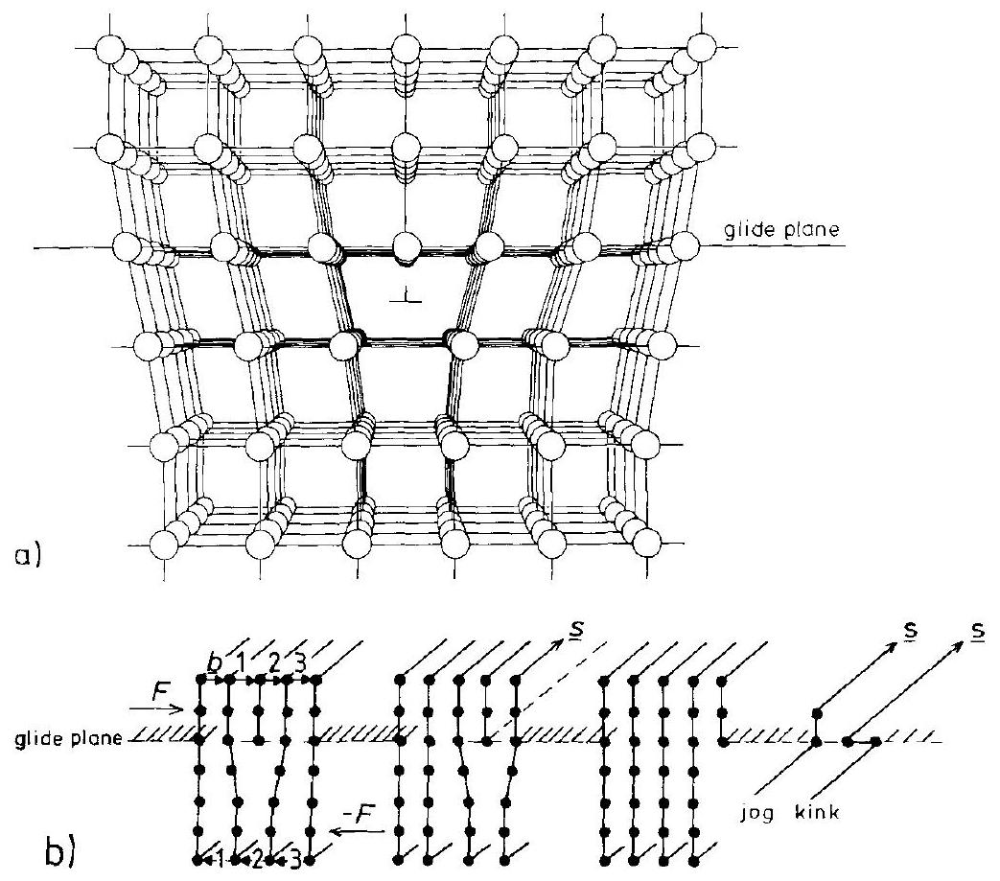
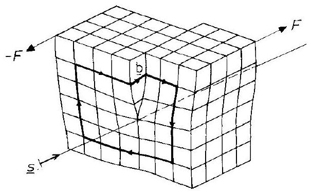
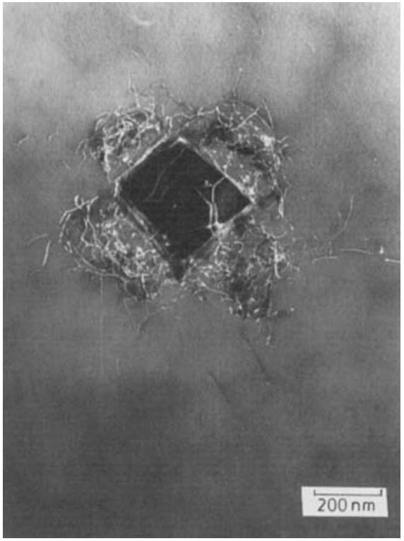
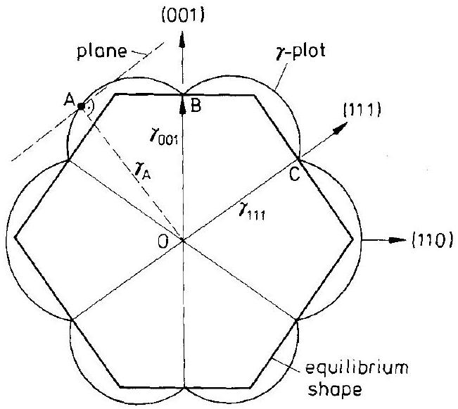
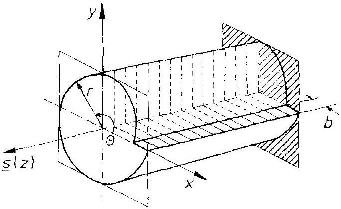

## 3 One- and Two-Dimensional Defects in Crystals

### 3.1 Introduction

The regular structure elements of perfect crystals having ideal order are immobile. Mobility of SE's and consequently chemical processes in the solid state thus depend upon crystal imperfections. In Chapter 2, it was shown that atomic imperfections in an equilibrium crystal exist in the form of point defects. Non-equilibrium, higher dimensional defects such as dislocations, grain boundaries, or macroscopic inclusions can exist. Dislocations (one-dimensional imperfections of the crystal lattice) are catalysts for plastic deformation. Two-dimensional defects are interfaces such as phase boundaries or stacking faults. Their structures and some relevant properties of these non-equilibrium defects will be briefly described. Two properties are of special interest in the context of solid state kinetics: 1) they can act as sites of repeatable growth within a crystal and 2 ) they offer paths of increased mobility for atomic particles. They are also locations where preferential nucleation of new phases can take place. The physics of dislocations and interfaces is well covered in pertinent monographs [J. P. Hirth, J. Lothe (1982); H. Gleiter (1983); D. Wolf, S. Yip (1992); D. J. Bacon (1993); R. W. Balluffi, A.P. Sutton (1993)]. In the following we will underline their role and importance in the kinetics of solid state processes.

### 3.2 Dislocations

### 3.2.1 Strain, Stress, and Energy

Dislocations are line defects. They bound slipped areas in a crystal and their motion produces plastic deformation. They are characterized by two geometrical parameters: 1) the elementary slip displacement vector $\boldsymbol{b}$ (Burgers vector) and 2 ) the unit vector that defines the direction of the dislocation line at some point in the crystal, $s$. Figures 3-1 and 3-2 show the two limiting cases of a dislocation. If $b$ is perpendicular to $\boldsymbol{s}$, the dislocation is named an edge dislocation. The screw dislocation has $\boldsymbol{b}$ parallel to $\boldsymbol{s}$. Often one finds mixed dislocations. Dislocation lines close upon themselves or they end at inner or outer surfaces of a solid.

The edge dislocation moves easily on its glide plane perpendicular to $s$ under the influence of a shearing force. This force is well below the theoretical shear strength of a perfect crystal since not all of the atoms of a glide plane perform their slip at

Figure 3-1. a) Edge dislocation model; b) Burgers vector $b$ with Burgers circuit and glide plane indicated. Dislocation motion during plastic deformation under the action of force $F$. Jog and kink.

the same time (conservative dislocation motion). An edge dislocation moves normal to the glide plane when atoms (ions, molecules) are added or taken away from the half-plane that is bounded by the dislocation line (non-conservative motion). This mode of motion is called climb. The climbing edge dislocation is the (moving) source or sink for vacancies or interstitials and thus plays a prominent role in the establishment of internal point defect equilibria. Also, since the crystal is compressed above the glide plane (where a half-plane has been shoved in), atomic defects of volume $V<V_{\mathrm{A}}(\mathrm{A}=$ matrix crystal) tend to segregate. The reverse is true for the dilated region below the glide plane (Fig. 3-1). Mobile SE's will redistribute around a dislocation line until their chemical potentials are constant throughout. In this way, the dislocation can be anchored (by the so-called Cottrell atmosphere), and shear stress is increased after this SE redistribution takes place.

The glide plane of an edge dislocation (Fig. 3-1b) is defined by the vector product $[b \times s]$. Obviously, the screw dislocation has no particular glide plane ( $[b \times s]=0$ ). Gliding and climbing of dislocations often starts locally from so-called kinks or jogs which are elementary breaks on the dislocation line. The motion of a kink occurs in the glide plane, whereas a jog brings a dislocation line to the next lattice plane perpendicular to the glide plane. In particular, a jog on a screw dislocation has edge character. Its movement perpendicular to $s$ occurs by climb. Therefore, if two perpen-

Figure 3-2. Screw dislocation; Burgers vector $b$ with Burgers circuit. $s=$ direction of screw dislocation line.

dicularly oriented screw dislocations cut each other, jogs are created which move further in a non-conservative manner. All these processes are responsible for the creation of vacancies and interstitials during plastic deformation.

Next, let us compile some quantitative relations which concern the stress field and the energy of dislocations. Using elastic continuum theory and disregarding the dislocation core, the elastic energy, $E_{\text {disl }}$, of a screw dislocation per unit length for isotropic crystals is found to be

$$
E_{\mathrm{disl}} \cong \frac{G \cdot b^{2}}{4 \pi} \cdot \ln r^{*} / r_{\mathrm{C}}
$$

where $G$ in this context denotes the shear modulus. Typical values of $G$ for metallic (ceramic) solids range between 40 and $600 \mathrm{GPa}(400-6000 \mathrm{kbar}) . r^{*}$ is the radius of the cylindrical elastic distortion. It is approximately given by the distance from the dislocation core ( $r_{\mathrm{C}}$ ) either to the crystal surface, or to the surrounding dislocations (as $r^{*}=\left(\varrho_{\text {dist }}\right)^{-1 / 2}$, where $\varrho_{\text {dist }}$ is the dislocation density). The strain energy per unit length of the edge dislocation is $E_{\text {disl }}$ (edge) $=1 /(1-v) \cdot E_{\text {disl }}$ (screw), where $v$ is Poisson's ratio $(\sim 0.2, \ldots, 0.45)$.

Since screw and edge components of a mixed dislocation have no common stress components, one can add the respective strain energies in order to obtain the line energy of a mixed dislocation. The strain and stress fields of a screw dislocation (in direction $s$ ) are respectively

$$
\begin{gathered}
\varepsilon_{s}=b /(4 \pi \cdot r) \\
\sigma_{s}=G \cdot b /(2 \pi \cdot r)
\end{gathered}
$$

$r$ is the distance from the dislocation line. These fields are more complicated for edge dislocations. If, in a Cartesian coordinate system, $x-y$ designates the glide plane, $y \| s$, and $z(\perp x-y)$ points into the extra half-plane, one has

$$
\begin{gathered}
\sigma_{x x}=-\frac{G \cdot b}{2 \pi(1-v)} \cdot z \cdot \frac{\left(3 x^{2}+z^{2}\right)}{\left(x^{2}+z^{2}\right)^{2}}, \quad \sigma_{z z}=\frac{G \cdot b}{2 \pi(1-v)} \cdot z \cdot \frac{\left(x^{2}-z^{2}\right)}{\left(x^{2}+z^{2}\right)^{2}} \\
\sigma_{x z}=\frac{G \cdot b}{2 \pi(1-v)} \cdot x \cdot \frac{\left(x^{2}-z^{2}\right)}{\left(x^{2}+z^{2}\right)^{2}}
\end{gathered}
$$

For sufficiently large $r=\left(x^{2}+z^{2}\right)^{1 / 2}$ and small $x$ values, the $1 / r$ dependence again dominates (Eqn. (3.3)).

Let us derive the force $\boldsymbol{F}$ which is exerted by an externally applied stress field $\sigma$ (or rather $\hat{\sigma}$ ) on a unit length segment of a dislocation. If this segment is differentially displaced by $\mathrm{d} \boldsymbol{r}$, the (surface) force is $\sigma \cdot \mathrm{d} A(\mathrm{~d} A=\boldsymbol{s} \cdot \mathrm{d} \boldsymbol{r})$, and by this displacement the shift, $b$, of atoms on opposite sides of $\mathrm{d} A$ extracts an amount of work

$$
\mathrm{d} W=\boldsymbol{F} \cdot \mathrm{d} \boldsymbol{r}=\boldsymbol{b} \cdot(\sigma \cdot \mathrm{d} A)
$$

which yields for the (virtual) force $\boldsymbol{F}$ (sometimes called the Peach-Koehler force)

$$
F=b \cdot(\sigma \times s)
$$

One may conclude from Eqn. (3.6) that an (arbitrary) stress $\sigma$ exerts both a glide force and a climb force on edge dislocations, but no climb force on screw dislocations ( $\boldsymbol{s}|\mid \boldsymbol{b} ; \boldsymbol{F}=0$ ). Equation (3.6) can also be used to calculate the interaction between two dislocations, that is, the force which the stress field of one dislocation exerts on the unit length of another dislocation at a given coordinate. For parallel dislocations, this force can be written as [J. P. Hirth, J. Lothe (1982)]

$$
F_{\text {inter }}=\frac{G}{2 \pi \cdot r_{12}} \cdot f\left(b_{1}, s_{1}, b_{2}, s_{2}\right)
$$

where $r_{12}$ is the distance between the dislocations. The force is repulsive between edge dislocations of like sign and attractive between those of opposite sign. By integration we obtain the interaction energy for two equal screw dislocations

$$
E_{\text {inter }}=\frac{G \cdot b^{2}}{2 \pi} \cdot \ln r_{12} / r_{\mathrm{C}}
$$

In the case of edge dislocations, $E_{\text {inter }}$ additionally depends on the angle between $b$ and $\boldsymbol{r}_{12}$. We note that the interaction forces are inversely proportional to the distance $r_{12}$ and that a dislocation is surrounded (on the average) by dislocations of opposite sign. Their stress fields tend to cancel over distances $>r_{12}$. Neglecting the dislocation core energy, the elastic energy per unit length is then equivalent to a line tension force of the same numerical value, and thus

$$
\mathrm{d} E / \mathrm{d} L=E / L=F \approx g \cdot G \cdot b^{2}
$$

where $g$ (approximately $1 / 2$ ) is a numerical factor, and $L$ is the length of the dislocation line. A dislocation line therefore strives to minimize its length. Setting $\varrho_{\text {disl }}=10^{8} \mathrm{~cm}^{-2}$ and $r_{\mathrm{C}}=10^{-7} \mathrm{~cm}$, the energy $E_{\text {disl }}$ is $c a .170 \mathrm{~kJ}$ per mole of atomic particles on the dislocation line. Note that point defect energies are of the same order of magnitude. Nevertheless, in view of their low fractions, neither dislocations nor point defects normally contribute noticeably to the total energy of a crystal. Yet the

Figure 3-3. Representation of dislocation movement in a Frank-Read dislocation source under stress $\sigma$. Multiplication of dislocation pinned at a distance $l$.

fact that (equilibrium) point defects and atomic particles on a dislocation line have comparable energies suggests that kinks and jogs do occur at thermal equilibrium, although the dislocation itself is a non-equilibrium defect. Thus, kinks and jogs have a (thermally activated) mobility and can move under internal or external forces (stresses).

Under the action of a local shear stress, $\sigma$, a straight dislocation line that is fixed at two points will bend out. The bending radius is inversely proportional to $\sigma$. The dislocation becomes unstable if the bending radius is $<l / 2$, where $l$ is the distance between the anchor points (Fig. 3-3). Dislocation loops can be formed and macroscopic plastic deformation can continuously occur under stress if

$$
\sigma>\alpha \cdot \frac{F}{l \cdot b}=\alpha \cdot \frac{G \cdot b}{l}
$$

where $\alpha$ is a numerical factor which depends on the geometry of the surrounding dislocation network.

If a dislocation line moves on the glide plane, an energy barrier has to be overcome in order to bring the dislocation to its next equivalent lattice position. The periodic potential felt by the moving dislocation line is modeled as $E=E_{\mathrm{P}} \cdot \sin ^{2}(\pi \cdot x / b)$ whereby $E_{\mathrm{P}}$ is called the Peierl's energy. Although the barrier is usually overcome by kink motion, atomistic calculations of $E_{\mathrm{p}}$ often correctly predict the slip systems. The calculation of $E_{\mathrm{P}}$ gives [F. R. N. Nabarro (1967)]

$$
E_{\mathrm{P}}=\frac{G \cdot b^{2}}{\pi(1-v)} \cdot \mathrm{e}^{-\frac{2 \pi \cdot d}{b(1-v)}}
$$

where $d$ defines the glide plane spacing. The corresponding force (maximum slope of $E(x)$ per unit length) is

$$
\sigma_{\mathrm{P}}=\frac{2 G \cdot b}{1-v} \cdot \mathrm{e}^{-\frac{2 \pi \cdot d}{b(1-v)}}
$$

Accordingly, glide planes are those planes which have the shortest $b$ vectors: $a / 2 \langle 110\rangle$ for fcc, $a / 2\langle 111\rangle$ for bcc, and $a / 3\langle 211.0\rangle$ for hcp lattices. Dislocations can split into so-called Shockley partials: $\boldsymbol{b}=\boldsymbol{b}_{1}+\boldsymbol{b}_{2}$, if $b^{2}>b_{1}^{2}+b_{2}^{2}$. Since $\boldsymbol{b}_{1}$ and $\boldsymbol{b}_{2}$ are not translational vectors of the crystal lattice, they induce a stacking fault. The partial dislocation therefore bounds the stacking fault.

If a (full) dislocation has passed through a crystal, its surface shape is affected. If a partial dislocation has passed through a crystal, the stacking sequence is disturbed across the glide plane. If bundles of partial dislocations pass through a crystal in a certain order, they may change the crystal structure by correlated atomic displacements, for example, from fcc to hcp.

### 3.2.2 Kinetic Effects Due to Dislocations

We see from Figure 3-1 that edge dislocations possess a compressed region above, and a dilated region below the glide plane. Therefore, in the dilated area around the dislocation line, the transport coefficients will be larger than in the bulk crystal. Thus, dislocations can serve as fast diffusion pipes for atomic transport.

In one dimensional diffusion experiments (e.g., starting with a thin film source of A on a B crystal surface) one often finds an exponential decrease in the A concentration at the far tail of the concentration profile. This behavior has been attributed to 'pipe diffusion' along dislocation lines running perpendicular to the surface. Models have been introduced which assume a (constant) pipe radius, $r_{\mathrm{p}}$, inside which $D_{\mathrm{A}}^{\mathrm{p}}=\beta \cdot D_{\mathrm{A}}^{\mathrm{b}}, \mathrm{b}$ and p denoting here bulk and dislocation respectively. $\beta$ values of $10^{3}$ have been obtained in this way. It is difficult to assess the validity of these observations. The model considerably simplifies the real situation. During diffusion annealing, the structure of the dislocation networks is likely to change because of self-stress (see Chapter 14) and chemical interactions.

Transport and reactions change the local state variables. In single-phase systems, lattice parameters change. Symmetry and lattice parameters change during heterogeneous reactions. Many intercalation reactions in layered structures (layer silicates, $\mathrm{MoS}_{2}$, bronzes) are pertinent examples. In principle, each diffusion process in inhomogeneous single-phase systems builds up a (self) stress field. If stresses caused by transport exceed a critical value (yield strength), dislocations are formed in and/or near the diffusion zone. This is exemplified in Figure 3-4, where the dislocation density (made visible by a decoration technique) in the interdiffusion couple $\mathrm{AgBr} / \mathrm{NaCl}$ [H. Haefke, H. Stenzel (1989)] is shown. The dislocation density parallels the concentration profile perfectly. Indeed, the experimental results allowed the determination of the cation interdiffusion coefficient from the dislocation density vs. distance curve. Although this phenomenon is expected to occur frequently in interdiffusion experiments, the implications with respect to matter transport kinetics are complex and hard to quantify. The reason is a cycle of effects. Firstly, transport creates dislocations in the self-stress field of the interdiffusion zone. The dislocations interact with the stress field and each other. These interactions make them move with the diffusion zone, and their motion leads to the formation of point defects. Point defects, however, enhance transport since they increase the transport coefficients. In

Figure 3-4. Dislocation decoration in an AgBr NaCl interdiffusion zone. Dislocations formed by self-stress due to lattice parameter changes. The decoration density indicates the dislocation density [after H. Haefke, H. Stenzel (1989)].

addition, transport is directly affected by the dislocations in that they serve as fast diffusion paths (pipe diffusion). In consequence, the moving dislocation network, whose structure is changing with time, may strongly influence the kinetic parameters in the diffusion zone and thereby the overall transport kinetics.

Another moving dislocation network is illustrated in Figure 3-5. The dislocations formed and moved during the course of a heterogeneous solid state reaction in which cobaltspinel ( $\mathrm{Co}_{3} \mathrm{O}_{4}$ ) grew inside cobaltous oxide ( CoO ) by the condensation of supersaturated cation vacancies. Despite the fact that the oxygen ion sublattice is the same for the two oxides, the lattice mismatch creates a dislocation network which accompanies the moving $\mathrm{CoO} / \mathrm{Co}_{3} \mathrm{O}_{4}$ interface and influences the transport properties of the cation vacancies in front of it. We note that the climbing of edge dislocations (coupled with the formation or annihilation of point defects) can be treated

Figure 3-5. $\mathrm{Co}_{3} \mathrm{O}_{4}$ spinel precipitate in a CoO matrix due to cooling. Dislocation network in the matrix stems from the misfit between CoO and $\mathrm{Co}_{3} \mathrm{O}_{4}$ [T. Pfeiffer (1990), unpublished].

1) as a diffusion controlled process with well defined boundary conditions [J.P. Hirth (1983)] in which the source (sink) is moving, and 2) as a reaction-limited process in which the (moving) line source (sink) is characterized by a kinetic parameter (e.g., sticking coefficient for vacancies or interstitials at the dislocation line).

With these examples, we conclude the introduction of line defects and turn to nonequilibrium defects of higher dimension.

### 3.3 Grain Boundaries

Grain boundaries (and boundaries between phases) are elements of the microstructure of crystalline solids, being characterized by their number, shape, and topological arrangement. The microstructure is a non-equilibrium property. In the next section we discuss grain boundaries.

### 3.3.1 Structure and Energy of Grain Boundaries

Dislocations interact and tend to order if they can move. Consider the arrangement shown in Figure 3-6a. This is called an edge dislocation tilt boundary. It is seen that the number of lattice planes terminating at the boundary is $n=(2 / b) \cdot \sin \Theta / 2$, from which the (mean) spacing between the dislocations is found to be

$$
l=n \cdot a=(b / 2) \cdot \sin \Theta / 2 \cong b / \Theta
$$

The approximate equality of the last term in Eqn. (3.13) holds for small-angle grain boundaries. The elastic interaction is such that regions of tension and compression overlap and partly cancel their stress, bringing the tilt boundary into an energy minimum. According to [W. T. Read, W. Shockley (1950)], the elastic tilt boundary energy is given by

$$
E=\frac{G \cdot b^{2}}{4 \pi \cdot(1-v)} \cdot \frac{\theta}{b} \cdot(A-\ln \Theta) \quad, \quad \Theta<0.1
$$

where $\Theta / b=1 / l$ is seen to be the number of dislocations per unit area and $A$ is a term that takes into account the fraction of energy due to the dislocation core.

Tilt boundaries occur if the axis of rotation between the two grains is located in the boundary (interface). In contrast, if the axis of rotation is perpendicular to the boundary, the boundary is called a twist boundary and consists of a collection of screw dislocations (Fig. 3-6b). An equation similar to Eqn. (3.14) holds for twist (and mixed) boundaries. Since dislocation theory is well understood, it is possible to quantitatively treat small-angle grain boundaries [J. P. Hirth, J. Lothe (1982)].

Figure 3-6. a) Small-angle tilt boundary with edge dislocations. b) Small-angle twist boundary; formation of a screw dislocation network.

The small-angle grain boundary is a special dislocation model. In general, the grain boundary is characterized phenomenologically by eight geometrical parameters which determine the relative orientation and distance of one (planar) crystal surface with the Miller indices $(h, k, l)$ to a second crystal surface with indices $\left(h^{\prime}, k^{\prime}, l^{\prime}\right)$ (see also [D. Wolf, S. Yip (1992)] and Fig. 10-2). There is but one position and interface structure at any given $P, T, \mu_{k}$ with a minimum Gibbs energy for the joint system. One notes that this joining requires unrestricted mobility of the interface SE.

Since both grain sizes and orientations influence many properties of crystalline solids, it is of practical interest to know the structure and energy of large-angle grain boundaries. Two types of models have been favored: dislocation (and disclination) models and atomic matching models. The large-angle grain boundary dislocation model is an extension of the small-angle grain boundary model. (Disclination models replace the Burgers vector of boundary dislocations by a known rotation along the common axis of the two crystals.) Atomic matching models utilize a crystallographic approach in essence.

It is known from experiment that the boundary energy and diffusivity are a function of the grain boundary orientation angle and often show minima at certain specific orientations [Q. Ma, R. W. Balluffi (1993); A. N. Aleshin, et al. (1977)]. This
can be understood for those rotations which lead to a coherent twin boundary (e.g., (111) for fcc) and to an overlap of the twin lattice points. However, there are other orientations for which a certain fraction of the lattice points of the overlapping lattices of the two crystals which form the boundary (almost) coincide. These points are called O -points and can be recognized in Figure 3-6b. One can construct a purely geometrical theory of O-point coincidence lattices [W. Bollmann (1970)] and maximize the number of O-points per volume in order to rationalize the cusps of the boundary energy vs. boundary orientation plots. In contrast, however, calculations [D. Wolf (1980); D. M. Duffy, P. W. Tasker (1985)] have shown that the boundary energy for simple oxides is a smooth function of the twist angle with only one broad maximum. For completeness sake, let us mention that deviations from coincidence site lattice orientations yield additional (secondary) dislocations. An overview on the relevant questions and results is found in [D. Wolf, K. L. Merkle (1992)].

Other proposals for boundary structure models include the mixing of islands of good atomic fit along the boundary with others of poor fit. Good fit can either mean microfaceting or that atomic polyhedra are embedded in rather amorphous surroundings along the boundary. Although narrow boundaries comprising a few lattice distances is the rule, wide boundaries have been reported. As an example, we mention the interphase boundary ( $\sim 0.3 \mu \mathrm{~m}$ ) in the system $\alpha / \beta$-quartz [J. G. van Landuyt $e t$ al. (1981)].

Grain boundary models were developed primarily for metals. We can assume that the above mentioned ideas on the structure and energy of grain boundaries also hold, in essence, for ionic, covalent, and van der Waals crystals as well [M. W. Finnis, M. Rühle (1993)].

Since we are considering equilibrium boundaries and interfaces, let us introduce some phenomenological thermodynamics. If õ symbolizes the orientation (location) of two crystal parts (phases) relative to each other, and $\tilde{\mathrm{s}}$ designates a structure parameter that symbolizes the atomic structure of the boundary (composition and structural details), then

$$
\left(\frac{\partial G^{\mathrm{b}}}{\partial n_{k}}\right)=\mu_{k}^{\mathrm{b}}(P, T, \tilde{\mathrm{~s}}, \tilde{\mathrm{o}})
$$

is the chemical potential of component $k$ at the interface. Since it is constant throughout crystals I and II under equilibrium conditions

$$
\mu_{k}^{\mathrm{b}}=\mu_{k}^{\mathrm{I}}=\mu_{k}^{\mathrm{II}} \text { or } \eta_{k}^{\mathrm{b}}=\eta_{k}^{\mathrm{I}}=\eta_{k}^{\mathrm{II}}
$$

and we have

$$
\tilde{\mathrm{s}}=f\left(P, T, \mu_{k}, \tilde{\mathrm{o}}\right)
$$

We conclude that the isothermal, isobaric interface structure is a function of 1) the orientation and 2 ) the component chemical potentials in the adjacent crystals. The first point has been exploited explicitly in calculations of boundary energies, $E^{\mathrm{b}}$ ( $=E_{\text {total }}-E^{\mathrm{I}}-E^{\mathrm{II}}$ ), using appropriate interatomic potentials and relaxation pro-
cedures, e.g. in [D. Wolf, S. Yip (1992)]. The second point can be viewed analogous to the aforementioned Cottrell atmosphere surrounding dislocations. The effect is called boundary segregation, and size effects play a dominant role in lowering the boundary Gibbs energy. The following experiment demonstrates the importance of Eqn. (3.17) for nearly stoichiometric line compounds.

The $\beta-\alpha-\beta$ transformation (at $176^{\circ} \mathrm{C}$ ) of a single crystal of $\mathrm{Ag}_{2} \mathrm{~S}$ introduces a variety of additional internal interfaces (mosaic structure) into the crystal bulk. This has been verified by X-ray investigations. The newly formed interfaces adsorb point defects from the bulk crystal (the coexisting phase, so to say) in a similar way as external surfaces adsorb species (i) from an adjacent gas phase. We know that the surface structure is a function of the degree of coverage, $\vartheta_{\mathrm{i}}$, which in turn is a function of the chemical potential of the components (i) (Gibbs adsorption isotherm). Figure 3-7 shows the proportion $\delta^{\mathrm{b}}$ of point defects which are adsorbed at the newly formed dislocations and small-angle grain boundaries in $\mathrm{Ag}_{2} \mathrm{~S}$. The linear dependence of $\log \left(\delta^{\mathrm{b}}-\delta_{0}^{\mathrm{b}}\right)$ vs. $\mu_{\mathrm{Ag}}$ indicates that boundary defects behave ideally in a thermodynamic sense. We further expect that the individual mobilities (diffusion coefficients) of the atomic constituents at the boundary depend on $\mu_{k}$ and, according to Eqn. (3.17), also on $\tilde{s}$ and the concentrations of the segregated point defects. (For external oxide surfaces, this has been verified by [V. Stubican, et al. (1987)].)

Figure 3-7. Fraction of point defects in $\alpha-\mathrm{Ag}_{2} \mathrm{~S}$ adsorbed on grain boundaries and dislocations as a function of the chemical potential of $\mathrm{Ag}\left(T=168^{\circ} \mathrm{C}\right)$.

In semiconductors and ionic crystals, one deals with electrically charged SE's. The equilibrium condition states that the electrochemical potential of each of the charged species is constant throughout (Eqn. (3.16)). This has two major consequences: 1) the electrical potential $\varphi$ changes near the grain boundary and 2) the space charge responsible for the change in $\varphi$ spreads into the adjacent grains. The spatial extent of the space charge (Debye length) depends on the concentration of point defects $\left(\sim c_{i}^{-1 / 2}\right)$. If (mobile) interface charges exceed a certain fraction of the interface sites, ordering and formation of distinct interface structures (equivalent to phase
transformations) can be expected due to the gain in electrostatic energy. Consequently, the change in $\varphi$ may occur non-monotonically if $\mu_{k}$ is monotonically changed in adjacent grains.

### 3.3.2 Phase Boundaries in Solids

In Section 3.3.1 we dealt with homophase interfaces. Heterophase interfaces (boundaries between different phases) are more complex, but their geometrical description again uses the concepts applied to grain boundaries. Let us first introduce the socalled Wulff construction of equilibrium surfaces (the adjacent 'phase' of the crystal is vacuum). Low index lattice planes normally have the highest numbers of nearest neighbors (bonds). If the surface deviates from such a low index plane by an angle $\Theta$, it forms facets of low index planes and steps between them. By counting the number of broken bonds, one finds the specific boundary energy to be

$$
E^{b}=\frac{\varepsilon}{2 \cdot \bar{a}^{2}} \cdot(\cos \Theta+\sin |\Theta|)
$$

where $\varepsilon$ is the single bond energy and $\bar{a}$ the nearest neighbor distance. From Eqn. (3.18), one obtains cusp-like curves in the plots of boundary energy vs. O. Entropy effects will smooth the sharp cusps to some extent; the relevant energy is the surface Gibbs energy $y$. If $A_{i}^{s}$ is the surface area of plane $i$, the total surface Gibbs energy of a crystal is $\sum A_{i}^{s} \cdot y_{i}$. Wulff has shown that from the $y_{i}$ plot in Figure 3-8, one can derive the equilibrium shape of a surface for which $\sum A_{i}^{s} \cdot y_{i}$ is a minimum. To this end, one constructs the inner envelope of the $y_{i}$ plot. As can be seen from Figure 3-8, it is the sharp $y_{i}$ cusp (minimum of the surface energy) which essentially determines the equilibrium shape of a crystal.

Figure 3-8. Wulff-plot: ( $1 \overline{1} 0$ ) section of a fcc crystal. $\gamma_{\mathrm{A}}(=\overline{\mathrm{AO}})$ represents the surface energy of a plane with the normal vector $\overline{\mathrm{AO}}$.

What are the differences when we deal with internal surfaces (i.e., interfaces) instead of free surfaces? Although more complex in detail, 'wrong' bonds are again responsible for internal surface Gibbs energies. Therefore, we normally expect cusps to occur in $E^{\mathrm{b}}$ vs. $\Theta(\gamma$ vs. $\Theta)$ plots (Fig. 3-9).

Figure 3-9. Grain boundary energies in aluminum. Rotation axis of the (symmetric) tilt boundary is $\langle 110\rangle$ [after G. Hasson, C. Goux (1971)].

Stress builds up at a coherent interface between two phases, $\alpha$ and $\beta$, which have a slight lattice mismatch. For a sufficiently large misfit (or a large enough interfacial area), misfit dislocations ( $=$ localized stresses) become energetically more favorable than the coherency stress whereby a semicoherent interface will form. The lattice plane matching will be almost perfect except in the immediate neighborhood of the misfit dislocation. Usually, misfits exist in more than one dimension. Sets ( $i$ ) of nonparallel misfit dislocations occur at distances

$$
d_{i}=b_{i} / \delta_{i} ; \quad \delta_{i}=\frac{\bar{a}_{i}^{\alpha}-\bar{a}_{i}^{\beta}}{\bar{a}_{i}^{\alpha}} \quad(=\text { misfit })
$$

The energy of a semicoherent interface can be split into two parts: $E_{\mathrm{b}}$ (broken bond (chemical) energy) and $E_{\mathrm{d}}$ (dislocation energy, proportional to dislocation density). $E_{\mathrm{d}}$ is proportional to $\delta_{i}$ as long as $\delta_{i}$ is small. Analogous to the large-angle grain boundary energy, $E_{\mathrm{d}}$ levels out with increasing $\Theta$. For $\delta_{i} \approx 0.25$, dislocation cores begin to overlap. The interface becomes incoherent and behaves essentially as a highangle grain boundary.

A precipitate surface which separates the matrix from a precipitated second phase particle is an example of an internal interface. A fully coherent precipitate in a metal is named a Guinier-Preston zone. If the size of the atoms in the matrix and the precipitate are noticeably different, strain energy will determine the precipitate shape at equilibrium. If the matrix and precipitate have no planes that match, the interface will be an incoherent high-energy type. By and large, disc-shape precipitates are found for which the ratio of the axis lengths is determined by the particular surface Gibbs energies, being small for coherent and semicoherent, but large for incoherent boundaries. When misfit cannot be neglected, the function ( $\sum A_{i}^{\mathrm{s}} \cdot \gamma_{i}+E_{\mathrm{S}}$ ) has to be minimized in order to find the equilibrium shape of the precipitate. $E_{\mathrm{S}}$ is the
elastic strain energy. If the matrix and precipitate have the same elastic moduli ( $G$ ) and are elastically isotropic (Poisson's ratio $v=1 / 3$ ), then $E_{\mathrm{S}}$ is given by

$$
E_{\mathrm{S}}=4 \cdot G \cdot \delta_{i}^{2} \cdot V
$$

and is independent of the shape of the inclusion ( $V$ is the unconstrained hole volume of the matrix after removal of the precipitate particle). Anisotropic matrices allow the precipitate to grow preferentially in elastically soft directions. Incoherent inclusions have no coherency strain. If they are incompressible, the volume misfit can be defined as $\Delta=\Delta V / V$ ( $V$ is the unconstrained hole volume in the matrix and ( $V-\Delta V$ ) the inclusion volume). The following expression for $E_{\mathrm{S}}$ is obtained in an isotropic medium

$$
E_{\mathrm{S}}=2 / 3 \cdot G \cdot \Delta^{2} \cdot f(c / a)
$$

$f(c / a)$ takes into account the shape of the ellipsoidal inclusion. $f(c / a) \rightarrow 0$ as $c / a \rightarrow 0$ (disc); $f(c / a)=1$ for $c / a=1$ (sphere). $f(c / a)$ ranges between 0 and 1 for $c / a=\infty$ (needle).

Let us estimate the particle size at which a precipitate loses coherency. The (isotropic) coherent Gibbs energy is approximately

$$
G_{\mathrm{coh}} \cong E_{\mathrm{S}}+G_{\mathrm{chem}}^{\mathrm{b}}=4 \cdot G \cdot \delta_{i}^{2} \cdot\left((4 / 3) \pi \cdot r^{3}\right)+\gamma \cdot\left(4 \pi \cdot r^{2}\right)
$$

whereas after the breakdown of coherency we have

$$
G_{\mathrm{inc}}=E_{\mathrm{b}}+E_{\mathrm{d}}=\left(\gamma+\gamma_{\mathrm{d}}\right) \cdot\left(4 \pi \cdot r^{2}\right)
$$

since $E_{\mathrm{b}} \approx G_{\text {chem }}^{\mathrm{b}} . \gamma$ is the specific surface Gibbs energy, $y_{\mathrm{d}}$ the specific energy of interface dislocations $\left(\sim \delta_{i}\right)$. From Eqns. (3.22) and (3.23) we estimate the critical radius for coherency breakdown as

$$
r_{\mathrm{crit}}=\frac{3}{4} \cdot \frac{\gamma_{\mathrm{d}}}{G \cdot \delta_{i}^{2}} \sim \frac{1}{\delta_{i}}
$$

Since a loss of coherency requires the formation of dislocation loops around the growing particle, and the formation of a loop may be rather difficult to achieve, $r_{\text {crit }}$ is sometimes larger than the value calculated from Eqn. (3.24).

Let us add a few comments on boundaries between phases in nonmetals. Since the boundary in a nonmetallic heterogeneous system is chemically unsymmetric, its electric charge distribution is dipolar, in contrast to a (symmetric) grain boundary. A force can therefore be exerted on this interface by an externally applied electric field.

To be more specific, consider an ionic crystal with the following characteristics: $\sigma_{i}=10^{-6}(\Omega \mathrm{~cm})^{-1} ; \quad D_{i}=10^{-6} \mathrm{~cm}^{2} / \mathrm{s} ; \quad V_{m}=20 \mathrm{~cm}^{3} ; \varepsilon=10 ; \quad T=1000 \mathrm{~K}$. These numbers lead to a bulk point defect fraction $N_{i}=10^{-5}$ and a Debye length $L_{\mathrm{D}}$ of $80 \AA$. If an interface is formed inside the crystal, the necessary charge transfer per
$\mathrm{cm}^{2}$ is $\varepsilon \cdot \varepsilon_{0} \cdot \Delta \varphi / \mathrm{L}_{\mathrm{D}}=10^{-11} \mathrm{~mole} / \mathrm{cm}^{2}$. A one volume- $\%$ dispersion of heterophase particles with $r=1000 \AA$ thus attracts a fraction of $6 \times 10^{-7}$ of the defects into the space charge cloud of the interfaces. In obtaining this number, it is assumed that a potential change ( $e_{0} \cdot \Delta \varphi$ ) of 1 eV occurs across the interface. Note that this fraction of charged SE's at the interfaces is only about one order of magnitude less than the bulk defect fraction of $N_{i}=10^{-5}$. Therefore, the boundaries of finely dispersed particles influence all those properties of the crystal which depend on point defect concentrations. Wagner [C. Wagner (1972)] and others have explained electrical conductivity changes in semiconductors and ionic crystals with heterophase dispersions on this basis.

Interfaces may behave differently if they have formed in different ways. For example, $\mathrm{Ag} / \mathrm{Ag}_{2} \mathrm{~S}$ boundaries formed either by welding the two solid phases at elevated temperature or by reducing $\mathrm{Ag}_{2} \mathrm{~S}$ with the consequent formation of $\mathrm{Ag} / \mathrm{Ag}_{2} \mathrm{~S}$ boundaries by chemical reaction, differ considerably in their electrical resistivities. This indicates that there are different interface structures despite the fact that the applied pressure was ca. 10 bar. Pressures of about 1 kbar will increase the conductivity of the welded interface several orders of magnitude. Dislocations and voids of atomic dimension along an interface suggest that its electric structure (interface charge) is not solely determined by the thermodynamics of irregular SE's being attracted to (or repelled from) the boundary at the two adjacent phases, but depends also on dislocation density and other non-equilibrium faults.

### 3.4 Mobility of Dislocations, Grain Boundaries, and Phase Boundaries

Dislocations move when they are exposed to a stress field. At stresses lower than the critical shear stress, the conservative motion is quasi-viscous and is based on thermal activation that overcomes the obstacles which tend to pin the individual dislocations. At very high stresses, $>\sigma_{\text {crit }}$, the dislocation velocity is limited by the (transverse) sound velocity. Damping processes are collisions with lattice phonons.

Of particular interest in kinetics is the non-conservative dislocation motion (climb). The net force on a dislocation line in the climb direction (per unit length) consists of two parts: $K_{\mathrm{el}}$ is the force due to elastic interactions (Peach-Koehler force), $K_{\text {chem }}$ is the force due to the deviation from SE equilibrium in the disloca-tion-free bulk relative to the established equilibrium at the dislocation line. Sites of repeatable growth (kinks, jogs) allow fast equilibration at the dislocation. For example, if $c_{\mathrm{V}}$ is the supersaturated concentration and $c_{\mathrm{V}}^{0}$ is the equilibrium concentration of vacancies, $K_{\text {chem }}$ (in the sense of an osmotic pressure) is

$$
K_{\text {chem }}=k T \cdot \frac{b}{v_{\mathrm{V}}} \cdot \ln \left(c_{\mathrm{V}} / c_{\mathrm{V}}^{0}\right)
$$

Figure 3-10. Strain geometry of an edge dislocation.

where $v_{\mathrm{V}}$ is the atomic volume of a vacancy. In comparison to the yield strength ( $\sim G / 10$ ), $K_{\text {chem }}$ is often quite large, particularly after a quench from high temperatures.

The interaction energy between a solute particle (impurity atom, point defect) and an edge dislocation (screw dislocations do not interact, to first order) is

$$
\Delta E=\frac{G \cdot b \cdot \delta V \cdot(1+v) \cdot \sin \theta}{3 \pi \cdot(1-v) \cdot r}
$$

$\Theta$ and $r$ are explained in Figure 3-10. $\delta V$ is the local volume change due to the solute atom. The interaction energy, $\Delta E$, leads to an equilibrium distribution of solute S , which for concentrations $c_{\mathrm{S}} \ll 1$ is approximately

$$
c_{\mathrm{S}}(\Theta, r)=c_{\mathrm{S}}^{0} \cdot \mathrm{e}^{-\beta \cdot \frac{\sin \theta}{r}}
$$

where $\beta$ comprises terms which do not contain $\Theta$ and $r$. The build-up of the solute atmosphere around a dislocation at rest is a diffusion problem. If a moving dislocation is surrounded by a solute atmosphere (Cottrell cloud), it suffers a solute drag. This drag of a moving dislocation is a diffusion problem as well, which can be solved in a moving reference frame [J. P. Hirth, J. Lothe (1983)]. For small forces $K$, the (approximate) result is (Fig. 3-11)

$$
v_{\text {disl }}=K \cdot \frac{D}{R T} \cdot\left[\int \frac{\left(c_{\mathrm{S}}-c_{\mathrm{S}}^{0}\right)^{2}}{c_{\mathrm{S}}} \cdot \mathrm{~d} V\right]^{-1}
$$

where $D$ is the solute diffusivity and $c_{\mathrm{S}}$ is given by Eqn. (3.27). For large $K$ values (e.g., stresses), $v_{\text {disl }}\left(>v_{\text {crit }} ;\right.$ Fig. 3-11) is

$$
v_{\mathrm{disl}}=\frac{D}{K \cdot R T} \cdot \int c_{\mathrm{S}}^{0} \cdot(\nabla W)^{2} \cdot \mathrm{~d} V
$$

Figure 3-11. Velocity $\boldsymbol{v}$ vs. drag force $\boldsymbol{K}$ for a dislocation with a Cottrell cloud (schematic).

where $\nabla W$ is the applied potential gradient. Beyond $v_{\text {crit }} \cong 4 \cdot D \cdot(k T / \beta)$, the dislocation breaks away from its solute atmosphere and is accelerated until a different damping mechanism controls its motion (e.g., phonon damping).

The atomic structure around the moving dislocation thus depends on its velocity. This is true for moving grain boundaries and phase boundaries as well. The equilibrium structure of an interface at rest has some atomic roughness, and occurs analogous to the formation of either equilibrium point defects in the bulk or kinks and jogs on a dislocation line. This atomic roughness can be visualized if we consider the random motion of point defects (vacancies) as they fluctuate in dynamic equilibrium across the interface. Each crossing causes the interface to locally bend out on an atomic scale.

Since small-angle grain boundaries are built from dislocations, we may anticipate their conservative motion as a coupled motion of dislocation bundles. In the simplest case, a small-angle tilt boundary is a mobile interface and the result of its motion is a rotation of the crystal (Fig. 3-12). However, the elementary steps of the boundary motion are thermally activated atomic jumps, because not only do misfit dislocations have Burgers vectors parallel to the interface and thus have to climb during the movement of the interface, but also because regular SE's dissolve on one side and reconstruct the lattice on the other side of the moving boundary. From geometrical considerations, we expect that the frequencies of these activated jumps parallel to the interface are different from those perpendicular to it. This is one reason why it is not possible to draw immediate conclusions from atomic mobilities

Figure 3-12. Rotation of a grain, induced by the migration of a low-angle tilt boundary.

within the boundary plane about the boundary mobility along a normal vector perpendicular to it when under the action of a driving force.

The Gibbs interface energy acts as a tension on curved interfaces and causes them to move and attain the Gibbs energy minimum shape. Recrystallization of polycrystalline material is, among others, a result of the acting interface tension. Electrical field forces can also act on interfaces. In ionic crystals or semiconductors, interfaces carry an electrical charge. If the (chemical) surroundings of the interface is symmetric, the interface charge is balanced by a symmetrical space charge. If the surroundings are unsymmetric, as is true for boundaries in heterogeneous systems, the interface carries an unsymmetrical space charge and an electrical field will exert a force on it analogous to the force acting on a dipole.

In heterogeneous solid state reactions, the phase boundaries move under the action of chemical (electrochemical) potential gradients. If the Gibbs energy of reaction is dissipated mainly at the interface, the reaction is named an interface controlled chemical reaction. Sometimes a 'thermodynamic' pressure ( $\Delta G / \Delta V$ ) is invoked to formalize the movement of the phase boundaries during heterogeneous reactions. This force, however, is a virtual thermodynamic force and must not be confused with mechanical (electrical) forces.

## References

Aleshin, A. N., et al. (1977) Sov. Phys. Sol. State, 19, 2051
Bacon, D. J. (1993) in Mat. Sci. and Techn., Vol. 1 (Eds.: R. W. Cahn, P. Haasen, E. J. Kramer), Verlag Chemie, Weinheim
Balluffi, R. W., Sutton, A.P. (1993) Grain Boundaries in Crystalline Solids, Oxford University Press, Oxford
Bollmann, W. (1970) Crystal Defects and Crystalline Interfaces, Springer, Berlin
Duffy, D.M., Tasker, P. W. (1985) Physica, 131B, 46
Finnis, M. W., Rühle, M. (1993) in Mat. Sci. and Techn., Vol. 1 (Eds.: R. W. Cahn, P. Haasen, E. J. Kramer), Verlag Chemie, Weinheim
Gleiter, H. (1983) Microstructure, in Physical Metallurgy (Eds.: R. W. Cahn, P. Haasen), NorthHolland, Amsterdam
Haefke, H., Stenzel, H. (1989) phys. stat. sol. (c), 116, 39
Hasson, G., Goux, C. (1971) Scripta Met., 5, 889
Hirth, J.P., Lothe, J. (1982) Theory of Dislocations, 2nd ed., Wiley, New York
Hirth, J. P. (1983) Dislocations, in Physical Metallurgy (Eds.: R. W. Cahn, P. Haasen), NorthHolland, Amsterdam
Ma, Q., Balluffi, R. W. (1993) Acta Met. Mat., 41, 133
Nabarro, F. R. N. (1967) The Theory of Crystal Dislocations, Oxford University Press, Oxford
Read, W. T., Shockley, W. (1950) Phys. Rev., 78, 275
Stubican, V., Lin, C.M., Macey, E. (1987) Advances in Ceramics, 23, 97
van Landuyt, J. G. (1981) Metall. Trans., 12A, 715
Wagner, C. (1972) Phys. Chem. Sol., 33, 1051
Wolf, D. (1980) J. Phys., 41, C6-142
Wolf, D., Merkle, K. L. (1992) in Materials Interfaces (Eds.: D. Wolf, S. Yip), Chapman and Hall, London
Wolf, D., Yip, S. (1992) Materials Interfaces, Chapman and Hall, London

