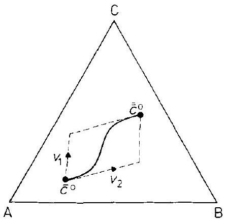
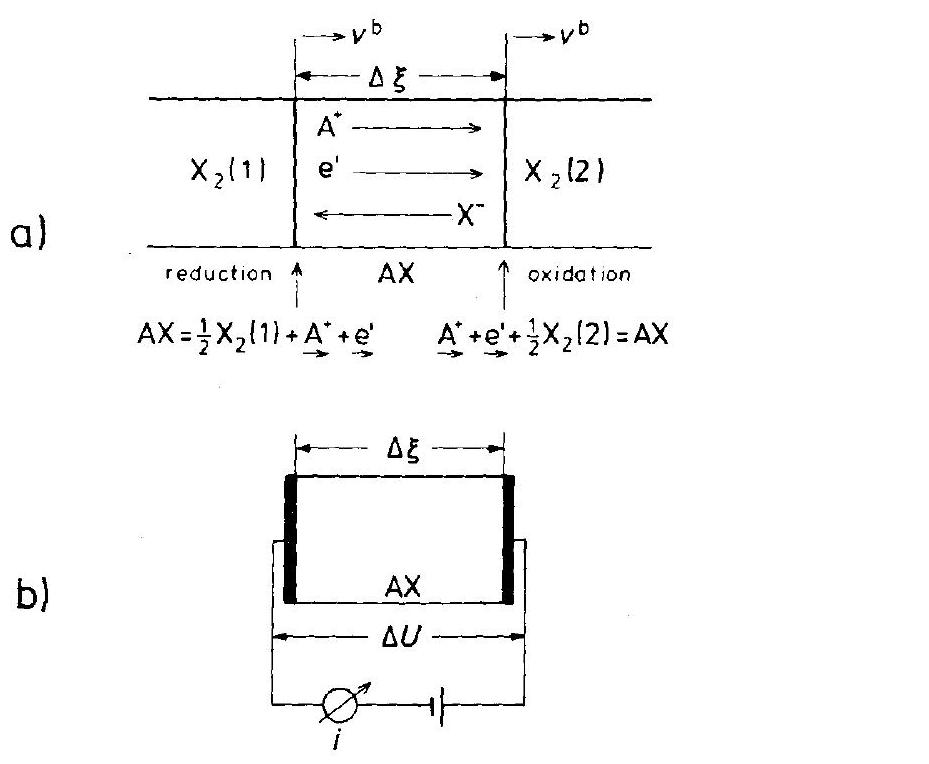
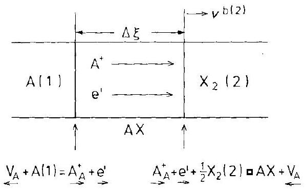

## 4 Basic Kinetic Concepts and Situations

### 4.1 Introduction

We will introduce basic kinetic concepts that are frequently used and illustrate them with pertinent examples. One of those concepts is the idea of dynamic equilibrium, as opposed to static (mechanical) equilibrium. Dynamic equilibrium at a phase boundary, for example, means that equal fluxes of particles $i, j_{i}^{0}$, are continuously crossing the boundary in both directions so that the (macroscopic) net flux is always zero. This concept enables us to understand the non-equilibrium state of a system as a monotonic deviation from the equilibrium state. Driven by the deviations from equilibrium of certain functions of state, a change in time for such a system can then be understood as the return to equilibrium. We can select these functions of state according to the imposed constraints. If the deviations from equilibrium are sufficiently small, the result falls within a linear theory of process rates. As long as the kinetic coefficients can be explained in terms of the dynamic equilibrium properties, the reaction rates are directly proportional to the deviations. The thermodynamic equilibrium state is chosen as the reference state in which the driving forces $X_{i}$ vanish, but not the random thermal motions of structure elements $i$. Therefore, systems which we wish to study kinetically must first be understood at equilibrium, where the SE fluxes vanish individually both in the interior of all phases and across phase boundaries. This concept will be worked out in Section 4.2.1 after fluxes of matter, charge, etc. have been introduced through the formalism of irreversible thermodynamics.

Following the introduction of basic kinetic concepts, some common kinetic situations will be discussed. These will be referred to repeatedly in later chapters and include 1) diffusion, particularly chemical diffusion in different solids (metals, semiconductors, mixed conductors, ionic crystals), 2) electrical conduction in solids (giving special attention to inhomogeneous systems), 3) matter transport across phase boundaries, in particular in electrochemical systems (solid electrode/solid electrolyte), and 4) relaxation of structure elements.

### 4.1.1 Systematics of Solid State Chemical Processes

Let us first give a systematic bird's eye view of the different subjects which will be treated later. One may subdivide processes primarily according to the physicochemical nature of the systems involved (the chemist's approach), or according to the acting driving forces (the physicist's view). In the latter case, we can choose the corresponding forces according to such basic fields of physics as mechanics, electro-
dynamics, and thermodynamics. For chemical processes, thermodynamic forces (i.e., gradients of thermodynamic potentials) play the prominent role. In addition, processes as treated in electrochemistry, photochemistry, and mechanochemistry will be discussed in due course.

Chemical systems are commonly subdivided into homogeneous, inhomogeneous, and heterogeneous phases. We will therefore distinguish chemical processes in the following systems.
a) Single-phase homogeneous systems. Homogeneous processes in solids can occur with two limiting cases. 1) All particles of the homogeneous assembly keep their (average) position during the process. This means that we deal with vibrational, librational, and rotational motions. In essence, these processes define the field of crystal dynamics (the understanding of which is prerequisite for an interpretation of kinetic rate parameters). 2) The particles of the homogeneous non-equilibrium assembly are not individually fixed at their (average) position during the process. This means that either 'Umklappvorgänge' take place cooperatively and simultaneously, or we deal with homogeneous reactions involving atomic diffusional steps (analogous to the dissociation of water after a sudden temperature or pressure change). We mention two examples: a) the formation of Frenkel defects $\left(A_{A}+V_{i}=A_{i}^{*}+V_{A}^{\prime}\right)$ and $\left.b\right)$ the exchange of SE's between two ordered sublattices of a crystal ( $\mathrm{A}_{\mathrm{A}}+\mathrm{B}_{\mathrm{B}}=\mathrm{A}_{\mathrm{B}}+\mathrm{B}_{\mathrm{A}}$ ), resulting in exchange disorder.
b) Single-phase inhomogeneous systems. Mainly the field of chemical transport governed by diffusion. Diffusion is a process that ultimately leads to an equalization of concentrations through nonconvective component fluxes, these being driven by chemical potential gradients. The first mathematical formulations were the (local) diffusion laws given by [A. Fick (1855)] in analogy to Fourier's law of heat conduction. Since diffusion in inhomogeneous crystals occurs by the thermally activated motion of point defects, it is true that local (homogeneous) point defect formation (annihilation) processes are normally superimposed on component transport.
c) Heterogeneous systems. Classical heterogeneous solid state reactions (e.g., spinel formation), phase nucleation and growth, phase transformation, electrode reactions, metal oxidation, and internal reactions belong to this category, among others. The common feature of these processes is the existence of interfaces (phase boundaries), across which matter is transported into the adjacent phases. In view of the sluggishness of matter transport in solids (as compared to heat transport), most heterogeneous solid state reactions take place isothermally. However, there are exceptions, for example, the self-heating combustion reactions of compressed reactive powder mixtures. These occur if the reaction enthalpies are very negative, see, e.g. [Z. Munir, U. Anselmi-Tamburini (1989)].

The above classification of chemical processes was based on the system's physical chemistry. A similar classification can be applied to electronic processes if we consider the effectively charged structure elements and assume that we can determine extremely small component concentrations or deviations from the stoichiometric composition. The well-known p-n junction process can serve as an example since it is a transport process (including local relaxation) in a single phase, inhomogeneous system.

### 4.2 The Concepts of Irreversible Thermodynamics

The fundamental question in transport theory is: Can one describe processes in nonequilibrium systems with the help of (local) thermodynamic functions of state (thermodynamic variables)? This question can only be checked experimentally. On an atomic level, statistical mechanics is the appropriate theory. Since the entropy, $S$, is the characteristic function for the formulation of equilibria (in a closed system), the deviation, $\delta S$, from the equilibrium value, $S_{0}$, is the function which we need to use for the description of non-equilibria. Since we are interested in processes (i.e., changes in a system over time), the entropy production rate $\sigma=\delta \dot{S}$ is the relevant function in irreversible thermodynamics. Irreversible processes involve linear reactions (rates $\sim \delta S$ ) as well as nonlinear ones. We will be mainly concerned with processes that occur near equilibrium and so we can linearize the kinetic equations. The early development of this theory was mainly due to the Norwegian Lars Onsager. Let us regard the entropy $S(\alpha, \beta, \ldots)$ as a function of the (extensive) state variables $\alpha, \beta, \ldots$, which are either constant $(\beta, \ldots)$ or can be controlled and measured $(\alpha)$. In terms of the entropy production rate, we have ( $\partial \alpha / \partial t \equiv \dot{\alpha}$ )

$$
\sigma=\frac{\partial S}{\partial \alpha} \cdot \frac{\partial \alpha}{\partial t}=\left[\frac{\partial^{2} S}{\partial \alpha^{2}} \cdot\left(\alpha-\alpha_{0}\right)+\ldots\right] \cdot \dot{\alpha}
$$

where $\alpha_{0}$ designates the equilibrium state. The linear approach introduces a linear relation between $\dot{\alpha}$ and the deviation from equilibrium. If we therefore write

$$
\dot{\alpha}=k \cdot \delta S
$$

we obtain for the entropy production

$$
\sigma \cong k \cdot\left(\frac{\partial^{2} S}{\partial \alpha^{2}}\right)_{\alpha_{0}} \cdot\left(\alpha-\alpha_{0}\right)^{2}=L \cdot X^{2}>0
$$

In generalizing, we conclude that the rate of entropy production is the product of a flux, $L \cdot X$, with the corresponding force $X$. For illustration, let us consider isothermal, diffusional transport. A closed, inhomogeneous multicomponent system can change its entropy through internal reaction (diffusion) and by heat transfer across its bounding surface. Accordingly, one formulates the entropy change as $\delta S= \delta S_{\mathrm{i}}+\delta S_{\mathrm{tr}}$. Explicitly this is

$$
\delta S_{\mathrm{i}}=-(1 / T) \cdot(\delta U+P \cdot \delta V-T \cdot \delta S)=-(1 / T) \cdot \delta G
$$

Rewriting $\delta G$ in terms of the system's chemical potentials and concentrations yields

$$
\delta S_{\mathrm{i}}=-(1 / T) \cdot \delta \int_{V} \sum \mu_{i} \cdot c_{i} \cdot \mathrm{~d} V
$$

For a one dimensional isothermal sample of (fixed) unit area cross section, the rate of entropy production $\sigma$ is therefore

$$
\sigma=-(1 / T) \cdot \int_{\xi} \sum \mu_{i} \cdot \dot{c} \cdot \mathrm{~d} \xi
$$

which, in combination with the continuity equation $\dot{c}_{i}=-\nabla j_{i}$, gives

$$
\sigma=+(1 / T) \cdot \int_{\xi} \sum \mu_{i} \cdot \mathrm{~d} j_{i}
$$

If both ends of the one-dimensional system are still unaffected by the diffusion process, partial integration of Eqn. (4.7) yields

$$
\sigma=-(1 / T) \int\left(\sum j_{i} \cdot \frac{\partial \mu_{i}}{\partial \xi}\right) \cdot \mathrm{d} \xi
$$

By comparing Eqn. (4.8) with Eqn. (4.3), we conclude that the (local) entropy production rate is the sum of the products of the fluxes and conjugate forces. The appropriate diffusional force is seen to be $-\left(1 / T \cdot \nabla \mu_{i}\right)$. We further conclude that the conjugate flux, $j_{i}$, of species $i$ can be written as $-L_{i} \cdot\left(\nabla \mu_{i} / T\right)$.

In deriving Eqn. (4.8) it was assumed that the flux of species $i$ stems only from the force $X_{i}$, not from forces $X_{j}(j \neq i)$. If this is not true, let us take the mutual interactions into account by writing in the linear approach

$$
j_{i}=\sum L_{i j} \cdot X_{j}
$$

The bilinear formulation of the entropy production rate obtained in a practical form is

$$
T \cdot \sigma=\sum_{i} \sum_{j} L_{i j} \cdot X_{i} \cdot X_{j}
$$

where the $L_{i j}$ are generalized conductances. If fluxes are not linearly related to each other, then

$$
L_{i j}=L_{j i}
$$

Equation (4.11) expresses the central Onsager theorem. It states the symmetry of the phenomenological coefficients (the $\boldsymbol{L}$ matrix) in the absence of magnetic fields. The foundation of this theorem is discussed elsewhere [J. H. Kreuzer (1981); S. R. de Groot, P. Mazur (1962)].

According to the second law of thermodynamics, $\sigma$ is a positive definite function of $X_{i}$ which means that

$$
L_{i i} \geqq 0, \quad L_{i i} \cdot L_{j j}-L_{i j} \cdot L_{j i} \geqq 0
$$

These relations limit the extent of the flux coupling and reflect the tendency to reduce the entropy production. Thus, instead of dissipating the Gibbs energy com-
pletely into random motion (heat), finite cross coefficients induce other fluxes (i.e., order).

In a linear theory, the kinetic coefficients $L_{i j}$ are independent of the forces. They are, however, functions of the thermodynamic variables. In view of the Onsager relations, not only is the $L$ matrix of the transport coefficients symmetric, but the transformed matrix is symmetric as well if the new fluxes are linearly related to the original ones. This also means that the new $L_{i j}(i \neq j)$ contain diagonal components of the original set.

Let us discuss an $L$ matrix transformation for isothermal and isobaric atomic fluxes when there is one additional electronic species present. We start with the flux equations in which the index $j$ denotes the atomic species and e denotes the electric charge carriers (e.g., electrons).

$$
\begin{aligned}
& j_{i}=\sum_{j}^{n} L_{i j} \cdot X_{j}+L_{i \mathrm{e}} \cdot X_{\mathrm{e}} \\
& j_{\mathrm{e}}=\sum_{j}^{n} L_{\mathrm{e} j} \cdot X_{j}+L_{\mathrm{ee}} \cdot X_{\mathrm{e}}
\end{aligned}
$$

Let us define the quantities $\alpha_{j}^{*}$ as follows

$$
L_{i \mathrm{e}}=\sum L_{i j} \cdot \alpha_{j}^{*} ; \operatorname{det} L_{i j} \neq 0
$$

whereupon

$$
\begin{gathered}
j_{i}=\sum L_{i j} \cdot\left(X_{j}+\alpha_{j}^{*} \cdot X_{\mathrm{e}}\right) \\
j_{\mathrm{e}}=\sum \alpha_{j}^{*} \cdot j_{j}+\left(L_{\mathrm{ee}}-\sum L_{j \mathrm{e}} \cdot \alpha_{j}^{*}\right) \cdot X_{\mathrm{e}}
\end{gathered}
$$

One concludes that $\alpha_{j}^{*} \cdot j_{j}$ is the electron flux which is induced by the flux of atomic species $j$, provided that $X_{\mathrm{e}}=0$ (no force acting on the electrons). Also, from Eqn. (4.16) it follows that in a homogeneous solid, if an external electric field is applied (i.e., $X_{j}=z_{j} \cdot e_{0} \cdot E$ and $X_{\mathrm{e}}=-e_{0} \cdot E$ ), then ( $z_{j}-\alpha_{j}^{*}$ ) represents the effective (drift) charge of species $j$ in the field $E$.

Equations (4.16) and (4.17) are examples of the so-called cross effects whereby a force $X_{\mathrm{e}}$ can induce fluxes $j_{i}$ despite that $X_{i}=0$. Another example of a cross effect is thermotransport in which temperature gradients (fluxes of heat) induce fluxes of atomic species, $j_{i}$. An application of this concept is the steady state demixing of a (closed solid) solution system, which has been exposed to a temperature gradient (heat flux). This is the Ludwig-Soret effect originally observed with fluid systems.

Irreversible thermodynamics thus accomplishes two things. Firstly, the entropy production rate $\sum j_{i} \cdot X_{i}$ allows the appropriate thermodynamic forces $X_{i}$ to be deduced if we start with well defined fluxes (e.g., $T \cdot \nabla\left(\mu_{i} / T\right)$ for the isobaric transport of species $i$, or $(1 / T) \cdot \nabla T$ for heat flow). Secondly, through the Onsager relations, the number of transport coefficients can be reduced in a system of $n$ fluxes to $1 / 2 \cdot(n-1) \cdot n$. Finally, it should be pointed out that reacting solids are (due to the
slowness of transport) normally in mechanical equilibrium. Thus, $\sum N_{i} \cdot X_{i}=0$, which is the Gibbs-Duhem equation if $X_{i}=\nabla \mu_{i}$.

### 4.2.1 Structure Element Fluxes

In the foregoing section, the bilinear form of the entropy production rate was expressed in terms of the fluxes of chemical components and electrons (or heat) together with the conjugate driving forces. From Chapter 2, we know that there are properly defined constituents of a crystal known as structure elements and these can possess (virtual) chemical potentials. We denote the general SE as $S_{i, \varkappa}$. In line with the foregoing and using the notation of Section 2.2, the thermodynamic force (at constant $P$ and $T$ ) acting upon $\mathrm{S}_{i, x}$ is

$$
X_{i, \varkappa}=-\nabla\left(\mu_{i, \varkappa}+q_{i, \varkappa} \cdot F \cdot \varphi\right)
$$

where $i$ designates the chemical species ( $i=1, \ldots, l$; including vacancies). $x$ is the sublattice index ( $\varkappa=1 \ldots K$ ). The linear relations between SE fluxes and forces are of the form

$$
j_{i}=-\sum l_{i j} \cdot X_{j}
$$

The total flux $J_{\varkappa}$ of SE's in sublattice $\varkappa$ and the total flux $J$ of SE's in the whole crystal are given by

$$
J_{\varkappa}=\sum_{i, \varkappa} j_{i, \varkappa} ; \quad J=\sum_{\varkappa} \sum_{i, \varkappa} j_{i, \varkappa}=\sum_{\varkappa} J_{\varkappa}
$$

If all fluxes vanish and the number of lattice sites is conserved, only two types of homogeneous reactions between SE's are possible

$$
k_{\varkappa}^{q}+i_{\lambda}=k_{\varkappa}^{q+1}+i_{\lambda}, \quad \varkappa=1,2, \ldots, \lambda, \ldots
$$

and

$$
k_{\varkappa}^{q}+\mathrm{V}_{\lambda}=k_{\lambda}^{q}+\mathrm{V}_{\varkappa}, \quad \varkappa=1,2, \ldots, \lambda, \ldots
$$

In view of the assumed site conservation in each sublattice we then have

$$
\sum_{i, \varkappa} \dot{r}_{i, \varkappa}=0
$$

where $\dot{r}_{i, \varkappa}$ is the local production rate of $\mathrm{S}_{i, \varkappa}$.
The structural conditions of a crystal lattice are, in accordance with Eqn. (2.12)

$$
z_{\varkappa}=m_{\varkappa, \lambda} \cdot z_{\lambda}
$$

where $z$ denotes the number of sublattice sites. The equivalent kinetic condition (provided that the number of lattice sites is conserved) reads

$$
J_{\varkappa}=m_{\varkappa, \lambda} \cdot J_{\lambda}
$$

or, using Eqn. (4.20),

$$
J=\sum_{\varkappa} m_{\varkappa, \lambda} \cdot J_{\lambda} ; \quad J_{\lambda}=J / \sum_{\varkappa} m_{\varkappa, \lambda}
$$

$J=0$ in the lattice reference frame. Then, with Eqns. (4.20) and (4.26), we find the structural flux coupling condition to be

$$
\sum_{i, \varkappa} j_{i, \varkappa}=0 ; \quad \varkappa=1, \ldots, K
$$

Electroneutrality imposes a further condition on the fluxes, namely

$$
\sum_{\varkappa} \sum_{i} q_{i, \varkappa} \cdot j_{i, \varkappa}=0
$$

From Eqns. (4.27) and (4.28), one concludes that from a total number $L$ of SE fluxes, only $L-(K+1)$ fluxes are independent, at most.

Let us apply the conditions in Eqns. (4.27) and (4.28) in order to eliminate the fluxes $j_{l, \varkappa}(\varkappa=1, \ldots, K)$. If $\mathrm{V}_{\varkappa}^{\times}$is chosen as the corresponding structure element $\mathrm{S}_{l, \varkappa}$, one obtains for the rate of entropy production

$$
T \cdot \sigma=\sum_{\varkappa} \sum_{i}^{\prime} j_{i, \varkappa} \cdot\left(\tilde{X}_{i, \varkappa}-\frac{q_{i, \varkappa}}{q_{(l, \varkappa)-1, K}} \cdot \tilde{X}_{(l, \varkappa)-1, K}\right)
$$

where $\tilde{X}$ is the force acting upon the building elements $\left(\mathrm{i}_{\varkappa}^{q}-\mathrm{V}_{\varkappa}^{\times}\right)$and $\left(\mathrm{V}_{\varkappa}^{q}-\mathrm{V}_{\varkappa}^{\times}\right)$. The summation $\sum_{i}^{\prime}$ goes to $(l, \varkappa)-1$. Since $\tilde{X}_{(l, K)-1, K}$ and $q_{(l, K)-1, K}$ can be chosen arbitrarily, we select them in such a way that $\widetilde{X}_{(l, K)-1, K}$ acts upon $\left(\mathrm{V}_{\varkappa}^{q}-\mathrm{V}_{\varkappa}^{\times}\right)$, and $q_{(l, K)-1, K}$ is $q_{i, \mathcal{K}}$. Equation (4.29) then reduces to

$$
T \cdot \sigma=\sum j_{k} \cdot X_{k}
$$

where $k$ denotes the components of the crystal. Let us restate these important results. The same entropy production can be written in terms of SE's, building elements, or components. This is in complete accordance with the conclusions concerning the (phenomenological) thermodynamics of SE's, building elements, and components which we arrived at in Chapter 2. We note, however, that internal equilibration between the various SE's is implicit in these derivations.

If there are $n$ components transported by diffusion, then we have from Eqn. (4.10)

$$
j_{k}=\sum_{i}^{n} \tilde{L}_{k i} \cdot \nabla \mu_{i}
$$

If we take the Gibbs-Duhem equation, $\sum c_{k} \cdot \mathrm{~d} \mu_{k}=0$, into account, the rate of entropy production is

$$
T \cdot \sigma=\sum_{k}^{\prime}\left(j_{k}-\frac{c_{k}}{c_{n}} \cdot j_{n}\right) \cdot \nabla \mu_{k} ; \quad k=1,2, \ldots, n-1
$$

Selecting, for example, an immobile component for which $j_{n}=0$ (e.g., oxygen in transition metal oxides) as number $n$, one has instead of Eqn. (4.31)

$$
j_{k}=\sum_{i}^{\prime}{\underset{\sim}{L} k i} \nabla \mu_{i} ; \quad i=1,2, \ldots, n-1
$$

The remaining fluxes and forces are independent and thus the Onsager relations ${\underset{\sim}{L}}_{k i}={\underset{\sim}{L}}_{i k}$ hold. The number of independent transport coefficients is $1 / 2 \cdot n \cdot(n-1)$. With the help of the above conditions, it is possible to verify the symmetry of both matrices $\underset{\sim}{L}$ and $\tilde{L}$ [M. Martin, et al. (1988)]

$$
\tilde{L}_{k i}={\underset{\sim}{L}}_{k i}(i=1, \ldots, n-1) ; \quad \tilde{L}_{n i}={\underset{\sim}{L}}_{n i}=0
$$

In the following, we will often be concerned with ternary systems. Heterogeneous binary systems have two phases in equilibrium and are nonvariant (at given $P$ and $T)$. When two ternary phases are in contact, the system still has one (thermodynamic) degree of freedom. A ternary phase has three independent transport coefficients (e.g., $L_{11}, L_{22}$, and $L_{12}$ ).

### 4.3 Diffusion

### 4.3.1 Introduction

Consider a macroscopically inhomogeneous system of linear geometry. If the number of particles $z$ between coordinate $\xi$ and ( $\xi+\mathrm{d} \xi$ ) at time $t=0$ is $z(\xi, 0)$, what is the number of particles $z(\xi, \tau)$ at a predetermined coordinate $\xi^{\prime}$ between $\xi^{\prime}$ and $\left(\xi^{\prime}+\mathrm{d} \xi\right)$ after time $\tau$ has elapsed? In order to answer this question, we define a function $f_{\tau}\left(\xi^{\prime}-\xi\right)$ as the probability of finding the particle at a distance ( $\xi^{\prime}-\xi$ ) after time $\tau$. With this definition, one has

$$
z\left(\xi^{\prime}, \tau\right)=\int_{-\infty}^{+\infty} z(\xi, 0) \cdot f_{\tau}\left(\xi^{\prime}-\xi\right) \cdot \mathrm{d} \xi
$$

Letting $\left(\xi^{\prime}-\xi\right)=y$, Eqn. (4.35) becomes

$$
z\left(\xi^{\prime}, \tau\right)=\int_{-\infty}^{+\infty} z\left(\xi^{\prime}-y, 0\right) \cdot f_{\tau}(y) \cdot \mathrm{d} y
$$

In an isotropic system, $f_{\tau}(y)=f_{\tau}(-y)$. Also, $f_{\tau}(y)$ decreases with increasing $y$. If we now perform the following series expansions in $\tau$ and $y$

$$
z\left(\xi^{\prime}, \tau\right)=z\left(\xi^{\prime}, 0\right)+\left(\frac{\partial z}{\partial t}\right)_{\xi^{\prime}, 0} \cdot \tau+\ldots
$$

and

$$
z\left(\xi^{\prime}-y, 0\right)=z\left(\xi^{\prime}, 0\right)-\left(\frac{\partial z}{\partial y}\right)_{\xi^{\prime}, 0} \cdot y+\left(\frac{\partial^{2} z}{\partial y^{2}}\right)_{\xi^{\prime}, 0} \cdot y^{2}+\ldots
$$

and combine Eqns. (4.37) and (4.38) with Eqn. (4.36), the immediate result is

$$
\frac{\partial z}{\partial t}=\frac{1}{2 \tau} \cdot \overline{y^{2}} \cdot \frac{\partial^{2} z}{\partial \xi^{2}}
$$

provided that $f_{\tau}(y)$ decays sufficiently fast.

$$
\overline{y^{2}}=\int_{-\infty}^{+\infty} y^{2} \cdot f_{\tau}(y) \cdot \mathrm{d} y
$$

If we define $D=\overline{y^{2}} / 2 \cdot \tau$ as the quotient between the mean square displacement $\overline{y^{2}}$ and the time span $2 \cdot \tau$ and name it the diffusion coefficient, we have derived Fick's second law

$$
\dot{z}=D \cdot \frac{\partial^{2} z}{\partial \xi^{2}}
$$

as long as the quotient $D$ is constant. In terms of the specific quantity $c$, Eqn. (4.41) reads

$$
\dot{c}=D \cdot \frac{\partial^{2} c}{\partial \xi^{2}}
$$

The following conditions have been introduced in order to arrive at Eqn. (4.41). 1) $\int f(y) \cdot \mathrm{d} y=1$ (normalization), 2) $f(y)$ decreases sufficiently fast with increasing $y, 3$ ) the system is isotropic, and 4) $\tau$ is not too small in order to avoid memory. This last condition ensures that $y^{2}$ is proportional to $\tau$.

Fick's second law, Eqn. (4.42), is a partial differential equation for matter transport. Equations which describe the equilibration in space and time of heat, electrical charge, or momentum (dissipative processes) are of the same type and reflect the action of a local field.

In Eqns. (4.41) and (4.42), we should have marked $z$ and $c$ with an index $k$, designating the chemical nature of the diffusing particles (components). This is necessary since diffusion of particles of the sort $k$ occurs in a solvent and the system consists of at least two components. In the previous section, we showed that under isothermal and isobaric conditions, the diffusive flux of particles of type $k$ in the solvent is

$$
j_{k}=-L_{k k} \cdot \nabla \mu_{k}
$$

if cross coefficients $L_{i k}$ are neglected. Equation (4.43) is equivalent to

$$
\dot{c}_{k}=\nabla\left(L_{k k} \cdot \nabla \mu_{k}\right)
$$

if no sources and sinks (i.e., internal reactions) are operating. Comparing Eqn. (4.44) with Eqn. (4.42), we find that

$$
D_{k}=\frac{L_{k k}}{c_{k}} \cdot \frac{\partial \mu_{k}}{\partial \ln c_{k}}=\frac{L_{k k}}{c_{k}} \cdot f_{k}
$$

where

$$
f_{k}=\frac{\partial\left(\mu_{k} / R T\right)}{\partial \ln c_{k}}
$$

is the (dimensionless) thermodynamic factor of the binary system represented by component $k /$ solvent.

### 4.3.2 Fickian Transport

Diffusional transport is the nonconvective flow that tends to equilibrate the concentrations in inhomogeneous non-equilibrium systems. From Eqns. (4.43) and (4.45), we have

$$
j_{k}=-L_{k k} \cdot \nabla \mu_{k}=-D_{k} \cdot \nabla c_{k}
$$

Equation (4.47) is incomplete for 1) it neglects cross terms (this point is dealt with later) and 2) it does not specify the reference frame for transport. Since the flux is a product of concentration times velocity, this can be expressed by writing

$$
j_{k}=c_{k} \cdot\left(v_{k}-\omega\right)
$$

where $\omega$ defines the reference velocity. Substituting into Eqn. (4.47) we thus obtain

$$
c_{k} \cdot\left(v_{k}-\omega\right)=-{ }_{\omega} L_{k k} \cdot\left(\nabla \mu_{k}+X_{k}\right)
$$

The additional force $X_{k}$ has been introduced to account for any other possible forces. Equation (4.49) shows that a transport coefficient actually corresponds to the product of the concentration ( $c_{k}$ ) times the mobility ( $b_{k}$ ) and thus represents a conductance. The mobility is the (local average) velocity of $k$, driven by the unit force. Therefore

$$
c_{k} \cdot\left(v_{k}-\omega\right)=-c_{k} \cdot \omega b_{k} \cdot\left(\nabla \mu_{k}+X_{k}\right)
$$

or

$$
\boldsymbol{v}_{k}-\left(\omega+{ }_{\omega} b_{k} \cdot X_{k}\right)=-{ }_{\omega} b_{k} \cdot \nabla \mu_{k}
$$

Setting $\boldsymbol{v}^{0}=\boldsymbol{v}_{k}\left(\nabla \mu_{k}=0\right)$, we can see that the velocity of $k$ due to the diffusional force $\nabla \mu_{k}$ is

$$
v_{k}-v^{0}=-{ }_{\omega} b_{k} \cdot \nabla \mu_{k}
$$

Let us multiply Eqn. (4.52) by $c_{k}$ and define $\boldsymbol{j}_{k}^{\#}=c_{k} \cdot\left(\boldsymbol{v}_{k}-\boldsymbol{v}^{0}\right)$ as the purely diffusional flux (relative to a general drift). By forming its divergence, we find

$$
\dot{c}_{k}=-\nabla \boldsymbol{j}_{k}^{\#}=\nabla\left(c_{k} \cdot \omega b_{k} \cdot \nabla \mu_{k}\right)=\nabla\left({ }_{\omega} D_{k} \cdot \nabla c_{k}\right)
$$

For constant ${ }_{\omega} D_{k}$, this is Fick's second law as derived in Eqn. (4.41).
In many cases of transport in solids, the atoms (ions) of one sublattice of the crystal are (almost) immobile. Here, we can identify the crystal lattice with the external (laboratory) frame and define the fluxes relative to this immobile sublattice $(\omega=0)$. $\boldsymbol{v}^{0}$ is $b_{k} \cdot \boldsymbol{X}_{k}$ (Eqn. (4.51)) where $\boldsymbol{X}_{k}$ is the sum of all local forces which can be applied externally (e.g., an electric field), or which may stem from fields induced by the (Fickian) diffusion process itself (e.g., self-stresses). An example of such a diffusion process that leads to internal forces is the chemical interdiffusion of $\mathrm{A}-\mathrm{B}$. If the lattice parameter of the solid solution changes noticeably with concentration, an elastic stress field builds up and acts upon the diffusing particles. It depends not only on the concentration distribution, but on the geometry of the bounding crystal surfaces as well.

### 4.3.3 Chemical Diffusion

Let us now consider the equalization of the component concentrations in an inhomogeneous multicomponent system. We may start with Eqn. (4.33) which relates the component fluxes, $j_{k}$, to the ( $n-1$ ) independent forces, $\nabla \mu_{i}$, of the $n$-component solid solution. In local equilibrium, the chemical potentials are functions of state. Hence, at any given $P$ and $T$

$$
\nabla \mu_{i}=\sum_{m}\left(\mathrm{~d} \mu_{i} / \mathrm{d} c_{m}\right) \cdot \nabla c_{m}
$$

We now introduce the thermodynamic factors $\left(f_{i m}\right)$ in accordance with Eqn. (4.46) and define

$$
f_{i m}=\frac{\partial\left(\mu_{i} / R T\right)}{\partial \ln c_{m}}
$$

We can rewrite $\nabla \mu_{i}$ accordingly and obtain an analogous expression for the flux $j_{k}$ as Eqn. (4.33),

$$
j_{k}=-\sum_{i} \sum_{m} L_{k i} \cdot f_{i m} \cdot\left(R T / c_{m}\right) \cdot \nabla c_{m}
$$

The sequence of the summation can be changed to give

$$
\boldsymbol{j}_{k}=-\sum_{m} \tilde{D}_{k m} \cdot \nabla c_{m}
$$

where

$$
\tilde{D}_{k m}=\sum_{i} L_{k i} \cdot f_{i m} \cdot\left(R T / c_{m}\right)
$$

Each component $k$ obeys the continuity equation

$$
\dot{c}_{k}=-\nabla j_{k}
$$

In order to solve this set of (coupled) differential equations, we have to formulate the proper boundary conditions. Let us define the conditions of the simplest (onedimensional) interdiffusion experiment as follows

$$
\begin{aligned}
& c_{k}(\xi=-\infty, t)=\overline{\boldsymbol{c}}_{k}^{0} \\
& c_{k}(\xi=+\infty, t)={\overline{c_{k}^{0}}}_{k}^{0} \\
& c_{k}(\xi, 0) \quad=\bar{c}_{k}^{0}(\xi<0) \quad \text { and } \quad \tilde{c}_{k}^{0}(\xi>0)
\end{aligned}
$$

With these boundary conditions, the solution can be expressed in terms of one single variable ( $=\xi / \sqrt{t}$ ). Let us write Eqn. (4.57) in matrix form

$$
\underset{\sim}{j}=-\underset{\sim}{\tilde{D}} \cdot \underset{\sim}{\nabla}
$$

where $\underset{\sim}{j}$ and $\underline{\nabla} \underline{c}$ are (column) vectors, $\underset{\sim}{\tilde{D}}$ is the (symmetric) matrix of diffusion coefficients given in Eqn. (4.58). Let us furthermore transform $\underset{\sim}{\tilde{D}}$ in its diagonal form. The transformation matrix $\underset{\sim}{\boldsymbol{B}}$ is given by the eigenvectors $\boldsymbol{v}_{\mathrm{s}}$ of $\underset{\sim}{\tilde{D}}$, which can be found from ( $\lambda_{\mathrm{s}}=$ eigenvalues)

$$
\underset{\sim}{\tilde{D}} \cdot \boldsymbol{v}_{\mathrm{s}}=\lambda_{\mathrm{s}} \cdot \boldsymbol{v}_{\mathrm{s}}
$$

The $\lambda_{s}$ values are obtained from the solution of the secular equation

$$
\operatorname{det}(\underset{\sim}{\tilde{D}}-\underset{\sim}{\lambda})=0
$$

Application of $\underset{\sim}{B}$ to Eqn. (4.61) yields

$$
\underset{\sim}{\boldsymbol{B}} \cdot \underset{\sim}{\boldsymbol{j}}=-\underset{\sim}{\boldsymbol{B}} \cdot \underset{\sim}{\tilde{D}} \cdot \underset{\sim}{\boldsymbol{B}}{ }^{-1} \cdot \underset{\sim}{\boldsymbol{B}} \cdot \underset{\sim}{\nabla} \underset{\sim}{c}
$$

or, equivalently (with $\underset{\sim}{\boldsymbol{h}}=\underset{\sim}{\boldsymbol{B}} \cdot \underset{\sim}{\boldsymbol{j}}, \underset{\sim}{\boldsymbol{v}}=\underset{\sim}{\boldsymbol{B}} \cdot \underset{\sim}{\boldsymbol{c}}, \underset{\sim}{\lambda}=$ diagonal diffusivity matrix)

$$
\underline{h}=-\underset{\sim}{\lambda} \cdot \underline{\nabla} \underline{u}
$$

and also

$$
\underset{\sim}{\dot{u}}=\underset{\sim}{\lambda} \cdot \Delta \underline{u}
$$

First of all, we note that through the $\underset{\sim}{\boldsymbol{B}}$ transformation we have decoupled the set of differential equations (4.59) since now

$$
\dot{u}_{k}=\lambda_{k k} \cdot \Delta u_{k}, \quad k=1,2, \ldots, n-1
$$

The transformations of the boundary conditions yield

$$
\begin{aligned}
& \underline{\boldsymbol{u}}(\xi=-\infty, t)=\underset{\sim}{\boldsymbol{B}} \cdot \underline{\overline{\boldsymbol{c}}}^{0}=\underline{\bar{u}}^{0} \\
& \boldsymbol{u}(\xi=+\infty, t)=\underset{\sim}{\boldsymbol{B}} \cdot \underline{\bar{c}}^{0}=\underline{\bar{u}}^{0} \\
& \boldsymbol{u}(\xi, 0) \quad=\underline{\bar{u}}^{0}(\xi<0) \quad \text { and } \quad \underline{\bar{u}}^{0}(\xi>0)
\end{aligned}
$$

A general solution of Eqns. (4.67) and (4.68) is

$$
\underline{\boldsymbol{u}}(\xi, t)=\frac{1}{2} \cdot \underset{\sim}{\boldsymbol{F}}\left(\underline{\bar{u}}^{0}+\underline{\bar{u}}^{0}\right)+\frac{1}{2} \cdot \underset{\sim}{\boldsymbol{F}}\left(\underline{\bar{u}}^{0}-\underline{\bar{u}}^{0}\right)
$$

with

$$
F_{k s}=\delta_{k s} \cdot \operatorname{erf}\left(\frac{1}{2 \cdot \sqrt{\lambda_{k k}}} \cdot \frac{\xi}{\sqrt{t}}\right)
$$

Since $\underset{\sim}{\boldsymbol{c}}\left(={\underset{\sim}{\boldsymbol{B}}}^{-1} \cdot \underset{\text { }}{\boldsymbol{u}}\right.$ ) can be obtained from $\underset{\text {, which is known by Eqns. (4.69) and }}{ }$ (4.70), the real concentrations $c_{m}(\xi, t)=\overline{c_{m}}(\xi / \sqrt{t})$ can be found in this way. A plot of $c_{m}(\xi / \sqrt{t})$ in the ( $n$ dimensional) composition phase diagram is called the diffusion (reaction) path. It is a unique curve between $\bar{c}_{k}^{0}$ and $\bar{c}_{k}^{0}$.

As an illustration, the diffusion path in a ternary system is given in Figure 4-1. It can be shown that the following general conclusions hold. a) The diffusion path has a sigmoidal shape between the boundary values $\bar{c}^{0}$ and $\bar{c}^{0}$. b) The diffusion path cuts the straight line connecting $\bar{c}^{0}$ and $\bar{c}^{0}$ only once. c) The course of the diffusion path is embedded in a parallelogram, the basis of which is spanned by the eigenvectors $v_{1}$ and $v_{2}$. For $(\xi / \sqrt{t})= \pm \infty$, the tangent to the diffusion path is the eigenvector $\boldsymbol{v}_{\mathrm{s}}$ which belongs to the largest eigenvalue $\lambda_{\mathrm{s}}$.

Figure 4-1. Chemical diffusion of a (ternary) couple with linear geometry. Initial compositions are $\bar{c}^{0}$ and $\bar{c}^{0}$. Schematic diffusion (reaction) path.

This formalism has been applied to quasi-ternary oxides (glasses) [A. R. Cooper (1974)]. Often, the transport problem can be simplified by structural restrictions. For example, in the system $\mathrm{Fe}-\mathrm{Si}-\mathrm{C}$, carbon is found in the interstitial sublattice only. Therefore, in the Fe sublattice, one has $j_{\mathrm{Fe}}+j_{\mathrm{Si}}=0$. Details of simplified evaluations can be found in [H. Schmalzried (1981); J. S. Kirkaldy, D. J. Young (1987)].

After this formal discussion of chemical diffusion, let us now turn to some more practical aspects. In order to compare the formal theory with experiment, we have to carefully define the reference frame for the diffusion process, which is not trivial in the case of binary or multicomponent diffusion. To become acquainted with the philosophy of this problem, we deal briefly with defining a suitable reference frame in a binary system. Since only one (independent) transport coefficient is needed to describe chemical diffusion in a binary system, then according to Eqn. (4.57) we have in a one-dimensional system

$$
j_{1}=-\tilde{D}_{1} \cdot\left(\partial c_{1} / \partial \xi\right)
$$

$\tilde{D_{1}}$ represents the (individual) chemical diffusion coefficient of component 1. Since the flux is defined in a reference frame which, in general, moves with reference velocity $\omega$, Eqn. (4.71) is incomplete. It should be properly written as

$$
j_{1}=-{ }_{\omega} \widetilde{D}_{1} \cdot\left(\partial c_{1} / \partial \xi\right)=c_{1} \cdot\left(\boldsymbol{v}_{1}-\omega\right)
$$

For example, we may choose $\omega$ as the average volume velocity, $\omega=\sum\left(c_{i} V_{i}\right) \cdot v_{i}$. In more general terms, we may define $\omega$ by $\sum \beta_{i} \boldsymbol{v}_{i}$, with $\sum \beta_{i}=1$. The $\beta_{i}$ 's are weighting factors. If we formulate Eqn. (4.72) for two different reference velocities, $\omega^{\prime}$ and $\omega^{\prime \prime}$, and take into account the partial molar volumes $\left(V_{i}\right)$ which are not independent of each other (Gibbs-Duhem relation), we obtain after some algebraic rearrangements $[\mathrm{H}$. Schmalzried (1981)] the quite general expression

$$
c_{1} \cdot V_{1} \cdot \omega^{\prime} \tilde{D_{2}}+c_{2} \cdot V_{2} \cdot \omega^{\prime} \tilde{D_{1}}=c_{1} \cdot V_{1} \cdot \omega^{\prime \prime} \tilde{D_{2}}+c_{2} \cdot V_{2} \cdot \omega^{\prime \prime} \tilde{D_{1}}
$$

For the volume velocity reference system (which is also called Fick's reference system), we find for $c_{1} V_{1}+c_{2} V_{2}=1$ (from Eqn. (4.72)) that

$$
{ }_{\mathrm{F}} \dot{j}_{1}=c_{1} \cdot\left(v_{1}-\omega_{\mathrm{F}}\right)=c_{1} \cdot\left[v_{1}-\left(c_{1} \cdot V_{1} \cdot v_{1}+c_{2} \cdot V_{2} \cdot v_{2}\right)\right]
$$

and consequently

$$
{ }_{\mathrm{F}} \dot{j}_{1} \cdot V_{1}+{ }_{\mathrm{F}} \dot{j}_{2} \cdot V_{2}=0
$$

From Eqns. (4.72), (4.74) and (4.75), we can conclude that in Fick's reference system

$$
{ }_{\mathrm{F}} \tilde{D_{1}}={ }_{\mathrm{F}} \tilde{D_{2}}=\tilde{D}
$$

This result is important in practice since chemical diffusion experiments are normally analyzed with the help of concentration profile measurements in the volume reference frame. Thus, we obtain directly the only chemical diffusion coefficient $\tilde{D}$
of the binary system. For other reference frames, we can derive from Eqns. (4.73) and (4.76)

$$
\tilde{D}=\left(c_{2} \cdot V_{2}\right) \cdot{ }_{\omega} \tilde{D}_{1}+\left(c_{1} \cdot V_{1}\right) \cdot{ }_{\omega} \tilde{D}_{2}
$$

If the molar volume of the solid solution does not depend on composition, this relation then yields

$$
\tilde{D}=N_{2} \cdot{ }_{\omega} \tilde{D}_{1}+N_{1} \cdot{ }_{\omega} \tilde{D}_{2}
$$

Equation (4.78) is named a 'Darken-type' equation because it was first derived by Darken for a special situation [L. S. Darken (1948)].

Chemical diffusion has been treated phenomenologically in this section. Later, we shall discuss how chemical diffusion coefficients are related to the atomic mobilities of crystal components. However, by introducing the crystal lattice, we already abandon the strict thermodynamic basis of a formal treatment. This can be seen as follows. In the interdiffusion zone of a binary (A, B) crystal having a single sublattice, chemical diffusion proceeds via vacancies, V. The local site conservation condition requires that $j_{\mathrm{A}}+j_{\mathrm{B}}+j_{\mathrm{V}}=0$. From the definition of the fluxes in the lattice (L), we have

$$
{ }_{\mathrm{L}} j_{\mathrm{V}}=-\left({ }_{\mathrm{L}} j_{\mathrm{A}}+{ }_{\mathrm{L}} j_{\mathrm{B}}\right)=\left({ }_{\mathrm{L}} \tilde{D}_{\mathrm{A}}-\left(V_{\mathrm{A}} / V_{\mathrm{B}}\right) \cdot{ }_{\mathrm{L}} \tilde{D}_{\mathrm{B}}\right) \cdot \nabla c_{\mathrm{A}}
$$

which, in the case of constant molar volume of the solid solution, yields for the lattice velocity $\omega_{\mathrm{L}}=V \cdot{ }_{\mathrm{L}} j_{\mathrm{V}}$

$$
\omega_{\mathrm{L}}=\left({ }_{\mathrm{L}} \tilde{D}_{\mathrm{A}}-{ }_{\mathrm{L}} \tilde{D}_{\mathrm{B}}\right) \cdot \nabla N_{\mathrm{A}}
$$

The flux $j_{\mathrm{A}}$, relative to an external marker which we may fix outside the diffusion zone, is then

$$
j_{\mathrm{A}}={ }_{\mathrm{L}} j_{\mathrm{A}}+c_{\mathrm{A}} \cdot \omega_{\mathrm{L}}=-{ }_{\mathrm{L}} \tilde{D}_{\mathrm{A}} \cdot \nabla c_{\mathrm{A}} \cdot \omega_{\mathrm{L}}=-\left(N_{\mathrm{B}} \cdot{ }_{\mathrm{L}} \tilde{D}_{\mathrm{A}}+N_{\mathrm{A}} \cdot{ }_{\mathrm{L}} \tilde{D}_{\mathrm{B}}\right) \cdot \nabla c_{\mathrm{A}}
$$

From Eqn. (4.81), we see that if one adopts the lattice as the reference frame (which also is Fick's frame for constant molar volume), then

$$
\tilde{D}=\tilde{D}_{\mathrm{A}}=\tilde{D}_{\mathrm{B}}=\left(N_{\mathrm{B}} \cdot{ }_{\mathrm{L}} \tilde{D}_{\mathrm{A}}+N_{\mathrm{A}} \cdot{ }_{\mathrm{L}} \tilde{D}_{\mathrm{B}}\right)
$$

in agreement with Eqn. (4.78). We note again that this result was obtained by the introduction of a non-thermodynamic concept: the crystal lattice.

### 4.4 Transport in Ionic Solids

### 4.4.1 Introduction

In ionic solids, there are normally local electric fields which act on the ions during transport. These fields are induced externally and/or internally, that is, as a result
of the chemical transport itself. The framework of irreversible thermodynamics can handle these cases through the introduction of (local) thermodynamic forces $X_{i}$, as was shown in Section 4.2. In our analysis of chemical diffusion in Section 4.3.3, we have tacitly assumed that our systems were composed of neutral constituents (e.g., metals) since we neglected any action of electric field forces, $X_{i}=z_{i} F \cdot \nabla \varphi=\nabla \tilde{\varphi}_{i}$.

In chemically homogeneous ionic crystals, $\nabla \tilde{\varphi}_{i}$ may be the only driving force. In inhomogeneous systems, the electrochemical potential gradient $\nabla \eta_{i}=\nabla \mu_{i}+z_{i} F \cdot \nabla \varphi$ acts upon the mobile charged species $i$. The additivity of $\nabla \mu_{i}$ and $\nabla \tilde{\varphi}_{i}$ stems from the very small electric charge number needed to establish the internal electric field, which is on the order of $1[\mathrm{~V} / \mathrm{cm}]$. These charges are too small to interfere with the concentrations that determine the chemical potentials $\mu_{i}$.

We begin our discussion by characterizing the electrical conduction in solid electrolytes. These are solids with predominantly ionic transference, at least over a certain range of their component activities. This means that the electronic transference number, defined as

$$
t_{\mathrm{el}}=\frac{\sigma_{\mathrm{el}}}{\sigma_{\mathrm{el}}+\sigma_{\mathrm{ion}}} \cong \frac{\sigma_{\mathrm{el}}}{\sigma_{\mathrm{ion}}}
$$

is $\ll 1$ for electrolytes. The electronic conductivity stems from electrons and electron holes, the ionic conductivity from all ionic constituents. In terms of concentrations and mobilities, the condition that the crystal be a solid electrolyte is therefore

$$
c_{\mathrm{e}} \cdot u_{\mathrm{e}}+c_{\mathrm{h}} \cdot u_{\mathrm{h}} \ll\left|z_{i}\right| \cdot c_{i} \cdot u_{i}\left(=\sum\left|z_{\mathrm{p}_{i}}\right| \cdot c_{\mathrm{p}_{i}} \cdot u_{\mathrm{p}_{i}}\right)
$$

where the subscript $p_{i}$ designates those point defects that render the corresponding $i$ ions mobile. The mobilities of electronic defects are much higher than those of ionic defects. This allows us to formulate the condition for the predominance of electrolytic conduction as $c_{\mathrm{el}} \ll c_{\mathrm{p}}$, which means that ionic point defects must be majority defects whose origin can be intrinsic or extrinsic.

Ionic crystals are compounds by necessity. Let us regard a binary compound ( $\mathrm{A}_{1-\delta} \mathrm{X}$ ) and derive the electronic conductivity (transference) as a function of its component activity. From Eqn. (4.84) and the necessarily prevailing ionic defects, we can conclude that the ionic conductivity is independent of the component activities which, however, does not mean that the total conductivity is also constant. Let us first formulate the equilibrium between crystal $\mathrm{A}_{1-\delta} \mathrm{X}$ and component $\mathrm{X}_{2}$

$$
\frac{1}{2} \cdot X_{2}+A_{A}+e^{\prime}=V_{A}^{\prime}+A X
$$

It follows that

$$
\mathrm{d} \mu_{\mathrm{e}^{\prime}}=-\frac{1}{2} \cdot \mathrm{~d} \mu_{\mathrm{X}_{2}}
$$

because $c_{\mathrm{el}} \ll c_{\mathrm{p}}$, where $\mathrm{p}=\mathrm{V}_{\mathrm{A}}^{\prime}$ and $\mathrm{A}_{\mathrm{i}}^{*}$. The mass action law of electronic defects reads (provided that $\mathrm{e}^{\prime}$ and $\mathrm{h}^{\prime}$ obey Boltzmann statistics in the limit of ideal dilution)

$$
N_{\mathrm{e}^{\cdot}} \cdot N_{\mathrm{h}^{\cdot}}=K_{\mathrm{el}}
$$

The difference ( $N_{\mathrm{h}}-N_{\mathrm{e}^{\prime}}$ ), that is, the excess charge fraction, is by necessity compensated through the nonstoichiometry $\delta$ of the crystal $\mathrm{A}_{1-\delta} \mathrm{X}$. Therefore,

$$
\delta=\left(N_{\mathrm{h}^{\cdot}}-N_{\mathrm{e}^{\prime}}\right)
$$

and, with some algebra, one can derive from Eqns. (4.86)-(4.88)

$$
\delta=2 \cdot \sqrt{K_{\mathrm{el}}} \cdot \sinh \frac{\mu_{\mathrm{X}_{2}}-\mu_{\mathrm{X}_{2}}^{*}}{2 \cdot R T}
$$

with $\mu_{\mathrm{X}_{2}}^{*}=\mu_{\mathrm{X}_{2}}$ for $\delta=0$. Since $N_{\mathrm{e}^{\prime}}(\delta=0)=N_{\mathrm{h}^{\prime}}(\delta=0)=N^{*}=\sqrt{K_{\mathrm{el}}}$, we also find that

$$
N^{*}=R T \cdot\left(\frac{\partial \delta}{\partial \mu_{\mathrm{X}_{2}}}\right)_{\delta=0}
$$

One could easily extend these relations to crystals in which the electron distribution is degenerate by using Fermi statistics instead of Boltzmann statistics.

If we introduce Eqns. (4.86) and (4.87) into Eqns. (4.83) and (4.84) and note that $\mu_{\mathrm{X}_{2}}=\mu_{\mathrm{X}_{2}}^{0}+R T \cdot \ln \mathrm{p}_{\mathrm{X}_{2}}$, the conductivity ratio becomes

$$
\frac{\sigma_{\mathrm{el}}}{\sigma_{\mathrm{ion}}}=\frac{t_{\mathrm{el}}}{1-t_{\mathrm{el}}}=\left(\frac{\mathrm{p}_{\mathrm{X}_{2}}}{\mathrm{p}_{\oplus}}\right)^{1 / 2}+\left(\frac{\mathrm{p}_{\mathrm{X}_{2}}}{\mathrm{p}_{\ominus}}\right)^{-1 / 2}
$$

where $p_{\oplus}$ and $p_{\ominus}$ comprise all parameters which are independent of $p_{X_{2}}$ (the superscript* indicates $\delta=0$ ).

$$
\begin{aligned}
& \mathrm{p}_{\oplus}=\mathrm{p}_{\mathrm{X}_{2}}^{*} \cdot\left(\frac{\sum z_{i} \cdot c_{i} \cdot u_{i}}{c^{*} \cdot u_{\mathrm{h}}}\right)^{2} \\
& \mathrm{p}_{\ominus}=\mathrm{p}_{\mathrm{X}_{2}}^{*} \cdot\left(\frac{c^{*} \cdot u_{\mathrm{e}}}{\sum z_{i} \cdot c_{i} \cdot u_{i}}\right)^{2}
\end{aligned}
$$

and

$$
c^{*}=N^{*} / V_{\mathrm{AX}}
$$

$\mathrm{p}_{\oplus}=\mathrm{p}_{\mathrm{X}_{2}}\left(t_{\mathrm{h}}=1 / 2\right)$ and $\mathrm{p}_{\ominus}=\mathrm{p}_{\mathrm{X}_{2}}\left(t_{\mathrm{e}}=1 / 2\right)$ as long as $\mathrm{p}_{\oplus} / \mathrm{p}_{\ominus} \gg 1$. We can again rearrange Eqn. (4.91) to yield

$$
\frac{\sigma_{\mathrm{el}}}{\sigma_{\mathrm{ion}}}=2 \cdot\left(\frac{\mathrm{p}_{\ominus}}{\mathrm{p}_{\oplus}}\right)^{1 / 4} \cdot \cosh \left(\frac{\mu_{\mathrm{X}_{2}}-\bar{\mu}_{\mathrm{X}_{2}}}{2 \cdot R T}\right)
$$

where

$$
\bar{\mu}_{\mathrm{X}_{2}}=\mu_{\mathrm{X}_{2}}^{0}+(R T / 2) \cdot \ln \left(\mathrm{p}_{\oplus} \cdot \mathrm{p}_{\ominus} /\left(\mathrm{p}^{0}\right)^{2}\right)
$$

$\mathrm{p}^{0}$ refers to the standard potential $\mu^{0}$ (normally 1 bar).

Figure 4-2. Transference number of electronic carriers, $t_{\mathrm{el}}$, for AX as a function of the chemical potential of $\mathrm{X}\left(\mathrm{X}_{2}\right)$. a) $\mathrm{p}_{\oplus} / \mathrm{p}_{\ominus}>1$, b) $\mathrm{p}_{\oplus} / \mathrm{p}_{\ominus}>1$ (see text).

Equations (4.94) and (4.95) provide examples of the fundamental equations which describe the electronic conduction in ionic solids. Figure 4-2 shows the electronic transference number $t_{\mathrm{el}}$ as a function of the chemical potential of component X .

### 4.4.2 Transport in Binary Ionic Crystals AX

Conceptually it is often convenient to formulate transport only in terms of point defect fluxes since point defects are the primary mobile species. Regular SE's in ionic crystals are then rendered mobile by point defect jumps. We assume (in accordance with many systems of practical importance) that the X anions are (almost) immobile and refer the fluxes to the X sublattice. At sufficiently low concentrations of point defects, their individual elementary jumps are independent. Thus

$$
j_{\mathrm{p}}=-L_{\mathrm{pp}} \cdot X_{\mathrm{p}}
$$

and since $X_{\mathrm{p}}=\nabla \eta_{\mathrm{p}}$, one derives by inserting $\nabla \eta_{\mathrm{p}}$ explicitly into Eqn. (4.97)

$$
L_{\mathrm{pp}}=\frac{c_{\mathrm{p}} \cdot D_{\mathrm{p}}}{R T}=\frac{\sigma_{\mathrm{p}}}{\left(z_{\mathrm{p}} \cdot F\right)^{2}}
$$

which shows again that the transport coefficients $L_{i j}$ are generalized conductances. The balance of jumps requires that $N_{\mathrm{p}} \cdot D_{\mathrm{p}}=N_{\mathrm{A}} \cdot D_{\mathrm{A}}$ and since $N_{\mathrm{A}} \cong 1$, $N_{\mathrm{p}} \cdot D_{\mathrm{p}} \cong D_{\mathrm{A}}$. Therefore,

$$
j_{\mathrm{A}}=-\frac{D_{\mathrm{A}} \cdot c_{\mathrm{A}}}{R T} \cdot \nabla \eta_{\mathrm{A}^{+}}=-\frac{\sigma_{\mathrm{A}}}{\left(z_{\mathrm{A}} \cdot F\right)^{2}} \cdot \nabla \eta_{\mathrm{A}^{+}}
$$

and equally ( $\mathrm{el}=\mathrm{e}^{\prime}, \mathrm{h}^{\prime}$ )

$$
j_{\mathrm{el}}=-\frac{D_{\mathrm{el}} \cdot c_{\mathrm{el}}}{R T} \cdot \nabla \eta_{\mathrm{el}}=-\frac{\sigma_{\mathrm{el}}}{F^{2}} \cdot \nabla \eta_{\mathrm{el}}
$$

$\sigma_{\mathrm{el}}$ (or $L_{\mathrm{el}}$ and $D_{\mathrm{el}}$ ) depend on component chemical potentials (Eqn. (4.95)). If anions are mobile as well, we have (in the lattice reference frame) a flux equation for $\mathrm{X}^{-}$which is analogous to Eqn. (4.99).

In order to solve the transport problem we have to complete the set of necessary equations and, therefore, boundary conditions must be formulated. Depending on the boundary conditions we impose, quite different transport situations will arise. Let us analyze the one-dimensional transport in a binary electrolyte as an illustration. Two different boundary conditions will be introduced. 1) AX is brought between different chemical potentials relative to one of its component (open electrical circuit). 2) AX is brought between two inert electrodes to which a voltage $\Delta U$ is applied. Figures 4-3a and 4-3b show the experimental schemes. Let us examine them separately.

Boundary condition 1). In the absence of an external electrical circuit, current cannot flow, that is, $\sum z_{i} j_{i}=0$. Inserting ionic and electronic fluxes (Eqns. (4.99) and (4.100)) into this condition, one obtains

$$
-F \cdot \mathrm{~d} \varphi=t_{\mathrm{A}} \cdot \mathrm{~d} \mu_{\mathrm{A}^{+}}-t_{\mathrm{X}} \cdot \mathrm{~d} \mu_{\mathrm{X}^{-}}-t_{\mathrm{el}} \cdot \mathrm{~d} \mu_{\mathrm{el}}
$$

Figure 4-3. Device (schematic) for the study of transport in AX. a) AX in chemical potential gradient of X, open circuit; b) closed electrical circuit and inert electrodes attached to AX.

which is equivalent to

$$
-F \cdot \mathrm{~d} \varphi=t_{\mathrm{A}} \cdot \mathrm{~d} \mu_{\mathrm{A}}-t_{\mathrm{X}} \cdot \mathrm{~d} \mu_{\mathrm{X}}-\mathrm{d} \mu_{\mathrm{el}}
$$

Equation (4.102) follows from Eqn. (4.101) since $\mathrm{A}=\mathrm{A}^{+}+\mathrm{e}^{\prime}$, etc. and by definition $t_{\mathrm{el}}=1-\left(t_{\mathrm{A}}+t_{\mathrm{X}}\right) . \mu_{\mathrm{A}}$ and $\mu_{\mathrm{X}}$ are (neutral) component potentials. If one eliminates the electrical potential gradient from the flux equations, it is found that

$$
j_{\text {ion }}=j_{\mathrm{A}}+\left|j_{\mathrm{X}}\right|=\frac{\sigma_{\mathrm{A}}+\sigma_{\mathrm{X}}}{2 \cdot F^{2}} \cdot t_{\mathrm{el}} \cdot \nabla \mu_{\mathrm{X}_{2}}
$$

Slightly modified, Eqn. (4.103) reads

$$
j_{\mathrm{ion}}=\frac{\sigma_{\mathrm{ion}}}{2 \cdot F^{2}} \cdot \bar{t}_{\mathrm{el}} \cdot \frac{\Delta \mu_{\mathrm{X}_{2}}}{\Delta \xi}
$$

where $\bar{t}_{\mathrm{el}}$ is the average of $t_{\mathrm{el}}$ over the thickness $\Delta \xi$ of AX , and $\Delta \mu_{\mathrm{X}_{2}}$ is the $\mathrm{X}_{2}$ potential difference. $\bar{t}_{\mathrm{el}}$ must be calculated from Eqn. (4.91).

Figure 4-4. Metal oxidation scheme: $A+1 / 2 X_{2}=A X . V_{A}=$ cation vacancy in $A X$.

For a finite flux $j_{\mathrm{A}}$, there is a (steady state) shift of the AX crystal towards the side with the higher $\mu_{\mathrm{X}_{2}}$. $j_{\mathrm{X}}$ does not lead to such a shift. The shift velocity is $j_{\mathrm{A}} \cdot V_{m}(\mathrm{AX})$. Equation (4.104) can also be used to quantify the basic (one dimensional) metal oxidation experiment $\mathrm{A}+1 / 2 \mathrm{X}_{2}=\mathrm{AX}$ shown in Figure 4-4. In terms of thickness growth, one obtains from Eqn. (4.104) the expression

$$
\Delta \dot{\xi}=j_{\text {ion }} \cdot V_{m}(\mathrm{AX})=\frac{\sigma_{\text {ion }} \cdot \bar{t}_{\text {el }}}{2 \cdot F^{2}} \cdot V_{m}(\mathrm{AX}) \cdot \frac{\Delta G_{\mathrm{AX}}}{\Delta \xi}
$$

which gives, after integration, the parabolic growth rate law $\Delta \xi^{2}=2 \cdot k t$. The parabolic rate constant, $k$, is found to be

$$
k=\frac{\sigma_{\mathrm{ion}} \cdot \vec{t}_{\mathrm{el}}}{2 \cdot F^{2}} \cdot V_{m}(\mathrm{AX}) \cdot \Delta G_{\mathrm{AX}}
$$

where $\Delta G_{\mathrm{AX}}$ is the Gibbs energy of formation of AX from A and $\mathrm{X}_{2}$. Chapter 7 is devoted to a detailed discussion of metal oxidation.

Although the parabolic rate law has the same form as the mean square displacement (see Section 4.3.1), its physical background is quite different. Parabolic growth is always observed in a one dimensional experiment when due to a gradient-driven flux and where the boundaries are kept at constant potentials.

| $R_{l}$ | $\alpha$ | $\beta$ | $\gamma$ | $\ldots$ | $R_{r}$ |
| :---: | :---: | :---: | :---: | :---: | :---: |
| $\mu_{i, l}(i=1,2 \ldots)$ |  |  |  |  | $\mu_{i, r}(i=1,2 \ldots)$ |
| $\eta_{e l, l}\left(e l=e^{\prime}, h^{\prime}\right)$ |  |  |  |  | $\eta_{e l, r}\left(e l=e^{\circ}, h^{\prime}\right)$ |

Figure 4-5. Schematic plot of a multiphase reaction layer, $R_{1}=$ reservoir left; $R_{r}=$ reservoir right.

For the sake of completeness, Figure 4-5 illustrates the more general situation of isothermal, isobaric matter transport in a multiphase system (e.g., $\mathrm{Fe} / \mathrm{FeO} / \mathrm{Fe}_{3} \mathrm{O}_{4}$ / $\mathrm{O}_{2}$ ). A sequence of phases $\alpha, \beta, \gamma, \ldots$ is bounded by two reservoirs which contain both neutral components (i) and electronic carriers (el). The boundary conditions imply that the buffered chemical potentials ( $\mu_{i}(\mathrm{R})$ ) and the electrochemical potentials ( $\eta_{\mathrm{el}}(\mathrm{R})$ ) are predetermined in $\mathrm{R}_{1}$ and $\mathrm{R}_{\mathrm{r}}$. Depending on the concentrations and mobilities ( $c_{i}^{v}, b_{i}^{v}, c_{\text {el }}^{v}, b_{\text {el }}^{v}$ ) in the various phases $v$, metallic conduction, semiconduction, or ionic conduction will prevail. As long as the various phases are thermodynamically stable and no decomposition occurs, the transport equations (including the boundary conditions) are well defined and there is normally a unique solution to the transport problem.

Boundary condition 2). Let us now fix two inert electrodes with a voltage difference, $\Delta U$, across AX (Fig. 4-3b). Since inert electrodes are reversible for electrons (electron holes) only,

$$
\eta_{\mathrm{el}}(\text { electrode })=\eta_{\mathrm{el}}(\text { electrolyte })
$$

on both the sides 1 and 2 of AX. Since the electrodes are made of the same metal (say Pt), we also have

$$
\mu_{\mathrm{el}}(\text { electrode } 1)=\mu_{\mathrm{el}}(\text { electrode } 2)
$$

At sufficiently small $\Delta U$, the inert electrodes block the ionic current through AX , that is, $j_{\mathrm{A}}=0, j_{\mathrm{X}}=0$. If $t_{\text {ion }} \gg t_{\mathrm{el}}$, which is the condition for AX being an electrolyte, then $\mathrm{d} \varphi(\mathrm{AX})=0$ as well since a) $\nabla \mu_{\mathrm{A}^{+}}=0$ ( $\mathrm{A}^{+}$is the main cationic SE when $N_{\mathrm{A}^{+}} \cong 1$ ) and b) $j_{\text {ion }}==0$, which implies that $\nabla \eta_{\text {ion }}=0$. From Eqn. (4.107)

$$
\eta_{\mathrm{h}}\left(E_{(1)}\right)=\eta_{\mathrm{h}}\left(\mathrm{AX}_{(1)}\right) \text { and } \eta_{\mathrm{h}}\left(E_{(2)}\right)=\eta_{\mathrm{h}}\left(\mathrm{AX}_{(2)}\right)
$$

follows. Subtracting $\eta_{\mathrm{h}}\left(\mathrm{AX}_{(1)}\right)$ from $\eta_{\mathrm{h}}\left(\mathrm{AX}_{(2)}\right)$ yields

$$
\Delta \mu_{\mathrm{h}}(\mathrm{AX})=R T \cdot \ln \left(c_{\mathrm{h}}(2) / c_{\mathrm{h}}(1)\right)=F \cdot \Delta U
$$

An electron hole flux in AX is driven by $\Delta \mu_{\mathrm{h}}$. If the hole mobility is constant, then $\nabla c_{\mathrm{h}}$ is also constant and

$$
c_{h}(1)+c_{h}(2)=2 \cdot c_{h}^{0}
$$

where $c_{\mathrm{h}}^{0}$ is the electron hole concentration in AX before $\Delta U$ was applied. Inserting Eqns. (4.110) and (4.111) into the flux equation corresponding to Eqn. (4.100), we find

$$
j_{\mathrm{h}}=-2 \cdot D_{\mathrm{h}} \cdot c_{\mathrm{h}}^{0} \cdot \frac{1-\mathrm{e}^{\Delta U \cdot F / R T}}{1+\mathrm{e}^{\Delta U \cdot F / R T}}
$$

This relationship is shown in Figure 4-6. The saturation flux for $\Delta U= \pm \infty$ is equal to $( \pm) 2 \cdot D_{\mathrm{h}} \cdot c_{\mathrm{h}}^{0}$.

Figure 4-6. Normalized electron hole flux in crystal AX located between inert electrodes (Figure 4-3b), as a function of the applied voltage $\Delta U$. Non-ohmic characteristic.

In Section 4.4.2 some concepts were developed which allow us to quantitatively treat transport in ionic crystals. Quite different kinetic processes and rate laws exist for ionic crystals exposed to chemical potential gradients with different electrical boundary conditions. In a closed system (Fig. 4-3a), the coupled fluxes are determined by the species with the smaller transport coefficient ( $c_{i} b_{i}$ ), and the crystal as a whole may suffer a shift. If the external electrical circuit is closed, inert (polarized) electrodes will only allow the electronic (minority) carriers to flow across AX, whereas ions are blocked. Further transport situations will be treated in due course.

### 4.5 Transport Across Phase Boundaries

### 4.5.1 Introduction. Equilibrium Phase Boundaries

This section is devoted to the basic kinetics of interfaces in solids. In Chapter 10 we shall work out some ideas in more detail and introduce atomic models for the determination of kinetic parameters.

Interfaces are necessarily narrow, their smallest width being of atomic dimension. Therefore, thermodynamic potential gradients or potential changes across interfaces are often large compared with corresponding quantities in the bulk crystal. As a consequence, the linear regime of transport rates across interfaces is readily exceeded.

The experimental determination of a potential change across a solid/solid interface is a most difficult task since it means that potential probes have to be placed very near the interface. Electrochemists face a similar problem when they study electrode kinetics, but the handling of fluids in this respect is much easier. Nevertheless, we will exploit their concepts and methods to some extent in what follows.

Let us begin with the analysis of dynamic equilibrium. For the interior of phase $\alpha$ to be in dynamic equilibrium, all the particle fluxes must vanish. We can formulate these fluxes explicitly as

$$
j_{i}^{\alpha}=c_{i}^{\alpha} \cdot b_{i}^{\alpha} \cdot\left[\sum_{n} \nabla p_{i, n}^{\alpha}+\sum_{k \neq i} \beta_{i, k}^{\alpha} \cdot j_{k}^{\alpha}\right]
$$

where $c_{i}^{\alpha} \cdot b_{i}^{\alpha}$ is the transport coefficient of $i$ in $\alpha$. The first summation in the bracket describes the action of $n$ (thermodynamic) potential gradients. The second summation takes into account the friction between particles $i$ and the fluxes $j_{k} ; \beta_{i, k}$ are friction (cross) coefficients. Since the fluxes $j_{k}$ vanish individually at equilibrium, the equilibrium condition requires that

$$
j_{i}^{\alpha}=c_{i}^{\alpha} \cdot b_{i}^{\alpha} \cdot \sum_{n} \nabla p_{i, n}^{\alpha}=0, \text { i.e., } \sum_{n} \nabla p_{i, n}^{\alpha}=0
$$

It follows that the gradients $\nabla p_{i, n}^{\alpha}$ vanish individually if one deals with independent potentials and therefore extended equilibrium phases must be homogeneous.

If a heterogeneous system consists of two phases, $\alpha$ and $\beta$, and we treat the phase boundary conceptually as a separate (interface) phase with thickness $\Delta \xi^{b}$, we can derive the equilibrium condition as before and obtain

$$
\frac{1}{\Delta \xi^{b}} \cdot \sum_{n} \Delta p_{i, n}^{b}=0, \text { i.e., } \sum_{n} \Delta p_{i, n}^{b}=0
$$

$\Delta$ denotes the difference across boundary $b$. Since our system consists of various chemical species, at least one $\Delta p_{i, n}^{b}$ term is $\Delta \mu_{i}^{b}\left(=\mu_{i}^{\alpha}-\mu_{i}^{\beta}\right)$. Other potential differences may be electric, elastic, etc. For charged particles $i$, the interface equilibrium is established if

$$
\Delta \mu_{i}^{b}+\Delta \tilde{\varphi}_{i}^{b}=0
$$

where $\tilde{\varphi}_{i}=z_{i} \cdot F \cdot \varphi$. Due to chemical affinity differences, $\Delta \mu_{i}^{b}$ is of the order of 1 eV . The amount of electrical charge necessary to build up the corresponding electric field is negligible compared to the number of atomic particles $i$ in macroscopic (even two dimensional) systems. Therefore, Eqn. (4.116) is equivalent to

$$
\Delta \eta_{i}^{b}=0
$$

where $\eta_{i}$ is the electrochemical potential. Since $\Delta \mu_{i}^{b}$ does not vanish across the interface of a heterogeneous system, Eqn. (4.116) states that there is always an electrical potential drop $\Delta \varphi^{b}$ across an equilibrium phase boundary.

If several $(n)$ charged species $i$ equilibrate across the phase boundary, the set of Eqns. (4.116) has to be solved simultaneously for $i=1,2, \ldots, n$. This does not lead to an over-determination of $\Delta \tilde{\varphi}^{b}$ but ensures that the chemical potentials of the electroneutral combinations of the ions ( $=$ neutral components of the system) are constant across the interface. The electric structure (space charge) of interfaces will be discussed later.

### 4.5.2 Non-Equilibrium Phase Boundaries

When a dynamic equilibrium prevails at the $\alpha / \beta$ phase boundary, the exchange fluxes $\vec{j}_{i}^{0, b}$ and $\vec{j}_{i}^{0, b}$ occur across the interface and cancel each other individually.

$$
j_{i}^{b}(\mathrm{eq})=\vec{j}_{i}^{0, b}-\tilde{j}_{i}^{0, b}=0, \quad \vec{j}_{i}^{0, b}=\tilde{j}_{i}^{0, b}\left(=j_{i}^{0}\right)
$$

Let us consider ionic systems. In non-equilibrium state, the potential drop across the interface differs from the equilibrium value $\Delta \varphi^{b}$ (eq). If the adjacent phases $\alpha$ and $\beta$ chemically buffer the interface on their respective sides, as is normally true considering the large number of particles in the bulk relative to the small number of interface particles, the overall potential drop, $\Delta \eta_{i}^{b}$, is only due to the electric potential change $\delta \tilde{\varphi}^{b}$. Let us then expand $j_{i}^{b}\left(\Delta \eta_{i}^{b}\right)$ in a series and linearize

$$
j_{i}^{b}=\left(\frac{\partial j_{i}^{b}}{\partial \Delta \tilde{\varphi}^{b}}\right)_{\mathrm{eq}} \cdot\left(\Delta \tilde{\varphi}^{b}-\Delta \tilde{\varphi}_{\mathrm{eq}}^{b}\right)=\left(\frac{\partial j_{i}^{b}}{\partial \Delta \tilde{\varphi}^{b}}\right)_{\mathrm{eq}} \cdot \delta \tilde{\varphi}^{b}
$$

Equation (4.119) reflects the dynamic situation at the interface. For higher order approximations we have to introduce kinetic interface models. This will be done for different phase boundaries in Chapter 10. At this point we introduce the most simple assumption: the interface is a kinetic barrier which must be overcome by the individual ions through thermal activation. In such a model, the externally applied electric field increases the activation barrier in one direction and decreases it in the reverse direction. Letting $\alpha$ denote the asymmetry factor of the barrier, we can then formulate

$$
j_{i}^{b}=j_{i}^{0} \cdot\left(\mathrm{e}^{\alpha \cdot \frac{\delta \tilde{\varphi}^{b}}{R T}}-\mathrm{e}^{-(1-\alpha) \cdot \frac{\delta \tilde{\varphi}^{b}}{R T}}\right)
$$

which, when linearized with ( $\left.\partial j_{i}^{b} / \partial \Delta \tilde{\varphi}^{b}\right)_{\text {eq }}=\left(j_{i}^{0} / R T\right)$, again yields Eqn. (4.119). Figure 4-7 gives an illustration. This is a fundamental model in electrochemistry, and particularly if one wishes to calculate the electrode overpotential under a load assuming charge transfer to be rate controlling. (The corresponding equation is named after Butler and Volmer.)

Figure 4-7. Normalized flux density vs. normalized driving force (overpotential) across a solid/solid interface. - - gives the sum of $\vec{j}$ and $\vec{j} . \alpha>0.5$ (see text).

In conclusion, we observe that the crossing of crystal phase boundaries by matter means the transfer of SE's from the sublattices of one phase ( $\alpha$ ) into the sublattices of another phase ( $\beta$ ). Since this process disturbs the equilibrium distribution of the SE's, at least near the interface, it therefore triggers local SE relaxation processes. In more elaborated kinetic models of non-equilibrium interfaces, these relaxations have to be analyzed in order to obtain the pertinent kinetic equations and transfer rates. This will be done in Chapter 10.

### 4.6 Transport in Semiconductors; Junctions

### 4.6.1 Introduction

We have discussed transport in the bulk and transport across interfaces and phase boundaries (i.e., discontinuities). In this section, we shall mainly treat an intermediate transport situation, the so-called junction. At junctions, the atomistic processes that occur under a load have much in common with interface processes, such as the relaxation behavior of the SE's which are swept across them.

In solid state technology, some of the most important transport processes occur at junctions. Junctions are zones in which the disorder type changes. The best known junction is the (p-n) junction in a semiconductor, which is basic to the operation of a transistor. In Figure 4-8, the main features of a junction zone are presented. Although it illustrates the situation in a semiconductor, as we shall see later, its essential features explain other junctions as well.

Figure 4-8. p-n junction zone. Concentrations and electric potential without load ( $\Delta U=0$ ) and with load ( $\Delta U \neq 0$ ) as a function of space coordinate $\xi$ (see text).

Semiconductors, like metals, carry electric charge by electrons and electron holes, but in contrast to metals the conductivity of electronic carriers is thermally activated. If we neglect cross effects, the electric current does not alter the semiconducting crystal, since no matter transport is involved. This makes these crystals ideal elements for electric devices. The electrons (electron holes) in semiconductors are the building elements which obey crystal thermodynamics as outlined in Chapter 2. Their concentrations can be influenced by doping (donors and acceptors). It is essentially the electronic defect reactions in the junction zone which determine the unique kinetic behavior of semiconductors. For its understanding, we introduce the concept of internal relaxation reactions. Combined with extended space charges, we then explain the kinetics at a junction in which the electron hole (p) conduction changes to electron $(\mathrm{n})$ conduction: the $(\mathrm{p}-\mathrm{n})$ junction.

### 4.6.2 The (p-n) Junction

As Figure 4-8 shows, the junction zone can be divided into space-charge sections and recombination ( R ) sections (of widths $\xi_{\mathrm{D}}$ and $\xi_{\mathrm{R}}$, respectively; the index D refers to the Debye length). The two disorder zones that are in contact at $\xi=0$ are ( $\mathrm{D}^{+}, i$ ) and ( $\mathrm{D}^{-}, j$ ). We assume that $\mathrm{D}^{+}$and $\mathrm{D}^{-}$, the (heterovalent) dopants, are immobile. At ( $\mathrm{p}-\mathrm{n}$ ) junctions, $i=\mathrm{e}^{\prime}(\mathrm{n})$ and $j=\mathrm{h}^{*}(\mathrm{p})$.

Fick's second law states the conservation of the diffusing species $i$ : no $i$ is produced (or annihilated) in the diffusion zone by chemical reaction. If, however, production (annihilation) occurs, we have to add a (local) reaction term $\dot{r}_{i}$ to the generalized version of Fick's second law: $\dot{c}_{i}=-\nabla j_{i}+\dot{r}_{i}$. In Section 1.3.1, we introduced the kinetics of point defect production if regular SE's are thermally activated to become irregular SE's (i.e., point defects). These concepts and rate equations can immediately be used to formulate electron-hole formation and annihilation
kinetics. Accordingly, the rate of the (local) concentration change for species $i$ (and correspondingly $j$ ) reads

$$
\dot{c}_{i}=-\nabla j_{i}+k_{i} \cdot\left(\left(c^{0}\right)^{2}-c_{i} \cdot c_{j}\right)
$$

The second term on the right hand side accounts for the bimolecular recombination reaction (see, for example, Eqn. (1.2) ff.).

As Figure 4-8 shows, outside the space charge region $\xi_{D}^{+}\left(\xi_{D}^{-}\right)$, the concentration $c_{i}\left(c_{j}\right)$ is very small, if $i(j)$ is the respective minority point defect $\mathrm{e}^{\prime}\left(\mathrm{h}^{\bullet}\right)$. This follows from the equilibrium condition $c_{i} \cdot c_{j}=\left(c^{0}\right)^{2}(=K)$ and the electroneutrality condition outside $\xi_{\mathrm{D}}: c_{i}\left(\xi<\xi_{\mathrm{D}}^{-}\right)=c_{\mathrm{D}^{+}}$, and $c_{j}\left(\xi>\xi_{\mathrm{D}}^{+}\right)=c_{\mathrm{D}^{-}}$. Here, the $\nabla \varphi$ driven flux of the minority carriers can always be neglected.

Thus, if the length of the one dimensional recombination zone $\xi_{R} \gg \xi_{D}$, the steady state condition in Eqn. (4.121) for the minority species in this zone simplifies to

$$
D_{i} \cdot \frac{\partial^{2} c_{i}}{\partial \xi^{2}}+k_{i} \cdot\left(\left(c^{0}\right)^{2}-c_{i} \cdot c_{j}\right) \cong 0
$$

with only the diffusional flux term. Rewriting Eqn. (4.122) in a dimensionless form, one finds the characteristic recombination width $\xi_{\mathrm{R}}$ to be

$$
\xi_{\mathrm{R}}=\sqrt{\frac{D_{i}}{c^{0} \cdot k_{i}}}=\sqrt{2 \cdot D_{i} \cdot \tau_{\mathrm{R}}}, \quad \tau_{\mathrm{R}}=\frac{1}{2 \cdot c^{0} \cdot k_{i}}
$$

where $\tau_{\mathrm{R}}$ is the recombination (relaxation) time.
In equilibrium, $\nabla \eta_{i}=0$. This explicitly means that $R T \cdot \ln c_{i}(\xi)-F \cdot \varphi(\xi)=\mathrm{const}$, and we can conclude that in the space charge region

$$
c_{i}^{0}\left(\xi_{\mathrm{D}}^{+}\right)=c_{i}^{0}\left(\xi_{\mathrm{D}}^{-}\right) \cdot e^{-\frac{F \cdot V_{\mathrm{D}}}{R T}}
$$

where $V_{D}$ is the so-called diffusion potential. When the junction is under load and a voltage $\Delta U$ is applied, we still have $\nabla \eta_{i} \cong 0$ in the space charge region, provided that $\left|\xi_{\mathrm{R}}\right| \gg\left|\xi_{\mathrm{D}}\right|$. Therefore

$$
c_{i}\left(\xi_{\mathrm{D}}^{+}\right)=c_{i}^{0}\left(\xi_{\mathrm{D}}^{-}\right) \cdot \mathrm{e}^{-\frac{F \cdot\left(V_{\mathrm{D}}+\Delta U\right)}{R T}}
$$

and we obtain with Eqn. (4.124)

$$
c_{i}\left(\xi_{\mathrm{D}}^{+}\right)=c_{i}^{0}\left(\xi_{\mathrm{D}}^{+}\right) \cdot \mathrm{e}^{-\frac{F \cdot \Delta U}{R T}}
$$

In the linear approximation, the (blocking) flux of species $i$ is $j_{i}(b l)=-D_{i} \cdot\left(c_{i}\left(\xi_{\mathrm{D}}^{+}\right)\right. \left.-c_{i}\left(\xi_{\mathrm{R}}^{+}\right)\right) / \xi_{\mathrm{R}}$, and so with Eqns. (4.123) and (4.126)

$$
j_{i}(b l)=-\frac{D_{i} \cdot c_{i}^{0}\left(\xi_{D}^{+}\right)}{\sqrt{2 \cdot D_{i} \cdot \tau_{R}}} \cdot\left(\mathrm{e}^{-\frac{F \cdot \Delta U}{R T}}-1\right)
$$

which, in the limit of $\Delta U \rightarrow \infty$, gives the saturation flux of $i$ as

$$
j_{i}(b l)_{\mathrm{sat}}=\frac{D_{i} \cdot c_{i}^{0}\left(\xi_{\mathrm{D}}^{+}\right)}{\sqrt{2 \cdot D_{i} \cdot \tau_{\mathrm{R}}}}=\frac{\left(c^{0}\right)^{2}}{c_{\mathrm{D}^{+}}} \cdot \sqrt{D_{i} \cdot k_{i} \cdot c^{0}}
$$

Use has been made of the fact that $c_{i}^{0}\left(\xi<\xi_{\mathrm{D}}^{+}\right)=\left(c^{0}\right)^{2} / c_{\mathrm{D}^{+}}$, which is the law of mass action for minority species. An analogous equation can be derived for $j_{j}(b l)$. The sum of the fluxes $\left(j_{i}(b l)+j_{j}(b l)\right)$, multiplied by Faraday's constant, gives the overall steady state blocking current

$$
I^{0}(b l)=F \cdot\left(c^{0}\right)^{2} \cdot\left(\frac{1}{c_{D^{+}}} \cdot \sqrt{D_{i} \cdot k_{i} \cdot c^{0}}+\frac{1}{c_{\mathrm{D}^{-}}} \cdot \sqrt{D_{j} \cdot k_{j} \cdot c^{0}}\right)
$$

Equation (4.129) gives the current, $I^{0}(b l)$, under the condition that $\xi_{\mathrm{R}} \gg \xi_{\mathrm{D}}$. The rate constants $k_{i}\left(k_{j}\right)$ for the (homogeneous) defect reactions, and thus $\tau_{\mathrm{R}}$, can be determined with the help of the saturation blocking current for $\Delta U \rightarrow \infty$ since

$$
k_{i}^{1 / 2}=\left(\partial I^{0}(b l) / \partial\left(1 / c_{\mathrm{D}^{+}}\right)\right) \cdot\left(F \cdot\left(c^{0}\right)^{2} \cdot \sqrt{D_{i} \cdot c^{0}}\right)^{-1}
$$

This is an interesting result. We cannot always neglect the space-charge width $\xi_{\mathrm{D}}$ compared to the recombination length $\xi_{\mathrm{R}}$. Transport and internal reactions in crystals with varying disorder types will be further discussed in Chapter 9.

In summary, junctions are more or less extended zones in crystals in which the disorder type changes and transport occurs along with simultaneous (local) reactions of the SE's. Junctions exhibit complex kinetic behavior due to the coupling of fluxes and reactions. The ( $\mathrm{p}-\mathrm{n}$ ) junction is an interesting limiting case but has served to introduce the fundamental concepts of junctions.

### 4.7 Basic Rate Equations for Homogeneous Reactions

### 4.7.1 Introduction

Kinetics deals with many-particle systems (thermodynamic ensembles). The properties measured as a function of time depend on the scale of observation, and this scale is chosen in relation to the question we wish to ask. The smaller the scale, the more inhomogeneous and fluctuating the homogeneous systems appear to be. For example, we describe the activated atomic jump frequency $v$ as

$$
v=v^{0} \cdot \mathrm{e}^{-\left(E^{s} / R T\right)}
$$

where $E^{\mathrm{s}}$ is the saddle point energy (Fig. 4-9). Although neither the attempt frequency $v^{0}$ nor $E^{\mathrm{s}}$ are constant for individual jumps, macroscopic transport and

Figure 4-9. Scheme of saddle point configurations, that is, energy vs. reaction path coordinate $r$. $r_{p}$ conforms to different states of atomic particles in a crystal, for example, sublattices in homogeneous crystals or lattice planes in inhomogeneous crystals.

reactions are well represented by Eqn. (4.131). Here, both $v^{0}$ and $E^{\mathrm{s}}$ are functions of state as will be discussed in Section 5.1.3. The $\mathrm{e}^{-\left(E^{\mathrm{s}} / R T\right)}$ term can be interpreted as the probability of having local energy fluctuations with sufficient amplitude to overcome a saddle. Fluctuations in space and time are the essence of a homogeneous dynamic system, and we will return to this point repeatedly.

### 4.7.2 Rate Equations

Transport plays the overwhelming role in solid state kinetics. Nevertheless, homogeneous reactions occur as well and they are indispensable to establishing point defect equilibria. Defect relaxation in the (p-n) junction, as discussed in the previous section, illustrates this point, and similar defect relaxation processes occur, for example, in diffusion zones during interdiffusion [G. Kutsche, H. Schmalzried (1990)].

Irreversible thermodynamics asserts that the affinity, $-\Delta G$, is the driving force for (homogeneous) chemical reactions. Linear rate laws, however, are observed only near equilibrium. Reaction partners in homogeneous crystals are SE's. In a crystal with no thermodynamic potential gradients, we may induce 'instantaneous' changes of temperature (or pressure) since the conduction of heat (or sound) is so much faster than the transport of point defects by diffusion. SE's obey Boltzmann (or Fermi) statistics and so will redistribute over the available energy states (lattice sites) after a temperature change. This equilibration of the homogeneous system is equivalent to reactions between SE's that are normally coupled because of the crystal lattice constraints.

Let us first analyze the dynamic equilibrium with the help of a simple model. Atomic particles of crystal A are distributed over two sublattices, each of which has $z^{0}$ sites. $P\left(N_{i}\right)$ is the probability that $z_{i} \mathrm{~A}$ atoms occupy $i$ lattice sites $(i=1,2)$. The
total number of A atoms is $2 z_{\mathrm{A}}$, and the total number of sites is $2 z^{0}$. It follows from $N_{i}=z_{i} / z^{0}$ that

$$
P\left(N_{i}\right)=\left(g\left(z_{i}\right) / Z\right) \cdot \mathrm{e}^{-\left[\left(z^{0} / R T\right) \cdot\left(N_{1} \cdot E_{1}+N_{2} \cdot E_{2}\right)\right]}
$$

where $g\left(z_{i}\right)$ is the degree of degeneracy and $Z$ is the normalizing partition function. $E_{i}$ is the (molar) energy of particle A on sublattice $i . g\left(z_{i}\right)$ can be derived from the number of permutations of vacant and occupied lattice sites, that is,

$$
g\left(z_{i}\right)=\frac{z^{0}!}{z_{i}!\cdot\left(z^{0}-z_{i}\right)!} \cdot \frac{z^{0}!}{\left(2 z_{\mathrm{A}}-z_{i}\right)!\left(z^{0}-\left(2 z_{\mathrm{A}}-z_{i}\right)\right)!}
$$

With $E\left(N_{i}\right)=N_{1} E_{1}+N_{2} E_{2}$, Eqns. (4.132) and (4.133) can be rewritten

$$
P\left(N_{i}\right)=\frac{1}{Z} \cdot \mathrm{e}^{-\frac{z^{0}}{R T}\left(E\left(N_{i}\right)-T \cdot S\left(N_{i}\right)\right)}=\mathrm{e}^{-\frac{z^{0}}{R T} \cdot\left(F\left(N_{i}\right)-F^{*}\right)}
$$

where $F^{*}=-k T \cdot \ln Z$, and $S\left(N_{i}\right)$ is calculated from the configuration degeneracy (i.e., Eqn. (4.133)) according to Boltzmann. From Eqn. (4.134), we can draw the following conclusions. 1) Since $P\left(N_{i}\right)$ is positive and finite, irrespective of $z^{0}$, $F\left(N_{i}\right)>F^{*}$. 2) The maximum value of $P\left(N_{i}\right)$ is found if $F\left(N_{i}\right)=F^{*}$, which therefore denotes the equilibrium distribution of A. 3) The smaller the system ( $z^{0}$ ), the larger is $\left(F\left(N_{i}\right)-F^{*}\right)$ for the same $P\left(N_{i}\right)$, which means the fluctuations are larger.

Instead of explicitly evaluating the equilibrium distribution by setting ( $\partial F / \partial N_{i}$ ) $=0$, let us evaluate the equilibrium condition (mass action law) from a kinetic approach. The basic kinetic equation is

$$
\dot{N}_{1}=-v_{12} \cdot N_{1} \cdot\left(1-N_{2}\right)+v_{21} \cdot N_{2} \cdot\left(1-N_{1}\right)
$$

It describes the in- and outflow of A atoms into and out of each sublattice in analogy to Figure 4-9. The elementary exchange can take place if an empty site is neighboring the jumping particle A . The steady state condition is $\dot{N}_{1}=0$, which immediately gives

$$
\frac{v_{21}}{v_{12}}=\left(\frac{N_{1}}{1-N_{1}} \cdot \frac{1-N_{2}}{N_{2}}\right)_{\mathrm{eq}}=\mathrm{e}^{-\frac{\Delta E}{R T}}
$$

The second part of Eqn. (4.136) is true if the attempt frequency $v^{0}$ (Eqn. (4.131)) is independent of the composition. This kinetic steady state condition is obviously equivalent to the thermodynamic equilibrium condition.

Finally, we establish kinetic equations which can deal with homogeneous solid state reactions in more general terms. The rate at which vacancies $V_{\varkappa}$ on sublattice $\varkappa$ exchange sites with (neighboring) atomic structure elements of sort $i$ (with charge $q)$ on sublattice $\varkappa^{\prime}$ is designated as $v_{\mathrm{V}}\left(\mathcal{u}, i^{q}, \varkappa^{\prime}\right)$. The rate of increase of $i_{\varkappa}^{q}$ is found by formulating the detailed exchange

$$
\dot{N}\left(i_{\varkappa^{\prime}}^{q}\right)=-\sum_{\varkappa \neq \varkappa^{\prime}} v_{\mathrm{V}}\left(\varkappa, i^{q}, \varkappa^{\prime}\right) \cdot N\left(i_{\varkappa^{\prime}}^{q}\right) \cdot N\left(V_{\varkappa}\right)-v_{\mathrm{V}}\left(\varkappa^{\prime}, i^{q}, \varkappa\right) \cdot N\left(i_{\varkappa}^{q}\right) \cdot N\left(\mathrm{~V}_{\varkappa^{\prime}}\right)
$$

Equation (4.137) exists for each SE. Additionally, one has the following constraints

$$
\begin{array}{ll}
\sum_{\varkappa, q} N\left(i_{\varkappa}^{q}\right)=N^{0}(i) & \text { conservation of matter } \\
\sum_{i, q} N\left(i_{\varkappa}^{q}\right)=N_{\varkappa}^{0} & \text { conservation of sites } \\
\sum_{i, q} q \cdot N\left(i_{\varkappa}^{q}\right)=0 & \text { conservation of charge; } \\
\text { electroneutrality }
\end{array}
$$

Finally, the crystal structure condition (Eqn. (2.12)) requires

$$
N_{\varkappa_{1}}^{0} / N_{\varkappa_{2}}^{0}=m_{\varkappa_{1}, \varkappa_{2}}
$$

where $m_{\varkappa_{1}, \varkappa_{2}}$ is a rational number. This system of coupled kinetic differential equations is, in general, extremely complicated and cannot be solved analytically. It may even have decaying (quasi) periodic solutions. Simplified solutions are given later in order to illustrate special applications. In the limit of very long (relaxation) times and when close to equilibrium, one exponential relaxation process will predominate, being that which is governed by the slowest exchange rate $v\left(\varkappa, i^{q}, \varkappa^{\prime}\right)$. Let us refer the SE concentrations to their equilibrium fractions $N^{0}\left(i_{\mathcal{R}}^{q}\right)$. By writing

$$
N\left(i_{\varkappa}^{q}\right)=N^{0}\left(i_{\varkappa}^{q}\right)+\delta\left(i_{\varkappa}^{q}\right) ; \quad N\left(\mathrm{~V}_{\varkappa}\right)=N^{0}\left(\mathrm{~V}_{\varkappa}\right)+\delta\left(\mathrm{V}_{\varkappa}\right)
$$

one obtains from Eqn. (4.137)

$$
\begin{aligned}
\dot{\delta}\left(i_{\varkappa^{\prime}}^{q}\right)= & \sum_{\varkappa \neq \varkappa^{\prime}} v_{\mathrm{V}}\left(\varkappa^{\prime}, i^{q}, \varkappa\right) \cdot\left[\delta\left(i_{\varkappa}^{q}\right) \cdot N^{0}\left(\mathrm{~V}_{\varkappa^{\prime}}\right)+\delta\left(\mathrm{V}_{\varkappa^{\prime}}\right) \cdot N^{0}\left(i_{\varkappa}^{q}\right)\right] \\
& -v_{\mathrm{V}}\left(\varkappa, i^{q}, \varkappa^{\prime}\right) \cdot\left[\delta\left(i_{\varkappa^{\prime}}^{q}\right) \cdot N^{0}\left(\mathrm{~V}_{\varkappa}\right)+\delta\left(\mathrm{V}_{\varkappa}\right) \cdot N^{0}\left(i_{\varkappa^{\prime}}^{q}\right)\right]
\end{aligned}
$$

In deriving Eqns. (4.137) and (4.143) we have assumed that only neutral vacancies are present. Charged vacancies can easily be included if necessary. For each of the individual reaction steps, which were already formulated in Eqn. (4.22) (viz. $i_{\varkappa}^{q}+\mathrm{V}_{\varkappa^{\prime}}^{q} =i_{\varkappa^{\prime}}^{q}+\mathrm{V}_{\varkappa}^{q}$ ), the dynamic equilibrium condition requires that

$$
v\left(\varkappa^{\prime}, i^{q}, \varkappa\right) \cdot N^{0}\left(i_{\varkappa}^{q}\right) \cdot N^{0}\left(\mathrm{~V}_{\varkappa^{\prime}}\right)=v\left(\varkappa, i^{q}, \varkappa^{\prime}\right) \cdot N^{0}\left(i_{\varkappa^{\prime}}^{q}\right) \cdot N^{0}\left(\mathrm{~V}_{\varkappa}\right)
$$

and should simplify the relations (4.143) further.
Let us apply Eqn. (4.143) to the homogeneous Frenkel defect formation reaction $A_{A}+V_{i}=A_{i}^{*}+V_{A}^{\prime}$, which describes the formation of intrinsic majority defects in
silver halides. With $i_{\varkappa^{\prime}}^{q}=\mathrm{Ag}_{\mathrm{A}}, \mathrm{V}_{\varkappa^{\prime}}=\mathrm{V}_{\mathrm{A}}^{\prime}, i_{\varkappa}^{q}=\mathrm{Ag}_{\mathrm{i}}^{*}$ and $\mathrm{V}_{\varkappa}=\mathrm{V}_{\mathrm{i}}$ we obtain from Eqn. (4.143)

$$
\dot{\delta}_{\mathrm{Ag}_{\mathrm{i}}}=\alpha \cdot \delta_{\mathrm{Ag}_{\mathrm{i}}}, \quad \alpha=\left[2 \cdot \vec{v} \cdot N_{\mathrm{Ag}_{\mathrm{i}}}^{0}-2 \cdot \bar{v} \cdot\left(1-N_{\mathrm{Ag}_{\mathrm{i}}}^{0}\right)\right]
$$

Equation (4.145) represents a first order relaxation. We found the same result in Section 1.3.1 by linearizing the kinetic equations of the bimolecular point defect reaction (Eqn. (1.7)).

Figure 4-10. Model of the flux of A atoms across lattice planes in a concentration gradient. $z=2$ for the hexagonal planar array. $\bullet=\mathrm{A}_{\mathrm{A}} ; \square=\mathrm{V}_{\mathrm{A}}$.

In closing, we observe that the rate equations for jumps between successive lattice planes in inhomogeneous crystals can be treated analogously to a particle exchange between different sublattices in homogeneous crystals. Master equations similar to Eqn. (4.135) or Eqn. (4.137) will result. With appropriate linearization they yield the familiar transport equations (Fick's second law). For example, if we designate $P\left(z_{p}, t\right)$ as the probability of finding $z_{p} \mathrm{~A}$ particles on sites of the $p^{\text {th }}$ lattice plane of crystal A, the rate of change of $P$ (Fig. 4-10) is given by the master Equation (4.146),

$$
\begin{aligned}
\dot{P}\left(z_{p}, t\right)= & -P\left(z_{p}, t\right) \cdot\left(\omega_{p, p+1}+\omega_{p, p-1}\right) \\
& +P\left(z_{p-1}, t\right) \cdot \omega_{p-1, p}+P\left(z_{p+1}, t\right) \cdot \omega_{p+1, p}
\end{aligned}
$$

which is formally equivalent to Eqn. (4.137). $\omega$ denotes the frequency of the exchange jump as indicated in Figure 4-10. The modeling of $\omega$ could be done in the following way

$$
\begin{gathered}
\omega_{p, p+1}=v_{p, p+1} \cdot N_{p} \cdot\left(1-N_{p+1}\right) \\
v_{p, p+1}=z \cdot v^{0} \cdot \mathrm{e}^{-E_{p, p+1}^{\mathrm{s}} / R T}
\end{gathered}
$$

Equation (4.147) sets the jump frequency proportional to the fraction of particles A on lattice plane $p$, and of vacancies ( $1-N_{p+1}$ ) on the adjacent plane ( $p+1$ ). $z$ is the coordination number in direction ( $p, p+1$ ), and $\nu^{0}$ is the vibrational frequency in the potential wells.

## References

Cooper, A. R. (1974) in Geochem. Transport and Kinetics (Eds.: A. W. Hofmann, et al.), Carnegie Inst. of Washington, Publ. No. 634
Darken, L. S. (1948) Trans. AIME, 175, 184
de Groot, S. R., Mazur, P. (1962) Non-Equilibrium Thermodynamics, North-Holland, Amsterdam Fick, A. (1855) Pogg. Ann., 94, 59
Kirkaldy, J. S., Young, D. J. (1987) Diffusion in the Condensed State, The Institute of Metals, London
Kreuzer, J. H. (1981) Non-equilibrium Thermodynamics and Its Statistical Foundations, Clarendon Press, Oxford
Kutsche, G., Schmalzried, H. (1990) Solid State Ionics, 43, 43
Martin, M., et al. (1988) Kristallthermodynamik und diffusive Transportvorgänge, Report, Inst. Phys. Chemie, Universität Hannover
Munir, Z., Anselmi-Tamburini, U. (1989) Mat. Science Rep., 3, 277
Schmalzried, H. (1981) Solid State Reactions, Verlag Chemie, Weinheim

