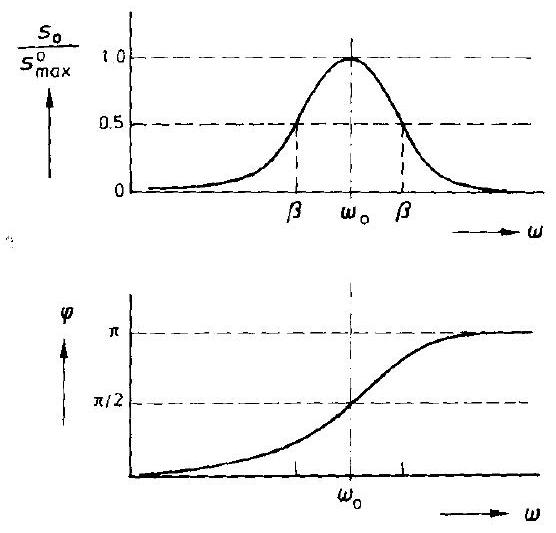
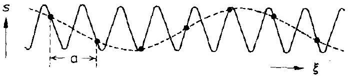
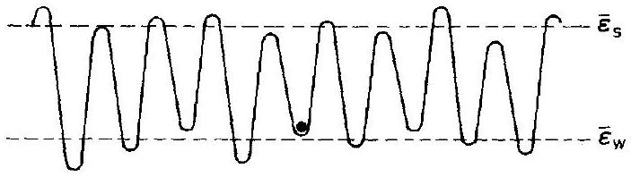
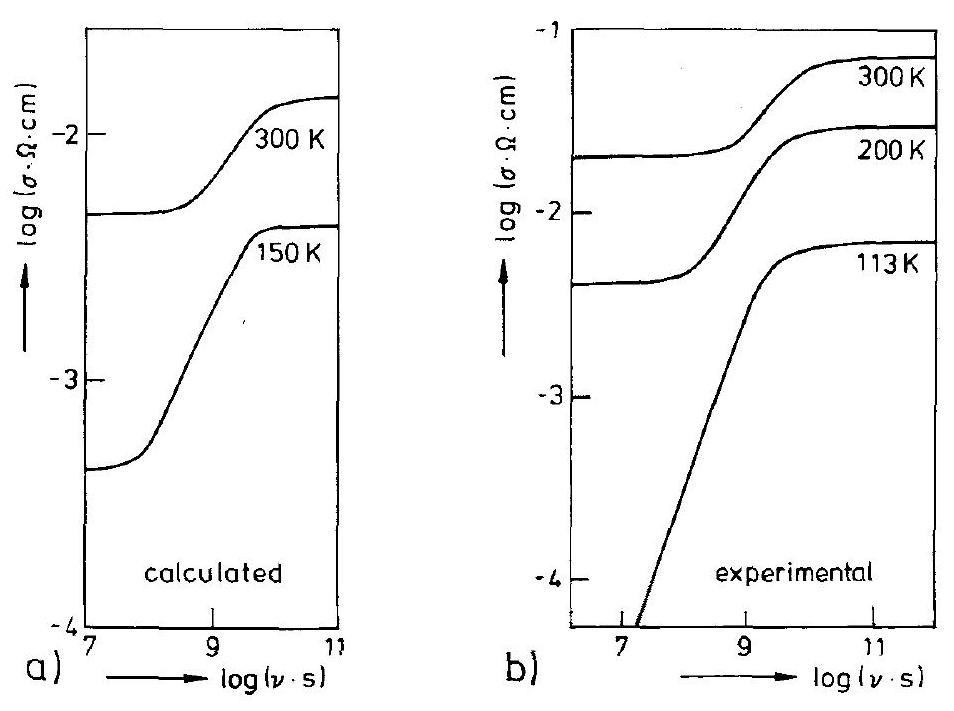
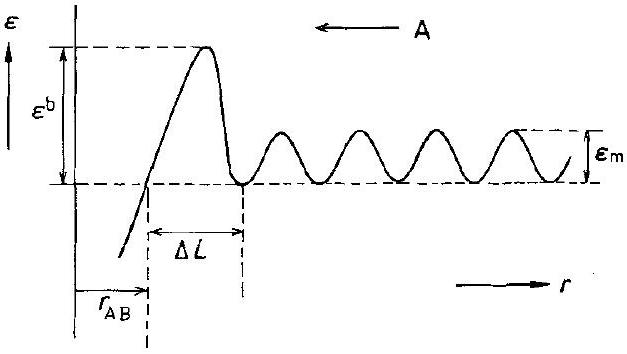
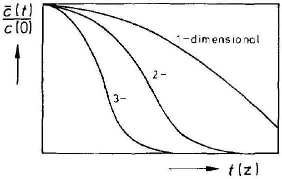
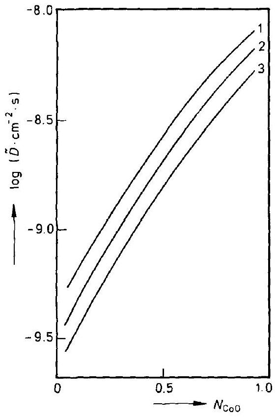

## 5 Kinetics and Dynamics. Local Equilibrium

### 5.1 Introduction

The aim of this chapter is to clarify the conditions for which chemical kinetics can be correctly applied to the description of solid state processes. Kinetics describes the evolution in time of a non-equilibrium many-particle system towards equilibrium (or steady state) in terms of macroscopic parameters. Dynamics, on the other hand, describes the local motion of the individual particles of this ensemble. This motion can be uncorrelated (single particle vibration, jump) or it can be correlated (e.g., through non-localized phonons). Local motions, as described by dynamics, are necessary prerequisites for the thermally activated jumps responsible for the movements over macroscopic distances which we ultimately categorize as transport and solid state reaction.

The time evolution of a system may also be characterized according to the degree of perturbation from its equilibrium state. Linear theories hold if local equilibrium prevails, that is, each volume element of the non-equilibrium system can still be unambiguously defined by the usual set of (local) thermodynamic state variables. Often, a crystal is in (partial) equilibrium with respect to externally predetermined $P$ and $T$, but not with external component chemical potentials $\mu_{k}$. Although $P, T$, and $\mu_{k}$ are all intensive functions of state, $\Delta P$ relaxes with sound velocity, $\Delta T$ by heat conduction, and $\Delta \mu_{k}$ by matter transport. In solids, matter transport is normally much slower than the other modes of relaxation.

As an illustration, consider the isothermal, isobaric diffusional mixing of two elemental crystals, A and B , by a vacancy mechanism. Initially, A and B possess different vacancy concentrations $c_{\mathrm{V}}^{0}(\mathrm{~A})$ and $c_{\mathrm{V}}^{0}(\mathrm{~B})$. During interdiffusion, these concentrations have to change locally towards the new equilibrium values $c_{\mathrm{V}}^{0}(\mathrm{~A}, \mathrm{~B})$, which depend on the local ( $\mathrm{A}, \mathrm{B}$ ) composition. Vacancy relaxation will be slow if the external surfaces of the crystal, which act as the only sinks and sources, are far away. This is true for large samples. Although linear transport theory may apply for all structure elements, the (local) vacancy equilibrium is not fully established during the interdiffusion process. Consequently, the (local) transport coefficients ( $D_{\mathrm{A}}, D_{\mathrm{B}}$ ), which are proportional to the vacancy concentration, are no longer functions of state (i.e., dependent on composition only) but explicitly dependent on the diffusion time and the space coordinate. Non-linear transport equations are the result.

Since our particle ensemble exists in the form of a crystal, the individual particles are located in periodically arranged potential wells (see, for example, Figure 5-3 as a two dimensional analogue). Their energy minima are normally deep compared to the available thermal energy associated with a (motional) degree of freedom ( $k T / 2$ ). The macroscopic mobility of the (average) particle is therefore related to the prob-
ability of reaching the saddle point between two neighboring wells. This probability, in turn, is related to the attempt frequency of the particles to overcome the saddle, and also to the height of the saddle and the momentum vector of the particles. (The saddle form also plays a role if quantum effects cannot be neglected.)

Experience tells us that kinetic coefficients normally show Arrhenius (thermally activated) behavior. The transition state theory, as used in chemical kinetics, is the simplest model connecting dynamics and kinetics and has been adopted for crystals (see, for example, [W. Jost (1955); G. Vineyard (1957)]). The rate at which particles arrive at the transition saddle is given by $v_{0} \cdot \mathrm{e}^{-\Delta E_{\mathrm{A}} / R T}$, the product of the attempt frequency (to be found from particle mass and curvature of the potential well) and the Boltzmann factor of the saddle height, $\Delta E_{\mathrm{A}}$. Dynamics, however, is not only concerned with uncorrelated vibrations of the individual particle in the potential wells, but deals with the correlated motions (coupling to the phonon spectrum) as well. These correlated motions have lower frequencies since larger masses are involved. They periodically diminish and dilate the distances between the wells, which results in changes in both the $\Delta E_{\mathrm{A}}$ energies and the form of the saddle. Therefore, the analysis of the (average) particle mobility is a complex problem. The fact that particle motion is possible only if a neighboring (equivalent) lattice site is vacant adds to the complexity. Vacancies destroy the periodicity of the lattice as well as the local symmetry.

Before continuing with the discussion on the dynamics of SE's in crystals and their kinetic consequences, let us introduce the elementary modes of SE motion. In a periodic lattice, a vacant neighboring site is a necessary condition for transport since it allows the site exchange of individual atomic particles to take place. Rotational motion of molecular groups can also be regarded as an individual motion, but it has no macroscopic transport component. It may, however, promote (translational) diffusion of other SE's [M. Jansen (1991)].

In addition to the individual and uncorrelated particle motions, we also have collective ones. In a strict sense, the hopping of an individual vacancy is already coupled to the correlated phonon motions. Harmonic lattice vibrations are the obvious example for a collective particle motion. Fixed phase relations exist between the vibrating particles. The harmonic case can be transformed to become a one-particle problem [A. Weiss, H. Witte (1983)]. The anharmonic collective motion is much more difficult to treat theoretically. Correlated many-particle displacements, such as those which occur during phase transformations, are further non-trivial examples of collective motions.

Before beginning a quantitative discussion, let us recall the classical equation of one dimensional motion of a single particle ( $n$ ) in the crystal

$$
m \cdot \ddot{\xi}_{n}+(m \cdot \beta) \cdot \dot{\xi}_{n}+\left(m \cdot \omega_{0}^{2}\right) \cdot \xi_{n}=F(t)
$$

where $F(t)$ denotes the applied force. The coupling to the other particles occurs by elastic interaction through the displacement $\left(\xi_{n}-\xi_{n}^{0}\right)$ from the minimum $\xi_{n}^{0}$ of the assumed harmonic potential.

Several limiting cases are noteworthy. If there is (virtually) no coupling with other particles (e.g., small cations in the interstices of a stiff anion sublattice), we have the

Figure 5-1. Harmonic (damped) oscillator: amplitude $s_{0}$ and phase $\varphi$ as a function of the frequency $\omega$ of the exciting force $F(t)$.

$s_{0}(\omega=0)=\frac{z_{i} \cdot e_{0}}{m} \cdot \frac{E_{0}}{\omega_{0}^{2}}, \quad s_{0}(\omega=\infty)=0, \quad s_{0}(\max )=\frac{e}{m} \cdot \frac{E_{0}}{\beta \cdot \omega_{0}}$
one-particle problem of Eqn. (5.1). The well-known solution for a periodic electric field force $F(t)=\left(z_{i} \cdot e_{0} \cdot E_{0}\right) \cdot \mathrm{e}^{i \cdot \omega \cdot t}$ for long times is (Fig. 5-1)

$$
\xi=\frac{z_{i} \cdot e_{0}}{m} \cdot \frac{E_{0}}{\left(\left(\omega_{0}^{2}-\omega^{2}\right)^{2}+\beta^{2} \cdot \omega^{2}\right)^{1 / 2}} \cdot \mathrm{e}^{i \cdot(\omega \cdot t-\varphi)}=s_{0} \cdot \mathrm{e}^{i \cdot(\omega \cdot t-\varphi)}
$$

Here, $\varphi$ is the phase shift and $\tan \varphi=\beta \cdot \omega /\left(\omega_{0}^{2}-\omega^{2}\right)$, where $\omega_{0}=\sqrt{f / m}$ with $f$ being the curvature of the harmonic potential. $s_{0}(\max )\left(=\left(z_{i} \cdot e_{0} / m\right) \cdot E_{0} /\left(\beta \cdot \omega_{0}\right)\right)$ occurs at $\omega_{0}$. Note that $\dot{\xi}$ is proportional to the (complex) electrical conductivity if the particles bear electric charge as, for example, in solid electrolytes (see Section 5.2.3).

The formal solution of Eqn. (5.1) for short times requires a term to be added to the right hand side of Eqn. (5.2). It contains the vibration frequency $\omega_{0}$ and is proportional to $\mathrm{e}^{-\beta \cdot t}$. In other words, the time $\tau$ to attain the long-time solution (Eqn. (5.2)) depends on the friction coefficient $\beta$ and equals

$$
\tau=1 / \beta
$$

If there is elastic coupling to the other particles, but no friction ( $\beta=0$ ) and no applied force $F(t)$, the phonon states of a crystal can be derived. For each particle $(n=1,2, \ldots)$ we have (in a linear lattice) from Eqn. (5.1)

$$
\ddot{\xi}_{n}+\omega_{0}^{2} \cdot\left(2 \cdot \xi_{n}-\left(\xi_{n+1}+\xi_{n-1}\right)\right)=0
$$

if the elastic forces are proportional to the deviations $\left(\xi_{n}-\xi_{n \pm 1}\right)=\Delta \xi_{n}$ from the equilibrium distance, $a$, of the minima of the harmonic potentials. It is seen by insertion of Eqn. (5.5) in (5.4) that

$$
\xi_{n}=\xi_{0} \cdot \mathrm{e}^{i \cdot(\omega \cdot t+k \cdot a \cdot n)} ; \quad k=\frac{2 \pi}{\lambda}
$$

satisfies Eqn. (5.4), from which we derive

$$
\omega=2 \cdot \omega_{0} \cdot \sin \left(\frac{k \cdot a}{2}\right)
$$

We conclude that $\omega=\omega(k)$, that is, the lattice vibrational frequencies show dispersion and change (periodically) with $k$ (or $\lambda$ ). In particular, $\omega(k=0)=0$; $\omega(k= \pm \pi / a)=2 \cdot \omega_{0}$. Furthermore, $\omega(k a / 2)=\omega(k a / 2+h \cdot 2 \pi)$, which gives identical vibrations for $k=k+h \cdot(4 \pi) / a ; h=0,1,2, \ldots$

The number of vibrating states between $\omega$ and $(\omega+\mathrm{d} \omega)$ is determined by the length $L$ of the system. Since $L=z \cdot a=g \cdot \lambda$ (if $z=$ total number of particles $n$, and $g=$ number of waves in $L$ ), we have

$$
\mathrm{d} g=\left(\frac{z \cdot a}{2 \pi}\right) \cdot \mathrm{d} k
$$

from which the density of states can be calculated

$$
\frac{\mathrm{d} g}{\mathrm{~d} \omega}=\frac{z}{\pi \cdot \omega_{0} \cdot \cos \frac{k \cdot a}{2}}=\frac{2 \cdot z}{\pi \cdot \sqrt{\omega_{0}^{2}-\omega^{2}}}
$$

We did not differentiate between the various modes of vibration (longitudinal, transversal, acoustical, optical) for the sake of simplicity. The vibrational states in a crystal are called phonons. Figure 5-2 illustrates the collective, correlated transversal vibrational motion of a linear elastic chain of particles.

Figure 5-2. Phonon in a crystal, schematic. Transversal motion of a linear atomic chain, described by two different waves with wavelength $>2 a$ and wavelength $<2 a, a=$ (average) distance of atoms.

Kinetics is a macroscopic theory. Dynamics is particle physics. Statistical theory relates both fields and goes beyond statistical thermodynamics. It is not the aim of this book to enter the field of statistical theory. However, a number of its concepts are needed for a correct understanding of kinetic parameters and for constructing appropriate models. In this sense, the following sections will be presented.

### 5.1.1 Linear Response

Equation (5.1) described the vibrational response of a single particle to an applied force $F(t)$. In a (crystalline) system of many mobile particles (ensemble), the problem is analogous but the question now is how the whole system responds to an external force or perturbation? Let us define the system's state ( $\alpha$ ) as a particular configuration of its particles and the probability of this state as $p_{\alpha}$. In a thermodynamic system, transitions from an $\alpha$ to a $\beta$ configuration occur as thermally activated events. If the transition frequency $\alpha \rightarrow \beta$ is $\omega_{\beta \alpha}$ and depends only on $\alpha$ and $\beta$ (Markovian), the time evolution of the system is given by a 'master equation' which links atomic and macroscopic parameters (dynamics and kinetics)

$$
\frac{\mathrm{d} p_{\alpha}}{\mathrm{d} t}=\sum \omega_{\alpha \beta} \cdot p_{\beta}-\sum \omega_{\beta \alpha} \cdot p_{\alpha} ; \quad \beta \neq \alpha
$$

In matrix form, this equation reads

$$
\dot{p}=-W \cdot p
$$

with the definitions

$$
W_{\alpha \beta}=-\omega_{\alpha \beta}(\alpha \neq \beta) ; \quad W_{\alpha \alpha}=\sum_{\beta} \omega_{\beta \alpha}(\beta \neq \alpha)
$$

Formal integration gives

$$
p(t)=p^{0} \cdot H(t) ; \quad H(t)=\mathrm{e}^{-W \cdot t}
$$

The 'propagator' $H_{\beta \alpha}(t)$ is the (conditional) probability that the system will be found in state $\beta$ at time $t$, given that it was in $\alpha$ at $t=0$.

If the (equilibrium) system (upper index ${ }^{0}$ ) is disturbed by an externally applied field $E$, we then assume that the (first order) changes of the system's thermodynamic $(p)$ and kinetic ( $\omega$ ) parameters are given by

$$
\begin{gathered}
p_{\alpha}=p_{\alpha}^{0}+E \cdot p_{\alpha}^{(1)} \\
\omega_{\beta \alpha}=\omega_{\beta \alpha}^{0}+E \cdot \omega_{\beta \alpha}^{(1)}
\end{gathered}
$$

At equilibrium, we have the detailed balance

$$
p_{\alpha}^{0} \cdot \omega_{\beta \alpha}^{0}=p_{\beta}^{0} \cdot \omega_{\alpha \beta}^{0}
$$

Let us assume (in accordance with transition state theory, see Section 5.1.2) that in a linearized version

$$
\omega_{\beta \alpha}^{(1)}=\omega_{\beta \alpha}^{0} \cdot \frac{\delta G_{\alpha}-\delta G_{\beta \alpha}^{*}}{R T}
$$

where $G_{\alpha}$ is the Gibbs energy of the $\alpha$-state, $G_{\beta \alpha}^{*}$ the Gibbs energy of the activation saddle for the process $\alpha \rightarrow \beta$, and $\delta$ designates the change due to the applied field. With these definitions, $p^{(1)}(t)$ becomes

$$
p^{(1)}(t)=\int_{-\infty}^{t} p^{0} \cdot H^{0}\left(t-t^{\prime}\right) \cdot W^{0} \cdot \frac{\delta G_{\beta}\left(t^{\prime}\right)-\delta G_{\alpha}\left(t^{\prime}\right)}{R T} \cdot \mathrm{~d} t^{\prime}
$$

if the field was applied at $t=-\infty$ [see, for example, A. R. Allnatt, A. B. Lidiard (1993)]. It is noteworthy that those terms related to the saddle energy vanish as a result of the detailed balance. The main result, however, concerning the conceptual understanding of processes in the solid state is that thermodynamic equilibria functions ( $p^{0}, H^{0}, W^{0}, G$ ) can be used to describe the time evolution $p^{(1)}(t)$ of the disturbed system.

Let us illustrate the simplest response approach by an example representing the many-particle system counterpart of Eqn. (5.1). Let $F(t)$ stem from an (periodic) electric field $E(t)$ acting upon an electric charge. The response of a dielectric with permittivity $\varepsilon$ to the field $E$ is the displacement

$$
D=\varepsilon \cdot E
$$

and the polarization

$$
P=D-\varepsilon_{0} \cdot E=\left(\varepsilon-\varepsilon_{0}\right) \cdot E
$$

If $E=E(t)$, we can split $D$ into one part that follows $E(t)$ instantaneously and a second part that contains the response due to relaxation processes, that is,

$$
D(t)=\varepsilon_{\infty} \cdot E(t)+\int_{-\infty}^{t} H\left(t-t^{\prime}\right) \cdot E\left(t^{\prime}\right) \cdot \mathrm{d} t^{\prime}
$$

We can substitute $(t-s)$ for $t^{\prime}$ and $\left(\varepsilon_{0}-\varepsilon_{\infty}\right) \cdot h(s)$ for $H\left(t-t^{\prime}\right)$, where $H\left(t-t^{\prime}\right)$ and $h(s)$ are functions that specify the system's response. If $E=E_{0} \cdot \mathrm{e}^{i \cdot \omega \cdot i}$, then one obtains from Eqn. (5.20)

$$
D(t)=E_{0} \cdot \mathrm{e}^{i \cdot \omega \cdot t} \cdot\left\{\varepsilon_{\infty}+\int_{0}^{\infty}\left(\varepsilon_{0}-\varepsilon_{\infty}\right) \cdot h(s) \cdot \mathrm{e}^{-i \cdot \omega \cdot s} \cdot \mathrm{~d} s\right\}=\left(\varepsilon_{1}-i \cdot \varepsilon_{2}\right) \cdot E_{0} \cdot \mathrm{e}^{i \cdot \omega \cdot t}
$$

or, equivalently,

$$
\begin{aligned}
& \varepsilon_{1}=\varepsilon_{\infty}+\operatorname{Re}\left\{\left(\varepsilon_{0}-\varepsilon_{\infty}\right) \cdot \int_{0}^{\infty} h(s) \cdot \mathrm{e}^{-i \cdot \omega \cdot s} \cdot \mathrm{~d} s\right\} \\
& \varepsilon_{2}=-\operatorname{Im}\left\{\left(\varepsilon_{0}-\varepsilon_{\infty}\right) \cdot \int_{0}^{\infty} h(s) \cdot \mathrm{e}^{-i \cdot \omega \cdot s} \cdot \mathrm{~d} s\right\}
\end{aligned}
$$

where $\operatorname{Re}$ and $\operatorname{Im}$ designate the real and imaginary part of the complex function, respectively.

One notes the similar forms of Eqns. (5.21) and (5.17). The simplest response functions are exponential, for example

$$
h(s)=\frac{1}{\Delta \varepsilon \cdot \tau} \cdot \mathrm{e}^{-s / \tau} ; \quad \Delta \varepsilon=\varepsilon_{0}(\omega=0)-\varepsilon_{\infty}(\tau=0)
$$

The pre-exponential factor has been chosen so that Debye's equations for the dielectric loss are obtained if one evaluates Eqns. (5.22) using Eqn. (5.23)

$$
\begin{gathered}
\varepsilon_{1}=\varepsilon_{\infty}+\frac{\Delta \varepsilon}{1+\omega^{2} \cdot \tau^{2}} \\
\varepsilon_{2}=\frac{\Delta \varepsilon \cdot \omega \cdot \tau}{1+\omega^{2} \cdot \tau^{2}}
\end{gathered}
$$

For large enough $\omega, \varepsilon_{1}$ is formally equivalent to $s_{0}$ in Eqn. (5.2). Also, $\varepsilon_{2} / \varepsilon_{1}=\tan \varphi_{\varepsilon}$ is equivalent to the $\tan \varphi$ derived from Eqn. (5.2). Therefore, Figure 5-1 also represents the course of $\varepsilon_{1}\left(\omega>\omega^{0}\right)$ and $\varphi_{\varepsilon}$.

### 5.1.2 Transition State

The kinetic rate parameters, $k$, of many chemical processes obey the Arrhenius relation

$$
k=k_{0} \cdot \mathrm{e}^{-\frac{\Delta E_{\mathrm{A}}}{R T}}
$$

where $\Delta E_{\mathrm{A}}$ is the activation energy. $k_{0}$ is related to the attempt frequency of the particle in its potential well. Various efforts have been made to explain the ensemble average $\Delta E_{\mathrm{A}}$ through statistical models and particle dynamics. Important steps in the theoretical evaluation were Eyring's transition state concept [S. Glasstone, K. J. Laidler, H. Eyring (1941)] and Kramers' model [H. A. Kramers (1940)]. The latter calculates the escape rate of a (classical) particle trapped in a potential well when exposed to a random force $F_{r}(t)$. The basic assumption is that the course of the system (ensemble) follows a reaction coordinate (path) in high dimensional energy space. The probability of being at the saddle point position (transition state) is defined according to Boltzmann statistics. From the transition state, the system falls into the stable 'product' state with an assumed ad hoc probability.

Since thermodynamic concepts are used to calculate the transition state probability, and the entropy varies along the reaction path, it is more correct to formulate Eqn. (5.26) as

$$
k=k_{0} \cdot \mathrm{e}^{-\frac{\Delta G_{\mathrm{A}}}{R T}}
$$

where $\Delta G_{\mathrm{A}}$ is a change of free enthalpy.

There were several early discussions on the application of transition state theory to activated diffusional transport in crystals [W. Jost (1955)]. The Vineyard treatment [G. Vineyard (1957)] adapts Eyring's concept to the case of vacancy diffusion in a (elemental) crystal and clarifies it by taking into account the many-body features of this diffusion process.

Eyring's theory is well explained in textbooks on kinetics. It is analogous to the statistical mechanics approach that gives the probability of a particle with total energy $H=p^{2} / 2 m_{\mathrm{A}}+\phi(\xi)$ to be found in the interval $\xi$ to $(\xi+\mathrm{d} \xi)$ and $p$ to $(p+\mathrm{d} p)$, that is,

$$
\mathrm{d} p \cdot \mathrm{~d} \xi \cdot \mathrm{e}^{-H / k T} / \iint \mathrm{d} p \cdot \mathrm{~d} \xi \cdot \mathrm{e}^{-H / k T}
$$

where $p=m_{\mathrm{A}} \cdot \dot{\xi}$ and $\phi(\xi)$ is the (periodic) potential energy. In order to convert the probability of a saddle point occupation into a jump frequency, two crucial assumptions are made. 1) If a particle reaches the saddle point, it crosses it with an ad hoc probability. 2) All particles, A, having an average thermal energy ( $1 / 2 \cdot m_{\mathrm{A}} \cdot v^{2} =1 / 2 \cdot k T$ ) will reach the saddle point in the time interval $\mathrm{d} t$ if they are located within a distance $\sqrt{k T / m_{\mathrm{A}}} \cdot \mathrm{d} t$ from the saddle.

Extensive discussions of this problem are given in pertinent monographs (e.g., [A. R. Allnatt, A. B. Lidiard (1993)]). We will instead present Vineyard's version and add a few comments which are relevant to diffusional transport in crystals. This version yields for the vacancy ( $\mathrm{V}_{\mathrm{A}}$ ) hopping rate in crystal A at a given temperature

$$
v_{\mathrm{V}_{\mathrm{A}}}=\frac{1}{\sqrt{2 \pi}} \cdot \sqrt{\frac{k T}{m_{\mathrm{A}}}} \cdot \frac{\int_{S} \mathrm{e}^{-\phi(s) / k T} \cdot \mathrm{~d} s}{\int_{V} \mathrm{e}^{-\phi(r) / k T} \cdot \mathrm{~d} r}
$$

where $S$ is the dividing hypersurface in energy space (equivalent to the saddle point configuration in the one dimensional model). Once atom A reaches it (in configurational space) at a finite velocity, it will react, that is, it will exchange sites with the neighboring vacancy. The integral in the denominator goes over the crystal volume, $V$, which comprises that side of the dividing surface $S$ on which the hopping vacancy does not reside. In the harmonic approximation, we can immediately evaluate the integrals of Eqn. (5.29). If the energy difference between the saddle surface and the lattice potential well is $(\phi(S)-\phi(\mathrm{A})) \geqslant k T$, then

$$
v_{\mathrm{V}_{\mathrm{A}}}=\tilde{v} \cdot \mathrm{e}^{-\frac{\phi(S)-\phi(\mathrm{A})}{k T}}
$$

where

$$
\tilde{v}=\frac{\Pi^{(\mathrm{Z})} v_{v}}{\Pi^{(\mathrm{Z}-1)} v_{S}}
$$

$v_{V}$ are the $(Z)$ normal frequencies in the bulk, $v_{S}$ are the normal frequencies when the system is constrained to the dividing hypersurface $S$. By assuming that all frequencies are the same ( $=$ Einstein frequencies $v_{\mathrm{E}}$ ), the isotope effect of diffusion will be correctly predicted ( $v \sim 1 / \sqrt{m_{\mathrm{A}}}$ ).

Attention should be drawn to the fact that thermal energy randomization occurring after a particle has crossed the activation barrier is not perfect, so that return jumps may not be neglected. This can be taken into account by introducing a curved dividing hypersurface $S$ which the jumping particle crosses more than once. Corrections (backjumps) of up to $10 \%$ are predicted [C.P. Flynn (1987)].

The statistical procedures of Vineyard and others thus confirm the experimentally observed Arrhenius behavior of transport in solids. There are many details which have not been fully treated in this discussion but can be studied in the pertinent literature [P. Hänngi, P. Talkner, M. Borkavec (1990)]. Our aim was to rationalize the activated jump concept and to point out its basic assumptions.

### 5.1.3 Brownian Motion

The stochastic motion of particles in condensed matter is the fundamental concept that underlies diffusion. We will therefore discuss its basic ideas in some depth. The classical approach to Brownian motion aims at calculating the number of ways in which a particle arrives at a distinct point $m$ steps from the origin while performing a sequence of $z^{0}$ random steps in total. Consider a linear motion in which the probability of forward and backward hopping is equal ( $=1 / 2$ ). The probability for any sequence is thus $(1 / 2)^{\xi}$. Point $m$ can be reached by $\left(z^{0}+m\right) / 2$ forward plus $\left(z^{0}-m\right) / 2$ backward steps. The number of distinct sequences to arrive at $m$ is therefore

$$
\frac{z^{0}!}{\left(1 / 2 \cdot\left(z^{0}+m\right)\right)!\cdot\left(1 / 2 \cdot\left(z^{0}-m\right)\right)!}
$$

By using Stirling's formula (see, for example, [S. Chandrasekhar (1943)]), the probability of this special sequence is

$$
W\left(m, z^{0}\right)=\left(\frac{1}{2}\right)^{z^{0}} \cdot \frac{z^{0}!}{\left(1 / 2 \cdot\left(z^{0}+m\right)\right)!\cdot\left(1 / 2 \cdot\left(z^{0}-m\right)\right)!}=\left(\frac{2}{\pi \cdot z^{0}}\right)^{1 / 2} \cdot \mathrm{e}^{-\frac{m^{2}}{2 z^{0}}}
$$

In order to adapt Eqn. (5.33) to diffusion, we introduce the jump time $\tau=t / z^{0}$ and the distance coordinate $\xi=m \cdot \vec{a}$, with $\bar{a}$ being the jump length. Since $W\left(m, z^{0}\right) \cdot \Delta \xi / 2 \vec{a}=W\left(\xi, z^{0}\right) \cdot \Delta \xi$, Eqn. (5.33) yields, after setting $D=\vec{a}^{2} / 2 \cdot \tau$,

$$
W(\xi, t) \cdot \Delta \xi=\frac{1}{2 \cdot(\pi \cdot D \cdot t)^{1 / 2}} \cdot \mathrm{e}^{-\xi^{2} / 4 D t} \cdot \Delta \xi
$$

for the probability of finding the particle at $\xi,(\xi+\Delta \xi)$ after time $t . W$ has the form of a normal distribution.

The simplest derivation of the mean square displacement $\left(\overline{\xi^{2}} \sim t\right)$ assumes a regular lattice (elementary length $\bar{a}$ ) and a fixed jump frequency ( $1 / \tau$ ). This model, however, is obviously oversimplified even in the case of tracer diffusion in an elemen-

Figure 5-3. Stochastic equidistant potential wells and saddles.

tal crystal since it disregards the stochastic phonons ( $=$ thermal fluctuations). Glasses are geometrically and energetically random systems, and alloy crystals can be random systems as well, that is, there is a distribution of saddle point potentials, $\varepsilon_{\mathrm{S}}$, and regular site potential wells, $\varepsilon_{\mathrm{W}}$, as indicated in Figure 5-3.

It has been established that geometrical disorder has only a small effect on Brownian motion [S. Havlin, D. Ben Avraham (1987)]. Also, for thermally activated jumps, if the distribution of $\varepsilon_{\mathrm{S}}$ and $\varepsilon_{\mathrm{W}}$ in a geometrically regular lattice is chosen to be Gaussian, as characterized by the variances $\sigma_{\mathrm{S}}$ and $\sigma_{\mathrm{W}}$, it has been ascertained [Y. Limoge, J. L. Bocquet (1990)] that there are two limiting diffusion coefficients:

1) in the high temperature limit ( $R T \rightarrow \infty$ )

$$
D=D^{0} \cdot \mathrm{e}^{-\frac{\bar{\varepsilon}_{\mathrm{S}}-\bar{\varepsilon}_{\mathrm{W}}}{R T}} \cdot \mathrm{e}^{\frac{\sigma_{\mathrm{S}}^{2}-\sigma_{\mathrm{W}}^{2}}{2 \cdot(R T)^{2}}}
$$

2 ) in the low temperature limit ( $R T \rightarrow 0$ )

$$
D=D^{0} \cdot \mathrm{e}^{-\frac{\varepsilon_{\mathrm{S}}-\bar{\varepsilon}_{\mathrm{W}}}{R T}} \cdot \mathrm{e}^{-\frac{f \cdot\left(\sigma_{\mathrm{S}}^{2}-\sigma_{\mathrm{W}}^{2}\right)}{2 \cdot(R T)^{2}}}
$$

In Eqn. (5.36), $f$ varies slowly with ( $\sigma_{\mathrm{S}} / R T$ ) and the coordination number, and it is nearly one. $\bar{\varepsilon}_{\mathrm{S}}$ and $\bar{\varepsilon}_{\mathrm{W}}$ are average values. From Eqns. (5.35) and (5.36), we conclude that, with respect to diffusion, the two kinds of disorder (in S and W ) compensate each other. The disorder effects would cancel each other exactly if $\sigma_{\mathrm{S}} / \sigma_{\mathrm{W}}=1$ (Eqn. (5.35)) or $\sigma_{\mathrm{S}} / \sigma_{\mathrm{W}}=\sqrt{f}$ (Eqn. (5.36)). Therefore, the normally observed Arrhenius behavior of diffusion coefficients is indeed to be expected unless $\sigma_{\mathrm{S}} / \sigma_{\mathrm{W}} \gg 1$ or $\sigma_{\mathrm{S}} / \sigma_{\mathrm{W}} \ll 1$, which is obviously not the case for real systems.

A limiting case of particle motion is the stochastic hopping of an interstitial atom. It receives the necessary energy for the saddle point crossing from the spectrum of phonon energies. The coupling of the particle jump with the phonons determines at least part of the correlation between successive jumps. If this coupling is weak, a forward correlation might develop. However, backward correlations occur as well, as will be shown below. The real motion of the particles, however, occurs on an energy surface which is continuously changing its form. In view of the lattice defects which are responsible for the macroscopic (Brownian) motion, even the time-averaged form of the energy surface is not strictly periodic. Therefore, the motion of atomic particles in crystals can also be seen as somewhat analogous to atomic motion in fluids. In this limiting case, the particles follow a reduced equation of motion

$$
m \cdot \ddot{\xi}+(m \cdot \beta) \cdot \dot{\xi}=F(t)
$$

which is to be contrasted to Eqn. (5.1). Note that $1 / \beta$ (Eqn. (5.3)) has the dimension of time. When $\ddot{\xi}=0$, Eqn. (5.37) yields $\dot{\xi}$ (stat) $=F^{0} \cdot b$ for the steady state velocity, where $b=1 /(m \cdot \beta) . F(t)$ has now been replaced by $F^{0}$ for $t \gg 1 / \beta$. Let us use this concept to understand the essence of a diffusion coefficient. For a linear geometry, Fick's first law gives (for constant $D$ )

$$
\int_{-\infty}^{+\infty} \xi \cdot j \cdot \mathrm{~d} \xi=-D \cdot \int_{-\infty}^{+\infty} \xi \cdot \frac{\partial c}{\partial \xi} \cdot \mathrm{~d} \xi=D \cdot \int_{-\infty}^{+\infty} c \cdot \mathrm{~d} \xi
$$

On the other hand, if we set $j=c \cdot(b \cdot \nabla \mu)=c \cdot \overline{v(\xi)}$, then

$$
\int_{-\infty}^{+\infty} \xi \cdot \overline{v(\xi)} \cdot c \cdot \mathrm{~d} \xi=D \cdot \int_{-\infty}^{+\infty} c \cdot \mathrm{~d} \xi
$$

and so

$$
D=\frac{\int(\xi \cdot \bar{v}) \cdot c \cdot \mathrm{~d} \xi}{\int c \cdot \mathrm{~d} \xi}=(\overline{\xi \cdot \bar{v}})=(\overline{\xi \cdot \bar{\xi}})
$$

Equation (5.40) reveals the essence of the diffusion coefficient. Since $\mathrm{d}\left(\overline{\xi^{2}}\right) / \mathrm{d} t= 2 \cdot \xi \cdot \xi$, then $\xi^{2}=2 \cdot D t$. The same conclusion was reached in Section 4.3 where we used an ensemble averaging procedure instead of introducing $F^{0}$, the time average of the stochastic force, $F(t)$, acting upon a single particle.

Furthermore, since $v^{2}=k T / m=\overline{\xi^{2}}$ in thermal equilibrium, we find from the equation of motion (Eqn. (5.37)) for $t \gg 1 / \beta$ that $D=b \cdot k T$. This is the Nernst-Einstein equation and is achieved by setting $F^{0}=0$ and noting that $\xi \cdot \ddot{\xi}=(\mathrm{d}(\xi \cdot \dot{\xi}) / \mathrm{d} t -\dot{\xi}^{2}$ ).
For short times, that is, $t<1 / \beta$, we have to consider the fluctuating energy surface for which $F(t) \neq F^{0}$. Let us investigate the meaning of $F(t)$ (in atomic dimensions) and see whether $\boldsymbol{v}$ is still given by ( $F \cdot b$ ). After all, $F(t)$ reflects the dynamics of the particles. If we multiply Eqn. (5.37) by $\xi$, we obtain

$$
\frac{\mathrm{d}}{\mathrm{~d} t}(\xi \cdot \dot{\xi})-\dot{\xi}^{2}=-\beta \cdot \xi \cdot \dot{\xi}+\xi \cdot \frac{F(t)}{m}
$$

Integrating Eqn. (5.41) and averaging over many particles yields, if $\overline{\xi^{2}}=k T / m$ and $\overline{\xi \cdot F(t)}=0$,

$$
\overline{\xi \cdot \dot{\xi}}=A+C \cdot \mathrm{e}^{-\beta \cdot t}
$$

where $A$ is an integration constant determined to be $C=-A$ for $t=0$. Integrating once again gives

$$
\overline{\xi^{2}}=2 \cdot A \cdot\left(t-(1 / \beta) \cdot\left(1-\mathrm{e}^{-\beta \cdot t}\right)\right)
$$

which, for $t \ll 1 / \beta$ becomes

$$
\overline{\xi^{2}} \cong A \cdot \beta \cdot t^{2}=\overline{(v \cdot t)^{2}}
$$

Figure 5-4. Mean square displacement of many particles as a function of time $t$.

Figure 5-4 illustrates Eqns. (5.40) and (5.44) by plotting the mean square displacement of many particles as a function of $t$. We can distinguish the Brownian from the pre-Brownian regime and correlate $A$ with the diffusion coefficient $D$.

Let us further analyze the stochastic force $F(t)$ with respect to the dynamics of the system in the pre-Brownian regime ( $t<1 / \beta$ ). Before we introduce models, let us clarify the role of $F(t)$ by averaging the particle velocities $v$. To this end, we rewrite Eqn. (5.37) in the following form

$$
\dot{\boldsymbol{v}}=-\beta \cdot \boldsymbol{v}+B(t) ; \quad B(t)=F(t) / m
$$

Remember that in thermal equilibrium, $\overline{v^{2}}=k T / m . B(t)$ is the stochastic acceleration. Integration of Eqn. (5.45) results in

$$
v(t)=v(0) \cdot \mathrm{e}^{-\beta \cdot t}+\mathrm{e}^{-\beta \cdot t} \cdot \int_{0}^{t} B(t) \cdot \mathrm{e}^{\beta \cdot t} \cdot \mathrm{~d} t
$$

as can be verified by inserting Eqn. (5.46) into Eqn. (5.45). After multiplying of Eqn. (5.46) by $\boldsymbol{v}(0)$ and averaging over many particles, we find

$$
\overline{v(0) \cdot v(t)}=\overline{v(0)^{2}} \cdot \mathrm{e}^{-\beta \cdot t}=\frac{k T}{m} \cdot \mathrm{e}^{-\beta \cdot t}
$$

or

$$
\overline{v\left(t^{\prime}\right) \cdot v(t)}=\overline{v\left(t^{\prime}\right)^{2}} \cdot \mathrm{e}^{-\beta \cdot t}=\frac{k T}{m} \cdot \mathrm{e}^{-\beta \cdot t}
$$

Equation (5.47) shows that the 'velocity autocorrelation function', $v\left(t^{\prime}\right) \cdot v(t)$, decays exponentially with time. The rate of decay is determined by the friction coefficient $\beta(=1 / b \cdot m)$, that is, by particle mass and mobility.

Let us finally examine the relation between $\beta$ (or the mobility $b$ ) and the stochastic force $F(t)$ (or $B(t)$ ). We assume that the ('force') autocorrelation function $\phi(\tau)= \overline{B\left(t^{\prime}\right) \cdot B(t)}$ depends only on $\tau$, where $\tau=\left(t-t^{\prime}\right)$. We note that $\phi(\tau)$ is a symmetric and fast decaying function of $\tau$. Taking the square of Eqn. (5.37) and averaging over many particles, it is seen that by using Eqn. (5.47)

$$
\int_{-\infty}^{+\infty} \phi(\tau) \cdot \mathrm{d} \tau=\frac{2 \cdot k T}{m} \cdot \beta=\frac{2 \cdot k T}{m^{2}} \cdot \frac{1}{b}, \quad b=\frac{2 \cdot k T}{m^{2} \cdot \int \phi \cdot \mathrm{~d} \tau}
$$

Equation (5.48) relates the mobility $b$ of the moving particles to the stochastic force $F(t)=B(t) \cdot m$. In essence, it states that the larger the correlation in $F(t)$ (or $B(t)$ ), the lower is the particle mobility $b$.

If we regard $B(t)$ over a time $\tau$ long enough to ensure that $\mathrm{e}^{-\beta \cdot \tau} \ll 1$, we can define $B(t)=0$ for $t<0$ and $t>\tau$. We can then express $B(t)$ for $-\infty<t<+\infty$ in terms of a Fourier integral

$$
B(t)=\frac{1}{\sqrt{2 \pi}} \cdot \int_{-\infty}^{+\infty} A(\omega) \cdot \mathrm{e}^{i \cdot \omega \cdot t} \cdot \mathrm{~d} \omega
$$

Using the definition of $\phi(\tau)$ and Eqn. (5.49), it can be shown [R. Becker (1966)] that

$$
\phi(\tau)=\frac{2}{\tau} \cdot \int_{0}^{\infty}|A(\omega)|^{2} \cdot \cos (\omega \tau) \cdot \mathrm{d} \omega
$$

or, equivalently,

$$
|A(\omega)|^{2}=\frac{\tau}{2 \pi} \cdot \int_{-\infty}^{+\infty} \phi(\tau) \cdot \cos (\omega \tau) \cdot \mathrm{d} \tau
$$

We mention this result here in order to assert that the spectral distribution of $\overline{B(t)^{2}}$ is the Fourier transform of the (force) autocorrelation function $\phi(\tau)$. In view of Eqn. (5.45), we can restate this result in terms of the velocity $\boldsymbol{v}(t)$. The spectral distribution of the velocity autocorrelation function is directly related to the Fourier transform of $\phi(\tau)$, the force autocorrelation function. Thus, we see that the classical equation of motion when properly averaged over many particles provides insight into the relation between transport kinetics and particle dynamics [R. Becker (1966)].

### 5.2 Kinetic Parameters and Dynamics

### 5.2.1 Phenomenological Coefficients and Kinetic Theory

Atoms taking part in diffusive transport perform more or less random thermal motions superposed on a drift resulting from field forces ( $\nabla \mu_{i}, \nabla \eta_{i}, \nabla \mathcal{T}$, etc.). Since these forces are small on the atomic length scale, kinetic parameters established under equilibrium conditions (i.e., vanishing forces) can be used to describe the atomic drift and transport. The movements of atomic particles under equilibrium conditions are Brownian motions. We can measure them by mean square displacements of tagged atoms (often radioactive isotopes) which are chemically identical but different in mass. If this difference is relatively small, the kinetic behavior is
almost identical. A measure of the mean square displacement is the diffusion coefficient $D_{i}$, which for tagged particles $i^{*}$ is denoted $D_{i^{*}}$. We wish to know the relation between $D_{i}, D_{i^{*}}$, and the phenomenological transport coefficients $L_{i j}$. Kinetic theory describes $D_{i^{*}}$ through the elementary jump frequencies $v_{i}$.

In a zeroth order treatment, $D_{i^{*}}$ is often equated with $D_{i}$. Closer inspection shows that this is often incorrect. If, for example, transport occurs by a vacancy (V) mechanism, $i^{*}$ can jump only if V and $i^{*}$ have an encounter. The jump pattern between V and $i^{*}$ during the encounter, however, is by no means random. Therefore, let us set $D_{i^{*}}=f_{i} \cdot D_{i}$, where $f_{i}$ is the so-called correlation factor.

In order to investigate the relation between the phenomenological transport coefficients $L_{i j}$ and $D_{i}$, we formulate for the isotope (tracer) diffusion of $\mathrm{A}^{*}$ in A

$$
\begin{aligned}
& j_{\mathrm{A}}=-L_{\mathrm{AA}} \cdot \nabla \mu_{\mathrm{A}}-L_{\mathrm{AA}^{*}} \cdot \nabla \mu_{\mathrm{A}^{*}} \\
& j_{\mathrm{A}^{*}}=-L_{\mathrm{AA}^{*}} \cdot \nabla \mu_{\mathrm{A}}-L_{\mathrm{A}^{*} \mathrm{~A}^{*}} \cdot \nabla \mu_{\mathrm{A}^{*}}
\end{aligned}
$$

Since transport occurs solely by the exchange of A and $\mathrm{A}^{*}$, it follows that $j_{\mathrm{A}^{*}}+j_{\mathrm{A}}=0$. The isotope tracer solution is also ideal with $N_{\mathrm{A}}+N_{\mathrm{A}^{*}}=1$, so Eqn. (5.52) yields

$$
L_{\mathrm{AA}}=\frac{1}{N_{\mathrm{A}^{*}}} \cdot\left(L_{\mathrm{A}^{*} \mathrm{~A}^{*}}+L_{\mathrm{AA}^{*}}\right)
$$

Inserting Eqn. (5.53) into Eqn. (5.52) yields ( $N_{\mathrm{A}} \cong 1$ )

$$
j_{\mathrm{A}^{*}}=-R T \cdot V_{m} \cdot\left(L_{\mathrm{AA}}-\frac{L_{\mathrm{AA}^{*}}}{N_{\mathrm{A}^{*}}}\right) \cdot \nabla c_{\mathrm{A}^{*}}=-D_{\mathrm{A}^{*}} \cdot \nabla c_{\mathrm{A}^{*}}
$$

so that

$$
D_{\mathrm{A}^{*}}=L_{\mathrm{AA}} \cdot \frac{R T}{c_{\mathrm{A}}} \cdot\left(1-\frac{L_{\mathrm{AA}^{*}}}{N_{\mathrm{A}^{*}} \cdot L_{\mathrm{AA}}}\right)=D_{\mathrm{A}} \cdot f_{\mathrm{A}}
$$

where

$$
f_{\mathrm{A}}=1-\frac{L_{\mathrm{AA}^{*}}}{N_{\mathrm{A}^{*}} \cdot L_{\mathrm{AA}}}, \frac{L_{\mathrm{AA}^{*}}}{N_{\mathrm{A}^{*}}}=\left(1-f_{\mathrm{A}}\right) \cdot L_{\mathrm{AA}}
$$

Equation (5.56) relates the correlation factor $f_{\mathrm{A}}$ with the cross coefficient $L_{\mathrm{AA}^{*}}$. From the Nernst-Einstein relation we know that $L_{\mathrm{AA}}=b_{\mathrm{A}} \cdot c_{\mathrm{A}}=D_{\mathrm{A}} c_{\mathrm{A}} / R T$. For a tracer experiment with a negligible fraction of $\mathrm{A}^{*}$, the jump conservation requires that $D_{\mathrm{A}}=D_{\mathrm{V}} \cdot N_{\mathrm{V}}$, so that instead of Eqn. (5.56) we have

$$
\frac{L_{\mathrm{AA}^{*}}}{N_{\mathrm{A}^{*}}}=\left(1-f_{\mathrm{A}}\right) \cdot c_{\mathrm{A}} \cdot \frac{N_{\mathrm{V}} \cdot D_{\mathrm{V}}}{R T} \cong\left(1-f_{\mathrm{A}}\right) \cdot \frac{c_{\mathrm{V}} \cdot D_{\mathrm{V}}}{R T}
$$

Conclusion: the self-diffusion coefficient $D_{\mathrm{A}}$ cannot be determined solely by tracer experiments (mean square tracer displacement). Either information from non-equi-
librium measurements ( $D_{\mathrm{V}} \cdot N_{\mathrm{V}}$ ) or additional information from theory ( $f_{\mathrm{A}}$ ) is needed to calculate $D_{\mathrm{A}}$ from $D_{\mathrm{A}^{*}}$.

For very dilute solid solutions of B in A , the basic physics of diffusional mixing is the same as for ( $\mathrm{A}, \mathrm{A}^{*}$ ). An encounter between $\mathrm{V}_{\mathrm{A}}$ and $\mathrm{B}_{\mathrm{A}}$ is necessary to render the B atoms mobile. But B will alter the jump frequencies of V in its surroundings and therefore numerical values of the correlation factor and cross coefficient are different from those of tracer A* diffusion. Since the jump frequency changes also involve solvent A atoms, in addition to $f_{\mathrm{B}}$, the numerical value of $f_{\mathrm{A}}$ must be reconsidered (see next section).

It is a straightforward but rather lengthy exercise to write down and evaluate the flux equations $j_{\mathrm{A}}, j_{\mathrm{A}^{*}}, j_{\mathrm{B}}, j_{\mathrm{B}^{*}}$ under the assumption of local (vacancy) equilibrium $\left(X_{\mathrm{V}}=0\right)$. We find that five independent $L_{i j}$ are needed to fully describe the transport in such a system. However, only four experimental parameters $D_{\mathrm{A}}, D_{\mathrm{B}}, D_{\mathrm{A}^{*}}$, and $D_{\mathrm{B}^{*}}$ are available from flux measurements. Since $D_{\mathrm{A}} \neq D_{\mathrm{B}}, j_{\mathrm{A}} \neq j_{\mathrm{B}}$ in the solid solution crystal. Lattice site conservation requires that the sum of the fluxes $j_{\mathrm{A}}+j_{\mathrm{B}}+j_{\mathrm{V}}=0$, that is, $j_{\mathrm{V}} \neq 0$, despite $X_{\mathrm{V}}=0$. The external observer of the A-B interdiffusion process therefore sees the fluxes

$$
\begin{aligned}
& j_{\mathrm{A}}^{\#}=j_{\mathrm{A}}+N_{\mathrm{A}} \cdot j_{\mathrm{V}}=j_{\mathrm{A}}-N_{\mathrm{A}} \cdot\left(j_{\mathrm{A}}+j_{\mathrm{B}}\right) \\
& j_{\mathrm{B}}^{\#}=j_{\mathrm{B}}+N_{\mathrm{B}} \cdot j_{\mathrm{V}}=j_{\mathrm{B}}-N_{\mathrm{B}} \cdot\left(j_{\mathrm{A}}+j_{\mathrm{B}}\right)
\end{aligned}
$$

With $j_{\mathrm{A}}^{\#}=-j_{\mathrm{B}}^{\#}$, the (common) chemical interdiffusion coefficient is then calculated to be ( $j_{\mathrm{A}}^{\#}=-\tilde{D} \cdot \nabla c_{\mathrm{A}}$ )

$$
\tilde{D}=R T \cdot V_{m} \cdot\left(\frac{N_{\mathrm{B}}}{N_{\mathrm{A}}} \cdot L_{\mathrm{AA}}+\frac{N_{\mathrm{A}}}{N_{\mathrm{B}}} \cdot L_{\mathrm{BB}}-2 L_{\mathrm{AB}}\right) \cdot f_{\mathrm{th}}
$$

If one inserts the tracer coefficients from Eqn. (5.55), the result is

$$
\tilde{D}=\left\{\left(N_{\mathrm{B}} \cdot D_{\mathrm{A}^{*}}+N_{\mathrm{A}} \cdot D_{\mathrm{B}^{*}}\right)+R T \cdot V_{m} \cdot N_{\mathrm{A}} \cdot N_{\mathrm{B}} \cdot\left(\frac{L_{\mathrm{AA}^{*}}}{N_{\mathrm{A}} \cdot N_{\mathrm{A}^{*}}}+\frac{L_{\mathrm{BB}^{*}}}{N_{\mathrm{B}} \cdot N_{\mathrm{B}^{*}}}+\frac{2 L_{\mathrm{AB}}}{N_{\mathrm{A}} \cdot N_{\mathrm{B}}}\right)\right\} \cdot f_{\mathrm{th}}
$$

The Darken-type equation ( $\tilde{D}=\left[N_{\mathrm{B}} \cdot D_{\mathrm{A}^{*}}+N_{\mathrm{A}} \cdot D_{\mathrm{B}^{*}}\right] \cdot f_{\text {th }}$, see Section 4.3.3) is obtained only if cross coefficients are zero. In order to evaluate these cross coefficients, kinetic theory beyond the phenomenological approach is needed [A. R. Allnatt, A. B. Lidiard (1993)].

### 5.2.2 Correlation of Atomic Jumps

We have seen that the elementary steps of atomic particles in crystals are normally correlated. In one way or the other, particles have not lost all memory about a previous step when they go on to the next one. This point was already addressed in Sec-
tion 5.1.3. One possible reason for correlation is geometrical in nature. It is based on a nonrandom sequence of activated jumps in space and specific to the prevailing transport mechanism (e.g., the vacancy diffusion mechanism). We will outline the principles of correlation here since the identification of a distinct diffusion mechanism often relies on this understanding. A concise and lucid survey of the leading ideas in this area can be found in [S. W. Kelly, C.A. Sholl (1987)]. Although the numerical evaluation of correlation factors can be done with Monte Carlo calculations, it is not a very accurate way in practice. A pertinent report is given by [G.E. Murch (1984)]. Correlation factors have been computed for many (simple) structures.

Correlation diminishes the effectiveness of atomic jumps in diffusional random motion. For example, when an atom has just moved through site exchange with a vacancy, the probability of reversing this jump is much higher than that of making a further vacancy exchange step in one of the other possible jump directions. Indeed, if $z$ is the coordination number of equivalent atoms in the lattice, the fraction of ineffective jumps is approximately $2 / z$ (for sufficiently diluted vacancies as carriers) [C.A. Sholl (1992)].

This fraction is determined by the step-dance between a specified vacancy and the (tagged) atom during their encounter, which does not end before the atom-vacancy pair has definitely separated. Normally, a new and independently moving vacancy comes along much later and begins the next encounter with the tagged atom.

The mean square displacement $\overline{R_{n}^{2}}$ of a particle after correlated or uncorrelated jumps is given as the mean vector sum

$$
\overline{R_{n}^{2}}=\left\langle\sum_{i=1}^{n} r_{i}^{2}\right\rangle=\sum_{i=1}^{n} r_{i}^{2}+2 \cdot \sum_{i=1}^{n-1} \sum_{j=i+1}^{n} r_{i} \cdot r_{j}
$$

which, for jumps of equal length $a$, becomes

$$
\overline{R_{n}^{2}}=n \cdot a^{2}+2 a^{2} \cdot \sum_{i=1}^{n-1} \sum_{j=i+1}^{n} \overline{\cos \Theta_{i j}}
$$

where $\Theta_{i, j}$ is the angle between jump vectors $i$ and $j$. Using Eqn. (5.62) to define the correlation factor, $f_{n}$, after $n$ jumps and rearranging, one obtains

$$
f_{n}=\frac{\overline{R_{n}^{2}}}{n \cdot a^{2}}=1+\frac{2}{n} \cdot \sum_{i=1}^{n-1} \sum_{k=1}^{n-i} \overline{\cos \Theta_{i, k+1}}
$$

Setting $c_{k}=\overline{\cos \Theta_{i, k+i}}$, which is independent of $i$, we have

$$
f_{n}=1+\frac{2}{n} \cdot \sum_{k=1}^{n-1}(n-k) \cdot c_{k}
$$

As $n \rightarrow \infty, f=\lim _{n \rightarrow \infty} f_{n}$ and so

$$
f=1+2 \cdot \sum_{k=1}^{\infty} c_{k}
$$

Comparing with Eqns. (5.63) and (5.64), it follows that

$$
f=\frac{\overline{R_{n}^{2}}}{n \cdot a^{2}}+2 \cdot \sum_{k=n}^{\infty} c_{k}+\frac{2}{n} \cdot \sum_{k=1}^{n-1} k \cdot c_{k}
$$

Equation (5.66) holds for all values of $n>1$. For $n=1$, Eqn. (5.65) applies.
Up to this point we have assumed implicitly that each defect responsible for the atomic motion has an infinite lifetime. In real crystals, however, this lifetime is finite because of the dynamic nature of the point defect equilibria. This means that only $m$ consecutive jumps are correlated (corresponding to the defect lifetime). It has been shown [R. Kutner (1985)] that under these conditions

$$
f=1+\frac{2 \cdot \sum_{k=1}^{m-1} c_{k}}{1-c_{m-1}}
$$

This important result modifies the description of encounters between tagged atoms and vacancies. If the fraction $N_{\mathrm{V}}$ is sufficiently low, then the encounters of a specified atom with different vacancies are independent of each other. In this case, the correlation factor depends only on the properties of a single encounter

$$
f=\frac{\overline{R_{\mathrm{e}}^{2}}}{z_{\mathrm{e}} \cdot a^{2}}
$$

where $z_{\mathrm{e}}$ is the mean number of jumps per encounter, and $\overline{R_{\mathrm{e}}^{2}}$ is the mean square displacement per encounter. Also, if certain symmetry requirements are met, then for the independent encounters $c_{k}=c_{1}^{k}$. This gives with Eqn. (5.65)

$$
f=\frac{1+c_{1}}{1-c_{1}}=\frac{1+\overline{\cos \Theta}}{1-\overline{\cos \Theta}}
$$

where $\overline{\cos \Theta}$ is the mean cosine between successive jumps. Together with Eqn. (5.66) one then obtains

$$
f_{n}=f-\frac{1-c_{1}^{n}}{n} \cdot \frac{2 \cdot c_{1}}{\left(1-c_{1}\right)^{2}}
$$

Equation (5.70) contains the convergence that $f_{n} \rightarrow f$ as the number of jumps for independent encounters increases.

Let us finally derive some practical relations. $\overline{\cos \Theta}$ can be determined for the tracer diffusion ( $\mathrm{A}, \mathrm{A}^{*}$ ) if the frequency of backward jumps during an encounter
(V, A*) is known. The probability $P_{b}$ of an (ineffective) backward jump can be expressed in terms of the exchange frequency ( $v_{\mathrm{A}^{*}}=v_{\mathrm{A}}$ ) between $\mathrm{A}\left(\mathrm{A}^{*}\right)$ and a neighboring vacancy as

$$
P_{\mathrm{b}}=\frac{v_{\mathrm{A}}}{v_{\mathrm{A}}+\varepsilon \cdot v_{\mathrm{A}}}=\frac{1}{1+\varepsilon} \quad(\approx 1-\varepsilon)
$$

where $\varepsilon \cdot \nu_{\mathrm{A}}$ designates the escape frequency of the vacancy from the encounter (V, A*). Since a backward jump yields $\cos 180^{\circ}=-1$, the average $\cos \Theta$ becomes $-P_{\mathrm{b}}$. Consequently, by combining Eqns. (5.69) with (5.71)

$$
f_{\mathrm{A}^{*}}=\frac{\varepsilon}{2+\varepsilon}=\frac{1}{1+2 / \varepsilon}
$$

If a vacancy definitely leaves the encounter ( $\mathrm{V}, \mathrm{A}^{*}$ ) after the first exchange jump (with frequency $(z-1) \cdot v_{\mathrm{A}}, \varepsilon=(z-1), z=$ coordination number), one would obtain $f_{\mathrm{A}} \approx 1-2 / z$ from Eqn. (5.72). Thus, $2 / z$ is the fraction of ineffective jumps by A .

Let us now replace A* by a solute atom B. Instead of Eqn. (5.71), the backward jump probability is then

$$
P_{\mathrm{b}}=\frac{v_{\mathrm{B}}}{v_{\mathrm{B}}+\varepsilon \cdot v_{\mathrm{A}}}
$$

so instead of Eqn. (5.72) we have

$$
f_{\mathrm{B}}=\frac{\varepsilon \cdot v_{\mathrm{A}}}{\varepsilon \cdot v_{\mathrm{A}}+2 \cdot v_{\mathrm{B}}}
$$

We note that $f_{\mathrm{B}} \rightarrow 0$ if $v_{\mathrm{B}} \gg v_{\mathrm{A}}$, and $f_{\mathrm{B}} \rightarrow 1$ if $v_{\mathrm{B}} \ll v_{\mathrm{A}}$. More powerful methods have been devised to calculate correlation factors. A survey can be found in [A. R. Allnatt, A. B. Lidiard (1993)]. Historically, the so-called five-frequency model introduced by [A. B. Lidiard (1956); R.E. Howard, A. B. Lidiard (1964)] played an important role in the understanding and quantitative treatment of correlation effects and is still widely used today.

### 5.2.3 Conductivity of Ionic Crystals: Frequency Dependence

In this section, we will model the motion of point defects in an ionic crystal using its dynamic properties. Normally, point defects in ionic crystals are effectively charged, relative to the corresponding regular structure elements. The main interaction is therefore coulombic, which facilitates the modeling. An early model [H. Schmalzried (1977)] was later quantitatively worked out in much more detail. The underlying concept is similar to that of the dynamics of ion motion in liquid electrolytes. Transport theory in liquid electrolytes was initially formulated by [P. Debye, E. Hückel (1923); L. Onsager (1926), (1927); P. Debye, H. Falkenhagen (1928)] in a model which yields the frequency-dependent electrical conductivity (i.e., the spectral distribution of the velocity autocorrelation function).

a)

Figure 5-5. a) Point defect potential in an ionic crystal: superposition of the periodic lattice potential and the individual defect potential valley. b) Change of potential with time after a defect jump (see text).

Let us introduce the atomistic model of stochastic and activated point defect hopping with the help of Figure 5-5a [K. Funke, I. Riess (1984)]. The interaction between oppositely charged point defects in the overall electrically neutral crystal results in potential wells for the individual defects, these being superposed on the otherwise periodic potential. In the harmonic approach, an irregular structure element vibrates in a parabolic potential well at position ( $A$ ) at a frequency $v_{0}$. At time $t=0$, it hops from this (relaxed) position $(A)$ into position $(B)$ where a many-particle relaxation process immediately begins which can proceed in two ways: 1 ) the (almost unrelaxed) point defect at ( $B$ ) returns to ( $A$ ) by an activated jump. 2) The point defect stays in the relative minimum ( $B$ ) while the surrounding mobile point defects relax. Thus, the energy minimum at $(B)$ deepens until it eventually becomes the relaxed absolute minimum. This relaxation process can be described by a continuous shift of the potential well from ( $A$ ) to ( $B$ ) (Fig. 5-5b). Following the quantitative description by Funke [K. Funke, I. Riess (1984)], we define two functions: the probability $W(t)$ that the return hop ( $\overrightarrow{B A}$ ) has not yet occurred (note that $W(0)=1, W(\infty)<1(\neq 0)$ ) and the relative shift of the potential well $g(t)=\xi(B) / l_{0} . \xi(B)$ is the distance between the well minimum and the location of $(B)$ during the defect cloud relaxation, and $l_{0}$ is the distance $(A)-(B)$, that is, the length of the lattice periodicity. $g(t)=1, \ldots, 0$ for $t=0, \ldots, \infty$.

Since $j=c \cdot v$, the electrical current density autocorrelation function and the velocity autocorrelation function are proportional to each other. The latter function, however, can be expressed with the help of the time derivative of the decaying pro-
bability function $W(t)$ (which is the rate of backward jumps and therefore related to the correlation factor)

$$
\overline{v(0) \cdot v(t)} \sim(\delta(t)+\dot{W}(t))
$$

Using linear response theory and noting (according to the results at the end of Section 5.1.3) that the (complex) electrical conductivity $\sigma$ is the Fourier transform of the current density autocorrelation function, we obtain from Eqn. (5.75) (see the equivalent Eqn. (5.21))

$$
\sigma(\omega)=\sigma(\infty) \cdot\left\{1+\int_{0}^{\infty} \dot{W}(t) \cdot \mathrm{e}^{-i \cdot \omega \cdot t} \cdot \mathrm{~d} t\right\}
$$

where $\sigma(\infty)$ is the conductivity due to thermally activated jumps. Accordingly,

$$
\sigma(\infty)=z \cdot q^{2} \cdot \frac{l_{0}^{2} \cdot v_{0} \cdot \mathrm{e}^{-\Delta E_{\mathrm{A}} / k T}}{2 \cdot d \cdot k T}
$$

with $z$ representing the defect number density, $d$ the dimensionality of the transport path, and $q$ the defect charge. We note in passing that one can derive Eqn. (5.76) by starting from Eqn. (5.45), introducing an (athermal) periodic force $F=e_{0} \cdot E_{0} \cdot \mathrm{e}^{i \cdot \omega \cdot t}$ and adding the harmonic force $-\omega_{0}^{2} \cdot \xi$ (which stems from the parabolic potential) to the right hand side of Eqn. (5.45).

Equation (5.76) suggests that the essential point for the calculation of the kinetic transport coefficient (i.e., the frequency-dependent conductivity) would be an appropriate dynamic modeling of $W(t)$. From Figure 5-5b, we can infer that, to a first order,

$$
\dot{W}=W \cdot v_{\mathrm{BA}}
$$

where $\nu_{\mathrm{BA}}$ can be approximated by

$$
\nu_{\mathrm{BA}}=\nu_{0} \cdot\left(\mathrm{e}^{-E_{\mathrm{BA}} / k T}-\mathrm{e}^{-E_{\mathrm{BC}} / k T}\right)
$$

$E_{\mathrm{BA}}$ and $E_{\mathrm{BC}}$ (Fig. $\mathbf{5 - 5 b}$ ) are functions of time while the point defects in the surroundings relax and the (Coulombic) potential well shifts from $(\mathrm{A}) \rightarrow(\mathrm{B})$. This shift is represented by $g(t)$ as defined above. Designating the initial activation energies at $t=0$ as $E_{\mathrm{AB}}(0)$ and $E_{\mathrm{BA}}(0)$, one sees from Figure 5-5b that

$$
\begin{aligned}
& E_{\mathrm{BA}}(t)=E_{\mathrm{AB}}(0)-g(t) \cdot\left(E_{\mathrm{AB}}(0)-E_{\mathrm{BA}}(0)\right) \\
& E_{\mathrm{BC}}(t)=E_{\mathrm{AB}}(0)+g(t) \cdot\left(E_{\mathrm{AB}}(0)-E_{\mathrm{BA}}(0)\right)
\end{aligned}
$$

If one uses the abbreviation $V_{0} \cdot l_{0}^{2}=\left(E_{\mathrm{AB}}(0)-E_{\mathrm{BA}}(0)\right)$ in accordance with the harmonic (parabolic) potential approximation, then inserting Eqns. (5.79)-(5.81) into Eqn. (5.78) gives

$$
-\frac{\dot{W}}{W}=2 \cdot v_{0} \cdot \mathrm{e}^{-E_{\mathrm{AB}}(0) / k T} \cdot \sinh \left(\frac{V_{0} \cdot l_{0}^{2}}{k T} \cdot g(t)\right)
$$

Equation (5.82) yields $W(t)$ after integration. The electrical conductivity $\sigma(\omega)$ in Eqn. (5.76) can now be calculated if $g(t)$, the relaxation function of the (DebyeHückel) defect cloud, is known. In a first order approach let us assume that $g(t)$ relaxes with a single relaxation time $\tau$, that is, $g(t)=\mathrm{e}^{-t / \tau}$ ( $\tau$ is roughly given by $\tau \approx \varepsilon_{0} \cdot \varepsilon(\infty) / \sigma(\infty)$ ). Integration of Eqn. (5.82) then results in

$$
\begin{aligned}
\ln W(t)= & v_{0} \cdot \tau \cdot \mathrm{e}^{-E_{\mathrm{AB}}(0) / k T} \cdot\left\{\mathrm{Ei}\left(\frac{V_{0} \cdot l_{0}^{2}}{k T} \cdot \mathrm{e}^{-t / \tau}\right)-\mathrm{Ei}\left(\frac{V_{0} \cdot l_{0}^{2}}{k T}\right)\right. \\
& \left.-\left[\mathrm{Ei}\left(-\frac{V_{0} \cdot l_{0}^{2}}{k T} \cdot \mathrm{e}^{-t / \tau}\right)-\mathrm{Ei}\left(-\frac{V_{0} \cdot l_{0}^{2}}{k T}\right)\right]\right\}
\end{aligned}
$$

where Ei denotes the error integral. Funke [K. Funke (1987), (1989), (1993)] has discussed $\sigma(\omega)$ in depth and has also given numerical solutions to Eqn. (5.76). For the set of parameters $\boldsymbol{v}_{0}, E_{\mathrm{AB}}(0), E_{\mathrm{BA}}(0)$, and $\sigma(\infty)$, Figure 5-6a shows an example and depicts the real part of the electrical conductivity as a function of frequency. It compares well with the experimental data for $\mathrm{Na}-\beta$-alumina as illustrated in Figure 5-6b.

Figure 5-6. Frequency dependence of electrical conductivity of Na- $\beta$-alumina at different temperatures [U. Strom, K. L. Ngai (1981); D. P. Almond et al. (1982)]. Calculation [K. Funke (1984)] with the following parameters: $v_{0}=20 \mathrm{GHz}, E_{\mathrm{AB}}(0)=k \cdot 800 \mathrm{~K}, E_{\mathrm{BA}}(0)=k \cdot 200 \mathrm{~K}$.

An interesting feature can be read from Figure 5-6. If the temperature is sufficiently low, a power-law behavior is found, the exponent being $<1$. This power-law behavior has been denoted in the literature as the 'universal dielectric response'. It is equivalent to a nearly circular arc in the complex conductivity and impedance plane.

Let us summarize: by modeling the velocity autocorrelation function using DebyeHückel type interactions between charged point defects in ionic crystals, one can evaluate the frequency-dependent conductivity and give an interpretation of the universal dielectric response.

### 5.2.4 Diffusive Motion and Phonons

The Arrhenius behavior of diffusion was explained in Section 5.1.2. However, sometimes transport can be observed which is not of an Arrhenius type, even though the transport mechanism or the disorder type has not changed with temperature. This observation is normally attributed to the anharmonicity of lattice vibrations. As examples, some bcc metals may be mentioned. Whereas in many fcc metals the diffusion coefficient scales with the melting temperature $T_{\mathrm{m}}$, this is not always true for bcc metals. Their Arrhenius plots of $\log D_{i} v s .1 / T$ are curved. $\beta-\mathrm{Zr}$ and $\beta-\mathrm{Ti}$, in particular, have diffusivities which exhibit both very small pre-exponential factors $D_{0}$ and small activation energies $E_{\mathrm{A}}$ near the transition temperature to the closepacked structure. Lattice dynamics allows us to rationalize this behavior. The nearest neighbor jump of the bcc structure occurs in the $\langle 111\rangle$ direction. Phonon dispersion reveals that the longitudinal acoustic branch in this material softens strongly along the $\langle 111\rangle$ direction. As a consequence, an atom sitting on site ( 000 ), and having a neighboring vacancy at ( $\frac{1}{2} \frac{1}{2} \frac{1}{2}$ ), is pushed by the phonon in the jump direction. The phonon driven displacement increases with the softening of this mode, in accordance with the observed low $E_{\mathrm{A}}$. However, we stress that it is the spectrum of phonon frequencies and not just the one single mode that couples with the hopping particle. Therefore, other correlated motions of neighboring SE's may additionally influence the hopping frequency, for example, if atoms on the saddle surface move simultaneously in such a way that a free path for the jumping atom is created.

In spite of the Vineyard (harmonic) approach to explaining the activated jump rate being rather an approximation which can, in principle, be augmented by anharmonic terms, his treatment does not address the problem of energy randomization after the jumping particle has crossed the saddle surface. This suggests that accurate experimental diffusion data are 'better' than todays existing theories. Flynn [C.P. Flynn (1987)] drew attention to this fact when he pointed out that an adequate theory for thermally activated hopping diffusion (as it occurs in crystals) needs, in addition to the characteristic hopping frequency, a further characteristic time to take into account the randomization of the translational energy. This is the time in which the hopping SE loses its memory about the previous jump. This problem has been assessed by taking into account the nonplanar nature of the saddle surface, which allows multiple crossings by the jump trajectories. Estimates from molecular dynamics calculations have led to corrections on the order of $10 \%$.

### 5.3 Relaxation of Irregular Structure Elements

### 5.3.1 Introduction

The equilibrium concentrations of irregular structure elements (point defects) are functions of state, in contrast to the densities of dislocations or grain boundaries. If independent (intensive) state variables are changed, the establishment of a new equilibrium needs time. In a crystal, matter transport takes place during equilibration. This can be visualized, for example, by heating or cooling a perfect single crystal of A. Although its equilibrium vacancy concentration, $c_{\mathrm{V}}$, is a function of $T$ and changes accordingly, the vacancy production (annihilation) can only take place at surfaces. Thus, diffusional vacancy transport is involved which requires a conjugate transport of A in the opposite direction. Such matter transport in compounds occurs even if the majority SE's are intrinsic and equilibrate under the conservation of lattice sites (e.g., Frenkel disorder $A_{A}+V_{i}=V_{A}^{\prime}+A_{i}^{\prime}$; $\mathrm{A}^{*}+\mathrm{B}^{\times}=\mathrm{A}^{\times}+\mathrm{B}^{*}$ ). In this case, the minority point defects must nevertheless equilibrate at the surface, resulting again in a small but time consuming macroscopic transport.

In Section 4.7, we discussed the relaxation process of SE's in a closed system where the number of lattice sites is conserved (see Eqn. (4.137)). A set of coupled differential equations was established, the kinetic parameters $\left(v\left(x, i^{q}, \varkappa^{\prime}\right)\right)$ of which describe the rate at which particles ( $i^{q}$ ) change from sublattice $\varkappa^{\prime}$ to $\varkappa$. We will discuss rate parameters in closed systems in Section 5.3.3 where we deal with diffusion controlled homogeneous point defect reactions, a type of reaction which is well known in chemical kinetics.

Here, let us regard the crystal as an open system in which defect equilibration occurs in a non-stoichiometric compound after an intensive thermodynamic variable has changed. The standard example is the re-equilibration of a transition-metal oxide, $\mathrm{A}_{1-\delta} \mathrm{O}$, after a (isothermal) change in the oxygen partial pressure of its gaseous surroundings. Although the oxygen ions ( $\mathrm{O}_{\mathrm{O}}^{2-}$ ) are (almost) immobile, equilibration of all components and SE's with respect to the new oxygen potential takes place readily. We will discuss the corresponding relaxation processes in Section 5.3.2.

The main part of our discussion here, however, concerns defect relaxation processes during ongoing transport of components in inhomogeneous solids and reacting heterogeneous solids. In those non-equilibrium crystals, the local concentrations of components change with time. The local point defect concentrations are functions of state and have to adjust themselves accordingly through relaxation processes. This adjustment is most relevant to solid state kinetics because point defect concentrations in turn determine the magnitudes of the transport coefficients and of other kinetic parameters. If relaxation is slow so that local point defect equilibrium is not attained, the kinetic coefficients are no longer functions of state and the kinetic problems have no single-valued solutions.

In physical and chemical metallurgy, the Kirkendall effect, which is closely related to point defect relaxation during interdiffusion, has been studied extensively. It can be quantitatively defined as the internal rate of production or annihilation of vacan-
cies (and lattice molecules in general) for the purpose of maintaining local point defect equilibrium. This definition is straightforward only for crystals which do not have different sublattices and in which the product $j_{\mathrm{V}} \cdot V_{m}$ is therefore equivalent to a (local) lattice velocity $\boldsymbol{v}_{\mathrm{L}}$. Sometimes $\boldsymbol{v}_{\mathrm{L}}$ can be observed by the insertion of appropriate markers. For a marker shift to occur in crystals with different sublattices, whole lattice molecules (see Section 2.2.1) must be produced or annihilated. In nonmetallic crystals composed of different component sublattices, this is most unlikely. Since here the disorder type comprises two different sorts of mobile point defects (majority defects), it is only in exceptional cases that they constitute the lattice molecule which then could be added to or subtracted from the crystal at internal sites of repeatable growth. For example, in interdiffusing oxide solid solutions AO-BO which possess an immobile oxygen ion sublattice, any cation vacancy supersaturation stemming from interdiffusion cannot relax internally. The cation vacancies can equilibrate only at the crystal surface, which is kept at a fixed oxygen potential. Thus, a local lattice flow, sometimes regarded as the Kirkendall effect, is impossible. In metal systems that do not have different sublattices, however, it is asserted that the supersaturation of vacancies caused by component interdiffusion is normally small and due to effectively operating local defect sources and sinks (dislocation climb). We will resume the quantitative discussion of the Kirkendall effect in Section 5.4.2.

Following these introductory remarks, the next sections are devoted to a detailed discussion of defect relaxation phenomena.

### 5.3.2 Relaxation of Structure Elements in Nonstoichiometric Compounds ( $\mathbf{A}_{1-\delta} \mathbf{O}$ )

Let us refer to Figure 5-7 and start with a homogeneous sample of a transition-metal oxide, the state of which is defined by $T, P$, and the oxygen partial pressure $p_{\mathrm{O}_{2}}$. At time $t=0$, one (or more) of these intensive state variables is changed instantaneously. We assume that the subsequent equilibration process is controlled by the transport of point defects (cation vacancies and compensating electron holes) and not by chemical reactions at the surface. Thus, the new equilibrium state corresponding to the changed variables is immediately established at the surface, where it remains constant in time. We therefore have to solve a fixed boundary diffusion problem.

In order to do so we must first evaluate the chemical diffusion coefficients of the pair of majority defects ( e.g., $\mathrm{V}_{\mathrm{A}}^{\prime \prime}$ and $\mathrm{h}^{*}$ ) in the semiconducting oxide $\mathrm{A}_{1-\delta} \mathrm{O}$. The coupling of the defect fluxes ( $j_{\mathrm{h}^{*}}-2 j_{\mathrm{V}^{\prime \prime}}=0$ ) to maintain electroneutrality results in a chemical diffusion coefficient $\tilde{D}_{\mathrm{V}}$. This controls the change in nonstoichiometry, $\delta(\xi, t)$, through defect transport and reads

$$
\tilde{D}_{\mathrm{V}}=\alpha \cdot R T \cdot b_{\mathrm{V}}
$$

where $R T \cdot b_{\mathrm{V}}=D_{\mathrm{V}}$ and $\alpha=\left(z_{\mathrm{V}}+1\right), \alpha$ is called the enhancement factor and $z_{\mathrm{V}}$ is the (effective) charge of the cation vacancy. The origin of $\alpha$ lies in the diffusion potential which builds up in the inhomogeneous oxide during chemical diffusion.

Figure 5-7. Vacancy concentration distribution (a) and fluxes of $\mathrm{h}^{\bullet}$ and $\mathrm{V}^{\prime \prime}$ in $\mathrm{A}_{1-\delta} \mathrm{O}$ (b) after a change of $\mu_{\mathrm{O}_{2}}$ at the crystal surface. Phase boundary reaction is $\frac{1}{2} \mathrm{O}_{2}=\mathrm{O}_{\mathrm{O}}^{\times}+V_{\mathrm{A}}^{\prime \prime}+2 \mathrm{~h}^{\prime \prime}$.

Let us assume that the oxide sample exists in the form of a parallelepiped. The solution to Fick's second law under the given boundary conditions gives for the change in time of the integral number of vacancies $\bar{n}_{\mathrm{V}}$

$$
\frac{\mathrm{d} \tilde{n}_{\mathrm{V}}}{\mathrm{~d} t}=\left(n_{\mathrm{V}}(\infty)-n_{\mathrm{V}}(0)\right) \cdot \tilde{D}_{\mathrm{V}} \cdot \frac{512}{\pi^{6}} \cdot H \cdot \sum_{i=1}^{\infty} \mathrm{e}^{-(2 i-1)^{2} \cdot H \cdot \tilde{D}_{\mathrm{V}} \cdot t}
$$

where $H=\left(1 / \Delta u^{2}+1 / \Delta v^{2}+1 / \Delta w^{2}\right) \cdot \pi^{2}(\Delta u, \Delta v, \Delta w$ being the sample dimensions, Fig. 5-7). We can therefore define a relaxation time, $\tau$, for the extrinsic point defect equilibration as

$$
\tau=\frac{1}{\tilde{D}_{\mathrm{V}} \cdot H}
$$

Since these considerations are independent of the nature of the sample, the results are valid for all crystals which are exposed to a sudden change of intensive state variables. The meaning of the chemical diffusion coefficient $\tilde{D}$ must, however, be carefully investigated in each case (see Section 5.4.4). At $1000^{\circ} \mathrm{C}, \tilde{D}_{\mathrm{V}}$ for simple transi-tion-metal oxides is on the order of $10^{-7} \mathrm{~cm}^{2} / \mathrm{s}$. This gives for cubic samples of $10^{-3} \mathrm{~cm}^{3}$ a defect relaxation time of approximately 1 h according to Eqn. (5.86).

### 5.3.3 Relaxation of Intrinsic Disorder

Point defects which are not in equilibrium react either with each other or they react with components or lattice molecules at sites of repeatable growth (normally sur-
faces) in order to equilibrate. The latter situation was discussed in the previous section and the first case will be treated now. Examples include the annihilation of interstitials by vacancies, the formation of divacancies or other defect associates, and the trapping of intrinsic point defects by homogeneously distributed impurities. There is a close analogy between the homogeneous reaction kinetics of point defects in crystals and the familiar diffusion controlled kinetics of chemical reactions in aqueous solutions. The crystal acts as the solvent. The dimensionality of the system, the anisotropy of mobilities, and the specific interactions between the defects have a major influence on the reaction kinetics. We dealt with this problem phenomenologically in Section 4.7.

Smoluchowski [M. v. Smoluchowski (1917)] treated the problem of diffusion controlled homogeneous reactions in which the reacting particles were initially distributed at random and were non-interacting (except for the collision process). If reaction occurs during the first encounter of the diffusing partners, it is diffusion controlled. If many encounters of the diffusing partner are needed before they eventually react with each other, the process is reaction controlled. If the particles interact already at some distance, one can nevertheless use the concept of diffusion controlled encounters. In this case, one has to carefully define an extended reaction volume as will be outlined later.

Figure 5-8. Relative concentration dependence on distance and time of A particles around sinks B for the bimolecular diffusion controlled reaction $\mathrm{A}+\mathrm{B}=\mathrm{AB}\left(r_{\mathrm{AB}}=r_{\mathrm{A}}+r_{\mathrm{B}}\right)$.

We start with a bimolecular diffusion controlled point defect reaction of the form $\mathrm{A}+\mathrm{B}=\mathrm{C}$ and assume that the immobile B 's are (unsaturated) sinks for A . If we then project each B with its surrounding A's onto the coordinate origin at $r=0$, and define the individual reaction volume as $(4 \cdot \pi / 3) \cdot r_{\mathrm{AB}}^{3}$, the time dependence of the (projected) A-concentration in space is given by the solution to Fick's second law with the following boundary conditions (setting $\left.u=c_{\mathrm{A}}(r, t) / c_{\mathrm{A}}(r, 0)\right): u(r, 0)=1$ for $r>r_{\mathrm{AB}} ; u(\infty, t)=1$ (normalized); $u\left(r_{\mathrm{AB}}, t\right)=0$. The solution reads (Fig. 5-8)

$$
u(r, t)=1-\frac{r_{\mathrm{AB}}}{r} \cdot \operatorname{erfc}\left(\frac{r-r_{\mathrm{AB}}}{\sqrt{4 D_{\mathrm{A}} \cdot t}}\right)
$$

which yields for the steady state ( $r>r_{\mathrm{AB}}, t>r_{\mathrm{AB}}^{2} / D_{\mathrm{A}}$ )

$$
u(r)=1-\frac{r_{\mathrm{AB}}}{r}
$$

If one compares the rate equation for a bimolecular reaction, $\dot{c}_{\mathrm{A}}=k \cdot c_{\mathrm{B}} \cdot c_{\mathrm{A}}$, with the A-flux arriving at the reaction volume surface ( $=4 \cdot \pi \cdot r_{\mathrm{AB}}^{2}$ ), one obtains in a straightforward way

$$
k=4 \pi \cdot D_{\mathrm{A}} \cdot r_{\mathrm{AB}}
$$

For this three dimensional diffusion problem, we note that $k$ is proportional to $r_{\mathrm{AB}}$ (to first order) and not to the reaction surface nor the reaction volume. If the reaction volume is not spherical, $r_{\mathrm{AB}}$ can be approximated by the largest linear dimension of the sink.

If the interaction energy, $E\left(r_{\mathrm{AB}}\right)$, between A and B cannot be neglected, one defines a reaction radius $\tilde{r}_{\mathrm{AB}}$ with the equation $E\left(\tilde{r}_{\mathrm{AB}}\right)=k T$. For coulombic interactions, this is explicitly

$$
\frac{q_{\mathrm{A}} \cdot q_{\mathrm{B}}}{4 \pi \cdot \varepsilon \cdot \varepsilon_{0} \cdot \tilde{r}_{\mathrm{AB}}}=k T
$$

and, instead of Eqn. (5.89), it is found that

$$
k=4 \pi \cdot \bar{D} \cdot \frac{q_{\mathrm{A}} \cdot q_{\mathrm{B}}}{4 \pi \cdot \varepsilon \cdot \varepsilon_{0} \cdot k T} ; \quad \bar{D}=D_{\mathrm{A}}+D_{\mathrm{B}}
$$

Setting $\bar{D}=D_{\mathrm{A}}+D_{\mathrm{B}}$, it is assumed that both A and B are now mobile. $q_{\mathrm{A}}$ and $q_{\mathrm{B}}$ are the electrical charges of the components.

Reaction control can be formally introduced by loosening the local equilibrium condition at the surface of the reaction volume and replacing it with a kinetic condition. Instead of $u\left(r_{\mathrm{AB}}, t\right)=0$, we therefore formulate the continuity equation

$$
D_{\mathrm{A}} \cdot \nabla u\left(r_{\mathrm{AB}}\right)=\varkappa \cdot u\left(r_{\mathrm{AB}}, t\right)
$$

where $\varkappa$ describes the reaction rate at the surface of the reaction volume. $\varkappa \rightarrow \infty$ if an immediate reaction occurs at $r_{\mathrm{AB}}$ (i.e., diffusion control). $\varkappa \rightarrow 0$ if the surface reaction rate at $r_{\mathrm{AB}}$ is slow (i.e., rate control by (chemical) surface reaction). $\varkappa [\mathrm{cm} / \mathrm{s}]$ can be interpreted as the product $\Delta L \cdot v$, where $\Delta L$ is the thickness of the surface reaction zone (boundary b) and $v$ is the frequency of successful encounters in this zone $\left(=v_{0} \cdot \mathrm{e}^{-\varepsilon^{\mathrm{b}} / k T}\right)$.

Analogous to the procedure leading to Eqn. (5.89) we obtain with the boundary condition of Eqn. (5.92) (reaction control)

$$
k=4 \pi \cdot \bar{D} \cdot r_{\mathrm{eff}} \cdot\left(1+\frac{r_{\mathrm{eff}}}{\sqrt{\pi \cdot \bar{D} \cdot t}}\right)
$$

where $r_{\text {eff }}=r_{\mathrm{AB}}^{2} \cdot \varkappa \cdot\left(r_{\mathrm{AB}} \cdot \varkappa+\bar{D}\right)^{-1}$. Equation (5.93) holds under (quasi) steady state conditions, that is, for $t>\left(r_{\mathrm{AB}}^{2} / \bar{D}\right) \cdot\left(1+r_{\mathrm{AB}} \cdot \varkappa / \bar{D}\right)^{-2}$. We see that $r_{\text {eff }}=r_{\mathrm{AB}}$ for

Figure 5-9. The atomic potential of A approaching $\operatorname{sink} \mathrm{B}\left(r>r_{\mathrm{AB}}\right) . \varepsilon_{m}=$ activation energy for diffusional motion, see text.

$r_{\mathrm{AB}} \cdot \varkappa \gg \bar{D}$ which means diffusion control. For $r_{\mathrm{AB}} \cdot \varkappa \ll \bar{D}$, which means reaction control, the rate parameter $k$ for sufficiently large $t$ is

$$
k=4 \pi \cdot r_{\mathrm{AB}}^{2} \cdot \varkappa=4 \pi \cdot r_{\mathrm{AB}}^{2} \cdot \Delta L \cdot v
$$

Here, $k$ can be visualized as the number of successful jumps per unit time across the surface energy barrier $\varepsilon^{\text {b }}$ into the reaction volume (Fig. 5-9). A particularly useful form for $k$ is found if one regards $1 / k$ to be a generalized resistivity obtained by adding together the diffusional and the reactional resistivities

$$
\frac{1}{k}=\frac{1}{4 \pi \cdot \bar{D} \cdot r_{\mathrm{AB}}}+\frac{1}{4 \pi \cdot r_{\mathrm{AB}}^{2} \cdot \varkappa}
$$

Our neglect of the discreteness of the crystal lattice does not introduce noticeable discrepancies. Continuum theory, based on the original concept by Smoluchowski, is quite acceptable for the description of diffusion controlled relaxation of irregular structure elements in crystals.

The influence of diffusion anisotropy on the reaction rate constant $k$ is illustrated in Figure 5-10. In accordance with the fact that lower dimensionality increases the fraction of sites that are encountered more than once by the diffusing particles, the

Figure 5-10. Concentration decrease for one-, two- and three-dimensional diffusion controlled reactions. $z=$ number of particle jumps.

reaction rate will decrease with decreasing dimensionality. In other words, for a given $\left(D_{x}+D_{y}+D_{z}\right)$, we expect the highest reaction rate to occur if $D_{x}=D_{y}=D_{z}$, and the diffusion coefficient tensor is spherical (see, for example, [U. Gösele (1980)]).

Let us finally estimate the relaxation times of homogeneous defect reactions. To this end, we analyze the equilibration course of a silver halide crystal, AX, with predominantly intrinsic cation Frenkel disorder. The Frenkel reaction is

$$
A_{A}+V_{i}=A_{i}^{0}+V_{A}^{\prime}
$$

$A_{A}$ and $V_{i}$ are regular SE's, $A_{i}^{\prime}$ and $V_{A}^{\prime}$ are irregular SE's. The rate equation for the bimolecular reaction (5.96) reads

$$
\dot{c}_{\mathrm{A}_{\mathrm{i}}}=\dot{c}_{\mathrm{V}_{\mathrm{A}}}=-\tilde{k} \cdot c_{\mathrm{A}_{\mathrm{i}}} \cdot c_{\mathrm{V}_{\mathrm{A}}}+\vec{k} \cdot c_{\mathrm{A}_{\mathrm{A}}} \cdot c_{\mathrm{V}_{\mathrm{i}}}
$$

which can be rearranged, if small fractions of the intrinsic point defects and site conservation ( $c_{\mathrm{A}_{\mathrm{i}}}=c_{\mathrm{V}_{\mathrm{A}}}$ ) are taken into account.

$$
\dot{c}_{A_{i}}=-\bar{k} \cdot\left(c_{A_{i}}^{2}-c_{A_{i}}^{02}\right) \cong-2 \cdot \bar{k} \cdot c_{A_{i}}^{0} \cdot\left(c_{A_{i}}-c_{A_{i}}^{0}\right)
$$

where $c_{\mathrm{A}_{i}}^{0}\left(=c_{\mathrm{V}_{\mathrm{A}}}^{0}\right)$ denotes the equilibrium concentration derived from Eqn. (5.97) by setting $\dot{c}_{\mathrm{A}_{\mathrm{i}}}=\dot{c}_{\mathrm{V}_{\mathrm{A}}}=0$. Integrating the non-linearized second order reaction equation yields a relaxation time which is not a constant. However, when close enough to equilibrium, we can safely linearize Eqn. (5.98) and the (time independent) relaxation time becomes

$$
\tau=\left(2 \cdot \tilde{k} \cdot c_{A_{1}}^{0}\right)^{-1}
$$

When the point defect relaxation is diffusion controlled, we can use Eqn. (5.89) to determine $k$. After setting $r_{\mathrm{AB}}=a_{\mathrm{AX}}(=$ unit cell dimension), it is found that at even moderate temperatures ( $=100^{\circ} \mathrm{C}$ ), $\tau$ is on the order of a millisecond or less. This $\tau$ is many orders of magnitude shorter than relaxation times for nonstoichiometric compounds where the point defect pairs equilibrate at external surfaces (Section 5.3.2). In other words, intrinsic defects equilibrate much faster than extrinsic defects if, during the defect equilibration, the number of lattice sites is conserved.

### 5.4 Defect Equilibration During Interdiffusion

### 5.4.1 The Atomistics of Interdiffusion

Diffusion in crystals means site-exchange of different SE's. If the SE's are chemically different, as in binary or multicomponent inhomogeneous systems, the concentration equalization is called chemical (inter-)diffusion.

Let us consider the atomic processes that take place during chemical diffusion on three neighboring lattice planes. As in Figure 4-10, we label these planes $p-1, p$, and $p+1 . n_{p}^{(i)}\left(=n_{p}(i)\right)$ designates the number density of species $i$ on plane $p$ such that $\sum n_{p}^{(i)}=n^{0}$. The total number of nearest neighbor sites of $i_{p}$ on plane $p-1(p+1)$ is z. Conservation of particles $i$ during transport requires that

$$
\dot{n}_{p}(i)=\bar{j}_{p-1 / p}^{(i)}-\bar{j}_{p / p+1}^{(i)}
$$

where $\bar{j}^{(i)}$ denotes the net flux. Neglecting correlation effects, the net flux, $\bar{j}_{p-1 / p}^{(i)}$, can be specified as

$$
\vec{j}_{p-1 / p}^{(i)}=n_{p-1}^{(i)} \cdot\left(n^{0}-n_{p}^{(i)}\right) \cdot v_{p-1 / p}^{(i)} \cdot z-n_{p}^{(i)} \cdot\left(n^{0}-n_{p-1}^{(i)}\right) \cdot v_{p / p-1}^{(i)} \cdot z
$$

In a similar way we find $\bar{j}_{p / p+1}^{(i)}$. Note that $v_{p / p-1}^{(i)}$ is the (activated) jump frequency for the exchange of $i$ with other component atoms (e.g., B , if $i=\mathrm{A}$ ). Let us express Eqn. (5.101) in terms of volume concentrations and assume that the concentration differences between adjacent planes are small enough so that $v_{p-1 / p}=v_{p / p-1}$ is a valid assumption. If $\bar{a}$ is the distance between the planes, then

$$
\bar{j}_{p-1 / p}^{(i)}=\frac{z \cdot v(i)}{V_{m}} \cdot \bar{a} \cdot\left(N_{p-1}^{(i)} \cdot\left(1-N_{p}^{(i)}\right)-N_{p}^{(i)} \cdot\left(1-N_{p-1}^{(i)}\right)\right)
$$

which yields ( $N_{i} / V_{m}=c_{i}$ )

$$
\bar{j}(i)=-z \cdot v(i) \cdot \bar{a}^{2} \cdot \nabla c(i)
$$

if we replace $\Delta N(i) /\left(\bar{a} \cdot V_{m}\right)$ by the concentration gradient $\nabla c(i)$. Equation (5.103) is equivalent to Fick's first law of diffusion, so that the individual chemical diffusion coefficient $\tilde{D}(i)=z \cdot v(i) \cdot \bar{a}^{2}$. One recognizes that the diffusion coefficient contains a geometrical factor, a frequency factor, and a (squared) jump length.

Since for larger inhomogeneities, $v_{p-1 / p}^{(i)}$ is not exactly $v_{p / p-1}^{(i)}$, let us apply the condition of a (quasi) steady state ( $\mathrm{d} / \mathrm{d} t=0$ ) and use Eqn. (5.101) to write

$$
\frac{n_{p-1}^{(i)} \cdot\left(n^{0}-n_{p}^{(i)}\right)}{n_{p}^{(i)} \cdot\left(n^{0}-n_{p-1}^{(i)}\right)}=\frac{v_{p / p-1}^{(i)}}{v_{p-1 / p}^{(i)}}
$$

Equation (5.104) expresses the detailed balance in the closed lattice system. If the crossing from one plane to the next is thermally activated, so that $v=v_{0} \cdot \mathrm{e}^{-\left(\varepsilon^{*}-\varepsilon_{p}\right) / k T}$, Eqn. (5.104) takes on the following form

$$
\varepsilon_{p}^{(i)}+k T \cdot \ln \frac{N_{p}^{(i)}}{1-N_{p}^{(i)}}=\varepsilon_{p-1}^{(i)}+k T \cdot \ln \frac{N_{p-1}^{(i)}}{1-N_{p-1}^{(i)}}
$$

This equation tells us that under the conditions implicit in Eqn. (5.104), the steady state is in fact the (dynamic) equilibrium state in which the thermodynamic functions $\mu(i)=\varepsilon(i)+k T \cdot \ln (N(i) / 1-N(i))$ are constant in space, that is, $\nabla \mu(i)=0$.

Net fluxes occur at off-equilibrium which are (to a first order) driven by $\nabla \mu(i)$. This statement is analogous to the identification of the driving force $X_{i}=\nabla \mu_{i}$ in irreversible component transport (see Section 4.2.1).

In formulating Eqn. (5.101) and the following flux equations we tacitly assumed that they suffer no restrictions and so lead to the individual chemical diffusion coefficients $\tilde{D}(i)$. If we wish to write equivalent equations for $j(\mathrm{~A})$ and $j(\mathrm{~B})$, and allow that $v(\mathrm{~A}) \neq v(\mathrm{~B})$, then according to Eqn. (5.103), $|\bar{j}(\mathrm{~A})| \neq|\bar{j}(\mathrm{~B})|$ since $|\nabla c(\mathrm{~A})| =|\nabla c(\mathrm{~B})|$. However, the conservation of lattice sites requires that $|\bar{j}(\mathrm{~A})|=|\bar{j}(\mathrm{~B})|$, which contradicts the previous statement. We conclude that in addition to the coupling of the individual fluxes, defect fluxes and point defect relaxation must not only also be considered but are the key problems in the context of chemical diffusion. Let us therefore reconsider in more detail the Kirkendall effect which was introduced qualitatively in Section 5.3.1. It was already mentioned that this effect played a prominent role in understanding diffusion in crystals [A. Smigelskas, E. Kirkendall (1947); L.S. Darken (1948)].

### 5.4.2 The Kirkendall Effect

Before we discuss point defect relaxation phenomena which occur during matter transport in inhomogeneous crystals with different sublattices, let us resume the quantitative treatment of diffusional transport in an inhomogeneous single sublattice crystal occupied with components A and B as well as vacancies.

In a single sublattice crystal (A, B) with a fixed number of lattice sites and a negligible fraction of vacancies, the sum of the fluxes of A and B has to vanish if the number of sites is to be conserved. We just noted that if we formulate the A and B fluxes in the binary system as usual, they will not be equal in opposite directions because of the differing mobilities ( $b_{\mathrm{A}} \neq b_{\mathrm{B}}$ ). However, if we have a local production (annihilation) of lattice sites which operates in such a way as to compensate for any differences in the two fluxes by the local lattice shift velocity, $\boldsymbol{v}_{\mathrm{L}}$, we then obtain

$$
j_{\mathrm{A}}=-c_{\mathrm{A}} \cdot b_{\mathrm{A}} \cdot \nabla \mu_{\mathrm{A}}+c_{\mathrm{A}} \cdot v_{\mathrm{L}} ; \quad j_{\mathrm{B}}=-c_{\mathrm{B}} \cdot b_{\mathrm{B}} \cdot \nabla \mu_{\mathrm{B}}+c_{\mathrm{B}} \cdot v_{\mathrm{L}}
$$

For the external observer, $j_{\mathrm{A}}+j_{\mathrm{B}}=0$. From this condition and the Gibbs-Duhem relation, the local lattice velocity becomes

$$
v_{\mathrm{L}}=\left(b_{\mathrm{A}}-b_{\mathrm{B}}\right) \cdot N_{\mathrm{A}} \cdot \nabla \mu_{\mathrm{A}}=\left(b_{\mathrm{B}}-b_{\mathrm{A}}\right) \cdot N_{\mathrm{B}} \cdot \nabla \mu_{\mathrm{B}}
$$

Inserting Eqn. (5.107) into Eqn. (5.106), the flux $j=j_{\mathrm{A}}\left(=-j_{\mathrm{B}}\right)$ becomes

$$
j=-c_{i} \cdot\left(N_{\mathrm{B}} \cdot b_{\mathrm{A}}+N_{\mathrm{A}} \cdot b_{\mathrm{B}}\right) \cdot \nabla \mu_{i} ; \quad i=\mathrm{A}, \mathrm{~B}
$$

or, written in terms of diffusion coefficients,

$$
j_{i}=-\left(N_{\mathrm{B}} \cdot D_{\mathrm{A}}+N_{\mathrm{A}} \cdot D_{\mathrm{B}}\right) \cdot f_{\mathrm{th}} \cdot \nabla c_{i}=-\tilde{D} \cdot \nabla c_{i} ; \quad \tilde{D}=\left(N_{\mathrm{B}} \cdot D_{\mathrm{A}}+N_{\mathrm{A}} \cdot D_{\mathrm{B}}\right) \cdot f_{\mathrm{th}}
$$

where $f_{\text {th }}=\partial \ln a_{i} / \partial \ln c_{i}$. A vacancy mechanism was assumed to be responsible for the atomic transport. In this case, the vacancy flux induces the local lattice velocity $v_{\mathrm{L}}=j_{\mathrm{V}} \cdot V_{m}$, and from Eqn. (5.107) it can be seen that

$$
j_{\mathrm{V}}=c_{\mathrm{A}} \cdot\left(b_{\mathrm{A}}-b_{\mathrm{B}}\right) \cdot \nabla \mu_{\mathrm{A}}=c_{\mathrm{B}} \cdot\left(b_{\mathrm{B}}-b_{\mathrm{A}}\right) \cdot \nabla \mu_{\mathrm{B}}
$$

The vacancy flux and the corresponding lattice shift vanish if $b_{\mathrm{A}}=b_{\mathrm{B}}$. In agreement with the irreversible thermodynamics of binary systems (i.e., if local equilibrium prevails), there is only one single independent kinetic coefficient, $\tilde{D}$, necessary for a unique description of the chemical interdiffusion process. Information about individual mobilities and diffusivities can be obtained only from additional knowledge about $v_{L}$, which must include concepts of the crystal lattice and point defects.

Let us analyze these results one step further and ask about a quantitative measure of the Kirkendall effect. This effect had been detected by placing inert markers in the interdiffusion zone. Thus, the lattice shift was believed to be observable for an external observer. If we assume that $V_{m}$ does not depend on concentration and local defect equilibrium is established, the lattice site number density remains constant during interdiffusion. Let us designate $\dot{r}_{\mathrm{V}}$ as the production (annihilation) rate of the vacancies. We can derive from $c_{\mathrm{A}}+c_{\mathrm{B}}+c_{\mathrm{V}}=1 / V_{m}$ and $j_{\mathrm{A}}+j_{\mathrm{B}}+j_{\mathrm{V}}=0$ that

$$
\nabla j_{\mathrm{V}}+\dot{r}_{\mathrm{V}}=0
$$

Inserting Eqn. (5.110) into Eqn. (5.111), the production rate $\dot{r}_{\mathrm{V}}$ is found to be

$$
\dot{r}_{\mathrm{V}}=-\nabla\left[\left(b_{\mathrm{A}}-b_{\mathrm{B}}\right) \cdot R T \cdot f_{t \mathrm{~h}} \cdot \nabla c_{i}\right] \approx-\left(b_{\mathrm{A}}-b_{\mathrm{B}}\right) \cdot R T \cdot f_{\mathrm{th}} \cdot \nabla^{2} c_{i}
$$

The second part of Eqn. (5.112) holds as long as ( $b_{\mathrm{A}}-b_{\mathrm{B}}$ ) and $f_{\mathrm{th}}$ are essentially composition independent. If we recall that $\dot{r}_{\mathrm{V}}=-j_{\mathrm{V}}=-V_{m} \cdot v_{\mathrm{L}}$, and if we realize that $\nabla \boldsymbol{v}_{L}$ describes the shift of inert markers relative to each other, the curvature of the concentration profile of the interdiffusing species determines quantitatively the (positive or negative) magnitude of the Kirkendall effect according to Eqn. (5.112).

Several points are to be noted. Firstly, pores and changes of sample dimension have been observed at and near interdiffusion zones [R. Busch, V. Ruth (1991)]. Pore formation is witness to a certain point defect supersaturation and indicates that sinks and sources for point defects are not sufficiently effective to maintain local defect equilibrium. Secondly, it is not necessary to assume a vacancy mechanism for atomic motion in order to invoke a Kirkendall effect. Finally, external observers would still see a marker movement (markers connected by lattice planes) in spite of $b_{\mathrm{A}}=b_{\mathrm{B}}$ (no Kirkendall effect) if $V_{m}$ depends on composition. The consequences of a variable molar volume for the determination of diffusion coefficients in binary systems have been thoroughly discussed [F. Sauer, V. Freise (1962); C. Wagner (1969); H. Schmalzried (1981)].

### 5.4.3 Local Defect Equilibration During Interdiffusion

In crystals, non-steady state component transport locally alters the number, and sometimes even the kind, of point defects (irregular SE's). As a consequence, the relaxation of defect concentrations takes place continuously during chemical interdiffusion and solid state reactions. The rate of these relaxation processes determines how far local defect equilibrium can be established during transport.

The Kirkendall effect in metals shows that during interdiffusion, the relaxation time for local defect equilibration is often sufficiently short (compared to the characteristic time of macroscopic component transport) to justify the assumption of local point defect equilibrium. In those cases, the (isothermal, isobaric) transport coefficients (e.g., $D_{i}, b_{i}$ ) are functions only of composition. Those quantitative methods introduced in Section 4.3.3 which have been worked out for multicomponent diffusion can then be applied.

In other cases, however, and in particular when sublattices are occupied by rather immobile components, the point defect concentrations may not be in local equilibrium during transport and reaction. For example, in ternary oxide solutions, component transport (at high temperatures) occurs almost exclusively in the cation sublattices. It is mediated by the predominant point defects, which are cation vacancies. The nearly perfect oxygen sublattice, by contrast, serves as a rigid matrix. These oxides can thus be regarded as models for closed or partially closed systems. These characteristic features make an $\mathrm{AO}-\mathrm{BO}$ (or rather $\mathrm{A}_{1-\delta^{\prime}} \mathrm{O}-\mathrm{B}_{1-\delta^{\prime \prime}} \mathrm{O}$ ) interdiffusion experiment a critical test for possible deviations from local point defect equilibrium. We therefore develop the concept and quantitative analysis using this inhomogeneous model solid solution.

Figure 5-11 illustrates the results of an oxide interdiffusion experiment. Clearly, the transport coefficients are not single valued functions of composition. From the data, one concludes that for a given composition, the chemical diffusion coefficients depend both on time and location in the sample [G. Kutsche, H. Schmalzried (1990)]. Let us analyze this interdiffusion process in the ternary solid solution $\mathrm{Co}_{1-\delta^{\prime}} \mathrm{O}-\mathrm{Ni}_{1-\delta^{\prime \prime}} \mathrm{O}$, which contains all the elements necessary for a phenomenological treatment of chemical transport in crystals. The large oxygen ions are almost immobile and so interdiffusion occurs only in the cation sublattice of the fcc crystal. When we consider the following set \{ \}of structure elements

$$
\left\}=\mathrm{O}_{\mathrm{O}}^{\times}, \mathrm{A}_{\mathrm{Me}}^{\times}, \mathrm{A}_{\mathrm{Me}}^{\bullet}, \mathrm{B}_{\mathrm{Me}}^{\times}, \mathrm{V}_{\mathrm{Me}}^{\prime \prime}\right.
$$

we have assumed, in accordance with experience, that $\mathrm{A}_{\mathrm{Me}}^{\bullet}$ and $\mathrm{V}_{\mathrm{Me}}^{\prime \prime}$ are the extrinsic majority defects. $\mathrm{A}_{\mathrm{Me}}^{\times}$is oxidized to $\mathrm{A}_{\mathrm{Me}}^{\bullet}$ for the sake of charge compensation, but not $\mathrm{B}_{\mathrm{Me}}^{\times}\left(\delta^{\prime} \gg \delta^{\prime \prime}\right)$. The crystal structure condition reads

$$
N_{\mathrm{A}_{\mathrm{Me}}^{\times}}+N_{\mathrm{A}_{\mathrm{Me}}^{\cdot}}+N_{\mathrm{B}_{\mathrm{Me}}^{\times}}+N_{\mathrm{V}_{\mathrm{Me}}^{\prime \prime}}=N_{\mathrm{O}_{\mathrm{O}}^{\times}}
$$

In view of the oxygen ion immobility, the anion sublattice serves as the natural reference frame for the fluxes. In this coordinate system $j_{\mathrm{O}}=0$, and the conservation of Me sites requires that

Figure 5-11. Experimental $\tilde{D}$ values for interdiffusion between CoO and NiO , measured for different interdiffusion times: $t_{1}=45 \mathrm{~min}$; $t_{2}=81 \mathrm{~min}$; $t_{3}=180 \mathrm{~min} . T=1300^{\circ} \mathrm{C}$, air [G. Kutsche, H. Schmalzried (1990)].

$$
j_{\mathrm{A}_{\mathrm{Me}}^{\times}}+j_{\mathrm{A}_{\mathrm{Me}}^{\cdot}}+j_{\mathrm{B}_{\mathrm{Me}}^{\times}}+j_{\mathrm{v}_{\mathrm{Me}}^{\prime \prime}}=0
$$

In addition, electroneutrality couples the fluxes of $\mathrm{A}_{\mathrm{Me}}^{\bullet}$ and $\mathrm{V}_{\mathrm{Me}}^{\prime \prime}$ so

$$
j_{\mathrm{A}_{\mathrm{Me}}^{\prime}}=2 \cdot j_{\mathrm{V}_{\mathrm{Me}}^{\prime \prime}}
$$

The flux $j_{\mathrm{A}}$ of component A is given by the sum ( $j_{\mathrm{A}_{\mathrm{Me}} \times}+j_{\mathrm{A}_{\mathrm{Me}}}$ ), the flux $j_{\mathrm{B}}$ of component B by $j_{\mathrm{B}_{\mathrm{Me}}}$. In Section 2.2, we showed that the component-driving forces are composed of the chemical potential gradients of those combinations of SE's which constitute the corresponding building units. Thus, in the present case, we have

$$
\begin{gathered}
X_{\mathrm{A}}=-\left(X_{\mathrm{V}_{M e}^{\prime \prime}}-X_{\mathrm{A}_{M e}^{\times}}\right)-2 \cdot\left(X_{\mathrm{A}_{M e}^{*}}-X_{\mathrm{A}_{M \mathrm{e}}^{\times}}\right) \\
X_{\mathrm{B}}=-\left(X_{\mathrm{V}_{\mathrm{Me}}^{\prime \prime}}-X_{\mathrm{B}_{\mathrm{Me}}^{\times}}\right)-2 \cdot\left(X_{\mathrm{A}_{\mathrm{Me}}^{*}}-X_{\mathrm{A}_{\mathrm{Me}}^{\times}}\right) \\
X_{\mathrm{O}}=-\left(N_{\mathrm{A}} \cdot X_{\mathrm{A}}+N_{\mathrm{B}} \cdot X_{\mathrm{B}}\right)
\end{gathered}
$$

Equation (5.118) is the condition of mechanical equilibrium. Only two fluxes are independent in the isothermal ternary system. If we choose them to be $j_{\mathrm{A}}$ and $j_{\mathrm{B}}$, and the independent forces to be $X_{\mathrm{A}}$ and $X_{\mathrm{O}}$, we obtain by inserting Eq. (5.118) into the flux equations for A and B

$$
\begin{aligned}
& j_{\mathrm{A}}=\left(L_{\mathrm{AA}}-\frac{N_{\mathrm{A}}}{N_{\mathrm{B}}} \cdot L_{\mathrm{AB}}\right) \cdot X_{\mathrm{A}}-\frac{L_{\mathrm{AB}}}{N_{\mathrm{B}}} \cdot X_{\mathrm{O}} \\
& j_{\mathrm{B}}=\left(L_{\mathrm{BA}}-\frac{N_{\mathrm{A}}}{N_{\mathrm{B}}} \cdot L_{\mathrm{BB}}\right) \cdot X_{\mathrm{A}}-\frac{L_{\mathrm{BB}}}{N_{\mathrm{B}}} \cdot X_{\mathrm{O}}
\end{aligned}
$$

Site conservation (Eqn. (5.114)) yields

$$
j_{\mathrm{V}}=-\left(j_{\mathrm{A}}+j_{\mathrm{B}}\right)
$$

for the vacancy flux. In an isothermal, isobaric system, $X_{\mathrm{A}}\left(=-\nabla \mu_{\mathrm{A}}\right)$ and $X_{\mathrm{O}}$ ( $=-\nabla \mu_{\mathrm{O}}$ ) are functions of two independent variables. This can be inferred from the Gibbs-Duhem equation. We may choose $N_{\mathrm{A}}$ and $N_{\mathrm{V}}$ as the independent variables and accordingly transform Eqns. (5.119) and (5.120) into

$$
\begin{gathered}
j_{\mathrm{A}}=-\bar{D}_{\mathrm{AA}} \cdot \nabla N_{\mathrm{A}}-\bar{D}_{\mathrm{AV}} \cdot \nabla N_{\mathrm{V}}=-D_{\mathrm{AA}} \cdot \nabla c_{\mathrm{A}}-D_{\mathrm{AV}} \cdot \nabla c_{\mathrm{V}} \\
j_{\mathrm{V}}=-\bar{D}_{\mathrm{VA}} \cdot \nabla N_{\mathrm{A}}-\bar{D}_{\mathrm{VV}} \cdot \nabla N_{\mathrm{V}}=-D_{\mathrm{VA}} \cdot \nabla c_{\mathrm{A}}-D_{\mathrm{VV}} \cdot \nabla c_{\mathrm{V}}
\end{gathered}
$$

It is important to understand that we are now treating AO-BO as a ternary system, not as a quasi-binary one. Thus, the vacancies are an independent species and their concentration is not determined by local defect equilibria.

In the next step, we express the parameters $D_{i j}$ of Eqns. (5.122) and (5.123) in terms of measurable quantities. To do so we write $\nabla \mu_{i}$ as a function of $\nabla N_{i}$ and compare Eqns. (5.122) and (5.123) with Eqns. (5.119) and (5.120). Abbreviating the thermodynamic factor ( $\partial\left(\mu_{k} / R T\right) / \partial \ln N_{l}$ ) by $f_{k l}$, we obtain (with $k=\mathrm{A}, \mathrm{V}$ )

$$
\begin{gathered}
\bar{D}_{\mathrm{A} k}=\frac{R T}{N_{k}} \cdot\left(\left(L_{\mathrm{AA}}-\frac{N_{\mathrm{A}}}{N_{\mathrm{B}}} \cdot L_{\mathrm{AB}}\right) \cdot f_{\mathrm{A} k}-\frac{L_{\mathrm{AB}}}{N_{\mathrm{B}}} \cdot f_{\mathrm{O} k}\right) \\
\bar{D}_{\mathrm{V} k}=-\frac{R T}{N_{k}} \cdot \Sigma\left(\left(L_{l \mathrm{~A}}-\frac{N_{\mathrm{A}}}{N_{\mathrm{B}}} \cdot L_{l \mathrm{~B}}\right) \cdot f_{\mathrm{A} k}-\frac{L_{l \mathrm{~B}}}{N_{\mathrm{B}}} \cdot f_{\mathrm{O} k}\right), \quad l=\mathrm{A}, \mathrm{~B}
\end{gathered}
$$

Both $L$ coefficients and $f$ factors can, in principle, be calculated from microscopic models. For the evaluation of $L_{i j}$, the random-alloy model [J. R. Manning (1968); A. R. Allnatt, A. B. Lidiard (1987)] is sometimes used. For the evaluation of thermodynamic factors, one takes advantage of the empirical rule that in extended solid solutions AO-BO, the cation vacancy concentration and the oxygen potential are related to each other as

$$
\frac{1}{m} \cdot \frac{\mu_{\mathrm{O}}-\mu_{\mathrm{O}}^{0}}{R T}=\frac{1}{m} \cdot \ln a_{\mathrm{O}}=\ln \frac{N_{\mathrm{V}}}{N_{\mathrm{V}}^{0}}+\beta \cdot N_{\mathrm{BO}}
$$

where $m$ and $\beta$ are experimentally determined parameters which can be interpreted on the basis of defect models. One sees from Eqn. (5.126), for example, that the for-
mation Gibbs energy of point defects varies linearly with the mole fraction $N_{\mathrm{AO}}$ in the (ideal) solid solution (A, B)O, that is, $N_{\mathrm{V}}\left(\mu_{\mathrm{O}}\right) \propto N_{\mathrm{V}}^{0}\left(\mu_{\mathrm{O}}\right) \cdot \mathrm{e}^{-\beta \cdot\left(1-N_{\mathrm{AO}}\right)}$.

We now can solve the AO-BO interdiffusion problem when the boundary conditions are defined. In addition to external boundaries, internal sinks and sources for vacancy equilibration may exist. With $\dot{R}_{\mathrm{V}}=\left(N_{\mathrm{V}}(\xi, t)-N_{\mathrm{V}}^{0}\left(N_{\mathrm{A}}(\xi), \mu_{\mathrm{O}}^{0}\right)\right) / \tau$ representing the annihilation (production) strength, where $N_{\mathrm{V}}^{0}\left(N_{\mathrm{A}}(\xi), \mu_{\mathrm{O}}^{0}\right)$ is the local equilibrium vacancy fraction, the continuity equations for A and V read ( $V_{m}=$ const.)

$$
\begin{gathered}
\dot{N}_{\mathrm{A}}=-\nabla\left(V_{m} \cdot j_{\mathrm{A}}\right) \\
\dot{N}_{\mathrm{V}}=-\nabla\left(V_{m} \cdot j_{\mathrm{V}}\right)-\dot{R}_{\mathrm{V}}
\end{gathered}
$$

The vacancy relaxation time, $\tau$, depends on the (average) distance, $\Delta l$, between the vacancy sinks as

$$
\tau=\Delta l^{2} / 2 \cdot D_{\mathrm{VV}}\left(N_{\mathrm{A}}, N_{\mathrm{V}}\right)
$$

Figure 5-12. Vacancy concentration distribution and the course of oxygen potential during interdiffusion in the AO-BO couple [T. Pfeiffer (1987), T. Pfeiffer, K. Winters (1990)]. The (A, B)O solid solution is characterized by the following parameters: $D_{\mathrm{A}} / D_{\mathrm{B}}=3 ; \partial R T \ln N_{\mathrm{V}} / \partial \ln N_{\mathrm{AO}}=\frac{1}{2}$; $\mathrm{d} \mu_{\mathrm{O}} / \mathrm{a} R T \ln N_{\mathrm{V}}=2 ; t=5.6 \times 10^{4} \mathrm{~s} . \Gamma_{1}, \Gamma_{2}, \Gamma_{3}$ are external surfaces with fixed oxygen potential. $\Gamma_{4}$ is a hypothetical internal surface far away from $\Gamma_{i}(i=1, \ldots, 3) . \bar{N}$ indicates a normalized fraction.

By modeling $\tau$ in this way, we have tacitly assumed that the atomic oxygen has free access to the vacancy sinks which are the internal sites of repeatable growth for the lattice molecules. Properly spaced dislocations with fast oxygen diffusion could be a prototype of those sinks.

In Figure 5-12, graphs of numerical solutions to the AO-BO interdiffusion problem are presented. The vacancy concentration and the oxygen potential in the sample are plotted. It was assumed that both external surfaces as well as internal sources and sinks operate to equilibrate the vacancies [T. Pfeiffer, K. Winters (1990)].

Figure 5-13. Experimental vacancy distribution in the diffusion zone of the couple $\mathrm{CoO}-\mathrm{NiO}$, measured after increasing annealing times: $t_{1}=16 \mathrm{~min} ; t_{2}=45 \mathrm{~min} ; t_{3}=75 \mathrm{~min} ; t_{4}=180 \mathrm{~min}$. $T=1300^{\circ} \mathrm{C}$, in air [G. Kutsche, H. Schmalzried (1990)]. $N_{V}=\%$-fraction.

Vacancy distributions in a $\mathrm{CoO}-\mathrm{NiO}$ sample determined at different times during an interdiffusion experiment are presented in Figure 5-13 and confirm the calculations. The majority point defects ( $\mathrm{V}^{\prime \prime}, \mathrm{h}^{*}$ ) are not in equilibrium with the external oxygen potential as can be seen from the time-dependent defect wave. Since the vacancy concentration $c_{\mathrm{V}}$ determines the transport coefficients of both the cobalt and nickel ions, $D_{\mathrm{Co}}$ and $D_{\mathrm{Ni}}$ are no longer single valued functions of composition and the externally predetermined oxygen potential as illustrated by Figure 5-11. The interdiffusion coefficient $\tilde{D}$ has been derived from concentration profiles according to the 'Boltzmann-Matano' method and depends explicitly on time (and also on the distance from the sample surface), stressing the fact that the vacancies are not in equilibrium with the external oxygen potential during interdiffusion. Their super(under)-saturation depends upon the geometry of the sample.

In order to clarify the meaning of $\tilde{D}$ in the case of incomplete (local) defect equilibration, let us consider a linear diffusion geometry and assume that the equilibration of the defects with the external oxygen buffer occurs only at one end of the sample. The fluxes of the components can then be expressed as

$$
{ }_{(\mathrm{F})} j_{\mathrm{A}}=-{ }_{(\mathrm{F})} j_{\mathrm{B}}=j_{\mathrm{A}}+N_{\mathrm{A}} \cdot j_{\mathrm{V}}
$$

where the lower index ( F ) indicates Fick's reference frame. Two limiting cases for the evaluation of the fluxes $j_{\mathrm{A}}$ and $j_{\mathrm{B}}$ can be visualized: 1$) \mu_{\mathrm{V}}$ is constant in the sample ( $\mathrm{d} \mu_{\mathrm{V}}=0$ ) and 2) $\mu_{\mathrm{O}}$ is constant in the sample ( $\mathrm{d} \mu_{\mathrm{O}}=0$ ). Each of these conditions renders the ternary crystal monovariant so that

$$
\nabla N_{\mathrm{V}}=\left(\frac{\partial N_{\mathrm{V}}}{\partial N_{\mathrm{A}}}\right)_{\mu_{i}} \cdot \nabla N_{\mathrm{A}}=\alpha_{i} \cdot \nabla N_{\mathrm{A}}, \quad i=\mathrm{V} \text { and } \mathrm{O}
$$

From Eqns. (5.122), (5.123), (5.130), and (5.131), one derives after some algebra

$$
{ }_{(\mathrm{F})} j_{\mathrm{A}}=-\tilde{D} \cdot \nabla c_{\mathrm{A}} ; \quad \tilde{D}=\left(D_{\mathrm{AA}}+N_{\mathrm{A}} \cdot D_{\mathrm{VA}}+\alpha_{i} \cdot\left(D_{\mathrm{AV}}+N_{\mathrm{A}} \cdot D_{\mathrm{VV}}\right)\right)
$$

$\tilde{D}$ thus depends on $\alpha_{i}$ which, according to Eqn. (5.131), is determined by the assumptions which govern the equilibration of oxygen ( $\mathrm{d} \mu_{\mathrm{O}}=0$ ) or the vacancies ( $\mathrm{d} \mu_{\mathrm{V}}=0$ ). In other words, the interdiffusion coefficient $\tilde{D}$ depends directly on the mode and extent of the point defect equilibration.

Let us present $\tilde{D}$ explicitly for the condition $\mathrm{d} \mu_{\mathrm{O}}=0$, omitting all details of the lengthy derivation. By application of Manning's random-alloy model [A. R. Allnatt, A.B. Lidiard (1987)], and by inserting Eqns. (5.126) and (5.131) into Eqn. (5.132), for a constant oxygen potential across the diffusion zone, a Darken type equation is obtained

$$
\tilde{D}=\left(N_{\mathrm{A}} \cdot D_{\mathrm{B}}^{*}+N_{\mathrm{B}} \cdot D_{\mathrm{A}}^{*}\right) \cdot f_{\mathrm{AO}} \cdot\left(1+\frac{2 \cdot N_{\mathrm{A}} \cdot N_{\mathrm{B}} \cdot\left(D_{\mathrm{A}}^{*}-D_{\mathrm{B}}^{*}\right)^{2}}{M_{0} \cdot\left(N_{\mathrm{A}} \cdot D_{\mathrm{A}}^{*}+N_{\mathrm{B}} \cdot D_{\mathrm{B}}^{*}\right) \cdot\left(N_{\mathrm{A}} \cdot D_{\mathrm{B}}^{*}+N_{\mathrm{B}} \cdot D_{\mathrm{A}}^{*}\right)}\right)
$$

$M_{0}$ is a numerical factor that is specific for the crystal structure. The second term in brackets stems from what is called the 'vacancy wind' effect. We note that $\tilde{D}$ for AO-BO (oxide) interdiffusion under the condition $\mathrm{d} \mu_{\mathrm{O}}=0$ is analogous to $\tilde{D}$ for AB (alloy) interdiffusion when $\mathrm{d} \mu_{\mathrm{V}}=0$ and vacancy equilibrium prevails throughout the alloy.

In summarizing, we assert that transport and reaction in crystals occur by point defect carriers. Their equilibrium concentrations (at any given $P$ and $T$ ) are unique functions of the local component concentrations. The local changes in composition during transport and reaction perturb the local point defect equilibria. Consequently, defect relaxation processes take place. Since transport coefficients depend on defect concentrations, they are no longer functions of state unless the defect relaxation processes are sufficiently fast. Intrinsic and extrinsic types of point defects have different relaxation modes and times. In general, intrinsic defects have much shorter relaxation times. The relaxation times of extrinsic point defects (the concentrations of which depend on component activities) are much longer, especially if their equilibration sites (i.e., sites of repeatable growth for lattice molecules) are far apart. In these cases of sluggish relaxation, the transport coefficients become explicitly dependent on time and location in the sample, resulting in nonlinear transport equations.

### 5.4.4 Interdiffusion of Heterovalent Compounds

In discussing AO-BO interdiffusion, we saw that the two independent fluxes of this ternary system can lead to different chemical diffusion coefficients $\widetilde{D}$. They depend upon the constraints which define the physical situation (e.g., $\nabla \mu_{\mathrm{O}}=0$ or $\nabla \mu_{\mathrm{V}}=0$ ). The analysis of this relatively simple and fundamental situation is already rather complex. The complexity increases further if diffusion occurs between heterovalent components of compound crystals. This diffusion process is important in practice (e.g., heterovalent doping) and its treatment in the literature is not always adequate. We therefore add a brief outline of the relevant ideas for a proper evaluation of $\tilde{D}$.

Interdiffusion of $\mathrm{AX}-\mathrm{BX}_{2}$ in the dilute limit ( AX is the solvent) has been discussed by [A. B. Lidiard (1957); R. E. Howard, A. B. Lidiard (1964)]. Lidiard proposed to equate the fluxes $j_{\mathrm{B}^{2+}}$ and $j_{\{ \}}$, where $\}=\{\mathrm{B}, \mathrm{V}\}$ is the (neutral) associate between $B_{A}^{*}$ and $V_{A}^{\prime}$. The argument goes that $B_{A}^{2+}$ is only mobile in form of the pair $\left\}\right.$, when $\mathrm{B}_{\mathrm{A}}^{*}$ and $\mathrm{V}_{\mathrm{A}}^{\prime}$ are nearest neighbors and can exchange sites. Formally, this means

$$
j_{\mathrm{B}}=-\tilde{D}_{\mathrm{B}} \cdot \nabla c_{\mathrm{B}}=j_{\{ \}}=-D_{\{ \}} \cdot \nabla\left(p \cdot c_{\mathrm{B}}\right)
$$

where $p$ is the degree of $\{\mathrm{B}, \mathrm{V}\}$ association. From Eqn. (5.134), one infers that

$$
\tilde{D}_{\mathrm{B}}=D_{\mathrm{U}} \cdot \frac{\partial}{\partial c_{\mathrm{B}}}\left(p \cdot c_{\mathrm{B}}\right)
$$

In very dilute $\mathrm{AX}-\mathrm{BX}_{2}$ solutions, for example, $p \sim c_{\mathrm{B}}$ and, thus, $\tilde{D}_{\mathrm{B}} \sim c_{\mathrm{B}}$, whereas if $p \cong 1, \tilde{D}_{\mathrm{B}}=D_{\{ \}}=$const.

However, in view of the ambiguities that occur if Eqn. (5.135) is naively applied to systems such as $\mathrm{AO}-\mathrm{B}_{2} \mathrm{O}_{3}$, let us approach the heterovalent diffusion problem more generally. We define $\mathrm{AO}_{m}$ as the solvent. $\mathrm{BO}_{n}$ must dissolve in $\mathrm{AO}_{m}$ in the form of corresponding (solvent structure) lattice molecules. By starting in the most general way with $\mathrm{A}_{m_{\mathrm{A}}} \mathrm{O}_{m_{\mathrm{O}}}$ and $\mathrm{B}_{n_{\mathrm{B}}} \mathrm{O}_{n_{\mathrm{O}}}\left(m<n ; m=m_{\mathrm{O}} / m_{\mathrm{A}}, n=n_{\mathrm{O}} / n_{\mathrm{B}}\right)$, interdiffusion between the A - and B -lattice molecules can occur through the oxygen ion lattice only if, by definition, they comprise the same number of oxygen ions. Therefore

$$
[\mathrm{A}]\left(=\left[\mathrm{A}_{m_{\mathrm{A}}} \mathrm{O}_{m_{\mathrm{O}}}\right] \cdot n_{\mathrm{O}}\right)=\left[\mathrm{A}_{m_{\mathrm{A}}} \cdot n_{\mathrm{O}} \mathrm{O}_{m_{\mathrm{O}} \cdot n_{\mathrm{O}}}\right] ;[\mathrm{B}]=\left[\mathrm{B}_{n_{\mathrm{B}} \cdot m_{\mathrm{O}}} \mathrm{O}_{m_{\mathrm{O}} \cdot n_{\mathrm{O}}}\right]
$$

For each [A]-lattice molecule we have $m_{\mathrm{A}} \cdot n_{\mathrm{O}}$ cation lattice sites. Thus, $m_{\mathrm{A}} \cdot n_{\mathrm{O}}-n_{\mathrm{B}} \cdot m_{\mathrm{O}}$ is the number of cation vacancies which $n_{\mathrm{B}}$ ions of type B bring into the cation sublattice when $[\mathrm{B}]$ dissolves in $[\mathrm{A}]$. We can now formulate $\nabla \mu[\mathrm{B}]$ in terms of the individual SE potentials as

$$
\nabla \mu[\mathrm{B}]=\nabla \sum_{\mathrm{SE}} v_{i} \cdot \mu_{i}=\nabla\left(n_{\mathrm{B}} \cdot m_{\mathrm{O}} \cdot \mu_{\mathrm{B}_{\mathrm{A}}}+\left(m_{\mathrm{A}} \cdot n_{\mathrm{O}}-n_{\mathrm{B}} \cdot m_{\mathrm{O}}\right) \cdot \mu_{\mathrm{V}_{\mathrm{A}}}\right)
$$

Here it is assumed that the irregular SE 's $\mathrm{B}_{\mathrm{A}}$ and $\mathrm{V}_{\mathrm{A}}$ are unassociated. If associates were present, $v_{i}$ would designate the number of independent SE's in the lattice
molecule, including associates. If $N[\mathrm{~B}] \ll 1$, that is, for dilute solutions of the heterovalent dopant $\mathrm{BO}_{n}$, we can rewrite Eqn. (5.136) by noting that

$$
\nabla \mu_{\mathrm{B}_{\mathrm{A}}}=\nabla \mu_{\mathrm{V}_{\mathrm{A}}}=R T \cdot \nabla \ln N_{\mathrm{B}}
$$

which then yields for the driving force on $\mathrm{BO}_{n}$ diffusing into $\mathrm{AO}_{m}$

$$
\nabla \mu\left(\mathrm{BO}_{n}\right)=\frac{m_{\mathrm{A}} \cdot n_{\mathrm{O}}-\varkappa}{n_{\mathrm{B}} \cdot m_{\mathrm{O}}} \cdot R T \cdot \nabla \ln N_{\mathrm{B}}=\left(\frac{n}{m}-\frac{\varkappa}{n_{\mathrm{B}} \cdot m_{\mathrm{O}}}\right) \cdot R T \cdot \nabla \ln N_{\mathrm{B}}
$$

where $\varkappa$ denotes the number of distinct associates.
Having established the driving force for the dissolution of crystalline $\mathrm{BO}_{n}$ in crystalline $\mathrm{AO}_{m}$, we can now formulate $j_{\mathrm{B}}$ and $j_{\mathrm{A}}$ by using $\nabla \eta_{i}$ as the driving force for the individual ionic fluxes. The flux coupling

$$
j_{\mathrm{A}}=-\frac{n}{m} \cdot j_{\mathrm{B}}
$$

expresses the conservation of lattice sites. From Eqn. (5.139), the electrical potential gradient $\nabla \varphi$ can be determined as usual. Note that it is not essential to omit the cross terms $L_{\mathrm{AB}}$. Inserting $\nabla \varphi$ in the B flux equation $j_{\mathrm{B}}=-L_{\mathrm{B}} \cdot \nabla \eta_{\mathrm{B}_{\mathrm{A}}}$, we obtain

$$
j_{\mathrm{B}}=-L_{\mathrm{B}} \cdot\left(1+N_{\mathrm{B}}\right) \cdot \nabla \mu\left(\mathrm{BO}_{n}\right) \cong-L_{\mathrm{B}} \cdot \nabla \mu\left(\mathrm{BO}_{n}\right)
$$

When Eqns. (5.138) and (5.140) are combined, the result is

$$
j_{\mathrm{B}}=-\left(\frac{n}{m}-\frac{\varkappa}{n_{\mathrm{B}} \cdot m_{\mathrm{O}}}\right) \cdot \frac{R T}{c_{\mathrm{B}}} \cdot L_{\mathrm{B}} \cdot \nabla c_{\mathrm{B}}
$$

so that the chemical diffusion coefficient becomes

$$
\tilde{D}_{\mathrm{B}}=\frac{R T}{c_{\mathrm{B}}} \cdot L_{\mathrm{B}} \cdot\left(\frac{n}{m}-\frac{\varkappa}{n_{\mathrm{B}} \cdot m_{\mathrm{O}}}\right)
$$

Setting $R T \cdot L_{\mathrm{B}} / c_{\mathrm{B}}=D_{\mathrm{B}}$, we finally have

$$
\tilde{D}_{\mathrm{B}} / D_{\mathrm{B}}=\frac{n}{m}-\frac{\varkappa}{n_{\mathrm{B}} \cdot m_{\mathrm{O}}}=\frac{m_{\mathrm{A}} \cdot n_{\mathrm{O}}-\varkappa}{n_{\mathrm{B}} \cdot m_{\mathrm{O}}}
$$

For example, if the interdiffusing system is $\mathrm{AO}-\mathrm{B}_{2} \mathrm{O}_{3}, \tilde{D}_{\mathrm{B}} / D_{\mathrm{B}}=(3-\varkappa) / 2=3 / 2$, $2 / 2,1 / 2$ for $x=0,1$, and 2 respectively. In the case of $\mathrm{AO}-\mathrm{BO}_{2}$, we obtain $\tilde{D}_{\mathrm{B}} / D_{\mathrm{B}} =2-\varkappa=2,1$ for $\varkappa=0,1$ respectively [A. B. Lidiard, H. Schmalzried (1993)].
The foregoing results are valid for ionic crystals without electronic transference. However, many crystals with a high degree of ionicity are semiconductors due to the high mobility of the electronic defects, even if their concentrations are much lower
than those of the ionic majority defects. Semiconducting compounds such as transi-tion-metal oxides are slightly nonstoichiometric. Therefore, interdiffusion can occur between two nonstoichiometric crystals such as $\mathrm{A}_{1-\delta^{\prime}} \mathrm{O}_{m}$ and $\mathrm{B}_{1-\delta^{\prime \prime}} \mathrm{O}_{n}$. Since $\delta^{\prime}$ and $\delta^{\prime \prime} \ll N_{\mathrm{B}}, \nabla \mu\left(\mathrm{BO}_{n}\right)$ in Eqn. (5.138) is normally not influenced by the electronic minority defects. Also, it can be verified that $\nabla \mu_{\mathrm{e}} \cong F \cdot \nabla \varphi$ because the transport coefficient $L_{\mathrm{e}}$ in $j_{\mathrm{e}}\left(=-L_{\mathrm{e}} \cdot \nabla \eta_{\mathrm{e}}\right)$ is $\gg L_{\mathrm{A}}, L_{\mathrm{B}}$. This restriction together with the flux coupling through Eqn. (5.139) allows the evaluation to yield $j_{\mathrm{B}}$ again in the form of Eqn. (5.141). The ratio $\tilde{D}_{\mathrm{B}} / D_{\mathrm{B}}$ in interdiffusing semiconducting crystals should therefore be the same as in ion conducting crystals.

The foregoing results have been derived with the tacit assumption that there are neither internal nor external redox reactions that may influence the majority defect concentrations. Internal reactions could be, for example,

$$
\mathbf{A}^{q_{\mathrm{A}^{+}}}+\mathbf{B}^{q_{\mathrm{B}^{+}}}=\mathbf{A}^{\left(q_{\mathrm{A}} \pm 1\right)+}+\mathbf{B}^{\left(q_{\mathrm{B}} \mp 1\right)+}
$$

or a transfer of electric charge to the vacancies which then would change their effective charge. External reactions could be, for example,

$$
A_{A}^{q_{A}+}+\frac{1}{2} O_{2}(g)=+V_{A}^{\prime}+A_{A}^{\left(q_{A}+1\right)+}+O_{O}^{\times}
$$

or similar reactions which affect the electrical state of $\mathrm{B}^{q_{\mathrm{B}}+}$ or that of the vacancies. All these reactions are coupled through the electroneutrality condition. Clearly, if all these defect reactions had to be considered, including association between the defects, the interdiffusion problem as posed here could not be handled in practical terms. If, however, the dissolution of $\mathrm{BO}_{n}$ in $\mathrm{AO}_{m}$ adds (by Eqn. (5.144)) $\varkappa^{\#}$ electronic (majority) defects to the crystal, we have to replace $\mathcal{x}$ in Eqn. (5.143) by ( $\varkappa-\varkappa^{\#}$ ) in order to obtain $\tilde{D}_{\mathrm{B}} / D_{\mathrm{B}}$.

## References

Almond, D. P. et al. (1982) Solid State Comm., 44, 1277
Allnatt, A. R., Lidiard, A. B. (1987) Rep. Progr. Physics, 50, 373
Allnatt, A. R., Lidiard, A. B. (1993) Atomic Transport in Solids, University Press, Cambridge
Becker, R. (1966) Theorie der Wärme, Springer, Berlin
Busch, R., Ruth, V. (1991) Acta Met., 39, 1535
Chandrasekhar, S. (1943) Rev. Modern Physics, 15, 20
Darken, L. S. (1948) Trans. AIME, 175, 184
Debye, P., Falkenhagen, H. (1928) Phys. Z., 29, 121, 401
Debye, P., Hückel, E. (1923) Phys. Z., 24, 185, 305
Flynn, C.P. (1987) Mat. Science For., 15-18, 231 (Trans. Techn. Publ.)
Funke, K., Riess, I. (1984) Z. phys. Chem., NF 140, 217
Funke, K. (1987) Z. phys. Chem., NF154, 251
Funke, K. (1989) Mat. Res. Soc. Symposia Proc., 135, 43

Funke, K. (1993) Progr. Solid State Chem., 22, 111
Glasstone, S., Laidler, K. J., Eyring, H. (1941) The Theory of Rate Processes, McGraw-Hill, New York
Gösele, U. M. (1980) Reaktionskinetik und Diffusion in kondensierten Systemen, MPI Metallforschung, Stuttgart
Hänngi, P., et al. (1990) Rev. Mod. Phys., 62, 251
Havlin, S., Ben Avraham, D. (1987) Adv. Phys., 36, 695
Howard, R.E., Lidiard, A. B. (1964) Rep. Progr. Phys., 27, 161
Jansen, M. (1991) Angewandte Chemie, 103, 1574
Jost, W. (1955) in Halbleiterprobleme II (Ed.: Schottky, W.), Vieweg, Braunschweig
Kelly, S. W., Sholl, C.A. (1987) J. Phys., C20, 5293
Kramers, H. A. (1940) Physica, 7, 284
Kutner, R. (1985) J. Phys., C18, 6323
Kutsche, G., Schmalzried, H. (1990) Solid State Ionics, 43, 43
Lidiard, A. B. (1956) Phil. Mag., 46, 1218
Lidiard, A. B. (1957) Handb. Phys. $X X$ (Ed.: Flügge, S.), Springer, Berlin
Lidiard, A.B., Schmalzried, H. (1993) Defects in Insulating Materials (Eds.: Kanert, O., Spaeth, J. M.), World Scientific, Singapore, p. 305

Limoge, Y., Bocquet, J. L. (1990) Phys. Rev. Lett., 65, 60
Manning, R. J. (1968) Diffusion Kinetics for Atoms in Crystals, van Nostrand, Princeton
Murch, G. E. (1984) Diffusion in Crystalline Solids (Eds.: Murch, G.E., Nowick, A.S.), Academic, Orlando
Onsager, L. (1926) Phys. Z., 27, 388
Onsager, L. (1927) Phys. Z., 28, 277
Pfeiffer, T. (1987) Ph. D.-Dissertation, Universität Hannover
Pfeiffer, T., Winters, K. (1990) Phil. Mag., A61, 685
Sauer, F., Freise, V. (1962) Z. Elektrochem., 66, 353
Schmalzried, H. (1977) Z. phys. Chem., NF 105, 47
Schmalzried, H. (1981) Solid State Reactions, Verlag Chemie, Weinheim
Sholl, C.A. (1992) Phil. Mag., A65, 749
Smigelskas, A., Kirkendall, E. (1947) Trans. AIME, 171, 130
Smoluchowski, M. v. (1917) Z. phys. Chem., 92, 129
Strom, U., Ngai, K. L. (1981) Solid State Ionics, 5, 167
Vineyard, G. (1957) J. Phys. Chem. Solids, 3, 121
Wagner, C. (1969) Acta Met., 17, 99
Weiss, A., Witte, H. (1983) Kristallstruktur und chemische Bindung, Verlag Chemie, Weinheim

