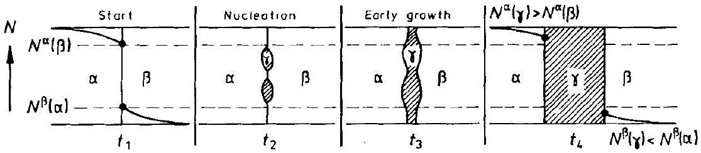
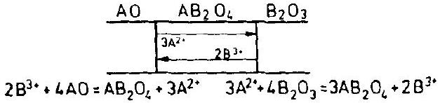
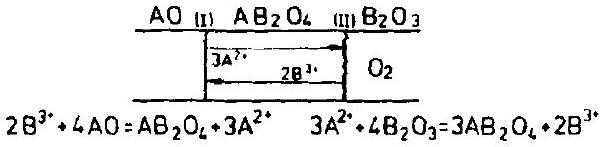
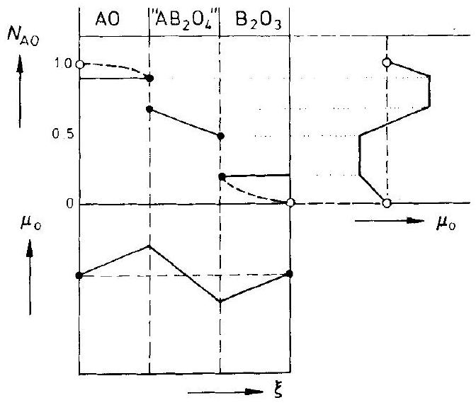
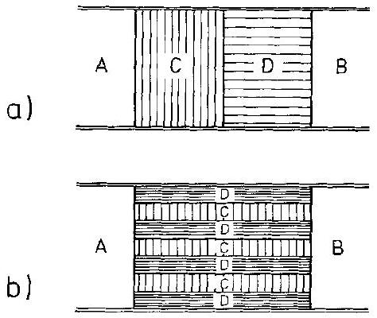
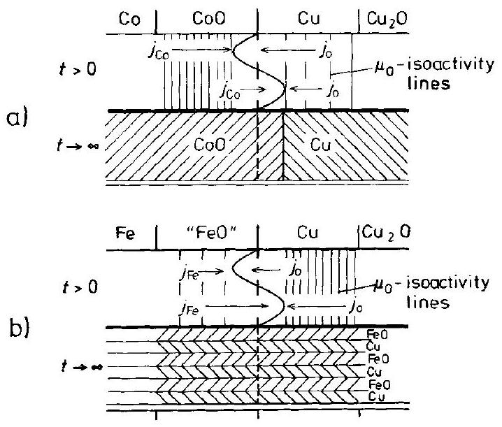
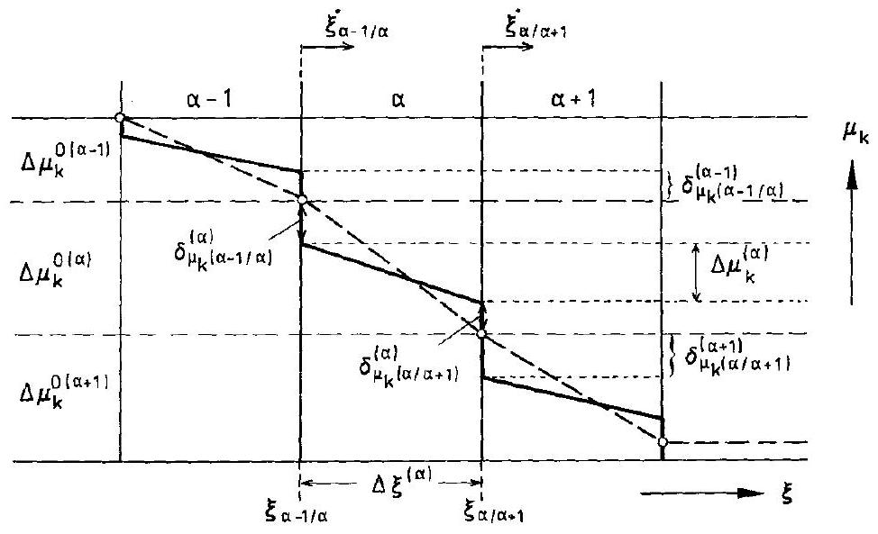

## 6 Heterogeneous Solid State Reactions

### 6.1 Introduction

Heterogeneous solid state reactions occur when two phases, A and B, contact and react to form a different product phase C . A and B may be either chemical elements or compounds. We have already introduced this type of solid state reaction in Section 1.3.4. The rate law is parabolic if the reacting system is in local equilibrium and the growth geometry is linear. The characteristic feature of this type of reaction is the fact that the product C separates the reactants A and B and that growth of the product proceeds by transport of A and/or B through the product layer.

Classical examples of heterogeneous solid state reactions are the formation of double salts (e.g., $2 \mathrm{KCl}+\mathrm{SrCl}_{2}=\mathrm{K}_{2} \mathrm{SrCl}_{4}$ ), intermetallic compounds (e.g., $\mathrm{Al}+\mathrm{Sb}=$ AlSb ), carbides, silicides (e.g., $\mathrm{Ni}_{n}+\mathrm{Si}_{m}=\mathrm{Ni}_{n} \mathrm{Si}_{m}$ ), etc. The kinetics of these reactions is quite similar, in spite of the diversity of their atomic reaction mechanisms. A heterogeneous reaction starts with nucleation and the subsequent growth of the nucleus. The kinetics of the early stages is quite different from the later quasi-steady state growth and will receive special attention in Section 6.2.

Let us begin with some general statements on heterogeneous solid state reactions. The overall driving force for these reactions is the difference in Gibbs energy between the reactants and the reaction product. Reaction entropies are relatively small if only crystalline phases are involved. As a consequence, heat is liberated. If the interface area between the reactants and the product is sufficiently small (which excludes many powder reactions), the rate of heat production is low in view of the small solid state reaction rates. Thus, the assumption of isothermal conditions is normally valid. In contrast, strongly exothermic reactions between fine powders of reactants can lead to self-heating.

Quantitative investigations of solid state reaction kinetics are confined essentially to binary or quasi-binary systems (e.g., oxides forming spinel structures). If local equilibrium prevails in the binary systems, the phase boundaries are invariant and the chemical potentials of components are constant at the interfaces during the reaction. This is the simplest possible boundary condition, leading to the parabolic rate law. In systems with more than two components, the phase boundaries are not invariant. The isothermal, isobaric single-phase system needs $(n-1)$ chemical potentials in order to unambiguously define the system and to determine the concentrations of all the structure elements. Therefore, during the spinel formation, $\mathrm{AO}+\mathrm{B}_{2} \mathrm{O}_{3}=\mathrm{AB}_{2} \mathrm{O}_{4}$, the $\mathrm{AO} / \mathrm{AB}_{2} \mathrm{O}_{4}$ interface, for example, is not properly defined unless, in addition to the activity of component AO , a second component's activity has been predetermined (e.g., $a_{\mathrm{O}_{2}}$ ).

Spinel formation has been studied extensively as a prototype of heterogeneous solid state reactions. The close similarity of the crystal structures of the reactants and product avoids many complications which have been named 'topochemical' and which often obscure transport kinetics. Yet even if we can neglect effects due to misfit, self-stress, plastic deformation, transport along dislocations, etc. the local thermodynamic equilibrium assumption necessary for a quantitative treatment is never absolutely true during the course of a reaction. The implications of the assumption were discussed in Section 5.4. In this chapter, however, we normally assume that local equilibrium is established and deal with the basic principles of heterogeneous solid state reactions rather than working out such details as transport across interfaces or growth morphologies (these will be done in later chapters). Also, a monograph on these types of reaction is available [H. Schmalzried (1981)] which justifies the more fundamental approach here.

### 6.2 Nucleation and Initial Growth

### 6.2.1 Introductory Remarks

A heterogeneous reaction of the type $\mathrm{A}+\mathrm{B}=\mathrm{AB}$ necessarily begins with the nucleation of AB. Nucleation and early growth are different from the later stages of reaction as long as the number of atomic particles in the boundary region is similar to the number of those in the bulk. This means that the chemical potential of the components and the growth kinetics depend explicitly on the size and form of the nuclei.

Since the interface (surface) excess Gibbs energy is positive, $\mu_{i}\left(r_{1}\right)>\mu_{i}\left(r_{2}\right)$ if the radius of nucleus $r_{1}<r_{2}$. As a consequence, for the Gibbs energy, $g\left(r_{1}\right)>g\left(r_{2}\right)$ as well (where $g=\sum n_{i} \mu_{i}=n \cdot \sum N_{i} \mu_{i}$ ). Therefore, in order to nucleate a new phase, some supersaturation is required. Most nucleation studies have been performed on single-phase systems that have been brought into two-phase fields by changing $T$ (or $P$ ) (undercooling, superheating). Figures 6-1 and 6-2 show typical phase diagrams which illustrate the reaction paths and their corresponding (partial and integral) Gibbs energies.

Obviously, phase $\alpha$, with composition $\bar{N}$ at temperature $T$, is not stable. Let us ask for the gain in Gibbs energy if an infinitesimal precipitate (nucleus) of composition $N_{n}$ is formed. In the binary system 1-2 (A-B), all points on the tangent ( $\left.\partial G^{\alpha} / \partial N_{2}\right)_{\bar{N}}$ connect systems with constant $\mu_{i}$, that is, equilibrium systems. One sees in Figure 6-1 that considering the negative curvature of $G(N)$, as long as $\bar{N}>N_{\text {in }}$ (inflection), all fluctuations will result in a lowering of the precipitate Gibbs energy ( $\Delta \tilde{g}$ ) if one neglects interfacial energies. Stated differently: inside the spinodal curve given by ( $\partial^{2} G / \partial N^{2}$ ) = 0 in Figure 6-1, the system is absolutely unstable and will decompose towards $\alpha^{\prime}\left(N_{1}\right)$ and $\alpha^{\prime \prime}\left(N_{2}\right)$. However, outside the spinodal curve between $N_{1}$ and $N_{\text {in }}$, the tangent line for composition $\bar{N}$ will intersect the $G$ curve, and not until a

Figure 6-1. a) $T-N_{i}$ and b) $G-N_{i}$ diagram of a binary system with a miscibility gap. The reaction path after undercooling is indicated by an arrow.

Figure 6-2. a) $T-N_{i}$ and b) $G-N_{i}$ diagram of an eutectic binary system. The reaction path after undercooling is indicated by an arrow.

fluctuation has reached the value $N_{\text {is }}$ (intersection) can the precipitate ( $\alpha^{\prime \prime}$ ) lower its energy. From here on the precipitate $\alpha^{\prime \prime}$ and matrix $\alpha^{\prime}$ evolve towards the equilibrium compositions $N_{1}$ and $N_{2}$ respectively, where eventually the lowest possible Gibbs energy for the whole two-phase system is attained.

In Figure 6-2, the same situation is explained for a simple eutectic system. Starting again with composition $\bar{N}$, the fluctuation must go beyond $N_{\text {is }}$ before Gibbs energy is gained by forming nuclei of the $\beta$-phase. Figures 6-1 and 6-2 allow one to immediately formulate

$$
\Delta \tilde{g}\left(N_{n}\right)=-\left(g\left(N_{n}\right)-g(\bar{N})-\left(N_{n}-\bar{N}\right) \cdot\left(\frac{\partial g}{\partial N}\right)_{\bar{N}}\right)
$$

These $g$ values are defined per unit volume. Let us now put in the interface energy previously left out. If $V_{n}=4 / 3 \cdot \pi \cdot r^{3}$ is the volume of the nucleus, the net Gibbs energy change is (neglecting elastic misfit energies)

$$
\Delta G=(4 / 3) \cdot \pi \cdot r^{3} \cdot \Delta \tilde{g}\left(N_{n}, T\right)+4 \cdot \pi \cdot r^{2} \cdot \gamma\left(N_{n}, T\right)
$$

with $y$ as the interface Gibbs energy per interface unit. Note that $y$ is a function of $N_{n}$. From Eqn. (6.2) we see that a minimum radius of the nucleus is necessary before $\partial \Delta G(r) / \partial r$ becomes negative and the nucleus can spontaneously grow further. This critical radius $r^{*}$ depends on $N_{n}$. Figure 6-1 shows that the magnitude of $\Delta \tilde{g}\left(N_{n}\right)$ increases with $N_{n}$. We expect that $\gamma\left(N_{n}\right)$ does the same. Since $\Delta \tilde{g}$ is negative, the difference between the two terms in Eqn. (6.2) (i.e., $\Delta G$ ) is therefore less affected by composition changes than $\Delta \tilde{g}$ and $\gamma$ individually. An increase in $T$ lowers both $|\Delta \tilde{g}|$ and $\gamma$. The ratio $2 \cdot \gamma /|\Delta \tilde{g}|$, which is the critical radius $r^{*}$, increases with temperature.

The above thermodynamic considerations are fundamental to the kinetics of phase nucleation to be outlined in the next section.

### 6.2.2 Nucleation Kinetics

The probability, $P_{i, n}$, of finding an atom (ion) $i$ within a nucleus of critical size ( $r^{*}$ ) can be obtained from Eqn. (6.2). One first calculates the critical Gibbs energy $\Delta G^{*} \left(=\frac{16 \pi \cdot \gamma^{3}}{3 \cdot \Delta \tilde{g}^{2}}\right)$ by inserting $r^{*}$. Then, if $\bar{\varrho}$ is the average number density of atoms (assumed to be the same for matrix ( $m$ ) and nucleus ( $n$ )), one finds the average critical Gibbs energy per atom $i$ in the nucleus to be

$$
\Delta g_{i}^{*}=\Delta G^{*} \cdot\left(\bar{\varrho} \cdot N_{i, n} \cdot(4 / 3) \pi \cdot r^{* 3}\right)^{-1}
$$

If $P_{i, n}^{*} \ll 1$ we therefore have

$$
P_{i, n}^{*} \cong \mathrm{e}^{-\frac{\Delta g_{i}^{*}}{k T}}
$$

and the number density of critical nuclei becomes

$$
\varrho_{n}^{*}=\frac{P_{i, n}^{*}}{(4 / 3) \cdot \pi \cdot r^{* 3} \cdot N_{i, n}}
$$

The rate, $\dot{R}_{n}$, of random nucleation is therefore obtained from Eqns. (6.4) and (6.5) by recognizing that the addition of one more particle $i$ to the critical nucleus makes it supercritical, which means that it will grow further. A simple way to represent the transfer frequency $v_{i, s}$ of $i$ across the surface of a critical nucleus is as follows

$$
v_{i, \mathrm{~s}}=v_{i}^{0} \cdot \varrho_{i, \mathrm{~s}} \cdot 4 \pi r^{* 2} \cdot \mathrm{e}^{-\frac{\varepsilon_{\mathrm{D}}}{R T}}
$$

where $v_{i}^{0}$ is the vibrational frequency of particles $i, \varrho_{i, s}$ their number per unit surface area, and $\varepsilon_{\mathrm{D}}$ the activation energy for the diffusion of $i$. In the sense of transi-
tion state theory (Section 5.1.2), by neglecting any return jumps from the nucleus into the matrix (Zeldovich factor), one finds the quasi-steady state nucleation rate $\dot{R}_{n}$ to be

$$
\dot{R}_{n}=\varrho_{n}^{*} \cdot v_{i, \mathrm{~s}}=\alpha \cdot \mathrm{e}^{-\frac{\Delta g_{i}^{*}+\varepsilon_{\mathrm{D}}}{k T}} ; \alpha=\frac{3}{r^{*}} \cdot \frac{v_{i}^{0} \cdot \varrho_{i, \mathrm{~s}}}{N_{i, n}}
$$

$\dot{R}_{n}$ (through $\Delta g^{*}$ ) is sensitive to $y$ and $T$. It reaches a maximum as a function of temperature: at low $T$, the $v_{\mathrm{s}}$ frequencies are frozen in, and at high $T, r^{*}\left(\Delta G^{*}\right)$ becomes too large.

Up to this point we have dealt with random nucleation processes in a homogeneous phase. However, in solids with many structural imperfections, it is very likely that nonrandom, heterogeneous nucleation takes place. The basic idea of this mode of nucleation is that the energy of the imperfection is brought into the energy balance of the critical nucleus. Let us demonstrate the basic idea with a dislocation line as the preferred nucleation site. We assume that a cylindrical precipitate ( $p$ ) forms along the dislocation line and, in the spirit of Eqn. (6.2), we obtain per unit length of the nucleus

$$
\Delta G_{p}=\pi \cdot r^{2} \cdot \Delta \tilde{g}_{p}+2 \pi \cdot r \cdot \gamma_{p}-A \cdot \ln r
$$

where the last term on the right hand side accounts for the relaxation of the elastic self-energy of the dislocation (see Eqn. (3.1)) due to the formation of precipitate. As before, the condition that $\left(\partial \Delta G_{p} / \partial r\right)=0$ yields a critical radius $r^{*}$. If we reintroduce $r^{*}$ into Eqn. (6.8), it is found that for $A \cdot \Delta \tilde{g}_{\mathrm{p}}<(\pi / 2) \cdot \gamma_{\mathrm{p}}^{2}$ there is no nucleation barrier whatsoever.

Although this line of reasoning shows one of the principal features of heterogeneous nucleation, the real situation of nucleation near a dislocation line is much more complex [S. Q. Xiao, P. Haasen (1989)]. The stress field of the dislocation changes the composition of both the matrix and the precipitate, which in turn influences both $\gamma_{p}$ and $\Delta \tilde{g}_{p}$. In view of this fact, one has to determine whether nucleation near the dislocation occurs before or after the Cottrell atmosphere around the dislocation had sufficient time to form.

With respect to the rate of nonrandom nucleation, the essence of the rate equation (6.7) is unchanged. However, we may have a spectrum of preferential nucleation sites $p$, with number density $\varrho_{n}(p)$. Therefore, $\dot{R}_{n}$ becomes

$$
\dot{R}_{n}(p)=\sum_{p} \varrho_{n}(p) \cdot v_{i, s}(p)
$$

Since $\Delta G_{p}^{*}<\Delta G^{*}$ for random homogeneous nucleation, normally $R_{n}(p) \gg R_{n}$, even though the pre-exponential factor is much greater for homogeneous than for heterogeneous nucleation $\left(N_{i}(p) \ll N_{i}(m)\right)$.

Most nucleation processes are accompanied by a net volume change. In these cases, $\Delta G^{*}$ is altered by the strain energy $\Delta E_{\text {elast }}$. The dilatational part of this energy term can be expressed as

$$
E_{\mathrm{elast}}=(2 / 3) \cdot \bar{G} \cdot\left(\frac{\Delta V}{V}\right)^{2} \cdot f\left(\frac{c}{r}\right)
$$

Here, $\bar{G}$ denotes the shear modulus, and $f(c / r)$ is a function of the ratio $c / r$ in which $c$ and $r$ are the spheroidal semiaxes of the precipitate. For spheres, $f(c / r=1)=1 =f_{\text {max }}$. For discs as well as for rods, $f<1$. In principle, shear stress energies and energies arising from misfit dislocation networks also have to be added. They influence $\Delta G^{*}$ by additional energy terms.

Temperature induced nucleation in homogeneously undercooled systems has mainly been evaluated in the field of metallurgy and materials science. For a survey, see, for example, [K. C. Russel (1970); V. Raghavan, M. Cohen (1975)]. In solid state chemistry, however, not only the precipitation of $\alpha^{\prime \prime}$ (or $\beta$ ) from undercooled $\alpha$, but equally the nucleation of $y$ at the start of the isothermal reaction $\alpha+\beta=\gamma$ has to be studied. Figure 6-3 illustrates this situation with the phase diagram and corresponding Gibbs energies. The solid state reaction $\mathrm{A}+\mathrm{B}=\mathrm{AB}(\alpha+\beta=\gamma)$ starts by contacting the pure reactants $\mathbf{A}$ and $\mathbf{B}$ as shown in Figure 6-4. The mutual interdiffusion of A and B (over the time interval $0<t<t_{1}$ ) leads to mutual saturation as indicated in Figure 6-3 by tangent (1) between $G^{\alpha}$ and $G^{\beta}$. We see that this (metastable) equilibrium at the $\alpha / \beta$ interface, with composition $N^{\alpha}(\beta)$ and $N^{\beta}(\alpha)$, is supersaturated with respect to phase $\gamma(\mathrm{AB})$ in the same way as $\alpha$ was supersaturated with respect to $\beta\left(\alpha^{\prime \prime}\right)$ in Figures 6-1 and 6-2, at composition $N$. Each fluctuation on the $\alpha$-side of the boundary when $N$ becomes $<N_{n}^{\prime}$, or on the $\beta$-side of the boundary when $N$ becomes $<N_{n}^{\prime \prime}$, will lead to a nucleation of $\gamma\left(t_{2}\right)$. Thereafter,

a)

b)

Figure 6-3. a) $T-N_{i}$ and b) $G-N_{i}$ diagram of a binary system with (nonstoichiometric) compound $\gamma$. The reaction path for isothermal compound formation is indicated by arrows (see text).

Figure 6-4. Nucleation and early growth stages of the heterogeneous reaction $\alpha+\beta=\gamma$, in accordance with Figure 6-3.

the $\alpha / \gamma(\gamma / \beta)$ interface evolves (with a sharp decrease in local Gibbs energy) towards the composition $N^{\alpha}(\gamma)\left(N^{\beta}(\gamma)\right)$. $N^{\alpha}(\gamma)$ and $N^{\beta}(\gamma)$ are eventually reached when local interface equilibrium is established. Interface kinetics, morphology, and further growth of $\gamma\left(t_{3}, t_{4}\right.$ of Fig. 6-4) are treated in later chapters. However, we can assert that the considerations which led to the kinetic equations (6-4)-(6-7) apply as well to the $y$ nucleation which starts the heterogeneous reaction $\mathrm{A}+\mathrm{B}=\mathrm{AB}$. According to Figure 6-4, we have to replace the surface energy term in Eqn. (6.2) by the difference between the energies of the new surfaces $\alpha / \gamma$ and $\beta / \gamma$, and the original surface $\alpha / \beta$.

### 6.2.3 Early Growth

Let us now discuss the post-nucleation stage. The further course of a heterogeneous reaction depends decisively on the time evolution of the boundary conditions. In most cases, the problem is extremely complex because nucleation continues to occur simultaneously as component transport to the previously formed nuclei. Thus, all the parameters in Eqn. (6.7) and, in particular, the critical values of $\Delta G^{*}\left(\Delta g^{*}\right)$ become explicitly time-dependent while varying locally. The supersaturation near a growing nucleus is diminished. Thus, $\Delta G^{*}$ increases with time while $\Delta \tilde{g}$ decreases, as can be seen in Figures 6-1 and 6-2. For illustration, let us inspect Figure 6-2. After the nucleation and growth of $\beta$, the average composition of the $\alpha$ phase evolves towards $N_{1}$. This lowers $|\Delta \tilde{g}|$ until it finally becomes zero.

For reactions of the type $\mathrm{A}+\mathrm{B}=\mathrm{AB}$ (or $\alpha+\beta=\gamma$ ), the situation is different. If one has a linear reaction geometry and the $y$ product forms at different times and locations on the A/B interface, the patches of $y$ eventually merge by fast lateral (interface) transport. Eventually, a full $\gamma$ layer is formed between $\alpha$ and $\beta$. At first, this layer has a non-uniform thickness (Fig. 6-4). In Chapter 11 we will show, however, that the uneven $\alpha / \gamma$ and $\gamma / \beta$ interfaces are morphologically stable and become smooth during further growth. This leads to constant boundary conditions for the $\gamma$ formation after some time of reaction and eventually results in a parabolic rate law, as will be discussed later.

In summary, the nucleation rate $\dot{R}_{n}(t)$ is difficult to assess and kinetic theories for transforming systems often assume (ad hoc) $\dot{R}_{n}(t)$ dependencies. In contrast, the growth kinetics of an individual particle of $\beta$ precipitate in the supersaturated matrix ( $\alpha$ ) is a transport problem with well defined boundary conditions, as long as
other nuclei do not interfere. If the problem is spherical, isotropic, and the kinetics are diffusion controlled, the boundary conditions are: $c_{i}=c_{i}^{0}(\alpha / \beta)$ at $r=r_{\beta}$, and $c_{i}=c_{i}^{0}(\infty)$ at $r=\infty$. With a boundary velocity $v^{\dot{b}}=j_{i}^{\alpha} / \Delta c(\alpha / \beta)$ at $r=r_{\beta}$, one obtains (after some algebra) a parabolic rate law for the growth of the $\beta$ particles

$$
r_{\beta}=\left(2 \cdot D_{i}^{\alpha} \cdot \frac{c_{i}^{0}-c_{i}(\alpha / \beta)}{c_{i}^{\beta}-c_{i}(\alpha / \beta)} \cdot t\right)^{1 / 2}
$$

Equation (6.11) is valid for the initial particle growth. Interface control of the growth kinetics would lead to a linear rate law. Details can be found, for example, in [H. Schmalzried (1981)].

In contrast to the growth of individual (isolated) particles, the overall kinetics of heterogeneous reactions in the early stages cannot be assessed in a straightforward way. Let us therefore inspect some empirical and semi-empirical relations which are in use. The most stringent simplification assumes that the nucleation rate $\dot{R}_{n}(t)= \dot{R}^{0}$ at $t=0$, and $\dot{R}_{n}(t)=0$ for $t>0$. Other assumptions are also in use: 1) $\dot{R}_{n}(t)= \dot{R}^{0}$ for all times $t \geq 0$ and 2) $\dot{R}_{n}(t)=\dot{R}^{0} \cdot \mathrm{e}^{-t / \tau}$. We can apply these $\dot{R}_{n}(t)$ functions to derive the general kinetic expressions for reacting (transforming) systems.

Let us define $X=X^{\beta}$ as the portion of the system that has already transformed into $\beta$ and $X^{\alpha}=(1-X)$ as the untransformed fraction. The reaction rate as referred to untransformed $\alpha$ is

$$
\frac{\mathrm{d} X}{1-X}=-\mathrm{d} \ln (1-X)=f(t) \cdot \mathrm{d} t
$$

Integration yields

$$
1-X=\mathrm{e}^{-\int f(t) \cdot \mathrm{d} t}
$$

Unless we deal with autocatalytical reactions, the function $f(t)$ must decrease with time. From Eqn. (6.12) it can be seen that $f(t)$ is the (normalized) increase of the product at time $t$. For spherical product particles, this means

$$
f(t)=\int_{\tau=0}^{\tau=t} \mathrm{~d} \tau \cdot \dot{R}_{n}(\tau) \cdot\left(4 \pi r^{2} \cdot \frac{\mathrm{~d} r}{\mathrm{~d} t}\right)_{t-\tau}
$$

Equation (6.14) weights the increase of the product particles according to the time $(t-\tau)$ that has elapsed since nucleation took place. $r(t-\tau)$ has to be evaluated by transport theory. Let us apply Eqn. (6.14) to the simplest possible situation in which $\dot{R}_{n}(\tau=0)=\dot{R}^{0}, \dot{R}_{n}(\tau>0)=0$, and $r=v^{0} \cdot(t-\tau)$. With these assumptions we obtain

$$
X=1-\mathrm{e}^{-\left(k_{3} \cdot t\right)^{m}} ; \quad k_{3}=\left(\frac{4 \pi \cdot \dot{R}^{0} \cdot v^{03}}{3}\right)^{1 / 3} ; \quad m=3
$$

If the nucleation rate at $t \geq 0$ is $\dot{R}^{0}$ and constant in time, we obtain in place of Eqn. (6.15)

$$
f(t)=\dot{R}^{0} \cdot \int_{\tau=0}^{\tau=t} \mathrm{~d} \tau \cdot\left(4 \pi r^{2} \cdot \dot{r}\right)_{t-\tau}=\left(\frac{4 \pi}{3}\right) \cdot \dot{R}_{n}^{0} \cdot v^{03} \cdot t^{3}
$$

which, after insertion into Eqn. (6.13), results in

$$
X=1-\mathrm{e}^{-\left(k_{4} \cdot t\right)^{m}} ; \quad k_{4}=\left(\frac{\pi \cdot \dot{R}^{0} \cdot v^{03}}{3}\right)^{1 / 4} ; m=4
$$

Equations (6.15) and (6.17) phenomenologically describe the overall growth kinetics after the initial nucleation took place and further nucleation is still occurring. Indeed, the sigmoidal form of the $X(t)$ curve represents a wide variety of transformation reactions. Equation (6.13) is named after Johnson, Mehl, and Avrami [W.A. Johnson, R.F. Mehl (1939); M. Avrami (1939)]. Let us finally mention two points. 1) Plotting $\sqrt{\ln (1-X)}$ vs. $t$ should give a straight line with slope $k_{m}$. 2) The time $t_{i f}$ of the inflection point ( $\partial^{2} X / \partial t^{2}=0$ ) on $X(t)$ is suitable to derive either $m$ or $k_{m}$, namely

$$
k_{m}=\left(\frac{1}{t_{i f}}\right) \cdot \sqrt{\frac{m-1}{m}}
$$

The activities of precipitate particle components depend explicitly on their size and form. The quantitative relation which describes this fact is the so-called GibbsThomson equation

$$
\mu_{i}\left(r_{1}\right)-\mu_{i}\left(r_{2}\right)=2 \cdot \gamma \cdot\left(\frac{1}{r_{1}}-\frac{1}{r_{2}}\right)
$$

which can be rewritten in terms of solubilities, $c_{i}^{\alpha}$, in the $\alpha$ matrix as

$$
c_{i}^{\alpha}\left(r_{1}\right)-c_{i}^{\alpha}\left(r_{2}\right)=c_{i}^{\alpha}(\infty) \cdot \frac{2 \cdot V_{m}^{\beta} \cdot \gamma}{R T} \cdot\left(\frac{1}{r_{1}}-\frac{1}{r_{2}}\right)
$$

in a linearized version. $V_{m}^{\beta}$ is the molar volume of the precipitate $\beta$, and it was assumed that component $i$ is ideally dissolved in $\alpha . r_{1}$ and $r_{2}$ are the main radii of curvature of the $\beta$ particle. From Eqns. (6.19) and (6.20) we conclude that a driving force exists for the transport of species $i$ between a small and a large particle which were nucleated at different times. Obviously, the large particles grow at the expense of the small ones. This process (which already takes place during the nucleation period) is named coarsening or Ostwald ripening. It has been treated quantitatively by [C. Wagner (1961); I.M. Lifshitz, V. V. Slyozov (1961); I.M. Lifshitz (1962)]. A simplified treatment has been outlined by [G. W. Greenwood (1956)]. Of course, the growth kinetics of a particle (with average radius $r$ ) depends on the mechanism of transport. For diffusion control, one derives

$$
\bar{r}=\left(\frac{8 \cdot \gamma \cdot V_{m}^{\beta^{2}} \cdot c_{i}(\mathrm{eq}) \cdot \tilde{D}}{9 R T}\right)^{1 / 3} \cdot t^{1 / 3}
$$

where the average particle radius $\bar{r}$ is defined as

$$
\bar{r}=\frac{\int_{0}^{\infty} f(r) \cdot r \cdot \mathrm{~d} r}{\int_{0}^{\infty} f(r) \cdot \mathrm{d} r}
$$

where $f(r)$ is the (quasi-steady state) particle size distribution function. The main conclusion is that $r \sim \sqrt[3]{t}$, that is, the average particle grows proportional to the cube root of the time. The solubility of component $i$ in the $\alpha$ matrix influences the growth rate.

These brief remarks on Ostwald ripening conclude the discussion of nucleation and early growth stages of heterogeneous reactions at this point. Some of the concepts are deepened in Chapter 12 on phase transformations [see also R. Wagner, R. Kampmann (1991)].

### 6.3 Compound Formation

### 6.3.1 Formation Kinetics of Double Salts

The kinetics of spinel formation ( $\mathrm{AO}+\mathrm{B}_{2} \mathrm{O}_{3}=\mathrm{AB}_{2} \mathrm{O}_{4}$ ) was first explained quantitatively by [C. Wagner (1938)]. A and B can represent quite a variety of different elements such as $\mathrm{Mg}, \mathrm{Fe}, \mathrm{Ni}, \mathrm{Co}$ and $\mathrm{Al}, \mathrm{Ga}, \mathrm{Cr}$ respectively. Other reactions that belong to this category include the formation of silicates (e.g., $2 \mathrm{MgO}+\mathrm{SiO}_{2}= \mathrm{Mg}_{2} \mathrm{SiO}_{4}$ ), of double sulfides (e.g., $\mathrm{Ag}_{2} \mathrm{~S}+\mathrm{Sb}_{2} \mathrm{~S}_{3}=\mathrm{Ag}_{2} \mathrm{Sb}_{2} \mathrm{~S}_{4}$ ), or of double halides (e.g., $2 \mathrm{AgI}+\mathrm{HgI}_{2}=\mathrm{Ag}_{2} \mathrm{HgI}_{4}$ ). In Figure 6-5, the reaction mechanism according to Wagner is shown for spinel formation. It encompasses the counterdiffusion of cat-

| cation counterdiffusion | MgO | $\mathrm{MgO} \cdot \mathrm{Al}_{2} \mathrm{O}_{3}$ | $\mathrm{Al}_{2} \mathrm{O}_{3}$ |
| :--- | :--- | :--- | :--- |
|  | $3 \mathrm{Mg}^{2+}$ |  |  |
|  | <smiles>C[14CH2]C</smiles>   $\xrightarrow[2 \mathrm{Al}^{3+}]{ }$ |  |  |
| reactions at boundaries | 4 MgO |  | $4 \mathrm{Al}_{2} \mathrm{O}_{3}$ |
|  | $-3 \mathrm{Mg}^{2+}$ |  | $-2 \mathrm{Al}^{3-}$ |
|  | $+2 \mathrm{Al}^{3+}$ |  | $+3 \mathrm{Mg}^{3+}$ |
|  | $1 \mathrm{MgO} \cdot \mathrm{Al}_{2} \mathrm{O}_{3}$ | 3 MgO | $\mathrm{Al}_{2} \mathrm{O}_{3}$ |

Figure 6-5. Reaction mechanism and phase boundary reactions for the spinel formation $\mathrm{MgO}+\mathrm{Al}_{2} \mathrm{O}_{3}=\mathrm{MgAl}_{2} \mathrm{O}_{4}$.

ions and assumes that the mobility of oxygen ions in the reaction product is small in comparison with the mobility of both cations. This is true since the large oxygen ions are almost close-packed and consequently diffuse slowly. Figure 6-5 shows the central problem of heterogeneous solid state reactions. When the product separates the reactants, in which way and in what form does the reactant (say A) dissolve in the product phase AB so as to cross it and eventually meet the other reactant (B) in order to form AB ?

In accordance with the reaction scheme of Figure 6-5, it is found experimentally that while one quarter of the spinel forms at the $\mathrm{MgO} / \mathrm{MgAl}_{2} \mathrm{O}_{4}$ interface, three quarters are formed at the $\mathrm{MgAl}_{2} \mathrm{O}_{4} / \mathrm{Al}_{2} \mathrm{O}_{3}$ boundary. This ratio provides us with information on the cation counterdiffusion mechanism. In order to meet the requirements of the product compound stoichiometry, the cation fluxes are coupled, that is, $3 \cdot j_{\mathrm{Mg}}=-2 \cdot j_{\mathrm{Al}}$. One may also interpret this coupling as the condition of (local) electroneutrality during reaction. In the frame of immobile anions, $\mathrm{Al}^{3+}$ and $\mathrm{Mg}^{2+}$ ions have to carry equivalent electrical charges in opposite directions. Consequently, the slower moving cation essentially determines the rate of reaction. We then expect cation counterdiffusion in the product and the $\mathbf{B}^{3+}$ cations to be rate determining when the sequence of diffusivities is $D_{\mathrm{O}} \ll D_{\mathrm{B}} \ll D_{\mathrm{A}}$. For other sequences, other reaction mechanisms become operative, for example, unidirectional transport of $\mathrm{A}^{2+}$ and $\mathrm{O}^{2-}$ ions $(=\mathrm{AO})$ from the $\mathrm{AO} / \mathrm{AB}_{2} \mathrm{O}_{4}$ boundary to the $\mathrm{AB}_{2} \mathrm{O}_{4} / \mathrm{B}_{2} \mathrm{O}_{3}$ boundary where the new spinel forms.

Since both the oxide reactant and the spinel are ternary (nonstoichiometric) compounds when equilibrated with each other, at a given $P$ and $T$, the boundaries $(\mathrm{A}, \mathrm{B}) \mathrm{O} /$ spinel and spinel $/(\mathrm{B}, \mathrm{A})_{2} \mathrm{O}_{3}$ are not invariant. They become invariant (and thus provide unique boundary conditions for the reaction) only if an additional intensive thermodynamic variable can be predetermined. This is a consequence of Gibbs' phase rule.

Spinel formation is usually treated under some tacit assumptions which do not always hold. For example, it is tacitly assumed that the oxygen potential of the surrounding gas atmosphere prevails throughout the reaction product during reaction. In other words, it is assumed that $\mathrm{d} \mu_{\mathrm{O}}=0$. Although this inference reduces the number of variables by one and simplifies the formal treatment, the subsequent analysis will show that the assumption is normally not adequate.

Let us systematize the possible boundary conditions for cation diffusion in a spinel. Since in the ternary system (at a given $P$ and $T$ ) the chemical potentials of two components are independent, we may distinguish between three different transport situations. If $\Delta$ denotes a change across the product layer and O and AO are chosen as the independent components, the possibilities are

$$
\begin{array}{ll}
\text { 1) } \Delta \mu_{\mathrm{AO}}\left(\Delta \mu_{\mathrm{B}_{2} \mathrm{O}_{3}}\right) \neq 0, & \Delta \mu_{\mathrm{O}}=0 \\
\text { 2) } \Delta \mu_{\mathrm{AO}}\left(\Delta \mu_{\mathrm{B}_{2} \mathrm{O}_{3}}\right)=0, & \Delta \mu_{\mathrm{O}} \neq 0 \\
\text { 3) } \Delta \mu_{\mathrm{AO}}\left(\Delta \mu_{\mathrm{B}_{2} \mathrm{O}_{3}}\right) \neq 0, & \Delta \mu_{\mathrm{O}} \neq 0
\end{array}
$$

These systematics should be supplemented by appropriate boundary conditions as illustrated in Figure 6-6. In principle, this includes the definition of the rate of reac-
(a)

(b)

(c)

Figure 6-6. Fluxes and interface reactions for different boundary conditions during spinel formation

(d)

(e)

Figure 6-6. Fluxes and interface reactions for different boundary conditions during spinel formation

$\mathrm{AO}+\mathrm{B}_{2} \mathrm{O}_{3}=\mathrm{AB}_{2} \mathrm{O}_{4}$. a) Oxygen excluded from phase boundaries. b) Oxygen has access to both boundaries. c) Only oxygen (of different potential) is available at the boundaries. d) Oxygen (of different potential) and one reactant (AO) is available at the boundaries. e) AO (but no oxygen) is available at one boundary; both $\mathrm{B}_{2} \mathrm{O}_{3}$ and oxygen are available at the other boundary.
tion between the surrounding oxygen, $\mathrm{O}_{2}(\mathrm{~g})$, and the cations at the boundaries $\left(\xi^{b}\right)$. Here, spinel molecules can be added to the product by the reaction $2 \cdot \mathrm{O}_{2}(\mathrm{~g})+\mathrm{A}_{\mathrm{A}} +2 \cdot \mathrm{~B}_{\mathrm{B}}=\mathrm{AB}_{2} \mathrm{O}_{4}+\mathrm{V}_{\mathrm{A}}+2 \cdot \mathrm{~V}_{\mathrm{B}}$. Let us define $\dot{r}_{\mathrm{M}}\left(\xi^{b}, t\right)$ as the interface reaction rate due to oxygen uptake. Then we have (letting volume $V_{M}=V_{\mathrm{AB}_{2} \mathrm{O}_{4}}$ )

$$
\dot{\xi}^{b}=\dot{r}_{\mathrm{M}} \cdot V_{\mathrm{M}}
$$

The different boundary conditions given in Eqns. (6.23) thus have to be supplemented according to the magnitude of $\dot{r}_{\mathrm{M}}\left(\dot{r}_{\mathrm{M}}=0\right.$ or $\left.\neq 0\right)$ in order to evaluate the growth of the spinel. This has been done for the different coupling conditions of the ionic and electronic fluxes in the product according to Figure 6-6 [T. Pfeiffer, H. Schmalzried (1989); H. Schmalzried, T. Pfeiffer (1986)].

We begin the quantitative discussion on the kinetics of double salt formation as shown in Figure 6-6a by introducing the familiar flux equations for charged particles and neglect the cross terms. The evaluation will be done with the assumption of a semiconducting spinel product ( $t_{\mathrm{el}} \cong 1$ ). In this case, $\mathrm{d} \eta_{\mathrm{e}} \cong 0$ in the product, or $\mathrm{d} \mu_{\mathrm{e}} \cong F \cdot \mathrm{~d} \varphi$ and $\mathrm{d} \eta_{\mathrm{A}^{2+}}=\mathrm{d} \mu_{\mathrm{A}}$. Thus,

$$
j_{\mathrm{A}}=-c_{\mathrm{A}} \cdot b_{\mathrm{A}} \cdot \nabla \eta_{\mathrm{A}^{2+}}=-c_{\mathrm{A}} \cdot b_{\mathrm{A}} \cdot \nabla \mu_{\mathrm{A}}=-c_{\mathrm{A}} \cdot b_{\mathrm{A}} \cdot\left(\nabla \mu_{\mathrm{AO}}-\nabla \mu_{\mathrm{O}}\right)
$$

An analogous equation holds for $j_{\mathrm{B}^{3+}}$. The Gibbs-Duhem equation requires that $\nabla \mu_{\mathrm{BO}_{3 / 2}}=-1 / 2 \cdot \nabla \mu_{\mathrm{AO}}$ for compounds with a sufficiently narrow range of homogeneity.

In the classical cation counterdiffusion experiment, oxygen gas is excluded from the interfaces and $\dot{r}_{\mathrm{M}}=0$ (Fig. 6-6a). Thus the coupling condition is simply

$$
2 \cdot j_{\mathrm{A}^{2+}}+3 \cdot j_{\mathrm{B}^{3+}}=0
$$

From this condition, we can eliminate $\nabla \mu_{\mathrm{AO}}$ in Eqn. (6.25) and obtain for the flux of $\mathrm{A}^{2+}$ in the spinel product

$$
j_{\mathrm{A}^{2+}}=-\frac{D_{\mathrm{A}} \cdot D_{\mathrm{B}}}{2 \cdot D_{\mathrm{A}}+9 \cdot D_{\mathrm{B}}} \cdot \frac{12}{V_{m}} \cdot \nabla\left(\frac{\mu_{\mathrm{O}}}{R T}\right)
$$

Equating Eqns. (6.27) and (6.25), the oxygen potential gradient in the growing spinel can be calculated as

$$
\nabla \mu_{\mathrm{O}}=\frac{2-3 \beta}{2+9 \beta} \cdot \nabla \mu_{\mathrm{AO}} ; \quad \beta=\frac{D_{\mathrm{B}}}{D_{\mathrm{A}}}
$$

In contrast to the individual diffusivities, often the ratio $D_{\mathrm{B}} / D_{\mathrm{A}}$ is not very sensitive to changes of the chemical potentials. From Eqn. (6.28), we find that $\nabla \mu_{\mathrm{O}}=\nabla \mu_{\mathrm{AO}}$ if $\beta \rightarrow 0$, and $\nabla \mu_{\mathrm{O}}=-1 / 3 \cdot \nabla \mu_{\mathrm{AO}}$ if $\beta \gg 1$. We also infer that it is possible to achieve very high oxygen potentials (corresponding to pressures in the kbar range) at one boundary if one predetermines, for example, the standard pressure to be 1 bar at the other boundary. Furthermore, no oxygen potential gradient will build up in the product during reaction if $D_{\mathrm{B}} / D_{\mathrm{A}}=2 / 3$. From Eqn. (6.27), we see again that the slower of the two cation sorts determines the fluxes and thus the rate of spinel growth. In accordance with the reaction stoichiometry of Figure 6-6a, we calculate the (parabolic) growth rate as

$$
\Delta \dot{\xi} \cdot \Delta \xi=16 \cdot \frac{D_{\mathrm{A}} \cdot D_{\mathrm{B}}}{2 \cdot D_{\mathrm{A}}+9 \cdot D_{\mathrm{B}}} \cdot \frac{\Delta \mu_{\mathrm{AO}}}{R T}
$$

The bar over the diffusivity term indicates the product layer average. $\Delta \mu_{\mathrm{AO}}$ is equal to the standard value of the formation Gibbs energy of the spinel, $\Delta G_{\mathrm{AB}_{2} \mathrm{O}_{4}}^{0}$. One finds from Eqn. (6.29) that the (parabolic) reaction rate constant ( $\Delta \xi^{2}=2 \cdot k t$ ) is

$$
k=8 \cdot \frac{\overline{D_{\mathrm{A}} \cdot D_{\mathrm{B}}}}{2 \cdot \overline{D_{\mathrm{A}}+9 \cdot D_{\mathrm{B}}}} \cdot \frac{\Delta G_{\mathrm{AB}_{2} \mathrm{O}_{4}}^{0}}{R T}
$$

Equations (6.27) and (6.28) tell us that both the oxygen potential and the AO component potential vary linearly in the product layer as long as $D_{\mathrm{A}}$ and $D_{\mathrm{B}}$ are constant. All these conclusions are related to the scheme in Figure 6-5 and the boundary conditions as depicted in Figure 6-6a where phase boundaries are not exposed to ambient
oxygen. However, if oxygen has unhindered access to the phase boundaries as shown in Figure 6-6b, there is no coupling of the cation fluxes. The growth of the spinel layer is then given by simply adding the contributions of $j_{\mathrm{A}^{2+}}$ and $j_{\mathrm{B}^{3+}}$ to the compound formation, which results in

$$
\Delta \dot{\xi} \cdot \Delta \xi=\left(\bar{D}_{\mathrm{A}}+\frac{1}{2} \cdot \bar{D}_{\mathrm{B}}\right) \cdot \nabla\left(\frac{\mu_{\mathrm{AO}}}{R T}\right)-\left(\bar{D}_{\mathrm{A}}-\frac{3}{2} \cdot \bar{D}_{\mathrm{B}}\right) \cdot \nabla\left(\frac{\mu_{\mathrm{O}}}{R T}\right)
$$

The corresponding parabolic rate constant obtains

$$
k=\frac{1}{2} \cdot\left(\bar{D}_{\mathrm{A}}+\frac{1}{2} \cdot \bar{D}_{\mathrm{B}}\right) \cdot \frac{\Delta G_{\mathrm{AB}_{2} \mathrm{O}_{4}}^{0}}{R T}
$$

The availability of oxygen at the phase boundaries therefore determines decisively the value of the reaction rate constant. Since interfaces are often regions of high diffusivity, it may be difficult in practice to decide whether Eqn. (6.30) or Eqn. (6.32) applies.

If, in contrast, there is unhindered access of AO to both spinel interfaces ( $\mu_{\mathrm{AO}}^{\prime}= \mu_{\mathrm{AO}}^{\prime \prime}$ ) as illustrated in Figure 6-6d, the spinel sample shifts as a whole (provided that an oxygen potential gradient exists). The interface reactions which lead to this shift are indicated in Figure 6-6d. Such a shift is also found if neither AO nor $\mathrm{B}_{2} \mathrm{O}_{3}$ have access to the spinel, but the interfaces are exposed to different oxygen potentials (Fig. 6-6c). In this case, the spinel may even be decomposed (but not reduced!) if $\Delta \mu_{\mathrm{O}}$ exceeds a limiting value (decomposition potential). We observe that the shift of the spinel sample in an oxygen potential gradient occurs if the sample crystal is closed for one or two sorts of cations.

In these shift experiments, the coupling condition for the unidirectional flow of cations is $2 \cdot j_{\mathrm{A}^{2+}}=j_{\mathrm{B}^{3+}}$, which can be understood as the steady state condition for equal cation velocities in the reference frame of the anions: $j_{\mathrm{A}^{2+}} / c_{\mathrm{A}^{2+}}=j_{\mathrm{B}^{3+}} / c_{\mathrm{B}^{3+}}=v$. From this coupling condition, one obtains using Eqn. (6.25)

$$
\Delta \mu_{\mathrm{O}}=\alpha \cdot \Delta \mu_{\mathrm{AO}} ; \quad \alpha=\frac{2+\beta}{2-3 \beta} ; \quad \beta=\frac{D_{\mathrm{B}}}{D_{\mathrm{A}}}
$$

The shift velocity is therefore

$$
v=-D_{\mathrm{A}} \cdot \frac{1-\alpha}{\alpha} \cdot \frac{\Delta\left(\frac{\mu_{\mathrm{O}}}{R T}\right)}{\Delta \xi}
$$

We conclude that the spinel will decompose as soon as $\Delta \mu_{\mathrm{O}}$ exceeds the value $\alpha \cdot \Delta G_{\mathrm{AB}_{2} \mathrm{O}_{4}}^{0}$ because $\Delta G_{\mathrm{AB}_{2} \mathrm{O}_{4}}^{0}$ is the maximum value of the AO potential change ( $=\Delta \mu_{\mathrm{AO}}$ ) which the spinel $\mathrm{AO} \cdot \mathrm{B}_{2} \mathrm{O}_{3}$ can take without decomposing [W. Laqua, H. Schmalzried (1981)]. Kinetic decomposition of compounds in chemical potential gradients is treated in greater depth in Section 8.3.

For the last case as shown in Figure 6-6e, the boundary conditions are: one compound surface is accessible to both $\mathrm{B}_{2} \mathrm{O}_{3}$ and oxygen. The other interface is in ideal contact with AO and oxygen is excluded. Under these conditions, we have flux coupling according to Eqn. (6.26), which leads again to the oxygen potential gradient calculated in Eqn. (6.28). A very high oxygen activity is to be expected at the $\mathrm{AO} / \mathrm{AB}_{2} \mathrm{O}_{4}$ interface if $D_{\mathrm{A}} \gg D_{\mathrm{B}}$ and $\Delta G_{\mathrm{AB}_{2} \mathrm{O}_{4}}^{0} \gg R T$. Indeed, as Figure 6-7 shows, the corresponding oxygen pressure is able to lift the reaction layer from the binary oxide substrate and form bursting craters in the layer.

Figure 6-7. SEM-graph of reaction in Figure 6-6e. $\mathrm{AO}=\mathrm{NiO}, \mathrm{B}_{2} \mathrm{O}_{3}=\mathrm{Cr}_{2} \mathrm{O}_{3}, p_{\mathrm{O}_{2}}=0.21$ bar, $T=1400^{\circ} \mathrm{C}, t=3.5 \mathrm{~h}$. a) View on the $\mathrm{NiCr}_{2} \mathrm{O}_{4}$ product at the $\mathrm{Cr}_{2} \mathrm{O}_{3}$ boundary. b) Cross section $\mathrm{NiO} / \mathrm{NiCr}_{2} \mathrm{O}_{4}$ with pores.

The foregoing concerned the formal kinetics of various situations of double salt formation. The quantitative relations become more complicated if reactants and product exhibit a noticeable range of nonstoichiometry. If only the transport properties of the reaction product are of interest, it is advisable to start the reaction not with pure reactants but with reactants which are already saturated with the com-

Figure 6-8. The course of $N_{\mathrm{AO}}-\xi, \mu_{\mathrm{O}}-\xi$, and $N_{\mathrm{AO}}-\mu_{\mathrm{O}}$ during spinel formation. $N_{\mathrm{AO}}-\xi$ : --- Reaction of the first kind, starting with AO and $\mathrm{B}_{2} \mathrm{O}_{3}$.
Reaction of the second kind, starting with saturated oxide reactants.

ponents of the reaction product, as illustrated in Figure 6-8. When we start with pure reactants, transport occurs in the reaction product as well as in the reactants. The (parabolic) rate constants $k$ differ from those obtained with presaturated reactants. The latter are determined by the thermodynamic and kinetic parameters of the product only. This suggests making the distinction between parabolic rate constants of the first and the second kind $\left(k^{(1)}, k^{(2)}\right) . k^{(1)}$ denotes the rate constant for the reaction between pure reactants and is always smaller than $k^{(2)} . k^{(1)}$ and $k^{(2)}$ are equal if the solubilities in the reactants are negligible. Quantitative relationships between reaction rate constants of the first and second kind are available [T. Pfeiffer, H. Schmalzried (1989)].

Before concluding this section, we should briefly explain the averaging procedure which is implicit in the derivation of parabolic rate constants. In order to simplify without loss of generality, we assume that $D_{\mathrm{A}} \gg D_{\mathrm{B}}$. Integration of Eqn. (6.27) yields

$$
\Delta \dot{\xi}=\frac{4}{3} \cdot V_{m} \cdot j_{\mathrm{A}^{2+}}=\frac{1}{\Delta \xi} \cdot \frac{8}{R T} \cdot \int_{\Delta \xi} D_{\mathrm{B}} \cdot \mathrm{~d} \mu_{\mathrm{AO}}
$$

The factor $4 / 3$ appears since the transport of 6 equivalents leads to the formation of $4 \mathrm{AB}_{2} \mathrm{O}_{4}$ (see Fig. 6-5). In generalizing Eqn. (6.35), we can calculate the parabolic rate constant as

$$
k=\frac{\gamma_{i}}{R T} \cdot \int_{\Delta \mu_{\mathrm{AO}}} z_{i} \cdot c_{i} \cdot V \cdot D_{i} \cdot \mathrm{~d} \mu_{\mathrm{AO}} \cong \frac{\gamma_{i} \cdot z_{i} \cdot c_{i} \cdot V}{R T} \cdot \int_{\Delta \mu_{\mathrm{AO}}} D_{i} \cdot \mathrm{~d} \mu_{\mathrm{AO}}
$$

where $y_{i}$ is a numerical factor on the order of one. $z_{i}$ and $c_{i}$ are the electrical charge and molar concentration of the rate determining cation respectively. $V$ is the volume increase resulting from the passage of one equivalent of cations through the reaction product. We evaluate the integral in Eqn. (6.36) using point defect thermodynamics. In accordance with Section 2.3, the fraction of point defects in $\mathrm{AB}_{2} \mathrm{O}_{4}$ as a function of $\mu_{\mathrm{AO}}$ can always be written as ( $N_{p}^{0}=N_{p}\left(a_{\mathrm{AO}}=1\right)$ )

$$
N_{p}=N_{p}^{0} \cdot a_{\mathrm{AO}}^{n}=N_{p}^{0} \cdot \mathrm{e}^{\frac{n \cdot\left(\mu_{\mathrm{AO}}-\mu_{\mathrm{AO}}^{0}\right)}{R T}}
$$

if the disorder type does not change in the $\Delta \mu_{\mathrm{AO}}$ range of the product. $n$ is a number which is indicative of the disorder type. Since diffusion coefficients depend equally on point defect concentrations, we can thus evaluate the integral in Eqn. (6.36) and obtain

$$
k=\frac{\gamma_{i} \cdot z_{i} \cdot c_{i} \cdot V}{R T} \cdot\left(1-\mathrm{e}^{\frac{n \cdot \Delta G_{\mathrm{AB}_{2} \mathrm{O}_{4}}}{R T}}\right) \cdot D_{i}^{0}
$$

where $D_{i}^{0}$ is the diffusivity of the rate determining species in the reaction product if its AO activity = 1 .

Finally, let us comment briefly on the formation of binary metal compounds $\left(\mathrm{A}_{m} \mathrm{~B}_{n}\right)$. The main difference to the double salts is the decoupling of the fluxes of A and B in the $\mathrm{A} / \mathrm{A}_{m} \mathrm{~B}_{n} / \mathrm{B}$ reaction couple. The (parabolic) reaction rate constant $k$ (if local thermodynamic equilibrium prevails throughout the couple) conforms to Eqn. (6.32) if we disregard stoichiometric factors. The pertinent rate constant is then

$$
k=\left(\frac{\bar{D}_{\mathrm{A}}}{m}+\frac{\bar{D}_{\mathrm{B}}}{n}\right) \cdot \frac{\Delta G_{\mathrm{A}_{m} \mathrm{~B}_{n}}^{0}}{R T}
$$

Further details concerning compound formation can be found in [H. Schmalzried (1981)].

### 6.3.2 Formation of Multiphase Products

We deal in this section with quasi-binary systems in which more than one product phase $\mathrm{A}_{m} \mathrm{~B}_{n}$ forms between the reactants $\mathrm{A}(=\mathrm{AX})$ and $\mathrm{B}(=\mathrm{BX})$ (Fig. 6-9). The more interfaces separating the different product phases, the more likely it is that deviations from local equilibrium occur (the interfaces become 'polarized' during transport as indicated in Fig. 6-9, curve b). Polarization of interfaces is the theme of Chapter 10. If, however, we assume that local equilibrium is established during reaction, the driving force of each individual phase ( $p$ ) in the product is inversely

Figure 6-9. Activity vs. location for a quasibinary system $\mathrm{AX}-\mathrm{BX}$ during reaction.
a) Local equilibrium is established. b) At interfaces local equilibrium is not established.

proportional to $\Delta \xi_{p}$. Thus, each individual phase ( $p$ ) in the reaction layer grows parabolically

$$
\Delta \xi_{p}=\sqrt{2 \cdot k_{p} \cdot t}
$$

Adding the different $\Delta \xi_{p}$ 's together, one obtains the total thickness

$$
\Delta \xi=\sum_{p} \Delta \xi_{p}=\sum_{p}\left(2 k_{p}\right)^{1 / 2} \cdot \sqrt{t} ; \quad k^{1 / 2}=\sum_{p} k_{p}^{1 / 2}
$$

Equation (6.41) states that the parabolic growth law also applies to the total thickness, and the relative thickness $\Delta \xi_{p} / \sum \Delta \xi_{p}$ of compound $p$ is independent of time.

With these relations, we can perform quantitative calculations of the reaction kinetics. We start with Eqns. (6.35) and (6.36), which now contain $V_{p}(=$ volume increase if one mole - or one equivalent - of species $i$ is transported across the reaction layer $p$ ). In contrast to the growth of a single phase layer, however, transport occurs now in the two adjacent phases ( $p-1$ ) and ( $p+1$ ). This additional transport moves the interfaces $(p-1) / p$ and $p /(p+1)$ in addition to their shift due to the transport in $p$ itself. Therefore, the kinetic differential equation for the growth of phase $p$ has the following form

$$
\Delta \dot{\xi}_{p}=\frac{\tilde{k}_{p-1} \cdot V_{p-1 / p}}{\Delta \xi_{p-1}}+\frac{\tilde{k}_{p} \cdot V_{p}}{\Delta \xi_{p}}+\frac{\tilde{k}_{p+1} \cdot V_{p / p+1}}{\Delta \xi_{p+1}}
$$

where $\tilde{k}(=k / V)$ is the so-called rational reaction rate constant and refers to a flux, whereas $k$ refers to a thickness increase. For each phase $p$, there exists an equation of the form in Eqn. (6.42). Depending on the atomic transport mechanisms in the phases $p-1, p$, and $p+1$, the corresponding 'reaction volumes' $V_{p-1 / p}$ and $V_{p / p+1}$ can be either positive or negative. Since the differential equations for the growth of phases $p$ are coupled, the growth rate of each individual phase depends on the diffusivities and thermodynamic parameters of all the other phases which form simultaneously. If, however, certain interfaces dissipate Gibbs energy and local interface equilibrium is not established, the phases which exist in equilibrium may not all form. This is sometimes observed in the early stages of a reaction. Also, nucleation barriers can inhibit the formation of some phases $p$ in a multiphase reaction layer.

In this context, it is again advisable to distinguish between rate constants of the first and second kind. $k_{p}$, as introduced in Eqn. (6.41), obviously is the rate constant $k_{p}^{(1)}$ of the first kind. It describes the growth of phase $p$ when all the other phases form simultaneously. The rate constant $k_{p}^{(2)}$ of the second kind describes the growth of phase $p$ from phases ( $p-1$ ) and ( $p+1$ ) only.

Explicit expressions for the ratio $\left(\tilde{k}_{p}^{(2)} / \tilde{k}_{p}^{(1)}\right)$ of a multiphase reaction product layer have been presented in the literature, see, for example, [H. Schmalzried (1981)]. If $\tilde{k}_{p}^{(2)}$ of the second kind, which depends only on the properties of phase $p$, is calculated or measured for every phase $p$ individually, it is possible to derive (from all $N_{i, p}, \Delta \xi_{p}$, and the molar volumes $V_{p}$ ) the rational rate constant $\tilde{k}_{p}^{(1)}$ of the first kind, and thus eventually $k$ in Eqn. (6.41).

### 6.4 Displacement Reactions

Displacement reactions are heterogeneous solid state reactions of the type $\mathrm{A}+\mathrm{B}= \mathrm{C}+\mathrm{D}$. Whereas in previous sections, all reactions could be reduced to the general scheme $\mathrm{A}+\mathrm{B}=\mathrm{C}$, despite the distinction between reactions of the first and second kind, in this section the different phases (reactants and reaction products) are no longer located on a binary section of the $\mathrm{A}-\mathrm{B}-\mathrm{C}(-\mathrm{D})$ phase diagram. Displacement reactions occur in ternary and higher systems. The simultaneous formation of two (C and D) or even more phases raises questions concerning the reaction morphology. Thus, in which way are the products arranged with respect to the (initially contacting) reactants and how does their morphology evolve? Figure 6-10 shows two possible product arrangements. The simplest examples of this type of reaction are metal displacement (or so-called thermite) reactions in which at least three components are involved: $\mathrm{A}+\mathrm{BO}=\mathrm{B}+\mathrm{AO}$.

Figure 6-10. Phase arrangements for displacement reactions $\mathrm{A}+\mathrm{B}=\mathrm{C}+\mathrm{D}(\mathrm{AX}+\mathrm{BY}=\mathrm{BX}+\mathrm{AY}$; $\mathrm{AO}+\mathrm{B}=\mathrm{BO}+\mathrm{A})$.

As depicted in Figure 6-10, two limiting types of displacement reactions can be visualized. The corresponding mechanisms, as proposed by Jost and Wagner [W. Jost (1937); C. Wagner (1938)], can be treated semiquantitatively if a few assumptions are made. Jost suggested that the product layers C and D will be arranged sequentially between the reactants. Wagner questioned the morphological stability of such a sequence. He proposed that the product phases arrange themselves perpendicular to the initial boundary of the reactants as seen in Figure 6-10b. In Chapter 11, we will analyze the modes of phase distributions in displacement reactions. Here, we just mention without proof that if an interface moves against the flux of the rate determining component, it is morphologically unstable. Therefore, the Wagner mechanism rather than the Jost mechanism should normally predominate. This expectation is supported by experimental results obtained for two rather similar reactions: 1) $\mathrm{Co}+\mathrm{Cu}_{2} \mathrm{O}=2 \mathrm{Cu}+\mathrm{CoO}$ and 2) $\mathrm{Fe}+\mathrm{Cu}_{2} \mathrm{O}=$ " FeO " +2 Cu (" FeO " indicates the extended nonstoichiometry of the oxide). In the first case, which is illustrated in Figure 6-11a, the Jost mechanism is observed. The reason is that in the metallic product Cu , the transport coefficient of (dissolved) oxygen is appreciably

Figure 6-11. Detailed mechanism of displacement reaction.

a) $\mathrm{Cu}_{2} \mathrm{O}+\mathrm{Co}=\mathrm{CoO}+2 \mathrm{Cu}$.
b) $\mathrm{Cu}_{2} \mathrm{O}+\mathrm{Fe}=\mathrm{FeO}+2 \mathrm{Cu}$. The boundary perturbation at $t>0$ decays for case a) and increases for case b).
a) $\mathrm{CoO}=$ rate determining product.
b) $\mathrm{Cu}=$ rate determining product.
larger than the transport coefficient of the $\mathrm{Co}^{2+}$ cations in the non-metallic product CoO . These cations are therefore rate determining and so the $\mathrm{CoO} / \mathrm{Cu}$ interface moves with and not against the rate determining cation flux in the product phase CoO . We come to the same conclusion by recognizing that the $\mathrm{CoO} / \mathrm{Cu}$ interface is essentially an oxygen isoactivity surface. It has (almost) the same oxygen potential as the $\mathrm{Cu} / \mathrm{Cu}_{2} \mathrm{O}$ interface because of the high oxygen diffusivity in Cu . Thus, in complete analogy to the oxidation of Co metal, CoO forms on cobalt with two planar and stable interfaces. The growth kinetics are parabolic, that is, the product thickness increases as $\Delta \xi=\sqrt{2 k \cdot t}$, as will be derived in Chapter 7. The affinity ( $-\Delta G$ ) of the reaction corresponds to the oxygen potential difference between the $\mathrm{Co} / \mathrm{CoO}$ and $\mathrm{CoO} / \mathrm{Cu}$ (or $\mathrm{Cu} / \mathrm{Cu}_{2} \mathrm{O}$ ) phase boundaries, and thus $\Delta G\left(=\Delta \mu_{\mathrm{O}}\right)= \Delta G_{\mathrm{Cu}_{2} \mathrm{O}}^{0}-\Delta G_{\mathrm{CoO}}^{0}$.

For the second displacement reaction $\mathrm{Fe}+\mathrm{Cu}_{2} \mathrm{O}=$ " FeO " +Cu as depicted in Figure 6-11b, the Wagner mechanism has been observed [G. J. Yurek et al. (1973)]. The " FeO "/ Cu interface is morphologically unstable because the oxygen flux in Cu , which is again directed against the moving " FeO "/ Cu interface, is now slower than the Fe ( $\mathrm{Fe}^{2+}+2 \mathrm{~h}^{*}$ ) migration in " FeO ". The morphology shown in Figure 6-11b ensures that the less noble iron ions find the oxygen supply in the fastest possible way. The reaction rate is determined by diffusion of the Fe ions along the " FeO " slab under the action of the driving force $\left|\Delta \mu_{\mathrm{Fe}}\right| \cong \Delta \mu_{\mathrm{O}}$, where $\Delta \mu_{\mathrm{O}}$ is given by $\Delta G=\Delta G_{\mathrm{Cu}_{2} \mathrm{O}}^{0}-\Delta G_{\mathrm{FeO}}^{0}$. The fundamental problem, however, which is the theoretical description for the evolving interface geometry taking place during the displacement reactions with unstable boundaries, has not yet been solved for such practical situations as Wagner type displacement reactions.

Displacement reactions are quite common in solid state chemistry. The classical reactions of this type were already investigated many years ago by Tammann as powder reactions (e.g., $\mathrm{PbS}+\mathrm{CdO}=\mathrm{PbO}+\mathrm{CdS}$ or $\mathrm{ZnS}+\mathrm{CdO}=\mathrm{ZnO}+\mathrm{CdS}[\mathrm{G}$. Tammann (1925)]). Systematic kinetic studies in this field of research are scarce because the complex morphology adds to all the other complications of solid state
reactions and makes the quantitative interpretation of displacement reactions most difficult.

### 6.5 Powder Reactions

### 6.5.1 General

Fundamental kinetic studies of solid state reactions should be performed with single crystals. Transport processes in the solid state, however, are sluggish and time consuming. Technology is most interested in speeding up heterogeneous solid state reactions by using small crystallites (i.e., powders) with larger surface areas to enhance contact between reactants. The complexity of the kinetic problem, and in particular with respect to the boundary conditions, increases considerably for powder reactions. Some of the parameters which influence powder reaction kinetics are average grain size, grain size distribution, grain shape, contact area between grains, kind and geometry of interfaces forming at the contact (as a function of time), pores between grains, vapor pressure and rate of vaporization, diffusion coefficients of surfaces and interfaces, and impurity segregation at surfaces and interfaces. Since the ratio of the reacting surface area to the volume is large, the heat of reaction often cannot be neglected. Heat conductivity and the boundary conditions of heat transport ought to be considered in addition to matter transport in order to properly account for the temperature dependent transport parameters of small grains. In the early stages of heterogeneous reactions, interface control may predominate and so is of special importance for powder reactions.

In spite of the complexity of these boundary conditions which impede a general and strictly quantitative treatment, it is nevertheless useful to work out some approximations which can help to estimate reaction rates of practically relevant powder reactions. Two frequently applied relations will be quoted. Both assume that isothermal conditions prevail. The first equation is named the Jander equation [W. Jander (1927)]. It is based on the idea of having equal sized spheres of reactant A embedded in a quasi-homogeneous (powder) medium of reactant B . In practice, this means that the grain size of $\mathbf{A}$ is much larger than the grain size of $\mathbf{B}$ and/or that the diffusivity of B on the surface of A is large compared to the bulk diffusivity in the product. A shell of the product grows on reactant A, for which Jander assumed a parabolic growth rate. The Jander equation reads

$$
\left(1-(1-\alpha)^{1 / 3}\right)^{2} \cdot r_{\mathrm{A}}^{2}=2 \cdot k \cdot t
$$

where $r_{\mathrm{A}}$ is the initial radius of the A particles, $\alpha$ is the relative amount of A transformed into the product, and $k$ denotes the parabolic reaction rate constant. In the derivation of Eqn. (6.43), two assumptions are questionable: 1) the parabolic growth of the product shell thickness $\Delta \xi$ can only hold if $\Delta \xi / r_{\mathrm{A}} \ll 1$ and 2 ) the ratio of the
molar volumes $V_{\mathrm{P}} / V_{\mathrm{A}}$ of product and reactant differs from unity and should be taken into account in deriving Eqn. (6.43). An equation which considers these objections has been worked out [R.E. Carter (1961)] and reads

$$
\left[(1+(z-1) \cdot \alpha)^{2 / 3}+(z-1)(1-\alpha)^{2 / 3}-z\right] \cdot r_{\mathrm{A}}^{2}=2 \cdot(1-z) \cdot k \cdot t
$$

where $z=V_{\mathrm{P}} / V_{\mathrm{A}}$. If the above mentioned conditions are fulfilled, experiments show that the Carter equation adequately describes the kinetics of powder reactions, even if the $\alpha$ values come close to one.

In the literature, one can find other empirical or semi-empirical equations representing the kinetics of powder reactions. One can certainly take into account grain size distribution, contact probability, deviations from the spherical shape, etc. in a better way than Carter has done. Even more important are parameters such as evaporation rate, gas transport, surface diffusion, and interface transport in this context. As long as these parameters are neglected in quantitative work, the kinetic equations are inadequate. Nevertheless, considering its technological relevance, a particular type of powder reaction will be discussed in the next section.

### 6.5.2 Self-Propagating Exothermic Powder Reactions

Self-propagating powder reactions can be used to synthesize high-temperature materials by combustion. Powder mixtures of components which react highly exothermically (e.g., $\mathrm{Ti}+\mathrm{C}$ ) are able to sustain a high temperature combustion front that propagates rapidly (with velocities as high as $25 \mathrm{~cm} \mathrm{~s}^{-1}$ ) through the compacted powder mixture. Behind the front, one finds the solid reaction product (e.g., TiC). The reaction starts by sufficient heating of one end of the sample, and after ignition it will proceed on its own. Estimated temperatures at the reaction front may be as high as 5000 K . In order to obtain the steady state temperature, one calculates the heating of the product due to the available reaction enthalpy $\Delta H$. Under the assumption of an adiabatic process, one has

$$
\Delta H=\int_{T_{0}}^{T_{\mathrm{ad}}} c_{\mathrm{p}}(T) \cdot \mathrm{d} T
$$

where $T_{0}$ is the ignition temperature and $c_{\mathrm{p}}$ the heat capacity of the product. Equation (6.45) yields $T_{\mathrm{ad}}=f\left(\Delta H, c_{\mathrm{p}}, T_{0}\right)$, which means that $T_{\mathrm{ad}}$ depends not only on the ignition temperature $T_{0}$ but also the validity of the assumed adiabatic condition. The situation is depicted schematically in Figure 6-12 where, in addition to temperature, two more phenomenological parameters have been plotted. These parameters are $\alpha$, the relative degree of reaction $(0, \ldots, 1)$ and $\phi$, the rate of heat evolution. These characterize the combustion reaction as a function of the space coordinate $\xi$.

The calculation of the rate of propagation of the reaction front is possible by solving a set of coupled differential equations which describe 1) the rate $\alpha$ of the chemical reaction ( $\mathrm{A}+\mathrm{B}=\mathrm{C}$; strongly dependent on temperature), 2) the heat pro-

Figure 6-12. Adiabatic temperature $\left(T_{\mathrm{ad}}\right)$, degree of reaction ( $\alpha$ ) and rate of heat evolution ( $\phi$ ) as a function of $\xi$ during a self-heating combustion reaction (schematic).

duction at the reaction front, and 3) the heat loss into the sample (powder compact) and to the surroundings (by radiation and conduction). This is a complex engineering task. In essence, solid state reaction kinetics concern the heterogeneous reaction rate $\alpha$, which causes the heat production. The heat balance gives

$$
\dot{T}=\varkappa \cdot \nabla^{2} T+\gamma \cdot \frac{\Delta H(T)}{c_{\mathrm{p}}(T)} \cdot \dot{\alpha}
$$

where $\varkappa$ is the heat transfer parameter, $y$ is a geometrical parameter that includes grain size, grain shape, and the powder compact packing density. The first term on the right hand side of Eqn. (6.46) describes the divergence of the heat flux. The second term accounts for the heat production by chemical reaction. The main difficulty lies in the appropriate description and modeling of this second term. Obviously, $\dot{\alpha}(\xi, t)$ itself is a function of the form and size of the reactant grains. For example, we may assume the particles A to be spherical ( $r_{\mathrm{A}} \gg r_{\mathrm{B}}$ ) and analyze the rate $\alpha$ using the Carter equation (6.44). However, we have also to consider the (approximately) exponential temperature dependence of the parabolic rate constant $k$ (or of the diffusion coefficient in the reaction product layer). Explicit expressions have been derived under simplifying assumptions, see, for example, [Z. Munir, U. Anselmi-Tamburini (1989)].

Figure 6-13. Surface of a combusted Ni-Si rod which shows a spiraling combustion mode [courtesy of Z. Munir, Davis (Cal.)].

We will not pursue this theme further since combustion reactions give little insight into the basic kinetics of solid state reactions. These types of reaction do, however, offer interesting possibilities for new ways of synthesizing materials. In view of the set of coupled differential equations, one may expect periodic, pulsating, or even spiraling combustion modes to occur. The evidence for spin combustion can be seen in Figure 6-13 where the view is on the surface of a ( $\mathrm{Ni}, \mathrm{Si}$ ) sample after reacting $\mathrm{Ni}+\mathrm{Si}$ in compacted powder.

### 6.6 Interface Rate Control

Chapter 10 is devoted to the kinetics of interfaces. Nevertheless it may be appropriate in the context of heterogeneous reactions to outline the influence of the phase boundaries on the kinetics of heterogeneous reactions. This will be done in this section, whereas the detailed discussion of the interface kinetics proper is postponed until Chapter 10.

In Section 6.3.1, we derived the parabolic rate law of product growth with the assumption of local equilibrium throughout, including the phase boundaries. If a part of the Gibbs energy change in a solid state reaction is dissipated at the phase boundaries, the reaction kinetics is partly interface controlled. Growth rates of products then deviate from the parabolic rate law. Let us reformulate the kinetic equations for a multiphase, non-equilibrium system with linear geometry and planar interfaces as depicted in Figure 6-14. From the conservation of each species $k$, we have at the $\alpha-1 / \alpha$ interface

Figure 6-14. Course of component $k$ chemical potential during a heterogeneous multiphase reaction which is partly interface controlled.

$$
\dot{\xi}_{\alpha-1 / \alpha}=\left(\frac{\Delta j_{k}}{\Delta c_{k}}\right)_{\alpha-1 / \alpha}
$$

$\dot{\xi}$ designates the boundary velocity, $\Delta$ indicates the change across the boundary. Adding $\dot{\xi}_{\alpha-1 / \alpha}$ and the corresponding $\dot{\xi}_{\alpha / \alpha+1}$, we obtain the increase in thickness of the $\alpha$ layer

$$
\Delta \dot{\xi}^{(\alpha)}=\frac{j_{k}^{(\alpha)}-j_{k}^{(\alpha-1)}}{\Delta c_{k^{(\alpha-1 / \alpha)}}}+\frac{j_{k}^{(\alpha+1)}-j_{k}^{(\alpha)}}{\Delta c_{k^{(\alpha / \alpha+1)}}}=\sum \beta_{k}^{(\nu)} \cdot j_{k}^{(\nu)}
$$

with $v=\alpha-1, \alpha$, and $\alpha+1$. Equation (6.48) is equivalent to Eqn. (6.42). In order to be more explicit, let us introduce the fluxes in the form $j_{k}^{(v)}=-l_{k}^{(v)} \cdot\left(\Delta \mu_{k}^{(v)} / \Delta \xi^{(v)}\right)$. However, in contrast to Eqn. (6.42), where local equilibrium was assumed to prevail at the boundaries, $\Delta \mu_{k}^{(\nu)}$ is now different from the value $\Delta \mu_{k}^{0(\nu)}$ which could be calculated from the thermodynamics of the quasi-binary equilibrium system. The potential change $\Delta \mu_{k}^{(\nu)}$ can be obtained only if we know the potential change across the phase boundaries during reaction. To this end, let us formulate phenomenological relations which, for example, state that the potential drop $\delta \mu_{k}^{\mathrm{b}}$ across the phase boundary (b) is proportional to the flux $j_{k}^{\mathrm{b}}$ crossing this boundary. Other assumptions are also possible (e.g., $\delta \mu_{k}^{(b)}$ is proportional to the boundary velocity $\dot{\xi}^{\text {b }}$ ). Those assumptions are first order approximations and indicate that the interface conductance is independent of the flux density. Explicitly, we can read from Figure 6-14 that

$$
j_{k}^{(\alpha)}=-l_{k}^{(\alpha)} \cdot \frac{\Delta \mu_{k}^{(\alpha)}}{\Delta \xi^{(\alpha)}}
$$

with

$$
\Delta \mu_{k}^{(\alpha)}=\Delta \mu_{k}^{0(\alpha)}-\left(\delta \mu_{k(\alpha-1 / \alpha)}^{(\alpha)}+\delta \mu_{k(\alpha / \alpha+1)}^{(\alpha)}\right)
$$

and

$$
j_{k(\alpha-1 / \alpha)}=\lambda_{k(\alpha-1 / \alpha)} \cdot\left(\delta \mu_{k(\alpha-1 / \alpha)}^{(\alpha-1)}+\delta \mu_{k(\alpha-1 / \alpha)}^{(\alpha)}\right)
$$

where $\lambda_{k}$ are the interface conductances. Equations (6.48), (6.49) and (6.51) constitute a set of coupled (differential) equations which have to be integrated simultaneously for all phases and phase boundaries in order to calculate $\Delta \xi^{(v)}(t)$. This must be done numerically. We will not pursue this problem further, but point out that $\delta \mu_{k}^{(\alpha)}(\max )=\Delta \mu_{k}^{0(\alpha)}$, which follows from the above equations. Therefore, the maximum driving force across interface $\alpha-1 / \alpha$ is $\left(\Delta \mu_{k}^{0(\alpha-1)}+\Delta \mu_{k}^{0(\alpha)}\right)$, and if it is attained, the reaction is fully interface controlled and a linear rate law holds in accordance with Eqn. (6.51).

Some experimental verifications of linear growth in time can be found. In Chapter 10, we will discuss the formation of $\mathrm{ZnAl}_{2} \mathrm{O}_{4}$ from binary oxides according to a linear rate law. The same rate law has been found for the initial growth of $\mathrm{CoAl}_{2} \mathrm{O}_{4}$, and here it was observed that the rate depended on the orientation of the single crystalline $\mathrm{Al}_{2} \mathrm{O}_{3}$ substrate. A similar observation has been reported [D. Hesse, et al. (1993)] for the growth of $\mathrm{Ni}_{2} \mathrm{Si}$ on a Si substrate. $\mathrm{Ni}_{2} \mathrm{Si}$ grew on the same substrate with two different orientations and growth rates. It was suggested that the rate deter-
mining process is the thermally activated nucleation of ledges in the boundary and that the nucleation barrier differs for different orientations of the nuclei.

### 6.7 Thermal Decomposition of Solids

Thermal decomposition reactions constitute an extended class of solid state reactions. The dehydration of $\mathrm{Mg}(\mathrm{OH})_{2}$ according to $\mathrm{Mg}(\mathrm{OH})_{2}=\mathrm{MgO}+\mathrm{H}_{2} \mathrm{O}$ is an example of such a reaction. Other examples include the decomposition of carbonates, azides, and perchlorates. In general terms, we have $\mathrm{A}(\mathrm{s})=\mathrm{B}(\mathrm{s})+\mathrm{X}(\mathrm{g})$, which seems to be the inverse of a tarnishing reaction. However, the mechanism of tarnishing reactions is the atomic transport across a product layer driven by the chemical potential gradient, whereas the decomposition of $\mathrm{A}(\mathrm{s})$ is a surface reaction. Normally, the product $\mathrm{B}(\mathrm{s})$ is porous and $\mathrm{X}(\mathrm{g})$ escapes through the pores into the surrounding gas phase. Sometimes, the $\mathbf{B}$ atoms on the surface of the reactant $\mathbf{A}$ are mobile enough to form a dense layer. In this case, the decomposition can continue only if X is soluble and can diffuse across the B layer.

Decomposition reactions are solid-gas reactions which do not involve diffusional transport through the solid. Their reaction rates are determined by surface kinetics and possibly pore diffusion. The assumption of local equilibrium is not valid. The course of an isothermal decomposition is schematically illustrated in Figure 15-15. There is often an induction period followed by a rapid increase in relative yield until, after the inflection point, the reaction eventually ceases (the yield will not always be $100 \%$ ). Since atomic transport in crystals is normally not involved in these decomposition reactions, we shall restrict ourselves to a few comments only.

There is no generally accepted theory for these reactions. Empirically, one learns that B is often formed extremely fine-grained with an energy which is higher than the standard value, once again indicating the deviations from local equilibrium and the preponderance of surface effects. Morphological instability (see Chapter 11) is the rule rather than the exception, and the key question therefore concerns the morphological evolution of the A/B interface. This morphological evolution of a phase boundary under local equilibrium conditions will be treated extensively in Chapter 11, but this treatment is hardly applicable to decomposition reactions. Rather, the formation and multiplication of non-equilibrium defects such as dislocations and microcracks (see Chapter 14) under the action of reaction volume changes and coherency stresses play a decisive role. These defects can move from the surface into the interior of the decomposing crystal A and are the potential centers of further decomposition. The corresponding kinetic models make assumptions on nucleation rates and growth rates which are quite analogous to the Johnson-Mehl-Avrami model discussed in Section 6.2.3. Preferred directions of dislocation and crack propagation result in pronounced anisotropies of decomposition.

A major drawback in decomposition studies is the lack of in-situ observations on an atomic or submicroscopic scale. The available body of data concerns the relative
advancement of the reaction as a function of time. Attempts have been made to explain the initial incubation period (see Fig. 15-15). A common hypothesis is that the growth rate of the $\mathbf{B}$ nuclei depends on their size: the larger the grown particles, the larger is the rate of the boundary reaction. This assumption is in line with the increasing distortions in the matrix crystal caused by the growing B nuclei. The autocatalytic part of the decomposition curve can be understood as long as the decomposing regions do not overlap and the sample is sufficiently large. The growth of B occurs in the form of branches with a constant splitting rate. The origin of this branching model is of course the above mentioned formation and multiplication of dislocations, cracks, etc. and resulting in a tree-like product.

It is a characteristic feature of reactions which occur out of local equilibrium that their course be markedly affected by the preparation and handling of the sample as well as by the surrounding gas atmosphere. For example, the morphology of MgO produced by the decomposition of magnesite definitely depends on the deviation of the $\mathrm{CO}_{2}$ partial pressure from its equilibrium value. The greater this deviation, the finer-grained is the reaction product, probably due to an increased rate of nucleation. However, the complexity of these solid state decomposition processes becomes apparent if we also consider the simultaneous recrystallization and sintering of the extremely fine-grained reaction product.

Finally, we observe that the eventual decrease in the decomposition rate is related to the exhaustion of the reactant. An inhibition of the decomposition process which is sometimes found before the yield has reached $100 \%$ may be ascribed to strain and surface energy which is stored in the reactant and the product. If the increase in these energies as a function of the advancement of the reaction surpasses the available driving force (e.g., the $\mathrm{X}(\mathrm{g})$ pressure deviation from the equilibrium pressure), the reaction comes to a stop. A pertinent discussion of decomposition reactions is given in [F. C. Tompkins (1976)].

## References

Avrami, M. (1939) J. Chem. Phys., 7, 1103
Carter, R.E. (1961) J. Chem. Phys., 34, 2010; 35, 1137
Greenwood, G. W. (1956) Acta Met., 4, 243
Hesse, D., et al. (1993) Appl. Phys., A57, 415
Jander, W. (1927) Z. anorg. allg. Chemie., 163, 1
Johnson, W. A., Mehl, R.F. (1939) Trans. AIME, 135, 416
Jost, W. (1937) Diffusion und chemische Reaktion in festen Stoffen, Steinkopff, Dresden
Laqua, W., Schmalzried, H. (1981) Chemical Metallurgy - A Tribute to Carl Wagner (Ed.: N. A. Gokcen), Met. Soc. AIME, Warrendale, PA
Lifshitz, I. M., Slyozov, V. V. (1961) J. Phys. Chem. Solids, 19, 35
Lifshitz, I.M. (1962) Sov. Phys. JETP, 15, 939
Munir, Z., Anselmi-Tamburini, U. (1989) Mat. Sci. Rep., 3, 277
Pfeiffer, T., Schmalzried, H. (1989) Z. phys. Chem., NF 161, 1

Raghavan, V., Cohen, M. (1975) Treatise on Solid State Chemistry, Vol. 5 (Ed.: N. B. Hannay), Plenum Press, New York
Russel, K. C. (1970) in Phase Transformations, ASM Metals Park, Ohio, p. 219
Schmalzried, H. (1981) Solid State Reactions, Verlag Chemie, Weinheim
Schmalzried, H., Pfeiffer, T. (1986) Z. phys. Chem., NF 148, 21
Tammann, G. (1925) Z. anorg. allg. Chem. 149, 21
Tompkins, F. C. (1976) Decomposition Reactions; Treatise on Solid State Chemistry IV (Ed.: N.B. Hannay), Plenum Press, New York
Wagner, C. (1938) Z. anorg. allg. Chem., 236, 320
Wagner, C. (1961) Z. Elektrochem. 65, 581
Wagner, R., Kampmann, R. (1991) Mat. Science and Technology, 5, 213, VCH-Verlag, Weinheim
Xiao, S. Q., Haasen, P. (1989) Scripta Met. 23, 365
Yurek, G. J., et al. (1973) Met. Trans. 4, 1293

