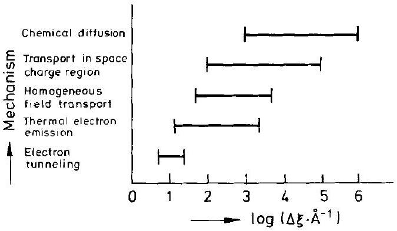
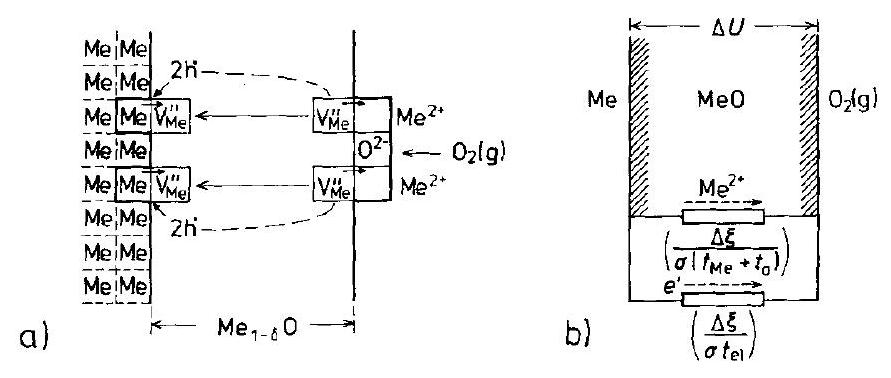
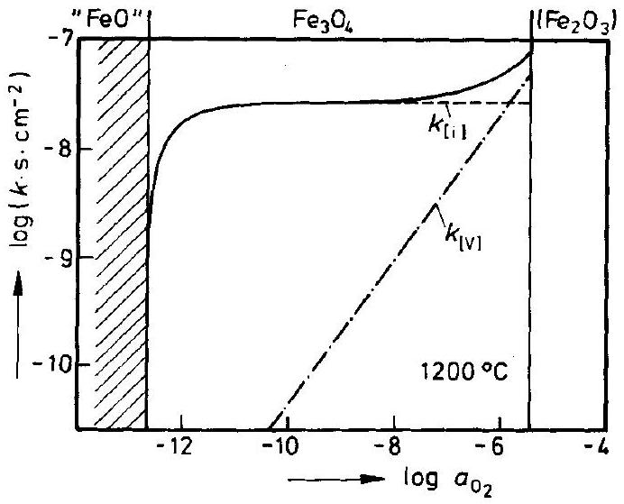
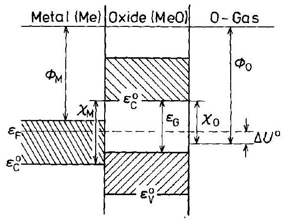
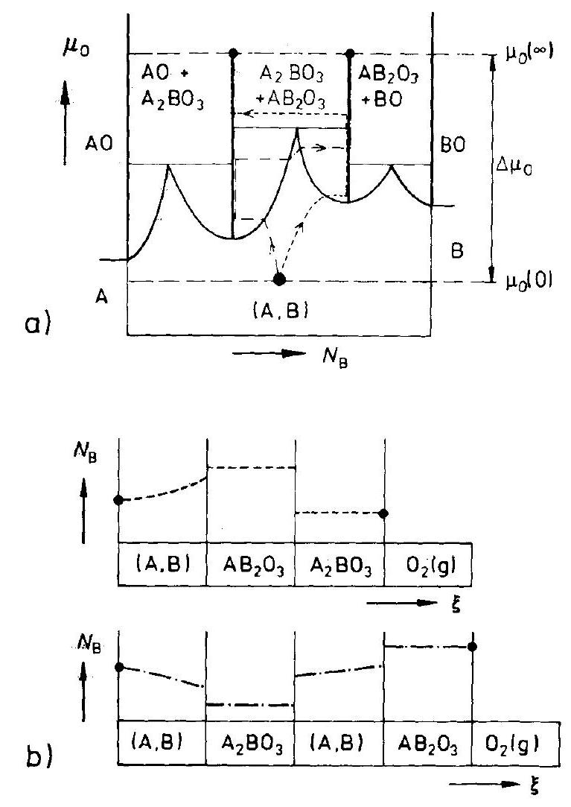
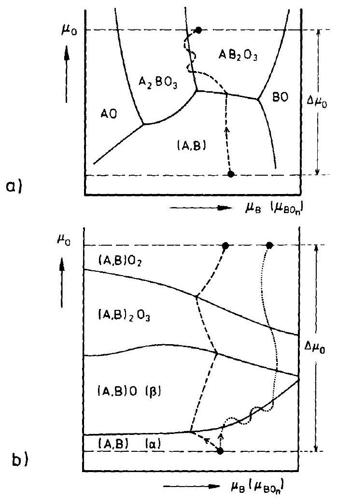

## 7 Oxidation of Metals

### 7.1 Introduction

The subject of this chapter is the reaction $\mathrm{Me}(\mathrm{s})+v \cdot \mathrm{X}=\operatorname{MeX}_{v}(\mathrm{~s})$, where the oxidant X (e.g., halogen, chalcogen) can occur in solid, liquid, or gaseous form. The pertinent point is the reactive growth of a solid product on the metal surface and the reactants Me and X are separated by this product. This was already discussed in Chapter 6 under classical heterogeneous solid state reactions. Transport of the components across the growing product and across its boundaries is necessary for reactive growth. Point defect thermodynamics and point defect mobilities determine the transport properties of the oxidation product. The transport equations are identical to those used for the quantitative treatment of heterogeneous reactions in the previous chapter. Boundary conditions at the reaction product-fluid interface are in a sense less complex than at solid-solid interfaces. For example, normal stresses vanish at a solid-gas interface. Details will be presented in Section 7.3. The simpler boundary conditions render the experimental determination of reaction kinetics more accurate. In metal oxidation, a greater number of distinct rate laws have been recognized than in other heterogeneous reactions, and an atomic interpretation of the reaction kinetics is correspondingly easier. Nevertheless, difficulties which occur when different crystals (with coherent, semicoherent, or incoherent boundaries) take part in the chemical reactions impede the atomic interpretation. This is particularly true for alloy oxidation.

An appreciable number of special monographs on metal oxidation are available. These presentations normally start with Wagner's theory of scale formation [C. Wagner (1933), (1951)], which represented the first consistent and quantitative treatment of a solid state reaction model. As Figure 7-1 shows, metal oxidation has quite

Figure 7-1. Possible oxidation mechanisms related to oxide film thicknesses, overview.

a number of different reaction modes depending on the thickness of the oxide film. If the oxide layer is sufficiently thin, the influence of electrical space and surface charge in the product can no longer be neglected, as was done in Wagner's oxidation model. Less is known about the transport across the $\mathrm{Me} / \mathrm{MeO}$ and $\mathrm{MeO} / \mathrm{O}_{2}(\mathrm{~g})$ interfaces, and about the atomic reaction steps involved.

The technical importance of metal oxidation is paramount. Corrosion, and in particular high temperature corrosion of metals, alloys, intermetallics, ceramics, etc., often limits the use of these materials in technology. This is obvious for their application in jet turbines, gas turbines, heat vessels, in many plants of the chemical and particularly the petrochemical industry, for example. Fundamental investigations in the field of metal oxidation are thus of direct relevance to materials science. Most construction materials, especially metals and alloys, are thermodynamically unstable in ambient atmosphere at high temperatures. Their protection with respect to high temperature corrosion relies mainly on the formation of a dense, adherent, and extremely slow growing thin oxide film, such as that on stainless steel. Passivation of metals in aqueous media is the formation of thin oxide films at a certain (anodic) electrode potential (Flade potential). The oxide layer appreciably diminishes the corrosion current density (passivation); for details see [K. J. Vetter (1967)]. We will not discuss metal film formation in aqueous electrolytes here. Although some elementary reaction steps are analogous in oxidizing gases and in aqueous media, electrochemistry is mainly concerned with the electron transfer across solid-liquid interfaces (electrode reactions), a theme which we will take up in Chapter 10. We should emphasize that this chapter is not meant to give a complete account on the numerous aspects of metal oxidation. Rather, important points will be stressed and unsettled problems are commented upon critically.

### 7.2 Wagner's Theory of Metal Oxidation

Although somewhat different in terminology, the basic conceptual frame outlined in previous chapters to describe diffusive transport in crystals, and particularly in semiconducting and ionic crystals, is essentially the same as that used by Wagner in his theory of metal oxidation [C. Wagner (1933), (1951)]. It is based on (linear) transport theory (irreversible thermodynamics) and assumes that (local) functions of state exist even if the system is exposed to thermodynamic potential gradients and is not in thermodynamic equilibrium. The Wagner theory was first published more than fifty years ago. In the meantime, physical chemists have become familiar with such concepts as local equilibrium, partial equilibrium, metastable equilibrium, etc., although there are still authors questioning the validity and appropriateness of these concepts in the given context [A.T. Fromhold (1976)].

Before the theory of metal oxidation had been formulated, a large number of experiments showed that, at sufficiently high temperatures, metals and alloys react with oxidizing gases and liquids by forming more or less adherent (protective) product lay-
ers on their surfaces. Reaction rates often conform to the parabolic rate law, which requires adherency and compactness of the surface oxide layer, a condition that is not always met in real systems. We have seen in previous chapters that the parabolic rate law follows if transport occurs in one dimensional systems and the component chemical potentials are fixed at the two boundaries of the reaction layer. In this case, the local driving forces become inversely proportional to the product layer thickness. Since the reactants A and $\mathrm{X}_{2}(\mathrm{~g})$ are neutral and the reacting system is (electrically) isolated (no electrodes, no external circuit), no net electric current can flow through the product during reaction, even if the various transported species do carry electric charges. This condition automatically leads to the coupling of ionic and electronic fluxes in the product layer. We have already used similar coupling conditions of fluxes before. They allow us to eliminate the electrical diffusion potential from the flux equations. An electrical diffusion potential is built up if charge carriers move in inhomogeneous systems, and their mobilities differ from each other. It is not necessary to repeat all the formal derivations here, since they are fully analogous to the derivations given in Section 6.3, where the parabolic rate constant was calculated as a function of the driving forces ( $\Delta G$ ) and the product's transport parameters $\left(D_{i}\right)$. Let us note, however, that it is the product of transport parameters like $D_{\mathrm{A}} \cdot D_{\mathrm{el}}$ or $\sigma_{\mathrm{A}} \cdot \sigma_{\mathrm{el}}$ (subscript el indicating electronic carriers) which determines the flux of matter across the product layer and thus the reaction rate. This means that the slower partner is rate determining. Figure 7-2a shows the atomic processes that take place during metal oxidation, and Figure 7-2b gives the equivalent electric circuit which explains the rate law in a straightforward way [W. Jost (1937)]. In the $1 \mathrm{~cm}^{2}$ surface area product layer, the electric potential drop $U$ stems from two ohmic contributions, electronic and ionic

$$
U=I \cdot \frac{\Delta \xi}{\sigma_{\mathrm{el}}}+I \cdot \frac{\Delta \xi}{\sigma_{\mathrm{ion}}}
$$

The rate of increase in sample thickness ( $\Delta \xi$ ) in terms of the current density $I$ is

$$
\Delta \dot{\xi}=\frac{I}{z F} \cdot V_{m}
$$

Figure 7-2. a) Atomic processes during the oxidation reaction $\mathrm{Me}+\frac{1}{2} \mathrm{O}_{2}=\mathrm{MeO}$, thick film regime and b) its equivalent electrical circuit [W. Jost (1937)].

If we express the driving force by the Gibbs energy of formation, that is, $U=\Delta G_{\mathrm{AO}} / 2 \cdot F$, Eqns. (7.1) and (7.2) yield

$$
\Delta \dot{\xi}=\sigma \cdot t_{\mathrm{el}}\left(t_{\mathrm{A}}+t_{\mathrm{O}}\right) \cdot \frac{V_{m} \cdot \Delta G_{\mathrm{AO}}}{4 \cdot F^{2}} \cdot \frac{1}{\Delta \xi}=\left(D_{\mathrm{A}}+D_{\mathrm{O}}\right) \cdot t_{\mathrm{el}} \cdot \frac{\Delta G_{\mathrm{AO}}}{R T} \cdot \frac{1}{\Delta \xi}
$$

with $t$ denoting the transference number. Integration of Eqn. (7.3) results in a parabolic rate law. The transport coefficients in the corresponding rate constant $k$ are averages taken over the oxide layer

$$
k=\left(\bar{D}_{\mathrm{A}}+\bar{D}_{\mathrm{O}}\right) \cdot \bar{t}_{\mathrm{el}} \cdot \frac{\Delta G_{\mathrm{AO}}}{R T}=\frac{1}{R T} \cdot \int_{\mu_{\mathrm{A}}(\text { surface })}^{\mu_{\mathrm{A}}^{0}}\left(D_{\mathrm{A}}+D_{\mathrm{O}}\right) \cdot t_{\mathrm{el}} \cdot \mathrm{~d} \mu_{\mathrm{A}}
$$

Some limiting cases are noteworthy. 1) The most frequent case is the oxidation of metals leading to semiconducting oxides with dense anion packing, that is, $t_{\mathrm{el}} \cong 1$ and $D_{\mathrm{O}} \cong 0$. This gives

$$
k=\bar{D}_{\mathrm{A}} \cdot \frac{\Delta G_{\mathrm{AO}}}{R T}
$$

$\Delta G_{\mathrm{AO}}$ is the Gibbs energy of formation of AO from metal A and oxygen gas at ambient atmosphere with partial pressure $p_{\mathrm{O}_{2}}\left(\Delta G_{\mathrm{AO}}=\Delta G_{\mathrm{AO}}^{0}+(R T / 2) \cdot \ln \left(p_{\mathrm{O}_{2}} / p_{\mathrm{O}_{2}}^{0}\right)\right)$. 2) If products with predominantly ionic conduction are formed, the tarnishing layer is very thin in view of $t_{\mathrm{el}} \ll 1$. From Eqn. (7.3), one has with $t_{\mathrm{ion}} \cong 1$

$$
k=\frac{\sigma_{\mathrm{el}} \cdot V_{m} \cdot \Delta G_{\mathrm{AO}}}{4 \cdot F^{2}}=\bar{D}_{\mathrm{el}} \cdot \bar{N}_{\mathrm{el}} \cdot \frac{\Delta G_{\mathrm{AO}}}{4 \cdot R T}
$$

There are no conceptual difficulties if the oxidizing system conforms to the conditions stated earlier. The only detail which needs to be discussed and clarified is the averaging procedure which has been performed in order to arrive at Eqns. (7.5) or (7.6). By definition

$$
\bar{D}_{i}=\frac{1}{\Delta \mu_{k}} \cdot \int_{\Delta \mu_{k}} D_{i}\left(\mu_{k}\right) \cdot \mathrm{d} \mu_{k}
$$

We have to evaluate the diffusion coefficient or any other transport coefficient with the help of point defect thermodynamics. This can easily be done for reaction products in which one type of point defect disorder predominates. Since we have shown in Chapter 2 that the concentration of ideally diluted point defects depends on the chemical potential of component $k$ as $\mathrm{d} \ln c_{\text {defect }}=n \cdot \mathrm{~d} \mu_{k}$, we obtain quite generally

$$
D_{i}=D_{i}^{0} \cdot \mathrm{e}^{n \cdot \frac{\mu_{k}-\mu_{k}^{0}}{R T}}
$$

where $n$ is a number which characterizes the disorder type and $i$ refers to the rate determining ion. Equation (7.8) is in agreement with Section 2.3. Integration of Eqn. (7.7) with $D_{i}$ according to Eqn. (7.8) and $\Delta \mu_{k}=\mu_{k}-\mu_{k}^{0}$ yields

$$
\bar{D}_{i}=\frac{D_{i}^{0}}{n \cdot\left(\frac{\Delta \mu_{k}}{R T}\right)} \cdot\left(\mathrm{e}^{n \cdot\left(\frac{\Delta \mu_{k}}{R T}\right)}-1\right)
$$

Let us apply this result to two cases of metal oxidation. 1) If we oxidize Cu metal, then semiconducting $\mathrm{Cu}_{2} \mathrm{O}$ will form at sufficiently low oxygen potentials. The point defect formation reaction including the copper ion vacancies responsible for the copper transport in semiconducting $\mathrm{Cu}_{2} \mathrm{O}$ reads

$$
\frac{1}{2} \mathrm{O}_{2}+4 \mathrm{Cu}_{\mathrm{Cu}}=2 \mathrm{~V}_{\mathrm{Cu}}^{\prime}+2 \mathrm{~h}^{\bullet}+\mathrm{Cu}_{2} \mathrm{O}
$$

Equation (7.10) implies that at equilibrium (since $N_{\mathrm{V}^{\prime}}=N_{\mathrm{h}}$.) we have

$$
\mathrm{d} \mu_{\mathrm{V}_{\mathrm{Cu}}^{\prime}}=(1 / 8) \cdot \mathrm{d} \mu_{\mathrm{O}_{2}}
$$

Therefore, the number which characterizes the disorder type, $n$, is $1 / 8$. If we now insert Eqn. (7.9) into Eqn. (7.5) and note that $\mathrm{e}^{n \cdot\left(\frac{\Delta \mu_{k}}{R T}\right)}=\left(p_{\mathrm{O}_{2}} / p_{\mathrm{O}_{2}}^{\#}\right)^{1 / 8} \gg 1$, where $p_{\mathrm{O}_{2}}^{\#}$ characterizes the low oxygen potential at the $\mathrm{Cu} / \mathrm{Cu}_{2} \mathrm{O}$ interface, we obtain for the parabolic rate constant

$$
k \cong 4 \cdot D_{\mathrm{Cu}}=4 \cdot D_{\mathrm{Cu}}^{\#} \cdot\left(\frac{p_{\mathrm{O}_{2}}}{p_{\mathrm{O}_{2}}^{\#}}\right)^{1 / 8}
$$

$D_{\mathrm{Cu}}$ is the diffusion coefficient of copper in $\mathrm{Cu}_{2} \mathrm{O}$ at the $\mathrm{Cu}_{2} \mathrm{O} / \mathrm{O}_{2}(\mathrm{~g})$ interface. We can generalize by stating that the rate constant, $k$, depends definitely on the oxidizing gas pressure when the oxide layer is a $p$-type semiconductor. 2) The oxidation of Zn metal to ZnO is different. In the $n$-type semiconducting regime, the point defect formation reaction including interstitial zinc can be written as follows

$$
\frac{1}{2} \mathrm{O}_{2}+\mathrm{Zn}_{\mathrm{i}}^{*}+\mathrm{e}^{\prime}=\mathrm{ZnO}
$$

From Eqn. (7.13) and the equilibrium condition for $\frac{1}{2} \mathrm{O}_{2}+\mathrm{Zn}=\mathrm{ZnO}$, we obtain

$$
\mathrm{d} \mu_{\mathrm{Zn}}=-\frac{1}{4} \cdot \mathrm{~d} \mu_{\mathrm{O}_{2}}
$$

Insertion of Eqns. (7.14) and (7.9) into Eqn. (7.5) yields, in contrast to Eqn. (7.12),

$$
k \leqq 4 \cdot D_{\mathrm{Zn}}^{\#}
$$

We conclude that the (practical) rate constant $k$ for $n$-type tarnishing layers is essentially independent of the applied oxygen pressure in the ambient atmosphere.

From Eqn. (7.7), we further conclude that the explicit calculation of the reaction rate constant $k$ is much more difficult if the disorder type changes within the range
of the component chemical potential in the product oxide (for example from $n$ - to p-type). Diffusion coefficients of the form

$$
D_{i}=\sum_{j} D_{i j} \cdot \mathrm{e}^{n_{j} \cdot \frac{\left(\mu_{k}-\mu_{k}^{0}\right)}{R T}}
$$

then have to be used instead of Eqn. (7.8). This leads to the following average diffusion coefficient for the oxide product layer

$$
\bar{D}_{i}=\frac{R T}{\Delta \mu_{k}} \cdot \sum_{j} \frac{D_{i j}^{0}}{n} \cdot\left(\mathrm{e}^{n_{j} \cdot \frac{\left(\mu_{k}-\mu_{k}^{0}\right)}{R T}}-1\right)
$$

Equation (7.17) reflects the fact that different point defects (e.g., vacancies and interstitials) may simultaneously contribute to the motion of ions of sort $i$. An example of a change of disorder type in the reaction product layer is found during the oxidation of FeO to $\mathrm{Fe}_{3} \mathrm{O}_{4}$ (magnetite). The disorder in the semiconducting $\mathrm{Fe}_{3} \mathrm{O}_{4}$ layer, growing on FeO , changes from interstitial cations to cation vacancies. In consequence, the rate determining diffusion coefficient of Fe exhibits a minimum as a function of the oxygen potential in the $\mathrm{Fe}_{3} \mathrm{O}_{4}$ layer. In view of Eqn. (7.4), this leads to a rate constant $k$ which does not change over an appreciable oxygen potential range in the oxidizing gas. This unexpected behavior is due to the decreasing transport coefficient while the driving force $\Delta G$ increases. Figure 7-3 shows the result of an experiment illustrating self-inhibition where the rate does not increase upon increasing the driving force.

Figure 7-3. Calculated parabolic rate constant $k$ for the oxidation of wüstite (" FeO ") to magnetite $\left(\mathrm{Fe}_{3} \mathrm{O}_{4}\right)$ as a function of the oxygen activity of the surrounding gas. Proportions due to interstitial and vacancy transport are indicated.

Wagner's theory of metal oxidation is phenomenological. Many questions concerning atomic aspects of the oxidation process cannot be answered within the frame of this phenomenological theory. Since atomic aspects are important when we analyze the boundary conditions, this will be exemplified by two pertinent problems. Firstly, let us ask about the coherence of the metal/oxide interface during the oxida-
tion process. Thin films often grow epitaxially. This means that the near-interface region is strained. Eventually, misfit dislocations form in both the metal and the oxide and will be found at and near the interface. The flux of metal ions away from the coherent A/AO interface towards the surface means an injection of vacancies into the metal A [H. Fischbach (1980)]. If the mobility in the boundary itself is sufficiently high, these vacancies could be accommodated at interface ledges, kinks, etc. If not, they diffuse into the metal where they become supersaturated and annihilate at dislocations, thus, for example, including dislocation climb. Since the dislocation lines interact elastically while they are climbing, a structured dislocation network forms. Both its motion and the boundary motion have to match. A detailed analysis of this complex process is available in the literature [B. Pieraggi, R. A. Rapp (1988)]. If the mobility of SE's in the metal/oxide interface is not high enough and if, in addition, the sink strength of the dislocation network for supersaturated vacancies is not sufficient, then pores will form in the near-interface region. Pore formation, however, means that local equilibrium is appreciably disturbed at the boundary. This is at variance with the assumptions of the Wagner theory.

Secondly, let us consider dislocations in the oxide layer, formed at the moving phase boundary during oxidation, as fast diffusion paths (pipes) for the oxide components, and in particular for atomic or molecular oxygen stemming from the oxidizing atmosphere. If these dislocations are connected to the external surface, and thus to the high oxygen potential, they can also act as internal surfaces with a relatively high oxygen activity. Outward diffusing metal cations (and compensating electronic defects) will then form new oxide molecules along these dislocations. This internal oxide formation does not mean that the dislocation pipes will be blocked. It does, however, mean that a lateral pressure builds up. Creep or even cracking could be the result of this internal reaction, which is also not accounted for by the Wagner theory [A. Atkinson (1985)].

### 7.3 Non-Parabolic Rate Laws

Distinct reaction rate laws have been empirically found in metals oxidation research. In thick-film oxidation, deviations from parabolic growth (given one-dimensional reaction geometries) are due to insufficient adherency, crack and pore formation in the oxide layer, spalling, etc. Yet non-parabolic rate laws of various kinds are mainly discussed in connection with the formation of thin and ultra-thin oxide films (Fig. 7-1). Although various explanations have been offered, their experimental verification is difficult. Not very much is known about the atomic structure of thin oxide films from experiments under in-situ conditions [R. A. Rapp (1984)]. Thin film oxidation is characterized by high electrical field strengths in the product, perpendicular to the film surface. Since the formation Gibbs energies are on the order of 1 eV , the electrical field can easily be as high as $10^{6} \mathrm{~V} / \mathrm{cm}$ if the film thickness is on the order of $10^{-6} \mathrm{~cm}$.

Metal oxidation is a heterogeneous solid state reaction and starts in the same way as other heterogeneous reactions with nucleation and initial growth. This was discussed in Chapter 6. A time-dependent nucleation rate may dominate the overall growth kinetics of thin films. Even under an optical microscope (i.e., in macroscopic dimensions), preferential sites of growth can still be discerned [J. Bénard (1971)]. This indicates that lateral transport on the surface (e.g., at sites where screw dislocations emerge) can possibly be more important for the initial reactive growth than transport across thin oxide layers.

To be more specific, let us begin with the linear rate law ( $\Delta \xi \sim t$ ). One immediate explanation for a linear rate law is the rate determining phase boundary reaction. Parabolic growth would mean that the growth rate is $\Delta \dot{\xi} \rightarrow \infty$ for $\Delta \xi \rightarrow 0$. If the incorporation of SE's from the boundary into the lattice of the growing oxide (at A/AO or $\mathrm{AO} / \mathrm{O}_{2}(\mathrm{~g})$ ) is a thermally activated process, the phonon frequency sets an upper limit to this incorporation. Other mechanisms such as ledge or kink nucleation may also limit the incorporation rate at the boundaries. As long as the boundaries of the oxide do not change with time during growth, the rate of interface crossing and incorporation of the SE's will not depend on the layer thickness. If the Gibbs energy of reaction is then dissipated primarily at the boundaries and not in the bulk of the oxide film through component diffusion, a linear rate law will result. Atomic models for solid/solid interface reactions will be presented in Chapter 10. Considering the necessary structural accommodations (e.g., dislocation formation and motion, see Fig. 3-5) which must take place at a moving boundary between heterogeneous solids, one may ask if the structure of an advancing interface can ever be timeindependent. Regarding the topochemical and structural implications that have to go along with heterogeneous reactions in the solid state, it is amazing that distinct rate laws are nevertheless found in many cases.

In electrode kinetics, interface reactions have been extensively modeled by electrochemists [K. J. Vetter (1967)]. Adsorption, chemisorption, dissociation, electron transfer, and tunneling may all be rate determining steps. At crystal/crystal interfaces, one expects the kinetic parameters of these steps to depend on the energy levels of the electrons (Fig. 7-4) and the particular conformation of the interface, and thus on the crystal's relative orientation. It follows then that a polycrystalline, that is, a (structurally) inhomogeneous thin film, cannot be characterized by a single rate law.

Figure 7-4. Schematic electron energy level diagram in the system metal-oxide-oxygen gas. $\mathrm{C}=$ conduction band, $\mathrm{V}=$ valence band, $\mathrm{G}=$ gap, $\phi=$ work function, $\varepsilon_{\mathrm{F}}=$ Fermi energy.

An in-situ characterization of the interface structure of the growing oxide film appears to be necessary for an appropriate modeling, but this is most difficult to achieve [B. Pieraggi, R.A. Rapp (1988)].

Let us distinguish between essential elements of the oxidation kinetics as represented by the differential equations for transport and reaction, and the conditions which the boundaries of the reacting system dictate (these are, for example, implicit in Fig. 7-1). The driving forces discussed so far have been the electrical and chemical potential gradients, both of which are strongly influenced by the boundary geometry. Therefore, one must not overemphasize the various empirical thin film rate laws. They often reflect the boundary conditions and not the basic physics of the oxidation process (i.e., driving forces and transport types). One also notes that in thin film kinetic work, the phenomenological approach predominates, whereas in thick film oxidation, which is based on the assumption of local equilibrium, the understanding of atomic details (point defect models) is stressed. This can be seen by comparing some relevant monographs [A.T. Fromhold (1976), (1980); P. Kofstad (1966), (1988)].

A few remarks on the phenomenological approach should be made. It is always possible to solve the phenomenological transport equations either analytically or numerically (provided the correct boundary conditions are known) and compare these solutions with sufficiently accurate experimental observations. This has been done extensively, for example, in [A. T. Fromhold (1976), (1980)]. Yet one of the fundamental conceptual questions has received less discussion than it deserves. Can chemical potential gradients (or concentration gradients) still be used as driving forces in ultra-thin film oxidation theory? Likewise, is it justified to introduce the phenomenologically defined atomic mobility? After all, a thin film grown on a metal surface is normally (structurally) inhomogeneous due to heterogeneous nucleation and coherency stress phenomena. Thermodynamic forces are conceptually based on particle ensembles. If the film thickness, $\Delta \xi$, is too small, the gradient $\left(\mathrm{d} \mu_{i} / \mathrm{d} \xi\right)$ in the direction perpendicular to the surface looses its meaning, whereas the field force $(\mathrm{d} \varphi / \mathrm{d} \xi)$ may still be defined.

In a simplified phenomenological treatment of thin film oxidation, one solves the usual transport equations by taking into account the space charges by means of the Poisson equation ( $\Delta \varphi=-\varrho /\left(\varepsilon \cdot \varepsilon_{0}\right)$, where $\varrho=$ net electric charge density). If the temperature is low enough and the oxide layer thin enough, electron tunneling (instead of ion transport) may be rate determining, as has been proposed by Mott [N. F. Mott (1940)]. By this tunneling, chemisorbed oxygen ions are formed at the oxide/ gas surface. They subsequently react with metal ions which are dragged by the electric field across the layer to the surface. The tunneling probability and thus the electron flux is of the form

$$
j_{\mathrm{e}} \sim \mathrm{e}^{-\beta \cdot \Delta \xi}
$$

where $\beta$ is a reciprocal length (approximately $(1 / \hbar) \cdot\left(8 m_{\mathrm{e}} \chi_{\mathrm{M}}\right)^{1 / 2} ; \chi_{\mathrm{M}}=$ metal/oxide work function, see Fig. 7-4; $m_{\mathrm{e}}=$ effective electron mass). This reasoning leads, after integration of Eqn. (7.18), to a logarithmic rate law in accordance with experimental observations. The existence of a temperature regime in which electron tunnel-
ing is rate determining and slower than the transfer of ions across the film is, however, just an assumption.

Another proposal of similar quality has been put forward by Mott and Cabrera [N. Cabrera, N.F. Mott (1949)]. This time (and in contrast to the above assumption) either electron tunneling or thermal electron emission from the metal into the oxide conduction band is assumed to be so fast that the equilibrium concentration of oxygen ions at the film surface ( $e^{\prime}+\frac{1}{2} \mathrm{X}_{2}=\mathrm{X}^{-}$) establishes a (constant) electric potential jump $\Delta U^{0}$ across the film. Therefore, one has a time-dependent local electric field $\nabla \varphi=\Delta U^{0} / \Delta \xi(t)$ which drags the cations across the film. If the work which a moving particle extracts from the field between two adjacent potential minima ( $=e_{0} \cdot a \cdot \nabla \varphi ; a=$ distance between minima) is not small compared with the hopping activation energy, then the flux equation can no longer be linearized (in the force $e_{0} \cdot \nabla \varphi$ ). With nonlinear transport equations, the growth rate is found to be

$$
\Delta \dot{\xi}=\mathrm{const} \cdot \sinh \left(-\frac{e_{0} \cdot \Delta U^{0} \cdot a}{k T \cdot \Delta \xi}\right)
$$

where $\Delta \xi / a$ is the number of activated jumps in the thin film, $e_{0} \cdot \Delta U^{0} /(\Delta \xi / a)$ is thus the potential drop per jump, and $\Delta U^{0}$, as outlined in Figure 7-4, is the difference between the metal Fermi energy level and the $\mathrm{X}_{\mathrm{ad}}$ level. From Eqn. (7.19), logarithmic as well as parabolic growth rates can be obtained as limiting cases.

If the thickness, $\Delta \xi$, of an oxide layer is on the order of the Debye-Hückel length $\left((1 / 2) \cdot \varepsilon \cdot \varepsilon_{0} \cdot k T \cdot z_{i} \cdot e_{0}^{2}\right)^{1 / 2}$, the electric field strength is influenced by the space charge and is no longer constant inside the film. Let us, for the sake of illustration, assume that local equilibrium for the electronic defects is established at the Me/MeX interface of an MeX film during film growth. In other words, a constant concentration of electrons $c_{\mathrm{e}}^{0}(\xi=0)$ is maintained at this interface during the oxidation process. Let us further assume that the electronic carriers are non-degenerate and in local equilibrium inside the film $(0<\xi<\Delta \xi)$. We then have, according to the Boltzmann distribution,

$$
N_{\mathrm{e}}(\xi)=N_{\mathrm{e}}^{0} \cdot \mathrm{e}^{\frac{F \cdot \varphi(\xi)}{R T}}
$$

With this electric potential $\varphi(\xi)$, we can integrate the Poisson equation ( $\Delta \varphi= -\varrho_{\mathrm{el}} /\left(\varepsilon \cdot \varepsilon_{0}\right) ; \varrho_{\mathrm{el}}=$ net charge density) to eventually obtain the concentration of electrons at the film surface ( $\Delta \xi$ ). It further follows that $N_{\mathrm{e}}(\Delta \xi)$ varies with the film layer thickness as $\Delta \xi^{-2}$. If we now assume that the (catalyzed) rate of dissociation of the adsorbed $\mathrm{X}_{2}$ molecules is proportional to the surface concentration of electrons, and that this dissociation process is rate determining, a cubic rate law for the film growth can be expected ( $\Delta \dot{\xi} \sim \Delta \xi^{-2} ; \Delta \xi \sim t^{1 / 3}$ ). In fact, during the oxidation of Ni at temperatures between 250 and $400^{\circ} \mathrm{C}$, an approximately cubic rate law has been experimentally observed. We emphasize, however, that the observed cubic oxidation rate does not prove the validity of the proposed reaction mechanism. Different models and assumptions concerning the atomic reaction mechanism may lead to the same or similar dependences of the growth rate on thickness.

### 7.4 Alloy Oxidation

Alloy oxidation is of utmost importance in technology. Whereas oxidation of metallic elements as discussed in Section 7.2 is a uniquely defined process, if local thermodynamic equilibrium prevails, this is no longer true for the oxidation of (even binary) alloys. One reason for ambiguity is the fact that boundaries between the alloy and the (A-B-...O) product layer are thermodynamically variant, in contrast to A/AO boundaries, which are invariant according to the Gibbs phase rule. As Figure 7-5 shows, this invariance is the reason for the morphological stability during growth of AO layers on A-metal surfaces. Oxidation of higher than binary alloys has many special aspects which we cannot treat in any detail. We will therefore discuss only some basic aspects of (A, B) alloy oxidation. This means that we will confine ourselves to the ternary $\mathrm{A}-\mathrm{B}-\mathrm{O}$ system. The mode of oxidation depends on the alloy composition $N_{\mathrm{A}}$ and on the number and type of compounds and solid solutions which exist in the ternary $\mathrm{A}-\mathrm{B}-\mathrm{O}$ system. Basic parameters of the oxidation process are the Gibbs energies (chemical potentials) and the mobilities of the alloy components in all the phases of the product layer. The general ( $\mathrm{A}, \mathrm{B}$ ) oxidation problem can not be solved in a straightforward way, either because of morphological instabilities or because of mathematical complexity. Therefore, it is advisable to consider limiting cases characterized by the predominance of certain kinetic and/or thermodynamic parameters.

Figure 7-5. Explanation of morphological stability of the invariant boundaries (interfaces) of AO during the oxidation process. $j_{i}^{\prime \prime}>j_{i}^{\prime}, i=\mathrm{A}^{+}$, é.

Let us illustrate two limiting cases with the help of phase diagrams of the second kind (intensive/extensive) as shown in Figures 7-6 and 7-7. In Figure 7-6 we deal with alloy ( $\mathrm{A}, \mathrm{B}$ ) and nearly stoichiometric compound products. In Figure 7-7 we assume that only complete oxide solid solution series occur. The oxidation process starts by exposing the surface of the alloy to oxygen with a chemical potential $\mu_{\mathrm{O}}(\infty)$, as indicated. If we now trace the composition variable ( $N_{\mathrm{A}}$ ) through the reaction layer(s) and plot it in a phase diagram of the second kind, we obtain the 'reaction path'. Theoretically, it follows from the transport equations and (neglecting morphological aspects) depends only on the (local) thermodynamic functions and the component mobilities. Further conditions are the mass balances of A and B . They ensure that the reaction path is not located only on one side of the initial alloy composition. Also $\mathrm{d} \mu_{\mathrm{O}} / \mathrm{d} r$ ( $r=$ reaction path coordinate) is never negative. Some interesting features can immediately be read from these schematic reaction paths. For example,

Figure 7-6. a) Schematic A-B-O phase diagram of the second kind ( $\mu_{\mathrm{O}} / N_{\mathrm{B}}$ ) and possible oxidation reaction paths involving ( $\mathrm{A}, \mathrm{B}$ ) alloy and oxide compounds. b) Corresponding reaction paths ( $N_{\mathrm{B}}(\xi)$ ) in real space at time $t$.

a quasi-stationary sequence of layers such as ( $\mathrm{A}, \mathrm{B})^{\prime}\left|\mathrm{A}_{2} \mathrm{BO}_{3}\right|(\mathrm{A}, \mathrm{B})^{\prime \prime}\left|\mathrm{AB}_{2} \mathrm{O}_{3}\right| \mathrm{O}_{2}(\mathrm{~g})$ (or $(\mathrm{A}, \mathrm{B})\left|(\mathrm{A}, \mathrm{B})_{2} \mathrm{O}_{3}\right|(\mathrm{A}, \mathrm{B})_{3} \mathrm{O}_{4}$ ) is possible. Those sequences and similar ones do not look very plausible at first sight, but they are perfectly consistent with the thermodynamic and kinetic premises.

A calculation of a reaction path is available for the simplest case. ( $\mathrm{A}, \mathrm{B}$ ) and $(\mathrm{A}, \mathrm{B}) \mathrm{O}$ are the only phases to be considered and both solid solutions are complete $\left(0 \leq N_{\mathrm{A}} \leq 1\right)$ [C. Wagner (1969); D. P. Whittle, et al. (1975)]. However, since the theoretical problem (i.e., steady-state transport in an oxygen potential gradient acting on (A,B)O, with moving boundaries) resembles the demixing problem in a chemical potential gradient, and this will be discussed extensively in the next chapter, we postpone the quantitative treatment of the reaction paths given in Figure 7-7.

### 7.4.1 The Morphological Stability of Boundaries During Metal Oxidation

Although Chapter 11 is especially devoted to the morphological stability of solidsolid interfaces during reaction, it is necessary in the context of alloy oxidation to

Figure 7-7. a) Schematic A-B-O phase diagram of the second kind ( $\mu_{\mathrm{O}} / N_{\mathrm{B}}$ ) and possible oxidation reaction paths involving (A, B) alloy and oxide solid solutions. b) Reaction path ( $N_{\mathrm{B}}(\xi)$ ) in real space at time $t$.

briefly discuss this question. How do the boundaries of a ternary oxide layer behave morphologically in an oxygen potential gradient during alloy oxidation? Let us first note that the slope of the phase boundaries in chemical potential equilibrium diagrams, that is, $\left(\partial \mu_{\mathrm{O}} / \partial \mu_{\mathrm{BO}}\right)_{\text {eq }}$, reflect generalized Clausius-Clapeyron equations [H. Schmalzried, A. Pelton (1973)]. We have seen from Figures 7-2a and 7-5 that if one oxidizes elemental metal A and maintains local equilibrium, the interfaces are morphologically stable. Any geometrical disturbance of the interface form is selfstabilizing or self-healing. This has been concluded from analyzing the driving forces (potential gradients) in Figure 7-5. The situation can be markedly different during alloy oxidation. Figure 7-8 shows some possible oxidation reaction paths (schematic) in ternary A-B-O systems. They are plotted in phase diagrams of the third kind (intensive vs. intensive variable). The particular diagram in Figure 7-8 ( $\mu_{\mathrm{O}}$ vs. $\mu_{\mathrm{B}}$ at given $P$ and $T$ ) corresponds to the diagrams of the second kind in Figures 7-6 and 7-7.

A reaction path can proceed in two principally different directions after it has crossed a phase boundary: 1) ( $\left.\partial \mu_{\mathrm{O}} / \partial \mu_{\mathrm{BO}}\right)_{\text {path }}>\left(\partial \mu_{\mathrm{O}} / \partial \mu_{\mathrm{BO}}\right)_{\text {eq }}$ and 2) $\left(\partial \mu_{\mathrm{O}} / \partial \mu_{\mathrm{BO}}\right)_{\text {path }} <\left(\partial \mu_{\mathrm{O}} / \partial \mu_{\mathrm{BO}}\right)_{\text {eq }}$. In the second case, the reaction path will re-enter the field of the reduced phase which it just left and can then oscillate along the phase boundary line in Figure 7-8 for some length. A morphologically stable interface between the oxidized and the reduced phase can not develop in this case, and a part of the oxide layer is expected to consist of a mixture of two phases.

Figure 7-8. a) A-B-O phase diagram of the third kind ( $\mu_{\mathrm{O}} / \mu_{\mathrm{B}}$ ) and a possible oxidation reaction path involving (A,B) alloy and oxide compounds. b) A-B-O phase diagram of the third kind ( $\mu_{\mathrm{O}} / \mu_{\mathrm{B}}$ ) and possible oxidation reaction paths involving (A, B) alloy and oxide solid solutions.

Let us try to quantify these ideas by formulating the flux equations for the (semiconducting) oxide ( $\mathrm{A}, \mathrm{B}) \mathrm{O}_{n}$, namely (see Eqn. (6.25))

$$
j_{\mathrm{A}}=-c_{\mathrm{A}} \cdot b_{\mathrm{A}} \cdot\left(\nabla \mu_{\mathrm{AO}}-n \cdot \nabla \mu_{\mathrm{O}}\right) ; j_{\mathrm{B}}=-c_{\mathrm{B}} \cdot b_{\mathrm{B}} \cdot\left(\nabla \mu_{\mathrm{BO}_{n}}-n \cdot \nabla \mu_{\mathrm{O}}\right)
$$

where we have assumed that the anions are immobile. At the phase boundaries (interfaces), the fluxes of A and B are coupled by the interface velocity

$$
v^{b}=\frac{j_{\mathrm{A}}^{\alpha}-j_{\mathrm{A}}^{\beta}}{c_{\mathrm{A}}^{\alpha}-c_{\mathrm{A}}^{\beta}}=\frac{j_{\mathrm{B}}^{\alpha}-j_{\mathrm{B}}^{\beta}}{c_{\mathrm{B}}^{\alpha}-c_{\mathrm{B}}^{\beta}}
$$

We can replace $\nabla \mu_{\mathrm{BO}_{n}}$ by $\nabla \mu_{\mathrm{AO}_{n}}$ with the help of the Gibbs-Duhem equation. At the $\alpha / \beta$ boundary (interface), it is therefore possible to express ( $\left.\partial \mu_{\mathrm{O}} / \partial \mu_{\mathrm{A}}\right)^{\alpha}$ and $\left(\partial \mu_{\mathrm{O}} / \partial \mu_{\mathrm{AO}}\right)^{\alpha}$ in terms of $\left(\partial \mu_{\mathrm{O}} / \partial \mu_{\mathrm{A}}\right)^{\beta}$ and $\left(\partial \mu_{\mathrm{O}} / \partial \mu_{\mathrm{AO}}\right)^{\beta}$ respectively. If we then find that $\left(\partial \mu_{\mathrm{O}} / \partial \mu_{\mathrm{AO}_{n}}\right)^{\beta}<\left(\partial \mu_{\mathrm{O}} / \partial \mu_{\mathrm{AO}_{n}}\right)_{\text {eq }}$, morphologically unstable interfaces will occur. A pertinent example of a reaction layer in a ternary A-B-O system which develops morphological instability and a two phase assemblage in an oxidation experiment is discussed in Section 8.7. The general discussion of morphological instabilities in alloy oxidation processes is given in Chapter 11.

Systematically speaking, so-called internal oxidation reactions of alloys (A, B) are extreme cases of morphological instabilities in oxidation. Internal oxidation occurs if oxygen dissolves in the alloy crystal and the (diffusional) transport of atomic oxygen from the gas/crystal surface into the interior of the alloy is faster than the countertransport of the base metal component (B) from the interior towards the surface. In this case, the oxidation product $\mathrm{BO}_{n}$ does not form a stable oxide layer on the alloy surface. Rather, $\mathrm{BO}_{n}$ is internally precipitated in the form of small oxide particles. The internal reaction front moves parabolically $(\sim \sqrt{t})$ into the alloy. Examples of internal reactions are discussed quantitatively in Chapter 9.

### 7.5 Some Practical Aspects of High Temperature Corrosion

We have dealt with the basic concepts that have been developed to understand those reactions between metals and gases which result in more or less dense and coherent layers of oxidized products formed on or near the metal surface. In this section, we shall briefly mention some of the practical problems which are important in high temperature corrosion. The requirement of technology is the production of an adherent, dense, slow growing metal oxide layer that shields the underlying metal from further attack by the oxidizing gases. The main task is to find the composition which reflects an optimal compromise between the wanted mechanical and the needed chemical (reactive) properties of the material. Since we understand the basic reaction mechanisms, we know, in principle, how to attain a minimum reaction rate. However, the achievement of crack-free and slow-growing reaction layers showing optimal adherence to the metal surfaces is still based to a large extent on empirical knowledge, as documented in relevant reviews [R.A. Rapp (1981); N. Birks, G.H. Meier (1983)]. In order to minimize the reaction rates of the protective oxide layers, which, for the sake of mechanical stability, are normally carried into the regime of transport controlled (parabolic) growth, let us inspect Eqn. (7.4). From this inspection, we learn that we have to minimize 1) the electronic transference number (i.e., the electronic leak current) and/or 2) the diffusion coefficients of the rate determining ions. The first requirement can be met by adding those components to the metal or the alloy which form very stable oxides with negligible electronic conduction, such as $\mathrm{Al}_{2} \mathrm{O}_{3}, \mathrm{MgO}, \mathrm{SiO}_{2}$. Often, however, alloy oxidation does not lead to simple binary protective oxides. Rather, ternary or even higher semiconducting oxide layers are formed with $t_{\mathrm{el}} \cong 1$ so that the electron (hole) flux is no longer rate determining. Obviously, the task is to minimize the transport coefficients of the rate determining cations (or anions) in the oxide product layers.

Defect thermodynamics provide the guidelines for the solution of this practical problem. In Chapter 2, the basic ideas on how to influence point defect concentrations by doping with (heterovalent) additions were presented. Due to the electroneutrality condition and the laws of mass action, we can control the point defect
fractions. Since ionic point defects are directly responsible for the mobility, $b$, of the diffusing components, the heterovalent doping has to be performed in such a way that the transport coefficient (i.e., $c_{i} \cdot b_{i}$, the index $i$ denotes the rate determining component) is minimized. By and large, one can formulate the following rules. The addition of a lower-valent solute to a $p$-type oxide decreases the cation vacancy concentration. A higher-valent solute addition has the opposite effect. The converse is true if the scale consists of an n-type oxide.

One has to admit, however, that the beneficial operation of protecting oxide scales is often not limited by the (bulk) transport properties, but rather by the mechanical properties (creep, adherence) of the scales. In this respect, metal oxidation once again reflects the general situation in our understanding of solid state reaction kinetics: to what extent are physical properties other than diffusional transport and thermodynamics responsible for reaction rates? We may discuss this question with regard to metal oxidation in some more detail. We can neglect the growth of multilayers (which has been addressed in Section 6.3.2) and the change of the disorder type in the oxide product (an example was given in Fig. 7-3). Although these phenomena increase the complexity of the metal oxidation problem, they can nevertheless be handled by classic transport theory. However, if the ratio of oxide product volume to original metal volume differs from unity (Pilling-Bedworth ratio $\neq 1$ ), a continuous oxidation process is only possible if sufficient plastic flow at and near the interfaces is guaranteed. Otherwise the formation of cracks, voids, and pores occurs and the growth rate of the scale becomes irregular.

Let us distinguish between two modes of oxidation: 1) the oxide grows (by cation transport) at the surface to the gas and 2) the oxide grows below its surface to the gas. This latter mode requires the oxidant to be transported into the scale, which can occur in a variety of ways such as by molecular (atomic) transport along cracks, pores, grain boundaries or dislocations, or (relatively seldom) in the form of a simultaneous transport of anionic and electronic defects. At very high temperatures ( $>\left(\frac{2}{3}\right) \cdot T_{\text {melt }}$ ), mechanism 1) is often observed. At low temperatures ( $<\left(\frac{1}{2}\right) \cdot T_{\text {melt }}$ ), however, calculated reaction rates (according to Wagner, see Section 7.2) and the much larger experimental values differ sometimes by orders of magnitude [A. Atkinson (1985)].

The main difficulty with the first mode of oxidation mentioned above is explaining how the cation vacancies that arrive at the metal/oxide interface are accommodated. This problem has already been addressed in Section 7.2. Distinct patterns of dislocations in the metal near the metal/oxide interface and dislocation climb have been invoked to support the continuous motion of the adherent metal/oxide interface in this case [B. Pieraggi, R. A. Rapp (1988)]. If experimental rate constants are moderately larger than those predicted by the Wagner theory, one may assume that internal surfaces such as dislocations (and possibly grain boundaries) in the oxide layer contribute to the cation transport. This can formally be taken into account by defining an effective diffusion coefficient $D_{\text {eff }}=(1-f) \cdot D_{\mathrm{L}}+f \cdot D_{\mathrm{NL}}$, where $D_{\mathrm{L}}$ is the lattice diffusion coefficient, $D_{\mathrm{NL}}$ is the diffusion coefficient of the internal surfaces, and $f$ is the site fraction of cations located on these internal surfaces.

However, the observation of existing duplex scales (and breakaway scales) during metal oxidation rather points to the second oxidation mode. The duplex morphology
is characterized by columnar grains in the outer oxide layer and fine-grained oxide crystals in the inner layer near the metal/oxide interface. Breakaway scales are porous, often laminated, and their name stems from the fact that the parabolic oxidation rate can suddenly increase to a fast linear growth law (e.g., during oxidation of steel, with $\mathrm{CO}_{2}$ formation). The rationalization of these processes assumes that because $V_{\text {oxide }} / V_{\text {metal }}>1$, the necessary deformation of the scale during its growth generates microcracks, along which the oxidant has some degree of access to the metal/oxide interface. If no free space is available at this interface (because of coherency or easy interface shearing), the single layer scale is formed by outward cation diffusion, as has been assumed by the Wagner theory of oxidation. If some free space, however, is available, for example, by loss of adhesion due to outward diffusion of metal ( $=$ cation + electron) without sufficient plastic flow, then duplex (or breakaway) scales result. As a consequence, one expects that both the growth rate and the growth morphology will depend on the geometry of the sample. For example, adherence of receding metal/oxide interfaces at a sample corner where two flat scales meet each other is not possible: stresses and cracks will be created. It was empirically found that small additions of certain alloying elements (e.g., $\mathrm{Ca}, \mathrm{Y}, \mathrm{Hf}$ ) are most beneficial for improving the oxidation resistance of metals. Since these elements form very stable oxides and exhibit normally low diffusivities, they may preferentially form at fast diffusion paths of the matrix and block these paths for further oxidant transport. Another hypothesis maintains that their influence is due to their ability to change the creep properties of the matrix (e.g., by 'wetting' the grain boundaries), or by improving the self-healing of microcracks which form during layer growth [J. Jedlinski (1992)].

A further field of practical interest is the high temperature corrosion of metals in atmospheres which include sulfur, carbon, hydrogen, and halogen. The starting point for an understanding of these corrosion processes is the construction of phase diagrams of the second kind analogous to those in Figures 7-6 and 7-7 but to include the chemical potentials of S, C, H, Cl, etc. Most of these diagrams are not yet available. If these nonmetals are already components of the alloy to be oxidized by $\mathrm{O}_{2}$ (e.g., steel containing sulfur and other impurities), internal oxidation products can form with very high activities ( $\mathrm{SO}_{2}, \mathrm{CO}_{2}, \mathrm{H}_{2} \mathrm{O}$, etc.) which may be responsible for building up high pressures in pores, cracks, and along interfaces, eventually leading to the spalling of oxide scales.

## References

Atkinson, A. (1985) Rev. Mod. Phys., 57, 437
Bénard, J. (1971) in: Oxidation of Metals and Alloys, Amer. Soc. Metals, Metals Park, Ohio Birks, N., Meier, G. H. (1983) Introduction to High Temperature Oxidation of Metals, Edward Arnold, London
Cabrera, N., Mott, N.F. (1949) Rep. Progr. Phys., 12, 163
Dieckmann, R., Schmalzried, H. (1977) Arch. Eisenhüttenwes., 48, 611

Fischbach, H. (1980) Z. Metallk., 71, 115
Fromhold, A. T. (1976, 1980) Theory of Metal Oxidation, I, II, North Holland Publ. Comp., Amsterdam
Jedlinski, J. (1992) Sol. State Phenomena, 21/22, 335
Jost, W. (1937) Diffusion und chemische Reaktion in festen Stoffen, Steinkopff, Dresden
Kofstadt, P. (1966) High Temperature Oxidation of Metals, Wiley, New York
Kofstadt, P. (1988) High Temperature Corrosion, Elsevier, Amsterdam
Mott, N.F. (1940) Trans. Faraday Soc., 36, 472
Pieraggi, B., Rapp, R. A. (1988) Acta Met., 36, 1281
Rapp, R. A. (Ed.) (1981) High Temperature Corrosion, Proc. 6. Intern. Conf., San Diego, NACE Houston
Rapp, R.A. (1984) Met. Trans., 15A, 765
Schmalzried, H., Pelton, A. (1973) Ber. Bunsenges. Phys. Chem., 77, 90
Vetter, K. J. (1967) Electrochemical Kinetics, Springer, Berlin
Wagner, C. (1933) Z. phys. Chem., B21, 25
Wagner, C. (1951) in: Atom Movements, ASM, Cleveland, 153
Wagner, C. (1969) Corr. Sci., 9, 91
Whittle, D. P., et al. (1975) Oxid. Met., 9, 215

