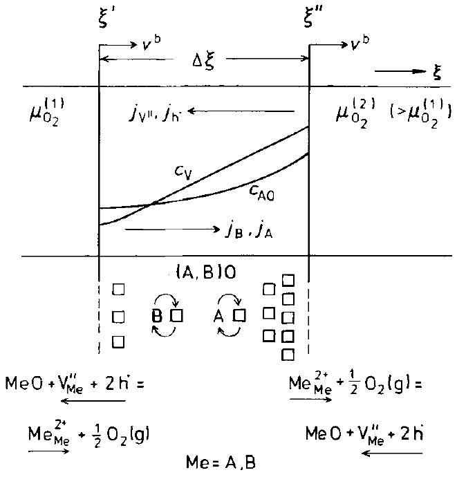
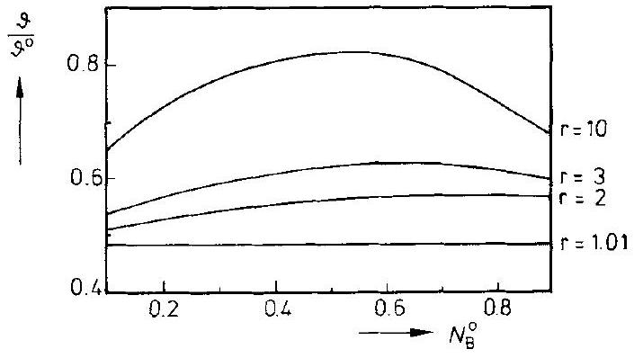
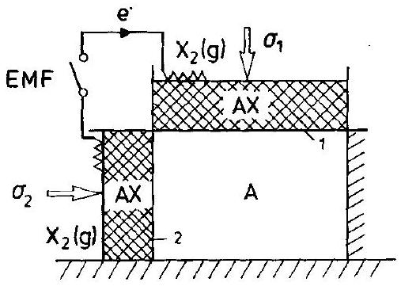
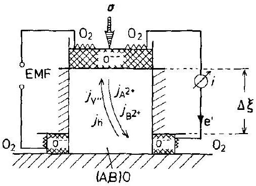
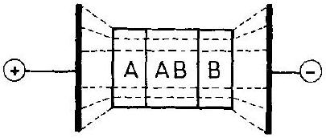
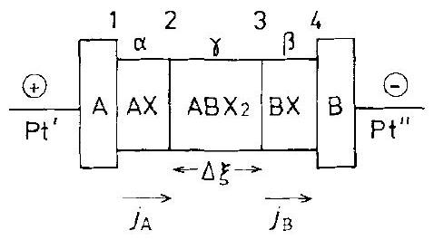

## 8 Solids in Thermodynamic Potential Gradients

### 8.1 Introduction

The content of this chapter is closely related to permeation, which is the transport of a solute across a layer of solvent (or membrane) under the action of a difference in activity. For example, the permeation of hydrogen through a metal foil has been studied, particularly for palladium [F. A. Lewis (1967)] and iron [J. P. Hirth (1980); H. H. Johnson (1988)]. One reason for studying the permeation of hydrogen through iron is to understand the hydrogen embrittlement of steel.

The subject of the following sections is the transport of irregular structure elements ( $=$ point defects) in crystals, as driven by different thermodynamic potentials applied to opposite crystal surfaces. Although this seems to interrupt the sequence of chapters on reactions, we then have the opportunity to investigate in detail the influence of point defect fluxes on the phase boundaries and multicomponent bulk of inhomogeneous crystals. For illustration we mention several simple problems. How does a slab of metal A or of homogeneous alloy $(\mathrm{A}, \mathrm{B})$ behave if a (steady state) flux of vacancies flows across it? How does the crystal of oxide solution (A, B)O react if it is brought between two different oxygen potentials? If point defect fluxes are driven across a polyphase solid, what is the result? What will be different if temperature gradients or inhomogeneous stresses instead of chemical potential gradients are the driving forces?

Problems of this type depend essentially on the transport coefficients and the boundary conditions and less on the chemical nature of the crystal. We prefer to illustrate our investigations using oxide systems and do so for the following reasons. At temperatures where the mobility of SE's allows the oxides to react and equilibrate, most of them are either mixed conductors or semiconductors. This means that both ionic and electronic carriers take part in the transport process, and we thus deal with a fairly general situation. In addition, many oxides play an important role in materials engineering, such as in ceramics. In practice, materials are often not in equilibrium with their immediate surroundings. In other words, gradients of intensive thermodynamic functions of state (such as temperature, stress, chemical or electrochemical potential) act as driving forces on the SE's of crystalline materials. Thermally activated SE's will then drift in the acting gradients. For example, a flux of vacancies which flows across an initially homogeneous (A, B) solid solution tends to separate the components A and B if they have different mobilities. Even decomposition and the formation of new phases are possible. Under practical aspects, this may mean the degradation of multicomponent materials. Therefore, the following discussion concerning crystals in thermodynamic potential gradients has many implications in materials science and technology.

### 8.2 Multicomponent Solids in Chemical Potential Gradients

Let us analyze the experimental situation shown schematically in Figure 8-1 and which resembles the situation depicted in Figure 4-5. A (closed) multicomponent, multiphase system is bounded by two reservoirs $\mathrm{R}_{1}$ and $\mathrm{R}_{2}$ which impose a predetermined $\Delta \mu_{n}$ on the $n^{\text {th }}$ component upon the system. Strictly, the system is closed for $k=n-1$ components and is open for the $n^{\text {th }}$ component. Local equilibrium will be assumed to prevail throughout. We further assume that decomposition does not take place and that the phase boundaries are morphologically stable. We wish to know the distribution of the components in the steady state, which is attained as long as the driving forces are not excessive (relative to $R T$ ). Let us perform the analysis first for a single phase system which is exposed to thermodynamic potential gradients. In Section 8.7, we will return to the more general problem of multiphase systems.

Figure 8-1. Schematic plot of a linearly arranged multicomponent ( $k=1,2, \ldots n$ ), multiphase $(\alpha, \beta, \ldots)$ system with a prefixed chemical potential difference $\Delta \mu_{n}$ across it. $\mathrm{R}_{1}, \mathrm{R}_{2}=$ buffer reservoirs.

We begin with the simplest case. A vacancy flux $j^{0}$ (driven, for example, by inhomogeneous particle radiation) flows across a multicomponent crystal $(k=1,2, \ldots, n)$ and the component fluxes are restricted to one sublattice. We assume no other coupling between the fluxes except the lattice site conservation, which means that we neglect cross terms in the formulation of SE fluxes. (An example of coupling by cross terms is analyzed in Section 8.4.) The steady state condition requires then that the velocities of all the components are the same, independent of which frame of reference has been chosen, that is,

$$
\boldsymbol{v}_{n}(\xi)=\boldsymbol{v}_{k}(\xi), \quad k=1, \ldots, n-1
$$

Explicitly, this is

$$
b_{n} \cdot \nabla \mu_{n}+\left(j^{0} \cdot V_{m}\right) \cdot \frac{b_{n}}{\sum_{k} N_{k} \cdot b_{k}}=b_{k} \cdot \nabla \mu_{k}+\left(j^{0} \cdot V_{m}\right) \cdot \frac{b_{k}}{\sum_{k} N_{k} \cdot b_{k}}
$$

where the first terms on both sides of Eqn. (8.2) are diffusion terms, the second terms are the drift proportions due to the vacancy flux. Equation (8.2) yields

$$
j^{0} \cdot V_{m}=-\frac{b_{n} \cdot \nabla \mu_{n}-b_{k} \cdot \nabla \mu_{k}}{b_{n}-b_{k}} \cdot \sum_{k} N_{k} \cdot b_{k}
$$

There are ( $n-1$ ) equations of type (8.3). Along with the Gibbs-Duhem equation, they can be solved for the unknown chemical potential gradients $\nabla \mu_{k}$. In combination with the ( $n-1$ ) mass conservation equations

$$
\int_{0}^{\Delta \xi} N_{k} \cdot \mathrm{~d} \xi=N_{k}^{0} \cdot \Delta \xi, \quad k=1, \ldots, n-1
$$

one can (after integration) determine the ( $2 n-2$ ) chemical potentials at the two surfaces.

A system which can easily be treated in this way is a single phase binary alloy. For preparation, however, let us consider an A crystal with a vacancy flux driven across it. In view of the fact that $j_{\mathrm{A}}+j_{\mathrm{V}}=0$ in the steady state lattice system, the vacancy flux induces a counterflux of A , which shifts the whole crystal in the direction of the surface where the vacancy source is located. The shift velocity $\boldsymbol{v}^{b}$ is $j_{\mathrm{V}} \cdot V_{\mathrm{A}}$.

For the slab of a binary alloy ( $\mathrm{A}, \mathrm{B}$ ) across which the vacancy flux $j_{\mathrm{V}}=j^{0}$ flows, we derive from Eqn. (8.3)

$$
\int_{\mu_{\mathrm{A}}(0)}^{\mu_{\mathrm{A}}(\xi)} b_{\mathrm{A}} \frac{\left(N_{\mathrm{A}}+\beta\left(1-N_{\mathrm{A}}\right)\right) \cdot\left(\left(1-N_{\mathrm{A}}\right)+\beta \cdot N_{\mathrm{A}}\right)}{\left(1-N_{\mathrm{A}}\right) \cdot(1-\beta) \cdot V_{m}} \cdot \mathrm{~d} \mu_{\mathrm{A}}=j^{0} \cdot \xi
$$

by utilizing the Gibbs-Duhem equation and setting $\beta=b_{\mathrm{B}} / b_{\mathrm{A}}$. If the solid solution (A,B) is thermodynamically ideal so that $\mathrm{d} \mu_{\mathrm{A}}=R T \cdot \mathrm{~d} \ln N_{\mathrm{A}}$, Eqn. (8.5) reads

$$
\int_{N_{\mathrm{A}}(0)}^{N_{\mathrm{A}}(\xi)} b_{\mathrm{A}} \frac{\left(N_{\mathrm{A}}+\beta\left(1-N_{\mathrm{A}}\right)\right) \cdot\left(\left(1-N_{\mathrm{A}}\right)+\beta \cdot N_{\mathrm{A}}\right)}{N_{\mathrm{A}} \cdot\left(1-N_{\mathrm{A}}\right) \cdot(1-\beta)} \cdot \mathrm{d} N_{\mathrm{A}}=\frac{j^{0} \cdot V_{m}}{R T} \cdot \xi
$$

Along with the conservation of mass, namely

$$
\int_{0}^{\Delta \xi} N_{\mathrm{A}} \cdot \mathrm{~d} \xi=N_{\mathrm{A}}^{0} \cdot \Delta \xi
$$

Eqn. (8.6) describes the steady state concentration profile of an ( $\mathrm{A}, \mathrm{B}$ ) alloy which has been exposed to the stationary vacancy flux $j^{0}$. The result is particularly simple if the mobilities, $b_{i}$, are independent of composition, that is, if $\beta=$ constant. From Eqn. (8.6), we infer that, depending on the ratio of the mobilities $\beta$, demixing can occur in two directions (either A or B can concentrate at the surface acting as the vacancy source). The demixing strength is proportional to $j^{0} \cdot(1-\beta) / R T$, and thus directly proportional to the vacancy flux density $j^{0}$, and to the reciprocal of the absolute temperature, $1 / T$. For $\beta=1$, there is no demixing.

We proceed by considering a slab of an oxide crystal AO and assume that a cation vacancy flux is driven across it. In contrast to the single sublattice alloy discussed above, where the vacancies have been introduced into the lattice as an independent component, the vacancy flux $j^{0}$ in AO can be induced by different oxygen activities at the two opposite surfaces. At the oxidizing surface, the defect reaction is $\frac{1}{2} \cdot \mathrm{O}_{2}= \mathrm{O}_{\mathrm{O}}^{\times}+\mathrm{V}_{\mathrm{A}}^{\prime \prime}+2 \cdot \mathrm{~h}^{\bullet}$. In semiconducting AO, the flux of ionized A vacancies is compen-
sated for by a simultaneous and unidirectional flux of electron holes. At the reducing surface, the defect reaction is reversed. The result is an addition of AO lattice molecules on the oxidizing surface, while they are subtracted from the reducing surface. Hence, the crystal is shifted as a whole toward the cation vacancy source ( $v^{b}= j_{\mathrm{V}} \cdot V_{\mathrm{AO}}$ ), although the oxygen ions in AO are (almost) immobile.

However, a shift of the AO crystal does not always occur in gradients. If, for example, in the oxygen potential gradient, cations are immobile and anions are the mobile species (e.g., in $\mathrm{UO}_{2}$ ), the cation sublattice is a closed subsystem and thus cannot be shifted. Therefore, if oxygen is transported via anionic (plus electronic) defects across the AO slab, the whole crystal is stationary. Likewise, if the solid solution (A, B)O is exposed to an oxygen potential gradient and transport is by way of anionic point defects, there is again no crystal shift.

Figure 8-2. Steady state fluxes, component concentrations and phase boundary reactions for ( $\mathrm{A}, \mathrm{B}$ ) O exposed to $\Delta \mu_{\mathrm{O}_{2}}$.

In the next step, we discuss the demixing of semiconducting oxide solid solutions (A,B)O as illustrated in Figure 8-2. Instead of formulating the constant cation vacancy flux as in the steady state condition of Eqn. (8.1), let us express this condition explicitly and note that the frame connected to the oxide sample surface moves with the same velocity as the components so that the composition does not change with time

$$
\frac{j_{\mathrm{A}}}{c_{\mathrm{A}}}=\frac{j_{\mathrm{B}}}{c_{\mathrm{B}}}=v^{b}
$$

The cation fluxes can be expressed as usual using Eqn. (4.49). If we consider the simplest case by neglecting all flux couplings other than those through site conservation and electroneutrality, Eqn. (8.8) yields (see Eqn. (4.99))

$$
b_{\mathrm{A}} \cdot \nabla \eta_{\mathrm{A}^{2+}}=b_{\mathrm{B}} \cdot \nabla \eta_{\mathrm{B}^{2+}}
$$

Let us insert the definitions $\nabla \eta_{i}=\nabla \mu_{i}+z_{i} \cdot F \cdot \varphi$, noting that $\nabla \mu_{\mathrm{A}^{2+}}=\nabla \mu_{\mathrm{AO}}-\nabla \mu_{\mathrm{O}^{2-}}$ and $\nabla \mu_{\mathrm{B}^{2+}}=\nabla \mu_{\mathrm{BO}}-\nabla \mu_{\mathrm{O}^{2-}}$. If we then replace $\nabla \mu_{\mathrm{O}^{2-}}$ by $\nabla \mu_{\mathrm{O}}+2 \cdot \nabla \mu_{\mathrm{e}}$ and recognize that in a semiconductor $\nabla \eta_{\mathrm{e}} \cong 0$, we obtain from Eqn. (8.9)

$$
b_{\mathrm{A}}\left(\nabla \mu_{\mathrm{AO}}-\nabla \mu_{\mathrm{O}}\right)=b_{\mathrm{B}}\left(\nabla \mu_{\mathrm{BO}}-\nabla \mu_{\mathrm{O}}\right)
$$

Equation (8.10) can be further simplified by the Gibbs-Duhem equation for the solid solution (A, B)O. As a result, the differential equation for the steady state demixing profile is found to be

$$
\mathrm{d} N_{\mathrm{AO}}=\frac{N_{\mathrm{AO}} \cdot\left(1-N_{\mathrm{AO}}\right) \cdot(1-\beta)}{\left(1-N_{\mathrm{AO}}\right)+\beta \cdot N_{\mathrm{AO}}} \cdot \mathrm{~d}\left(\frac{\mu_{\mathrm{O}}}{R T}\right) ; \quad \beta=\frac{b_{\mathrm{B}}}{b_{\mathrm{A}}}
$$

In many cases, $\beta$ is rather insensitive to the composition ( $N_{\mathrm{AO}}$ ) because both $\mathrm{A}^{2+}$ and $\mathrm{B}^{2+}$ are rendered mobile by the same vacancies in the same sublattice. In deriving Eqn. (8.11), we have assumed that ( $\mathrm{A}, \mathrm{B}$ ) O is an ideal quasi-binary solid solution. Analogous to Eqn. (8.6), Eqn. (8.11) has to be integrated under the restricting condition of the conservation of cation species A and B . There is no analytical solution to this problem, but a numerical solution has been presented in [H. Schmalzried, et al. (1979)].

The physical reason for the $(\mathrm{A}, \mathrm{B}) \mathrm{O}$ demixing process is always the difference in the mobilities of the cations. This is reflected in Eqn. (8.11) where $\beta$ is the only kinetic parameter, and $\mathrm{d} N_{\mathrm{AO}}=0$ for $\beta=1$. Let us emphasize this fact by a somewhat different argument. The cation flux equation $j_{\mathrm{A}}^{2+}=-c_{\mathrm{A}} \cdot b_{\mathrm{A}} \cdot \nabla \eta_{\mathrm{A}^{2+}}$ can be rewritten as

$$
j_{\mathrm{A}^{2+}}=-c_{\mathrm{A}} \cdot b_{\mathrm{A}} \cdot \nabla \mu_{\mathrm{A}}
$$

where $\nabla \mu_{\mathrm{A}}$ is the chemical potential gradient of component A . Equation (8.12) is valid because ( $\left.b_{\text {ion }} \cdot c_{\text {ion }}\right) \ll\left(b_{\mathrm{h}} \cdot c_{\mathrm{h}}\right.$ ) in a semiconducting crystal, which implies that under open circuit conditions, $\nabla \mu_{\mathrm{h}} \rightarrow 0$ or, equivalently, $\nabla \mu_{\mathrm{h}} \cong-F \cdot \nabla \varphi$. Therefore, if local equilibrium has been attained in the steady state, $\nabla \mu_{\mathrm{A}}=\nabla \mu_{\mathrm{AO}}-\nabla \mu_{\mathrm{O}}$, and thus

$$
j_{\mathrm{A}^{2+}}=-c_{\mathrm{A}} \cdot b_{\mathrm{A}} \cdot\left(\nabla \mu_{\mathrm{AO}}-\nabla \mu_{\mathrm{O}}\right)
$$

However, since $j_{\mathrm{V}}=-b_{\mathrm{V}} \cdot c_{\mathrm{V}} \cdot \nabla \eta_{\mathrm{V}}=-b_{\mathrm{V}} \cdot c_{\mathrm{V}} \cdot \nabla \mu_{\mathrm{O}}$, where $\nabla \eta_{\mathrm{V}}=\nabla \mu_{\mathrm{O}}$ follows from the equilibrium condition of the defect reaction $\frac{1}{2} \mathrm{O}_{2}=\mathrm{O}_{\mathrm{O}}^{2-}+\mathrm{V}_{\mathrm{A}}^{\prime}+\mathrm{h}^{\bullet}$, and furthermore since $b_{\mathrm{V}} \cdot c_{\mathrm{V}}=\left(b_{\mathrm{B}} \cdot c_{\mathrm{A}}+b_{\mathrm{A}} \cdot c_{\mathrm{B}}\right)$ in essence states the equivalence of counting diffusive jumps in the cation sublattice in two different ways, we can immediately rewrite Eqn. (8.13) as

$$
j_{\mathrm{A}^{2+}}=-\left(b_{\mathrm{A}} \cdot c_{\mathrm{A}} \cdot \nabla \mu_{\mathrm{AO}}+\frac{b_{\mathrm{A}} \cdot c_{\mathrm{A}}}{b_{\mathrm{A}} \cdot c_{\mathrm{A}}+b_{\mathrm{B}} \cdot c_{\mathrm{B}}} \cdot j_{\mathrm{V}}\right)
$$

Equation (8.14) demonstrates once more that the cation flux caused by the oxygen potential gradient consists of two terms: 1) the well known diffusional term, and 2) a drift term which is induced by the vacancy flux and weighted by the cation transference number. We note the equivalence of the formulations which led to Eqns. (8.2) and (8.14). Since $\boldsymbol{v}^{b}=j_{\mathrm{V}} \cdot V_{m}$, we may express the drift term by the shift velocity $\boldsymbol{v}^{b}$ of the crystal. Let us finally point out that this segregation and demixing effect is purely kinetic. Its magnitude depends on $\beta=b_{\mathrm{B}} / b_{\mathrm{A}}$, the cation mobility ratio. It is in no way related to the thermodynamic stability ( $\Delta G_{\mathrm{AO}}^{0}, \Delta G_{\mathrm{BO}}^{0}$ ) of the component oxides AO and BO . This will become even clearer in the next section when we discuss the kinetic decomposition of stoichiometric compounds.

The result of a particular demixing experiment on $(\mathrm{Mg}, \mathrm{Co}) \mathrm{O}$ is shown in Figure 8-3a [H. Schmalzried, W. Laqua (1981)]. We see that an oxygen partial pressure ratio of only three ( $p_{\mathrm{O}_{2}}^{\prime \prime} / p_{\mathrm{O}_{2}}^{\prime}=3$ ) for the two opposite surfaces of the crystal results in a $15-20 \%$ demixing of ( $\mathrm{Mg}, \mathrm{Co}$ ) O . The mobility ratio $b_{\mathrm{Co}} / b_{\mathrm{Mg}}$ is $c a$. 10 . Also, the corresponding (schematic) reaction path in a $\mu_{\mathrm{O}} v s$. composition diagram of the A-B-O system is shown in Figure 8-3b.

a)

b) $\quad \longrightarrow \bar{N}_{B}=\frac{N_{B}}{N_{A}+N_{B}}$

Figure 8-3. a) Experimental and calculated demixing profiles for ( $\mathrm{Mg}, \mathrm{Co}$ ) O under steady state conditions in an oxygen potential gradient ( $t=126 \mathrm{~h}$ at $T=1439^{\circ} \mathrm{C} ; p_{\mathrm{O}_{2}}^{\prime \prime} / p_{\mathrm{O}_{2}}^{\prime}=3$ ) and b) its steady state reaction path.

Finally, we mention that the ( $\mathrm{Mg}, \mathrm{Co}$ ) O crystal surface with the lower oxygen potential is morphologically unstable. Therefore, in a strict sense the boundary conditions (which have been tacitly assumed to be stationary) are not time-independent. This phenomenon will be discussed further in Chapter 11.

In concluding, let us comment on the time needed to attain the steady state after establishing the surface activities. Two transient processes having different relaxation times occur: 1) the steady state vacancy concentration profile builds up and 2) the component demixing profile builds up until eventually the system becomes truly stationary. Even if the vacancies have attained a (quasi-) steady state, their drift flux is not stationary until the demixing profile has also reached its steady state. This time dependence of the vacancy drift is responsible for the difficulties that arise when the transient transport problem must be solved explicitly, see, for example, [G. Petot-Ervas, et al. (1992)].

If we could arrange the demixing experiment (Fig. 8-2) such that the vacancy flux (caused by the activity difference at opposite surfaces) remains constant and the crystal therefore shifts with constant velocity, we could calculate the time required to attain the steady state with

$$
\tau=\frac{\Delta \xi^{2}}{2 \cdot \bar{D}_{\mathrm{V}}} \cdot \frac{\gamma}{N_{\mathrm{V}}\left(\xi^{\prime \prime}\right)}
$$

where $y$ is a numerical factor which depends on $\beta$ and composition $N_{\mathrm{AO}}$ and is of the order of unity. Since $D_{\mathrm{V}} \cdot N_{\mathrm{V}}=D_{\text {cation }}$, we can see that the characteristic time $\tau$ is essentially the time which a cation needs for a diffusional displacement corresponding to the sample thickness $\Delta \xi$.

Kinetic demixing stems from activity differences established between the opposite surfaces. These differences can be produced in various ways. In this section, we applied buffers with different chemical potentials. Other possibilities are activity changes through temperature gradients and activity changes through stress gradients. These situations will be discussed in Sections 8.5 and 8.6.

### 8.3 Kinetic Decomposition of Compounds in Chemical Potential Gradients

We continue the discussion of multicomponent crystals placed in the potential chemical gradient of a component. Let us investigate what happens when a nearly stoichiometric compound crystal is brought between different potentials of its nonmetallic component (e.g., $\mathrm{AO} \cdot \mathrm{B}_{2} \mathrm{O}_{3}$ between two different oxygen potentials). These two potentials are chosen to fall inside the stability field of the spinel phase so that the spinel will be neither reduced nor oxidized thermodynamically. We will demonstrate that the spinel can nevertheless decompose in the oxygen potential gradient. This decomposition is a purely kinetic effect and has therefore been named kinetic decomposition.

Figure 8-4. Kinetic decomposition scheme of the stoichiometric compound $\mathrm{AB}_{2} \mathrm{O}_{4}=\mathrm{AO} \cdot \mathrm{B}_{2} \mathrm{O}_{3} ; D_{\mathrm{A}}>1.5 D_{\mathrm{B}} . \mathrm{AO}$ and $\mathrm{B}_{2} \mathrm{O}_{3}$ are decomposition products.

The kinetic decomposition process is illustrated in Figure 8-4. In order to define the transport coefficients, we assume that the spinel is a semiconducting oxide with immobile oxygen ions. As before, the flux equations will then have the following forms

$$
\begin{gathered}
j_{\mathrm{A}^{2+}}=j_{\mathrm{A}}=-c_{\mathrm{A}} \cdot b_{\mathrm{A}} \cdot\left(\nabla \mu_{\mathrm{AO}}-\nabla \mu_{\mathrm{O}}\right) \\
j_{\mathrm{B}^{3+}}=j_{\mathrm{B}}=-c_{\mathrm{B}} \cdot b_{\mathrm{B}} \cdot\left(\frac{1}{2} \cdot \nabla \mu_{\mathrm{B}_{2} \mathrm{O}_{3}}-\frac{3}{2} \cdot \nabla \mu_{\mathrm{O}}\right)
\end{gathered}
$$

Here we have chosen AO, $\mathrm{B}_{2} \mathrm{O}_{3}$, and oxygen O as components of the ternary compound $\mathrm{AB}_{2} \mathrm{O}_{4}$ (or rather ( $\left.\mathrm{A}, \mathrm{B}\right)_{3} \mathrm{O}_{4+\delta}$ ). Since $\mu_{\mathrm{AO}}+\mu_{\mathrm{B}_{2} \mathrm{O}_{3}} \cong \mu_{\mathrm{AB}_{2} \mathrm{O}_{4}}^{0}$ (which is the Gibbs-Duhem equation integrated under the assumption that the spinel is strictly stoichiometric and stress effects can be neglected), we obtain from the cation fluxes and the steady state condition $j_{\mathrm{A}} / c_{\mathrm{A}}=j_{\mathrm{B}} / c_{\mathrm{B}}=\boldsymbol{v}^{b}$

$$
\nabla \mu_{\mathrm{AO}}=\frac{1-\frac{2}{3} \cdot \beta}{1+\frac{1}{2} \cdot \beta} \cdot \nabla \mu_{\mathrm{O}}
$$

This relation is analogous to Eqns. (8.10) and (8.11). In contrast to solid solutions, however, stoichiometric compounds cannot demix since their composition is fixed. Instead, they may decompose. In order to find the $\Delta \mu_{\mathrm{O}}\left(\Delta \mu_{\mathrm{O}_{2}}\right)$ at which decomposition begins, we integrate Eqn. (8.17) and note again that $\beta$ is often rather insensitive to changes in $\mu_{\mathrm{O}}$. For constant $\beta$, we have

$$
\Delta \mu_{\mathrm{AO}}=\frac{1-\frac{2}{3} \beta}{1+\frac{1}{2} \beta} \cdot \frac{\Delta \mu_{\mathrm{O}_{2}}}{2}
$$

which is the AO component activity change induced by the oxygen potential difference across the spinel. The spinel decomposes into its component AO and $\mathrm{B}_{2} \mathrm{O}_{3}$ if $\Delta \mu_{\mathrm{AO}}$ exceeds the spinel stability limit, which is its Gibbs energy of formation. Consequently,

$$
\Delta \mu_{\mathrm{AO}}(\max )=\Delta G_{\mathrm{AB}_{2} \mathrm{O}_{4}}^{0}
$$

In combination with Eqn. (8.18), we can now calculate the oxygen potential difference across the sample at which kinetic decomposition of the spinel $\mathrm{AB}_{2} \mathrm{O}_{4}$ supposedly takes place

$$
\ln \frac{p_{\mathrm{O}_{2}}^{\prime \prime}}{p_{\mathrm{O}_{2}}^{\prime}}>2 \cdot \frac{1+\frac{1}{2} \cdot \beta}{1-\frac{3}{2} \cdot \beta} \cdot \frac{\Delta G_{\mathrm{AB}_{2} \mathrm{O}_{4}}^{0}}{R T}
$$

Here, $p_{\mathrm{O}_{2}}^{\prime}$ and $p_{\mathrm{O}_{2}}^{\prime \prime}$ are the oxygen pressures at the opposite surfaces of the spinel sample. If $b_{\mathrm{A}}>\frac{3}{2} \cdot b_{\mathrm{B}}$, the decomposed binary reactant AO will be formed at the high oxygen potential side (Fig. 8-4), whereas if $b_{\mathrm{A}}<\frac{3}{2} \cdot b_{\mathrm{B}}$, AO will be formed at the low oxygen potential side, provided that $\Delta \mu_{\mathrm{O}_{2}}>\Delta \mu_{\mathrm{O}_{2}}$ (max). $\mathrm{B}_{2} \mathrm{O}_{3}$ will be formed at the respective opposite sides. Experiments have been performed that confirm this mode of decomposition [W. Laqua, H. Schmalzried (1983)]. In concluding, we point out that, in principle, kinetic decomposition occurs in all semiconducting compounds for which $b_{\mathrm{A}} \neq b_{\mathrm{B}}$, independent of their anionic transference.

### 8.4 Cross Effects

The phenomena described in the previous sections have been formally analyzed under the assumption that no direct coupling exists between the fluxes $j_{i}$ and the forces $X_{k}(k \neq i)$. Flux coupling only arose from site and electric charge conservation. In other words, we have neglected all the off-diagonal elements in the matrix of transport coefficients $(L)$. Let us now give up this simplifying assumption and consider thermoelectric effects (the Seebeck effect, the Peltier effect) or the LudwigSoret effect (demixing due to heat flow), since they belong to this category of cross phenomena. Since we are mainly concerned with the transport of matter and elec-

Figure 8-5. Set-up for the application of chemical and electrical potential gradients to investigate the coupling of electronic and ionic fluxes in semiconducting AO. 1) Gas gap, 2) electrolyte.

trical charge, we will exemplify cross effects by the coupling of ionic to electronic fluxes. To this end, we not only impose a component chemical potential difference upon the crystal, but an electrochemical potential difference for the electrons as well. The driving forces for the matter and the electronic carriers are then both predetermined and the flux coupling through cross effects can be investigated under steady state conditions. A suitable experiment is illustrated in Figure 8-5.

However, before going into this problem, let us briefly extend the treatment on steady state demixing given in Section 8.2 and depicted in Figure 8-2 by including cross effects. We denote the transport coefficients by $L_{i j}$ and replace the fluxes $j_{i}=L_{i} \cdot \nabla \eta_{i}$ by $j_{i}=L_{i i} \cdot \nabla \eta_{i}+\sum_{j} L_{i j} \cdot \nabla \eta_{j}(i, j=\mathrm{A}, \mathrm{B})$ in the steady state condition (Eqn. (8.8)). In contrast to Eqn. (8.10), the result is [H. Schmalzried, W. Laqua (1981); M. Martin (1991)]

$$
\nabla\left(\mu_{\mathrm{AO}}-\mu_{\mathrm{O}}\right)=\Theta \cdot \nabla\left(\mu_{\mathrm{BO}}-\mu_{\mathrm{O}}\right) ; \Theta=\frac{c_{\mathrm{A}}-\left(\frac{L_{\mathrm{AB}}}{L_{\mathrm{BB}}}\right) \cdot c_{\mathrm{B}}}{c_{\mathrm{A}} \cdot\left(\frac{L_{\mathrm{AB}}}{L_{\mathrm{BB}}}\right)-c_{\mathrm{B}} \cdot\left(\frac{L_{\mathrm{AA}}}{L_{\mathrm{BB}}}\right)}
$$

For ideal solid solutions which demix in an oxygen potential gradient we obtain from Eqn. (8.21)

$$
\nabla N_{\mathrm{AO}}=-\vartheta \cdot \frac{\nabla \mu_{\mathrm{O}_{2}}}{R T} ; \quad \vartheta=2 \cdot N_{\mathrm{BO}} \cdot N_{\mathrm{AO}} \cdot \frac{1}{\left(\frac{\theta}{\theta-1}\right)-N_{\mathrm{BO}}}
$$

Equation (8.22) is the extended version of Eqn. (8.11). Manning's random alloy model [J. R. Manning (1968)] can be used to evaluate the transport coefficient $L_{\mathrm{AB}}$ in terms of tracer diffusion coefficients $D_{\mathrm{A}}^{*}$ and $D_{\mathrm{B}}^{*}$ (see also Section 5.4.3). If ( $i, j$ ) $=(\mathrm{A}, \mathrm{B})$, then

$$
L_{i j}=\frac{c_{i} \cdot D_{i}^{*}}{R T} \cdot\left(\delta_{i j}+\frac{1-f_{0}}{f_{0}} \cdot \frac{c_{j} \cdot D_{j}^{*}}{c_{i} \cdot D_{i}^{*}+c_{j} \cdot D_{j}^{*}}\right)
$$

where $\delta_{i j}$ is the Kronecker symbol and $f_{0}$ the geometrical (Bardeen-Herring) correlation factor for self-diffusion in the cation sublattice (see Section 5.2.2). The influence of cross terms on the demixing profiles can then be explicitly calculated as illustrated in Figure 8-6 [M. Martin (1991)]. The ratio of the jump frequencies ( $r=\nu_{\mathrm{A}} / \nu_{\mathrm{B}}$ ) in Figure 8-6 can be obtained from the tracer diffusion coefficients $D_{i}^{*}=g \cdot a^{2} \cdot v_{i} \cdot f_{i}$ (see Section 5.1.4).

Let us now turn to cross effects proper between electronic and ionic fluxes. Considering the general nature of cross effects in crystals, our analysis will be performed in some depth. It gives us the tools for a correct application of SE transport theory (see Section 4.2.2) and explains to some extent the physical meaning of the cross coefficients. Let us illustrate the problem using a semiconducting binary compound such as a transition-metal oxide. In $\mathrm{A}_{1-\delta} \mathrm{O}$ crystals with the B 1 structure, oxygen

Figure 8-6. The ratio of demixing parameters $\vartheta\left(L_{\mathrm{AB}} \neq 0\right) / \vartheta^{0}\left(L_{\mathrm{AB}}=0\right)$, calculated with the Manning model, as a function of $N_{\mathrm{B}}^{0}$. Curve parameter is the jump frequency ratio $r=\nu_{\mathrm{A}} / \nu_{\mathrm{B}} . \nu_{i}$ is obtained from $D_{i}^{*}=g \cdot \Delta \xi^{2} \cdot v_{i} \cdot f_{i}$ [M. Martin (1991)].

ions in the dense packed fcc sublattice are effectively immobile. The mobile irregular SE's to be considered in the transport processes are therefore $\mathrm{V}_{\mathrm{A}}^{\prime \prime}, \mathrm{V}_{\mathrm{A}}^{\prime}$, and $\mathrm{V}_{\mathrm{A}}^{\times}$as the atomic point defects, and $\mathrm{h}_{\mathrm{v}}^{*}, \mathrm{e}_{\mathrm{c}}^{\prime}$ as the equivalent electronic elements in the valence (v) and conduction (c) bands. The regular SE's are $\mathrm{A}_{\mathrm{A}}^{\times}, \mathrm{O}_{\mathrm{O}}^{\times}, \mathrm{e}_{\mathrm{v}}^{\times}, \mathrm{h}_{\mathrm{c}}^{\times}$, corresponding to $\mathrm{A}^{2+}$ on A-sites, $\mathrm{O}^{2-}$ on O-sites, filled states in the valence band and empty states in the conduction band. Regular and irregular SE's may interact with each other to form associates. A localized electron hole (i.e., a cation $\mathrm{A}^{3+}$ on a cation lattice site) is formed, for example, when a delocalized electron hole $\mathrm{h}_{\mathrm{v}}^{\bullet}$ is self-trapped at $\mathrm{A}_{\mathrm{A}}^{\times}$

$$
\mathbf{A}_{\mathrm{A}}^{\times}+h_{\mathrm{y}}^{\bullet}=\mathbf{A}_{\mathrm{A}}^{\bullet}+\mathrm{e}_{\mathrm{v}}^{\times}
$$

Singly ionized and neutral cation vacancies can form in a similar way

$$
\begin{aligned}
\mathrm{V}_{\mathrm{A}}^{\prime \prime}+\mathrm{h}_{\mathrm{v}}^{\bullet} & =\mathrm{V}_{\mathrm{A}}^{\prime}+\mathrm{e}_{\mathrm{v}}^{\times} \\
\mathrm{V}_{\mathrm{A}}^{\prime}+\mathrm{h}_{\mathrm{v}}^{\bullet} & =\mathrm{V}_{\mathrm{A}}^{\times}+\mathrm{e}_{\mathrm{v}}^{\times}
\end{aligned}
$$

Thus, nine SE's constitute the relevant set \{\} needed for the description of macroscopic transport in this system

$$
U=A_{A}^{\times}, A_{A}^{\bullet}, V_{A}^{\times}, V_{A}^{\prime}, V_{A}^{\prime \prime}, h_{v}^{\cdot}, e_{v}^{\times}, e_{\mathrm{c}}^{\prime}, h_{\mathrm{c}}^{\times}
$$

We label these SE's as $i=1,2, \ldots, 9$.
The transport coefficients $l_{i k}(i, k=1,2, \ldots, 9)$ define the linear relationships between the forces and the fluxes

$$
j_{i}=\sum_{i=1}^{9} l_{i k} \cdot X_{k}
$$

Equation (8.28) states that a flux of SE $i$ can be driven by any force $X_{k} (k=1,2, \ldots, 9)$. However, the elements of the transport matrix $l$ are not independent due to the constraints acting on the fluxes $j_{i}$. The derivation of the independent relations was originally given for the case of linearly dependent fluxes by [S. R. de Groot (1952); S. R. de Groot, P. Mazur (1962)] and will be adopted here.

The conservation of lattice sites requires that

$$
\sum_{i=1}^{5} j_{i}=0
$$

Equation (8.29) implies that the fluxes are defined in the lattice reference frame. Inserting Eqn. (8.28) into Eqn. (8.29) and noting that, in principle, the forces $X_{k} (k=1,2, \ldots, 9)$ can be varied independently, the following relations are obtained

$$
\sum_{i=1}^{5} l_{i k}=0
$$

The fluxes of electrons and holes in the valence and conduction band respectively, are not independent either (number of states conservation)

$$
\sum_{i=6}^{7} j_{i}=0 ; \quad \sum_{i=8}^{9} j_{i}=0
$$

from which we derive additional relations for the transport coefficients

$$
\sum_{i=6}^{7} l_{i k}=0 ; \quad \sum_{i=8}^{9} l_{i k}=0 ; \quad k=1 \ldots 9
$$

Equations (8.30) and (8.32) constitute 27 relations for the transport coefficients $l_{i k}$. Further relations can be obtained by eliminating the three fluxes $j_{5}, j_{7}$, and $j_{9}$ from the entropy production equation (4.10) by using Eqns. (8.29) and (8.31)

$$
\sigma=\sum_{i=1}^{4} j_{i} \cdot\left(X_{i}-X_{5}\right)+j_{6} \cdot\left(X_{6}-X_{7}\right)+j_{8} \cdot\left(X_{8}-X_{9}\right)
$$

For $X_{i}=X_{5}(i=1,2,3,4), X_{6}=X_{7}$, and $X_{8}=X_{9}$, the entropy production $\sigma$ vanishes, which is only possible if the fluxes

$$
j_{i}=\sum_{k=1}^{5} l_{i k} \cdot X_{5}+\sum_{k=6}^{7} l_{i k} \cdot X_{7}+\sum_{k=8}^{9} l_{i k} \cdot X_{9}
$$

$(i=1,2, \ldots, 9)$ vanish as well, leading to $(i=1,2, \ldots, 9)$

$$
\sum_{k=1}^{5} l_{i k}=0 ; \quad \sum_{k=6}^{7} l_{i k}=0 ; \quad \sum_{k=8}^{9} l_{i k}=0
$$

Equations (8.30), (8.32), and (8.35) constitute 54 relations between the transport coefficients $l_{i k}$, but not all of them are independent. In summary, 36 elements of the transport matrix $l$ remain unaffected by the constraints formulated in Eqns. (8.30), (8.32), and (8.35). Consequently, the reduced $6 \times 6$ matrix corresponds to six independent fluxes $j_{i}$. Let us choose them by setting $i=1,2,3,4,6,8$. The vacancy fluxes
( $\mathrm{V}_{\mathrm{A}}^{\prime \prime}, i=5$ ), the electron fluxes in the valence band ( $\mathrm{e}_{\mathrm{v}}^{\times}, i=7$ ), and the electron hole fluxes in the conduction band ( $\mathrm{h}_{\mathrm{c}}^{\times}, i=9$ ) are thus eliminated. We now can apply the Onsager relations

$$
l_{i k}=l_{k i} ; \quad i, k=1,2,3,4,6,8
$$

which provide us with 21 independent transport coefficients $l_{i k}$.
Equally, the number of forces $X_{i}(i=1,2, \ldots, 9)$ can be reduced if local equilibrium prevails (see also [R. A. Allnatt, A. B. Lidiard (1993), Chapts. 3 and 5]). The electronic equilibrium $\mathrm{e}_{\mathrm{v}}^{\times}+\mathrm{h}_{\mathrm{c}}^{\times}=\mathrm{h}_{\mathrm{v}}^{\bullet}+\mathrm{e}_{\mathrm{c}}^{\prime}$ yields

$$
X_{7}+X_{9}=X_{6}+X_{8}
$$

while the ionization equilibria formulated in Eqns. (8.24)-(8.26) yield

$$
\begin{aligned}
& X_{1}+X_{6}=X_{2}+X_{7} \\
& X_{5}+X_{6}=X_{4}+X_{7} \\
& X_{4}+X_{6}=X_{3}+X_{7}
\end{aligned}
$$

Therefore, Eqn. (8.28) can be written as

$$
j_{i}=\left(l_{i 1}+l_{i 2}\right) \cdot\left(X_{1}-X_{5}\right)+\left(l_{i 2}+2 \cdot l_{i 3}+l_{i 4}+l_{i 6}-l_{i 8}\right) \cdot\left(X_{6}-X_{7}\right)
$$

which means that only two force combinations exist for the six independent fluxes $j_{i}(i=1,2,3,4,6,8)$. These new forces act on two building units: the cation $\mathrm{A}^{2+}$ and the electron hole $h^{\circ}$. They are defined via the following SE reactions

$$
\begin{aligned}
\mathrm{A}^{2+} & =\mathrm{A}_{\mathrm{A}}^{\times}-\mathrm{V}_{\mathrm{A}}^{\prime \prime} ; \quad X\left(\mathrm{~A}^{2+}\right)=X_{1}-X_{5} \\
\mathrm{~h}^{*} & =\mathrm{h}_{\mathrm{V}}^{*}-\mathrm{e}_{\mathrm{v}}^{\times} ; \quad X\left(\mathrm{~h}^{*}\right)=X_{6}-X_{7}
\end{aligned}
$$

$\mathrm{A}^{2+}$ and $\mathrm{h}^{\cdot}$ are combinations of SE's which satisfy the constraints of Eqns. (8.29) and (8.31). The forces $X\left(\mathrm{~A}^{2+}\right)$ and $X\left(\mathrm{~h}^{*}\right)$ are the negative gradients of the corresponding electrochemical potentials. The electronic building unit $\mathrm{h}^{\circ}$ can also be defined as $\mathrm{A}_{\mathrm{A}}^{*}-\mathrm{A}_{\mathrm{A}}^{\times}$and has been chosen because the AO oxide in question is normally a $p$-type semiconductor.

In a macroscopic transport experiment, only certain combinations of fluxes can be determined. This is the (ionic) flux of A

$$
j_{\mathrm{A}}=j_{1}+j_{2}
$$

and the electron hole flux

$$
j_{\mathrm{h}}=j_{2}+2 \cdot j_{3}+j_{4}+j_{6}-j_{8}
$$

From Eqns. (8.41), (8.44), and (8.45), we have

$$
\begin{aligned}
j_{\mathrm{A}} & =L_{\mathrm{AA}} \cdot X_{\mathrm{A}}+L_{\mathrm{Ah}} \cdot X_{\mathrm{h}} \\
j_{\mathrm{h}} & =L_{\mathrm{hA}} \cdot X_{\mathrm{A}}+L_{\mathrm{hh}} \cdot X_{\mathrm{h}}
\end{aligned}
$$

with

$$
\begin{aligned}
& L_{\mathrm{AA}}=\sum_{i=1}^{2}\left(l_{i 1}+l_{i 2}\right) \\
& L_{\mathrm{hA}}=\sum_{i=1}^{2} \sum_{k=1}^{9} l_{i k} \cdot \beta_{k}=L_{\mathrm{Ah}} \\
& L_{\mathrm{hh}}=\sum_{i=1}^{9} \sum_{k=1}^{9} \beta_{i} \cdot l_{i k} \cdot \beta_{k}
\end{aligned}
$$

$\beta_{i}$ are weighting factors ( $\beta_{1}=\beta_{5}=\beta_{7}=\beta_{9}=0, \beta_{2}=\beta_{4}=\beta_{6}=-\beta_{8}=1, \beta_{3}=2$ ) which count the number of positive electric charges carried by the structure element $i$ during transport. Eqn. (8.49) follows from Eqn. (8.36).

Equations (8.48)-(8.50) define three independent transport coefficients for the two building units (A,h), namely $L_{\mathrm{AA}}, L_{\mathrm{Ah}}$, and $L_{\mathrm{hh}}$, in terms of the 21 independent transport coefficients of the SE set. They are sufficient to describe the transport in $\mathrm{A}_{1-\delta} \mathrm{O}$. The cross coefficient $L_{\mathrm{Ah}}$ expresses the coupling between the ionic and electronic fluxes. If $X\left(h^{*}\right)=0$, the electronic flux is due only to the cross effect and given by

$$
j_{\mathrm{h}}=\frac{L_{\mathrm{hA}}}{L_{\mathrm{AA}}} \cdot j_{\mathrm{A}} ; \quad X_{\mathrm{h}}=0
$$

If $X\left(\mathrm{~A}^{2+}\right)=0$, then the cation flux is due only to the cross effect given by

$$
j_{\mathrm{A}}=\frac{L_{\mathrm{Ah}}}{L_{\mathrm{hh}}} \cdot j_{\mathrm{h}} ; \quad X_{\mathrm{A}}=0
$$

Since the entropy production is positive, the transport coefficients $L_{i k}$ must satisfy the relation $L_{\mathrm{AA}} \cdot L_{\mathrm{hh}}>L_{\mathrm{hA}} \cdot L_{\mathrm{Ah}}$ [S. R. de Groot, P. Mazur (1962)]. This restricts the range for the charges of transport to $\alpha_{\mathrm{A}} \cdot \alpha_{\mathrm{h}}<1$, see Eq. (8.56)ff. We should also add that whereas the $L_{i j}$ are phenomenological coefficients appropriate for the description of the experiments on transport, the $l_{i j}$ relate directly to the SE's (Eqn. (8.28)) and can be derived from lattice dynamics based theoretical calculations.

Experimentally, we can apply to the $\mathrm{A}_{1-\delta} \mathrm{O}$ crystal one independent chemical potential gradient ( $\nabla \mu_{\mathrm{A}}$ or $\nabla \mu_{\mathrm{O}}$ ) and a voltage $U . U$ corresponds to a difference in the electrochemical potential of electron holes: $U \cdot F=\Delta \eta\left(\mathrm{h}^{\bullet}\right)$. The force $X_{\mathrm{A}^{2+}}$ can be written in terms of $\nabla \mu_{\mathrm{O}_{2}}$ and $\nabla \eta\left(\mathrm{h}^{*}\right)$ with the help of the following reactions

$$
\mathrm{A}^{2+}=\mathrm{A}+2 \cdot \mathrm{~h}^{\cdot} ; \mathrm{A}=\mathrm{AO}-\frac{1}{2} \mathrm{O}_{2}
$$

Equations (8.46) and (8.47) yield, along with the equilibrium conditions of Eqn. (8.53), $\left(j_{\mathrm{A}}=j_{\mathrm{A}^{2+}}\right)$,

$$
\begin{aligned}
j_{\mathrm{A}^{2+}} & =L_{\mathrm{AA}} \cdot \frac{1}{2} \cdot \nabla \mu_{\mathrm{O}_{2}}-\left(2 \cdot L_{\mathrm{AA}}+L_{\mathrm{Ah}}\right) \cdot \nabla \eta_{\mathrm{h}} \\
j_{\mathrm{h}} & =L_{\mathrm{hA}} \cdot \frac{1}{2} \cdot \nabla \mu_{\mathrm{O}_{2}}-\left(L_{\mathrm{hh}}+2 \cdot L_{\mathrm{hA}}\right) \cdot \nabla \eta_{\mathrm{h}}
\end{aligned}
$$

Setting $\nabla \mu_{\mathrm{O}_{2}}=0$ and $U=-E \cdot \Delta \xi$, we obtain for a homogeneous crystal of length $\Delta \xi$

$$
\begin{aligned}
& j_{\mathrm{A}^{2+}}=L_{\mathrm{AA}} \cdot\left(2+\alpha_{\mathrm{A}}\right) \cdot F \cdot E \\
& j_{\mathrm{h}}=L_{\mathrm{hh}} \cdot\left(1+2 \cdot \alpha_{\mathrm{h}}\right) \cdot F \cdot E
\end{aligned}
$$

We see that both the ions and the electron holes carry an apparent charge resulting from a combination of their formal charge and their charge of transport. The ratio $\alpha_{\mathrm{A}}=\left(L_{\mathrm{hA}} / L_{\mathrm{AA}}\right)$ might be called the charge of transport since it is analogous to the heat of transport [see, for example, A. R. Allnatt, A. B. Lidiard (1987)] which quantifies the coupling between fluxes of matter and energy. Equally, $\alpha_{\mathrm{h}}=\left(L_{\mathrm{Ah}} / L_{\mathrm{hh}}\right)$ is the charge of transport of the electron holes. Relations between the transport coefficients and experimentally measurable quantities have been worked out [C. Wagner (1975)].

From Eqns. (8.56) and (8.57), we can obtain the electrical conductivity of the crystal and also the ionic transference number.

$$
\begin{gathered}
\sigma=\sum \sigma_{i}=F^{2} \cdot\left(2 \cdot L_{\mathrm{AA}} \cdot\left(2+\alpha_{\mathrm{A}}\right)+L_{\mathrm{hh}} \cdot\left(1+2 \cdot \alpha_{\mathrm{h}}\right)\right) \\
t_{\text {ion }}=\frac{2 \cdot L_{\mathrm{AA}} \cdot\left(2+\alpha_{\mathrm{A}}\right)}{L_{\mathrm{hh}} \cdot\left(1+2 \cdot \alpha_{\mathrm{h}}\right)+2 \cdot L_{\mathrm{AA}} \cdot\left(2+\alpha_{\mathrm{A}}\right)}
\end{gathered}
$$

Of the four coefficients $L_{\mathrm{AA}}, L_{\mathrm{hh}}, \alpha_{\mathrm{A}}$, and $\alpha_{\mathrm{h}}$, only three are independent. In order to determine them, we need a third experimental transport parameter which is chosen to be the tracer diffusion coefficient of the cations. The transport coefficient $L_{\mathrm{AA}}$, in terms of $D_{\mathrm{A}}^{*}$ is (see Section 5.2)

$$
L_{\mathrm{AA}}=\frac{D_{\mathrm{A}}^{*} \cdot c_{\mathrm{A}}}{f \cdot R T}
$$

where $f$ is the geometrical (Bardeen-Herring) correlation factor ( $f=0.781$ for the fcc lattice). A thorough experimental study of cross effects between electronic and ionic carriers in the transition metal oxide CoO has been made [J. Janek (1992); H. I. Yoo, et al. (1993)]. CoO served as a prototype material because its point defect thermodynamics is very well known [R. Tetot, et al. (1994); R. Dieckmann (1977)]. The charge of transport, $\alpha_{\mathrm{Co}}$, was determined to be on the order of -1 , which clearly shows that these cross effects are not at all negligible. Cross effects in metals (electrotransport, thermotransport) have been treated in [H. Wever (1973)].

### 8.5 Demixing Under Non-Hydrostatic Stress

Let us investigate the steady state behavior of multicomponent crystals exposed to uniform but non-hydrostatic stresses. We first introduce some ideas on the thermodynamics of such solids (which will be discussed in more detail in Chapter 14). Solid state galvanic cells can be used to perform the appropriate experiments.

Gibbs [J. W. Gibbs (1878)] showed that a non-hydrostatically stressed solid surrounded (Fig. 8-7) by a fluid (in which it is soluble) is 'entirely determined by the nature and state of the solid' through the relation

$$
\mu_{L}=u_{\mathrm{s}}-T \cdot s_{\mathrm{s}}+\sigma_{\mathrm{n}} \cdot v_{\mathrm{s}}
$$

where $\mu_{L}$ is the chemical potential of the solid with respect to its tendency to dissolve in the fluid; $u_{\mathrm{s}}, s_{\mathrm{s}}$, and $v_{\mathrm{s}}$ are the molar internal energy, entropy, and volume respectively, of the solid, and $\sigma_{\mathrm{n}}$ is the normal stress on the surface (compressive stress is positive). The value of $\sigma_{\mathrm{n}}$ may vary over the surface of the solid. The solid is (formally) in a state of equilibrium. It may deform elastically, but plastic deformation is, of course, excluded because this is irreversible.

Figure 8-7. Solids under non-hydrostatic stress and the surrounding Gibbs-fluids L.

The surrounding fluid (Fig. 8-7) serves two purposes: 1) it transmits the pressure to stress-load the surface and 2) it allows the surface to equilibrate chemically and thus provides $\mu_{L}$ in Eqn. (8.61) with physical meaning. Ideally, the 'Gibbs fluid' has a vanishing buffer capacity for the solid so that after a change in $\sigma_{\mathrm{n}}$, the fluid becomes resaturated with respect to the solid before a noticeable amount of the solid or its surface dissolves. The key to verify Gibbs' relation for solids under non-hydrostatic stress is therefore the existence of such an idealized fluid.

Solid electrolytes may have the requisite properties of a 'Gibbs fluid' [W. Durham, H. Schmalzried (1987)] if 1) their conducting ion corresponds to an atomic component of the solid under stress and 2) they exhibit significant mechanical strength. Typical stress energy densities correspond to electrical potentials in the millivolt range. In order to establish them, only a small fraction of a surface monolayer of the electrolyte needs to dissolve during its equilibration with the stressed solid and
thus the electrolyte acts analogous to an ideal 'Gibbs fluid'. Electrochemical equilibrium allows us to measure (partial) Gibbs energies by the EMF of an appropriate galvanic cell. Since it is (thermodynamically) equivalent to the equilibrium between the crystal surface and a contacting fluid, the chemical potential probed by solid electrolytes is determined by the (chemical) nature and the (stress) state of the solid. Thus, Eqn. (8.61) can be applied.

In order to derive the relation between EMF and the chemical potential difference probed at different surfaces of the stressed solid, we formulate the reversible work and its electrical equivalent. If $z_{\mathrm{A}} \cdot F \cdot \mathrm{~d} n_{\mathrm{A}}$ electric charges are transported across the electrolyte between the two surfaces labeled 1 and 2 in Figure 8-8, the electrical work is

$$
\mathrm{d} W_{\mathrm{e}}=\left(E_{1}-E_{2}\right) \cdot z_{\mathrm{A}} \cdot F \cdot \mathrm{~d} n_{\mathrm{A}}
$$

Figure 8-8. Galvanic cell (schematic) for the determination of the chemical potential difference between surfaces 1 and 2 of non-hydrostatically stressed solids. Cross hatched: solid electrolyte.

The corresponding mechanical work is

$$
\mathrm{d} W_{m}=\left(\sigma_{1}-\sigma_{2}\right) \cdot V_{\mathrm{A}} \cdot \mathrm{~d} n_{\mathrm{A}}
$$

where $V_{\mathrm{A}}$ is the molar volume of A (under stress). Since the two terms must be equal in equilibrium, it follows that

$$
\Delta E=\frac{\Delta \sigma \cdot V_{\mathrm{A}}}{\left(z_{\mathrm{A}} \cdot F\right)}
$$

where $\Delta E=E_{1}-E_{2}$ and $\Delta \sigma=\sigma_{1}-\sigma_{2}$.
The Nabarro-Herring creep in solids is related to Eqn. (8.61). This creep involves the transport of atomic species from regions of higher (compressive) stress to regions of lower stress by means of (lattice) diffusion and has, at first sight, nothing to do with the dissolution of solids into fluids. Creep requires a state of non-equilibrium. The energy change by which it is driven (i.e., the mechanical work derived from moving a volume element of the solid between two points that are differently stressed), however, may be calculated from Eqn. (8.61). To this end, we assume that the transport occurs via a surrounding fluid phase rather than by diffusion across the solid.

We are now able to analyze the demixing of a solid solution $(\mathrm{A}, \mathrm{B}) \mathrm{O}(=\mathrm{MeO})$ exposed to a non-hydrostatic, uniaxial stress as shown in Figure 8-9. If transport occurs

Figure 8-9. Demixing of a solid solution (A, B)O exposed to uniaxial stress. Cross hatched: solid electrolytes.

via the cation vacancies at constant $\mu_{\mathrm{O}_{2}}$, the difference in the vacancy chemical potential between the loaded and the unloaded surfaces of the (homogeneous) solid is

$$
\Delta \mu_{\mathrm{V}}=-\Delta \sigma \cdot V_{m}
$$

since $\Delta \sigma \cdot V_{m}=\Delta \mu_{\mathrm{MeO}}=\Delta \mu_{\mathrm{Me}}=-\Delta \mu_{\mathrm{V}}$ since $\mathrm{Me}+\mathrm{V}_{\mathrm{Me}}=\mathrm{Me}_{\mathrm{Me}}$. Furthermore, $\Delta \mu_{\mathrm{V}}$ induces a vacancy flux as illustrated in Figure 8-9. From $j_{\mathrm{V}}=-c_{\mathrm{V}} \cdot b_{\mathrm{V}} \cdot\left(\Delta \mu_{\mathrm{V}} / \Delta \xi\right)$, we obtain

$$
j_{\mathrm{V}}=c_{\mathrm{V}} \cdot b_{\mathrm{V}} \cdot \frac{\Delta \sigma \cdot V_{m}}{\Delta \xi}
$$

where $\Delta \xi$ is the characteristic distance for the vacancy transport between the loaded and the unloaded surface.

If we identify $j_{\mathrm{V}}$ in Eqn. (8.66) with $j^{0}$ in Eqn. (8.3), we can use Eqn. (8.3) to calculate the (steady state) demixing when a stress driven vacancy flux flows across the solid solution (A, B)O. At a fixed oxygen potential, we obtain from the steady state condition

$$
\nabla \mu_{\mathrm{AO}}=j_{\mathrm{V}} \cdot\left(b_{\mathrm{B}}-b_{\mathrm{A}}\right) \cdot \frac{c_{\mathrm{B}}}{\left(c_{\mathrm{A}} b_{\mathrm{A}}+c_{\mathrm{B}} \cdot b_{\mathrm{B}}\right) \cdot\left(c_{\mathrm{B}} \cdot b_{\mathrm{A}}+c_{\mathrm{A}} \cdot b_{\mathrm{B}}\right)}
$$

Equation (8.67) can be integrated. If demixing is sufficiently small, a linearized version can be used. $j_{\mathrm{V}}$ is found by measuring the electrical current in the solid state galvanic cell depicted in Figure 8-9. Experiments in this area are scarce. For recent reports see [D. Dimos et al. (1988); C. Reinke (1995)].

### 8.6 Demixing in Temperature Gradients (Ludwig-Soret Effect)

In Chapter 4, we introduced transport equations that apply when there are fluxes other than those of matter that contribute to the entropy production. Assuming that both matter and electrons take part in the transport, Eqns. (4.16)-(4.17) have been derived. In non-isothermal systems, we can use the same set of equations but replace
the electron flux, $j_{\mathrm{e}}$, by the heat flux, $j_{\mathrm{q}}$ [see, for example, B. Baranowski (1954); H. Wever (1973); A. R. Allnatt, A. B. Lidiard (1987)]. Instead of Eqns. (4.16) and (4.17), we then have

$$
\begin{gathered}
j_{i}=\sum_{j}^{\prime} L_{i j} \cdot\left(X_{j}+Q_{j}^{*} \cdot X_{\mathrm{q}}\right) \\
j_{\mathrm{q}}=\sum_{j}^{\prime} Q_{j}^{*} \cdot j_{j}+\left(L_{\mathrm{qq}}-\sum L_{j \mathrm{q}} \cdot Q_{j}^{*}\right) \cdot X_{\mathrm{q}}
\end{gathered}
$$

$\Sigma^{\prime}$ indicates that the summation is over $(n-1)$ independent fluxes in the $n$-component crystal (see Eqn. (4.29)). $Q_{j}^{*} \cdot j_{j}$ is the (isothermal) energy flux due to the flux of species $j$. In an isobaric but non-isothermal system, $X_{j}=-T \cdot \nabla\left(\mu_{j}-\mu_{n}\right) / T$, $X_{\mathrm{q}}=\nabla T / T$. Inserting these forces into Eqn. (8.68), one finds

$$
j_{i}=-\sum_{j}^{\prime} L_{i j} \cdot\left(\sum_{k}^{\prime} \frac{\partial \mu_{j}-\partial \mu_{n}}{\partial N_{k}} \cdot \nabla N_{k}+\left(Q_{j}^{*}-\left(h_{j}-h_{n}\right)\right) \cdot \frac{\nabla T}{T}\right)
$$

where $h_{j}$ and $h_{n}$ denote the corresponding (partial) enthalpies. Let us redefine $Q_{j}^{*}-\left(h_{j}-h_{n}\right)$ as $\tilde{Q}_{j}$. In a matter-closed system exposed to a temperature gradient $\nabla T$, the steady state condition requires that $j_{i}=0$. Therefore, from Eqn. (8.70), we obtain the (steady state) demixing condition

$$
\sum_{k}^{\prime} \frac{\partial\left(\mu_{j}-\mu_{n}\right)}{\partial N_{k}} \cdot \nabla N_{k}=-\tilde{Q}_{j} \cdot \frac{\nabla T}{T}
$$

Eqn. (8.71) constitutes ( $n-1$ ) differential equations for the spatial distribution of $n$ components in the crystal. The set of equations is complete if the conservation of matter is taken into account. For a binary system (1-2), Eqn. (8.71) is particularly simple to handle since it reduces to

$$
\frac{\partial \mu_{1}}{\partial \ln N_{1}} \cdot \frac{\nabla N_{1}}{N_{1} \cdot N_{2}}=-\tilde{Q}_{1} \cdot \frac{\nabla T}{T}
$$

or, in the case of ideal solutions,

$$
\nabla N_{1}=-N_{1} \cdot\left(1-N_{1}\right) \cdot \frac{\tilde{Q}_{1}}{R T} \cdot \frac{\nabla T}{T}
$$

which becomes in the dilute limit

$$
\nabla N_{1} \cong-N_{1} \cdot \frac{\tilde{Q}_{1}}{R T} \cdot \frac{\nabla T}{T}
$$

$\tilde{Q}_{j}$ can be determined experimentally where upon $Q_{j}^{*}$ can then be calculated from $\tilde{Q}_{j}-\left(h_{j}-h_{n}\right)$. Both positive and negative 'heats of transport' have been found (in analogy to 'charges of transport'). $\tilde{Q}_{j}$ reflects the interaction between the phonons
and the moving components. Thus, the situation is analogous to the coupling of electrical fluxes and component fluxes as discussed in Section 8.4 (see, in particular, Eqn. (8.52)).

### 8.7 Demixing in Multiphase Systems

Let us return to Figure 8-1 and ask about the nature of the steady state in a multicomponent, multiphase system when we establish different (constant) intensive thermodynamic functions of state at the end reservoirs ( $\mathrm{R}_{1}$ and $\mathrm{R}_{2}$ ). Hereby, we generalize the situations which have been discussed so far. Without working out the solutions in any detail, let us nevertheless consider the necessary conditions and equations for a quantitative treatment and visualize the multiphase demixing with the help of reaction paths in the pertinent phase diagrams. The nomenclature is given in Figure 8-1.

If a steady state exists, both the stationary thicknesses $\Delta \xi^{(v)}$ and the chemical potential differences $\Delta \mu_{n}^{(v)}$ established in reservoirs $\mathrm{R}_{1}$ and $\mathrm{R}_{2}$ are time-independent $(v=\alpha, \beta, \ldots)$. It follows that $\nabla \mu_{i}\left(\xi^{(v)}\right)$ for the other components $i \neq n$ in all phases $v$ are also time-independent as long as the phase boundaries are morphologically stable. Furthermore, the fluxes $j_{i}^{(v)}$ are constant and, therefore, the velocity

Figure 8-10. Schematic reaction path for a multiphase A-B-O system exposed to an oxygen potential difference ( $\left.\Delta \mu_{\mathrm{O}}=\mu_{\mathrm{O}}(2)-\mu_{\mathrm{O}}(1)\right)$ at opposite sites of the sample. a) Diagram of the second kind, b) diagram of the third kind.

$$
v=\frac{\Delta j_{i}^{\mathrm{b}}}{\Delta c_{i}^{\mathrm{b}}}
$$

is the same for all phase boundaries $\mathrm{b}(=\alpha / \beta, \beta / \gamma, \ldots)$ and components $i$. A component, $k^{\left(v^{\prime}\right)}$, present only in phase $v^{\prime}\left(v^{\prime}\right.$ includes $\mathrm{R}_{1}$ and $\left.\mathrm{R}_{2}\right)$ has to be mobile in this phase $v^{\prime}$ in view of Eqn. (8.75). Otherwise, no steady state can be established over the whole phase assembly, and no kinetic demixing can occur. Any immobile component, $k^{(\nu)}$, which is not present in the neighboring phases inhibits kinetic demixing since it prevents the lattice molecules from being displaced. The latter is a necessary condition for interface motion and thus kinetic demixing.

Figure 8-10 presents a schematic reaction path in a ternary multiphase A-B-O system. It illustrates some possible complications. The reaction path may re-enter the

Figure 8-11. Results of a demixing experiment for $(\mathrm{Mn}, \mathrm{Fe}) \mathrm{O}_{n}$. a) Theoretical steady state concentration profile and b) phase sequence photograph. $p_{\mathrm{O}_{2}}^{\prime}=3.3 \times 10^{-6}$ bar; $p_{\mathrm{O}_{2}}^{\prime \prime}=4.6 \times 10^{-1}$ bar; $T=1200^{\circ} \mathrm{C}$; $\mathrm{sp}=$ spinel $(\mathrm{Fe}, \mathrm{Mn})_{3} \mathrm{O}_{4}, \mathrm{w}=$ wüstite $(\mathrm{Fe}, \mathrm{Mn}) \mathrm{O}$ [Y. Ueshima, et al. (1989)].

phase which it just traversed depending on the magnitude of the transport coefficients, thermodynamic factors, and the concentrations in the neighbor phases. In such a case, morphological instability of the interface develops and a two-phase assemblage is found in the sample at the same position $\xi$. The kinetics of such a reaction can hardly be treated quantitatively since nucleation, growth of new phases, and the evolution of growth morphologies all have to be taken into account. An illustration can be seen in Figure 8-11, where the theoretical and experimental results on transport in the Mn-Fe-O system are compared [Y. Ueshima, et al. (1989)].

### 8.8 Multiphase Systems in Electric Fields

In Section 8.2, we discussed multiphase systems exposed to chemical potential gradients and saw that internal electric fields build up if the transference number $t_{\mathrm{e}} \neq 1$. In this section, we investigate the influence of an external electric field and distinguish two situations: 1) electrodes are attached to the system so that an electric current can flow and 2) no electrodes are attached to the system so that no electric current can flow (except for a small, transient, polarization current). Although it has been reported [e.g., Z. Munir, H. Schmalzried (1993)] that, under both conditions, dislocations and grain boundaries move provided the electric field is sufficiently high ( $>1 \mathrm{kV} / \mathrm{cm}$ ), a convincing explanation is not yet available. Let us restrict ourselves here mainly to case 1) and consider the influence of an electric field on reacting multiphase systems to which electrodes are attached.

Electrodes can be reversible for chemical components and/or reversible for electrons. The case of electron reversible electrodes has already been treated in Section 4.4.2 (polarization cell). If the decomposition voltage of the phases located between inert electrodes is surpassed, their inertness is lost and they behave as if both electrons and components are available. This will be discussed further below. Let us first refer to Figure 8-12. If the electrodes are detached from the reacting system, the con-
a)

b)

Figure 8-12. Reaction couple in an electric field. a) Electrodes detached, b) electrodes attached; : field lines.

a)

b)

Figure 8-13. Reaction couple $\mathrm{AX} / \mathrm{ABX}_{2} / \mathrm{BX}$ in an electric field. a) Reversible electrodes attached, b) inert electrodes attached.
dition of electrical neutrality, $\sum z_{i} \cdot F \cdot j_{i}=0$, is still valid. This allows us to eliminate the electric potential gradient $\nabla \varphi$, so that the individual flux equations can be written in terms of electronically neutral components. In other words, under this condition, an external electric field plays no role in the chemical transport and the transport controlled reactions.

However, for attached electrodes in a closed electric circuit which includes the reacting system, the constraining condition is $\nabla I=0$, or $\sum z_{i} \cdot F \cdot j_{i}=I^{0}$. This equation has to be integrated by using the transport equations of Section 8.2 and taking into account the appropriate boundary conditions. To be more specific, let us refer to recent experiments with regard to the situation depicted in Figure 8-13. The reaction $\mathrm{AX}+\mathrm{BX}=\mathrm{ABX}_{2}$ is taking place while the phases involved are part of the closed electric circuit. We assume that $D_{\mathrm{X}} \ll D_{\mathrm{A}}$ and $D_{\mathrm{B}}$. Since there can be no sources or sinks of electric charge at the interfaces, the constraint $\nabla I=0$ gives us

$$
\frac{I^{0}}{F}=j_{\mathrm{A}}^{\alpha}=j_{\mathrm{B}}^{\beta}=j_{\mathrm{A}}^{\gamma}+j_{\mathrm{B}}^{\gamma}
$$

where $y$ denotes the reaction product $\mathrm{ABX}_{2}$. In order to calculate the fluxes, let us write Eqn. (8.76) explicitly. With $F \cdot \nabla \varphi \equiv \nabla \tilde{\varphi}$, we obtain (noting that $L_{\mathrm{AA}}=L_{\mathrm{A}}$, $L_{\mathrm{BB}}=L_{\mathrm{B}}$ and $L_{\mathrm{AB}}=0$ )

$$
-\nabla \tilde{\varphi}=t_{\mathrm{A}} \cdot\left(\frac{j^{0}}{L_{\mathrm{A}}}+\nabla\left(\mu_{\mathrm{AX}}-\mu_{\mathrm{BX}}\right)\right)+\nabla \mu_{\mathrm{B}^{+}}
$$

Inserting Eqn. (8.77) into the flux equations we find

$$
\begin{aligned}
& j_{\mathrm{A}}^{\gamma}=t_{\mathrm{A}} \cdot\left(j^{0}+2 \cdot L_{\mathrm{B}} \cdot \nabla \mu_{\mathrm{BX}}\right)=t_{\mathrm{A}} \cdot j^{0}-\frac{\overline{2 \cdot L_{\mathrm{A}} \cdot L_{\mathrm{B}}}}{L_{\mathrm{A}}+L_{\mathrm{B}}} \cdot \frac{\Delta G^{0}}{\Delta \xi} \\
& j_{\mathrm{B}}^{\gamma}=t_{\mathrm{B}} \cdot\left(j^{0}+2 \cdot L_{\mathrm{A}} \cdot \nabla \mu_{\mathrm{AX}}\right)=t_{\mathrm{B}} \cdot j^{0}+\frac{\overline{2 \cdot L_{\mathrm{A}} \cdot L_{\mathrm{B}}}}{L_{\mathrm{A}}+L_{\mathrm{B}}} \cdot \frac{\Delta G^{0}}{\Delta \xi}
\end{aligned}
$$

These equations show that the A and B fluxes are composed of both a drift term and a reaction term. The drift term stems from the electric field. The reaction term was already deduced in the kinetics of heterogeneous reactions. From Eqns. (8.78) and (8.79), we obtain the reaction product's rate of thickness increase to be

$$
\frac{1}{V_{\mathrm{ABX}_{2}}} \cdot \frac{\mathrm{~d} \Delta \xi}{\mathrm{~d} t}=j^{0} \cdot\left(t_{\mathrm{A}}+t_{\mathrm{B}}\right)+\frac{\overline{4 \cdot L_{\mathrm{A}} \cdot L_{\mathrm{B}}}}{L_{\mathrm{A}}+L_{\mathrm{B}}} \cdot \frac{\left|\Delta G^{0}\right|}{\Delta \xi}=\dot{r}_{\mathrm{U}}^{\gamma}+\dot{r}_{\mathrm{R}}^{\gamma}
$$

where $\dot{r}_{\mathrm{U}}$ refers to the first and $\dot{r}_{\mathrm{R}}$ to the second term. From Eqn. (8.80) and the fact that $j^{0}\left(I^{0}\right)$ depends on the (externally) applied voltage $U^{0}$, we conclude that the reaction rate depends on $U^{0}$ as well. By expressing the total voltage drop $U^{0}$ as $U^{\alpha}+U^{\beta}+\Delta U^{\gamma}$, we find that $\dot{r}_{\mathrm{U}}$, the field dependent reaction rate, can be explicitly expressed as

$$
\dot{r}_{\mathrm{U}}^{\gamma}=\left(t_{\mathrm{A}}-t_{\mathrm{B}}\right) \cdot \frac{\tilde{U}^{0}-\left(t_{\mathrm{A}}-t_{\mathrm{B}}\right) \cdot \Delta G^{0}}{\frac{\xi^{\alpha}}{\sigma^{\alpha}}+\frac{\xi^{\beta}}{\sigma^{\beta}}+\frac{\Delta \xi}{\left(F \cdot\left(L_{\mathrm{A}}+L_{\mathrm{B}}\right)\right)}}
$$

Thus, $\dot{r}_{\mathrm{U}}$ vanishes as soon as $t_{\mathrm{A}}=t_{\mathrm{B}}\left(D_{\mathrm{A}}=D_{\mathrm{B}}\right)$ and is essentially proportional to $\tilde{U}^{0}\left(=F \cdot U^{0}\right)$ if the applied voltage is high enough. The correction term $\left(t_{\mathrm{A}}-t_{\mathrm{B}}\right) \cdot \Delta G^{0}$ accounts for the diffusion potential which arises in the reaction product. Also, from Eqns. (8.80) and (8.81), we can see that the growth of $\mathrm{ABX}_{2}$ is parabolic only for long times.

The foregoing analysis has been concerned with ionic conducting crystals. In metal systems, to a first order, the applied voltage has no influence on the reaction rate of the $\alpha / \gamma / \beta$ system. In a semiconducting reaction couple, the electric current (under the same conditions as before) is

$$
\frac{I^{0}}{F}=j_{\mathrm{A}}^{\alpha}-j_{\mathrm{e}}^{\alpha}=j_{\mathrm{B}}^{\beta}-j_{\mathrm{e}}^{\beta}=j_{\mathrm{A}}^{\gamma}+j_{\mathrm{B}}^{\gamma}-j_{\mathrm{e}}^{\gamma}
$$

Equation (8.82) can be compared with Eqn. (8.76) for ionic crystals. After eliminating $\nabla \tilde{\varphi}$, we obtain for $j_{\mathrm{A}}^{\gamma}$

$$
j_{\mathrm{A}}^{\gamma}=-L_{\mathrm{A}} \cdot\left(t_{\mathrm{e}}-\left(\left(1+\frac{2 t_{\mathrm{B}}}{t_{\mathrm{e}}}\right) \cdot \nabla \mu_{\mathrm{AX}}-\nabla \mu_{\mathrm{X}}\right)-\frac{j^{0}}{\sum L_{i}}\right)
$$

Since $L_{\mathrm{A}} / \sum L_{i} \ll 1$ and $t_{\mathrm{e}} \cong 1$, we infer from Eqn. (8.83) for a semiconducting product that

$$
j_{\mathrm{A}}^{\gamma} \cong-L_{\mathrm{A}} \cdot \frac{\Delta G^{0}-\Delta \mu_{\mathrm{X}}}{\Delta \xi}
$$

If the electrodes are reversible for $\mathrm{X}\left(\frac{1}{2} \cdot \mathrm{X}_{2}\right)$, and the reacting system is surrounded by $\mathrm{X}_{2}(\mathrm{~g})$, then $\Delta \mu_{\mathrm{X}}$ vanishes. Since $j_{\mathrm{A}}$ (and similarly $j_{\mathrm{B}}$ ) is responsible for the
growth of the reaction layer, there is thus no influence of the electric field on $\Delta \dot{\xi}$. The semiconduction has decoupled the fluxes $j_{\mathrm{A}}$ and $j_{\mathrm{B}}$.

Experimental studies in the literature are not always conclusive [see, for example, A. Y. Neimann, et al. (1985), (1986)]. They work with polycrystalline, porous samples in which quite a number of possible side effects (e.g., at necks) render the results ambiguous. In addition, the theoretical analysis is partly inadequate. Nevertheless, the equations and conclusions which have been worked out here are fundamental to the understanding of many multiphase, multicomponent systems under electric loads. Those systems are common elements in modern electrical technologies.

## References

Allnatt, A. R., Lidiard, A. B. (1987) Rep. Progr. Phys., 50, 373
Allnatt, A. R., Lidiard, A.B. (1993) Atomic Transport in Solids, Cambridge University Press
Baranowski, B. (1954) Zhur. Fiz. Khim., 28, 1676
Dieckmann, R. (1977) Z. phys. Chem., NF107, 189
Dimos, D., et al. (1988) Acta Met. 36, 1543
Durham, W., Schmalzried, H. (1987) Ber. Bunsenges. Phys. Chem., 91, 556
Gibbs, J. W. (1878) in Scientific Papers I, Dover Publ., (1961), New York
de Groot, S. R. (1952) Thermodynamics of Irreversible Processes, North-Holland, Amsterdam
de Groot, S. R., Mazur, P. (1962) Non-Equilibrium Thermodynamics, North-Holland, Amsterdam
Hirth, J. P. (1980) Met. Trans., A11, 861
Janek, J. (1992) Dynamische Wechselwirkungen bei Transportvorgängen in Übergangsmetalloxiden, Ph. D.-Dissertation, Universität Hannover
Johnson, H.H. (1988) Met. Trans., A19, 2371
Laqua, W., Schmalzried, H. (1983) in High Temperature Corrosion (Ed.: R.A. Rapp), NACE, Houston, 115
Lewis, F. A. (1967) The Palladium-Hydrogen System, Academic Press, New York
Manning, J. R. (1968) Diffusion Kinetics for Atoms in Crystals, van Nostrand, Princeton
Martin, M. (1991) Ceram. Trans., 24, 91
Munir, Z., Schmalzried, H. (1993) J. Mat. Synth. Process, 1, 1
Neimann, A.Y., et al. (1985), (1986) Russ. J. Phys. Chem., 59, 1406; 60, 1733
Petot-Ervas, G., et al. (1992) Solid State Ionics, 53-56, 270
Reinke, C. (1995) Einfluß elastischer Spannung auf Thermodynamik und Kinetik fester Körper, Ph. D.-Dissertation, Universität Hannover
Schmalzried, H., et al. (1979) Z. Naturforsch., 34a, 192
Schmalzried, H., Laqua, W. (1981) Oxid. Metals, 15, 339
Tetot, R., et al. (1994) J. Phys. Chem. Solids, 55, 617
Ueshima, Y., et al. (1989) Ber. Bunsenges. Phys. Chem., 93, 24
Wagner, C. (1975) Progr. Solid State Chem., 10, 3
Wever, H. (1973) Elektro- und Thermotransport in Metallen, J. A. Barth, Leipzig
Yoo, H. I., et al. (1994) Solid State Ionics, 67, 317

