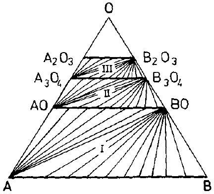
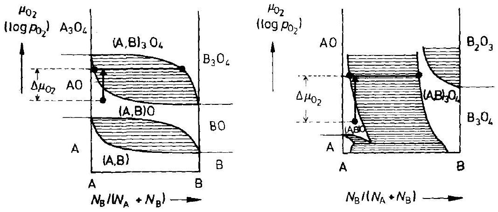
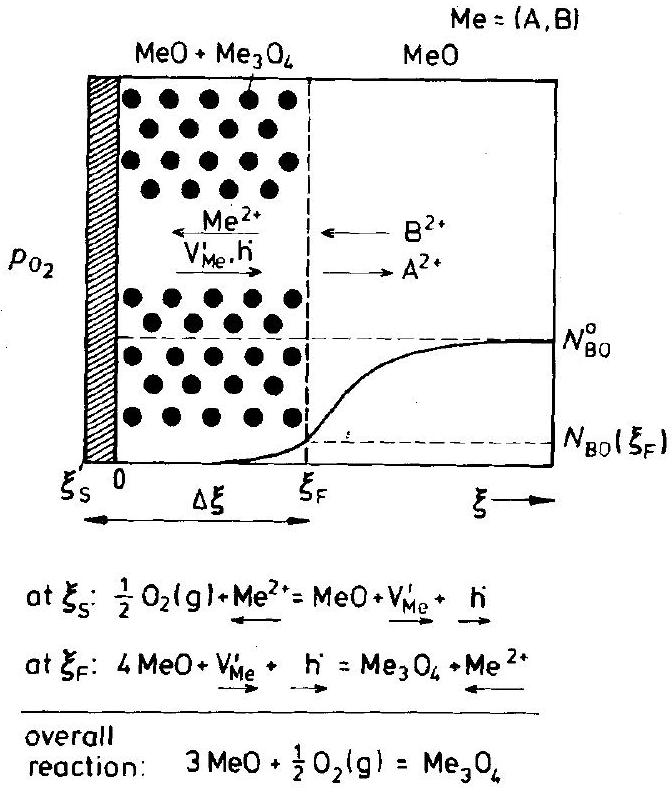
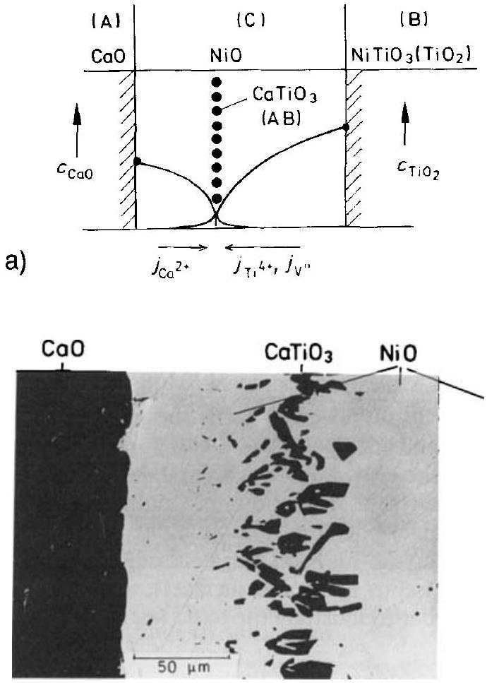
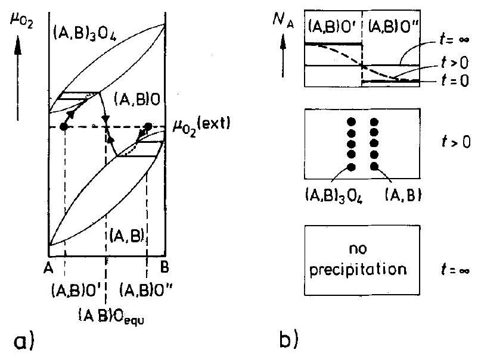

## 9 Internal Reactions

### 9.1 Introduction

Heterogeneous reactions of the type $\mathrm{A}+\mathrm{B}=\mathrm{AB}$ can, in principle, occur in two ways. 1) The product molecule AB is formed from A and B in the surrounding solvent or immediately at the surface of the $A B$ crystal. These $A B$ molecules are then added to the crystal on its external surface. This is additive crystal growth. 2) The solid product AB forms between A and B and separates the reactants spatially. Further reaction is possible only via (diffusional) transport across the reaction layer AB. This is reactive crystal growth [H. Schmalzried (1993)]. The moving AB interfaces in additive crystal growth are inherently unstable morphologically (see Chapter 11).

Chapters 6 and 7 dealt with solid state reactions in which the product separates the reactants spatially. For binary (or quasi-binary) systems, reactive growth is the only mode possible for an isothermal heterogeneous solid state reaction if local equilibrium prevails and phase transitions are disregarded. In ternary (and higher) systems, another reactive growth mode can occur. This is the 'internal reaction' mode. The reaction product does not form at the contacting surfaces of the two reactants as discussed in Chapters 6 and 7, but instead forms within the interior of one of the reactants or within a solvent crystal.

By a change of temperature or pressure, it is often possible to cross the phase limits of a homogeneous crystal. It supersaturates with respect to one or several of its components, and the supersaturated components eventually precipitate. This is an additive reaction. It occurs either externally at the surfaces, or in the crystal bulk by nucleation and growth. Reactions of this kind from initially homogeneous and supersaturated solid solutions will be discussed in Chapter 12 on phase transformations. Internal reactions in the sense of the present chapter occur after crystal A has been brought into contact with reactant B , and the product AB forms isothermally in the interior of A or B . Point defect fluxes are responsible for the matter transport during internal reactions, and local equilibrium is often established throughout.

Several types of internal solid state reactions may be distinguished. One type that has been carefully studied both experimentally and theoretically is the internal oxidation of metal alloys. By investigating tarnishing processes during the hot corrosion of alloys, it was found that under certain conditions (to be specified later), the oxide product did not form as an external layer on the metal surface. Rather, it formed as a fine grained precipitate in the interior of the bulk metal. The product particles nucleated at an advancing front which was more or less sharp. The front sometimes moves periodically in space and time, analogous to the Liesegang phenomenon [C. Wagner (1950)]. Internal metal oxidation has been widely studied in the past in view of its technological importance (e.g., dispersion hardening). Modern experimen-
tal in-situ methods of solid state physics, as outlined in Chapter 16, are used for the analysis of the product's composition, structure, and morphology.

Recently, internal reactions have been observed during the oxidation and reduction of nonmetallic crystalline compounds (e.g., ternary oxides and oxide glasses). Although apparently similar, the underlying transport processes in the reacting oxide systems are shown to be quite different from those that occur during the internal oxidation of alloys. The phenomenological observations on ternary oxides are as follows. The internal precipitation front advances $(\sim \sqrt{t})$ into the bulk after a change in the oxidation (reduction) potential of the nonmetallic component at the external surface of the solid solution (e.g., (A,B)X). The internal oxidation (reduction) process takes place even if the mobility of the nonmetallic component (or rather the anions, e.g., oxygen ions) in the solid solution is vanishingly small. Since it is a neutral component that must be transported to the reaction front (in form of ions plus electrons), internal oxidation (reduction) can only occur in semiconducting and mixed conducting matrix crystals, but not in purely ionic conductors.

A third type of internal solid state reaction (see later in Fig. 9-12) is characterized by two (solid) reactants $\mathbf{A}$ and $\mathbf{B}$ which diffuse into a crystal $\mathbf{C}$ from opposite sides. C acts as a solvent for A and B . If the reactants form a stable compound AB with each other (but not with the solvent crystal C ), an internal solid state reaction eventually takes place. It occurs in the solvent crystal at the location of maximum supersaturation of AB by internal precipitation and subsequent growth of the AB particles. Similar reactions can be observed on a crystal surface which, in this case, plays the role of the solvent matrix C . Surface transport of the reactants leads to a product band precipitated on the surface at some distance from each of the two reactants and completely analogous to the internal reactions described before. In addition, internal reactions have also been observed if (viscous) liquids are chosen as the reaction media (C).

There is still another type of internal solid state reaction which we will discuss and it is electrochemical in nature. It occurs when an electrical current flows through a mixed conductor in which the point defect disorder changes in such a way that the transference of electronic charge carriers predominates in one part of the crystal, while the transference of ionic charge carriers predominates in another part of it. Obviously, in the transition zone (junction) a (electrochemical) solid state reaction must occur. It leads to an internal decomposition of the matrix crystal if the driving force (electric field) is sufficiently high. The immobile ionic component is internally precipitated, whereas the mobile ionic component is carried away in the form of electrically charged point defects from the internal reaction zone to one of the electrodes.

Internal nucleation and growth can occur coherently or incoherently while the reaction volume can be negative or positive. The severe constraints which the matrix crystal exerts on the internal reaction can lead to the formation of metastable (or even unstable) phases, which do not exist outside the matrix. Often, heavy plastic flow and anisotropic growth has been found.

In Chapter 11, growth morphologies are dealt with and the question is raised as to which conditions make the moving phase boundaries morphologically stable or unstable during solid state reactions. One criterion for instability is met if the interface moves against the flux direction of the rate determining (slow) reaction partner.

Under this criterion, an internal solid state reaction is the extreme of a reaction with morphologically unstable boundaries. In the following sections, the different types of internal solid state reactions will be discussed and treated quantitatively $[\mathbf{H}$. Schmalzried, M. Backhaus-Ricoult (1993)].

### 9.2 Internal Oxidation of Metals

Alloy oxidation processes are far more complex than the oxidation of metallic elements. Let us also distinguish between external and internal oxidation. In external oxidation, a layer forms by way of a heterogeneous reaction as discussed in Chapter 7. In this section, however, we are concerned with the internal oxidation of alloys. Pure metal A can only be oxidized externally. The simplest system for the study of internal oxidation is the binary metal alloy ( $\mathrm{A}, \mathrm{B}$ ), to which we shall confine our discussion.

The basic parameters which determine the kinetics of internal oxidation processes are: 1) alloy composition (in terms of the mole fraction $N_{\mathrm{B}}=\left(1-N_{\mathrm{A}}\right)$ ), 2) the number and type of compounds or solid solutions (structure, phase field width) which exist in the ternary A-B-O system, 3) the Gibbs energies of formation and the component chemical potentials of the phases involved, and last but not least, 4) the individual mobilities of the components in both the metal alloy and the product determine the (quasi-steady state) reaction path and thus the kinetics. A complete set of the parameters necessary for the quantitative treatment of internal oxidation kinetics is normally not at hand. Nevertheless, a predictive phenomenological theory will be outlined.

An alloy oxidizes internally if the less noble solute B , which has been dissolved in the more noble metal A , is oxidized to $\mathrm{BO}\left(\mathrm{BO}_{n}\right)$ in the interior of the metal matrix before it has time to diffuse to the surface (where oxygen is available with sufficiently high activity). In other words, oxygen is transported into the crystal faster than $\mathbf{B}$ diffuses from the interior to the surface. The situation is illustrated in Figure 9-1. Internal oxidation is observed, for example, if Ag alloyed with small additions of $\mathrm{Al}, \mathrm{Cd}$, or Cu is exposed to air. When the Gibbs energy of $\mathrm{BO}\left(\mathrm{BO}_{n}\right)$ formation

Figure 9-1. Internal oxidation of an (A,B) alloy. B and O are dilute solutes in the solvent matrix A .

is strongly negative, the equilibrium condition for the reaction $\mathrm{B}+\mathrm{O}=\mathrm{BO}$ results in a negligibly small concentration of $\mathbf{B}$ in the (A, B) solid solution immediately behind the internal reaction front $\left(\xi_{\mathrm{F}}\right)$, where the dissolved oxygen $(\mathrm{O})$ is in excess. Since both B and O diffuse to the front of their respective concentration gradients to further form BO, this diffusion controls the reaction kinetics. Since the component activities are fixed at $\xi=0$ and $\xi=\xi_{\mathrm{F}}$, the reaction front $\xi_{\mathrm{F}}$ in the crystal advances parabolically, that is,

$$
\xi_{\mathrm{F}}=2 \cdot \alpha \cdot \sqrt{D_{\mathrm{O}} \cdot t}
$$

where $\alpha$ is the growth parameter. It will be defined below and depends on both the composition and the mobilities of A and B . Equation (9.1) holds for a linear and (semi-)infinite diffusion geometry because it satisfies the differential equations of transport and all the boundary conditions (Fig. 9-1). The explicit solution to Fick's second law is [C. Wagner (1959)]

$$
\begin{aligned}
& \frac{N_{\mathrm{O}}}{N_{\mathrm{O}}^{0}}=1-\frac{\operatorname{erf}\left(\frac{\xi}{2} \cdot \sqrt{D_{\mathrm{O}} \cdot t}\right)}{\operatorname{erf} \alpha} \\
& \frac{N_{\mathrm{B}}}{N_{\mathrm{B}}^{0}}=1-\frac{\operatorname{erfc}\left(\frac{\xi}{2} \cdot \sqrt{D_{\mathrm{B}} \cdot t}\right)}{\operatorname{erf}\left(\frac{\alpha}{\sqrt{D_{\mathrm{O}} / D_{\mathrm{B}}}}\right)}
\end{aligned}
$$

The growth parameter $\alpha$ can be readily calculated provided the diffusivities ( $D_{\mathrm{O}}$ and $D_{\mathrm{B}}$ ) of O and B in the matrix are known and can be assumed constant at sufficient dilution. From the condition of continuity at $\xi_{\mathrm{F}}\left(j_{\mathrm{O}}=-n \cdot j_{\mathrm{B}}\right.$, if $\mathrm{BO}_{n}$ is formed) an implicit equation for the determination of $\alpha$ is obtained. Thus, with $N_{\mathrm{O}}^{0}=N_{\mathrm{O}} (\xi=0)$ and $N_{\mathrm{O}}^{0}=N_{\mathrm{B}}(\xi=\infty)$

$$
N_{\mathrm{O}}^{0} \cdot \sqrt{D_{\mathrm{O}} / D_{\mathrm{B}}} \cdot \mathrm{e}^{\alpha^{2} \cdot\left(D_{\mathrm{O}} / D_{\mathrm{B}}\right)} \cdot\left(1-\operatorname{erf} \alpha \cdot \sqrt{D_{\mathrm{O}} / D_{\mathrm{B}}}\right)=N_{\mathrm{B}}^{0} \cdot \mathrm{e}^{\alpha^{2}}
$$

If $D_{\mathrm{O}} N_{\mathrm{O}} \gg D_{\mathrm{B}} N_{\mathrm{B}}$, Eqn. (9.4) can be simplified to yield

$$
\alpha=\left(\frac{N_{\mathrm{O}}^{0}}{2 N_{\mathrm{B}}^{0}}\right)^{1 / 2}
$$

whereupon the parabolic rate law becomes

$$
\xi_{\mathrm{F}}=\sqrt{2 \cdot D_{\mathrm{O}} \cdot\left(\frac{N_{\mathrm{O}}^{0}}{N_{\mathrm{B}}^{0}}\right) \cdot t}
$$

In this particular case, there is no transport of component $\mathbf{B}$ towards the surface. $\mathbf{B O}$ is homogeneously precipitated in the region $\xi<\xi_{F}$, and the BO fraction corresponds to the concentration of B in the initially homogeneous alloy. Although the BO fraction is spatially constant in this case, the size of the BO particles is not. The increase in supersaturation becomes slower as the reaction front $\xi_{\mathrm{F}}$ advances. Thus, the number of precipitating particles becomes smaller with increasing time and, consequently, their volumes become larger since the local product of number times volume remains constant.

Even if the transport product $c_{\mathrm{B}} \cdot D_{\mathrm{B}}$ of component B in the alloy ( $\mathrm{A}, \mathrm{B}$ ) cannot be neglected in comparison to that of oxygen, internal oxidation may still occur. The amount of BO precipitates will then be enhanced toward the alloy surface. In this way, a transition from internal to external oxidation becomes more and more likely. This transition (i.e., the formation of a dense external BO layer) is expected to occur if

$$
N_{\mathrm{B}}^{0} \geqq \frac{\pi}{2} \cdot \frac{N_{\mathrm{O}}^{0}}{N_{\mathrm{B}}^{0}} \cdot \frac{D_{\mathrm{O}}}{D_{\mathrm{B}}} \cdot \frac{V_{m}}{V_{\mathrm{BO}}} \cdot \lambda^{*}
$$

where $\lambda^{*}$ denotes a critical volume fraction of BO (ca. 0.5), and $V_{m}$ is the molar volume of the alloy. Thus, the relative initial values of the product $N_{\mathrm{B}}^{0} \cdot D_{\mathrm{B}}$ and $N_{\mathrm{O}}^{0} \cdot D_{\mathrm{O}}$ of dissolved oxygen near the alloy surface together determine whether external or internal oxidation will take place. Recently, the very early stages of internal alloy oxidation have gained special attention since modern nuclear spectroscopy techniques (e.g., PAC, see Section 16.4) could be applied to observe their evolution [W. Bolse, et al. (1987); W. Bolse, et al. (1989)].

Sometimes, periodic precipitation bands of internal reaction products have been found during the course of oxidation. This phenomenon originates from the interplay between diffusional transport, component supersaturation, and the nucleation (and growth) process in which a Gibbs energy barrier must be overcome. The underlying 'Liesegang phenomenon' was first treated quantitatively by [C. Wagner (1950)].

In many investigations, $\xi_{\mathrm{F}}(=$ width of the oxidation zone) has been measured and the results have been compared with theoretical reaction rates [E. Verfurth, R.A. Rapp (1964)]. In technical applications, the internal oxidation zone sometimes forms below an external oxide scale. Analytical solutions for these cases are also available [C. Wagner (1968)].

### 9.3 Internal Reactions in Nonmetallic Systems

### 9.3.1 Internal Oxidation in Nonmetallic Solid Solutions

While the internal oxidation of metal alloys has long been known and likewise intensively studied, the internal oxidation of nonmetallic inorganic compounds and solid solutions is only a recent field of research [H. Schmalzried (1983)]. Figure 9-2 helps

Figure 9-2. Schematic A-B-O phase diagram (Gibbs triangle) with tie lines between the following phases of complete solubility: $(\mathrm{A}, \mathrm{B}),(\mathrm{A}, \mathrm{B}) \mathrm{O},(\mathrm{A}, \mathrm{B})_{3} \mathrm{O}_{4},(\mathrm{~A}, \mathrm{~B})_{2} \mathrm{O}_{3}$. B-oxides are more stable than A-oxides. I, II, III denote two-phase fields.

to classify the various internal oxidation (and reduction) processes. It shows a schematic Gibbs A-B-O phase diagram with complete solid solution series A-B, AO-BO, and $\mathrm{A}_{3} \mathrm{O}_{4}-\mathrm{B}_{3} \mathrm{O}_{4}$. Internal metal alloy oxidation can occur in field I. What about the oxidation processes that take place in field II? We start with an oxide solid solution and oxidize it to a higher oxide. If the product is precipitated internally instead of forming an external layer, the reaction may be classified as an 'internal oxidation of the oxide'. It is the result of an increase in the oxygen chemical potential $\mu_{\mathrm{O}_{2}}$ at the surface of the reactant oxide.

In evaluating the course of internal oxidation reactions, phase diagrams of the second kind (as already applied in previous chapters) are preferred over the Gibbs triangle in Figure 9-2. As can be seen in Figure 9-3, one essentially replaces the mole fraction of oxygen, $N_{\mathrm{O}}$, in Figure 9-2 by its chemical potential ( $\mu_{\mathrm{O}_{2}}$ ). In this way, one can easily visualize the reaction path after changing the oxygen potential into the stability range of the higher oxide.

We can formulate the kinetic equations for ( $\mathrm{A}, \mathrm{B}$ ) O oxide solutions. If it is assumed that the oxygen component (or rather the oxygen ion sublattice) is immobile (which, in the case of metal alloy oxidation, would forbid any internal reaction) and, furthermore, that $\left|\Delta G_{\mathrm{AO}}\right| \gg\left|\Delta G_{\mathrm{BO}}\right|$, then the oxidation product is essentially $\mathrm{AB}_{2} \mathrm{O}_{4}$ as indicated in Figure 9-3. Let us, for the moment, disregard 1) the influence

Figure 9-3. Two schematic phase diagrams of the second kind ( $\log p_{\mathrm{O}_{2}}$ vs. $y_{\mathrm{B}}=N_{\mathrm{B}} /\left(N_{\mathrm{A}}+N_{\mathrm{B}}\right)$ for an A-B-O system. Reaction paths for internal oxidation are indicated.

Figure 9-4. Reaction scheme for the internal oxidation according to Figure 9-3.

of a possible lattice mismatch and 2 ) the influence any coherency of the precipitates will have on nucleation and growth, and thus on the initial solid state reaction kinetics. The reaction scheme is given in Figure 9-4. At the reaction front $\xi_{\mathrm{F}}$, the (chemical) reaction comprises the local rearrangement from the B 1 structure of (A,B)O to the spinel structure of the product as driven by the influx of cation vacancies ( = outflux of cations) and a charge compensating flux of electronic defects. This reaction can be written in the form of a quasi-chemical (SE) equation as

$$
\xrightarrow{\mathrm{V}_{\mathrm{Me}}^{\prime \prime}+2 \cdot \mathrm{~h}^{\cdot}+2 \cdot \mathrm{AO}+2 \cdot \mathrm{BO}=\mathrm{AB}_{2} \mathrm{O}_{4}+\mathrm{A}_{\mathrm{Me}}^{2+}}
$$

The arrows denote ingoing $(\rightarrow)$ and outgoing $(\leftarrow)$ (Fig. 9-4). It is implicit in Eqn. (9.8) that the $\mathrm{B}_{\mathrm{Me}}^{2+}$ ions of the wüstite $(\mathrm{W})$ are oxidized to $\mathrm{B}_{\mathrm{Me}}^{3+}$ when they form the spinel $(\mathrm{Sp})$ lattice. If we neglect any lattice mismatch, $V_{m}^{\mathrm{W}}=\frac{1}{4} \cdot V_{m}^{\mathrm{Sp}}$. Let us designate the volume fraction of the spinel product in the (internal) reaction zone as $\lambda$. The rate of advance of the front ( $\xi_{\mathrm{F}}$ ) can then be written as

$$
\dot{\xi}_{\mathrm{F}}=\frac{4 \cdot V_{m}^{\mathrm{W}}}{\lambda} \cdot j_{\mathrm{V}}
$$

This equation says that if the advance corresponds to 1 mole of oxygen, $(\lambda / 4)$ moles of vacancies arrived at the reaction front $\left(4 \cdot(\mathrm{~A}, \mathrm{~B}) \mathrm{O} \rightarrow(\mathrm{A}, \mathrm{B})_{3} \mathrm{O}_{4}\right)$. As long as $\lambda$ attains a constant ( = steady state) value, the balance of B cations yields (with respect to the local reaction $\mathrm{A}_{1-N^{0}} \mathrm{~B}_{N^{0}} \mathrm{O}=(1-\lambda) \cdot \mathrm{A}_{1-N} \mathrm{~B}_{N} \mathrm{O}+(\lambda / 4) \cdot \mathrm{AB}_{2} \mathrm{O}_{4}+\mathrm{A}^{2+}$ ions)

$$
\lambda=\frac{2 \cdot\left(N^{0}-N\right)}{1-2 \cdot N} \cong 2 \cdot\left(N^{0}-N\left(1-2 \cdot N^{0}\right)\right) \simeq 2 \cdot N^{0}
$$

For the last part of Eqn. (9.10), we have assumed that $N \ll 1$, corresponding to a high thermodynamic stability of the (spinel) product phase. A semi-quantitative, and by no means strict, discussion of the internal reaction kinetics is as follows. As long as $\operatorname{div} j_{\mathrm{V}}=0$ in the region $\xi_{\mathrm{S}}<\xi<\xi_{\mathrm{F}}$, we can formulate the cation vacancy flux as

$$
j_{\mathrm{V}}=\tilde{D}_{\mathrm{V}} \cdot \frac{c_{\mathrm{V}}^{\mathrm{S}}-c_{\mathrm{V}}^{\mathrm{F}}}{\Delta \xi}
$$

From Eqn. (9.11), we can eventually evaluate $\Delta \xi\left(=\xi_{\mathrm{F}}+\left|\xi_{\mathrm{S}}\right|\right)$ as the width of the internal (spinel) precipitate region, as a function of time. $\xi_{\mathrm{S}}$ is the coordinate of the surface (Fig. 9-4). It moves towards the oxidizing gas at a velocity of $V_{m} \cdot j_{\mathrm{V}}$, where $j_{\mathrm{V}}$ corresponds to the $\mathrm{A}^{2+}$ cation counterflux arriving at the surface ( $\xi_{\mathrm{S}}$ ) and being oxidized by $\mathrm{O}_{2}(\mathrm{~g})$ to AO (and the compensating electron holes which flow with the vacancies to the reaction front). We thus obtain

$$
\Delta \dot{\xi}=\left(\left|\dot{\xi}_{\mathrm{S}}\right|+\dot{\xi}_{\mathrm{F}}\right)=j_{\mathrm{V}} \cdot \frac{1+\lambda / 4}{\lambda} \cdot 4 \cdot V_{m}^{\mathrm{W}}=\frac{2+N^{0}}{N^{0}} \cdot V_{m}^{\mathrm{W}} \cdot \tilde{D}_{\mathrm{V}}^{\mathrm{S}} \cdot \frac{c_{\mathrm{V}}^{\mathrm{S}}-c_{\mathrm{V}}^{\mathrm{F}}}{\Delta \xi}
$$

If we now assume that $\tilde{D}_{\mathrm{V}}$ is constant and $c_{\mathrm{V}}^{\mathrm{F}}<c_{\mathrm{V}}^{\mathrm{S}}$, Eqn. (9.12) can be integrated to yield a parabolic rate law

$$
\Delta \xi^{2}=2 \cdot k_{\mathrm{P}} \cdot t ; \quad k_{\mathrm{P}}=\frac{2+N^{0}}{N^{0}} \cdot\left(\tilde{D}_{\mathrm{V}}^{\mathrm{S}} \cdot N_{\mathrm{V}}^{\mathrm{S}}\right) \simeq \frac{2}{N^{0}} \cdot\left(\tilde{D}_{\mathrm{V}}^{\mathrm{S}} \cdot N_{\mathrm{V}}^{\mathrm{S}}\right)
$$

We note that ( $\tilde{D}_{\mathrm{V}}^{\mathrm{S}} \cdot N_{\mathrm{V}}^{\mathrm{S}}$ ) is proportional to the self-diffusion coefficient of the cations in AO near the surface.

These assumptions, however, oversimplify the problem. The parent (A, B)O phase between the surface and the reaction front coexists with the precipitated $(\mathrm{A}, \mathrm{B})_{3} \mathrm{O}_{4}$ particles. These particles are thus located within the oxygen potential gradient. They vary in composition as a function of $\mu_{\mathrm{O}_{2}}(\xi)$ since they coexist with ( $\mathrm{A}, \mathrm{B}$ ) O ( $N_{\mathrm{B}} \ll 1$; see Fig. 9-3). In the $\Delta \xi$ region, the point defect thermodynamics therefore become very complex [F. Schneider, H. Schmalzried (1990)]. Furthermore, $\tilde{D}_{\mathrm{V}}$ is not constant since it is the 'chemical' diffusion coefficient and as such it contains the thermodynamic factor $f_{\mathrm{V}}=\left(\partial \mu_{\mathrm{V}} / \partial \ln c_{\mathrm{V}}\right)$. In most cases, one cannot quantify these considerations because the point defect thermodynamics are not available. A parabolic rate law for the internal oxidation processes of oxide solid solutions is expected, however, if the boundary conditions at the surface ( $\xi_{\mathrm{S}}$ ) and at the reaction front ( $\xi_{\mathrm{F}}$ ) become time-independent. This expectation is often verified by experimental observations [K. Ostyn, et al. (1984); H. Schmalzried, M. Backhaus-Ricoult (1993)].

Let us now compare the internal oxidation of nonmetallic (oxide) solid solutions with the internal oxidation of metal alloys. The role of the (neutral) point defect
pairs (e.g., cation vacancies and electron holes) in the oxidation process of the oxide solution is similar to the role of dissolved atomic oxygen in the metal matrix during alloy oxidation. This becomes obvious if we consider the equilibrium condition of the defect reaction $\frac{1}{2} \cdot \mathrm{O}_{2}=\left(\mathrm{V}_{\text {cat }}^{\prime \prime}+2 \cdot \mathrm{~h}^{*}\right)+\mathrm{O}_{\mathrm{O}}^{2-}$ and note that 1$)\left(\mathrm{V}_{\text {cat }}^{\prime \prime}+2 \cdot \mathrm{~h}^{*}\right)$ are the mobile point defects which act as the oxidizing agent and 2) $\mathrm{O}_{0}^{2-}$ builds up the anion sublattice throughout the whole crystal. A criterion for the transition from an external to an internal oxidation of oxide solid solutions has been derived in analogy to Eqn. (9.7), which describes this transition for metal alloys. The non-metal criterion reads [H. Schmalzried (1983)]

$$
D_{\mathrm{V}} \cdot N_{\mathrm{V}}\left(\xi_{\mathrm{S}}\right) \geq \alpha \cdot\left(D_{\mathrm{B}} \cdot N_{\mathrm{B}}^{0}\right)
$$

where $\alpha$ is a numerical factor of the order of unity. Since $D_{\mathrm{V}}$ is always large compared to $D_{\mathrm{B}}$ (because B is rendered mobile through the individual activated jumps of V , and $N_{\mathrm{B}}$ is $>N_{\mathrm{V}}$ ), one may predict that the internal oxidation of nonmetallic solid solutions $(\mathrm{A}, \mathrm{B}) \mathrm{O}$ (or $(\mathrm{A}, \mathrm{B}) \mathrm{X}$ ) should be even more common than the internal oxidation of metal alloys. These general modes of internal oxidation can play an important role in metallurgy, materials science, and geochemistry. They alter the properties of the matrix crystals, and in particular the mechanical properties, by dispersion hardening. Internal oxidation may also be seen in the context of the morphological evolution of reaction patterns in higher than two-component systems. It constitutes a limiting case of multicomponent, multiphase, transport controlled chemical reaction processes. In contrast to other systems with morphologically unstable phase boundaries (for example, systems with interwoven phases), the products of internal oxidation are found to be spatially isolated and dispersed in the solid solution matrix.

### 9.3.2 Internal Reduction in Nonmetallic Solutions

We have discussed the oxidation kinetics of metal alloys and of oxide solutions. These reactions lead to dispersed internal products rather than to external product layers. In the present section, let us pose a different question: can the reduction of (nonmetallic) solid solutions (e.g., $(\mathrm{A}, \mathrm{B})_{2} \mathrm{O}_{3}$ to $(\mathrm{A}, \mathrm{B})_{3} \mathrm{O}_{4},(\mathrm{~A}, \mathrm{~B})_{3} \mathrm{O}_{4}$, to $(\mathrm{A}, \mathrm{B}) \mathrm{O}$, or $(\mathrm{A}, \mathrm{B}) \mathrm{O}$ to $(\mathrm{A}, \mathrm{B})$ ) similarly lead to internally precipitated particles of the reduced product? If so, then do these reactions occur in field III, II, or I of the Gibbs triangle plotted in Figure 9-2? We further note that the reaction $(\mathrm{A}, \mathrm{B}) \mathrm{O} \rightarrow(\mathrm{A}, \mathrm{B})$ is the fundamental process of ore reduction.

We observe once more that the morphological instability of phase boundaries, which eventually leads to isolated internal precipitates, can only occur in ternary and higher systems. Figure 9-5 illustrates the reaction path of an internal reduction reaction. Practically speaking, after the external surface of an appropriate oxide (or other) solid solution has been exposed to sufficiently reducing potentials, the product forms eithers externally on this surface or in the bulk of the solid as internal precipitates. Figure $\mathbf{9 - 6}$ shows the mechanism of the internal reduction schematically. For the sake of simplicity, we once again assume that the anions are immobile. If

Figure 9-5. Schematic phase diagram of second kind ( $\log p_{\mathrm{O}_{2}}$ vs. $y_{\mathrm{B}}=N_{\mathrm{B}} /\left(N_{\mathrm{A}}+N_{\mathrm{B}}\right)$ for an A-B-O system. Reaction path for internal reduction is indicated.

Figure 9-6. Reaction scheme for the internal reduction according to Figure 9-5.

$\left|\Delta G_{\mathrm{BO}}\right| \gg\left|\Delta G_{\mathrm{AO}}\right|$, almost pure metal A is precipitated in the internal reduction zone. The reaction at the front $\xi_{\mathrm{F}}$ is induced by a point defect flux which stems from the difference in oxygen potentials (point defect concentration) between the internal reaction front and the external surface. The reaction front and surface act as source and sink for the point defect flux. For example, when we assume that $(\mathrm{A}, \mathrm{B}) \mathrm{O}$ contains transition-metal ions (e.g., ( $\mathrm{Ni}, \mathrm{Mg}$ ) O ), the defects are cation vacancies and compensating electron holes. The (reducing) external surface acts as a vacancy sink according to the reaction

$$
\mathrm{V}_{\mathrm{Me}}^{\prime \prime}+2 \cdot \mathrm{~h}^{\cdot}+\mathrm{BO}=\mathrm{B}_{\mathrm{Me}}^{2+}+\frac{1}{2} \cdot \mathrm{O}_{2}
$$

whereas the (internal) front acts as a source for $\mathrm{V}_{\mathrm{Me}}^{\prime \prime}$ and $\mathrm{h}^{\bullet}$ as follows

$$
\xrightarrow{\mathrm{B}_{\mathrm{Me}}^{2+}+\mathrm{A}_{\mathrm{Me}}^{2+}=\mathrm{A}+\mathrm{V}_{\mathrm{Me}}^{\prime \prime}+2 \cdot \mathrm{~h}^{\cdot}+\mathrm{B}_{\mathrm{Me}}^{2+}}
$$

From Eqn. (9.16), we see that the metal A is precipitated within the rigid, densepacked oxygen ion sublattice of the oxide matrix. The local volume at the reaction front is thus increased by the molar volume $V_{\mathrm{A}}$ per mole of vacancies. Large strains and stresses are the immediate result. In contrast, if $(\mathrm{A}, \mathrm{B})_{3} \mathrm{O}_{4}$ is internally reduced to yield $(\mathrm{A}, \mathrm{B}) \mathrm{O}$, the oxygen ion sublattice remains essentially undistorted, except for
those minor lattice parameter changes which deform the oxygen planes of the two coherent structures. After the reduced product particles have grown large enough, the lattice misfit is eventually taken up by misfit dislocations.

In this picture, which is in contrast to internal oxidation, the concentration of point defects is lowest at the (reducing) external surface. As a consequence, the cationic bulk transport coefficients are lowest at this surface and the internal reduction process is thus self-inhibiting. During the course of the internal reduction of the oxide solid solutions, grain boundaries and dislocations may therefore become operative as fast diffusion paths in the internal reduction zone. In these cases, the subsequent formal treatment will require modification. In fact, very special morphologies reflecting pipe diffusion have been observed under inhibiting circumstances during the internal reduction of oxides [D. Ricoult, H. Schmalzried (1987)].

The quantitative discussion of internal reduction kinetics follows the discussion presented in the previous section on internal oxidation. The fundamental kinetic problem to be solved is again the calculation of the rate of advance of the reaction front $\xi_{\mathrm{F}}$ (Fig. 9-6). To this end we note that

$$
\dot{n}_{\mathrm{A}}=j_{\mathrm{V}}=\frac{\lambda}{V_{\mathrm{A}}} \cdot \dot{\xi}_{\mathrm{F}}
$$

Equation (9.17) balances the vacancy production and the amount of reduced, dispersed A metal which forms with the volume fraction $\lambda$. The essential point is therefore the determination of $c_{\mathrm{V}}\left(\xi_{\mathrm{F}}\right)$ in order to establish the vacancy flux. When a quasi-steady state has been reached and if $c_{\mathrm{V}}\left(\xi_{\mathrm{S}}\right) \ll c_{\mathrm{V}}\left(\xi_{\mathrm{F}}\right)$, one can rewrite Eqn. (9.17) as

$$
\dot{\xi}_{\mathrm{F}} \cong \frac{1}{\lambda} \cdot \frac{\tilde{D}_{\mathrm{V}} \cdot N_{\mathrm{V}}\left(\xi_{\mathrm{F}}\right)}{\Delta \xi} \cdot \frac{V_{\mathrm{A}}}{V_{(\mathrm{A}, \mathrm{~B}) \mathrm{O}}}
$$

$N_{\mathrm{V}}\left(\xi_{\mathrm{F}}\right)$ can be determined by the application of point defect thermodynamics at $\xi_{\mathrm{F}}$, where the equilibrium defect concentrations are found from the following reaction

$$
\mathrm{AO}+3 \cdot \mathrm{~B}_{\mathrm{Me}}^{2+}=\mathrm{A}+\mathrm{BO}+2 \cdot \mathrm{~B}_{\mathrm{Me}}^{3+}\left(=h^{*}\right)+\mathrm{V}_{\mathrm{Me}}^{\prime \prime}
$$

The corresponding equilibrium condition (with $a_{\mathrm{A}}=1$ for the activity of metallic A and $2 \cdot N_{\mathrm{V}^{\prime \prime}}=N_{\mathrm{h}}$.) reads

$$
N_{\mathrm{V}}^{3}\left(\xi_{\mathrm{F}}\right)=K \cdot N_{\mathrm{AO}}\left(\xi_{\mathrm{F}}\right) \cdot\left(1-N_{\mathrm{AO}}\left(\xi_{\mathrm{F}}\right)\right)^{2} \cong K \cdot N_{\mathrm{AO}}\left(\xi_{\mathrm{F}}\right)
$$

However, the calculation of $N_{\mathrm{AO}}\left(\xi_{\mathrm{F}}\right)$, which is the matrix composition at $\xi_{\mathrm{F}}$, requires an explicit solution to the coupled diffusion equations of the components before and behind the reaction front. Since the transport coefficients in these mixed crystals depend on local composition, one therefore cannot find analytical solutions. Only if the $\mathrm{A}^{2+}$ ions are almost immobile ( $D_{\mathrm{A}} \ll D_{\mathrm{B}}$ ) do we have $N_{\mathrm{AO}}\left(\xi_{\mathrm{F}}\right)=N_{\mathrm{AO}}^{0}$. This specific case has been discussed in the literature [H. Schmalzried (1984)].

A few investigations on internal reduction reactions have been reported [D. Ricoult, H. Schmalzried (1987); M. Backhaus-Ricoult, et al. (1991)]. Metallic iron has
been observed to precipitate internally in ( $\mathrm{Fe}, \mathrm{Mn}$ ) O after a sufficient lowering of the surface oxygen potential. This reaction is of technical relevance. It illustrates the basic reduction process for the production of iron from ore. Internal reactions also occur under geochemical conditions, such as when mineral solid solutions (in particular silicates like $(\mathrm{Fe}, \mathrm{Mg})_{2} \mathrm{SiO}_{4}$ ) are exposed to the low chemical potentials of the respective non-metal component in the surroundings. Furthermore, ceramic materials are often multicomponent solids which, under operating conditions, are exposed to reducing metalloid potentials. We therefore expect (for appropriate point defect concentrations and transport coefficients) internal reduction reactions to occur which can alter the physical properties of ceramic materials considerably.

There is another type of internal reduction reaction which differs in kind from those we have already discussed. As an example, let us consider the reduction of $(\mathrm{Co}, \mathrm{Al})_{2} \mathrm{O}_{3}$ in hydrogen. Hydrogen is soluble and mobile in this oxide. During its inward diffusion, it can reduce the $\mathrm{Co}^{3+}$ ions to a lower valence state and even to metal. In this way, atomic hydrogen is trapped as a proton at or near the reduced cations (which are often color centers). The advancement of the reaction front thus becomes visible by the color change or bleaching of higher valent cations ( $\mathrm{Co}^{3+}$ ). This internal reduction is analogous to the internal oxidation of alloys where the gaseous reactant $\left(\mathrm{O}_{2}(\mathrm{~g})\right)$ was also soluble and mobile in the crystal matrix. Similar observations have been made in the ternary system $\mathrm{Na}-\mathrm{Ag}-\mathrm{Cl}$. Here, $\mathrm{Ag}^{+}$ions dissolved in the NaCl matrix were reduced by inward diffusing color centers and precipitated as colloidal silver [G. Sauthoff (1971)]. Further examples of internal reduction reactions have been discussed in [H. Schmalzried, M. Backhaus-Ricoult (1993); M. Backhaus-Ricoult; S. Hagège (1992)].

### 9.4 Internal Reactions Driven by Other than Chemical Potential Gradients

As pointed out in previous sections, the point defect fluxes during internal reaction are induced by chemical potential gradients. When the point defect concentration (and thus the component activity) at the internal reaction front $\xi_{F}$ becomes high enough, new phases precipitate. Of course, it is possible to induce defect fluxes by other than chemical potential gradients, and similar internal reactions should then occur under the appropriate conditions. In this section, we will analyze internal reactions in ionic crystals when the driving force for transport is an electric field. Internal reactions are expected to take place if $\nabla j_{\text {def }} \neq 0$, that is, if the individual ionic and electronic defect fluxes ( $j_{\text {def }}$ ) are not spatially constant. This means that we are dealing with inhomogeneous systems in which the transport coefficients change with $\xi$. Quite a number of interesting phenomena can be found in this category of internal reactions, yet they are waiting to be studied more thoroughly.

### 9.4.1 Internal Reactions in Heterophase Assemblages

Heterophase assemblages of mixed ionic/electronic conductors of the type A/AX/AY/A under an electric load are the simplest inhomogeneous electrochemical systems that can serve to exemplify our problem. Let us assume that the transport of cations and electrons across the various boundaries occurs without interface polarization and that the transference of anions is negligible. For the other transference numbers we then have

$$
t_{\mathrm{A}}(\mathrm{AX})+t_{\mathrm{e}}(\mathrm{AX})=1 ; \quad t_{\mathrm{A}}(\mathrm{AY})+t_{\mathrm{e}}(\mathrm{AY})=1 ; \quad t_{\mathrm{A}}(\mathrm{AX}) \neq t_{\mathrm{A}}(\mathrm{AY})
$$

Since the total electric current obeys the condition $\nabla I=0\left(I=I_{\mathrm{A}}+I_{\mathrm{e}}\right)$, we have, in addition to Eqn. (9.21),

$$
I_{\mathrm{A}}(\mathrm{AX})+I_{\mathrm{e}}(\mathrm{AX})=I_{\mathrm{A}}(\mathrm{AY})+I_{\mathrm{e}}(\mathrm{AY})
$$

From these equations we can derive

$$
\Delta I_{\mathrm{A}}=I_{\mathrm{A}}(\mathrm{AX})-I_{\mathrm{A}}(\mathrm{AY})=I_{\mathrm{A}}(\mathrm{AY}) \cdot \frac{\Delta t_{\mathrm{A}}}{t_{\mathrm{A}}(\mathrm{AY})} \cong I \cdot \Delta t_{\mathrm{A}}
$$

Therefore, if $\Delta t_{\mathrm{A}} \neq 0$, the cation flux changes its density at the AX/AY interface. This means that this interface (by application of a sufficiently strong electric field) acts either as an A sink or as an A source depending on the direction of the A flux. In the first case, metallic A will be precipitated at the AX/AY interface. Since $\Delta t_{\mathrm{A}}=\Delta t_{\mathrm{e}}$, the difference in electric current, $\Delta I_{\mathrm{e}}$, will supply the necessary electrons for the (internal) reduction of the A cations. In the second case, the AX/AY interface operates as an A source and the lattice molecules AX or AY will be decomposed. Consequently, either $\mathrm{X}(\mathrm{Y})$ atoms or $\mathrm{X}_{2}\left(\mathrm{Y}_{2}\right)$ molecules are formed and the corresponding reactions read

$$
\mathrm{AX}=\frac{1}{2} \cdot \mathrm{X}_{2}(\mathrm{X})+\mathrm{A}^{+}+\mathrm{e}^{\prime} ; \quad \mathrm{AY}=\frac{1}{2} \cdot \mathrm{Y}_{2}(\mathrm{Y})+\mathrm{A}^{+}+\mathrm{e}^{\prime}
$$

In principle, the field-driven decomposition can already take place at very small applied voltages in the galvanic cell. In practice, however, a certain supersaturation of A ( $=\mathrm{e}^{\prime}$-supersaturation, considering $\mathrm{A}^{+}+\mathrm{e}^{\prime}=\mathrm{A}$ and $\mu_{\mathrm{A}^{+}}=$constant) is necessary to nucleate the newly forming A or $\mathrm{X}_{2}\left(\mathrm{Y}_{2}\right)$. The course of the chemical potential and several other thermodynamic potentials are plotted in Figure 9-7 for a given supersaturation of A. They can be calculated in a straightforward manner by using the explicit flux equations and coupling conditions (i.e., Eqns. (9.21)-(9.23)).

In any case, crystal lattices are destroyed by the field-driven decomposition. If the original AX/AY interface remains coherent, stresses develop which will consume some driving force. In other words, the AX/AY interface is then polarized. A determination of the amount ( $=\int \Delta I_{\mathrm{A}} \cdot \mathrm{d} t$ ) of decomposed $\mathrm{AX}(\mathrm{AY})$ at the interface should give a very sensitive method to measure extremely small differences in the elec-

Figure 9-7. Various thermodynamic potentials in an A/AX/AY/A cell under load with unpolarized A/AX and AY/A phase boundaries.

tronic transference numbers. If the $t_{\mathrm{e}}$ of the one ionic compound (e.g., AX ) is known, one can then determine the unknown $t_{\mathrm{e}}$ value of the other compound (AY).

### 9.4.2 Internal Reactions in Inhomogeneous Systems with Varying Disorder Types

In Section 9.4.1, we introduced internal electrochemical reactions by considering heterophase AX/AY assemblages. We now discuss the more general case of internal electrochemical reactions which occur in inhomogeneous systems having various types of disorder. From the foregoing discussion, we expect internal reactions to occur in a crystal matrix whenever the condition $\nabla j_{\text {ion }}=0$ is not met. The extreme is a transition from n - (or p -) type conduction to ionic conduction (which for brevity we shall call a (n-i) junction).

Transport of electronic charge carriers in solids with varying electronic disorder types (p-n) is the basic feature of semiconductor technology. A change in the type of disorder is usually achieved by doping with donors or acceptors. The basic quantitative relations are the flux equations ( $j_{i}=-c_{i} \cdot b_{i} \cdot \nabla \eta_{i}$ ), the Poisson equation $\left(\Delta \varphi=-\left(1 / \varepsilon \cdot \varepsilon_{0}\right) \cdot \varrho\right.$, where $\varrho$ is the net charge density), and the definition of the electrochemical potential $\eta_{i}\left(=\mu_{i}+z_{i} \cdot F \cdot \varphi\right)$. Doping establishes the spatial boundary conditions. Assuming that one may deal with non-equilibrium systems within the framework of linear irreversible thermodynamics (so that the local $\mu_{i}$ are well defined as long as electrons and holes obey Boltzmann statistics), we must add the rate of production (or annihilation) of the electronic defects, that is, the continuity equation. This set of differential equations then quantitatively describes the electric transport in semiconductors. In a linear approach, the rate is directly proportional to the deviation from the equilibrium concentrations. With time-dependent or time-inde-
pendent driving forces (electric fields), one can now either analytically or numerically cover the wealth of phenomena which constitute semiconductor science and technology. In the classical approach (i.e., neglecting quantum effects and applying Boltzmann or Fermi-Dirac statistics), the best known example is the (p-n) junction previously discussed in Chapter 4.

Atomic defects in ionic crystals obey the same formal relationships (kinetic and thermodynamic) as their electronic counterparts. One may therefore anticipate that phenomena similar to those found in semiconductors will occur in ionic materials. Special kinetic effects are to be expected if crystals (or amorphous solids) are brought into predetermined chemical and electrical potential gradients so that one part of the sample becomes electronic conducting while the other part exhibits ionic or mixed conduction (i.e., if they strongly change their electronic transference number spatially). A change in the (majority) disorder type in the crystal from electronic to ionic, or rather a change in the mode of electrical transport from electronic ( n or p-type) to ionic (i-type), induces internal solid state reactions if an electric current is driven across the sample by an external voltage.

Such electrically induced internal reactions have not yet been investigated extensively. However, some interesting observations are available which emphasize their relevance. ( $\mathrm{n}-\mathrm{i}$ ) type reactions allow one to place new phases into the internal transition zone without otherwise manipulating or disturbing the crystal. Since there is no source (sink) for the electric current, the transition from electronic to ionic defect fluxes necessarily requires an electrochemical reaction within the crystal. Kinetically, this is governed by transport, defect relaxation, nucleation, and growth (eventually also the evolution of the precipitate morphology), quite analogous to other internal reactions. Since these processes take place in the matrix of the host crystal, elastic and plastic deformations in both matrix and precipitate are the result. Crystal deformations influence the reaction kinetics and, in particular, the growth morphology. Here is an essential difference to the electronic phenomena in semiconductors. Whereas the site number of the host lattice is not affected by electronic processes alone, electric field driven reactions in internal ( $\mathrm{n}-\mathrm{i}$ ) junctions destroy the crystal matrix.

Let us point out some prerequisites for the occurrence of internal junctions. In the accessible range of component activities, the compound under study should exhibit both electronic and ionic conductances. The transference numbers of electrons and ions ( $t_{\mathrm{e}}, t_{\mathrm{ion}}$ ) should change noticeably with the activity of the components. Extrinsic electronic defects accompany nonstoichiometry. Since the electron mobility is much higher than that of ionic point defects, ( n -i) junctions will be found in compound crystals which have a relatively high intrinsic ionic disorder (e.g., AgBr ) or in ionic crystals which have been heavily doped (e.g., $\mathrm{ZrO}_{2}(\mathrm{CaO})$ ). By applying high (or low) component chemical potentials to one side of these crystals (e.g., by polarizing one electrode in a galvanic cell containing this compound, see Fig. 9-8), one can inject electronic defects (along with a small degree of nonstoichiometry). In this way, the crystal is exposed to a chemical potential gradient. In addition, the (external) electric field is the driving force for the electric current $I$, which may now be electronic in one part of the (inhomogeneous) crystal, but ionic in the other part. For experimental investigations, one can use galvanic double cells as illustrated in

Figure 9-8. Polarization cell and the (schematic) course of various thermodynamic and kinetic parameters [C. Wagner (1955)].

Figure 9-9. Two electrochemical solid state double cells which allow to establish internal (n-i) junctions. i* indicates interstitial ionic transport.

Figure 9-9. These devices establish not only both the chemical potential gradient and the electric field, but allow us to control both experimental parameters independently.

The kinetics of electrochemically driven internal solid state reactions depend not only on point defect mobilities, but also on the production (annihilation) rate of these defects, that is, on the point defect equilibration relaxation time in the (n-i) transition zone. For the quantitative discussion, AgBr will serve as an example. An ionic junction can be made by doping two adjoining parts of a AgBr crystal with $\mathrm{CdBr}_{2}$ and $\mathrm{Ag}_{2} \mathrm{~S}$ respectively. The small electronic transference number necessarily differs in the differently doped parts of the AgBr crystal. Therefore, we deal again with the situation discussed in the previous section.

Here, however, we can also use the electrochemical polarization method [C. Wagner (1955); M. H. Hebb (1952)] in order to establish a (n-i) junction within the AgBr crystal as shown in Figure 9-8. At the (inert) Pt anode, one establishes a high bromine activity through the applied voltage. From the literature [D. Raleigh.(1967)], we know that under these conditions AgBr transports electrical charge via electron holes. The equilibrium between atomic Br and the AgBr structure elements reads $\mathrm{Br}=\mathrm{V}_{\mathrm{Ag}}^{\prime}+\mathrm{h}^{\bullet}+\mathrm{Br}_{\mathrm{Br}}^{\mathrm{x}}$ where the vacancies $\mathrm{V}_{\mathrm{Ag}}^{\prime}$ are majority defects of the intrinsic Frenkel equilibrium $\mathrm{Ag}_{\mathrm{Ag}}+\mathrm{V}_{\mathrm{i}}=\mathrm{Ag}_{\mathrm{i}}^{*}+\mathrm{V}_{\mathrm{Ag}}^{\prime}$. The following observations are made if the cell in Figure 9-8 is polarized at a sufficiently high voltage ( $>$ decomposition voltage). A dark cloud of fine precipitates advances from the Pt anode towards the Ag cathode. This effect is explained by an internal reaction as illustrated in Figure 9-10. Considering the high Br activity, the electric current near the anode is essentially carried by electron holes $h^{\circ}$. While they are driven towards the cathode, they penetrate into a region where $a_{\mathrm{Br}}<$ (or $\left.\ll\right) a_{\mathrm{Br}}$ (anode). Consequently, Frenkel disorder prevails in this region. The $\mathrm{Ag}^{+}$transference number is approximately unity and the electric current is carried here by $\mathrm{Ag}_{\mathrm{i}}^{\bullet}$ and $\mathrm{V}_{\text {Ag }}^{\prime}$. The supersaturated electron holes react with $\mathrm{Ag}_{\mathrm{Ag}}^{\mathrm{x}}$ to form the Frenkel defects

$$
\mathrm{Br}_{\mathrm{Br}}^{\mathrm{x}}+\mathrm{Ag}_{\mathrm{Ag}}^{\mathrm{x}}+\mathrm{h}_{\rightarrow}^{\bullet}+\mathrm{V}_{\mathrm{i}}=\left[\mathrm{V}_{\mathrm{Ag}}^{\prime}+\mathrm{h}^{\bullet}+\mathrm{Br}_{\mathrm{Br}}^{\mathrm{x}}\right]+\xrightarrow[\rightarrow]{\mathrm{Ag}_{\mathrm{i}}^{\bullet}}=[\mathrm{Br}]+\xrightarrow{\mathrm{Ag}_{\mathrm{i}}^{\bullet}}
$$

Figure 9-10. Mechanism of an electrochemically driven internal decomposition reaction in AgBr : $\xrightarrow[\rightarrow]{h^{\bullet}}+\mathrm{AgBr}=\mathrm{Br}+\xrightarrow[\rightarrow]{\mathrm{Ag}_{\mathrm{i}}^{\bullet}}$.

The combination of the SE's in the brackets of Eqn. (9.25) is a (neutral) bromine atom sitting on the site of a missing lattice molecule of AgBr , this being the smallest possible pore. Equation (9.25) formulates the overall internal reaction in the (p-i) junction, where the incoming (high activity) electron holes $\mathrm{h}^{\cdot}$ are transformed into atomic $[\mathrm{Br}]$ and outgoing $\mathrm{Ag}_{\mathrm{i}}^{*}$. If the neutral bromine atoms cluster and eventually
grow (Ostwald ripening), they give rise to the visible cloud seen in the polarized AgBr cell. In addition to the (brownish) clouds in the anodic region of AgBr , pit formation at the crystal surface near this p-zone (and growth of silver dendrites from the cathode) clearly indicates the existence of supersaturated component activities inside the crystal. It seems as if high nucleation barriers in the crystal matrix inhibit internal reactions, so that the supersaturated components take refuge in the closest surface where nucleation energies are smaller (Fig.9-11).

Figure 9-11. Surface pitting of AgBr due to supersaturation of electron holes near the polarized anode [T. Große (1991)] and schematic mechanism of surface pitting.

### 9.4.3 Formal Treatment of Electrochemical Internal Reactions

Let us first introduce the polarization cell $\mathrm{Pt} / \mathrm{AgBr} / \mathrm{Ag}$ at low voltages without internal reactions, following the original ideas of Wagner and Hebb [C. Wagner (1955); M.H. Hebb (1952)]. The point defect concentrations and transference numbers of electronic and ionic charge carriers are depicted in Figure 9-8. The chemical potential gradient is established in the electrolyte by application of a voltage between the inert Pt anode and the reversible Ag cathode. At sufficiently low voltages, only a diffusive flux of electron holes is permitted. The ion flux is blocked by the anodically polarized Pt electrode. The $\mathbf{h}^{\cdot}$ concentration gradient is determined by the following conditions. At the reversible electrode, the $\mathrm{h}^{\cdot}$ chemical potential is established by the
equilibrium condition of the reaction $\mathrm{Ag}_{\mathrm{Ag}}^{+}=\mathrm{Ag}+\mathrm{h}^{*}+\mathrm{V}_{\mathrm{Ag}}^{\prime}: \mu_{\mathrm{Ag}^{+}}=\mu_{\mathrm{Ag}}^{0}+\mu_{\mathrm{h}^{*}}+\mu_{\mathrm{V}_{\mathrm{Ag}}^{\prime}}$. Note that $\mu_{\mathrm{Ag}^{+}}$and $\mu_{\mathrm{V}_{\mathrm{Ag}^{\prime}}}$ are constant, the latter in view of predominating intrinsic Frenkel defects. At the polarized Pt electrode, $\eta_{\mathrm{h}} \cdot(\mathrm{Pt})=\eta_{\mathrm{h}} \cdot(\mathrm{AgBr})$. Since $\mu_{\mathrm{h}} \cdot(\mathrm{Pt})=\mu_{\mathrm{h}}^{0} \cdot(\mathrm{Pt})$ and $F \cdot \varphi(\mathrm{AgBr})=F \cdot \varphi^{0}(\mathrm{AgBr})$, the change in $\varphi(\mathrm{Pt})$ between the electric leads $(=\Delta U)$ corresponds in total to the change in $\mu_{\mathrm{h}} \cdot(\mathrm{AgBr})$ at the $\mathrm{Pt} / \mathrm{AgBr}$ interface ( $\sim \ln N_{\mathrm{h}} \cdot(\mathrm{AgBr})$ ).

If local point defect equilibrium prevails and space charge effects can be neglected, one finds from the condition of electroneutrality that

$$
\left(c_{\mathrm{i}}+c_{\mathrm{h}}\right)-\left(c_{\mathrm{v}}+c_{\mathrm{e}}\right)=0 ; \mathrm{i}=\mathrm{Ag}_{\mathrm{i}}^{\bullet}, \mathrm{v}=\mathrm{V}_{\mathrm{Ag}}^{\prime}, \mathrm{h}=\mathrm{h}^{\bullet}
$$

Equation (9.26) can be rewritten by defining $c_{\mathrm{i}} \cdot c_{\mathrm{v}}=\left(c^{0}\right)^{2}$ and $c_{\mathrm{h}} \cdot c_{\mathrm{e}}=\left(c_{\mathrm{e}}^{0}\right)^{2}$ from the Frenkel and electron-hole product relations as

$$
c^{0} \cdot\left(\frac{c_{\mathrm{i}}}{c^{0}}-\frac{c^{0}}{c_{\mathrm{i}}}\right)+c_{\mathrm{e}}^{0} \cdot\left(\frac{c_{\mathrm{h}}}{c_{\mathrm{e}}^{0}}-\frac{c_{\mathrm{e}}^{0}}{c_{\mathrm{h}}}\right)=0
$$

or

$$
c^{0} \cdot \sinh \left(\ln c_{\mathrm{i}} / c^{0}\right)+c_{\mathrm{e}}^{0} \cdot \sinh \left(\ln c_{\mathrm{h}} / c_{\mathrm{e}}^{0}\right)=0
$$

The steady state condition of the polarized cell provides two kinetic equations: $j_{i}\left(=-j_{\mathrm{v}}\right)=0$ and $I / F=j^{0}=1 / F \cdot \sum z_{k} \cdot j_{k}$. From the first condition, one derives immediately

$$
\nabla c_{\mathrm{i}} / c_{\mathrm{i}}=-\frac{F}{R T} \cdot \nabla \varphi, \quad c_{\mathrm{i}}(\xi)=c_{\mathrm{i}}(0) \cdot \mathrm{e}^{-\frac{F \cdot(\varphi(\xi)-\varphi(0))}{R T}}
$$

From the second condition, it is found that

$$
j^{0}=-D_{\mathrm{h}} \cdot c_{\mathrm{h}} \cdot\left(1+\frac{D_{\mathrm{e}}}{D_{\mathrm{h}}} \cdot\left(\frac{c_{\mathrm{e}}^{0}}{c_{\mathrm{h}}}\right)^{2}\right) \cdot \nabla\left(\ln c_{\mathrm{i}}+\ln c_{\mathrm{h}}\right)
$$

Equation (9.30), in combination with Eqn. (9.28), describes the charge transport in the polarized $\mathrm{Pt} / \mathrm{AgBr} / \mathrm{Ag}$ cell if no internal reactions occur. Limiting cases can be solved analytically. If, for example, $c^{0} \gg c_{\mathrm{e}}^{0}$ and $c_{\mathrm{i}} \simeq c_{\mathrm{v}} \simeq c^{0}$, it follows that $j^{0}=-D_{\mathrm{h}} \cdot\left(\Delta c_{\mathrm{h}} / \Delta \xi\right)$. In combination with the equilibrium conditions at the two electrodes which require that $\Delta \varphi$ between the two electrodes is $\Delta U=\left(\Delta \mu_{\mathrm{h}} / F\right)= (R T / F) \cdot \ln c_{\mathrm{h}} / c_{\mathrm{h}}(\Delta \xi)$, one obtains

$$
j^{0}=-D_{\mathrm{h}} \cdot \frac{c_{\mathrm{h}}^{0}(0)}{\Delta \xi} \cdot\left(1-\mathrm{e}^{-(F / R T) \cdot \Delta U}\right),
$$

where $c_{\mathrm{h}}^{0}(0)$ is the electron hole concentration at the reversible (Ag) cathode.
If the anodic potential of the polarized electrode is now increased until a ( $h^{\bullet}-\mathrm{Ag}_{j}^{*}$ ) junction zone is formed in the interior of the electrolyte, AgBr will decompose internally provided the nucleation barrier can be overcome. This is shown
in Figure 9-10. To qualitatively picture the overall ( $\mathrm{n}-\mathrm{i}$ ) junction reaction, Eqn. (9.25) is split into 1) the Frenkel formation reaction $V_{i}+A g_{A g}=V_{A g}^{\prime}+A g_{j}^{\circ}$, in which two regular SE's are transformed into a pair of intrinsic point defects, and 2) the formation reaction of atomic Br according to $\mathrm{Br}_{\mathrm{Br}}^{\mathrm{X}}+\mathrm{V}_{\mathrm{Ag}}^{\prime}+\mathrm{h}^{\bullet}=[\mathrm{Br}]$.

In view of the appreciable number of SE's involved in reaction (9.25), distinct serial reaction steps can be anticipated. Steps in which the electron hole is involved are assumed to be fast compared to steps involving ionic SE's (in line with the fact that $D_{\mathrm{h}} \gg D_{\mathrm{i}}$ ). Thus, the (locally homogeneous) Frenkel reaction becomes rate determining for the overall internal process described by Eqn. (9.25). The Frenkel reaction is bimolecular. The rate equation for the formation of Frenkel defects is, according to standard kinetics,

$$
\dot{c}_{\mathrm{i}}=\overrightarrow{k_{\mathrm{i}}} \cdot\left(c^{0}\right)^{2} \cdot\left(1-\frac{\overrightarrow{k_{\mathrm{i}}}}{\overrightarrow{k_{\mathrm{i}}}} \cdot \frac{c_{\mathrm{i}}}{c^{0}} \cdot \frac{c_{\mathrm{V}}}{c^{0}}\right)
$$

If necessary, Eqn. (9.32) can be linearized. In view of Eqn. (9.32), the ionic defect flux of the polarization cell is

$$
j^{0}=\int \dot{c_{\mathrm{i}}} \cdot \mathrm{~d} \xi=\overrightarrow{k_{\mathrm{i}}} \cdot\left(c^{0}\right)^{2} \cdot \int\left(1-\frac{\overleftrightarrow{k_{\mathrm{i}}}}{\overrightarrow{k_{\mathrm{i}}}} \cdot \frac{c_{\mathrm{i}} \cdot c_{\mathrm{v}}}{\left(c^{0}\right)^{2}}\right) \cdot \mathrm{d} \xi
$$

and in the limit of saturation

$$
j^{0}(\max )=\overrightarrow{k_{\mathrm{i}}} \cdot\left(c^{0}\right)^{2} \cdot \xi_{\mathrm{R}}
$$

where the integrals of Eqn. (9.33) go over the width $\xi_{\mathrm{R}}$ of the junction zone. The determination of the quantity $\xi_{\mathrm{R}}$ in Eqn. (9.34) in terms of transport coefficients, rate constants $\overrightarrow{k_{\mathrm{i}}}$, and the applied voltage $\Delta U$ uses the following differential equations under steady state conditions

$$
\begin{array}{lll}
\nabla \boldsymbol{j}_{\mathrm{h}}=\dot{r}_{\mathrm{h}} ; & \nabla \boldsymbol{j}_{\mathrm{i}}=\dot{r}_{\mathrm{i}} \\
\nabla\left(\boldsymbol{j}_{\mathrm{h}}+\boldsymbol{j}_{\mathrm{i}}\right)=0 ; & \boldsymbol{j}_{\mathrm{h}}+\boldsymbol{j}_{\mathrm{i}}=\boldsymbol{j}^{0}
\end{array}
$$

This set of equations balances the electric current. Inserting the fluxes explicitly and eliminating the potential gradient $\nabla \varphi$, one obtains the rate $\dot{r}_{\mathrm{i}}$, which can then be equated with Eqn. (9.32). We note that the concentration $c_{\mathrm{h}}$ is $\ll c_{\mathrm{i}}$ (and $c_{\mathrm{v}}$ ) since the hole mobility is far greater than the mobility of the ionic point defects. In addition, we assume that $c_{\mathrm{h}} \sim 1 / c_{\mathrm{v}}$, which is consistent with the assumption of a fast (partial) reaction $\mathrm{Br}_{\mathrm{Br}}^{\mathrm{x}}+\mathrm{V}_{\mathrm{Ag}}^{\prime}+\mathrm{h}^{\cdot}=[\mathrm{Br}]$ in the internal reaction zone where small bubbles of $[\mathrm{Br}]$ exist already. Space charge effects are neglected, and local electroneutrality is assumed to hold. With all these assumptions, the given set of equations describes the kinetics of electrochemical internal decomposition reactions. However, to explicitly solve them we have to define the Br activity in the junction zone. This activity depends on the crystal's ability to withstand the internal pressure corresponding to
$a_{\mathrm{Br}}$ in the micropores, and which in turn depends on the plasticity of the crystal and the external constraints of the evolving stress. Without sufficient knowledge on the experimental (boundary) conditions, it is rather academic to pursue the solution of the complex system of differential equations, although it has been done numerically [U. Stilkenböhmer (1994)]. Such situations occur repeatedly in our discussions of chemical processes taking place in crystals: we have gained a qualitative understanding, but it is hardly not possible to quantify the real systems.

### 9.5 Internal Reactions $\mathbf{A}+\mathbf{B}=\mathbf{A B}$ in Crystal $\mathbf{C}$ as Solvent

The common feature of the internal reactions discussed so far is the participation of electronic defects. In other words, we have been dealing with either oxidation or reduction. We now show that reactions of the type $\mathrm{A}+\mathrm{B}=\mathrm{AB}$ can take place in a solvent crystal matrix as, for example, the formation of double oxides $\left(\mathrm{CaO}+\mathrm{TiO}_{2}=\mathrm{CaTiO}_{3}\right)$ in which atomic (ionic) but no electronic point defects are involved. Although many different solvent crystal matrices can be thought of (e.g., metals, semiconductors, glasses, and even viscous melts and surfaces), we will deal here mainly with ionic crystal matrices in order to illustrate the basic features of this type of solid state reaction.

### 9.5.1 The Internal Reaction $\mathbf{A O}+\mathbf{B O}_{\mathbf{2}}=\mathbf{A B O}_{\mathbf{3}}$

Let us analyze the following specific reaction [H. Schmalzried, et. al. (1990); T. Frick (1993)]. A single crystal of NiO is used as a solvent for the solid reactants CaO and $\mathrm{TiO}_{2}$, both being moderately soluble in NiO . They isothermally diffuse into NiO from opposite sides (Fig. 9-12a). Solutes for this type of reaction do not form stable compounds with the solvent crystal, but must form at least one stable compound with each other.

NiO is a cation deficient semiconductor. The fraction of its cation vacancies and compensating electron holes depends on the oxygen potential as discussed in Section 2.3. The isovalent $\mathrm{Ca}^{2+}$ ions can replace $\mathrm{Ni}^{2+}$ ions in the cationic sublattice of the fcc matrix by chemical interdiffusion. $\mathrm{TiO}_{2}$ and NiO form $\mathrm{NiTiO}_{3}$ which dissolves to some extent in the fcc matrix of NiO as $\mathrm{Ti}_{\mathrm{Me}}^{4+}$ and $\mathrm{V}_{\mathrm{Me}}^{\prime \prime}$. The counterdiffusion of $\mathrm{TiO}_{2}$ and CaO in the NiO solvent leads to the encounter of the different solute cations (Fig. 9-12a). With increasing overlap of their concentration profiles, the concentration of the product will eventually surpass the solubility limit (and the nucleation barrier). Precipitation of the rather stable $\mathrm{CaTiO}_{3}$ compound as an internal reaction product in the NiO matrix is the result.

The question of nucleation was discussed generally in Chapter 6. In contrast to nucleation in liquids, the nucleation of AB in the solvent crystal matrix C is often hampered by structural constraints imposed on the newly forming AB phase by the

b)

Figure 9-12. a) Scheme of the internal solid state reaction $\mathrm{CaO}+\mathrm{TiO}_{2}=\mathrm{CaTiO}_{3}$ in the matrix crystal NiO . Concentration profiles and precipitate are indicated. b) Photograph of cross section with in ternal reaction zone ( $T=1340^{\circ} \mathrm{C}$, $t=413 \mathrm{~h}$ reaction time).
solvent crystal matrix. It is therefore conceivable that at the beginning coherent, metastable phases with non-equilibrium structures are formed before semi-coherency and/or incoherency of the $A B / C$ matrix interfaces lead to a stable reaction product. Figure 9-13 shows the schematic concentration profiles of A and B in C along with the solubility product $N_{\mathrm{A}} \cdot N_{\mathrm{B}}$. The maximum of the solubility product (or rather of $\left.a_{\mathrm{A}} \cdot a_{\mathrm{B}}\right)$ determines the site of homogeneous nucleation of the first AB precipitates. The course of the further reaction can be treated quantitatively if the thermodynamics of the A-B-C system, as well as the transport properties of A and B in AB and C , are known. Explicitly, Fick's second law has to be solved for the transport of both A and B in C, under the given boundary and flux coupling conditions. They

Figure 9-13. Concentration profiles and solubility product $L_{\mathrm{AB}}=N_{\mathrm{A}} \cdot N_{\mathrm{B}}$ of solutes A and B in the matrix crystal $C$.

require that $j_{\mathrm{A}}=-j_{\mathrm{B}}$ at the location of AB precipitation. Numerical solutions to this kinetic problem are available [M. Backhaus-Ricoult, et al. (1991)]. In a linear reaction geometry, the locus of the first internal precipitation band is determined almost exclusively by the ratio, $D_{\mathrm{A}} / D_{\mathrm{B}}$, of the diffusivities in the C crystal. Other kinetic and thermodynamic parameters are of minor importance. If $D_{\mathrm{A}} / D_{\mathrm{B}} \ll(\gg)$, no internal precipitation occurs and the reaction product forms at the interface of the less mobile reactant.

During the internal formation of $\mathrm{CaTiO}_{3}$ in the NiO matrix, several distinct precipitation bands have been observed at different locations. They indicate that the reaction mechanism is not as simple as illustrated in Figure 9-12. Generally speaking, the internal formation of products AB is a special case of the combined diffusionreaction problem, which in view of its nonlinearity has recently gained widespread interest [S. Havlin (1992)]. In our context, it may suffice to observe that, if a steady state solution exists, the locus of the steady state AB precipitates does not coincide with the locus of the first nuclei ( $=$ maximum of solubility product). Rather, the reaction front moves continuously or discontinuously to its final steady state location. Yet even at this stage, the growth of the AB precipitates is not strictly stationary since the morphology of the product particles changes with further growth. This morphological evolution of the AB precipitates depends on the transport coefficients of $A$ and $B$ in the $C$ matrix as well as in the reaction product $A B$. If diffusion within AB is fast compared to diffusion in the matrix, the $\mathrm{AB} / \mathrm{C}$ interface is a surface of constant activity. The precipitate will then elongate symmetrically towards the reactants A and B and becomes needle-like. If, in contrast, diffusion within the precipitate is slow compared to the diffusion in the C matrix, and if $D_{\mathrm{A}}$ and $D_{\mathrm{B}}$ do not differ too much, the precipitate particles grow preferentially as plates parallel to the $\mathrm{A} / \mathrm{C}$ (and B/C) interface. These product plates eventually grow together to form a continuous barrier which inhibits further reaction.

It is evident from this brief discussion that there are many possible modes of internal reaction in a crystal matrix, although we have not yet included the influence of stresses on growth kinetics and morphology. The reacting system is necessarily strained if $V_{m}(\mathrm{~A}) \neq V_{m}(\mathrm{~B}) \neq V_{m}(\mathrm{C})$. The resulting stress fields are long range, and if the stresses exceed the yield strength, plastic flow and dislocation formation will begin. Not only is the driving force affected by the stress, but kinetic coefficients are changed as well, mainly by pipe diffusion along dislocations.

The types of internal solid state reactions discussed in this section can have interesting technical applications. Since these reactions are localized, the introduction of AB precipitates into a C matrix can strongly influence such local properties as the mechanical, electrical, or optical properties inside a crystal.

### 9.6 Internal Reactions During Interdiffusion

Let us refer to Figure 9-3, but which we replot as Figure 9-14 to illustrate possible reaction paths in the AO-BO interdiffusing system. We assume that $D_{\mathrm{A}}>($ or $\gg) D_{\mathrm{B}}$,

Figure 9-14. a) Possible reaction path during interdiffusion in the quasi-binary AO-BO system, plotted into a phase diagram of the second kind. The initial couple is $(\mathrm{A}, \mathrm{B}) \mathrm{O}^{\prime}$ and $(\mathrm{A}, \mathrm{B}) \mathrm{O}^{\prime \prime}$. b) Realspace presentation of the processes occurring at different times during interdiffusion.

and also that the dense-packed anions are immobile in the semiconducting oxide solid solution. With these assumptions, a diffusion potential for the oxygen component builds up. The faster $\mathrm{A}^{2+}$ cations tend to deplete the AO-rich side of the diffusion couple of metal ions, thereby slightly increasing the nonstoichiometry $\delta$ of this side of the solid solution $(\mathrm{A}, \mathrm{B})_{1-\delta} \mathrm{O}$. The increase in $\delta$ corresponds to a steep increase in the oxygen activity of the almost stoichiometric crystal. The opposite effect is found at the BO-rich side as depicted in Figure 9-14. When the reaction path enters a two-phase field and nucleation is possible, internal reaction products precipitate temporarily inside the crystal matrix [H. Schmalzried (1992)]. Solution thermodynamics and the kinetic parameter $\beta=D_{\mathrm{A}} / D_{\mathrm{B}}$ will determine the course of the reaction path and thus decide whether oxidized products $\left((\mathrm{A}, \mathrm{B})_{3} \mathrm{O}_{4}\right)$, reduced products ((A,B)), or both will form in the interdiffusion zone.

However, a major influence on the formation of internal reaction products is the geometry of the diffusion couple. The reason is that external surfaces are the main sources and sinks for point defects ( e.g., $\mathrm{V}_{\text {Me }}^{\prime \prime}+\mathrm{h}^{*}$ ). These defects determine the nonstoichiometry $\delta\left(=N_{\mathrm{V}}\right)$ and are supersaturated (undersaturated) during interdiffusion relative to the constant external oxygen potential. The defect relaxation process at the surface conforms to $\frac{1}{2} \cdot \mathrm{O}_{2}(\mathrm{~g})=\mathrm{V}_{\mathrm{Me}}^{\prime \prime}+2 \cdot \mathrm{~h}^{\cdot}+\mathrm{O}_{\mathrm{O}}^{2-}$. The transport of defects from the interior of the diffusion zone to the crystal surface (and vice versa) depends on the geometry of the sample. Thus, large samples need long equilibration times which cause large supersaturations (undersaturations) and explain the observed formation of internal products during interdiffusion (as, for example, in the system $\mathrm{Ag}_{2} \mathrm{~S}-\mathrm{Cu}_{2} \mathrm{~S}$ [B. Gries, H. Schmalzried (1989)]). After a sufficiently long diffusion time, when the component concentration gradients flatten out and the driving forces (i.e., oxygen potential gradients) decrease again, the internal oxidation and reduction products redissolve. In conclusion, interdiffusion in multicomponent solid solutions
with narrow ranges of homogeneity ( $\Delta \delta$ ) is prone to internal product formation. In the spirit of Figure 9-14, the reaction path (temporarily) leaves the single-phase field and penetrates into multi-phase fields.

## References

Backhaus-Ricoult, M., et al. (1991) Ber. Bunsenges. Phys. Chem., 95, 1593
Backhaus-Ricoult, M., Hagège, S. (1992) Acta Met., 40, 267
Bolse, W., et al. (1987) Phys. Rev., B 36, 1818
Bolse, W., et al. (1989) Ber. Bunsenges. Phys. Chem., 93, 1285
Frick, T. (1993) Ph. D.-Thesis, Universität Hannover (Chemie)
Gries, B., Schmalzried, H. (1989) Solid State Ionics, 31, 291
Große, Th. (1991) Ph. D.-Thesis, Universität Hannover (Chemie)
Havlin, S., et al. (1992) Physica, A 191, 143, 168
Hebb, M.H. (1952) J. Chem. Phys., 20, 185
Ostyn, K., et al. (1984) J. Amer. Cer. Soc., 67, 679
Raleigh, D. O. (1967) Progr. Sol. State Chem., 3, 83
Ricoult, D., Schmalzried, H. (1987) Phys. Chem. Minerals, 14, 238
Sauthoff, G. (1971) Acta Met., 19, 665
Schmalzried, H. (1983) Ber. Bunsenges. Phys. Chem., 87, 511
Schmalzried, H. (1984) Ber. Bunsenges. Phys. Chem., 88, 1186
Schmalzried, H., et al. (1990) Z. phys. Chem. NF166, 115
Schmalzried, H. (1992) phys. stat. sol. (b), 172, 87
Schmalzried, H., Backhaus-Ricoult, M. (1993) Progr. Sol. State Chem., 22, 1
Schmalzried, H. (1993) Nova Acta Leopoldina, 69, 91
Schneider, F., Schmalzried, H. (1990) Z. phys. Chem., NF166, 1
Stilkenböhmer, U. (1994) Ph. D.-Thesis, Universität Hannover (Chemie)
Verfurth, E., Rapp, R.A. (1964) Trans. AIME, 230, 1310
Wagner, C. (1950) Journ. Coll. Sci., 5, 85
Wagner, C. (1955) Proc. C.I.T.C.E., 7, 361
Wagner, C. (1959) Ber. Bunsenges. Phys. Chem., 63, 772
Wagner, C. (1968) Corr. Sci., 8, 889

