## 10 Reactions At and Across Interfaces

### 10.1 Introduction

The kinetics of heterogeneous systems always involve transport both across and in interfaces as well as interface reactions. In non-equilibrium systems, interfaces can move or be static, while the interface morphology of moving boundaries may be stable or unstable. Interfaces have to be characterized structurally (on both microscopic and macroscopic scale) and thermodynamically. A thermodynamic approach is appropriate in the context of solid state kinetics since the temperature must be high enough to induce thermally activated jumps of the atomic SE's. A recent survey on the defect chemistry at interfaces has been given by [J. Maier (1994)]. Interfaces are regions of increased energy. Therefore, SE's are particularly mobile at, near, and across interfaces.

The equilibrium interfaces of fluid systems possess one variant chemical potential less than isolated bulk phases with the same number of components. This is due to the additional condition of heterogeneous equilibrium and follows from Gibbs' phase rule. As a result, the equilibrium interface of a binary system is invariant at any given $P$ and $T$, whereas the interface between the phases $\alpha$ and $\beta$ of a ternary system is (mono-) variant. However, we will see later that for multiphase crystals with coherent boundaries, the situation is more complicated.

Since the equilibrium state is uniquely defined, there is only a single equilibrium interface structure. However, since SE's on different sublattices can have mobilities of very different magnitude, we expect to often find metastable interface structures. Interfaces have been classified according to their degree of coherency, namely fully coherent, semicoherent, or incoherent. The incoherent interface is characterized by a minimal elastic strain energy (long range) and a maximal interface energy proper. The coherent interface implies the existence of a single lattice or network to which all the SE's of the two adjacent phases may be referred to. Interfaces in (dynamic) equilibrium necessarily contain imperfections and are thus not perfectly flat on an atomic scale. The atomic structure of moving interfaces depends on their velocity, that is, on driving force and mobility. Furthermore, since we expect the mobility to depend on the interface structure, nonlinear kinetic behavior is therefore likely to occur.

Chemical kinetics concerns the evolution in time of a system which deviates from equilibrium. The acting driving forces are the gradients of thermodynamic potential functions. Before establishing the behavior and kinetic laws of interfaces, we need to understand some basic interface thermodynamics. The equilibrium interface is characterized by equal and opposite fluxes of components (or building elements) in the direction normal to the boundary. Ternary systems already reflect the general

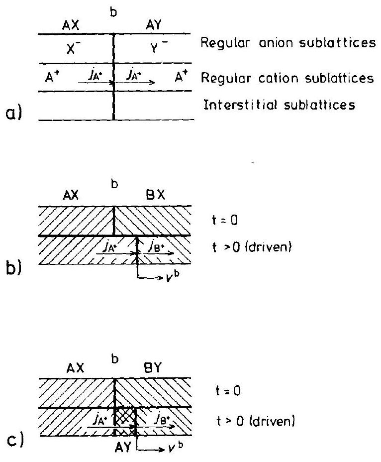
Figure 10-1. Field-driven cation flux and its effect on the boundary motion ( $D_{\mathrm{A}}, D_{\mathrm{B}} \gg D_{\mathrm{X}}, D_{\mathrm{Y}}$ ). a) Static interface, b) moving (without reaction), c) moving (with reaction, i.e., AY formation).

kinetic behavior of heterogeneous multicomponent systems, the phases of which are separated by phase boundaries (interfaces). Considering the multitude of possible kinetic situations, we shall concentrate on only a few prototypes, restricting the discussion essentially to the two interfaces presented in Figure 10-1.

As long as the diffusivities $D_{\mathrm{X}}$ and $D_{\mathrm{Y}}$ are much smaller than $D_{\mathrm{A}}$ in AX and AY, the interface of the AX/AY couple remains stationary when component A is transported across it. In contrast, the interface between $\mathrm{AX} / \mathrm{BX}$ (or $\mathrm{AX} / \mathrm{BY}$ ) will move if $D_{\mathrm{X}}$ (and $\left.D_{\mathrm{Y}}\right) \leqslant D_{\mathrm{A}}$ (and $D_{\mathrm{B}}$ ), while A or B is transported across it. This is shown in Figures 10-1b and $\mathbf{c}$.

### 10.2 Some Fundamental Aspects of Interface Thermodynamics

Let us consider the system illustrated in Figure 10-2. Two large crystals ( $\alpha$ and $\beta$ ) with sufficient buffer capacity are in equilibrium ( $\mu_{i}^{\alpha}=\mu_{i}^{\beta}$ ) and possess surfaces of equal size. These surfaces are lattice planes characterized by their Miller (hkl) indices $\left(\mathrm{h}_{m}^{\alpha}\right)$ and $\left(\mathrm{h}_{m}^{\beta}\right)(m=1,2,3)$. Construction of an arbitrary interface can be achieved

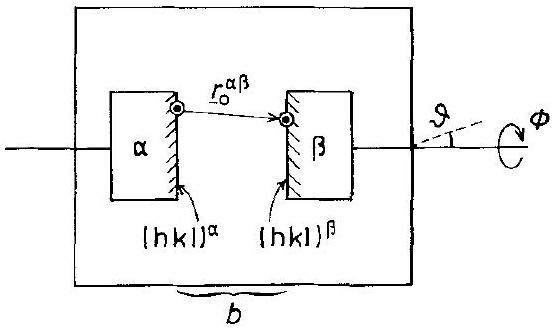
Figure 10-2. The defining parameters of a (constrained) interface b.

by 1) decreasing the distance $r_{0}^{\alpha \beta}$ between the origins of both surface lattices and 2) changing their mutual orientation ( $\phi(\vartheta)$ ). Denoting the 'interface phase' as $b$, we have

$$
G^{\mathrm{b}}=G-\left(G^{\alpha}+G^{\beta}\right)
$$

where $G^{\alpha}$ and $G^{\beta}$ are the respective Gibbs energies if $r_{0}^{\alpha \beta} \rightarrow \infty$ and $G$ is the Gibbs energy of the system with the interface. Thus, $G^{\mathrm{b}}$ is defined as an excess function. Let us denote the set of geometrical parameters ( $r_{0}^{\alpha \beta}$ and $\phi(\vartheta)$ ) by $\tilde{0}$. If, for given $\left(\mathrm{h}_{m}\right)$, the interface construction is performed reversibly, the molar Gibbs interface energy would be given by

$$
G^{\mathrm{b}}=\sum N_{i}^{\mathrm{b}} \cdot \mu_{i}=f(P, T, \tilde{\mathrm{o}})
$$

By changing $\tilde{0}$, the surface planes ( $\mathrm{h}_{m}$ ) may become strained or even reconstruct. We conclude that, given $P$ and $T$, the boundary composition $N_{i}^{\mathrm{b}}$ depends on a) the chemical potential of the components in the adjacent phases and $b$ ) the orientation o. In equilibrium, $\delta G=\delta G^{\mathrm{b}}=0$ which determines, at any given $P, T$, and $\mu_{i}$, the set õ (equ). In other words, we can formally express the equilibrium interface state (i.e., structure, strain, composition) as

$$
\tilde{\mathrm{s}}(\mathrm{equ})=f\left(P, T, \mu_{i}, \tilde{\mathrm{o}}(\mathrm{equ})\right)
$$

The dependence of $\tilde{\mathrm{s}}$ on $\tilde{\mathrm{o}}$ for a stationary interface can be calculated explicitly. The calculations involve the introduction of appropriate interatomic potentials and relaxation procedures for the energy determination $\left(E^{\mathrm{b}}=E-\left(E^{\alpha}+E^{\beta}\right)\right) . E^{\mathrm{b}}(\mathrm{min})$ specifies the equilibrium structure at 0 K in this approximation. Energy calculations have been made for example, on Me/AX interfaces [D. Wolf, K. L. Merkle (1992)]. The calculation starts with a given ( $\mathrm{h}_{m}^{\mathrm{AX}}$ ) surface and derives the equilibrium configuration and energy for Me on AX. This is normally not the lowest energy interface, which has to be found by varying ( $\mathrm{h}_{m}^{\mathrm{AX}}$ ). Also, interface energies for multicomponent crystals cannot strictly be defined at an atomic level unless the dependence on $\mu_{k}$ has been incorporated into the theory.

As has already been mentioned in Chapter 3, we may discuss the interface thermodynamics and in particular the degrees of freedom of the interface from a purely phenomenological point of view. We then introduce instead of the Miller indices in addition to the three 'microscopic' degrees of freedom related to the vector $\boldsymbol{r}_{\alpha \beta}$ two
additional unit vectors. These specify 1) the normal to the interface and 2) the axis of rotation, rotating crystal $\alpha$ relative to $\beta$. The two unit vectors represent four 'macroscopic' degrees of freedom. The fifth one is the rotation angle $\phi$ [J. W. Cahn (1982)]. In conclusion, eight geometrical parameters (degrees of freedom) are sufficient for the phenomenological description of interfaces.

Equation (10.3) states that (given $P, T$ ) the boundary state, $\tilde{\mathrm{s}}$, and the composition $N_{i}^{\mathrm{b}}$ depend on $\mu_{i}$, the chemical potential of the components in the system, which has already been illustrated in Figure 3-7. The $\delta\left(\mu_{\mathrm{Ag}}\right)$ change in $\mathrm{Ag}_{2+\delta} \mathrm{S}$ after the $(\beta \rightarrow \alpha)$ transformation at $176^{\circ} \mathrm{C}$ indicates that point defects are adsorbed at the newly formed internal surfaces introduced into the crystal by this transformation, quite analogous to a Gibbs adsorption isotherm. For (isotropic) internal surfaces, the isotherm is

$$
n_{i, k}^{\mathrm{b}}=-\frac{\partial \sigma^{\mathrm{b}}}{\partial \mu_{i}}
$$

where $n_{i, k}^{\mathrm{b}}$ denotes the specific excess number of moles of $i(\mathrm{Ag})$ in the interface relative to component $k$ (here sulfur) and $\sigma^{\mathrm{b}}$ is the interfacial energy. Equation (10.4) follows from the (isotropic) interface energy density

$$
\sigma^{\mathrm{b}}=u^{\mathrm{b}}-T \cdot s^{\mathrm{b}}-\sum n_{i}^{\mathrm{b}} \cdot \mu_{i}
$$

and the combined first and second laws of thermodynamics

$$
\mathrm{d} u^{\mathrm{b}}=T \cdot \mathrm{~d} s^{\mathrm{b}}+\sum \mu_{i} \cdot \mathrm{~d} n_{i}^{\mathrm{b}}
$$

so that Eqn. (10.5) yields the differential form

$$
\mathrm{d} \sigma^{\mathrm{b}}=-s^{\mathrm{b}} \cdot \mathrm{~d} T-\sum n_{i}^{\mathrm{b}} \cdot \mathrm{~d} \mu_{i}
$$

which, for constant $T$, is the Gibbs adsorption isotherm (10.4). The incoherent interface, thermodynamically characterized by Eqns. (10.5)-(10.7), has two neighboring phases $\alpha$ and $\beta$. At equilibrium, we therefore have, in addition to Eqn. (10.7), two Gibbs-Duhem equations for $\alpha$ and $\beta$ which constrain the compositional (or chemical potential) variations.

Let us extend these relations to the equally important case of coherent interfaces. To do so, it is necessary to include the strain energy of the $\alpha$ and $\beta$ phases. To this end, we formulate the thermodynamic relations in terms of SE's ( $k^{\prime}, \mathrm{V}$ ) [W.C. Johnson, H. Schmalzried (1992)]. Under the condition of coherency, the number of lattice sites is conserved. Instead of Eqn. (10.7), we obtain

$$
\mathrm{d} \sigma^{\mathrm{b}}=-s^{\mathrm{b}} \cdot \mathrm{~d} T-\sum n_{k}^{\mathrm{b}} \cdot \mathrm{~d} \mu_{k}+\sigma_{i j}^{\mathrm{b}} \cdot \mathrm{~d} \varepsilon_{i j}^{\mathrm{b}}
$$

where $\mu_{k}=\left(\mu_{k^{\prime}}-\mu_{\mathrm{V}}\right)$ is now the chemical potential of building element $k$ in the coherent interface. $\sigma_{i j}^{\mathrm{b}}$ is the (interfacial) stress tensor and $\varepsilon_{i j}^{\mathrm{b}}$ the strain tensor. This interfacial strain has to be coupled to the strain in the contiguous $\alpha$ and $\beta$ phases.

We note that $\mu_{k}$ is sometimes called the diffusion potential of component $k$ in the metal physics literature.

In order to determine the equilibrium state of systems including coherent interfaces, the conditions of thermal, chemical, and mechanical equilibrium have to be met, that is, for the first two

$$
\begin{array}{ll}
T^{\alpha}=T^{\beta}=T^{\mathrm{b}} & \text { (thermal equilibrium) } \\
\mu_{k}^{\alpha}=\mu_{k}^{\beta}=\mu_{k}^{\mathrm{b}} & \text { (chemical equilibrium) }
\end{array}
$$

For ionic crystals, electrochemical potentials have to be used in place of Eqn. (10.10). Mechanical equilibrium (in the absence of body forces) is attained if for the stress tensor

$$
\nabla \hat{\sigma}=0
$$

The continuity of traction across the interface requires that

$$
\hat{\sigma}^{\alpha} \cdot \boldsymbol{n}^{\alpha}+\hat{\sigma}^{\beta} \cdot \boldsymbol{n}^{\beta}=0
$$

where $\boldsymbol{n}$ designates the normal vector. This complicated system of equations has been solved for some limiting cases by [P. W. Voorhees, W.C. Johnson (1989); W. C. Johnson, W.H. Müller (1991)]. Without going into detail, let us summarize a few important conclusions. In coherent heterogeneous solids, the contiguous equilibrium phases need not be chemically homogeneous. The inhomogeneity depends on the geometry of the system (i.e., on the elastic boundary conditions). Thus, the usual Gibbs-Duhem relationship for individual phases no longer holds. Also, in this case, Gibbs' phase rule is no longer valid in its well known form $f=k+2-p$ ( $f=$ variances, $k=$ number of components, $p=$ number of phases) [W. C. Johnson (1987)]. The independent thermodynamic variables in the contiguous phases $\alpha$ and $\beta$ are now coupled through the coherent interface. As a consequence, the differential $\mathrm{d} \sigma^{\mathrm{b}}$ in Eqn. (10.7) for the interface energy of incoherent boundaries can be re-evaluated to yield

$$
\mathrm{d} \sigma^{\mathrm{b}}=A^{\mathrm{b}} \cdot \mathrm{~d} T+B^{\mathrm{b}} \cdot \mathrm{~d} P+\sum C_{k}^{\mathrm{b}} \cdot \mathrm{~d} \mu_{k}
$$

where

$$
\begin{gathered}
A^{\mathrm{b}}=-s^{\mathrm{b}}+\sigma_{i j}^{\mathrm{b}} \cdot\left(\frac{\partial \varepsilon_{i j}^{\mathrm{b}}}{\partial T}\right) \\
B^{\mathrm{b}}=\sigma_{i j}^{\mathrm{b}} \cdot\left(\frac{\partial \varepsilon_{i j}^{\mathrm{b}}}{\partial P}\right) \\
C_{k}^{\mathrm{b}}=-n_{k}^{\mathrm{b}}+\sigma_{i j}^{\mathrm{b}} \cdot\left(\frac{\partial \varepsilon_{i j}^{\mathrm{b}}}{\partial \mu_{k}}\right)
\end{gathered}
$$

The substitute for the Gibbs-Duhem equation ( $\sum N_{i} \cdot \mathrm{~d} \mu_{i}=0$ ) is

$$
\sum \overline{C_{k}} \cdot \mathrm{~d} \mu_{k}=0 ; P, T=\mathrm{constant}
$$

where $\bar{C}_{k}$ is a function of $N_{k}^{\alpha}, N_{k}^{\beta}, \sigma_{i j}^{\alpha}, \sigma_{i j}^{\beta}, \varepsilon_{i j}^{\alpha}, \varepsilon_{i j}^{\beta}$ and their derivatives, see [P. W. Voorhees, W. C. Johnson (1989)].

We have seen that coherent, semicoherent, and even incoherent equilibrium interfaces change their state $\tilde{s}$ when $\mu_{i}$ is changed. Therefore, the partial derivative $\partial \sigma^{\mathrm{b}} / \partial \mu_{i}$ is strictly defined only if the orientation $\tilde{\mathrm{o}}$ has been kept constant. Furthermore, adsorption and desorption of SE's change the composition $N_{i}^{\mathrm{b}}$ and the state $\tilde{s}$ of the interface. A discontinuous change in $\tilde{s}$ with $\mu_{i}$ is equivalent to an interface (structure) transformation and reveals itself by abrupt changes in the kinetic and dynamic interface parameters. In particular, the mobility of the atomic constituents depends on $\mu_{i}$, that is, on $N_{i}^{\mathrm{b}}$ and $\tilde{s}$. An example for an external surface has been provided by [V. Stubican (1993)] (Fig. 10-3). We note, however, that the experiment first gives us the product $\delta \cdot D^{\mathrm{b}}, \delta$ being the boundary width. Also, segregation at the boundary influences the concentration profiles during heterodiffusion. Therefore, the quantity which can be finally obtained from these experiments is $\alpha \cdot \delta \cdot D^{\mathrm{b}}$, where $\alpha$ is the segregation factor [G. B. Gibbs (1966)]. The main feature of Figure 10-3 is the fact that the surface transport coefficient goes through a minimum as a function of the chemical potential $\mu_{i}$. The experiments were performed with $\mathrm{Fe}_{3} \mathrm{O}_{4}$ where similar dependencies have been observed for bulk transport. These results are conceptually important for the following reason. If transport of components in the surface or interface (grain boundary) is found to be a function of the chemical potential (as exemplified in Fig. 10-3), then this is indicative of the existence of atomic defects in a more or less ordered boundary phase b. Thus, the defect chemistry of this boundary $b$ should be analogous to the bulk defect chemistry derived by Wagner and Schottky in their theory of ordered mixed phases (Section 2.2).

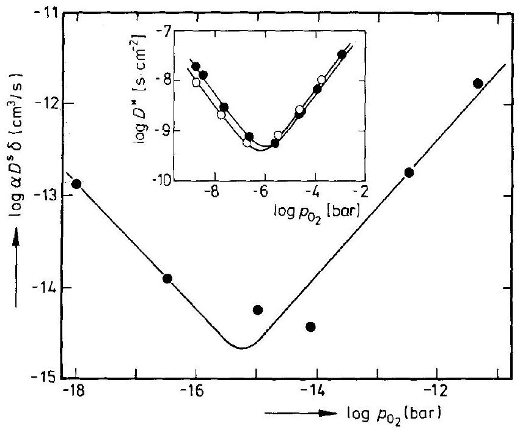
Figure 10-3. Surface diffusion product of $\mathrm{Co}^{*}$ tracer on $\mathrm{Fe}_{3} \mathrm{O}_{4}$ (110), as a function of the (relative) oxygen potential. $T=750^{\circ} \mathrm{C}$ [V. Stubican (1993)]. $\alpha=$ Segregation factor, $\delta=$ width of surface layer. Insert: bulk $D_{\mathrm{Fe}}^{*}$ and $D_{\mathrm{Co}}^{*}$ in $\mathrm{Fe}_{3} \mathrm{O}_{4}$ at $T=1200^{\circ} \mathrm{C}$ [R. Dieckmann, et al. (1978)].

In other words, we can expect long range order in the boundary to occur and therefore it seems to be appropriate to distinguish between the regular and irregular SE's of an interface. For other systems, see [R. Kirchheim (1992)].

A convenient experimental method to establish a component chemical potential at an interface is based on the application of a solid state galvanic cell as depicted in Figure 10-4. It shows how to predetermine the oxygen chemical potential at the $\mathrm{Me} / \mathrm{ZrO}_{2}$ interface through the voltage $U$ applied to the $\mathrm{Pt}, \mathrm{Me} / \mathrm{ZrO}_{2}(+\mathrm{CaO}) / \mathrm{Pt}\left(\mathrm{O}_{2}\right)$ cell. The interface structure, including the interface defects, depends on $\mu_{\mathrm{O}}\left(\mu_{\mathrm{O}_{2}}\right)$ and thus on $U$.

Figure 10-4. Solid state galvanic cell which establishes the oxygen potential at the metal/oxide interface b. $\mu_{\mathrm{O}_{2}}^{\mathrm{b}}-\mu_{\mathrm{O}_{2}}^{0}=4 \cdot F \cdot U$.

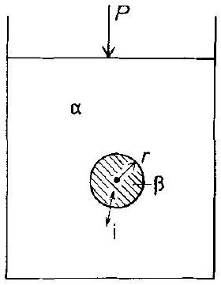
Figure 10-5. Multicomponent spherical inclusion ( $\beta$ ) in matrix $\alpha$ with exchange of $i$ component.

Up to this point we have dealt with the thermodynamics of planar boundaries. Let us add several relations for curved interfaces. First, we have to establish an equivalent to the Gibbs-Thomson equation which holds for curved external surfaces in a multicomponent system. For incoherent (fluid-like) interfaces, this can be done by considering Figure 10-5. From the equilibrium condition at constant $P$ and $T$, one has

$$
\mathrm{d} G\left(r, N_{i}^{\beta}\right)=\left(8 \pi r \cdot \sigma^{\mathrm{b}}+\frac{4 \pi r^{2}}{V^{\beta}} \cdot \sum N_{i}^{\beta} \cdot\left(\mu_{i}^{\beta}-\mu_{i}^{\alpha}\right)\right) \cdot \mathrm{d} r=0
$$

so that

$$
\sum N_{i}^{\beta} \cdot\left(\mu_{i}^{\beta}-\mu_{i}^{\alpha}\right)=-\frac{2 \cdot V^{\beta} \cdot \sigma^{\mathrm{b}}}{r}
$$

and the individual $\mu_{i}^{\beta}\left(N_{i}^{\beta}\right)$ can be derived from the mass balance and the individual phase equilibria (Gibbs-Duhem equations for $\alpha$ and $\beta$ ). For semicoherent or fully
coherent interfaces, we have to additionally solve the elastic problem. This has been done with some restrictive assumptions for a binary system [W. C. Johnson (1987)] and means, in essence, that the chemical potentials have to be complemented by elastic energy terms (i.e., $\frac{1}{2} \cdot(\hat{\varepsilon} \cdot \hat{\sigma})$ ).

Further complications emerge if the interface Gibbs energy $\sigma^{\mathrm{b}}$ is not isotropic but depends on the Miller indices ( $\mathrm{h}_{m}$ ) of the surface (interface). This means that $\delta G^{\mathrm{b}}=0(\min )$ in Eqn. (10.18) has to be evaluated for $G^{\mathrm{b}}=\sum A_{\left(\mathrm{h}_{m}\right)} \cdot \sigma_{\left(\mathrm{h}_{m}\right)}^{\mathrm{b}}+E_{\mathrm{S}}^{\mathrm{b}}$, where $A_{\left(\mathrm{h}_{m}\right)}$ is the area of interface with indices $\left(\mathrm{h}_{m}\right), \sigma_{\left(\mathrm{h}_{m}\right)}^{\mathrm{b}}$ is the corresponding specific interfacial energy, and $E_{\mathrm{S}}^{\mathrm{b}}$ is the elastic contribution to the Gibbs energy. In metals and van der Waals crystals, $\sigma_{\left(\mathrm{h}_{m}\right)}^{\mathrm{b}}$ may be estimated by counting broken bonds across the interface.

Gibbs' concept of an (infinitely thin) dividing surface lends itself to the determination of interfacial energies, in accordance with the regular solution model which takes into account the bonds of nearest neighbors only. If species A and B are randomly distributed in phases $\alpha$ and $\beta$, it follows from merely counting bonds that

$$
E^{\mathrm{b}}=\left(\frac{\varepsilon}{a^{2}}\right) \cdot\left(N_{\mathrm{A}}^{\beta}-N_{\mathrm{A}}^{\alpha}\right)^{2}
$$

with $\varepsilon=\varepsilon_{\mathrm{AB}}-\frac{1}{2} \cdot\left(\varepsilon_{\mathrm{AA}}+\varepsilon_{\mathrm{BB}}\right)$ as the excess bond energy and $a^{2}$ as the interface area per bond. This procedure can be extended to the partially ordered phases $\alpha$ and $\beta$.

Often, however, it is more realistic to abandon the model of a discontinuous interface. Segregation of impurities and other point defects, as well as elastic and electric fields, broaden the interface region. For this extended boundary, we can formulate the Gibbs energy of Eqn. (10.1) as ( $i=\mathrm{A}, \mathrm{B}$ )

$$
G^{\mathrm{b}}=\int_{\Delta \xi^{\mathrm{b}}}\left[g(\xi)-\frac{1}{2} \cdot\left(g\left(\Delta \xi^{\mathrm{b}}\right)+g(0)\right)+\varkappa \cdot\left(\frac{\partial N_{i}}{\partial \xi}\right)^{2}\right] \cdot \mathrm{d} \xi
$$

where $g$ is the local Gibbs energy density and $\varkappa$ the (specific) gradient energy as introduced by Cahn [J. W. Cahn (1959)]. The gradient energy term in Eqn. (10.21) is the equivalent of $E^{\mathrm{b}}$ in Eqn. (10.20) when the composition varies continuously. Equilibrium is attained if $\delta G^{\mathrm{b}}=0(\mathrm{~min})$ and mass conservation of the components is observed. Variational calculus yields

$$
\mu_{i}^{\mathrm{b}}=\mu_{i}^{\mathrm{b}}(\text { chem })+\mu_{i}^{\mathrm{b}}(\text { elast })-2 \cdot \varkappa \cdot\left(\frac{\mathrm{\partial}^{2} N_{i}}{\mathrm{\partial} \xi^{2}}\right)=\mu_{i}^{\alpha}=\mu_{i}^{\beta}
$$

as the equilibrium condition.
After discussing the thermodynamic properties of the boundary, let us concentrate on the change in thermodynamic potentials across the boundary. For this, we formulate the Gibbs energy for the bulk phase $\alpha$ of an ionic crystal as the sum

$$
G^{\alpha}=G^{\alpha}(\text { chem })+G^{\alpha}(\hat{\sigma})+G^{\alpha}(\varphi)
$$

where $G^{\alpha}(\hat{\sigma})$ indicates the part of $G^{\alpha}$ due to the elastic potential, and $G^{\alpha}(\varphi)$ that due to the electric potential. It follows that

$$
\mu_{i}^{\alpha}=\mu_{i}^{\alpha}(\text { chem })+\mu_{i}^{\alpha}(\hat{\sigma})+\mu_{i}^{\alpha}(\varphi)
$$

Equations (10.23) and (10.24) hold for the $\beta$-phase as well and could be inserted into Eqn. (10.22). The additivity of $\mu_{i}$ with respect to the elastic and electric potential is based on 1) the assumption of linear elastic theory (which is an approximation) and 2) the low energy density of the electric field (resulting from the low value of the absolute permittivity $\varepsilon_{0}=8.8 \times 10^{-12} \mathrm{C} / \mathrm{Vm}$ ). In equilibrium, $\nabla \mu_{i}=0$ and $\Delta^{\alpha \beta} \mu_{i}= \mu_{i}^{\beta}-\mu_{i}^{\alpha}=0$. Therefore, in an ionic system with uniform hydrostatic pressure, the explicit equilibrium condition reads ( $\Delta^{\alpha / \beta} \equiv \Delta$ )

$$
\Delta \mu_{i}+z_{i} F \Delta \varphi=0 ; \quad \Delta \varphi=-\frac{\Delta \mu_{i}}{z_{i} \cdot F}
$$

The electric potential jump $\Delta \varphi$ across the boundary is due to some separation of positive and negative electrical charge. Thus, the interface corresponds to a capacitor for which we have ( $\varrho_{\mathrm{S}}=$ surface charge density)

$$
\frac{\Delta \varphi}{\Delta \xi}=-\frac{\varrho_{\mathrm{S}}}{\varepsilon \cdot \varepsilon_{0}}
$$

Figure 10-6. Various thermodynamic potentials and the electric charge distribution at and near an equilibrium interface (schematic).

where $\Delta \xi$ is the boundary thickness. As a result of thermal activation, the mobile charges are smeared out into the adjacent bulk as a so-called space charge. Let us denote the effectively charged point defects of the space charge as $\mathrm{d}^{+}$and $\mathrm{d}^{-}$. They can combine to neutral building elements, the concentrations of which are determined by the chemical equilibrium conditions.

The space charge density is $\varrho=\left(F / V_{m}\right) \cdot\left(N_{\mathrm{d}^{+}}-N_{\mathrm{d}^{-}}\right)$, and their characteristic width (i.e., the Debye-Hückel length, which is an equilibrium property and independent of the d-mobilities) is obtained as

$$
\Delta \xi_{\mathrm{D}}=\sqrt{\frac{\varepsilon \cdot \varepsilon_{0} \cdot V_{m} \cdot R T}{2 \cdot F^{2} \cdot N_{\mathrm{d}}^{0}}} ; \quad N_{\mathrm{d}}^{0}=\sqrt{N_{\mathrm{d}^{+}} \cdot N_{\mathrm{d}^{-}}}
$$

By and large, the interface structure of an ionic system resembles the scheme shown in Figure 10-6. A similar concept can explain the concentration distribution in the elastic field of a coherent (or semicoherent) phase boundary (see Chapter 14).

### 10.3 Static Interfaces

In Chapter 3 we described the structure of interfaces and in the previous section we described their thermodynamic properties. In the following, we will discuss the kinetics of interfaces. However, kinetic effects due to interface energies (e.g., Ostwald ripening) are treated in Chapter 12 on phase transformations, whereas Chapter 14 is devoted to the influence of elasticity on the kinetics. As such, we will concentrate here on the basic kinetics of interface reactions. Stationary, immobile phase boundaries in solids (e.g., $\mathrm{A} / \mathrm{B}, \mathrm{A} / \mathrm{AX}, \mathrm{AX} / \mathrm{AY}$, etc.) may be compared to two-phase heterogeneous systems of which one phase is a liquid. Their kinetics have been extensively studied in electrochemistry and we shall make use of the concepts developed in that subject. For electrodes in dynamic equilibrium, we know that charged atomic particles are continuously crossing the boundary in both directions. This transfer is thermally activated. At the stationary equilibrium boundary, the opposite fluxes of both electrons and ions are necessarily equal. Figure 10-7 shows this situation schematically for two different crystals bounded by the (b) interface. This was already presented in Section 4.5 and we continue that preliminary discussion now in more detail.

When SE's cross phase boundaries or other interfaces, they are normally transformed and change their identity. For example, interstitial $\mathrm{A}_{i, t}^{(\mathrm{I})}$ (subscript t indicates tetrahedral coordination) may become $\mathrm{A}_{i, 0}^{(\text {II })}$ (octahedral coordination) after crossing the interface from phase (I) to (II). Let us formulate this transfer in terms of building elements, namely

$$
A_{i, t}^{(\mathrm{I})}+V_{i, \mathrm{o}}^{(\mathrm{II})}=A_{i, \mathrm{o}}^{(\mathrm{II})}+V_{i, t}^{(\mathrm{I})} ; \quad\left(A_{i, \mathrm{t}}^{(\mathrm{I})}-V_{i, t}^{(\mathrm{I})}\right)=\left(A_{i, \mathrm{o}}^{(\mathrm{II})}-V_{i, \mathrm{o}}^{(\mathrm{II})}\right)
$$

Figure 10-7. Schematics of possible atomic steps of SE $i$ at boundary b. $\bullet=$ SE $i$ in phase I, $O=\mathrm{SE} i$ in phase II. Regular sublattices ( $\mathrm{RS}^{(\mathrm{I})}, \mathrm{RS}^{(\mathrm{II})}$ ) and interstitial sublattices (IS ${ }^{(I)}$, IS ${ }^{(I I)}$ ) are indicated. More details are given in Figure 10-9.

We can see that two SE's on each side of the interface are involved in the transfer. Matter transport across the interfaces and, in particular, the dynamic equilibrium exchange fluxes $j_{k}^{0}$ therefore concern the building elements or components $k$. At equilibrium,

$$
j_{k}=\vec{j}_{k}^{0}-\tilde{j}_{k}^{0}=0
$$

The principle of microscopic reversibility across a boundary is thus applicable to building elements. Since boundary crossing by particles is a thermally activated process, the net flux of building element A across the interface exposed to an external field can be formulated as

$$
j_{\mathrm{A}}=j_{\mathrm{A}}^{0} \cdot\left[\mathrm{e}^{\frac{\alpha \cdot \Delta E_{\mathrm{th}}}{R T}}-\mathrm{e}^{-(1-\alpha) \cdot \frac{\Delta E_{\mathrm{th}}}{R T}}\right]
$$

where $\Delta E_{\mathrm{th}}$ is the change in the thermodynamic potential across the interface and $\alpha$ is an asymmetry coefficient called the transfer coefficient in electrode kinetics $(0<\alpha<1)$. If an electric potential change $\Delta \varphi$ is the driving force, then Eqn. (10.30) becomes for charged particles in a linearized version

$$
j_{\mathrm{A}}=j_{\mathrm{A}}^{0} \cdot \frac{z_{\mathrm{A}} \cdot F \cdot \Delta \varphi}{R T}
$$

so that the interface resistance, that is, $\frac{\Delta \varphi}{\left|z_{\mathrm{A}} \cdot F \cdot j_{\mathrm{A}}\right|}$, becomes

$$
R_{\mathrm{A}}=\frac{R T}{\left(z_{\mathrm{A}} F\right)^{2}} \cdot \frac{1}{j_{\mathrm{A}}^{0}}
$$

One notes that $R_{\mathrm{A}}$ is inversely proportional to the exchange flux ( $j_{\mathrm{A}}^{0}$ ) of the dynamic equilibrium interface.

It has been shown for $\mathrm{Ag} / \mathrm{Ag}_{2} \mathrm{~S}$ that the interface polarization $\Delta \varphi$ stems from the transfer of $\mathrm{Ag}^{+}$ions and not of electrons, which implies that the transfer of electrons and ions across the $\mathrm{Ag} / \mathrm{Ag}_{2} \mathrm{~S}$ interface are independent processes [H. Rickert (1973)]. If so, then they are kinetically decoupled and can be characterized by their individual exchange fluxes $j_{\mathrm{e}}^{0}$ and $j_{\mathrm{Ag}}^{0}$. If $\Delta \varphi>50 \mathrm{meV}$, we are no longer in the linear regime and the flux of silver ions depends exponentially on $\Delta \varphi[\mathrm{H}$. Corish, J. Warde (1978)]. We note, however, that the preparation of boundaries by contacting different crystals is ambiguous. Caution is necessary if experimental results are compared, especially in view of a possible impurity segregation at the interface. The most difficult problem in this context is the experimental determination of the potential drop $\Delta E_{\mathrm{th}}$ (e.g., $\Delta \varphi$ ) across a boundary. Obviously it is not possible to insert potential probes in the bulk close to the interface without disturbing or even destroying the crystal. This is in contrast to the experimental possibilities at hand in surface science [e.g., H.-D. Wiemhöfer, et al. (1990)].

Depending on the type of boundary and field, a force may act on the static interface. This can be seen from Figure 10-8. For the analysis, let us place the crystal between asymmetric capacitor plates. Without the field, the boundary (b) is surrounded by a symmetric (AX/AX) or an asymmetric (AX/AY) space charge. Thus, an inhomogeneous electric field exerts a force on the (dipolar) interface. The boundary
a)
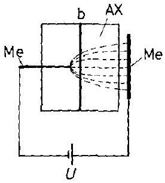
b)

Figure 10-8. Schematic diagram of a device for the determination of interface mobility in an inhomogeneous electric field. The motion due to electric (and frictional) forces occurs a) without, b) with galvanic contact (inducing ionic fluxes and decomposition of AX).

(provided it is mobile) will move until a force equilibrium is attained and the restoring interface tension equals the electric field force. If the interface tension is known, one could determine the amount of space charge. In Figure 10-8a, the crystal has no (electrical) contact with the capacitor plates. If such contact is established (Fig. 10-8b), a flux of charged particles flows across the interface and exerts an additional (frictional) force which may also lead to a boundary displacement. The friction stems from a momentum exchange between the drifting particles and the interface. Its calculation requires a detailed knowledge of the local particle dynamics at or near the boundary which is not yet available. A rough estimate shows that frictional pressures may be in the range of millibars. Similar considerations hold for driving forces other than electric ones. For example, if an elastic stress field is applied to a sample containing coherent boundaries, the elastic interaction of the applied field with the coherency stress field can cause the boundaries to move depending on their mobilities [J. R. Dryden, G. R. Purdy (1990)]. We note in passing that $\Delta \mu_{i}^{\mathrm{b}} / \Delta \xi^{\mathrm{b}}$ across the boundary b conforms to a 'chemical' virtual force with no immediate mechanical effect.

Let us now construct an atomic model for the interface reactions and particle transfer across boundaries in order to interpret such kinetic parameters introduced before as the exchange current or the interface resistance. To this end, we replot Figure 10-7 as shown in Figure 10-9a. This scheme allows us to quantify the processes occurring at a stationary interface in an electric field under load. Let us further simplify the model and consider crystals with immobile anions and the interface AY/AX as shown in Figure 10-9b. AY merely serves as a source for the injection of atomic particles (SE's) into the sublattices of AX, or as a sink for SE's arriving from

AX at the AY/AX boundary. The main feature of this interface reaction (i.e., the transport of building elements across b) is the injection of mobile point defects into available vacant sites and the subsequent local relaxation towards equilibrium distributions. According to Figure 10-9b, two different modes of cation injection can take place in the relaxation zone $\xi_{\mathrm{R}}$. 1) Cations are injected into the sublattice of predominant ionic transference in AX by the applied field. In this case, no further defect reaction is necessary for the continuation of cation transport. 2) Cations are injected into the 'wrong' sublattice which does not contribute noticeably to the cation transport in AX. Defect reactions (relaxation) will occur subsequently to ensure continuous charge transport. This is the situation depicted in Figure 10-9b, and, in view of its model character, we briefly outline the transport formalism.

If we denote the point defect injected by the applied field into the 'wrong' sublattice of AX by i (e.g., $\mathrm{A}_{\mathrm{i}}^{*}$ ), and the conjugate defect that carries the flux in AX by j (e.g., $\mathrm{V}_{\mathrm{A}}^{\prime}$ ), then the steady state condition for both fluxes ( $\mathrm{i}, \mathrm{j}$ ) in the defect recombination zone $\xi_{\mathrm{R}}$ is

$$
j_{\mathrm{i}}-j_{\mathrm{j}}=j_{0} ; \quad \nabla j_{\mathrm{i}}=\nabla j_{\mathrm{j}}=\dot{r}_{\mathrm{i}}=\dot{r}_{\mathrm{j}}
$$

in accordance with Figure 10-9b, where $j_{0}$ is the constant total flux ( $=-j_{\mathrm{i}}$ at $\xi \gg \xi_{\mathrm{R}}$ ) and $\dot{r}_{\mathrm{i}}$ and $\dot{r}_{\mathrm{j}}$ are recombination (production) rates. Furthermore, we have at the interface ( $\xi=0$ )

$$
j_{\mathrm{i}}=j_{0}
$$

The second condition for bulk transport in AX is $D_{\mathrm{j}} \gg D_{\mathrm{i}}$ in accordance with our assumptions. The point defects relax by a bimolecular reaction mode (see Section 5.3.3). In order to simplify the formal treatment, we linearize the recombination rate

$$
\dot{r}_{\mathrm{i}}=-k_{\mathrm{i}} \cdot \frac{\Delta c}{c^{0}} ; \quad \Delta c=c_{\mathrm{i}}-c^{0}=c_{\mathrm{j}}-c^{0}
$$

We have tacitly assumed that space charge effects can be neglected in the present context, which is justified for sufficiently high fields. Inserting the explicit flux equations for i and j into Eqn. (10.33) we obtain

$$
F \cdot \nabla \varphi=-R T \cdot \frac{j_{0}+\left(D_{\mathrm{i}}-D_{\mathrm{j}}\right) \cdot \nabla c_{\mathrm{i}}}{\left(D_{\mathrm{i}}+D_{\mathrm{j}}\right) \cdot c_{\mathrm{i}}}
$$

and therefore the flux of i becomes

$$
j_{\mathrm{i}}=-2 \cdot \frac{D_{\mathrm{i}} \cdot D_{\mathrm{j}}}{D_{\mathrm{i}}+D_{\mathrm{j}}} \cdot \nabla c_{\mathrm{i}}+\frac{D_{\mathrm{i}}}{D_{\mathrm{i}}+D_{\mathrm{j}}} \cdot j_{0}
$$

With Eqn. (10.37) it follows from Eqns. (10.33) and (10.35) that

$$
\nabla^{2}(\Delta c)-\xi_{\mathrm{R}} \cdot(\Delta c)=0, \quad \xi_{\mathrm{R}}=\sqrt{\frac{D_{\mathrm{j}} \cdot D_{\mathrm{j}}}{D_{\mathrm{i}}+D_{\mathrm{j}}} \cdot \frac{c^{0}}{k_{\mathrm{i}}}}=\sqrt{2 \cdot \bar{D} \cdot \tau_{\mathrm{R}}}
$$

The relaxation time $\tau_{\mathrm{R}}$ is $c^{0} /\left(2 \cdot k_{\mathrm{i}}\right)$ and $\bar{D}$ is defined as $D_{\mathrm{i}} \cdot D_{\mathrm{j}} /\left(D_{\mathrm{i}}+D_{\mathrm{j}}\right)$. Solving Eqn. (10.38) with the boundary conditions of Figure 10-9b we obtain

$$
\Delta c=\frac{j_{0} \cdot \xi_{\mathrm{R}}}{2 \cdot D_{\mathrm{i}}} \cdot \mathrm{e}^{-\frac{\xi}{\xi_{\mathrm{R}}}}
$$

and

$$
j_{\mathrm{i}}=j_{0} \cdot \frac{D_{\mathrm{i}}}{D_{\mathrm{i}}+D_{\mathrm{j}}} \cdot\left(1+\frac{D_{\mathrm{j}}}{D_{\mathrm{i}}} \cdot \mathrm{e}^{-\frac{\xi}{\xi_{\mathrm{R}}}}\right)
$$

Between $\xi=0$ and $\xi=\xi_{\mathrm{R}}, j_{\mathrm{i}}$ diminishes approximately as $\mathrm{e}^{-\frac{\xi}{\xi_{\mathrm{R}}}}$. Only a small fraction of the total flux $j_{0}$ is carried into the bulk of $\mathrm{AX}\left(\xi \gg \xi_{\mathrm{R}}\right)$ by the interstitials. Their transference number is given by $D_{\mathrm{i}} /\left(D_{\mathrm{i}}+D_{\mathrm{j}}\right)$.

In a zeroth order approach, integration of Eqn. (10.36) gives $j_{0}$ as a function of the electrical potential drop $\Delta U$ in the recombination zone

$$
j_{0}=-\frac{F}{R T} \cdot c^{0} \cdot\left(D_{\mathrm{i}}+D_{\mathrm{j}}\right) \cdot \frac{\Delta U}{\xi_{\mathrm{R}}}
$$

$\Delta U$ is known as the overpotential in the electrode kinetics of electrochemistry. Let us summarize the essence of this modeling. If we know the applied driving forces, the mobilities of the SE's in the various sublattices, and the defect relaxation times, we can derive the fluxes of the building elements across the interfaces. We see that the interface resistivity $R^{\mathrm{b}}=\Delta U /\left(F \cdot j_{0}\right)$ stems, in essence, from the relaxation processes of the SE's (point defects). $R^{\mathrm{b}}$ depends on the relaxation time $\tau_{\mathrm{R}}$ of the (chemical) processes that occur when building elements are driven across the boundary. In accordance with Eqn. (10.33), the flux $j_{0}$ can be understood as the integral of the relaxation (recombination, production) rate $\dot{r}_{\mathrm{i}}\left(\dot{r}_{\mathrm{j}}\right)$, taken over the width $\xi_{\mathrm{R}}$.

$$
j_{0}=j_{\mathrm{i}}(0)-j_{\mathrm{i}}(\infty)=\int_{\xi_{\mathrm{R}}} \dot{r}_{\mathrm{i}} \cdot \mathrm{~d} \xi
$$

The width of the relaxation zone $\xi_{\mathrm{R}}$, which is the thickness of the 'kinetic interface', may differ considerably from other lengths characterizing other properties of an interface (e.g., space charge width, elastic deformation width).

Transport of $\mathrm{Ag}^{+}$across the $\mathrm{AgI} / \mathrm{Ag}_{2} \mathrm{~S}$ boundary has been studied experimentally as a function of $\Delta \eta_{\mathrm{Ag}}^{\mathrm{b}}$ (which was determined with the help of microsensors of the type $\mathrm{Ag} / \mathrm{AgBr}$ ) [H. Schmalzried, et al. (1992)]. From flux vs. driving force curves, the exchange flux $j^{0}$ has been evaluated and found to be $c a .1 \mathrm{~A} / \mathrm{cm}^{2}$ at $260^{\circ} \mathrm{C}$. Introducing this high value of $j^{0}$ into Eqn. (10.41) and noting that the boundary resistance is

$$
R^{\mathrm{b}}=\frac{R T}{\left(z_{\mathrm{i}} \cdot F\right)^{2} \cdot j^{0}}=\frac{R T \cdot \xi_{\mathrm{R}}}{\left(z_{\mathrm{i}} \cdot F\right)^{2} \cdot c^{0} \cdot\left(D_{\mathrm{i}}+D_{\mathrm{j}}\right)}
$$

we can determine the defect relaxation time $\tau_{\mathrm{R}_{5}}$ by using Eqn. (10.38). For this $\mathrm{AgI} / \mathrm{Ag}_{2} \mathrm{~S}$ interface, $\tau_{\mathrm{R}}$ is calculated to be $c a .10^{-5} \mathrm{~s}$, suggesting that the relaxation is a diffusion controlled reaction between point defects.

### 10.4 Moving Interfaces

### 10.4.1 General Remarks

In a foregoing section, we mentioned that field forces (e.g., of the electric or elastic field) can cause an interface to move. If they are large enough so that inherent counterforces (such as interface tension or friction) do not bring the boundary to a stop, the interface motion would continue and eventually become uniform. In this section, however, we are primarily concerned with boundary motions caused by chemical potential changes. From irreversible thermodynamics, we know that the dissipated Gibbs energy of the discontinuous system is $T \cdot \sigma^{\mathrm{b}}$, where $\sigma^{\mathrm{b}}$ here is the entropy production (see Section 4.2). Since $\mathrm{d} G / \mathrm{d} V=\mathrm{d} \dot{G} / \mathrm{d} \dot{V}=\sigma^{\mathrm{b}} \cdot T /(A \cdot \dot{\xi})$, we have with Eqn. (4.8) at the boundary $b$

$$
\frac{\sum j_{i}^{\mathrm{b}} \cdot \Delta \mu_{i}^{\mathrm{b}}}{v^{\mathrm{b}}}=\frac{\sum N_{i}^{\mathrm{b}} \cdot \Delta \mu_{i}^{\mathrm{b}}}{V_{m}}=\frac{\Delta G_{m}^{\mathrm{b}}}{V_{m}}
$$

where A is the unit area. $\Delta G^{\mathrm{b}}$ is the Gibbs energy dissipated at the interface during the reaction (e.g., $\mathrm{A}+\mathrm{B}=\mathrm{AB}$ ). What are the physical processes which are responsible for the dissipation of $\Delta G^{\mathrm{b}}$ ?

Boundaries between solids transmit shear stress, particularly if they are coherent or semicoherent. Therefore, the strain energy density near boundaries changes over the course of solid state reactions. Misfit dislocation networks connected with moving boundaries also change with time. They alter the transport properties at and near the interface. Even if we neglect all this, boundaries between heterogeneous phases are sites of a discontinuous structural change, which may occur cooperatively or by individual thermally activated steps.

In order to quantify $\Delta G^{\mathrm{b}}$ as a fraction of the available Gibbs energy $\Delta G$, let us first introduce a phenomenological approach. In Figure 10-10, a solid state reaction for a binary (or quasi-binary) system is illustrated and shows the variation in the chemical potential for different conditions. We assume without loss of generality that $D_{\mathrm{A}} \gg D_{\mathrm{B}}$. We then define $\Delta \mu_{\mathrm{A}}(\mathrm{AB})$ and $\Delta \mu_{\mathrm{A}}^{\mathrm{b}}$ in such a way that $\Delta \mu_{\mathrm{A}}(\mathrm{AB})+ \Delta \mu_{\mathrm{A}}^{\mathrm{b}}=\Delta G_{\mathrm{AB}}$ as the overall driving force. In Figure 10-10, it was tacitly assumed that $j^{0}(1) \gg j^{0}(2)$, with $j^{0}$ denoting the exchange fluxes as discussed in the previous section. The steady state condition is

$$
j_{\mathrm{A}}=j_{\mathrm{A}}^{0} \cdot \frac{\Delta \mu_{\mathrm{A}}^{\mathrm{b}}}{R T}=\frac{D_{\mathrm{A}} \cdot c_{\mathrm{A}}}{\Delta \xi(\mathrm{AB})} \cdot \frac{\Delta \mu_{\mathrm{A}}(\mathrm{AB})}{R T}
$$

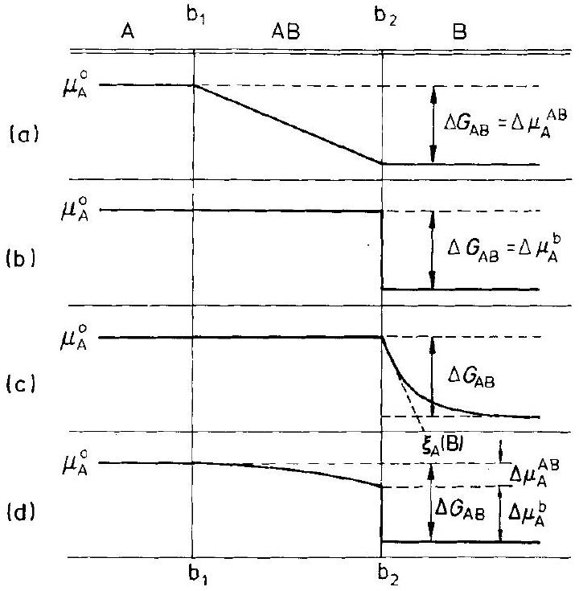
Figure 10-10. Representation of the chemical potential of A during the heterogeneous solid state reaction $\mathrm{A}+\mathrm{B}=\mathrm{AB}$. a) Diffusion control, b) interface control at $\left.b_{2}, c\right)$ rate control by rearrangement (relaxation) of $A$ in $B$ in zone $\xi_{A}(B)$, d) simultaneous diffusion and interface control $\left(\mathrm{b}_{2}\right)$.

if $D_{\mathrm{A}}$ is independent of the activity of A in AB . Defining a length $\Delta \bar{\xi}=\left(D_{\mathrm{A}} \cdot c_{\mathrm{A}} / j_{\mathrm{A}}^{0}\right)$, we obtain from Eqn. (10.45)

$$
\frac{\Delta \overline{\xi^{\prime}}}{\Delta \overline{\bar{\xi}}+\Delta \xi(\mathrm{AB})}=\frac{\Delta \mu_{\mathrm{A}}^{\mathrm{b}}}{\Delta G_{\mathrm{AB}}}=\frac{\Delta \mu_{\mathrm{A}}^{\mathrm{b}}}{\Delta \mu_{\mathrm{A}}^{\mathrm{b}}+\Delta \mu_{\mathrm{A}}(\mathrm{AB})}
$$

For $\Delta \xi(\mathrm{AB}) \rightarrow 0, \Delta \mu_{\mathrm{A}}^{\mathrm{b}}=\Delta G_{\mathrm{AB}}$, and the reaction is interface controlled. This can be seen in Figure 10-10b. If $\Delta \xi(\mathrm{AB}) \gg \Delta \bar{\xi}$, then $\Delta \mu_{\mathrm{A}}^{\mathrm{b}} \rightarrow 0$ and the reaction is controlled by diffusion through the product AB . If $\Delta \xi(\mathrm{AB})=\Delta \bar{\xi}$, one half of $\Delta G_{\mathrm{AB}}$ is dissipated in the product AB and the other half in the boundary b .

Experiments have shown that $\Delta \bar{\xi}$ for oxide spinel formation is on the order of $10^{-4} \mathrm{~cm}$ at ca. $1000^{\circ} \mathrm{C}$ [C.A. Duckwitz, H. Schmalzried (1971)]. Using Eqns. (10.45) and (10.46) with the accepted cation diffusivities (on the order of $10^{-10} \mathrm{~cm}^{2} / \mathrm{s}$ ), one can estimate from $j_{\mathrm{A}}^{0}$ that each A particle crosses the boundary about ten times per second each way. In other words, quenching cannot preserve the atomistic structure of a moving interface which developed during the motion by kinetic processes. This also means that heat conduction is slower than a structural change on the atomic scale, unless one quenches extremely small systems.

If a phase boundary is reaction rate determining, the chemical potential curve of component A conforms to the schematic plots in Figure 10-10b or c. Figure 10-10c indicates that A , when in front of the moving interface $\mathrm{AB} / \mathrm{B}$, is supersaturated to some extent in a thin layer of B . Thus, component A drags the interface along while it overshoots. (An interface drag of a different nature will be treated later in Section 10.4.4.) In this situation, the moving $\mathrm{AB} / \mathrm{B}$ interface is normally morphologically unstable since the supersaturated segment of the solid solution exists in front of it.

AB can then grow either by nucleation in the supersaturated segment, by continuous addition at sites of repeatable growth on the boundary, or by recurring AB nucleation on the interface plane. In view of the commonly occurring misfit at most boundaries, it is probable that sufficient growth sites are normally available.

Let us conclude this section with a few general remarks. If we assume phase boundary rate control, the rate of advance is co-determined by the interface mobility, which in turn is related to the mobilities of the atoms in the interface. We note that 1) the directional dependence of mobilities or diffusivities in the interface may be quite pronounced (depending on $\tilde{\delta}$ ) and 2 ) the mobilities or diffusivities depend on $\mu_{i}^{\mathrm{b}}$, the component chemical potentials, which change over time at the interface until diffusion control eventually becomes rate determining.

Finally, we observe that two distinct processes always occur at the moving boundary: 1) a change in crystal structure and 2) a change in the density of all structure elements. At low $T$, where the mobilities of bulk SE's are very small, and a sufficiently high driving force is acting, the change in lattice structure and the transport of SE's can decouple. In that instance, one observes the limiting case of diffusionless transformations into metastable states.

### 10.4.2 Interface Motion During Phase Transformation

Phase transformations in elemental solids or line compounds are the simplest heterogeneous solid state reactions with a moving interface. In the language of thermodynamics, the interface is the location where extensive state variables change discontinuously. Point defect concentrations ( $c_{\text {def }}$ ) are normalized extensive functions of state. Therefore, phase transformations of even elemental crystals are accompanied by defect concentration relaxation at and near the moving interface. Figure 10-11 depicts the $\alpha-\beta$ transformation of an elemental crystal. The distribution and strength of point defect sinks determine the defect concentration profile in space as a function of time. The following basic assumptions define the kinetic problem. 1) As long as $N_{\text {def }} \ll 1$, the Gibbs energy change for the structural transformation $\Delta G$ is independent of $c_{\text {def }}(=c)$, and the transformation velocity $\boldsymbol{v}^{\mathrm{b}}$ is, to first order, a linear function of $\Delta G\left(\sim\left(T-T_{\mathrm{tr}}\right)\right)$. 2) $v^{\mathrm{b}}$, which is thus determined by the undercooling ( $T-T_{\mathrm{tr}}$ ), has to match the transformation velocity defined through the conservation

Figure 10-11. Distribution of point defects near a moving interface during transformation $\alpha \rightarrow \beta$.

of the point defects, that is, $\boldsymbol{v}^{\mathrm{b}} \cdot\left(c^{\beta, \mathrm{b}}-c^{\alpha, \mathrm{b}}\right)=\left(j^{\beta, \mathrm{b}}-j^{\alpha, \mathrm{b}}\right)$, given that the boundary does not act as a defect sink. 3) If no other defect sinks but the ends of the (linear) sample are available for defect relaxation, then $\nabla j^{\alpha}=0, \nabla j^{\beta}=0$, and $\int_{\alpha} c^{\alpha} \cdot \mathrm{d} \xi+\int_{\beta} c^{\beta} \cdot \mathrm{d} \xi=\left(\xi^{\alpha}-\xi^{\beta}\right) \cdot c^{0}$ are the local and integral equations of point defect conservation in space and time. 4) The kinetic problem, however, is not fully defined unless we specify the kinetic properties (for defect transfer) of the boundary proper. In the simplest case, we may assume local equilibrium to prevail, that is, $\left(c^{\alpha} / c^{\beta}\right)^{\mathrm{b}}=v^{0}$ (constant). The mathematical solution to this problem is closely related to the calculation of the redistribution of solutes in a solidifying solvent [M. C. Flemings (1974)].

If we next consider the $\alpha-\beta$ transformation of a binary compound (e.g., $\mathrm{A}_{1-\delta} \mathrm{B}$ ) with a narrow range of homogeneity instead of an elemental crystal A , we encounter a general problem which is illustrated in Figure 10-12. From the relevant thermodynamic function, it can be seen that for a given undercooling (corresponding to $\Delta G(t=0)$ ), the chemical potential $\mu_{\mathrm{A}}^{\beta}(t=0)$ is much higher than $\mu_{\mathrm{A}}^{\alpha}(t=0)$ and it depends much more strongly on $\delta$ than does $\mu_{\mathrm{A}}^{\alpha}$. As a consequence, component A will be transported across the moving $\alpha-\beta$ boundary from the transformed $\beta$ into the untransformed $\alpha$. It follows that during the transformation $\delta^{\alpha}$ and $\mu_{\mathrm{A}}^{\alpha}$, on the average, should increase with time.

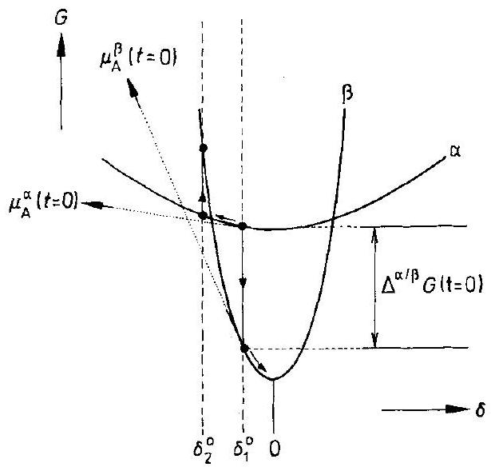
Figure 10-12. The Gibbs energy us. nonstoichiometry $\delta$ for binary compounds (e.g., $\mathrm{Ag}_{2+\delta} \mathrm{S}$ ). Nucleation of $\beta$ at $\delta_{2}^{0}$ needs activation, in contrast to nucleation of $\beta$ at $\delta_{1}^{0}$.

The Gibbs energies of compounds $\alpha$ and $\beta$ depend parabolically on the nonstoichiometry $\delta$ (i.e., $\sim \delta^{2}$ [H. Schmalzried (1978)]) if their ranges of homogeneity are narrow. The curvature at $\delta=0$ is inversely proportional to $\sqrt{K}$, where $K$ is the equilibrium constant of the intrinsic defect disorder. Therefore, in keeping with Figure 10-12, $\Delta G$ and $\Delta \mu_{\mathrm{A}}^{\mathrm{b}}$ can be written for a given undercooling $\Delta T\left(=T-T_{\mathrm{tr}}\right)$ as

$$
\begin{gathered}
\Delta G-\Delta G(\delta=0)=\varepsilon_{2} \cdot\left(\delta^{\beta, \mathrm{b}}\right)^{2}-\varepsilon_{1} \cdot\left(\delta^{\alpha, \mathrm{b}}\right)^{2} \\
\Delta \mu_{\mathrm{A}}^{\mathrm{b}}=\Delta G+\left(\varepsilon_{2} \cdot \delta^{\beta, \mathrm{b}}-\varepsilon_{1} \cdot \delta^{\alpha, \mathrm{b}}\right)
\end{gathered}
$$

where $\varepsilon_{1}$ and $\varepsilon_{2}$ are known functions of the equilibrium constants $K(T)$ for phases $\alpha$ and $\beta$.

Before we continue our analysis of the first-order $\mathbf{A}_{1-\delta} \mathbf{B}$ transformation, let us first describe some illustrative results obtained for $\mathrm{Ag}_{2+\delta} \mathrm{X} ; \mathrm{X}=\mathrm{S}$, Se. Crystals of $\mathrm{Ag}_{2} \mathrm{~S}$ are semiconductors and transform at $\mathrm{c} a .176^{\circ} \mathrm{C}$. They are bcc in the high temperature ( $\alpha$ ) form, with a homogeneity range ( $\delta_{\text {max }}^{\alpha}$ ) on the order of $10^{-3}$. The low temperature ( $\beta$ ) form is monoclinic, its homogeneity range ( $\delta_{\text {max }}^{\alpha}$ ) is on the order of $10^{-6}$ [H. Schmalzried (1980)]. With a sufficient driving force (i.e., undercooling $\Delta T$ ), the $\alpha \rightarrow \beta$ transformation therefore involves matter transfer in the form of point defects across the boundary b. Phase $\alpha$ is enriched in silver during this transformation. The Ag potential in the $\alpha$-phase increases in front of the moving boundary. This increase will be larger the higher the initially established nonstoichiometry $\delta^{0}$ ( $c^{0}$ ) (Fig. 10-11). The Ag potential increases until the Ag supersaturation is sufficient to precipitate point defects as metallic Ag in the $\mathrm{Ag}_{2} \mathrm{~S}$ matrix. The supersaturation necessary for the nucleation of silver has been determined with miniaturized $\mu_{\mathrm{Ag}}$ sensors in the form of solid state galvanic cells $(\approx 15 \mathrm{meV})$. The variation in time of the Ag chemical potential is not monotonic during the $\alpha-\beta$ transformation. Several minima and maxima of $\mu_{\mathrm{Ag}}(t)$ are found in front of the moving boundary (Fig. 10-13). Various explanations have been offered for this pulsating interface motion. Firstly, since there is a slight difference in the molar volumes of $\alpha$ and $\beta$, misfit dislocations will be created and move along with the moving boundary. If they form networks which can then interact with the moving boundary, the resulting elastic effects may be oscillatory. Secondly, impurities segregate at the boundary and will also be dragged along. If they cannot follow, the boundary frees itself from the impurity cloud (see Fig. 3-11) in a similar way as it may free itself from the dislocation network. Thus, one again anticipates oscillatory behavior, since the boundary velocity depends on the amount and distribution of dragged impurities. However, there is a more fundamental possible explanation for this mode
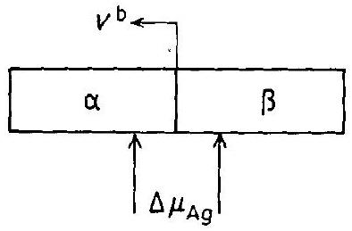

Figure 10-13. The measured Ag potential difference $\Delta \mu_{\mathrm{Ag}}$ between $\alpha$ and $\beta$ during transformation of $\mathrm{Ag}_{2+\delta} \mathrm{Se} . \delta^{0}=1.95 \times 10^{-3}$, $v^{\mathrm{b}}=1.3 \mathrm{~cm} / \mathrm{min}$.

of boundary velocity. It may be recognized if we resume the previous discussion of moving interfaces during solid state reactions. When silver is driven in the form of point defects (i.e., irregular ionic and compensating electronic defects) across the phase boundary, point defects of the $\beta$-phase are injected into the $\alpha$-phase as mobile irregular SE's. This injection upsets local point defect equilibria near the boundary and induces relaxation processes involving both regular and irregular SE's.

The reaction scheme at and near the phase boundary during the phase transformation is depicted in Figure 10-14. The width of the defect relaxation zone around the moving boundary is $\Delta \xi_{\mathrm{R}}$, it designates the region in which the relaxation processes take place. The boundary moves with velocity $\boldsymbol{v}^{b}(t)$ and establishes the boundary conditions for diffusion in the adjacent phases $\alpha$ and $\beta$. The conservation of mass couples the various processes. This is shown schematically in Figure 10-14b where the thermodynamic conditions illustrated in Figure 10-12 are also taken into account. The transport equations (Fick's second laws) have to be solved in both the $\alpha$ and $\beta$
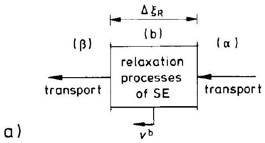
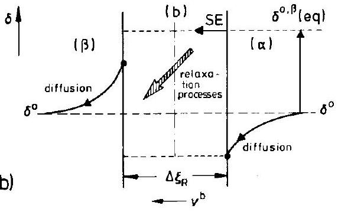

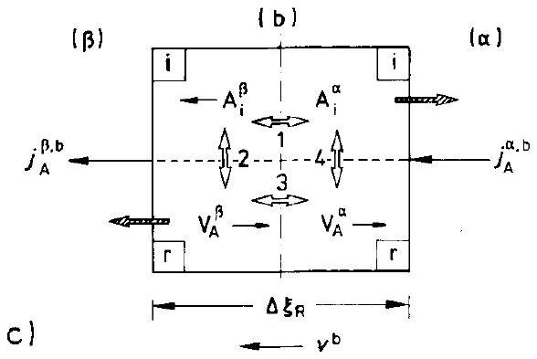
Figure 10-14. Relaxation processes at a moving interface. a) Scheme of boundary $\alpha / \beta$ during transformation, b) coupling of transport and relaxation processes, c) detailed structure element steps in the relaxation zone.

phases where the boundary conditions at $\xi=0$ and $\xi=\infty$ are $j_{i}=0$ and $\delta^{\alpha}= \delta^{\alpha}(t=0)$ respectively.

The main problem of the boundary motion, however, remains the description of relaxation processes that take place when supersaturated point defects are pumped into the boundary region $\Delta \xi_{\mathrm{R}}$. Outside the relaxation zone $\Delta \xi_{\mathrm{R}}$, diffusion without reaction takes place. A simple model of a 'relaxation box' is shown in Figure 10-14c. The four exchange reactions 1) between the crystals $\alpha$ and $\beta$, and 2) between their sublattices are

$$
\begin{aligned}
& \mathrm{A}_{\mathrm{i}}^{\alpha}+\mathrm{V}_{\mathrm{i}}^{\beta}=\mathrm{A}_{\mathrm{i}}^{\beta}+\mathrm{V}_{\mathrm{i}}^{\alpha} \\
& \mathrm{A}_{\mathrm{i}}^{\beta}+\mathrm{V}_{\mathrm{A}}^{\beta}=\mathrm{A}_{\mathrm{A}}^{\beta}+\mathrm{V}_{\mathrm{i}}^{\beta} \\
& \mathrm{A}_{\mathrm{A}}^{\alpha}+\mathrm{V}_{\mathrm{A}}^{\beta}=\mathrm{A}_{\mathrm{A}}^{\beta}+\mathrm{V}_{\mathrm{A}}^{\alpha} \\
& \mathrm{A}_{\mathrm{i}}^{\alpha}+\mathrm{V}_{\mathrm{A}}^{\alpha}=\mathrm{A}_{\mathrm{A}}^{\alpha}+\mathrm{V}_{\mathrm{i}}^{\alpha}
\end{aligned}
$$

The fractions $N_{\mathrm{v}_{\mathrm{i}}}^{\alpha}, N_{\mathrm{v}_{\mathrm{i}}}^{\beta}, N_{\mathrm{A}_{\mathrm{A}}}^{\alpha}$, and $N_{\mathrm{A}_{\mathrm{A}}}^{\beta}$ are $\approx 1$. If we assume for simplicity that A is transported in $\alpha$ via interstitials and in $\beta$ via vacancies, as indicated in Figure 10-14c, we have the following system of differential equations for the 'relaxation box' (denoting $c_{\mathrm{A}_{\mathrm{i}}}^{\alpha}$ by $x_{1}, c_{\mathrm{A}_{\mathrm{i}}}^{\beta}$ by $x_{2}, c_{\mathrm{V}_{\mathrm{A}}}^{\alpha}$ by $x_{3}$ and $c_{\mathrm{V}_{\mathrm{A}}}^{\beta}$ by $x_{4}$ )

$$
\begin{array}{ll}
\dot{x}_{1}=A-\left(\overleftarrow{k}_{1}+\vec{k}_{4} \cdot x_{4}\right) \cdot x_{1}+\vec{k}_{1} \cdot x_{2} ; & A=\left(j_{\mathrm{A}}^{\alpha \mathrm{b}}+\overleftarrow{k}_{4}\right) \\
\dot{x}_{2}=B-\left(\vec{k}_{1}+\overleftarrow{k}_{2} \cdot x_{3}\right) \cdot x_{2}+\overleftarrow{k}_{1} \cdot x_{1} ; & B=\vec{k}_{2} \\
\dot{x}_{3}=C-\left(\vec{k}_{3}+\overleftarrow{k}_{2} \cdot x_{2}\right) \cdot x_{3}+\overleftarrow{k}_{3} \cdot x_{4} ; & C=\left(j_{\mathrm{A}}^{\beta \mathrm{b}}+\vec{k}_{2}\right) \\
\dot{x}_{4}=D-\left(\overleftarrow{k}_{3}+\vec{k}_{4} \cdot x_{1}\right) \cdot x_{4}+\vec{k}_{3} \cdot x_{3} ; & D=\overleftarrow{k}_{4}
\end{array}
$$

To complete the set of kinetic equations we observe that $\boldsymbol{v}^{\mathrm{b}}=(\Delta j / \Delta c)^{\mathrm{b}}$ where $\Delta c^{\mathrm{b}}$ can be expressed in terms of $\delta^{\alpha, \mathrm{b}}$. Finally, the requirement of mass conservation yields a further equation. Considering the inherent nonlinearities, this problem contains the possibility of oscillatory solutions as has been observed experimentally. Let us repeat the general conclusion. Reactions at moving boundaries are relaxation processes between regular and irregular SE's. Coupled with the transport in the untransformed and the transformed phases, the nonlinear problem may, in principle, lead to pulsating motions of the driven interfaces.

Proceeding systematically, diffusion controlled $\alpha-\beta$ transformations of binary A-B systems should be discussed next when $\alpha$ and $\beta$ are phases with extended ranges of homogeneity. Again, defect relaxations at the moving boundary and in the adjacent bulk phases are essential for their understanding (see, for example, [F. J. J. van Loo (1990)]). The morphological aspects of this reaction type are dealt within the next chapter.

We have mentioned that coherent and semicoherent transformations create stress in the phases $\alpha$ and $\beta$ while the boundary moves. The stress field, the origin of which is the (semi-) coherent boundary, extends over the crystal with sound velocity. The local stress depends on the geometry of the sample and the momentary location of the boundary. The stress gradient can be included in the driving force, if necessary. Normally, however, it does not seem possible to quantify the influence of stress, although it is noticeable both in the kinetics and morphology at small undercoolings. After reversing the thermodynamic driving force $\Delta T$, hysteresis is to be observed as a result of the asymmetry of the stress state [B. Baranowski (1993)].

### 10.4.3 Interface Movement During the Heterogeneous Reaction $\mathbf{A}+\mathbf{B}=\mathbf{A B}$

Interface control of the solid state reaction $\mathrm{A}+\mathrm{B}=\mathrm{AB}$ (e.g., at the $\mathrm{AB} / \mathrm{B}$ boundary) means inter alia that the chemical potential of reactant A in AB is $\mu_{\mathrm{A}}^{0}$ instead of $\mu_{\mathrm{A}}^{0}+\Delta G_{\mathrm{AB}}^{0}$ at the $\mathrm{AB} / \mathrm{B}$ interface (Fig. 10-10). It thus seems as if a negative virtual pressure $\Delta G_{\mathrm{AB}}^{0} / V_{\mathrm{m}}$ is dragging the interface into the A supersaturated region of B (Fig. 10-10c). From the steady state condition of the moving $A B / B$ interface, we have $\boldsymbol{v}^{\mathrm{b}}=\boldsymbol{v}_{\mathrm{A}}^{0}=j_{\mathrm{A}}^{b} / c_{\mathrm{A}}^{0}(\mathrm{~B})$, which gives

$$
b_{\mathrm{A}} \cdot\left(\nabla \mu_{\mathrm{A}}-\bar{K}_{\mathrm{A}}\right)+v_{\mathrm{A}}^{0}=0 ; \quad \bar{K}_{\mathrm{A}}=-\frac{n \cdot \varepsilon^{0}}{\left(\xi_{\mathrm{A}}(\mathrm{~B})\right)^{n+1}}
$$

where $\varepsilon^{0} /\left(\xi_{\mathrm{A}}(\mathrm{B})\right)^{n}$ is an assumed interaction potential between solute A in B and the advancing $\mathrm{AB} / \mathrm{B}$ interface with $\varepsilon^{0}$ and $n$ as phenomenological parameters. Equation (10.51) yields

$$
\frac{\Delta G_{\mathrm{AB}}^{0}}{\xi_{\mathrm{A}}(\mathrm{~B})}+\frac{n \cdot \varepsilon^{0}}{\xi_{\mathrm{A}}(\mathrm{~B})^{n+1}}+\frac{v_{\mathrm{A}}^{0}}{b_{\mathrm{A}}}=0
$$

and relates $\xi_{\mathrm{A}}(\mathrm{B})$ to $\Delta G_{\mathrm{AB}}^{0}, b_{\mathrm{A}}$, and $v_{\mathrm{A}}^{0}$. Let us define a characteristic time $\tau$ such that $\xi_{\mathrm{A}}(\mathrm{B})=\boldsymbol{v}_{\mathrm{A}}^{0} \cdot \tau$. From Eqn. (10.52), we can then determine $\boldsymbol{v}_{\mathrm{A}}^{0}$ (or $\boldsymbol{v}^{\mathrm{b}}$ ) as a function of $\tau$, which is the essential parameter for understanding the movement of the reaction controlled interface. In the simplest case ( $n=1$ ),

$$
\left(v^{\mathrm{b}}\right)^{3}+\frac{\Delta G_{\mathrm{AB}}^{0} \cdot b_{\mathrm{A}}}{\tau} \cdot v^{\mathrm{b}}+\frac{\varepsilon^{0} \cdot b_{\mathrm{A}}}{\tau^{2}}=0
$$

This shows how the steady state velocity of the interface is related to some characteristic parameters of the reacting solids if interface control prevails.

Sometimes, one has independent information on $\tau$. Let us consider an interface controlled spinel formation ( $\mathrm{AO}+\mathrm{B}_{2} \mathrm{O}_{3}=\mathrm{AB}_{2} \mathrm{O}_{4}$ ). We assume that the rate limiting interface is $\mathrm{AB}_{2} \mathrm{O}_{4} / \mathrm{AO}$ and also that the spinel product is a so-called normal spinel in which the A cations are situated on tetrahedral sites. Therefore, in the super-
saturated AO front region (where the $\mathrm{B}_{2} \mathrm{O}_{3}$ component possesses a chemical potential $\mu_{\mathrm{B}_{2} \mathrm{O}_{3}}>\mu_{\mathrm{B}_{2} \mathrm{O}_{3}}^{0}+\Delta G_{\mathrm{AB}_{2} \mathrm{O}_{4}}^{0}$ ), the cations rearrange themselves between octahedral and tetrahedral sites in the fcc sublattice of the oxygen ions. The relaxation time, $\tau$, for this process is known from experiment. A rough estimate for $\boldsymbol{v}^{\mathrm{b}}$ can be obtained by setting $\varepsilon^{0}=0$ and $\Delta G_{\mathrm{AB}}^{0} / R T=1$, whereupon Eqn. (10.53) reduces to $v^{\mathrm{b}}= \sqrt{D_{\mathrm{A}}(\mathrm{B}) / \tau}$. Inserting $\tau$ as ca. 1 s at $1000^{\circ} \mathrm{C}$ and $D_{\mathrm{A}}(\mathrm{B})=10^{-12} \mathrm{~cm}^{2} / \mathrm{s}$ [K. D. Becker (1987); C.A. Duckwitz (1971)], we see that the estimated theoretical values of $\boldsymbol{v}_{\mathrm{A}}^{0}$ compare favorably with the experimental values of ca. $10^{-4} \mathrm{~cm} / \mathrm{min}$. We also note that this interface reaction is once more interpreted in terms of relaxation processes of structure elements.

### 10.4.4 The Dragged Boundary (Generalized Solute Drag)

Let us once again inspect Eqn. (10.51). Both $\nabla \mu_{\mathrm{A}}\left(\approx \Delta G_{\mathrm{AB}}^{0} / \xi_{\mathrm{A}}(\mathrm{B})\right)$ and $\bar{K}_{\mathrm{A}}$ could be the cause of the boundary (interface) motion (Fig. 10-10). Yet whereas $\nabla \mu_{\mathrm{A}}$ is a (virtual) thermodynamic force, $\bar{K}_{\mathrm{A}}$ is an actual (elastic, electric) field force acting directly on the boundary. This fact sometimes causes difficulties in defining the interface mobility. We obtain the interface velocity if the adjacent phases are chemically equilibrated and thus homogeneous as the product of the mobility and the field force, $\boldsymbol{v}^{\mathrm{b}}=m^{\mathrm{b}} \cdot \bar{K}^{\mathrm{b}}$. However, an independent determination of $\bar{K}^{\mathrm{b}}$ is most difficult. A straightforward situation is the curved boundary in a chemically homogeneous system (e.g., grain boundary, bicrystal) which moves under the action of the interface tension (no external force!). If the magnitude of the interface tension is known, then the interface mobility is a quantity that can be determined unequivocally by experiment. Externally applied field forces act on both the boundary and the bulk. Normally, the interface is mobile only if SE's of the bulk crystal are mobile as well. Therefore, atomic fluxes cross the interface while it moves and exert additional frictional forces. Such a situation is difficult to analyze. A limiting case, which has been treated in physical metallurgy, will be outlined below.

Every one-, two- or three-dimensional crystal defect gives rise to a potential field in which the various lattice constituents (building elements) distribute themselves so that their thermodynamic potential is constant in space. From this equilibrium condition, it is possible to determine the concentration profiles, provided that the partial enthalpy and entropy quantities $h_{i}(\xi)$ and $s_{i}(\xi)$ of the building units $i$ are known. Let us consider a simple limiting case and assume that the potential field around an (planar) interface is symmetric as shown in Figure 10-15, and that the constituent $i$ dissolves ideally in the adjacent lattices, that is, it obeys Boltzmann statistics. In this case we have

$$
c_{i}=c_{i}^{0} \cdot \mathrm{e}^{-\bar{\varepsilon}(\xi)}=c_{i}^{0} \cdot \mathrm{e}^{-\tilde{\varepsilon}(-\xi)} ; \quad \tilde{\varepsilon}=\frac{E_{i}}{R T}
$$

Since $\bar{K}_{i}=-\partial E_{i} / \partial \xi$, the force $\bar{K}_{i}^{0}$ is constant in the region of interaction $-\Delta \xi \ldots 0$, and is $-\bar{K}_{i}^{0}$ between $0 \ldots+\Delta \xi$. By Eqn. (10.54), the pressure $P_{i}$ on the interface due to its interaction with species $i$ is

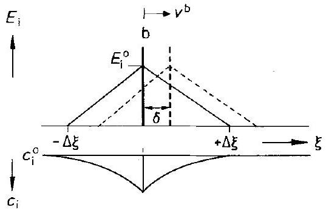
Figure 10-15. Interaction potential between the (moving) grain boundary (interface) and solute species $i$, and its spatial distribution $c_{i}$ at $t=0$.

$$
P_{i}=\int_{-\infty}^{+\infty} c_{i} \cdot \bar{K}_{i} \cdot \mathrm{~d} \xi=-c_{i}^{0} \cdot \int_{-\Delta \xi}^{+\Delta \xi} \mathrm{e}^{-\tilde{\varepsilon}(\xi)} \cdot\left(\frac{\partial E_{i}}{\partial \xi}\right) \cdot \mathrm{d} \xi
$$

At equilibrium, it vanishes. Let us now assume that an external force $K_{\mathrm{ex}}\left(P_{\mathrm{ex}}\right)$ has shifted the interface by an amount $\delta$, and that the $i$ particles were not able to follow this shift. The potential field $E_{i}(\xi)$ is now perturbed relative to the cloud of $i$ particles as indicated in Figure 10-15. From Eqn. (10.54), one calculates the restoring pressure on the interface, $-P_{\mathrm{r}}$, as

$$
-P_{\mathrm{r}}=2 \cdot c_{i}^{0} \cdot E_{i}^{0} \cdot \mathrm{e}^{-\frac{E_{i}^{0}}{R T}} \cdot \frac{\delta}{\Delta \xi}
$$

where $\delta$ is the displacement (assumed to be small in comparison to $\Delta \xi$ ). Note that no interface tension operates on the planar interface.

However, when particles $i$ are mobile in the crystal lattice, and the interface mobility is $m^{\mathrm{b}}$, the steady state condition for this more realistic case is

$$
\left(P_{\mathrm{ex}}-P_{i}\right) \cdot m^{\mathrm{b}}=v^{\mathrm{b}}
$$

The 'internal' pressure, $P_{i}$, is no longer given by Eqn. (10.55) because the $i$ particles redistribute during their steady state motion. Only if the interface mobility $m^{\mathrm{b}}$ is very small and $D_{i} / \Delta \xi \gg v^{\mathrm{b}}$ will $c_{i}(\xi)$ come close to the equilibrium distribution given by Eqn. (10.54).

In order to calculate this new steady state, one requires the $i$ particle velocity, which vanishes in a reference system that is attached to the interface. In the external laboratory system the interface moves with constant velocity $\boldsymbol{v}^{\text {b }}$. A steady state is attained if the velocity of the $i$ particles is equal to $\boldsymbol{v}^{\mathbf{b}}$, that is,

$$
\boldsymbol{v}^{\mathrm{b}}=b_{i} \cdot\left(-\nabla \mu_{i}+\bar{K}_{i}\right)
$$

which gives for $\bar{K}_{i}=-\frac{\partial E_{i}}{\partial \xi}$

$$
c_{i} \cdot\left(\frac{\partial E_{i}}{\partial \xi}\right)+\nabla \mu_{i}=-\frac{\boldsymbol{v}^{\mathrm{b}}}{b_{i}}
$$

Equation (10.59), in combination with Eqns. (10.55) and (10.57), can be used to determine $c_{i}(\xi)$ as a function of $\boldsymbol{v}^{\mathrm{b}}$ and $E_{i}(\xi)$, and $\boldsymbol{v}^{\mathrm{b}}$ as a function of the drag force $\bar{K}_{i}$ (see Fig. 3-11). Solutions have been worked out, for example, by [K. Lücke (1972); M. Hillert (1978)] for a moving grain boundary at which impurity atoms or other point defects segregate. The defects are dragged during recrystallization of the polycrystalline material driven by the grain boundary energy (tension). A similar problem is met if (charged) dislocation lines, with their impurity cloud, are exposed to an electric field force.

### 10.4.5 Diffusion Induced Grain Boundary Motion

A special case of interface movement apparently driven by a 'chemical pressure' is the diffusion induced (grain) boundary motion (DIGM). From Chapter 3, we know that diffusivities at interfaces are much larger than in the bulk. Therefore, we normally build up large differences in the chemical potential of components between the boundary and the adjacent bulk when an external source (or sink) for these components exists at the surface of the solid. A corresponding experimental situation is illustrated in Figure 10-16 whereby gaseous B diffuses into the initially straight grain boundary of a thin foil of A . Any fluctuation will render the B potential change unsymmetric with respect to the adjacent bulk phase. Consequently, a net (virtual) 'chemical pressure' will act on the boundary which, if mobile, starts to move. Since the sweeping boundary is filled with the high activity B, it also fills that part of the bulk crystal with B that has been crossed during the diffusion induced grain boundary motion. Therefore, DIGM enhances both the diffusional solution of B into solvent A and the corresponding Gibbs energy dissipation. The (virtual) 'chemical pressure' asymmetry is self-sustaining. The boundary will continue to move in accordance with its mobility and with any restoring forces which may develop during the sweep (e.g., by misfit dislocation formation). Sweeping boundaries have been observed in-situ both in metallic and in nonmetallic solid solution crystals [R. Balluffi, J. W. Cahn (1981)].

Figure 10-16. DIGM: Solute B diffuses from gas ( g ) into grain boundary b of solvent foil A , causing b to move.

### 10.5 Morphological Questions

Although morphological problems related to moving solid/solid interfaces are treated in depth in the next chapter, some basic aspects of the boundary motion during heterogeneous solid state reactions will be introduced in the context of this chapter. If the heterogeneous reaction $\mathrm{A}+\mathrm{B}=\mathrm{AB}$ is transport controlled, we can verify by inspecting Figure 10-17 that in a one-dimensional reaction geometry, a planar interface is stable during product growth. Every perturbation of the planar interface changes the potential gradients in such a way that the diffusive fluxes will restore its planarity. Interface stability requires, in essence, that the boundary velocity vector and the matter flow vector (which is responsible for the interface reaction and thus for the interface velocity) have the same direction. If these vectors were opposing, then the moving interface would be morphologically unstable, as Figure 10-18 shows, in which $v^{\mathrm{b}}$ is directed towards the high potential side.

A somewhat different situation is depicted in Figure 10-19. A flux of $\mathrm{A}^{+}$cations is driven (e.g., by an electric field) across the boundary of the phase combination $\mathrm{AX}(\alpha) / \mathrm{BX}(\beta)$. Since the AX side is anodic, the boundary shifts into BX . Two cases can be distinguished with respect to the cation mobilities: 1) $b_{\mathrm{A}}^{\alpha}>b_{\mathrm{B}}^{\beta}$ and 2) $b_{\mathrm{A}}^{\alpha}<b_{\mathrm{B}}^{\beta}$. In the first case, the planar boundary is morphologically unstable since

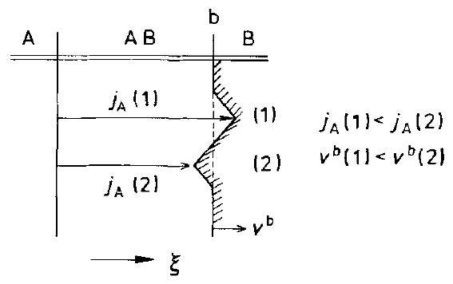
Figure 10-17. Morphological stability of interface $\mathrm{AB} / \mathrm{B}$ during the heterogeneous reaction $\mathrm{A}+\mathrm{B}=\mathrm{AB}$. Since $\boldsymbol{v}^{\mathrm{b}}(1)<\boldsymbol{v}^{\mathrm{b}}(2)$ ( $\nabla \mu_{\mathrm{A}}(1)<\nabla \mu_{\mathrm{A}}(2)$ ), the interface is morphologically stable.

Figure 10-18. Crystal AO in an oxygen potential gradient and the morphological stability of its interfaces. Since $\nabla \mu_{\mathrm{A}}(1)<\nabla \mu_{\mathrm{A}}(2)<\nabla \mu_{\mathrm{A}}(3)$, $j_{\mathrm{A}}(1)<j_{\mathrm{A}}(2)<j_{\mathrm{A}}(3)$, and $v^{\mathrm{b}}(1)<v^{\mathrm{b}}(2)<v^{\mathrm{b}}(3)$. Conclusion: boundary $\mathrm{b}^{\prime \prime}$ is morphologically stable, boundary $\mathrm{b}^{3}$ is morphologically unstable.

Figure 10-19. Cations $\mathrm{A}^{+}$driven by an electric field across interface $\mathrm{AX} / \mathrm{BX}\left(D_{\mathrm{X}} \ll D_{\mathrm{B}}<D_{\mathrm{A}}\right)$. Since $D_{\mathrm{B}}<D_{\mathrm{A}}, j_{\mathrm{A}}^{\alpha}(1)\left(=j_{\mathrm{B}}^{\beta}(1)\right)<j_{\mathrm{A}}^{\alpha}(2)\left(=j_{\mathrm{B}}^{\beta}(2)\right)$ and $v^{\mathrm{b}}(1)<v^{\mathrm{b}}(2)$. Conclusion: interface $\mathrm{AX} / \mathrm{BX}$ is morphologically unstable, if the A electrode is anodic.

any perturbation of the boundary geometry will cause the electrical resistance of the system to decrease with time. The increasing disturbance autocatalytically accelerates the resistance decrease, as can be seen from Figure 10-19. The opposite is true for the second case. One can quantify the situation depicted in Figure 10-19 and obtain, with the help of a little algebra and noting that $j_{\mathrm{A}}^{\alpha}=j_{\mathrm{B}}^{\beta}$ at boundary positions (1) and (2),

$$
\boldsymbol{v}^{\mathrm{b}}=\overline{\boldsymbol{v}}^{\mathrm{b}} \cdot\left[1-\frac{b_{\mathrm{B}}-b_{\mathrm{A}}}{b_{\mathrm{B}} \cdot \Delta \xi^{\alpha}+b_{\mathrm{A}} \cdot \Delta \xi^{\beta}} \cdot \mathrm{d} \xi\right] ; \quad b_{\mathrm{A}}=b_{\mathrm{A}}^{\alpha}, \quad b_{\mathrm{B}}=b_{\mathrm{B}}^{\beta}
$$

This means that $\boldsymbol{v}^{\mathrm{b}}(1)<\boldsymbol{v}^{\mathrm{b}}(2)$ if $b_{\mathrm{A}}^{\alpha}>b_{\mathrm{B}}^{\beta}$. In this case, the moving boundary is morphologically unstable. If, however, $b_{\mathrm{A}}^{\alpha}<b_{\mathrm{B}}^{\beta}$, then one finds from Eqn. (10.60) that $\boldsymbol{v}^{b}(1)>\boldsymbol{v}^{b}(2)$, which says that the interface is morphologically stable because the perturbations of the boundary decay with time. In one way or the other, possible changes in the interface morphology which occur in heterogeneous reacting systems can always be reduced to the situations depicted in Figures 10-18 and 10-19.

### 10.6 The Atomic Structure of Moving Interfaces

In the previous section, we introduced the concept of macroscopic morphological stability. Let us now ask what the interface structure is on an atomic scale. The structure of the equilibrium interface is that which makes the Gibbs energy a minimum (see Section 10.2). The purpose of the moving interface, which separates the two nonequilibrium phases $\alpha$ and $\beta$, is to perform the structural transformation. The transformation process selects the atomic structure of the moving interface such that it eventually allows the fastest steady state transformation kinetics. Coherent (semicoherent) interfaces often achieve this goal by the motion of ledges and kinks. Other mechanisms, however, may operate as well. For the sake of illustration, let us consider a specific example. The spinel formation reaction $\mathrm{AB}+\mathrm{B}_{2} \mathrm{O}_{3}= \mathrm{AB}_{2} \mathrm{O}_{4}$ requires (in addition to the above mentioned cation rearrangement) the dense packed oxygen ion sublattice to transform from hcp ( $\mathrm{B}_{2} \mathrm{O}_{3}$ ) into fcc ( $\mathrm{AB}_{2} \mathrm{O}_{4}$ )
at the $\mathrm{AB}_{2} \mathrm{O}_{4} / \mathrm{B}_{2} \mathrm{O}_{3}$ moving boundary. This structural transformation could, for example, be performed by bundles of partial (edge) dislocations gliding on the densest packed oxygen ion planes and changing the ABAB packing into an ABC packing. Therefore, the basal oxygen planes in the product and the reactant should remain parallel. However, experiments show that this is often not so, and that the (111) plane of the product is not strictly parallel to the $(000.1)_{\mathrm{B}_{2} \mathrm{O}_{3}}$ plane of the reactant. Figure 10-20 gives the interface structure as suggested by electron microscopy studies [B. C. Carter, H. Schmalzried (1985)]. The benefit of the experimentally determined small rotation about a close-packed direction is that 1 ) it can accommodate the misfit between reactant and product at the interface and, more importantly from a kinetic standpoint, 2) the necessary voids and steps along the interface between the sesquioxide and the spinel resulting from the rotation can obviously accomplish the structural transformation sufficiently fast without the need to create and move Shockley partial dislocations. The atomic rearrangement occurs basically through the increased mobility of the ions in these voids. Anions leave the hcp structure lattice and are properly added to the fcc surface of the void. This 'pore movement' differs considerably from the well known interface movement by the motion of ledges along an interface [D. Hesse, et al. (1993)].

Figure 10-20. Schematic structure of the moving $\mathrm{AB}_{2} \mathrm{O}_{4} / \mathrm{B}_{2} \mathrm{O}_{3}$ interface with a small rotation about a close-packed direction, accommodated by voids.

We have pointed out before that during reaction, interfaces may act as sources and sinks for point defects. Therefore, dislocations associated with these interfaces have to climb. The coupling of dislocation climb, ledge motion, and the creation (annihilation) of point defects at moving boundaries have been discussed for isomorphous, diffusion controlled $\alpha-\beta$ transformations. In cases where the contiguous $\alpha$ and $\beta$-phases are structurally dissimilar, the corresponding coupled processes at the moving boundary are less well understood [B. Pieraggi, et al. (1990)].

To summarize: the structure of a moving interface on the atomic scale depends on the atomic mechanism which operates in the structure transformation. The mode selection depends on the driving force and thus on the interface velocity. The interface mobility itself is determined by its structure and depends therefore on the driving force. This means that interface controlled reactions are normally nonlinear functions of the driving force.

## References

Baranowski, B. (1993) J. Alloys and Compounds, 200, 87
Balluffi, R., Cahn, J.W. (1981) Acta Met., 29, 493
Becker, K. D., Rau, F. (1987) Ber. Bunsenges. Phys. Chem., 91, 1279
Cahn, J. W. (1959) Acta Met., 7, 18
Cahn, J. W. (1982) J. Phys. (Paris) 43, C6-199
Carter, C.B., Schmalzried, H. (1985) Phil. Mag., 52, 207
Corish, J., Wade, C. J. (1978) Ber. Bunsenges. Phys. Chem., 82, 282
Dieckmann, R., et al. (1978) Ber. Bunsenges. Phys. Chem., 82, 778
Dryden, J. R., Purdy, G.R. (1990) Acta Met., 38, 1255
Duckwitz, C.A., Schmalzried, H. (1971) Z. phys. Chem., NF76, 173
Flemings, M. C. (1974) Solidification Processing, McGraw Hill, New York
Gibbs, G. B. (1966) Phys. Stat. Sol., 16, K27
Hesse, D., et al. (1993) Appl. Phys. A, 57, 415
Hillert, M. (1978) Ber. Bunsenges. Phys. Chem., 82, 244
Johnson, W. C. (1987) Met. Trans., A18, 1093
Johnson, W. C., Müller, W. H. (1991) Acta Met. Mater., 39, 89
Johnson, W. C., Schmalzried, H. (1992) Acta Met. Mater., 40, 2337
Kirchheim, R. (1992) in: Materials Interfaces (Ed.: D. Wolf, S. Yip), Chapman and Hall, London
Lücke, K., et al. (1972) in: The Nature and Behaviour of Grain Boundaries (Ed.: H. Hu), Plenum Press, New York, p. 245 ff
Maier, J. (1994) Solid State Ionics 70, 43
Pieraggi, B., et al. (1990) Acta Met. Mater., 38, 1781
Rickert, H. (1973) Einführung in die Elektrochemie fester Stoffe, Springer, Berlin
Schmalzried, H. (1978) Ber. Bunsenges. Phys. Chem., 82, 277
Schmalzried, H. (1980) Progr. Sol. State Chem., 13, 119
Schmalzried, H., et al. (1992) Solid State Ionics, 51, 91
Schmalzried, H. (1993) Polish J. Chemistry, 67, 167
Stubican, V. (1993) Phil. Mag., 68, 809
van Loo, F. J. J., et al. (1990) Acta Met. Mater., 38, 1769
Voorhees, P. W., Johnson, W.C. (1989) J. Chem. Phys., 90, 2793
Wiemhöfer, H. D., et al. (1990) Solid State Ionics, 40/41, 433
Wolf, D., Merkle, K. L. (1992) in: Materials Interfaces (Ed.: D. Wolf, S. Yip), Chapman and Hall, London

