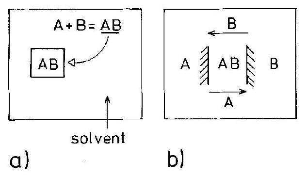
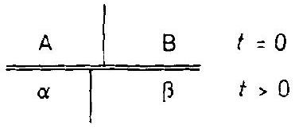
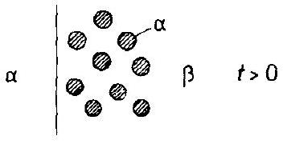
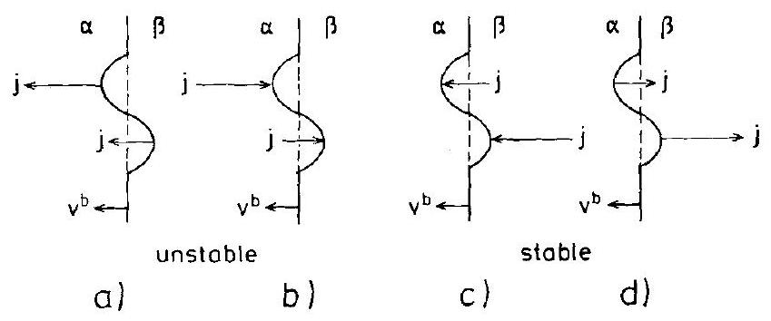
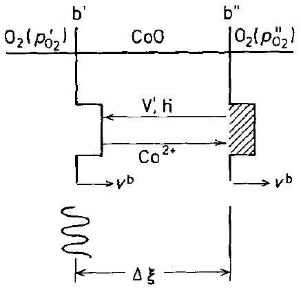
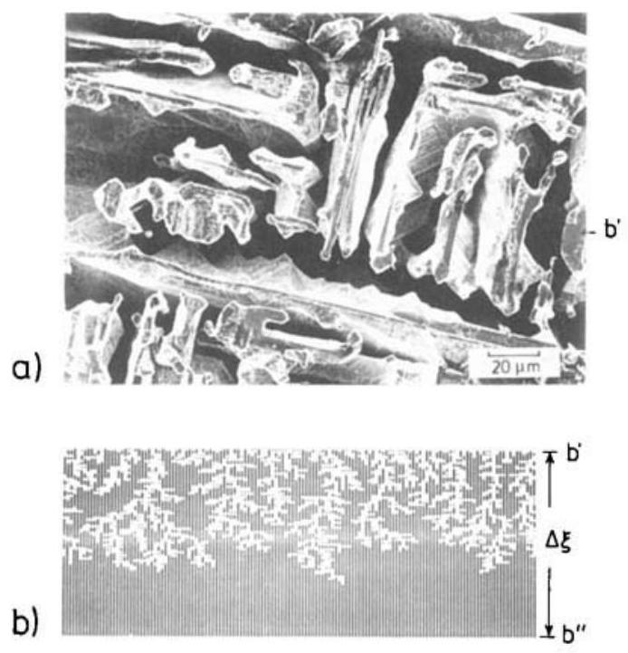
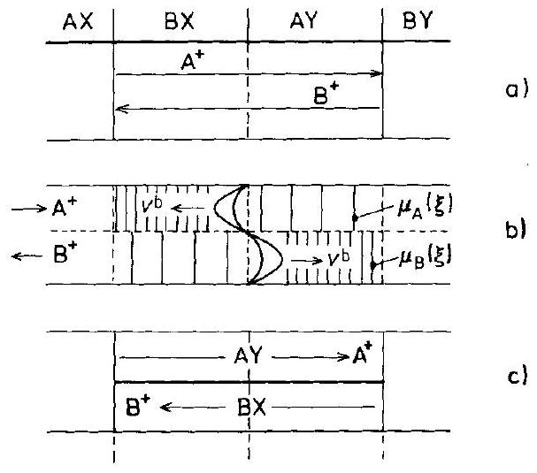
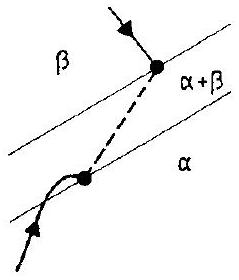
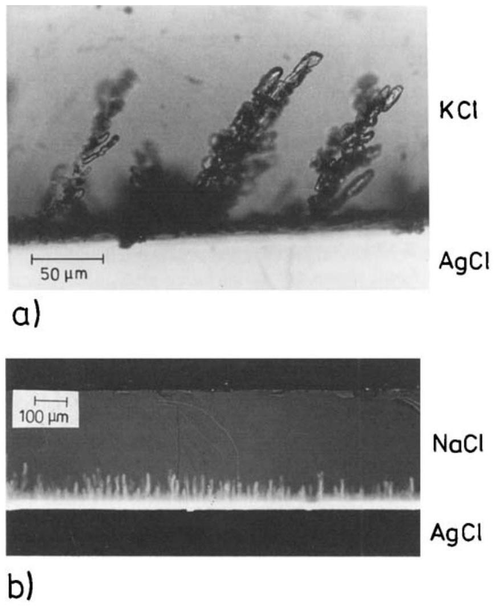

## 11 Morphology

### 11.1 Introduction

This chapter discusses the evolution of boundaries during solid state reactions. A reacting heterogeneous system is morphologically unstable if the initially planar equipotential surfaces or interfaces become nonplanar $(f(z) \rightarrow f(z, y, x))$ and the potential gradients $\nabla P_{i}(z)$ become dependent on $(z, y, x)$, where $y, x$ are the coordinates perpendicular to the initial normal vector of the boundary and growth direction $z$. There are many causes for the instabilities of moving boundaries in isothermally reacting solids. The large composition gradients near the boundaries and the corresponding changes of the mobilities and mechanical properties normally result in severe distortions of the structure (cracks, dislocations, etc.). Even if we neglect these (secondary) effects on morphological stability, the moving boundaries can nevertheless become unstable. This inherent instability is a mere transport phenomenon and derives immediately from the continuum flux equations and the boundary conditions. Morphological instability is found if the perturbation amplitudes of the initially planar equipotential surfaces increase instead of decrease. Thus, the boundary conditions of the reaction become time-dependent. The solidification of a simple melt by heat transport is an analogous problem, and here the velocity $v^{\mathrm{b}}$ of the solid/liquid boundary is determined by the rate at which the released latent heat diffuses away from this boundary. The resulting dendritic growth shows a unique parabolic tip and an oscillatory side branching mode. The theory of this unstable growth is highly mathematical. Surface tension plays a decisive role. It destroys whole families of possible solutions, selecting out a unique structure and controlling the process pattern [J. S. Langer (1980), H. Müller-Krumbhaar, W. Kurz (1990)].

In this chapter, we will present examples of morphological instabilities during solid state reactions. Alloy oxidation, the dissolution of a crystalline solution into a liquid or solid solvent, compound crystals brought into motion in chemical potential gradients, interdiffusion in multicomponent systems with miscibility gaps, and other situations will be considered. The formal discussion is meant to outline the basic features of the mathematical stability analysis. The results will enable us to formulate rules which can help to distinguish between morphologically stable and unstable boundaries in reacting systems. Finally, a reaction path analysis for a non-equilibrium, multicomponent system is presented which gives additional information about morphological stability. For a multicomponent, inhomogeneous or heterogeneous system, the reaction path can be found if the experimental composition vs. distance curve is replotted in terms of the compositional or chemical potential coordinates in a corresponding phase diagram. We will see that pertinent conclusions can be
drawn if we realize that the boundary is morphologically unstable when its motion is directed towards supersaturated regions.

It helps to clarify the concepts if we distinguish between two principally different reaction modes of the heterogeneous reaction $\mathrm{A}+\mathrm{B}=\mathrm{AB}$. 1) The reaction $\mathrm{A}+\mathrm{B}=$ AB occurs, on an atomic scale, outside the product crystal (normally in an adjacent solvent). AB molecules are then added to the surface of the AB crystal to make it grow ( = additive growth). 2) The solid product AB is formed from the very beginning between A and B such that AB separates the reactants. Further growth is possible only by transport of the A and B reactants across the product layer (= reactive growth). These two possible growth modes are depicted in Figure 11-1.

Figure 11-1. Scheme of a) additive and b) reactive crystal growth.

The addition of AB molecules to the crystal (reaction mode 1)) means that the growth is by precipitation from the (supersaturated) surroundings. It will be unimpeded as long as there are repeatable sites of growth available on the surface of the AB product. This mode of growth is shown to be morphologically unstable unless stabilizing factors are operative. In reactive growth defined as mode 2), the growing product retards the advancement of the reaction (unless paths other than that of diffusion across the product layer become rate determining). In mode 1), the atomic reaction $\mathrm{A}+\mathrm{B}=\mathrm{AB}$ took place before the growth could occur by the addition of AB molecules to the crystal. In mode 2), reaction and growth define the same process. The distinction between additive and reactive growth is important when we study morphological stability. The additive growth is morphologically unstable because the crystal surface moves towards a region of increased AB activity. We will not pursue this any further since many textbooks on crystal growth deal with this subject $[\mathrm{K} . \mathrm{A}$. Jackson (1975)].

In the following, we assume the reactions to occur essentially in one dimension. Although spherical, cylindrical, and other common reaction geometries complicate the mathematics, they do not significantly alter the conclusions on boundary stability. The question then is whether or not a planar boundary (e.g., $\mathrm{A} / \mathrm{AB}$ or $\mathrm{AB} / \mathrm{B}$ in Fig. 11-1) remains planar when it moves in the course of a reaction, and why it does so. Formally, we have to investigate the evolution of the boundary geometry over time, when matter is diffusing in the two adjacent phases and across the boundary b. To this end, one must solve the transport problem in the contiguous phases while
the moving interface establishes the conditions of the flux coupling. A theoretical stability analysis can be made if we assume that the moving interface is in local equilibrium. The real situation, however, is often more complex. The assumption of local equilibrium defines a limiting case. In general, the interfacial reaction kinetics must be explicitly taken into account when the coupling conditions are formulated (as discussed in Section 10.4.2). Also, the structure of the $\alpha / \beta$ interface, and thus the interfacial kinetic parameters, change with time since there is never full coherency between the contiguous $\alpha$ - and $\beta$-phases during reaction. Depending on the degree of coherency, the mechanical properties of $\alpha$ and $\beta$, and the ability of the interface to transmit shear, far reaching stresses, dislocations, cracks, and fractures evolve. Furthermore, interface tensions influence the activities of the components near the interface, in particular if morphological instability leads to the formation of highcurvature tips. We therefore anticipate, in agreement with common experience, that very seldom will the boundaries of crystals remain stable during growth, be it additive or reactive.

The definition of a solid state reaction implies that the reaction product is a solid. If, for example, one of the reactants is a fluid, no deviatoric stresses are transmitted across the common interface. This situation simplifies the mechanical boundary condition significantly and explains why studies on boundary morphology are often performed with solid/fluid systems.

### 11.2 Interface Stability

### 11.2.1 Qualitative Discussion

In the following, we will analyze the fluxes and transport at the moving boundary b. For inhomogeneous single phase solids, the one dimensional mass transport balance in the $z$-direction (without a reaction term) reads

$$
\frac{\partial c_{i}}{\partial t}=-\frac{\partial j_{i}}{\partial z}
$$

At the $\alpha / \beta$ phase boundary, an equivalent mass balance condition in terms of the boundary velocity is

$$
\boldsymbol{v}_{\perp}^{\mathrm{b}}=\frac{\partial z^{\mathrm{b}}}{\partial t}=-\frac{\Delta j_{\perp}}{\Delta c}
$$

where $\Delta$ denotes the change across b and $\boldsymbol{v}_{\perp}^{\mathrm{b}}$ is the velocity vector perpendicular $(\perp)$ to the interface. Equation (11.2) implies that the diffusional transport in $b$ itself can be neglected, which is true if $D^{\mathrm{b}}$ and $D^{\mathrm{V}}$ are of the same order of magnitude.

Figure 11-2. a) Flux lines in a Laplace potential field of the $\alpha$-phase, given that $L^{\beta}>(\gg) L^{\alpha}$. b) Construction of the near boundary chemical potential gradients $\nabla \mu_{i}^{\alpha}$ and $\nabla \mu_{i}^{\beta}$ in the marked region of a) (see text).

Let us generalize and consider three dimensional transport and introduce the explicit fluxes $j_{i}=-L_{i} \cdot \nabla \mu_{i}$ in $\alpha$ and $\beta$ into Eqn. (11.2). Since $\mu_{i}$ is a potential function and thus $\nabla \mu_{i, \|}^{\beta}=\nabla \mu_{i, \|}^{\alpha}=\nabla \mu_{i, \|}$ at the boundary b (Fig. 11-2b), we immediately find that

$$
\left(\frac{j_{i, \|}^{\alpha}}{j_{i, \|}^{\beta}}\right)_{\mathrm{b}}=\frac{L_{i}^{\alpha}}{L_{i}^{\beta}}
$$

where $L_{i}$ is the transport coefficient. If $L_{i}^{\beta} \gg L_{i}^{\alpha}$, we can conclude from Eqn. (11.3) that $j_{i, \|}^{\alpha}<j_{i, \|}^{\beta}$. Therefore, $j_{i}^{\alpha}$ is perpendicular to the boundary if $L_{i}^{\beta} \gg L_{i}^{\alpha}$. Further conclusions can then be drawn with the help of Figures 11-2a and $\mathbf{b}$. From Figure 11-2a, we see that the density of flux lines arriving at the (sinusoidally) perturbed boundary in region $y_{1}$ is larger than the flux line density arriving in the valley of region $y_{2}$. If this flux determines the advancement of the boundary in the sense of Eqn. (11.2), then two cases must be distinguishable. 1) The (average) velocity $\boldsymbol{v}^{\text {b }}$ and the flux $j_{i}^{\alpha}$ point in the same direction. In this case $\dot{z}^{\mathrm{b}}\left(y_{1}\right)>\dot{z}^{\mathrm{b}}\left(y_{2}\right)$. Thus, the perturbation decays with time and the boundary is morphologically stable. If $\boldsymbol{v}^{\mathrm{b}}$
and $j_{i}^{\alpha}$, however, have opposite directions, then the perturbation amplitude increases with time and the moving interface is morphologically unstable.

These considerations are the physical essence of any stability analysis. We may quantify somewhat further by considering Figure 11-2b, from which, with the help of Eqn. (11.2), we can infer that

$$
j_{i, \perp}^{\alpha}-j_{i, \perp}^{\beta}=v_{\perp}^{\mathrm{b}} \cdot \Delta c_{i}=j_{i}^{\alpha}-j_{i, \|}^{\alpha}-\left(j_{i}^{\beta}-j_{i, \|}^{\beta}\right)
$$

or after rearrangement

$$
j_{i}^{\alpha}=j_{i}^{\beta}-\left(L_{i}^{\alpha}-L_{i}^{\beta}\right) \cdot \nabla \mu_{i, \|}+\boldsymbol{v}_{\perp}^{\mathrm{b}} \cdot \Delta c
$$

which gives, with $j_{i}=-L_{i} \cdot \nabla \mu_{i}$,

$$
\nabla \mu_{i}^{\alpha}=\frac{L_{i}^{\beta}}{L_{i}^{\alpha}} \cdot \nabla \mu_{i}^{\beta}+\left(1-\frac{L_{i}^{\beta}}{L_{i}^{\alpha}}\right) \cdot \nabla \mu_{i, \|}-v_{\perp}^{\mathrm{b}} \cdot \frac{\Delta c}{L_{i}^{\alpha}}
$$

Since $\left|\nabla \mu_{i, \|}\right| \leq\left|\nabla \mu_{i}^{\beta}\right|$ (Fig. 11-2b) and assuming that $L_{i}^{\beta}>L_{i}^{\alpha}$, the sum of the first two terms on the right hand side of Eqn. (11.6) is negative, that is, the flux points in the positive direction of $z$. The last term can be positive or negative, but it cannot override the first two terms (otherwise we have uphill transport). We also note that the larger $L_{i}^{\beta}$ is, the smaller $L_{i}^{\alpha} / L_{i}^{\beta}$ and $\nabla \mu_{i}^{\beta}$ are.

With these relations in mind, we can read from Figure 11-2b that if the perturbation is sinusoidal, then the interface will have a slope of $-45^{\circ}$ and $\boldsymbol{v}_{\perp}^{\mathrm{b}}$ will have a slope of $+45^{\circ}$ at $z=0$. (We will later Fourier synthesize a general perturbation $\phi(z, y, t)$ from sinusoidal components.) The two semicircles in Figure 11-2b represent the absolute values of $\nabla \mu_{i}^{\alpha}$ and $\nabla \mu_{i}^{\beta}$ respectively. We can see again that for $L_{i}^{\beta} / L_{i}^{\alpha} \gg 1,\left|\nabla \mu_{i}^{\beta}\right| \rightarrow 0$ and the slope of $\nabla \mu_{i}^{\alpha}$ is $45^{\circ}$ (as is the slope of $\boldsymbol{v}_{\perp}^{\mathrm{b}}$ ). For smaller ratios of $L_{i}^{\beta} / L_{i}^{\alpha},\left|\nabla \mu_{i}^{\beta}\right|$ increases and this turns the slope of $\nabla \mu_{i}^{\alpha}\left(j_{i}^{\alpha}\right)$ to smaller values. As long as this slope is positive, the flux density in the tip region $y_{1}$ is larger than in the valley region $y_{2}$.

Thus, we conclude that the interface is morphologically unstable for negative $\boldsymbol{v}^{\mathrm{b}}$ if the flux of $i$ indeed causes the boundary motion. (This flux, however, is not necessarily the rate determining one since all fluxes in the multicomponent system are coupled in one way or the other.)

A distinction between solid/fluid and solid/solid boundaries is irrelevant from the point of view of transport theory. Solid/fluid boundaries in reacting systems are, for example, $(\mathrm{A}, \mathrm{B}) / \mathrm{A}^{+}, \mathrm{B}^{+}, \mathrm{X}^{-}(\mathrm{aq})$ or $(\mathrm{A}, \mathrm{B}) / \mathrm{X}_{2}(\mathrm{~g})$. More important is the distinction according to the number of components. In isothermal binary systems, the boundary is invariant if local equilibrium prevails. In higher than binary systems, the state of the $\alpha / \beta$ interface is, in principle, variable and will be determined by the reaction kinetics, including the diffusion in the adjacent bulk phases.

In practice, it is often feasible to reduce the multicomponent crystal in respect of its transport behavior to a quasi-binary system. Let us assume that the diffusion coefficients are $D_{\mathrm{A}}>D_{\mathrm{B}} \gg D_{\mathrm{C}}, D_{\mathrm{D}}$, etc. The quasi-binary approach considers C, D, etc. as practically immobile, which means that A and B are interdiffusing in the im-
a)

Figure 11-3. a) Schematic binary $T-N_{i}$ phase diagram with miscibility gap. b) Composition $\left(N_{\mathrm{A}}\right)$ profile and fluxes during the annealing of an $\mathrm{AX} / \mathrm{BX}$ couple for interdiffusion.

mobile frame of $\mathrm{C}, \mathrm{D}$, etc. and B is then the rate determining component. This rule has been used, for example, to interpret the reactions between compounds of the sort $\mathrm{AO} / \mathrm{AB}_{2} \mathrm{O}_{4} / \mathrm{B}_{2} \mathrm{O}_{3}$ (where $D_{\mathrm{A}}>D_{\mathrm{B}} \gg D_{\mathrm{O}}$ ), or $\mathrm{A}_{2} \mathrm{SiO}_{4} /(\mathrm{A}, \mathrm{B})_{2} \mathrm{SiO}_{4} / \mathrm{B}_{2} \mathrm{SiO}_{4}$ (where $\left.D_{\mathrm{A}}>D_{\mathrm{B}} \gg D_{\mathrm{O}}, D_{\mathrm{Si}}\right)$.

In line with the foregoing, we consider the moving boundary in a binary system. The pertinent phase diagram is depicted in Figure 11-3a. A corresponding concentration profile near the $\alpha / \beta$ interface is given in Figure 11-3b. Figure 11-3a may represent a true binary A-B system, or the quasi-binary section of a multicomponent system. Transport can be induced 1) by chemical driving forces $\nabla \mu_{i}$ and/or 2) by external field forces $\nabla P_{i}$ (electrical, gravitational, etc.). An example of case 2 ) is the electric field driven transport in the $\mathrm{AgCl} / \mathrm{KCl}$ couple. Transport by the simultaneous action of both chemical ( $\nabla \mu_{i}$ ) and other ( $\nabla P_{i}$ ) forces characterizes the general case.

Let us inspect more closely the inhomogeneous binary system in Figure 11-3 without external forces. At $t=0$, the two crystals A and B (AX and BX ) are brought in contact. As $t \rightarrow \infty$, the crystals $\alpha$ and $\beta$ have equilibrated. This means that either the $\alpha / \beta$ boundary has been shifted to its final position or one of the reactant crystals has been consumed (which only depends on the initial volume ratio $\left.V_{\mathrm{A}}(t=0) / V_{\mathrm{B}}(t=0)\right)$.

The morphology of the moving $\alpha / \beta$ interface can evolve in one of the three different ways shown in Figure 11-4. Let us investigate, in accordance with the previous discussion (see Fig. 11-2) when these growth modes will occur. From Eqn. (11.2), we have for a binary system

$$
\boldsymbol{v}_{\perp}^{\mathrm{b}}=\left(\frac{j_{\mathrm{A}, \perp}^{\alpha}-j_{\mathrm{A}, \perp}^{\beta}}{c_{\mathrm{A}}^{\alpha}-c_{\mathrm{A}}^{\beta}}\right)_{\mathrm{b}}
$$

a)

b)

c)

Figure 11-4. Possible growth morphologies in a onedimensional A-B diffusion couple with a miscibility gap. Figure 11-4a corresponds to Figure 11-3b.

Since $\left(c_{\mathrm{A}}^{\alpha}-c_{\mathrm{A}}^{\beta}\right)_{\mathrm{b}}=\Delta c^{0}$ is positive (see Fig. 11-3b), and both $j_{\mathrm{A}}^{\alpha}$ and $j_{\mathrm{A}}^{\beta}$ are also positive (downhill diffusion), the motion of the boundary in the negative direction requires that $j_{\mathrm{A}}^{\beta}>j_{\mathrm{A}}^{\alpha}$. It is the dissolution of A in $\beta$ which causes the boundary to move. Therefore, $v_{\perp}^{b}$ and the flux that causes the boundary shift have opposite directions. From our previous discussion, we conclude that in this case the boundary moves in a morphologically stable way. Since A and B are chosen arbitrarily, the same argument holds for a possible motion of $\boldsymbol{v}_{\perp}^{\mathrm{b}}$ in the positive direction of Figure 11-3b. Figure 11-5 illustrates the four possible cases for interface movement. In a truly binary system, only case d) would occur and therefore the planar boundary is stable. These conclusions are strictly valid only for short reaction times. When the system comes close to equilibrium at a far later stage, it may happen that $j^{\alpha}>j^{\beta}$ because the driving forces decrease faster in $\beta$ than in $\alpha$. This may lead to a reversal in the direction of $\boldsymbol{v}^{\mathrm{b}}$ if the transport coefficients are strongly composition dependent. With respect to the question of initial morphological stability, these later complications are irrelevant.

In a true binary system, the transport problem, which includes the boundary morphology, is completely defined by 1 ) the continuity equation (11.2) at the moving

Figure 11-5. Boundary velocity $\boldsymbol{v}^{\mathrm{b}}$ and the direction of fluxes (responsible for the boundary motion) in the contiguous phases $\alpha$ and $\beta$. Figure 11-5b corresponds to Figure 11-2a.

boundary, 2 ) the assumed equilibrium at the boundary $\left(\left|\Delta c_{\mathrm{A}}\right|=\left|\Delta c_{\mathrm{B}}\right|=\Delta c^{0}\right)$, 3) the flux coupling in the $\alpha$ and $\beta$ phases, and 4) the Gibbs-Duhem equation for both phases $\alpha$ and $\beta$. These six relations for the six unknowns $v^{\mathrm{b}}, j_{\mathrm{A}}^{\alpha}, j_{\mathrm{A}}^{\beta}, j_{\mathrm{B}}^{\alpha}, j_{\mathrm{B}}^{\beta}$, and $\Delta c$ allow us to calculate

$$
\left(\frac{\nabla \mu_{i}^{\alpha}}{\nabla \mu_{i}^{\beta}}\right)_{\mathrm{b}}=f\left(L_{i}^{\alpha}, L_{i}^{\beta}\right), \quad i=\mathrm{A}, \mathrm{~B}
$$

and thus to predict the morphological boundary stability in the sense of Figure 11-2. Of course, in a strict quantitative treatment, the fluxes have to be determined by integrating the continuity equations within the given boundary conditions. However, our qualitative rules are appropriate and will be confirmed by a more rigorous treatment. The boundary stability for the A-B system (case d), Fig. 11-5) was based on the fact that in (local) equilibrium, $\Delta N_{i}^{0}\left(\Delta c_{i}^{0}\right)$ is invariant and determined by thermodynamics and that $j_{i} \sim-\nabla c_{i}$ (or $-\nabla \mu_{i}$ ). In ternary and higher component systems, those conditions are generally not valid and it is in these systems that morphological instabilities are found.

Figure 11-6. Superposition of diffusive ( $j$ (diff)) and electrically driven $(j(\mathrm{el}))$ transport in the $(\mathrm{A}, \mathrm{B}) \mathrm{X} /(\mathrm{B}, \underline{\mathrm{A}}) \mathrm{X}$ couple of the binary system AX-BX in analogy to Figure 11-3a. For $L_{i}^{\beta}>L_{i}^{\alpha}$ and sufficient driving force, the boundary $b$ is morphologically unstable.

Figure 11-6 defines the transport problem in a quasi-binary ionic system ( $\mathrm{A}, \mathrm{B}) \mathrm{X}$ with a miscibility gap, if both chemical ( $\nabla \mu_{i}$ ) and electrical ( $\nabla \varphi$ ) driving forces act simultaneously (case 3)). If the chemical force is negligible, we are dealing with case 2) and the electrical drift flux of the cations shifts the boundary $b$ in the direction of the flux. We can conclude that, in agreement with Figure 11-5a, the boundary morphology is unstable if $L_{i}^{\beta}>L_{i}^{\alpha}$.

Let us finally comment on the morphological stability of the boundaries during metal oxidation ( $\mathrm{A}+\frac{1}{2} \mathrm{O}_{2}=\mathrm{AO}$ ) or compound formation ( $\mathrm{A}+\mathrm{B}=\mathrm{AB}$ ) as discussed in the previous chapters. Here it is characteristic that the reaction product separates the reactants. Two interfaces are formed and move. The reaction resistance increases with increasing product layer thickness (reaction rate $\sim 1 / \Delta \xi$ ). The boundaries of these reaction products are inherently stable since the reactive flux and the boundary velocity point in the same direction. The flux which causes the boundary motion 'pushes' the boundary (see case c) in Fig. 11-5). If instabilities are occasionally found, they are not primarily related to diffusional transport. The very fact that the rate of the diffusion controlled reaction is inversely proportional to the product layer thickness immediately stabilizes the moving planar interface in a one-
dimensional reaction geometry (see Fig. 10-17). This holds for true binary systems $\left(\mathrm{A}+\frac{1}{2} \mathrm{O}_{2}=\mathrm{AO}\right)$ as well as for quasi-binary systems (e.g., $\mathrm{AO}+\mathrm{B}_{2} \mathrm{O}_{3}=\mathrm{AB}_{2} \mathrm{O}_{4}$ ). For multicomponent systems in which heterogeneous products are formed, it is difficult to predict boundary stabilities unless the reaction path is known. This path, however, can be theoretically determined only with the assumption of stable boundaries. We return to this question in Section 11.2.5.

### 11.2.2 Examples of Unstable Moving Interfaces

Let us discuss some pertinent examples of the instability of moving interfaces in order to illustrate the conclusions of the previous section. The given stability criteria can only answer the question of whether or not a perturbation grows or decays. No immediate answer as to the subsequent growth patterns is available. It is therefore possible that initial growth is morphologically unstable whereas later growth stages can be stabilized. Let us be aware, however, that boundary motion in solids entails many secondary effects (formation of dislocations, cracks, etc.) which may change the mode of reaction and thus the stability conditions.

Figure 11-7. CoO crystal exposed to an oxygen potential gradient: its motion and the boundary stability (schematic).

The simplest possible transport situation is shown in Figure 11-7. A binary transi-tion-metal oxide is placed in an oxygen potential gradient. This gradient sets up a cation vacancy flux (electrically compensated for by a flux of electron holes) as was discussed in Chapter 7. In the present context, we need to know the change in the boundary geometry which the vacancy flux provokes at the surfaces. At the oxidizing side, where the vacancy flux originates, we have the following reaction: $\frac{1}{2} \mathrm{O}_{2}+\mathrm{Co}_{\mathrm{Co}}^{2+} =\mathrm{CoO}+\underline{\mathrm{V}}_{\mathrm{Co}}^{\prime}+\underline{\mathrm{h}}^{\prime}$. For each vacancy that forms, one CoO lattice molecule is added to the surface. At the reducing surface, where the vacancy flux arrives, we have instead $\mathrm{h}^{\bullet}+\mathrm{V}_{\mathrm{Co}}^{\prime}+\mathrm{CoO}=\mathrm{Co}_{\mathrm{Co}}^{2+}+\frac{1}{2} \mathrm{O}_{2}$, which means that one CoO is subtracted for each vacancy that arrives. Thus, the overall reaction is the transport of oxygen from the high to the low activity side coupled with the opposite transport of CoO . In other words, the crystal boundaries are shifted in the oxygen potential gradient towards the side of high activity. According to the rules given in the preceding section, the flux of vacancies which induces the boundary motion is directed opposite to $v^{\mathrm{b}}$ at the

Figure 11-8. Single crystal of CoO after exposure ( 30 h ) to an oxygen potential gradient at $T=1200^{\circ} \mathrm{C}$. a) SEM picture looking onto the initially flat reducing (100) surface. b) Computer simulation; $w=0.05 ; \varepsilon=0.5 ; w$ : dimensionless force ( $=$ increase of jump probability in forward direction); $\varepsilon$ : surface energy, normalized to $R T$. Cross section of the crystal represented in Figure 11-7 [M. Martin (1991)].

reducing side (Fig. 11-5b). This boundary should therefore exhibit morphological instability. The stable boundary at the high oxygen potential side can be recognized in Figure 11-5d. All these predictions are borne out by experiment and computer simulations as seen in Figure 11-8 [G. Yurek, H. Schmalzried (1975); H. Schmalzried, W. Laqua (1981); M. Martin, H. Schmalzried (1985); M. Martin (1991)].

This type of surface instability has also been observed if an oxide crystal (e.g., $\mathrm{Co}_{1-\delta} \mathrm{O}$ ) is equilibrated at a high oxygen potential ( $p_{\mathrm{O}_{2}}^{\prime \prime}, \delta^{\prime \prime}, c_{\mathrm{V}}^{\prime \prime}$ ) and subsequently brought into a more reducing surrounding ( $p_{\mathrm{O}_{2}}^{\prime}, \delta^{\prime}, c_{\mathrm{V}}^{\prime}\left(<c_{\mathrm{V}}^{\prime \prime}\right)$ ), although on a lesser scale. The subsequent vacancy flux towards the surface results in its roughening and pitting, an effect which corresponds to the morphological instability of the previous paragraph.

Figure 11-9. Dissolution of alloy $\alpha=(\mathrm{A}, \mathrm{B})$ in an aqueous solution $\beta$. A is the base metal. The interface b (solid/liquid) is morphologically unstable.

The next example is concerned with the wet corrosion of a metal alloy, the reaction scheme of which is $A$ (in alloy $(\mathrm{A}, \mathrm{B}))+2 \mathrm{H}_{(a q)}^{+}=\mathrm{A}_{(a q)}^{2+}+\mathrm{H}_{2}$. It is depicted in Figure 11-9. In view of $L^{\alpha} \ll L^{\beta}$, the interface between the alloy and the aqueous solution is an isoactivity surface. In the alloy, isoactivity surfaces in front of the perturbation tip at $y_{1}$ are thus denser and the boundary initially moves towards this steep gradient region due to the increased transport during dissolution. It is therefore morphologically unstable (see Figs. 11-2 and 11-5b). A practical situation of alloy dissolution has been analyzed by [J. D. Harrison, C. Wagner (1959)]. Considering the preferential dissolution of the lesser noble component A , the fraction of nobler B increases near the $\alpha / \beta$ interface and eventually inhibits further reaction. It is this stage where the system tries to find other and faster reaction paths. This will become evident in our next example.

Let us consider the high temperature reduction of oxide solid solutions as discussed in Chapter 9. The overall reaction reads ( $\mathrm{A}, \mathrm{B}$ ) $\mathrm{O}+\mathrm{H}_{2}=\mathrm{A}+\mathrm{BO}+\mathrm{H}_{2} \mathrm{O}$. We conclude from Figure 11-10a that the receding phase boundary is always morphologically unstable, in accordance with Figure 11-5b (see also [D. P. Whittle (1983)]). There is yet a second kind of instability involved in the oxygen activity change at the

Figure 11-10. a) Reduction of an oxide crystal, (A, B)O, resulting in internal precipitation of A (schematic). b) Cross section of a ( $\mathrm{Ni}, \mathrm{Mg}$ ) O single crystal, reduced in $\mathrm{H}_{2} / \mathrm{H}_{2} \mathrm{O}$. Typical morphology of the reaction product if $N_{\mathrm{NiO}}>10 \%$. Pores connect the reaction front with the external reducing gas.

oxide surface. Since $D_{\mathrm{V}}, D_{\mathrm{h}} \gg D_{\mathrm{A}}, D_{\mathrm{B}}$, this change spreads much faster into the solid by point defect diffusion than any change in component composition ( $N_{\mathrm{AO}}$ ). We therefore have morphology changes on two levels: 1) surface instability and roughening, and 2) internal reduction accompanied by precipitation as described in Chapter 9. Change 1) is analogous to the surface roughening of $\mathrm{Co}_{1-\delta} \mathrm{O}$ by the cation vacancy flux arriving at the reducing boundary (Fig. 11-8). By change 2), the internal reduction zone of the solid solution ( $\mathrm{A}, \mathrm{B}$ ) O is depleted of $\mathrm{A}^{2+}$ and thus has a correspondingly low concentration of point defects. Low defect numbers entail small transport coefficients, which then inhibit further reduction. However, the parent lattice will be heavily disturbed by the reduction product A considering the large volume changes associated with its internal precipitation. Only for small fractions of $N_{\mathrm{AO}}$ will a coherent internal reaction zone without fissures exist. For larger $N_{\mathrm{AO}}$ fractions, the structural perturbations of the lattice after reduction are extreme. New and fast reaction paths (Fig. 11-10b) become available, leading to very porous samples which are reminiscent of the CoO surfaces exposed to an oxygen potential gradient (Fig. 11-8). The inhibiting effect of a small transport coefficient in the internal reduction zone on reduction rates is thus completely lost.

In the foregoing, the $\beta$-phase was fluid (Fig. 11-9). The preferential evaporation of one component from the surface of a solid solution is another example of this type of boundary motion. The oxidation of an alloy consisting of the base metal A and a noble metal B is also of interest, partly for historical reasons. Component A is preferentially oxidized and forms an oxide layer on the surface. If the transport coefficient $L(\mathrm{AO}) \gg L(\mathrm{~A}, \mathrm{~B})$, then the $\mathrm{AO} /(\mathrm{A}, \mathrm{B})$ boundary is essentially an isoactivity surface. Thus, the fluxes in the alloy are directed towards the valleys of the boundary. The moving interface is then morphologically unstable for the same reason as is the alloy surface during its dissolution in aqueous acid. However, the AO/(A, B) boundary is stable if $L(\mathrm{AO}) \ll L(\mathrm{~A}, \mathrm{~B})$ since now its A -activity is fixed ( $a_{\mathrm{A}}<1$ ) and the oxidation process occurs analogous to the morphologically stable A-metal oxidation. C. Wagner discussed this problem [C. Wagner (1956)] and gave the first formal stability analysis of the boundary during a heterogeneous chemical reaction along with the pertinent concepts of morphological stability. Questions that go beyond stability (e.g., pattern formation) are very complicated, see for example [H. Müller-Krumbhaar, et al. (1992)]. The eventual enrichment of the nobler B component near the boundary inhibits further oxidation. It is remarkable that ( $\mathrm{Pt}, \mathrm{Ni}$ ) alloys oxidize with a stable metal/oxide interface, but ( $\mathrm{Au}, \mathrm{Cu}$ ) and ( $\mathrm{Ag}, \mathrm{Cu}$ ) develop morphologically unstable boundaries.

Very little quantitative work has been done in the past on solid-solid boundaries. Early examples of unstable boundaries are the so-called displacement reactions $A X+B Y=A Y+B X$ (Fig. 11-11a). They have been discussed for more than 50 years. The first interpretation by W. Jost suggested that the reactants should be separated by layered products. If a reaction is proceeding in such a way (with $D_{\mathrm{A}}, D_{\mathrm{B}} \gg D_{\mathrm{X}}, D_{\mathrm{Y}}$ ), there must be a slight solubility of $\mathrm{A}^{+}$in BX and of $\mathrm{B}^{+}$in AY . After all, these ions have to diffuse through the respective product phases. However, since the transport coefficients $L_{\mathrm{A}}(\mathrm{BX})$ and $L_{\mathrm{B}}(\mathrm{AY})$ are small by necessity ( $N_{i} \ll 1$ ), the BX/AY interface is morphologically unstable according to the stability rules (Fig. 11-11b). Therefore, we expect a faster growing columnar structure to develop, as shown in Figure

Figure 11-11. Displacement reactions of the type $\mathrm{AX}+\mathrm{BY}=\mathrm{AY}+\mathrm{BX}$. a) Jost mechanism, schematic. b) Equipotential surfaces $\mu_{\mathrm{A}}\left(\mu_{\mathrm{B}}\right)$ and the evolution of phase boundary instability, Jost mechanism. c) Wagner mechanism of displacement reactions, schematic.

11-11e. It leads to a 'circular' cation flow carried by $\mathrm{A}^{+}$in AY and by $\mathrm{B}^{+}$in BX . This displacement reaction mechanism was proposed by $C$. Wagner without the application of stability criteria. Later, metal displacement reactions were studied in much greater detail. The principle of 'maximum reaction rate' has been invoked to explain the layered or columnar growth morphologies [R. A. Rapp, et al. (1973)]. Beside the fact that this principle cannot be a universal one (it cannot explain selfinhibition, for example), one may show that the layered or columnar product structures follow immediately from the application of the stability rules. For more details we refer to Section 6.4, where the reactions $\mathrm{Fe}+\mathrm{Cu}_{2} \mathrm{O}=\mathrm{FeO}+2 \mathrm{Cu}$ and $\mathrm{Co}+\mathrm{Cu}_{2} \mathrm{O}=\mathrm{CoO}+2 \mathrm{Cu}$ have been discussed.

A still more general transport situation is illustrated in Figure 11-12, with (A, B) and C as starting materials. This problem has been treated both experimentally and theoretically by [M. Backhaus-Ricoult, H. Schmalzried (1985)]. Figure 11-12a shows the ternary counterpart of a binary phase diagram as given in Figure 11-3a. In Figure 11-12b, possible reaction paths are indicated analogous to Figure 11-3b. After the phases ( $\mathrm{A}, \mathrm{B}$ ) and C have been brought into contact at an initially planar interface and the reaction proceeds (again analogous to Fig. 11-3b for the binary system), we can document the observed interface morphologies as shown in Figure 11-13. They depend on the initial ( $\mathrm{A}, \mathrm{B}$ ) composition in the $\alpha-\beta$ reaction couple since the component fractions determine the transport coefficients $L_{i}(\alpha)$ and $L_{i}(\beta)$, which in turn determine the morphological stability of the phase boundary. We will return to the quantitative discussion of this problem in Section 11.2.5.

### 11.2.3 Formal Stability Analysis

Neglecting all secondary influences, the problem of the morphological stability of moving interfaces is, in essence, a transport problem comprising two contiguous phases. Coupling occurs by mass conservation (and perhaps interface kinetics). If we adopt this simplifying point of view, we will have disregarded all possible structural
a)

b)

Figure 11-12. a) Gibbs phase diagram for a ternary system with a miscibility gap. Tie lines and reaction path between ( $\mathrm{A}, \mathrm{B}$ ) and C are indicated. b) Possible reaction paths near and across the miscibility gap. Starting compositions of the reaction couple are indicated (o) in Figure a. (Stable and unstable morphologies see text.)

Figure 11-12. a) Gibbs phase diagram for a ternary system with a miscibility gap. Tie lines and reaction path between ( $\mathrm{A}, \mathrm{B}$ ) and C are indicated. b) Possible reaction paths near and across the miscibility gap. Starting compositions of the reaction couple are indicated (o) in Figure a. (Stable and unstable morphologies see text.)

Figure 11-13. Survey of experimental interface morphologies which depend on the initial compositions ( $x$ and $y$ ) of the reactants (spinel and sesquioxide) in the quasi-ternary system A-B-C $=\mathrm{Fe}_{3} \mathrm{O}_{4}-\mathrm{Mn}_{3} \mathrm{O}_{4}-\mathrm{Cr}_{2} \mathrm{O}_{3}$, corresponding to Figure 11-12a.
and mechanical implications including the interface tension (which is often small). The simplest boundary condition assumes prevailing local equilibrium.

Let us briefly outline the main concepts of a (linear) stability analysis and refer to the situation illustrated in Figure 11-7. If we artificially keep the moving boundary morphologically stable, we can immediately calculate the steady state vacancy flux, $j_{\mathrm{V}}$, across the crystal. The boundary velocity relative to the laboratory reference system (crystal lattice) is

$$
\boldsymbol{v}=-\boldsymbol{j}_{\mathrm{V}} \cdot V_{\mathrm{AO}}=\tilde{D}_{\mathrm{V}} \cdot \frac{c_{\mathrm{V}}^{\prime \prime}-c_{\mathrm{V}}^{\prime}}{\Delta \xi} \cdot \frac{1}{c_{\mathrm{A}}}
$$

If we attach a new reference frame ( $z$ ) to the moving (stable planar) boundary, $z=\xi-v \cdot t$. The transport equation (Fick's second law) reads in the $z$-system

$$
\frac{\partial c_{\mathrm{V}}}{\partial t}=\tilde{D}_{\mathrm{V}} \cdot \frac{\partial^{2} c_{\mathrm{V}}}{\partial z^{2}}+\boldsymbol{v} \cdot \frac{\partial c_{\mathrm{V}}}{\partial z}
$$

Note that we have assumed the vacancies to be ideally diluted. We can then introduce a perturbation of the planar boundary, $z=\Delta \xi+\phi(x, y, t)$, and define $\phi^{0}(x, y)=\phi(x, y, t=0)$. In order to simplify the following treatment, we assume that $\phi$ does not depend on $x$, but only on $y$, where $x$ and $y$ are the Cartesian coordinates perpendicular to $z$. In this way, the morphological stability becomes a twodimensional problem. Since we also assume that local equilibrium prevails at both interfaces (surfaces), the boundary conditions are

$$
c_{\mathrm{V}}(0, y, t)=c_{\mathrm{V}}^{\prime} ; \quad c_{\mathrm{V}}(\Delta \xi+\phi(y, t))=c_{\mathrm{V}}^{\prime \prime}
$$

At $t=0$, we start with a steady state vacancy distribution

$$
c_{\mathrm{V}}(z, y, 0)=\bar{c}_{\mathrm{V}}(z)
$$

The last condition we need concerns the coupling between the flux and the boundary velocity $v$. If $e$ is the unit vector in the $z$ direction and $n$ is the vector normal to the boundary, this coupling condition yields

$$
-\boldsymbol{n} \cdot j_{\mathrm{V}}(\Delta \xi+\phi) \cdot V_{\mathrm{AO}}=\frac{\tilde{D}_{\mathrm{V}}}{c_{\mathrm{A}}^{0}} \cdot \boldsymbol{n} \cdot \nabla c_{\mathrm{V}}(z, y, t)=\left(v+\frac{\partial \phi}{\partial t}\right) \cdot \boldsymbol{e} \cdot \boldsymbol{n}
$$

This system of (nonlinear) differential equations cannot be solved analytically. It does, however, contain the answer to our basic question of whether or not $\partial \phi / \partial t$ is positive or negative, which means whether the perturbation $\phi$ decreases or increases with time. Thus, the negative sign on $\dot{\phi}$ defines the (initial) morphological stability.

We can work out the answer on three different levels of sophistication. 1) One constructs a steady state solution of Eqn. (11.10) ( $\partial c_{\mathrm{V}} / \partial t=0$ ) and even neglects the influence of the slow moving interface. According to Eqn. (11.10), this condition yields $\boldsymbol{v} / \tilde{D}_{\mathrm{V}} \ll 2 \cdot \pi / \lambda$. Equivalently, we have $\lambda / \boldsymbol{v}\left(=\tau_{v}\right) \gg \lambda^{2} / \tilde{D}_{\mathrm{V}}\left(=\tau_{\mathrm{diff}}\right)$, where $\lambda$ is the
wavelength of the (sinusoidal) perturbation. $\tau_{v} \gg \tau_{\text {diff }}$ thus means that the time necessary to shift the boundary a distance $\lambda$ is much larger than the time a diffusing vacancy needs to go the same length. In this way, we have neglected $v \cdot\left(\partial c_{\mathrm{V}} / \partial z\right)$ in Eqn. (11.10), and therefore we take into account only the Laplace concentration field $\left(\Delta c_{\mathrm{V}}=0\right)$ with its corresponding flux pattern. This is the approach we have basically used in the foregoing illustrations (e.g., in Fig. 11-2b). 2) One constructs a steadystate solution ( $\partial c_{\mathrm{V}} / \partial t=0$ ), but takes into consideration the (slow) interface motion. 3) One makes full use of Eqn.(11.10). In any case, the diffusion equation and the boundary conditions (Eqn. (11.13)) are linearized.

All three approaches have been worked out. It has been demonstrated [R. F. Sekerka (1967)] that they lead to the same conclusions concerning the initial morphological stability. However, they must differ with respect to the morphological evolution and the selection of growth modes at later times.

In order to quantify these general conclusions, let us linearize the set of equations by 1 ) allowing only small perturbations ( $\phi / \Delta \xi \ll 1$ ) and 2 ) assuming that the local concentrations on $z$-surfaces do not deviate much from their average values

$$
c_{\mathrm{V}}(z, y, t)=\bar{c}_{\mathrm{V}}(z)+\delta c_{\mathrm{V}}(z, y, t)+\ldots
$$

where $\delta c_{\mathrm{V}}$ is of first order in $\phi$. Techniques of handling these equations can be found, for example, in [W. W. Mullins, R.F. Sekerka (1964); R. F. Sekerka (1967)].

There is one more conceptual step involved in the formal treatment. The perturbation $\phi$ is Fourier analyzed, which means that it is constructed from the Fourier components $\phi(k, t)$ with wavelength $\lambda=2 \cdot \pi / k . \delta c_{\mathrm{V}}$ is transformed in the same way. Explicitly,

$$
\phi(y, t)=\frac{1}{\sqrt{2 \pi}} \cdot \int_{-\infty}^{+\infty} \phi^{\#}(k, t) \cdot \mathrm{e}^{i \cdot k \cdot y} \cdot \mathrm{~d} k
$$

As may be expected, one finds for $\phi^{\#}(k, t)$ and $\delta c_{\mathrm{V}}^{\#}(z, k, t)$ from the linearized equations (after some reaction time $t$ ) expressions of the following form

$$
\begin{gathered}
\phi^{\#}(k, t)=\phi^{0}(k) \cdot \mathrm{e}^{w(k) \cdot t} \\
\delta c_{\mathrm{V}}^{\#}(z, k, t)=\delta^{0}(z, k) \cdot \mathrm{e}^{w(k) \cdot t}
\end{gathered}
$$

The only function of interest in the given context is $w(k)$. The stability question is then answered if the rate, $w(k)$, has been found to be positive or negative at any value of $k$ or wavelength $\lambda$ of the perturbation. The validity of this argument is due to the linearized differential equations, for which we know their solutions can be superposed. Negative $w(k)$ means that $\phi \rightarrow 0$ for $t \rightarrow \infty$. Insertion of Eqns. (11.16) and (11.17) into the transport equation and the boundary condition yields an implicit equation for $w(k)$. If we use the following transformations to express $w$ and $k$ in terms of the characteristic parameters $\tilde{D}_{\mathrm{V}}$ and $v$ of the system, namely

$$
l_{D}=2 \tilde{D}_{\mathrm{V}} / v ; \quad p=\left(l_{D} / v\right) \cdot w ; \quad q=l_{D} \cdot k
$$

then the implicit equation has the form

$$
p=\sqrt{1+q^{2}+2 p} \cdot \operatorname{coth}\left(\frac{\Delta \xi}{l_{D}} \cdot \sqrt{1+q^{2}+2 p}\right)-1
$$

An analysis of Eqn. (11.19) reveals that $w$ is positive for all values of $k$. Therefore, under the given boundary conditions, all perturbations grow with time. Thus, the result of the formal stability analysis agrees with the conclusions drawn in Section 11.2.1. The slab of oxide AO at the reducing surface is morphologically unstable as it moves under the action of an oxygen potential gradient (see Fig. 11-7).

Finally, let us briefly point out some essential features of the stability analysis for a more general transport problem. It can be exemplified by the moving $\alpha / \beta$ phase boundary in the ternary system of Figure 11-12. Referring to Figure 11-7 and Eqn. (11.10), it was a single independent (vacancy) flux that caused the motion of the boundary. In the case of two or more independent components, we have to formulate the transport equation (Fick's second law) for each component, both in the $\alpha$ - and $\beta$-phase. Each of the fluxes $j_{i}^{\alpha}$ couples at the boundary b with $j_{i}^{\beta}$, $i=\mathrm{A}, \mathrm{B}, \ldots$ (see, for example, Eqn. (11.2)). Furthermore, in the bulk, the fluxes are also coupled (e.g., by electroneutrality or site conservation).

The mathematical evaluation of the stability problem in multicomponent systems is most complicated, even if we assume that local equilibrium prevails at the boundaries. The result is a relation for the concentrations at the boundary of the following form

$$
c_{i}^{\alpha}(\mathrm{b})=f\left(c_{n}^{\alpha}(\mathrm{b}), c_{n}^{\beta}(\mathrm{b}), c_{i}^{\beta}(\mathrm{b})\right) ; \quad n=\mathrm{A}, \mathrm{~B}, \ldots
$$

stating that $c_{i}^{\alpha}$ (b) depends on all the other concentrations $c_{n}$ (b) in $\alpha$ and $\beta$ at the boundary b. The transport problem has been solved in a linearized version. The answer to the question of the boundary stability is similar to the answer in the case of a binary system with one independent flux, as has been discussed before. In particular, Eqn. (11.16) is still valid, although the explicit form for the spectrum $w(k)$ of growth parameters is different from the binary case. Details are given in [M. Backhaus, H. Schmalzried (1985)]. We emphasize, however, that the formal solution has been obtained under quite restricting assumptions, namely that the (molar) volumes, $V^{\alpha}=V^{\beta}=V^{0}$, are constant and that the $\tilde{D}_{i j}$ coefficients are independent of composition ( $N_{i}$ ) as well.

Computer experiments may be performed in order to gain insight into the morphological evolution of phase boundaries in non-equilibrium systems (Fig. 11-8b). The driving forces for the components have been simulated by increasing the jump probability in the direction of negative concentration gradients. If necessary, interface tensions can be taken into account. Interesting examples of growth morphologies obtained by Monte Carlo simulations have been worked out in [M. Martin (1991); P. Tigelmann, M. Martin (1992)].

### 11.2.4 Stabilizing Factors

It has not always been possible to experimentally verify a stability analysis predicted morphological instability (see, for example, the oxidation of (Pt,Ni) alloys). Sometimes, the later stages of morphological evolution are beyond the scope of a linear analysis. Even in the linear regime, there are some influences which we have not properly taken into account when formulating the transport equations. For example, the influence of surface (energy) tension (solid-gas, solid-liquid, and solid-solid) cannot always be disregarded. Surface tension alters the chemical potential change across the interface due to the curvature of the local perturbations in the boundary (= capillarity effects, see Section 10.2). Since surface energies tend to minimize the surface area, they are always stabilizing. For solid-solid interfaces, capillarity effects are often less important than the energy densities deriving from coherency stress. Lateral transport along surfaces and interfaces is another factor to be considered. If the component mobility in the interface is much larger than in the adjacent bulk, and a driving force exists between the (unstable) protruding regions and the valleys of the boundary, for example, due to capillarity, a corresponding component flux is induced along the interface. It will retard the protrusion growth and consequently stabilize the boundary morphology.

Concentration gradients near interfaces generate stresses. In particular, stress fields are generated by coherent or semicoherent interfaces. The local chemical potential gradient is affected by the stress gradient and thereby matter transport is influenced. There are no general rules of when these inherent stresses will or will not stabilize the boundary morphology. Among other factors, the relationships between composition, lattice parameter, lattice misfit at the interface, elastic coefficients, and the sample geometry are to be considered in this context. Yet more important than elastic effects are probably the plastic deformation and the formation of dislocations and dislocation networks at moving boundaries (see Fig. 3-5). They can drastically change the local transport behavior. Since dislocations are fast diffusion paths, they tend to decrease chemical potential gradients along interfaces and we may therefore expect that they normally enhance morphological interface stability.

### 11.2.5 Stability and the Reaction Path

In Section 4.3.3, it was explained how to construct the 'reaction (diffusion) path' for ternary and higher solid solution systems. In practice, one plots, for example, in a ternary system, the composition variables (measured along the pertinent space coordinate of the reacting solid) into a Gibbs phase triangle, noting that the spatial information is thereby lost. For certain boundary conditions, such a reaction path is independent of reaction time and therefore characterizes the diffusion process. For a one dimensional ternary system with stable interfaces, these boundary conditions are: $c_{i}(\xi= \pm \infty, t)=c_{i}^{0}( \pm \infty) ; c_{i}(\xi<0,0)=c_{i}^{0}(-\infty) ; c_{i}(\xi>0,0)=c_{i}^{0}(+\infty)$.

In the context of the morphological evolution of non-equilibrium systems, let us then ask whether the reaction path, when constructed for a system with stable interfaces, can tell us something about the instability of moving boundaries. For this we
consider a ternary system with a miscibility gap as presented in Figure 11-12a. Instead of the fractions $N_{\mathrm{B}}$ and $N_{\mathrm{C}}$, we will introduce $\mu_{\mathrm{B}}$ and $\mu_{\mathrm{C}}$ as the independent variables. This is a simple transformation if the Gibbs energy is known since $\partial G / \partial n_{i}=\mu_{i}=\mu_{i}^{0}+R T \cdot \ln f_{i} \cdot N_{i} .\left(f_{i}=f\left(N_{\mathrm{B}}, N_{\mathrm{C}}\right)\right.$ is the activity coefficient.) In the $\mu_{\mathrm{B}}-\mu_{\mathrm{C}}$ representation, the boundary between the $\alpha$ and $\beta$ phase is a curved line and reflects the miscibility gap (Fig. 11-14). It can easily be calculated from the equilibrium conditions ( $\mu_{i}^{\alpha}=\mu_{i}^{\beta}$ ), taking into account the Gibbs-Duhem equations ( $\sum N_{i} \cdot \mathrm{~d} \mu_{i}=0$ ) and the fact that $\sum N_{i}=1$.

Figure 11-14. a) Phase boundary b, reflecting the miscibility gap in the system A-B-C, plotted in terms of $\mu_{\mathrm{C}}^{\mathrm{b}}=f\left(\mu_{\mathrm{B}}^{\mathrm{b}}\right)$ (phase diagram of the third kind). b) Possible reaction paths crossing the phase boundary $b$ of Figure 11-14a, in analogy to Figure 11-12b.

In local equilibrium, the phase boundary in a binary system is invariant which follows from the Gibbs phase rule. This is no more true for ternary (higher) systems. Thus, if a unique solution exists for the transport problem, there is also a unique reaction path in the $\mu_{\mathrm{C}}$ vs. $\mu_{\mathrm{B}}$ diagram and the crossover point on the phase boundary line is determined by kinetics (Fig. 11-14). This point corresponds to a tie-line in Figure 11-12a. There are at least four possibilities for the reaction path to cross the boundary line. They are illustrated in Figure 11-14b. The formal solution to the transport problem conforms to one of these four possibilities. Note that we do not disobey thermodynamic stability, that is, the condition ( $\partial \mu_{i} / \partial N_{i}>0$ ). Possibilities $2-4$ in Figure 11-14b infer that the slope ( $\partial \mu_{\mathrm{C}} / \partial \mu_{\mathrm{B}}$ ) of the reaction path is less than ( $\partial \mu_{\mathrm{C}} / \partial \mu_{\mathrm{B}}$ ) ${ }^{\mathrm{b}}$, which means that the component transport towards the boundary occurs from a supersaturated solution. In ternary and higher systems, the perturbed phase boundary is not invariant and is thus normally not an isoactivity surface. Transport in and along the boundary may therefore stabilize it morphologically. This means that the transport towards the moving $\alpha / \beta$, as indicated in Figure 11-14b (cases 2-4), does not necessarily lead to morphological instability. For the question of initial stability it is irrelevant if in the further course of the reaction the two (three) crossover points later merge into one point on the boundary line.

Normally, it is not possible to obtain analytical solutions for this transport problem and so we cannot a priori calculate the reaction path. Kirkaldy [J. S. Kirkaldy, D. J. Young (1985)] did pioneering work on metal systems, based on investigations by C. Wagner and the later work of Mullins and Sekerka. They used the diffusion path concept to formulate a number of stability rules. These rules can explain the facts and are predictive within certain limits if applied properly. One of Kirkaldy's results is this. The moving interface in a ternary system is morphologically stable if

$$
\boldsymbol{v}^{\mathrm{b}} \cdot\left(\left|\nabla c_{\mathrm{C}}^{\beta}-\nabla c_{\mathrm{B}}^{\beta}\right|-\left|\nabla c_{\mathrm{C}}^{\alpha}-\nabla c_{\mathrm{B}}^{\alpha}\right|\right)>0
$$

Although this equation is reminiscent of the rules given earlier in this chapter, there are differences. In Eqn. (11.21), the two independent concentration gradients of the ternary system are introduced instead of real driving forces, which are the chemical potential gradients. Also, other simplifying assumptions have been made in order to arrive at Eqn. (11.21), assumptions which hardly pertain to real systems.

To conclude, we present an application of the reaction path concept and investigate the evolution of the phase boundaries in the ternary oxide system $\mathrm{Fe}-\mathrm{Mn}-\mathrm{O}$ [Y. Ueshima, et al. (1989)]. Let us start with the $\alpha$-crystal ( $\mathrm{Fe}, \mathrm{Mn}$ ) O which then is

Figure 11-15. a) Phase boundary $b$ reflecting the miscibility gap between the phases $(\mathrm{Fe}, \mathrm{Mn}) \mathrm{O}$ and ( $\mathrm{Fe}, \mathrm{Mn})_{3} \mathrm{O}_{4}$ in the system Fe-Mn-O. Reaction path is plotted in terms of $\mu_{\mathrm{O}}=f\left(\mu_{\mathrm{MnO}}\right)$. Dotted lines (almost) parallel to $b$ indicate the supersaturation for nucleation. b) Unstable interface $b$ and two-phase region between $(\mathrm{Fe}, \mathrm{Mn}) \mathrm{O}$ and $(\mathrm{Fe}, \mathrm{Mn})_{3} \mathrm{O}_{4}$, after $(\mathrm{Fe}, \mathrm{Mn}) \mathrm{O}$ has been exposed to an oxygen potential gradient [Y. Ueshima, et al. (1989)] (see text).

partly oxidized to $\beta=(\mathrm{Fe}, \mathrm{Mn})_{3} \mathrm{O}_{4}$ (Fig. 11-15). Two different oxygen potentials $\mu_{\mathrm{O}_{2}}^{\prime}$ and $\mu_{\mathrm{O}_{2}}^{\prime \prime}$ are established at the two opposite surfaces of the oxide crystal in such a way that $\alpha$ is stable at $\mu_{\mathrm{O}_{2}}^{\prime}$ and $\beta$ at $\mu_{\mathrm{O}_{2}}^{\prime \prime}$. The experimentally determined reaction path in the steady state is shown in Figure 11-15a. We can interpret it as follows. In $\alpha((\mathrm{Fe}, \mathrm{Mn}) \mathrm{O}), D_{\mathrm{Fe}}>D_{\mathrm{Mn}}$, and consequently the Fe component is enriched at the higher oxygen potential side (see Section 8.2) until eventually the oxidized $\beta$-phase $(\mathrm{Fe}, \mathrm{Mn})_{3} \mathrm{O}_{4}$ forms there. In $\beta, D_{\mathrm{Fe}}<D_{\mathrm{Mn}}$, and therefore the slope of the reaction path is reversed. If now the kinetically determined $\left(\partial \mu_{\mathrm{O}} / \partial \mu_{\mathrm{MnO}}\right)^{\beta}$ is smaller than the thermodynamically given ( $\left.\partial \mu_{\mathrm{O}} / \partial \mu_{\mathrm{MnO}}\right)^{\mathrm{b}}$, the reaction path will reenter the $\alpha$-phase as illustrated in Figure 11-15. Thereafter, in the $\alpha$-phase, the slope is again reversed, etc. As a result, there is no single transition from $\alpha$ to $\beta$ along the oxide sample placed in the oxygen potential gradient. Rather, depending on $\mu_{\mathrm{O}_{2}}^{\prime}, \mu_{\mathrm{O}_{2}}^{\prime \prime}$ and the ratio $D_{\mathrm{Fe}} / D_{\mathrm{Mn}}$ in $\alpha$ and $\beta$, a sequence of phases and interfaces will be formed. Since the formation of a new phase needs some supersaturation (as indicated in Fig. 11-15a) and the nucleation is a stochastic event, one even finds an extended zone of randomly distributed $\alpha$ - and $\beta$-phases (Fig. 11-15b) instead of an orderly sequence.

### 11.3 Moving Boundaries in Other Than Chemical Fields

A gradient of electrical potential constitutes the classic (external) force field for ionic solids. Let us study the effect of this electric field on the interface morphology and stability. The thermodynamic driving force in ionic crystals is $\nabla \eta_{i}\left(=\nabla\left(\mu_{i}+\tilde{\varphi}_{i}\right)\right.$; $\tilde{\varphi}_{i}=z_{i} F \cdot \varphi$ ), which is the gradient of the electrochemical potential. This is the driving force governing the flux equations in ionic crystals, instead of the chemical potential gradient we have previously used. Since $\eta_{i}$ is a potential function as well, the earlier conclusions remain valid as long as we apply equivalent boundary conditions.

For the formal treatment, we note that the divergence of the total electric current vanishes, that is, $\nabla \sum z_{i} \cdot j_{i}=0$. In a closed system, the condition of (local) electroneutrality can be used to eliminate the electric potential. Since in a linearized approach the potentials as well as their gradients are additive (as are the solutions), the stability analysis remains the same as before.

With an open system to which electrodes are attached, we can study the stability of interface morphology in an external electric field. A particularly simple case is met if the crystals involved are chemically homogeneous. In this case, $\nabla \mu_{i} \cong 0$, and the ions are essentially driven by the electric field. Also, this is easy to handle experimentally. The counterpart of our basic stability experiment (Fig. 11-7) in which the AO crystal was exposed to an oxygen chemical potential gradient is now the exposure of AX to an electric field from the attached electrodes. In order to define the thermodynamic state of AX, it is necessary to apply electrodes with a predetermined

Figure 11-16. Unstable interface (cathode) in a solid state electrolysis cell A/AX/A (e.g., $\mathrm{Ag} / \mathrm{AgBr} / \mathrm{Ag}$ ).

and well-buffered A-activity. The simplest electrodes for this purpose are electrodes composed of the metal $\mathrm{A}\left(a_{\mathrm{A}}=1\right)$. Figure 11-16 shows the arrangement. If this cell is under load, A is dissolved at the anode into the crystal as mobile $\mathrm{A}_{\mathrm{A}}^{+}$and is precipitated as metallic A at the cathode. Therefore, the anodic $\mathrm{A} / \mathrm{AX}$ interface is receding while the cathodic AX/A interface (which is obviously an isoactivity surface) is moving against the incoming flux. The reducing $\mathrm{AX} / \mathrm{A}$ interface is therefore morphologically unstable, quite analogous to the instability of the $\mathrm{O}_{2}(\mathrm{~g}) / \mathrm{AO}$ interface at the reducing oxide surface (Fig. 11-7). Experimentally, one finds needlelike protrusions of A growing into AX from the cathode and which sometimes branch in a fractal fashion. The fractal dimension should be dependent on the field strength. Needles are the preferred form since they minimize the elastic energy. After all, the A precipitate grows into the AX matrix by deforming it elastically and plastically. This energy expenditure stabilizes the planar growth of the A metal deposited on the cathode if low fields are applied.

A similar process occurs if we electrolyze the phase sequence AX/AY, using Ametal electrodes. AX and AY are immiscible ionic crystals. This time we focus on the AX/AY interface. Since there is always a finite electronic partial conductivity and the very small transference numbers $t_{\mathrm{e}}(\mathrm{AX})$ and $t_{\mathrm{e}}(\mathrm{AY})$ are normally different, the AX side of the AX/AY interface serves either as an anode (oxidizing) or as a cathode (reducing). The difference ( $t_{\mathrm{e}}$ (AY) $-t_{\mathrm{e}}$ (AX)) is proportional to the anodic (cathodic) current in AX. The cathodic interface is expected to obtain similar morphologies as have been described for the A-metal cathode in the previous paragraph. It is immobile as long as $D_{\mathrm{X}}, D_{\mathrm{Y}} \ll D_{\mathrm{A}}$. The morphological instability is therefore due to the A precipitates which cause the perturbations.

Next, we discuss a (quasi-)binary system in an electric potential gradient. The phase diagram of the system in question corresponds to that in Fig. 11-3a. At sufficiently low temperature, the miscibility gap is quite wide. Thus, AX and BX are (almost) stoichiometric compounds without any noticeable mutual solubility as illustrated in Figure 11-17a. Figure 11-17b shows the atomic steps occurring at the interface when the electric field is driving only cations. Although the morphological stability of the AX/BX interface is independent of the particular atomic transport mechanism, let us visualize the advancement of the interface with the help of a vacancy mechanism. If a cation vacancy in BX is field-driven towards the anode and arrives at the $\mathrm{AX} / \mathrm{BX}$ interface, it performs a site exchange with a neighboring $\mathrm{A}^{+}$ cation in AX. Hereafter, the BX vacancy is now an AX vacancy and the boundary has shifted so that one lattice molecule is added to the AX volume (Fig. 11-17b). Without internal defect reactions, the electric potential obeys the Laplace equation.

Figure 11-17, a) Phase diagram of the quasi-binary system AX-BX with an extended miscibility gap. b) Schematic electrolysis cell A/AX/BX/B. Cation vacancy drift and the mechanism of interface motion are indicated.

Conceptually, we thus have the same situation as introduced in Figure 11-2. Therefore, we conclude again that (since $v^{b}$ is directed towards the cathode) the moving interface is morphologically unstable if $L_{\mathrm{B}}(\mathrm{BX})<L_{\mathrm{A}}(\mathrm{AX})$, and it is stable if $L_{\mathrm{B}}(\mathrm{BX})>L_{\mathrm{A}}(\mathrm{AX})$, in accordance with Figures 11-5a and $\mathbf{c}$. These predictions have been confirmed experimentally [S. Schimschal (1993)].

If we repeat this experiment at higher temperatures where AX and BX are partially soluble in each other, we can conduct the field-driven transport in two ways. 1) The starting substances are pure AX and BX . 2) The starting substances $\mathrm{AX}(\mathrm{BX})$ and $\mathrm{BX}(\mathrm{AX})$ have been equilibrated with each other, which means that their initial concentrations are located on the miscibility gap (Fig. 11-17b). If we then adjust the activities of the metals A and B in the respective electrodes in such a way that no chemical gradients evolve in $\alpha$ and $\beta$ during the field-driven transport, the situation is analogous to that with pure AX and BX (Fig. 11-17b). Case 1) is different. An electrical and a chemical potential gradient act simultaneously upon the migrating cations. Since both forces are additive and the differential equations are linear, the flux due to $\nabla \varphi$ does not depend on the flux due to $\nabla \mu_{i}$. This leads to the following conclusion. Irrespective of the (stable) boundary motion arising from chemical transport as illustrated in Figure 11-3, the $\alpha / \beta$ boundary is morphologically unstable if $L^{\alpha}>L^{\beta}$ and $\alpha$ contacts the anode. However, the boundary is stable if the anode and cathode are reversed, analogous to the $\mathrm{AX} / \mathrm{BX}$ electrolysis couple without mutual solubility.

A final remark concerns field-driven transport in the AX-BX system at temperatures above the miscibility gap. We start with a reaction couple of pure AX and BX and apply the electric field as in Figure 11-17. Instead of the discontinuity in concentration, we now have a more or less steep interdiffusion profile dependent on diffusion time and the ratio ( $D_{\mathrm{A}} / D_{\mathrm{B}}$ ). As pointed out in the previous paragraph, diffusional transport and field transport can be superposed. The dissipated Gibbs energy from the interdiffusion is on the order of $R T$ in systems with complete miscibility. At the same time, the dissipated energy arising from the electric field is $\left(z_{i} \cdot F \cdot \Delta \varphi\right)$. Therefore, if $\Delta \varphi>$ or $\gg\left(R T / z_{i} \cdot F\right)$, field-driven transport by far outweighs diffusional mixing, and the steepening concentration profile eventually becomes equivalent to a discontinuity with respect to the (morphological) profile stability. Thus, with suffi-

Figure 11-18. a) Morphological instability of the $\mathrm{AgCl} / \mathrm{KCl}$ phase boundary in the electric fielddriven transport couple. b) Morphological instability of the concentration profile of the $\mathrm{AgCl}-\mathrm{NaCl}$ interdiffusion couple under the action of an electric field (see text) [S. Schimschal (1993)].

ciently high applied voltages to the phase sequence A/AX-BX/B (where AX-BX denotes the interdiffusing solid solution), we find similar geometrical instabilities as with $\mathrm{A} / \mathrm{AX} / \mathrm{BX} / \mathrm{B}$ at the $\mathrm{AX} / \mathrm{BX}$ interface, provided that A is the anode and $L_{\mathrm{A}}(\alpha)>L_{\mathrm{B}}(\beta)$ (Fig. 11-18) [S. Schimschal (1993)].

### 11.4 Non-Monotonous Behavior in Time

This chapter has been devoted to morphological, that is, geometrical instabilities. There is a second class of instabilities which may or may not be related to morphological instabilities. These instabilities occur in time (and space) and derive from nonlinear kinetics. They happen in two ways: either as non-monotonous (periodic)
or as catastrophic reactions. The rate of advancement of catastrophic reactions increases (over-)exponentially with time.

Periodic reactions of this kind have been mentioned before, for example, the Liesegang type phenomena during internal oxidation. They take place in a solvent crystal by the interplay between transport in combination with supersaturation and nucleation. The transport of two components, A and B , from different surfaces into the crystal eventually leads to the nucleation of a stable compound in the bulk after sufficient supersaturation. The collapse of this supersaturation subsequent to nucleation and the repeated build-up of a new supersaturation at the advancing reaction front is the characteristic feature of the Liesegang phenomenon. Its formal treatment is quite complicated, even under rather simplifying assumptions [C. Wagner (1950)]. Other non-monotonous reactions occur in driven systems, and some were mentioned in Section 10.4.2, where we discussed interface motion during phase transformations.

Let us conclude this chapter by illustrating the non-monotonous behavior in time of a driven system. Let us inspect such phase sequences as $\mathrm{A} / \mathrm{AX} / \mathrm{A}$ or $\mathrm{Me} / \mathrm{AX} / \mathrm{A}$ under a (electric) load where $\mathrm{A}=\mathrm{Ag}, \mathrm{AX}=\mathrm{AgBr}$, and $\mathrm{Me}=\mathrm{Pt}$, for example. We then polarize these cells by sending a constant (galvanostatic) electric current across them and register the potential drop across the anodic electrode. For $\mathrm{A} / \mathrm{AX} / \mathrm{A}$, it is found that pulsations start whereby the pulse frequency depends on the current density and the applied contact pressure (Fig. 11-19). Various explanations for this type of phenomena have been brought forward. The most likely one assumes that the effect is essentially mechanical in nature. The anodic $\mathrm{A}^{+}$current perturbs the metallic lattice of A at the receding $\mathrm{A} / \mathrm{AX}$ interface. The perturbations occur preferentially at dislocations or other non-equilibrium lattice defects. Consequently, the contact area between the metal A and the crystal AX changes with time. The interface region becomes porous until it collapses or at least relaxes because of mechanical instability. Even geometrical pattern formation of pores in the interface region is possible.

Figure 11-19. Temporal instabilities of the $\mathrm{Ag} / \mathrm{AgI}$ interface under anodic load and galvanostatic conditions. $T=260^{\circ} \mathrm{C}$. This plot represents a) the periodic voltage drop across the interface and b) the change in coordinate $\Delta \xi$ of the pulsating receding interface [J. Janek, S. Majoni (1994)].

Similar periodicities in the anodic potential drop across the Me/AX interface have been monitored with the solid-state cell $\mathrm{Me} / \mathrm{AX} / \mathrm{A}$. The cell was presented in Figure 9-8. We discussed in Section 9.4.3 that the activity of component X increases at the Me/AX interface proportional to $\mathrm{e}^{F \cdot U / R T}$ if we polarize the cell. The activity increase is equivalent to an increasing electron hole concentration in AX , which eventually leads to either an adsorbed surface film of $\mathrm{X}\left(\mathrm{X}_{2}\right)$ or the formation of a surface film of $\mathrm{MeX}_{n}$. There are now several possible reasons for non-monotonous or periodic behavior at the (driven) anodic electrode interface. 1) If by decomposing AX the $\mathrm{X}_{2}$ pressure builds up to a critical value necessary for $\mathrm{X}_{2}$ to escape into the surroundings, this may occur discontinuously. 2) The isolation of the $\mathrm{MeX}_{n}$ film which forms anodically can be destroyed by an electrical discharge and subsequently healed. 3) Nonlinear point defect relaxation processes (in the sense of Section 10.4.2) occur at and near the interface while AX decomposes. 4) As pointed out for the A/AX interface under load, decomposition of AX may result in regions of good and bad contact. An increasing flux density at the shrinking regions of good contact can lead to local heating and possibly melting, which in turn will improve the contact and reduce the heat production so that another cycle can start. By and large, and corresponding to many other reactions in the solid state, the temporal instabilities at solid/solid boundaries under load probably result from a number of different and complex causes. Conclusive investigations in this field are still to be made.

## References

Backhaus, M., Schmalzried, H. (1985) Ber. Bunsenges. Phys. Chem., 89, 1323
Harrison, J. D., Wagner, C. (1959) Acta Met., 7, 722
Jackson, K. A. (1975) Theory of Crystal Growth, in Treatise on Solid State Chemistry, Vol. 5 (Ed.: N. B. Hannay), Plenum Press, New York

Janek, J., Majoni, S. (1994) Personal communication
Kirkaldy, J. S., Young, D. J. (1985) Diffusion in the Condensed State, Inst. Metals, London
Langer, J. S. (1980) Rev. Mod. Phys., 53, 1
Martin, M., Schmalzried, H. (1985) Ber. Bunsenges. Phys. Chem., 89, 124
Martin, M. (1991) Mat. Sci. Rep., 7, 1
Müller-Krumbhaar, H., Kurz, W. (1990) in: Solidification (Ed.: P. Haasen) Materials Science Vol. 5, VCH, Weinheim
Müller-Krumbhaar, H., et al. (1992) Physica A181, 136; A187, 87
Mullins, W. W., Sekerka, R.F. (1964) J. Appl. Phys., 35, 444
Rapp, R. A., et al. (1973) Met. Trans., 4, 1283, 1293
Schimschal, S. (1993) Ph. D.Thesis, Universität Hannover
Schmalzried, H., Laqua, W. (1981) Oxid. Metals, 15, 339
Sekerka, R.F. (1967) J. Phys. Chem. Sol., 28, 983
Tigelmann, P., Martin, M. (1992) Physica, A 191, 240
Ueshima, Y., et al. (1989) Ber. Bunsenges. Phys. Chem., 93, 24
Wagner, C. (1950) J. Coll. Sci., 5, 85
Wagner, C. (1956) J. Electrochem. Soc., 103, 571
Whittle, D. P. (1983) in: High Temperature Corrosion, (Ed.: R.A. Rapp) NACE, Houston, Texas, p. $171 f f$.

Yurek, G., Schmalzried, H. (1975) Ber. Bunsenges. Phys. Chem. 79, 255

