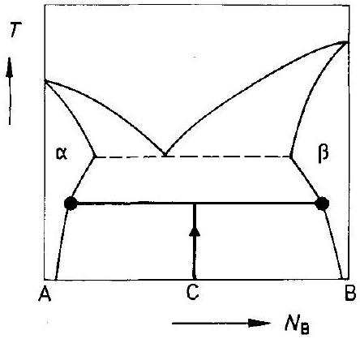
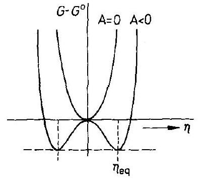
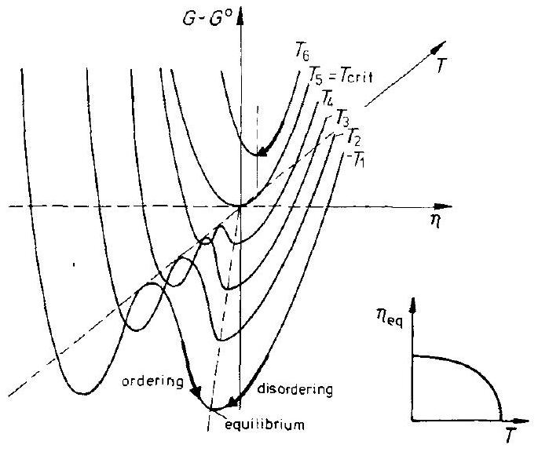
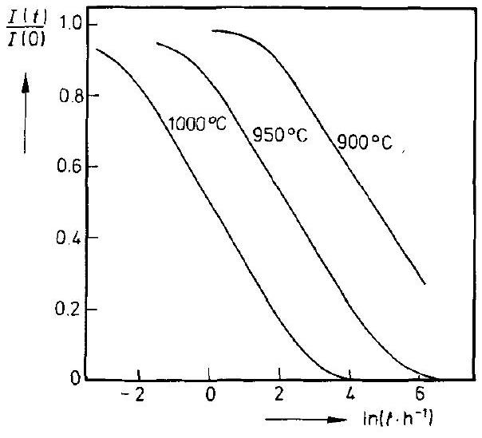
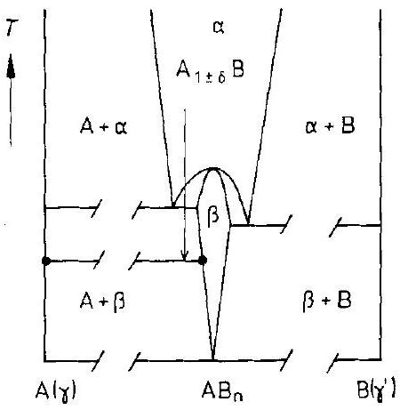
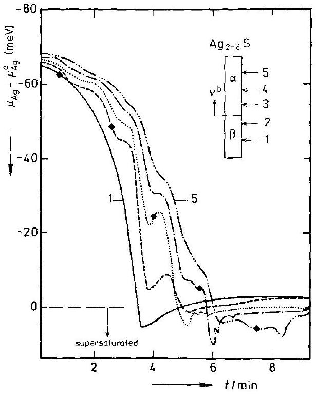

## 12 Phase Transformations

### 12.1 Introduction

Phase transitions are processes where small causes have large effects. Small changes in intensive variables ( $P, T, \mu_{i}$ ) can result in large changes of the extensive macroscopic properties of a system. Some specific quantities exhibit singularities at the transition point.

Heterogeneous gaseous phases do not exist at ambient pressure. Heterogeneous liquids exist. The number of different phases in the solid state, however, is enormous, and their existence reflects the increasing influence of directional interactions between atomic particles with decreasing temperature. In thermodynamic terms, this indicates that the Gibbs energy of a solid phase is dominated at sufficiently low temperature by the internal energy of the crystal. These internal energies are not very different for different packing orders (i.e., crystal structures) at fixed composition. The multitude of solid phases in turn leads to a host of phase transitions. Crystal growth from the melt or from the gas phase are examples of phase transitions, while metallurgy is to a large extent concerned with phase transformations and their consequences. The large number of transitions makes an unambiguous classification quite difficult. Consequently, we present here only a limited selection of types of transformations which focus on solid state chemistry. Solid state chemists often restrict themselves to phase transitions which occur in crystals. Since we cannot here treat the field of phase transformations comprehensively and in depth, we aim to understand the leading principles and some of the consequences for practical applications in solid state kinetics.

The isothermal heterogeneous solid state reaction of type $\mathrm{A}+\mathrm{B}=\mathrm{AB}$ already provides an example of a phase transformation. However, the topic of this chapter is the evolution towards equilibrium of an initially homogeneous non-equilibrium (supersaturated) solid solution. Since the transport of heat or stress in solids is so much faster than that of matter by diffusion, in most cases, the homogeneous supersaturation can be induced by changes in temperature or pressure. Starting from a homogeneous, disordered non-equilibrium state, there are, in principle, two ways to increase the order of a single-phase system (e.g., the system (A, B)). 1) Clustering: the separation of components into regions which are rich in either A or B. 2) Ordering: order A and B homogeneously in a structurally well defined pattern. To increase the order means to arrange the particles of the system in such a way that at any later time their exact spatial distribution is determined by a decreasing (minimum) number of geometrical parameters.

These two different ways of ordering require different driving forces. In case 1), macroscopic transport occurs. The driving force is therefore the chemical potential
gradient including contributions from any concentration gradients, stresses, electric fields, etc. In case 2), no transport over macroscopic distances is required. The homogeneous ordering process occurs by a few site exchanges of A and B on their atomic scale. In this way, ordered domains form first; these then grow and thereby lower the system's Gibbs energy. Obviously, there are two length parameters involved in the physics of ordering. The length, $\xi_{\mathrm{c}}$, describes the extension of concentration modulations and the correlation length, $\xi$, describes the extension of the (restoring) forces originating from an ordered domain. For the first case (clustering), $\xi_{\mathrm{c}} / \zeta \simeq 1$, whereas for the second case (ordering), $\xi_{\mathrm{c}} / \xi \simeq 0$.

Most chemical reactions occur by a change in the configurational order ( $\Delta S \neq 0$ ). Compared to fluids, crystalline reactants already have a low entropy and thus solid state reactions are normally exothermic. In this sense, order-disorder reactions are in no way special, except that they occur in homophase crystals.

From a practical point of view it may not be advisable to formulate a single kinetic theory to describe all kinds of ordering, that is, separation (demixing) and homogeneous ordering. Interactions between the different SE's of a transforming crystal and impurities, dislocations, grain boundaries and other non-equilibrium defects may influence the correlation lengths $\xi$ and $\xi_{\mathrm{c}}$ and can therefore alter the ordering path in space and time. This is particularly true since the phase transformations of interest here occur close to equilibrium (e.g., near critical points or near the state of phase coexistence). Therefore, the thermodynamic forces driving the ordering process, which (to first order) are proportional to the deviations from equilibrium, are normally small compared to the driving forces acting on most compound forming heterogeneous solid state reactions. This has a number of consequences which are worth mentioning. Since the crystal is a system of tightly coupled atoms, diffusional transport (which largely decouples correlated motions by the Brownian motion of point defects) does not occur over large distances during a phase transformation. Thus, the subtleties of cooperative effects play the dominant role. Furthermore, statistical theory of ordering becomes rather complicated as soon as the correlated motions concern a sizeable fraction of atomic constituents in the crystal. Finally, if crystal structure changes are involved in the transformations, they are generally coupled with matter transport, as will be discussed in Section 12.3.1. After nucleation, the coupled motions of the SE's at and near the moving interface comprise displacive and diffusive steps on different length scales. This inherent complexity of correlated steps makes the field of phase changes a domain of statistical physics. In view of the mechanical properties which can be brought about by transformation processes, materials science is strongly involved in the technical applications.

It is always convenient to use intensive thermodynamic variables for the formulation of changes in energetic state functions such as the Gibbs energy $G$. Since $G$ is a first order homogeneous function in the extensive variables $V, S$, and $n_{k}$, it follows that [H. Schmalzried, A.D. Pelton (1973)]

$$
\sum q_{i}^{\alpha} \cdot \mathrm{d} \phi_{i}^{\alpha}=0
$$

where $\phi_{i}$ are the conjugate intensive variables to the extensive variables $q_{i}$ (e.g., $\left.\phi_{i}=P, T, \mu_{k} ; q_{i}=V, S, n_{k}\right)$. The superscript $\alpha$ is a phase index. Let us assume for the
moment that our crystals are hydrostatically stressed. The equilibrium conditions then tell us that each phase is homogeneous throughout, and that any coexisting phases possess the same values of the intensive variables. Heterogeneous crystals which are not homogeneously stressed and which have coherent (semicoherent) phase boundaries behave differently [W. J. Johnson, H. Schmalzried (1992)]. Under hydrostatic conditions we can write for each coexisting phase $\alpha$

$$
\sum q_{i}^{\alpha} \cdot \mathrm{d} \phi_{i}=0
$$

without a phase index on $\phi_{i}$. From Eqn. (12.2) it follows that if the number ( $n$ ) of intensive variables ( $\phi_{i}$ ) is equal to the number ( $v$ ) of phases $\alpha$, the system is invariant (Gibbs phase rule). However, we can also use the set of Eqns. (12.2) to determine $\phi_{j}$ in terms of $\phi_{i(\neq j)}$ for the coexisting phases if $v<n$, which means that we can determine the bounding curves of the various phase fields. For example, keeping $\phi_{4}, \phi_{5}, \phi_{6}, \ldots, \phi_{n}$ constant and setting $\phi_{1}=P, \phi_{2}=T, \phi_{3}=\mu_{\mathrm{S}}$ (solid), so that $q_{1}=V$, $q_{2}=-S, q_{3}=n_{\mathrm{S}}$, it follows immediately from the set of Eqns. (12.2)

$$
\frac{\mathrm{d} P}{\mathrm{~d} T}=\frac{\Delta S / n_{\mathrm{S}}}{\Delta V / n_{\mathrm{S}}}=\frac{\Delta S_{m}}{\Delta V_{m}}
$$

which is the well known Clausius-Clapeyron equation. Written in terms of component chemical potentials at constant $P$ and $T$, Eqns. (12.2) yield [H. Schmalzried, A. Navrotsky (1975)]

$$
\frac{\mathrm{d} \mu_{1}}{\mathrm{~d} \mu_{2}}=-\frac{\Delta n_{2} / n_{3}}{\Delta n_{1} / n_{3}} ; \quad \Delta n_{i}=n_{i}^{\alpha}-n_{i}^{\beta}
$$

One can then determine the phase field boundaries by integration as schematically shown in Figure 12-1.

Figure 12-1. Phase diagram of first kind. Phase boundaries are schematically plotted for the intensive variable $\phi_{2}$ as a function of $\phi_{1} . \phi_{i} (i=4,5, \ldots)=$ const. Arrow indicates a phase transition $\alpha_{1} \rightarrow \alpha_{3}$.

When a boundary is crossed by changing $\phi_{i}$ (Fig. 12-1), a phase transformation will take place if the atomic mobilities allow. By identifying the various $\phi_{i}$ 's, we can categorize the transformations. For example, if we place the system in an unstable state by a change of temperature, the subsequent transformation is temperature induced, etc. There are two limiting types of transformations. 1) The crystal structure is conserved but the composition changes. 2) The crystal structure changes but not the composition. Spinodal decomposition in the early stage belongs to the first category, whereas order-disorder, displacive, and rotational transformations belong to the second one. Often, both the composition and the structure change during a phase transformation.

The foregoing classification is not without ambiguity. For example, it is common practice to call the reaction $\mathrm{A}^{\alpha} \rightarrow \mathrm{B}^{\alpha}+\mathrm{C}^{\alpha}$ (see Fig. 6-1) induced by decreasing the temperature a phase transformation. The similar (peritectoid) reaction $\mathrm{C}=\alpha+\beta$ (Fig. 12-2) induced by a temperature increase, however, is named a decomposition reaction. In addition, the isothermal reaction $\mathrm{AO}=\mathrm{A}+\frac{1}{2} \mathrm{O}_{2}$, which occurs if the intensive variable $\mu_{\mathrm{O}_{2}}$ is decreased so that AO decomposes, is called a metal oxide reduction. It is thus categorized as a genuine heterogeneous solid state reaction (the reverse of metal oxidation) and not as a phase transformation.

Figure 12-2. Peritectic decomposition $\mathrm{C}=\alpha+\beta$ in an $\mathrm{A}-\mathrm{B}$ phase diagram.

In this chapter, we will only be concerned with temperature or pressure induced reactions. Let us first become acquainted with the usage of some specific terms. If transport on a macroscopic scale does not occur during the non-diffusive transformation and the process is heterogeneous, we call the transformation polymorphic if (line) compounds are concerned. If we consider solid solutions under those same conditions, we are dealing with massive transformations. A further distinction is made between transformations which give rise to elastic strain energies (lattice distortive) and those without lattice strain (shuffle transformations). If lattice displacements dominate the macroscopic changes of sample shape (morphology) and transformation kinetics, we call this first-order transformation martensitic, and the product martensite. Martensite can form in numerous materials (e.g., carbon steels, superconductors, zirconia, polymers).

If the transformation process occurs homogeneously and can be quantified by one or several time-dependent parameters, the transformation is called a second-order
transformation. A continuous, single-phase diffusional transformation like the above mentioned spinodal decomposition represents an inhomogeneous process on a rather small scale. If macroscopic transport is involved in the transformation, the extent of the compositional changes can be very different. Compounds with very narrow ranges of nonstoichiometry ( $\mathrm{Ag}_{2+} \mathrm{S}$ ) transform by inducing very small fluxes of components on both sides of the moving phase boundary (quasi-polymorphic transformation). If the compositional changes are larger, the transformation can occur with a moving boundary that is either sharp or that spreads over a certain width where more or less discontinuous local nucleation and growth processes take place. Strictly speaking, discontinuous precipitation occurs in supersaturated terminal solutions. The precipitating region develops behind a moving grain boundary which serves simultaneously as a preferred nucleation site and a fast transport path. Nucleation and early growth have already been treated in Chapter 6. The concepts involved in nucleation differ fundamentally from those that govern the phase transformations of this chapter.

Figure 12-3. Gibbs energy ( $G$ ) and Gibbs energy change of reaction ( $\Delta G$ ) as a function of $T$ (or $P$ ). a) $\mathrm{A}+\mathrm{B}=\mathrm{AB}$, b) $\alpha \rightarrow \beta(\beta \rightarrow \alpha)$, first order reaction, c) $\alpha \rightarrow \beta$, second order reaction.

Homogeneous phase transformations take place either by continuously ordering the SE's on one or several (sub-)lattices, or by correlated displacive movements of the SE's eventually leading to a modified crystal structure. As long as the order parameter, and thus the entropy change, is smooth, there is no finite $\Delta S$ ( $=\partial \Delta G / \partial T$, or $\Delta V=\partial \Delta G / \partial P$ ) and so, by definition, no first-order transformation. This also explains why order-disorder transformations are named second (or higher) order transformations. The first derivatives vanish, the second derivatives $\partial^{2} \Delta G / \partial T^{2}$ do not. The situation is illustrated in Figure 12-3. It shows three different types of Gibbs energy curves and Gibbs energy changes of reaction corresponding to the following solid state reactions: a) the heterogeneous reaction $\mathrm{A}+\mathrm{B}=\mathrm{AB}$; b) a first-order transformation; c) a second-order transformation.

### 12.2 Nondiffusive Transformations

### 12.2.1 Martensitic Transformations

Let us regard a binary A-B system that has been quenched sufficiently fast from the $\beta$-phase field into the two phase region ( $\alpha+\beta$ ) (see, for example, Fig. 6-2). If the cooling did not change the state of order by activated atomic jumps, the crystal is now supersaturated with respect to component B . When further diffusional jumping is frozen, some crystals then undergo a diffusionless first-order phase transition, $\beta \rightarrow \beta^{\prime}$, into a different crystal structure. This is called a martensitic transformation and the product of the transformation is martensite.

Such transformations have been extensively studied in quenched steels, but they can also be found in nonferrous alloys, ceramics, minerals, and polymers. They have been studied mainly for technical reasons, since the transformed material often has useful mechanical properties (hard, stiff, high damping (internal friction), shape memory). Martensitic transformations can occur at rather low temperature $(\sim 100 \mathrm{~K})$ where diffusional jumps of atoms are definitely frozen, but also at much higher temperature. Since they occur without transport of matter, they are not of central interest to solid state kinetics. However, in view of the crystallographic as well as the elastic and even plastic implications, diffusionless transformations may inform us about the principles involved in the structural part of heterogeneous solid state reactions, and for this reason we will discuss them.

We have seen in previous chapters that most (diffusional) heterogeneous solid state reactions are accompanied by changes in the crystal structure. Since the geometrical arrangement of the atoms in a crystal reflects the existence of energy minima, we understand that, in many cases, the atomic particles aim to preserve their coordination as much as possible through structure transformations. In addition, a change in coordination normally means a correlated motion of more than one atom with a correspondingly high activation energy. Martensitic transformations thus exemplify that, in some cases, the undercooled $\beta$ crystal (A, B) can lower its Gibbs energy in a diffusionless way by shear deformations without a major change in coordination. Structure elements of the unit cells of the parent structure are almost instantaneously shifted into the positions of the necessarily metastable martensite structure.

Let us consider the so-called Bain-deformation transformation as an example of a martensite reaction (Fig. 12-4). The transformation changes the lattice from fcc to bcc and induces a $20 \%$ contraction of the cell along one axis and a $12 \%$ expansion along the other two axes. Since the shape change of the whole crystal is finite but small, the question is how the large displacements can be accommodated during the macroscopic transformation by elastic and plastic deformations. The discontinuous change in lattice parameters and molar volume is indicative of a first-order phase transition which starts with nucleation and continues with growth. The martensite product is often found to be plate- or needle-like, indicating that the minimization of stress energy influences the growth morphology. The role of stress is also shown by the occurrence of hysteresis in the transformation when the system undergoes

Figure 12-4. Bain $\beta \rightarrow \beta^{\prime}$ transformation.

temperature cycles. That an external deformation of the sample decreases the area of the hysteresis loop is thus to be expected.

Let us assume that the martensite particle has grown in the form of an oblate spheroid, the volume of which is $(4 \cdot \pi / 3) \cdot c \cdot r^{2}$, with $c$ as the semi-thickness of the spheroid. The total Gibbs energy change for the formation of this particle includes a chemical, an elastic, and an interface energy term. It can be appropriately written as

$$
\Delta G_{\mathrm{tr}} \approx(4 \cdot \pi / 3) \cdot c \cdot r^{2} \cdot\left[\Delta g_{\text {chem }}+e_{\text {elast }}(r)\right]+2 \cdot \pi \cdot r^{2} \cdot \sigma
$$

where $e_{\text {elast }}$ is the specific elastic energy of the spheroid per unit volume, namely

$$
e_{\text {elast }}=\left[\frac{\pi}{8} \cdot \frac{2-v}{1-v} \cdot \bar{G} \cdot u_{i j}^{2}+(\pi / 4) \cdot \bar{G} \cdot u_{i i}^{2}\right] \cdot(c / r)
$$

$\bar{G}$ denotes the shear modulus and $\sigma$ is the specific interfacial energy. In the sense of Eqn. (6.8), we can use Eqn. (12.5) to calculate the activation energy for the nucleation of martensite. Normally, $\Delta G_{\mathrm{tr}} \gg R T$, which implies that martensite nucleation is unlikely to be induced by thermal fluctuations. We conclude that the nucleation is heterogeneous and dislocation arrays are the nucleation sites.

We have mentioned above the tendency of atoms to preserve their coordination in solid state processes. This suggests that the diffusionless transformation tries to preserve close-packed planes and close-packed directions in both the parent and the martensite structure. For the example of the Bain-transformation this then means that $\{111\}_{\beta \rightarrow\{011\}_{\beta^{\prime}}\left(\beta^{\prime}=\text { martensite }\right) \text { and }\langle\overline{1} 01\rangle_{\beta}| |\langle 1 \overline{1} 1\rangle_{\beta^{\prime}} \text {. Obviously, the main ques- }}$ tion in this context is how to conduct the transformation ( $=$ advancement of the $\beta / \beta^{\prime}$ boundary) and ensure that on a macroscopic scale the growth (habit) plane is undistorted (invariant). In addition, once nucleation has occurred, the observed high transformation velocity (nearly sound velocity) has to be explained. Isothermal martensitic transformations may well need a long time before significant volume fractions of $\beta$ are transformed into $\beta^{\prime}$. This does not contradict the high interface velocity, but merely stresses the sluggish nucleation kinetics. The interface velocity is essentially temperature-independent since no thermal activation is necessary.

The deformation of a martensitic transformation in a given volume can be taken in by two types of plastic shearing: a) dislocation glide, b) twinning. In this way, the strain which $\beta^{\prime}$ exerts on $\beta$ is largely reduced. In order for the habit plane to remain undistorted during advancement, the $\beta-\beta^{\prime}$ volume change must take place by a homogeneous shear parallel to the habit plane. The necessary dilation is then normal to it. It is understood that the macroscopic habit plane is build up from coherent and semicoherent highly mobile $\beta-\beta^{\prime}$ interfaces selected according to the structure rules (coordination preservation) as discussed. This explains why the habit plane, derived from an averaging over many $\beta-\beta^{\prime}$ twin interfaces, can not possess simple $\{h k l\}$ indices as the individual $\beta-\beta^{\prime}$ interfaces do. In fact, the indices for a habit plane are normally irrational.

Diffusionless transformations have been sometimes called 'military', in contrast to the more 'civilian' diffusion controlled transformations. Considering their technical relevance, the crystallographic theory of martensite transformation has been worked out in much detail, and particularly for the habit plane selection of the given $\beta-\beta^{\prime}$ lattice structural change. The reader is referred to the corresponding metallurgical literature [D.A. Porter, K.E. Easterling (1990); D.S. Liebermann (1970); C.M. Wayman (1983)].

### 12.2.2 Second-Order Transformations

Martensitic transformations, although they do not involve matter transport, are accompanied by a change in the extensive state functions ( $\Delta S, \Delta V, \Delta H$, etc.), and are thus first-order transformations. Second-order transformations are also diffusionless but, in contrast to first-order transformations in which $G$ changes discontinuously and thus $\Delta S_{\mathrm{tr}} \neq 0$ at the transition temperature $T_{\mathrm{tr}}$ (Fig. 12-3b), there is no transformation entropy for second-order transformations (Fig. 12-3c). Second-order transformations occur without the nucleation and growth of a new phase, and the changes of the system are continuous. Three types of second-order transformations can be distinguished: 1) order-disorder, 2) displacive (i.e., by continuously shifting atoms in a coordinated way to their proper positions in the new structure), and 3) a combination of 1) and 2). The $G^{\alpha}$ - and $G^{\beta}$-curves are tangent at $T_{\mathrm{tr}}$ as illustrated in Figure 12-3c. Since the symmetry of the $\beta$ crystal is necessarily lost at $T \geq T_{\mathrm{tr}}$, an extension of the $G^{\beta}$-curve for $T>T_{\mathrm{tr}}$ is physically unmeaningful. However, at $T<T_{\mathrm{tr}}$, the states between $G^{\alpha}$ and $G^{\beta}$ are accessible to the crystal. The existence of this continuity of accessible states is a fundamental assumption of the theory as outlined in the following.

Symmetry is represented by the elements of a (mathematical) group and thus cannot change continuously. The $\alpha-\beta$ phase transition therefore occurs at a distinct temperature. Let us now assume that we have identified an extensive thermodynamic variable which can distinguish states between the $\alpha$ and $\beta$ phases. We call it an order parameter ( $\eta$ ). For a quantitative description of order-disorder or continuous displacive processes, the order parameter is normalized $(0 \leq \eta \leq 1)$. For example, if we regard the classic $\beta-\beta^{\prime}$ brass transition, $\eta$ is defined as ( $2 f_{\mathrm{Cu}}-1$ ), where $f_{\mathrm{Cu}}$ is the fraction of Cu atoms which occupy the $(0,0,0)$ sites of the $(\mathrm{Cu}, \mathrm{Zn})$ bcc structure.

If all Cu atoms occupy $(0,0,0)$ sites, $f_{\mathrm{Cu}}=1$, consequently $\eta=1$, and we have the completely ordered $\beta$ brass. The symmetry is broken when $f_{\mathrm{Cu}}=1 / 2$ or $\eta=0$, and thus $\beta$ and $\beta^{\prime}$ become indistinguishable. Other (normalized) order parameters are in use: lattice dimension, density, magnetization, polarization, or some function that describes the orientation of the molecular axes. Since the order parameter is a normalized extensive function (or a specific function, as for example, the mole fraction) and we are dealing with either an open or a closed system (i.e., constant chemical potential or constant number of particles), $\eta$ can be a non-conserved or a conserved quantity.

In decreasing the temperature below the critical point ( $T_{\mathrm{tr}}$ ), ordering begins continuously. The first derivatives of the Gibbs energy are smooth, but the second derivatives (e.g., molar heats) change discontinuously from $\alpha$ to $\beta$. A distinction between first- and second-order transformations is not helpful if $\Delta S_{\mathrm{tr}}$ becomes so small that it falls within the range of the thermal fluctuations. In view of the structural complexities of crystals with more than one sublattice, 'multicomponent' order parameters of higher dimensionality may be needed in order to adequately describe a second-order transition.

It is common to begin the discussion of second-order phase transitions, including their symmetry aspects, by a concept whose basic idea is a series expansion of the Gibbs energy in terms of the order parameter

$$
G=G^{0}+A^{*} \cdot \eta+A \cdot \eta^{2}+B \cdot \eta^{3}+C \cdot \eta^{4}+\ldots
$$

$A^{*}, A, B, C, \ldots$ are phenomenological coefficients that are functions of the independent intensive variables $P, T, \ldots$ In order to meet the equilibrium condition at $\eta=0$, $A^{*}$ must vanish. Furthermore, for stable phases, $A(T, P)>0$ and $C(T, P)$ is also $>0$, otherwise $G$ would become excessively negative for larger values of $\eta .\left(G-G^{0}\right)$ vs. $\eta$ is depicted in Figure 12-5a. If $B^{2}=4 \cdot A C$, the minima for ( $G-G^{0}$ ) at $\eta= -2 \sqrt{A C}$ and $-4 \sqrt{A C}$ have the same value $G$. This means that here two phases would coexist in equilibrium, which is characteristic of a first-order phase transition.

The situation is different if we set $B=0$. The ( $G-G^{0}$ ) curve as a function of $\eta$ for this case is shown in Figure 12-5b. From $(\partial G / \partial \eta)=0$, we derive $\eta_{\mathrm{eq}}$ as

$$
\eta_{\mathrm{eq}}=\sqrt{\frac{-A}{2 C}} \text { and } G_{\mathrm{eq}}=G^{0}-A^{2} / 4 \cdot C
$$

For $A(T, P)=0, G$ has one minimum. For $A(T, P)<0$, there are two minima. If we linearize at constant $P$, with $A$ being a function of $T$ as $(a / 2) \cdot\left(T-T_{\mathrm{tr}}\right)$, we can express $G_{\text {eq }}$ in terms of the deviation from the critical temperature $T_{\mathrm{tr}}$ as

$$
G_{\mathrm{eq}}=G^{0}-\frac{a^{2} \cdot\left(T-T_{\mathrm{tr}}\right)^{2}}{16 C}
$$

From Eqn. (12.9), it follows that $\Delta S_{\mathrm{tr}}=0$ as required for a second-order phase transition. The finite molar heat $\Delta c_{\mathrm{P}}(=T \cdot \partial \Delta S / \partial T)$ at the transition temperature is obtained as

b)

Figure 12-5. Gibbs energy as a function of the (scalar) order parameter.
a) $G-G^{0}=A \eta^{2}+B \eta^{3}+C \eta^{4}$, b) $G-G^{0}=A \eta^{2}+C \eta^{4}$.

$$
\Delta c_{\mathrm{P}}=\frac{a^{2} \cdot T_{\mathrm{tr}}}{8 C} ; \quad T \rightarrow T_{\mathrm{tr}}
$$

If the transforming system is inhomogeneous, the $G$-functional replaces Eqn. (12.7)

$$
G=G^{0}+\int_{V}\left(A^{*} \cdot \eta(r)+A \cdot \eta^{2}(r)+B \cdot \eta^{3}(r)+\ldots+D \cdot(\nabla \eta)^{2}\right) \cdot \mathrm{d} r^{3}
$$

Note that a gradient term as introduced in Section 10.2 has been included. As before, the essential feature of the second-order phase transition is based on a (linear) expansion of $A\left(=a / 2 \cdot\left(T-T_{\mathrm{tr}}\right)\right)$.

The relations given in Eqns. (12.7)-(12.10) are purely phenomenological. If we consider the crystallographic conditions for second-order transitions, it is necessary that the space groups of the $\alpha$ and $\beta$ structures both before and after the secondorder transition (i.e., above and below the transition temperature) be related to each other: the $\beta$ symmetry (low $T$ ) is a subgroup of the $\alpha$ symmetry (high $T$ ) group. This follows from the fact that the structure change of a second-order transition is continuous. In other words, all the symmetry elements of the (low symmetry) structure must already be present in the (high symmetry) $\alpha$ structure.

Let us now turn to some aspects of the kinetic theory and follow the transition process from an arbitrary unstable state with a given $\eta_{0}$. We ask for the path which is taken by the system and the rate to reach equilibrium, in other words, the approach to $\eta_{\text {eq }}$. Possible reaction paths for a second-order phase transition are schematically illustrated in Fig. 12-6. It shows a Gibbs energy vs. $\eta$ diagram with $T$ as the curve

Figure 12-6. Potential valleys for ( $G-G^{0}$ ) as a function of the order parameter $\eta$. Curve parameter is the temperature $T$.

parameter. From this figure, we can read the variation in $\eta_{\text {eq }}$ during cooling as well as the pathways of ordering (and disordering) below the critical temperature.

If we formally identify $\eta$ with the reaction coordinate for a normal homogeneous chemical reaction, we would expect that $\eta(t)$ exhibit the pronounced nonlinearity of most homogeneous chemical reactions considering both the complicated Gibbs energy surfaces $G(\eta)$ and the nonlinear kinetics of atomic encounters. However, close to equilibrium and for small driving forces, we can set the reaction rates proportional to the chemical affinities ( $-\partial G / \partial \eta$ ). Therefore, for those second-order phase transitions which can be described by a single (scalar) order parameter $\eta$, we have a rate equation in this regime of the form

$$
\dot{\eta}=-\gamma \cdot \frac{\partial}{\partial \eta}\left(\frac{G(\eta)}{R T}\right)
$$

where $y$ is a rate constant. It contains the atom's elementary (activated) jump frequencies and their interactions at the different positions of the crystal lattice.

One can derive Eqn. (12.12) in a more fundamental way by starting the statistical approach with the (Markovian) master equation, assuming that the jump probabilities obey Boltzmann statistics on the activation saddle points. Salje [E. Salje (1988)] has discussed the following general form of a kinetic equation for solid state processes

$$
\dot{\eta}=-\gamma \cdot\left[1-\left(\frac{\xi_{\mathrm{c}}}{\xi}\right)^{2} \cdot f\left(\xi, \nabla^{2}\right)\right] \cdot \frac{\mathrm{d}}{\mathrm{~d} \eta}\left(\frac{G}{R T}\right) ; f\left(\xi, \nabla^{2}\right)=\mathrm{e}^{\left(\xi^{2} / 2\right) \cdot \nabla^{2}}
$$

which obviously includes Eqn. (12.12) as a limiting case. The form of Eqn. (12.13) stresses again the importance of the two correlation lengths $\xi$ and $\xi_{\mathrm{c}}$ introduced in Section 12.1. $\xi_{\mathrm{c}}$ represents the length of concentration modulations if the total number of particles is conserved. $\xi$ can then be understood as the distance over which a change of $\eta$ in an ordering domain of the crystal influences $\eta$ in other regions, for
example, by stress fields. In the case that $\left(\xi_{\mathrm{c}} / \xi\right) \rightarrow 0$ or $\xi \gg \xi_{\mathrm{c}}$, which describes orderdisorder reactions, Eqn. (12.13) reduces to the form of Eqn. (12.12) and has been referred to as the Ginzburg-Landau rate equation. Obviously, $-(\partial(G / R T) / \partial \eta)$ represents the normalized affinity of the homogeneous order-disorder reaction.

However, Eqn. (12.13) also comprises a second limiting case of ordering which will be discussed in depth in Section 12.3.2. For $\xi_{\mathrm{c}} / \xi \cong 1$, we know from Section 12.1 that ordering occurs in the form of concentration modulations (i.e., diffusional transport). The appropriate order parameter in this case is the concentration, and ( $\partial G / \partial \eta$ ) can be identified with the chemical potential. In the limit of small concentration gradients, we can expand $f\left(\xi, \nabla^{2}\right)$ in Eqn. (12.13) into a series, and obtain after linearizing

$$
\dot{\eta}=\frac{\gamma}{2} \cdot \xi_{\mathrm{c}}^{2} \cdot \nabla^{2}\left(\frac{\partial(G / R T)}{\partial \eta}\right)
$$

In this line of reasoning, Eqn. (12.14) is the basic differential equation for ordering by component separation (the so-called spinodal decomposition) to be discussed in Section 12.3.2.

The correlation length $\xi$ corresponds to the spatial extent of the restoring force originating from an ordered region. When the temperature approaches the critical temperature $T_{\mathrm{tr}}$, the restoring force vanishes. This can be formalized by letting $\xi$ diverge as

$$
\xi=\xi^{0} \cdot\left(\frac{T_{\mathrm{tr}}}{T_{\mathrm{tr}}-T}\right)^{\nu}
$$

where $v$ is the critical exponent. It can be derived theoretically by a mean-field approach [see, for example, K. Binder (1991)] and typically amounts to $v=1 / 2$. The mean-field allows us to replace the (atomistic) Hamiltonian of statistical theory by a Gibbs energy function with an appropriate correlation length ('coarse grained'). In framework silicates (see Section 15.2), for example, the interaction occurs via elastic strains by bending the semiflexible network of $\mathrm{T}-\mathrm{O}-\mathrm{T}$-bonds $(\mathrm{T}=\mathrm{Al}, \mathrm{Si} ; \mathrm{O}=\mathrm{O})$. $\xi^{0}$ is then relatively large since it conforms to elastic interaction lengths. In contrast, magnetic phase transitions have $\xi^{0}$ values of atomic dimensions.

The calculation of $G(\eta)$ using appropriate models has been the subject of much effort [K. Binder (1991)]. If we make the ad-hoc assumption that $G(\eta)$ is explicitly given by Landau's Gibbs energy expansion, Eqn. (12.7), we conclude that for secondorder transitions

$$
G=G^{0}+\frac{1}{2} \cdot a\left(T-T_{\mathrm{tr}}\right) \cdot \eta^{2}+\frac{1}{4} b \cdot \eta^{4}(+\ldots)
$$

and after substitution into Eqn. (12.12)

$$
\dot{\eta}=-\frac{y}{R T} \cdot\left[a \cdot\left(T-T_{\mathrm{tr}}\right) \cdot \eta+b \cdot \eta^{3}\right]
$$

or, after integration,

$$
t-t_{0}=-\frac{R T}{\gamma} \int_{\eta_{0}}^{\eta} \frac{\mathrm{d} \eta}{a\left(T-T_{\mathrm{tr}}\right) \cdot \eta+b \cdot \eta^{3}}
$$

Two limiting cases for the rate laws of second-order transformations can easily be distinguished. If ( $\eta-\eta_{\mathrm{eq}}$ ) is small and the higher order terms are neglected,

$$
\eta-\eta_{\mathrm{eq}} \propto \mathrm{e}^{-\alpha\left(t-t_{0}\right)}
$$

which describes the expected exponential relaxation behavior near equilibrium. Alternatively, if $T$ is close to $T_{\mathrm{tr}}, G \approx(1 / 4) \cdot b \cdot \eta^{4}$. After substitution of Eqn. (12.16) into Eqn. (12.12) and integration, one obtains

$$
\left(\frac{1}{\eta^{2}}-\frac{1}{\eta_{0}^{2}}\right) \propto t-t_{0}
$$

Experimental kinetic data are scarce for second-order transitions in inorganic compounds. They normally do not fit the simple models reflected in Eqns. (12.19) and (12.20). An experimental example is shown in Figure 12-7. It has been explained by integrating Eqn. (12.12), setting $G-G^{0}=1 / 2 \cdot a \cdot\left(T-T_{\text {tr }}\right) \cdot \eta^{2}+1 / 6 \cdot c \cdot \eta^{6}$, and by assuming a certain dependency of the rate constant $y$ on $\eta$ [see M. A. Carpenter, E. Salje (1989)]. It is difficult, however, to assess the physical reality in these relations.

Figure 12-7. X-ray intensities as a function of time $t$ for omphacite according to [M.A. Carpenter, et al. (1989)].

Obviously, in systems with more than one order parameter, when the different ordering modes are coupled in one way or the other, the ordering kinetics are appreciably more complicated. In order to produce mismatched periodic patterns in a crystal (incommensurate structures), Landau and Lifshitz [L.D. Landau, E.M. Lifshitz (1980)] proposed a $G$ expansion of the form

$$
\begin{aligned}
G= & \frac{1}{2} \cdot a \cdot\left(T-T_{\mathrm{tr}}\right) \cdot\left(\eta_{1}^{2}+\eta_{2}^{2}\right)+\frac{1}{4} \cdot b \cdot\left(\eta_{1}^{4}+\eta_{2}^{4}\right)+\ldots \\
& +\mathrm{d} \cdot\left(\eta_{1} \cdot \nabla \eta_{2}-\eta_{2} \cdot \nabla \eta_{1}\right)+\mathrm{e} \cdot\left(\nabla \eta_{1}^{2}+\nabla \eta_{2}^{2}\right)
\end{aligned}
$$

which once again includes gradient terms. From ( $\partial G / \partial \eta_{i}$ ) = 0 , one derives sinusoidal $\eta$ functions in space. Integration of Eqn. (12.12) after inserting Eqn. (12.21) would yield the kinetic behavior. We conclude that phases with incommensurate structures can even occur at certain time intervals during the transformation process. Relevant systems are silicates. Their order parameters (e.g., Al/Si ordering in cordierite or orthopyroxene) are important indicators for the evolution in time of minerals and thus for geological history. Transforming silicate minerals often seem to require more than one order parameter [E. Salje (1985), (1990)], and some of the modulated structures found in silicate crystals are presumably frozen in and of kinetic origin. Elastic interactions between regions of different degree of order (domains) in transforming crystals move their boundaries until the system eventually arrives in the Gibbs energy minimum. Recent studies on mobile domain boundaries have been published by [E. Salje (1994)].

### 12.3 Diffusive Transformations

In this section, we discuss phase transformations involving the macroscopic transport of components. They can occur in a single phase or by heterogeneous reaction. Heterogeneous transformations are first-order reactions which start with nucleation as discussed in Chapter 6. We distinguish between three principally different situations. 1) $\alpha \rightarrow \alpha^{\prime}+\alpha^{\prime \prime}$. This process is depicted in Figure 6-1. The crystallographic structure is conserved, but composition changes may be large. 2) $\alpha \rightarrow \beta+\gamma$. This process is analogous to the peritectic reaction depicted in Figure 12-2. The crystallographic structure changes and composition changes are large. 3) $\alpha \rightarrow \beta+\gamma$. All phases have different structures and narrow ranges of homogeneity. The compositional change between $\alpha$ and $\beta$ is very small (Fig. 12-8). The polymorphic transformation represents a limiting case with vanishing $\gamma$.

Diffusive transformations (including polymorphic transitions) abound in solid state chemistry. Component diffusion is always involved. However, the kinetics of a

decomposition process such as $\alpha \rightarrow \beta+\gamma$ can hardly be discussed in general and quantitatively given the fact that the nucleation of two distinct phases and the coupled transport in three different phases has to be accounted for. We will therefore treat only two diffusive transformation processes in some detail, a first-order transformation with small changes in composition (case 3)) and a transformation of the type $\alpha \rightarrow \alpha^{\prime}+\alpha^{\prime \prime}$ (spinodal decomposition, case 1)) which occurs continuously in space and time.

### 12.3.1 First-Order Transformation with Small Composition Changes

All transformations of compounds with relatively narrow ranges of homogeneity ('geordnete Mischphasen' according to Wagner and Schottky [C. Wagner, W. Schottky (1931)]) belong to this category. They are characterized by structure changes and, in addition, by small or very small changes in composition. In the above classification, they belong to case 3), that is, $\alpha \rightarrow \beta(+\gamma)$, and are illustrated in Figure 12-8. Transport takes place by component diffusion in the compounds $\alpha$ and $\beta$, and chemical processes occur immediately at the moving $\alpha / \beta$ interface during the phase transformation (e.g., $\alpha-\mathrm{A}_{1 \pm \delta^{\prime}} \mathrm{X} \rightarrow \beta-\mathrm{A}_{1 \pm \delta^{\prime \prime}} \mathrm{X}(+\mathrm{A})$ ). First-order phase transformations of line compounds (i.e., compounds with a very narrow range of homogeneity) and elemental solids are the simplest heterogeneous solid state reactions. All the extensive thermodynamic functions of state change discontinuously at the $\alpha / \beta$ boundary. Since the number of point defects in local equilibrium is such a function of state, the transformation process of even elemental crystals and line compounds must therefore adjust the defect concentrations by diffusion and relaxation at and near the moving interface.

In a compound, the change in the chemical potential $\mu_{k}$ of component $k$ as a function of point defect concentrations (i.e., nonstoichiometry) is larger the narrower the range of homogeneity. Therefore, if the relaxation of the defect concentrations during the $\alpha-\beta$ transformation is slow, drastic changes in the component chemical potentials may result. These changes occur, in particular, at and near the moving $\alpha / \beta$ phase boundary and are the driving forces for the fluxes across the interface and in the adjacent bulk. They can be inferred from the Gibbs energy diagram of the binary compound $\mathrm{A}_{1 \pm \delta} \mathrm{X}(\delta<1)$ as shown in Figure 10-12.

From point defect thermodynamics, we know that the Gibbs energy of compounds with narrow ranges of homogeneity (small $\delta$ values) is proportional to $\delta^{2}$. The curvature $\mathcal{\varkappa}$ of the parabola at $\delta=0$ is essentially given by the equilibrium constant $K$ of the intrinsic electronic or ionic majority type of disorder (i.e., $\varkappa=1 / \sqrt{K}$, [H. Schmalzried (1983)]). Therefore, for a given undercooling, we may quantitatively assess the driving forces of transport in the transforming crystal, provided that we can control the boundary conditions as well. We note that it is far more difficult to understand the thermodynamics when the phases $(\alpha, \beta, \gamma)$ involved in the first-order transformation have broad ranges of homogeneity.

Figure 12-9 shows in-situ measurements with local probes for the Ag chemical potential of $\mathrm{Ag}_{2+\delta} \mathrm{S}$ during the $\alpha \rightarrow \beta$ transformation induced by undercooling. In

Figure 12-9. Chemical potential of silver during $\alpha \rightarrow \beta$ phase transformation of $\mathrm{Ag}_{2+\delta} \mathrm{S}$, measured at various locations along the transforming sample with electrochemical sensors, as a function of time. $\delta^{0}(t=0)=1.5 \times 10^{-3}$; cooling rate $=7^{\circ} \mathrm{C} / \mathrm{min}$. indicates time when the $\alpha / \beta$ boundary passes the corresponding sensor.

accordance with Figure 10-12, $\mu_{\mathrm{Ag}}$ is appreciably higher behind the moving interface (i.e., $\mu_{\mathrm{Ag}}^{\beta}>\mu_{\mathrm{Ag}}^{\alpha}$ ). Therefore, silver, in form of $\mathrm{Ag}^{+}$ions, and electrons are driven across the interface. The result is a wave of mobile point defects and an ever increasing Ag activity in the as yet untransformed $\beta$ crystal.

Since at any given $P$ and $T$ the chemical potential $\mu_{\mathrm{Ag}}$ is the only other independent thermodynamic variable, $G^{\alpha}(\xi, t)$ and $G^{\beta}(\xi, t)$ can be determined by integration and, therefore, Figure 12-9, in principle, contains the temporal and spatial evolution of the transforming crystal's Gibbs energy. We again draw attention to its nonmonotonic behavior, which has already been discussed in Section 10.4.2 and explained by the nonlinear transport and reaction kinetics of SE's crossing the $\alpha / \beta$ interface. We can read from Figure 12-9 that before Ag (i.e., phase $y$ in the reaction scheme $\alpha=\beta+\gamma$ ) precipitates, $\mu_{\mathrm{Ag}}>\mu_{\mathrm{Ag}}^{0}$ and the supersaturation amounts to approximately $50 \%$ near the moving interface. Also, the sudden activity decrease after nucleation spreads out in the form of a chemical potential wave across the remaining crystal. The rate of advancement of this wave is given by the chemical diffusion coefficient $\tilde{D}$ in $\beta-\mathrm{Ag}_{2} \mathrm{~S}$ ( $\sim 2 \times 10^{-1} \mathrm{~cm}^{2} / \mathrm{s}$, [H. Schmalzried (1980)]) and is thus much faster than the transformation velocity.

In the present discussion on the kinetics of first-order phase transformations, our main concern is the coupling of the structure change at the advancing phase boundary with the simultaneous matter transport. Phenomenologically, we can formulate the problem as follows. If we know quantitatively the (defect) thermodynamics and can thus quantitatively treat diffusion, we are able to determine by integration over the whole sample that part of the Gibbs energy which is dissipated by diffusion ( $\Delta G$ (diff), see Section 4.2). From Figure 10-12, we see that the total Gibbs energy change available for the transformation process is $\Delta^{\alpha / \beta} G(=G(\alpha)-G(\beta))$. There-
fore, ( $\Delta^{\alpha / \beta} G-\Delta G$ (diff)) is the Gibbs energy to drive the structure change alone ( $\Delta G$ (struct)). Furthermore, we can represent the boundary velocity in terms of the boundary mobility $m^{\mathrm{b}}$ and the appropriate driving forces $\Delta G$ (diff) and $\Delta G$ (struct).

Let us assume that $m^{\mathrm{b}}$ is independent of the non-stoichiometry $\delta^{\alpha}$ and $\delta^{\beta}$ at the boundary, since $\delta^{\alpha}$ and $\delta^{\beta} \ll 1$. The rate of structure change $\dot{\eta}^{\mathrm{b}}$ has to match the boundary velocity $\boldsymbol{v}^{\mathrm{b}}$ while the boundary velocity establishes the boundary condition for the diffusion. The driving forces $\Delta \mu_{i}^{\mathrm{b}}$ (here $\Delta \mu_{\mathrm{Ag}}^{\mathrm{b}}$ ) or rather ( $\Delta \mu_{i}^{\mathrm{b}} / \Delta \xi^{\mathrm{b}}$ ) across the interface $\alpha / \beta$ are thereby fully determined. These kinetic conditions may be written in a linearized version (see also Eqn. (10.31)) as

$$
\begin{gathered}
v^{\mathrm{b}}=\left(v_{i} \cdot V_{m}\right) \cdot j_{i}^{0} \cdot \frac{\Delta \mu_{i}^{\mathrm{b}}}{R T} \quad \text { (transport) } \\
v^{\mathrm{b}}=\dot{\eta}^{\mathrm{b}} \cdot \Delta \xi^{\mathrm{b}}=\gamma^{\mathrm{b}} \cdot \frac{\Delta G(\text { struct })}{R T} \cdot \Delta \xi^{\mathrm{b}} \quad \text { (structure change) }
\end{gathered}
$$

$j_{i}^{0}$ is the dynamic (equilibrium) exchange flux across the boundary as defined in Section 10.3. $v_{i}$ is a stoichiometric factor which describes the increase of the volume of $\alpha$ when one mole of component $i$ crosses the boundary. $\gamma^{b}$ is a rate constant and ( $\Delta G$ (struct) $/ R T$ ) the normalized driving force for the change of structure, which may occur displacively or by reconstruction. Equation (12.23) has been formulated in the spirit of the linear Ginzburg-Landau equation (Eqn. (12.12)). Equations (12.22) and (12.23) are based on models, whereas the following equation defining the mobility $m^{\mathrm{b}}$ is purely phenomenological

$$
\boldsymbol{v}^{\mathrm{b}}=m^{\mathrm{b}} \cdot \frac{\Delta^{\alpha / \beta} G}{\Delta \xi^{\mathrm{b}}}
$$

Let us remember that Eqns. (12.22) and (12.23) have to be coupled to the diffusion equations in the $\alpha$ and $\beta$ phases in order to complete the total set of kinetic equations for the phase transformation (i.e., the advancement of the interface). This set is very complicated and nonlinear and may lead to non-monotonic behavior of $\boldsymbol{v}^{\mathrm{b}}$ and the chemical potentials of the components in space and time, as has been observed experimentally (Figs. 10-13 and 12-9). Coherency stresses and other complications such as plastic flow have been neglected in this discussion.

If the ranges of homogeneity of the phases taking part in the transformation are wider than those of line compounds, the kinetic coefficients in Eqns. (12.22) and (12.23), that is $v_{i}, j_{i}^{0}, \gamma^{\mathrm{b}}$, and $\Delta \xi^{\mathrm{b}}$, are certainly not composition independent. It may then be questionable if transport across the boundary (Eqn. (12.22)) and the simultaneous structure change (Eqn. (12.23)) are independent processes as was tacitly assumed by formulating the kinetic relations in Eqns. (12.22) and (12.23). Let us emphasize that the foregoing analysis is meant to clarify the physico-chemical conceptual frame in which first-order transitions which include matter transport should be discussed. Pertinent experiments are still rare.

### 12.3.2 Spinodal Decomposition

If a solid solution, A-B, is quenched into the two phase field (Fig. 12-10) and the phase coordinates ( $T, N_{\mathrm{B}}$ ) are inside the spinodal curve determined by the condition $\partial^{2} G / \partial N_{\mathrm{B}}^{2}=0$, the lowering of the Gibbs energy can be achieved coherently and continuously. The process starts as a clustering of like atoms and eventually leads to the decomposition of the alloy. In this case, even small fluctuations in composition are inherently unstable. They tend to grow, as can be inferred from Figure 12-11, and for some time no sharp boundary will be found between the ( $\mathrm{A}, \mathrm{B}$ ) matrix and those coherent regions which are enriched with the supersaturated component. Gibbs called this process a transformation that is small in degree but large in extent. As Figure 12-11 illustrates, at the beginning of the spinodal decomposition, long range concentration fluctuations occur with small concentration gradients. The (gradient) energy associated with the transition zone (which is analogous to the interfacial energy, see Eqns. (10.20), (10.21)) has no significant influence on the energetics of the component separation in the very early stages. The gain in volume Gibbs energy by this separation predominates. However, the composition gradients become steeper with time, and therefore the gradient energy increases and has to be considered in the quantitative formulation of the process of spinodal decomposition. In addition, if the lattice parameter depends noticeably on composition, strain energy evolves.

Figure 12-10. Gibbs energy vs. composition of a binary system with miscibility gap, and the corresponding $T-N_{\mathrm{B}}$ phase diagram. Arrow indicates quenching path for subsequent spinodal decomposition.

Figure 12-11. Gibbs energy vs. composition curve explaining metastable and unstable conditions inside and outside the (coherent and incoherent) spinodal during a local composition fluctuation.

If this strain energy of the coherent $\alpha-\alpha^{\prime}$ system is added to the other Gibbs energy contributions, both the total Gibbs energy and the spinodal curve are shifted as shown schematically in Figure 12-10.

From this descriptive introduction, it follows that the coherent spinodal decomposition is a continuous transport process occurring in a supersaturated matrix. It is driven by chemical potential gradients. Strain energy and concentration gradient energy have to be adequately included in the component chemical potentials. We expect that the initial stages of decomposition are easier to treat quantitatively than the later ones. The basic result will be the (directional) build-up of periodic variations in concentration [J. W. Cahn (1959), (1961), (1968)].

Let us first work out the chemical potentials, $\mu_{i}$, needed for the kinetic analysis. $\mu_{i}$ is constructed from three contributions. The first part represents the chemical potential as attributed to a homogeneous solid solution ( $\mu_{i}^{\ddagger}$ ). The second part is attributed to local concentration gradients. When the composition of a crystal changes, one has different average numbers of A- and B-nearest neighbors in subsequent lattice planes along the direction of transport. Therefore, the number of $\mathrm{A}-\mathrm{A}$, B-B, and A-B pairs are different from those in a homogeneous solution of the same composition. It has been discussed (see Section 10.2) that the energy change due to this asymmetry is, to first order, proportional to the curvature of the concentration profile.

The third contribution to the chemical potential is due to strain. If A and B atoms (ions) have different size, clustering results in elastic lattice distortions. By making a Fourier transformation, one can decompose the concentration profile into harmonic plane waves [D. DeFontaine (1975)]. The elastic energy contributions of these concentration waves are additive in the linear elastic regime and yield $E_{\mathrm{el}}$. Therefore, we may write

$$
E_{\mathrm{el}}=\frac{1}{2} \cdot n \cdot \sum \varepsilon(k) \cdot|C(k)|^{2}
$$

where $n$ is the number of lattice sites per unit volume, $C(k)$ the Fourier transform of the concentration profile, and $\varepsilon(k)$ the elastic energy of a harmonic concentration
wave with unit amplitude and wave vector $\boldsymbol{k}$. For cubic systems, $\varepsilon(k)$ can be expressed in terms of the distortion of the lattice parameter $a$, namely $d_{\mathrm{P}}=\left(\partial \ln a / \partial c_{i}\right)$, and the elasticity constants. For the simplest case of isotropic solids, this gives

$$
n \cdot \varepsilon=\frac{2 \cdot \bar{E}}{1-v} \cdot d_{\mathrm{P}}^{2}
$$

where $\bar{E}$ is Young's modulus and $v$ is Poisson's ratio. We thus obtain the chemical potential by back-transformation of $E_{\mathrm{el}}$ into composition coordinates and then adding the terms due to the homogeneous crystal and the gradient energy

$$
\mu_{i}=\mu_{i}^{\ddagger}-2 \cdot K \cdot \frac{\partial^{2} c_{i}}{\partial \xi^{2}}+\left(\frac{2 \cdot \bar{E}}{1-v}\right) \cdot d_{\mathrm{P}}^{2} \cdot\left(c_{i}-c_{i}^{0}\right)
$$

where $c_{i}^{0}$ refers to the initial concentration of the homogeneous supersaturated solution.

The following remark on the foregoing evaluation may be appropriate. As in irreversible thermodynamics (see Section 4.2), chemical potentials have again been introduced for non-equilibrium systems, but this time the gradients evolve on a rather small microscopic scale. In addition, the separate introduction of strain energy and gradient energy on this scale may be somewhat artificial. However, if we disregard these conceptual difficulties, we can derive ( $\partial \mu_{i} / \partial \xi$ ) from Eqn. (12.27) and introduce it as the driving force into the flux equation. We then obtain the continuity equation from the mass conservation of component $i(=\mathrm{A}, \mathrm{B})$

$$
\dot{c}_{i}=A_{1} \cdot \frac{\partial^{2} c_{i}}{\partial \xi^{2}}-A_{2} \cdot \frac{\partial^{4} c_{i}}{\partial \xi^{4}}+\text { nonlinear terms }
$$

with

$$
\begin{aligned}
& A_{1}=\left(\frac{\partial^{2} G}{\partial n_{i}^{2}}+\frac{2 \cdot \bar{E}}{1-v} \cdot d_{\mathrm{P}}^{2}\right) \cdot b_{i} \\
& A_{2}=\left(2 \cdot K / V_{m}\right) \cdot b_{i}
\end{aligned}
$$

( $\partial^{2} G / \partial n_{i}^{2}$ ) is negative inside the spinodal, the other terms are positive. $b_{i}$ is the mobility of the atomic particles of species $i$. One can show that Eqn. (12.28) is formally equivalent to Eqn. (12.13). Neglecting the nonlinear terms, Eqn. (12.28) can be satisfied by

$$
c_{i}(t)-c_{i}(0)=\mathrm{e}^{-\left[A_{1} \cdot\left(\frac{2 \pi}{\lambda}\right)^{2}+A_{2} \cdot\left(\frac{2 \pi}{\lambda}\right)^{4}\right] \cdot t} \cdot \cos \left(\frac{2 \pi}{\lambda}\right) \cdot \xi
$$

Equations of type (12.30) can be used to describe the kinetics of the spinodal decomposition process. If an arbitrary, spontaneous concentration fluctuation is Fourier analyzed, one finds that for

$$
\lambda>\lambda_{\text {min }}=2 \cdot \pi \cdot \sqrt{\frac{A_{2}}{\left|A_{1}\right|}}
$$

the term in brackets in Eqn. (12.30) becomes negative. Thus, all Fourier components of the arbitrary, spontaneous concentration fluctuation for which $\lambda>\lambda_{\min }$ will grow in amplitude with time. This is the spinodal decomposition. However, if $\lambda<\lambda_{\text {min }}$, the energy contained in both the concentration gradient and the elastic energy terms is too large to be overcome by the gain in chemical energy on clustering. Such concentration fluctuation modes do not grow.

Furthermore, for $\lambda=\sqrt{2} \cdot \lambda_{\min }$, the term in brackets in Eqn. (12.30) has a maximum. Therefore, after a sufficient time of continuous spinodal decomposition, zones with the $\lambda_{\max }$ periodicity will predominate. With other words, the decomposed solid solution exhibits periodicity in the $\xi$ direction, and the period length is $\lambda_{\text {max }} \cdot \lambda_{\text {min }}$ and $\lambda_{\text {max }}$ increase with strain, as can be seen from Eqns. (12.29) and (12.31). If the strain energy is high enough, $\lambda_{\max }$ may become sufficiently large so that spinodal decomposition does not take place any more.

According to Eqn. (12.30), $\tau=[]_{\min }^{-1}$ is the characteristic relaxation time of the decomposition process ([ ] represents the term in brackets). Let us assume $D_{i}=$ ( $b_{i} / R T$ ) to be on the order of $10^{-10} \mathrm{~cm}^{2} / \mathrm{s} . \tau$ is then on the order of a second or less. This means that in-situ observations of the spinodal process are hardly possible. If the sample has been quenched to room temperature, the decomposition has often already reached its final stage. The continuous spinodal decomposition for which the early stages are the pertinent ones cannot be verified in this way.

The discussion up to this point has been concerned essentially with metal alloys in which the atoms are necessarily electrically neutral. In ionic systems, an electric diffusion potential builds up during the spinodal decomposition process. The local gradient of this potential provides an additional driving force, which acts upon the diffusing species and this has to be taken into account in the derivation of the equivalents of Eqns. (12.28) and (12.30). The formal treatment of this situation has not yet been carried out satisfactorily [A. V. Virkar, M. R. Plichta (1983)]. We can expect that the spinodal process is governed by the slower cation, for example, in a ternary AX-BX crystal. The electrical part of the driving force is generally nonlinear so that linearized kinetic equations cannot immediately be applied.

Spinodal decomposition has been investigated with semiconducting oxides. An example is shown in Figure 12-12. It is observed that the $\mathrm{Co}_{2} \mathrm{TiO}_{4}-\mathrm{CoAl}_{2} \mathrm{O}_{4}$ spinel which has been undercooled into the region of its coherent spinodal (located 300 K below the critical temperature of ca. 1700 K ) exhibits spinodal decomposition. Upon prolonged annealing, the concentration wavelength $\lambda_{\text {max }}$ increases with time. This behavior resembles in some respects the Ostwald ripening of heterogeneously precipitated particles. Their linear dimensions grow as $t^{1 / n}$, where $n=3$ for diffusion controlled Ostwald ripening. Similar numbers for $n$ have been reported for the growth of spinodal decomposition zones. For $\mathrm{Co}_{2} \mathrm{TiO}_{4}-\mathrm{CoAl}_{2} \mathrm{O}_{4}$, however, it is observed that $n=1$. The coupling of component separation with the simultaneous ordering of cations or other correlations in this ionic multicomponent, multisublattice system may account for the unusual behavior.

Figure 12-12. Spinodal demixing in the system $\mathrm{Co}_{2} \mathrm{TiO}_{4}-\mathrm{CoAl}_{2} \mathrm{O}_{4}$ at $T=973 \mathrm{~K}$ for 2 days. Bright field TEM; $\lambda \approx 5.5 \mathrm{~nm}$ [N. Burkert, et al. (1992)].

With this example, we will conclude the discussion of phase transformations. The field is immense regarding structure changes, local ordering, clustering, and diffusional component separation which all may couple by short range (e.g., magnetic) and long range (e.g., elastic or electric) interactions on a single sublattice or on various sublattices in the transition process. This is why we have introduced some leading concepts and exemplified them by discussing limiting cases. There are intensive theoretical activities in this field these days [E. C. Aifantis, J. Gittus (1986)].

## References

Aifantis, E. C., Gittus, J. (Eds.), (1986) Phase transformations, Elsevier, London
Binder, K. (1991) in: Mat. Science and Technology (Eds.: R. W. Cahn et al.), VCH-Verlag, Weinheim Burkert, N., et al. (1992) Ber. Bunsenges. Phys. Chem., 96, 1603
Cahn, J. W. (1959) Acta Met., 7, 18
Cahn, J. W. (1961) Acta Met., 9, 795
Cahn, J. W. (1968) Trans. AIME, 242, 166
Carpenter, M. A., Salje, E. (1989) Min. Mag., 53, 483
DeFontaine, D. (1975) in: Treatise of Solid State Chemistry (Ed.: N. B. Hannay), Chpt. 3, Plenum Press, New York
Johnson, W. J., Schmalzried, H. (1992) Acta Met. Mater., 40, 2337
Landau, L. D., Lifshitz, E. M. (1980) Statistical Physics, Pergamon Press, Oxford
Liebermann, D. S. (1970) in: Phase Transformations, Amer. Soc. for Metals, Metals Park, Ohio
Porter, D. A., Easterling, K. E. (1990) Phase Transformations in Metals, Chapman and Hall, London
Salje, E. (1985) Phys. Chem. Minerals, 12, 93
Salje, E. (1988) Phys. Chem. Minerals, 15, 336

Salje, E. (1990) Phase Transitions in Ferroelastic and Coelastic Crystals, Cambridge University Press, Cambridge
Salje, E. (1994), (Ed.), Phase Transitions 48, 1
Schmalzried, H. (1980) Progr. Sol. State Chem., 13, 119
Schmalzried, H. (1983) Ber. Bunsenges. Phys. Chem., 87, 726
Schmalzried, H., Pelton, A.D. (1973) Ber. Bunsenges. Phys. Chem., 77, 90
Schmalzried, H., Navrotsky, A. (1975) Festkörperthermodynamik, Verlag Chemie, Weinheim
Virkar, A. V., Plichta, M. R. (1983) J. Amer. Cer. Soc., 66, 451
Wagner, C., Schottky, W. (1931) Z. phys. Chem., B11, 163
Wayman, C.M. (1983) in: Physical Metallurgy, 3rd ed. (Eds.: R.W. Cahn, P. Haasen), NorthHolland, Amsterdam, p. 1031 ff.

