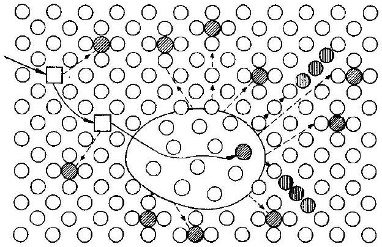
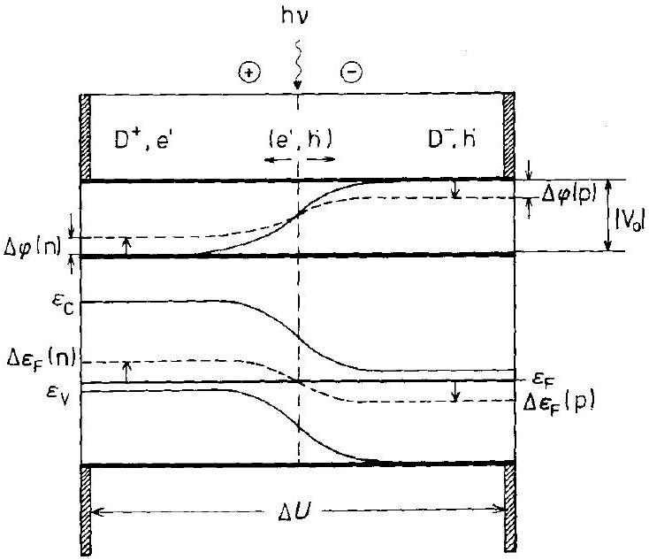

## 13 Reactions in Solids Under Irradiation

### 13.1 Introduction

Photochemical reactions in gases and liquids are a central point of research in chemical kinetics. The absorption of photons changes the distribution of electrons in the available molecular states and thus initiates reactions. Analogous processes occur in crystals exposed to radiation. However, we have to take into account the specific constraints of the crystal structure. 1) Most atomic SE's which have been electronically excited by radiation are immobile. 2) Excitation into the conduction band results in delocalized electrons, and a possible charge transport over large distances. Cosmic radiation continuously irradiates solids. The traces and tracks of radiation induced processes can therefore be used to obtain information on the geological history of minerals. The photographic process is another example of a solid state reaction which is initially triggered by the absorption of photons.

Figure 13-1. Processes due to photon and particle irradiation of a crystal (schematic). $\mathrm{SE}_{n}^{*}=n^{\text {th }}$ structure element in an excited state.

Particle irradiation of solids is of equal importance. The bombardment with atomic particles of construction materials in nuclear reactors and the evidence that the structure and microstructure of solids can undergo changes during particle irradiation is the immediate cause of many investigations on irradiation effects nowadays. Crystals isolated from heat and work exchange can gain energy by irradiation with particles or photons. The energy transfer is local and initiates various relaxation processes. In our context, we discuss mainly the interaction of particles and photons with SE's and how this affects solid state kinetics and dynamics. The ingoing and outcoming radiation defines the boundary conditions of the photon and particle induced physical and chemical reactions (Fig. 13-1). The basic problem is the transformation of the injected energy into the energy of phonons, structural defects, and chemical reaction products and their redistribution in space and time. In essence, we will treat two different situations. The first one is the disturbance of an equilibrium crystal by irradiation. The second one is the change in the reaction kinetics of a nonequilibrium system under irradiation. Systematically, we have to distinguish between reactions in homogeneous, inhomogeneous, and heterogeneous solids.

Photons (electromagnetic wave packets) have a wide energy spectrum (see Table 16-1) but negligible masses (momenta). Their interaction with matter thus primarily results in a change in the electron states and not in a noticeable momentum transfer to the absorbing SE's. Only with a sufficiently high photon energy will structural radiation damage be found. In an ionic crystal with absorbing point defects ( = color centers), for example, the absorbed photon excites the color center electron. Ionization of the center transfers the electron into delocalized (band) states. Thermalization of the excited electron occurs by radiation and/or interaction with the vibrational spectrum of the crystal (photon and/or phonon emission). In contrast, the irradiation of solids by neutral particles results in atomic collisions and a subsequent displacement of the SE's from their regular lattice sites. The displaced SE's are found either on regular lattice sites or in the interstitial lattice, leaving behind a corresponding number of vacancies. Subsequent secondary effects may be quite complex and will be discussed later. Ion irradiation of solids involves both atomic collisions and the excitation of electrons.

A number of processes follows the absorption of photon or particle energy which are important in technology. Let us mention several examples. 1) Sputtering is used for surface preparation. It can be combined with atomic analysis (mass spectroscopy) to obtain concentration profiles normal to the crystal surface with high spatial resolution (Secondary Ion Mass Spectroscopy, SIMS). 2) Ion implantation is performed in order to prepare crystals with predetermined compositions and thus properties in the near-surface region on a very small scale [T. Corts, et al. (1990)]. After particle irradiation, the product may be amorphous or metastable. 3) Silver halide photography has already been mentioned. It is the result of photon absorption. There are other solid state photochromic processes that can be used for imaging as well. 4) Secondary electron multipliers amplify a photon signal exciting primary electrons in a crystal. Multipliers are used for detecting and counting X-ray and $\gamma$-ray photons.

Surveys on radiation induced solid state reactions [e.g., F. V. Nolfi (1983); W. Hayes, A. M. Stoneham (1985); C. Abromeit, H. Wollenberger (1987)] illustrate a variety of effects in various chemical systems. Parameters such as dose, temperature, stress state, and, in particular, the type of irradiation determine both the mode and the kinetics of radiation induced reactions. We will concentrate on some fundamental considerations and discuss mainly the implications which radiation has on the kinetics of solid state reactions. We are especially interested in the occurrence of point defects in a crystal due to irradiation. Radiation induced non-equilibrium point defects either diffuse to sinks or react with each other in recombination, annihilation, or formation of associates, aggregates, and clusters. Reactions with impurities may also take place. Formally, we are dealing with a combined transportreaction problem of several distinct species. The corresponding partial differential equations are coupled by mass and charge conservation and by quasi-chemical reactions. The boundary conditions are established by the strength and geometry of the radiation resulting in homogeneously or inhomogeneously distributed defect sources, and also by the spatial distribution of sinks. Formal problems of this kind are often highly nonlinear.

### 13.2 Particle Irradiation

### 13.2.1 Basic Concepts

The conservation of energy and momentum is the fundamental requirement which determines the behavior of the SE's in metals, semiconductors, and ionic compounds irradiated by particles. Although we shall not deal with the basic physics of elementary collision processes in our context of chemical kinetics, let us briefly summarize some important results of collision dynamics which we need for the further discussion. If a particle of mass $m_{\mathrm{P}}$ and (kinetic) energy $E_{\mathrm{P}}$ collides with a SE of mass $m_{\mathrm{s}}$ in a crystal, the fraction of $E_{\mathrm{P}}$ which is transferred in this collision process to the SE is given by

$$
\frac{E}{E_{\mathrm{P}}}=\frac{4 \cdot m_{\mathrm{P}} \cdot m_{\mathrm{s}}}{\left(m_{\mathrm{P}}+m_{\mathrm{s}}\right)^{2}} \cdot \sin ^{2}\left(\frac{\Theta}{2}\right)
$$

where $\Theta$ is the scattering angle determined with reference to the center of mass. Obviously, the maximum energy transfer will occur if $m_{\mathrm{P}}=m_{\mathrm{s}}$ and $\Theta=\pi$. In this case $E=E_{P}$, independent of the scattering mechanism. The scattering mechanism, however, tells us what fraction of the knocked-on particles can be found between angle $\Theta$ and $(\Theta+\mathrm{d} \Theta)$ after the collision took place. The relevant quantity is the scattering cross section $\sigma(\Theta)$. If $\sigma$ is independent of $\Theta$, we name the process 'hard sphere scattering'. Examples of this type of scattering are the collisions of fast neutrons with atoms and ions in the crystal. If instead of neutral particles, electrons and ions collide whereby the interaction is coulombic, this collision mechanism is named 'Rutherford scattering'. For $\sigma(\Theta)$ we can derive

$$
\sigma(\Theta)=\frac{R^{2}}{(2 \cdot \sin (\Theta / 2))^{4}}
$$

where the length $R$ is determined by the balance between electrostatic and kinetic energy, that is,

$$
q_{\mathrm{P}} \cdot q_{\mathrm{s}} \cdot\left(\frac{e_{0}^{2}}{R}\right)=E_{\mathrm{P}}^{0} \cdot \frac{m_{\mathrm{s}}}{\left(m_{\mathrm{P}}+m_{\mathrm{s}}\right)}
$$

$E_{\mathrm{P}}^{0}$ is the initial energy in the laboratory frame and $q$ denotes the electric charge number. The integrated total cross section $\sigma_{t}=\int_{0}^{\pi} \int_{0}^{2 \pi} \sigma(\Theta) \cdot \sin \Theta \cdot \mathrm{d} \Theta \cdot \mathrm{d} \phi$ is larger for Rutherford scattering than for neutral particle scattering due to the influence of long range interactions with correspondingly low energy transfers. Depending on the details of the momentum and energy exchange, the knocked-on SE particles may be focused or spread. Channeling is found if the incoming particles are fast and move within the empty channels of the crystal structure along distinct directions. The colli-
sions then occur with small deflections only, unless a channel is blocked. From Eqn. (13.1) we can conclude that the maximal energy transfer of a 1 MeV electron $\rightarrow \mathrm{Cu}$ collision is less than 100 eV . The energy transfer of a 1 MeV neutron (positron) $\rightarrow \mathrm{Cu}$ collision is 61 keV , and, of course, the $\mathrm{Cu} \rightarrow \mathrm{Cu}$ collision transfers 1 MeV .

Subsequent to the collision, the most important event concerning kinetics is the displacement of regular SE's and the formation of Frenkel-type point defects. The corresponding formation reaction is

$$
p\left(E^{*}\right)+\mathrm{A}_{\mathrm{A}}+\mathrm{V}_{\mathrm{i}}=\mathrm{V}_{\mathrm{A}}+\mathrm{A}_{\mathrm{i}}^{*}+p\left(E^{\ddagger}\right) ; \quad E^{*}-E^{\ddagger}=\Delta E_{\mathrm{P}}
$$

where $p\left(E^{*}\right)$ indicates the incoming, and $p\left(E^{\ddagger}\right)$ the outgoing particle. The basic assumption introduces a threshold energy $E_{\mathrm{d}}$. If $\Delta E_{\mathrm{P}}>E_{\mathrm{d}}$, reaction (13.4) can take place. If $\Delta E_{\mathrm{P}}>2 \cdot E_{\mathrm{d}}$, the displaced $\mathrm{A}_{1}^{*}$ may possess sufficient kinetic energy to bring about secondary processes. Threshold energies for MgO and CaO are $c a .50 \mathrm{eV}$, both for cation and anion displacement. For $\mathrm{Al}_{2} \mathrm{O}_{3}$, the numbers are 18 eV and 75 eV respectively. If the incoming particle is an electron for which $m_{\mathrm{e}} \ll m_{\mathrm{SE}}$, its kinetic energy must be high in order to form the Frenkel pair ( $A_{i}+V_{A}$ ). In this case, however, it is quite seldom that $\mathrm{A}_{i}^{*}$ induces secondary displacements or other defect reactions. If the incoming particle is a fast neutron, large energy transfers $\Delta E_{\mathrm{P}}$ dominate through hard-sphere scattering. The high energy $\mathrm{A}_{i}^{*}$ point defects can then move long distances in the crystal lattice ( $\sim 1000 \AA$ ), eventually knocking more $\mathrm{A}_{\mathrm{A}}$ structure elements off the regular sites. The result is a strongly damaged region with many secondary $\mathrm{A}_{i}^{*}$ particles. Shortly after this primary energy exchange $\left(\Delta E_{\mathrm{P}} \approx E_{\mathrm{P}}^{*}\right)$, the damaged region may contain ca. $10^{2}$ Frenkel pairs. Heavy ion particles can produce even larger radiation damaged regions ( $c a .10 \mu \mathrm{~m}$ ). Electrically charged primary or secondary particles traversing the crystal can excite electrons into the conduction band. Whereas photons with energies in the eV range are needed to excite electrons across band gaps, charged atomic particles need energies of a few keV in order to bring about the same effect.

We conclude that a crystal which is continuously irradiated with particles of sufficient kinetic energy and in which no further reactions (e.g., phase formations) take place becomes more and more supersaturated with point defects. Recombination starts if the defects can move fast enough by thermal activation. A steady state is reached when the rates of defect production and annihilation (by recombination) are equal. In the homogeneous crystal, the change in local defect concentration ( $c_{\mathrm{d}}$ ) over time is given by (see Section 5.3.3)

$$
\dot{c}_{\mathrm{d}}=\vec{k} \cdot c_{\mathrm{A}_{\mathrm{A}}} \cdot c_{\mathrm{V}_{\mathrm{i}}}-\stackrel{k}{k} \cdot c_{\mathrm{V}_{\mathrm{A}}} \cdot c_{\mathrm{A}_{\mathrm{i}}}=\vec{K}-\stackrel{k}{k} \cdot c_{\mathrm{V}_{\mathrm{A}}} \cdot c_{\mathrm{A}_{\mathrm{i}}}
$$

The second term on the right hand side of Eqn. (13.5) describes the rate of recombination. In the case of diffusion controlled recombination, $\vec{k}$ and $\overleftarrow{k}$ may be calculated in terms of defect diffusivities and steady state concentrations. Without radiation, $\dot{c}_{\mathrm{d}}=0$, and the Frenkel equilibrium requires that $\bar{c}_{\mathrm{V}_{\mathrm{A}}} \cdot \bar{c}_{\mathrm{A}_{\mathrm{i}}}=\vec{K} / \vec{k}$. If a steady state is attained under irradiation, the rate of radiation produced defects ( $\dot{c}_{\mathrm{p}}$ ) add to the thermal production rate, and the sum is equal to the recombination rate. Therefore,

$$
\frac{\Delta c_{\mathrm{V}_{\mathrm{A}}}}{\bar{c}_{\mathrm{V}_{\mathrm{A}}}}=\sqrt{1+\frac{\dot{c}_{\mathrm{p}}}{\vec{K}}}-1 ; \Delta c_{\mathrm{V}_{\mathrm{A}}}=c_{\mathrm{V}_{\mathrm{A}}}-\bar{c}_{\mathrm{V}_{\mathrm{A}}}
$$

where $\Delta c_{\mathrm{V}_{\mathrm{A}}}$ is the steady state increase in Frenkel defect concentration due to homogeneous irradiation. However, the assumption of homogeneity cannot hold if the production of defects results in radiation damaged regions as mentioned above. In these regions, interstitials and vacancies are spatially separated and the local $\Delta c_{\mathrm{V}_{\mathrm{A}}}$ values are often much larger than if calculated by Eqn. (13.6). From Section 5.3.3, we can estimate that the diffusion controlled relaxation (recombination) time for Frenkel defects in silver halides is $c a .10^{-6} \mathrm{~s}$ at $100^{\circ} \mathrm{C}$ and so we can estimate the parameter $\vec{K}$ in Eqn. (13.6). In metals, the point defect concentrations are not coupled by the condition of electroneutrality. Therefore, $c_{\mathrm{V}}$ can differ from $c_{\mathrm{i}}$ if the point defects annihilate at sinks and their mobilities are not the same. Figure 13-2 plots the defect concentrations as a function of time. For $t_{1}<t<t_{2}$, the steady state is achieved by homogeneous defect reaction. For $t>t_{3}$, a new steady state is achieved. Now, distinct sinks become operative, the number of which remains constant.

Figure 13-2. Concentration of point defects ( $c_{\mathrm{V}}, c_{\mathrm{i}}$ ) due to irradiation as a function of time (schematic).

For elemental solids and stoichiometric compound crystals, the primary influence of irradiation on their kinetic behavior is due to the increase in $\Delta c_{\mathrm{V}}\left(\cong \Delta c_{\mathrm{j}}\right)$. We would expect the enhancement in the component diffusion to be in proportion to the increase in the (average) defect concentrations, thus influencing all homogeneous, inhomogeneous, and heterogeneous solid state reactions.

Structural inhomogeneities due to dislocations, grain boundaries, or concentration fluctuations lead to spatial differences in point defect production rates during irradiation. Similarly, defect sinks are inhomogeneously distributed. Therefore, irradiation of solid solution crystals results in segregation and demixing of the components. The formal description is given by diffusion-reaction equations containing transport and reactive terms. The coupling conditions for the various fluxes and appropriate boundary conditions have to be taken into account. For example, in the case of a binary alloy (A, B), we have a rate equation of the following form

$$
\dot{c_{i}}=-\nabla j_{i}+\dot{r}_{i, \mathrm{p}}-\dot{r}_{i, \mathrm{a}} ; \quad i=\mathrm{A}_{\mathrm{Me}}, \mathrm{~V}_{\mathrm{Me}}, \mathrm{~B}_{\mathrm{Me}}, \mathrm{~A}_{\mathrm{i}}, \mathrm{~B}_{\mathrm{i}}
$$

Here, B are solute atoms, a and p indicate annihilation and production respectively. The concentrations of the different SE's ( $i$ ) are not independent, but are related to
each other through site balance and mass conservation ( $N_{\mathrm{A}}+N_{\mathrm{B}}=1$ ). If during irradiation a quasi-steady state is established, the fluxes of vacancies and interstitials are equal. The simplest situation is met if the distribution of sources is homogeneous and the external surfaces of the crystal are the only defect sinks, where the equilibrium concentrations are assumed to prevail.

Solutions for this type of kinetics can only be achieved numerically. Model calculations with constant kinetic parameters have been made [H. Wiedersich, et al. (1979)], however, the modeling of realistic transport (diffusion) coefficients which enter into the flux equations is most difficult since the jump rate $\nu_{\mathrm{A}} \neq \nu_{\mathrm{B}}$. Also, the individual point defects have limited lifetimes which determine the magnitude of correlation factors (see Section 5.2.2). Explicit modeling for dilute or non-dilute alloys can be found in [A. R. Allnatt, A. B. Lidiard (1993)].

Let us also mention an effect which does not occur in metals but does in continuously irradiated semiconducting and mixed conducting compounds such as AO or ( $\mathrm{A}, \mathrm{B}) \mathrm{O}$. Initially, supersaturated irregular SE's ( $\mathrm{A}_{\mathrm{i}}, \mathrm{V}_{\mathrm{A}} ; \mathrm{O}_{\mathrm{i}}, \mathrm{V}_{\mathrm{O}}$ ) are produced. The most mobile electroneutral pair (e.g., $\mathrm{A}_{i}, \mathrm{O}_{i}$ ) will be transported to the appropriate defect sink, driven by their concentration gradient. Since the mobilities of the various sorts of point defects are different, a diffusion potential builds up when they are electrically charged. In the semiconducting oxide, this diffusion potential corresponds to an internal oxygen potential gradient. At a large enough gradient (i.e., for sufficient radiation intensity) local oxidation or reduction eventually takes place. For AO , this means the formation of $\mathrm{A}_{3} \mathrm{O}_{4}$ or A . Here we have an example of phase instability due to irradiation that does not immediately stem from a segregation of components. Component segregation will, of course, occur if the mobilities of the drifting components are different in (A, B)O. An initially homogeneous solid solution may even decompose. These demixing processes (although with different boundary conditions) are identical to those thoroughly discussed in Chapter 8.

### 13.2.2 Radiation Effects in Halides (Radiolysis)

Particle irradiation effects in halides and especially in alkali halides have been intensively studied. One reason is that salt mines can be used to store radioactive waste. Alkali halides in thermal equilibrium are Schottky-type disordered materials. Defects in NaCl which form under electron bombardment at low temperature are neutral anion vacancies ( $\mathrm{V}_{\mathrm{X}}^{\mathrm{x}}$ ) and a corresponding number of anion interstitials ( $\mathrm{X}_{\mathrm{i}}^{\mathrm{x}}$ ). Even at liquid nitrogen temperature, these primary radiation defects are still somewhat mobile. Thus, they can either recombine ( $\mathrm{X}_{\mathrm{i}}^{\mathrm{X}}+\mathrm{V}_{\mathrm{X}}^{\mathrm{X}}=\mathrm{X}_{\mathrm{X}}^{\mathrm{X}}$ ) or form clusters. First, clusters will form according to $n \cdot \mathrm{X}_{\mathrm{i}}^{\mathrm{X}}=\mathrm{X}_{n, \mathrm{i}}^{\mathrm{X}}$. Also, $\mathrm{X}_{\mathrm{i}}^{\mathrm{X}}$ and $\mathrm{X}_{n, \mathrm{i}}^{\mathrm{X}}$ may be trapped at impurities. Later, vacancies $\mathrm{V}_{\mathrm{X}}^{\mathrm{X}}$ will cluster as well. If $\mathrm{X}_{2, \mathrm{i}}^{\mathrm{X}}$ is trapped by a vacancy pair $\left[\mathrm{V}_{\mathrm{A}} \mathrm{V}_{\mathrm{X}}\right]$ (which is, in other words, an empty site of a lattice molecule, i.e., the smallest possible 'pore') we have the smallest possible halogen molecule 'bubble'. Further clustering of these defects may lead to dislocation loops. In contrast, aggregates of only anion vacancies are equivalent to small metal colloid particles.

At sufficiently high temperatures, the radiation damage will recover by recombination of the point defects and their aggregates. The various annealing steps have been
followed by optical spectroscopy (identification of the color centers), by volume (lattice parameter) changes, by thermal analysis, and by yield strength measurements. The yield stress reflects the effect of the different defects and their aggregates on the dislocation motion.

### 13.2.3 Radiation Effects in Metals

Displacement, Frenkel defect formation, and cascade production are the primary processes when impinging particles ( $\mathrm{e}^{-}, \mathrm{n}, \mathrm{p}^{+}$, ions, atoms) knock into atoms in metal crystals. The impinging high energy particle looses its energy in a very small volume fraction of the crystal, at time scales that are smaller than that of a lattice vibration. The resulting defect cascade (Fig. 13-3) consists of a vacancy-rich core that is surrounded by a shell of interstitials ( $b_{\mathrm{i}}>b_{\mathrm{V}}$ ). Let us not be concerned with the initial hot stage of the cascade but note that right after thermalization, the number, $z_{\mathrm{d}}$, of produced point defects can be estimated according to the modified KinchinPease equation [H. G. Kinchin, R. S. Pease (1955)] as

$$
z_{\mathrm{d}}=0.8 \cdot\left(\frac{E_{\mathrm{P}}}{2}\right) \cdot E_{\mathrm{f}}^{-1}
$$

where $E_{\mathrm{f}}$ denotes the defect formation energy. When $E_{\mathrm{P}}>1 \mathrm{keV}$, the experimentally determined number of defects is smaller than the number calculated from Eqn. (13.8). A survey on defect cascades in metals has been presented by [R. S. Averback, D.N. Seidman (1987)].

Figure 13-3. Defect cascade formation under irradiation (schematic).

After thermalization, the defects begin to migrate, recombine, cluster, or precipitate provided the temperature is high enough to activate the motion of point defects. The various possible processes depend on defect concentration and their spatial distribution as well as on defect mobility and their interaction energies. As in nonmetallic crystals, internal and external surfaces act as sinks for at least a part of the radiation induced defects in metals.

Let us now consider effects which are specific for solid solutions ( $\mathrm{A}, \mathrm{B}$ ). The homogeneous and heterogeneous precipitation of new phases, ordering and disordering, amorphization, void formation, and formation of dislocation networks (growth of dislocation loops) have all been observed. When we begin with an ordered ( $\mathrm{A} \cdot \mathrm{B}$ ) compound, atom displacements during irradiation result in increasing disorder. Not only does the radiation cause disorder, but it also produces point defects which mobilize the atoms of components A and B . Since the ordered (equilibrium) state has the lowest Gibbs energy, disordered A and B tend to order themselves. Eventually, the system will reach a partially disordered steady state. If $s$ indicates the (long range) order parameter and the rate of disordering is $\vec{s}=-\vec{k} \cdot s$, whereas the rate of ordering is $\stackrel{+}{s}=-\stackrel{\rightharpoonup}{k}(1-s)$, the total change in time of $s$ is ( $\vec{s}+\bar{s}$ ) and we obtain for the steady state

$$
s_{\mathrm{st}}=\frac{\overleftarrow{k}}{\overleftarrow{k}+\stackrel{\rightharpoonup}{k}} ; \quad \dot{s}=0
$$

The problem then is the determination of the rate coefficients $\vec{k}$ and $\vec{k}$. They depend on the concentrations and jump frequencies of point defects, that is, on the radiation intensity. Their detailed analysis and the calculation of the steady state order parameter is most complicated due to the finite lifetime of defects and the different hopping frequencies of the interstitials and vacancies which exchange with either A or B .

The second mode of increasing the order of a multicomponent solid is the demixing by diffusional transport as treated in the previous chapter. During irradiation, local demixing occurs due to the point defect fluxes to the heterogeneous sinks. We have learned from Eqn. (13.6) that particle irradiation increases the point defect concentration above the thermal equilibrium value. A part of the supersaturated defects ( $\mathrm{V}, \mathrm{A}_{\mathrm{i}}, \mathrm{B}_{\mathrm{i}}$ ) recombines homogeneously, while the other part will annihilate at sites of repeatable growth (dislocations, etc.). Eventually, a steady state flux of point defects to the sinks, and a conjugate flux of the components $\mathbf{A}$ and $\mathbf{B}$, is observed. Since the jump frequencies of the components A and B of the alloy normally differ, the steady state flux of point defects transports the components A and B at different rates. This leads to a demixing of the solid solution (see Fig. 8-2), in particular, near the dislocation core because of the axial transport symmetry. We quantitatively treated the demixing induced by defect fluxes in Section 8.2. The direction and extent of this demixing depends in a linearized approach on the fraction $N_{\mathrm{A}}$ and the mobility ratio $D_{\mathrm{A}} / D_{\mathrm{B}}$. However, demixing during irradiation is complicated by the simultaneous recombinations of V and $\mathrm{A}_{\mathrm{i}}\left(\mathrm{B}_{\mathrm{i}}\right)$, which are determined by the number of encounters leading to complex jump correlations. The extent of component segregation depends on the flux density of defects and thus on the intensity of radiation ( $=$ defect supersaturation). If the flux density is sufficiently large, the alloy composition near a dislocation line may shift (due to segregation) into a different phase field. The subsequent formation of a new phase involves nucleation, but the nucleation energy is expected to be small at the dislocation line (see Section 6.2.2). In conclusion, thermodynamically stable alloys may become unstable during particle irradiation because of component demixing (segregation) and heterogeneous decomposition at sinks ( $=$ sites of repeatable growth) in the crystal. These effects occur
preferentially at elevated temperatures where appreciable defect fluxes can be sustained under irradiation.

Next, we may ask whether non-equilibrium defects such as dislocations, etc. are necessary for the demixing and decomposition under irradiation? We note that, in principle, a homogeneous alloy exposed to a steady supersaturation of point defects is unstable if the defect recombination rates depend on composition (component concentration). In modeling this idea, Martin and coworkers [G. Martin, R. Cauvin (1981)] have shown that the equilibrium distribution of normal concentration fluctuations (clusters) is disturbed by radiation induced point defects, provided they recombine preferentially at those clusters. This concept can be reformulated in terms of the above demixing model. Local concentration fluctuations influence the local defect recombination rates. If the lifetime of a fluctuation or cluster is longer than the average time between subsequent recombinations, point defect fluxes are directed towards clusters having the highest recombination rate. In this way, a (macroscopically) homogeneous alloy is destabilized by irradiation. It becomes inhomogeneous by self-sustaining demixing. This process also explains the experimental observation of stable single-phase solid solutions which become two-phase mixtures under irradiation (e.g., $(\mathrm{Al}, \mathrm{Zn}),(\mathrm{Cu}, \mathrm{Be})$, or (W, Re ) alloys). In other words, particle radiation shifts the critical temperature for decomposition, and an undersaturated alloy is able to demix. Synergetic effects may even lead to pattern formation in irradiated alloys.

A different approach to analyze the ordering of solid solutions by macroscopic transport of components during irradiation will also be presented [G. Martin, G. Bellon (1987)]. It is based on the idea of spinodal decomposition (see Section 12.3.2). Generalizing their results may be interesting and useful for other types of stochastic energy input into a given system on a microscopic scale (e.g., mechanical energy input by ball milling). The kinetic theory starts with the usual diffusion equation for the solid solution (A,B) and redefines the chemical diffusion coefficient during irradiation with respect to the 'ballistic' part of diffusional mixing. The ballistically and chemically driven fluxes are assumed to be additive in the inhomogeneous crystal. In analogy to a Darken-type chemical diffusion coefficient (see Eqn. (4.78)), the 'ballistic interdiffusion coefficient' is defined as

$$
\tilde{D}^{\#}=N_{\mathrm{A}} \cdot D_{\mathrm{B}}^{\#}+N_{\mathrm{B}} \cdot D_{\mathrm{A}}^{\#}
$$

The individual ballistic coefficients are given by

$$
D_{i}^{\#}=\frac{1}{2} \cdot \phi \cdot \sigma_{i} \cdot \bar{r}_{i}^{2}
$$

where $\phi$ is the radiation flux density, $\sigma_{i}$ and $r_{i}$ are the cross section and ballistic jump length after a replacement of the SE of sort $i$ respectively. Analogous to Eqn. (12.25) $f$, one can derive the condition of a stationary state by minimizing the following functional $F$ [G. Martin, G. Bellon (1987)]

$$
F=\int\left(f\left(N_{\mathrm{A}}(\xi)\right)+K \cdot \frac{\partial^{2} N_{\mathrm{A}}}{\partial \xi^{2}}+\frac{R T}{V_{m}} \cdot f\left(N_{\mathrm{A}}, \frac{\widetilde{D}^{\#}}{\tilde{D}}\right)\right) \cdot \mathrm{d} \xi
$$

The first two terms in the bracket correspond to the customary chemical free energy density and the gradient energy respectively. The third term takes into account the ballistic flux. $\tilde{D}$ is the Darken interdiffusion coefficient (Eqn. (4.78)), but adapted to the radiation induced increased defect concentration of the alloy.

An interesting result has been obtained after the introduction of the regular solution model [C. Wagner (1952)] into Eqn. (13.12). The free energy $f\left(N_{\mathrm{A}}, T\right)_{\text {irr }}$ of the alloy under irradiation equals the free energy $f$ of the alloy without irradiation but at an increased temperature, that is, $f\left(N_{\mathrm{A}}, T\right)_{\text {irr }}=f\left(N_{\mathrm{A}}, T+\Delta T\right) . \Delta T$ is found to be

$$
\frac{\Delta T}{T}=\frac{\tilde{D}^{\#}}{\tilde{D}}
$$

Equation (13.13) suggests that the steady state of the alloy under irradiation is the same as that of the non-irradiated alloy at $T+\Delta T$. Explicitly, one obtains

$$
\Delta T=\text { const } \cdot \sqrt{\phi} \cdot \mathrm{e}^{\frac{E_{\mathrm{v}}}{2 \cdot R T}}
$$

where $E_{\mathrm{V}}$ is the activation energy for the vacancy migration. The higher $T$ is, the less the irradiated alloy differs from the non-irradiated one. Conversely, the higher $E_{\mathrm{V}}$ is, the more the irradiated and non-irradiated alloys differ. The foregoing result is remarkable. If energies other than thermal energies are pumped into a system on an atomic scale, its kinetic coefficients behave 'as if' the system had been heated to a higher temperature ( $T+\Delta T$ ). If one could generalize this result, one would be able to formally handle other energy inputs (e.g., mechanical) into a crystal. Similar questions will be resumed in Chapter 14.

### 13.3 Photon Irradiation

### 13.3.1 Basic Concepts

Photons have a wide spectrum of energies ranging from hard $\gamma$-rays to radiowaves (see Table 16-1). A thermalization of absorbed photon energy which directly increases the (average) temperature is not of interest to us. Energies of ca. 0.1 eV and more are needed in order to induce structure elements to change sites and move. This limit leads us to neglect individual absorption phenomena beyond the IR region ( $>10 \mu \mathrm{~m}$ ) since they can not immediately influence atomic transport. Photochemical reactions with photons of low energy can be observed in solids which do not result in the formation of atomic point defects. The photon induced isomerization of a crystal of $\left[\mathrm{Co}\left(\mathrm{NH}_{3}\right)_{5} \mathrm{NO}_{2}\right] \cdot \mathrm{Cl}_{2}$ is such an example. This crystal strongly absorbs photons in the visible region and forms only a thin surface layer of the isomer. Since the isomers differ in their lattice parameters, the crystal is stressed and will bend.

Compared with the momentum of impinging atoms or ions, we may safely neglect the momentum transferred by the absorbed photons and thus we can neglect direct knock-on effects in photochemistry. The strong interaction between photons and the electronic system of the crystal leads to an excitation of the electrons by photon absorption as the primary effect. This excitation causes either the formation of a localized exciton or an ( $\mathrm{e}^{\prime}+\mathrm{h}^{*}$ ) defect pair. Non-localized electron defects can be described by planar waves which may be scattered, trapped, etc. Their behavior has been explained with the electron theory of solids [A. H. Wilson (1953)]. Electrons which are trapped by their interaction with impurities or which are self-trapped by interaction with phonons may be localized for a long time (in terms of the reciprocal Debye frequency) before they leave their potential minimum in a hopping type of process activated by thermal fluctuations.

Let us formulate the various photon absorption processes in chemical shorthand as follows

$$
\begin{gathered}
h v+(\mathrm{AX})_{\text {cryst }}=\mathrm{e}^{\prime}+\mathrm{h}^{*} \\
h v+\mathrm{A}_{\mathrm{A}}^{\mathrm{x}}=\left[\mathrm{A}_{\mathrm{A}}^{*}+\mathrm{e}^{\prime}\right]^{*} \rightarrow \mathrm{~A}_{\mathrm{A}}^{*}+\mathrm{e}^{\prime} \\
h v+\mathrm{A}_{\mathrm{A}}^{\mathrm{x}}=\left[\mathrm{A}_{\mathrm{A}}^{\prime}+\mathrm{h}^{*}\right]^{*} \rightarrow \mathrm{~A}_{\mathrm{A}}^{\prime}+\mathrm{h}^{*} \\
h v+\mathrm{X}_{\mathrm{X}}^{\mathrm{x}}=\left[\mathrm{X}_{\mathrm{X}}^{\prime}+\mathrm{h}^{*}\right]^{*} \rightarrow \mathrm{X}_{\mathrm{X}}^{\prime}+\mathrm{h}^{*} \\
h v+\mathrm{X}_{\mathrm{X}}^{\mathrm{x}}=\left[\mathrm{X}_{\mathrm{X}}^{*}+\mathrm{e}^{\prime}\right]^{*} \rightarrow \mathrm{X}_{\mathrm{X}}^{*}+\mathrm{e}^{\prime}
\end{gathered}
$$

Since recombination occurs as well, Eqns. (13.15)-(13.19) indicate that under (constant) photon irradiation, a steady state concentration of new species (excitons, $\mathrm{A}_{\mathrm{A}}^{\bullet}$, $A_{A}^{\prime}$, etc.) is eventually established in the crystal. These defects can recombine or undergo reactions to form other irregular SE's, thus changing the whole equilibrium defect chemistry. Since the defect chemistry is responsible for the reactivity in the solid state, it is not surprising that photon irradiation affects the reaction kinetics. If excited electronic defects return to the ground state, the corresponding energy change can be converted into phonon energy which may cause the formation of other atomic defects. In inhomogeneous and heterogeneous nonmetallic crystals with prevailing electronic equilibrium and mobile electronic charge carriers, electric potential gradients exist of necessity. If by photon absorption ( $\mathrm{e}^{\prime}+\mathrm{h}^{*}$ )-pairs are formed in these crystals (see Eqn. (13.15)), the $\mathrm{e}^{\prime}$ and $\mathrm{h}^{*}$ will be separated from each other by the action of the electric field. Given an external electric circuit, a photocurrent can thus flow. This basic photochemical reaction is the fundamental process of the photovoltaic conversion of solar energy into electric energy (Fig. 13-4).

Mobile electronic defects may be understood as more or less localized reducing or oxidizing agents. They can react with other structure elements $S_{i, x}^{q}$ as follows

$$
\mathrm{e}^{\prime}+\mathrm{S}_{i, \varkappa}^{q}=\mathrm{S}_{i, \varkappa}^{q-1}, \quad \mathrm{~h}^{\bullet}+\mathrm{S}_{i, \varkappa}^{q}=\mathrm{S}_{i, \varkappa}^{q+1}
$$

However, in order to perform intracrystalline chemical reactions that affect the components and not just the SE's, empty lattice sites (vacancies) constituting a complete

Figure 13-4. Scheme of a photovoltaic cell. $h v=$ photon; ( $e^{\prime}, h^{*}$ ) = photoinduced electron-hole pair; $\varepsilon_{\mathrm{c}}, \varepsilon_{\mathrm{v}}=$ conduction and valence band edge respectively. $\varepsilon_{\mathrm{F}}=$ Fermi energy (electrochemical electron potential). $\Delta \varepsilon_{\mathrm{F}}(\mathrm{p})$, $\Delta \varepsilon_{\mathrm{F}}(\mathrm{n})=$ change in Fermi energy due to steady state electron-hole separation in the diffusion potential zone of a p-n junction.

lattice molecule must be involved. Otherwise, photolytic reactions (decomposition) can occur only at internal or external surfaces as sites of repeatable growth for the lattice molecules $M$ (see Section 2.2.1, Eqn. (2.23)). Let us discuss an example. If $\mathrm{X}_{\mathrm{X}}^{*}$ has been formed during photon irradiation by reaction (13.19), the formation of a molecule $\mathrm{X}_{2}$ of component X can take place as follows

$$
X_{X}^{*}+X_{X}^{*}+\left[V_{A}^{\prime}+V_{X}^{*}\right]=X_{2}[]+2 V_{X}^{*}
$$

or, equivalently,

$$
2 X_{X}^{*}+V_{A}^{\prime}=X_{2}[]+V_{X}^{*}
$$

where the symbol [ ] denotes the vacant site of a lattice molecule. By adding Eqn. (13.19) to Eqn. (13.22) or, equivalently, by using the modified photoreaction $h v+\mathrm{AX}=\mathrm{A}_{\mathrm{A}}^{\mathrm{x}}+\mathrm{X}_{\mathrm{X}}^{*}+\mathrm{e}^{\prime}$ for that purpose, one obtains

$$
2 h v+2 \mathrm{AX}+\mathrm{V}_{\mathrm{A}}^{\prime}=\mathrm{X}_{2}[]+2 \mathrm{~A}_{\mathrm{A}}+\mathrm{V}_{\mathrm{X}}^{\bullet}+2 \mathrm{e}^{\prime}
$$

which describes the photolytic decomposition of a crystal AX with Schottky disorder ( $\mathrm{V}_{\mathrm{A}}, \mathrm{V}_{\mathrm{X}}$ ) in terms of the SE's. The subsequent reactions between electrons, electron holes, and atomic point defects can be registered using color center spectroscopy, particularly in halides. As an example, annealing of irradiated crystals leads to a time-dependent bleaching which reflects the kinetics of point defect reactions, e.g., [J. Z. Damm, F. C. Tompkins (1961)].

### 13.3.2 Radiation Effects in Halides (Photolysis)

When AX (e.g., KCl ) is irradiated with X-rays (or electrons), pairs of anionic Frenkel defects (i.e., $\mathrm{X}_{\mathrm{i}}^{\mathrm{X}}, \mathrm{V}_{\mathrm{X}}^{\mathrm{X}}$ ) are formed. Most of them recombine, but a small fraction separates and becomes so-called $\mathrm{H}\left(\mathrm{X}_{\mathrm{i}}^{\mathrm{X}}\right)$ and $\mathrm{F}\left(\mathrm{V}_{\mathrm{X}}^{\mathrm{X}}\right)$ centers. Depending on the tempera-
ture, various subsequent reactions between these primary irradiation products and other SE's take place. 1) $\mathrm{X}_{n, \mathrm{i}}^{\mathrm{X}}$ clusters ( $\mathrm{V}_{n}$ centers) form according to $n \cdot \mathrm{X}_{\mathrm{i}}^{\mathrm{X}}=\mathrm{X}_{n, \mathrm{i}}^{\mathrm{X}} .2$ ) $2 \mathrm{X}_{\mathrm{i}}^{\mathrm{X}}$ or $\mathrm{X}_{2, \mathrm{i}}^{\mathrm{X}}$ are trapped by a lattice anion $\mathrm{X}_{\mathrm{X}}$ to become $\mathrm{X}_{3}^{-}$. 3) $n \cdot \mathrm{~V}_{\mathrm{X}}^{\mathrm{X}}=\mathrm{V}_{n, \mathrm{X}}^{\mathrm{X}}$, which is the formation of an anion vacancy cluster. 4) $\mathrm{X}_{\mathrm{i}}^{\mathrm{X}}$ and $\mathrm{V}_{\mathrm{X}}^{\mathrm{X}}$ structure elements aggregate as dislocation loops. This has been postulated to occur when $\mathrm{X}_{2}$ molecules are arranged on $\mathrm{V}_{\mathrm{X}}^{\mathrm{x}}$ sites. 5) The aggregation of initially separated anion vacancies may lead to metal colloids. The aggregation of $\mathrm{X}_{n, \mathrm{i}}^{\mathrm{X}}$ clusters can destroy the crystal lattice with small $\mathrm{X}_{2}$ gas bubbles as a result. After a sufficient rise in temperature and length of relaxation time, the products of the radiation damage are eventually healed by continuous recombination. Healing can occur internally and externally, unless the surroundings of the irradiated crystal have already reacted irreversibly with the products of photolysis. The kinetics of photolysis has been registered by optical and other spectroscopies (e.g., ESR), by thermal analysis (calorimetry), by volumetry, or by observing mechanical properties (e.g., yield stress). The relaxation kinetics in homogeneous crystals can be analyzed in terms of (diffusion controlled) chemical kinetics as described in Section 5.3.3. If, however, dislocation loops, colloid particles, or bubbles act as sites (surfaces) or repeatable growth, transport as represented by Eqns. (4.99) and (4.100) is the formal frame and can be used with the appropriate boundary conditions to obtain explicit solutions.

Most of the irregular SE's formed by irradiation interact with impurities that are the native irregular SE's of the crystal. Impurities interact with the irradiation products either by their stress field or, if heterovalent, by the electrostatic (Coulomb) field. Photolysis (radiolysis) is found in other than halide crystals as well. In oxides, the production of Frenkel pairs under photon irradiation is negligible. This has been ascribed to the fact that the reaction $\mathrm{O}^{2-}+\mathrm{O}^{-}=\mathrm{O}_{2}^{3-}$ is endothermic, whereas the reaction $\mathrm{X}^{-}+\mathrm{X}^{\mathrm{x}}=\mathrm{X}_{2}^{-}$is exothermic.

### 13.3.3 Ag Based Photography

An instructive example of the complex solid state processes following photon irradiation are the various stages of photographic imaging with photosensitive Ag -halides [see, for example, H. Schmalzried (1981)]. In the following, the basic explanation of the main reaction steps is briefly outlined. The different stages of the photographic process are 1 ) the primary process of radiation absorption, 2 ) the formation of the latent image, and 3) the developing of the latent image by an externally applied redox buffer with a sufficiently high electron potential able to reduce the silver ions. We will discuss only those aspects which deal with radiation effects proper and solid state photochemistry.

Optical absorption by small AgBr crystallites results primarily in the formation of pairs of free electronic carriers ( $\left.\mathrm{e}^{\prime}+\mathrm{h}^{*}\right)$. The quantum efficiency of this photoreaction is high. Electron holes are likely to be trapped by impurities (e.g., $\mathrm{Cu}_{\mathrm{Ag}}^{+}, \mathrm{S}_{\mathrm{Br}}^{2-} \rightarrow \mathrm{Cu}_{\mathrm{Ag}}^{2+}, \mathrm{S}_{\mathrm{Br}}^{-}$). Electrons, in contrast, are trapped by $\mathrm{Ag}_{\mathrm{i}}^{\bullet}$ to yield neutral $\mathrm{Ag}_{\mathrm{i}}^{\mathrm{x}}$ interstitials. If the crystallites of AgBr are embedded in a properly chosen emulsion gelatine, a large part of them and, in particular, their surface region are exposed to a high internal electric field which originates from surface charges. This electric field
causes the separation of electrons and electron holes formed by the primary photoreaction. Thus, the electric field and the subsequent trapping of $\mathrm{e}^{\prime}$ and $\mathrm{h}^{\cdot}$ reduce their recombination rate.

Even at room temperature, the neutral interstitial point defects $\mathrm{Ag}_{\mathrm{i}}^{\mathrm{x}}$ are sufficiently mobile to cluster at appropriate places, preferentially at internal or external surfaces. To this end, $\mathrm{AgBr}(\mathrm{Ag}(\mathrm{Br}, \mathrm{I}))$ crystals with dimensions of $0.1-1 \mu \mathrm{~m}$ are emulgated in the customary photographic films. Their growth is carefully controlled in order to make sure that the aggregation of $\mathrm{Ag}_{\mathrm{i}}^{\mathrm{x}}$ structure elements into clusters occurs mainly at the surface and photoelectrons are not trapped by internal impurities. Under these circumstances, small Ag metal clusters ( $\mathrm{Ag}_{n}, n>3$ ) will form on the surface of the silver-halide crystallites, and as long as the electron holes can be kept in deep traps, the Ag clusters remain stable enough to preserve the latent image.

Later, this latent image can be made visible by the chemical process which is named developing. Developers ( = appropriate redox buffers) are substances which reduce AgBr only in the presence of Ag clusters acting as catalysts when they are located at the surface of the AgBr grain. Non-irradiated grains remain unaffected. If the latent image grain (ca. $10^{9} \mathrm{Ag}$ atoms) with a single $\mathrm{Ag}_{n}$ catalyst ( $n>3$ ) is fully reduced and we assume that 10-100 photons were needed in order to form the $\mathbf{A g}_{n}$ speck ( $n>3$ ) on the surface, the enhancement factor is calculated to be $10^{7}-10^{8}$. The recombination of electrons and electron holes reduces the efficiency of the photographic process. The continuous growth of the silver nuclei on the crystallite surface, which has easy access to the developer, is considerably facilitated if the nucleation took place at a kink site. If the lattice site at the end of a surface kink is occupied by a $\mathrm{Br}^{-}$ion, the effective charge of this site is $-\frac{1}{2}$. When the $\mathrm{Ag}_{\mathrm{i}}^{+}$ion is attracted and placed at the kink site, its effective charge becomes $+\frac{1}{2}$. Thus, a new photoelectron can be attracted and another sequence of additions can begin.

Reactions of photoelectrons with cation defects as described here have also been found for mercury halides or for oxalates of Fe and Pd . Lead halides, in contrast, possess mobile anions which can trap photoelectron holes. In this case, the absorption of photons leads immediately to a positive image, where the illuminated areas appear light.

## References

Abromeit, C., Wollenberger, H. (Eds.) (1987) Mat. Sci. Forum, 15-18
Allnatt, A. R., Lidiard, A. B. (1993) Atomic Transport in Solids, Cambridge University Press, Cambridge
Averback, R. S., Seidman, D.N. (1987) Mat. Sci. Forum, 15-18, 963
Corts, T., et al. (1990) Appl. Phys., A51, 537
Damm, J.Z., Tompkins, F.C. (1961) Disc. Far. Soc., 31, 184
Hayes, W., Stoneham, A.M. (1985) Defects and Defect Processes in Nonmetallic Solids, Wiley, New York

Kinchin, H. G., Pease, R.S. (1955) Rep. Progr. Phys., 18, 1
Martin, G., Bellon, G. (1987) Mat. Sci. Forum, 15-18, 1337
Martin, G., Cauvin, R. (1981) Phys. Rev., B23, 3322
Nolfi, F. V. (Ed.) (1983) Phase Transformation during Irradiation, Appl. Sci. Publ., London
Schmalzried, H. (1981) Solid State Reactions, Verlag Chemie, Weinheim
Wagner, C. (1952) Thermodynamics of Alloys, Addison-Wesley Publ., Reading
Wiedersich, H., et al. (1979) J. Nucl. Mat., 83, 98
Wilson, A.H. (1953) The Theory of Metals, Cambridge Press, London

