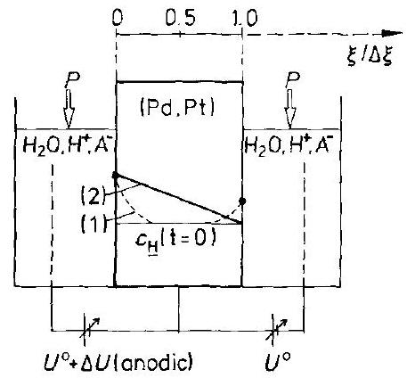
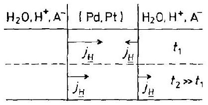
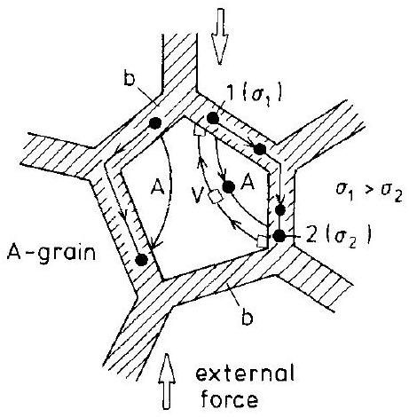
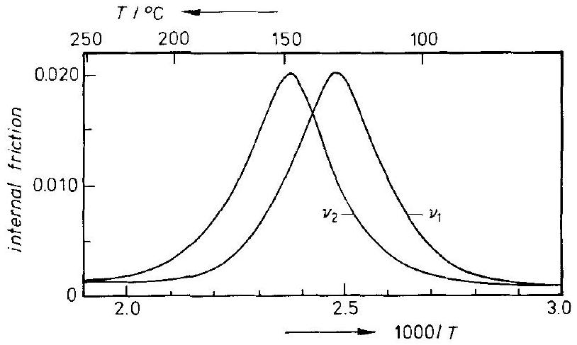
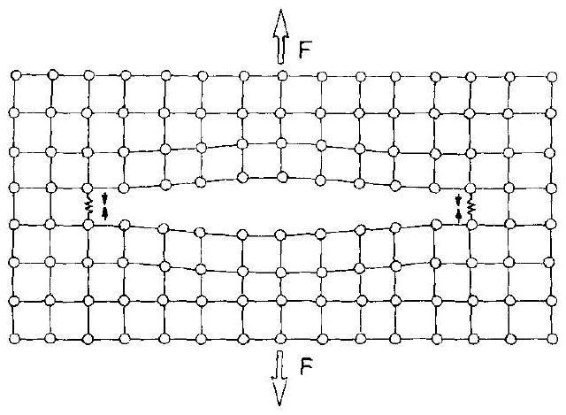

## 14 Influence of Mechanical Stress

### 14.1 Introduction

This chapter is concerned with the influence of mechanical stress upon the chemical processes in solids. The most important properties to consider are elasticity and plasticity. We wish, for example, to understand how reaction kinetics and transport in crystalline systems respond to homogeneous or inhomogeneous elastic and plastic deformations [A.P. Chupakhin, et al. (1987)]. An example of such a process influenced by stress is the photoisomerization of a $\left[\mathrm{Co}\left(\mathrm{NH}_{3}\right)_{5} \mathrm{NO}_{2}\right] \mathrm{Cl}_{2}$ crystal set under a (uniaxial) chemical load [E. V. Boldyreva, A. A. Sidelnikov (1987)]. The kinetics of the isomerization of the $\mathrm{NO}_{2}$ group is noticeably different when the crystal is not stressed. An example of the influence of an inhomogeneous stress field on transport is the redistribution of solute atoms or point defects around dislocations created by plastic deformation.

The influence of plastic deformation on the reaction kinetics is twofold. 1) Plastic deformation occurs mainly through the formation and motion of dislocations. Since dislocations provide one dimensional paths (pipes) of enhanced mobility, they may alter the transport coefficients of the structure elements, with respect to both magnitude and direction. 2) They may thereby decisively affect the nucleation rate of supersaturated components and thus determine the sites of precipitation. However, there is a further influence which plastic deformations have on the kinetics of reactions. If moving dislocations intersect each other, they release point defects into the bulk crystal. The resulting increase in point defect concentration changes the atomic mobility of the components. Let us remember that supersaturated point defects may be annihilated by the climb of edge dislocations (see Section 3.4). By and large, one expects that plasticity will noticeably affect the reactivity of solids.

If local stresses exceed the forces of cohesion between atoms or lattice molecules, the crystal cracks. Micro- and macrocracks have a pronounced influence on the course of chemical reactions. We mention three different examples of technical importance for illustration. 1) The spallation of metal oxide layers during the high temperature corrosion of metals, 2) hydrogen embrittlement of steel, and 3) transformation hardening of ceramic materials based on energy consuming phase transformations in the dilated zone of an advancing crack tip.

So far, we have tacitly assumed that the stresses were applied externally. However, stresses which are induced by local changes in component concentrations and the corresponding changes in the lattice parameters during transport and reaction are equally important. These self-stresses can strongly influence the course of a solid state reaction. Similarly, coherent, semicoherent, and even incoherent interfaces during heterogeneous solid state reactions are sources of (local and nonlocal) stress. The
stress distribution in solids therefore depends decisively on the type and geometry of the internal and external boundaries. The stress component normal to an external surface necessarily vanishes. We will see in Section 14.3 that transport equations also contain, in addition to the normal (local) gradient terms, integrals over the whole crystal of the driving forces if we assimilate transport theory and the theory of elasticity. This may result in interesting feedback effects.

Mechanochemistry is often understood more specifically as the study of structural and compositional changes of solids resulting from the input of mechanical energy, for example, by 'friction' in a milling process. The oldest experience and a striking example of this kind is probably the use of flints to light a fire and, in particular, when more recently medieval guns (flintlock weapons) were fired. Similarly, geochemists know about the modifications of transformation reactions under the influence of tectonic movements. Tammann observed that not all the mechanical energy input (if a solid is treated accordingly) transforms into heat. Several percent of the input can be stored as (potential) energy and can subsequently enhance solid state reactions if they take place with or in these solids. Today, we can say that the activation of solid state reactions by mechanical energy input is rather common. The corresponding subjects are called mechanochemistry and tribochemistry. The diversity of possible reaction steps during the dissipation of locally injected mechanical energy render most of the proposed models and their experimental verification ambiguous. Before we discuss examples in the later sections of this chapter, let us first introduce some basic relations concerning stressed solids.

### 14.2 Thermodynamic Considerations

### 14.2.1 Thermodynamics of Stressed Solids

A defining characteristic of a solid is the ability to resist shear. Therefore, stress is an additional feature which has to be taken into account when the physical chemistry of solids is at issue. Gibbs treated the thermodynamics of stressed solids a century ago in his classic work Equilibrium of Heterogeneous Substances under the title "The Conditions of Internal and External Equilibrium for Solids in Contact with Fluids with Regard to all Possible States of Strain of the Solid". We have already mentioned in the introduction that stress is an unavoidable result of chemical processes in solids. Let us therefore briefly discuss the basic concepts of the thermodynamics of stressed solids.

To this end, we consider the thermodynamic functions of a homogeneously stressed solid, e.g., [L. D. Landau, E.M. Lifshitz (1989); W. W. Mullins, R. Sekerka (1985)]. In contrast to the unstressed solid, the internal energy of which is $U\left(S, V, n_{i}\right)$, the internal energy of a stressed solid is given as $U\left(S, V u_{j k}, n_{i}\right)$. For the total differential of the internal energy one has ${ }^{1}$

[^0]$$
\mathrm{d} U=T \mathrm{~d} S+V \sigma_{j k} \cdot \mathrm{~d} u_{j k}+\sum \mu_{i} \mathrm{~d} n_{i}
$$
where $u_{j k}$ are the components of the strain tensor $\hat{u}$ and $\sigma_{j k}$ are the components of the stress tensor $\hat{\sigma}$, both of which are symmetric tensors [J.F. Nye (1985)]. From Eqn. (14.1), it follows that
$$
\sigma_{j k}=\frac{1}{V} \cdot\left(\frac{\partial U}{\partial u_{j k}}\right)_{S, n_{i}}=\frac{1}{V} \cdot\left(\frac{\partial F}{\partial u_{j k}}\right)_{T, n_{i}}
$$
where $F$ is the Helmholtz free energy. The generalized Gibbs-Duhem relation reads ( $V u_{j k} \cdot \mathrm{~d} \sigma_{j k}$ instead of $V \mathrm{~d} P$ in the hydrostatically stressed system)
$$
S \mathrm{~d} T+V u_{j k} \cdot \mathrm{~d} \sigma_{j k}+\sum n_{i} \mathrm{~d} \mu_{i}=0
$$
and thus
$$
V u_{j k}=-\left(\frac{\partial G}{\partial \sigma_{j k}}\right)_{T, n_{i}}
$$

From Eqn. (14.3), one can easily derive the cross relations between extensive and intensive state variables as, for example,

$$
\frac{\partial u_{i}}{\partial u_{j k}}=-V\left(\frac{\partial \sigma_{j k}}{\partial n_{i}}\right)
$$

By expanding the Helmholtz free energy $F$ at constant $T$ in an arithmetic series in terms of $u_{j k}$, we see that the linear terms vanish in view of the equilibrium condition ( $\sigma_{j k}=0$ for unstressed crystals). Thus, from the Euler relation for homogeneous functions of second order, $F$ is given as

$$
F(\sigma)-F(0)=w=\frac{V}{2} \sigma_{j k} \cdot u_{j k}
$$

For a uniaxial load along the principal axis, we have according to Hooke's law $\mathrm{d} u_{1}=(1 / \bar{E}) \mathrm{d} \sigma_{1}\left(\mathrm{~d} u_{2}=\mathrm{d} u_{3}=-(v / \bar{E}) \mathrm{d} \sigma_{1}\right)$. Thus, the change in $F$ due to this deformation is

$$
w=\frac{V}{2} \frac{\sigma_{1}^{2}}{\bar{E}}, \quad \frac{w}{V}=\frac{1}{2 \bar{E}} \sigma_{1}^{2}
$$

where $\bar{E}$ is Young's modulus and $v$ is Poisson's ratio. In the context of transport theory the most important thermodynamic quantity, however, is the chemical potential and its gradient. Chemical potential gradients occur in inhomogeneous solids so that in our context here, the inhomogeneity is related to the inhomogeneous stress. As long as there is a mobile component in the crystal, its chemical potential (which at equilibrium is constant throughout) can always be defined and is measurable. It is defined as the reversible work needed to isothermally add $\mathrm{d} n_{i}$ moles of compo-
nent $i$ at constant stress to the volume $V$, divided by $\mathrm{d} n_{i}$. In view of Eqn. (14.1), the chemical potential $\mu_{i}(\sigma, T)$ can be written as

$$
\mu_{i}(\sigma, T)=\left(\frac{\partial G}{\partial n_{i}}\right)_{n_{j}, \sigma, T}=\left(\frac{\partial F}{\partial n_{i}}\right)_{n_{j}, \sigma, T}-V \sigma_{j k} \cdot \mathrm{~d} u_{j k}
$$

Therefore, by introducing Eqn. (14.6)

$$
\mu_{i}(\sigma, T)-\mu_{i}(0, T)=\frac{\partial}{\partial n_{i}}\left(\frac{V}{2} \sigma_{j k} \cdot u_{j k}\right)-\sigma_{j k} \cdot V \mathrm{~d} u_{j k}
$$

The first term on the right hand side of Eqn. (14.9) is $w_{i}$, the partial free energy difference between stressed and unstressed solutions. For uniaxial stress along a principal axis (1),

$$
w_{i}=\frac{\sigma_{1}^{2}}{2}\left(\frac{V_{i}}{\bar{E}}-\frac{V}{\bar{E}^{2}} \cdot \frac{\partial \bar{E}}{\partial n_{i}}\right)
$$

The second term is the reversible work done at a given stress by the volume expansion (contraction) $V \mathrm{~d} u_{j k}$ if one adds $\mathrm{d} n_{i}$ to the system under stress. For uniaxial stress, this is ( $q=$ cross section area; $\Delta \xi_{1}=$ crystal length)

$$
\sigma_{1} \cdot\left(V \mathrm{~d} u_{1}\right)=\sigma_{1} \cdot\left(q \Delta \xi_{1} \frac{\partial \ln \Delta \xi_{1}}{\partial n_{i}}\right)=\sigma_{1} \frac{V_{i}}{3}
$$

if the crystal is isotropic. Accordingly, for stress along the three principal axes, $\sigma=\sigma_{1}+\sigma_{2}+\sigma_{3}\left(=\sigma_{11}+\sigma_{22}+\sigma_{33}\right)$

$$
\sigma \cdot(V \mathrm{~d} u)=\sigma V_{i}
$$

Considering $w_{i}$ can normally be neglected relative to $\left(\sigma V_{i}\right)$ because $(\sigma / \bar{E}) \ll 1$, one finally obtains for the chemical potential

$$
\mu_{i}(\sigma, T) \cong \mu_{i}(0, T)-\sigma V_{i}
$$

The term $\mu_{i}(0, T)\left(=\mu_{i}\left(0, T, N_{k}\right)\right)$ plays the role of a standard potential with respect to the stressed state. For practical applications of Eqn. (14.12) one assumes that $V_{i}$, the partial molar volume of component $i$, does not noticeably depend on concentration nor on stress. In the case of hydrostatic pressure, $\sigma V_{i}$ is then $\int \sigma \cdot \mathrm{d} V_{i} =3 \int P \mathrm{~d} V_{i}=-3 P V_{i}$. In equilibrium, it follows from Eqn. (14.13) that

$$
\nabla \mu_{i}\left(0, T, N_{k}\right)=V_{i} \nabla \sigma
$$

For a binary dilute solution of ideal behavior, Eqn. (14.13) or (14.14) yields

$$
N_{i}=N_{i}(\sigma=0) \mathrm{e}^{\frac{V_{i} \sigma}{R T}}
$$

From Eqn. (14.15), we conclude that particles $i$ segregate to regions of increased tensile stress if their partial molar volume is positive (and vice versa in both possible senses).

We can estimate the order of magnitude of (elastic) stress effects on particle distribution using Eqn. (14.15). We assume $V_{i}$ to be on the order of $3 \mathrm{~cm}^{3}$, which is typical of some solutions of H in metals, and $\sigma\left(=\sigma_{1}+\sigma_{2}+\sigma_{3}\right)$ is on the order of the yield strength ( $\approx 10^{8} \mathrm{~Pa}$ ). At room temperature, $V_{i} \sigma$ is then less than $\frac{1}{2} \cdot R T$ so that $N_{i}(\sigma) / N_{i}(0) \approx 1.6$, which indicates a $60 \%$ increase in $i$ concentration due to the applied stress.

Elastic strains due to the applied stresses are usually less than $1 \%$. Although the structure of the crystal is distorted, the atomic positions and unit cells are still well defined. If larger strains occur, the solid deforms plastically or transforms to another crystal structure.

### 14.2.2 Thermodynamics of Stressed Solids with Only Immobile Components

Let us consider a homogeneously, but not hydrostatically, stressed solid which is deformed in the elastic regime and whose structure elements are altogether immobile. If we now isothermally and reversibly add lattice molecules to its different surfaces (with no shear stresses) from the same reservoir, the energy changes are different. This means that the chemical potential of the solid is not single valued, or, in other words, a non-hydrostatically stressed solid with only immobile components does not have a unique measurable chemical potential [J. W. Gibbs (1878)].

However, as Gibbs showed, one can equilibrate the different surfaces of the solid with contacting fluids (or other bodies) to dissolve the stressed solid in question. This implies only that the components of the stressed solid are mobile in the fluids. Obviously, if one mole of the stressed solid is isothermally and reversibly transported from surface 1 (normal stress $\sigma_{1}$ ) to surface 2 (normal stress $\sigma_{2}$ ), one has gained the Gibbs energy $V_{m} \cdot\left(\sigma_{2}-\sigma_{1}\right)$. As has been shown in experiments [W. Durham, H. Schmalzried (1987)], this energy difference can be measured, for example, by a solid state galvanic cell applied to the different surfaces. The emf of two galvanic cells adds up to $E=V_{m} \cdot\left(\sigma_{2}-\sigma_{1}\right) / n \cdot F$, if $n$ moles of electrons are involved in the virtual cell reaction for the transport of one lattice molecule. We note in passing that the stressed solid is always supersaturated with respect to a solid nucleus that forms in the contacting fluids at any of the three pressures. In each of these fluids, one has by necessity hydrostatic conditions. However, the supersaturation is usually too small to overcome the nucleation energy of a hydrostatically stressed solid in one of the contacting fluids.

A transport situation in which this concept plays a main role is Nabarro-Herring creep [C. Herring (1950)]. This creep reshapes the crystal grains of a polycrystalline solid under non-hydrostatic stress. The disordered grain boundaries with their relatively high component mobilities can play the role of the Gibbs surrounding fluid. Transport takes place from areas of high (normal) stress to those of low (normal)
stress which leads to stress relaxation and a change in the shape of the grains. Another example was discussed in Section 8.5, where $V_{m} \cdot \nabla \sigma$ was the driving force for the demixing process of a ternary solid, one sublattice of which is filled with the immobile component (e.g., (A, B)O, see Fig. 8-9).

Let us summarize the concepts presented in the last two sections. Chemical potentials can be ascribed to mobile components in inhomogeneously stressed solids. The important additional (thermodynamic) energy term is $\sigma \cdot V_{i}$. This situation is analogous to the electrochemical equilibria in ionic crystals where the electrical potential gradient plays the same role as the elastic potential gradient, and the composition (in equilibrium systems) is non-uniform if the electrical potential is nonuniform. We note, however, that the chemical potential is changed by straining the crystal, but not by adding extremely small amounts of electrical charge for the sake of establishing the electrical potentials.

When all the SE's of a solid with non-hydrostatic (deviatoric) stresses are immobile, no chemical potential of the solid exists, although transport between differently stressed surfaces takes place provided external transport paths are available. Attention should be given to crystals with immobile SE's which contain an (equilibrium) network of mobile dislocations. In these crystals, no bulk diffusion takes place although there may be gradients of the chemical free energy density and, in multicomponent systems, composition gradients (e.g., Cottrell atmospheres [A.H. Cottrell (1953)]).

### 14.3 Transport in Stressed Solids

### 14.3.1 Introductory Remarks

We have pointed out that one reason for the complexity of solid state processes is the direct influence of elasticity and plasticity, especially in inhomogeneous and coherent multiphase systems. It has been shown that Gibbs' phase rule, as derived for fluid systems, cannot be applied in the same way for coherent multiphase crystals [W.C. Johnson (1986); W. C. Johnson, H. Schmalzried (1992)]. The local elastic energy density is normally inhomogeneous and depends strongly on the nature and geometry of the internal and external boundaries. As a result, multicomponent heterophase systems are already inhomogeneous in equilibrium. Only limiting cases can be treated quantitatively.

Let us first ask to what extent homogeneous stresses influence the mobilities of structure elements. We know that the temperature dependence of mobilities is adequately described by an Arrhenius equation, which reflects the applicability of the Boltzmann distribution for atoms in their activated states (Section 5.1.2). Let us therefore reformulate the question and ask in which way the activated states of mobile SE's are influenced by externally applied stresses and self-stresses. If we take into account the periodicity of the crystal and assume its SE's to reside in harmonic
potential wells, we may conclude that to first order the relative change of the activation energy is $\alpha \cdot(\sigma / \bar{E})$. $\alpha$ is a numerical factor on the order of one, and $\bar{E}$ is Young's modulus. As long as $\alpha \cdot(\sigma / \bar{E}) \ll 1$, we may therefore expand the Arrhenius type mobility in a series and observe that the mobility change is proportional to $(\sigma / \bar{E})$. In so far as other kinetic parameters are related to the SE mobilities, these are then equally dependent on the (local) stress state. In a higher order treatment, the modeling of the mobilities as a function of stress is quite complicated and we will not pursue this question further. Let us rather investigate now the influence of stress on driving force and transport during reaction.

### 14.3.2 The Influence of Stress on Heterogeneous Reactions $\mathbf{A}+\mathbf{B}=\mathbf{A B}$

Stress fields are long range. Therefore, one has to specify carefully the conditions at the boundaries of the system for a quantitative discussion of the influence of stress on solid state kinetics. Let us consider the situation depicted in Figure 14-1. The AB reaction product has grown coherently on A (e.g., by the counterdiffusion of A and B). If, for example, B has been supplied across a fluid-like interface or via a small gas gap by evaporation, the $\mathrm{AB} / \mathrm{B}$ interface does not engender any stress in the surroundings. In the absence of external pressure, there is no normal stress on the free surface. If now the AB layer grows epitaxially (coherently) on A and is sufficiently thin, the lattice spacings of AB are forced to be the same as those of the substrate, even if $V_{A B} \neq V_{A}$. Ultra-thin AB grows without creating any noticeable stress in the bulk of reactant A .

Figure 14-1. Coherent product layer AB forming on substrate A (reactant) during the reaction $\mathrm{A}(\mathrm{s})+\mathrm{B}(\mathrm{g})=\mathrm{AB}(\mathrm{s})$.

Let us then estimate the influence of stress energy on the kinetics of $A B$ formation due to the change of both the driving force and the component mobilities in AB . The latter change was addressed in the previous section. The influence of the elastic energy on the driving force is under many circumstances relatively small. We have seen before that the maximum energy densities are on the order of $10^{-1} \cdot R T$ per mole. They can often be neglected if $\Delta G_{\mathrm{AB}}^{0}>10 \cdot R T$. For a zeroth-order treatment of the influence of stress on the AB formation, we note that the AB layer, under the given conditions, possesses a stress energy density which, according to Eqn. (14.7), is

$$
\frac{w}{V}=\frac{\bar{E}_{\mathrm{AB}}}{8} \cdot\left(\frac{V_{\mathrm{AB}}}{V_{\mathrm{A}}}-1\right)^{2}
$$

If we neglect the stress energy of the substrate, the standard reaction Gibbs energy $\Delta G_{\mathrm{AB}}^{0}$ (per mole) has to be reduced by $V_{\mathrm{AB}} \cdot(w / V)$ in order to obtain the available Gibbs energy for the formation of the stressed AB . The remaining driving force (i.e., gradient) therefore is

$$
\left(\Delta G_{\mathrm{AB}}^{0}-\frac{V_{\mathrm{AB}} \cdot \bar{E}_{\mathrm{AB}}}{8}\left(\frac{V_{\mathrm{AB}}}{V_{\mathrm{A}}}-1\right)^{2}\right) \cdot \Delta \xi^{-1}
$$

Since this driving force is proportional to $\Delta \xi^{-1}$, it again leads to a parabolic rate law. The AB formation rate is always decreased compared to a stress-free reaction as long as the layer adheres and does not form cracks. However, if the evolving stress energy contained in the A substrate is also taken into account, the overall stress energy depends on the thickness of the reaction layer, which invalidates the parabolic growth and slows down the reaction rate. In principle, this can stop the reaction before A or B are consumed.

A study illustrating the basic ideas has been performed by [D. Hesse, J. Heydenreich (1993)]. They reacted MgO single crystals with thin films of $\mathrm{TiO}_{2}$ to form $\mathrm{Mg}_{2} \mathrm{TiO}_{4}$ and $\mathrm{MgTiO}_{3}$. On thick MgO crystals, only $\mathrm{MgTiO}_{3}$ was found, although the coexisting phase with MgO is $\mathrm{Mg}_{2} \mathrm{TiO}_{4}$. Since the Gibbs energy of formation of $\mathrm{Mg}_{2} \mathrm{TiO}_{4}$ is small and the volume change is $7.5 \%$, if the product grows coherently on the MgO substrate, the necessary strain energy obviously does not permit nucleation of $\mathrm{Mg}_{2} \mathrm{TiO}_{4}$. However, if the reactant MgO is used in the form of very thin crystals ( $<0.5 \mu \mathrm{~m}$ ), $\mathrm{Mg}_{2} \mathrm{TiO}_{4}$ forms readily at temperatures below 1600 K . The reaction induced stress is relaxed, at least in part by bending the thin substrate. Another observation is of interest. The $\mathrm{Mg}_{2} \mathrm{TiO}_{4} / \mathrm{MgO}$ interface is found to be coherent, but the $\mathrm{MgTiO}_{3} / \mathrm{Mg}_{2} \mathrm{TiO}_{4}$ interface is semicoherent. The interface dislocations rearrange the hcp oxygen sublattice of $\mathrm{MgTiO}_{3}$ into the fcc oxygen sublattice of $\mathrm{Mg}_{2} \mathrm{TiO}_{4}$ during the reaction.

### 14.3.3 Transport in Inhomogeneously Stressed Crystals

In this section, we consider the influence of inhomogeneous stress on matter transport. To illustrate the problem, let us formulate a simple transport equation: diffusion of an interstitial component $i$ in an otherwise immobile solid (e.g., H in Pd ). Furthermore, we neglect cross effects. For an electrically neutral species $i$ (i.e., H) we then have

$$
j_{i}=-L_{i} \cdot \nabla \mu_{i}=-D_{i}\left[\left(1+\frac{\partial \ln f_{i}}{\partial \ln c_{i}}\right) \cdot \nabla c_{i}-c_{i}\left(\frac{V_{i} \cdot \nabla \sigma}{R T}\right)\right]
$$

where $f_{i}$ is the activity coefficient. The second term within the brackets represents the elastic part of the chemical potential. Without sinks and sources for $i$, we find from Eqn. (14.18) for a strictly one dimensional experiment

$$
\dot{c}_{i}=D_{i} \cdot\left[\left(1+\frac{\partial \ln f_{i}}{\partial \ln c_{i}}\right) \cdot \frac{\partial^{2} c_{i}}{\partial \xi^{2}}-c_{i} \frac{V_{i}}{R T} \cdot \frac{\partial^{2} \sigma}{\partial \xi^{2}}-\frac{V_{i}}{R T} \cdot \frac{\partial c_{i}}{\partial \xi} \cdot \frac{\partial \sigma}{\partial \xi}\right]
$$

In Eqn. (14.19), which is the fundamental equation for transport in systems with inhomogeneous stresses, it is assumed that $D_{i}$ does not depend on concentration. This is obviously true for our dilute solution of species $i$ in the matrix crystal. Correspondingly, we may also assume that $f_{i}$ is independent of the concentration of $i$.

It was mentioned in Section 14.1 that internal (self-) stresses build up if lattice parameter changes occur during interdiffusion. This will be the case if $V_{i} \neq V_{\mathrm{Me}}$. We note that for substitutional interdiffusion in ( $\mathrm{A}, \mathrm{B}$ ), the condition for the change in lattice parameters is $V_{\mathrm{A}}$ (or $V_{\mathrm{B}}$ ) $\neq V_{m}$. For the integration of Eqn. (14.19), it is therefore necessary to introduce the quantitative relation between $c_{i}$ and $\sigma . \sigma$ is the (chemical) self-stress due to the lattice expansion (or contraction) in the diffusion zone. A strict theory is not available. Some of the difficulties stem from the fact that the elastic parameters are functions of $c_{i}$ (as are the transport parameters). If we neglect this concentration dependence, the problem of self-stress during chemical diffusion is completely analogous to the problem of stress induced by lattice parameter changes arising from an inhomogeneous temperature distribution. This problem has been treated in the literature [S. Prussin (1961); J. C.M. Li (1978); F. C. Larché, J. W. Cahn (1982, 1988); B. Baranowski (1989)]. Let us introduce the $\sigma\left(c_{i}\right)$ relation for the one dimensional problem ( $\sigma_{\xi}=\sigma_{1}=0$ ) when $i$ diffuses into the sample at $\xi=0$ in the form used by Baranowski

$$
\begin{aligned}
\sigma_{2}=\sigma_{3}= & -\frac{V_{i} \cdot \bar{E}}{3(1-v)}\left[\left(c_{i}-c_{i}^{0}\right)-\frac{1}{\Delta \xi} \int_{0}^{\Delta \xi}\left(c_{i}-c_{i}^{0}\right) \cdot \mathrm{d} \xi-\frac{12 \cdot\left(\xi-\frac{\Delta \xi}{2}\right)}{\Delta \xi^{3}}\right. \\
& \left.\cdot \int_{0}^{\Delta \xi}\left(c_{i}-c_{i}^{0}\right) \cdot\left(\xi-\frac{\Delta \xi}{2}\right) \cdot \mathrm{d} \xi\right]
\end{aligned}
$$

where $c_{i}^{0}$ is the (homogeneous) initial concentration of $i$. In the following, we assume that $c_{i}^{0}=0$. The second and the third terms in Eqn. (14.20) are seen to be non-local (integral) contributions. If $c_{i}$ changes with time due to the diffusion process, the associated stresses are transmitted across the crystal with sound velocity. We observe that self-stresses cause diffusion outside the immediate interdiffusion zone.

From Eqn. (14.20), one obtains the stress gradient in the $\xi$ direction of transport as

$$
\nabla \sigma=2 \cdot \frac{\partial \sigma_{2}}{\partial \xi}=-\frac{2 \cdot V_{i} \cdot \bar{E}}{3(1-v)} \cdot\left[\frac{\partial c_{i}}{\partial \xi}-\frac{12}{\Delta \xi^{3}} \cdot \int_{0}^{\Delta \xi} c_{i} \cdot\left(\xi-\frac{\Delta \xi}{2}\right) \cdot \mathrm{d} \xi\right]
$$

With the given assumptions, we introduce Eqn. (14.21) into the transport equation (14.18) and obtain

$$
j_{i}=-D_{i}\left[\left(1+\frac{2}{3} \cdot \frac{V_{i}^{2} \cdot \vec{E}}{(1-v)} \cdot \frac{c_{i}}{R T}\right) \frac{\mathrm{\partial} c_{i}}{\mathrm{\partial} \xi}+\frac{8 \cdot V_{i}^{2} \cdot \bar{E}}{(1-v) \cdot \Delta \xi^{3}} \cdot \frac{c_{i}}{R T} \cdot \int_{0}^{\Delta \xi} c_{i}\left(\xi-\frac{\Delta \xi}{2}\right) \cdot \mathrm{d} \xi\right]
$$

There is a local (Fickian transport) and a non-local (stress induced) term in this flux equation. In the local term, the stress acts in the same way as an activity coefficient does. It always increases local diffusion since $V_{i}^{2}$ is positive and independent of the sign of the partial molar volume of $i$.
a)

b)

Figure 14-2. a) Schematic plot of a permeation experiment: H dissolves in a ( $\mathrm{Pd}, \mathrm{Pt}$ ) sheet. Surface activities $a_{\mathrm{H}}\left(c_{\mathrm{H}}\right)$ are established electrochemically. 1) $\left.t_{1}>0,2\right) t_{2} \rightarrow \infty$. b) Hydrogen fluxes $j_{\mathrm{H}}$ across both interfaces of the sheet at times $t_{1}$ and $t_{2}\left(t_{1} \ll t_{2}\right)$.

The non-local term is negative in the beginning of the diffusion of $i$ into the plate when $c_{i}(\xi) \cong 0$ for $\xi \cong \Delta \xi / 2$ (Fig. 14-2a). According to Eqn. (14.19), we can express the time dependence of $c_{i}$ using Eqn. (14.21) as

$$
\begin{aligned}
\dot{c}_{i}=D_{i} & {\left[\left(1+\frac{2 V_{i}^{2} \cdot \vec{E}}{3(1-v)} \cdot \frac{c_{i}}{R T}\right) \cdot \frac{\partial^{2} c_{i}}{\partial \xi^{2}}+\frac{2 V_{i}^{2} \cdot \vec{E}}{3(1-v)} \cdot \frac{1}{R T} \cdot\left(\frac{\partial c_{i}}{\partial \xi}\right)^{2}\right.} \\
& \left.-\left(\frac{8 \cdot V_{i}^{2} \cdot \bar{E}}{(1-v) \cdot \Delta \xi^{3}} \cdot \frac{1}{R T} \int_{0}^{\Delta \xi} c_{i}\left(\xi-\frac{\Delta \xi}{2}\right) \cdot \mathrm{d} \xi\right) \cdot \frac{\mathrm{d} c_{i}}{\mathrm{~d} \xi}\right]
\end{aligned}
$$

This is a second order (partial) nonlinear integro-differential equation. If during interdiffusion the lattice parameters of the crystal change, this equation should always be used. However, the complexity of the mathematics in solving Eqn. (14.23) forbids its general use, especially since the boundary conditions at the surface (at $\xi=0$ and $\Delta \xi$ ) are necessarily time-dependent due to the evolving stresses. This is true even if the chemical potential of $i$ is kept constant in the adjacent phases. From Eqn. (14.21), however, one can immediately show that $\partial \sigma / \partial \xi$ vanishes if $\left(\partial c_{i} / \partial \xi\right)$ is constant, which is the steady state condition. If the concentration gradient is constant, Eqn. (14.20) tells us that $\sigma_{2}$ and $\sigma_{3}$ also vanish.

Let us discuss briefly the solution to the stress induced transport problem for short times after loading one side of the specimen at $\xi=0$ with species $i\left(c_{i}(\xi=0)\right)$. Under the given initial and boundary conditions, the non-local transport term in

Eqn. (14.22) can be neglected compared to the Fickian transport term in a zeroth order approach. The reason is that the gradient of $c_{i}$ at $\xi \simeq 0$ is high at the beginning of the diffusion process, whereas the integral over the concentration in the nonlocal term is still small. Therefore, $c_{i} \approx c_{i}^{0} \cdot \operatorname{erf}\left(\xi / 2\left(D_{i} t\right)^{1 / 2}\right)$. The stress induced part of the flux can now be calculated for short times in a first order approach and yields

$$
j_{i}=-\frac{8 \cdot V_{i}^{2} \cdot \vec{E}}{\sqrt{\pi} \cdot(1-v)} \cdot \frac{D_{i} \cdot c_{i}}{R T} \cdot \frac{c_{i}(\xi=0)}{\Delta \xi^{2}} \cdot \sqrt{D_{i} \cdot t}
$$

By using Eqn. (14.20), the stress $\sigma_{2}\left(\sigma_{3}\right)$ at the unloaded side of the specimen at $\xi=\Delta \xi$ becomes

$$
\sigma_{2}=\sigma_{3}=-\frac{4 V_{i} \cdot \bar{E}}{3 \cdot \sqrt{\pi}(1-v)} \cdot \frac{1}{\Delta \xi} \cdot c_{i}(\xi=0) \cdot \sqrt{D_{i} \cdot t}
$$

Permeation experiments (Fig. 14-2b) conducted with hydrogen as the interstitial component $i$ diffusing across a (Pd, Pt) alloy plate are in agreement with the above conclusions [B. Baranowski (1989)].

We mentioned before that Nabarro-Herring creep is another example of transport of matter induced by inhomogeneous stress in crystals. If a mechanical load is acting on a polycrystalline sample, the individual grains (with different sizes and orientations) are necessarily stressed inhomogeneously. Figure 14-3 describes the situation and the notation. Let us assume that the sample consists of metallic grains of A . Transport of A can be described in two ways: 1) We assume A to be immobile in the sense of Section 14.2.2. We further consider the grain boundaries as fluid-like and in equilibrium with the A grains. Since A atoms are mobile at grain boundaries, we expect a flux $j_{\mathrm{A}}$ from sites of high normal stress $\sigma_{1}\left(\xi_{1}^{\mathrm{b}}\right)$ to sites of low normal stress $\sigma_{2}\left(\xi_{2}^{\mathrm{b}}\right)$ ( $\Delta \sigma=\sigma_{1}-\sigma_{2}$ ). The flux density in the grain boundary is ( $D_{\mathrm{A}}^{\mathrm{b}} / R T$ ). $\left(\Delta \sigma / \Delta \xi^{\mathrm{b}}\right)$. 2) Considering the $D_{\mathrm{A}}=N_{\mathrm{V}} \cdot D_{\mathrm{V}}\left(N_{\mathrm{V}} \ll 1\right)$ relation, we may consider A to be the (almost) immobile component, as before. Nevertheless, A vacancies are highly mobile and we can derive a vacancy flux from site $1\left(\sigma_{1}\right)$ to site $2\left(\sigma_{2}\right)$ as shown in Figure 14-3. It carries the corresponding A counterflux from site 2 to site 1 across the grain of width $\Delta \xi_{\mathrm{gr}}$, the flux density of which is $\left(D_{\mathrm{V}} \cdot N_{\mathrm{V}} / R T\right) \cdot\left(\Delta \sigma / \Delta \xi_{\mathrm{gr}}\right)$.

Figure 14-3. Nabarro-Herring creep in a grain of a polycrystalline sample which is (inhomogeneously) stressed $\left(\sigma_{2}<\sigma_{1}\right)$. Flow of A from $1 \rightarrow 2$ and the reverse vacancy flow are indicated along the grain boundary and through the bulk.

The predominant creep mechanism thus depends on the ratio $\frac{\left(D_{\mathrm{V}} \cdot N_{\mathrm{V}} \cdot \Delta \xi^{\mathrm{b}}\right)}{\left(D_{\mathrm{A}}^{\mathrm{b}} \cdot \Delta \xi_{\mathrm{gr}}\right)}$. Although the flux equations for grain boundary and volume transport are of the same type, the creep kinetics are different because the boundary conditions of the transport differ for the two models (Fig. 14-3). Finally, we observe that creep in compound crystals requires the simultaneous motion of all components [R.L. Coble (1963)] so that the slow ones necessarily determine the creep rate.

### 14.4 Creep and Fracture

### 14.4.1 Introductory Remarks

Creep and fracture in crystals are important mechanical processes which often determine the limits of materials' application. Consequently, they have been widely studied and analyzed in physical metallurgy [J. Weertmann, J. R. Weertmann (1983); R.M. Thomson (1983)]. In solid state chemistry and outside the field of metallurgy, much less is known about these mechanical processes [F. Ernst (1995)]. This is true although the atomic mechanisms of creep and fracture are basically independent of the crystal type. Dislocation formation, annihilation, and motion play decisive roles in this context. We cannot give an exhaustive account of creep and fracture in this chapter. Rather, we intend to point out those aspects which strongly influence chemical reactivity and reaction kinetics. Illustrations are mainly from the field of metals and metal alloys.

### 14.4.2 Creep

If a crystal is exposed to stress in such a way that the strain is kept constant, the stress will decrease with time as shown in Figure 14-4. One concludes that stress relaxation has occurred. Conversely, strain does not remain constant under constant load. Time dependent (i.e., plastic) strain in stressed crystals is called creep. It was already mentioned that elastic strain due to the applied stress is usually less than $1 \%$. Plastic strain definitely dominates beyond the elastic limit which, to a large extent, is due to dislocation formation and motion. Since the crystal lattice is conserved during this

Figure 14-4. Stress relaxation at constant strain. Plastic strain increases with time, elastic strain (and stress) decreases.

deformation process, dislocations (as well as disclinations, twin boundaries, etc.) act as catalysts for plastic deformation which leave the lattice structure invariant. They are localized, dilute, and mobile. Dislocations may form (see Chapter 3) if their line energy ( $\sim G b^{2}$ per unit length) is smaller than the elastic energy ( $\sim G u^{2}$ per unit volume) in the region of the crystal where a dislocation line of length $l$ is found.

If one measures temperature in terms of the crystal melting temperature $T_{\mathrm{m}}$ and the applied stress $\sigma$ in terms of its shear modulus $G$, one finds three different types of creep in the field of these variables (neglecting Nabarro-Herring(-Coble) type of creep in polycrystalline materials as discussed in Section 14.3.3). 1) At stresses smaller than the critical shear stress, no long range motion of dislocations occurs. Plastic straining is due to mechanisms other than dislocation motion. 2) If ( $\sigma / G$ ) is higher than ( $\sigma_{\text {crit }} / G$ ) and at low temperatures ( $T / T_{\mathrm{m}}<0.5$ ), dislocations can move relatively easy on their slip planes. 3) At $T / T_{\mathrm{m}}>0.5$, diffusion of the structure elements allows the dislocations to climb sufficiently fast so that they can move in all directions and are not bound to slip planes. Let us discuss these types of creep in more detail.

Figure 14-5. Anelastic strain as a function of time 1) for a given load and 2) after removal of the load.

1) Figure 14-5 defines the creep below the critical shear stress. It is called anelastic creep and is to a large extent recoverable. The anelastic strain for a given stress below $\sigma_{\text {crit }}$ approaches its equilibrium value $u_{0}$ as

$$
u=u_{0} \cdot\left(1-\mathrm{e}^{-\frac{t}{\tau}}\right)
$$

By removing the load, the anelastic strain recovers (Fig. 14-5). When cyclic stresses are applied, internal friction occurs which means that stress and strain are out of phase and energy is dissipated in the damping process. From an atomic point of view, equivalent lattice positions ( $n_{0}$ ) become unequivalent ( $n_{x}, n_{y} ; n^{0}=n_{x}+n_{y}$ ) by the applied stress and the Boltzmann distribution of site occupancy is disturbed. $\tau$ is therefore the relaxation time to attain the new Boltzmann distribution of site occupancy for a given stress. To a first order, the strain is proportional to $n=\left(n_{x}-n_{y}\right)$. Damping is largest if the frequency of the cyclic stress is in resonance with the elementary jump frequency of the atomic particles which redistribute. For example, in the case of iron containing carbon located on interstitial sites, it was
found that the activation energy of the relaxation time for anelastic creep, $\tau$, and of interstitial carbon diffusion are the same. Thus, the assumption is confirmed that the anelastic creep is due to a redistribution of interstitial carbon on sites which the applied stress rendered non-equivalent. It also shows us how to use creep experiments in order to obtain information on fundamental kinetic parameters. By and large, the formal way to treat these mechanical relaxation processes is conceptually identical with the treatment of the Debye-type dielectric relaxation phenomena introduced in Section 5.1.1. A pertinent discussion can be found in [A. S. Nowick, B. S. Berry (1972)]. Figure 14-6 shows an experimental illustration of internal friction. The loss as a function of temperature is given at two predetermined excitation frequencies $v_{1}$ and $v_{2}$. Temperature is used as the independent variable since it determines the intrinsic jump frequency between $x$ and $y$ sites $\left(v \sim \mathrm{e}^{-\Delta E_{\mathrm{A}} / R T}\right)$. At resonance, that is, when the excitation frequency and the inherent frequency of the jumping atomic particles are the same, the loss has a maximum value.

Figure 14-6. Internal friction. Carbon reorienting in tantalum at two frequencies as a function of temperature. $v_{2} / v_{1}=3.81$ [T. Ke (1948)].

2) Low temperature creep, $T<0.5 T_{\mathrm{m}}$. When the applied stress exceeds the critical shear stress it can trigger dislocation multiplication (see Section 3.2.1) and subsequently move the dislocations over long distances on their respective slip planes. Mutual interaction between dislocations will eventually cause the multiplication to cease. This phenomenon is called work-hardening in physical metallurgy. As long as the stress-strain curve has a finite slope and a small increase in stress results in a further small plastic deformation, thermal fluctuations will also cause additional (creep) strain. Then, by increasing the deformation through fluctuations, hardening of the crystal continues and consequently the creep rate decreases. Instead of Eqn. (14.26), a low temperature creep relation is observed which is logarithmic in time

$$
u=u_{0} \cdot \log (1+t / \tau)
$$

$1 / \tau$ is proportional to the vibrational frequency of the dislocation line (which is necessarily lower than the vibrational frequencies of atoms in the lattice). If a
dislocation is sufficiently activated by thermal fluctuation and applied stress, it can cut through the dislocation forest and increase the plastic deformation. We note that the activation energy in low temperature creep increases with temperature, thus illustrating the above mentioned feedback situation.
3) High temperature creep. The creep strain occurring at elevated temperatures $>0.5 T_{\mathrm{m}}$ can amount to $100-300 \%$ without specimen failure. It starts with a transient creep and eventually becomes a steady-state deformation, which means that the initial creep rate decelerates and approaches a constant value. The activation energy of steady-state creep is identical with that of self-diffusion in an elemental crystal. In compound crystals, complete lattice molecules must be transported when a full dislocation climbs. Therefore, one expects that the diffusion activation energy of the slowest regular SE determines the activation of the creep. In the transient period, the structure of the dislocation network forms. Since moving dislocations suffer from energy dissipation due to friction caused by various mechanisms (point defect formation, impurity drag, phase transformations, order-disorder processes), it is difficult to predict the detailed time dependence of the strain in the transient period.

Figure 14-7. Model of a steady-state dislocation climb. Flow of A and the reverse vacancy flow from more to less compressed regions of the dislocation are indicated.

[N. F. Mott (1956)] suggested that the rate controlling step in steady-state high temperature creep is the climb of dislocations with an edge component. Dislocations are then created and annihilated at the same rate. Annihilation takes place when dislocations of opposite sign meet. To do this, they have to climb if they are located on different slip planes. Dislocations climb by emitting vacancies (destroying interstitials) or by destroying vacancies (emitting interstitials). Thus, steady-state creep rates are controlled by the diffusion of vacancies (or interstitials) between dislocation lines (Fig. 14-7). Rates can be estimated if, for example, the vacancy gradient, that is, the different vacancy concentrations between the climbing dislocations and their (average) distance, $a$, is known. $\Delta c_{V}$ can be approximated as follows. The stress, $\sigma$, does the work ( $\sigma \cdot b \cdot L$ ) upon a dislocation line of unit length which during its lifetime moves a distance $L$ parallel to the slip plane. If, for that same time, the climb distance perpendicular to the slip plane is $d$, then about $d / b^{2}$ lattice defects per unit length are created (or destroyed). Thus, the stress $\sigma$ changes the defect formation energy by ( $\sigma \cdot b^{3} \cdot L / d$ ) per defect. Let us take this term into account in the Boltzmann factor of the equilibrium (or steady-state) number of defects. We obtain for the difference in vacancy concentrations between the two steadily moving dislocation lines during creep, to a first order,

$$
c_{\mathrm{V}}=2 \cdot n_{0} \cdot \frac{\sigma \cdot L \cdot n^{3}}{k T \cdot d} \cdot \mathrm{e}^{-\frac{\Delta g_{F}^{0}}{k T}}=2 c_{\mathrm{V}}^{0} \cdot \frac{\sigma \cdot L \cdot b^{3}}{k T \cdot d}
$$

Here, $n_{0}$ is the number of lattice sites per unit crystal volume and $\Delta g_{F}^{0}$ the formation Gibbs energy of defects without the applied stress.

To solve the vacancy flux equation between dislocations of opposite sign we have to know the dislocation geometry (distance and orientation) in the lattice as the boundary condition. If we consider as a zeroth order approach only the average distance, $a$, between the dislocations, even this quantity depends on the applied stress and the functioning of dislocation multiplication. Nevertheless, since about $1 / b^{2}$ vacancies are needed for a climb shift of unit length, we may conclude from Eqn. (14.28) and the vacancy flux that the steady-state climb velocity, $\boldsymbol{v}_{\mathrm{cl}}$, of a dislocation with edge character is

$$
v_{\mathrm{cl}} \sim D_{\mathrm{V}} \cdot c_{\mathrm{V}}^{0} \cdot \frac{\sigma}{k T} \cdot \frac{L}{d} \cdot b^{5}
$$

that is, $\boldsymbol{v}_{\mathrm{cl}}$ is on the average proportional to the applied stress. The proportionality factor depends on the model assumptions and has been worked out [J. Weertmann, J. R. Weertmann (1983)].

Two remarks, however, seem appropriate. 1) If the distance, $a$, between individual dislocations is very small on an atomic scale, diffusion coefficients obtained from macroscopic experiments can not be used in Eqn. (14.29) (as explained in Section 5.1.3). 2) Since diffusional transport takes place in the stress field of dislocations, in principle, fluxes in the form of Eqn. (14.18) should be used. This, however, would complicate the formal treatment appreciably. In the zeroth order approach, one therefore neglects the influence of the stress gradient, which can partly be justified by the symmetry of the transport problem.

Let us finally mention that in polycrystalline samples, Nabarro-Herring(-Coble) creep occurs as already introduced in Section 14.3.2. The Nabarro-Herring creep rate is inversely proportional to the square of the average grain size, $l^{2}$, if volume diffusion of point defects prevails. It is inversely proportional to $l^{3}$ if grain boundary diffusion determines the transport.

We have pointed out before that during creep, demixing of solid solutions is to be expected. Creep in compounds, however, occurs in such a way that the rate is determined by the slowest constituent since complete lattice molecules have to be displaced and the various constituent fluxes are therefore coupled. If extra fast diffusion paths operate for one (or several) of the components in the compound crystal, the coupling is cancelled. Therefore, if creep takes place in an oxide semiconductor surrounded by oxygen gas, it is not necessarily the slow oxygen diffusion that determines the creep rate. Rather, the much faster cations may determine it if oxygen can be supplied to or taken away from the external surfaces via dislocation pipes.

### 14.4.3 Fracture

Dislocations as introduced in Section 3.2 have been postulated in order to explain the low yield strength of a crystal (if we compare it to the theoretical shear strength). Likewise, cracks are postulated in order to explain fracturing of crystals well below the theoretical tensile strength of the atomic bonds. Pre-existing cracks can easily magnify low applied stresses at their tips to the maximal atomic bond strength.

Fracture often determines the reliability of a material in its practical applications. Brittle fracture of a material is the reason for a sudden catastrophe. The mechanical property 'ductile' or 'brittle' determines, in essence, whether or not a tool can be made from a given material. Let us identify the imperfections of a crystal and the chemical processes which cause ductility and brittleness. We distinguish two limiting cases of failure: 1) A crystal, under external stress, deforms by forming a narrowing neck until eventually ductile rupture occurs. Dislocations are the only imperfections involved in this process of failure. 2) Crystals fracture suddenly. A sharp crack propagates and causes the failure.

Figure 14-8. Two dimensional model of a crack in a square lattice. (Nonlinear) forces at the crack tips are indicated by $\frac{1}{\uparrow}$.

Figure 14-8 shows a two dimensional atomic model of a microcrack. The stress concentrates at the crack tip, the radius of which is of atomic size. In contrast to dislocations and pores, microcracks do not exist without an external stress field. They can be formed in various ways, for example, by the accumulation of dislocations to a high density, by sufficiently high local stresses due to strain incompatibility between different crystals, at grain boundary triple points, etc. By solving the differental equations of elasticity under the boundary conditions of a crack of length $2 \cdot a$ and assuming the stress to be shearing the $\xi_{1}-\xi_{2}$ plane, one finds [R.M. Thomson (1983)] for the stress field

$$
\sigma=\frac{K}{(2 \pi r)^{1 / 2}} \cdot \mathrm{e}^{-\frac{i \cdot \Theta}{2}} ; \quad K=\sigma_{\infty} \cdot(\pi \cdot a)^{1 / 2}
$$

where $r=\sqrt{\xi_{1}^{2}+\xi_{2}^{2}}$ and $\Theta=\xi_{2} / \xi_{1} . K$, which is a measure of the stress singularity at the crack tip, is called the stress intensity factor. $\sigma_{\infty}$ is the externally applied stress. One notes that the stress intensity factor is a characteristic function of the crack length.

The force that moves the crack on the cleavage plane has been deduced from Eqn. (14.30) as

$$
F=\frac{K^{2}}{2 \bar{G}}
$$

In equilibrium, that is if the crack does not move, the force $F$ has to be balanced by the surface tension $y$ of the crystal. From this equilibrium condition, one obtains

$$
K_{\mathrm{crit}}=2 \cdot \sqrt{\widetilde{G} \cdot \gamma}
$$

$K_{\text {crit }}$ is the so-called fracture toughness parameter. It was first discussed by Griffith [A. A. Griffith (1920)] and describes the mechanical equilibrium of the crack, but not the thermodynamic equilibrium of the unstable crystal. Rewriting the criterion given by Eqn. (14.32) in terms of Eqn. (14.30) one finds

$$
\sigma_{\mathrm{crit}}=\left(\frac{4 \cdot \gamma \cdot \bar{G}}{\pi \cdot a}\right)^{1 / 2}
$$

where $\sigma_{\text {crit }}$ is the externally applied critical Griffith stress. The quantitative description of cracking has thus been based entirely on macroscopic quantities, all of which are combined in the single parameter $K$. Grain boundaries or precipitates which would alter the stress field were assumed to be absent. Also, the stress intensity factor does not take into consideration the plastic work which a moving crack stores in its surroundings, mainly by emitting dislocations. In a local and atomic approach, the surface tension $y$ may therefore not be adequate to describe the force balance expressed by Eqn. (14.32), especially considering the quasi-periodic lattice structure around the crack tip. Thermal fluctuations are able to promote (slow) crack growth if we assume the force $F$ to vary periodically with crack length. This would lead to an Arrhenius-type temperature dependence of the crack propagation velocity $\boldsymbol{v}_{\mathrm{c}}$.

In any case, the stretched bonds at the crack tip are sensitive to neighboring foreign atoms, be they supplied from the surrounding gas atmosphere or from the impurity content of the bulk crystal. This follows from the change in surface tension (surface energy) arising from adsorbed species which, according to the Gibbs adsorption isotherm, lowers the (local) $K_{\text {crit }}$ value. Consequently, the material becomes more brittle. From a chemical point of view, an adsorbed atom or molecule located near the crack tip interacts and reacts with the stretched bond atoms. These chemical effects influence the crack propagation. Stress corrosion and hydrogen embrittlement are examples of this. It was found by [R.A. Oriani and P. Josephic (1974)] that the fracture toughness parameter is proportional to $\ln p_{\mathrm{H}_{2}}(\mathrm{~g})$ for high-strength steel, confirming the idea that, in the cracks, the surface tension $y$ changes according to the Gibbs adsorption isotherm. This reflects the decohesion of atoms at the crack tip.

Hydrogen, however, may also react with other impurities such as dissolved oxygen, sulphur, carbon, etc. and form high activity products. Therefore, the effect of hydrogen on the mechanical properties of a crystal is ambiguous. A discussion of fracture at metal/oxide boundaries has been given recently by [F. Ernst (1995)].

Let us return to the reduction of shear stress at the crack tip due to the emission of dislocations. Figure 14-9 illustrates a possible stress reduction mechanism. It can be seen that the tip of a crack is no longer atomically sharp after a dislocation has been emitted. It is the interaction of the external stress field with that of the newly formed dislocations which creates the local stress responsible for further crack growth. Thus, the plastic deformation normally impedes embrittlement because the dislocations screen the crack from the external stress. Theoretical calculations are difficult because the lattice distortions of both tension and shear near the crack tip are large so that nonlinear behavior is expected. In addition, surface effects have to be included.

Figure 14-9. A crack tip shears by dislocation emission.

### 14.4.4 Toughening of Crystals by Phase Transformations

We have discussed the failure of materials under load due to crack formation and subsequent fracture. Materials can be improved in this respect by toughening, which means by the initiation of processes absorbing strain energy around the advancing crack tip. Phase transformation of a fine grained dispersed second phase in the matrix crystal induced by the stress from the crack is such an energy absorbing process. The transformation zone around the moving crack tip can be seen as being analogous to the region of plastic deformation discussed in the previous section.

A well studied example of transformation toughening is the enhancement of strength and toughness of a ceramic material by the stress induced tetragonal → monoclinic phase transition in $\mathrm{ZrO}_{2}$ particles embedded in a ceramic matrix [ N . Claussen, M. Rühle (1981)]. At least two mechanisms improve the toughness. 1) Microcracks and residual stresses which have been introduced during the cooling of the two-phase sample (matrix + dispersed $\mathrm{ZrO}_{2}$ ) impede the crack propagation. The size of the finely dispersed and energy consuming particles is $0.1-1 \mu \mathrm{~m}$. 2) The (tensile) stress induced martensitic transformation of $\mathrm{ZrO}_{2}$ absorbs the strain energy localized at the moving crack tip. Martensitic transformation is the structural conversion by a diffusionless process discussed in Section 12.2.1. Here, the parent tetragonal
$\mathrm{ZrO}_{2}$ dilates to the monoclinic structure. Shear and dilational components of this transformation change the strain state of the matrix. External stress can either impede or enhance the transformation, depending on its sign and orientation. Tensile stresses have the greatest effect since both dilational and shear components of the transformational displacements are assisted. Therefore, if the samples are subjected to an external tensile load, large stresses are generated near the crack tips which begin to move and extend. At fixed grip, the strain energy of the two-phase solid decreases because the $\mathrm{ZrO}_{2}$ transformation reduces the available strain energy and thus counteracts the propagation of cracks. This is the essence of the mechanism of transformation toughening.

Figure 14-10. Stress tensor at the crack tip, crack propagation, and the transformation of a dispersed second phase B in the surrounding matrix.

Figure 14-10 illustrates the crack propagation and shows schematically that the stressed zone is essentially unaltered during the advancement of the tip. Thus, we conclude that the resistence to crack growth stems from the Gibbs energy difference between the untransformed region (in front and remote from the tip) and the transformed region behind the tip with almost zero stress level. If we consider only the transformation and neglect any elastic energies stored in either the ceramic matrix or the zirconia grains, the dissipated Gibbs energy per unit cross section of the sample and unit time becomes

$$
\Delta \dot{G}=v \cdot \frac{\eta}{V_{\mathrm{Z}}}\left|\Delta g_{\mathrm{Z}}\right|
$$

where $\boldsymbol{v}$ is the crack propagation velocity and $\eta(\ll 1)$ the volume fraction of transformable zirconia in the matrix. $V_{Z}\left(\simeq V_{Z^{\prime}}\right)$ denotes the molar volume of zirconia and $\Delta g_{Z}$ the molar Gibbs energy of transformation ( $Z \rightarrow Z^{\prime}$ ). Since $\Delta \dot{G}=v \cdot F_{\text {fr }}$ with $F_{\mathrm{fr}}$ being a (virtual) frictional force, we conclude from Eqn. (14.34) that the ( $Z \rightarrow Z^{\prime}$ ) transformation exerts a force

$$
F_{\mathrm{fr}}=\frac{\eta}{V_{Z}} \cdot\left|\Delta g_{Z}\right|
$$

per unit cross section that impedes the propagation of the cracks. A quantitative determination of $\Delta g_{Z}$ is difficult since it depends both on the size and the shape of the zirconia particle embedded in the crystal matrix. Furthermore, we have to consider other 'frictional' forces arising from point defects, dislocations, and new surfaces generated in the wake of the crack motion.

### 14.5 Tribochemistry

Chemical processes induced by the input of mechanical energy into crystallites in the form of impacts are categorized as tribochemical. In contrast to the earlier understanding, it is now generally accepted that chemical effects due to the input of mechanical energy can only be partially ascribed to the conversion into heat. Triboreactors are mainly mills: ball mills, vibrating mills, planetary mills, jet mills, and others. However, tribochemical processes are not restricted to mills only, they are in fact far more common. A special field in this context is the forming of materials by means of cutting, grinding, and polishing.

There are many ways to supply solids with mechanical energy. Their response to the transmitted energy has the following common features: first elastic and then plastic deformation. Further changes in the solid depend on the magnitude, length, and localization of the impact. Crack propagation and fracture are the most obvious effects. The mode of energy dissipation after an impact depends decisively on the steepness of the pulse rise and its length. Linear theories and the assumption of local equilibria (i.e., irreversible thermodynamics approach) are often not valid in the early stages of the energy input. Obviously, the scaling speed is the velocity of sound. Elastic energy dissipates into the surroundings of the impact spot with the velocity of sound. If the impact lasts for $10^{-6} \mathrm{~s}$, the elastic deformation spreads $c a .10^{-1} \mathrm{~cm}$ during this time. The maximal velocity of moving dislocations is again the velocity of sound. Thus, the dissipation of the energy transferred from an impact as plastic energy also occurs at the velocity of sound, at most.

If the main part of the impact energy is converted into heat, phonons are dissipated into the surroundings. Other forms of energy dissipation are, for example, the increase in surface area (crack formation and growth, spreading much slower than sound), chemical reaction (e.g., phase transformation), or the formation of a local plasma zone by breaking a sufficient number of chemical bonds. In this case, the result is a heavily defective or even amorphous material, in analogy to the heavily defective zones (hot spots, defect spikes) after the bombardment of crystals with ions or atoms. In the literature on tribochemistry [G. Heinicke (1984)], it is pointed out that the quantitative treatment is in essence phenomenological. The reason for this is that many of the above mentioned modes of energy dissipation take place simultaneously, whereas the boundary conditions in space and time are necessarily complex. We therefore describe several tribochemical processes in some detail, rather than to introduce phenomenological relations without the specification of physical models.

Let us assert, however, that the input of mechanical energy into solids in the sense of tribochemistry always results in a change of their kinetic behavior. The change in point defect concentration, dislocation or crack density, and structure influences the transport coefficients and reactive properties (e.g., catalytic activity, nucleation rate, etc.).

Let us begin with a special mechanochemical effect known as mechanical alloying. Mechanical alloying in a mill is a processing technique for the synthesis of materials with possibly metastable or even unstable structures. It is defined as a dry, high energy ball milling process which produces powders of composite metal alloy with extremely fine grained microstructures. It has been suggested that localized melting may occur during high energy milling due to the extensive plastic deformation. Since $10^{-2}-10^{-3}$ Joules per impact are dissipated during collision, it was concluded that the average bulk temperature might be raised to ca. 600 K . Alloying is assisted by an increase of temperature, by an enhanced diffusion due to the formation of lattice defects, and due to shorter and shorter diffusion paths as the grains become smaller and smaller. Many different materials have been synthesized in this way. We just mention the synthesis of $\mathrm{ZnFe}_{2} \mathrm{O}_{4}$ from ZnO and $\mathrm{Fe}_{2} \mathrm{O}_{3}$. The remarkable feature of this synthesis is that the ferrite, which under equilibrium conditions exhibits the structure of a normal spinel, occurs as a partly inversed spinel. This indicates that atomic size effects may override preferential chemical bonding under these extremely high local pressures. We note that even homogeneous mixtures of two immiscible phases can be metastably produced.

Another interesting aspect of high energy ball milling is the amorphization by mechanical alloying. An early and conclusive study of this problem was carried out by Koch [C.C. Koch (1990)] in the glass forming alloy system Ni-Nb. It has been argued that the formation of an amorphous alloy from the elements occurs in the sequence $\mathrm{A}+\mathrm{B} \rightarrow \mathrm{A}_{n} \mathrm{~B}_{m}$ (cryst) → $\mathrm{A}_{n} \mathrm{~B}_{m}$ (amor). Since amorphization is the most extreme mode of structural transformation, other structural transformations can be expected and have been reported to occur under the action of milling: order-disorder, disorder-order, order-order. $\mathrm{PbO}_{2}$, for example, exists in the stable $\beta$-form (tetragonal) at room temperature and normal pressure, but transforms into the $\alpha$-form (rhombic) at high pressure. It also turns into a $90 \%-\alpha, 10 \%-\beta$ mixture, irrespective of the starting material after sufficiently long milling. It is understood that the $\alpha / \beta$ ratio depends on the milling conditions. Similar observations concerning the 'mechanochemical equilibrium' have been made with other solid compounds (e.g., $\mathrm{CaCO}_{3}$ : aragonite-calcite). One concludes that both high local temperatures and pressures occur in the milling procedure, and the rate of structural relaxation processes determines the steady-state condition of the phase distribution [R. Schrader, B. Hoffmann (1973)].

By and large, ball milling is an efficient tool for the promotion of all sorts of solid state reactions. The composition and structure of the products depend decisively on such milling conditions as milling intensity, temperature, atmosphere, time, filling, and ball to powder ratio. One is far from understanding all the details, but the specific power injected into the reactant powders (Watt/gr) seems to be an important control parameter for the phase stability during milling [Y. Chen, et al. (1990)].

In the previous chapter we discussed the steady-state conformation of an alloy during the continuous input of ballistic energy (irradiation). We saw that the conformation under irradiation is the same as that without radiation, but at an elevated temperature ( $T+\Delta T$ ). Can we generalize this concept and apply it to other forms of energy input like the input of mechanical energy during the ball milling process? Thermally activated jump processes occur on the atomic scale, while the elementary ballistic events occur on a much less fine grained scale. Martin and coworkers [G. Martin, P. Bellon (1987)], however, gave a positive answer to the posed question. Without repeating their argumentation, one may say that the input of ballistic energy is assumed to increase the jump frequencies across the activated transition state by $\Delta v$ and in a distinct way. $\Delta T$ and $\Delta v$ are shown to be proportional to each other, and the relevant control parameter is the specific power injected into the solid. Analogous to the flux density $\phi$ of irradiation in Eqn. (13.14), it determines the factor of proportionality between $\Delta v$ and $\Delta T$.

## References

Baranowski, B. (1989) J. Less-Common Met., 154, 329
Boldyreva, E. V., Sidelnikov, A. A. (1987) Izv. Sib. Otd. Akad. Nauk SSSR, Ser. Khim. Nauk 5, 139
Chen, Y., et al. (1990) J. de Phys. Colloque C4, Suppl. 14, 51, 71
Chupakhin, A. P., et al. (1987) Reactivity of Solids, 3, 1
Claussen, N., Rühle, M. (1981) Adv. in Ceramics, 3, 137
Coble, R. L. (1963) J. Appl. Phys., 34, 1679
Cottrell, A. H. (1953) Dislocations and Plastic Flow in Crystals, Clarendon Press, Oxford
Durham, W., Schmalzried, H. (1987) Ber. Bunsenges. Phys. Chem., 91, 556
Ernst F. (1995) Mat. Sci. Eng. Rep. (in print)
Gibbs, J. W. (1878) Trans. Conn. Acad. III, 343-524
Griffith, A. A. (1920) Phil. Trans. Roy. Soc. (London), A 221, 163
Heinicke, G. (1984) Tribochemistry, Akademie-Verlag, Berlin
Herring, C. (1950) J. Appl. Phys., 21, 437
Hesse, D., Heydenreich, J. (1993) Appl. Phys., A57, 415
Johnson, W. C. (1986) Met. Trans., A 18, 1093
Johnson, W. C., Schmalzried, H. (1992) Acta Met. Mater., 40, 2337
Ke , T. (1948) Phys. Rev., 74, 9
Koch, C.C. (1990) J. Non-Cryst. Solids, 117, 670
Landau, L. D., Lifshitz, E. M. (1989) Elastizitätstheorie, Akademie-Verlag, Berlin
Larché, F. C., Cahn, J. W. (1982) Acta Met., 30, 1835
Larché, F. C. (1988) Thermodynamics of Stressed Solids, Solid State Phenomena, Vol. 3-4, 205
Li, J. C.M. (1978) Met. Trans., A 9, 1353
Martin, G., Bellon, P. (1987) Mat. Sci. Forum, 15-18, 1337
Mott, N. F. (1956) Creep and Fracture of Metals at High Temperatures, Her Majesty's Stationary Office, London, p. 21
Mullins, W. W., Sekerka, R. (1985) J. Chem. Phys. 82, 5192
Nowick, A. S., Berry, B.S. (1972) Anelastic Relaxation in Crystalline Solids, Academic Press, New York
Nye, J. F. (1985) Physical Properties of Crystals, Clarendon Press, Oxford

Oriani, R.A., Josephic, P. (1974) Acta Met., 22, 1065
Prussin, S. (1961) J. Appl. Phys., 32, 1876
Schrader, R., Hoffmann, B. (1973) in Festkörperchemie (Eds.: V. Boldyrev, K. Meyer), VEB Grundstoffindustrie, Leipzig
Thomson, R.M. (1983) in Physical Metallurgy (Eds.: R. W. Cahn, P. Haasen), North-Holland, Amsterdam
Weertmann, J., Weertmann, J. R. (1983) in Physical Metallurgy (Eds.: R. W. Cahn, P. Haasen), North-Holland, Amsterdam

[^0]:    ${ }^{1}$ The convention for the summation of repeated vector and tensor indices is followed here. The summation goes over $1,2,3$.

