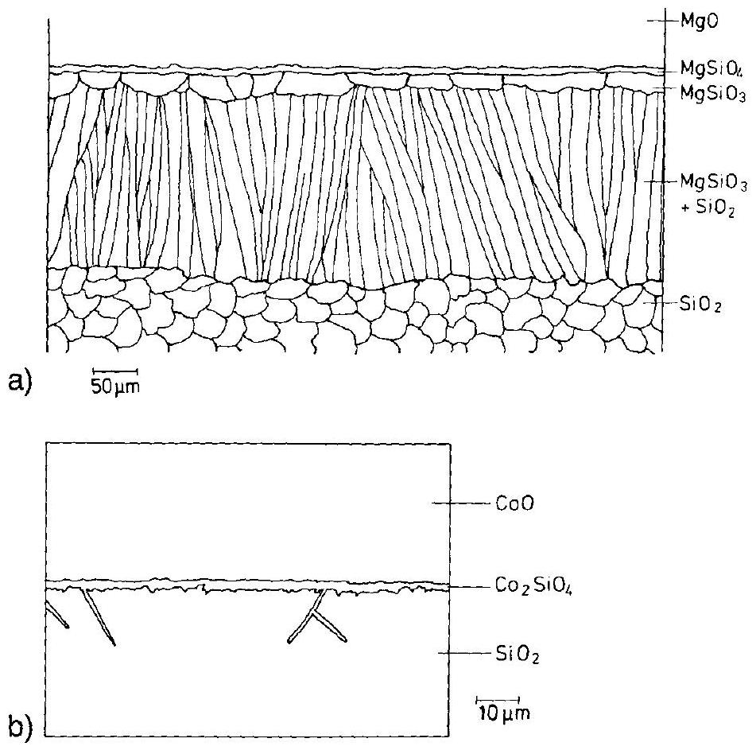
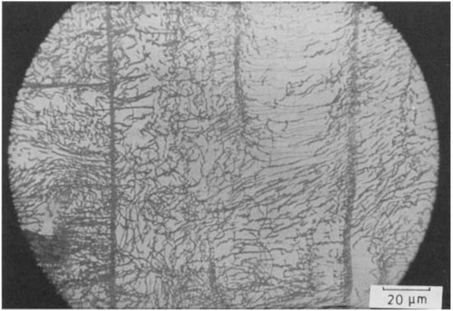
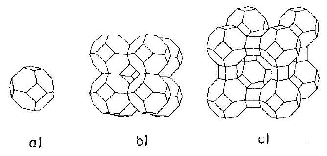
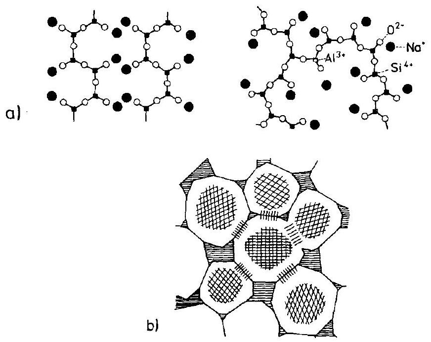
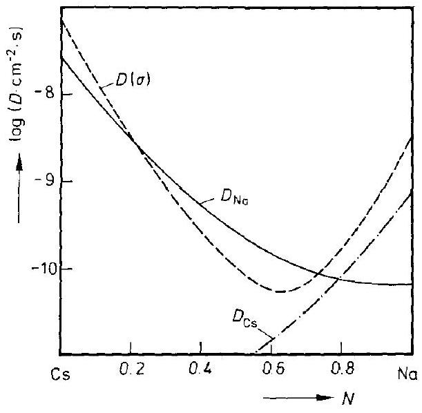
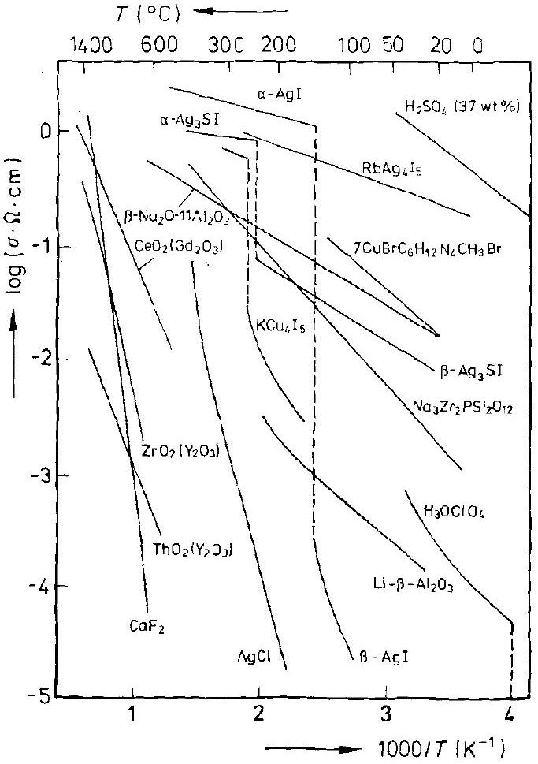
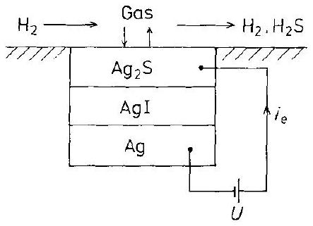
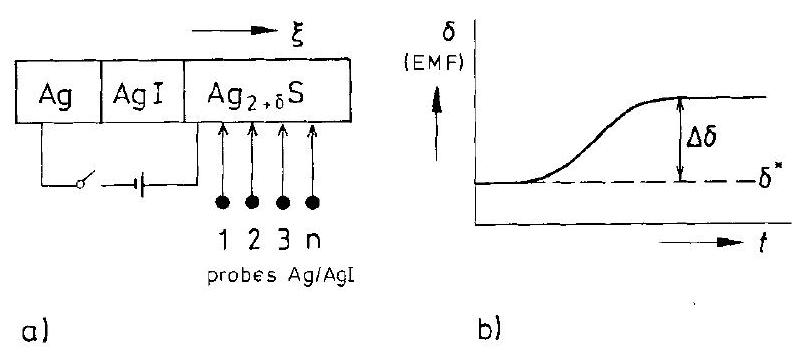
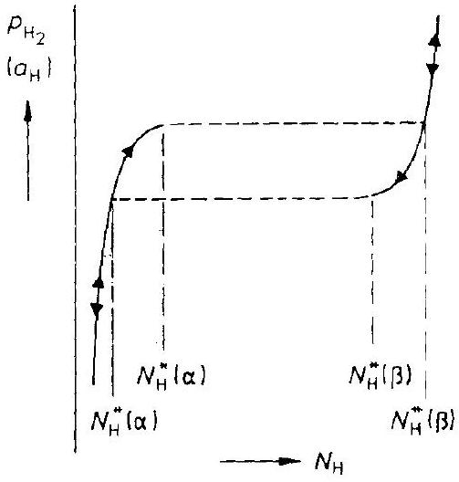
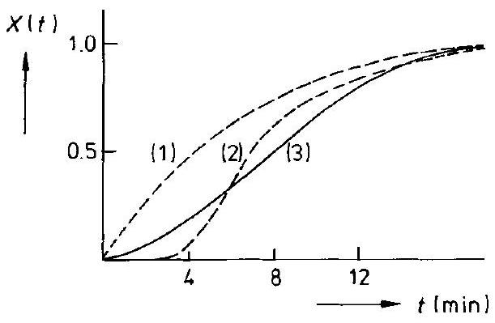

# 15 Transport and Reactions in Special Systems 

### 15.1 Introduction

In previous chapters, the basic and formal structure of solid state kinetics was emphasized. This was advisable considering the inherent complexity of almost all reactions in the solid state. Although we occasionally illustrated the deductions and derivations with experimental observations and data, it seems appropriate to strengthen the chemical aspects of solid state kinetics in a special chapter. The purpose of this chapter then is to acquaint us with the kinetic complications which emerge if a solid undergoes a chemical process. Kinetic situations will be presented along with available experimental data for some important types of solids, and we will try not to oversimplify when constructing tractable models for limiting cases. In spite of a remarkable increase in research in solid state chemistry, basic kinetic data are often incomplete. One reason is that chemists are primarily concerned with synthesis and structure whereas physicists are mainly interested in dynamics. Thermodynamics and kinetics are generally worked out by a relatively small number of physical chemists and recently by material scientists.

In selecting the different types of solids for a discussion in this chapter, their importance in science and technology was as decisive as the availability of kinetic data. Silicates, fast conductors, hydrides (mainly of transition metals), and some organic crystals were thus chosen. Silicates are the most important solids in geochemistry. Fast solid ionic conductors are a prerequisite for solid state electrochemistry. They have an increasing influence on some technologies and a bridging function to the biosciences. Metal hydrides are studied in the context of hydrogen catalysis, energy storage, and energy production (fuel cells), whilst the impact of organic solids on our daily life is obvious. The solids we will consider, however, are special from a more fundamental point of view. They all represent an extreme characteristic property. Silicates are characterized by their abundance and the wealth of distinct structural features which stem from the variability with which $\left[\mathrm{SiO}_{4}\right]^{4-}$ tetrahedra can be interlinked. Fast solid ionic conductors have conductances which compare with those of ionic liquids. The activation energy of their conductivity is normally quite low. Hydrides are compounds in which one of the components is the lightest of all elements. Therefore, one may expect quantum effects to influence the motion of hydrogen. If we consider the organic molecules which form molecular crystals, the question is whether these molecules can move translationally in a crystal lattice or whether they first dissociate in order to release mobile (atomic) structural elements.

In what follows, we will not repeat the formal discussions. Rather we exemplify specific and relevant kinetic problems as they are met in practical situations. Reference will be made to previous chapters for the more formal aspects.

### 15.2 Silicates

### 15.2.1 Introductory Remarks

Silicates are major constituents of the earth's crust (e.g., feldspars) and mantle (e.g., olivine). For a long time, silicates served as the most important construction materials for buildings, and in many ores they predominate. Most of the silicates are aluminosilicates, which reflects the easiness of isomorphous substitution of silicon by aluminium. The basic structural unit of all silicates is the silicon-oxygen tetrahedron. The $\mathrm{Si}-\mathrm{O}$ bond length in silicates is about $1.62 \AA(1.57-1.7)$. In the orthosilicates, there are isolated $\mathrm{SiO}_{4}$ tetrahedra and no vertex-sharing of these units takes place ( $\left[\mathrm{Si}_{2} \mathrm{O}_{8}\right]^{8-}=2\left[\mathrm{SiO}_{4}\right]^{4-}$ ). In another type of orthosilicate, there are $\left[\mathrm{Si}_{2} \mathrm{O}_{7}\right]^{6-}$ groups which share one (vertex) oxygen ion. $\left[\mathrm{Si}_{2} \mathrm{O}_{6}\right]^{4-}$ units share two oxygen ions and thus may form chain- or cyclo-silicates. $\left[\mathrm{Si}_{2} \mathrm{O}_{5}\right]^{2-}$ units share three oxygen ions and are thus able to form layered structures. In $\mathrm{Si}_{2} \mathrm{O}_{4}\left(\mathrm{SiO}_{2}\right)$, all the vertices are interlinked. The higher the $\mathrm{SiO}_{2}$ content of a silicate, the more vertex sharing takes place. Correspondingly, the linkage goes from one dimensional chains to two dimensional (layer) structures and finally to three dimensional networks (e.g., feldspars, zeolites). Well known chain structure minerals are pyroxenes and amphiboles ( $\mathrm{Mg}_{7}\left[\mathrm{Si}_{8} \mathrm{O}_{22}\right](\mathrm{OH})_{2}$ ). Clay minerals and micas are layer structured.

Orthosilicates are of composition $\mathrm{Me}_{2} \mathrm{SiO}_{4}=2 \mathrm{MeO} \cdot \mathrm{SiO}_{2}$. The Me cation may occur with coordination number 4 as in $\mathrm{Be}_{2} \mathrm{SiO}_{4}$ (phenacite). In the olivines, $(\mathrm{Mg}, \mathrm{Fe})_{2} \mathrm{SiO}_{4}$, the Me cation has the coordination number 6 . The highest Me coordination number is 8 as, for example, in $\mathrm{ZrSiO}_{4}$ (zircon). These 'island' silicates possess an almost close-packed oxygen ion sublattice. In the ideal olivine structure, it is hexagonal.

Pyroxenes (e.g., $\mathrm{Mg}_{2}\left[\mathrm{Si}_{2} \mathrm{O}_{6}\right]=2 \mathrm{MgSiO}_{3}$, enstatite) and amphiboles (double chain silicates containing OH groups) form chains of $\mathrm{SiO}_{4}$ tetrahedra. By interlinking the chains we arrive at layer silicates.

A multitude of layered minerals exist. Since the hexagonal arrangement of the oxygen ions in the silicate layers and in $\mathrm{Mg}(\mathrm{OH})_{2}$, for example, are almost the same, and furthermore since $\mathrm{Si}^{4+}$ ions can be substituted by $\mathrm{Al}^{3+}$ in the networks of the $\mathrm{SiO}_{4}$ tetrahedra, it is understandable that $\mathrm{Mg}(\mathrm{OH})_{2}, \mathrm{Al}(\mathrm{OH})_{3}$, and layered $(\mathrm{Si}, \mathrm{Al})_{2} \mathrm{O}_{5}$ sheets can be combined in many ways. Thus, in mica, $\mathrm{Al}^{3+}$ replaces $\mathrm{Si}^{4+}$ in the network layers, which are interlinked by $\mathrm{AlO}_{6}$ layers and interleaved with $\mathrm{K}^{+}$ ions (muscovite, $\mathrm{KAl}_{2}\left[\left(\mathrm{Si}_{3} \mathrm{Al}\right) \mathrm{O}_{10}\right](\mathrm{OH})_{2}$ ). Each $\mathrm{K}^{+}$ion is surrounded by as much as $12 \mathrm{O}^{2-}$ ions, and the bond strength between the layers of alkaline ions and the network oxygen is correspondingly small (cleavage). In vermiculites, the interleaved layers are easily hydrated and the interlayer cations may even exchange with organic cations. Obviously, many variants can be constructed by a proper combination of the different sheets.

The arrangement of $\mathrm{SiO}_{4}$ tetrahedra in three dimensions, and thus the degree of $\mathrm{Si}-\mathrm{O}-\mathrm{Si}$ interlinkage, determines the diffusivity tensor of the components to a large extent. If, in the network of tetrahedra, $\mathrm{Si}^{4+}$ is replaced by a cation of lower valence (e.g., $\mathrm{Al}^{3+}$ ), a corresponding amount of 'network modifying' cations is
found between the $\mathrm{SiO}_{4}$ tetrahedra to compensate the missing charge. These network modifying cations (e.g., $\mathrm{Na}^{+}, \mathrm{Ca}^{2+}$ ) are much more mobile than the network forming $\mathrm{Si}^{4+}$ and $\mathrm{Al}^{3+}$.

The basic knowledge we need in order to understand the kinetics of silicates is, first of all, the thermodynamics of silicates, and, in particular, their point defect thermodynamics. Although the chemical thermodynamics of silicates has been given some attention, we know very little from experiment about the thermodynamics of point defects, even in the most common silicates. Some computer simulations by Catlow and associates [S. C. Parker, et al. (1984)] are available. However, there can be no doubt that the majority defects in equilibrium are the point defects of the network modifying cations. The reason is the high cohesion energy of the $\mathrm{Si}-\mathrm{O}$ bond. One concludes that Frenkel disorder outside the $\mathrm{SiO}_{4}$ network prevails in stoichiometric silicate compounds. For the same reason, one concludes that the nonstoichiometry of simple ternary compounds, such as $\mathrm{Na}_{2} \mathrm{O} \cdot \mathrm{SiO}_{2}$, is extremely small. As long as the ions cannot change their valence state, a surplus of the binary constituents ( $\mathrm{Na}_{2} \mathrm{O}$ or $\mathrm{SiO}_{2}$ ) must affect either the $\mathrm{O}^{2-}$ or the $\mathrm{Si}^{4+}$ sublattice. This, in turn, breaks $\mathrm{Si}-\mathrm{O}$ bonds, a most energetically unfavorable situation.

Point defect disorder becomes much more complicated when we incorporate $\mathrm{Al}^{3+}$ ions because they can be placed in the $\mathrm{SiO}_{4}$ network tetrahedra as well as out of them. A surplus of cations outside the network can always be charge compensated through a substitution of $\mathrm{Si}^{4+}$ by $\mathrm{Al}^{3+}$ in the network. In this way, point defect concentrations are balanced with respect to charge neutrality, and no cations with variable valence states (e.g., $\mathrm{Fe}^{2+} / \mathrm{Fe}^{3+}$ ) are necessary for this balance. If, however, cations with variable valencies are present (even as impurities), redox reactions with the oxygen component (e.g., with $\mathrm{O}_{2}$ gas) can take place. We know from our former discussion (see Section 2.3) that redox reactions lead to the formation of pairs of electronic and ionic point defects which mutually compensate their effective electric charge. The compensating defects are essentially those with the lowest formation energy for the pair (majority point defects). Therefore, ionic defects in the network do not take part in the compensation. Without redox systems, the kinetic parameters of silicates do not depend on the oxygen potential.

### 15.2.2 Transport in Silicates

Investigations on transport and reaction can hardly be performed without an understanding of the basic defect thermodynamics. Therefore, only a limited number of relevant investigations on transport and reaction in silicates are known. We have a fairly good understanding of the defect thermodynamics of orthosilicates and, in particular, of olivine $(\mathrm{Fe}, \mathrm{Mg})_{2} \mathrm{SiO}_{4}$. Here, the mobility of the divalent cations in their slightly distorted octahedral coordination shows a similar behavior to that found in other close-packed ternary oxides [H. Schmalzried, C. Wagner (1962)]. This is particularly true with regard to the influence of the oxygen potential and reflects the majority defect disorder of the divalent cations [A. Nakamura, H. Schmalzried (1983)].

Solid state reactions and creep deformation are important processes in the earth's mantle. They occur only if at least two ionic species migrate simultaneously in order
to satisfy the conditions which crystal structure and electroneutrality impose. In other words, either silicon or oxygen ions or perhaps both will take part in silicate reactions. The data on mobility, however, are contradictory. High $\mathrm{Si}-\mathrm{O}$ bond energies and the correspondingly low defect concentrations in combination with high thermal activation energies result in very low mobilities of both the $\mathrm{Si}^{4+}$ and $\mathrm{O}^{2-}$ ions. Measurements of low mobilities are very difficult. Also, formation of orthosilicates from the individual binary oxides at high temperatures is extremely sluggish [H. Schmalzried (1978)]. The available data on Si and O tracer diffusion suggest that $\mathrm{Si}^{4+}$ is the slowest moving ion, in accordance with the fact that it is bonded to four oxygen ions [O. Jaoul (1980), (1981); B. Houlier, et al. (1988)].

We remember that minority point defect concentrations in compounds depend on the activity of their components. This may be illustrated by the solubility of hydrogen in olivine since it depends on the oxygen potential in a way explained by the association of the dissolved protons with $\mathrm{O}_{\mathrm{i}}^{\prime \prime}$ and $\mathrm{O}_{\mathrm{i}}^{\prime}$ as minority defects [Q. Bai, D.L. Kohlstedt (1993)]. Similarly, tracer diffusion coefficients and mobilities of Si and O are expected to depend on the activity of $\mathrm{SiO}_{2}$. The value ( $\partial \ln D_{i} / \partial \ln a_{\mathrm{SiO}_{2}}$ ), $i=\mathrm{Si}$ and O , should give information on the disorder type as discussed in Section 2.3.

Heterogeneous solid state reactions of the type $2 \mathrm{MeO}+\mathrm{SiO}_{2}=\mathrm{Me}_{2} \mathrm{SiO}_{4}$ have not yet been fully exploited in order to derive kinetic parameters. The experimental reaction rate constant reflects the oxygen ion mobility in the orthosilicate, if $\mathrm{Si}^{4+}$ is indeed the slowest moving ion, as discussed in Section 6.3. In this case, the orthosilicate should form at the $\mathrm{Me}_{2} \mathrm{SiO}_{4} / \mathrm{SiO}_{2}$ or $\mathrm{Me}_{2} \mathrm{SiO}_{4} / \mathrm{MeSiO}_{3}$ interface by simultaneous diffusion of $\mathrm{Me}^{2+}$ and $\mathrm{O}^{2-}$ across the reaction product. According to Eqn. (6.30) we have $D_{\mathrm{O}} \cong k_{\mathrm{P}} /\left(\Delta G_{f}^{0} / R T\right)$ where $k_{\mathrm{P}}$ is the parabolic reaction rate constant. Marker experiments can therefore support the reaction mechanism. Some experimental data exist [H. Schmalzried (1978)], but they are not sufficient to lead to firm conclusions. In crystals with very slow lattice diffusion, fast diffusion along non-equilibrium defects (dislocations, grain boundaries) may become rate determining.

To illustrate the complications associated with these relatively simple quasi-binary reactions, let us regard Figure 15-1. In agreement with the phase diagram, the MgO $\mathrm{SiO}_{2}$ reaction couple shows the following sequence of phases after some reaction time: $\mathrm{MgO} / \mathrm{Mg}_{2} \mathrm{SiO}_{4} / \mathrm{MgSiO}_{3} / \mathrm{SiO}_{2}$. However, the initially planar interface between $\mathrm{SiO}_{2}$ and metasilicate becomes morphologically unstable during the course of the reaction. We saw in Chapter 11 that morphological stability is to be expected in a reacting (quasi-) binary system if volume diffusion prevails and defect equilibrium is established. We conclude therefore that during the $\mathrm{MgO}-\mathrm{SiO}_{2}$ reaction, other and faster transport mechanisms predominate. The growth morphology as illustrated in Figure 15-1 suggests that the grain boundary between $\mathrm{MgSiO}_{3}$ and $\mathrm{SiO}_{2}$ develops more and more stress and provides a fast diffusion path, most likely for $\mathrm{Mg}^{2+}$ and $\mathrm{O}^{2-}$ ions. However, it is the inhomogeneous stress which seems to be important here since high diffusivity interfaces alone tend to stabilize the planar morphology (see Chapter 11).

Olivine and other orthosilicates have been exposed to oxygen potential gradients in order to investigate the demixing of solid solutions and internal reactions (oxidation, decomposition). The corresponding formalism was outlined in Chapters 8 and

Figure 15-1. Solid state reactions between MgO or CoO and $\mathrm{SiO}_{2}$ [H. Schmalzried, G. Borchardt, unpublished]. Instability of the reaction product boundaries. $\mathrm{SiO}_{2}$ has been crystallized from $\mathrm{SiO}_{2}$ glass. $\mathrm{MgO}(\mathrm{CoO})$ are single crystals. a) $\mathrm{T}=1514^{\circ} \mathrm{C}, t=102 \mathrm{~h}$ in air; b) $\mathrm{T}=1300^{\circ} \mathrm{C}, t=$ ca. 1 h in air.

9. Two conclusions can be drawn from the experimental results. 1) Reaction modes found in other ternary and higher oxide systems exposed to potential gradients of oxygen are indeed observed with silicates. They confirm the ion mobility in semiconducting orthosilicates. 2) The slowness of the $\mathrm{Si}^{4+}$ and $\mathrm{O}^{2-}$ volume diffusion, and the fact that olivine is really a quaternary system, add appreciably to the complexity of the reaction patterns. Again, low $D_{\mathrm{Si}}$ and $D_{\mathrm{O}}$ values in the bulk channel the transport of silicon and oxygen ions along other, faster reaction paths. Dislocations, for example, are observed to be heavily decorated with internal reaction products ( $\mathrm{Fe}_{3} \mathrm{O}_{4}$ ) after internal oxidation (Fig. 15-2). These product crystals enhance further transport along the decorated, that is, disturbed dislocation lines. Furthermore, they alter the internal structure of the matrix and thus complicate the overall reaction. Thus, the different kinetic steps can hardly be analyzed in a quantitative fashion [R. Weghöft, H. Schmalzried (1986); T. Wu, D. L. Kohlstedt (1988)].
Whereas we now begin to understand solid state kinetics in orthosilicates, this understanding is still unsatisfactory for other silicates with interlinked tetrahedra. Let us turn to the discussion of chemical kinetics in layered silicates since they play a prominent role in soil chemistry. For illustration we will concentrate on transport

Figure 15-2. Decoration of dislocations in olivine by internal oxidation. Precipitates are $\mathrm{Fe}_{3} \mathrm{O}_{4}$ [by courtesy of D. Kohlstedt, University of Minnesota].

and transport related processes (e.g., in vermiculites). Generally speaking, sheets of a rigid ( $\mathrm{Si}, \mathrm{Al}$ ) $\mathrm{O}_{4}$ network ( T ) alternate with octahedral sheets ( O ) and interleaved, more open-structured interlayers (I) in which mobile cations and neutral species are able to move. Consequently, these species can be exchanged from external surfaces, provided the layers terminate at these surfaces and the structural and electroneutrality conditions are not violated.

The molecular unit of vermiculite can be formulated as $(\mathrm{Ca}, \mathrm{Mg})_{x} \cdot(\mathrm{Mg}, \mathrm{Fe}, \mathrm{Al})_{3} \left[(\mathrm{Al}, \mathrm{Si})_{4} \mathrm{O}_{10}\right](\mathrm{OH})_{2+n}$. The basic structural features are shown in Figure 15-3. If we replace $\mathrm{Si}^{4+}$ in the tetrahedral framework by $\mathrm{Al}^{3+}$, the site carries a net negative charge. Charge compensation is then possible by placing $\mathrm{Fe}^{3+}, \mathrm{Al}^{3+}$, etc. on the octahedral sites normally occupied by the divalent ions, and/or by setting compensating cations into the interlayer. These cations can be hydrated with the result that the crystal swells. In addition to water, other polar molecules (organic molecules) may also be taken up. The possible variations of this intercalation chemistry are obviously numerous. If we take into account that in addition to $\mathrm{OH}^{-}$and $\mathrm{H}_{2} \mathrm{O}$ the

Figure 15-3. Structure of vermiculite, schematic. $\mathrm{T}=$ tetrahedral coordination sheet; $\mathrm{O}=$ octahedral coordination sheet; $\mathrm{I}=$ interlayer.

redox cations $\mathrm{Fe}^{2+} / \mathrm{Fe}^{3+}$ are present, and that both protons and electrons are mobile, we see that it is necessary to unambiguously define not only the proton and electron activities but also the activities of the neutral chemical components if we are to perform meaningful kinetic experiments.

If the cations of variable valency (e.g., $\mathrm{Fe}^{2+} / \mathrm{Fe}^{3+}$ ) are present in not too low concentrations, the crystals will be semiconductors. In non-equilibrium vermiculites, the internal electric field is then strongly influenced by their electronic conductivity, as explained in Section 4.4.2. If we start with an equilibrium crystal and change either $p_{\mathrm{H}}, a_{\mathrm{e}}, a_{\mathrm{H}_{2} \mathrm{O}}$, or $a_{i}$ (where $i$ designates any other component), coupled transport processes are induced. The coupling is enforced firstly by the condition of electroneutrality, secondly by the site conservation requirements in the T-O-T blocks (Fig. 15-3), and thirdly by the available free volume in the (van der Waals) interlayer. It is in this interlayer that the cations and the molecules are the more mobile species. However, local ion exchange between the interlayer and the relatively rigid T-O-T blocks is also possible.

Furthermore, during transport and local reaction, the crystal is inhomogeneous by necessity and thus suffers from a (inhomogeneous) swelling, which results in the build-up of self-stress. A visible indication of internal stress is the bending of the layered crystals during (exchange) reactions. From the foregoing, it follows that the conservation equation for species $i$ is composed of a flux term and a reaction term. The driving force for transport contains the stress gradient in form of ( $V \cdot \nabla \sigma$ ), see Section 14.2.1. Thus, the exchange reaction is unambiguously defined, but it is clear from the detailed discussions in Chapters 4 and 5 that its rigorous formal treatment is almost out of reach. Nevertheless, in view of the practical implications which these processes have in soil chemistry, global kinetic measurements have been performed on quite a large scale using gravimetry, DTA, X-ray and neutron spectroscopy, VIS and IR spectroscopy, NMR spectroscopy, and electron microscopy. Most of the kinetic measurements, however, were not unambiguously defined thermodynamically and electrochemically with the result that any interpretation remains uncertain.

Let us continue by discussing examples of the kinetic aspects of silicates with three dimensional networks such as feldspars and zeolites. Feldspars are found in the quasi-ternary system $\mathrm{K}\left[\mathrm{AlSi}_{3} \mathrm{O}_{8}\right]$ (K-feldspar, Or)- $\mathrm{Na}\left[\mathrm{AlSi}_{3} \mathrm{O}_{8}\right]$ (Na-feldspar, $\mathrm{Ab})-\mathrm{Ca}\left[\mathrm{Al}_{2} \mathrm{Si}_{2} \mathrm{O}_{8}\right]$ (Ca-feldspar, An). These framework silicates deserve special interest because they form the major part of the earth's crust. The feldspar structure consists of linked rings made up of four corner-sharing $\mathrm{SiO}_{4}$ and $\mathrm{AlO}_{4}$ tetrahedra. There are cavities in this network that may be occupied by the large $\mathrm{K}, \mathrm{Na}, \mathrm{Ca}$, or by others such as Ba ions which we will designate as A sites. They may differ in symmetry depending on the portion of neighboring $\mathrm{Al}^{3+}$. A small excess or deficiency in $\mathrm{SiO}_{2}$ resulting in a small deviation from the strict stoichiometric composition of the feldspar solid solution is most difficult to verify. Also, impurities may be incorporated in the feldspar structure. The solution of iron ions, for example, allows a change in the valencies of this redox system by an appropriate oxygen potential change. A relatively fast charge compensation is then possible by adapting the number of A site vacancies ( $\mathrm{V}_{\mathrm{A}}$ ) or alkali interstitials. The change in the valence influences the distribution of iron between the tetrahedral $\left(\mathrm{Fe}_{\mathrm{T}}^{3+}\right)$ and $\mathrm{A}\left(\mathrm{Fe}_{\mathrm{A}}^{2+}\right)$ sites, which in turn influences the iron diffusivity since $D_{\mathrm{Fe}}^{*}=N_{\mathrm{Fe}^{2+}} \cdot D_{\mathrm{Fe}^{2+}}+N_{\mathrm{Fe}^{3+}} \cdot D_{\mathrm{Fe}^{3+}}$.

We know from Section 6.3 that the most important species for chemical diffusion in multicomponent systems is not the one with the lowest mobility. Rather, the next to lowest one essentially determines the interdiffusion process. If, however, the $(\mathrm{Si}, \mathrm{Al}) \mathrm{O}_{4}$ network of tetrahedra remains unperturbed, chemical diffusion can only consist of a cation exchange. The $\mathrm{K}-\mathrm{Na}$ exchange is certainly the fastest, while the other exchanges are controlled by the much lower mobilities of $\mathrm{Ca}^{2+}$ or even $\mathrm{Al}^{3+}$ ions. Well defined tracer ( ${ }^{22} \mathrm{Na},{ }^{45} \mathrm{Ca}$, and ${ }^{59} \mathrm{Fe}$ ) diffusion data are available for natural plagioclase crystals ( $=$ Ab-An solid solutions) [H. Behrens, et al. (1990)]. Several observations are worth mentioning. 1) Na diffusivities are about three orders of magnitude faster than Ca diffusivities. 2) Diffusivities are nearly isotropic. 3) Whereas the diffusivity of $\mathrm{Fe}^{2+}$ is some ten times higher than that of $\mathrm{Ca}^{2+}$, the diffusivity of $\mathrm{Fe}^{3+}$ is about ten times lower, which implies that the (tracer) diffusion coefficient of iron in plagioclase depends strongly on the oxygen activity. 4) The experiment shows that whereas $D_{\mathrm{Ca}}$ does not depend on $\mu_{\mathrm{O}_{2}}, D_{\mathrm{Na}}$ decreases slightly with increasing oxygen potential. The following conclusions can therefore be drawn. By increasing $\mu_{\mathrm{O}_{2}}, \mathrm{Fe}^{2+}$ and $\mathrm{Na}_{\mathrm{A}}^{+}$is replaced by $\mathrm{Fe}^{3+}$ and $\mathrm{V}_{\mathrm{A}}$. Since $\mathrm{Na}^{+}$ion Frenkel defects ( $\mathrm{Na}_{\mathrm{i}}, \mathrm{V}_{\mathrm{A}}$ ) are the majority defects, an increase in $D_{\mathrm{Na}}$ with decreasing $\mu_{\mathrm{O}_{2}}$ indicates that Na diffusion is essentially interstitial. Schottky disorder is excluded because of the high formation energy of oxygen vacancies. The relatively low mobility of $\mathrm{Fe}^{3+}$ suggests that it replaces T -site $\mathrm{Al}^{3+}$ in the network.

Let us now turn to zeolites as another example of silicates having three dimensional network structures. Their composition can be expressed as $M_{x} D_{y}\left(\mathrm{Al}_{x+2 y} \mathrm{Si}_{n-(x+2 y)}\right) \cdot \mathrm{O}_{2 n} \cdot m \mathrm{H}_{2} \mathrm{O}$, where $M$ and $D$ are mono- and divalent metals respectively. Zeolites are aluminosilicates linked together in network forming channels and cages on a molecular level (Fig. 15-4). The framework is negatively charged. The $M$ and $D$ cations in the channels and cages are quite mobile and may be exchanged and interchanged. The lowest channel size is $2.6 \AA$, the largest one is $7.4 \AA$ and consists of 12 -membered rings. Both natural (e.g., sodalite, faujasite) and synthetic zeolites exist.

Figure 15-4. Structures of some zeolites: a) basket-like unit (truncated octahedron) of linked $\mathrm{SiO}_{4}$ tetrahedra; b) framework of baskets as in a), joined at square faces; c) space-filling framework of truncated octahedra and cubooctahedra.

In principle, all the kinetic concepts of intercalation introduced for layer-structured silicates hold for zeolites as well. Swelling, of course, is not found because of the rigidity of the three dimensional frame. The practical importance of zeolites as molecular sieves, cation exchangers, and catalysts (cracking and hydrocracking in petroleum industry) is enormous. Molecular shape-selective transport (large differences in diffusivities) and micro-environmental catalysis (in cages and channels)
favors crystal directed synthetic engineering, and particularly it favors the engineering of organic substances. Although tracer diffusion mobility and NMR mobility have been measured in zeolites, they usually do not agree. This is not surprising considering the prominent role that correlation effects play when, on an atomic scale, the diffusion paths are highly anisotropic and locally inhomogeneous. Still more complicated is the interpretation of chemical diffusion coefficients which describe the transport of components in concentration gradients. The construction of $\tilde{D}$ from the individual diffusivities associated with the Darken type equation (as can be found in the literature) certainly does not fulfill the coupling requirements of electroneutrality and site (volume) preservation in the channels.

Since the fraction of empty sites in a zeolite channel determines the correlation factor (Section 5.2.2), as is well known from single-file diffusion in the pores of a membrane, the strong dependence of the diffusion coefficients on concentration can be understood. This is why a simple Nernst-Planck type coupling of the diffusive fluxes (see, for example, [H. Schmalzried (1981)]) is also not adequate. Therefore, we should not expect that sorption and desorption are symmetric processes having identical kinetics. Surveys on zeolite kinetics can be found in [A. Dyer (1988); J. Kärger, D. M. Ruthven (1992)].

### 15.2.3 Order-Disorder Reactions

Order-disorder reactions lower the Gibbs energy by a change in the local order on an atomic scale. Order-disorder reactions do not change the local composition in a strict sense. If composition changes are involved on a mesoscale, we deal with either spinodal decomposition or diffusional transport and precipitation. Silicates illustrate all of these reaction modes. The slowness of the silicon and oxygen motions commonly leaves a system in a metastable state after sudden changes in $T$ or $P$. Then, according to Ostwald's rule, the system's first response is often a change in its local order.

Various modes of ordering are feasible. In systems with amphoteric cations (e.g., $\mathrm{Al}^{3+}$ ), the fraction of $\mathrm{Al}^{3+}$ in tetrahedral or octahedral sites is a possible order parameter. Strain may lead to a bending of $\mathrm{Si}-\mathrm{O}$ bonds. Periodic distributions of the components in space, along with elastic and/or electrostatic interactions, indicate spinodal ordering (demixing). Some examples will illustrate these general features.

Cordierite, $\left(\mathrm{Mg}_{2} \mathrm{Al}_{3}\right)$ [ $\mathrm{AlSi}_{5} \mathrm{O}_{18}$ ], is a silicate with isolated rings of six tetrahedra and occurs in two polymorphic forms. At $T>1450^{\circ} \mathrm{C}$, the high temperature hexagonal form ( $\beta$ ) is stable. The low temperature form is slightly distorted orthorhombic ( $\alpha$ ). In the $\beta$-form, there are two sorts of tetrahedral sites, $\mathrm{T}_{1}$ and $\mathrm{T}_{2}$, occupied by $\mathrm{Al}^{3+}$ and $\mathrm{Si}^{4+}$ ions ( $3 \mathrm{~T}_{1}$ by 2 Al and $1 \mathrm{Si}, 6 \mathrm{~T}_{2}$ by 2 Al and 4 Si ) in a random way. In the $\alpha$-form, the $\mathrm{T}_{1}$ sites are divided into two and the $\mathrm{T}_{2}$ sites into three nonequivalent types of sites. In this $\alpha$-form, the Si and Al ions can structurally order. The ordering kinetics are extremely sluggish at low temperature because of low jump frequencies, and at temperatures close to the $\beta \rightarrow \alpha$ transition because of the low driving force. Although this transition has been asserted to be first order, the splitting of the X-ray diffraction peaks is continuous and requires hundreds of hours at
$T \approx 1300^{\circ} \mathrm{C}$. Thus, a real understanding of the transition and ordering mechanism has still not been achieved [A. Putnis (1986)].

The second example concerns the separation of Na and K in ( $\mathrm{Na}, \mathrm{K}$ ) [ $\mathrm{AlSi}_{3} \mathrm{O}_{8}$ ] feldspars [R. A. Yund (1984)]. When homogeneous samples are annealed at temperatures between $450^{\circ} \mathrm{C}$ and $525^{\circ} \mathrm{C}$, they decompose until they reach the coherent binodal solvus after 70 and 7 days respectively. In the beginning, the process is a spinodal decomposition. The product consists of $100-500 \AA$ spaced Na and K rich lamellae that are coherently intergrown. The common interface is approximately parallel to (601). During the decomposition reaction these lamellae change composition in a continuous way in the spinodal regime. The incoherent solvus can hardly be reached in laboratory times. Composition dependent displacive transformations ( K rich monoclinic and Na rich triclinic) may complicate the ordering processes in feldspars since more than one order parameter has to be introduced in order to describe the equilibration kinetics [E. Salje (1990)].

### 15.2.4 The Role of Hydrogen in Silicates

Hydrogen can be incorporated into silicates in the form of water, $\mathrm{H}_{2}$ molecules, H atoms, $\mathrm{H}^{+}, \mathrm{OH}^{-}$, and other ways. Since oxygen is one component of a silicate, both the oxygen and hydrogen potentials ( $\mu_{\mathrm{O}_{2}}, \mu_{\mathrm{H}_{2}}$ ) must be defined in order to fix the thermodynamic state of the hydrogen containing silicates. Furthermore, the proton activity must be defined by an additional external (electrode) or internal redox buffer (e.g., $\mathrm{Fe}^{2+} / \mathrm{Fe}^{3+}$ ).

It has been repeatedly observed that small amounts of $\mathrm{H}_{2} \mathrm{O}$ dissolved in nonequilibrium silicates catalyze their equilibration (e.g., homogenization of plagioclase with initially periodic lamellae by increasing the temperature). Also, plastic deformation under stress is enhanced (hydrogen weakening). The form in which $\mathrm{H}_{2} \mathrm{O}$ dissolves is still under discussion. It may dissolve as molecules or by dissociating into $\mathrm{H}^{+}$and $\mathrm{OH}^{-}$when the proton is likely to become associated with the oxygen ions of the silicate. A further question concerns the way in which hydrogen induces a lowering of the activation barrier for component diffusion in silicates. If, for example, $\mathrm{H}_{2} \mathrm{O}$ replaces $\mathrm{Na}_{2} \mathrm{O}$ ( $\mathrm{K}_{2} \mathrm{O}$, etc.), it seems likely that the protons are network modifiers and establish essentially $\mathrm{Si}-\mathrm{O}-\mathrm{H}$ configurations $\left(\mathrm{Si}-\mathrm{O}-\mathrm{Si}+2 \mathrm{H}_{2} \mathrm{O}=\right. 2 \mathrm{Si}-\mathrm{OH}$ ). The two $\mathrm{OH}^{-}$groups which replace the one bridging oxygen ion thus perturb the $\left[\mathrm{SiO}_{4}\right]^{4-}$ tetrahedral configuration. This changes the $\mathrm{Si}-\mathrm{O}$ bond strength considerably as is also the case if $\mathrm{Si}^{4+}$ in the tetrahedron of oxygen ions is replaced by $\left(\mathrm{Al}^{3+}+\mathrm{H}^{+}\right),\left(\mathrm{Ca}^{2+}+2 \mathrm{H}^{+}\right),\left(\mathrm{Na}^{+}+3 \mathrm{H}^{+}\right)$, or even $4 \mathrm{H}^{+}$. The latter defect configuration (hydrogarnet defect [K. Wright, et al. (1994)]) has been postulated to explain the climb of dislocations in garnets. Analogous concepts have been introduced to explain the weakening of quartz [B.E. Hobbs (1985)]. Similar polarization effects on $\mathrm{Si}-\mathrm{O}-\mathrm{Si}$ bonds may be envisaged if $\mathrm{H}_{2}$ (or 2 H ) dissolves in silicates by molecular or atomic diffusion and is subsequently oxidized by an internal redox buffer (e.g., $\mathrm{Fe}^{2+} / \mathrm{Fe}^{3+}$ ) to yield protons. These protons can then be expected to become localized near network anions. If sufficiently mobile, they will loosen the entire network and hence influence the mobility of both $\mathrm{Si}^{4+}$ and $\mathrm{O}^{2-}$
simultaneously. We can also replace $\mathrm{Na}^{+}$ions by $\mathrm{H}^{+}$(protons) through electrolysis with the help of an anodic hydrogen electrode [J. Bazan (1978)].

Although there are many qualitative observations in this field, though mainly obtained through IR spectroscopy to register OH groups (e.g., [G.H. Miller, et al. (1987)]), little quantitative work concerning the influence of $\mathrm{H}_{2}\left(\mathrm{H}_{2} \mathrm{O}\right)$ on transport in silicates is known. It would be most welcome to understand the mechanism of lattice loosening and transport catalysis by $\mathrm{H}_{2} \mathrm{O}\left(\mathrm{H}_{2}\right)$ in more detail considering its influence on plastic deformation (creep) in geological processes in the earth's mantle.

### 15.2.5 Silicate Glasses

Glasses are supercooled liquids, the structure of which is (partially) frozen in. This means that translational and rotational motions which relax the unstable amorphous state towards equilibrium are appreciably slower than random jumps of the network modifying atomic particles. The radial distribution functions of atoms (ions) in glass are similar to those of other amorphous materials obtained by milling, vapor deposition, quenching from the liquid state, or chemical reaction. The supercooled liquid as such is unstable. The glass, however, is metastable, which means that although some of the motional degrees of freedom are frozen in, some species can still move continuously to establish the relative free energy minimum. Since dc-conductivities have higher activation energies above the glass temperature, $T_{\mathrm{g}}$, one concludes that below $T_{\mathrm{g}}$ certain structural relaxation processes are prevented.

Although many different substances form glasses, here we are concerned with oxide glasses, and, in particular, with silicate glasses. They are generally composed of 1) network formers $\left(\mathrm{SiO}_{2}\left(\mathrm{~B}_{2} \mathrm{O}_{3}, \mathrm{P}_{2} \mathrm{O}_{5}, \mathrm{GeO}_{2}\right)\right)$ and 2) network modifiers (e.g., $\mathrm{A}_{2} \mathrm{O}$, $\mathrm{A}=$ alkaline metals). The formers build the amorphous network through covalent $\mathrm{Si}-\mathrm{O}-\mathrm{Si}$ bridges which, by definition, lacks symmetry and periodicity on a macroscopic scale. The network modifying reaction can be written as $\mathrm{Si}-\mathrm{O}-\mathrm{Si}+\mathrm{A}_{2} \mathrm{O}= 2(\mathrm{Si}-\mathrm{O})^{-}+2 \mathrm{~A}^{+}$. The A site is localized near the nonbridging oxygen ion, but if amphoteric $\mathrm{Al}_{2} \mathrm{O}_{3}$ is added to the silicate, the $\mathrm{A}^{+}$localization is not so well defined, as can be seen from Figure 15-5a.

Based on these general concepts, various glass models have been discussed in the past. For example, instead of the random network, a 'cluster-tissue' has been proposed. Amorphicity stems from an extended pseudophase or connective tissue which embeds clusters of crystalline regions (Fig. 15-5b). These models were mainly designed to interpret experimental transport coefficients as a function of composition. One of the most distinct features in glass transport is indeed the drastic change in the transport coefficients (e.g., diffusion coefficients or electrical conductivity) with composition as illustrated in Figure 15-6. Changes of several orders of magnitude are common for a change in composition from maybe $15 \%$ to $50 \%$, and the direction of change is opposite to what we would expect from Debye-Hückel type interactions. In contrast to normal aqueous solutions of ions, glasses are highly concentrated electrolytes. Modified point defect models seem to be appropriate to describe chemical diffusion and dc-conductivity. Kahnt [H. Kahnt (1991)] has discussed the implications of this type of model in detail. The basic idea is as follows. Analogous to a

Figure 15-5. a) Schematic structure of solid $\mathrm{Na}_{2} \mathrm{O}-\mathrm{SiO}_{2}$, crystal and glass. $\mathrm{Si}^{4+}$; □ $\mathrm{Al}^{3+}$; $\mathrm{O} \mathrm{O}^{2-}$; - $\mathrm{Na}^{+}$. b) Cluster tissue model of glass. |||||: areas of increased stresses.

Figure 15-6. Electric conductivity ( $\sigma$ ) and activation energy ( $E_{\mathrm{A}}$ ) vs. composition for glassy $N \cdot \mathrm{Li}_{2} \mathrm{O}-(1-N) \cdot \mathrm{B}_{2} \mathrm{O}_{3}[\mathrm{H}$. Kahnt (1991)].

Frenkel type reaction, thermally activated $\mathrm{A}^{+}$leaves the potential minimum near the negatively charged nonbridging oxygen. We may understand this oxygen as a ( $\mathrm{O}_{3 / 2} \mathrm{Si}-\mathrm{O}^{-}$) unit (silicon tetrahedra to which it adheres included). We formalize this by writing $V_{i}+R^{-} A^{+}=R^{-} V+A_{i}^{+} . V_{i}$ is a cavity in the glass structure which
can take up $\mathrm{A}^{+}$ions after activation and $\mathrm{R}^{-}$designates the $\left(\mathrm{O}_{3 / 2} \mathrm{Si}-\mathrm{O}\right)^{-}$unit. At sufficiently low $\mathrm{A}_{2} \mathrm{O}$ fractions, the 'vacancies' $\mathrm{R}^{-} \mathrm{V}$ are essentially immobile and the conductivity is determined by $\mathrm{A}_{1}$. However, with increasing $N_{\mathrm{A}_{2} \mathrm{O}}$ direct jumps of the type $\left(\mathrm{R}^{-} \mathrm{A}^{+}\right)_{1}+\left(\mathrm{R}^{-} \mathrm{V}\right)_{2}=\left(\mathrm{R}^{-} \mathrm{A}^{+}\right)_{2}+\left(\mathrm{R}^{-} \mathrm{V}\right)_{1}$ will dominate.

In any case, after each elementary jump of an ion, local electric and elastic imbalances exist so that there is a tendency to cancel the forward step by a backward step (see also Section 5.2.3). Thus, jump relaxation is the key concept, and the question is whether the rigid network defines the available i sites for $\mathrm{A}^{+}$ions or whether the jumping $\mathrm{A}^{+}$ions shape their surroundings by forcing the network to relax. In this latter case, the empty site which the forward jumping $\mathrm{A}^{+}$ion has just left retains its predisposition for being revisited only if the structural relaxation time $\tau_{\mathrm{R}} \geqslant \tau_{\mathrm{D}}$ ( $\tau_{\mathrm{D}}$ being the diffusional jump time). In systems with small $\tau_{\mathrm{R}}$, the steady state vacancy concentration is correspondingly smaller in a field driven transport process. If $\tau_{\mathrm{R}} \gg \mathrm{or} \ll \tau_{\mathrm{D}}$, the $\mathrm{A}^{+}$mobilities should behave as functions of state ( $=f\left(P, T, N_{\mathrm{A}_{2} \mathrm{O}}\right)$ ). Otherwise, the mobilities become explicitly time-dependent (see, for example, Section 5.3), which complicates the formal treatment.

Correlated forward-backward jumping can be quantified by correlation factors (Section 5.2.2). Those factors have been determined by a combined tracer diffusion and electrical conductivity (or drift motion) experiment [M. Chemla (1956); H. Kahnt, et al. (1988); P. Laborde, et al. (1989)]. Quite low correlation factors have been found for glasses ( $<0.3$ ), suggesting that the strongly correlated motion is akin to a percolation along preferred paths. In the (structurally inhomogeneous) bulk of the glass, these paths may be regions of increased alkaline content.

An appealing feature of such a model is that it can qualitatively explain the mixed alkali effect (Fig. 15-7). This effect was first observed for mixed alkali glasses and has been found in other mixed glasses as well (for example, anion conducting glasses). A drastic reduction in conductivity (diffusivity) occurs when one sort of mobile ion is substituted by another having the same valency. If, along the percolation path, pairs of unlike $A_{1}^{+}-A_{2}^{+}$ions are more strongly bonded than those of like

pairs so that the jump exchange of like pairs is faster than that of unlike pairs, then we can expect a large change in conductivity (diffusivity) - thus the mixed alkali effect [A. Bunde, et al. (1991)]. For recent and detailed discussions of transport in glasses one may consult [G. H. Frischat (1975); H. Kahnt (1991); M.D. Ingram (1992)].

### 15.3 Fast Ion Conductors

### 15.3.1 Introductory Remarks

A large body of literature has been accumulated over the last three decades concerning so-called fast ionic conductors. Fast ionic conductors have an ionic conductivity (Fig. 15-8) comparable to that of moderately concentrated aqueous ionic solutions (ca. $0.1-1 \mathrm{~mol} \mathrm{l}^{-1}$ ). Fast ionic conduction is found in solid electrolytes and semiconducting crystals. Although known for quite some time, these materials became really interesting when solids were discovered which showed the unexpected high

Figure 15-8. Electrical conductivity of solid electrolytes (and concentrated $\mathrm{H}_{2} \mathrm{SO}_{4}(\mathrm{aq})$ ) as a function of temperature.

ionic conductivity already at room temperature. The corresponding research field is named solid state ionics. However, solid state ionics is appreciably less important than solid state electronics. The reason is that ionic transport involves a flow of matter, and that always changes the physical state of a system over time, in contrast to a flow of electrons.

One practical difficulty in talking about this class of conductors is that they are structurally very diverse. Conductivities of fast ionic conductors are on the order of $10^{-1} \Omega^{-1} \mathrm{~cm}^{-1}$, which corresponds to ionic diffusivities $D_{\text {ion }}$ of about $10^{-6} \mathrm{~cm}^{2} \mathrm{~s}^{-1}$ (see Eqn. (4.99)). This implies that either the mobility or the concentration of the conducting ionic species (or both) is high. Indeed, if we assume that all the ions $i$ of a particular sublattice are mobile and contribute to the conductivity ( $c_{i}=1 / V_{m}$ ), their mobility comes close to the thermal mobility approximated by setting the lattice parameter $\bar{a}$ as the mean free path ( $u=v / E=\bar{a} \cdot F / 2 \cdot \sqrt{M R T}$ ), $M=$ molecular weight. This implies that activation energies for ionic motion are definitely small ( $\ll R T$ ). Therefore, if non-activated thermal motion occurs in solids and the diffusivities are similar to those of liquids ( $\approx 10^{-5}-10^{-6} \mathrm{~cm}^{2} \mathrm{~s}^{-1}$ ), we may infer that, in the temperature range of fast ionic conduction, the sublattice of the conducting ions is 'molten'.

Let us briefly estimate the rate for the solid state reaction $\mathrm{A}+\mathrm{B}=\mathrm{AB}$, provided the product AB is a fast ionic conductor and the above numbers are valid. Since $v_{\mathrm{R}}=\alpha \cdot \partial \Delta \xi / \mathrm{d} t=j_{\mathrm{A}} \cdot V_{m}$, and $j_{\mathrm{A}}=-\left(D_{\mathrm{A}} \cdot c_{\mathrm{A}} / R T\right) \cdot \mathrm{d} \mu_{\mathrm{A}} / \mathrm{d} \xi$, one obtains for the rate of increase of product thickness, $\boldsymbol{v}_{\mathrm{R}}=-\left(D_{\mathrm{A}} / R T\right) \cdot\left(\Delta G_{\mathrm{AB}}^{0} / \Delta \xi\right)$. Letting $\Delta G_{\mathrm{AB}}^{0} / R T=10, D_{\mathrm{A}}=10^{-6} \mathrm{~cm}^{2} \mathrm{~s}^{-1}$ and $\Delta \xi=1 \mathrm{~mm}$, we see that the reaction front advances with a velocity of $c a .1 \mathrm{~cm} \mathrm{~h}^{-1}$. We emphasize that this only estimates the order of magnitude of the fastest possible diffusional solid state reaction rate.

The classic fast ionic conductors (e.g., AgI) show either a first or a second order phase transition with increasing temperature which brings them into the state of fast conduction. This order-disorder transformation has sometimes been interpreted as the 'melting' of the conduction ions in their sublattice. Some good conducting solid electrolytes, however, do not transform in this way (e.g., $\mathrm{PbF}_{2}$ ). Their high ionic conductivities are due to unusually large defect concentrations (e.g., heterovalently doped zirconia). Electrolytes of this kind are also included in our discussion because of their practical and theoretical relevance. Let us first comment on their practical importance. With solid electrolytes, one can practice electrochemistry in the same way as with aqueous systems. For example, one can use solid galvanic cells to study the thermodynamics of gases, fluids, and solids, and this sometimes at temperatures up to ca. 2000 K . It is also possible to apply solid electrolytes in kinetic studies. We mention the local probing of the chemical potential of component $i, \mu_{i}(t)$, as a function of time in a non-equilibrium solid. Another application of solid state electrochemistry is concerned with analytical studies. A well known example is the analysis of the oxygen content in liquid metals during de-oxidation processes (steel production) using stabilized zirconia as a solid electrolyte [W. A. Fischer, D. Janke (1975)]. Metal purification (de-oxidation) can be performed by letting an electric current flow (cathodically) across the oxide electrolyte. De-oxidation of liquid copper has been achieved in this way (electrolysis).

The use of solid electrolytes in batteries and fuel cells is another important application. Examples are zirconia based fuel cells and sulphur batteries with Na- $\beta$ $\mathrm{Al}_{2} \mathrm{O}_{3}$ as electrolyte. Many other interesting and practical aspects of solid electrolytes are worth mentioning, for example, the possibility to detect stresses, to build up high pressures, or to monitor mass accelerations. Also, solid electrolytes have recently been used to investigate the interface kinetics in crystals (Section 10.4.2).

### 15.3.2 Halides

Halides AX ( NaCl structure) normally do not belong to the fast ionic conductors, but they served from the very beginning of defect chemistry to develop its concepts. Silver halides ( AgBr and AgCl ) are prototypes for Frenkel disorder crystals. Alkali halides are Schottky type disordered, and are also classic materials for the study of color centers, that is, point defects that absorb photons in the visible range with the excited electrons (electron holes) remaining localized at the defects. Heated under otherwise constant conditions, silver halides show an overexponential increase in those properties near the melting point which depend on defect concentration. This can either indicate the onset of a second disorder type (e.g., Schottky disorder in addition to Frenkel disorder), or a progressive weakening of the $\mathrm{Ag}^{+}$cation sublattice by point defect formation diminishing the defect energy with increasing defect concentration. AgBr , however, melts before the cations become randomly distributed on both the regular and interstitial sublattice. In AgI , where the energy difference between the regular and interstitial sites is quite small, this sublattice melting occurs before the halide crystal itself melts. Thus, the cation sublattice with initially Frenkel disorder merges with the interstitial lattice to form a single, structurally disordered silver ion lattice. The aforementioned sublattice weakening (feedback) together with a pronounced anharmonicity of some vibrational modes, which displace cations from regular sites in the direction of the interstitial sites, cause a first order transition at 420 K . The Frenkel type of disorder in the cation sublattice is thus transformed into structural disorder [L. Lam, A. Bunde (1978); H. Schmalzried (1980); A. Bunde (1983)]. Structural disorder means that there are many more equivalent lattice sites available than there are cations and that the activation barriers between these equivalent sites are small. This all leads to fast ionic conduction. The fact that AgI and $\mathrm{Ag}_{2} \mathrm{~S}$ are structurally disordered while AgBr and NaI are not, points to the necessary prerequisites for such disorder, namely that both the cations and the anions be highly polarizable. If $\mathrm{Rb}^{+}$or another large cation is added to AgI , the disorder transformation temperature can be appreciably lowered (Fig. 15-8). $\mathrm{RbAg}_{4} \mathrm{I}_{5}$, for example, is a fast ionic conducting crystal down to 122 K . Ternary halides have more complicated crystal structures than binary ones.

AgI , in its low temperature form, crystallizes in the (hcp) wurtzite structure. The silver ions occupy tetrahedrally coordinated sites. The fast ion conducting AgI ( $T>420 \mathrm{~K}$ ) is bcc. One can stabilize structural disorder at low temperature not only by incorporating cations such as $\mathrm{Rb}^{+}, \mathrm{NH}_{4}^{+}$, etc., but also by adding $\mathrm{S}^{2-}$ to reconstruct the anion sublattice and obtain $\mathrm{Ag}_{3} \mathrm{SI}$. This compound exists in three different structures. At high temperature ( $>519 \mathrm{~K}$ ), it is bcc and both the cations and
anions are disordered in their respective sublattices. Between 157 K and 519 K , $\mathrm{I}^{-}$ and $\mathrm{S}^{2-}$ order but the $\mathrm{Ag}^{+}$ions remain structurally disordered. Both these phases are fast ionic conductors. $\mathrm{Ag}_{3} \mathrm{SI}$ shows a similar increase in ac-conductivity towards high frequencies as does AgI (in the GHz range). Whereas the elementary jumps of $\mathrm{Ag}^{+}$in AgI still resemble an activated hopping (although the time of flight and the time of residence are not very different) and can resonate with high frequency radiation, the cations in $\mathrm{Ag}_{3} \mathrm{SI}$ do not hop between distinct sites, but fluctuate in a rather shallow potential.

Like $\mathrm{AgI}(\mathrm{CuI}, \mathrm{CuBr})$ and $\mathrm{Ag}_{3} \mathrm{SI}, \mathrm{Ag}_{2} \mathrm{~S}\left(\mathrm{Ag}_{2} \mathrm{Se}, \mathrm{Ag}_{2} \mathrm{Te}, \mathrm{Cu}_{2} \mathrm{~S}, \mathrm{Cu}_{2} \mathrm{Se}, \mathrm{Cu}_{2} \mathrm{Te}\right)$ also has structural cation disorder in its high temperature modification and a correspondingly high ionic conductivity. Its electronic conductivity is even higher. These interesting materials will be discussed in the next section.

One aspect of structural disorder and ionic conduction is particularly interesting and has been thoroughly investigated for aqueous solutions [see H. Falkenhagen (1953)]. It is the correlation between subsequent jumps due to coulombic interaction, and the spatial relaxation of surrounding defects after a (forward) jump has occurred [H. Schmalzried (1977)]. Pertinent surveys both of theory and experiment have been given by [K. Funke (1978), (1993)] (see also Section 5.2.3). The exponential frequency dependence of ac-conductivity $\left(\sigma(\omega)=\sigma(0) \cdot \omega^{\mathrm{p}}, \mathrm{p}<1\right.$, sometimes named universal response) reflects the coulombic interaction. The question of correlation is twofold: 1) How are cations in equilibrium distributed over the available (energetically not completely equivalent) lattice sites? 2) Which connecting paths between different sites have the lowest activation barriers and are therefore preferred during conduction? The second question concerns geometric correlations, although physical correlations other than those due to Coulomb interactions may also be of importance. In $\mathrm{Ag}_{2} \mathrm{X}$ systems, several $\mathrm{Ag}^{+}$ions participate in a correlated linear sequence of displacements (caterpillar motion) before they thermalize again. The combination of electric conduction and tracer experiments, along with neutron scattering and IR absorption, gave insight into the atomic dynamics of these elementary motion events.

We summarize what is special with these prototype fast ion conductors with respect to transport and application. With their 'quasi-molten', partially filled cation sublattice, they can function similar to ion membranes in that they filter the mobile component ions in an applied electric field. In combination with an electron source (electrode), they can serve as component reservoirs. Considering the accuracy with which one can determine the electrical charge ( $10^{-1} \mathrm{~s} \cdot 10^{-6} \mathrm{~A}=10^{-7} \mathrm{C} \wedge 10^{-12} \mathrm{~mol} \left(z_{i}=1\right)$ ), fast ionic conductors (solid electrolytes) can serve as very precise analytical tools. Solid state electrochemistry can be performed near room temperature, which is a great experimental advantage (e.g., for the study of the Hall-effect [J. Sohege, K. Funke (1984)] or the electrochemical Knudsen cell [N. Birks, H. Rickert (1963)]). The early volumes of the journal Solid State Ionics offer many pertinent applications.

We mentioned before that not all fast ionic conductors possessing a large fraction of disordered ions arrive at the disordered state via a phase transformation. $\mathrm{SrF}_{2}$, $\mathrm{BaF}_{2}$, and, in particular, $\mathrm{PbF}_{2}$ are increasingly disordered in the anionic sublattice. The defect fraction amounts to $10 \%, 20 \%$, and $40 \%$ respectively at 700 K [M.H. Dickens, et al. (1980)]. In a strict and systematic sense, this type of disorder is not
structural because all regular lattice sites are occupied at low temperature. $\mathrm{Bi}_{2} \mathrm{O}_{3}$, however, which at sufficiently high temperature attains the fluorite structure, fills only $3 / 4$ of the available anion sites with oxygen ions and is therefore a structurally disordered compound. Its oxygen ion conductivity is two orders of magnitude larger than that of stabilized zirconia (which also crystallizes in the fluorite structure, see later).

### 15.3.3 $\mathbf{A g}_{2} \mathbf{S}\left(\mathbf{A g}_{2} \mathbf{S e}, \mathbf{A g}_{2} \mathbf{T e}\right)$

Silver sulfide is non-stoichiometric and should be written as $\mathrm{Ag}_{2+\delta} \mathrm{S}$. In the $\alpha$-form $\left(<176^{\circ} \mathrm{C}\right)$, the range in $\delta$ is $\mathrm{ca} .( \pm) 10^{-5}$. In the $\beta$-form ( $>176^{\circ} \mathrm{C}$ ), the $\delta$ range is ca. $(+) 10^{-3}$. With increasing non-stoichiometry $\delta$, the conduction band of $\mathrm{Ag}_{2} \mathrm{~S}$ is filled with electrons, which explains that silver sulfide undergoes a semiconductor to metal transition. A survey of the electrical and thermodynamic properties of $\mathrm{Ag}_{2+\delta} \mathrm{S}$ is given in $\left[\mathrm{H}\right.$. Schmalzried (1980)]. $\beta-\mathrm{Ag}_{2+\delta} \mathrm{S}$ possesses structurally disordered $\mathrm{Ag}^{+}$ions in the framework of a bcc sublattice of sulphur ions somewhat analogous to structurally disordered Ag-halides. Also, the partial conductivity of $\mathrm{Ag}^{+}$ions in $\beta$-silver sulfide is on a similar order of magnitude to that found for structurally disordered halides. Therefore, in spite of an electronic transference number close to one, silver chalcogenides (except probably $\mathrm{Ag}_{2} \mathrm{O}$ ) are rightly treated in the context of fast ionic conductors. Indeed, the combination of fast ionic conduction with semiconduction (or even metallic conduction) makes $\mathrm{Ag}_{2+\delta} \mathrm{S}$ a unique material for solid state electrochemistry. On the one side, we can use it as a silver electrode with little polarization under load. On the other side, we can predetermine the Ag activity in this electrode over a large activity range with the help of an auxiliary galvanic cell. $\mathrm{Ag}_{2} \mathrm{~S}$ served as a prototype material for many applications in solid state electrochemistry, viz. catalysis, coulometric titration, interface reaction kinetics, and others. These applications are possible because $\beta-\mathrm{Ag}_{2+\delta} \mathrm{S}$ meets two requirements: it can supply both electrons and silver with variable potentials. Even under non-equilibrium conditions, the chemical potentials can be kept (spatially) constant in a sufficiently small $\mathrm{Ag}_{2} \mathrm{~S}$ sample due to the high electron and ion mobilities. We note that the chemical diffusion coefficient $\tilde{D}_{\mathrm{Ag}}$ of Ag in $\mathrm{Ag}_{2} \mathrm{~S}$ has been determined to be ca. $0.1 \mathrm{~cm}^{2} \mathrm{~s}^{-1}$. This allows not only concentration relaxation to take place in seconds over macroscopic distances, but also the growth of centimeter long crystals over a period of several hours by a solid state reaction (i.e., $\left.2 \mathrm{Ag}+\mathrm{S}(\mathrm{l})=\mathrm{Ag}_{2} \mathrm{~S}\right)$.

Let us discuss some kinetic applications. Firstly, we may inspect the functioning of $\mathrm{Ag}_{2+\delta} \mathrm{S}$ as a catalyst with predetermined Ag activity and the determination of catalyzed reaction rates. Figure 15-9 illustrates the experimental principle: a voltage $U$ is imposed potentiostatically on a $\mathrm{Ag} / \mathrm{AgI} / \mathrm{Ag}_{2+} \mathrm{S} / \mathrm{Pt}$ cell. It immediately predetermines the silver activity in both the bulk and at the surface of $\mathrm{Ag}_{2+\delta} \mathrm{S}$ since $\tilde{D}_{\mathrm{Ag}} \approx 0.1 \mathrm{~cm}^{2} \mathrm{~s}^{-1}$. A gas mixture of $\mathrm{H}_{2} / \mathrm{H}_{2} \mathrm{~S}$ flows along the $\mathrm{Ag}_{2} \mathrm{~S}$ surface. The equilibrium sulphur activity in the gas (given by $1 / 2 \mathrm{~S}_{2}+\mathrm{H}_{2}=\mathrm{H}_{2} \mathrm{~S}$ ) is, in general, different from the sulphur activity in $\mathrm{Ag}_{2+\delta} \mathrm{S}\left(1 / 2 \mathrm{~S}_{2}+2 \mathrm{Ag}=\mathrm{Ag}_{2} \mathrm{~S}\right)$. Therefore, the gas will be either oxidized or reduced at the $\mathrm{Ag}_{2+\delta} \mathrm{S}$ surface which acts as a catalyst. Let us consider the oxidation reaction

$$
\mathrm{H}_{2}(\mathrm{~g})+\mathrm{S}^{n-}\left(\mathrm{Ag}_{2} \mathrm{~S}, \mathrm{ad}\right)=n \cdot \mathrm{e}^{\prime}\left(\mathrm{Ag}_{2} \mathrm{~S}\right)+\mathrm{H}_{2} \mathrm{~S}(\mathrm{~g})
$$

The $\mathrm{Ag}_{2+\delta} \mathrm{S}$ surface provides sulphur ions ( $\mathrm{S}^{n-}\left(\mathrm{Ag}_{2} \mathrm{~S}, \mathrm{ad}\right)$ ) as reactants and takes up the product electrons. The activities of both the reactants and the products are determined by the applied voltage $U$. 1) $\mathrm{Ag}=\mathrm{Ag}^{+}+\mathrm{e}^{\prime}$ yields $\mathrm{d} \mu_{\mathrm{Ag}}=\mathrm{d} \mu_{\mathrm{e}}=-F \cdot \mathrm{~d} U$. 2) $\mathrm{S}^{n-}=\mathrm{S}^{2-}+(n-2) \cdot \mathrm{e}^{\prime}$ yields $\mathrm{d} \mu_{\mathrm{S}^{n-}}=(n-2) \cdot \mathrm{d} \mu_{\mathrm{e}}=-(n-2) \cdot F \cdot \mathrm{~d} U$. Note that $\mathrm{d} \mu_{\mathrm{S}^{2-}}$ and $\mathrm{d} \mu_{\mathrm{Ag}^{+}}$vanish in $\mathrm{Ag}_{2+\delta} \mathrm{S}$. The main advantage of this electrochemical experiment is the possibility it gives for measuring reaction rates via a flux of electrons in the electrical circuit ( $=i_{\mathrm{e}}$, see Fig. 15-9). By monitoring $i_{\mathrm{e}}$, one can thus determine the (catalyzed) reaction rate as a function of $U$, which means as a function of the stationary electron or silver activity at the surface of $\mathrm{Ag}_{2+\delta} \mathrm{S}$.

Figure 15-9. Electrochemical device for the determination of catalytic reaction rates as a function of the component activity (e.g., $a_{\mathrm{Ag}}$ or $a_{\mathrm{S}}$ in $\mathrm{Ag}_{2} \mathrm{~S}$ ).

As a second kinetic example we investigate the spread of a perturbation in the Ag activity from the surface of the $\mathrm{Ag}_{2} \mathrm{~S}$ crystal into the bulk. The experimental situation is shown in Figure 15-10a. An electrochemical cell is set up which allows one to change the silver activity (or the composition from $\delta^{*}$ to $\delta^{*}+\Delta \delta$ ) at one end of the sulfide sample by a perturbing voltage pulse which injects $\mathrm{Ag}^{+}$ions and electrons $\left(=\int_{0}^{\Delta t} I \mathrm{~d} t\right)$. The corresponding change in non-stoichiometry $\delta$ (or in activity) spreads by chemical diffusion into the crystal (Fig. 15-10b). The activity wave can be monitored by appropriate Ag activity sensors along the length of the $\mathrm{Ag}_{2+\delta} \mathrm{S}$

Figure 15-10. a) Electrochemical device for the determination of chemical diffusion in mixed conductors ( $\mathrm{Ag}_{2+\delta} \mathrm{S}$ ). b) Course in time of $\delta$ (resp. emf of $\mathrm{Ag} / \mathrm{AgI}$ probes), measured at probe $n$. $\delta^{*}=$ starting composition.

sample as indicated. If the point defects associated with the non-stoichiometry $\delta$ behave as ideally diluted solutes, the solution to the diffusion problem is
$\Delta \delta(\xi, t) \sim\left(\frac{1}{F} \cdot \int_{0}^{\Delta t} I \cdot \mathrm{~d} t\right) \cdot \mathrm{e}^{-\frac{N \xi^{2}}{4 \cdot \tilde{D} \cdot t}} \cdot \frac{1}{\sqrt{\pi \cdot \tilde{D} \cdot t}}$
where $\int_{0}^{\Delta t} I \cdot \mathrm{~d} t$ is the corresponding current pulse. It is necessary that $\Delta t \ll$ diffusion time $t$. As long as $\Delta \delta / \delta^{*} \ll 1$, we may safely assume that $\tilde{D}$ is constant during this transport. In order to evaluate $\tilde{D}$ from Eqn. (15.2), one notes that in a linearized version $\Delta \mu_{\mathrm{Ag}}=\mu_{\mathrm{Ag}}-\mu_{\mathrm{Ag}}^{*}$ is proportional to $\Delta \delta / \delta^{*}$. Therefore, one may either measure $\Delta \mu_{\mathrm{Ag}}$ as a function of time with a single and spatially fixed sensor at $\xi$, or one can determine $\bar{D}$ with several sensors as a function of the coordinate $\xi$ at a given time [K. D. Becker, et al. (1983)]. An interesting result of such a determination of $\tilde{D}$ is its dependence on non-stoichiometry. Since $\tilde{D}_{\mathrm{Ag}}=D_{\mathrm{Ag}} \cdot \partial\left(\mu_{\mathrm{Ag}} / R T\right) / \partial \ln \delta$, and $D_{\mathrm{Ag}}$ is constant in structurally or heavily Frenkel disordered material ( $\delta \ll 1$ ), $\tilde{D}_{\mathrm{Ag}}(\delta)$ directly reflects the (normalized) thermodynamic factor, $\partial\left(\mu_{\mathrm{Ag}} / R T\right) / \partial \ln \delta$, as a function of composition, that is, the non-stoichiometry $\delta$. From Section 2.3 we know that the thermodynamic factor of compounds is given as the derivative of a point defect 'titration' curve in which $\mu_{\mathrm{Ag}}$ is plotted as a function of $\ln \delta$. At $\delta=0$, the thermodynamic factor has a maximum. For $\beta$ - $\mathrm{Ag}_{2} \mathrm{~S}$ at $\mathrm{T}=176^{\circ} \mathrm{C}$, one sees from the quoted diffusion measurements that at stoichiometric composition ( $\delta=0$ ), the thermodynamic factor may be as large as to $10^{2}-10^{3}$.

### 15.3.4 Oxides: Stabilized Zirconia

Stabilized zirconia ( $\mathrm{ZrO}_{2}(+\mathrm{MeO})$ ) has a long history in solid state physical chemistry. In the late 19 th century, Nernst found that zirconia was a reasonably good conductor of electricity when it was heavily doped with heterovalent cations. Preheated to temperatures $>1000^{\circ} \mathrm{C}$, it could sustain its temperature under an electric load by ohmic heating. Radiation efficiency was remarkable because of favorable emission in the visible region of the spectrum. There were early attempts to use stabilized zirconia as a fuel cell electrolyte [E. Baur, H. Preis (1937)], but high temperature technology was not sufficiently advanced at that time to make it a success. The correct description of the electrical conduction mechanism of zirconia was given by Kiukkola and Wagner [K. Kiukkola, C. Wagner (1957)] based on experimental results obtained by Hund [F. Hund (1952)]. Later, it was found that at very high and very low oxygen potentials the material became a p-type and n-type semiconductor respectively [H. Schmalzried (1962)].

Stabilized (sufficiently doped) zirconia crystallizes in the fluorite structure. The heterovalent cations replace tetravalent zirconium on regular cation sites. The electric charge compensation is accomplished by vacancies in the oxygen ion sublattice. Since the dopant concentration can be as high as $20 \%$ at $1500^{\circ} \mathrm{C}$, a correspondingly large number of oxygen vacancies contribute to the oxygen ion mobility. As a result, the
transference number of the oxygen ions is almost unity for an extended range of oxygen potentials. Cations are far slower and therefore ordering processes occurring in the cationic sublattice are sluggish. These have, however, only a minor influence on the oxygen conductivity.

Galvanic cells employing doped zirconia as an electrolyte have been used many times under open circuit conditions and at high ( $>600^{\circ} \mathrm{C}$ ) and very high $\left(\sim 2000^{\circ} \mathrm{C}\right)$ temperatures in order to determine the chemical potential in oxides or in oxygen containing systems (e.g., $\mathrm{Cu}(\mathrm{O})$-metal). The appropriate combination of phases in the electrode allow one to not only determine the partial Gibbs energies, but also the formation Gibbs energies ( $\mathrm{A}+\frac{1}{2} \mathrm{O}_{2}=\mathrm{AO}$ ) and reaction Gibbs energies $\left(\mathrm{AO}+\mathrm{B}_{2} \mathrm{O}_{3}=\mathrm{AB}_{2} \mathrm{O}_{4}\right)$. Changing the cell temperature also allows one to obtain the corresponding enthalpies and entropies. In view of the technological importance of oxides, the zirconia electrolyte has thus proved to be an indispensable tool for establishing the high temperature thermodynamics of oxides and oxygen containing systems. A significant feature of the zirconia electrolyte is its high thermodynamic stability ( $\Delta G_{\mathrm{ZrO}_{2}}^{0}$ ), which prevents any displacement reactions with most other metal components in galvanic cells.

Since doped zirconia allows one to extend the oxide electrochemistry up to very high temperatures and since it can serve as a fuel cell electrolyte and even as a heating element in high temperature furnaces, we will briefly formalize the structure element transport in zirconia, which is the basis for all of this. Let us introduce the SE fluxes in their usual form. We know that only oxygen ions and electronic defects contribute to the electrical transport ( $i=\mathrm{O}^{2-}, \mathrm{e}^{\prime}, \mathrm{h}^{*}$ )

$$
j_{i}=-L_{i} \cdot \nabla \eta_{i} ; \quad L_{i}=\frac{c_{i} \cdot D_{i}}{R T} ; \quad \nabla \eta_{i}=\nabla \mu_{i}+z_{i} F \nabla \varphi
$$

Under open circuit conditions, the electric current $I=\sum z_{i} \cdot F \cdot j_{i}$ vanishes. As long as $t_{\mathrm{O}^{2-}} \cong 1$ this means that $j_{\mathrm{O}^{2-}}=L_{\mathrm{O}^{2-}} \cdot \nabla \eta_{\mathrm{O}^{2-}} \cong 0$, or equally $\nabla \mu_{\mathrm{O}^{2-}}=z_{i} \cdot F \cdot \nabla \varphi=0$. This is true since oxygen ions are the mobile majority species with a constant chemical potential independent of any variation in the oxygen potential. It follows that the electrical potential in the oxide electrolyte of a galvanic cell is constant under open circuit conditions, despite the different oxygen potentials at the two electrodes.

Let us now consider the (very small) flux of electronic minority carriers. Since $\nabla \mu_{\mathrm{O}^{2-}}=0$, we see that in local electrochemical equilibrium, the reaction $\frac{1}{2} \mathrm{O}_{2}+2 \mathrm{e}^{-}=\mathrm{O}^{2-}$ results in $\nabla \mu_{\mathrm{O}_{2}}=2 \cdot \nabla \mu_{\mathrm{O}}=-4 \cdot \nabla \mu_{\mathrm{e}}$. An oxygen potential gradient in the open circuit cell therefore induces a gradient in the electron potential and thus in the electron concentration. The variations in the different pertinent potentials are depicted in Figure 15-11. The electron potential gradient gives rise to a small (diffusional) electronic leak current across the cell. Yet since no matter is transported between the electrodes via the electrons (and electron holes), the electrical work equivalent to the oxygen chemical potential difference (emf, $E$ ) is reduced accordingly so that

$$
4 \cdot F \cdot E=\int_{\mu_{O_{2}}^{\prime}}^{\mu_{O_{2}}^{\prime \prime}}\left(1-t_{\mathrm{el}}\right) \cdot \mathrm{d} \mu_{\mathrm{O}_{2}}
$$

where $t_{\mathrm{el}}=\left(t_{\mathrm{e}}+t_{\mathrm{h}}\right)$ is the electronic transference number.

Figure 15-11. Different potentials in the electrolyte of an open circuit galvanic (e.g., zirconia electrolyte) cell (schematic).

Since the fraction of electrons and holes, although very small, depends on the (local) oxygen potential and since the mobility of the electronic defects is far larger than that of the ionic defects, the electronic conductivity may, by continuously changing the oxygen potential, eventually exceed the ionic conductivity. By definition, the transference number is $t_{\text {ion }}=\sigma_{\text {ion }} /\left(\sigma_{\text {ion }}+\sigma_{\text {el }}\right)$, which explicitly yields

$$
t_{\mathrm{ion}}=\left(1+\frac{\sigma_{\mathrm{el}}}{\sigma_{\mathrm{ion}}}\right)^{-1}=\left(1+\left(\frac{p_{\mathrm{O}_{2}}}{p_{\oplus}}\right)^{1 / 4}+\left(\frac{p_{\mathrm{O}_{2}}}{p_{\ominus}}\right)^{-1 / 4}\right)^{-1}
$$

Figure 15-12. Conductivities and transference numbers of solid electrolytes as a function of $\mu_{\mathrm{X}_{2}}\left(\mu_{\mathrm{O}_{2}}\right)$.

The last part of Eqn. (15.5) is obtained if we realize that $\sigma_{\text {ion }}$ is constant (by doping $\mathrm{ZrO}_{2}$ with MeO ) and that $\sigma_{\mathrm{e}}=F \cdot u_{\mathrm{e}} \cdot c_{\mathrm{e}}$ with $c_{\mathrm{e}} \sim p_{\mathrm{O}_{2}}^{-1 / 4}, \sigma_{\mathrm{h}}=F \cdot u_{\mathrm{h}} \cdot c_{\mathrm{h}}$ with $c_{\mathrm{h}} \sim p_{\mathrm{O}_{2}}^{+1 / 4}$. The parameters $p_{\oplus}$ and $p_{\ominus}$ are independent of $p_{\mathrm{O}_{2}}$ and can be calculated by an explicit evaluation [H. Schmalzried (1981)]. From Eqn. (15.5), we conclude that $p_{\oplus}=p_{\mathrm{O}_{2}}$ for $t_{\mathrm{h}}=\frac{1}{2}$ and $p_{\ominus}=p_{\mathrm{O}_{2}}$ for $t_{\mathrm{e}}=\frac{1}{2}$ as long as $p_{\oplus}$ and $p_{\ominus}$ are sufficiently different.

Equation (15.5) shows that for very high and very low $p_{\mathrm{O}_{2}}\left(\mu_{\mathrm{O}_{2}}\right)$ the transference number of the ions vanishes. From Eqn. (15.4), we read that $\left(\partial E / \partial \mu_{\mathrm{O}_{2}}\right)_{\mu_{\mathrm{O}_{2}}}$ is zero if $t_{\text {ion }}\left(=1-t_{\mathrm{el}}\right)$ vanishes. This means that stabilized zirconia cannot be used as a solid electrolyte in the ranges of oxygen potential where $p_{\mathrm{O}_{2}}>p_{\oplus \oplus}$ and $p_{\mathrm{O}_{2}}<p_{\ominus}$, either in galvanic cells or in fuel cells. For $p_{\oplus}>p_{\mathrm{O}_{2}}>p_{\ominus}$, the oxide is said to be in its electrolytic domain (Fig. 15-12).

In generalizing these results, we can apply them to other solid electrolytes as well, for example, to other fluorite type oxides (e.g., $\mathrm{HfO}_{2}, \mathrm{CeO}_{2}$ ) that have been doped with heterovalent cations (e.g., $\mathrm{SrO}, \mathrm{BaO}, \mathrm{Y}_{2} \mathrm{O}_{3}, \mathrm{La}_{2} \mathrm{O}_{3}$ ).

### 15.3.5 $\beta$-Alumina

The stoichiometric form of $\beta$-alumina reads $\mathrm{Na}_{2} \mathrm{O} \cdot 11 \mathrm{Al}_{2} \mathrm{O}_{3}$. Interest in this material grew when it was found that its cation conductivity at room temperature was comparable to that of other fast ionic conductors ( $\approx 10^{-2} \Omega^{-1} \mathrm{~cm}^{-1}$ ). The high mobility of the sodium ions and the related low activation energy ( $c a .0 .16 \mathrm{eV}$ ) have two causes. 1) The compound normally exists with an excess of $\mathrm{Na}^{+}$ions. It should therefore be written as $(1+x) \mathrm{Na}_{2} \mathrm{O} \cdot 11 \mathrm{Al}_{2} \mathrm{O}_{3}, x \approx 0.25-0.5$, indicating that $\beta$ alumina is highly non-stoichiometric. 2) The structure offers more than one lattice site to each $\mathrm{Na}^{+}$ion and the compound therefore belongs to the class of structurally disordered materials. One can describe the $\beta$-alumina structure in a somewhat simplified way as consisting of four closely packed $\mathrm{O}^{2-}$ planes filled with $\mathrm{Al}^{3+}$ cations in a spinel block arrangement $\left(\mathrm{Al}_{11} \mathrm{O}_{16}\right)$ [G. Collin, et al. (1988)]. The fifth plane, which is a mirror plane, contains only one quarter of the oxygen ions of the other planes (spacer oxygen) plus the $\mathrm{Na}^{+}$ions. The $\beta$-alumina structure is hexagonal. The $c$-axis is perpendicular to the mirror plane, being about $22.53 \AA$. The $\mathrm{Na}^{+}$ions are in the highly conductive mirror plane on energetically very similar crystallographic sites (Beever-Ross sites (BR), anti-BR sites, and others). The excess sodium cations, with their extra charge, must be compensated for in one way or another. Neutron diffraction studies have indicated that the $\mathrm{Al}^{3+}$ ions have left some of their spinel structure sites to form $\mathrm{Al}^{3+}$ vacancies. This means that the equilibrium concentration of Frenkel type defects in the stoichiometric compound is disturbed by the excess $\mathrm{Na}^{+}$ions; the $\mathrm{V}_{\mathrm{Al}}$ vacancies compensate the extra positive charge. In addition, interstitial $\mathrm{O}_{\mathrm{i}}^{2-}$ can be placed in the relatively open conducting plane. An $\left(\mathrm{Al}_{\mathrm{i}}^{3+}-\mathrm{O}_{\mathrm{i}}^{2-}-\mathrm{Na}^{+}\right)$complex in this plane has been suggested to be energetically favorable.

The $\mathrm{Na}^{+}$ions in the conducting plane have been substituted for by many other (mostly monovalent) cations, and $\mathrm{Al}^{3+}$ in the spinel block has also been substituted for by other di- and trivalent cations. This exchange results in a very complex crystal
chemistry. The exchange kinetics resemble that of intercalation compounds. If $\mathrm{Na}^{+}$ ions are replaced by protons, the iol.ic conductivity drops as a result of strong $\mathrm{H}-\mathrm{O}$ interactions with the spacer oxygen ions. If, however, $\mathrm{Al}^{3+}$ in the spinel blocks is replaced by Fe ions, the material may eventually become a semiconductor. The electrical conductivity, as well as the non-stoichiometry (metal to oxygen ratio), are then dependent on the oxygen activity.

The ionic conductivity perpendicular to the conducting plane is very low in comparison. Therefore, the electrical conductivity of polycrystalline $\beta-\mathrm{Al}_{2} \mathrm{O}_{3}$ depends strongly on its microstructure. This conductivity has been modeled by two resistances in series: bulk resistance and grain boundary resistance. A parallel grain boundary capacitance is taken into account as well. With the help of ac-measurements as a function of frequency, one can thus characterize polycrystalline $\beta-\mathrm{Al}_{2} \mathrm{O}_{3}$ phenomenologically. Yet many questions arise in connection with the heterogeneous nature of the contacts between the different grains. The complicated geometrical pattern of the flux lines (often operating under high-field conditions) can hardly be assessed in a quantitative way. Polycrystalline material, however, is often necessary for technical applications in view of the pronounced anisotropy of $\beta-\mathrm{Al}_{2} \mathrm{O}_{3}$ single crystals.
$\mathrm{Na}-\beta-\mathrm{Al}_{2} \mathrm{O}_{3}$ is the preferred electrolyte for sodium-sulphur batteries. In these batteries, the reversible electrodes must be stable and electronically conducting Na buffers. Sodium metal and $\mathrm{NaS}_{x}$ serve the need. The corrosion resistance of the electrolyte is rather good towards both electrodes. The chemical reaction taking place in the galvanic cell $\mathrm{Na} / \mathrm{Na}-\beta-\mathrm{Al}_{2} \mathrm{O}_{3} / \mathrm{NaS} x$ under load is the dissolution of Na in $\mathrm{NaS}_{x}$ by transport of $\mathrm{Na}^{+}$ions across the electrolyte. The emf then is $E=-\Delta \bar{G}_{\mathrm{Na}} / F$. The most important practical feature of the cell is its efficiency, which is mainly limited by polarization processes and ohmic losses. Polarization processes occur at the electrode interfaces but, as we have seen, grain boundary contacts may also consume some part of the available driving force. Therefore, the necessary optimization of the microstructure with respect to technical applications is an interesting task for material scientists. Obvious advantages of $\beta$-alumina cells are their favorable power/weight ratio, their relatively low performance temperature, and that they are rechargeable.

Unfortunately, $\beta$-alumina cannot be used as a fuel cell electrolyte since its oxygen ions are immobile and so any oxygen electrodes in the corresponding galvanic cells will not be reversible. However, under open circuit conditions, $\beta$-alumina has been successfully used as an oxygen potential sensor. In this mode of application, the oxygen electrode equilibrates with the $\mathrm{Na}^{+}$ions of the electrolyte as follows

$$
\frac{1}{2} \mathrm{O}_{2}+2 \mathrm{e}^{\prime}+2 \mathrm{Na}^{+}=\underline{\mathrm{Na}_{2} \mathrm{O}} \quad(\beta \text {-alumina })
$$

As long as the $\beta$-alumina sensor remains homogeneous as far as $\mathrm{Na}^{+}$is concerned (which is achieved by the high fraction of $\mathrm{Na}_{2} \mathrm{O}$ ), we see from Eqn. (15.6) that the electron potential varies inversely with the oxygen activity. We have already mentioned that $\beta$-alumina is able to incorporate a number of different cations into the conducting plane. This non-specificity hampers the use of $\beta$-alumina as a universal sensor material under ordinary conditions. If more than one mobile component is
dissolved in the system to be electrochemically analyzed, displacement reactions between this system (i.e., the electrode of a galvanic cell) and the $\beta-\mathrm{Al}_{2} \mathrm{O}_{3}$ electrolyte occur. The signal therefore is a mixed potential with a correspondingly diminished thermodynamic significance.

Single crystals of $\beta-\mathrm{Al}_{2} \mathrm{O}_{3}$ are essentially two dimensional conductors. The conducting plane has hexagonal symmetry (honeycomb lattice). This characteristic feature made $\beta$-alumina a useful model substance for testing atomistic transport theory, for example with the aid of computer simulations. Low dimensionality and high symmetry reduce the computing time of the simulations considerably (e.g., for the calculation of correlation factors of solid solutions).

There exists another metastable modification in the quasi-binary $\mathrm{Na}_{2} \mathrm{O}-\mathrm{Al}_{2} \mathrm{O}_{3}$ system. It is designated as $\beta^{\prime \prime}$-alumina. The incorporation of divalent (monovalent) spinel forming cations such as $\mathrm{Mg}^{2+}$ ( $\mathrm{Li}^{+}$) to replace $\mathrm{Al}^{3+}$ in the spinel blocks of the $\beta$-aluminas stabilizes $\beta^{\prime \prime}$-alumina. The chemical formula for $\beta^{\prime \prime}$-alumina can be written as $\mathrm{Na}_{1-x} \mathrm{Mg}_{x} \mathrm{Al}_{11-x} \mathrm{O}_{17}$, where $x$ amounts to $c a .0 .6-0.7 . \beta^{\prime \prime}$-alumina is possibly the more interesting fast ionic conductor as it is structurally more open than $\beta-\mathrm{Al}_{2} \mathrm{O}_{3}$. The BR and anti-BR sites are equivalent so that the geometry of the conducting plane is simpler and, more important, the ionic conductivity is more than two orders of magnitude higher than in $\beta-\mathrm{Al}_{2} \mathrm{O}_{3}$. This renders $\beta^{\prime \prime}-\mathrm{Al}_{2} \mathrm{O}_{3}$ most suitable for the application in $\mathrm{Na} / \mathrm{S}$ batteries since the current densities are thereby increased and the ohmic losses diminished. One other notable feature of the $\beta^{\prime \prime}$ material is its ability to exchange not only monovalent cations but also divalent and trivalent cations $\left(\mathrm{Pb}^{2+}, \mathrm{La}^{3+}\right)$, which retain a relatively high mobility in the conducting plane. X-rays reveal a partial ordering at lower temperatures. Interesting op-to-electronic properties have also been mentioned.

### 15.3.6 Proton Conductors

Considering their possible applications in fuel cells, hydrogen sensors, electrochromic displays, and other industrial devices, there has been an intensive search for proton conducting crystals. In principle, this type of conduction may be achieved in two ways: a) by substituting protons for other positively charged mobile structure elements of a particular crystal and b) by growing crystals which contain a sufficient amount of protons as regular structure elements. Diffusional motion (e.g., by a vacancy mechanism) then leads to proton conduction. Both sorts of proton conductors are known [P. Colomban (1992)].

In crystals of type (a) above, protons migrate by activated hopping. Quantum effects become noticeable through large zero point energies by departures from Ar-rhenius-type behavior. In crystals of type (b), which are often hydrated compounds, motion mechanisms have been proposed by which the protons migrate along $\mathrm{H}_{2} \mathrm{O}$ chains or layers in analogy to the Grotthus mechanism of proton conduction in water ( $\mathrm{H}_{3} \mathrm{O}^{+}+\mathrm{H}_{2} \mathrm{O}=\mathrm{H}_{2} \mathrm{O}+\mathrm{H}_{3} \mathrm{O}^{+}$; breaking of H -bonds and reorientation) as described in textbooks of physical chemistry. Other correlated modes of translational motion have also been considered [see J. B. Goodenough (1986)]. Type (a) conductors can operate at relatively high temperatures $\left(\sim 1000^{\circ} \mathrm{C}\right)$. Examples are $\mathrm{SrCeO}_{3}, \mathrm{BaCeO}_{3}$,
and $\mathrm{KTaO}_{3}$ annealed under $\mathrm{H}_{2}$ or $\mathrm{H}_{2} \mathrm{O}$ atmospheres. It has been suggested that protons take the place of electron holes in these ceramic materials ( $\mathrm{H}_{2}+2 \mathrm{~h}^{*}=2 \mathrm{H}^{*}$ ). Type (b) conductors can normally operate only at lower temperatures (room temperature to $\sim 500^{\circ} \mathrm{C}$ ). Examples are $\mathrm{HUO}_{2} \mathrm{PO}_{4} \cdot 4 \mathrm{H}_{2} \mathrm{O}, \mathrm{H}_{3} \mathrm{Mo}_{12} \mathrm{PO}_{40} \cdot 29 \mathrm{H}_{2} \mathrm{O}, \mathrm{H}_{3} \mathrm{~W}_{12} \mathrm{PO}_{40} \cdot 27-29 \mathrm{H}_{2} \mathrm{O}, \mathrm{H}_{4} \mathrm{~W}_{12} \mathrm{SiO}_{40} \cdot 28 \mathrm{H}_{2} \mathrm{O},\left(\mathrm{NH}_{4}\right)_{4} \mathrm{Fe}(\mathrm{CN})_{6} \cdot 1.5 \mathrm{H}_{2} \mathrm{O}$, and others. They are thermodynamically unstable if not kept under appropriate water vapor pressures. Their proton conductivity is normally considerably lower than that of strong acids (e.g., 1 molar HCl ). Only the conductivity of $\mathrm{H}_{3} \mathrm{Mo}_{12} \mathrm{PO}_{40} \cdot 29 \mathrm{H}_{2} \mathrm{O}$ comes close to the fluid acid conductivity and has been explained by the smaller size and the strongly acidic character of the 'elementary particle' $\mathrm{Mo}_{12} \mathrm{PO}_{40}$, the polyanion which is embedded in the aqueous matrix.

In the previous section, $\beta$-aluminas were discussed. If one replaces $\mathrm{Na}^{+}$by $\mathrm{H}_{3} \mathrm{O}^{+}$ or $\mathrm{NH}_{4}^{+}$in these oxide compounds by, for example, electrolysis, then proton conducting materials can be obtained. Their ionic conductivity, however, is relatively low ( $10^{-5} \Omega^{-1} \mathrm{~cm}^{-1}$ ) because of the strong interactions between the small $\mathrm{H}^{+}$ions and $\mathrm{O}^{2-}$ ions in the conduction plane ( $\mathrm{OH}^{-}$). The electrical conductivity is markedly higher in crystals of $\mathrm{NH}_{4}^{+}-\beta-\mathrm{Ga}_{2} \mathrm{O}_{3}$.

Let us finally mention polymers such as polyethylenoxide (PEO) or polyethylenimine (PEI), in which $\mathrm{NH}_{4} \mathrm{HSO}_{4}$ is dissolved (see also Section 15.5). Proton conducting films can be prepared with these materials. Although their conductivity is again relatively low, it is higher than that of pure PEO or PEI salts.

### 15.4 Hydrides

### 15.4.1 Introductory Remarks

Hydrides are included in this chapter on special systems for various reasons. First of all, they contain the lightest element, hydrogen, as a component and this gives them unique properties. The hydrogen component in solids may exist in the form of $\mathrm{H}^{-}, \mathrm{H}$, or $\mathrm{H}^{+}$. In metals, the mobility of atomic hydrogen or protons is expected to be high. This has technological implications and has triggered many kinetic studies.

Hydrogen forms hydrides with very many elements. Molecular, salt-like, and interstitial compounds are known. Salt-like hydrides (e.g., $\mathrm{LiH}, T_{\mathrm{m}}=691^{\circ} \mathrm{C}$ ) can be quite stable and may be reasonably good ionic conductors. The subject matter of this section, however, are those metallic, interstitial compounds with unique kinetic properties. At low hydrogen activities, transition metals in particular often form dilute interstitial solid solutions. The regular metal lattice is then more or less expanded. With increasing hydrogen activity and solute concentration $N_{\mathrm{H}}$, the solid solution can reach a miscibility gap. The hydrogen density of hydrides can be even higher than that of water. With increasing $N_{\mathrm{H}}$, structural changes may or may not occur (examples are V, Nb, Ta: bcc metal → $\alpha$ solid solution → tetragonally distorted $\beta$ ).

Hydrides show a diversity of interesting properties. The high density and mobility of hydrogen make them interesting materials for energy storage (e.g., (Ta, Ni)H, $(\mathrm{Ti}, \mathrm{Cu}) \mathrm{H})$. Because of their high H density, they are also useful as neutron shields. Neither the structural nor the kinetic features of hydrogen in metals can normally be detected by X-rays. Neutrons, however, can serve as H detectors because of their comparable mass and large scattering cross section. Hydrogen in metals interacts strongly with dislocations. It also can be trapped at such chemical impurities as S , C , O , hence it may internally form high activity compounds ( $\mathrm{H}_{2} \mathrm{~S}, \mathrm{CH}_{4}, \mathrm{H}_{2} \mathrm{O}$ ) which deteriorate the mechanical properties of the metal (e.g., in steel).

In order to distinguish the different Me-H interactions (such as size effects and electronic effects) in transition metal hydrides, the thermodynamics of H solutions have been carefully studied. Hydrogen activities can be established electrochemically at metal surfaces by using the metal as a hydrogen electrode (cathode). If the proton activity ( $\mathrm{p}_{\mathrm{H}}$ ) has been predetermined in an appropriate aqueous solution, the equilibrium hydrogen activity is determined through the electrochemical reaction $\mathrm{H}^{+}(\mathrm{aq})+\mathrm{e}^{\prime}(\mathrm{Me})=\mathrm{H}$. However, when we study the kinetics of the hydrogen electrode, various reaction steps such as

$$
\mathrm{H}^{+}(\mathrm{aq})+\mathrm{e}^{\prime}(\mathrm{Me})=\mathrm{H}_{\mathrm{ad}} ; \quad \mathrm{H}_{\mathrm{ad}}=\underline{\mathrm{H}} \quad \text { and } \quad 2 \mathrm{H}_{\mathrm{ad}}=\mathrm{H}_{2}
$$

dissipate different portions of the available reaction Gibbs energy, and an assessment of the (global) rate law is always an experimental challenge.

An interesting question concerns the physical nature of the high mobility of hydrogen. Since the DeBroglie wavelength of thermalized H at room temperature is larger than the distance between metal atoms in hydrides we expect quantum effects to influence the dynamics of H motion [H. Teichler (1979)]. One of the consequences is that the transport parameters may not exhibit an Arrhenius type temperature dependence. If the single-phase hydride consists of more than one metal component, any local structural rearrangement of the metal atoms should be much slower than the transport of hydrogen. Thus, metastable hydrides can easily form. The later rearrangement of the metal atoms relaxes the system or eventually decomposes it into more stable phases. This then results in a further transport of hydrogen since its activity is affected by any structural rearrangement of the metal components. Reactions of this type can even lead to the amorphization of a hydride crystal.

We mentioned already that extended ranges of homogeneity, high mobilities of hydrogen, and the fast sorption-desorption kinetics make these hydrides preferred candidates for energy storage materials requiring large storage and buffer capacities. This is true, in particular, if $\mathrm{MeH}_{n}-\mathrm{MeH}_{m}$ phase transformations occur in easily accessible $\mathrm{p}_{\mathrm{H}}$ and $T$ ranges. Some future energy technologies may be based on phenomena which will be discussed here. It also explains the large amount of reported (and often applied) work on hydrides found in the literature (e.g., [G. Ahlefeld, J. Völkl (1978); E. Wicke, H. Züchner (1979); K. H. J. Buschow, H.H. van Maal (1982); R. Kirchheim (1988); D. Noréus, et al. (1992)]).

### 15.4.2 Phase Equilibria

Let us consider a system such as $\mathrm{Pd}-\mathrm{H}$. The width of the miscibility gap between the $\alpha$ - and the $\beta$-hydride diminishes with increasing temperature and eventually becomes zero at the critical temperature $T_{\mathrm{c}}$. It has long been known that the hydrogen activity for the formation of the $\beta$-phase differs from that for its decomposition. In other words, reactions of the type $\mathrm{H}_{2}+(\mathrm{Me}, \underline{\mathrm{H}}) \rightleftarrows \mathrm{MeH}_{m}$ show hysteresis. At any given $P$ and $T$, the nonvariant hydrogen activity ( $p_{\mathrm{H}_{2}}$ ) of the two phase $\alpha(=(\mathrm{Me}, \mathrm{H}))$ and $\beta\left(=\mathrm{MeH}_{m}\right)$ mixture depends on the direction by which equilibrium will be established. We emphasize that this phenomenon cannot be a kinetic effect, otherwise it would not be detectable after the driving force ceased to operate. Differing explanations have been brought forward. 1) The system's Gibbs energy depends on particle size. Since the (average) size changes during reaction, the component potentials in the two phase field should be influenced by the course of the reaction [J. R. Lacher (1937)]. 2) Elastic energy is stored in coherent $\alpha / \beta$ interfaces. If either the degree of coherency or the interface area changes during reaction, one should find hysteresis. This is the basis of a recent explanation [B. Baranowski (1993)]. 3) Plastic deformation releases the coherency stress, but the energy stored in the dislocation network remains a part of the (local) energy density. It changes during the course of the reaction since the dislocation network depends on structure and the extent to which the reaction has advanced. Still other explanations are available, indicating that a satisfactory final explanation for this hysteresis effect has not yet been articulated. A survey can be found in [T. B. Flanagan, J. D. Clewley (1982)].

We have seen that all heterogeneous solid state reactions are most complex if one goes into the structural and kinetic details. We therefore can assume that the different suggestions brought forward in order to explain the experimental facts on hydride hysteresis contain some part of the truth. Let us nevertheless try to further clarify the conceptual tools. This has been undertaken by [C. Wagner (1944)]. First of all, we note that below the critical temperature $T_{\mathrm{c}}$ the metal atoms of the hydride are essentially an immobile crystal component in the sense of Gibbs. Of the four thermodynamic conditions needed to uniquely define the $\alpha / \beta$ two phase equilibrium, namely $T^{\alpha}=T^{\beta}, P^{\alpha}=P^{\beta}, \mu^{\alpha}(\mathrm{H})=\mu^{\beta}(\mathrm{H})$, and $\mu^{\alpha}(\mathrm{Me})=\mu^{\beta}(\mathrm{Me})$, the fourth condition cannot be satisfied due to the immobility of Me. As a consequence, the two phase $\alpha / \beta$ equilibrium cannot be unambiguously established on thermodynamic grounds. As mentioned before, this reasoning goes back to Gibbs who showed that immobile solids or components of solids do not possess a single valued chemical potential because it would be different at different surfaces when the solid is under homogeneous, but nonhydrostatic stress. Hydrogen is the mobile component and therefore has a well defined chemical potential. The only thermodynamic condition for hydrogen in the sublattice of the immobile Me is the condition of thermodynamic stability, $\partial \mu_{\mathrm{H}} / \partial N_{\mathrm{H}}>0$. Since the $\alpha$ and $\beta$ crystal structures are the same (although their lattice parameters differ) and so a critical temperature exists, the $a_{\mathrm{H}}\left(p_{\mathrm{H}_{2}}\right)$ vs. $N_{\mathrm{H}}$ isotherm must in one way or another resemble a van der Waals isotherm for real gases. Thus, by increasing $a_{\mathrm{H}}, N_{\mathrm{H}}$ will increase in the $\alpha$-phase until $\left(\partial a_{\mathrm{H}} / \mathrm{d} N_{\mathrm{H}}\right)_{N_{\mathrm{H}}^{*}(\alpha)}=0$, in which case the H lattice gas with fraction $N_{\mathrm{H}}^{*}(\alpha)$ becomes thermodynamically unstable. As Figure 15-13 shows, it will become stable again at

Figure 15-13. Hysteresis during formation and decomposition of hydrides: activity $a_{\mathrm{H}}$ vs. mole fraction $N_{\mathrm{H}}$ (schematic).

$N_{\mathrm{H}}^{\#}(\beta)$ where $\left(\partial a_{\mathrm{H}} / \partial N_{\mathrm{H}}\right)_{N_{\mathrm{H}}^{\#}(\beta)}>0$. This then defines the $\beta$-phase region. Obviously, by reversing the reaction path, the stability limit $N_{\mathrm{H}}^{*}(\beta)$ differs from $N_{\mathrm{H}}^{\#}(\beta)$. The $\alpha$ phase, with composition $N_{\mathrm{H}}^{\#}(\alpha)$, now coexists with $\beta\left(N_{\mathrm{H}}^{*}(\beta)\right)$ but differs in composition from $N_{\mathrm{H}}^{*}(\alpha)$. This argumentation can explain the experimental activity hysteresis without invoking a specific physical model.

It is understood that the (local) Gibbs energy depends on the local stress, and thus $a_{\mathrm{H}}\left(N_{\mathrm{H}}\right)$ and $\mu_{\mathrm{H}}\left(N_{\mathrm{H}}\right)$ reflect the self- and coherency stresses in the Me-H system. In addition, if coherency is lost due to plastic deformation or cracking, the Me atoms in the deformation zone may well become mobile and $\mu_{\mathrm{Me}}$ then is well defined near the interface. This could explain the fact that $a_{\mathrm{H}}\left(N_{\mathrm{H}}^{*}(\beta)\right)\left(=a_{\mathrm{H}}\left(N_{\mathrm{H}}^{\mathrm{H}}(\alpha)\right)\right)$ corresponds, in essence, to the value of the $\alpha / \beta$ equilibrium calculated using independent thermodynamic data.

### 15.4.3 Kinetics of Hydride Formation and Decomposition

When we deal with the kinetics of hydride reactions we have to be aware that hydride thermodynamics cannot be properly formulated without taking into account the (relative) immobility of the metal component. This immobility can sometimes render the interpretation of the experimental reaction kinetics ambiguous. With this difficulty in mind, let us outline concepts which describe the kinetics of hydride formation and decomposition. An extensive account, including a first order phenomenological treatment, has been given by [P. S. Rudman (1983)]. The conceptual framework for a more rigorous discussion is found in, for example, [G. B. Stephenson (1988)].

The reactants are $\mathrm{H}_{2}(\mathrm{~g})$ and Me and the overall reaction (i.e., $(n / 2) \cdot \mathrm{H}_{2}+\mathrm{Me}=\mathrm{MeH}_{n}$ ) includes the following individual reaction steps: 1) adsorption ( $\mathrm{H}_{2}(\mathrm{~g})=\mathrm{H}_{2}(\mathrm{ad})$ ), 2) dissociation $\left(\mathrm{H}_{2}(\mathrm{ad})=2 \mathrm{H}(\mathrm{ad})\right)$, 3) dissolution in the Me matrix $(\mathrm{H}(\mathrm{ad})=\mathrm{H}(\alpha))$, 4) diffusion of hydrogen in the matrix, 5) $\beta$-hydride nucleation from (supersaturated) $\alpha$-solution, 6) transport of dissolved H across the $\alpha / \beta$ interface, 7 ) growth of the $\beta$ nuclei by H diffusion in $\alpha$ and $\beta$. A strict formal solution
to this complex kinetic problem is not possible. Also, the kinetic parameters and coefficients of most of the individual reaction steps are not available. If we knew the conductances ( $L_{v}$ ) of each reaction step $v$, the overall resistivity would be given as $R=\sum\left(L_{v}\right)^{-1}$ for the quasi steady state. Except for very special situations, we can therefore neglect the 'fast' steps and concentrate on the slowest rate determining one. After a sufficiently long reaction time, it is the diffusional transport which normally proves to be rate determining.

Figure 15-14 shows (schematically) the geometry of a hydride formation reaction. After some reaction time, the initial surface geometry is almost irrelevant to the further reaction kinetics. Metal surfaces are often passivated by thin MeO films (or AO films, when A is a less noble impurity in Me ). For passivating oxide films, the Gibbs energy change for the reaction $\mathrm{MeO}(\mathrm{AO})+\mathrm{H}_{2}=\mathrm{H}_{2} \mathrm{O}+\mathrm{Me}(\mathrm{A})$ is positive. In the practice of hydrogen storage, one may circumvent passivation by using the alloy ( $\mathrm{Me}, \mathrm{B}$ ) with B as a nobler component (i.e., $\left|\Delta G_{\mathrm{BO}}^{0}\right|<\left|\Delta G_{\mathrm{MeO}}^{0}\right|$ (or $\left|\Delta G_{\mathrm{AO}}^{0}\right|$ )). In this case, a sufficiently large metallic surface (B) will be present which guarantees the access of hydrogen and thus the progress of hydrogenation.

Figure 15-14. Growth of $\beta$-hydride nuclei starting from the surface of $\alpha$-hydride.

If, however, a thin passivating MeO film covers the surface, stochastic nucleation of active sites for the permeation of H and hydride formation occurs. Such a process can be described phenomenologically as outlined in Section 6.2.3 by

$$
1-X(t)=\mathrm{e}^{-\int_{0}^{t} \hat{R}_{n}(\tau) \cdot g^{m}(t-\tau) \cdot \mathrm{d} \tau}
$$

where $\dot{R}$ denotes the rate of hydride nucleation and $g$ is the normalized thickness of the growing hydride $\left(=k^{\prime} \cdot t\right.$ for interface controlled kinetics or $k^{\prime \prime} \cdot t^{1 / 2}$ for diffusion controlled growth). $X(t)$ is the fraction of the sample that has already reacted, and $m$ is a dimensionality factor. Equation (15.8) states that the growth rate $\partial X(t) / \partial t$ is exponentially decreasing with the advancement of the reaction due to an overlap of diffusion zones (Fig. 15-14). The resulting decrease in the free Me $(\alpha)$ surface cuts further nucleation. Limiting cases have been worked out for 1) when $\dot{R}_{n}(\tau)=\dot{R}_{n}^{0}$
( $\tau=0$ ) - nucleation occurs instantaneously at $\tau=0 ; 2) \dot{R}_{n}(\tau)=\dot{R}_{n}^{0}$ - the nucleation rate is independent of time. Setting $g(t-\tau)=k \cdot(t-\tau)^{1 / 2}$ (= parabolic growth) we obtain

$$
\begin{aligned}
& \text { 1) } X(t)=1-\mathrm{e}^{(-\varkappa \cdot t) \frac{m}{2}} \\
& \text { 2) } X(t)=1-\mathrm{e}^{(-\varkappa \cdot t) \frac{2+m}{2}}
\end{aligned}
$$

with $\varkappa$ as the rate constant. Equations (15.9) are the Johnson-Mehl-Avrami equations discussed before (see Eqns. (6.15) and (6.17)) and are illustrated in Figure 15-15. They can be adapted to interface controlled kinetics by simply changing the exponents. For short reaction times, Eqns. (15.9) yield in a linearized form

$$
X(t)=\bar{\varkappa} \cdot t^{\frac{m}{2}} \quad \text { or } \quad X(t)=\bar{\varkappa} \cdot t^{\frac{2+m}{2}}
$$

If an incubation time is needed to first depassivate the surface, the $\dot{R}_{n}$ function has to be constructed accordingly. A corresponding $X(t)$ curve is also shown in Figure 15-15.

Figure 15-15. Reacted fraction $X(t)$ vs. time: (1) theoretical, (2) with incubation time, (3) experimental curve for $\mathrm{LiNi}_{5}$ hydrogenation ( 5 bar, $25^{\circ} \mathrm{C}$ ) [L. N. Belkbir, et al. (1979)].

We mentioned in the previous section that the molar volumes of $\mathrm{Me}(\alpha)$ and $\mathrm{MeH}_{n}(\beta)$ can differ appreciably. This leads 1) to a straining of the thin coherent hydride films which subsequently form dislocations and cracks, and 2) to a fragmentation of the larger hydride crystals, in particular during dehydrogenation. Therefore, each storage cycle changes the size and morphology of the Me crystals. This is another reason why the formal kinetics of hydrogenation and dehydrogenation are so difficult to assess. Even these morphological changes during the reaction cycle seem to be reflected phenomenologically by the Mehl-Johnson-Avrami formalism.

Reversing the thermodynamic conditions of hydrogenation does not mean that the dehydrogenation kinetics is simply the reverse of the hydrogenation kinetics. Nucleation rates for the $\alpha$ and $\beta$ phases differ strongly, and stresses which develop during dehydrogenation are also quite different from those which occur during hydride formation. Consequently, the reaction morphologies are not the same.

We have already pointed out that hysteresis is observed to occur during a reaction cycle $\left(\mathrm{Me}(\mathrm{H})+\mathrm{H}_{2} \rightleftarrows \mathrm{MeH}_{n}\right)$. In addition, it is sometimes found that despite the high H mobility, hydrogenation comes to a stop before the reactants are completely
consumed. This observation seems to violate Gibbs phase rule. It requires that in a non-equilibrium heterogeneous system, the reactions proceed until at least one of the reactants is consumed before the system becomes fully equilibrated. However, let us remember that in elastically stressed solids, the simple form of Gibbs' phase rule is not necessarily applicable. It is quite possible that the reaction rate becomes zero because the chemical formation Gibbs energy is consumed by the build-up of elastic stresses which depend decisively on the geometrical and mechanical boundary conditions. We note in passing that this whole discussion was led under the tacit assumption of prevailing isothermal conditions.

At high pressures, it has been found experimentally [B. Baranowski (1989)] that the relaxation of the hydrogen activity follows a logarithmic rate law: $\left[a_{\mathrm{H}}(t)-\right. \left.a_{\mathrm{H}}(\alpha / \beta)\right]=k_{1}+k_{2} \cdot \ln t$, where $a_{\mathrm{H}}(\alpha / \beta)$ is the plateau value of the activity (Fig. 15-13). This rate law is valid for both H uptake and H loss over a considerable hydrogenation time. $k_{2}$ is proportional to the initial activity jump $a_{\mathrm{H}}(t=0)-a_{\mathrm{H}}(\alpha / \beta)$. Logarithmic rate laws have been observed occasionally in solid state kinetics, and in particular during thin film oxidation. They are normally assigned to a certain rate determining atomistic model. Here, however, they could also be explained, for example, by a suitably chosen size distribution of the hydride particles in the reacting sample.

### 15.5 Molecular (Organic) Crystals

### 15.5.1 Introductory Remarks

We will not discuss here the large field of local changes in the conformation and bonding of molecules in molecular crystals, which would include polymerization reactions. The purpose of this brief section is to discuss some basic aspects concerning diffusive motion in molecular crystals. This field is less understood than diffusion in inorganic solids and therefore we concentrate on the fundamental issues. The typical condensed molecular system is build from molecules of essentially covalent bonding with little dipole strength and interacting mainly by van der Waals forces (represented by and derived from Lenard-Jones or similar potentials). The energy for the solid-liquid transformation is correspondingly low, and so is $T_{\mathrm{m}}$. The LenardJones potential is not directional, but molecules are never really spherical. They may be approximately globular $\left(\mathrm{C}\left(\mathrm{CH}_{3}\right)_{4}\right)$, disc-like, or needle-like and may interact by directional forces in addition to central forces. In contrast to coulombic forces, van der Waals forces are short range and only the nearest neighbor interactions are essential. The group of materials which we consider here ranges from small monomer to polymer solids. They may be insulators, semiconductors, or even ionic conductors existing in the form of crystals or glasses.

Molecular subgroups of molecules in a crystal can sometimes move rather independently in the vibrational (or rotational) mode. If those motions become strongly
correlated, phase transitions (intermolecular or intramolecular changes of bonding) may take place. Most of the phase transitions, however, occur subject to the stereochemical control of the active centers at the adjacent molecules of the advancing reaction front [G.M.J. Schmidt (1971)]. Either whole molecules or molecular subgroups are slightly displaced locally and change their bond pattern and/or conformation. These transformations may be first or second order and normally do not involve macroscopic transport. With increasing temperature, crystals made up of globular molecules often undergo one or more phase transitions before melting. As a result, they can become plastic, even under the action of gravitation. This indicates some (translational) motion of the molecules and we shall later discuss this mobility in relation to diffusion.

We recall that macroscopic transport in a crystal lattice is possible only if (point) defects are present. Defects in van der Waals crystals should have a much lower energy of formation than defects in metals or inorganic compounds. We therefore expect that their equilibrium concentrations are noticeable even if $T_{\mathrm{m}}$ is low. However, real crystals do not necessarily possess the equilibrium number of defects. In order to establish their equilibrium concentration, the defects must have translational mobility. This means that, in addition to the energy of formation, the activation energy of translation must also be low. This is not likely in molecular crystals for two reasons. 1) Molecules with a large mass possess low attempt frequencies $v$ for the passage over the activation saddle. Since $2 \pi v=(f / m)^{1 / 2}$, where $m$ is the mass and $f$ the force constant of the (harmonic) oscillator, a change of mass from $m$ to $n \cdot m$ will change $v$ to $v^{\prime}$, which is approximately $v^{\prime}=v \cdot n^{-5 / 6}$. This result is obtained because the force constant of the larger molecule derives from a much shallower potential valley ( $f^{\prime} \approx f \cdot n^{-2 / 3}$ ). 2) If molecules are distinctly nonspherical, as shown in Figure 15-16, the saddle point energy could be $p$ times that of a smaller globular molecule or monomer, $\Delta E_{0}$. Thus, the decrease in mobility with increasing molecule size is highly nonlinear ( $\sim \mathrm{e}^{-p \cdot \Delta E_{0} / k T_{\mathrm{m}}} \simeq\left(\mathrm{e}^{-\alpha}\right)^{p}$, where $\alpha$ characterizes the small molecule) and we assume that $\Delta E_{0}$ scales roughly with $T_{\mathrm{m}}$. This indicates that even if the formation energy allows a noticeable equilibrium point defect concentration in the molecular crystal, equilibrium may not be established for kinetic reasons.

Let us re-examine the notion of a point defect in this context. If a molecular subgroup of a molecule is imperfect, this damaged molecule constitutes a point defect in the crystal, although the defect has no immediate influence on the molecule's translational mobility. Point defects that induce (translational) motion are vacancies or interstitials. We can infer from the form of the Lenard-Jones potential that vacan-

Figure 15-16. Activation energy of a large molecule is larger than for a small molecule, due to the coordination required to move all parts simultaneously.

cies with relaxed surroundings are the most common point defects in molecular crystals. From the point of view of defect chemistry, molecular crystals have more in common with metals than with ionic crystals since neutral vacancies are the most likely atomic defects in metals as well. Heterovalent doping and the correlation of vacancy and interstitial concentrations with the dopant concentration by the condition of electroneutrality is not possible. However, weak interactions may be found between native defects and impurities (dopants) in molecular and metal crystals.

In molecular crystals, one- and two dimensional defects do exist as in other types of crystals. Indeed, experimental difficulties for producing good molecular single crystals with only a few non-equilibrium defects are greater than in the case of metals, semiconductors, or ionic crystals. Discrepancies concerning the result of transport experiments can often be explained on these grounds. In addition, the low binding energies and the correspondingly low vapor pressures even at low temperature make the sample preparation and many other experiments with molecular crystals (e.g., tracer studies) particularly difficult. Whereas halide-, oxide-, or metal crystals are normally frozen in at room temperature and thus easily kept or handled, molecular crystals have sometimes to be cooled to liquid nitrogen temperature or lower for the same purpose.

### 15.5.2 Diffusion in Molecular Crystals

An early paper on diffusion in molecular crystals has been published in 1938 [E. Cremer (1938)]. In the meantime, many different molecular solids have been investigated, mainly by NMR (see Section 16.4). A useful survey has been written by [J.M. Chezean, J.H. Strange (1979)]. Let us start the discussion with an illustrative system for which sufficient data have been measured and safe conclusions can be drawn with respect to the transport mechanism. Hexamethylethane, $\left(\mathrm{CH}_{3}\right)_{3} \mathrm{CC}\left(\mathrm{CH}_{3}\right)_{3}$, forms bcc crystals and melts at $T_{\mathrm{m}}=373.8 \mathrm{~K}$. The crystal is built from octahedral molecules which are rather globular. Before melting, hexamethylethane exists as a plastic phase. NMR data show a stepwise narrowing of the NMR line width. This narrowing reflects the different dynamic modes of motion which the molecular subgroups of the molecule undergo with increasing thermal energy $k T$. The most conspicuous effect is the line narrowing by several orders of magnitude occurring when the translational motion of the whole molecule starts at ca. 250 K in the plastic phase. The NMR data are in agreement with the tracer diffusion data (obtained with ${ }^{3} \mathrm{H}$ and ${ }^{14} \mathrm{C}$ ) and confirm that the NMR indeed registers translational motion in the plastic phase. It is worth mentioning that NMR relaxation times $T_{1}$ (see Section 16.4.3) show a minimum as a function of temperature. Near the melting temperature, $D$ is about $10^{-8} \mathrm{~cm}^{2} \mathrm{~s}^{-1}$, which compares well with the diffusivities of fast diffusers among inorganic compounds.

From the fact that the structure of hexamethylethane is close-packed, we may infer that the point defects responsible for the translational motion of the molecules are monovacancies. The data indicate an overexponential increase in diffusivity with temperature near $T_{\mathrm{m}}$, analogous to some observations made on inorganic crystals. Various explanations could be given for this increase such as anharmonicity of the
lattice potential, change in the disorder type, or defect interactions. It has also been suggested that, similar to metals, divacancies increasingly contribute to the molecular diffusion near the melting point.

Experimental activation energies $E_{\mathrm{A}}$ for diffusion in molecular crystals turn out to be approximately twice that of the corresponding sublimation enthalpy. This finding is consistent with a suggestion first made by [W. Jost (1960)]. A further confirmation of the motion model can be seen by the fact that the $E_{\mathrm{A}}$ for creep (which is most likely caused by dislocation climb through vacancy diffusion) corresponds to $E_{\mathrm{A}}$ obtained from both tracer and NMR studies (ca. $85 \mathrm{~kJ} \mathrm{~mol}^{-1}$ ) [A. R. Britcher, J. H. Strange (1979); N. C. Lockhart, J.N. Sherwood (1972); J. M. Chezean, J. H. Strange (1979)].

The picture is less clear for molecular crystals when the molecules deviate strongly from a globular form. NMR data and tracer diffusion data are then often in disagreement. Diffusion profiles ( $\ln c_{i}$ vs. distance) are found to be curved, which is usually attributed to additional heterogeneous and fast diffusion pathways. For plastic crystals, this could indicate that many of them possess a highly defective structure. Even for the aromatic ring molecule benzene, which forms a non-plastic crystal, one finds a $D$ (NMR) $/ D$ (tracer) ratio on the order of $10^{3}$. This cannot be understood unless one invokes other than bulk lattice mechanisms of diffusion.

A further interesting question concerns the motion of protons in crystals of acid molecules. By labelling the tracer molecules as $\mathrm{C}_{6} \mathrm{H}_{5}\left({ }^{14} \mathrm{COOH}\right)$ and $\mathrm{C}_{6} \mathrm{H}_{5}\left(\mathrm{COO}^{3} \mathrm{H}\right)$ in solid benzoic acid, one should be able to distinguish the motion of the acid molecule from the motion of the protons. No clear answer has yet been obtained. For pivalic acid, $\left(\mathrm{CH}_{3}\right)_{3} \mathrm{CCOOH}$, it has been convincingly shown by an appropriate labelling of tracers that the methyl protons are much slower than the acidic protons. Through additional electrical conductivity measurements, it could be verified that the proton migration was not accompanied by transport of electric charge. The obvious conclusion is that the fast (translational) motion of the carboxyl protons is achieved by a rapid breaking of the H -bonds between the acid molecule and its 12 nearest neighbors during a rotation-like reorientation of the molecule. This explanation is reminiscent of the mechanism proposed for the motion of protons in ice. In all these investigations, it is important to keep the sample free of water. $\mathrm{H}_{2} \mathrm{O}$ can dissolve as an impurity in the interstitial lattice. Its presumably high mobility and the possibility for proton exchange with lattice molecules may strongly alter the transport properties of these molecular crystals.

### 15.5.3 Conducting Polymers

Although the motion of protons does not lead to electrical conduction in the case of benzoic acid, electronic and even ionic conductivity can be found in other molecular crystals. A well-studied example of ionic conduction is a film of polyethylene oxide (PEO) which forms complex structures if one adds alkaline halides (AX). Its ionic conductivity compares with that of normal inorganic ionic conductors $(\log [\sigma \cdot(\Omega \mathrm{cm})] \approx-2.5)$. Other polymers with EO-units show a similar behavior when they are doped with salts. Lithium batteries have been built with this type of
electrolyte. Maximal electrical conductivity has been found if the ratio $\mathrm{AX}: \mathrm{PEO}$ is ca. 1: 10 .

In the doped PEO sample, the A cations have been shown to be correlated to the oxygen. At low temperature, crystalline and amorphous PEO and the stoichiometric complex $\mathrm{AX} \cdot(\mathrm{PEO})_{4}$ can be distinguished. At higher temperature, the sample contains elastomeric PEO. It is this elastomeric 'phase' in which the ions are mobile. If $\mathrm{AX}=\mathrm{NaSCN}, \mathrm{Na}^{+}$and $\mathrm{SCN}^{-}$move with comparable mobility. The highest diffusivities have been found for ${ }^{7} \mathrm{Li}$ in $\mathrm{LiCl}_{4} \cdot(\mathrm{PEO})_{x}\left(D_{\mathrm{Li}} \approx 10^{-6.5} \mathrm{~cm}^{2} \mathrm{~s}^{-1}\right)$ and they are comparable to those of fast ionic conductors. Details of the migration processes are not yet understood. Qualitatively speaking, the ions move by a segmental motion of the polymer. This mode of motion (paddlewheel) is well known in such inorganic crystals as $\mathrm{NaNO}_{3}$ [M. Jansen (1991)] where librations of anion groups trigger the hopping of the cations.

Furthermore, recent radiotracer experiments have shown that metals such as Cu , Ag , and Au can diffuse into various polymers including polyimides and polycarbonates at elevated temperatures. Arrhenius type temperature dependences are not always found. This is not unexpected considering the distribution of saddle-point energies in amorphous polymers [F. Faupel, R. Willecke (1994)].

For almost two decades, semiconducting polymers have also been known [C.K. Chiang, et. al. (1977)]. The prototype of these materials is polyacetylene. If properly doped with an electron donor ( $\mathrm{Li}, \mathrm{Na}, \mathrm{K}$ ) or acceptor ( $\mathrm{I}, \mathrm{Br}, \mathrm{Cl}$ ), the electric conductivity $\sigma$ increases from $10^{-8}$ (undoped) to $10^{2}-10^{3} \Omega^{-1} \mathrm{~cm}^{-1}$, where the high $\sigma$ value is attained with a doping level of $c a .10 \mathrm{~mol} \%$. Since doping can be achieved by diffusion of the donor (acceptor) into the solid polymer, it is concluded that the dopant ions reside in the space between the polymer chains. The conducting polymer behavior is similar to that of inorganic conductors with both ionic and electronic conductivity, except that the charge carrier concentration is higher and their mobility is lower. The quasi one-dimensional structure of the polymer chain is largely responsible for the differences. The transport mechanism changes from electron hopping conduction at low doping levels to (temperature-independent) electron tunneling at high doping levels. Conjugated structures with alternating single and double bonds in the carbon backbone of the polymer are the origin of this transport. The ground state of polyacetylene has an energy gap of $c a .1 .4 \mathrm{eV}$ and is characterized by alternating single and double bonds. Extra charges, added to the chain by doping or injection, self-localize and become polarons or solitons. Even without doping, intrinsic polarons and solitons may exist and can be written schematically as

[H. Stubb, et al. (1993)]. In view of the complex disordered structure of the solid polymer on a submicroscopic scale, the transport mechanism is not known in detail. It is necessary that the charge carriers find their path by way of percolation in order to obtain a macroscopic electric current. Charge transfer between different chains may also take place. The conduction behavior is then due to an activated hopping across potential barriers between well ordered and highly conducting microparticles. The hopping conductivity vanishes at zero temperature, while the tunneling contri-
bution is independent of temperature, being determined purely by the height and shape of the potential barriers. Theory has to take into account the distribution of particle sizes, barrier heights, and barrier lengths.

Thin polymer films have many possible technical applications. Transistors and light-emitting diodes are the obvious ones. In ultra-thin films, one may even approach an electronics of molecular dimension. Molecular electronics will be a future challenge for basic and applied science. Nature applies it on a large scale in the reaction centers of the photosynthetic process, where photoinduced mobile charges are separated in some analogy to the separation of the photo-(p-n)-pair in the junction zone of a semiconductor (see Section 13.3.1).

## References

Ahlefeld, G., Völkl, J. (1978) Hydrogen in Metals, Topics in Applied Physics, 28, 29, Springer, Berlin
Bai, Q., Kohlstedt, D. L. (1993) Phys. Chem. Min., 19, 460
Baranowski, B. (1993) J. Alloys and Compounds, 200, 87
Baranowski, B., Tkacz, M. (1989) Z. phys. Chem., NF163, 457
Baur, E., Preis, H. (1937) Z. Elektrochem., 43, 727
Bazan, J. (1978) Z. phys. Chem., NF 110, 285
Becker, K.D., et al. (1983) Solid State Ionics, 11, 213
Behrens, H., et al. (1990) Phys. Chem. Minerals, 17, 62
Belklir, N.L., et al. (1979) Int. J. Hydrogen Energy, 4, 541
Birks, N., Rickert, H. (1963) Ber. Bunsenges. Phys. Chem., 67, 97
Britcher, A. R., Strange, J. H. (1979) Mol. Phys., 37, 181
Bunde, A. (1983) Ber. Bunsenges. Phys. Chem., 87, 240
Bunde, A., et al. (1991) Ber. Bunsenges. Phys. Chem., 95, 977
Buschow, K.H.J., van Maal, H.H. (1982) in Intercalation Chemistry (Eds.: M.S. Wittingham, A. Jacobson), Mat. Science Ser., Academic Press, New York

Chemla, M. (1956) Ann. Phys. (Paris), 13, 1959
Chezean, J. M., Strange, J. H. (1979) Phys. Rep., 53, 1
Chiang, C. K., et al. (1977) Phys. Rev. Lett., 39, 1098
Collin, G., et al. (1988) Solid State Ionics, 28, 324
Colomban, P. (1992) Proton Conductors, Cambridge University Press, Cambridge
Cremer, E. (1938) Z. phys. Chem., B 39, 445
Dickens, M. H., et al. (1980) Solid State Comm., 34, 559
Dyer, A. (1988) Zeolites, Molecular Sieves, Wiley, New York
Falkenhagen, H. (1953) Elektrolyte, S. Hirzel, Leipzig
Faupel, F., Willecke, R. (1994) Mat. Sci. Eng. Rep. (to be published)
Fischer, W., Jahnke, D. (1975) Metallurgische Elektrochemie, Springer, Berlin
Flanagan, T.B., Clewley, J. D. (1982) J. Less Common Met., 83, 127
Frischat, G.H. (1975) Ionic Diffusion in Oxide Glass, Trans. Tech. Publ., Aedermannsdorf, Schweiz
Funke, K. (1978) Progr. Sol. State Chem., 11, 345
Funke, K. (1993) Progr. Sol. State Chem., 22, 111
Goodenough, J. B. (1986) Mat. Sci. Forum, 7, 1
Hobbs, B.E. (1985) in Point Defects in Minerals (Ed.: R.N. Schock), Am. Geophys. Union, Washington
Houlier, B., et al. (1988) Phys. Earth Planet. Inter., 50, 240

Hund, F. (1952) Z. phys. Chem., 199, 142
Ingram, M. D. (1992) Ber. Bunsenges. Phys. Chem., 96, 1592
Jansen, M. (1991) Angew. Chem., 103, 1574
Jaoul, O., et al. (1980) Earth Planet. Sci. Lett., 47, 391
Jaoul, O., et al. (1981) in Anelasticity in the Earth, Geodyn. Ser. 4, 95, Am. Geophys. Union, Washington
Jost, W. (1960) Diffusion, Academic Press, New York, p. 116
Kärger, J., Ruthven, D. M. (1992) Diffusion in Zeolites, Wiley, New York
Kahnt, H., et al. (1988) Solid State Ionics, 31, 215
Kahnt, H. (1991) Habilitationsschrift, Universität Jena 1991
Kirchheim, R. (1988) Progr. Mat. Sci., 32, 261
Kiukkola, K., Wagner, C. (1957) J. Electrochem. Soc., 104, 379
Laborde, P., et al. (1989) Mat. Res. Bull., 24, 921
Lacher, J. R. (1937) Proc. Roy. Soc. London, A 161, 525
Lam, L., Bunde, A. (1978) Z. Physik, B 30, 65
Lockhart, N.C., Sherwood, J.N. (1972) Farad. Symp. Chem. Soc., 6, 57
Miller, G.H., et al. (1987) Phys. Chem. Minerals, 14, 461
Nakamura, A., Schmalzried, H. (1983) Phys. Chem. Minerals, 10, 27
Noréus, D., et al. (Eds.) (1992) Metal-Hydrogen Systems, Z. phys. Chem., NF 179/181/183
Putnis, A. (1986) Mat. Sci. Forum, 7, 63
Parker, S. C., et al. (1984) Acta Cryst., B 40, 200
Rudman, P.S. (1983) J. Less Common Met., 89, 93
Salje, E. (1990) Phase Transitions in Ferroelastic and Co-elastic Crystals, Cambridge University Press, Cambridge
Schmalzried, H. (1962) Ber. Bunsenges. Phys. Chem., 66, 372
Schmalzried, H. (1977) Z. phys. Chem., NF 105, 47
Schmalzried, H. (1978) Phys. Chem. Minerals, 2, 279
Schmalzried, H. (1980) Progr. Sol. State Chem., 13, 119
Schmalzried, H. (1980) Ber. Bunsenges. Phys. Chem., 84, 120
Schmalzried, H. (1981) Solid State Reactions, Verlag Chemie, Weinheim
Schmalzried, H., Wagner, C. (1962) Z. phys. Chem., NF 31, 198
Schmidt, G. M. J. (1971) Pure and Applied Chemistry, 27, 647
Sohege, J., Funke, K. (1984) Ber. Bunsenges. Phys. Chem., 88, 657
Stephenson, G. B. (1988) Acta Met., 36, 2663
Stubb, H., et al. (1993) Mat. Sci. Eng. Rep., 10, 85
Teichler, H. (1979) Z. phys. Chem., NF 114, 155
Terai, R. (1971) J. Non-Cryst. Solids, 6, 121
Wagner, C. (1944) Z. phys. Chem., 193, 386
Weghöft, R., Schmalzried, H. (1986) Mat. Sci. Forum, 7, 223
Wicke, E., Züchner, H. (1979) Hydrogen in Metals, Z. phys. Chem., NF 114-117
Wright, K., et al. (1994) Phys. Chem. Minerals, 20, 500
Wu, T., Kohlstedt, D. L. (1988) J. Am. Cer. Soc., 71, 540
Yund, R.A. (1984) in Feldspars and Feldspathoids: Structure, Properties and Occurrences (Ed.: W. L. Brown), D. Reidel Publ. Comp., Dordrecht

