# 16 Appendix: Experimental Methods for In-situ Investigations 

The following chapter has been included to emphasize that most of the experimental data on solid state kinetics have been obtained ex-situ and are correspondingly unreliable. Further progress will depend decisively on the invention and application of appropriate experimental in-situ methods.

### 16.1 Introduction

The unique mechanical and structural properties of crystals necessitate the application of special experimental methods for the investigation of the chemical kinetics of solids. In principle, all the physical parameters of substances involved in a chemical process can be used to follow the kinetics. These processes normally occur at high temperatures since they need thermal activation. Conventionally, the outcome of a solid state reaction experiment is inspected only after quenching. However, the quenching process is prone to alter many properties of the system, which explains the ambiguous results often found in the studies of solid state kinetics.

A kinetic measurement ideally determines the crystal structure, morphology, and concentrations of all structure elements as a function of locus and time. The appropriate experiment consists of 1 ) the question to the system in form of a known input, and 2) the response of the system to the question, which is the output to be measured and analyzed. In a thermodynamic measurement, a known probe which can register an intensive function of state ( $P, T, \mu_{i}$ ) is often equilibrated with the system to be investigated. Thus, the question to the system is then answered by the probe.

The scheme for spectroscopic measurements is presented in Figure 16-1 and illustrates the principle of the following types of experimental situations. a) Elastic interactions between the input (particles, photons) and the solid. The output can be used to image the system (e.g., optical or electron microscopy) or to exploit its interferences which then become visible as diffraction patterns (e.g., X-ray diffraction). The first type of experiment gives information on (external) morphologies, the second type informs about the distribution and structure of the scattering centers in space. b) Inelastic interactions between the input (particles, photons) and the solid system accompanied by energy losses ( $v^{\prime} \neq v$ ). The output can be used to probe an average of the nuclear, electronic, and atomic energy states of the individual atoms (ions) or the crystal as a whole (e.g., phonons). Since both absorption and emission are sensitive to the atomic surroundings (symmetry), it is the structure element of a crystal which is identified in this way. If the number of absorbing (emitting) SE's

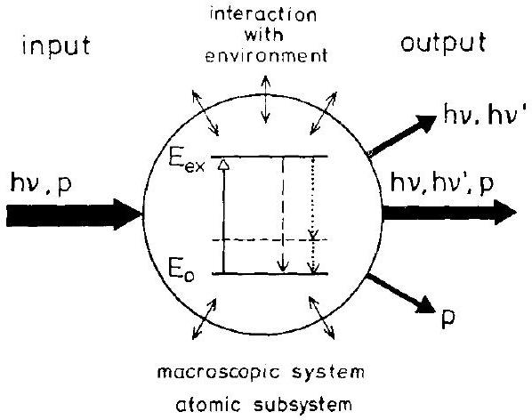
Figure 16-1. Basic scheme of spectroscopic measurements. $p=$ particle, $E=$ energy state.

determines the respective intensities, we can thus measure their concentrations. If, in addition, we can achieve a sufficient spatial and temporal resolution, then the basic kinetic quantity $c_{i}(\xi, t)$ can be determined, this being our ultimate goal.

We will not discuss microscopy and structure determinations since special monographs are available. Let us mention, however, that hot stages are available these days which allow imaging and diffraction work to be done at high temperatures. The limits for high spatial resolution are often not set by the temperature but rather by the ambient atmospheres. For example, the electron probe beam requires vacuum, whereas the component chemical potentials of a sample are undefined in a vacuum.

The (electromagnetic) spectrum of photons is subdivided as follows: radiowaves, microwaves, infrared, visible, and ultraviolet radiation, X-rays, and $\gamma$-rays. The corresponding energies range from $10^{-10} \mathrm{eV}$ to 1 eV in the visible region, and to $10^{6} \mathrm{eV}$ for $y$-rays. The corresponding wavelengths range from $10^{+6} \mathrm{~cm}$ to $10^{-10} \mathrm{~cm}$. Examples for the DeBroglie wavelengths of particles are: 1) for 150 eV electrons $\lambda_{e}=1 \AA$, the corresponding velocity is $v_{e}=7.25 \times 10^{8} \mathrm{~cm} \mathrm{~s}^{-1}$; 2) for neutrons with room temperature thermal energy ( $=0.025 \mathrm{eV}$ ), $\lambda_{n}=1 \AA$ and $v_{n}=3 \times 10^{5} \mathrm{~cm} \mathrm{~s}^{-1}$. We conclude that X-rays, electrons, and neutrons can be used to look into the (periodic) structure of crystals (elastic scattering, diffraction) since their wavelengths are compatible with the lattice dimensions. Inelastic interactions with the phonons, however, cannot be immediately detected by X-rays since their energy is $10^{5}-10^{6}$ times larger than the phonon energy.

Various properties of crystals can be used to inspect $c_{i}(\xi, t)$, provided that appropriate detectors for the intensity of input and output signals are available. If the monitor response is sufficiently fast, one may determine the time dependence of solid state reactions. The monitoring of reactants and/or reaction products can serve this purpose, but the relation between signal intensity (property) and concentration ( $c_{i}$ ) must always be established first. Since functions of state are related to one another in a unique way, any equilibrium property can, in principle, be used to determine $c_{i}(\xi, t)$. However, the necessary assumption of local equilibrium must still be verified. Since input signals always disturb the local equilibrium in one way or another, we also have to assure that the disturbances due to these signals do not interfere with the kinetic processes being studied.

This chapter will be organized in the following way. The next section will discuss in-situ measurements of the most common thermodynamic parameters such as $P, V, \mu_{i}$, etc. as they relate to the study of reaction kinetics. If one of the reactants or product(s) is gaseous, classical methods of chemical analysis like gravimetry, manometry, or volumetry can be adapted. This field of research is methodologically well developed because of its practical importance in metal oxidation. However, we cannot obtain information on the spatial distribution of components nor the product morphology unless miniaturized sensors can be constructed. Intensive thermodynamic quantities such as $T, P$, and $\mu_{i}$ are measured at equilibrium between the sensor and the system under study. Even a small sensor has a finite 'buffer capacity' and therefore disturbs the local equilibrium to some extent. Thus, the contact area of the sensor is not the only parameter which limits the spatial resolution. Although temperature and pressure sensors are common in modern technology, they will not be treated. Less known are relatively high spatial resolution chemical potential sensors which can be used at elevated temperature. The basic device is a tiny solid state galvanic cell employing a solid electrolyte. Details are given in Section 16.3.2.

However, the main body of in-situ methods for the study of solid state kinetics makes use of electromagnetic radiation and is discussed in Section 16.4. The use of particle radiation, as described in Section 16.5, is less frequent. Both imaging of the reaction geometry and the determination of the concentration distributions of $c_{i}(\xi, t)$ by spectroscopic methods - insofar as they can be adapted to high temperatures are possible. The absorption coefficients of photons and especially of particles are often quite high for condensed matter. In these cases, only near-surface phenomena can be detected. They may not be indicative of bulk properties and thus not suitable for the study of bulk reactions. In-situ application of IR and visible light spectroscopy at high temperatures is difficult due to the intense background radiation of the reacting sample and its surroundings. In conclusion, we emphasize that the content of this chapter is not meant to introduce any instrumentation but rather to critically discuss the possibilities of in-situ kinetic studies by modern experimental tools.

### 16.2 Thermogravimetry, -manometry, -volumetry, -analysis

The common feature of these established experimental methods is their ability to detect changes in the mass ( $\Delta m(t)$ ) and/or heat ( $\Delta q(t)$ ) of a reacting system. Let us begin the discussion with thermogravimetry, since it clearly illustrates the philosophy of the essentially thermodynamic methods.

### 16.2.1 Thermogravimetry

The schematic set-up for a thermogravimetric experiment is shown in Figure 16-2. The device is a combination of a sophisticated high temperature furnace (with temperature and gas atmosphere control) and a micro-balance. Since it is meant to

Figure 16-2. Principle of a high temperature balance with controlled gas atmospheres.
1) Thermocouple, 2) heating element, 3) cooling coils, 4) gas inlet, 5) gas outlet, 6,7) potential sensors.

register weight changes ( $\Delta m(t)$ ), at least one component of the solid state reaction must be volatile. The recorded quantity is the (integral) mass change due to transport across the sample surface. The following solid state processes can be studied in-situ. a) Solubility and transport kinetics of gases dissolved in solids, especially changes in the non-stoichiometry $\delta$ of compounds such as $\mathrm{Ag}_{1-\delta} \mathrm{X}$. b) Oxidation of metals or other oxidizable solids. c) Carburization (and analogous) reactions (e.g., $\left.\mathrm{AX}+\mathrm{CO}(\mathrm{g})=\mathrm{AX}(\mathrm{C})+\mathrm{CO}_{2}(g)\right)$. d) Reactions between non-stoichiometric solids (e.g., $\mathrm{AX}_{1+\delta_{\mathrm{A}}}+\mathrm{BX}_{1+\delta_{\mathrm{B}}}=\mathrm{ABX}_{2+\delta}+\frac{1}{2}\left(\delta_{\mathrm{A}}+\delta_{\mathrm{B}}-\delta\right) \cdot \mathrm{X}_{2}(\mathrm{~g}), \delta \neq \delta_{\mathrm{A}}+\delta_{\mathrm{B}}$ ). Note that these reactions have to be performed as powder reactions if $\delta_{i} \ll 1$ in order to provide sufficiently large contact areas. Although powder reactions are of great practical importance, they do not yield accurate information about reaction mechanisms because of their complex boundary conditions. e) Similar to d), interdiffusion processes in solid solutions (e.g., $N \cdot \mathrm{AX}_{1+\delta_{\mathrm{A}}}+(1-N) \cdot \mathrm{BX}_{1+\delta_{\mathrm{B}}}=(\mathrm{A}, \mathrm{B}) \mathrm{X}_{1+\delta}+1 / 2 \left.\left[N \cdot \delta_{\mathrm{A}}+(1-N) \cdot \delta_{\mathrm{B}}-\delta\right] \cdot \mathrm{X}_{2}(\mathrm{~g}), \delta \neq \delta_{\mathrm{A}}+\delta_{\mathrm{B}}\right)$.

There are a number of limitations to thermogravimetry. 1) If the sensitivity of the balance is $10^{-6} \mathrm{~g}$, and the sample weight is 1 g , a change of some $10^{-8} \mathrm{~mol}$ should theoretically be detectable. However, convection and thermodiffusion in the ambient atmosphere limits the sensitivity to $10^{-5}-10^{-6} \mathrm{~mol}$, depending somewhat on temperature ( $<1500^{\circ} \mathrm{C}$ ). 2) Reaction kinetics are normally investigated under isothermal and isobaric conditions. The start of a reaction by heating the balance to temperature or by changing the partial pressure is never sudden and often not well defined. 3) Exploring the reaction kinetics with a predetermined temperature program is useful in a quantitative sense only if we already have some knowledge of the reaction mechanisms and rate laws.

### 16.2.2 Thermomanometry, Thermovolumetry

These experimental methods give information similar to thermogravimetry. Changes in the gas phase surrounding a sample are probed when the gaseous reaction partner is liberated or consumed during the solid state reaction. This can be done either at

Figure 16-3. Principle of a tensiometric set-up for monitoring in-situ solid state reactions [J. Janek (1992)]. 1) Gas pressure gauge, 2) gas supply, 3) vacuum pump, 4) registration electronics, 5) furnace.

constant gas volume, by probing the pressure change (tensiometry), or at constant pressure by measuring the volume change. Figure 16-3 illustrates a tensiometric set-up. Tensiometry is preferred to volumetry since the measurement of the intensive variable $(\Delta P)$ is, in principle, easier and often more accurate than the registration of the extensive variable $\Delta V$. Tensiometry is able to detect changes $\Delta n(t)$ (in-situ and continuously) on the order of $10^{-8} \mathrm{~mol}$. If properly devised, the measurements are relatively insensitive to small temperature fluctuations. Again, we observe that concentration distributions in the sample cannot be deduced from these integral $\Delta n(t)$ measurements unless we have independent knowledge about the transport mechanism.

A variation of in-situ volumetry (or manometry) is its combination with high temperature coulometry as shown in Figure 16-4. The $\Delta n(t)$ change in the gas volume due to the reaction is compensated for by a corresponding flux of ions across an appropriate solid electrolyte. This coulometric transport is potentiostatically controlled with a reference electrode (Fig. 16-4). Since $10 \mu \mathrm{~A}$ times $1 \mathrm{~s}=10 \mu \mathrm{C}$ corresponds to ca. $10^{-11} \mathrm{~mol}$, the sensitivity of the combined volumetry-coulometry matches that of tensiometry. Limitations of this method are leaks and the small electronic transference in the electrolyte.

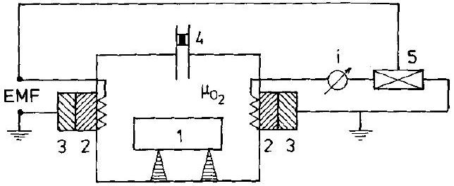
Figure 16-4. A combined volumetriccoulometric set-up for monitoring in-situ solid state reactions [U. Hölscher (1983)]. 1) Reaction sample, 2) solid electrolyte $\left(\mathrm{ZrO}_{2}(\mathrm{MeO})\right)$, 3) (reference, working) electrodes, 4) manometer, 5) potentiostat.

### 16.2.3 Thermal Analysis

Thermal analysis probes the enthalpy change of a reacting solid as a function of time, which is time-resolved calorimetry. In order to enhance the low solid state reaction rates of the reaction couples, the calorimeter has to operate at elevated tempera-
tures. High temperature calorimetry is a sophisticated and delicate experimental method. The time resolution of the calorimeter is always determined by its dimensions and by heat conduction. Relaxation times of enthalpic processes which are smaller than ca. 1 s cannot be determined calorimetrically. The advantage of thermal analysis is that it gives immediate insight into the energetics of solid state reactions. The disadvantage is the spatial integration of the heat effects.

Heat effects as such are rather unspecific, especially if the nature of the reactions taking place in the calorimeter is not known. The combination of thermal analysis with chemical analysis (for example with a thermobalance (DTG) or a mass spectrometer which register the rate of advancement of the reaction) enables us to arrive at specific caloric data (i.e., $\Delta H / \Delta n_{i}$ ). Absolute values of $\Delta H$ are obtained by calibration only.

Differential scanning calorimeters (DSC) register heat effects during a programmed temperature change. DSC is a common method to screen possible reactions in complex systems. However, from a thermodynamic point of view, the results are only meaningful if the system undergoes a sequence of equilibrium states during a correspondingly slow change in temperature. One therefore must not only be careful in devising the rate of annealing (cooling) but also cautious in the interpretation of exothermic and endothermic heat effects registered by DSC. The following reactions are often studied in this way: phase transitions (including glass transitions and melting), decomposition, combustion, oxidation, and reduction. The classical solid state reactions (e.g., formation of double salts) are difficult to follow in view of their sluggish reaction rates unless they are conducted in the form of powder reactions.

DSC and related methods (differential thermal analysis, DTA) are of great practical importance. Therefore, one finds highly sophisticated commercial instruments for a variety of applications. DTA has been combined with in-situ emf and Knudsencell measurements. The interested reader is referred to the special literature on this subject [M.E. Brown (1988)].

### 16.3 Electrochemical Measurements

### 16.3.1 Introductory Remarks

With electrochemical methods, we determine thermodynamic potentials of components in systems which contain a sufficiently large number of atomic particles. Since the systematic investigation of solid electrolytes in the early 1920's, it is possible to change the mole number of a component in a crystal via the corresponding flux across an appropriate electrolyte ( 1 mA times 1 s corresponds to $c a .10^{-8} \mathrm{~mol}$ ). Simultaneously, the chemical potential of the component can be determined with the same set-up under open circuit conditions. Provided both the response time and the buffer capacity of the galvanic cells are sufficiently small, we can then also register the time dependence of the component chemical potentials in the reacting solids.

A solid state galvanic cell consists of electrodes and the electrolyte. Solid electrolytes are available for many different mobile ions (see Section 15.3). Their ionic conductivities compare with those of liquid electrolytes (see Fig. 15-8). Under load, galvanic cells transport a known amount of component from one electrode to the other. Therefore, we can predetermine the kinetic boundary condition for transport into a solid (i.e, the electrode). By using a reference electrode we can simultaneously determine the component activity. The combination of component transfer and potential determination is called coulometric titration. It is a most useful method for the thermodynamic and kinetic investigation of compounds with narrow homogeneity ranges. For example, it has been possible to measure $\mu_{\mathrm{Ag}}(\xi, t)$ in a crystal of $\mathrm{Ag}_{2+\delta} \mathrm{S}$ as a function of time and position even though $\delta$ is only on the order of $10^{-3}$.

In equilibrium, the chemical potential of the neutral A component at the electrode/ AX electrolyte interface is $\mu_{\mathrm{A}}=\eta_{\mathrm{A}}=\eta_{\mathrm{A}^{+}}+\eta_{\mathrm{e}}$. The driving force $\nabla \eta_{\mathrm{A}^{+}}$in the electrolyte vanishes under open circuit conditions. Therefore, the difference in chemical potential between the two electrodes of the galvanic cell translates into $\Delta \mu_{\mathrm{A}}=\Delta \eta_{\mathrm{e}}=\Delta \mu_{\mathrm{e}}-F \cdot \Delta \varphi=-F \cdot \Delta \varphi$, which is true because the chemical potential of the electrons in the identical leads contacting the electrodes is the same ( $\Delta \mu_{\mathrm{e}}=0$ ).

### 16.3.2 Chemical Potential Sensors

In this section, we describe time-resolved, local in-situ measurements of chemical potentials $\mu_{i}(\xi, t)$ with solid galvanic cells. It seems as if the possibilities of this method have not yet been fully exploited. We note that the spatial resolution of the determination of composition is by far better than that of the chemical potential. The high spatial resolution is achieved by electron microbeam analysis, analytical transmission electron microscopy, and tunneling electron microscopy. Little progress, however, has been made in improving the spatial resolution of the determination of chemical potentials. The conventional application of solid galvanic cells in kinetics is completely analogous to the time-dependent (partial) pressure determination as explained in Section 16.2.2. Spatially resolved measurements are not possible in this way.

If, however, solid electrolytes remain stable when in direct contact with the reacting solid to be probed, direct in-situ determinations of $\mu_{i}(\xi, t)$ are possible by spatially resolved emf measurements with miniaturized galvanic cells. Obviously, the response time of the sensor must be shorter than the characteristic time of the process to be investigated. Since the probing is confined to the contact area between sensor and sample surface, we cannot determine the component activities in the interior of a sample. This is in contrast to liquid systems where capillaries filled with a liquid electrolyte can be inserted. In order to equilibrate, the contacting sensor always perturbs the system to be measured. The perturbation capacity of a sensor and its individual response time are related to each other. However, the main limitation for the application of high-temperature solid emf sensors is their lack of chemical stability.

Figure 16-5. Basic in-situ experiment to detect $\mu_{i}(\xi, t)$ with the help of a miniaturized solid electrolyte (emf probe). ( $i, k$ ) is a metallic or semiconducting solid solution which forms from the components $i$ and $k$. $(i j)=$ reference electrode, $i \mathrm{X}=$ electrolyte.

Let us consider the situation illustrated in Figure 16-5. The reacting system is assumed to be a metal or a semiconductor ( $t_{\mathrm{e}} \cong 1$ ), one component of which is $i$. We wish to register its chemical potential as a function of $\xi$ and $t$. To this end we contact the sample at coordinate $\xi$ with a tiny solid galvanic cell, which is a combination of an electrolyte $i \mathrm{X}$ and reference electrode ( $i, j$ ). Thus, an emf is generated in the cell $(i, j) / i \mathrm{X} /(i, k)$. The diameter of the galvanic contact can be as low as a few $\mu \mathrm{m}$. The transference number of electrons in the electrolyte is necessarily $\ll 1$, which implies an extremely small deviation from the stoichiometric composition. Therefore, the buffer capacity ( $\partial n_{i} / \partial \mu_{i}$ ) of the electrolyte and thus its perturbation capacity is correspondingly small. For proper operation of the sensor it is necessary that all other components $k$ in the system under investigation do not displace component $i$ in the electrolyte by chemical reaction, which requires that $\left|\Delta G_{k \mathrm{X}}^{0}\right| \ll\left|\Delta G_{i \mathrm{X}}^{0}\right|$.

The width of the homogeneity range of the reacting system is of equal importance for the accuracy of the emf data. As long as the system $(i, k)$ forms an extended solid solution, the buffer capacity of the solid galvanic cell is irrelevant. If, however, ( $i, k$ ) is of narrow homogeneity range, the perturbation capacity of the sensor disturbs the local composition of ( $i, k$ ). Therefore, the volume ( $\sim$ buffer capacity) of the ( $i, j$ ) $/ i \mathrm{X}$ sensor must be correspondingly small. This and other contact problems could be avoided by allowing a small gas gap between the system and the sensor, but then slow gas-solid interface reactions may interfere. Another inherent problem of miniaturized sensors is the contact pressure, which may reach the yield strength of the participating solids. The contact pressure $P$ changes the local chemical potential by $V_{i} \cdot P$.

Two kinetic applications of solid sensors are illustrated in Figure 16-6. In the first case, transport controls the activity of A at the surface of the solvent B where the sensor is located. If A is sufficiently diluted

$$
E(t)=(R T / F) \cdot \ln a(t)=(R T / F) \cdot \ln \left(N_{\mathrm{A}}(t) / N_{\mathrm{A}}^{0}\right)
$$

In Figure 16-6b, the interface at $\xi=0$ controls the reaction kinetics. If $L$ denotes the interface conductivity coefficient, the rate of A uptake is given by $L \cdot \Delta \mu_{\mathrm{A}}(\xi=0)$. For long times, the sensor registers a first order rate law: $E(t) \sim \mathrm{e}^{-t / \tau}, \tau= \left(c_{\mathrm{A}}^{0} \cdot \Delta \xi\right) /(L \cdot R T)$. This result is obtained for the linear geometry of Figure 16-6. In this context, we mention the $\alpha \rightarrow \beta$ transformation of $\mathrm{Ag}_{2} \mathrm{~S}$ as discussed in Sec-

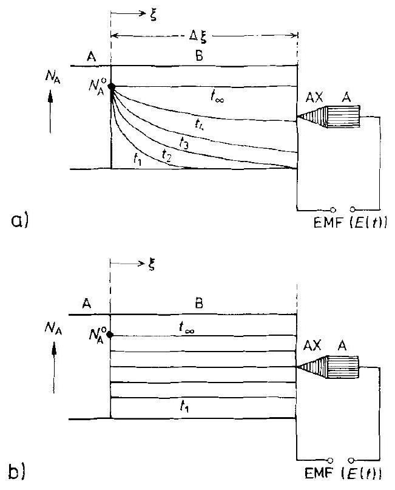
Figure 16-6. Electrochemical set-up for the registration of a) the diffusion controlled dissolution of A in B ; b) an interface controlled dissolution of A in B . At $\xi=\Delta \xi$, $\mu_{\mathrm{A}}(t)$ is determined by a solid emf probe. $\mathrm{AX}=$ electrolyte.

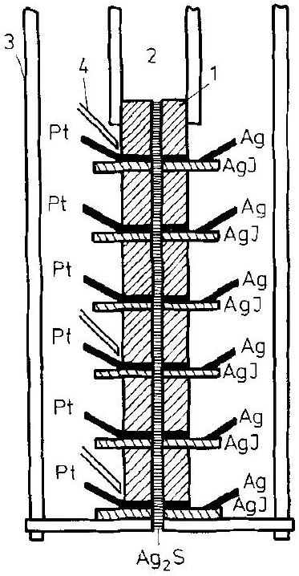
Figure 16-7. Set-up for the electrochemical in-situ determination of $\mu_{\mathrm{Ag}}(\xi, t)$ during the $\beta \rightarrow \alpha-\mathrm{Ag}_{2} \mathrm{~S}$ phase transformation. Miniaturized solid emf probes ( $\mathrm{Ag} / \mathrm{AgI}$ ) are located along the transforming crystal [H.J. Reye (1979)]. 1) Glass capillary, 2) sulfur chamber for the growth of $\mathrm{Ag}_{2} \mathrm{~S}$, 3) furnace, 4) thermocouples.

tion 12.3.1. Miniaturized $\mathrm{Ag} / \mathrm{AgI}$ solid galvanic sensors followed the transformation kinetics of the crystal during cooling as illustrated in Figure 16-7. Figure 12-9 informs about the resulting emf vs. $t$ curves.

Another example is shown in Figure 16-8. This in-situ measurement determines the immediate driving force for the transport of $\mathrm{Ag}^{+}$ions across the $\mathrm{AgI} / \mathrm{Ag}_{2} \mathrm{~S}$ inter-

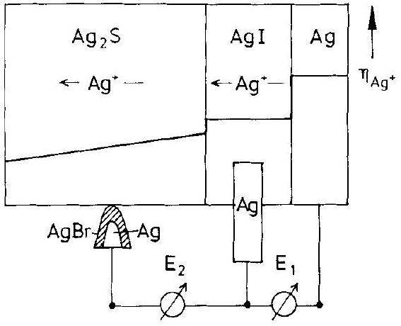
Figure 16-8. Electrochemical device for the determination of the driving force $\Delta \mu_{\mathrm{Ag}}\left(=\Delta \eta_{\mathrm{Ag}}, \mathrm{E}_{2}\right)$ if $\mathrm{Ag}^{+}$ions are transferred across the $\mathrm{AgI} / \mathrm{Ag}_{2} \mathrm{~S}$ interface [H. Schmalzried, et al. (1992); H. Wysk (1995)].

face. The miniaturized sensors with a tip radius on the order of $10 \mu \mathrm{~m}$ were placed close to the $\mathrm{AgI} / \mathrm{Ag}_{2} \mathrm{~S}$ interface. The chemical potential drop of Ag across the interface was determined as a function of the $\mathrm{Ag}^{+}$current density (see Section 10.3). Such emf measurements have also been made to follow relaxation processes in glasses on their way to metastable equilibrium [R. Bormann, K. Zöltzer (1992)].

The contact area of an emf miniprobe is on the order of $10^{-6} \mathrm{~cm}^{2}$. Since the emf is on the order of one volt, current densities on the order of $10^{-3} \mathrm{~A} \mathrm{~cm}^{-2}$ occur if the resistance of the circuit is $10^{9} \Omega$. Current densities of this magnitude can seriously disturb the equilibrium chemical potentials to be measured in the sample unless concentration and diffusivity guarantee a sufficiently high transport coefficient. A quantitative discussion of this problem is available [M. Ullrich (1990)].

### 16.4 Spectroscopic Methods: Nuclear Spectroscopy

### 16.4.1 Introduction

Spectroscopic methods have the greatest potential for in-situ investigations of solid state kinetics ( $c_{i}(\xi, t)$ ) and the underlying microscopic dynamics since they essentially probe local interactions. Many of the conventional spectroscopies have to be adapted to in-situ measurements at high temperatures, which often poses severe experimental problems. Seen only from an energetic point of view, input signals below 0.1 eV do not noticeably change the translational energy of mobile structure elements in a non-equilibrium solid at high temperatures and thus cannot immediately influence the course of a solid state reaction ( $h v<k T$ ). We conclude that radiation chemistry (see also Chapter 13 and Table 16-1) begins essentially in the visible and UV regions of the spectrum. Even if the energy balance is met, the momentum balance normally forbids the immediate knock-on of structure elements by photons.

Table 16-1. Electromagnetic spectroscopy

| Energy: $E[\mathrm{eV}]$ |  |  |  |  |  |  |  |
| :--- | :--- | :--- | :--- | :--- | :--- | :--- | :--- |
| $(\times 96485 \Rightarrow \mathrm{~J} / \mathrm{mol})$ | $10^{-7}$ | $10^{-5}$ | $10^{-2}$ | $10^{-1}$ | $10^{1}$ | $10^{3}$ | $>10^{3}$ |
| $T[\mathrm{~K}](\therefore k T)$ | $1.16 \times 10^{-3}$ | $1.16 \times 10^{-1}$ | $1.16 \times 10^{2}$ | $1.16 \times 10^{3}$ | $1.16 \times 10^{5}$ | $1.16 \times 10^{7}$ | $>10^{7}$ |
| $v[\mathrm{~Hz}]($ 스 $h \cdot v)$ | $2.4 \times 10^{-7}$ | $2.4 \times 10^{9}$ | $2.4 \times 10^{12}$ | $2.4 \times 10^{13}$ | $2.4 \times 10^{15}$ | $2.4 \times 10^{17}$ | $>10^{17}$ |
| $\lambda[\mathrm{cm}]\left(\triangleq \frac{h \cdot \mathrm{c}^{0}}{\lambda}\right)$ | $1.24 \times 10^{3}$ | $1.24 \times 10^{1}$ | $1.24 \times 10^{-2}$ | $1.24 \times 10^{-3}$ | $1.24 \times 10^{-5}$ | $1.24 \times 10^{-7}$ | $<10^{-7}$ |
| Radiation | radio | micro | IR | VIS | UV | X | $\gamma$ |
| Atomic subsystem transitions | nuclear spins | electron spins | rotation vibration | outer shell electrons |  | inner shell electrons | nuclei |
| Primary quantity measured | local interactions (magnetic, electric field gradient) |  | atomic, molecular potentials | energy levels |  | energy levels | energy levels |
| Kinetic parameter detected | diffusional atomic motions |  | vibrational frequencies | macroscopic, real time kinetic coefficients, point defect concentrations |  |  |  |
| Effects on reactivity |  |  | transport activation by heat | photochemistry |  | radiation chemistry |  |
| Characteristic sample dimension [cm] | $10^{-1}-10^{0}$ | $10^{-2}-10^{-1}$ | ca. $10^{0}$ | $10^{-4}-10^{0}$ |  | $10^{-2} \left(\mathrm{Al}, 10^{4} \mathrm{eV}\right)$ | $10^{-3}(\mathrm{Fe}(\mathrm{MS})) 10^{-1}(\operatorname{In}(\mathrm{PAC}))$ |
| Examples of methods | NMR | ESR | Raman | absorption spectroscopy |  | XAS | Mößbauer, PAC |

If high temperatures eventually lead to an almost equal population of the ground and excited states of spectroscopically active structure elements, their absorption and emission may be quite weak, particularly if relaxation processes between these states are slow. The spectroscopic methods covered in Table 16-1 are numerous and not equally suited for the study of solid state kinetics. The number of methods increases considerably if we include particle radiation (electrons, neutrons, protons, atoms, or ions). We note that the output radiation is not necessarily of the same type as the input radiation (e.g., in photoelectron spectroscopy). Therefore, we have to restrict this discussion to some relevant methods and examples which demonstrate the applicability of in-situ spectroscopy to kinetic investigations at high temperature. Let us begin with nuclear spectroscopies in which nuclear energy levels are probed. Later we will turn to those methods in which electronic states are involved (e.g., UV, VIS, and IR spectroscopies).

### 16.4.2 Physical Background

Nuclei provide a large number of spectroscopic probes for the investigation of solid state reaction kinetics. At the same time these probes allow us to look into the atomic dynamics under in-situ conditions. However, the experimental and theoretical methods needed to obtain relevant results in chemical kinetics, and particularly in atomic dynamics, are rather laborious. Due to characteristic hyperfine interactions, nuclear spectroscopies can, in principle, identify atomic particles and furthermore distinguish between different SE's of the same chemical component on different lattice sites. In addition to the analytical aspect of these techniques, nuclear spectroscopy informs about the microscopic motion of the nuclear probes. In Table 16-2 the 'time windows' for the different methods are outlined.

PAD (perturbed angular distribution) is a variation of PAC with nuclear excitation by a particle beam from an accelerator. QMS is quasielastic Mößbauer-spectroscopy, QNS is quasielastic neutron spectroscopy. For Mößbauer spectroscopy (MS), perturbed angular correlation (PAC), and $\beta$-nuclear magnetic resonance ( $\beta$-NMR), the accessible SE jump frequencies are determined by the life time ( $\tau_{\mathrm{N}}$ ) of the nuclear states involved in the spectroscopic process. Since NMR is a resonance method, the resonance frequency of the experiment sets the time window. With neutron scattering, the time window is determined by the possible energy resolution of the spectrometer as explained later.

In Table 16-2, the time scale for elementary activated motion is given in the first place. It is converted into an energy scale by virtue of the $E=(2 \pi \cdot \hbar / t)$ relation. If we assume that the atomic jump length $a$ is $2 \AA$, the time scale may be converted into a diffusion coefficient scale by $D=a^{2} /(2 \cdot t)$. One notes that (with the exception of $\beta$-NMR) nuclear spectroscopies monitor the atomic jump behavior of relatively fast diffusing species.

The higher the photon energy, the smaller are in general absorption coefficients and the less severe are absorption problems, which simplifies the design of experiments. If radioactive (probe) nuclei can be embedded into the sample crystal (as is the case with PAC), no external radiation is needed for the investigation of solid state

Table 16-2. The time-, energy-, and diffusivity ranges for various nuclear methods [W. Petry, G. Vogl (1987)]
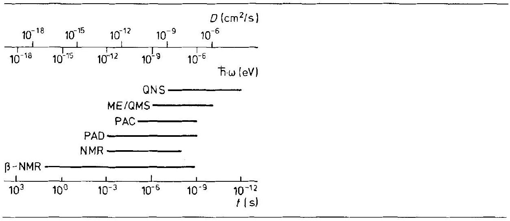

processes. The concentration of decaying nuclei (Table 16-3) can sometimes be kept so low that for all practical purposes the nuclei may be regarded as isolated probes.

Table 16-3 gives some more information on nuclei used in spectroscopy. When the kinetic problem dictates small dimensions of the sample (e.g., in thin film oxidation), the concentration needed to apply a nuclear spectroscopy may be considerably higher than indicated in Table 16-3.

Table 16-3. Comparison between different nuclear spectroscopies
|  | Number of available nuclei | Isotope fraction |
| :--- | :--- | :--- |
| NMR | > 10 | $10^{-2}$ |
| $\beta$-NMR | few | $<10^{-6}$ |
| MS | few | $10^{-6}$ |
| PAC | few | $10^{-6}$ |
| QMS | ${ }^{57} \mathrm{Fe}$ | $10^{-5}$ |
| QNS | >10 | $10^{-2}$ |

Let us start with NMR, which is an indispensable tool for structural and kinetic research in chemistry. In the simplest type of NMR experiment, the sample containing the appropriate isotope nuclei ( e.g., ${ }^{19} \mathrm{~F}$ in $\mathrm{PbF}_{2}$ ) is brought into an external magnetic field $B_{0}$. This field splits the spin-degenerate state of the nuclei (hyperfine interaction) such that $\Delta E=\gamma \cdot h \cdot \bar{B}_{0} . \bar{B}_{0}$ indicates the internal magnetic field at the probe nucleus. In thermal equilibrium, the different spin states are slightly differently populated. If this equilibrium distribution is perturbed, for example, by absorption of a radio wave pulse, the system returns to equilibrium by relaxation, recovering its initial (macroscopic) magnetic moment in the external field $B_{0}$. Atomistically, the spin system of the sample transfers the absorbed energy to the surroundings (the
'lattice'). This transfer occurs most effectively if $\omega_{0}=\Delta E / \hbar$ and the fluctuation frequency of the 'lattice' are of the same order of magnitude.

Let us assume that the 'lattice fluctuations' are due to diffusional hopping of the atomic probes via point defects. Hopping of nuclear magnetic dipole moments induces a noise spectrum in the local magnetic field with a wide frequency range. The spectral density $J(\omega)$ of this noise at $\omega_{0}$ determines the inverse relaxation time. The spectral density curve broadens with increasing temperature as shown in Figure 16-9a. Therefore, if $\omega_{0}$ is properly chosen by predetermination of $B_{0}$, a temperature increase initially leads to an increase in $J\left(\omega_{0}\right)$ and the relaxation time decreases accordingly. With higher and higher temperature, the broadening of the spectrum results in a decrease in the spectral density $J$ at $\omega_{0}$ as shown in Figure 16-9a, and a corresponding increase in relaxation time. We conclude that the relaxation time, as a function of temperature, passes a minimum as illustrated in Figure 16-9b. Stated in more general terms: if we only consider the relaxation of the magnetic moment of the nuclear spin system in the direction of the $B_{0}$ vector and denote the corresponding relaxation time as $T_{1}$, then $1 / T_{1}$ is directly related to the spectral density $J\left(\omega_{0}\right)$, which is the Fourier transform of the autocorrelation function of the diffusional motion $G(t)$. For Markovian, memoryless behavior in an isotropic medium, $G(t)$ is a simple exponential relaxation function, that is, $G(t) \sim \mathrm{e}^{-t / \tau}$ (see also Section 5.1.3), which implies that $J(\omega) \sim \tau /\left(1+(\omega \cdot \tau)^{2}\right.$ ) has a maximum for $\omega \cdot \tau \approx 1$. Therefore, $T_{1}$ passes through a minimum (at $\omega_{0}$ ) as shown in Figure 16-9b.

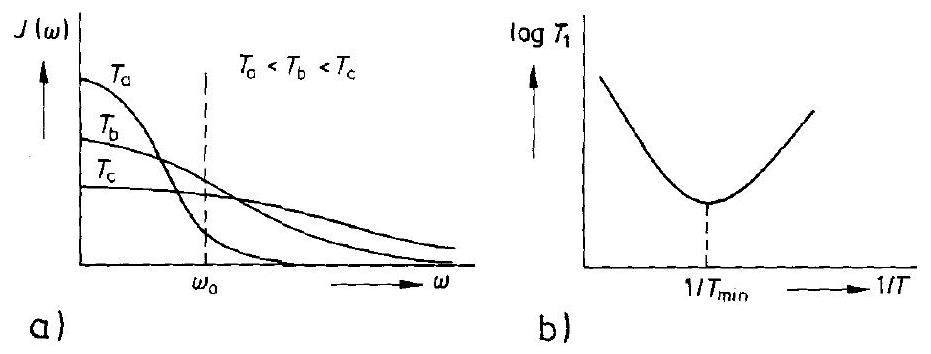
Figure 16-9. a) Spectral density $J(\omega)$ of the local magnetic dipole field at various temperatures and b) relaxation time $T_{1}$ (spin-lattice relaxation) as a function of the reciprocal temperature.

By assuming an Arrhenius type temperature relation for both the diffusional jumps and $\tau$, we can use the asymptotic behavior of $J(\omega)$ and $T_{1}$ as a function of temperature to determine the activation energy of motion (an example is given in the next section). We furthermore note that the interpretation of an NMR experiment in terms of diffusional motion requires the assumption of a defined microscopic model of atomic motion (migration) in order to obtain the correct relationships between the ensemble average of the molecular motion of the nuclear magnetic dipoles and both the spectral density and the spin-lattice relaxation time $T_{1}$. There are other relaxation times, such as the spin-spin relaxation time $T_{2}$, which describes the
time needed by the nuclear spin system to come to an 'internal' equilibrium [A. R. Allnatt, A. B. Lidiard (1993), especially p. $32 f f$ ]. Also, nuclear hyperfine interactions can be caused not only by magnetic fields but also by electric field gradients, which interact through the quadrupolar moment of the nucleus and by chemical shift interactions. Since it is not our purpose to inform about the details of the experimental techniques, we refer the reader to the extensive literature on NMR (see, for example, [A. V. Chadwick (1988); O. Kanert (1982); C. P. Slichter (1978)]). An important contribution to the microdynamics of solid state kinetics (encounter model) is given in [D. Wolf (1979)].

A variant of NMR is $\beta$-NMR. Here, the polarized spin system is formed in-situ by irradiation of the sample with polarized neutrons, $n^{*}$, which induce a nuclear reaction resulting in $\beta$-emitting nuclei. These nuclei are polarized through their formation reaction (e.g., $n^{*}+{ }^{7} \mathrm{Li} \rightarrow{ }^{8} \mathrm{Li}^{*}$ ). The angular distribution of the $\beta$-radiation is therefore strongly anisotropic. The diffusional motion of the $\beta$-emitting nuclei destroys the polarization. It leads to a loss in $\beta$-radiation anisotropy over time after a pulsed activation with polarized neutrons. The decay time of the anisotropy is a direct measure of the jump frequency of the $\beta$-radiating nuclei (or the corresponding SE).

More commonly known is Mößbauer spectroscopy (MS). Unstable nuclei (e.g., ${ }^{57} \mathrm{Fe}$ ) incorporated in a crystal lattice emit $\gamma$-rays ( 14.4 keV ) with natural line width. They can be detected by resonance absorption. Through magnetic hyperfine interaction of the Mößbauer (M) nucleus with the atomic surroundings, chemically different local neighborhoods induce different isomer shifts of the MS line. This allows us to perform analytical MS spectroscopy. For example, an M-atom A which forms a pair with a vacancy (M-V) has a different isomer shift than an (M-I) pair (I indicating impurity) relative to the M-A line of the undisturbed surroundings. This is true, for example, if the lifetime of the $\mathrm{M}-\mathrm{V}$ pair ( $\tau_{\mathrm{P}}$ ) is longer than the lifetime of the respective nuclear state. If, however, $\tau_{\mathrm{P}} \approx \tau_{\mathrm{N}}$, the two distinct lines due to (M-A) and (M-V) merge and become a single line. In principle, this merging allows us to determine the jump frequency of the vacancy ( $\nu_{\mathrm{V}}=1 / \tau_{\mathrm{N}}$ ). The same reasoning can explain the merging of lines belonging to different charge states of Mößbauer ions or of lines that are split because of quadrupolar interactions between the M -nucleus and its surroundings. Merging occurs when the hyperfine interaction at the Mößbauer nuclei fluctuates with a frequency $\nu_{\mathrm{M}} \approx 1 / \tau_{\mathrm{N}}$.

Finally, the perturbed $\gamma-\gamma$ angular correlation (PAC) nuclear method has been shown to register adequately with in-situ solid state chemical reactions, both on microscopic and macroscopic scales. The analysis of PAC is, in principle, more complicated than that of MS because two consecutive $y$-emissions and their correlation are involved in the spectroscopic process.

PAC atomic probes (e.g., ${ }^{111} \mathrm{In}$ or ${ }^{181} \mathrm{Hf}$ ) possess a nuclear quadrupole moment and a magnetic dipole. Even if no field acts on the PAC nucleus, the successive emission of the $\gamma$-photons through an intermediate state exhibits an appreciable angular anisotropy between the emission directions. If the (isolated) nucleus is then brought into a perturbing field (e.g., on a specific lattice site which is next to a vacancy), the angular anisotropy becomes time-dependent due to the precession of the nuclear spin. For example, if the PAC nucleus in the crystal is exposed to a (static) electric
field gradient ( $\nabla \hat{V}$ ) caused by its unsymmetric atomic surroundings, the temporal correlation of the successive $\gamma$-emissions is described by the perturbation function $G(t)=g_{0}+\sum_{1}^{3} g_{n} \cdot \cos \omega_{n} \cdot t$. The asymmetry parameter $\eta=\left(V_{\mathrm{XX}}-V_{\mathrm{YY}}\right) / V_{Z Z}$ of the electric field tensor is contained in $\omega_{n}$. The orientation of the field gradient in the host lattice is reflected by the $g_{n}$ values. However, if the probe atoms become mobile by thermally activated hopping, they suffer from time-dependent electric field gradients. The resulting $\gamma-\gamma$ correlation averaging leads to a change in the timedependence of the perturbation function $G(t)$ (damping) and this can be used to extract the jump frequencies of the atomic probes [H.E. Mahnke (1989); H. Frauenfelder, R.M. Steffen (1965)].

The aforementioned methods were concerned with the time-dependence of selfcorrelation functions. Thus, jump frequencies can be determined, but no information on the jump vector is obtained. As such, a comparison with macroscopic diffusion is possible only if certain assumptions about the jump lengths and jump directions are made. We note that other nuclear methods are available which allow us to determine both jump frequencies and jump vectors, such as quasi-elastic Mößbauer spectroscopy (QMS). If a single M atom jumps with frequency $1 / \tau$ and occupies different positions in the lattice during its lifetime $\tau_{n}$ (e.g., ${ }^{57} \mathrm{Fe}: 1.4 \times 10^{-7} \mathrm{~s}$ ), the absorbing resonant nucleus registers a broadening of the line width from $\Delta \nu^{0}$ to $\left(\Delta v^{0}+\delta v\right)$ since the motion of the radiating atom has a component directed with or against the emitted wave packet. $\delta v$ is proportional to $1 / \tau$, where $\tau$ is the time interval between subsequent jumps of the emitting atom (residence time). Furthermore, since jump directions in crystals are necessarily discrete, $\delta v$ also depends on both the lattice geometry and the relative orientation of the crystal to the beam. Information on jump frequencies and jump vectors can thus be extracted from QMS measurements [K. S. Singwi, A. Sjölander (1960)] as will be detailed in Section 16.6.2. It is obvious that QMS is a genuine in-situ method.

### 16.4.3 In-situ Application, Examples

1) Spin-lattice relaxation in $\mathrm{Li}_{2} \mathrm{O} \cdot \mathrm{Al}_{2} \mathrm{O}_{3} \cdot 4 \mathrm{SiO}_{2}$ glass and the corresponding crystalline phase ( $\beta$-spodumene) [W. Franke, P. Heitjans (1992)]. The rate of the spin-lattice relaxation ( $1 / T_{1}$ ) reflects the diffusional motion in the two Li conducting polymorphs and has been investigated by ${ }^{7}$ Li-NMR. Its temperature dependence is illustrated in Figure 16-10. For both glass and crystal, pronounced diffusion induced ( $1 / T_{1}$ ) peaks have been observed. These peaks are not symmetric with respect to the reciprocal temperature, that is, the standard model for a diffusional motion induced relaxation as mentioned above cannot be valid. Furthermore, we see that the $\left(1 / T_{1}\right)$ value for the glass is only about one half of that for spodumene, which means that the coupling between the spin system and the lattice system is correspondingly smaller. The relative positions of the two maxima in Figure 16-10 and also the slopes at lower temperature indicate that the jump rate of the $\mathrm{Li}^{+}$ions is faster and the activation energy is smaller in the glass. As has already been pointed out in the previous

Figure 16-10. Spin-lattice relaxation rate ( $1 / \mathcal{T}_{1}$ ) as a function of the reciprocal temperature for $\beta$-spodumene ( $\mathrm{Li}_{2} \mathrm{O} \cdot \mathrm{Al}_{2} \mathrm{O}_{3} \cdot 4 \mathrm{SiO}_{2}$ ) and glass (---) of the same composition (after [W. Franke, P. Heitjans (1992)]).

section, the spin-lattice relaxation rate cannot immediately be compared with the elementary jump frequency during diffusion of atomic particles without a correct concept of their motional dynamics on an atomic scale. This knowledge is normally not available for complex crystal structures, and also not for glass.
2) Formation of fayalite ( 2 " FeO " $+\mathrm{SiO}_{2}=\mathrm{Fe}_{2} \mathrm{SiO}_{4}$ ) as studied by Mößbauer spectroscopy [K. D. Becker, et al. (1992)]. The growth of fayalite, $\mathrm{Fe}_{2} \mathrm{SiO}_{4}$, at $1000^{\circ} \mathrm{C}$ has been investigated as shown schematically in Figure 16-11. The structure elements of $\mathrm{Fe}^{2+}$ are present both in the wüstite and the fayalite product phase. However, their MS signals do not interfere because of the strong diffusion-broadening of the "FeO" MS line ("FeO" indicates nonstoichiometric wüstite). In-situ MS lines of the fayalite are presented as a function of reaction time in Figure 16-11a. In Figure 16-11b, the relative integral absorption intensity of the two doublet lines is given as a function of $\sqrt{t}$. The linear relation indicates the parabolic growth of fayalite. The two doublets reflect the two nonequivalent cation sites (M1, M2) in the olivine structure.
3) Fe cation diffusion in fayalite at $1130^{\circ} \mathrm{C}$ as studied by Mößbauer spectroscopy [K. D. Becker, et al. (1992)]. The iron cations are transported in fayalite via vacancies. Their concentration depends on the oxygen potential (see Section 2.3). Figure 16-12a shows the MS lines at two different oxygen potentials. With increasing $p_{\mathrm{O}_{2}}$ ( $\sim N_{V}^{1 / 6}$ ) the lines broaden in accordance with point defect thermodynamics [J. Hermeling, H. Schmalzried (1984)]. The inner doublet (M1) shows a larger linewidth than the outer doublet (M2), which indicates that the $\mathrm{Fe}^{2+}$ cations are more mobile on the M1 sites than on the M2 sites. Neglecting correlation effects, we can immediately derive the Fe diffusion coefficients $D_{\mathrm{Fe}}$ from the line-broadening, as was pointed out in the previous section. $D_{\mathrm{Fe}}$ is given in Figure 16-12b as a function of $\mu_{\mathrm{O}_{2}}\left(\sim \log p_{\mathrm{O}_{2}}\right)$.

By extrapolating $D_{\mathrm{Fe}}$ to $1000^{\circ} \mathrm{C}$, we can calculate the parabolic rate constant $k_{\mathrm{p}}$ (see Eqn. (6.30)) and compare it with the experimental value derived from Figure 16-10b. From this comparison, it seems as if $\mathrm{Fe}^{2+}$ is the rate determining cation for the formation of fayalite by solid state reaction. Since we conclude from Section 15.2.2 that $D_{\mathrm{Si}} \ll D_{\mathrm{O}} \ll D_{\mathrm{Fe}}$ in natural olivines, it is most unlikely (in view of the

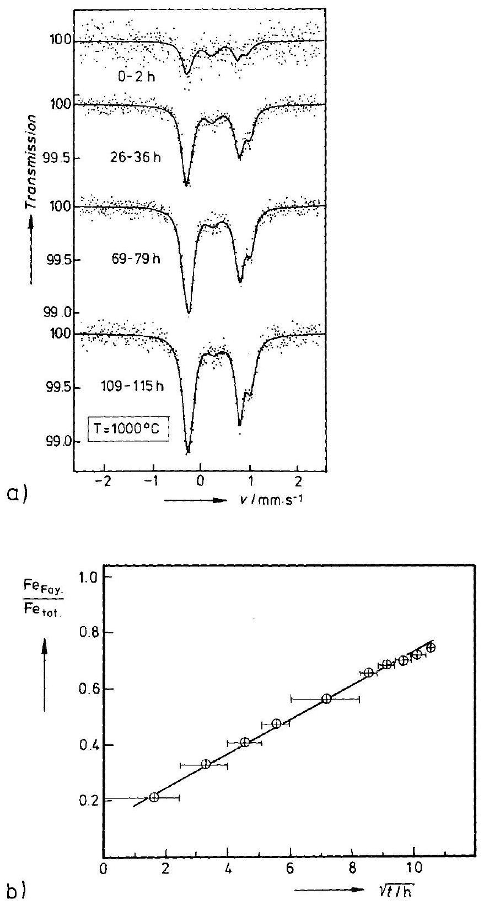
Figure 16-11. a) Time resolved in-situ Mößbauer spectra of fayalite, $\mathrm{Fe}_{2} \mathrm{SiO}_{4}$, forming from " FeO " and $\mathrm{SiO}_{2}$ after different reaction times, and b) the time dependence of the portion of Fe contained in the fayalite, as obtained from the integral intensities of the spectra in a) at $p_{\mathrm{O}_{2}}=5 \times 10^{-14}$ bar [K. D. Becker, et al. (1992)].

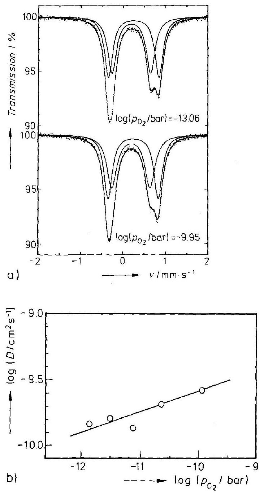
Figure 16-12. a) Mößbauer spectra of fayalite, $\mathrm{Fe}_{2} \mathrm{SiO}_{4}$, at two different oxygen potentials. b) Diffusion coefficients of iron cations as obtained from the Mösbauer spectra in a) as a function of the relative oxygen potential at $1130^{\circ} \mathrm{C}$ [K. D. Becker, et al. (1992)].

experimental value of $k_{\mathrm{p}}$ ) that $\mathrm{Fe}_{2} \mathrm{SiO}_{4}$ is formed by the simultaneous coupled diffusion of $\mathrm{Fe}^{2+}$ and $\mathrm{O}^{2-}$ across the $\mathrm{Fe}_{2} \mathrm{SiO}_{4}$ product layer. This flux coupling should lead to a far lower $k_{\mathrm{p}}$ value as determined by the slow oxygen ion diffusion. Obviously, other transport mechanisms have to be evoked in order to explain these experimental results.

# 16.5 Spectroscopic Methods:   Electromagnetic (IR, VIS, UV, X-ray) Spectroscopy 

### 16.5.1 Introduction

This section is concerned with the transitions between electronic states of atoms, ions, and molecules in crystals (Table 16-1). The corresponding spectroscopies are well known in chemical research. They primarily concern analytical work, but kinetic and even dynamic applications are frequently found as well. The instrumentation sets the lower limit to the time window ( $\approx$ femtoseconds). If the input signal is a photon and the output signal an electron (PES, UPS, XPS), one may nevertheless probe the electronic states of the target crystal. The depth of probing, however, is quite small due to the strong absorption of low energy electrons by condensed matter. This is of advantage for the study of thin films. Since the outer electron energy levels shift with the composition of their atomic surroundings, it is possible to investigate chemical reactions at regions near the surface by in-situ PES.

Bulk processes can also be probed by an appropriate photon spectroscopy. For example, EXAFS provides an excellent spatial resolution with respect to the atomic surroundings. The information from Extended X-ray Absorption Fine Structure spectroscopy is contained in the oscillations of the X-ray absorption coefficient near an absorption edge (e.g., the K- or L-edge).

Let us mention in passing that in-situ X-ray diffraction has long been used to follow solid state reactions by changes in the diffraction patterns in real time (especially in metallurgy). Heating cameras with predetermined atmospheres have been constructed. The event of high intensity synchroton radiation gave access to the study of fast reaction kinetics in the seconds and below range.

### 16.5.2 Physical Background

Remarks on the physics background will be short. The basic concepts which concern the transition of electrons between different energy levels in atoms and molecules are due to quantum theory and are extensively described in textbooks on physical chemistry. With some appropriate modifications, the principles of molecular spectroscopy can be applied to crystals by considering them as extremely large molecules. The periodicity of the crystal structure causes the electronic states to be arranged in bands separated from each other by band gaps. The electron distributions in the energy levels are governed by Fermi statistics.

If the coupling of the electrons to certain centers is strong, their spectra may be distinguished from that of the crystal as a whole (point defect color centers in ionic crystals, polarons in semiconductors). The spectra of defects can therefore be used for analytical or even kinetic investigations. In principle, it should be possible to construct devices which have, under favorable conditions, a sufficient spatial resolution to experimentally determine the basic kinetic quantity $c_{i}(\xi, t)$.

From Table 16-1, we can read that the photon energies in the spectral range in question and the thermal energies at the temperatures of the in-situ solid state kinetic experiments are comparable. Therefore, temperature changes will primarily influence the electron populations of the energy states, that is, the spectral intensities. The influence of temperature on the location of these states on the energy scale is only of second order.

### 16.5.3 In-situ Application, Examples

1) Formation of $\mathrm{CoAl}_{2} \mathrm{O}_{4}$ (spinel) from $\mathrm{Al}_{2} \mathrm{O}_{3}$ (single crystal) and CoO at $1000^{\circ} \mathrm{C}$ [K. D. Becker (1994)]. High temperature optical spectra have been registered for $\mathrm{Al}_{2} \mathrm{O}_{3}, \mathrm{CoO}$, and $\mathrm{CoAl}_{2} \mathrm{O}_{4}$. While $\mathrm{Al}_{2} \mathrm{O}_{3}$ is essentially transparent, the high temperature spectrum of CoO exhibits a monotonic increase in absorbance with photon energy. $\mathrm{CoAl}_{2} \mathrm{O}_{4}$ (spinel), however, shows a strong, triple-peak absorption at $c a$. 2.2 eV which has been assigned to the ligand-field ${ }^{4} A_{2}(\mathrm{~F}) \rightarrow{ }^{4} T_{1}(\mathrm{P})$ transition of tetrahedrally coordinated $\mathrm{Co}^{2+}$. This absorption band retains its characteristic structure at high temperatures and can thus be used to follow in-situ the spinel formation reaction using an optical spectrometer in combination with a high temperature furnace. Before the annealing reaction, a thin CoO layer has been produced by oxidation of the metallic Co evaporated on the $\mathrm{Al}_{2} \mathrm{O}_{3}$ single crystal. Figure 16-13 shows the spectra during the annealing reaction. Figure 16-13a gives the time-evolution as a function of wavelength. Figure 16-13b plots the CoO absorption intensities at 430 and 800 nm in addition to the integral intensity of the spinel signal as a function of time. We see that the linear rate law prevails for a spinel layer thickness of up to $0.6 \mu \mathrm{~m}$. The most interesting result of this experiment is the fact that the linear rate coefficient depends on the orientation of the surface of the reactant $\mathrm{Al}_{2} \mathrm{O}_{3}$. A discussion of the linear growth of solids was given in Sections 6.6 and 7.3.
2) Relaxation of cations between different sublattices. [K. D. Becker, F. Rau (1987)] studied the kinetics of the homogeneous reaction $A_{t}+B_{o}=A_{o}+B_{t}$ between the SE's in the spinel $\left(\mathrm{A}_{1-x} \mathrm{~B}_{x}\right)_{t}\left(\mathrm{~A}_{x} \mathrm{~B}_{2-x}\right)_{0} \mathrm{O}_{4}$ after perturbing the equilibrium distribution of the A and B cations on their respective sites in the tetrahedral ( t ) and octahedral (o) sublattice. The perturbation was a sudden temperature change (e.g., $T_{1}=700^{\circ} \mathrm{C} \rightarrow T_{2}=600^{\circ} \mathrm{C}$ ) and the subsequent relaxation process was measured insitu by recording the UV-VIS-NIR spectra with a spectral photometer. Figure 16-14a shows the optical transmission spectra of thin single crystals of $\mathrm{NiAl}_{2} \mathrm{O}_{4}$ at various temperatures. The characteristic feature of these spectra is the double-humped peak at ca. 640 nm , which has been ascribed to ligand-field transitions of $\mathrm{Ni}_{\mathrm{t}}^{2+}$ ions. The temperature jump was achieved by the quick shift of the sample (having a thickness of ca. $50 \mu \mathrm{~m}$ ) between two different temperature zones of a small high temperature furnace. The corresponding change of extinction with time at $\lambda=640 \mathrm{~nm}$ is given in Figure 16-14b.

The initial steep change in the extinction is ascribed to the temperature equilibration of the sample. Following this, a multi-exponential decay in the extinction is observed, indicating the complex relaxation kinetics of the homogeneous reaction between the various cationic SE's. Finally, the long-term single exponential relaxation

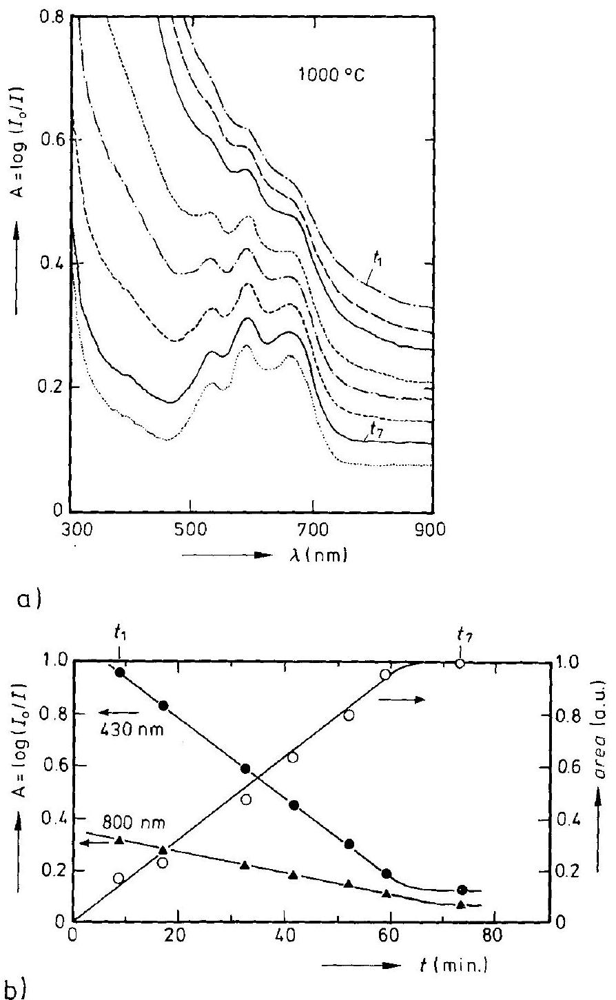
Figure 16-13. Growth of $\mathrm{CoAl}_{2} \mathrm{O}_{4}$ from CoO and $\mathrm{Al}_{2} \mathrm{O}_{3}$ at $1000^{\circ} \mathrm{C}$ in air [K. D. Becker (1994)]. a) In-situ spectra for different growth times, and b) absorbances ( $\mathbf{A}, \cdot$ ) and integral intensity ( $\bigcirc$ ) as a function of time.

time for the change of $x$ ( $=$ degree of inversion) is on the order of minutes at $700^{\circ} \mathrm{C}$, and on the order of hours at $600^{\circ} \mathrm{C}$. These SE relaxation times exhibit Arrhenius type of behavior.

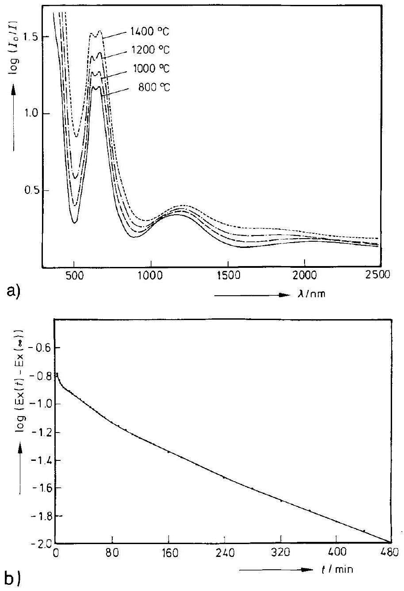
Figure 16-14. a) Optical transmission spectra of $\mathrm{NiAl}_{2} \mathrm{O}_{4}$ (single crystals) at various high temperatures. b) Relaxation of the extinction after a sudden temperature change in $\mathrm{NiAl}_{2} \mathrm{O}_{4} . T_{0}=700^{\circ} \mathrm{C}$, $T_{1}=600^{\circ} \mathrm{C}, \lambda=640 \mathrm{~nm}$ [K. D. Becker, F. Rau (1987)].

### 16.6 Particle Spectroscopy

### 16.6.1 Introduction

Electrons of 150 eV and neutrons of 0.1 eV possess a DeBroglie wavelength of about $1 \AA$, which matches the elementary lattice dimensions in crystals. The appreciable scattering cross sections for electrons causes them to be strongly absorbed and thus
able to give information primarily about the surface properties. We will therefore not treat them here.

Neutrons have no electrical charge. Compared with electrons, their scattering cross section is small. Thus, they can be used to probe bulk properties in-situ. In contrast to X-rays, neutrons may also be scattered strongly by light elements. Another advantage is the fact that neutrons with wavelengths of atomic dimensions possess energies which compare with phonon energies. This allows us to study lattice dynamics. In view of our primary interest in kinetics, we will not discuss particle diffraction (elastic scattering) for the purpose of structure investigations. We may mention, however, that it is possible by using high-fluence neutron sources to study structure changes of crystals in real time. Thus, it becomes feasible to perform in-situ measurements of solid state reactions [G. Eckold (1992); J. Pannetier (1986)]. If the construction material of the annealing furnace consists of elements with small scattering cross sections which therefore do not interfere with the neutron beam, in contrast to studies with electromagnetic radiation, we can make kinetic and dynamic investigations at high temperatures.

### 16.6.2 Physical Background

Let us direct a monochromatic beam of slow neutrons from an appropriate source (nuclear reactor) onto a target crystal. If there is constructive interference, the scattered neutron intensity consists of 1) a sharp Bragg peak, 2) tails on both sides of this peak due to quasi-elastic scattering, and 3) more or less sharp side bands due to interactions with phonons (inelastic scattering). The intensity around the Bragg peak stems from the interference between the incident beam (wave vector $k_{0}$ ) and the scattered beam (wave vector $\boldsymbol{k}$ ). There is an incoherent contribution to the scattered neutrons due to the different scattering lengths of chemically identical atoms (isotopes with different spin) in the crystal, which can be larger than the coherent portion.

As in QMS, the degree of coherence is changed if the scattering atom itself jumps (with a frequency $1 / \tau$ which is on the order of $1 / t_{n}$, where $t_{n}$ is determined by the time resolution of the spectrometer). The jumping atom transfers energy either to or from the scattered neutrons. As mentioned before, the result is a broadening ( $\delta v$ ) of the elastic line. We expect $\delta \nu$ to vary exponentially with temperature.

Intensities of coherently and incoherently scattered neutrons are described by the scattering function $S$ and have been worked out by [S. W. Lovesey (1986); K. S. Singwi, A. Sjölander (1960); R.E. Lechner, C. Riekel (1981)] as

$$
S(q, \omega)=\alpha \cdot \int \mathrm{e}^{-i \cdot \omega \cdot t} \cdot \mathrm{e}^{i(q \cdot r)} \cdot G(r, t) \cdot \mathrm{d} r \cdot \mathrm{~d} t
$$

where $\boldsymbol{q}=\left(\boldsymbol{k}-\boldsymbol{k}_{0}\right)$ is the scattering vector, $\hbar \omega$ is the transferred energy and $\hbar \cdot \boldsymbol{q}$ is the transferred momentum. Thus, the intensities are in essence Fourier transforms in space and time of the correlation function $G(r, t)$. The incoherent scattering function is directly related to the self-correlation function $G_{s}(r, t)$, that is, the probability of a particle to be at location $r$ at time $t$, if it was at $r=0$ at time $t=0$.

For a continuous diffusional motion of the scattering particles, it can be approximated by

$$
G_{\mathrm{s}}(r, t)=\frac{1}{(4 \cdot \pi \cdot D \cdot t)^{3 / 2}} \cdot \mathrm{e}^{-\frac{r^{2}}{4 \cdot D \cdot t}}
$$

For random jumps with vectors $\boldsymbol{R}_{\mathbf{n}}$ to the nearest neighbors $\mathbf{n}$, the half-width of the scattered line becomes

$$
\delta v(q)=\frac{1}{\pi \cdot \tau} \cdot\left(\frac{1}{n}-\frac{1}{n} \cdot \sum \mathrm{e}^{-i\left(q \cdot R_{\mathrm{n}}\right)}\right)
$$

Derivations from these relations can be found, for example, in [G. Schatz, A. Weidinger (1992); R. E. Lechner, C. Riekel (1981)].

In concluding this section we mention positron annihilation (PA) as a nuclear method providing information on time-dependent defect concentrations. Positrons (p) from sources such as ${ }^{22} \mathrm{Na},{ }^{58} \mathrm{Co}$, or ${ }^{64} \mathrm{Cu}$ are implanted in the crystal to be investigated. The penetration depth is $10-1000 \mu \mathrm{~m}$. After ca. 1 ps , thermalization is completed. The annihilation of the positrons by the electrons of the crystal leads to the emission of two 511 keV photons. The lifetime of a positron depends on the type of solid and amounts to $c a$. $100-300 \mathrm{ps}$. The (thermal) diffusion length in this time interval is ca. $10^{3} \AA$. Since the annihilation rate $(\sim 1 / \tau)$ is influenced by the overlap of positron and electron densities (i.e., wave functions), $\tau$ gives information on the sites where annihilation has occurred (e.g., $\tau$ (lattice) $<\tau$ (vacancy) $<\tau$ (divacancy)). Positrons in the lattice move interstitially and are strongly attracted by defects with lower 'cationic' density until they are eventually trapped. The diffusional trapping is an interesting kinetic problem of its own. Time-dependent intensities of the spectra of positron annihilation processes allow us to study the time evolution of the concentration of trapping sites (e.g., vacancy, divacancy, etc.).

### 16.6.3 Examples

1) Kinetics of the formation of a solid solution $(\mathrm{Ag}, \mathrm{Na}) \mathrm{Br}$ from the components AgBr and NaBr [G. Eckold (1992)]. The interdiffusion of silver and sodium cations in a polycrystalline mixture of AgBr and NaBr has been investigated in real time by neutron diffraction at 621 K . Figure 16-15 illustrates the scattered intensities of the (200) peak at different reaction times. Since the mixing process occurs by interdiffusion of the AgBr and NaBr reactants in a sample of compacted grains and the concentration profile of each individual $\mathrm{AgBr} / \mathrm{NaBr}$ contact is quite unsymmetric (given that $D_{\mathrm{Ag}}$ is much larger than $D_{\mathrm{Na}}$ ), it is astonishing that the spectral change could be interpreted through the change in the portions of three Gaussian curves. These curves have been attributed to $\mathrm{AgBr}, \mathrm{NaBr}$, and the solid solution crystals with the final (equilibrium) composition $\left(\mathrm{Ag}_{0.44} \mathrm{Na}_{0.56}\right) \mathrm{Br}$ respectively. In spite of these open questions of interpretation, however, we can see that it is possible to follow the diffusional reaction kinetics in real time. The same set-up could also be used to study the

Figure 16-15. Time-dependent intensity profile of the (200) reflection of ( $\mathrm{AgBr}+\mathrm{NaBr}$ ) mixtures measured during interdiffusion at 621 K . Wavelength of the scattered neutrons $\lambda_{\mathrm{n}}=2.36 \AA$ (after [G. Eckold (1992)]).

demixing of an ( $\mathrm{Ag}, \mathrm{Na}$ ) Br solid solution by cooling a homogeneous sample into the two-phase field below the critical temperature ( $T_{\text {crit }} \approx 570 \mathrm{~K}$ ).
2) Translational motion of Ag in $\mathrm{Ag}_{2} \mathrm{Se}$ at $250^{\circ} \mathrm{C}$. Examples from the literature (e.g., [R. E. Lechner, C. Riekel (1981)]) show us that neutron scattering gives information about hopping rates and the diffusional motion of atoms moving in dynamic equilibrium. Prominent objects of these studies are molecular crystals, polymers, and hydrogen in metals. The elementary mechanisms of atomic transport in fast ionic conductors have also been investigated in this way. Considering the possible practical applications to solid state electrochemistry, silver halides and chalcogenides are favorite research materials.

Figure 16-16 shows the neutron scattering spectrum of a single crystal of $\alpha-\mathrm{Ag}_{2} \mathrm{Se}$ at $250^{\circ} \mathrm{C}$. It represents the total scattering function. As in $\mathrm{Ag}_{2} \mathrm{~S}$, the silver ions are more or less homogeneously distributed over the three-dimensional system of intersecting $\langle 100\rangle$ channels. Their translations consist of two parts: the confined motion in the cage of nearest neighbors, and the motion of these cages in the channel system. With this concept, Funke [K. Funke (1989)] calculated the corresponding self-correlation function which, after Fourier transformation, was directly compared with the incoherent scattering function $S_{\text {inc }}(q, \omega)$. The calculation yields a broad spectral intensity due to the irregular motion of the Ag ions in their cages, and a much narrower quasi-elastic line which stems from the motion in the channels. Figure 16-16 obviously reflects these particular features of the model. We should, however, note that the measurement representing the total scattering cannot immediately be compared with $S_{\text {inc }}$ which is derived from the model calculation. Nevertheless, Funke

Figure 16-16. Neutron scattering spectrum of $\alpha-\mathrm{Ag}_{2} \mathrm{Se}$ single crystal at $250^{\circ} \mathrm{C}$. The solid line gives the calculated incoherent scattering (after [K. Funke (1989)]).

has shown that the measured spectrum contains all the essential features of a quasicontinuous, non-activated motion in the channels of $\mathrm{Ag}_{2} \mathrm{Se}$ and reflects both the anisotropy and the line width as a function of $\boldsymbol{q}$.

## References

Allnatt, A. R., Lidiard, A. B. (1993) Atomic Transport in Solids, Cambridge University Press, Cambridge
Becker, K. D. (1994) in Reactive Formation of Phases at Interfaces and Diffusion Processes (Eds.: F. Heurle, et al.), Trans. Techn. Publications

Becker, K. D., et al. (1992) Ber. Bunsenges. Phys. Chem., 96, 1178
Becker, K. D., Rau, F. (1987) Ber. Bunsenges. Phys. Chem., 91, 1279
Bormann, R., Zöltzer, K. (1992) Phys. Stat. Sol. (a), 131, 691
Brown, M.E. (1988) Introduction to Thermal Analysis, Chapman and Hall, New York
Chadwick, A.V. (1988) Int. Rev. Phys. Chem., 7, 251
Eckold, G. (1992) Habilitationsschrift TH Aachen, Bericht Forschungszentrum Jülich 2675
Franke, W., Heitjans, P. (1992) Ber. Bunsenges. Phys. Chem., 96, 1674
Frauenfelder, H., Steffen, R.M. (1965) in Alpha, Beta and Gamma Ray Spectroscopy, Vol. II (Ed.: K. Siegbahn). North Holland, Amsterdam

Funke, K. (1989) Ber. Bunsenges. Phys. Chem., 93, 1197
Hermeling, J., Schmalzried, H. (1984) Phys. Chem. Min., 11, 161
Hölscher, U. (1983) Ph.D.-Dissertation, Hannover University
Janek, J. (1992) Ph.D.-Dissertation, Hannover University
Kanert, O. (1982) Physics Rep., 91, 183
Lechner, R. E., Riekel, C. (1981) Z. phys. Chem., NF 128, 1
Lovesey, S. W. (1986) Theory of Neutron Scattering from Condensed Matter, Clarendon Press, Oxford
Mahnke, H. E. (1989) Hyperfine Interactions, 49, 77
Pannetier, J. (1986) Ber. Bunsenges. Phys. Chem., 90, 634
Petry, W., Vogl, G. (1987) Mat. Sci. For., 15-18, 323
Reye, H. J. (1979) Ph.D.-Dissertation, Hannover University
Schatz, G., Weidinger, A. (1992) Nukleare Festkörperphysik, Teubner Studienbücher, Stuttgart
Schmalzried, H., et al. (1992) Solid State Ionics, 51, 91

Singwi, K. S., Sjölander, A. (1960) Phys. Rev., 119, 863; 120, 1093
Slichter, C.P. (1978) Principles of Magnetic Resonance, Springer Series in Solid State Science, Berlin
Ullrich, M. (1990) Ph.D.-Dissertation, Hannover University
Wolf, D. (1979) Spin Temperature and Nuclear-Spin Relaxation in Matter, Clarendon Press, Oxford
Wysk, H. (1995) Ph.D.-Dissertation, Hannover University

