## Hermann Schmalzried

## Chemical Kinetics of Solids

© VCH Verlagsgesellschaft mbH, D-69451 Weinheim (Federal Republic of Germany), 1995

Distribution:
VCH, P. O. Box 101161, D-69451 Weinheim (Federal Republic of Germany)
Switzerland: VCH, P.O. Box, CH-4020 Basel (Switzerland)
United Kingdom and Ireland: VCH (UK) Ltd., 8 Wellington Court, Cambridge CB1 1HZ (England)
USA and Canada: VCH, 220 East 23rd Street, New York, NY 10010-4606, (USA)
Japan: VCH, Eikow Building, 10-9 Hongo 1-chome, Bunkyo-ku, Tokyo 113 (Japan)

ISBN 3-527-29094-X

## Hermann Schmalzried

## Chemical Kinetics of Solids

Prof. Dr. Hermann Schmalzried Institut für Physikalische Chemie und Elektrochemie Universität Hannover Callinstraße 3 D-30167 Hannover

> This book was carefully produced. Nevertheless, author and publisher do not warrant the information contained therein to be free of errors. Readers are advised to keep in mind that statements, data, illustrations, procedural details or other items may inadvertently be inaccurate.

Published jointly by
VCH Verlagsgesellschaft, Weinheim (Federal Republic of Germany)
VCH Publishers, New York, NY (USA)

Editorial Directors: Dr. Thomas Mager and Dr. Thomas Kellersohn
Production Manager: Dipl. Wirt.-Ing. (FH) Hans-Jochen Schmitt

Library of Congress Card No. applied for.

A catalogue record for this book is available from the British Library.

Die Deutsche Bibliothek - CIP-Einheitsaufnahme

## Schmalzried, Hermann:

Chemical kinetics of solids / Hermann Schmalzried. -
Weinheim ; New York ; Basel ; Cambridge ; Tokyo : VCH, 1995
ISBN 3-527-29094-X
© VCH Verlagsgesellschaft mbH, D-69451 Weinheim (Federal Republic of Germany), 1995
Printed on acid-free and chlorine-free paper.
All rights reserved (including those of translation into other languages). No part of this book may be reproduced in any form - by photoprinting, microfilm, or any other means - nor transmitted or translated into a machine language without written permission from the publishers. Registered names, trademarks, etc. used in this book, even when not specifically marked as such, are not to be considered unprotected by law. Composition: K \& V Fotosatz GmbH, D-64743 Beerfelden.
Printing and Bookbinding: Konrad Triltsch, Druck- und Verlagsanstalt GmbH, D-97070 Würzburg
Printed in the Federal Republic of Germany

## Preface

Chemistry is concerned with reactions, structures, and properties of matter. The scope of this is immense. Alone the chemistry of the solid state cannot be treated in a single monograph to any depth. The course of processes in space and time, and their rates in terms of state variables is the field of kinetics. The understanding of kinetics in the solid state is the aim of this book.

In contrast to fluids, crystals have a greater number of control parameters: crystal structure, strain and stress, grain boundaries, line defects (dislocations), and the size and shape of crystallites, etc. These are all relevant to kinetics. Treatments that go beyond transport and diffusion in this important field of physical chemistry are scarce.

In the previous monograph Solid State Reactions (Verlag Chemie, 1975), I attempted to base the understanding of solid state kinetics on point defect thermodynamics and transport theory. In the meantime, a spectacular progress in experimental (in-situ) methodology, the growth of materials science (in which practical needs predominate), and a closer acquaintance of chemists with formal theories of non-equilibrium systems have been observed. The question thus arose: Should there be yet another revision of Solid State Reactions, following those of 1978 and 1981, or should a new and more comprehensive monograph be written? The answer is this new book. It stresses a deeper conceptual framework on the one side and the unifying aspects of solid state kinetics, despite their multitude and diversity, on the other side. The growing diversity is reflected in fields such as radiation chemistry and mechanochemistry (tribochemistry), for example.

In order to systematize the multitude of solid state processes and their interactions, it seems more important to shape the physico-chemical concepts for relevant limiting cases than to report on many complex reactions in a qualitative manner. This is also reflected in the preponderance of inorganic systems.

Chemical Kinetics of Solids covers a special part of solid state chemistry and physical chemistry. It has been written for graduate students and researchers who want to understand the physical chemistry of solid state processes in fair depth and to be able to apply the basic ideas to new (practical) situations. Chemical Kinetics of Solids requires the standard knowledge of kinetic textbooks and a sufficient chemical thermodynamics background. The fundamental statistical theory underlying the more or less phenomenological approach of this monograph can be found in a recent book by A. R. Allnatt and A. B. Lidiard: Atomic Transport in Solids, which complements and deepens the theoretical sections.

A large part of Chemical Kinetics of Solids was written while I enjoyed the hospitalities of the Theoretical Chemistry Department at Oxford University,
the CNRS Bellevue Laboratoire Physique des Materiaux (Meudon, France), and the Department of Physical Chemistry at the Polish Academy of Science (Warsaw). The Volkswagenstiftung made the sabbatical leave possible by a generous stipend. Also, the help of the Fonds der Chemischen Industrie has to be mentioned here with gratitude.

Criticisms, encouragement, and the sharing of ideas and time by many coworkers and friends are gratefully acknowledged. The great influence of the late C. Wagner, and in particular of A. B. Lidiard (Oxford) is profoundly appreciated. B. Baranowski (Warsaw), K. D. Becker (Hannover), P. Haasen (Göttingen), M. Martin (Hannover), and Z. Munir (Davis, Cal.) read parts of the manuscript and gave generous advice and suggestions. The graphic work benefited from the skills of C . Majoni. Last but not least, the book would not have been written without the invaluable help of A . Kühn.

Buntenbock, December 1994
H. Schmalzried

## Table of Contents

Preface V
Symbols and Definitions XIII
1 Introduction ..... 1
1.1 Scope ..... 1
1.2 Historical Remarks ..... 6
1.3 Four Basic Kinetic Situations ..... 10
1.3.1 Homogeneous Reactions: Point Defect Relaxation ..... 10
1.3.2 Steady State Flux of Point Defects in a Binary Compound ..... 12
1.3.3 The Kinetics of an Interface Reaction ..... 14
1.3.4 Kinetics of Compound Formation: $A+B=A B$ ..... 16
References ..... 18
2 Thennodynamics of Point Defects ..... 19
2.1 Introduction ..... 19
2.2 Thermodynamics of Crystals ..... 21
2.2.1 Phenomenological Approach ..... 21
2.2.2 Remarks on Statistical Thermodynamics of Point Defects ..... 27
2.3 Some Practical Aspects of Point Defect Thermodynamics ..... 31
2.4 Point Defects in Solid Solutions ..... 38
2.5 Conclusions ..... 40
References ..... 41
3 One- and Two-Dimensional Defects in Crystals ..... 43
3.1 Introduction ..... 43
3.2 Dislocations ..... 43
3.2.1 Strain, Stress, and Energy ..... 43
3.2.2 Kinetic Effects Due to Dislocations ..... 48
3.3 Grain Boundaries ..... 50
3.3.1 Structure and Energy of Grain Boundaries ..... 50
3.3.2 Phase Boundaries in Solids ..... 54
3.4 Mobility of Dislocations, Grain Boundaries, and Phase Boundaries ..... 57
References ..... 60
4 Basic Kinetic Concepts and Situations ..... 61
4.1 Introduction ..... 61
4.1.1 Systematics of Solid State Chemical Processes ..... 61
VIII Table of Contents
4.2 The Concepts of Irreversible Thermodynamics ..... 63
4.2.1 Structure Element Fluxes ..... 66
4.3 Diffusion ..... 68
4.3.1 Introduction ..... 68
4.3.2 Fickian Transport ..... 70
4.3.3 Chemical Diffusion ..... 71
4.4 Transport in Ionic Solids ..... 75
4.4.1 Introduction ..... 75
4.4.2 Transport in Binary Ionic Crystals AX ..... 78
4.5 Transport Across Phase Boundaries ..... 82
4.5.1 Introduction. Equilibrium Phase Boundaries ..... 82
4.5.2 Non-Equilibrium Phase Boundaries ..... 84
4.6 Transport in Semiconductors; Junctions ..... 85
4.6.1 Introduction ..... 85
4.6.2 The (p-n) Junction ..... 86
4.7 Basic Rate Equations for Homogeneous Reactions ..... 88
4.7.1 Introduction ..... 88
4.7.2 Rate Equations ..... 89
References ..... 93
5 Kinetics and Dynamics. Local Equilibrium ..... 95
5.1 Introduction ..... 95
5.1.1 Linear Response ..... 99
5.1.2 Transition State ..... 101
5.1.3 Brownian Motion ..... 103
5.2 Kinetic Parameters and Dynamics ..... 107
5.2.1 Phenomenological Coefficients and Kinetic Theory ..... 107
5.2.2 Correlation of Atomic Jumps ..... 109
5.2.3 Conductivity of Ionic Crystals: Frequency Dependence ..... 112
5.2.4 Diffusive Motion and Phonons ..... 116
5.3 Relaxation of Irregular Structure Elements ..... 117
5.3.1 Introduction ..... 117
5.3.2 Relaxation of Structure Elements in Nonstoichiometric Compounds $\mathrm{A}_{1-\delta} \mathrm{O}$ ..... 118
5.3.3 Relaxation of Intrinsic Disorder ..... 119
5.4 Defect Equilibration During Interdiffusion ..... 123
5.4.1 The Atomistics of Interdiffusion ..... 123
5.4.2 The Kirkendall Effect ..... 125
5.4.3 Local Defect Equilibration During Interdiffusion ..... 127
5.4.4 Interdiffusion of Heterovalent Compounds ..... 133
References ..... 135
6 Heterogeneous Solid State Reactions ..... 137
6.1 Introduction ..... 137
6.2 Nucleation and Initial Growth ..... 138
6.2.1 Introductory Remarks ..... 138
6.2.2 Nucleation Kinetics ..... 140
6.2.3 Early Growth ..... 143
6.3 Compound Formation ..... 146
6.3.1 Formation Kinetics of Double Salts ..... 146
6.3.2 Formation of Multiphase Products ..... 153
6.4 Displacement Reactions ..... 155
6.5 Powder Reactions ..... 157
6.5.1 General ..... 157
6.5.2 Self-Propagating Exothermic Powder Reactions ..... 158
6.6 Interface Rate Control ..... 160
6.7 Thermal Decomposition of Solids ..... 162
References ..... 163
7 Oxidation of Metals ..... 165
7.1 Introduction ..... 165
7.2 Wagner's Theory of Metal Oxidation ..... 166
7.3 Non-Parabolic Rate Laws ..... 171
7.4 Alloy Oxidation ..... 175
7.4.1 The Morphological Stability of Boundaries During Metal Oxidation ..... 176
7.5 Some Practical Aspects of High Temperature Corrosion ..... 179
References ..... 181
8 Solids in Thermodynamic Potential Gradients ..... 183
8.1 Introduction ..... 183
8.2 Multicomponent Solids in Chemical Potential Gradients ..... 184
8.3 Kinetic Decomposition of Compounds in Chemical Potential Gradients ..... 189
8.4 Cross Effects ..... 191
8.5 Demixing Under Non-Hydrostatic Stress ..... 198
8.6 Demixing in Temperature Gradients (Ludwig-Soret Effect) ..... 200
8.7 Demixing in Multiphase Systems ..... 202
8.8 Multiphase Systems in Electric Fields ..... 204
References 207
9 Internal Reactions ..... 209
9.1 Introduction ..... 209
9.2 Internal Oxidation of Metals ..... 211
9.3 Internal Reactions in Nonmetallic Systems ..... 213
9.3.1 Internal Oxidation in Nonmetallic Solid Solutions ..... 213
9.3.2 Internal Reduction in Nonmetallic Solutions ..... 217
X Table of Contents
9.4 Internal Reactions Driven by Other than Chemical Potential Gradients ..... 220
9.4.1 Internal Reactions in Heterophase Assemblages ..... 221
9.4.2 Internal Reactions in Inhomogeneous Systems with Varying Disorder Types ..... 222
9.4.3 Formal Treatment of Electrochemical Internal Reactions ..... 226
9.5 Internal Reactions $\mathrm{A}+\mathrm{B}=\mathrm{AB}$ in Crystal C as Solvent ..... 229
9.5.1 The Internal Reaction $\mathrm{AO}+\mathrm{BO}_{2}=\mathrm{ABO}_{3}$ ..... 229
9.6 Internal Reactions During Interdiffusion ..... 231
References ..... 233
10 Reactions At and Across Interfaces ..... 235
10.1 Introduction ..... 235
10.2 Some Fundamental Aspects of Interface Thermodynamics ..... 236
10.3 Static Interfaces ..... 244
10.4 Moving Interfaces ..... 250
10.4.1 General Remarks ..... 250
10.4.2 Interface Motion During Phase Transformation ..... 252
10.4.3 Interface Movement During the Heterogeneous Reaction $\mathrm{A}+\mathrm{B}=\mathrm{AB}$ ..... 257
10.4.4 The Dragged Boundary (Generalized Solute Drag) ..... 258
10.4.5 Diffusion Induced Grain Boundary Motion ..... 260
10.5 Morphological Questions ..... 261
10.6 The Atomic Structure of Moving Interfaces ..... 262
References ..... 264
11 Morphology ..... 265
11.1 Introduction ..... 265
11.2 Interface Stability ..... 267
11.2.1 Qualitative Discussion ..... 267
11.2.2 Examples of Unstable Moving Interfaces ..... 273
11.2.3 Formal Stability Analysis ..... 277
11.2.4 Stabilizing Factors ..... 282
11.2.5 Stability and the Reaction Path ..... 282
11.3 Moving Boundaries in Other Than Chemical Fields ..... 285
11.4 Non-Monotonous Behavior in Time ..... 288
References ..... 290
12 Phase Transformations ..... 291
12.1 Introduction ..... 291
12.2 Nondiffusive Transformations ..... 296
12.2.1 Martensitic Transformations ..... 296
12.2.2 Second-Order Transformations ..... 298
12.3 Diffusive Transformations ..... 304
12.3.1 First-Order Transformation with Small Composition Changes ..... 305
12.3.2 Spinodal Decomposition ..... 308
References ..... 312
13 Reactions in Solids Under Irradiation ..... 315
13.1 Introduction ..... 315
13.2 Particle Irradiation ..... 317
13.2.1 Basic Concepts ..... 317
13.2.2 Radiation Effects in Halides (Radiolysis) ..... 320
13.2.3 Radiation Effects in Metals ..... 321
13.3 Photon Irradiation ..... 324
13.3.1 Basic Concepts ..... 324
13.3.2 Radiation Effects in Halides (Photolysis) ..... 326
13.3.3 Ag Based Photography ..... 327
References ..... 328
14 Influence of Mechanical Stress ..... 331
14.1 Introduction ..... 331
14.2 Thermodynamic Considerations ..... 332
14.2.1 Thermodynamics of Stressed Solids ..... 332
14.2.2 Thermodynamics of Stressed Solids with Only Immobile Components ..... 335
14.3 Transport in Stressed Solids ..... 336
14.3.1 Introductory Remarks ..... 336
14.3.2 The Influence of Stress on Heterogeneous Reactions A + B = AB ..... 337
14.3.3 Transport in Inhomogeneously Stressed Crystals ..... 338
14.4 Creep and Fracture ..... 342
14.4.1 Introductory Remarks ..... 342
14.4.2 Creep ..... 342
14.4.3 Fracture ..... 347
14.4.4 Toughening of Crystals by Phase Transformations ..... 349
14.5 Tribochemistry ..... 351
References ..... 353
15 Transport and Reactions in Special Systems ..... 355
15.1 Introduction ..... 355
15.2 Silicates ..... 356
15.2.1 Introductory Remarks ..... 356
15.2.2 Transport in Silicates ..... 357
15.2.3 Order-Disorder Reactions ..... 363
15.2.4 The Role of Hydrogen in Silicates ..... 364
15.2.5 Silicate Glasses ..... 365
XII Table of Contents
15.3 Fast Ion Conductors ..... 368
15.3.1 Introductory Remarks ..... 368
15.3.2 Halides ..... 370
15.3.3 $\quad \mathrm{Ag}_{2} \mathrm{~S}\left(\mathrm{Ag}_{2} \mathrm{Se}, \mathrm{Ag}_{2} \mathrm{Te}\right)$ ..... 372
15.3.4 Oxides: Stabilized Zirconia ..... 374
15.3.5 $\beta$-Alumina ..... 377
15.3.6 Proton Conductors ..... 379
15.4 Hydrides ..... 380
15.4.1 Introductory Remarks ..... 380
15.4.2 Phase Equilibria ..... 382
15.4.3 Kinetics of Hydride Formation and Decomposition ..... 383
15.5 Molecular (Organic) Crystals ..... 386
15.5.1 Introductory Remarks ..... 386
15.5.2 Diffusion in Molecular Crystals ..... 388
15.5.3 Conducting Polymers ..... 389
References ..... 391
16 Appendix: Experimental Methods for In-situ Investigations ..... 393
16.1 Introduction ..... 393
16.2 Thermogravimetry, -manometry, -volumetry, -analysis ..... 395
16.2.1 Thermogravimetry ..... 395
16.2.2 Thermomanometry, Thermovolumetry ..... 396
16.2.3 Thermal Analysis ..... 397
16.3 Electrochemical Measurements ..... 398
16.3.1 Introductory Remarks' ..... 398
16.3.2 Chemical Potential Sensors ..... 399
16.4 Spectroscopic Methods: Nuclear Spectroscopy ..... 402
16.4.1 Introduction ..... 402
16.4.2 Physical Background ..... 404
16.4.3 In-situ Application, Examples ..... 408
16.5 Spectroscopic Methods: Electromagnetic Spectroscopy (IR, VIS, UV, X-ray) ..... 412
16.5.1 Introduction ..... 412
16.5.2 Physical Background ..... 412
16.5.3 In-situ Application, Examples ..... 413
16.6 Particle Spectroscopy ..... 415
16.6.1 Introduction ..... 415
16.6.2 Physical Background ..... 416
16.6.3 Examples ..... 417
References ..... 419
Epilogue ..... 421
Subject Index ..... 423
Author Index ..... 431

## Symbols and Definitions

The following list is meant to 1 ) compile frequently used symbols and 2 ) define frequently used quantities. If the same symbol has different meanings, it is stated in the text.

If the vector character of a quantity is stressed, the corresponding symbol is set boldface. If only the absolute value matters, the boldface is omitted. The symbol ${ }^{\wedge}$ over a letter designates a tensor (e.g., $\hat{\mathrm{B}}$ ). A basic concept is the structure element (= SE). A crystal is composed of SE's which are characterized by their chemical identity, their sublattice site, and their electric charge. Regular SE's define the perfect crystal. Irregular SE's are point defects in imperfect crystals and include vacancies or interstitials. The general symbol of a SE is $S_{\varkappa}^{q}$. $S$ denotes the chemical unit (element or molecule), $q$ the electric charge, and $\varkappa$ the sublattice. V denotes a vacant site. Often the electric charge $q$ is referred to the perfect crystal (excess quantity, $=$ positive, ${ }^{\prime}=$ negative, $\times=$ neutral). The corresponding SE notation is called the Kroeger-Vink notation. When useful, the IUPAC manual Quantities, Units and Symbols in Physical Chemistry was used with respect to the notation. Discrepancies in some instances stem from the fact that different symbols are used in different subject fields.
$A$ area $\left[\mathrm{cm}^{2}\right]$
$a_{i} \quad$ activity of chemical component $i\left(=e^{\left(\mu_{i}-\mu_{i}^{\circ}\right) / R T}\right)$
$b_{i} \quad$ mobility of particles of sort $i\left(=\boldsymbol{v}_{i} / \boldsymbol{K}_{i}\right)$
$c_{i} \quad$ concentration of component $i\left(=n_{i} / V\left[\mathrm{~mol} / \mathrm{cm}^{3}\right]\right)$
$D_{i}$ (self)diffusion coefficient of particles of component $i$
$D_{i}^{*} \quad$ tracer diffusion coefficient of particles of component $i$
$\tilde{D}$ (chemical) interdiffusion coefficient
$e_{\mathrm{o}} \quad$ charge of electron $\left(=1.6 \cdot 10^{-19} \mathrm{C}\right)$
$\mathrm{e}^{\prime}$ electron in crystal
$e_{c}$ electron in a conduction band state
$\bar{E}$ modulus of elasticity, Young's coefficient [Pa]
$\boldsymbol{E}$ electric field vector ( $=-\nabla \varphi$ )
$f_{i} \quad$ activity coefficient of component $i\left(=a_{i} / N_{i}\right)$

XIV Symbols and Definitions
$f$ correlation factor, jump efficiency in non-random walk motion
$F \quad$ Faraday constant $(=96485$ Coulombs per equivalent $)$
$F$ Helmholtz energy ( $U-T S$ )
$G \quad$ Gibbs energy ( $H-T S$ )
$G_{i} \quad$ partial molar Gibbs energy of component $i\left(\equiv \mu_{i}\right)$
$\triangle G^{0}$ standard Gibbs energy change of reaction
$G$ shear modulus (sometimes $\bar{G}$, to distinguish it from Gibbs energy) [Pa]
$g_{i} \quad$ Gibbs energy per particle $i\left(=G_{i} / N_{0}\right)$
$h \quad$ Planck constant $\left(=\hbar \cdot 2 \pi=6.626 \cdot 10^{-34}[\mathrm{Js}]\right)$
i. electron hole in crystal
$\mathbf{h}_{\mathbf{v}}$ hole in a valence band state
$H$ enthalpy
$I \quad$ electric current density $\left(=j_{i} \cdot z_{i} \cdot F\right)$
$j_{i}$ flux density of particles of sort $i\left[\mathrm{~mol} / \mathrm{cm}^{2} \mathrm{~s}\right]$
$k \quad$ Boltzmann constant $\left(=1.38 \cdot 10^{-23}\left[\mathrm{JK}^{-1}\right]\right)$
$\vec{k}$ (reaction) rate constant in kinetic rate equations
$\boldsymbol{k} \quad$ wave vector, or $\boldsymbol{k}=\lambda / 2 \pi$
$\boldsymbol{K}$ force vector
$L_{i} \quad$ transport coefficient, generalized conductance of component $i$
$L_{\mathrm{D}}$ Debye-Hückel screening length
$m_{i}$ mass of particle $i$
$n$ amount of substance (number of moles) [mol]
$n_{i}$ number of moles of component $i$
$N_{i}$ fraction (mole, site, number of state) of component $i$
$N_{0} \quad$ Loschmid (Avogadro) number $\left(=6.02 \cdot 10^{23} \mathrm{~mol}^{-1}\right)$
$p_{i} \quad$ partial pressure of component $i\left(=N_{i} \cdot P\right.$ in ideal gas)
$P \quad$ pressure $\left(=\Sigma p_{i}\right)$
$q$ (excess) electric charge, characterizing a SE
$R \quad$ molar gas constant $\left(=N_{0} \cdot k=8.314\left[\mathrm{JK}^{-1} \mathrm{~mol}^{-1}\right]\right)$
$S$ entropy

SE structure element
$t$ time
$t_{i} \quad$ transport number of component $i\left(=\sigma_{i} / \Sigma \sigma_{i}\right)$
$T \quad$ temperature [K]
$u_{i} \quad$ electrochemical mobility of $i\left(=\boldsymbol{v}_{i} / \boldsymbol{E}\right)$
$U \quad$ energy, internal energy
$\Delta U$ voltage (difference, change) ( $=\varphi_{2}-\varphi_{1}$ )
$v_{i} \quad$ velocity (average drift) of particles $i\left(v_{i}=\right.$ velocity vector)
$V \quad$ volume ( $V_{\mathrm{m}}=$ molar volume)
$V_{i}$ partial molar volume of component $i$
$V_{x}^{q} \quad$ vacancy with charge $q$ on sublattice $\varkappa(=\mathrm{SE})$
$X_{i}$ thermodynamic force on species $i$
$z$ number $\left(z_{i}=\right.$ number of particles $\left.i\right)$
$z_{i} \quad$ valence number of particles $i$
$Z$ partition function
$\alpha, \beta$ phase denotation
$\gamma$ surface energy, interface energy
$\delta$ deviation from reference value, normally from stoichiometric composition
$\varepsilon \quad$ relative permittivity (dielectric constant)
$\varepsilon_{0} \quad$ absolute permittivity of vacuum (dielectric constant) $\left(=8.854 \cdot 10^{-14}\right.$
[As/Vcm])
$\xi \quad$ space coordinate $\left(\xi_{1}, \xi_{2}, \xi_{3}\right)$
$\Delta \xi$ thickness
$\eta \quad$ order parameter
$\eta_{i} \quad$ electrochemical potential ( $=\mu_{i}+z_{i} \cdot F \cdot \varphi$ )
$\lambda$ wave length
$\mu_{i} \quad$ chemical potential of particles $i\left(\equiv G_{i}=\left(\partial G / \partial n_{i}\right)_{P, T, n_{j} \neq n_{i}}=\mu_{i}^{0}+R T \ln a_{i}\right)$
$\mu_{i}^{o} \quad$ standard value of $\mu_{i}$, usually referred to pure substance $i$ with $a_{i}=1$
$v$ frequency, transition rate $\left[\mathrm{s}^{-1}\right]$, sometimes denoted $\omega / 2 \pi$
$v$ Poisson ratio in theory of elasticity

## XVI Symbols and Definitions

| $\varrho$ | density of mass, charge, particles, etc., specific quantity |
| :--- | :--- |
| $\sigma$ | electrical conductivity ( $=\Sigma \sigma_{i}$ ) |
| $\sigma$ | entropy production rate |
| $\tau$ | time interval, especially relaxation time |
| $\varphi$ | electric potential ( $\nabla \varphi \equiv-\boldsymbol{E}$ ) |
| $\omega$ | angular frequency |

## 1 Introduction

In this first chapter, we will outline the scope of this book on the kinetics of chemical processes in the solid state. They are often different from the kinetics of processes in fluids because of structural constraints. After a brief historical introduction, typical situations of non-equilibrium crystals will be described. These will illustrate some basic concepts and our approach to understanding solid state kinetics.

### 1.1 Scope

Chemical reactions are processes in which atoms change positions while their outer electrons rearrange. If two atoms are going to react, they have first to meet each other. This means that they have to come close enough that forces between their outer electrons become operative. The prerequisite for the meeting of different individual atomic particles in an assemblage is their mixing on an atomic scale. Although this mixing can easily be visualized in gases or liquids, the mixing of solids (for example of crystals) at atomic dimensions is less obvious. There was even a saying long ago that solids do not react with each other. Such a statement, however, contradicts our experience since the arts of ceramics and metallurgy, in which reacting solids were involved, have been cultivated for thousands of years.

Normally, crystals do not exhibit convective flow and, therefore, mixing by convection at atomic dimensions is not possible. As a consequence, diffusive transport and heterogeneous reactions are the only processes which can be anticipated at this point.

The amazing evolution of solid state physics and chemistry over the last 30 years induced an intensive study of various solid state processes, particularly in the context of materials science. Materials have always been an important feature of civilization and are the basis of our modern technical society. Their preparation is often due solely to reactions between solids. Solid state reactions are also often responsible for the materials' adaptation to a specific technical purpose, or for the degradation of a material.

In retrospect, one can understand why solid state chemists, who were familiar with crystallographic concepts, found it so difficult to imagine and visualize the mobility of the atomic structure elements of a crystal. Indeed, there is no mobility of these particles in a perfect crystal, just as there is no mobility of an individual car on a densely packed parking lot. It was only after the emergence of the concept of disorder and point defects in crystals at the turn of this century, and later in the twenties and thirties when the thermodynamics of defects was understood, that the idea
of the mobility of atomic structure elements became clear and the reactivity of solids became a logical possibility.

Kinetics describe the course in space and time of a macroscopic chemical process. Processes of a chemical nature are driven by a system's deviation from its equilibrium state. By formulating the increase of entropy in a closed system, one can derive the specific thermodynamic forces which drive the system back towards equilibrium (or let the system attain a steady non-equilibrium state).

The production of species $i$ (number of moles per unit volume and time) is the velocity of reaction, $\dot{n}_{i}$. In the same sense, one understands the molar flux, $j_{i}$, of particles $i$ per unit cross section and unit time. In a linear theory, the rate and the deviation from equilibrium are proportional to each other. The factors of proportionality are called reaction rate constants and transport coefficients respectively. They are state properties and thus depend only on the (local) thermodynamic state variables and not on their derivatives. They can be rationalized by crystal dynamics and atomic kinetics with the help of statistical theories. Irreversible thermodynamics is the theory of the rates of chemical processes in both spatially homogeneous systems (homogeneous reactions) and inhomogeneous systems (transport processes). If transport processes occur in multiphase systems, one is dealing with heterogeneous reactions. Heterogeneous systems stop reacting once one or more of the reactants are consumed and the systems became nonvariant.

Solid state kinetics is distinguished from chemical kinetics in the fluid state in so far as the specific solid state properties (crystal lattice periodicity, anisotropy, and the ability to support a stress) influence the kinetic parameters (rate constants, transport coefficients) and/or the driving forces. Even if external stresses are not applied, such processes as diffusion, phase transitions, and other reactions will normally result in a change in the stress state of the solid, which in turn directly influences the course of the reaction. Since the yield strength of a solid (which is the limit of stress when plastic flow starts and dislocations begin to move) is easily reached through the action of the chemical Gibbs energy changes associated with solid state reactions, not only elastic deformations but plastic deformations as well occur frequently. While elastic deformations affect both kinetic parameters and driving forces, plastic deformations mainly affect transport coefficients.

In addition to stress, the other important influence on solid state kinetics (again differing from fluids) stems from the periodicity found within crystals. Crystallography defines positions in a crystal, which may be occupied by atoms (molecules) or not. If they are not occupied, they are called vacancies. In this way, a new species is defined which has attributes of the other familiar chemical species of which the crystal is composed. In normal unoccupied sublattices (properly defined interstitial lattices), the fraction of vacant sites is close to one. The motion of the atomic structure elements and the vacant lattice sites of the crystal are complementary (as is the motion of electrons and electron holes in the valence band of a semiconducting crystal).

Since irregular structure elements (point defects) such as interstitial atoms (ions) or vacancies must exist in a crystal lattice in order to allow the regular structure elements to move, two sorts of activation energies have to be supplied from a heat reservoir for transport and reaction. First, the energy to break bonds in the crystal
must be supplied in order to allow for the formation of the irregular structure elements. Second, energy must also be supplied to allow for individual and activated exchanges of atoms (ions, regular structure elements) with neighboring vacancies. Since these energies are of the same order of magnitude as the lattice energy, transport and reaction of atoms and ions in solids do not occur unless the temperature is sufficiently high that the thermal energy becomes a noticeable fraction of these bond energies. Gibbs energy changes in reacting systems, the gradients of which are the driving forces for transport, are comparable in solids and fluids. Hence, the Gibbs energy change per elementary jump length of an atomic structure element is always very small compared to its thermal energy (except for reactions in extremely small systems). This is the basic reason for the validity of linear kinetics, that is, the proportionality between flux and force. It also suggests that the kinetics of solid-solid interfaces are particularly prone to be nonlinear.

Are the formal solid state kinetics different from the chemical kinetics as presented in textbooks? One concludes from the foregoing remarks that if vacancies are taken into account as an additional species and if all structure elements of the crystal are regarded as the reacting particle ensemble, one may utilize the formal chemical kinetics. However, it is necessary to note the restrictions and constraints that are given by the crystallographic structure in which transport and reaction take place. Also, the elastic energy density gradient has to be added to all the other possible driving forces. Finally, the transport coefficients, in view of crystal symmetry, are tensors. In order to emphasize the differences between crystals and fluids, we mention that in coherent (and therefore stressed) multiphase multicomponent crystals the (nonuniform) equilibrium composition depends on the geometrical shape of the solid. The kinetic complexities that stem from these facts will be discussed in much detail in later sections.

The subject of kinetics is often subdivided into two parts: a) transport, b) reaction. Placing transport in the first place is understandable in view of its simpler concepts. Matter is transported through space without a change in its chemical identity. The formal theory of transport is based on a simple mathematical concept and expressed in the linear flux equations. In its simplest version, a linear partial differential equation (Fick's second law) is obtained for the irreversible process. Under steady state conditions, it is identical to the Laplace equation in potential theory, which encompasses the idea of a field at a given location in space which acts upon matter only locally, i.e. by its immediate surroundings. This, however, does not mean that the mathematical solutions to the differential equations with any given boundary conditions are simple. On the contrary, analytical solutions are rather the exception for real systems [J. Crank (1970)].

Two reasons are responsible for the greater complexity of chemical reactions: 1) atomic particles change their chemical identity during reaction and 2) rate laws are nonlinear in most cases. Can the kinetic concepts of fluids be used for the kinetics of chemical processes in solids? Instead of dealing with the kinetic gas theory, we have to deal with point defect thermodynamics and point defect motion. Transport theory has to be introduced in an analogous way as in fluid systems, but adapted to the restrictions of the crystalline state. The same is true for (homogeneous) chemical reactions in the solid state. Processes across interfaces are of great
importance in solids and so their kinetics should be discussed in depth. Finally, reaction rate constants and transport coefficients are interpreted theoretically, the underlying conceptual fundamentals are to be found in the dynamics on an atomic scale, and in quantum theory.

This monograph deals with kinetics, not with dynamics. Dynamics, the local (coupled) motion of lattice constituents (or structure elements) due to their thermal energy is the prerequisite of solid state kinetics. Dynamics can explain the nature and magnitude of rate constants and transport coefficients from a fundamental point of view. Kinetics, on the other hand, deal with the course of processes, expressed in terms of concentration and structure, in space and time. The formal treatment of kinetics is basically phenomenological, but it often needs detailed atomistic modeling in order to construct an appropriate formal frame (e.g., the partial differential equations in space and time).

Chemical solid state processes are dependent upon the mobility of the individual atomic structure elements. In a solid which is in thermal equilibrium, this mobility is normally attained by the exchange of atoms (ions) with vacant lattice sites (i.e., vacancies). Vacancies are point defects which exist in well defined concentrations in thermal equilibrium, as do other kinds of point defects such as interstitial atoms. We refer to them as irregular structure elements. Kinetic parameters such as rate constants and transport coefficients are thus directly related to the number and kind of irregular structure elements (point defects) or, in more general terms, to atomic disorder. A quantitative kinetic theory therefore requires a quantitative understanding of the behavior of point defects as a function of the (local) thermodynamic parameters of the system (such as $T, P$, and composition, i.e., the fraction of chemical components). This understanding is provided by statistical thermodynamics and has been cast in a useful form for application to solid state chemical kinetics as the socalled point defect thermodynamics.

After the formulation of defect thermodynamics, it is necessary to understand the nature of rate constants and transport coefficients in order to make practical use of irreversible thermodynamics in solid state kinetics. Even the individual jump of a vacancy is a complicated many-body problem involving, in principle, the lattice dynamics of the whole crystal and the coupling with the motion of all other atomic structure elements. Predictions can be made by simulations, but the relevant methods (e.g., molecular dynamics, MD, calculations) can still be applied only in very simple situations. What are the limits of linear transport theory and under what conditions do the (local) rate constants and transport coefficients cease to be functions of state? When do they begin to depend not only on local thermodynamic parameters, but on driving forces (potential gradients) as well? Various relaxation processes give the answer to these questions and are treated in depth later.

If we regard the crystal as a solvent for structure elements, and in particular for mobile point defects, remembering that particles involved in chemical reactions have to come together before they can react, then all chemical reactions in the solid state can be characterized by transport steps ( $t$ ) and by reaction steps ( $r$ ). Which of these steps controls the reaction kinetics? Designating $\delta g$ as the Gibbs energy dissipated per elementary step (jump or reaction) of the single atomic particle in the reacting ensemble, the process is said to be transport controlled if $\delta g_{r}<\delta \delta g_{t}(\ll k T)$ and
linear transport theory can then be applied. This means, for example, that in homogeneous diffusion controlled solid state reactions (e.g., point defect relaxation processes), the reaction rate constants can be expressed in terms of point defect diffusion coefficients. However, it does not mean that linear rate equations will always be found. If, for example, the rates, $\dot{c}_{i}$, are second order in $c_{i}$ (due to the bimolecular nature of the process), a linear rate law cannot be expected to hold until the reaction has progressed very close to the system's equilibrium state, where second order deviations from the equilibrium concentration can be neglected. Nevertheless, linear transport theory holds and the reacting system is always in local equilibrium (i.e., $\delta g \ll k T$ ).

Another solid state reaction problem to be mentioned here is the stability of boundaries and boundary conditions. Except for the case of homogeneous reactions in infinite systems, the course of a reaction will also be determined by the state of the boundaries (surfaces, solid-solid interfaces, and other phase boundaries). In reacting systems, these boundaries are normally moving in space and their geometrical form is often morphologically unstable. This instability (which determines the boundary conditions of the kinetic differential equations) adds appreciably to the complexity of many solid state processes and will be discussed later in a chapter of its own.

The general and basic kinetic problems will be introduced in the first five chapters of this monograph. Thereafter, distinct solid state processes found in classical heterogeneous solid state reactions (including nucleation and early growth), in the oxidation of metals, and in phase transformations of solids will be analyzed and treated in the subsequent chapters. While these problems have been treated in one way or another before, other chapters give a detailed (and as far as possible quantitative) discussion of modern aspects of solid state kinetics. These include internal reactions, internal oxidation and reduction, relaxation processes in crystals, the behavior of multicomponent single-phase and heterogeneous systems in thermodynamic potential gradients, reactions at and across interfaces, and the kinetics of special solids (e.g., silicates, hydrides, solid electrolytes, layered crystals, polymers). Finally, modern experimental methods for the study of solid state kinetics will be treated to some extent, stressing in-situ methods.

By necessity, the treatment of solid state kinetics has to be selective in view of the myriad processes which can occur in the solid state. This multitude is mainly due to three facts: 1) correlation lengths in crystals are often much larger than in fluids and may comprise the whole crystal, 2) a structure element is characterized by three parameters instead of only by two in a liquid (chemical species, electrical charge, type of crystallographic site), and 3) a crystal can be elastically stressed. The stress state is normally inhomogeneous. If the yield strength is exceeded, then plastic deformation and the formation of dislocations will change the structural state of a crystal. What we aim at in this book is a strict treatment of concepts and basic situations in a quantitative way, so far as it is possible. In contrast, the often extremely complex kinetic situations in solid state chemistry and materials science will be analyzed in a rather qualitative manner, but with clearcut thermodynamic and kinetic concepts.

### 1.2 Historical Remarks

Kinetics is concerned with many-particle systems which require movements in space and time of individual particles. The first observations on the kinetic effect of individual molecular movements were reported by R . Brown in 1828 . He observed the outward manifestation of molecular motion, now referred to as Brownian motion. The corresponding theory was first proposed in a satisfactory form in 1905 by A. Einstein. At the same time, the Polish physicist and physical chemist M. v. Smoluchowski worked on problems of diffusion, Brownian motion (and coagulation of colloid particles) [M. v. Smoluchowski (1916)]. He is praised by later leaders in this field [S. Chandrasekhar (1943)] as a scientist whose theory of density fluctuations represents one of the most outstanding achievements in molecular physical chemistry. Further important contributions are due to Fokker, Planck, Burger, Fürth, Ornstein, Uhlenbeck, Chandrasekhar, Kramers, among others. An extensive list of references can be found in [G.E. Uhlenbeck, L.S. Ornstein (1930); M.C. Wang, G.E. Uhlenbeck (1945)]. A survey of the field is found in [N. Wax, ed. (1954)].

Although Brown made his observations on liquids, the diffusional motion in crystals occurs similarly and, in fact, the discrete jump lengths in crystals simplify the treatment to some extent. According to Chandrasekhar, Pearson [K. Pearson (1905)] formulated the problem for the first time in general terms in this way: "A man starts from a point 0 and walks $l$ yards in a straight line; he then turns through any angle whatever and walks another $l$ yards in a second straight line. He repeats this process $n$ times. I require the probability that after these $n$ stretches he is at a distance between $r$ and $(r+\mathrm{d} r)$ from his starting point 0 ."

How can jumping motion of structure elements in crystals be achieved? Ancient schools taught their students that crystalline solids would not react with each other. This statement was always disproved by the experience of potters and blacksmiths and by observations on geological events. Early reports on diffusion in solids are apparently due to [W. Spring (1878)]. Roberts-Austen observed diffusion of Au in Pb before this century, but there was no explanation. An important step in the shaping of a correct picture was made in the early twenties by the Halle group of Tubandt in Germany, to which W. Jost belonged as a graduate student. He later wrote a monograph with the first quantitative treatment of solid state reactions [W. Jost: "Diffusion und chemische Reaktion in festen Stoffen" (1937)]. In Tubandt's group, it was found that one could perform the same electrical transference experiments with ionic crystals at sufficiently high temperatures as Hittorf had done already in 1853 with aqueous solutions of dissolved salts (electrolytes). Since this transference could not occur in a perfectly ordered crystal, the only reasonable explanation was that the crystal lattice was disordered, that is, imperfect. What was the nature of these imperfections? Smekal [A. Smekal (1925)] proposed "Lockerstellen", which was primarily a semantic way out. Jost argued that any proposal for a solution of this problem that did not comprise the whole bulk of the crystal but only localized distorted regions (Lockerstellen) would lead to intolerably large transport velocities of the species transferred in the electrical field along these distortions.

At about this time, J. Frenkel published a most seminal theoretical paper [J. Frenkel (1926)]. He suggested that in a similar way as (neutral) water dissociates to a very small extent into protons and hydroxyl ions, a perfect "lattice molecule" of a crystal (such as AgBr , which crystallizes in the B 1 -structure) will dissociate its regular structure elements, $\mathrm{Ag}_{\mathrm{Ag}}$, into silver ions which are activated to occupy vacant sites in the interstitial sublattice, $\mathrm{V}_{\mathrm{i}}$. (The notation is explained in the list of symbols.) They leave behind empty regular silver ion sites (silver vacancies) symbolized here by $\mathrm{V}_{\mathrm{Ag}}^{\prime}$. This dissociation process can be represented in a more chemical language (Kroeger-Vink notation) in Eqn. (1.1)

$$
A g_{A g}+V_{i}=A g_{i}^{\bullet}+V_{A g}^{\prime}
$$

The resulting equilibrium concentrations of these point defects (vacancies and interstitials) are the consequence of a compromise between the ordering interaction energy and the entropy contribution of disorder (point defects, in this case). To be sure, the importance of Frenkel's basic work for the further development of solid state kinetics can hardly be overstated. From here on one knew that, in a crystal, the concentration of irregular structure elements (in thermal equilibrium) is a function of state. Therefore the conductivity of an ionic crystal, for example, which is caused by mobile point defects, is a well defined physical property. However, contributions to the conductivity due to dislocations, grain boundaries, and other non-equilibrium defects can sometimes be quite significant.

Continued progress in solid state physical chemistry was made by Wagner and Schottky [C. Wagner, W. Schottky (1930); W. Schottky, H. Ulich, C. Wagner (1929)] as a part of their classic work on thermodynamics. They introduced the concept of the crystalline compound (e.g., binary AgBr ) as an ordered solid solution phase with a finite, although often extremely small, range of homogeneity. Deviations from the exact stoichiometric composition correspond to the existence of point defects. In Frenkel's line of reasoning, Wagner and Schottky were able to quantify the nonstoichiometry of a binary (or higher) compound as a function of state in thermodynamic equilibrium. It depends on all the independent state variables which, from a practical standpoint, are normally chosen to be $P, T$, and the chemical potentials of the independent components. With this concept in mind, it was possible to 'titrate' point defects in a crystal by a component vapor pressure in the same way as the chemist titrates aqueous electrolytes. The inflection point of the defect concentration vs. chemical potential curve marks the stoichiometric composition of the crystalline compound with respect to this component.

The concepts required for a quantitative treatment of the reactivity of solids were now clear, except for one important issue. According to the foregoing, point defect energies should be on the same order as lattice energies. Since the distribution of point defects in the crystal conforms to Boltzmann statistics, one was able to estimate their concentrations. It was found that the calculated defect concentrations were orders of magnitude too small and therefore could not explain the experimentally observed effects which depended on defect concentrations (e.g., conductivity, excess volume, optical absorption). Jost [W. Jost (1933)] provided the correct solution to this problem. Analogous to the fact that NaCl can be dissolved in $\mathrm{H}_{2} \mathrm{O}$
despite its high lattice energy, since the energy gain due to polarization almost balances the lattice energy, the energy gain due to polarization of the environment about point defects diminishes their formation energy appreciably. With this background, Mott and Littleton [N. F. Mott, M. J. Littleton (1938)] and later Lidiard and co-workers [A. B. Lidiard, M. J. Norgett (1972)] improved the early estimates in a proper way. The powerful computers of today help to obtain reliable theoretical numbers of point defect energies [C.R.A. Catlow (1989)] and thus the concentrations of irregular structure elements.

Since thermal disorder reflects a dynamic equilibrium, the (almost random) motion of atomic structure elements is already included in this dynamic concept. Therefore, the mobility of crystal components can be explained quantitatively, and particularly with regard to its dependence on the component chemical potentials. In a linear transport theory, one shows that chemical potential gradients act in the same way on mobile structure elements as do external forces, which results in a drift of atoms (ions) and in diffusional fluxes. With this understanding, Carl Wagner first worked out the kinetic theory of metal oxidation [C. Wagner (1933)] and later the basic formalism for a kinetic treatment of heterogeneous solid state reactions of the type $\mathrm{AX}+\mathrm{BX}=\mathrm{ABX}_{2}$, which is the formation of double salts [C. Wagner (1936)]. Today we regard this work as an example of a successful application of irreversible thermodynamics to the solid state. The stringent presuppositions which crystallography requires are fulfilled and local equilibrium is established during the reaction, a condition not necessarily true for other solid state reactions.

In 1937, Jost presented in his book on diffusion and chemical reactions in solids [W. Jost (1937)] the first overview and quantitative discussion of solid state reaction kinetics based on the Frenkel-Wagner-Schottky point defect thermodynamics and linear transport theory. Although metallic systems were included in the discussion, the main body of this monograph was concerned with ionic crystals. There was good reason for this preferential elaboration on kinetic concepts with ionic crystals. Firstly, one can exert forces on the structure elements of ionic crystals by the application of an electrical field. Secondly, a current of 1 mA over a duration of $1 \mathrm{~s}(=1 \mathrm{mC}$, easy to measure at that time) corresponds to only $10^{-8}$ moles of transported matter in the form of ions. Seen in retrospect, it is amazing how fast the understanding of diffusion and of chemical reactions in the solid state took place after the fundamental and appropriate concepts were established at about 1930, especially in metallurgy, ceramics, and related areas.

A second historical line which is of paramount importance to the present understanding of solid state processes is concerned with electronic particles (defects) rather than with atomic particles (defects). Let us therefore sketch briefly the history of semiconductors [see H. J. Welker (1979)]. Although the term 'semiconductor' was coined in 1911 [J. Königsberger, J. Weiss (1911)], the thermoelectric effect had already been discovered almost one century earlier [T. J. Seebeck (1822)]. It was found that PbS and ZnSb exhibited temperature-dependent thermopowers, and from todays state of knowledge use had been made of n-type and p-type semiconductors. Faraday and Hittorf found negative temperature coefficients for the electrical conductivities of $\mathrm{Ag}_{2} \mathrm{~S}$ and Se . In 1873, the decrease in the resistance of Se when irradiated by visible light was reported [W. Smith (1873); L. Sale (1873)]. It was also
with Se that rectifying properties were observed for the first time [W. Siemens (1876)]. Later on, copper oxides played an important role in the research on rectifiers, as highlighted by the introduction of the 'Schottky-barrier' [W. Schottky, W. Deutschmann (1929)]. Since 1925, semiconductor research has become an important issue for the development of the modern technical civilization. After World War II, the number of research papers grew accordingly, particularly on $\mathrm{Si}, \mathrm{Ge}$, and III -V compounds.

From the theorist's point of view, the work of Sommerfeld on the 'Electron Theory of Metals' was most seminal. It was eventually reviewed on a quantum mechanical basis in a famous article in the "Handbuch der Physik", Vol. XXIV/2 [A. Sommerfeld, H. Bethe (1933)]. Two years before, Heisenberg had introduced the 'electron hole'. A. H. Wilson worked on the theory of semiconductors, and it was understood that at $T=0 \mathrm{~K}$ their valence band was completely filled with electrons, whereas the conduction band was empty. At $T>0 \mathrm{~K}$, electrons are thermally excited from the valence band into the conduction band.

The classical phenomenological theory of rectifiers and transistors was given by [C. Wagner (1931); W. Schottky (1938); I. W. Davidov (1938); W. Shockley (1949)]. One understood that if a p-n junction is appropriately biased, the electronic carriers drift toward the barrier layer and, by flooding it, they lower the blocking resistance. The opposite effect is found by reversing the polarity. In 1958, the theory of wavemechanical tunneling led to the discovery of the tunnel diode. The computer industry stimulated the miniaturization of electronic devices, and the present time is characterized by worldwide contributions by many technical and research teams. The main goal is always the control of electron currents by electrical means. Integrating the circuits makes their functioning extremely fast.

The essential difference between treatments of chemical processes in the solid state and those in the fluid state is (aside from periodicity and anisotropy) the influence of the unique mechanical properties of a solid (such as elasticity, plasticity, creep, and fracture) on the process kinetics. The key to the understanding of most of these properties is the concept of the dislocation which is defined and extensively discussed in Chapter 3. In addition, other important structural defects such as grain boundaries, which are of still higher dimension, exist and are unknown in the fluid state.

As early as 1829, the observation of grain boundaries was reported. But it was more than one hundred years later that the structure of dislocations in crystals was understood. Early ideas on 'strain-figures' that move in elastic bodies date back to the turn of this century. Although the mathematical theory of dislocations in an elastic continuum was summarized by [V. Volterra (1907)], it did not really influence the theory of crystal plasticity. X-ray intensity measurements [C. G. Darwin (1914)] with single crystals indicated their 'mosaic structure' (i.e., subgrain boundaries) formed by dislocation arrays. Prandtl, Masing, and Polanyi, and in particular [U. Dehlinger (1929)] came close to the modern concept of line imperfections, which can move in a crystal lattice and induce plastic deformation.

In 1934, three papers were published which clearly described the dislocation in the sense of our current understanding [E. Orowan (1934); M. Polanyi (1934); G. I. Taylor (1934)]. Figure 1-1 shows a sketch of Taylor's dislocation, indicating its edge-

Figure 1-1. Schematic model of atomic positions before, during, and after the passage of an edge dislocation [G. I. Taylor (1934)].

character and its relation to the gliding of the upper part of the crystal relative to the lower part.

Burgers [J. M. Burgers (1939)], motivated by Volterra's work, was led to introduce another type of dislocation, also a limiting case of a line distortion in a crystal, the so-called screw dislocation. The screw dislocation in particular (as was emphasized by Frank and Read [see W. T. Read (1953)]) proved to be most important not only in explaining crystal growth processes but also in predicting grain boundary energies. It was not before 1950 that individual dislocation lines were observed by electron microscopy.

### 1.3 Four Basic Kinetic Situations

The purpose of the final sections of this introductory chapter is to adapt several kinetic concepts to the solid state so that in subsequent chapters we are familiar with some basic language, symbolism, and conceptual tools. All the quantities introduced are defined in the list of symbols.

### 1.3.1 Homogeneous Reactions: Point Defect Relaxation

A common example of a homogeneous solid state reaction is the formation of socalled Frenkel point defects in an almost stoichiometric binary ionic crystal (e.g., AgBr ). This thermal disorder reaction can be described as follows: Silver ions $\left(\mathrm{Ag}_{\mathrm{Ag}}\right)$ leave their regular lattice sites (to a small extent) due to thermal activation, which forces them on to empty interstitial (i) sites ( $\mathrm{Ag}_{\mathrm{i}}^{*}$ ), leaving behind vacancies ( $\mathrm{V}_{\mathrm{Ag}}^{\prime}$ ) in the regular silver ion sublattice (Fig. 1-2). At equilibrium, a definite equilibrium concentration of these point defects is established. A change in $T$ or $P$ leads to a new equilibrium distribution. The course of this equilibration is a defect relaxation process and the corresponding chemical reaction, in terms of the atomic structure elements, has already been formulated in Eqn. (1.1).

$$
A g_{A g}+V_{i}=A g_{i}^{*}+V_{A g}^{\prime}
$$

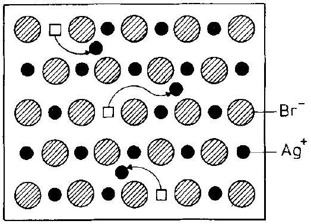
Figure 1-2. Two-dimensional schematic representation of the formation of Frenkel defect pairs in $\mathrm{AgBr}: \mathrm{Ag}_{\mathrm{Ag}}+\mathrm{V}_{\mathrm{i}}=\mathrm{Ag}_{\mathrm{i}}^{\bullet}+\mathrm{V}_{\mathrm{Ag}}^{\prime} . \square=$ vacant cation site.

Note that the balances of matter, sites, and charge are obeyed. According to standard kinetics, we formulate the rate equation of this defect equilibration process and denote, for simplicity sake, $\mathrm{Ag}_{\mathrm{i}}^{*}$ by $\mathrm{i}, \mathrm{V}_{\mathrm{Ag}}^{\prime}$ by V and $\mathrm{Ag}_{\mathrm{Ag}}$ by Ag . Let us designate the frequency of a site exchange between a vacancy and an ion on a different sublattice as $v$. According to a bimolecular rate equation, the time derivative of the concentration is

$$
\dot{c}_{\mathrm{i}}=\vec{v} \cdot c_{\mathrm{Ag}} \cdot N_{\mathrm{V}_{\mathrm{i}}}-\stackrel{\rightharpoonup}{v} \cdot c_{\mathrm{i}} \cdot N_{\mathrm{V}}
$$

or of the corresponding mole fraction

$$
\dot{N}_{\mathrm{i}}=\vec{v} \cdot\left(N_{\mathrm{Ag}} \cdot N_{\mathrm{V}_{\mathrm{i}}}\right)-\bar{v} \cdot\left(N_{\mathrm{i}} \cdot N_{\mathrm{V}}\right)
$$

Each product in brackets on the right hand side gives the average fraction of silver ions occurring with a vacancy as a neighbor. Site and charge balances are

$$
N_{\mathrm{Ag}}+N_{\mathrm{V}}=1 ; \quad N_{\mathrm{V}_{\mathrm{i}}}+N_{\mathrm{i}}=1 ; \quad N_{\mathrm{i}}=N_{\mathrm{V}}
$$

and since $N_{\mathrm{V}}, N_{\mathrm{i}} \ll 1$, Eqn. (1.3) yields

$$
\dot{N}_{\mathrm{i}}=\vec{v} \cdot\left(1-\frac{\bar{v}}{\vec{v}} \cdot N_{\mathrm{i}} \cdot N_{\mathrm{V}}\right)
$$

At equilibrium, $\dot{N}_{\mathrm{i}}=0$ and $N_{\mathrm{i}}(\mathrm{eq})=N_{\mathrm{V}}(\mathrm{eq})=N^{0}$. Therefore, the ratio ( $\bar{\nu} / \vec{\nu}$ ) is equal to $1 /\left(N^{0}\right)^{2}$ and

$$
\dot{N}_{\mathrm{i}}=\vec{v} \cdot\left(1-\frac{N_{\mathrm{i}}}{N^{0}} \cdot \frac{N_{\mathrm{V}}}{N^{0}}\right)
$$

We refer the actual defect fraction to the equilibrium value as a reference state by setting $N_{\mathrm{i}}=N_{\mathrm{V}}=N^{0}+\delta$. Equation (1.6) then reads

$$
\dot{\delta}=-\frac{2 \cdot \vec{v}}{N^{0}} \cdot\left(\delta+\frac{\delta^{2}}{N^{0}}\right)
$$

For sufficiently long times (i.e., $\delta \rightarrow 0$ ), the integration of Eqn. (1.7) yields

$$
\delta(t) \cong \delta(0) \cdot \mathrm{e}^{-\frac{2 \cdot \vec{v}}{N^{0}} \cdot t}
$$

so that we can define the Frenkel defect relaxation time as

$$
\tau_{\mathrm{R}}=N^{0} /(2 \cdot \vec{v})=1 /\left(2 N^{0} \cdot \overleftarrow{v}\right) .
$$

### 1.3.2 Steady State Flux of Point Defects in a Binary Compound

The Gibbs phase rule states that the (local) thermodynamic state of a binary compound is unambiguously determined by three state variables such as $P, T$ and $\mu_{k}$ ( $k$ being a component index). Therefore, if one fixes $\mu_{k}$ (at a given $P, T$ ) on opposite surfaces of the compound crystal (e.g., AX) at two different levels, all (local) equilibrium functions of state attain different values at the two surfaces. Since point defect concentrations are also functions of state, different point defect concentrations exist at the two crystal surfaces. Mobile point defects will start to move down their concentration gradient until a steady state is established in the frame of the crystal lattice. A common situation is given in Figure 1-3. Drifting cation vacancies are equivalent to a cation counter-flux in the opposite direction, as shown in Figure 1-3. Note that the arrows indicate only the extra jumps to the left, while the random thermal motion is disregarded. Anions are assumed to be immobile.

Let us analyze this transport situation. In a linear theory, the flux of, for example, vacancies of A in the AX compound is given by

$$
\boldsymbol{j}_{\mathrm{V}}=c_{\mathrm{V}} \cdot \boldsymbol{v}_{\mathrm{V}}=c_{\mathrm{V}} \cdot\left(b_{\mathrm{V}} \cdot \boldsymbol{K}_{\mathrm{V}}\right)
$$

Figure 1-3. The flux of cation vacancies in a transition metal oxide AX exposed to an oxygen potential gradient. Note that only the cation sublattice is depicted schematically.

if there are no other restrictions. From irreversible thermodynamics we know that the acting force $\boldsymbol{K}_{\mathrm{V}}$ is $-\nabla \mu_{\mathrm{V}}\left(=-R T \cdot \nabla \ln N_{\mathrm{V}}\right.$, as long as vacancies have small concentrations and do not interact with each other). Inserting $\nabla \mu_{\mathrm{V}}$ in Eqn. (1.10), one obtains Fick's first law by setting $b_{\mathrm{V}} \cdot R T=D_{\mathrm{V}}$. $D_{\mathrm{V}}$ is the vacancy diffusion coefficient, and the relation between $b$ and $D$ is called the Nernst-Einstein relation. $D_{\mathrm{V}}$ is constant for noninteracting, ideally diluted vacancies at low concentrations. Therefore, we have from Eqn. (1.10)

$$
j_{\mathrm{V}}=-D_{\mathrm{V}} \cdot \nabla c_{\mathrm{V}}=-D_{\mathrm{V}} \cdot \frac{c_{\mathrm{V}}^{\prime \prime}-c_{\mathrm{V}}^{\prime}}{\Delta \xi}
$$

where $\Delta \xi$ is the sample thickness. The steady state represented by Eqn. (1.11) implies that $\Delta c_{\mathrm{V}}$ is constant (and independent of $\Delta \xi$ ). Since we have fixed $\mu_{\mathrm{A}}\left(\xi^{\prime}\right)$ and $\mu_{\mathrm{A}}\left(\xi^{\prime \prime}\right)$ at the corresponding surfaces, we wish to express $\mu_{\mathrm{V}}$ in terms of $\mu_{\mathrm{A}}$ (or $\mu_{\mathrm{X}_{2}}$ ). This can be done by formulating the equilibrium condition for the A vacancy formation reaction,

$$
A_{A}=A+\left(V_{A}^{\prime}+h^{*}\right) \quad \text { or } \quad\left(A_{A}-V_{A}^{\prime}\right)=A+h^{*}
$$

where $\mathrm{A}_{\mathrm{A}}$ is the (regular) structure element and A denotes the chemical component A. $\mathrm{h}^{\cdot}$ denotes an electron hole which is formed to maintain electroneutrality $\left(N_{\mathrm{V}^{\prime}}=N_{\mathrm{h}}\right)$. From the site balance we know that $N_{\mathrm{A}_{\mathrm{A}}} \cong 1$, and therefore the equilibrium condition of Eqn. (1.12) states that the gradient in the chemical potential of component A is (in view of $\nabla \mu_{\mathrm{h}}=\nabla \mu_{\mathrm{V}}$ due to $N_{\mathrm{V}^{\prime}}=N_{\mathrm{h}} \cdot \ll 1$ )

$$
\nabla \mu_{\mathrm{A}}=-2 \cdot \nabla \mu_{\mathrm{V}}=-2 \cdot R T \cdot \nabla \ln N_{\mathrm{V}}
$$

Equation (1.13), integrated across the crystal, gives

$$
c_{\mathrm{V}}^{\prime}=c_{\mathrm{V}}^{\prime \prime} \cdot \mathrm{e}^{-\frac{\mu_{\mathrm{A}}^{\prime}-\mu_{\mathrm{A}}^{\prime \prime}}{2 \cdot R T}}
$$

where the primes denote the two opposite surfaces. Substituting Eqn. (1.14) into Eqn. (1.11) yields

$$
j_{\mathrm{V}}=-\frac{D_{\mathrm{V}} \cdot c_{\mathrm{V}}^{\prime \prime}}{\Delta \xi} \cdot\left(1-\mathrm{e}^{-\frac{\mu_{\mathrm{A}}^{\prime}-\mu_{\mathrm{A}}^{\prime \prime}}{2 \cdot R T}}\right)
$$

or

$$
j_{\mathrm{V}} \cong-\frac{D_{\mathrm{V}} \cdot c_{\mathrm{V}}^{\prime \prime}}{\Delta \xi}, \quad \mu_{\mathrm{A}}^{\prime}-\mu_{\mathrm{A}}^{\prime \prime}>R T
$$

The difference of the component potentials ( $\mu_{\mathrm{A}}^{\prime}-\mu_{\mathrm{A}}^{\prime \prime}$ ) can be established in two ways: 1) by reservoirs of component A with different activities and 2) by reservoirs of component $\mathrm{X}\left(\frac{1}{2} \mathrm{X}_{2}\right)$ with different activities (partial pressures). Note that $\mathrm{A}+\frac{1}{2} \mathrm{X}_{2}=\mathrm{AX}$, so that $\mu_{\mathrm{A}}+\frac{1}{2} \cdot \mu_{\mathrm{X}_{2}}=\mu_{\mathrm{AX}}^{0}$ or $\mathrm{d} \mu_{\mathrm{A}}+\frac{1}{2} \cdot \mathrm{~d} \mu_{\mathrm{X}_{2}}=0$. Since the cation vacancy (and cation) flux concerns only the cation sublattice, and the anions are im-
mobile and not involved in the transport reaction, the AX crystal is not shifted in case (1), that is, if the fluxes are driven by $\Delta \mu_{\mathrm{A}}$ of the A reservoirs. However, in case (2), the AX crystal as a whole is shifted by the vacancy flux in the direction of the oxidizing surface with the higher $\mu_{\mathrm{X}_{2}}$. This can be seen if one formulates the surface equilibria which correspond to Eqn. (1.12)

$$
\frac{1}{2} \cdot \mathrm{X}_{2}=\left[\mathrm{X}_{\mathrm{X}}+\mathrm{V}_{\mathrm{A}}^{\prime}\right]+\mathrm{h}^{\bullet}
$$

From the equilibrium condition of Eqn. (1.17), one derives

$$
\frac{1}{2} \cdot \nabla \mu_{\mathrm{X}_{2}}=2 \cdot R T \cdot \nabla \ln N_{\mathrm{V}}
$$

in accordance with Eqn. (1.13). The shift of the crystal can be read from Eqn. (1.17). At the oxidizing side the defect combination, $\left[\mathrm{X}_{\mathrm{X}}+\mathrm{V}_{\mathrm{A}}^{\prime}\right]$ is added to the crystal (the bracketed structure elements in Eqn. (1.17)), while at the reducing side, the opposite reaction occurs. The combination $\left[\mathrm{X}_{\mathrm{X}}+\mathrm{V}_{\mathrm{A}}^{\prime}\right]$, which corresponds to a 'lattice molecule' (see Section 2.2.1), is subtracted here from the crystal surface, one for every vacancy that passes across the crystal from $\xi^{\prime}$ to $\xi^{\prime \prime}$.

The defect inhomogeneity in the AX crystal which is imposed by the different component activities at $\xi^{\prime}$ and $\xi^{\prime \prime}$ results, in principle, in an inhomogeneity of the elastic state of the crystal. Elastic stresses influence the chemical potential $\mu_{\mathrm{V}}$ and thus their gradients provide a driving force for the flux. This is not taken into account here, but will be considered in Chapter 14.

### 1.3.3 The Kinetics of an Interface Reaction

Interfaces separate two phases such as $\alpha$ and $\beta$. An interface reaction can mean 1) component fluxes cross the stationary interface or 2 ) the interface moves due to a chemical reaction between the phases $\alpha$ and $\beta$ at the interface (phase boundary). Catalytic reactions are excluded from this discussion.

In order to describe interfaces kinetically, we choose the equilibrium state of the interface as the reference state. In (dynamic) equilibrium, the net fluxes of components $k$ vanish across an interface. Since the mobilities of the components in the interface are finite, there can be no driving forces acting upon component $k$ at equilibrium. For isothermal and isobaric crystals with electrically charged structure elements, this means that $\Delta \eta_{i}=0$ ( $i$ denoting the (charged) reversible carrier of type $i$ ). The explicit form of this equilibrium condition is

$$
-z_{i} \cdot F \cdot \Delta \varphi^{0}=\Delta \mu_{i}
$$

and signifies that a jump in the electrical potential exists across an interface at equilibrium. It is easy to verify that the imposition of the equilibrium condition $\Delta \eta_{i}=0(i=1,2, \ldots, n)$ for each individual charged component ( $i$ ) comprises, along with the condition of electroneutrality, the equilibrium for the electroneutral components.

Figure 1.4. The A/AX interface during flow of A-cations across the boundary ( $\xi=0$ ) into the (semiconducting) compound AX . Point defect relaxation reaction between $0<\xi<\xi_{\mathrm{R}}$ reads $V_{\mathrm{A}}^{\prime}+\mathrm{A}_{\mathrm{i}}^{*}=\mathrm{A}_{\mathrm{A}} \cdot \xi_{\mathrm{R}}=$ width of relaxation zone.

However, if $\Delta \eta_{i} \neq 0$ across a stationary interface, a flux of charged species $i$ results, which can be written in a linear theory as

$$
j_{i}=-l_{i} \cdot \Delta \eta_{i}
$$

where $l_{i}$ is the interface 'conductivity' of species $i$. It is the understanding of $l_{i}(\alpha / \beta)$ which is the most difficult part of any kinetic theory of interfaces. Consider the very simple model illustrated in Figure 1-4. Metal A (anode) is in contact with the Schottky disordered AX crystal. Schottky disorder means that equivalent fractions of cation and anion vacancies are present. Let us assume that $D_{\mathrm{i}} \ll D_{\mathrm{V}}\left(\mathrm{i}=\mathrm{A}_{\mathrm{i}}^{\circ}, \mathrm{V}=\mathrm{V}_{\mathrm{A}}^{\prime}\right)$. Under load, the electrical flux in the form of an ion flux is injected into the interstitial sublattice. This means that $j_{\mathrm{V}}(\xi=0)=0$. Since the flux of defects consists of a diffusive term and a field term, we have

$$
j_{\mathrm{V}}=-D_{\mathrm{V}} \cdot\left(\nabla c_{\mathrm{V}}-\frac{F \cdot c_{\mathrm{V}}}{R T} \cdot \nabla \varphi\right)
$$

and, therefore, at $\xi=0$

$$
c_{\mathrm{V}}=c_{\mathrm{V}}^{0} \cdot \mathrm{e}^{\frac{F}{R T} \cdot\left(\varphi-\varphi^{0}\right)}=c_{\mathrm{V}}^{0} \cdot \mathrm{e}^{\frac{F}{R T} \cdot \Delta U}
$$

where $\Delta U$ is the change in the interfacial voltage drop relative to its equilibrium value, and $c_{\mathrm{V}}^{0}=c_{\mathrm{V}}$ (eq) at $\xi=\infty$. For interstitials i , we have in analogy to Eqn. (1.21)

$$
j_{\mathrm{i}}=-D_{\mathrm{i}} \cdot\left(\nabla c_{\mathrm{i}}+\frac{F \cdot c_{\mathrm{i}}}{R T} \cdot \nabla \varphi\right)=-D_{\mathrm{i}} \cdot\left(\nabla c_{\mathrm{i}}+\frac{c_{\mathrm{i}}}{c_{\mathrm{V}}} \cdot \nabla c_{\mathrm{V}}\right)_{\xi=0}
$$

The second part of Eqn. (1.23) is obtained from Eqn. (1.22). From the requirement of electroneutrality and the definition of a (linearized) defect recombination zone of width $\xi_{\mathrm{R}}$, Eqns. (1.22) and (1.23) yield

$$
j_{\mathrm{i}}(0)=-\frac{2 \cdot D_{\mathrm{i}} \cdot \Delta c_{\mathrm{V}}}{\xi_{\mathrm{R}}}=-\frac{2 \cdot D_{\mathrm{i}} \cdot c_{\mathrm{V}}^{0}}{\xi_{\mathrm{R}}} \cdot\left(\mathrm{e}^{\frac{F}{R T} \cdot \Delta U}-1\right)
$$

and $z_{\mathrm{i}} \cdot F \cdot j_{\mathrm{i}}(0)$ is the steady state electrical current across the interface, driven by the applied voltage $\Delta U$. If we set $\xi_{\mathrm{R}}$ equal to the length $\sqrt{2 \cdot \tau_{\mathrm{R}} \cdot D_{\mathrm{i}}}$, where $\tau_{\mathrm{R}}$ is the relaxation time of Schottky defects for attaining equilibrium, Eqn. (1.24) yields for $\Delta U<R T / F$

$$
j_{\mathrm{i}}(0)=-\frac{2 \cdot D_{\mathrm{i}} \cdot c_{\mathrm{V}}^{0}}{\sqrt{2 \cdot \tau_{\mathrm{R}} \cdot D_{\mathrm{i}}}} \cdot \frac{F \cdot \Delta U}{R T}=j_{\mathrm{V}}^{0}\left(\xi>\xi_{\mathrm{R}}\right)
$$

This is the kinetic equation for a simple A/AX interface model and illustrates the general approach. The critical quantity which will be discussed later in more detail is the disorder relaxation time, $\tau_{\mathrm{R}}$. Generally, the A/AX interface behaves under steady state conditions similar to electrodes which are studied in electrochemistry. However, in contrast to fluid electrolytes, the reaction steps in solids comprise inhomogeneous distributions of point defects, which build up stresses at the boundary on a small scale. Plastic deformation or even cracking may result, which in turn will influence drastically the further course of any interface reaction.

### 1.3.4 Kinetics of Compound Formation: $\mathbf{A}+\mathbf{B}=\mathbf{A B}$

Let us begin the discussion of the last example of solid state kinetics in this introductory chapter with the assumption of local equilibrium at the $\mathrm{A} / \mathrm{AB}$ and $\mathrm{AB} / \mathrm{B}$ interfaces of the $\mathrm{A} / \mathrm{AB} / \mathrm{B}$ reaction couple (Fig. 1-5). Let us further assume that the reaction geometry is linear and the interfaces between the reactants and the product AB are planar. Later it will be shown that under these assumptions, the (moving) interfaces are morphologically stable during reaction.
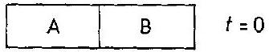

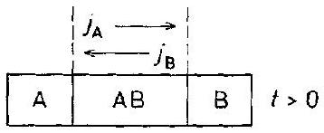
Figure 1-5. Heterogeneous solid state reaction: the formation of compound AB .

Since the product compound separates the reactants spatially (Fig. 1-5), the reaction can only continue if either $\mathrm{A}, \mathrm{B}$, or both A and B are able to diffuse across the reaction layer and form additional AB at the respective interfaces. The increase in layer thickness, $\Delta \xi$, is then given as

$$
\Delta \dot{\xi}=V_{\mathrm{AB}} \cdot\left(\left|j_{\mathrm{A}}\right|+\left|j_{\mathrm{B}}\right|\right)
$$

where $V_{A B}$ designates the molar volume. Each flux of A and B can be written as the product of a transport coefficient ( $L_{i}$ ) and a driving force ( $X_{i}$ ) as, for example, given in Eqn. (1.27).

$$
j_{\mathrm{A}}=-L_{\mathrm{A}} \cdot \nabla \mu_{\mathrm{A}}=-\bar{L}_{\mathrm{A}} \cdot \frac{\Delta \mu_{\mathrm{A}}}{\Delta \xi}
$$

The right hand side is the result of integration. As long as local equilibrium prevails, the average value, $\bar{L}_{\mathrm{A}}$, of the transport coefficient, taken across the reaction layer, is determined by the thermodynamic parameters at the interfaces $A / A B$ and $A B / B$, and thus is independent of the reaction layer thickness $\Delta \xi$. If one inserts Eqn. (1.27) into Eqn. (1.26), a parabolic rate law is found

$$
\Delta \xi(t)=\sqrt{2 \cdot V_{\mathrm{AB}} \cdot\left(L_{\mathrm{A}} \cdot \Delta \mu_{\mathrm{A}}+L_{\mathrm{B}} \cdot \Delta \mu_{\mathrm{B}}\right)} \cdot \sqrt{t}
$$

and since $\Delta \mu_{\mathrm{A}}=\Delta \mu_{\mathrm{B}}=\Delta G_{\mathrm{AB}}^{0}$, we have finally

$$
\Delta \xi(t)=\sqrt{2 \cdot V_{\mathrm{AB}} \cdot \Delta G_{\mathrm{AB}}^{0} \cdot\left(L_{\mathrm{A}}+L_{\mathrm{B}}\right)} \cdot \sqrt{t}
$$

The increase $\Delta \dot{\xi}$ will occur at interface $\mathrm{A} / \mathrm{AB}$ if $L_{\mathrm{A}} / L_{\mathrm{B}} \ll 1$, and it will occur at $\mathrm{AB} / \mathrm{B}$ if $L_{\mathrm{A}} \gg L_{\mathrm{B}}$ (Fig. 1-5). We conclude that parabolic rate laws in heterogeneous solid state reactions are the result of two conditions, the prevalence of a linear geometry and of local equilibrium which includes the phase boundaries.

Up to this point it has been tacitly assumed that A and B move independently across the reaction product. This can be true for intermetallic compounds, but not for ionic crystals in which there is always a flux coupling due to the condition of electroneutrality. Let us formulate this coupling condition in a general way in the form

$$
j_{\mathrm{A}}+\alpha \cdot j_{\mathrm{B}}=0
$$

where $\alpha$ represents the coupling parameter. From Eqns. (1.26) and (1.30) one concludes that again the reaction kinetics is parabolic. The parabolic rate constant, however, is different from that given in Eqn. (1.29). Since for fluxes in ionic compounds the driving force is $\nabla \eta_{i}$ (the gradient of the electrochemical potential), Eqn. (1.30) is really the equation that determines $\nabla \varphi$, the gradient of the (inner) electrical potential in AB. The formal relations are somewhat lengthy and will be given explicitly in a later section.

In the last four sections, we have illustrated some basic kinetic concepts. We will repeatedly meet the underlying kinetic situations in the following chapters. In one way or the other, they will serve as starting points when we later analyze and discuss more complicated kinetic problems in greater depth.

## References

Burgers, J.M. (1939) Proc. K. ned. Akad. Wet., 42, 293
Catlow, C.R.A. (1989) Faraday Trans. II, 335
Chandrasekhar, S. (1943) Rev. Mod. Phys., 15, 1
Crank, J. (1970) The Mathematics of Diffusion, Oxford University Press, Oxford
Darwin, C.G. (1914) Phil. Mag. 27, 315, 675
Davidov, I. W. (1938) J. Techn. Phys. Moskau, 8, 3
Dehlinger, U. (1929) Ann. Phys., 2, 749
Frenkel, J. (1926) Z. Physik, 35, 652
Jost, W. (1933) J. Chem. Phys., 1, 466
Jost, W. (1937) Diffusion und chemische Reaktion in festen Stoffen, Th. Steinkopff, Dresden
Königsberger, J., Weiss, J. (1911) Ann. Phys., 35, 1
Lidiard, A.B., Norgett, M.J. (1972) in: Computational Solid State Physics (Eds.: F. Hermann, N. W. Dalton, T. R. Kochler), Plenum, New York

Mott, N. F., Littleton, M. J. (1938) Trans. Faraday Soc., 34, 485
Orowan, E. (1934) Z. Phys., 89, 634
Pearson, K. (1905) Nature, 77, 294
Polanyi, M. (1934) Z. Phys., 89, 660
Read, W. T. (1953) Dislocations in Crystals, McGraw Hill, New York
Sale, L. (1873) Pogg. Ann. Phys. Chem., 150, 333
Schottky, W., Deutschmann, W. (1929) Phys. Z., 30, 839
Schottky, W., Ulich, H., Wagner, C. (1929) Thermodynamik, Springer, Berlin
Schottky, W. (1938) Naturwiss., 26, 843
Seebeck, T. J. (1822) Abhandg. Königl. Akad. Wiss. Berlin, 263
Shockley, W. (1949) Bell Syst. Tech. J., 28, 435
Siemens, W. (1876) Pogg. Ann. Phys. Chem., 159, 117
Smekal, A. (1925) Phys. Z., 26, 707
Smith, W. (1873) Nature, 7, 303
Smoluchowski, M. v. (1916) Phys. Z., 17, 557, 585
Sommerfeld, A., Bethe, H. (1933) Handb. Physik (Flügge) XXIV/2, Springer, Berlin
Spring, W. (1878) Bull. Ac. Roy. Bruxelles, 45, 746
Taylor, G. I. (1934) Proc. Roy. Soc., A145, 362
Uhlenbeck, G.E., Ornstein, L.S. (1930) Phys. Rev., 36, 823
Volterra, W. (1907) Ann. Sci. Éc. norm. sup. Paris, 24, 401
Wagner, C., Schottky, W. (1930) Z. phys. Chem., B11, 163
Wagner, C. (1931) Phys. Z., 32, 641
Wagner, C. (1933) Z. phys. Chem., B21, 25
Wagner, C. (1936) Z. phys. Chem., B34, 309
Wang, M. C., Uhlenbeck, G. E. (1945) Rev. Mod. Phys., 17, 323
Wax, N. (Ed.) (1954) Selected Papers on Noise and Stochastic Processes, Dover, New York
Welker, H. J. (1979) Ann. Rev. Mat. Science, 9, 1

## 2 Thermodynamics of Point Defects

### 2.1 Introduction

Solid state reactions occur mainly by diffusional transport. This transport and other kinetic processes in crystals are always regulated by crystal imperfections. Reaction partners in the crystal are its structure elements ${ }^{1}$ (SE) as defined in the list of symbols (see also [W. Schottky (1958)]). Structure elements do not exist outside the crystal lattice and are therefore not independent components of the crystal in a thermodynamic sense. In the framework of linear irreversible thermodynamics, the chemical (electrochemical) potential gradients of the independent components of a non-equilibrium (reacting) system are the driving forces for fluxes and reactions. However, the flux of one independent chemical component always consists of the fluxes of more than one SE in the crystal. In addition, local reactions between SE's may occur.

Therefore, we have the following situation in the transport theory of crystals. One can, in principle, measure all the fluxes of individual SE's. One can also unambiguously determine the forces that act upon the independent chemical components. However, it is difficult to visualize the fluxes of the chemical component in a crystal lattice and the meaning of driving forces for SE's is not immediately obvious.

It is the purpose of this chapter to deal with these conceptual matters that are specific to solid state chemistry and to provide the thermodynamic basis for an appropriate kinetic theory. In addition, practical situations will be analyzed and applications will be discussed for the sake of illustration.

Chemists and physicists must always formulate correctly the constraints which crystal structure and symmetry impose on their thermodynamic derivations. Gibbs encountered this problem when he constructed the component chemical potentials of non-hydrostatically stressed crystals. He distinguished between mobile and immobile components of a solid. The conceptual difficulties became critical when, following the classical paper of Wagner and Schottky on ordered mixed phases as discussed in chapter 1, chemical potentials of statistically relevant SE's of the crystal lattice were introduced. As with the definition of chemical potentials of ions in electrolytes, it turned out that not all the mathematical operations ( $\partial G / \partial n_{i}$ ) could be performed for SE's of kind $i$ without violating the structural conditions of the crystal lattice. The origin of this difficulty lies in the fact that lattice sites are not the analogue of chemical species (components).

[^0]Nevertheless, the chemical potentials of SE's are frequently used instead of the chemical potentials of (independent) components of a crystalline system. Obviously, a crystal with its given crystal lattice structure is composed of SE's. They are characterized much more specifically than the crystal's chemical components, namely with regard to lattice site and electrical charge. The introduction of these two additional reference structures leads to additional balanced equations or constraints (beside the mass balances) and, therefore, SE's are not independent species in the sense of chemical thermodynamics, as are, for example, ( $n-1$ ) chemical components in an $n$ component system.

With the introduction of the lattice structure and electroneutrality condition, one has to define two elementary SE units which do not refer to chemical species. These elementary units are 1) the empty lattice site (vacancy) and 2) the elementary electrical charge. Both are definite (statistical) entities of their own in the lattice reference system and have to be taken into account in constructing the partition function of the crystal. Structure elements do not exist outside the crystal and thus do not have real chemical potentials. For example, vacancies do not possess a vapor pressure. Nevertheless, vacancies and other SE's of a crystal can, in principle, be 'seen', for example, as color centers through spectroscopic observations or otherwise. The electrical charges can be detected by electrical conductivity.

Since the state of a crystal in equilibrium is uniquely defined, the kind and number of its SE's are fully determined. It is therefore the aim of crystal thermodynamics, and particularly of point defect thermodynamics, to calculate the kind and number of all SE's as a function of the chosen independent thermodynamic variables. Several questions arise. Since SE's are not equivalent to the chemical components of a crystalline system, is it expedient to introduce 'virtual' chemical potentials, and how are they related to the component potentials? If immobile SE's exist (e.g., the oxygen ions in dense packed oxides), can their virtual chemical potentials be defined only on the basis of local equilibration of the other mobile SE's? Since mobile SE's can move in a crystal, what are the internal forces that act upon them to make them drift if thermodynamic potential differences are applied externally? Can one use the gradients of the virtual chemical potentials of the SE's for this purpose?

It has long been known that defect thermodynamics provides correct answers if the (local) equilibrium conditions between SE and chemical components of the crystal are correctly formulated, that is, if in addition to the conservation of chemical species the balances of sites and charges are properly taken into account. The correct use of these balances, however, is equivalent to the introduction of so-called 'building elements' ('Bauelemente') [W. Schottky (1958)]. These are properly defined in the next section and are the main content of it. It will be shown that these building units possess real thermodynamic potentials since they can be added to or removed from the crystal without violating structural and electroneutrality constraints, that is, without violating the site or charge balance of the crystal [see, for example, M. Martin et al. (1988)].

In a book on kinetics, the purpose of understanding the thermodynamics of point defects ( = irregular SE's) is the elucidation of their role as carriers in the elementary steps of mass transport. For any given values of $P, T$, and component chemical potentials, their equilibrium concentrations can be calculated if the magnitudes of
their Gibbs energies of formation are known. As long as chemical processes in the solid state obey the rate equations of (linear) irreversible thermodynamics, point defect thermodynamics can be applied on a local scale, although the (local) concentrations of the components are continuously changing with time. This is true in so far as point defect relaxation processes are sufficiently fast and therefore the transport coefficients (which are determined by mobilities and local concentrations of point defects) are still functions of state. This means that local point defect concentrations are still fully determined by $P, T$, and the local composition of the (independent) chemical components.

### 2.2 Thermodynamics of Crystals

In this section, we will outline point defect thermodynamics and quantify the considerations of the introduction.

### 2.2.1 Phenomenological Approach

Consider a crystal which is in equilibrium having $n$ chemical components ( $k= 1,2, \ldots, n)$. We can define (at any given $P$ and $T$ ) a Gibbs function, $G$, as a homogeneous function that is first order in the amount of components

$$
G=\sum_{k=1}^{n} \mu_{k} \cdot n_{k}
$$

where $\mu_{k}$ denotes the chemical potential and $n_{k}$ the number of moles of component $k$. From the first and second laws of thermodynamics, we derive

$$
\mathrm{d} G=\sum_{k=1}^{n} \mu_{k} \cdot \mathrm{~d} n_{k}-S \cdot \mathrm{~d} T+V \cdot \mathrm{~d} P
$$

and therefore, at a given $P$ and $T$

$$
\sum_{k=1}^{n} n_{k} \cdot \mathrm{~d} \mu_{k}=0 ; \quad \sum_{k=1}^{n} N_{k} \cdot \mathrm{~d} \mu_{k}=0
$$

which is the Gibbs-Duhem equation. It reduces the number of independent chemical potentials $\mu_{k}$ to ( $n-1$ ). From Eqn. (2.2), the chemical potential of component $k$ is given as the partial molar Gibbs energy

$$
\mu_{k}=\left(\frac{\partial G}{\partial n_{k}}\right)_{n_{j} \neq n_{k}}
$$

For a nearly stoichiometric $n$ component compound $p$, we obtain, in accordance with Eqn. (2.1),

$$
\sum_{k=1}^{n} N_{k} \cdot \mu_{k}=G_{p}^{0}, \quad \sum_{k=1}^{n} N_{k} \cdot \ln a_{k}=\frac{\Delta G_{p}^{0}}{R T}, \quad \Delta G_{p}^{0}=G_{p}^{0}-\sum_{k=1}^{n} N_{k} \cdot \mu_{k}^{0}
$$

where $a_{k}$ is the activity of $k$. Neglecting the small fractions of point defects, it is often expedient to refer the fractions $N_{k}$ to the number of lattice sites for component $k$ in the ideal compound, or to the number of unit cells in the compound lattice.

The immediate question is: How does one add a single component $k$ from an external reservoir to the crystal according to Eqn. (2.4) without violating any structural constraints, that is, the fixed relations between the numbers of sublattice sites? We denote a particular sublattice containing atoms (ions) of component $k$ by $\varkappa (\varkappa=1,2, \ldots, K)$ and write the exchange reaction between external reservoir ( $=$ buffer $\beta$ ) and crystal sublattice as

$$
k(\beta) \rightleftharpoons k(\varkappa)
$$

Since we can exchange $k(\beta)$ equally with either sublattice $\varkappa$ or $\lambda$, for example, we also have exchange between sublattices

$$
k(\varkappa) \rightleftharpoons k(\lambda)
$$

The equilibrium condition requires that

$$
\mu_{k(\beta)}=\mu_{k(\chi)}=\mu_{k(\lambda)}\left(=\mu_{k}\right)
$$

Therefore, according to Eqn. (2.4) we have

$$
\mathrm{d} G=\sum_{k=1}^{n} \mu_{k(x)} \cdot \mathrm{d} n_{k}
$$

and, because $\mathrm{d} n_{k}=\sum_{\varkappa=1}^{K} \mathrm{~d} n_{k(\varkappa)}$

$$
\mathrm{d} G=\sum_{\varkappa=1}^{K} \sum_{k=1}^{n} \mu_{k(\varkappa)} \cdot \mathrm{d} n_{k(\varkappa)}
$$

so that

$$
\mu_{k(x)}=\left(\frac{\partial G}{\partial n_{k(x)}}\right)_{n_{(\lambda)} \neq n_{k(x)}}
$$

Note that this differentiation is more specific than the differentiation of Eqn. (2.4).
The addition of a particle $k$ on the sublattice $\varkappa$, however, is possible only in two cases: 1) when vacancies are available in sublattice $\mathcal{\varkappa}$ or 2) when a potential $\varkappa$ site on the crystal surface is filled by adding $k(\beta)$ with the simultaneous formation of
vacancies on all other sublattices in such a way that the proportions of lattice sites in the various sublattices (as dictated by crystallography) are retained. In this second case, the number of unit cells of the crystal lattice has been increased by one. If we designate $z_{\alpha}$ as the number of sites in sublattice $\alpha(\alpha=\varkappa, \lambda, \ldots)$, the ratio in question is

$$
\frac{z_{\varkappa}}{z_{\lambda}}=m_{\varkappa, \lambda}
$$

where $m_{\varkappa, \lambda}$ is normally a simple rational number. With $K$ sublattices, we have $K-1$ equations of type (2.12), which constitute the structural constraints.

Structure elements are symbolized by $S_{\mathcal{K}}^{q}$. $S$ denotes either the particles of components $k$ or a vacancy V , and $q$ is the effective electrical charge relative to a perfect crystal. It is usual to indicate effective charges by (see also list of symbols)
${ }^{\mathrm{x}}=$ neutral
' ' ' ' ' ... ' singly, doubly, and triply negatively charged structure element
= singly, doubly, and triply positively charged structure element
Using these definitions, we can rewrite the exchange reaction (2.6) between buffer and crystal as

$$
k(\beta)+\mathrm{V}_{\varkappa}^{\times}=k_{\varkappa}^{\times}
$$

or

$$
k(\beta)=\left[k_{\varkappa}^{\times}-\mathrm{V}_{\varkappa}^{\times}\right]
$$

The corresponding equilibrium condition between component $k(\beta)$ and two SE's yields, instead of Eqn. (2.8)

$$
\mu_{k}=\mu_{k(\varkappa)}=\mu\left[k_{\varkappa}^{\times}-\mathrm{V}_{\varkappa}^{\times}\right]
$$

where $k(\varkappa)=\left[k_{\varkappa}^{\times}-\mathrm{V}_{\varkappa}^{\times}\right]$is called the 'building element'. If we now assign (virtual) chemical potentials to the individual SE's, Eqn. (2.15) becomes

$$
\mu_{k}=\mu_{k(\varkappa)}=\mu_{k_{\varkappa}^{\times}}-\mu_{v_{\varkappa}^{\times}}
$$

Instead of Eqn. (2.10) we then have

$$
\mathrm{d} G=\sum_{\varkappa=1}^{K} \sum_{k=1}^{n}\left(\mu_{k_{\varkappa}^{\times}}-\mu_{V_{\varkappa}^{\times}}\right) \cdot \mathrm{d} n_{k(\varkappa)}
$$

so that the (measurable, see Eqn. (2.15)) chemical potential of the building element $k(\varkappa)$ is

$$
\mu_{k(\varkappa)}=\mu_{k_{\varkappa}^{\times}}-\mu_{V_{\varkappa}^{\times}}=\left(\frac{\partial G}{\partial n_{k(\varkappa)}}\right)_{\substack{n_{k_{\lambda}^{\#}}, n_{k_{\lambda}}, n_{\mathrm{v}_{\lambda}} \\ k^{\#} \neq k, \lambda \neq \varkappa \\ \lambda=1,2, \ldots, K}}
$$

From Eqn. (2.18), we conclude that there is no experiment to determine the individual SE's chemical potential. The definition of the virtual chemical potential of a SE is implicit in Eqn. (2.16).

Using the symbol $k, \mathcal{\varkappa}$ (or $\mathrm{V}, \mathcal{\varkappa}$ ) for $k_{\varkappa}^{\times}$(or $\mathrm{V}_{\varkappa}^{\times}$), we can rewrite Eqn. (2.17) and cast it in the following form

$$
\mathrm{d} G=\sum_{\varkappa}\left[\sum_{k} \mu_{k, \varkappa} \cdot \mathrm{~d} n_{k, \varkappa}+\mu_{\mathrm{V}, \varkappa} \cdot \mathrm{~d} n_{\mathrm{V}, \varkappa}-\left(\mu_{\mathrm{V}, \varkappa} \cdot \mathrm{~d} n_{\mathrm{V}, \varkappa}+\sum_{\varkappa} \mu_{\mathrm{V}, \varkappa} \cdot \mathrm{~d} n_{k, \varkappa}\right)\right]
$$

From the crystal structure constraint, Eqn. (2.12), we can derive

$$
\frac{n_{\varkappa}}{n_{\lambda}}=m_{\varkappa, \lambda}, \quad \frac{n_{\varkappa}}{\sum n_{\lambda}}=\frac{n_{\varkappa}}{n}=m_{\varkappa}
$$

where $m_{\varkappa}$ is the fixed ratio of lattice sites $x$ to the total lattice sites. With the help of Eqn. (2.20) we can reformulate Eqn. (2.19) as

$$
\mathrm{d} G=\sum_{\varkappa} \sum_{i} \mu_{i, \varkappa} \cdot \mathrm{~d} n_{i, \varkappa}-\mu_{\mathrm{M}} \cdot \frac{\mathrm{~d} n}{z}
$$

with the definition

$$
\mu_{\mathrm{M}}=\sum_{\varkappa}\left(z \cdot m_{\varkappa}\right) \cdot \mu_{\mathrm{V}, \varkappa}=\sum \bar{m}_{\varkappa} \cdot \mu_{\mathrm{V}, \varkappa}
$$

which allows the definition of M as a new building element

$$
\mathrm{M}=\sum \bar{m}_{\varkappa} \cdot \mathrm{V}_{\varkappa}
$$

If $z$ corresponds to the number of lattice sites comprised by the formula unit of a compound (e.g. $\mathrm{AB}_{2} \mathrm{O}_{4}$ ), we call M a 'lattice molecule'. At equilibrium, M has a constant chemical potential $\mu_{\mathrm{M}}^{0}$, which we may set equal to zero by definition. Equation (2.21) then reduces to

$$
\mathrm{d} G=\sum_{\varkappa} \sum_{i} \mu_{i, \varkappa} \cdot \mathrm{~d} n_{i, \varkappa}
$$

While Eqn. (2.24) justifies the introduction of virtual chemical potentials of SE's including vacancies, it also assumes that the 'lattice molecule' M, according to Eqn. (2.23), is in equilibrium with all the vacancies $\mathrm{V}_{\varkappa}, \varkappa=1, \ldots, K$.

The above conclusions have been reached without consideration of the electrical charge $q$ on the structure elements. In ionic crystals, however, most of the SE's possess an effective electrical charge. Let us therefore consider an exchange reaction of electrical charge between two SE's, such as the redox reaction

$$
k_{\varkappa}^{\times}+j_{\varkappa}^{\times}=k_{\varkappa}^{+q}+j_{\varkappa}^{-q}
$$

Equation (2.25) gives, after rearrangement,

$$
k_{\varkappa}^{\times}-k_{\varkappa}^{+q}=j_{\varkappa}^{-q}-j_{\varkappa}^{\times}
$$

Accordingly, the electrical unit is $\mathrm{e}=1 / q \cdot\left(k_{\varkappa}^{\times}-k_{\varkappa}^{+q}\right)$, and its chemical potential can be formulated as

$$
\mu_{\mathrm{e}(\varkappa)}=1 / q \cdot\left(\mu_{k^{\times}, \varkappa}-\mu_{k^{q}, \varkappa}\right)
$$

In equilibrium, we have

$$
\mu_{\mathrm{e}(x)}=\mu_{\mathrm{e}(\lambda)}=\ldots\left(=\mu_{\mathrm{e}}\right)
$$

and thus

$$
\mu_{k^{a}, \varkappa}=\mu_{k^{\circ}, \varkappa}-q \cdot \mu_{\mathrm{e}}
$$

Application of Eqn. (2.24) to all SE's, including those which are charged, gives

$$
\mathrm{d} G=\sum_{\varkappa} \sum_{i}\left(\mu_{i, \varkappa}-\mu_{\mathrm{e}} \cdot q_{i, \varkappa}\right) \cdot \mathrm{d} n_{i, \varkappa}
$$

If one takes into account the electroneutrality condition of the crystal, which is $\sum_{\varkappa} \sum_{i} q_{i, \varkappa} \cdot n_{i, \varkappa}=0$, Eqn. (2.30) yields

$$
\mathrm{d} G=\sum_{\varkappa} \sum_{i} \mu_{i, \varkappa} \cdot \mathrm{~d} n_{i, \varkappa}
$$

where the summation goes over all structure elements $(i, \varkappa)$, be they charged or neutral.

The results of the discussion on the phenomenological thermodynamics of crystals can be summarized as follows. One can define chemical potentials, $\mu_{k}$, for components $k$ (Eqn. (2.4)), for building units (Eqn. (2.11)), and for structure elements (Eqn. (2.31)). The lattice construction requires the introduction of 'structural units', which are the vacancies $V_{\varkappa}$. Electroneutrality in a crystal composed of charged SE's requires the introduction of the electrical unit, e. The composition of an $n$ component crystal is fixed by ( $n-1$ ) independent mole fractions, $N_{k}$, of chemical components. ( $n-1$ ) is also the number of conditions for the definition of the component potentials $\mu_{k}$, as seen from Eqn. (2.4). For building units, we have ( $n-1$ ) independent composition variables and $n \cdot(K-1)$ equilibria between sublattices $\varkappa$, so that the number of conditions is $n \cdot K-1$, as required by the definition of the building element potential $\mu_{k(x)}$. For structure elements, the actual number of constraints is larger than the number of constraints required by Eqn. (2.18), which defines $\mu_{k(x)}$. This circumstance is responsible for the introduction of the concept of 'virtual' chemical potentials of SE's.

So far we have not specifically addressed crystals with non-localized electronic charge carriers. Their energy states are grouped in the conduction and valence bands. Using the previous notation of building elements, when we add the building element $\mathrm{e}^{\prime}$ to an empty state, $\varepsilon_{\mathrm{c}}$, of the conduction band, we have, in accordance with Eqn. (2.14),

$$
\mathrm{e}^{\prime}=\left[\mathrm{e}_{\mathrm{c}}-\varepsilon_{\mathrm{c}}\right]
$$

and the corresponding equation for the electron hole in the valence band is

$$
-\mathrm{e}^{\prime}=-\left[\mathrm{e}_{\mathrm{v}}-\varepsilon_{\mathrm{v}}\right]=\mathrm{h}^{\bullet}
$$

In (electronic) equilibrium

$$
\mu_{\mathrm{e}(x)}=\mu_{\mathrm{e}^{\prime}}=-\mu_{\mathrm{h}^{*}}=\mu_{\mathrm{e}}
$$

Note that $\mu_{\mathrm{e}(x)}$ is defined by Eqn. (2.27). For non-localized band electrons and holes we therefore have

$$
\mu_{\mathrm{e}^{\prime}}+\mu_{\mathrm{h}} \cdot=0
$$

Adding $\mathrm{d} n_{\mathrm{e}}$ negative charges to a crystal means that

$$
\mathrm{d} n_{\mathrm{e}}=\mathrm{d} n_{\mathrm{e}^{\prime}}-\mathrm{d} n_{\mathrm{h}}+\sum_{\varkappa} \mathrm{d} n_{\mathrm{e}(\varkappa)}
$$

The strict definition of the building element potential $\mu_{\mathrm{e}^{\prime}}$ is then given by

$$
\mu_{\mathrm{e}^{\prime}}=\left(\frac{\mathrm{\partial} G}{\partial n_{\mathrm{e}^{\prime}}}\right)_{n_{k(x)}, n_{\mathrm{h}}, n_{\mathrm{e}(x), n_{\mathrm{M}}}}
$$

Let us conclude with a short remark on the concentration dependence of the phenomenological potentials $\mu_{i}$ and, in particular, when point defects are involved. It is common and convenient to split the chemical potentials into two parts: 1) $\mu_{i}^{0}(P, T)$, which does not depend on the composition variables $N_{i}$, and 2 ) the composition dependent term $R T \cdot \ln a_{i}$, which for ideal solutions ( $a_{i}=N_{i}$ ) is simply $R T \cdot \ln N_{i}$. For non-ideal solutions, one introduces the excess term $R T \cdot \ln f_{i}=R T$. $\ln a_{i}-R T \cdot \ln N_{i}$. Let us write $\ln f_{i}$ as a power series of the form

$$
\ln f_{i}=\ln f_{i}^{0}+\sum_{j} N_{j} \cdot \varepsilon_{i}^{(j)}+\sum_{j} \sum_{k} N_{j} \cdot N_{k} \cdot \varepsilon^{(j, k)}+\ldots
$$

where $f_{i}$ is the activity coefficient. We will apply Eqn. (2.38) to crystals with interacting point defects and let the summation go over all point defects including $i$. For small point defect concentrations, the linearized form of Eqn. (2.38) is appropriate. The $\varepsilon_{i}^{(j)}$ are called interaction parameters. $f_{i}^{0}$ is $f_{i}\left(N_{j} \rightarrow 0\right)$, in the limit of an infinitely dilute solution. Comparing Eqn. (2.38) with the Taylor expansion of $\ln f_{i}$, viz.

$$
\ln f_{i}=\ln f_{i}^{0}+\sum \frac{\partial \ln f_{i}}{\partial N_{j}} \cdot N_{j}
$$

it is seen that

$$
\varepsilon_{i}^{(j)}=\frac{\partial \ln f_{i}}{\partial N_{j}}
$$

Multiplication by $R T$ gives the respective interaction energy terms. With the help of the Maxwell relations $\partial^{2} G / \partial n_{i} \partial n_{j}=\partial^{2} G / \partial n_{j} \partial n_{i}$ one shows that $\varepsilon_{i}^{(j)}=\varepsilon_{j}^{(i)}$. More details can be found in [C. Wagner (1952)].

Mole fractions may not always be the most suitable composition variables for SE's. This is due to crystal structure conditions and the fact that a crystal is built from sublattices, $x$, on which SE's are distributed in the sense of thermodynamic (sub) systems [H. Schmalzried, A. Navrotsky (1975)]. This point, however, concerns the subject matter of the next section.

### 2.2.2 Remarks on Statistical Thermodynamics of Point Defects

Statistical thermodynamics can provide explicit expressions for the phenomenological Gibbs energy functions discussed in the previous section. The statistical theory of point defects has been well covered in the literature [A. R. Allnatt, A. B. Lidiard (1993)]. Therefore, we introduce its basic framework essentially for completeness, for a better atomic understanding of the driving forces in kinetic theory, and also in order to point out the subtleties arising from the constraints due to the structural conditions of crystallography.

Although the statistical approach to the derivation of thermodynamic functions is fairly general, we shall restrict ourselves to a) crystals with isolated defects that do not interact (which normally means that defect concentrations are sufficiently small) and b) crystals with more complex but still isolated defects (i.e., defect pairs, associates, clusters). We shall also restrict ourselves to systems at some given ( $P, T$ ), so that the appropriate thermodynamic energy function is the Gibbs energy, $G$, which is then constructed as

$$
G=G_{P, T}^{0}(n)+\sum_{\mathrm{SE}} n_{i} \cdot g_{i}-T \cdot S_{\mathrm{conf}} ; \quad n=\sum n_{i}
$$

where $G^{0}$ is the Gibbs energy of the perfect crystal, $g_{i}$ is the (additional) Gibbs energy associated with the formation of SE $i$ in the real crystal with its defects (the summation goes over all SE's), and $S_{\text {conf }}$ is the configurational part of the crystal entropy.

From the above assumptions about the defects, we can state that a) $g_{i}=0$ for all regular SE's, b) $g_{i}>0$, but independent of concentration, for all irregular SE's, and c) the configurational entropy of the (single) defects in one sublattice is

$$
S_{\mathrm{conf}}=k \cdot \ln \Omega=k \cdot \ln \left(\frac{\prod_{i}\left(z_{i, \varkappa}\right)!}{\left(\sum_{i} z_{i, \varkappa}\right)!}\right)
$$

where $z_{i, \varkappa}=n_{i, \varkappa} \cdot N_{0}$. If there is more than one sublattice in the crystal, one has to sum the corresponding configurational entropies. In writing Eqn. (2.42), it has been assumed that irregular SE's have no internal degrees of freedom and that they retain
the point symmetry of the lattice. Otherwise, we would have to count the individual degenerate states. Since we are interested in the kinetic driving forces and therefore need the (gradients of the) chemical potentials and their dependence on concentration, we have to derive the $\mu_{i}$ functions from Eqn. (2.41) under the restrictions imposed by the conservation laws for mass, charge, and crystal lattice sites. The corresponding balance equations can always be written in the form

$$
\sum_{(\beta)} \beta_{i} \cdot n_{i}=\text { constant }
$$

The $\beta_{i}$ are numerical factors. In the case of the electroneutrality condition, $\beta_{i}$ is the effective charge on SE type $i$. Note that the equilibrium crystal is characterized by $\delta G=0$, subject to the constraints of Eqn. (2.43).

The simplest situation is met if we consider a one-component system (A) with vacancies only. Since there are no equations like that in Eqn. (2.43), we can readily obtain $\mu_{\mathrm{A}}$ and $\mu_{\mathrm{V}}$ from Eqn. (2.41) by differentiation and noting that $n=n_{\mathrm{A}}+n_{\mathrm{V}}$. Thus,

$$
\begin{aligned}
& \mu_{\mathrm{A}}=\mu^{0}+R T \cdot \ln \left(1-N_{\mathrm{V}}\right) \\
& \mu_{\mathrm{V}}=\mu^{0}+g_{\mathrm{V}}+R T \cdot \ln N_{\mathrm{V}}=\mu_{\mathrm{V}}^{0}+R T \cdot \ln N_{\mathrm{V}}
\end{aligned}
$$

where $\mu^{0}=\partial G_{P, T}^{0} / \partial n$. Equation (2.44) explains the meaning of the standard chemical potentials of A and V . At equilibrium, $\mu_{\mathrm{V}}=0$ and, therefore,

$$
N_{\mathrm{V}}=\mathrm{e}^{-\frac{\mu_{\mathrm{V}}^{0}}{R T}}
$$

Furthermore,

$$
G_{m}=\sum N_{i} \mu_{i}=\left(1-N_{\mathrm{V}}\right) \cdot\left(\mu^{0}+R T \cdot \ln \left(1-N_{\mathrm{V}}\right)\right)
$$

The other thermodynamic functions ( $H, U, F$, etc.) can be derived from $G$ as usual. For example, the partial enthalpy of vacancies is found to be

$$
h_{\mathrm{V}}=-\frac{\partial \ln N_{\mathrm{V}}}{\partial(1 / R T)}
$$

A second example will now be discussed in order to illustrate the application of the internal equilibrium condition in combination with structural constraints. Let us regard a crystal AX , such as AgBr , having Frenkel disorder in the cation sublattice (see Fig. 1-2). Structure elements which must be considered here are $\mathrm{A}_{\mathrm{A}}, \mathrm{X}_{\mathrm{X}}, \mathrm{V}_{\mathrm{A}}$, $\mathrm{V}_{\mathrm{i}}, \mathrm{A}_{\mathrm{i}}$. The structural constraint reads

$$
n_{\mathrm{A}_{\mathrm{A}}}+n_{\mathrm{V}_{\mathrm{A}}}=n_{\mathrm{X}_{\mathrm{X}}} ; \quad n_{\mathrm{V}_{\mathrm{i}}}+n_{\mathrm{A}_{\mathrm{i}}}=2 n_{\mathrm{X}_{\mathrm{X}}}
$$

Constructing $G$ as in Eqn. (2.41) but imposing the equilibrium condition $\delta G_{P, T}=0$ and using Lagrange's method of undetermined multipliers ( $\lambda_{\mathrm{A}}, \lambda_{\mathrm{j}}$ ) in order to meet the structural constraints, we obtain

$$
\begin{gathered}
\frac{\partial G}{\partial n_{\mathrm{A}_{\mathrm{A}}}}+\lambda_{\mathrm{A}}=0, \quad \mu_{\mathrm{A}_{\mathrm{A}}} \cong \mu_{\mathrm{A}_{\mathrm{A}}}^{0}=-\lambda_{\mathrm{A}} \\
\frac{\partial G}{\partial n_{\mathrm{V}_{\mathrm{A}}}}+\lambda_{\mathrm{A}}=0, \quad \mu_{\mathrm{V}_{\mathrm{A}}}^{0}+R T \cdot \ln N_{\mathrm{V}_{\mathrm{A}}}=\mu_{\mathrm{A}_{\mathrm{A}}}^{0}
\end{gathered}
$$

from which it follows that

$$
N_{\mathrm{V}_{\mathrm{A}}}=\mathrm{e}^{-\frac{\mu_{\mathrm{V}_{\mathrm{A}}}^{0}-\mu_{\mathrm{A}_{\mathrm{A}}}^{0}}{R T}}=\mathrm{e}^{-\frac{G_{\mathrm{V}}^{0}}{R T}}, \quad G_{\mathrm{V}}^{0}=\mu_{\mathrm{V}_{\mathrm{A}}}^{0}-\mu_{\mathrm{A}_{\mathrm{A}}}^{0}
$$

Analogous relations can be derived for $N_{\mathrm{A}_{\mathrm{i}}}$. Therefore, one concludes that

$$
\mu_{\mathrm{A}_{\mathrm{A}}}^{0}-\mu_{\mathrm{V}_{\mathrm{A}}}^{0}=\mu_{\mathrm{A}_{\mathrm{i}}}^{0}-\mu_{\mathrm{V}_{\mathrm{i}}}^{0}
$$

and we may recall that $\left[A_{A}-V_{A}\right]$ or $\left[A_{i}-V_{i}\right]$ were the definitions of the $A$ building element in Section 2.2.1 (see Eqn. (2.18)).

We now proceed to more realistic and complicated systems by considering crystals in which the point defects interact. If the interaction is due to forces between nearest neighbors only, then one may calculate the point defect concentrations by assuming that, in addition to single point defects, e.g. $i_{1}$ and $i_{2}$, pairs (or still higher clusters) of point defects form and that they are in internal equilibrium. These clusters are taken to be ideally diluted in the crystal matrix, in analogy to the isolated single defects. All the defect interactions are thus contained in the cluster formation reaction

$$
\mathrm{i}_{1}+\mathrm{i}_{2}=\mathrm{i}_{\mathrm{c}}
$$

with subscripts 1 and 2 denoting different (or the same) atomic defects, subscript c denoting the associate or cluster. In this way, the problem is similar to the single point defect problem as formulated in Eqns. (2.41)-(2.50). The evaluation of the term $T \cdot S_{\text {conf }}=R T \cdot \ln \Omega$ by combinatorial calculations, however, may prove to be very cumbersome due to site exclusion requirements [H. Schmalzried, A. Navrotsky (1975)]. For example, not only is it not possible for a second single point defect to be placed on the site of a first one, but it also cannot be placed on a nearest neighbor site without becoming a defect pair by definition. If the defect pair can exist in extended states (for example, if there is a relative energy minimum when separated at the second nearest neighbor distance), then calculating $S_{\text {conf }}$ by combinatorial methods is even less straightforward. Nevertheless, the clustering problem is most important in solid state kinetics, since clusters and single defects have different mobilities. Clusters are precursors to phase changes and to the precipitation of second phases in the matrix crystal.

A more practical discussion is given in Section 2.3. At this point, let us mention the Mayer cluster expansion technique originally applied to the imperfect gas [J. E. Mayer, M. Mayer (1940)] but to which Allnatt and Lidiard [A. R. Allnatt, A. B. Lidiard (1993)] have drawn attention in the present context. In this approach, $\ln \Omega$
is evaluated as the sum of an ideal lattice gas contribution (without the restriction of excluded sites) with a power series in defect fractions (in formal analogy to virial coefficients). The power series describes the excluded site corrections. Thus, one obtains the following expression for the configurational entropy ( $N=$ site fractions)

$$
S_{\mathrm{conf}}=-R \cdot\left[\sum_{r} N_{r} \cdot\left(\ln \frac{N_{r}}{y_{r}}-1\right)+\frac{1}{2} \sum_{r} \sum_{s} N_{r} \cdot N_{s} \cdot B_{r s}\right]
$$

where $y_{r}$ and $B_{r s}$ are dimensionless parameters characteristic of the defects and structure. $y_{r}$ is equal to the number of distinct orientations of the isolated defect of kind $r$ in the lattice. $B_{r s}$ embodies the restrictions if certain sites cannot be occupied. Other interaction models, for example the so-called regular solution model, the Bragg-Williams approach, and the Debye-Hückel theory, will be discussed in due course. See also [A. B. Lidiard (1957); A. R. Allnatt, A. B. Lidiard (1987)].

It has been mentioned that mole fractions are not always the most convenient composition variables since they often do not take into account particular features and conditions of the crystal structure. Normally, statistical considerations require composition variables which refer to the number of sites in a sublattice rather than to the number of component atoms. Let us discuss a simple example. Component B is dissolved in the interstitial lattice of crystal $\mathrm{A} . N_{\mathrm{B}}=n_{\mathrm{B}} /\left(n_{\mathrm{A}}+n_{\mathrm{B}}\right)$ does not have an immediate statistical meaning. However, if we know from the crystal structure condition that the number of interstitial sites per A-lattice site is $m_{1}$, then the fraction

$$
\bar{x}_{\mathrm{B}}=\frac{n_{\mathrm{B}}}{m_{\mathrm{i}} \cdot n_{\mathrm{A}}}=\frac{1}{m_{\mathrm{i}}} \cdot \frac{N_{\mathrm{B}}}{1-N_{\mathrm{B}}}
$$

is that which must be dealt with in evaluating the statistics of the solid solution. Moreover, if we knew that each B on sublattice i would block $b_{\mathrm{i}}$ neighboring sites, a still more relevant variable is

$$
x_{\mathrm{B}}=\frac{n_{\mathrm{B}}}{m_{\mathrm{i}} \cdot n_{\mathrm{A}}-b_{\mathrm{i}} \cdot n_{\mathrm{B}}}=\frac{N_{\mathrm{B}}}{m_{\mathrm{i}}-N_{\mathrm{B}} \cdot\left(1-b_{\mathrm{i}}\right)}
$$

From calculations like those which correspond to an evaluation of Eqns. (2.41) ff., one concludes that the activity of B , in the limit of a dilute solution, is directly proportional to $x_{\mathrm{B}}$.

Utilizing the framework of interaction parameters as introduced in the previous section (see Eqns. (2.38)-(2.40)), one finds upon some algebraic rearrangements

$$
\varepsilon_{\mathrm{B}}^{(\mathrm{B})}=\frac{1+b_{\mathrm{i}}}{m_{\mathrm{i}}-N_{\mathrm{B}} \cdot\left(1+b_{\mathrm{i}}\right)} \simeq \frac{1+b_{\mathrm{i}}}{m_{\mathrm{i}}}
$$

Note that the introduction of structural conditions and site exclusions suffices to obtain (apparent) interaction parameters, which differs from the concept of the Mayer cluster expansion approach.

### 2.3 Some Practical Aspects of Point Defect Thermodynamics

In principle, there are only three different types of point defects: vacant lattice sites on regularly occupied sublattices, interstitials on regularly unoccupied sublattices, and irregular (foreign) atoms (ions) present either in the interstitial sublattice or substituted for regular SE's. At thermal equilibrium, all possible kinds of point defects exist in finite (although often very small) concentrations, given by the Gibbs energy minimum. In metallic systems and in molecular crystals, there is no coupling of the various point defect concentrations through the condition of electroneutrality as there is in ionic crystals. Normally, point defects in ionic crystals possess effective electrical charges (relative to the ideal crystal lattice). For example, whereas an interstitial cation is frequently positively charged, a cation vacancy is often negatively charged. Since the numbers of positively and negatively charged equivalents of all irregular SE's must be equal, one can group them into various neutral combinations. The concentration of the combination with the lowest energy of formation often surpasses by far the concentrations of all the others. In such a case, it is appropriate to introduce the point defect disorder type for a crystal. The defects that constitute a disorder type are named 'majority defects'. Excess electrons and electron holes, if localized, are obviously defects in this sense. Even if excess electrons (holes) are not localized, they can compensate the electrical charges of ionic point defects for the sake of electroneutrality.

Let us now discuss some details of practical relevance. From the Gibbs phase rule, it is evident that crystals consisting of only one component (A) become nonvariant by the predetermination of two thermodynamic variables, which for practical reasons are chosen to be $P$ and $T$. In these one-component systems, it is easy to recognize the (isobaric) concentration dependence of the point defects on temperature. From the definition of the vacancy chemical potential for sufficiently small vacancy mole fractions $N_{\mathrm{V}}$, namely $\mu_{\mathrm{V}}=\mu_{\mathrm{V}}(P, T)+R T \cdot \ln N_{\mathrm{V}}$, together with the condition of equilibrium with the crystal's inert surroundings (gas, vacuum), one directly finds

$$
N_{\mathrm{V}}=\mathrm{e}^{-\frac{\mu_{\mathrm{V}}^{0}(\mathrm{~A})-\mu_{\mathrm{V}}^{0}(\mathrm{vac})}{R T}}
$$

Equation (2.57) can be compared with Eqn. (2.50). Noting that the standard value of the vacancy chemical potential of a crystal is only slightly dependent on $T, \mathrm{~N}_{\mathrm{V}}$ is in essence exponentially dependent on $(1 / T)$. This Arrhenius-type of temperature dependence is also found for the interstitials, since in view of the site-preserving formation reaction $A_{A}+V_{i}=A_{i}+V_{A}$, the equilibrium condition for this defect formation reaction shows that

$$
\mu_{\mathrm{A}_{\mathrm{i}}}=\mu_{\mathrm{A}_{\mathrm{A}}}^{0}+\mu_{\mathrm{V}_{\mathrm{i}}}^{0}-\mu_{\mathrm{V}_{\mathrm{A}}}
$$

The chemical potentials of the regular SE's $A_{A}$ and $V_{i}$ have been set (to a good approximation) equal to their standard potentials ( $N \cong 1$ ), so that $\mu_{\mathrm{A}_{\mathrm{i}}}$ and $\mu_{\mathrm{V}_{\mathrm{A}}}$ are
directly related to each other. In order to quantify the (isothermal) $P$ dependence, which is an important issue at high pressures (the crystal compressibilities are on the order of $10^{-6} \mathrm{bar}^{-1}$ ), the defect formation volume, $\Delta V_{\mathrm{d}}$, has to be known in order to add the integral $\int \Delta V_{\mathrm{d}} \cdot \mathrm{d} P$ term to the defect formation Gibbs energies.

Defect thermodynamics is more complicated when applied to binary (or multicomponent) compound crystals. For binary systems, there is one more independent thermodynamic variable to control. In the case of extended binary solid solutions, one would normally choose a composition variable for this purpose. For compounds with very narrow ranges of homogeneity (i.e., point defect concentrations), however, the composition is obviously not a convenient variable. The more natural choice is the chemical potential of one of the two components of the compound crystal. In practice one will often use the vapor pressure ( $\sim$ activity) of this component.

Two limiting cases must be distinguished. Point defect disorder caused by thermal activation is either larger or smaller than the change of point defect concentration due to the change in component chemical potential (inside the narrow homogeneity range of the compound). The first disorder type (thermal concentration larger) is called intrinsic, the second one (thermal concentration smaller) is called extrinsic.

Let us first discuss intrinsic disorder types where the number of moles of the components is almost constant and independent of the component activities. Thus, the majority point defect concentrations are also (almost) independent of the component activities. It follows that only two types of (intrinsic) defect formation reactions are allowed

$$
\begin{gathered}
\mathrm{i}_{1}+\mathrm{j}_{2}=\mathrm{i}_{2}+\mathrm{j}_{1} \\
\mathrm{i}_{1}+\mathrm{i}_{2}(+\ldots)=\mathrm{M}
\end{gathered}
$$

The first reaction is a site exchange reaction and so does not alter the number of lattice sites. The second reaction describes the formation of a complete lattice molecule M. An example of the first type of reaction (exchange reaction, Eqn. (2.59)) is the so-called Frenkel defect formation reaction in AX (e.g., in silver halides, see Fig. 1-2)

$$
A_{A}+V_{i}=A_{i}^{*}+V_{A}^{\prime}
$$

The equilibrium ( $\sum v_{i} \mu_{i}=0$ ) and electroneutrality ( $N_{\mathrm{A}}=N_{\mathrm{V}}=N_{\mathrm{F}}^{0}$ ) conditions lead to

$$
\left(N_{\mathrm{F}}^{0}\right)^{2}=K_{\mathrm{F}} ; \quad K_{\mathrm{F}}=\mathrm{e}^{-\frac{\sum v_{i} \mu_{i}^{0}}{R T}}
$$

An example of the second type of intrinsic reactions is the so-called Schottky defect formation reaction in AX (e.g., alkali halides)

$$
A_{A}+X_{X}=V_{A}^{\prime}+V_{X}^{\bullet}+A X
$$

The equilibrium and electroneutrality conditions lead to an equation with the same form as Eqn. (2.62) where $N_{\mathrm{F}}^{0}=N_{\mathrm{V}_{\mathrm{A}}^{\prime}}=N_{\mathrm{V}_{\mathrm{X}}^{\prime}}$. In contrast to Eqn. (2.61), however, the sites of a new lattice molecule AX have been added to the crystal which, for example, has consequences for the pressure dependence of $N_{\mathrm{F}}^{0}$.

If majority point defect concentrations depend on the activities (chemical potentials) of the components, extrinsic disorder prevails. Since the components $k$ are necessarily involved in the defect formation reactions, nonstoichiometry is the result. In crystals with electrically charged regular SE, compensating electronic defects are produced (or annihilated). As an example, consider the equilibrium between oxygen and appropriate SE's of the transition metal oxide CoO . Since all possible kinds of point defects exist in equilibrium, we may choose any convenient reaction between the component oxygen and the appropriate SE's of CoO (e.g., Eqn. (2.64))

$$
\frac{1}{2} \cdot \mathrm{O}_{2}=\mathrm{O}_{\mathrm{O}}^{\times}+\mathrm{V}_{\mathrm{Co}}^{\prime}+\mathrm{h}^{\bullet}
$$

in order to formulate the equilibrium condition. Along with the condition of electroneutrality, we obtain

$$
N_{\mathrm{h}} \cong N_{\mathrm{V}_{\mathrm{C}_{0}}^{\prime}}=N^{0} \cdot\left(\frac{p_{\mathrm{O}_{2}}}{p_{\mathrm{O}_{2}}^{0}}\right)^{1 / 4}
$$

as the law of mass action. The superscript ${ }^{0}$ indicates an arbitrary reference state. We have again assumed ideal behavior of the irregular SE's (in view of their low concentrations) and have chosen $\mathrm{V}_{\mathrm{Co}}^{\prime}$ as the appropriate point defect in reaction (2.64) since $\mathrm{V}_{\mathrm{C}_{0}}^{\prime}$ is known to be a majority defect. This means that all other defect concentrations (except the charge compensating electron holes) can be neglected in the balance equations, for example, in the charge-balance, which then reads $N_{\mathrm{V}_{\mathrm{Co}}} \cong N_{\mathrm{h}}$. If the singly ionized cation vacancy $\mathrm{V}_{\mathrm{Co}}^{\prime}$ is the majority atomic defect, then the regular oxygen ion sublattice of CoO is almost undisturbed. Thus, we may represent cobaltous oxide more correctly as $\mathrm{Co}_{1-\delta} \mathrm{O}$, with $\delta$ being the cation deficit ( $\delta= N_{\mathrm{V}_{\mathrm{Co}}^{\prime}} \cong N_{\mathrm{h}}$ ). The nonstoichiometry $\delta$ increases with increasing oxygen potential according to Eqn. (2.65). Since $N_{\mathrm{h}}$. increases in the same way, it is possible to control the electrical conductivity ( $\sigma \sim N_{\mathrm{h}}$.) of this semiconducting oxide by the oxygen pressure of the surrounding atmosphere. We can control the diffusion coefficient of the cobalt ions in an analogous way because cation diffusion occurs by site exchange of a vacancy with its neighboring cobalt ions.

Several additional remarks are appropriate. The disorder type of a pure, strictly stoichiometric crystal is always intrinsic. Starting from $\delta=0$, small changes in component activities leave the concentration of the majority defects approximately constant. The concentrations of all other (minority) defects are, however, activity dependent and can easily be calculated if the corresponding defect formation equilibria are formulated similar to Eqns. (2.64) and (2.65). Entering into the extrinsic regime means that one of the (intrinsic) minority defects now becomes a majority defect, as can be seen from Figure 2-1 (a so-called Kroeger-Vink diagram). If we plot the nonstoichiometry $\delta$ versus the component potential, then the stoichiometric composition, $\delta=0$, will be indicated by an inflection point [H. Schmalzried (1981a); H. Schmalzried (1981 b), p. 42 ff.].

We have seen that it is possible to control electron (and electron hole) concentrations by the chemical potential of a component of the crystalline compound within a finite range of homogeneity. This observation leads to an effect that is known as

Figure 2-1. Point defect fractions $N_{\mathrm{d}}$ and nonstoichiometry $\delta$ for $\mathrm{A}_{1-\delta} \mathrm{X}$ at given $P$ and $T$ (Kroeger-Vink diagram) a) as a function of the X component chemical potential, b) the same information in form of a 'titration curve'.

valence control by doping. Let us assign the electron holes ( $\mathrm{h}^{\bullet}$ ) in Eqn. (2.64) to the $\mathrm{Co}^{3+}$ cations in $\mathrm{Co}_{1-\delta} \mathrm{O}$. When we dissolve (at a fixed oxygen potential) additional heterovalent cations into cobaltous oxide, the binary crystal becomes a ternary one and its charge balance is further regulated by the redox couple $\mathrm{Co}^{2+} / \mathrm{Co}^{3+}$. For example, we can add $\mathrm{Li}^{+}$ions in the form of the component $\mathrm{Li}_{2} \mathrm{O}$. By adding more $\mathrm{Li}_{2} \mathrm{O}$ than the existing concentration of $\mathrm{V}_{\mathrm{Co}}^{\prime}$, charge compensation is essentially achieved by the balance $N_{\mathrm{Li}^{+}} \cong N_{\mathrm{Co}^{3+}}$, which is the aforementioned valence control by doping. More systematically it is the dependence of the electronic (majority) point defect concentration on the chemical potential (activity, concentration) of a further crystal component (here $\mathrm{Li}_{2} \mathrm{O}$ ).

Let us briefly reconsider the meaning of 'component'. For AX, elements are the obvious components. For higher systems, such as $\mathrm{AB}_{2} \mathrm{O}_{4}$ (spinel), we have various choices. The only requirement for the selection of appropriate components is that any composition in the system's range of homogeneity be established by the chosen three independent species. A trivial choice would be the three elements $\mathrm{A}, \mathrm{B}, \mathrm{O}$. Another more practical choice is $\mathrm{AO}, \mathrm{B}_{2} \mathrm{O}_{3}$, and $\mathrm{O}\left(\mathrm{O}_{2}\right)$. This choice is, in fact, the most practical one because the easiest way to prepare a nonstoichiometric spinel is by reacting the proper amounts of AO and $\mathrm{B}_{2} \mathrm{O}_{3}$ in an atmosphere with a predetermined $\mathrm{O}_{2}$ activity. The formulation of extrinsic defect formation reactions depends directly on the choice of the independent components. The results, however, which relate defect concentrations to component potentials are independent of the specific choice of the components in view of all existing internal defect equilibria.

It can be seen from Eqn. (2.65) and equivalent relations that phenomenological point defect thermodynamics does not give us absolute values of defect concentrations. Rather, within the limits of the approximations (e.g., ideally dilute solutions of irregular SE's in the 'solvent' crystal), we obtain relative changes in defect concentrations as a function of changes in the intensive thermodynamic variables ( $P, T$, $\mu_{k}$ ). Yet we also know that the crystal is stoichiometric (i.e., $\delta=0$ ) at the inflection
point of the nonstoichiometry function $\delta\left(\mu_{k}\right)$. Wagner [C. Wagner (1971)] evaluated and exploited this idea in order to experimentally determine absolute defect concentrations.

A theoretical calculation of absolute point defect concentrations requires that the defect formation energies and entropies be known. The early estimates of defect energies [W. Schottky (1935)] were made in order to explain the occurrence of different disorder types in ionic crystals having the same crystallographic structure (Frenkel disorder in silver halides; Schottky disorder in alkali halides). It has already been mentioned that the introduction of lattice energies [M. Born, J.E. Mayer (1932)] into Eqn. (2.62) yielded much lower Schottky defect concentrations than observed. By taking polarization effects into account, defect energy calculations on ionic crystals can be successfully performed [P. W. M. Jacobs (1990)]. The determination of Frenkel pair energies is, in principle, quite analogous. An additional amount of energy must be expended in order to squeeze the ions into the interstices of the interstitial sublattice and therefore Frenkel disorder will be preferred when the interstitial ions are small and/or the (static) dielectric constant $\varepsilon$ is high so that a large polarization energy is gained. A calculation of point defect formation energies is methodologically quite different for each of the different types of solids: metals, covalent crystals, ionic crystals, and van der Waals crystals [P. Flynn (1972)]. The computation of entropies [P. W. M. Jacobs (1990); J. Harding (1990)] requires an understanding of the changes in the vibrational spectrum of the crystal caused by point defects.

Defect clustering is the result of defect interactions. Pair formation is the most common mode of clustering. Let us distinguish the following situations: a) two point defects of the same sort form a defect pair ( $\mathrm{B}+\mathrm{B}=\mathrm{B}_{2}=[\mathrm{B}, \mathrm{B}] ; \mathrm{V}+\mathrm{V}=\mathrm{V}_{2}=[\mathrm{V}, \mathrm{V}]$ ) and b) two different point defects form a defect pair (electronic defects can be included here). The main question concerns the (relative) concentration of pairs as a function of the independent thermodynamic variables $\left(P, T, \mu_{k}\right)$. Under isothermal, isobaric conditions and given a dilute solution of B impurities, the equilibrium condition for the pair formation reaction $\mathrm{B}+\mathrm{B}=\mathrm{B}_{2}$ is $2 \cdot \mu_{\mathrm{B}}=\mu_{\mathrm{B}_{2}}$. The mass balance reads $N_{\mathrm{B}}+2 \cdot N_{\mathrm{B}_{2}}=N_{\mathrm{B}}^{0}$, where $N_{\mathrm{B}}^{0}$ denotes the overall B content in the matrix crystal. It follows, considering Eqns. (2.39) and (2.40), that

$$
\frac{N_{\mathrm{B}_{2}}}{N_{\mathrm{B}}^{2}}=\frac{f_{\mathrm{B}}^{2}}{f_{\mathrm{B}_{2}}} \cdot \mathrm{e}^{-\frac{\Delta G_{\mathrm{B}_{2}}}{R T}}=\frac{\left(f_{\mathrm{B}}^{0}\right)^{2}}{f_{\mathrm{B}_{2}}^{0}} \cdot \mathrm{e}^{-\left(\frac{\Delta G_{\mathrm{B}_{2}}}{R T}+N_{\mathrm{B}_{2}} \cdot \varepsilon_{\mathrm{B}_{2}}^{\left(\mathrm{B}_{2}\right)}-2 \cdot N_{\mathrm{B}} \cdot \varepsilon_{\mathrm{B}}^{(\mathrm{B})}\right)}
$$

The activity coefficients $f_{\mathrm{B}}$, etc., and the interaction parameters $\varepsilon_{\mathrm{B}}^{(\mathrm{B})}$, etc. were defined at the end of Section 2.1. Inserting Eqn. (2.66) into the mass balance for B, it is found that

$$
N_{\mathrm{B}}^{2} \cdot\left[2 \cdot \frac{\left(f_{\mathrm{B}}^{0}\right)^{2}}{f_{\mathrm{B}_{2}}^{0}} \cdot \mathrm{e}^{-\left(\frac{\Delta G_{\mathrm{B}_{2}}}{R T}+\frac{1}{2} \cdot N_{\mathrm{B}}^{0} \cdot \varepsilon_{\mathrm{B}_{2}}^{\left(\mathrm{B}_{2}\right)}-N_{\mathrm{B}} \cdot\left(2 \varepsilon_{\mathrm{B}}^{(\mathrm{B})}+\frac{1}{2} \varepsilon_{\mathrm{B}_{2}}^{\left(\mathrm{B}_{2}\right)}\right)\right)}\right]+N_{\mathrm{B}}=N_{\mathrm{B}}^{0}
$$

This equation for $N_{\mathrm{B}}$ (and thus $N_{\mathrm{B}_{2}}$ ) as a function of the impurity content $N_{\mathrm{B}}^{0}$ can be solved numerically. In the limit of $N_{\mathrm{B}}^{0} \ll 1, N_{\mathrm{B}}$ is approximately equal to $N_{\mathrm{B}}^{0}$, and $N_{\mathrm{B}_{2}}$ to $\left(N_{\mathrm{B}}^{0}\right)^{2}$.

If we analyze the vacancy pairing $\mathrm{V}+\mathrm{V}=\mathrm{V}_{2}$ in crystal A , the situation is appreciably simpler since at equilibrium, $\mu_{\mathrm{V}}=0$ throughout. It follows that $\mu_{\mathrm{V}_{2}}$ is independent of the divacancy concentration, which means that divacancies have the same (Arrhenius) temperature dependence as monovacancies (see Eqn. (2.57)) except for a factor 2 in the exponent.

Following a similar line of reasoning, we find from the equilibrium condition of the pairing reaction $\mathrm{B}+\mathrm{V}=[\mathrm{B}, \mathrm{V}]$ for the pairing of vacancies with impurities B in the A matrix

$$
N_{[\mathrm{B}, \mathrm{~V}]}=N_{\mathrm{B}}^{0} \cdot f(T), f(T)=\frac{\mathrm{e}^{-\frac{\Delta G_{[\mathrm{B}, \mathrm{~V}]}^{0}+\Delta G_{\mathrm{V}_{\mathrm{A}}}^{0}}{R T}}}{1+\mathrm{e}^{-\frac{\Delta G_{[\mathrm{B}, \mathrm{~V}]}^{0}+\Delta G_{\mathrm{V}_{\mathrm{A}}}^{0}}{R T}}}
$$

where $N_{\mathrm{B}}^{0}=N_{\mathrm{B}}+N_{[\mathrm{B}, \mathrm{V}]}$ is the overall fraction of $\mathbf{B}$. Thus, $f(T)$ is not a simple function of temperature and Gibbs energy of defect formation.

Let us also consider the pairing reaction $\mathrm{B}_{\mathrm{A}}^{*}+\mathrm{V}_{\mathrm{A}}^{\prime}=[\mathrm{B}, \mathrm{V}]$ in an ionic crystal AX , where the dopant $\mathrm{B}_{\mathrm{A}}^{\bullet}$ is a heterovalent cation and $\mathrm{V}_{\mathrm{A}}^{\prime}$ is the compensating cation vacancy. We define the degree of pairing to be $N_{\mathrm{P}}=N_{[\mathrm{B}, \mathrm{V}]} / N_{\mathrm{B}}$. From the mass balance equation $N_{\mathrm{B}}^{0}=N_{\mathrm{B}}+N_{[\mathrm{B}, \mathrm{V}]}$ and the condition of electroneutrality $N_{\mathrm{V}_{\mathrm{X}}}+ N_{\mathrm{B}_{\mathrm{A}}}=N_{\mathrm{V}_{\mathrm{A}}^{\prime}}$, one finds for the case that the undoped AX crystal exhibits Schottky type disorder (which means that $N_{\mathrm{V}_{\mathrm{A}}} \cdot N_{\mathrm{V}_{\mathrm{X}}}=K_{\mathrm{S}}$ )

$$
\frac{N_{\mathrm{P}}}{\left(N_{\mathrm{P}}-1\right)^{2}}-\frac{K_{\mathrm{S}} \cdot K_{\mathrm{P}}^{2}}{N_{\mathrm{P}}}=N_{\mathrm{B}}^{0} \cdot K_{\mathrm{P}}
$$

where $K_{\mathrm{P}}$ is the equilibrium constant for the pairing reaction as given by its Gibbs energy. Figures 2-2a and 2-2b show $N_{\mathrm{P}}$ as a function of (normalized) $T$ for a given
a)

b)

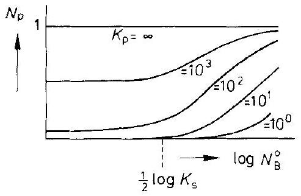
Figure 2-2. a) Fraction $N_{\mathrm{p}}$ of defect pairs (e.g., [B,V] in Schottky-disordered AX) as a function of the normalized temperature $\left(R /\left|\Delta G_{\mathrm{P}}^{0}\right|\right) \cdot T$ for various dopant concentrations $N_{\mathrm{B}}^{0}$. b) $N_{\mathrm{P}}$ as a function of $N_{\mathrm{B}}^{0}$ at given $T$. The parameter $K_{\mathrm{S}}$ denotes the Schottky equilibrium constant $\left(N_{\mathrm{V}_{\mathrm{A}}^{\prime}} \cdot N_{\mathrm{V}_{\mathrm{X}}^{\prime}}\right)$.

$N_{\mathrm{B}}^{0}$ (doping concentration), and as a function of $N_{\mathrm{B}}^{0}$ for a given temperature respectively. It is seen that $N_{\mathrm{P}}$ rapidly increases with doping concentration, the more so the higher $K_{\mathrm{P}}$. On the other hand, $N_{\mathrm{P}}$ decreases drastically with temperature if the thermal energy $R T$ approaches the pairing Gibbs energy.

Let us finally include higher clusters in the discussion. In kinetics, they are mainly relevant because the mobility of clustered point defects is quite different from the mobility of single defects. We shall treat the simplest possible situation. A matrix crystal A contains impurities B which form associates $\mathrm{B}_{n}, n=2,3, \ldots$. The total impurity content $N_{\mathrm{B}}^{0}$ is given by $\sum n \cdot N_{\mathrm{B}_{n}}$. The formation equation of $\mathrm{B}_{n}$ is

$$
n \cdot \mathrm{~B}=\mathrm{B}_{n}
$$

Obviously, the evaluation of $N_{\mathrm{B}}$ as a function of $N_{\mathrm{B}}^{0}$ depends decisively on the assumptions we make concerning the interactions between B neighbors or, more generally, those concerning $K_{n}(n)$. If we let $K_{n}=k^{n}$, which means that each increment $\Delta g$ in the Gibbs energy is the same if one B is added to $\mathrm{B}_{n}$, independent of $n$, then

$$
a_{\mathrm{B}_{n}}=\left(k \cdot a_{\mathrm{B}}\right)^{n}, \quad k>1
$$

For dilute solutions of B, which obey Henry's law, we therefore have

$$
N_{\mathrm{B}}+\sum_{n=2}^{n} n \cdot\left(k \cdot N_{\mathrm{B}}\right)^{n}=N_{\mathrm{B}}^{0}
$$

from which the cluster fractions $N_{\mathrm{B}_{n}}$ can be calculated numerically as a function of $N_{\mathrm{B}}^{0}$ (see also Fig. 2-3).

Figure 2-3. Fraction $N_{\mathrm{B}}$ of $\mathrm{B}_{n}$ clusters (schematic), as a function of the $N_{\mathrm{B}}^{0}$ doping level. The system contains $\mathrm{B}, \mathrm{B}_{2}, \mathrm{~B}_{3}(n=1,2,3)$.

### 2.4 Point Defects in Solid Solutions

We have discussed point defects in elements (A) and in nearly stoichiometric compounds having narrow ranges of homogeneity. Let us extend this discussion to the point defect thermodynamics of alloys and nonmetallic solid solutions. This topic is of particular interest in view of the kinetics of transport processes in those solid solutions which predominate in metallurgy and ceramics. Diffusion processes are governed by the concentrations and mobilities of point defects and, although in inhomogeneous crystals the components may not be in equilibrium, point defects are normally very close to local equilibrium.

We wish to determine under isothermal and isobaric conditions the concentration of defects as a function of the solid solution composition (e.g., $N_{\mathrm{B}}$ in alloy ( $\mathrm{A}, \mathrm{B}$ )). Consider a vacancy, the formation Gibbs energy of which is now a function of $N_{\mathrm{B}}$. In ideal (A,B) solutions, we may safely assume that the local composition in the vicinity of the vacancy does not differ much from $N_{\mathrm{B}}$ and $N_{\mathrm{A}}$ in the undisturbed bulk. Therefore, we may write the vacancy formation Gibbs energy $G_{\mathrm{V}}^{0}\left(N_{\mathrm{B}}\right)$ (see Eqn. (2.50)) as a series expansion $G_{\mathrm{V}}^{0}\left(N_{\mathrm{B}}\right)=G_{\mathrm{V}}^{0}(0)+\Delta G_{\mathrm{V}}^{0} \cdot N_{\mathrm{B}}+$ higher order terms, so that $\Delta G_{\mathrm{V}}^{0}=G_{\mathrm{V}}^{0}\left(N_{\mathrm{B}}=1\right)-G_{\mathrm{V}}^{0}\left(N_{\mathrm{B}}=0\right)$. It is still true (as was shown in Section 2.3) that the vacancy chemical potential $\mu_{\mathrm{V}}$ in the homogeneous equilibrium alloy is zero. Thus, we have (see Eqn. (2.57))

$$
N_{\mathrm{V}}=\mathrm{e}^{-\frac{\Delta G_{\mathrm{V}}^{0}}{R T} \cdot N_{\mathrm{B}}} \cdot \mathrm{e}^{-\frac{G_{\mathrm{V}}^{0}(0)}{R T}}=\mathrm{e}^{-\frac{\Delta G_{\mathrm{V}}^{0}}{R T} \cdot N_{\mathrm{B}}} \cdot N_{\mathrm{V}}(0)
$$

Figure 2-4 illustrates the validity of Eqn. (2.73) and also the linear approximation of $G_{\mathrm{V}}^{0}\left(N_{\mathrm{B}}\right)$ for $(\mathrm{Co}, \mathrm{Mg}) \mathrm{O}$.

In the case of nonideal solid solutions, the vacancies (or other point defects) by necessity interact differently with components A and B in their immediate surroundings. Therefore, the alloy composition near a vacancy differs from the bulk composition $N_{\mathrm{B}}$. This is analogous to the problem of energies and concentrations of gas atoms dissolved in alloys under a given gas vapor pressure [H. Schmalzried, A. Navrotsky (1975)]. Let us briefly indicate the approach to its solution and transfer it to the formulations in defect thermodynamics.

For pure metal A, Eqn. (2.57) (or Eqn. (2.73) with $N_{\mathrm{B}}=0$ ) represents $N_{\mathrm{V}}\left(G_{\mathrm{V}}^{0}\right)$, which we can write in this form

$$
N_{\mathrm{V}}=C \cdot \mathrm{e}^{-\frac{\Delta H_{\mathrm{V}}^{0}}{R T}}=C \cdot\left[\mathrm{e}^{-\frac{1}{r} \cdot \frac{\Delta H_{\mathrm{V}}^{0}}{R T}}\right] r
$$

$C$ contains the formation entropy and $r$ is the coordination number of the vacancy. Thus, $\Delta H_{\mathrm{V}}^{0} / r$ is the enthalpy per $\mathrm{V}-\mathrm{A}$ bond in the sense of the thermodynamics of regular solutions [H. Schmalzried, A. Navrotsky (1975)]. For random A-B distributions, the probability of the configuration ( $r_{\mathrm{A}}, r_{\mathrm{B}}$ ) in the nearest neighbor shell of the vacancy $V$ is

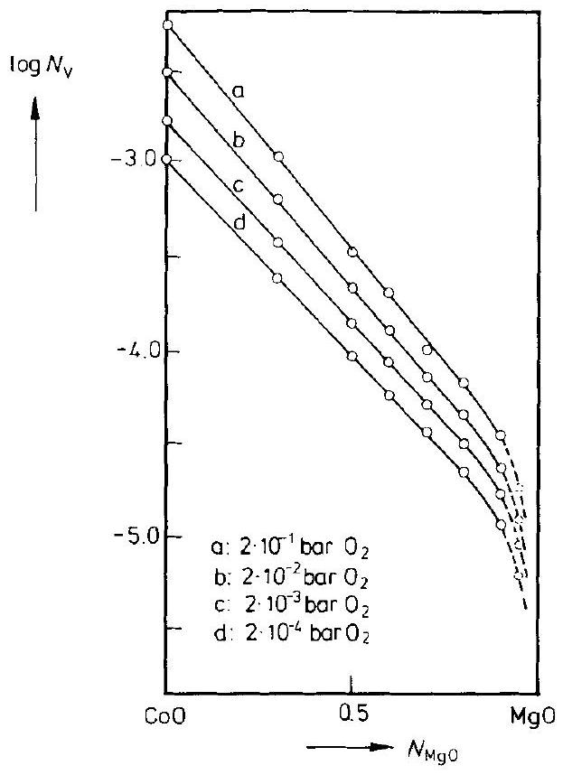
Figure 2-4. Vacancy fraction $N_{\mathrm{V}}$ in $(\mathrm{Co}, \mathrm{Mg})_{1-\delta} \mathrm{O}$ as a function of composition $\left(N_{\mathrm{MgO}}\right)$ and oxygen potential at $T=1100^{\circ} \mathrm{C}$ [R. Dieckmann, H. Schmalzried (1975)].

$$
\omega\left(r_{\mathrm{A}}, r_{\mathrm{B}}\right)=\left\{\begin{array}{c}
r \\
r_{\mathrm{B}}
\end{array}\right\} \cdot N_{\mathrm{A}}^{r_{\mathrm{A}}} \cdot N_{\mathrm{B}}^{r_{\mathrm{B}}}
$$

The mole fraction of vacancies with all possible $\mathrm{A}-\mathrm{B}$ configurations (of the same energy) is therefore

$$
N_{\mathrm{V}}=C \cdot \sum_{r_{\mathrm{A}}=0}^{r} \omega\left(r_{\mathrm{A}}, r_{\mathrm{B}}\right) \cdot \mathrm{e}^{-\frac{\Delta H_{\mathrm{V}}\left(r_{\mathrm{B}}\right)}{R T}}
$$

Let us formulate $\Delta H_{\mathrm{V}}\left(r_{\mathrm{B}}\right)$ up to second order in $r_{\mathrm{B}}\left(=r-r_{\mathrm{A}}\right)$ as

$$
\Delta H_{\mathrm{V}}\left(r_{\mathrm{B}}\right)=\left(r_{\mathrm{A}} / r\right) \cdot \Delta H_{\mathrm{V}}(\mathrm{~A})+\left(r_{\mathrm{B}} / r\right) \cdot \Delta H_{\mathrm{V}}(\mathrm{~B})-\frac{1}{2} \cdot r_{\mathrm{A}} \cdot r_{\mathrm{B}} \cdot \Delta h
$$

The introduction of Eqn. (2.77) into Eqn. (2.76) and forming $N_{\mathrm{V}} / N_{\mathrm{V}}(\mathrm{A})$ with the help of Eqn. (2.73) eventually yields

$$
\frac{N_{\mathrm{V}}(\mathrm{~A}, \mathrm{~B})}{N_{\mathrm{V}}(\mathrm{~A})}=\sum_{r_{\mathrm{B}}=0}^{r}\left\{\begin{array}{c}
r \\
r_{\mathrm{B}}
\end{array}\right\} \cdot N_{\mathrm{A}}^{r_{\mathrm{A}}} \cdot N_{\mathrm{B}}^{r_{\mathrm{B}}} \cdot\left(\frac{N_{\mathrm{V}}(\mathrm{~B})}{N_{\mathrm{V}}(\mathrm{~A})}\right)^{r_{\mathrm{B}} / r} \cdot \mathrm{e}^{\frac{r_{\mathrm{A}} \cdot r_{\mathrm{B}} \cdot \Delta h}{2 R T}}
$$

Equation (2.78) expresses the vacancy fraction in the alloy, $N_{\mathrm{V}}(\mathrm{A}, \mathrm{B})$, in terms of the vacancy fractions $N_{\mathrm{V}}$ of the pure end members of the solid solution, of the coordination number $r$, and of the parameter $\Delta h$, which designates the enthalpy change when the vacancy is transferred from configuration ( $r_{\mathrm{A}}, r_{\mathrm{B}}$ ) into ( $\left(r_{\mathrm{A}}+1\right)$,

Figure 2-5. Relative defect (vacancy) fraction as a function of alloy composition $N_{\mathrm{B}}$ (see Eqn. (2.78)), if defects interact differently with nearest neighbors A and B . (1) $\Delta h=0$; (2) $\Delta h=0.6 \cdot R T$ (for definition of $\Delta h$ see text).

( $r_{\mathrm{B}}-1$ )). Figure 2-5 shows an illustration and compares the linear approach of Eqn. (2.73) with the regular solution approach of Eqn. (2.78), if $\Delta h$ is arbitrarily chosen to be $0.6 \cdot R T$.

For dilute solid solutions $\mathrm{A}\left(+\mathrm{B}_{1}, \mathrm{~B}_{2}, \ldots\right)$ the interaction parameter formalism as outlined in Section 2.2 is adequate.

### 2.5 Conclusions

The basis of defect thermodynamics is the concept of regular and irregular SE's and the constraints which crystallography and electroneutrality (in the case of ionic crystals) impose on the derivation of the thermodynamic functions. Thermodynamic potential functions are of particular interest, since one derives the driving forces for the chemical processes in the solid state from them.

Defect thermodynamics, as outlined in this chapter, is to a large extent thermodynamics of dilute solutions. In this situation, the theoretical calculation of individual defect energies and defect entropies can be helpful. Numerical methods for their calculation are available, see [A. R. Allnatt, A. B. Lidiard (1993)]. If point defects interact, idealized models are necessary in order to find the relations between defect concentrations and thermodynamic variables, in particular the component potentials. We have briefly discussed the ideal pair (cluster) approach and its phenomenological extension by a series expansion formalism, which corresponds to the virial coefficient expansion for gases.

Theoretical point defect calculations for solid solutions are difficult because the defect surroundings are not isotropic. This is particularly true for metals considering
the delocalized nature of the metallic bond. The phenomenological series expansion as outlined in the last section offers an acceptable formalism for the solution of practical problems, and the linearized approach has been justified for many nearly-ideal solutions by experimental results. Of course, statistical modeling is far more sophisticated, but verification by experiment remains ambiguous.

## References

Allnatt, A. R., Lidiard, A. B. (1987) Rep. Progr. Phys., 50, 373
Allnatt, A. R., Lidiard, A. B. (1993) Atomic Transport in Solids, Cambridge University Press, Cambridge
Born, M., Mayer, J.E. (1932) Z. Physik, 75, 1
Dieckmann, R., Schmalzried, H. (1975) Ber. Bunsenges. Phys. Chem., 79, 1108
Flynn, P. (1972) Point Defects and Diffusion, Clarendon Press, Oxford
Harding, J. (1990) Rep. Progr. Phys. 53, 1403
Jacobs, P. W.M. (1990) in: Diffusion in Materials, Kluwer Acad. Publ., London, NATO ASI Series E: Appl. Sciences Vol. 179
Lidiard, A. B. (1957) Handbuch der Physik, 20, Springer, Berlin
Martin, M., Pfeiffer, T., Schmalzried, H. (1988) Kristallthermodynamik, Report, Universität Hannover
Mayer, J. E., Mayer, M. (1940) Statistical Mechanics, Wiley, New York
Schmalzried, H. (1981 a) Transport Theory of Oxide Electrolytes, Advances in Ceramics, Amer. Cer. Soc., Columbus, Ohio
Schmalzried, H. (1981b) Solid State Reactions, Verlag Chemie, Weinheim
Schmalzried, H., Navrotsky, A. (1975) Festkörperthermodynamik, Verlag Chemie, Weinheim
Schottky, W. (1935) Z. phys. Chem., B21, 335
Schottky, W. (1958) Halbleiterprobleme IV, Vieweg, Braunschweig
Tomlinson, S.M. (1992) in: Defect Processes in Transition Metal Oxides, Polar Solids Disc. Group, Oxford
Wagner, C. (1952) Thermodynamics of Alloys, Addison-Wesley Publ. Comp., Reading
Wagner, C. (1971) Progr. Sol. State Chem., 6, 1

## 3 One- and Two-Dimensional Defects in Crystals

### 3.1 Introduction

The regular structure elements of perfect crystals having ideal order are immobile. Mobility of SE's and consequently chemical processes in the solid state thus depend upon crystal imperfections. In Chapter 2, it was shown that atomic imperfections in an equilibrium crystal exist in the form of point defects. Non-equilibrium, higher dimensional defects such as dislocations, grain boundaries, or macroscopic inclusions can exist. Dislocations (one-dimensional imperfections of the crystal lattice) are catalysts for plastic deformation. Two-dimensional defects are interfaces such as phase boundaries or stacking faults. Their structures and some relevant properties of these non-equilibrium defects will be briefly described. Two properties are of special interest in the context of solid state kinetics: 1) they can act as sites of repeatable growth within a crystal and 2 ) they offer paths of increased mobility for atomic particles. They are also locations where preferential nucleation of new phases can take place. The physics of dislocations and interfaces is well covered in pertinent monographs [J. P. Hirth, J. Lothe (1982); H. Gleiter (1983); D. Wolf, S. Yip (1992); D. J. Bacon (1993); R. W. Balluffi, A.P. Sutton (1993)]. In the following we will underline their role and importance in the kinetics of solid state processes.

### 3.2 Dislocations

### 3.2.1 Strain, Stress, and Energy

Dislocations are line defects. They bound slipped areas in a crystal and their motion produces plastic deformation. They are characterized by two geometrical parameters: 1) the elementary slip displacement vector $\boldsymbol{b}$ (Burgers vector) and 2 ) the unit vector that defines the direction of the dislocation line at some point in the crystal, $s$. Figures 3-1 and 3-2 show the two limiting cases of a dislocation. If $b$ is perpendicular to $\boldsymbol{s}$, the dislocation is named an edge dislocation. The screw dislocation has $\boldsymbol{b}$ parallel to $\boldsymbol{s}$. Often one finds mixed dislocations. Dislocation lines close upon themselves or they end at inner or outer surfaces of a solid.

The edge dislocation moves easily on its glide plane perpendicular to $s$ under the influence of a shearing force. This force is well below the theoretical shear strength of a perfect crystal since not all of the atoms of a glide plane perform their slip at

Figure 3-1. a) Edge dislocation model; b) Burgers vector $b$ with Burgers circuit and glide plane indicated. Dislocation motion during plastic deformation under the action of force $F$. Jog and kink.

the same time (conservative dislocation motion). An edge dislocation moves normal to the glide plane when atoms (ions, molecules) are added or taken away from the half-plane that is bounded by the dislocation line (non-conservative motion). This mode of motion is called climb. The climbing edge dislocation is the (moving) source or sink for vacancies or interstitials and thus plays a prominent role in the establishment of internal point defect equilibria. Also, since the crystal is compressed above the glide plane (where a half-plane has been shoved in), atomic defects of volume $V<V_{\mathrm{A}}(\mathrm{A}=$ matrix crystal) tend to segregate. The reverse is true for the dilated region below the glide plane (Fig. 3-1). Mobile SE's will redistribute around a dislocation line until their chemical potentials are constant throughout. In this way, the dislocation can be anchored (by the so-called Cottrell atmosphere), and shear stress is increased after this SE redistribution takes place.

The glide plane of an edge dislocation (Fig. 3-1b) is defined by the vector product $[b \times s]$. Obviously, the screw dislocation has no particular glide plane ( $[b \times s]=0$ ). Gliding and climbing of dislocations often starts locally from so-called kinks or jogs which are elementary breaks on the dislocation line. The motion of a kink occurs in the glide plane, whereas a jog brings a dislocation line to the next lattice plane perpendicular to the glide plane. In particular, a jog on a screw dislocation has edge character. Its movement perpendicular to $s$ occurs by climb. Therefore, if two perpen-

Figure 3-2. Screw dislocation; Burgers vector $b$ with Burgers circuit. $s=$ direction of screw dislocation line.

dicularly oriented screw dislocations cut each other, jogs are created which move further in a non-conservative manner. All these processes are responsible for the creation of vacancies and interstitials during plastic deformation.

Next, let us compile some quantitative relations which concern the stress field and the energy of dislocations. Using elastic continuum theory and disregarding the dislocation core, the elastic energy, $E_{\text {disl }}$, of a screw dislocation per unit length for isotropic crystals is found to be

$$
E_{\mathrm{disl}} \cong \frac{G \cdot b^{2}}{4 \pi} \cdot \ln r^{*} / r_{\mathrm{C}}
$$

where $G$ in this context denotes the shear modulus. Typical values of $G$ for metallic (ceramic) solids range between 40 and $600 \mathrm{GPa}(400-6000 \mathrm{kbar}) . r^{*}$ is the radius of the cylindrical elastic distortion. It is approximately given by the distance from the dislocation core ( $r_{\mathrm{C}}$ ) either to the crystal surface, or to the surrounding dislocations (as $r^{*}=\left(\varrho_{\text {dist }}\right)^{-1 / 2}$, where $\varrho_{\text {dist }}$ is the dislocation density). The strain energy per unit length of the edge dislocation is $E_{\text {disl }}$ (edge) $=1 /(1-v) \cdot E_{\text {disl }}$ (screw), where $v$ is Poisson's ratio $(\sim 0.2, \ldots, 0.45)$.

Since screw and edge components of a mixed dislocation have no common stress components, one can add the respective strain energies in order to obtain the line energy of a mixed dislocation. The strain and stress fields of a screw dislocation (in direction $s$ ) are respectively

$$
\begin{gathered}
\varepsilon_{s}=b /(4 \pi \cdot r) \\
\sigma_{s}=G \cdot b /(2 \pi \cdot r)
\end{gathered}
$$

$r$ is the distance from the dislocation line. These fields are more complicated for edge dislocations. If, in a Cartesian coordinate system, $x-y$ designates the glide plane, $y \| s$, and $z(\perp x-y)$ points into the extra half-plane, one has

$$
\begin{gathered}
\sigma_{x x}=-\frac{G \cdot b}{2 \pi(1-v)} \cdot z \cdot \frac{\left(3 x^{2}+z^{2}\right)}{\left(x^{2}+z^{2}\right)^{2}}, \quad \sigma_{z z}=\frac{G \cdot b}{2 \pi(1-v)} \cdot z \cdot \frac{\left(x^{2}-z^{2}\right)}{\left(x^{2}+z^{2}\right)^{2}} \\
\sigma_{x z}=\frac{G \cdot b}{2 \pi(1-v)} \cdot x \cdot \frac{\left(x^{2}-z^{2}\right)}{\left(x^{2}+z^{2}\right)^{2}}
\end{gathered}
$$

For sufficiently large $r=\left(x^{2}+z^{2}\right)^{1 / 2}$ and small $x$ values, the $1 / r$ dependence again dominates (Eqn. (3.3)).

Let us derive the force $\boldsymbol{F}$ which is exerted by an externally applied stress field $\sigma$ (or rather $\hat{\sigma}$ ) on a unit length segment of a dislocation. If this segment is differentially displaced by $\mathrm{d} \boldsymbol{r}$, the (surface) force is $\sigma \cdot \mathrm{d} A(\mathrm{~d} A=\boldsymbol{s} \cdot \mathrm{d} \boldsymbol{r})$, and by this displacement the shift, $b$, of atoms on opposite sides of $\mathrm{d} A$ extracts an amount of work

$$
\mathrm{d} W=\boldsymbol{F} \cdot \mathrm{d} \boldsymbol{r}=\boldsymbol{b} \cdot(\sigma \cdot \mathrm{d} A)
$$

which yields for the (virtual) force $\boldsymbol{F}$ (sometimes called the Peach-Koehler force)

$$
F=b \cdot(\sigma \times s)
$$

One may conclude from Eqn. (3.6) that an (arbitrary) stress $\sigma$ exerts both a glide force and a climb force on edge dislocations, but no climb force on screw dislocations ( $\boldsymbol{s}|\mid \boldsymbol{b} ; \boldsymbol{F}=0$ ). Equation (3.6) can also be used to calculate the interaction between two dislocations, that is, the force which the stress field of one dislocation exerts on the unit length of another dislocation at a given coordinate. For parallel dislocations, this force can be written as [J. P. Hirth, J. Lothe (1982)]

$$
F_{\text {inter }}=\frac{G}{2 \pi \cdot r_{12}} \cdot f\left(b_{1}, s_{1}, b_{2}, s_{2}\right)
$$

where $r_{12}$ is the distance between the dislocations. The force is repulsive between edge dislocations of like sign and attractive between those of opposite sign. By integration we obtain the interaction energy for two equal screw dislocations

$$
E_{\text {inter }}=\frac{G \cdot b^{2}}{2 \pi} \cdot \ln r_{12} / r_{\mathrm{C}}
$$

In the case of edge dislocations, $E_{\text {inter }}$ additionally depends on the angle between $b$ and $\boldsymbol{r}_{12}$. We note that the interaction forces are inversely proportional to the distance $r_{12}$ and that a dislocation is surrounded (on the average) by dislocations of opposite sign. Their stress fields tend to cancel over distances $>r_{12}$. Neglecting the dislocation core energy, the elastic energy per unit length is then equivalent to a line tension force of the same numerical value, and thus

$$
\mathrm{d} E / \mathrm{d} L=E / L=F \approx g \cdot G \cdot b^{2}
$$

where $g$ (approximately $1 / 2$ ) is a numerical factor, and $L$ is the length of the dislocation line. A dislocation line therefore strives to minimize its length. Setting $\varrho_{\text {disl }}=10^{8} \mathrm{~cm}^{-2}$ and $r_{\mathrm{C}}=10^{-7} \mathrm{~cm}$, the energy $E_{\text {disl }}$ is $c a .170 \mathrm{~kJ}$ per mole of atomic particles on the dislocation line. Note that point defect energies are of the same order of magnitude. Nevertheless, in view of their low fractions, neither dislocations nor point defects normally contribute noticeably to the total energy of a crystal. Yet the

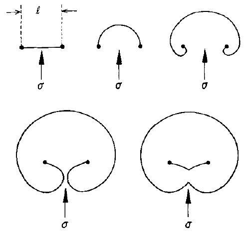
Figure 3-3. Representation of dislocation movement in a Frank-Read dislocation source under stress $\sigma$. Multiplication of dislocation pinned at a distance $l$.

fact that (equilibrium) point defects and atomic particles on a dislocation line have comparable energies suggests that kinks and jogs do occur at thermal equilibrium, although the dislocation itself is a non-equilibrium defect. Thus, kinks and jogs have a (thermally activated) mobility and can move under internal or external forces (stresses).

Under the action of a local shear stress, $\sigma$, a straight dislocation line that is fixed at two points will bend out. The bending radius is inversely proportional to $\sigma$. The dislocation becomes unstable if the bending radius is $<l / 2$, where $l$ is the distance between the anchor points (Fig. 3-3). Dislocation loops can be formed and macroscopic plastic deformation can continuously occur under stress if

$$
\sigma>\alpha \cdot \frac{F}{l \cdot b}=\alpha \cdot \frac{G \cdot b}{l}
$$

where $\alpha$ is a numerical factor which depends on the geometry of the surrounding dislocation network.

If a dislocation line moves on the glide plane, an energy barrier has to be overcome in order to bring the dislocation to its next equivalent lattice position. The periodic potential felt by the moving dislocation line is modeled as $E=E_{\mathrm{P}} \cdot \sin ^{2}(\pi \cdot x / b)$ whereby $E_{\mathrm{P}}$ is called the Peierl's energy. Although the barrier is usually overcome by kink motion, atomistic calculations of $E_{\mathrm{p}}$ often correctly predict the slip systems. The calculation of $E_{\mathrm{P}}$ gives [F. R. N. Nabarro (1967)]

$$
E_{\mathrm{P}}=\frac{G \cdot b^{2}}{\pi(1-v)} \cdot \mathrm{e}^{-\frac{2 \pi \cdot d}{b(1-v)}}
$$

where $d$ defines the glide plane spacing. The corresponding force (maximum slope of $E(x)$ per unit length) is

$$
\sigma_{\mathrm{P}}=\frac{2 G \cdot b}{1-v} \cdot \mathrm{e}^{-\frac{2 \pi \cdot d}{b(1-v)}}
$$

Accordingly, glide planes are those planes which have the shortest $b$ vectors: $a / 2 \langle 110\rangle$ for fcc, $a / 2\langle 111\rangle$ for bcc, and $a / 3\langle 211.0\rangle$ for hcp lattices. Dislocations can split into so-called Shockley partials: $\boldsymbol{b}=\boldsymbol{b}_{1}+\boldsymbol{b}_{2}$, if $b^{2}>b_{1}^{2}+b_{2}^{2}$. Since $\boldsymbol{b}_{1}$ and $\boldsymbol{b}_{2}$ are not translational vectors of the crystal lattice, they induce a stacking fault. The partial dislocation therefore bounds the stacking fault.

If a (full) dislocation has passed through a crystal, its surface shape is affected. If a partial dislocation has passed through a crystal, the stacking sequence is disturbed across the glide plane. If bundles of partial dislocations pass through a crystal in a certain order, they may change the crystal structure by correlated atomic displacements, for example, from fcc to hcp.

### 3.2.2 Kinetic Effects Due to Dislocations

We see from Figure 3-1 that edge dislocations possess a compressed region above, and a dilated region below the glide plane. Therefore, in the dilated area around the dislocation line, the transport coefficients will be larger than in the bulk crystal. Thus, dislocations can serve as fast diffusion pipes for atomic transport.

In one dimensional diffusion experiments (e.g., starting with a thin film source of A on a B crystal surface) one often finds an exponential decrease in the A concentration at the far tail of the concentration profile. This behavior has been attributed to 'pipe diffusion' along dislocation lines running perpendicular to the surface. Models have been introduced which assume a (constant) pipe radius, $r_{\mathrm{p}}$, inside which $D_{\mathrm{A}}^{\mathrm{p}}=\beta \cdot D_{\mathrm{A}}^{\mathrm{b}}, \mathrm{b}$ and p denoting here bulk and dislocation respectively. $\beta$ values of $10^{3}$ have been obtained in this way. It is difficult to assess the validity of these observations. The model considerably simplifies the real situation. During diffusion annealing, the structure of the dislocation networks is likely to change because of self-stress (see Chapter 14) and chemical interactions.

Transport and reactions change the local state variables. In single-phase systems, lattice parameters change. Symmetry and lattice parameters change during heterogeneous reactions. Many intercalation reactions in layered structures (layer silicates, $\mathrm{MoS}_{2}$, bronzes) are pertinent examples. In principle, each diffusion process in inhomogeneous single-phase systems builds up a (self) stress field. If stresses caused by transport exceed a critical value (yield strength), dislocations are formed in and/or near the diffusion zone. This is exemplified in Figure 3-4, where the dislocation density (made visible by a decoration technique) in the interdiffusion couple $\mathrm{AgBr} / \mathrm{NaCl}$ [H. Haefke, H. Stenzel (1989)] is shown. The dislocation density parallels the concentration profile perfectly. Indeed, the experimental results allowed the determination of the cation interdiffusion coefficient from the dislocation density vs. distance curve. Although this phenomenon is expected to occur frequently in interdiffusion experiments, the implications with respect to matter transport kinetics are complex and hard to quantify. The reason is a cycle of effects. Firstly, transport creates dislocations in the self-stress field of the interdiffusion zone. The dislocations interact with the stress field and each other. These interactions make them move with the diffusion zone, and their motion leads to the formation of point defects. Point defects, however, enhance transport since they increase the transport coefficients. In

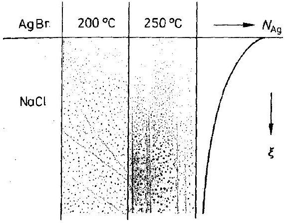
Figure 3-4. Dislocation decoration in an AgBr NaCl interdiffusion zone. Dislocations formed by self-stress due to lattice parameter changes. The decoration density indicates the dislocation density [after H. Haefke, H. Stenzel (1989)].

addition, transport is directly affected by the dislocations in that they serve as fast diffusion paths (pipe diffusion). In consequence, the moving dislocation network, whose structure is changing with time, may strongly influence the kinetic parameters in the diffusion zone and thereby the overall transport kinetics.

Another moving dislocation network is illustrated in Figure 3-5. The dislocations formed and moved during the course of a heterogeneous solid state reaction in which cobaltspinel ( $\mathrm{Co}_{3} \mathrm{O}_{4}$ ) grew inside cobaltous oxide ( CoO ) by the condensation of supersaturated cation vacancies. Despite the fact that the oxygen ion sublattice is the same for the two oxides, the lattice mismatch creates a dislocation network which accompanies the moving $\mathrm{CoO} / \mathrm{Co}_{3} \mathrm{O}_{4}$ interface and influences the transport properties of the cation vacancies in front of it. We note that the climbing of edge dislocations (coupled with the formation or annihilation of point defects) can be treated

Figure 3-5. $\mathrm{Co}_{3} \mathrm{O}_{4}$ spinel precipitate in a CoO matrix due to cooling. Dislocation network in the matrix stems from the misfit between CoO and $\mathrm{Co}_{3} \mathrm{O}_{4}$ [T. Pfeiffer (1990), unpublished].

1) as a diffusion controlled process with well defined boundary conditions [J.P. Hirth (1983)] in which the source (sink) is moving, and 2) as a reaction-limited process in which the (moving) line source (sink) is characterized by a kinetic parameter (e.g., sticking coefficient for vacancies or interstitials at the dislocation line).

With these examples, we conclude the introduction of line defects and turn to nonequilibrium defects of higher dimension.

### 3.3 Grain Boundaries

Grain boundaries (and boundaries between phases) are elements of the microstructure of crystalline solids, being characterized by their number, shape, and topological arrangement. The microstructure is a non-equilibrium property. In the next section we discuss grain boundaries.

### 3.3.1 Structure and Energy of Grain Boundaries

Dislocations interact and tend to order if they can move. Consider the arrangement shown in Figure 3-6a. This is called an edge dislocation tilt boundary. It is seen that the number of lattice planes terminating at the boundary is $n=(2 / b) \cdot \sin \Theta / 2$, from which the (mean) spacing between the dislocations is found to be

$$
l=n \cdot a=(b / 2) \cdot \sin \Theta / 2 \cong b / \Theta
$$

The approximate equality of the last term in Eqn. (3.13) holds for small-angle grain boundaries. The elastic interaction is such that regions of tension and compression overlap and partly cancel their stress, bringing the tilt boundary into an energy minimum. According to [W. T. Read, W. Shockley (1950)], the elastic tilt boundary energy is given by

$$
E=\frac{G \cdot b^{2}}{4 \pi \cdot(1-v)} \cdot \frac{\theta}{b} \cdot(A-\ln \Theta) \quad, \quad \Theta<0.1
$$

where $\Theta / b=1 / l$ is seen to be the number of dislocations per unit area and $A$ is a term that takes into account the fraction of energy due to the dislocation core.

Tilt boundaries occur if the axis of rotation between the two grains is located in the boundary (interface). In contrast, if the axis of rotation is perpendicular to the boundary, the boundary is called a twist boundary and consists of a collection of screw dislocations (Fig. 3-6b). An equation similar to Eqn. (3.14) holds for twist (and mixed) boundaries. Since dislocation theory is well understood, it is possible to quantitatively treat small-angle grain boundaries [J. P. Hirth, J. Lothe (1982)].

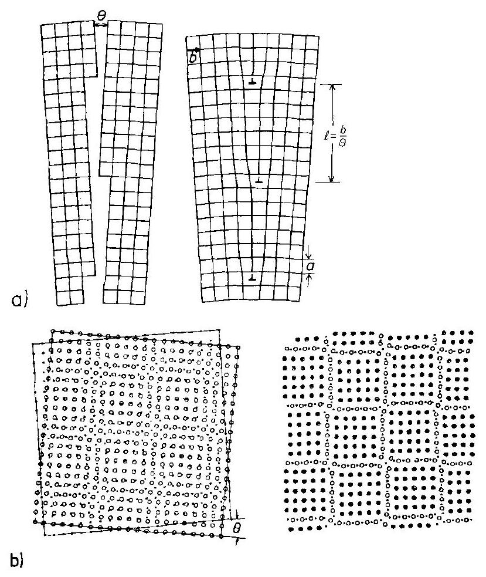
Figure 3-6. a) Small-angle tilt boundary with edge dislocations. b) Small-angle twist boundary; formation of a screw dislocation network.

The small-angle grain boundary is a special dislocation model. In general, the grain boundary is characterized phenomenologically by eight geometrical parameters which determine the relative orientation and distance of one (planar) crystal surface with the Miller indices $(h, k, l)$ to a second crystal surface with indices $\left(h^{\prime}, k^{\prime}, l^{\prime}\right)$ (see also [D. Wolf, S. Yip (1992)] and Fig. 10-2). There is but one position and interface structure at any given $P, T, \mu_{k}$ with a minimum Gibbs energy for the joint system. One notes that this joining requires unrestricted mobility of the interface SE.

Since both grain sizes and orientations influence many properties of crystalline solids, it is of practical interest to know the structure and energy of large-angle grain boundaries. Two types of models have been favored: dislocation (and disclination) models and atomic matching models. The large-angle grain boundary dislocation model is an extension of the small-angle grain boundary model. (Disclination models replace the Burgers vector of boundary dislocations by a known rotation along the common axis of the two crystals.) Atomic matching models utilize a crystallographic approach in essence.

It is known from experiment that the boundary energy and diffusivity are a function of the grain boundary orientation angle and often show minima at certain specific orientations [Q. Ma, R. W. Balluffi (1993); A. N. Aleshin, et al. (1977)]. This
can be understood for those rotations which lead to a coherent twin boundary (e.g., (111) for fcc) and to an overlap of the twin lattice points. However, there are other orientations for which a certain fraction of the lattice points of the overlapping lattices of the two crystals which form the boundary (almost) coincide. These points are called O -points and can be recognized in Figure 3-6b. One can construct a purely geometrical theory of O-point coincidence lattices [W. Bollmann (1970)] and maximize the number of O-points per volume in order to rationalize the cusps of the boundary energy vs. boundary orientation plots. In contrast, however, calculations [D. Wolf (1980); D. M. Duffy, P. W. Tasker (1985)] have shown that the boundary energy for simple oxides is a smooth function of the twist angle with only one broad maximum. For completeness sake, let us mention that deviations from coincidence site lattice orientations yield additional (secondary) dislocations. An overview on the relevant questions and results is found in [D. Wolf, K. L. Merkle (1992)].

Other proposals for boundary structure models include the mixing of islands of good atomic fit along the boundary with others of poor fit. Good fit can either mean microfaceting or that atomic polyhedra are embedded in rather amorphous surroundings along the boundary. Although narrow boundaries comprising a few lattice distances is the rule, wide boundaries have been reported. As an example, we mention the interphase boundary ( $\sim 0.3 \mu \mathrm{~m}$ ) in the system $\alpha / \beta$-quartz [J. G. van Landuyt $e t$ al. (1981)].

Grain boundary models were developed primarily for metals. We can assume that the above mentioned ideas on the structure and energy of grain boundaries also hold, in essence, for ionic, covalent, and van der Waals crystals as well [M. W. Finnis, M. Rühle (1993)].

Since we are considering equilibrium boundaries and interfaces, let us introduce some phenomenological thermodynamics. If õ symbolizes the orientation (location) of two crystal parts (phases) relative to each other, and $\tilde{\mathrm{s}}$ designates a structure parameter that symbolizes the atomic structure of the boundary (composition and structural details), then

$$
\left(\frac{\partial G^{\mathrm{b}}}{\partial n_{k}}\right)=\mu_{k}^{\mathrm{b}}(P, T, \tilde{\mathrm{~s}}, \tilde{\mathrm{o}})
$$

is the chemical potential of component $k$ at the interface. Since it is constant throughout crystals I and II under equilibrium conditions

$$
\mu_{k}^{\mathrm{b}}=\mu_{k}^{\mathrm{I}}=\mu_{k}^{\mathrm{II}} \text { or } \eta_{k}^{\mathrm{b}}=\eta_{k}^{\mathrm{I}}=\eta_{k}^{\mathrm{II}}
$$

and we have

$$
\tilde{\mathrm{s}}=f\left(P, T, \mu_{k}, \tilde{\mathrm{o}}\right)
$$

We conclude that the isothermal, isobaric interface structure is a function of 1) the orientation and 2 ) the component chemical potentials in the adjacent crystals. The first point has been exploited explicitly in calculations of boundary energies, $E^{\mathrm{b}}$ ( $=E_{\text {total }}-E^{\mathrm{I}}-E^{\mathrm{II}}$ ), using appropriate interatomic potentials and relaxation pro-
cedures, e.g. in [D. Wolf, S. Yip (1992)]. The second point can be viewed analogous to the aforementioned Cottrell atmosphere surrounding dislocations. The effect is called boundary segregation, and size effects play a dominant role in lowering the boundary Gibbs energy. The following experiment demonstrates the importance of Eqn. (3.17) for nearly stoichiometric line compounds.

The $\beta-\alpha-\beta$ transformation (at $176^{\circ} \mathrm{C}$ ) of a single crystal of $\mathrm{Ag}_{2} \mathrm{~S}$ introduces a variety of additional internal interfaces (mosaic structure) into the crystal bulk. This has been verified by X-ray investigations. The newly formed interfaces adsorb point defects from the bulk crystal (the coexisting phase, so to say) in a similar way as external surfaces adsorb species (i) from an adjacent gas phase. We know that the surface structure is a function of the degree of coverage, $\vartheta_{\mathrm{i}}$, which in turn is a function of the chemical potential of the components (i) (Gibbs adsorption isotherm). Figure 3-7 shows the proportion $\delta^{\mathrm{b}}$ of point defects which are adsorbed at the newly formed dislocations and small-angle grain boundaries in $\mathrm{Ag}_{2} \mathrm{~S}$. The linear dependence of $\log \left(\delta^{\mathrm{b}}-\delta_{0}^{\mathrm{b}}\right)$ vs. $\mu_{\mathrm{Ag}}$ indicates that boundary defects behave ideally in a thermodynamic sense. We further expect that the individual mobilities (diffusion coefficients) of the atomic constituents at the boundary depend on $\mu_{k}$ and, according to Eqn. (3.17), also on $\tilde{s}$ and the concentrations of the segregated point defects. (For external oxide surfaces, this has been verified by [V. Stubican, et al. (1987)].)

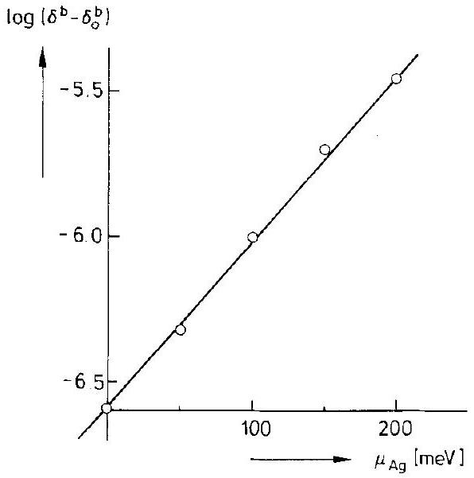
Figure 3-7. Fraction of point defects in $\alpha-\mathrm{Ag}_{2} \mathrm{~S}$ adsorbed on grain boundaries and dislocations as a function of the chemical potential of $\mathrm{Ag}\left(T=168^{\circ} \mathrm{C}\right)$.

In semiconductors and ionic crystals, one deals with electrically charged SE's. The equilibrium condition states that the electrochemical potential of each of the charged species is constant throughout (Eqn. (3.16)). This has two major consequences: 1) the electrical potential $\varphi$ changes near the grain boundary and 2) the space charge responsible for the change in $\varphi$ spreads into the adjacent grains. The spatial extent of the space charge (Debye length) depends on the concentration of point defects $\left(\sim c_{i}^{-1 / 2}\right)$. If (mobile) interface charges exceed a certain fraction of the interface sites, ordering and formation of distinct interface structures (equivalent to phase
transformations) can be expected due to the gain in electrostatic energy. Consequently, the change in $\varphi$ may occur non-monotonically if $\mu_{k}$ is monotonically changed in adjacent grains.

### 3.3.2 Phase Boundaries in Solids

In Section 3.3.1 we dealt with homophase interfaces. Heterophase interfaces (boundaries between different phases) are more complex, but their geometrical description again uses the concepts applied to grain boundaries. Let us first introduce the socalled Wulff construction of equilibrium surfaces (the adjacent 'phase' of the crystal is vacuum). Low index lattice planes normally have the highest numbers of nearest neighbors (bonds). If the surface deviates from such a low index plane by an angle $\Theta$, it forms facets of low index planes and steps between them. By counting the number of broken bonds, one finds the specific boundary energy to be

$$
E^{b}=\frac{\varepsilon}{2 \cdot \bar{a}^{2}} \cdot(\cos \Theta+\sin |\Theta|)
$$

where $\varepsilon$ is the single bond energy and $\bar{a}$ the nearest neighbor distance. From Eqn. (3.18), one obtains cusp-like curves in the plots of boundary energy vs. O. Entropy effects will smooth the sharp cusps to some extent; the relevant energy is the surface Gibbs energy $y$. If $A_{i}^{s}$ is the surface area of plane $i$, the total surface Gibbs energy of a crystal is $\sum A_{i}^{s} \cdot y_{i}$. Wulff has shown that from the $y_{i}$ plot in Figure 3-8, one can derive the equilibrium shape of a surface for which $\sum A_{i}^{s} \cdot y_{i}$ is a minimum. To this end, one constructs the inner envelope of the $y_{i}$ plot. As can be seen from Figure 3-8, it is the sharp $y_{i}$ cusp (minimum of the surface energy) which essentially determines the equilibrium shape of a crystal.

Figure 3-8. Wulff-plot: ( $1 \overline{1} 0$ ) section of a fcc crystal. $\gamma_{\mathrm{A}}(=\overline{\mathrm{AO}})$ represents the surface energy of a plane with the normal vector $\overline{\mathrm{AO}}$.

What are the differences when we deal with internal surfaces (i.e., interfaces) instead of free surfaces? Although more complex in detail, 'wrong' bonds are again responsible for internal surface Gibbs energies. Therefore, we normally expect cusps to occur in $E^{\mathrm{b}}$ vs. $\Theta(\gamma$ vs. $\Theta)$ plots (Fig. 3-9).

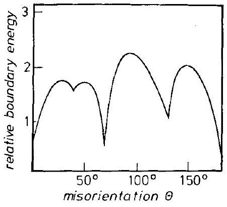
Figure 3-9. Grain boundary energies in aluminum. Rotation axis of the (symmetric) tilt boundary is $\langle 110\rangle$ [after G. Hasson, C. Goux (1971)].

Stress builds up at a coherent interface between two phases, $\alpha$ and $\beta$, which have a slight lattice mismatch. For a sufficiently large misfit (or a large enough interfacial area), misfit dislocations ( $=$ localized stresses) become energetically more favorable than the coherency stress whereby a semicoherent interface will form. The lattice plane matching will be almost perfect except in the immediate neighborhood of the misfit dislocation. Usually, misfits exist in more than one dimension. Sets ( $i$ ) of nonparallel misfit dislocations occur at distances

$$
d_{i}=b_{i} / \delta_{i} ; \quad \delta_{i}=\frac{\bar{a}_{i}^{\alpha}-\bar{a}_{i}^{\beta}}{\bar{a}_{i}^{\alpha}} \quad(=\text { misfit })
$$

The energy of a semicoherent interface can be split into two parts: $E_{\mathrm{b}}$ (broken bond (chemical) energy) and $E_{\mathrm{d}}$ (dislocation energy, proportional to dislocation density). $E_{\mathrm{d}}$ is proportional to $\delta_{i}$ as long as $\delta_{i}$ is small. Analogous to the large-angle grain boundary energy, $E_{\mathrm{d}}$ levels out with increasing $\Theta$. For $\delta_{i} \approx 0.25$, dislocation cores begin to overlap. The interface becomes incoherent and behaves essentially as a highangle grain boundary.

A precipitate surface which separates the matrix from a precipitated second phase particle is an example of an internal interface. A fully coherent precipitate in a metal is named a Guinier-Preston zone. If the size of the atoms in the matrix and the precipitate are noticeably different, strain energy will determine the precipitate shape at equilibrium. If the matrix and precipitate have no planes that match, the interface will be an incoherent high-energy type. By and large, disc-shape precipitates are found for which the ratio of the axis lengths is determined by the particular surface Gibbs energies, being small for coherent and semicoherent, but large for incoherent boundaries. When misfit cannot be neglected, the function ( $\sum A_{i}^{\mathrm{s}} \cdot \gamma_{i}+E_{\mathrm{S}}$ ) has to be minimized in order to find the equilibrium shape of the precipitate. $E_{\mathrm{S}}$ is the
elastic strain energy. If the matrix and precipitate have the same elastic moduli ( $G$ ) and are elastically isotropic (Poisson's ratio $v=1 / 3$ ), then $E_{\mathrm{S}}$ is given by

$$
E_{\mathrm{S}}=4 \cdot G \cdot \delta_{i}^{2} \cdot V
$$

and is independent of the shape of the inclusion ( $V$ is the unconstrained hole volume of the matrix after removal of the precipitate particle). Anisotropic matrices allow the precipitate to grow preferentially in elastically soft directions. Incoherent inclusions have no coherency strain. If they are incompressible, the volume misfit can be defined as $\Delta=\Delta V / V$ ( $V$ is the unconstrained hole volume in the matrix and ( $V-\Delta V$ ) the inclusion volume). The following expression for $E_{\mathrm{S}}$ is obtained in an isotropic medium

$$
E_{\mathrm{S}}=2 / 3 \cdot G \cdot \Delta^{2} \cdot f(c / a)
$$

$f(c / a)$ takes into account the shape of the ellipsoidal inclusion. $f(c / a) \rightarrow 0$ as $c / a \rightarrow 0$ (disc); $f(c / a)=1$ for $c / a=1$ (sphere). $f(c / a)$ ranges between 0 and 1 for $c / a=\infty$ (needle).

Let us estimate the particle size at which a precipitate loses coherency. The (isotropic) coherent Gibbs energy is approximately

$$
G_{\mathrm{coh}} \cong E_{\mathrm{S}}+G_{\mathrm{chem}}^{\mathrm{b}}=4 \cdot G \cdot \delta_{i}^{2} \cdot\left((4 / 3) \pi \cdot r^{3}\right)+\gamma \cdot\left(4 \pi \cdot r^{2}\right)
$$

whereas after the breakdown of coherency we have

$$
G_{\mathrm{inc}}=E_{\mathrm{b}}+E_{\mathrm{d}}=\left(\gamma+\gamma_{\mathrm{d}}\right) \cdot\left(4 \pi \cdot r^{2}\right)
$$

since $E_{\mathrm{b}} \approx G_{\text {chem }}^{\mathrm{b}} . \gamma$ is the specific surface Gibbs energy, $y_{\mathrm{d}}$ the specific energy of interface dislocations $\left(\sim \delta_{i}\right)$. From Eqns. (3.22) and (3.23) we estimate the critical radius for coherency breakdown as

$$
r_{\mathrm{crit}}=\frac{3}{4} \cdot \frac{\gamma_{\mathrm{d}}}{G \cdot \delta_{i}^{2}} \sim \frac{1}{\delta_{i}}
$$

Since a loss of coherency requires the formation of dislocation loops around the growing particle, and the formation of a loop may be rather difficult to achieve, $r_{\text {crit }}$ is sometimes larger than the value calculated from Eqn. (3.24).

Let us add a few comments on boundaries between phases in nonmetals. Since the boundary in a nonmetallic heterogeneous system is chemically unsymmetric, its electric charge distribution is dipolar, in contrast to a (symmetric) grain boundary. A force can therefore be exerted on this interface by an externally applied electric field.

To be more specific, consider an ionic crystal with the following characteristics: $\sigma_{i}=10^{-6}(\Omega \mathrm{~cm})^{-1} ; \quad D_{i}=10^{-6} \mathrm{~cm}^{2} / \mathrm{s} ; \quad V_{m}=20 \mathrm{~cm}^{3} ; \varepsilon=10 ; \quad T=1000 \mathrm{~K}$. These numbers lead to a bulk point defect fraction $N_{i}=10^{-5}$ and a Debye length $L_{\mathrm{D}}$ of $80 \AA$. If an interface is formed inside the crystal, the necessary charge transfer per
$\mathrm{cm}^{2}$ is $\varepsilon \cdot \varepsilon_{0} \cdot \Delta \varphi / \mathrm{L}_{\mathrm{D}}=10^{-11} \mathrm{~mole} / \mathrm{cm}^{2}$. A one volume- $\%$ dispersion of heterophase particles with $r=1000 \AA$ thus attracts a fraction of $6 \times 10^{-7}$ of the defects into the space charge cloud of the interfaces. In obtaining this number, it is assumed that a potential change ( $e_{0} \cdot \Delta \varphi$ ) of 1 eV occurs across the interface. Note that this fraction of charged SE's at the interfaces is only about one order of magnitude less than the bulk defect fraction of $N_{i}=10^{-5}$. Therefore, the boundaries of finely dispersed particles influence all those properties of the crystal which depend on point defect concentrations. Wagner [C. Wagner (1972)] and others have explained electrical conductivity changes in semiconductors and ionic crystals with heterophase dispersions on this basis.

Interfaces may behave differently if they have formed in different ways. For example, $\mathrm{Ag} / \mathrm{Ag}_{2} \mathrm{~S}$ boundaries formed either by welding the two solid phases at elevated temperature or by reducing $\mathrm{Ag}_{2} \mathrm{~S}$ with the consequent formation of $\mathrm{Ag} / \mathrm{Ag}_{2} \mathrm{~S}$ boundaries by chemical reaction, differ considerably in their electrical resistivities. This indicates that there are different interface structures despite the fact that the applied pressure was ca. 10 bar. Pressures of about 1 kbar will increase the conductivity of the welded interface several orders of magnitude. Dislocations and voids of atomic dimension along an interface suggest that its electric structure (interface charge) is not solely determined by the thermodynamics of irregular SE's being attracted to (or repelled from) the boundary at the two adjacent phases, but depends also on dislocation density and other non-equilibrium faults.

### 3.4 Mobility of Dislocations, Grain Boundaries, and Phase Boundaries

Dislocations move when they are exposed to a stress field. At stresses lower than the critical shear stress, the conservative motion is quasi-viscous and is based on thermal activation that overcomes the obstacles which tend to pin the individual dislocations. At very high stresses, $>\sigma_{\text {crit }}$, the dislocation velocity is limited by the (transverse) sound velocity. Damping processes are collisions with lattice phonons.

Of particular interest in kinetics is the non-conservative dislocation motion (climb). The net force on a dislocation line in the climb direction (per unit length) consists of two parts: $K_{\mathrm{el}}$ is the force due to elastic interactions (Peach-Koehler force), $K_{\text {chem }}$ is the force due to the deviation from SE equilibrium in the disloca-tion-free bulk relative to the established equilibrium at the dislocation line. Sites of repeatable growth (kinks, jogs) allow fast equilibration at the dislocation. For example, if $c_{\mathrm{V}}$ is the supersaturated concentration and $c_{\mathrm{V}}^{0}$ is the equilibrium concentration of vacancies, $K_{\text {chem }}$ (in the sense of an osmotic pressure) is

$$
K_{\text {chem }}=k T \cdot \frac{b}{v_{\mathrm{V}}} \cdot \ln \left(c_{\mathrm{V}} / c_{\mathrm{V}}^{0}\right)
$$

Figure 3-10. Strain geometry of an edge dislocation.

where $v_{\mathrm{V}}$ is the atomic volume of a vacancy. In comparison to the yield strength ( $\sim G / 10$ ), $K_{\text {chem }}$ is often quite large, particularly after a quench from high temperatures.

The interaction energy between a solute particle (impurity atom, point defect) and an edge dislocation (screw dislocations do not interact, to first order) is

$$
\Delta E=\frac{G \cdot b \cdot \delta V \cdot(1+v) \cdot \sin \theta}{3 \pi \cdot(1-v) \cdot r}
$$

$\Theta$ and $r$ are explained in Figure 3-10. $\delta V$ is the local volume change due to the solute atom. The interaction energy, $\Delta E$, leads to an equilibrium distribution of solute S , which for concentrations $c_{\mathrm{S}} \ll 1$ is approximately

$$
c_{\mathrm{S}}(\Theta, r)=c_{\mathrm{S}}^{0} \cdot \mathrm{e}^{-\beta \cdot \frac{\sin \theta}{r}}
$$

where $\beta$ comprises terms which do not contain $\Theta$ and $r$. The build-up of the solute atmosphere around a dislocation at rest is a diffusion problem. If a moving dislocation is surrounded by a solute atmosphere (Cottrell cloud), it suffers a solute drag. This drag of a moving dislocation is a diffusion problem as well, which can be solved in a moving reference frame [J. P. Hirth, J. Lothe (1983)]. For small forces $K$, the (approximate) result is (Fig. 3-11)

$$
v_{\text {disl }}=K \cdot \frac{D}{R T} \cdot\left[\int \frac{\left(c_{\mathrm{S}}-c_{\mathrm{S}}^{0}\right)^{2}}{c_{\mathrm{S}}} \cdot \mathrm{~d} V\right]^{-1}
$$

where $D$ is the solute diffusivity and $c_{\mathrm{S}}$ is given by Eqn. (3.27). For large $K$ values (e.g., stresses), $v_{\text {disl }}\left(>v_{\text {crit }} ;\right.$ Fig. 3-11) is

$$
v_{\mathrm{disl}}=\frac{D}{K \cdot R T} \cdot \int c_{\mathrm{S}}^{0} \cdot(\nabla W)^{2} \cdot \mathrm{~d} V
$$

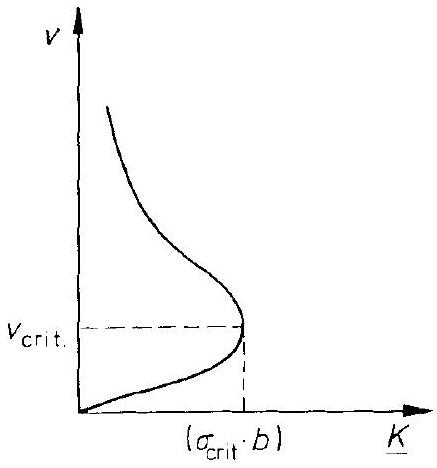
Figure 3-11. Velocity $\boldsymbol{v}$ vs. drag force $\boldsymbol{K}$ for a dislocation with a Cottrell cloud (schematic).

where $\nabla W$ is the applied potential gradient. Beyond $v_{\text {crit }} \cong 4 \cdot D \cdot(k T / \beta)$, the dislocation breaks away from its solute atmosphere and is accelerated until a different damping mechanism controls its motion (e.g., phonon damping).

The atomic structure around the moving dislocation thus depends on its velocity. This is true for moving grain boundaries and phase boundaries as well. The equilibrium structure of an interface at rest has some atomic roughness, and occurs analogous to the formation of either equilibrium point defects in the bulk or kinks and jogs on a dislocation line. This atomic roughness can be visualized if we consider the random motion of point defects (vacancies) as they fluctuate in dynamic equilibrium across the interface. Each crossing causes the interface to locally bend out on an atomic scale.

Since small-angle grain boundaries are built from dislocations, we may anticipate their conservative motion as a coupled motion of dislocation bundles. In the simplest case, a small-angle tilt boundary is a mobile interface and the result of its motion is a rotation of the crystal (Fig. 3-12). However, the elementary steps of the boundary motion are thermally activated atomic jumps, because not only do misfit dislocations have Burgers vectors parallel to the interface and thus have to climb during the movement of the interface, but also because regular SE's dissolve on one side and reconstruct the lattice on the other side of the moving boundary. From geometrical considerations, we expect that the frequencies of these activated jumps parallel to the interface are different from those perpendicular to it. This is one reason why it is not possible to draw immediate conclusions from atomic mobilities

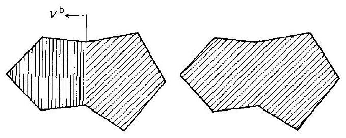
Figure 3-12. Rotation of a grain, induced by the migration of a low-angle tilt boundary.

within the boundary plane about the boundary mobility along a normal vector perpendicular to it when under the action of a driving force.

The Gibbs interface energy acts as a tension on curved interfaces and causes them to move and attain the Gibbs energy minimum shape. Recrystallization of polycrystalline material is, among others, a result of the acting interface tension. Electrical field forces can also act on interfaces. In ionic crystals or semiconductors, interfaces carry an electrical charge. If the (chemical) surroundings of the interface is symmetric, the interface charge is balanced by a symmetrical space charge. If the surroundings are unsymmetric, as is true for boundaries in heterogeneous systems, the interface carries an unsymmetrical space charge and an electrical field will exert a force on it analogous to the force acting on a dipole.

In heterogeneous solid state reactions, the phase boundaries move under the action of chemical (electrochemical) potential gradients. If the Gibbs energy of reaction is dissipated mainly at the interface, the reaction is named an interface controlled chemical reaction. Sometimes a 'thermodynamic' pressure ( $\Delta G / \Delta V$ ) is invoked to formalize the movement of the phase boundaries during heterogeneous reactions. This force, however, is a virtual thermodynamic force and must not be confused with mechanical (electrical) forces.

## References

Aleshin, A. N., et al. (1977) Sov. Phys. Sol. State, 19, 2051
Bacon, D. J. (1993) in Mat. Sci. and Techn., Vol. 1 (Eds.: R. W. Cahn, P. Haasen, E. J. Kramer), Verlag Chemie, Weinheim
Balluffi, R. W., Sutton, A.P. (1993) Grain Boundaries in Crystalline Solids, Oxford University Press, Oxford
Bollmann, W. (1970) Crystal Defects and Crystalline Interfaces, Springer, Berlin
Duffy, D.M., Tasker, P. W. (1985) Physica, 131B, 46
Finnis, M. W., Rühle, M. (1993) in Mat. Sci. and Techn., Vol. 1 (Eds.: R. W. Cahn, P. Haasen, E. J. Kramer), Verlag Chemie, Weinheim
Gleiter, H. (1983) Microstructure, in Physical Metallurgy (Eds.: R. W. Cahn, P. Haasen), NorthHolland, Amsterdam
Haefke, H., Stenzel, H. (1989) phys. stat. sol. (c), 116, 39
Hasson, G., Goux, C. (1971) Scripta Met., 5, 889
Hirth, J.P., Lothe, J. (1982) Theory of Dislocations, 2nd ed., Wiley, New York
Hirth, J. P. (1983) Dislocations, in Physical Metallurgy (Eds.: R. W. Cahn, P. Haasen), NorthHolland, Amsterdam
Ma, Q., Balluffi, R. W. (1993) Acta Met. Mat., 41, 133
Nabarro, F. R. N. (1967) The Theory of Crystal Dislocations, Oxford University Press, Oxford
Read, W. T., Shockley, W. (1950) Phys. Rev., 78, 275
Stubican, V., Lin, C.M., Macey, E. (1987) Advances in Ceramics, 23, 97
van Landuyt, J. G. (1981) Metall. Trans., 12A, 715
Wagner, C. (1972) Phys. Chem. Sol., 33, 1051
Wolf, D. (1980) J. Phys., 41, C6-142
Wolf, D., Merkle, K. L. (1992) in Materials Interfaces (Eds.: D. Wolf, S. Yip), Chapman and Hall, London
Wolf, D., Yip, S. (1992) Materials Interfaces, Chapman and Hall, London

## 4 Basic Kinetic Concepts and Situations

### 4.1 Introduction

We will introduce basic kinetic concepts that are frequently used and illustrate them with pertinent examples. One of those concepts is the idea of dynamic equilibrium, as opposed to static (mechanical) equilibrium. Dynamic equilibrium at a phase boundary, for example, means that equal fluxes of particles $i, j_{i}^{0}$, are continuously crossing the boundary in both directions so that the (macroscopic) net flux is always zero. This concept enables us to understand the non-equilibrium state of a system as a monotonic deviation from the equilibrium state. Driven by the deviations from equilibrium of certain functions of state, a change in time for such a system can then be understood as the return to equilibrium. We can select these functions of state according to the imposed constraints. If the deviations from equilibrium are sufficiently small, the result falls within a linear theory of process rates. As long as the kinetic coefficients can be explained in terms of the dynamic equilibrium properties, the reaction rates are directly proportional to the deviations. The thermodynamic equilibrium state is chosen as the reference state in which the driving forces $X_{i}$ vanish, but not the random thermal motions of structure elements $i$. Therefore, systems which we wish to study kinetically must first be understood at equilibrium, where the SE fluxes vanish individually both in the interior of all phases and across phase boundaries. This concept will be worked out in Section 4.2.1 after fluxes of matter, charge, etc. have been introduced through the formalism of irreversible thermodynamics.

Following the introduction of basic kinetic concepts, some common kinetic situations will be discussed. These will be referred to repeatedly in later chapters and include 1) diffusion, particularly chemical diffusion in different solids (metals, semiconductors, mixed conductors, ionic crystals), 2) electrical conduction in solids (giving special attention to inhomogeneous systems), 3) matter transport across phase boundaries, in particular in electrochemical systems (solid electrode/solid electrolyte), and 4) relaxation of structure elements.

### 4.1.1 Systematics of Solid State Chemical Processes

Let us first give a systematic bird's eye view of the different subjects which will be treated later. One may subdivide processes primarily according to the physicochemical nature of the systems involved (the chemist's approach), or according to the acting driving forces (the physicist's view). In the latter case, we can choose the corresponding forces according to such basic fields of physics as mechanics, electro-
dynamics, and thermodynamics. For chemical processes, thermodynamic forces (i.e., gradients of thermodynamic potentials) play the prominent role. In addition, processes as treated in electrochemistry, photochemistry, and mechanochemistry will be discussed in due course.

Chemical systems are commonly subdivided into homogeneous, inhomogeneous, and heterogeneous phases. We will therefore distinguish chemical processes in the following systems.
a) Single-phase homogeneous systems. Homogeneous processes in solids can occur with two limiting cases. 1) All particles of the homogeneous assembly keep their (average) position during the process. This means that we deal with vibrational, librational, and rotational motions. In essence, these processes define the field of crystal dynamics (the understanding of which is prerequisite for an interpretation of kinetic rate parameters). 2) The particles of the homogeneous non-equilibrium assembly are not individually fixed at their (average) position during the process. This means that either 'Umklappvorgänge' take place cooperatively and simultaneously, or we deal with homogeneous reactions involving atomic diffusional steps (analogous to the dissociation of water after a sudden temperature or pressure change). We mention two examples: a) the formation of Frenkel defects $\left(A_{A}+V_{i}=A_{i}^{*}+V_{A}^{\prime}\right)$ and $\left.b\right)$ the exchange of SE's between two ordered sublattices of a crystal ( $\mathrm{A}_{\mathrm{A}}+\mathrm{B}_{\mathrm{B}}=\mathrm{A}_{\mathrm{B}}+\mathrm{B}_{\mathrm{A}}$ ), resulting in exchange disorder.
b) Single-phase inhomogeneous systems. Mainly the field of chemical transport governed by diffusion. Diffusion is a process that ultimately leads to an equalization of concentrations through nonconvective component fluxes, these being driven by chemical potential gradients. The first mathematical formulations were the (local) diffusion laws given by [A. Fick (1855)] in analogy to Fourier's law of heat conduction. Since diffusion in inhomogeneous crystals occurs by the thermally activated motion of point defects, it is true that local (homogeneous) point defect formation (annihilation) processes are normally superimposed on component transport.
c) Heterogeneous systems. Classical heterogeneous solid state reactions (e.g., spinel formation), phase nucleation and growth, phase transformation, electrode reactions, metal oxidation, and internal reactions belong to this category, among others. The common feature of these processes is the existence of interfaces (phase boundaries), across which matter is transported into the adjacent phases. In view of the sluggishness of matter transport in solids (as compared to heat transport), most heterogeneous solid state reactions take place isothermally. However, there are exceptions, for example, the self-heating combustion reactions of compressed reactive powder mixtures. These occur if the reaction enthalpies are very negative, see, e.g. [Z. Munir, U. Anselmi-Tamburini (1989)].

The above classification of chemical processes was based on the system's physical chemistry. A similar classification can be applied to electronic processes if we consider the effectively charged structure elements and assume that we can determine extremely small component concentrations or deviations from the stoichiometric composition. The well-known p-n junction process can serve as an example since it is a transport process (including local relaxation) in a single phase, inhomogeneous system.

### 4.2 The Concepts of Irreversible Thermodynamics

The fundamental question in transport theory is: Can one describe processes in nonequilibrium systems with the help of (local) thermodynamic functions of state (thermodynamic variables)? This question can only be checked experimentally. On an atomic level, statistical mechanics is the appropriate theory. Since the entropy, $S$, is the characteristic function for the formulation of equilibria (in a closed system), the deviation, $\delta S$, from the equilibrium value, $S_{0}$, is the function which we need to use for the description of non-equilibria. Since we are interested in processes (i.e., changes in a system over time), the entropy production rate $\sigma=\delta \dot{S}$ is the relevant function in irreversible thermodynamics. Irreversible processes involve linear reactions (rates $\sim \delta S$ ) as well as nonlinear ones. We will be mainly concerned with processes that occur near equilibrium and so we can linearize the kinetic equations. The early development of this theory was mainly due to the Norwegian Lars Onsager. Let us regard the entropy $S(\alpha, \beta, \ldots)$ as a function of the (extensive) state variables $\alpha, \beta, \ldots$, which are either constant $(\beta, \ldots)$ or can be controlled and measured $(\alpha)$. In terms of the entropy production rate, we have ( $\partial \alpha / \partial t \equiv \dot{\alpha}$ )

$$
\sigma=\frac{\partial S}{\partial \alpha} \cdot \frac{\partial \alpha}{\partial t}=\left[\frac{\partial^{2} S}{\partial \alpha^{2}} \cdot\left(\alpha-\alpha_{0}\right)+\ldots\right] \cdot \dot{\alpha}
$$

where $\alpha_{0}$ designates the equilibrium state. The linear approach introduces a linear relation between $\dot{\alpha}$ and the deviation from equilibrium. If we therefore write

$$
\dot{\alpha}=k \cdot \delta S
$$

we obtain for the entropy production

$$
\sigma \cong k \cdot\left(\frac{\partial^{2} S}{\partial \alpha^{2}}\right)_{\alpha_{0}} \cdot\left(\alpha-\alpha_{0}\right)^{2}=L \cdot X^{2}>0
$$

In generalizing, we conclude that the rate of entropy production is the product of a flux, $L \cdot X$, with the corresponding force $X$. For illustration, let us consider isothermal, diffusional transport. A closed, inhomogeneous multicomponent system can change its entropy through internal reaction (diffusion) and by heat transfer across its bounding surface. Accordingly, one formulates the entropy change as $\delta S= \delta S_{\mathrm{i}}+\delta S_{\mathrm{tr}}$. Explicitly this is

$$
\delta S_{\mathrm{i}}=-(1 / T) \cdot(\delta U+P \cdot \delta V-T \cdot \delta S)=-(1 / T) \cdot \delta G
$$

Rewriting $\delta G$ in terms of the system's chemical potentials and concentrations yields

$$
\delta S_{\mathrm{i}}=-(1 / T) \cdot \delta \int_{V} \sum \mu_{i} \cdot c_{i} \cdot \mathrm{~d} V
$$

For a one dimensional isothermal sample of (fixed) unit area cross section, the rate of entropy production $\sigma$ is therefore

$$
\sigma=-(1 / T) \cdot \int_{\xi} \sum \mu_{i} \cdot \dot{c} \cdot \mathrm{~d} \xi
$$

which, in combination with the continuity equation $\dot{c}_{i}=-\nabla j_{i}$, gives

$$
\sigma=+(1 / T) \cdot \int_{\xi} \sum \mu_{i} \cdot \mathrm{~d} j_{i}
$$

If both ends of the one-dimensional system are still unaffected by the diffusion process, partial integration of Eqn. (4.7) yields

$$
\sigma=-(1 / T) \int\left(\sum j_{i} \cdot \frac{\partial \mu_{i}}{\partial \xi}\right) \cdot \mathrm{d} \xi
$$

By comparing Eqn. (4.8) with Eqn. (4.3), we conclude that the (local) entropy production rate is the sum of the products of the fluxes and conjugate forces. The appropriate diffusional force is seen to be $-\left(1 / T \cdot \nabla \mu_{i}\right)$. We further conclude that the conjugate flux, $j_{i}$, of species $i$ can be written as $-L_{i} \cdot\left(\nabla \mu_{i} / T\right)$.

In deriving Eqn. (4.8) it was assumed that the flux of species $i$ stems only from the force $X_{i}$, not from forces $X_{j}(j \neq i)$. If this is not true, let us take the mutual interactions into account by writing in the linear approach

$$
j_{i}=\sum L_{i j} \cdot X_{j}
$$

The bilinear formulation of the entropy production rate obtained in a practical form is

$$
T \cdot \sigma=\sum_{i} \sum_{j} L_{i j} \cdot X_{i} \cdot X_{j}
$$

where the $L_{i j}$ are generalized conductances. If fluxes are not linearly related to each other, then

$$
L_{i j}=L_{j i}
$$

Equation (4.11) expresses the central Onsager theorem. It states the symmetry of the phenomenological coefficients (the $\boldsymbol{L}$ matrix) in the absence of magnetic fields. The foundation of this theorem is discussed elsewhere [J. H. Kreuzer (1981); S. R. de Groot, P. Mazur (1962)].

According to the second law of thermodynamics, $\sigma$ is a positive definite function of $X_{i}$ which means that

$$
L_{i i} \geqq 0, \quad L_{i i} \cdot L_{j j}-L_{i j} \cdot L_{j i} \geqq 0
$$

These relations limit the extent of the flux coupling and reflect the tendency to reduce the entropy production. Thus, instead of dissipating the Gibbs energy com-
pletely into random motion (heat), finite cross coefficients induce other fluxes (i.e., order).

In a linear theory, the kinetic coefficients $L_{i j}$ are independent of the forces. They are, however, functions of the thermodynamic variables. In view of the Onsager relations, not only is the $L$ matrix of the transport coefficients symmetric, but the transformed matrix is symmetric as well if the new fluxes are linearly related to the original ones. This also means that the new $L_{i j}(i \neq j)$ contain diagonal components of the original set.

Let us discuss an $L$ matrix transformation for isothermal and isobaric atomic fluxes when there is one additional electronic species present. We start with the flux equations in which the index $j$ denotes the atomic species and e denotes the electric charge carriers (e.g., electrons).

$$
\begin{aligned}
& j_{i}=\sum_{j}^{n} L_{i j} \cdot X_{j}+L_{i \mathrm{e}} \cdot X_{\mathrm{e}} \\
& j_{\mathrm{e}}=\sum_{j}^{n} L_{\mathrm{e} j} \cdot X_{j}+L_{\mathrm{ee}} \cdot X_{\mathrm{e}}
\end{aligned}
$$

Let us define the quantities $\alpha_{j}^{*}$ as follows

$$
L_{i \mathrm{e}}=\sum L_{i j} \cdot \alpha_{j}^{*} ; \operatorname{det} L_{i j} \neq 0
$$

whereupon

$$
\begin{gathered}
j_{i}=\sum L_{i j} \cdot\left(X_{j}+\alpha_{j}^{*} \cdot X_{\mathrm{e}}\right) \\
j_{\mathrm{e}}=\sum \alpha_{j}^{*} \cdot j_{j}+\left(L_{\mathrm{ee}}-\sum L_{j \mathrm{e}} \cdot \alpha_{j}^{*}\right) \cdot X_{\mathrm{e}}
\end{gathered}
$$

One concludes that $\alpha_{j}^{*} \cdot j_{j}$ is the electron flux which is induced by the flux of atomic species $j$, provided that $X_{\mathrm{e}}=0$ (no force acting on the electrons). Also, from Eqn. (4.16) it follows that in a homogeneous solid, if an external electric field is applied (i.e., $X_{j}=z_{j} \cdot e_{0} \cdot E$ and $X_{\mathrm{e}}=-e_{0} \cdot E$ ), then ( $z_{j}-\alpha_{j}^{*}$ ) represents the effective (drift) charge of species $j$ in the field $E$.

Equations (4.16) and (4.17) are examples of the so-called cross effects whereby a force $X_{\mathrm{e}}$ can induce fluxes $j_{i}$ despite that $X_{i}=0$. Another example of a cross effect is thermotransport in which temperature gradients (fluxes of heat) induce fluxes of atomic species, $j_{i}$. An application of this concept is the steady state demixing of a (closed solid) solution system, which has been exposed to a temperature gradient (heat flux). This is the Ludwig-Soret effect originally observed with fluid systems.

Irreversible thermodynamics thus accomplishes two things. Firstly, the entropy production rate $\sum j_{i} \cdot X_{i}$ allows the appropriate thermodynamic forces $X_{i}$ to be deduced if we start with well defined fluxes (e.g., $T \cdot \nabla\left(\mu_{i} / T\right)$ for the isobaric transport of species $i$, or $(1 / T) \cdot \nabla T$ for heat flow). Secondly, through the Onsager relations, the number of transport coefficients can be reduced in a system of $n$ fluxes to $1 / 2 \cdot(n-1) \cdot n$. Finally, it should be pointed out that reacting solids are (due to the
slowness of transport) normally in mechanical equilibrium. Thus, $\sum N_{i} \cdot X_{i}=0$, which is the Gibbs-Duhem equation if $X_{i}=\nabla \mu_{i}$.

### 4.2.1 Structure Element Fluxes

In the foregoing section, the bilinear form of the entropy production rate was expressed in terms of the fluxes of chemical components and electrons (or heat) together with the conjugate driving forces. From Chapter 2, we know that there are properly defined constituents of a crystal known as structure elements and these can possess (virtual) chemical potentials. We denote the general SE as $S_{i, \varkappa}$. In line with the foregoing and using the notation of Section 2.2, the thermodynamic force (at constant $P$ and $T$ ) acting upon $\mathrm{S}_{i, x}$ is

$$
X_{i, \varkappa}=-\nabla\left(\mu_{i, \varkappa}+q_{i, \varkappa} \cdot F \cdot \varphi\right)
$$

where $i$ designates the chemical species ( $i=1, \ldots, l$; including vacancies). $x$ is the sublattice index ( $\varkappa=1 \ldots K$ ). The linear relations between SE fluxes and forces are of the form

$$
j_{i}=-\sum l_{i j} \cdot X_{j}
$$

The total flux $J_{\varkappa}$ of SE's in sublattice $\varkappa$ and the total flux $J$ of SE's in the whole crystal are given by

$$
J_{\varkappa}=\sum_{i, \varkappa} j_{i, \varkappa} ; \quad J=\sum_{\varkappa} \sum_{i, \varkappa} j_{i, \varkappa}=\sum_{\varkappa} J_{\varkappa}
$$

If all fluxes vanish and the number of lattice sites is conserved, only two types of homogeneous reactions between SE's are possible

$$
k_{\varkappa}^{q}+i_{\lambda}=k_{\varkappa}^{q+1}+i_{\lambda}, \quad \varkappa=1,2, \ldots, \lambda, \ldots
$$

and

$$
k_{\varkappa}^{q}+\mathrm{V}_{\lambda}=k_{\lambda}^{q}+\mathrm{V}_{\varkappa}, \quad \varkappa=1,2, \ldots, \lambda, \ldots
$$

In view of the assumed site conservation in each sublattice we then have

$$
\sum_{i, \varkappa} \dot{r}_{i, \varkappa}=0
$$

where $\dot{r}_{i, \varkappa}$ is the local production rate of $\mathrm{S}_{i, \varkappa}$.
The structural conditions of a crystal lattice are, in accordance with Eqn. (2.12)

$$
z_{\varkappa}=m_{\varkappa, \lambda} \cdot z_{\lambda}
$$

where $z$ denotes the number of sublattice sites. The equivalent kinetic condition (provided that the number of lattice sites is conserved) reads

$$
J_{\varkappa}=m_{\varkappa, \lambda} \cdot J_{\lambda}
$$

or, using Eqn. (4.20),

$$
J=\sum_{\varkappa} m_{\varkappa, \lambda} \cdot J_{\lambda} ; \quad J_{\lambda}=J / \sum_{\varkappa} m_{\varkappa, \lambda}
$$

$J=0$ in the lattice reference frame. Then, with Eqns. (4.20) and (4.26), we find the structural flux coupling condition to be

$$
\sum_{i, \varkappa} j_{i, \varkappa}=0 ; \quad \varkappa=1, \ldots, K
$$

Electroneutrality imposes a further condition on the fluxes, namely

$$
\sum_{\varkappa} \sum_{i} q_{i, \varkappa} \cdot j_{i, \varkappa}=0
$$

From Eqns. (4.27) and (4.28), one concludes that from a total number $L$ of SE fluxes, only $L-(K+1)$ fluxes are independent, at most.

Let us apply the conditions in Eqns. (4.27) and (4.28) in order to eliminate the fluxes $j_{l, \varkappa}(\varkappa=1, \ldots, K)$. If $\mathrm{V}_{\varkappa}^{\times}$is chosen as the corresponding structure element $\mathrm{S}_{l, \varkappa}$, one obtains for the rate of entropy production

$$
T \cdot \sigma=\sum_{\varkappa} \sum_{i}^{\prime} j_{i, \varkappa} \cdot\left(\tilde{X}_{i, \varkappa}-\frac{q_{i, \varkappa}}{q_{(l, \varkappa)-1, K}} \cdot \tilde{X}_{(l, \varkappa)-1, K}\right)
$$

where $\tilde{X}$ is the force acting upon the building elements $\left(\mathrm{i}_{\varkappa}^{q}-\mathrm{V}_{\varkappa}^{\times}\right)$and $\left(\mathrm{V}_{\varkappa}^{q}-\mathrm{V}_{\varkappa}^{\times}\right)$. The summation $\sum_{i}^{\prime}$ goes to $(l, \varkappa)-1$. Since $\tilde{X}_{(l, K)-1, K}$ and $q_{(l, K)-1, K}$ can be chosen arbitrarily, we select them in such a way that $\widetilde{X}_{(l, K)-1, K}$ acts upon $\left(\mathrm{V}_{\varkappa}^{q}-\mathrm{V}_{\varkappa}^{\times}\right)$, and $q_{(l, K)-1, K}$ is $q_{i, \mathcal{K}}$. Equation (4.29) then reduces to

$$
T \cdot \sigma=\sum j_{k} \cdot X_{k}
$$

where $k$ denotes the components of the crystal. Let us restate these important results. The same entropy production can be written in terms of SE's, building elements, or components. This is in complete accordance with the conclusions concerning the (phenomenological) thermodynamics of SE's, building elements, and components which we arrived at in Chapter 2. We note, however, that internal equilibration between the various SE's is implicit in these derivations.

If there are $n$ components transported by diffusion, then we have from Eqn. (4.10)

$$
j_{k}=\sum_{i}^{n} \tilde{L}_{k i} \cdot \nabla \mu_{i}
$$

If we take the Gibbs-Duhem equation, $\sum c_{k} \cdot \mathrm{~d} \mu_{k}=0$, into account, the rate of entropy production is

$$
T \cdot \sigma=\sum_{k}^{\prime}\left(j_{k}-\frac{c_{k}}{c_{n}} \cdot j_{n}\right) \cdot \nabla \mu_{k} ; \quad k=1,2, \ldots, n-1
$$

Selecting, for example, an immobile component for which $j_{n}=0$ (e.g., oxygen in transition metal oxides) as number $n$, one has instead of Eqn. (4.31)

$$
j_{k}=\sum_{i}^{\prime}{\underset{\sim}{L} k i} \nabla \mu_{i} ; \quad i=1,2, \ldots, n-1
$$

The remaining fluxes and forces are independent and thus the Onsager relations ${\underset{\sim}{L}}_{k i}={\underset{\sim}{L}}_{i k}$ hold. The number of independent transport coefficients is $1 / 2 \cdot n \cdot(n-1)$. With the help of the above conditions, it is possible to verify the symmetry of both matrices $\underset{\sim}{L}$ and $\tilde{L}$ [M. Martin, et al. (1988)]

$$
\tilde{L}_{k i}={\underset{\sim}{L}}_{k i}(i=1, \ldots, n-1) ; \quad \tilde{L}_{n i}={\underset{\sim}{L}}_{n i}=0
$$

In the following, we will often be concerned with ternary systems. Heterogeneous binary systems have two phases in equilibrium and are nonvariant (at given $P$ and $T)$. When two ternary phases are in contact, the system still has one (thermodynamic) degree of freedom. A ternary phase has three independent transport coefficients (e.g., $L_{11}, L_{22}$, and $L_{12}$ ).

### 4.3 Diffusion

### 4.3.1 Introduction

Consider a macroscopically inhomogeneous system of linear geometry. If the number of particles $z$ between coordinate $\xi$ and ( $\xi+\mathrm{d} \xi$ ) at time $t=0$ is $z(\xi, 0)$, what is the number of particles $z(\xi, \tau)$ at a predetermined coordinate $\xi^{\prime}$ between $\xi^{\prime}$ and $\left(\xi^{\prime}+\mathrm{d} \xi\right)$ after time $\tau$ has elapsed? In order to answer this question, we define a function $f_{\tau}\left(\xi^{\prime}-\xi\right)$ as the probability of finding the particle at a distance ( $\xi^{\prime}-\xi$ ) after time $\tau$. With this definition, one has

$$
z\left(\xi^{\prime}, \tau\right)=\int_{-\infty}^{+\infty} z(\xi, 0) \cdot f_{\tau}\left(\xi^{\prime}-\xi\right) \cdot \mathrm{d} \xi
$$

Letting $\left(\xi^{\prime}-\xi\right)=y$, Eqn. (4.35) becomes

$$
z\left(\xi^{\prime}, \tau\right)=\int_{-\infty}^{+\infty} z\left(\xi^{\prime}-y, 0\right) \cdot f_{\tau}(y) \cdot \mathrm{d} y
$$

In an isotropic system, $f_{\tau}(y)=f_{\tau}(-y)$. Also, $f_{\tau}(y)$ decreases with increasing $y$. If we now perform the following series expansions in $\tau$ and $y$

$$
z\left(\xi^{\prime}, \tau\right)=z\left(\xi^{\prime}, 0\right)+\left(\frac{\partial z}{\partial t}\right)_{\xi^{\prime}, 0} \cdot \tau+\ldots
$$

and

$$
z\left(\xi^{\prime}-y, 0\right)=z\left(\xi^{\prime}, 0\right)-\left(\frac{\partial z}{\partial y}\right)_{\xi^{\prime}, 0} \cdot y+\left(\frac{\partial^{2} z}{\partial y^{2}}\right)_{\xi^{\prime}, 0} \cdot y^{2}+\ldots
$$

and combine Eqns. (4.37) and (4.38) with Eqn. (4.36), the immediate result is

$$
\frac{\partial z}{\partial t}=\frac{1}{2 \tau} \cdot \overline{y^{2}} \cdot \frac{\partial^{2} z}{\partial \xi^{2}}
$$

provided that $f_{\tau}(y)$ decays sufficiently fast.

$$
\overline{y^{2}}=\int_{-\infty}^{+\infty} y^{2} \cdot f_{\tau}(y) \cdot \mathrm{d} y
$$

If we define $D=\overline{y^{2}} / 2 \cdot \tau$ as the quotient between the mean square displacement $\overline{y^{2}}$ and the time span $2 \cdot \tau$ and name it the diffusion coefficient, we have derived Fick's second law

$$
\dot{z}=D \cdot \frac{\partial^{2} z}{\partial \xi^{2}}
$$

as long as the quotient $D$ is constant. In terms of the specific quantity $c$, Eqn. (4.41) reads

$$
\dot{c}=D \cdot \frac{\partial^{2} c}{\partial \xi^{2}}
$$

The following conditions have been introduced in order to arrive at Eqn. (4.41). 1) $\int f(y) \cdot \mathrm{d} y=1$ (normalization), 2) $f(y)$ decreases sufficiently fast with increasing $y, 3$ ) the system is isotropic, and 4) $\tau$ is not too small in order to avoid memory. This last condition ensures that $y^{2}$ is proportional to $\tau$.

Fick's second law, Eqn. (4.42), is a partial differential equation for matter transport. Equations which describe the equilibration in space and time of heat, electrical charge, or momentum (dissipative processes) are of the same type and reflect the action of a local field.

In Eqns. (4.41) and (4.42), we should have marked $z$ and $c$ with an index $k$, designating the chemical nature of the diffusing particles (components). This is necessary since diffusion of particles of the sort $k$ occurs in a solvent and the system consists of at least two components. In the previous section, we showed that under isothermal and isobaric conditions, the diffusive flux of particles of type $k$ in the solvent is

$$
j_{k}=-L_{k k} \cdot \nabla \mu_{k}
$$

if cross coefficients $L_{i k}$ are neglected. Equation (4.43) is equivalent to

$$
\dot{c}_{k}=\nabla\left(L_{k k} \cdot \nabla \mu_{k}\right)
$$

if no sources and sinks (i.e., internal reactions) are operating. Comparing Eqn. (4.44) with Eqn. (4.42), we find that

$$
D_{k}=\frac{L_{k k}}{c_{k}} \cdot \frac{\partial \mu_{k}}{\partial \ln c_{k}}=\frac{L_{k k}}{c_{k}} \cdot f_{k}
$$

where

$$
f_{k}=\frac{\partial\left(\mu_{k} / R T\right)}{\partial \ln c_{k}}
$$

is the (dimensionless) thermodynamic factor of the binary system represented by component $k /$ solvent.

### 4.3.2 Fickian Transport

Diffusional transport is the nonconvective flow that tends to equilibrate the concentrations in inhomogeneous non-equilibrium systems. From Eqns. (4.43) and (4.45), we have

$$
j_{k}=-L_{k k} \cdot \nabla \mu_{k}=-D_{k} \cdot \nabla c_{k}
$$

Equation (4.47) is incomplete for 1) it neglects cross terms (this point is dealt with later) and 2) it does not specify the reference frame for transport. Since the flux is a product of concentration times velocity, this can be expressed by writing

$$
j_{k}=c_{k} \cdot\left(v_{k}-\omega\right)
$$

where $\omega$ defines the reference velocity. Substituting into Eqn. (4.47) we thus obtain

$$
c_{k} \cdot\left(v_{k}-\omega\right)=-{ }_{\omega} L_{k k} \cdot\left(\nabla \mu_{k}+X_{k}\right)
$$

The additional force $X_{k}$ has been introduced to account for any other possible forces. Equation (4.49) shows that a transport coefficient actually corresponds to the product of the concentration ( $c_{k}$ ) times the mobility ( $b_{k}$ ) and thus represents a conductance. The mobility is the (local average) velocity of $k$, driven by the unit force. Therefore

$$
c_{k} \cdot\left(v_{k}-\omega\right)=-c_{k} \cdot \omega b_{k} \cdot\left(\nabla \mu_{k}+X_{k}\right)
$$

or

$$
\boldsymbol{v}_{k}-\left(\omega+{ }_{\omega} b_{k} \cdot X_{k}\right)=-{ }_{\omega} b_{k} \cdot \nabla \mu_{k}
$$

Setting $\boldsymbol{v}^{0}=\boldsymbol{v}_{k}\left(\nabla \mu_{k}=0\right)$, we can see that the velocity of $k$ due to the diffusional force $\nabla \mu_{k}$ is

$$
v_{k}-v^{0}=-{ }_{\omega} b_{k} \cdot \nabla \mu_{k}
$$

Let us multiply Eqn. (4.52) by $c_{k}$ and define $\boldsymbol{j}_{k}^{\#}=c_{k} \cdot\left(\boldsymbol{v}_{k}-\boldsymbol{v}^{0}\right)$ as the purely diffusional flux (relative to a general drift). By forming its divergence, we find

$$
\dot{c}_{k}=-\nabla \boldsymbol{j}_{k}^{\#}=\nabla\left(c_{k} \cdot \omega b_{k} \cdot \nabla \mu_{k}\right)=\nabla\left({ }_{\omega} D_{k} \cdot \nabla c_{k}\right)
$$

For constant ${ }_{\omega} D_{k}$, this is Fick's second law as derived in Eqn. (4.41).
In many cases of transport in solids, the atoms (ions) of one sublattice of the crystal are (almost) immobile. Here, we can identify the crystal lattice with the external (laboratory) frame and define the fluxes relative to this immobile sublattice $(\omega=0)$. $\boldsymbol{v}^{0}$ is $b_{k} \cdot \boldsymbol{X}_{k}$ (Eqn. (4.51)) where $\boldsymbol{X}_{k}$ is the sum of all local forces which can be applied externally (e.g., an electric field), or which may stem from fields induced by the (Fickian) diffusion process itself (e.g., self-stresses). An example of such a diffusion process that leads to internal forces is the chemical interdiffusion of $\mathrm{A}-\mathrm{B}$. If the lattice parameter of the solid solution changes noticeably with concentration, an elastic stress field builds up and acts upon the diffusing particles. It depends not only on the concentration distribution, but on the geometry of the bounding crystal surfaces as well.

### 4.3.3 Chemical Diffusion

Let us now consider the equalization of the component concentrations in an inhomogeneous multicomponent system. We may start with Eqn. (4.33) which relates the component fluxes, $j_{k}$, to the ( $n-1$ ) independent forces, $\nabla \mu_{i}$, of the $n$-component solid solution. In local equilibrium, the chemical potentials are functions of state. Hence, at any given $P$ and $T$

$$
\nabla \mu_{i}=\sum_{m}\left(\mathrm{~d} \mu_{i} / \mathrm{d} c_{m}\right) \cdot \nabla c_{m}
$$

We now introduce the thermodynamic factors $\left(f_{i m}\right)$ in accordance with Eqn. (4.46) and define

$$
f_{i m}=\frac{\partial\left(\mu_{i} / R T\right)}{\partial \ln c_{m}}
$$

We can rewrite $\nabla \mu_{i}$ accordingly and obtain an analogous expression for the flux $j_{k}$ as Eqn. (4.33),

$$
j_{k}=-\sum_{i} \sum_{m} L_{k i} \cdot f_{i m} \cdot\left(R T / c_{m}\right) \cdot \nabla c_{m}
$$

The sequence of the summation can be changed to give

$$
\boldsymbol{j}_{k}=-\sum_{m} \tilde{D}_{k m} \cdot \nabla c_{m}
$$

where

$$
\tilde{D}_{k m}=\sum_{i} L_{k i} \cdot f_{i m} \cdot\left(R T / c_{m}\right)
$$

Each component $k$ obeys the continuity equation

$$
\dot{c}_{k}=-\nabla j_{k}
$$

In order to solve this set of (coupled) differential equations, we have to formulate the proper boundary conditions. Let us define the conditions of the simplest (onedimensional) interdiffusion experiment as follows

$$
\begin{aligned}
& c_{k}(\xi=-\infty, t)=\overline{\boldsymbol{c}}_{k}^{0} \\
& c_{k}(\xi=+\infty, t)={\overline{c_{k}^{0}}}_{k}^{0} \\
& c_{k}(\xi, 0) \quad=\bar{c}_{k}^{0}(\xi<0) \quad \text { and } \quad \tilde{c}_{k}^{0}(\xi>0)
\end{aligned}
$$

With these boundary conditions, the solution can be expressed in terms of one single variable ( $=\xi / \sqrt{t}$ ). Let us write Eqn. (4.57) in matrix form

$$
\underset{\sim}{j}=-\underset{\sim}{\tilde{D}} \cdot \underset{\sim}{\nabla}
$$

where $\underset{\sim}{j}$ and $\underline{\nabla} \underline{c}$ are (column) vectors, $\underset{\sim}{\tilde{D}}$ is the (symmetric) matrix of diffusion coefficients given in Eqn. (4.58). Let us furthermore transform $\underset{\sim}{\tilde{D}}$ in its diagonal form. The transformation matrix $\underset{\sim}{\boldsymbol{B}}$ is given by the eigenvectors $\boldsymbol{v}_{\mathrm{s}}$ of $\underset{\sim}{\tilde{D}}$, which can be found from ( $\lambda_{\mathrm{s}}=$ eigenvalues)

$$
\underset{\sim}{\tilde{D}} \cdot \boldsymbol{v}_{\mathrm{s}}=\lambda_{\mathrm{s}} \cdot \boldsymbol{v}_{\mathrm{s}}
$$

The $\lambda_{s}$ values are obtained from the solution of the secular equation

$$
\operatorname{det}(\underset{\sim}{\tilde{D}}-\underset{\sim}{\lambda})=0
$$

Application of $\underset{\sim}{B}$ to Eqn. (4.61) yields

$$
\underset{\sim}{\boldsymbol{B}} \cdot \underset{\sim}{\boldsymbol{j}}=-\underset{\sim}{\boldsymbol{B}} \cdot \underset{\sim}{\tilde{D}} \cdot \underset{\sim}{\boldsymbol{B}}{ }^{-1} \cdot \underset{\sim}{\boldsymbol{B}} \cdot \underset{\sim}{\nabla} \underset{\sim}{c}
$$

or, equivalently (with $\underset{\sim}{\boldsymbol{h}}=\underset{\sim}{\boldsymbol{B}} \cdot \underset{\sim}{\boldsymbol{j}}, \underset{\sim}{\boldsymbol{v}}=\underset{\sim}{\boldsymbol{B}} \cdot \underset{\sim}{\boldsymbol{c}}, \underset{\sim}{\lambda}=$ diagonal diffusivity matrix)

$$
\underline{h}=-\underset{\sim}{\lambda} \cdot \underline{\nabla} \underline{u}
$$

and also

$$
\underset{\sim}{\dot{u}}=\underset{\sim}{\lambda} \cdot \Delta \underline{u}
$$

First of all, we note that through the $\underset{\sim}{\boldsymbol{B}}$ transformation we have decoupled the set of differential equations (4.59) since now

$$
\dot{u}_{k}=\lambda_{k k} \cdot \Delta u_{k}, \quad k=1,2, \ldots, n-1
$$

The transformations of the boundary conditions yield

$$
\begin{aligned}
& \underline{\boldsymbol{u}}(\xi=-\infty, t)=\underset{\sim}{\boldsymbol{B}} \cdot \underline{\overline{\boldsymbol{c}}}^{0}=\underline{\bar{u}}^{0} \\
& \boldsymbol{u}(\xi=+\infty, t)=\underset{\sim}{\boldsymbol{B}} \cdot \underline{\bar{c}}^{0}=\underline{\bar{u}}^{0} \\
& \boldsymbol{u}(\xi, 0) \quad=\underline{\bar{u}}^{0}(\xi<0) \quad \text { and } \quad \underline{\bar{u}}^{0}(\xi>0)
\end{aligned}
$$

A general solution of Eqns. (4.67) and (4.68) is

$$
\underline{\boldsymbol{u}}(\xi, t)=\frac{1}{2} \cdot \underset{\sim}{\boldsymbol{F}}\left(\underline{\bar{u}}^{0}+\underline{\bar{u}}^{0}\right)+\frac{1}{2} \cdot \underset{\sim}{\boldsymbol{F}}\left(\underline{\bar{u}}^{0}-\underline{\bar{u}}^{0}\right)
$$

with

$$
F_{k s}=\delta_{k s} \cdot \operatorname{erf}\left(\frac{1}{2 \cdot \sqrt{\lambda_{k k}}} \cdot \frac{\xi}{\sqrt{t}}\right)
$$

Since $\underset{\sim}{\boldsymbol{c}}\left(={\underset{\sim}{\boldsymbol{B}}}^{-1} \cdot \underset{\text { }}{\boldsymbol{u}}\right.$ ) can be obtained from $\underset{\text {, which is known by Eqns. (4.69) and }}{ }$ (4.70), the real concentrations $c_{m}(\xi, t)=\overline{c_{m}}(\xi / \sqrt{t})$ can be found in this way. A plot of $c_{m}(\xi / \sqrt{t})$ in the ( $n$ dimensional) composition phase diagram is called the diffusion (reaction) path. It is a unique curve between $\bar{c}_{k}^{0}$ and $\bar{c}_{k}^{0}$.

As an illustration, the diffusion path in a ternary system is given in Figure 4-1. It can be shown that the following general conclusions hold. a) The diffusion path has a sigmoidal shape between the boundary values $\bar{c}^{0}$ and $\bar{c}^{0}$. b) The diffusion path cuts the straight line connecting $\bar{c}^{0}$ and $\bar{c}^{0}$ only once. c) The course of the diffusion path is embedded in a parallelogram, the basis of which is spanned by the eigenvectors $v_{1}$ and $v_{2}$. For $(\xi / \sqrt{t})= \pm \infty$, the tangent to the diffusion path is the eigenvector $\boldsymbol{v}_{\mathrm{s}}$ which belongs to the largest eigenvalue $\lambda_{\mathrm{s}}$.

Figure 4-1. Chemical diffusion of a (ternary) couple with linear geometry. Initial compositions are $\bar{c}^{0}$ and $\bar{c}^{0}$. Schematic diffusion (reaction) path.

This formalism has been applied to quasi-ternary oxides (glasses) [A. R. Cooper (1974)]. Often, the transport problem can be simplified by structural restrictions. For example, in the system $\mathrm{Fe}-\mathrm{Si}-\mathrm{C}$, carbon is found in the interstitial sublattice only. Therefore, in the Fe sublattice, one has $j_{\mathrm{Fe}}+j_{\mathrm{Si}}=0$. Details of simplified evaluations can be found in [H. Schmalzried (1981); J. S. Kirkaldy, D. J. Young (1987)].

After this formal discussion of chemical diffusion, let us now turn to some more practical aspects. In order to compare the formal theory with experiment, we have to carefully define the reference frame for the diffusion process, which is not trivial in the case of binary or multicomponent diffusion. To become acquainted with the philosophy of this problem, we deal briefly with defining a suitable reference frame in a binary system. Since only one (independent) transport coefficient is needed to describe chemical diffusion in a binary system, then according to Eqn. (4.57) we have in a one-dimensional system

$$
j_{1}=-\tilde{D}_{1} \cdot\left(\partial c_{1} / \partial \xi\right)
$$

$\tilde{D_{1}}$ represents the (individual) chemical diffusion coefficient of component 1. Since the flux is defined in a reference frame which, in general, moves with reference velocity $\omega$, Eqn. (4.71) is incomplete. It should be properly written as

$$
j_{1}=-{ }_{\omega} \widetilde{D}_{1} \cdot\left(\partial c_{1} / \partial \xi\right)=c_{1} \cdot\left(\boldsymbol{v}_{1}-\omega\right)
$$

For example, we may choose $\omega$ as the average volume velocity, $\omega=\sum\left(c_{i} V_{i}\right) \cdot v_{i}$. In more general terms, we may define $\omega$ by $\sum \beta_{i} \boldsymbol{v}_{i}$, with $\sum \beta_{i}=1$. The $\beta_{i}$ 's are weighting factors. If we formulate Eqn. (4.72) for two different reference velocities, $\omega^{\prime}$ and $\omega^{\prime \prime}$, and take into account the partial molar volumes $\left(V_{i}\right)$ which are not independent of each other (Gibbs-Duhem relation), we obtain after some algebraic rearrangements $[\mathrm{H}$. Schmalzried (1981)] the quite general expression

$$
c_{1} \cdot V_{1} \cdot \omega^{\prime} \tilde{D_{2}}+c_{2} \cdot V_{2} \cdot \omega^{\prime} \tilde{D_{1}}=c_{1} \cdot V_{1} \cdot \omega^{\prime \prime} \tilde{D_{2}}+c_{2} \cdot V_{2} \cdot \omega^{\prime \prime} \tilde{D_{1}}
$$

For the volume velocity reference system (which is also called Fick's reference system), we find for $c_{1} V_{1}+c_{2} V_{2}=1$ (from Eqn. (4.72)) that

$$
{ }_{\mathrm{F}} \dot{j}_{1}=c_{1} \cdot\left(v_{1}-\omega_{\mathrm{F}}\right)=c_{1} \cdot\left[v_{1}-\left(c_{1} \cdot V_{1} \cdot v_{1}+c_{2} \cdot V_{2} \cdot v_{2}\right)\right]
$$

and consequently

$$
{ }_{\mathrm{F}} \dot{j}_{1} \cdot V_{1}+{ }_{\mathrm{F}} \dot{j}_{2} \cdot V_{2}=0
$$

From Eqns. (4.72), (4.74) and (4.75), we can conclude that in Fick's reference system

$$
{ }_{\mathrm{F}} \tilde{D_{1}}={ }_{\mathrm{F}} \tilde{D_{2}}=\tilde{D}
$$

This result is important in practice since chemical diffusion experiments are normally analyzed with the help of concentration profile measurements in the volume reference frame. Thus, we obtain directly the only chemical diffusion coefficient $\tilde{D}$
of the binary system. For other reference frames, we can derive from Eqns. (4.73) and (4.76)

$$
\tilde{D}=\left(c_{2} \cdot V_{2}\right) \cdot{ }_{\omega} \tilde{D}_{1}+\left(c_{1} \cdot V_{1}\right) \cdot{ }_{\omega} \tilde{D}_{2}
$$

If the molar volume of the solid solution does not depend on composition, this relation then yields

$$
\tilde{D}=N_{2} \cdot{ }_{\omega} \tilde{D}_{1}+N_{1} \cdot{ }_{\omega} \tilde{D}_{2}
$$

Equation (4.78) is named a 'Darken-type' equation because it was first derived by Darken for a special situation [L. S. Darken (1948)].

Chemical diffusion has been treated phenomenologically in this section. Later, we shall discuss how chemical diffusion coefficients are related to the atomic mobilities of crystal components. However, by introducing the crystal lattice, we already abandon the strict thermodynamic basis of a formal treatment. This can be seen as follows. In the interdiffusion zone of a binary (A, B) crystal having a single sublattice, chemical diffusion proceeds via vacancies, V. The local site conservation condition requires that $j_{\mathrm{A}}+j_{\mathrm{B}}+j_{\mathrm{V}}=0$. From the definition of the fluxes in the lattice (L), we have

$$
{ }_{\mathrm{L}} j_{\mathrm{V}}=-\left({ }_{\mathrm{L}} j_{\mathrm{A}}+{ }_{\mathrm{L}} j_{\mathrm{B}}\right)=\left({ }_{\mathrm{L}} \tilde{D}_{\mathrm{A}}-\left(V_{\mathrm{A}} / V_{\mathrm{B}}\right) \cdot{ }_{\mathrm{L}} \tilde{D}_{\mathrm{B}}\right) \cdot \nabla c_{\mathrm{A}}
$$

which, in the case of constant molar volume of the solid solution, yields for the lattice velocity $\omega_{\mathrm{L}}=V \cdot{ }_{\mathrm{L}} j_{\mathrm{V}}$

$$
\omega_{\mathrm{L}}=\left({ }_{\mathrm{L}} \tilde{D}_{\mathrm{A}}-{ }_{\mathrm{L}} \tilde{D}_{\mathrm{B}}\right) \cdot \nabla N_{\mathrm{A}}
$$

The flux $j_{\mathrm{A}}$, relative to an external marker which we may fix outside the diffusion zone, is then

$$
j_{\mathrm{A}}={ }_{\mathrm{L}} j_{\mathrm{A}}+c_{\mathrm{A}} \cdot \omega_{\mathrm{L}}=-{ }_{\mathrm{L}} \tilde{D}_{\mathrm{A}} \cdot \nabla c_{\mathrm{A}} \cdot \omega_{\mathrm{L}}=-\left(N_{\mathrm{B}} \cdot{ }_{\mathrm{L}} \tilde{D}_{\mathrm{A}}+N_{\mathrm{A}} \cdot{ }_{\mathrm{L}} \tilde{D}_{\mathrm{B}}\right) \cdot \nabla c_{\mathrm{A}}
$$

From Eqn. (4.81), we see that if one adopts the lattice as the reference frame (which also is Fick's frame for constant molar volume), then

$$
\tilde{D}=\tilde{D}_{\mathrm{A}}=\tilde{D}_{\mathrm{B}}=\left(N_{\mathrm{B}} \cdot{ }_{\mathrm{L}} \tilde{D}_{\mathrm{A}}+N_{\mathrm{A}} \cdot{ }_{\mathrm{L}} \tilde{D}_{\mathrm{B}}\right)
$$

in agreement with Eqn. (4.78). We note again that this result was obtained by the introduction of a non-thermodynamic concept: the crystal lattice.

### 4.4 Transport in Ionic Solids

### 4.4.1 Introduction

In ionic solids, there are normally local electric fields which act on the ions during transport. These fields are induced externally and/or internally, that is, as a result
of the chemical transport itself. The framework of irreversible thermodynamics can handle these cases through the introduction of (local) thermodynamic forces $X_{i}$, as was shown in Section 4.2. In our analysis of chemical diffusion in Section 4.3.3, we have tacitly assumed that our systems were composed of neutral constituents (e.g., metals) since we neglected any action of electric field forces, $X_{i}=z_{i} F \cdot \nabla \varphi=\nabla \tilde{\varphi}_{i}$.

In chemically homogeneous ionic crystals, $\nabla \tilde{\varphi}_{i}$ may be the only driving force. In inhomogeneous systems, the electrochemical potential gradient $\nabla \eta_{i}=\nabla \mu_{i}+z_{i} F \cdot \nabla \varphi$ acts upon the mobile charged species $i$. The additivity of $\nabla \mu_{i}$ and $\nabla \tilde{\varphi}_{i}$ stems from the very small electric charge number needed to establish the internal electric field, which is on the order of $1[\mathrm{~V} / \mathrm{cm}]$. These charges are too small to interfere with the concentrations that determine the chemical potentials $\mu_{i}$.

We begin our discussion by characterizing the electrical conduction in solid electrolytes. These are solids with predominantly ionic transference, at least over a certain range of their component activities. This means that the electronic transference number, defined as

$$
t_{\mathrm{el}}=\frac{\sigma_{\mathrm{el}}}{\sigma_{\mathrm{el}}+\sigma_{\mathrm{ion}}} \cong \frac{\sigma_{\mathrm{el}}}{\sigma_{\mathrm{ion}}}
$$

is $\ll 1$ for electrolytes. The electronic conductivity stems from electrons and electron holes, the ionic conductivity from all ionic constituents. In terms of concentrations and mobilities, the condition that the crystal be a solid electrolyte is therefore

$$
c_{\mathrm{e}} \cdot u_{\mathrm{e}}+c_{\mathrm{h}} \cdot u_{\mathrm{h}} \ll\left|z_{i}\right| \cdot c_{i} \cdot u_{i}\left(=\sum\left|z_{\mathrm{p}_{i}}\right| \cdot c_{\mathrm{p}_{i}} \cdot u_{\mathrm{p}_{i}}\right)
$$

where the subscript $p_{i}$ designates those point defects that render the corresponding $i$ ions mobile. The mobilities of electronic defects are much higher than those of ionic defects. This allows us to formulate the condition for the predominance of electrolytic conduction as $c_{\mathrm{el}} \ll c_{\mathrm{p}}$, which means that ionic point defects must be majority defects whose origin can be intrinsic or extrinsic.

Ionic crystals are compounds by necessity. Let us regard a binary compound ( $\mathrm{A}_{1-\delta} \mathrm{X}$ ) and derive the electronic conductivity (transference) as a function of its component activity. From Eqn. (4.84) and the necessarily prevailing ionic defects, we can conclude that the ionic conductivity is independent of the component activities which, however, does not mean that the total conductivity is also constant. Let us first formulate the equilibrium between crystal $\mathrm{A}_{1-\delta} \mathrm{X}$ and component $\mathrm{X}_{2}$

$$
\frac{1}{2} \cdot X_{2}+A_{A}+e^{\prime}=V_{A}^{\prime}+A X
$$

It follows that

$$
\mathrm{d} \mu_{\mathrm{e}^{\prime}}=-\frac{1}{2} \cdot \mathrm{~d} \mu_{\mathrm{X}_{2}}
$$

because $c_{\mathrm{el}} \ll c_{\mathrm{p}}$, where $\mathrm{p}=\mathrm{V}_{\mathrm{A}}^{\prime}$ and $\mathrm{A}_{\mathrm{i}}^{*}$. The mass action law of electronic defects reads (provided that $\mathrm{e}^{\prime}$ and $\mathrm{h}^{\prime}$ obey Boltzmann statistics in the limit of ideal dilution)

$$
N_{\mathrm{e}^{\cdot}} \cdot N_{\mathrm{h}^{\cdot}}=K_{\mathrm{el}}
$$

The difference ( $N_{\mathrm{h}}-N_{\mathrm{e}^{\prime}}$ ), that is, the excess charge fraction, is by necessity compensated through the nonstoichiometry $\delta$ of the crystal $\mathrm{A}_{1-\delta} \mathrm{X}$. Therefore,

$$
\delta=\left(N_{\mathrm{h}^{\cdot}}-N_{\mathrm{e}^{\prime}}\right)
$$

and, with some algebra, one can derive from Eqns. (4.86)-(4.88)

$$
\delta=2 \cdot \sqrt{K_{\mathrm{el}}} \cdot \sinh \frac{\mu_{\mathrm{X}_{2}}-\mu_{\mathrm{X}_{2}}^{*}}{2 \cdot R T}
$$

with $\mu_{\mathrm{X}_{2}}^{*}=\mu_{\mathrm{X}_{2}}$ for $\delta=0$. Since $N_{\mathrm{e}^{\prime}}(\delta=0)=N_{\mathrm{h}^{\prime}}(\delta=0)=N^{*}=\sqrt{K_{\mathrm{el}}}$, we also find that

$$
N^{*}=R T \cdot\left(\frac{\partial \delta}{\partial \mu_{\mathrm{X}_{2}}}\right)_{\delta=0}
$$

One could easily extend these relations to crystals in which the electron distribution is degenerate by using Fermi statistics instead of Boltzmann statistics.

If we introduce Eqns. (4.86) and (4.87) into Eqns. (4.83) and (4.84) and note that $\mu_{\mathrm{X}_{2}}=\mu_{\mathrm{X}_{2}}^{0}+R T \cdot \ln \mathrm{p}_{\mathrm{X}_{2}}$, the conductivity ratio becomes

$$
\frac{\sigma_{\mathrm{el}}}{\sigma_{\mathrm{ion}}}=\frac{t_{\mathrm{el}}}{1-t_{\mathrm{el}}}=\left(\frac{\mathrm{p}_{\mathrm{X}_{2}}}{\mathrm{p}_{\oplus}}\right)^{1 / 2}+\left(\frac{\mathrm{p}_{\mathrm{X}_{2}}}{\mathrm{p}_{\ominus}}\right)^{-1 / 2}
$$

where $p_{\oplus}$ and $p_{\ominus}$ comprise all parameters which are independent of $p_{X_{2}}$ (the superscript* indicates $\delta=0$ ).

$$
\begin{aligned}
& \mathrm{p}_{\oplus}=\mathrm{p}_{\mathrm{X}_{2}}^{*} \cdot\left(\frac{\sum z_{i} \cdot c_{i} \cdot u_{i}}{c^{*} \cdot u_{\mathrm{h}}}\right)^{2} \\
& \mathrm{p}_{\ominus}=\mathrm{p}_{\mathrm{X}_{2}}^{*} \cdot\left(\frac{c^{*} \cdot u_{\mathrm{e}}}{\sum z_{i} \cdot c_{i} \cdot u_{i}}\right)^{2}
\end{aligned}
$$

and

$$
c^{*}=N^{*} / V_{\mathrm{AX}}
$$

$\mathrm{p}_{\oplus}=\mathrm{p}_{\mathrm{X}_{2}}\left(t_{\mathrm{h}}=1 / 2\right)$ and $\mathrm{p}_{\ominus}=\mathrm{p}_{\mathrm{X}_{2}}\left(t_{\mathrm{e}}=1 / 2\right)$ as long as $\mathrm{p}_{\oplus} / \mathrm{p}_{\ominus} \gg 1$. We can again rearrange Eqn. (4.91) to yield

$$
\frac{\sigma_{\mathrm{el}}}{\sigma_{\mathrm{ion}}}=2 \cdot\left(\frac{\mathrm{p}_{\ominus}}{\mathrm{p}_{\oplus}}\right)^{1 / 4} \cdot \cosh \left(\frac{\mu_{\mathrm{X}_{2}}-\bar{\mu}_{\mathrm{X}_{2}}}{2 \cdot R T}\right)
$$

where

$$
\bar{\mu}_{\mathrm{X}_{2}}=\mu_{\mathrm{X}_{2}}^{0}+(R T / 2) \cdot \ln \left(\mathrm{p}_{\oplus} \cdot \mathrm{p}_{\ominus} /\left(\mathrm{p}^{0}\right)^{2}\right)
$$

$\mathrm{p}^{0}$ refers to the standard potential $\mu^{0}$ (normally 1 bar).

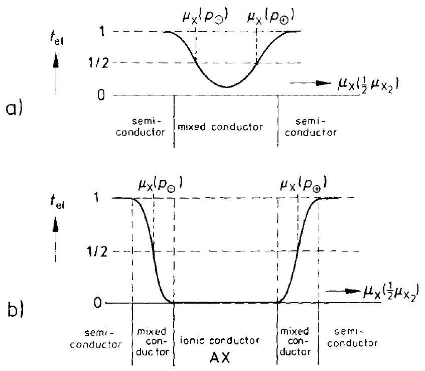
Figure 4-2. Transference number of electronic carriers, $t_{\mathrm{el}}$, for AX as a function of the chemical potential of $\mathrm{X}\left(\mathrm{X}_{2}\right)$. a) $\mathrm{p}_{\oplus} / \mathrm{p}_{\ominus}>1$, b) $\mathrm{p}_{\oplus} / \mathrm{p}_{\ominus}>1$ (see text).

Equations (4.94) and (4.95) provide examples of the fundamental equations which describe the electronic conduction in ionic solids. Figure 4-2 shows the electronic transference number $t_{\mathrm{el}}$ as a function of the chemical potential of component X .

### 4.4.2 Transport in Binary Ionic Crystals AX

Conceptually it is often convenient to formulate transport only in terms of point defect fluxes since point defects are the primary mobile species. Regular SE's in ionic crystals are then rendered mobile by point defect jumps. We assume (in accordance with many systems of practical importance) that the X anions are (almost) immobile and refer the fluxes to the X sublattice. At sufficiently low concentrations of point defects, their individual elementary jumps are independent. Thus

$$
j_{\mathrm{p}}=-L_{\mathrm{pp}} \cdot X_{\mathrm{p}}
$$

and since $X_{\mathrm{p}}=\nabla \eta_{\mathrm{p}}$, one derives by inserting $\nabla \eta_{\mathrm{p}}$ explicitly into Eqn. (4.97)

$$
L_{\mathrm{pp}}=\frac{c_{\mathrm{p}} \cdot D_{\mathrm{p}}}{R T}=\frac{\sigma_{\mathrm{p}}}{\left(z_{\mathrm{p}} \cdot F\right)^{2}}
$$

which shows again that the transport coefficients $L_{i j}$ are generalized conductances. The balance of jumps requires that $N_{\mathrm{p}} \cdot D_{\mathrm{p}}=N_{\mathrm{A}} \cdot D_{\mathrm{A}}$ and since $N_{\mathrm{A}} \cong 1$, $N_{\mathrm{p}} \cdot D_{\mathrm{p}} \cong D_{\mathrm{A}}$. Therefore,

$$
j_{\mathrm{A}}=-\frac{D_{\mathrm{A}} \cdot c_{\mathrm{A}}}{R T} \cdot \nabla \eta_{\mathrm{A}^{+}}=-\frac{\sigma_{\mathrm{A}}}{\left(z_{\mathrm{A}} \cdot F\right)^{2}} \cdot \nabla \eta_{\mathrm{A}^{+}}
$$

and equally ( $\mathrm{el}=\mathrm{e}^{\prime}, \mathrm{h}^{\prime}$ )

$$
j_{\mathrm{el}}=-\frac{D_{\mathrm{el}} \cdot c_{\mathrm{el}}}{R T} \cdot \nabla \eta_{\mathrm{el}}=-\frac{\sigma_{\mathrm{el}}}{F^{2}} \cdot \nabla \eta_{\mathrm{el}}
$$

$\sigma_{\mathrm{el}}$ (or $L_{\mathrm{el}}$ and $D_{\mathrm{el}}$ ) depend on component chemical potentials (Eqn. (4.95)). If anions are mobile as well, we have (in the lattice reference frame) a flux equation for $\mathrm{X}^{-}$which is analogous to Eqn. (4.99).

In order to solve the transport problem we have to complete the set of necessary equations and, therefore, boundary conditions must be formulated. Depending on the boundary conditions we impose, quite different transport situations will arise. Let us analyze the one-dimensional transport in a binary electrolyte as an illustration. Two different boundary conditions will be introduced. 1) AX is brought between different chemical potentials relative to one of its component (open electrical circuit). 2) AX is brought between two inert electrodes to which a voltage $\Delta U$ is applied. Figures 4-3a and 4-3b show the experimental schemes. Let us examine them separately.

Boundary condition 1). In the absence of an external electrical circuit, current cannot flow, that is, $\sum z_{i} j_{i}=0$. Inserting ionic and electronic fluxes (Eqns. (4.99) and (4.100)) into this condition, one obtains

$$
-F \cdot \mathrm{~d} \varphi=t_{\mathrm{A}} \cdot \mathrm{~d} \mu_{\mathrm{A}^{+}}-t_{\mathrm{X}} \cdot \mathrm{~d} \mu_{\mathrm{X}^{-}}-t_{\mathrm{el}} \cdot \mathrm{~d} \mu_{\mathrm{el}}
$$

Figure 4-3. Device (schematic) for the study of transport in AX. a) AX in chemical potential gradient of X, open circuit; b) closed electrical circuit and inert electrodes attached to AX.

which is equivalent to

$$
-F \cdot \mathrm{~d} \varphi=t_{\mathrm{A}} \cdot \mathrm{~d} \mu_{\mathrm{A}}-t_{\mathrm{X}} \cdot \mathrm{~d} \mu_{\mathrm{X}}-\mathrm{d} \mu_{\mathrm{el}}
$$

Equation (4.102) follows from Eqn. (4.101) since $\mathrm{A}=\mathrm{A}^{+}+\mathrm{e}^{\prime}$, etc. and by definition $t_{\mathrm{el}}=1-\left(t_{\mathrm{A}}+t_{\mathrm{X}}\right) . \mu_{\mathrm{A}}$ and $\mu_{\mathrm{X}}$ are (neutral) component potentials. If one eliminates the electrical potential gradient from the flux equations, it is found that

$$
j_{\text {ion }}=j_{\mathrm{A}}+\left|j_{\mathrm{X}}\right|=\frac{\sigma_{\mathrm{A}}+\sigma_{\mathrm{X}}}{2 \cdot F^{2}} \cdot t_{\mathrm{el}} \cdot \nabla \mu_{\mathrm{X}_{2}}
$$

Slightly modified, Eqn. (4.103) reads

$$
j_{\mathrm{ion}}=\frac{\sigma_{\mathrm{ion}}}{2 \cdot F^{2}} \cdot \bar{t}_{\mathrm{el}} \cdot \frac{\Delta \mu_{\mathrm{X}_{2}}}{\Delta \xi}
$$

where $\bar{t}_{\mathrm{el}}$ is the average of $t_{\mathrm{el}}$ over the thickness $\Delta \xi$ of AX , and $\Delta \mu_{\mathrm{X}_{2}}$ is the $\mathrm{X}_{2}$ potential difference. $\bar{t}_{\mathrm{el}}$ must be calculated from Eqn. (4.91).

Figure 4-4. Metal oxidation scheme: $A+1 / 2 X_{2}=A X . V_{A}=$ cation vacancy in $A X$.

For a finite flux $j_{\mathrm{A}}$, there is a (steady state) shift of the AX crystal towards the side with the higher $\mu_{\mathrm{X}_{2}}$. $j_{\mathrm{X}}$ does not lead to such a shift. The shift velocity is $j_{\mathrm{A}} \cdot V_{m}(\mathrm{AX})$. Equation (4.104) can also be used to quantify the basic (one dimensional) metal oxidation experiment $\mathrm{A}+1 / 2 \mathrm{X}_{2}=\mathrm{AX}$ shown in Figure 4-4. In terms of thickness growth, one obtains from Eqn. (4.104) the expression

$$
\Delta \dot{\xi}=j_{\text {ion }} \cdot V_{m}(\mathrm{AX})=\frac{\sigma_{\text {ion }} \cdot \bar{t}_{\mathrm{el}}}{2 \cdot F^{2}} \cdot V_{m}(\mathrm{AX}) \cdot \frac{\Delta G_{\mathrm{AX}}}{\Delta \xi}
$$

which gives, after integration, the parabolic growth rate law $\Delta \xi^{2}=2 \cdot k t$. The parabolic rate constant, $k$, is found to be

$$
k=\frac{\sigma_{\mathrm{ion}} \cdot \vec{t}_{\mathrm{el}}}{2 \cdot F^{2}} \cdot V_{m}(\mathrm{AX}) \cdot \Delta G_{\mathrm{AX}}
$$

where $\Delta G_{\mathrm{AX}}$ is the Gibbs energy of formation of AX from A and $\mathrm{X}_{2}$. Chapter 7 is devoted to a detailed discussion of metal oxidation.

Although the parabolic rate law has the same form as the mean square displacement (see Section 4.3.1), its physical background is quite different. Parabolic growth is always observed in a one dimensional experiment when due to a gradient-driven flux and where the boundaries are kept at constant potentials.

| $R_{l}$ | $\alpha$ | $\beta$ | $\gamma$ | $\ldots$ | $R_{r}$ |
| :---: | :---: | :---: | :---: | :---: | :---: |
| $\mu_{i, l}(i=1,2 \ldots)$ |  |  |  |  | $\mu_{i, r}(i=1,2 \ldots)$ |
| $\eta_{e l, l}\left(e l=e^{\prime}, h^{\prime}\right)$ |  |  |  |  | $\eta_{e l, r}\left(e l=e^{\circ}, h^{\prime}\right)$ |

Figure 4-5. Schematic plot of a multiphase reaction layer, $R_{1}=$ reservoir left; $R_{r}=$ reservoir right.

For the sake of completeness, Figure 4-5 illustrates the more general situation of isothermal, isobaric matter transport in a multiphase system (e.g., $\mathrm{Fe} / \mathrm{FeO} / \mathrm{Fe}_{3} \mathrm{O}_{4}$ / $\mathrm{O}_{2}$ ). A sequence of phases $\alpha, \beta, \gamma, \ldots$ is bounded by two reservoirs which contain both neutral components (i) and electronic carriers (el). The boundary conditions imply that the buffered chemical potentials ( $\mu_{i}(\mathrm{R})$ ) and the electrochemical potentials ( $\eta_{\mathrm{el}}(\mathrm{R})$ ) are predetermined in $\mathrm{R}_{1}$ and $\mathrm{R}_{\mathrm{r}}$. Depending on the concentrations and mobilities ( $c_{i}^{v}, b_{i}^{v}, c_{\text {el }}^{v}, b_{\text {el }}^{v}$ ) in the various phases $v$, metallic conduction, semiconduction, or ionic conduction will prevail. As long as the various phases are thermodynamically stable and no decomposition occurs, the transport equations (including the boundary conditions) are well defined and there is normally a unique solution to the transport problem.

Boundary condition 2). Let us now fix two inert electrodes with a voltage difference, $\Delta U$, across AX (Fig. 4-3b). Since inert electrodes are reversible for electrons (electron holes) only,

$$
\eta_{\mathrm{el}}(\text { electrode })=\eta_{\mathrm{el}}(\text { electrolyte })
$$

on both the sides 1 and 2 of AX. Since the electrodes are made of the same metal (say Pt), we also have

$$
\mu_{\mathrm{el}}(\text { electrode } 1)=\mu_{\mathrm{el}}(\text { electrode } 2)
$$

At sufficiently small $\Delta U$, the inert electrodes block the ionic current through AX , that is, $j_{\mathrm{A}}=0, j_{\mathrm{X}}=0$. If $t_{\text {ion }} \gg t_{\mathrm{el}}$, which is the condition for AX being an electrolyte, then $\mathrm{d} \varphi(\mathrm{AX})=0$ as well since a) $\nabla \mu_{\mathrm{A}^{+}}=0$ ( $\mathrm{A}^{+}$is the main cationic SE when $N_{\mathrm{A}^{+}} \cong 1$ ) and b) $j_{\text {ion }}==0$, which implies that $\nabla \eta_{\text {ion }}=0$. From Eqn. (4.107)

$$
\eta_{\mathrm{h}}\left(E_{(1)}\right)=\eta_{\mathrm{h}}\left(\mathrm{AX}_{(1)}\right) \text { and } \eta_{\mathrm{h}}\left(E_{(2)}\right)=\eta_{\mathrm{h}}\left(\mathrm{AX}_{(2)}\right)
$$

follows. Subtracting $\eta_{\mathrm{h}}\left(\mathrm{AX}_{(1)}\right)$ from $\eta_{\mathrm{h}}\left(\mathrm{AX}_{(2)}\right)$ yields

$$
\Delta \mu_{\mathrm{h}}(\mathrm{AX})=R T \cdot \ln \left(c_{\mathrm{h}}(2) / c_{\mathrm{h}}(1)\right)=F \cdot \Delta U
$$

An electron hole flux in AX is driven by $\Delta \mu_{\mathrm{h}}$. If the hole mobility is constant, then $\nabla c_{\mathrm{h}}$ is also constant and

$$
c_{h}(1)+c_{h}(2)=2 \cdot c_{h}^{0}
$$

where $c_{\mathrm{h}}^{0}$ is the electron hole concentration in AX before $\Delta U$ was applied. Inserting Eqns. (4.110) and (4.111) into the flux equation corresponding to Eqn. (4.100), we find

$$
j_{\mathrm{h}}=-2 \cdot D_{\mathrm{h}} \cdot c_{\mathrm{h}}^{0} \cdot \frac{1-\mathrm{e}^{\Delta U \cdot F / R T}}{1+\mathrm{e}^{\Delta U \cdot F / R T}}
$$

This relationship is shown in Figure 4-6. The saturation flux for $\Delta U= \pm \infty$ is equal to $( \pm) 2 \cdot D_{\mathrm{h}} \cdot c_{\mathrm{h}}^{0}$.

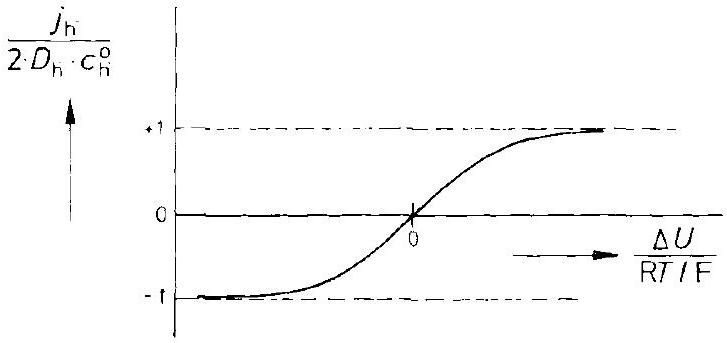
Figure 4-6. Normalized electron hole flux in crystal AX located between inert electrodes (Figure 4-3b), as a function of the applied voltage $\Delta U$. Non-ohmic characteristic.

In Section 4.4.2 some concepts were developed which allow us to quantitatively treat transport in ionic crystals. Quite different kinetic processes and rate laws exist for ionic crystals exposed to chemical potential gradients with different electrical boundary conditions. In a closed system (Fig. 4-3a), the coupled fluxes are determined by the species with the smaller transport coefficient ( $c_{i} b_{i}$ ), and the crystal as a whole may suffer a shift. If the external electrical circuit is closed, inert (polarized) electrodes will only allow the electronic (minority) carriers to flow across AX, whereas ions are blocked. Further transport situations will be treated in due course.

### 4.5 Transport Across Phase Boundaries

### 4.5.1 Introduction. Equilibrium Phase Boundaries

This section is devoted to the basic kinetics of interfaces in solids. In Chapter 10 we shall work out some ideas in more detail and introduce atomic models for the determination of kinetic parameters.

Interfaces are necessarily narrow, their smallest width being of atomic dimension. Therefore, thermodynamic potential gradients or potential changes across interfaces are often large compared with corresponding quantities in the bulk crystal. As a consequence, the linear regime of transport rates across interfaces is readily exceeded.

The experimental determination of a potential change across a solid/solid interface is a most difficult task since it means that potential probes have to be placed very near the interface. Electrochemists face a similar problem when they study electrode kinetics, but the handling of fluids in this respect is much easier. Nevertheless, we will exploit their concepts and methods to some extent in what follows.

Let us begin with the analysis of dynamic equilibrium. For the interior of phase $\alpha$ to be in dynamic equilibrium, all the particle fluxes must vanish. We can formulate these fluxes explicitly as

$$
j_{i}^{\alpha}=c_{i}^{\alpha} \cdot b_{i}^{\alpha} \cdot\left[\sum_{n} \nabla p_{i, n}^{\alpha}+\sum_{k \neq i} \beta_{i, k}^{\alpha} \cdot j_{k}^{\alpha}\right]
$$

where $c_{i}^{\alpha} \cdot b_{i}^{\alpha}$ is the transport coefficient of $i$ in $\alpha$. The first summation in the bracket describes the action of $n$ (thermodynamic) potential gradients. The second summation takes into account the friction between particles $i$ and the fluxes $j_{k} ; \beta_{i, k}$ are friction (cross) coefficients. Since the fluxes $j_{k}$ vanish individually at equilibrium, the equilibrium condition requires that

$$
j_{i}^{\alpha}=c_{i}^{\alpha} \cdot b_{i}^{\alpha} \cdot \sum_{n} \nabla p_{i, n}^{\alpha}=0, \text { i.e., } \sum_{n} \nabla p_{i, n}^{\alpha}=0
$$

It follows that the gradients $\nabla p_{i, n}^{\alpha}$ vanish individually if one deals with independent potentials and therefore extended equilibrium phases must be homogeneous.

If a heterogeneous system consists of two phases, $\alpha$ and $\beta$, and we treat the phase boundary conceptually as a separate (interface) phase with thickness $\Delta \xi^{b}$, we can derive the equilibrium condition as before and obtain

$$
\frac{1}{\Delta \xi^{b}} \cdot \sum_{n} \Delta p_{i, n}^{b}=0, \text { i.e., } \sum_{n} \Delta p_{i, n}^{b}=0
$$

$\Delta$ denotes the difference across boundary $b$. Since our system consists of various chemical species, at least one $\Delta p_{i, n}^{b}$ term is $\Delta \mu_{i}^{b}\left(=\mu_{i}^{\alpha}-\mu_{i}^{\beta}\right)$. Other potential differences may be electric, elastic, etc. For charged particles $i$, the interface equilibrium is established if

$$
\Delta \mu_{i}^{b}+\Delta \tilde{\varphi}_{i}^{b}=0
$$

where $\tilde{\varphi}_{i}=z_{i} \cdot F \cdot \varphi$. Due to chemical affinity differences, $\Delta \mu_{i}^{b}$ is of the order of 1 eV . The amount of electrical charge necessary to build up the corresponding electric field is negligible compared to the number of atomic particles $i$ in macroscopic (even two dimensional) systems. Therefore, Eqn. (4.116) is equivalent to

$$
\Delta \eta_{i}^{b}=0
$$

where $\eta_{i}$ is the electrochemical potential. Since $\Delta \mu_{i}^{b}$ does not vanish across the interface of a heterogeneous system, Eqn. (4.116) states that there is always an electrical potential drop $\Delta \varphi^{b}$ across an equilibrium phase boundary.

If several $(n)$ charged species $i$ equilibrate across the phase boundary, the set of Eqns. (4.116) has to be solved simultaneously for $i=1,2, \ldots, n$. This does not lead to an over-determination of $\Delta \tilde{\varphi}^{b}$ but ensures that the chemical potentials of the electroneutral combinations of the ions ( $=$ neutral components of the system) are constant across the interface. The electric structure (space charge) of interfaces will be discussed later.

### 4.5.2 Non-Equilibrium Phase Boundaries

When a dynamic equilibrium prevails at the $\alpha / \beta$ phase boundary, the exchange fluxes $\vec{j}_{i}^{0, b}$ and $\vec{j}_{i}^{0, b}$ occur across the interface and cancel each other individually.

$$
j_{i}^{b}(\mathrm{eq})=\vec{j}_{i}^{0, b}-\tilde{j}_{i}^{0, b}=0, \quad \vec{j}_{i}^{0, b}=\tilde{j}_{i}^{0, b}\left(=j_{i}^{0}\right)
$$

Let us consider ionic systems. In non-equilibrium state, the potential drop across the interface differs from the equilibrium value $\Delta \varphi^{b}$ (eq). If the adjacent phases $\alpha$ and $\beta$ chemically buffer the interface on their respective sides, as is normally true considering the large number of particles in the bulk relative to the small number of interface particles, the overall potential drop, $\Delta \eta_{i}^{b}$, is only due to the electric potential change $\delta \tilde{\varphi}^{b}$. Let us then expand $j_{i}^{b}\left(\Delta \eta_{i}^{b}\right)$ in a series and linearize

$$
j_{i}^{b}=\left(\frac{\partial j_{i}^{b}}{\partial \Delta \tilde{\varphi}^{b}}\right)_{\mathrm{eq}} \cdot\left(\Delta \tilde{\varphi}^{b}-\Delta \tilde{\varphi}_{\mathrm{eq}}^{b}\right)=\left(\frac{\partial j_{i}^{b}}{\partial \Delta \tilde{\varphi}^{b}}\right)_{\mathrm{eq}} \cdot \delta \tilde{\varphi}^{b}
$$

Equation (4.119) reflects the dynamic situation at the interface. For higher order approximations we have to introduce kinetic interface models. This will be done for different phase boundaries in Chapter 10. At this point we introduce the most simple assumption: the interface is a kinetic barrier which must be overcome by the individual ions through thermal activation. In such a model, the externally applied electric field increases the activation barrier in one direction and decreases it in the reverse direction. Letting $\alpha$ denote the asymmetry factor of the barrier, we can then formulate

$$
j_{i}^{b}=j_{i}^{0} \cdot\left(\mathrm{e}^{\alpha \cdot \frac{\delta \tilde{\varphi}^{b}}{R T}}-\mathrm{e}^{-(1-\alpha) \cdot \frac{\delta \tilde{\varphi}^{b}}{R T}}\right)
$$

which, when linearized with ( $\left.\partial j_{i}^{b} / \partial \Delta \tilde{\varphi}^{b}\right)_{\text {eq }}=\left(j_{i}^{0} / R T\right)$, again yields Eqn. (4.119). Figure 4-7 gives an illustration. This is a fundamental model in electrochemistry, and particularly if one wishes to calculate the electrode overpotential under a load assuming charge transfer to be rate controlling. (The corresponding equation is named after Butler and Volmer.)

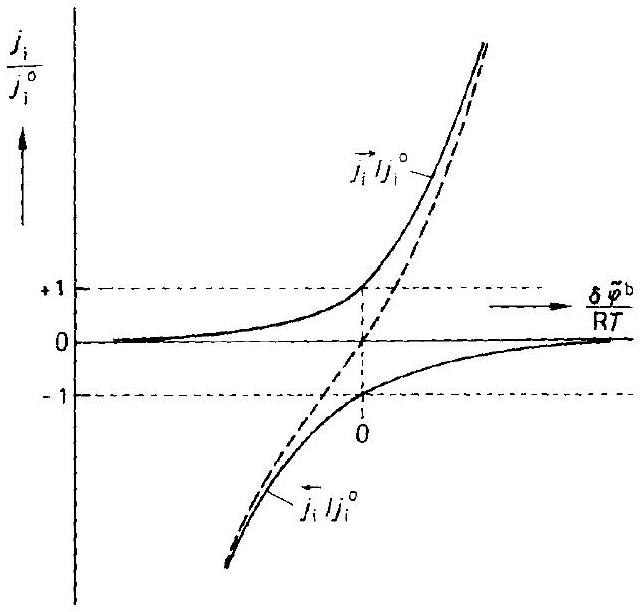
Figure 4-7. Normalized flux density vs. normalized driving force (overpotential) across a solid/solid interface. - - gives the sum of $\vec{j}$ and $\vec{j} . \alpha>0.5$ (see text).

In conclusion, we observe that the crossing of crystal phase boundaries by matter means the transfer of SE's from the sublattices of one phase ( $\alpha$ ) into the sublattices of another phase ( $\beta$ ). Since this process disturbs the equilibrium distribution of the SE's, at least near the interface, it therefore triggers local SE relaxation processes. In more elaborated kinetic models of non-equilibrium interfaces, these relaxations have to be analyzed in order to obtain the pertinent kinetic equations and transfer rates. This will be done in Chapter 10.

### 4.6 Transport in Semiconductors; Junctions

### 4.6.1 Introduction

We have discussed transport in the bulk and transport across interfaces and phase boundaries (i.e., discontinuities). In this section, we shall mainly treat an intermediate transport situation, the so-called junction. At junctions, the atomistic processes that occur under a load have much in common with interface processes, such as the relaxation behavior of the SE's which are swept across them.

In solid state technology, some of the most important transport processes occur at junctions. Junctions are zones in which the disorder type changes. The best known junction is the (p-n) junction in a semiconductor, which is basic to the operation of a transistor. In Figure 4-8, the main features of a junction zone are presented. Although it illustrates the situation in a semiconductor, as we shall see later, its essential features explain other junctions as well.

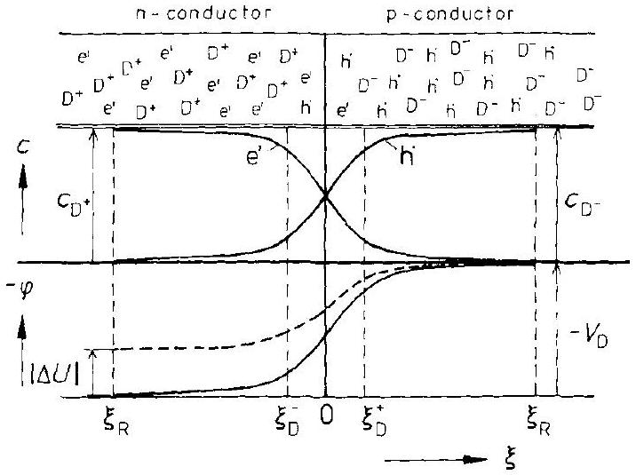
Figure 4-8. p-n junction zone. Concentrations and electric potential without load ( $\Delta U=0$ ) and with load ( $\Delta U \neq 0$ ) as a function of space coordinate $\xi$ (see text).

Semiconductors, like metals, carry electric charge by electrons and electron holes, but in contrast to metals the conductivity of electronic carriers is thermally activated. If we neglect cross effects, the electric current does not alter the semiconducting crystal, since no matter transport is involved. This makes these crystals ideal elements for electric devices. The electrons (electron holes) in semiconductors are the building elements which obey crystal thermodynamics as outlined in Chapter 2. Their concentrations can be influenced by doping (donors and acceptors). It is essentially the electronic defect reactions in the junction zone which determine the unique kinetic behavior of semiconductors. For its understanding, we introduce the concept of internal relaxation reactions. Combined with extended space charges, we then explain the kinetics at a junction in which the electron hole (p) conduction changes to electron $(\mathrm{n})$ conduction: the $(\mathrm{p}-\mathrm{n})$ junction.

### 4.6.2 The (p-n) Junction

As Figure 4-8 shows, the junction zone can be divided into space-charge sections and recombination ( R ) sections (of widths $\xi_{\mathrm{D}}$ and $\xi_{\mathrm{R}}$, respectively; the index D refers to the Debye length). The two disorder zones that are in contact at $\xi=0$ are ( $\mathrm{D}^{+}, i$ ) and ( $\mathrm{D}^{-}, j$ ). We assume that $\mathrm{D}^{+}$and $\mathrm{D}^{-}$, the (heterovalent) dopants, are immobile. At ( $\mathrm{p}-\mathrm{n}$ ) junctions, $i=\mathrm{e}^{\prime}(\mathrm{n})$ and $j=\mathrm{h}^{*}(\mathrm{p})$.

Fick's second law states the conservation of the diffusing species $i$ : no $i$ is produced (or annihilated) in the diffusion zone by chemical reaction. If, however, production (annihilation) occurs, we have to add a (local) reaction term $\dot{r}_{i}$ to the generalized version of Fick's second law: $\dot{c}_{i}=-\nabla j_{i}+\dot{r}_{i}$. In Section 1.3.1, we introduced the kinetics of point defect production if regular SE's are thermally activated to become irregular SE's (i.e., point defects). These concepts and rate equations can immediately be used to formulate electron-hole formation and annihilation
kinetics. Accordingly, the rate of the (local) concentration change for species $i$ (and correspondingly $j$ ) reads

$$
\dot{c}_{i}=-\nabla j_{i}+k_{i} \cdot\left(\left(c^{0}\right)^{2}-c_{i} \cdot c_{j}\right)
$$

The second term on the right hand side accounts for the bimolecular recombination reaction (see, for example, Eqn. (1.2) ff.).

As Figure 4-8 shows, outside the space charge region $\xi_{D}^{+}\left(\xi_{D}^{-}\right)$, the concentration $c_{i}\left(c_{j}\right)$ is very small, if $i(j)$ is the respective minority point defect $\mathrm{e}^{\prime}\left(\mathrm{h}^{\bullet}\right)$. This follows from the equilibrium condition $c_{i} \cdot c_{j}=\left(c^{0}\right)^{2}(=K)$ and the electroneutrality condition outside $\xi_{\mathrm{D}}: c_{i}\left(\xi<\xi_{\mathrm{D}}^{-}\right)=c_{\mathrm{D}^{+}}$, and $c_{j}\left(\xi>\xi_{\mathrm{D}}^{+}\right)=c_{\mathrm{D}^{-}}$. Here, the $\nabla \varphi$ driven flux of the minority carriers can always be neglected.

Thus, if the length of the one dimensional recombination zone $\xi_{R} \gg \xi_{D}$, the steady state condition in Eqn. (4.121) for the minority species in this zone simplifies to

$$
D_{i} \cdot \frac{\partial^{2} c_{i}}{\partial \xi^{2}}+k_{i} \cdot\left(\left(c^{0}\right)^{2}-c_{i} \cdot c_{j}\right) \cong 0
$$

with only the diffusional flux term. Rewriting Eqn. (4.122) in a dimensionless form, one finds the characteristic recombination width $\xi_{\mathrm{R}}$ to be

$$
\xi_{\mathrm{R}}=\sqrt{\frac{D_{i}}{c^{0} \cdot k_{i}}}=\sqrt{2 \cdot D_{i} \cdot \tau_{\mathrm{R}}}, \quad \tau_{\mathrm{R}}=\frac{1}{2 \cdot c^{0} \cdot k_{i}}
$$

where $\tau_{\mathrm{R}}$ is the recombination (relaxation) time.
In equilibrium, $\nabla \eta_{i}=0$. This explicitly means that $R T \cdot \ln c_{i}(\xi)-F \cdot \varphi(\xi)=\mathrm{const}$, and we can conclude that in the space charge region

$$
c_{i}^{0}\left(\xi_{\mathrm{D}}^{+}\right)=c_{i}^{0}\left(\xi_{\mathrm{D}}^{-}\right) \cdot e^{-\frac{F \cdot V_{\mathrm{D}}}{R T}}
$$

where $V_{D}$ is the so-called diffusion potential. When the junction is under load and a voltage $\Delta U$ is applied, we still have $\nabla \eta_{i} \cong 0$ in the space charge region, provided that $\left|\xi_{\mathrm{R}}\right| \gg\left|\xi_{\mathrm{D}}\right|$. Therefore

$$
c_{i}\left(\xi_{\mathrm{D}}^{+}\right)=c_{i}^{0}\left(\xi_{\mathrm{D}}^{-}\right) \cdot \mathrm{e}^{-\frac{F \cdot\left(V_{\mathrm{D}}+\Delta U\right)}{R T}}
$$

and we obtain with Eqn. (4.124)

$$
c_{i}\left(\xi_{\mathrm{D}}^{+}\right)=c_{i}^{0}\left(\xi_{\mathrm{D}}^{+}\right) \cdot \mathrm{e}^{-\frac{F \cdot \Delta U}{R T}}
$$

In the linear approximation, the (blocking) flux of species $i$ is $j_{i}(b l)=-D_{i} \cdot\left(c_{i}\left(\xi_{\mathrm{D}}^{+}\right)\right. \left.-c_{i}\left(\xi_{\mathrm{R}}^{+}\right)\right) / \xi_{\mathrm{R}}$, and so with Eqns. (4.123) and (4.126)

$$
j_{i}(b l)=-\frac{D_{i} \cdot c_{i}^{0}\left(\xi_{D}^{+}\right)}{\sqrt{2 \cdot D_{i} \cdot \tau_{R}}} \cdot\left(\mathrm{e}^{-\frac{F \cdot \Delta U}{R T}}-1\right)
$$

which, in the limit of $\Delta U \rightarrow \infty$, gives the saturation flux of $i$ as

$$
j_{i}(b l)_{\mathrm{sat}}=\frac{D_{i} \cdot c_{i}^{0}\left(\xi_{\mathrm{D}}^{+}\right)}{\sqrt{2 \cdot D_{i} \cdot \tau_{\mathrm{R}}}}=\frac{\left(c^{0}\right)^{2}}{c_{\mathrm{D}^{+}}} \cdot \sqrt{D_{i} \cdot k_{i} \cdot c^{0}}
$$

Use has been made of the fact that $c_{i}^{0}\left(\xi<\xi_{\mathrm{D}}^{+}\right)=\left(c^{0}\right)^{2} / c_{\mathrm{D}^{+}}$, which is the law of mass action for minority species. An analogous equation can be derived for $j_{j}(b l)$. The sum of the fluxes $\left(j_{i}(b l)+j_{j}(b l)\right)$, multiplied by Faraday's constant, gives the overall steady state blocking current

$$
I^{0}(b l)=F \cdot\left(c^{0}\right)^{2} \cdot\left(\frac{1}{c_{D^{+}}} \cdot \sqrt{D_{i} \cdot k_{i} \cdot c^{0}}+\frac{1}{c_{\mathrm{D}^{-}}} \cdot \sqrt{D_{j} \cdot k_{j} \cdot c^{0}}\right)
$$

Equation (4.129) gives the current, $I^{0}(b l)$, under the condition that $\xi_{\mathrm{R}} \gg \xi_{\mathrm{D}}$. The rate constants $k_{i}\left(k_{j}\right)$ for the (homogeneous) defect reactions, and thus $\tau_{\mathrm{R}}$, can be determined with the help of the saturation blocking current for $\Delta U \rightarrow \infty$ since

$$
k_{i}^{1 / 2}=\left(\partial I^{0}(b l) / \partial\left(1 / c_{\mathrm{D}^{+}}\right)\right) \cdot\left(F \cdot\left(c^{0}\right)^{2} \cdot \sqrt{D_{i} \cdot c^{0}}\right)^{-1}
$$

This is an interesting result. We cannot always neglect the space-charge width $\xi_{\mathrm{D}}$ compared to the recombination length $\xi_{\mathrm{R}}$. Transport and internal reactions in crystals with varying disorder types will be further discussed in Chapter 9.

In summary, junctions are more or less extended zones in crystals in which the disorder type changes and transport occurs along with simultaneous (local) reactions of the SE's. Junctions exhibit complex kinetic behavior due to the coupling of fluxes and reactions. The ( $\mathrm{p}-\mathrm{n}$ ) junction is an interesting limiting case but has served to introduce the fundamental concepts of junctions.

### 4.7 Basic Rate Equations for Homogeneous Reactions

### 4.7.1 Introduction

Kinetics deals with many-particle systems (thermodynamic ensembles). The properties measured as a function of time depend on the scale of observation, and this scale is chosen in relation to the question we wish to ask. The smaller the scale, the more inhomogeneous and fluctuating the homogeneous systems appear to be. For example, we describe the activated atomic jump frequency $v$ as

$$
v=v^{0} \cdot \mathrm{e}^{-\left(E^{s} / R T\right)}
$$

where $E^{\mathrm{s}}$ is the saddle point energy (Fig. 4-9). Although neither the attempt frequency $v^{0}$ nor $E^{\mathrm{s}}$ are constant for individual jumps, macroscopic transport and

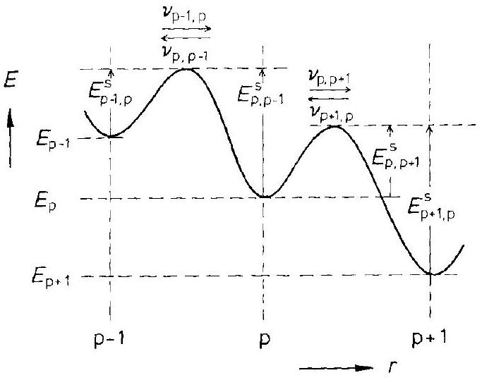
Figure 4-9. Scheme of saddle point configurations, that is, energy vs. reaction path coordinate $r$. $r_{p}$ conforms to different states of atomic particles in a crystal, for example, sublattices in homogeneous crystals or lattice planes in inhomogeneous crystals.

reactions are well represented by Eqn. (4.131). Here, both $v^{0}$ and $E^{\mathrm{s}}$ are functions of state as will be discussed in Section 5.1.3. The $\mathrm{e}^{-\left(E^{\mathrm{s}} / R T\right)}$ term can be interpreted as the probability of having local energy fluctuations with sufficient amplitude to overcome a saddle. Fluctuations in space and time are the essence of a homogeneous dynamic system, and we will return to this point repeatedly.

### 4.7.2 Rate Equations

Transport plays the overwhelming role in solid state kinetics. Nevertheless, homogeneous reactions occur as well and they are indispensable to establishing point defect equilibria. Defect relaxation in the (p-n) junction, as discussed in the previous section, illustrates this point, and similar defect relaxation processes occur, for example, in diffusion zones during interdiffusion [G. Kutsche, H. Schmalzried (1990)].

Irreversible thermodynamics asserts that the affinity, $-\Delta G$, is the driving force for (homogeneous) chemical reactions. Linear rate laws, however, are observed only near equilibrium. Reaction partners in homogeneous crystals are SE's. In a crystal with no thermodynamic potential gradients, we may induce 'instantaneous' changes of temperature (or pressure) since the conduction of heat (or sound) is so much faster than the transport of point defects by diffusion. SE's obey Boltzmann (or Fermi) statistics and so will redistribute over the available energy states (lattice sites) after a temperature change. This equilibration of the homogeneous system is equivalent to reactions between SE's that are normally coupled because of the crystal lattice constraints.

Let us first analyze the dynamic equilibrium with the help of a simple model. Atomic particles of crystal A are distributed over two sublattices, each of which has $z^{0}$ sites. $P\left(N_{i}\right)$ is the probability that $z_{i} \mathrm{~A}$ atoms occupy $i$ lattice sites $(i=1,2)$. The
total number of A atoms is $2 z_{\mathrm{A}}$, and the total number of sites is $2 z^{0}$. It follows from $N_{i}=z_{i} / z^{0}$ that

$$
P\left(N_{i}\right)=\left(g\left(z_{i}\right) / Z\right) \cdot \mathrm{e}^{-\left[\left(z^{0} / R T\right) \cdot\left(N_{1} \cdot E_{1}+N_{2} \cdot E_{2}\right)\right]}
$$

where $g\left(z_{i}\right)$ is the degree of degeneracy and $Z$ is the normalizing partition function. $E_{i}$ is the (molar) energy of particle A on sublattice $i . g\left(z_{i}\right)$ can be derived from the number of permutations of vacant and occupied lattice sites, that is,

$$
g\left(z_{i}\right)=\frac{z^{0}!}{z_{i}!\cdot\left(z^{0}-z_{i}\right)!} \cdot \frac{z^{0}!}{\left(2 z_{\mathrm{A}}-z_{i}\right)!\left(z^{0}-\left(2 z_{\mathrm{A}}-z_{i}\right)\right)!}
$$

With $E\left(N_{i}\right)=N_{1} E_{1}+N_{2} E_{2}$, Eqns. (4.132) and (4.133) can be rewritten

$$
P\left(N_{i}\right)=\frac{1}{Z} \cdot \mathrm{e}^{-\frac{z^{0}}{R T}\left(E\left(N_{i}\right)-T \cdot S\left(N_{i}\right)\right)}=\mathrm{e}^{-\frac{z^{0}}{R T} \cdot\left(F\left(N_{i}\right)-F^{*}\right)}
$$

where $F^{*}=-k T \cdot \ln Z$, and $S\left(N_{i}\right)$ is calculated from the configuration degeneracy (i.e., Eqn. (4.133)) according to Boltzmann. From Eqn. (4.134), we can draw the following conclusions. 1) Since $P\left(N_{i}\right)$ is positive and finite, irrespective of $z^{0}$, $F\left(N_{i}\right)>F^{*}$. 2) The maximum value of $P\left(N_{i}\right)$ is found if $F\left(N_{i}\right)=F^{*}$, which therefore denotes the equilibrium distribution of A. 3) The smaller the system ( $z^{0}$ ), the larger is $\left(F\left(N_{i}\right)-F^{*}\right)$ for the same $P\left(N_{i}\right)$, which means the fluctuations are larger.

Instead of explicitly evaluating the equilibrium distribution by setting ( $\partial F / \partial N_{i}$ ) $=0$, let us evaluate the equilibrium condition (mass action law) from a kinetic approach. The basic kinetic equation is

$$
\dot{N}_{1}=-v_{12} \cdot N_{1} \cdot\left(1-N_{2}\right)+v_{21} \cdot N_{2} \cdot\left(1-N_{1}\right)
$$

It describes the in- and outflow of A atoms into and out of each sublattice in analogy to Figure 4-9. The elementary exchange can take place if an empty site is neighboring the jumping particle A . The steady state condition is $\dot{N}_{1}=0$, which immediately gives

$$
\frac{v_{21}}{v_{12}}=\left(\frac{N_{1}}{1-N_{1}} \cdot \frac{1-N_{2}}{N_{2}}\right)_{\mathrm{eq}}=\mathrm{e}^{-\frac{\Delta E}{R T}}
$$

The second part of Eqn. (4.136) is true if the attempt frequency $v^{0}$ (Eqn. (4.131)) is independent of the composition. This kinetic steady state condition is obviously equivalent to the thermodynamic equilibrium condition.

Finally, we establish kinetic equations which can deal with homogeneous solid state reactions in more general terms. The rate at which vacancies $V_{\varkappa}$ on sublattice $\varkappa$ exchange sites with (neighboring) atomic structure elements of sort $i$ (with charge $q)$ on sublattice $\varkappa^{\prime}$ is designated as $v_{\mathrm{V}}\left(\mathcal{u}, i^{q}, \varkappa^{\prime}\right)$. The rate of increase of $i_{\varkappa}^{q}$ is found by formulating the detailed exchange

$$
\dot{N}\left(i_{\varkappa^{\prime}}^{q}\right)=-\sum_{\varkappa \neq \varkappa^{\prime}} v_{\mathrm{V}}\left(\varkappa, i^{q}, \varkappa^{\prime}\right) \cdot N\left(i_{\varkappa^{\prime}}^{q}\right) \cdot N\left(V_{\varkappa}\right)-v_{\mathrm{V}}\left(\varkappa^{\prime}, i^{q}, \varkappa\right) \cdot N\left(i_{\varkappa}^{q}\right) \cdot N\left(\mathrm{~V}_{\varkappa^{\prime}}\right)
$$

Equation (4.137) exists for each SE. Additionally, one has the following constraints

$$
\begin{array}{ll}
\sum_{\varkappa, q} N\left(i_{\varkappa}^{q}\right)=N^{0}(i) & \text { conservation of matter } \\
\sum_{i, q} N\left(i_{\varkappa}^{q}\right)=N_{\varkappa}^{0} & \text { conservation of sites } \\
\sum_{i, q} q \cdot N\left(i_{\varkappa}^{q}\right)=0 & \text { conservation of charge; } \\
\text { electroneutrality }
\end{array}
$$

Finally, the crystal structure condition (Eqn. (2.12)) requires

$$
N_{\varkappa_{1}}^{0} / N_{\varkappa_{2}}^{0}=m_{\varkappa_{1}, \varkappa_{2}}
$$

where $m_{\varkappa_{1}, \varkappa_{2}}$ is a rational number. This system of coupled kinetic differential equations is, in general, extremely complicated and cannot be solved analytically. It may even have decaying (quasi) periodic solutions. Simplified solutions are given later in order to illustrate special applications. In the limit of very long (relaxation) times and when close to equilibrium, one exponential relaxation process will predominate, being that which is governed by the slowest exchange rate $v\left(\varkappa, i^{q}, \varkappa^{\prime}\right)$. Let us refer the SE concentrations to their equilibrium fractions $N^{0}\left(i_{\mathcal{R}}^{q}\right)$. By writing

$$
N\left(i_{\varkappa}^{q}\right)=N^{0}\left(i_{\varkappa}^{q}\right)+\delta\left(i_{\varkappa}^{q}\right) ; \quad N\left(\mathrm{~V}_{\varkappa}\right)=N^{0}\left(\mathrm{~V}_{\varkappa}\right)+\delta\left(\mathrm{V}_{\varkappa}\right)
$$

one obtains from Eqn. (4.137)

$$
\begin{aligned}
\dot{\delta}\left(i_{\varkappa^{\prime}}^{q}\right)= & \sum_{\varkappa \neq \varkappa^{\prime}} v_{\mathrm{V}}\left(\varkappa^{\prime}, i^{q}, \varkappa\right) \cdot\left[\delta\left(i_{\varkappa}^{q}\right) \cdot N^{0}\left(\mathrm{~V}_{\varkappa^{\prime}}\right)+\delta\left(\mathrm{V}_{\varkappa^{\prime}}\right) \cdot N^{0}\left(i_{\varkappa}^{q}\right)\right] \\
& -v_{\mathrm{V}}\left(\varkappa, i^{q}, \varkappa^{\prime}\right) \cdot\left[\delta\left(i_{\varkappa^{\prime}}^{q}\right) \cdot N^{0}\left(\mathrm{~V}_{\varkappa}\right)+\delta\left(\mathrm{V}_{\varkappa}\right) \cdot N^{0}\left(i_{\varkappa^{\prime}}^{q}\right)\right]
\end{aligned}
$$

In deriving Eqns. (4.137) and (4.143) we have assumed that only neutral vacancies are present. Charged vacancies can easily be included if necessary. For each of the individual reaction steps, which were already formulated in Eqn. (4.22) (viz. $i_{\varkappa}^{q}+\mathrm{V}_{\varkappa^{\prime}}^{q} =i_{\varkappa^{\prime}}^{q}+\mathrm{V}_{\varkappa}^{q}$ ), the dynamic equilibrium condition requires that

$$
v\left(\varkappa^{\prime}, i^{q}, \varkappa\right) \cdot N^{0}\left(i_{\varkappa}^{q}\right) \cdot N^{0}\left(\mathrm{~V}_{\varkappa^{\prime}}\right)=v\left(\varkappa, i^{q}, \varkappa^{\prime}\right) \cdot N^{0}\left(i_{\varkappa^{\prime}}^{q}\right) \cdot N^{0}\left(\mathrm{~V}_{\varkappa}\right)
$$

and should simplify the relations (4.143) further.
Let us apply Eqn. (4.143) to the homogeneous Frenkel defect formation reaction $A_{A}+V_{i}=A_{i}^{*}+V_{A}^{\prime}$, which describes the formation of intrinsic majority defects in
silver halides. With $i_{\varkappa^{\prime}}^{q}=\mathrm{Ag}_{\mathrm{A}}, \mathrm{V}_{\varkappa^{\prime}}=\mathrm{V}_{\mathrm{A}}^{\prime}, i_{\varkappa}^{q}=\mathrm{Ag}_{\mathrm{i}}^{*}$ and $\mathrm{V}_{\varkappa}=\mathrm{V}_{\mathrm{i}}$ we obtain from Eqn. (4.143)

$$
\dot{\delta}_{\mathrm{Ag}_{\mathrm{i}}}=\alpha \cdot \delta_{\mathrm{Ag}_{\mathrm{i}}}, \quad \alpha=\left[2 \cdot \vec{v} \cdot N_{\mathrm{Ag}_{\mathrm{i}}}^{0}-2 \cdot \bar{v} \cdot\left(1-N_{\mathrm{Ag}_{\mathrm{i}}}^{0}\right)\right]
$$

Equation (4.145) represents a first order relaxation. We found the same result in Section 1.3.1 by linearizing the kinetic equations of the bimolecular point defect reaction (Eqn. (1.7)).

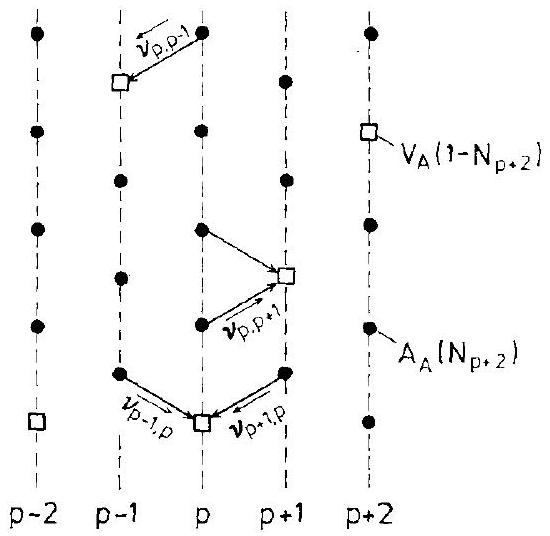
Figure 4-10. Model of the flux of A atoms across lattice planes in a concentration gradient. $z=2$ for the hexagonal planar array. $\bullet=\mathrm{A}_{\mathrm{A}} ; \square=\mathrm{V}_{\mathrm{A}}$.

In closing, we observe that the rate equations for jumps between successive lattice planes in inhomogeneous crystals can be treated analogously to a particle exchange between different sublattices in homogeneous crystals. Master equations similar to Eqn. (4.135) or Eqn. (4.137) will result. With appropriate linearization they yield the familiar transport equations (Fick's second law). For example, if we designate $P\left(z_{p}, t\right)$ as the probability of finding $z_{p} \mathrm{~A}$ particles on sites of the $p^{\text {th }}$ lattice plane of crystal A, the rate of change of $P$ (Fig. 4-10) is given by the master Equation (4.146),

$$
\begin{aligned}
\dot{P}\left(z_{p}, t\right)= & -P\left(z_{p}, t\right) \cdot\left(\omega_{p, p+1}+\omega_{p, p-1}\right) \\
& +P\left(z_{p-1}, t\right) \cdot \omega_{p-1, p}+P\left(z_{p+1}, t\right) \cdot \omega_{p+1, p}
\end{aligned}
$$

which is formally equivalent to Eqn. (4.137). $\omega$ denotes the frequency of the exchange jump as indicated in Figure 4-10. The modeling of $\omega$ could be done in the following way

$$
\begin{gathered}
\omega_{p, p+1}=v_{p, p+1} \cdot N_{p} \cdot\left(1-N_{p+1}\right) \\
v_{p, p+1}=z \cdot v^{0} \cdot \mathrm{e}^{-E_{p, p+1}^{\mathrm{s}} / R T}
\end{gathered}
$$

Equation (4.147) sets the jump frequency proportional to the fraction of particles A on lattice plane $p$, and of vacancies ( $1-N_{p+1}$ ) on the adjacent plane ( $p+1$ ). $z$ is the coordination number in direction ( $p, p+1$ ), and $\nu^{0}$ is the vibrational frequency in the potential wells.

## References

Cooper, A. R. (1974) in Geochem. Transport and Kinetics (Eds.: A. W. Hofmann, et al.), Carnegie Inst. of Washington, Publ. No. 634
Darken, L. S. (1948) Trans. AIME, 175, 184
de Groot, S. R., Mazur, P. (1962) Non-Equilibrium Thermodynamics, North-Holland, Amsterdam Fick, A. (1855) Pogg. Ann., 94, 59
Kirkaldy, J. S., Young, D. J. (1987) Diffusion in the Condensed State, The Institute of Metals, London
Kreuzer, J. H. (1981) Non-equilibrium Thermodynamics and Its Statistical Foundations, Clarendon Press, Oxford
Kutsche, G., Schmalzried, H. (1990) Solid State Ionics, 43, 43
Martin, M., et al. (1988) Kristallthermodynamik und diffusive Transportvorgänge, Report, Inst. Phys. Chemie, Universität Hannover
Munir, Z., Anselmi-Tamburini, U. (1989) Mat. Science Rep., 3, 277
Schmalzried, H. (1981) Solid State Reactions, Verlag Chemie, Weinheim

## 5 Kinetics and Dynamics. Local Equilibrium

### 5.1 Introduction

The aim of this chapter is to clarify the conditions for which chemical kinetics can be correctly applied to the description of solid state processes. Kinetics describes the evolution in time of a non-equilibrium many-particle system towards equilibrium (or steady state) in terms of macroscopic parameters. Dynamics, on the other hand, describes the local motion of the individual particles of this ensemble. This motion can be uncorrelated (single particle vibration, jump) or it can be correlated (e.g., through non-localized phonons). Local motions, as described by dynamics, are necessary prerequisites for the thermally activated jumps responsible for the movements over macroscopic distances which we ultimately categorize as transport and solid state reaction.

The time evolution of a system may also be characterized according to the degree of perturbation from its equilibrium state. Linear theories hold if local equilibrium prevails, that is, each volume element of the non-equilibrium system can still be unambiguously defined by the usual set of (local) thermodynamic state variables. Often, a crystal is in (partial) equilibrium with respect to externally predetermined $P$ and $T$, but not with external component chemical potentials $\mu_{k}$. Although $P, T$, and $\mu_{k}$ are all intensive functions of state, $\Delta P$ relaxes with sound velocity, $\Delta T$ by heat conduction, and $\Delta \mu_{k}$ by matter transport. In solids, matter transport is normally much slower than the other modes of relaxation.

As an illustration, consider the isothermal, isobaric diffusional mixing of two elemental crystals, A and B , by a vacancy mechanism. Initially, A and B possess different vacancy concentrations $c_{\mathrm{V}}^{0}(\mathrm{~A})$ and $c_{\mathrm{V}}^{0}(\mathrm{~B})$. During interdiffusion, these concentrations have to change locally towards the new equilibrium values $c_{\mathrm{V}}^{0}(\mathrm{~A}, \mathrm{~B})$, which depend on the local ( $\mathrm{A}, \mathrm{B}$ ) composition. Vacancy relaxation will be slow if the external surfaces of the crystal, which act as the only sinks and sources, are far away. This is true for large samples. Although linear transport theory may apply for all structure elements, the (local) vacancy equilibrium is not fully established during the interdiffusion process. Consequently, the (local) transport coefficients ( $D_{\mathrm{A}}, D_{\mathrm{B}}$ ), which are proportional to the vacancy concentration, are no longer functions of state (i.e., dependent on composition only) but explicitly dependent on the diffusion time and the space coordinate. Non-linear transport equations are the result.

Since our particle ensemble exists in the form of a crystal, the individual particles are located in periodically arranged potential wells (see, for example, Figure 5-3 as a two dimensional analogue). Their energy minima are normally deep compared to the available thermal energy associated with a (motional) degree of freedom ( $k T / 2$ ). The macroscopic mobility of the (average) particle is therefore related to the prob-
ability of reaching the saddle point between two neighboring wells. This probability, in turn, is related to the attempt frequency of the particles to overcome the saddle, and also to the height of the saddle and the momentum vector of the particles. (The saddle form also plays a role if quantum effects cannot be neglected.)

Experience tells us that kinetic coefficients normally show Arrhenius (thermally activated) behavior. The transition state theory, as used in chemical kinetics, is the simplest model connecting dynamics and kinetics and has been adopted for crystals (see, for example, [W. Jost (1955); G. Vineyard (1957)]). The rate at which particles arrive at the transition saddle is given by $v_{0} \cdot \mathrm{e}^{-\Delta E_{\mathrm{A}} / R T}$, the product of the attempt frequency (to be found from particle mass and curvature of the potential well) and the Boltzmann factor of the saddle height, $\Delta E_{\mathrm{A}}$. Dynamics, however, is not only concerned with uncorrelated vibrations of the individual particle in the potential wells, but deals with the correlated motions (coupling to the phonon spectrum) as well. These correlated motions have lower frequencies since larger masses are involved. They periodically diminish and dilate the distances between the wells, which results in changes in both the $\Delta E_{\mathrm{A}}$ energies and the form of the saddle. Therefore, the analysis of the (average) particle mobility is a complex problem. The fact that particle motion is possible only if a neighboring (equivalent) lattice site is vacant adds to the complexity. Vacancies destroy the periodicity of the lattice as well as the local symmetry.

Before continuing with the discussion on the dynamics of SE's in crystals and their kinetic consequences, let us introduce the elementary modes of SE motion. In a periodic lattice, a vacant neighboring site is a necessary condition for transport since it allows the site exchange of individual atomic particles to take place. Rotational motion of molecular groups can also be regarded as an individual motion, but it has no macroscopic transport component. It may, however, promote (translational) diffusion of other SE's [M. Jansen (1991)].

In addition to the individual and uncorrelated particle motions, we also have collective ones. In a strict sense, the hopping of an individual vacancy is already coupled to the correlated phonon motions. Harmonic lattice vibrations are the obvious example for a collective particle motion. Fixed phase relations exist between the vibrating particles. The harmonic case can be transformed to become a one-particle problem [A. Weiss, H. Witte (1983)]. The anharmonic collective motion is much more difficult to treat theoretically. Correlated many-particle displacements, such as those which occur during phase transformations, are further non-trivial examples of collective motions.

Before beginning a quantitative discussion, let us recall the classical equation of one dimensional motion of a single particle ( $n$ ) in the crystal

$$
m \cdot \ddot{\xi}_{n}+(m \cdot \beta) \cdot \dot{\xi}_{n}+\left(m \cdot \omega_{0}^{2}\right) \cdot \xi_{n}=F(t)
$$

where $F(t)$ denotes the applied force. The coupling to the other particles occurs by elastic interaction through the displacement $\left(\xi_{n}-\xi_{n}^{0}\right)$ from the minimum $\xi_{n}^{0}$ of the assumed harmonic potential.

Several limiting cases are noteworthy. If there is (virtually) no coupling with other particles (e.g., small cations in the interstices of a stiff anion sublattice), we have the

Figure 5-1. Harmonic (damped) oscillator: amplitude $s_{0}$ and phase $\varphi$ as a function of the frequency $\omega$ of the exciting force $F(t)$.

$s_{0}(\omega=0)=\frac{z_{i} \cdot e_{0}}{m} \cdot \frac{E_{0}}{\omega_{0}^{2}}, \quad s_{0}(\omega=\infty)=0, \quad s_{0}(\max )=\frac{e}{m} \cdot \frac{E_{0}}{\beta \cdot \omega_{0}}$
one-particle problem of Eqn. (5.1). The well-known solution for a periodic electric field force $F(t)=\left(z_{i} \cdot e_{0} \cdot E_{0}\right) \cdot \mathrm{e}^{i \cdot \omega \cdot t}$ for long times is (Fig. 5-1)

$$
\xi=\frac{z_{i} \cdot e_{0}}{m} \cdot \frac{E_{0}}{\left(\left(\omega_{0}^{2}-\omega^{2}\right)^{2}+\beta^{2} \cdot \omega^{2}\right)^{1 / 2}} \cdot \mathrm{e}^{i \cdot(\omega \cdot t-\varphi)}=s_{0} \cdot \mathrm{e}^{i \cdot(\omega \cdot t-\varphi)}
$$

Here, $\varphi$ is the phase shift and $\tan \varphi=\beta \cdot \omega /\left(\omega_{0}^{2}-\omega^{2}\right)$, where $\omega_{0}=\sqrt{f / m}$ with $f$ being the curvature of the harmonic potential. $s_{0}(\max )\left(=\left(z_{i} \cdot e_{0} / m\right) \cdot E_{0} /\left(\beta \cdot \omega_{0}\right)\right)$ occurs at $\omega_{0}$. Note that $\dot{\xi}$ is proportional to the (complex) electrical conductivity if the particles bear electric charge as, for example, in solid electrolytes (see Section 5.2.3).

The formal solution of Eqn. (5.1) for short times requires a term to be added to the right hand side of Eqn. (5.2). It contains the vibration frequency $\omega_{0}$ and is proportional to $\mathrm{e}^{-\beta \cdot t}$. In other words, the time $\tau$ to attain the long-time solution (Eqn. (5.2)) depends on the friction coefficient $\beta$ and equals

$$
\tau=1 / \beta
$$

If there is elastic coupling to the other particles, but no friction ( $\beta=0$ ) and no applied force $F(t)$, the phonon states of a crystal can be derived. For each particle $(n=1,2, \ldots)$ we have (in a linear lattice) from Eqn. (5.1)

$$
\ddot{\xi}_{n}+\omega_{0}^{2} \cdot\left(2 \cdot \xi_{n}-\left(\xi_{n+1}+\xi_{n-1}\right)\right)=0
$$

if the elastic forces are proportional to the deviations $\left(\xi_{n}-\xi_{n \pm 1}\right)=\Delta \xi_{n}$ from the equilibrium distance, $a$, of the minima of the harmonic potentials. It is seen by insertion of Eqn. (5.5) in (5.4) that

$$
\xi_{n}=\xi_{0} \cdot \mathrm{e}^{i \cdot(\omega \cdot t+k \cdot a \cdot n)} ; \quad k=\frac{2 \pi}{\lambda}
$$

satisfies Eqn. (5.4), from which we derive

$$
\omega=2 \cdot \omega_{0} \cdot \sin \left(\frac{k \cdot a}{2}\right)
$$

We conclude that $\omega=\omega(k)$, that is, the lattice vibrational frequencies show dispersion and change (periodically) with $k$ (or $\lambda$ ). In particular, $\omega(k=0)=0$; $\omega(k= \pm \pi / a)=2 \cdot \omega_{0}$. Furthermore, $\omega(k a / 2)=\omega(k a / 2+h \cdot 2 \pi)$, which gives identical vibrations for $k=k+h \cdot(4 \pi) / a ; h=0,1,2, \ldots$

The number of vibrating states between $\omega$ and $(\omega+\mathrm{d} \omega)$ is determined by the length $L$ of the system. Since $L=z \cdot a=g \cdot \lambda$ (if $z=$ total number of particles $n$, and $g=$ number of waves in $L$ ), we have

$$
\mathrm{d} g=\left(\frac{z \cdot a}{2 \pi}\right) \cdot \mathrm{d} k
$$

from which the density of states can be calculated

$$
\frac{\mathrm{d} g}{\mathrm{~d} \omega}=\frac{z}{\pi \cdot \omega_{0} \cdot \cos \frac{k \cdot a}{2}}=\frac{2 \cdot z}{\pi \cdot \sqrt{\omega_{0}^{2}-\omega^{2}}}
$$

We did not differentiate between the various modes of vibration (longitudinal, transversal, acoustical, optical) for the sake of simplicity. The vibrational states in a crystal are called phonons. Figure 5-2 illustrates the collective, correlated transversal vibrational motion of a linear elastic chain of particles.

Figure 5-2. Phonon in a crystal, schematic. Transversal motion of a linear atomic chain, described by two different waves with wavelength $>2 a$ and wavelength $<2 a, a=$ (average) distance of atoms.

Kinetics is a macroscopic theory. Dynamics is particle physics. Statistical theory relates both fields and goes beyond statistical thermodynamics. It is not the aim of this book to enter the field of statistical theory. However, a number of its concepts are needed for a correct understanding of kinetic parameters and for constructing appropriate models. In this sense, the following sections will be presented.

### 5.1.1 Linear Response

Equation (5.1) described the vibrational response of a single particle to an applied force $F(t)$. In a (crystalline) system of many mobile particles (ensemble), the problem is analogous but the question now is how the whole system responds to an external force or perturbation? Let us define the system's state ( $\alpha$ ) as a particular configuration of its particles and the probability of this state as $p_{\alpha}$. In a thermodynamic system, transitions from an $\alpha$ to a $\beta$ configuration occur as thermally activated events. If the transition frequency $\alpha \rightarrow \beta$ is $\omega_{\beta \alpha}$ and depends only on $\alpha$ and $\beta$ (Markovian), the time evolution of the system is given by a 'master equation' which links atomic and macroscopic parameters (dynamics and kinetics)

$$
\frac{\mathrm{d} p_{\alpha}}{\mathrm{d} t}=\sum \omega_{\alpha \beta} \cdot p_{\beta}-\sum \omega_{\beta \alpha} \cdot p_{\alpha} ; \quad \beta \neq \alpha
$$

In matrix form, this equation reads

$$
\dot{p}=-W \cdot p
$$

with the definitions

$$
W_{\alpha \beta}=-\omega_{\alpha \beta}(\alpha \neq \beta) ; \quad W_{\alpha \alpha}=\sum_{\beta} \omega_{\beta \alpha}(\beta \neq \alpha)
$$

Formal integration gives

$$
p(t)=p^{0} \cdot H(t) ; \quad H(t)=\mathrm{e}^{-W \cdot t}
$$

The 'propagator' $H_{\beta \alpha}(t)$ is the (conditional) probability that the system will be found in state $\beta$ at time $t$, given that it was in $\alpha$ at $t=0$.

If the (equilibrium) system (upper index ${ }^{0}$ ) is disturbed by an externally applied field $E$, we then assume that the (first order) changes of the system's thermodynamic $(p)$ and kinetic ( $\omega$ ) parameters are given by

$$
\begin{gathered}
p_{\alpha}=p_{\alpha}^{0}+E \cdot p_{\alpha}^{(1)} \\
\omega_{\beta \alpha}=\omega_{\beta \alpha}^{0}+E \cdot \omega_{\beta \alpha}^{(1)}
\end{gathered}
$$

At equilibrium, we have the detailed balance

$$
p_{\alpha}^{0} \cdot \omega_{\beta \alpha}^{0}=p_{\beta}^{0} \cdot \omega_{\alpha \beta}^{0}
$$

Let us assume (in accordance with transition state theory, see Section 5.1.2) that in a linearized version

$$
\omega_{\beta \alpha}^{(1)}=\omega_{\beta \alpha}^{0} \cdot \frac{\delta G_{\alpha}-\delta G_{\beta \alpha}^{*}}{R T}
$$

where $G_{\alpha}$ is the Gibbs energy of the $\alpha$-state, $G_{\beta \alpha}^{*}$ the Gibbs energy of the activation saddle for the process $\alpha \rightarrow \beta$, and $\delta$ designates the change due to the applied field. With these definitions, $p^{(1)}(t)$ becomes

$$
p^{(1)}(t)=\int_{-\infty}^{t} p^{0} \cdot H^{0}\left(t-t^{\prime}\right) \cdot W^{0} \cdot \frac{\delta G_{\beta}\left(t^{\prime}\right)-\delta G_{\alpha}\left(t^{\prime}\right)}{R T} \cdot \mathrm{~d} t^{\prime}
$$

if the field was applied at $t=-\infty$ [see, for example, A. R. Allnatt, A. B. Lidiard (1993)]. It is noteworthy that those terms related to the saddle energy vanish as a result of the detailed balance. The main result, however, concerning the conceptual understanding of processes in the solid state is that thermodynamic equilibria functions ( $p^{0}, H^{0}, W^{0}, G$ ) can be used to describe the time evolution $p^{(1)}(t)$ of the disturbed system.

Let us illustrate the simplest response approach by an example representing the many-particle system counterpart of Eqn. (5.1). Let $F(t)$ stem from an (periodic) electric field $E(t)$ acting upon an electric charge. The response of a dielectric with permittivity $\varepsilon$ to the field $E$ is the displacement

$$
D=\varepsilon \cdot E
$$

and the polarization

$$
P=D-\varepsilon_{0} \cdot E=\left(\varepsilon-\varepsilon_{0}\right) \cdot E
$$

If $E=E(t)$, we can split $D$ into one part that follows $E(t)$ instantaneously and a second part that contains the response due to relaxation processes, that is,

$$
D(t)=\varepsilon_{\infty} \cdot E(t)+\int_{-\infty}^{t} H\left(t-t^{\prime}\right) \cdot E\left(t^{\prime}\right) \cdot \mathrm{d} t^{\prime}
$$

We can substitute $(t-s)$ for $t^{\prime}$ and $\left(\varepsilon_{0}-\varepsilon_{\infty}\right) \cdot h(s)$ for $H\left(t-t^{\prime}\right)$, where $H\left(t-t^{\prime}\right)$ and $h(s)$ are functions that specify the system's response. If $E=E_{0} \cdot \mathrm{e}^{i \cdot \omega \cdot i}$, then one obtains from Eqn. (5.20)

$$
D(t)=E_{0} \cdot \mathrm{e}^{i \cdot \omega \cdot t} \cdot\left\{\varepsilon_{\infty}+\int_{0}^{\infty}\left(\varepsilon_{0}-\varepsilon_{\infty}\right) \cdot h(s) \cdot \mathrm{e}^{-i \cdot \omega \cdot s} \cdot \mathrm{~d} s\right\}=\left(\varepsilon_{1}-i \cdot \varepsilon_{2}\right) \cdot E_{0} \cdot \mathrm{e}^{i \cdot \omega \cdot t}
$$

or, equivalently,

$$
\begin{aligned}
& \varepsilon_{1}=\varepsilon_{\infty}+\operatorname{Re}\left\{\left(\varepsilon_{0}-\varepsilon_{\infty}\right) \cdot \int_{0}^{\infty} h(s) \cdot \mathrm{e}^{-i \cdot \omega \cdot s} \cdot \mathrm{~d} s\right\} \\
& \varepsilon_{2}=-\operatorname{Im}\left\{\left(\varepsilon_{0}-\varepsilon_{\infty}\right) \cdot \int_{0}^{\infty} h(s) \cdot \mathrm{e}^{-i \cdot \omega \cdot s} \cdot \mathrm{~d} s\right\}
\end{aligned}
$$

where $\operatorname{Re}$ and $\operatorname{Im}$ designate the real and imaginary part of the complex function, respectively.

One notes the similar forms of Eqns. (5.21) and (5.17). The simplest response functions are exponential, for example

$$
h(s)=\frac{1}{\Delta \varepsilon \cdot \tau} \cdot \mathrm{e}^{-s / \tau} ; \quad \Delta \varepsilon=\varepsilon_{0}(\omega=0)-\varepsilon_{\infty}(\tau=0)
$$

The pre-exponential factor has been chosen so that Debye's equations for the dielectric loss are obtained if one evaluates Eqns. (5.22) using Eqn. (5.23)

$$
\begin{gathered}
\varepsilon_{1}=\varepsilon_{\infty}+\frac{\Delta \varepsilon}{1+\omega^{2} \cdot \tau^{2}} \\
\varepsilon_{2}=\frac{\Delta \varepsilon \cdot \omega \cdot \tau}{1+\omega^{2} \cdot \tau^{2}}
\end{gathered}
$$

For large enough $\omega, \varepsilon_{1}$ is formally equivalent to $s_{0}$ in Eqn. (5.2). Also, $\varepsilon_{2} / \varepsilon_{1}=\tan \varphi_{\varepsilon}$ is equivalent to the $\tan \varphi$ derived from Eqn. (5.2). Therefore, Figure 5-1 also represents the course of $\varepsilon_{1}\left(\omega>\omega^{0}\right)$ and $\varphi_{\varepsilon}$.

### 5.1.2 Transition State

The kinetic rate parameters, $k$, of many chemical processes obey the Arrhenius relation

$$
k=k_{0} \cdot \mathrm{e}^{-\frac{\Delta E_{\mathrm{A}}}{R T}}
$$

where $\Delta E_{\mathrm{A}}$ is the activation energy. $k_{0}$ is related to the attempt frequency of the particle in its potential well. Various efforts have been made to explain the ensemble average $\Delta E_{\mathrm{A}}$ through statistical models and particle dynamics. Important steps in the theoretical evaluation were Eyring's transition state concept [S. Glasstone, K. J. Laidler, H. Eyring (1941)] and Kramers' model [H. A. Kramers (1940)]. The latter calculates the escape rate of a (classical) particle trapped in a potential well when exposed to a random force $F_{r}(t)$. The basic assumption is that the course of the system (ensemble) follows a reaction coordinate (path) in high dimensional energy space. The probability of being at the saddle point position (transition state) is defined according to Boltzmann statistics. From the transition state, the system falls into the stable 'product' state with an assumed ad hoc probability.

Since thermodynamic concepts are used to calculate the transition state probability, and the entropy varies along the reaction path, it is more correct to formulate Eqn. (5.26) as

$$
k=k_{0} \cdot \mathrm{e}^{-\frac{\Delta G_{\mathrm{A}}}{R T}}
$$

where $\Delta G_{\mathrm{A}}$ is a change of free enthalpy.

There were several early discussions on the application of transition state theory to activated diffusional transport in crystals [W. Jost (1955)]. The Vineyard treatment [G. Vineyard (1957)] adapts Eyring's concept to the case of vacancy diffusion in a (elemental) crystal and clarifies it by taking into account the many-body features of this diffusion process.

Eyring's theory is well explained in textbooks on kinetics. It is analogous to the statistical mechanics approach that gives the probability of a particle with total energy $H=p^{2} / 2 m_{\mathrm{A}}+\phi(\xi)$ to be found in the interval $\xi$ to $(\xi+\mathrm{d} \xi)$ and $p$ to $(p+\mathrm{d} p)$, that is,

$$
\mathrm{d} p \cdot \mathrm{~d} \xi \cdot \mathrm{e}^{-H / k T} / \iint \mathrm{d} p \cdot \mathrm{~d} \xi \cdot \mathrm{e}^{-H / k T}
$$

where $p=m_{\mathrm{A}} \cdot \dot{\xi}$ and $\phi(\xi)$ is the (periodic) potential energy. In order to convert the probability of a saddle point occupation into a jump frequency, two crucial assumptions are made. 1) If a particle reaches the saddle point, it crosses it with an ad hoc probability. 2) All particles, A, having an average thermal energy ( $1 / 2 \cdot m_{\mathrm{A}} \cdot v^{2} =1 / 2 \cdot k T$ ) will reach the saddle point in the time interval $\mathrm{d} t$ if they are located within a distance $\sqrt{k T / m_{\mathrm{A}}} \cdot \mathrm{d} t$ from the saddle.

Extensive discussions of this problem are given in pertinent monographs (e.g., [A. R. Allnatt, A. B. Lidiard (1993)]). We will instead present Vineyard's version and add a few comments which are relevant to diffusional transport in crystals. This version yields for the vacancy ( $\mathrm{V}_{\mathrm{A}}$ ) hopping rate in crystal A at a given temperature

$$
v_{\mathrm{V}_{\mathrm{A}}}=\frac{1}{\sqrt{2 \pi}} \cdot \sqrt{\frac{k T}{m_{\mathrm{A}}}} \cdot \frac{\int_{S} \mathrm{e}^{-\phi(s) / k T} \cdot \mathrm{~d} s}{\int_{V} \mathrm{e}^{-\phi(r) / k T} \cdot \mathrm{~d} r}
$$

where $S$ is the dividing hypersurface in energy space (equivalent to the saddle point configuration in the one dimensional model). Once atom A reaches it (in configurational space) at a finite velocity, it will react, that is, it will exchange sites with the neighboring vacancy. The integral in the denominator goes over the crystal volume, $V$, which comprises that side of the dividing surface $S$ on which the hopping vacancy does not reside. In the harmonic approximation, we can immediately evaluate the integrals of Eqn. (5.29). If the energy difference between the saddle surface and the lattice potential well is $(\phi(S)-\phi(\mathrm{A})) \geqslant k T$, then

$$
v_{\mathrm{V}_{\mathrm{A}}}=\tilde{v} \cdot \mathrm{e}^{-\frac{\phi(S)-\phi(\mathrm{A})}{k T}}
$$

where

$$
\tilde{v}=\frac{\Pi^{(\mathrm{Z})} v_{v}}{\Pi^{(\mathrm{Z}-1)} v_{S}}
$$

$v_{V}$ are the $(Z)$ normal frequencies in the bulk, $v_{S}$ are the normal frequencies when the system is constrained to the dividing hypersurface $S$. By assuming that all frequencies are the same ( $=$ Einstein frequencies $v_{\mathrm{E}}$ ), the isotope effect of diffusion will be correctly predicted ( $v \sim 1 / \sqrt{m_{\mathrm{A}}}$ ).

Attention should be drawn to the fact that thermal energy randomization occurring after a particle has crossed the activation barrier is not perfect, so that return jumps may not be neglected. This can be taken into account by introducing a curved dividing hypersurface $S$ which the jumping particle crosses more than once. Corrections (backjumps) of up to $10 \%$ are predicted [C.P. Flynn (1987)].

The statistical procedures of Vineyard and others thus confirm the experimentally observed Arrhenius behavior of transport in solids. There are many details which have not been fully treated in this discussion but can be studied in the pertinent literature [P. Hänngi, P. Talkner, M. Borkavec (1990)]. Our aim was to rationalize the activated jump concept and to point out its basic assumptions.

### 5.1.3 Brownian Motion

The stochastic motion of particles in condensed matter is the fundamental concept that underlies diffusion. We will therefore discuss its basic ideas in some depth. The classical approach to Brownian motion aims at calculating the number of ways in which a particle arrives at a distinct point $m$ steps from the origin while performing a sequence of $z^{0}$ random steps in total. Consider a linear motion in which the probability of forward and backward hopping is equal ( $=1 / 2$ ). The probability for any sequence is thus $(1 / 2)^{\xi}$. Point $m$ can be reached by $\left(z^{0}+m\right) / 2$ forward plus $\left(z^{0}-m\right) / 2$ backward steps. The number of distinct sequences to arrive at $m$ is therefore

$$
\frac{z^{0}!}{\left(1 / 2 \cdot\left(z^{0}+m\right)\right)!\cdot\left(1 / 2 \cdot\left(z^{0}-m\right)\right)!}
$$

By using Stirling's formula (see, for example, [S. Chandrasekhar (1943)]), the probability of this special sequence is

$$
W\left(m, z^{0}\right)=\left(\frac{1}{2}\right)^{z^{0}} \cdot \frac{z^{0}!}{\left(1 / 2 \cdot\left(z^{0}+m\right)\right)!\cdot\left(1 / 2 \cdot\left(z^{0}-m\right)\right)!}=\left(\frac{2}{\pi \cdot z^{0}}\right)^{1 / 2} \cdot \mathrm{e}^{-\frac{m^{2}}{2 z^{0}}}
$$

In order to adapt Eqn. (5.33) to diffusion, we introduce the jump time $\tau=t / z^{0}$ and the distance coordinate $\xi=m \cdot \vec{a}$, with $\bar{a}$ being the jump length. Since $W\left(m, z^{0}\right) \cdot \Delta \xi / 2 \vec{a}=W\left(\xi, z^{0}\right) \cdot \Delta \xi$, Eqn. (5.33) yields, after setting $D=\vec{a}^{2} / 2 \cdot \tau$,

$$
W(\xi, t) \cdot \Delta \xi=\frac{1}{2 \cdot(\pi \cdot D \cdot t)^{1 / 2}} \cdot \mathrm{e}^{-\xi^{2} / 4 D t} \cdot \Delta \xi
$$

for the probability of finding the particle at $\xi,(\xi+\Delta \xi)$ after time $t . W$ has the form of a normal distribution.

The simplest derivation of the mean square displacement $\left(\overline{\xi^{2}} \sim t\right)$ assumes a regular lattice (elementary length $\bar{a}$ ) and a fixed jump frequency ( $1 / \tau$ ). This model, however, is obviously oversimplified even in the case of tracer diffusion in an elemen-

Figure 5-3. Stochastic equidistant potential wells and saddles.

tal crystal since it disregards the stochastic phonons ( $=$ thermal fluctuations). Glasses are geometrically and energetically random systems, and alloy crystals can be random systems as well, that is, there is a distribution of saddle point potentials, $\varepsilon_{\mathrm{S}}$, and regular site potential wells, $\varepsilon_{\mathrm{W}}$, as indicated in Figure 5-3.

It has been established that geometrical disorder has only a small effect on Brownian motion [S. Havlin, D. Ben Avraham (1987)]. Also, for thermally activated jumps, if the distribution of $\varepsilon_{\mathrm{S}}$ and $\varepsilon_{\mathrm{W}}$ in a geometrically regular lattice is chosen to be Gaussian, as characterized by the variances $\sigma_{\mathrm{S}}$ and $\sigma_{\mathrm{W}}$, it has been ascertained [Y. Limoge, J. L. Bocquet (1990)] that there are two limiting diffusion coefficients:

1) in the high temperature limit ( $R T \rightarrow \infty$ )

$$
D=D^{0} \cdot \mathrm{e}^{-\frac{\bar{\varepsilon}_{\mathrm{S}}-\bar{\varepsilon}_{\mathrm{W}}}{R T}} \cdot \mathrm{e}^{\frac{\sigma_{\mathrm{S}}^{2}-\sigma_{\mathrm{W}}^{2}}{2 \cdot(R T)^{2}}}
$$

2 ) in the low temperature limit ( $R T \rightarrow 0$ )

$$
D=D^{0} \cdot \mathrm{e}^{-\frac{\varepsilon_{\mathrm{S}}-\bar{\varepsilon}_{\mathrm{W}}}{R T}} \cdot \mathrm{e}^{-\frac{f \cdot\left(\sigma_{\mathrm{S}}^{2}-\sigma_{\mathrm{W}}^{2}\right)}{2 \cdot(R T)^{2}}}
$$

In Eqn. (5.36), $f$ varies slowly with ( $\sigma_{\mathrm{S}} / R T$ ) and the coordination number, and it is nearly one. $\bar{\varepsilon}_{\mathrm{S}}$ and $\bar{\varepsilon}_{\mathrm{W}}$ are average values. From Eqns. (5.35) and (5.36), we conclude that, with respect to diffusion, the two kinds of disorder (in S and W ) compensate each other. The disorder effects would cancel each other exactly if $\sigma_{\mathrm{S}} / \sigma_{\mathrm{W}}=1$ (Eqn. (5.35)) or $\sigma_{\mathrm{S}} / \sigma_{\mathrm{W}}=\sqrt{f}$ (Eqn. (5.36)). Therefore, the normally observed Arrhenius behavior of diffusion coefficients is indeed to be expected unless $\sigma_{\mathrm{S}} / \sigma_{\mathrm{W}} \gg 1$ or $\sigma_{\mathrm{S}} / \sigma_{\mathrm{W}} \ll 1$, which is obviously not the case for real systems.

A limiting case of particle motion is the stochastic hopping of an interstitial atom. It receives the necessary energy for the saddle point crossing from the spectrum of phonon energies. The coupling of the particle jump with the phonons determines at least part of the correlation between successive jumps. If this coupling is weak, a forward correlation might develop. However, backward correlations occur as well, as will be shown below. The real motion of the particles, however, occurs on an energy surface which is continuously changing its form. In view of the lattice defects which are responsible for the macroscopic (Brownian) motion, even the time-averaged form of the energy surface is not strictly periodic. Therefore, the motion of atomic particles in crystals can also be seen as somewhat analogous to atomic motion in fluids. In this limiting case, the particles follow a reduced equation of motion

$$
m \cdot \ddot{\xi}+(m \cdot \beta) \cdot \dot{\xi}=F(t)
$$

which is to be contrasted to Eqn. (5.1). Note that $1 / \beta$ (Eqn. (5.3)) has the dimension of time. When $\ddot{\xi}=0$, Eqn. (5.37) yields $\dot{\xi}$ (stat) $=F^{0} \cdot b$ for the steady state velocity, where $b=1 /(m \cdot \beta) . F(t)$ has now been replaced by $F^{0}$ for $t \gg 1 / \beta$. Let us use this concept to understand the essence of a diffusion coefficient. For a linear geometry, Fick's first law gives (for constant $D$ )

$$
\int_{-\infty}^{+\infty} \xi \cdot j \cdot \mathrm{~d} \xi=-D \cdot \int_{-\infty}^{+\infty} \xi \cdot \frac{\partial c}{\partial \xi} \cdot \mathrm{~d} \xi=D \cdot \int_{-\infty}^{+\infty} c \cdot \mathrm{~d} \xi
$$

On the other hand, if we set $j=c \cdot(b \cdot \nabla \mu)=c \cdot \overline{v(\xi)}$, then

$$
\int_{-\infty}^{+\infty} \xi \cdot \overline{v(\xi)} \cdot c \cdot \mathrm{~d} \xi=D \cdot \int_{-\infty}^{+\infty} c \cdot \mathrm{~d} \xi
$$

and so

$$
D=\frac{\int(\xi \cdot \bar{v}) \cdot c \cdot \mathrm{~d} \xi}{\int c \cdot \mathrm{~d} \xi}=(\overline{\xi \cdot \bar{v}})=(\overline{\xi \cdot \bar{\xi}})
$$

Equation (5.40) reveals the essence of the diffusion coefficient. Since $\mathrm{d}\left(\overline{\xi^{2}}\right) / \mathrm{d} t= 2 \cdot \xi \cdot \xi$, then $\xi^{2}=2 \cdot D t$. The same conclusion was reached in Section 4.3 where we used an ensemble averaging procedure instead of introducing $F^{0}$, the time average of the stochastic force, $F(t)$, acting upon a single particle.

Furthermore, since $v^{2}=k T / m=\overline{\xi^{2}}$ in thermal equilibrium, we find from the equation of motion (Eqn. (5.37)) for $t \gg 1 / \beta$ that $D=b \cdot k T$. This is the Nernst-Einstein equation and is achieved by setting $F^{0}=0$ and noting that $\xi \cdot \ddot{\xi}=(\mathrm{d}(\xi \cdot \dot{\xi}) / \mathrm{d} t -\dot{\xi}^{2}$ ).
For short times, that is, $t<1 / \beta$, we have to consider the fluctuating energy surface for which $F(t) \neq F^{0}$. Let us investigate the meaning of $F(t)$ (in atomic dimensions) and see whether $\boldsymbol{v}$ is still given by ( $F \cdot b$ ). After all, $F(t)$ reflects the dynamics of the particles. If we multiply Eqn. (5.37) by $\xi$, we obtain

$$
\frac{\mathrm{d}}{\mathrm{~d} t}(\xi \cdot \dot{\xi})-\dot{\xi}^{2}=-\beta \cdot \xi \cdot \dot{\xi}+\xi \cdot \frac{F(t)}{m}
$$

Integrating Eqn. (5.41) and averaging over many particles yields, if $\overline{\xi^{2}}=k T / m$ and $\overline{\xi \cdot F(t)}=0$,

$$
\overline{\xi \cdot \dot{\xi}}=A+C \cdot \mathrm{e}^{-\beta \cdot t}
$$

where $A$ is an integration constant determined to be $C=-A$ for $t=0$. Integrating once again gives

$$
\overline{\xi^{2}}=2 \cdot A \cdot\left(t-(1 / \beta) \cdot\left(1-\mathrm{e}^{-\beta \cdot t}\right)\right)
$$

which, for $t \ll 1 / \beta$ becomes

$$
\overline{\xi^{2}} \cong A \cdot \beta \cdot t^{2}=\overline{(v \cdot t)^{2}}
$$

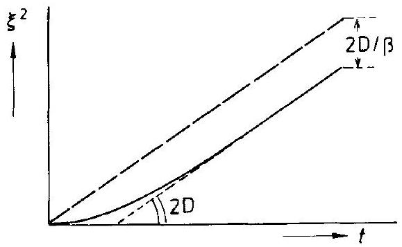
Figure 5-4. Mean square displacement of many particles as a function of time $t$.

Figure 5-4 illustrates Eqns. (5.40) and (5.44) by plotting the mean square displacement of many particles as a function of $t$. We can distinguish the Brownian from the pre-Brownian regime and correlate $A$ with the diffusion coefficient $D$.

Let us further analyze the stochastic force $F(t)$ with respect to the dynamics of the system in the pre-Brownian regime ( $t<1 / \beta$ ). Before we introduce models, let us clarify the role of $F(t)$ by averaging the particle velocities $v$. To this end, we rewrite Eqn. (5.37) in the following form

$$
\dot{\boldsymbol{v}}=-\beta \cdot \boldsymbol{v}+B(t) ; \quad B(t)=F(t) / m
$$

Remember that in thermal equilibrium, $\overline{v^{2}}=k T / m . B(t)$ is the stochastic acceleration. Integration of Eqn. (5.45) results in

$$
v(t)=v(0) \cdot \mathrm{e}^{-\beta \cdot t}+\mathrm{e}^{-\beta \cdot t} \cdot \int_{0}^{t} B(t) \cdot \mathrm{e}^{\beta \cdot t} \cdot \mathrm{~d} t
$$

as can be verified by inserting Eqn. (5.46) into Eqn. (5.45). After multiplying of Eqn. (5.46) by $\boldsymbol{v}(0)$ and averaging over many particles, we find

$$
\overline{v(0) \cdot v(t)}=\overline{v(0)^{2}} \cdot \mathrm{e}^{-\beta \cdot t}=\frac{k T}{m} \cdot \mathrm{e}^{-\beta \cdot t}
$$

or

$$
\overline{v\left(t^{\prime}\right) \cdot v(t)}=\overline{v\left(t^{\prime}\right)^{2}} \cdot \mathrm{e}^{-\beta \cdot t}=\frac{k T}{m} \cdot \mathrm{e}^{-\beta \cdot t}
$$

Equation (5.47) shows that the 'velocity autocorrelation function', $v\left(t^{\prime}\right) \cdot v(t)$, decays exponentially with time. The rate of decay is determined by the friction coefficient $\beta(=1 / b \cdot m)$, that is, by particle mass and mobility.

Let us finally examine the relation between $\beta$ (or the mobility $b$ ) and the stochastic force $F(t)$ (or $B(t)$ ). We assume that the ('force') autocorrelation function $\phi(\tau)= \overline{B\left(t^{\prime}\right) \cdot B(t)}$ depends only on $\tau$, where $\tau=\left(t-t^{\prime}\right)$. We note that $\phi(\tau)$ is a symmetric and fast decaying function of $\tau$. Taking the square of Eqn. (5.37) and averaging over many particles, it is seen that by using Eqn. (5.47)

$$
\int_{-\infty}^{+\infty} \phi(\tau) \cdot \mathrm{d} \tau=\frac{2 \cdot k T}{m} \cdot \beta=\frac{2 \cdot k T}{m^{2}} \cdot \frac{1}{b}, \quad b=\frac{2 \cdot k T}{m^{2} \cdot \int \phi \cdot \mathrm{~d} \tau}
$$

Equation (5.48) relates the mobility $b$ of the moving particles to the stochastic force $F(t)=B(t) \cdot m$. In essence, it states that the larger the correlation in $F(t)$ (or $B(t)$ ), the lower is the particle mobility $b$.

If we regard $B(t)$ over a time $\tau$ long enough to ensure that $\mathrm{e}^{-\beta \cdot \tau} \ll 1$, we can define $B(t)=0$ for $t<0$ and $t>\tau$. We can then express $B(t)$ for $-\infty<t<+\infty$ in terms of a Fourier integral

$$
B(t)=\frac{1}{\sqrt{2 \pi}} \cdot \int_{-\infty}^{+\infty} A(\omega) \cdot \mathrm{e}^{i \cdot \omega \cdot t} \cdot \mathrm{~d} \omega
$$

Using the definition of $\phi(\tau)$ and Eqn. (5.49), it can be shown [R. Becker (1966)] that

$$
\phi(\tau)=\frac{2}{\tau} \cdot \int_{0}^{\infty}|A(\omega)|^{2} \cdot \cos (\omega \tau) \cdot \mathrm{d} \omega
$$

or, equivalently,

$$
|A(\omega)|^{2}=\frac{\tau}{2 \pi} \cdot \int_{-\infty}^{+\infty} \phi(\tau) \cdot \cos (\omega \tau) \cdot \mathrm{d} \tau
$$

We mention this result here in order to assert that the spectral distribution of $\overline{B(t)^{2}}$ is the Fourier transform of the (force) autocorrelation function $\phi(\tau)$. In view of Eqn. (5.45), we can restate this result in terms of the velocity $\boldsymbol{v}(t)$. The spectral distribution of the velocity autocorrelation function is directly related to the Fourier transform of $\phi(\tau)$, the force autocorrelation function. Thus, we see that the classical equation of motion when properly averaged over many particles provides insight into the relation between transport kinetics and particle dynamics [R. Becker (1966)].

### 5.2 Kinetic Parameters and Dynamics

### 5.2.1 Phenomenological Coefficients and Kinetic Theory

Atoms taking part in diffusive transport perform more or less random thermal motions superposed on a drift resulting from field forces ( $\nabla \mu_{i}, \nabla \eta_{i}, \nabla \mathcal{T}$, etc.). Since these forces are small on the atomic length scale, kinetic parameters established under equilibrium conditions (i.e., vanishing forces) can be used to describe the atomic drift and transport. The movements of atomic particles under equilibrium conditions are Brownian motions. We can measure them by mean square displacements of tagged atoms (often radioactive isotopes) which are chemically identical but different in mass. If this difference is relatively small, the kinetic behavior is
almost identical. A measure of the mean square displacement is the diffusion coefficient $D_{i}$, which for tagged particles $i^{*}$ is denoted $D_{i^{*}}$. We wish to know the relation between $D_{i}, D_{i^{*}}$, and the phenomenological transport coefficients $L_{i j}$. Kinetic theory describes $D_{i^{*}}$ through the elementary jump frequencies $v_{i}$.

In a zeroth order treatment, $D_{i^{*}}$ is often equated with $D_{i}$. Closer inspection shows that this is often incorrect. If, for example, transport occurs by a vacancy (V) mechanism, $i^{*}$ can jump only if V and $i^{*}$ have an encounter. The jump pattern between V and $i^{*}$ during the encounter, however, is by no means random. Therefore, let us set $D_{i^{*}}=f_{i} \cdot D_{i}$, where $f_{i}$ is the so-called correlation factor.

In order to investigate the relation between the phenomenological transport coefficients $L_{i j}$ and $D_{i}$, we formulate for the isotope (tracer) diffusion of $\mathrm{A}^{*}$ in A

$$
\begin{aligned}
& j_{\mathrm{A}}=-L_{\mathrm{AA}} \cdot \nabla \mu_{\mathrm{A}}-L_{\mathrm{AA}^{*}} \cdot \nabla \mu_{\mathrm{A}^{*}} \\
& j_{\mathrm{A}^{*}}=-L_{\mathrm{AA}^{*}} \cdot \nabla \mu_{\mathrm{A}}-L_{\mathrm{A}^{*} \mathrm{~A}^{*}} \cdot \nabla \mu_{\mathrm{A}^{*}}
\end{aligned}
$$

Since transport occurs solely by the exchange of A and $\mathrm{A}^{*}$, it follows that $j_{\mathrm{A}^{*}}+j_{\mathrm{A}}=0$. The isotope tracer solution is also ideal with $N_{\mathrm{A}}+N_{\mathrm{A}^{*}}=1$, so Eqn. (5.52) yields

$$
L_{\mathrm{AA}}=\frac{1}{N_{\mathrm{A}^{*}}} \cdot\left(L_{\mathrm{A}^{*} \mathrm{~A}^{*}}+L_{\mathrm{AA}^{*}}\right)
$$

Inserting Eqn. (5.53) into Eqn. (5.52) yields ( $N_{\mathrm{A}} \cong 1$ )

$$
j_{\mathrm{A}^{*}}=-R T \cdot V_{m} \cdot\left(L_{\mathrm{AA}}-\frac{L_{\mathrm{AA}^{*}}}{N_{\mathrm{A}^{*}}}\right) \cdot \nabla c_{\mathrm{A}^{*}}=-D_{\mathrm{A}^{*}} \cdot \nabla c_{\mathrm{A}^{*}}
$$

so that

$$
D_{\mathrm{A}^{*}}=L_{\mathrm{AA}} \cdot \frac{R T}{c_{\mathrm{A}}} \cdot\left(1-\frac{L_{\mathrm{AA}^{*}}}{N_{\mathrm{A}^{*}} \cdot L_{\mathrm{AA}}}\right)=D_{\mathrm{A}} \cdot f_{\mathrm{A}}
$$

where

$$
f_{\mathrm{A}}=1-\frac{L_{\mathrm{AA}^{*}}}{N_{\mathrm{A}^{*}} \cdot L_{\mathrm{AA}}}, \frac{L_{\mathrm{AA}^{*}}}{N_{\mathrm{A}^{*}}}=\left(1-f_{\mathrm{A}}\right) \cdot L_{\mathrm{AA}}
$$

Equation (5.56) relates the correlation factor $f_{\mathrm{A}}$ with the cross coefficient $L_{\mathrm{AA}^{*}}$. From the Nernst-Einstein relation we know that $L_{\mathrm{AA}}=b_{\mathrm{A}} \cdot c_{\mathrm{A}}=D_{\mathrm{A}} c_{\mathrm{A}} / R T$. For a tracer experiment with a negligible fraction of $\mathrm{A}^{*}$, the jump conservation requires that $D_{\mathrm{A}}=D_{\mathrm{V}} \cdot N_{\mathrm{V}}$, so that instead of Eqn. (5.56) we have

$$
\frac{L_{\mathrm{AA}^{*}}}{N_{\mathrm{A}^{*}}}=\left(1-f_{\mathrm{A}}\right) \cdot c_{\mathrm{A}} \cdot \frac{N_{\mathrm{V}} \cdot D_{\mathrm{V}}}{R T} \cong\left(1-f_{\mathrm{A}}\right) \cdot \frac{c_{\mathrm{V}} \cdot D_{\mathrm{V}}}{R T}
$$

Conclusion: the self-diffusion coefficient $D_{\mathrm{A}}$ cannot be determined solely by tracer experiments (mean square tracer displacement). Either information from non-equi-
librium measurements ( $D_{\mathrm{V}} \cdot N_{\mathrm{V}}$ ) or additional information from theory ( $f_{\mathrm{A}}$ ) is needed to calculate $D_{\mathrm{A}}$ from $D_{\mathrm{A}^{*}}$.

For very dilute solid solutions of B in A , the basic physics of diffusional mixing is the same as for ( $\mathrm{A}, \mathrm{A}^{*}$ ). An encounter between $\mathrm{V}_{\mathrm{A}}$ and $\mathrm{B}_{\mathrm{A}}$ is necessary to render the B atoms mobile. But B will alter the jump frequencies of V in its surroundings and therefore numerical values of the correlation factor and cross coefficient are different from those of tracer A* diffusion. Since the jump frequency changes also involve solvent A atoms, in addition to $f_{\mathrm{B}}$, the numerical value of $f_{\mathrm{A}}$ must be reconsidered (see next section).

It is a straightforward but rather lengthy exercise to write down and evaluate the flux equations $j_{\mathrm{A}}, j_{\mathrm{A}^{*}}, j_{\mathrm{B}}, j_{\mathrm{B}^{*}}$ under the assumption of local (vacancy) equilibrium $\left(X_{\mathrm{V}}=0\right)$. We find that five independent $L_{i j}$ are needed to fully describe the transport in such a system. However, only four experimental parameters $D_{\mathrm{A}}, D_{\mathrm{B}}, D_{\mathrm{A}^{*}}$, and $D_{\mathrm{B}^{*}}$ are available from flux measurements. Since $D_{\mathrm{A}} \neq D_{\mathrm{B}}, j_{\mathrm{A}} \neq j_{\mathrm{B}}$ in the solid solution crystal. Lattice site conservation requires that the sum of the fluxes $j_{\mathrm{A}}+j_{\mathrm{B}}+j_{\mathrm{V}}=0$, that is, $j_{\mathrm{V}} \neq 0$, despite $X_{\mathrm{V}}=0$. The external observer of the A-B interdiffusion process therefore sees the fluxes

$$
\begin{aligned}
& j_{\mathrm{A}}^{\#}=j_{\mathrm{A}}+N_{\mathrm{A}} \cdot j_{\mathrm{V}}=j_{\mathrm{A}}-N_{\mathrm{A}} \cdot\left(j_{\mathrm{A}}+j_{\mathrm{B}}\right) \\
& j_{\mathrm{B}}^{\#}=j_{\mathrm{B}}+N_{\mathrm{B}} \cdot j_{\mathrm{V}}=j_{\mathrm{B}}-N_{\mathrm{B}} \cdot\left(j_{\mathrm{A}}+j_{\mathrm{B}}\right)
\end{aligned}
$$

With $j_{\mathrm{A}}^{\#}=-j_{\mathrm{B}}^{\#}$, the (common) chemical interdiffusion coefficient is then calculated to be ( $j_{\mathrm{A}}^{\#}=-\tilde{D} \cdot \nabla c_{\mathrm{A}}$ )

$$
\tilde{D}=R T \cdot V_{m} \cdot\left(\frac{N_{\mathrm{B}}}{N_{\mathrm{A}}} \cdot L_{\mathrm{AA}}+\frac{N_{\mathrm{A}}}{N_{\mathrm{B}}} \cdot L_{\mathrm{BB}}-2 L_{\mathrm{AB}}\right) \cdot f_{\mathrm{th}}
$$

If one inserts the tracer coefficients from Eqn. (5.55), the result is

$$
\tilde{D}=\left\{\left(N_{\mathrm{B}} \cdot D_{\mathrm{A}^{*}}+N_{\mathrm{A}} \cdot D_{\mathrm{B}^{*}}\right)+R T \cdot V_{m} \cdot N_{\mathrm{A}} \cdot N_{\mathrm{B}} \cdot\left(\frac{L_{\mathrm{AA}^{*}}}{N_{\mathrm{A}} \cdot N_{\mathrm{A}^{*}}}+\frac{L_{\mathrm{BB}^{*}}}{N_{\mathrm{B}} \cdot N_{\mathrm{B}^{*}}}+\frac{2 L_{\mathrm{AB}}}{N_{\mathrm{A}} \cdot N_{\mathrm{B}}}\right)\right\} \cdot f_{\mathrm{th}}
$$

The Darken-type equation ( $\tilde{D}=\left[N_{\mathrm{B}} \cdot D_{\mathrm{A}^{*}}+N_{\mathrm{A}} \cdot D_{\mathrm{B}^{*}}\right] \cdot f_{\text {th }}$, see Section 4.3.3) is obtained only if cross coefficients are zero. In order to evaluate these cross coefficients, kinetic theory beyond the phenomenological approach is needed [A. R. Allnatt, A. B. Lidiard (1993)].

### 5.2.2 Correlation of Atomic Jumps

We have seen that the elementary steps of atomic particles in crystals are normally correlated. In one way or the other, particles have not lost all memory about a previous step when they go on to the next one. This point was already addressed in Sec-
tion 5.1.3. One possible reason for correlation is geometrical in nature. It is based on a nonrandom sequence of activated jumps in space and specific to the prevailing transport mechanism (e.g., the vacancy diffusion mechanism). We will outline the principles of correlation here since the identification of a distinct diffusion mechanism often relies on this understanding. A concise and lucid survey of the leading ideas in this area can be found in [S. W. Kelly, C.A. Sholl (1987)]. Although the numerical evaluation of correlation factors can be done with Monte Carlo calculations, it is not a very accurate way in practice. A pertinent report is given by [G.E. Murch (1984)]. Correlation factors have been computed for many (simple) structures.

Correlation diminishes the effectiveness of atomic jumps in diffusional random motion. For example, when an atom has just moved through site exchange with a vacancy, the probability of reversing this jump is much higher than that of making a further vacancy exchange step in one of the other possible jump directions. Indeed, if $z$ is the coordination number of equivalent atoms in the lattice, the fraction of ineffective jumps is approximately $2 / z$ (for sufficiently diluted vacancies as carriers) [C.A. Sholl (1992)].

This fraction is determined by the step-dance between a specified vacancy and the (tagged) atom during their encounter, which does not end before the atom-vacancy pair has definitely separated. Normally, a new and independently moving vacancy comes along much later and begins the next encounter with the tagged atom.

The mean square displacement $\overline{R_{n}^{2}}$ of a particle after correlated or uncorrelated jumps is given as the mean vector sum

$$
\overline{R_{n}^{2}}=\left\langle\sum_{i=1}^{n} r_{i}^{2}\right\rangle=\sum_{i=1}^{n} r_{i}^{2}+2 \cdot \sum_{i=1}^{n-1} \sum_{j=i+1}^{n} r_{i} \cdot r_{j}
$$

which, for jumps of equal length $a$, becomes

$$
\overline{R_{n}^{2}}=n \cdot a^{2}+2 a^{2} \cdot \sum_{i=1}^{n-1} \sum_{j=i+1}^{n} \overline{\cos \Theta_{i j}}
$$

where $\Theta_{i, j}$ is the angle between jump vectors $i$ and $j$. Using Eqn. (5.62) to define the correlation factor, $f_{n}$, after $n$ jumps and rearranging, one obtains

$$
f_{n}=\frac{\overline{R_{n}^{2}}}{n \cdot a^{2}}=1+\frac{2}{n} \cdot \sum_{i=1}^{n-1} \sum_{k=1}^{n-i} \overline{\cos \Theta_{i, k+1}}
$$

Setting $c_{k}=\overline{\cos \Theta_{i, k+i}}$, which is independent of $i$, we have

$$
f_{n}=1+\frac{2}{n} \cdot \sum_{k=1}^{n-1}(n-k) \cdot c_{k}
$$

As $n \rightarrow \infty, f=\lim _{n \rightarrow \infty} f_{n}$ and so

$$
f=1+2 \cdot \sum_{k=1}^{\infty} c_{k}
$$

Comparing with Eqns. (5.63) and (5.64), it follows that

$$
f=\frac{\overline{R_{n}^{2}}}{n \cdot a^{2}}+2 \cdot \sum_{k=n}^{\infty} c_{k}+\frac{2}{n} \cdot \sum_{k=1}^{n-1} k \cdot c_{k}
$$

Equation (5.66) holds for all values of $n>1$. For $n=1$, Eqn. (5.65) applies.
Up to this point we have assumed implicitly that each defect responsible for the atomic motion has an infinite lifetime. In real crystals, however, this lifetime is finite because of the dynamic nature of the point defect equilibria. This means that only $m$ consecutive jumps are correlated (corresponding to the defect lifetime). It has been shown [R. Kutner (1985)] that under these conditions

$$
f=1+\frac{2 \cdot \sum_{k=1}^{m-1} c_{k}}{1-c_{m-1}}
$$

This important result modifies the description of encounters between tagged atoms and vacancies. If the fraction $N_{\mathrm{V}}$ is sufficiently low, then the encounters of a specified atom with different vacancies are independent of each other. In this case, the correlation factor depends only on the properties of a single encounter

$$
f=\frac{\overline{R_{\mathrm{e}}^{2}}}{z_{\mathrm{e}} \cdot a^{2}}
$$

where $z_{\mathrm{e}}$ is the mean number of jumps per encounter, and $\overline{R_{\mathrm{e}}^{2}}$ is the mean square displacement per encounter. Also, if certain symmetry requirements are met, then for the independent encounters $c_{k}=c_{1}^{k}$. This gives with Eqn. (5.65)

$$
f=\frac{1+c_{1}}{1-c_{1}}=\frac{1+\overline{\cos \Theta}}{1-\overline{\cos \Theta}}
$$

where $\overline{\cos \Theta}$ is the mean cosine between successive jumps. Together with Eqn. (5.66) one then obtains

$$
f_{n}=f-\frac{1-c_{1}^{n}}{n} \cdot \frac{2 \cdot c_{1}}{\left(1-c_{1}\right)^{2}}
$$

Equation (5.70) contains the convergence that $f_{n} \rightarrow f$ as the number of jumps for independent encounters increases.

Let us finally derive some practical relations. $\overline{\cos \Theta}$ can be determined for the tracer diffusion ( $\mathrm{A}, \mathrm{A}^{*}$ ) if the frequency of backward jumps during an encounter
(V, A*) is known. The probability $P_{b}$ of an (ineffective) backward jump can be expressed in terms of the exchange frequency ( $v_{\mathrm{A}^{*}}=v_{\mathrm{A}}$ ) between $\mathrm{A}\left(\mathrm{A}^{*}\right)$ and a neighboring vacancy as

$$
P_{\mathrm{b}}=\frac{v_{\mathrm{A}}}{v_{\mathrm{A}}+\varepsilon \cdot v_{\mathrm{A}}}=\frac{1}{1+\varepsilon} \quad(\approx 1-\varepsilon)
$$

where $\varepsilon \cdot \nu_{\mathrm{A}}$ designates the escape frequency of the vacancy from the encounter (V, A*). Since a backward jump yields $\cos 180^{\circ}=-1$, the average $\cos \Theta$ becomes $-P_{\mathrm{b}}$. Consequently, by combining Eqns. (5.69) with (5.71)

$$
f_{\mathrm{A}^{*}}=\frac{\varepsilon}{2+\varepsilon}=\frac{1}{1+2 / \varepsilon}
$$

If a vacancy definitely leaves the encounter ( $\mathrm{V}, \mathrm{A}^{*}$ ) after the first exchange jump (with frequency $(z-1) \cdot v_{\mathrm{A}}, \varepsilon=(z-1), z=$ coordination number), one would obtain $f_{\mathrm{A}} \approx 1-2 / z$ from Eqn. (5.72). Thus, $2 / z$ is the fraction of ineffective jumps by A .

Let us now replace A* by a solute atom B. Instead of Eqn. (5.71), the backward jump probability is then

$$
P_{\mathrm{b}}=\frac{v_{\mathrm{B}}}{v_{\mathrm{B}}+\varepsilon \cdot v_{\mathrm{A}}}
$$

so instead of Eqn. (5.72) we have

$$
f_{\mathrm{B}}=\frac{\varepsilon \cdot v_{\mathrm{A}}}{\varepsilon \cdot v_{\mathrm{A}}+2 \cdot v_{\mathrm{B}}}
$$

We note that $f_{\mathrm{B}} \rightarrow 0$ if $v_{\mathrm{B}} \gg v_{\mathrm{A}}$, and $f_{\mathrm{B}} \rightarrow 1$ if $v_{\mathrm{B}} \ll v_{\mathrm{A}}$. More powerful methods have been devised to calculate correlation factors. A survey can be found in [A. R. Allnatt, A. B. Lidiard (1993)]. Historically, the so-called five-frequency model introduced by [A. B. Lidiard (1956); R.E. Howard, A. B. Lidiard (1964)] played an important role in the understanding and quantitative treatment of correlation effects and is still widely used today.

### 5.2.3 Conductivity of Ionic Crystals: Frequency Dependence

In this section, we will model the motion of point defects in an ionic crystal using its dynamic properties. Normally, point defects in ionic crystals are effectively charged, relative to the corresponding regular structure elements. The main interaction is therefore coulombic, which facilitates the modeling. An early model [H. Schmalzried (1977)] was later quantitatively worked out in much more detail. The underlying concept is similar to that of the dynamics of ion motion in liquid electrolytes. Transport theory in liquid electrolytes was initially formulated by [P. Debye, E. Hückel (1923); L. Onsager (1926), (1927); P. Debye, H. Falkenhagen (1928)] in a model which yields the frequency-dependent electrical conductivity (i.e., the spectral distribution of the velocity autocorrelation function).

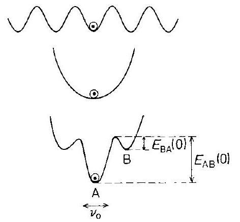
a)

Figure 5-5. a) Point defect potential in an ionic crystal: superposition of the periodic lattice potential and the individual defect potential valley. b) Change of potential with time after a defect jump (see text).

Let us introduce the atomistic model of stochastic and activated point defect hopping with the help of Figure 5-5a [K. Funke, I. Riess (1984)]. The interaction between oppositely charged point defects in the overall electrically neutral crystal results in potential wells for the individual defects, these being superposed on the otherwise periodic potential. In the harmonic approach, an irregular structure element vibrates in a parabolic potential well at position ( $A$ ) at a frequency $v_{0}$. At time $t=0$, it hops from this (relaxed) position $(A)$ into position $(B)$ where a many-particle relaxation process immediately begins which can proceed in two ways: 1 ) the (almost unrelaxed) point defect at ( $B$ ) returns to ( $A$ ) by an activated jump. 2) The point defect stays in the relative minimum ( $B$ ) while the surrounding mobile point defects relax. Thus, the energy minimum at $(B)$ deepens until it eventually becomes the relaxed absolute minimum. This relaxation process can be described by a continuous shift of the potential well from ( $A$ ) to ( $B$ ) (Fig. 5-5b). Following the quantitative description by Funke [K. Funke, I. Riess (1984)], we define two functions: the probability $W(t)$ that the return hop ( $\overrightarrow{B A}$ ) has not yet occurred (note that $W(0)=1, W(\infty)<1(\neq 0)$ ) and the relative shift of the potential well $g(t)=\xi(B) / l_{0} . \xi(B)$ is the distance between the well minimum and the location of $(B)$ during the defect cloud relaxation, and $l_{0}$ is the distance $(A)-(B)$, that is, the length of the lattice periodicity. $g(t)=1, \ldots, 0$ for $t=0, \ldots, \infty$.

Since $j=c \cdot v$, the electrical current density autocorrelation function and the velocity autocorrelation function are proportional to each other. The latter function, however, can be expressed with the help of the time derivative of the decaying pro-
bability function $W(t)$ (which is the rate of backward jumps and therefore related to the correlation factor)

$$
\overline{v(0) \cdot v(t)} \sim(\delta(t)+\dot{W}(t))
$$

Using linear response theory and noting (according to the results at the end of Section 5.1.3) that the (complex) electrical conductivity $\sigma$ is the Fourier transform of the current density autocorrelation function, we obtain from Eqn. (5.75) (see the equivalent Eqn. (5.21))

$$
\sigma(\omega)=\sigma(\infty) \cdot\left\{1+\int_{0}^{\infty} \dot{W}(t) \cdot \mathrm{e}^{-i \cdot \omega \cdot t} \cdot \mathrm{~d} t\right\}
$$

where $\sigma(\infty)$ is the conductivity due to thermally activated jumps. Accordingly,

$$
\sigma(\infty)=z \cdot q^{2} \cdot \frac{l_{0}^{2} \cdot v_{0} \cdot \mathrm{e}^{-\Delta E_{\mathrm{A}} / k T}}{2 \cdot d \cdot k T}
$$

with $z$ representing the defect number density, $d$ the dimensionality of the transport path, and $q$ the defect charge. We note in passing that one can derive Eqn. (5.76) by starting from Eqn. (5.45), introducing an (athermal) periodic force $F=e_{0} \cdot E_{0} \cdot \mathrm{e}^{i \cdot \omega \cdot t}$ and adding the harmonic force $-\omega_{0}^{2} \cdot \xi$ (which stems from the parabolic potential) to the right hand side of Eqn. (5.45).

Equation (5.76) suggests that the essential point for the calculation of the kinetic transport coefficient (i.e., the frequency-dependent conductivity) would be an appropriate dynamic modeling of $W(t)$. From Figure 5-5b, we can infer that, to a first order,

$$
\dot{W}=W \cdot v_{\mathrm{BA}}
$$

where $\nu_{\mathrm{BA}}$ can be approximated by

$$
\nu_{\mathrm{BA}}=\nu_{0} \cdot\left(\mathrm{e}^{-E_{\mathrm{BA}} / k T}-\mathrm{e}^{-E_{\mathrm{BC}} / k T}\right)
$$

$E_{\mathrm{BA}}$ and $E_{\mathrm{BC}}$ (Fig. $\mathbf{5 - 5 b}$ ) are functions of time while the point defects in the surroundings relax and the (Coulombic) potential well shifts from $(\mathrm{A}) \rightarrow(\mathrm{B})$. This shift is represented by $g(t)$ as defined above. Designating the initial activation energies at $t=0$ as $E_{\mathrm{AB}}(0)$ and $E_{\mathrm{BA}}(0)$, one sees from Figure 5-5b that

$$
\begin{aligned}
& E_{\mathrm{BA}}(t)=E_{\mathrm{AB}}(0)-g(t) \cdot\left(E_{\mathrm{AB}}(0)-E_{\mathrm{BA}}(0)\right) \\
& E_{\mathrm{BC}}(t)=E_{\mathrm{AB}}(0)+g(t) \cdot\left(E_{\mathrm{AB}}(0)-E_{\mathrm{BA}}(0)\right)
\end{aligned}
$$

If one uses the abbreviation $V_{0} \cdot l_{0}^{2}=\left(E_{\mathrm{AB}}(0)-E_{\mathrm{BA}}(0)\right)$ in accordance with the harmonic (parabolic) potential approximation, then inserting Eqns. (5.79)-(5.81) into Eqn. (5.78) gives

$$
-\frac{\dot{W}}{W}=2 \cdot v_{0} \cdot \mathrm{e}^{-E_{\mathrm{AB}}(0) / k T} \cdot \sinh \left(\frac{V_{0} \cdot l_{0}^{2}}{k T} \cdot g(t)\right)
$$

Equation (5.82) yields $W(t)$ after integration. The electrical conductivity $\sigma(\omega)$ in Eqn. (5.76) can now be calculated if $g(t)$, the relaxation function of the (DebyeHückel) defect cloud, is known. In a first order approach let us assume that $g(t)$ relaxes with a single relaxation time $\tau$, that is, $g(t)=\mathrm{e}^{-t / \tau}$ ( $\tau$ is roughly given by $\tau \approx \varepsilon_{0} \cdot \varepsilon(\infty) / \sigma(\infty)$ ). Integration of Eqn. (5.82) then results in

$$
\begin{aligned}
\ln W(t)= & v_{0} \cdot \tau \cdot \mathrm{e}^{-E_{\mathrm{AB}}(0) / k T} \cdot\left\{\mathrm{Ei}\left(\frac{V_{0} \cdot l_{0}^{2}}{k T} \cdot \mathrm{e}^{-t / \tau}\right)-\mathrm{Ei}\left(\frac{V_{0} \cdot l_{0}^{2}}{k T}\right)\right. \\
& \left.-\left[\mathrm{Ei}\left(-\frac{V_{0} \cdot l_{0}^{2}}{k T} \cdot \mathrm{e}^{-t / \tau}\right)-\mathrm{Ei}\left(-\frac{V_{0} \cdot l_{0}^{2}}{k T}\right)\right]\right\}
\end{aligned}
$$

where Ei denotes the error integral. Funke [K. Funke (1987), (1989), (1993)] has discussed $\sigma(\omega)$ in depth and has also given numerical solutions to Eqn. (5.76). For the set of parameters $\boldsymbol{v}_{0}, E_{\mathrm{AB}}(0), E_{\mathrm{BA}}(0)$, and $\sigma(\infty)$, Figure 5-6a shows an example and depicts the real part of the electrical conductivity as a function of frequency. It compares well with the experimental data for $\mathrm{Na}-\beta$-alumina as illustrated in Figure 5-6b.

Figure 5-6. Frequency dependence of electrical conductivity of Na- $\beta$-alumina at different temperatures [U. Strom, K. L. Ngai (1981); D. P. Almond et al. (1982)]. Calculation [K. Funke (1984)] with the following parameters: $v_{0}=20 \mathrm{GHz}, E_{\mathrm{AB}}(0)=k \cdot 800 \mathrm{~K}, E_{\mathrm{BA}}(0)=k \cdot 200 \mathrm{~K}$.

An interesting feature can be read from Figure 5-6. If the temperature is sufficiently low, a power-law behavior is found, the exponent being $<1$. This power-law behavior has been denoted in the literature as the 'universal dielectric response'. It is equivalent to a nearly circular arc in the complex conductivity and impedance plane.

Let us summarize: by modeling the velocity autocorrelation function using DebyeHückel type interactions between charged point defects in ionic crystals, one can evaluate the frequency-dependent conductivity and give an interpretation of the universal dielectric response.

### 5.2.4 Diffusive Motion and Phonons

The Arrhenius behavior of diffusion was explained in Section 5.1.2. However, sometimes transport can be observed which is not of an Arrhenius type, even though the transport mechanism or the disorder type has not changed with temperature. This observation is normally attributed to the anharmonicity of lattice vibrations. As examples, some bcc metals may be mentioned. Whereas in many fcc metals the diffusion coefficient scales with the melting temperature $T_{\mathrm{m}}$, this is not always true for bcc metals. Their Arrhenius plots of $\log D_{i} v s .1 / T$ are curved. $\beta-\mathrm{Zr}$ and $\beta-\mathrm{Ti}$, in particular, have diffusivities which exhibit both very small pre-exponential factors $D_{0}$ and small activation energies $E_{\mathrm{A}}$ near the transition temperature to the closepacked structure. Lattice dynamics allows us to rationalize this behavior. The nearest neighbor jump of the bcc structure occurs in the $\langle 111\rangle$ direction. Phonon dispersion reveals that the longitudinal acoustic branch in this material softens strongly along the $\langle 111\rangle$ direction. As a consequence, an atom sitting on site ( 000 ), and having a neighboring vacancy at ( $\frac{1}{2} \frac{1}{2} \frac{1}{2}$ ), is pushed by the phonon in the jump direction. The phonon driven displacement increases with the softening of this mode, in accordance with the observed low $E_{\mathrm{A}}$. However, we stress that it is the spectrum of phonon frequencies and not just the one single mode that couples with the hopping particle. Therefore, other correlated motions of neighboring SE's may additionally influence the hopping frequency, for example, if atoms on the saddle surface move simultaneously in such a way that a free path for the jumping atom is created.

In spite of the Vineyard (harmonic) approach to explaining the activated jump rate being rather an approximation which can, in principle, be augmented by anharmonic terms, his treatment does not address the problem of energy randomization after the jumping particle has crossed the saddle surface. This suggests that accurate experimental diffusion data are 'better' than todays existing theories. Flynn [C.P. Flynn (1987)] drew attention to this fact when he pointed out that an adequate theory for thermally activated hopping diffusion (as it occurs in crystals) needs, in addition to the characteristic hopping frequency, a further characteristic time to take into account the randomization of the translational energy. This is the time in which the hopping SE loses its memory about the previous jump. This problem has been assessed by taking into account the nonplanar nature of the saddle surface, which allows multiple crossings by the jump trajectories. Estimates from molecular dynamics calculations have led to corrections on the order of $10 \%$.

### 5.3 Relaxation of Irregular Structure Elements

### 5.3.1 Introduction

The equilibrium concentrations of irregular structure elements (point defects) are functions of state, in contrast to the densities of dislocations or grain boundaries. If independent (intensive) state variables are changed, the establishment of a new equilibrium needs time. In a crystal, matter transport takes place during equilibration. This can be visualized, for example, by heating or cooling a perfect single crystal of A. Although its equilibrium vacancy concentration, $c_{\mathrm{V}}$, is a function of $T$ and changes accordingly, the vacancy production (annihilation) can only take place at surfaces. Thus, diffusional vacancy transport is involved which requires a conjugate transport of A in the opposite direction. Such matter transport in compounds occurs even if the majority SE's are intrinsic and equilibrate under the conservation of lattice sites (e.g., Frenkel disorder $A_{A}+V_{i}=V_{A}^{\prime}+A_{i}^{\prime}$; $\mathrm{A}^{*}+\mathrm{B}^{\times}=\mathrm{A}^{\times}+\mathrm{B}^{*}$ ). In this case, the minority point defects must nevertheless equilibrate at the surface, resulting again in a small but time consuming macroscopic transport.

In Section 4.7, we discussed the relaxation process of SE's in a closed system where the number of lattice sites is conserved (see Eqn. (4.137)). A set of coupled differential equations was established, the kinetic parameters $\left(v\left(x, i^{q}, \varkappa^{\prime}\right)\right)$ of which describe the rate at which particles ( $i^{q}$ ) change from sublattice $\varkappa^{\prime}$ to $\varkappa$. We will discuss rate parameters in closed systems in Section 5.3.3 where we deal with diffusion controlled homogeneous point defect reactions, a type of reaction which is well known in chemical kinetics.

Here, let us regard the crystal as an open system in which defect equilibration occurs in a non-stoichiometric compound after an intensive thermodynamic variable has changed. The standard example is the re-equilibration of a transition-metal oxide, $\mathrm{A}_{1-\delta} \mathrm{O}$, after a (isothermal) change in the oxygen partial pressure of its gaseous surroundings. Although the oxygen ions ( $\mathrm{O}_{\mathrm{O}}^{2-}$ ) are (almost) immobile, equilibration of all components and SE's with respect to the new oxygen potential takes place readily. We will discuss the corresponding relaxation processes in Section 5.3.2.

The main part of our discussion here, however, concerns defect relaxation processes during ongoing transport of components in inhomogeneous solids and reacting heterogeneous solids. In those non-equilibrium crystals, the local concentrations of components change with time. The local point defect concentrations are functions of state and have to adjust themselves accordingly through relaxation processes. This adjustment is most relevant to solid state kinetics because point defect concentrations in turn determine the magnitudes of the transport coefficients and of other kinetic parameters. If relaxation is slow so that local point defect equilibrium is not attained, the kinetic coefficients are no longer functions of state and the kinetic problems have no single-valued solutions.

In physical and chemical metallurgy, the Kirkendall effect, which is closely related to point defect relaxation during interdiffusion, has been studied extensively. It can be quantitatively defined as the internal rate of production or annihilation of vacan-
cies (and lattice molecules in general) for the purpose of maintaining local point defect equilibrium. This definition is straightforward only for crystals which do not have different sublattices and in which the product $j_{\mathrm{V}} \cdot V_{m}$ is therefore equivalent to a (local) lattice velocity $\boldsymbol{v}_{\mathrm{L}}$. Sometimes $\boldsymbol{v}_{\mathrm{L}}$ can be observed by the insertion of appropriate markers. For a marker shift to occur in crystals with different sublattices, whole lattice molecules (see Section 2.2.1) must be produced or annihilated. In nonmetallic crystals composed of different component sublattices, this is most unlikely. Since here the disorder type comprises two different sorts of mobile point defects (majority defects), it is only in exceptional cases that they constitute the lattice molecule which then could be added to or subtracted from the crystal at internal sites of repeatable growth. For example, in interdiffusing oxide solid solutions AO-BO which possess an immobile oxygen ion sublattice, any cation vacancy supersaturation stemming from interdiffusion cannot relax internally. The cation vacancies can equilibrate only at the crystal surface, which is kept at a fixed oxygen potential. Thus, a local lattice flow, sometimes regarded as the Kirkendall effect, is impossible. In metal systems that do not have different sublattices, however, it is asserted that the supersaturation of vacancies caused by component interdiffusion is normally small and due to effectively operating local defect sources and sinks (dislocation climb). We will resume the quantitative discussion of the Kirkendall effect in Section 5.4.2.

Following these introductory remarks, the next sections are devoted to a detailed discussion of defect relaxation phenomena.

### 5.3.2 Relaxation of Structure Elements in Nonstoichiometric Compounds ( $\mathbf{A}_{1-\delta} \mathbf{O}$ )

Let us refer to Figure 5-7 and start with a homogeneous sample of a transition-metal oxide, the state of which is defined by $T, P$, and the oxygen partial pressure $p_{\mathrm{O}_{2}}$. At time $t=0$, one (or more) of these intensive state variables is changed instantaneously. We assume that the subsequent equilibration process is controlled by the transport of point defects (cation vacancies and compensating electron holes) and not by chemical reactions at the surface. Thus, the new equilibrium state corresponding to the changed variables is immediately established at the surface, where it remains constant in time. We therefore have to solve a fixed boundary diffusion problem.

In order to do so we must first evaluate the chemical diffusion coefficients of the pair of majority defects ( e.g., $\mathrm{V}_{\mathrm{A}}^{\prime \prime}$ and $\mathrm{h}^{*}$ ) in the semiconducting oxide $\mathrm{A}_{1-\delta} \mathrm{O}$. The coupling of the defect fluxes ( $j_{\mathrm{h}^{*}}-2 j_{\mathrm{V}^{\prime \prime}}=0$ ) to maintain electroneutrality results in a chemical diffusion coefficient $\tilde{D}_{\mathrm{V}}$. This controls the change in nonstoichiometry, $\delta(\xi, t)$, through defect transport and reads

$$
\tilde{D}_{\mathrm{V}}=\alpha \cdot R T \cdot b_{\mathrm{V}}
$$

where $R T \cdot b_{\mathrm{V}}=D_{\mathrm{V}}$ and $\alpha=\left(z_{\mathrm{V}}+1\right), \alpha$ is called the enhancement factor and $z_{\mathrm{V}}$ is the (effective) charge of the cation vacancy. The origin of $\alpha$ lies in the diffusion potential which builds up in the inhomogeneous oxide during chemical diffusion.

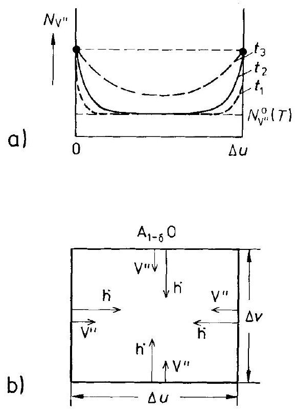
Figure 5-7. Vacancy concentration distribution (a) and fluxes of $\mathrm{h}^{\bullet}$ and $\mathrm{V}^{\prime \prime}$ in $\mathrm{A}_{1-\delta} \mathrm{O}$ (b) after a change of $\mu_{\mathrm{O}_{2}}$ at the crystal surface. Phase boundary reaction is $\frac{1}{2} \mathrm{O}_{2}=\mathrm{O}_{\mathrm{O}}^{\times}+V_{\mathrm{A}}^{\prime \prime}+2 \mathrm{~h}^{\prime \prime}$.

Let us assume that the oxide sample exists in the form of a parallelepiped. The solution to Fick's second law under the given boundary conditions gives for the change in time of the integral number of vacancies $\bar{n}_{\mathrm{V}}$

$$
\frac{\mathrm{d} \tilde{n}_{\mathrm{V}}}{\mathrm{~d} t}=\left(n_{\mathrm{V}}(\infty)-n_{\mathrm{V}}(0)\right) \cdot \tilde{D}_{\mathrm{V}} \cdot \frac{512}{\pi^{6}} \cdot H \cdot \sum_{i=1}^{\infty} \mathrm{e}^{-(2 i-1)^{2} \cdot H \cdot \tilde{D}_{\mathrm{V}} \cdot t}
$$

where $H=\left(1 / \Delta u^{2}+1 / \Delta v^{2}+1 / \Delta w^{2}\right) \cdot \pi^{2}(\Delta u, \Delta v, \Delta w$ being the sample dimensions, Fig. 5-7). We can therefore define a relaxation time, $\tau$, for the extrinsic point defect equilibration as

$$
\tau=\frac{1}{\tilde{D}_{\mathrm{V}} \cdot H}
$$

Since these considerations are independent of the nature of the sample, the results are valid for all crystals which are exposed to a sudden change of intensive state variables. The meaning of the chemical diffusion coefficient $\tilde{D}$ must, however, be carefully investigated in each case (see Section 5.4.4). At $1000^{\circ} \mathrm{C}, \tilde{D}_{\mathrm{V}}$ for simple transi-tion-metal oxides is on the order of $10^{-7} \mathrm{~cm}^{2} / \mathrm{s}$. This gives for cubic samples of $10^{-3} \mathrm{~cm}^{3}$ a defect relaxation time of approximately 1 h according to Eqn. (5.86).

### 5.3.3 Relaxation of Intrinsic Disorder

Point defects which are not in equilibrium react either with each other or they react with components or lattice molecules at sites of repeatable growth (normally sur-
faces) in order to equilibrate. The latter situation was discussed in the previous section and the first case will be treated now. Examples include the annihilation of interstitials by vacancies, the formation of divacancies or other defect associates, and the trapping of intrinsic point defects by homogeneously distributed impurities. There is a close analogy between the homogeneous reaction kinetics of point defects in crystals and the familiar diffusion controlled kinetics of chemical reactions in aqueous solutions. The crystal acts as the solvent. The dimensionality of the system, the anisotropy of mobilities, and the specific interactions between the defects have a major influence on the reaction kinetics. We dealt with this problem phenomenologically in Section 4.7.

Smoluchowski [M. v. Smoluchowski (1917)] treated the problem of diffusion controlled homogeneous reactions in which the reacting particles were initially distributed at random and were non-interacting (except for the collision process). If reaction occurs during the first encounter of the diffusing partners, it is diffusion controlled. If many encounters of the diffusing partner are needed before they eventually react with each other, the process is reaction controlled. If the particles interact already at some distance, one can nevertheless use the concept of diffusion controlled encounters. In this case, one has to carefully define an extended reaction volume as will be outlined later.

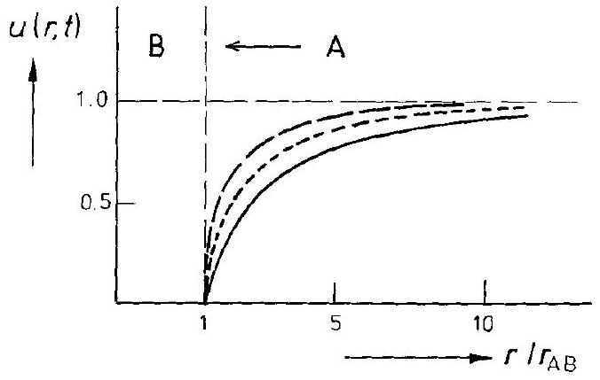
Figure 5-8. Relative concentration dependence on distance and time of A particles around sinks B for the bimolecular diffusion controlled reaction $\mathrm{A}+\mathrm{B}=\mathrm{AB}\left(r_{\mathrm{AB}}=r_{\mathrm{A}}+r_{\mathrm{B}}\right)$.

We start with a bimolecular diffusion controlled point defect reaction of the form $\mathrm{A}+\mathrm{B}=\mathrm{C}$ and assume that the immobile B 's are (unsaturated) sinks for A . If we then project each B with its surrounding A's onto the coordinate origin at $r=0$, and define the individual reaction volume as $(4 \cdot \pi / 3) \cdot r_{\mathrm{AB}}^{3}$, the time dependence of the (projected) A-concentration in space is given by the solution to Fick's second law with the following boundary conditions (setting $\left.u=c_{\mathrm{A}}(r, t) / c_{\mathrm{A}}(r, 0)\right): u(r, 0)=1$ for $r>r_{\mathrm{AB}} ; u(\infty, t)=1$ (normalized); $u\left(r_{\mathrm{AB}}, t\right)=0$. The solution reads (Fig. 5-8)

$$
u(r, t)=1-\frac{r_{\mathrm{AB}}}{r} \cdot \operatorname{erfc}\left(\frac{r-r_{\mathrm{AB}}}{\sqrt{4 D_{\mathrm{A}} \cdot t}}\right)
$$

which yields for the steady state ( $r>r_{\mathrm{AB}}, t>r_{\mathrm{AB}}^{2} / D_{\mathrm{A}}$ )

$$
u(r)=1-\frac{r_{\mathrm{AB}}}{r}
$$

If one compares the rate equation for a bimolecular reaction, $\dot{c}_{\mathrm{A}}=k \cdot c_{\mathrm{B}} \cdot c_{\mathrm{A}}$, with the A-flux arriving at the reaction volume surface ( $=4 \cdot \pi \cdot r_{\mathrm{AB}}^{2}$ ), one obtains in a straightforward way

$$
k=4 \pi \cdot D_{\mathrm{A}} \cdot r_{\mathrm{AB}}
$$

For this three dimensional diffusion problem, we note that $k$ is proportional to $r_{\mathrm{AB}}$ (to first order) and not to the reaction surface nor the reaction volume. If the reaction volume is not spherical, $r_{\mathrm{AB}}$ can be approximated by the largest linear dimension of the sink.

If the interaction energy, $E\left(r_{\mathrm{AB}}\right)$, between A and B cannot be neglected, one defines a reaction radius $\tilde{r}_{\mathrm{AB}}$ with the equation $E\left(\tilde{r}_{\mathrm{AB}}\right)=k T$. For coulombic interactions, this is explicitly

$$
\frac{q_{\mathrm{A}} \cdot q_{\mathrm{B}}}{4 \pi \cdot \varepsilon \cdot \varepsilon_{0} \cdot \tilde{r}_{\mathrm{AB}}}=k T
$$

and, instead of Eqn. (5.89), it is found that

$$
k=4 \pi \cdot \bar{D} \cdot \frac{q_{\mathrm{A}} \cdot q_{\mathrm{B}}}{4 \pi \cdot \varepsilon \cdot \varepsilon_{0} \cdot k T} ; \quad \bar{D}=D_{\mathrm{A}}+D_{\mathrm{B}}
$$

Setting $\bar{D}=D_{\mathrm{A}}+D_{\mathrm{B}}$, it is assumed that both A and B are now mobile. $q_{\mathrm{A}}$ and $q_{\mathrm{B}}$ are the electrical charges of the components.

Reaction control can be formally introduced by loosening the local equilibrium condition at the surface of the reaction volume and replacing it with a kinetic condition. Instead of $u\left(r_{\mathrm{AB}}, t\right)=0$, we therefore formulate the continuity equation

$$
D_{\mathrm{A}} \cdot \nabla u\left(r_{\mathrm{AB}}\right)=\varkappa \cdot u\left(r_{\mathrm{AB}}, t\right)
$$

where $\varkappa$ describes the reaction rate at the surface of the reaction volume. $\varkappa \rightarrow \infty$ if an immediate reaction occurs at $r_{\mathrm{AB}}$ (i.e., diffusion control). $\varkappa \rightarrow 0$ if the surface reaction rate at $r_{\mathrm{AB}}$ is slow (i.e., rate control by (chemical) surface reaction). $\varkappa [\mathrm{cm} / \mathrm{s}]$ can be interpreted as the product $\Delta L \cdot v$, where $\Delta L$ is the thickness of the surface reaction zone (boundary b) and $v$ is the frequency of successful encounters in this zone $\left(=v_{0} \cdot \mathrm{e}^{-\varepsilon^{\mathrm{b}} / k T}\right)$.

Analogous to the procedure leading to Eqn. (5.89) we obtain with the boundary condition of Eqn. (5.92) (reaction control)

$$
k=4 \pi \cdot \bar{D} \cdot r_{\mathrm{eff}} \cdot\left(1+\frac{r_{\mathrm{eff}}}{\sqrt{\pi \cdot \bar{D} \cdot t}}\right)
$$

where $r_{\text {eff }}=r_{\mathrm{AB}}^{2} \cdot \varkappa \cdot\left(r_{\mathrm{AB}} \cdot \varkappa+\bar{D}\right)^{-1}$. Equation (5.93) holds under (quasi) steady state conditions, that is, for $t>\left(r_{\mathrm{AB}}^{2} / \bar{D}\right) \cdot\left(1+r_{\mathrm{AB}} \cdot \varkappa / \bar{D}\right)^{-2}$. We see that $r_{\text {eff }}=r_{\mathrm{AB}}$ for

Figure 5-9. The atomic potential of A approaching $\operatorname{sink} \mathrm{B}\left(r>r_{\mathrm{AB}}\right) . \varepsilon_{m}=$ activation energy for diffusional motion, see text.

$r_{\mathrm{AB}} \cdot \varkappa \gg \bar{D}$ which means diffusion control. For $r_{\mathrm{AB}} \cdot \varkappa \ll \bar{D}$, which means reaction control, the rate parameter $k$ for sufficiently large $t$ is

$$
k=4 \pi \cdot r_{\mathrm{AB}}^{2} \cdot \varkappa=4 \pi \cdot r_{\mathrm{AB}}^{2} \cdot \Delta L \cdot v
$$

Here, $k$ can be visualized as the number of successful jumps per unit time across the surface energy barrier $\varepsilon^{\text {b }}$ into the reaction volume (Fig. 5-9). A particularly useful form for $k$ is found if one regards $1 / k$ to be a generalized resistivity obtained by adding together the diffusional and the reactional resistivities

$$
\frac{1}{k}=\frac{1}{4 \pi \cdot \bar{D} \cdot r_{\mathrm{AB}}}+\frac{1}{4 \pi \cdot r_{\mathrm{AB}}^{2} \cdot \varkappa}
$$

Our neglect of the discreteness of the crystal lattice does not introduce noticeable discrepancies. Continuum theory, based on the original concept by Smoluchowski, is quite acceptable for the description of diffusion controlled relaxation of irregular structure elements in crystals.

The influence of diffusion anisotropy on the reaction rate constant $k$ is illustrated in Figure 5-10. In accordance with the fact that lower dimensionality increases the fraction of sites that are encountered more than once by the diffusing particles, the

Figure 5-10. Concentration decrease for one-, two- and three-dimensional diffusion controlled reactions. $z=$ number of particle jumps.

reaction rate will decrease with decreasing dimensionality. In other words, for a given $\left(D_{x}+D_{y}+D_{z}\right)$, we expect the highest reaction rate to occur if $D_{x}=D_{y}=D_{z}$, and the diffusion coefficient tensor is spherical (see, for example, [U. Gösele (1980)]).

Let us finally estimate the relaxation times of homogeneous defect reactions. To this end, we analyze the equilibration course of a silver halide crystal, AX, with predominantly intrinsic cation Frenkel disorder. The Frenkel reaction is

$$
A_{A}+V_{i}=A_{i}^{0}+V_{A}^{\prime}
$$

$A_{A}$ and $V_{i}$ are regular SE's, $A_{i}^{\prime}$ and $V_{A}^{\prime}$ are irregular SE's. The rate equation for the bimolecular reaction (5.96) reads

$$
\dot{c}_{\mathrm{A}_{\mathrm{i}}}=\dot{c}_{\mathrm{V}_{\mathrm{A}}}=-\tilde{k} \cdot c_{\mathrm{A}_{\mathrm{i}}} \cdot c_{\mathrm{V}_{\mathrm{A}}}+\vec{k} \cdot c_{\mathrm{A}_{\mathrm{A}}} \cdot c_{\mathrm{V}_{\mathrm{i}}}
$$

which can be rearranged, if small fractions of the intrinsic point defects and site conservation ( $c_{\mathrm{A}_{\mathrm{i}}}=c_{\mathrm{V}_{\mathrm{A}}}$ ) are taken into account.

$$
\dot{c}_{A_{i}}=-\bar{k} \cdot\left(c_{A_{i}}^{2}-c_{A_{i}}^{02}\right) \cong-2 \cdot \bar{k} \cdot c_{A_{i}}^{0} \cdot\left(c_{A_{i}}-c_{A_{i}}^{0}\right)
$$

where $c_{\mathrm{A}_{i}}^{0}\left(=c_{\mathrm{V}_{\mathrm{A}}}^{0}\right)$ denotes the equilibrium concentration derived from Eqn. (5.97) by setting $\dot{c}_{\mathrm{A}_{\mathrm{i}}}=\dot{c}_{\mathrm{V}_{\mathrm{A}}}=0$. Integrating the non-linearized second order reaction equation yields a relaxation time which is not a constant. However, when close enough to equilibrium, we can safely linearize Eqn. (5.98) and the (time independent) relaxation time becomes

$$
\tau=\left(2 \cdot \tilde{k} \cdot c_{A_{1}}^{0}\right)^{-1}
$$

When the point defect relaxation is diffusion controlled, we can use Eqn. (5.89) to determine $k$. After setting $r_{\mathrm{AB}}=a_{\mathrm{AX}}(=$ unit cell dimension), it is found that at even moderate temperatures ( $=100^{\circ} \mathrm{C}$ ), $\tau$ is on the order of a millisecond or less. This $\tau$ is many orders of magnitude shorter than relaxation times for nonstoichiometric compounds where the point defect pairs equilibrate at external surfaces (Section 5.3.2). In other words, intrinsic defects equilibrate much faster than extrinsic defects if, during the defect equilibration, the number of lattice sites is conserved.

### 5.4 Defect Equilibration During Interdiffusion

### 5.4.1 The Atomistics of Interdiffusion

Diffusion in crystals means site-exchange of different SE's. If the SE's are chemically different, as in binary or multicomponent inhomogeneous systems, the concentration equalization is called chemical (inter-)diffusion.

Let us consider the atomic processes that take place during chemical diffusion on three neighboring lattice planes. As in Figure 4-10, we label these planes $p-1, p$, and $p+1 . n_{p}^{(i)}\left(=n_{p}(i)\right)$ designates the number density of species $i$ on plane $p$ such that $\sum n_{p}^{(i)}=n^{0}$. The total number of nearest neighbor sites of $i_{p}$ on plane $p-1(p+1)$ is z. Conservation of particles $i$ during transport requires that

$$
\dot{n}_{p}(i)=\bar{j}_{p-1 / p}^{(i)}-\bar{j}_{p / p+1}^{(i)}
$$

where $\bar{j}^{(i)}$ denotes the net flux. Neglecting correlation effects, the net flux, $\bar{j}_{p-1 / p}^{(i)}$, can be specified as

$$
\vec{j}_{p-1 / p}^{(i)}=n_{p-1}^{(i)} \cdot\left(n^{0}-n_{p}^{(i)}\right) \cdot v_{p-1 / p}^{(i)} \cdot z-n_{p}^{(i)} \cdot\left(n^{0}-n_{p-1}^{(i)}\right) \cdot v_{p / p-1}^{(i)} \cdot z
$$

In a similar way we find $\bar{j}_{p / p+1}^{(i)}$. Note that $v_{p / p-1}^{(i)}$ is the (activated) jump frequency for the exchange of $i$ with other component atoms (e.g., B , if $i=\mathrm{A}$ ). Let us express Eqn. (5.101) in terms of volume concentrations and assume that the concentration differences between adjacent planes are small enough so that $v_{p-1 / p}=v_{p / p-1}$ is a valid assumption. If $\bar{a}$ is the distance between the planes, then

$$
\bar{j}_{p-1 / p}^{(i)}=\frac{z \cdot v(i)}{V_{m}} \cdot \bar{a} \cdot\left(N_{p-1}^{(i)} \cdot\left(1-N_{p}^{(i)}\right)-N_{p}^{(i)} \cdot\left(1-N_{p-1}^{(i)}\right)\right)
$$

which yields ( $N_{i} / V_{m}=c_{i}$ )

$$
\bar{j}(i)=-z \cdot v(i) \cdot \bar{a}^{2} \cdot \nabla c(i)
$$

if we replace $\Delta N(i) /\left(\bar{a} \cdot V_{m}\right)$ by the concentration gradient $\nabla c(i)$. Equation (5.103) is equivalent to Fick's first law of diffusion, so that the individual chemical diffusion coefficient $\tilde{D}(i)=z \cdot v(i) \cdot \bar{a}^{2}$. One recognizes that the diffusion coefficient contains a geometrical factor, a frequency factor, and a (squared) jump length.

Since for larger inhomogeneities, $v_{p-1 / p}^{(i)}$ is not exactly $v_{p / p-1}^{(i)}$, let us apply the condition of a (quasi) steady state ( $\mathrm{d} / \mathrm{d} t=0$ ) and use Eqn. (5.101) to write

$$
\frac{n_{p-1}^{(i)} \cdot\left(n^{0}-n_{p}^{(i)}\right)}{n_{p}^{(i)} \cdot\left(n^{0}-n_{p-1}^{(i)}\right)}=\frac{v_{p / p-1}^{(i)}}{v_{p-1 / p}^{(i)}}
$$

Equation (5.104) expresses the detailed balance in the closed lattice system. If the crossing from one plane to the next is thermally activated, so that $v=v_{0} \cdot \mathrm{e}^{-\left(\varepsilon^{*}-\varepsilon_{p}\right) / k T}$, Eqn. (5.104) takes on the following form

$$
\varepsilon_{p}^{(i)}+k T \cdot \ln \frac{N_{p}^{(i)}}{1-N_{p}^{(i)}}=\varepsilon_{p-1}^{(i)}+k T \cdot \ln \frac{N_{p-1}^{(i)}}{1-N_{p-1}^{(i)}}
$$

This equation tells us that under the conditions implicit in Eqn. (5.104), the steady state is in fact the (dynamic) equilibrium state in which the thermodynamic functions $\mu(i)=\varepsilon(i)+k T \cdot \ln (N(i) / 1-N(i))$ are constant in space, that is, $\nabla \mu(i)=0$.

Net fluxes occur at off-equilibrium which are (to a first order) driven by $\nabla \mu(i)$. This statement is analogous to the identification of the driving force $X_{i}=\nabla \mu_{i}$ in irreversible component transport (see Section 4.2.1).

In formulating Eqn. (5.101) and the following flux equations we tacitly assumed that they suffer no restrictions and so lead to the individual chemical diffusion coefficients $\tilde{D}(i)$. If we wish to write equivalent equations for $j(\mathrm{~A})$ and $j(\mathrm{~B})$, and allow that $v(\mathrm{~A}) \neq v(\mathrm{~B})$, then according to Eqn. (5.103), $|\bar{j}(\mathrm{~A})| \neq|\bar{j}(\mathrm{~B})|$ since $|\nabla c(\mathrm{~A})| =|\nabla c(\mathrm{~B})|$. However, the conservation of lattice sites requires that $|\bar{j}(\mathrm{~A})|=|\bar{j}(\mathrm{~B})|$, which contradicts the previous statement. We conclude that in addition to the coupling of the individual fluxes, defect fluxes and point defect relaxation must not only also be considered but are the key problems in the context of chemical diffusion. Let us therefore reconsider in more detail the Kirkendall effect which was introduced qualitatively in Section 5.3.1. It was already mentioned that this effect played a prominent role in understanding diffusion in crystals [A. Smigelskas, E. Kirkendall (1947); L.S. Darken (1948)].

### 5.4.2 The Kirkendall Effect

Before we discuss point defect relaxation phenomena which occur during matter transport in inhomogeneous crystals with different sublattices, let us resume the quantitative treatment of diffusional transport in an inhomogeneous single sublattice crystal occupied with components A and B as well as vacancies.

In a single sublattice crystal (A, B) with a fixed number of lattice sites and a negligible fraction of vacancies, the sum of the fluxes of A and B has to vanish if the number of sites is to be conserved. We just noted that if we formulate the A and B fluxes in the binary system as usual, they will not be equal in opposite directions because of the differing mobilities ( $b_{\mathrm{A}} \neq b_{\mathrm{B}}$ ). However, if we have a local production (annihilation) of lattice sites which operates in such a way as to compensate for any differences in the two fluxes by the local lattice shift velocity, $\boldsymbol{v}_{\mathrm{L}}$, we then obtain

$$
j_{\mathrm{A}}=-c_{\mathrm{A}} \cdot b_{\mathrm{A}} \cdot \nabla \mu_{\mathrm{A}}+c_{\mathrm{A}} \cdot v_{\mathrm{L}} ; \quad j_{\mathrm{B}}=-c_{\mathrm{B}} \cdot b_{\mathrm{B}} \cdot \nabla \mu_{\mathrm{B}}+c_{\mathrm{B}} \cdot v_{\mathrm{L}}
$$

For the external observer, $j_{\mathrm{A}}+j_{\mathrm{B}}=0$. From this condition and the Gibbs-Duhem relation, the local lattice velocity becomes

$$
v_{\mathrm{L}}=\left(b_{\mathrm{A}}-b_{\mathrm{B}}\right) \cdot N_{\mathrm{A}} \cdot \nabla \mu_{\mathrm{A}}=\left(b_{\mathrm{B}}-b_{\mathrm{A}}\right) \cdot N_{\mathrm{B}} \cdot \nabla \mu_{\mathrm{B}}
$$

Inserting Eqn. (5.107) into Eqn. (5.106), the flux $j=j_{\mathrm{A}}\left(=-j_{\mathrm{B}}\right)$ becomes

$$
j=-c_{i} \cdot\left(N_{\mathrm{B}} \cdot b_{\mathrm{A}}+N_{\mathrm{A}} \cdot b_{\mathrm{B}}\right) \cdot \nabla \mu_{i} ; \quad i=\mathrm{A}, \mathrm{~B}
$$

or, written in terms of diffusion coefficients,

$$
j_{i}=-\left(N_{\mathrm{B}} \cdot D_{\mathrm{A}}+N_{\mathrm{A}} \cdot D_{\mathrm{B}}\right) \cdot f_{\mathrm{th}} \cdot \nabla c_{i}=-\tilde{D} \cdot \nabla c_{i} ; \quad \tilde{D}=\left(N_{\mathrm{B}} \cdot D_{\mathrm{A}}+N_{\mathrm{A}} \cdot D_{\mathrm{B}}\right) \cdot f_{\mathrm{th}}
$$

where $f_{\text {th }}=\partial \ln a_{i} / \partial \ln c_{i}$. A vacancy mechanism was assumed to be responsible for the atomic transport. In this case, the vacancy flux induces the local lattice velocity $v_{\mathrm{L}}=j_{\mathrm{V}} \cdot V_{m}$, and from Eqn. (5.107) it can be seen that

$$
j_{\mathrm{V}}=c_{\mathrm{A}} \cdot\left(b_{\mathrm{A}}-b_{\mathrm{B}}\right) \cdot \nabla \mu_{\mathrm{A}}=c_{\mathrm{B}} \cdot\left(b_{\mathrm{B}}-b_{\mathrm{A}}\right) \cdot \nabla \mu_{\mathrm{B}}
$$

The vacancy flux and the corresponding lattice shift vanish if $b_{\mathrm{A}}=b_{\mathrm{B}}$. In agreement with the irreversible thermodynamics of binary systems (i.e., if local equilibrium prevails), there is only one single independent kinetic coefficient, $\tilde{D}$, necessary for a unique description of the chemical interdiffusion process. Information about individual mobilities and diffusivities can be obtained only from additional knowledge about $v_{L}$, which must include concepts of the crystal lattice and point defects.

Let us analyze these results one step further and ask about a quantitative measure of the Kirkendall effect. This effect had been detected by placing inert markers in the interdiffusion zone. Thus, the lattice shift was believed to be observable for an external observer. If we assume that $V_{m}$ does not depend on concentration and local defect equilibrium is established, the lattice site number density remains constant during interdiffusion. Let us designate $\dot{r}_{\mathrm{V}}$ as the production (annihilation) rate of the vacancies. We can derive from $c_{\mathrm{A}}+c_{\mathrm{B}}+c_{\mathrm{V}}=1 / V_{m}$ and $j_{\mathrm{A}}+j_{\mathrm{B}}+j_{\mathrm{V}}=0$ that

$$
\nabla j_{\mathrm{V}}+\dot{r}_{\mathrm{V}}=0
$$

Inserting Eqn. (5.110) into Eqn. (5.111), the production rate $\dot{r}_{\mathrm{V}}$ is found to be

$$
\dot{r}_{\mathrm{V}}=-\nabla\left[\left(b_{\mathrm{A}}-b_{\mathrm{B}}\right) \cdot R T \cdot f_{t \mathrm{~h}} \cdot \nabla c_{i}\right] \approx-\left(b_{\mathrm{A}}-b_{\mathrm{B}}\right) \cdot R T \cdot f_{\mathrm{th}} \cdot \nabla^{2} c_{i}
$$

The second part of Eqn. (5.112) holds as long as ( $b_{\mathrm{A}}-b_{\mathrm{B}}$ ) and $f_{\mathrm{th}}$ are essentially composition independent. If we recall that $\dot{r}_{\mathrm{V}}=-j_{\mathrm{V}}=-V_{m} \cdot v_{\mathrm{L}}$, and if we realize that $\nabla \boldsymbol{v}_{L}$ describes the shift of inert markers relative to each other, the curvature of the concentration profile of the interdiffusing species determines quantitatively the (positive or negative) magnitude of the Kirkendall effect according to Eqn. (5.112).

Several points are to be noted. Firstly, pores and changes of sample dimension have been observed at and near interdiffusion zones [R. Busch, V. Ruth (1991)]. Pore formation is witness to a certain point defect supersaturation and indicates that sinks and sources for point defects are not sufficiently effective to maintain local defect equilibrium. Secondly, it is not necessary to assume a vacancy mechanism for atomic motion in order to invoke a Kirkendall effect. Finally, external observers would still see a marker movement (markers connected by lattice planes) in spite of $b_{\mathrm{A}}=b_{\mathrm{B}}$ (no Kirkendall effect) if $V_{m}$ depends on composition. The consequences of a variable molar volume for the determination of diffusion coefficients in binary systems have been thoroughly discussed [F. Sauer, V. Freise (1962); C. Wagner (1969); H. Schmalzried (1981)].

### 5.4.3 Local Defect Equilibration During Interdiffusion

In crystals, non-steady state component transport locally alters the number, and sometimes even the kind, of point defects (irregular SE's). As a consequence, the relaxation of defect concentrations takes place continuously during chemical interdiffusion and solid state reactions. The rate of these relaxation processes determines how far local defect equilibrium can be established during transport.

The Kirkendall effect in metals shows that during interdiffusion, the relaxation time for local defect equilibration is often sufficiently short (compared to the characteristic time of macroscopic component transport) to justify the assumption of local point defect equilibrium. In those cases, the (isothermal, isobaric) transport coefficients (e.g., $D_{i}, b_{i}$ ) are functions only of composition. Those quantitative methods introduced in Section 4.3.3 which have been worked out for multicomponent diffusion can then be applied.

In other cases, however, and in particular when sublattices are occupied by rather immobile components, the point defect concentrations may not be in local equilibrium during transport and reaction. For example, in ternary oxide solutions, component transport (at high temperatures) occurs almost exclusively in the cation sublattices. It is mediated by the predominant point defects, which are cation vacancies. The nearly perfect oxygen sublattice, by contrast, serves as a rigid matrix. These oxides can thus be regarded as models for closed or partially closed systems. These characteristic features make an $\mathrm{AO}-\mathrm{BO}$ (or rather $\mathrm{A}_{1-\delta^{\prime}} \mathrm{O}-\mathrm{B}_{1-\delta^{\prime \prime}} \mathrm{O}$ ) interdiffusion experiment a critical test for possible deviations from local point defect equilibrium. We therefore develop the concept and quantitative analysis using this inhomogeneous model solid solution.

Figure 5-11 illustrates the results of an oxide interdiffusion experiment. Clearly, the transport coefficients are not single valued functions of composition. From the data, one concludes that for a given composition, the chemical diffusion coefficients depend both on time and location in the sample [G. Kutsche, H. Schmalzried (1990)]. Let us analyze this interdiffusion process in the ternary solid solution $\mathrm{Co}_{1-\delta^{\prime}} \mathrm{O}-\mathrm{Ni}_{1-\delta^{\prime \prime}} \mathrm{O}$, which contains all the elements necessary for a phenomenological treatment of chemical transport in crystals. The large oxygen ions are almost immobile and so interdiffusion occurs only in the cation sublattice of the fcc crystal. When we consider the following set \{ \}of structure elements

$$
\left\}=\mathrm{O}_{\mathrm{O}}^{\times}, \mathrm{A}_{\mathrm{Me}}^{\times}, \mathrm{A}_{\mathrm{Me}}^{\bullet}, \mathrm{B}_{\mathrm{Me}}^{\times}, \mathrm{V}_{\mathrm{Me}}^{\prime \prime}\right.
$$

we have assumed, in accordance with experience, that $\mathrm{A}_{\mathrm{Me}}^{\bullet}$ and $\mathrm{V}_{\mathrm{Me}}^{\prime \prime}$ are the extrinsic majority defects. $\mathrm{A}_{\mathrm{Me}}^{\times}$is oxidized to $\mathrm{A}_{\mathrm{Me}}^{\bullet}$ for the sake of charge compensation, but not $\mathrm{B}_{\mathrm{Me}}^{\times}\left(\delta^{\prime} \gg \delta^{\prime \prime}\right)$. The crystal structure condition reads

$$
N_{\mathrm{A}_{\mathrm{Me}}^{\times}}+N_{\mathrm{A}_{\mathrm{Me}}^{\cdot}}+N_{\mathrm{B}_{\mathrm{Me}}^{\times}}+N_{\mathrm{V}_{\mathrm{Me}}^{\prime \prime}}=N_{\mathrm{O}_{\mathrm{O}}^{\times}}
$$

In view of the oxygen ion immobility, the anion sublattice serves as the natural reference frame for the fluxes. In this coordinate system $j_{\mathrm{O}}=0$, and the conservation of Me sites requires that

Figure 5-11. Experimental $\tilde{D}$ values for interdiffusion between CoO and NiO , measured for different interdiffusion times: $t_{1}=45 \mathrm{~min}$; $t_{2}=81 \mathrm{~min}$; $t_{3}=180 \mathrm{~min} . T=1300^{\circ} \mathrm{C}$, air [G. Kutsche, H. Schmalzried (1990)].

$$
j_{\mathrm{A}_{\mathrm{Me}}^{\times}}+j_{\mathrm{A}_{\mathrm{Me}}^{\cdot}}+j_{\mathrm{B}_{\mathrm{Me}}^{\times}}+j_{\mathrm{v}_{\mathrm{Me}}^{\prime \prime}}=0
$$

In addition, electroneutrality couples the fluxes of $\mathrm{A}_{\mathrm{Me}}^{\bullet}$ and $\mathrm{V}_{\mathrm{Me}}^{\prime \prime}$ so

$$
j_{\mathrm{A}_{\mathrm{Me}}^{\prime}}=2 \cdot j_{\mathrm{V}_{\mathrm{Me}}^{\prime \prime}}
$$

The flux $j_{\mathrm{A}}$ of component A is given by the sum ( $j_{\mathrm{A}_{\mathrm{Me}} \times}+j_{\mathrm{A}_{\mathrm{Me}}}$ ), the flux $j_{\mathrm{B}}$ of component B by $j_{\mathrm{B}_{\mathrm{Me}}}$. In Section 2.2, we showed that the component-driving forces are composed of the chemical potential gradients of those combinations of SE's which constitute the corresponding building units. Thus, in the present case, we have

$$
\begin{gathered}
X_{\mathrm{A}}=-\left(X_{\mathrm{V}_{M e}^{\prime \prime}}-X_{\mathrm{A}_{M e}^{\times}}\right)-2 \cdot\left(X_{\mathrm{A}_{M e}^{*}}-X_{\mathrm{A}_{M \mathrm{e}}^{\times}}\right) \\
X_{\mathrm{B}}=-\left(X_{\mathrm{V}_{\mathrm{Me}}^{\prime \prime}}-X_{\mathrm{B}_{\mathrm{Me}}^{\times}}\right)-2 \cdot\left(X_{\mathrm{A}_{\mathrm{Me}}^{*}}-X_{\mathrm{A}_{\mathrm{Me}}^{\times}}\right) \\
X_{\mathrm{O}}=-\left(N_{\mathrm{A}} \cdot X_{\mathrm{A}}+N_{\mathrm{B}} \cdot X_{\mathrm{B}}\right)
\end{gathered}
$$

Equation (5.118) is the condition of mechanical equilibrium. Only two fluxes are independent in the isothermal ternary system. If we choose them to be $j_{\mathrm{A}}$ and $j_{\mathrm{B}}$, and the independent forces to be $X_{\mathrm{A}}$ and $X_{\mathrm{O}}$, we obtain by inserting Eq. (5.118) into the flux equations for A and B

$$
\begin{aligned}
& j_{\mathrm{A}}=\left(L_{\mathrm{AA}}-\frac{N_{\mathrm{A}}}{N_{\mathrm{B}}} \cdot L_{\mathrm{AB}}\right) \cdot X_{\mathrm{A}}-\frac{L_{\mathrm{AB}}}{N_{\mathrm{B}}} \cdot X_{\mathrm{O}} \\
& j_{\mathrm{B}}=\left(L_{\mathrm{BA}}-\frac{N_{\mathrm{A}}}{N_{\mathrm{B}}} \cdot L_{\mathrm{BB}}\right) \cdot X_{\mathrm{A}}-\frac{L_{\mathrm{BB}}}{N_{\mathrm{B}}} \cdot X_{\mathrm{O}}
\end{aligned}
$$

Site conservation (Eqn. (5.114)) yields

$$
j_{\mathrm{V}}=-\left(j_{\mathrm{A}}+j_{\mathrm{B}}\right)
$$

for the vacancy flux. In an isothermal, isobaric system, $X_{\mathrm{A}}\left(=-\nabla \mu_{\mathrm{A}}\right)$ and $X_{\mathrm{O}}$ ( $=-\nabla \mu_{\mathrm{O}}$ ) are functions of two independent variables. This can be inferred from the Gibbs-Duhem equation. We may choose $N_{\mathrm{A}}$ and $N_{\mathrm{V}}$ as the independent variables and accordingly transform Eqns. (5.119) and (5.120) into

$$
\begin{gathered}
j_{\mathrm{A}}=-\bar{D}_{\mathrm{AA}} \cdot \nabla N_{\mathrm{A}}-\bar{D}_{\mathrm{AV}} \cdot \nabla N_{\mathrm{V}}=-D_{\mathrm{AA}} \cdot \nabla c_{\mathrm{A}}-D_{\mathrm{AV}} \cdot \nabla c_{\mathrm{V}} \\
j_{\mathrm{V}}=-\bar{D}_{\mathrm{VA}} \cdot \nabla N_{\mathrm{A}}-\bar{D}_{\mathrm{VV}} \cdot \nabla N_{\mathrm{V}}=-D_{\mathrm{VA}} \cdot \nabla c_{\mathrm{A}}-D_{\mathrm{VV}} \cdot \nabla c_{\mathrm{V}}
\end{gathered}
$$

It is important to understand that we are now treating AO-BO as a ternary system, not as a quasi-binary one. Thus, the vacancies are an independent species and their concentration is not determined by local defect equilibria.

In the next step, we express the parameters $D_{i j}$ of Eqns. (5.122) and (5.123) in terms of measurable quantities. To do so we write $\nabla \mu_{i}$ as a function of $\nabla N_{i}$ and compare Eqns. (5.122) and (5.123) with Eqns. (5.119) and (5.120). Abbreviating the thermodynamic factor ( $\partial\left(\mu_{k} / R T\right) / \partial \ln N_{l}$ ) by $f_{k l}$, we obtain (with $k=\mathrm{A}, \mathrm{V}$ )

$$
\begin{gathered}
\bar{D}_{\mathrm{A} k}=\frac{R T}{N_{k}} \cdot\left(\left(L_{\mathrm{AA}}-\frac{N_{\mathrm{A}}}{N_{\mathrm{B}}} \cdot L_{\mathrm{AB}}\right) \cdot f_{\mathrm{A} k}-\frac{L_{\mathrm{AB}}}{N_{\mathrm{B}}} \cdot f_{\mathrm{O} k}\right) \\
\bar{D}_{\mathrm{V} k}=-\frac{R T}{N_{k}} \cdot \Sigma\left(\left(L_{l \mathrm{~A}}-\frac{N_{\mathrm{A}}}{N_{\mathrm{B}}} \cdot L_{l \mathrm{~B}}\right) \cdot f_{\mathrm{A} k}-\frac{L_{l \mathrm{~B}}}{N_{\mathrm{B}}} \cdot f_{\mathrm{O} k}\right), \quad l=\mathrm{A}, \mathrm{~B}
\end{gathered}
$$

Both $L$ coefficients and $f$ factors can, in principle, be calculated from microscopic models. For the evaluation of $L_{i j}$, the random-alloy model [J. R. Manning (1968); A. R. Allnatt, A. B. Lidiard (1987)] is sometimes used. For the evaluation of thermodynamic factors, one takes advantage of the empirical rule that in extended solid solutions AO-BO, the cation vacancy concentration and the oxygen potential are related to each other as

$$
\frac{1}{m} \cdot \frac{\mu_{\mathrm{O}}-\mu_{\mathrm{O}}^{0}}{R T}=\frac{1}{m} \cdot \ln a_{\mathrm{O}}=\ln \frac{N_{\mathrm{V}}}{N_{\mathrm{V}}^{0}}+\beta \cdot N_{\mathrm{BO}}
$$

where $m$ and $\beta$ are experimentally determined parameters which can be interpreted on the basis of defect models. One sees from Eqn. (5.126), for example, that the for-
mation Gibbs energy of point defects varies linearly with the mole fraction $N_{\mathrm{AO}}$ in the (ideal) solid solution (A, B)O, that is, $N_{\mathrm{V}}\left(\mu_{\mathrm{O}}\right) \propto N_{\mathrm{V}}^{0}\left(\mu_{\mathrm{O}}\right) \cdot \mathrm{e}^{-\beta \cdot\left(1-N_{\mathrm{AO}}\right)}$.

We now can solve the AO-BO interdiffusion problem when the boundary conditions are defined. In addition to external boundaries, internal sinks and sources for vacancy equilibration may exist. With $\dot{R}_{\mathrm{V}}=\left(N_{\mathrm{V}}(\xi, t)-N_{\mathrm{V}}^{0}\left(N_{\mathrm{A}}(\xi), \mu_{\mathrm{O}}^{0}\right)\right) / \tau$ representing the annihilation (production) strength, where $N_{\mathrm{V}}^{0}\left(N_{\mathrm{A}}(\xi), \mu_{\mathrm{O}}^{0}\right)$ is the local equilibrium vacancy fraction, the continuity equations for A and V read ( $V_{m}=$ const.)

$$
\begin{gathered}
\dot{N}_{\mathrm{A}}=-\nabla\left(V_{m} \cdot j_{\mathrm{A}}\right) \\
\dot{N}_{\mathrm{V}}=-\nabla\left(V_{m} \cdot j_{\mathrm{V}}\right)-\dot{R}_{\mathrm{V}}
\end{gathered}
$$

The vacancy relaxation time, $\tau$, depends on the (average) distance, $\Delta l$, between the vacancy sinks as

$$
\tau=\Delta l^{2} / 2 \cdot D_{\mathrm{VV}}\left(N_{\mathrm{A}}, N_{\mathrm{V}}\right)
$$

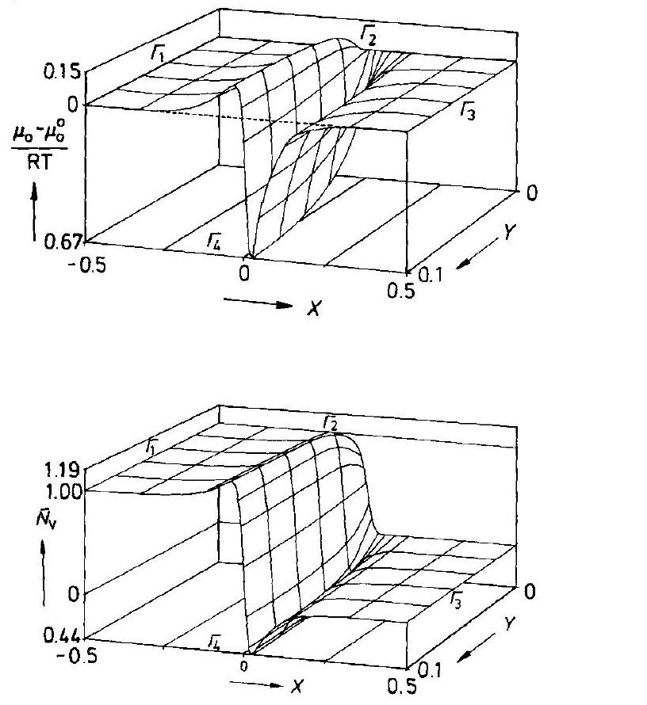
Figure 5-12. Vacancy concentration distribution and the course of oxygen potential during interdiffusion in the AO-BO couple [T. Pfeiffer (1987), T. Pfeiffer, K. Winters (1990)]. The (A, B)O solid solution is characterized by the following parameters: $D_{\mathrm{A}} / D_{\mathrm{B}}=3 ; \partial R T \ln N_{\mathrm{V}} / \partial \ln N_{\mathrm{AO}}=\frac{1}{2}$; $\mathrm{d} \mu_{\mathrm{O}} / \mathrm{a} R T \ln N_{\mathrm{V}}=2 ; t=5.6 \times 10^{4} \mathrm{~s} . \Gamma_{1}, \Gamma_{2}, \Gamma_{3}$ are external surfaces with fixed oxygen potential. $\Gamma_{4}$ is a hypothetical internal surface far away from $\Gamma_{i}(i=1, \ldots, 3) . \bar{N}$ indicates a normalized fraction.

By modeling $\tau$ in this way, we have tacitly assumed that the atomic oxygen has free access to the vacancy sinks which are the internal sites of repeatable growth for the lattice molecules. Properly spaced dislocations with fast oxygen diffusion could be a prototype of those sinks.

In Figure 5-12, graphs of numerical solutions to the AO-BO interdiffusion problem are presented. The vacancy concentration and the oxygen potential in the sample are plotted. It was assumed that both external surfaces as well as internal sources and sinks operate to equilibrate the vacancies [T. Pfeiffer, K. Winters (1990)].

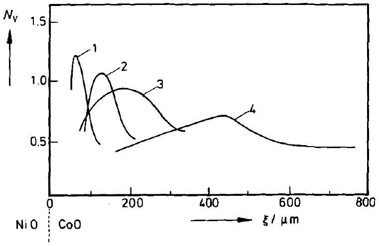
Figure 5-13. Experimental vacancy distribution in the diffusion zone of the couple $\mathrm{CoO}-\mathrm{NiO}$, measured after increasing annealing times: $t_{1}=16 \mathrm{~min} ; t_{2}=45 \mathrm{~min} ; t_{3}=75 \mathrm{~min} ; t_{4}=180 \mathrm{~min}$. $T=1300^{\circ} \mathrm{C}$, in air [G. Kutsche, H. Schmalzried (1990)]. $N_{V}=\%$-fraction.

Vacancy distributions in a $\mathrm{CoO}-\mathrm{NiO}$ sample determined at different times during an interdiffusion experiment are presented in Figure 5-13 and confirm the calculations. The majority point defects ( $\mathrm{V}^{\prime \prime}, \mathrm{h}^{*}$ ) are not in equilibrium with the external oxygen potential as can be seen from the time-dependent defect wave. Since the vacancy concentration $c_{\mathrm{V}}$ determines the transport coefficients of both the cobalt and nickel ions, $D_{\mathrm{Co}}$ and $D_{\mathrm{Ni}}$ are no longer single valued functions of composition and the externally predetermined oxygen potential as illustrated by Figure 5-11. The interdiffusion coefficient $\tilde{D}$ has been derived from concentration profiles according to the 'Boltzmann-Matano' method and depends explicitly on time (and also on the distance from the sample surface), stressing the fact that the vacancies are not in equilibrium with the external oxygen potential during interdiffusion. Their super(under)-saturation depends upon the geometry of the sample.

In order to clarify the meaning of $\tilde{D}$ in the case of incomplete (local) defect equilibration, let us consider a linear diffusion geometry and assume that the equilibration of the defects with the external oxygen buffer occurs only at one end of the sample. The fluxes of the components can then be expressed as

$$
{ }_{(\mathrm{F})} j_{\mathrm{A}}=-{ }_{(\mathrm{F})} j_{\mathrm{B}}=j_{\mathrm{A}}+N_{\mathrm{A}} \cdot j_{\mathrm{V}}
$$

where the lower index ( F ) indicates Fick's reference frame. Two limiting cases for the evaluation of the fluxes $j_{\mathrm{A}}$ and $j_{\mathrm{B}}$ can be visualized: 1$) \mu_{\mathrm{V}}$ is constant in the sample ( $\mathrm{d} \mu_{\mathrm{V}}=0$ ) and 2) $\mu_{\mathrm{O}}$ is constant in the sample ( $\mathrm{d} \mu_{\mathrm{O}}=0$ ). Each of these conditions renders the ternary crystal monovariant so that

$$
\nabla N_{\mathrm{V}}=\left(\frac{\partial N_{\mathrm{V}}}{\partial N_{\mathrm{A}}}\right)_{\mu_{i}} \cdot \nabla N_{\mathrm{A}}=\alpha_{i} \cdot \nabla N_{\mathrm{A}}, \quad i=\mathrm{V} \text { and } \mathrm{O}
$$

From Eqns. (5.122), (5.123), (5.130), and (5.131), one derives after some algebra

$$
{ }_{(\mathrm{F})} j_{\mathrm{A}}=-\tilde{D} \cdot \nabla c_{\mathrm{A}} ; \quad \tilde{D}=\left(D_{\mathrm{AA}}+N_{\mathrm{A}} \cdot D_{\mathrm{VA}}+\alpha_{i} \cdot\left(D_{\mathrm{AV}}+N_{\mathrm{A}} \cdot D_{\mathrm{VV}}\right)\right)
$$

$\tilde{D}$ thus depends on $\alpha_{i}$ which, according to Eqn. (5.131), is determined by the assumptions which govern the equilibration of oxygen ( $\mathrm{d} \mu_{\mathrm{O}}=0$ ) or the vacancies ( $\mathrm{d} \mu_{\mathrm{V}}=0$ ). In other words, the interdiffusion coefficient $\tilde{D}$ depends directly on the mode and extent of the point defect equilibration.

Let us present $\tilde{D}$ explicitly for the condition $\mathrm{d} \mu_{\mathrm{O}}=0$, omitting all details of the lengthy derivation. By application of Manning's random-alloy model [A. R. Allnatt, A.B. Lidiard (1987)], and by inserting Eqns. (5.126) and (5.131) into Eqn. (5.132), for a constant oxygen potential across the diffusion zone, a Darken type equation is obtained

$$
\tilde{D}=\left(N_{\mathrm{A}} \cdot D_{\mathrm{B}}^{*}+N_{\mathrm{B}} \cdot D_{\mathrm{A}}^{*}\right) \cdot f_{\mathrm{AO}} \cdot\left(1+\frac{2 \cdot N_{\mathrm{A}} \cdot N_{\mathrm{B}} \cdot\left(D_{\mathrm{A}}^{*}-D_{\mathrm{B}}^{*}\right)^{2}}{M_{0} \cdot\left(N_{\mathrm{A}} \cdot D_{\mathrm{A}}^{*}+N_{\mathrm{B}} \cdot D_{\mathrm{B}}^{*}\right) \cdot\left(N_{\mathrm{A}} \cdot D_{\mathrm{B}}^{*}+N_{\mathrm{B}} \cdot D_{\mathrm{A}}^{*}\right)}\right)
$$

$M_{0}$ is a numerical factor that is specific for the crystal structure. The second term in brackets stems from what is called the 'vacancy wind' effect. We note that $\tilde{D}$ for AO-BO (oxide) interdiffusion under the condition $\mathrm{d} \mu_{\mathrm{O}}=0$ is analogous to $\tilde{D}$ for AB (alloy) interdiffusion when $\mathrm{d} \mu_{\mathrm{V}}=0$ and vacancy equilibrium prevails throughout the alloy.

In summarizing, we assert that transport and reaction in crystals occur by point defect carriers. Their equilibrium concentrations (at any given $P$ and $T$ ) are unique functions of the local component concentrations. The local changes in composition during transport and reaction perturb the local point defect equilibria. Consequently, defect relaxation processes take place. Since transport coefficients depend on defect concentrations, they are no longer functions of state unless the defect relaxation processes are sufficiently fast. Intrinsic and extrinsic types of point defects have different relaxation modes and times. In general, intrinsic defects have much shorter relaxation times. The relaxation times of extrinsic point defects (the concentrations of which depend on component activities) are much longer, especially if their equilibration sites (i.e., sites of repeatable growth for lattice molecules) are far apart. In these cases of sluggish relaxation, the transport coefficients become explicitly dependent on time and location in the sample, resulting in nonlinear transport equations.

### 5.4.4 Interdiffusion of Heterovalent Compounds

In discussing AO-BO interdiffusion, we saw that the two independent fluxes of this ternary system can lead to different chemical diffusion coefficients $\widetilde{D}$. They depend upon the constraints which define the physical situation (e.g., $\nabla \mu_{\mathrm{O}}=0$ or $\nabla \mu_{\mathrm{V}}=0$ ). The analysis of this relatively simple and fundamental situation is already rather complex. The complexity increases further if diffusion occurs between heterovalent components of compound crystals. This diffusion process is important in practice (e.g., heterovalent doping) and its treatment in the literature is not always adequate. We therefore add a brief outline of the relevant ideas for a proper evaluation of $\tilde{D}$.

Interdiffusion of $\mathrm{AX}-\mathrm{BX}_{2}$ in the dilute limit ( AX is the solvent) has been discussed by [A. B. Lidiard (1957); R. E. Howard, A. B. Lidiard (1964)]. Lidiard proposed to equate the fluxes $j_{\mathrm{B}^{2+}}$ and $j_{\{ \}}$, where $\}=\{\mathrm{B}, \mathrm{V}\}$ is the (neutral) associate between $B_{A}^{*}$ and $V_{A}^{\prime}$. The argument goes that $B_{A}^{2+}$ is only mobile in form of the pair $\left\}\right.$, when $\mathrm{B}_{\mathrm{A}}^{*}$ and $\mathrm{V}_{\mathrm{A}}^{\prime}$ are nearest neighbors and can exchange sites. Formally, this means

$$
j_{\mathrm{B}}=-\tilde{D}_{\mathrm{B}} \cdot \nabla c_{\mathrm{B}}=j_{\{ \}}=-D_{\{ \}} \cdot \nabla\left(p \cdot c_{\mathrm{B}}\right)
$$

where $p$ is the degree of $\{\mathrm{B}, \mathrm{V}\}$ association. From Eqn. (5.134), one infers that

$$
\tilde{D}_{\mathrm{B}}=D_{\mathrm{U}} \cdot \frac{\partial}{\partial c_{\mathrm{B}}}\left(p \cdot c_{\mathrm{B}}\right)
$$

In very dilute $\mathrm{AX}-\mathrm{BX}_{2}$ solutions, for example, $p \sim c_{\mathrm{B}}$ and, thus, $\tilde{D}_{\mathrm{B}} \sim c_{\mathrm{B}}$, whereas if $p \cong 1, \tilde{D}_{\mathrm{B}}=D_{\{ \}}=$const.

However, in view of the ambiguities that occur if Eqn. (5.135) is naively applied to systems such as $\mathrm{AO}-\mathrm{B}_{2} \mathrm{O}_{3}$, let us approach the heterovalent diffusion problem more generally. We define $\mathrm{AO}_{m}$ as the solvent. $\mathrm{BO}_{n}$ must dissolve in $\mathrm{AO}_{m}$ in the form of corresponding (solvent structure) lattice molecules. By starting in the most general way with $\mathrm{A}_{m_{\mathrm{A}}} \mathrm{O}_{m_{\mathrm{O}}}$ and $\mathrm{B}_{n_{\mathrm{B}}} \mathrm{O}_{n_{\mathrm{O}}}\left(m<n ; m=m_{\mathrm{O}} / m_{\mathrm{A}}, n=n_{\mathrm{O}} / n_{\mathrm{B}}\right)$, interdiffusion between the A - and B -lattice molecules can occur through the oxygen ion lattice only if, by definition, they comprise the same number of oxygen ions. Therefore

$$
[\mathrm{A}]\left(=\left[\mathrm{A}_{m_{\mathrm{A}}} \mathrm{O}_{m_{\mathrm{O}}}\right] \cdot n_{\mathrm{O}}\right)=\left[\mathrm{A}_{m_{\mathrm{A}}} \cdot n_{\mathrm{O}} \mathrm{O}_{m_{\mathrm{O}} \cdot n_{\mathrm{O}}}\right] ;[\mathrm{B}]=\left[\mathrm{B}_{n_{\mathrm{B}} \cdot m_{\mathrm{O}}} \mathrm{O}_{m_{\mathrm{O}} \cdot n_{\mathrm{O}}}\right]
$$

For each [A]-lattice molecule we have $m_{\mathrm{A}} \cdot n_{\mathrm{O}}$ cation lattice sites. Thus, $m_{\mathrm{A}} \cdot n_{\mathrm{O}}-n_{\mathrm{B}} \cdot m_{\mathrm{O}}$ is the number of cation vacancies which $n_{\mathrm{B}}$ ions of type B bring into the cation sublattice when $[\mathrm{B}]$ dissolves in $[\mathrm{A}]$. We can now formulate $\nabla \mu[\mathrm{B}]$ in terms of the individual SE potentials as

$$
\nabla \mu[\mathrm{B}]=\nabla \sum_{\mathrm{SE}} v_{i} \cdot \mu_{i}=\nabla\left(n_{\mathrm{B}} \cdot m_{\mathrm{O}} \cdot \mu_{\mathrm{B}_{\mathrm{A}}}+\left(m_{\mathrm{A}} \cdot n_{\mathrm{O}}-n_{\mathrm{B}} \cdot m_{\mathrm{O}}\right) \cdot \mu_{\mathrm{V}_{\mathrm{A}}}\right)
$$

Here it is assumed that the irregular SE 's $\mathrm{B}_{\mathrm{A}}$ and $\mathrm{V}_{\mathrm{A}}$ are unassociated. If associates were present, $v_{i}$ would designate the number of independent SE's in the lattice
molecule, including associates. If $N[\mathrm{~B}] \ll 1$, that is, for dilute solutions of the heterovalent dopant $\mathrm{BO}_{n}$, we can rewrite Eqn. (5.136) by noting that

$$
\nabla \mu_{\mathrm{B}_{\mathrm{A}}}=\nabla \mu_{\mathrm{V}_{\mathrm{A}}}=R T \cdot \nabla \ln N_{\mathrm{B}}
$$

which then yields for the driving force on $\mathrm{BO}_{n}$ diffusing into $\mathrm{AO}_{m}$

$$
\nabla \mu\left(\mathrm{BO}_{n}\right)=\frac{m_{\mathrm{A}} \cdot n_{\mathrm{O}}-\varkappa}{n_{\mathrm{B}} \cdot m_{\mathrm{O}}} \cdot R T \cdot \nabla \ln N_{\mathrm{B}}=\left(\frac{n}{m}-\frac{\varkappa}{n_{\mathrm{B}} \cdot m_{\mathrm{O}}}\right) \cdot R T \cdot \nabla \ln N_{\mathrm{B}}
$$

where $\varkappa$ denotes the number of distinct associates.
Having established the driving force for the dissolution of crystalline $\mathrm{BO}_{n}$ in crystalline $\mathrm{AO}_{m}$, we can now formulate $j_{\mathrm{B}}$ and $j_{\mathrm{A}}$ by using $\nabla \eta_{i}$ as the driving force for the individual ionic fluxes. The flux coupling

$$
j_{\mathrm{A}}=-\frac{n}{m} \cdot j_{\mathrm{B}}
$$

expresses the conservation of lattice sites. From Eqn. (5.139), the electrical potential gradient $\nabla \varphi$ can be determined as usual. Note that it is not essential to omit the cross terms $L_{\mathrm{AB}}$. Inserting $\nabla \varphi$ in the B flux equation $j_{\mathrm{B}}=-L_{\mathrm{B}} \cdot \nabla \eta_{\mathrm{B}_{\mathrm{A}}}$, we obtain

$$
j_{\mathrm{B}}=-L_{\mathrm{B}} \cdot\left(1+N_{\mathrm{B}}\right) \cdot \nabla \mu\left(\mathrm{BO}_{n}\right) \cong-L_{\mathrm{B}} \cdot \nabla \mu\left(\mathrm{BO}_{n}\right)
$$

When Eqns. (5.138) and (5.140) are combined, the result is

$$
j_{\mathrm{B}}=-\left(\frac{n}{m}-\frac{\varkappa}{n_{\mathrm{B}} \cdot m_{\mathrm{O}}}\right) \cdot \frac{R T}{c_{\mathrm{B}}} \cdot L_{\mathrm{B}} \cdot \nabla c_{\mathrm{B}}
$$

so that the chemical diffusion coefficient becomes

$$
\tilde{D}_{\mathrm{B}}=\frac{R T}{c_{\mathrm{B}}} \cdot L_{\mathrm{B}} \cdot\left(\frac{n}{m}-\frac{\varkappa}{n_{\mathrm{B}} \cdot m_{\mathrm{O}}}\right)
$$

Setting $R T \cdot L_{\mathrm{B}} / c_{\mathrm{B}}=D_{\mathrm{B}}$, we finally have

$$
\tilde{D}_{\mathrm{B}} / D_{\mathrm{B}}=\frac{n}{m}-\frac{\varkappa}{n_{\mathrm{B}} \cdot m_{\mathrm{O}}}=\frac{m_{\mathrm{A}} \cdot n_{\mathrm{O}}-\varkappa}{n_{\mathrm{B}} \cdot m_{\mathrm{O}}}
$$

For example, if the interdiffusing system is $\mathrm{AO}-\mathrm{B}_{2} \mathrm{O}_{3}, \tilde{D}_{\mathrm{B}} / D_{\mathrm{B}}=(3-\varkappa) / 2=3 / 2$, $2 / 2,1 / 2$ for $x=0,1$, and 2 respectively. In the case of $\mathrm{AO}-\mathrm{BO}_{2}$, we obtain $\tilde{D}_{\mathrm{B}} / D_{\mathrm{B}} =2-\varkappa=2,1$ for $\varkappa=0,1$ respectively [A. B. Lidiard, H. Schmalzried (1993)].
The foregoing results are valid for ionic crystals without electronic transference. However, many crystals with a high degree of ionicity are semiconductors due to the high mobility of the electronic defects, even if their concentrations are much lower
than those of the ionic majority defects. Semiconducting compounds such as transi-tion-metal oxides are slightly nonstoichiometric. Therefore, interdiffusion can occur between two nonstoichiometric crystals such as $\mathrm{A}_{1-\delta^{\prime}} \mathrm{O}_{m}$ and $\mathrm{B}_{1-\delta^{\prime \prime}} \mathrm{O}_{n}$. Since $\delta^{\prime}$ and $\delta^{\prime \prime} \ll N_{\mathrm{B}}, \nabla \mu\left(\mathrm{BO}_{n}\right)$ in Eqn. (5.138) is normally not influenced by the electronic minority defects. Also, it can be verified that $\nabla \mu_{\mathrm{e}} \cong F \cdot \nabla \varphi$ because the transport coefficient $L_{\mathrm{e}}$ in $j_{\mathrm{e}}\left(=-L_{\mathrm{e}} \cdot \nabla \eta_{\mathrm{e}}\right)$ is $\gg L_{\mathrm{A}}, L_{\mathrm{B}}$. This restriction together with the flux coupling through Eqn. (5.139) allows the evaluation to yield $j_{\mathrm{B}}$ again in the form of Eqn. (5.141). The ratio $\tilde{D}_{\mathrm{B}} / D_{\mathrm{B}}$ in interdiffusing semiconducting crystals should therefore be the same as in ion conducting crystals.

The foregoing results have been derived with the tacit assumption that there are neither internal nor external redox reactions that may influence the majority defect concentrations. Internal reactions could be, for example,

$$
\mathbf{A}^{q_{\mathrm{A}^{+}}}+\mathbf{B}^{q_{\mathrm{B}^{+}}}=\mathbf{A}^{\left(q_{\mathrm{A}} \pm 1\right)+}+\mathbf{B}^{\left(q_{\mathrm{B}} \mp 1\right)+}
$$

or a transfer of electric charge to the vacancies which then would change their effective charge. External reactions could be, for example,

$$
A_{A}^{q_{A}+}+\frac{1}{2} O_{2}(g)=+V_{A}^{\prime}+A_{A}^{\left(q_{A}+1\right)+}+O_{O}^{\times}
$$

or similar reactions which affect the electrical state of $\mathrm{B}^{q_{\mathrm{B}}+}$ or that of the vacancies. All these reactions are coupled through the electroneutrality condition. Clearly, if all these defect reactions had to be considered, including association between the defects, the interdiffusion problem as posed here could not be handled in practical terms. If, however, the dissolution of $\mathrm{BO}_{n}$ in $\mathrm{AO}_{m}$ adds (by Eqn. (5.144)) $\varkappa^{\#}$ electronic (majority) defects to the crystal, we have to replace $\mathcal{x}$ in Eqn. (5.143) by ( $\varkappa-\varkappa^{\#}$ ) in order to obtain $\tilde{D}_{\mathrm{B}} / D_{\mathrm{B}}$.

## References

Almond, D. P. et al. (1982) Solid State Comm., 44, 1277
Allnatt, A. R., Lidiard, A. B. (1987) Rep. Progr. Physics, 50, 373
Allnatt, A. R., Lidiard, A. B. (1993) Atomic Transport in Solids, University Press, Cambridge
Becker, R. (1966) Theorie der Wärme, Springer, Berlin
Busch, R., Ruth, V. (1991) Acta Met., 39, 1535
Chandrasekhar, S. (1943) Rev. Modern Physics, 15, 20
Darken, L. S. (1948) Trans. AIME, 175, 184
Debye, P., Falkenhagen, H. (1928) Phys. Z., 29, 121, 401
Debye, P., Hückel, E. (1923) Phys. Z., 24, 185, 305
Flynn, C.P. (1987) Mat. Science For., 15-18, 231 (Trans. Techn. Publ.)
Funke, K., Riess, I. (1984) Z. phys. Chem., NF 140, 217
Funke, K. (1987) Z. phys. Chem., NF154, 251
Funke, K. (1989) Mat. Res. Soc. Symposia Proc., 135, 43

Funke, K. (1993) Progr. Solid State Chem., 22, 111
Glasstone, S., Laidler, K. J., Eyring, H. (1941) The Theory of Rate Processes, McGraw-Hill, New York
Gösele, U. M. (1980) Reaktionskinetik und Diffusion in kondensierten Systemen, MPI Metallforschung, Stuttgart
Hänngi, P., et al. (1990) Rev. Mod. Phys., 62, 251
Havlin, S., Ben Avraham, D. (1987) Adv. Phys., 36, 695
Howard, R.E., Lidiard, A. B. (1964) Rep. Progr. Phys., 27, 161
Jansen, M. (1991) Angewandte Chemie, 103, 1574
Jost, W. (1955) in Halbleiterprobleme II (Ed.: Schottky, W.), Vieweg, Braunschweig
Kelly, S. W., Sholl, C.A. (1987) J. Phys., C20, 5293
Kramers, H. A. (1940) Physica, 7, 284
Kutner, R. (1985) J. Phys., C18, 6323
Kutsche, G., Schmalzried, H. (1990) Solid State Ionics, 43, 43
Lidiard, A. B. (1956) Phil. Mag., 46, 1218
Lidiard, A. B. (1957) Handb. Phys. $X X$ (Ed.: Flügge, S.), Springer, Berlin
Lidiard, A.B., Schmalzried, H. (1993) Defects in Insulating Materials (Eds.: Kanert, O., Spaeth, J. M.), World Scientific, Singapore, p. 305

Limoge, Y., Bocquet, J. L. (1990) Phys. Rev. Lett., 65, 60
Manning, R. J. (1968) Diffusion Kinetics for Atoms in Crystals, van Nostrand, Princeton
Murch, G. E. (1984) Diffusion in Crystalline Solids (Eds.: Murch, G.E., Nowick, A.S.), Academic, Orlando
Onsager, L. (1926) Phys. Z., 27, 388
Onsager, L. (1927) Phys. Z., 28, 277
Pfeiffer, T. (1987) Ph. D.-Dissertation, Universität Hannover
Pfeiffer, T., Winters, K. (1990) Phil. Mag., A61, 685
Sauer, F., Freise, V. (1962) Z. Elektrochem., 66, 353
Schmalzried, H. (1977) Z. phys. Chem., NF 105, 47
Schmalzried, H. (1981) Solid State Reactions, Verlag Chemie, Weinheim
Sholl, C.A. (1992) Phil. Mag., A65, 749
Smigelskas, A., Kirkendall, E. (1947) Trans. AIME, 171, 130
Smoluchowski, M. v. (1917) Z. phys. Chem., 92, 129
Strom, U., Ngai, K. L. (1981) Solid State Ionics, 5, 167
Vineyard, G. (1957) J. Phys. Chem. Solids, 3, 121
Wagner, C. (1969) Acta Met., 17, 99
Weiss, A., Witte, H. (1983) Kristallstruktur und chemische Bindung, Verlag Chemie, Weinheim

## 6 Heterogeneous Solid State Reactions

### 6.1 Introduction

Heterogeneous solid state reactions occur when two phases, A and B, contact and react to form a different product phase C . A and B may be either chemical elements or compounds. We have already introduced this type of solid state reaction in Section 1.3.4. The rate law is parabolic if the reacting system is in local equilibrium and the growth geometry is linear. The characteristic feature of this type of reaction is the fact that the product C separates the reactants A and B and that growth of the product proceeds by transport of A and/or B through the product layer.

Classical examples of heterogeneous solid state reactions are the formation of double salts (e.g., $2 \mathrm{KCl}+\mathrm{SrCl}_{2}=\mathrm{K}_{2} \mathrm{SrCl}_{4}$ ), intermetallic compounds (e.g., $\mathrm{Al}+\mathrm{Sb}=$ AlSb ), carbides, silicides (e.g., $\mathrm{Ni}_{n}+\mathrm{Si}_{m}=\mathrm{Ni}_{n} \mathrm{Si}_{m}$ ), etc. The kinetics of these reactions is quite similar, in spite of the diversity of their atomic reaction mechanisms. A heterogeneous reaction starts with nucleation and the subsequent growth of the nucleus. The kinetics of the early stages is quite different from the later quasi-steady state growth and will receive special attention in Section 6.2.

Let us begin with some general statements on heterogeneous solid state reactions. The overall driving force for these reactions is the difference in Gibbs energy between the reactants and the reaction product. Reaction entropies are relatively small if only crystalline phases are involved. As a consequence, heat is liberated. If the interface area between the reactants and the product is sufficiently small (which excludes many powder reactions), the rate of heat production is low in view of the small solid state reaction rates. Thus, the assumption of isothermal conditions is normally valid. In contrast, strongly exothermic reactions between fine powders of reactants can lead to self-heating.

Quantitative investigations of solid state reaction kinetics are confined essentially to binary or quasi-binary systems (e.g., oxides forming spinel structures). If local equilibrium prevails in the binary systems, the phase boundaries are invariant and the chemical potentials of components are constant at the interfaces during the reaction. This is the simplest possible boundary condition, leading to the parabolic rate law. In systems with more than two components, the phase boundaries are not invariant. The isothermal, isobaric single-phase system needs $(n-1)$ chemical potentials in order to unambiguously define the system and to determine the concentrations of all the structure elements. Therefore, during the spinel formation, $\mathrm{AO}+\mathrm{B}_{2} \mathrm{O}_{3}=\mathrm{AB}_{2} \mathrm{O}_{4}$, the $\mathrm{AO} / \mathrm{AB}_{2} \mathrm{O}_{4}$ interface, for example, is not properly defined unless, in addition to the activity of component AO , a second component's activity has been predetermined (e.g., $a_{\mathrm{O}_{2}}$ ).

Spinel formation has been studied extensively as a prototype of heterogeneous solid state reactions. The close similarity of the crystal structures of the reactants and product avoids many complications which have been named 'topochemical' and which often obscure transport kinetics. Yet even if we can neglect effects due to misfit, self-stress, plastic deformation, transport along dislocations, etc. the local thermodynamic equilibrium assumption necessary for a quantitative treatment is never absolutely true during the course of a reaction. The implications of the assumption were discussed in Section 5.4. In this chapter, however, we normally assume that local equilibrium is established and deal with the basic principles of heterogeneous solid state reactions rather than working out such details as transport across interfaces or growth morphologies (these will be done in later chapters). Also, a monograph on these types of reaction is available [H. Schmalzried (1981)] which justifies the more fundamental approach here.

### 6.2 Nucleation and Initial Growth

### 6.2.1 Introductory Remarks

A heterogeneous reaction of the type $\mathrm{A}+\mathrm{B}=\mathrm{AB}$ necessarily begins with the nucleation of AB. Nucleation and early growth are different from the later stages of reaction as long as the number of atomic particles in the boundary region is similar to the number of those in the bulk. This means that the chemical potential of the components and the growth kinetics depend explicitly on the size and form of the nuclei.

Since the interface (surface) excess Gibbs energy is positive, $\mu_{i}\left(r_{1}\right)>\mu_{i}\left(r_{2}\right)$ if the radius of nucleus $r_{1}<r_{2}$. As a consequence, for the Gibbs energy, $g\left(r_{1}\right)>g\left(r_{2}\right)$ as well (where $g=\sum n_{i} \mu_{i}=n \cdot \sum N_{i} \mu_{i}$ ). Therefore, in order to nucleate a new phase, some supersaturation is required. Most nucleation studies have been performed on single-phase systems that have been brought into two-phase fields by changing $T$ (or $P$ ) (undercooling, superheating). Figures 6-1 and 6-2 show typical phase diagrams which illustrate the reaction paths and their corresponding (partial and integral) Gibbs energies.

Obviously, phase $\alpha$, with composition $\bar{N}$ at temperature $T$, is not stable. Let us ask for the gain in Gibbs energy if an infinitesimal precipitate (nucleus) of composition $N_{n}$ is formed. In the binary system 1-2 (A-B), all points on the tangent ( $\left.\partial G^{\alpha} / \partial N_{2}\right)_{\bar{N}}$ connect systems with constant $\mu_{i}$, that is, equilibrium systems. One sees in Figure 6-1 that considering the negative curvature of $G(N)$, as long as $\bar{N}>N_{\text {in }}$ (inflection), all fluctuations will result in a lowering of the precipitate Gibbs energy ( $\Delta \tilde{g}$ ) if one neglects interfacial energies. Stated differently: inside the spinodal curve given by ( $\partial^{2} G / \partial N^{2}$ ) = 0 in Figure 6-1, the system is absolutely unstable and will decompose towards $\alpha^{\prime}\left(N_{1}\right)$ and $\alpha^{\prime \prime}\left(N_{2}\right)$. However, outside the spinodal curve between $N_{1}$ and $N_{\text {in }}$, the tangent line for composition $\bar{N}$ will intersect the $G$ curve, and not until a

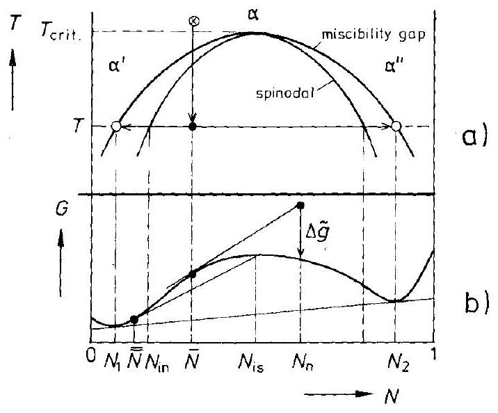
Figure 6-1. a) $T-N_{i}$ and b) $G-N_{i}$ diagram of a binary system with a miscibility gap. The reaction path after undercooling is indicated by an arrow.

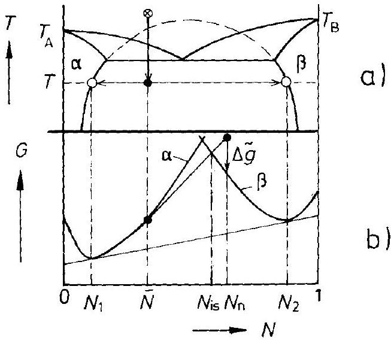
Figure 6-2. a) $T-N_{i}$ and b) $G-N_{i}$ diagram of an eutectic binary system. The reaction path after undercooling is indicated by an arrow.

fluctuation has reached the value $N_{\text {is }}$ (intersection) can the precipitate ( $\alpha^{\prime \prime}$ ) lower its energy. From here on the precipitate $\alpha^{\prime \prime}$ and matrix $\alpha^{\prime}$ evolve towards the equilibrium compositions $N_{1}$ and $N_{2}$ respectively, where eventually the lowest possible Gibbs energy for the whole two-phase system is attained.

In Figure 6-2, the same situation is explained for a simple eutectic system. Starting again with composition $\bar{N}$, the fluctuation must go beyond $N_{\text {is }}$ before Gibbs energy is gained by forming nuclei of the $\beta$-phase. Figures 6-1 and 6-2 allow one to immediately formulate

$$
\Delta \tilde{g}\left(N_{n}\right)=-\left(g\left(N_{n}\right)-g(\bar{N})-\left(N_{n}-\bar{N}\right) \cdot\left(\frac{\partial g}{\partial N}\right)_{\bar{N}}\right)
$$

These $g$ values are defined per unit volume. Let us now put in the interface energy previously left out. If $V_{n}=4 / 3 \cdot \pi \cdot r^{3}$ is the volume of the nucleus, the net Gibbs energy change is (neglecting elastic misfit energies)

$$
\Delta G=(4 / 3) \cdot \pi \cdot r^{3} \cdot \Delta \tilde{g}\left(N_{n}, T\right)+4 \cdot \pi \cdot r^{2} \cdot \gamma\left(N_{n}, T\right)
$$

with $y$ as the interface Gibbs energy per interface unit. Note that $y$ is a function of $N_{n}$. From Eqn. (6.2) we see that a minimum radius of the nucleus is necessary before $\partial \Delta G(r) / \partial r$ becomes negative and the nucleus can spontaneously grow further. This critical radius $r^{*}$ depends on $N_{n}$. Figure 6-1 shows that the magnitude of $\Delta \tilde{g}\left(N_{n}\right)$ increases with $N_{n}$. We expect that $\gamma\left(N_{n}\right)$ does the same. Since $\Delta \tilde{g}$ is negative, the difference between the two terms in Eqn. (6.2) (i.e., $\Delta G$ ) is therefore less affected by composition changes than $\Delta \tilde{g}$ and $\gamma$ individually. An increase in $T$ lowers both $|\Delta \tilde{g}|$ and $\gamma$. The ratio $2 \cdot \gamma /|\Delta \tilde{g}|$, which is the critical radius $r^{*}$, increases with temperature.

The above thermodynamic considerations are fundamental to the kinetics of phase nucleation to be outlined in the next section.

### 6.2.2 Nucleation Kinetics

The probability, $P_{i, n}$, of finding an atom (ion) $i$ within a nucleus of critical size ( $r^{*}$ ) can be obtained from Eqn. (6.2). One first calculates the critical Gibbs energy $\Delta G^{*} \left(=\frac{16 \pi \cdot \gamma^{3}}{3 \cdot \Delta \tilde{g}^{2}}\right)$ by inserting $r^{*}$. Then, if $\bar{\varrho}$ is the average number density of atoms (assumed to be the same for matrix ( $m$ ) and nucleus ( $n$ )), one finds the average critical Gibbs energy per atom $i$ in the nucleus to be

$$
\Delta g_{i}^{*}=\Delta G^{*} \cdot\left(\bar{\varrho} \cdot N_{i, n} \cdot(4 / 3) \pi \cdot r^{* 3}\right)^{-1}
$$

If $P_{i, n}^{*} \ll 1$ we therefore have

$$
P_{i, n}^{*} \cong \mathrm{e}^{-\frac{\Delta g_{i}^{*}}{k T}}
$$

and the number density of critical nuclei becomes

$$
\varrho_{n}^{*}=\frac{P_{i, n}^{*}}{(4 / 3) \cdot \pi \cdot r^{* 3} \cdot N_{i, n}}
$$

The rate, $\dot{R}_{n}$, of random nucleation is therefore obtained from Eqns. (6.4) and (6.5) by recognizing that the addition of one more particle $i$ to the critical nucleus makes it supercritical, which means that it will grow further. A simple way to represent the transfer frequency $v_{i, s}$ of $i$ across the surface of a critical nucleus is as follows

$$
v_{i, \mathrm{~s}}=v_{i}^{0} \cdot \varrho_{i, \mathrm{~s}} \cdot 4 \pi r^{* 2} \cdot \mathrm{e}^{-\frac{\varepsilon_{\mathrm{D}}}{R T}}
$$

where $v_{i}^{0}$ is the vibrational frequency of particles $i, \varrho_{i, s}$ their number per unit surface area, and $\varepsilon_{\mathrm{D}}$ the activation energy for the diffusion of $i$. In the sense of transi-
tion state theory (Section 5.1.2), by neglecting any return jumps from the nucleus into the matrix (Zeldovich factor), one finds the quasi-steady state nucleation rate $\dot{R}_{n}$ to be

$$
\dot{R}_{n}=\varrho_{n}^{*} \cdot v_{i, \mathrm{~s}}=\alpha \cdot \mathrm{e}^{-\frac{\Delta g_{i}^{*}+\varepsilon_{\mathrm{D}}}{k T}} ; \alpha=\frac{3}{r^{*}} \cdot \frac{v_{i}^{0} \cdot \varrho_{i, \mathrm{~s}}}{N_{i, n}}
$$

$\dot{R}_{n}$ (through $\Delta g^{*}$ ) is sensitive to $y$ and $T$. It reaches a maximum as a function of temperature: at low $T$, the $v_{\mathrm{s}}$ frequencies are frozen in, and at high $T, r^{*}\left(\Delta G^{*}\right)$ becomes too large.

Up to this point we have dealt with random nucleation processes in a homogeneous phase. However, in solids with many structural imperfections, it is very likely that nonrandom, heterogeneous nucleation takes place. The basic idea of this mode of nucleation is that the energy of the imperfection is brought into the energy balance of the critical nucleus. Let us demonstrate the basic idea with a dislocation line as the preferred nucleation site. We assume that a cylindrical precipitate ( $p$ ) forms along the dislocation line and, in the spirit of Eqn. (6.2), we obtain per unit length of the nucleus

$$
\Delta G_{p}=\pi \cdot r^{2} \cdot \Delta \tilde{g}_{p}+2 \pi \cdot r \cdot \gamma_{p}-A \cdot \ln r
$$

where the last term on the right hand side accounts for the relaxation of the elastic self-energy of the dislocation (see Eqn. (3.1)) due to the formation of precipitate. As before, the condition that $\left(\partial \Delta G_{p} / \partial r\right)=0$ yields a critical radius $r^{*}$. If we reintroduce $r^{*}$ into Eqn. (6.8), it is found that for $A \cdot \Delta \tilde{g}_{\mathrm{p}}<(\pi / 2) \cdot \gamma_{\mathrm{p}}^{2}$ there is no nucleation barrier whatsoever.

Although this line of reasoning shows one of the principal features of heterogeneous nucleation, the real situation of nucleation near a dislocation line is much more complex [S. Q. Xiao, P. Haasen (1989)]. The stress field of the dislocation changes the composition of both the matrix and the precipitate, which in turn influences both $\gamma_{p}$ and $\Delta \tilde{g}_{p}$. In view of this fact, one has to determine whether nucleation near the dislocation occurs before or after the Cottrell atmosphere around the dislocation had sufficient time to form.

With respect to the rate of nonrandom nucleation, the essence of the rate equation (6.7) is unchanged. However, we may have a spectrum of preferential nucleation sites $p$, with number density $\varrho_{n}(p)$. Therefore, $\dot{R}_{n}$ becomes

$$
\dot{R}_{n}(p)=\sum_{p} \varrho_{n}(p) \cdot v_{i, s}(p)
$$

Since $\Delta G_{p}^{*}<\Delta G^{*}$ for random homogeneous nucleation, normally $R_{n}(p) \gg R_{n}$, even though the pre-exponential factor is much greater for homogeneous than for heterogeneous nucleation $\left(N_{i}(p) \ll N_{i}(m)\right)$.

Most nucleation processes are accompanied by a net volume change. In these cases, $\Delta G^{*}$ is altered by the strain energy $\Delta E_{\text {elast }}$. The dilatational part of this energy term can be expressed as

$$
E_{\mathrm{elast}}=(2 / 3) \cdot \bar{G} \cdot\left(\frac{\Delta V}{V}\right)^{2} \cdot f\left(\frac{c}{r}\right)
$$

Here, $\bar{G}$ denotes the shear modulus, and $f(c / r)$ is a function of the ratio $c / r$ in which $c$ and $r$ are the spheroidal semiaxes of the precipitate. For spheres, $f(c / r=1)=1 =f_{\text {max }}$. For discs as well as for rods, $f<1$. In principle, shear stress energies and energies arising from misfit dislocation networks also have to be added. They influence $\Delta G^{*}$ by additional energy terms.

Temperature induced nucleation in homogeneously undercooled systems has mainly been evaluated in the field of metallurgy and materials science. For a survey, see, for example, [K. C. Russel (1970); V. Raghavan, M. Cohen (1975)]. In solid state chemistry, however, not only the precipitation of $\alpha^{\prime \prime}$ (or $\beta$ ) from undercooled $\alpha$, but equally the nucleation of $y$ at the start of the isothermal reaction $\alpha+\beta=\gamma$ has to be studied. Figure 6-3 illustrates this situation with the phase diagram and corresponding Gibbs energies. The solid state reaction $\mathrm{A}+\mathrm{B}=\mathrm{AB}(\alpha+\beta=\gamma)$ starts by contacting the pure reactants $\mathbf{A}$ and $\mathbf{B}$ as shown in Figure 6-4. The mutual interdiffusion of A and B (over the time interval $0<t<t_{1}$ ) leads to mutual saturation as indicated in Figure 6-3 by tangent (1) between $G^{\alpha}$ and $G^{\beta}$. We see that this (metastable) equilibrium at the $\alpha / \beta$ interface, with composition $N^{\alpha}(\beta)$ and $N^{\beta}(\alpha)$, is supersaturated with respect to phase $\gamma(\mathrm{AB})$ in the same way as $\alpha$ was supersaturated with respect to $\beta\left(\alpha^{\prime \prime}\right)$ in Figures 6-1 and 6-2, at composition $N$. Each fluctuation on the $\alpha$-side of the boundary when $N$ becomes $<N_{n}^{\prime}$, or on the $\beta$-side of the boundary when $N$ becomes $<N_{n}^{\prime \prime}$, will lead to a nucleation of $\gamma\left(t_{2}\right)$. Thereafter,

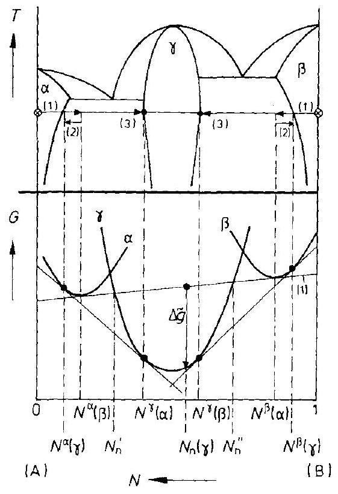
a)

b)

Figure 6-3. a) $T-N_{i}$ and b) $G-N_{i}$ diagram of a binary system with (nonstoichiometric) compound $\gamma$. The reaction path for isothermal compound formation is indicated by arrows (see text).

Figure 6-4. Nucleation and early growth stages of the heterogeneous reaction $\alpha+\beta=\gamma$, in accordance with Figure 6-3.

the $\alpha / \gamma(\gamma / \beta)$ interface evolves (with a sharp decrease in local Gibbs energy) towards the composition $N^{\alpha}(\gamma)\left(N^{\beta}(\gamma)\right)$. $N^{\alpha}(\gamma)$ and $N^{\beta}(\gamma)$ are eventually reached when local interface equilibrium is established. Interface kinetics, morphology, and further growth of $\gamma\left(t_{3}, t_{4}\right.$ of Fig. 6-4) are treated in later chapters. However, we can assert that the considerations which led to the kinetic equations (6-4)-(6-7) apply as well to the $y$ nucleation which starts the heterogeneous reaction $\mathrm{A}+\mathrm{B}=\mathrm{AB}$. According to Figure 6-4, we have to replace the surface energy term in Eqn. (6.2) by the difference between the energies of the new surfaces $\alpha / \gamma$ and $\beta / \gamma$, and the original surface $\alpha / \beta$.

### 6.2.3 Early Growth

Let us now discuss the post-nucleation stage. The further course of a heterogeneous reaction depends decisively on the time evolution of the boundary conditions. In most cases, the problem is extremely complex because nucleation continues to occur simultaneously as component transport to the previously formed nuclei. Thus, all the parameters in Eqn. (6.7) and, in particular, the critical values of $\Delta G^{*}\left(\Delta g^{*}\right)$ become explicitly time-dependent while varying locally. The supersaturation near a growing nucleus is diminished. Thus, $\Delta G^{*}$ increases with time while $\Delta \tilde{g}$ decreases, as can be seen in Figures 6-1 and 6-2. For illustration, let us inspect Figure 6-2. After the nucleation and growth of $\beta$, the average composition of the $\alpha$ phase evolves towards $N_{1}$. This lowers $|\Delta \tilde{g}|$ until it finally becomes zero.

For reactions of the type $\mathrm{A}+\mathrm{B}=\mathrm{AB}$ (or $\alpha+\beta=\gamma$ ), the situation is different. If one has a linear reaction geometry and the $y$ product forms at different times and locations on the A/B interface, the patches of $y$ eventually merge by fast lateral (interface) transport. Eventually, a full $\gamma$ layer is formed between $\alpha$ and $\beta$. At first, this layer has a non-uniform thickness (Fig. 6-4). In Chapter 11 we will show, however, that the uneven $\alpha / \gamma$ and $\gamma / \beta$ interfaces are morphologically stable and become smooth during further growth. This leads to constant boundary conditions for the $\gamma$ formation after some time of reaction and eventually results in a parabolic rate law, as will be discussed later.

In summary, the nucleation rate $\dot{R}_{n}(t)$ is difficult to assess and kinetic theories for transforming systems often assume (ad hoc) $\dot{R}_{n}(t)$ dependencies. In contrast, the growth kinetics of an individual particle of $\beta$ precipitate in the supersaturated matrix ( $\alpha$ ) is a transport problem with well defined boundary conditions, as long as
other nuclei do not interfere. If the problem is spherical, isotropic, and the kinetics are diffusion controlled, the boundary conditions are: $c_{i}=c_{i}^{0}(\alpha / \beta)$ at $r=r_{\beta}$, and $c_{i}=c_{i}^{0}(\infty)$ at $r=\infty$. With a boundary velocity $v^{\dot{b}}=j_{i}^{\alpha} / \Delta c(\alpha / \beta)$ at $r=r_{\beta}$, one obtains (after some algebra) a parabolic rate law for the growth of the $\beta$ particles

$$
r_{\beta}=\left(2 \cdot D_{i}^{\alpha} \cdot \frac{c_{i}^{0}-c_{i}(\alpha / \beta)}{c_{i}^{\beta}-c_{i}(\alpha / \beta)} \cdot t\right)^{1 / 2}
$$

Equation (6.11) is valid for the initial particle growth. Interface control of the growth kinetics would lead to a linear rate law. Details can be found, for example, in [H. Schmalzried (1981)].

In contrast to the growth of individual (isolated) particles, the overall kinetics of heterogeneous reactions in the early stages cannot be assessed in a straightforward way. Let us therefore inspect some empirical and semi-empirical relations which are in use. The most stringent simplification assumes that the nucleation rate $\dot{R}_{n}(t)= \dot{R}^{0}$ at $t=0$, and $\dot{R}_{n}(t)=0$ for $t>0$. Other assumptions are also in use: 1) $\dot{R}_{n}(t)= \dot{R}^{0}$ for all times $t \geq 0$ and 2) $\dot{R}_{n}(t)=\dot{R}^{0} \cdot \mathrm{e}^{-t / \tau}$. We can apply these $\dot{R}_{n}(t)$ functions to derive the general kinetic expressions for reacting (transforming) systems.

Let us define $X=X^{\beta}$ as the portion of the system that has already transformed into $\beta$ and $X^{\alpha}=(1-X)$ as the untransformed fraction. The reaction rate as referred to untransformed $\alpha$ is

$$
\frac{\mathrm{d} X}{1-X}=-\mathrm{d} \ln (1-X)=f(t) \cdot \mathrm{d} t
$$

Integration yields

$$
1-X=\mathrm{e}^{-\int f(t) \cdot \mathrm{d} t}
$$

Unless we deal with autocatalytical reactions, the function $f(t)$ must decrease with time. From Eqn. (6.12) it can be seen that $f(t)$ is the (normalized) increase of the product at time $t$. For spherical product particles, this means

$$
f(t)=\int_{\tau=0}^{\tau=t} \mathrm{~d} \tau \cdot \dot{R}_{n}(\tau) \cdot\left(4 \pi r^{2} \cdot \frac{\mathrm{~d} r}{\mathrm{~d} t}\right)_{t-\tau}
$$

Equation (6.14) weights the increase of the product particles according to the time $(t-\tau)$ that has elapsed since nucleation took place. $r(t-\tau)$ has to be evaluated by transport theory. Let us apply Eqn. (6.14) to the simplest possible situation in which $\dot{R}_{n}(\tau=0)=\dot{R}^{0}, \dot{R}_{n}(\tau>0)=0$, and $r=v^{0} \cdot(t-\tau)$. With these assumptions we obtain

$$
X=1-\mathrm{e}^{-\left(k_{3} \cdot t\right)^{m}} ; \quad k_{3}=\left(\frac{4 \pi \cdot \dot{R}^{0} \cdot v^{03}}{3}\right)^{1 / 3} ; \quad m=3
$$

If the nucleation rate at $t \geq 0$ is $\dot{R}^{0}$ and constant in time, we obtain in place of Eqn. (6.15)

$$
f(t)=\dot{R}^{0} \cdot \int_{\tau=0}^{\tau=t} \mathrm{~d} \tau \cdot\left(4 \pi r^{2} \cdot \dot{r}\right)_{t-\tau}=\left(\frac{4 \pi}{3}\right) \cdot \dot{R}_{n}^{0} \cdot v^{03} \cdot t^{3}
$$

which, after insertion into Eqn. (6.13), results in

$$
X=1-\mathrm{e}^{-\left(k_{4} \cdot t\right)^{m}} ; \quad k_{4}=\left(\frac{\pi \cdot \dot{R}^{0} \cdot v^{03}}{3}\right)^{1 / 4} ; m=4
$$

Equations (6.15) and (6.17) phenomenologically describe the overall growth kinetics after the initial nucleation took place and further nucleation is still occurring. Indeed, the sigmoidal form of the $X(t)$ curve represents a wide variety of transformation reactions. Equation (6.13) is named after Johnson, Mehl, and Avrami [W.A. Johnson, R.F. Mehl (1939); M. Avrami (1939)]. Let us finally mention two points. 1) Plotting $\sqrt{\ln (1-X)}$ vs. $t$ should give a straight line with slope $k_{m}$. 2) The time $t_{i f}$ of the inflection point ( $\partial^{2} X / \partial t^{2}=0$ ) on $X(t)$ is suitable to derive either $m$ or $k_{m}$, namely

$$
k_{m}=\left(\frac{1}{t_{i f}}\right) \cdot \sqrt{\frac{m-1}{m}}
$$

The activities of precipitate particle components depend explicitly on their size and form. The quantitative relation which describes this fact is the so-called GibbsThomson equation

$$
\mu_{i}\left(r_{1}\right)-\mu_{i}\left(r_{2}\right)=2 \cdot \gamma \cdot\left(\frac{1}{r_{1}}-\frac{1}{r_{2}}\right)
$$

which can be rewritten in terms of solubilities, $c_{i}^{\alpha}$, in the $\alpha$ matrix as

$$
c_{i}^{\alpha}\left(r_{1}\right)-c_{i}^{\alpha}\left(r_{2}\right)=c_{i}^{\alpha}(\infty) \cdot \frac{2 \cdot V_{m}^{\beta} \cdot \gamma}{R T} \cdot\left(\frac{1}{r_{1}}-\frac{1}{r_{2}}\right)
$$

in a linearized version. $V_{m}^{\beta}$ is the molar volume of the precipitate $\beta$, and it was assumed that component $i$ is ideally dissolved in $\alpha . r_{1}$ and $r_{2}$ are the main radii of curvature of the $\beta$ particle. From Eqns. (6.19) and (6.20) we conclude that a driving force exists for the transport of species $i$ between a small and a large particle which were nucleated at different times. Obviously, the large particles grow at the expense of the small ones. This process (which already takes place during the nucleation period) is named coarsening or Ostwald ripening. It has been treated quantitatively by [C. Wagner (1961); I.M. Lifshitz, V. V. Slyozov (1961); I.M. Lifshitz (1962)]. A simplified treatment has been outlined by [G. W. Greenwood (1956)]. Of course, the growth kinetics of a particle (with average radius $r$ ) depends on the mechanism of transport. For diffusion control, one derives

$$
\bar{r}=\left(\frac{8 \cdot \gamma \cdot V_{m}^{\beta^{2}} \cdot c_{i}(\mathrm{eq}) \cdot \tilde{D}}{9 R T}\right)^{1 / 3} \cdot t^{1 / 3}
$$

where the average particle radius $\bar{r}$ is defined as

$$
\bar{r}=\frac{\int_{0}^{\infty} f(r) \cdot r \cdot \mathrm{~d} r}{\int_{0}^{\infty} f(r) \cdot \mathrm{d} r}
$$

where $f(r)$ is the (quasi-steady state) particle size distribution function. The main conclusion is that $r \sim \sqrt[3]{t}$, that is, the average particle grows proportional to the cube root of the time. The solubility of component $i$ in the $\alpha$ matrix influences the growth rate.

These brief remarks on Ostwald ripening conclude the discussion of nucleation and early growth stages of heterogeneous reactions at this point. Some of the concepts are deepened in Chapter 12 on phase transformations [see also R. Wagner, R. Kampmann (1991)].

### 6.3 Compound Formation

### 6.3.1 Formation Kinetics of Double Salts

The kinetics of spinel formation ( $\mathrm{AO}+\mathrm{B}_{2} \mathrm{O}_{3}=\mathrm{AB}_{2} \mathrm{O}_{4}$ ) was first explained quantitatively by [C. Wagner (1938)]. A and B can represent quite a variety of different elements such as $\mathrm{Mg}, \mathrm{Fe}, \mathrm{Ni}, \mathrm{Co}$ and $\mathrm{Al}, \mathrm{Ga}, \mathrm{Cr}$ respectively. Other reactions that belong to this category include the formation of silicates (e.g., $2 \mathrm{MgO}+\mathrm{SiO}_{2}= \mathrm{Mg}_{2} \mathrm{SiO}_{4}$ ), of double sulfides (e.g., $\mathrm{Ag}_{2} \mathrm{~S}+\mathrm{Sb}_{2} \mathrm{~S}_{3}=\mathrm{Ag}_{2} \mathrm{Sb}_{2} \mathrm{~S}_{4}$ ), or of double halides (e.g., $2 \mathrm{AgI}+\mathrm{HgI}_{2}=\mathrm{Ag}_{2} \mathrm{HgI}_{4}$ ). In Figure 6-5, the reaction mechanism according to Wagner is shown for spinel formation. It encompasses the counterdiffusion of cat-

| cation counterdiffusion | MgO | $\mathrm{MgO} \cdot \mathrm{Al}_{2} \mathrm{O}_{3}$ | $\mathrm{Al}_{2} \mathrm{O}_{3}$ |
| :--- | :--- | :--- | :--- |
|  | $3 \mathrm{Mg}^{2+}$ |  |  |
|  | <smiles>C[14CH2]C</smiles>   $\xrightarrow[2 \mathrm{Al}^{3+}]{ }$ |  |  |
| reactions at boundaries | 4 MgO |  | $4 \mathrm{Al}_{2} \mathrm{O}_{3}$ |
|  | $-3 \mathrm{Mg}^{2+}$ |  | $-2 \mathrm{Al}^{3-}$ |
|  | $+2 \mathrm{Al}^{3+}$ |  | $+3 \mathrm{Mg}^{3+}$ |
|  | $1 \mathrm{MgO} \cdot \mathrm{Al}_{2} \mathrm{O}_{3}$ | 3 MgO | $\mathrm{Al}_{2} \mathrm{O}_{3}$ |

Figure 6-5. Reaction mechanism and phase boundary reactions for the spinel formation $\mathrm{MgO}+\mathrm{Al}_{2} \mathrm{O}_{3}=\mathrm{MgAl}_{2} \mathrm{O}_{4}$.

ions and assumes that the mobility of oxygen ions in the reaction product is small in comparison with the mobility of both cations. This is true since the large oxygen ions are almost close-packed and consequently diffuse slowly. Figure 6-5 shows the central problem of heterogeneous solid state reactions. When the product separates the reactants, in which way and in what form does the reactant (say A) dissolve in the product phase AB so as to cross it and eventually meet the other reactant (B) in order to form AB ?

In accordance with the reaction scheme of Figure 6-5, it is found experimentally that while one quarter of the spinel forms at the $\mathrm{MgO} / \mathrm{MgAl}_{2} \mathrm{O}_{4}$ interface, three quarters are formed at the $\mathrm{MgAl}_{2} \mathrm{O}_{4} / \mathrm{Al}_{2} \mathrm{O}_{3}$ boundary. This ratio provides us with information on the cation counterdiffusion mechanism. In order to meet the requirements of the product compound stoichiometry, the cation fluxes are coupled, that is, $3 \cdot j_{\mathrm{Mg}}=-2 \cdot j_{\mathrm{Al}}$. One may also interpret this coupling as the condition of (local) electroneutrality during reaction. In the frame of immobile anions, $\mathrm{Al}^{3+}$ and $\mathrm{Mg}^{2+}$ ions have to carry equivalent electrical charges in opposite directions. Consequently, the slower moving cation essentially determines the rate of reaction. We then expect cation counterdiffusion in the product and the $\mathbf{B}^{3+}$ cations to be rate determining when the sequence of diffusivities is $D_{\mathrm{O}} \ll D_{\mathrm{B}} \ll D_{\mathrm{A}}$. For other sequences, other reaction mechanisms become operative, for example, unidirectional transport of $\mathrm{A}^{2+}$ and $\mathrm{O}^{2-}$ ions $(=\mathrm{AO})$ from the $\mathrm{AO} / \mathrm{AB}_{2} \mathrm{O}_{4}$ boundary to the $\mathrm{AB}_{2} \mathrm{O}_{4} / \mathrm{B}_{2} \mathrm{O}_{3}$ boundary where the new spinel forms.

Since both the oxide reactant and the spinel are ternary (nonstoichiometric) compounds when equilibrated with each other, at a given $P$ and $T$, the boundaries $(\mathrm{A}, \mathrm{B}) \mathrm{O} /$ spinel and spinel $/(\mathrm{B}, \mathrm{A})_{2} \mathrm{O}_{3}$ are not invariant. They become invariant (and thus provide unique boundary conditions for the reaction) only if an additional intensive thermodynamic variable can be predetermined. This is a consequence of Gibbs' phase rule.

Spinel formation is usually treated under some tacit assumptions which do not always hold. For example, it is tacitly assumed that the oxygen potential of the surrounding gas atmosphere prevails throughout the reaction product during reaction. In other words, it is assumed that $\mathrm{d} \mu_{\mathrm{O}}=0$. Although this inference reduces the number of variables by one and simplifies the formal treatment, the subsequent analysis will show that the assumption is normally not adequate.

Let us systematize the possible boundary conditions for cation diffusion in a spinel. Since in the ternary system (at a given $P$ and $T$ ) the chemical potentials of two components are independent, we may distinguish between three different transport situations. If $\Delta$ denotes a change across the product layer and O and AO are chosen as the independent components, the possibilities are

$$
\begin{array}{ll}
\text { 1) } \Delta \mu_{\mathrm{AO}}\left(\Delta \mu_{\mathrm{B}_{2} \mathrm{O}_{3}}\right) \neq 0, & \Delta \mu_{\mathrm{O}}=0 \\
\text { 2) } \Delta \mu_{\mathrm{AO}}\left(\Delta \mu_{\mathrm{B}_{2} \mathrm{O}_{3}}\right)=0, & \Delta \mu_{\mathrm{O}} \neq 0 \\
\text { 3) } \Delta \mu_{\mathrm{AO}}\left(\Delta \mu_{\mathrm{B}_{2} \mathrm{O}_{3}}\right) \neq 0, & \Delta \mu_{\mathrm{O}} \neq 0
\end{array}
$$

These systematics should be supplemented by appropriate boundary conditions as illustrated in Figure 6-6. In principle, this includes the definition of the rate of reac-
(a)

(b)
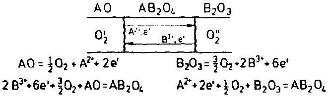
(c)

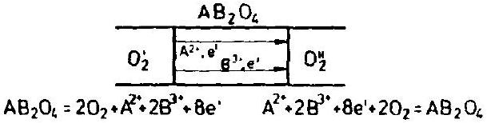
Figure 6-6. Fluxes and interface reactions for different boundary conditions during spinel formation

(d)
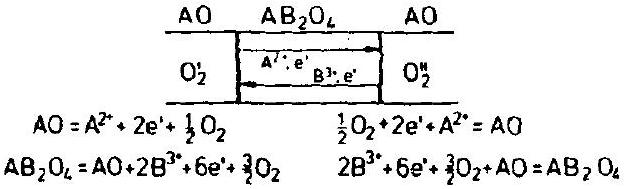
(e)

Figure 6-6. Fluxes and interface reactions for different boundary conditions during spinel formation

$\mathrm{AO}+\mathrm{B}_{2} \mathrm{O}_{3}=\mathrm{AB}_{2} \mathrm{O}_{4}$. a) Oxygen excluded from phase boundaries. b) Oxygen has access to both boundaries. c) Only oxygen (of different potential) is available at the boundaries. d) Oxygen (of different potential) and one reactant (AO) is available at the boundaries. e) AO (but no oxygen) is available at one boundary; both $\mathrm{B}_{2} \mathrm{O}_{3}$ and oxygen are available at the other boundary.
tion between the surrounding oxygen, $\mathrm{O}_{2}(\mathrm{~g})$, and the cations at the boundaries $\left(\xi^{b}\right)$. Here, spinel molecules can be added to the product by the reaction $2 \cdot \mathrm{O}_{2}(\mathrm{~g})+\mathrm{A}_{\mathrm{A}} +2 \cdot \mathrm{~B}_{\mathrm{B}}=\mathrm{AB}_{2} \mathrm{O}_{4}+\mathrm{V}_{\mathrm{A}}+2 \cdot \mathrm{~V}_{\mathrm{B}}$. Let us define $\dot{r}_{\mathrm{M}}\left(\xi^{b}, t\right)$ as the interface reaction rate due to oxygen uptake. Then we have (letting volume $V_{M}=V_{\mathrm{AB}_{2} \mathrm{O}_{4}}$ )

$$
\dot{\xi}^{b}=\dot{r}_{\mathrm{M}} \cdot V_{\mathrm{M}}
$$

The different boundary conditions given in Eqns. (6.23) thus have to be supplemented according to the magnitude of $\dot{r}_{\mathrm{M}}\left(\dot{r}_{\mathrm{M}}=0\right.$ or $\left.\neq 0\right)$ in order to evaluate the growth of the spinel. This has been done for the different coupling conditions of the ionic and electronic fluxes in the product according to Figure 6-6 [T. Pfeiffer, H. Schmalzried (1989); H. Schmalzried, T. Pfeiffer (1986)].

We begin the quantitative discussion on the kinetics of double salt formation as shown in Figure 6-6a by introducing the familiar flux equations for charged particles and neglect the cross terms. The evaluation will be done with the assumption of a semiconducting spinel product ( $t_{\mathrm{el}} \cong 1$ ). In this case, $\mathrm{d} \eta_{\mathrm{e}} \cong 0$ in the product, or $\mathrm{d} \mu_{\mathrm{e}} \cong F \cdot \mathrm{~d} \varphi$ and $\mathrm{d} \eta_{\mathrm{A}^{2+}}=\mathrm{d} \mu_{\mathrm{A}}$. Thus,

$$
j_{\mathrm{A}}=-c_{\mathrm{A}} \cdot b_{\mathrm{A}} \cdot \nabla \eta_{\mathrm{A}^{2+}}=-c_{\mathrm{A}} \cdot b_{\mathrm{A}} \cdot \nabla \mu_{\mathrm{A}}=-c_{\mathrm{A}} \cdot b_{\mathrm{A}} \cdot\left(\nabla \mu_{\mathrm{AO}}-\nabla \mu_{\mathrm{O}}\right)
$$

An analogous equation holds for $j_{\mathrm{B}^{3+}}$. The Gibbs-Duhem equation requires that $\nabla \mu_{\mathrm{BO}_{3 / 2}}=-1 / 2 \cdot \nabla \mu_{\mathrm{AO}}$ for compounds with a sufficiently narrow range of homogeneity.

In the classical cation counterdiffusion experiment, oxygen gas is excluded from the interfaces and $\dot{r}_{\mathrm{M}}=0$ (Fig. 6-6a). Thus the coupling condition is simply

$$
2 \cdot j_{\mathrm{A}^{2+}}+3 \cdot j_{\mathrm{B}^{3+}}=0
$$

From this condition, we can eliminate $\nabla \mu_{\mathrm{AO}}$ in Eqn. (6.25) and obtain for the flux of $\mathrm{A}^{2+}$ in the spinel product

$$
j_{\mathrm{A}^{2+}}=-\frac{D_{\mathrm{A}} \cdot D_{\mathrm{B}}}{2 \cdot D_{\mathrm{A}}+9 \cdot D_{\mathrm{B}}} \cdot \frac{12}{V_{m}} \cdot \nabla\left(\frac{\mu_{\mathrm{O}}}{R T}\right)
$$

Equating Eqns. (6.27) and (6.25), the oxygen potential gradient in the growing spinel can be calculated as

$$
\nabla \mu_{\mathrm{O}}=\frac{2-3 \beta}{2+9 \beta} \cdot \nabla \mu_{\mathrm{AO}} ; \quad \beta=\frac{D_{\mathrm{B}}}{D_{\mathrm{A}}}
$$

In contrast to the individual diffusivities, often the ratio $D_{\mathrm{B}} / D_{\mathrm{A}}$ is not very sensitive to changes of the chemical potentials. From Eqn. (6.28), we find that $\nabla \mu_{\mathrm{O}}=\nabla \mu_{\mathrm{AO}}$ if $\beta \rightarrow 0$, and $\nabla \mu_{\mathrm{O}}=-1 / 3 \cdot \nabla \mu_{\mathrm{AO}}$ if $\beta \gg 1$. We also infer that it is possible to achieve very high oxygen potentials (corresponding to pressures in the kbar range) at one boundary if one predetermines, for example, the standard pressure to be 1 bar at the other boundary. Furthermore, no oxygen potential gradient will build up in the product during reaction if $D_{\mathrm{B}} / D_{\mathrm{A}}=2 / 3$. From Eqn. (6.27), we see again that the slower of the two cation sorts determines the fluxes and thus the rate of spinel growth. In accordance with the reaction stoichiometry of Figure 6-6a, we calculate the (parabolic) growth rate as

$$
\Delta \dot{\xi} \cdot \Delta \xi=16 \cdot \frac{D_{\mathrm{A}} \cdot D_{\mathrm{B}}}{2 \cdot D_{\mathrm{A}}+9 \cdot D_{\mathrm{B}}} \cdot \frac{\Delta \mu_{\mathrm{AO}}}{R T}
$$

The bar over the diffusivity term indicates the product layer average. $\Delta \mu_{\mathrm{AO}}$ is equal to the standard value of the formation Gibbs energy of the spinel, $\Delta G_{\mathrm{AB}_{2} \mathrm{O}_{4}}^{0}$. One finds from Eqn. (6.29) that the (parabolic) reaction rate constant ( $\Delta \xi^{2}=2 \cdot k t$ ) is

$$
k=8 \cdot \frac{\overline{D_{\mathrm{A}} \cdot D_{\mathrm{B}}}}{2 \cdot \overline{D_{\mathrm{A}}+9 \cdot D_{\mathrm{B}}}} \cdot \frac{\Delta G_{\mathrm{AB}_{2} \mathrm{O}_{4}}^{0}}{R T}
$$

Equations (6.27) and (6.28) tell us that both the oxygen potential and the AO component potential vary linearly in the product layer as long as $D_{\mathrm{A}}$ and $D_{\mathrm{B}}$ are constant. All these conclusions are related to the scheme in Figure 6-5 and the boundary conditions as depicted in Figure 6-6a where phase boundaries are not exposed to ambient
oxygen. However, if oxygen has unhindered access to the phase boundaries as shown in Figure 6-6b, there is no coupling of the cation fluxes. The growth of the spinel layer is then given by simply adding the contributions of $j_{\mathrm{A}^{2+}}$ and $j_{\mathrm{B}^{3+}}$ to the compound formation, which results in

$$
\Delta \dot{\xi} \cdot \Delta \xi=\left(\bar{D}_{\mathrm{A}}+\frac{1}{2} \cdot \bar{D}_{\mathrm{B}}\right) \cdot \nabla\left(\frac{\mu_{\mathrm{AO}}}{R T}\right)-\left(\bar{D}_{\mathrm{A}}-\frac{3}{2} \cdot \bar{D}_{\mathrm{B}}\right) \cdot \nabla\left(\frac{\mu_{\mathrm{O}}}{R T}\right)
$$

The corresponding parabolic rate constant obtains

$$
k=\frac{1}{2} \cdot\left(\bar{D}_{\mathrm{A}}+\frac{1}{2} \cdot \bar{D}_{\mathrm{B}}\right) \cdot \frac{\Delta G_{\mathrm{AB}_{2} \mathrm{O}_{4}}^{0}}{R T}
$$

The availability of oxygen at the phase boundaries therefore determines decisively the value of the reaction rate constant. Since interfaces are often regions of high diffusivity, it may be difficult in practice to decide whether Eqn. (6.30) or Eqn. (6.32) applies.

If, in contrast, there is unhindered access of AO to both spinel interfaces ( $\mu_{\mathrm{AO}}^{\prime}= \mu_{\mathrm{AO}}^{\prime \prime}$ ) as illustrated in Figure 6-6d, the spinel sample shifts as a whole (provided that an oxygen potential gradient exists). The interface reactions which lead to this shift are indicated in Figure 6-6d. Such a shift is also found if neither AO nor $\mathrm{B}_{2} \mathrm{O}_{3}$ have access to the spinel, but the interfaces are exposed to different oxygen potentials (Fig. 6-6c). In this case, the spinel may even be decomposed (but not reduced!) if $\Delta \mu_{\mathrm{O}}$ exceeds a limiting value (decomposition potential). We observe that the shift of the spinel sample in an oxygen potential gradient occurs if the sample crystal is closed for one or two sorts of cations.

In these shift experiments, the coupling condition for the unidirectional flow of cations is $2 \cdot j_{\mathrm{A}^{2+}}=j_{\mathrm{B}^{3+}}$, which can be understood as the steady state condition for equal cation velocities in the reference frame of the anions: $j_{\mathrm{A}^{2+}} / c_{\mathrm{A}^{2+}}=j_{\mathrm{B}^{3+}} / c_{\mathrm{B}^{3+}}=v$. From this coupling condition, one obtains using Eqn. (6.25)

$$
\Delta \mu_{\mathrm{O}}=\alpha \cdot \Delta \mu_{\mathrm{AO}} ; \quad \alpha=\frac{2+\beta}{2-3 \beta} ; \quad \beta=\frac{D_{\mathrm{B}}}{D_{\mathrm{A}}}
$$

The shift velocity is therefore

$$
v=-D_{\mathrm{A}} \cdot \frac{1-\alpha}{\alpha} \cdot \frac{\Delta\left(\frac{\mu_{\mathrm{O}}}{R T}\right)}{\Delta \xi}
$$

We conclude that the spinel will decompose as soon as $\Delta \mu_{\mathrm{O}}$ exceeds the value $\alpha \cdot \Delta G_{\mathrm{AB}_{2} \mathrm{O}_{4}}^{0}$ because $\Delta G_{\mathrm{AB}_{2} \mathrm{O}_{4}}^{0}$ is the maximum value of the AO potential change ( $=\Delta \mu_{\mathrm{AO}}$ ) which the spinel $\mathrm{AO} \cdot \mathrm{B}_{2} \mathrm{O}_{3}$ can take without decomposing [W. Laqua, H. Schmalzried (1981)]. Kinetic decomposition of compounds in chemical potential gradients is treated in greater depth in Section 8.3.

For the last case as shown in Figure 6-6e, the boundary conditions are: one compound surface is accessible to both $\mathrm{B}_{2} \mathrm{O}_{3}$ and oxygen. The other interface is in ideal contact with AO and oxygen is excluded. Under these conditions, we have flux coupling according to Eqn. (6.26), which leads again to the oxygen potential gradient calculated in Eqn. (6.28). A very high oxygen activity is to be expected at the $\mathrm{AO} / \mathrm{AB}_{2} \mathrm{O}_{4}$ interface if $D_{\mathrm{A}} \gg D_{\mathrm{B}}$ and $\Delta G_{\mathrm{AB}_{2} \mathrm{O}_{4}}^{0} \gg R T$. Indeed, as Figure 6-7 shows, the corresponding oxygen pressure is able to lift the reaction layer from the binary oxide substrate and form bursting craters in the layer.

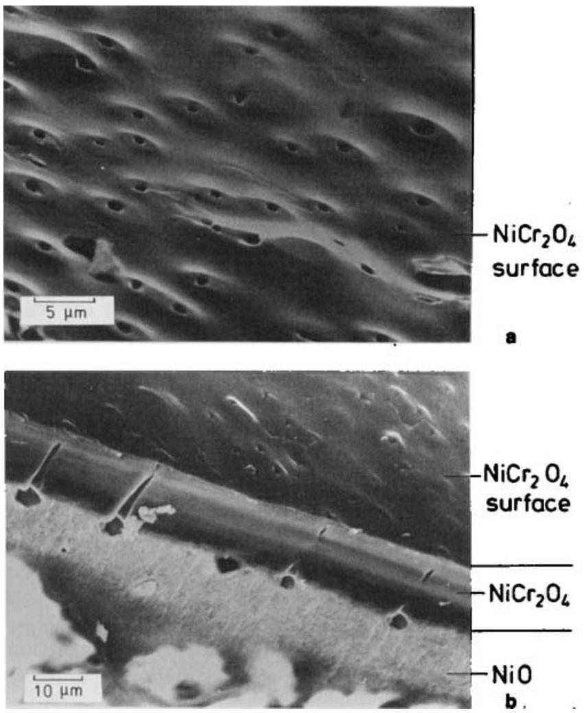
Figure 6-7. SEM-graph of reaction in Figure 6-6e. $\mathrm{AO}=\mathrm{NiO}, \mathrm{B}_{2} \mathrm{O}_{3}=\mathrm{Cr}_{2} \mathrm{O}_{3}, p_{\mathrm{O}_{2}}=0.21$ bar, $T=1400^{\circ} \mathrm{C}, t=3.5 \mathrm{~h}$. a) View on the $\mathrm{NiCr}_{2} \mathrm{O}_{4}$ product at the $\mathrm{Cr}_{2} \mathrm{O}_{3}$ boundary. b) Cross section $\mathrm{NiO} / \mathrm{NiCr}_{2} \mathrm{O}_{4}$ with pores.

The foregoing concerned the formal kinetics of various situations of double salt formation. The quantitative relations become more complicated if reactants and product exhibit a noticeable range of nonstoichiometry. If only the transport properties of the reaction product are of interest, it is advisable to start the reaction not with pure reactants but with reactants which are already saturated with the com-

Figure 6-8. The course of $N_{\mathrm{AO}}-\xi, \mu_{\mathrm{O}}-\xi$, and $N_{\mathrm{AO}}-\mu_{\mathrm{O}}$ during spinel formation. $N_{\mathrm{AO}}-\xi$ : --- Reaction of the first kind, starting with AO and $\mathrm{B}_{2} \mathrm{O}_{3}$.
Reaction of the second kind, starting with saturated oxide reactants.

ponents of the reaction product, as illustrated in Figure 6-8. When we start with pure reactants, transport occurs in the reaction product as well as in the reactants. The (parabolic) rate constants $k$ differ from those obtained with presaturated reactants. The latter are determined by the thermodynamic and kinetic parameters of the product only. This suggests making the distinction between parabolic rate constants of the first and the second kind $\left(k^{(1)}, k^{(2)}\right) . k^{(1)}$ denotes the rate constant for the reaction between pure reactants and is always smaller than $k^{(2)} . k^{(1)}$ and $k^{(2)}$ are equal if the solubilities in the reactants are negligible. Quantitative relationships between reaction rate constants of the first and second kind are available [T. Pfeiffer, H. Schmalzried (1989)].

Before concluding this section, we should briefly explain the averaging procedure which is implicit in the derivation of parabolic rate constants. In order to simplify without loss of generality, we assume that $D_{\mathrm{A}} \gg D_{\mathrm{B}}$. Integration of Eqn. (6.27) yields

$$
\Delta \dot{\xi}=\frac{4}{3} \cdot V_{m} \cdot j_{\mathrm{A}^{2+}}=\frac{1}{\Delta \xi} \cdot \frac{8}{R T} \cdot \int_{\Delta \xi} D_{\mathrm{B}} \cdot \mathrm{~d} \mu_{\mathrm{AO}}
$$

The factor $4 / 3$ appears since the transport of 6 equivalents leads to the formation of $4 \mathrm{AB}_{2} \mathrm{O}_{4}$ (see Fig. 6-5). In generalizing Eqn. (6.35), we can calculate the parabolic rate constant as

$$
k=\frac{\gamma_{i}}{R T} \cdot \int_{\Delta \mu_{\mathrm{AO}}} z_{i} \cdot c_{i} \cdot V \cdot D_{i} \cdot \mathrm{~d} \mu_{\mathrm{AO}} \cong \frac{\gamma_{i} \cdot z_{i} \cdot c_{i} \cdot V}{R T} \cdot \int_{\Delta \mu_{\mathrm{AO}}} D_{i} \cdot \mathrm{~d} \mu_{\mathrm{AO}}
$$

where $y_{i}$ is a numerical factor on the order of one. $z_{i}$ and $c_{i}$ are the electrical charge and molar concentration of the rate determining cation respectively. $V$ is the volume increase resulting from the passage of one equivalent of cations through the reaction product. We evaluate the integral in Eqn. (6.36) using point defect thermodynamics. In accordance with Section 2.3, the fraction of point defects in $\mathrm{AB}_{2} \mathrm{O}_{4}$ as a function of $\mu_{\mathrm{AO}}$ can always be written as ( $N_{p}^{0}=N_{p}\left(a_{\mathrm{AO}}=1\right)$ )

$$
N_{p}=N_{p}^{0} \cdot a_{\mathrm{AO}}^{n}=N_{p}^{0} \cdot \mathrm{e}^{\frac{n \cdot\left(\mu_{\mathrm{AO}}-\mu_{\mathrm{AO}}^{0}\right)}{R T}}
$$

if the disorder type does not change in the $\Delta \mu_{\mathrm{AO}}$ range of the product. $n$ is a number which is indicative of the disorder type. Since diffusion coefficients depend equally on point defect concentrations, we can thus evaluate the integral in Eqn. (6.36) and obtain

$$
k=\frac{\gamma_{i} \cdot z_{i} \cdot c_{i} \cdot V}{R T} \cdot\left(1-\mathrm{e}^{\frac{n \cdot \Delta G_{\mathrm{AB}_{2} \mathrm{O}_{4}}}{R T}}\right) \cdot D_{i}^{0}
$$

where $D_{i}^{0}$ is the diffusivity of the rate determining species in the reaction product if its AO activity = 1 .

Finally, let us comment briefly on the formation of binary metal compounds $\left(\mathrm{A}_{m} \mathrm{~B}_{n}\right)$. The main difference to the double salts is the decoupling of the fluxes of A and B in the $\mathrm{A} / \mathrm{A}_{m} \mathrm{~B}_{n} / \mathrm{B}$ reaction couple. The (parabolic) reaction rate constant $k$ (if local thermodynamic equilibrium prevails throughout the couple) conforms to Eqn. (6.32) if we disregard stoichiometric factors. The pertinent rate constant is then

$$
k=\left(\frac{\bar{D}_{\mathrm{A}}}{m}+\frac{\bar{D}_{\mathrm{B}}}{n}\right) \cdot \frac{\Delta G_{\mathrm{A}_{m} \mathrm{~B}_{n}}^{0}}{R T}
$$

Further details concerning compound formation can be found in [H. Schmalzried (1981)].

### 6.3.2 Formation of Multiphase Products

We deal in this section with quasi-binary systems in which more than one product phase $\mathrm{A}_{m} \mathrm{~B}_{n}$ forms between the reactants $\mathrm{A}(=\mathrm{AX})$ and $\mathrm{B}(=\mathrm{BX})$ (Fig. 6-9). The more interfaces separating the different product phases, the more likely it is that deviations from local equilibrium occur (the interfaces become 'polarized' during transport as indicated in Fig. 6-9, curve b). Polarization of interfaces is the theme of Chapter 10. If, however, we assume that local equilibrium is established during reaction, the driving force of each individual phase ( $p$ ) in the product is inversely

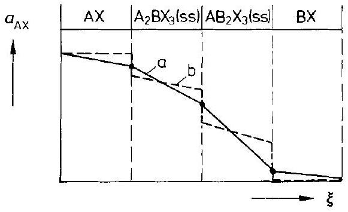
Figure 6-9. Activity vs. location for a quasibinary system $\mathrm{AX}-\mathrm{BX}$ during reaction.
a) Local equilibrium is established. b) At interfaces local equilibrium is not established.

proportional to $\Delta \xi_{p}$. Thus, each individual phase ( $p$ ) in the reaction layer grows parabolically

$$
\Delta \xi_{p}=\sqrt{2 \cdot k_{p} \cdot t}
$$

Adding the different $\Delta \xi_{p}$ 's together, one obtains the total thickness

$$
\Delta \xi=\sum_{p} \Delta \xi_{p}=\sum_{p}\left(2 k_{p}\right)^{1 / 2} \cdot \sqrt{t} ; \quad k^{1 / 2}=\sum_{p} k_{p}^{1 / 2}
$$

Equation (6.41) states that the parabolic growth law also applies to the total thickness, and the relative thickness $\Delta \xi_{p} / \sum \Delta \xi_{p}$ of compound $p$ is independent of time.

With these relations, we can perform quantitative calculations of the reaction kinetics. We start with Eqns. (6.35) and (6.36), which now contain $V_{p}(=$ volume increase if one mole - or one equivalent - of species $i$ is transported across the reaction layer $p$ ). In contrast to the growth of a single phase layer, however, transport occurs now in the two adjacent phases ( $p-1$ ) and ( $p+1$ ). This additional transport moves the interfaces $(p-1) / p$ and $p /(p+1)$ in addition to their shift due to the transport in $p$ itself. Therefore, the kinetic differential equation for the growth of phase $p$ has the following form

$$
\Delta \dot{\xi}_{p}=\frac{\tilde{k}_{p-1} \cdot V_{p-1 / p}}{\Delta \xi_{p-1}}+\frac{\tilde{k}_{p} \cdot V_{p}}{\Delta \xi_{p}}+\frac{\tilde{k}_{p+1} \cdot V_{p / p+1}}{\Delta \xi_{p+1}}
$$

where $\tilde{k}(=k / V)$ is the so-called rational reaction rate constant and refers to a flux, whereas $k$ refers to a thickness increase. For each phase $p$, there exists an equation of the form in Eqn. (6.42). Depending on the atomic transport mechanisms in the phases $p-1, p$, and $p+1$, the corresponding 'reaction volumes' $V_{p-1 / p}$ and $V_{p / p+1}$ can be either positive or negative. Since the differential equations for the growth of phases $p$ are coupled, the growth rate of each individual phase depends on the diffusivities and thermodynamic parameters of all the other phases which form simultaneously. If, however, certain interfaces dissipate Gibbs energy and local interface equilibrium is not established, the phases which exist in equilibrium may not all form. This is sometimes observed in the early stages of a reaction. Also, nucleation barriers can inhibit the formation of some phases $p$ in a multiphase reaction layer.

In this context, it is again advisable to distinguish between rate constants of the first and second kind. $k_{p}$, as introduced in Eqn. (6.41), obviously is the rate constant $k_{p}^{(1)}$ of the first kind. It describes the growth of phase $p$ when all the other phases form simultaneously. The rate constant $k_{p}^{(2)}$ of the second kind describes the growth of phase $p$ from phases ( $p-1$ ) and ( $p+1$ ) only.

Explicit expressions for the ratio $\left(\tilde{k}_{p}^{(2)} / \tilde{k}_{p}^{(1)}\right)$ of a multiphase reaction product layer have been presented in the literature, see, for example, [H. Schmalzried (1981)]. If $\tilde{k}_{p}^{(2)}$ of the second kind, which depends only on the properties of phase $p$, is calculated or measured for every phase $p$ individually, it is possible to derive (from all $N_{i, p}, \Delta \xi_{p}$, and the molar volumes $V_{p}$ ) the rational rate constant $\tilde{k}_{p}^{(1)}$ of the first kind, and thus eventually $k$ in Eqn. (6.41).

### 6.4 Displacement Reactions

Displacement reactions are heterogeneous solid state reactions of the type $\mathrm{A}+\mathrm{B}= \mathrm{C}+\mathrm{D}$. Whereas in previous sections, all reactions could be reduced to the general scheme $\mathrm{A}+\mathrm{B}=\mathrm{C}$, despite the distinction between reactions of the first and second kind, in this section the different phases (reactants and reaction products) are no longer located on a binary section of the $\mathrm{A}-\mathrm{B}-\mathrm{C}(-\mathrm{D})$ phase diagram. Displacement reactions occur in ternary and higher systems. The simultaneous formation of two (C and D) or even more phases raises questions concerning the reaction morphology. Thus, in which way are the products arranged with respect to the (initially contacting) reactants and how does their morphology evolve? Figure 6-10 shows two possible product arrangements. The simplest examples of this type of reaction are metal displacement (or so-called thermite) reactions in which at least three components are involved: $\mathrm{A}+\mathrm{BO}=\mathrm{B}+\mathrm{AO}$.

Figure 6-10. Phase arrangements for displacement reactions $\mathrm{A}+\mathrm{B}=\mathrm{C}+\mathrm{D}(\mathrm{AX}+\mathrm{BY}=\mathrm{BX}+\mathrm{AY}$; $\mathrm{AO}+\mathrm{B}=\mathrm{BO}+\mathrm{A})$.

As depicted in Figure 6-10, two limiting types of displacement reactions can be visualized. The corresponding mechanisms, as proposed by Jost and Wagner [W. Jost (1937); C. Wagner (1938)], can be treated semiquantitatively if a few assumptions are made. Jost suggested that the product layers C and D will be arranged sequentially between the reactants. Wagner questioned the morphological stability of such a sequence. He proposed that the product phases arrange themselves perpendicular to the initial boundary of the reactants as seen in Figure 6-10b. In Chapter 11, we will analyze the modes of phase distributions in displacement reactions. Here, we just mention without proof that if an interface moves against the flux of the rate determining component, it is morphologically unstable. Therefore, the Wagner mechanism rather than the Jost mechanism should normally predominate. This expectation is supported by experimental results obtained for two rather similar reactions: 1) $\mathrm{Co}+\mathrm{Cu}_{2} \mathrm{O}=2 \mathrm{Cu}+\mathrm{CoO}$ and 2) $\mathrm{Fe}+\mathrm{Cu}_{2} \mathrm{O}=$ " FeO " +2 Cu (" FeO " indicates the extended nonstoichiometry of the oxide). In the first case, which is illustrated in Figure 6-11a, the Jost mechanism is observed. The reason is that in the metallic product Cu , the transport coefficient of (dissolved) oxygen is appreciably

Figure 6-11. Detailed mechanism of displacement reaction.

a) $\mathrm{Cu}_{2} \mathrm{O}+\mathrm{Co}=\mathrm{CoO}+2 \mathrm{Cu}$.
b) $\mathrm{Cu}_{2} \mathrm{O}+\mathrm{Fe}=\mathrm{FeO}+2 \mathrm{Cu}$. The boundary perturbation at $t>0$ decays for case a) and increases for case b).
a) $\mathrm{CoO}=$ rate determining product.
b) $\mathrm{Cu}=$ rate determining product.
larger than the transport coefficient of the $\mathrm{Co}^{2+}$ cations in the non-metallic product CoO . These cations are therefore rate determining and so the $\mathrm{CoO} / \mathrm{Cu}$ interface moves with and not against the rate determining cation flux in the product phase CoO . We come to the same conclusion by recognizing that the $\mathrm{CoO} / \mathrm{Cu}$ interface is essentially an oxygen isoactivity surface. It has (almost) the same oxygen potential as the $\mathrm{Cu} / \mathrm{Cu}_{2} \mathrm{O}$ interface because of the high oxygen diffusivity in Cu . Thus, in complete analogy to the oxidation of Co metal, CoO forms on cobalt with two planar and stable interfaces. The growth kinetics are parabolic, that is, the product thickness increases as $\Delta \xi=\sqrt{2 k \cdot t}$, as will be derived in Chapter 7. The affinity ( $-\Delta G$ ) of the reaction corresponds to the oxygen potential difference between the $\mathrm{Co} / \mathrm{CoO}$ and $\mathrm{CoO} / \mathrm{Cu}$ (or $\mathrm{Cu} / \mathrm{Cu}_{2} \mathrm{O}$ ) phase boundaries, and thus $\Delta G\left(=\Delta \mu_{\mathrm{O}}\right)= \Delta G_{\mathrm{Cu}_{2} \mathrm{O}}^{0}-\Delta G_{\mathrm{CoO}}^{0}$.

For the second displacement reaction $\mathrm{Fe}+\mathrm{Cu}_{2} \mathrm{O}=$ " FeO " +Cu as depicted in Figure 6-11b, the Wagner mechanism has been observed [G. J. Yurek et al. (1973)]. The " FeO "/ Cu interface is morphologically unstable because the oxygen flux in Cu , which is again directed against the moving " FeO "/ Cu interface, is now slower than the Fe ( $\mathrm{Fe}^{2+}+2 \mathrm{~h}^{*}$ ) migration in " FeO ". The morphology shown in Figure 6-11b ensures that the less noble iron ions find the oxygen supply in the fastest possible way. The reaction rate is determined by diffusion of the Fe ions along the " FeO " slab under the action of the driving force $\left|\Delta \mu_{\mathrm{Fe}}\right| \cong \Delta \mu_{\mathrm{O}}$, where $\Delta \mu_{\mathrm{O}}$ is given by $\Delta G=\Delta G_{\mathrm{Cu}_{2} \mathrm{O}}^{0}-\Delta G_{\mathrm{FeO}}^{0}$. The fundamental problem, however, which is the theoretical description for the evolving interface geometry taking place during the displacement reactions with unstable boundaries, has not yet been solved for such practical situations as Wagner type displacement reactions.

Displacement reactions are quite common in solid state chemistry. The classical reactions of this type were already investigated many years ago by Tammann as powder reactions (e.g., $\mathrm{PbS}+\mathrm{CdO}=\mathrm{PbO}+\mathrm{CdS}$ or $\mathrm{ZnS}+\mathrm{CdO}=\mathrm{ZnO}+\mathrm{CdS}[\mathrm{G}$. Tammann (1925)]). Systematic kinetic studies in this field of research are scarce because the complex morphology adds to all the other complications of solid state
reactions and makes the quantitative interpretation of displacement reactions most difficult.

### 6.5 Powder Reactions

### 6.5.1 General

Fundamental kinetic studies of solid state reactions should be performed with single crystals. Transport processes in the solid state, however, are sluggish and time consuming. Technology is most interested in speeding up heterogeneous solid state reactions by using small crystallites (i.e., powders) with larger surface areas to enhance contact between reactants. The complexity of the kinetic problem, and in particular with respect to the boundary conditions, increases considerably for powder reactions. Some of the parameters which influence powder reaction kinetics are average grain size, grain size distribution, grain shape, contact area between grains, kind and geometry of interfaces forming at the contact (as a function of time), pores between grains, vapor pressure and rate of vaporization, diffusion coefficients of surfaces and interfaces, and impurity segregation at surfaces and interfaces. Since the ratio of the reacting surface area to the volume is large, the heat of reaction often cannot be neglected. Heat conductivity and the boundary conditions of heat transport ought to be considered in addition to matter transport in order to properly account for the temperature dependent transport parameters of small grains. In the early stages of heterogeneous reactions, interface control may predominate and so is of special importance for powder reactions.

In spite of the complexity of these boundary conditions which impede a general and strictly quantitative treatment, it is nevertheless useful to work out some approximations which can help to estimate reaction rates of practically relevant powder reactions. Two frequently applied relations will be quoted. Both assume that isothermal conditions prevail. The first equation is named the Jander equation [W. Jander (1927)]. It is based on the idea of having equal sized spheres of reactant A embedded in a quasi-homogeneous (powder) medium of reactant B . In practice, this means that the grain size of $\mathbf{A}$ is much larger than the grain size of $\mathbf{B}$ and/or that the diffusivity of B on the surface of A is large compared to the bulk diffusivity in the product. A shell of the product grows on reactant A, for which Jander assumed a parabolic growth rate. The Jander equation reads

$$
\left(1-(1-\alpha)^{1 / 3}\right)^{2} \cdot r_{\mathrm{A}}^{2}=2 \cdot k \cdot t
$$

where $r_{\mathrm{A}}$ is the initial radius of the A particles, $\alpha$ is the relative amount of A transformed into the product, and $k$ denotes the parabolic reaction rate constant. In the derivation of Eqn. (6.43), two assumptions are questionable: 1) the parabolic growth of the product shell thickness $\Delta \xi$ can only hold if $\Delta \xi / r_{\mathrm{A}} \ll 1$ and 2 ) the ratio of the
molar volumes $V_{\mathrm{P}} / V_{\mathrm{A}}$ of product and reactant differs from unity and should be taken into account in deriving Eqn. (6.43). An equation which considers these objections has been worked out [R.E. Carter (1961)] and reads

$$
\left[(1+(z-1) \cdot \alpha)^{2 / 3}+(z-1)(1-\alpha)^{2 / 3}-z\right] \cdot r_{\mathrm{A}}^{2}=2 \cdot(1-z) \cdot k \cdot t
$$

where $z=V_{\mathrm{P}} / V_{\mathrm{A}}$. If the above mentioned conditions are fulfilled, experiments show that the Carter equation adequately describes the kinetics of powder reactions, even if the $\alpha$ values come close to one.

In the literature, one can find other empirical or semi-empirical equations representing the kinetics of powder reactions. One can certainly take into account grain size distribution, contact probability, deviations from the spherical shape, etc. in a better way than Carter has done. Even more important are parameters such as evaporation rate, gas transport, surface diffusion, and interface transport in this context. As long as these parameters are neglected in quantitative work, the kinetic equations are inadequate. Nevertheless, considering its technological relevance, a particular type of powder reaction will be discussed in the next section.

### 6.5.2 Self-Propagating Exothermic Powder Reactions

Self-propagating powder reactions can be used to synthesize high-temperature materials by combustion. Powder mixtures of components which react highly exothermically (e.g., $\mathrm{Ti}+\mathrm{C}$ ) are able to sustain a high temperature combustion front that propagates rapidly (with velocities as high as $25 \mathrm{~cm} \mathrm{~s}^{-1}$ ) through the compacted powder mixture. Behind the front, one finds the solid reaction product (e.g., TiC). The reaction starts by sufficient heating of one end of the sample, and after ignition it will proceed on its own. Estimated temperatures at the reaction front may be as high as 5000 K . In order to obtain the steady state temperature, one calculates the heating of the product due to the available reaction enthalpy $\Delta H$. Under the assumption of an adiabatic process, one has

$$
\Delta H=\int_{T_{0}}^{T_{\mathrm{ad}}} c_{\mathrm{p}}(T) \cdot \mathrm{d} T
$$

where $T_{0}$ is the ignition temperature and $c_{\mathrm{p}}$ the heat capacity of the product. Equation (6.45) yields $T_{\mathrm{ad}}=f\left(\Delta H, c_{\mathrm{p}}, T_{0}\right)$, which means that $T_{\mathrm{ad}}$ depends not only on the ignition temperature $T_{0}$ but also the validity of the assumed adiabatic condition. The situation is depicted schematically in Figure 6-12 where, in addition to temperature, two more phenomenological parameters have been plotted. These parameters are $\alpha$, the relative degree of reaction $(0, \ldots, 1)$ and $\phi$, the rate of heat evolution. These characterize the combustion reaction as a function of the space coordinate $\xi$.

The calculation of the rate of propagation of the reaction front is possible by solving a set of coupled differential equations which describe 1) the rate $\alpha$ of the chemical reaction ( $\mathrm{A}+\mathrm{B}=\mathrm{C}$; strongly dependent on temperature), 2) the heat pro-

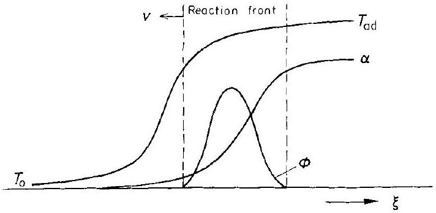
Figure 6-12. Adiabatic temperature $\left(T_{\mathrm{ad}}\right)$, degree of reaction ( $\alpha$ ) and rate of heat evolution ( $\phi$ ) as a function of $\xi$ during a self-heating combustion reaction (schematic).

duction at the reaction front, and 3) the heat loss into the sample (powder compact) and to the surroundings (by radiation and conduction). This is a complex engineering task. In essence, solid state reaction kinetics concern the heterogeneous reaction rate $\alpha$, which causes the heat production. The heat balance gives

$$
\dot{T}=\varkappa \cdot \nabla^{2} T+\gamma \cdot \frac{\Delta H(T)}{c_{\mathrm{p}}(T)} \cdot \dot{\alpha}
$$

where $\varkappa$ is the heat transfer parameter, $y$ is a geometrical parameter that includes grain size, grain shape, and the powder compact packing density. The first term on the right hand side of Eqn. (6.46) describes the divergence of the heat flux. The second term accounts for the heat production by chemical reaction. The main difficulty lies in the appropriate description and modeling of this second term. Obviously, $\dot{\alpha}(\xi, t)$ itself is a function of the form and size of the reactant grains. For example, we may assume the particles A to be spherical ( $r_{\mathrm{A}} \gg r_{\mathrm{B}}$ ) and analyze the rate $\alpha$ using the Carter equation (6.44). However, we have also to consider the (approximately) exponential temperature dependence of the parabolic rate constant $k$ (or of the diffusion coefficient in the reaction product layer). Explicit expressions have been derived under simplifying assumptions, see, for example, [Z. Munir, U. Anselmi-Tamburini (1989)].

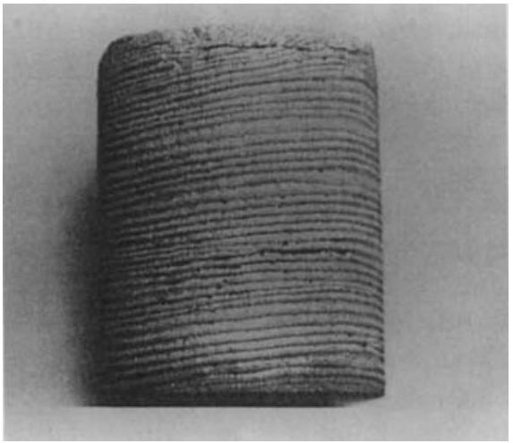
Figure 6-13. Surface of a combusted Ni-Si rod which shows a spiraling combustion mode [courtesy of Z. Munir, Davis (Cal.)].

We will not pursue this theme further since combustion reactions give little insight into the basic kinetics of solid state reactions. These types of reaction do, however, offer interesting possibilities for new ways of synthesizing materials. In view of the set of coupled differential equations, one may expect periodic, pulsating, or even spiraling combustion modes to occur. The evidence for spin combustion can be seen in Figure 6-13 where the view is on the surface of a ( $\mathrm{Ni}, \mathrm{Si}$ ) sample after reacting $\mathrm{Ni}+\mathrm{Si}$ in compacted powder.

### 6.6 Interface Rate Control

Chapter 10 is devoted to the kinetics of interfaces. Nevertheless it may be appropriate in the context of heterogeneous reactions to outline the influence of the phase boundaries on the kinetics of heterogeneous reactions. This will be done in this section, whereas the detailed discussion of the interface kinetics proper is postponed until Chapter 10.

In Section 6.3.1, we derived the parabolic rate law of product growth with the assumption of local equilibrium throughout, including the phase boundaries. If a part of the Gibbs energy change in a solid state reaction is dissipated at the phase boundaries, the reaction kinetics is partly interface controlled. Growth rates of products then deviate from the parabolic rate law. Let us reformulate the kinetic equations for a multiphase, non-equilibrium system with linear geometry and planar interfaces as depicted in Figure 6-14. From the conservation of each species $k$, we have at the $\alpha-1 / \alpha$ interface

Figure 6-14. Course of component $k$ chemical potential during a heterogeneous multiphase reaction which is partly interface controlled.

$$
\dot{\xi}_{\alpha-1 / \alpha}=\left(\frac{\Delta j_{k}}{\Delta c_{k}}\right)_{\alpha-1 / \alpha}
$$

$\dot{\xi}$ designates the boundary velocity, $\Delta$ indicates the change across the boundary. Adding $\dot{\xi}_{\alpha-1 / \alpha}$ and the corresponding $\dot{\xi}_{\alpha / \alpha+1}$, we obtain the increase in thickness of the $\alpha$ layer

$$
\Delta \dot{\xi}^{(\alpha)}=\frac{j_{k}^{(\alpha)}-j_{k}^{(\alpha-1)}}{\Delta c_{k^{(\alpha-1 / \alpha)}}}+\frac{j_{k}^{(\alpha+1)}-j_{k}^{(\alpha)}}{\Delta c_{k^{(\alpha / \alpha+1)}}}=\sum \beta_{k}^{(\nu)} \cdot j_{k}^{(\nu)}
$$

with $v=\alpha-1, \alpha$, and $\alpha+1$. Equation (6.48) is equivalent to Eqn. (6.42). In order to be more explicit, let us introduce the fluxes in the form $j_{k}^{(v)}=-l_{k}^{(v)} \cdot\left(\Delta \mu_{k}^{(v)} / \Delta \xi^{(v)}\right)$. However, in contrast to Eqn. (6.42), where local equilibrium was assumed to prevail at the boundaries, $\Delta \mu_{k}^{(\nu)}$ is now different from the value $\Delta \mu_{k}^{0(\nu)}$ which could be calculated from the thermodynamics of the quasi-binary equilibrium system. The potential change $\Delta \mu_{k}^{(\nu)}$ can be obtained only if we know the potential change across the phase boundaries during reaction. To this end, let us formulate phenomenological relations which, for example, state that the potential drop $\delta \mu_{k}^{\mathrm{b}}$ across the phase boundary (b) is proportional to the flux $j_{k}^{\mathrm{b}}$ crossing this boundary. Other assumptions are also possible (e.g., $\delta \mu_{k}^{(b)}$ is proportional to the boundary velocity $\dot{\xi}^{\text {b }}$ ). Those assumptions are first order approximations and indicate that the interface conductance is independent of the flux density. Explicitly, we can read from Figure 6-14 that

$$
j_{k}^{(\alpha)}=-l_{k}^{(\alpha)} \cdot \frac{\Delta \mu_{k}^{(\alpha)}}{\Delta \xi^{(\alpha)}}
$$

with

$$
\Delta \mu_{k}^{(\alpha)}=\Delta \mu_{k}^{0(\alpha)}-\left(\delta \mu_{k(\alpha-1 / \alpha)}^{(\alpha)}+\delta \mu_{k(\alpha / \alpha+1)}^{(\alpha)}\right)
$$

and

$$
j_{k(\alpha-1 / \alpha)}=\lambda_{k(\alpha-1 / \alpha)} \cdot\left(\delta \mu_{k(\alpha-1 / \alpha)}^{(\alpha-1)}+\delta \mu_{k(\alpha-1 / \alpha)}^{(\alpha)}\right)
$$

where $\lambda_{k}$ are the interface conductances. Equations (6.48), (6.49) and (6.51) constitute a set of coupled (differential) equations which have to be integrated simultaneously for all phases and phase boundaries in order to calculate $\Delta \xi^{(v)}(t)$. This must be done numerically. We will not pursue this problem further, but point out that $\delta \mu_{k}^{(\alpha)}(\max )=\Delta \mu_{k}^{0(\alpha)}$, which follows from the above equations. Therefore, the maximum driving force across interface $\alpha-1 / \alpha$ is $\left(\Delta \mu_{k}^{0(\alpha-1)}+\Delta \mu_{k}^{0(\alpha)}\right)$, and if it is attained, the reaction is fully interface controlled and a linear rate law holds in accordance with Eqn. (6.51).

Some experimental verifications of linear growth in time can be found. In Chapter 10, we will discuss the formation of $\mathrm{ZnAl}_{2} \mathrm{O}_{4}$ from binary oxides according to a linear rate law. The same rate law has been found for the initial growth of $\mathrm{CoAl}_{2} \mathrm{O}_{4}$, and here it was observed that the rate depended on the orientation of the single crystalline $\mathrm{Al}_{2} \mathrm{O}_{3}$ substrate. A similar observation has been reported [D. Hesse, et al. (1993)] for the growth of $\mathrm{Ni}_{2} \mathrm{Si}$ on a Si substrate. $\mathrm{Ni}_{2} \mathrm{Si}$ grew on the same substrate with two different orientations and growth rates. It was suggested that the rate deter-
mining process is the thermally activated nucleation of ledges in the boundary and that the nucleation barrier differs for different orientations of the nuclei.

### 6.7 Thermal Decomposition of Solids

Thermal decomposition reactions constitute an extended class of solid state reactions. The dehydration of $\mathrm{Mg}(\mathrm{OH})_{2}$ according to $\mathrm{Mg}(\mathrm{OH})_{2}=\mathrm{MgO}+\mathrm{H}_{2} \mathrm{O}$ is an example of such a reaction. Other examples include the decomposition of carbonates, azides, and perchlorates. In general terms, we have $\mathrm{A}(\mathrm{s})=\mathrm{B}(\mathrm{s})+\mathrm{X}(\mathrm{g})$, which seems to be the inverse of a tarnishing reaction. However, the mechanism of tarnishing reactions is the atomic transport across a product layer driven by the chemical potential gradient, whereas the decomposition of $\mathrm{A}(\mathrm{s})$ is a surface reaction. Normally, the product $\mathrm{B}(\mathrm{s})$ is porous and $\mathrm{X}(\mathrm{g})$ escapes through the pores into the surrounding gas phase. Sometimes, the $\mathbf{B}$ atoms on the surface of the reactant $\mathbf{A}$ are mobile enough to form a dense layer. In this case, the decomposition can continue only if X is soluble and can diffuse across the B layer.

Decomposition reactions are solid-gas reactions which do not involve diffusional transport through the solid. Their reaction rates are determined by surface kinetics and possibly pore diffusion. The assumption of local equilibrium is not valid. The course of an isothermal decomposition is schematically illustrated in Figure 15-15. There is often an induction period followed by a rapid increase in relative yield until, after the inflection point, the reaction eventually ceases (the yield will not always be $100 \%$ ). Since atomic transport in crystals is normally not involved in these decomposition reactions, we shall restrict ourselves to a few comments only.

There is no generally accepted theory for these reactions. Empirically, one learns that B is often formed extremely fine-grained with an energy which is higher than the standard value, once again indicating the deviations from local equilibrium and the preponderance of surface effects. Morphological instability (see Chapter 11) is the rule rather than the exception, and the key question therefore concerns the morphological evolution of the A/B interface. This morphological evolution of a phase boundary under local equilibrium conditions will be treated extensively in Chapter 11, but this treatment is hardly applicable to decomposition reactions. Rather, the formation and multiplication of non-equilibrium defects such as dislocations and microcracks (see Chapter 14) under the action of reaction volume changes and coherency stresses play a decisive role. These defects can move from the surface into the interior of the decomposing crystal A and are the potential centers of further decomposition. The corresponding kinetic models make assumptions on nucleation rates and growth rates which are quite analogous to the Johnson-Mehl-Avrami model discussed in Section 6.2.3. Preferred directions of dislocation and crack propagation result in pronounced anisotropies of decomposition.

A major drawback in decomposition studies is the lack of in-situ observations on an atomic or submicroscopic scale. The available body of data concerns the relative
advancement of the reaction as a function of time. Attempts have been made to explain the initial incubation period (see Fig. 15-15). A common hypothesis is that the growth rate of the $\mathbf{B}$ nuclei depends on their size: the larger the grown particles, the larger is the rate of the boundary reaction. This assumption is in line with the increasing distortions in the matrix crystal caused by the growing B nuclei. The autocatalytic part of the decomposition curve can be understood as long as the decomposing regions do not overlap and the sample is sufficiently large. The growth of B occurs in the form of branches with a constant splitting rate. The origin of this branching model is of course the above mentioned formation and multiplication of dislocations, cracks, etc. and resulting in a tree-like product.

It is a characteristic feature of reactions which occur out of local equilibrium that their course be markedly affected by the preparation and handling of the sample as well as by the surrounding gas atmosphere. For example, the morphology of MgO produced by the decomposition of magnesite definitely depends on the deviation of the $\mathrm{CO}_{2}$ partial pressure from its equilibrium value. The greater this deviation, the finer-grained is the reaction product, probably due to an increased rate of nucleation. However, the complexity of these solid state decomposition processes becomes apparent if we also consider the simultaneous recrystallization and sintering of the extremely fine-grained reaction product.

Finally, we observe that the eventual decrease in the decomposition rate is related to the exhaustion of the reactant. An inhibition of the decomposition process which is sometimes found before the yield has reached $100 \%$ may be ascribed to strain and surface energy which is stored in the reactant and the product. If the increase in these energies as a function of the advancement of the reaction surpasses the available driving force (e.g., the $\mathrm{X}(\mathrm{g})$ pressure deviation from the equilibrium pressure), the reaction comes to a stop. A pertinent discussion of decomposition reactions is given in [F. C. Tompkins (1976)].

## References

Avrami, M. (1939) J. Chem. Phys., 7, 1103
Carter, R.E. (1961) J. Chem. Phys., 34, 2010; 35, 1137
Greenwood, G. W. (1956) Acta Met., 4, 243
Hesse, D., et al. (1993) Appl. Phys., A57, 415
Jander, W. (1927) Z. anorg. allg. Chemie., 163, 1
Johnson, W. A., Mehl, R.F. (1939) Trans. AIME, 135, 416
Jost, W. (1937) Diffusion und chemische Reaktion in festen Stoffen, Steinkopff, Dresden
Laqua, W., Schmalzried, H. (1981) Chemical Metallurgy - A Tribute to Carl Wagner (Ed.: N. A. Gokcen), Met. Soc. AIME, Warrendale, PA
Lifshitz, I. M., Slyozov, V. V. (1961) J. Phys. Chem. Solids, 19, 35
Lifshitz, I.M. (1962) Sov. Phys. JETP, 15, 939
Munir, Z., Anselmi-Tamburini, U. (1989) Mat. Sci. Rep., 3, 277
Pfeiffer, T., Schmalzried, H. (1989) Z. phys. Chem., NF 161, 1

Raghavan, V., Cohen, M. (1975) Treatise on Solid State Chemistry, Vol. 5 (Ed.: N. B. Hannay), Plenum Press, New York
Russel, K. C. (1970) in Phase Transformations, ASM Metals Park, Ohio, p. 219
Schmalzried, H. (1981) Solid State Reactions, Verlag Chemie, Weinheim
Schmalzried, H., Pfeiffer, T. (1986) Z. phys. Chem., NF 148, 21
Tammann, G. (1925) Z. anorg. allg. Chem. 149, 21
Tompkins, F. C. (1976) Decomposition Reactions; Treatise on Solid State Chemistry IV (Ed.: N.B. Hannay), Plenum Press, New York
Wagner, C. (1938) Z. anorg. allg. Chem., 236, 320
Wagner, C. (1961) Z. Elektrochem. 65, 581
Wagner, R., Kampmann, R. (1991) Mat. Science and Technology, 5, 213, VCH-Verlag, Weinheim
Xiao, S. Q., Haasen, P. (1989) Scripta Met. 23, 365
Yurek, G. J., et al. (1973) Met. Trans. 4, 1293

## 7 Oxidation of Metals

### 7.1 Introduction

The subject of this chapter is the reaction $\mathrm{Me}(\mathrm{s})+v \cdot \mathrm{X}=\operatorname{MeX}_{v}(\mathrm{~s})$, where the oxidant X (e.g., halogen, chalcogen) can occur in solid, liquid, or gaseous form. The pertinent point is the reactive growth of a solid product on the metal surface and the reactants Me and X are separated by this product. This was already discussed in Chapter 6 under classical heterogeneous solid state reactions. Transport of the components across the growing product and across its boundaries is necessary for reactive growth. Point defect thermodynamics and point defect mobilities determine the transport properties of the oxidation product. The transport equations are identical to those used for the quantitative treatment of heterogeneous reactions in the previous chapter. Boundary conditions at the reaction product-fluid interface are in a sense less complex than at solid-solid interfaces. For example, normal stresses vanish at a solid-gas interface. Details will be presented in Section 7.3. The simpler boundary conditions render the experimental determination of reaction kinetics more accurate. In metal oxidation, a greater number of distinct rate laws have been recognized than in other heterogeneous reactions, and an atomic interpretation of the reaction kinetics is correspondingly easier. Nevertheless, difficulties which occur when different crystals (with coherent, semicoherent, or incoherent boundaries) take part in the chemical reactions impede the atomic interpretation. This is particularly true for alloy oxidation.

An appreciable number of special monographs on metal oxidation are available. These presentations normally start with Wagner's theory of scale formation [C. Wagner (1933), (1951)], which represented the first consistent and quantitative treatment of a solid state reaction model. As Figure 7-1 shows, metal oxidation has quite

Figure 7-1. Possible oxidation mechanisms related to oxide film thicknesses, overview.

a number of different reaction modes depending on the thickness of the oxide film. If the oxide layer is sufficiently thin, the influence of electrical space and surface charge in the product can no longer be neglected, as was done in Wagner's oxidation model. Less is known about the transport across the $\mathrm{Me} / \mathrm{MeO}$ and $\mathrm{MeO} / \mathrm{O}_{2}(\mathrm{~g})$ interfaces, and about the atomic reaction steps involved.

The technical importance of metal oxidation is paramount. Corrosion, and in particular high temperature corrosion of metals, alloys, intermetallics, ceramics, etc., often limits the use of these materials in technology. This is obvious for their application in jet turbines, gas turbines, heat vessels, in many plants of the chemical and particularly the petrochemical industry, for example. Fundamental investigations in the field of metal oxidation are thus of direct relevance to materials science. Most construction materials, especially metals and alloys, are thermodynamically unstable in ambient atmosphere at high temperatures. Their protection with respect to high temperature corrosion relies mainly on the formation of a dense, adherent, and extremely slow growing thin oxide film, such as that on stainless steel. Passivation of metals in aqueous media is the formation of thin oxide films at a certain (anodic) electrode potential (Flade potential). The oxide layer appreciably diminishes the corrosion current density (passivation); for details see [K. J. Vetter (1967)]. We will not discuss metal film formation in aqueous electrolytes here. Although some elementary reaction steps are analogous in oxidizing gases and in aqueous media, electrochemistry is mainly concerned with the electron transfer across solid-liquid interfaces (electrode reactions), a theme which we will take up in Chapter 10. We should emphasize that this chapter is not meant to give a complete account on the numerous aspects of metal oxidation. Rather, important points will be stressed and unsettled problems are commented upon critically.

### 7.2 Wagner's Theory of Metal Oxidation

Although somewhat different in terminology, the basic conceptual frame outlined in previous chapters to describe diffusive transport in crystals, and particularly in semiconducting and ionic crystals, is essentially the same as that used by Wagner in his theory of metal oxidation [C. Wagner (1933), (1951)]. It is based on (linear) transport theory (irreversible thermodynamics) and assumes that (local) functions of state exist even if the system is exposed to thermodynamic potential gradients and is not in thermodynamic equilibrium. The Wagner theory was first published more than fifty years ago. In the meantime, physical chemists have become familiar with such concepts as local equilibrium, partial equilibrium, metastable equilibrium, etc., although there are still authors questioning the validity and appropriateness of these concepts in the given context [A.T. Fromhold (1976)].

Before the theory of metal oxidation had been formulated, a large number of experiments showed that, at sufficiently high temperatures, metals and alloys react with oxidizing gases and liquids by forming more or less adherent (protective) product lay-
ers on their surfaces. Reaction rates often conform to the parabolic rate law, which requires adherency and compactness of the surface oxide layer, a condition that is not always met in real systems. We have seen in previous chapters that the parabolic rate law follows if transport occurs in one dimensional systems and the component chemical potentials are fixed at the two boundaries of the reaction layer. In this case, the local driving forces become inversely proportional to the product layer thickness. Since the reactants A and $\mathrm{X}_{2}(\mathrm{~g})$ are neutral and the reacting system is (electrically) isolated (no electrodes, no external circuit), no net electric current can flow through the product during reaction, even if the various transported species do carry electric charges. This condition automatically leads to the coupling of ionic and electronic fluxes in the product layer. We have already used similar coupling conditions of fluxes before. They allow us to eliminate the electrical diffusion potential from the flux equations. An electrical diffusion potential is built up if charge carriers move in inhomogeneous systems, and their mobilities differ from each other. It is not necessary to repeat all the formal derivations here, since they are fully analogous to the derivations given in Section 6.3, where the parabolic rate constant was calculated as a function of the driving forces ( $\Delta G$ ) and the product's transport parameters $\left(D_{i}\right)$. Let us note, however, that it is the product of transport parameters like $D_{\mathrm{A}} \cdot D_{\mathrm{el}}$ or $\sigma_{\mathrm{A}} \cdot \sigma_{\mathrm{el}}$ (subscript el indicating electronic carriers) which determines the flux of matter across the product layer and thus the reaction rate. This means that the slower partner is rate determining. Figure 7-2a shows the atomic processes that take place during metal oxidation, and Figure 7-2b gives the equivalent electric circuit which explains the rate law in a straightforward way [W. Jost (1937)]. In the $1 \mathrm{~cm}^{2}$ surface area product layer, the electric potential drop $U$ stems from two ohmic contributions, electronic and ionic

$$
U=I \cdot \frac{\Delta \xi}{\sigma_{\mathrm{el}}}+I \cdot \frac{\Delta \xi}{\sigma_{\mathrm{ion}}}
$$

The rate of increase in sample thickness ( $\Delta \xi$ ) in terms of the current density $I$ is

$$
\Delta \dot{\xi}=\frac{I}{z F} \cdot V_{m}
$$

Figure 7-2. a) Atomic processes during the oxidation reaction $\mathrm{Me}+\frac{1}{2} \mathrm{O}_{2}=\mathrm{MeO}$, thick film regime and b) its equivalent electrical circuit [W. Jost (1937)].

If we express the driving force by the Gibbs energy of formation, that is, $U=\Delta G_{\mathrm{AO}} / 2 \cdot F$, Eqns. (7.1) and (7.2) yield

$$
\Delta \dot{\xi}=\sigma \cdot t_{\mathrm{el}}\left(t_{\mathrm{A}}+t_{\mathrm{O}}\right) \cdot \frac{V_{m} \cdot \Delta G_{\mathrm{AO}}}{4 \cdot F^{2}} \cdot \frac{1}{\Delta \xi}=\left(D_{\mathrm{A}}+D_{\mathrm{O}}\right) \cdot t_{\mathrm{el}} \cdot \frac{\Delta G_{\mathrm{AO}}}{R T} \cdot \frac{1}{\Delta \xi}
$$

with $t$ denoting the transference number. Integration of Eqn. (7.3) results in a parabolic rate law. The transport coefficients in the corresponding rate constant $k$ are averages taken over the oxide layer

$$
k=\left(\bar{D}_{\mathrm{A}}+\bar{D}_{\mathrm{O}}\right) \cdot \bar{t}_{\mathrm{el}} \cdot \frac{\Delta G_{\mathrm{AO}}}{R T}=\frac{1}{R T} \cdot \int_{\mu_{\mathrm{A}}(\text { surface })}^{\mu_{\mathrm{A}}^{0}}\left(D_{\mathrm{A}}+D_{\mathrm{O}}\right) \cdot t_{\mathrm{el}} \cdot \mathrm{~d} \mu_{\mathrm{A}}
$$

Some limiting cases are noteworthy. 1) The most frequent case is the oxidation of metals leading to semiconducting oxides with dense anion packing, that is, $t_{\mathrm{el}} \cong 1$ and $D_{\mathrm{O}} \cong 0$. This gives

$$
k=\bar{D}_{\mathrm{A}} \cdot \frac{\Delta G_{\mathrm{AO}}}{R T}
$$

$\Delta G_{\mathrm{AO}}$ is the Gibbs energy of formation of AO from metal A and oxygen gas at ambient atmosphere with partial pressure $p_{\mathrm{O}_{2}}\left(\Delta G_{\mathrm{AO}}=\Delta G_{\mathrm{AO}}^{0}+(R T / 2) \cdot \ln \left(p_{\mathrm{O}_{2}} / p_{\mathrm{O}_{2}}^{0}\right)\right)$. 2) If products with predominantly ionic conduction are formed, the tarnishing layer is very thin in view of $t_{\mathrm{el}} \ll 1$. From Eqn. (7.3), one has with $t_{\mathrm{ion}} \cong 1$

$$
k=\frac{\sigma_{\mathrm{el}} \cdot V_{m} \cdot \Delta G_{\mathrm{AO}}}{4 \cdot F^{2}}=\bar{D}_{\mathrm{el}} \cdot \bar{N}_{\mathrm{el}} \cdot \frac{\Delta G_{\mathrm{AO}}}{4 \cdot R T}
$$

There are no conceptual difficulties if the oxidizing system conforms to the conditions stated earlier. The only detail which needs to be discussed and clarified is the averaging procedure which has been performed in order to arrive at Eqns. (7.5) or (7.6). By definition

$$
\bar{D}_{i}=\frac{1}{\Delta \mu_{k}} \cdot \int_{\Delta \mu_{k}} D_{i}\left(\mu_{k}\right) \cdot \mathrm{d} \mu_{k}
$$

We have to evaluate the diffusion coefficient or any other transport coefficient with the help of point defect thermodynamics. This can easily be done for reaction products in which one type of point defect disorder predominates. Since we have shown in Chapter 2 that the concentration of ideally diluted point defects depends on the chemical potential of component $k$ as $\mathrm{d} \ln c_{\text {defect }}=n \cdot \mathrm{~d} \mu_{k}$, we obtain quite generally

$$
D_{i}=D_{i}^{0} \cdot \mathrm{e}^{n \cdot \frac{\mu_{k}-\mu_{k}^{0}}{R T}}
$$

where $n$ is a number which characterizes the disorder type and $i$ refers to the rate determining ion. Equation (7.8) is in agreement with Section 2.3. Integration of Eqn. (7.7) with $D_{i}$ according to Eqn. (7.8) and $\Delta \mu_{k}=\mu_{k}-\mu_{k}^{0}$ yields

$$
\bar{D}_{i}=\frac{D_{i}^{0}}{n \cdot\left(\frac{\Delta \mu_{k}}{R T}\right)} \cdot\left(\mathrm{e}^{n \cdot\left(\frac{\Delta \mu_{k}}{R T}\right)}-1\right)
$$

Let us apply this result to two cases of metal oxidation. 1) If we oxidize Cu metal, then semiconducting $\mathrm{Cu}_{2} \mathrm{O}$ will form at sufficiently low oxygen potentials. The point defect formation reaction including the copper ion vacancies responsible for the copper transport in semiconducting $\mathrm{Cu}_{2} \mathrm{O}$ reads

$$
\frac{1}{2} \mathrm{O}_{2}+4 \mathrm{Cu}_{\mathrm{Cu}}=2 \mathrm{~V}_{\mathrm{Cu}}^{\prime}+2 \mathrm{~h}^{\bullet}+\mathrm{Cu}_{2} \mathrm{O}
$$

Equation (7.10) implies that at equilibrium (since $N_{\mathrm{V}^{\prime}}=N_{\mathrm{h}}$.) we have

$$
\mathrm{d} \mu_{\mathrm{V}_{\mathrm{Cu}}^{\prime}}=(1 / 8) \cdot \mathrm{d} \mu_{\mathrm{O}_{2}}
$$

Therefore, the number which characterizes the disorder type, $n$, is $1 / 8$. If we now insert Eqn. (7.9) into Eqn. (7.5) and note that $\mathrm{e}^{n \cdot\left(\frac{\Delta \mu_{k}}{R T}\right)}=\left(p_{\mathrm{O}_{2}} / p_{\mathrm{O}_{2}}^{\#}\right)^{1 / 8} \gg 1$, where $p_{\mathrm{O}_{2}}^{\#}$ characterizes the low oxygen potential at the $\mathrm{Cu} / \mathrm{Cu}_{2} \mathrm{O}$ interface, we obtain for the parabolic rate constant

$$
k \cong 4 \cdot D_{\mathrm{Cu}}=4 \cdot D_{\mathrm{Cu}}^{\#} \cdot\left(\frac{p_{\mathrm{O}_{2}}}{p_{\mathrm{O}_{2}}^{\#}}\right)^{1 / 8}
$$

$D_{\mathrm{Cu}}$ is the diffusion coefficient of copper in $\mathrm{Cu}_{2} \mathrm{O}$ at the $\mathrm{Cu}_{2} \mathrm{O} / \mathrm{O}_{2}(\mathrm{~g})$ interface. We can generalize by stating that the rate constant, $k$, depends definitely on the oxidizing gas pressure when the oxide layer is a $p$-type semiconductor. 2) The oxidation of Zn metal to ZnO is different. In the $n$-type semiconducting regime, the point defect formation reaction including interstitial zinc can be written as follows

$$
\frac{1}{2} \mathrm{O}_{2}+\mathrm{Zn}_{\mathrm{i}}^{*}+\mathrm{e}^{\prime}=\mathrm{ZnO}
$$

From Eqn. (7.13) and the equilibrium condition for $\frac{1}{2} \mathrm{O}_{2}+\mathrm{Zn}=\mathrm{ZnO}$, we obtain

$$
\mathrm{d} \mu_{\mathrm{Zn}}=-\frac{1}{4} \cdot \mathrm{~d} \mu_{\mathrm{O}_{2}}
$$

Insertion of Eqns. (7.14) and (7.9) into Eqn. (7.5) yields, in contrast to Eqn. (7.12),

$$
k \leqq 4 \cdot D_{\mathrm{Zn}}^{\#}
$$

We conclude that the (practical) rate constant $k$ for $n$-type tarnishing layers is essentially independent of the applied oxygen pressure in the ambient atmosphere.

From Eqn. (7.7), we further conclude that the explicit calculation of the reaction rate constant $k$ is much more difficult if the disorder type changes within the range
of the component chemical potential in the product oxide (for example from $n$ - to p-type). Diffusion coefficients of the form

$$
D_{i}=\sum_{j} D_{i j} \cdot \mathrm{e}^{n_{j} \cdot \frac{\left(\mu_{k}-\mu_{k}^{0}\right)}{R T}}
$$

then have to be used instead of Eqn. (7.8). This leads to the following average diffusion coefficient for the oxide product layer

$$
\bar{D}_{i}=\frac{R T}{\Delta \mu_{k}} \cdot \sum_{j} \frac{D_{i j}^{0}}{n} \cdot\left(\mathrm{e}^{n_{j} \cdot \frac{\left(\mu_{k}-\mu_{k}^{0}\right)}{R T}}-1\right)
$$

Equation (7.17) reflects the fact that different point defects (e.g., vacancies and interstitials) may simultaneously contribute to the motion of ions of sort $i$. An example of a change of disorder type in the reaction product layer is found during the oxidation of FeO to $\mathrm{Fe}_{3} \mathrm{O}_{4}$ (magnetite). The disorder in the semiconducting $\mathrm{Fe}_{3} \mathrm{O}_{4}$ layer, growing on FeO , changes from interstitial cations to cation vacancies. In consequence, the rate determining diffusion coefficient of Fe exhibits a minimum as a function of the oxygen potential in the $\mathrm{Fe}_{3} \mathrm{O}_{4}$ layer. In view of Eqn. (7.4), this leads to a rate constant $k$ which does not change over an appreciable oxygen potential range in the oxidizing gas. This unexpected behavior is due to the decreasing transport coefficient while the driving force $\Delta G$ increases. Figure 7-3 shows the result of an experiment illustrating self-inhibition where the rate does not increase upon increasing the driving force.

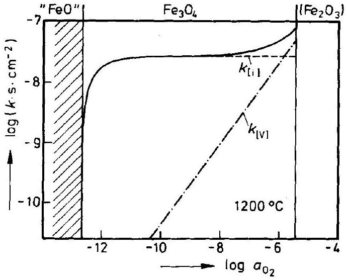
Figure 7-3. Calculated parabolic rate constant $k$ for the oxidation of wüstite (" FeO ") to magnetite $\left(\mathrm{Fe}_{3} \mathrm{O}_{4}\right)$ as a function of the oxygen activity of the surrounding gas. Proportions due to interstitial and vacancy transport are indicated.

Wagner's theory of metal oxidation is phenomenological. Many questions concerning atomic aspects of the oxidation process cannot be answered within the frame of this phenomenological theory. Since atomic aspects are important when we analyze the boundary conditions, this will be exemplified by two pertinent problems. Firstly, let us ask about the coherence of the metal/oxide interface during the oxida-
tion process. Thin films often grow epitaxially. This means that the near-interface region is strained. Eventually, misfit dislocations form in both the metal and the oxide and will be found at and near the interface. The flux of metal ions away from the coherent A/AO interface towards the surface means an injection of vacancies into the metal A [H. Fischbach (1980)]. If the mobility in the boundary itself is sufficiently high, these vacancies could be accommodated at interface ledges, kinks, etc. If not, they diffuse into the metal where they become supersaturated and annihilate at dislocations, thus, for example, including dislocation climb. Since the dislocation lines interact elastically while they are climbing, a structured dislocation network forms. Both its motion and the boundary motion have to match. A detailed analysis of this complex process is available in the literature [B. Pieraggi, R. A. Rapp (1988)]. If the mobility of SE's in the metal/oxide interface is not high enough and if, in addition, the sink strength of the dislocation network for supersaturated vacancies is not sufficient, then pores will form in the near-interface region. Pore formation, however, means that local equilibrium is appreciably disturbed at the boundary. This is at variance with the assumptions of the Wagner theory.

Secondly, let us consider dislocations in the oxide layer, formed at the moving phase boundary during oxidation, as fast diffusion paths (pipes) for the oxide components, and in particular for atomic or molecular oxygen stemming from the oxidizing atmosphere. If these dislocations are connected to the external surface, and thus to the high oxygen potential, they can also act as internal surfaces with a relatively high oxygen activity. Outward diffusing metal cations (and compensating electronic defects) will then form new oxide molecules along these dislocations. This internal oxide formation does not mean that the dislocation pipes will be blocked. It does, however, mean that a lateral pressure builds up. Creep or even cracking could be the result of this internal reaction, which is also not accounted for by the Wagner theory [A. Atkinson (1985)].

### 7.3 Non-Parabolic Rate Laws

Distinct reaction rate laws have been empirically found in metals oxidation research. In thick-film oxidation, deviations from parabolic growth (given one-dimensional reaction geometries) are due to insufficient adherency, crack and pore formation in the oxide layer, spalling, etc. Yet non-parabolic rate laws of various kinds are mainly discussed in connection with the formation of thin and ultra-thin oxide films (Fig. 7-1). Although various explanations have been offered, their experimental verification is difficult. Not very much is known about the atomic structure of thin oxide films from experiments under in-situ conditions [R. A. Rapp (1984)]. Thin film oxidation is characterized by high electrical field strengths in the product, perpendicular to the film surface. Since the formation Gibbs energies are on the order of 1 eV , the electrical field can easily be as high as $10^{6} \mathrm{~V} / \mathrm{cm}$ if the film thickness is on the order of $10^{-6} \mathrm{~cm}$.

Metal oxidation is a heterogeneous solid state reaction and starts in the same way as other heterogeneous reactions with nucleation and initial growth. This was discussed in Chapter 6. A time-dependent nucleation rate may dominate the overall growth kinetics of thin films. Even under an optical microscope (i.e., in macroscopic dimensions), preferential sites of growth can still be discerned [J. Bénard (1971)]. This indicates that lateral transport on the surface (e.g., at sites where screw dislocations emerge) can possibly be more important for the initial reactive growth than transport across thin oxide layers.

To be more specific, let us begin with the linear rate law ( $\Delta \xi \sim t$ ). One immediate explanation for a linear rate law is the rate determining phase boundary reaction. Parabolic growth would mean that the growth rate is $\Delta \dot{\xi} \rightarrow \infty$ for $\Delta \xi \rightarrow 0$. If the incorporation of SE's from the boundary into the lattice of the growing oxide (at A/AO or $\mathrm{AO} / \mathrm{O}_{2}(\mathrm{~g})$ ) is a thermally activated process, the phonon frequency sets an upper limit to this incorporation. Other mechanisms such as ledge or kink nucleation may also limit the incorporation rate at the boundaries. As long as the boundaries of the oxide do not change with time during growth, the rate of interface crossing and incorporation of the SE's will not depend on the layer thickness. If the Gibbs energy of reaction is then dissipated primarily at the boundaries and not in the bulk of the oxide film through component diffusion, a linear rate law will result. Atomic models for solid/solid interface reactions will be presented in Chapter 10. Considering the necessary structural accommodations (e.g., dislocation formation and motion, see Fig. 3-5) which must take place at a moving boundary between heterogeneous solids, one may ask if the structure of an advancing interface can ever be timeindependent. Regarding the topochemical and structural implications that have to go along with heterogeneous reactions in the solid state, it is amazing that distinct rate laws are nevertheless found in many cases.

In electrode kinetics, interface reactions have been extensively modeled by electrochemists [K. J. Vetter (1967)]. Adsorption, chemisorption, dissociation, electron transfer, and tunneling may all be rate determining steps. At crystal/crystal interfaces, one expects the kinetic parameters of these steps to depend on the energy levels of the electrons (Fig. 7-4) and the particular conformation of the interface, and thus on the crystal's relative orientation. It follows then that a polycrystalline, that is, a (structurally) inhomogeneous thin film, cannot be characterized by a single rate law.

Figure 7-4. Schematic electron energy level diagram in the system metal-oxide-oxygen gas. $\mathrm{C}=$ conduction band, $\mathrm{V}=$ valence band, $\mathrm{G}=$ gap, $\phi=$ work function, $\varepsilon_{\mathrm{F}}=$ Fermi energy.

An in-situ characterization of the interface structure of the growing oxide film appears to be necessary for an appropriate modeling, but this is most difficult to achieve [B. Pieraggi, R.A. Rapp (1988)].

Let us distinguish between essential elements of the oxidation kinetics as represented by the differential equations for transport and reaction, and the conditions which the boundaries of the reacting system dictate (these are, for example, implicit in Fig. 7-1). The driving forces discussed so far have been the electrical and chemical potential gradients, both of which are strongly influenced by the boundary geometry. Therefore, one must not overemphasize the various empirical thin film rate laws. They often reflect the boundary conditions and not the basic physics of the oxidation process (i.e., driving forces and transport types). One also notes that in thin film kinetic work, the phenomenological approach predominates, whereas in thick film oxidation, which is based on the assumption of local equilibrium, the understanding of atomic details (point defect models) is stressed. This can be seen by comparing some relevant monographs [A.T. Fromhold (1976), (1980); P. Kofstad (1966), (1988)].

A few remarks on the phenomenological approach should be made. It is always possible to solve the phenomenological transport equations either analytically or numerically (provided the correct boundary conditions are known) and compare these solutions with sufficiently accurate experimental observations. This has been done extensively, for example, in [A. T. Fromhold (1976), (1980)]. Yet one of the fundamental conceptual questions has received less discussion than it deserves. Can chemical potential gradients (or concentration gradients) still be used as driving forces in ultra-thin film oxidation theory? Likewise, is it justified to introduce the phenomenologically defined atomic mobility? After all, a thin film grown on a metal surface is normally (structurally) inhomogeneous due to heterogeneous nucleation and coherency stress phenomena. Thermodynamic forces are conceptually based on particle ensembles. If the film thickness, $\Delta \xi$, is too small, the gradient $\left(\mathrm{d} \mu_{i} / \mathrm{d} \xi\right)$ in the direction perpendicular to the surface looses its meaning, whereas the field force $(\mathrm{d} \varphi / \mathrm{d} \xi)$ may still be defined.

In a simplified phenomenological treatment of thin film oxidation, one solves the usual transport equations by taking into account the space charges by means of the Poisson equation ( $\Delta \varphi=-\varrho /\left(\varepsilon \cdot \varepsilon_{0}\right)$, where $\varrho=$ net electric charge density). If the temperature is low enough and the oxide layer thin enough, electron tunneling (instead of ion transport) may be rate determining, as has been proposed by Mott [N. F. Mott (1940)]. By this tunneling, chemisorbed oxygen ions are formed at the oxide/ gas surface. They subsequently react with metal ions which are dragged by the electric field across the layer to the surface. The tunneling probability and thus the electron flux is of the form

$$
j_{\mathrm{e}} \sim \mathrm{e}^{-\beta \cdot \Delta \xi}
$$

where $\beta$ is a reciprocal length (approximately $(1 / \hbar) \cdot\left(8 m_{\mathrm{e}} \chi_{\mathrm{M}}\right)^{1 / 2} ; \chi_{\mathrm{M}}=$ metal/oxide work function, see Fig. 7-4; $m_{\mathrm{e}}=$ effective electron mass). This reasoning leads, after integration of Eqn. (7.18), to a logarithmic rate law in accordance with experimental observations. The existence of a temperature regime in which electron tunnel-
ing is rate determining and slower than the transfer of ions across the film is, however, just an assumption.

Another proposal of similar quality has been put forward by Mott and Cabrera [N. Cabrera, N.F. Mott (1949)]. This time (and in contrast to the above assumption) either electron tunneling or thermal electron emission from the metal into the oxide conduction band is assumed to be so fast that the equilibrium concentration of oxygen ions at the film surface ( $e^{\prime}+\frac{1}{2} \mathrm{X}_{2}=\mathrm{X}^{-}$) establishes a (constant) electric potential jump $\Delta U^{0}$ across the film. Therefore, one has a time-dependent local electric field $\nabla \varphi=\Delta U^{0} / \Delta \xi(t)$ which drags the cations across the film. If the work which a moving particle extracts from the field between two adjacent potential minima ( $=e_{0} \cdot a \cdot \nabla \varphi ; a=$ distance between minima) is not small compared with the hopping activation energy, then the flux equation can no longer be linearized (in the force $e_{0} \cdot \nabla \varphi$ ). With nonlinear transport equations, the growth rate is found to be

$$
\Delta \dot{\xi}=\mathrm{const} \cdot \sinh \left(-\frac{e_{0} \cdot \Delta U^{0} \cdot a}{k T \cdot \Delta \xi}\right)
$$

where $\Delta \xi / a$ is the number of activated jumps in the thin film, $e_{0} \cdot \Delta U^{0} /(\Delta \xi / a)$ is thus the potential drop per jump, and $\Delta U^{0}$, as outlined in Figure 7-4, is the difference between the metal Fermi energy level and the $\mathrm{X}_{\mathrm{ad}}$ level. From Eqn. (7.19), logarithmic as well as parabolic growth rates can be obtained as limiting cases.

If the thickness, $\Delta \xi$, of an oxide layer is on the order of the Debye-Hückel length $\left((1 / 2) \cdot \varepsilon \cdot \varepsilon_{0} \cdot k T \cdot z_{i} \cdot e_{0}^{2}\right)^{1 / 2}$, the electric field strength is influenced by the space charge and is no longer constant inside the film. Let us, for the sake of illustration, assume that local equilibrium for the electronic defects is established at the Me/MeX interface of an MeX film during film growth. In other words, a constant concentration of electrons $c_{\mathrm{e}}^{0}(\xi=0)$ is maintained at this interface during the oxidation process. Let us further assume that the electronic carriers are non-degenerate and in local equilibrium inside the film $(0<\xi<\Delta \xi)$. We then have, according to the Boltzmann distribution,

$$
N_{\mathrm{e}}(\xi)=N_{\mathrm{e}}^{0} \cdot \mathrm{e}^{\frac{F \cdot \varphi(\xi)}{R T}}
$$

With this electric potential $\varphi(\xi)$, we can integrate the Poisson equation ( $\Delta \varphi= -\varrho_{\mathrm{el}} /\left(\varepsilon \cdot \varepsilon_{0}\right) ; \varrho_{\mathrm{el}}=$ net charge density) to eventually obtain the concentration of electrons at the film surface ( $\Delta \xi$ ). It further follows that $N_{\mathrm{e}}(\Delta \xi)$ varies with the film layer thickness as $\Delta \xi^{-2}$. If we now assume that the (catalyzed) rate of dissociation of the adsorbed $\mathrm{X}_{2}$ molecules is proportional to the surface concentration of electrons, and that this dissociation process is rate determining, a cubic rate law for the film growth can be expected ( $\Delta \dot{\xi} \sim \Delta \xi^{-2} ; \Delta \xi \sim t^{1 / 3}$ ). In fact, during the oxidation of Ni at temperatures between 250 and $400^{\circ} \mathrm{C}$, an approximately cubic rate law has been experimentally observed. We emphasize, however, that the observed cubic oxidation rate does not prove the validity of the proposed reaction mechanism. Different models and assumptions concerning the atomic reaction mechanism may lead to the same or similar dependences of the growth rate on thickness.

### 7.4 Alloy Oxidation

Alloy oxidation is of utmost importance in technology. Whereas oxidation of metallic elements as discussed in Section 7.2 is a uniquely defined process, if local thermodynamic equilibrium prevails, this is no longer true for the oxidation of (even binary) alloys. One reason for ambiguity is the fact that boundaries between the alloy and the (A-B-...O) product layer are thermodynamically variant, in contrast to A/AO boundaries, which are invariant according to the Gibbs phase rule. As Figure 7-5 shows, this invariance is the reason for the morphological stability during growth of AO layers on A-metal surfaces. Oxidation of higher than binary alloys has many special aspects which we cannot treat in any detail. We will therefore discuss only some basic aspects of (A, B) alloy oxidation. This means that we will confine ourselves to the ternary $\mathrm{A}-\mathrm{B}-\mathrm{O}$ system. The mode of oxidation depends on the alloy composition $N_{\mathrm{A}}$ and on the number and type of compounds and solid solutions which exist in the ternary $\mathrm{A}-\mathrm{B}-\mathrm{O}$ system. Basic parameters of the oxidation process are the Gibbs energies (chemical potentials) and the mobilities of the alloy components in all the phases of the product layer. The general ( $\mathrm{A}, \mathrm{B}$ ) oxidation problem can not be solved in a straightforward way, either because of morphological instabilities or because of mathematical complexity. Therefore, it is advisable to consider limiting cases characterized by the predominance of certain kinetic and/or thermodynamic parameters.

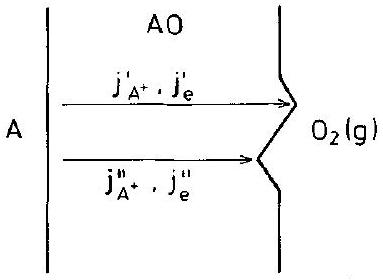
Figure 7-5. Explanation of morphological stability of the invariant boundaries (interfaces) of AO during the oxidation process. $j_{i}^{\prime \prime}>j_{i}^{\prime}, i=\mathrm{A}^{+}$, é.

Let us illustrate two limiting cases with the help of phase diagrams of the second kind (intensive/extensive) as shown in Figures 7-6 and 7-7. In Figure 7-6 we deal with alloy ( $\mathrm{A}, \mathrm{B}$ ) and nearly stoichiometric compound products. In Figure 7-7 we assume that only complete oxide solid solution series occur. The oxidation process starts by exposing the surface of the alloy to oxygen with a chemical potential $\mu_{\mathrm{O}}(\infty)$, as indicated. If we now trace the composition variable ( $N_{\mathrm{A}}$ ) through the reaction layer(s) and plot it in a phase diagram of the second kind, we obtain the 'reaction path'. Theoretically, it follows from the transport equations and (neglecting morphological aspects) depends only on the (local) thermodynamic functions and the component mobilities. Further conditions are the mass balances of A and B . They ensure that the reaction path is not located only on one side of the initial alloy composition. Also $\mathrm{d} \mu_{\mathrm{O}} / \mathrm{d} r$ ( $r=$ reaction path coordinate) is never negative. Some interesting features can immediately be read from these schematic reaction paths. For example,

Figure 7-6. a) Schematic A-B-O phase diagram of the second kind ( $\mu_{\mathrm{O}} / N_{\mathrm{B}}$ ) and possible oxidation reaction paths involving ( $\mathrm{A}, \mathrm{B}$ ) alloy and oxide compounds. b) Corresponding reaction paths ( $N_{\mathrm{B}}(\xi)$ ) in real space at time $t$.

a quasi-stationary sequence of layers such as ( $\mathrm{A}, \mathrm{B})^{\prime}\left|\mathrm{A}_{2} \mathrm{BO}_{3}\right|(\mathrm{A}, \mathrm{B})^{\prime \prime}\left|\mathrm{AB}_{2} \mathrm{O}_{3}\right| \mathrm{O}_{2}(\mathrm{~g})$ (or $(\mathrm{A}, \mathrm{B})\left|(\mathrm{A}, \mathrm{B})_{2} \mathrm{O}_{3}\right|(\mathrm{A}, \mathrm{B})_{3} \mathrm{O}_{4}$ ) is possible. Those sequences and similar ones do not look very plausible at first sight, but they are perfectly consistent with the thermodynamic and kinetic premises.

A calculation of a reaction path is available for the simplest case. ( $\mathrm{A}, \mathrm{B}$ ) and $(\mathrm{A}, \mathrm{B}) \mathrm{O}$ are the only phases to be considered and both solid solutions are complete $\left(0 \leq N_{\mathrm{A}} \leq 1\right)$ [C. Wagner (1969); D. P. Whittle, et al. (1975)]. However, since the theoretical problem (i.e., steady-state transport in an oxygen potential gradient acting on (A,B)O, with moving boundaries) resembles the demixing problem in a chemical potential gradient, and this will be discussed extensively in the next chapter, we postpone the quantitative treatment of the reaction paths given in Figure 7-7.

### 7.4.1 The Morphological Stability of Boundaries During Metal Oxidation

Although Chapter 11 is especially devoted to the morphological stability of solidsolid interfaces during reaction, it is necessary in the context of alloy oxidation to

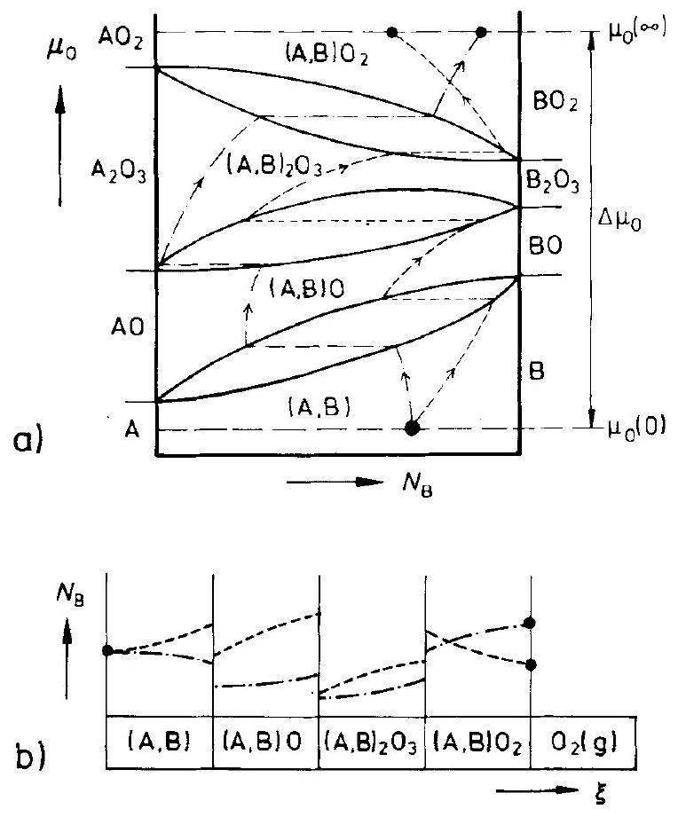
Figure 7-7. a) Schematic A-B-O phase diagram of the second kind ( $\mu_{\mathrm{O}} / N_{\mathrm{B}}$ ) and possible oxidation reaction paths involving (A, B) alloy and oxide solid solutions. b) Reaction path ( $N_{\mathrm{B}}(\xi)$ ) in real space at time $t$.

briefly discuss this question. How do the boundaries of a ternary oxide layer behave morphologically in an oxygen potential gradient during alloy oxidation? Let us first note that the slope of the phase boundaries in chemical potential equilibrium diagrams, that is, $\left(\partial \mu_{\mathrm{O}} / \partial \mu_{\mathrm{BO}}\right)_{\text {eq }}$, reflect generalized Clausius-Clapeyron equations [H. Schmalzried, A. Pelton (1973)]. We have seen from Figures 7-2a and 7-5 that if one oxidizes elemental metal A and maintains local equilibrium, the interfaces are morphologically stable. Any geometrical disturbance of the interface form is selfstabilizing or self-healing. This has been concluded from analyzing the driving forces (potential gradients) in Figure 7-5. The situation can be markedly different during alloy oxidation. Figure 7-8 shows some possible oxidation reaction paths (schematic) in ternary A-B-O systems. They are plotted in phase diagrams of the third kind (intensive vs. intensive variable). The particular diagram in Figure 7-8 ( $\mu_{\mathrm{O}}$ vs. $\mu_{\mathrm{B}}$ at given $P$ and $T$ ) corresponds to the diagrams of the second kind in Figures 7-6 and 7-7.

A reaction path can proceed in two principally different directions after it has crossed a phase boundary: 1) ( $\left.\partial \mu_{\mathrm{O}} / \partial \mu_{\mathrm{BO}}\right)_{\text {path }}>\left(\partial \mu_{\mathrm{O}} / \partial \mu_{\mathrm{BO}}\right)_{\text {eq }}$ and 2) $\left(\partial \mu_{\mathrm{O}} / \partial \mu_{\mathrm{BO}}\right)_{\text {path }} <\left(\partial \mu_{\mathrm{O}} / \partial \mu_{\mathrm{BO}}\right)_{\text {eq }}$. In the second case, the reaction path will re-enter the field of the reduced phase which it just left and can then oscillate along the phase boundary line in Figure 7-8 for some length. A morphologically stable interface between the oxidized and the reduced phase can not develop in this case, and a part of the oxide layer is expected to consist of a mixture of two phases.

Figure 7-8. a) A-B-O phase diagram of the third kind ( $\mu_{\mathrm{O}} / \mu_{\mathrm{B}}$ ) and a possible oxidation reaction path involving (A,B) alloy and oxide compounds. b) A-B-O phase diagram of the third kind ( $\mu_{\mathrm{O}} / \mu_{\mathrm{B}}$ ) and possible oxidation reaction paths involving (A, B) alloy and oxide solid solutions.

Let us try to quantify these ideas by formulating the flux equations for the (semiconducting) oxide ( $\mathrm{A}, \mathrm{B}) \mathrm{O}_{n}$, namely (see Eqn. (6.25))

$$
j_{\mathrm{A}}=-c_{\mathrm{A}} \cdot b_{\mathrm{A}} \cdot\left(\nabla \mu_{\mathrm{AO}}-n \cdot \nabla \mu_{\mathrm{O}}\right) ; j_{\mathrm{B}}=-c_{\mathrm{B}} \cdot b_{\mathrm{B}} \cdot\left(\nabla \mu_{\mathrm{BO}_{n}}-n \cdot \nabla \mu_{\mathrm{O}}\right)
$$

where we have assumed that the anions are immobile. At the phase boundaries (interfaces), the fluxes of A and B are coupled by the interface velocity

$$
v^{b}=\frac{j_{\mathrm{A}}^{\alpha}-j_{\mathrm{A}}^{\beta}}{c_{\mathrm{A}}^{\alpha}-c_{\mathrm{A}}^{\beta}}=\frac{j_{\mathrm{B}}^{\alpha}-j_{\mathrm{B}}^{\beta}}{c_{\mathrm{B}}^{\alpha}-c_{\mathrm{B}}^{\beta}}
$$

We can replace $\nabla \mu_{\mathrm{BO}_{n}}$ by $\nabla \mu_{\mathrm{AO}_{n}}$ with the help of the Gibbs-Duhem equation. At the $\alpha / \beta$ boundary (interface), it is therefore possible to express ( $\left.\partial \mu_{\mathrm{O}} / \partial \mu_{\mathrm{A}}\right)^{\alpha}$ and $\left(\partial \mu_{\mathrm{O}} / \partial \mu_{\mathrm{AO}}\right)^{\alpha}$ in terms of $\left(\partial \mu_{\mathrm{O}} / \partial \mu_{\mathrm{A}}\right)^{\beta}$ and $\left(\partial \mu_{\mathrm{O}} / \partial \mu_{\mathrm{AO}}\right)^{\beta}$ respectively. If we then find that $\left(\partial \mu_{\mathrm{O}} / \partial \mu_{\mathrm{AO}_{n}}\right)^{\beta}<\left(\partial \mu_{\mathrm{O}} / \partial \mu_{\mathrm{AO}_{n}}\right)_{\text {eq }}$, morphologically unstable interfaces will occur. A pertinent example of a reaction layer in a ternary A-B-O system which develops morphological instability and a two phase assemblage in an oxidation experiment is discussed in Section 8.7. The general discussion of morphological instabilities in alloy oxidation processes is given in Chapter 11.

Systematically speaking, so-called internal oxidation reactions of alloys (A, B) are extreme cases of morphological instabilities in oxidation. Internal oxidation occurs if oxygen dissolves in the alloy crystal and the (diffusional) transport of atomic oxygen from the gas/crystal surface into the interior of the alloy is faster than the countertransport of the base metal component (B) from the interior towards the surface. In this case, the oxidation product $\mathrm{BO}_{n}$ does not form a stable oxide layer on the alloy surface. Rather, $\mathrm{BO}_{n}$ is internally precipitated in the form of small oxide particles. The internal reaction front moves parabolically $(\sim \sqrt{t})$ into the alloy. Examples of internal reactions are discussed quantitatively in Chapter 9.

### 7.5 Some Practical Aspects of High Temperature Corrosion

We have dealt with the basic concepts that have been developed to understand those reactions between metals and gases which result in more or less dense and coherent layers of oxidized products formed on or near the metal surface. In this section, we shall briefly mention some of the practical problems which are important in high temperature corrosion. The requirement of technology is the production of an adherent, dense, slow growing metal oxide layer that shields the underlying metal from further attack by the oxidizing gases. The main task is to find the composition which reflects an optimal compromise between the wanted mechanical and the needed chemical (reactive) properties of the material. Since we understand the basic reaction mechanisms, we know, in principle, how to attain a minimum reaction rate. However, the achievement of crack-free and slow-growing reaction layers showing optimal adherence to the metal surfaces is still based to a large extent on empirical knowledge, as documented in relevant reviews [R.A. Rapp (1981); N. Birks, G.H. Meier (1983)]. In order to minimize the reaction rates of the protective oxide layers, which, for the sake of mechanical stability, are normally carried into the regime of transport controlled (parabolic) growth, let us inspect Eqn. (7.4). From this inspection, we learn that we have to minimize 1) the electronic transference number (i.e., the electronic leak current) and/or 2) the diffusion coefficients of the rate determining ions. The first requirement can be met by adding those components to the metal or the alloy which form very stable oxides with negligible electronic conduction, such as $\mathrm{Al}_{2} \mathrm{O}_{3}, \mathrm{MgO}, \mathrm{SiO}_{2}$. Often, however, alloy oxidation does not lead to simple binary protective oxides. Rather, ternary or even higher semiconducting oxide layers are formed with $t_{\mathrm{el}} \cong 1$ so that the electron (hole) flux is no longer rate determining. Obviously, the task is to minimize the transport coefficients of the rate determining cations (or anions) in the oxide product layers.

Defect thermodynamics provide the guidelines for the solution of this practical problem. In Chapter 2, the basic ideas on how to influence point defect concentrations by doping with (heterovalent) additions were presented. Due to the electroneutrality condition and the laws of mass action, we can control the point defect
fractions. Since ionic point defects are directly responsible for the mobility, $b$, of the diffusing components, the heterovalent doping has to be performed in such a way that the transport coefficient (i.e., $c_{i} \cdot b_{i}$, the index $i$ denotes the rate determining component) is minimized. By and large, one can formulate the following rules. The addition of a lower-valent solute to a $p$-type oxide decreases the cation vacancy concentration. A higher-valent solute addition has the opposite effect. The converse is true if the scale consists of an n-type oxide.

One has to admit, however, that the beneficial operation of protecting oxide scales is often not limited by the (bulk) transport properties, but rather by the mechanical properties (creep, adherence) of the scales. In this respect, metal oxidation once again reflects the general situation in our understanding of solid state reaction kinetics: to what extent are physical properties other than diffusional transport and thermodynamics responsible for reaction rates? We may discuss this question with regard to metal oxidation in some more detail. We can neglect the growth of multilayers (which has been addressed in Section 6.3.2) and the change of the disorder type in the oxide product (an example was given in Fig. 7-3). Although these phenomena increase the complexity of the metal oxidation problem, they can nevertheless be handled by classic transport theory. However, if the ratio of oxide product volume to original metal volume differs from unity (Pilling-Bedworth ratio $\neq 1$ ), a continuous oxidation process is only possible if sufficient plastic flow at and near the interfaces is guaranteed. Otherwise the formation of cracks, voids, and pores occurs and the growth rate of the scale becomes irregular.

Let us distinguish between two modes of oxidation: 1) the oxide grows (by cation transport) at the surface to the gas and 2) the oxide grows below its surface to the gas. This latter mode requires the oxidant to be transported into the scale, which can occur in a variety of ways such as by molecular (atomic) transport along cracks, pores, grain boundaries or dislocations, or (relatively seldom) in the form of a simultaneous transport of anionic and electronic defects. At very high temperatures ( $>\left(\frac{2}{3}\right) \cdot T_{\text {melt }}$ ), mechanism 1) is often observed. At low temperatures ( $<\left(\frac{1}{2}\right) \cdot T_{\text {melt }}$ ), however, calculated reaction rates (according to Wagner, see Section 7.2) and the much larger experimental values differ sometimes by orders of magnitude [A. Atkinson (1985)].

The main difficulty with the first mode of oxidation mentioned above is explaining how the cation vacancies that arrive at the metal/oxide interface are accommodated. This problem has already been addressed in Section 7.2. Distinct patterns of dislocations in the metal near the metal/oxide interface and dislocation climb have been invoked to support the continuous motion of the adherent metal/oxide interface in this case [B. Pieraggi, R. A. Rapp (1988)]. If experimental rate constants are moderately larger than those predicted by the Wagner theory, one may assume that internal surfaces such as dislocations (and possibly grain boundaries) in the oxide layer contribute to the cation transport. This can formally be taken into account by defining an effective diffusion coefficient $D_{\text {eff }}=(1-f) \cdot D_{\mathrm{L}}+f \cdot D_{\mathrm{NL}}$, where $D_{\mathrm{L}}$ is the lattice diffusion coefficient, $D_{\mathrm{NL}}$ is the diffusion coefficient of the internal surfaces, and $f$ is the site fraction of cations located on these internal surfaces.

However, the observation of existing duplex scales (and breakaway scales) during metal oxidation rather points to the second oxidation mode. The duplex morphology
is characterized by columnar grains in the outer oxide layer and fine-grained oxide crystals in the inner layer near the metal/oxide interface. Breakaway scales are porous, often laminated, and their name stems from the fact that the parabolic oxidation rate can suddenly increase to a fast linear growth law (e.g., during oxidation of steel, with $\mathrm{CO}_{2}$ formation). The rationalization of these processes assumes that because $V_{\text {oxide }} / V_{\text {metal }}>1$, the necessary deformation of the scale during its growth generates microcracks, along which the oxidant has some degree of access to the metal/oxide interface. If no free space is available at this interface (because of coherency or easy interface shearing), the single layer scale is formed by outward cation diffusion, as has been assumed by the Wagner theory of oxidation. If some free space, however, is available, for example, by loss of adhesion due to outward diffusion of metal ( $=$ cation + electron) without sufficient plastic flow, then duplex (or breakaway) scales result. As a consequence, one expects that both the growth rate and the growth morphology will depend on the geometry of the sample. For example, adherence of receding metal/oxide interfaces at a sample corner where two flat scales meet each other is not possible: stresses and cracks will be created. It was empirically found that small additions of certain alloying elements (e.g., $\mathrm{Ca}, \mathrm{Y}, \mathrm{Hf}$ ) are most beneficial for improving the oxidation resistance of metals. Since these elements form very stable oxides and exhibit normally low diffusivities, they may preferentially form at fast diffusion paths of the matrix and block these paths for further oxidant transport. Another hypothesis maintains that their influence is due to their ability to change the creep properties of the matrix (e.g., by 'wetting' the grain boundaries), or by improving the self-healing of microcracks which form during layer growth [J. Jedlinski (1992)].

A further field of practical interest is the high temperature corrosion of metals in atmospheres which include sulfur, carbon, hydrogen, and halogen. The starting point for an understanding of these corrosion processes is the construction of phase diagrams of the second kind analogous to those in Figures 7-6 and 7-7 but to include the chemical potentials of S, C, H, Cl, etc. Most of these diagrams are not yet available. If these nonmetals are already components of the alloy to be oxidized by $\mathrm{O}_{2}$ (e.g., steel containing sulfur and other impurities), internal oxidation products can form with very high activities ( $\mathrm{SO}_{2}, \mathrm{CO}_{2}, \mathrm{H}_{2} \mathrm{O}$, etc.) which may be responsible for building up high pressures in pores, cracks, and along interfaces, eventually leading to the spalling of oxide scales.

## References

Atkinson, A. (1985) Rev. Mod. Phys., 57, 437
Bénard, J. (1971) in: Oxidation of Metals and Alloys, Amer. Soc. Metals, Metals Park, Ohio Birks, N., Meier, G. H. (1983) Introduction to High Temperature Oxidation of Metals, Edward Arnold, London
Cabrera, N., Mott, N.F. (1949) Rep. Progr. Phys., 12, 163
Dieckmann, R., Schmalzried, H. (1977) Arch. Eisenhüttenwes., 48, 611

Fischbach, H. (1980) Z. Metallk., 71, 115
Fromhold, A. T. (1976, 1980) Theory of Metal Oxidation, I, II, North Holland Publ. Comp., Amsterdam
Jedlinski, J. (1992) Sol. State Phenomena, 21/22, 335
Jost, W. (1937) Diffusion und chemische Reaktion in festen Stoffen, Steinkopff, Dresden
Kofstadt, P. (1966) High Temperature Oxidation of Metals, Wiley, New York
Kofstadt, P. (1988) High Temperature Corrosion, Elsevier, Amsterdam
Mott, N.F. (1940) Trans. Faraday Soc., 36, 472
Pieraggi, B., Rapp, R. A. (1988) Acta Met., 36, 1281
Rapp, R. A. (Ed.) (1981) High Temperature Corrosion, Proc. 6. Intern. Conf., San Diego, NACE Houston
Rapp, R.A. (1984) Met. Trans., 15A, 765
Schmalzried, H., Pelton, A. (1973) Ber. Bunsenges. Phys. Chem., 77, 90
Vetter, K. J. (1967) Electrochemical Kinetics, Springer, Berlin
Wagner, C. (1933) Z. phys. Chem., B21, 25
Wagner, C. (1951) in: Atom Movements, ASM, Cleveland, 153
Wagner, C. (1969) Corr. Sci., 9, 91
Whittle, D. P., et al. (1975) Oxid. Met., 9, 215

## 8 Solids in Thermodynamic Potential Gradients

### 8.1 Introduction

The content of this chapter is closely related to permeation, which is the transport of a solute across a layer of solvent (or membrane) under the action of a difference in activity. For example, the permeation of hydrogen through a metal foil has been studied, particularly for palladium [F. A. Lewis (1967)] and iron [J. P. Hirth (1980); H. H. Johnson (1988)]. One reason for studying the permeation of hydrogen through iron is to understand the hydrogen embrittlement of steel.

The subject of the following sections is the transport of irregular structure elements ( $=$ point defects) in crystals, as driven by different thermodynamic potentials applied to opposite crystal surfaces. Although this seems to interrupt the sequence of chapters on reactions, we then have the opportunity to investigate in detail the influence of point defect fluxes on the phase boundaries and multicomponent bulk of inhomogeneous crystals. For illustration we mention several simple problems. How does a slab of metal A or of homogeneous alloy $(\mathrm{A}, \mathrm{B})$ behave if a (steady state) flux of vacancies flows across it? How does the crystal of oxide solution (A, B)O react if it is brought between two different oxygen potentials? If point defect fluxes are driven across a polyphase solid, what is the result? What will be different if temperature gradients or inhomogeneous stresses instead of chemical potential gradients are the driving forces?

Problems of this type depend essentially on the transport coefficients and the boundary conditions and less on the chemical nature of the crystal. We prefer to illustrate our investigations using oxide systems and do so for the following reasons. At temperatures where the mobility of SE's allows the oxides to react and equilibrate, most of them are either mixed conductors or semiconductors. This means that both ionic and electronic carriers take part in the transport process, and we thus deal with a fairly general situation. In addition, many oxides play an important role in materials engineering, such as in ceramics. In practice, materials are often not in equilibrium with their immediate surroundings. In other words, gradients of intensive thermodynamic functions of state (such as temperature, stress, chemical or electrochemical potential) act as driving forces on the SE's of crystalline materials. Thermally activated SE's will then drift in the acting gradients. For example, a flux of vacancies which flows across an initially homogeneous (A, B) solid solution tends to separate the components A and B if they have different mobilities. Even decomposition and the formation of new phases are possible. Under practical aspects, this may mean the degradation of multicomponent materials. Therefore, the following discussion concerning crystals in thermodynamic potential gradients has many implications in materials science and technology.

### 8.2 Multicomponent Solids in Chemical Potential Gradients

Let us analyze the experimental situation shown schematically in Figure 8-1 and which resembles the situation depicted in Figure 4-5. A (closed) multicomponent, multiphase system is bounded by two reservoirs $\mathrm{R}_{1}$ and $\mathrm{R}_{2}$ which impose a predetermined $\Delta \mu_{n}$ on the $n^{\text {th }}$ component upon the system. Strictly, the system is closed for $k=n-1$ components and is open for the $n^{\text {th }}$ component. Local equilibrium will be assumed to prevail throughout. We further assume that decomposition does not take place and that the phase boundaries are morphologically stable. We wish to know the distribution of the components in the steady state, which is attained as long as the driving forces are not excessive (relative to $R T$ ). Let us perform the analysis first for a single phase system which is exposed to thermodynamic potential gradients. In Section 8.7, we will return to the more general problem of multiphase systems.

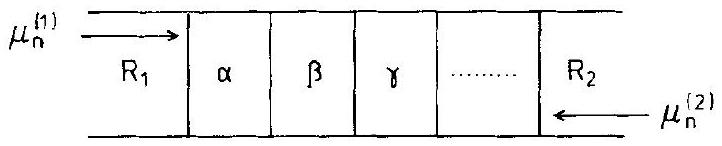
Figure 8-1. Schematic plot of a linearly arranged multicomponent ( $k=1,2, \ldots n$ ), multiphase $(\alpha, \beta, \ldots)$ system with a prefixed chemical potential difference $\Delta \mu_{n}$ across it. $\mathrm{R}_{1}, \mathrm{R}_{2}=$ buffer reservoirs.

We begin with the simplest case. A vacancy flux $j^{0}$ (driven, for example, by inhomogeneous particle radiation) flows across a multicomponent crystal $(k=1,2, \ldots, n)$ and the component fluxes are restricted to one sublattice. We assume no other coupling between the fluxes except the lattice site conservation, which means that we neglect cross terms in the formulation of SE fluxes. (An example of coupling by cross terms is analyzed in Section 8.4.) The steady state condition requires then that the velocities of all the components are the same, independent of which frame of reference has been chosen, that is,

$$
\boldsymbol{v}_{n}(\xi)=\boldsymbol{v}_{k}(\xi), \quad k=1, \ldots, n-1
$$

Explicitly, this is

$$
b_{n} \cdot \nabla \mu_{n}+\left(j^{0} \cdot V_{m}\right) \cdot \frac{b_{n}}{\sum_{k} N_{k} \cdot b_{k}}=b_{k} \cdot \nabla \mu_{k}+\left(j^{0} \cdot V_{m}\right) \cdot \frac{b_{k}}{\sum_{k} N_{k} \cdot b_{k}}
$$

where the first terms on both sides of Eqn. (8.2) are diffusion terms, the second terms are the drift proportions due to the vacancy flux. Equation (8.2) yields

$$
j^{0} \cdot V_{m}=-\frac{b_{n} \cdot \nabla \mu_{n}-b_{k} \cdot \nabla \mu_{k}}{b_{n}-b_{k}} \cdot \sum_{k} N_{k} \cdot b_{k}
$$

There are ( $n-1$ ) equations of type (8.3). Along with the Gibbs-Duhem equation, they can be solved for the unknown chemical potential gradients $\nabla \mu_{k}$. In combination with the ( $n-1$ ) mass conservation equations

$$
\int_{0}^{\Delta \xi} N_{k} \cdot \mathrm{~d} \xi=N_{k}^{0} \cdot \Delta \xi, \quad k=1, \ldots, n-1
$$

one can (after integration) determine the ( $2 n-2$ ) chemical potentials at the two surfaces.

A system which can easily be treated in this way is a single phase binary alloy. For preparation, however, let us consider an A crystal with a vacancy flux driven across it. In view of the fact that $j_{\mathrm{A}}+j_{\mathrm{V}}=0$ in the steady state lattice system, the vacancy flux induces a counterflux of A , which shifts the whole crystal in the direction of the surface where the vacancy source is located. The shift velocity $\boldsymbol{v}^{b}$ is $j_{\mathrm{V}} \cdot V_{\mathrm{A}}$.

For the slab of a binary alloy ( $\mathrm{A}, \mathrm{B}$ ) across which the vacancy flux $j_{\mathrm{V}}=j^{0}$ flows, we derive from Eqn. (8.3)

$$
\int_{\mu_{\mathrm{A}}(0)}^{\mu_{\mathrm{A}}(\xi)} b_{\mathrm{A}} \frac{\left(N_{\mathrm{A}}+\beta\left(1-N_{\mathrm{A}}\right)\right) \cdot\left(\left(1-N_{\mathrm{A}}\right)+\beta \cdot N_{\mathrm{A}}\right)}{\left(1-N_{\mathrm{A}}\right) \cdot(1-\beta) \cdot V_{m}} \cdot \mathrm{~d} \mu_{\mathrm{A}}=j^{0} \cdot \xi
$$

by utilizing the Gibbs-Duhem equation and setting $\beta=b_{\mathrm{B}} / b_{\mathrm{A}}$. If the solid solution (A,B) is thermodynamically ideal so that $\mathrm{d} \mu_{\mathrm{A}}=R T \cdot \mathrm{~d} \ln N_{\mathrm{A}}$, Eqn. (8.5) reads

$$
\int_{N_{\mathrm{A}}(0)}^{N_{\mathrm{A}}(\xi)} b_{\mathrm{A}} \frac{\left(N_{\mathrm{A}}+\beta\left(1-N_{\mathrm{A}}\right)\right) \cdot\left(\left(1-N_{\mathrm{A}}\right)+\beta \cdot N_{\mathrm{A}}\right)}{N_{\mathrm{A}} \cdot\left(1-N_{\mathrm{A}}\right) \cdot(1-\beta)} \cdot \mathrm{d} N_{\mathrm{A}}=\frac{j^{0} \cdot V_{m}}{R T} \cdot \xi
$$

Along with the conservation of mass, namely

$$
\int_{0}^{\Delta \xi} N_{\mathrm{A}} \cdot \mathrm{~d} \xi=N_{\mathrm{A}}^{0} \cdot \Delta \xi
$$

Eqn. (8.6) describes the steady state concentration profile of an ( $\mathrm{A}, \mathrm{B}$ ) alloy which has been exposed to the stationary vacancy flux $j^{0}$. The result is particularly simple if the mobilities, $b_{i}$, are independent of composition, that is, if $\beta=$ constant. From Eqn. (8.6), we infer that, depending on the ratio of the mobilities $\beta$, demixing can occur in two directions (either A or B can concentrate at the surface acting as the vacancy source). The demixing strength is proportional to $j^{0} \cdot(1-\beta) / R T$, and thus directly proportional to the vacancy flux density $j^{0}$, and to the reciprocal of the absolute temperature, $1 / T$. For $\beta=1$, there is no demixing.

We proceed by considering a slab of an oxide crystal AO and assume that a cation vacancy flux is driven across it. In contrast to the single sublattice alloy discussed above, where the vacancies have been introduced into the lattice as an independent component, the vacancy flux $j^{0}$ in AO can be induced by different oxygen activities at the two opposite surfaces. At the oxidizing surface, the defect reaction is $\frac{1}{2} \cdot \mathrm{O}_{2}= \mathrm{O}_{\mathrm{O}}^{\times}+\mathrm{V}_{\mathrm{A}}^{\prime \prime}+2 \cdot \mathrm{~h}^{\bullet}$. In semiconducting AO, the flux of ionized A vacancies is compen-
sated for by a simultaneous and unidirectional flux of electron holes. At the reducing surface, the defect reaction is reversed. The result is an addition of AO lattice molecules on the oxidizing surface, while they are subtracted from the reducing surface. Hence, the crystal is shifted as a whole toward the cation vacancy source ( $v^{b}= j_{\mathrm{V}} \cdot V_{\mathrm{AO}}$ ), although the oxygen ions in AO are (almost) immobile.

However, a shift of the AO crystal does not always occur in gradients. If, for example, in the oxygen potential gradient, cations are immobile and anions are the mobile species (e.g., in $\mathrm{UO}_{2}$ ), the cation sublattice is a closed subsystem and thus cannot be shifted. Therefore, if oxygen is transported via anionic (plus electronic) defects across the AO slab, the whole crystal is stationary. Likewise, if the solid solution (A, B)O is exposed to an oxygen potential gradient and transport is by way of anionic point defects, there is again no crystal shift.

Figure 8-2. Steady state fluxes, component concentrations and phase boundary reactions for ( $\mathrm{A}, \mathrm{B}$ ) O exposed to $\Delta \mu_{\mathrm{O}_{2}}$.

In the next step, we discuss the demixing of semiconducting oxide solid solutions (A,B)O as illustrated in Figure 8-2. Instead of formulating the constant cation vacancy flux as in the steady state condition of Eqn. (8.1), let us express this condition explicitly and note that the frame connected to the oxide sample surface moves with the same velocity as the components so that the composition does not change with time

$$
\frac{j_{\mathrm{A}}}{c_{\mathrm{A}}}=\frac{j_{\mathrm{B}}}{c_{\mathrm{B}}}=v^{b}
$$

The cation fluxes can be expressed as usual using Eqn. (4.49). If we consider the simplest case by neglecting all flux couplings other than those through site conservation and electroneutrality, Eqn. (8.8) yields (see Eqn. (4.99))

$$
b_{\mathrm{A}} \cdot \nabla \eta_{\mathrm{A}^{2+}}=b_{\mathrm{B}} \cdot \nabla \eta_{\mathrm{B}^{2+}}
$$

Let us insert the definitions $\nabla \eta_{i}=\nabla \mu_{i}+z_{i} \cdot F \cdot \varphi$, noting that $\nabla \mu_{\mathrm{A}^{2+}}=\nabla \mu_{\mathrm{AO}}-\nabla \mu_{\mathrm{O}^{2-}}$ and $\nabla \mu_{\mathrm{B}^{2+}}=\nabla \mu_{\mathrm{BO}}-\nabla \mu_{\mathrm{O}^{2-}}$. If we then replace $\nabla \mu_{\mathrm{O}^{2-}}$ by $\nabla \mu_{\mathrm{O}}+2 \cdot \nabla \mu_{\mathrm{e}}$ and recognize that in a semiconductor $\nabla \eta_{\mathrm{e}} \cong 0$, we obtain from Eqn. (8.9)

$$
b_{\mathrm{A}}\left(\nabla \mu_{\mathrm{AO}}-\nabla \mu_{\mathrm{O}}\right)=b_{\mathrm{B}}\left(\nabla \mu_{\mathrm{BO}}-\nabla \mu_{\mathrm{O}}\right)
$$

Equation (8.10) can be further simplified by the Gibbs-Duhem equation for the solid solution (A, B)O. As a result, the differential equation for the steady state demixing profile is found to be

$$
\mathrm{d} N_{\mathrm{AO}}=\frac{N_{\mathrm{AO}} \cdot\left(1-N_{\mathrm{AO}}\right) \cdot(1-\beta)}{\left(1-N_{\mathrm{AO}}\right)+\beta \cdot N_{\mathrm{AO}}} \cdot \mathrm{~d}\left(\frac{\mu_{\mathrm{O}}}{R T}\right) ; \quad \beta=\frac{b_{\mathrm{B}}}{b_{\mathrm{A}}}
$$

In many cases, $\beta$ is rather insensitive to the composition ( $N_{\mathrm{AO}}$ ) because both $\mathrm{A}^{2+}$ and $\mathrm{B}^{2+}$ are rendered mobile by the same vacancies in the same sublattice. In deriving Eqn. (8.11), we have assumed that ( $\mathrm{A}, \mathrm{B}$ ) O is an ideal quasi-binary solid solution. Analogous to Eqn. (8.6), Eqn. (8.11) has to be integrated under the restricting condition of the conservation of cation species A and B . There is no analytical solution to this problem, but a numerical solution has been presented in [H. Schmalzried, et al. (1979)].

The physical reason for the $(\mathrm{A}, \mathrm{B}) \mathrm{O}$ demixing process is always the difference in the mobilities of the cations. This is reflected in Eqn. (8.11) where $\beta$ is the only kinetic parameter, and $\mathrm{d} N_{\mathrm{AO}}=0$ for $\beta=1$. Let us emphasize this fact by a somewhat different argument. The cation flux equation $j_{\mathrm{A}}^{2+}=-c_{\mathrm{A}} \cdot b_{\mathrm{A}} \cdot \nabla \eta_{\mathrm{A}^{2+}}$ can be rewritten as

$$
j_{\mathrm{A}^{2+}}=-c_{\mathrm{A}} \cdot b_{\mathrm{A}} \cdot \nabla \mu_{\mathrm{A}}
$$

where $\nabla \mu_{\mathrm{A}}$ is the chemical potential gradient of component A . Equation (8.12) is valid because ( $\left.b_{\text {ion }} \cdot c_{\text {ion }}\right) \ll\left(b_{\mathrm{h}} \cdot c_{\mathrm{h}}\right.$ ) in a semiconducting crystal, which implies that under open circuit conditions, $\nabla \mu_{\mathrm{h}} \rightarrow 0$ or, equivalently, $\nabla \mu_{\mathrm{h}} \cong-F \cdot \nabla \varphi$. Therefore, if local equilibrium has been attained in the steady state, $\nabla \mu_{\mathrm{A}}=\nabla \mu_{\mathrm{AO}}-\nabla \mu_{\mathrm{O}}$, and thus

$$
j_{\mathrm{A}^{2+}}=-c_{\mathrm{A}} \cdot b_{\mathrm{A}} \cdot\left(\nabla \mu_{\mathrm{AO}}-\nabla \mu_{\mathrm{O}}\right)
$$

However, since $j_{\mathrm{V}}=-b_{\mathrm{V}} \cdot c_{\mathrm{V}} \cdot \nabla \eta_{\mathrm{V}}=-b_{\mathrm{V}} \cdot c_{\mathrm{V}} \cdot \nabla \mu_{\mathrm{O}}$, where $\nabla \eta_{\mathrm{V}}=\nabla \mu_{\mathrm{O}}$ follows from the equilibrium condition of the defect reaction $\frac{1}{2} \mathrm{O}_{2}=\mathrm{O}_{\mathrm{O}}^{2-}+\mathrm{V}_{\mathrm{A}}^{\prime}+\mathrm{h}^{\bullet}$, and furthermore since $b_{\mathrm{V}} \cdot c_{\mathrm{V}}=\left(b_{\mathrm{B}} \cdot c_{\mathrm{A}}+b_{\mathrm{A}} \cdot c_{\mathrm{B}}\right)$ in essence states the equivalence of counting diffusive jumps in the cation sublattice in two different ways, we can immediately rewrite Eqn. (8.13) as

$$
j_{\mathrm{A}^{2+}}=-\left(b_{\mathrm{A}} \cdot c_{\mathrm{A}} \cdot \nabla \mu_{\mathrm{AO}}+\frac{b_{\mathrm{A}} \cdot c_{\mathrm{A}}}{b_{\mathrm{A}} \cdot c_{\mathrm{A}}+b_{\mathrm{B}} \cdot c_{\mathrm{B}}} \cdot j_{\mathrm{V}}\right)
$$

Equation (8.14) demonstrates once more that the cation flux caused by the oxygen potential gradient consists of two terms: 1) the well known diffusional term, and 2) a drift term which is induced by the vacancy flux and weighted by the cation transference number. We note the equivalence of the formulations which led to Eqns. (8.2) and (8.14). Since $\boldsymbol{v}^{b}=j_{\mathrm{V}} \cdot V_{m}$, we may express the drift term by the shift velocity $\boldsymbol{v}^{b}$ of the crystal. Let us finally point out that this segregation and demixing effect is purely kinetic. Its magnitude depends on $\beta=b_{\mathrm{B}} / b_{\mathrm{A}}$, the cation mobility ratio. It is in no way related to the thermodynamic stability ( $\Delta G_{\mathrm{AO}}^{0}, \Delta G_{\mathrm{BO}}^{0}$ ) of the component oxides AO and BO . This will become even clearer in the next section when we discuss the kinetic decomposition of stoichiometric compounds.

The result of a particular demixing experiment on $(\mathrm{Mg}, \mathrm{Co}) \mathrm{O}$ is shown in Figure 8-3a [H. Schmalzried, W. Laqua (1981)]. We see that an oxygen partial pressure ratio of only three ( $p_{\mathrm{O}_{2}}^{\prime \prime} / p_{\mathrm{O}_{2}}^{\prime}=3$ ) for the two opposite surfaces of the crystal results in a $15-20 \%$ demixing of ( $\mathrm{Mg}, \mathrm{Co}$ ) O . The mobility ratio $b_{\mathrm{Co}} / b_{\mathrm{Mg}}$ is $c a$. 10 . Also, the corresponding (schematic) reaction path in a $\mu_{\mathrm{O}} v s$. composition diagram of the A-B-O system is shown in Figure 8-3b.

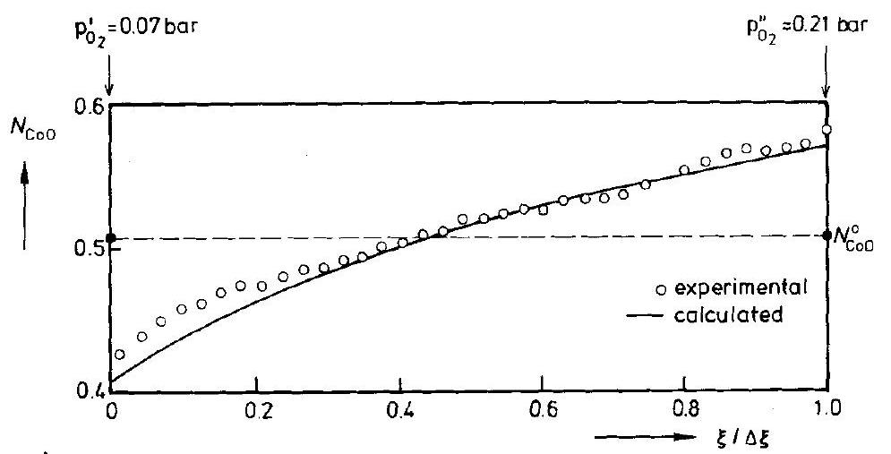
a)

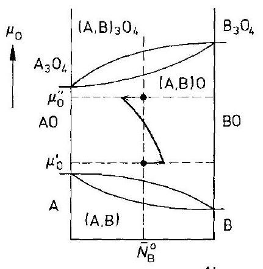
b) $\quad \longrightarrow \bar{N}_{B}=\frac{N_{B}}{N_{A}+N_{B}}$

Figure 8-3. a) Experimental and calculated demixing profiles for ( $\mathrm{Mg}, \mathrm{Co}$ ) O under steady state conditions in an oxygen potential gradient ( $t=126 \mathrm{~h}$ at $T=1439^{\circ} \mathrm{C} ; p_{\mathrm{O}_{2}}^{\prime \prime} / p_{\mathrm{O}_{2}}^{\prime}=3$ ) and b) its steady state reaction path.

Finally, we mention that the ( $\mathrm{Mg}, \mathrm{Co}$ ) O crystal surface with the lower oxygen potential is morphologically unstable. Therefore, in a strict sense the boundary conditions (which have been tacitly assumed to be stationary) are not time-independent. This phenomenon will be discussed further in Chapter 11.

In concluding, let us comment on the time needed to attain the steady state after establishing the surface activities. Two transient processes having different relaxation times occur: 1) the steady state vacancy concentration profile builds up and 2) the component demixing profile builds up until eventually the system becomes truly stationary. Even if the vacancies have attained a (quasi-) steady state, their drift flux is not stationary until the demixing profile has also reached its steady state. This time dependence of the vacancy drift is responsible for the difficulties that arise when the transient transport problem must be solved explicitly, see, for example, [G. Petot-Ervas, et al. (1992)].

If we could arrange the demixing experiment (Fig. 8-2) such that the vacancy flux (caused by the activity difference at opposite surfaces) remains constant and the crystal therefore shifts with constant velocity, we could calculate the time required to attain the steady state with

$$
\tau=\frac{\Delta \xi^{2}}{2 \cdot \bar{D}_{\mathrm{V}}} \cdot \frac{\gamma}{N_{\mathrm{V}}\left(\xi^{\prime \prime}\right)}
$$

where $y$ is a numerical factor which depends on $\beta$ and composition $N_{\mathrm{AO}}$ and is of the order of unity. Since $D_{\mathrm{V}} \cdot N_{\mathrm{V}}=D_{\text {cation }}$, we can see that the characteristic time $\tau$ is essentially the time which a cation needs for a diffusional displacement corresponding to the sample thickness $\Delta \xi$.

Kinetic demixing stems from activity differences established between the opposite surfaces. These differences can be produced in various ways. In this section, we applied buffers with different chemical potentials. Other possibilities are activity changes through temperature gradients and activity changes through stress gradients. These situations will be discussed in Sections 8.5 and 8.6.

### 8.3 Kinetic Decomposition of Compounds in Chemical Potential Gradients

We continue the discussion of multicomponent crystals placed in the potential chemical gradient of a component. Let us investigate what happens when a nearly stoichiometric compound crystal is brought between different potentials of its nonmetallic component (e.g., $\mathrm{AO} \cdot \mathrm{B}_{2} \mathrm{O}_{3}$ between two different oxygen potentials). These two potentials are chosen to fall inside the stability field of the spinel phase so that the spinel will be neither reduced nor oxidized thermodynamically. We will demonstrate that the spinel can nevertheless decompose in the oxygen potential gradient. This decomposition is a purely kinetic effect and has therefore been named kinetic decomposition.

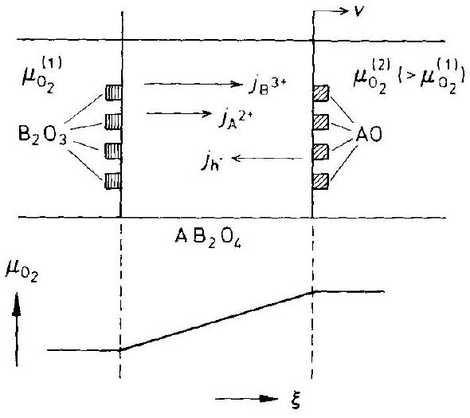
Figure 8-4. Kinetic decomposition scheme of the stoichiometric compound $\mathrm{AB}_{2} \mathrm{O}_{4}=\mathrm{AO} \cdot \mathrm{B}_{2} \mathrm{O}_{3} ; D_{\mathrm{A}}>1.5 D_{\mathrm{B}} . \mathrm{AO}$ and $\mathrm{B}_{2} \mathrm{O}_{3}$ are decomposition products.

The kinetic decomposition process is illustrated in Figure 8-4. In order to define the transport coefficients, we assume that the spinel is a semiconducting oxide with immobile oxygen ions. As before, the flux equations will then have the following forms

$$
\begin{gathered}
j_{\mathrm{A}^{2+}}=j_{\mathrm{A}}=-c_{\mathrm{A}} \cdot b_{\mathrm{A}} \cdot\left(\nabla \mu_{\mathrm{AO}}-\nabla \mu_{\mathrm{O}}\right) \\
j_{\mathrm{B}^{3+}}=j_{\mathrm{B}}=-c_{\mathrm{B}} \cdot b_{\mathrm{B}} \cdot\left(\frac{1}{2} \cdot \nabla \mu_{\mathrm{B}_{2} \mathrm{O}_{3}}-\frac{3}{2} \cdot \nabla \mu_{\mathrm{O}}\right)
\end{gathered}
$$

Here we have chosen AO, $\mathrm{B}_{2} \mathrm{O}_{3}$, and oxygen O as components of the ternary compound $\mathrm{AB}_{2} \mathrm{O}_{4}$ (or rather ( $\left.\mathrm{A}, \mathrm{B}\right)_{3} \mathrm{O}_{4+\delta}$ ). Since $\mu_{\mathrm{AO}}+\mu_{\mathrm{B}_{2} \mathrm{O}_{3}} \cong \mu_{\mathrm{AB}_{2} \mathrm{O}_{4}}^{0}$ (which is the Gibbs-Duhem equation integrated under the assumption that the spinel is strictly stoichiometric and stress effects can be neglected), we obtain from the cation fluxes and the steady state condition $j_{\mathrm{A}} / c_{\mathrm{A}}=j_{\mathrm{B}} / c_{\mathrm{B}}=v^{b}$

$$
\nabla \mu_{\mathrm{AO}}=\frac{1-\frac{2}{3} \cdot \beta}{1+\frac{1}{2} \cdot \beta} \cdot \nabla \mu_{\mathrm{O}}
$$

This relation is analogous to Eqns. (8.10) and (8.11). In contrast to solid solutions, however, stoichiometric compounds cannot demix since their composition is fixed. Instead, they may decompose. In order to find the $\Delta \mu_{\mathrm{O}}\left(\Delta \mu_{\mathrm{O}_{2}}\right)$ at which decomposition begins, we integrate Eqn. (8.17) and note again that $\beta$ is often rather insensitive to changes in $\mu_{\mathrm{O}}$. For constant $\beta$, we have

$$
\Delta \mu_{\mathrm{AO}}=\frac{1-\frac{2}{3} \beta}{1+\frac{1}{2} \beta} \cdot \frac{\Delta \mu_{\mathrm{O}_{2}}}{2}
$$

which is the AO component activity change induced by the oxygen potential difference across the spinel. The spinel decomposes into its component AO and $\mathrm{B}_{2} \mathrm{O}_{3}$ if $\Delta \mu_{\mathrm{AO}}$ exceeds the spinel stability limit, which is its Gibbs energy of formation. Consequently,

$$
\Delta \mu_{\mathrm{AO}}(\max )=\Delta G_{\mathrm{AB}_{2} \mathrm{O}_{4}}^{0}
$$

In combination with Eqn. (8.18), we can now calculate the oxygen potential difference across the sample at which kinetic decomposition of the spinel $\mathrm{AB}_{2} \mathrm{O}_{4}$ supposedly takes place

$$
\ln \frac{p_{\mathrm{O}_{2}}^{\prime \prime}}{p_{\mathrm{O}_{2}}^{\prime}}>2 \cdot \frac{1+\frac{1}{2} \cdot \beta}{1-\frac{3}{2} \cdot \beta} \cdot \frac{\Delta G_{\mathrm{AB}_{2} \mathrm{O}_{4}}^{0}}{R T}
$$

Here, $p_{\mathrm{O}_{2}}^{\prime}$ and $p_{\mathrm{O}_{2}}^{\prime \prime}$ are the oxygen pressures at the opposite surfaces of the spinel sample. If $b_{\mathrm{A}}>\frac{3}{2} \cdot b_{\mathrm{B}}$, the decomposed binary reactant AO will be formed at the high oxygen potential side (Fig. 8-4), whereas if $b_{\mathrm{A}}<\frac{3}{2} \cdot b_{\mathrm{B}}$, AO will be formed at the low oxygen potential side, provided that $\Delta \mu_{\mathrm{O}_{2}}>\Delta \mu_{\mathrm{O}_{2}}$ (max). $\mathrm{B}_{2} \mathrm{O}_{3}$ will be formed at the respective opposite sides. Experiments have been performed that confirm this mode of decomposition [W. Laqua, H. Schmalzried (1983)]. In concluding, we point out that, in principle, kinetic decomposition occurs in all semiconducting compounds for which $b_{\mathrm{A}} \neq b_{\mathrm{B}}$, independent of their anionic transference.

### 8.4 Cross Effects

The phenomena described in the previous sections have been formally analyzed under the assumption that no direct coupling exists between the fluxes $j_{i}$ and the forces $X_{k}(k \neq i)$. Flux coupling only arose from site and electric charge conservation. In other words, we have neglected all the off-diagonal elements in the matrix of transport coefficients $(L)$. Let us now give up this simplifying assumption and consider thermoelectric effects (the Seebeck effect, the Peltier effect) or the LudwigSoret effect (demixing due to heat flow), since they belong to this category of cross phenomena. Since we are mainly concerned with the transport of matter and elec-

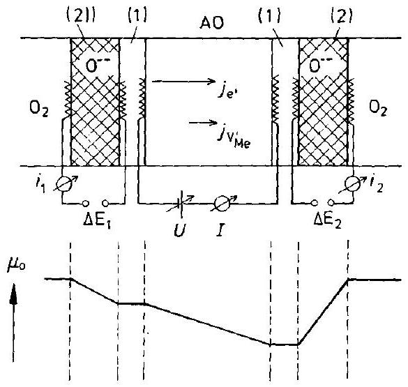
Figure 8-5. Set-up for the application of chemical and electrical potential gradients to investigate the coupling of electronic and ionic fluxes in semiconducting AO. 1) Gas gap, 2) electrolyte.

trical charge, we will exemplify cross effects by the coupling of ionic to electronic fluxes. To this end, we not only impose a component chemical potential difference upon the crystal, but an electrochemical potential difference for the electrons as well. The driving forces for the matter and the electronic carriers are then both predetermined and the flux coupling through cross effects can be investigated under steady state conditions. A suitable experiment is illustrated in Figure 8-5.

However, before going into this problem, let us briefly extend the treatment on steady state demixing given in Section 8.2 and depicted in Figure 8-2 by including cross effects. We denote the transport coefficients by $L_{i j}$ and replace the fluxes $j_{i}=L_{i} \cdot \nabla \eta_{i}$ by $j_{i}=L_{i i} \cdot \nabla \eta_{i}+\sum_{j} L_{i j} \cdot \nabla \eta_{j}(i, j=\mathrm{A}, \mathrm{B})$ in the steady state condition (Eqn. (8.8)). In contrast to Eqn. (8.10), the result is [H. Schmalzried, W. Laqua (1981); M. Martin (1991)]

$$
\nabla\left(\mu_{\mathrm{AO}}-\mu_{\mathrm{O}}\right)=\Theta \cdot \nabla\left(\mu_{\mathrm{BO}}-\mu_{\mathrm{O}}\right) ; \Theta=\frac{c_{\mathrm{A}}-\left(\frac{L_{\mathrm{AB}}}{L_{\mathrm{BB}}}\right) \cdot c_{\mathrm{B}}}{c_{\mathrm{A}} \cdot\left(\frac{L_{\mathrm{AB}}}{L_{\mathrm{BB}}}\right)-c_{\mathrm{B}} \cdot\left(\frac{L_{\mathrm{AA}}}{L_{\mathrm{BB}}}\right)}
$$

For ideal solid solutions which demix in an oxygen potential gradient we obtain from Eqn. (8.21)

$$
\nabla N_{\mathrm{AO}}=-\vartheta \cdot \frac{\nabla \mu_{\mathrm{O}_{2}}}{R T} ; \quad \vartheta=2 \cdot N_{\mathrm{BO}} \cdot N_{\mathrm{AO}} \cdot \frac{1}{\left(\frac{\theta}{\theta-1}\right)-N_{\mathrm{BO}}}
$$

Equation (8.22) is the extended version of Eqn. (8.11). Manning's random alloy model [J. R. Manning (1968)] can be used to evaluate the transport coefficient $L_{\mathrm{AB}}$ in terms of tracer diffusion coefficients $D_{\mathrm{A}}^{*}$ and $D_{\mathrm{B}}^{*}$ (see also Section 5.4.3). If ( $i, j$ ) $=(\mathrm{A}, \mathrm{B})$, then

$$
L_{i j}=\frac{c_{i} \cdot D_{i}^{*}}{R T} \cdot\left(\delta_{i j}+\frac{1-f_{0}}{f_{0}} \cdot \frac{c_{j} \cdot D_{j}^{*}}{c_{i} \cdot D_{i}^{*}+c_{j} \cdot D_{j}^{*}}\right)
$$

where $\delta_{i j}$ is the Kronecker symbol and $f_{0}$ the geometrical (Bardeen-Herring) correlation factor for self-diffusion in the cation sublattice (see Section 5.2.2). The influence of cross terms on the demixing profiles can then be explicitly calculated as illustrated in Figure 8-6 [M. Martin (1991)]. The ratio of the jump frequencies ( $r=v_{\mathrm{A}} / v_{\mathrm{B}}$ ) in Figure 8-6 can be obtained from the tracer diffusion coefficients $D_{i}^{*}=g \cdot a^{2} \cdot v_{i} \cdot f_{i}$ (see Section 5.1.4).

Let us now turn to cross effects proper between electronic and ionic fluxes. Considering the general nature of cross effects in crystals, our analysis will be performed in some depth. It gives us the tools for a correct application of SE transport theory (see Section 4.2.2) and explains to some extent the physical meaning of the cross coefficients. Let us illustrate the problem using a semiconducting binary compound such as a transition-metal oxide. In $\mathrm{A}_{1-\delta} \mathrm{O}$ crystals with the B 1 structure, oxygen

Figure 8-6. The ratio of demixing parameters $\vartheta\left(L_{\mathrm{AB}} \neq 0\right) / \vartheta^{0}\left(L_{\mathrm{AB}}=0\right)$, calculated with the Manning model, as a function of $N_{\mathrm{B}}^{0}$. Curve parameter is the jump frequency ratio $r=\nu_{\mathrm{A}} / \nu_{\mathrm{B}} . \nu_{i}$ is obtained from $D_{i}^{*}=g \cdot \Delta \xi^{2} \cdot v_{i} \cdot f_{i}$ [M. Martin (1991)].

ions in the dense packed fcc sublattice are effectively immobile. The mobile irregular SE's to be considered in the transport processes are therefore $\mathrm{V}_{\mathrm{A}}^{\prime \prime}, \mathrm{V}_{\mathrm{A}}^{\prime}$, and $\mathrm{V}_{\mathrm{A}}^{\times}$as the atomic point defects, and $\mathrm{h}_{\mathrm{v}}^{*}, \mathrm{e}_{\mathrm{c}}^{\prime}$ as the equivalent electronic elements in the valence (v) and conduction (c) bands. The regular SE's are $\mathrm{A}_{\mathrm{A}}^{\times}, \mathrm{O}_{\mathrm{O}}^{\times}, \mathrm{e}_{\mathrm{v}}^{\times}, \mathrm{h}_{\mathrm{c}}^{\times}$, corresponding to $\mathrm{A}^{2+}$ on A-sites, $\mathrm{O}^{2-}$ on O-sites, filled states in the valence band and empty states in the conduction band. Regular and irregular SE's may interact with each other to form associates. A localized electron hole (i.e., a cation $\mathrm{A}^{3+}$ on a cation lattice site) is formed, for example, when a delocalized electron hole $\mathrm{h}_{\mathrm{v}}^{\bullet}$ is self-trapped at $\mathrm{A}_{\mathrm{A}}^{\times}$

$$
\mathbf{A}_{\mathrm{A}}^{\times}+h_{\mathrm{y}}^{\bullet}=\mathbf{A}_{\mathrm{A}}^{\bullet}+\mathrm{e}_{\mathrm{v}}^{\times}
$$

Singly ionized and neutral cation vacancies can form in a similar way

$$
\begin{aligned}
\mathrm{V}_{\mathrm{A}}^{\prime \prime}+\mathrm{h}_{\mathrm{v}}^{\bullet} & =\mathrm{V}_{\mathrm{A}}^{\prime}+\mathrm{e}_{\mathrm{v}}^{\times} \\
\mathrm{V}_{\mathrm{A}}^{\prime}+\mathrm{h}_{\mathrm{v}}^{\bullet} & =\mathrm{V}_{\mathrm{A}}^{\times}+\mathrm{e}_{\mathrm{v}}^{\times}
\end{aligned}
$$

Thus, nine SE's constitute the relevant set \{\} needed for the description of macroscopic transport in this system

$$
U=A_{A}^{\times}, A_{A}^{\bullet}, V_{A}^{\times}, V_{A}^{\prime}, V_{A}^{\prime \prime}, h_{v}^{\cdot}, e_{v}^{\times}, e_{\mathrm{c}}^{\prime}, h_{\mathrm{c}}^{\times}
$$

We label these SE's as $i=1,2, \ldots, 9$.
The transport coefficients $l_{i k}(i, k=1,2, \ldots, 9)$ define the linear relationships between the forces and the fluxes

$$
j_{i}=\sum_{i=1}^{9} l_{i k} \cdot X_{k}
$$

Equation (8.28) states that a flux of SE $i$ can be driven by any force $X_{k} (k=1,2, \ldots, 9)$. However, the elements of the transport matrix $l$ are not independent due to the constraints acting on the fluxes $j_{i}$. The derivation of the independent relations was originally given for the case of linearly dependent fluxes by [S. R. de Groot (1952); S. R. de Groot, P. Mazur (1962)] and will be adopted here.

The conservation of lattice sites requires that

$$
\sum_{i=1}^{5} j_{i}=0
$$

Equation (8.29) implies that the fluxes are defined in the lattice reference frame. Inserting Eqn. (8.28) into Eqn. (8.29) and noting that, in principle, the forces $X_{k} (k=1,2, \ldots, 9)$ can be varied independently, the following relations are obtained

$$
\sum_{i=1}^{5} l_{i k}=0
$$

The fluxes of electrons and holes in the valence and conduction band respectively, are not independent either (number of states conservation)

$$
\sum_{i=6}^{7} j_{i}=0 ; \quad \sum_{i=8}^{9} j_{i}=0
$$

from which we derive additional relations for the transport coefficients

$$
\sum_{i=6}^{7} l_{i k}=0 ; \quad \sum_{i=8}^{9} l_{i k}=0 ; \quad k=1 \ldots 9
$$

Equations (8.30) and (8.32) constitute 27 relations for the transport coefficients $l_{i k}$. Further relations can be obtained by eliminating the three fluxes $j_{5}, j_{7}$, and $j_{9}$ from the entropy production equation (4.10) by using Eqns. (8.29) and (8.31)

$$
\sigma=\sum_{i=1}^{4} j_{i} \cdot\left(X_{i}-X_{5}\right)+j_{6} \cdot\left(X_{6}-X_{7}\right)+j_{8} \cdot\left(X_{8}-X_{9}\right)
$$

For $X_{i}=X_{5}(i=1,2,3,4), X_{6}=X_{7}$, and $X_{8}=X_{9}$, the entropy production $\sigma$ vanishes, which is only possible if the fluxes

$$
j_{i}=\sum_{k=1}^{5} l_{i k} \cdot X_{5}+\sum_{k=6}^{7} l_{i k} \cdot X_{7}+\sum_{k=8}^{9} l_{i k} \cdot X_{9}
$$

$(i=1,2, \ldots, 9)$ vanish as well, leading to $(i=1,2, \ldots, 9)$

$$
\sum_{k=1}^{5} l_{i k}=0 ; \quad \sum_{k=6}^{7} l_{i k}=0 ; \quad \sum_{k=8}^{9} l_{i k}=0
$$

Equations (8.30), (8.32), and (8.35) constitute 54 relations between the transport coefficients $l_{i k}$, but not all of them are independent. In summary, 36 elements of the transport matrix $l$ remain unaffected by the constraints formulated in Eqns. (8.30), (8.32), and (8.35). Consequently, the reduced $6 \times 6$ matrix corresponds to six independent fluxes $j_{i}$. Let us choose them by setting $i=1,2,3,4,6,8$. The vacancy fluxes
( $\mathrm{V}_{\mathrm{A}}^{\prime \prime}, i=5$ ), the electron fluxes in the valence band ( $\mathrm{e}_{\mathrm{v}}^{\times}, i=7$ ), and the electron hole fluxes in the conduction band ( $\mathrm{h}_{\mathrm{c}}^{\times}, i=9$ ) are thus eliminated. We now can apply the Onsager relations

$$
l_{i k}=l_{k i} ; \quad i, k=1,2,3,4,6,8
$$

which provide us with 21 independent transport coefficients $l_{i k}$.
Equally, the number of forces $X_{i}(i=1,2, \ldots, 9)$ can be reduced if local equilibrium prevails (see also [R. A. Allnatt, A. B. Lidiard (1993), Chapts. 3 and 5]). The electronic equilibrium $\mathrm{e}_{\mathrm{v}}^{\times}+\mathrm{h}_{\mathrm{c}}^{\times}=\mathrm{h}_{\mathrm{v}}^{\bullet}+\mathrm{e}_{\mathrm{c}}^{\prime}$ yields

$$
X_{7}+X_{9}=X_{6}+X_{8}
$$

while the ionization equilibria formulated in Eqns. (8.24)-(8.26) yield

$$
\begin{aligned}
& X_{1}+X_{6}=X_{2}+X_{7} \\
& X_{5}+X_{6}=X_{4}+X_{7} \\
& X_{4}+X_{6}=X_{3}+X_{7}
\end{aligned}
$$

Therefore, Eqn. (8.28) can be written as

$$
j_{i}=\left(l_{i 1}+l_{i 2}\right) \cdot\left(X_{1}-X_{5}\right)+\left(l_{i 2}+2 \cdot l_{i 3}+l_{i 4}+l_{i 6}-l_{i 8}\right) \cdot\left(X_{6}-X_{7}\right)
$$

which means that only two force combinations exist for the six independent fluxes $j_{i}(i=1,2,3,4,6,8)$. These new forces act on two building units: the cation $\mathrm{A}^{2+}$ and the electron hole $h^{\circ}$. They are defined via the following SE reactions

$$
\begin{aligned}
\mathrm{A}^{2+} & =\mathrm{A}_{\mathrm{A}}^{\times}-\mathrm{V}_{\mathrm{A}}^{\prime \prime} ; \quad X\left(\mathrm{~A}^{2+}\right)=X_{1}-X_{5} \\
\mathrm{~h}^{*} & =\mathrm{h}_{\mathrm{V}}^{*}-\mathrm{e}_{\mathrm{v}}^{\times} ; \quad X\left(\mathrm{~h}^{*}\right)=X_{6}-X_{7}
\end{aligned}
$$

$\mathrm{A}^{2+}$ and $\mathrm{h}^{\cdot}$ are combinations of SE's which satisfy the constraints of Eqns. (8.29) and (8.31). The forces $X\left(\mathrm{~A}^{2+}\right)$ and $X\left(\mathrm{~h}^{*}\right)$ are the negative gradients of the corresponding electrochemical potentials. The electronic building unit $\mathrm{h}^{\circ}$ can also be defined as $\mathrm{A}_{\mathrm{A}}^{*}-\mathrm{A}_{\mathrm{A}}^{\times}$and has been chosen because the AO oxide in question is normally a $p$-type semiconductor.

In a macroscopic transport experiment, only certain combinations of fluxes can be determined. This is the (ionic) flux of A

$$
j_{\mathrm{A}}=j_{1}+j_{2}
$$

and the electron hole flux

$$
j_{\mathrm{h}}=j_{2}+2 \cdot j_{3}+j_{4}+j_{6}-j_{8}
$$

From Eqns. (8.41), (8.44), and (8.45), we have

$$
\begin{aligned}
j_{\mathrm{A}} & =L_{\mathrm{AA}} \cdot X_{\mathrm{A}}+L_{\mathrm{Ah}} \cdot X_{\mathrm{h}} \\
j_{\mathrm{h}} & =L_{\mathrm{hA}} \cdot X_{\mathrm{A}}+L_{\mathrm{hh}} \cdot X_{\mathrm{h}}
\end{aligned}
$$

with

$$
\begin{aligned}
& L_{\mathrm{AA}}=\sum_{i=1}^{2}\left(l_{i 1}+l_{i 2}\right) \\
& L_{\mathrm{hA}}=\sum_{i=1}^{2} \sum_{k=1}^{9} l_{i k} \cdot \beta_{k}=L_{\mathrm{Ah}} \\
& L_{\mathrm{hh}}=\sum_{i=1}^{9} \sum_{k=1}^{9} \beta_{i} \cdot l_{i k} \cdot \beta_{k}
\end{aligned}
$$

$\beta_{i}$ are weighting factors ( $\beta_{1}=\beta_{5}=\beta_{7}=\beta_{9}=0, \beta_{2}=\beta_{4}=\beta_{6}=-\beta_{8}=1, \beta_{3}=2$ ) which count the number of positive electric charges carried by the structure element $i$ during transport. Eqn. (8.49) follows from Eqn. (8.36).

Equations (8.48)-(8.50) define three independent transport coefficients for the two building units (A,h), namely $L_{\mathrm{AA}}, L_{\mathrm{Ah}}$, and $L_{\mathrm{hh}}$, in terms of the 21 independent transport coefficients of the SE set. They are sufficient to describe the transport in $\mathrm{A}_{1-\delta} \mathrm{O}$. The cross coefficient $L_{\mathrm{Ah}}$ expresses the coupling between the ionic and electronic fluxes. If $X\left(h^{*}\right)=0$, the electronic flux is due only to the cross effect and given by

$$
j_{\mathrm{h}}=\frac{L_{\mathrm{hA}}}{L_{\mathrm{AA}}} \cdot j_{\mathrm{A}} ; \quad X_{\mathrm{h}}=0
$$

If $X\left(\mathrm{~A}^{2+}\right)=0$, then the cation flux is due only to the cross effect given by

$$
j_{\mathrm{A}}=\frac{L_{\mathrm{Ah}}}{L_{\mathrm{hh}}} \cdot j_{\mathrm{h}} ; \quad X_{\mathrm{A}}=0
$$

Since the entropy production is positive, the transport coefficients $L_{i k}$ must satisfy the relation $L_{\mathrm{AA}} \cdot L_{\mathrm{hh}}>L_{\mathrm{hA}} \cdot L_{\mathrm{Ah}}$ [S. R. de Groot, P. Mazur (1962)]. This restricts the range for the charges of transport to $\alpha_{\mathrm{A}} \cdot \alpha_{\mathrm{h}}<1$, see Eq. (8.56)ff. We should also add that whereas the $L_{i j}$ are phenomenological coefficients appropriate for the description of the experiments on transport, the $l_{i j}$ relate directly to the SE's (Eqn. (8.28)) and can be derived from lattice dynamics based theoretical calculations.

Experimentally, we can apply to the $\mathrm{A}_{1-\delta} \mathrm{O}$ crystal one independent chemical potential gradient ( $\nabla \mu_{\mathrm{A}}$ or $\nabla \mu_{\mathrm{O}}$ ) and a voltage $U . U$ corresponds to a difference in the electrochemical potential of electron holes: $U \cdot F=\Delta \eta\left(\mathrm{h}^{\bullet}\right)$. The force $X_{\mathrm{A}^{2+}}$ can be written in terms of $\nabla \mu_{\mathrm{O}_{2}}$ and $\nabla \eta\left(\mathrm{h}^{*}\right)$ with the help of the following reactions

$$
\mathrm{A}^{2+}=\mathrm{A}+2 \cdot \mathrm{~h}^{\cdot} ; \mathrm{A}=\mathrm{AO}-\frac{1}{2} \mathrm{O}_{2}
$$

Equations (8.46) and (8.47) yield, along with the equilibrium conditions of Eqn. (8.53), $\left(j_{\mathrm{A}}=j_{\mathrm{A}^{2+}}\right)$,

$$
\begin{aligned}
j_{\mathrm{A}^{2+}} & =L_{\mathrm{AA}} \cdot \frac{1}{2} \cdot \nabla \mu_{\mathrm{O}_{2}}-\left(2 \cdot L_{\mathrm{AA}}+L_{\mathrm{Ah}}\right) \cdot \nabla \eta_{\mathrm{h}} \\
j_{\mathrm{h}} & =L_{\mathrm{hA}} \cdot \frac{1}{2} \cdot \nabla \mu_{\mathrm{O}_{2}}-\left(L_{\mathrm{hh}}+2 \cdot L_{\mathrm{hA}}\right) \cdot \nabla \eta_{\mathrm{h}}
\end{aligned}
$$

Setting $\nabla \mu_{\mathrm{O}_{2}}=0$ and $U=-E \cdot \Delta \xi$, we obtain for a homogeneous crystal of length $\Delta \xi$

$$
\begin{aligned}
& j_{\mathrm{A}^{2+}}=L_{\mathrm{AA}} \cdot\left(2+\alpha_{\mathrm{A}}\right) \cdot F \cdot E \\
& j_{\mathrm{h}}=L_{\mathrm{hh}} \cdot\left(1+2 \cdot \alpha_{\mathrm{h}}\right) \cdot F \cdot E
\end{aligned}
$$

We see that both the ions and the electron holes carry an apparent charge resulting from a combination of their formal charge and their charge of transport. The ratio $\alpha_{\mathrm{A}}=\left(L_{\mathrm{hA}} / L_{\mathrm{AA}}\right)$ might be called the charge of transport since it is analogous to the heat of transport [see, for example, A. R. Allnatt, A. B. Lidiard (1987)] which quantifies the coupling between fluxes of matter and energy. Equally, $\alpha_{\mathrm{h}}=\left(L_{\mathrm{Ah}} / L_{\mathrm{hh}}\right)$ is the charge of transport of the electron holes. Relations between the transport coefficients and experimentally measurable quantities have been worked out [C. Wagner (1975)].

From Eqns. (8.56) and (8.57), we can obtain the electrical conductivity of the crystal and also the ionic transference number.

$$
\begin{gathered}
\sigma=\sum \sigma_{i}=F^{2} \cdot\left(2 \cdot L_{\mathrm{AA}} \cdot\left(2+\alpha_{\mathrm{A}}\right)+L_{\mathrm{hh}} \cdot\left(1+2 \cdot \alpha_{\mathrm{h}}\right)\right) \\
t_{\text {ion }}=\frac{2 \cdot L_{\mathrm{AA}} \cdot\left(2+\alpha_{\mathrm{A}}\right)}{L_{\mathrm{hh}} \cdot\left(1+2 \cdot \alpha_{\mathrm{h}}\right)+2 \cdot L_{\mathrm{AA}} \cdot\left(2+\alpha_{\mathrm{A}}\right)}
\end{gathered}
$$

Of the four coefficients $L_{\mathrm{AA}}, L_{\mathrm{hh}}, \alpha_{\mathrm{A}}$, and $\alpha_{\mathrm{h}}$, only three are independent. In order to determine them, we need a third experimental transport parameter which is chosen to be the tracer diffusion coefficient of the cations. The transport coefficient $L_{\mathrm{AA}}$, in terms of $D_{\mathrm{A}}^{*}$ is (see Section 5.2)

$$
L_{\mathrm{AA}}=\frac{D_{\mathrm{A}}^{*} \cdot c_{\mathrm{A}}}{f \cdot R T}
$$

where $f$ is the geometrical (Bardeen-Herring) correlation factor ( $f=0.781$ for the fcc lattice). A thorough experimental study of cross effects between electronic and ionic carriers in the transition metal oxide CoO has been made [J. Janek (1992); H. I. Yoo, et al. (1993)]. CoO served as a prototype material because its point defect thermodynamics is very well known [R. Tetot, et al. (1994); R. Dieckmann (1977)]. The charge of transport, $\alpha_{\mathrm{Co}}$, was determined to be on the order of -1 , which clearly shows that these cross effects are not at all negligible. Cross effects in metals (electrotransport, thermotransport) have been treated in [H. Wever (1973)].

### 8.5 Demixing Under Non-Hydrostatic Stress

Let us investigate the steady state behavior of multicomponent crystals exposed to uniform but non-hydrostatic stresses. We first introduce some ideas on the thermodynamics of such solids (which will be discussed in more detail in Chapter 14). Solid state galvanic cells can be used to perform the appropriate experiments.

Gibbs [J. W. Gibbs (1878)] showed that a non-hydrostatically stressed solid surrounded (Fig. 8-7) by a fluid (in which it is soluble) is 'entirely determined by the nature and state of the solid' through the relation

$$
\mu_{L}=u_{\mathrm{s}}-T \cdot s_{\mathrm{s}}+\sigma_{\mathrm{n}} \cdot v_{\mathrm{s}}
$$

where $\mu_{L}$ is the chemical potential of the solid with respect to its tendency to dissolve in the fluid; $u_{\mathrm{s}}, s_{\mathrm{s}}$, and $v_{\mathrm{s}}$ are the molar internal energy, entropy, and volume respectively, of the solid, and $\sigma_{\mathrm{n}}$ is the normal stress on the surface (compressive stress is positive). The value of $\sigma_{\mathrm{n}}$ may vary over the surface of the solid. The solid is (formally) in a state of equilibrium. It may deform elastically, but plastic deformation is, of course, excluded because this is irreversible.

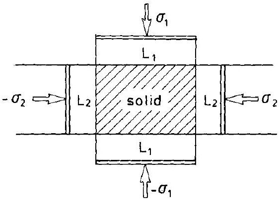
Figure 8-7. Solids under non-hydrostatic stress and the surrounding Gibbs-fluids L.

The surrounding fluid (Fig. 8-7) serves two purposes: 1) it transmits the pressure to stress-load the surface and 2) it allows the surface to equilibrate chemically and thus provides $\mu_{L}$ in Eqn. (8.61) with physical meaning. Ideally, the 'Gibbs fluid' has a vanishing buffer capacity for the solid so that after a change in $\sigma_{\mathrm{n}}$, the fluid becomes resaturated with respect to the solid before a noticeable amount of the solid or its surface dissolves. The key to verify Gibbs' relation for solids under non-hydrostatic stress is therefore the existence of such an idealized fluid.

Solid electrolytes may have the requisite properties of a 'Gibbs fluid' [W. Durham, H. Schmalzried (1987)] if 1) their conducting ion corresponds to an atomic component of the solid under stress and 2) they exhibit significant mechanical strength. Typical stress energy densities correspond to electrical potentials in the millivolt range. In order to establish them, only a small fraction of a surface monolayer of the electrolyte needs to dissolve during its equilibration with the stressed solid and
thus the electrolyte acts analogous to an ideal 'Gibbs fluid'. Electrochemical equilibrium allows us to measure (partial) Gibbs energies by the EMF of an appropriate galvanic cell. Since it is (thermodynamically) equivalent to the equilibrium between the crystal surface and a contacting fluid, the chemical potential probed by solid electrolytes is determined by the (chemical) nature and the (stress) state of the solid. Thus, Eqn. (8.61) can be applied.

In order to derive the relation between EMF and the chemical potential difference probed at different surfaces of the stressed solid, we formulate the reversible work and its electrical equivalent. If $z_{\mathrm{A}} \cdot F \cdot \mathrm{~d} n_{\mathrm{A}}$ electric charges are transported across the electrolyte between the two surfaces labeled 1 and 2 in Figure 8-8, the electrical work is

$$
\mathrm{d} W_{\mathrm{e}}=\left(E_{1}-E_{2}\right) \cdot z_{\mathrm{A}} \cdot F \cdot \mathrm{~d} n_{\mathrm{A}}
$$

Figure 8-8. Galvanic cell (schematic) for the determination of the chemical potential difference between surfaces 1 and 2 of non-hydrostatically stressed solids. Cross hatched: solid electrolyte.

The corresponding mechanical work is

$$
\mathrm{d} W_{m}=\left(\sigma_{1}-\sigma_{2}\right) \cdot V_{\mathrm{A}} \cdot \mathrm{~d} n_{\mathrm{A}}
$$

where $V_{\mathrm{A}}$ is the molar volume of A (under stress). Since the two terms must be equal in equilibrium, it follows that

$$
\Delta E=\frac{\Delta \sigma \cdot V_{\mathrm{A}}}{\left(z_{\mathrm{A}} \cdot F\right)}
$$

where $\Delta E=E_{1}-E_{2}$ and $\Delta \sigma=\sigma_{1}-\sigma_{2}$.
The Nabarro-Herring creep in solids is related to Eqn. (8.61). This creep involves the transport of atomic species from regions of higher (compressive) stress to regions of lower stress by means of (lattice) diffusion and has, at first sight, nothing to do with the dissolution of solids into fluids. Creep requires a state of non-equilibrium. The energy change by which it is driven (i.e., the mechanical work derived from moving a volume element of the solid between two points that are differently stressed), however, may be calculated from Eqn. (8.61). To this end, we assume that the transport occurs via a surrounding fluid phase rather than by diffusion across the solid.

We are now able to analyze the demixing of a solid solution $(\mathrm{A}, \mathrm{B}) \mathrm{O}(=\mathrm{MeO})$ exposed to a non-hydrostatic, uniaxial stress as shown in Figure 8-9. If transport occurs

Figure 8-9. Demixing of a solid solution (A, B)O exposed to uniaxial stress. Cross hatched: solid electrolytes.

via the cation vacancies at constant $\mu_{\mathrm{O}_{2}}$, the difference in the vacancy chemical potential between the loaded and the unloaded surfaces of the (homogeneous) solid is

$$
\Delta \mu_{\mathrm{V}}=-\Delta \sigma \cdot V_{m}
$$

since $\Delta \sigma \cdot V_{m}=\Delta \mu_{\mathrm{MeO}}=\Delta \mu_{\mathrm{Me}}=-\Delta \mu_{\mathrm{V}}$ since $\mathrm{Me}+\mathrm{V}_{\mathrm{Me}}=\mathrm{Me}_{\mathrm{Me}}$. Furthermore, $\Delta \mu_{\mathrm{V}}$ induces a vacancy flux as illustrated in Figure 8-9. From $j_{\mathrm{V}}=-c_{\mathrm{V}} \cdot b_{\mathrm{V}} \cdot\left(\Delta \mu_{\mathrm{V}} / \Delta \xi\right)$, we obtain

$$
j_{\mathrm{V}}=c_{\mathrm{V}} \cdot b_{\mathrm{V}} \cdot \frac{\Delta \sigma \cdot V_{m}}{\Delta \xi}
$$

where $\Delta \xi$ is the characteristic distance for the vacancy transport between the loaded and the unloaded surface.

If we identify $j_{\mathrm{V}}$ in Eqn. (8.66) with $j^{0}$ in Eqn. (8.3), we can use Eqn. (8.3) to calculate the (steady state) demixing when a stress driven vacancy flux flows across the solid solution (A, B)O. At a fixed oxygen potential, we obtain from the steady state condition

$$
\nabla \mu_{\mathrm{AO}}=j_{\mathrm{V}} \cdot\left(b_{\mathrm{B}}-b_{\mathrm{A}}\right) \cdot \frac{c_{\mathrm{B}}}{\left(c_{\mathrm{A}} b_{\mathrm{A}}+c_{\mathrm{B}} \cdot b_{\mathrm{B}}\right) \cdot\left(c_{\mathrm{B}} \cdot b_{\mathrm{A}}+c_{\mathrm{A}} \cdot b_{\mathrm{B}}\right)}
$$

Equation (8.67) can be integrated. If demixing is sufficiently small, a linearized version can be used. $j_{\mathrm{V}}$ is found by measuring the electrical current in the solid state galvanic cell depicted in Figure 8-9. Experiments in this area are scarce. For recent reports see [D. Dimos et al. (1988); C. Reinke (1995)].

### 8.6 Demixing in Temperature Gradients (Ludwig-Soret Effect)

In Chapter 4, we introduced transport equations that apply when there are fluxes other than those of matter that contribute to the entropy production. Assuming that both matter and electrons take part in the transport, Eqns. (4.16)-(4.17) have been derived. In non-isothermal systems, we can use the same set of equations but replace
the electron flux, $j_{\mathrm{e}}$, by the heat flux, $j_{\mathrm{q}}$ [see, for example, B. Baranowski (1954); H. Wever (1973); A. R. Allnatt, A. B. Lidiard (1987)]. Instead of Eqns. (4.16) and (4.17), we then have

$$
\begin{gathered}
j_{i}=\sum_{j}^{\prime} L_{i j} \cdot\left(X_{j}+Q_{j}^{*} \cdot X_{\mathrm{q}}\right) \\
j_{\mathrm{q}}=\sum_{j}^{\prime} Q_{j}^{*} \cdot j_{j}+\left(L_{\mathrm{qq}}-\sum L_{j \mathrm{q}} \cdot Q_{j}^{*}\right) \cdot X_{\mathrm{q}}
\end{gathered}
$$

$\Sigma^{\prime}$ indicates that the summation is over $(n-1)$ independent fluxes in the $n$-component crystal (see Eqn. (4.29)). $Q_{j}^{*} \cdot j_{j}$ is the (isothermal) energy flux due to the flux of species $j$. In an isobaric but non-isothermal system, $X_{j}=-T \cdot \nabla\left(\mu_{j}-\mu_{n}\right) / T$, $X_{\mathrm{q}}=\nabla T / T$. Inserting these forces into Eqn. (8.68), one finds

$$
j_{i}=-\sum_{j}^{\prime} L_{i j} \cdot\left(\sum_{k}^{\prime} \frac{\partial \mu_{j}-\partial \mu_{n}}{\partial N_{k}} \cdot \nabla N_{k}+\left(Q_{j}^{*}-\left(h_{j}-h_{n}\right)\right) \cdot \frac{\nabla T}{T}\right)
$$

where $h_{j}$ and $h_{n}$ denote the corresponding (partial) enthalpies. Let us redefine $Q_{j}^{*}-\left(h_{j}-h_{n}\right)$ as $\tilde{Q}_{j}$. In a matter-closed system exposed to a temperature gradient $\nabla T$, the steady state condition requires that $j_{i}=0$. Therefore, from Eqn. (8.70), we obtain the (steady state) demixing condition

$$
\sum_{k}^{\prime} \frac{\partial\left(\mu_{j}-\mu_{n}\right)}{\partial N_{k}} \cdot \nabla N_{k}=-\tilde{Q}_{j} \cdot \frac{\nabla T}{T}
$$

Eqn. (8.71) constitutes ( $n-1$ ) differential equations for the spatial distribution of $n$ components in the crystal. The set of equations is complete if the conservation of matter is taken into account. For a binary system (1-2), Eqn. (8.71) is particularly simple to handle since it reduces to

$$
\frac{\partial \mu_{1}}{\partial \ln N_{1}} \cdot \frac{\nabla N_{1}}{N_{1} \cdot N_{2}}=-\tilde{Q}_{1} \cdot \frac{\nabla T}{T}
$$

or, in the case of ideal solutions,

$$
\nabla N_{1}=-N_{1} \cdot\left(1-N_{1}\right) \cdot \frac{\tilde{Q}_{1}}{R T} \cdot \frac{\nabla T}{T}
$$

which becomes in the dilute limit

$$
\nabla N_{1} \cong-N_{1} \cdot \frac{\tilde{Q}_{1}}{R T} \cdot \frac{\nabla T}{T}
$$

$\tilde{Q}_{j}$ can be determined experimentally where upon $Q_{j}^{*}$ can then be calculated from $\tilde{Q}_{j}-\left(h_{j}-h_{n}\right)$. Both positive and negative 'heats of transport' have been found (in analogy to 'charges of transport'). $\tilde{Q}_{j}$ reflects the interaction between the phonons
and the moving components. Thus, the situation is analogous to the coupling of electrical fluxes and component fluxes as discussed in Section 8.4 (see, in particular, Eqn. (8.52)).

### 8.7 Demixing in Multiphase Systems

Let us return to Figure 8-1 and ask about the nature of the steady state in a multicomponent, multiphase system when we establish different (constant) intensive thermodynamic functions of state at the end reservoirs ( $\mathrm{R}_{1}$ and $\mathrm{R}_{2}$ ). Hereby, we generalize the situations which have been discussed so far. Without working out the solutions in any detail, let us nevertheless consider the necessary conditions and equations for a quantitative treatment and visualize the multiphase demixing with the help of reaction paths in the pertinent phase diagrams. The nomenclature is given in Figure 8-1.

If a steady state exists, both the stationary thicknesses $\Delta \xi^{(v)}$ and the chemical potential differences $\Delta \mu_{n}^{(v)}$ established in reservoirs $\mathrm{R}_{1}$ and $\mathrm{R}_{2}$ are time-independent $(v=\alpha, \beta, \ldots)$. It follows that $\nabla \mu_{i}\left(\xi^{(v)}\right)$ for the other components $i \neq n$ in all phases $v$ are also time-independent as long as the phase boundaries are morphologically stable. Furthermore, the fluxes $j_{i}^{(v)}$ are constant and, therefore, the velocity

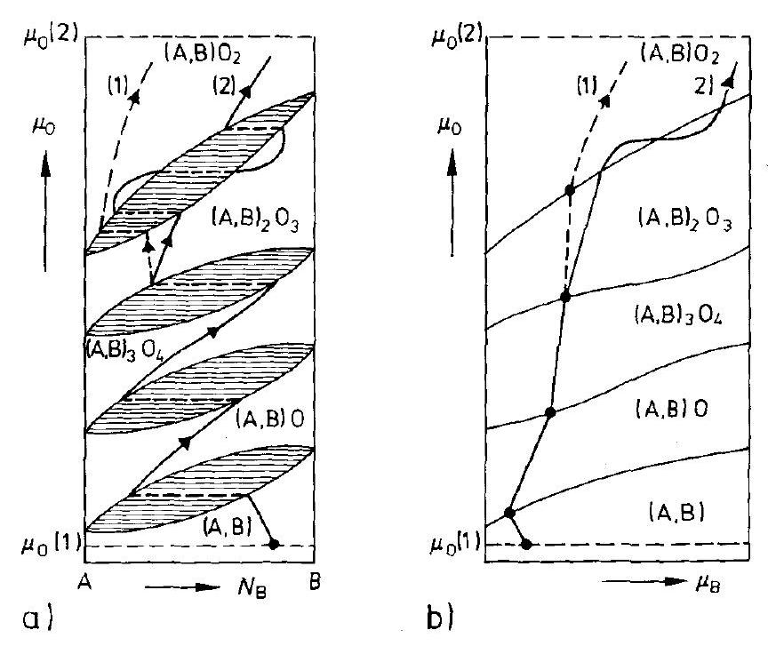
Figure 8-10. Schematic reaction path for a multiphase A-B-O system exposed to an oxygen potential difference ( $\left.\Delta \mu_{\mathrm{O}}=\mu_{\mathrm{O}}(2)-\mu_{\mathrm{O}}(1)\right)$ at opposite sites of the sample. a) Diagram of the second kind, b) diagram of the third kind.

$$
v=\frac{\Delta j_{i}^{\mathrm{b}}}{\Delta c_{i}^{\mathrm{b}}}
$$

is the same for all phase boundaries $\mathrm{b}(=\alpha / \beta, \beta / \gamma, \ldots)$ and components $i$. A component, $k^{\left(v^{\prime}\right)}$, present only in phase $v^{\prime}\left(v^{\prime}\right.$ includes $\mathrm{R}_{1}$ and $\left.\mathrm{R}_{2}\right)$ has to be mobile in this phase $v^{\prime}$ in view of Eqn. (8.75). Otherwise, no steady state can be established over the whole phase assembly, and no kinetic demixing can occur. Any immobile component, $k^{(\nu)}$, which is not present in the neighboring phases inhibits kinetic demixing since it prevents the lattice molecules from being displaced. The latter is a necessary condition for interface motion and thus kinetic demixing.

Figure 8-10 presents a schematic reaction path in a ternary multiphase A-B-O system. It illustrates some possible complications. The reaction path may re-enter the

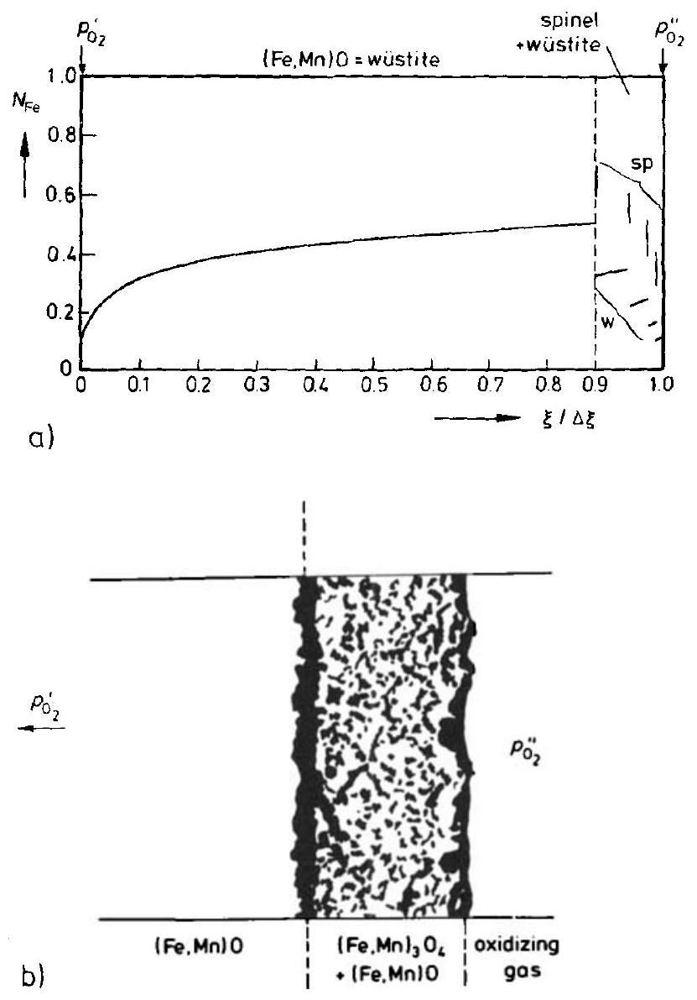
Figure 8-11. Results of a demixing experiment for $(\mathrm{Mn}, \mathrm{Fe}) \mathrm{O}_{n}$. a) Theoretical steady state concentration profile and b) phase sequence photograph. $p_{\mathrm{O}_{2}}^{\prime}=3.3 \times 10^{-6}$ bar; $p_{\mathrm{O}_{2}}^{\prime \prime}=4.6 \times 10^{-1}$ bar; $T=1200^{\circ} \mathrm{C}$; $\mathrm{sp}=$ spinel $(\mathrm{Fe}, \mathrm{Mn})_{3} \mathrm{O}_{4}, \mathrm{w}=$ wüstite $(\mathrm{Fe}, \mathrm{Mn}) \mathrm{O}$ [Y. Ueshima, et al. (1989)].

phase which it just traversed depending on the magnitude of the transport coefficients, thermodynamic factors, and the concentrations in the neighbor phases. In such a case, morphological instability of the interface develops and a two-phase assemblage is found in the sample at the same position $\xi$. The kinetics of such a reaction can hardly be treated quantitatively since nucleation, growth of new phases, and the evolution of growth morphologies all have to be taken into account. An illustration can be seen in Figure 8-11, where the theoretical and experimental results on transport in the Mn-Fe-O system are compared [Y. Ueshima, et al. (1989)].

### 8.8 Multiphase Systems in Electric Fields

In Section 8.2, we discussed multiphase systems exposed to chemical potential gradients and saw that internal electric fields build up if the transference number $t_{\mathrm{e}} \neq 1$. In this section, we investigate the influence of an external electric field and distinguish two situations: 1) electrodes are attached to the system so that an electric current can flow and 2) no electrodes are attached to the system so that no electric current can flow (except for a small, transient, polarization current). Although it has been reported [e.g., Z. Munir, H. Schmalzried (1993)] that, under both conditions, dislocations and grain boundaries move provided the electric field is sufficiently high ( $>1 \mathrm{kV} / \mathrm{cm}$ ), a convincing explanation is not yet available. Let us restrict ourselves here mainly to case 1) and consider the influence of an electric field on reacting multiphase systems to which electrodes are attached.

Electrodes can be reversible for chemical components and/or reversible for electrons. The case of electron reversible electrodes has already been treated in Section 4.4.2 (polarization cell). If the decomposition voltage of the phases located between inert electrodes is surpassed, their inertness is lost and they behave as if both electrons and components are available. This will be discussed further below. Let us first refer to Figure 8-12. If the electrodes are detached from the reacting system, the con-
a)

b)

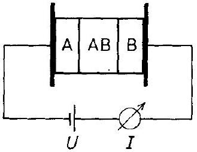
Figure 8-12. Reaction couple in an electric field. a) Electrodes detached, b) electrodes attached; : field lines.

a)

b)
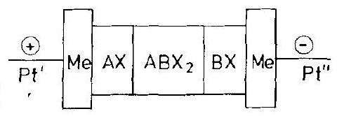

Figure 8-13. Reaction couple $\mathrm{AX} / \mathrm{ABX}_{2} / \mathrm{BX}$ in an electric field. a) Reversible electrodes attached, b) inert electrodes attached.
dition of electrical neutrality, $\sum z_{i} \cdot F \cdot j_{i}=0$, is still valid. This allows us to eliminate the electric potential gradient $\nabla \varphi$, so that the individual flux equations can be written in terms of electronically neutral components. In other words, under this condition, an external electric field plays no role in the chemical transport and the transport controlled reactions.

However, for attached electrodes in a closed electric circuit which includes the reacting system, the constraining condition is $\nabla I=0$, or $\sum z_{i} \cdot F \cdot j_{i}=I^{0}$. This equation has to be integrated by using the transport equations of Section 8.2 and taking into account the appropriate boundary conditions. To be more specific, let us refer to recent experiments with regard to the situation depicted in Figure 8-13. The reaction $\mathrm{AX}+\mathrm{BX}=\mathrm{ABX}_{2}$ is taking place while the phases involved are part of the closed electric circuit. We assume that $D_{\mathrm{X}} \ll D_{\mathrm{A}}$ and $D_{\mathrm{B}}$. Since there can be no sources or sinks of electric charge at the interfaces, the constraint $\nabla I=0$ gives us

$$
\frac{I^{0}}{F}=j_{\mathrm{A}}^{\alpha}=j_{\mathrm{B}}^{\beta}=j_{\mathrm{A}}^{\gamma}+j_{\mathrm{B}}^{\gamma}
$$

where $y$ denotes the reaction product $\mathrm{ABX}_{2}$. In order to calculate the fluxes, let us write Eqn. (8.76) explicitly. With $F \cdot \nabla \varphi \equiv \nabla \tilde{\varphi}$, we obtain (noting that $L_{\mathrm{AA}}=L_{\mathrm{A}}$, $L_{\mathrm{BB}}=L_{\mathrm{B}}$ and $L_{\mathrm{AB}}=0$ )

$$
-\nabla \tilde{\varphi}=t_{\mathrm{A}} \cdot\left(\frac{j^{0}}{L_{\mathrm{A}}}+\nabla\left(\mu_{\mathrm{AX}}-\mu_{\mathrm{BX}}\right)\right)+\nabla \mu_{\mathrm{B}^{+}}
$$

Inserting Eqn. (8.77) into the flux equations we find

$$
\begin{aligned}
& j_{\mathrm{A}}^{\gamma}=t_{\mathrm{A}} \cdot\left(j^{0}+2 \cdot L_{\mathrm{B}} \cdot \nabla \mu_{\mathrm{BX}}\right)=t_{\mathrm{A}} \cdot j^{0}-\frac{\overline{2 \cdot L_{\mathrm{A}} \cdot L_{\mathrm{B}}}}{L_{\mathrm{A}}+L_{\mathrm{B}}} \cdot \frac{\Delta G^{0}}{\Delta \xi} \\
& j_{\mathrm{B}}^{\gamma}=t_{\mathrm{B}} \cdot\left(j^{0}+2 \cdot L_{\mathrm{A}} \cdot \nabla \mu_{\mathrm{AX}}\right)=t_{\mathrm{B}} \cdot j^{0}+\frac{\overline{2 \cdot L_{\mathrm{A}} \cdot L_{\mathrm{B}}}}{L_{\mathrm{A}}+L_{\mathrm{B}}} \cdot \frac{\Delta G^{0}}{\Delta \xi}
\end{aligned}
$$

These equations show that the A and B fluxes are composed of both a drift term and a reaction term. The drift term stems from the electric field. The reaction term was already deduced in the kinetics of heterogeneous reactions. From Eqns. (8.78) and (8.79), we obtain the reaction product's rate of thickness increase to be

$$
\frac{1}{V_{\mathrm{ABX}_{2}}} \cdot \frac{\mathrm{~d} \Delta \xi}{\mathrm{~d} t}=j^{0} \cdot\left(t_{\mathrm{A}}+t_{\mathrm{B}}\right)+\frac{\overline{4 \cdot L_{\mathrm{A}} \cdot L_{\mathrm{B}}}}{L_{\mathrm{A}}+L_{\mathrm{B}}} \cdot \frac{\left|\Delta G^{0}\right|}{\Delta \xi}=\dot{r}_{\mathrm{U}}^{\gamma}+\dot{r}_{\mathrm{R}}^{\gamma}
$$

where $\dot{r}_{\mathrm{U}}$ refers to the first and $\dot{r}_{\mathrm{R}}$ to the second term. From Eqn. (8.80) and the fact that $j^{0}\left(I^{0}\right)$ depends on the (externally) applied voltage $U^{0}$, we conclude that the reaction rate depends on $U^{0}$ as well. By expressing the total voltage drop $U^{0}$ as $U^{\alpha}+U^{\beta}+\Delta U^{\gamma}$, we find that $\dot{r}_{\mathrm{U}}$, the field dependent reaction rate, can be explicitly expressed as

$$
\dot{r}_{\mathrm{U}}^{\gamma}=\left(t_{\mathrm{A}}-t_{\mathrm{B}}\right) \cdot \frac{\tilde{U}^{0}-\left(t_{\mathrm{A}}-t_{\mathrm{B}}\right) \cdot \Delta G^{0}}{\frac{\xi^{\alpha}}{\sigma^{\alpha}}+\frac{\xi^{\beta}}{\sigma^{\beta}}+\frac{\Delta \xi}{\left(F \cdot\left(L_{\mathrm{A}}+L_{\mathrm{B}}\right)\right)}}
$$

Thus, $\dot{r}_{\mathrm{U}}$ vanishes as soon as $t_{\mathrm{A}}=t_{\mathrm{B}}\left(D_{\mathrm{A}}=D_{\mathrm{B}}\right)$ and is essentially proportional to $\tilde{U}^{0}\left(=F \cdot U^{0}\right)$ if the applied voltage is high enough. The correction term $\left(t_{\mathrm{A}}-t_{\mathrm{B}}\right) \cdot \Delta G^{0}$ accounts for the diffusion potential which arises in the reaction product. Also, from Eqns. (8.80) and (8.81), we can see that the growth of $\mathrm{ABX}_{2}$ is parabolic only for long times.

The foregoing analysis has been concerned with ionic conducting crystals. In metal systems, to a first order, the applied voltage has no influence on the reaction rate of the $\alpha / \gamma / \beta$ system. In a semiconducting reaction couple, the electric current (under the same conditions as before) is

$$
\frac{I^{0}}{F}=j_{\mathrm{A}}^{\alpha}-j_{\mathrm{e}}^{\alpha}=j_{\mathrm{B}}^{\beta}-j_{\mathrm{e}}^{\beta}=j_{\mathrm{A}}^{\gamma}+j_{\mathrm{B}}^{\gamma}-j_{\mathrm{e}}^{\gamma}
$$

Equation (8.82) can be compared with Eqn. (8.76) for ionic crystals. After eliminating $\nabla \tilde{\varphi}$, we obtain for $j_{\mathrm{A}}^{\gamma}$

$$
j_{\mathrm{A}}^{\gamma}=-L_{\mathrm{A}} \cdot\left(t_{\mathrm{e}}-\left(\left(1+\frac{2 t_{\mathrm{B}}}{t_{\mathrm{e}}}\right) \cdot \nabla \mu_{\mathrm{AX}}-\nabla \mu_{\mathrm{X}}\right)-\frac{j^{0}}{\sum L_{i}}\right)
$$

Since $L_{\mathrm{A}} / \sum L_{i} \ll 1$ and $t_{\mathrm{e}} \cong 1$, we infer from Eqn. (8.83) for a semiconducting product that

$$
j_{\mathrm{A}}^{\gamma} \cong-L_{\mathrm{A}} \cdot \frac{\Delta G^{0}-\Delta \mu_{\mathrm{X}}}{\Delta \xi}
$$

If the electrodes are reversible for $\mathrm{X}\left(\frac{1}{2} \cdot \mathrm{X}_{2}\right)$, and the reacting system is surrounded by $\mathrm{X}_{2}(\mathrm{~g})$, then $\Delta \mu_{\mathrm{X}}$ vanishes. Since $j_{\mathrm{A}}$ (and similarly $j_{\mathrm{B}}$ ) is responsible for the
growth of the reaction layer, there is thus no influence of the electric field on $\Delta \dot{\xi}$. The semiconduction has decoupled the fluxes $j_{\mathrm{A}}$ and $j_{\mathrm{B}}$.

Experimental studies in the literature are not always conclusive [see, for example, A. Y. Neimann, et al. (1985), (1986)]. They work with polycrystalline, porous samples in which quite a number of possible side effects (e.g., at necks) render the results ambiguous. In addition, the theoretical analysis is partly inadequate. Nevertheless, the equations and conclusions which have been worked out here are fundamental to the understanding of many multiphase, multicomponent systems under electric loads. Those systems are common elements in modern electrical technologies.

## References

Allnatt, A. R., Lidiard, A. B. (1987) Rep. Progr. Phys., 50, 373
Allnatt, A. R., Lidiard, A.B. (1993) Atomic Transport in Solids, Cambridge University Press
Baranowski, B. (1954) Zhur. Fiz. Khim., 28, 1676
Dieckmann, R. (1977) Z. phys. Chem., NF107, 189
Dimos, D., et al. (1988) Acta Met. 36, 1543
Durham, W., Schmalzried, H. (1987) Ber. Bunsenges. Phys. Chem., 91, 556
Gibbs, J. W. (1878) in Scientific Papers I, Dover Publ., (1961), New York
de Groot, S. R. (1952) Thermodynamics of Irreversible Processes, North-Holland, Amsterdam
de Groot, S. R., Mazur, P. (1962) Non-Equilibrium Thermodynamics, North-Holland, Amsterdam
Hirth, J. P. (1980) Met. Trans., A11, 861
Janek, J. (1992) Dynamische Wechselwirkungen bei Transportvorgängen in Übergangsmetalloxiden, Ph. D.-Dissertation, Universität Hannover
Johnson, H.H. (1988) Met. Trans., A19, 2371
Laqua, W., Schmalzried, H. (1983) in High Temperature Corrosion (Ed.: R.A. Rapp), NACE, Houston, 115
Lewis, F. A. (1967) The Palladium-Hydrogen System, Academic Press, New York
Manning, J. R. (1968) Diffusion Kinetics for Atoms in Crystals, van Nostrand, Princeton
Martin, M. (1991) Ceram. Trans., 24, 91
Munir, Z., Schmalzried, H. (1993) J. Mat. Synth. Process, 1, 1
Neimann, A.Y., et al. (1985), (1986) Russ. J. Phys. Chem., 59, 1406; 60, 1733
Petot-Ervas, G., et al. (1992) Solid State Ionics, 53-56, 270
Reinke, C. (1995) Einfluß elastischer Spannung auf Thermodynamik und Kinetik fester Körper, Ph. D.-Dissertation, Universität Hannover
Schmalzried, H., et al. (1979) Z. Naturforsch., 34a, 192
Schmalzried, H., Laqua, W. (1981) Oxid. Metals, 15, 339
Tetot, R., et al. (1994) J. Phys. Chem. Solids, 55, 617
Ueshima, Y., et al. (1989) Ber. Bunsenges. Phys. Chem., 93, 24
Wagner, C. (1975) Progr. Solid State Chem., 10, 3
Wever, H. (1973) Elektro- und Thermotransport in Metallen, J. A. Barth, Leipzig
Yoo, H. I., et al. (1994) Solid State Ionics, 67, 317

## 9 Internal Reactions

### 9.1 Introduction

Heterogeneous reactions of the type $\mathrm{A}+\mathrm{B}=\mathrm{AB}$ can, in principle, occur in two ways. 1) The product molecule AB is formed from A and B in the surrounding solvent or immediately at the surface of the $A B$ crystal. These $A B$ molecules are then added to the crystal on its external surface. This is additive crystal growth. 2) The solid product AB forms between A and B and separates the reactants spatially. Further reaction is possible only via (diffusional) transport across the reaction layer AB. This is reactive crystal growth [H. Schmalzried (1993)]. The moving AB interfaces in additive crystal growth are inherently unstable morphologically (see Chapter 11).

Chapters 6 and 7 dealt with solid state reactions in which the product separates the reactants spatially. For binary (or quasi-binary) systems, reactive growth is the only mode possible for an isothermal heterogeneous solid state reaction if local equilibrium prevails and phase transitions are disregarded. In ternary (and higher) systems, another reactive growth mode can occur. This is the 'internal reaction' mode. The reaction product does not form at the contacting surfaces of the two reactants as discussed in Chapters 6 and 7, but instead forms within the interior of one of the reactants or within a solvent crystal.

By a change of temperature or pressure, it is often possible to cross the phase limits of a homogeneous crystal. It supersaturates with respect to one or several of its components, and the supersaturated components eventually precipitate. This is an additive reaction. It occurs either externally at the surfaces, or in the crystal bulk by nucleation and growth. Reactions of this kind from initially homogeneous and supersaturated solid solutions will be discussed in Chapter 12 on phase transformations. Internal reactions in the sense of the present chapter occur after crystal A has been brought into contact with reactant B , and the product AB forms isothermally in the interior of A or B . Point defect fluxes are responsible for the matter transport during internal reactions, and local equilibrium is often established throughout.

Several types of internal solid state reactions may be distinguished. One type that has been carefully studied both experimentally and theoretically is the internal oxidation of metal alloys. By investigating tarnishing processes during the hot corrosion of alloys, it was found that under certain conditions (to be specified later), the oxide product did not form as an external layer on the metal surface. Rather, it formed as a fine grained precipitate in the interior of the bulk metal. The product particles nucleated at an advancing front which was more or less sharp. The front sometimes moves periodically in space and time, analogous to the Liesegang phenomenon [C. Wagner (1950)]. Internal metal oxidation has been widely studied in the past in view of its technological importance (e.g., dispersion hardening). Modern experimen-
tal in-situ methods of solid state physics, as outlined in Chapter 16, are used for the analysis of the product's composition, structure, and morphology.

Recently, internal reactions have been observed during the oxidation and reduction of nonmetallic crystalline compounds (e.g., ternary oxides and oxide glasses). Although apparently similar, the underlying transport processes in the reacting oxide systems are shown to be quite different from those that occur during the internal oxidation of alloys. The phenomenological observations on ternary oxides are as follows. The internal precipitation front advances $(\sim \sqrt{t})$ into the bulk after a change in the oxidation (reduction) potential of the nonmetallic component at the external surface of the solid solution (e.g., (A,B)X). The internal oxidation (reduction) process takes place even if the mobility of the nonmetallic component (or rather the anions, e.g., oxygen ions) in the solid solution is vanishingly small. Since it is a neutral component that must be transported to the reaction front (in form of ions plus electrons), internal oxidation (reduction) can only occur in semiconducting and mixed conducting matrix crystals, but not in purely ionic conductors.

A third type of internal solid state reaction (see later in Fig. 9-12) is characterized by two (solid) reactants $\mathbf{A}$ and $\mathbf{B}$ which diffuse into a crystal $\mathbf{C}$ from opposite sides. C acts as a solvent for A and B . If the reactants form a stable compound AB with each other (but not with the solvent crystal C ), an internal solid state reaction eventually takes place. It occurs in the solvent crystal at the location of maximum supersaturation of AB by internal precipitation and subsequent growth of the AB particles. Similar reactions can be observed on a crystal surface which, in this case, plays the role of the solvent matrix C . Surface transport of the reactants leads to a product band precipitated on the surface at some distance from each of the two reactants and completely analogous to the internal reactions described before. In addition, internal reactions have also been observed if (viscous) liquids are chosen as the reaction media (C).

There is still another type of internal solid state reaction which we will discuss and it is electrochemical in nature. It occurs when an electrical current flows through a mixed conductor in which the point defect disorder changes in such a way that the transference of electronic charge carriers predominates in one part of the crystal, while the transference of ionic charge carriers predominates in another part of it. Obviously, in the transition zone (junction) a (electrochemical) solid state reaction must occur. It leads to an internal decomposition of the matrix crystal if the driving force (electric field) is sufficiently high. The immobile ionic component is internally precipitated, whereas the mobile ionic component is carried away in the form of electrically charged point defects from the internal reaction zone to one of the electrodes.

Internal nucleation and growth can occur coherently or incoherently while the reaction volume can be negative or positive. The severe constraints which the matrix crystal exerts on the internal reaction can lead to the formation of metastable (or even unstable) phases, which do not exist outside the matrix. Often, heavy plastic flow and anisotropic growth has been found.

In Chapter 11, growth morphologies are dealt with and the question is raised as to which conditions make the moving phase boundaries morphologically stable or unstable during solid state reactions. One criterion for instability is met if the interface moves against the flux direction of the rate determining (slow) reaction partner.

Under this criterion, an internal solid state reaction is the extreme of a reaction with morphologically unstable boundaries. In the following sections, the different types of internal solid state reactions will be discussed and treated quantitatively $[\mathbf{H}$. Schmalzried, M. Backhaus-Ricoult (1993)].

### 9.2 Internal Oxidation of Metals

Alloy oxidation processes are far more complex than the oxidation of metallic elements. Let us also distinguish between external and internal oxidation. In external oxidation, a layer forms by way of a heterogeneous reaction as discussed in Chapter 7. In this section, however, we are concerned with the internal oxidation of alloys. Pure metal A can only be oxidized externally. The simplest system for the study of internal oxidation is the binary metal alloy ( $\mathrm{A}, \mathrm{B}$ ), to which we shall confine our discussion.

The basic parameters which determine the kinetics of internal oxidation processes are: 1) alloy composition (in terms of the mole fraction $N_{\mathrm{B}}=\left(1-N_{\mathrm{A}}\right)$ ), 2) the number and type of compounds or solid solutions (structure, phase field width) which exist in the ternary A-B-O system, 3) the Gibbs energies of formation and the component chemical potentials of the phases involved, and last but not least, 4) the individual mobilities of the components in both the metal alloy and the product determine the (quasi-steady state) reaction path and thus the kinetics. A complete set of the parameters necessary for the quantitative treatment of internal oxidation kinetics is normally not at hand. Nevertheless, a predictive phenomenological theory will be outlined.

An alloy oxidizes internally if the less noble solute B , which has been dissolved in the more noble metal A , is oxidized to $\mathrm{BO}\left(\mathrm{BO}_{n}\right)$ in the interior of the metal matrix before it has time to diffuse to the surface (where oxygen is available with sufficiently high activity). In other words, oxygen is transported into the crystal faster than $\mathbf{B}$ diffuses from the interior to the surface. The situation is illustrated in Figure 9-1. Internal oxidation is observed, for example, if Ag alloyed with small additions of $\mathrm{Al}, \mathrm{Cd}$, or Cu is exposed to air. When the Gibbs energy of $\mathrm{BO}\left(\mathrm{BO}_{n}\right)$ formation

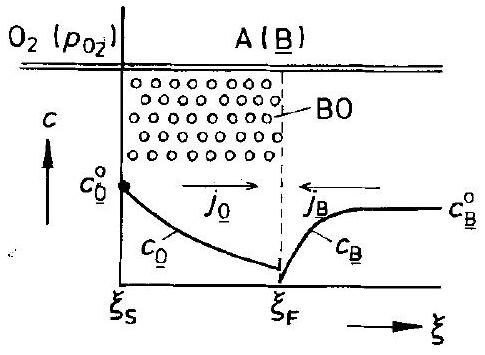
Figure 9-1. Internal oxidation of an (A,B) alloy. B and O are dilute solutes in the solvent matrix A .

is strongly negative, the equilibrium condition for the reaction $\mathrm{B}+\mathrm{O}=\mathrm{BO}$ results in a negligibly small concentration of $\mathbf{B}$ in the (A, B) solid solution immediately behind the internal reaction front $\left(\xi_{\mathrm{F}}\right)$, where the dissolved oxygen $(\mathrm{O})$ is in excess. Since both B and O diffuse to the front of their respective concentration gradients to further form BO, this diffusion controls the reaction kinetics. Since the component activities are fixed at $\xi=0$ and $\xi=\xi_{\mathrm{F}}$, the reaction front $\xi_{\mathrm{F}}$ in the crystal advances parabolically, that is,

$$
\xi_{\mathrm{F}}=2 \cdot \alpha \cdot \sqrt{D_{\mathrm{O}} \cdot t}
$$

where $\alpha$ is the growth parameter. It will be defined below and depends on both the composition and the mobilities of A and B . Equation (9.1) holds for a linear and (semi-)infinite diffusion geometry because it satisfies the differential equations of transport and all the boundary conditions (Fig. 9-1). The explicit solution to Fick's second law is [C. Wagner (1959)]

$$
\begin{aligned}
& \frac{N_{\mathrm{O}}}{N_{\mathrm{O}}^{0}}=1-\frac{\operatorname{erf}\left(\frac{\xi}{2} \cdot \sqrt{D_{\mathrm{O}} \cdot t}\right)}{\operatorname{erf} \alpha} \\
& \frac{N_{\mathrm{B}}}{N_{\mathrm{B}}^{0}}=1-\frac{\operatorname{erfc}\left(\frac{\xi}{2} \cdot \sqrt{D_{\mathrm{B}} \cdot t}\right)}{\operatorname{erf}\left(\frac{\alpha}{\sqrt{D_{\mathrm{O}} / D_{\mathrm{B}}}}\right)}
\end{aligned}
$$

The growth parameter $\alpha$ can be readily calculated provided the diffusivities ( $D_{\mathrm{O}}$ and $D_{\mathrm{B}}$ ) of O and B in the matrix are known and can be assumed constant at sufficient dilution. From the condition of continuity at $\xi_{\mathrm{F}}\left(j_{\mathrm{O}}=-n \cdot j_{\mathrm{B}}\right.$, if $\mathrm{BO}_{n}$ is formed) an implicit equation for the determination of $\alpha$ is obtained. Thus, with $N_{\mathrm{O}}^{0}=N_{\mathrm{O}} (\xi=0)$ and $N_{\mathrm{O}}^{0}=N_{\mathrm{B}}(\xi=\infty)$

$$
N_{\mathrm{O}}^{0} \cdot \sqrt{D_{\mathrm{O}} / D_{\mathrm{B}}} \cdot \mathrm{e}^{\alpha^{2} \cdot\left(D_{\mathrm{O}} / D_{\mathrm{B}}\right)} \cdot\left(1-\operatorname{erf} \alpha \cdot \sqrt{D_{\mathrm{O}} / D_{\mathrm{B}}}\right)=N_{\mathrm{B}}^{0} \cdot \mathrm{e}^{\alpha^{2}}
$$

If $D_{\mathrm{O}} N_{\mathrm{O}} \gg D_{\mathrm{B}} N_{\mathrm{B}}$, Eqn. (9.4) can be simplified to yield

$$
\alpha=\left(\frac{N_{\mathrm{O}}^{0}}{2 N_{\mathrm{B}}^{0}}\right)^{1 / 2}
$$

whereupon the parabolic rate law becomes

$$
\xi_{\mathrm{F}}=\sqrt{2 \cdot D_{\mathrm{O}} \cdot\left(\frac{N_{\mathrm{O}}^{0}}{N_{\mathrm{B}}^{0}}\right) \cdot t}
$$

In this particular case, there is no transport of component $\mathbf{B}$ towards the surface. $\mathbf{B O}$ is homogeneously precipitated in the region $\xi<\xi_{F}$, and the BO fraction corresponds to the concentration of B in the initially homogeneous alloy. Although the BO fraction is spatially constant in this case, the size of the BO particles is not. The increase in supersaturation becomes slower as the reaction front $\xi_{\mathrm{F}}$ advances. Thus, the number of precipitating particles becomes smaller with increasing time and, consequently, their volumes become larger since the local product of number times volume remains constant.

Even if the transport product $c_{\mathrm{B}} \cdot D_{\mathrm{B}}$ of component B in the alloy ( $\mathrm{A}, \mathrm{B}$ ) cannot be neglected in comparison to that of oxygen, internal oxidation may still occur. The amount of BO precipitates will then be enhanced toward the alloy surface. In this way, a transition from internal to external oxidation becomes more and more likely. This transition (i.e., the formation of a dense external BO layer) is expected to occur if

$$
N_{\mathrm{B}}^{0} \geqq \frac{\pi}{2} \cdot \frac{N_{\mathrm{O}}^{0}}{N_{\mathrm{B}}^{0}} \cdot \frac{D_{\mathrm{O}}}{D_{\mathrm{B}}} \cdot \frac{V_{m}}{V_{\mathrm{BO}}} \cdot \lambda^{*}
$$

where $\lambda^{*}$ denotes a critical volume fraction of BO (ca. 0.5), and $V_{m}$ is the molar volume of the alloy. Thus, the relative initial values of the product $N_{\mathrm{B}}^{0} \cdot D_{\mathrm{B}}$ and $N_{\mathrm{O}}^{0} \cdot D_{\mathrm{O}}$ of dissolved oxygen near the alloy surface together determine whether external or internal oxidation will take place. Recently, the very early stages of internal alloy oxidation have gained special attention since modern nuclear spectroscopy techniques (e.g., PAC, see Section 16.4) could be applied to observe their evolution [W. Bolse, et al. (1987); W. Bolse, et al. (1989)].

Sometimes, periodic precipitation bands of internal reaction products have been found during the course of oxidation. This phenomenon originates from the interplay between diffusional transport, component supersaturation, and the nucleation (and growth) process in which a Gibbs energy barrier must be overcome. The underlying 'Liesegang phenomenon' was first treated quantitatively by [C. Wagner (1950)].

In many investigations, $\xi_{\mathrm{F}}(=$ width of the oxidation zone) has been measured and the results have been compared with theoretical reaction rates [E. Verfurth, R.A. Rapp (1964)]. In technical applications, the internal oxidation zone sometimes forms below an external oxide scale. Analytical solutions for these cases are also available [C. Wagner (1968)].

### 9.3 Internal Reactions in Nonmetallic Systems

### 9.3.1 Internal Oxidation in Nonmetallic Solid Solutions

While the internal oxidation of metal alloys has long been known and likewise intensively studied, the internal oxidation of nonmetallic inorganic compounds and solid solutions is only a recent field of research [H. Schmalzried (1983)]. Figure 9-2 helps

Figure 9-2. Schematic A-B-O phase diagram (Gibbs triangle) with tie lines between the following phases of complete solubility: $(\mathrm{A}, \mathrm{B}),(\mathrm{A}, \mathrm{B}) \mathrm{O},(\mathrm{A}, \mathrm{B})_{3} \mathrm{O}_{4},(\mathrm{~A}, \mathrm{~B})_{2} \mathrm{O}_{3}$. B-oxides are more stable than A-oxides. I, II, III denote two-phase fields.

to classify the various internal oxidation (and reduction) processes. It shows a schematic Gibbs A-B-O phase diagram with complete solid solution series A-B, AO-BO, and $\mathrm{A}_{3} \mathrm{O}_{4}-\mathrm{B}_{3} \mathrm{O}_{4}$. Internal metal alloy oxidation can occur in field I. What about the oxidation processes that take place in field II? We start with an oxide solid solution and oxidize it to a higher oxide. If the product is precipitated internally instead of forming an external layer, the reaction may be classified as an 'internal oxidation of the oxide'. It is the result of an increase in the oxygen chemical potential $\mu_{\mathrm{O}_{2}}$ at the surface of the reactant oxide.

In evaluating the course of internal oxidation reactions, phase diagrams of the second kind (as already applied in previous chapters) are preferred over the Gibbs triangle in Figure 9-2. As can be seen in Figure 9-3, one essentially replaces the mole fraction of oxygen, $N_{\mathrm{O}}$, in Figure 9-2 by its chemical potential ( $\mu_{\mathrm{O}_{2}}$ ). In this way, one can easily visualize the reaction path after changing the oxygen potential into the stability range of the higher oxide.

We can formulate the kinetic equations for ( $\mathrm{A}, \mathrm{B}$ ) O oxide solutions. If it is assumed that the oxygen component (or rather the oxygen ion sublattice) is immobile (which, in the case of metal alloy oxidation, would forbid any internal reaction) and, furthermore, that $\left|\Delta G_{\mathrm{AO}}\right| \gg\left|\Delta G_{\mathrm{BO}}\right|$, then the oxidation product is essentially $\mathrm{AB}_{2} \mathrm{O}_{4}$ as indicated in Figure 9-3. Let us, for the moment, disregard 1) the influence

Figure 9-3. Two schematic phase diagrams of the second kind ( $\log p_{\mathrm{O}_{2}}$ vs. $y_{\mathrm{B}}=N_{\mathrm{B}} /\left(N_{\mathrm{A}}+N_{\mathrm{B}}\right)$ for an A-B-O system. Reaction paths for internal oxidation are indicated.

Figure 9-4. Reaction scheme for the internal oxidation according to Figure 9-3.

of a possible lattice mismatch and 2 ) the influence any coherency of the precipitates will have on nucleation and growth, and thus on the initial solid state reaction kinetics. The reaction scheme is given in Figure 9-4. At the reaction front $\xi_{\mathrm{F}}$, the (chemical) reaction comprises the local rearrangement from the B 1 structure of (A,B)O to the spinel structure of the product as driven by the influx of cation vacancies ( = outflux of cations) and a charge compensating flux of electronic defects. This reaction can be written in the form of a quasi-chemical (SE) equation as

$$
\xrightarrow{\mathrm{V}_{\mathrm{Me}}^{\prime \prime}+2 \cdot \mathrm{~h}^{\cdot}+2 \cdot \mathrm{AO}+2 \cdot \mathrm{BO}=\mathrm{AB}_{2} \mathrm{O}_{4}+\mathrm{A}_{\mathrm{Me}}^{2+}}
$$

The arrows denote ingoing $(\rightarrow)$ and outgoing $(\leftarrow)$ (Fig. 9-4). It is implicit in Eqn. (9.8) that the $\mathrm{B}_{\mathrm{Me}}^{2+}$ ions of the wüstite $(\mathrm{W})$ are oxidized to $\mathrm{B}_{\mathrm{Me}}^{3+}$ when they form the spinel $(\mathrm{Sp})$ lattice. If we neglect any lattice mismatch, $V_{m}^{\mathrm{W}}=\frac{1}{4} \cdot V_{m}^{\mathrm{Sp}}$. Let us designate the volume fraction of the spinel product in the (internal) reaction zone as $\lambda$. The rate of advance of the front ( $\xi_{\mathrm{F}}$ ) can then be written as

$$
\dot{\xi}_{\mathrm{F}}=\frac{4 \cdot V_{m}^{\mathrm{W}}}{\lambda} \cdot j_{\mathrm{V}}
$$

This equation says that if the advance corresponds to 1 mole of oxygen, $(\lambda / 4)$ moles of vacancies arrived at the reaction front $\left(4 \cdot(\mathrm{~A}, \mathrm{~B}) \mathrm{O} \rightarrow(\mathrm{A}, \mathrm{B})_{3} \mathrm{O}_{4}\right)$. As long as $\lambda$ attains a constant ( = steady state) value, the balance of B cations yields (with respect to the local reaction $\mathrm{A}_{1-N^{0}} \mathrm{~B}_{N^{0}} \mathrm{O}=(1-\lambda) \cdot \mathrm{A}_{1-N} \mathrm{~B}_{N} \mathrm{O}+(\lambda / 4) \cdot \mathrm{AB}_{2} \mathrm{O}_{4}+\mathrm{A}^{2+}$ ions)

$$
\lambda=\frac{2 \cdot\left(N^{0}-N\right)}{1-2 \cdot N} \cong 2 \cdot\left(N^{0}-N\left(1-2 \cdot N^{0}\right)\right) \simeq 2 \cdot N^{0}
$$

For the last part of Eqn. (9.10), we have assumed that $N \ll 1$, corresponding to a high thermodynamic stability of the (spinel) product phase. A semi-quantitative, and by no means strict, discussion of the internal reaction kinetics is as follows. As long as $\operatorname{div} j_{\mathrm{V}}=0$ in the region $\xi_{\mathrm{S}}<\xi<\xi_{\mathrm{F}}$, we can formulate the cation vacancy flux as

$$
j_{\mathrm{V}}=\tilde{D}_{\mathrm{V}} \cdot \frac{c_{\mathrm{V}}^{\mathrm{S}}-c_{\mathrm{V}}^{\mathrm{F}}}{\Delta \xi}
$$

From Eqn. (9.11), we can eventually evaluate $\Delta \xi\left(=\xi_{\mathrm{F}}+\left|\xi_{\mathrm{S}}\right|\right)$ as the width of the internal (spinel) precipitate region, as a function of time. $\xi_{\mathrm{S}}$ is the coordinate of the surface (Fig. 9-4). It moves towards the oxidizing gas at a velocity of $V_{m} \cdot j_{\mathrm{V}}$, where $j_{\mathrm{V}}$ corresponds to the $\mathrm{A}^{2+}$ cation counterflux arriving at the surface ( $\xi_{\mathrm{S}}$ ) and being oxidized by $\mathrm{O}_{2}(\mathrm{~g})$ to AO (and the compensating electron holes which flow with the vacancies to the reaction front). We thus obtain

$$
\Delta \dot{\xi}=\left(\left|\dot{\xi}_{\mathrm{S}}\right|+\dot{\xi}_{\mathrm{F}}\right)=j_{\mathrm{V}} \cdot \frac{1+\lambda / 4}{\lambda} \cdot 4 \cdot V_{m}^{\mathrm{W}}=\frac{2+N^{0}}{N^{0}} \cdot V_{m}^{\mathrm{W}} \cdot \tilde{D}_{\mathrm{V}}^{\mathrm{S}} \cdot \frac{c_{\mathrm{V}}^{\mathrm{S}}-c_{\mathrm{V}}^{\mathrm{F}}}{\Delta \xi}
$$

If we now assume that $\tilde{D}_{\mathrm{V}}$ is constant and $c_{\mathrm{V}}^{\mathrm{F}}<c_{\mathrm{V}}^{\mathrm{S}}$, Eqn. (9.12) can be integrated to yield a parabolic rate law

$$
\Delta \xi^{2}=2 \cdot k_{\mathrm{P}} \cdot t ; \quad k_{\mathrm{P}}=\frac{2+N^{0}}{N^{0}} \cdot\left(\tilde{D}_{\mathrm{V}}^{\mathrm{S}} \cdot N_{\mathrm{V}}^{\mathrm{S}}\right) \simeq \frac{2}{N^{0}} \cdot\left(\tilde{D}_{\mathrm{V}}^{\mathrm{S}} \cdot N_{\mathrm{V}}^{\mathrm{S}}\right)
$$

We note that ( $\tilde{D}_{\mathrm{V}}^{\mathrm{S}} \cdot N_{\mathrm{V}}^{\mathrm{S}}$ ) is proportional to the self-diffusion coefficient of the cations in AO near the surface.

These assumptions, however, oversimplify the problem. The parent (A, B)O phase between the surface and the reaction front coexists with the precipitated $(\mathrm{A}, \mathrm{B})_{3} \mathrm{O}_{4}$ particles. These particles are thus located within the oxygen potential gradient. They vary in composition as a function of $\mu_{\mathrm{O}_{2}}(\xi)$ since they coexist with ( $\mathrm{A}, \mathrm{B}$ ) O ( $N_{\mathrm{B}} \ll 1$; see Fig. 9-3). In the $\Delta \xi$ region, the point defect thermodynamics therefore become very complex [F. Schneider, H. Schmalzried (1990)]. Furthermore, $\tilde{D}_{\mathrm{V}}$ is not constant since it is the 'chemical' diffusion coefficient and as such it contains the thermodynamic factor $f_{\mathrm{V}}=\left(\partial \mu_{\mathrm{V}} / \partial \ln c_{\mathrm{V}}\right)$. In most cases, one cannot quantify these considerations because the point defect thermodynamics are not available. A parabolic rate law for the internal oxidation processes of oxide solid solutions is expected, however, if the boundary conditions at the surface ( $\xi_{\mathrm{S}}$ ) and at the reaction front ( $\xi_{\mathrm{F}}$ ) become time-independent. This expectation is often verified by experimental observations [K. Ostyn, et al. (1984); H. Schmalzried, M. Backhaus-Ricoult (1993)].

Let us now compare the internal oxidation of nonmetallic (oxide) solid solutions with the internal oxidation of metal alloys. The role of the (neutral) point defect
pairs (e.g., cation vacancies and electron holes) in the oxidation process of the oxide solution is similar to the role of dissolved atomic oxygen in the metal matrix during alloy oxidation. This becomes obvious if we consider the equilibrium condition of the defect reaction $\frac{1}{2} \cdot \mathrm{O}_{2}=\left(\mathrm{V}_{\text {cat }}^{\prime \prime}+2 \cdot \mathrm{~h}^{*}\right)+\mathrm{O}_{\mathrm{O}}^{2-}$ and note that 1$)\left(\mathrm{V}_{\text {cat }}^{\prime \prime}+2 \cdot \mathrm{~h}^{*}\right)$ are the mobile point defects which act as the oxidizing agent and 2) $\mathrm{O}_{0}^{2-}$ builds up the anion sublattice throughout the whole crystal. A criterion for the transition from an external to an internal oxidation of oxide solid solutions has been derived in analogy to Eqn. (9.7), which describes this transition for metal alloys. The non-metal criterion reads [H. Schmalzried (1983)]

$$
D_{\mathrm{V}} \cdot N_{\mathrm{V}}\left(\xi_{\mathrm{S}}\right) \geq \alpha \cdot\left(D_{\mathrm{B}} \cdot N_{\mathrm{B}}^{0}\right)
$$

where $\alpha$ is a numerical factor of the order of unity. Since $D_{\mathrm{V}}$ is always large compared to $D_{\mathrm{B}}$ (because B is rendered mobile through the individual activated jumps of V , and $N_{\mathrm{B}}$ is $>N_{\mathrm{V}}$ ), one may predict that the internal oxidation of nonmetallic solid solutions $(\mathrm{A}, \mathrm{B}) \mathrm{O}$ (or $(\mathrm{A}, \mathrm{B}) \mathrm{X}$ ) should be even more common than the internal oxidation of metal alloys. These general modes of internal oxidation can play an important role in metallurgy, materials science, and geochemistry. They alter the properties of the matrix crystals, and in particular the mechanical properties, by dispersion hardening. Internal oxidation may also be seen in the context of the morphological evolution of reaction patterns in higher than two-component systems. It constitutes a limiting case of multicomponent, multiphase, transport controlled chemical reaction processes. In contrast to other systems with morphologically unstable phase boundaries (for example, systems with interwoven phases), the products of internal oxidation are found to be spatially isolated and dispersed in the solid solution matrix.

### 9.3.2 Internal Reduction in Nonmetallic Solutions

We have discussed the oxidation kinetics of metal alloys and of oxide solutions. These reactions lead to dispersed internal products rather than to external product layers. In the present section, let us pose a different question: can the reduction of (nonmetallic) solid solutions (e.g., $(\mathrm{A}, \mathrm{B})_{2} \mathrm{O}_{3}$ to $(\mathrm{A}, \mathrm{B})_{3} \mathrm{O}_{4},(\mathrm{~A}, \mathrm{~B})_{3} \mathrm{O}_{4}$, to $(\mathrm{A}, \mathrm{B}) \mathrm{O}$, or $(\mathrm{A}, \mathrm{B}) \mathrm{O}$ to $(\mathrm{A}, \mathrm{B})$ ) similarly lead to internally precipitated particles of the reduced product? If so, then do these reactions occur in field III, II, or I of the Gibbs triangle plotted in Figure 9-2? We further note that the reaction $(\mathrm{A}, \mathrm{B}) \mathrm{O} \rightarrow(\mathrm{A}, \mathrm{B})$ is the fundamental process of ore reduction.

We observe once more that the morphological instability of phase boundaries, which eventually leads to isolated internal precipitates, can only occur in ternary and higher systems. Figure 9-5 illustrates the reaction path of an internal reduction reaction. Practically speaking, after the external surface of an appropriate oxide (or other) solid solution has been exposed to sufficiently reducing potentials, the product forms eithers externally on this surface or in the bulk of the solid as internal precipitates. Figure $\mathbf{9 - 6}$ shows the mechanism of the internal reduction schematically. For the sake of simplicity, we once again assume that the anions are immobile. If

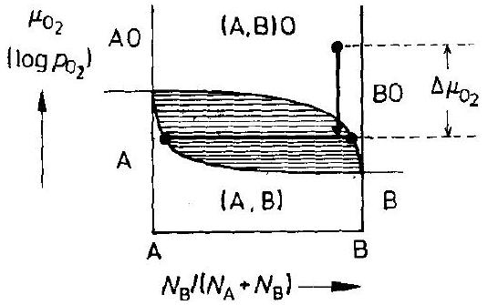
Figure 9-5. Schematic phase diagram of second kind ( $\log p_{\mathrm{O}_{2}}$ vs. $y_{\mathrm{B}}=N_{\mathrm{B}} /\left(N_{\mathrm{A}}+N_{\mathrm{B}}\right)$ for an A-B-O system. Reaction path for internal reduction is indicated.

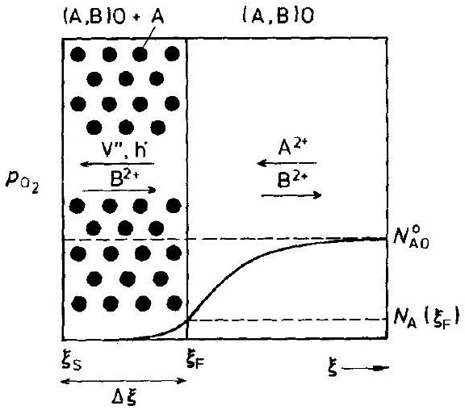
Figure 9-6. Reaction scheme for the internal reduction according to Figure 9-5.

$\left|\Delta G_{\mathrm{BO}}\right| \gg\left|\Delta G_{\mathrm{AO}}\right|$, almost pure metal A is precipitated in the internal reduction zone. The reaction at the front $\xi_{\mathrm{F}}$ is induced by a point defect flux which stems from the difference in oxygen potentials (point defect concentration) between the internal reaction front and the external surface. The reaction front and surface act as source and sink for the point defect flux. For example, when we assume that $(\mathrm{A}, \mathrm{B}) \mathrm{O}$ contains transition-metal ions (e.g., ( $\mathrm{Ni}, \mathrm{Mg}$ ) O ), the defects are cation vacancies and compensating electron holes. The (reducing) external surface acts as a vacancy sink according to the reaction

$$
\mathrm{V}_{\mathrm{Me}}^{\prime \prime}+2 \cdot \mathrm{~h}^{\cdot}+\mathrm{BO}=\mathrm{B}_{\mathrm{Me}}^{2+}+\frac{1}{2} \cdot \mathrm{O}_{2}
$$

whereas the (internal) front acts as a source for $\mathrm{V}_{\mathrm{Me}}^{\prime \prime}$ and $\mathrm{h}^{\bullet}$ as follows

$$
\xrightarrow{\mathrm{B}_{\mathrm{Me}}^{2+}+\mathrm{A}_{\mathrm{Me}}^{2+}=\mathrm{A}+\mathrm{V}_{\mathrm{Me}}^{\prime \prime}+2 \cdot \mathrm{~h}^{\cdot}+\mathrm{B}_{\mathrm{Me}}^{2+}}
$$

From Eqn. (9.16), we see that the metal A is precipitated within the rigid, densepacked oxygen ion sublattice of the oxide matrix. The local volume at the reaction front is thus increased by the molar volume $V_{\mathrm{A}}$ per mole of vacancies. Large strains and stresses are the immediate result. In contrast, if $(\mathrm{A}, \mathrm{B})_{3} \mathrm{O}_{4}$ is internally reduced to yield $(\mathrm{A}, \mathrm{B}) \mathrm{O}$, the oxygen ion sublattice remains essentially undistorted, except for
those minor lattice parameter changes which deform the oxygen planes of the two coherent structures. After the reduced product particles have grown large enough, the lattice misfit is eventually taken up by misfit dislocations.

In this picture, which is in contrast to internal oxidation, the concentration of point defects is lowest at the (reducing) external surface. As a consequence, the cationic bulk transport coefficients are lowest at this surface and the internal reduction process is thus self-inhibiting. During the course of the internal reduction of the oxide solid solutions, grain boundaries and dislocations may therefore become operative as fast diffusion paths in the internal reduction zone. In these cases, the subsequent formal treatment will require modification. In fact, very special morphologies reflecting pipe diffusion have been observed under inhibiting circumstances during the internal reduction of oxides [D. Ricoult, H. Schmalzried (1987)].

The quantitative discussion of internal reduction kinetics follows the discussion presented in the previous section on internal oxidation. The fundamental kinetic problem to be solved is again the calculation of the rate of advance of the reaction front $\xi_{\mathrm{F}}$ (Fig. 9-6). To this end we note that

$$
\dot{n}_{\mathrm{A}}=j_{\mathrm{V}}=\frac{\lambda}{V_{\mathrm{A}}} \cdot \dot{\xi}_{\mathrm{F}}
$$

Equation (9.17) balances the vacancy production and the amount of reduced, dispersed A metal which forms with the volume fraction $\lambda$. The essential point is therefore the determination of $c_{\mathrm{V}}\left(\xi_{\mathrm{F}}\right)$ in order to establish the vacancy flux. When a quasi-steady state has been reached and if $c_{\mathrm{V}}\left(\xi_{\mathrm{S}}\right) \ll c_{\mathrm{V}}\left(\xi_{\mathrm{F}}\right)$, one can rewrite Eqn. (9.17) as

$$
\dot{\xi}_{\mathrm{F}} \cong \frac{1}{\lambda} \cdot \frac{\tilde{D}_{\mathrm{V}} \cdot N_{\mathrm{V}}\left(\xi_{\mathrm{F}}\right)}{\Delta \xi} \cdot \frac{V_{\mathrm{A}}}{V_{(\mathrm{A}, \mathrm{~B}) \mathrm{O}}}
$$

$N_{\mathrm{V}}\left(\xi_{\mathrm{F}}\right)$ can be determined by the application of point defect thermodynamics at $\xi_{\mathrm{F}}$, where the equilibrium defect concentrations are found from the following reaction

$$
\mathrm{AO}+3 \cdot \mathrm{~B}_{\mathrm{Me}}^{2+}=\mathrm{A}+\mathrm{BO}+2 \cdot \mathrm{~B}_{\mathrm{Me}}^{3+}\left(=h^{*}\right)+\mathrm{V}_{\mathrm{Me}}^{\prime \prime}
$$

The corresponding equilibrium condition (with $a_{\mathrm{A}}=1$ for the activity of metallic A and $2 \cdot N_{\mathrm{V}^{\prime \prime}}=N_{\mathrm{h}}$.) reads

$$
N_{\mathrm{V}}^{3}\left(\xi_{\mathrm{F}}\right)=K \cdot N_{\mathrm{AO}}\left(\xi_{\mathrm{F}}\right) \cdot\left(1-N_{\mathrm{AO}}\left(\xi_{\mathrm{F}}\right)\right)^{2} \cong K \cdot N_{\mathrm{AO}}\left(\xi_{\mathrm{F}}\right)
$$

However, the calculation of $N_{\mathrm{AO}}\left(\xi_{\mathrm{F}}\right)$, which is the matrix composition at $\xi_{\mathrm{F}}$, requires an explicit solution to the coupled diffusion equations of the components before and behind the reaction front. Since the transport coefficients in these mixed crystals depend on local composition, one therefore cannot find analytical solutions. Only if the $\mathrm{A}^{2+}$ ions are almost immobile ( $D_{\mathrm{A}} \ll D_{\mathrm{B}}$ ) do we have $N_{\mathrm{AO}}\left(\xi_{\mathrm{F}}\right)=N_{\mathrm{AO}}^{0}$. This specific case has been discussed in the literature [H. Schmalzried (1984)].

A few investigations on internal reduction reactions have been reported [D. Ricoult, H. Schmalzried (1987); M. Backhaus-Ricoult, et al. (1991)]. Metallic iron has
been observed to precipitate internally in ( $\mathrm{Fe}, \mathrm{Mn}$ ) O after a sufficient lowering of the surface oxygen potential. This reaction is of technical relevance. It illustrates the basic reduction process for the production of iron from ore. Internal reactions also occur under geochemical conditions, such as when mineral solid solutions (in particular silicates like $(\mathrm{Fe}, \mathrm{Mg})_{2} \mathrm{SiO}_{4}$ ) are exposed to the low chemical potentials of the respective non-metal component in the surroundings. Furthermore, ceramic materials are often multicomponent solids which, under operating conditions, are exposed to reducing metalloid potentials. We therefore expect (for appropriate point defect concentrations and transport coefficients) internal reduction reactions to occur which can alter the physical properties of ceramic materials considerably.

There is another type of internal reduction reaction which differs in kind from those we have already discussed. As an example, let us consider the reduction of $(\mathrm{Co}, \mathrm{Al})_{2} \mathrm{O}_{3}$ in hydrogen. Hydrogen is soluble and mobile in this oxide. During its inward diffusion, it can reduce the $\mathrm{Co}^{3+}$ ions to a lower valence state and even to metal. In this way, atomic hydrogen is trapped as a proton at or near the reduced cations (which are often color centers). The advancement of the reaction front thus becomes visible by the color change or bleaching of higher valent cations ( $\mathrm{Co}^{3+}$ ). This internal reduction is analogous to the internal oxidation of alloys where the gaseous reactant $\left(\mathrm{O}_{2}(\mathrm{~g})\right)$ was also soluble and mobile in the crystal matrix. Similar observations have been made in the ternary system $\mathrm{Na}-\mathrm{Ag}-\mathrm{Cl}$. Here, $\mathrm{Ag}^{+}$ions dissolved in the NaCl matrix were reduced by inward diffusing color centers and precipitated as colloidal silver [G. Sauthoff (1971)]. Further examples of internal reduction reactions have been discussed in [H. Schmalzried, M. Backhaus-Ricoult (1993); M. Backhaus-Ricoult; S. Hagège (1992)].

### 9.4 Internal Reactions Driven by Other than Chemical Potential Gradients

As pointed out in previous sections, the point defect fluxes during internal reaction are induced by chemical potential gradients. When the point defect concentration (and thus the component activity) at the internal reaction front $\xi_{F}$ becomes high enough, new phases precipitate. Of course, it is possible to induce defect fluxes by other than chemical potential gradients, and similar internal reactions should then occur under the appropriate conditions. In this section, we will analyze internal reactions in ionic crystals when the driving force for transport is an electric field. Internal reactions are expected to take place if $\nabla j_{\text {def }} \neq 0$, that is, if the individual ionic and electronic defect fluxes ( $j_{\text {def }}$ ) are not spatially constant. This means that we are dealing with inhomogeneous systems in which the transport coefficients change with $\xi$. Quite a number of interesting phenomena can be found in this category of internal reactions, yet they are waiting to be studied more thoroughly.

### 9.4.1 Internal Reactions in Heterophase Assemblages

Heterophase assemblages of mixed ionic/electronic conductors of the type A/AX/AY/A under an electric load are the simplest inhomogeneous electrochemical systems that can serve to exemplify our problem. Let us assume that the transport of cations and electrons across the various boundaries occurs without interface polarization and that the transference of anions is negligible. For the other transference numbers we then have

$$
t_{\mathrm{A}}(\mathrm{AX})+t_{\mathrm{e}}(\mathrm{AX})=1 ; \quad t_{\mathrm{A}}(\mathrm{AY})+t_{\mathrm{e}}(\mathrm{AY})=1 ; \quad t_{\mathrm{A}}(\mathrm{AX}) \neq t_{\mathrm{A}}(\mathrm{AY})
$$

Since the total electric current obeys the condition $\nabla I=0\left(I=I_{\mathrm{A}}+I_{\mathrm{e}}\right)$, we have, in addition to Eqn. (9.21),

$$
I_{\mathrm{A}}(\mathrm{AX})+I_{\mathrm{e}}(\mathrm{AX})=I_{\mathrm{A}}(\mathrm{AY})+I_{\mathrm{e}}(\mathrm{AY})
$$

From these equations we can derive

$$
\Delta I_{\mathrm{A}}=I_{\mathrm{A}}(\mathrm{AX})-I_{\mathrm{A}}(\mathrm{AY})=I_{\mathrm{A}}(\mathrm{AY}) \cdot \frac{\Delta t_{\mathrm{A}}}{t_{\mathrm{A}}(\mathrm{AY})} \cong I \cdot \Delta t_{\mathrm{A}}
$$

Therefore, if $\Delta t_{\mathrm{A}} \neq 0$, the cation flux changes its density at the AX/AY interface. This means that this interface (by application of a sufficiently strong electric field) acts either as an A sink or as an A source depending on the direction of the A flux. In the first case, metallic A will be precipitated at the AX/AY interface. Since $\Delta t_{\mathrm{A}}=\Delta t_{\mathrm{e}}$, the difference in electric current, $\Delta I_{\mathrm{e}}$, will supply the necessary electrons for the (internal) reduction of the A cations. In the second case, the AX/AY interface operates as an A source and the lattice molecules AX or AY will be decomposed. Consequently, either $\mathrm{X}(\mathrm{Y})$ atoms or $\mathrm{X}_{2}\left(\mathrm{Y}_{2}\right)$ molecules are formed and the corresponding reactions read

$$
\mathrm{AX}=\frac{1}{2} \cdot \mathrm{X}_{2}(\mathrm{X})+\mathrm{A}^{+}+\mathrm{e}^{\prime} ; \quad \mathrm{AY}=\frac{1}{2} \cdot \mathrm{Y}_{2}(\mathrm{Y})+\mathrm{A}^{+}+\mathrm{e}^{\prime}
$$

In principle, the field-driven decomposition can already take place at very small applied voltages in the galvanic cell. In practice, however, a certain supersaturation of A ( $=\mathrm{e}^{\prime}$-supersaturation, considering $\mathrm{A}^{+}+\mathrm{e}^{\prime}=\mathrm{A}$ and $\mu_{\mathrm{A}^{+}}=$constant) is necessary to nucleate the newly forming A or $\mathrm{X}_{2}\left(\mathrm{Y}_{2}\right)$. The course of the chemical potential and several other thermodynamic potentials are plotted in Figure 9-7 for a given supersaturation of A. They can be calculated in a straightforward manner by using the explicit flux equations and coupling conditions (i.e., Eqns. (9.21)-(9.23)).

In any case, crystal lattices are destroyed by the field-driven decomposition. If the original AX/AY interface remains coherent, stresses develop which will consume some driving force. In other words, the AX/AY interface is then polarized. A determination of the amount ( $=\int \Delta I_{\mathrm{A}} \cdot \mathrm{d} t$ ) of decomposed $\mathrm{AX}(\mathrm{AY})$ at the interface should give a very sensitive method to measure extremely small differences in the elec-

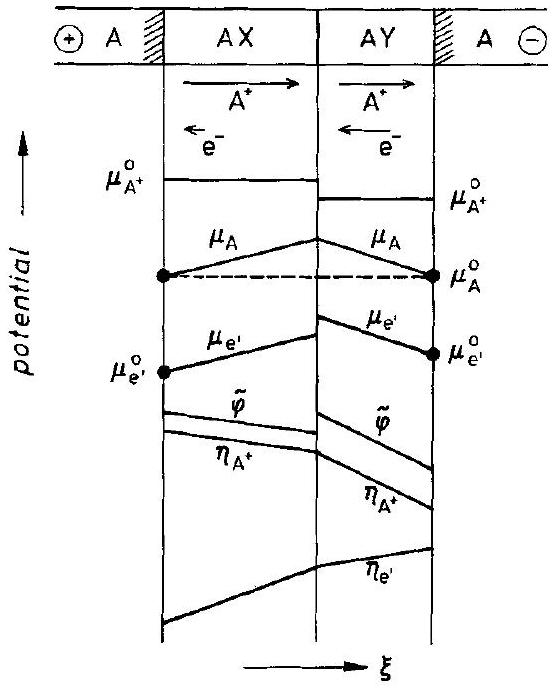
Figure 9-7. Various thermodynamic potentials in an A/AX/AY/A cell under load with unpolarized A/AX and AY/A phase boundaries.

tronic transference numbers. If the $t_{\mathrm{e}}$ of the one ionic compound (e.g., AX ) is known, one can then determine the unknown $t_{\mathrm{e}}$ value of the other compound (AY).

### 9.4.2 Internal Reactions in Inhomogeneous Systems with Varying Disorder Types

In Section 9.4.1, we introduced internal electrochemical reactions by considering heterophase AX/AY assemblages. We now discuss the more general case of internal electrochemical reactions which occur in inhomogeneous systems having various types of disorder. From the foregoing discussion, we expect internal reactions to occur in a crystal matrix whenever the condition $\nabla j_{\text {ion }}=0$ is not met. The extreme is a transition from n - (or p -) type conduction to ionic conduction (which for brevity we shall call a (n-i) junction).

Transport of electronic charge carriers in solids with varying electronic disorder types (p-n) is the basic feature of semiconductor technology. A change in the type of disorder is usually achieved by doping with donors or acceptors. The basic quantitative relations are the flux equations ( $j_{i}=-c_{i} \cdot b_{i} \cdot \nabla \eta_{i}$ ), the Poisson equation $\left(\Delta \varphi=-\left(1 / \varepsilon \cdot \varepsilon_{0}\right) \cdot \varrho\right.$, where $\varrho$ is the net charge density), and the definition of the electrochemical potential $\eta_{i}\left(=\mu_{i}+z_{i} \cdot F \cdot \varphi\right)$. Doping establishes the spatial boundary conditions. Assuming that one may deal with non-equilibrium systems within the framework of linear irreversible thermodynamics (so that the local $\mu_{i}$ are well defined as long as electrons and holes obey Boltzmann statistics), we must add the rate of production (or annihilation) of the electronic defects, that is, the continuity equation. This set of differential equations then quantitatively describes the electric transport in semiconductors. In a linear approach, the rate is directly proportional to the deviation from the equilibrium concentrations. With time-dependent or time-inde-
pendent driving forces (electric fields), one can now either analytically or numerically cover the wealth of phenomena which constitute semiconductor science and technology. In the classical approach (i.e., neglecting quantum effects and applying Boltzmann or Fermi-Dirac statistics), the best known example is the (p-n) junction previously discussed in Chapter 4.

Atomic defects in ionic crystals obey the same formal relationships (kinetic and thermodynamic) as their electronic counterparts. One may therefore anticipate that phenomena similar to those found in semiconductors will occur in ionic materials. Special kinetic effects are to be expected if crystals (or amorphous solids) are brought into predetermined chemical and electrical potential gradients so that one part of the sample becomes electronic conducting while the other part exhibits ionic or mixed conduction (i.e., if they strongly change their electronic transference number spatially). A change in the (majority) disorder type in the crystal from electronic to ionic, or rather a change in the mode of electrical transport from electronic ( n or p-type) to ionic (i-type), induces internal solid state reactions if an electric current is driven across the sample by an external voltage.

Such electrically induced internal reactions have not yet been investigated extensively. However, some interesting observations are available which emphasize their relevance. ( $\mathrm{n}-\mathrm{i}$ ) type reactions allow one to place new phases into the internal transition zone without otherwise manipulating or disturbing the crystal. Since there is no source (sink) for the electric current, the transition from electronic to ionic defect fluxes necessarily requires an electrochemical reaction within the crystal. Kinetically, this is governed by transport, defect relaxation, nucleation, and growth (eventually also the evolution of the precipitate morphology), quite analogous to other internal reactions. Since these processes take place in the matrix of the host crystal, elastic and plastic deformations in both matrix and precipitate are the result. Crystal deformations influence the reaction kinetics and, in particular, the growth morphology. Here is an essential difference to the electronic phenomena in semiconductors. Whereas the site number of the host lattice is not affected by electronic processes alone, electric field driven reactions in internal ( $\mathrm{n}-\mathrm{i}$ ) junctions destroy the crystal matrix.

Let us point out some prerequisites for the occurrence of internal junctions. In the accessible range of component activities, the compound under study should exhibit both electronic and ionic conductances. The transference numbers of electrons and ions ( $t_{\mathrm{e}}, t_{\mathrm{ion}}$ ) should change noticeably with the activity of the components. Extrinsic electronic defects accompany nonstoichiometry. Since the electron mobility is much higher than that of ionic point defects, ( n -i) junctions will be found in compound crystals which have a relatively high intrinsic ionic disorder (e.g., AgBr ) or in ionic crystals which have been heavily doped (e.g., $\mathrm{ZrO}_{2}(\mathrm{CaO})$ ). By applying high (or low) component chemical potentials to one side of these crystals (e.g., by polarizing one electrode in a galvanic cell containing this compound, see Fig. 9-8), one can inject electronic defects (along with a small degree of nonstoichiometry). In this way, the crystal is exposed to a chemical potential gradient. In addition, the (external) electric field is the driving force for the electric current $I$, which may now be electronic in one part of the (inhomogeneous) crystal, but ionic in the other part. For experimental investigations, one can use galvanic double cells as illustrated in

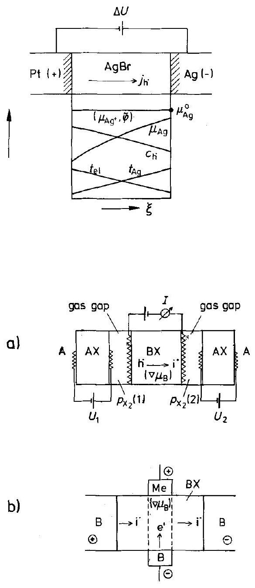
Figure 9-8. Polarization cell and the (schematic) course of various thermodynamic and kinetic parameters [C. Wagner (1955)].

Figure 9-9. Two electrochemical solid state double cells which allow to establish internal (n-i) junctions. i* indicates interstitial ionic transport.

Figure 9-9. These devices establish not only both the chemical potential gradient and the electric field, but allow us to control both experimental parameters independently.

The kinetics of electrochemically driven internal solid state reactions depend not only on point defect mobilities, but also on the production (annihilation) rate of these defects, that is, on the point defect equilibration relaxation time in the (n-i) transition zone. For the quantitative discussion, AgBr will serve as an example. An ionic junction can be made by doping two adjoining parts of a AgBr crystal with $\mathrm{CdBr}_{2}$ and $\mathrm{Ag}_{2} \mathrm{~S}$ respectively. The small electronic transference number necessarily differs in the differently doped parts of the AgBr crystal. Therefore, we deal again with the situation discussed in the previous section.

Here, however, we can also use the electrochemical polarization method [C. Wagner (1955); M. H. Hebb (1952)] in order to establish a (n-i) junction within the AgBr crystal as shown in Figure 9-8. At the (inert) Pt anode, one establishes a high bromine activity through the applied voltage. From the literature [D. Raleigh.(1967)], we know that under these conditions AgBr transports electrical charge via electron holes. The equilibrium between atomic Br and the AgBr structure elements reads $\mathrm{Br}=\mathrm{V}_{\mathrm{Ag}}^{\prime}+\mathrm{h}^{\bullet}+\mathrm{Br}_{\mathrm{Br}}^{\mathrm{x}}$ where the vacancies $\mathrm{V}_{\mathrm{Ag}}^{\prime}$ are majority defects of the intrinsic Frenkel equilibrium $\mathrm{Ag}_{\mathrm{Ag}}+\mathrm{V}_{\mathrm{i}}=\mathrm{Ag}_{\mathrm{i}}^{*}+\mathrm{V}_{\mathrm{Ag}}^{\prime}$. The following observations are made if the cell in Figure 9-8 is polarized at a sufficiently high voltage ( $>$ decomposition voltage). A dark cloud of fine precipitates advances from the Pt anode towards the Ag cathode. This effect is explained by an internal reaction as illustrated in Figure 9-10. Considering the high Br activity, the electric current near the anode is essentially carried by electron holes $h^{\circ}$. While they are driven towards the cathode, they penetrate into a region where $a_{\mathrm{Br}}<$ (or $\left.\ll\right) a_{\mathrm{Br}}$ (anode). Consequently, Frenkel disorder prevails in this region. The $\mathrm{Ag}^{+}$transference number is approximately unity and the electric current is carried here by $\mathrm{Ag}_{\mathrm{i}}^{\bullet}$ and $\mathrm{V}_{\text {Ag }}^{\prime}$. The supersaturated electron holes react with $\mathrm{Ag}_{\mathrm{Ag}}^{\mathrm{x}}$ to form the Frenkel defects

$$
\mathrm{Br}_{\mathrm{Br}}^{\mathrm{x}}+\mathrm{Ag}_{\mathrm{Ag}}^{\mathrm{x}}+\mathrm{h}_{\rightarrow}^{\bullet}+\mathrm{V}_{\mathrm{i}}=\left[\mathrm{V}_{\mathrm{Ag}}^{\prime}+\mathrm{h}^{\bullet}+\mathrm{Br}_{\mathrm{Br}}^{\mathrm{x}}\right]+\xrightarrow[\rightarrow]{\mathrm{Ag}_{\mathrm{i}}^{\bullet}}=[\mathrm{Br}]+\xrightarrow{\mathrm{Ag}_{\mathrm{i}}^{\bullet}}
$$

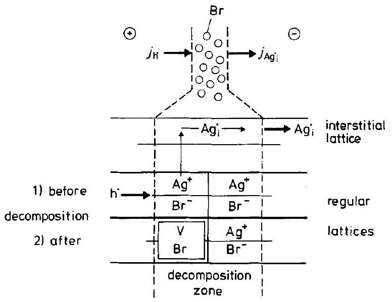
Figure 9-10. Mechanism of an electrochemically driven internal decomposition reaction in AgBr : $\xrightarrow[\rightarrow]{h^{\bullet}}+\mathrm{AgBr}=\mathrm{Br}+\xrightarrow[\rightarrow]{\mathrm{Ag}_{\mathrm{i}}^{\bullet}}$.

The combination of the SE's in the brackets of Eqn. (9.25) is a (neutral) bromine atom sitting on the site of a missing lattice molecule of AgBr , this being the smallest possible pore. Equation (9.25) formulates the overall internal reaction in the (p-i) junction, where the incoming (high activity) electron holes $\mathrm{h}^{\cdot}$ are transformed into atomic $[\mathrm{Br}]$ and outgoing $\mathrm{Ag}_{\mathrm{i}}^{*}$. If the neutral bromine atoms cluster and eventually
grow (Ostwald ripening), they give rise to the visible cloud seen in the polarized AgBr cell. In addition to the (brownish) clouds in the anodic region of AgBr , pit formation at the crystal surface near this p-zone (and growth of silver dendrites from the cathode) clearly indicates the existence of supersaturated component activities inside the crystal. It seems as if high nucleation barriers in the crystal matrix inhibit internal reactions, so that the supersaturated components take refuge in the closest surface where nucleation energies are smaller (Fig.9-11).

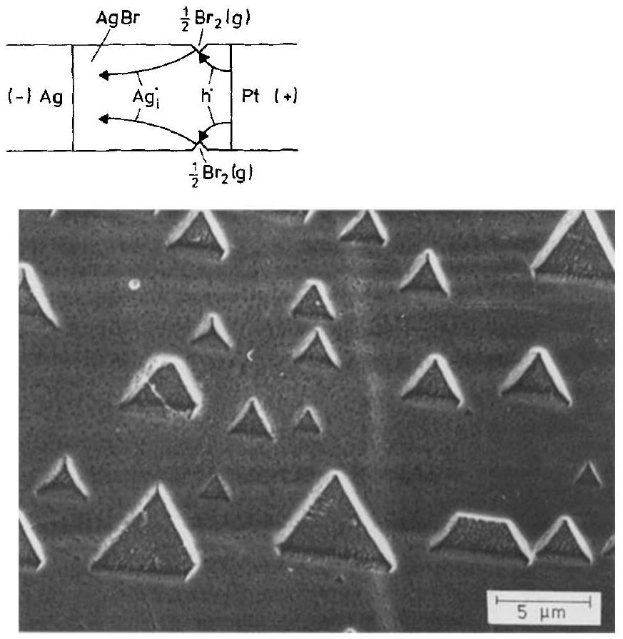
Figure 9-11. Surface pitting of AgBr due to supersaturation of electron holes near the polarized anode [T. Große (1991)] and schematic mechanism of surface pitting.

### 9.4.3 Formal Treatment of Electrochemical Internal Reactions

Let us first introduce the polarization cell $\mathrm{Pt} / \mathrm{AgBr} / \mathrm{Ag}$ at low voltages without internal reactions, following the original ideas of Wagner and Hebb [C. Wagner (1955); M.H. Hebb (1952)]. The point defect concentrations and transference numbers of electronic and ionic charge carriers are depicted in Figure 9-8. The chemical potential gradient is established in the electrolyte by application of a voltage between the inert Pt anode and the reversible Ag cathode. At sufficiently low voltages, only a diffusive flux of electron holes is permitted. The ion flux is blocked by the anodically polarized Pt electrode. The $\mathbf{h}^{\cdot}$ concentration gradient is determined by the following conditions. At the reversible electrode, the $\mathrm{h}^{\cdot}$ chemical potential is established by the
equilibrium condition of the reaction $\mathrm{Ag}_{\mathrm{Ag}}^{+}=\mathrm{Ag}+\mathrm{h}^{*}+\mathrm{V}_{\mathrm{Ag}}^{\prime}: \mu_{\mathrm{Ag}^{+}}=\mu_{\mathrm{Ag}}^{0}+\mu_{\mathrm{h}^{*}}+\mu_{\mathrm{V}_{\mathrm{Ag}}^{\prime}}$. Note that $\mu_{\mathrm{Ag}^{+}}$and $\mu_{\mathrm{V}_{\mathrm{Ag}^{\prime}}}$ are constant, the latter in view of predominating intrinsic Frenkel defects. At the polarized Pt electrode, $\eta_{\mathrm{h}} \cdot(\mathrm{Pt})=\eta_{\mathrm{h}} \cdot(\mathrm{AgBr})$. Since $\mu_{\mathrm{h}} \cdot(\mathrm{Pt})=\mu_{\mathrm{h}}^{0} \cdot(\mathrm{Pt})$ and $F \cdot \varphi(\mathrm{AgBr})=F \cdot \varphi^{0}(\mathrm{AgBr})$, the change in $\varphi(\mathrm{Pt})$ between the electric leads $(=\Delta U)$ corresponds in total to the change in $\mu_{\mathrm{h}} \cdot(\mathrm{AgBr})$ at the $\mathrm{Pt} / \mathrm{AgBr}$ interface ( $\sim \ln N_{\mathrm{h}} \cdot(\mathrm{AgBr})$ ).

If local point defect equilibrium prevails and space charge effects can be neglected, one finds from the condition of electroneutrality that

$$
\left(c_{\mathrm{i}}+c_{\mathrm{h}}\right)-\left(c_{\mathrm{v}}+c_{\mathrm{e}}\right)=0 ; \mathrm{i}=\mathrm{Ag}_{\mathrm{i}}^{\bullet}, \mathrm{v}=\mathrm{V}_{\mathrm{Ag}}^{\prime}, \mathrm{h}=\mathrm{h}^{\bullet}
$$

Equation (9.26) can be rewritten by defining $c_{\mathrm{i}} \cdot c_{\mathrm{v}}=\left(c^{0}\right)^{2}$ and $c_{\mathrm{h}} \cdot c_{\mathrm{e}}=\left(c_{\mathrm{e}}^{0}\right)^{2}$ from the Frenkel and electron-hole product relations as

$$
c^{0} \cdot\left(\frac{c_{\mathrm{i}}}{c^{0}}-\frac{c^{0}}{c_{\mathrm{i}}}\right)+c_{\mathrm{e}}^{0} \cdot\left(\frac{c_{\mathrm{h}}}{c_{\mathrm{e}}^{0}}-\frac{c_{\mathrm{e}}^{0}}{c_{\mathrm{h}}}\right)=0
$$

or

$$
c^{0} \cdot \sinh \left(\ln c_{\mathrm{i}} / c^{0}\right)+c_{\mathrm{e}}^{0} \cdot \sinh \left(\ln c_{\mathrm{h}} / c_{\mathrm{e}}^{0}\right)=0
$$

The steady state condition of the polarized cell provides two kinetic equations: $j_{i}\left(=-j_{\mathrm{v}}\right)=0$ and $I / F=j^{0}=1 / F \cdot \sum z_{k} \cdot j_{k}$. From the first condition, one derives immediately

$$
\nabla c_{\mathrm{i}} / c_{\mathrm{i}}=-\frac{F}{R T} \cdot \nabla \varphi, \quad c_{\mathrm{i}}(\xi)=c_{\mathrm{i}}(0) \cdot \mathrm{e}^{-\frac{F \cdot(\varphi(\xi)-\varphi(0))}{R T}}
$$

From the second condition, it is found that

$$
j^{0}=-D_{\mathrm{h}} \cdot c_{\mathrm{h}} \cdot\left(1+\frac{D_{\mathrm{e}}}{D_{\mathrm{h}}} \cdot\left(\frac{c_{\mathrm{e}}^{0}}{c_{\mathrm{h}}}\right)^{2}\right) \cdot \nabla\left(\ln c_{\mathrm{i}}+\ln c_{\mathrm{h}}\right)
$$

Equation (9.30), in combination with Eqn. (9.28), describes the charge transport in the polarized $\mathrm{Pt} / \mathrm{AgBr} / \mathrm{Ag}$ cell if no internal reactions occur. Limiting cases can be solved analytically. If, for example, $c^{0} \gg c_{\mathrm{e}}^{0}$ and $c_{\mathrm{i}} \simeq c_{\mathrm{v}} \simeq c^{0}$, it follows that $j^{0}=-D_{\mathrm{h}} \cdot\left(\Delta c_{\mathrm{h}} / \Delta \xi\right)$. In combination with the equilibrium conditions at the two electrodes which require that $\Delta \varphi$ between the two electrodes is $\Delta U=\left(\Delta \mu_{\mathrm{h}} / F\right)= (R T / F) \cdot \ln c_{\mathrm{h}} / c_{\mathrm{h}}(\Delta \xi)$, one obtains

$$
j^{0}=-D_{\mathrm{h}} \cdot \frac{c_{\mathrm{h}}^{0}(0)}{\Delta \xi} \cdot\left(1-\mathrm{e}^{-(F / R T) \cdot \Delta U}\right),
$$

where $c_{\mathrm{h}}^{0}(0)$ is the electron hole concentration at the reversible (Ag) cathode.
If the anodic potential of the polarized electrode is now increased until a ( $h^{\bullet}-\mathrm{Ag}_{j}^{*}$ ) junction zone is formed in the interior of the electrolyte, AgBr will decompose internally provided the nucleation barrier can be overcome. This is shown
in Figure 9-10. To qualitatively picture the overall ( $\mathrm{n}-\mathrm{i}$ ) junction reaction, Eqn. (9.25) is split into 1) the Frenkel formation reaction $V_{i}+A g_{A g}=V_{A g}^{\prime}+A g_{j}^{\circ}$, in which two regular SE's are transformed into a pair of intrinsic point defects, and 2) the formation reaction of atomic Br according to $\mathrm{Br}_{\mathrm{Br}}^{\mathrm{X}}+\mathrm{V}_{\mathrm{Ag}}^{\prime}+\mathrm{h}^{\bullet}=[\mathrm{Br}]$.

In view of the appreciable number of SE's involved in reaction (9.25), distinct serial reaction steps can be anticipated. Steps in which the electron hole is involved are assumed to be fast compared to steps involving ionic SE's (in line with the fact that $D_{\mathrm{h}} \gg D_{\mathrm{i}}$ ). Thus, the (locally homogeneous) Frenkel reaction becomes rate determining for the overall internal process described by Eqn. (9.25). The Frenkel reaction is bimolecular. The rate equation for the formation of Frenkel defects is, according to standard kinetics,

$$
\dot{c}_{\mathrm{i}}=\overrightarrow{k_{\mathrm{i}}} \cdot\left(c^{0}\right)^{2} \cdot\left(1-\frac{\overrightarrow{k_{\mathrm{i}}}}{\overrightarrow{k_{\mathrm{i}}}} \cdot \frac{c_{\mathrm{i}}}{c^{0}} \cdot \frac{c_{\mathrm{V}}}{c^{0}}\right)
$$

If necessary, Eqn. (9.32) can be linearized. In view of Eqn. (9.32), the ionic defect flux of the polarization cell is

$$
j^{0}=\int \dot{c_{\mathrm{i}}} \cdot \mathrm{~d} \xi=\overrightarrow{k_{\mathrm{i}}} \cdot\left(c^{0}\right)^{2} \cdot \int\left(1-\frac{\overleftrightarrow{k_{\mathrm{i}}}}{\overrightarrow{k_{\mathrm{i}}}} \cdot \frac{c_{\mathrm{i}} \cdot c_{\mathrm{v}}}{\left(c^{0}\right)^{2}}\right) \cdot \mathrm{d} \xi
$$

and in the limit of saturation

$$
j^{0}(\max )=\overrightarrow{k_{\mathrm{i}}} \cdot\left(c^{0}\right)^{2} \cdot \xi_{\mathrm{R}}
$$

where the integrals of Eqn. (9.33) go over the width $\xi_{\mathrm{R}}$ of the junction zone. The determination of the quantity $\xi_{\mathrm{R}}$ in Eqn. (9.34) in terms of transport coefficients, rate constants $\overrightarrow{k_{\mathrm{i}}}$, and the applied voltage $\Delta U$ uses the following differential equations under steady state conditions

$$
\begin{array}{lll}
\nabla \boldsymbol{j}_{\mathrm{h}}=\dot{r}_{\mathrm{h}} ; & \nabla \boldsymbol{j}_{\mathrm{i}}=\dot{r}_{\mathrm{i}} \\
\nabla\left(\boldsymbol{j}_{\mathrm{h}}+\boldsymbol{j}_{\mathrm{i}}\right)=0 ; & \boldsymbol{j}_{\mathrm{h}}+\boldsymbol{j}_{\mathrm{i}}=\boldsymbol{j}^{0}
\end{array}
$$

This set of equations balances the electric current. Inserting the fluxes explicitly and eliminating the potential gradient $\nabla \varphi$, one obtains the rate $\dot{r}_{\mathrm{i}}$, which can then be equated with Eqn. (9.32). We note that the concentration $c_{\mathrm{h}}$ is $\ll c_{\mathrm{i}}$ (and $c_{\mathrm{v}}$ ) since the hole mobility is far greater than the mobility of the ionic point defects. In addition, we assume that $c_{\mathrm{h}} \sim 1 / c_{\mathrm{v}}$, which is consistent with the assumption of a fast (partial) reaction $\mathrm{Br}_{\mathrm{Br}}^{\mathrm{x}}+\mathrm{V}_{\mathrm{Ag}}^{\prime}+\mathrm{h}^{\cdot}=[\mathrm{Br}]$ in the internal reaction zone where small bubbles of $[\mathrm{Br}]$ exist already. Space charge effects are neglected, and local electroneutrality is assumed to hold. With all these assumptions, the given set of equations describes the kinetics of electrochemical internal decomposition reactions. However, to explicitly solve them we have to define the Br activity in the junction zone. This activity depends on the crystal's ability to withstand the internal pressure corresponding to
$a_{\mathrm{Br}}$ in the micropores, and which in turn depends on the plasticity of the crystal and the external constraints of the evolving stress. Without sufficient knowledge on the experimental (boundary) conditions, it is rather academic to pursue the solution of the complex system of differential equations, although it has been done numerically [U. Stilkenböhmer (1994)]. Such situations occur repeatedly in our discussions of chemical processes taking place in crystals: we have gained a qualitative understanding, but it is hardly not possible to quantify the real systems.

### 9.5 Internal Reactions $\mathbf{A}+\mathbf{B}=\mathbf{A B}$ in Crystal $\mathbf{C}$ as Solvent

The common feature of the internal reactions discussed so far is the participation of electronic defects. In other words, we have been dealing with either oxidation or reduction. We now show that reactions of the type $\mathrm{A}+\mathrm{B}=\mathrm{AB}$ can take place in a solvent crystal matrix as, for example, the formation of double oxides $\left(\mathrm{CaO}+\mathrm{TiO}_{2}=\mathrm{CaTiO}_{3}\right)$ in which atomic (ionic) but no electronic point defects are involved. Although many different solvent crystal matrices can be thought of (e.g., metals, semiconductors, glasses, and even viscous melts and surfaces), we will deal here mainly with ionic crystal matrices in order to illustrate the basic features of this type of solid state reaction.

### 9.5.1 The Internal Reaction $\mathbf{A O}+\mathbf{B O}_{\mathbf{2}}=\mathbf{A B O}_{\mathbf{3}}$

Let us analyze the following specific reaction [H. Schmalzried, et. al. (1990); T. Frick (1993)]. A single crystal of NiO is used as a solvent for the solid reactants CaO and $\mathrm{TiO}_{2}$, both being moderately soluble in NiO . They isothermally diffuse into NiO from opposite sides (Fig. 9-12a). Solutes for this type of reaction do not form stable compounds with the solvent crystal, but must form at least one stable compound with each other.

NiO is a cation deficient semiconductor. The fraction of its cation vacancies and compensating electron holes depends on the oxygen potential as discussed in Section 2.3. The isovalent $\mathrm{Ca}^{2+}$ ions can replace $\mathrm{Ni}^{2+}$ ions in the cationic sublattice of the fcc matrix by chemical interdiffusion. $\mathrm{TiO}_{2}$ and NiO form $\mathrm{NiTiO}_{3}$ which dissolves to some extent in the fcc matrix of NiO as $\mathrm{Ti}_{\mathrm{Me}}^{4+}$ and $\mathrm{V}_{\mathrm{Me}}^{\prime \prime}$. The counterdiffusion of $\mathrm{TiO}_{2}$ and CaO in the NiO solvent leads to the encounter of the different solute cations (Fig. 9-12a). With increasing overlap of their concentration profiles, the concentration of the product will eventually surpass the solubility limit (and the nucleation barrier). Precipitation of the rather stable $\mathrm{CaTiO}_{3}$ compound as an internal reaction product in the NiO matrix is the result.

The question of nucleation was discussed generally in Chapter 6. In contrast to nucleation in liquids, the nucleation of AB in the solvent crystal matrix C is often hampered by structural constraints imposed on the newly forming AB phase by the

b)

Figure 9-12. a) Scheme of the internal solid state reaction $\mathrm{CaO}+\mathrm{TiO}_{2}=\mathrm{CaTiO}_{3}$ in the matrix crystal NiO . Concentration profiles and precipitate are indicated. b) Photograph of cross section with in ternal reaction zone ( $T=1340^{\circ} \mathrm{C}$, $t=413 \mathrm{~h}$ reaction time).
solvent crystal matrix. It is therefore conceivable that at the beginning coherent, metastable phases with non-equilibrium structures are formed before semi-coherency and/or incoherency of the $A B / C$ matrix interfaces lead to a stable reaction product. Figure 9-13 shows the schematic concentration profiles of A and B in C along with the solubility product $N_{\mathrm{A}} \cdot N_{\mathrm{B}}$. The maximum of the solubility product (or rather of $\left.a_{\mathrm{A}} \cdot a_{\mathrm{B}}\right)$ determines the site of homogeneous nucleation of the first AB precipitates. The course of the further reaction can be treated quantitatively if the thermodynamics of the A-B-C system, as well as the transport properties of A and B in AB and C , are known. Explicitly, Fick's second law has to be solved for the transport of both A and B in C, under the given boundary and flux coupling conditions. They

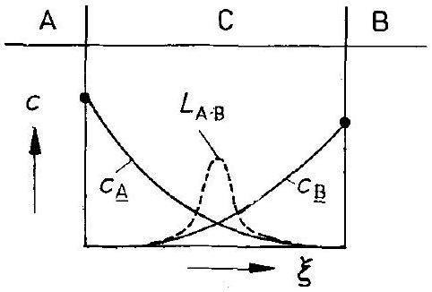
Figure 9-13. Concentration profiles and solubility product $L_{\mathrm{AB}}=N_{\mathrm{A}} \cdot N_{\mathrm{B}}$ of solutes A and B in the matrix crystal $C$.

require that $j_{\mathrm{A}}=-j_{\mathrm{B}}$ at the location of AB precipitation. Numerical solutions to this kinetic problem are available [M. Backhaus-Ricoult, et al. (1991)]. In a linear reaction geometry, the locus of the first internal precipitation band is determined almost exclusively by the ratio, $D_{\mathrm{A}} / D_{\mathrm{B}}$, of the diffusivities in the C crystal. Other kinetic and thermodynamic parameters are of minor importance. If $D_{\mathrm{A}} / D_{\mathrm{B}} \ll(\gg)$, no internal precipitation occurs and the reaction product forms at the interface of the less mobile reactant.

During the internal formation of $\mathrm{CaTiO}_{3}$ in the NiO matrix, several distinct precipitation bands have been observed at different locations. They indicate that the reaction mechanism is not as simple as illustrated in Figure 9-12. Generally speaking, the internal formation of products AB is a special case of the combined diffusionreaction problem, which in view of its nonlinearity has recently gained widespread interest [S. Havlin (1992)]. In our context, it may suffice to observe that, if a steady state solution exists, the locus of the steady state AB precipitates does not coincide with the locus of the first nuclei ( $=$ maximum of solubility product). Rather, the reaction front moves continuously or discontinuously to its final steady state location. Yet even at this stage, the growth of the AB precipitates is not strictly stationary since the morphology of the product particles changes with further growth. This morphological evolution of the AB precipitates depends on the transport coefficients of $A$ and $B$ in the $C$ matrix as well as in the reaction product $A B$. If diffusion within AB is fast compared to diffusion in the matrix, the $\mathrm{AB} / \mathrm{C}$ interface is a surface of constant activity. The precipitate will then elongate symmetrically towards the reactants A and B and becomes needle-like. If, in contrast, diffusion within the precipitate is slow compared to the diffusion in the C matrix, and if $D_{\mathrm{A}}$ and $D_{\mathrm{B}}$ do not differ too much, the precipitate particles grow preferentially as plates parallel to the $\mathrm{A} / \mathrm{C}$ (and B/C) interface. These product plates eventually grow together to form a continuous barrier which inhibits further reaction.

It is evident from this brief discussion that there are many possible modes of internal reaction in a crystal matrix, although we have not yet included the influence of stresses on growth kinetics and morphology. The reacting system is necessarily strained if $V_{m}(\mathrm{~A}) \neq V_{m}(\mathrm{~B}) \neq V_{m}(\mathrm{C})$. The resulting stress fields are long range, and if the stresses exceed the yield strength, plastic flow and dislocation formation will begin. Not only is the driving force affected by the stress, but kinetic coefficients are changed as well, mainly by pipe diffusion along dislocations.

The types of internal solid state reactions discussed in this section can have interesting technical applications. Since these reactions are localized, the introduction of AB precipitates into a C matrix can strongly influence such local properties as the mechanical, electrical, or optical properties inside a crystal.

### 9.6 Internal Reactions During Interdiffusion

Let us refer to Figure 9-3, but which we replot as Figure 9-14 to illustrate possible reaction paths in the AO-BO interdiffusing system. We assume that $D_{\mathrm{A}}>($ or $\gg) D_{\mathrm{B}}$,

Figure 9-14. a) Possible reaction path during interdiffusion in the quasi-binary AO-BO system, plotted into a phase diagram of the second kind. The initial couple is $(\mathrm{A}, \mathrm{B}) \mathrm{O}^{\prime}$ and $(\mathrm{A}, \mathrm{B}) \mathrm{O}^{\prime \prime}$. b) Realspace presentation of the processes occurring at different times during interdiffusion.

and also that the dense-packed anions are immobile in the semiconducting oxide solid solution. With these assumptions, a diffusion potential for the oxygen component builds up. The faster $\mathrm{A}^{2+}$ cations tend to deplete the AO-rich side of the diffusion couple of metal ions, thereby slightly increasing the nonstoichiometry $\delta$ of this side of the solid solution $(\mathrm{A}, \mathrm{B})_{1-\delta} \mathrm{O}$. The increase in $\delta$ corresponds to a steep increase in the oxygen activity of the almost stoichiometric crystal. The opposite effect is found at the BO-rich side as depicted in Figure 9-14. When the reaction path enters a two-phase field and nucleation is possible, internal reaction products precipitate temporarily inside the crystal matrix [H. Schmalzried (1992)]. Solution thermodynamics and the kinetic parameter $\beta=D_{\mathrm{A}} / D_{\mathrm{B}}$ will determine the course of the reaction path and thus decide whether oxidized products $\left((\mathrm{A}, \mathrm{B})_{3} \mathrm{O}_{4}\right)$, reduced products ((A,B)), or both will form in the interdiffusion zone.

However, a major influence on the formation of internal reaction products is the geometry of the diffusion couple. The reason is that external surfaces are the main sources and sinks for point defects ( e.g., $\mathrm{V}_{\text {Me }}^{\prime \prime}+\mathrm{h}^{*}$ ). These defects determine the nonstoichiometry $\delta\left(=N_{\mathrm{V}}\right)$ and are supersaturated (undersaturated) during interdiffusion relative to the constant external oxygen potential. The defect relaxation process at the surface conforms to $\frac{1}{2} \cdot \mathrm{O}_{2}(\mathrm{~g})=\mathrm{V}_{\mathrm{Me}}^{\prime \prime}+2 \cdot \mathrm{~h}^{\cdot}+\mathrm{O}_{\mathrm{O}}^{2-}$. The transport of defects from the interior of the diffusion zone to the crystal surface (and vice versa) depends on the geometry of the sample. Thus, large samples need long equilibration times which cause large supersaturations (undersaturations) and explain the observed formation of internal products during interdiffusion (as, for example, in the system $\mathrm{Ag}_{2} \mathrm{~S}-\mathrm{Cu}_{2} \mathrm{~S}$ [B. Gries, H. Schmalzried (1989)]). After a sufficiently long diffusion time, when the component concentration gradients flatten out and the driving forces (i.e., oxygen potential gradients) decrease again, the internal oxidation and reduction products redissolve. In conclusion, interdiffusion in multicomponent solid solutions
with narrow ranges of homogeneity ( $\Delta \delta$ ) is prone to internal product formation. In the spirit of Figure 9-14, the reaction path (temporarily) leaves the single-phase field and penetrates into multi-phase fields.

## References

Backhaus-Ricoult, M., et al. (1991) Ber. Bunsenges. Phys. Chem., 95, 1593
Backhaus-Ricoult, M., Hagège, S. (1992) Acta Met., 40, 267
Bolse, W., et al. (1987) Phys. Rev., B 36, 1818
Bolse, W., et al. (1989) Ber. Bunsenges. Phys. Chem., 93, 1285
Frick, T. (1993) Ph. D.-Thesis, Universität Hannover (Chemie)
Gries, B., Schmalzried, H. (1989) Solid State Ionics, 31, 291
Große, Th. (1991) Ph. D.-Thesis, Universität Hannover (Chemie)
Havlin, S., et al. (1992) Physica, A 191, 143, 168
Hebb, M.H. (1952) J. Chem. Phys., 20, 185
Ostyn, K., et al. (1984) J. Amer. Cer. Soc., 67, 679
Raleigh, D. O. (1967) Progr. Sol. State Chem., 3, 83
Ricoult, D., Schmalzried, H. (1987) Phys. Chem. Minerals, 14, 238
Sauthoff, G. (1971) Acta Met., 19, 665
Schmalzried, H. (1983) Ber. Bunsenges. Phys. Chem., 87, 511
Schmalzried, H. (1984) Ber. Bunsenges. Phys. Chem., 88, 1186
Schmalzried, H., et al. (1990) Z. phys. Chem. NF166, 115
Schmalzried, H. (1992) phys. stat. sol. (b), 172, 87
Schmalzried, H., Backhaus-Ricoult, M. (1993) Progr. Sol. State Chem., 22, 1
Schmalzried, H. (1993) Nova Acta Leopoldina, 69, 91
Schneider, F., Schmalzried, H. (1990) Z. phys. Chem., NF166, 1
Stilkenböhmer, U. (1994) Ph. D.-Thesis, Universität Hannover (Chemie)
Verfurth, E., Rapp, R.A. (1964) Trans. AIME, 230, 1310
Wagner, C. (1950) Journ. Coll. Sci., 5, 85
Wagner, C. (1955) Proc. C.I.T.C.E., 7, 361
Wagner, C. (1959) Ber. Bunsenges. Phys. Chem., 63, 772
Wagner, C. (1968) Corr. Sci., 8, 889

## 10 Reactions At and Across Interfaces

### 10.1 Introduction

The kinetics of heterogeneous systems always involve transport both across and in interfaces as well as interface reactions. In non-equilibrium systems, interfaces can move or be static, while the interface morphology of moving boundaries may be stable or unstable. Interfaces have to be characterized structurally (on both microscopic and macroscopic scale) and thermodynamically. A thermodynamic approach is appropriate in the context of solid state kinetics since the temperature must be high enough to induce thermally activated jumps of the atomic SE's. A recent survey on the defect chemistry at interfaces has been given by [J. Maier (1994)]. Interfaces are regions of increased energy. Therefore, SE's are particularly mobile at, near, and across interfaces.

The equilibrium interfaces of fluid systems possess one variant chemical potential less than isolated bulk phases with the same number of components. This is due to the additional condition of heterogeneous equilibrium and follows from Gibbs' phase rule. As a result, the equilibrium interface of a binary system is invariant at any given $P$ and $T$, whereas the interface between the phases $\alpha$ and $\beta$ of a ternary system is (mono-) variant. However, we will see later that for multiphase crystals with coherent boundaries, the situation is more complicated.

Since the equilibrium state is uniquely defined, there is only a single equilibrium interface structure. However, since SE's on different sublattices can have mobilities of very different magnitude, we expect to often find metastable interface structures. Interfaces have been classified according to their degree of coherency, namely fully coherent, semicoherent, or incoherent. The incoherent interface is characterized by a minimal elastic strain energy (long range) and a maximal interface energy proper. The coherent interface implies the existence of a single lattice or network to which all the SE's of the two adjacent phases may be referred to. Interfaces in (dynamic) equilibrium necessarily contain imperfections and are thus not perfectly flat on an atomic scale. The atomic structure of moving interfaces depends on their velocity, that is, on driving force and mobility. Furthermore, since we expect the mobility to depend on the interface structure, nonlinear kinetic behavior is therefore likely to occur.

Chemical kinetics concerns the evolution in time of a system which deviates from equilibrium. The acting driving forces are the gradients of thermodynamic potential functions. Before establishing the behavior and kinetic laws of interfaces, we need to understand some basic interface thermodynamics. The equilibrium interface is characterized by equal and opposite fluxes of components (or building elements) in the direction normal to the boundary. Ternary systems already reflect the general

Figure 10-1. Field-driven cation flux and its effect on the boundary motion ( $D_{\mathrm{A}}, D_{\mathrm{B}} \gg D_{\mathrm{X}}, D_{\mathrm{Y}}$ ). a) Static interface, b) moving (without reaction), c) moving (with reaction, i.e., AY formation).

kinetic behavior of heterogeneous multicomponent systems, the phases of which are separated by phase boundaries (interfaces). Considering the multitude of possible kinetic situations, we shall concentrate on only a few prototypes, restricting the discussion essentially to the two interfaces presented in Figure 10-1.

As long as the diffusivities $D_{\mathrm{X}}$ and $D_{\mathrm{Y}}$ are much smaller than $D_{\mathrm{A}}$ in AX and AY, the interface of the AX/AY couple remains stationary when component A is transported across it. In contrast, the interface between $\mathrm{AX} / \mathrm{BX}$ (or $\mathrm{AX} / \mathrm{BY}$ ) will move if $D_{\mathrm{X}}$ (and $\left.D_{\mathrm{Y}}\right) \leqslant D_{\mathrm{A}}$ (and $D_{\mathrm{B}}$ ), while A or B is transported across it. This is shown in Figures 10-1b and $\mathbf{c}$.

### 10.2 Some Fundamental Aspects of Interface Thermodynamics

Let us consider the system illustrated in Figure 10-2. Two large crystals ( $\alpha$ and $\beta$ ) with sufficient buffer capacity are in equilibrium ( $\mu_{i}^{\alpha}=\mu_{i}^{\beta}$ ) and possess surfaces of equal size. These surfaces are lattice planes characterized by their Miller (hkl) indices $\left(\mathrm{h}_{m}^{\alpha}\right)$ and $\left(\mathrm{h}_{m}^{\beta}\right)(m=1,2,3)$. Construction of an arbitrary interface can be achieved

Figure 10-2. The defining parameters of a (constrained) interface b.

by 1) decreasing the distance $r_{0}^{\alpha \beta}$ between the origins of both surface lattices and 2) changing their mutual orientation ( $\phi(\vartheta)$ ). Denoting the 'interface phase' as $b$, we have

$$
G^{\mathrm{b}}=G-\left(G^{\alpha}+G^{\beta}\right)
$$

where $G^{\alpha}$ and $G^{\beta}$ are the respective Gibbs energies if $r_{0}^{\alpha \beta} \rightarrow \infty$ and $G$ is the Gibbs energy of the system with the interface. Thus, $G^{\mathrm{b}}$ is defined as an excess function. Let us denote the set of geometrical parameters ( $r_{0}^{\alpha \beta}$ and $\phi(\vartheta)$ ) by $\tilde{0}$. If, for given $\left(\mathrm{h}_{m}\right)$, the interface construction is performed reversibly, the molar Gibbs interface energy would be given by

$$
G^{\mathrm{b}}=\sum N_{i}^{\mathrm{b}} \cdot \mu_{i}=f(P, T, \tilde{\mathrm{o}})
$$

By changing $\tilde{0}$, the surface planes ( $\mathrm{h}_{m}$ ) may become strained or even reconstruct. We conclude that, given $P$ and $T$, the boundary composition $N_{i}^{\mathrm{b}}$ depends on a) the chemical potential of the components in the adjacent phases and $b$ ) the orientation o. In equilibrium, $\delta G=\delta G^{\mathrm{b}}=0$ which determines, at any given $P, T$, and $\mu_{i}$, the set õ (equ). In other words, we can formally express the equilibrium interface state (i.e., structure, strain, composition) as

$$
\tilde{\mathrm{s}}(\mathrm{equ})=f\left(P, T, \mu_{i}, \tilde{\mathrm{o}}(\mathrm{equ})\right)
$$

The dependence of $\tilde{\mathrm{s}}$ on $\tilde{\mathrm{o}}$ for a stationary interface can be calculated explicitly. The calculations involve the introduction of appropriate interatomic potentials and relaxation procedures for the energy determination $\left(E^{\mathrm{b}}=E-\left(E^{\alpha}+E^{\beta}\right)\right) . E^{\mathrm{b}}(\mathrm{min})$ specifies the equilibrium structure at 0 K in this approximation. Energy calculations have been made for example, on Me/AX interfaces [D. Wolf, K. L. Merkle (1992)]. The calculation starts with a given ( $\mathrm{h}_{m}^{\mathrm{AX}}$ ) surface and derives the equilibrium configuration and energy for Me on AX. This is normally not the lowest energy interface, which has to be found by varying ( $\mathrm{h}_{m}^{\mathrm{AX}}$ ). Also, interface energies for multicomponent crystals cannot strictly be defined at an atomic level unless the dependence on $\mu_{k}$ has been incorporated into the theory.

As has already been mentioned in Chapter 3, we may discuss the interface thermodynamics and in particular the degrees of freedom of the interface from a purely phenomenological point of view. We then introduce instead of the Miller indices in addition to the three 'microscopic' degrees of freedom related to the vector $\boldsymbol{r}_{\alpha \beta}$ two
additional unit vectors. These specify 1) the normal to the interface and 2) the axis of rotation, rotating crystal $\alpha$ relative to $\beta$. The two unit vectors represent four 'macroscopic' degrees of freedom. The fifth one is the rotation angle $\phi$ [J. W. Cahn (1982)]. In conclusion, eight geometrical parameters (degrees of freedom) are sufficient for the phenomenological description of interfaces.

Equation (10.3) states that (given $P, T$ ) the boundary state, $\tilde{\mathrm{s}}$, and the composition $N_{i}^{\mathrm{b}}$ depend on $\mu_{i}$, the chemical potential of the components in the system, which has already been illustrated in Figure 3-7. The $\delta\left(\mu_{\mathrm{Ag}}\right)$ change in $\mathrm{Ag}_{2+\delta} \mathrm{S}$ after the $(\beta \rightarrow \alpha)$ transformation at $176^{\circ} \mathrm{C}$ indicates that point defects are adsorbed at the newly formed internal surfaces introduced into the crystal by this transformation, quite analogous to a Gibbs adsorption isotherm. For (isotropic) internal surfaces, the isotherm is

$$
n_{i, k}^{\mathrm{b}}=-\frac{\partial \sigma^{\mathrm{b}}}{\partial \mu_{i}}
$$

where $n_{i, k}^{\mathrm{b}}$ denotes the specific excess number of moles of $i(\mathrm{Ag})$ in the interface relative to component $k$ (here sulfur) and $\sigma^{\mathrm{b}}$ is the interfacial energy. Equation (10.4) follows from the (isotropic) interface energy density

$$
\sigma^{\mathrm{b}}=u^{\mathrm{b}}-T \cdot s^{\mathrm{b}}-\sum n_{i}^{\mathrm{b}} \cdot \mu_{i}
$$

and the combined first and second laws of thermodynamics

$$
\mathrm{d} u^{\mathrm{b}}=T \cdot \mathrm{~d} s^{\mathrm{b}}+\sum \mu_{i} \cdot \mathrm{~d} n_{i}^{\mathrm{b}}
$$

so that Eqn. (10.5) yields the differential form

$$
\mathrm{d} \sigma^{\mathrm{b}}=-s^{\mathrm{b}} \cdot \mathrm{~d} T-\sum n_{i}^{\mathrm{b}} \cdot \mathrm{~d} \mu_{i}
$$

which, for constant $T$, is the Gibbs adsorption isotherm (10.4). The incoherent interface, thermodynamically characterized by Eqns. (10.5)-(10.7), has two neighboring phases $\alpha$ and $\beta$. At equilibrium, we therefore have, in addition to Eqn. (10.7), two Gibbs-Duhem equations for $\alpha$ and $\beta$ which constrain the compositional (or chemical potential) variations.

Let us extend these relations to the equally important case of coherent interfaces. To do so, it is necessary to include the strain energy of the $\alpha$ and $\beta$ phases. To this end, we formulate the thermodynamic relations in terms of SE's ( $k^{\prime}, \mathrm{V}$ ) [W.C. Johnson, H. Schmalzried (1992)]. Under the condition of coherency, the number of lattice sites is conserved. Instead of Eqn. (10.7), we obtain

$$
\mathrm{d} \sigma^{\mathrm{b}}=-s^{\mathrm{b}} \cdot \mathrm{~d} T-\sum n_{k}^{\mathrm{b}} \cdot \mathrm{~d} \mu_{k}+\sigma_{i j}^{\mathrm{b}} \cdot \mathrm{~d} \varepsilon_{i j}^{\mathrm{b}}
$$

where $\mu_{k}=\left(\mu_{k^{\prime}}-\mu_{\mathrm{V}}\right)$ is now the chemical potential of building element $k$ in the coherent interface. $\sigma_{i j}^{\mathrm{b}}$ is the (interfacial) stress tensor and $\varepsilon_{i j}^{\mathrm{b}}$ the strain tensor. This interfacial strain has to be coupled to the strain in the contiguous $\alpha$ and $\beta$ phases.

We note that $\mu_{k}$ is sometimes called the diffusion potential of component $k$ in the metal physics literature.

In order to determine the equilibrium state of systems including coherent interfaces, the conditions of thermal, chemical, and mechanical equilibrium have to be met, that is, for the first two

$$
\begin{array}{ll}
T^{\alpha}=T^{\beta}=T^{\mathrm{b}} & \text { (thermal equilibrium) } \\
\mu_{k}^{\alpha}=\mu_{k}^{\beta}=\mu_{k}^{\mathrm{b}} & \text { (chemical equilibrium) }
\end{array}
$$

For ionic crystals, electrochemical potentials have to be used in place of Eqn. (10.10). Mechanical equilibrium (in the absence of body forces) is attained if for the stress tensor

$$
\nabla \hat{\sigma}=0
$$

The continuity of traction across the interface requires that

$$
\hat{\sigma}^{\alpha} \cdot \boldsymbol{n}^{\alpha}+\hat{\sigma}^{\beta} \cdot \boldsymbol{n}^{\beta}=0
$$

where $\boldsymbol{n}$ designates the normal vector. This complicated system of equations has been solved for some limiting cases by [P. W. Voorhees, W.C. Johnson (1989); W. C. Johnson, W.H. Müller (1991)]. Without going into detail, let us summarize a few important conclusions. In coherent heterogeneous solids, the contiguous equilibrium phases need not be chemically homogeneous. The inhomogeneity depends on the geometry of the system (i.e., on the elastic boundary conditions). Thus, the usual Gibbs-Duhem relationship for individual phases no longer holds. Also, in this case, Gibbs' phase rule is no longer valid in its well known form $f=k+2-p$ ( $f=$ variances, $k=$ number of components, $p=$ number of phases) [W. C. Johnson (1987)]. The independent thermodynamic variables in the contiguous phases $\alpha$ and $\beta$ are now coupled through the coherent interface. As a consequence, the differential $\mathrm{d} \sigma^{\mathrm{b}}$ in Eqn. (10.7) for the interface energy of incoherent boundaries can be re-evaluated to yield

$$
\mathrm{d} \sigma^{\mathrm{b}}=A^{\mathrm{b}} \cdot \mathrm{~d} T+B^{\mathrm{b}} \cdot \mathrm{~d} P+\sum C_{k}^{\mathrm{b}} \cdot \mathrm{~d} \mu_{k}
$$

where

$$
\begin{gathered}
A^{\mathrm{b}}=-s^{\mathrm{b}}+\sigma_{i j}^{\mathrm{b}} \cdot\left(\frac{\partial \varepsilon_{i j}^{\mathrm{b}}}{\partial T}\right) \\
B^{\mathrm{b}}=\sigma_{i j}^{\mathrm{b}} \cdot\left(\frac{\partial \varepsilon_{i j}^{\mathrm{b}}}{\partial P}\right) \\
C_{k}^{\mathrm{b}}=-n_{k}^{\mathrm{b}}+\sigma_{i j}^{\mathrm{b}} \cdot\left(\frac{\partial \varepsilon_{i j}^{\mathrm{b}}}{\partial \mu_{k}}\right)
\end{gathered}
$$

The substitute for the Gibbs-Duhem equation ( $\sum N_{i} \cdot \mathrm{~d} \mu_{i}=0$ ) is

$$
\sum \overline{C_{k}} \cdot \mathrm{~d} \mu_{k}=0 ; P, T=\mathrm{constant}
$$

where $\bar{C}_{k}$ is a function of $N_{k}^{\alpha}, N_{k}^{\beta}, \sigma_{i j}^{\alpha}, \sigma_{i j}^{\beta}, \varepsilon_{i j}^{\alpha}, \varepsilon_{i j}^{\beta}$ and their derivatives, see [P. W. Voorhees, W. C. Johnson (1989)].

We have seen that coherent, semicoherent, and even incoherent equilibrium interfaces change their state $\tilde{s}$ when $\mu_{i}$ is changed. Therefore, the partial derivative $\partial \sigma^{\mathrm{b}} / \partial \mu_{i}$ is strictly defined only if the orientation $\tilde{\mathrm{o}}$ has been kept constant. Furthermore, adsorption and desorption of SE's change the composition $N_{i}^{\mathrm{b}}$ and the state $\tilde{s}$ of the interface. A discontinuous change in $\tilde{s}$ with $\mu_{i}$ is equivalent to an interface (structure) transformation and reveals itself by abrupt changes in the kinetic and dynamic interface parameters. In particular, the mobility of the atomic constituents depends on $\mu_{i}$, that is, on $N_{i}^{\mathrm{b}}$ and $\tilde{s}$. An example for an external surface has been provided by [V. Stubican (1993)] (Fig. 10-3). We note, however, that the experiment first gives us the product $\delta \cdot D^{\mathrm{b}}, \delta$ being the boundary width. Also, segregation at the boundary influences the concentration profiles during heterodiffusion. Therefore, the quantity which can be finally obtained from these experiments is $\alpha \cdot \delta \cdot D^{\mathrm{b}}$, where $\alpha$ is the segregation factor [G. B. Gibbs (1966)]. The main feature of Figure 10-3 is the fact that the surface transport coefficient goes through a minimum as a function of the chemical potential $\mu_{i}$. The experiments were performed with $\mathrm{Fe}_{3} \mathrm{O}_{4}$ where similar dependencies have been observed for bulk transport. These results are conceptually important for the following reason. If transport of components in the surface or interface (grain boundary) is found to be a function of the chemical potential (as exemplified in Fig. 10-3), then this is indicative of the existence of atomic defects in a more or less ordered boundary phase b. Thus, the defect chemistry of this boundary $b$ should be analogous to the bulk defect chemistry derived by Wagner and Schottky in their theory of ordered mixed phases (Section 2.2).

Figure 10-3. Surface diffusion product of $\mathrm{Co}^{*}$ tracer on $\mathrm{Fe}_{3} \mathrm{O}_{4}$ (110), as a function of the (relative) oxygen potential. $T=750^{\circ} \mathrm{C}$ [V. Stubican (1993)]. $\alpha=$ Segregation factor, $\delta=$ width of surface layer. Insert: bulk $D_{\mathrm{Fe}}^{*}$ and $D_{\mathrm{Co}}^{*}$ in $\mathrm{Fe}_{3} \mathrm{O}_{4}$ at $T=1200^{\circ} \mathrm{C}$ [R. Dieckmann, et al. (1978)].

In other words, we can expect long range order in the boundary to occur and therefore it seems to be appropriate to distinguish between the regular and irregular SE's of an interface. For other systems, see [R. Kirchheim (1992)].

A convenient experimental method to establish a component chemical potential at an interface is based on the application of a solid state galvanic cell as depicted in Figure 10-4. It shows how to predetermine the oxygen chemical potential at the $\mathrm{Me} / \mathrm{ZrO}_{2}$ interface through the voltage $U$ applied to the $\mathrm{Pt}, \mathrm{Me} / \mathrm{ZrO}_{2}(+\mathrm{CaO}) / \mathrm{Pt}\left(\mathrm{O}_{2}\right)$ cell. The interface structure, including the interface defects, depends on $\mu_{\mathrm{O}}\left(\mu_{\mathrm{O}_{2}}\right)$ and thus on $U$.

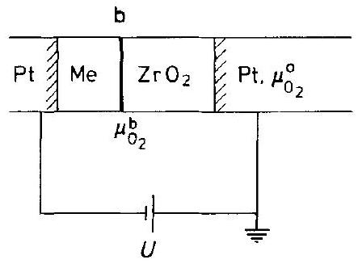
Figure 10-4. Solid state galvanic cell which establishes the oxygen potential at the metal/oxide interface b. $\mu_{\mathrm{O}_{2}}^{\mathrm{b}}-\mu_{\mathrm{O}_{2}}^{0}=4 \cdot F \cdot U$.

Figure 10-5. Multicomponent spherical inclusion ( $\beta$ ) in matrix $\alpha$ with exchange of $i$ component.

Up to this point we have dealt with the thermodynamics of planar boundaries. Let us add several relations for curved interfaces. First, we have to establish an equivalent to the Gibbs-Thomson equation which holds for curved external surfaces in a multicomponent system. For incoherent (fluid-like) interfaces, this can be done by considering Figure 10-5. From the equilibrium condition at constant $P$ and $T$, one has

$$
\mathrm{d} G\left(r, N_{i}^{\beta}\right)=\left(8 \pi r \cdot \sigma^{\mathrm{b}}+\frac{4 \pi r^{2}}{V^{\beta}} \cdot \sum N_{i}^{\beta} \cdot\left(\mu_{i}^{\beta}-\mu_{i}^{\alpha}\right)\right) \cdot \mathrm{d} r=0
$$

so that

$$
\sum N_{i}^{\beta} \cdot\left(\mu_{i}^{\beta}-\mu_{i}^{\alpha}\right)=-\frac{2 \cdot V^{\beta} \cdot \sigma^{\mathrm{b}}}{r}
$$

and the individual $\mu_{i}^{\beta}\left(N_{i}^{\beta}\right)$ can be derived from the mass balance and the individual phase equilibria (Gibbs-Duhem equations for $\alpha$ and $\beta$ ). For semicoherent or fully
coherent interfaces, we have to additionally solve the elastic problem. This has been done with some restrictive assumptions for a binary system [W. C. Johnson (1987)] and means, in essence, that the chemical potentials have to be complemented by elastic energy terms (i.e., $\frac{1}{2} \cdot(\hat{\varepsilon} \cdot \hat{\sigma})$ ).

Further complications emerge if the interface Gibbs energy $\sigma^{\mathrm{b}}$ is not isotropic but depends on the Miller indices ( $\mathrm{h}_{m}$ ) of the surface (interface). This means that $\delta G^{\mathrm{b}}=0(\min )$ in Eqn. (10.18) has to be evaluated for $G^{\mathrm{b}}=\sum A_{\left(\mathrm{h}_{m}\right)} \cdot \sigma_{\left(\mathrm{h}_{m}\right)}^{\mathrm{b}}+E_{\mathrm{S}}^{\mathrm{b}}$, where $A_{\left(\mathrm{h}_{m}\right)}$ is the area of interface with indices $\left(\mathrm{h}_{m}\right), \sigma_{\left(\mathrm{h}_{m}\right)}^{\mathrm{b}}$ is the corresponding specific interfacial energy, and $E_{\mathrm{S}}^{\mathrm{b}}$ is the elastic contribution to the Gibbs energy. In metals and van der Waals crystals, $\sigma_{\left(\mathrm{h}_{m}\right)}^{\mathrm{b}}$ may be estimated by counting broken bonds across the interface.

Gibbs' concept of an (infinitely thin) dividing surface lends itself to the determination of interfacial energies, in accordance with the regular solution model which takes into account the bonds of nearest neighbors only. If species A and B are randomly distributed in phases $\alpha$ and $\beta$, it follows from merely counting bonds that

$$
E^{\mathrm{b}}=\left(\frac{\varepsilon}{a^{2}}\right) \cdot\left(N_{\mathrm{A}}^{\beta}-N_{\mathrm{A}}^{\alpha}\right)^{2}
$$

with $\varepsilon=\varepsilon_{\mathrm{AB}}-\frac{1}{2} \cdot\left(\varepsilon_{\mathrm{AA}}+\varepsilon_{\mathrm{BB}}\right)$ as the excess bond energy and $a^{2}$ as the interface area per bond. This procedure can be extended to the partially ordered phases $\alpha$ and $\beta$.

Often, however, it is more realistic to abandon the model of a discontinuous interface. Segregation of impurities and other point defects, as well as elastic and electric fields, broaden the interface region. For this extended boundary, we can formulate the Gibbs energy of Eqn. (10.1) as ( $i=\mathrm{A}, \mathrm{B}$ )

$$
G^{\mathrm{b}}=\int_{\Delta \xi^{\mathrm{b}}}\left[g(\xi)-\frac{1}{2} \cdot\left(g\left(\Delta \xi^{\mathrm{b}}\right)+g(0)\right)+\varkappa \cdot\left(\frac{\partial N_{i}}{\partial \xi}\right)^{2}\right] \cdot \mathrm{d} \xi
$$

where $g$ is the local Gibbs energy density and $\varkappa$ the (specific) gradient energy as introduced by Cahn [J. W. Cahn (1959)]. The gradient energy term in Eqn. (10.21) is the equivalent of $E^{\mathrm{b}}$ in Eqn. (10.20) when the composition varies continuously. Equilibrium is attained if $\delta G^{\mathrm{b}}=0(\mathrm{~min})$ and mass conservation of the components is observed. Variational calculus yields

$$
\mu_{i}^{\mathrm{b}}=\mu_{i}^{\mathrm{b}}(\text { chem })+\mu_{i}^{\mathrm{b}}(\text { elast })-2 \cdot \varkappa \cdot\left(\frac{\mathrm{\partial}^{2} N_{i}}{\mathrm{\partial} \xi^{2}}\right)=\mu_{i}^{\alpha}=\mu_{i}^{\beta}
$$

as the equilibrium condition.
After discussing the thermodynamic properties of the boundary, let us concentrate on the change in thermodynamic potentials across the boundary. For this, we formulate the Gibbs energy for the bulk phase $\alpha$ of an ionic crystal as the sum

$$
G^{\alpha}=G^{\alpha}(\text { chem })+G^{\alpha}(\hat{\sigma})+G^{\alpha}(\varphi)
$$

where $G^{\alpha}(\hat{\sigma})$ indicates the part of $G^{\alpha}$ due to the elastic potential, and $G^{\alpha}(\varphi)$ that due to the electric potential. It follows that

$$
\mu_{i}^{\alpha}=\mu_{i}^{\alpha}(\text { chem })+\mu_{i}^{\alpha}(\hat{\sigma})+\mu_{i}^{\alpha}(\varphi)
$$

Equations (10.23) and (10.24) hold for the $\beta$-phase as well and could be inserted into Eqn. (10.22). The additivity of $\mu_{i}$ with respect to the elastic and electric potential is based on 1) the assumption of linear elastic theory (which is an approximation) and 2) the low energy density of the electric field (resulting from the low value of the absolute permittivity $\varepsilon_{0}=8.8 \times 10^{-12} \mathrm{C} / \mathrm{Vm}$ ). In equilibrium, $\nabla \mu_{i}=0$ and $\Delta^{\alpha \beta} \mu_{i}= \mu_{i}^{\beta}-\mu_{i}^{\alpha}=0$. Therefore, in an ionic system with uniform hydrostatic pressure, the explicit equilibrium condition reads ( $\Delta^{\alpha / \beta} \equiv \Delta$ )

$$
\Delta \mu_{i}+z_{i} F \Delta \varphi=0 ; \quad \Delta \varphi=-\frac{\Delta \mu_{i}}{z_{i} \cdot F}
$$

The electric potential jump $\Delta \varphi$ across the boundary is due to some separation of positive and negative electrical charge. Thus, the interface corresponds to a capacitor for which we have ( $\varrho_{\mathrm{S}}=$ surface charge density)

$$
\frac{\Delta \varphi}{\Delta \xi}=-\frac{\varrho_{\mathrm{S}}}{\varepsilon \cdot \varepsilon_{0}}
$$

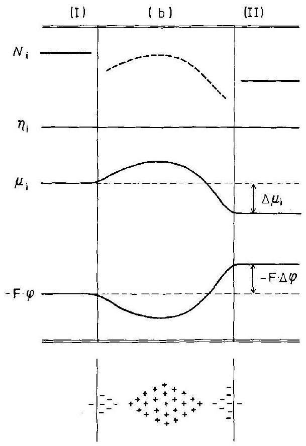
Figure 10-6. Various thermodynamic potentials and the electric charge distribution at and near an equilibrium interface (schematic).

where $\Delta \xi$ is the boundary thickness. As a result of thermal activation, the mobile charges are smeared out into the adjacent bulk as a so-called space charge. Let us denote the effectively charged point defects of the space charge as $\mathrm{d}^{+}$and $\mathrm{d}^{-}$. They can combine to neutral building elements, the concentrations of which are determined by the chemical equilibrium conditions.

The space charge density is $\varrho=\left(F / V_{m}\right) \cdot\left(N_{\mathrm{d}^{+}}-N_{\mathrm{d}^{-}}\right)$, and their characteristic width (i.e., the Debye-Hückel length, which is an equilibrium property and independent of the d-mobilities) is obtained as

$$
\Delta \xi_{\mathrm{D}}=\sqrt{\frac{\varepsilon \cdot \varepsilon_{0} \cdot V_{m} \cdot R T}{2 \cdot F^{2} \cdot N_{\mathrm{d}}^{0}}} ; \quad N_{\mathrm{d}}^{0}=\sqrt{N_{\mathrm{d}^{+}} \cdot N_{\mathrm{d}^{-}}}
$$

By and large, the interface structure of an ionic system resembles the scheme shown in Figure 10-6. A similar concept can explain the concentration distribution in the elastic field of a coherent (or semicoherent) phase boundary (see Chapter 14).

### 10.3 Static Interfaces

In Chapter 3 we described the structure of interfaces and in the previous section we described their thermodynamic properties. In the following, we will discuss the kinetics of interfaces. However, kinetic effects due to interface energies (e.g., Ostwald ripening) are treated in Chapter 12 on phase transformations, whereas Chapter 14 is devoted to the influence of elasticity on the kinetics. As such, we will concentrate here on the basic kinetics of interface reactions. Stationary, immobile phase boundaries in solids (e.g., $\mathrm{A} / \mathrm{B}, \mathrm{A} / \mathrm{AX}, \mathrm{AX} / \mathrm{AY}$, etc.) may be compared to two-phase heterogeneous systems of which one phase is a liquid. Their kinetics have been extensively studied in electrochemistry and we shall make use of the concepts developed in that subject. For electrodes in dynamic equilibrium, we know that charged atomic particles are continuously crossing the boundary in both directions. This transfer is thermally activated. At the stationary equilibrium boundary, the opposite fluxes of both electrons and ions are necessarily equal. Figure 10-7 shows this situation schematically for two different crystals bounded by the (b) interface. This was already presented in Section 4.5 and we continue that preliminary discussion now in more detail.

When SE's cross phase boundaries or other interfaces, they are normally transformed and change their identity. For example, interstitial $\mathrm{A}_{i, t}^{(\mathrm{I})}$ (subscript t indicates tetrahedral coordination) may become $\mathrm{A}_{i, 0}^{(\text {II })}$ (octahedral coordination) after crossing the interface from phase (I) to (II). Let us formulate this transfer in terms of building elements, namely

$$
A_{i, t}^{(\mathrm{I})}+V_{i, \mathrm{o}}^{(\mathrm{II})}=A_{i, \mathrm{o}}^{(\mathrm{II})}+V_{i, t}^{(\mathrm{I})} ; \quad\left(A_{i, \mathrm{t}}^{(\mathrm{I})}-V_{i, t}^{(\mathrm{I})}\right)=\left(A_{i, \mathrm{o}}^{(\mathrm{II})}-V_{i, \mathrm{o}}^{(\mathrm{II})}\right)
$$

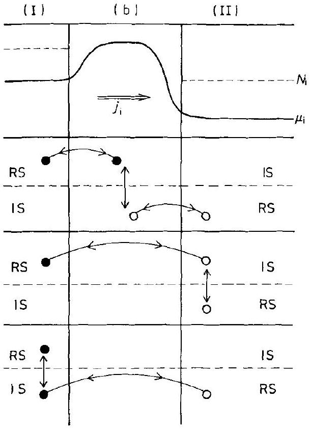
Figure 10-7. Schematics of possible atomic steps of SE $i$ at boundary b. $\bullet=$ SE $i$ in phase I, $O=\mathrm{SE} i$ in phase II. Regular sublattices ( $\mathrm{RS}^{(\mathrm{I})}, \mathrm{RS}^{(\mathrm{II})}$ ) and interstitial sublattices (IS ${ }^{(I)}$, IS ${ }^{(I I)}$ ) are indicated. More details are given in Figure 10-9.

We can see that two SE's on each side of the interface are involved in the transfer. Matter transport across the interfaces and, in particular, the dynamic equilibrium exchange fluxes $j_{k}^{0}$ therefore concern the building elements or components $k$. At equilibrium,

$$
j_{k}=\vec{j}_{k}^{0}-\tilde{j}_{k}^{0}=0
$$

The principle of microscopic reversibility across a boundary is thus applicable to building elements. Since boundary crossing by particles is a thermally activated process, the net flux of building element A across the interface exposed to an external field can be formulated as

$$
j_{\mathrm{A}}=j_{\mathrm{A}}^{0} \cdot\left[\mathrm{e}^{\frac{\alpha \cdot \Delta E_{\mathrm{th}}}{R T}}-\mathrm{e}^{-(1-\alpha) \cdot \frac{\Delta E_{\mathrm{th}}}{R T}}\right]
$$

where $\Delta E_{\mathrm{th}}$ is the change in the thermodynamic potential across the interface and $\alpha$ is an asymmetry coefficient called the transfer coefficient in electrode kinetics $(0<\alpha<1)$. If an electric potential change $\Delta \varphi$ is the driving force, then Eqn. (10.30) becomes for charged particles in a linearized version

$$
j_{\mathrm{A}}=j_{\mathrm{A}}^{0} \cdot \frac{z_{\mathrm{A}} \cdot F \cdot \Delta \varphi}{R T}
$$

so that the interface resistance, that is, $\frac{\Delta \varphi}{\left|z_{\mathrm{A}} \cdot F \cdot j_{\mathrm{A}}\right|}$, becomes

$$
R_{\mathrm{A}}=\frac{R T}{\left(z_{\mathrm{A}} F\right)^{2}} \cdot \frac{1}{j_{\mathrm{A}}^{0}}
$$

One notes that $R_{\mathrm{A}}$ is inversely proportional to the exchange flux ( $j_{\mathrm{A}}^{0}$ ) of the dynamic equilibrium interface.

It has been shown for $\mathrm{Ag} / \mathrm{Ag}_{2} \mathrm{~S}$ that the interface polarization $\Delta \varphi$ stems from the transfer of $\mathrm{Ag}^{+}$ions and not of electrons, which implies that the transfer of electrons and ions across the $\mathrm{Ag} / \mathrm{Ag}_{2} \mathrm{~S}$ interface are independent processes [H. Rickert (1973)]. If so, then they are kinetically decoupled and can be characterized by their individual exchange fluxes $j_{\mathrm{e}}^{0}$ and $j_{\mathrm{Ag}}^{0}$. If $\Delta \varphi>50 \mathrm{meV}$, we are no longer in the linear regime and the flux of silver ions depends exponentially on $\Delta \varphi[\mathrm{H}$. Corish, J. Warde (1978)]. We note, however, that the preparation of boundaries by contacting different crystals is ambiguous. Caution is necessary if experimental results are compared, especially in view of a possible impurity segregation at the interface. The most difficult problem in this context is the experimental determination of the potential drop $\Delta E_{\mathrm{th}}$ (e.g., $\Delta \varphi$ ) across a boundary. Obviously it is not possible to insert potential probes in the bulk close to the interface without disturbing or even destroying the crystal. This is in contrast to the experimental possibilities at hand in surface science [e.g., H.-D. Wiemhöfer, et al. (1990)].

Depending on the type of boundary and field, a force may act on the static interface. This can be seen from Figure 10-8. For the analysis, let us place the crystal between asymmetric capacitor plates. Without the field, the boundary (b) is surrounded by a symmetric (AX/AX) or an asymmetric (AX/AY) space charge. Thus, an inhomogeneous electric field exerts a force on the (dipolar) interface. The boundary
a)

b)

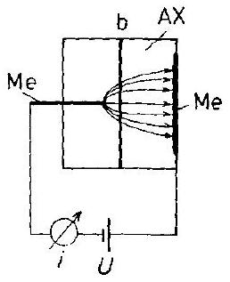
Figure 10-8. Schematic diagram of a device for the determination of interface mobility in an inhomogeneous electric field. The motion due to electric (and frictional) forces occurs a) without, b) with galvanic contact (inducing ionic fluxes and decomposition of AX).

(provided it is mobile) will move until a force equilibrium is attained and the restoring interface tension equals the electric field force. If the interface tension is known, one could determine the amount of space charge. In Figure 10-8a, the crystal has no (electrical) contact with the capacitor plates. If such contact is established (Fig. 10-8b), a flux of charged particles flows across the interface and exerts an additional (frictional) force which may also lead to a boundary displacement. The friction stems from a momentum exchange between the drifting particles and the interface. Its calculation requires a detailed knowledge of the local particle dynamics at or near the boundary which is not yet available. A rough estimate shows that frictional pressures may be in the range of millibars. Similar considerations hold for driving forces other than electric ones. For example, if an elastic stress field is applied to a sample containing coherent boundaries, the elastic interaction of the applied field with the coherency stress field can cause the boundaries to move depending on their mobilities [J. R. Dryden, G. R. Purdy (1990)]. We note in passing that $\Delta \mu_{i}^{\mathrm{b}} / \Delta \xi^{\mathrm{b}}$ across the boundary b conforms to a 'chemical' virtual force with no immediate mechanical effect.

Let us now construct an atomic model for the interface reactions and particle transfer across boundaries in order to interpret such kinetic parameters introduced before as the exchange current or the interface resistance. To this end, we replot Figure 10-7 as shown in Figure 10-9a. This scheme allows us to quantify the processes occurring at a stationary interface in an electric field under load. Let us further simplify the model and consider crystals with immobile anions and the interface AY/AX as shown in Figure 10-9b. AY merely serves as a source for the injection of atomic particles (SE's) into the sublattices of AX, or as a sink for SE's arriving from

AX at the AY/AX boundary. The main feature of this interface reaction (i.e., the transport of building elements across b) is the injection of mobile point defects into available vacant sites and the subsequent local relaxation towards equilibrium distributions. According to Figure 10-9b, two different modes of cation injection can take place in the relaxation zone $\xi_{\mathrm{R}}$. 1) Cations are injected into the sublattice of predominant ionic transference in AX by the applied field. In this case, no further defect reaction is necessary for the continuation of cation transport. 2) Cations are injected into the 'wrong' sublattice which does not contribute noticeably to the cation transport in AX. Defect reactions (relaxation) will occur subsequently to ensure continuous charge transport. This is the situation depicted in Figure 10-9b, and, in view of its model character, we briefly outline the transport formalism.

If we denote the point defect injected by the applied field into the 'wrong' sublattice of AX by i (e.g., $\mathrm{A}_{\mathrm{i}}^{*}$ ), and the conjugate defect that carries the flux in AX by j (e.g., $\mathrm{V}_{\mathrm{A}}^{\prime}$ ), then the steady state condition for both fluxes ( $\mathrm{i}, \mathrm{j}$ ) in the defect recombination zone $\xi_{\mathrm{R}}$ is

$$
j_{\mathrm{i}}-j_{\mathrm{j}}=j_{0} ; \quad \nabla j_{\mathrm{i}}=\nabla j_{\mathrm{j}}=\dot{r}_{\mathrm{i}}=\dot{r}_{\mathrm{j}}
$$

in accordance with Figure 10-9b, where $j_{0}$ is the constant total flux ( $=-j_{\mathrm{i}}$ at $\xi \gg \xi_{\mathrm{R}}$ ) and $\dot{r}_{\mathrm{i}}$ and $\dot{r}_{\mathrm{j}}$ are recombination (production) rates. Furthermore, we have at the interface ( $\xi=0$ )

$$
j_{\mathrm{i}}=j_{0}
$$

The second condition for bulk transport in AX is $D_{\mathrm{j}} \gg D_{\mathrm{i}}$ in accordance with our assumptions. The point defects relax by a bimolecular reaction mode (see Section 5.3.3). In order to simplify the formal treatment, we linearize the recombination rate

$$
\dot{r}_{\mathrm{i}}=-k_{\mathrm{i}} \cdot \frac{\Delta c}{c^{0}} ; \quad \Delta c=c_{\mathrm{i}}-c^{0}=c_{\mathrm{j}}-c^{0}
$$

We have tacitly assumed that space charge effects can be neglected in the present context, which is justified for sufficiently high fields. Inserting the explicit flux equations for i and j into Eqn. (10.33) we obtain

$$
F \cdot \nabla \varphi=-R T \cdot \frac{j_{0}+\left(D_{\mathrm{i}}-D_{\mathrm{j}}\right) \cdot \nabla c_{\mathrm{i}}}{\left(D_{\mathrm{i}}+D_{\mathrm{j}}\right) \cdot c_{\mathrm{i}}}
$$

and therefore the flux of i becomes

$$
j_{\mathrm{i}}=-2 \cdot \frac{D_{\mathrm{i}} \cdot D_{\mathrm{j}}}{D_{\mathrm{i}}+D_{\mathrm{j}}} \cdot \nabla c_{\mathrm{i}}+\frac{D_{\mathrm{i}}}{D_{\mathrm{i}}+D_{\mathrm{j}}} \cdot j_{0}
$$

With Eqn. (10.37) it follows from Eqns. (10.33) and (10.35) that

$$
\nabla^{2}(\Delta c)-\xi_{\mathrm{R}} \cdot(\Delta c)=0, \quad \xi_{\mathrm{R}}=\sqrt{\frac{D_{\mathrm{j}} \cdot D_{\mathrm{j}}}{D_{\mathrm{i}}+D_{\mathrm{j}}} \cdot \frac{c^{0}}{k_{\mathrm{i}}}}=\sqrt{2 \cdot \bar{D} \cdot \tau_{\mathrm{R}}}
$$

The relaxation time $\tau_{\mathrm{R}}$ is $c^{0} /\left(2 \cdot k_{\mathrm{i}}\right)$ and $\bar{D}$ is defined as $D_{\mathrm{i}} \cdot D_{\mathrm{j}} /\left(D_{\mathrm{i}}+D_{\mathrm{j}}\right)$. Solving Eqn. (10.38) with the boundary conditions of Figure 10-9b we obtain

$$
\Delta c=\frac{j_{0} \cdot \xi_{\mathrm{R}}}{2 \cdot D_{\mathrm{i}}} \cdot \mathrm{e}^{-\frac{\xi}{\xi_{\mathrm{R}}}}
$$

and

$$
j_{\mathrm{i}}=j_{0} \cdot \frac{D_{\mathrm{i}}}{D_{\mathrm{i}}+D_{\mathrm{j}}} \cdot\left(1+\frac{D_{\mathrm{j}}}{D_{\mathrm{i}}} \cdot \mathrm{e}^{-\frac{\xi}{\xi_{\mathrm{R}}}}\right)
$$

Between $\xi=0$ and $\xi=\xi_{\mathrm{R}}, j_{\mathrm{i}}$ diminishes approximately as $\mathrm{e}^{-\frac{\xi}{\xi_{\mathrm{R}}}}$. Only a small fraction of the total flux $j_{0}$ is carried into the bulk of $\mathrm{AX}\left(\xi \gg \xi_{\mathrm{R}}\right)$ by the interstitials. Their transference number is given by $D_{\mathrm{i}} /\left(D_{\mathrm{i}}+D_{\mathrm{j}}\right)$.

In a zeroth order approach, integration of Eqn. (10.36) gives $j_{0}$ as a function of the electrical potential drop $\Delta U$ in the recombination zone

$$
j_{0}=-\frac{F}{R T} \cdot c^{0} \cdot\left(D_{\mathrm{i}}+D_{\mathrm{j}}\right) \cdot \frac{\Delta U}{\xi_{\mathrm{R}}}
$$

$\Delta U$ is known as the overpotential in the electrode kinetics of electrochemistry. Let us summarize the essence of this modeling. If we know the applied driving forces, the mobilities of the SE's in the various sublattices, and the defect relaxation times, we can derive the fluxes of the building elements across the interfaces. We see that the interface resistivity $R^{\mathrm{b}}=\Delta U /\left(F \cdot j_{0}\right)$ stems, in essence, from the relaxation processes of the SE's (point defects). $R^{\mathrm{b}}$ depends on the relaxation time $\tau_{\mathrm{R}}$ of the (chemical) processes that occur when building elements are driven across the boundary. In accordance with Eqn. (10.33), the flux $j_{0}$ can be understood as the integral of the relaxation (recombination, production) rate $\dot{r}_{\mathrm{i}}\left(\dot{r}_{\mathrm{j}}\right)$, taken over the width $\xi_{\mathrm{R}}$.

$$
j_{0}=j_{\mathrm{i}}(0)-j_{\mathrm{i}}(\infty)=\int_{\xi_{\mathrm{R}}} \dot{r}_{\mathrm{i}} \cdot \mathrm{~d} \xi
$$

The width of the relaxation zone $\xi_{\mathrm{R}}$, which is the thickness of the 'kinetic interface', may differ considerably from other lengths characterizing other properties of an interface (e.g., space charge width, elastic deformation width).

Transport of $\mathrm{Ag}^{+}$across the $\mathrm{AgI} / \mathrm{Ag}_{2} \mathrm{~S}$ boundary has been studied experimentally as a function of $\Delta \eta_{\mathrm{Ag}}^{\mathrm{b}}$ (which was determined with the help of microsensors of the type $\mathrm{Ag} / \mathrm{AgBr}$ ) [H. Schmalzried, et al. (1992)]. From flux vs. driving force curves, the exchange flux $j^{0}$ has been evaluated and found to be $c a .1 \mathrm{~A} / \mathrm{cm}^{2}$ at $260^{\circ} \mathrm{C}$. Introducing this high value of $j^{0}$ into Eqn. (10.41) and noting that the boundary resistance is

$$
R^{\mathrm{b}}=\frac{R T}{\left(z_{\mathrm{i}} \cdot F\right)^{2} \cdot j^{0}}=\frac{R T \cdot \xi_{\mathrm{R}}}{\left(z_{\mathrm{i}} \cdot F\right)^{2} \cdot c^{0} \cdot\left(D_{\mathrm{i}}+D_{\mathrm{j}}\right)}
$$

we can determine the defect relaxation time $\tau_{\mathrm{R}_{5}}$ by using Eqn. (10.38). For this $\mathrm{AgI} / \mathrm{Ag}_{2} \mathrm{~S}$ interface, $\tau_{\mathrm{R}}$ is calculated to be $c a .10^{-5} \mathrm{~s}$, suggesting that the relaxation is a diffusion controlled reaction between point defects.

### 10.4 Moving Interfaces

### 10.4.1 General Remarks

In a foregoing section, we mentioned that field forces (e.g., of the electric or elastic field) can cause an interface to move. If they are large enough so that inherent counterforces (such as interface tension or friction) do not bring the boundary to a stop, the interface motion would continue and eventually become uniform. In this section, however, we are primarily concerned with boundary motions caused by chemical potential changes. From irreversible thermodynamics, we know that the dissipated Gibbs energy of the discontinuous system is $T \cdot \sigma^{\mathrm{b}}$, where $\sigma^{\mathrm{b}}$ here is the entropy production (see Section 4.2). Since $\mathrm{d} G / \mathrm{d} V=\mathrm{d} \dot{G} / \mathrm{d} \dot{V}=\sigma^{\mathrm{b}} \cdot T /(A \cdot \dot{\xi})$, we have with Eqn. (4.8) at the boundary $b$

$$
\frac{\sum j_{i}^{\mathrm{b}} \cdot \Delta \mu_{i}^{\mathrm{b}}}{v^{\mathrm{b}}}=\frac{\sum N_{i}^{\mathrm{b}} \cdot \Delta \mu_{i}^{\mathrm{b}}}{V_{m}}=\frac{\Delta G_{m}^{\mathrm{b}}}{V_{m}}
$$

where A is the unit area. $\Delta G^{\mathrm{b}}$ is the Gibbs energy dissipated at the interface during the reaction (e.g., $\mathrm{A}+\mathrm{B}=\mathrm{AB}$ ). What are the physical processes which are responsible for the dissipation of $\Delta G^{\mathrm{b}}$ ?

Boundaries between solids transmit shear stress, particularly if they are coherent or semicoherent. Therefore, the strain energy density near boundaries changes over the course of solid state reactions. Misfit dislocation networks connected with moving boundaries also change with time. They alter the transport properties at and near the interface. Even if we neglect all this, boundaries between heterogeneous phases are sites of a discontinuous structural change, which may occur cooperatively or by individual thermally activated steps.

In order to quantify $\Delta G^{\mathrm{b}}$ as a fraction of the available Gibbs energy $\Delta G$, let us first introduce a phenomenological approach. In Figure 10-10, a solid state reaction for a binary (or quasi-binary) system is illustrated and shows the variation in the chemical potential for different conditions. We assume without loss of generality that $D_{\mathrm{A}} \gg D_{\mathrm{B}}$. We then define $\Delta \mu_{\mathrm{A}}(\mathrm{AB})$ and $\Delta \mu_{\mathrm{A}}^{\mathrm{b}}$ in such a way that $\Delta \mu_{\mathrm{A}}(\mathrm{AB})+ \Delta \mu_{\mathrm{A}}^{\mathrm{b}}=\Delta G_{\mathrm{AB}}$ as the overall driving force. In Figure 10-10, it was tacitly assumed that $j^{0}(1) \gg j^{0}(2)$, with $j^{0}$ denoting the exchange fluxes as discussed in the previous section. The steady state condition is

$$
j_{\mathrm{A}}=j_{\mathrm{A}}^{0} \cdot \frac{\Delta \mu_{\mathrm{A}}^{\mathrm{b}}}{R T}=\frac{D_{\mathrm{A}} \cdot c_{\mathrm{A}}}{\Delta \xi(\mathrm{AB})} \cdot \frac{\Delta \mu_{\mathrm{A}}(\mathrm{AB})}{R T}
$$

Figure 10-10. Representation of the chemical potential of A during the heterogeneous solid state reaction $\mathrm{A}+\mathrm{B}=\mathrm{AB}$. a) Diffusion control, b) interface control at $\left.b_{2}, c\right)$ rate control by rearrangement (relaxation) of $A$ in $B$ in zone $\xi_{A}(B)$, d) simultaneous diffusion and interface control $\left(\mathrm{b}_{2}\right)$.

if $D_{\mathrm{A}}$ is independent of the activity of A in AB . Defining a length $\Delta \bar{\xi}=\left(D_{\mathrm{A}} \cdot c_{\mathrm{A}} / j_{\mathrm{A}}^{0}\right)$, we obtain from Eqn. (10.45)

$$
\frac{\Delta \overline{\xi^{\prime}}}{\Delta \overline{\bar{\xi}}+\Delta \xi(\mathrm{AB})}=\frac{\Delta \mu_{\mathrm{A}}^{\mathrm{b}}}{\Delta G_{\mathrm{AB}}}=\frac{\Delta \mu_{\mathrm{A}}^{\mathrm{b}}}{\Delta \mu_{\mathrm{A}}^{\mathrm{b}}+\Delta \mu_{\mathrm{A}}(\mathrm{AB})}
$$

For $\Delta \xi(\mathrm{AB}) \rightarrow 0, \Delta \mu_{\mathrm{A}}^{\mathrm{b}}=\Delta G_{\mathrm{AB}}$, and the reaction is interface controlled. This can be seen in Figure 10-10b. If $\Delta \xi(\mathrm{AB}) \gg \Delta \bar{\xi}$, then $\Delta \mu_{\mathrm{A}}^{\mathrm{b}} \rightarrow 0$ and the reaction is controlled by diffusion through the product AB . If $\Delta \xi(\mathrm{AB})=\Delta \bar{\xi}$, one half of $\Delta G_{\mathrm{AB}}$ is dissipated in the product AB and the other half in the boundary b .

Experiments have shown that $\Delta \bar{\xi}$ for oxide spinel formation is on the order of $10^{-4} \mathrm{~cm}$ at ca. $1000^{\circ} \mathrm{C}$ [C.A. Duckwitz, H. Schmalzried (1971)]. Using Eqns. (10.45) and (10.46) with the accepted cation diffusivities (on the order of $10^{-10} \mathrm{~cm}^{2} / \mathrm{s}$ ), one can estimate from $j_{\mathrm{A}}^{0}$ that each A particle crosses the boundary about ten times per second each way. In other words, quenching cannot preserve the atomistic structure of a moving interface which developed during the motion by kinetic processes. This also means that heat conduction is slower than a structural change on the atomic scale, unless one quenches extremely small systems.

If a phase boundary is reaction rate determining, the chemical potential curve of component A conforms to the schematic plots in Figure 10-10b or c. Figure 10-10c indicates that A , when in front of the moving interface $\mathrm{AB} / \mathrm{B}$, is supersaturated to some extent in a thin layer of B . Thus, component A drags the interface along while it overshoots. (An interface drag of a different nature will be treated later in Section 10.4.4.) In this situation, the moving $\mathrm{AB} / \mathrm{B}$ interface is normally morphologically unstable since the supersaturated segment of the solid solution exists in front of it.

AB can then grow either by nucleation in the supersaturated segment, by continuous addition at sites of repeatable growth on the boundary, or by recurring AB nucleation on the interface plane. In view of the commonly occurring misfit at most boundaries, it is probable that sufficient growth sites are normally available.

Let us conclude this section with a few general remarks. If we assume phase boundary rate control, the rate of advance is co-determined by the interface mobility, which in turn is related to the mobilities of the atoms in the interface. We note that 1) the directional dependence of mobilities or diffusivities in the interface may be quite pronounced (depending on $\tilde{\delta}$ ) and 2 ) the mobilities or diffusivities depend on $\mu_{i}^{\mathrm{b}}$, the component chemical potentials, which change over time at the interface until diffusion control eventually becomes rate determining.

Finally, we observe that two distinct processes always occur at the moving boundary: 1) a change in crystal structure and 2) a change in the density of all structure elements. At low $T$, where the mobilities of bulk SE's are very small, and a sufficiently high driving force is acting, the change in lattice structure and the transport of SE's can decouple. In that instance, one observes the limiting case of diffusionless transformations into metastable states.

### 10.4.2 Interface Motion During Phase Transformation

Phase transformations in elemental solids or line compounds are the simplest heterogeneous solid state reactions with a moving interface. In the language of thermodynamics, the interface is the location where extensive state variables change discontinuously. Point defect concentrations ( $c_{\text {def }}$ ) are normalized extensive functions of state. Therefore, phase transformations of even elemental crystals are accompanied by defect concentration relaxation at and near the moving interface. Figure 10-11 depicts the $\alpha-\beta$ transformation of an elemental crystal. The distribution and strength of point defect sinks determine the defect concentration profile in space as a function of time. The following basic assumptions define the kinetic problem. 1) As long as $N_{\text {def }} \ll 1$, the Gibbs energy change for the structural transformation $\Delta G$ is independent of $c_{\text {def }}(=c)$, and the transformation velocity $\boldsymbol{v}^{\mathrm{b}}$ is, to first order, a linear function of $\Delta G\left(\sim\left(T-T_{\mathrm{tr}}\right)\right)$. 2) $v^{\mathrm{b}}$, which is thus determined by the undercooling ( $T-T_{\mathrm{tr}}$ ), has to match the transformation velocity defined through the conservation

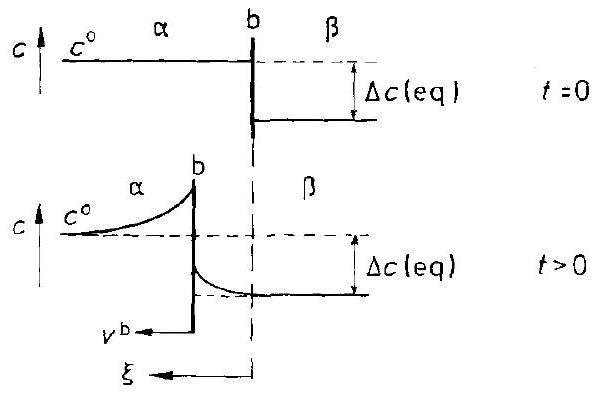
Figure 10-11. Distribution of point defects near a moving interface during transformation $\alpha \rightarrow \beta$.

of the point defects, that is, $\boldsymbol{v}^{\mathrm{b}} \cdot\left(c^{\beta, \mathrm{b}}-c^{\alpha, \mathrm{b}}\right)=\left(j^{\beta, \mathrm{b}}-j^{\alpha, \mathrm{b}}\right)$, given that the boundary does not act as a defect sink. 3) If no other defect sinks but the ends of the (linear) sample are available for defect relaxation, then $\nabla j^{\alpha}=0, \nabla j^{\beta}=0$, and $\int_{\alpha} c^{\alpha} \cdot \mathrm{d} \xi+\int_{\beta} c^{\beta} \cdot \mathrm{d} \xi=\left(\xi^{\alpha}-\xi^{\beta}\right) \cdot c^{0}$ are the local and integral equations of point defect conservation in space and time. 4) The kinetic problem, however, is not fully defined unless we specify the kinetic properties (for defect transfer) of the boundary proper. In the simplest case, we may assume local equilibrium to prevail, that is, $\left(c^{\alpha} / c^{\beta}\right)^{\mathrm{b}}=v^{0}$ (constant). The mathematical solution to this problem is closely related to the calculation of the redistribution of solutes in a solidifying solvent [M. C. Flemings (1974)].

If we next consider the $\alpha-\beta$ transformation of a binary compound (e.g., $\mathrm{A}_{1-\delta} \mathrm{B}$ ) with a narrow range of homogeneity instead of an elemental crystal A , we encounter a general problem which is illustrated in Figure 10-12. From the relevant thermodynamic function, it can be seen that for a given undercooling (corresponding to $\Delta G(t=0)$ ), the chemical potential $\mu_{\mathrm{A}}^{\beta}(t=0)$ is much higher than $\mu_{\mathrm{A}}^{\alpha}(t=0)$ and it depends much more strongly on $\delta$ than does $\mu_{\mathrm{A}}^{\alpha}$. As a consequence, component A will be transported across the moving $\alpha-\beta$ boundary from the transformed $\beta$ into the untransformed $\alpha$. It follows that during the transformation $\delta^{\alpha}$ and $\mu_{\mathrm{A}}^{\alpha}$, on the average, should increase with time.

Figure 10-12. The Gibbs energy us. nonstoichiometry $\delta$ for binary compounds (e.g., $\mathrm{Ag}_{2+\delta} \mathrm{S}$ ). Nucleation of $\beta$ at $\delta_{2}^{0}$ needs activation, in contrast to nucleation of $\beta$ at $\delta_{1}^{0}$.

The Gibbs energies of compounds $\alpha$ and $\beta$ depend parabolically on the nonstoichiometry $\delta$ (i.e., $\sim \delta^{2}$ [H. Schmalzried (1978)]) if their ranges of homogeneity are narrow. The curvature at $\delta=0$ is inversely proportional to $\sqrt{K}$, where $K$ is the equilibrium constant of the intrinsic defect disorder. Therefore, in keeping with Figure 10-12, $\Delta G$ and $\Delta \mu_{\mathrm{A}}^{\mathrm{b}}$ can be written for a given undercooling $\Delta T\left(=T-T_{\mathrm{tr}}\right)$ as

$$
\begin{gathered}
\Delta G-\Delta G(\delta=0)=\varepsilon_{2} \cdot\left(\delta^{\beta, \mathrm{b}}\right)^{2}-\varepsilon_{1} \cdot\left(\delta^{\alpha, \mathrm{b}}\right)^{2} \\
\Delta \mu_{\mathrm{A}}^{\mathrm{b}}=\Delta G+\left(\varepsilon_{2} \cdot \delta^{\beta, \mathrm{b}}-\varepsilon_{1} \cdot \delta^{\alpha, \mathrm{b}}\right)
\end{gathered}
$$

where $\varepsilon_{1}$ and $\varepsilon_{2}$ are known functions of the equilibrium constants $K(T)$ for phases $\alpha$ and $\beta$.

Before we continue our analysis of the first-order $\mathbf{A}_{1-\delta} \mathbf{B}$ transformation, let us first describe some illustrative results obtained for $\mathrm{Ag}_{2+\delta} \mathrm{X} ; \mathrm{X}=\mathrm{S}$, Se. Crystals of $\mathrm{Ag}_{2} \mathrm{~S}$ are semiconductors and transform at $\mathrm{c} a .176^{\circ} \mathrm{C}$. They are bcc in the high temperature ( $\alpha$ ) form, with a homogeneity range ( $\delta_{\text {max }}^{\alpha}$ ) on the order of $10^{-3}$. The low temperature ( $\beta$ ) form is monoclinic, its homogeneity range ( $\delta_{\text {max }}^{\alpha}$ ) is on the order of $10^{-6}$ [H. Schmalzried (1980)]. With a sufficient driving force (i.e., undercooling $\Delta T$ ), the $\alpha \rightarrow \beta$ transformation therefore involves matter transfer in the form of point defects across the boundary b. Phase $\alpha$ is enriched in silver during this transformation. The Ag potential in the $\alpha$-phase increases in front of the moving boundary. This increase will be larger the higher the initially established nonstoichiometry $\delta^{0}$ ( $c^{0}$ ) (Fig. 10-11). The Ag potential increases until the Ag supersaturation is sufficient to precipitate point defects as metallic Ag in the $\mathrm{Ag}_{2} \mathrm{~S}$ matrix. The supersaturation necessary for the nucleation of silver has been determined with miniaturized $\mu_{\mathrm{Ag}}$ sensors in the form of solid state galvanic cells $(\approx 15 \mathrm{meV})$. The variation in time of the Ag chemical potential is not monotonic during the $\alpha-\beta$ transformation. Several minima and maxima of $\mu_{\mathrm{Ag}}(t)$ are found in front of the moving boundary (Fig. 10-13). Various explanations have been offered for this pulsating interface motion. Firstly, since there is a slight difference in the molar volumes of $\alpha$ and $\beta$, misfit dislocations will be created and move along with the moving boundary. If they form networks which can then interact with the moving boundary, the resulting elastic effects may be oscillatory. Secondly, impurities segregate at the boundary and will also be dragged along. If they cannot follow, the boundary frees itself from the impurity cloud (see Fig. 3-11) in a similar way as it may free itself from the dislocation network. Thus, one again anticipates oscillatory behavior, since the boundary velocity depends on the amount and distribution of dragged impurities. However, there is a more fundamental possible explanation for this mode

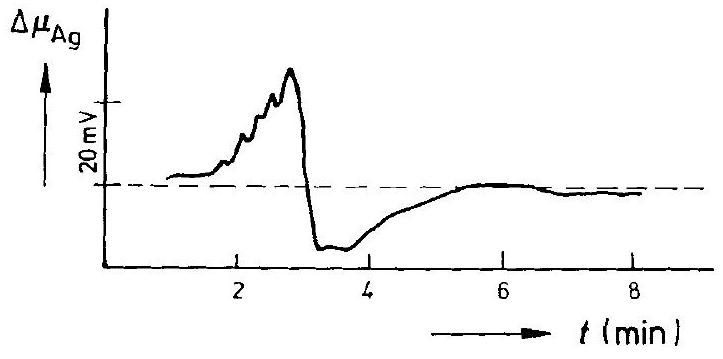
Figure 10-13. The measured Ag potential difference $\Delta \mu_{\mathrm{Ag}}$ between $\alpha$ and $\beta$ during transformation of $\mathrm{Ag}_{2+\delta} \mathrm{Se} . \delta^{0}=1.95 \times 10^{-3}$, $v^{\mathrm{b}}=1.3 \mathrm{~cm} / \mathrm{min}$.

of boundary velocity. It may be recognized if we resume the previous discussion of moving interfaces during solid state reactions. When silver is driven in the form of point defects (i.e., irregular ionic and compensating electronic defects) across the phase boundary, point defects of the $\beta$-phase are injected into the $\alpha$-phase as mobile irregular SE's. This injection upsets local point defect equilibria near the boundary and induces relaxation processes involving both regular and irregular SE's.

The reaction scheme at and near the phase boundary during the phase transformation is depicted in Figure 10-14. The width of the defect relaxation zone around the moving boundary is $\Delta \xi_{\mathrm{R}}$, it designates the region in which the relaxation processes take place. The boundary moves with velocity $\boldsymbol{v}^{b}(t)$ and establishes the boundary conditions for diffusion in the adjacent phases $\alpha$ and $\beta$. The conservation of mass couples the various processes. This is shown schematically in Figure 10-14b where the thermodynamic conditions illustrated in Figure 10-12 are also taken into account. The transport equations (Fick's second laws) have to be solved in both the $\alpha$ and $\beta$

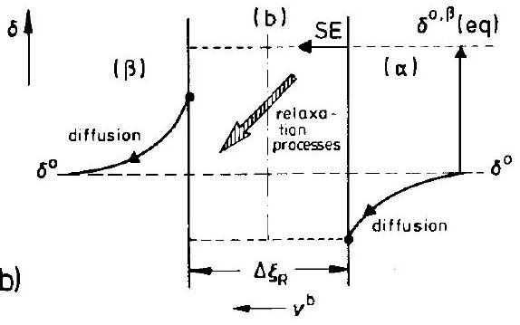

Figure 10-14. Relaxation processes at a moving interface. a) Scheme of boundary $\alpha / \beta$ during transformation, b) coupling of transport and relaxation processes, c) detailed structure element steps in the relaxation zone.

phases where the boundary conditions at $\xi=0$ and $\xi=\infty$ are $j_{i}=0$ and $\delta^{\alpha}= \delta^{\alpha}(t=0)$ respectively.

The main problem of the boundary motion, however, remains the description of relaxation processes that take place when supersaturated point defects are pumped into the boundary region $\Delta \xi_{\mathrm{R}}$. Outside the relaxation zone $\Delta \xi_{\mathrm{R}}$, diffusion without reaction takes place. A simple model of a 'relaxation box' is shown in Figure 10-14c. The four exchange reactions 1) between the crystals $\alpha$ and $\beta$, and 2) between their sublattices are

$$
\begin{aligned}
& \mathrm{A}_{\mathrm{i}}^{\alpha}+\mathrm{V}_{\mathrm{i}}^{\beta}=\mathrm{A}_{\mathrm{i}}^{\beta}+\mathrm{V}_{\mathrm{i}}^{\alpha} \\
& \mathrm{A}_{\mathrm{i}}^{\beta}+\mathrm{V}_{\mathrm{A}}^{\beta}=\mathrm{A}_{\mathrm{A}}^{\beta}+\mathrm{V}_{\mathrm{i}}^{\beta} \\
& \mathrm{A}_{\mathrm{A}}^{\alpha}+\mathrm{V}_{\mathrm{A}}^{\beta}=\mathrm{A}_{\mathrm{A}}^{\beta}+\mathrm{V}_{\mathrm{A}}^{\alpha} \\
& \mathrm{A}_{\mathrm{i}}^{\alpha}+\mathrm{V}_{\mathrm{A}}^{\alpha}=\mathrm{A}_{\mathrm{A}}^{\alpha}+\mathrm{V}_{\mathrm{i}}^{\alpha}
\end{aligned}
$$

The fractions $N_{\mathrm{v}_{\mathrm{i}}}^{\alpha}, N_{\mathrm{v}_{\mathrm{i}}}^{\beta}, N_{\mathrm{A}_{\mathrm{A}}}^{\alpha}$, and $N_{\mathrm{A}_{\mathrm{A}}}^{\beta}$ are $\approx 1$. If we assume for simplicity that A is transported in $\alpha$ via interstitials and in $\beta$ via vacancies, as indicated in Figure 10-14c, we have the following system of differential equations for the 'relaxation box' (denoting $c_{\mathrm{A}_{\mathrm{i}}}^{\alpha}$ by $x_{1}, c_{\mathrm{A}_{\mathrm{i}}}^{\beta}$ by $x_{2}, c_{\mathrm{V}_{\mathrm{A}}}^{\alpha}$ by $x_{3}$ and $c_{\mathrm{V}_{\mathrm{A}}}^{\beta}$ by $x_{4}$ )

$$
\begin{array}{ll}
\dot{x}_{1}=A-\left(\overleftarrow{k}_{1}+\vec{k}_{4} \cdot x_{4}\right) \cdot x_{1}+\vec{k}_{1} \cdot x_{2} ; & A=\left(j_{\mathrm{A}}^{\alpha \mathrm{b}}+\overleftarrow{k}_{4}\right) \\
\dot{x}_{2}=B-\left(\vec{k}_{1}+\overleftarrow{k}_{2} \cdot x_{3}\right) \cdot x_{2}+\overleftarrow{k}_{1} \cdot x_{1} ; & B=\vec{k}_{2} \\
\dot{x}_{3}=C-\left(\vec{k}_{3}+\overleftarrow{k}_{2} \cdot x_{2}\right) \cdot x_{3}+\overleftarrow{k}_{3} \cdot x_{4} ; & C=\left(j_{\mathrm{A}}^{\beta \mathrm{b}}+\vec{k}_{2}\right) \\
\dot{x}_{4}=D-\left(\overleftarrow{k}_{3}+\vec{k}_{4} \cdot x_{1}\right) \cdot x_{4}+\vec{k}_{3} \cdot x_{3} ; & D=\overleftarrow{k}_{4}
\end{array}
$$

To complete the set of kinetic equations we observe that $\boldsymbol{v}^{\mathrm{b}}=(\Delta j / \Delta c)^{\mathrm{b}}$ where $\Delta c^{\mathrm{b}}$ can be expressed in terms of $\delta^{\alpha, \mathrm{b}}$. Finally, the requirement of mass conservation yields a further equation. Considering the inherent nonlinearities, this problem contains the possibility of oscillatory solutions as has been observed experimentally. Let us repeat the general conclusion. Reactions at moving boundaries are relaxation processes between regular and irregular SE's. Coupled with the transport in the untransformed and the transformed phases, the nonlinear problem may, in principle, lead to pulsating motions of the driven interfaces.

Proceeding systematically, diffusion controlled $\alpha-\beta$ transformations of binary A-B systems should be discussed next when $\alpha$ and $\beta$ are phases with extended ranges of homogeneity. Again, defect relaxations at the moving boundary and in the adjacent bulk phases are essential for their understanding (see, for example, [F. J. J. van Loo (1990)]). The morphological aspects of this reaction type are dealt within the next chapter.

We have mentioned that coherent and semicoherent transformations create stress in the phases $\alpha$ and $\beta$ while the boundary moves. The stress field, the origin of which is the (semi-) coherent boundary, extends over the crystal with sound velocity. The local stress depends on the geometry of the sample and the momentary location of the boundary. The stress gradient can be included in the driving force, if necessary. Normally, however, it does not seem possible to quantify the influence of stress, although it is noticeable both in the kinetics and morphology at small undercoolings. After reversing the thermodynamic driving force $\Delta T$, hysteresis is to be observed as a result of the asymmetry of the stress state [B. Baranowski (1993)].

### 10.4.3 Interface Movement During the Heterogeneous Reaction $\mathbf{A}+\mathbf{B}=\mathbf{A B}$

Interface control of the solid state reaction $\mathrm{A}+\mathrm{B}=\mathrm{AB}$ (e.g., at the $\mathrm{AB} / \mathrm{B}$ boundary) means inter alia that the chemical potential of reactant A in AB is $\mu_{\mathrm{A}}^{0}$ instead of $\mu_{\mathrm{A}}^{0}+\Delta G_{\mathrm{AB}}^{0}$ at the $\mathrm{AB} / \mathrm{B}$ interface (Fig. 10-10). It thus seems as if a negative virtual pressure $\Delta G_{\mathrm{AB}}^{0} / V_{\mathrm{m}}$ is dragging the interface into the A supersaturated region of B (Fig. 10-10c). From the steady state condition of the moving $A B / B$ interface, we have $\boldsymbol{v}^{\mathrm{b}}=\boldsymbol{v}_{\mathrm{A}}^{0}=j_{\mathrm{A}}^{b} / c_{\mathrm{A}}^{0}(\mathrm{~B})$, which gives

$$
b_{\mathrm{A}} \cdot\left(\nabla \mu_{\mathrm{A}}-\bar{K}_{\mathrm{A}}\right)+v_{\mathrm{A}}^{0}=0 ; \quad \bar{K}_{\mathrm{A}}=-\frac{n \cdot \varepsilon^{0}}{\left(\xi_{\mathrm{A}}(\mathrm{~B})\right)^{n+1}}
$$

where $\varepsilon^{0} /\left(\xi_{\mathrm{A}}(\mathrm{B})\right)^{n}$ is an assumed interaction potential between solute A in B and the advancing $\mathrm{AB} / \mathrm{B}$ interface with $\varepsilon^{0}$ and $n$ as phenomenological parameters. Equation (10.51) yields

$$
\frac{\Delta G_{\mathrm{AB}}^{0}}{\xi_{\mathrm{A}}(\mathrm{~B})}+\frac{n \cdot \varepsilon^{0}}{\xi_{\mathrm{A}}(\mathrm{~B})^{n+1}}+\frac{v_{\mathrm{A}}^{0}}{b_{\mathrm{A}}}=0
$$

and relates $\xi_{\mathrm{A}}(\mathrm{B})$ to $\Delta G_{\mathrm{AB}}^{0}, b_{\mathrm{A}}$, and $v_{\mathrm{A}}^{0}$. Let us define a characteristic time $\tau$ such that $\xi_{\mathrm{A}}(\mathrm{B})=\boldsymbol{v}_{\mathrm{A}}^{0} \cdot \tau$. From Eqn. (10.52), we can then determine $\boldsymbol{v}_{\mathrm{A}}^{0}$ (or $\boldsymbol{v}^{\mathrm{b}}$ ) as a function of $\tau$, which is the essential parameter for understanding the movement of the reaction controlled interface. In the simplest case ( $n=1$ ),

$$
\left(v^{\mathrm{b}}\right)^{3}+\frac{\Delta G_{\mathrm{AB}}^{0} \cdot b_{\mathrm{A}}}{\tau} \cdot v^{\mathrm{b}}+\frac{\varepsilon^{0} \cdot b_{\mathrm{A}}}{\tau^{2}}=0
$$

This shows how the steady state velocity of the interface is related to some characteristic parameters of the reacting solids if interface control prevails.

Sometimes, one has independent information on $\tau$. Let us consider an interface controlled spinel formation ( $\mathrm{AO}+\mathrm{B}_{2} \mathrm{O}_{3}=\mathrm{AB}_{2} \mathrm{O}_{4}$ ). We assume that the rate limiting interface is $\mathrm{AB}_{2} \mathrm{O}_{4} / \mathrm{AO}$ and also that the spinel product is a so-called normal spinel in which the A cations are situated on tetrahedral sites. Therefore, in the super-
saturated AO front region (where the $\mathrm{B}_{2} \mathrm{O}_{3}$ component possesses a chemical potential $\mu_{\mathrm{B}_{2} \mathrm{O}_{3}}>\mu_{\mathrm{B}_{2} \mathrm{O}_{3}}^{0}+\Delta G_{\mathrm{AB}_{2} \mathrm{O}_{4}}^{0}$ ), the cations rearrange themselves between octahedral and tetrahedral sites in the fcc sublattice of the oxygen ions. The relaxation time, $\tau$, for this process is known from experiment. A rough estimate for $\boldsymbol{v}^{\mathrm{b}}$ can be obtained by setting $\varepsilon^{0}=0$ and $\Delta G_{\mathrm{AB}}^{0} / R T=1$, whereupon Eqn. (10.53) reduces to $v^{\mathrm{b}}= \sqrt{D_{\mathrm{A}}(\mathrm{B}) / \tau}$. Inserting $\tau$ as ca. 1 s at $1000^{\circ} \mathrm{C}$ and $D_{\mathrm{A}}(\mathrm{B})=10^{-12} \mathrm{~cm}^{2} / \mathrm{s}$ [K. D. Becker (1987); C.A. Duckwitz (1971)], we see that the estimated theoretical values of $\boldsymbol{v}_{\mathrm{A}}^{0}$ compare favorably with the experimental values of ca. $10^{-4} \mathrm{~cm} / \mathrm{min}$. We also note that this interface reaction is once more interpreted in terms of relaxation processes of structure elements.

### 10.4.4 The Dragged Boundary (Generalized Solute Drag)

Let us once again inspect Eqn. (10.51). Both $\nabla \mu_{\mathrm{A}}\left(\approx \Delta G_{\mathrm{AB}}^{0} / \xi_{\mathrm{A}}(\mathrm{B})\right)$ and $\bar{K}_{\mathrm{A}}$ could be the cause of the boundary (interface) motion (Fig. 10-10). Yet whereas $\nabla \mu_{\mathrm{A}}$ is a (virtual) thermodynamic force, $\bar{K}_{\mathrm{A}}$ is an actual (elastic, electric) field force acting directly on the boundary. This fact sometimes causes difficulties in defining the interface mobility. We obtain the interface velocity if the adjacent phases are chemically equilibrated and thus homogeneous as the product of the mobility and the field force, $\boldsymbol{v}^{\mathrm{b}}=m^{\mathrm{b}} \cdot \bar{K}^{\mathrm{b}}$. However, an independent determination of $\bar{K}^{\mathrm{b}}$ is most difficult. A straightforward situation is the curved boundary in a chemically homogeneous system (e.g., grain boundary, bicrystal) which moves under the action of the interface tension (no external force!). If the magnitude of the interface tension is known, then the interface mobility is a quantity that can be determined unequivocally by experiment. Externally applied field forces act on both the boundary and the bulk. Normally, the interface is mobile only if SE's of the bulk crystal are mobile as well. Therefore, atomic fluxes cross the interface while it moves and exert additional frictional forces. Such a situation is difficult to analyze. A limiting case, which has been treated in physical metallurgy, will be outlined below.

Every one-, two- or three-dimensional crystal defect gives rise to a potential field in which the various lattice constituents (building elements) distribute themselves so that their thermodynamic potential is constant in space. From this equilibrium condition, it is possible to determine the concentration profiles, provided that the partial enthalpy and entropy quantities $h_{i}(\xi)$ and $s_{i}(\xi)$ of the building units $i$ are known. Let us consider a simple limiting case and assume that the potential field around an (planar) interface is symmetric as shown in Figure 10-15, and that the constituent $i$ dissolves ideally in the adjacent lattices, that is, it obeys Boltzmann statistics. In this case we have

$$
c_{i}=c_{i}^{0} \cdot \mathrm{e}^{-\bar{\varepsilon}(\xi)}=c_{i}^{0} \cdot \mathrm{e}^{-\tilde{\varepsilon}(-\xi)} ; \quad \tilde{\varepsilon}=\frac{E_{i}}{R T}
$$

Since $\bar{K}_{i}=-\partial E_{i} / \partial \xi$, the force $\bar{K}_{i}^{0}$ is constant in the region of interaction $-\Delta \xi \ldots 0$, and is $-\bar{K}_{i}^{0}$ between $0 \ldots+\Delta \xi$. By Eqn. (10.54), the pressure $P_{i}$ on the interface due to its interaction with species $i$ is

Figure 10-15. Interaction potential between the (moving) grain boundary (interface) and solute species $i$, and its spatial distribution $c_{i}$ at $t=0$.

$$
P_{i}=\int_{-\infty}^{+\infty} c_{i} \cdot \bar{K}_{i} \cdot \mathrm{~d} \xi=-c_{i}^{0} \cdot \int_{-\Delta \xi}^{+\Delta \xi} \mathrm{e}^{-\tilde{\varepsilon}(\xi)} \cdot\left(\frac{\partial E_{i}}{\partial \xi}\right) \cdot \mathrm{d} \xi
$$

At equilibrium, it vanishes. Let us now assume that an external force $K_{\mathrm{ex}}\left(P_{\mathrm{ex}}\right)$ has shifted the interface by an amount $\delta$, and that the $i$ particles were not able to follow this shift. The potential field $E_{i}(\xi)$ is now perturbed relative to the cloud of $i$ particles as indicated in Figure 10-15. From Eqn. (10.54), one calculates the restoring pressure on the interface, $-P_{\mathrm{r}}$, as

$$
-P_{\mathrm{r}}=2 \cdot c_{i}^{0} \cdot E_{i}^{0} \cdot \mathrm{e}^{-\frac{E_{i}^{0}}{R T}} \cdot \frac{\delta}{\Delta \xi}
$$

where $\delta$ is the displacement (assumed to be small in comparison to $\Delta \xi$ ). Note that no interface tension operates on the planar interface.

However, when particles $i$ are mobile in the crystal lattice, and the interface mobility is $m^{\mathrm{b}}$, the steady state condition for this more realistic case is

$$
\left(P_{\mathrm{ex}}-P_{i}\right) \cdot m^{\mathrm{b}}=v^{\mathrm{b}}
$$

The 'internal' pressure, $P_{i}$, is no longer given by Eqn. (10.55) because the $i$ particles redistribute during their steady state motion. Only if the interface mobility $m^{\mathrm{b}}$ is very small and $D_{i} / \Delta \xi \gg v^{\mathrm{b}}$ will $c_{i}(\xi)$ come close to the equilibrium distribution given by Eqn. (10.54).

In order to calculate this new steady state, one requires the $i$ particle velocity, which vanishes in a reference system that is attached to the interface. In the external laboratory system the interface moves with constant velocity $\boldsymbol{v}^{\text {b }}$. A steady state is attained if the velocity of the $i$ particles is equal to $\boldsymbol{v}^{\mathbf{b}}$, that is,

$$
\boldsymbol{v}^{\mathrm{b}}=b_{i} \cdot\left(-\nabla \mu_{i}+\bar{K}_{i}\right)
$$

which gives for $\bar{K}_{i}=-\frac{\partial E_{i}}{\partial \xi}$

$$
c_{i} \cdot\left(\frac{\partial E_{i}}{\partial \xi}\right)+\nabla \mu_{i}=-\frac{\boldsymbol{v}^{\mathrm{b}}}{b_{i}}
$$

Equation (10.59), in combination with Eqns. (10.55) and (10.57), can be used to determine $c_{i}(\xi)$ as a function of $\boldsymbol{v}^{\mathrm{b}}$ and $E_{i}(\xi)$, and $\boldsymbol{v}^{\mathrm{b}}$ as a function of the drag force $\bar{K}_{i}$ (see Fig. 3-11). Solutions have been worked out, for example, by [K. Lücke (1972); M. Hillert (1978)] for a moving grain boundary at which impurity atoms or other point defects segregate. The defects are dragged during recrystallization of the polycrystalline material driven by the grain boundary energy (tension). A similar problem is met if (charged) dislocation lines, with their impurity cloud, are exposed to an electric field force.

### 10.4.5 Diffusion Induced Grain Boundary Motion

A special case of interface movement apparently driven by a 'chemical pressure' is the diffusion induced (grain) boundary motion (DIGM). From Chapter 3, we know that diffusivities at interfaces are much larger than in the bulk. Therefore, we normally build up large differences in the chemical potential of components between the boundary and the adjacent bulk when an external source (or sink) for these components exists at the surface of the solid. A corresponding experimental situation is illustrated in Figure 10-16 whereby gaseous B diffuses into the initially straight grain boundary of a thin foil of A . Any fluctuation will render the B potential change unsymmetric with respect to the adjacent bulk phase. Consequently, a net (virtual) 'chemical pressure' will act on the boundary which, if mobile, starts to move. Since the sweeping boundary is filled with the high activity B, it also fills that part of the bulk crystal with B that has been crossed during the diffusion induced grain boundary motion. Therefore, DIGM enhances both the diffusional solution of B into solvent A and the corresponding Gibbs energy dissipation. The (virtual) 'chemical pressure' asymmetry is self-sustaining. The boundary will continue to move in accordance with its mobility and with any restoring forces which may develop during the sweep (e.g., by misfit dislocation formation). Sweeping boundaries have been observed in-situ both in metallic and in nonmetallic solid solution crystals [R. Balluffi, J. W. Cahn (1981)].

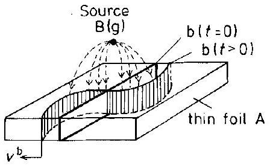
Figure 10-16. DIGM: Solute B diffuses from gas ( g ) into grain boundary b of solvent foil A , causing b to move.

### 10.5 Morphological Questions

Although morphological problems related to moving solid/solid interfaces are treated in depth in the next chapter, some basic aspects of the boundary motion during heterogeneous solid state reactions will be introduced in the context of this chapter. If the heterogeneous reaction $\mathrm{A}+\mathrm{B}=\mathrm{AB}$ is transport controlled, we can verify by inspecting Figure 10-17 that in a one-dimensional reaction geometry, a planar interface is stable during product growth. Every perturbation of the planar interface changes the potential gradients in such a way that the diffusive fluxes will restore its planarity. Interface stability requires, in essence, that the boundary velocity vector and the matter flow vector (which is responsible for the interface reaction and thus for the interface velocity) have the same direction. If these vectors were opposing, then the moving interface would be morphologically unstable, as Figure 10-18 shows, in which $v^{\mathrm{b}}$ is directed towards the high potential side.

A somewhat different situation is depicted in Figure 10-19. A flux of $\mathrm{A}^{+}$cations is driven (e.g., by an electric field) across the boundary of the phase combination $\mathrm{AX}(\alpha) / \mathrm{BX}(\beta)$. Since the AX side is anodic, the boundary shifts into BX . Two cases can be distinguished with respect to the cation mobilities: 1) $b_{\mathrm{A}}^{\alpha}>b_{\mathrm{B}}^{\beta}$ and 2) $b_{\mathrm{A}}^{\alpha}<b_{\mathrm{B}}^{\beta}$. In the first case, the planar boundary is morphologically unstable since

Figure 10-17. Morphological stability of interface $\mathrm{AB} / \mathrm{B}$ during the heterogeneous reaction $\mathrm{A}+\mathrm{B}=\mathrm{AB}$. Since $\boldsymbol{v}^{\mathrm{b}}(1)<\boldsymbol{v}^{\mathrm{b}}(2)$ ( $\nabla \mu_{\mathrm{A}}(1)<\nabla \mu_{\mathrm{A}}(2)$ ), the interface is morphologically stable.

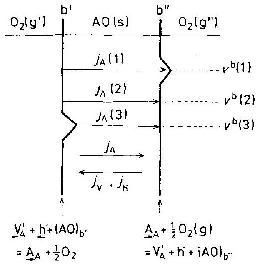
Figure 10-18. Crystal AO in an oxygen potential gradient and the morphological stability of its interfaces. Since $\nabla \mu_{\mathrm{A}}(1)<\nabla \mu_{\mathrm{A}}(2)<\nabla \mu_{\mathrm{A}}(3)$, $j_{\mathrm{A}}(1)<j_{\mathrm{A}}(2)<j_{\mathrm{A}}(3)$, and $v^{\mathrm{b}}(1)<v^{\mathrm{b}}(2)<v^{\mathrm{b}}(3)$. Conclusion: boundary $\mathrm{b}^{\prime \prime}$ is morphologically stable, boundary $\mathrm{b}^{3}$ is morphologically unstable.

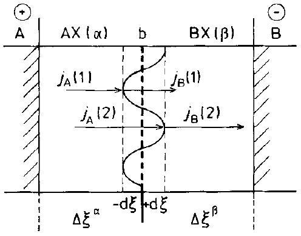
Figure 10-19. Cations $\mathrm{A}^{+}$driven by an electric field across interface $\mathrm{AX} / \mathrm{BX}\left(D_{\mathrm{X}} \ll D_{\mathrm{B}}<D_{\mathrm{A}}\right)$. Since $D_{\mathrm{B}}<D_{\mathrm{A}}, j_{\mathrm{A}}^{\alpha}(1)\left(=j_{\mathrm{B}}^{\beta}(1)\right)<j_{\mathrm{A}}^{\alpha}(2)\left(=j_{\mathrm{B}}^{\beta}(2)\right)$ and $v^{\mathrm{b}}(1)<v^{\mathrm{b}}(2)$. Conclusion: interface $\mathrm{AX} / \mathrm{BX}$ is morphologically unstable, if the A electrode is anodic.

any perturbation of the boundary geometry will cause the electrical resistance of the system to decrease with time. The increasing disturbance autocatalytically accelerates the resistance decrease, as can be seen from Figure 10-19. The opposite is true for the second case. One can quantify the situation depicted in Figure 10-19 and obtain, with the help of a little algebra and noting that $j_{\mathrm{A}}^{\alpha}=j_{\mathrm{B}}^{\beta}$ at boundary positions (1) and (2),

$$
\boldsymbol{v}^{\mathrm{b}}=\overline{\boldsymbol{v}}^{\mathrm{b}} \cdot\left[1-\frac{b_{\mathrm{B}}-b_{\mathrm{A}}}{b_{\mathrm{B}} \cdot \Delta \xi^{\alpha}+b_{\mathrm{A}} \cdot \Delta \xi^{\beta}} \cdot \mathrm{d} \xi\right] ; \quad b_{\mathrm{A}}=b_{\mathrm{A}}^{\alpha}, \quad b_{\mathrm{B}}=b_{\mathrm{B}}^{\beta}
$$

This means that $\boldsymbol{v}^{\mathrm{b}}(1)<\boldsymbol{v}^{\mathrm{b}}(2)$ if $b_{\mathrm{A}}^{\alpha}>b_{\mathrm{B}}^{\beta}$. In this case, the moving boundary is morphologically unstable. If, however, $b_{\mathrm{A}}^{\alpha}<b_{\mathrm{B}}^{\beta}$, then one finds from Eqn. (10.60) that $\boldsymbol{v}^{b}(1)>\boldsymbol{v}^{b}(2)$, which says that the interface is morphologically stable because the perturbations of the boundary decay with time. In one way or the other, possible changes in the interface morphology which occur in heterogeneous reacting systems can always be reduced to the situations depicted in Figures 10-18 and 10-19.

### 10.6 The Atomic Structure of Moving Interfaces

In the previous section, we introduced the concept of macroscopic morphological stability. Let us now ask what the interface structure is on an atomic scale. The structure of the equilibrium interface is that which makes the Gibbs energy a minimum (see Section 10.2). The purpose of the moving interface, which separates the two nonequilibrium phases $\alpha$ and $\beta$, is to perform the structural transformation. The transformation process selects the atomic structure of the moving interface such that it eventually allows the fastest steady state transformation kinetics. Coherent (semicoherent) interfaces often achieve this goal by the motion of ledges and kinks. Other mechanisms, however, may operate as well. For the sake of illustration, let us consider a specific example. The spinel formation reaction $\mathrm{AB}+\mathrm{B}_{2} \mathrm{O}_{3}= \mathrm{AB}_{2} \mathrm{O}_{4}$ requires (in addition to the above mentioned cation rearrangement) the dense packed oxygen ion sublattice to transform from hcp ( $\mathrm{B}_{2} \mathrm{O}_{3}$ ) into fcc ( $\mathrm{AB}_{2} \mathrm{O}_{4}$ )
at the $\mathrm{AB}_{2} \mathrm{O}_{4} / \mathrm{B}_{2} \mathrm{O}_{3}$ moving boundary. This structural transformation could, for example, be performed by bundles of partial (edge) dislocations gliding on the densest packed oxygen ion planes and changing the ABAB packing into an ABC packing. Therefore, the basal oxygen planes in the product and the reactant should remain parallel. However, experiments show that this is often not so, and that the (111) plane of the product is not strictly parallel to the $(000.1)_{\mathrm{B}_{2} \mathrm{O}_{3}}$ plane of the reactant. Figure 10-20 gives the interface structure as suggested by electron microscopy studies [B. C. Carter, H. Schmalzried (1985)]. The benefit of the experimentally determined small rotation about a close-packed direction is that 1 ) it can accommodate the misfit between reactant and product at the interface and, more importantly from a kinetic standpoint, 2) the necessary voids and steps along the interface between the sesquioxide and the spinel resulting from the rotation can obviously accomplish the structural transformation sufficiently fast without the need to create and move Shockley partial dislocations. The atomic rearrangement occurs basically through the increased mobility of the ions in these voids. Anions leave the hcp structure lattice and are properly added to the fcc surface of the void. This 'pore movement' differs considerably from the well known interface movement by the motion of ledges along an interface [D. Hesse, et al. (1993)].

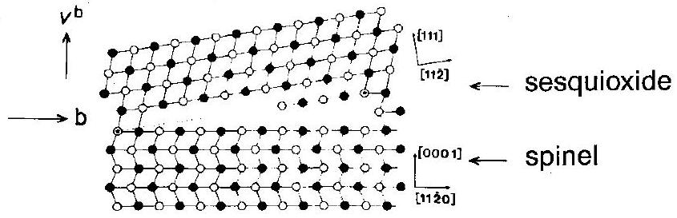
Figure 10-20. Schematic structure of the moving $\mathrm{AB}_{2} \mathrm{O}_{4} / \mathrm{B}_{2} \mathrm{O}_{3}$ interface with a small rotation about a close-packed direction, accommodated by voids.

We have pointed out before that during reaction, interfaces may act as sources and sinks for point defects. Therefore, dislocations associated with these interfaces have to climb. The coupling of dislocation climb, ledge motion, and the creation (annihilation) of point defects at moving boundaries have been discussed for isomorphous, diffusion controlled $\alpha-\beta$ transformations. In cases where the contiguous $\alpha$ and $\beta$-phases are structurally dissimilar, the corresponding coupled processes at the moving boundary are less well understood [B. Pieraggi, et al. (1990)].

To summarize: the structure of a moving interface on the atomic scale depends on the atomic mechanism which operates in the structure transformation. The mode selection depends on the driving force and thus on the interface velocity. The interface mobility itself is determined by its structure and depends therefore on the driving force. This means that interface controlled reactions are normally nonlinear functions of the driving force.

## References

Baranowski, B. (1993) J. Alloys and Compounds, 200, 87
Balluffi, R., Cahn, J.W. (1981) Acta Met., 29, 493
Becker, K. D., Rau, F. (1987) Ber. Bunsenges. Phys. Chem., 91, 1279
Cahn, J. W. (1959) Acta Met., 7, 18
Cahn, J. W. (1982) J. Phys. (Paris) 43, C6-199
Carter, C.B., Schmalzried, H. (1985) Phil. Mag., 52, 207
Corish, J., Wade, C. J. (1978) Ber. Bunsenges. Phys. Chem., 82, 282
Dieckmann, R., et al. (1978) Ber. Bunsenges. Phys. Chem., 82, 778
Dryden, J. R., Purdy, G.R. (1990) Acta Met., 38, 1255
Duckwitz, C.A., Schmalzried, H. (1971) Z. phys. Chem., NF76, 173
Flemings, M. C. (1974) Solidification Processing, McGraw Hill, New York
Gibbs, G. B. (1966) Phys. Stat. Sol., 16, K27
Hesse, D., et al. (1993) Appl. Phys. A, 57, 415
Hillert, M. (1978) Ber. Bunsenges. Phys. Chem., 82, 244
Johnson, W. C. (1987) Met. Trans., A18, 1093
Johnson, W. C., Müller, W. H. (1991) Acta Met. Mater., 39, 89
Johnson, W. C., Schmalzried, H. (1992) Acta Met. Mater., 40, 2337
Kirchheim, R. (1992) in: Materials Interfaces (Ed.: D. Wolf, S. Yip), Chapman and Hall, London
Lücke, K., et al. (1972) in: The Nature and Behaviour of Grain Boundaries (Ed.: H. Hu), Plenum Press, New York, p. 245 ff
Maier, J. (1994) Solid State Ionics 70, 43
Pieraggi, B., et al. (1990) Acta Met. Mater., 38, 1781
Rickert, H. (1973) Einführung in die Elektrochemie fester Stoffe, Springer, Berlin
Schmalzried, H. (1978) Ber. Bunsenges. Phys. Chem., 82, 277
Schmalzried, H. (1980) Progr. Sol. State Chem., 13, 119
Schmalzried, H., et al. (1992) Solid State Ionics, 51, 91
Schmalzried, H. (1993) Polish J. Chemistry, 67, 167
Stubican, V. (1993) Phil. Mag., 68, 809
van Loo, F. J. J., et al. (1990) Acta Met. Mater., 38, 1769
Voorhees, P. W., Johnson, W.C. (1989) J. Chem. Phys., 90, 2793
Wiemhöfer, H. D., et al. (1990) Solid State Ionics, 40/41, 433
Wolf, D., Merkle, K. L. (1992) in: Materials Interfaces (Ed.: D. Wolf, S. Yip), Chapman and Hall, London

## 11 Morphology

### 11.1 Introduction

This chapter discusses the evolution of boundaries during solid state reactions. A reacting heterogeneous system is morphologically unstable if the initially planar equipotential surfaces or interfaces become nonplanar $(f(z) \rightarrow f(z, y, x))$ and the potential gradients $\nabla P_{i}(z)$ become dependent on $(z, y, x)$, where $y, x$ are the coordinates perpendicular to the initial normal vector of the boundary and growth direction $z$. There are many causes for the instabilities of moving boundaries in isothermally reacting solids. The large composition gradients near the boundaries and the corresponding changes of the mobilities and mechanical properties normally result in severe distortions of the structure (cracks, dislocations, etc.). Even if we neglect these (secondary) effects on morphological stability, the moving boundaries can nevertheless become unstable. This inherent instability is a mere transport phenomenon and derives immediately from the continuum flux equations and the boundary conditions. Morphological instability is found if the perturbation amplitudes of the initially planar equipotential surfaces increase instead of decrease. Thus, the boundary conditions of the reaction become time-dependent. The solidification of a simple melt by heat transport is an analogous problem, and here the velocity $v^{\mathrm{b}}$ of the solid/liquid boundary is determined by the rate at which the released latent heat diffuses away from this boundary. The resulting dendritic growth shows a unique parabolic tip and an oscillatory side branching mode. The theory of this unstable growth is highly mathematical. Surface tension plays a decisive role. It destroys whole families of possible solutions, selecting out a unique structure and controlling the process pattern [J. S. Langer (1980), H. Müller-Krumbhaar, W. Kurz (1990)].

In this chapter, we will present examples of morphological instabilities during solid state reactions. Alloy oxidation, the dissolution of a crystalline solution into a liquid or solid solvent, compound crystals brought into motion in chemical potential gradients, interdiffusion in multicomponent systems with miscibility gaps, and other situations will be considered. The formal discussion is meant to outline the basic features of the mathematical stability analysis. The results will enable us to formulate rules which can help to distinguish between morphologically stable and unstable boundaries in reacting systems. Finally, a reaction path analysis for a non-equilibrium, multicomponent system is presented which gives additional information about morphological stability. For a multicomponent, inhomogeneous or heterogeneous system, the reaction path can be found if the experimental composition vs. distance curve is replotted in terms of the compositional or chemical potential coordinates in a corresponding phase diagram. We will see that pertinent conclusions can be
drawn if we realize that the boundary is morphologically unstable when its motion is directed towards supersaturated regions.

It helps to clarify the concepts if we distinguish between two principally different reaction modes of the heterogeneous reaction $\mathrm{A}+\mathrm{B}=\mathrm{AB}$. 1) The reaction $\mathrm{A}+\mathrm{B}=$ AB occurs, on an atomic scale, outside the product crystal (normally in an adjacent solvent). AB molecules are then added to the surface of the AB crystal to make it grow ( = additive growth). 2) The solid product AB is formed from the very beginning between A and B such that AB separates the reactants. Further growth is possible only by transport of the A and B reactants across the product layer (= reactive growth). These two possible growth modes are depicted in Figure 11-1.

Figure 11-1. Scheme of a) additive and b) reactive crystal growth.

The addition of AB molecules to the crystal (reaction mode 1)) means that the growth is by precipitation from the (supersaturated) surroundings. It will be unimpeded as long as there are repeatable sites of growth available on the surface of the AB product. This mode of growth is shown to be morphologically unstable unless stabilizing factors are operative. In reactive growth defined as mode 2), the growing product retards the advancement of the reaction (unless paths other than that of diffusion across the product layer become rate determining). In mode 1), the atomic reaction $\mathrm{A}+\mathrm{B}=\mathrm{AB}$ took place before the growth could occur by the addition of AB molecules to the crystal. In mode 2), reaction and growth define the same process. The distinction between additive and reactive growth is important when we study morphological stability. The additive growth is morphologically unstable because the crystal surface moves towards a region of increased AB activity. We will not pursue this any further since many textbooks on crystal growth deal with this subject $[\mathrm{K} . \mathrm{A}$. Jackson (1975)].

In the following, we assume the reactions to occur essentially in one dimension. Although spherical, cylindrical, and other common reaction geometries complicate the mathematics, they do not significantly alter the conclusions on boundary stability. The question then is whether or not a planar boundary (e.g., $\mathrm{A} / \mathrm{AB}$ or $\mathrm{AB} / \mathrm{B}$ in Fig. 11-1) remains planar when it moves in the course of a reaction, and why it does so. Formally, we have to investigate the evolution of the boundary geometry over time, when matter is diffusing in the two adjacent phases and across the boundary b. To this end, one must solve the transport problem in the contiguous phases while
the moving interface establishes the conditions of the flux coupling. A theoretical stability analysis can be made if we assume that the moving interface is in local equilibrium. The real situation, however, is often more complex. The assumption of local equilibrium defines a limiting case. In general, the interfacial reaction kinetics must be explicitly taken into account when the coupling conditions are formulated (as discussed in Section 10.4.2). Also, the structure of the $\alpha / \beta$ interface, and thus the interfacial kinetic parameters, change with time since there is never full coherency between the contiguous $\alpha$ - and $\beta$-phases during reaction. Depending on the degree of coherency, the mechanical properties of $\alpha$ and $\beta$, and the ability of the interface to transmit shear, far reaching stresses, dislocations, cracks, and fractures evolve. Furthermore, interface tensions influence the activities of the components near the interface, in particular if morphological instability leads to the formation of highcurvature tips. We therefore anticipate, in agreement with common experience, that very seldom will the boundaries of crystals remain stable during growth, be it additive or reactive.

The definition of a solid state reaction implies that the reaction product is a solid. If, for example, one of the reactants is a fluid, no deviatoric stresses are transmitted across the common interface. This situation simplifies the mechanical boundary condition significantly and explains why studies on boundary morphology are often performed with solid/fluid systems.

### 11.2 Interface Stability

### 11.2.1 Qualitative Discussion

In the following, we will analyze the fluxes and transport at the moving boundary b. For inhomogeneous single phase solids, the one dimensional mass transport balance in the $z$-direction (without a reaction term) reads

$$
\frac{\partial c_{i}}{\partial t}=-\frac{\partial j_{i}}{\partial z}
$$

At the $\alpha / \beta$ phase boundary, an equivalent mass balance condition in terms of the boundary velocity is

$$
\boldsymbol{v}_{\perp}^{\mathrm{b}}=\frac{\partial z^{\mathrm{b}}}{\partial t}=-\frac{\Delta j_{\perp}}{\Delta c}
$$

where $\Delta$ denotes the change across b and $\boldsymbol{v}_{\perp}^{\mathrm{b}}$ is the velocity vector perpendicular $(\perp)$ to the interface. Equation (11.2) implies that the diffusional transport in $b$ itself can be neglected, which is true if $D^{\mathrm{b}}$ and $D^{\mathrm{V}}$ are of the same order of magnitude.

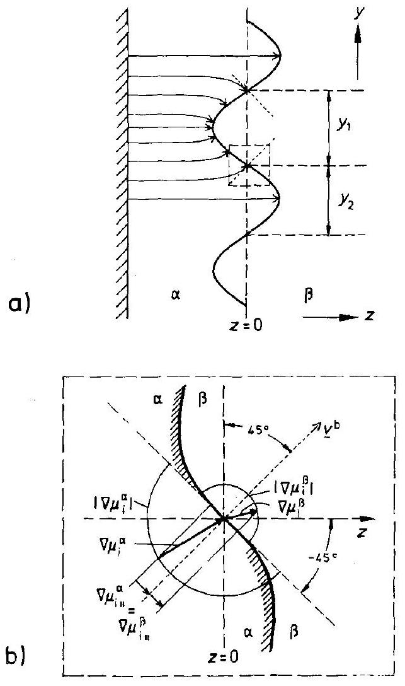
Figure 11-2. a) Flux lines in a Laplace potential field of the $\alpha$-phase, given that $L^{\beta}>(\gg) L^{\alpha}$. b) Construction of the near boundary chemical potential gradients $\nabla \mu_{i}^{\alpha}$ and $\nabla \mu_{i}^{\beta}$ in the marked region of a) (see text).

Let us generalize and consider three dimensional transport and introduce the explicit fluxes $j_{i}=-L_{i} \cdot \nabla \mu_{i}$ in $\alpha$ and $\beta$ into Eqn. (11.2). Since $\mu_{i}$ is a potential function and thus $\nabla \mu_{i, \|}^{\beta}=\nabla \mu_{i, \|}^{\alpha}=\nabla \mu_{i, \|}$ at the boundary b (Fig. 11-2b), we immediately find that

$$
\left(\frac{j_{i, \|}^{\alpha}}{j_{i, \|}^{\beta}}\right)_{\mathrm{b}}=\frac{L_{i}^{\alpha}}{L_{i}^{\beta}}
$$

where $L_{i}$ is the transport coefficient. If $L_{i}^{\beta} \gg L_{i}^{\alpha}$, we can conclude from Eqn. (11.3) that $j_{i, \|}^{\alpha}<j_{i, \|}^{\beta}$. Therefore, $j_{i}^{\alpha}$ is perpendicular to the boundary if $L_{i}^{\beta} \gg L_{i}^{\alpha}$. Further conclusions can then be drawn with the help of Figures 11-2a and $\mathbf{b}$. From Figure 11-2a, we see that the density of flux lines arriving at the (sinusoidally) perturbed boundary in region $y_{1}$ is larger than the flux line density arriving in the valley of region $y_{2}$. If this flux determines the advancement of the boundary in the sense of Eqn. (11.2), then two cases must be distinguishable. 1) The (average) velocity $\boldsymbol{v}^{\text {b }}$ and the flux $j_{i}^{\alpha}$ point in the same direction. In this case $\dot{z}^{\mathrm{b}}\left(y_{1}\right)>\dot{z}^{\mathrm{b}}\left(y_{2}\right)$. Thus, the perturbation decays with time and the boundary is morphologically stable. If $\boldsymbol{v}^{\mathrm{b}}$
and $j_{i}^{\alpha}$, however, have opposite directions, then the perturbation amplitude increases with time and the moving interface is morphologically unstable.

These considerations are the physical essence of any stability analysis. We may quantify somewhat further by considering Figure 11-2b, from which, with the help of Eqn. (11.2), we can infer that

$$
j_{i, \perp}^{\alpha}-j_{i, \perp}^{\beta}=v_{\perp}^{\mathrm{b}} \cdot \Delta c_{i}=j_{i}^{\alpha}-j_{i, \|}^{\alpha}-\left(j_{i}^{\beta}-j_{i, \|}^{\beta}\right)
$$

or after rearrangement

$$
j_{i}^{\alpha}=j_{i}^{\beta}-\left(L_{i}^{\alpha}-L_{i}^{\beta}\right) \cdot \nabla \mu_{i, \|}+\boldsymbol{v}_{\perp}^{\mathrm{b}} \cdot \Delta c
$$

which gives, with $j_{i}=-L_{i} \cdot \nabla \mu_{i}$,

$$
\nabla \mu_{i}^{\alpha}=\frac{L_{i}^{\beta}}{L_{i}^{\alpha}} \cdot \nabla \mu_{i}^{\beta}+\left(1-\frac{L_{i}^{\beta}}{L_{i}^{\alpha}}\right) \cdot \nabla \mu_{i, \|}-v_{\perp}^{\mathrm{b}} \cdot \frac{\Delta c}{L_{i}^{\alpha}}
$$

Since $\left|\nabla \mu_{i, \|}\right| \leq\left|\nabla \mu_{i}^{\beta}\right|$ (Fig. 11-2b) and assuming that $L_{i}^{\beta}>L_{i}^{\alpha}$, the sum of the first two terms on the right hand side of Eqn. (11.6) is negative, that is, the flux points in the positive direction of $z$. The last term can be positive or negative, but it cannot override the first two terms (otherwise we have uphill transport). We also note that the larger $L_{i}^{\beta}$ is, the smaller $L_{i}^{\alpha} / L_{i}^{\beta}$ and $\nabla \mu_{i}^{\beta}$ are.

With these relations in mind, we can read from Figure 11-2b that if the perturbation is sinusoidal, then the interface will have a slope of $-45^{\circ}$ and $\boldsymbol{v}_{\perp}^{\mathrm{b}}$ will have a slope of $+45^{\circ}$ at $z=0$. (We will later Fourier synthesize a general perturbation $\phi(z, y, t)$ from sinusoidal components.) The two semicircles in Figure 11-2b represent the absolute values of $\nabla \mu_{i}^{\alpha}$ and $\nabla \mu_{i}^{\beta}$ respectively. We can see again that for $L_{i}^{\beta} / L_{i}^{\alpha} \gg 1,\left|\nabla \mu_{i}^{\beta}\right| \rightarrow 0$ and the slope of $\nabla \mu_{i}^{\alpha}$ is $45^{\circ}$ (as is the slope of $\boldsymbol{v}_{\perp}^{\mathrm{b}}$ ). For smaller ratios of $L_{i}^{\beta} / L_{i}^{\alpha},\left|\nabla \mu_{i}^{\beta}\right|$ increases and this turns the slope of $\nabla \mu_{i}^{\alpha}\left(j_{i}^{\alpha}\right)$ to smaller values. As long as this slope is positive, the flux density in the tip region $y_{1}$ is larger than in the valley region $y_{2}$.

Thus, we conclude that the interface is morphologically unstable for negative $\boldsymbol{v}^{\mathrm{b}}$ if the flux of $i$ indeed causes the boundary motion. (This flux, however, is not necessarily the rate determining one since all fluxes in the multicomponent system are coupled in one way or the other.)

A distinction between solid/fluid and solid/solid boundaries is irrelevant from the point of view of transport theory. Solid/fluid boundaries in reacting systems are, for example, $(\mathrm{A}, \mathrm{B}) / \mathrm{A}^{+}, \mathrm{B}^{+}, \mathrm{X}^{-}(\mathrm{aq})$ or $(\mathrm{A}, \mathrm{B}) / \mathrm{X}_{2}(\mathrm{~g})$. More important is the distinction according to the number of components. In isothermal binary systems, the boundary is invariant if local equilibrium prevails. In higher than binary systems, the state of the $\alpha / \beta$ interface is, in principle, variable and will be determined by the reaction kinetics, including the diffusion in the adjacent bulk phases.

In practice, it is often feasible to reduce the multicomponent crystal in respect of its transport behavior to a quasi-binary system. Let us assume that the diffusion coefficients are $D_{\mathrm{A}}>D_{\mathrm{B}} \gg D_{\mathrm{C}}, D_{\mathrm{D}}$, etc. The quasi-binary approach considers C, D, etc. as practically immobile, which means that A and B are interdiffusing in the im-
a)
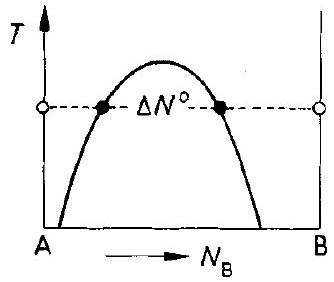

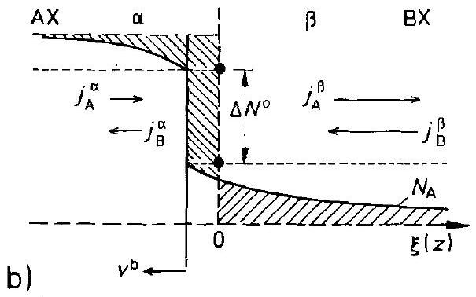
Figure 11-3. a) Schematic binary $T-N_{i}$ phase diagram with miscibility gap. b) Composition $\left(N_{\mathrm{A}}\right)$ profile and fluxes during the annealing of an $\mathrm{AX} / \mathrm{BX}$ couple for interdiffusion.

mobile frame of $\mathrm{C}, \mathrm{D}$, etc. and B is then the rate determining component. This rule has been used, for example, to interpret the reactions between compounds of the sort $\mathrm{AO} / \mathrm{AB}_{2} \mathrm{O}_{4} / \mathrm{B}_{2} \mathrm{O}_{3}$ (where $D_{\mathrm{A}}>D_{\mathrm{B}} \gg D_{\mathrm{O}}$ ), or $\mathrm{A}_{2} \mathrm{SiO}_{4} /(\mathrm{A}, \mathrm{B})_{2} \mathrm{SiO}_{4} / \mathrm{B}_{2} \mathrm{SiO}_{4}$ (where $\left.D_{\mathrm{A}}>D_{\mathrm{B}} \gg D_{\mathrm{O}}, D_{\mathrm{Si}}\right)$.

In line with the foregoing, we consider the moving boundary in a binary system. The pertinent phase diagram is depicted in Figure 11-3a. A corresponding concentration profile near the $\alpha / \beta$ interface is given in Figure 11-3b. Figure 11-3a may represent a true binary A-B system, or the quasi-binary section of a multicomponent system. Transport can be induced 1) by chemical driving forces $\nabla \mu_{i}$ and/or 2) by external field forces $\nabla P_{i}$ (electrical, gravitational, etc.). An example of case 2 ) is the electric field driven transport in the $\mathrm{AgCl} / \mathrm{KCl}$ couple. Transport by the simultaneous action of both chemical ( $\nabla \mu_{i}$ ) and other ( $\nabla P_{i}$ ) forces characterizes the general case.

Let us inspect more closely the inhomogeneous binary system in Figure 11-3 without external forces. At $t=0$, the two crystals A and B (AX and BX ) are brought in contact. As $t \rightarrow \infty$, the crystals $\alpha$ and $\beta$ have equilibrated. This means that either the $\alpha / \beta$ boundary has been shifted to its final position or one of the reactant crystals has been consumed (which only depends on the initial volume ratio $\left.V_{\mathrm{A}}(t=0) / V_{\mathrm{B}}(t=0)\right)$.

The morphology of the moving $\alpha / \beta$ interface can evolve in one of the three different ways shown in Figure 11-4. Let us investigate, in accordance with the previous discussion (see Fig. 11-2) when these growth modes will occur. From Eqn. (11.2), we have for a binary system

$$
\boldsymbol{v}_{\perp}^{\mathrm{b}}=\left(\frac{j_{\mathrm{A}, \perp}^{\alpha}-j_{\mathrm{A}, \perp}^{\beta}}{c_{\mathrm{A}}^{\alpha}-c_{\mathrm{A}}^{\beta}}\right)_{\mathrm{b}}
$$

a)

b)
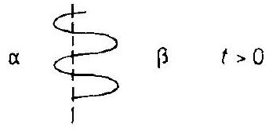
c)

Figure 11-4. Possible growth morphologies in a onedimensional A-B diffusion couple with a miscibility gap. Figure 11-4a corresponds to Figure 11-3b.

Since $\left(c_{\mathrm{A}}^{\alpha}-c_{\mathrm{A}}^{\beta}\right)_{\mathrm{b}}=\Delta c^{0}$ is positive (see Fig. 11-3b), and both $j_{\mathrm{A}}^{\alpha}$ and $j_{\mathrm{A}}^{\beta}$ are also positive (downhill diffusion), the motion of the boundary in the negative direction requires that $j_{\mathrm{A}}^{\beta}>j_{\mathrm{A}}^{\alpha}$. It is the dissolution of A in $\beta$ which causes the boundary to move. Therefore, $v_{\perp}^{b}$ and the flux that causes the boundary shift have opposite directions. From our previous discussion, we conclude that in this case the boundary moves in a morphologically stable way. Since A and B are chosen arbitrarily, the same argument holds for a possible motion of $\boldsymbol{v}_{\perp}^{\mathrm{b}}$ in the positive direction of Figure 11-3b. Figure 11-5 illustrates the four possible cases for interface movement. In a truly binary system, only case d) would occur and therefore the planar boundary is stable. These conclusions are strictly valid only for short reaction times. When the system comes close to equilibrium at a far later stage, it may happen that $j^{\alpha}>j^{\beta}$ because the driving forces decrease faster in $\beta$ than in $\alpha$. This may lead to a reversal in the direction of $\boldsymbol{v}^{\mathrm{b}}$ if the transport coefficients are strongly composition dependent. With respect to the question of initial morphological stability, these later complications are irrelevant.

In a true binary system, the transport problem, which includes the boundary morphology, is completely defined by 1 ) the continuity equation (11.2) at the moving

Figure 11-5. Boundary velocity $\boldsymbol{v}^{\mathrm{b}}$ and the direction of fluxes (responsible for the boundary motion) in the contiguous phases $\alpha$ and $\beta$. Figure 11-5b corresponds to Figure 11-2a.

boundary, 2 ) the assumed equilibrium at the boundary $\left(\left|\Delta c_{\mathrm{A}}\right|=\left|\Delta c_{\mathrm{B}}\right|=\Delta c^{0}\right)$, 3) the flux coupling in the $\alpha$ and $\beta$ phases, and 4) the Gibbs-Duhem equation for both phases $\alpha$ and $\beta$. These six relations for the six unknowns $v^{\mathrm{b}}, j_{\mathrm{A}}^{\alpha}, j_{\mathrm{A}}^{\beta}, j_{\mathrm{B}}^{\alpha}, j_{\mathrm{B}}^{\beta}$, and $\Delta c$ allow us to calculate

$$
\left(\frac{\nabla \mu_{i}^{\alpha}}{\nabla \mu_{i}^{\beta}}\right)_{\mathrm{b}}=f\left(L_{i}^{\alpha}, L_{i}^{\beta}\right), \quad i=\mathrm{A}, \mathrm{~B}
$$

and thus to predict the morphological boundary stability in the sense of Figure 11-2. Of course, in a strict quantitative treatment, the fluxes have to be determined by integrating the continuity equations within the given boundary conditions. However, our qualitative rules are appropriate and will be confirmed by a more rigorous treatment. The boundary stability for the A-B system (case d), Fig. 11-5) was based on the fact that in (local) equilibrium, $\Delta N_{i}^{0}\left(\Delta c_{i}^{0}\right)$ is invariant and determined by thermodynamics and that $j_{i} \sim-\nabla c_{i}$ (or $-\nabla \mu_{i}$ ). In ternary and higher component systems, those conditions are generally not valid and it is in these systems that morphological instabilities are found.

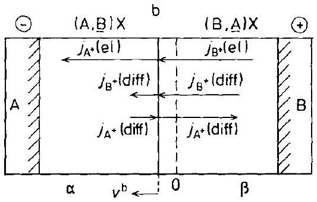
Figure 11-6. Superposition of diffusive ( $j$ (diff)) and electrically driven $(j(\mathrm{el}))$ transport in the $(\mathrm{A}, \mathrm{B}) \mathrm{X} /(\mathrm{B}, \underline{\mathrm{A}}) \mathrm{X}$ couple of the binary system AX-BX in analogy to Figure 11-3a. For $L_{i}^{\beta}>L_{i}^{\alpha}$ and sufficient driving force, the boundary $b$ is morphologically unstable.

Figure 11-6 defines the transport problem in a quasi-binary ionic system ( $\mathrm{A}, \mathrm{B}) \mathrm{X}$ with a miscibility gap, if both chemical ( $\nabla \mu_{i}$ ) and electrical ( $\nabla \varphi$ ) driving forces act simultaneously (case 3)). If the chemical force is negligible, we are dealing with case 2) and the electrical drift flux of the cations shifts the boundary $b$ in the direction of the flux. We can conclude that, in agreement with Figure 11-5a, the boundary morphology is unstable if $L_{i}^{\beta}>L_{i}^{\alpha}$.

Let us finally comment on the morphological stability of the boundaries during metal oxidation ( $\mathrm{A}+\frac{1}{2} \mathrm{O}_{2}=\mathrm{AO}$ ) or compound formation ( $\mathrm{A}+\mathrm{B}=\mathrm{AB}$ ) as discussed in the previous chapters. Here it is characteristic that the reaction product separates the reactants. Two interfaces are formed and move. The reaction resistance increases with increasing product layer thickness (reaction rate $\sim 1 / \Delta \xi$ ). The boundaries of these reaction products are inherently stable since the reactive flux and the boundary velocity point in the same direction. The flux which causes the boundary motion 'pushes' the boundary (see case c) in Fig. 11-5). If instabilities are occasionally found, they are not primarily related to diffusional transport. The very fact that the rate of the diffusion controlled reaction is inversely proportional to the product layer thickness immediately stabilizes the moving planar interface in a one-
dimensional reaction geometry (see Fig. 10-17). This holds for true binary systems $\left(\mathrm{A}+\frac{1}{2} \mathrm{O}_{2}=\mathrm{AO}\right)$ as well as for quasi-binary systems (e.g., $\mathrm{AO}+\mathrm{B}_{2} \mathrm{O}_{3}=\mathrm{AB}_{2} \mathrm{O}_{4}$ ). For multicomponent systems in which heterogeneous products are formed, it is difficult to predict boundary stabilities unless the reaction path is known. This path, however, can be theoretically determined only with the assumption of stable boundaries. We return to this question in Section 11.2.5.

### 11.2.2 Examples of Unstable Moving Interfaces

Let us discuss some pertinent examples of the instability of moving interfaces in order to illustrate the conclusions of the previous section. The given stability criteria can only answer the question of whether or not a perturbation grows or decays. No immediate answer as to the subsequent growth patterns is available. It is therefore possible that initial growth is morphologically unstable whereas later growth stages can be stabilized. Let us be aware, however, that boundary motion in solids entails many secondary effects (formation of dislocations, cracks, etc.) which may change the mode of reaction and thus the stability conditions.

Figure 11-7. CoO crystal exposed to an oxygen potential gradient: its motion and the boundary stability (schematic).

The simplest possible transport situation is shown in Figure 11-7. A binary transi-tion-metal oxide is placed in an oxygen potential gradient. This gradient sets up a cation vacancy flux (electrically compensated for by a flux of electron holes) as was discussed in Chapter 7. In the present context, we need to know the change in the boundary geometry which the vacancy flux provokes at the surfaces. At the oxidizing side, where the vacancy flux originates, we have the following reaction: $\frac{1}{2} \mathrm{O}_{2}+\mathrm{Co}_{\mathrm{Co}}^{2+} =\mathrm{CoO}+\underline{\mathrm{V}}_{\mathrm{Co}}^{\prime}+\underline{\mathrm{h}}^{\prime}$. For each vacancy that forms, one CoO lattice molecule is added to the surface. At the reducing surface, where the vacancy flux arrives, we have instead $\mathrm{h}^{\bullet}+\mathrm{V}_{\mathrm{Co}}^{\prime}+\mathrm{CoO}=\mathrm{Co}_{\mathrm{Co}}^{2+}+\frac{1}{2} \mathrm{O}_{2}$, which means that one CoO is subtracted for each vacancy that arrives. Thus, the overall reaction is the transport of oxygen from the high to the low activity side coupled with the opposite transport of CoO . In other words, the crystal boundaries are shifted in the oxygen potential gradient towards the side of high activity. According to the rules given in the preceding section, the flux of vacancies which induces the boundary motion is directed opposite to $v^{\mathrm{b}}$ at the

Figure 11-8. Single crystal of CoO after exposure ( 30 h ) to an oxygen potential gradient at $T=1200^{\circ} \mathrm{C}$. a) SEM picture looking onto the initially flat reducing (100) surface. b) Computer simulation; $w=0.05 ; \varepsilon=0.5 ; w$ : dimensionless force ( $=$ increase of jump probability in forward direction); $\varepsilon$ : surface energy, normalized to $R T$. Cross section of the crystal represented in Figure 11-7 [M. Martin (1991)].

reducing side (Fig. 11-5b). This boundary should therefore exhibit morphological instability. The stable boundary at the high oxygen potential side can be recognized in Figure 11-5d. All these predictions are borne out by experiment and computer simulations as seen in Figure 11-8 [G. Yurek, H. Schmalzried (1975); H. Schmalzried, W. Laqua (1981); M. Martin, H. Schmalzried (1985); M. Martin (1991)].

This type of surface instability has also been observed if an oxide crystal (e.g., $\mathrm{Co}_{1-\delta} \mathrm{O}$ ) is equilibrated at a high oxygen potential ( $p_{\mathrm{O}_{2}}^{\prime \prime}, \delta^{\prime \prime}, c_{\mathrm{V}}^{\prime \prime}$ ) and subsequently brought into a more reducing surrounding ( $p_{\mathrm{O}_{2}}^{\prime}, \delta^{\prime}, c_{\mathrm{V}}^{\prime}\left(<c_{\mathrm{V}}^{\prime \prime}\right)$ ), although on a lesser scale. The subsequent vacancy flux towards the surface results in its roughening and pitting, an effect which corresponds to the morphological instability of the previous paragraph.

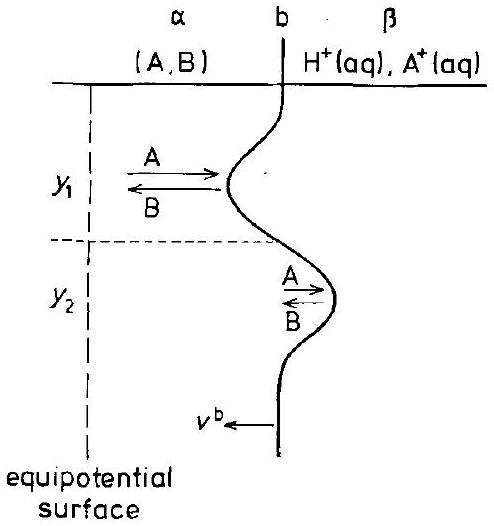
Figure 11-9. Dissolution of alloy $\alpha=(\mathrm{A}, \mathrm{B})$ in an aqueous solution $\beta$. A is the base metal. The interface b (solid/liquid) is morphologically unstable.

The next example is concerned with the wet corrosion of a metal alloy, the reaction scheme of which is $A$ (in alloy $(\mathrm{A}, \mathrm{B}))+2 \mathrm{H}_{(a q)}^{+}=\mathrm{A}_{(a q)}^{2+}+\mathrm{H}_{2}$. It is depicted in Figure 11-9. In view of $L^{\alpha} \ll L^{\beta}$, the interface between the alloy and the aqueous solution is an isoactivity surface. In the alloy, isoactivity surfaces in front of the perturbation tip at $y_{1}$ are thus denser and the boundary initially moves towards this steep gradient region due to the increased transport during dissolution. It is therefore morphologically unstable (see Figs. 11-2 and 11-5b). A practical situation of alloy dissolution has been analyzed by [J. D. Harrison, C. Wagner (1959)]. Considering the preferential dissolution of the lesser noble component A , the fraction of nobler B increases near the $\alpha / \beta$ interface and eventually inhibits further reaction. It is this stage where the system tries to find other and faster reaction paths. This will become evident in our next example.

Let us consider the high temperature reduction of oxide solid solutions as discussed in Chapter 9. The overall reaction reads ( $\mathrm{A}, \mathrm{B}$ ) $\mathrm{O}+\mathrm{H}_{2}=\mathrm{A}+\mathrm{BO}+\mathrm{H}_{2} \mathrm{O}$. We conclude from Figure 11-10a that the receding phase boundary is always morphologically unstable, in accordance with Figure 11-5b (see also [D. P. Whittle (1983)]). There is yet a second kind of instability involved in the oxygen activity change at the

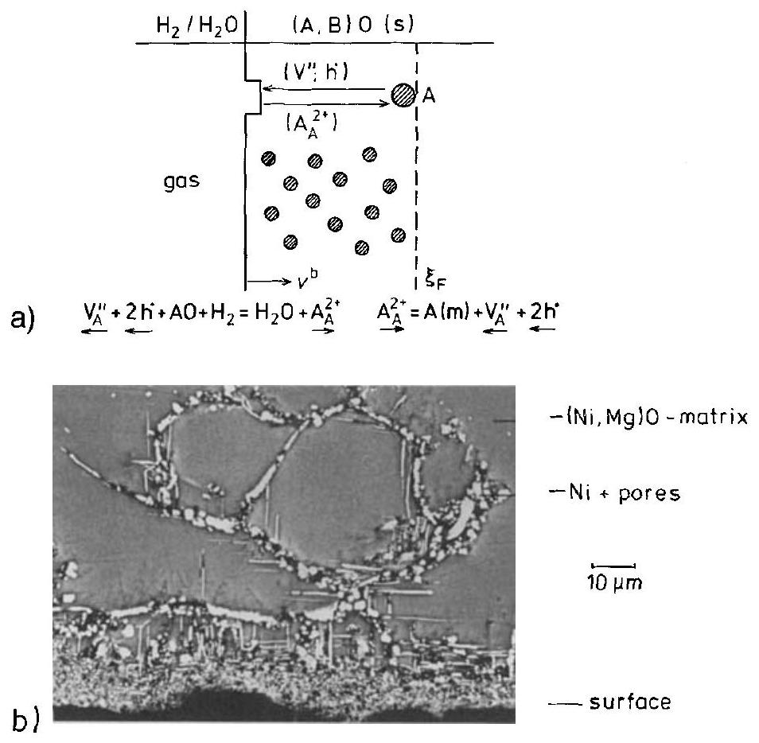
Figure 11-10. a) Reduction of an oxide crystal, (A, B)O, resulting in internal precipitation of A (schematic). b) Cross section of a ( $\mathrm{Ni}, \mathrm{Mg}$ ) O single crystal, reduced in $\mathrm{H}_{2} / \mathrm{H}_{2} \mathrm{O}$. Typical morphology of the reaction product if $N_{\mathrm{NiO}}>10 \%$. Pores connect the reaction front with the external reducing gas.

oxide surface. Since $D_{\mathrm{V}}, D_{\mathrm{h}} \gg D_{\mathrm{A}}, D_{\mathrm{B}}$, this change spreads much faster into the solid by point defect diffusion than any change in component composition ( $N_{\mathrm{AO}}$ ). We therefore have morphology changes on two levels: 1) surface instability and roughening, and 2) internal reduction accompanied by precipitation as described in Chapter 9. Change 1) is analogous to the surface roughening of $\mathrm{Co}_{1-\delta} \mathrm{O}$ by the cation vacancy flux arriving at the reducing boundary (Fig. 11-8). By change 2), the internal reduction zone of the solid solution ( $\mathrm{A}, \mathrm{B}$ ) O is depleted of $\mathrm{A}^{2+}$ and thus has a correspondingly low concentration of point defects. Low defect numbers entail small transport coefficients, which then inhibit further reduction. However, the parent lattice will be heavily disturbed by the reduction product A considering the large volume changes associated with its internal precipitation. Only for small fractions of $N_{\mathrm{AO}}$ will a coherent internal reaction zone without fissures exist. For larger $N_{\mathrm{AO}}$ fractions, the structural perturbations of the lattice after reduction are extreme. New and fast reaction paths (Fig. 11-10b) become available, leading to very porous samples which are reminiscent of the CoO surfaces exposed to an oxygen potential gradient (Fig. 11-8). The inhibiting effect of a small transport coefficient in the internal reduction zone on reduction rates is thus completely lost.

In the foregoing, the $\beta$-phase was fluid (Fig. 11-9). The preferential evaporation of one component from the surface of a solid solution is another example of this type of boundary motion. The oxidation of an alloy consisting of the base metal A and a noble metal B is also of interest, partly for historical reasons. Component A is preferentially oxidized and forms an oxide layer on the surface. If the transport coefficient $L(\mathrm{AO}) \gg L(\mathrm{~A}, \mathrm{~B})$, then the $\mathrm{AO} /(\mathrm{A}, \mathrm{B})$ boundary is essentially an isoactivity surface. Thus, the fluxes in the alloy are directed towards the valleys of the boundary. The moving interface is then morphologically unstable for the same reason as is the alloy surface during its dissolution in aqueous acid. However, the AO/(A, B) boundary is stable if $L(\mathrm{AO}) \ll L(\mathrm{~A}, \mathrm{~B})$ since now its A -activity is fixed ( $a_{\mathrm{A}}<1$ ) and the oxidation process occurs analogous to the morphologically stable A-metal oxidation. C. Wagner discussed this problem [C. Wagner (1956)] and gave the first formal stability analysis of the boundary during a heterogeneous chemical reaction along with the pertinent concepts of morphological stability. Questions that go beyond stability (e.g., pattern formation) are very complicated, see for example [H. Müller-Krumbhaar, et al. (1992)]. The eventual enrichment of the nobler B component near the boundary inhibits further oxidation. It is remarkable that ( $\mathrm{Pt}, \mathrm{Ni}$ ) alloys oxidize with a stable metal/oxide interface, but ( $\mathrm{Au}, \mathrm{Cu}$ ) and ( $\mathrm{Ag}, \mathrm{Cu}$ ) develop morphologically unstable boundaries.

Very little quantitative work has been done in the past on solid-solid boundaries. Early examples of unstable boundaries are the so-called displacement reactions $A X+B Y=A Y+B X$ (Fig. 11-11a). They have been discussed for more than 50 years. The first interpretation by W. Jost suggested that the reactants should be separated by layered products. If a reaction is proceeding in such a way (with $D_{\mathrm{A}}, D_{\mathrm{B}} \gg D_{\mathrm{X}}, D_{\mathrm{Y}}$ ), there must be a slight solubility of $\mathrm{A}^{+}$in BX and of $\mathrm{B}^{+}$in AY . After all, these ions have to diffuse through the respective product phases. However, since the transport coefficients $L_{\mathrm{A}}(\mathrm{BX})$ and $L_{\mathrm{B}}(\mathrm{AY})$ are small by necessity ( $N_{i} \ll 1$ ), the BX/AY interface is morphologically unstable according to the stability rules (Fig. 11-11b). Therefore, we expect a faster growing columnar structure to develop, as shown in Figure

Figure 11-11. Displacement reactions of the type $\mathrm{AX}+\mathrm{BY}=\mathrm{AY}+\mathrm{BX}$. a) Jost mechanism, schematic. b) Equipotential surfaces $\mu_{\mathrm{A}}\left(\mu_{\mathrm{B}}\right)$ and the evolution of phase boundary instability, Jost mechanism. c) Wagner mechanism of displacement reactions, schematic.

11-11e. It leads to a 'circular' cation flow carried by $\mathrm{A}^{+}$in AY and by $\mathrm{B}^{+}$in BX . This displacement reaction mechanism was proposed by $C$. Wagner without the application of stability criteria. Later, metal displacement reactions were studied in much greater detail. The principle of 'maximum reaction rate' has been invoked to explain the layered or columnar growth morphologies [R. A. Rapp, et al. (1973)]. Beside the fact that this principle cannot be a universal one (it cannot explain selfinhibition, for example), one may show that the layered or columnar product structures follow immediately from the application of the stability rules. For more details we refer to Section 6.4, where the reactions $\mathrm{Fe}+\mathrm{Cu}_{2} \mathrm{O}=\mathrm{FeO}+2 \mathrm{Cu}$ and $\mathrm{Co}+\mathrm{Cu}_{2} \mathrm{O}=\mathrm{CoO}+2 \mathrm{Cu}$ have been discussed.

A still more general transport situation is illustrated in Figure 11-12, with (A, B) and C as starting materials. This problem has been treated both experimentally and theoretically by [M. Backhaus-Ricoult, H. Schmalzried (1985)]. Figure 11-12a shows the ternary counterpart of a binary phase diagram as given in Figure 11-3a. In Figure 11-12b, possible reaction paths are indicated analogous to Figure 11-3b. After the phases ( $\mathrm{A}, \mathrm{B}$ ) and C have been brought into contact at an initially planar interface and the reaction proceeds (again analogous to Fig. 11-3b for the binary system), we can document the observed interface morphologies as shown in Figure 11-13. They depend on the initial ( $\mathrm{A}, \mathrm{B}$ ) composition in the $\alpha-\beta$ reaction couple since the component fractions determine the transport coefficients $L_{i}(\alpha)$ and $L_{i}(\beta)$, which in turn determine the morphological stability of the phase boundary. We will return to the quantitative discussion of this problem in Section 11.2.5.

### 11.2.3 Formal Stability Analysis

Neglecting all secondary influences, the problem of the morphological stability of moving interfaces is, in essence, a transport problem comprising two contiguous phases. Coupling occurs by mass conservation (and perhaps interface kinetics). If we adopt this simplifying point of view, we will have disregarded all possible structural
a)
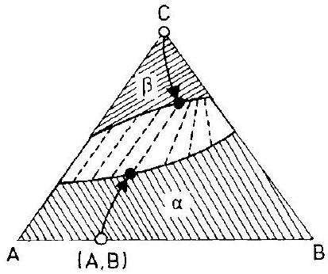
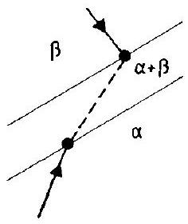

b)
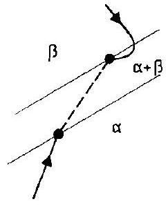

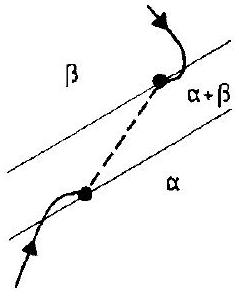
Figure 11-12. a) Gibbs phase diagram for a ternary system with a miscibility gap. Tie lines and reaction path between ( $\mathrm{A}, \mathrm{B}$ ) and C are indicated. b) Possible reaction paths near and across the miscibility gap. Starting compositions of the reaction couple are indicated (o) in Figure a. (Stable and unstable morphologies see text.)

Figure 11-12. a) Gibbs phase diagram for a ternary system with a miscibility gap. Tie lines and reaction path between ( $\mathrm{A}, \mathrm{B}$ ) and C are indicated. b) Possible reaction paths near and across the miscibility gap. Starting compositions of the reaction couple are indicated (o) in Figure a. (Stable and unstable morphologies see text.)
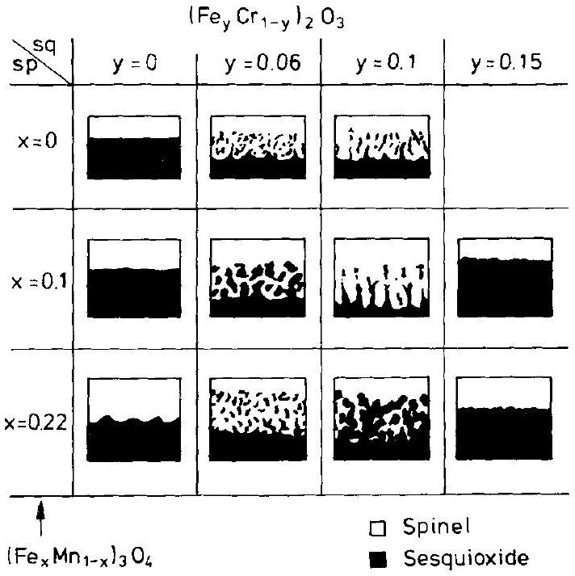

Figure 11-13. Survey of experimental interface morphologies which depend on the initial compositions ( $x$ and $y$ ) of the reactants (spinel and sesquioxide) in the quasi-ternary system A-B-C $=\mathrm{Fe}_{3} \mathrm{O}_{4}-\mathrm{Mn}_{3} \mathrm{O}_{4}-\mathrm{Cr}_{2} \mathrm{O}_{3}$, corresponding to Figure 11-12a.
and mechanical implications including the interface tension (which is often small). The simplest boundary condition assumes prevailing local equilibrium.

Let us briefly outline the main concepts of a (linear) stability analysis and refer to the situation illustrated in Figure 11-7. If we artificially keep the moving boundary morphologically stable, we can immediately calculate the steady state vacancy flux, $j_{\mathrm{V}}$, across the crystal. The boundary velocity relative to the laboratory reference system (crystal lattice) is

$$
\boldsymbol{v}=-\boldsymbol{j}_{\mathrm{V}} \cdot V_{\mathrm{AO}}=\tilde{D}_{\mathrm{V}} \cdot \frac{c_{\mathrm{V}}^{\prime \prime}-c_{\mathrm{V}}^{\prime}}{\Delta \xi} \cdot \frac{1}{c_{\mathrm{A}}}
$$

If we attach a new reference frame ( $z$ ) to the moving (stable planar) boundary, $z=\xi-v \cdot t$. The transport equation (Fick's second law) reads in the $z$-system

$$
\frac{\partial c_{\mathrm{V}}}{\partial t}=\tilde{D}_{\mathrm{V}} \cdot \frac{\partial^{2} c_{\mathrm{V}}}{\partial z^{2}}+\boldsymbol{v} \cdot \frac{\partial c_{\mathrm{V}}}{\partial z}
$$

Note that we have assumed the vacancies to be ideally diluted. We can then introduce a perturbation of the planar boundary, $z=\Delta \xi+\phi(x, y, t)$, and define $\phi^{0}(x, y)=\phi(x, y, t=0)$. In order to simplify the following treatment, we assume that $\phi$ does not depend on $x$, but only on $y$, where $x$ and $y$ are the Cartesian coordinates perpendicular to $z$. In this way, the morphological stability becomes a twodimensional problem. Since we also assume that local equilibrium prevails at both interfaces (surfaces), the boundary conditions are

$$
c_{\mathrm{V}}(0, y, t)=c_{\mathrm{V}}^{\prime} ; \quad c_{\mathrm{V}}(\Delta \xi+\phi(y, t))=c_{\mathrm{V}}^{\prime \prime}
$$

At $t=0$, we start with a steady state vacancy distribution

$$
c_{\mathrm{V}}(z, y, 0)=\bar{c}_{\mathrm{V}}(z)
$$

The last condition we need concerns the coupling between the flux and the boundary velocity $v$. If $e$ is the unit vector in the $z$ direction and $n$ is the vector normal to the boundary, this coupling condition yields

$$
-\boldsymbol{n} \cdot j_{\mathrm{V}}(\Delta \xi+\phi) \cdot V_{\mathrm{AO}}=\frac{\tilde{D}_{\mathrm{V}}}{c_{\mathrm{A}}^{0}} \cdot \boldsymbol{n} \cdot \nabla c_{\mathrm{V}}(z, y, t)=\left(v+\frac{\partial \phi}{\partial t}\right) \cdot \boldsymbol{e} \cdot \boldsymbol{n}
$$

This system of (nonlinear) differential equations cannot be solved analytically. It does, however, contain the answer to our basic question of whether or not $\partial \phi / \partial t$ is positive or negative, which means whether the perturbation $\phi$ decreases or increases with time. Thus, the negative sign on $\dot{\phi}$ defines the (initial) morphological stability.

We can work out the answer on three different levels of sophistication. 1) One constructs a steady state solution of Eqn. (11.10) ( $\partial c_{\mathrm{V}} / \partial t=0$ ) and even neglects the influence of the slow moving interface. According to Eqn. (11.10), this condition yields $\boldsymbol{v} / \tilde{D}_{\mathrm{V}} \ll 2 \cdot \pi / \lambda$. Equivalently, we have $\lambda / \boldsymbol{v}\left(=\tau_{v}\right) \gg \lambda^{2} / \tilde{D}_{\mathrm{V}}\left(=\tau_{\mathrm{diff}}\right)$, where $\lambda$ is the
wavelength of the (sinusoidal) perturbation. $\tau_{v} \gg \tau_{\text {diff }}$ thus means that the time necessary to shift the boundary a distance $\lambda$ is much larger than the time a diffusing vacancy needs to go the same length. In this way, we have neglected $v \cdot\left(\partial c_{\mathrm{V}} / \partial z\right)$ in Eqn. (11.10), and therefore we take into account only the Laplace concentration field $\left(\Delta c_{\mathrm{V}}=0\right)$ with its corresponding flux pattern. This is the approach we have basically used in the foregoing illustrations (e.g., in Fig. 11-2b). 2) One constructs a steadystate solution ( $\partial c_{\mathrm{V}} / \partial t=0$ ), but takes into consideration the (slow) interface motion. 3) One makes full use of Eqn.(11.10). In any case, the diffusion equation and the boundary conditions (Eqn. (11.13)) are linearized.

All three approaches have been worked out. It has been demonstrated [R. F. Sekerka (1967)] that they lead to the same conclusions concerning the initial morphological stability. However, they must differ with respect to the morphological evolution and the selection of growth modes at later times.

In order to quantify these general conclusions, let us linearize the set of equations by 1 ) allowing only small perturbations ( $\phi / \Delta \xi \ll 1$ ) and 2 ) assuming that the local concentrations on $z$-surfaces do not deviate much from their average values

$$
c_{\mathrm{V}}(z, y, t)=\bar{c}_{\mathrm{V}}(z)+\delta c_{\mathrm{V}}(z, y, t)+\ldots
$$

where $\delta c_{\mathrm{V}}$ is of first order in $\phi$. Techniques of handling these equations can be found, for example, in [W. W. Mullins, R.F. Sekerka (1964); R. F. Sekerka (1967)].

There is one more conceptual step involved in the formal treatment. The perturbation $\phi$ is Fourier analyzed, which means that it is constructed from the Fourier components $\phi(k, t)$ with wavelength $\lambda=2 \cdot \pi / k . \delta c_{\mathrm{V}}$ is transformed in the same way. Explicitly,

$$
\phi(y, t)=\frac{1}{\sqrt{2 \pi}} \cdot \int_{-\infty}^{+\infty} \phi^{\#}(k, t) \cdot \mathrm{e}^{i \cdot k \cdot y} \cdot \mathrm{~d} k
$$

As may be expected, one finds for $\phi^{\#}(k, t)$ and $\delta c_{\mathrm{V}}^{\#}(z, k, t)$ from the linearized equations (after some reaction time $t$ ) expressions of the following form

$$
\begin{gathered}
\phi^{\#}(k, t)=\phi^{0}(k) \cdot \mathrm{e}^{w(k) \cdot t} \\
\delta c_{\mathrm{V}}^{\#}(z, k, t)=\delta^{0}(z, k) \cdot \mathrm{e}^{w(k) \cdot t}
\end{gathered}
$$

The only function of interest in the given context is $w(k)$. The stability question is then answered if the rate, $w(k)$, has been found to be positive or negative at any value of $k$ or wavelength $\lambda$ of the perturbation. The validity of this argument is due to the linearized differential equations, for which we know their solutions can be superposed. Negative $w(k)$ means that $\phi \rightarrow 0$ for $t \rightarrow \infty$. Insertion of Eqns. (11.16) and (11.17) into the transport equation and the boundary condition yields an implicit equation for $w(k)$. If we use the following transformations to express $w$ and $k$ in terms of the characteristic parameters $\tilde{D}_{\mathrm{V}}$ and $v$ of the system, namely

$$
l_{D}=2 \tilde{D}_{\mathrm{V}} / v ; \quad p=\left(l_{D} / v\right) \cdot w ; \quad q=l_{D} \cdot k
$$

then the implicit equation has the form

$$
p=\sqrt{1+q^{2}+2 p} \cdot \operatorname{coth}\left(\frac{\Delta \xi}{l_{D}} \cdot \sqrt{1+q^{2}+2 p}\right)-1
$$

An analysis of Eqn. (11.19) reveals that $w$ is positive for all values of $k$. Therefore, under the given boundary conditions, all perturbations grow with time. Thus, the result of the formal stability analysis agrees with the conclusions drawn in Section 11.2.1. The slab of oxide AO at the reducing surface is morphologically unstable as it moves under the action of an oxygen potential gradient (see Fig. 11-7).

Finally, let us briefly point out some essential features of the stability analysis for a more general transport problem. It can be exemplified by the moving $\alpha / \beta$ phase boundary in the ternary system of Figure 11-12. Referring to Figure 11-7 and Eqn. (11.10), it was a single independent (vacancy) flux that caused the motion of the boundary. In the case of two or more independent components, we have to formulate the transport equation (Fick's second law) for each component, both in the $\alpha$ - and $\beta$-phase. Each of the fluxes $j_{i}^{\alpha}$ couples at the boundary b with $j_{i}^{\beta}$, $i=\mathrm{A}, \mathrm{B}, \ldots$ (see, for example, Eqn. (11.2)). Furthermore, in the bulk, the fluxes are also coupled (e.g., by electroneutrality or site conservation).

The mathematical evaluation of the stability problem in multicomponent systems is most complicated, even if we assume that local equilibrium prevails at the boundaries. The result is a relation for the concentrations at the boundary of the following form

$$
c_{i}^{\alpha}(\mathrm{b})=f\left(c_{n}^{\alpha}(\mathrm{b}), c_{n}^{\beta}(\mathrm{b}), c_{i}^{\beta}(\mathrm{b})\right) ; \quad n=\mathrm{A}, \mathrm{~B}, \ldots
$$

stating that $c_{i}^{\alpha}$ (b) depends on all the other concentrations $c_{n}$ (b) in $\alpha$ and $\beta$ at the boundary b. The transport problem has been solved in a linearized version. The answer to the question of the boundary stability is similar to the answer in the case of a binary system with one independent flux, as has been discussed before. In particular, Eqn. (11.16) is still valid, although the explicit form for the spectrum $w(k)$ of growth parameters is different from the binary case. Details are given in [M. Backhaus, H. Schmalzried (1985)]. We emphasize, however, that the formal solution has been obtained under quite restricting assumptions, namely that the (molar) volumes, $V^{\alpha}=V^{\beta}=V^{0}$, are constant and that the $\tilde{D}_{i j}$ coefficients are independent of composition ( $N_{i}$ ) as well.

Computer experiments may be performed in order to gain insight into the morphological evolution of phase boundaries in non-equilibrium systems (Fig. 11-8b). The driving forces for the components have been simulated by increasing the jump probability in the direction of negative concentration gradients. If necessary, interface tensions can be taken into account. Interesting examples of growth morphologies obtained by Monte Carlo simulations have been worked out in [M. Martin (1991); P. Tigelmann, M. Martin (1992)].

### 11.2.4 Stabilizing Factors

It has not always been possible to experimentally verify a stability analysis predicted morphological instability (see, for example, the oxidation of (Pt,Ni) alloys). Sometimes, the later stages of morphological evolution are beyond the scope of a linear analysis. Even in the linear regime, there are some influences which we have not properly taken into account when formulating the transport equations. For example, the influence of surface (energy) tension (solid-gas, solid-liquid, and solid-solid) cannot always be disregarded. Surface tension alters the chemical potential change across the interface due to the curvature of the local perturbations in the boundary (= capillarity effects, see Section 10.2). Since surface energies tend to minimize the surface area, they are always stabilizing. For solid-solid interfaces, capillarity effects are often less important than the energy densities deriving from coherency stress. Lateral transport along surfaces and interfaces is another factor to be considered. If the component mobility in the interface is much larger than in the adjacent bulk, and a driving force exists between the (unstable) protruding regions and the valleys of the boundary, for example, due to capillarity, a corresponding component flux is induced along the interface. It will retard the protrusion growth and consequently stabilize the boundary morphology.

Concentration gradients near interfaces generate stresses. In particular, stress fields are generated by coherent or semicoherent interfaces. The local chemical potential gradient is affected by the stress gradient and thereby matter transport is influenced. There are no general rules of when these inherent stresses will or will not stabilize the boundary morphology. Among other factors, the relationships between composition, lattice parameter, lattice misfit at the interface, elastic coefficients, and the sample geometry are to be considered in this context. Yet more important than elastic effects are probably the plastic deformation and the formation of dislocations and dislocation networks at moving boundaries (see Fig. 3-5). They can drastically change the local transport behavior. Since dislocations are fast diffusion paths, they tend to decrease chemical potential gradients along interfaces and we may therefore expect that they normally enhance morphological interface stability.

### 11.2.5 Stability and the Reaction Path

In Section 4.3.3, it was explained how to construct the 'reaction (diffusion) path' for ternary and higher solid solution systems. In practice, one plots, for example, in a ternary system, the composition variables (measured along the pertinent space coordinate of the reacting solid) into a Gibbs phase triangle, noting that the spatial information is thereby lost. For certain boundary conditions, such a reaction path is independent of reaction time and therefore characterizes the diffusion process. For a one dimensional ternary system with stable interfaces, these boundary conditions are: $c_{i}(\xi= \pm \infty, t)=c_{i}^{0}( \pm \infty) ; c_{i}(\xi<0,0)=c_{i}^{0}(-\infty) ; c_{i}(\xi>0,0)=c_{i}^{0}(+\infty)$.

In the context of the morphological evolution of non-equilibrium systems, let us then ask whether the reaction path, when constructed for a system with stable interfaces, can tell us something about the instability of moving boundaries. For this we
consider a ternary system with a miscibility gap as presented in Figure 11-12a. Instead of the fractions $N_{\mathrm{B}}$ and $N_{\mathrm{C}}$, we will introduce $\mu_{\mathrm{B}}$ and $\mu_{\mathrm{C}}$ as the independent variables. This is a simple transformation if the Gibbs energy is known since $\partial G / \partial n_{i}=\mu_{i}=\mu_{i}^{0}+R T \cdot \ln f_{i} \cdot N_{i} .\left(f_{i}=f\left(N_{\mathrm{B}}, N_{\mathrm{C}}\right)\right.$ is the activity coefficient.) In the $\mu_{\mathrm{B}}-\mu_{\mathrm{C}}$ representation, the boundary between the $\alpha$ and $\beta$ phase is a curved line and reflects the miscibility gap (Fig. 11-14). It can easily be calculated from the equilibrium conditions ( $\mu_{i}^{\alpha}=\mu_{i}^{\beta}$ ), taking into account the Gibbs-Duhem equations ( $\sum N_{i} \cdot \mathrm{~d} \mu_{i}=0$ ) and the fact that $\sum N_{i}=1$.

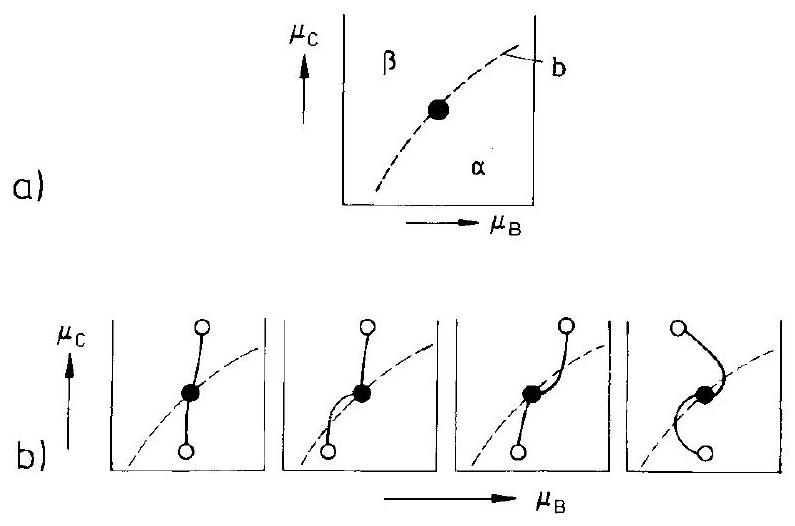
Figure 11-14. a) Phase boundary b, reflecting the miscibility gap in the system A-B-C, plotted in terms of $\mu_{\mathrm{C}}^{\mathrm{b}}=f\left(\mu_{\mathrm{B}}^{\mathrm{b}}\right)$ (phase diagram of the third kind). b) Possible reaction paths crossing the phase boundary $b$ of Figure 11-14a, in analogy to Figure 11-12b.

In local equilibrium, the phase boundary in a binary system is invariant which follows from the Gibbs phase rule. This is no more true for ternary (higher) systems. Thus, if a unique solution exists for the transport problem, there is also a unique reaction path in the $\mu_{\mathrm{C}}$ vs. $\mu_{\mathrm{B}}$ diagram and the crossover point on the phase boundary line is determined by kinetics (Fig. 11-14). This point corresponds to a tie-line in Figure 11-12a. There are at least four possibilities for the reaction path to cross the boundary line. They are illustrated in Figure 11-14b. The formal solution to the transport problem conforms to one of these four possibilities. Note that we do not disobey thermodynamic stability, that is, the condition ( $\partial \mu_{i} / \partial N_{i}>0$ ). Possibilities $2-4$ in Figure 11-14b infer that the slope ( $\partial \mu_{\mathrm{C}} / \partial \mu_{\mathrm{B}}$ ) of the reaction path is less than ( $\partial \mu_{\mathrm{C}} / \partial \mu_{\mathrm{B}}$ ) ${ }^{\mathrm{b}}$, which means that the component transport towards the boundary occurs from a supersaturated solution. In ternary and higher systems, the perturbed phase boundary is not invariant and is thus normally not an isoactivity surface. Transport in and along the boundary may therefore stabilize it morphologically. This means that the transport towards the moving $\alpha / \beta$, as indicated in Figure 11-14b (cases 2-4), does not necessarily lead to morphological instability. For the question of initial stability it is irrelevant if in the further course of the reaction the two (three) crossover points later merge into one point on the boundary line.

Normally, it is not possible to obtain analytical solutions for this transport problem and so we cannot a priori calculate the reaction path. Kirkaldy [J. S. Kirkaldy, D. J. Young (1985)] did pioneering work on metal systems, based on investigations by C. Wagner and the later work of Mullins and Sekerka. They used the diffusion path concept to formulate a number of stability rules. These rules can explain the facts and are predictive within certain limits if applied properly. One of Kirkaldy's results is this. The moving interface in a ternary system is morphologically stable if

$$
\boldsymbol{v}^{\mathrm{b}} \cdot\left(\left|\nabla c_{\mathrm{C}}^{\beta}-\nabla c_{\mathrm{B}}^{\beta}\right|-\left|\nabla c_{\mathrm{C}}^{\alpha}-\nabla c_{\mathrm{B}}^{\alpha}\right|\right)>0
$$

Although this equation is reminiscent of the rules given earlier in this chapter, there are differences. In Eqn. (11.21), the two independent concentration gradients of the ternary system are introduced instead of real driving forces, which are the chemical potential gradients. Also, other simplifying assumptions have been made in order to arrive at Eqn. (11.21), assumptions which hardly pertain to real systems.

To conclude, we present an application of the reaction path concept and investigate the evolution of the phase boundaries in the ternary oxide system $\mathrm{Fe}-\mathrm{Mn}-\mathrm{O}$ [Y. Ueshima, et al. (1989)]. Let us start with the $\alpha$-crystal ( $\mathrm{Fe}, \mathrm{Mn}$ ) O which then is

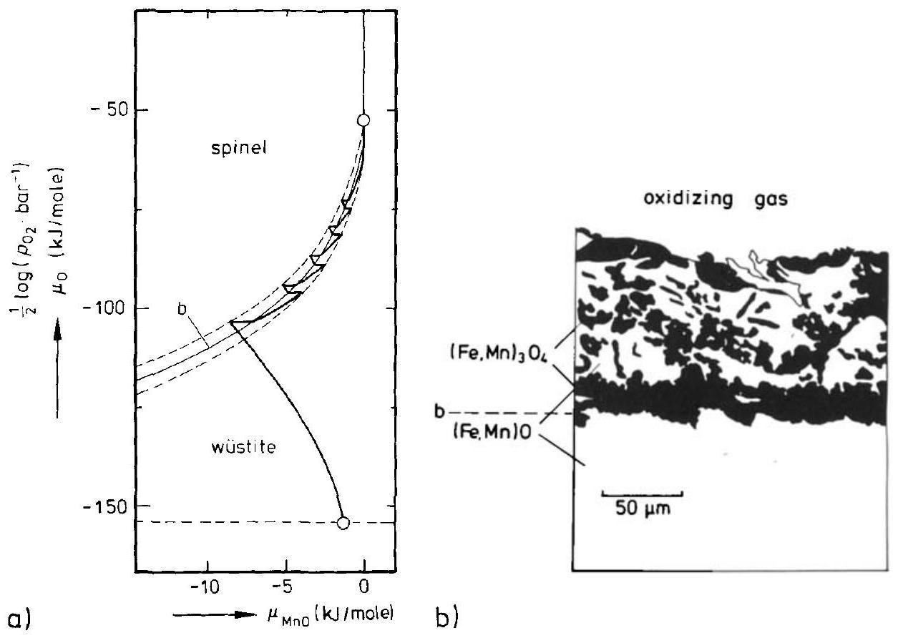
Figure 11-15. a) Phase boundary $b$ reflecting the miscibility gap between the phases $(\mathrm{Fe}, \mathrm{Mn}) \mathrm{O}$ and ( $\mathrm{Fe}, \mathrm{Mn})_{3} \mathrm{O}_{4}$ in the system Fe-Mn-O. Reaction path is plotted in terms of $\mu_{\mathrm{O}}=f\left(\mu_{\mathrm{MnO}}\right)$. Dotted lines (almost) parallel to $b$ indicate the supersaturation for nucleation. b) Unstable interface $b$ and two-phase region between $(\mathrm{Fe}, \mathrm{Mn}) \mathrm{O}$ and $(\mathrm{Fe}, \mathrm{Mn})_{3} \mathrm{O}_{4}$, after $(\mathrm{Fe}, \mathrm{Mn}) \mathrm{O}$ has been exposed to an oxygen potential gradient [Y. Ueshima, et al. (1989)] (see text).

partly oxidized to $\beta=(\mathrm{Fe}, \mathrm{Mn})_{3} \mathrm{O}_{4}$ (Fig. 11-15). Two different oxygen potentials $\mu_{\mathrm{O}_{2}}^{\prime}$ and $\mu_{\mathrm{O}_{2}}^{\prime \prime}$ are established at the two opposite surfaces of the oxide crystal in such a way that $\alpha$ is stable at $\mu_{\mathrm{O}_{2}}^{\prime}$ and $\beta$ at $\mu_{\mathrm{O}_{2}}^{\prime \prime}$. The experimentally determined reaction path in the steady state is shown in Figure 11-15a. We can interpret it as follows. In $\alpha((\mathrm{Fe}, \mathrm{Mn}) \mathrm{O}), D_{\mathrm{Fe}}>D_{\mathrm{Mn}}$, and consequently the Fe component is enriched at the higher oxygen potential side (see Section 8.2) until eventually the oxidized $\beta$-phase $(\mathrm{Fe}, \mathrm{Mn})_{3} \mathrm{O}_{4}$ forms there. In $\beta, D_{\mathrm{Fe}}<D_{\mathrm{Mn}}$, and therefore the slope of the reaction path is reversed. If now the kinetically determined $\left(\partial \mu_{\mathrm{O}} / \partial \mu_{\mathrm{MnO}}\right)^{\beta}$ is smaller than the thermodynamically given ( $\left.\partial \mu_{\mathrm{O}} / \partial \mu_{\mathrm{MnO}}\right)^{\mathrm{b}}$, the reaction path will reenter the $\alpha$-phase as illustrated in Figure 11-15. Thereafter, in the $\alpha$-phase, the slope is again reversed, etc. As a result, there is no single transition from $\alpha$ to $\beta$ along the oxide sample placed in the oxygen potential gradient. Rather, depending on $\mu_{\mathrm{O}_{2}}^{\prime}, \mu_{\mathrm{O}_{2}}^{\prime \prime}$ and the ratio $D_{\mathrm{Fe}} / D_{\mathrm{Mn}}$ in $\alpha$ and $\beta$, a sequence of phases and interfaces will be formed. Since the formation of a new phase needs some supersaturation (as indicated in Fig. 11-15a) and the nucleation is a stochastic event, one even finds an extended zone of randomly distributed $\alpha$ - and $\beta$-phases (Fig. 11-15b) instead of an orderly sequence.

### 11.3 Moving Boundaries in Other Than Chemical Fields

A gradient of electrical potential constitutes the classic (external) force field for ionic solids. Let us study the effect of this electric field on the interface morphology and stability. The thermodynamic driving force in ionic crystals is $\nabla \eta_{i}\left(=\nabla\left(\mu_{i}+\tilde{\varphi}_{i}\right)\right.$; $\tilde{\varphi}_{i}=z_{i} F \cdot \varphi$ ), which is the gradient of the electrochemical potential. This is the driving force governing the flux equations in ionic crystals, instead of the chemical potential gradient we have previously used. Since $\eta_{i}$ is a potential function as well, the earlier conclusions remain valid as long as we apply equivalent boundary conditions.

For the formal treatment, we note that the divergence of the total electric current vanishes, that is, $\nabla \sum z_{i} \cdot j_{i}=0$. In a closed system, the condition of (local) electroneutrality can be used to eliminate the electric potential. Since in a linearized approach the potentials as well as their gradients are additive (as are the solutions), the stability analysis remains the same as before.

With an open system to which electrodes are attached, we can study the stability of interface morphology in an external electric field. A particularly simple case is met if the crystals involved are chemically homogeneous. In this case, $\nabla \mu_{i} \cong 0$, and the ions are essentially driven by the electric field. Also, this is easy to handle experimentally. The counterpart of our basic stability experiment (Fig. 11-7) in which the AO crystal was exposed to an oxygen chemical potential gradient is now the exposure of AX to an electric field from the attached electrodes. In order to define the thermodynamic state of AX, it is necessary to apply electrodes with a predetermined

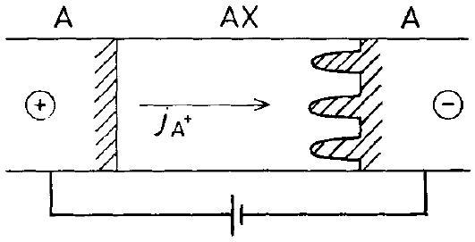
Figure 11-16. Unstable interface (cathode) in a solid state electrolysis cell A/AX/A (e.g., $\mathrm{Ag} / \mathrm{AgBr} / \mathrm{Ag}$ ).

and well-buffered A-activity. The simplest electrodes for this purpose are electrodes composed of the metal $\mathrm{A}\left(a_{\mathrm{A}}=1\right)$. Figure 11-16 shows the arrangement. If this cell is under load, A is dissolved at the anode into the crystal as mobile $\mathrm{A}_{\mathrm{A}}^{+}$and is precipitated as metallic A at the cathode. Therefore, the anodic $\mathrm{A} / \mathrm{AX}$ interface is receding while the cathodic AX/A interface (which is obviously an isoactivity surface) is moving against the incoming flux. The reducing $\mathrm{AX} / \mathrm{A}$ interface is therefore morphologically unstable, quite analogous to the instability of the $\mathrm{O}_{2}(\mathrm{~g}) / \mathrm{AO}$ interface at the reducing oxide surface (Fig. 11-7). Experimentally, one finds needlelike protrusions of A growing into AX from the cathode and which sometimes branch in a fractal fashion. The fractal dimension should be dependent on the field strength. Needles are the preferred form since they minimize the elastic energy. After all, the A precipitate grows into the AX matrix by deforming it elastically and plastically. This energy expenditure stabilizes the planar growth of the A metal deposited on the cathode if low fields are applied.

A similar process occurs if we electrolyze the phase sequence AX/AY, using Ametal electrodes. AX and AY are immiscible ionic crystals. This time we focus on the AX/AY interface. Since there is always a finite electronic partial conductivity and the very small transference numbers $t_{\mathrm{e}}(\mathrm{AX})$ and $t_{\mathrm{e}}(\mathrm{AY})$ are normally different, the AX side of the AX/AY interface serves either as an anode (oxidizing) or as a cathode (reducing). The difference ( $t_{\mathrm{e}}$ (AY) $-t_{\mathrm{e}}$ (AX)) is proportional to the anodic (cathodic) current in AX. The cathodic interface is expected to obtain similar morphologies as have been described for the A-metal cathode in the previous paragraph. It is immobile as long as $D_{\mathrm{X}}, D_{\mathrm{Y}} \ll D_{\mathrm{A}}$. The morphological instability is therefore due to the A precipitates which cause the perturbations.

Next, we discuss a (quasi-)binary system in an electric potential gradient. The phase diagram of the system in question corresponds to that in Fig. 11-3a. At sufficiently low temperature, the miscibility gap is quite wide. Thus, AX and BX are (almost) stoichiometric compounds without any noticeable mutual solubility as illustrated in Figure 11-17a. Figure 11-17b shows the atomic steps occurring at the interface when the electric field is driving only cations. Although the morphological stability of the AX/BX interface is independent of the particular atomic transport mechanism, let us visualize the advancement of the interface with the help of a vacancy mechanism. If a cation vacancy in BX is field-driven towards the anode and arrives at the $\mathrm{AX} / \mathrm{BX}$ interface, it performs a site exchange with a neighboring $\mathrm{A}^{+}$ cation in AX. Hereafter, the BX vacancy is now an AX vacancy and the boundary has shifted so that one lattice molecule is added to the AX volume (Fig. 11-17b). Without internal defect reactions, the electric potential obeys the Laplace equation.

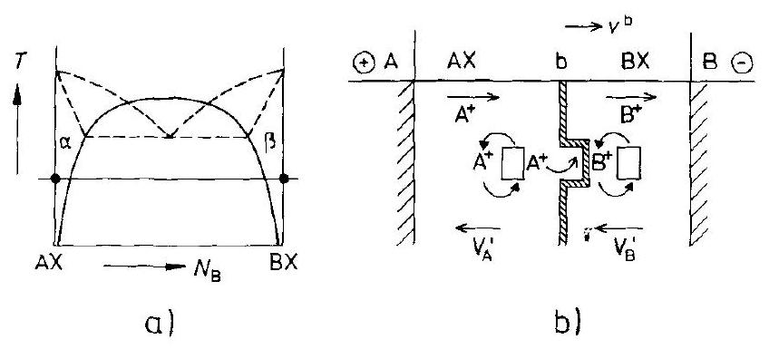
Figure 11-17, a) Phase diagram of the quasi-binary system AX-BX with an extended miscibility gap. b) Schematic electrolysis cell A/AX/BX/B. Cation vacancy drift and the mechanism of interface motion are indicated.

Conceptually, we thus have the same situation as introduced in Figure 11-2. Therefore, we conclude again that (since $v^{b}$ is directed towards the cathode) the moving interface is morphologically unstable if $L_{\mathrm{B}}(\mathrm{BX})<L_{\mathrm{A}}(\mathrm{AX})$, and it is stable if $L_{\mathrm{B}}(\mathrm{BX})>L_{\mathrm{A}}(\mathrm{AX})$, in accordance with Figures 11-5a and $\mathbf{c}$. These predictions have been confirmed experimentally [S. Schimschal (1993)].

If we repeat this experiment at higher temperatures where AX and BX are partially soluble in each other, we can conduct the field-driven transport in two ways. 1) The starting substances are pure AX and BX . 2) The starting substances $\mathrm{AX}(\mathrm{BX})$ and $\mathrm{BX}(\mathrm{AX})$ have been equilibrated with each other, which means that their initial concentrations are located on the miscibility gap (Fig. 11-17b). If we then adjust the activities of the metals A and B in the respective electrodes in such a way that no chemical gradients evolve in $\alpha$ and $\beta$ during the field-driven transport, the situation is analogous to that with pure AX and BX (Fig. 11-17b). Case 1) is different. An electrical and a chemical potential gradient act simultaneously upon the migrating cations. Since both forces are additive and the differential equations are linear, the flux due to $\nabla \varphi$ does not depend on the flux due to $\nabla \mu_{i}$. This leads to the following conclusion. Irrespective of the (stable) boundary motion arising from chemical transport as illustrated in Figure 11-3, the $\alpha / \beta$ boundary is morphologically unstable if $L^{\alpha}>L^{\beta}$ and $\alpha$ contacts the anode. However, the boundary is stable if the anode and cathode are reversed, analogous to the $\mathrm{AX} / \mathrm{BX}$ electrolysis couple without mutual solubility.

A final remark concerns field-driven transport in the AX-BX system at temperatures above the miscibility gap. We start with a reaction couple of pure AX and BX and apply the electric field as in Figure 11-17. Instead of the discontinuity in concentration, we now have a more or less steep interdiffusion profile dependent on diffusion time and the ratio ( $D_{\mathrm{A}} / D_{\mathrm{B}}$ ). As pointed out in the previous paragraph, diffusional transport and field transport can be superposed. The dissipated Gibbs energy from the interdiffusion is on the order of $R T$ in systems with complete miscibility. At the same time, the dissipated energy arising from the electric field is $\left(z_{i} \cdot F \cdot \Delta \varphi\right)$. Therefore, if $\Delta \varphi>$ or $\gg\left(R T / z_{i} \cdot F\right)$, field-driven transport by far outweighs diffusional mixing, and the steepening concentration profile eventually becomes equivalent to a discontinuity with respect to the (morphological) profile stability. Thus, with suffi-

Figure 11-18. a) Morphological instability of the $\mathrm{AgCl} / \mathrm{KCl}$ phase boundary in the electric fielddriven transport couple. b) Morphological instability of the concentration profile of the $\mathrm{AgCl}-\mathrm{NaCl}$ interdiffusion couple under the action of an electric field (see text) [S. Schimschal (1993)].

ciently high applied voltages to the phase sequence A/AX-BX/B (where AX-BX denotes the interdiffusing solid solution), we find similar geometrical instabilities as with $\mathrm{A} / \mathrm{AX} / \mathrm{BX} / \mathrm{B}$ at the $\mathrm{AX} / \mathrm{BX}$ interface, provided that A is the anode and $L_{\mathrm{A}}(\alpha)>L_{\mathrm{B}}(\beta)$ (Fig. 11-18) [S. Schimschal (1993)].

### 11.4 Non-Monotonous Behavior in Time

This chapter has been devoted to morphological, that is, geometrical instabilities. There is a second class of instabilities which may or may not be related to morphological instabilities. These instabilities occur in time (and space) and derive from nonlinear kinetics. They happen in two ways: either as non-monotonous (periodic)
or as catastrophic reactions. The rate of advancement of catastrophic reactions increases (over-)exponentially with time.

Periodic reactions of this kind have been mentioned before, for example, the Liesegang type phenomena during internal oxidation. They take place in a solvent crystal by the interplay between transport in combination with supersaturation and nucleation. The transport of two components, A and B , from different surfaces into the crystal eventually leads to the nucleation of a stable compound in the bulk after sufficient supersaturation. The collapse of this supersaturation subsequent to nucleation and the repeated build-up of a new supersaturation at the advancing reaction front is the characteristic feature of the Liesegang phenomenon. Its formal treatment is quite complicated, even under rather simplifying assumptions [C. Wagner (1950)]. Other non-monotonous reactions occur in driven systems, and some were mentioned in Section 10.4.2, where we discussed interface motion during phase transformations.

Let us conclude this chapter by illustrating the non-monotonous behavior in time of a driven system. Let us inspect such phase sequences as $\mathrm{A} / \mathrm{AX} / \mathrm{A}$ or $\mathrm{Me} / \mathrm{AX} / \mathrm{A}$ under a (electric) load where $\mathrm{A}=\mathrm{Ag}, \mathrm{AX}=\mathrm{AgBr}$, and $\mathrm{Me}=\mathrm{Pt}$, for example. We then polarize these cells by sending a constant (galvanostatic) electric current across them and register the potential drop across the anodic electrode. For $\mathrm{A} / \mathrm{AX} / \mathrm{A}$, it is found that pulsations start whereby the pulse frequency depends on the current density and the applied contact pressure (Fig. 11-19). Various explanations for this type of phenomena have been brought forward. The most likely one assumes that the effect is essentially mechanical in nature. The anodic $\mathrm{A}^{+}$current perturbs the metallic lattice of A at the receding $\mathrm{A} / \mathrm{AX}$ interface. The perturbations occur preferentially at dislocations or other non-equilibrium lattice defects. Consequently, the contact area between the metal A and the crystal AX changes with time. The interface region becomes porous until it collapses or at least relaxes because of mechanical instability. Even geometrical pattern formation of pores in the interface region is possible.

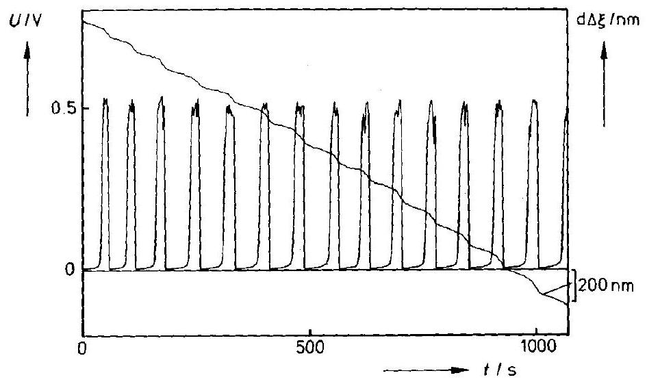
Figure 11-19. Temporal instabilities of the $\mathrm{Ag} / \mathrm{AgI}$ interface under anodic load and galvanostatic conditions. $T=260^{\circ} \mathrm{C}$. This plot represents a) the periodic voltage drop across the interface and b) the change in coordinate $\Delta \xi$ of the pulsating receding interface [J. Janek, S. Majoni (1994)].

Similar periodicities in the anodic potential drop across the Me/AX interface have been monitored with the solid-state cell $\mathrm{Me} / \mathrm{AX} / \mathrm{A}$. The cell was presented in Figure 9-8. We discussed in Section 9.4.3 that the activity of component X increases at the Me/AX interface proportional to $\mathrm{e}^{F \cdot U / R T}$ if we polarize the cell. The activity increase is equivalent to an increasing electron hole concentration in AX , which eventually leads to either an adsorbed surface film of $\mathrm{X}\left(\mathrm{X}_{2}\right)$ or the formation of a surface film of $\mathrm{MeX}_{n}$. There are now several possible reasons for non-monotonous or periodic behavior at the (driven) anodic electrode interface. 1) If by decomposing AX the $\mathrm{X}_{2}$ pressure builds up to a critical value necessary for $\mathrm{X}_{2}$ to escape into the surroundings, this may occur discontinuously. 2) The isolation of the $\mathrm{MeX}_{n}$ film which forms anodically can be destroyed by an electrical discharge and subsequently healed. 3) Nonlinear point defect relaxation processes (in the sense of Section 10.4.2) occur at and near the interface while AX decomposes. 4) As pointed out for the A/AX interface under load, decomposition of AX may result in regions of good and bad contact. An increasing flux density at the shrinking regions of good contact can lead to local heating and possibly melting, which in turn will improve the contact and reduce the heat production so that another cycle can start. By and large, and corresponding to many other reactions in the solid state, the temporal instabilities at solid/solid boundaries under load probably result from a number of different and complex causes. Conclusive investigations in this field are still to be made.

## References

Backhaus, M., Schmalzried, H. (1985) Ber. Bunsenges. Phys. Chem., 89, 1323
Harrison, J. D., Wagner, C. (1959) Acta Met., 7, 722
Jackson, K. A. (1975) Theory of Crystal Growth, in Treatise on Solid State Chemistry, Vol. 5 (Ed.: N. B. Hannay), Plenum Press, New York

Janek, J., Majoni, S. (1994) Personal communication
Kirkaldy, J. S., Young, D. J. (1985) Diffusion in the Condensed State, Inst. Metals, London
Langer, J. S. (1980) Rev. Mod. Phys., 53, 1
Martin, M., Schmalzried, H. (1985) Ber. Bunsenges. Phys. Chem., 89, 124
Martin, M. (1991) Mat. Sci. Rep., 7, 1
Müller-Krumbhaar, H., Kurz, W. (1990) in: Solidification (Ed.: P. Haasen) Materials Science Vol. 5, VCH, Weinheim
Müller-Krumbhaar, H., et al. (1992) Physica A181, 136; A187, 87
Mullins, W. W., Sekerka, R.F. (1964) J. Appl. Phys., 35, 444
Rapp, R. A., et al. (1973) Met. Trans., 4, 1283, 1293
Schimschal, S. (1993) Ph. D.Thesis, Universität Hannover
Schmalzried, H., Laqua, W. (1981) Oxid. Metals, 15, 339
Sekerka, R.F. (1967) J. Phys. Chem. Sol., 28, 983
Tigelmann, P., Martin, M. (1992) Physica, A 191, 240
Ueshima, Y., et al. (1989) Ber. Bunsenges. Phys. Chem., 93, 24
Wagner, C. (1950) J. Coll. Sci., 5, 85
Wagner, C. (1956) J. Electrochem. Soc., 103, 571
Whittle, D. P. (1983) in: High Temperature Corrosion, (Ed.: R.A. Rapp) NACE, Houston, Texas, p. $171 f f$.

Yurek, G., Schmalzried, H. (1975) Ber. Bunsenges. Phys. Chem. 79, 255

## 12 Phase Transformations

### 12.1 Introduction

Phase transitions are processes where small causes have large effects. Small changes in intensive variables ( $P, T, \mu_{i}$ ) can result in large changes of the extensive macroscopic properties of a system. Some specific quantities exhibit singularities at the transition point.

Heterogeneous gaseous phases do not exist at ambient pressure. Heterogeneous liquids exist. The number of different phases in the solid state, however, is enormous, and their existence reflects the increasing influence of directional interactions between atomic particles with decreasing temperature. In thermodynamic terms, this indicates that the Gibbs energy of a solid phase is dominated at sufficiently low temperature by the internal energy of the crystal. These internal energies are not very different for different packing orders (i.e., crystal structures) at fixed composition. The multitude of solid phases in turn leads to a host of phase transitions. Crystal growth from the melt or from the gas phase are examples of phase transitions, while metallurgy is to a large extent concerned with phase transformations and their consequences. The large number of transitions makes an unambiguous classification quite difficult. Consequently, we present here only a limited selection of types of transformations which focus on solid state chemistry. Solid state chemists often restrict themselves to phase transitions which occur in crystals. Since we cannot here treat the field of phase transformations comprehensively and in depth, we aim to understand the leading principles and some of the consequences for practical applications in solid state kinetics.

The isothermal heterogeneous solid state reaction of type $\mathrm{A}+\mathrm{B}=\mathrm{AB}$ already provides an example of a phase transformation. However, the topic of this chapter is the evolution towards equilibrium of an initially homogeneous non-equilibrium (supersaturated) solid solution. Since the transport of heat or stress in solids is so much faster than that of matter by diffusion, in most cases, the homogeneous supersaturation can be induced by changes in temperature or pressure. Starting from a homogeneous, disordered non-equilibrium state, there are, in principle, two ways to increase the order of a single-phase system (e.g., the system (A, B)). 1) Clustering: the separation of components into regions which are rich in either A or B. 2) Ordering: order A and B homogeneously in a structurally well defined pattern. To increase the order means to arrange the particles of the system in such a way that at any later time their exact spatial distribution is determined by a decreasing (minimum) number of geometrical parameters.

These two different ways of ordering require different driving forces. In case 1), macroscopic transport occurs. The driving force is therefore the chemical potential
gradient including contributions from any concentration gradients, stresses, electric fields, etc. In case 2), no transport over macroscopic distances is required. The homogeneous ordering process occurs by a few site exchanges of A and B on their atomic scale. In this way, ordered domains form first; these then grow and thereby lower the system's Gibbs energy. Obviously, there are two length parameters involved in the physics of ordering. The length, $\xi_{\mathrm{c}}$, describes the extension of concentration modulations and the correlation length, $\xi$, describes the extension of the (restoring) forces originating from an ordered domain. For the first case (clustering), $\xi_{\mathrm{c}} / \zeta \simeq 1$, whereas for the second case (ordering), $\xi_{\mathrm{c}} / \xi \simeq 0$.

Most chemical reactions occur by a change in the configurational order ( $\Delta S \neq 0$ ). Compared to fluids, crystalline reactants already have a low entropy and thus solid state reactions are normally exothermic. In this sense, order-disorder reactions are in no way special, except that they occur in homophase crystals.

From a practical point of view it may not be advisable to formulate a single kinetic theory to describe all kinds of ordering, that is, separation (demixing) and homogeneous ordering. Interactions between the different SE's of a transforming crystal and impurities, dislocations, grain boundaries and other non-equilibrium defects may influence the correlation lengths $\xi$ and $\xi_{\mathrm{c}}$ and can therefore alter the ordering path in space and time. This is particularly true since the phase transformations of interest here occur close to equilibrium (e.g., near critical points or near the state of phase coexistence). Therefore, the thermodynamic forces driving the ordering process, which (to first order) are proportional to the deviations from equilibrium, are normally small compared to the driving forces acting on most compound forming heterogeneous solid state reactions. This has a number of consequences which are worth mentioning. Since the crystal is a system of tightly coupled atoms, diffusional transport (which largely decouples correlated motions by the Brownian motion of point defects) does not occur over large distances during a phase transformation. Thus, the subtleties of cooperative effects play the dominant role. Furthermore, statistical theory of ordering becomes rather complicated as soon as the correlated motions concern a sizeable fraction of atomic constituents in the crystal. Finally, if crystal structure changes are involved in the transformations, they are generally coupled with matter transport, as will be discussed in Section 12.3.1. After nucleation, the coupled motions of the SE's at and near the moving interface comprise displacive and diffusive steps on different length scales. This inherent complexity of correlated steps makes the field of phase changes a domain of statistical physics. In view of the mechanical properties which can be brought about by transformation processes, materials science is strongly involved in the technical applications.

It is always convenient to use intensive thermodynamic variables for the formulation of changes in energetic state functions such as the Gibbs energy $G$. Since $G$ is a first order homogeneous function in the extensive variables $V, S$, and $n_{k}$, it follows that [H. Schmalzried, A.D. Pelton (1973)]

$$
\sum q_{i}^{\alpha} \cdot \mathrm{d} \phi_{i}^{\alpha}=0
$$

where $\phi_{i}$ are the conjugate intensive variables to the extensive variables $q_{i}$ (e.g., $\left.\phi_{i}=P, T, \mu_{k} ; q_{i}=V, S, n_{k}\right)$. The superscript $\alpha$ is a phase index. Let us assume for the
moment that our crystals are hydrostatically stressed. The equilibrium conditions then tell us that each phase is homogeneous throughout, and that any coexisting phases possess the same values of the intensive variables. Heterogeneous crystals which are not homogeneously stressed and which have coherent (semicoherent) phase boundaries behave differently [W. J. Johnson, H. Schmalzried (1992)]. Under hydrostatic conditions we can write for each coexisting phase $\alpha$

$$
\sum q_{i}^{\alpha} \cdot \mathrm{d} \phi_{i}=0
$$

without a phase index on $\phi_{i}$. From Eqn. (12.2) it follows that if the number ( $n$ ) of intensive variables ( $\phi_{i}$ ) is equal to the number ( $v$ ) of phases $\alpha$, the system is invariant (Gibbs phase rule). However, we can also use the set of Eqns. (12.2) to determine $\phi_{j}$ in terms of $\phi_{i(\neq j)}$ for the coexisting phases if $v<n$, which means that we can determine the bounding curves of the various phase fields. For example, keeping $\phi_{4}, \phi_{5}, \phi_{6}, \ldots, \phi_{n}$ constant and setting $\phi_{1}=P, \phi_{2}=T, \phi_{3}=\mu_{\mathrm{S}}$ (solid), so that $q_{1}=V$, $q_{2}=-S, q_{3}=n_{\mathrm{S}}$, it follows immediately from the set of Eqns. (12.2)

$$
\frac{\mathrm{d} P}{\mathrm{~d} T}=\frac{\Delta S / n_{\mathrm{S}}}{\Delta V / n_{\mathrm{S}}}=\frac{\Delta S_{m}}{\Delta V_{m}}
$$

which is the well known Clausius-Clapeyron equation. Written in terms of component chemical potentials at constant $P$ and $T$, Eqns. (12.2) yield [H. Schmalzried, A. Navrotsky (1975)]

$$
\frac{\mathrm{d} \mu_{1}}{\mathrm{~d} \mu_{2}}=-\frac{\Delta n_{2} / n_{3}}{\Delta n_{1} / n_{3}} ; \quad \Delta n_{i}=n_{i}^{\alpha}-n_{i}^{\beta}
$$

One can then determine the phase field boundaries by integration as schematically shown in Figure 12-1.

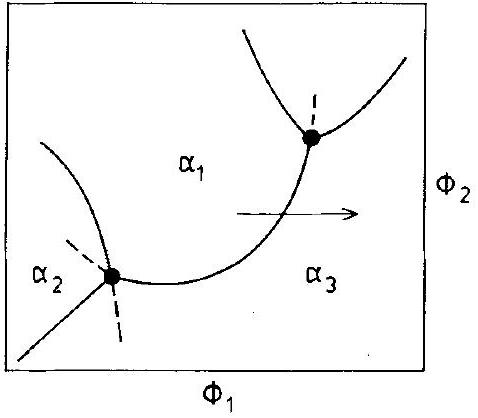
Figure 12-1. Phase diagram of first kind. Phase boundaries are schematically plotted for the intensive variable $\phi_{2}$ as a function of $\phi_{1} . \phi_{i} (i=4,5, \ldots)=$ const. Arrow indicates a phase transition $\alpha_{1} \rightarrow \alpha_{3}$.

When a boundary is crossed by changing $\phi_{i}$ (Fig. 12-1), a phase transformation will take place if the atomic mobilities allow. By identifying the various $\phi_{i}$ 's, we can categorize the transformations. For example, if we place the system in an unstable state by a change of temperature, the subsequent transformation is temperature induced, etc. There are two limiting types of transformations. 1) The crystal structure is conserved but the composition changes. 2) The crystal structure changes but not the composition. Spinodal decomposition in the early stage belongs to the first category, whereas order-disorder, displacive, and rotational transformations belong to the second one. Often, both the composition and the structure change during a phase transformation.

The foregoing classification is not without ambiguity. For example, it is common practice to call the reaction $\mathrm{A}^{\alpha} \rightarrow \mathrm{B}^{\alpha}+\mathrm{C}^{\alpha}$ (see Fig. 6-1) induced by decreasing the temperature a phase transformation. The similar (peritectoid) reaction $\mathrm{C}=\alpha+\beta$ (Fig. 12-2) induced by a temperature increase, however, is named a decomposition reaction. In addition, the isothermal reaction $\mathrm{AO}=\mathrm{A}+\frac{1}{2} \mathrm{O}_{2}$, which occurs if the intensive variable $\mu_{\mathrm{O}_{2}}$ is decreased so that AO decomposes, is called a metal oxide reduction. It is thus categorized as a genuine heterogeneous solid state reaction (the reverse of metal oxidation) and not as a phase transformation.

Figure 12-2. Peritectic decomposition $\mathrm{C}=\alpha+\beta$ in an $\mathrm{A}-\mathrm{B}$ phase diagram.

In this chapter, we will only be concerned with temperature or pressure induced reactions. Let us first become acquainted with the usage of some specific terms. If transport on a macroscopic scale does not occur during the non-diffusive transformation and the process is heterogeneous, we call the transformation polymorphic if (line) compounds are concerned. If we consider solid solutions under those same conditions, we are dealing with massive transformations. A further distinction is made between transformations which give rise to elastic strain energies (lattice distortive) and those without lattice strain (shuffle transformations). If lattice displacements dominate the macroscopic changes of sample shape (morphology) and transformation kinetics, we call this first-order transformation martensitic, and the product martensite. Martensite can form in numerous materials (e.g., carbon steels, superconductors, zirconia, polymers).

If the transformation process occurs homogeneously and can be quantified by one or several time-dependent parameters, the transformation is called a second-order
transformation. A continuous, single-phase diffusional transformation like the above mentioned spinodal decomposition represents an inhomogeneous process on a rather small scale. If macroscopic transport is involved in the transformation, the extent of the compositional changes can be very different. Compounds with very narrow ranges of nonstoichiometry ( $\mathrm{Ag}_{2+} \mathrm{S}$ ) transform by inducing very small fluxes of components on both sides of the moving phase boundary (quasi-polymorphic transformation). If the compositional changes are larger, the transformation can occur with a moving boundary that is either sharp or that spreads over a certain width where more or less discontinuous local nucleation and growth processes take place. Strictly speaking, discontinuous precipitation occurs in supersaturated terminal solutions. The precipitating region develops behind a moving grain boundary which serves simultaneously as a preferred nucleation site and a fast transport path. Nucleation and early growth have already been treated in Chapter 6. The concepts involved in nucleation differ fundamentally from those that govern the phase transformations of this chapter.

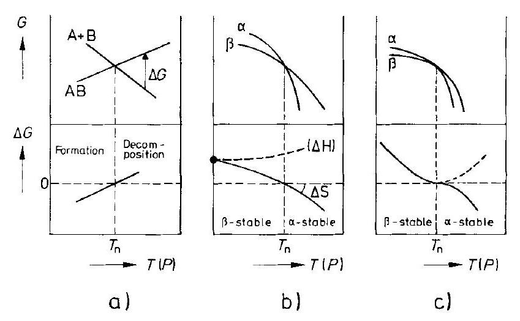
Figure 12-3. Gibbs energy ( $G$ ) and Gibbs energy change of reaction ( $\Delta G$ ) as a function of $T$ (or $P$ ). a) $\mathrm{A}+\mathrm{B}=\mathrm{AB}$, b) $\alpha \rightarrow \beta(\beta \rightarrow \alpha)$, first order reaction, c) $\alpha \rightarrow \beta$, second order reaction.

Homogeneous phase transformations take place either by continuously ordering the SE's on one or several (sub-)lattices, or by correlated displacive movements of the SE's eventually leading to a modified crystal structure. As long as the order parameter, and thus the entropy change, is smooth, there is no finite $\Delta S$ ( $=\partial \Delta G / \partial T$, or $\Delta V=\partial \Delta G / \partial P$ ) and so, by definition, no first-order transformation. This also explains why order-disorder transformations are named second (or higher) order transformations. The first derivatives vanish, the second derivatives $\partial^{2} \Delta G / \partial T^{2}$ do not. The situation is illustrated in Figure 12-3. It shows three different types of Gibbs energy curves and Gibbs energy changes of reaction corresponding to the following solid state reactions: a) the heterogeneous reaction $\mathrm{A}+\mathrm{B}=\mathrm{AB}$; b) a first-order transformation; c) a second-order transformation.

### 12.2 Nondiffusive Transformations

### 12.2.1 Martensitic Transformations

Let us regard a binary A-B system that has been quenched sufficiently fast from the $\beta$-phase field into the two phase region ( $\alpha+\beta$ ) (see, for example, Fig. 6-2). If the cooling did not change the state of order by activated atomic jumps, the crystal is now supersaturated with respect to component B . When further diffusional jumping is frozen, some crystals then undergo a diffusionless first-order phase transition, $\beta \rightarrow \beta^{\prime}$, into a different crystal structure. This is called a martensitic transformation and the product of the transformation is martensite.

Such transformations have been extensively studied in quenched steels, but they can also be found in nonferrous alloys, ceramics, minerals, and polymers. They have been studied mainly for technical reasons, since the transformed material often has useful mechanical properties (hard, stiff, high damping (internal friction), shape memory). Martensitic transformations can occur at rather low temperature $(\sim 100 \mathrm{~K})$ where diffusional jumps of atoms are definitely frozen, but also at much higher temperature. Since they occur without transport of matter, they are not of central interest to solid state kinetics. However, in view of the crystallographic as well as the elastic and even plastic implications, diffusionless transformations may inform us about the principles involved in the structural part of heterogeneous solid state reactions, and for this reason we will discuss them.

We have seen in previous chapters that most (diffusional) heterogeneous solid state reactions are accompanied by changes in the crystal structure. Since the geometrical arrangement of the atoms in a crystal reflects the existence of energy minima, we understand that, in many cases, the atomic particles aim to preserve their coordination as much as possible through structure transformations. In addition, a change in coordination normally means a correlated motion of more than one atom with a correspondingly high activation energy. Martensitic transformations thus exemplify that, in some cases, the undercooled $\beta$ crystal (A, B) can lower its Gibbs energy in a diffusionless way by shear deformations without a major change in coordination. Structure elements of the unit cells of the parent structure are almost instantaneously shifted into the positions of the necessarily metastable martensite structure.

Let us consider the so-called Bain-deformation transformation as an example of a martensite reaction (Fig. 12-4). The transformation changes the lattice from fcc to bcc and induces a $20 \%$ contraction of the cell along one axis and a $12 \%$ expansion along the other two axes. Since the shape change of the whole crystal is finite but small, the question is how the large displacements can be accommodated during the macroscopic transformation by elastic and plastic deformations. The discontinuous change in lattice parameters and molar volume is indicative of a first-order phase transition which starts with nucleation and continues with growth. The martensite product is often found to be plate- or needle-like, indicating that the minimization of stress energy influences the growth morphology. The role of stress is also shown by the occurrence of hysteresis in the transformation when the system undergoes

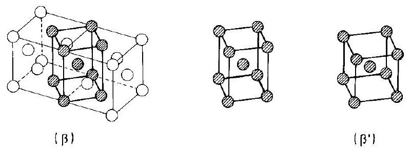
Figure 12-4. Bain $\beta \rightarrow \beta^{\prime}$ transformation.

temperature cycles. That an external deformation of the sample decreases the area of the hysteresis loop is thus to be expected.

Let us assume that the martensite particle has grown in the form of an oblate spheroid, the volume of which is $(4 \cdot \pi / 3) \cdot c \cdot r^{2}$, with $c$ as the semi-thickness of the spheroid. The total Gibbs energy change for the formation of this particle includes a chemical, an elastic, and an interface energy term. It can be appropriately written as

$$
\Delta G_{\mathrm{tr}} \approx(4 \cdot \pi / 3) \cdot c \cdot r^{2} \cdot\left[\Delta g_{\text {chem }}+e_{\text {elast }}(r)\right]+2 \cdot \pi \cdot r^{2} \cdot \sigma
$$

where $e_{\text {elast }}$ is the specific elastic energy of the spheroid per unit volume, namely

$$
e_{\text {elast }}=\left[\frac{\pi}{8} \cdot \frac{2-v}{1-v} \cdot \bar{G} \cdot u_{i j}^{2}+(\pi / 4) \cdot \bar{G} \cdot u_{i i}^{2}\right] \cdot(c / r)
$$

$\bar{G}$ denotes the shear modulus and $\sigma$ is the specific interfacial energy. In the sense of Eqn. (6.8), we can use Eqn. (12.5) to calculate the activation energy for the nucleation of martensite. Normally, $\Delta G_{\mathrm{tr}} \gg R T$, which implies that martensite nucleation is unlikely to be induced by thermal fluctuations. We conclude that the nucleation is heterogeneous and dislocation arrays are the nucleation sites.

We have mentioned above the tendency of atoms to preserve their coordination in solid state processes. This suggests that the diffusionless transformation tries to preserve close-packed planes and close-packed directions in both the parent and the martensite structure. For the example of the Bain-transformation this then means that $\{111\}_{\beta \rightarrow\{011\}_{\beta^{\prime}}\left(\beta^{\prime}=\text { martensite }\right) \text { and }\langle\overline{1} 01\rangle_{\beta}| |\langle 1 \overline{1} 1\rangle_{\beta^{\prime}} \text {. Obviously, the main ques- }}$ tion in this context is how to conduct the transformation ( $=$ advancement of the $\beta / \beta^{\prime}$ boundary) and ensure that on a macroscopic scale the growth (habit) plane is undistorted (invariant). In addition, once nucleation has occurred, the observed high transformation velocity (nearly sound velocity) has to be explained. Isothermal martensitic transformations may well need a long time before significant volume fractions of $\beta$ are transformed into $\beta^{\prime}$. This does not contradict the high interface velocity, but merely stresses the sluggish nucleation kinetics. The interface velocity is essentially temperature-independent since no thermal activation is necessary.

The deformation of a martensitic transformation in a given volume can be taken in by two types of plastic shearing: a) dislocation glide, b) twinning. In this way, the strain which $\beta^{\prime}$ exerts on $\beta$ is largely reduced. In order for the habit plane to remain undistorted during advancement, the $\beta-\beta^{\prime}$ volume change must take place by a homogeneous shear parallel to the habit plane. The necessary dilation is then normal to it. It is understood that the macroscopic habit plane is build up from coherent and semicoherent highly mobile $\beta-\beta^{\prime}$ interfaces selected according to the structure rules (coordination preservation) as discussed. This explains why the habit plane, derived from an averaging over many $\beta-\beta^{\prime}$ twin interfaces, can not possess simple $\{h k l\}$ indices as the individual $\beta-\beta^{\prime}$ interfaces do. In fact, the indices for a habit plane are normally irrational.

Diffusionless transformations have been sometimes called 'military', in contrast to the more 'civilian' diffusion controlled transformations. Considering their technical relevance, the crystallographic theory of martensite transformation has been worked out in much detail, and particularly for the habit plane selection of the given $\beta-\beta^{\prime}$ lattice structural change. The reader is referred to the corresponding metallurgical literature [D.A. Porter, K.E. Easterling (1990); D.S. Liebermann (1970); C.M. Wayman (1983)].

### 12.2.2 Second-Order Transformations

Martensitic transformations, although they do not involve matter transport, are accompanied by a change in the extensive state functions ( $\Delta S, \Delta V, \Delta H$, etc.), and are thus first-order transformations. Second-order transformations are also diffusionless but, in contrast to first-order transformations in which $G$ changes discontinuously and thus $\Delta S_{\mathrm{tr}} \neq 0$ at the transition temperature $T_{\mathrm{tr}}$ (Fig. 12-3b), there is no transformation entropy for second-order transformations (Fig. 12-3c). Second-order transformations occur without the nucleation and growth of a new phase, and the changes of the system are continuous. Three types of second-order transformations can be distinguished: 1) order-disorder, 2) displacive (i.e., by continuously shifting atoms in a coordinated way to their proper positions in the new structure), and 3) a combination of 1) and 2). The $G^{\alpha}$ - and $G^{\beta}$-curves are tangent at $T_{\mathrm{tr}}$ as illustrated in Figure 12-3c. Since the symmetry of the $\beta$ crystal is necessarily lost at $T \geq T_{\mathrm{tr}}$, an extension of the $G^{\beta}$-curve for $T>T_{\mathrm{tr}}$ is physically unmeaningful. However, at $T<T_{\mathrm{tr}}$, the states between $G^{\alpha}$ and $G^{\beta}$ are accessible to the crystal. The existence of this continuity of accessible states is a fundamental assumption of the theory as outlined in the following.

Symmetry is represented by the elements of a (mathematical) group and thus cannot change continuously. The $\alpha-\beta$ phase transition therefore occurs at a distinct temperature. Let us now assume that we have identified an extensive thermodynamic variable which can distinguish states between the $\alpha$ and $\beta$ phases. We call it an order parameter ( $\eta$ ). For a quantitative description of order-disorder or continuous displacive processes, the order parameter is normalized $(0 \leq \eta \leq 1)$. For example, if we regard the classic $\beta-\beta^{\prime}$ brass transition, $\eta$ is defined as ( $2 f_{\mathrm{Cu}}-1$ ), where $f_{\mathrm{Cu}}$ is the fraction of Cu atoms which occupy the $(0,0,0)$ sites of the $(\mathrm{Cu}, \mathrm{Zn})$ bcc structure.

If all Cu atoms occupy $(0,0,0)$ sites, $f_{\mathrm{Cu}}=1$, consequently $\eta=1$, and we have the completely ordered $\beta$ brass. The symmetry is broken when $f_{\mathrm{Cu}}=1 / 2$ or $\eta=0$, and thus $\beta$ and $\beta^{\prime}$ become indistinguishable. Other (normalized) order parameters are in use: lattice dimension, density, magnetization, polarization, or some function that describes the orientation of the molecular axes. Since the order parameter is a normalized extensive function (or a specific function, as for example, the mole fraction) and we are dealing with either an open or a closed system (i.e., constant chemical potential or constant number of particles), $\eta$ can be a non-conserved or a conserved quantity.

In decreasing the temperature below the critical point ( $T_{\mathrm{tr}}$ ), ordering begins continuously. The first derivatives of the Gibbs energy are smooth, but the second derivatives (e.g., molar heats) change discontinuously from $\alpha$ to $\beta$. A distinction between first- and second-order transformations is not helpful if $\Delta S_{\mathrm{tr}}$ becomes so small that it falls within the range of the thermal fluctuations. In view of the structural complexities of crystals with more than one sublattice, 'multicomponent' order parameters of higher dimensionality may be needed in order to adequately describe a second-order transition.

It is common to begin the discussion of second-order phase transitions, including their symmetry aspects, by a concept whose basic idea is a series expansion of the Gibbs energy in terms of the order parameter

$$
G=G^{0}+A^{*} \cdot \eta+A \cdot \eta^{2}+B \cdot \eta^{3}+C \cdot \eta^{4}+\ldots
$$

$A^{*}, A, B, C, \ldots$ are phenomenological coefficients that are functions of the independent intensive variables $P, T, \ldots$ In order to meet the equilibrium condition at $\eta=0$, $A^{*}$ must vanish. Furthermore, for stable phases, $A(T, P)>0$ and $C(T, P)$ is also $>0$, otherwise $G$ would become excessively negative for larger values of $\eta .\left(G-G^{0}\right)$ vs. $\eta$ is depicted in Figure 12-5a. If $B^{2}=4 \cdot A C$, the minima for ( $G-G^{0}$ ) at $\eta= -2 \sqrt{A C}$ and $-4 \sqrt{A C}$ have the same value $G$. This means that here two phases would coexist in equilibrium, which is characteristic of a first-order phase transition.

The situation is different if we set $B=0$. The ( $G-G^{0}$ ) curve as a function of $\eta$ for this case is shown in Figure 12-5b. From $(\partial G / \partial \eta)=0$, we derive $\eta_{\mathrm{eq}}$ as

$$
\eta_{\mathrm{eq}}=\sqrt{\frac{-A}{2 C}} \text { and } G_{\mathrm{eq}}=G^{0}-A^{2} / 4 \cdot C
$$

For $A(T, P)=0, G$ has one minimum. For $A(T, P)<0$, there are two minima. If we linearize at constant $P$, with $A$ being a function of $T$ as $(a / 2) \cdot\left(T-T_{\mathrm{tr}}\right)$, we can express $G_{\text {eq }}$ in terms of the deviation from the critical temperature $T_{\mathrm{tr}}$ as

$$
G_{\mathrm{eq}}=G^{0}-\frac{a^{2} \cdot\left(T-T_{\mathrm{tr}}\right)^{2}}{16 C}
$$

From Eqn. (12.9), it follows that $\Delta S_{\mathrm{tr}}=0$ as required for a second-order phase transition. The finite molar heat $\Delta c_{\mathrm{P}}(=T \cdot \partial \Delta S / \partial T)$ at the transition temperature is obtained as
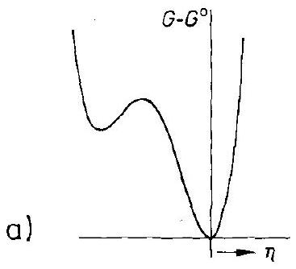
b)

Figure 12-5. Gibbs energy as a function of the (scalar) order parameter.
a) $G-G^{0}=A \eta^{2}+B \eta^{3}+C \eta^{4}$, b) $G-G^{0}=A \eta^{2}+C \eta^{4}$.

$$
\Delta c_{\mathrm{P}}=\frac{a^{2} \cdot T_{\mathrm{tr}}}{8 C} ; \quad T \rightarrow T_{\mathrm{tr}}
$$

If the transforming system is inhomogeneous, the $G$-functional replaces Eqn. (12.7)

$$
G=G^{0}+\int_{V}\left(A^{*} \cdot \eta(r)+A \cdot \eta^{2}(r)+B \cdot \eta^{3}(r)+\ldots+D \cdot(\nabla \eta)^{2}\right) \cdot \mathrm{d} r^{3}
$$

Note that a gradient term as introduced in Section 10.2 has been included. As before, the essential feature of the second-order phase transition is based on a (linear) expansion of $A\left(=a / 2 \cdot\left(T-T_{\mathrm{tr}}\right)\right)$.

The relations given in Eqns. (12.7)-(12.10) are purely phenomenological. If we consider the crystallographic conditions for second-order transitions, it is necessary that the space groups of the $\alpha$ and $\beta$ structures both before and after the secondorder transition (i.e., above and below the transition temperature) be related to each other: the $\beta$ symmetry (low $T$ ) is a subgroup of the $\alpha$ symmetry (high $T$ ) group. This follows from the fact that the structure change of a second-order transition is continuous. In other words, all the symmetry elements of the (low symmetry) structure must already be present in the (high symmetry) $\alpha$ structure.

Let us now turn to some aspects of the kinetic theory and follow the transition process from an arbitrary unstable state with a given $\eta_{0}$. We ask for the path which is taken by the system and the rate to reach equilibrium, in other words, the approach to $\eta_{\text {eq }}$. Possible reaction paths for a second-order phase transition are schematically illustrated in Fig. 12-6. It shows a Gibbs energy vs. $\eta$ diagram with $T$ as the curve

Figure 12-6. Potential valleys for ( $G-G^{0}$ ) as a function of the order parameter $\eta$. Curve parameter is the temperature $T$.

parameter. From this figure, we can read the variation in $\eta_{\text {eq }}$ during cooling as well as the pathways of ordering (and disordering) below the critical temperature.

If we formally identify $\eta$ with the reaction coordinate for a normal homogeneous chemical reaction, we would expect that $\eta(t)$ exhibit the pronounced nonlinearity of most homogeneous chemical reactions considering both the complicated Gibbs energy surfaces $G(\eta)$ and the nonlinear kinetics of atomic encounters. However, close to equilibrium and for small driving forces, we can set the reaction rates proportional to the chemical affinities ( $-\partial G / \partial \eta$ ). Therefore, for those second-order phase transitions which can be described by a single (scalar) order parameter $\eta$, we have a rate equation in this regime of the form

$$
\dot{\eta}=-\gamma \cdot \frac{\partial}{\partial \eta}\left(\frac{G(\eta)}{R T}\right)
$$

where $y$ is a rate constant. It contains the atom's elementary (activated) jump frequencies and their interactions at the different positions of the crystal lattice.

One can derive Eqn. (12.12) in a more fundamental way by starting the statistical approach with the (Markovian) master equation, assuming that the jump probabilities obey Boltzmann statistics on the activation saddle points. Salje [E. Salje (1988)] has discussed the following general form of a kinetic equation for solid state processes

$$
\dot{\eta}=-\gamma \cdot\left[1-\left(\frac{\xi_{\mathrm{c}}}{\xi}\right)^{2} \cdot f\left(\xi, \nabla^{2}\right)\right] \cdot \frac{\mathrm{d}}{\mathrm{~d} \eta}\left(\frac{G}{R T}\right) ; f\left(\xi, \nabla^{2}\right)=\mathrm{e}^{\left(\xi^{2} / 2\right) \cdot \nabla^{2}}
$$

which obviously includes Eqn. (12.12) as a limiting case. The form of Eqn. (12.13) stresses again the importance of the two correlation lengths $\xi$ and $\xi_{\mathrm{c}}$ introduced in Section 12.1. $\xi_{\mathrm{c}}$ represents the length of concentration modulations if the total number of particles is conserved. $\xi$ can then be understood as the distance over which a change of $\eta$ in an ordering domain of the crystal influences $\eta$ in other regions, for
example, by stress fields. In the case that $\left(\xi_{\mathrm{c}} / \xi\right) \rightarrow 0$ or $\xi \gg \xi_{\mathrm{c}}$, which describes orderdisorder reactions, Eqn. (12.13) reduces to the form of Eqn. (12.12) and has been referred to as the Ginzburg-Landau rate equation. Obviously, $-(\partial(G / R T) / \partial \eta)$ represents the normalized affinity of the homogeneous order-disorder reaction.

However, Eqn. (12.13) also comprises a second limiting case of ordering which will be discussed in depth in Section 12.3.2. For $\xi_{\mathrm{c}} / \xi \cong 1$, we know from Section 12.1 that ordering occurs in the form of concentration modulations (i.e., diffusional transport). The appropriate order parameter in this case is the concentration, and ( $\partial G / \partial \eta$ ) can be identified with the chemical potential. In the limit of small concentration gradients, we can expand $f\left(\xi, \nabla^{2}\right)$ in Eqn. (12.13) into a series, and obtain after linearizing

$$
\dot{\eta}=\frac{\gamma}{2} \cdot \xi_{\mathrm{c}}^{2} \cdot \nabla^{2}\left(\frac{\partial(G / R T)}{\partial \eta}\right)
$$

In this line of reasoning, Eqn. (12.14) is the basic differential equation for ordering by component separation (the so-called spinodal decomposition) to be discussed in Section 12.3.2.

The correlation length $\xi$ corresponds to the spatial extent of the restoring force originating from an ordered region. When the temperature approaches the critical temperature $T_{\mathrm{tr}}$, the restoring force vanishes. This can be formalized by letting $\xi$ diverge as

$$
\xi=\xi^{0} \cdot\left(\frac{T_{\mathrm{tr}}}{T_{\mathrm{tr}}-T}\right)^{\nu}
$$

where $v$ is the critical exponent. It can be derived theoretically by a mean-field approach [see, for example, K. Binder (1991)] and typically amounts to $v=1 / 2$. The mean-field allows us to replace the (atomistic) Hamiltonian of statistical theory by a Gibbs energy function with an appropriate correlation length ('coarse grained'). In framework silicates (see Section 15.2), for example, the interaction occurs via elastic strains by bending the semiflexible network of $\mathrm{T}-\mathrm{O}-\mathrm{T}$-bonds $(\mathrm{T}=\mathrm{Al}, \mathrm{Si} ; \mathrm{O}=\mathrm{O})$. $\xi^{0}$ is then relatively large since it conforms to elastic interaction lengths. In contrast, magnetic phase transitions have $\xi^{0}$ values of atomic dimensions.

The calculation of $G(\eta)$ using appropriate models has been the subject of much effort [K. Binder (1991)]. If we make the ad-hoc assumption that $G(\eta)$ is explicitly given by Landau's Gibbs energy expansion, Eqn. (12.7), we conclude that for secondorder transitions

$$
G=G^{0}+\frac{1}{2} \cdot a\left(T-T_{\mathrm{tr}}\right) \cdot \eta^{2}+\frac{1}{4} b \cdot \eta^{4}(+\ldots)
$$

and after substitution into Eqn. (12.12)

$$
\dot{\eta}=-\frac{y}{R T} \cdot\left[a \cdot\left(T-T_{\mathrm{tr}}\right) \cdot \eta+b \cdot \eta^{3}\right]
$$

or, after integration,

$$
t-t_{0}=-\frac{R T}{\gamma} \int_{\eta_{0}}^{\eta} \frac{\mathrm{d} \eta}{a\left(T-T_{\mathrm{tr}}\right) \cdot \eta+b \cdot \eta^{3}}
$$

Two limiting cases for the rate laws of second-order transformations can easily be distinguished. If ( $\eta-\eta_{\mathrm{eq}}$ ) is small and the higher order terms are neglected,

$$
\eta-\eta_{\mathrm{eq}} \propto \mathrm{e}^{-\alpha\left(t-t_{0}\right)}
$$

which describes the expected exponential relaxation behavior near equilibrium. Alternatively, if $T$ is close to $T_{\mathrm{tr}}, G \approx(1 / 4) \cdot b \cdot \eta^{4}$. After substitution of Eqn. (12.16) into Eqn. (12.12) and integration, one obtains

$$
\left(\frac{1}{\eta^{2}}-\frac{1}{\eta_{0}^{2}}\right) \propto t-t_{0}
$$

Experimental kinetic data are scarce for second-order transitions in inorganic compounds. They normally do not fit the simple models reflected in Eqns. (12.19) and (12.20). An experimental example is shown in Figure 12-7. It has been explained by integrating Eqn. (12.12), setting $G-G^{0}=1 / 2 \cdot a \cdot\left(T-T_{\text {tr }}\right) \cdot \eta^{2}+1 / 6 \cdot c \cdot \eta^{6}$, and by assuming a certain dependency of the rate constant $y$ on $\eta$ [see M. A. Carpenter, E. Salje (1989)]. It is difficult, however, to assess the physical reality in these relations.

Figure 12-7. X-ray intensities as a function of time $t$ for omphacite according to [M.A. Carpenter, et al. (1989)].

Obviously, in systems with more than one order parameter, when the different ordering modes are coupled in one way or the other, the ordering kinetics are appreciably more complicated. In order to produce mismatched periodic patterns in a crystal (incommensurate structures), Landau and Lifshitz [L.D. Landau, E.M. Lifshitz (1980)] proposed a $G$ expansion of the form

$$
\begin{aligned}
G= & \frac{1}{2} \cdot a \cdot\left(T-T_{\mathrm{tr}}\right) \cdot\left(\eta_{1}^{2}+\eta_{2}^{2}\right)+\frac{1}{4} \cdot b \cdot\left(\eta_{1}^{4}+\eta_{2}^{4}\right)+\ldots \\
& +\mathrm{d} \cdot\left(\eta_{1} \cdot \nabla \eta_{2}-\eta_{2} \cdot \nabla \eta_{1}\right)+\mathrm{e} \cdot\left(\nabla \eta_{1}^{2}+\nabla \eta_{2}^{2}\right)
\end{aligned}
$$

which once again includes gradient terms. From ( $\partial G / \partial \eta_{i}$ ) = 0 , one derives sinusoidal $\eta$ functions in space. Integration of Eqn. (12.12) after inserting Eqn. (12.21) would yield the kinetic behavior. We conclude that phases with incommensurate structures can even occur at certain time intervals during the transformation process. Relevant systems are silicates. Their order parameters (e.g., Al/Si ordering in cordierite or orthopyroxene) are important indicators for the evolution in time of minerals and thus for geological history. Transforming silicate minerals often seem to require more than one order parameter [E. Salje (1985), (1990)], and some of the modulated structures found in silicate crystals are presumably frozen in and of kinetic origin. Elastic interactions between regions of different degree of order (domains) in transforming crystals move their boundaries until the system eventually arrives in the Gibbs energy minimum. Recent studies on mobile domain boundaries have been published by [E. Salje (1994)].

### 12.3 Diffusive Transformations

In this section, we discuss phase transformations involving the macroscopic transport of components. They can occur in a single phase or by heterogeneous reaction. Heterogeneous transformations are first-order reactions which start with nucleation as discussed in Chapter 6. We distinguish between three principally different situations. 1) $\alpha \rightarrow \alpha^{\prime}+\alpha^{\prime \prime}$. This process is depicted in Figure 6-1. The crystallographic structure is conserved, but composition changes may be large. 2) $\alpha \rightarrow \beta+\gamma$. This process is analogous to the peritectic reaction depicted in Figure 12-2. The crystallographic structure changes and composition changes are large. 3) $\alpha \rightarrow \beta+\gamma$. All phases have different structures and narrow ranges of homogeneity. The compositional change between $\alpha$ and $\beta$ is very small (Fig. 12-8). The polymorphic transformation represents a limiting case with vanishing $\gamma$.

Diffusive transformations (including polymorphic transitions) abound in solid state chemistry. Component diffusion is always involved. However, the kinetics of a

decomposition process such as $\alpha \rightarrow \beta+\gamma$ can hardly be discussed in general and quantitatively given the fact that the nucleation of two distinct phases and the coupled transport in three different phases has to be accounted for. We will therefore treat only two diffusive transformation processes in some detail, a first-order transformation with small changes in composition (case 3)) and a transformation of the type $\alpha \rightarrow \alpha^{\prime}+\alpha^{\prime \prime}$ (spinodal decomposition, case 1)) which occurs continuously in space and time.

### 12.3.1 First-Order Transformation with Small Composition Changes

All transformations of compounds with relatively narrow ranges of homogeneity ('geordnete Mischphasen' according to Wagner and Schottky [C. Wagner, W. Schottky (1931)]) belong to this category. They are characterized by structure changes and, in addition, by small or very small changes in composition. In the above classification, they belong to case 3), that is, $\alpha \rightarrow \beta(+\gamma)$, and are illustrated in Figure 12-8. Transport takes place by component diffusion in the compounds $\alpha$ and $\beta$, and chemical processes occur immediately at the moving $\alpha / \beta$ interface during the phase transformation (e.g., $\alpha-\mathrm{A}_{1 \pm \delta^{\prime}} \mathrm{X} \rightarrow \beta-\mathrm{A}_{1 \pm \delta^{\prime \prime}} \mathrm{X}(+\mathrm{A})$ ). First-order phase transformations of line compounds (i.e., compounds with a very narrow range of homogeneity) and elemental solids are the simplest heterogeneous solid state reactions. All the extensive thermodynamic functions of state change discontinuously at the $\alpha / \beta$ boundary. Since the number of point defects in local equilibrium is such a function of state, the transformation process of even elemental crystals and line compounds must therefore adjust the defect concentrations by diffusion and relaxation at and near the moving interface.

In a compound, the change in the chemical potential $\mu_{k}$ of component $k$ as a function of point defect concentrations (i.e., nonstoichiometry) is larger the narrower the range of homogeneity. Therefore, if the relaxation of the defect concentrations during the $\alpha-\beta$ transformation is slow, drastic changes in the component chemical potentials may result. These changes occur, in particular, at and near the moving $\alpha / \beta$ phase boundary and are the driving forces for the fluxes across the interface and in the adjacent bulk. They can be inferred from the Gibbs energy diagram of the binary compound $\mathrm{A}_{1 \pm \delta} \mathrm{X}(\delta<1)$ as shown in Figure 10-12.

From point defect thermodynamics, we know that the Gibbs energy of compounds with narrow ranges of homogeneity (small $\delta$ values) is proportional to $\delta^{2}$. The curvature $\mathcal{\varkappa}$ of the parabola at $\delta=0$ is essentially given by the equilibrium constant $K$ of the intrinsic electronic or ionic majority type of disorder (i.e., $\varkappa=1 / \sqrt{K}$, [H. Schmalzried (1983)]). Therefore, for a given undercooling, we may quantitatively assess the driving forces of transport in the transforming crystal, provided that we can control the boundary conditions as well. We note that it is far more difficult to understand the thermodynamics when the phases $(\alpha, \beta, \gamma)$ involved in the first-order transformation have broad ranges of homogeneity.

Figure 12-9 shows in-situ measurements with local probes for the Ag chemical potential of $\mathrm{Ag}_{2+\delta} \mathrm{S}$ during the $\alpha \rightarrow \beta$ transformation induced by undercooling. In

Figure 12-9. Chemical potential of silver during $\alpha \rightarrow \beta$ phase transformation of $\mathrm{Ag}_{2+\delta} \mathrm{S}$, measured at various locations along the transforming sample with electrochemical sensors, as a function of time. $\delta^{0}(t=0)=1.5 \times 10^{-3}$; cooling rate $=7^{\circ} \mathrm{C} / \mathrm{min}$. indicates time when the $\alpha / \beta$ boundary passes the corresponding sensor.

accordance with Figure 10-12, $\mu_{\mathrm{Ag}}$ is appreciably higher behind the moving interface (i.e., $\mu_{\mathrm{Ag}}^{\beta}>\mu_{\mathrm{Ag}}^{\alpha}$ ). Therefore, silver, in form of $\mathrm{Ag}^{+}$ions, and electrons are driven across the interface. The result is a wave of mobile point defects and an ever increasing Ag activity in the as yet untransformed $\beta$ crystal.

Since at any given $P$ and $T$ the chemical potential $\mu_{\mathrm{Ag}}$ is the only other independent thermodynamic variable, $G^{\alpha}(\xi, t)$ and $G^{\beta}(\xi, t)$ can be determined by integration and, therefore, Figure 12-9, in principle, contains the temporal and spatial evolution of the transforming crystal's Gibbs energy. We again draw attention to its nonmonotonic behavior, which has already been discussed in Section 10.4.2 and explained by the nonlinear transport and reaction kinetics of SE's crossing the $\alpha / \beta$ interface. We can read from Figure 12-9 that before Ag (i.e., phase $y$ in the reaction scheme $\alpha=\beta+\gamma$ ) precipitates, $\mu_{\mathrm{Ag}}>\mu_{\mathrm{Ag}}^{0}$ and the supersaturation amounts to approximately $50 \%$ near the moving interface. Also, the sudden activity decrease after nucleation spreads out in the form of a chemical potential wave across the remaining crystal. The rate of advancement of this wave is given by the chemical diffusion coefficient $\tilde{D}$ in $\beta-\mathrm{Ag}_{2} \mathrm{~S}$ ( $\sim 2 \times 10^{-1} \mathrm{~cm}^{2} / \mathrm{s}$, [H. Schmalzried (1980)]) and is thus much faster than the transformation velocity.

In the present discussion on the kinetics of first-order phase transformations, our main concern is the coupling of the structure change at the advancing phase boundary with the simultaneous matter transport. Phenomenologically, we can formulate the problem as follows. If we know quantitatively the (defect) thermodynamics and can thus quantitatively treat diffusion, we are able to determine by integration over the whole sample that part of the Gibbs energy which is dissipated by diffusion ( $\Delta G$ (diff), see Section 4.2). From Figure 10-12, we see that the total Gibbs energy change available for the transformation process is $\Delta^{\alpha / \beta} G(=G(\alpha)-G(\beta))$. There-
fore, ( $\Delta^{\alpha / \beta} G-\Delta G$ (diff)) is the Gibbs energy to drive the structure change alone ( $\Delta G$ (struct)). Furthermore, we can represent the boundary velocity in terms of the boundary mobility $m^{\mathrm{b}}$ and the appropriate driving forces $\Delta G$ (diff) and $\Delta G$ (struct).

Let us assume that $m^{\mathrm{b}}$ is independent of the non-stoichiometry $\delta^{\alpha}$ and $\delta^{\beta}$ at the boundary, since $\delta^{\alpha}$ and $\delta^{\beta} \ll 1$. The rate of structure change $\dot{\eta}^{\mathrm{b}}$ has to match the boundary velocity $\boldsymbol{v}^{\mathrm{b}}$ while the boundary velocity establishes the boundary condition for the diffusion. The driving forces $\Delta \mu_{i}^{\mathrm{b}}$ (here $\Delta \mu_{\mathrm{Ag}}^{\mathrm{b}}$ ) or rather ( $\Delta \mu_{i}^{\mathrm{b}} / \Delta \xi^{\mathrm{b}}$ ) across the interface $\alpha / \beta$ are thereby fully determined. These kinetic conditions may be written in a linearized version (see also Eqn. (10.31)) as

$$
\begin{gathered}
v^{\mathrm{b}}=\left(v_{i} \cdot V_{m}\right) \cdot j_{i}^{0} \cdot \frac{\Delta \mu_{i}^{\mathrm{b}}}{R T} \quad \text { (transport) } \\
v^{\mathrm{b}}=\dot{\eta}^{\mathrm{b}} \cdot \Delta \xi^{\mathrm{b}}=\gamma^{\mathrm{b}} \cdot \frac{\Delta G(\text { struct })}{R T} \cdot \Delta \xi^{\mathrm{b}} \quad \text { (structure change) }
\end{gathered}
$$

$j_{i}^{0}$ is the dynamic (equilibrium) exchange flux across the boundary as defined in Section 10.3. $v_{i}$ is a stoichiometric factor which describes the increase of the volume of $\alpha$ when one mole of component $i$ crosses the boundary. $\gamma^{b}$ is a rate constant and ( $\Delta G$ (struct) $/ R T$ ) the normalized driving force for the change of structure, which may occur displacively or by reconstruction. Equation (12.23) has been formulated in the spirit of the linear Ginzburg-Landau equation (Eqn. (12.12)). Equations (12.22) and (12.23) are based on models, whereas the following equation defining the mobility $m^{\mathrm{b}}$ is purely phenomenological

$$
\boldsymbol{v}^{\mathrm{b}}=m^{\mathrm{b}} \cdot \frac{\Delta^{\alpha / \beta} G}{\Delta \xi^{\mathrm{b}}}
$$

Let us remember that Eqns. (12.22) and (12.23) have to be coupled to the diffusion equations in the $\alpha$ and $\beta$ phases in order to complete the total set of kinetic equations for the phase transformation (i.e., the advancement of the interface). This set is very complicated and nonlinear and may lead to non-monotonic behavior of $\boldsymbol{v}^{\mathrm{b}}$ and the chemical potentials of the components in space and time, as has been observed experimentally (Figs. 10-13 and 12-9). Coherency stresses and other complications such as plastic flow have been neglected in this discussion.

If the ranges of homogeneity of the phases taking part in the transformation are wider than those of line compounds, the kinetic coefficients in Eqns. (12.22) and (12.23), that is $v_{i}, j_{i}^{0}, \gamma^{\mathrm{b}}$, and $\Delta \xi^{\mathrm{b}}$, are certainly not composition independent. It may then be questionable if transport across the boundary (Eqn. (12.22)) and the simultaneous structure change (Eqn. (12.23)) are independent processes as was tacitly assumed by formulating the kinetic relations in Eqns. (12.22) and (12.23). Let us emphasize that the foregoing analysis is meant to clarify the physico-chemical conceptual frame in which first-order transitions which include matter transport should be discussed. Pertinent experiments are still rare.

### 12.3.2 Spinodal Decomposition

If a solid solution, A-B, is quenched into the two phase field (Fig. 12-10) and the phase coordinates ( $T, N_{\mathrm{B}}$ ) are inside the spinodal curve determined by the condition $\partial^{2} G / \partial N_{\mathrm{B}}^{2}=0$, the lowering of the Gibbs energy can be achieved coherently and continuously. The process starts as a clustering of like atoms and eventually leads to the decomposition of the alloy. In this case, even small fluctuations in composition are inherently unstable. They tend to grow, as can be inferred from Figure 12-11, and for some time no sharp boundary will be found between the ( $\mathrm{A}, \mathrm{B}$ ) matrix and those coherent regions which are enriched with the supersaturated component. Gibbs called this process a transformation that is small in degree but large in extent. As Figure 12-11 illustrates, at the beginning of the spinodal decomposition, long range concentration fluctuations occur with small concentration gradients. The (gradient) energy associated with the transition zone (which is analogous to the interfacial energy, see Eqns. (10.20), (10.21)) has no significant influence on the energetics of the component separation in the very early stages. The gain in volume Gibbs energy by this separation predominates. However, the composition gradients become steeper with time, and therefore the gradient energy increases and has to be considered in the quantitative formulation of the process of spinodal decomposition. In addition, if the lattice parameter depends noticeably on composition, strain energy evolves.

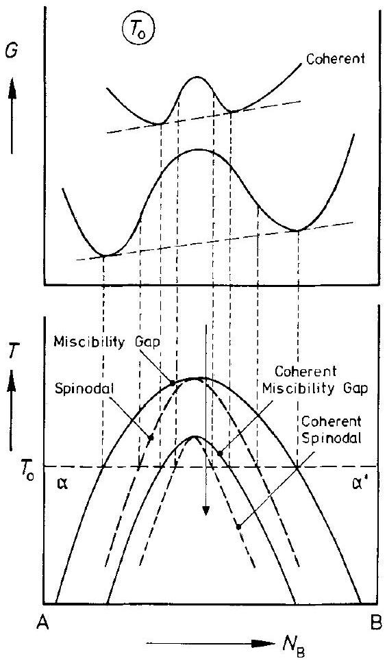
Figure 12-10. Gibbs energy vs. composition of a binary system with miscibility gap, and the corresponding $T-N_{\mathrm{B}}$ phase diagram. Arrow indicates quenching path for subsequent spinodal decomposition.

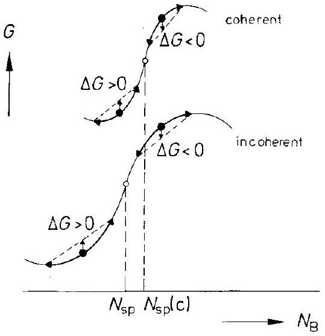
Figure 12-11. Gibbs energy vs. composition curve explaining metastable and unstable conditions inside and outside the (coherent and incoherent) spinodal during a local composition fluctuation.

If this strain energy of the coherent $\alpha-\alpha^{\prime}$ system is added to the other Gibbs energy contributions, both the total Gibbs energy and the spinodal curve are shifted as shown schematically in Figure 12-10.

From this descriptive introduction, it follows that the coherent spinodal decomposition is a continuous transport process occurring in a supersaturated matrix. It is driven by chemical potential gradients. Strain energy and concentration gradient energy have to be adequately included in the component chemical potentials. We expect that the initial stages of decomposition are easier to treat quantitatively than the later ones. The basic result will be the (directional) build-up of periodic variations in concentration [J. W. Cahn (1959), (1961), (1968)].

Let us first work out the chemical potentials, $\mu_{i}$, needed for the kinetic analysis. $\mu_{i}$ is constructed from three contributions. The first part represents the chemical potential as attributed to a homogeneous solid solution ( $\mu_{i}^{\ddagger}$ ). The second part is attributed to local concentration gradients. When the composition of a crystal changes, one has different average numbers of A- and B-nearest neighbors in subsequent lattice planes along the direction of transport. Therefore, the number of $\mathrm{A}-\mathrm{A}$, B-B, and A-B pairs are different from those in a homogeneous solution of the same composition. It has been discussed (see Section 10.2) that the energy change due to this asymmetry is, to first order, proportional to the curvature of the concentration profile.

The third contribution to the chemical potential is due to strain. If A and B atoms (ions) have different size, clustering results in elastic lattice distortions. By making a Fourier transformation, one can decompose the concentration profile into harmonic plane waves [D. DeFontaine (1975)]. The elastic energy contributions of these concentration waves are additive in the linear elastic regime and yield $E_{\mathrm{el}}$. Therefore, we may write

$$
E_{\mathrm{el}}=\frac{1}{2} \cdot n \cdot \sum \varepsilon(k) \cdot|C(k)|^{2}
$$

where $n$ is the number of lattice sites per unit volume, $C(k)$ the Fourier transform of the concentration profile, and $\varepsilon(k)$ the elastic energy of a harmonic concentration
wave with unit amplitude and wave vector $\boldsymbol{k}$. For cubic systems, $\varepsilon(k)$ can be expressed in terms of the distortion of the lattice parameter $a$, namely $d_{\mathrm{P}}=\left(\partial \ln a / \partial c_{i}\right)$, and the elasticity constants. For the simplest case of isotropic solids, this gives

$$
n \cdot \varepsilon=\frac{2 \cdot \bar{E}}{1-v} \cdot d_{\mathrm{P}}^{2}
$$

where $\bar{E}$ is Young's modulus and $v$ is Poisson's ratio. We thus obtain the chemical potential by back-transformation of $E_{\mathrm{el}}$ into composition coordinates and then adding the terms due to the homogeneous crystal and the gradient energy

$$
\mu_{i}=\mu_{i}^{\ddagger}-2 \cdot K \cdot \frac{\partial^{2} c_{i}}{\partial \xi^{2}}+\left(\frac{2 \cdot \bar{E}}{1-v}\right) \cdot d_{\mathrm{P}}^{2} \cdot\left(c_{i}-c_{i}^{0}\right)
$$

where $c_{i}^{0}$ refers to the initial concentration of the homogeneous supersaturated solution.

The following remark on the foregoing evaluation may be appropriate. As in irreversible thermodynamics (see Section 4.2), chemical potentials have again been introduced for non-equilibrium systems, but this time the gradients evolve on a rather small microscopic scale. In addition, the separate introduction of strain energy and gradient energy on this scale may be somewhat artificial. However, if we disregard these conceptual difficulties, we can derive ( $\partial \mu_{i} / \partial \xi$ ) from Eqn. (12.27) and introduce it as the driving force into the flux equation. We then obtain the continuity equation from the mass conservation of component $i(=\mathrm{A}, \mathrm{B})$

$$
\dot{c}_{i}=A_{1} \cdot \frac{\partial^{2} c_{i}}{\partial \xi^{2}}-A_{2} \cdot \frac{\partial^{4} c_{i}}{\partial \xi^{4}}+\text { nonlinear terms }
$$

with

$$
\begin{aligned}
& A_{1}=\left(\frac{\partial^{2} G}{\partial n_{i}^{2}}+\frac{2 \cdot \bar{E}}{1-v} \cdot d_{\mathrm{P}}^{2}\right) \cdot b_{i} \\
& A_{2}=\left(2 \cdot K / V_{m}\right) \cdot b_{i}
\end{aligned}
$$

( $\partial^{2} G / \partial n_{i}^{2}$ ) is negative inside the spinodal, the other terms are positive. $b_{i}$ is the mobility of the atomic particles of species $i$. One can show that Eqn. (12.28) is formally equivalent to Eqn. (12.13). Neglecting the nonlinear terms, Eqn. (12.28) can be satisfied by

$$
c_{i}(t)-c_{i}(0)=\mathrm{e}^{-\left[A_{1} \cdot\left(\frac{2 \pi}{\lambda}\right)^{2}+A_{2} \cdot\left(\frac{2 \pi}{\lambda}\right)^{4}\right] \cdot t} \cdot \cos \left(\frac{2 \pi}{\lambda}\right) \cdot \xi
$$

Equations of type (12.30) can be used to describe the kinetics of the spinodal decomposition process. If an arbitrary, spontaneous concentration fluctuation is Fourier analyzed, one finds that for

$$
\lambda>\lambda_{\text {min }}=2 \cdot \pi \cdot \sqrt{\frac{A_{2}}{\left|A_{1}\right|}}
$$

the term in brackets in Eqn. (12.30) becomes negative. Thus, all Fourier components of the arbitrary, spontaneous concentration fluctuation for which $\lambda>\lambda_{\min }$ will grow in amplitude with time. This is the spinodal decomposition. However, if $\lambda<\lambda_{\text {min }}$, the energy contained in both the concentration gradient and the elastic energy terms is too large to be overcome by the gain in chemical energy on clustering. Such concentration fluctuation modes do not grow.

Furthermore, for $\lambda=\sqrt{2} \cdot \lambda_{\min }$, the term in brackets in Eqn. (12.30) has a maximum. Therefore, after a sufficient time of continuous spinodal decomposition, zones with the $\lambda_{\max }$ periodicity will predominate. With other words, the decomposed solid solution exhibits periodicity in the $\xi$ direction, and the period length is $\lambda_{\text {max }} \cdot \lambda_{\text {min }}$ and $\lambda_{\text {max }}$ increase with strain, as can be seen from Eqns. (12.29) and (12.31). If the strain energy is high enough, $\lambda_{\max }$ may become sufficiently large so that spinodal decomposition does not take place any more.

According to Eqn. (12.30), $\tau=[]_{\min }^{-1}$ is the characteristic relaxation time of the decomposition process ([ ] represents the term in brackets). Let us assume $D_{i}=$ ( $b_{i} / R T$ ) to be on the order of $10^{-10} \mathrm{~cm}^{2} / \mathrm{s} . \tau$ is then on the order of a second or less. This means that in-situ observations of the spinodal process are hardly possible. If the sample has been quenched to room temperature, the decomposition has often already reached its final stage. The continuous spinodal decomposition for which the early stages are the pertinent ones cannot be verified in this way.

The discussion up to this point has been concerned essentially with metal alloys in which the atoms are necessarily electrically neutral. In ionic systems, an electric diffusion potential builds up during the spinodal decomposition process. The local gradient of this potential provides an additional driving force, which acts upon the diffusing species and this has to be taken into account in the derivation of the equivalents of Eqns. (12.28) and (12.30). The formal treatment of this situation has not yet been carried out satisfactorily [A. V. Virkar, M. R. Plichta (1983)]. We can expect that the spinodal process is governed by the slower cation, for example, in a ternary AX-BX crystal. The electrical part of the driving force is generally nonlinear so that linearized kinetic equations cannot immediately be applied.

Spinodal decomposition has been investigated with semiconducting oxides. An example is shown in Figure 12-12. It is observed that the $\mathrm{Co}_{2} \mathrm{TiO}_{4}-\mathrm{CoAl}_{2} \mathrm{O}_{4}$ spinel which has been undercooled into the region of its coherent spinodal (located 300 K below the critical temperature of ca. 1700 K ) exhibits spinodal decomposition. Upon prolonged annealing, the concentration wavelength $\lambda_{\text {max }}$ increases with time. This behavior resembles in some respects the Ostwald ripening of heterogeneously precipitated particles. Their linear dimensions grow as $t^{1 / n}$, where $n=3$ for diffusion controlled Ostwald ripening. Similar numbers for $n$ have been reported for the growth of spinodal decomposition zones. For $\mathrm{Co}_{2} \mathrm{TiO}_{4}-\mathrm{CoAl}_{2} \mathrm{O}_{4}$, however, it is observed that $n=1$. The coupling of component separation with the simultaneous ordering of cations or other correlations in this ionic multicomponent, multisublattice system may account for the unusual behavior.

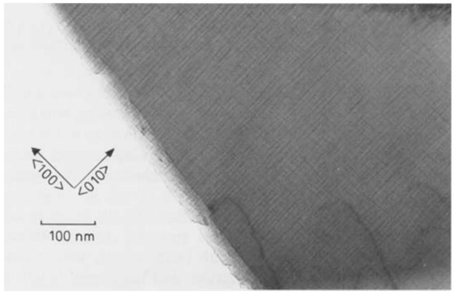
Figure 12-12. Spinodal demixing in the system $\mathrm{Co}_{2} \mathrm{TiO}_{4}-\mathrm{CoAl}_{2} \mathrm{O}_{4}$ at $T=973 \mathrm{~K}$ for 2 days. Bright field TEM; $\lambda \approx 5.5 \mathrm{~nm}$ [N. Burkert, et al. (1992)].

With this example, we will conclude the discussion of phase transformations. The field is immense regarding structure changes, local ordering, clustering, and diffusional component separation which all may couple by short range (e.g., magnetic) and long range (e.g., elastic or electric) interactions on a single sublattice or on various sublattices in the transition process. This is why we have introduced some leading concepts and exemplified them by discussing limiting cases. There are intensive theoretical activities in this field these days [E. C. Aifantis, J. Gittus (1986)].

## References

Aifantis, E. C., Gittus, J. (Eds.), (1986) Phase transformations, Elsevier, London
Binder, K. (1991) in: Mat. Science and Technology (Eds.: R. W. Cahn et al.), VCH-Verlag, Weinheim Burkert, N., et al. (1992) Ber. Bunsenges. Phys. Chem., 96, 1603
Cahn, J. W. (1959) Acta Met., 7, 18
Cahn, J. W. (1961) Acta Met., 9, 795
Cahn, J. W. (1968) Trans. AIME, 242, 166
Carpenter, M. A., Salje, E. (1989) Min. Mag., 53, 483
DeFontaine, D. (1975) in: Treatise of Solid State Chemistry (Ed.: N. B. Hannay), Chpt. 3, Plenum Press, New York
Johnson, W. J., Schmalzried, H. (1992) Acta Met. Mater., 40, 2337
Landau, L. D., Lifshitz, E. M. (1980) Statistical Physics, Pergamon Press, Oxford
Liebermann, D. S. (1970) in: Phase Transformations, Amer. Soc. for Metals, Metals Park, Ohio
Porter, D. A., Easterling, K. E. (1990) Phase Transformations in Metals, Chapman and Hall, London
Salje, E. (1985) Phys. Chem. Minerals, 12, 93
Salje, E. (1988) Phys. Chem. Minerals, 15, 336

Salje, E. (1990) Phase Transitions in Ferroelastic and Coelastic Crystals, Cambridge University Press, Cambridge
Salje, E. (1994), (Ed.), Phase Transitions 48, 1
Schmalzried, H. (1980) Progr. Sol. State Chem., 13, 119
Schmalzried, H. (1983) Ber. Bunsenges. Phys. Chem., 87, 726
Schmalzried, H., Pelton, A.D. (1973) Ber. Bunsenges. Phys. Chem., 77, 90
Schmalzried, H., Navrotsky, A. (1975) Festkörperthermodynamik, Verlag Chemie, Weinheim
Virkar, A. V., Plichta, M. R. (1983) J. Amer. Cer. Soc., 66, 451
Wagner, C., Schottky, W. (1931) Z. phys. Chem., B11, 163
Wayman, C.M. (1983) in: Physical Metallurgy, 3rd ed. (Eds.: R.W. Cahn, P. Haasen), NorthHolland, Amsterdam, p. 1031 ff.

## 13 Reactions in Solids Under Irradiation

### 13.1 Introduction

Photochemical reactions in gases and liquids are a central point of research in chemical kinetics. The absorption of photons changes the distribution of electrons in the available molecular states and thus initiates reactions. Analogous processes occur in crystals exposed to radiation. However, we have to take into account the specific constraints of the crystal structure. 1) Most atomic SE's which have been electronically excited by radiation are immobile. 2) Excitation into the conduction band results in delocalized electrons, and a possible charge transport over large distances. Cosmic radiation continuously irradiates solids. The traces and tracks of radiation induced processes can therefore be used to obtain information on the geological history of minerals. The photographic process is another example of a solid state reaction which is initially triggered by the absorption of photons.

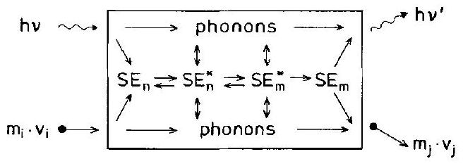
Figure 13-1. Processes due to photon and particle irradiation of a crystal (schematic). $\mathrm{SE}_{n}^{*}=n^{\text {th }}$ structure element in an excited state.

Particle irradiation of solids is of equal importance. The bombardment with atomic particles of construction materials in nuclear reactors and the evidence that the structure and microstructure of solids can undergo changes during particle irradiation is the immediate cause of many investigations on irradiation effects nowadays. Crystals isolated from heat and work exchange can gain energy by irradiation with particles or photons. The energy transfer is local and initiates various relaxation processes. In our context, we discuss mainly the interaction of particles and photons with SE's and how this affects solid state kinetics and dynamics. The ingoing and outcoming radiation defines the boundary conditions of the photon and particle induced physical and chemical reactions (Fig. 13-1). The basic problem is the transformation of the injected energy into the energy of phonons, structural defects, and chemical reaction products and their redistribution in space and time. In essence, we will treat two different situations. The first one is the disturbance of an equilibrium crystal by irradiation. The second one is the change in the reaction kinetics of a nonequilibrium system under irradiation. Systematically, we have to distinguish between reactions in homogeneous, inhomogeneous, and heterogeneous solids.

Photons (electromagnetic wave packets) have a wide energy spectrum (see Table 16-1) but negligible masses (momenta). Their interaction with matter thus primarily results in a change in the electron states and not in a noticeable momentum transfer to the absorbing SE's. Only with a sufficiently high photon energy will structural radiation damage be found. In an ionic crystal with absorbing point defects ( = color centers), for example, the absorbed photon excites the color center electron. Ionization of the center transfers the electron into delocalized (band) states. Thermalization of the excited electron occurs by radiation and/or interaction with the vibrational spectrum of the crystal (photon and/or phonon emission). In contrast, the irradiation of solids by neutral particles results in atomic collisions and a subsequent displacement of the SE's from their regular lattice sites. The displaced SE's are found either on regular lattice sites or in the interstitial lattice, leaving behind a corresponding number of vacancies. Subsequent secondary effects may be quite complex and will be discussed later. Ion irradiation of solids involves both atomic collisions and the excitation of electrons.

A number of processes follows the absorption of photon or particle energy which are important in technology. Let us mention several examples. 1) Sputtering is used for surface preparation. It can be combined with atomic analysis (mass spectroscopy) to obtain concentration profiles normal to the crystal surface with high spatial resolution (Secondary Ion Mass Spectroscopy, SIMS). 2) Ion implantation is performed in order to prepare crystals with predetermined compositions and thus properties in the near-surface region on a very small scale [T. Corts, et al. (1990)]. After particle irradiation, the product may be amorphous or metastable. 3) Silver halide photography has already been mentioned. It is the result of photon absorption. There are other solid state photochromic processes that can be used for imaging as well. 4) Secondary electron multipliers amplify a photon signal exciting primary electrons in a crystal. Multipliers are used for detecting and counting X-ray and $\gamma$-ray photons.

Surveys on radiation induced solid state reactions [e.g., F. V. Nolfi (1983); W. Hayes, A. M. Stoneham (1985); C. Abromeit, H. Wollenberger (1987)] illustrate a variety of effects in various chemical systems. Parameters such as dose, temperature, stress state, and, in particular, the type of irradiation determine both the mode and the kinetics of radiation induced reactions. We will concentrate on some fundamental considerations and discuss mainly the implications which radiation has on the kinetics of solid state reactions. We are especially interested in the occurrence of point defects in a crystal due to irradiation. Radiation induced non-equilibrium point defects either diffuse to sinks or react with each other in recombination, annihilation, or formation of associates, aggregates, and clusters. Reactions with impurities may also take place. Formally, we are dealing with a combined transportreaction problem of several distinct species. The corresponding partial differential equations are coupled by mass and charge conservation and by quasi-chemical reactions. The boundary conditions are established by the strength and geometry of the radiation resulting in homogeneously or inhomogeneously distributed defect sources, and also by the spatial distribution of sinks. Formal problems of this kind are often highly nonlinear.

### 13.2 Particle Irradiation

### 13.2.1 Basic Concepts

The conservation of energy and momentum is the fundamental requirement which determines the behavior of the SE's in metals, semiconductors, and ionic compounds irradiated by particles. Although we shall not deal with the basic physics of elementary collision processes in our context of chemical kinetics, let us briefly summarize some important results of collision dynamics which we need for the further discussion. If a particle of mass $m_{\mathrm{P}}$ and (kinetic) energy $E_{\mathrm{P}}$ collides with a SE of mass $m_{\mathrm{s}}$ in a crystal, the fraction of $E_{\mathrm{P}}$ which is transferred in this collision process to the SE is given by

$$
\frac{E}{E_{\mathrm{P}}}=\frac{4 \cdot m_{\mathrm{P}} \cdot m_{\mathrm{s}}}{\left(m_{\mathrm{P}}+m_{\mathrm{s}}\right)^{2}} \cdot \sin ^{2}\left(\frac{\Theta}{2}\right)
$$

where $\Theta$ is the scattering angle determined with reference to the center of mass. Obviously, the maximum energy transfer will occur if $m_{\mathrm{P}}=m_{\mathrm{s}}$ and $\Theta=\pi$. In this case $E=E_{P}$, independent of the scattering mechanism. The scattering mechanism, however, tells us what fraction of the knocked-on particles can be found between angle $\Theta$ and $(\Theta+\mathrm{d} \Theta)$ after the collision took place. The relevant quantity is the scattering cross section $\sigma(\Theta)$. If $\sigma$ is independent of $\Theta$, we name the process 'hard sphere scattering'. Examples of this type of scattering are the collisions of fast neutrons with atoms and ions in the crystal. If instead of neutral particles, electrons and ions collide whereby the interaction is coulombic, this collision mechanism is named 'Rutherford scattering'. For $\sigma(\Theta)$ we can derive

$$
\sigma(\Theta)=\frac{R^{2}}{(2 \cdot \sin (\Theta / 2))^{4}}
$$

where the length $R$ is determined by the balance between electrostatic and kinetic energy, that is,

$$
q_{\mathrm{P}} \cdot q_{\mathrm{s}} \cdot\left(\frac{e_{0}^{2}}{R}\right)=E_{\mathrm{P}}^{0} \cdot \frac{m_{\mathrm{s}}}{\left(m_{\mathrm{P}}+m_{\mathrm{s}}\right)}
$$

$E_{\mathrm{P}}^{0}$ is the initial energy in the laboratory frame and $q$ denotes the electric charge number. The integrated total cross section $\sigma_{t}=\int_{0}^{\pi} \int_{0}^{2 \pi} \sigma(\Theta) \cdot \sin \Theta \cdot \mathrm{d} \Theta \cdot \mathrm{d} \phi$ is larger for Rutherford scattering than for neutral particle scattering due to the influence of long range interactions with correspondingly low energy transfers. Depending on the details of the momentum and energy exchange, the knocked-on SE particles may be focused or spread. Channeling is found if the incoming particles are fast and move within the empty channels of the crystal structure along distinct directions. The colli-
sions then occur with small deflections only, unless a channel is blocked. From Eqn. (13.1) we can conclude that the maximal energy transfer of a 1 MeV electron $\rightarrow \mathrm{Cu}$ collision is less than 100 eV . The energy transfer of a 1 MeV neutron (positron) $\rightarrow \mathrm{Cu}$ collision is 61 keV , and, of course, the $\mathrm{Cu} \rightarrow \mathrm{Cu}$ collision transfers 1 MeV .

Subsequent to the collision, the most important event concerning kinetics is the displacement of regular SE's and the formation of Frenkel-type point defects. The corresponding formation reaction is

$$
p\left(E^{*}\right)+\mathrm{A}_{\mathrm{A}}+\mathrm{V}_{\mathrm{i}}=\mathrm{V}_{\mathrm{A}}+\mathrm{A}_{\mathrm{i}}^{*}+p\left(E^{\ddagger}\right) ; \quad E^{*}-E^{\ddagger}=\Delta E_{\mathrm{P}}
$$

where $p\left(E^{*}\right)$ indicates the incoming, and $p\left(E^{\ddagger}\right)$ the outgoing particle. The basic assumption introduces a threshold energy $E_{\mathrm{d}}$. If $\Delta E_{\mathrm{P}}>E_{\mathrm{d}}$, reaction (13.4) can take place. If $\Delta E_{\mathrm{P}}>2 \cdot E_{\mathrm{d}}$, the displaced $\mathrm{A}_{1}^{*}$ may possess sufficient kinetic energy to bring about secondary processes. Threshold energies for MgO and CaO are $c a .50 \mathrm{eV}$, both for cation and anion displacement. For $\mathrm{Al}_{2} \mathrm{O}_{3}$, the numbers are 18 eV and 75 eV respectively. If the incoming particle is an electron for which $m_{\mathrm{e}} \ll m_{\mathrm{SE}}$, its kinetic energy must be high in order to form the Frenkel pair ( $A_{i}+V_{A}$ ). In this case, however, it is quite seldom that $\mathrm{A}_{i}^{*}$ induces secondary displacements or other defect reactions. If the incoming particle is a fast neutron, large energy transfers $\Delta E_{\mathrm{P}}$ dominate through hard-sphere scattering. The high energy $\mathrm{A}_{i}^{*}$ point defects can then move long distances in the crystal lattice ( $\sim 1000 \AA$ ), eventually knocking more $\mathrm{A}_{\mathrm{A}}$ structure elements off the regular sites. The result is a strongly damaged region with many secondary $\mathrm{A}_{i}^{*}$ particles. Shortly after this primary energy exchange $\left(\Delta E_{\mathrm{P}} \approx E_{\mathrm{P}}^{*}\right)$, the damaged region may contain ca. $10^{2}$ Frenkel pairs. Heavy ion particles can produce even larger radiation damaged regions ( $c a .10 \mu \mathrm{~m}$ ). Electrically charged primary or secondary particles traversing the crystal can excite electrons into the conduction band. Whereas photons with energies in the eV range are needed to excite electrons across band gaps, charged atomic particles need energies of a few keV in order to bring about the same effect.

We conclude that a crystal which is continuously irradiated with particles of sufficient kinetic energy and in which no further reactions (e.g., phase formations) take place becomes more and more supersaturated with point defects. Recombination starts if the defects can move fast enough by thermal activation. A steady state is reached when the rates of defect production and annihilation (by recombination) are equal. In the homogeneous crystal, the change in local defect concentration ( $c_{\mathrm{d}}$ ) over time is given by (see Section 5.3.3)

$$
\dot{c}_{\mathrm{d}}=\vec{k} \cdot c_{\mathrm{A}_{\mathrm{A}}} \cdot c_{\mathrm{V}_{\mathrm{i}}}-\stackrel{k}{k} \cdot c_{\mathrm{V}_{\mathrm{A}}} \cdot c_{\mathrm{A}_{\mathrm{i}}}=\vec{K}-\stackrel{k}{k} \cdot c_{\mathrm{V}_{\mathrm{A}}} \cdot c_{\mathrm{A}_{\mathrm{i}}}
$$

The second term on the right hand side of Eqn. (13.5) describes the rate of recombination. In the case of diffusion controlled recombination, $\vec{k}$ and $\overleftarrow{k}$ may be calculated in terms of defect diffusivities and steady state concentrations. Without radiation, $\dot{c}_{\mathrm{d}}=0$, and the Frenkel equilibrium requires that $\bar{c}_{\mathrm{V}_{\mathrm{A}}} \cdot \bar{c}_{\mathrm{A}_{\mathrm{i}}}=\vec{K} / \vec{k}$. If a steady state is attained under irradiation, the rate of radiation produced defects ( $\dot{c}_{\mathrm{p}}$ ) add to the thermal production rate, and the sum is equal to the recombination rate. Therefore,

$$
\frac{\Delta c_{\mathrm{V}_{\mathrm{A}}}}{\bar{c}_{\mathrm{V}_{\mathrm{A}}}}=\sqrt{1+\frac{\dot{c}_{\mathrm{p}}}{\vec{K}}}-1 ; \Delta c_{\mathrm{V}_{\mathrm{A}}}=c_{\mathrm{V}_{\mathrm{A}}}-\bar{c}_{\mathrm{V}_{\mathrm{A}}}
$$

where $\Delta c_{\mathrm{V}_{\mathrm{A}}}$ is the steady state increase in Frenkel defect concentration due to homogeneous irradiation. However, the assumption of homogeneity cannot hold if the production of defects results in radiation damaged regions as mentioned above. In these regions, interstitials and vacancies are spatially separated and the local $\Delta c_{\mathrm{V}_{\mathrm{A}}}$ values are often much larger than if calculated by Eqn. (13.6). From Section 5.3.3, we can estimate that the diffusion controlled relaxation (recombination) time for Frenkel defects in silver halides is $c a .10^{-6} \mathrm{~s}$ at $100^{\circ} \mathrm{C}$ and so we can estimate the parameter $\vec{K}$ in Eqn. (13.6). In metals, the point defect concentrations are not coupled by the condition of electroneutrality. Therefore, $c_{\mathrm{V}}$ can differ from $c_{\mathrm{i}}$ if the point defects annihilate at sinks and their mobilities are not the same. Figure 13-2 plots the defect concentrations as a function of time. For $t_{1}<t<t_{2}$, the steady state is achieved by homogeneous defect reaction. For $t>t_{3}$, a new steady state is achieved. Now, distinct sinks become operative, the number of which remains constant.

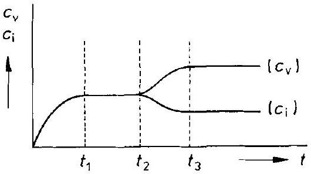
Figure 13-2. Concentration of point defects ( $c_{\mathrm{V}}, c_{\mathrm{i}}$ ) due to irradiation as a function of time (schematic).

For elemental solids and stoichiometric compound crystals, the primary influence of irradiation on their kinetic behavior is due to the increase in $\Delta c_{\mathrm{V}}\left(\cong \Delta c_{\mathrm{j}}\right)$. We would expect the enhancement in the component diffusion to be in proportion to the increase in the (average) defect concentrations, thus influencing all homogeneous, inhomogeneous, and heterogeneous solid state reactions.

Structural inhomogeneities due to dislocations, grain boundaries, or concentration fluctuations lead to spatial differences in point defect production rates during irradiation. Similarly, defect sinks are inhomogeneously distributed. Therefore, irradiation of solid solution crystals results in segregation and demixing of the components. The formal description is given by diffusion-reaction equations containing transport and reactive terms. The coupling conditions for the various fluxes and appropriate boundary conditions have to be taken into account. For example, in the case of a binary alloy (A, B), we have a rate equation of the following form

$$
\dot{c_{i}}=-\nabla j_{i}+\dot{r}_{i, \mathrm{p}}-\dot{r}_{i, \mathrm{a}} ; \quad i=\mathrm{A}_{\mathrm{Me}}, \mathrm{~V}_{\mathrm{Me}}, \mathrm{~B}_{\mathrm{Me}}, \mathrm{~A}_{\mathrm{i}}, \mathrm{~B}_{\mathrm{i}}
$$

Here, B are solute atoms, a and p indicate annihilation and production respectively. The concentrations of the different SE's ( $i$ ) are not independent, but are related to
each other through site balance and mass conservation ( $N_{\mathrm{A}}+N_{\mathrm{B}}=1$ ). If during irradiation a quasi-steady state is established, the fluxes of vacancies and interstitials are equal. The simplest situation is met if the distribution of sources is homogeneous and the external surfaces of the crystal are the only defect sinks, where the equilibrium concentrations are assumed to prevail.

Solutions for this type of kinetics can only be achieved numerically. Model calculations with constant kinetic parameters have been made [H. Wiedersich, et al. (1979)], however, the modeling of realistic transport (diffusion) coefficients which enter into the flux equations is most difficult since the jump rate $\nu_{\mathrm{A}} \neq \nu_{\mathrm{B}}$. Also, the individual point defects have limited lifetimes which determine the magnitude of correlation factors (see Section 5.2.2). Explicit modeling for dilute or non-dilute alloys can be found in [A. R. Allnatt, A. B. Lidiard (1993)].

Let us also mention an effect which does not occur in metals but does in continuously irradiated semiconducting and mixed conducting compounds such as AO or ( $\mathrm{A}, \mathrm{B}) \mathrm{O}$. Initially, supersaturated irregular SE's ( $\mathrm{A}_{\mathrm{i}}, \mathrm{V}_{\mathrm{A}} ; \mathrm{O}_{\mathrm{i}}, \mathrm{V}_{\mathrm{O}}$ ) are produced. The most mobile electroneutral pair (e.g., $\mathrm{A}_{i}, \mathrm{O}_{i}$ ) will be transported to the appropriate defect sink, driven by their concentration gradient. Since the mobilities of the various sorts of point defects are different, a diffusion potential builds up when they are electrically charged. In the semiconducting oxide, this diffusion potential corresponds to an internal oxygen potential gradient. At a large enough gradient (i.e., for sufficient radiation intensity) local oxidation or reduction eventually takes place. For AO , this means the formation of $\mathrm{A}_{3} \mathrm{O}_{4}$ or A . Here we have an example of phase instability due to irradiation that does not immediately stem from a segregation of components. Component segregation will, of course, occur if the mobilities of the drifting components are different in (A, B)O. An initially homogeneous solid solution may even decompose. These demixing processes (although with different boundary conditions) are identical to those thoroughly discussed in Chapter 8.

### 13.2.2 Radiation Effects in Halides (Radiolysis)

Particle irradiation effects in halides and especially in alkali halides have been intensively studied. One reason is that salt mines can be used to store radioactive waste. Alkali halides in thermal equilibrium are Schottky-type disordered materials. Defects in NaCl which form under electron bombardment at low temperature are neutral anion vacancies ( $\mathrm{V}_{\mathrm{X}}^{\mathrm{x}}$ ) and a corresponding number of anion interstitials ( $\mathrm{X}_{\mathrm{i}}^{\mathrm{x}}$ ). Even at liquid nitrogen temperature, these primary radiation defects are still somewhat mobile. Thus, they can either recombine ( $\mathrm{X}_{\mathrm{i}}^{\mathrm{X}}+\mathrm{V}_{\mathrm{X}}^{\mathrm{X}}=\mathrm{X}_{\mathrm{X}}^{\mathrm{X}}$ ) or form clusters. First, clusters will form according to $n \cdot \mathrm{X}_{\mathrm{i}}^{\mathrm{X}}=\mathrm{X}_{n, \mathrm{i}}^{\mathrm{X}}$. Also, $\mathrm{X}_{\mathrm{i}}^{\mathrm{X}}$ and $\mathrm{X}_{n, \mathrm{i}}^{\mathrm{X}}$ may be trapped at impurities. Later, vacancies $\mathrm{V}_{\mathrm{X}}^{\mathrm{X}}$ will cluster as well. If $\mathrm{X}_{2, \mathrm{i}}^{\mathrm{X}}$ is trapped by a vacancy pair $\left[\mathrm{V}_{\mathrm{A}} \mathrm{V}_{\mathrm{X}}\right]$ (which is, in other words, an empty site of a lattice molecule, i.e., the smallest possible 'pore') we have the smallest possible halogen molecule 'bubble'. Further clustering of these defects may lead to dislocation loops. In contrast, aggregates of only anion vacancies are equivalent to small metal colloid particles.

At sufficiently high temperatures, the radiation damage will recover by recombination of the point defects and their aggregates. The various annealing steps have been
followed by optical spectroscopy (identification of the color centers), by volume (lattice parameter) changes, by thermal analysis, and by yield strength measurements. The yield stress reflects the effect of the different defects and their aggregates on the dislocation motion.

### 13.2.3 Radiation Effects in Metals

Displacement, Frenkel defect formation, and cascade production are the primary processes when impinging particles ( $\mathrm{e}^{-}, \mathrm{n}, \mathrm{p}^{+}$, ions, atoms) knock into atoms in metal crystals. The impinging high energy particle looses its energy in a very small volume fraction of the crystal, at time scales that are smaller than that of a lattice vibration. The resulting defect cascade (Fig. 13-3) consists of a vacancy-rich core that is surrounded by a shell of interstitials ( $b_{\mathrm{i}}>b_{\mathrm{V}}$ ). Let us not be concerned with the initial hot stage of the cascade but note that right after thermalization, the number, $z_{\mathrm{d}}$, of produced point defects can be estimated according to the modified KinchinPease equation [H. G. Kinchin, R. S. Pease (1955)] as

$$
z_{\mathrm{d}}=0.8 \cdot\left(\frac{E_{\mathrm{P}}}{2}\right) \cdot E_{\mathrm{f}}^{-1}
$$

where $E_{\mathrm{f}}$ denotes the defect formation energy. When $E_{\mathrm{P}}>1 \mathrm{keV}$, the experimentally determined number of defects is smaller than the number calculated from Eqn. (13.8). A survey on defect cascades in metals has been presented by [R. S. Averback, D.N. Seidman (1987)].

Figure 13-3. Defect cascade formation under irradiation (schematic).

After thermalization, the defects begin to migrate, recombine, cluster, or precipitate provided the temperature is high enough to activate the motion of point defects. The various possible processes depend on defect concentration and their spatial distribution as well as on defect mobility and their interaction energies. As in nonmetallic crystals, internal and external surfaces act as sinks for at least a part of the radiation induced defects in metals.

Let us now consider effects which are specific for solid solutions ( $\mathrm{A}, \mathrm{B}$ ). The homogeneous and heterogeneous precipitation of new phases, ordering and disordering, amorphization, void formation, and formation of dislocation networks (growth of dislocation loops) have all been observed. When we begin with an ordered ( $\mathrm{A} \cdot \mathrm{B}$ ) compound, atom displacements during irradiation result in increasing disorder. Not only does the radiation cause disorder, but it also produces point defects which mobilize the atoms of components A and B . Since the ordered (equilibrium) state has the lowest Gibbs energy, disordered A and B tend to order themselves. Eventually, the system will reach a partially disordered steady state. If $s$ indicates the (long range) order parameter and the rate of disordering is $\vec{s}=-\vec{k} \cdot s$, whereas the rate of ordering is $\stackrel{+}{s}=-\stackrel{\rightharpoonup}{k}(1-s)$, the total change in time of $s$ is ( $\vec{s}+\bar{s}$ ) and we obtain for the steady state

$$
s_{\mathrm{st}}=\frac{\overleftarrow{k}}{\overleftarrow{k}+\stackrel{\rightharpoonup}{k}} ; \quad \dot{s}=0
$$

The problem then is the determination of the rate coefficients $\vec{k}$ and $\vec{k}$. They depend on the concentrations and jump frequencies of point defects, that is, on the radiation intensity. Their detailed analysis and the calculation of the steady state order parameter is most complicated due to the finite lifetime of defects and the different hopping frequencies of the interstitials and vacancies which exchange with either A or B .

The second mode of increasing the order of a multicomponent solid is the demixing by diffusional transport as treated in the previous chapter. During irradiation, local demixing occurs due to the point defect fluxes to the heterogeneous sinks. We have learned from Eqn. (13.6) that particle irradiation increases the point defect concentration above the thermal equilibrium value. A part of the supersaturated defects ( $\mathrm{V}, \mathrm{A}_{\mathrm{i}}, \mathrm{B}_{\mathrm{i}}$ ) recombines homogeneously, while the other part will annihilate at sites of repeatable growth (dislocations, etc.). Eventually, a steady state flux of point defects to the sinks, and a conjugate flux of the components $\mathbf{A}$ and $\mathbf{B}$, is observed. Since the jump frequencies of the components A and B of the alloy normally differ, the steady state flux of point defects transports the components A and B at different rates. This leads to a demixing of the solid solution (see Fig. 8-2), in particular, near the dislocation core because of the axial transport symmetry. We quantitatively treated the demixing induced by defect fluxes in Section 8.2. The direction and extent of this demixing depends in a linearized approach on the fraction $N_{\mathrm{A}}$ and the mobility ratio $D_{\mathrm{A}} / D_{\mathrm{B}}$. However, demixing during irradiation is complicated by the simultaneous recombinations of V and $\mathrm{A}_{\mathrm{i}}\left(\mathrm{B}_{\mathrm{i}}\right)$, which are determined by the number of encounters leading to complex jump correlations. The extent of component segregation depends on the flux density of defects and thus on the intensity of radiation ( $=$ defect supersaturation). If the flux density is sufficiently large, the alloy composition near a dislocation line may shift (due to segregation) into a different phase field. The subsequent formation of a new phase involves nucleation, but the nucleation energy is expected to be small at the dislocation line (see Section 6.2.2). In conclusion, thermodynamically stable alloys may become unstable during particle irradiation because of component demixing (segregation) and heterogeneous decomposition at sinks ( $=$ sites of repeatable growth) in the crystal. These effects occur
preferentially at elevated temperatures where appreciable defect fluxes can be sustained under irradiation.

Next, we may ask whether non-equilibrium defects such as dislocations, etc. are necessary for the demixing and decomposition under irradiation? We note that, in principle, a homogeneous alloy exposed to a steady supersaturation of point defects is unstable if the defect recombination rates depend on composition (component concentration). In modeling this idea, Martin and coworkers [G. Martin, R. Cauvin (1981)] have shown that the equilibrium distribution of normal concentration fluctuations (clusters) is disturbed by radiation induced point defects, provided they recombine preferentially at those clusters. This concept can be reformulated in terms of the above demixing model. Local concentration fluctuations influence the local defect recombination rates. If the lifetime of a fluctuation or cluster is longer than the average time between subsequent recombinations, point defect fluxes are directed towards clusters having the highest recombination rate. In this way, a (macroscopically) homogeneous alloy is destabilized by irradiation. It becomes inhomogeneous by self-sustaining demixing. This process also explains the experimental observation of stable single-phase solid solutions which become two-phase mixtures under irradiation (e.g., $(\mathrm{Al}, \mathrm{Zn}),(\mathrm{Cu}, \mathrm{Be})$, or (W, Re ) alloys). In other words, particle radiation shifts the critical temperature for decomposition, and an undersaturated alloy is able to demix. Synergetic effects may even lead to pattern formation in irradiated alloys.

A different approach to analyze the ordering of solid solutions by macroscopic transport of components during irradiation will also be presented [G. Martin, G. Bellon (1987)]. It is based on the idea of spinodal decomposition (see Section 12.3.2). Generalizing their results may be interesting and useful for other types of stochastic energy input into a given system on a microscopic scale (e.g., mechanical energy input by ball milling). The kinetic theory starts with the usual diffusion equation for the solid solution (A,B) and redefines the chemical diffusion coefficient during irradiation with respect to the 'ballistic' part of diffusional mixing. The ballistically and chemically driven fluxes are assumed to be additive in the inhomogeneous crystal. In analogy to a Darken-type chemical diffusion coefficient (see Eqn. (4.78)), the 'ballistic interdiffusion coefficient' is defined as

$$
\tilde{D}^{\#}=N_{\mathrm{A}} \cdot D_{\mathrm{B}}^{\#}+N_{\mathrm{B}} \cdot D_{\mathrm{A}}^{\#}
$$

The individual ballistic coefficients are given by

$$
D_{i}^{\#}=\frac{1}{2} \cdot \phi \cdot \sigma_{i} \cdot \bar{r}_{i}^{2}
$$

where $\phi$ is the radiation flux density, $\sigma_{i}$ and $r_{i}$ are the cross section and ballistic jump length after a replacement of the SE of sort $i$ respectively. Analogous to Eqn. (12.25) $f$, one can derive the condition of a stationary state by minimizing the following functional $F$ [G. Martin, G. Bellon (1987)]

$$
F=\int\left(f\left(N_{\mathrm{A}}(\xi)\right)+K \cdot \frac{\partial^{2} N_{\mathrm{A}}}{\partial \xi^{2}}+\frac{R T}{V_{m}} \cdot f\left(N_{\mathrm{A}}, \frac{\widetilde{D}^{\#}}{\tilde{D}}\right)\right) \cdot \mathrm{d} \xi
$$

The first two terms in the bracket correspond to the customary chemical free energy density and the gradient energy respectively. The third term takes into account the ballistic flux. $\tilde{D}$ is the Darken interdiffusion coefficient (Eqn. (4.78)), but adapted to the radiation induced increased defect concentration of the alloy.

An interesting result has been obtained after the introduction of the regular solution model [C. Wagner (1952)] into Eqn. (13.12). The free energy $f\left(N_{\mathrm{A}}, T\right)_{\text {irr }}$ of the alloy under irradiation equals the free energy $f$ of the alloy without irradiation but at an increased temperature, that is, $f\left(N_{\mathrm{A}}, T\right)_{\text {irr }}=f\left(N_{\mathrm{A}}, T+\Delta T\right) . \Delta T$ is found to be

$$
\frac{\Delta T}{T}=\frac{\tilde{D}^{\#}}{\tilde{D}}
$$

Equation (13.13) suggests that the steady state of the alloy under irradiation is the same as that of the non-irradiated alloy at $T+\Delta T$. Explicitly, one obtains

$$
\Delta T=\text { const } \cdot \sqrt{\phi} \cdot \mathrm{e}^{\frac{E_{\mathrm{v}}}{2 \cdot R T}}
$$

where $E_{\mathrm{V}}$ is the activation energy for the vacancy migration. The higher $T$ is, the less the irradiated alloy differs from the non-irradiated one. Conversely, the higher $E_{\mathrm{V}}$ is, the more the irradiated and non-irradiated alloys differ. The foregoing result is remarkable. If energies other than thermal energies are pumped into a system on an atomic scale, its kinetic coefficients behave 'as if' the system had been heated to a higher temperature ( $T+\Delta T$ ). If one could generalize this result, one would be able to formally handle other energy inputs (e.g., mechanical) into a crystal. Similar questions will be resumed in Chapter 14.

### 13.3 Photon Irradiation

### 13.3.1 Basic Concepts

Photons have a wide spectrum of energies ranging from hard $\gamma$-rays to radiowaves (see Table 16-1). A thermalization of absorbed photon energy which directly increases the (average) temperature is not of interest to us. Energies of ca. 0.1 eV and more are needed in order to induce structure elements to change sites and move. This limit leads us to neglect individual absorption phenomena beyond the IR region ( $>10 \mu \mathrm{~m}$ ) since they can not immediately influence atomic transport. Photochemical reactions with photons of low energy can be observed in solids which do not result in the formation of atomic point defects. The photon induced isomerization of a crystal of $\left[\mathrm{Co}\left(\mathrm{NH}_{3}\right)_{5} \mathrm{NO}_{2}\right] \cdot \mathrm{Cl}_{2}$ is such an example. This crystal strongly absorbs photons in the visible region and forms only a thin surface layer of the isomer. Since the isomers differ in their lattice parameters, the crystal is stressed and will bend.

Compared with the momentum of impinging atoms or ions, we may safely neglect the momentum transferred by the absorbed photons and thus we can neglect direct knock-on effects in photochemistry. The strong interaction between photons and the electronic system of the crystal leads to an excitation of the electrons by photon absorption as the primary effect. This excitation causes either the formation of a localized exciton or an ( $\mathrm{e}^{\prime}+\mathrm{h}^{*}$ ) defect pair. Non-localized electron defects can be described by planar waves which may be scattered, trapped, etc. Their behavior has been explained with the electron theory of solids [A. H. Wilson (1953)]. Electrons which are trapped by their interaction with impurities or which are self-trapped by interaction with phonons may be localized for a long time (in terms of the reciprocal Debye frequency) before they leave their potential minimum in a hopping type of process activated by thermal fluctuations.

Let us formulate the various photon absorption processes in chemical shorthand as follows

$$
\begin{gathered}
h v+(\mathrm{AX})_{\text {cryst }}=\mathrm{e}^{\prime}+\mathrm{h}^{*} \\
h v+\mathrm{A}_{\mathrm{A}}^{\mathrm{x}}=\left[\mathrm{A}_{\mathrm{A}}^{*}+\mathrm{e}^{\prime}\right]^{*} \rightarrow \mathrm{~A}_{\mathrm{A}}^{*}+\mathrm{e}^{\prime} \\
h v+\mathrm{A}_{\mathrm{A}}^{\mathrm{x}}=\left[\mathrm{A}_{\mathrm{A}}^{\prime}+\mathrm{h}^{*}\right]^{*} \rightarrow \mathrm{~A}_{\mathrm{A}}^{\prime}+\mathrm{h}^{*} \\
h v+\mathrm{X}_{\mathrm{X}}^{\mathrm{x}}=\left[\mathrm{X}_{\mathrm{X}}^{\prime}+\mathrm{h}^{*}\right]^{*} \rightarrow \mathrm{X}_{\mathrm{X}}^{\prime}+\mathrm{h}^{*} \\
h v+\mathrm{X}_{\mathrm{X}}^{\mathrm{x}}=\left[\mathrm{X}_{\mathrm{X}}^{*}+\mathrm{e}^{\prime}\right]^{*} \rightarrow \mathrm{X}_{\mathrm{X}}^{*}+\mathrm{e}^{\prime}
\end{gathered}
$$

Since recombination occurs as well, Eqns. (13.15)-(13.19) indicate that under (constant) photon irradiation, a steady state concentration of new species (excitons, $\mathrm{A}_{\mathrm{A}}^{\bullet}$, $A_{A}^{\prime}$, etc.) is eventually established in the crystal. These defects can recombine or undergo reactions to form other irregular SE's, thus changing the whole equilibrium defect chemistry. Since the defect chemistry is responsible for the reactivity in the solid state, it is not surprising that photon irradiation affects the reaction kinetics. If excited electronic defects return to the ground state, the corresponding energy change can be converted into phonon energy which may cause the formation of other atomic defects. In inhomogeneous and heterogeneous nonmetallic crystals with prevailing electronic equilibrium and mobile electronic charge carriers, electric potential gradients exist of necessity. If by photon absorption ( $\mathrm{e}^{\prime}+\mathrm{h}^{*}$ )-pairs are formed in these crystals (see Eqn. (13.15)), the $\mathrm{e}^{\prime}$ and $\mathrm{h}^{*}$ will be separated from each other by the action of the electric field. Given an external electric circuit, a photocurrent can thus flow. This basic photochemical reaction is the fundamental process of the photovoltaic conversion of solar energy into electric energy (Fig. 13-4).

Mobile electronic defects may be understood as more or less localized reducing or oxidizing agents. They can react with other structure elements $S_{i, x}^{q}$ as follows

$$
\mathrm{e}^{\prime}+\mathrm{S}_{i, \varkappa}^{q}=\mathrm{S}_{i, \varkappa}^{q-1}, \quad \mathrm{~h}^{\bullet}+\mathrm{S}_{i, \varkappa}^{q}=\mathrm{S}_{i, \varkappa}^{q+1}
$$

However, in order to perform intracrystalline chemical reactions that affect the components and not just the SE's, empty lattice sites (vacancies) constituting a complete

Figure 13-4. Scheme of a photovoltaic cell. $h v=$ photon; ( $e^{\prime}, h^{*}$ ) = photoinduced electron-hole pair; $\varepsilon_{\mathrm{c}}, \varepsilon_{\mathrm{v}}=$ conduction and valence band edge respectively. $\varepsilon_{\mathrm{F}}=$ Fermi energy (electrochemical electron potential). $\Delta \varepsilon_{\mathrm{F}}(\mathrm{p})$, $\Delta \varepsilon_{\mathrm{F}}(\mathrm{n})=$ change in Fermi energy due to steady state electron-hole separation in the diffusion potential zone of a p-n junction.

lattice molecule must be involved. Otherwise, photolytic reactions (decomposition) can occur only at internal or external surfaces as sites of repeatable growth for the lattice molecules $M$ (see Section 2.2.1, Eqn. (2.23)). Let us discuss an example. If $\mathrm{X}_{\mathrm{X}}^{*}$ has been formed during photon irradiation by reaction (13.19), the formation of a molecule $\mathrm{X}_{2}$ of component X can take place as follows

$$
X_{X}^{*}+X_{X}^{*}+\left[V_{A}^{\prime}+V_{X}^{*}\right]=X_{2}[]+2 V_{X}^{*}
$$

or, equivalently,

$$
2 X_{X}^{*}+V_{A}^{\prime}=X_{2}[]+V_{X}^{*}
$$

where the symbol [ ] denotes the vacant site of a lattice molecule. By adding Eqn. (13.19) to Eqn. (13.22) or, equivalently, by using the modified photoreaction $h v+\mathrm{AX}=\mathrm{A}_{\mathrm{A}}^{\mathrm{x}}+\mathrm{X}_{\mathrm{X}}^{*}+\mathrm{e}^{\prime}$ for that purpose, one obtains

$$
2 h v+2 \mathrm{AX}+\mathrm{V}_{\mathrm{A}}^{\prime}=\mathrm{X}_{2}[]+2 \mathrm{~A}_{\mathrm{A}}+\mathrm{V}_{\mathrm{X}}^{\bullet}+2 \mathrm{e}^{\prime}
$$

which describes the photolytic decomposition of a crystal AX with Schottky disorder ( $\mathrm{V}_{\mathrm{A}}, \mathrm{V}_{\mathrm{X}}$ ) in terms of the SE's. The subsequent reactions between electrons, electron holes, and atomic point defects can be registered using color center spectroscopy, particularly in halides. As an example, annealing of irradiated crystals leads to a time-dependent bleaching which reflects the kinetics of point defect reactions, e.g., [J. Z. Damm, F. C. Tompkins (1961)].

### 13.3.2 Radiation Effects in Halides (Photolysis)

When AX (e.g., KCl ) is irradiated with X-rays (or electrons), pairs of anionic Frenkel defects (i.e., $\mathrm{X}_{\mathrm{i}}^{\mathrm{X}}, \mathrm{V}_{\mathrm{X}}^{\mathrm{X}}$ ) are formed. Most of them recombine, but a small fraction separates and becomes so-called $\mathrm{H}\left(\mathrm{X}_{\mathrm{i}}^{\mathrm{X}}\right)$ and $\mathrm{F}\left(\mathrm{V}_{\mathrm{X}}^{\mathrm{X}}\right)$ centers. Depending on the tempera-
ture, various subsequent reactions between these primary irradiation products and other SE's take place. 1) $\mathrm{X}_{n, \mathrm{i}}^{\mathrm{X}}$ clusters ( $\mathrm{V}_{n}$ centers) form according to $n \cdot \mathrm{X}_{\mathrm{i}}^{\mathrm{X}}=\mathrm{X}_{n, \mathrm{i}}^{\mathrm{X}} .2$ ) $2 \mathrm{X}_{\mathrm{i}}^{\mathrm{X}}$ or $\mathrm{X}_{2, \mathrm{i}}^{\mathrm{X}}$ are trapped by a lattice anion $\mathrm{X}_{\mathrm{X}}$ to become $\mathrm{X}_{3}^{-}$. 3) $n \cdot \mathrm{~V}_{\mathrm{X}}^{\mathrm{X}}=\mathrm{V}_{n, \mathrm{X}}^{\mathrm{X}}$, which is the formation of an anion vacancy cluster. 4) $\mathrm{X}_{\mathrm{i}}^{\mathrm{X}}$ and $\mathrm{V}_{\mathrm{X}}^{\mathrm{X}}$ structure elements aggregate as dislocation loops. This has been postulated to occur when $\mathrm{X}_{2}$ molecules are arranged on $\mathrm{V}_{\mathrm{X}}^{\mathrm{x}}$ sites. 5) The aggregation of initially separated anion vacancies may lead to metal colloids. The aggregation of $\mathrm{X}_{n, \mathrm{i}}^{\mathrm{X}}$ clusters can destroy the crystal lattice with small $\mathrm{X}_{2}$ gas bubbles as a result. After a sufficient rise in temperature and length of relaxation time, the products of the radiation damage are eventually healed by continuous recombination. Healing can occur internally and externally, unless the surroundings of the irradiated crystal have already reacted irreversibly with the products of photolysis. The kinetics of photolysis has been registered by optical and other spectroscopies (e.g., ESR), by thermal analysis (calorimetry), by volumetry, or by observing mechanical properties (e.g., yield stress). The relaxation kinetics in homogeneous crystals can be analyzed in terms of (diffusion controlled) chemical kinetics as described in Section 5.3.3. If, however, dislocation loops, colloid particles, or bubbles act as sites (surfaces) or repeatable growth, transport as represented by Eqns. (4.99) and (4.100) is the formal frame and can be used with the appropriate boundary conditions to obtain explicit solutions.

Most of the irregular SE's formed by irradiation interact with impurities that are the native irregular SE's of the crystal. Impurities interact with the irradiation products either by their stress field or, if heterovalent, by the electrostatic (Coulomb) field. Photolysis (radiolysis) is found in other than halide crystals as well. In oxides, the production of Frenkel pairs under photon irradiation is negligible. This has been ascribed to the fact that the reaction $\mathrm{O}^{2-}+\mathrm{O}^{-}=\mathrm{O}_{2}^{3-}$ is endothermic, whereas the reaction $\mathrm{X}^{-}+\mathrm{X}^{\mathrm{x}}=\mathrm{X}_{2}^{-}$is exothermic.

### 13.3.3 Ag Based Photography

An instructive example of the complex solid state processes following photon irradiation are the various stages of photographic imaging with photosensitive Ag -halides [see, for example, H. Schmalzried (1981)]. In the following, the basic explanation of the main reaction steps is briefly outlined. The different stages of the photographic process are 1 ) the primary process of radiation absorption, 2 ) the formation of the latent image, and 3) the developing of the latent image by an externally applied redox buffer with a sufficiently high electron potential able to reduce the silver ions. We will discuss only those aspects which deal with radiation effects proper and solid state photochemistry.

Optical absorption by small AgBr crystallites results primarily in the formation of pairs of free electronic carriers ( $\left.\mathrm{e}^{\prime}+\mathrm{h}^{*}\right)$. The quantum efficiency of this photoreaction is high. Electron holes are likely to be trapped by impurities (e.g., $\mathrm{Cu}_{\mathrm{Ag}}^{+}, \mathrm{S}_{\mathrm{Br}}^{2-} \rightarrow \mathrm{Cu}_{\mathrm{Ag}}^{2+}, \mathrm{S}_{\mathrm{Br}}^{-}$). Electrons, in contrast, are trapped by $\mathrm{Ag}_{\mathrm{i}}^{\bullet}$ to yield neutral $\mathrm{Ag}_{\mathrm{i}}^{\mathrm{x}}$ interstitials. If the crystallites of AgBr are embedded in a properly chosen emulsion gelatine, a large part of them and, in particular, their surface region are exposed to a high internal electric field which originates from surface charges. This electric field
causes the separation of electrons and electron holes formed by the primary photoreaction. Thus, the electric field and the subsequent trapping of $\mathrm{e}^{\prime}$ and $\mathrm{h}^{\cdot}$ reduce their recombination rate.

Even at room temperature, the neutral interstitial point defects $\mathrm{Ag}_{\mathrm{i}}^{\mathrm{x}}$ are sufficiently mobile to cluster at appropriate places, preferentially at internal or external surfaces. To this end, $\mathrm{AgBr}(\mathrm{Ag}(\mathrm{Br}, \mathrm{I}))$ crystals with dimensions of $0.1-1 \mu \mathrm{~m}$ are emulgated in the customary photographic films. Their growth is carefully controlled in order to make sure that the aggregation of $\mathrm{Ag}_{\mathrm{i}}^{\mathrm{x}}$ structure elements into clusters occurs mainly at the surface and photoelectrons are not trapped by internal impurities. Under these circumstances, small Ag metal clusters ( $\mathrm{Ag}_{n}, n>3$ ) will form on the surface of the silver-halide crystallites, and as long as the electron holes can be kept in deep traps, the Ag clusters remain stable enough to preserve the latent image.

Later, this latent image can be made visible by the chemical process which is named developing. Developers ( = appropriate redox buffers) are substances which reduce AgBr only in the presence of Ag clusters acting as catalysts when they are located at the surface of the AgBr grain. Non-irradiated grains remain unaffected. If the latent image grain (ca. $10^{9} \mathrm{Ag}$ atoms) with a single $\mathrm{Ag}_{n}$ catalyst ( $n>3$ ) is fully reduced and we assume that 10-100 photons were needed in order to form the $\mathbf{A g}_{n}$ speck ( $n>3$ ) on the surface, the enhancement factor is calculated to be $10^{7}-10^{8}$. The recombination of electrons and electron holes reduces the efficiency of the photographic process. The continuous growth of the silver nuclei on the crystallite surface, which has easy access to the developer, is considerably facilitated if the nucleation took place at a kink site. If the lattice site at the end of a surface kink is occupied by a $\mathrm{Br}^{-}$ion, the effective charge of this site is $-\frac{1}{2}$. When the $\mathrm{Ag}_{\mathrm{i}}^{+}$ion is attracted and placed at the kink site, its effective charge becomes $+\frac{1}{2}$. Thus, a new photoelectron can be attracted and another sequence of additions can begin.

Reactions of photoelectrons with cation defects as described here have also been found for mercury halides or for oxalates of Fe and Pd . Lead halides, in contrast, possess mobile anions which can trap photoelectron holes. In this case, the absorption of photons leads immediately to a positive image, where the illuminated areas appear light.

## References

Abromeit, C., Wollenberger, H. (Eds.) (1987) Mat. Sci. Forum, 15-18
Allnatt, A. R., Lidiard, A. B. (1993) Atomic Transport in Solids, Cambridge University Press, Cambridge
Averback, R. S., Seidman, D.N. (1987) Mat. Sci. Forum, 15-18, 963
Corts, T., et al. (1990) Appl. Phys., A51, 537
Damm, J.Z., Tompkins, F.C. (1961) Disc. Far. Soc., 31, 184
Hayes, W., Stoneham, A.M. (1985) Defects and Defect Processes in Nonmetallic Solids, Wiley, New York

Kinchin, H. G., Pease, R.S. (1955) Rep. Progr. Phys., 18, 1
Martin, G., Bellon, G. (1987) Mat. Sci. Forum, 15-18, 1337
Martin, G., Cauvin, R. (1981) Phys. Rev., B23, 3322
Nolfi, F. V. (Ed.) (1983) Phase Transformation during Irradiation, Appl. Sci. Publ., London
Schmalzried, H. (1981) Solid State Reactions, Verlag Chemie, Weinheim
Wagner, C. (1952) Thermodynamics of Alloys, Addison-Wesley Publ., Reading
Wiedersich, H., et al. (1979) J. Nucl. Mat., 83, 98
Wilson, A.H. (1953) The Theory of Metals, Cambridge Press, London

## 14 Influence of Mechanical Stress

### 14.1 Introduction

This chapter is concerned with the influence of mechanical stress upon the chemical processes in solids. The most important properties to consider are elasticity and plasticity. We wish, for example, to understand how reaction kinetics and transport in crystalline systems respond to homogeneous or inhomogeneous elastic and plastic deformations [A.P. Chupakhin, et al. (1987)]. An example of such a process influenced by stress is the photoisomerization of a $\left[\mathrm{Co}\left(\mathrm{NH}_{3}\right)_{5} \mathrm{NO}_{2}\right] \mathrm{Cl}_{2}$ crystal set under a (uniaxial) chemical load [E. V. Boldyreva, A. A. Sidelnikov (1987)]. The kinetics of the isomerization of the $\mathrm{NO}_{2}$ group is noticeably different when the crystal is not stressed. An example of the influence of an inhomogeneous stress field on transport is the redistribution of solute atoms or point defects around dislocations created by plastic deformation.

The influence of plastic deformation on the reaction kinetics is twofold. 1) Plastic deformation occurs mainly through the formation and motion of dislocations. Since dislocations provide one dimensional paths (pipes) of enhanced mobility, they may alter the transport coefficients of the structure elements, with respect to both magnitude and direction. 2) They may thereby decisively affect the nucleation rate of supersaturated components and thus determine the sites of precipitation. However, there is a further influence which plastic deformations have on the kinetics of reactions. If moving dislocations intersect each other, they release point defects into the bulk crystal. The resulting increase in point defect concentration changes the atomic mobility of the components. Let us remember that supersaturated point defects may be annihilated by the climb of edge dislocations (see Section 3.4). By and large, one expects that plasticity will noticeably affect the reactivity of solids.

If local stresses exceed the forces of cohesion between atoms or lattice molecules, the crystal cracks. Micro- and macrocracks have a pronounced influence on the course of chemical reactions. We mention three different examples of technical importance for illustration. 1) The spallation of metal oxide layers during the high temperature corrosion of metals, 2) hydrogen embrittlement of steel, and 3) transformation hardening of ceramic materials based on energy consuming phase transformations in the dilated zone of an advancing crack tip.

So far, we have tacitly assumed that the stresses were applied externally. However, stresses which are induced by local changes in component concentrations and the corresponding changes in the lattice parameters during transport and reaction are equally important. These self-stresses can strongly influence the course of a solid state reaction. Similarly, coherent, semicoherent, and even incoherent interfaces during heterogeneous solid state reactions are sources of (local and nonlocal) stress. The
stress distribution in solids therefore depends decisively on the type and geometry of the internal and external boundaries. The stress component normal to an external surface necessarily vanishes. We will see in Section 14.3 that transport equations also contain, in addition to the normal (local) gradient terms, integrals over the whole crystal of the driving forces if we assimilate transport theory and the theory of elasticity. This may result in interesting feedback effects.

Mechanochemistry is often understood more specifically as the study of structural and compositional changes of solids resulting from the input of mechanical energy, for example, by 'friction' in a milling process. The oldest experience and a striking example of this kind is probably the use of flints to light a fire and, in particular, when more recently medieval guns (flintlock weapons) were fired. Similarly, geochemists know about the modifications of transformation reactions under the influence of tectonic movements. Tammann observed that not all the mechanical energy input (if a solid is treated accordingly) transforms into heat. Several percent of the input can be stored as (potential) energy and can subsequently enhance solid state reactions if they take place with or in these solids. Today, we can say that the activation of solid state reactions by mechanical energy input is rather common. The corresponding subjects are called mechanochemistry and tribochemistry. The diversity of possible reaction steps during the dissipation of locally injected mechanical energy render most of the proposed models and their experimental verification ambiguous. Before we discuss examples in the later sections of this chapter, let us first introduce some basic relations concerning stressed solids.

### 14.2 Thermodynamic Considerations

### 14.2.1 Thermodynamics of Stressed Solids

A defining characteristic of a solid is the ability to resist shear. Therefore, stress is an additional feature which has to be taken into account when the physical chemistry of solids is at issue. Gibbs treated the thermodynamics of stressed solids a century ago in his classic work Equilibrium of Heterogeneous Substances under the title "The Conditions of Internal and External Equilibrium for Solids in Contact with Fluids with Regard to all Possible States of Strain of the Solid". We have already mentioned in the introduction that stress is an unavoidable result of chemical processes in solids. Let us therefore briefly discuss the basic concepts of the thermodynamics of stressed solids.

To this end, we consider the thermodynamic functions of a homogeneously stressed solid, e.g., [L. D. Landau, E.M. Lifshitz (1989); W. W. Mullins, R. Sekerka (1985)]. In contrast to the unstressed solid, the internal energy of which is $U\left(S, V, n_{i}\right)$, the internal energy of a stressed solid is given as $U\left(S, V u_{j k}, n_{i}\right)$. For the total differential of the internal energy one has ${ }^{1}$

[^1]$$
\mathrm{d} U=T \mathrm{~d} S+V \sigma_{j k} \cdot \mathrm{~d} u_{j k}+\sum \mu_{i} \mathrm{~d} n_{i}
$$
where $u_{j k}$ are the components of the strain tensor $\hat{u}$ and $\sigma_{j k}$ are the components of the stress tensor $\hat{\sigma}$, both of which are symmetric tensors [J.F. Nye (1985)]. From Eqn. (14.1), it follows that
$$
\sigma_{j k}=\frac{1}{V} \cdot\left(\frac{\partial U}{\partial u_{j k}}\right)_{S, n_{i}}=\frac{1}{V} \cdot\left(\frac{\partial F}{\partial u_{j k}}\right)_{T, n_{i}}
$$
where $F$ is the Helmholtz free energy. The generalized Gibbs-Duhem relation reads ( $V u_{j k} \cdot \mathrm{~d} \sigma_{j k}$ instead of $V \mathrm{~d} P$ in the hydrostatically stressed system)
$$
S \mathrm{~d} T+V u_{j k} \cdot \mathrm{~d} \sigma_{j k}+\sum n_{i} \mathrm{~d} \mu_{i}=0
$$
and thus
$$
V u_{j k}=-\left(\frac{\partial G}{\partial \sigma_{j k}}\right)_{T, n_{i}}
$$

From Eqn. (14.3), one can easily derive the cross relations between extensive and intensive state variables as, for example,

$$
\frac{\partial u_{i}}{\partial u_{j k}}=-V\left(\frac{\partial \sigma_{j k}}{\partial n_{i}}\right)
$$

By expanding the Helmholtz free energy $F$ at constant $T$ in an arithmetic series in terms of $u_{j k}$, we see that the linear terms vanish in view of the equilibrium condition ( $\sigma_{j k}=0$ for unstressed crystals). Thus, from the Euler relation for homogeneous functions of second order, $F$ is given as

$$
F(\sigma)-F(0)=w=\frac{V}{2} \sigma_{j k} \cdot u_{j k}
$$

For a uniaxial load along the principal axis, we have according to Hooke's law $\mathrm{d} u_{1}=(1 / \bar{E}) \mathrm{d} \sigma_{1}\left(\mathrm{~d} u_{2}=\mathrm{d} u_{3}=-(v / \bar{E}) \mathrm{d} \sigma_{1}\right)$. Thus, the change in $F$ due to this deformation is

$$
w=\frac{V}{2} \frac{\sigma_{1}^{2}}{\bar{E}}, \quad \frac{w}{V}=\frac{1}{2 \bar{E}} \sigma_{1}^{2}
$$

where $\bar{E}$ is Young's modulus and $v$ is Poisson's ratio. In the context of transport theory the most important thermodynamic quantity, however, is the chemical potential and its gradient. Chemical potential gradients occur in inhomogeneous solids so that in our context here, the inhomogeneity is related to the inhomogeneous stress. As long as there is a mobile component in the crystal, its chemical potential (which at equilibrium is constant throughout) can always be defined and is measurable. It is defined as the reversible work needed to isothermally add $\mathrm{d} n_{i}$ moles of compo-
nent $i$ at constant stress to the volume $V$, divided by $\mathrm{d} n_{i}$. In view of Eqn. (14.1), the chemical potential $\mu_{i}(\sigma, T)$ can be written as

$$
\mu_{i}(\sigma, T)=\left(\frac{\partial G}{\partial n_{i}}\right)_{n_{j}, \sigma, T}=\left(\frac{\partial F}{\partial n_{i}}\right)_{n_{j}, \sigma, T}-V \sigma_{j k} \cdot \mathrm{~d} u_{j k}
$$

Therefore, by introducing Eqn. (14.6)

$$
\mu_{i}(\sigma, T)-\mu_{i}(0, T)=\frac{\partial}{\partial n_{i}}\left(\frac{V}{2} \sigma_{j k} \cdot u_{j k}\right)-\sigma_{j k} \cdot V \mathrm{~d} u_{j k}
$$

The first term on the right hand side of Eqn. (14.9) is $w_{i}$, the partial free energy difference between stressed and unstressed solutions. For uniaxial stress along a principal axis (1),

$$
w_{i}=\frac{\sigma_{1}^{2}}{2}\left(\frac{V_{i}}{\bar{E}}-\frac{V}{\bar{E}^{2}} \cdot \frac{\partial \bar{E}}{\partial n_{i}}\right)
$$

The second term is the reversible work done at a given stress by the volume expansion (contraction) $V \mathrm{~d} u_{j k}$ if one adds $\mathrm{d} n_{i}$ to the system under stress. For uniaxial stress, this is ( $q=$ cross section area; $\Delta \xi_{1}=$ crystal length)

$$
\sigma_{1} \cdot\left(V \mathrm{~d} u_{1}\right)=\sigma_{1} \cdot\left(q \Delta \xi_{1} \frac{\partial \ln \Delta \xi_{1}}{\partial n_{i}}\right)=\sigma_{1} \frac{V_{i}}{3}
$$

if the crystal is isotropic. Accordingly, for stress along the three principal axes, $\sigma=\sigma_{1}+\sigma_{2}+\sigma_{3}\left(=\sigma_{11}+\sigma_{22}+\sigma_{33}\right)$

$$
\sigma \cdot(V \mathrm{~d} u)=\sigma V_{i}
$$

Considering $w_{i}$ can normally be neglected relative to $\left(\sigma V_{i}\right)$ because $(\sigma / \bar{E}) \ll 1$, one finally obtains for the chemical potential

$$
\mu_{i}(\sigma, T) \cong \mu_{i}(0, T)-\sigma V_{i}
$$

The term $\mu_{i}(0, T)\left(=\mu_{i}\left(0, T, N_{k}\right)\right)$ plays the role of a standard potential with respect to the stressed state. For practical applications of Eqn. (14.12) one assumes that $V_{i}$, the partial molar volume of component $i$, does not noticeably depend on concentration nor on stress. In the case of hydrostatic pressure, $\sigma V_{i}$ is then $\int \sigma \cdot \mathrm{d} V_{i} =3 \int P \mathrm{~d} V_{i}=-3 P V_{i}$. In equilibrium, it follows from Eqn. (14.13) that

$$
\nabla \mu_{i}\left(0, T, N_{k}\right)=V_{i} \nabla \sigma
$$

For a binary dilute solution of ideal behavior, Eqn. (14.13) or (14.14) yields

$$
N_{i}=N_{i}(\sigma=0) \mathrm{e}^{\frac{V_{i} \sigma}{R T}}
$$

From Eqn. (14.15), we conclude that particles $i$ segregate to regions of increased tensile stress if their partial molar volume is positive (and vice versa in both possible senses).

We can estimate the order of magnitude of (elastic) stress effects on particle distribution using Eqn. (14.15). We assume $V_{i}$ to be on the order of $3 \mathrm{~cm}^{3}$, which is typical of some solutions of H in metals, and $\sigma\left(=\sigma_{1}+\sigma_{2}+\sigma_{3}\right)$ is on the order of the yield strength ( $\approx 10^{8} \mathrm{~Pa}$ ). At room temperature, $V_{i} \sigma$ is then less than $\frac{1}{2} \cdot R T$ so that $N_{i}(\sigma) / N_{i}(0) \approx 1.6$, which indicates a $60 \%$ increase in $i$ concentration due to the applied stress.

Elastic strains due to the applied stresses are usually less than $1 \%$. Although the structure of the crystal is distorted, the atomic positions and unit cells are still well defined. If larger strains occur, the solid deforms plastically or transforms to another crystal structure.

### 14.2.2 Thermodynamics of Stressed Solids with Only Immobile Components

Let us consider a homogeneously, but not hydrostatically, stressed solid which is deformed in the elastic regime and whose structure elements are altogether immobile. If we now isothermally and reversibly add lattice molecules to its different surfaces (with no shear stresses) from the same reservoir, the energy changes are different. This means that the chemical potential of the solid is not single valued, or, in other words, a non-hydrostatically stressed solid with only immobile components does not have a unique measurable chemical potential [J. W. Gibbs (1878)].

However, as Gibbs showed, one can equilibrate the different surfaces of the solid with contacting fluids (or other bodies) to dissolve the stressed solid in question. This implies only that the components of the stressed solid are mobile in the fluids. Obviously, if one mole of the stressed solid is isothermally and reversibly transported from surface 1 (normal stress $\sigma_{1}$ ) to surface 2 (normal stress $\sigma_{2}$ ), one has gained the Gibbs energy $V_{m} \cdot\left(\sigma_{2}-\sigma_{1}\right)$. As has been shown in experiments [W. Durham, H. Schmalzried (1987)], this energy difference can be measured, for example, by a solid state galvanic cell applied to the different surfaces. The emf of two galvanic cells adds up to $E=V_{m} \cdot\left(\sigma_{2}-\sigma_{1}\right) / n \cdot F$, if $n$ moles of electrons are involved in the virtual cell reaction for the transport of one lattice molecule. We note in passing that the stressed solid is always supersaturated with respect to a solid nucleus that forms in the contacting fluids at any of the three pressures. In each of these fluids, one has by necessity hydrostatic conditions. However, the supersaturation is usually too small to overcome the nucleation energy of a hydrostatically stressed solid in one of the contacting fluids.

A transport situation in which this concept plays a main role is Nabarro-Herring creep [C. Herring (1950)]. This creep reshapes the crystal grains of a polycrystalline solid under non-hydrostatic stress. The disordered grain boundaries with their relatively high component mobilities can play the role of the Gibbs surrounding fluid. Transport takes place from areas of high (normal) stress to those of low (normal)
stress which leads to stress relaxation and a change in the shape of the grains. Another example was discussed in Section 8.5, where $V_{m} \cdot \nabla \sigma$ was the driving force for the demixing process of a ternary solid, one sublattice of which is filled with the immobile component (e.g., (A, B)O, see Fig. 8-9).

Let us summarize the concepts presented in the last two sections. Chemical potentials can be ascribed to mobile components in inhomogeneously stressed solids. The important additional (thermodynamic) energy term is $\sigma \cdot V_{i}$. This situation is analogous to the electrochemical equilibria in ionic crystals where the electrical potential gradient plays the same role as the elastic potential gradient, and the composition (in equilibrium systems) is non-uniform if the electrical potential is nonuniform. We note, however, that the chemical potential is changed by straining the crystal, but not by adding extremely small amounts of electrical charge for the sake of establishing the electrical potentials.

When all the SE's of a solid with non-hydrostatic (deviatoric) stresses are immobile, no chemical potential of the solid exists, although transport between differently stressed surfaces takes place provided external transport paths are available. Attention should be given to crystals with immobile SE's which contain an (equilibrium) network of mobile dislocations. In these crystals, no bulk diffusion takes place although there may be gradients of the chemical free energy density and, in multicomponent systems, composition gradients (e.g., Cottrell atmospheres [A.H. Cottrell (1953)]).

### 14.3 Transport in Stressed Solids

### 14.3.1 Introductory Remarks

We have pointed out that one reason for the complexity of solid state processes is the direct influence of elasticity and plasticity, especially in inhomogeneous and coherent multiphase systems. It has been shown that Gibbs' phase rule, as derived for fluid systems, cannot be applied in the same way for coherent multiphase crystals [W.C. Johnson (1986); W. C. Johnson, H. Schmalzried (1992)]. The local elastic energy density is normally inhomogeneous and depends strongly on the nature and geometry of the internal and external boundaries. As a result, multicomponent heterophase systems are already inhomogeneous in equilibrium. Only limiting cases can be treated quantitatively.

Let us first ask to what extent homogeneous stresses influence the mobilities of structure elements. We know that the temperature dependence of mobilities is adequately described by an Arrhenius equation, which reflects the applicability of the Boltzmann distribution for atoms in their activated states (Section 5.1.2). Let us therefore reformulate the question and ask in which way the activated states of mobile SE's are influenced by externally applied stresses and self-stresses. If we take into account the periodicity of the crystal and assume its SE's to reside in harmonic
potential wells, we may conclude that to first order the relative change of the activation energy is $\alpha \cdot(\sigma / \bar{E})$. $\alpha$ is a numerical factor on the order of one, and $\bar{E}$ is Young's modulus. As long as $\alpha \cdot(\sigma / \bar{E}) \ll 1$, we may therefore expand the Arrhenius type mobility in a series and observe that the mobility change is proportional to $(\sigma / \bar{E})$. In so far as other kinetic parameters are related to the SE mobilities, these are then equally dependent on the (local) stress state. In a higher order treatment, the modeling of the mobilities as a function of stress is quite complicated and we will not pursue this question further. Let us rather investigate now the influence of stress on driving force and transport during reaction.

### 14.3.2 The Influence of Stress on Heterogeneous Reactions $\mathbf{A}+\mathbf{B}=\mathbf{A B}$

Stress fields are long range. Therefore, one has to specify carefully the conditions at the boundaries of the system for a quantitative discussion of the influence of stress on solid state kinetics. Let us consider the situation depicted in Figure 14-1. The AB reaction product has grown coherently on A (e.g., by the counterdiffusion of A and B). If, for example, B has been supplied across a fluid-like interface or via a small gas gap by evaporation, the $\mathrm{AB} / \mathrm{B}$ interface does not engender any stress in the surroundings. In the absence of external pressure, there is no normal stress on the free surface. If now the AB layer grows epitaxially (coherently) on A and is sufficiently thin, the lattice spacings of AB are forced to be the same as those of the substrate, even if $V_{A B} \neq V_{A}$. Ultra-thin AB grows without creating any noticeable stress in the bulk of reactant A .

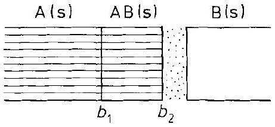
Figure 14-1. Coherent product layer AB forming on substrate A (reactant) during the reaction $\mathrm{A}(\mathrm{s})+\mathrm{B}(\mathrm{g})=\mathrm{AB}(\mathrm{s})$.

Let us then estimate the influence of stress energy on the kinetics of $A B$ formation due to the change of both the driving force and the component mobilities in AB . The latter change was addressed in the previous section. The influence of the elastic energy on the driving force is under many circumstances relatively small. We have seen before that the maximum energy densities are on the order of $10^{-1} \cdot R T$ per mole. They can often be neglected if $\Delta G_{\mathrm{AB}}^{0}>10 \cdot R T$. For a zeroth-order treatment of the influence of stress on the AB formation, we note that the AB layer, under the given conditions, possesses a stress energy density which, according to Eqn. (14.7), is

$$
\frac{w}{V}=\frac{\bar{E}_{\mathrm{AB}}}{8} \cdot\left(\frac{V_{\mathrm{AB}}}{V_{\mathrm{A}}}-1\right)^{2}
$$

If we neglect the stress energy of the substrate, the standard reaction Gibbs energy $\Delta G_{\mathrm{AB}}^{0}$ (per mole) has to be reduced by $V_{\mathrm{AB}} \cdot(w / V)$ in order to obtain the available Gibbs energy for the formation of the stressed AB . The remaining driving force (i.e., gradient) therefore is

$$
\left(\Delta G_{\mathrm{AB}}^{0}-\frac{V_{\mathrm{AB}} \cdot \bar{E}_{\mathrm{AB}}}{8}\left(\frac{V_{\mathrm{AB}}}{V_{\mathrm{A}}}-1\right)^{2}\right) \cdot \Delta \xi^{-1}
$$

Since this driving force is proportional to $\Delta \xi^{-1}$, it again leads to a parabolic rate law. The AB formation rate is always decreased compared to a stress-free reaction as long as the layer adheres and does not form cracks. However, if the evolving stress energy contained in the A substrate is also taken into account, the overall stress energy depends on the thickness of the reaction layer, which invalidates the parabolic growth and slows down the reaction rate. In principle, this can stop the reaction before A or B are consumed.

A study illustrating the basic ideas has been performed by [D. Hesse, J. Heydenreich (1993)]. They reacted MgO single crystals with thin films of $\mathrm{TiO}_{2}$ to form $\mathrm{Mg}_{2} \mathrm{TiO}_{4}$ and $\mathrm{MgTiO}_{3}$. On thick MgO crystals, only $\mathrm{MgTiO}_{3}$ was found, although the coexisting phase with MgO is $\mathrm{Mg}_{2} \mathrm{TiO}_{4}$. Since the Gibbs energy of formation of $\mathrm{Mg}_{2} \mathrm{TiO}_{4}$ is small and the volume change is $7.5 \%$, if the product grows coherently on the MgO substrate, the necessary strain energy obviously does not permit nucleation of $\mathrm{Mg}_{2} \mathrm{TiO}_{4}$. However, if the reactant MgO is used in the form of very thin crystals ( $<0.5 \mu \mathrm{~m}$ ), $\mathrm{Mg}_{2} \mathrm{TiO}_{4}$ forms readily at temperatures below 1600 K . The reaction induced stress is relaxed, at least in part by bending the thin substrate. Another observation is of interest. The $\mathrm{Mg}_{2} \mathrm{TiO}_{4} / \mathrm{MgO}$ interface is found to be coherent, but the $\mathrm{MgTiO}_{3} / \mathrm{Mg}_{2} \mathrm{TiO}_{4}$ interface is semicoherent. The interface dislocations rearrange the hcp oxygen sublattice of $\mathrm{MgTiO}_{3}$ into the fcc oxygen sublattice of $\mathrm{Mg}_{2} \mathrm{TiO}_{4}$ during the reaction.

### 14.3.3 Transport in Inhomogeneously Stressed Crystals

In this section, we consider the influence of inhomogeneous stress on matter transport. To illustrate the problem, let us formulate a simple transport equation: diffusion of an interstitial component $i$ in an otherwise immobile solid (e.g., H in Pd ). Furthermore, we neglect cross effects. For an electrically neutral species $i$ (i.e., H) we then have

$$
j_{i}=-L_{i} \cdot \nabla \mu_{i}=-D_{i}\left[\left(1+\frac{\partial \ln f_{i}}{\partial \ln c_{i}}\right) \cdot \nabla c_{i}-c_{i}\left(\frac{V_{i} \cdot \nabla \sigma}{R T}\right)\right]
$$

where $f_{i}$ is the activity coefficient. The second term within the brackets represents the elastic part of the chemical potential. Without sinks and sources for $i$, we find from Eqn. (14.18) for a strictly one dimensional experiment

$$
\dot{c}_{i}=D_{i} \cdot\left[\left(1+\frac{\partial \ln f_{i}}{\partial \ln c_{i}}\right) \cdot \frac{\partial^{2} c_{i}}{\partial \xi^{2}}-c_{i} \frac{V_{i}}{R T} \cdot \frac{\partial^{2} \sigma}{\partial \xi^{2}}-\frac{V_{i}}{R T} \cdot \frac{\partial c_{i}}{\partial \xi} \cdot \frac{\partial \sigma}{\partial \xi}\right]
$$

In Eqn. (14.19), which is the fundamental equation for transport in systems with inhomogeneous stresses, it is assumed that $D_{i}$ does not depend on concentration. This is obviously true for our dilute solution of species $i$ in the matrix crystal. Correspondingly, we may also assume that $f_{i}$ is independent of the concentration of $i$.

It was mentioned in Section 14.1 that internal (self-) stresses build up if lattice parameter changes occur during interdiffusion. This will be the case if $V_{i} \neq V_{\mathrm{Me}}$. We note that for substitutional interdiffusion in ( $\mathrm{A}, \mathrm{B}$ ), the condition for the change in lattice parameters is $V_{\mathrm{A}}$ (or $V_{\mathrm{B}}$ ) $\neq V_{m}$. For the integration of Eqn. (14.19), it is therefore necessary to introduce the quantitative relation between $c_{i}$ and $\sigma . \sigma$ is the (chemical) self-stress due to the lattice expansion (or contraction) in the diffusion zone. A strict theory is not available. Some of the difficulties stem from the fact that the elastic parameters are functions of $c_{i}$ (as are the transport parameters). If we neglect this concentration dependence, the problem of self-stress during chemical diffusion is completely analogous to the problem of stress induced by lattice parameter changes arising from an inhomogeneous temperature distribution. This problem has been treated in the literature [S. Prussin (1961); J. C.M. Li (1978); F. C. Larché, J. W. Cahn (1982, 1988); B. Baranowski (1989)]. Let us introduce the $\sigma\left(c_{i}\right)$ relation for the one dimensional problem ( $\sigma_{\xi}=\sigma_{1}=0$ ) when $i$ diffuses into the sample at $\xi=0$ in the form used by Baranowski

$$
\begin{aligned}
\sigma_{2}=\sigma_{3}= & -\frac{V_{i} \cdot \bar{E}}{3(1-v)}\left[\left(c_{i}-c_{i}^{0}\right)-\frac{1}{\Delta \xi} \int_{0}^{\Delta \xi}\left(c_{i}-c_{i}^{0}\right) \cdot \mathrm{d} \xi-\frac{12 \cdot\left(\xi-\frac{\Delta \xi}{2}\right)}{\Delta \xi^{3}}\right. \\
& \left.\cdot \int_{0}^{\Delta \xi}\left(c_{i}-c_{i}^{0}\right) \cdot\left(\xi-\frac{\Delta \xi}{2}\right) \cdot \mathrm{d} \xi\right]
\end{aligned}
$$

where $c_{i}^{0}$ is the (homogeneous) initial concentration of $i$. In the following, we assume that $c_{i}^{0}=0$. The second and the third terms in Eqn. (14.20) are seen to be non-local (integral) contributions. If $c_{i}$ changes with time due to the diffusion process, the associated stresses are transmitted across the crystal with sound velocity. We observe that self-stresses cause diffusion outside the immediate interdiffusion zone.

From Eqn. (14.20), one obtains the stress gradient in the $\xi$ direction of transport as

$$
\nabla \sigma=2 \cdot \frac{\partial \sigma_{2}}{\partial \xi}=-\frac{2 \cdot V_{i} \cdot \bar{E}}{3(1-v)} \cdot\left[\frac{\partial c_{i}}{\partial \xi}-\frac{12}{\Delta \xi^{3}} \cdot \int_{0}^{\Delta \xi} c_{i} \cdot\left(\xi-\frac{\Delta \xi}{2}\right) \cdot \mathrm{d} \xi\right]
$$

With the given assumptions, we introduce Eqn. (14.21) into the transport equation (14.18) and obtain

$$
j_{i}=-D_{i}\left[\left(1+\frac{2}{3} \cdot \frac{V_{i}^{2} \cdot \vec{E}}{(1-v)} \cdot \frac{c_{i}}{R T}\right) \frac{\mathrm{\partial} c_{i}}{\mathrm{\partial} \xi}+\frac{8 \cdot V_{i}^{2} \cdot \bar{E}}{(1-v) \cdot \Delta \xi^{3}} \cdot \frac{c_{i}}{R T} \cdot \int_{0}^{\Delta \xi} c_{i}\left(\xi-\frac{\Delta \xi}{2}\right) \cdot \mathrm{d} \xi\right]
$$

There is a local (Fickian transport) and a non-local (stress induced) term in this flux equation. In the local term, the stress acts in the same way as an activity coefficient does. It always increases local diffusion since $V_{i}^{2}$ is positive and independent of the sign of the partial molar volume of $i$.
a)

b)

Figure 14-2. a) Schematic plot of a permeation experiment: H dissolves in a ( $\mathrm{Pd}, \mathrm{Pt}$ ) sheet. Surface activities $a_{\mathrm{H}}\left(c_{\mathrm{H}}\right)$ are established electrochemically. 1) $\left.t_{1}>0,2\right) t_{2} \rightarrow \infty$. b) Hydrogen fluxes $j_{\mathrm{H}}$ across both interfaces of the sheet at times $t_{1}$ and $t_{2}\left(t_{1} \ll t_{2}\right)$.

The non-local term is negative in the beginning of the diffusion of $i$ into the plate when $c_{i}(\xi) \cong 0$ for $\xi \cong \Delta \xi / 2$ (Fig. 14-2a). According to Eqn. (14.19), we can express the time dependence of $c_{i}$ using Eqn. (14.21) as

$$
\begin{aligned}
\dot{c}_{i}=D_{i} & {\left[\left(1+\frac{2 V_{i}^{2} \cdot \vec{E}}{3(1-v)} \cdot \frac{c_{i}}{R T}\right) \cdot \frac{\partial^{2} c_{i}}{\partial \xi^{2}}+\frac{2 V_{i}^{2} \cdot \vec{E}}{3(1-v)} \cdot \frac{1}{R T} \cdot\left(\frac{\partial c_{i}}{\partial \xi}\right)^{2}\right.} \\
& \left.-\left(\frac{8 \cdot V_{i}^{2} \cdot \bar{E}}{(1-v) \cdot \Delta \xi^{3}} \cdot \frac{1}{R T} \int_{0}^{\Delta \xi} c_{i}\left(\xi-\frac{\Delta \xi}{2}\right) \cdot \mathrm{d} \xi\right) \cdot \frac{\mathrm{d} c_{i}}{\mathrm{~d} \xi}\right]
\end{aligned}
$$

This is a second order (partial) nonlinear integro-differential equation. If during interdiffusion the lattice parameters of the crystal change, this equation should always be used. However, the complexity of the mathematics in solving Eqn. (14.23) forbids its general use, especially since the boundary conditions at the surface (at $\xi=0$ and $\Delta \xi$ ) are necessarily time-dependent due to the evolving stresses. This is true even if the chemical potential of $i$ is kept constant in the adjacent phases. From Eqn. (14.21), however, one can immediately show that $\partial \sigma / \partial \xi$ vanishes if $\left(\partial c_{i} / \partial \xi\right)$ is constant, which is the steady state condition. If the concentration gradient is constant, Eqn. (14.20) tells us that $\sigma_{2}$ and $\sigma_{3}$ also vanish.

Let us discuss briefly the solution to the stress induced transport problem for short times after loading one side of the specimen at $\xi=0$ with species $i\left(c_{i}(\xi=0)\right)$. Under the given initial and boundary conditions, the non-local transport term in

Eqn. (14.22) can be neglected compared to the Fickian transport term in a zeroth order approach. The reason is that the gradient of $c_{i}$ at $\xi \simeq 0$ is high at the beginning of the diffusion process, whereas the integral over the concentration in the nonlocal term is still small. Therefore, $c_{i} \approx c_{i}^{0} \cdot \operatorname{erf}\left(\xi / 2\left(D_{i} t\right)^{1 / 2}\right)$. The stress induced part of the flux can now be calculated for short times in a first order approach and yields

$$
j_{i}=-\frac{8 \cdot V_{i}^{2} \cdot \vec{E}}{\sqrt{\pi} \cdot(1-v)} \cdot \frac{D_{i} \cdot c_{i}}{R T} \cdot \frac{c_{i}(\xi=0)}{\Delta \xi^{2}} \cdot \sqrt{D_{i} \cdot t}
$$

By using Eqn. (14.20), the stress $\sigma_{2}\left(\sigma_{3}\right)$ at the unloaded side of the specimen at $\xi=\Delta \xi$ becomes

$$
\sigma_{2}=\sigma_{3}=-\frac{4 V_{i} \cdot \bar{E}}{3 \cdot \sqrt{\pi}(1-v)} \cdot \frac{1}{\Delta \xi} \cdot c_{i}(\xi=0) \cdot \sqrt{D_{i} \cdot t}
$$

Permeation experiments (Fig. 14-2b) conducted with hydrogen as the interstitial component $i$ diffusing across a (Pd, Pt) alloy plate are in agreement with the above conclusions [B. Baranowski (1989)].

We mentioned before that Nabarro-Herring creep is another example of transport of matter induced by inhomogeneous stress in crystals. If a mechanical load is acting on a polycrystalline sample, the individual grains (with different sizes and orientations) are necessarily stressed inhomogeneously. Figure 14-3 describes the situation and the notation. Let us assume that the sample consists of metallic grains of A . Transport of A can be described in two ways: 1) We assume A to be immobile in the sense of Section 14.2.2. We further consider the grain boundaries as fluid-like and in equilibrium with the A grains. Since A atoms are mobile at grain boundaries, we expect a flux $j_{\mathrm{A}}$ from sites of high normal stress $\sigma_{1}\left(\xi_{1}^{\mathrm{b}}\right)$ to sites of low normal stress $\sigma_{2}\left(\xi_{2}^{\mathrm{b}}\right)$ ( $\Delta \sigma=\sigma_{1}-\sigma_{2}$ ). The flux density in the grain boundary is ( $D_{\mathrm{A}}^{\mathrm{b}} / R T$ ). $\left(\Delta \sigma / \Delta \xi^{\mathrm{b}}\right)$. 2) Considering the $D_{\mathrm{A}}=N_{\mathrm{V}} \cdot D_{\mathrm{V}}\left(N_{\mathrm{V}} \ll 1\right)$ relation, we may consider A to be the (almost) immobile component, as before. Nevertheless, A vacancies are highly mobile and we can derive a vacancy flux from site $1\left(\sigma_{1}\right)$ to site $2\left(\sigma_{2}\right)$ as shown in Figure 14-3. It carries the corresponding A counterflux from site 2 to site 1 across the grain of width $\Delta \xi_{\mathrm{gr}}$, the flux density of which is $\left(D_{\mathrm{V}} \cdot N_{\mathrm{V}} / R T\right) \cdot\left(\Delta \sigma / \Delta \xi_{\mathrm{gr}}\right)$.

Figure 14-3. Nabarro-Herring creep in a grain of a polycrystalline sample which is (inhomogeneously) stressed $\left(\sigma_{2}<\sigma_{1}\right)$. Flow of A from $1 \rightarrow 2$ and the reverse vacancy flow are indicated along the grain boundary and through the bulk.

The predominant creep mechanism thus depends on the ratio $\frac{\left(D_{\mathrm{V}} \cdot N_{\mathrm{V}} \cdot \Delta \xi^{\mathrm{b}}\right)}{\left(D_{\mathrm{A}}^{\mathrm{b}} \cdot \Delta \xi_{\mathrm{gr}}\right)}$. Although the flux equations for grain boundary and volume transport are of the same type, the creep kinetics are different because the boundary conditions of the transport differ for the two models (Fig. 14-3). Finally, we observe that creep in compound crystals requires the simultaneous motion of all components [R.L. Coble (1963)] so that the slow ones necessarily determine the creep rate.

### 14.4 Creep and Fracture

### 14.4.1 Introductory Remarks

Creep and fracture in crystals are important mechanical processes which often determine the limits of materials' application. Consequently, they have been widely studied and analyzed in physical metallurgy [J. Weertmann, J. R. Weertmann (1983); R.M. Thomson (1983)]. In solid state chemistry and outside the field of metallurgy, much less is known about these mechanical processes [F. Ernst (1995)]. This is true although the atomic mechanisms of creep and fracture are basically independent of the crystal type. Dislocation formation, annihilation, and motion play decisive roles in this context. We cannot give an exhaustive account of creep and fracture in this chapter. Rather, we intend to point out those aspects which strongly influence chemical reactivity and reaction kinetics. Illustrations are mainly from the field of metals and metal alloys.

### 14.4.2 Creep

If a crystal is exposed to stress in such a way that the strain is kept constant, the stress will decrease with time as shown in Figure 14-4. One concludes that stress relaxation has occurred. Conversely, strain does not remain constant under constant load. Time dependent (i.e., plastic) strain in stressed crystals is called creep. It was already mentioned that elastic strain due to the applied stress is usually less than $1 \%$. Plastic strain definitely dominates beyond the elastic limit which, to a large extent, is due to dislocation formation and motion. Since the crystal lattice is conserved during this

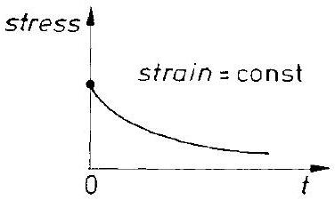
Figure 14-4. Stress relaxation at constant strain. Plastic strain increases with time, elastic strain (and stress) decreases.

deformation process, dislocations (as well as disclinations, twin boundaries, etc.) act as catalysts for plastic deformation which leave the lattice structure invariant. They are localized, dilute, and mobile. Dislocations may form (see Chapter 3) if their line energy ( $\sim G b^{2}$ per unit length) is smaller than the elastic energy ( $\sim G u^{2}$ per unit volume) in the region of the crystal where a dislocation line of length $l$ is found.

If one measures temperature in terms of the crystal melting temperature $T_{\mathrm{m}}$ and the applied stress $\sigma$ in terms of its shear modulus $G$, one finds three different types of creep in the field of these variables (neglecting Nabarro-Herring(-Coble) type of creep in polycrystalline materials as discussed in Section 14.3.3). 1) At stresses smaller than the critical shear stress, no long range motion of dislocations occurs. Plastic straining is due to mechanisms other than dislocation motion. 2) If ( $\sigma / G$ ) is higher than ( $\sigma_{\text {crit }} / G$ ) and at low temperatures ( $T / T_{\mathrm{m}}<0.5$ ), dislocations can move relatively easy on their slip planes. 3) At $T / T_{\mathrm{m}}>0.5$, diffusion of the structure elements allows the dislocations to climb sufficiently fast so that they can move in all directions and are not bound to slip planes. Let us discuss these types of creep in more detail.

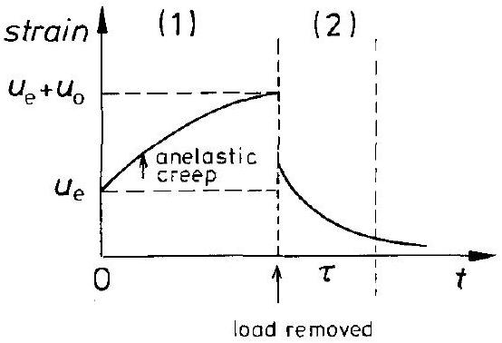
Figure 14-5. Anelastic strain as a function of time 1) for a given load and 2) after removal of the load.

1) Figure 14-5 defines the creep below the critical shear stress. It is called anelastic creep and is to a large extent recoverable. The anelastic strain for a given stress below $\sigma_{\text {crit }}$ approaches its equilibrium value $u_{0}$ as

$$
u=u_{0} \cdot\left(1-\mathrm{e}^{-\frac{t}{\tau}}\right)
$$

By removing the load, the anelastic strain recovers (Fig. 14-5). When cyclic stresses are applied, internal friction occurs which means that stress and strain are out of phase and energy is dissipated in the damping process. From an atomic point of view, equivalent lattice positions ( $n_{0}$ ) become unequivalent ( $n_{x}, n_{y} ; n^{0}=n_{x}+n_{y}$ ) by the applied stress and the Boltzmann distribution of site occupancy is disturbed. $\tau$ is therefore the relaxation time to attain the new Boltzmann distribution of site occupancy for a given stress. To a first order, the strain is proportional to $n=\left(n_{x}-n_{y}\right)$. Damping is largest if the frequency of the cyclic stress is in resonance with the elementary jump frequency of the atomic particles which redistribute. For example, in the case of iron containing carbon located on interstitial sites, it was
found that the activation energy of the relaxation time for anelastic creep, $\tau$, and of interstitial carbon diffusion are the same. Thus, the assumption is confirmed that the anelastic creep is due to a redistribution of interstitial carbon on sites which the applied stress rendered non-equivalent. It also shows us how to use creep experiments in order to obtain information on fundamental kinetic parameters. By and large, the formal way to treat these mechanical relaxation processes is conceptually identical with the treatment of the Debye-type dielectric relaxation phenomena introduced in Section 5.1.1. A pertinent discussion can be found in [A. S. Nowick, B. S. Berry (1972)]. Figure 14-6 shows an experimental illustration of internal friction. The loss as a function of temperature is given at two predetermined excitation frequencies $v_{1}$ and $v_{2}$. Temperature is used as the independent variable since it determines the intrinsic jump frequency between $x$ and $y$ sites $\left(v \sim \mathrm{e}^{-\Delta E_{\mathrm{A}} / R T}\right)$. At resonance, that is, when the excitation frequency and the inherent frequency of the jumping atomic particles are the same, the loss has a maximum value.

Figure 14-6. Internal friction. Carbon reorienting in tantalum at two frequencies as a function of temperature. $v_{2} / v_{1}=3.81$ [T. Ke (1948)].

2) Low temperature creep, $T<0.5 T_{\mathrm{m}}$. When the applied stress exceeds the critical shear stress it can trigger dislocation multiplication (see Section 3.2.1) and subsequently move the dislocations over long distances on their respective slip planes. Mutual interaction between dislocations will eventually cause the multiplication to cease. This phenomenon is called work-hardening in physical metallurgy. As long as the stress-strain curve has a finite slope and a small increase in stress results in a further small plastic deformation, thermal fluctuations will also cause additional (creep) strain. Then, by increasing the deformation through fluctuations, hardening of the crystal continues and consequently the creep rate decreases. Instead of Eqn. (14.26), a low temperature creep relation is observed which is logarithmic in time

$$
u=u_{0} \cdot \log (1+t / \tau)
$$

$1 / \tau$ is proportional to the vibrational frequency of the dislocation line (which is necessarily lower than the vibrational frequencies of atoms in the lattice). If a
dislocation is sufficiently activated by thermal fluctuation and applied stress, it can cut through the dislocation forest and increase the plastic deformation. We note that the activation energy in low temperature creep increases with temperature, thus illustrating the above mentioned feedback situation.
3) High temperature creep. The creep strain occurring at elevated temperatures $>0.5 T_{\mathrm{m}}$ can amount to $100-300 \%$ without specimen failure. It starts with a transient creep and eventually becomes a steady-state deformation, which means that the initial creep rate decelerates and approaches a constant value. The activation energy of steady-state creep is identical with that of self-diffusion in an elemental crystal. In compound crystals, complete lattice molecules must be transported when a full dislocation climbs. Therefore, one expects that the diffusion activation energy of the slowest regular SE determines the activation of the creep. In the transient period, the structure of the dislocation network forms. Since moving dislocations suffer from energy dissipation due to friction caused by various mechanisms (point defect formation, impurity drag, phase transformations, order-disorder processes), it is difficult to predict the detailed time dependence of the strain in the transient period.

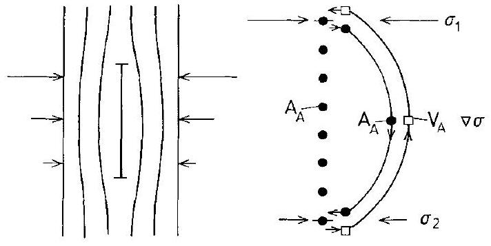
Figure 14-7. Model of a steady-state dislocation climb. Flow of A and the reverse vacancy flow from more to less compressed regions of the dislocation are indicated.

[N. F. Mott (1956)] suggested that the rate controlling step in steady-state high temperature creep is the climb of dislocations with an edge component. Dislocations are then created and annihilated at the same rate. Annihilation takes place when dislocations of opposite sign meet. To do this, they have to climb if they are located on different slip planes. Dislocations climb by emitting vacancies (destroying interstitials) or by destroying vacancies (emitting interstitials). Thus, steady-state creep rates are controlled by the diffusion of vacancies (or interstitials) between dislocation lines (Fig. 14-7). Rates can be estimated if, for example, the vacancy gradient, that is, the different vacancy concentrations between the climbing dislocations and their (average) distance, $a$, is known. $\Delta c_{V}$ can be approximated as follows. The stress, $\sigma$, does the work ( $\sigma \cdot b \cdot L$ ) upon a dislocation line of unit length which during its lifetime moves a distance $L$ parallel to the slip plane. If, for that same time, the climb distance perpendicular to the slip plane is $d$, then about $d / b^{2}$ lattice defects per unit length are created (or destroyed). Thus, the stress $\sigma$ changes the defect formation energy by ( $\sigma \cdot b^{3} \cdot L / d$ ) per defect. Let us take this term into account in the Boltzmann factor of the equilibrium (or steady-state) number of defects. We obtain for the difference in vacancy concentrations between the two steadily moving dislocation lines during creep, to a first order,

$$
c_{\mathrm{V}}=2 \cdot n_{0} \cdot \frac{\sigma \cdot L \cdot n^{3}}{k T \cdot d} \cdot \mathrm{e}^{-\frac{\Delta g_{F}^{0}}{k T}}=2 c_{\mathrm{V}}^{0} \cdot \frac{\sigma \cdot L \cdot b^{3}}{k T \cdot d}
$$

Here, $n_{0}$ is the number of lattice sites per unit crystal volume and $\Delta g_{F}^{0}$ the formation Gibbs energy of defects without the applied stress.

To solve the vacancy flux equation between dislocations of opposite sign we have to know the dislocation geometry (distance and orientation) in the lattice as the boundary condition. If we consider as a zeroth order approach only the average distance, $a$, between the dislocations, even this quantity depends on the applied stress and the functioning of dislocation multiplication. Nevertheless, since about $1 / b^{2}$ vacancies are needed for a climb shift of unit length, we may conclude from Eqn. (14.28) and the vacancy flux that the steady-state climb velocity, $\boldsymbol{v}_{\mathrm{cl}}$, of a dislocation with edge character is

$$
v_{\mathrm{cl}} \sim D_{\mathrm{V}} \cdot c_{\mathrm{V}}^{0} \cdot \frac{\sigma}{k T} \cdot \frac{L}{d} \cdot b^{5}
$$

that is, $\boldsymbol{v}_{\mathrm{cl}}$ is on the average proportional to the applied stress. The proportionality factor depends on the model assumptions and has been worked out [J. Weertmann, J. R. Weertmann (1983)].

Two remarks, however, seem appropriate. 1) If the distance, $a$, between individual dislocations is very small on an atomic scale, diffusion coefficients obtained from macroscopic experiments can not be used in Eqn. (14.29) (as explained in Section 5.1.3). 2) Since diffusional transport takes place in the stress field of dislocations, in principle, fluxes in the form of Eqn. (14.18) should be used. This, however, would complicate the formal treatment appreciably. In the zeroth order approach, one therefore neglects the influence of the stress gradient, which can partly be justified by the symmetry of the transport problem.

Let us finally mention that in polycrystalline samples, Nabarro-Herring(-Coble) creep occurs as already introduced in Section 14.3.2. The Nabarro-Herring creep rate is inversely proportional to the square of the average grain size, $l^{2}$, if volume diffusion of point defects prevails. It is inversely proportional to $l^{3}$ if grain boundary diffusion determines the transport.

We have pointed out before that during creep, demixing of solid solutions is to be expected. Creep in compounds, however, occurs in such a way that the rate is determined by the slowest constituent since complete lattice molecules have to be displaced and the various constituent fluxes are therefore coupled. If extra fast diffusion paths operate for one (or several) of the components in the compound crystal, the coupling is cancelled. Therefore, if creep takes place in an oxide semiconductor surrounded by oxygen gas, it is not necessarily the slow oxygen diffusion that determines the creep rate. Rather, the much faster cations may determine it if oxygen can be supplied to or taken away from the external surfaces via dislocation pipes.

### 14.4.3 Fracture

Dislocations as introduced in Section 3.2 have been postulated in order to explain the low yield strength of a crystal (if we compare it to the theoretical shear strength). Likewise, cracks are postulated in order to explain fracturing of crystals well below the theoretical tensile strength of the atomic bonds. Pre-existing cracks can easily magnify low applied stresses at their tips to the maximal atomic bond strength.

Fracture often determines the reliability of a material in its practical applications. Brittle fracture of a material is the reason for a sudden catastrophe. The mechanical property 'ductile' or 'brittle' determines, in essence, whether or not a tool can be made from a given material. Let us identify the imperfections of a crystal and the chemical processes which cause ductility and brittleness. We distinguish two limiting cases of failure: 1) A crystal, under external stress, deforms by forming a narrowing neck until eventually ductile rupture occurs. Dislocations are the only imperfections involved in this process of failure. 2) Crystals fracture suddenly. A sharp crack propagates and causes the failure.

Figure 14-8. Two dimensional model of a crack in a square lattice. (Nonlinear) forces at the crack tips are indicated by $\frac{1}{\uparrow}$.

Figure 14-8 shows a two dimensional atomic model of a microcrack. The stress concentrates at the crack tip, the radius of which is of atomic size. In contrast to dislocations and pores, microcracks do not exist without an external stress field. They can be formed in various ways, for example, by the accumulation of dislocations to a high density, by sufficiently high local stresses due to strain incompatibility between different crystals, at grain boundary triple points, etc. By solving the differental equations of elasticity under the boundary conditions of a crack of length $2 \cdot a$ and assuming the stress to be shearing the $\xi_{1}-\xi_{2}$ plane, one finds [R.M. Thomson (1983)] for the stress field

$$
\sigma=\frac{K}{(2 \pi r)^{1 / 2}} \cdot \mathrm{e}^{-\frac{i \cdot \Theta}{2}} ; \quad K=\sigma_{\infty} \cdot(\pi \cdot a)^{1 / 2}
$$

where $r=\sqrt{\xi_{1}^{2}+\xi_{2}^{2}}$ and $\Theta=\xi_{2} / \xi_{1} . K$, which is a measure of the stress singularity at the crack tip, is called the stress intensity factor. $\sigma_{\infty}$ is the externally applied stress. One notes that the stress intensity factor is a characteristic function of the crack length.

The force that moves the crack on the cleavage plane has been deduced from Eqn. (14.30) as

$$
F=\frac{K^{2}}{2 \bar{G}}
$$

In equilibrium, that is if the crack does not move, the force $F$ has to be balanced by the surface tension $y$ of the crystal. From this equilibrium condition, one obtains

$$
K_{\mathrm{crit}}=2 \cdot \sqrt{\widetilde{G} \cdot \gamma}
$$

$K_{\text {crit }}$ is the so-called fracture toughness parameter. It was first discussed by Griffith [A. A. Griffith (1920)] and describes the mechanical equilibrium of the crack, but not the thermodynamic equilibrium of the unstable crystal. Rewriting the criterion given by Eqn. (14.32) in terms of Eqn. (14.30) one finds

$$
\sigma_{\mathrm{crit}}=\left(\frac{4 \cdot \gamma \cdot \bar{G}}{\pi \cdot a}\right)^{1 / 2}
$$

where $\sigma_{\text {crit }}$ is the externally applied critical Griffith stress. The quantitative description of cracking has thus been based entirely on macroscopic quantities, all of which are combined in the single parameter $K$. Grain boundaries or precipitates which would alter the stress field were assumed to be absent. Also, the stress intensity factor does not take into consideration the plastic work which a moving crack stores in its surroundings, mainly by emitting dislocations. In a local and atomic approach, the surface tension $y$ may therefore not be adequate to describe the force balance expressed by Eqn. (14.32), especially considering the quasi-periodic lattice structure around the crack tip. Thermal fluctuations are able to promote (slow) crack growth if we assume the force $F$ to vary periodically with crack length. This would lead to an Arrhenius-type temperature dependence of the crack propagation velocity $\boldsymbol{v}_{\mathrm{c}}$.

In any case, the stretched bonds at the crack tip are sensitive to neighboring foreign atoms, be they supplied from the surrounding gas atmosphere or from the impurity content of the bulk crystal. This follows from the change in surface tension (surface energy) arising from adsorbed species which, according to the Gibbs adsorption isotherm, lowers the (local) $K_{\text {crit }}$ value. Consequently, the material becomes more brittle. From a chemical point of view, an adsorbed atom or molecule located near the crack tip interacts and reacts with the stretched bond atoms. These chemical effects influence the crack propagation. Stress corrosion and hydrogen embrittlement are examples of this. It was found by [R.A. Oriani and P. Josephic (1974)] that the fracture toughness parameter is proportional to $\ln p_{\mathrm{H}_{2}}(\mathrm{~g})$ for high-strength steel, confirming the idea that, in the cracks, the surface tension $y$ changes according to the Gibbs adsorption isotherm. This reflects the decohesion of atoms at the crack tip.

Hydrogen, however, may also react with other impurities such as dissolved oxygen, sulphur, carbon, etc. and form high activity products. Therefore, the effect of hydrogen on the mechanical properties of a crystal is ambiguous. A discussion of fracture at metal/oxide boundaries has been given recently by [F. Ernst (1995)].

Let us return to the reduction of shear stress at the crack tip due to the emission of dislocations. Figure 14-9 illustrates a possible stress reduction mechanism. It can be seen that the tip of a crack is no longer atomically sharp after a dislocation has been emitted. It is the interaction of the external stress field with that of the newly formed dislocations which creates the local stress responsible for further crack growth. Thus, the plastic deformation normally impedes embrittlement because the dislocations screen the crack from the external stress. Theoretical calculations are difficult because the lattice distortions of both tension and shear near the crack tip are large so that nonlinear behavior is expected. In addition, surface effects have to be included.

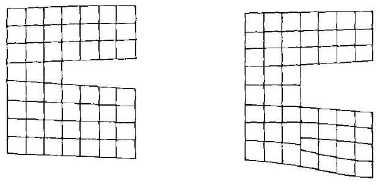
Figure 14-9. A crack tip shears by dislocation emission.

### 14.4.4 Toughening of Crystals by Phase Transformations

We have discussed the failure of materials under load due to crack formation and subsequent fracture. Materials can be improved in this respect by toughening, which means by the initiation of processes absorbing strain energy around the advancing crack tip. Phase transformation of a fine grained dispersed second phase in the matrix crystal induced by the stress from the crack is such an energy absorbing process. The transformation zone around the moving crack tip can be seen as being analogous to the region of plastic deformation discussed in the previous section.

A well studied example of transformation toughening is the enhancement of strength and toughness of a ceramic material by the stress induced tetragonal → monoclinic phase transition in $\mathrm{ZrO}_{2}$ particles embedded in a ceramic matrix [ N . Claussen, M. Rühle (1981)]. At least two mechanisms improve the toughness. 1) Microcracks and residual stresses which have been introduced during the cooling of the two-phase sample (matrix + dispersed $\mathrm{ZrO}_{2}$ ) impede the crack propagation. The size of the finely dispersed and energy consuming particles is $0.1-1 \mu \mathrm{~m}$. 2) The (tensile) stress induced martensitic transformation of $\mathrm{ZrO}_{2}$ absorbs the strain energy localized at the moving crack tip. Martensitic transformation is the structural conversion by a diffusionless process discussed in Section 12.2.1. Here, the parent tetragonal
$\mathrm{ZrO}_{2}$ dilates to the monoclinic structure. Shear and dilational components of this transformation change the strain state of the matrix. External stress can either impede or enhance the transformation, depending on its sign and orientation. Tensile stresses have the greatest effect since both dilational and shear components of the transformational displacements are assisted. Therefore, if the samples are subjected to an external tensile load, large stresses are generated near the crack tips which begin to move and extend. At fixed grip, the strain energy of the two-phase solid decreases because the $\mathrm{ZrO}_{2}$ transformation reduces the available strain energy and thus counteracts the propagation of cracks. This is the essence of the mechanism of transformation toughening.

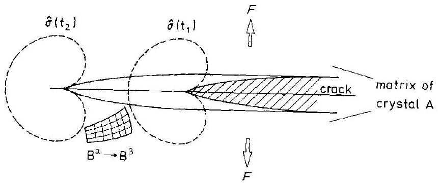
Figure 14-10. Stress tensor at the crack tip, crack propagation, and the transformation of a dispersed second phase B in the surrounding matrix.

Figure 14-10 illustrates the crack propagation and shows schematically that the stressed zone is essentially unaltered during the advancement of the tip. Thus, we conclude that the resistence to crack growth stems from the Gibbs energy difference between the untransformed region (in front and remote from the tip) and the transformed region behind the tip with almost zero stress level. If we consider only the transformation and neglect any elastic energies stored in either the ceramic matrix or the zirconia grains, the dissipated Gibbs energy per unit cross section of the sample and unit time becomes

$$
\Delta \dot{G}=v \cdot \frac{\eta}{V_{\mathrm{Z}}}\left|\Delta g_{\mathrm{Z}}\right|
$$

where $\boldsymbol{v}$ is the crack propagation velocity and $\eta(\ll 1)$ the volume fraction of transformable zirconia in the matrix. $V_{Z}\left(\simeq V_{Z^{\prime}}\right)$ denotes the molar volume of zirconia and $\Delta g_{Z}$ the molar Gibbs energy of transformation ( $Z \rightarrow Z^{\prime}$ ). Since $\Delta \dot{G}=v \cdot F_{\text {fr }}$ with $F_{\mathrm{fr}}$ being a (virtual) frictional force, we conclude from Eqn. (14.34) that the ( $Z \rightarrow Z^{\prime}$ ) transformation exerts a force

$$
F_{\mathrm{fr}}=\frac{\eta}{V_{Z}} \cdot\left|\Delta g_{Z}\right|
$$

per unit cross section that impedes the propagation of the cracks. A quantitative determination of $\Delta g_{Z}$ is difficult since it depends both on the size and the shape of the zirconia particle embedded in the crystal matrix. Furthermore, we have to consider other 'frictional' forces arising from point defects, dislocations, and new surfaces generated in the wake of the crack motion.

### 14.5 Tribochemistry

Chemical processes induced by the input of mechanical energy into crystallites in the form of impacts are categorized as tribochemical. In contrast to the earlier understanding, it is now generally accepted that chemical effects due to the input of mechanical energy can only be partially ascribed to the conversion into heat. Triboreactors are mainly mills: ball mills, vibrating mills, planetary mills, jet mills, and others. However, tribochemical processes are not restricted to mills only, they are in fact far more common. A special field in this context is the forming of materials by means of cutting, grinding, and polishing.

There are many ways to supply solids with mechanical energy. Their response to the transmitted energy has the following common features: first elastic and then plastic deformation. Further changes in the solid depend on the magnitude, length, and localization of the impact. Crack propagation and fracture are the most obvious effects. The mode of energy dissipation after an impact depends decisively on the steepness of the pulse rise and its length. Linear theories and the assumption of local equilibria (i.e., irreversible thermodynamics approach) are often not valid in the early stages of the energy input. Obviously, the scaling speed is the velocity of sound. Elastic energy dissipates into the surroundings of the impact spot with the velocity of sound. If the impact lasts for $10^{-6} \mathrm{~s}$, the elastic deformation spreads $c a .10^{-1} \mathrm{~cm}$ during this time. The maximal velocity of moving dislocations is again the velocity of sound. Thus, the dissipation of the energy transferred from an impact as plastic energy also occurs at the velocity of sound, at most.

If the main part of the impact energy is converted into heat, phonons are dissipated into the surroundings. Other forms of energy dissipation are, for example, the increase in surface area (crack formation and growth, spreading much slower than sound), chemical reaction (e.g., phase transformation), or the formation of a local plasma zone by breaking a sufficient number of chemical bonds. In this case, the result is a heavily defective or even amorphous material, in analogy to the heavily defective zones (hot spots, defect spikes) after the bombardment of crystals with ions or atoms. In the literature on tribochemistry [G. Heinicke (1984)], it is pointed out that the quantitative treatment is in essence phenomenological. The reason for this is that many of the above mentioned modes of energy dissipation take place simultaneously, whereas the boundary conditions in space and time are necessarily complex. We therefore describe several tribochemical processes in some detail, rather than to introduce phenomenological relations without the specification of physical models.

Let us assert, however, that the input of mechanical energy into solids in the sense of tribochemistry always results in a change of their kinetic behavior. The change in point defect concentration, dislocation or crack density, and structure influences the transport coefficients and reactive properties (e.g., catalytic activity, nucleation rate, etc.).

Let us begin with a special mechanochemical effect known as mechanical alloying. Mechanical alloying in a mill is a processing technique for the synthesis of materials with possibly metastable or even unstable structures. It is defined as a dry, high energy ball milling process which produces powders of composite metal alloy with extremely fine grained microstructures. It has been suggested that localized melting may occur during high energy milling due to the extensive plastic deformation. Since $10^{-2}-10^{-3}$ Joules per impact are dissipated during collision, it was concluded that the average bulk temperature might be raised to ca. 600 K . Alloying is assisted by an increase of temperature, by an enhanced diffusion due to the formation of lattice defects, and due to shorter and shorter diffusion paths as the grains become smaller and smaller. Many different materials have been synthesized in this way. We just mention the synthesis of $\mathrm{ZnFe}_{2} \mathrm{O}_{4}$ from ZnO and $\mathrm{Fe}_{2} \mathrm{O}_{3}$. The remarkable feature of this synthesis is that the ferrite, which under equilibrium conditions exhibits the structure of a normal spinel, occurs as a partly inversed spinel. This indicates that atomic size effects may override preferential chemical bonding under these extremely high local pressures. We note that even homogeneous mixtures of two immiscible phases can be metastably produced.

Another interesting aspect of high energy ball milling is the amorphization by mechanical alloying. An early and conclusive study of this problem was carried out by Koch [C.C. Koch (1990)] in the glass forming alloy system Ni-Nb. It has been argued that the formation of an amorphous alloy from the elements occurs in the sequence $\mathrm{A}+\mathrm{B} \rightarrow \mathrm{A}_{n} \mathrm{~B}_{m}$ (cryst) → $\mathrm{A}_{n} \mathrm{~B}_{m}$ (amor). Since amorphization is the most extreme mode of structural transformation, other structural transformations can be expected and have been reported to occur under the action of milling: order-disorder, disorder-order, order-order. $\mathrm{PbO}_{2}$, for example, exists in the stable $\beta$-form (tetragonal) at room temperature and normal pressure, but transforms into the $\alpha$-form (rhombic) at high pressure. It also turns into a $90 \%-\alpha, 10 \%-\beta$ mixture, irrespective of the starting material after sufficiently long milling. It is understood that the $\alpha / \beta$ ratio depends on the milling conditions. Similar observations concerning the 'mechanochemical equilibrium' have been made with other solid compounds (e.g., $\mathrm{CaCO}_{3}$ : aragonite-calcite). One concludes that both high local temperatures and pressures occur in the milling procedure, and the rate of structural relaxation processes determines the steady-state condition of the phase distribution [R. Schrader, B. Hoffmann (1973)].

By and large, ball milling is an efficient tool for the promotion of all sorts of solid state reactions. The composition and structure of the products depend decisively on such milling conditions as milling intensity, temperature, atmosphere, time, filling, and ball to powder ratio. One is far from understanding all the details, but the specific power injected into the reactant powders (Watt/gr) seems to be an important control parameter for the phase stability during milling [Y. Chen, et al. (1990)].

In the previous chapter we discussed the steady-state conformation of an alloy during the continuous input of ballistic energy (irradiation). We saw that the conformation under irradiation is the same as that without radiation, but at an elevated temperature ( $T+\Delta T$ ). Can we generalize this concept and apply it to other forms of energy input like the input of mechanical energy during the ball milling process? Thermally activated jump processes occur on the atomic scale, while the elementary ballistic events occur on a much less fine grained scale. Martin and coworkers [G. Martin, P. Bellon (1987)], however, gave a positive answer to the posed question. Without repeating their argumentation, one may say that the input of ballistic energy is assumed to increase the jump frequencies across the activated transition state by $\Delta v$ and in a distinct way. $\Delta T$ and $\Delta v$ are shown to be proportional to each other, and the relevant control parameter is the specific power injected into the solid. Analogous to the flux density $\phi$ of irradiation in Eqn. (13.14), it determines the factor of proportionality between $\Delta v$ and $\Delta T$.

## References

Baranowski, B. (1989) J. Less-Common Met., 154, 329
Boldyreva, E. V., Sidelnikov, A. A. (1987) Izv. Sib. Otd. Akad. Nauk SSSR, Ser. Khim. Nauk 5, 139
Chen, Y., et al. (1990) J. de Phys. Colloque C4, Suppl. 14, 51, 71
Chupakhin, A. P., et al. (1987) Reactivity of Solids, 3, 1
Claussen, N., Rühle, M. (1981) Adv. in Ceramics, 3, 137
Coble, R. L. (1963) J. Appl. Phys., 34, 1679
Cottrell, A. H. (1953) Dislocations and Plastic Flow in Crystals, Clarendon Press, Oxford
Durham, W., Schmalzried, H. (1987) Ber. Bunsenges. Phys. Chem., 91, 556
Ernst F. (1995) Mat. Sci. Eng. Rep. (in print)
Gibbs, J. W. (1878) Trans. Conn. Acad. III, 343-524
Griffith, A. A. (1920) Phil. Trans. Roy. Soc. (London), A 221, 163
Heinicke, G. (1984) Tribochemistry, Akademie-Verlag, Berlin
Herring, C. (1950) J. Appl. Phys., 21, 437
Hesse, D., Heydenreich, J. (1993) Appl. Phys., A57, 415
Johnson, W. C. (1986) Met. Trans., A 18, 1093
Johnson, W. C., Schmalzried, H. (1992) Acta Met. Mater., 40, 2337
Ke , T. (1948) Phys. Rev., 74, 9
Koch, C.C. (1990) J. Non-Cryst. Solids, 117, 670
Landau, L. D., Lifshitz, E. M. (1989) Elastizitätstheorie, Akademie-Verlag, Berlin
Larché, F. C., Cahn, J. W. (1982) Acta Met., 30, 1835
Larché, F. C. (1988) Thermodynamics of Stressed Solids, Solid State Phenomena, Vol. 3-4, 205
Li, J. C.M. (1978) Met. Trans., A 9, 1353
Martin, G., Bellon, P. (1987) Mat. Sci. Forum, 15-18, 1337
Mott, N. F. (1956) Creep and Fracture of Metals at High Temperatures, Her Majesty's Stationary Office, London, p. 21
Mullins, W. W., Sekerka, R. (1985) J. Chem. Phys. 82, 5192
Nowick, A. S., Berry, B.S. (1972) Anelastic Relaxation in Crystalline Solids, Academic Press, New York
Nye, J. F. (1985) Physical Properties of Crystals, Clarendon Press, Oxford

Oriani, R.A., Josephic, P. (1974) Acta Met., 22, 1065
Prussin, S. (1961) J. Appl. Phys., 32, 1876
Schrader, R., Hoffmann, B. (1973) in Festkörperchemie (Eds.: V. Boldyrev, K. Meyer), VEB Grundstoffindustrie, Leipzig
Thomson, R.M. (1983) in Physical Metallurgy (Eds.: R. W. Cahn, P. Haasen), North-Holland, Amsterdam
Weertmann, J., Weertmann, J. R. (1983) in Physical Metallurgy (Eds.: R. W. Cahn, P. Haasen), North-Holland, Amsterdam

# 15 Transport and Reactions in Special Systems 

### 15.1 Introduction

In previous chapters, the basic and formal structure of solid state kinetics was emphasized. This was advisable considering the inherent complexity of almost all reactions in the solid state. Although we occasionally illustrated the deductions and derivations with experimental observations and data, it seems appropriate to strengthen the chemical aspects of solid state kinetics in a special chapter. The purpose of this chapter then is to acquaint us with the kinetic complications which emerge if a solid undergoes a chemical process. Kinetic situations will be presented along with available experimental data for some important types of solids, and we will try not to oversimplify when constructing tractable models for limiting cases. In spite of a remarkable increase in research in solid state chemistry, basic kinetic data are often incomplete. One reason is that chemists are primarily concerned with synthesis and structure whereas physicists are mainly interested in dynamics. Thermodynamics and kinetics are generally worked out by a relatively small number of physical chemists and recently by material scientists.

In selecting the different types of solids for a discussion in this chapter, their importance in science and technology was as decisive as the availability of kinetic data. Silicates, fast conductors, hydrides (mainly of transition metals), and some organic crystals were thus chosen. Silicates are the most important solids in geochemistry. Fast solid ionic conductors are a prerequisite for solid state electrochemistry. They have an increasing influence on some technologies and a bridging function to the biosciences. Metal hydrides are studied in the context of hydrogen catalysis, energy storage, and energy production (fuel cells), whilst the impact of organic solids on our daily life is obvious. The solids we will consider, however, are special from a more fundamental point of view. They all represent an extreme characteristic property. Silicates are characterized by their abundance and the wealth of distinct structural features which stem from the variability with which $\left[\mathrm{SiO}_{4}\right]^{4-}$ tetrahedra can be interlinked. Fast solid ionic conductors have conductances which compare with those of ionic liquids. The activation energy of their conductivity is normally quite low. Hydrides are compounds in which one of the components is the lightest of all elements. Therefore, one may expect quantum effects to influence the motion of hydrogen. If we consider the organic molecules which form molecular crystals, the question is whether these molecules can move translationally in a crystal lattice or whether they first dissociate in order to release mobile (atomic) structural elements.

In what follows, we will not repeat the formal discussions. Rather we exemplify specific and relevant kinetic problems as they are met in practical situations. Reference will be made to previous chapters for the more formal aspects.

### 15.2 Silicates

### 15.2.1 Introductory Remarks

Silicates are major constituents of the earth's crust (e.g., feldspars) and mantle (e.g., olivine). For a long time, silicates served as the most important construction materials for buildings, and in many ores they predominate. Most of the silicates are aluminosilicates, which reflects the easiness of isomorphous substitution of silicon by aluminium. The basic structural unit of all silicates is the silicon-oxygen tetrahedron. The $\mathrm{Si}-\mathrm{O}$ bond length in silicates is about $1.62 \AA(1.57-1.7)$. In the orthosilicates, there are isolated $\mathrm{SiO}_{4}$ tetrahedra and no vertex-sharing of these units takes place ( $\left[\mathrm{Si}_{2} \mathrm{O}_{8}\right]^{8-}=2\left[\mathrm{SiO}_{4}\right]^{4-}$ ). In another type of orthosilicate, there are $\left[\mathrm{Si}_{2} \mathrm{O}_{7}\right]^{6-}$ groups which share one (vertex) oxygen ion. $\left[\mathrm{Si}_{2} \mathrm{O}_{6}\right]^{4-}$ units share two oxygen ions and thus may form chain- or cyclo-silicates. $\left[\mathrm{Si}_{2} \mathrm{O}_{5}\right]^{2-}$ units share three oxygen ions and are thus able to form layered structures. In $\mathrm{Si}_{2} \mathrm{O}_{4}\left(\mathrm{SiO}_{2}\right)$, all the vertices are interlinked. The higher the $\mathrm{SiO}_{2}$ content of a silicate, the more vertex sharing takes place. Correspondingly, the linkage goes from one dimensional chains to two dimensional (layer) structures and finally to three dimensional networks (e.g., feldspars, zeolites). Well known chain structure minerals are pyroxenes and amphiboles ( $\mathrm{Mg}_{7}\left[\mathrm{Si}_{8} \mathrm{O}_{22}\right](\mathrm{OH})_{2}$ ). Clay minerals and micas are layer structured.

Orthosilicates are of composition $\mathrm{Me}_{2} \mathrm{SiO}_{4}=2 \mathrm{MeO} \cdot \mathrm{SiO}_{2}$. The Me cation may occur with coordination number 4 as in $\mathrm{Be}_{2} \mathrm{SiO}_{4}$ (phenacite). In the olivines, $(\mathrm{Mg}, \mathrm{Fe})_{2} \mathrm{SiO}_{4}$, the Me cation has the coordination number 6 . The highest Me coordination number is 8 as, for example, in $\mathrm{ZrSiO}_{4}$ (zircon). These 'island' silicates possess an almost close-packed oxygen ion sublattice. In the ideal olivine structure, it is hexagonal.

Pyroxenes (e.g., $\mathrm{Mg}_{2}\left[\mathrm{Si}_{2} \mathrm{O}_{6}\right]=2 \mathrm{MgSiO}_{3}$, enstatite) and amphiboles (double chain silicates containing OH groups) form chains of $\mathrm{SiO}_{4}$ tetrahedra. By interlinking the chains we arrive at layer silicates.

A multitude of layered minerals exist. Since the hexagonal arrangement of the oxygen ions in the silicate layers and in $\mathrm{Mg}(\mathrm{OH})_{2}$, for example, are almost the same, and furthermore since $\mathrm{Si}^{4+}$ ions can be substituted by $\mathrm{Al}^{3+}$ in the networks of the $\mathrm{SiO}_{4}$ tetrahedra, it is understandable that $\mathrm{Mg}(\mathrm{OH})_{2}, \mathrm{Al}(\mathrm{OH})_{3}$, and layered $(\mathrm{Si}, \mathrm{Al})_{2} \mathrm{O}_{5}$ sheets can be combined in many ways. Thus, in mica, $\mathrm{Al}^{3+}$ replaces $\mathrm{Si}^{4+}$ in the network layers, which are interlinked by $\mathrm{AlO}_{6}$ layers and interleaved with $\mathrm{K}^{+}$ ions (muscovite, $\mathrm{KAl}_{2}\left[\left(\mathrm{Si}_{3} \mathrm{Al}\right) \mathrm{O}_{10}\right](\mathrm{OH})_{2}$ ). Each $\mathrm{K}^{+}$ion is surrounded by as much as $12 \mathrm{O}^{2-}$ ions, and the bond strength between the layers of alkaline ions and the network oxygen is correspondingly small (cleavage). In vermiculites, the interleaved layers are easily hydrated and the interlayer cations may even exchange with organic cations. Obviously, many variants can be constructed by a proper combination of the different sheets.

The arrangement of $\mathrm{SiO}_{4}$ tetrahedra in three dimensions, and thus the degree of $\mathrm{Si}-\mathrm{O}-\mathrm{Si}$ interlinkage, determines the diffusivity tensor of the components to a large extent. If, in the network of tetrahedra, $\mathrm{Si}^{4+}$ is replaced by a cation of lower valence (e.g., $\mathrm{Al}^{3+}$ ), a corresponding amount of 'network modifying' cations is
found between the $\mathrm{SiO}_{4}$ tetrahedra to compensate the missing charge. These network modifying cations (e.g., $\mathrm{Na}^{+}, \mathrm{Ca}^{2+}$ ) are much more mobile than the network forming $\mathrm{Si}^{4+}$ and $\mathrm{Al}^{3+}$.

The basic knowledge we need in order to understand the kinetics of silicates is, first of all, the thermodynamics of silicates, and, in particular, their point defect thermodynamics. Although the chemical thermodynamics of silicates has been given some attention, we know very little from experiment about the thermodynamics of point defects, even in the most common silicates. Some computer simulations by Catlow and associates [S. C. Parker, et al. (1984)] are available. However, there can be no doubt that the majority defects in equilibrium are the point defects of the network modifying cations. The reason is the high cohesion energy of the $\mathrm{Si}-\mathrm{O}$ bond. One concludes that Frenkel disorder outside the $\mathrm{SiO}_{4}$ network prevails in stoichiometric silicate compounds. For the same reason, one concludes that the nonstoichiometry of simple ternary compounds, such as $\mathrm{Na}_{2} \mathrm{O} \cdot \mathrm{SiO}_{2}$, is extremely small. As long as the ions cannot change their valence state, a surplus of the binary constituents ( $\mathrm{Na}_{2} \mathrm{O}$ or $\mathrm{SiO}_{2}$ ) must affect either the $\mathrm{O}^{2-}$ or the $\mathrm{Si}^{4+}$ sublattice. This, in turn, breaks $\mathrm{Si}-\mathrm{O}$ bonds, a most energetically unfavorable situation.

Point defect disorder becomes much more complicated when we incorporate $\mathrm{Al}^{3+}$ ions because they can be placed in the $\mathrm{SiO}_{4}$ network tetrahedra as well as out of them. A surplus of cations outside the network can always be charge compensated through a substitution of $\mathrm{Si}^{4+}$ by $\mathrm{Al}^{3+}$ in the network. In this way, point defect concentrations are balanced with respect to charge neutrality, and no cations with variable valence states (e.g., $\mathrm{Fe}^{2+} / \mathrm{Fe}^{3+}$ ) are necessary for this balance. If, however, cations with variable valencies are present (even as impurities), redox reactions with the oxygen component (e.g., with $\mathrm{O}_{2}$ gas) can take place. We know from our former discussion (see Section 2.3) that redox reactions lead to the formation of pairs of electronic and ionic point defects which mutually compensate their effective electric charge. The compensating defects are essentially those with the lowest formation energy for the pair (majority point defects). Therefore, ionic defects in the network do not take part in the compensation. Without redox systems, the kinetic parameters of silicates do not depend on the oxygen potential.

### 15.2.2 Transport in Silicates

Investigations on transport and reaction can hardly be performed without an understanding of the basic defect thermodynamics. Therefore, only a limited number of relevant investigations on transport and reaction in silicates are known. We have a fairly good understanding of the defect thermodynamics of orthosilicates and, in particular, of olivine $(\mathrm{Fe}, \mathrm{Mg})_{2} \mathrm{SiO}_{4}$. Here, the mobility of the divalent cations in their slightly distorted octahedral coordination shows a similar behavior to that found in other close-packed ternary oxides [H. Schmalzried, C. Wagner (1962)]. This is particularly true with regard to the influence of the oxygen potential and reflects the majority defect disorder of the divalent cations [A. Nakamura, H. Schmalzried (1983)].

Solid state reactions and creep deformation are important processes in the earth's mantle. They occur only if at least two ionic species migrate simultaneously in order
to satisfy the conditions which crystal structure and electroneutrality impose. In other words, either silicon or oxygen ions or perhaps both will take part in silicate reactions. The data on mobility, however, are contradictory. High $\mathrm{Si}-\mathrm{O}$ bond energies and the correspondingly low defect concentrations in combination with high thermal activation energies result in very low mobilities of both the $\mathrm{Si}^{4+}$ and $\mathrm{O}^{2-}$ ions. Measurements of low mobilities are very difficult. Also, formation of orthosilicates from the individual binary oxides at high temperatures is extremely sluggish [H. Schmalzried (1978)]. The available data on Si and O tracer diffusion suggest that $\mathrm{Si}^{4+}$ is the slowest moving ion, in accordance with the fact that it is bonded to four oxygen ions [O. Jaoul (1980), (1981); B. Houlier, et al. (1988)].

We remember that minority point defect concentrations in compounds depend on the activity of their components. This may be illustrated by the solubility of hydrogen in olivine since it depends on the oxygen potential in a way explained by the association of the dissolved protons with $\mathrm{O}_{\mathrm{i}}^{\prime \prime}$ and $\mathrm{O}_{\mathrm{i}}^{\prime}$ as minority defects [Q. Bai, D.L. Kohlstedt (1993)]. Similarly, tracer diffusion coefficients and mobilities of Si and O are expected to depend on the activity of $\mathrm{SiO}_{2}$. The value ( $\partial \ln D_{i} / \partial \ln a_{\mathrm{SiO}_{2}}$ ), $i=\mathrm{Si}$ and O , should give information on the disorder type as discussed in Section 2.3.

Heterogeneous solid state reactions of the type $2 \mathrm{MeO}+\mathrm{SiO}_{2}=\mathrm{Me}_{2} \mathrm{SiO}_{4}$ have not yet been fully exploited in order to derive kinetic parameters. The experimental reaction rate constant reflects the oxygen ion mobility in the orthosilicate, if $\mathrm{Si}^{4+}$ is indeed the slowest moving ion, as discussed in Section 6.3. In this case, the orthosilicate should form at the $\mathrm{Me}_{2} \mathrm{SiO}_{4} / \mathrm{SiO}_{2}$ or $\mathrm{Me}_{2} \mathrm{SiO}_{4} / \mathrm{MeSiO}_{3}$ interface by simultaneous diffusion of $\mathrm{Me}^{2+}$ and $\mathrm{O}^{2-}$ across the reaction product. According to Eqn. (6.30) we have $D_{\mathrm{O}} \cong k_{\mathrm{P}} /\left(\Delta G_{f}^{0} / R T\right)$ where $k_{\mathrm{P}}$ is the parabolic reaction rate constant. Marker experiments can therefore support the reaction mechanism. Some experimental data exist [H. Schmalzried (1978)], but they are not sufficient to lead to firm conclusions. In crystals with very slow lattice diffusion, fast diffusion along non-equilibrium defects (dislocations, grain boundaries) may become rate determining.

To illustrate the complications associated with these relatively simple quasi-binary reactions, let us regard Figure 15-1. In agreement with the phase diagram, the MgO $\mathrm{SiO}_{2}$ reaction couple shows the following sequence of phases after some reaction time: $\mathrm{MgO} / \mathrm{Mg}_{2} \mathrm{SiO}_{4} / \mathrm{MgSiO}_{3} / \mathrm{SiO}_{2}$. However, the initially planar interface between $\mathrm{SiO}_{2}$ and metasilicate becomes morphologically unstable during the course of the reaction. We saw in Chapter 11 that morphological stability is to be expected in a reacting (quasi-) binary system if volume diffusion prevails and defect equilibrium is established. We conclude therefore that during the $\mathrm{MgO}-\mathrm{SiO}_{2}$ reaction, other and faster transport mechanisms predominate. The growth morphology as illustrated in Figure 15-1 suggests that the grain boundary between $\mathrm{MgSiO}_{3}$ and $\mathrm{SiO}_{2}$ develops more and more stress and provides a fast diffusion path, most likely for $\mathrm{Mg}^{2+}$ and $\mathrm{O}^{2-}$ ions. However, it is the inhomogeneous stress which seems to be important here since high diffusivity interfaces alone tend to stabilize the planar morphology (see Chapter 11).

Olivine and other orthosilicates have been exposed to oxygen potential gradients in order to investigate the demixing of solid solutions and internal reactions (oxidation, decomposition). The corresponding formalism was outlined in Chapters 8 and

Figure 15-1. Solid state reactions between MgO or CoO and $\mathrm{SiO}_{2}$ [H. Schmalzried, G. Borchardt, unpublished]. Instability of the reaction product boundaries. $\mathrm{SiO}_{2}$ has been crystallized from $\mathrm{SiO}_{2}$ glass. $\mathrm{MgO}(\mathrm{CoO})$ are single crystals. a) $\mathrm{T}=1514^{\circ} \mathrm{C}, t=102 \mathrm{~h}$ in air; b) $\mathrm{T}=1300^{\circ} \mathrm{C}, t=$ ca. 1 h in air.

9. Two conclusions can be drawn from the experimental results. 1) Reaction modes found in other ternary and higher oxide systems exposed to potential gradients of oxygen are indeed observed with silicates. They confirm the ion mobility in semiconducting orthosilicates. 2) The slowness of the $\mathrm{Si}^{4+}$ and $\mathrm{O}^{2-}$ volume diffusion, and the fact that olivine is really a quaternary system, add appreciably to the complexity of the reaction patterns. Again, low $D_{\mathrm{Si}}$ and $D_{\mathrm{O}}$ values in the bulk channel the transport of silicon and oxygen ions along other, faster reaction paths. Dislocations, for example, are observed to be heavily decorated with internal reaction products ( $\mathrm{Fe}_{3} \mathrm{O}_{4}$ ) after internal oxidation (Fig. 15-2). These product crystals enhance further transport along the decorated, that is, disturbed dislocation lines. Furthermore, they alter the internal structure of the matrix and thus complicate the overall reaction. Thus, the different kinetic steps can hardly be analyzed in a quantitative fashion [R. Weghöft, H. Schmalzried (1986); T. Wu, D. L. Kohlstedt (1988)].
Whereas we now begin to understand solid state kinetics in orthosilicates, this understanding is still unsatisfactory for other silicates with interlinked tetrahedra. Let us turn to the discussion of chemical kinetics in layered silicates since they play a prominent role in soil chemistry. For illustration we will concentrate on transport

Figure 15-2. Decoration of dislocations in olivine by internal oxidation. Precipitates are $\mathrm{Fe}_{3} \mathrm{O}_{4}$ [by courtesy of D. Kohlstedt, University of Minnesota].

and transport related processes (e.g., in vermiculites). Generally speaking, sheets of a rigid ( $\mathrm{Si}, \mathrm{Al}$ ) $\mathrm{O}_{4}$ network ( T ) alternate with octahedral sheets ( O ) and interleaved, more open-structured interlayers (I) in which mobile cations and neutral species are able to move. Consequently, these species can be exchanged from external surfaces, provided the layers terminate at these surfaces and the structural and electroneutrality conditions are not violated.

The molecular unit of vermiculite can be formulated as $(\mathrm{Ca}, \mathrm{Mg})_{x} \cdot(\mathrm{Mg}, \mathrm{Fe}, \mathrm{Al})_{3} \left[(\mathrm{Al}, \mathrm{Si})_{4} \mathrm{O}_{10}\right](\mathrm{OH})_{2+n}$. The basic structural features are shown in Figure 15-3. If we replace $\mathrm{Si}^{4+}$ in the tetrahedral framework by $\mathrm{Al}^{3+}$, the site carries a net negative charge. Charge compensation is then possible by placing $\mathrm{Fe}^{3+}, \mathrm{Al}^{3+}$, etc. on the octahedral sites normally occupied by the divalent ions, and/or by setting compensating cations into the interlayer. These cations can be hydrated with the result that the crystal swells. In addition to water, other polar molecules (organic molecules) may also be taken up. The possible variations of this intercalation chemistry are obviously numerous. If we take into account that in addition to $\mathrm{OH}^{-}$and $\mathrm{H}_{2} \mathrm{O}$ the

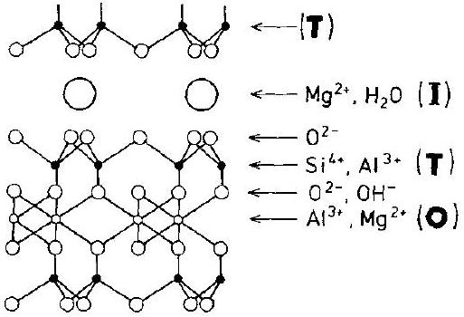
Figure 15-3. Structure of vermiculite, schematic. $\mathrm{T}=$ tetrahedral coordination sheet; $\mathrm{O}=$ octahedral coordination sheet; $\mathrm{I}=$ interlayer.

redox cations $\mathrm{Fe}^{2+} / \mathrm{Fe}^{3+}$ are present, and that both protons and electrons are mobile, we see that it is necessary to unambiguously define not only the proton and electron activities but also the activities of the neutral chemical components if we are to perform meaningful kinetic experiments.

If the cations of variable valency (e.g., $\mathrm{Fe}^{2+} / \mathrm{Fe}^{3+}$ ) are present in not too low concentrations, the crystals will be semiconductors. In non-equilibrium vermiculites, the internal electric field is then strongly influenced by their electronic conductivity, as explained in Section 4.4.2. If we start with an equilibrium crystal and change either $p_{\mathrm{H}}, a_{\mathrm{e}}, a_{\mathrm{H}_{2} \mathrm{O}}$, or $a_{i}$ (where $i$ designates any other component), coupled transport processes are induced. The coupling is enforced firstly by the condition of electroneutrality, secondly by the site conservation requirements in the T-O-T blocks (Fig. 15-3), and thirdly by the available free volume in the (van der Waals) interlayer. It is in this interlayer that the cations and the molecules are the more mobile species. However, local ion exchange between the interlayer and the relatively rigid T-O-T blocks is also possible.

Furthermore, during transport and local reaction, the crystal is inhomogeneous by necessity and thus suffers from a (inhomogeneous) swelling, which results in the build-up of self-stress. A visible indication of internal stress is the bending of the layered crystals during (exchange) reactions. From the foregoing, it follows that the conservation equation for species $i$ is composed of a flux term and a reaction term. The driving force for transport contains the stress gradient in form of ( $V \cdot \nabla \sigma$ ), see Section 14.2.1. Thus, the exchange reaction is unambiguously defined, but it is clear from the detailed discussions in Chapters 4 and 5 that its rigorous formal treatment is almost out of reach. Nevertheless, in view of the practical implications which these processes have in soil chemistry, global kinetic measurements have been performed on quite a large scale using gravimetry, DTA, X-ray and neutron spectroscopy, VIS and IR spectroscopy, NMR spectroscopy, and electron microscopy. Most of the kinetic measurements, however, were not unambiguously defined thermodynamically and electrochemically with the result that any interpretation remains uncertain.

Let us continue by discussing examples of the kinetic aspects of silicates with three dimensional networks such as feldspars and zeolites. Feldspars are found in the quasi-ternary system $\mathrm{K}\left[\mathrm{AlSi}_{3} \mathrm{O}_{8}\right]$ (K-feldspar, Or)- $\mathrm{Na}\left[\mathrm{AlSi}_{3} \mathrm{O}_{8}\right]$ (Na-feldspar, $\mathrm{Ab})-\mathrm{Ca}\left[\mathrm{Al}_{2} \mathrm{Si}_{2} \mathrm{O}_{8}\right]$ (Ca-feldspar, An). These framework silicates deserve special interest because they form the major part of the earth's crust. The feldspar structure consists of linked rings made up of four corner-sharing $\mathrm{SiO}_{4}$ and $\mathrm{AlO}_{4}$ tetrahedra. There are cavities in this network that may be occupied by the large $\mathrm{K}, \mathrm{Na}, \mathrm{Ca}$, or by others such as Ba ions which we will designate as A sites. They may differ in symmetry depending on the portion of neighboring $\mathrm{Al}^{3+}$. A small excess or deficiency in $\mathrm{SiO}_{2}$ resulting in a small deviation from the strict stoichiometric composition of the feldspar solid solution is most difficult to verify. Also, impurities may be incorporated in the feldspar structure. The solution of iron ions, for example, allows a change in the valencies of this redox system by an appropriate oxygen potential change. A relatively fast charge compensation is then possible by adapting the number of A site vacancies ( $\mathrm{V}_{\mathrm{A}}$ ) or alkali interstitials. The change in the valence influences the distribution of iron between the tetrahedral $\left(\mathrm{Fe}_{\mathrm{T}}^{3+}\right)$ and $\mathrm{A}\left(\mathrm{Fe}_{\mathrm{A}}^{2+}\right)$ sites, which in turn influences the iron diffusivity since $D_{\mathrm{Fe}}^{*}=N_{\mathrm{Fe}^{2+}} \cdot D_{\mathrm{Fe}^{2+}}+N_{\mathrm{Fe}^{3+}} \cdot D_{\mathrm{Fe}^{3+}}$.

We know from Section 6.3 that the most important species for chemical diffusion in multicomponent systems is not the one with the lowest mobility. Rather, the next to lowest one essentially determines the interdiffusion process. If, however, the $(\mathrm{Si}, \mathrm{Al}) \mathrm{O}_{4}$ network of tetrahedra remains unperturbed, chemical diffusion can only consist of a cation exchange. The $\mathrm{K}-\mathrm{Na}$ exchange is certainly the fastest, while the other exchanges are controlled by the much lower mobilities of $\mathrm{Ca}^{2+}$ or even $\mathrm{Al}^{3+}$ ions. Well defined tracer ( ${ }^{22} \mathrm{Na},{ }^{45} \mathrm{Ca}$, and ${ }^{59} \mathrm{Fe}$ ) diffusion data are available for natural plagioclase crystals ( $=$ Ab-An solid solutions) [H. Behrens, et al. (1990)]. Several observations are worth mentioning. 1) Na diffusivities are about three orders of magnitude faster than Ca diffusivities. 2) Diffusivities are nearly isotropic. 3) Whereas the diffusivity of $\mathrm{Fe}^{2+}$ is some ten times higher than that of $\mathrm{Ca}^{2+}$, the diffusivity of $\mathrm{Fe}^{3+}$ is about ten times lower, which implies that the (tracer) diffusion coefficient of iron in plagioclase depends strongly on the oxygen activity. 4) The experiment shows that whereas $D_{\mathrm{Ca}}$ does not depend on $\mu_{\mathrm{O}_{2}}, D_{\mathrm{Na}}$ decreases slightly with increasing oxygen potential. The following conclusions can therefore be drawn. By increasing $\mu_{\mathrm{O}_{2}}, \mathrm{Fe}^{2+}$ and $\mathrm{Na}_{\mathrm{A}}^{+}$is replaced by $\mathrm{Fe}^{3+}$ and $\mathrm{V}_{\mathrm{A}}$. Since $\mathrm{Na}^{+}$ion Frenkel defects ( $\mathrm{Na}_{\mathrm{i}}, \mathrm{V}_{\mathrm{A}}$ ) are the majority defects, an increase in $D_{\mathrm{Na}}$ with decreasing $\mu_{\mathrm{O}_{2}}$ indicates that Na diffusion is essentially interstitial. Schottky disorder is excluded because of the high formation energy of oxygen vacancies. The relatively low mobility of $\mathrm{Fe}^{3+}$ suggests that it replaces T -site $\mathrm{Al}^{3+}$ in the network.

Let us now turn to zeolites as another example of silicates having three dimensional network structures. Their composition can be expressed as $M_{x} D_{y}\left(\mathrm{Al}_{x+2 y} \mathrm{Si}_{n-(x+2 y)}\right) \cdot \mathrm{O}_{2 n} \cdot m \mathrm{H}_{2} \mathrm{O}$, where $M$ and $D$ are mono- and divalent metals respectively. Zeolites are aluminosilicates linked together in network forming channels and cages on a molecular level (Fig. 15-4). The framework is negatively charged. The $M$ and $D$ cations in the channels and cages are quite mobile and may be exchanged and interchanged. The lowest channel size is $2.6 \AA$, the largest one is $7.4 \AA$ and consists of 12 -membered rings. Both natural (e.g., sodalite, faujasite) and synthetic zeolites exist.

Figure 15-4. Structures of some zeolites: a) basket-like unit (truncated octahedron) of linked $\mathrm{SiO}_{4}$ tetrahedra; b) framework of baskets as in a), joined at square faces; c) space-filling framework of truncated octahedra and cubooctahedra.

In principle, all the kinetic concepts of intercalation introduced for layer-structured silicates hold for zeolites as well. Swelling, of course, is not found because of the rigidity of the three dimensional frame. The practical importance of zeolites as molecular sieves, cation exchangers, and catalysts (cracking and hydrocracking in petroleum industry) is enormous. Molecular shape-selective transport (large differences in diffusivities) and micro-environmental catalysis (in cages and channels)
favors crystal directed synthetic engineering, and particularly it favors the engineering of organic substances. Although tracer diffusion mobility and NMR mobility have been measured in zeolites, they usually do not agree. This is not surprising considering the prominent role that correlation effects play when, on an atomic scale, the diffusion paths are highly anisotropic and locally inhomogeneous. Still more complicated is the interpretation of chemical diffusion coefficients which describe the transport of components in concentration gradients. The construction of $\tilde{D}$ from the individual diffusivities associated with the Darken type equation (as can be found in the literature) certainly does not fulfill the coupling requirements of electroneutrality and site (volume) preservation in the channels.

Since the fraction of empty sites in a zeolite channel determines the correlation factor (Section 5.2.2), as is well known from single-file diffusion in the pores of a membrane, the strong dependence of the diffusion coefficients on concentration can be understood. This is why a simple Nernst-Planck type coupling of the diffusive fluxes (see, for example, [H. Schmalzried (1981)]) is also not adequate. Therefore, we should not expect that sorption and desorption are symmetric processes having identical kinetics. Surveys on zeolite kinetics can be found in [A. Dyer (1988); J. Kärger, D. M. Ruthven (1992)].

### 15.2.3 Order-Disorder Reactions

Order-disorder reactions lower the Gibbs energy by a change in the local order on an atomic scale. Order-disorder reactions do not change the local composition in a strict sense. If composition changes are involved on a mesoscale, we deal with either spinodal decomposition or diffusional transport and precipitation. Silicates illustrate all of these reaction modes. The slowness of the silicon and oxygen motions commonly leaves a system in a metastable state after sudden changes in $T$ or $P$. Then, according to Ostwald's rule, the system's first response is often a change in its local order.

Various modes of ordering are feasible. In systems with amphoteric cations (e.g., $\mathrm{Al}^{3+}$ ), the fraction of $\mathrm{Al}^{3+}$ in tetrahedral or octahedral sites is a possible order parameter. Strain may lead to a bending of $\mathrm{Si}-\mathrm{O}$ bonds. Periodic distributions of the components in space, along with elastic and/or electrostatic interactions, indicate spinodal ordering (demixing). Some examples will illustrate these general features.

Cordierite, $\left(\mathrm{Mg}_{2} \mathrm{Al}_{3}\right)$ [ $\mathrm{AlSi}_{5} \mathrm{O}_{18}$ ], is a silicate with isolated rings of six tetrahedra and occurs in two polymorphic forms. At $T>1450^{\circ} \mathrm{C}$, the high temperature hexagonal form ( $\beta$ ) is stable. The low temperature form is slightly distorted orthorhombic ( $\alpha$ ). In the $\beta$-form, there are two sorts of tetrahedral sites, $\mathrm{T}_{1}$ and $\mathrm{T}_{2}$, occupied by $\mathrm{Al}^{3+}$ and $\mathrm{Si}^{4+}$ ions ( $3 \mathrm{~T}_{1}$ by 2 Al and $1 \mathrm{Si}, 6 \mathrm{~T}_{2}$ by 2 Al and 4 Si ) in a random way. In the $\alpha$-form, the $\mathrm{T}_{1}$ sites are divided into two and the $\mathrm{T}_{2}$ sites into three nonequivalent types of sites. In this $\alpha$-form, the Si and Al ions can structurally order. The ordering kinetics are extremely sluggish at low temperature because of low jump frequencies, and at temperatures close to the $\beta \rightarrow \alpha$ transition because of the low driving force. Although this transition has been asserted to be first order, the splitting of the X-ray diffraction peaks is continuous and requires hundreds of hours at
$T \approx 1300^{\circ} \mathrm{C}$. Thus, a real understanding of the transition and ordering mechanism has still not been achieved [A. Putnis (1986)].

The second example concerns the separation of Na and K in ( $\mathrm{Na}, \mathrm{K}$ ) [ $\mathrm{AlSi}_{3} \mathrm{O}_{8}$ ] feldspars [R. A. Yund (1984)]. When homogeneous samples are annealed at temperatures between $450^{\circ} \mathrm{C}$ and $525^{\circ} \mathrm{C}$, they decompose until they reach the coherent binodal solvus after 70 and 7 days respectively. In the beginning, the process is a spinodal decomposition. The product consists of $100-500 \AA$ spaced Na and K rich lamellae that are coherently intergrown. The common interface is approximately parallel to (601). During the decomposition reaction these lamellae change composition in a continuous way in the spinodal regime. The incoherent solvus can hardly be reached in laboratory times. Composition dependent displacive transformations ( K rich monoclinic and Na rich triclinic) may complicate the ordering processes in feldspars since more than one order parameter has to be introduced in order to describe the equilibration kinetics [E. Salje (1990)].

### 15.2.4 The Role of Hydrogen in Silicates

Hydrogen can be incorporated into silicates in the form of water, $\mathrm{H}_{2}$ molecules, H atoms, $\mathrm{H}^{+}, \mathrm{OH}^{-}$, and other ways. Since oxygen is one component of a silicate, both the oxygen and hydrogen potentials ( $\mu_{\mathrm{O}_{2}}, \mu_{\mathrm{H}_{2}}$ ) must be defined in order to fix the thermodynamic state of the hydrogen containing silicates. Furthermore, the proton activity must be defined by an additional external (electrode) or internal redox buffer (e.g., $\mathrm{Fe}^{2+} / \mathrm{Fe}^{3+}$ ).

It has been repeatedly observed that small amounts of $\mathrm{H}_{2} \mathrm{O}$ dissolved in nonequilibrium silicates catalyze their equilibration (e.g., homogenization of plagioclase with initially periodic lamellae by increasing the temperature). Also, plastic deformation under stress is enhanced (hydrogen weakening). The form in which $\mathrm{H}_{2} \mathrm{O}$ dissolves is still under discussion. It may dissolve as molecules or by dissociating into $\mathrm{H}^{+}$and $\mathrm{OH}^{-}$when the proton is likely to become associated with the oxygen ions of the silicate. A further question concerns the way in which hydrogen induces a lowering of the activation barrier for component diffusion in silicates. If, for example, $\mathrm{H}_{2} \mathrm{O}$ replaces $\mathrm{Na}_{2} \mathrm{O}$ ( $\mathrm{K}_{2} \mathrm{O}$, etc.), it seems likely that the protons are network modifiers and establish essentially $\mathrm{Si}-\mathrm{O}-\mathrm{H}$ configurations $\left(\mathrm{Si}-\mathrm{O}-\mathrm{Si}+2 \mathrm{H}_{2} \mathrm{O}=\right. 2 \mathrm{Si}-\mathrm{OH}$ ). The two $\mathrm{OH}^{-}$groups which replace the one bridging oxygen ion thus perturb the $\left[\mathrm{SiO}_{4}\right]^{4-}$ tetrahedral configuration. This changes the $\mathrm{Si}-\mathrm{O}$ bond strength considerably as is also the case if $\mathrm{Si}^{4+}$ in the tetrahedron of oxygen ions is replaced by $\left(\mathrm{Al}^{3+}+\mathrm{H}^{+}\right),\left(\mathrm{Ca}^{2+}+2 \mathrm{H}^{+}\right),\left(\mathrm{Na}^{+}+3 \mathrm{H}^{+}\right)$, or even $4 \mathrm{H}^{+}$. The latter defect configuration (hydrogarnet defect [K. Wright, et al. (1994)]) has been postulated to explain the climb of dislocations in garnets. Analogous concepts have been introduced to explain the weakening of quartz [B.E. Hobbs (1985)]. Similar polarization effects on $\mathrm{Si}-\mathrm{O}-\mathrm{Si}$ bonds may be envisaged if $\mathrm{H}_{2}$ (or 2 H ) dissolves in silicates by molecular or atomic diffusion and is subsequently oxidized by an internal redox buffer (e.g., $\mathrm{Fe}^{2+} / \mathrm{Fe}^{3+}$ ) to yield protons. These protons can then be expected to become localized near network anions. If sufficiently mobile, they will loosen the entire network and hence influence the mobility of both $\mathrm{Si}^{4+}$ and $\mathrm{O}^{2-}$
simultaneously. We can also replace $\mathrm{Na}^{+}$ions by $\mathrm{H}^{+}$(protons) through electrolysis with the help of an anodic hydrogen electrode [J. Bazan (1978)].

Although there are many qualitative observations in this field, though mainly obtained through IR spectroscopy to register OH groups (e.g., [G.H. Miller, et al. (1987)]), little quantitative work concerning the influence of $\mathrm{H}_{2}\left(\mathrm{H}_{2} \mathrm{O}\right)$ on transport in silicates is known. It would be most welcome to understand the mechanism of lattice loosening and transport catalysis by $\mathrm{H}_{2} \mathrm{O}\left(\mathrm{H}_{2}\right)$ in more detail considering its influence on plastic deformation (creep) in geological processes in the earth's mantle.

### 15.2.5 Silicate Glasses

Glasses are supercooled liquids, the structure of which is (partially) frozen in. This means that translational and rotational motions which relax the unstable amorphous state towards equilibrium are appreciably slower than random jumps of the network modifying atomic particles. The radial distribution functions of atoms (ions) in glass are similar to those of other amorphous materials obtained by milling, vapor deposition, quenching from the liquid state, or chemical reaction. The supercooled liquid as such is unstable. The glass, however, is metastable, which means that although some of the motional degrees of freedom are frozen in, some species can still move continuously to establish the relative free energy minimum. Since dc-conductivities have higher activation energies above the glass temperature, $T_{\mathrm{g}}$, one concludes that below $T_{\mathrm{g}}$ certain structural relaxation processes are prevented.

Although many different substances form glasses, here we are concerned with oxide glasses, and, in particular, with silicate glasses. They are generally composed of 1) network formers $\left(\mathrm{SiO}_{2}\left(\mathrm{~B}_{2} \mathrm{O}_{3}, \mathrm{P}_{2} \mathrm{O}_{5}, \mathrm{GeO}_{2}\right)\right)$ and 2) network modifiers (e.g., $\mathrm{A}_{2} \mathrm{O}$, $\mathrm{A}=$ alkaline metals). The formers build the amorphous network through covalent $\mathrm{Si}-\mathrm{O}-\mathrm{Si}$ bridges which, by definition, lacks symmetry and periodicity on a macroscopic scale. The network modifying reaction can be written as $\mathrm{Si}-\mathrm{O}-\mathrm{Si}+\mathrm{A}_{2} \mathrm{O}= 2(\mathrm{Si}-\mathrm{O})^{-}+2 \mathrm{~A}^{+}$. The A site is localized near the nonbridging oxygen ion, but if amphoteric $\mathrm{Al}_{2} \mathrm{O}_{3}$ is added to the silicate, the $\mathrm{A}^{+}$localization is not so well defined, as can be seen from Figure 15-5a.

Based on these general concepts, various glass models have been discussed in the past. For example, instead of the random network, a 'cluster-tissue' has been proposed. Amorphicity stems from an extended pseudophase or connective tissue which embeds clusters of crystalline regions (Fig. 15-5b). These models were mainly designed to interpret experimental transport coefficients as a function of composition. One of the most distinct features in glass transport is indeed the drastic change in the transport coefficients (e.g., diffusion coefficients or electrical conductivity) with composition as illustrated in Figure 15-6. Changes of several orders of magnitude are common for a change in composition from maybe $15 \%$ to $50 \%$, and the direction of change is opposite to what we would expect from Debye-Hückel type interactions. In contrast to normal aqueous solutions of ions, glasses are highly concentrated electrolytes. Modified point defect models seem to be appropriate to describe chemical diffusion and dc-conductivity. Kahnt [H. Kahnt (1991)] has discussed the implications of this type of model in detail. The basic idea is as follows. Analogous to a

Figure 15-5. a) Schematic structure of solid $\mathrm{Na}_{2} \mathrm{O}-\mathrm{SiO}_{2}$, crystal and glass. $\mathrm{Si}^{4+}$; □ $\mathrm{Al}^{3+}$; $\mathrm{O} \mathrm{O}^{2-}$; - $\mathrm{Na}^{+}$. b) Cluster tissue model of glass. |||||: areas of increased stresses.

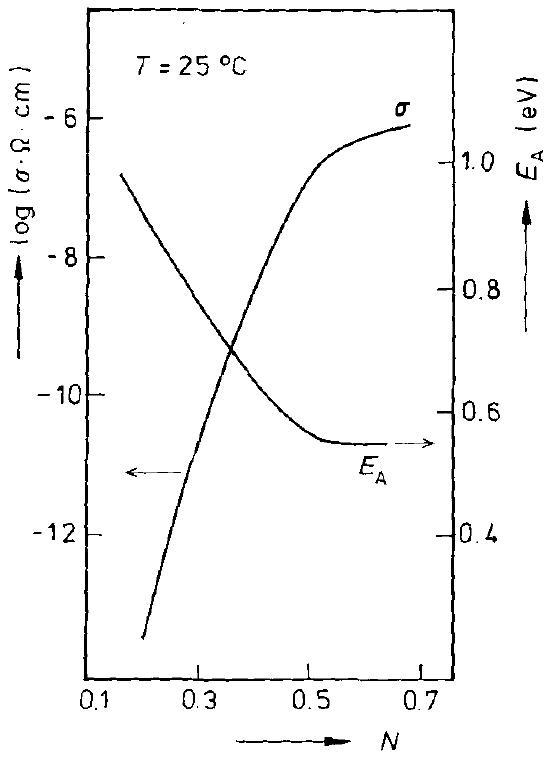
Figure 15-6. Electric conductivity ( $\sigma$ ) and activation energy ( $E_{\mathrm{A}}$ ) vs. composition for glassy $N \cdot \mathrm{Li}_{2} \mathrm{O}-(1-N) \cdot \mathrm{B}_{2} \mathrm{O}_{3}[\mathrm{H}$. Kahnt (1991)].

Frenkel type reaction, thermally activated $\mathrm{A}^{+}$leaves the potential minimum near the negatively charged nonbridging oxygen. We may understand this oxygen as a ( $\mathrm{O}_{3 / 2} \mathrm{Si}-\mathrm{O}^{-}$) unit (silicon tetrahedra to which it adheres included). We formalize this by writing $V_{i}+R^{-} A^{+}=R^{-} V+A_{i}^{+} . V_{i}$ is a cavity in the glass structure which
can take up $\mathrm{A}^{+}$ions after activation and $\mathrm{R}^{-}$designates the $\left(\mathrm{O}_{3 / 2} \mathrm{Si}-\mathrm{O}\right)^{-}$unit. At sufficiently low $\mathrm{A}_{2} \mathrm{O}$ fractions, the 'vacancies' $\mathrm{R}^{-} \mathrm{V}$ are essentially immobile and the conductivity is determined by $\mathrm{A}_{1}$. However, with increasing $N_{\mathrm{A}_{2} \mathrm{O}}$ direct jumps of the type $\left(\mathrm{R}^{-} \mathrm{A}^{+}\right)_{1}+\left(\mathrm{R}^{-} \mathrm{V}\right)_{2}=\left(\mathrm{R}^{-} \mathrm{A}^{+}\right)_{2}+\left(\mathrm{R}^{-} \mathrm{V}\right)_{1}$ will dominate.

In any case, after each elementary jump of an ion, local electric and elastic imbalances exist so that there is a tendency to cancel the forward step by a backward step (see also Section 5.2.3). Thus, jump relaxation is the key concept, and the question is whether the rigid network defines the available i sites for $\mathrm{A}^{+}$ions or whether the jumping $\mathrm{A}^{+}$ions shape their surroundings by forcing the network to relax. In this latter case, the empty site which the forward jumping $\mathrm{A}^{+}$ion has just left retains its predisposition for being revisited only if the structural relaxation time $\tau_{\mathrm{R}} \geqslant \tau_{\mathrm{D}}$ ( $\tau_{\mathrm{D}}$ being the diffusional jump time). In systems with small $\tau_{\mathrm{R}}$, the steady state vacancy concentration is correspondingly smaller in a field driven transport process. If $\tau_{\mathrm{R}} \gg \mathrm{or} \ll \tau_{\mathrm{D}}$, the $\mathrm{A}^{+}$mobilities should behave as functions of state ( $=f\left(P, T, N_{\mathrm{A}_{2} \mathrm{O}}\right)$ ). Otherwise, the mobilities become explicitly time-dependent (see, for example, Section 5.3), which complicates the formal treatment.

Correlated forward-backward jumping can be quantified by correlation factors (Section 5.2.2). Those factors have been determined by a combined tracer diffusion and electrical conductivity (or drift motion) experiment [M. Chemla (1956); H. Kahnt, et al. (1988); P. Laborde, et al. (1989)]. Quite low correlation factors have been found for glasses ( $<0.3$ ), suggesting that the strongly correlated motion is akin to a percolation along preferred paths. In the (structurally inhomogeneous) bulk of the glass, these paths may be regions of increased alkaline content.

An appealing feature of such a model is that it can qualitatively explain the mixed alkali effect (Fig. 15-7). This effect was first observed for mixed alkali glasses and has been found in other mixed glasses as well (for example, anion conducting glasses). A drastic reduction in conductivity (diffusivity) occurs when one sort of mobile ion is substituted by another having the same valency. If, along the percolation path, pairs of unlike $A_{1}^{+}-A_{2}^{+}$ions are more strongly bonded than those of like

pairs so that the jump exchange of like pairs is faster than that of unlike pairs, then we can expect a large change in conductivity (diffusivity) - thus the mixed alkali effect [A. Bunde, et al. (1991)]. For recent and detailed discussions of transport in glasses one may consult [G. H. Frischat (1975); H. Kahnt (1991); M.D. Ingram (1992)].

### 15.3 Fast Ion Conductors

### 15.3.1 Introductory Remarks

A large body of literature has been accumulated over the last three decades concerning so-called fast ionic conductors. Fast ionic conductors have an ionic conductivity (Fig. 15-8) comparable to that of moderately concentrated aqueous ionic solutions (ca. $0.1-1 \mathrm{~mol} \mathrm{l}^{-1}$ ). Fast ionic conduction is found in solid electrolytes and semiconducting crystals. Although known for quite some time, these materials became really interesting when solids were discovered which showed the unexpected high

Figure 15-8. Electrical conductivity of solid electrolytes (and concentrated $\mathrm{H}_{2} \mathrm{SO}_{4}(\mathrm{aq})$ ) as a function of temperature.

ionic conductivity already at room temperature. The corresponding research field is named solid state ionics. However, solid state ionics is appreciably less important than solid state electronics. The reason is that ionic transport involves a flow of matter, and that always changes the physical state of a system over time, in contrast to a flow of electrons.

One practical difficulty in talking about this class of conductors is that they are structurally very diverse. Conductivities of fast ionic conductors are on the order of $10^{-1} \Omega^{-1} \mathrm{~cm}^{-1}$, which corresponds to ionic diffusivities $D_{\text {ion }}$ of about $10^{-6} \mathrm{~cm}^{2} \mathrm{~s}^{-1}$ (see Eqn. (4.99)). This implies that either the mobility or the concentration of the conducting ionic species (or both) is high. Indeed, if we assume that all the ions $i$ of a particular sublattice are mobile and contribute to the conductivity ( $c_{i}=1 / V_{m}$ ), their mobility comes close to the thermal mobility approximated by setting the lattice parameter $\bar{a}$ as the mean free path ( $u=v / E=\bar{a} \cdot F / 2 \cdot \sqrt{M R T}$ ), $M=$ molecular weight. This implies that activation energies for ionic motion are definitely small ( $\ll R T$ ). Therefore, if non-activated thermal motion occurs in solids and the diffusivities are similar to those of liquids ( $\approx 10^{-5}-10^{-6} \mathrm{~cm}^{2} \mathrm{~s}^{-1}$ ), we may infer that, in the temperature range of fast ionic conduction, the sublattice of the conducting ions is 'molten'.

Let us briefly estimate the rate for the solid state reaction $\mathrm{A}+\mathrm{B}=\mathrm{AB}$, provided the product AB is a fast ionic conductor and the above numbers are valid. Since $v_{\mathrm{R}}=\alpha \cdot \partial \Delta \xi / \mathrm{d} t=j_{\mathrm{A}} \cdot V_{m}$, and $j_{\mathrm{A}}=-\left(D_{\mathrm{A}} \cdot c_{\mathrm{A}} / R T\right) \cdot \mathrm{d} \mu_{\mathrm{A}} / \mathrm{d} \xi$, one obtains for the rate of increase of product thickness, $\boldsymbol{v}_{\mathrm{R}}=-\left(D_{\mathrm{A}} / R T\right) \cdot\left(\Delta G_{\mathrm{AB}}^{0} / \Delta \xi\right)$. Letting $\Delta G_{\mathrm{AB}}^{0} / R T=10, D_{\mathrm{A}}=10^{-6} \mathrm{~cm}^{2} \mathrm{~s}^{-1}$ and $\Delta \xi=1 \mathrm{~mm}$, we see that the reaction front advances with a velocity of $c a .1 \mathrm{~cm} \mathrm{~h}^{-1}$. We emphasize that this only estimates the order of magnitude of the fastest possible diffusional solid state reaction rate.

The classic fast ionic conductors (e.g., AgI) show either a first or a second order phase transition with increasing temperature which brings them into the state of fast conduction. This order-disorder transformation has sometimes been interpreted as the 'melting' of the conduction ions in their sublattice. Some good conducting solid electrolytes, however, do not transform in this way (e.g., $\mathrm{PbF}_{2}$ ). Their high ionic conductivities are due to unusually large defect concentrations (e.g., heterovalently doped zirconia). Electrolytes of this kind are also included in our discussion because of their practical and theoretical relevance. Let us first comment on their practical importance. With solid electrolytes, one can practice electrochemistry in the same way as with aqueous systems. For example, one can use solid galvanic cells to study the thermodynamics of gases, fluids, and solids, and this sometimes at temperatures up to ca. 2000 K . It is also possible to apply solid electrolytes in kinetic studies. We mention the local probing of the chemical potential of component $i, \mu_{i}(t)$, as a function of time in a non-equilibrium solid. Another application of solid state electrochemistry is concerned with analytical studies. A well known example is the analysis of the oxygen content in liquid metals during de-oxidation processes (steel production) using stabilized zirconia as a solid electrolyte [W. A. Fischer, D. Janke (1975)]. Metal purification (de-oxidation) can be performed by letting an electric current flow (cathodically) across the oxide electrolyte. De-oxidation of liquid copper has been achieved in this way (electrolysis).

The use of solid electrolytes in batteries and fuel cells is another important application. Examples are zirconia based fuel cells and sulphur batteries with Na- $\beta$ $\mathrm{Al}_{2} \mathrm{O}_{3}$ as electrolyte. Many other interesting and practical aspects of solid electrolytes are worth mentioning, for example, the possibility to detect stresses, to build up high pressures, or to monitor mass accelerations. Also, solid electrolytes have recently been used to investigate the interface kinetics in crystals (Section 10.4.2).

### 15.3.2 Halides

Halides AX ( NaCl structure) normally do not belong to the fast ionic conductors, but they served from the very beginning of defect chemistry to develop its concepts. Silver halides ( AgBr and AgCl ) are prototypes for Frenkel disorder crystals. Alkali halides are Schottky type disordered, and are also classic materials for the study of color centers, that is, point defects that absorb photons in the visible range with the excited electrons (electron holes) remaining localized at the defects. Heated under otherwise constant conditions, silver halides show an overexponential increase in those properties near the melting point which depend on defect concentration. This can either indicate the onset of a second disorder type (e.g., Schottky disorder in addition to Frenkel disorder), or a progressive weakening of the $\mathrm{Ag}^{+}$cation sublattice by point defect formation diminishing the defect energy with increasing defect concentration. AgBr , however, melts before the cations become randomly distributed on both the regular and interstitial sublattice. In AgI , where the energy difference between the regular and interstitial sites is quite small, this sublattice melting occurs before the halide crystal itself melts. Thus, the cation sublattice with initially Frenkel disorder merges with the interstitial lattice to form a single, structurally disordered silver ion lattice. The aforementioned sublattice weakening (feedback) together with a pronounced anharmonicity of some vibrational modes, which displace cations from regular sites in the direction of the interstitial sites, cause a first order transition at 420 K . The Frenkel type of disorder in the cation sublattice is thus transformed into structural disorder [L. Lam, A. Bunde (1978); H. Schmalzried (1980); A. Bunde (1983)]. Structural disorder means that there are many more equivalent lattice sites available than there are cations and that the activation barriers between these equivalent sites are small. This all leads to fast ionic conduction. The fact that AgI and $\mathrm{Ag}_{2} \mathrm{~S}$ are structurally disordered while AgBr and NaI are not, points to the necessary prerequisites for such disorder, namely that both the cations and the anions be highly polarizable. If $\mathrm{Rb}^{+}$or another large cation is added to AgI , the disorder transformation temperature can be appreciably lowered (Fig. 15-8). $\mathrm{RbAg}_{4} \mathrm{I}_{5}$, for example, is a fast ionic conducting crystal down to 122 K . Ternary halides have more complicated crystal structures than binary ones.

AgI , in its low temperature form, crystallizes in the (hcp) wurtzite structure. The silver ions occupy tetrahedrally coordinated sites. The fast ion conducting AgI ( $T>420 \mathrm{~K}$ ) is bcc. One can stabilize structural disorder at low temperature not only by incorporating cations such as $\mathrm{Rb}^{+}, \mathrm{NH}_{4}^{+}$, etc., but also by adding $\mathrm{S}^{2-}$ to reconstruct the anion sublattice and obtain $\mathrm{Ag}_{3} \mathrm{SI}$. This compound exists in three different structures. At high temperature ( $>519 \mathrm{~K}$ ), it is bcc and both the cations and
anions are disordered in their respective sublattices. Between 157 K and 519 K , $\mathrm{I}^{-}$ and $\mathrm{S}^{2-}$ order but the $\mathrm{Ag}^{+}$ions remain structurally disordered. Both these phases are fast ionic conductors. $\mathrm{Ag}_{3} \mathrm{SI}$ shows a similar increase in ac-conductivity towards high frequencies as does AgI (in the GHz range). Whereas the elementary jumps of $\mathrm{Ag}^{+}$in AgI still resemble an activated hopping (although the time of flight and the time of residence are not very different) and can resonate with high frequency radiation, the cations in $\mathrm{Ag}_{3} \mathrm{SI}$ do not hop between distinct sites, but fluctuate in a rather shallow potential.

Like $\mathrm{AgI}(\mathrm{CuI}, \mathrm{CuBr})$ and $\mathrm{Ag}_{3} \mathrm{SI}, \mathrm{Ag}_{2} \mathrm{~S}\left(\mathrm{Ag}_{2} \mathrm{Se}, \mathrm{Ag}_{2} \mathrm{Te}, \mathrm{Cu}_{2} \mathrm{~S}, \mathrm{Cu}_{2} \mathrm{Se}, \mathrm{Cu}_{2} \mathrm{Te}\right)$ also has structural cation disorder in its high temperature modification and a correspondingly high ionic conductivity. Its electronic conductivity is even higher. These interesting materials will be discussed in the next section.

One aspect of structural disorder and ionic conduction is particularly interesting and has been thoroughly investigated for aqueous solutions [see H. Falkenhagen (1953)]. It is the correlation between subsequent jumps due to coulombic interaction, and the spatial relaxation of surrounding defects after a (forward) jump has occurred [H. Schmalzried (1977)]. Pertinent surveys both of theory and experiment have been given by [K. Funke (1978), (1993)] (see also Section 5.2.3). The exponential frequency dependence of ac-conductivity $\left(\sigma(\omega)=\sigma(0) \cdot \omega^{\mathrm{p}}, \mathrm{p}<1\right.$, sometimes named universal response) reflects the coulombic interaction. The question of correlation is twofold: 1) How are cations in equilibrium distributed over the available (energetically not completely equivalent) lattice sites? 2) Which connecting paths between different sites have the lowest activation barriers and are therefore preferred during conduction? The second question concerns geometric correlations, although physical correlations other than those due to Coulomb interactions may also be of importance. In $\mathrm{Ag}_{2} \mathrm{X}$ systems, several $\mathrm{Ag}^{+}$ions participate in a correlated linear sequence of displacements (caterpillar motion) before they thermalize again. The combination of electric conduction and tracer experiments, along with neutron scattering and IR absorption, gave insight into the atomic dynamics of these elementary motion events.

We summarize what is special with these prototype fast ion conductors with respect to transport and application. With their 'quasi-molten', partially filled cation sublattice, they can function similar to ion membranes in that they filter the mobile component ions in an applied electric field. In combination with an electron source (electrode), they can serve as component reservoirs. Considering the accuracy with which one can determine the electrical charge ( $10^{-1} \mathrm{~s} \cdot 10^{-6} \mathrm{~A}=10^{-7} \mathrm{C} \wedge 10^{-12} \mathrm{~mol} \left(z_{i}=1\right)$ ), fast ionic conductors (solid electrolytes) can serve as very precise analytical tools. Solid state electrochemistry can be performed near room temperature, which is a great experimental advantage (e.g., for the study of the Hall-effect [J. Sohege, K. Funke (1984)] or the electrochemical Knudsen cell [N. Birks, H. Rickert (1963)]). The early volumes of the journal Solid State Ionics offer many pertinent applications.

We mentioned before that not all fast ionic conductors possessing a large fraction of disordered ions arrive at the disordered state via a phase transformation. $\mathrm{SrF}_{2}$, $\mathrm{BaF}_{2}$, and, in particular, $\mathrm{PbF}_{2}$ are increasingly disordered in the anionic sublattice. The defect fraction amounts to $10 \%, 20 \%$, and $40 \%$ respectively at 700 K [M.H. Dickens, et al. (1980)]. In a strict and systematic sense, this type of disorder is not
structural because all regular lattice sites are occupied at low temperature. $\mathrm{Bi}_{2} \mathrm{O}_{3}$, however, which at sufficiently high temperature attains the fluorite structure, fills only $3 / 4$ of the available anion sites with oxygen ions and is therefore a structurally disordered compound. Its oxygen ion conductivity is two orders of magnitude larger than that of stabilized zirconia (which also crystallizes in the fluorite structure, see later).

### 15.3.3 $\mathbf{A g}_{2} \mathbf{S}\left(\mathbf{A g}_{2} \mathbf{S e}, \mathbf{A g}_{2} \mathbf{T e}\right)$

Silver sulfide is non-stoichiometric and should be written as $\mathrm{Ag}_{2+\delta} \mathrm{S}$. In the $\alpha$-form $\left(<176^{\circ} \mathrm{C}\right)$, the range in $\delta$ is $\mathrm{ca} .( \pm) 10^{-5}$. In the $\beta$-form ( $>176^{\circ} \mathrm{C}$ ), the $\delta$ range is ca. $(+) 10^{-3}$. With increasing non-stoichiometry $\delta$, the conduction band of $\mathrm{Ag}_{2} \mathrm{~S}$ is filled with electrons, which explains that silver sulfide undergoes a semiconductor to metal transition. A survey of the electrical and thermodynamic properties of $\mathrm{Ag}_{2+\delta} \mathrm{S}$ is given in $\left[\mathrm{H}\right.$. Schmalzried (1980)]. $\beta-\mathrm{Ag}_{2+\delta} \mathrm{S}$ possesses structurally disordered $\mathrm{Ag}^{+}$ions in the framework of a bcc sublattice of sulphur ions somewhat analogous to structurally disordered Ag-halides. Also, the partial conductivity of $\mathrm{Ag}^{+}$ions in $\beta$-silver sulfide is on a similar order of magnitude to that found for structurally disordered halides. Therefore, in spite of an electronic transference number close to one, silver chalcogenides (except probably $\mathrm{Ag}_{2} \mathrm{O}$ ) are rightly treated in the context of fast ionic conductors. Indeed, the combination of fast ionic conduction with semiconduction (or even metallic conduction) makes $\mathrm{Ag}_{2+\delta} \mathrm{S}$ a unique material for solid state electrochemistry. On the one side, we can use it as a silver electrode with little polarization under load. On the other side, we can predetermine the Ag activity in this electrode over a large activity range with the help of an auxiliary galvanic cell. $\mathrm{Ag}_{2} \mathrm{~S}$ served as a prototype material for many applications in solid state electrochemistry, viz. catalysis, coulometric titration, interface reaction kinetics, and others. These applications are possible because $\beta-\mathrm{Ag}_{2+\delta} \mathrm{S}$ meets two requirements: it can supply both electrons and silver with variable potentials. Even under non-equilibrium conditions, the chemical potentials can be kept (spatially) constant in a sufficiently small $\mathrm{Ag}_{2} \mathrm{~S}$ sample due to the high electron and ion mobilities. We note that the chemical diffusion coefficient $\tilde{D}_{\mathrm{Ag}}$ of Ag in $\mathrm{Ag}_{2} \mathrm{~S}$ has been determined to be ca. $0.1 \mathrm{~cm}^{2} \mathrm{~s}^{-1}$. This allows not only concentration relaxation to take place in seconds over macroscopic distances, but also the growth of centimeter long crystals over a period of several hours by a solid state reaction (i.e., $\left.2 \mathrm{Ag}+\mathrm{S}(\mathrm{l})=\mathrm{Ag}_{2} \mathrm{~S}\right)$.

Let us discuss some kinetic applications. Firstly, we may inspect the functioning of $\mathrm{Ag}_{2+\delta} \mathrm{S}$ as a catalyst with predetermined Ag activity and the determination of catalyzed reaction rates. Figure 15-9 illustrates the experimental principle: a voltage $U$ is imposed potentiostatically on a $\mathrm{Ag} / \mathrm{AgI} / \mathrm{Ag}_{2+} \mathrm{S} / \mathrm{Pt}$ cell. It immediately predetermines the silver activity in both the bulk and at the surface of $\mathrm{Ag}_{2+\delta} \mathrm{S}$ since $\tilde{D}_{\mathrm{Ag}} \approx 0.1 \mathrm{~cm}^{2} \mathrm{~s}^{-1}$. A gas mixture of $\mathrm{H}_{2} / \mathrm{H}_{2} \mathrm{~S}$ flows along the $\mathrm{Ag}_{2} \mathrm{~S}$ surface. The equilibrium sulphur activity in the gas (given by $1 / 2 \mathrm{~S}_{2}+\mathrm{H}_{2}=\mathrm{H}_{2} \mathrm{~S}$ ) is, in general, different from the sulphur activity in $\mathrm{Ag}_{2+\delta} \mathrm{S}\left(1 / 2 \mathrm{~S}_{2}+2 \mathrm{Ag}=\mathrm{Ag}_{2} \mathrm{~S}\right)$. Therefore, the gas will be either oxidized or reduced at the $\mathrm{Ag}_{2+\delta} \mathrm{S}$ surface which acts as a catalyst. Let us consider the oxidation reaction

$$
\mathrm{H}_{2}(\mathrm{~g})+\mathrm{S}^{n-}\left(\mathrm{Ag}_{2} \mathrm{~S}, \mathrm{ad}\right)=n \cdot \mathrm{e}^{\prime}\left(\mathrm{Ag}_{2} \mathrm{~S}\right)+\mathrm{H}_{2} \mathrm{~S}(\mathrm{~g})
$$

The $\mathrm{Ag}_{2+\delta} \mathrm{S}$ surface provides sulphur ions ( $\mathrm{S}^{n-}\left(\mathrm{Ag}_{2} \mathrm{~S}, \mathrm{ad}\right)$ ) as reactants and takes up the product electrons. The activities of both the reactants and the products are determined by the applied voltage $U$. 1) $\mathrm{Ag}=\mathrm{Ag}^{+}+\mathrm{e}^{\prime}$ yields $\mathrm{d} \mu_{\mathrm{Ag}}=\mathrm{d} \mu_{\mathrm{e}}=-F \cdot \mathrm{~d} U$. 2) $\mathrm{S}^{n-}=\mathrm{S}^{2-}+(n-2) \cdot \mathrm{e}^{\prime}$ yields $\mathrm{d} \mu_{\mathrm{S}^{n-}}=(n-2) \cdot \mathrm{d} \mu_{\mathrm{e}}=-(n-2) \cdot F \cdot \mathrm{~d} U$. Note that $\mathrm{d} \mu_{\mathrm{S}^{2-}}$ and $\mathrm{d} \mu_{\mathrm{Ag}^{+}}$vanish in $\mathrm{Ag}_{2+\delta} \mathrm{S}$. The main advantage of this electrochemical experiment is the possibility it gives for measuring reaction rates via a flux of electrons in the electrical circuit ( $=i_{\mathrm{e}}$, see Fig. 15-9). By monitoring $i_{\mathrm{e}}$, one can thus determine the (catalyzed) reaction rate as a function of $U$, which means as a function of the stationary electron or silver activity at the surface of $\mathrm{Ag}_{2+\delta} \mathrm{S}$.

Figure 15-9. Electrochemical device for the determination of catalytic reaction rates as a function of the component activity (e.g., $a_{\mathrm{Ag}}$ or $a_{\mathrm{S}}$ in $\mathrm{Ag}_{2} \mathrm{~S}$ ).

As a second kinetic example we investigate the spread of a perturbation in the Ag activity from the surface of the $\mathrm{Ag}_{2} \mathrm{~S}$ crystal into the bulk. The experimental situation is shown in Figure 15-10a. An electrochemical cell is set up which allows one to change the silver activity (or the composition from $\delta^{*}$ to $\delta^{*}+\Delta \delta$ ) at one end of the sulfide sample by a perturbing voltage pulse which injects $\mathrm{Ag}^{+}$ions and electrons $\left(=\int_{0}^{\Delta t} I \mathrm{~d} t\right)$. The corresponding change in non-stoichiometry $\delta$ (or in activity) spreads by chemical diffusion into the crystal (Fig. 15-10b). The activity wave can be monitored by appropriate Ag activity sensors along the length of the $\mathrm{Ag}_{2+\delta} \mathrm{S}$

Figure 15-10. a) Electrochemical device for the determination of chemical diffusion in mixed conductors ( $\mathrm{Ag}_{2+\delta} \mathrm{S}$ ). b) Course in time of $\delta$ (resp. emf of $\mathrm{Ag} / \mathrm{AgI}$ probes), measured at probe $n$. $\delta^{*}=$ starting composition.

sample as indicated. If the point defects associated with the non-stoichiometry $\delta$ behave as ideally diluted solutes, the solution to the diffusion problem is
$\Delta \delta(\xi, t) \sim\left(\frac{1}{F} \cdot \int_{0}^{\Delta t} I \cdot \mathrm{~d} t\right) \cdot \mathrm{e}^{-\frac{N \xi^{2}}{4 \cdot \tilde{D} \cdot t}} \cdot \frac{1}{\sqrt{\pi \cdot \tilde{D} \cdot t}}$
where $\int_{0}^{\Delta t} I \cdot \mathrm{~d} t$ is the corresponding current pulse. It is necessary that $\Delta t \ll$ diffusion time $t$. As long as $\Delta \delta / \delta^{*} \ll 1$, we may safely assume that $\tilde{D}$ is constant during this transport. In order to evaluate $\tilde{D}$ from Eqn. (15.2), one notes that in a linearized version $\Delta \mu_{\mathrm{Ag}}=\mu_{\mathrm{Ag}}-\mu_{\mathrm{Ag}}^{*}$ is proportional to $\Delta \delta / \delta^{*}$. Therefore, one may either measure $\Delta \mu_{\mathrm{Ag}}$ as a function of time with a single and spatially fixed sensor at $\xi$, or one can determine $\bar{D}$ with several sensors as a function of the coordinate $\xi$ at a given time [K. D. Becker, et al. (1983)]. An interesting result of such a determination of $\tilde{D}$ is its dependence on non-stoichiometry. Since $\tilde{D}_{\mathrm{Ag}}=D_{\mathrm{Ag}} \cdot \partial\left(\mu_{\mathrm{Ag}} / R T\right) / \partial \ln \delta$, and $D_{\mathrm{Ag}}$ is constant in structurally or heavily Frenkel disordered material ( $\delta \ll 1$ ), $\tilde{D}_{\mathrm{Ag}}(\delta)$ directly reflects the (normalized) thermodynamic factor, $\partial\left(\mu_{\mathrm{Ag}} / R T\right) / \partial \ln \delta$, as a function of composition, that is, the non-stoichiometry $\delta$. From Section 2.3 we know that the thermodynamic factor of compounds is given as the derivative of a point defect 'titration' curve in which $\mu_{\mathrm{Ag}}$ is plotted as a function of $\ln \delta$. At $\delta=0$, the thermodynamic factor has a maximum. For $\beta$ - $\mathrm{Ag}_{2} \mathrm{~S}$ at $\mathrm{T}=176^{\circ} \mathrm{C}$, one sees from the quoted diffusion measurements that at stoichiometric composition ( $\delta=0$ ), the thermodynamic factor may be as large as to $10^{2}-10^{3}$.

### 15.3.4 Oxides: Stabilized Zirconia

Stabilized zirconia ( $\mathrm{ZrO}_{2}(+\mathrm{MeO})$ ) has a long history in solid state physical chemistry. In the late 19 th century, Nernst found that zirconia was a reasonably good conductor of electricity when it was heavily doped with heterovalent cations. Preheated to temperatures $>1000^{\circ} \mathrm{C}$, it could sustain its temperature under an electric load by ohmic heating. Radiation efficiency was remarkable because of favorable emission in the visible region of the spectrum. There were early attempts to use stabilized zirconia as a fuel cell electrolyte [E. Baur, H. Preis (1937)], but high temperature technology was not sufficiently advanced at that time to make it a success. The correct description of the electrical conduction mechanism of zirconia was given by Kiukkola and Wagner [K. Kiukkola, C. Wagner (1957)] based on experimental results obtained by Hund [F. Hund (1952)]. Later, it was found that at very high and very low oxygen potentials the material became a p-type and n-type semiconductor respectively [H. Schmalzried (1962)].

Stabilized (sufficiently doped) zirconia crystallizes in the fluorite structure. The heterovalent cations replace tetravalent zirconium on regular cation sites. The electric charge compensation is accomplished by vacancies in the oxygen ion sublattice. Since the dopant concentration can be as high as $20 \%$ at $1500^{\circ} \mathrm{C}$, a correspondingly large number of oxygen vacancies contribute to the oxygen ion mobility. As a result, the
transference number of the oxygen ions is almost unity for an extended range of oxygen potentials. Cations are far slower and therefore ordering processes occurring in the cationic sublattice are sluggish. These have, however, only a minor influence on the oxygen conductivity.

Galvanic cells employing doped zirconia as an electrolyte have been used many times under open circuit conditions and at high ( $>600^{\circ} \mathrm{C}$ ) and very high $\left(\sim 2000^{\circ} \mathrm{C}\right)$ temperatures in order to determine the chemical potential in oxides or in oxygen containing systems (e.g., $\mathrm{Cu}(\mathrm{O})$-metal). The appropriate combination of phases in the electrode allow one to not only determine the partial Gibbs energies, but also the formation Gibbs energies ( $\mathrm{A}+\frac{1}{2} \mathrm{O}_{2}=\mathrm{AO}$ ) and reaction Gibbs energies $\left(\mathrm{AO}+\mathrm{B}_{2} \mathrm{O}_{3}=\mathrm{AB}_{2} \mathrm{O}_{4}\right)$. Changing the cell temperature also allows one to obtain the corresponding enthalpies and entropies. In view of the technological importance of oxides, the zirconia electrolyte has thus proved to be an indispensable tool for establishing the high temperature thermodynamics of oxides and oxygen containing systems. A significant feature of the zirconia electrolyte is its high thermodynamic stability ( $\Delta G_{\mathrm{ZrO}_{2}}^{0}$ ), which prevents any displacement reactions with most other metal components in galvanic cells.

Since doped zirconia allows one to extend the oxide electrochemistry up to very high temperatures and since it can serve as a fuel cell electrolyte and even as a heating element in high temperature furnaces, we will briefly formalize the structure element transport in zirconia, which is the basis for all of this. Let us introduce the SE fluxes in their usual form. We know that only oxygen ions and electronic defects contribute to the electrical transport ( $i=\mathrm{O}^{2-}, \mathrm{e}^{\prime}, \mathrm{h}^{*}$ )

$$
j_{i}=-L_{i} \cdot \nabla \eta_{i} ; \quad L_{i}=\frac{c_{i} \cdot D_{i}}{R T} ; \quad \nabla \eta_{i}=\nabla \mu_{i}+z_{i} F \nabla \varphi
$$

Under open circuit conditions, the electric current $I=\sum z_{i} \cdot F \cdot j_{i}$ vanishes. As long as $t_{\mathrm{O}^{2-}} \cong 1$ this means that $j_{\mathrm{O}^{2-}}=L_{\mathrm{O}^{2-}} \cdot \nabla \eta_{\mathrm{O}^{2-}} \cong 0$, or equally $\nabla \mu_{\mathrm{O}^{2-}}=z_{i} \cdot F \cdot \nabla \varphi=0$. This is true since oxygen ions are the mobile majority species with a constant chemical potential independent of any variation in the oxygen potential. It follows that the electrical potential in the oxide electrolyte of a galvanic cell is constant under open circuit conditions, despite the different oxygen potentials at the two electrodes.

Let us now consider the (very small) flux of electronic minority carriers. Since $\nabla \mu_{\mathrm{O}^{2-}}=0$, we see that in local electrochemical equilibrium, the reaction $\frac{1}{2} \mathrm{O}_{2}+2 \mathrm{e}^{-}=\mathrm{O}^{2-}$ results in $\nabla \mu_{\mathrm{O}_{2}}=2 \cdot \nabla \mu_{\mathrm{O}}=-4 \cdot \nabla \mu_{\mathrm{e}}$. An oxygen potential gradient in the open circuit cell therefore induces a gradient in the electron potential and thus in the electron concentration. The variations in the different pertinent potentials are depicted in Figure 15-11. The electron potential gradient gives rise to a small (diffusional) electronic leak current across the cell. Yet since no matter is transported between the electrodes via the electrons (and electron holes), the electrical work equivalent to the oxygen chemical potential difference (emf, $E$ ) is reduced accordingly so that

$$
4 \cdot F \cdot E=\int_{\mu_{O_{2}}^{\prime}}^{\mu_{O_{2}}^{\prime \prime}}\left(1-t_{\mathrm{el}}\right) \cdot \mathrm{d} \mu_{\mathrm{O}_{2}}
$$

where $t_{\mathrm{el}}=\left(t_{\mathrm{e}}+t_{\mathrm{h}}\right)$ is the electronic transference number.

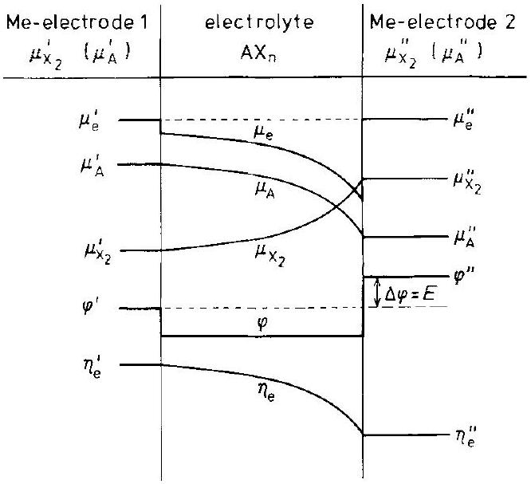
Figure 15-11. Different potentials in the electrolyte of an open circuit galvanic (e.g., zirconia electrolyte) cell (schematic).

Since the fraction of electrons and holes, although very small, depends on the (local) oxygen potential and since the mobility of the electronic defects is far larger than that of the ionic defects, the electronic conductivity may, by continuously changing the oxygen potential, eventually exceed the ionic conductivity. By definition, the transference number is $t_{\text {ion }}=\sigma_{\text {ion }} /\left(\sigma_{\text {ion }}+\sigma_{\text {el }}\right)$, which explicitly yields

$$
t_{\mathrm{ion}}=\left(1+\frac{\sigma_{\mathrm{el}}}{\sigma_{\mathrm{ion}}}\right)^{-1}=\left(1+\left(\frac{p_{\mathrm{O}_{2}}}{p_{\oplus}}\right)^{1 / 4}+\left(\frac{p_{\mathrm{O}_{2}}}{p_{\ominus}}\right)^{-1 / 4}\right)^{-1}
$$

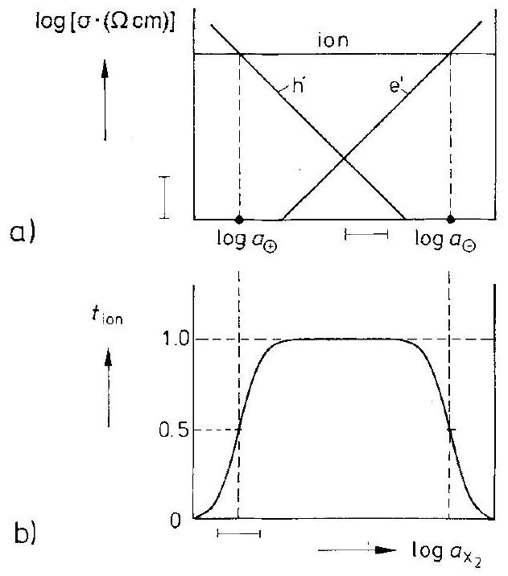
Figure 15-12. Conductivities and transference numbers of solid electrolytes as a function of $\mu_{\mathrm{X}_{2}}\left(\mu_{\mathrm{O}_{2}}\right)$.

The last part of Eqn. (15.5) is obtained if we realize that $\sigma_{\text {ion }}$ is constant (by doping $\mathrm{ZrO}_{2}$ with MeO ) and that $\sigma_{\mathrm{e}}=F \cdot u_{\mathrm{e}} \cdot c_{\mathrm{e}}$ with $c_{\mathrm{e}} \sim p_{\mathrm{O}_{2}}^{-1 / 4}, \sigma_{\mathrm{h}}=F \cdot u_{\mathrm{h}} \cdot c_{\mathrm{h}}$ with $c_{\mathrm{h}} \sim p_{\mathrm{O}_{2}}^{+1 / 4}$. The parameters $p_{\oplus}$ and $p_{\ominus}$ are independent of $p_{\mathrm{O}_{2}}$ and can be calculated by an explicit evaluation [H. Schmalzried (1981)]. From Eqn. (15.5), we conclude that $p_{\oplus}=p_{\mathrm{O}_{2}}$ for $t_{\mathrm{h}}=\frac{1}{2}$ and $p_{\ominus}=p_{\mathrm{O}_{2}}$ for $t_{\mathrm{e}}=\frac{1}{2}$ as long as $p_{\oplus}$ and $p_{\ominus}$ are sufficiently different.

Equation (15.5) shows that for very high and very low $p_{\mathrm{O}_{2}}\left(\mu_{\mathrm{O}_{2}}\right)$ the transference number of the ions vanishes. From Eqn. (15.4), we read that $\left(\partial E / \partial \mu_{\mathrm{O}_{2}}\right)_{\mu_{\mathrm{O}_{2}}}$ is zero if $t_{\text {ion }}\left(=1-t_{\mathrm{el}}\right)$ vanishes. This means that stabilized zirconia cannot be used as a solid electrolyte in the ranges of oxygen potential where $p_{\mathrm{O}_{2}}>p_{\oplus \oplus}$ and $p_{\mathrm{O}_{2}}<p_{\ominus}$, either in galvanic cells or in fuel cells. For $p_{\oplus}>p_{\mathrm{O}_{2}}>p_{\ominus}$, the oxide is said to be in its electrolytic domain (Fig. 15-12).

In generalizing these results, we can apply them to other solid electrolytes as well, for example, to other fluorite type oxides (e.g., $\mathrm{HfO}_{2}, \mathrm{CeO}_{2}$ ) that have been doped with heterovalent cations (e.g., $\mathrm{SrO}, \mathrm{BaO}, \mathrm{Y}_{2} \mathrm{O}_{3}, \mathrm{La}_{2} \mathrm{O}_{3}$ ).

### 15.3.5 $\beta$-Alumina

The stoichiometric form of $\beta$-alumina reads $\mathrm{Na}_{2} \mathrm{O} \cdot 11 \mathrm{Al}_{2} \mathrm{O}_{3}$. Interest in this material grew when it was found that its cation conductivity at room temperature was comparable to that of other fast ionic conductors ( $\approx 10^{-2} \Omega^{-1} \mathrm{~cm}^{-1}$ ). The high mobility of the sodium ions and the related low activation energy ( $c a .0 .16 \mathrm{eV}$ ) have two causes. 1) The compound normally exists with an excess of $\mathrm{Na}^{+}$ions. It should therefore be written as $(1+x) \mathrm{Na}_{2} \mathrm{O} \cdot 11 \mathrm{Al}_{2} \mathrm{O}_{3}, x \approx 0.25-0.5$, indicating that $\beta$ alumina is highly non-stoichiometric. 2) The structure offers more than one lattice site to each $\mathrm{Na}^{+}$ion and the compound therefore belongs to the class of structurally disordered materials. One can describe the $\beta$-alumina structure in a somewhat simplified way as consisting of four closely packed $\mathrm{O}^{2-}$ planes filled with $\mathrm{Al}^{3+}$ cations in a spinel block arrangement $\left(\mathrm{Al}_{11} \mathrm{O}_{16}\right)$ [G. Collin, et al. (1988)]. The fifth plane, which is a mirror plane, contains only one quarter of the oxygen ions of the other planes (spacer oxygen) plus the $\mathrm{Na}^{+}$ions. The $\beta$-alumina structure is hexagonal. The $c$-axis is perpendicular to the mirror plane, being about $22.53 \AA$. The $\mathrm{Na}^{+}$ions are in the highly conductive mirror plane on energetically very similar crystallographic sites (Beever-Ross sites (BR), anti-BR sites, and others). The excess sodium cations, with their extra charge, must be compensated for in one way or another. Neutron diffraction studies have indicated that the $\mathrm{Al}^{3+}$ ions have left some of their spinel structure sites to form $\mathrm{Al}^{3+}$ vacancies. This means that the equilibrium concentration of Frenkel type defects in the stoichiometric compound is disturbed by the excess $\mathrm{Na}^{+}$ions; the $\mathrm{V}_{\mathrm{Al}}$ vacancies compensate the extra positive charge. In addition, interstitial $\mathrm{O}_{\mathrm{i}}^{2-}$ can be placed in the relatively open conducting plane. An $\left(\mathrm{Al}_{\mathrm{i}}^{3+}-\mathrm{O}_{\mathrm{i}}^{2-}-\mathrm{Na}^{+}\right)$complex in this plane has been suggested to be energetically favorable.

The $\mathrm{Na}^{+}$ions in the conducting plane have been substituted for by many other (mostly monovalent) cations, and $\mathrm{Al}^{3+}$ in the spinel block has also been substituted for by other di- and trivalent cations. This exchange results in a very complex crystal
chemistry. The exchange kinetics resemble that of intercalation compounds. If $\mathrm{Na}^{+}$ ions are replaced by protons, the iol.ic conductivity drops as a result of strong $\mathrm{H}-\mathrm{O}$ interactions with the spacer oxygen ions. If, however, $\mathrm{Al}^{3+}$ in the spinel blocks is replaced by Fe ions, the material may eventually become a semiconductor. The electrical conductivity, as well as the non-stoichiometry (metal to oxygen ratio), are then dependent on the oxygen activity.

The ionic conductivity perpendicular to the conducting plane is very low in comparison. Therefore, the electrical conductivity of polycrystalline $\beta-\mathrm{Al}_{2} \mathrm{O}_{3}$ depends strongly on its microstructure. This conductivity has been modeled by two resistances in series: bulk resistance and grain boundary resistance. A parallel grain boundary capacitance is taken into account as well. With the help of ac-measurements as a function of frequency, one can thus characterize polycrystalline $\beta-\mathrm{Al}_{2} \mathrm{O}_{3}$ phenomenologically. Yet many questions arise in connection with the heterogeneous nature of the contacts between the different grains. The complicated geometrical pattern of the flux lines (often operating under high-field conditions) can hardly be assessed in a quantitative way. Polycrystalline material, however, is often necessary for technical applications in view of the pronounced anisotropy of $\beta-\mathrm{Al}_{2} \mathrm{O}_{3}$ single crystals.
$\mathrm{Na}-\beta-\mathrm{Al}_{2} \mathrm{O}_{3}$ is the preferred electrolyte for sodium-sulphur batteries. In these batteries, the reversible electrodes must be stable and electronically conducting Na buffers. Sodium metal and $\mathrm{NaS}_{x}$ serve the need. The corrosion resistance of the electrolyte is rather good towards both electrodes. The chemical reaction taking place in the galvanic cell $\mathrm{Na} / \mathrm{Na}-\beta-\mathrm{Al}_{2} \mathrm{O}_{3} / \mathrm{NaS} x$ under load is the dissolution of Na in $\mathrm{NaS}_{x}$ by transport of $\mathrm{Na}^{+}$ions across the electrolyte. The emf then is $E=-\Delta \bar{G}_{\mathrm{Na}} / F$. The most important practical feature of the cell is its efficiency, which is mainly limited by polarization processes and ohmic losses. Polarization processes occur at the electrode interfaces but, as we have seen, grain boundary contacts may also consume some part of the available driving force. Therefore, the necessary optimization of the microstructure with respect to technical applications is an interesting task for material scientists. Obvious advantages of $\beta$-alumina cells are their favorable power/weight ratio, their relatively low performance temperature, and that they are rechargeable.

Unfortunately, $\beta$-alumina cannot be used as a fuel cell electrolyte since its oxygen ions are immobile and so any oxygen electrodes in the corresponding galvanic cells will not be reversible. However, under open circuit conditions, $\beta$-alumina has been successfully used as an oxygen potential sensor. In this mode of application, the oxygen electrode equilibrates with the $\mathrm{Na}^{+}$ions of the electrolyte as follows

$$
\frac{1}{2} \mathrm{O}_{2}+2 \mathrm{e}^{\prime}+2 \mathrm{Na}^{+}=\underline{\mathrm{Na}_{2} \mathrm{O}} \quad(\beta \text {-alumina })
$$

As long as the $\beta$-alumina sensor remains homogeneous as far as $\mathrm{Na}^{+}$is concerned (which is achieved by the high fraction of $\mathrm{Na}_{2} \mathrm{O}$ ), we see from Eqn. (15.6) that the electron potential varies inversely with the oxygen activity. We have already mentioned that $\beta$-alumina is able to incorporate a number of different cations into the conducting plane. This non-specificity hampers the use of $\beta$-alumina as a universal sensor material under ordinary conditions. If more than one mobile component is
dissolved in the system to be electrochemically analyzed, displacement reactions between this system (i.e., the electrode of a galvanic cell) and the $\beta-\mathrm{Al}_{2} \mathrm{O}_{3}$ electrolyte occur. The signal therefore is a mixed potential with a correspondingly diminished thermodynamic significance.

Single crystals of $\beta-\mathrm{Al}_{2} \mathrm{O}_{3}$ are essentially two dimensional conductors. The conducting plane has hexagonal symmetry (honeycomb lattice). This characteristic feature made $\beta$-alumina a useful model substance for testing atomistic transport theory, for example with the aid of computer simulations. Low dimensionality and high symmetry reduce the computing time of the simulations considerably (e.g., for the calculation of correlation factors of solid solutions).

There exists another metastable modification in the quasi-binary $\mathrm{Na}_{2} \mathrm{O}-\mathrm{Al}_{2} \mathrm{O}_{3}$ system. It is designated as $\beta^{\prime \prime}$-alumina. The incorporation of divalent (monovalent) spinel forming cations such as $\mathrm{Mg}^{2+}$ ( $\mathrm{Li}^{+}$) to replace $\mathrm{Al}^{3+}$ in the spinel blocks of the $\beta$-aluminas stabilizes $\beta^{\prime \prime}$-alumina. The chemical formula for $\beta^{\prime \prime}$-alumina can be written as $\mathrm{Na}_{1-x} \mathrm{Mg}_{x} \mathrm{Al}_{11-x} \mathrm{O}_{17}$, where $x$ amounts to $c a .0 .6-0.7 . \beta^{\prime \prime}$-alumina is possibly the more interesting fast ionic conductor as it is structurally more open than $\beta-\mathrm{Al}_{2} \mathrm{O}_{3}$. The BR and anti-BR sites are equivalent so that the geometry of the conducting plane is simpler and, more important, the ionic conductivity is more than two orders of magnitude higher than in $\beta-\mathrm{Al}_{2} \mathrm{O}_{3}$. This renders $\beta^{\prime \prime}-\mathrm{Al}_{2} \mathrm{O}_{3}$ most suitable for the application in $\mathrm{Na} / \mathrm{S}$ batteries since the current densities are thereby increased and the ohmic losses diminished. One other notable feature of the $\beta^{\prime \prime}$ material is its ability to exchange not only monovalent cations but also divalent and trivalent cations $\left(\mathrm{Pb}^{2+}, \mathrm{La}^{3+}\right)$, which retain a relatively high mobility in the conducting plane. X-rays reveal a partial ordering at lower temperatures. Interesting op-to-electronic properties have also been mentioned.

### 15.3.6 Proton Conductors

Considering their possible applications in fuel cells, hydrogen sensors, electrochromic displays, and other industrial devices, there has been an intensive search for proton conducting crystals. In principle, this type of conduction may be achieved in two ways: a) by substituting protons for other positively charged mobile structure elements of a particular crystal and b) by growing crystals which contain a sufficient amount of protons as regular structure elements. Diffusional motion (e.g., by a vacancy mechanism) then leads to proton conduction. Both sorts of proton conductors are known [P. Colomban (1992)].

In crystals of type (a) above, protons migrate by activated hopping. Quantum effects become noticeable through large zero point energies by departures from Ar-rhenius-type behavior. In crystals of type (b), which are often hydrated compounds, motion mechanisms have been proposed by which the protons migrate along $\mathrm{H}_{2} \mathrm{O}$ chains or layers in analogy to the Grotthus mechanism of proton conduction in water ( $\mathrm{H}_{3} \mathrm{O}^{+}+\mathrm{H}_{2} \mathrm{O}=\mathrm{H}_{2} \mathrm{O}+\mathrm{H}_{3} \mathrm{O}^{+}$; breaking of H -bonds and reorientation) as described in textbooks of physical chemistry. Other correlated modes of translational motion have also been considered [see J. B. Goodenough (1986)]. Type (a) conductors can operate at relatively high temperatures $\left(\sim 1000^{\circ} \mathrm{C}\right)$. Examples are $\mathrm{SrCeO}_{3}, \mathrm{BaCeO}_{3}$,
and $\mathrm{KTaO}_{3}$ annealed under $\mathrm{H}_{2}$ or $\mathrm{H}_{2} \mathrm{O}$ atmospheres. It has been suggested that protons take the place of electron holes in these ceramic materials ( $\mathrm{H}_{2}+2 \mathrm{~h}^{*}=2 \mathrm{H}^{*}$ ). Type (b) conductors can normally operate only at lower temperatures (room temperature to $\sim 500^{\circ} \mathrm{C}$ ). Examples are $\mathrm{HUO}_{2} \mathrm{PO}_{4} \cdot 4 \mathrm{H}_{2} \mathrm{O}, \mathrm{H}_{3} \mathrm{Mo}_{12} \mathrm{PO}_{40} \cdot 29 \mathrm{H}_{2} \mathrm{O}, \mathrm{H}_{3} \mathrm{~W}_{12} \mathrm{PO}_{40} \cdot 27-29 \mathrm{H}_{2} \mathrm{O}, \mathrm{H}_{4} \mathrm{~W}_{12} \mathrm{SiO}_{40} \cdot 28 \mathrm{H}_{2} \mathrm{O},\left(\mathrm{NH}_{4}\right)_{4} \mathrm{Fe}(\mathrm{CN})_{6} \cdot 1.5 \mathrm{H}_{2} \mathrm{O}$, and others. They are thermodynamically unstable if not kept under appropriate water vapor pressures. Their proton conductivity is normally considerably lower than that of strong acids (e.g., 1 molar HCl ). Only the conductivity of $\mathrm{H}_{3} \mathrm{Mo}_{12} \mathrm{PO}_{40} \cdot 29 \mathrm{H}_{2} \mathrm{O}$ comes close to the fluid acid conductivity and has been explained by the smaller size and the strongly acidic character of the 'elementary particle' $\mathrm{Mo}_{12} \mathrm{PO}_{40}$, the polyanion which is embedded in the aqueous matrix.

In the previous section, $\beta$-aluminas were discussed. If one replaces $\mathrm{Na}^{+}$by $\mathrm{H}_{3} \mathrm{O}^{+}$ or $\mathrm{NH}_{4}^{+}$in these oxide compounds by, for example, electrolysis, then proton conducting materials can be obtained. Their ionic conductivity, however, is relatively low ( $10^{-5} \Omega^{-1} \mathrm{~cm}^{-1}$ ) because of the strong interactions between the small $\mathrm{H}^{+}$ions and $\mathrm{O}^{2-}$ ions in the conduction plane ( $\mathrm{OH}^{-}$). The electrical conductivity is markedly higher in crystals of $\mathrm{NH}_{4}^{+}-\beta-\mathrm{Ga}_{2} \mathrm{O}_{3}$.

Let us finally mention polymers such as polyethylenoxide (PEO) or polyethylenimine (PEI), in which $\mathrm{NH}_{4} \mathrm{HSO}_{4}$ is dissolved (see also Section 15.5). Proton conducting films can be prepared with these materials. Although their conductivity is again relatively low, it is higher than that of pure PEO or PEI salts.

### 15.4 Hydrides

### 15.4.1 Introductory Remarks

Hydrides are included in this chapter on special systems for various reasons. First of all, they contain the lightest element, hydrogen, as a component and this gives them unique properties. The hydrogen component in solids may exist in the form of $\mathrm{H}^{-}, \mathrm{H}$, or $\mathrm{H}^{+}$. In metals, the mobility of atomic hydrogen or protons is expected to be high. This has technological implications and has triggered many kinetic studies.

Hydrogen forms hydrides with very many elements. Molecular, salt-like, and interstitial compounds are known. Salt-like hydrides (e.g., $\mathrm{LiH}, T_{\mathrm{m}}=691^{\circ} \mathrm{C}$ ) can be quite stable and may be reasonably good ionic conductors. The subject matter of this section, however, are those metallic, interstitial compounds with unique kinetic properties. At low hydrogen activities, transition metals in particular often form dilute interstitial solid solutions. The regular metal lattice is then more or less expanded. With increasing hydrogen activity and solute concentration $N_{\mathrm{H}}$, the solid solution can reach a miscibility gap. The hydrogen density of hydrides can be even higher than that of water. With increasing $N_{\mathrm{H}}$, structural changes may or may not occur (examples are V, Nb, Ta: bcc metal → $\alpha$ solid solution → tetragonally distorted $\beta$ ).

Hydrides show a diversity of interesting properties. The high density and mobility of hydrogen make them interesting materials for energy storage (e.g., (Ta, Ni)H, $(\mathrm{Ti}, \mathrm{Cu}) \mathrm{H})$. Because of their high H density, they are also useful as neutron shields. Neither the structural nor the kinetic features of hydrogen in metals can normally be detected by X-rays. Neutrons, however, can serve as H detectors because of their comparable mass and large scattering cross section. Hydrogen in metals interacts strongly with dislocations. It also can be trapped at such chemical impurities as S , C , O , hence it may internally form high activity compounds ( $\mathrm{H}_{2} \mathrm{~S}, \mathrm{CH}_{4}, \mathrm{H}_{2} \mathrm{O}$ ) which deteriorate the mechanical properties of the metal (e.g., in steel).

In order to distinguish the different Me-H interactions (such as size effects and electronic effects) in transition metal hydrides, the thermodynamics of H solutions have been carefully studied. Hydrogen activities can be established electrochemically at metal surfaces by using the metal as a hydrogen electrode (cathode). If the proton activity ( $\mathrm{p}_{\mathrm{H}}$ ) has been predetermined in an appropriate aqueous solution, the equilibrium hydrogen activity is determined through the electrochemical reaction $\mathrm{H}^{+}(\mathrm{aq})+\mathrm{e}^{\prime}(\mathrm{Me})=\mathrm{H}$. However, when we study the kinetics of the hydrogen electrode, various reaction steps such as

$$
\mathrm{H}^{+}(\mathrm{aq})+\mathrm{e}^{\prime}(\mathrm{Me})=\mathrm{H}_{\mathrm{ad}} ; \quad \mathrm{H}_{\mathrm{ad}}=\underline{\mathrm{H}} \quad \text { and } \quad 2 \mathrm{H}_{\mathrm{ad}}=\mathrm{H}_{2}
$$

dissipate different portions of the available reaction Gibbs energy, and an assessment of the (global) rate law is always an experimental challenge.

An interesting question concerns the physical nature of the high mobility of hydrogen. Since the DeBroglie wavelength of thermalized H at room temperature is larger than the distance between metal atoms in hydrides we expect quantum effects to influence the dynamics of H motion [H. Teichler (1979)]. One of the consequences is that the transport parameters may not exhibit an Arrhenius type temperature dependence. If the single-phase hydride consists of more than one metal component, any local structural rearrangement of the metal atoms should be much slower than the transport of hydrogen. Thus, metastable hydrides can easily form. The later rearrangement of the metal atoms relaxes the system or eventually decomposes it into more stable phases. This then results in a further transport of hydrogen since its activity is affected by any structural rearrangement of the metal components. Reactions of this type can even lead to the amorphization of a hydride crystal.

We mentioned already that extended ranges of homogeneity, high mobilities of hydrogen, and the fast sorption-desorption kinetics make these hydrides preferred candidates for energy storage materials requiring large storage and buffer capacities. This is true, in particular, if $\mathrm{MeH}_{n}-\mathrm{MeH}_{m}$ phase transformations occur in easily accessible $\mathrm{p}_{\mathrm{H}}$ and $T$ ranges. Some future energy technologies may be based on phenomena which will be discussed here. It also explains the large amount of reported (and often applied) work on hydrides found in the literature (e.g., [G. Ahlefeld, J. Völkl (1978); E. Wicke, H. Züchner (1979); K. H. J. Buschow, H.H. van Maal (1982); R. Kirchheim (1988); D. Noréus, et al. (1992)]).

### 15.4.2 Phase Equilibria

Let us consider a system such as $\mathrm{Pd}-\mathrm{H}$. The width of the miscibility gap between the $\alpha$ - and the $\beta$-hydride diminishes with increasing temperature and eventually becomes zero at the critical temperature $T_{\mathrm{c}}$. It has long been known that the hydrogen activity for the formation of the $\beta$-phase differs from that for its decomposition. In other words, reactions of the type $\mathrm{H}_{2}+(\mathrm{Me}, \underline{\mathrm{H}}) \rightleftarrows \mathrm{MeH}_{m}$ show hysteresis. At any given $P$ and $T$, the nonvariant hydrogen activity ( $p_{\mathrm{H}_{2}}$ ) of the two phase $\alpha(=(\mathrm{Me}, \mathrm{H}))$ and $\beta\left(=\mathrm{MeH}_{m}\right)$ mixture depends on the direction by which equilibrium will be established. We emphasize that this phenomenon cannot be a kinetic effect, otherwise it would not be detectable after the driving force ceased to operate. Differing explanations have been brought forward. 1) The system's Gibbs energy depends on particle size. Since the (average) size changes during reaction, the component potentials in the two phase field should be influenced by the course of the reaction [J. R. Lacher (1937)]. 2) Elastic energy is stored in coherent $\alpha / \beta$ interfaces. If either the degree of coherency or the interface area changes during reaction, one should find hysteresis. This is the basis of a recent explanation [B. Baranowski (1993)]. 3) Plastic deformation releases the coherency stress, but the energy stored in the dislocation network remains a part of the (local) energy density. It changes during the course of the reaction since the dislocation network depends on structure and the extent to which the reaction has advanced. Still other explanations are available, indicating that a satisfactory final explanation for this hysteresis effect has not yet been articulated. A survey can be found in [T. B. Flanagan, J. D. Clewley (1982)].

We have seen that all heterogeneous solid state reactions are most complex if one goes into the structural and kinetic details. We therefore can assume that the different suggestions brought forward in order to explain the experimental facts on hydride hysteresis contain some part of the truth. Let us nevertheless try to further clarify the conceptual tools. This has been undertaken by [C. Wagner (1944)]. First of all, we note that below the critical temperature $T_{\mathrm{c}}$ the metal atoms of the hydride are essentially an immobile crystal component in the sense of Gibbs. Of the four thermodynamic conditions needed to uniquely define the $\alpha / \beta$ two phase equilibrium, namely $T^{\alpha}=T^{\beta}, P^{\alpha}=P^{\beta}, \mu^{\alpha}(\mathrm{H})=\mu^{\beta}(\mathrm{H})$, and $\mu^{\alpha}(\mathrm{Me})=\mu^{\beta}(\mathrm{Me})$, the fourth condition cannot be satisfied due to the immobility of Me. As a consequence, the two phase $\alpha / \beta$ equilibrium cannot be unambiguously established on thermodynamic grounds. As mentioned before, this reasoning goes back to Gibbs who showed that immobile solids or components of solids do not possess a single valued chemical potential because it would be different at different surfaces when the solid is under homogeneous, but nonhydrostatic stress. Hydrogen is the mobile component and therefore has a well defined chemical potential. The only thermodynamic condition for hydrogen in the sublattice of the immobile Me is the condition of thermodynamic stability, $\partial \mu_{\mathrm{H}} / \partial N_{\mathrm{H}}>0$. Since the $\alpha$ and $\beta$ crystal structures are the same (although their lattice parameters differ) and so a critical temperature exists, the $a_{\mathrm{H}}\left(p_{\mathrm{H}_{2}}\right)$ vs. $N_{\mathrm{H}}$ isotherm must in one way or another resemble a van der Waals isotherm for real gases. Thus, by increasing $a_{\mathrm{H}}, N_{\mathrm{H}}$ will increase in the $\alpha$-phase until $\left(\partial a_{\mathrm{H}} / \mathrm{d} N_{\mathrm{H}}\right)_{N_{\mathrm{H}}^{*}(\alpha)}=0$, in which case the H lattice gas with fraction $N_{\mathrm{H}}^{*}(\alpha)$ becomes thermodynamically unstable. As Figure 15-13 shows, it will become stable again at

Figure 15-13. Hysteresis during formation and decomposition of hydrides: activity $a_{\mathrm{H}}$ vs. mole fraction $N_{\mathrm{H}}$ (schematic).

$N_{\mathrm{H}}^{\#}(\beta)$ where $\left(\partial a_{\mathrm{H}} / \partial N_{\mathrm{H}}\right)_{N_{\mathrm{H}}^{\#}(\beta)}>0$. This then defines the $\beta$-phase region. Obviously, by reversing the reaction path, the stability limit $N_{\mathrm{H}}^{*}(\beta)$ differs from $N_{\mathrm{H}}^{\#}(\beta)$. The $\alpha$ phase, with composition $N_{\mathrm{H}}^{\#}(\alpha)$, now coexists with $\beta\left(N_{\mathrm{H}}^{*}(\beta)\right)$ but differs in composition from $N_{\mathrm{H}}^{*}(\alpha)$. This argumentation can explain the experimental activity hysteresis without invoking a specific physical model.

It is understood that the (local) Gibbs energy depends on the local stress, and thus $a_{\mathrm{H}}\left(N_{\mathrm{H}}\right)$ and $\mu_{\mathrm{H}}\left(N_{\mathrm{H}}\right)$ reflect the self- and coherency stresses in the Me-H system. In addition, if coherency is lost due to plastic deformation or cracking, the Me atoms in the deformation zone may well become mobile and $\mu_{\mathrm{Me}}$ then is well defined near the interface. This could explain the fact that $a_{\mathrm{H}}\left(N_{\mathrm{H}}^{*}(\beta)\right)\left(=a_{\mathrm{H}}\left(N_{\mathrm{H}}^{\mathrm{H}}(\alpha)\right)\right)$ corresponds, in essence, to the value of the $\alpha / \beta$ equilibrium calculated using independent thermodynamic data.

### 15.4.3 Kinetics of Hydride Formation and Decomposition

When we deal with the kinetics of hydride reactions we have to be aware that hydride thermodynamics cannot be properly formulated without taking into account the (relative) immobility of the metal component. This immobility can sometimes render the interpretation of the experimental reaction kinetics ambiguous. With this difficulty in mind, let us outline concepts which describe the kinetics of hydride formation and decomposition. An extensive account, including a first order phenomenological treatment, has been given by [P. S. Rudman (1983)]. The conceptual framework for a more rigorous discussion is found in, for example, [G. B. Stephenson (1988)].

The reactants are $\mathrm{H}_{2}(\mathrm{~g})$ and Me and the overall reaction (i.e., $(n / 2) \cdot \mathrm{H}_{2}+\mathrm{Me}=\mathrm{MeH}_{n}$ ) includes the following individual reaction steps: 1) adsorption ( $\mathrm{H}_{2}(\mathrm{~g})=\mathrm{H}_{2}(\mathrm{ad})$ ), 2) dissociation $\left(\mathrm{H}_{2}(\mathrm{ad})=2 \mathrm{H}(\mathrm{ad})\right)$, 3) dissolution in the Me matrix $(\mathrm{H}(\mathrm{ad})=\mathrm{H}(\alpha))$, 4) diffusion of hydrogen in the matrix, 5) $\beta$-hydride nucleation from (supersaturated) $\alpha$-solution, 6) transport of dissolved H across the $\alpha / \beta$ interface, 7 ) growth of the $\beta$ nuclei by H diffusion in $\alpha$ and $\beta$. A strict formal solution
to this complex kinetic problem is not possible. Also, the kinetic parameters and coefficients of most of the individual reaction steps are not available. If we knew the conductances ( $L_{v}$ ) of each reaction step $v$, the overall resistivity would be given as $R=\sum\left(L_{v}\right)^{-1}$ for the quasi steady state. Except for very special situations, we can therefore neglect the 'fast' steps and concentrate on the slowest rate determining one. After a sufficiently long reaction time, it is the diffusional transport which normally proves to be rate determining.

Figure 15-14 shows (schematically) the geometry of a hydride formation reaction. After some reaction time, the initial surface geometry is almost irrelevant to the further reaction kinetics. Metal surfaces are often passivated by thin MeO films (or AO films, when A is a less noble impurity in Me ). For passivating oxide films, the Gibbs energy change for the reaction $\mathrm{MeO}(\mathrm{AO})+\mathrm{H}_{2}=\mathrm{H}_{2} \mathrm{O}+\mathrm{Me}(\mathrm{A})$ is positive. In the practice of hydrogen storage, one may circumvent passivation by using the alloy ( $\mathrm{Me}, \mathrm{B}$ ) with B as a nobler component (i.e., $\left|\Delta G_{\mathrm{BO}}^{0}\right|<\left|\Delta G_{\mathrm{MeO}}^{0}\right|$ (or $\left|\Delta G_{\mathrm{AO}}^{0}\right|$ )). In this case, a sufficiently large metallic surface (B) will be present which guarantees the access of hydrogen and thus the progress of hydrogenation.

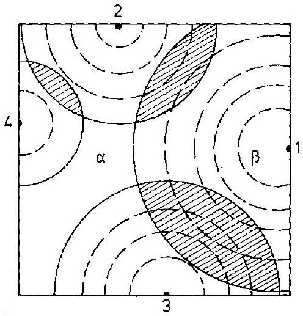
Figure 15-14. Growth of $\beta$-hydride nuclei starting from the surface of $\alpha$-hydride.

If, however, a thin passivating MeO film covers the surface, stochastic nucleation of active sites for the permeation of H and hydride formation occurs. Such a process can be described phenomenologically as outlined in Section 6.2.3 by

$$
1-X(t)=\mathrm{e}^{-\int_{0}^{t} \hat{R}_{n}(\tau) \cdot g^{m}(t-\tau) \cdot \mathrm{d} \tau}
$$

where $\dot{R}$ denotes the rate of hydride nucleation and $g$ is the normalized thickness of the growing hydride $\left(=k^{\prime} \cdot t\right.$ for interface controlled kinetics or $k^{\prime \prime} \cdot t^{1 / 2}$ for diffusion controlled growth). $X(t)$ is the fraction of the sample that has already reacted, and $m$ is a dimensionality factor. Equation (15.8) states that the growth rate $\partial X(t) / \partial t$ is exponentially decreasing with the advancement of the reaction due to an overlap of diffusion zones (Fig. 15-14). The resulting decrease in the free Me $(\alpha)$ surface cuts further nucleation. Limiting cases have been worked out for 1) when $\dot{R}_{n}(\tau)=\dot{R}_{n}^{0}$
( $\tau=0$ ) - nucleation occurs instantaneously at $\tau=0 ; 2) \dot{R}_{n}(\tau)=\dot{R}_{n}^{0}$ - the nucleation rate is independent of time. Setting $g(t-\tau)=k \cdot(t-\tau)^{1 / 2}$ (= parabolic growth) we obtain

$$
\begin{aligned}
& \text { 1) } X(t)=1-\mathrm{e}^{(-\varkappa \cdot t) \frac{m}{2}} \\
& \text { 2) } X(t)=1-\mathrm{e}^{(-\varkappa \cdot t) \frac{2+m}{2}}
\end{aligned}
$$

with $\varkappa$ as the rate constant. Equations (15.9) are the Johnson-Mehl-Avrami equations discussed before (see Eqns. (6.15) and (6.17)) and are illustrated in Figure 15-15. They can be adapted to interface controlled kinetics by simply changing the exponents. For short reaction times, Eqns. (15.9) yield in a linearized form

$$
X(t)=\bar{\varkappa} \cdot t^{\frac{m}{2}} \quad \text { or } \quad X(t)=\bar{\varkappa} \cdot t^{\frac{2+m}{2}}
$$

If an incubation time is needed to first depassivate the surface, the $\dot{R}_{n}$ function has to be constructed accordingly. A corresponding $X(t)$ curve is also shown in Figure 15-15.

Figure 15-15. Reacted fraction $X(t)$ vs. time: (1) theoretical, (2) with incubation time, (3) experimental curve for $\mathrm{LiNi}_{5}$ hydrogenation ( 5 bar, $25^{\circ} \mathrm{C}$ ) [L. N. Belkbir, et al. (1979)].

We mentioned in the previous section that the molar volumes of $\mathrm{Me}(\alpha)$ and $\mathrm{MeH}_{n}(\beta)$ can differ appreciably. This leads 1) to a straining of the thin coherent hydride films which subsequently form dislocations and cracks, and 2) to a fragmentation of the larger hydride crystals, in particular during dehydrogenation. Therefore, each storage cycle changes the size and morphology of the Me crystals. This is another reason why the formal kinetics of hydrogenation and dehydrogenation are so difficult to assess. Even these morphological changes during the reaction cycle seem to be reflected phenomenologically by the Mehl-Johnson-Avrami formalism.

Reversing the thermodynamic conditions of hydrogenation does not mean that the dehydrogenation kinetics is simply the reverse of the hydrogenation kinetics. Nucleation rates for the $\alpha$ and $\beta$ phases differ strongly, and stresses which develop during dehydrogenation are also quite different from those which occur during hydride formation. Consequently, the reaction morphologies are not the same.

We have already pointed out that hysteresis is observed to occur during a reaction cycle $\left(\mathrm{Me}(\mathrm{H})+\mathrm{H}_{2} \rightleftarrows \mathrm{MeH}_{n}\right)$. In addition, it is sometimes found that despite the high H mobility, hydrogenation comes to a stop before the reactants are completely
consumed. This observation seems to violate Gibbs phase rule. It requires that in a non-equilibrium heterogeneous system, the reactions proceed until at least one of the reactants is consumed before the system becomes fully equilibrated. However, let us remember that in elastically stressed solids, the simple form of Gibbs' phase rule is not necessarily applicable. It is quite possible that the reaction rate becomes zero because the chemical formation Gibbs energy is consumed by the build-up of elastic stresses which depend decisively on the geometrical and mechanical boundary conditions. We note in passing that this whole discussion was led under the tacit assumption of prevailing isothermal conditions.

At high pressures, it has been found experimentally [B. Baranowski (1989)] that the relaxation of the hydrogen activity follows a logarithmic rate law: $\left[a_{\mathrm{H}}(t)-\right. \left.a_{\mathrm{H}}(\alpha / \beta)\right]=k_{1}+k_{2} \cdot \ln t$, where $a_{\mathrm{H}}(\alpha / \beta)$ is the plateau value of the activity (Fig. 15-13). This rate law is valid for both H uptake and H loss over a considerable hydrogenation time. $k_{2}$ is proportional to the initial activity jump $a_{\mathrm{H}}(t=0)-a_{\mathrm{H}}(\alpha / \beta)$. Logarithmic rate laws have been observed occasionally in solid state kinetics, and in particular during thin film oxidation. They are normally assigned to a certain rate determining atomistic model. Here, however, they could also be explained, for example, by a suitably chosen size distribution of the hydride particles in the reacting sample.

### 15.5 Molecular (Organic) Crystals

### 15.5.1 Introductory Remarks

We will not discuss here the large field of local changes in the conformation and bonding of molecules in molecular crystals, which would include polymerization reactions. The purpose of this brief section is to discuss some basic aspects concerning diffusive motion in molecular crystals. This field is less understood than diffusion in inorganic solids and therefore we concentrate on the fundamental issues. The typical condensed molecular system is build from molecules of essentially covalent bonding with little dipole strength and interacting mainly by van der Waals forces (represented by and derived from Lenard-Jones or similar potentials). The energy for the solid-liquid transformation is correspondingly low, and so is $T_{\mathrm{m}}$. The LenardJones potential is not directional, but molecules are never really spherical. They may be approximately globular $\left(\mathrm{C}\left(\mathrm{CH}_{3}\right)_{4}\right)$, disc-like, or needle-like and may interact by directional forces in addition to central forces. In contrast to coulombic forces, van der Waals forces are short range and only the nearest neighbor interactions are essential. The group of materials which we consider here ranges from small monomer to polymer solids. They may be insulators, semiconductors, or even ionic conductors existing in the form of crystals or glasses.

Molecular subgroups of molecules in a crystal can sometimes move rather independently in the vibrational (or rotational) mode. If those motions become strongly
correlated, phase transitions (intermolecular or intramolecular changes of bonding) may take place. Most of the phase transitions, however, occur subject to the stereochemical control of the active centers at the adjacent molecules of the advancing reaction front [G.M.J. Schmidt (1971)]. Either whole molecules or molecular subgroups are slightly displaced locally and change their bond pattern and/or conformation. These transformations may be first or second order and normally do not involve macroscopic transport. With increasing temperature, crystals made up of globular molecules often undergo one or more phase transitions before melting. As a result, they can become plastic, even under the action of gravitation. This indicates some (translational) motion of the molecules and we shall later discuss this mobility in relation to diffusion.

We recall that macroscopic transport in a crystal lattice is possible only if (point) defects are present. Defects in van der Waals crystals should have a much lower energy of formation than defects in metals or inorganic compounds. We therefore expect that their equilibrium concentrations are noticeable even if $T_{\mathrm{m}}$ is low. However, real crystals do not necessarily possess the equilibrium number of defects. In order to establish their equilibrium concentration, the defects must have translational mobility. This means that, in addition to the energy of formation, the activation energy of translation must also be low. This is not likely in molecular crystals for two reasons. 1) Molecules with a large mass possess low attempt frequencies $v$ for the passage over the activation saddle. Since $2 \pi v=(f / m)^{1 / 2}$, where $m$ is the mass and $f$ the force constant of the (harmonic) oscillator, a change of mass from $m$ to $n \cdot m$ will change $v$ to $v^{\prime}$, which is approximately $v^{\prime}=v \cdot n^{-5 / 6}$. This result is obtained because the force constant of the larger molecule derives from a much shallower potential valley ( $f^{\prime} \approx f \cdot n^{-2 / 3}$ ). 2) If molecules are distinctly nonspherical, as shown in Figure 15-16, the saddle point energy could be $p$ times that of a smaller globular molecule or monomer, $\Delta E_{0}$. Thus, the decrease in mobility with increasing molecule size is highly nonlinear ( $\sim \mathrm{e}^{-p \cdot \Delta E_{0} / k T_{\mathrm{m}}} \simeq\left(\mathrm{e}^{-\alpha}\right)^{p}$, where $\alpha$ characterizes the small molecule) and we assume that $\Delta E_{0}$ scales roughly with $T_{\mathrm{m}}$. This indicates that even if the formation energy allows a noticeable equilibrium point defect concentration in the molecular crystal, equilibrium may not be established for kinetic reasons.

Let us re-examine the notion of a point defect in this context. If a molecular subgroup of a molecule is imperfect, this damaged molecule constitutes a point defect in the crystal, although the defect has no immediate influence on the molecule's translational mobility. Point defects that induce (translational) motion are vacancies or interstitials. We can infer from the form of the Lenard-Jones potential that vacan-

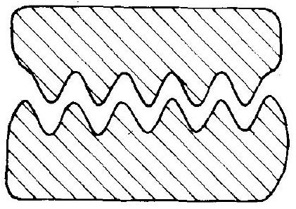
Figure 15-16. Activation energy of a large molecule is larger than for a small molecule, due to the coordination required to move all parts simultaneously.

cies with relaxed surroundings are the most common point defects in molecular crystals. From the point of view of defect chemistry, molecular crystals have more in common with metals than with ionic crystals since neutral vacancies are the most likely atomic defects in metals as well. Heterovalent doping and the correlation of vacancy and interstitial concentrations with the dopant concentration by the condition of electroneutrality is not possible. However, weak interactions may be found between native defects and impurities (dopants) in molecular and metal crystals.

In molecular crystals, one- and two dimensional defects do exist as in other types of crystals. Indeed, experimental difficulties for producing good molecular single crystals with only a few non-equilibrium defects are greater than in the case of metals, semiconductors, or ionic crystals. Discrepancies concerning the result of transport experiments can often be explained on these grounds. In addition, the low binding energies and the correspondingly low vapor pressures even at low temperature make the sample preparation and many other experiments with molecular crystals (e.g., tracer studies) particularly difficult. Whereas halide-, oxide-, or metal crystals are normally frozen in at room temperature and thus easily kept or handled, molecular crystals have sometimes to be cooled to liquid nitrogen temperature or lower for the same purpose.

### 15.5.2 Diffusion in Molecular Crystals

An early paper on diffusion in molecular crystals has been published in 1938 [E. Cremer (1938)]. In the meantime, many different molecular solids have been investigated, mainly by NMR (see Section 16.4). A useful survey has been written by [J.M. Chezean, J.H. Strange (1979)]. Let us start the discussion with an illustrative system for which sufficient data have been measured and safe conclusions can be drawn with respect to the transport mechanism. Hexamethylethane, $\left(\mathrm{CH}_{3}\right)_{3} \mathrm{CC}\left(\mathrm{CH}_{3}\right)_{3}$, forms bcc crystals and melts at $T_{\mathrm{m}}=373.8 \mathrm{~K}$. The crystal is built from octahedral molecules which are rather globular. Before melting, hexamethylethane exists as a plastic phase. NMR data show a stepwise narrowing of the NMR line width. This narrowing reflects the different dynamic modes of motion which the molecular subgroups of the molecule undergo with increasing thermal energy $k T$. The most conspicuous effect is the line narrowing by several orders of magnitude occurring when the translational motion of the whole molecule starts at ca. 250 K in the plastic phase. The NMR data are in agreement with the tracer diffusion data (obtained with ${ }^{3} \mathrm{H}$ and ${ }^{14} \mathrm{C}$ ) and confirm that the NMR indeed registers translational motion in the plastic phase. It is worth mentioning that NMR relaxation times $T_{1}$ (see Section 16.4.3) show a minimum as a function of temperature. Near the melting temperature, $D$ is about $10^{-8} \mathrm{~cm}^{2} \mathrm{~s}^{-1}$, which compares well with the diffusivities of fast diffusers among inorganic compounds.

From the fact that the structure of hexamethylethane is close-packed, we may infer that the point defects responsible for the translational motion of the molecules are monovacancies. The data indicate an overexponential increase in diffusivity with temperature near $T_{\mathrm{m}}$, analogous to some observations made on inorganic crystals. Various explanations could be given for this increase such as anharmonicity of the
lattice potential, change in the disorder type, or defect interactions. It has also been suggested that, similar to metals, divacancies increasingly contribute to the molecular diffusion near the melting point.

Experimental activation energies $E_{\mathrm{A}}$ for diffusion in molecular crystals turn out to be approximately twice that of the corresponding sublimation enthalpy. This finding is consistent with a suggestion first made by [W. Jost (1960)]. A further confirmation of the motion model can be seen by the fact that the $E_{\mathrm{A}}$ for creep (which is most likely caused by dislocation climb through vacancy diffusion) corresponds to $E_{\mathrm{A}}$ obtained from both tracer and NMR studies (ca. $85 \mathrm{~kJ} \mathrm{~mol}^{-1}$ ) [A. R. Britcher, J. H. Strange (1979); N. C. Lockhart, J.N. Sherwood (1972); J. M. Chezean, J. H. Strange (1979)].

The picture is less clear for molecular crystals when the molecules deviate strongly from a globular form. NMR data and tracer diffusion data are then often in disagreement. Diffusion profiles ( $\ln c_{i}$ vs. distance) are found to be curved, which is usually attributed to additional heterogeneous and fast diffusion pathways. For plastic crystals, this could indicate that many of them possess a highly defective structure. Even for the aromatic ring molecule benzene, which forms a non-plastic crystal, one finds a $D$ (NMR) $/ D$ (tracer) ratio on the order of $10^{3}$. This cannot be understood unless one invokes other than bulk lattice mechanisms of diffusion.

A further interesting question concerns the motion of protons in crystals of acid molecules. By labelling the tracer molecules as $\mathrm{C}_{6} \mathrm{H}_{5}\left({ }^{14} \mathrm{COOH}\right)$ and $\mathrm{C}_{6} \mathrm{H}_{5}\left(\mathrm{COO}^{3} \mathrm{H}\right)$ in solid benzoic acid, one should be able to distinguish the motion of the acid molecule from the motion of the protons. No clear answer has yet been obtained. For pivalic acid, $\left(\mathrm{CH}_{3}\right)_{3} \mathrm{CCOOH}$, it has been convincingly shown by an appropriate labelling of tracers that the methyl protons are much slower than the acidic protons. Through additional electrical conductivity measurements, it could be verified that the proton migration was not accompanied by transport of electric charge. The obvious conclusion is that the fast (translational) motion of the carboxyl protons is achieved by a rapid breaking of the H -bonds between the acid molecule and its 12 nearest neighbors during a rotation-like reorientation of the molecule. This explanation is reminiscent of the mechanism proposed for the motion of protons in ice. In all these investigations, it is important to keep the sample free of water. $\mathrm{H}_{2} \mathrm{O}$ can dissolve as an impurity in the interstitial lattice. Its presumably high mobility and the possibility for proton exchange with lattice molecules may strongly alter the transport properties of these molecular crystals.

### 15.5.3 Conducting Polymers

Although the motion of protons does not lead to electrical conduction in the case of benzoic acid, electronic and even ionic conductivity can be found in other molecular crystals. A well-studied example of ionic conduction is a film of polyethylene oxide (PEO) which forms complex structures if one adds alkaline halides (AX). Its ionic conductivity compares with that of normal inorganic ionic conductors $(\log [\sigma \cdot(\Omega \mathrm{cm})] \approx-2.5)$. Other polymers with EO-units show a similar behavior when they are doped with salts. Lithium batteries have been built with this type of
electrolyte. Maximal electrical conductivity has been found if the ratio $\mathrm{AX}: \mathrm{PEO}$ is ca. 1: 10 .

In the doped PEO sample, the A cations have been shown to be correlated to the oxygen. At low temperature, crystalline and amorphous PEO and the stoichiometric complex $\mathrm{AX} \cdot(\mathrm{PEO})_{4}$ can be distinguished. At higher temperature, the sample contains elastomeric PEO. It is this elastomeric 'phase' in which the ions are mobile. If $\mathrm{AX}=\mathrm{NaSCN}, \mathrm{Na}^{+}$and $\mathrm{SCN}^{-}$move with comparable mobility. The highest diffusivities have been found for ${ }^{7} \mathrm{Li}$ in $\mathrm{LiCl}_{4} \cdot(\mathrm{PEO})_{x}\left(D_{\mathrm{Li}} \approx 10^{-6.5} \mathrm{~cm}^{2} \mathrm{~s}^{-1}\right)$ and they are comparable to those of fast ionic conductors. Details of the migration processes are not yet understood. Qualitatively speaking, the ions move by a segmental motion of the polymer. This mode of motion (paddlewheel) is well known in such inorganic crystals as $\mathrm{NaNO}_{3}$ [M. Jansen (1991)] where librations of anion groups trigger the hopping of the cations.

Furthermore, recent radiotracer experiments have shown that metals such as Cu , Ag , and Au can diffuse into various polymers including polyimides and polycarbonates at elevated temperatures. Arrhenius type temperature dependences are not always found. This is not unexpected considering the distribution of saddle-point energies in amorphous polymers [F. Faupel, R. Willecke (1994)].

For almost two decades, semiconducting polymers have also been known [C.K. Chiang, et. al. (1977)]. The prototype of these materials is polyacetylene. If properly doped with an electron donor ( $\mathrm{Li}, \mathrm{Na}, \mathrm{K}$ ) or acceptor ( $\mathrm{I}, \mathrm{Br}, \mathrm{Cl}$ ), the electric conductivity $\sigma$ increases from $10^{-8}$ (undoped) to $10^{2}-10^{3} \Omega^{-1} \mathrm{~cm}^{-1}$, where the high $\sigma$ value is attained with a doping level of $c a .10 \mathrm{~mol} \%$. Since doping can be achieved by diffusion of the donor (acceptor) into the solid polymer, it is concluded that the dopant ions reside in the space between the polymer chains. The conducting polymer behavior is similar to that of inorganic conductors with both ionic and electronic conductivity, except that the charge carrier concentration is higher and their mobility is lower. The quasi one-dimensional structure of the polymer chain is largely responsible for the differences. The transport mechanism changes from electron hopping conduction at low doping levels to (temperature-independent) electron tunneling at high doping levels. Conjugated structures with alternating single and double bonds in the carbon backbone of the polymer are the origin of this transport. The ground state of polyacetylene has an energy gap of $c a .1 .4 \mathrm{eV}$ and is characterized by alternating single and double bonds. Extra charges, added to the chain by doping or injection, self-localize and become polarons or solitons. Even without doping, intrinsic polarons and solitons may exist and can be written schematically as
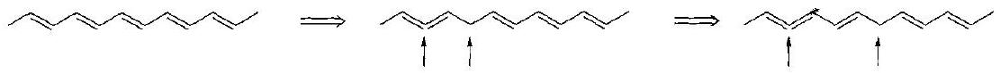
[H. Stubb, et al. (1993)]. In view of the complex disordered structure of the solid polymer on a submicroscopic scale, the transport mechanism is not known in detail. It is necessary that the charge carriers find their path by way of percolation in order to obtain a macroscopic electric current. Charge transfer between different chains may also take place. The conduction behavior is then due to an activated hopping across potential barriers between well ordered and highly conducting microparticles. The hopping conductivity vanishes at zero temperature, while the tunneling contri-
bution is independent of temperature, being determined purely by the height and shape of the potential barriers. Theory has to take into account the distribution of particle sizes, barrier heights, and barrier lengths.

Thin polymer films have many possible technical applications. Transistors and light-emitting diodes are the obvious ones. In ultra-thin films, one may even approach an electronics of molecular dimension. Molecular electronics will be a future challenge for basic and applied science. Nature applies it on a large scale in the reaction centers of the photosynthetic process, where photoinduced mobile charges are separated in some analogy to the separation of the photo-(p-n)-pair in the junction zone of a semiconductor (see Section 13.3.1).

## References

Ahlefeld, G., Völkl, J. (1978) Hydrogen in Metals, Topics in Applied Physics, 28, 29, Springer, Berlin
Bai, Q., Kohlstedt, D. L. (1993) Phys. Chem. Min., 19, 460
Baranowski, B. (1993) J. Alloys and Compounds, 200, 87
Baranowski, B., Tkacz, M. (1989) Z. phys. Chem., NF163, 457
Baur, E., Preis, H. (1937) Z. Elektrochem., 43, 727
Bazan, J. (1978) Z. phys. Chem., NF 110, 285
Becker, K.D., et al. (1983) Solid State Ionics, 11, 213
Behrens, H., et al. (1990) Phys. Chem. Minerals, 17, 62
Belklir, N.L., et al. (1979) Int. J. Hydrogen Energy, 4, 541
Birks, N., Rickert, H. (1963) Ber. Bunsenges. Phys. Chem., 67, 97
Britcher, A. R., Strange, J. H. (1979) Mol. Phys., 37, 181
Bunde, A. (1983) Ber. Bunsenges. Phys. Chem., 87, 240
Bunde, A., et al. (1991) Ber. Bunsenges. Phys. Chem., 95, 977
Buschow, K.H.J., van Maal, H.H. (1982) in Intercalation Chemistry (Eds.: M.S. Wittingham, A. Jacobson), Mat. Science Ser., Academic Press, New York

Chemla, M. (1956) Ann. Phys. (Paris), 13, 1959
Chezean, J. M., Strange, J. H. (1979) Phys. Rep., 53, 1
Chiang, C. K., et al. (1977) Phys. Rev. Lett., 39, 1098
Collin, G., et al. (1988) Solid State Ionics, 28, 324
Colomban, P. (1992) Proton Conductors, Cambridge University Press, Cambridge
Cremer, E. (1938) Z. phys. Chem., B 39, 445
Dickens, M. H., et al. (1980) Solid State Comm., 34, 559
Dyer, A. (1988) Zeolites, Molecular Sieves, Wiley, New York
Falkenhagen, H. (1953) Elektrolyte, S. Hirzel, Leipzig
Faupel, F., Willecke, R. (1994) Mat. Sci. Eng. Rep. (to be published)
Fischer, W., Jahnke, D. (1975) Metallurgische Elektrochemie, Springer, Berlin
Flanagan, T.B., Clewley, J. D. (1982) J. Less Common Met., 83, 127
Frischat, G.H. (1975) Ionic Diffusion in Oxide Glass, Trans. Tech. Publ., Aedermannsdorf, Schweiz
Funke, K. (1978) Progr. Sol. State Chem., 11, 345
Funke, K. (1993) Progr. Sol. State Chem., 22, 111
Goodenough, J. B. (1986) Mat. Sci. Forum, 7, 1
Hobbs, B.E. (1985) in Point Defects in Minerals (Ed.: R.N. Schock), Am. Geophys. Union, Washington
Houlier, B., et al. (1988) Phys. Earth Planet. Inter., 50, 240

Hund, F. (1952) Z. phys. Chem., 199, 142
Ingram, M. D. (1992) Ber. Bunsenges. Phys. Chem., 96, 1592
Jansen, M. (1991) Angew. Chem., 103, 1574
Jaoul, O., et al. (1980) Earth Planet. Sci. Lett., 47, 391
Jaoul, O., et al. (1981) in Anelasticity in the Earth, Geodyn. Ser. 4, 95, Am. Geophys. Union, Washington
Jost, W. (1960) Diffusion, Academic Press, New York, p. 116
Kärger, J., Ruthven, D. M. (1992) Diffusion in Zeolites, Wiley, New York
Kahnt, H., et al. (1988) Solid State Ionics, 31, 215
Kahnt, H. (1991) Habilitationsschrift, Universität Jena 1991
Kirchheim, R. (1988) Progr. Mat. Sci., 32, 261
Kiukkola, K., Wagner, C. (1957) J. Electrochem. Soc., 104, 379
Laborde, P., et al. (1989) Mat. Res. Bull., 24, 921
Lacher, J. R. (1937) Proc. Roy. Soc. London, A 161, 525
Lam, L., Bunde, A. (1978) Z. Physik, B 30, 65
Lockhart, N.C., Sherwood, J.N. (1972) Farad. Symp. Chem. Soc., 6, 57
Miller, G.H., et al. (1987) Phys. Chem. Minerals, 14, 461
Nakamura, A., Schmalzried, H. (1983) Phys. Chem. Minerals, 10, 27
Noréus, D., et al. (Eds.) (1992) Metal-Hydrogen Systems, Z. phys. Chem., NF 179/181/183
Putnis, A. (1986) Mat. Sci. Forum, 7, 63
Parker, S. C., et al. (1984) Acta Cryst., B 40, 200
Rudman, P.S. (1983) J. Less Common Met., 89, 93
Salje, E. (1990) Phase Transitions in Ferroelastic and Co-elastic Crystals, Cambridge University Press, Cambridge
Schmalzried, H. (1962) Ber. Bunsenges. Phys. Chem., 66, 372
Schmalzried, H. (1977) Z. phys. Chem., NF 105, 47
Schmalzried, H. (1978) Phys. Chem. Minerals, 2, 279
Schmalzried, H. (1980) Progr. Sol. State Chem., 13, 119
Schmalzried, H. (1980) Ber. Bunsenges. Phys. Chem., 84, 120
Schmalzried, H. (1981) Solid State Reactions, Verlag Chemie, Weinheim
Schmalzried, H., Wagner, C. (1962) Z. phys. Chem., NF 31, 198
Schmidt, G. M. J. (1971) Pure and Applied Chemistry, 27, 647
Sohege, J., Funke, K. (1984) Ber. Bunsenges. Phys. Chem., 88, 657
Stephenson, G. B. (1988) Acta Met., 36, 2663
Stubb, H., et al. (1993) Mat. Sci. Eng. Rep., 10, 85
Teichler, H. (1979) Z. phys. Chem., NF 114, 155
Terai, R. (1971) J. Non-Cryst. Solids, 6, 121
Wagner, C. (1944) Z. phys. Chem., 193, 386
Weghöft, R., Schmalzried, H. (1986) Mat. Sci. Forum, 7, 223
Wicke, E., Züchner, H. (1979) Hydrogen in Metals, Z. phys. Chem., NF 114-117
Wright, K., et al. (1994) Phys. Chem. Minerals, 20, 500
Wu, T., Kohlstedt, D. L. (1988) J. Am. Cer. Soc., 71, 540
Yund, R.A. (1984) in Feldspars and Feldspathoids: Structure, Properties and Occurrences (Ed.: W. L. Brown), D. Reidel Publ. Comp., Dordrecht

# 16 Appendix: Experimental Methods for In-situ Investigations 

The following chapter has been included to emphasize that most of the experimental data on solid state kinetics have been obtained ex-situ and are correspondingly unreliable. Further progress will depend decisively on the invention and application of appropriate experimental in-situ methods.

### 16.1 Introduction

The unique mechanical and structural properties of crystals necessitate the application of special experimental methods for the investigation of the chemical kinetics of solids. In principle, all the physical parameters of substances involved in a chemical process can be used to follow the kinetics. These processes normally occur at high temperatures since they need thermal activation. Conventionally, the outcome of a solid state reaction experiment is inspected only after quenching. However, the quenching process is prone to alter many properties of the system, which explains the ambiguous results often found in the studies of solid state kinetics.

A kinetic measurement ideally determines the crystal structure, morphology, and concentrations of all structure elements as a function of locus and time. The appropriate experiment consists of 1 ) the question to the system in form of a known input, and 2) the response of the system to the question, which is the output to be measured and analyzed. In a thermodynamic measurement, a known probe which can register an intensive function of state ( $P, T, \mu_{i}$ ) is often equilibrated with the system to be investigated. Thus, the question to the system is then answered by the probe.

The scheme for spectroscopic measurements is presented in Figure 16-1 and illustrates the principle of the following types of experimental situations. a) Elastic interactions between the input (particles, photons) and the solid. The output can be used to image the system (e.g., optical or electron microscopy) or to exploit its interferences which then become visible as diffraction patterns (e.g., X-ray diffraction). The first type of experiment gives information on (external) morphologies, the second type informs about the distribution and structure of the scattering centers in space. b) Inelastic interactions between the input (particles, photons) and the solid system accompanied by energy losses ( $v^{\prime} \neq v$ ). The output can be used to probe an average of the nuclear, electronic, and atomic energy states of the individual atoms (ions) or the crystal as a whole (e.g., phonons). Since both absorption and emission are sensitive to the atomic surroundings (symmetry), it is the structure element of a crystal which is identified in this way. If the number of absorbing (emitting) SE's

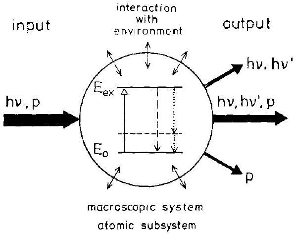
Figure 16-1. Basic scheme of spectroscopic measurements. $p=$ particle, $E=$ energy state.

determines the respective intensities, we can thus measure their concentrations. If, in addition, we can achieve a sufficient spatial and temporal resolution, then the basic kinetic quantity $c_{i}(\xi, t)$ can be determined, this being our ultimate goal.

We will not discuss microscopy and structure determinations since special monographs are available. Let us mention, however, that hot stages are available these days which allow imaging and diffraction work to be done at high temperatures. The limits for high spatial resolution are often not set by the temperature but rather by the ambient atmospheres. For example, the electron probe beam requires vacuum, whereas the component chemical potentials of a sample are undefined in a vacuum.

The (electromagnetic) spectrum of photons is subdivided as follows: radiowaves, microwaves, infrared, visible, and ultraviolet radiation, X-rays, and $\gamma$-rays. The corresponding energies range from $10^{-10} \mathrm{eV}$ to 1 eV in the visible region, and to $10^{6} \mathrm{eV}$ for $y$-rays. The corresponding wavelengths range from $10^{+6} \mathrm{~cm}$ to $10^{-10} \mathrm{~cm}$. Examples for the DeBroglie wavelengths of particles are: 1) for 150 eV electrons $\lambda_{e}=1 \AA$, the corresponding velocity is $v_{e}=7.25 \times 10^{8} \mathrm{~cm} \mathrm{~s}^{-1}$; 2) for neutrons with room temperature thermal energy ( $=0.025 \mathrm{eV}$ ), $\lambda_{n}=1 \AA$ and $v_{n}=3 \times 10^{5} \mathrm{~cm} \mathrm{~s}^{-1}$. We conclude that X-rays, electrons, and neutrons can be used to look into the (periodic) structure of crystals (elastic scattering, diffraction) since their wavelengths are compatible with the lattice dimensions. Inelastic interactions with the phonons, however, cannot be immediately detected by X-rays since their energy is $10^{5}-10^{6}$ times larger than the phonon energy.

Various properties of crystals can be used to inspect $c_{i}(\xi, t)$, provided that appropriate detectors for the intensity of input and output signals are available. If the monitor response is sufficiently fast, one may determine the time dependence of solid state reactions. The monitoring of reactants and/or reaction products can serve this purpose, but the relation between signal intensity (property) and concentration ( $c_{i}$ ) must always be established first. Since functions of state are related to one another in a unique way, any equilibrium property can, in principle, be used to determine $c_{i}(\xi, t)$. However, the necessary assumption of local equilibrium must still be verified. Since input signals always disturb the local equilibrium in one way or another, we also have to assure that the disturbances due to these signals do not interfere with the kinetic processes being studied.

This chapter will be organized in the following way. The next section will discuss in-situ measurements of the most common thermodynamic parameters such as $P, V, \mu_{i}$, etc. as they relate to the study of reaction kinetics. If one of the reactants or product(s) is gaseous, classical methods of chemical analysis like gravimetry, manometry, or volumetry can be adapted. This field of research is methodologically well developed because of its practical importance in metal oxidation. However, we cannot obtain information on the spatial distribution of components nor the product morphology unless miniaturized sensors can be constructed. Intensive thermodynamic quantities such as $T, P$, and $\mu_{i}$ are measured at equilibrium between the sensor and the system under study. Even a small sensor has a finite 'buffer capacity' and therefore disturbs the local equilibrium to some extent. Thus, the contact area of the sensor is not the only parameter which limits the spatial resolution. Although temperature and pressure sensors are common in modern technology, they will not be treated. Less known are relatively high spatial resolution chemical potential sensors which can be used at elevated temperature. The basic device is a tiny solid state galvanic cell employing a solid electrolyte. Details are given in Section 16.3.2.

However, the main body of in-situ methods for the study of solid state kinetics makes use of electromagnetic radiation and is discussed in Section 16.4. The use of particle radiation, as described in Section 16.5, is less frequent. Both imaging of the reaction geometry and the determination of the concentration distributions of $c_{i}(\xi, t)$ by spectroscopic methods - insofar as they can be adapted to high temperatures are possible. The absorption coefficients of photons and especially of particles are often quite high for condensed matter. In these cases, only near-surface phenomena can be detected. They may not be indicative of bulk properties and thus not suitable for the study of bulk reactions. In-situ application of IR and visible light spectroscopy at high temperatures is difficult due to the intense background radiation of the reacting sample and its surroundings. In conclusion, we emphasize that the content of this chapter is not meant to introduce any instrumentation but rather to critically discuss the possibilities of in-situ kinetic studies by modern experimental tools.

### 16.2 Thermogravimetry, -manometry, -volumetry, -analysis

The common feature of these established experimental methods is their ability to detect changes in the mass ( $\Delta m(t)$ ) and/or heat ( $\Delta q(t)$ ) of a reacting system. Let us begin the discussion with thermogravimetry, since it clearly illustrates the philosophy of the essentially thermodynamic methods.

### 16.2.1 Thermogravimetry

The schematic set-up for a thermogravimetric experiment is shown in Figure 16-2. The device is a combination of a sophisticated high temperature furnace (with temperature and gas atmosphere control) and a micro-balance. Since it is meant to

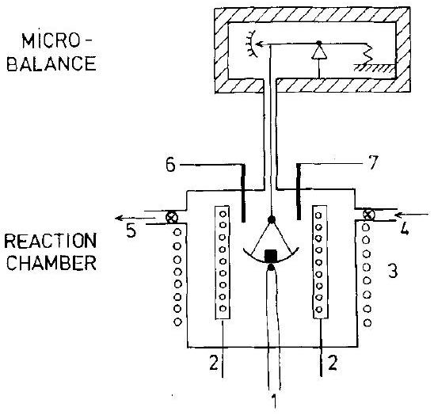
Figure 16-2. Principle of a high temperature balance with controlled gas atmospheres.
1) Thermocouple, 2) heating element, 3) cooling coils, 4) gas inlet, 5) gas outlet, 6,7) potential sensors.

register weight changes ( $\Delta m(t)$ ), at least one component of the solid state reaction must be volatile. The recorded quantity is the (integral) mass change due to transport across the sample surface. The following solid state processes can be studied in-situ. a) Solubility and transport kinetics of gases dissolved in solids, especially changes in the non-stoichiometry $\delta$ of compounds such as $\mathrm{Ag}_{1-\delta} \mathrm{X}$. b) Oxidation of metals or other oxidizable solids. c) Carburization (and analogous) reactions (e.g., $\left.\mathrm{AX}+\mathrm{CO}(\mathrm{g})=\mathrm{AX}(\mathrm{C})+\mathrm{CO}_{2}(g)\right)$. d) Reactions between non-stoichiometric solids (e.g., $\mathrm{AX}_{1+\delta_{\mathrm{A}}}+\mathrm{BX}_{1+\delta_{\mathrm{B}}}=\mathrm{ABX}_{2+\delta}+\frac{1}{2}\left(\delta_{\mathrm{A}}+\delta_{\mathrm{B}}-\delta\right) \cdot \mathrm{X}_{2}(\mathrm{~g}), \delta \neq \delta_{\mathrm{A}}+\delta_{\mathrm{B}}$ ). Note that these reactions have to be performed as powder reactions if $\delta_{i} \ll 1$ in order to provide sufficiently large contact areas. Although powder reactions are of great practical importance, they do not yield accurate information about reaction mechanisms because of their complex boundary conditions. e) Similar to d), interdiffusion processes in solid solutions (e.g., $N \cdot \mathrm{AX}_{1+\delta_{\mathrm{A}}}+(1-N) \cdot \mathrm{BX}_{1+\delta_{\mathrm{B}}}=(\mathrm{A}, \mathrm{B}) \mathrm{X}_{1+\delta}+1 / 2 \left.\left[N \cdot \delta_{\mathrm{A}}+(1-N) \cdot \delta_{\mathrm{B}}-\delta\right] \cdot \mathrm{X}_{2}(\mathrm{~g}), \delta \neq \delta_{\mathrm{A}}+\delta_{\mathrm{B}}\right)$.

There are a number of limitations to thermogravimetry. 1) If the sensitivity of the balance is $10^{-6} \mathrm{~g}$, and the sample weight is 1 g , a change of some $10^{-8} \mathrm{~mol}$ should theoretically be detectable. However, convection and thermodiffusion in the ambient atmosphere limits the sensitivity to $10^{-5}-10^{-6} \mathrm{~mol}$, depending somewhat on temperature ( $<1500^{\circ} \mathrm{C}$ ). 2) Reaction kinetics are normally investigated under isothermal and isobaric conditions. The start of a reaction by heating the balance to temperature or by changing the partial pressure is never sudden and often not well defined. 3) Exploring the reaction kinetics with a predetermined temperature program is useful in a quantitative sense only if we already have some knowledge of the reaction mechanisms and rate laws.

### 16.2.2 Thermomanometry, Thermovolumetry

These experimental methods give information similar to thermogravimetry. Changes in the gas phase surrounding a sample are probed when the gaseous reaction partner is liberated or consumed during the solid state reaction. This can be done either at

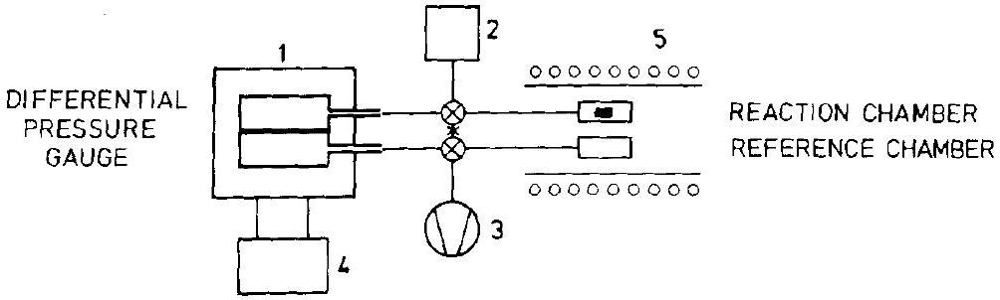
Figure 16-3. Principle of a tensiometric set-up for monitoring in-situ solid state reactions [J. Janek (1992)]. 1) Gas pressure gauge, 2) gas supply, 3) vacuum pump, 4) registration electronics, 5) furnace.

constant gas volume, by probing the pressure change (tensiometry), or at constant pressure by measuring the volume change. Figure 16-3 illustrates a tensiometric set-up. Tensiometry is preferred to volumetry since the measurement of the intensive variable $(\Delta P)$ is, in principle, easier and often more accurate than the registration of the extensive variable $\Delta V$. Tensiometry is able to detect changes $\Delta n(t)$ (in-situ and continuously) on the order of $10^{-8} \mathrm{~mol}$. If properly devised, the measurements are relatively insensitive to small temperature fluctuations. Again, we observe that concentration distributions in the sample cannot be deduced from these integral $\Delta n(t)$ measurements unless we have independent knowledge about the transport mechanism.

A variation of in-situ volumetry (or manometry) is its combination with high temperature coulometry as shown in Figure 16-4. The $\Delta n(t)$ change in the gas volume due to the reaction is compensated for by a corresponding flux of ions across an appropriate solid electrolyte. This coulometric transport is potentiostatically controlled with a reference electrode (Fig. 16-4). Since $10 \mu \mathrm{~A}$ times $1 \mathrm{~s}=10 \mu \mathrm{C}$ corresponds to ca. $10^{-11} \mathrm{~mol}$, the sensitivity of the combined volumetry-coulometry matches that of tensiometry. Limitations of this method are leaks and the small electronic transference in the electrolyte.

Figure 16-4. A combined volumetriccoulometric set-up for monitoring in-situ solid state reactions [U. Hölscher (1983)]. 1) Reaction sample, 2) solid electrolyte $\left(\mathrm{ZrO}_{2}(\mathrm{MeO})\right)$, 3) (reference, working) electrodes, 4) manometer, 5) potentiostat.

### 16.2.3 Thermal Analysis

Thermal analysis probes the enthalpy change of a reacting solid as a function of time, which is time-resolved calorimetry. In order to enhance the low solid state reaction rates of the reaction couples, the calorimeter has to operate at elevated tempera-
tures. High temperature calorimetry is a sophisticated and delicate experimental method. The time resolution of the calorimeter is always determined by its dimensions and by heat conduction. Relaxation times of enthalpic processes which are smaller than ca. 1 s cannot be determined calorimetrically. The advantage of thermal analysis is that it gives immediate insight into the energetics of solid state reactions. The disadvantage is the spatial integration of the heat effects.

Heat effects as such are rather unspecific, especially if the nature of the reactions taking place in the calorimeter is not known. The combination of thermal analysis with chemical analysis (for example with a thermobalance (DTG) or a mass spectrometer which register the rate of advancement of the reaction) enables us to arrive at specific caloric data (i.e., $\Delta H / \Delta n_{i}$ ). Absolute values of $\Delta H$ are obtained by calibration only.

Differential scanning calorimeters (DSC) register heat effects during a programmed temperature change. DSC is a common method to screen possible reactions in complex systems. However, from a thermodynamic point of view, the results are only meaningful if the system undergoes a sequence of equilibrium states during a correspondingly slow change in temperature. One therefore must not only be careful in devising the rate of annealing (cooling) but also cautious in the interpretation of exothermic and endothermic heat effects registered by DSC. The following reactions are often studied in this way: phase transitions (including glass transitions and melting), decomposition, combustion, oxidation, and reduction. The classical solid state reactions (e.g., formation of double salts) are difficult to follow in view of their sluggish reaction rates unless they are conducted in the form of powder reactions.

DSC and related methods (differential thermal analysis, DTA) are of great practical importance. Therefore, one finds highly sophisticated commercial instruments for a variety of applications. DTA has been combined with in-situ emf and Knudsencell measurements. The interested reader is referred to the special literature on this subject [M.E. Brown (1988)].

### 16.3 Electrochemical Measurements

### 16.3.1 Introductory Remarks

With electrochemical methods, we determine thermodynamic potentials of components in systems which contain a sufficiently large number of atomic particles. Since the systematic investigation of solid electrolytes in the early 1920's, it is possible to change the mole number of a component in a crystal via the corresponding flux across an appropriate electrolyte ( 1 mA times 1 s corresponds to $c a .10^{-8} \mathrm{~mol}$ ). Simultaneously, the chemical potential of the component can be determined with the same set-up under open circuit conditions. Provided both the response time and the buffer capacity of the galvanic cells are sufficiently small, we can then also register the time dependence of the component chemical potentials in the reacting solids.

A solid state galvanic cell consists of electrodes and the electrolyte. Solid electrolytes are available for many different mobile ions (see Section 15.3). Their ionic conductivities compare with those of liquid electrolytes (see Fig. 15-8). Under load, galvanic cells transport a known amount of component from one electrode to the other. Therefore, we can predetermine the kinetic boundary condition for transport into a solid (i.e, the electrode). By using a reference electrode we can simultaneously determine the component activity. The combination of component transfer and potential determination is called coulometric titration. It is a most useful method for the thermodynamic and kinetic investigation of compounds with narrow homogeneity ranges. For example, it has been possible to measure $\mu_{\mathrm{Ag}}(\xi, t)$ in a crystal of $\mathrm{Ag}_{2+\delta} \mathrm{S}$ as a function of time and position even though $\delta$ is only on the order of $10^{-3}$.

In equilibrium, the chemical potential of the neutral A component at the electrode/ AX electrolyte interface is $\mu_{\mathrm{A}}=\eta_{\mathrm{A}}=\eta_{\mathrm{A}^{+}}+\eta_{\mathrm{e}}$. The driving force $\nabla \eta_{\mathrm{A}^{+}}$in the electrolyte vanishes under open circuit conditions. Therefore, the difference in chemical potential between the two electrodes of the galvanic cell translates into $\Delta \mu_{\mathrm{A}}=\Delta \eta_{\mathrm{e}}=\Delta \mu_{\mathrm{e}}-F \cdot \Delta \varphi=-F \cdot \Delta \varphi$, which is true because the chemical potential of the electrons in the identical leads contacting the electrodes is the same ( $\Delta \mu_{\mathrm{e}}=0$ ).

### 16.3.2 Chemical Potential Sensors

In this section, we describe time-resolved, local in-situ measurements of chemical potentials $\mu_{i}(\xi, t)$ with solid galvanic cells. It seems as if the possibilities of this method have not yet been fully exploited. We note that the spatial resolution of the determination of composition is by far better than that of the chemical potential. The high spatial resolution is achieved by electron microbeam analysis, analytical transmission electron microscopy, and tunneling electron microscopy. Little progress, however, has been made in improving the spatial resolution of the determination of chemical potentials. The conventional application of solid galvanic cells in kinetics is completely analogous to the time-dependent (partial) pressure determination as explained in Section 16.2.2. Spatially resolved measurements are not possible in this way.

If, however, solid electrolytes remain stable when in direct contact with the reacting solid to be probed, direct in-situ determinations of $\mu_{i}(\xi, t)$ are possible by spatially resolved emf measurements with miniaturized galvanic cells. Obviously, the response time of the sensor must be shorter than the characteristic time of the process to be investigated. Since the probing is confined to the contact area between sensor and sample surface, we cannot determine the component activities in the interior of a sample. This is in contrast to liquid systems where capillaries filled with a liquid electrolyte can be inserted. In order to equilibrate, the contacting sensor always perturbs the system to be measured. The perturbation capacity of a sensor and its individual response time are related to each other. However, the main limitation for the application of high-temperature solid emf sensors is their lack of chemical stability.

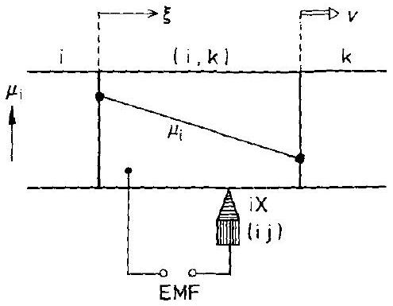
Figure 16-5. Basic in-situ experiment to detect $\mu_{i}(\xi, t)$ with the help of a miniaturized solid electrolyte (emf probe). ( $i, k$ ) is a metallic or semiconducting solid solution which forms from the components $i$ and $k$. $(i j)=$ reference electrode, $i \mathrm{X}=$ electrolyte.

Let us consider the situation illustrated in Figure 16-5. The reacting system is assumed to be a metal or a semiconductor ( $t_{\mathrm{e}} \cong 1$ ), one component of which is $i$. We wish to register its chemical potential as a function of $\xi$ and $t$. To this end we contact the sample at coordinate $\xi$ with a tiny solid galvanic cell, which is a combination of an electrolyte $i \mathrm{X}$ and reference electrode ( $i, j$ ). Thus, an emf is generated in the cell $(i, j) / i \mathrm{X} /(i, k)$. The diameter of the galvanic contact can be as low as a few $\mu \mathrm{m}$. The transference number of electrons in the electrolyte is necessarily $\ll 1$, which implies an extremely small deviation from the stoichiometric composition. Therefore, the buffer capacity ( $\partial n_{i} / \partial \mu_{i}$ ) of the electrolyte and thus its perturbation capacity is correspondingly small. For proper operation of the sensor it is necessary that all other components $k$ in the system under investigation do not displace component $i$ in the electrolyte by chemical reaction, which requires that $\left|\Delta G_{k \mathrm{X}}^{0}\right| \ll\left|\Delta G_{i \mathrm{X}}^{0}\right|$.

The width of the homogeneity range of the reacting system is of equal importance for the accuracy of the emf data. As long as the system $(i, k)$ forms an extended solid solution, the buffer capacity of the solid galvanic cell is irrelevant. If, however, ( $i, k$ ) is of narrow homogeneity range, the perturbation capacity of the sensor disturbs the local composition of ( $i, k$ ). Therefore, the volume ( $\sim$ buffer capacity) of the ( $i, j$ ) $/ i \mathrm{X}$ sensor must be correspondingly small. This and other contact problems could be avoided by allowing a small gas gap between the system and the sensor, but then slow gas-solid interface reactions may interfere. Another inherent problem of miniaturized sensors is the contact pressure, which may reach the yield strength of the participating solids. The contact pressure $P$ changes the local chemical potential by $V_{i} \cdot P$.

Two kinetic applications of solid sensors are illustrated in Figure 16-6. In the first case, transport controls the activity of A at the surface of the solvent B where the sensor is located. If A is sufficiently diluted

$$
E(t)=(R T / F) \cdot \ln a(t)=(R T / F) \cdot \ln \left(N_{\mathrm{A}}(t) / N_{\mathrm{A}}^{0}\right)
$$

In Figure 16-6b, the interface at $\xi=0$ controls the reaction kinetics. If $L$ denotes the interface conductivity coefficient, the rate of A uptake is given by $L \cdot \Delta \mu_{\mathrm{A}}(\xi=0)$. For long times, the sensor registers a first order rate law: $E(t) \sim \mathrm{e}^{-t / \tau}, \tau= \left(c_{\mathrm{A}}^{0} \cdot \Delta \xi\right) /(L \cdot R T)$. This result is obtained for the linear geometry of Figure 16-6. In this context, we mention the $\alpha \rightarrow \beta$ transformation of $\mathrm{Ag}_{2} \mathrm{~S}$ as discussed in Sec-

Figure 16-6. Electrochemical set-up for the registration of a) the diffusion controlled dissolution of A in B ; b) an interface controlled dissolution of A in B . At $\xi=\Delta \xi$, $\mu_{\mathrm{A}}(t)$ is determined by a solid emf probe. $\mathrm{AX}=$ electrolyte.

Figure 16-7. Set-up for the electrochemical in-situ determination of $\mu_{\mathrm{Ag}}(\xi, t)$ during the $\beta \rightarrow \alpha-\mathrm{Ag}_{2} \mathrm{~S}$ phase transformation. Miniaturized solid emf probes ( $\mathrm{Ag} / \mathrm{AgI}$ ) are located along the transforming crystal [H.J. Reye (1979)]. 1) Glass capillary, 2) sulfur chamber for the growth of $\mathrm{Ag}_{2} \mathrm{~S}$, 3) furnace, 4) thermocouples.

tion 12.3.1. Miniaturized $\mathrm{Ag} / \mathrm{AgI}$ solid galvanic sensors followed the transformation kinetics of the crystal during cooling as illustrated in Figure 16-7. Figure 12-9 informs about the resulting emf vs. $t$ curves.

Another example is shown in Figure 16-8. This in-situ measurement determines the immediate driving force for the transport of $\mathrm{Ag}^{+}$ions across the $\mathrm{AgI} / \mathrm{Ag}_{2} \mathrm{~S}$ inter-

Figure 16-8. Electrochemical device for the determination of the driving force $\Delta \mu_{\mathrm{Ag}}\left(=\Delta \eta_{\mathrm{Ag}}, \mathrm{E}_{2}\right)$ if $\mathrm{Ag}^{+}$ions are transferred across the $\mathrm{AgI} / \mathrm{Ag}_{2} \mathrm{~S}$ interface [H. Schmalzried, et al. (1992); H. Wysk (1995)].

face. The miniaturized sensors with a tip radius on the order of $10 \mu \mathrm{~m}$ were placed close to the $\mathrm{AgI} / \mathrm{Ag}_{2} \mathrm{~S}$ interface. The chemical potential drop of Ag across the interface was determined as a function of the $\mathrm{Ag}^{+}$current density (see Section 10.3). Such emf measurements have also been made to follow relaxation processes in glasses on their way to metastable equilibrium [R. Bormann, K. Zöltzer (1992)].

The contact area of an emf miniprobe is on the order of $10^{-6} \mathrm{~cm}^{2}$. Since the emf is on the order of one volt, current densities on the order of $10^{-3} \mathrm{~A} \mathrm{~cm}^{-2}$ occur if the resistance of the circuit is $10^{9} \Omega$. Current densities of this magnitude can seriously disturb the equilibrium chemical potentials to be measured in the sample unless concentration and diffusivity guarantee a sufficiently high transport coefficient. A quantitative discussion of this problem is available [M. Ullrich (1990)].

### 16.4 Spectroscopic Methods: Nuclear Spectroscopy

### 16.4.1 Introduction

Spectroscopic methods have the greatest potential for in-situ investigations of solid state kinetics ( $c_{i}(\xi, t)$ ) and the underlying microscopic dynamics since they essentially probe local interactions. Many of the conventional spectroscopies have to be adapted to in-situ measurements at high temperatures, which often poses severe experimental problems. Seen only from an energetic point of view, input signals below 0.1 eV do not noticeably change the translational energy of mobile structure elements in a non-equilibrium solid at high temperatures and thus cannot immediately influence the course of a solid state reaction ( $h v<k T$ ). We conclude that radiation chemistry (see also Chapter 13 and Table 16-1) begins essentially in the visible and UV regions of the spectrum. Even if the energy balance is met, the momentum balance normally forbids the immediate knock-on of structure elements by photons.

Table 16-1. Electromagnetic spectroscopy

| Energy: $E[\mathrm{eV}]$ |  |  |  |  |  |  |  |
| :--- | :--- | :--- | :--- | :--- | :--- | :--- | :--- |
| $(\times 96485 \Rightarrow \mathrm{~J} / \mathrm{mol})$ | $10^{-7}$ | $10^{-5}$ | $10^{-2}$ | $10^{-1}$ | $10^{1}$ | $10^{3}$ | $>10^{3}$ |
| $T[\mathrm{~K}](\therefore k T)$ | $1.16 \times 10^{-3}$ | $1.16 \times 10^{-1}$ | $1.16 \times 10^{2}$ | $1.16 \times 10^{3}$ | $1.16 \times 10^{5}$ | $1.16 \times 10^{7}$ | $>10^{7}$ |
| $v[\mathrm{~Hz}]($ 스 $h \cdot v)$ | $2.4 \times 10^{-7}$ | $2.4 \times 10^{9}$ | $2.4 \times 10^{12}$ | $2.4 \times 10^{13}$ | $2.4 \times 10^{15}$ | $2.4 \times 10^{17}$ | $>10^{17}$ |
| $\lambda[\mathrm{cm}]\left(\triangleq \frac{h \cdot \mathrm{c}^{0}}{\lambda}\right)$ | $1.24 \times 10^{3}$ | $1.24 \times 10^{1}$ | $1.24 \times 10^{-2}$ | $1.24 \times 10^{-3}$ | $1.24 \times 10^{-5}$ | $1.24 \times 10^{-7}$ | $<10^{-7}$ |
| Radiation | radio | micro | IR | VIS | UV | X | $\gamma$ |
| Atomic subsystem transitions | nuclear spins | electron spins | rotation vibration | outer shell electrons |  | inner shell electrons | nuclei |
| Primary quantity measured | local interactions (magnetic, electric field gradient) |  | atomic, molecular potentials | energy levels |  | energy levels | energy levels |
| Kinetic parameter detected | diffusional atomic motions |  | vibrational frequencies | macroscopic, real time kinetic coefficients, point defect concentrations |  |  |  |
| Effects on reactivity |  |  | transport activation by heat | photochemistry |  | radiation chemistry |  |
| Characteristic sample dimension [cm] | $10^{-1}-10^{0}$ | $10^{-2}-10^{-1}$ | ca. $10^{0}$ | $10^{-4}-10^{0}$ |  | $10^{-2} \left(\mathrm{Al}, 10^{4} \mathrm{eV}\right)$ | $10^{-3}(\mathrm{Fe}(\mathrm{MS})) 10^{-1}(\operatorname{In}(\mathrm{PAC}))$ |
| Examples of methods | NMR | ESR | Raman | absorption spectroscopy |  | XAS | Mößbauer, PAC |

If high temperatures eventually lead to an almost equal population of the ground and excited states of spectroscopically active structure elements, their absorption and emission may be quite weak, particularly if relaxation processes between these states are slow. The spectroscopic methods covered in Table 16-1 are numerous and not equally suited for the study of solid state kinetics. The number of methods increases considerably if we include particle radiation (electrons, neutrons, protons, atoms, or ions). We note that the output radiation is not necessarily of the same type as the input radiation (e.g., in photoelectron spectroscopy). Therefore, we have to restrict this discussion to some relevant methods and examples which demonstrate the applicability of in-situ spectroscopy to kinetic investigations at high temperature. Let us begin with nuclear spectroscopies in which nuclear energy levels are probed. Later we will turn to those methods in which electronic states are involved (e.g., UV, VIS, and IR spectroscopies).

### 16.4.2 Physical Background

Nuclei provide a large number of spectroscopic probes for the investigation of solid state reaction kinetics. At the same time these probes allow us to look into the atomic dynamics under in-situ conditions. However, the experimental and theoretical methods needed to obtain relevant results in chemical kinetics, and particularly in atomic dynamics, are rather laborious. Due to characteristic hyperfine interactions, nuclear spectroscopies can, in principle, identify atomic particles and furthermore distinguish between different SE's of the same chemical component on different lattice sites. In addition to the analytical aspect of these techniques, nuclear spectroscopy informs about the microscopic motion of the nuclear probes. In Table 16-2 the 'time windows' for the different methods are outlined.

PAD (perturbed angular distribution) is a variation of PAC with nuclear excitation by a particle beam from an accelerator. QMS is quasielastic Mößbauer-spectroscopy, QNS is quasielastic neutron spectroscopy. For Mößbauer spectroscopy (MS), perturbed angular correlation (PAC), and $\beta$-nuclear magnetic resonance ( $\beta$-NMR), the accessible SE jump frequencies are determined by the life time ( $\tau_{\mathrm{N}}$ ) of the nuclear states involved in the spectroscopic process. Since NMR is a resonance method, the resonance frequency of the experiment sets the time window. With neutron scattering, the time window is determined by the possible energy resolution of the spectrometer as explained later.

In Table 16-2, the time scale for elementary activated motion is given in the first place. It is converted into an energy scale by virtue of the $E=(2 \pi \cdot \hbar / t)$ relation. If we assume that the atomic jump length $a$ is $2 \AA$, the time scale may be converted into a diffusion coefficient scale by $D=a^{2} /(2 \cdot t)$. One notes that (with the exception of $\beta$-NMR) nuclear spectroscopies monitor the atomic jump behavior of relatively fast diffusing species.

The higher the photon energy, the smaller are in general absorption coefficients and the less severe are absorption problems, which simplifies the design of experiments. If radioactive (probe) nuclei can be embedded into the sample crystal (as is the case with PAC), no external radiation is needed for the investigation of solid state

Table 16-2. The time-, energy-, and diffusivity ranges for various nuclear methods [W. Petry, G. Vogl (1987)]

processes. The concentration of decaying nuclei (Table 16-3) can sometimes be kept so low that for all practical purposes the nuclei may be regarded as isolated probes.

Table 16-3 gives some more information on nuclei used in spectroscopy. When the kinetic problem dictates small dimensions of the sample (e.g., in thin film oxidation), the concentration needed to apply a nuclear spectroscopy may be considerably higher than indicated in Table 16-3.

Table 16-3. Comparison between different nuclear spectroscopies
|  | Number of available nuclei | Isotope fraction |
| :--- | :--- | :--- |
| NMR | > 10 | $10^{-2}$ |
| $\beta$-NMR | few | $<10^{-6}$ |
| MS | few | $10^{-6}$ |
| PAC | few | $10^{-6}$ |
| QMS | ${ }^{57} \mathrm{Fe}$ | $10^{-5}$ |
| QNS | >10 | $10^{-2}$ |

Let us start with NMR, which is an indispensable tool for structural and kinetic research in chemistry. In the simplest type of NMR experiment, the sample containing the appropriate isotope nuclei ( e.g., ${ }^{19} \mathrm{~F}$ in $\mathrm{PbF}_{2}$ ) is brought into an external magnetic field $B_{0}$. This field splits the spin-degenerate state of the nuclei (hyperfine interaction) such that $\Delta E=\gamma \cdot h \cdot \bar{B}_{0} . \bar{B}_{0}$ indicates the internal magnetic field at the probe nucleus. In thermal equilibrium, the different spin states are slightly differently populated. If this equilibrium distribution is perturbed, for example, by absorption of a radio wave pulse, the system returns to equilibrium by relaxation, recovering its initial (macroscopic) magnetic moment in the external field $B_{0}$. Atomistically, the spin system of the sample transfers the absorbed energy to the surroundings (the
'lattice'). This transfer occurs most effectively if $\omega_{0}=\Delta E / \hbar$ and the fluctuation frequency of the 'lattice' are of the same order of magnitude.

Let us assume that the 'lattice fluctuations' are due to diffusional hopping of the atomic probes via point defects. Hopping of nuclear magnetic dipole moments induces a noise spectrum in the local magnetic field with a wide frequency range. The spectral density $J(\omega)$ of this noise at $\omega_{0}$ determines the inverse relaxation time. The spectral density curve broadens with increasing temperature as shown in Figure 16-9a. Therefore, if $\omega_{0}$ is properly chosen by predetermination of $B_{0}$, a temperature increase initially leads to an increase in $J\left(\omega_{0}\right)$ and the relaxation time decreases accordingly. With higher and higher temperature, the broadening of the spectrum results in a decrease in the spectral density $J$ at $\omega_{0}$ as shown in Figure 16-9a, and a corresponding increase in relaxation time. We conclude that the relaxation time, as a function of temperature, passes a minimum as illustrated in Figure 16-9b. Stated in more general terms: if we only consider the relaxation of the magnetic moment of the nuclear spin system in the direction of the $B_{0}$ vector and denote the corresponding relaxation time as $T_{1}$, then $1 / T_{1}$ is directly related to the spectral density $J\left(\omega_{0}\right)$, which is the Fourier transform of the autocorrelation function of the diffusional motion $G(t)$. For Markovian, memoryless behavior in an isotropic medium, $G(t)$ is a simple exponential relaxation function, that is, $G(t) \sim \mathrm{e}^{-t / \tau}$ (see also Section 5.1.3), which implies that $J(\omega) \sim \tau /\left(1+(\omega \cdot \tau)^{2}\right.$ ) has a maximum for $\omega \cdot \tau \approx 1$. Therefore, $T_{1}$ passes through a minimum (at $\omega_{0}$ ) as shown in Figure 16-9b.

Figure 16-9. a) Spectral density $J(\omega)$ of the local magnetic dipole field at various temperatures and b) relaxation time $T_{1}$ (spin-lattice relaxation) as a function of the reciprocal temperature.

By assuming an Arrhenius type temperature relation for both the diffusional jumps and $\tau$, we can use the asymptotic behavior of $J(\omega)$ and $T_{1}$ as a function of temperature to determine the activation energy of motion (an example is given in the next section). We furthermore note that the interpretation of an NMR experiment in terms of diffusional motion requires the assumption of a defined microscopic model of atomic motion (migration) in order to obtain the correct relationships between the ensemble average of the molecular motion of the nuclear magnetic dipoles and both the spectral density and the spin-lattice relaxation time $T_{1}$. There are other relaxation times, such as the spin-spin relaxation time $T_{2}$, which describes the
time needed by the nuclear spin system to come to an 'internal' equilibrium [A. R. Allnatt, A. B. Lidiard (1993), especially p. $32 f f$ ]. Also, nuclear hyperfine interactions can be caused not only by magnetic fields but also by electric field gradients, which interact through the quadrupolar moment of the nucleus and by chemical shift interactions. Since it is not our purpose to inform about the details of the experimental techniques, we refer the reader to the extensive literature on NMR (see, for example, [A. V. Chadwick (1988); O. Kanert (1982); C. P. Slichter (1978)]). An important contribution to the microdynamics of solid state kinetics (encounter model) is given in [D. Wolf (1979)].

A variant of NMR is $\beta$-NMR. Here, the polarized spin system is formed in-situ by irradiation of the sample with polarized neutrons, $n^{*}$, which induce a nuclear reaction resulting in $\beta$-emitting nuclei. These nuclei are polarized through their formation reaction (e.g., $n^{*}+{ }^{7} \mathrm{Li} \rightarrow{ }^{8} \mathrm{Li}^{*}$ ). The angular distribution of the $\beta$-radiation is therefore strongly anisotropic. The diffusional motion of the $\beta$-emitting nuclei destroys the polarization. It leads to a loss in $\beta$-radiation anisotropy over time after a pulsed activation with polarized neutrons. The decay time of the anisotropy is a direct measure of the jump frequency of the $\beta$-radiating nuclei (or the corresponding SE).

More commonly known is Mößbauer spectroscopy (MS). Unstable nuclei (e.g., ${ }^{57} \mathrm{Fe}$ ) incorporated in a crystal lattice emit $\gamma$-rays ( 14.4 keV ) with natural line width. They can be detected by resonance absorption. Through magnetic hyperfine interaction of the Mößbauer (M) nucleus with the atomic surroundings, chemically different local neighborhoods induce different isomer shifts of the MS line. This allows us to perform analytical MS spectroscopy. For example, an M-atom A which forms a pair with a vacancy (M-V) has a different isomer shift than an (M-I) pair (I indicating impurity) relative to the M-A line of the undisturbed surroundings. This is true, for example, if the lifetime of the $\mathrm{M}-\mathrm{V}$ pair ( $\tau_{\mathrm{P}}$ ) is longer than the lifetime of the respective nuclear state. If, however, $\tau_{\mathrm{P}} \approx \tau_{\mathrm{N}}$, the two distinct lines due to (M-A) and (M-V) merge and become a single line. In principle, this merging allows us to determine the jump frequency of the vacancy ( $\nu_{\mathrm{V}}=1 / \tau_{\mathrm{N}}$ ). The same reasoning can explain the merging of lines belonging to different charge states of Mößbauer ions or of lines that are split because of quadrupolar interactions between the M -nucleus and its surroundings. Merging occurs when the hyperfine interaction at the Mößbauer nuclei fluctuates with a frequency $\nu_{\mathrm{M}} \approx 1 / \tau_{\mathrm{N}}$.

Finally, the perturbed $\gamma-\gamma$ angular correlation (PAC) nuclear method has been shown to register adequately with in-situ solid state chemical reactions, both on microscopic and macroscopic scales. The analysis of PAC is, in principle, more complicated than that of MS because two consecutive $y$-emissions and their correlation are involved in the spectroscopic process.

PAC atomic probes (e.g., ${ }^{111} \mathrm{In}$ or ${ }^{181} \mathrm{Hf}$ ) possess a nuclear quadrupole moment and a magnetic dipole. Even if no field acts on the PAC nucleus, the successive emission of the $\gamma$-photons through an intermediate state exhibits an appreciable angular anisotropy between the emission directions. If the (isolated) nucleus is then brought into a perturbing field (e.g., on a specific lattice site which is next to a vacancy), the angular anisotropy becomes time-dependent due to the precession of the nuclear spin. For example, if the PAC nucleus in the crystal is exposed to a (static) electric
field gradient ( $\nabla \hat{V}$ ) caused by its unsymmetric atomic surroundings, the temporal correlation of the successive $\gamma$-emissions is described by the perturbation function $G(t)=g_{0}+\sum_{1}^{3} g_{n} \cdot \cos \omega_{n} \cdot t$. The asymmetry parameter $\eta=\left(V_{\mathrm{XX}}-V_{\mathrm{YY}}\right) / V_{Z Z}$ of the electric field tensor is contained in $\omega_{n}$. The orientation of the field gradient in the host lattice is reflected by the $g_{n}$ values. However, if the probe atoms become mobile by thermally activated hopping, they suffer from time-dependent electric field gradients. The resulting $\gamma-\gamma$ correlation averaging leads to a change in the timedependence of the perturbation function $G(t)$ (damping) and this can be used to extract the jump frequencies of the atomic probes [H.E. Mahnke (1989); H. Frauenfelder, R.M. Steffen (1965)].

The aforementioned methods were concerned with the time-dependence of selfcorrelation functions. Thus, jump frequencies can be determined, but no information on the jump vector is obtained. As such, a comparison with macroscopic diffusion is possible only if certain assumptions about the jump lengths and jump directions are made. We note that other nuclear methods are available which allow us to determine both jump frequencies and jump vectors, such as quasi-elastic Mößbauer spectroscopy (QMS). If a single M atom jumps with frequency $1 / \tau$ and occupies different positions in the lattice during its lifetime $\tau_{n}$ (e.g., ${ }^{57} \mathrm{Fe}: 1.4 \times 10^{-7} \mathrm{~s}$ ), the absorbing resonant nucleus registers a broadening of the line width from $\Delta \nu^{0}$ to $\left(\Delta v^{0}+\delta v\right)$ since the motion of the radiating atom has a component directed with or against the emitted wave packet. $\delta v$ is proportional to $1 / \tau$, where $\tau$ is the time interval between subsequent jumps of the emitting atom (residence time). Furthermore, since jump directions in crystals are necessarily discrete, $\delta v$ also depends on both the lattice geometry and the relative orientation of the crystal to the beam. Information on jump frequencies and jump vectors can thus be extracted from QMS measurements [K. S. Singwi, A. Sjölander (1960)] as will be detailed in Section 16.6.2. It is obvious that QMS is a genuine in-situ method.

### 16.4.3 In-situ Application, Examples

1) Spin-lattice relaxation in $\mathrm{Li}_{2} \mathrm{O} \cdot \mathrm{Al}_{2} \mathrm{O}_{3} \cdot 4 \mathrm{SiO}_{2}$ glass and the corresponding crystalline phase ( $\beta$-spodumene) [W. Franke, P. Heitjans (1992)]. The rate of the spin-lattice relaxation ( $1 / T_{1}$ ) reflects the diffusional motion in the two Li conducting polymorphs and has been investigated by ${ }^{7}$ Li-NMR. Its temperature dependence is illustrated in Figure 16-10. For both glass and crystal, pronounced diffusion induced ( $1 / T_{1}$ ) peaks have been observed. These peaks are not symmetric with respect to the reciprocal temperature, that is, the standard model for a diffusional motion induced relaxation as mentioned above cannot be valid. Furthermore, we see that the $\left(1 / T_{1}\right)$ value for the glass is only about one half of that for spodumene, which means that the coupling between the spin system and the lattice system is correspondingly smaller. The relative positions of the two maxima in Figure 16-10 and also the slopes at lower temperature indicate that the jump rate of the $\mathrm{Li}^{+}$ions is faster and the activation energy is smaller in the glass. As has already been pointed out in the previous

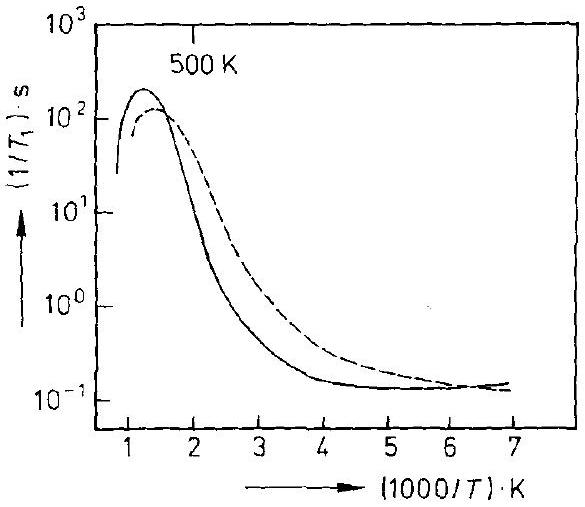
Figure 16-10. Spin-lattice relaxation rate ( $1 / \mathcal{T}_{1}$ ) as a function of the reciprocal temperature for $\beta$-spodumene ( $\mathrm{Li}_{2} \mathrm{O} \cdot \mathrm{Al}_{2} \mathrm{O}_{3} \cdot 4 \mathrm{SiO}_{2}$ ) and glass (---) of the same composition (after [W. Franke, P. Heitjans (1992)]).

section, the spin-lattice relaxation rate cannot immediately be compared with the elementary jump frequency during diffusion of atomic particles without a correct concept of their motional dynamics on an atomic scale. This knowledge is normally not available for complex crystal structures, and also not for glass.
2) Formation of fayalite ( 2 " FeO " $+\mathrm{SiO}_{2}=\mathrm{Fe}_{2} \mathrm{SiO}_{4}$ ) as studied by Mößbauer spectroscopy [K. D. Becker, et al. (1992)]. The growth of fayalite, $\mathrm{Fe}_{2} \mathrm{SiO}_{4}$, at $1000^{\circ} \mathrm{C}$ has been investigated as shown schematically in Figure 16-11. The structure elements of $\mathrm{Fe}^{2+}$ are present both in the wüstite and the fayalite product phase. However, their MS signals do not interfere because of the strong diffusion-broadening of the "FeO" MS line ("FeO" indicates nonstoichiometric wüstite). In-situ MS lines of the fayalite are presented as a function of reaction time in Figure 16-11a. In Figure 16-11b, the relative integral absorption intensity of the two doublet lines is given as a function of $\sqrt{t}$. The linear relation indicates the parabolic growth of fayalite. The two doublets reflect the two nonequivalent cation sites (M1, M2) in the olivine structure.
3) Fe cation diffusion in fayalite at $1130^{\circ} \mathrm{C}$ as studied by Mößbauer spectroscopy [K. D. Becker, et al. (1992)]. The iron cations are transported in fayalite via vacancies. Their concentration depends on the oxygen potential (see Section 2.3). Figure 16-12a shows the MS lines at two different oxygen potentials. With increasing $p_{\mathrm{O}_{2}}$ ( $\sim N_{V}^{1 / 6}$ ) the lines broaden in accordance with point defect thermodynamics [J. Hermeling, H. Schmalzried (1984)]. The inner doublet (M1) shows a larger linewidth than the outer doublet (M2), which indicates that the $\mathrm{Fe}^{2+}$ cations are more mobile on the M1 sites than on the M2 sites. Neglecting correlation effects, we can immediately derive the Fe diffusion coefficients $D_{\mathrm{Fe}}$ from the line-broadening, as was pointed out in the previous section. $D_{\mathrm{Fe}}$ is given in Figure 16-12b as a function of $\mu_{\mathrm{O}_{2}}\left(\sim \log p_{\mathrm{O}_{2}}\right)$.

By extrapolating $D_{\mathrm{Fe}}$ to $1000^{\circ} \mathrm{C}$, we can calculate the parabolic rate constant $k_{\mathrm{p}}$ (see Eqn. (6.30)) and compare it with the experimental value derived from Figure 16-10b. From this comparison, it seems as if $\mathrm{Fe}^{2+}$ is the rate determining cation for the formation of fayalite by solid state reaction. Since we conclude from Section 15.2.2 that $D_{\mathrm{Si}} \ll D_{\mathrm{O}} \ll D_{\mathrm{Fe}}$ in natural olivines, it is most unlikely (in view of the

Figure 16-11. a) Time resolved in-situ Mößbauer spectra of fayalite, $\mathrm{Fe}_{2} \mathrm{SiO}_{4}$, forming from " FeO " and $\mathrm{SiO}_{2}$ after different reaction times, and b) the time dependence of the portion of Fe contained in the fayalite, as obtained from the integral intensities of the spectra in a) at $p_{\mathrm{O}_{2}}=5 \times 10^{-14}$ bar [K. D. Becker, et al. (1992)].

Figure 16-12. a) Mößbauer spectra of fayalite, $\mathrm{Fe}_{2} \mathrm{SiO}_{4}$, at two different oxygen potentials. b) Diffusion coefficients of iron cations as obtained from the Mösbauer spectra in a) as a function of the relative oxygen potential at $1130^{\circ} \mathrm{C}$ [K. D. Becker, et al. (1992)].

experimental value of $k_{\mathrm{p}}$ ) that $\mathrm{Fe}_{2} \mathrm{SiO}_{4}$ is formed by the simultaneous coupled diffusion of $\mathrm{Fe}^{2+}$ and $\mathrm{O}^{2-}$ across the $\mathrm{Fe}_{2} \mathrm{SiO}_{4}$ product layer. This flux coupling should lead to a far lower $k_{\mathrm{p}}$ value as determined by the slow oxygen ion diffusion. Obviously, other transport mechanisms have to be evoked in order to explain these experimental results.

# 16.5 Spectroscopic Methods:   Electromagnetic (IR, VIS, UV, X-ray) Spectroscopy 

### 16.5.1 Introduction

This section is concerned with the transitions between electronic states of atoms, ions, and molecules in crystals (Table 16-1). The corresponding spectroscopies are well known in chemical research. They primarily concern analytical work, but kinetic and even dynamic applications are frequently found as well. The instrumentation sets the lower limit to the time window ( $\approx$ femtoseconds). If the input signal is a photon and the output signal an electron (PES, UPS, XPS), one may nevertheless probe the electronic states of the target crystal. The depth of probing, however, is quite small due to the strong absorption of low energy electrons by condensed matter. This is of advantage for the study of thin films. Since the outer electron energy levels shift with the composition of their atomic surroundings, it is possible to investigate chemical reactions at regions near the surface by in-situ PES.

Bulk processes can also be probed by an appropriate photon spectroscopy. For example, EXAFS provides an excellent spatial resolution with respect to the atomic surroundings. The information from Extended X-ray Absorption Fine Structure spectroscopy is contained in the oscillations of the X-ray absorption coefficient near an absorption edge (e.g., the K- or L-edge).

Let us mention in passing that in-situ X-ray diffraction has long been used to follow solid state reactions by changes in the diffraction patterns in real time (especially in metallurgy). Heating cameras with predetermined atmospheres have been constructed. The event of high intensity synchroton radiation gave access to the study of fast reaction kinetics in the seconds and below range.

### 16.5.2 Physical Background

Remarks on the physics background will be short. The basic concepts which concern the transition of electrons between different energy levels in atoms and molecules are due to quantum theory and are extensively described in textbooks on physical chemistry. With some appropriate modifications, the principles of molecular spectroscopy can be applied to crystals by considering them as extremely large molecules. The periodicity of the crystal structure causes the electronic states to be arranged in bands separated from each other by band gaps. The electron distributions in the energy levels are governed by Fermi statistics.

If the coupling of the electrons to certain centers is strong, their spectra may be distinguished from that of the crystal as a whole (point defect color centers in ionic crystals, polarons in semiconductors). The spectra of defects can therefore be used for analytical or even kinetic investigations. In principle, it should be possible to construct devices which have, under favorable conditions, a sufficient spatial resolution to experimentally determine the basic kinetic quantity $c_{i}(\xi, t)$.

From Table 16-1, we can read that the photon energies in the spectral range in question and the thermal energies at the temperatures of the in-situ solid state kinetic experiments are comparable. Therefore, temperature changes will primarily influence the electron populations of the energy states, that is, the spectral intensities. The influence of temperature on the location of these states on the energy scale is only of second order.

### 16.5.3 In-situ Application, Examples

1) Formation of $\mathrm{CoAl}_{2} \mathrm{O}_{4}$ (spinel) from $\mathrm{Al}_{2} \mathrm{O}_{3}$ (single crystal) and CoO at $1000^{\circ} \mathrm{C}$ [K. D. Becker (1994)]. High temperature optical spectra have been registered for $\mathrm{Al}_{2} \mathrm{O}_{3}, \mathrm{CoO}$, and $\mathrm{CoAl}_{2} \mathrm{O}_{4}$. While $\mathrm{Al}_{2} \mathrm{O}_{3}$ is essentially transparent, the high temperature spectrum of CoO exhibits a monotonic increase in absorbance with photon energy. $\mathrm{CoAl}_{2} \mathrm{O}_{4}$ (spinel), however, shows a strong, triple-peak absorption at $c a$. 2.2 eV which has been assigned to the ligand-field ${ }^{4} A_{2}(\mathrm{~F}) \rightarrow{ }^{4} T_{1}(\mathrm{P})$ transition of tetrahedrally coordinated $\mathrm{Co}^{2+}$. This absorption band retains its characteristic structure at high temperatures and can thus be used to follow in-situ the spinel formation reaction using an optical spectrometer in combination with a high temperature furnace. Before the annealing reaction, a thin CoO layer has been produced by oxidation of the metallic Co evaporated on the $\mathrm{Al}_{2} \mathrm{O}_{3}$ single crystal. Figure 16-13 shows the spectra during the annealing reaction. Figure 16-13a gives the time-evolution as a function of wavelength. Figure 16-13b plots the CoO absorption intensities at 430 and 800 nm in addition to the integral intensity of the spinel signal as a function of time. We see that the linear rate law prevails for a spinel layer thickness of up to $0.6 \mu \mathrm{~m}$. The most interesting result of this experiment is the fact that the linear rate coefficient depends on the orientation of the surface of the reactant $\mathrm{Al}_{2} \mathrm{O}_{3}$. A discussion of the linear growth of solids was given in Sections 6.6 and 7.3.
2) Relaxation of cations between different sublattices. [K. D. Becker, F. Rau (1987)] studied the kinetics of the homogeneous reaction $A_{t}+B_{o}=A_{o}+B_{t}$ between the SE's in the spinel $\left(\mathrm{A}_{1-x} \mathrm{~B}_{x}\right)_{t}\left(\mathrm{~A}_{x} \mathrm{~B}_{2-x}\right)_{0} \mathrm{O}_{4}$ after perturbing the equilibrium distribution of the A and B cations on their respective sites in the tetrahedral ( t ) and octahedral (o) sublattice. The perturbation was a sudden temperature change (e.g., $T_{1}=700^{\circ} \mathrm{C} \rightarrow T_{2}=600^{\circ} \mathrm{C}$ ) and the subsequent relaxation process was measured insitu by recording the UV-VIS-NIR spectra with a spectral photometer. Figure 16-14a shows the optical transmission spectra of thin single crystals of $\mathrm{NiAl}_{2} \mathrm{O}_{4}$ at various temperatures. The characteristic feature of these spectra is the double-humped peak at ca. 640 nm , which has been ascribed to ligand-field transitions of $\mathrm{Ni}_{\mathrm{t}}^{2+}$ ions. The temperature jump was achieved by the quick shift of the sample (having a thickness of ca. $50 \mu \mathrm{~m}$ ) between two different temperature zones of a small high temperature furnace. The corresponding change of extinction with time at $\lambda=640 \mathrm{~nm}$ is given in Figure 16-14b.

The initial steep change in the extinction is ascribed to the temperature equilibration of the sample. Following this, a multi-exponential decay in the extinction is observed, indicating the complex relaxation kinetics of the homogeneous reaction between the various cationic SE's. Finally, the long-term single exponential relaxation

Figure 16-13. Growth of $\mathrm{CoAl}_{2} \mathrm{O}_{4}$ from CoO and $\mathrm{Al}_{2} \mathrm{O}_{3}$ at $1000^{\circ} \mathrm{C}$ in air [K. D. Becker (1994)]. a) In-situ spectra for different growth times, and b) absorbances ( $\mathbf{A}, \cdot$ ) and integral intensity ( $\bigcirc$ ) as a function of time.

time for the change of $x$ ( $=$ degree of inversion) is on the order of minutes at $700^{\circ} \mathrm{C}$, and on the order of hours at $600^{\circ} \mathrm{C}$. These SE relaxation times exhibit Arrhenius type of behavior.

Figure 16-14. a) Optical transmission spectra of $\mathrm{NiAl}_{2} \mathrm{O}_{4}$ (single crystals) at various high temperatures. b) Relaxation of the extinction after a sudden temperature change in $\mathrm{NiAl}_{2} \mathrm{O}_{4} . T_{0}=700^{\circ} \mathrm{C}$, $T_{1}=600^{\circ} \mathrm{C}, \lambda=640 \mathrm{~nm}$ [K. D. Becker, F. Rau (1987)].

### 16.6 Particle Spectroscopy

### 16.6.1 Introduction

Electrons of 150 eV and neutrons of 0.1 eV possess a DeBroglie wavelength of about $1 \AA$, which matches the elementary lattice dimensions in crystals. The appreciable scattering cross sections for electrons causes them to be strongly absorbed and thus
able to give information primarily about the surface properties. We will therefore not treat them here.

Neutrons have no electrical charge. Compared with electrons, their scattering cross section is small. Thus, they can be used to probe bulk properties in-situ. In contrast to X-rays, neutrons may also be scattered strongly by light elements. Another advantage is the fact that neutrons with wavelengths of atomic dimensions possess energies which compare with phonon energies. This allows us to study lattice dynamics. In view of our primary interest in kinetics, we will not discuss particle diffraction (elastic scattering) for the purpose of structure investigations. We may mention, however, that it is possible by using high-fluence neutron sources to study structure changes of crystals in real time. Thus, it becomes feasible to perform in-situ measurements of solid state reactions [G. Eckold (1992); J. Pannetier (1986)]. If the construction material of the annealing furnace consists of elements with small scattering cross sections which therefore do not interfere with the neutron beam, in contrast to studies with electromagnetic radiation, we can make kinetic and dynamic investigations at high temperatures.

### 16.6.2 Physical Background

Let us direct a monochromatic beam of slow neutrons from an appropriate source (nuclear reactor) onto a target crystal. If there is constructive interference, the scattered neutron intensity consists of 1) a sharp Bragg peak, 2) tails on both sides of this peak due to quasi-elastic scattering, and 3) more or less sharp side bands due to interactions with phonons (inelastic scattering). The intensity around the Bragg peak stems from the interference between the incident beam (wave vector $k_{0}$ ) and the scattered beam (wave vector $\boldsymbol{k}$ ). There is an incoherent contribution to the scattered neutrons due to the different scattering lengths of chemically identical atoms (isotopes with different spin) in the crystal, which can be larger than the coherent portion.

As in QMS, the degree of coherence is changed if the scattering atom itself jumps (with a frequency $1 / \tau$ which is on the order of $1 / t_{n}$, where $t_{n}$ is determined by the time resolution of the spectrometer). The jumping atom transfers energy either to or from the scattered neutrons. As mentioned before, the result is a broadening ( $\delta v$ ) of the elastic line. We expect $\delta \nu$ to vary exponentially with temperature.

Intensities of coherently and incoherently scattered neutrons are described by the scattering function $S$ and have been worked out by [S. W. Lovesey (1986); K. S. Singwi, A. Sjölander (1960); R.E. Lechner, C. Riekel (1981)] as

$$
S(q, \omega)=\alpha \cdot \int \mathrm{e}^{-i \cdot \omega \cdot t} \cdot \mathrm{e}^{i(q \cdot r)} \cdot G(r, t) \cdot \mathrm{d} r \cdot \mathrm{~d} t
$$

where $\boldsymbol{q}=\left(\boldsymbol{k}-\boldsymbol{k}_{0}\right)$ is the scattering vector, $\hbar \omega$ is the transferred energy and $\hbar \cdot \boldsymbol{q}$ is the transferred momentum. Thus, the intensities are in essence Fourier transforms in space and time of the correlation function $G(r, t)$. The incoherent scattering function is directly related to the self-correlation function $G_{s}(r, t)$, that is, the probability of a particle to be at location $r$ at time $t$, if it was at $r=0$ at time $t=0$.

For a continuous diffusional motion of the scattering particles, it can be approximated by

$$
G_{\mathrm{s}}(r, t)=\frac{1}{(4 \cdot \pi \cdot D \cdot t)^{3 / 2}} \cdot \mathrm{e}^{-\frac{r^{2}}{4 \cdot D \cdot t}}
$$

For random jumps with vectors $\boldsymbol{R}_{\mathbf{n}}$ to the nearest neighbors $\mathbf{n}$, the half-width of the scattered line becomes

$$
\delta v(q)=\frac{1}{\pi \cdot \tau} \cdot\left(\frac{1}{n}-\frac{1}{n} \cdot \sum \mathrm{e}^{-i\left(q \cdot R_{\mathrm{n}}\right)}\right)
$$

Derivations from these relations can be found, for example, in [G. Schatz, A. Weidinger (1992); R. E. Lechner, C. Riekel (1981)].

In concluding this section we mention positron annihilation (PA) as a nuclear method providing information on time-dependent defect concentrations. Positrons (p) from sources such as ${ }^{22} \mathrm{Na},{ }^{58} \mathrm{Co}$, or ${ }^{64} \mathrm{Cu}$ are implanted in the crystal to be investigated. The penetration depth is $10-1000 \mu \mathrm{~m}$. After ca. 1 ps , thermalization is completed. The annihilation of the positrons by the electrons of the crystal leads to the emission of two 511 keV photons. The lifetime of a positron depends on the type of solid and amounts to $c a$. $100-300 \mathrm{ps}$. The (thermal) diffusion length in this time interval is ca. $10^{3} \AA$. Since the annihilation rate $(\sim 1 / \tau)$ is influenced by the overlap of positron and electron densities (i.e., wave functions), $\tau$ gives information on the sites where annihilation has occurred (e.g., $\tau$ (lattice) $<\tau$ (vacancy) $<\tau$ (divacancy)). Positrons in the lattice move interstitially and are strongly attracted by defects with lower 'cationic' density until they are eventually trapped. The diffusional trapping is an interesting kinetic problem of its own. Time-dependent intensities of the spectra of positron annihilation processes allow us to study the time evolution of the concentration of trapping sites (e.g., vacancy, divacancy, etc.).

### 16.6.3 Examples

1) Kinetics of the formation of a solid solution $(\mathrm{Ag}, \mathrm{Na}) \mathrm{Br}$ from the components AgBr and NaBr [G. Eckold (1992)]. The interdiffusion of silver and sodium cations in a polycrystalline mixture of AgBr and NaBr has been investigated in real time by neutron diffraction at 621 K . Figure 16-15 illustrates the scattered intensities of the (200) peak at different reaction times. Since the mixing process occurs by interdiffusion of the AgBr and NaBr reactants in a sample of compacted grains and the concentration profile of each individual $\mathrm{AgBr} / \mathrm{NaBr}$ contact is quite unsymmetric (given that $D_{\mathrm{Ag}}$ is much larger than $D_{\mathrm{Na}}$ ), it is astonishing that the spectral change could be interpreted through the change in the portions of three Gaussian curves. These curves have been attributed to $\mathrm{AgBr}, \mathrm{NaBr}$, and the solid solution crystals with the final (equilibrium) composition $\left(\mathrm{Ag}_{0.44} \mathrm{Na}_{0.56}\right) \mathrm{Br}$ respectively. In spite of these open questions of interpretation, however, we can see that it is possible to follow the diffusional reaction kinetics in real time. The same set-up could also be used to study the

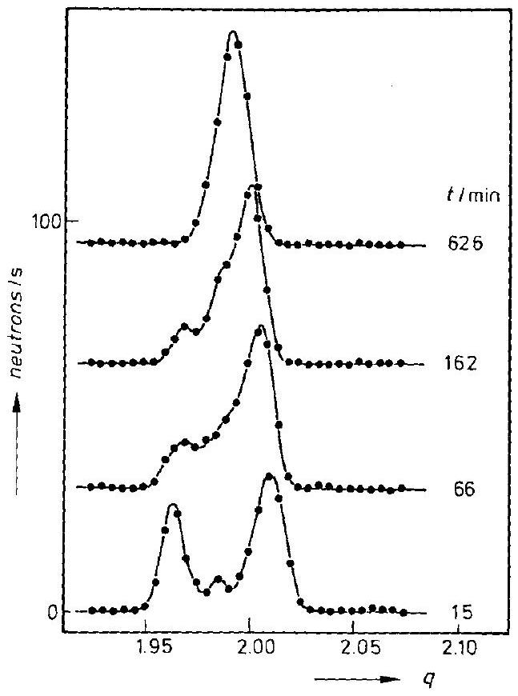
Figure 16-15. Time-dependent intensity profile of the (200) reflection of ( $\mathrm{AgBr}+\mathrm{NaBr}$ ) mixtures measured during interdiffusion at 621 K . Wavelength of the scattered neutrons $\lambda_{\mathrm{n}}=2.36 \AA$ (after [G. Eckold (1992)]).

demixing of an ( $\mathrm{Ag}, \mathrm{Na}$ ) Br solid solution by cooling a homogeneous sample into the two-phase field below the critical temperature ( $T_{\text {crit }} \approx 570 \mathrm{~K}$ ).
2) Translational motion of Ag in $\mathrm{Ag}_{2} \mathrm{Se}$ at $250^{\circ} \mathrm{C}$. Examples from the literature (e.g., [R. E. Lechner, C. Riekel (1981)]) show us that neutron scattering gives information about hopping rates and the diffusional motion of atoms moving in dynamic equilibrium. Prominent objects of these studies are molecular crystals, polymers, and hydrogen in metals. The elementary mechanisms of atomic transport in fast ionic conductors have also been investigated in this way. Considering the possible practical applications to solid state electrochemistry, silver halides and chalcogenides are favorite research materials.

Figure 16-16 shows the neutron scattering spectrum of a single crystal of $\alpha-\mathrm{Ag}_{2} \mathrm{Se}$ at $250^{\circ} \mathrm{C}$. It represents the total scattering function. As in $\mathrm{Ag}_{2} \mathrm{~S}$, the silver ions are more or less homogeneously distributed over the three-dimensional system of intersecting $\langle 100\rangle$ channels. Their translations consist of two parts: the confined motion in the cage of nearest neighbors, and the motion of these cages in the channel system. With this concept, Funke [K. Funke (1989)] calculated the corresponding self-correlation function which, after Fourier transformation, was directly compared with the incoherent scattering function $S_{\text {inc }}(q, \omega)$. The calculation yields a broad spectral intensity due to the irregular motion of the Ag ions in their cages, and a much narrower quasi-elastic line which stems from the motion in the channels. Figure 16-16 obviously reflects these particular features of the model. We should, however, note that the measurement representing the total scattering cannot immediately be compared with $S_{\text {inc }}$ which is derived from the model calculation. Nevertheless, Funke

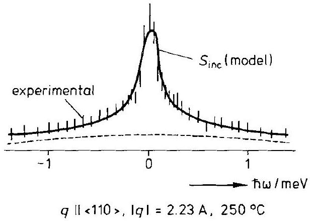
Figure 16-16. Neutron scattering spectrum of $\alpha-\mathrm{Ag}_{2} \mathrm{Se}$ single crystal at $250^{\circ} \mathrm{C}$. The solid line gives the calculated incoherent scattering (after [K. Funke (1989)]).

has shown that the measured spectrum contains all the essential features of a quasicontinuous, non-activated motion in the channels of $\mathrm{Ag}_{2} \mathrm{Se}$ and reflects both the anisotropy and the line width as a function of $\boldsymbol{q}$.

## References

Allnatt, A. R., Lidiard, A. B. (1993) Atomic Transport in Solids, Cambridge University Press, Cambridge
Becker, K. D. (1994) in Reactive Formation of Phases at Interfaces and Diffusion Processes (Eds.: F. Heurle, et al.), Trans. Techn. Publications

Becker, K. D., et al. (1992) Ber. Bunsenges. Phys. Chem., 96, 1178
Becker, K. D., Rau, F. (1987) Ber. Bunsenges. Phys. Chem., 91, 1279
Bormann, R., Zöltzer, K. (1992) Phys. Stat. Sol. (a), 131, 691
Brown, M.E. (1988) Introduction to Thermal Analysis, Chapman and Hall, New York
Chadwick, A.V. (1988) Int. Rev. Phys. Chem., 7, 251
Eckold, G. (1992) Habilitationsschrift TH Aachen, Bericht Forschungszentrum Jülich 2675
Franke, W., Heitjans, P. (1992) Ber. Bunsenges. Phys. Chem., 96, 1674
Frauenfelder, H., Steffen, R.M. (1965) in Alpha, Beta and Gamma Ray Spectroscopy, Vol. II (Ed.: K. Siegbahn). North Holland, Amsterdam

Funke, K. (1989) Ber. Bunsenges. Phys. Chem., 93, 1197
Hermeling, J., Schmalzried, H. (1984) Phys. Chem. Min., 11, 161
Hölscher, U. (1983) Ph.D.-Dissertation, Hannover University
Janek, J. (1992) Ph.D.-Dissertation, Hannover University
Kanert, O. (1982) Physics Rep., 91, 183
Lechner, R. E., Riekel, C. (1981) Z. phys. Chem., NF 128, 1
Lovesey, S. W. (1986) Theory of Neutron Scattering from Condensed Matter, Clarendon Press, Oxford
Mahnke, H. E. (1989) Hyperfine Interactions, 49, 77
Pannetier, J. (1986) Ber. Bunsenges. Phys. Chem., 90, 634
Petry, W., Vogl, G. (1987) Mat. Sci. For., 15-18, 323
Reye, H. J. (1979) Ph.D.-Dissertation, Hannover University
Schatz, G., Weidinger, A. (1992) Nukleare Festkörperphysik, Teubner Studienbücher, Stuttgart
Schmalzried, H., et al. (1992) Solid State Ionics, 51, 91

Singwi, K. S., Sjölander, A. (1960) Phys. Rev., 119, 863; 120, 1093
Slichter, C.P. (1978) Principles of Magnetic Resonance, Springer Series in Solid State Science, Berlin
Ullrich, M. (1990) Ph.D.-Dissertation, Hannover University
Wolf, D. (1979) Spin Temperature and Nuclear-Spin Relaxation in Matter, Clarendon Press, Oxford
Wysk, H. (1995) Ph.D.-Dissertation, Hannover University

## Epilogue

Maybe it is Aristotle ( $384-322$ BC , "Corpora non agunt nisi fluida") who is responsible for the fact that chemists neglected the quantitative approach to solid state kinetics for such a long time. Certainly, however, it is the complexity of the kinetic problems which impeded, and still impedes, pertinent studies. Not only must the formal treatment (presented in textbooks on homogeneous/heterogeneous kinetics and transport) be mastered, but also the influence of elasticity, plasticity, crystallographic constraints, and the response of solids to electromagnetic fields during the course of solid state reactions.

The foregoing chapters mark a long and not yet finished journey through the special field of the chemical kinetics of solids. It differs from the more common textbooks on kinetics not only because of the immense variety of crystalline phases, but even more in view of the ambiguity in the definition of the correct number of independent thermodynamic state variables. This is the source of many difficulties and particularly with solids containing one or more immobile components or multiphase systems composed of coherent or semicoherent crystals. In coping with this inherent complexity in the foregoing chapters, we chose to restrict ourselves mainly to the fundamental aspects rather than to present many uncorrelated details.

In order to solve a kinetic problem (i.e., the evolution in time of a non-equilibrium ensemble of mobile atomic particles), we have first to construct theoretically, or to determine experimentally, the Gibbs energy function of the system which we wish to investigate. From this potential, we can then derive the appropriate driving forces. Whereas in homogeneous systems we need to know affinities, in inhomogeneous systems we have to deduce the potential gradients, at least in the framework of the thermodynamics of (linear) irreversible processes. Secondly, it is necessary to understand the kinetic coefficients in the rate equations of solid state processes. These coefficients are closely connected to the dynamics of atomic motions, and to the type and number of crystal defects. As long as we use the concepts of thermodynamics of irreversible processes, we assume tacitly that local equilibrium prevails and, in particular, that point defect equilibrium is established during reaction. In such cases, each volume element in the reaction zone possesses a local Gibbs energy function which is fully determined by the set of independent thermodynamic state variables.

In many non-equilibrium situations, this local equilibrium assumption holds for the crystal bulk. However, its verification at the phase boundaries and interfaces (internal and external surfaces) is often difficult. This urges us to pay particular attention to the appropriate kinetic modeling of interfaces, an endeavour which is still in its infancy.

Thirdly, we note that a kinetic problem is never properly defined unless the boundary conditions are known and specified throughout. This becomes a critical point when boundaries move during the solid state reaction and their morphology is un-
stable. Boundary morphologies can be influenced easily by the elastic properties and plastic behavior of contiguous phases.

This monograph is an attempt to quantify the complex kinetics of solids. It can be done on different levels of sophistication. Statistical theory requires atomic scale models which could be based on electron theory. One may also work on a less fundamental level by introducing phenomenological parameters. Yet even this latter approach is not always feasible for solids with more or less ordered systems having very large numbers of interacting atomic particles, despite the availability of modern computers. In practice, the linear thermodynamics of irreversible processes is a useful frame since transport is responsible for the larger part of solid state kinetics. We must remain aware, however, that the kinetic coefficients are ad hoc parameters, unless they can be derived from atomic theory [A. R. Allnatt and A. B. Lidiard; Atomic Transport in Solids]. Thus, a book on solid state kinetics is a compromise, by necessity, and often gives the definition of a problem rather than the solution. However, if the definition is correct and unique, one day we will have the unambiguous answer to the problem.

Chemical Kinetics of Solids by Hermann Schmalzried (c) VCH Verlagsgesellschaft mbH, 1995

## Subject Index

activated jump 103
activity coefficient 26
additive crystal growth 209, 266
AgBr 224, 327
$\mathrm{AgCl} / \mathrm{KCl}$ couple 270, 288
$\mathrm{AgCl}-\mathrm{NaCl}$ interdiffusion 288
$\mathrm{Ag}_{2} \mathrm{HgI}_{4}$ 146
$\mathrm{AgI} / \mathrm{Ag}_{2} \mathrm{~S}$ boundary 249
( $\mathrm{Ag}, \mathrm{Na}$ ) Br formation 417
Ag photography 327
$\mathrm{Ag}_{2} \mathrm{~S} 53,254,372 \mathrm{ff}$

- catalyst 372
- chemical diffusion 373
- mixed conductor 373
- phase transformation 305, 401
$\mathrm{Ag}_{2} \mathrm{Sb}_{2} \mathrm{~S}_{4}$ 146
$\mathrm{Ag}_{2} \mathrm{Se} 254$
$\mathrm{Ag}_{3} \mathrm{SI} 370$
alloy
- dissolution 274
- interface velocity 178
- oxidation $175 \mathrm{ff}, 276$
- reaction path 177
$\alpha-\mathrm{Ag}_{2} \mathrm{Se}$
- incoherent scattering 418
- neutron diffraction 418
- self-correlation function 418
aluminosilicate 356
amorphization 381
atomic jumping 110
Avrami(-Johnson-Mehl) equation 145, 385
ballistic diffusion coefficient 323
ballistic energy
353
ball milling 351
- amorphization 352

Beevers-Ross site 377
$\beta$-alumina 377 ff

- conductivity 378
- sensor 378
- structure 377
$\beta$-NMR 404, 407
bimolecular reaction 11, 120
blocking current 88
blocking electrode 81
boundary 236 ff
- defect chemistry 240
- elastic strain energy 56
- energy

54

- impurity segregation

254

- mobility

307

- morphology

271

- motion

59

- orientation 52
- segregation 53
- stability

266

- structure

52
breakaway scale 181
brittle fracture
347
Brownian motion 6, 103 ff
building element (unit) 20, 23, 29, 67

- electronic

195

- transport coefficient

196
Burgers vector
43
CaO
229
capillarity
282
caterpillar motion 371
$\mathrm{CaTiO}_{3}$
230
cation counterdiffusion
149
cation flux coupling
147
charge carrier, electronic
25
charge, effective
65
charge of transport 197
chemical diffusion 71 ff, 124

- coefficient 74, 124, 127, 134
- interdiffusion coefficient 109
chemical potential
- sensor 399 ff
- stress term 334
- transport in gradient 184f
- virtual 24
classification of processes
62
Clausius-Clapeyron equation 293
- generalized

177
clustering 291, 311
$\mathrm{CoAl}_{2} \mathrm{O}_{4}$

- formation

413

- optical spectrum 413
coarsening 145
coherency strain 56
coherent spinodal 308
collision process of particle 317
color center 220, 412
combustion 158 f
- reaction front 159
( $\mathrm{Co}, \mathrm{Mg}$ )O 39
composition fluctuation 309
compound
- formation 16
- formation kinetics 146 ff
- formation of metals 153
- Gibbs energy 253
- reaction path 142
- semiconductor 135
concentration modulations 302
conductance, generalized 64
conducting polymer 389 f
conductivity
- electrical 97, 112, 197
- frequency dependence 114
configurational entropy 27,30
continuity equation 64
$\mathrm{CoO} 49,197,277$
- boundary stability 273 f
- disorder 33

CoO-NiO 127, 131
cordierite 363
correlation 109 ff
correlation factor 108
correlation length 292, 302
$\mathrm{Co}_{2} \mathrm{TiO}_{4}-\mathrm{CoAl}_{2} \mathrm{O}_{4} \quad 311$
Cottrell atmosphere 44, 53, 58, 336
coulometric titration 399
crack 331

- propagation 348
- tip 350
- velocity 350
creep 342 ff
- anelastic 343
- steady state 345
critical radius 140
cross coefficient 108
cross effect $65,191 \mathrm{ff}$
crystal shift $14,80,150,186$
$\mathrm{Cu}_{2} \mathrm{O} 277$
( $\mathrm{Cu}, \mathrm{Zn}$ ) 298
Darken equation $75,109,132$
DeBroglie wavelength 394, 415
Debye-Hückel interaction 116
Debye(-Hückel) length 53, 56, 86, 174, 244
decomposition
- field-driven 221
- kinetics 228
- peritectic 294
- relaxation time 311
defect
- associate 133
- cluster 29, 35, 37
- equilibration 123 ff
- equilibration, local 127
- hopping 113
- interface chemistry 235
- lifetime 111
- potential 113
- relaxation 248, 371
- supersaturation 232
defects in alloys 38 ff
demixing 185, 292
- in T-gradient 200
- of (A,B)O 186
- of ( $\mathrm{Mn}, \mathrm{Fe}) \mathrm{O}_{n} 203$
- strength 185
- stress induced 200
- transient 189
dendritic growth 265
density of states 98
developer, photographic 328
dielectric permittivity 100
dielectric response
- Debye equations 101, 344
- universal 116
differential scanning calorimetry 398
differential thermal analysis 398
diffusion 68 ff
- anisotropy 122
- ballistic 323
- coefficient 69, 105
- control 251
- matrix 72
- path 73,284
- potential 87
- stress-induced 339
diffusion profile, stability 287
DIGM 260f
dislocation 9, 43, 331
- climb 44, 49, 57, 345
- drag 58
- energy 46
- interaction 46
- jog and kink 44
- loop 47, 56
- mobility 57
- motion 57
- network 49
- stress 45
disorder, Frenkel type 370
disorder type 31, 33, 153
dispersion hardening 217
displacement reaction $155 \mathrm{ff}, 276$
- Jost mechanism 155
- morphology 155
- Wagner mechanism 155
dividing surface 102
driven system 220
driving force 64f, 125
double salt, formation 137
duplex scale 180
dynamic equilibrium 83,89
edge dislocation 43 ff
effective diffusion coefficient 180
Einstein frequency 102
elastic energy 297
- of concentration waves 309
electric conduction 76 f
electric field
- influence on reaction 205
electrochemical polarization 225
electrochemical potential 222
electrode
- charge transfer 84
- polarization 82
- stability 286
electrolysis cell 287
electrolytic domain 377
electromagnetic spectroscopy 403, 412
electron, energy level 172
electron hole 26
electronic transference number 222
electron tunneling 173 f
electrotransport 197
emf measurement 399
encounter, vacancy with atom 108, 110
enhancement factor 118
entropy production 63, 67, 194
equation of motion 96
equilibrium interface 239
equivalent circuit 167
exchange flux 84, 245, 250
exchange reaction 22, 23, 90
excluded sites 30
experimental methods 393 ff
extrinsic disorder 33
fast diffusion paths 171, 219
fast ion conduction 368 ff
feldspar 361
- diffusion 362
- spinodal decomposition 364

Fe-Mn-O 284
FeO 277
$\mathrm{Fe}_{3} \mathrm{O}_{4} \quad 240$
$\mathrm{Fe}_{3} \mathrm{O}_{4}-\mathrm{Mn}_{3} \mathrm{O}_{4}-\mathrm{Cr}_{2} \mathrm{O}_{3} \quad 278$
Fermi energy 172
$\mathrm{Fe}-\mathrm{Si}-\mathrm{C} 74$
$\mathrm{Fe}_{2} \mathrm{SiO}_{4}$

- cation diffusion 409
- formation 409 f
- Mößbauer spectra 411

Fick's

- reference system 74
- second law of diffusion 69,71
five-frequency model, vacancy jump 112
flux coupling 192
formation of multiphase products 153 f
fracture 342, 347 ff
Frank-Read source, dislocations 47
Frenkel
- defect formation 32
- defects 10
- disorder 7,28
- reaction 7,91,123,227f
- reaction rate equation 228
frequency dispersion 98
galvanic cell 399
generalized conductance 78
Gibbs
- adsorption isotherm 53, 238
- dividing surface 242
- energy of defect formation 32, 130
- fluid 198
- phase rule 175, 239, 293, 336
- triangle $\mathrm{A}-\mathrm{B}-\mathrm{O} 214$

Gibbs-Thomson equation 145
Ginzburg-Landau equation 302, 307
glass

- diffusion 367
- electric conduction 366
- structure 366
- transport 365
glide plane 44
gradient energy 242, 309
grain boundary 50
- energy 55
- motion 260

Griffith parameter 348
growth

- early stage 143 ff
- kinetics 145
- morphology 231, 271
- parameter 212
growth rate, logarithmic 174
Guinier-Preston zone 55
habit plane 297f
halides 370 ff
hard sphere scattering 317
harmonic oscillator 97
- potential 97
heat flux 201
heat of transport 201
heterogeneous nucleation 141
heterogeneous reaction 137 ff
- influence of stress 337f
heterovalent compound, interdiffusion 133 f
heterovalent doping 180
hexamethylethane 388
high temperature
- corrosion 166, 181
- coulometry 397
- creep 345
historical remarks 6 ff
homogeneous nucleation 138
homogeneous reactions $10,88 \mathrm{ff}$
Hooke's law 333
hydrides 380
- formation kinetics 383
- hysteresis 382, 385
- nucleation 384
- phase equilibria 382
- quantum effects 381
- sorption-desorption 381
hydrogarnet defect 364
hydrogenation kinetics 385
hydrogen permeation 340
hydrogen weakening 364
immobile component, potential 335
incoherent boundary, energy 239
incubation period 163
inert marker 126
initial growth 138 ff
in-situ experiments 393 ff
instability, morphological 265 ff
instability, temporal 289
interaction parameter 30
intercalation 362, 378
interdiffusion 95, 109, 118, $123 \mathrm{ff}, 127 \mathrm{f}$, 133f, 231, 270
- coefficient 131f
- zone 48
interface
- $\mathrm{AgI} / \mathrm{Ag}_{2} \mathrm{~S} 402$
- curved 241
- defect distribution 252
- energy 237
- equilibrium 83
- geometry 237
- Gibbs energy 242
- kinetics 82, 235
- local equilibrium 153
- matter transfer 247
- mobility 246, 252, 258
- motion AX/BX 286
- nonlinear kinetics 256
- polarization 221, 246
- potential 15,243
- rate control 160f, 251, 257
- reaction 14, $235 \mathrm{ff}, 245,247$
- relaxation processes 255 f
- resistance 246,249
- semicoherent 55
- segregation 240
- stability, morphological 261 f, 267 ff, 285 f
- structure 244,262f
- thermodynamics 236 ff
internal decomposition 210
- in AgBr 225
internal friction 344
internal junction 223
internal oxidation 179, 209 f
- metals 211 ff
- nonmetals 213 ff
- oxidizing agent 217
- reaction scheme 215
internal precipitation 210
internal reaction 209 ff
- $\mathrm{A}+\mathrm{B}=\mathrm{AB} 229 \mathrm{ff}$
- by interdiffusion 231 ff
- electrochemical 210, 222 ff
- in heterophase assemblages 221 ff
internal reduction 217, 276
interstitial diffusion 104
intrinsic disorder 32
ion blocking 226
ion drift 206
ionic conductivity 112 ff
ionization equilibria 195
irradiation 315 ff
- by electrons 318
- by neutrons 318
- decomposition 323
- defect cascade 321
- defect recombination 318
- demixing 322
- point defect concentration 319
irregular structure element 27
irreversible thermodynamics 63 ff
isomerization, photon induced 324
isotope effect 102
Jander equation 157
jump, ineffective 112
junctions 85 f
kinetic coefficients, $L_{i j} \quad 65$
kinetic decomposition 150, 189 ff
kinetic demixing 185f, 203
kinetics
- diffusion controlled 120
- interface relaxation 256
- non-parabolic 171 ff
- spinodal decomposition 310 f
- stress influence 337 ff
kinetic segregation 188
kinetic theory 107 ff

Kirkendall effect 117, 125 ff
Kroeger-Vink diagram 33
laboratory frame 71
Lagrange multipliers 28
Landau theory 302
Laplace field 280
latent image 327
lattice molecule $14,24,133$
lattice parameter distortion 310
lattice reference frame 67
lattice velocity 75,125
Liesegang phenomenon 209, 213, 289
linear rate law 161, 172
linear response $99 \mathrm{ff}, 114$
$\mathrm{Li}_{2} \mathrm{O} \cdot \mathrm{Al}_{2} \mathrm{O}_{3} \cdot 4 \mathrm{SiO}_{2} \quad 408$
local equilibrium 95 ff

- defects 118
local magnetic field, noise 406
Ludwig-Soret effect 65, 191, 200 f
majority defect 31
manometry 397
marker movement 126
martensite 294
master equation 92, 99
mean square displacement $69,103,106,110$
mechanical alloying 352
mechanical stress 331 ff
mechanochemistry 332, 351
metal oxidation 80,272
- Cu 169
- morphological stability 175 ff
- Ni 174
- reaction path 175 f
- Wagner theory 166 ff
- Zn 169
$\mathrm{MgAl}_{2} \mathrm{O}_{4} 146$
( $\mathrm{Mg}, \mathrm{Co}) \mathrm{O} 188$
$\mathrm{Mg}(\mathrm{OH})_{2} \quad 162$
$\mathrm{Mg}_{2} \mathrm{SiO}_{4} \quad 146$
$\mathrm{MgTiO}_{3} 338$
$\mathrm{Mg}_{2} \mathrm{TiO}_{4} 338$
microcrack 347
miscibility gap $270,283,308$
misfit dislocation 55
mixed alkali effect 367
mobility 70
- of SE, stress influence 336

Mößbauer spectroscopy 404, 407 f, 409

- quasi-elastic (QMS) 408
molecular crystal 386 f
- activation energy 389
- diffusion 388f
- point defects 387
- transport 387
morphological stability 271 f
morphology 265 ff
motion, diffusional 122
moving interface 250 ff
- structure 263
multicomponent stability analysis 281
multiphase reaction 160
multiphase system 184
- demixing 202 ff
- in electric field 204f

Nabarro-Herring creep 335, 341 f, 346
Na- $\beta$-alumina 115
Nernst-Einstein equation 13, 105, 108
network former 365
network modifier 365
neutron

- diffraction, real time 417
- elastic scattering 416
- inelastic scattering 416
- scattering function 416
$\mathrm{NiAl}_{2} \mathrm{O}_{4}$
- cation rearrangement 413
- high temperature spectrum 413
$\mathrm{NiCr}_{2} \mathrm{O}_{4} 151$
n-i junction 222f
(Ni,Mg)O 275
NiO 229
$\mathrm{Ni}_{2} \mathrm{Si} 161$
$\mathrm{NiTiO}_{3} 229$
NMR 404, 405f
non-equilibrium interface 84
non-hydrostatic stress, demixing 198
non-isothermal system 201
nonstoichiometric compound 118
nonstoichiometry, $\mathrm{A}_{1-\delta} \mathrm{X} \quad 77$
nuclear spectroscopy 402 ff
nucleation 138 ff
- energy 140
- kinetics 140f
- rate 141, 143 f
- site, dislocation 141
olivine 357f, 360
- internal reaction 359
omphacite 303
Onsager relations 64, 68, 195
order-disorder reaction 292, 363 f
ordering, homogeneous 291 f
order parameter 298
- coupling 303
ore reduction 217, 220
orthosilicate 356
- demixing 358
- diffusion 358
- reaction 358

Ostwald ripening 145, 226, 311 oxidation

- FeO to $\mathrm{Fe}_{3} \mathrm{O}_{4} 170$
- mechanism 165
- of metals 165 ff
- rate constant 168
- reaction 167
oxide reduction 275
overpotential 84 f
PAC 407
PAC spectroscopy 404
pairing of defects 36
parabolic rate constant 80
parabolic rate law 17, 144, 154, 167, 212
- internal oxidation 216
particle
- dynamics 96, 107
- irradiation 315, 317 ff
- size, distribution function 146
- spectroscopy 415
passivation 166, 384
$\mathrm{PbF}_{2} 371$
Pd-H 382
(Pd,Pt) 340
Peach-Koehler force 46
Peierl's energy 47
Peltier effect 191
periodic reactions 288 f
permeation 183
perovskite formation, internal 231
perturbation, Fourier analysis 280
phase boundary in solids 54 f
phase diagram
- first kind 293
- second kind, A-B-O 214
- third kind 178, 283
phase transformation $291 \mathrm{ff}, 349$
- interface motion 252 f
phenomenological transport coefficient 107
phonons 116
phonon states 97
photochemistry 325
photocurrent 325
photographic films 328
photographic process 327
photolysis 326
photon
- absorption 325
- irradiation 315, 324
- spectrum 394
photovoltaic cell 326
pipe diffusion 48, 219
pit formation, AgBr 226
p-n junction 9, 85 f, 222
point defect
- radiation induced 316
- relaxation 10
- segregation 53
- statistics 27
- thermodynamics $19 \mathrm{ff}, 31 \mathrm{f}$

Poisson equation 173, 174, 222
polarization cell 224, 227
polyacetylene 390
polyethylene oxide 389
polymers

- electron conduction 390
- polarons in 390
- semiconduction of 390
positron annihilation (PA) 417
powder reactions 157 f
processes in solids, systematics 61
propagator 99
protective oxide layer 179f
proton conduction 379 f
- mechanism 379
(Pt,Ni) 282
pulsating interface 254,289
pyroxene 356
quasi-binary system approach 269
radiation damage 316, 327
radiation effects
- halides 320, 326
- metals 321
random-alloy model, Manning 129, 132, 192
rate constant
- first kind 154
- rational 154
- second kind 154
rate law, cubic 174
rate parameter 122
reaction
- bimolecular 11,120
- control 121
- morphology 155
- of first kind 152
- of second kind 152
- radius 121
- rate, field dependence 206
- volume 120
reaction path $101,139,214,265,277,278$, 282 f
- interdiffusion 232
- internal reduction 218
- multiphase system 202
- second order transition 300
reactive (crystal) growth 209, 266
recombination 87
- rate 248
- zone 87, 249
reduction, internal 218
reference frame 74
reference velocity 70
relaxation 92
- of disorder 12,92,117ff, 119 ff
- process, defects 127 f
- time $16,87,119,123,130,249$
response function 101
rotational motion 96
Rutherford scattering 317
saddle point 101
saturation current 88
scattering cross section 317
Schottky disorder 32
scope 1 ff
screw dislocation 43 ff
Seebeck effect 191
self-correlation function 408
self-inhibition 170
self-propagating reaction 158 f
self-stress 339
semiconductor $8,85 \mathrm{f}$
sensor 395
- chemical potential 399 ff
shift velocity of crystals 80
silicate glass 365
silicates 356 ff
- hydrogen dissolution 364
- layered 356
- order-disorder reaction 363
- point defects 357
- transport 357
single-file diffusion 363
site conservation 66
small-angle grain boundaries 50
sodium-sulphur battery 378
soft mode 116
solid electrolytes 76, 198
- buffer capacity 400
- conductivity 368 f
- miniaturized 400
solid solution point defects 38
solid state ionics 369
solid state reaction, internal 210
solubility product 230
solute drag 258 f
space charge $53,86,174,244$
spectroscopic measurement, scheme 394 spinel
- decompositon 150, 190
- formation 146f
- interface reaction 148
- parabolic rate constant 149
- stability 150,190
spin-lattice relaxation 406, 408
spinodal decomposition 294, 308 ff
- in ionic crystals 311
spodumene 408
stability
- analysis 269 ff
- formal analysis 277 ff
- rules 284
- simulation 274
- thermodynamic condition 283
stabilizing factor, morphological 282
static interfaces 244 ff
steady state
- creep 345
- demixing profile 187
stochastic force 106
stress
- corrosion 348
- potential 334
- relaxation 342
stressed solid 199
- mobile components 335
- particle distribution 335
- thermodynamics 332 ff
- transport 336
structural conditions (constraints) 22, 23 , 28, 66, 91
structural disorder 370
structure element 19, 23
- flux 66
structure transformation 263
surface diffusion 240
(Ta,Ni)H 381
tensiometry 397
thermal analysis 397f
thermal decomposition 162 f
thermobalance 398
thermodynamic factor $70,71,129$
thermodynamic force $63 \mathrm{ff}, 65,76$
thermodynamic potential gradients 183 ff
thermogravimetry 395 f
thermomanometry 396f
thermotransport 197
thermovolumetry 396 f
thick film oxidation 167
thin film oxidation 171
$\operatorname{Ti}(\beta-\mathrm{Ti}) \quad 116$
TiC 158
(Ti,Cu)H 381
tilt boundary $50,51,59$
$\mathrm{TiO}_{2} 229$
toughening 349f
tracer diffusion 108
transference number 78, 376
- ionic 197
transformation
- Bain-deformation 296f
- diffusionless 297 f
- diffusive 304 ff
- displacive 298
- first-order 295
- hysteresis 257
- kinetics 301
- martensitic 294, 296f
- nondiffusive 296 ff
- of line compounds 305
- order-disorder 294
- polymorphic 295, 304
- second-order 295, 298 ff
- toughening 349
transition metal hydrides 381
transition state 96, 101f transport
- across phase boundaries 82 ff
- coefficient 194
- control 4
- Fickian 70
- field-driven 287
- in AX 78 ff
- in ionic solids 75 ff
- in multiphase systems 81
- in special systems 355 ff
- matrix 193
- stress influence 338f
- theory 112
- theory of SE 192 f
tribochemistry 351 ff
twist boundary 50,51
undercooling 139
uniaxial stressed solid 199
universal response 371
vacancy
- accommodation 171, 180
- drift 12, 188
- enthalpy 28
- flux 126
- flux, stress driven 200
- pair 36
- production 126, 130
- sink 44
valence control 34
velocity autocorrelation function 106, 113
vermiculite 360
- structure 360
vibrations, anharmonic 116
Wagner-Hebb method 226
work function 172
work hardening 344
Wulff plot 54
yield strength 48
zeolite 362
- structure 362
zirconia 369
- electrolyte 375
- fuel cell 375
- stabilized 374f
$\mathrm{Zr}(\beta-\mathrm{Zr}) 116$
$\mathrm{ZrO}_{2} 349$

## Author Index

Abromeit, C. 316
Ahlefeld, G. 381
Aifantis, E.C. 312
Aleshin, A.N. 51
Allnatt, A.R. 27, 29, 30, 40, 100, 102, 109, 112, 132, 195, 197, 201, 320, 407
Almond, D.P. 115
Atkinson, A. 171, 180
Averback, R. S. 321
Avrami, M. 145, 385
Backhaus, M. 281
Backhaus-Ricoult, M. 219, 220, 231, 277
Bacon, D. J. 43
Bai, Q. 358
Balluffi, R.W. 43, 260
Baranowski, B. 201, 257, 339, 341, 382, 386
Barkert, N. 312
Baur, E. 374
Bazan, J. 365
Becker, K.D. 258, 374, 409, 410, 411, 413, 414, 415
Becker, R. 107
Behrens, H. 362
Belkbir, L.N. 385
Bénard, J. 172
Binder, K. 302
Birks, N. 179, 371
Boldyreva, E. V. 331
Bollmann, W. 52
Bolse, W. 213
Bormann, R. 402
Born, M. 35
Britcher, A.R. 389
Brown, M.E. 398
Brown, R. 6
Bunde, A. 368, 370
Burgers, J.M. 10
Burkert, N. 312
Busch, R. 126
Buschow, K. H. J. 381
Cabrera, N. 174
Cahn, J.W. 238, 242, 309
Carpenter, M. A. 303
Carter, B.C. 263
Carter, R.E. 158

Catlow, C.R.A. 8
Chadwick, A. V. 407
Chandrasekhar, S. 6, 103
Chemla, M. 367
Chen, Y. 352
Chezean, J.M. 388, 389
Chiang, C.K. 390
Chupakhin, A.P. 331
Claussen, N. 349
Coble, R.L. 342
Collin, G. 377
Colomban, P. 379
Cooper, A. R. 74
Corish, H. 246
Corts, T. 316
Cottrell, A.H. 336
Crank, J. 3
Cremer, E. 388
Damm, J.Z. 326
Darken, L.S. 75, 109, 125, 132
Darwin, C.G. 9
Davidov, I. W. 9
Debye, P. 112
DeFontaine, D. 309
de Groot, S.R. 64, 193, 196
Dehlinger, U. 9
Dickens, M.H. 371
Dieckmann, R. 39, 197, 240
Dimos, D. 200
Dryden, J. R. 247
Duckwitz, C.A. 251, 258
Duffy, D.M. 52
Durham, W. 198, 335
Dyer, A. 363
Eckold, G. 416, 417, 418
Einstein, A. 6
Ernst, F. 342, 349
Eyring, H. 102
Falkenhagen, H. 371
Faupel, F. 390
Finnis, M. W. 52
Fischbach, H. 171
Fischer, W.A. 369
Flanagan, T.B. 382

Flemings, M. C. 253
Flynn, C.P. 35, 103, 116
Franke, W. 408, 409
Frauenfelder, H. 408
Frenkel, J. 7
Frick, T. 229
Frischat, G.H. 368
Fromhold, A.T. 166, 173
Funke, K. 113, 115, 371, 418, 419
Gibbs, G. B. 240
Gibbs, J. W. 198, 335
Glasstone, S. 101
Gleiter, H. 43
Gösele, U. 123
Goodenough, J. B. 379
Greenwood, G. W. 145
Gries, B. 232
Griffith, A. A. 348
Haefke, H. 48, 49
Hänngi, P. 103
Harding, J. 35
Harrison, J. D. 275
Havlin, S. 104, 231
Hayes, W. 316
Hebb, M.H. 225, 226
Heinicke, G. 351
Hermeling, J. 409
Herring, C. 335
Hesse, D. 161, 263, 338
Hillert, M. 260
Hirth, J.P. 43, 46, 50, 58, 183
Hittorf, J. W. 6
Hobbs, B.E. 364
Hölscher, U. 397
Houlier, B. 358
Howard, R.E. 112, 133
Hund, F. 374
Ingram, M. D. 368
Jackson, K. A. 266
Jacobs, P. W. M. 35
Jander, W. 157
Janek, J. 197, 289, 397
Jansen, M. 390
Jaoul, O. 358
Jedlinski, J. 181
Johnson, H. H. 183
Johnson, W. A. 145
Johnson, W. C. 238, 239, 242
Johnson, W.J. 293
Jost, W. 6, 7, 8, 96, 102, 155, 167, 276, 389
Kärger, J. 363

Kahnt, H. 365, 366, 367, 368
Kanert, O. 407
Ke , T. 344
Kelly, S. W. 110
Kinchin, H. G. 321
Kirchheim, R. 241, 381
Kirkaldy, J.S. 74, 284
Kiukkola, K. 374
Koch, C.C. 352
Königsberger, J. 8
Kofstad, P. 173
Kohlstedt, D. 360
Kramers, H. A. 101
Kreuzer, J.H. 64
Kutner, R. 111
Kutsche, G. 89, 127, 128, 131
Laborde, P. 367
Lacher, J. R. 382
Lam, L. 370
Landau, L.D. 303, 332
Langer, J.S. 265
Laqua, W. 150, 191
Larché, F.C. 339
Lechner, R.E. 416, 417, 418
Lewis, F.A. 183
Li, J.C.M. 339
Lidiard, A.B. 8, 29, 30, 112, 129, 133, 134
Liebermann, D. S. 298
Lifshitz, I.M. 145
Limoge, Y. 104
Lockhart, N.C. 389
Lovesey, S. W. 416
Lücke, K. 260
Maier, J. 235
Ma, Q. 51
Mahnke, H.E. 408
Manning, J.R. 129, 132, 192
Martin, G. 323, 353
Martin, M. 20, 68, 192, 274, 281
Mayer, A. B. 29
Miller, G.H. 365
Mott, N.F. 8, 173, 345
Müller-Krumbhaar, H. 265, 276
Mullins, W. W. 280, 284, 332
Munir, Z. 159, 204
Murch, G.E. 110
Nabarro, F.R.N. 47
Nakamura, A. 357
Neimann, A.Y. 207
Nolfi, F. V. 316
Noréus, D. 381
Nowick, A.S. 344
Nye, J.F. 333

Onsager, L. 63, 112
Oriani, R.A. 348
Orowan, E. 9
Ostyn, K. 216
Pannetier, J. 416
Parker, S. C. 357
Pearson, K. 6
Petot-Ervas, G. 189
Petry, W. 405
Pfeiffer, T. 49, 130, 131, 148, 152
Pieraggi, B. 171, 173, 180, 263
Polanyi, M. 9
Porter, D. A. 298
Prussin, S. 339
Putnis, A. 364
Rapp, R.A. 171, 179, 277
Read, W.T. 10, 50
Reinke, C. 200
Reye, H. J. 401
Rickert, H. 246
Ricoult, D. 219
Roberts-Austen, W.C. 6
Rudman, P.S. 383
Russel, K.C. 142
Sale, L. 8
Salje, E. 301, 304, 364
Sauer, F. 126
Sauthoff, G. 220
Schatz, G. 417
Schimschal, S. 287, 288
Schmalzried, H. 27, 29, 33, 38, 74, 112, 126, 138, 148, 177, 187, 188, 192, 209, 211, 213, 216, 219, 220, 229, 232, 249, 253, 254, 274, 293, 305, 306, 327, 357, $358,359,363,370,371,372,374,377$, 402
Schmidt, G.M.J. 387
Schneider, F. 216
Schottky, W. 7, 9, 19, 20, 35
Schrader, R. 352
Seebeck, T.J. 8
Sekerka, R.F. 280, 284
Shockley, W. 9
Sholl, C.A. 110
Siemens, W. 9
Singwi, K.S. 408, 416
Slichter, C.P. 407
Smekal, A. 6
Smigelskas, A. 125
Smith, W. 8
Smoluchowski, M. v. 6, 120
Sohege, J. 371
Sommerfeld, A. 9

Spring, W. 6
Stephenson, G. B. 383
Stilkenböhmer, U. 229
Strom, U. 115
Stubb, H. 390
Stubican, V. 53, 240
Taylor, G.I. 9, 10
Teichler, H. 381
Terai, R. 367
Tetot, R. 197
Thomson, R.M. 342, 347
Tigelmann, P. 281
Tompkins, F.C. 163
Tubandt, C. 6
Ueshima, Y. 203, 204, 284
Uhlenbeck, G.E. 6
Ullrich, M. 402
van Landuyt, J. G. 52
van Loo, F. J. J. 256
Verfurth, E. 213
Vetter, K. J. 166, 172
Vineyard, G. 96, 102
Virkar, A. V. 311
Volterra, V. 9
Voorhees, P. W. 239, 240
Wagner, C. $7,8,9,19,27,35,57,126,145$, 146, 155, 165, 166, 176, 197, 209, 212, 213, 224, 225, 226, 276, 277, 284, 289, 305, 324, 382
Wagner, R. 146
Wang, M.C. 6
Wax, N. 6
Wayman, C.M. 298
Weertmann, J. 342, 346
Weghöft, R. 359
Welker, H. J. 8
Wever, H. 197, 201
Whittle, D.P. 176, 275
Wicke, E. 381
Wiedersich, H. 320
Wiemhöfer, H.-D. 246
Wilson, A.H. 9, 325
Wolf, D. 43, 51, 52, 53, 237, 407
Wright, K. 364
Wu, T. 359
Wysk, H. 402
Xiao, S.Q. 141
Yund, R. A. 364
Yurek, G. J. 156, 274
Yoo, H.I. 197

[^0]:    ${ }^{1}$ Frequent use of the term 'structure element' suggests that we abbreviate it as 'SE' in the following chapters.

[^1]:    ${ }^{1}$ The convention for the summation of repeated vector and tensor indices is followed here. The summation goes over $1,2,3$.

