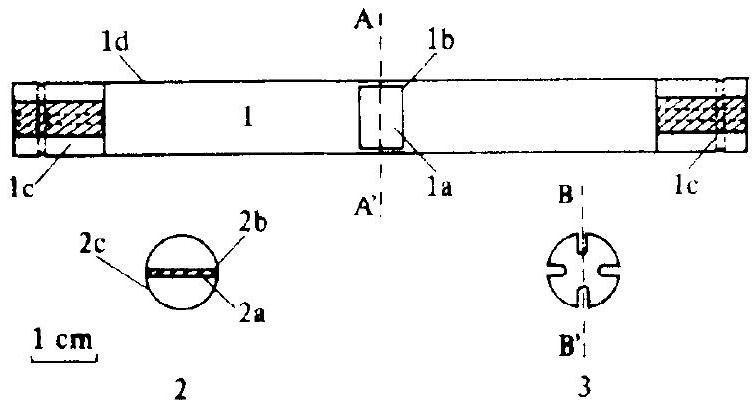
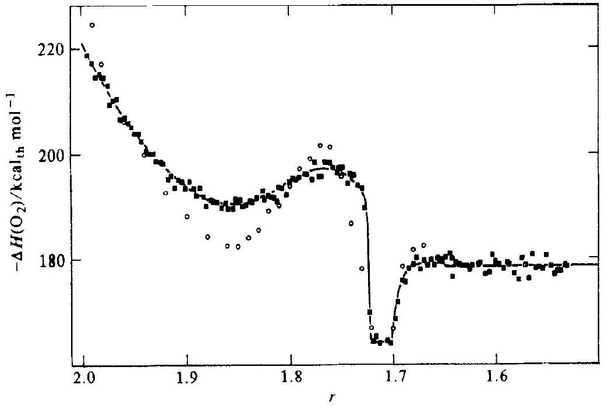
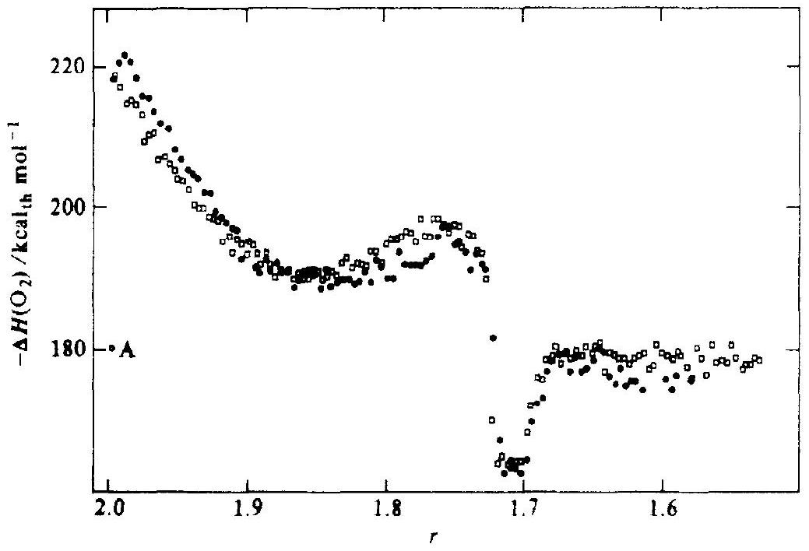

# High-temperature microcalorimetric measurements of the partial molar enthalpy of solution of $\mathbf{O}_{\mathbf{2}}$ in cerium oxides : $\mathbf{C e O}_{\mathbf{1 . 5}}$ to $\mathbf{C e O}_{\mathbf{2}}$ 

J. CAMPSERVEUX and P. GERDANIAN Université de Paris-Sud, Centre d'Orsay, Laboratoire des Composés non-stoechiométriques, Bâtiment 415-91405 Orsay, France

(Received 1 August 1973; in revised form 30 November 1973)

#### Abstract

A Tian-Calvet type microcalorimeter has been used at 1353 K to measure directly the partial molar enthalpy of solution of $\mathrm{O}_{2}$ in cerium oxides of compositions ranging from $\mathrm{CeO}_{1.5}$ to $\mathrm{CeO}_{2}$. The results are in good agreement with those of Bevan and Kordis and very similar to results for $\mathrm{Pu}+\mathrm{O}$ obtained similarly by Chéreau et al.

## 1. Introduction

Many thermodynamic studies have already been carried out on the $\mathrm{Ce}+\mathrm{O}$ system. ${ }^{(1-4)}$ The most important of these is the work of Bevan and Kordis ${ }^{(3)}$ who determined a set of isothermal curves for the equilibrium vapour pressure $p\left(\mathrm{O}_{2}\right)$ of $\mathrm{O}_{2}$ over cerium oxides at temperatures ranging from 909 to 1442 K and mole ratios $r=\{n(\mathrm{O}) / n(\mathrm{Ce})\}$ ranging from 1.5 to 2 . From these measurements they calculated the partial molar enthalpy of solution $\Delta H\left(\mathrm{O}_{2}\right)$ of $\mathrm{O}_{2}$ in the oxide as a function of $r$.

Gerdanian ${ }^{(5)}$ has pointed out that this method is not always reliable: even when authors agree on values for $\Delta G\left(\mathrm{O}_{2}\right)$ there is often some discrepancy in the values of $\Delta H\left(\mathrm{O}_{2}\right)$ which they calculate. Therefore we think that direct measurement is the best way to obtain reliable values of $\Delta H\left(\mathrm{O}_{2}\right)$.

In this paper we report a direct determination of $\Delta H\left(\mathrm{O}_{2}\right)$ using a high-temperature Tian-Calvet microcalorimeter at $1353 \mathrm{~K} .{ }^{(5,6)}$

## 2. Principle of measurement and calibration

A detailed explanation can be found in reference 6; only the main features will be dealt with here. Small amounts $\delta n$ of $\mathrm{O}_{2}$ from 3 to $4 \mu \mathrm{~mol}$ are blown over a small sintered plate of non-stoichiometric oxide $\mathrm{CeO}_{2-x}$, amount $\alpha$, placed in vacuum in the test tube of the microcalorimeter and the quantities of heat released, $\delta q$, are measured. The equation of the reaction is

$$
\alpha \mathrm{CeO}_{2-x}(\mathrm{~s})+\delta n \mathrm{O}_{2}(\mathrm{~g})=\alpha \mathrm{CeO}_{2-x^{\prime}}(\mathrm{s}),
$$

where $x^{\prime}=x-2 \delta n / \alpha$. Let $\Delta U(T, V, \alpha)$ be the internal energy change for the formation
of an amount $\alpha$ of $\mathrm{CeO}_{2-x}$ from Ce and $\mathrm{O}_{2}$ carried out at temperature $T$ in a constant volume enclosure.
If, when the microcalorimeter no longer detects any further thermal effect, the non-stoichiometric oxide is homogeneous, then:

$$
\delta q=-\delta\{\Delta U(T, V, \alpha)\} ;
$$

and: ${ }^{(6)}$

$$
-\Delta H\left(\mathrm{O}_{2}\right)=\delta q / \delta n+R T
$$

The calibration can be carried out in several ways, but the most reliable method is to use the relation:

$$
\Delta H^{\circ}(1353 \mathrm{~K})=-\frac{1}{2} \int_{0.5}^{0} \Delta H\left(\mathrm{O}_{2}\right) \mathrm{d} x
$$

where $\Delta H^{\circ}(1353 \mathrm{~K})$ is the enthalpy change for the reaction:

$$
\mathrm{CeO}_{1.5}(\mathrm{~s})+\frac{1}{4} \mathrm{O}_{2}(\mathrm{~g})=\mathrm{CeO}_{2}(\mathrm{~s}) .
$$

We selected $\Delta H^{\circ}(1353 \mathrm{~K})=-46.98 \mathrm{kcal}_{\text {th }} \mathrm{mol}^{-1} \cdot{ }^{(7)} \dagger$

## 3. Experimental

## MATERIALS

Small plates of sintered $\mathrm{CeO}_{2}$ with a pyknometric density as near as 95 per cent of the X -ray crystallographic density were used ; from their B.E.T. area of about $100 \mathrm{~cm}^{2}$, we conclude that there is no open porosity. The plates were prepared from a JohnsonMatthey $\mathrm{CeO}_{2}$ powder the main impurities of which are: $\mathrm{La}_{2} \mathrm{O}_{3}$, 100 p.p.m.; Mn, 5 p.p.m.; and Mg, 1 p.p.m. by mass. Cylinder oxygen was obtained from L'Air Liquide; the mole fraction of impurity was $2 \times 10^{-5}$.

The plates were reduced to a composition lower than $\mathrm{CeO}_{1.51}$ by heating, at 1350 K , for 3 d in a pure and dry hydrogen flow. The mass and thickness of the plates varied: 0.170 g and 0.5 mm for the first experiment, 1.741 g and 2.65 mm for the second, 0.271 g and 0.8 mm for the third.

## PROCEDURE

The reduced plates were in the form of parallelepipeds. Their edges were coated with alumina strips so that oxygen could diffuse in only one direction, perpendicular to the two larger faces. Each plate was then placed into a 0.5 mm thick alumina cylinder with a bore of 10 mm and closed at each end by a cylindrical alumina stopper slotted to serve as an oxygen inlet. This cylinder was then introduced into the silica test tube which was evacuated before introduction into the microcalorimeter. The tube was degassed for 48 h .

Amounts of oxygen were measured by means of a calibrated McLeod gauge tube; they were then admitted into the test tube. Two minutes after the admission, they were entirely consumed. The thermograms were of ballistic type; 14 min after the admission of oxygen, the microcalorimeter no longer detected any further heat release.

[^0]
FIGURE 1. Diagram of sample holder. 1, Sample container with sample, full sectioned view: 1a, oxide sample; Ib, alumina strips; Ic, stoppers; section taken through line $\mathrm{BB}^{\prime}$; Id, alumina cylinder. 2, Alumina cylinder with sample, section taken through line $\mathrm{AA}^{\prime}$ : 2a, oxide sample; 2b, alumina strips; 2c, alumina cylinder. 3, Stopper, front view. The strips are held by a platinum wire which is not shown in the drawing.

## 4. Kinetic considerations

We have seen that equation (3) is valid only if the oxide is homogeneous when the microcalorimeter no longer detects any heat release. This situation seldom prevails. Let $\varepsilon$ be that heat which is still to be released during the ultimate stages of the homogenization process. We have:

$$
\delta q+\varepsilon=-\delta\{\Delta U(T, V, \alpha)\} .
$$

As $\varepsilon$ is not detected, we must prove that it is negligible as compared with $\delta q$.
Within the range of the fluorite-type phase, we followed a method already used by Marucco et al. ${ }^{(8)}$ We first calculated the chemical diffusion coefficient $D$ in $\mathrm{CeO}_{2-x}$ from a thermogravimetric study of the kinetics of oxidation of plates by CO plus $\mathrm{CO}_{2}$ mixtures at 1353 K . On the assumption that the composition of the surface of the plate is constant during the reaction and that the slower process is oxygen diffusion we may derive, from a graph given by Crank, ${ }^{(9)}$ a lower bound for $D$ :

$$
D \geqslant 4 \times 10^{-6} \mathrm{~s}^{-1} \mathrm{~cm}^{2} .
$$

Let $C^{\circ}$ be the composition that the core of the plate attains at time $t$ after the admission of oxygen during a microcalorimetric experiment, $C_{0}$ the initial composition, and $C_{1}$ the final composition which will be attained when the plate will be homogeneous. Since oxygen consumption is very fast, as stressed above, we may use a formula related to instantaneous plane sources given by Carslaw and Jeager ${ }^{(10)}$ according to which:

$$
\rho=\left(C^{\circ}-C_{0}\right) /\left(C_{1}-C_{0}\right)=1+2 \sum_{n=1}^{\infty}(-1)^{n} \exp \left(-D \pi^{2} n^{2} t / l^{2}\right),
$$

where $l$ is the half-thickness of the plate. For $t=14 \mathrm{~min}$, we find $\rho=1-10^{-10}$. Under these circumstances we may assert that $\varepsilon / \delta q=0$. Equation (3) is therefore applicable.

Outside the range of the fluorite-type phase, we have no value for $D$ but, as we shall see later, the shape of the curve of $\Delta H\left(\mathrm{O}_{2}\right)$ against $r$ itself allows one to assert
that, 14 min after the admission of oxygen, the oxide is so close to equilibrium that we can neglect $\varepsilon$ as compared with $\delta q$.

## 5. Experimental results

Three separate measurements of $\Delta H\left(\mathrm{O}_{2}\right)$ as a function of the mole ratio $r=n(\mathrm{O}) / n(\mathrm{Ce})$ were carried out. The first and third experiments covered values of $r$ from 1.5 to 2 whilst the second one concentrated on values of $r$ from 1.95 to 2 . The agreement between the first and third experiments was better than $2 \mathrm{kcal}_{\mathrm{th}} \mathrm{mol}^{-1}$ in $\Delta H\left(\mathrm{O}_{2}\right)$, and the phase boundaries appeared at the same values of $r$. The results are shown in figures 2 and 3. In the third experiment (figure 2) the zero-line of the microcalorimeter was more stable and the scatter of the results was less.

As $r$ increases from 1.5 the plot of $-\Delta H\left(\mathrm{O}_{2}\right)$ against $r$ first exhibits a horizontal part, at a value of $-\Delta H\left(\mathrm{O}_{2}\right)=178 \mathrm{kcal}_{\mathrm{th}} \mathrm{mol}^{-1}$, from $r=1.5$ to $r=1.65$ (the solid line in figure 2). This corresponds to a two-phase region $\mathrm{Ce}_{2} \mathrm{O}_{3}$ plus a C-type phase. ${ }^{(11)}$

Between $r=1.65$ and 1.70 we have a single phase present, the C-type, and the value of $-\Delta H\left(\mathrm{O}_{2}\right)$ changes from 180 to $164 \mathrm{kcal}_{\mathrm{th}} \mathrm{mol}^{-1}$. This value is held in the region $r=1.70$ to 1.72 where two phases again are present.

Above $r=1.72$ there is a sharp increase in $-\Delta H\left(\mathrm{O}_{2}\right)$ which indicates a change to a single phase $\mathrm{CeO}_{r}$. The quantity $-\Delta H\left(\mathrm{O}_{2}\right)$ rises to $198 \mathrm{kcal}_{\mathrm{th}} \mathrm{mol}^{-1}$, shows a minimum at about $r=1.85$, and finally increases to $222 \mathrm{kcal}_{\mathrm{th}} \mathrm{mol}^{-1}$ at $r=2.00$.

The value of $(\delta q / \delta n)$ for the last addition of $\mathrm{O}_{2}$ is much smaller than the preceding value. Point A in figure 3 would represent $-\Delta H\left(\mathrm{O}_{2}\right)$ calculated from the last value of ( $\delta q / \delta n$ ). The second experiment, on a much larger sample, was carried out in order to produce more accurate results in the region $r=1.95$ to 2.00. The experiment showed that $-\Delta H\left(\mathrm{O}_{2}\right)$ continuously increases towards $r=2.00$, but again, the last

FIGURE 2. Comparison of our results with those of Bevan and Kordis. ${ }^{(3)}$., This work; O, Bevan and Kordis.

FIGURE 3. Comparison of the results of experiments 1 and 3: experiment 1; □ , experiment 3.

value of ( $\delta q / \delta n$ ) was too small. This was a last value of 55 additions; for the sake of clarity these results are not reported. Some studies ${ }^{(12)}$ in our laboratory have shown that when the $\mathrm{O}_{2}$ is consumed slowly (as occurs for the final addition, which is not entirely consumed), the calibration changes in such a way as to decrease the value of $-\Delta H\left(\mathrm{O}_{2}\right)$.

The shape of the plot of $-\Delta H\left(\mathrm{O}_{2}\right)$ against $r$ warrants several remarks. The existence of the first horizontal part, which corresponds to a two-phase region $\mathrm{Ce}_{2} \mathrm{O}_{3}$ plus a C-type phase and ranges up to $r=1.65$ (a boundary already found by Bevan and Kordis) ${ }^{(3)}$ allows us to ascertain that, in this field, equilibrium is certainly reached at $t=14 \mathrm{~min}$. Moreover, in the composition range $r=1.65$ to $r=1.75$, the shape of the $-\Delta H\left(\mathrm{O}_{2}\right)$ plot is very steep and boundary compositions for the narrow two-phase field $r=1.70$ to $r=1.72$ are very close to those found by Bevan and Kordis. ${ }^{(3)}$ We may conclude that, here too, equilibrium is certainly reached. As a matter of fact, a deviation from equilibrium either due to too small a value for $D$ or because some parts of the plate consume oxygen faster than others gives rise to a flattening of the curve and to an apparent broadening of the monophasic fields. ${ }^{(13)}$

It is known ${ }^{(14)}$ that $\Delta H\left(\mathrm{O}_{2}\right)$ must show a discontinuity when a phase boundary is crossed if the composition of this boundary is a function of temperature; according to Bevan and Kordis ${ }^{(3)}$ the change at $r=1.65$ should show this. We have found that the discontinuity is smaller than the scatter of our results and therefore we have not drawn it on figure 2.

## 6. Comparison with other results

In figure 2 are compared the results of the third experiment and those of Bevan and Kordis. ${ }^{(3)}$ There is agreement to within $\pm 3 \mathrm{kcal}_{\mathrm{th}} \mathrm{mol}^{-1}$ with the exception of
results for $r=1.86$. Moreover, the shape of the plot of $\Delta H\left(\mathrm{O}_{2}\right)$ against $r$ for the cerium oxides is very similar to that obtained by Chéreau et al. ${ }^{(15)}$ for the plutonium oxides. That this might be so could have been predicted from the work of Blank. ${ }^{(16)}$

We arc most grateful to M. Vitter (Faculté des Sciences de Grenoble) for sintering our plates.

## REFERENCES

1. Brauer, G.; Gingerich, K. A.; Holtschmidt, U. J. Inorg. Nucl. Chem. 1960, 16, 77.
2. Kuznetsov, F. A.; Belyi, V. I.; Rezukhina, T. N. Dokl. Akad. Nauk SSSR 1961, 139, 1405.
3. Bevan, D. J. M.; Kordis, J. J. Inorg. Nucl. Chem. 1964, 26, 1509.
4. Iwasaki, B.; Katsura, T. Bull. Chem. Soc. Japan 1971, 44, 1297.
5. Gerdanian, P.; Dodé, M. Thermodynamics of Nuclear Materials. I.A.E.A. Vienna, 1968, p. 41.
6. Gerdanian, P. Colloques Internationaux du C.N.R.S. no. 201. Editions du C.N.R.S. 1971.
7. Baker, F. B.; Holley, C. E., Jr. J. Chem. Eng. Data 1968, 13 (1), 405.
8. Marucco, J. F.; Gerdanian, P.; Dodé, M. J. Chim. Phys. 1970, 67, 906.
9. Crank, J. Mathematics of Diffusion. Clarendon Press: Oxford. 1956, p. 55.
10. Carslaw, H. S.; Jeager, J. C. Conduction of Heat in Solids. Clarendon Press: Oxford. 1959, p.1. 36
11. Bevan, D. J. M. J. Inorg. Nucl. Chem. 1955, 1, 49.
12. Picard, C. private communication.
13. Boureau, G.; Gerdanian, P. High Temperatures, High Pressures 1970, 2, 681.
14. Kubaschewski, O.; Evans, E. Ll.; Alcock, C. B. Metallurgical Thermochemistry. Pergamon Press: London. 1967, p. 52.
15. Chéreau, P.; Dean, G.; Gerdanian, P. C. R. H. Acad. Sci. Sér. C 1971, 272, 512.
16. Blank, H. European Atomic Energy Community, 1967, Eur. 3563 E.

[^0]:    † Throughout this paper cal ${ }_{\mathrm{th}}=4.184 \mathrm{~J}$.

