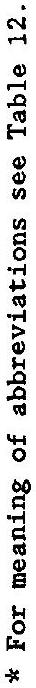
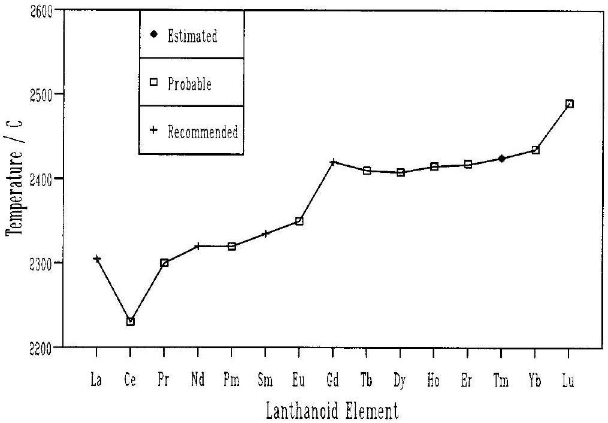

# MELTING TEMPERATURES OF REFRACTORY OXIDES: PART II LANTHANOID SESQUIOXIDES 

Prepared for publication by J. P. COUTURES ${ }^{1}$ and M. H. RAND ${ }^{2}$ ¹Centre de Recherches de Physique des Hautes Temperatures, Orleans, France ${ }^{2}$ Materials Development Division, Harwell Laboratory, Didcot, Oxon. OX11 0RA, UK

#### Abstract

* Membership of the Commission during the preparation of this report (1983-87) was as follows:

Chairman: 1983-85 K. L. Komarek (Austria); 1985-87 R. Metselaar (Netherlands); Secretary: P. W. Gilles (USA); Titular Members: A-M. Anthony (France; 1983-85); J. F. Baumard (France; 1985-87); J. Corish (Ireland; 1985-87); L. V. Gurvich (USSR); R. Metselaar (Netherlands; 1983-85); G. Petzow (FRG; 1983-85); M. H. Rand (UK); Associate Members: C. B. Alcock (Canada; 1983-85); A-M. Anthony (France; 1985-87); J. B. Clark (Republic of South Africa; 1985-87); J. Corish (Ireland; 1983-85); J.-P. Coutures (France); J. Drowart (Belgium); E. Fitzer (FRG; 1983-85); L. N. Gorockhov (USSR; 1985-87); J. Hastie (USA); M. G. Hocking (UK); L. Kihlborg (Sweden); J. Matousek (Czechoslovakia; 1985-87); R. W. Ohse (FRG); G. M. Rosenblatt (USA; 198587); R. Sersale (Italy; 1983-85); W. L. Worrell (USA; 1983-85); H. Yanagida (Japan); National Representatives: M. S. E. El-Sewefy (Arab Republic of Egypt); E. J. Baran (Argentina; 1984-87); E. R. McCartney (Australia; 1983-85); P. Ettmayer (Austria; 198687); D.-S. Yan (Chinese Chemical Society); J. Matousek (Czechoslovakia; 1983-85); E. Fitzer (FRG; 1986-87); J. F. Baumard (France; 1983-85); F. Solymosi (Hungary; 1985-87); A. P. B. Sinha (India; 1985-87); R. Vernerkar (India; 1983-85); G. De Maria (Italy); S. Somiya (Japan; 1985-87); M. Badri (Malaysia; 1983-85); B. B. Muhammad (Malaysia; 1985-87); J. B. Clark (Republic of South Africa; 1983-85); A. Magnéli (Sweden; 1983-85); G. Bayer (Switzerland); G. M. Rosenblatt (USA; 1983-85); W. L. Worrell (USA; 198587); M. M. Ristić (Yugoslavia).

[^0]
## CONTENTS

page
Introduction ..... 1463
Selected Values ..... 1465
Tables 1-12 : Melting Points (1PTS 68) ${ }^{\circ} \mathrm{C}$ of
$1: \mathrm{La}_{2} \mathrm{O}_{3}$ ..... 1468
$2: \mathrm{Pr}_{2} \mathrm{O}_{3}$ ..... 1469
$3: \mathrm{Nd}_{2} \mathrm{O}_{3}$ ..... 1470
$4: \mathrm{Sm}_{2} \mathrm{O}_{3}$ ..... 1471
$5: \mathrm{Eu}_{2} \mathrm{O}_{3}$ ..... 1472
$6: \mathrm{Gd}_{2} \mathrm{O}_{3}$ ..... 1473
$7: \mathrm{Tb}_{2} \mathrm{O}_{3}$ ..... 1474
$8: \mathrm{Dy}_{2} \mathrm{O}_{3}$ ..... 1475
$9: \mathrm{Ho}_{2} \mathrm{O}_{3}$ ..... 1476
$10: \mathrm{Er}_{2} \mathrm{O}_{3}$ ..... 1477
$11: \mathrm{Yb}_{2} \mathrm{O}_{3}$ ..... 1478
$12: \mathrm{Lu}_{2} \mathrm{O}_{3}$ ..... 1479
Discussions and Recommendations ..... 1480
Table 14 : Recommended, prabable or estimated melting points of ..... 1481 lanthanoid sesquioxides, ${ }^{\circ} \mathrm{C}$ (1PTS 68)
Table 15 : Non-stoichiometry of some rare earth sesquioxides ..... 1481 after melting under hydrogen for 10 min at $\mathrm{T} \sim \mathrm{T}_{\text {fus }}+200^{\circ} \mathrm{C}$
References ..... 1482

# Melting temperatures of refractory oxides-Part II: Lanthanoid sesquioxides 

#### Abstract

Experimental measurements of the melting points of the lanthanoid sesquioxides are critically reviewed and best values, with associated uncertainties, are recommended. Reasons for the quite large discrepancies, even in modern determinations, are discussed and studies to resolve the more important discrepancies are suggested.

## INTRODUCTION

This is the second report from the Collaborative Study Group set up by the Commission on High Temperatures and Refractory Materials of the I.U.P.A.C. (now the Commission on High Temperature and Solid State Chemistry). The aim of the Study Group is to make a critical assessment of the published data on melting temperatures for various refractory oxides and to suggest recommended values with estimated uncertainties wide enough that further determination will probably fall within these limits. The first part (Hlavac, ref. 1) dealt with the oxides $\mathrm{Al}_{2} \mathrm{O}_{3}, \mathrm{MgO}, \mathrm{Sc}_{2} \mathrm{O}_{3}, \mathrm{SiO}_{2}, \mathrm{TiO}_{2}, \mathrm{Y}_{2} \mathrm{O}_{3}$ and $\mathrm{ZrO}_{2}$.

The family of lanthanoid oxides is of special interest because the chemical and physical properties tend to vary smoothly with atomic number. The monotony is relieved, however, by an overlay of marked individualistic behaviour. This circumstance provides subtle variations in properties which may be used to test many hypotheses or theories of chemistry, including those pertaining to the solid state.

In oxide systems where a change of valency of the metal can occur, the atmosphere in which the samples were melted, and the nature of the containers used, are important variables. Unfortunately this information is not always available in the earlier measurements of the lanthanoid oxides.

In any oxide system of course, the solid phases need not melt congruently, although phases with very narrow ranges of homogeneity frequently do. Congruent melting of the sesquioxide phases has been assumed by all the authors of the studies quoted. This assumption is probably justified for most of the lanthanoid sesquioxides, although it must be remembered that the range of homogeneity of several (and probably all) of these oxides can extend to quite low values of $0 / \mathrm{M}$ when in contact with the corresponding metal - see summary by Ackermann and Rauh (ref. 2); for example the lower phase boundary of $\mathrm{Ce}_{2} \mathrm{O}_{3-x}$ is as low as $\mathrm{CeO}_{1.34}$ at a temperature of $1711^{\circ} \mathrm{C}$, and Coutures (ref. 3) has reported that $\mathrm{Gd}_{2} \mathrm{O}_{3}$ heated in hydrogen can be reduced to $\mathrm{GdO}_{1.47}$.

The data (Tables 1 to 12) are presented in the same format as that previously used by Schneider (ref. 4).

In assessing the measurements, special attention has been paid to two experimental features:

- possible changes in composition of the sample (which would alter the melting point), resulting from the atmosphere used, inappropriate furnace materials (e.g. Ta for many oxides) or reaction between the sample and its container.
- the temperature measurement, including details of any secondary standards, emissivity and wavelength data for pyrometric determinations. However, as will be clear from Tables 1-12, such information, particularly that relating to secondary standards, is often lacking from earlier papers.

The temperature scale used in reporting the measurement, if not stated, was assumed to be the appropriate IPTS (1927-1948-1968) according to the date of publication. Wherever possible, the melting point has been corrected to IPTS-68. In making this correction, the melting points of the secondary standards have also been corrected to currently accepted
values, namely

| $\mathrm{Al}_{2} \mathrm{O}_{3}$ | $2054^{\circ} \mathrm{C}$ (ref. 5) |  |  |
| :--- | :--- | :---: | :---: |
| Pt | $1772^{\circ} \mathrm{C}$ | IPTS Secondary reference point (ref. 6) |  |
| Rh | $1963^{\circ} \mathrm{C}$ | $" N$ | $" N " ~($ ref. 6) |

These two corrections cause appreciable changes ( $15-20^{\circ} \mathrm{C}$ ) in some reported melting points, since the melting point of $\mathrm{Al}_{2} \mathrm{O}_{3}$ was assumed to be $2040^{\circ} \mathrm{C}$ by Wisnyi and Pijanowski (ref. 7) and $2042^{\circ} \mathrm{C}$ by Foex (ref. 8). In the extensive series of measurements by Coutures et al. (ref. 9), the melting point of the secondary standard $\mathrm{Y}_{2} \mathrm{O}_{3}$ was assumed to be $2440^{\circ} \mathrm{C}$. The small difference between this and the value recommended by Foex (ref. 10 ) ( $2439^{\circ} \mathrm{C}$ ) has been neglected, since the melting temperatures reported by Coutures et al. have usually been rounded to the nearest $5^{\circ} \mathrm{C}$.

Having regard to these experimental features, many of the published papers are difficult to evaluate, in that some experimental details are lacking, particularly regarding the secondary standard used, or the value used for its melting point. The relatively complete studies by Foex (ref. 8) and by Coutures et al. (ref. 9) seem to have given the necessary attention to the experimental conditions: measurement method, calibration using $\mathrm{Al}_{2} \mathrm{O}_{3}$ and $\mathrm{Y}_{2} \mathrm{O}_{3}$ as secondary standards and blackbody conditions with emissivity estimates at $0.65 \mu \mathrm{~m}$. In particular Coutures et al. (ref. 9) have given special attention to the melting atmosphere in order to maintain stoichiometric oxides. For this purpose praseodymium and terbium oxides were melted under slightly reducing conditions (argon with $10 \% \mathrm{H}_{2}$ ) to prevent the formation of $\mathrm{Pr}^{4+}$ and $\mathrm{Tb}^{4+} ; \mathrm{Eu}_{2} \mathrm{O}_{3}$ was melted under pure oxygen to minimize the reduction of $\mathrm{Eu}^{3+}$ to $\mathrm{Eu}^{2+}$.

Moreover, a great advantage of the radiation-concentration devices, such as the solar furnace, is the ability to use a "self-crucible" technique, rather than crucibles or tungsten or molybdenum. This avoids interactions between the liquid oxides and the crucible, and possible oxygen potential limitations. For example tungsten is known to be dissolved by liquid yttrium sesquioxide (ref. 11). Ackermann and Rauh (ref. 12) have clearly shown the influence of the crucible in the case of lanthanum sesquioxide. At 2427 K for example the congruently vaporizing composition is $\mathrm{La}_{2} \mathrm{O}_{2} .980$ in a tungsten crucible and $\mathrm{La}_{2} \mathrm{O}_{2} .998{ }^{\text {with a rhenium crucible, showing considerably less reduction of this sesquioxide by }}$ rhenium. No data are available for molybdenum. The data of Ackermann and Rauh could explain the fact that the melting point values obtained by Foex (ref. 8) and Coutures et al. (ref. 9) are all slightly higher than the values obtained with metallic sample holders.

In the most recent study by Mizuno et al. (ref. 13) samples were melted by solar radiation in a controlled atmosphere, and they report values ( $\pm 20^{\circ} \mathrm{C}$ ) of the freezing points measured in vacuum, argon and air. In general, the values in air and argon were similar, somewhat lower values being obtained in vacuo. However, the same trends are seen in their reported measurements of the freezing points of $\mathrm{Al}_{2} \mathrm{O}_{3}$ and $\mathrm{Y}_{2} \mathrm{O}_{3}$, suggesting perhaps a systematic error

Reported Freezing Points of $\mathrm{Al}_{2} \mathrm{O}_{3}$ and $\mathrm{Y}_{2} \mathrm{O}_{3}$ (ref. 13) ( ${ }^{\circ} \mathrm{C}$ IPTS 68)
|  | Air | Ar | Vacuum | Recommended (refs. 5 and 10) |
| :--- | :--- | :--- | :---: | :---: |
| $\mathrm{Al}_{2} \mathrm{O}_{3}$ | 2071 | 2066 | 2037 | 2054 |
| $\mathrm{Y}_{2} \mathrm{O}_{3}$ | 2449 | 2449 | 2427 | 2439 |

in their measurement system. We have therefore corrected their measured freezing points of lanthanoid oxides by making the following assumptions

- the melting points of $\mathrm{Al}_{2} \mathrm{O}_{3}$ and $\mathrm{Y}_{2} \mathrm{O}_{3}$ are the same in the three indicated atmospheres (the reviews in ref. 3 and 8 suggest this to be true, within experimental error).
- the correction to be applied at a given measured temperature is a linear interpolation between the corrections at the measured freezing points of $\mathrm{Al}_{2} \mathrm{O}_{3}$ and $\mathrm{Y}_{2} \mathrm{O}_{3}$ in the same atmosphere.

These corrections markedly decrease the differences in the freezing points as function of atmosphere.

However as noted in the discussion on $\mathrm{Gd}_{2} \mathrm{O}_{3}$ (see Section 1.8), there is a considerable difference between the freezing point of $\mathrm{Gd}_{2} \mathrm{O}_{3}$ given by Mizuno et al. (ref. 13) (corrected temperatures 2366 to $2383^{\circ} \mathrm{C}$, both $\pm 20^{\circ} \mathrm{C}$ ) and that obtained recently from the same team (ref. 14) (19 experiments, giving $2414 \pm 25^{\circ} \mathrm{C}$ ), although the ranges do overlap. This most recent measurement may indicate that the freezing points of the other lanthanoid oxides given by Mizuno et al. (ref. 13) may also be too low, rather than too high. This point has been taken into account in selecting the recommended values.

The studies by Foex (ref. 8) and by Coutures et al. (ref. 9) could be criticized because the thermal analysis method used is not an equilibrium method. The experimental procedure was checked by measuring the melting point of the $\mathrm{ZrO}_{2}-\mathrm{La}_{2} \mathrm{Zr}_{2} \mathrm{O}_{7}$ eutectic. The temperature of melting measured by Cabannes et al. (ref. 15) using a modified Riley method (equilibrium method) with an acurate emissivity measurement was $2223^{\circ} \mathrm{C}$. This agrees very well with the result obtained by the same authors using the method by Foex or Coutures et al. in dynamic conditions: $2225^{\circ} \mathrm{C}$.

## SELECTED VALUES

The selected values have been divided into three classes:
Recommended values, where the set of experimental determinations is reasonably consistent and precise.

Probable values, where the consensus of experimental values is less convincing.
Estimated values, where experimental data are lacking or are very uncertain.
In each case, the uncertainties given are rather subjective estimates that future, more precise, measurements will have c. $95 \%$ probability of lying within the uncertainty band.
$\mathrm{La}_{2} \mathrm{O}_{3}$
Ten values (Table 1) of the melting point of $\mathrm{La}_{2} \mathrm{O}_{3}$ are given in the literature, mostly reasonably consistent. Runs were performed either in neutral atmosphere (He, Ar) air or vacuum; the temperature was usually measured with optical pyrometers except in two cases where they were measured with tungsten-rhenium thermocouples. Measurements under air are preferable, because $\mathrm{La}_{2} \mathrm{O}_{3}$ when melted under argon could have appreciable nonstoichiometry (Ackermann and Rauh (ref. 12)) :

The selected value is $\left(2305 \pm 15^{\circ} \mathrm{C}\right)$, the weighted average of the eight measurements carried out in air, which are reasonably consistent. Two of the three measurements made under conditions where reduction could well have occurred (Lambertson and Gunzel, ref. 16 and Mordovin et al., ref. 17), give much lower melting temperatures, but that by Tresviatskii et al. (ref. 18) in Ar agrees well with the selected value. However, unambigous corrections could not be made to this measured value, since the calibration temperature is not clearly given.

RECOMMENDED VALUE: $2305 \pm 15^{\circ} \mathrm{C}$.

## $\mathrm{Ce}_{2} \mathrm{O}_{3}$

The melting temperature of $\mathrm{Ce}_{2} \mathrm{O}_{3}$ is not well known. The early (1925) measurement of $1692^{\circ} \mathrm{C}$ by Friederich and Sittig (ref. 19) is presumably far too low (Ackermann and Rauh (ref. 20) and Benezech and Foex (ref. 21) have made vaporization measurements up to $2180^{\circ} \mathrm{C}$ without any signs of melting). There are three more recent measurements of samples close to $\mathrm{Ce}_{2} \mathrm{O}_{3}$ due to Sata and Yoshimura (ref. 22), Tresviatskii et al. (ref. 18) and Mordovin et al. (ref. 13). Sata and Yoshimura (ref. 22) gave a value of $2210 \pm 10^{\circ} \mathrm{C}$, measured in $\mathrm{H}_{2}$, while Mordovin el al. gave $2142 \pm 30^{\circ} \mathrm{C}$ (corrected to $2145^{\circ} \mathrm{C}$ ) for a sample prepared from $\mathrm{CeO}_{2}$ annealed in hydrogen at $2000-2200 \mathrm{~K}$ for 10 min ; the fused material was unstable in air, so no analysis for composition was possible. However a comparison of our selected values for the other lanthanoid oxides shows that the values reported by Mordovin et al, are usually lower by about 100 K , indicating a melting temperature of $\sim 2240^{\circ} \mathrm{C}$. The measurement by Tresviatskii et al. (ref. 18), $2240 \pm 20^{\circ} \mathrm{C}$ was carried out in Ar in a molybdenum container; no final analysis was reported. In view of the ease of oxidation and, at high temperatures, reduction of $\mathrm{Ce}_{2} \mathrm{O}_{3}$, there can be no guarantee that these measurements refer to the stoichiometric oxide, but for the present, we suggest the

## PROBABLE VALUE : $2230 \pm 50^{\circ} \mathrm{C}$

Watson (ref. 23) in a study of the oxygen potentials of solid and liquid cerium oxides, measured the melting behaviour of $\mathrm{CeO} \mathrm{O}_{2-\mathrm{x}}$ for a given $\mathrm{CO} / \mathrm{CO}_{2}$ ratio. Under these conditions, if the condensed phase remains in equilibrium with the gas, the oxide melts at a single temperature, the 0/Ce of the condensed phase changing as the melting proceeds. He reports liquidus points of 1850,1930 and $1970^{\circ} \mathrm{C}$ for $0 / \mathrm{Ce}(1 \mathrm{iq})=1.60,1.64$ and 1.66 respectively, and infers solidus points with $0 / \mathrm{Ce}$ greater by $\sim 0.05$. Since $\mathrm{CeO}_{2-\mathrm{x}}(\mathrm{s})$ is probably single-phase in this region of the phase diagram, this would imply, if $\mathrm{Ce}_{2} \mathrm{O}_{3}$ melts congruently at $n 2230^{\circ} \mathrm{C}$, solidus and liquidus lines which decreases sharply from the congruently melting $\mathrm{Ce}_{2} \mathrm{O}_{3}$ at $2230^{\circ} \mathrm{C}$ to a congruently melting minimum with $0 / \mathrm{Ce}<1.6$ at $T<1850^{\circ} \mathrm{C}$. This seems unlikely, and further study of the melting behaviour of oxides between $\mathrm{Ce}_{2} \mathrm{O}_{3}$ and $\mathrm{CeO}_{2}$ is clearly required.
$\mathrm{Pr}_{2} \mathrm{O}_{3}$
Only five values of the melting point have been published (Table 2). The measurement of Foex (ref. 8) in air, may relate to a hyperstoichiometric oxide, but agrees excellently with that of Coutures et al. (ref. 9), carried out in a reducing atmosphere, $2312 \pm 10^{\circ} \mathrm{C}$. The two measurements by Tresviatskii et al. (ref. 18) and Mordovin et al. (ref. 17) which are lower by 50 and $200^{\circ} \mathrm{C}$ are difficult to assess because the calibration method for the temperature measurements is not given. The recent measurements of Mizuno et al. (ref. 13) (circa $2250 \pm 20^{\circ} \mathrm{C}$ in reducing atmospheres) are substantially lower than those of refs. 8 and 9. The reason for this is not clear, since the lower measurements have been corrected using melting points of $\mathrm{Al}_{2} \mathrm{O}_{3}$ and $\mathrm{Y}_{2} \mathrm{O}_{3}$. They do however represent freezing points, rather than melting points, although there is no reason to expect substantial super-cooling in these systems.

PROBABLE VALUE: $2300 \pm 25^{\circ} \mathrm{C}$.
$\mathrm{Nd}_{2} \mathrm{O}_{3}$
Seven measurements are found in the literature (Table 3). Runs were performed either under neutral, reducing or oxidizing conditions and except for one, the temperatures were measured pyrometrically. These give:

- the unweighted average of five values (excluding that of Mordovin et al. (ref. 17), which appears too low): $2291^{\circ} \mathrm{C}$
- the recommended value is weighted towards the more precise and well-defined measurements of Coutures et al. (ref. 9): $2320 \pm 20^{\circ} \mathrm{C}$ - this value is identical with that obtained by Tresviatskii et al. (ref. 18), although the basis of their temperature calibration is not clearly stated.

RECOMMENDED VALUE : $2320 \pm 20^{\circ} \mathrm{C}$.
$\mathrm{Pm}_{2} \mathrm{O}_{3}$
The melting point of $\mathrm{Pm}_{2} \mathrm{O}_{3}$ has been measured by Chikalla et al. (ref. 24): $2320 \pm 25^{\circ} \mathrm{C}$, somewhat lower than that estimated in ref. $9,2375^{\circ} \mathrm{C}$. The mean of the selected values for $\mathrm{Nd}_{2} \mathrm{O}_{3}$ and $\mathrm{Sm}_{2} \mathrm{O}_{3}$, the immediate neighbours, is $2327^{\circ} \mathrm{C}$.

PROBABLE VALUE: $2320 \pm 40^{\circ} \mathrm{C}$.
$\mathrm{Sm}_{2} \mathrm{O}_{3}$
Eight values are reported in the literature (Table 4). The average of the four preferred values ( 3 and 6-8) is $2330^{\circ} \mathrm{C}$. We have excluded values 1 and 2 because of the high uncertainty given by the authors, and values 4 to 6 because of the absence of calibration details. As before, the value of Mizuno et al. (ref. 13) is distinctly lower than those of Foex (ref. 8) and Coutures et al. (ref. 9). Bearing in mind the possibility of super-cooling, and the smaller uncertainty in the higher values, we suggest the

RECOMMENDED VALUE : $2335 \pm 15^{\circ} \mathrm{C}$.
$\mathrm{Eu}_{2} \mathrm{O}_{3}$
The discrepancies for this oxide are quite large (Table 5). Wisnyi and Pijanowski (ref. 7) have found a melting point of $2067 \pm 30^{\circ} \mathrm{C}$, Mordovin et al. (ref. 17) $2006^{\circ} \mathrm{C}$ and Coutures et al. (ref. 9) $2360 \pm 10^{\circ} \mathrm{C}$. The reason for these large differences in temperatures could be:
> - emissivity is over estimated (a value of approximately 0.9 to 0.95 was used in ref. 7);
> - reaction of the liquid with the crucible (tungsten is known to diffuse into liquid rare earth oxides and could also react);
> - non-stoichiometry : reduction under vacuum, helium, argon or hydrogen is probable, plus reduction by the tungsten sample holder.

Because of the above reasons we have considered only the results from self-container experiments under oxidizing conditions (values 3, 5, 6 and 7 in Table 5); rather more weight is given to the more precise measurements of Coutures et al. (ref. 9) in pure oxygen, to give a

PROBABLE VALUE: $2350 \pm 20^{\circ} \mathrm{C}$.
$\mathrm{Gd}_{2} \mathrm{O}_{3}$
The measurements for $\mathrm{Gd}_{2} \mathrm{O}_{3}$ (Table 6) almost fall into two groups: those from the (often poorly defined) measurements (values 1, 2, 4, 5), averaging around $2340 \pm 30^{\circ} \mathrm{C}$ and the notably higher values from the (better defined) experiments (values 3 and 7) averaging at $2425 \pm 25^{\circ} \mathrm{C}$, with only one value, due to Tresviatskii et al. (ref. 18) lying between these.

Preliminary values from some new measurements organized within the IUPAC commission have recently become available (refs. $14,16,25$ ).

These are summarized below:
| Furnace | Sample Holder | Environment | Melting Point |  |
| :--- | :--- | :--- | :--- | :--- |
| Solar | Self-crucible | air | $2440 \pm 15^{\circ} \mathrm{C}$ |  |
| Xe arc | Self-crucible | air | $2439 \pm 15^{\circ} \mathrm{C}$   $2412 \pm 20^{\circ} \mathrm{C}$ | Photo-electric pyrometer Two-colour pyrometer |
| Solar | Self-crucible | air | $2414 \pm 25^{\circ} \mathrm{C}$ | (ref. 14) |
| Ta tube | Tungsten | vacuum | $2400 \pm 15^{\circ} \mathrm{C}$ |  |
| Xe arc | Self-crucible | air | $2400 \pm 5^{\circ} \mathrm{C}$ | (ref. 25) |

The published value of Yoshimura et al. (ref. 25 ) ( $2393^{\circ} \mathrm{C}$ ) has been corrected to allow for their measured value of the melting point of $\mathrm{Y}_{2} \mathrm{O}_{3}, 2433 \pm 4^{\circ} \mathrm{C}$. Although these new measurements have not resolved completely the discrepancy of the experimental determinations in air, they do suggest the lower values (below $2380^{\circ} \mathrm{C}$ ) reported earlier (see Table 6) are not correct. However an appreciable uncertainty must remain on the

> RECOMMENDED VALUE : $2420 \pm 20^{\circ} \mathrm{C}$.

$\mathrm{Tb}_{2} \mathrm{O}_{3}$
Five values have been published (Table 7). The measurement of Foex (ref. 8) in air, may relate to a hyperstoichiometric oxide, but agrees well with those of Coutures et al. (ref. 9), carried out in a reducing atmosphere, which may indicate a relatively flat liquidus near the sesquioxide composition. Because of the lack of details concerning the calibration method, we have considered only the data of Foex and Coutures et al., taking for the

PROBABLE VALUE : $2410 \pm 15^{\circ} \mathrm{C}$.
$\mathrm{Dy}_{2} \mathrm{O}_{3}, \mathrm{Ho}_{2} \mathrm{O}_{3}, \mathrm{Er}_{2} \mathrm{O}_{3}, \mathrm{Yb}_{2} \mathrm{O}_{3}, \mathrm{Lu}_{2} \mathrm{O}_{3}$ - (Tables 8, 9, 10, 11, 12). Because of the high melting point of the above oxides ( $>2400^{\circ} \mathrm{C}$ ) rather few determinations have been carried out: for example only four values have been published for $\mathrm{Lu}_{2} \mathrm{O}_{3}$. Moreover except for the work of Foex (ref. 8) and Coutures et al. (ref. 9) and Mizuno et al. (ref. 13) the method used for the calibration of the temperature measurements are not given. The measurements of Mizuno et al. (ref. 13), indicate that there are only small differences in melting point (a range of only $20^{\circ} \mathrm{C}$ (within the experimental uncertainty)) for a given oxide when melted in air, argon and vacuum. At this stage recommended values cannot be given. We propose only probable valued weighted towards the more precise results of Foex and Coutures et al.

| $\mathrm{Dy}_{2} \mathrm{O}_{3}$ | PROBABLE VALUE | $2408 \pm 15^{\circ} \mathrm{C}$ |
| :--- | :--- | :--- |
| $\mathrm{Ho}_{2} \mathrm{O}_{3}$ | PROBABLE VALUE | $2415 \pm 15^{\circ} \mathrm{C}$ |
| $\mathrm{Er}_{2} \mathrm{O}_{3}$ | PROBABLE VALUE | $2418 \pm 15^{\circ} \mathrm{C}$ |
| $\mathrm{Yb}_{2} \mathrm{O}_{3}$ | PROBABLE VALUE | $2435 \pm 15^{\circ} \mathrm{C}$ |
| $\mathrm{Lu}_{2} \mathrm{O}_{3}$ | PROBABLE VALUE | $2490 \pm 15^{\circ} \mathrm{C}$ |

For $\mathrm{Tm}_{2} \mathrm{O}_{3}$ only one value have been found $\left(2380^{\circ} \mathrm{C}\right.$ after Tresviatskii et al. (ref. 18)); this is lower than an estimate from the results of the Coutures et al. (ref. 9) which would be $2425 \pm 20^{\circ} \mathrm{C}$.

TABLE 1. Melting point of $\mathrm{La}_{2} \mathrm{O}_{3}(\text { IPTS } 68)^{\circ} \mathrm{C}$

| Authors (Year) | Ref. | Purity \% | Method* | Furnace | Sample Holder | Enviromment | Temp. Meas.* | Calibration $\left(\underline{t}^{\circ} \mathrm{C}\right)$ | Reported mp ${ }^{\circ} \mathrm{C}$ | Corrected Melting Point ${ }^{\circ} \mathrm{C}$ (IPTS 68) |
| :--- | :--- | :--- | :--- | :--- | :--- | :--- | :--- | :--- | :--- | :--- |
| 1) WARTENBERG \& REUSCH (1932) | 27 | 100(?) | O.D.H. | Flame | Self container | Air | O.P. | Pt (1773) | 2315 | 2309 |
| 2) LAMBERTSON \& GUNZEL (1952) | 16 | 99 | E.A.H. | W heating element | W | He | O.P. | Pt (1769) | $2210 \pm 20$ | $2217 \pm 20$ |
| 3) SATA \& KIYOURA (1963) | 28 | 99.9 | D.T.A. | W heating element | W | $\mathrm{Ar}+\varepsilon \mathrm{H}_{2}$ | W-Re T.C. | Pt (1769) Rh (1960) | $2304 \pm 2$ | $2311 \pm 2$ |
| 4) FOEX (1966) | 8 | 99.9 | O.D.C. | Solar furnace | Self container | Air | O.P. | $\mathrm{Al}_{2} \mathrm{O}_{3}$ (2042) | 2300 | 2315 |
| 5) MORDOVIN \& et al. (1967) | 17 | 99.6 | O.D.H. | W heating element | W | $\mathrm{H}_{2}$ | O.P. | Not clearly stated $\mathrm{Al}_{2} \mathrm{O}_{3} \boldsymbol{\&} \mathrm{Cr}_{2} \mathrm{O}_{3} \mathrm{mp}$ | $2220 \pm 30$ | $2224 \pm 30$ |
| 6) NOGUCHI \& MIZUNO (1967) | 29 | 99.9 | O.D.C. | Solar furnace | Self container | Air | O.P. | (Standard W lamp) | $2257 \pm 20$ | $2260 \pm 20$ |
| 7) TRESVIATSKII et al. (1971) | 18 | 99.9 | D.T.A. | W heating element | Mo | Ar | 20\% W-Re T.C. | Not clearly stated | $2310 \pm 20$ | $2310 \pm 20$ |
| 8) COUTURES et al. (1975) | 9 | 99.9 | O.D.C. | Solar furnace | Self container | Air | O.P. | $\mathrm{Y}_{2} \mathrm{O}_{3}$ (2440) | $2320 \pm 10$ | $2320 \pm 10$ |
| 9) MIZUNO et al. (1981) | 13 | 99.9 | O.D.C. | Solar furnace | Self container | Air Ar Vacuum | O.P. | $\mathrm{Al}_{2} \mathrm{O}_{3}$ and $\mathrm{Y}_{2} \mathrm{O}_{3}$ (see text) | $2296 \pm 30 2283 \pm 20 2254 \pm 20$ | $2283 \pm 20 2272 \pm 20 2268 \pm 20$ |
| 10) YOSHIMURA, SOMIYA, YAMADA (1985) | 25 | >99.9 | O.D.C. | Arc imaging furnace | Self container | Air | D.P. | Std. W-Lamp $\& \mathrm{Al}_{2} \mathrm{O}_{3}$ (2054) $\mathrm{Y}_{2} \mathrm{O}_{3}$ (2433) | $2300 \pm 3$ | $2304 \pm 5$ |

TABLE 2. Melting point of $\mathrm{Pr}_{2} \mathrm{O}_{3}$ (IPTS 68) ${ }^{\circ} \mathrm{C}$

| Authors (Year) | Ref. | Purity \% | Method | Furnace | Sample Holder | Environment | Temp. Meas. | Calibration $\left(\underline{t}^{\circ} \mathrm{C}\right)$ | Reported mp ${ }^{\circ} \mathrm{C}$ | Corrected Melting Point ${ }^{\circ} \mathrm{C}$ (IPTS 68) |
| :--- | :--- | :--- | :--- | :--- | :--- | :--- | :--- | :--- | :--- | :--- |
| 1) FOEX (1966) | 8 | 99.9 | O.D.C. | Solar furnace | Self container | Air | O.P. | $\mathrm{Al}_{2} \mathrm{O}_{3}$ (2042) | 2295 | 2310 |
| 2) MORDOVIN et al. (1967) | 17 | 99.5 | O.D.H. | W heating element | W | $\mathrm{H}_{2}$ | O.P. | Not clearly stated | $2117 \pm 30$ | $2121 \pm 30$ |
| 3) TRESVIATSKII et al. (1971) | 18 | 99.9 | D.T.A. | W heating element | Mo | $\mathrm{H}_{2}$ | 20\% W-Re T.C. | Not clearly stated | $2260 \pm 20$ | $2260 \pm 20$ |
| 4) COUTURES et al. (1975) | 9 | 99.99 | O.D.C. | Solar furnace | Se1f container | $90 \% \mathrm{~A} 10 \% \mathrm{H}_{2}$ | O.P. | $\mathrm{Y}_{2} \mathrm{O}_{3}$ (2440) | $2312 \pm 10$ | $2312 \pm 10$ |
| 5) MIZUNO et al. (1981) | 13 | 99.9 | O.D.C. | Solar furnace | Self container | Air Ar Vacuum | O.P. | $\mathrm{Al}_{2} \mathrm{O}_{3}$ and $\mathrm{Y}_{2} \mathrm{O}_{3}$ (see text) | $2276 \pm 20 2264 \pm 20 2228 \pm 20$ | $2263 \pm 20 2253 \pm 20 2243 \pm 20$ |

TABLE 3. Melting point of $\mathrm{Nd}_{2} \mathrm{O}_{3}$ (IPTS 68$)^{\circ} \mathrm{C}$

| Authors (Year) | Ref. | Purity \% | Method | Furnace | Sample Holder | Environment | Temp. Meas. | Calibration ( $\underline{t}^{\circ} \mathrm{C}$ ) | Reported mp ${ }^{\circ} \mathrm{C}$ | Corrected Melting Point ${ }^{\circ} \mathrm{C}$ (IPTS 68) |
| :--- | :--- | :--- | :--- | :--- | :--- | :--- | :--- | :--- | :--- | :--- |
| 1) LAMBERTSON \& GUNZEL (1952) | 16 | 99 | E.A.H. | W heating element | W | He | O.P. | Pt (19769) | $2272 \pm 20$ | $2279 \pm 20$ |
| 2) FOEX (1966) | 8 | 99.9 | O.D.C. | Solar furnace | Self container | Air | O.P. | $\mathrm{Al}_{2} \mathrm{O}_{3}(2042)$ | 2310 | 2326 |
| 3) MORDOVIN et al. (1967) | 17 | 99.0 | O.D.H. | W heating element | W | $\mathrm{H}_{2}$ | O.P. | Not clearly stated | $2213 \pm 30$ | $2217 \pm 30$ |
| 4) NOGUCHI \& MIZUNO (1967) | 29 | 99.9 | O.D.C. | Solar furnace | Self container | Air | O.P. | (Standard W lamp) | $2233 \pm 20$ | $2237 \pm 20$ |
| 5) TRESVIATSKII et al. (1971) | 18 | 99.9 | D.T.A. | W heating element | Mo | Ar | 20\% W-Re T.C. | Not clearly stated | $2320 \pm 20$ | $2320 \pm 20$ |
| 6) COUTURES et al. (1975) | 9 | 99.99 | O.D.C. | Solar furnace | Self container | Air | O.P. | $\mathrm{Y}_{2} \mathrm{O}_{3}$ (2440) | $2325 \pm 10$ | $2325 \pm 10$ |
| 7) MIZUNO et al. (1981) | 13 | 99.9 | O.D.C. | Solar furnace | Self container | Air Ar Vacuum | O.P. | $\mathrm{Al}_{2} \mathrm{O}_{3}$ and $\mathrm{Y}_{2} \mathrm{O}_{3}$ (see text) | 2290 $2270 \pm 20$ 2240 | 2277 $2259 \pm 20$ 2254 |

TABLE 4. Melting point of $\mathrm{Sm}_{2} \mathrm{O}_{3}$ (IPTS 68) ${ }^{\circ} \mathrm{C}$

| Authors (Year) | Ref. | Purity \% | Method | Furnace | Sample Holder | Environment | Temp. Meas. | Calibration ( $\underline{t}^{\circ} \mathrm{C}$ ) | Reported mp ${ }^{\circ} \mathrm{C}$ | Corrected Melting Point ${ }^{\circ} \mathrm{C}$ (IPTS 68) |
| :--- | :--- | :--- | :--- | :--- | :--- | :--- | :--- | :--- | :--- | :--- |
| 1) WISNYI \& PIJANOWSKI (1957) | 7 | Not stated | O.D.H. | W heating element | W | He $\mathrm{H}_{2}$ Vacuum | O.P. | $\mathrm{Al}_{2} \mathrm{O}_{3}(2040)$ | $2300 \pm 50$ | $2318 \pm 50$ |
| 2) CURTIS \& JOHNSON (1957) | 30 | 299 | O.D.H. | Not stated | Not given | Air | O.P. | Not given | $2350 \pm 50$ | $2354 \pm 50$ |
| 3) FOEX (1966) | 8 | 99.9 | O.D.C. | Solar furnace | Self container | Air | O.P. | $\mathrm{Al}_{2} \mathrm{O}_{3}$ (2042) | 2320 | 2335 |
| 4) MORDOVIN et al. (1967) | 17 | 99.55 | O.D.H. | W heating element | W | Ar | O.P. | Not clearly stated | $2263 \pm 30$ | $2267 \pm 30$ |
| 5) NOGUCHI \& MIZUNO (1967) | 29 | 99.9 | O.D.C. | Solar furnace | Self container | Air | O.P. | (Standard W lamp) | $2233 \pm 20$ | $2237 \pm 20$ |
| 6) TRESVIATSKII et al. (1971) | 18 | 99.9 | D.T.A. | W heating element | Mo | Ar | T.C. | Not clearly stated | $2340 \pm 20$ | $2340 \pm 20$ |
| 7) COUTURES et al. (1975) | 9 | 99.99 | O.D.C. | Solar furnace | Self container | $\mathrm{O}_{2}$ | O.P. | $\mathrm{Y}_{2} \mathrm{O}_{3}(2440)$ | $2325 \pm 10$ | $2345 \pm 10$ |
| 8) MIZUNO et al. (1981) | 13 | 99.9 | O.D.C. | Solar furnace | Self container | Air Ar Vacuum | O.P. | $\mathrm{Al}_{2} \mathrm{O}_{3}$ and $\mathrm{Y}_{2} \mathrm{O}_{3}$ (see text) | 2310 2308 2284 | 2297 2297 ± 20 2298 |

TABLE 5. Melting point of $\mathrm{Eu}_{2} \mathrm{O}_{3}$ (IPTS 68) ${ }^{\circ} \mathrm{C}$

| Authors (Year) | Ref. | Purity \% | Method | Furnace | Sample Holder | Environment | Temp. Meas. | Calibration ( $t^{\circ} \mathrm{C}$ ) | Reported mp ${ }^{\circ} \mathrm{C}$ | Corrected Melting Point ${ }^{\circ} \mathrm{C}$ (IPTS 68) |
| :--- | :--- | :--- | :--- | :--- | :--- | :--- | :--- | :--- | :--- | :--- |
| 1) WISNYI \& PIJANOWSKI (1957) | 7 | Not stated | O.D.H. | W heating element | W | He $\mathrm{H}_{2}$ Vacuum | O.P. | $\mathrm{Al}_{2} \mathrm{O}_{3}(2040)$ | $2050 \pm 30$ | $2067 \pm 30$ |
| 2) SCHNEIDER (1961) | 31 | >99.9 | E.A.H. | Induction | Ir | Air | O.P. | Au (1063) Pt (1769) Rh (1960) | $2240 \pm 10$ | $2247 \pm 10$ |
| 3) FOEX (1966) | 8 | 99.0 | O.D.C. | Solar furnace | Self container | Air | O.P. | $\mathrm{Al}_{2} \mathrm{O}_{3}$ (2042) | 2330 | 2345 |
| 4) MORDOVIN et al. (1967) | 17 | 99.9 | O.D.H. | W heating element | W | Ar | O.P. | Not clearly stated | $2003 \pm 30$ | $2006 \pm 30$ |
| 5) NOGUCHI \& MIZUNO (1967) | 29 | 99.9 | O.D.C. | Solar furnace | Self container | Air | O.P. | (Standard W lamp) | $2291 \pm 20$ | $2295 \pm 20$ |
| 6) COUTURES et al. (1975) | 9 | 99.9 | O.D.C. | Solar furnace | Self container | $\mathrm{O}_{2}$ | O.P. | $\mathrm{Y}_{2} \mathrm{O}_{3}(2440)$ | $2360 \pm 10$ | $2360 \pm 10$ |
| 7) MIZUNO et al. (1981) | 13 | 99.9 | O.D.C. | Solar furnace | Self container | Air Ar Vacuum | O.P. | $\mathrm{Al}_{2} \mathrm{O}_{3}$ and $\mathrm{Y}_{2} \mathrm{O}_{3}$ (see text) | 2345 2335 $2288 \pm 20$ | 2333 2324 $2302 \pm 20$ |

TABLE 6. Melting point of $\mathrm{Gd}_{2} \mathrm{O}_{3}$ (IPTS 68) ${ }^{\circ} \mathrm{C}$

| Authors (Year) | Ref. | Purity \% | Method | Furnace | Sample Holder | Environment | Temp. Meas. | Calibration ( $\underline{t}^{\circ} \mathrm{C}$ ) | Reported mp ${ }^{\circ} \mathrm{C}$ | Corrected Melting Point ${ }^{\circ} \mathrm{C}$ (IPTS 68) |
| :--- | :--- | :--- | :--- | :--- | :--- | :--- | :--- | :--- | :--- | :--- |
| 1) WISNYI \& PIJANOWSKI (1957) | 7 | Not stated | 0.D.H. | W heating element | W | He $\mathrm{H}_{2}$ Vacuum | O.P. | $\mathrm{Al}_{2} \mathrm{O}_{3}$ (2040) | $2330 \pm 20$ | $2348 \pm 20$ |
| 2) CURTIS \& JOHNSON (1957) | 30 | ~99 | O.D.H. | Not stated | Not stated | Air | O.P. | Not stated | $2350 \pm 50$ | $2354 \pm 50$ |
| 3) FOEX (1966) | 8 | 99.9 | O.D.C. | Solar furnace | Self container | Air | O.P. | $\mathrm{Al}_{2} \mathrm{O}_{3}$ (2042) | 2395 | 2411 |
| 4) MORDOVIN et al. (1967) | 17 | 99.79 | O.D.H. | W heating element | W | Ar | O.P. | Not clearly stated | $2324 \pm 30$ | $2327 \pm 30$ |
| 5) NOGUCHI \& MIZUNO (1967) | 29 | 99.9 | 0.D.C. | Solar furnace | Self container | Air | O.P. | (Standard W lamp) | $2330 \pm 20$ | $2334 \pm 20$ |
| 6) TRESVIATSKII et al. (1971) | 18 | 99.9 | D.T.A. | W heating furnace | Mo | Ar | 20\% W-Re T.C. | Not clearly stated | $2380 \pm 20$ | $2380 \pm 20$ |
| 7) COUTURES et al. (1975) | 9 | 99.99 | O.D.C. | Solar furnace | Self container | Air | O.P. | $\mathrm{Y}_{2} \mathrm{O}_{3}$ (2440) | $2440 \pm 10$ | $2440 \pm 10$ |
| 8) MIZUNO et al. (1981) | 13 | 99.9 | O.D.C. | Solar furnace | Self container | Air   Ar Vacuum | O.P. | $\mathrm{Al}_{2} \mathrm{O}_{3}$ and $\mathrm{Y}_{2} \mathrm{O}_{3}$ (see text) | 2394 2380 2353 | 2383 2370 2366 |

TABLE 7. Melting point of $\mathrm{Tb}_{2} \mathrm{O}_{3}$ (IPTS 68) ${ }^{\circ} \mathrm{C}$

| Authors (Year) | Ref. | Purity \% | Method | Furnace | Sample Holder | Environment | Temp. Meas. | Calibration $\left(\underline{t}^{\circ} \mathrm{C}\right)$ | Reported mp ${ }^{\circ} \mathrm{C}$ | Corrected Melting Point ${ }^{\circ} \mathrm{C}$ (IPTS 68) |
| :--- | :--- | :--- | :--- | :--- | :--- | :--- | :--- | :--- | :--- | :--- |
| 1) FOEX (1966) | 8 | 99.9 | O.D.C. | Solar furnace | Self container | Air | O.P. | $\mathrm{Al}_{2} \mathrm{O}_{3}$ (2042) | 2390 | 2406 |
| 2) MORDOVIN et al. (1967) | 17 | 99.7 | O.D.H. | W heating element | W | $\mathrm{H}_{2}$ | O.P. | Not clearly stated | $2293 \pm 30$ | $2297 \pm 30$ |
| 3) NOGUCHI \& MIZUNO (1967) | 29 | 99.9 | O.D.C. | Solar furnace | Self container | Air | O.P. | (Standard W lamp) | $2304 \pm 20$ | $2308 \pm 20$ |
| 4) TRESVIATSKII et al. (1971) | 18 | 99.9 | D.T.A. | W heating element | Mo | Ar | 20\% W-Re T.C. | Not clearly stated | $2370 \pm 20$ | $2370 \pm 20$ |
| 5) COUTURES et al. (1975) | 9 | 99.9 | 0.D.C. | Solar furnace | Self container | Ar - $10 \% \mathrm{H}_{2}$ | O.P. | $\mathrm{Y}_{2} \mathrm{O}_{3}$ (2440) | $2410 \pm 10$ | $2410 \pm 10$ |

TABLE 8. Melting point of $\mathrm{Dy}_{2} \mathrm{O}_{3}$ (IPTS 68) ${ }^{\circ} \mathrm{C}$

| Authors (Year) | Ref. | Purity \% | Method | Furnace | Sample Holder | Environment | Temp. Meas. | Calibration ( $\underline{t}^{\circ} \mathrm{C}$ ) | Reported mp ${ }^{\circ} \mathrm{C}$ | Corrected Melting Point ${ }^{\circ} \mathrm{C}$ (IPTS 68) |
| :--- | :--- | :--- | :--- | :--- | :--- | :--- | :--- | :--- | :--- | :--- |
| 1) WISNYI \& PIJANOWSKI (1957) | 7 | Not stated | O.D.H. | W heating element | W | He $\mathrm{H}_{2}$ Vacuum | O.P. | $\mathrm{Al}_{2} \mathrm{O}_{3}(2040)$ | $2340 \pm 10$ | $2357 \pm 10$ |
| 2) FOEX (1966) | 8 | 99.9 | O.D.C. | Solar furnace | Self container | Air | O.P. | $\mathrm{Al}_{2} \mathrm{O}_{3}$ (2042) | 2390 | 2406 |
| 3) MORDOVIN et al. (1967) | 17 | 99.7 | O.D.H. | W heating element | W | $\mathrm{H}_{2}$ | O.P. | Not clearly stated | $2293 \pm 30$ | $2297 \pm 30$ |
| 4) NOGUCHI \& MIZUNO (1967) | 29 | 99.9 | O.D.C. | Solar furnace | Self container | Air | O.P. | (Standard W lamp) | $2228 \pm 20$ | $2232 \pm 20$ |
| 5) TRESVIATSKII et al. (1971) | 18 | 99.9 | D.T.A. | W heating element | Mo | Ar | 20\% W-Re T.C. | Not clearly stated | $2360 \pm 20$ | $2360 \pm 20$ |
| 6) COUTURES et al. (1975) | 9 | 99.9 | O.D.C. | Solar furnace | Self container | Air | O.P. | $\mathrm{Y}_{2} \mathrm{O}_{3}$ (2440) | $2410 \pm 10$ | $2410 \pm 10$ |
| 7) MIZUNO et al. (1981) | 13 | 99.9 | O.D.C. | Solar furnace | Self container | Air   Ar   Vacuum | O.P. | $\mathrm{Al}_{2} \mathrm{O}_{3}$ and $\mathrm{Y}_{2} \mathrm{O}_{3}$ (see text) | 2355 2345 2337 | 2343 $2334 \pm 20$ 2350 |

TABLE 9. Melting point of $\mathrm{Ho}_{2} \mathrm{O}_{3}$ (IPTS 68) ${ }^{\circ} \mathrm{C}$

| Authors (Year) | Ref. | Purity \% | Method | Furnace | Sample Holder | Environment | Temp. Meas. | Calibration $\left(\underline{t}^{\circ} \mathrm{C}\right)$ | Reported mp ${ }^{\circ} \mathrm{C}$ | Corrected Melting Point ${ }^{\circ} \mathrm{C}$ (IPTS 68) |
| :--- | :--- | :--- | :--- | :--- | :--- | :--- | :--- | :--- | :--- | :--- |
| 1) FOEX (1966) | 8 | 99.9 | O.D.C. | Solar furnace | Self container | Air | O.P. | $\mathrm{Al}_{2} \mathrm{O}_{3}$ (2042) | 2395 | 2411 |
| 2) MORDOVIN et al. (1967) | 17 | 99.73 | O.D.H. | W heating element | W | Ar | O.P. | Not clearly stated | $2353 \pm 30$ | $2357 \pm 30$ |
| 3) NOGUCHI \& MIZUNO (1967) | 29 | 99.9 | O.D.C. | Solar furnace | Self container | Air | O.P. | (Standard W lamp) | $2330 \pm 20$ | $2334 \pm 20$ |
| 4) TRESVIATSKII et al. (1971) | 18 | 99.9 | D.T.A. | W heating element | Mo | Ar | 20\% W-Re T.C. | Not clearly stated | $2370 \pm 20$ | $2370 \pm 20$ |
| 5) COUTURES et al. (1975) | 9 | 99.99 | O.D.C. | Solar furnace | Self container | Air | O.P. | $\mathrm{Y}_{2} \mathrm{O}_{3}$ (2440) | $2420 \pm 10$ | $2420 \pm 10$ |
| 6) MIZUNO et al. (1981) | 13 | 99.9 | O.D.C. | Solar furnace | Self container | Air Ar Vacuum | O.P. | $\mathrm{Al}_{2} \mathrm{O}_{3}$ and $\mathrm{Y}_{2} \mathrm{O}_{3}$ (see text) | 2365 $2355 \pm 20$ 2338 | 2353 $2345 \pm 20$ 2351 |

TABLE 10. Melting point of $\mathrm{Er}_{2} \mathrm{O}_{3}$ (IPTS 68$)^{\circ} \mathrm{C}$

| Authors (Year) | Ref. | Purity \% | Method | Furnace | Sample Holder | Environment | Temp. Meas. | Calibration ( $\underline{t}^{\circ} \mathrm{C}$ ) | Reported mp ${ }^{\circ} \mathrm{C}$ | Corrected Melting Point ${ }^{\circ} \mathrm{C}$ (IPTS 68) |
| :--- | :--- | :--- | :--- | :--- | :--- | :--- | :--- | :--- | :--- | :--- |
| 1) FOEX (1966) | 8 | 99.9 | O.D.C. | Solar furnace | Self container | Air | O.P. | $\mathrm{Al}_{2} \mathrm{O}_{3}(2042)$ | 2400 | 2416 |
| 2) MORDOVIN et al. (1967) | 17 | 99.93 | O.D.H. | W heating element | W | Ar | O.P. | Not clearly stated | $2388 \pm 30$ | $2392 \pm 30$ |
| 3) NOGUCHI \& MIZUNO (1967) | 29 | 99.9 | O.D.C. | Solar furnace | Self container | Air | O.P. | (Standard W lamp) | $2345 \pm 20$ | $2349 \pm 20$ |
| 4) TRESVIATSKII et al. (1971) | 18 | 99.9 | D.T.A. | W heating element | Mo | Ar | 20\% W-Re T.C. | Not clearly stated | $2390 \pm 20$ | $2390 \pm 20$ |
| 5) COUTURES et al. (1975) | 9 | 99.99 | O.D.C. | Solar furnace | Self container | Air | O.P. | $\mathrm{Y}_{2} \mathrm{O}_{3}$ (2440) | $2420 \pm 10$ | $2420 \pm 10$ |
| 6) MIZUNO et al. (1981) | 13 | 99.9 | O.D.C. | Solar furnace | Self container | Air Ar Vacuum | O.P. | $\mathrm{Al}_{2} \mathrm{O}_{3}$ and $\mathrm{Y}_{2} \mathrm{O}_{3}$ (see text) | 2375 $2360 \pm 20$ 2357 | 2364 $2350 \pm 20$ 2370 |

TABLE 11. Melting point of $\mathrm{Yb}_{2} \mathrm{O}_{3}$ (IPTS 68) ${ }^{\circ} \mathrm{C}$

| Authors (Year) | Ref. | Purity \% | Method | Furnace | Sample Holder | Environment | Temp. Meas. | Calibration $\left(\underline{t}^{\circ} \mathrm{C}\right)$ | Reported mp ${ }^{\circ} \mathrm{C}$ | Corrected Melting Point ${ }^{\circ} \mathrm{C}$ (IPTS 68) |
| :--- | :--- | :--- | :--- | :--- | :--- | :--- | :--- | :--- | :--- | :--- |
| 1) FOEX (1966) | 8 | 99.9 | O.D.C. | Solar furnace | Self container | Air | 0.P. | $\mathrm{Al}_{2} \mathrm{O}_{3}$ (2042) | 2420 | 2436 |
| 2) MORDOVIN et al. (1967) | 17 | 99.8 | O.D.H. | W heating element | W | Ar | O.P. | Not clearly stated | $2373 \pm 30$ | $2377 \pm 30$ |
| 3) NOGUCHI \& MIZUNO (1967) | 29 | 99.9 | O.D.C. | Solar furnace | Self container | Air | O.P. | (Standard W lamp) | $2355 \pm 20$ | $2359 \pm 20$ |
| 4) TRESVIATSKII et al. (1971) | 18 | 99.9 | D.T.A. | W heating element | Mo | Ar | 20\% W-Re T.C. | Not clearly stated | $2400 \pm 20$ | $2400 \pm 20$ |
| 5) COUTURES et al. (1975) | 9 | 99.99 | O.D.C. | Solar furnace | Self container | Air | O.P. | $\mathrm{Y}_{2} \mathrm{O}_{3}$ (2440) | $2435 \pm 10$ | $2435 \pm 10$ |
| 6) MIZUNO et al. (1981) | 13 | 99.9 | O.D.C. | Solar furnace | Self container | Air Ar Vacuum | O.P. | $\mathrm{Al}_{2} \mathrm{O}_{3}$ and $\mathrm{Y}_{2} \mathrm{O}_{3}$ (see text) | 2387 $2376 \pm 20$ 2372 | 2376 $2366 \pm 20$ 2385 |

TABLE 12. Melting point of $\mathrm{Lu}_{2} \mathrm{O}_{3}$ (IPTS 68 ) ${ }^{\circ} \mathrm{C}$

| Authors (Year) | Ref. | Purity \% | Method | Furnace | Sample Holder | Environment | Temp. Meas. | Calibration $\left(\underline{t}^{\circ} \mathrm{C}\right)$ | Reported mp ${ }^{\circ} \mathrm{C}$ | Corrected Melting Point ${ }^{\circ} \mathrm{C}$ (IPTS 68) |
| :--- | :--- | :--- | :--- | :--- | :--- | :--- | :--- | :--- | :--- | :--- |
| 1) MORDOVIN et al. (1967) | 17 | 99.88 | O.D.H. | W heating element | W | Ar | O.P. | Not clearly stated | $2468 \pm 30$ | $2472 \pm 30$ |
| 2) NOGUCHI \& MIZUNO (1967) | 29 | 99.9 | O.D.C. | Solar furnace | Self container | Air | O.P. | (Standard W lamp) | $2428 \pm 10$ | $2432 \pm 10$ |
| 3) COUTURES et al. (1975) | 9 | 99.9 | O.D.C. | Solar furnace | Self container | Air | O.P. | $\mathrm{Y}_{2} \mathrm{O}_{3}(2440)$ | $2490 \pm 10$ | $2490 \pm 10$ |
| 4) MIZUNO et al. (1981) | 13 | 99.9 | O.D.C. | Solar furnace | Self container | Air Ar Vacuum | O.P. | $\mathrm{Al}_{2} \mathrm{O}_{3}$ and $\mathrm{Y}_{2} \mathrm{O}_{3}$ (see text) | 2460 $2456 \pm 20$ 2448 | 2450 $2446 \pm 20$ 2460 |

| Abbreviations: | D.P. | Digital pyrometer; |
| :--- | :--- | :--- |
|  | D.T.A. | Differential thermal analysis; |
|  | E.A.H. Observation after heating; |  |
|  | O.D.C. Observation during cooling; |  |
|  | O.D.H. Observation during heating; |  |
|  | O.P. | Optical pyrometer; |
|  | T.C. | Thermocouple. |

## DISCUSSIONS AND RECOMMENDATIONS

Not surprisingly, there is a fairly consistent pattern for measurements of the melting points of the lanthanoid oxides by various authors. In general the values increase in the order

Mordovin et al. < Noguchi and Mizuno << Tresviatskii et al. < Foex $\approx$ Coutures et al. Some possible reasons for this are discussed in the text, but the discrepancies still remain larger than expected.

The recommended, probable and estimated values for the melting points of the entire lanthanoid sesquioxide family are shown in Table 13 and plotted in the Figure. The most notable irregularity is the peak in the curve at $\mathrm{Gd}_{2} \mathrm{O}_{3}$. However this seems to be clearly established, since all four studies (refs. $8,9,13$ and 18) of the whole series find that $\mathrm{Gd}_{2} \mathrm{O}_{3}$ has a higher melting point that the neighbouring oxides, (irrespective of the actual values). This is presumably related to the filling of all the seven $f$ orbitals with one electron at this element, this symmetry giving an additional stability to the Gd-O bond in the solid, as discussed by Coutures et al. (ref. 9). The dip in the melting point curve at $\mathrm{Ce}_{2} \mathrm{O}_{3}$ is less well established, although the three measurements would have to be substantially in error. However, as discussed in the text, these measured values could be lower than the melting point of stoichiometric $\mathrm{Ce}_{2} \mathrm{O}_{3}$.

This assessment gives the "state of the art" concerning the melting points of the lanthanoid sesquioxides. For many of them the data are close to those of Coutures et al. (ref. 9). The main reasons for this are:

- the measurements were carried out in good blackbody conditions with an emissivity between 0.97 and 0.98 ;
- no contamination by the sample holder;
- the experiments were made under the most appropriate oxygen potential to retain the composition of the melted oxide at $\mathrm{Ln}_{2} \mathrm{O}_{3}$.

The importance of the atmosphere and the sample holder are very well illustrated by comparing particular results obtained for example by Mordovin et al. (ref. 17) and Coutures et al. (ref. 9). For the most reducible oxide $\left(\mathrm{Eu}_{2} \mathrm{O}_{3}\right)$ the difference is $360^{\circ} \mathrm{C}$, whereas for the less reducible $\left(\mathrm{Lu}_{2} \mathrm{O}_{3}\right)$ the difference is only $20^{\circ} \mathrm{C}$. Data on the nonstoichiometry of heavy rare earth sesquioxides in the liquid state under hydrogen are given by Coutures et al. (ref. 26) and shown in Table 14. The nonstoichiometry expressed as the $0 / \mathrm{Ln}$ ratio is obtained by reoxidation with a micro-thermobalance of sample heated for 10 min under hydrogen.

The following new measurements are recommended to elucidate the trend of results noted above:
(1) Measurements of the melting points of $\mathrm{Gd}_{2} \mathrm{O}_{3}$ and $\mathrm{Nd}_{2} \mathrm{O}_{3}$ (which are available in high purity) at a range of oxygen potentials $\left(\mathrm{p}\left(\mathrm{O}_{2}\right)^{3}=10^{+5}\right.$ to $10^{-3} \mathrm{~Pa}$ ), with a variety of different sample holders (molybdenum, tungsten, rhenium, self-crucible). The change in composition of the sample and contamination by the crucible material after the measurements should be determined.
(2) If the effect of change of oxygen potential and thus, stoichiometry, for whatever reason, is appreciable, further experiments with $\mathrm{Eu}_{2} \mathrm{O}_{3}$ and $\mathrm{Pr}_{2} \mathrm{O}_{3}$ as well as $\mathrm{Gd}_{2} \mathrm{O}_{3}$ over much wider ranges of oxygen potential would be invaluable to elucidate effect of non-stoichiometry on the melting and solidification points extending if possible down to the lower phase boundary of the sesquioxides.
(3) A very interesting (but difficult) study would be the determination of the solidus-liquidus curves for the $\mathrm{CeO}_{2-x}$ system, where the solid/solution phase probably extends from $1.3<0 / \mathrm{Ce}<2$ near the liquidus. As noted in the text, the technique of heating the oxides slowly in a gas of fixed $\mathrm{CO} / \mathrm{CO}_{2}$ ratio could provide considerable useful information.

As noted earlier, it is always assumed that the highest melting point (congruent melting) occurs at a mole ratio of $0 / \mathrm{Ln}=1.5$, and although this is probably true, there is no experimental evidence for this assumption.

TABLE 13. Recommended, probable or estimated melting point of lanthanoid sesquioxides, ${ }^{\circ} \mathrm{C}$ (IPTS 68)
| $\mathrm{Ln}_{2} \mathrm{O}_{3}$ | Recommended Melting Point | Probable Melting Point | Estimated Melting Point |
| :--- | :--- | :--- | :--- |
| $\mathrm{La}_{2} \mathrm{O}_{3}$ | $2305 \pm 15$ |  |  |
| $\mathrm{Ce}_{2} \mathrm{O}_{3}$ |  | $2230 \pm 50$ |  |
| $\mathrm{Pr}_{2} \mathrm{O}_{3}$ |  | $2300 \pm 25$ |  |
| $\mathrm{Nd}_{2} \mathrm{O}_{3}$ | $2320 \pm 20$ |  |  |
| $\mathrm{Pm}_{2} \mathrm{O}_{3}$ |  | $2320 \pm 40$ |  |
| $\mathrm{Sm}_{2} \mathrm{O}_{3}$ | $2335 \pm 15$ |  |  |
| $\mathrm{Eu}_{2} \mathrm{O}_{3}$ |  | $2350 \pm 20$ |  |
| $\mathrm{Gd}_{2} \mathrm{O}_{3}$ | $2420 \pm 20$ |  |  |
| $\mathrm{Tb}_{2} \mathrm{O}_{3}$ |  | $2410 \pm 15$ |  |
| $\mathrm{Dy}_{2} \mathrm{O}_{3}$ |  | $2408 \pm 15$ |  |
| $\mathrm{Ho}_{2} \mathrm{O}_{3}$ |  | $2415 \pm 15$ |  |
| $\mathrm{Er}_{2} \mathrm{O}_{3}$ |  | $2418 \pm 15$ |  |
| $\mathrm{Tm}_{2} \mathrm{O}_{3}$ |  |  | $2425 \pm 20$ |
| $\mathrm{Yb}_{2} \mathrm{O}_{3}$ |  | $2435 \pm 15$ |  |
| $\mathrm{Lu}_{2} \mathrm{O}_{3}$ |  | $2490 \pm 15$ |  |

TABLE 14. Non-stoichiometry of some rare earth sesquioxides after melting under hydrogen for 10 min at $\mathrm{T} \sim \mathrm{T}_{\text {fus }}+200^{\circ} \mathrm{C}$
| $\mathrm{Ln}_{2} \mathrm{O}_{3}$ | $0 / \mathrm{Ln}$ |
| :--- | :--- |
| $\mathrm{Gd}_{2} \mathrm{O}_{3}$ | 1.469 |
| $\mathrm{Dy}_{2} \mathrm{O}_{3}$ | 1.482 |
| $\mathrm{Ho}_{2} \mathrm{O}_{3}$ | 1.487 |
| $\mathrm{Er}_{2} \mathrm{O}_{3}$ | 1.488 |

## REFERENCES

1. J. Hlavac, Pure Appl. Chem. 54, 681 (1982).
2. R.J. Ackermann and E.G. Rauh, Rev. Int. Hautes Temp. Refract. 15, 259 (1978).
3. J.P. Coutures, private communication.
4. S.J. Schneider, 'Compilation of the Melting Points of the Metal Oxides' NBS Monograph 68, 1963.
5. M. Foex, J. Pure Appl. Chem. 21, 117 (1970).
6. 'The International Practical Temperature Scale of 1968, Amended Edition of 1975' , Metrologia 12, 7 (1976).
7. L.G. Wisnyi and S. Pijanowski, U.S. Atomic Energy Commission Report TID 7530, Part 1, 46 (1957).
8. M. Foex, Rev. Int. Hautes Temp. Refract. 3, 309 (1966).
9. J.P. Coutures, R. Verges and M. Foex, Rev. Int. Hautes Temp. Refract. 12, 181 (1975).
10. M. Foex, High Temperatures-High Pressures 9, 269 (1977).
11. R.J. Ackermann, private communication.
12. R.J. Ackermann and E.G. Rauh, J. Chem. Thermo. 3, 445 (1971).
13. M. Mizuno, T. Yamada, A. Taguchi and M. Machida, Yogyo Kyokaishi 89, 488 (1981).
14. M. Mizuno, T. Yamada and T. Noguchi, private communication, October 1985.
15. F. Cabannes, High Temperatures-High Pressures 4, 589 (1972).
16. W.A. Lambertson and F.H. Gunzel, U.S. Atomic Energy Commission Report AECD 3465 (1952).
17. O.A. Mordovin, N.I. Timofeeva and L.N. Drozdova, Ivz. Akad. Nauk SSSR, Neorg Mat. 3, 187 (1967).
18. S.G. Tresviatskii, L.M. Lopato, A.V. Schevtschenko and A.E. Kutschevskii, Colloq. Int. CNRS No. 205, 247 (1971).
19. E. von Friedrich and L. Sittig, Z. anorg. Chem. 145, 127 (1925).
20. R.J. Ackermann and E.G. Rauh, J. Chem. Thermo. 3, 609 (1973).
21. G. Benezech and M. Foex, Compt. rendu (France) 268C, 2315 (1969).
22. T. Sata and M. Yoshimura, Yogyo Kyokaishi 76, 116 (1968); Chem. Abstr., 70, 83729p (1969).
23. M.D. Watson, Thesis, School of Ceramic Engineering, Georgia Inst. Technology (USA) - Diss. Abstr. Int. B 38, 1814 (1977).
24. T.D. Chikalla, Colloq. Int. CNRS No. 205, 351 (1971).
25. M. Yoshimura, S. Somiya and T. Yamada, "Rare Earths", No. 6, 88, (1985), The Rare Earth Society of Japan.
26. J. P. Coutures, J. Coutures, R. Renard and G. Benezech, Compt. rend. Acad. Sci., Paris, 275, 1203 (1972).
27. H.V. Wartenberg and H.J. Reusch, Z. anorg. allg. Chem. 207, 1 (1932).
28. T. Sata and R. Kiyoura, Bull. Tokyo Inst. Techn. 53, 39 (1963).
29. T. Noguchi and M. Mizuno, Solar Energy, 11, 20 (1967).
30. C.E. Curtis and J.R. Johnson, J. Amer. Ceram. Soc. 40, 15 (1957).
31. S. J. Schneider, J. Res. Nat. Bur. Stand. A65, 429 (1961).

[^0]:    Republication of this report is permitted without the need for formal IUPAC permission on condition that an acknowledgement, with full reference together with IUPAC copyright symbol (© 1989 IUPAC), is printed. Publication of a translation into another language is subject to the additional condition of prior approval from the relevant IUPAC National Adhering Organization.

