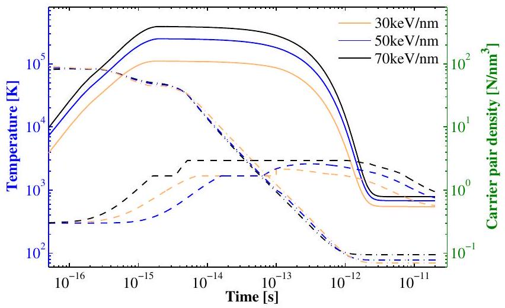
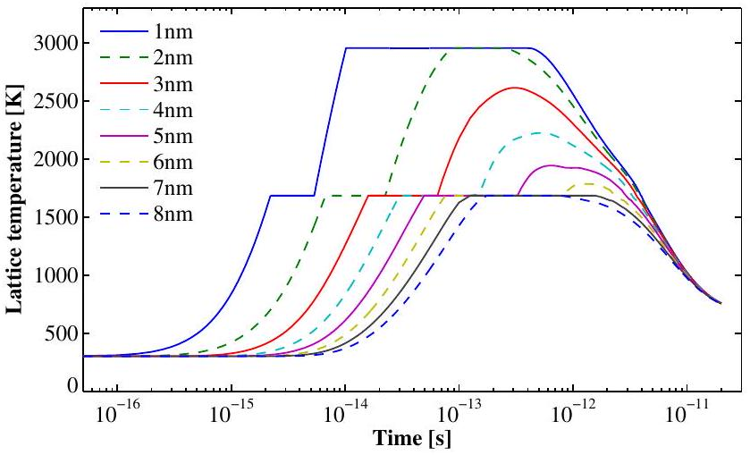
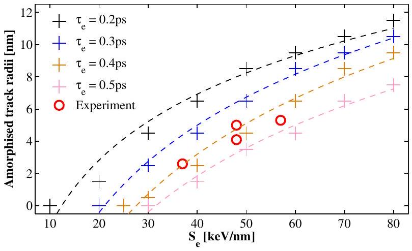

# Extending the inelastic thermal spike model for semiconductors and insulators 

S.L. Daraszewicz, D.M. Duffy* Department of Physics and Astronomy and London Centre for Nanotechnology, University College London, Gower Street, London, WC1E 6BT, United Kingdom

## ARTICLE INFO

## Article history:

Received 30 July 2010
Received in revised form 9 November 2010 Available online 17 November 2010

## Keywords:

Swift heavy ions
Silicon
Inelastic thermal spike
Radiation damage

#### Abstract

The inelastic thermal spike framework was extended to incorporate an additional balance equation for the carrier density. Temporal and spatial evolution of carrier density, electronic and lattice temperatures were solved for silicon using a finite difference method. Calculated track radii for a range of electronic stopping powers are presented. The model allows us to fit the electron-phonon coupling to experimental data of amorphised track radii. We compare the methodology of this framework to an earlier inelastic thermal spike model, which is based on the two-temperature model for non-equilibrium processes in metals, and discuss its contribution to the understanding of microscopic processes following a swift ion irradiation event in band gap materials.

© 2010 Elsevier B.V. All rights reserved.

## 1. Introduction

The modification of materials by ion irradiation has wide spread interest for both science and technology. Relevant examples are the nuclear industry, where radiation effects limit the lifetime of a reactor, and nanotechnology, where nanostructures are created and modified by ion irradiation. The ability to predict, or even understand, the microstructure modification resulting from ion irradiation of materials would have considerable benefits.

A heavy ion moving in a solid gradually loses energy to the material until it comes to rest. The energy deposited in the material by the ion excites electrons, creates defects and heats the lattice. The partition of the energy between these mechanisms depends strongly both on the material and on the velocity of the projectile atom. The energy loss per unit distance to the atoms and electrons is known as the nuclear stopping power ( $S_{\mathrm{n}}=\mathrm{d} E_{\mathrm{n}} / \mathrm{d} x$ ) and the electronic stopping power ( $S_{\mathrm{e}}=\mathrm{d} E_{\mathrm{e}} / \mathrm{d} x$ ), respectively. Ions with energies in excess of a few MeV/u lose energy primarily by inelastic interactions with electrons and in some materials this effect creates narrow, cylindrical features of modified structure, commonly known as ion tracks. This modified structure may be amorphous, defect-rich or have a different phase than the original material. Ion tracks are primarily associated with insulating materials [1,2], although there is also evidence that they can be produced in metals at very high electronic stopping powers [3-5].

The mechanisms that cause the structural modifications resulting from the excited electronic states have been a topic of debate

[^0]for many years and they range from Coulomb explosion models [6,7] to inelastic thermal spike models [8-10]. None of the models successfully explains the plethora of effects that can be produced by swift heavy ion irradiation, but the inelastic thermal spike model has been successful in producing quantitative results, such as the variation in the track diameter with stopping power and the velocity effect. The model does, however, require a large number of parameters, many of which are poorly characterised.

The inelastic thermal spike model is based on the two-temperature model [11,12] in which the lattice and the electrons have well defined temperatures but, in non-equilibrium situations, the lattice temperature is different from the electronic temperature. The electronic and the lattice thermal energy diffuse over time and energy is exchanged between the two systems at a rate that is determined by the temperature difference and the electronphonon coupling constant. The model has been linked to atomistic simulations, which gives detailed information about the atomic displacements [13,14].

The inelastic thermal spike model was originally developed for metals and it has been used extensively in this area [15-16]. Recently the model was applied to insulating and semiconducting materials [17] following the argument that the excited electrons have similar properties to the conduction electrons in a metal. While this is true to some extent, we would argue that there is a significant difference; the number of conduction electrons varies in space and time in a band gap material whereas it is constant in a metal. In this paper we extend the original inelastic thermal spike model by including an additional conservation equation for the carrier density. We use a finite difference solution of the model to estimate the lattice temperature evolution of silicon for a range of stopping powers.

## 2. The model

The inelastic thermal spike model is based on the two-temperature model, in which different temperatures are assigned to the lattice ( $T_{1}$ ) and the electrons ( $T_{\mathrm{e}}$ ). The temperatures evolve via heat diffusion and energy is exchanged at rate proportional to the temperature difference and the electron phonon coupling constant (g) (Eqs. (1) and (2)).
$C_{\mathrm{e}} \frac{\partial T_{\mathrm{e}}}{\partial t}=\nabla \kappa_{\mathrm{e}} \nabla T_{\mathrm{e}}-\mathrm{g}\left(T_{\mathrm{e}}-T_{1}\right)$
$C_{1} \frac{\partial T_{1}}{\partial t}=\nabla \kappa_{1} \nabla T_{1}+g\left(T_{\mathrm{e}}-T_{1}\right)$

Here $C_{\mathrm{e}}$ and $C_{1}$ are the electronic and lattice heat capacities, $\kappa_{\mathrm{e}}$ and $\kappa_{1}$ are the electronic and lattice thermal conductivities. The parameters for the model are taken from experimental measurements or theoretical models for free electron metals [9,18]. In the case of band gap materials, only electrons that have been excited to the conduction band, and the corresponding holes in the valance band, carry energy and the number of excited electrons and holes varies over space and time. Following earlier work on semiconductors [19] we introduce a further conservation Eq. (3) to the model to ensure that the number of free electrons and holes (carrier pairs) are properly accounted for.
$\frac{\partial N}{\partial t}+\nabla J=G_{\mathrm{e}}-R_{\mathrm{e}}$

Here $N$ represents the concentration of electron-hole pairs (carriers), $G_{\mathrm{e}}$ and $R_{\mathrm{e}}$ are source and sink terms, respectively, and $J$ is the carrier current density, which is related to the concentration, electronic temperature ( $T_{\mathrm{e}}$ ) and band gap ( $E_{\mathrm{g}}$ ) by:
$J=-D\left(T_{1}\right)\left(\nabla N+\frac{2 N}{k_{\mathrm{B}} T} \nabla E_{\mathrm{g}}+\frac{N}{2 T_{\mathrm{e}}} \nabla T_{\mathrm{e}}\right)$

Here $D\left(T_{1}\right)$ is the ambipolar diffusivity. In this model we impose the condition of local charge neutrality; therefore the local concentration of electrons and holes is equal everywhere. The gradient in the band gap is included for completeness because, in some materials, the band gap varies with lattice temperature; however $E_{g}$ is assumed to be constant in the current simulations. The carrier energy density, $U$, is a combination of the band gap ( $E_{\mathrm{g}}$ ), and the electronic temperature, such that $U=N E_{\mathrm{g}}+3 N k_{\mathrm{B}} T_{\mathrm{e}}$. In the extended model, in which the carrier concentration varies, the electronic energy balance equation is:
$\frac{\partial U}{\partial t}+\nabla W=U_{\mathrm{s}}-U_{1}$

Here $U_{\mathrm{s}}$ and $U_{1}$ are source and sink terms and $W$ is the energy current density given by:
$W=\left(E_{g}+2 k_{\mathrm{B}} T_{\mathrm{e}}\right) J+\left(\kappa_{\mathrm{e}}+\kappa_{\mathrm{h}}\right) \nabla T_{\mathrm{e}}$
Here $\kappa_{\mathrm{e}}$ and $\kappa_{\mathrm{h}}$ are the electron and hole thermal conductivities. In band gap materials $N$ varies in space and time therefore the electronic temperature diffusion of the two-temperature model, Eq. (1), must be replaced by Eqs. (5) and (6). The lattice thermal diffusion equation is the same as in the original model (Eq. (2)) with the energy exchange term, $g\left(T_{\mathrm{e}}-T_{1}\right)$, replaced by $U_{1}$. Following Mao et al. [20] we assume that:
$U_{1}=C_{\mathrm{e}} \frac{T_{\mathrm{e}}-T_{1}}{\tau_{\mathrm{e}}}$
where $\tau_{\mathrm{e}}$ is the electron-lattice relaxation time. The electronic heat capacity ( $C_{\mathrm{e}}$ ) is proportional to $N\left(C_{\mathrm{e}}=3 N k_{\mathrm{B}}\right)$ because only the carriers are able to exchange energy with the lattice. The extra complexity introduced by the third conservation equation offers the
possibility of including a rich variety of mechanisms into the model, such as Auger recombination and impact ionisation in addition to energy exchange between the lattice and the carriers. In this publication we aim to minimise the complexity and hence the $R_{\mathrm{e}}$ term in Eq. (3) was neglected.

We solve the coupled equations using a standard finite difference solution on a $100 \times 100 \times 1$ cubic grid with cube size 1 nm and a timestep of 0.05 fs . Von-Neumann boundary conditions were used for all three evolved lattices: carrier energy density ( $U$ ), carrier pair density ( $N$ ) and lattice temperature ( $T_{1}$ ). The lattice temperature is initialised to 300 K and the ion track is initialised by depositing a carrier energy density $U_{\mathrm{s}}(r, t)$ in the central column of the simulation cell. We assume an energy deposition time $\tau$ equal to $10^{-15} \mathrm{~s}$ [21] and the initial spatial energy distribution to be a Gaussian, $D(r)$, with standard deviation of $\sigma=0.65 \mathrm{~nm}$. The mean deposition radius, $\sigma$, relates to the specific energy of projectile ion. When the velocity of the ion increases the energy density deposited on electrons becomes less localised, i.e. $\sigma$ is greater. This is the idea behind the so-called "velocity effect" [29], the impact of which is neglected in the current model. Following [22] we choose $U_{\mathrm{s}}(r, t)$ such that $U_{\mathrm{s}}(r, t)=A D(r) \alpha e^{-\alpha t}$ with $\alpha=1 / \tau$. It has been shown previously for the two-temperature model that the variation of $\tau$ over a factor of 5 has no significant influence on the results [28]. Normalisation of $U_{\mathrm{s}}(r, t)$ is fixed by choosing a suitable value for A so that
$\int_{t=0}^{\infty} \int_{r=0}^{r_{\mathrm{m}}} U_{s}(r, t) 2 \pi r d r d t=S_{\mathrm{e}}$
where $S_{\mathrm{e}}$ is the electronic stopping power and $r_{\mathrm{m}}$ is the maximum range of electrons projected perpendicularly to the ion path [23]. Thus the total deposited energy corresponds to the electronic stopping power, which ranged from 10 to $80 \mathrm{keV} \mathrm{nm}^{-1}$ in the simulations. The energy is divided between the energy required to create the carriers ( $N E_{\mathrm{g}}$ ) and the kinetic energy of the carriers $\left(3 N k_{\mathrm{B}} T\right)$ with the maximum number of carrier pairs set to 2 per Si atom.

The parameters used in the model are summarised in Table 1. Lattice thermal parameters of silicon were used following Chettah et al. [17]. For the current simulation we assume the band gap has a constant value everywhere in the simulation cell. We also assume that the electronic temperature gradient is zero everywhere because the diffusivity of the electronic temperature component of the energy ( $\kappa_{\varepsilon} / C_{\mathrm{e}}$ ) is much higher than the ambipolar diffusivity $\left(D\left(T_{1}\right)\right)$. This highlights the fundamental difference between our model, where the electronic temperature is constant and carrier diffusion dominates energy diffusion, and the original inelastic thermal spike model where the carrier number is constant and the electronic temperature gradients dominate energy diffusion.

## 3. Results and discussion

We have used the method outlined in the previous section to calculate the lattice temperature, the electronic temperature and the carrier density evolution of Si following irradiation events with electronic stopping powers of $10-80 \mathrm{keV} \mathrm{nm}^{-1}$, at intervals of $10 \mathrm{keV} \mathrm{nm}{ }^{-1}$, for a range of electron-phonon relaxation times $\left(\tau_{\mathrm{e}}=C_{\mathrm{e}} / g\right), 0.2,0.3,0.4$ and 0.5 ps . The time evolution of the electronic temperature, lattice temperature and carrier density in the highly excited region ( $r=1 \mathrm{~nm}$ distance from the centre of the energy deposition track) is plotted in Fig. 1 for three stopping powers ( $S_{\mathrm{e}}=30,50$ and $70 \mathrm{keV} \mathrm{nm}^{-1}$ ) with $\tau_{\mathrm{e}}=0.3 \mathrm{ps}$. Since Auger recombination was neglected and von-Neumann boundary conditions are employed, the total number of carriers saturates at about 5 fs, after the energy deposition to the electronic subsystem is completed. This can also be deduced from the declining number

Table 1
Model parameters for Si.
| Quantity | Symbol | Value |
| :--- | :--- | :--- |
| Carrier ambipolar diffusivity [24] | $D_{0}$ | $18(300 \mathrm{~K} / \mathrm{T}) \mathrm{cm}^{2} / \mathrm{s}$ |
| Band gap [25] | $E_{\mathrm{g}}$ | 1.16 eV |
| Melting point [17] | $T_{\mathrm{m}}$ | 1683 K |
| Vapourisation temperature [17] | $T_{\mathrm{V}}$ | 2953 K |
| Solid density at $T=300 \mathrm{~K}$ [17] | $\rho_{\mathrm{S}}$ | $2.32 \mathrm{~g} / \mathrm{cm}^{3}$ |
| Liquid density at $T_{\mathrm{m}}$ [17] | $\rho_{1}$ | $2.50 \mathrm{~g} / \mathrm{cm}^{3}$ |
| Latent heat for fusion at $T_{\mathrm{m}}$ [17] | $H_{\mathrm{f}}$ | $1797 \mathrm{~J} / \mathrm{g}$ |
| Latent heat for vapourisation at $T_{\mathrm{V}}$ [17] | $H_{\mathrm{v}}$ | $13,722 \mathrm{~J} / \mathrm{g}$ |
| Lattice specific heat [17] | $C_{\mathrm{a}}(\mathrm{J} / \mathrm{g} \mathrm{K})$ | $\begin{aligned} & C_{\mathrm{a}}=-0.1354+4.486 \times 10^{-3} T-5.207 \times 10^{-6} T^{2}(60 \mathrm{~K} \leqslant T<300 \mathrm{~K}) \\ & C_{\mathrm{a}}=0.7007+1.469 \times 10^{-4} T+3.183 \times 10^{-8} T^{2}\left(300 \mathrm{~K} \leqslant T \leqslant T_{\mathrm{m}}\right) \\ & C_{\mathrm{a}}=1.045\left(T>T_{\mathrm{m}}\right) \\ & K_{\mathrm{a}}=1042 \times T^{-1.158}\left(60 \mathrm{~K} \leqslant T \leqslant T_{\mathrm{m}}\right) \end{aligned}$ |
| Lattice thermal conductivity [17] | $K_{\mathrm{a}}(\mathrm{W} / \mathrm{cm} \mathrm{K})$ |  |
|  |  | $\begin{aligned} & K_{\mathrm{a}}=0.14\left(T_{\mathrm{m}} \leqslant T \leqslant T_{\mathrm{v}}\right) \\ & K_{\mathrm{a}}=8.76 \times 10^{-5} T^{1 / 2}\left(T>T_{\mathrm{v}}\right) \end{aligned}$ |

of carriers at $r=1 \mathrm{~nm}$ radial distance for $t>5 \mathrm{ps}$. The rising electronic temperature illustrates the time-dependant deposition of electronic energy over the first fs of the simulation. We note that the lattice and electronic temperatures in the highly excited region equilibrate at around 20 ps after the irradiation event.

Fig. 1. The time evolution of the lattice temperature (dashed line), the electronic temperature (solid line) and the carrier density (dot-dashed line), 1 nm from the centre of the energy deposition, following $30 \mathrm{keV} \mathrm{nm}^{-1}, 50 \mathrm{keV} \mathrm{nm}^{-1}$ and $70 \mathrm{keV} \mathrm{nm}^{-1}$ irradiation events ( $\tau_{\mathrm{e}}=0.3 \mathrm{ps}$ ). The carrier pair density $y$-axis scale is shown on the right-hand side of the graph. Note that the maximum electronic temperature is reached at around 2 fs and that the lattice and electronic temperatures, in this highly excited region, reach thermal equilibrium at around 20 ps .

Fig. 2. The time evolution of the lattice temperature following a $50 \mathrm{keV} \mathrm{nm}^{-1}$ irradiation event for a range of radial distances ( $r=1 \mathrm{~nm}$ to $r=8 \mathrm{~nm}$ ) from the initial energy deposition centre. Note that no lattice melting occurs at $r=7 \mathrm{~nm}$ and that system resolidifies at about $\sim 3 \mathrm{ps}$. The calculations were performed with $\tau_{\mathrm{e}}=0.3 \mathrm{ps}$.

Fig. 3. Calculated track (molten phase) radius versus electronic stopping power for $\tau_{\mathrm{e}}=0.2,0.3,0.4$ and 0.5 ps . The experimental values of amorphous track radii [26,27] are included as circles. A value of 0.4 ps for the electron-phonon relaxation time ( $\tau_{\mathrm{e}}$ ), the only free parameter in the model, gives a reasonable fit to the limited experimental data.

The time evolution of the lattice temperature, for different radial distances from the centre of the energy deposition track ( $r= 1-8 \mathrm{~nm}$ ), is plotted in Fig. 2. Note the shoulder and the flat region on the curves at the melting ( 1683 K ) and boiling ( 2953 K ) temperatures, respectively. At later times ( $\sim 3 \mathrm{ps}$ ) the lattice temperature falls below the melting temperature and therefore resolidification occurs. We use such plots to estimate the radii of the tracks that would be created by resolidification for a range of $S_{\mathrm{e}}$. The results are presented in graphical form in Fig. 3 with experimental points included [26,27]. It is apparent that none of the lines fully reproduce the experimental data trends, with $\tau_{\mathrm{e}}=0.4 \mathrm{ps}$ providing the closest fit. The possible sources of this discrepancy include the simplifications introduced to the model (such as constant electronic temperature gradient) as well as absence of a mechanism to account for different specific energies of projectile ions.

## 4. Conclusions

We have extended the inelastic thermal spike model by the inclusion of a carrier conservation equation and used the model to estimate the radii of tracks created by swift heavy ion irradiation in Si . Within this self-consistent model we have quantitatively analysed the temporal and spatial evolution of the electronic and lattice temperatures. We have demonstrated that the lattice and electronic temperatures come to thermal equilibrium at about 20 ps . Using the molten phase as the criterion for track amorphisation, we have estimated the track radii for a range of electronic stopping powers and found that reasonable agreement with the
experimental data was obtained for an electron-lattice relaxation time of 0.4 ps .

The new framework has notable advantages over the standard two-temperature model. The model evolves the number of carriers independently and therefore it is easy to implement a cap for the maximum number of energy carriers in a simulation cell, hence providing a more accurate description of the lattice coupling. Similarly, the framework has the facility for including Auger recombination and impact ionisation phenomena as source/sink terms in the number conservation equation.

The main value of the model will be realised by coupling the electronic energy equations to molecular dynamics simulations for the lattice, which will enable the direct simulation of the atomistic structure of ion tracks in band gap materials with a realistic energy deposition in the lattice. Such simulations in metals revealed that the lattice temperature could rise well above the melting temperature without the formation of tracks [14]; therefore we cannot assume that the continuum lattice model used here gives accurate track radii. The development of this coupled MD methodology is in progress.

## Acknowledgements

S. Daraszewicz acknowledges funding from EPSRC under the Materials Modelling and Materials Science Industrial Doctoral Training Centre and from the Culham Centre for Fusion Energy (CCFE).

## References

[1] D.A. Young, Nature 182 (1958) 375.
[2] E.C.H. Silk, R.S. Barnes, Philos. Mag. 4 (1959) 970.
[3] A. Dunlop, P. Legrand, D. Lesueur, N. Lorenzelli, J. Morillo, A. Barbu, S. Bouffard, Europhys. Lett. 15 (1991) 765.
[4] A. Dunlop, D. Lesueur, P. Legrand, H. Dammak, J. Dural, Nucl. Inst. Meth. B 90 (1994) 330.
[5] A. Barbu, A. Dunlop, D. Lesueur, R.S. Averback, Europhys. Lett. 15 (1991) 37.
[6] R.L. Fleischer, P.B. Price, R.M. Walker, J. Appl. Phys. 36 (1965) 3645.
[7] G. Schiwietz et al., Phys. Rev. Lett. 69 (1992) 628.
[8] A. Meftah et al., Nucl. Instr. Meth. B 237 (2005) 563.
[9] M. Toulemonde, C. Dufour, A. Meftah, E. Paumier, Nucl. Instr. Meth. B 166-167 (2000) 903.
[10] M. Toulemonde, W. Assmann, C. Dufour, A. Meftah, F. Studer, C. Trautmann, Mat. Fys. Medd. 52 (2006) 293.
[11] F. Seitz, J.S. Köhler, Sol. St. Phys. 2 (1956) 305.
[12] M.I. Kaganov, I.M. Lifshitz, L.V. Tanatarov, Sov. Phys. JETP 4 (1957) 173.
[13] D.M. Duffy, A.M. Rutherford, J. Phys.: Condens. Matt. 19 (2007) 016207.
[14] D.M. Duffy, N. Itoh, A.M. Rutherford, A.M. Stoneham, J. Phys: Condens. Matt. 20 (2008) 082201.
[15] Ch. Dufour, E. Paumier, M. Toulemonde, Nucl. Inst. Meth. B 122 (1997) 445.
[16] Ch. Dufour et al., J. Phys.: Condens. Matt. 5 (1993) 4573.
[17] A. Chettah, H. Kucal, Z.G. Wang, M. Kac, M.A. Meftah, M. Toulemonde, Nucl. Instr. Meth. Phys. Res. B 267 (2009) 2719-2724.
[18] Z.G. Wang, C. Dufour, E. Paumier, M. Toulemonde, J. Phys.: Condens. Mat. 6 (1994) 6733.
[19] H.M. van Driel, Phys. Rev. B 35 (1987) 8166.
[20] S. Mao, X. Mao, R. Greif, R. Russo, Appl. Surf. Sci. 127 (1998) 206.
[21] B. Gervais, S. Bouffard, Nucl. Instr. Meth. B 88 (1994) 355.
[22] M. Toulemonde, J. Constantini, C. Dufour, A. Meftah, E. Paumier, F. Studer, Nucl. Inst. Meth. B 116 (1996) 37.
[23] M.P.R. Waligorski, R.N. Hamm, R. Katz, Nucl. Tracks Radiat. Meas. 11 (1986) 309.
[24] J. Geist, W.K. Gladden, Phys. Rev. B 27 (1983) 4833.
[25] Y.P. Varshini, Physica 34 (1967) 149.
[26] B. Canut, N. Bonardi, S.M.M. Ramos, S. Della-Negra, Nucl. Instr. Meth. B 146 (1998) 14.
[27] A. Dunlop, G. Jaskierowicz, S. Della-Negra, Nucl. Instr. Meth. B 146 (1998) 302.
[28] C. Dufour, B. Lesellier De Chezelles, V. Delignon, M. Toulemonde, E. Paumier, in: P. Mazzoldi (Ed.), Modifications Induced by Irradiation in Glasses, Elsevier, North-Holland, 1992, p. 61.
[29] A. Meftah, F. Brisard, J. Costantini, M. Hageali, J. Stoquert, F. Studer, M. Toulemonde, Phys. Rev. B 48 (1993) 920.

[^0]:    * Corresponding author. Tel.: +44 2076793032.

    E-mail address: d.duffy@ucl.ac.uk (D.M. Duffy).

