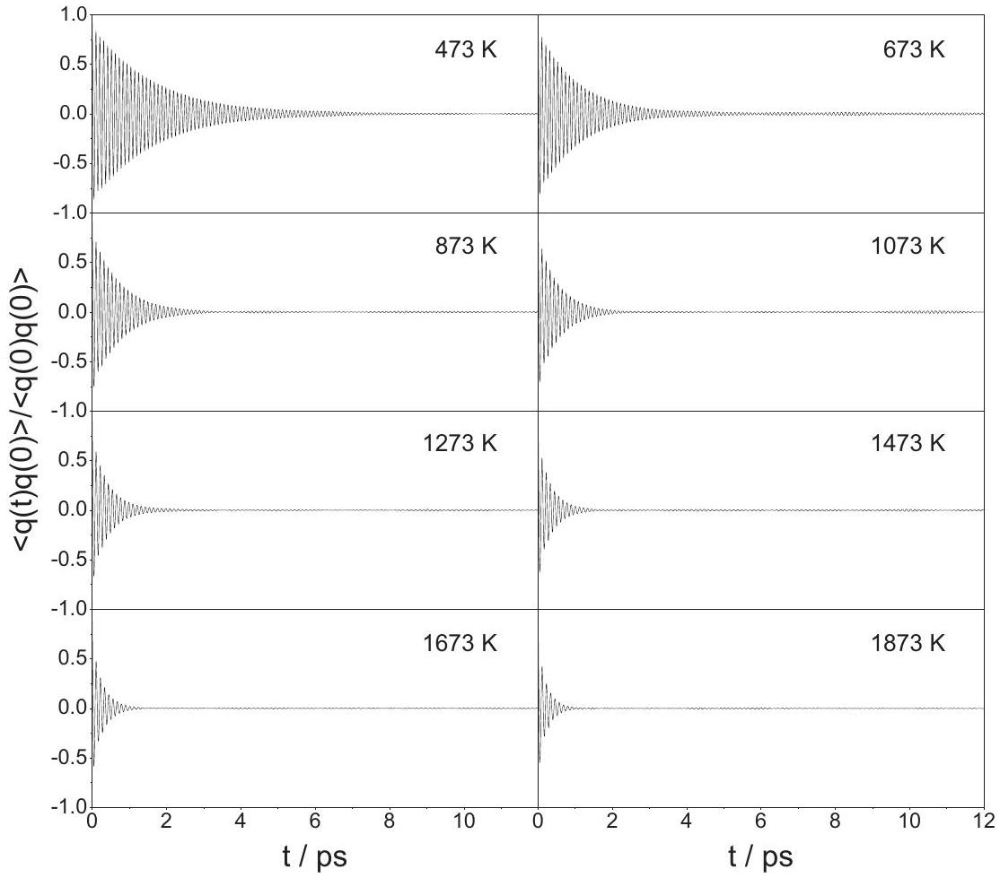
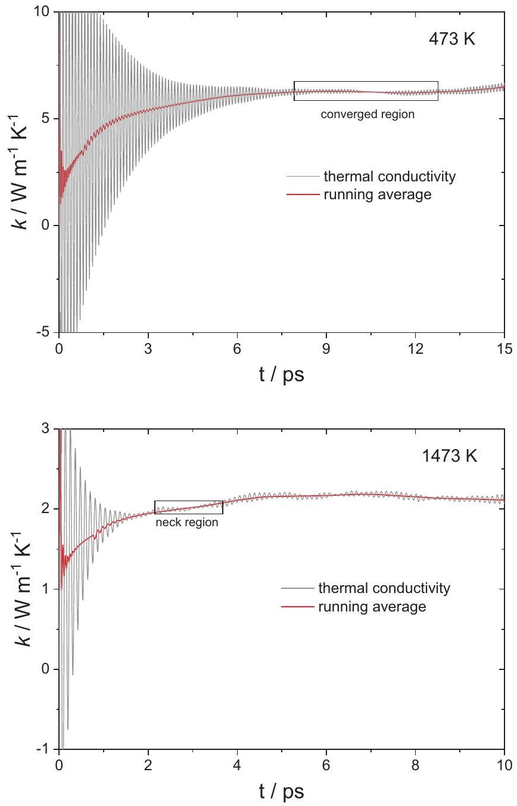
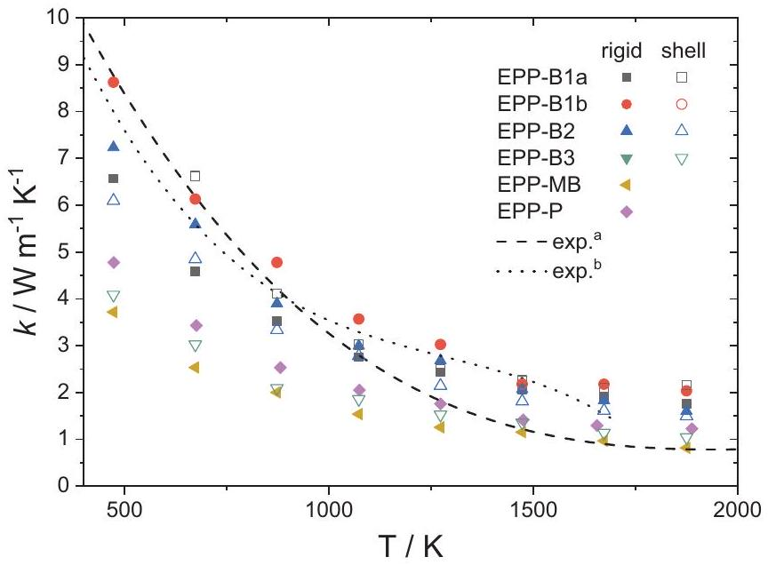
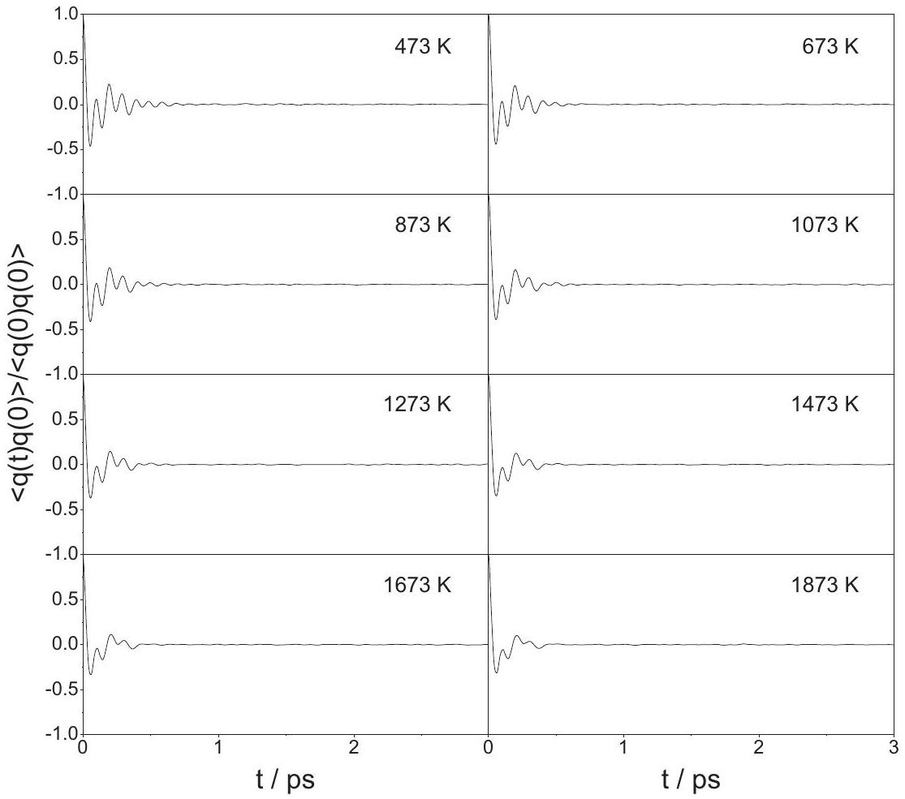
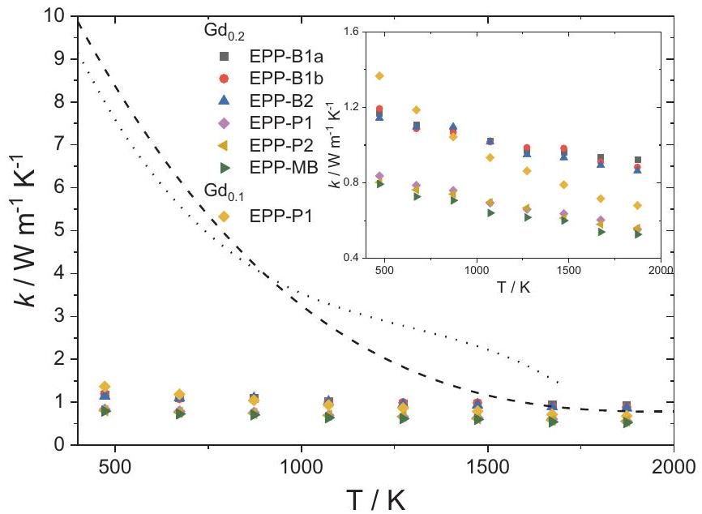
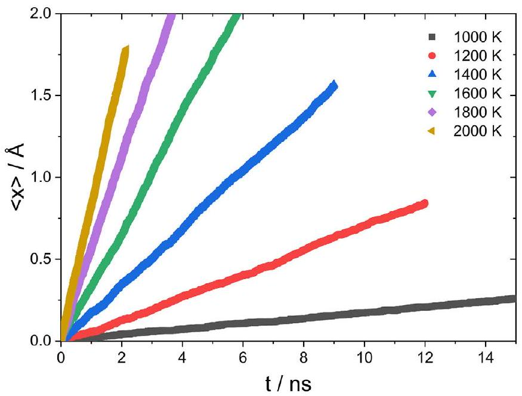
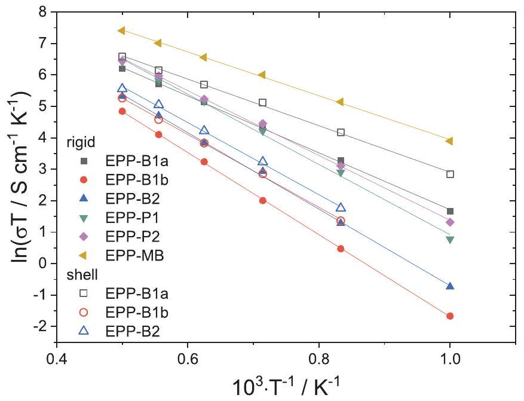
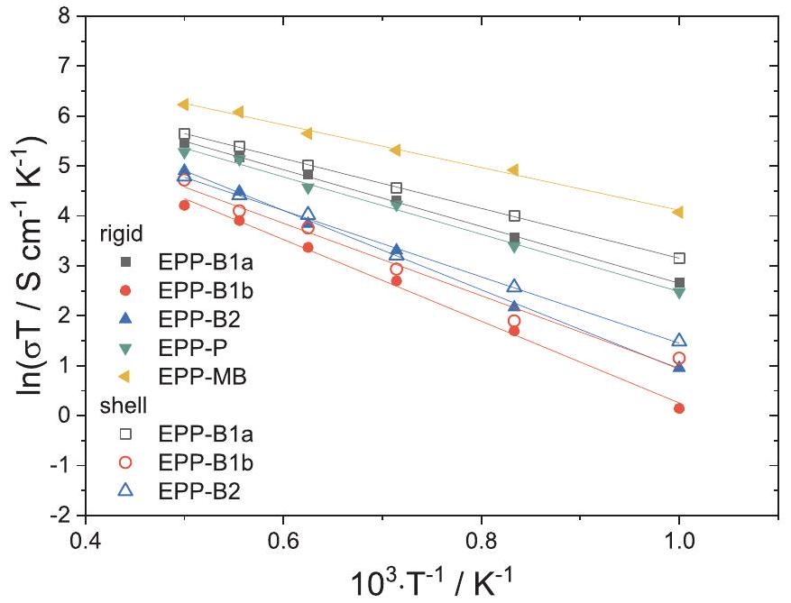

# Ionic and thermal conductivity of pure and doped ceria by molecular dynamics 

Steffen Grieshammer ${ }^{\mathrm{a}, \mathrm{b}, \mathrm{c}, *}$, Leila Momenzadeh ${ }^{\mathrm{d}}$, Irina V. Belova ${ }^{\mathrm{d}}$, Graeme E. Murch ${ }^{\mathrm{d}}$ ${ }^{\mathrm{a}}$ Helmholtz-Institut Münster (IEK-12), Forschungszentrum Jülich GmbH, Corrensstraße 46, 48149 Münster, Germany ${ }^{\mathrm{b}}$ Institute of Physical Chemistry, RWTH Aachen University, Landoltweg 2, 52056 Aachen, Germany ${ }^{\mathrm{c}}$ JARA-HPC, RWTH Aachen University and Forschungszentrum Jülich GmbH, Germany ${ }^{\mathrm{d}}$ The University Centre for Mass and Thermal Transport in Engineering Materials, School of Engineering, University of Newcastle, Callaghan, NSW 2308, Australia

## ARTICLE INFO

## Keywords:

Pure and doped ceria
Ionic conductivity
Thermal conductivity
Molecular dynamics
Thermal expansion
Empirical pair potentials

#### Abstract

Numerous parametrizations of pair potentials have been developed to investigate various properties of pure and doped ceria in recent decades. In this paper, we assess frequently applied sets of pair potentials for pure and gadolinia doped ceria with respect to the prediction of the bulk properties lattice parameter, bulk modulus, and thermal expansion coefficient as well as defect properties including defect formation energies, defect interactions and anion migration energy. We furthermore apply molecular dynamics simulations to obtain the thermal and ionic conductivity of the material using the Green-Kubo and electric field methods, respectively. We found that none of the applied potentials is able to reproduce all of the monitored properties correctly. Nonetheless, we provide a recommendation of suitable potential sets for different applications.

## 1. Introduction

Ceria ( $\mathrm{CeO}_{2}$ ) is of major technological interest due to its versatile applicability in both pure or acceptor doped form. It is applied in thermal barrier coatings [1], in three-way catalysts for automotive exhaust gas purification [2-4], and industrial catalysis [5] and also has potential for the production of solar fuels [6,7]. In recent years, ceria has attracted additional interest due to its switching behavior and possible application in resistive random access memory [8]. Doping with rare-earth oxides, such as gadolinia $\left(\mathrm{Gd}_{2} \mathrm{O}_{3}\right)$, leads to the formation of oxygen vacancies according to Eq. (1), in the Kröger-Vink notation, see below [9]. The vacancies enable superior oxygen ion conductivity and render the material a promising electrolyte candidate for solid oxide fuel cells.

$$
\mathrm{Y}_{2} \mathrm{O}_{3} \rightarrow 2 \mathrm{Y}_{\mathrm{Ce}}^{\prime}+3 \mathrm{O}_{\mathrm{O}}^{\mathrm{x}}+\mathrm{V}_{\mathrm{O}}^{\bullet \bullet}
$$

Ceria crystallizes in the fluorite structure (space group $\mathrm{Fm} \overline{3} \mathrm{~m}$ ) and is an ideal model system for isostructural materials and oxygen ion conductors in general. Transport properties of the material, namely the thermal and ionic conductivity, are key parameters for the majority of possible applications. Ceria is certainly among the most investigated oxides including experimental studies as well as computational studies based on density functional theory (DFT) or empirical pair potentials (EPP). Numerous parametrizations of EPPs have been developed in the
past decades to study properties of ceria, such as oxygen migration, defect clustering, ionic conductivity or surface stability. The ability of an EPP to accurately describe the interactions in the lattice is crucial for the simulation of material properties and transport mechanisms. However, the ability to accurately reproduce experimental data by a specific potential set varies with the property of interest. For example, Xu et al. [10] and Rushton et al. [11] assessed the capability of several pair potentials to reproduce elastic properties of ceria and stated that no potential set can reproduce all fundamental properties investigated in their study.

In this paper, we assess the predictive power of frequently applied empirical pair potentials for pure and doped ceria focusing on the thermal and ionic conductivity. Static calculations and molecular dynamics (MD) simulations are performed to validate bulk properties such as lattice parameter, bulk modulus, and thermal expansion coefficient as well as defect properties like defect formation energies, defect interactions and migration energy, which are relevant for ionic conductivity. We use the Green-Kubo approach in equilibrium MD simulations to predict the thermal conductivity in pure and doped ceria and obtain the ionic conductivity of doped ceria from the drift of ions in an imposed electric field.

[^0]Table 1
Parameter sets for empirical pair potentials of the Buckingham form.
| Potential | Ion-pair ij | $A_{i j} / \mathrm{eV}$ | $\rho_{i j} / \AA$ | $C_{i j} / \mathrm{eV} \AA^{6}$ | Y/e | $k / \mathrm{eV} \AA^{-2}$ | Ref. |
| :--- | :--- | :--- | :--- | :--- | :--- | :--- | :--- |
| EPP-B1a | $\mathrm{Ce}^{4+}-\mathrm{O}^{2-}$ | 1809.68 | 0.3547 | 20.4 | -0.2 | 177.84 | Vyas et al. [13] |
|  | $\mathrm{O}^{2-}-\mathrm{O}^{2-}$ | 9547.96 | 0.2192 | 32 | -2.04 | 9.3 | Vyas et al. [13] |
|  | $\mathrm{Gd}^{3+}-\mathrm{O}^{2-}$ | 1885.75 | 0.3399 | 20.34 | - | - | Minervini et al. [15] |
| EPP-B1b | $\mathrm{Ce}^{4+}-\mathrm{O}^{2-}$ | 2531.5 | 0.335 | 20.4 | -0.2 | 177.84 | Vyas et al. [13] |
|  | $\mathrm{O}^{2-}-\mathrm{O}^{2-}$ | 9547.96 | 0.2192 | 32 | -2.04 | 10.3 | Vyas et al. [13] |
|  | $\mathrm{Gd}^{3+}-\mathrm{O}^{2-}$ | 1885.75 | 0.3399 | 20.34 | - | - | Minervini et al. [15] |
| EPP-B2 | $\mathrm{Ce}^{4+}-\mathrm{O}^{2-}$ | 1986.83 | 0.3511 | 20.4 | 7.7 | 291.75 | Sayle et al. [17] |
|  | $\mathrm{O}^{2-}-\mathrm{O}^{2-}$ | 22,764.3 | 0.149 | 27.89 | -2.077 | 27.29 | Dwivedi/Cormack [19] |
|  | $\mathrm{Gd}^{3+}-\mathrm{O}^{2-}$ | 1336.8 | 0.3551 | 0 | - | - | Lewis/Catlow [18] |
| EPP-B3 | $\mathrm{Ce}^{4+}-\mathrm{O}^{2-}$ | 755.1311 | 0.429 | 0 | 4.648 | 43.451 | Gotte et al. [21] |
|  | $\mathrm{O}^{2-}-\mathrm{O}^{2-}$ | 9533.421 | 0.234 | 224.88 | -6.567 | 1759.8 | Gotte et al. [21] |

## 2. Methodology

Standard procedures for static calculations and MD simulations are applied in this study. The total energy of the lattice is described based on the Born model for ionic solids where pairwise interactions are calculated from long range Coulomb interactions and parametrized short range potentials [12]. The well-known Buckingham form of the short range potential was applied:

$$
V_{\text {Buckingham }}\left(r_{i j}\right)=A_{i j} \exp \left(\frac{-r_{i j}}{\rho_{i j}}\right)-\frac{C_{i j}}{r_{i j}^{6}}
$$

Frequently used parametrizations of the adjustable parameters $A_{i j}$, $\rho_{i j}$, and $C_{i j}$ were applied as given in Table 1. The EPP-B1a parameters for $\mathrm{Ce}-\mathrm{O}$ and $\mathrm{O}-\mathrm{O}$ were derived by Vyas et al. [13] based on the $\mathrm{O}-\mathrm{O}$ value from Binks et al. [14]. The $\mathrm{Gd}-\mathrm{O}$ parameter was reported by Minervini et al. [15] and used for calculations of defect clusters in doped ceria. The EPP-B1b potential is similar to EPP-B1a with a modification of the $\mathrm{Ce}-\mathrm{O}$ parameters [13]. Balducci et al. [16] applied EPPB2 to doped non-stoichiometric ceria using the $\mathrm{Ce}-\mathrm{O}$ interaction from Sayle et al. [17], the Gd-O potential from Lewis and Catlow [18] and the O-O potential from Dwivedi and Cormack [19] based on the data by Catlow [20]. EPP-B3 was fitted by Gotte et al. [21] to reproduce the structure of $\mathrm{CeO}_{2}$ and $\mathrm{Ce}_{2} \mathrm{O}_{3}$ and used in MD simulations of the selfdiffusion coefficient in non-stoichiometric ceria. The present simulations were conducted within the rigid ion model, where the ions are particles with a formal charge $Z$, as well as the shell model that includes polarization of ions [22]. In this model, a mass-less shell of charge $Y$ is attached to the massive core of charge ( $Z-Y$ ) by a harmonic spring with a spring constant $k$.

As an alternative approach the Morse-type potential introduced by Pedone et al. [23] for rigid ions with partial charges was applied:

$$
V_{\text {Pedone }}\left(r_{i j}\right)=D_{i j}\left[\left\{1-e^{-a_{i j}\left(r-r_{0}\right)}\right\}^{2}-1\right]+\frac{C_{i j}}{r_{i j}^{12}}
$$

Parameters in Table 2 for EPP-P were taken from Sayle et al. [24] for $\mathrm{Ce}-\mathrm{O}$ and $\mathrm{O}-\mathrm{O}$. Gd- O parameters were taken from the original publication of Pedone et al. [23] (EPP-P1) or from Symington et al. [25] (EPP-P2).

Table 2
Parameter sets for the empirical pair potential EPP-P1 and EPP-P2 according to Pedone et al.
| Ion-pair ij | $D_{i j} / \mathrm{eV}$ | $a_{i j} / \AA^{-1}$ | $r_{0} / \AA$ | $C_{i j} / \mathrm{eV} \AA^{12}$ | Ref. |
| :--- | :--- | :--- | :--- | :--- | :--- |
| $\mathrm{Ce}^{2.4+}-\mathrm{O}^{1.2-}$ | $9.84 \cdot 10-2$ | 1.84860 | 2.93015 | 1 | Sayle et al. [24] |
| $\mathrm{O}^{1.2-}-\mathrm{O}^{1.2-}$ | $4.17 \cdot 10-2$ | 1.88680 | 3.18937 | 22 | Sayle et al. [24] |
| $\mathrm{Gd}^{1.8+}-\mathrm{O}^{1.2-}(\mathrm{P} 1)$ | 1.32•10-4 | 2.01300 | 4.35159 | 3 | Pedone et al. [23] |
| $\mathrm{Gd}^{1.8+}-\mathrm{O}^{1.2-}$ (P2) | $2.845 \cdot 10-2$ | 2.05730 | 3.18937 | 3 | Symmington et al. [25] |

In addition, the many-body potential approach by Cooper et al. [26] was applied. In this case, pairwise interactions of the Buckingham potential and Morse potential are combined with many-body effects included by the embedded atom method:

$$
V_{\text {Many-body }}\left(r_{i j}\right)=A_{i j} \exp \left(\frac{-r_{i j}}{\rho_{i j}}\right)-\frac{C_{i j}}{r_{i j}^{6}}+D_{i j}\left[\left\{1-e^{-a_{i j}\left(r-r_{0}\right)}\right\}^{2}-1\right]+E_{\mathrm{EAM}, i}
$$

The many-body contribution $E_{\mathrm{EAM}, i}$ for atom $i$ is calculated by summing pairwise functions $n_{j} / r_{i j}{ }^{8}$, passing through a nonlinear embedding function and multiplying by the constant of proportionality $G_{i}$.

$$
E_{\mathrm{EAM}, i}=-G_{i} \sqrt{\sum_{j} \frac{n_{j}}{r_{i j}^{8}}}
$$

This model allows polarization without the intricacies of the shell model. The parameters of EPP-MB in Tables 3 and 4 were taken from Cooper et al. [26] for Ce and O. Gd-O interactions were solely described by a Buckingham potential according to Rushton and Chroneos [27].

The GULP [28] code was used for all static calculations with short range potentials where the cut-off is at $15 \AA$. Defect calculations were performed using the Mott-Littleton approach with spherical regions centered around the defect(s) [29]. In Region I, all ions are relaxed explicitly responding to the perturbation of the defect, while in Region II, which extends to infinity, a continuum approach is applied. An intermediate Region IIa is introduced to smooth the transition between Regions I and II where the Mott-Littleton approximation is used for ion displacements but interactions with Region I are treated explicitly. In the present calculations, radii of $16 \AA$ and $31 \AA$ for Regions I and IIa were chosen respectively, ensuring no appreciable change in the energies occurred for any further increase of the spheres. This approach did not work for EPP-MB and calculations were performed analogous to ref. [26] using supercells. Energies of defect formation for intrinsic cation-Frenkel, anion-Frenkel, and Schottky disorder were calculated from the formation energies of the individual defects.

Interaction energies between Gd-dopant and oxygen vacancy $\left(\Delta E_{\mathrm{Gd}-\mathrm{V}}\right)$ and between two vacancies ( $\Delta E_{\mathrm{V}-\mathrm{V}}$ ) were calculated as the energy difference between the defect pair in the nearest neighbor position and the isolated defects. The energy of migration ( $E_{\text {mig }}$ ) of an oxygen ion to an adjacent vacancy was calculated from the difference between the energy minimum and maximum along the sampled migration path.

The thermal expansion coefficient, thermal conductivity, and ionic conductivity were determined by MD simulations using the LAMMPS code [30]. The time step was set to 1.5 fs for rigid ions and 0.5 fs for the shell model except for EPP-B3 where it was lowered to 0.2 fs for the shell model. The adiabatic shell model was applied as introduced by Mitchell and Fincham [31], where a small fraction of the ion masses is assigned to each shell. For EPP-B3 the shells accounted for $0.1 \%$ and $8 \%$ of the Ce and O mass, respectively [21], while the value was set to $9 \%$

Table 3
Pair-wise parameter set for the empirical pair potential EPP-MB.
| Ion-pair ij | $A_{i j} / \mathrm{eV}$ | $\rho_{i j} / \AA$ | $C_{i j} / \mathrm{eV} \AA^{6}$ | $D_{i j} / \mathrm{eV}$ | $a_{i j} / \AA^{-1}$ | $r_{0} / \AA$ | Ref. |
| :--- | :--- | :--- | :--- | :--- | :--- | :--- | :--- |
| $\mathrm{Ce}^{2.2208+}-\mathrm{Ce}^{2.2208+}$ | 18,600 | 0.2664 | 0 | - | - | - | Cooper et al. [26] |
| $\mathrm{Ce}^{2.2208+}-\mathrm{O}^{1.1104-}$ | 351.341 | 0.3805 | 0 | 0.7193 | 1.869 | 2.356 | Cooper et al. [26] |
| $\mathrm{O}^{1.1104-}-\mathrm{O}^{1.1104-}$ | 830.283 | 0.3529 | 3.8843 | - | - | - | Cooper et al. [26] |
| $\mathrm{Gd}^{1.6656+}-\mathrm{O}^{1.1104-}$ | 37,562.031 | 0.19377 | 0 | - | - | - | Rushton/Chroneos [27] |

Table 4
Many-body parameter set for EPP-MB.
| Species | $G_{i} / \mathrm{eV} \AA^{1.5}$ | $n_{j} / \AA^{5}$ | Ref. |
| :--- | :--- | ---: | :--- |
| Ce | 0.308 | 1556.803 | Cooper et al. [26] |
| O | 0.690 | 106.856 | Cooper et al. [26] |

for all other potential sets. The cut-off for short range potentials was reduced to $12 \AA$ due to the high computational cost of the simulations. Convergence tests for time step, cut-off, and mass separation were performed to ensure no appreciable changes occurred upon parameter variation. Temperature and pressure were controlled by a Nosé-Hoover thermostat and barostat, respectively.

The volume of the cells was equilibrated for at least 100 ps in the NPT ensemble followed by thermalization in the NVT ensemble for 100 ps . Doped cells were created by randomly distributing dopant ions and oxygen vacancies in the cell. For each doped cell an additional equilibration run was performed to reach the equilibrium distribution of vacancies. Equilibration was identified by monitoring the total energy of the cell and the mean squared displacement of the oxygen ions. Simulation times of 500 ps to 1 ns were typically required depending on potential set and temperature.

The averaged linear thermal expansion coefficient was obtained from the change of the lattice parameter with temperature in the range of 300 to 1000 K according to:

$$
\alpha_{L}=\frac{1}{a}\left(\frac{\partial a}{\partial T}\right)_{p=0}
$$

The thermal conductivity was simulated in supercells containing $8 \times 8 \times 8$ unit cells corresponding to 6144 atoms for pure ceria. The GreenKubo formalism [32,33] was applied in a temperature range of 473 K to 1873 K . In this method, the lattice thermal conductivity $k$ is calculated by integration of the heat current autocorrelation function (HCACF) $\boldsymbol{q}$ (t) $\boldsymbol{q}(0)$ :

$$
k=\frac{1}{3 V k_{B} T^{2}} \int_{0}^{\infty}\langle\boldsymbol{q}(t) \boldsymbol{q}(0)\rangle
$$

where, $V, k_{B}$, and $T$ are the volume, Boltzmann constant, and temperature, respectively, and $\boldsymbol{q}$ is the heat current vector. The brackets $\rangle$ indicate that the HCACF is averaged over multiple simulation runs. Here, HCACFs were collected for 5 to 15 ps and averaged over 200 to 500 simulation runs depending on temperature.

The ionic conductivity was simulated in supercells of composition $\mathrm{Ce}_{0.9} \mathrm{Gd}_{0.1} \mathrm{O}_{1.95}$ containing 14x14x14 unit cells in a range of 1000 K to 2000 K with the electric field method. In this method, an electric field is applied and the mobility $\mu$ is calculated from the drift velocity $v_{d}$ of the oxygen ions:

$$
\mu=\frac{v_{d}}{E}=\frac{d\langle x\rangle}{d t \bullet E}
$$

Here $\langle x\rangle$ is the averaged displacement of all oxygen ions in field direction and $E$ is the electric field strength. From the mobility, the ionic charge $q$, and the ion concentration $c$, the ionic conductivity is calculated according to:

$$
\sigma=c \cdot q \cdot \mu
$$

An electric field strength of $0.5 \mathrm{MV} \mathrm{cm}^{-1}$ was applied which is still in the regime of linear response [34].

## 3. Results

### 3.1. Basic parameters

Before reporting results of the MD simulations of the thermal and ionic conductivity we review the basic parameters including lattice parameter, bulk modulus, thermal expansion coefficient as well as defect formation energies, interactions and migration, as summarized in Table 5. At room temperature, the lattice parameter is commonly accepted to be $5.411 \AA$. All potential sets are close to this value except for a slight overestimation for EPP-B2. The experimentally determined bulk modulus is in the range of 220 to 230 GPa at room temperature [35,36].

Table 5
Basic parameters obtained with pair potentials and results from experiment or DFT (marked by *).
| Property | Type | EPP-B1a | EPP-B1b | EPP-B2 | EPP-B3 | EPP-P1/2 | EPP-MB | Exp./DFT |
| :--- | :--- | :--- | :--- | :--- | :--- | :--- | :--- | :--- |
| Lattice parameter/Å | Rigid | 5.410 | 5.410 | 5.429 | 5.406 | 5.412 | 5.397 | 5.411 |
|  | Shell | 5.410 | 5.410 | 5.429 | 5.406 |  |  |  |
| Bulk modulus/GPa | Rigid | 268 | 289 | 261 | 205 | 197 | 202 | 220-230 [35,36] |
|  | Shell | 268 | 289 | 261 | 205 |  |  |  |
| Thermal expansion coeff. $/ 10^{-6} \mathrm{~K}^{-1}$ | Rigid | 6.4 | 5.7 | 5.8 | 8.1 | 9.5 | 11.6 | 11.6-13.0 [37-40] |
|  | Shell | 6.0 | 4.7 | 5.5 | 8.4 |  |  |  |
| $E_{\text {CationFrenkel }} / \mathrm{eV}$ per defect | Rigid | 14.5 | 16.3 | 15.0 | 11.4 | 9.9 | 8.3 | 6.23* [41] |
|  | Shell | 11.1 | 12.8 | 13.4 | 9.8 |  |  |  |
| $E_{\text {AnionFrenkel }} / \mathrm{eV}$ per defect | Rigid | 4.1 | 4.7 | 4.2 | 2.8 | 3.2 | 2.7 | 2.07* [41] |
|  | Shell | 3.2 | 3.7 | 3.8 | 2.4 |  |  |  |
| $E_{\text {Schottky }} / \mathrm{eV}$ per defect | Rigid | 4.9 | 6.2 | 5.4 | 3.4 | 4.9 | 3.4 | 2.29* [41] |
|  | Shell | 3.5 | 4.7 | 4.8 | 2.8 |  |  |  |
| $\Delta E_{\mathrm{Gd}-\mathrm{V}} / \mathrm{eV}$ | Rigid | -0.86 | -1.38 | -1.27 | - | -1.24/-1.11 | -0.68 | -0.30* [42,43] |
|  | Shell | -0.36 | -0.76 | -0.99 | - |  |  |  |
| $\Delta E_{\mathrm{V}-\mathrm{v}} / \mathrm{eV}$ | Rigid | 3.07 | 3.57 | 3.23 | 1.99 | 2.54 | 1.82 | 0.90* [42,43] |
|  | Shell | 1.86 | 2.26 | 2.63 | 1.74 |  |  |  |
| $E_{\text {mig }} / \mathrm{eV}$ | Rigid | 0.48 | 0.72 | 0.64 | 0.28 | 0.54 | 0.36 | 0.5 [42,44-47] |
|  | Shell | 0.30 | 0.58 | 0.60 | 0.30 |  |  |  |

Fig. 1. Normalized averaged HCACFs for pure ceria in a-direction simulated with EPP-B1a (rigid).

Calculated values are in the range of 197 to 289 GPa with EPP-B1b resulting in the largest and EPP-B3, EPP-P, and EPP-MB in the smallest deviation.

The thermal expansion coefficient is consistently underestimated by all potential sets except for EPP-MB. From experiments, values in the range of 11.6 to $13.0 \cdot 10^{-6} \mathrm{~K}^{-1}$ are reported averaged between room temperature and 1200 K [37-40]. The simulated value for EPP-MB corresponds to the lower range of these values while most pairwise potentials attain only half of these values. The next closest value is obtained by EPP-P with $9.5 \cdot 10^{-6} \mathrm{~K}^{-1}$. The polarization of ions, i.e. the application of the shell-model, has only little influence on thermal expansion.

An experimental determination of the fundamental migration energy is difficult. Most data originate from conductivity or diffusion experiments of lightly doped or non-stoichiometric ceria. However, in doped ceria the macroscopic activation energy is critically affected by defect interactions. These include direct interactions of the defects themselves (see below) and the temperature dependent correlation effects associated with the directions of collective and tracer atom jumps. These affect the kinetic quantities of ionic conductivity and diffusion coefficients respectively, especially at high dopant levels [48-50].

For nominally pure ceria the energy of defect formation has to be considered in the analysis and even small amounts of impurities can influence the values for $E_{\text {mig }}$ obtained from an Arrhenius-plot. Therefore, the reported values range from 0.5 eV to 2.2 eV (see ref. [44]). A more direct measurement of the migration barrier is possible by ${ }^{17} \mathrm{O}$ NMR. Fuda et al. [47] report a value of 0.5 eV for the migration energy based on the measurement of spin relaxation times. This value is supported by several DFT calculations [42,44-46,51,52]. In contrast, migration barriers from the present pair potential calculations do not form a consistent picture. The migration energy is substantially underestimated by EPP-B1a with the shell model, by EPP-B3 for both rigid ion and shell model and by the more complex EPP-MB. In contrast, values from EPP-B1a with rigid ions and EPP-P are close to 0.5 eV while EPP-B1b and EPP-B2 overestimate the barrier, especially for the rigid ion model.

A validation of the effect of defect interactions is only possible by data from DFT calculations. An attractive interaction of -0.3 eV for a $\mathrm{Gd}-\mathrm{V}$ pair and a repulsive interaction of 0.9 eV for a $\mathrm{V}-\mathrm{V}$ pair has been previously reported [42,43]. It is to be mentioned that the DFT values depend on the applied exchange-correlation functional and the calculation parameters such as the supercell size. Nevertheless, different functionals yield similar values for defect interactions and results were extrapolated to infinite cell size in previous calculations. In contrast, the absolute values of the interactions are overestimated throughout all pair potentials. This might be due to the fact that the response of the electronic structure of the ions to the environment is missing in the pair potential calculations. At least the shell and many-body models, which allow for polarization of the ions, lower the absolute strength of the interactions for each EPP. The smallest deviations from the DFT data are obtained for EPP-MB and for EPP-B1a with the shell model.

Energies of intrinsic defect disorder per defect are compared to DFT calculations as well [41]. The energies obtained from the pair potential calculations are higher than the DFT results throughout all potential sets. Nevertheless, the energetic order of the intrinsic disorder types is the same with $E_{\text {AnionFrenkel }}<E_{\text {Schottky }} \ll E_{\text {CationFrenkel }}$.

In summary, none of the applied potential sets is able to predict all of the calculated quantities correctly. Considering all data in Table 5, the many-body potential EPP-MB gives the best results while best performance for pairwise potentials are found for the Pedone potential EPP-P and the Buckingham potential EPP-B1a in the rigid ion approximation.

### 3.2. Thermal conductivity

Fig. 1 shows the normalized HCACFs of ceria in the $a$-direction for EPP-B1a at different temperatures. Large oscillations are attributed to optical phonons in the ionic material [53]. These oscillations decrease with increasing temperature and lead to a faster decay of the HCACF.

The thermal conductivity obtained from the integration of the HCACF according to Eq. (7) is shown for EPP-B1a at 473 K and 1473 K in Fig. 2 together with the running average.

Fig. 2. Time dependence of the thermal conductivity of pure ceria at 473 K (top) and 1473 K (bottom) obtained with EPP-B1a (rigid) from Eq. (5) and the running average.

Fig. 3. Temperature dependence of the thermal conductivity of pure ceria for various potential sets. Closed symbols: rigid ion, open symbols: shell model. Lines represent 3rd order polynomial fits of experimental data from (a) ref. [55] and (b) ref. [56].

The convergence of the thermal conductivity is not always obvious due to noise in the auto correlation functions. Therefore, data were analyzed following the approach by McGaughey and Kaviany [53] that was previously applied for fluorite-structured zirconia [54]. If convergence is reached in a specific area, a sample of at least 1000 time steps in this region is averaged to calculate the thermal conductivity (Fig. 2 top). If the convergence is not clear, the region with the smallest oscillations is identified (neck region) and the thermal conductivity is averaged over 1000 time steps (Fig. 2 bottom).

The final results for all potential sets are shown in Fig. 3 together with experimental data. The experimental values are well reproduced by EPP-B1a, EPP-B1b, and EPP-B2 in both rigid ion and shell model. At low temperatures, values obtained with EPP-B3, EPP-P, and EPP-MB are too low. The differences between rigid ion and shell model are small except for EPP-B1a at low temperatures.

The influence of doping on the thermal conductivity was investigated by simulating the heat current in $\mathrm{Ce}_{0.8} \mathrm{Gd}_{0.2} \mathrm{O}_{1.9}$. The normalized HCACFs in the $a$-direction for EPP-B1a are shown in Fig. 4 for different temperatures. Compared to pure ceria, the oscillations decay rapidly in doped ceria due to phonon scattering at the defects. After about 1 ps the HCACFs converge to zero for all temperatures.

Consequently, Fig. 5 shows a drastic diminishment of the thermal conductivity due to the doping of the lattice. At high temperatures this influence weakens since phonon-phonon scattering becomes the dominating process. As can be seen from the insert of Fig. 5 the effect is similar for the Buckingham type potentials whereas the thermal conductivity is lower in the case of the Pedone type potentials and EPP-MB. For comparison, the thermal conductivity of $\mathrm{Ce}_{0.9} \mathrm{Gd}_{0.1} \mathrm{O}_{1.95}$ obtained with EPP-P1 is shown as well. It is apparent that the thermal conductivity decreases with increasing dopant fraction.

### 3.3. Ionic conductivity

The ionic conductivity was obtained from the drift of the oxygen ions in an external electric field. Fig. 6 shows the time dependent displacements for the potential set EPP-B1a with rigid ions at different temperatures.

The displacements show the expected linear time dependence. From the slope of the displacement plot the drift velocity and the ionic conductivity were calculated according to Eqs. (8) and (9). The drift in the electric field, and hence the calculated mobility, is proportional to the charge of the drifting ions. For better comparability, the ionic conductivities obtained for potential sets with partial charges (EPP-P1, EPP-P2, EPP-MB) were thus corrected by the factor $q_{\text {formal }} / q_{\text {partial }}$.

Results are summarized in an Arrhenius type diagram in Fig. 7 and the activation energy $E_{\mathrm{A}}$ was obtained from the slopes of the lines according to:

$$
\ln (\sigma \bullet T)=\ln \left(\sigma_{0}\right)-\frac{E_{\mathrm{A}}}{k_{\mathrm{B}} T}
$$

Experimentally determined ionic conductivities of bulk $\mathrm{Ce}_{0.9} \mathrm{Gd}_{0.1} \mathrm{O}_{1.95}$ at 773 K range from 5 to $10 \mathrm{mS} \mathrm{cm}{ }^{-1}$ with an activation energy around 0.64 eV [57-59]. The activation energies from the simulations lie between 0.60 and 1.10 eV . Conductivities at 773 K were extrapolated from the data in Fig. 7 and range from $5.2 \cdot 10^{-3}$ to 8.6 mS $\mathrm{cm}^{-1}$. Hence, the activation energies are generally overestimated while the conductivities are underestimated by the simulations (Table 6). Only potential set EPP-MB reproduces the experimental ionic conductivity and activation energy. For the pairwise potential sets, EPPB1a with the shell model yields the best agreement with $\sigma_{773 \mathrm{~K}}=2.7 \mathrm{mS} \mathrm{cm}{ }^{-1}$ and $E_{\mathrm{A}}=0.64 \mathrm{eV}$, whereas the rigid ion model shows slightly higher deviation. Along the rigid ion models the Pedone potential EPPP2 shows the next best results whereas the ionic conductivity obtained from EPP-B1b with rigid ions is three orders of magnitude too low.

The underestimation of the ionic conductivity by most potential sets is in line with previous simulations of the diffusion coefficient [60,61].

Fig. 4. Normalized averaged HCACFs for doped ceria ( $\mathrm{Ce}_{0.8} \mathrm{Gd}_{0.2} \mathrm{O}_{1.9}$ ) in the a-direction simulated with the EPP-B1a (rigid).

Fig. 5. Temperature dependence of the thermal conductivity of $\mathrm{Ce}_{0.8} \mathrm{Gd}_{0.2} \mathrm{O}_{1.9}$ for various potential sets with rigid ions and for $\mathrm{Ce}_{0.9} \mathrm{Gd}_{0.1} \mathrm{O}_{1.95}$ for EPP-P1. Lines represent 3rd order polynomial fits of experimental data for pure ceria as given in Fig. 3.

This is not surprising according to the results in Table 5. For most potentials sets, the defect interactions are too strong and migration barriers are too high leading to an overestimation of the activation energy and hence underestimation of the conductivity.

While the simulated conductivities for EPP-MB and EPP-B1a with the shell model are in best accordance with experimental values, it should be mentioned that the migration barriers calculated for the oxygen jumps ( 0.36 eV and 0.30 eV respectively) are remarkably low. It is therefore questionable if the description of ionic motion on the microscopic level is physically reasonable or if the resulting conductivity is just an arbitrary result of low barrier and strong interaction. This should be kept in mind when simulating more complex systems such as

Fig. 6. Averaged displacement of oxygen ions in the electric field for different temperatures for EPP-B1a (rigid).

ordered structures, grain boundaries or interfaces.
To estimate the effect of the dopants on the ion transport, we simulated the ionic conductivity for nominally pure ceria with an oxygen vacancy fraction of $0.5 \%$. Charge neutrality in the cells was maintained by adjusting the charge of the cerium ions. The resulting conductivities are shown in Fig. 8 and the corresponding activation energies and extrapolated conductivities at 773 K are given in Table 7. The activation energies in this case are considerably smaller and the simulated conductivities of the individual potentials are closer together than in the doped case. This reflects the effect of trapping of oxygen vacancies by the dopant ions in doped ceria. It is noted that especially for EPP-MB the ionic conductivity for the dilute case is unrealisticly high, emphasizing the influence of low migration barrieres as discussed above.

Fig. 7. Arrhenius plot of simulated ionic conductivities of $\mathrm{Ce}_{0.9} \mathrm{Gd}_{0.1} \mathrm{O}_{1.95}$. Closed symbols: rigid ions, open symbols: shell model, lines: fit according to Eq. (10).

Table 6
Simulated activation energies and conductivities at 773 K for $\mathrm{Ce}_{0.9} \mathrm{Gd}_{0.1} \mathrm{O}_{1.95}$ extrapolated from Fig. 7.
| Potential | Type | $\sigma_{773 \mathrm{~K}} / \mathrm{mS} \mathrm{cm}^{-1}$ | $E_{\mathrm{A}} / \mathrm{eV}$ |
| :--- | :--- | :--- | :--- |
| EPP-B1a | Rigid | $5.1 \cdot 10^{-1}$ | 0.78 |
|  | Shell | 2.7 | 0.64 |
| EPP-B1b | Rigid | $5.2 \cdot 10^{-3}$ | 1.12 |
|  | Shell | $2.6 \cdot 10^{-2}$ | 1.00 |
| EPP-B2 | Rigid | $1.8 \cdot 10^{-2}$ | 1.05 |
|  | Shell | $4.0 \cdot 10^{-2}$ | 0.99 |
| EPP-P1 | Rigid | $1.2 \cdot 10^{-1}$ | 0.96 |
| EPP-P2 | Rigid | $2.5 \cdot 10^{-1}$ | 0.88 |
| EPP-MB | Rigid | 8.6 | 0.60 |
| exp. |  | 5-10 [57-59] | 0.64 [57,58] |

Fig. 8. Arrhenius plot of simulated ionic conductivities for nominally pure ceria. Closed symbols: rigid ions, open symbols: shell model, lines: fit according to Eq. (10).

## 4. Discussion

The presented results show that none of the applied potential sets is capable of reproducing all of the investigated quantities. This is not surprising as the potential sets are limited by their functional form and

Table 7
Simulated activation energies and conductivities at 773 K for nominally pure ceria extrapolated from Fig. 8.
| Potential | Type | $\sigma_{773 \mathrm{~K}} / \mathrm{mS} \mathrm{cm}^{-1}$ | $E_{\mathrm{A}} / \mathrm{eV}$ |
| :--- | :--- | :--- | :--- |
| EPP-B1a | Rigid | 3.4 | 0.49 |
|  | Shell | 7.0 | 0.43 |
| EPP-B1b | Rigid | $1.5 \cdot 10^{-1}$ | 0.71 |
|  | Shell | $4.0 \cdot 10^{-1}$ | 0.63 |
| EPP-B2 | Rigid | $3.2 \cdot 10^{-1}$ | 0.68 |
|  | Shell | $7.8 \cdot 10^{-1}$ | 0.57 |
| EPP-P | Rigid | 2.9 | 0.50 |
| EPP-MB | Rigid | 22.5 | 0.37 |

not all of the investigated properties were included in the fitting process.

EPP-B1a and EPP-B1b were derived by fitting cation-oxygen interactions to reproduce the lattice parameters of various oxides and elastic properties of pure ceria [13,15,62]. The $\mathrm{O}-\mathrm{O}$ potential was originally obtained from electron gas calculations and refined to reproduce structural and elastic properties of various oxides [14]. The $\mathrm{Ce}-\mathrm{O}$ parameters of EPP-B2 were obtained by the electron gas method [17], Gd-O parameters from structural parameters [18], and O-O parameters from structural parameters and dielectric constants [19,20]. EPP-B3 was obtained by fitting the structural and dielectric properties of $\mathrm{CeO}_{2}$ and $\mathrm{Ce}_{2} \mathrm{O}_{3}$. The original Pedone potential parameters were obtained by fitting structural parameters, elastic and dielectric properties as well as phonon frequencies of various binary oxides [23]. EPPP1 and EPP-P2 include modification of this potential [24,25]. Cationcation parameters of EPP-MB were obtained from electron gas calculations while the other parameters were obtained by fitting lattice parameters, elastic properties and thermal expansion data [26,27]. The latter explains the good description of the thermal expansion coefficient compared to the other potential sets.

Differences in the potentials arise due to the data used for fitting. Structural and elastic properties are generally well reproduced by the potential sets since these quantities are included in the fitting process. In contrast, defect properties are not included in the parametrization process but only ideal crystal data is applied. Therefore, no accurate prediction of defect energies can be expected and deviations are consequently larger. Finally, the ionic conductivity in the doped crystal is a complex phenomenon depending on lattice vibration, migration energy, and vacancy trapping. In general, polarization as introduced by the shell model results in a more realistic representation of the crystal lattice. The same is true for the potential by Cooper et al. [26] that introduces a subtle many-body contribution without the intricacies of the shell model. Other, more complex interaction models such as the dipole polarizable ion model (DIPPIM) reported by Burbano et al. [63] for ceria could further improve the description of the crystal properties but require a larger set of potential parameters.

## 5. Conclusions

We assessed a range of frequently applied sets of empirical pair potentials with special focus on the transport properties, namely thermal conductivity and ionic conductivity. The rigid ion and shell model were applied where suitable. In summary, none of the applied potential sets is able to reproduce all of the investigated quantities. In particular, the expansion coefficient is underestimated while the strength of defect interactions and energy of defect formation is overestimated.

The description of the thermal conductivity of pure ceria is acceptable for most sets of pair potentials with only minor influence of the shell model compared to the rigid ion model. Only the Buckingham potential by Gotte et al. [21], the potential according to Pedone et al. and Sayle et al. [23,24], and the potential by Cooper et al. [26]
underestimate the thermal conductivity at low temperatures. Doping of the lattice by $\mathrm{Gd}_{2} \mathrm{O}_{3}$ leads to a drastic decrease of the thermal conductivity due to phonon scattering at the lattice defects.

The ionic conductivity was analyzed using the electric field method. In general, the ionic conductivity is underestimated while the activation energy is overestimated except for the many-body potential by Cooper et al. [26].

Indeed, this potential set represents most of the investigated properties in pure and doped ceria quite well. For the purely pairwise potential sets, the Buckingham potential initially reported by Vyas et al. [13] and Minervini et al. [15] with both rigid ion and shell model, as well as the Pedone type potentials [23,24] yield the best overall results. Nonetheless, the selection of a specific potential set should always be conducted with caution and consideration of the simulation problem at hand. It can be mentioned again that for doped ceria, the gadolinium ions were inserted into random cation positions in the simulations. Experimentally, these ions will order up very slowly, thereby significantly changing the thermal conductivity, the ionic conductivity and possibly other properties over time [42,64]. This can be addressed computationally by combining importance-sampling Monte Carlo and molecular dynamics. This approach will be pursued by the authors in the future.

## Author statement

This manuscript was composed by contributions of all authors.
Steffen Grieshammer: Writing - Original Draft, Writing - Review \& Editing, Methodology, Investigation, Conceptualization

Leila Momenzadeh: Writing - Review \& Editing
Irina V. Belova: Writing - Review \& Editing
Graeme E. Murch: Writing - Review \& Editing, Methodology, Conceptualization

## Declaration of competing interest

The authors declare that they have no known competing financial interests or personal relationships that could have appeared to influence the work reported in this paper.

## Acknowledgment

The authors gratefully acknowledge the computing time granted by the JARA-HPC Vergabegremium and provided on the JARA-HPC partition part of the supercomputer CLAIX at RWTH Aachen University. Simulations were performed with computing resources granted by RWTH Aachen University under project rwth0557.

## References

[1] X.Q. Cao, R. Vassen, D. Stoever, J. Eur. Ceram. Soc. 24 (1) (2004) 1.
[2] J. Kašpar, P. Fornasiero, M. Graziani, Catal. Today 50 (2) (1999) 285.
[3] H. Gandhi, J. Catal. 216 (1-2) (2003) 433.
[4] H. Yao, J. Catal. 86 (2) (1984) 254.
[5] T. Montini, M. Melchionna, M. Monai, P. Fornasiero, Chem. Rev. 116 (10) (2016) 5987.
[6] K. Osuka, J. Catal. 79 (2) (1983) 493.
[7] W.C. Chueh, C. Falter, M. Abbott, D. Scipio, P. Furler, S.M. Haile, A. Steinfeld, Science 330 (6012) (2010) 1797.
[8] T.-M. Pan, C.-H. Lu, IEEE Trans. Electron Devices 59 (4) (2012) 956.
[9] F.A. Kröger, H.J. Vink, Solid State Physics 3 (1956) 307.
[10] H.X. Xu, R.K. Behera, Y.L. Wang, F. Ebrahimi, S.B. Sinnott, E.D. Wachsman,
S.R. Phillpot, Solid State Ionics 181 (11-12) (2010) 551.
[11] M.J.D. Rushton, A. Chroneos, J Mater Sci-Mater El 24 (11) (2013) 4590.
[12] M. Born, J.E. Mayer, Z. Phys. 75 (1) (1932) 1.
[13] S. Vyas, R.W. Grimes, D.H. Gay, A.L. Rohl, J. Chem. Soc. Faraday Trans. 94 (3) (1998) 427.
[14] D.J. Binks, R.W. Grimes, A.L. Rohl, D.H. Gay, J. Mater. Sci. 31 (5) (1996) 1151.
[15] L. Minervini, Solid State Ionics 116 (3-4) (1999) 339.
[16] G. Balducci, M.S. Islam, J. Kašpar, P. Fornasiero, M. Graziani, Chem. Mater. 15 (20) (2003) 3781.
[17] T.X.T. Sayle, S.C. Parker, C.R.A. Catlow, Surf. Sci. 316 (3) (1994) 329.
[18] G.V. Lewis, C.R.A. Catlow, J. Phys. C: Solid State Phys. 18 (6) (1985) 1149.
[19] A. Dwivedi, A.N. Cormack, Philos. Mag. A 61 (1) (1990) 1.
[20] C.R.A. Catlow, J.S. Anderson, Proc. R. Soc. Lond. A 353 (1675) (1977) 533.
[21] A. Gotte, D. Spangberg, K. Hermansson, M. Baudin, Solid State Ionics 178 (25-26) (2007) 1421.
[22] B.G. Dick, A.W. Overhauser, Phys. Rev. 112 (1) (1958) 90.
[23] A. Pedone, G. Malavasi, M.C. Menziani, A.N. Cormack, U. Segre, J. Phys. Chem. B 110 (24) (2006) 11780.
[24] T.X.T. Sayle, M. Molinari, S. Das, U.M. Bhatta, G. Mobus, S.C. Parker, S. Seal, D.C. Sayle, Nanoscale 5 (13) (2013) 6063.
[25] A.R. Symington, M. Molinari, J. Statham, J. Wu, S.C. Parker, Journal of Physics: Energy 1 (4) (2019) 042005.
[26] M.W.D. Cooper, M.J.D. Rushton, R.W. Grimes, J. Phys. Condens. Matter 26 (10) (2014) 105401.
[27] M.J.D. Rushton, A. Chroneos, Sci. Rep. 4 (1) (2014) 6068.
[28] J.D. Gale, J. Chem. Soc. Faraday Trans. 93 (4) (1997) 629.
[29] N.F. Mott, M.J. Littleton, Trans. Faraday Soc. 34 (0) (1938) 485.
[30] S. Plimpton, J. Comput. Phys. 117 (1) (1995) 1.
[31] P.J. Mitchell, D. Fincham, J. Phys. Condens. Matter 5 (8) (1993) 1031.
[32] M.S. Green, J. Chem. Phys. 22 (3) (1954) 398.
[33] R. Kubo, J. Phys. Soc. Jpn. 12 (6) (1957) 570.
[34] A.R. Genreith-Schriever, R.A. De Souza, Phys. Rev. B 94 (22) (2016).
[35] S. Duclos, Y. Vohra, A. Ruoff, A. Jayaraman, G. Espinosa, Phys. Rev. B 38 (11) (1988) 7755.
[36] L. Gerward, J. Staun Olsen, L. Petit, G. Vaitheeswaran, V. Kanchana, A. Svane, J. Alloys Comp. 400 (1-2) (2005) 56.
[37] M. Yashima, T. Takizawa, J. Phys. Chem. C 114 (5) (2010) 2385.
[38] S. Sameshima, T. Ichikawa, M. Kawaminami, Y. Hirata, Mater. Chem. Phys. 61 (1) (1999) 31.
[39] S.V. Chavan, M.D. Mathews, A.K. Tyagi, J. Am. Ceram. Soc. 87 (10) (2004) 1977.
[40] J.R. Sims Jr., R.N. Blumenthal, High Temp Sci. 8 (2) (1976) 99.
[41] T. Zacherle, A. Schriever, R. Souza, M. Martin, Phys. Rev. B 87 (2013) 134104.
[42] S. Grieshammer, B.O.H. Grope, J. Koettgen, M. Martin, Phys. Chem. Chem. Phys. 16 (21) (2014) 9974.
[43] S. Grieshammer, M. Nakayama, M. Martin, Phys. Chem. Chem. Phys. 18 (5) (2016) 3804.
[44] S. Grieshammer, Phys. Chem. Chem. Phys. 20 (30) (2018) 19792.
[45] S. Grieshammer, S. Eisele, J. Koettgen, J. Phys. Chem. C 122 (33) (2018) 18809.
[46] M. Nakayama, M. Martin, Phys. Chem. Chem. Phys. 11 (17) (2009) 3241.
[47] K. Fuda, K. Kishio, S. Yamachi, K. Fueki, J. Phys. Chem. Solids 46 (10) (1985) 1141.
[48] G.E. Murch, Z. Qin, Defect and Diffusion Forum 109 (1994) 1.
[49] G.E. Murch, J.C. Dyre, Crit. Rev. Solid State 15 (4) (1989) 345.
[50] A.D. Murray, G.E. Murch, C.R.A. Catlow, Solid State Ionics 18-19 (1986) 196.
[51] A.R. Genreith-Schriever, P. Hebbeker, J. Hinterberg, T. Zacherle, R.A. Souza, J. Phys. Chem. C 119 (51) (2015) 28269.
[52] P.P. Dholabhai, J.B. Adams, P. Crozier, R. Sharma, J. Chem. Phys. 132 (9) (2010) 094104.
[53] A.J.H. McGaughey, M. Kaviany, Int. J. Heat Mass Transf. 47 (8) (2004) 1799.
[54] L. Momenzadeh, I.V. Belova, G.E. Murch, Comput. Mater. Sci. 176 (2020) 109522.
[55] Y.S. Touloukian, Thermophysical Properties of High Temperature Solid Materials: Oxides and Their Solutions and Mixtures, Macmillan, 1967.
[56] R. Vassen, F. Tietz, G. Kerkhoff, D. Stoever, Proceedings of the 6th Liége Conference on Materials for Advanced Power Engineering, vol. 6, (1998), p. 1627.
[57] Z. Tianshu, P. Hing, H. Huang, J. Kilner, Solid State Ionics 148 (3) (2002) 567.
[58] B.C.H. Steele, Solid State Ionics 129 (1) (2000) 95.
[59] S. Omar, E.D. Wachsman, J.L. Jones, J.C. Nino, J. Am. Ceram. Soc. 92 (11) (2009) 2674.
[60] M.J.D. Rushton, A. Chroneos, S.J. Skinner, J.A. Kilner, R.W. Grimes, Solid State Ionics 230 (2013) 37.
[61] A. Tarancón, A. Morata, F. Peiró, G. Dezanneau, Fuel Cells 11 (1) (2011) 26.
[62] R.W. Grimes, G. Busker, M.A. McCoy, A. Chroneos, J.A. Kilner, S.-P. Chen, Berichte der Bunsengesellschaft für physikalische Chemie 101 (9) (1997) 1204.
[63] M. Burbano, D. Marrocchelli, B. Yildiz, H.L. Tuller, S.T. Norberg, S. Hull, P.A. Madden, G.W. Watson, J. Phys. Condens. Matter 23 (25) (2011) 255402.
[64] J.A. Purton, A. Archer, N.L. Allan, D.S.D. Gunn, J. Mater. Chem. A 4 (12) (2016) 4592.

[^0]:    *Corresponding author at: Helmholtz-Institut Münster (IEK-12), Forschungszentrum Jülich GmbH, Corrensstraße 46, 48149 Münster, Germany.
    E-mail address: s.grieshammer@fz-juelich.de (S. Grieshammer).

