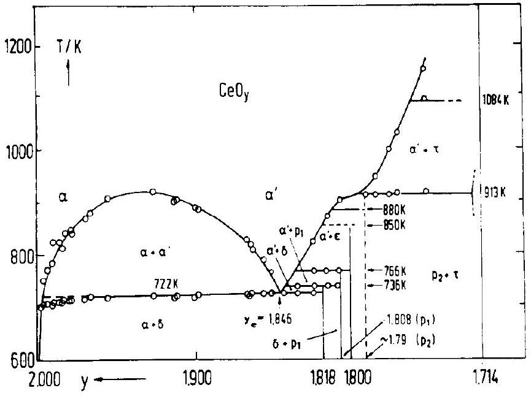
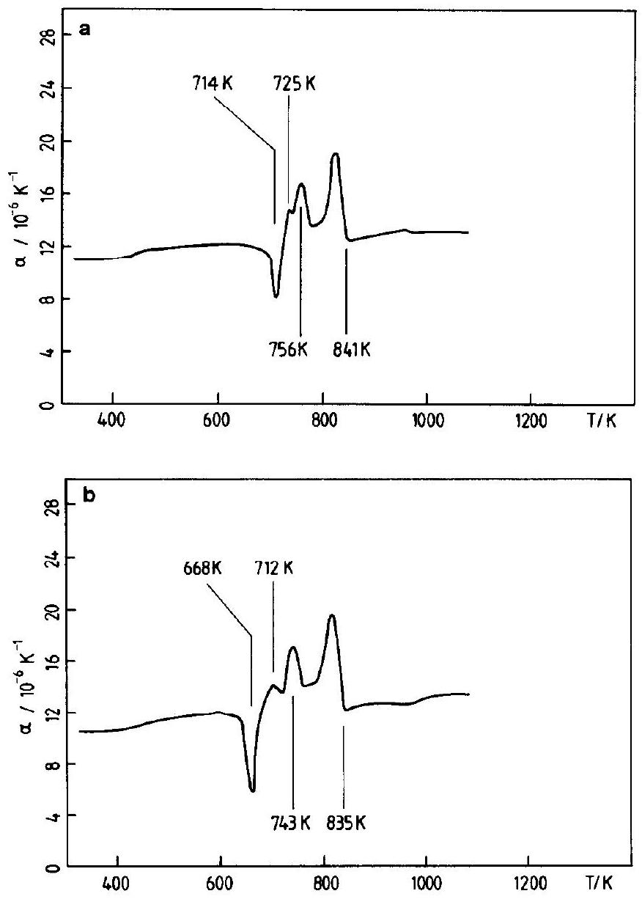
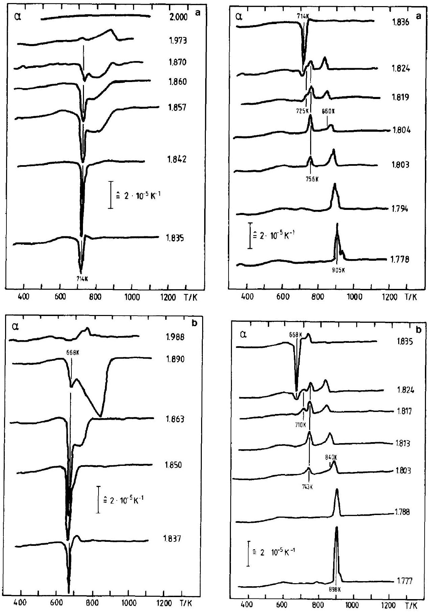
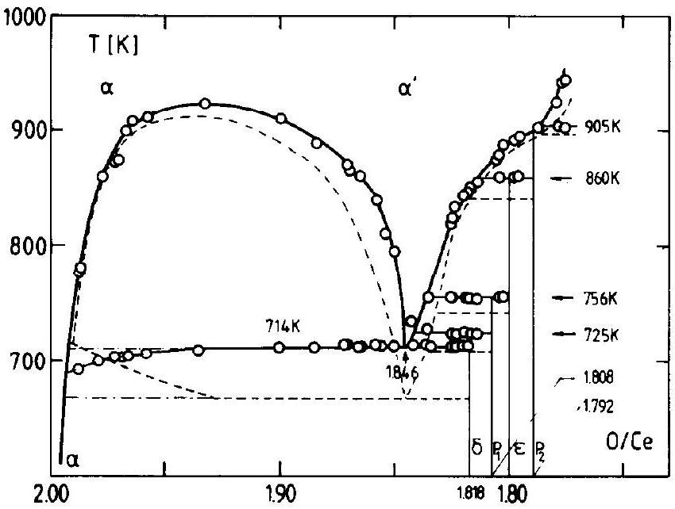
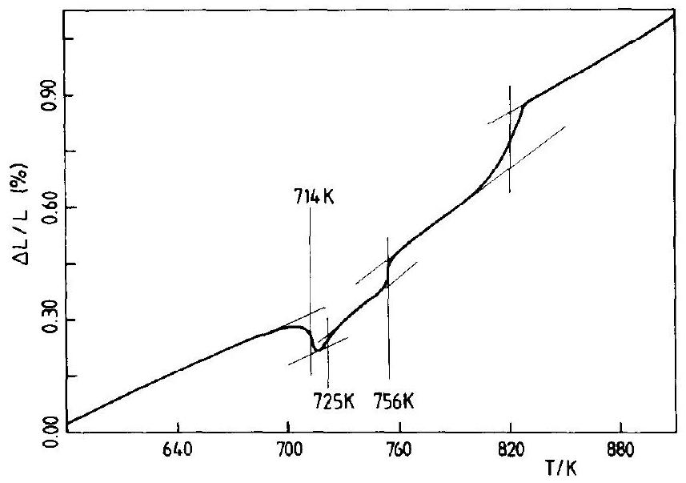
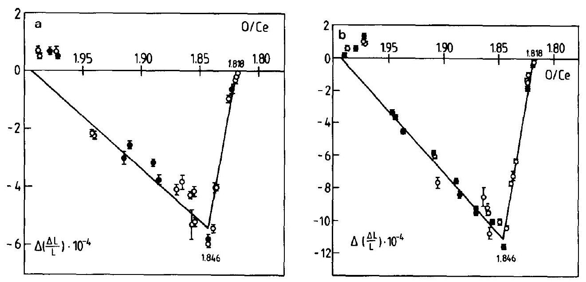

# Phase Transformations in Reduced Ceria: Determination by Thermal Expansion Measurements 

R. KÖRNER, M. RICKEN, AND J. NÖLTING Department of Physical Chemistry, Goettingen University, and SFB-126 of Goettingen-Clausthal, 6 Tammann Str., D-3400 Goettingen, Federal Republic of Germany

and I. RIESS Department of Physics, Technion, IIT, Haifa 32000, Israel

Received February 23, 1988; in revised form September 6, 1988

#### Abstract

Phase transitions in reduced ceria ( $\mathrm{CeO}_{2-x}$ ) due to solid-state reactions yield a complex phase diagram. Associated with these transformations is a change in molar volume of the sample. For certain mixtures of coexisting phases internal stress develops and the sample is not in true equilibrium. As a result, the molar volume of the phase under pressure is reduced. Experimental and theoretical evaluations confirm the phase diagram determined before by specific heat measurements. New data collected concerning the local pressure effect enabled the development of a more detailed explanation of this deviation from equilibrium. © 1989 Academic Press, Inc.

## 1. Introduction

Under ambient conditions cerium forms two oxides, $\mathrm{CeO}_{2}$ and $\mathrm{Ce}_{2} \mathrm{O}_{3}$, incorporating the $\mathrm{Ce}^{4+}$ and $\mathrm{Ce}^{3+}$ ions, respectively. Under reducing atmosphere conditions and at elevated temperatures $\mathrm{CeO}_{2}$ can be reduced to nonstoichiometric compositions, $\mathrm{CeO}_{y}$, with $2>y>1.5$. For $T>921 \mathrm{~K}, 2>y>$ 1.818, a single $\alpha$ phase exists for which $y$ may have a continuum of values (Fig. 1). At low temperatures, $T<722 \mathrm{~K}, \mathrm{CeO}_{y}$ forms a discrete set of composition ( $I-3$ ). Similar phases were observed in the oxides $\mathrm{PrO}_{y}$ and $\mathrm{TbO}_{y}$ (4). In the nonstoichiometric phase, $\mathrm{Ce}^{4+}$ and $\mathrm{Ce}^{3+}$ ions coexist. Under an oxidization atmosphere these compounds are unstable and oxidize to form 0022-4596/89 \$3.00
$\mathrm{CeO}_{2}$. The oxidation rate above $40^{\circ} \mathrm{C}$ in air is high.

The structures of reduced ceria phases were investigated by X-ray diffraction, (5, 6), neutron diffraction (6), and electron microscopy (7). Thermogravimetric (1), conductivity (8), Seebeck (8), EMF (9), and heat of oxygen solution (10) measurements revealed some of the thermodynamic properties of reduced ceria.

We have investigated the nonstoichiometric phases of $\mathrm{CeO}_{y}$, using specific heat, EMF, dilatometry, and X-ray diffraction measurements. The phase diagram and thermodynamic properties obtained from specific heat measurements for the composition range $2>y>1.714$ were reported before (2, 3) (see Fig. 1). Coulometric tita-

FIG. 1. Phase diagram of $\mathrm{CeO}_{y}$ determined from specific heat measurements (Refs. (2, 3)).

tion was used to induce a finely controlled reduction of $\mathrm{CeO}_{2}$ within the $\alpha$ phase, to compositions of $\mathrm{CeO}_{y}$ with $2>y>1.99$, i.e., within the dilute concentration limit. From EMF versus composition measurements, the defects in $\mathrm{CeO}_{2-x}$ were determined to be doubly ionized oxygen vacancies, $V_{\mathrm{O}}^{\prime \prime}(11)$.

The purpose of the present work was to determine the transformation temperatures of $\mathrm{CeO}_{y}$ for different compositions, $y$, by a method independent of the specific heat. This was done to verify the plurality and values of the transformation temperatures measured by the $C_{p}$ method ( 2,3 ) which were quite different from those measured by other methods (5-10). The measurements of thermal expansion of $\mathrm{CeO}_{y}$ were chosen for that purpose. Another purpose of this work was to follow the transformation temperatures both on heating and on cooling. It should be noted that in the specific heat measurements, using an adiabatic calorimeter, data were collected only on heating. A third purpose was to investigate a supposedly nonequilibrium state of the solid. The specific heat measurements (Fig. 1) reveal a decrease in the temperature of the transformation $\alpha+\delta \rightarrow \alpha+\alpha_{e}^{\prime}$ (at $\sim 722$
K) for compositions with $y$ close to 2 . This was assumed to be due to nonequilibrium originating from local pressure on the minority phase by the majority phase, pressure that could not relax within the time of the measurement. If that were the case then one should observe a decrease in the molar volume of the minority phase (under pressure). As $y$ deviates from 2 the fraction of the $\delta$ phase increases and the pressure on it decreases. This should manifest itself as a difference in the molar volume change of transformation for different compositions. Furthermore, a nonequilibrium behavior should be different in heating and cooling measurements.

The fourth purpose of this work was to discuss theoretical evaluations of the molar volume changes in a first-order phase transition involving three phases (e.g., $\alpha+\delta \rightarrow \alpha+\alpha_{e}^{\prime}$ ) and along a miscibility gap. A comparison with the experimental data is presented.

## 2. Overview of Method and Results

We report here on dilatometer measurements of $\mathrm{CeO}_{y}$ in the composition range $2> y>1.79$ and temperature range $1200>T>$

320 K . The oxide was reduced in situ. The length of the sintered sample was followed as the temperature was scanned continuously, both on heating and on cooling. Detailed information along constant $y$ lines in the $y, T$ plane, from which the phase diagram of the $\mathrm{Ce}-\mathrm{O}$ system could be determined, confirmed the diagram obtained from specific heat measurements (3) except for small differences in the value of the various transformation temperatures. This assists our previous conclusion that the phase diagram is more complex than that given by Bevan and Kordis (1). In particular, phases outside the homologous series $\mathrm{Ce}_{n} \mathrm{O}_{2 n-2}$, as well as other phase transformation temperatures, have been observed.
The thermal expansion measurement for compositions $2 \geq y \geq 1.96$ support the model of local excessive pressure on the minority ( $\delta$ ) phase and a decrease in the molar volume of the compressed $\delta$ phase. This pressure also lowers the transformation temperature observed on heating, for the $\alpha+\delta \rightarrow \alpha+\alpha_{c}^{\prime}$ transformation. The excessive pressure disappears above the transformation due to a decrease in the free molar volume of the phases.

## 3. Experimental

### 3.1 Dilatometer

The length variation of the $\mathrm{CeO}_{y}$ sample was followed by a push rod dilatometer using a differential transformer as the monitoring device (model: TMA 500 Heraeus, Hannau). The temperature of the transformer region was stabilized to room temperature by circulating water. The sample holder and push rod were made of quartz. The dilatometer was contained in a gastight envelope and the atmosphere at the sample could be controlled.

Special features were added to allow in situ changes in the composition of the sample. The envelope was modified to enable
continuous flushing of the sample by a controlled atmosphere. A gas system was used which transported either purified Ar or a controlled mixture of $\mathrm{H}_{2} / \mathrm{H}_{2} \mathrm{O}$. The temperature of the sample could be varied continuously up to 1300 K . The temperature was measured by a $\mathrm{Pt}-\mathrm{Pt} 10 \% \mathrm{Rh}$ thermocouple with an accuracy of 1 K and a sensitivity of $25-50 \mathrm{mK}$. Care was taken to minimize the exposure of the thermocouple to the $\mathrm{H}_{2}$ / $\mathrm{H}_{2} \mathrm{O}$ atmosphere as this had an adverse effect on the accuracy of the thermocouple to the order of a few degrees K .

### 3.2 Sample Preparation

Ceria powder 99.95 by Koch-Light and 99.9\% by Venton ${ }^{1}$ was mixed with stearic acid (as lubricant), pressed at 1500 bars, heated at a rate of $2^{\circ} \mathrm{C} / \mathrm{min}$, sintered at 1450 for 4 hr , and cooled at a rate of $1^{\circ} \mathrm{C} / \mathrm{min}$. Density of the samples was $95 \pm 1 \%$ of theoretical. They had a cylindrical shape with a diameter of 8 mm and a height of $10-15$ mm.

A sample was placed in the dilatometer and reduced by flushing with a controlled mixture of $\mathrm{H}_{2} / \mathrm{H}_{2} \mathrm{O}$ until equilibrium was reached. Equilibration was followed by the dilatometer. Equilibrium was assumed to have been reached when the length of the sample was constant for more than 5 hr . Thereafter, the $\mathrm{H}_{2} / \mathrm{H}_{2} \mathrm{O}$ mixture was replaced by purified $\operatorname{Ar}\left(P\left(\mathrm{O}_{2}\right)<10^{-19} \mathrm{~atm}\right)$ and the sample was annealed for $6-12 \mathrm{hr}$ at the elevated temperature before starting the measurement.

The oxygen partial pressure $P\left(\mathrm{O}_{2}, T\right)$ determined by the $\mathrm{H}_{2} / \mathrm{H}_{2} \mathrm{O}$ mixture at elevated temperatures is well documented. A relation between sample composition y in $\mathrm{CeO}_{y}$ and $P\left(\mathrm{O}_{2}, T\right)$ was obtained from Bevan and Kordis (1) and Campserveux and

[^0]Gerdanian (12). The accuracy of $y$ determined in this way is $\sim 0.01$. In determining the phase diagram by specific heat ( $C_{p}$ ) measurement we were able to determine the composition $y$ to a better accuracy of $\sim 0.001$ by direct weighing. We therefore used this $C_{p}$ phase diagram for calibration, for accurately determining the composition of the sample in the dilatometer measurements.

### 3.3 Measurement Procedure

The sample was reduced in situ as described before. Thermal expansion mcasurements were done while the sample was flushed by purified Ar and thus oxidation or reduction of the sample should be negligible (2). Using heating and cooling rates of 22 and $73 \mathrm{~K} / \mathrm{hr}$, a single scan lasted about a day. The sample composition was found to stay unchanged within 24 hr . For longer periods a slow oxidation was detected due to oxygen introduced possibly by very small leaks. A rate of $7.3 \mathrm{~K} / \mathrm{hr}$ was also used in narrow temperature ranges, in particular, near phase transformations.

Changes in the composition were imposed by switching again to an $\mathrm{H}_{2} / \mathrm{H}_{2} \mathrm{O}$ gas mixture. The composition was changed in small steps of $\Delta y \leq 0.03$, followed always by annealing, otherwise cracks appeared in the sample, which had an adverse effect on the following measurements.

## 4. Experimental Results

### 4.1 Thermal Expansion Coefficient and the Phase Diagram of $\mathrm{CeO}_{y}$

The thermal expansion coefficient, $\alpha$, of cerium dioxide ( $y=2$ ) was first measured. The stoichiometric oxide exhibits no phase transition in the temperature range investigated. Values of $\alpha$ (Table I) are consistent with previous measurements (13-16). Figures 2 a and 2 b show the thermal expansion coefficient for an oxide of composition

TABLE I
Linear Thermal Expansion Coefficient of $\mathrm{CeO}_{2}$
| $T(\mathrm{~K})$ | $\alpha\left(10^{-6} \mathrm{~K}^{-1}\right)$ | Reference |
| :--- | :--- | :--- |
| 350 | 10.5 | Present work |
| 400 | 11.0 |  |
| 500 | 11.5 |  |
| 600 | 12.0 |  |
| 700 | 12.4 |  |
| 800 | 12.7 |  |
| 900 | 13.0 |  |
| 1000 | 13.2 |  |
| 1100 | 13.5 |  |
| 298-1273 | 12.1 | (13) |
| 413 | 10.5 | (14) |
| 1583 | 12.9 | (14) |
| 298-1273 | 11.2 | (15, 16) |

$\mathrm{CeO}_{1.824}$ as a representative example for a nonstoichiometric sample. At a three-phase transformation (e.g., $\alpha+\delta \rightarrow \alpha+\alpha_{e}^{\prime}$ ), occurring at a fixed temperature, the volume should expand or shrink abruptly and result in a positive or negative peak in $\alpha(T)$, respectively. For a continuous transformation along a miscibility gap a shoulder should be seen. Four such transformations are indicated in Figs. 2a and 2b. The transformation temperatures in the heating scan are higher than the corresponding ones for the cooling scan. The latter undercooling is seen in most measurements and is usually found in these kinds of measurements. The exception occurs for $y \gtrsim 1.96$ and is associated with nucleation and nonequilibrium effects as will be discussed later.

A selection of measurements is presented in Figs. 3a and 3b. The phase diagram derived from the dilatometer measurements (using the one in Fig. 1 as a guide for determining the exact phase compositions) is shown in Fig. 4. It is seen to be consistent with that determined by the specific heat measurements (Fig. 1). The phase diagram determined by thermal expansion measurements on cooling resembles that on heating

Fig. 2. Thermal expansion coefficient ( $\alpha$ ) vs $T$ for $\mathrm{CeO}_{1.814}$ : (a) on heating, (b) on cooling (material: from Koch-Light).

except for a shift in the apparent transformation temperatures due to undercooling. A difference of $\sim 10 \mathrm{~K}$ exists for the KochLight material between the transformation temperatures measured before by $C_{p}$ and those measured now by dilatometry while the Ventron material gave a difference of $\sim 20 \mathrm{~K}$ in the transformation temperatures. It was observed during the $C_{p}$ measurements (2) that the transformation temperature ( $T_{p h}$ ) increased by $\sim 10 \mathrm{~K}$ with time after long thermal and gas treatments. The thermocouple was automatically checked
at the end of each scan using the melting temperature of silver, thus excluding the possibility of a thermocouple-related error. The difference in $T_{p h}$ is thought to be a property of the samples, affected probably by defects. The samples that showed changes in $T_{p h}$ were repeatedly reduced and oxidized and repeatedly heated from $\sim 300$ to $\sim 1200 \mathrm{~K}$ and then cooled. This may have resulted in clustering of vacancy defects, cracking of larger crystallites into many smaller ones, and the migrations of vacancies to form pores or dislocations. This may

Fig. 3. Thermal expansion coefficient ( $\alpha$ ) vs $T$ for various deviations from stoichiometry in CeO , : (a) on heating, (b) on cooling (material: from Koch-Light).

FIG. 4. Phase diagram of $\mathrm{CeO}_{y}$ determined from thermal expansion coefficient measurements. Phase diagram determined from experimental data obtained (solid line) on heating and (dashed line) on cooling. Some experimental points $(\mathrm{O})$ arc also shown (material: from Koch-Light).

have changed the concentration of nucleation centers taking part in the transformations, and may also have affected the relaxation mechanism of internal stress thereby affecting $T_{p h}$.

To see how the phase diagram in Fig. 4 was constructed let us follow $\alpha(T)$ for $\mathrm{CeO}_{1824}$ in Fig. 2a. For $T<714 \mathrm{~K}$ the sample with composition $y=1.824$ is composed of two phases, $\alpha$ and $\delta$, the mole fraction of the $\delta$ phase being much larger than that of the $\alpha$ phase. The $\alpha+\delta \rightarrow \alpha_{e}^{\prime}+\delta$ transformation occurs at $714 \mathrm{~K}\left(\alpha_{e}^{\prime}=\alpha(1.846)\right.$, the euthectic phase). For $714<T<725 \mathrm{~K}$, the sample consists of $\alpha^{\prime}$ and $\delta$ phases. Obviously, only the analysis of a set of measurements yields this. At 725 K a transformation $\alpha^{\prime}+\delta \rightarrow \alpha^{\prime}+p_{1}$ occurs which is followed at 756 K by the transformation $\alpha^{\prime} +p_{1} \rightarrow \alpha^{\prime}+\varepsilon$. As $T$ is increased the amount of $\alpha^{\prime}$ phase increases gradually while that of the $\varepsilon$ phase decreases accordingly, until at $T \geq 841 \mathrm{~K}$ all the solid exists in the $\alpha^{\prime}$ phase only. The last gradual transformation is usually seen as a shoulder rather than a sharp peak, both in dilatometer and in specific heat measurements.

### 4.2 Volume Change during Transformation

The quantity measured by the dilatometer, the change $\delta L$ in length $L$ of the sample, reflects also the change $\delta V$ in volume ( $\delta V= 3 \delta L$ ). As the mass of the sample stays constant the measurement yields information regarding changes in the molar volume of the solid. Figure 5 shows the change in volume for the sample $\mathrm{CeO}_{1.824}$ and the manner in which the volume changes at each transformation were determined. For any given transformation the change in molar volume depends on the molar fraction of the phases involved. This dependence, theoretically, is linear in $y$ as will be shown later. Figures 6a and 6b show the relative change of sample length $\Delta L / L$ at the transformation $\alpha+\delta \rightarrow \alpha+\alpha_{e}^{\prime}$ and $\alpha+\delta \rightarrow \alpha_{e}^{\prime}+\delta$ for the composition range $2 \geq y \geq 1818$. Lines were fitted to the data based on those theoretical considerations. The peak of the triangular shape should be, and is also found, at the eutectic composition for the $\alpha+\delta \rightarrow \alpha+\alpha_{e}^{\prime}$ and $\alpha+\delta \rightarrow \alpha_{e}^{\prime}+\delta$ transformation. A roughly linear relation $\Delta L / L$ vs $y$ was ob-

Fig. 5. Changes in the volume of a $\mathrm{CeO}_{1.824}$ sample on heating. This figure shows how the change in volume at a phase transformation was determined.

served also for the transformation temperatures $T_{p h}=725 \mathrm{~K} \uparrow / 706 \mathrm{~K} \downarrow, 1.842 \geq y \geq 1.808 ; T_{p h}=756 \mathrm{~K} \uparrow / 743 \mathrm{~K} \downarrow, 1.832 \geq y \geq$ 1.800 ; and $T_{p h}=860 \mathrm{~K} \uparrow / 840 \mathrm{~K} \downarrow, 1.813 \geq y \geq 1.792$ (not shown). The change $\Delta L / L$ on heating is systematically smaller than that found on cooling as the latter occurs after undercooling. There is, however, an exception for $y \geq 1.96$ where nonequilibrium and
nucleation processes affect the sample behavior as is discussed later.

### 4.3 Thermal Expansion in the Composition Range $y \geq 1.96$

For $y>1.96$ the temperature of the $\alpha+\delta \rightarrow \alpha+\alpha_{e}^{\prime}$ transformation, which normally occurs on heating at 714 K , takes place at a lower temperature (Fig. 4). The lowering in

Fig. 6. Changes in molar volume of $\mathrm{CeO}_{y}$ vs composition for the transformation $\alpha+\delta \leftrightarrow \alpha+\alpha_{e}^{\prime}$ and $\alpha+\delta \leftrightarrow \alpha_{e}^{\prime}+\delta$ : (a) on heating, (b) on cooling (material: from Koch-Light).

the transformation temperature increases to $\sim 20 \mathrm{~K}$ as $y \rightarrow 2$. On cooling, however, the transformation for $y \approx 2$ occurs at $T_{p h} \sim$ 714 K and $T_{p h}$ decreases as $y$ decreases (see dashed curve in Fig. 4 for $T \sim 668-714 \mathrm{~K}$ ).

## 5. Discussion

### 5.1 Phase Diagram

The dilatometer measurements yield independent information on the number of transition temperatures and their values for any given composition $\mathrm{CeO}_{y}$. The composition of the sample was fixed as $T$ was scanned, but its exact value could be determined only by comparison with the $C_{p}$ measurement. With this limitation in mind the phase diagram in Fig. 4 is not independent of that in Fig. 1. However, the values and number of transformation temperatures observed in heating as well as in cooling measurements are an independent verification for those obtained before by the $C_{p}$ method.

### 5.2 Change in Molar Volume on Transformation

The determination of the volume change at a transformation typically had an uncertainty of about $10 \%$. We therefore regard the results shown in Fig. 6 as being in fair agreement with the theory to follow, with the correct trend of a maximum near the eutectic or peritectic composition and a linear dependence on composition. The theory can be adopted from that developed for the latent heat (3) by exchanging molar volume $(\bar{V}) \leftrightarrow$ for molar enthalpy $(H)$. Then (Ref. (3), Eqs. (6, 7))

$$
\begin{array}{r}
\Delta \bar{V}=\left(y_{\alpha}-y\right)\left[\frac{\bar{V}_{e}-\bar{V}_{\alpha}}{y_{\alpha}-y_{e}}+\frac{\bar{V}_{\alpha}}{y_{\alpha}}-\frac{\bar{V}_{\delta}}{y_{\delta}}\right] \\
y_{\alpha} \geq y \geq y_{e}
\end{array}
$$

and

$$
\begin{gathered}
\Delta \bar{V}=\left(y-y_{\delta}\right)\left[\frac{\bar{V}_{e}-\bar{V}_{\delta}}{y_{e}-y_{\delta}}+\frac{\bar{V}_{\delta}-\bar{V}_{\alpha}}{y_{\alpha}-y_{\delta}}\right], \\
y_{e} \geq y \geq y_{\delta}
\end{gathered}
$$

where $i=\alpha, \delta, e$ refer to the phases $\alpha, \delta$, and eutectic $(y=1.846)$ at the transformation temperature ( 714 K ); $y_{i}$ is the composition of the corresponding phase $i$. The molar volume change is seen to be linear in $y$ on both sides of the eutectic composition. Similar linear relations of $\Delta \bar{V}$ vs $y$ can be written for the other three phase transformations.

The fact that the change $\Delta \bar{V}$ is negative for $1.96>y>1.818$ indicates that (from Eq. (1a) or (1b))

$$
\frac{\bar{V}_{e}-\bar{V}_{\alpha}}{y_{\alpha}-y_{e}}<\frac{\bar{V}_{\delta}-\bar{V}_{\alpha}}{y_{\alpha}-y_{\delta}}, \Delta \bar{V}<0
$$

which can be rewritten as
$\bar{V}_{\delta}>\bar{V}_{\alpha}, \frac{y_{\alpha}-y_{\delta}}{y_{\alpha}-y_{e}}\left(\bar{V}_{e}-\bar{V}_{\alpha}\right), \quad \Delta \bar{V}<0 ;$
i.e., $\bar{V}_{\delta}$ is larger than the value one would obtain from linear extrapolation of $\bar{V}$ to $y= y_{\delta}$ using the values of $\bar{V}_{\alpha}$ and $\bar{V}_{e}$ at $y=y_{\alpha}$, $y=y_{e}$, respectively. When the peak is positive ( $\Delta \bar{V}>0$ ), $\bar{V}_{\delta}$ is smaller than the linear extrapolated value from $\bar{V}_{\alpha}$ and $\bar{V}_{e}$. The sign of $\Delta \bar{V}$ depends on the phases involved ( $\alpha, \delta, \alpha_{e}^{\prime}$ ) and is independent of their relative quantities. $\Delta \bar{V}$ should, therefore, be either positive or negative for the transformation at $T \sim 714 \mathrm{~K}$ for all relevant values of $y$. The experiments exhibit a change of sign of $\Delta \bar{V}$ near $y \sim 1.96$. We argue that in the wider composition range $1.96>y>1.818$ for which the transformation temperature is uniform ( 714 K on heating) the solid is in equilibrium. For $y>1.96$ this is not true anymore. This will be discussed in more detail in Section 5.4.

### 5.3 Transformation Along the Miscibility Gap

For sample compositions $y>1.846$ and $T >T_{p h}=714 \mathrm{~K}$ two modifications of the $\alpha$ phase denoted by $\alpha$ and $\alpha^{\prime}$ coexist. Raising the temperature induces a gradual transfor-
mation of $\alpha \rightarrow \alpha^{\prime}(y<1.94)$ or $\alpha^{\prime} \rightarrow \alpha(y>$ 1.94 ) as well as a change in the compositions of the $\alpha, \alpha^{\prime}$ phases. We denote the compositions on the miscibility gap boundary by $y^{\alpha}$ and $y^{\alpha^{\prime}}$ and the corresponding molar volumes by $\bar{V}^{\alpha}$ and $\bar{V}^{\alpha^{\prime}}$, respectively. Adopting a theoretical evaluation from $C_{p}$ (3), exchanging $\bar{V} \leftrightarrow H, \alpha(T) \leftrightarrow C_{p}$, the thermal expansion cocfficient in this $y, T$ region can be written as:

$$
\begin{gathered}
\alpha(T)=\Delta \alpha(T)+\alpha(T)_{\text {Basal }} \\
\Delta \alpha(T)=\frac{d x^{\alpha}}{d T}\left(\bar{V}^{\alpha}-\bar{V}^{\alpha^{\prime}}\right)+\left.x^{\alpha} \frac{d y^{\alpha}}{d T} \frac{\partial \bar{V}^{\alpha}}{\partial y^{\alpha}}\right|_{T} \\
+\left.\left(1-x^{\alpha}\right) \frac{\partial y^{\alpha^{\prime}}}{\partial T} \frac{\partial \bar{V}^{\alpha^{\prime}}}{\partial y^{\alpha^{\prime}}}\right|_{T},
\end{gathered}
$$

where

$$
\alpha(T)_{\text {Basal }}=\left.x^{\alpha} \frac{\partial \bar{V}^{\alpha}}{\partial T}\right|_{y^{\alpha}}+\left.\left(1-x^{\alpha}\right) \frac{\partial \bar{V}^{\alpha^{\prime}}}{\partial T}\right|_{y^{\alpha^{\prime}}}
$$

and

$$
x^{\alpha} \equiv \frac{y-y^{\alpha^{\prime}}}{y^{\alpha}-y^{\alpha^{\prime}}}
$$

Qualitatively $\alpha_{\text {Basal }}(T)$ can be viewed as the smooth basic thermal expansion coefficient of the solid on top of which modifications are added due to phase transformations. For the $\alpha$ phase $(y \approx 2) \alpha_{\text {Basal }}(T)$ coincides with $\alpha(T)$. Computer simulation of $\Delta \alpha$ yields broad peaks in the form of shoulders as seen in Fig. 3a for, e.g., $y=1.857$. However, it cannot reproduce sharper peaks seen in other measurements. We have no explanation for this deviation from theory. In the $C_{p}$ measurement on the other hand the transformation along the miscibility gap resulted always in a rather broad shoulder which could be fitted rather well by the theory (3).

It should be noted that for $y>1.94$, i.e., left of the miscibility maximum, the transformation results in a positive shoulder or
peak, whereas for $y<1.94$ the shoulder or peak is negative. This is consistent with the theory (Eq. (3b)) and is a result of the particular values of molar volumes of the $\alpha$ and $\alpha^{\prime}$ phases and the shape of the miscibility gap.

### 5.4 Nonequilibrium at Low Temperatures $(T<714 K)$ in the $2.00>y>1.96$ Composition Range

For $y>1.96, T \sim T_{p h}$, and $T<T_{p h}$ both the thermal expansion and specific heat measurements $(2,3)$ indicate that the sample is not in equilibrium. We have suggested before (from the results of $C_{p}$ measurements taken on heating only) that the minor phase ( $\alpha_{e}^{\prime}$ for $T>T_{p h}$, or $\delta$ for $T \leq \left.T_{p h}\right)$ is dispersed in the $\alpha$ matrix in the form of small crystallites that are under large local pressures. In view of the new data we can elaborate more on the possible explanation.

We discuss two possible explanations for the change in sign of $\Delta \bar{V}$ for $y \sim 1.96$.
(a) $\Delta \bar{V}$ becomes positive since the $\delta$ phase molar volume, $\bar{V}_{\delta}$, is forced to decrease under pressure. For $T>T_{p h}$ and $y>$ 1.96 let us look at a small grain of the $\alpha_{e}^{\prime}$ phase $(y=1.846)$ coexisting with the $\alpha$ phase and embedded in the $\alpha$ matrix. On cooling from the $\alpha$ phase this $\alpha_{e}^{\prime}$ grain, with a larger free molar volume than the $\alpha$ phase, was formed under excessive local pressure. This grain should transform into the $\alpha$ plus $\delta$ phases (in quantities determined by the level rule for the eutectic composition). The $\alpha$ material will join the surrounding $\alpha$ phase matrix. The $\delta$ phase ( $y =1.818$ ) contains almost $10 \%$ (ordered) oxygen vacancies and its free molar volume (under 1 atm pressure) is so large that the material should expand in this transformation as $T$ is lowered. However, for $y>1.96$ the small $\delta$ grain, embedded within the $\alpha$ phase matrix, cannot expand freely and the local pressure on it increases further. This pressure does not relax within the time
(hours) the system had been kept at $T \sim T_{p h}$ ~ 714 K . From the theory of elasticity (17) one can show that the local pressure on a small cavity containing the $\alpha_{e}^{\prime}$ or $\delta$ grain can be orders of magnitude larger than the ambient pressure.

We have estimated (3), using the Clausius-Clapeyron equation, that the local pressure is of the order of 1 kbar . Since the compressibility of $\mathrm{CeO}_{2}$ is roughly $10^{-3 /}$ kbar (18), the change in the lattice constant (5) should be $5 \times 10^{-3} \AA$ which is sufficient to explain the change in sign of $\Delta \bar{V}$.

The excessive pressure on the $\delta$ phase grain may increase on further cooling, if the thermal expansion coefficient of the $\alpha$ phase is larger than that of the $\delta$ phase (under excessive pressure). We assume that this is the case in $\mathrm{CeO}_{y}$.

For $y<1.96$ (and in particular for $y<$ 1.94) the amount of the $\alpha_{e}^{\prime}$ or $\delta$ phase is so large that it cannot be considered to be embedded within a rather rigid $\alpha$ phase matrix. The local pressure in the sample is then (roughly) equal to the ambient one.

The excessive pressure can explain the change in sign in $\Delta \bar{V}$ at $y \sim 1.96$ where the concentration of the $\alpha_{e}^{\prime}$ or $\delta$ phases falls below $\sim 1 \%$. It can also explain smearing of the shoulder (3) and the decrease of $T_{p h}$ below 714 K . It cannot explain the increase in $T_{p h}$ for $y \sim 2.00$ found on cooling. This leads us to propose a modification of the former explanation.
(b) For the compositions $y \sim 2$, the amount of $\delta$ phase formed is very small. One then assumes that there is a certain concentration of defects that can serve as nucleation centers (e.g., one per $\alpha_{e}^{\prime}$ grain). Furthermore we assume that these defects occupy a relatively large volume. On the transformation $\alpha_{e}^{\prime} \rightarrow \alpha+\delta$ these defects disappear and the total volume decreases though $\bar{V}_{\delta}$ is rather large. The transformation therefore takes place close to the "true" transformation temperature (i.e.,
the one for 1 atm pressure). $T_{p h}$ is found to be at 714 K .

If, as the amount of the $\delta$ phase increases, the concentration of nucleation centers stays constant, the $\delta$ grain must become larger and come under excessive pressure. This blocks the transformation from being completed at 714 K . As undercooling occurs other kinds of nucleation centers or processes enable the growth of the $\delta$ phase and the peak of the transformation is observed at $T_{p h}<714 \mathrm{~K}$.

For $y<1.96$ the amount of $\delta$ phase is so large that the $\alpha$ matrix cannot exert pressure on the $\delta$ phase. Thus $T_{p h} \sim 714 \mathrm{~K}$ measured on heating can be assumed to be the true transformation temperature. $T_{p h}$ measured on cooling is lower due to undercooling required by the dynamics of forming the $\delta$ phase nuclei.

For $y \sim 2, T_{p h} \sim 714 \mathrm{~K}$, on heating, $T_{p h}$ is observed to be much lower than that measured on cooling, after the sample is cooled below $\sim 670 \mathrm{~K}$. This can be understood if the small $\delta$ phase formed on cooling at $T_{p h} \sim 714 \mathrm{~K}$ comes under further excessive pressure due to a mismatch in the expansion coefficients, with that of the $\delta$ phase (under pressure) being smaller than that of the $\alpha$ phase. On heating, a certain amount of the $\delta$ phase and nearby $\alpha$ phase transform into the $\alpha_{e}^{\prime}$ phase. Under 1 atm the $\alpha_{e}^{\prime}$ phase has a smaller volume than the $\alpha+\delta$ phases forming it. Thus the transformation may relax the excessive local pressure. This enhances the nucleation of the $\alpha_{e}^{\prime}$ phase and the transformation takes place at a lower temperature, $T_{p h} \sim 690 \mathrm{~K}$.

### 5.5 The High-Temperature $(T>921 K) \alpha$ Phase

Sørensen (19) suggested the existence of phase transitions within the high-temperature $\alpha$ phase region $(T>921 \mathrm{~K}, 2.0>y>$ 1.8 ). No indication for such transforma-
tions could be observed in the thermal expansion measurements. This is in agreement with $C_{p}$ measurements in which indications for those transformations also were not observed.

### 5.6 Concluding Remarks

The dilatometer measurements were used to verify by an independent method the finding of the specific heat measurements regarding the value and multiplicity of transformation temperatures and the general shape of the phase diagram of reduced ceria. The thermal expansion measurements were done on heating as well as on cooling. The phase diagrams determined from both groups of results are similar except for a shift due to undercooling and except for a different behavior on cooling and heating when the compositions are in the range $2>y>1.96$. The latter difference was used to extend an explanation we gave before, for the behavior of samples with $y>$ 1.96 at $T<714 \mathrm{~K}$. We suggest that the sample is not in true equilibrium due to unrelaxed excessive pressure on the minority phase $\delta$.

## References

1. D. J. M. Bevan and J. Kordis, J. Inorg. Nucl. Chem. 26, 1509 (1964).
2. M. Ricken, J. Nölting, and I. Riess, J. Solid State Chem. 54, 89 (1984).
3. I. Riess, M. Ricken, and J. Nölting, J. Solid State Chem. 57, 314 (1985).
4. L. Eyring, in "Solid State Chemistry of Energy Conversion and Storage" (J. B. Goodenough and M. S. Whittingham, Eds.), Adv. Chem. Series 163, p. 240, Amer. Chem. Soc., Washington, DC (1977).
5. G. Brauer and K. Gingerich, in "Rare Earth Research" (E. V. Kieber, Ed.), p. 96, MacMillan, Lake Arrowhead, CA (1961).
6. S. P. Ray, A. S. Nowick, and D. E. Cox, J. Solid State Chem. 15, 344 (1975).
7. P. Knappe and L. Eyring, J. Solid State Chem. 58, 312 (1985).
8. H. L. Tuller and A. S. Nowick, J. Phys. Chem. Solids 38, 859 (1977).
9. F. A. Kuznetsov, V. J., Belyi, and T. N. Rezukhina, Dokl. Akad. Nauk SSR 139, 1405 (1961).
10. J. Campserveux and D. Gerdanian, J. Chem. Thermodyn. 6, 795 (1974).
11. I. Riess, H. Janczikowski, and J. Nölting, J. Appl. Phys. 61, 4931 (1987).
12. J. Campserveiux and P. Gerdanian, J. Solid State Chem. 23, 73 (1978).
13. R. L. Wilfong, L. P. Dominiques, L. R. R. Furlong, and J. A. Finlayson, "Thermal Expansion of the Oxides of Yttrium, Cerium, Samarium, Europium and Dysprosium," U.S. Bur. Mines Report, Invest. No. 6180 (1963).
14. S. Stecura and W. J. Campbell, "Thermal Expansion and Phase Inversion of Rare Earth Oxides," U.S. Bur. Mines Report, Invest. No. 5847 (1961).
15. J. R. Sims and R. N. Blumenthal, High Temp. Sci. 8, 99 (1976).
16. J. R. Sims and R. N. Blumenthal, High Temp. Sci. 8, 111 (1976).
17. L. D. Landau and E. M. Lifshitz, "Theory of Elasticity," Pergamon Press 3rd ed., p. 18. Pergamon, Elmsford, NY (1986).
18. R. K. Singii, J. Chem. Phys. 76, 2596 (1982).
19. O. T. Sørensen, in "Nonstoichiometric Oxides" (O. T. Sørensen, Ed.), p. 1, Academic Press, New York (1981).

[^0]:    ${ }^{1}$ Impurity analysis by emission spectroscopy done by KFA Jülich, indicates that the main impurities are ca 900 ppm for Koch-Light and 1500 ppm for Vetron (and various rare-earth elements at a possible similar total concentration).

