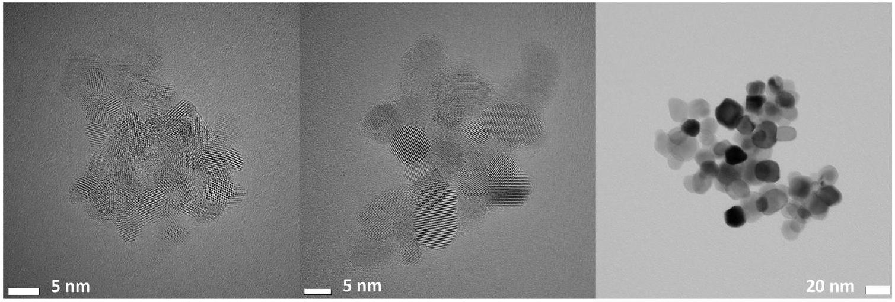
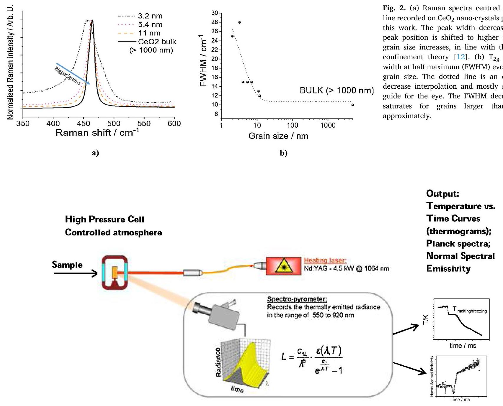
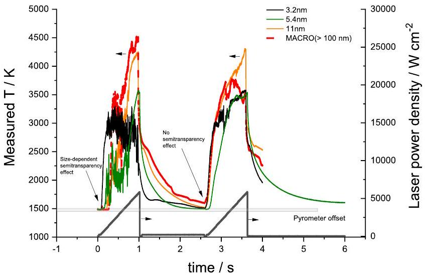
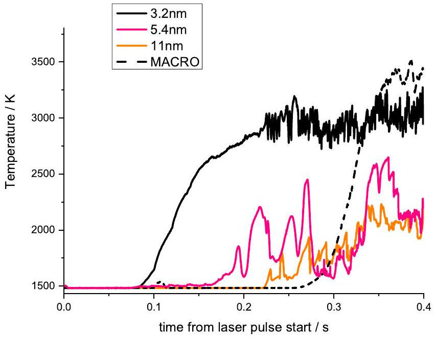
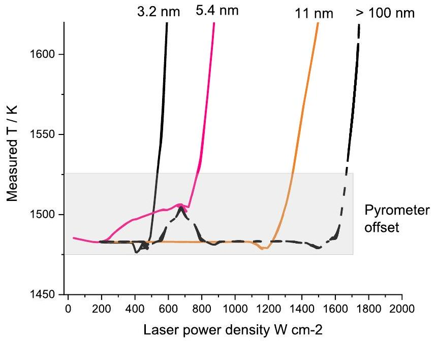
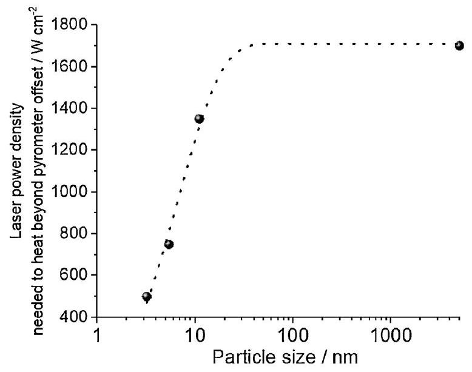
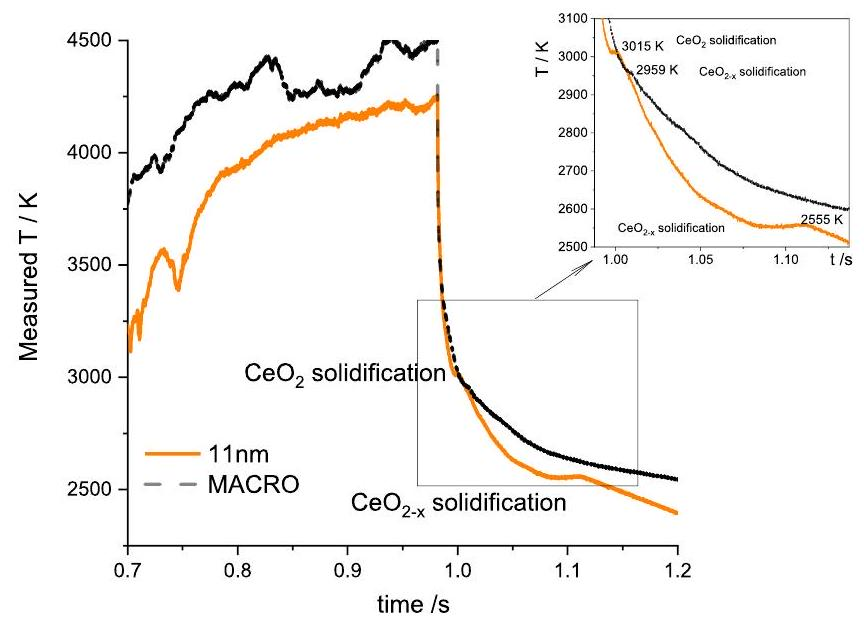
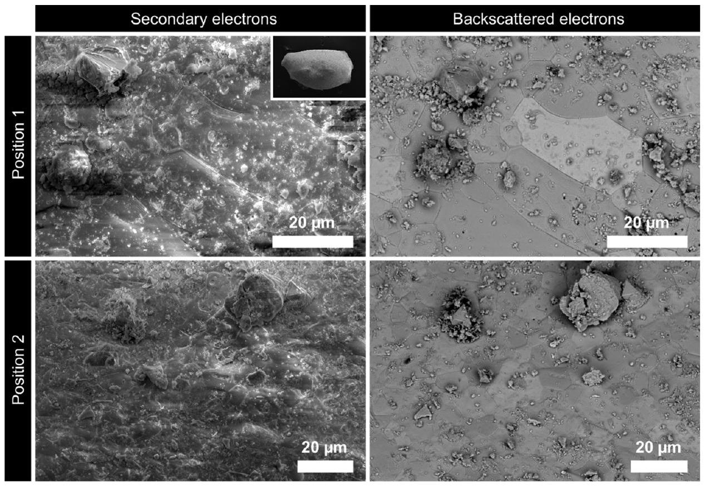
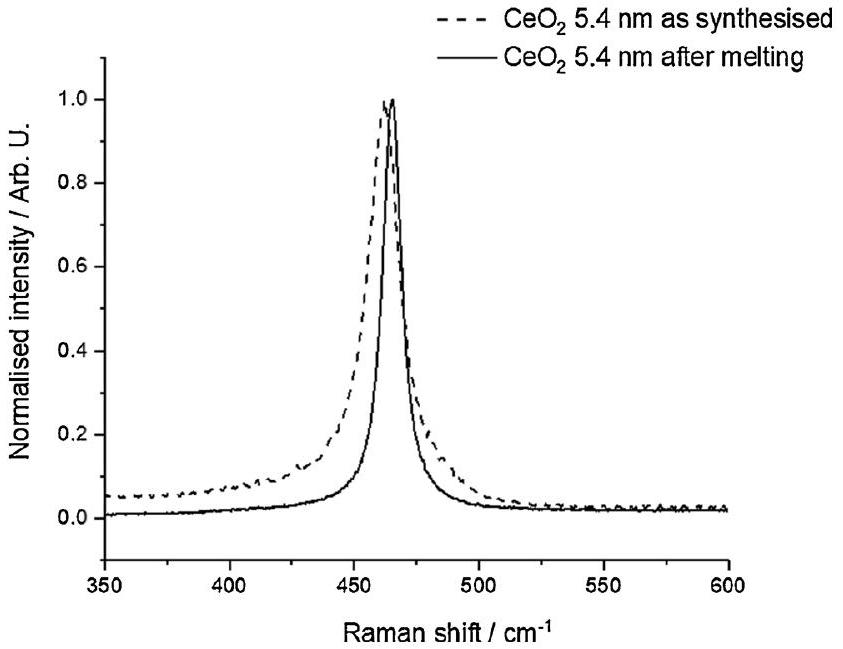

# Infrared laser absorption and melting behaviour of nano-sized cerium dioxide: A laser heating study 

D. Manara *, K. Popa, D. Robba, L. Fongaro, J.-Y. Colle, A. Bulgheroni European Commission, Joint Research Centre, Nuclear Safety and Security Directorate, P.O. Box 2340, 76125 Karlsruhe, Germany

## A R T I C L E I N F O

## Keywords:

Cerium dioxide
Laser absorption
Melting
Nano-crystallites

#### Abstract

The absorption of a 1064.5 nm Nd:YAG laser line and the consequent heating up to melting of nano-crystalline $\mathrm{CeO}_{2}$ has been studied in compressed air. The behaviour of crystallites ranging from 3.2 nm to 11 nm has been investigated and compared with micro-crystalline $\mathrm{CeO}_{2}$.

A transparent / opaque transition occurs in $\mathrm{CeO}_{2}$ at lower heating laser power density in smaller crystallite sizes. Also the melting behaviour is strongly dependent on the crystallite size. If one manages to directly melt nano-crystals by optimising the heating conditions under a suited oxygen overpressure, the resulting melt has been observed to solidify at the highest temperature so far reported for $\mathrm{CeO}_{2}(3012 \mathrm{~K})$, about 250 K higher than the temperature most commonly registered under oxidising conditions ( 2750 K ). This is attributable to the large specific surface of nano-crystals, resulting, under a high oxygen potential, in their higher stability with respect to oxygen losses.

## 1. Introduction

$\mathrm{CeO}_{2}$ has a fluorite-like crystalline structure, in which the main defects are oxygen vacancies. These vacancies increase the catalytic activity [1-3]. Its well-studied capacity to store and release oxygen finds also large application as a "three-way catalyst" in the vehicle emission gas post-treatment processes, which constitutes one of the current methods for reducing air pollution [4]. Moreover, in its nanocrystalline form, it is proposed for sorption of different ions from solutions and wastewater treatment [5].

Despite the very important applications of this material, the $\mathrm{Ce}-\mathrm{O}$ phase diagram is still a matter of discussion. The latest revision by Zinkevich et al. [6] highlighted the complexity of the hypostoichiometric $\mathrm{CeO}_{2-\mathrm{x}}$ region at low temperature, where the appearance of defects in the fluorite structure stabilises many superstructures of fluorite-type lattice. Furthermore, at high temperature, close to the melting temperature of $\mathrm{CeO}_{2}$, the refractory nature of the compound and the tendency to lose oxygen are emphasised. Experimental studies of the high-temperature behaviour of cerium dioxide have met considerable difficulties due to the high oxygen potential of this compound. Laser heating can be a good method for this kind of studies [7], as the sample can be brought to high temperature under a controlled atmosphere and
oxygen potential and exposure to high temperature can be limited to a short time, during which the chemical stability of the analysed material can be better preserved. When heating is obtained by laser irradiation, however, a further experimental difficulty can arise from the so-called "semitransparency" of $\mathrm{CeO}_{2}$, i.e. the fact that this compound is almost transparent to a broad spectrum of electromagnetic radiation at room and intermediate temperatures, whereby it becomes optically active when heated beyond, indicatively, $1200 \mathrm{~K}[8,9]$. Semitransparency is a property of cerium dioxide and other "white" oxides, such as, for example, CaO [10], $\mathrm{ZrO}_{2}$ and $\mathrm{ThO}_{2}$ [11-13].

In the present work the semi-transparent behaviour of cerium dioxide is experimentally studied by observing the absorption and consequent heating of samples with different grain sizes, during irradiation with a 1064.5 nm Nd:YAG laser. The observed dependence of the optical behaviour on the grain size is linked to the large specific surface area and the chemical reactivity at high temperature. Samples quickly heated beyond the transparent-opaque transition easily reach also the melting transition, so that the solid/liquid equilibria can be studied with the present technique. The current results help to better understand the behaviour of $\mathrm{CeO}_{2}$ at high temperature as a function of the sample specific surface area, which can be interesting for the several applications of this material.

[^0]
## 2. Materials and methods

### 2.1. Sample preparation

1M Ce(IV) solution was prepared by dissolution of diammonium cerium(IV) sulphate (Alfa Aesar, >99.99\% trace metal basis) in distilled water and directly precipitated with excess of ammonium hydroxide (Aldrich, $25 \%$ in water), to form a yellow precipitate of ceric hydroxide. This precipitate was separated by centrifugation and repeatedly washed with milli-Q water.

Hydrothermal attack was then conducted in autoclaves made of two layers: an inner Teflon ${ }^{\circledR}$ container and an external stainless steel cylinder tightly screwed. About 200 mg of ceric hydroxide and 10 ml distilled water were heated for 18 h at 493 K under autogenous pressure. After cooling down, the autoclaves were opened and the solid residue analysed by XRD using a Rigaku Miniflex 600 diffractometer to confirm the conversion of the ceric hydroxide to yellowish nanocrystals of $\mathrm{CeO}_{2}$. In order to increase the crystallites size, different amounts of $\mathrm{CeO}_{2}$ were further thermally treated for 30 min at 823 K and 923 K . Obtained results are presented in Table 1.

The grain size was estimated on the fracture surfaces micrographs with the intercept method without applying a correction factor. Transmission electron microscopy (TEM) on powders was performed using an aberration (image) corrected FEI ${ }^{\mathrm{TM}}$ Titan $80-300$ operated at 300 kV providing a nominal information limit of $0.8 \AA$ in TEM mode and a resolution of $1.4 \AA$ in scanning transmission electron microscopy (STEM) mode. TEM images have been recorded using a Gatan US1000 slow scan CCD camera, and STEM images have been recorded using a Fischione high-angle annular dark-field (HAADF) detector with a camera length of 195 mm . The samples for analysis have been prepared on carbon-coated copper grids by drop coating with a suspension of the nanoparticles in ultrapure water. TEM on the sintered material was performed using a TecnaiG2 (FEI ${ }^{\mathrm{TM}}$ ) 200 kV equipped with Gatan ${ }^{\mathrm{TM}}$ Tridiem GIF camera, and a high-angle annular dark-field (HAADF) detector for STEM imaging [14].

The $\mathrm{CeO}_{2}$ powders obtained through this method consist of soft agglomerates (Fig. 1) less than 20 \%-dispersed nanoparticles which were easily dispersed in water or ethanol. The particle size obtained by (S) TEM and Rietveld analysis are in excellent agreement to each other.

A Jobin-Yvon T64000 Raman spectrometer was employed for further characterisation of the produced $\mathrm{CeO}_{2}$ nano-crystals [15]. A single and very intense Raman peak was observed in all cases in the range between $450 \mathrm{~cm}^{-1}$ and $464 \mathrm{~cm}^{-1}$ (Fig. 2a). This peak was already attributed to the $\mathrm{T}_{2 \mathrm{~g}}$ vibrational mode of the Fm-3 m fluorite-like symmetry of $\mathrm{CeO}_{2}$ in earlier publications [16-18]. It is interesting to observe the Raman peak width and position dependence on the XRD-estimated grain size of the current $\mathrm{CeO}_{2}$ samples (Fig. 2b). The larger peak width and the red-shift of the peak maximum in small grains can be attributed to a phonon confinement effect as well as to the superposition of surface vibrations and oxygen vacancies [12]. The $\mathrm{T}_{2 g}$ peak full width at half maximum (FWHM) evolution with respect to the grain size is reported in Fig. 2b. Experimental data have been fitted with a first-approximation exponential decrease function (dotted line), which mostly serves as a guide for the eye. It can be appreciated that the FWHM decrease

Table 1
XRD characterisation of the $\mathrm{CeO}_{2} \mathrm{NC}$ 's. The particle sizes were calculated from the XRD data base each on the full width at half maximum for six selected peaks in the $2 \theta$ range between $25^{\circ}$ and $80^{\circ}$.
| Process | Temperature, K | Crystallite size, nm | Lattice parameter, Å |
| :--- | :--- | :--- | :--- |
| Hydrothermal attack | 493 | $3.2 \pm 0.4$ | 5.410(3) |
| Thermal treatment | 823   923 | $5.4 \pm 0.5$   $11.6 \pm 0.7$ | 5.411(1)   5.411(1) |

saturates for grains larger than 20 nm approximately. The analysis of the present Raman $\mathrm{T}_{2 \mathrm{~g}}$ mode dependence on grain size is somewhat qualitative, nonetheless, it is useful to quickly estimate the local grain growth on the laser-heated spots. This approach had been already successfully used by Cappia et al. for the study of laser-heated ThO2 nano-crystallites [12].

X-Ray Absorption characterisation of the so-produced particles (not reported in this paper) ensured that the valence IV of Ce was maintained in all the current samples at room temperature, independently of the particle size [19].

### 2.2. Laser heating technique

The technique employed is laser heating coupled with fast pyrometry [20]. This technique has already been applied to the study of many radioactive and non-radioactive refractory materials [7,10-12].

An overview of the experimental set-up is shown in Fig. 3.
The sample is mounted in a small autoclave closed by a 10 mm -thick gas-proof quartz window and is held in place by three or four graphite screws to obtain quasi-containerless conditions in order to reduce or avoid interaction with the containment. With this facility, during the laser heating experiments, samples are held under a slight overpressure (up to 0.3 MPa ) of a controlled atmosphere. The chemical environment (reducing, oxidizing) can thus be imposed for each test, while overpressure is needed in order to slow the vaporization kinetics and avoid massive vaporization from the sample surface following the very fast heating process. In the current experiments, strongly oxidizing conditions were produced by filling the autoclave with compressed air.

The heating agent is a Nd:YAG 4.5 kW laser radiating at 1064 nm , coupled to the experimental cell with optical fibers. The laser beam impinged on the sample surface on an approximately circular area of 6 mm in diameter. The thermal analysis was performed on the cooling stage of the cycle after switching off the laser beam.

The sample radiance temperature was measured on a spot of 0.5 mm in diameter at the centre of the laser-heated area by means of a fast pyrometer equipped with a logarithmic amplifier (settling time of about $10 \mu \mathrm{~s}$ to $1 \%$ of log output) and operating at 650 nm [20]. To obtain the true temperature a spectro-pyrometer is employed to calculate the Normal Spectral Emissivity (NSE). The spectro-pyrometer, based on a linear array of 256 Si photodiodes, was used to record the sample thermal radiance in the range $488 \mathrm{~nm}-1011 \mathrm{~nm}$. This instrument allows a more complete spectral analysis, whereby its main disadvantage is in the poorer time resolution (one spectrum per millisecond at best). Due to low signal-to-noise ratio, moreover, only the range of $550-920 \mathrm{~nm}$ was useful for the current measurements. Radiance spectra recorded on $\mathrm{CeO}_{2}$ in the vicinity of the melting/solidification point were fitted by least-squares regression to Planck's distribution law for blackbody radiance, modified by a wavelength- and temperature-dependent function assumed to represent the NSE. Although this approach has been proven to be numerically unstable [21], it can be reasonably trusted in electrically insulating materials, like cerium dioxide at high temperature, for which the NSE can be assumed to be wavelength independent (grey body behaviour). Based on the current analysis, a value of NSE $=$ 0.9 has been used in the present experimental campaign. More details about the technique employed are discussed elsewhere [20].

Compared to other techniques, employing a high power laser has the advantage of shortening the time of the experiments and thus reducing vaporization and chemical instability of the compounds.

### 2.3. Uncertainty analysis

The most significant uncertainty sources have been combined, according to the independent error propagation law [11] and expanded to yield relative temperature uncertainty bands corresponding to 2 standard deviation ( $\mathrm{k}=2$ coverage factor). These uncertainty components stem from our current temperature scale definition $\delta T$ (i.e. the

Fig. 1. TEM images of the initial ceria nanoparticles having an average size of 3.2 nm (left) and 5.4 nm (centre) and STEM image of the 11.6 nm -average sized particles (right).

Fig. 3. Schematic of the laser-heating set-up used in this work.

uncertainty in the pyrometer calibration), the NSE assessment $\delta T_{\varepsilon \lambda}$ and the experimental data scatter on the current phase transition radiance temperature data $\delta T_{\lambda \mathrm{m}}$, the latter being the main source of uncertainty:

$$
\delta T_{m}=\sqrt{\delta T^{2}+\delta T_{\varepsilon \lambda}^{2}+\delta T_{\lambda m}^{2}}
$$

The resulting uncertainty is of the order of 30 K at 3000 K . More
accurate uncertainty values are reported for each measurement in this work.

## 3. Results

### 3.1. Laser irradiation and heating

Fig. 4 reports the temperature vs. time curves. The reported experiments are quite challenging. In fact, the laser effect on the sample should be high enough as to increase the particle temperature despite the intrinsic transparency (close to $100 \%$ ) of $\mathrm{CeO}_{2}$ at room temperature. Therefore, the laser power density should be large enough to heat up the material considering that only a tiny fraction of it (around $10 \%$ ) is absorbed at temperatures below the transparent / opaque transition. On the other hand, once the temperature rises beyond the optical transition, around $90 \%$ of the impinging power is suddenly absorbed, which causes an abrupt and uncontrollable further temperature increase. Such a temperature increase can amount to several thousand K , and can result in the sample destruction. The laser power-versus-time profile needs therefore to be set-up with particular care, in order to obtain significant temperature-versus-time curves (thermograms). Moreover, the current laser heating experiments must be short enough to preserve as much as possible the sub-micrometric size of the material particles up to their melting point. The typical duration of a laser heating cycle was therefore limited to approximately 1 s . These time constraints hindered the use of an electronic feedback system to automatically adjust the laser power to the actual sample temperature rate, which dramatically changes at the optical transition temperature. The optimum laser power versus time profile was therefore determined by trial and error. Contrary to what one may expect, the best results, reported in Fig. 4 for different $\mathrm{CeO}_{2}$ particle sizes, were obtained with a laser power ramp, where the power density delivered to the sample gradually increases with time. This approach allowed the sample to be heated beyond the optical transition temperature with just the needed laser power, and then up to melting with increasingly higher power. The thermograms reported in Fig. 4 are rather noisy especially in the high temperature parts. This is due to the swift temperature increase (several thousand K in a fraction of a second) and the consequent fast vaporisation and partial disruption. Nonetheless, the samples for which results are reported in Fig. 4 could be successfully melted and let cool again below the optical transition temperature. An additional laser pulse could then be applied in most cases. This additional laser pulse permitted to observe a different behaviour in samples melted and refrozen when they were heated again. In fact, one can notice that in correspondence of the first laser pulse the sample temperature only increases beyond the pyrometer offset temperature (around 1500 K with the current calibration) after a certain time interval, during which the laser seems to have no effect on the sample temperature. Such a behaviour is clearer when observed in the

Fig. 4. Laser heating experiments performed on $\mathrm{CeO}_{2}$ samples having different grain sizes. The coloured curves are thermograms recorded by a fast pyrometer. The dark grey bottom curve represent the laser power pulses heating the samples.

plot enlargements reported in Figs. 5 and 6 and in the general trend plotted in Fig. 7. Such a delay in the temperature increase is obviously linked to the transparent / opaque transition in $\mathrm{CeO}_{2}$. Interestingly, the temperature plots show that it is dependent on the particle size. This point is crucial to the discussion reported in the next section. In correspondence of the second laser pulse, applied to a sample already melted and refrozen, it is much harder to notice any such temperature rise delay. In some cases, this can be due to the fact that the temperature was not decreased below the optical transition point. In general, the altered nature of the sample certainly plays an important role in particular a higher defect concentration in quenched samples.

As for the high-temperature behaviour of the investigated samples, one can notice that the smallest-grain samples ( 3.2 nm and 5.4 nm ) produce very noisy signals, which parallel the massive vaporisation effect observed in these cases characterised by a large specific surface. For the larger grains ( 11 nm and macro, i.e. $>100 \mathrm{~nm}$ ), the temperature signal was clean enough to permit a rough, but significant thermal analysis and melting/freezing temperature determination (Fig. 8). It can be noticed, in particular, that solidification arrests occur on the cooling side of the thermograms, showing that the first solid/liquid phase transition takes place at higher temperature in nano-sized $\mathrm{CeO}_{2}$. In the $\mathrm{CeO}_{2}$ sample having an average grain size of 11 nm , the first solid-liquid transition causes a clear thermal arrest at 3012 K , over 50 K higher than the slight inflection observed in the thermogram recorded on macrograined $\mathrm{CeO}_{2}$. A second transition is clearly observed in the $11-\mathrm{nm}$ grain sized $\mathrm{CeO}_{2}$ around 2560 K , where hardly any inflection can be seen in that temperature range for macro-grained $\mathrm{CeO}_{2}$.

### 3.2. Post-melting sample characterization

Laser heating tests were essentially destructive for the current nanograined samples. Nano-crystallites were mostly vaporised or agglomerated into bulky grains. Therefore, only very limited post-melting material analysis was possible on the current materials.

Scanning electron microscopy (FEI Quattro) and Raman microscopy were useful in observing the morphology of melted and re-solidified grains and the agglomeration degree of laser-irradiated nano-crystals. Fig. 9 shows some of the SEM images of the $5.4-\mathrm{nm}$ grains agglomerated after laser melting. Two different approaches were used: secondary electrons are more used to obtained higher resolution morphological information, while backscatter electrons, thanks to their intrinsic crystal orientation contrast, allow a more precise identification of the grain boundaries thus an estimation of the grain size. The panel in Fig. 9 presents both secondary and backscatter electron images for two

Fig. 5. Temperature increase onset on the first laser shots in $\mathrm{CeO}_{2}$ samples having different grain sizes.

Fig. 6. Zoom on temperature increase onset on the first laser shots in $\mathrm{CeO}_{2}$ samples having different grain sizes, highlighting the different laser power values at which the pyrometer offset level is overcome.

Fig. 7. The power density values at which the pyrometer offset level is overcome, as a function of $\mathrm{CeO}_{2}$ particle size. The dotted line is an exponential-grow interpolation of the experimental data and serves as a guide for the eye.

Fig. 8. Thermograms showing melting and freezing of $11-\mathrm{nm}$ and over $100-\mathrm{nm}$ sized $\mathrm{CeO}_{2}$ particle samples.

different positions from the analysed fragment, shown in the inset. Fig. 10 shows the $\mathrm{T}_{2 \mathrm{~g}}$ Raman peaks of the same material ( $5.4 \mathrm{~nm} \mathrm{CeO}_{2}$ ) before and after laser melting. One can relate the peak position and, especially, the peak width difference to the FWHM grain size dependence previously studied and reported in Fig. 2b. One can thus conclude that nano-grains re-solidify into larger grains after laser melting, as expected. Raman spectroscopy only permits, based on the calibration curve of Fig. 2b, to infer that the typical size of resolidified grains is beyond several tens of nm . The SEM analysis is more accurate in this sense, and shows that in the refrozen sample most of the laser-melted material volume re-solidifies into large refrozen grains sizing between $10 \mu \mathrm{~m}$ and $20 \mu \mathrm{~m}$. Such grains coexist with smaller agglomerate, often sub-micrometric. The surface of the larger grain is far from being flat, indeed a rounded structure is visible very likely a consequence of the fast cooling down.

## 4. Discussion

The semi-transparent behaviour of the current $\mathrm{CeO}_{2}$ samples at 1064.5 nm can be analysed based on the temperature ramps observed upon absorption of the high-power Nd:YAG laser pulses. Figs. 4-7 clearly show that identical laser pulses lead to shifted temperature ramps in samples having different grain sizes. A clear trend can be observed, that smaller grains (in the nm range) heat up earlier, i.e. they absorb more promptly the laser radiation. This behaviour can be related to the larger fraction of grain surface area in smaller grains or, more generally, to the larger concentration of defects in the material. The easier radiation absorption in samples displaying a larger surface fraction leads to consider that photons are largely absorbed in typical surface defects, like Schottky defects in the oxygen sublattice. The energy of the current laser photons ( 1.163 eV ) is clearly smaller than typical Schottky defect formation energies calculated in $\mathrm{CeO}_{2}$ (estimated to be around $2 \mathrm{eV} /$ defect [22]). It is possible, however, that such an energy become considerably smaller in small grains, where the migration of entire dioxide units towards the surface is energetically less demanding. The migration of a $\mathrm{CeO}_{2}$ unit can also be related to the formation of new surface, which is a side effect of Schottky defects in small grains. The surface energy in $\mathrm{CeO}_{2}$ has been recently measured to be $1.2 \mathrm{~J} / \mathrm{m}^{3}$ [23]. This value corresponds to $75 \mathrm{meV} / \AA^{2}$, i.e. it would reasonably compare with the current photon energy in the hypothesis that each photon would induce the creation of a $\mathrm{CeO}_{2}$-unit equivalent surface of approximately $4 \AA$ by $4 \AA$, which is a similar process as the creation of a Schottky defect. This interpretation is consistent with the fact that the valence $4^{+}$of Ce is maintained in all the investigated samples, independently of the grain size [19], i.e. defects created by the larger specific surface should not imply any relevant changes in the [O]/[Ce] ratio.

Another important aspect is the evolution of the recorded thermograms beyond the solid/liquid equilibrium, in the few cases for which such an observation was actually possible, like the example reported in Fig. 8 for $11-\mathrm{nm}$ grained $\mathrm{CeO}_{2}$ versus macro-grained $\mathrm{CeO}_{2}$. It appears from the thermograms that the melt formed from nano-crystals under the current oxygen overpressure solidifies at higher temperature ( 3012 $\mathrm{K})$. This temperature is astonishingly close to the one suggested in the assessment performed by Zinkevich [6] for the congruent melting of stoichiometric $\mathrm{CeO}_{2.00}$. It is about 250 K higher than the solidification temperature most commonly registered for ceria under oxidising conditions ( 2750 K ). This is most probably due to the large specific surface of nano-crystals, resulting in a higher reactivity towards the excess oxygen contained in the atmosphere and a consequently increased stability under a high oxygen potential. The liquid produced from nano-crystals under a high oxygen potential is thus extremely rich in oxygen and solidifies into nearly stoichiometric ceria $\mathrm{CeO}_{2.00}$, freezing at higher temperatures than hypostoichiometric ceria $\mathrm{CeO}_{2-\mathrm{x}}$. $\mathrm{CeO}_{2-\mathrm{x}}$ is indeed a more common form of this compound at temperatures higher than 2000 K [6]. According to the Ce-O phase diagram optimisation proposed by Zinchevich, the lower-temperature thermal arrest displayed in the

Fig. 9. Results of the SEM analysis on the 5.4 nm CeO 2 after the laser melting. Two different positions of the analysed fragment (inset) are shown and both secondary and backscattered electrons are presented. While secondary electrons are more suitable for the identification of morphological details, the backscatter electrons are preferable for the identification of grain boundaries thus for the estimation of the grain size.

Fig. 10. The $\mathrm{T}_{2 \mathrm{~g}}$ Raman peaks of the same material ( $5.4 \mathrm{~nm} \mathrm{CeO}_{2}$ ) before and after laser melting. One can relate the peak position and the peak width difference to the FWHM grain size dependence.

$11-\mathrm{nm} \mathrm{CeO} \mathrm{O}_{2}$ thermogram can certainly be ascribed to the solidification of another cerium oxide with $\mathrm{O} / \mathrm{Ce}$ ratio $<2$, rather than a solidus or eutectic point.

The present results highlight the grain-size dependence of cerium dioxide behaviour, not only under normal operating conditions, but also at very high temperatures, up to the melting point.

## 5. Conclusions

The behaviour of cerium dioxide nano-crystallites under intense laser irradiation at 1064.5 nm has been experimentally studied in this work, and compared with the behaviour of crystallites of the same materials but having average diameter larger than $1 \mu \mathrm{~m}$. Several interesting effects have been observed, which can be summarised in the
following points:

- Smaller grains absorb laser radiation more promptly than larger grains do. A proposed interpretation of this effect is based on the formation of Schottky defects upon interaction between the nearinfrared photons and the ceria particles. The so- called "semi-transparency" effect is hardly observed in nanometric crystallites, whereas it is obvious in micrometric ones.
- A melting/solidification point was successfully recorded in crystallites of average size 11 nm and in micrometric crystallites. Smaller crystallites were quickly dispersed and vaporised under laser irradiation, due to the fast and large temperature increase, reaching rates of several thousands of K per second. The solidification temperature of nanometric crystallites ( 3012 K ) is higher than the one observed for micrometric crystallites under the same oxygen-rich atmosphere. This effect suggests that smaller crystallites, characterised by a larger surface area, more promptly interact with the excess oxygen contained in the experimental atmosphere, which prevents their fast reduction to lower-melting $\mathrm{CeO}_{2-\mathrm{x}}$.

The present results confirm the important effect of the surface area in ceria crystallites both concerning their optical properties and chemical reactivity.

## Data availability

The raw/processed data required to reproduce these findings cannot be shared at this time as the data also forms part of an ongoing study.

## Declaration of Competing Interest

The authors declare that they have no known competing financial interests or personal relationships that could have appeared to influence the work reported in this paper.

## Acknowledgements

The Authors are indebted to R. Konings (JRC Karlsruhe), M. Cologna (JRC Karlsuhe) and Y. Drossinos (JRC Ispra) for their precious advice. They sincerely thank H. Störmer (KIT Karlsruhe) for the transmission electron microscope images that she provided.

## References

[1] A. Trovarelli, Catalytic properties of Ceria and $\mathrm{CeO}_{2}$-containing materials, Catal. Rev. 38 (1996) 439, https://doi.org/10.1080/01614949608006464.
[2] G. Vilé, B. Bridier, J. Wichert, J. Perez-Ramirez, Ceria in hydrogenation catalysis: high selectivity in the conversion of alkynes to olefins, Angew. Chem. Int. 51 (2012) 8620, https://doi.org/10.1002/anie.201203675.
[3] H. Yokokawa, N. Sakai, T. Horita, K. Yamaji, Y.-P. Xiong, Roles of Ceria in SOFC electrode reactions, Fuel Chem. Div. Preprints 47 (2) (2002) 501-502 (Published by American Chemical Society, Fuel Chemistry Division).
[4] T. Masui, T. Ozaki, K. Machida, G. Adachi, Preparation of ceria-zirconia subcatalysts for automotive exhaust cleaning, J. Alloys and Compounds 303 (2000) 49-55, https://doi.org/10.1016/S0925-8388(00)00603-4.
[5] Xiangtao Wang, Yifei Guo, Li Yang, Meihua Han, Jing Zhao, Xiaoliang Cheng, Nanomaterials as sorbents to remove heavy metal ions in wastewater treatment, J. Environ. Anal. Toxicol. 2 (2012) 1541-1547, https://doi.org/10.4172/21610525.1000154.
[6] M. Zinkevich, D. Djurovic, F. Aldinger, Sol. Stat. Ion, Thermodyn. Modell. Cerium-Oxygen Syst. 177 (2006) 989-1001, https://doi.org/10.1016/j. ssi.2006.02.044.
[7] L. Capriotti, A. Quaini, R. Böhler, K. Boboridis, L. Luzzi, D. Manara, A laser heating study of the $\mathrm{CeO}_{2}$ solid/liquid transition: challenges related to a refractory compound with a very high oxygen pressure, High Temp. - High Press. 4 (2014) 69-82.
[8] R.D. Robinson, J.E. Spanier, F. Zhang, S.-W. Chan, I.P. Herman, Visible thermal emission from sub-band-gap laser excited cerium dioxide particles, J. Appl. Phys. 92 (2002) 1936-1941, https://doi.org/10.1063/1.1494130.
[9] Mawlood Maajal Ali, Hadeel Salih Mahdi, Azra Parveena, Ameer Azam, Optical Properties of Cerium Oxide (CeO2) Nanoparticles Synthesized by Hydroxide Mediated Method AIP Conference Proceedings 1953 (2018), 030044, https://doi. org/10.1063/1.5032379.
[10] D. Manara, R. Böhler, L. Capriotti, A. Quaini, Z. Bao, K. Boboridis, L. Luzzi, A. Janssen, P. Pöml, R. Eloirdi, R.J.M. Konings, On the melting behaviour of calcium monoxide under different atmospheres: a laser heating study, J. Eur. Ceram. Soc. 34 (2014) 1623-1636, https://doi.org/10.1016/j. jeurceramsoc.2013.12.018.
[11] R. Böhler, A. Quaini, L. Capriotti, P. Çakir, O. Beneš, K. Boboridis, A. Guiot, L. Luzzi, R.J.M. Konings, D. Manara, The solidification behaviour of the $\mathrm{UO}_{2}-\mathrm{ThO}_{2}$ system in a laser heating study, J. Alloys. Compd. 616 (2014) 5-13, https://doi. org/10.1016/j.jallcom.2014.07.055.
[12] F. Cappia, D. Hudry, E. Courtois, A. Janßen, L. Luzzi, R.J.M. Konings, D. Manara, High-temperature and melting behaviour of nanocrystalline refractory compounds: an experimental approach applied to thorium dioxide, Mater. Res. Express 1 (2014), 025034, https://doi.org/10.1088/2053-1591/1/2/025034.
[13] E. Hashem, A. Seibert, J.-F. Vigier, M. Naji, S. Mastromarino, A. Ciccioli, D. Manara, Solid-liquid equilibria in the $\mathrm{ThO}_{2}-\mathrm{ZrO}_{2}$ system: an experimental study, J. Nucl. Phys. Mater. Sci. Radiat. Appl. 521 (2019) 99-108, https://doi.org/ 10.1016/j.jnucmat.2019.04.035.
[14] E. De Bona, O. Walter, H. Störmer, T. Wiss, G. Baldinozzi, M. Cologna, K. Popa, Synthesis of nanostructured ThO2 pellets, J. Am. Ceram. Soc. 102 (2019) 3814-3818, https://doi.org/10.1111/jace.16375.
[15] M. Naji, J.Y. Colle, O. Benes, M. Sierig, J. Rautio, P. Lajarge, D. Manara, An original approach for Raman spectroscopy analysis of radioactive materials and its application to americium-containing samples, J. Raman Spectrosc. 46 (2015) 750-756, https://doi.org/10.1002/jrs.4716.
[16] T. Shimanouchi, M. Tsuboi, T. Miyazawa, Optically active lattice vibrations as treated by the GFMatrix method, J. Chem. Phys. 35 (1961) 1597, https://doi.org/ 10.1063/1.1732116.
[17] V.C. Keramidas, W.B. White, Raman spectra of oxides with the fluorite structure, J. Chem. Phys. 59 (1973) 1561, https://doi.org/10.1063/1.1680227.
[18] G.M. Begun, R.G. Haire, W.R. Wilmarth, J.R. Peterson, Raman spectra of some actinide dioxides and of $\mathrm{EuF}_{2}$, J. Less Common Met. 162 (1990) 129, https://doi. org/10.1016/0022-5088(90)90465-V.
[19] D. Prieur, W. Bonani, K. Popa, O. Walter, K.W. Kriegsman, M.H. Engelhard, X. Guo, R. Eloirdi, T. Gouder, A. Beck, T. Vitova, A.C. Scheinost, K. Kvashnina, P. Martin, Size dependence of lattice parameter and electronic structure in CeO 2 nanoparticles, Inorg. Chem. 59 (2020) 5760-5767, https://doi.org/10.1021/acs. inorgchem.0c00506.
[20] D. Manara, L. Soldi, S. Mastromarino, K. Boboridis, D. Robba, L. Vlahovic, R. Konings, Laser-heating and radiance spectrometry for the study of nuclear materials in conditions simulating a nuclear power plant accident (2017), J. Vis. Exp. (130) (2017), e54807, https://doi.org/10.3791/54807.
[21] G. Neuer, L. Fiessler, M. Groll, E. Schreiber, Critical analysis of the different methods of multiwavelength pyrometry, in: J.F. Schooley (Ed.), Temperature: Its Measurement and Control in Science and Industry, vol. 6, AIP, New York, 1992, pp. 787-789.
[22] T. Lekoko, T. Mosuang, E. Rammutla, Molecular dynamics studies of Schottky and Frenkel defects in cerium dioxide, in: Proceedings of SAIP2015, SA Institute of Physics, 2015, pp. 522-526. ISBN: 978-0-620-70714-70715.
[23] S. Hayun, S.V. Ushakov, A. Navrotsky, Direct measurement of surface energy of $\mathrm{CeO}_{2}$ by differential scanning calorimetry, J. Am. Ceram. Soc. 94 (2011) 3679-3682, https://doi.org/10.1111/j.1551-2916.2011.04843.x.

[^0]:    * Corresponding Author. Current address at: European Commission, Joint Research Centre (JRC) JRC.C. 4 - Sustainable Transport Unit, Via Enrico Fermi, 2749 I 21027 Ispra VA, Italy.

    E-mail address: dario.manara@ec.europa.eu (D. Manara).

