# Electron-phonon coupling in semiconductors at high electronic temperatures 

Nikita Medvedev • ${ }^{*}$ Institute of Physics, Czech Academy of Sciences, Na Slovance 2, 18221 Prague 8, Czech Republic and Institute of Plasma Physics, Czech Academy of Sciences, Za Slovankou 3, 18200 Prague 8, Czech Republic

(Received 25 July 2023; revised 27 September 2023; accepted 9 October 2023; published 23 October 2023)

#### Abstract

A nonperturbative dynamical coupling approach based on tight-binding molecular dynamics is used to evaluate the electron-ion (electron-phonon) coupling parameter in irradiated semiconductors as a function of the electronic temperature up to $\sim 25000 \mathrm{~K}$. The method accounts for arbitrary electronic distribution function via the Boltzmann equation, enabling a comparative analysis of various models: fully equilibrium electronic distribution, band-resolved local equilibria (distinct temperatures and chemical potentials of electrons in the valence and the conduction band), and a full nonequilibrium distribution. It is demonstrated that the nonequilibrium produces the electron-phonon coupling parameter different by at most $\sim 35 \%$ from its equilibrium counterpart for identical deposited energy density, allowing us to use the coupling parameter as a function of the single electronic equivalent (or kinetic) temperature. The following 14 semiconductors are studied here: group IV: Si , Ge, SiC; group III-V: AlAs, AlP, GaP, GaAs, GaSb; oxides: $\mathrm{ZnO}, \mathrm{TiO}_{2}, \mathrm{Cu}_{2} \mathrm{O}$; layered $\mathrm{PbI}_{2} ; \mathrm{ZnS}$ and $\mathrm{B}_{4} \mathrm{C}$.

DOI: 10.1103/PhysRevB.108.144305

## I. INTRODUCTION

Treatments of semiconductors with laser irradiation are used in various technological applications, such as the production of nanochips, designing their properties, and micromachining [1-6], along with basic research [7,8]. Irradiation of semiconductors with ultrafast powerful pulses potentially enables atomic-scale control of the material modifications on the surface [6,9].

The most commonly used theory of the material response to laser irradiation is the two-temperature model (TTM) [10-12], which describes the electronic and the atomic systems of the material as separate systems each in the local thermal equilibrium state with distinct temperatures. Such a description is most suitable for metals but poses a number of challenges for band-gap materials (semiconductors and insulators) [12]. In these kinds of materials, the electronic ensemble is separated into two parts: valence-band and conduction-band electrons, each possessing different properties. This complicates the description of the electronic ensemble with a single thermodynamical equation used in the TTM.

More advanced models exist to describe insulators' and semiconductors' response to irradiation, which treat the valence- and the conduction-band electrons separately: fully nonequilibrium simulation techniques (e.g., based on the Boltzmann equation [13,14]), models assuming separate local equilibria in the valence and the conduction band (e.g., the socalled $n$ TTM model [15,16], or the three-temperature model, 3TM [17,18]).

In all such models, the key parameter governing the energy exchange between the electronic and the atomic ensemble is the electron-phonon coupling parameter. The standard theory of calculation of the coupling parameter-the Eliashberg

[^0]spectral function formalism [19]—cannot straightforwardly be applied to band-gap materials but requires a careful treatment of the density of states around the Fermi level. Often, the coupling parameter is used as a fitting parameter in attempts to reproduce the observable material damage in a simulation [20]. Thus, methods evaluating the electron-phonon coupling parameter at high electronic temperatures are in high demand. Obtaining the coupling parameters for commonly used semiconductors should enable the application of models without adjustable parameters to better understand and control the processes involved in ultrafast irradiation. To do so, the problem of the electronic nonequilibrium induced by the presence of the band gap should be considered. Namely, the influence of the possible nonequilibrium electronic distribution function on the coupling parameter should be elucidated.

Here, a recently developed method based on a hybrid model combining the Boltzmann equation with the tightbinding molecular dynamics simulation is used to nonperturbatively calculate the electron-phonon coupling parameter in a wide range of semiconductors [21,22]. The dynamical coupling method treats the nonadiabatic response of the electronic populations to arbitrary atomic displacements, thereby enabling the evaluation of the coupling between the two systems. Most importantly, the methodology allows us to evaluate the influence of the nonequilibrium electronic distribution function on the coupling parameter.

## II. MODEL

For evaluation of the electron-ion (electron-phonon) coupling parameter, XTANT-3 code is used [23]. It combines (i) a Monte Carlo (MC) model for photoabsorption and nonequilibrium kinetics of high-energy electrons; (ii) Boltzmann equation (BE) describing the low-energy electron (populating the valence band and the bottom of the conduction band) evolution on the transient band structure; (iii) a transferable tight
binding (TB) for a description of the transient band structure and the interatomic potential; and (iv) molecular dynamics (MD) simulation for propagation of atomic trajectories. It has been previously applied for the evaluation of the coupling parameters in metals in the case of electronic equilibrium [21]. To apply it to semiconductors, it has been extended to include electronic nonequilibrium and various limiting cases of possible thermalization. To this end, the evolution of the electronic distribution function is modeled with the Boltzmann equation including the collision integrals [22]:

$$
\frac{d f_{e}\left(\varepsilon_{i}, t\right)}{d t}=I_{e-e}+I_{e-i}+I_{\mathrm{MC}} .
$$

The distribution function $f_{e}$ describes the fractional electron populations on the transient electronic energy levels [molecular orbitals, $\varepsilon_{i}=\left\langle\psi_{i}(t)\right| H\left|\psi_{i}(t)\right\rangle$, with $H$ being the TB Hamiltonian dependent on the positions of all the atoms in the simulation box]; $I_{e-e}$ is the electron-electron scattering integral; $I_{e-i}$ is the electron-ion (electron-phonon) collision integral; and $I_{\mathrm{MC}}$ is the source term responsible for the photoabsorption and interaction with the high-energy electrons, if any [22].

The electron-electron thermalization is described with the help of the relaxation time approximation [22]:

$$
I_{e-e}=-\frac{f_{e}\left(\varepsilon_{i}, t\right)-f_{\mathrm{eq}}\left(\varepsilon_{i}, \mu, T_{e}, t\right)}{\tau_{e-e}} .
$$

with $\tau_{e-e}$ the characteristic global electron relaxation time; $f_{\text {eq }}\left(\varepsilon_{i}, \mu, T_{e}, t\right)$ is the equivalent equilibrium Fermi-Dirac distribution with the same total number of (low-energy) electrons $\left(n_{e}\right)$ and energy content ( $E_{e}$ ) as in the transient nonequilibrium distribution:

$$
\begin{aligned}
n_{e} & =\sum f_{e}\left(\varepsilon_{i}, t\right)=\sum f_{\mathrm{eq}}\left(\varepsilon_{i}, \mu, T_{e}, t\right) \\
E_{e} & =\sum \varepsilon_{i} f_{e}\left(\varepsilon_{i}, t\right)=\sum \varepsilon_{i} f_{\mathrm{eq}}\left(\varepsilon_{i}, \mu, T_{e}, t\right) .
\end{aligned}
$$

Equations (3) define the equivalent electronic temperature (also called the kinetic temperature, $\left.T_{e}[24]\right)$ and the equivalent chemical potential ( $\mu$ ) [22]. The same Eqs. (2) and (3) can be used separately for the electrons in the valence and the conduction band, with their own thermalization times, thereby allowing for separate partial thermalizations of the electronic fractions [18].

The choice of a constant thermalization time is but a simple approximation. The characteristic relaxation time may depend on the transient state of the system (e.g., on the energy pumped, electronic energy level, particular material structure, etc.). Moreover, instead of the relaxation time approximation, it is in principle possible to use more advanced methods, such as electron-electron Boltzmann scattering integrals [12]. Such improvements of the model are beyond the scope of the present work, and may be studied in future dedicated research.

Despite this simplicity of the electronic relaxation model, the choice of the thermalization times automatically reproduces various limiting cases: setting the global thermalization time $\tau_{e-e} \rightarrow 0$ makes the instantaneously globally thermalized electronic ensemble, thus reducing the model to the two-temperature-based (TTM) TBMD; setting separate valence- and conduction-band thermalization times $\tau_{e-e,\{v, c\}} \rightarrow 0$ creates two electronic ensembles thermalized at their own chemical potentials and temperatures restoring the three-temperature model, 3TM; using finite thermalization times (either global or band-resolved partial) produces a nonequilibrium electronic ensemble. This flexibility allows us to study various cases and the influence of the model approximation for the electronic distribution on the coupling parameter. Further on, the electronic temperature wherever used is the equivalent (or kinetic) temperature defined by Eqs. (3).

The electron-phonon coupling is extracted from the Boltzmann collision integral [21]:

$$
I_{e-i}^{i j}=w_{i j}\left\{\begin{array}{ll}
f_{e}\left(E_{j}\right)\left(2-f_{e}\left(E_{i}\right)\right) e^{-E_{i j} / T_{a}}-f_{e}\left(E_{i}\right)\left(2-f_{e}\left(E_{j}\right)\right), & \text { for } i>j \\
f_{e}\left(E_{j}\right)\left(2-f_{e}\left(E_{i}\right)\right)-f_{e}\left(E_{i}\right)\left(2-f_{e}\left(E_{j}\right)\right) e^{-E_{j i} / T_{a}}, & \text { for } i<j
\end{array} .\right.
$$

Here $E_{i j}=E_{i}-E_{j}$ is the difference between the energies of the two levels; $T_{a}$ is the kinetic atomic temperature in the Maxwellian distribution; and $w_{i j}$ is the rate of electron transitions triggered by atomic motion approximated in the dynamical coupling formalism as [21]

$$
w_{i j} \approx \frac{4 e}{\hbar \delta t^{2}} \sum_{\alpha, \beta}\left|c_{i, \alpha}(t) c_{j, \beta}\left(t_{0}\right) S_{i, j}\right|^{2},
$$

where the wave functions $\psi(t)$ are calculated on two consecutive steps in the molecular dynamics simulation, $t_{0}$ and $t=t_{0}+\delta t$, to obtain $c_{i, \alpha}$, the coefficients in the linear combination of atomic orbitals basis set within the TB Hamiltonian $\left(\psi_{i}=\sum_{\alpha} c_{i, \alpha} \varphi_{\alpha}\right) ; S_{\alpha, \beta}$ is the TB overlap matrix, $e$ is the electron charge, and $\hbar$ is Planck's constant.

The electron-phonon coupling parameter is then calculated from the electron-ion collision integral [21]:

$$
G\left(T_{e}, T_{a}\right)=\frac{1}{V\left(T_{e}-T_{a}\right)} \sum_{i, j} E_{i} I_{e-a}^{i j} .
$$

Here $V$ is the volume of the simulation box; again, $T_{e}$ denotes the equivalent (kinetic) electronic temperature, thereby defining the coupling parameter for nonequilibrium electronic distributions in a generalized way allowing for a meaningful comparison between equilibrium and various nonequilibrium scenarios. In the equilibrium case, it naturally reduces to the thermodynamic temperature, restoring the standard definition.

Following the previous work on metals [21], for each material, ten XTANT-3 simulations are run with different initial conditions and parameters of irradiation (various pulse
durations and deposited doses), to obtain reliable averaged results reducing the influence of statistical fluctuations [25]. The methodology follows the kinetics in the simulation box in time while increasing the electronic temperature, thus extracting the dependency of the dynamically calculated coupling on the kinetic electronic temperature.

Depending on the duration of the increase of the electronic temperature, we may include or exclude the nonthermal effects: atomic acceleration due to the changes in the interatomic potential caused by the electronic excitation [26]. The most famous effect is the so-called nonthermal melting, in which the atomic lattice destabilizes directly due to the electronic excitation, before any significant electron-phonon coupling [27,28]. This is a distinct channel from the electronphonon coupling and thus should be treated separately from the coupling parameter, as will be discussed below [26].

The model of the evolution of the nonequilibrium electron distribution, and the atomic response induced, was validated against experimental data on the emission spectra showing a reasonable agreement [22]. The nonequilibrium also affects other derivative values, such as the damage threshold of the materials, which may be compared with experiments, however, reliable conclusions require more experimental data [22].

In all the simulations, an NVE (microcanonical) ensemble was used with periodic boundary conditions and an MD time step of 0.1 fs with the Martyna-Tuckerman fourth-order algorithm [29], and 10000 MC iterations were used for reliable statistics. A temporally Gaussian laser pulse was used for irradiation.

Additionally, the electronic heat capacity is calculated as follows:

$$
C_{e}\left(T_{e}\right)=\frac{1}{V} \sum_{i} \frac{\partial f_{e}\left(E_{i}\right)}{\partial T_{e}}\left[E_{i}-\mu\left(T_{e}\right)\right]
$$

where for the calculation of the derivative $\partial f_{e}\left(E_{i}\right) / \partial T_{e}$, the derivative of the equivalent electronic chemical potential by the electronic kinetic temperature $\partial \mu\left(T_{e}\right) / \partial T_{e}$ is calculated numerically [30].

## III. RESULTS

## A. Effect of nonequilibrium electron distribution on the electron-phonon coupling in semiconductors

Let us start by analyzing the influence of the possible nonequilibrium state on the electron-phonon coupling parameter on the example of GaAs (Molteni et al.'s TB parametrization is used [31,32], with 216 atoms in the simulation box). A set of simulations were performed: a full nonequilibrium simulation with a finite thermalization time of 10 and 100 fs , a full equilibrium one (full instantaneous thermalization), and a few simulations with band-resolved partial thermalization for the cases of irradiation with various photon energies (the three-temperature model). The last point is necessary for the demonstration of possible effects of the particular excitation scenarios since different photon energies create excited electron ensembles with different energy densities in the separate bands: initially, a single photoelectron is emitted with energy dependent on the

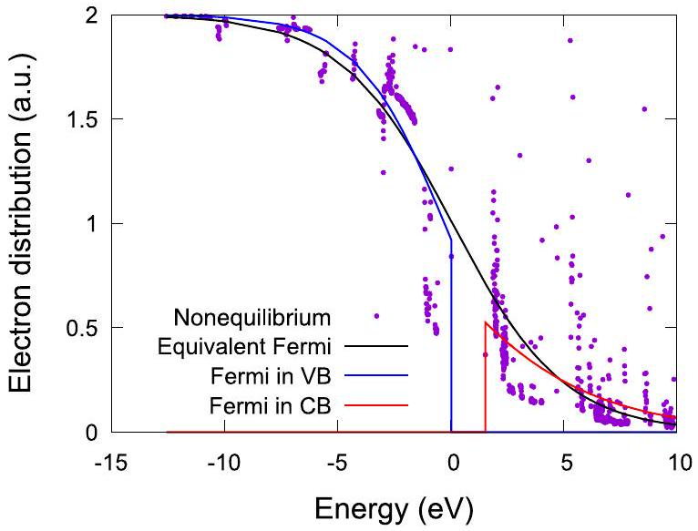
FIG. 1. Example of various approximations for the electronic distribution function in GaAs 10 fs after deposition of the dose of $4 \mathrm{eV} /$ atom with the photon energy of 3 eV . The full nonequilibrium distribution is shown with circles, the separate equivalent Fermi distributions for the valence-band (VB) and conduction-band (CB) fractions of electrons, and the full equilibrium equivalent Fermi distributions are shown.

photon energy, which then may thermalize inside the conduction band to create different states of the excited electron ensembles.

Examples of the electronic distribution functions for the same system are displayed in Fig. 1. In this figure, GaAs was excited with the laser pulse of 10 fs full width at half maximum duration and 3 eV photon energy and the deposited dose of 4 eV /atom. The electronic distribution may be noticeably different within different approximations, however, it is $a$ priori unclear how it will affect thermodynamical parameters such as the electron-phonon coupling.

The electron-phonon coupling parameter as a function of the equivalent (kinetic) temperature for this set of simulations is shown in Fig. 2. One can see that nonequilibrium affects the coupling parameter only to a relatively small degree: the full nonequilibrium distribution deviates from the equilibrium value maximum by $\sim 35 \%$ (below the equilibrium value), and by about the same amount for 3 - and $6-\mathrm{eV}$ photons within the 3TM approximation (separate thermalization of the valence and the conduction band; the curves above the equilibrium one). For other studied photon energies, the deviation is even smaller.

It seems to be a typical case that the nonequilibrium electron distribution produces lower coupling than the equilibrium one because the distribution, even though it has certain spikes, also has many almost unperturbed parts in between them which cannot participate efficiently in the energy exchange with the atoms/phonons [22,33]. In contrast, partial thermalization may have higher coupling than the full equilibrium one, because, for the same amount of the energy content in the electronic ensemble, either of the bands may have a significantly higher temperature than the equivalent fully equilibrated one, thus increasing the coupling (e.g., in Fig. 1, the fully equilibrium equivalent temperature is $T_{e}=28500 \mathrm{~K}$, whereas the partial equivalent temperatures are in the va-

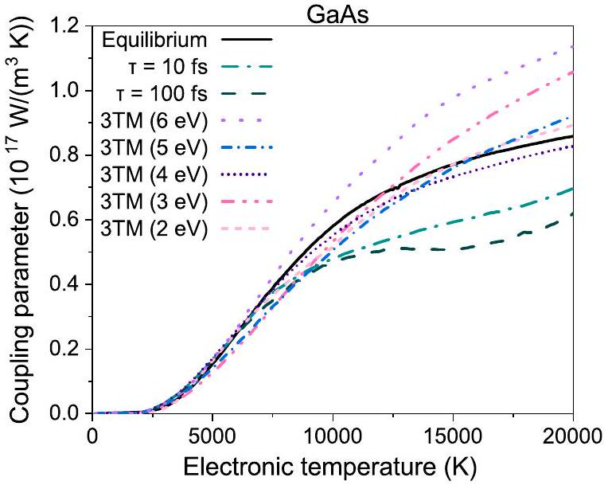
FIG. 2. Electron-phonon coupling in GaAs in various approximations: fully equilibrium, nonequilibrium with the thermalization times of 10 and 100 fs, and band-resolved thermalizations (3TM) for the cases of various photon energies of the irradiating laser pulse. In all cases, the equivalent (kinetic) temperature [Eqs. (3)] is used for the $X$ axis.

lence band $T_{e, v}=22500 \mathrm{~K}$ and in the conduction band $T_{e, c}=$ 42600 K ). In most cases, however, the deviation is rather small.

The physical scenario, realized in experiments, is typically starting with a full nonequilibrium distribution, which then partially thermalizes separately within the bands typically on femtosecond time scales. After that, the interband thermalization takes place, whose speed depends on the excitation level-the more electrons are excited, the faster they thermalize via the impact ionization and three-body recombination processes. It is expected to take place on the scale of a few tens to a few hundreds of femtoseconds. During those not fully equilibrated stages, the coupling parameter may deviate from the equilibrium one, but only within the range of some $35 \%$. Thus, in most of the cases, the equilibrium value of the

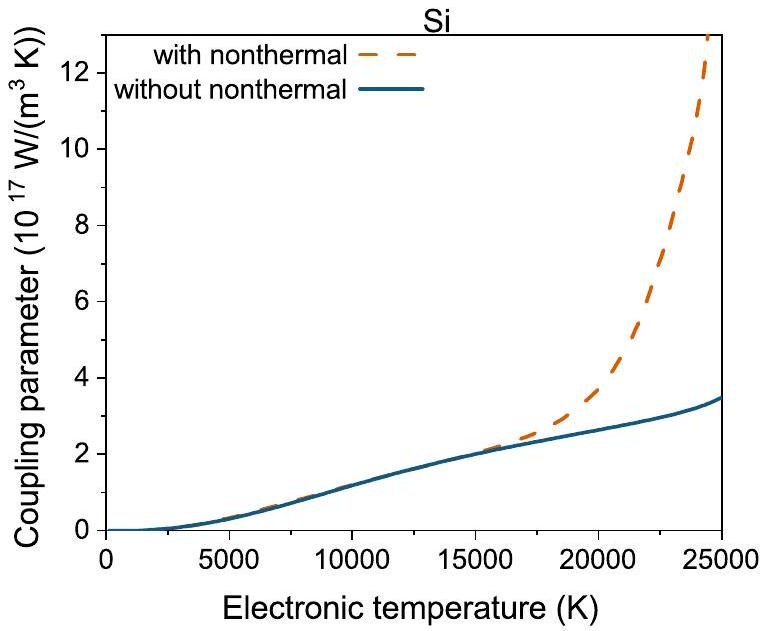
FIG. 3. Electron-phonon coupling in Si for the cases of including the effects of nonthermal atomic acceleration (as reported in Ref. [21]), and excluding it.

electron-phonon coupling parameter may be reliably used in models, as the function of the equivalent (kinetic) electron temperature.

We will proceed with the calculation of the electronphonon coupling assuming full electronic equilibration in the sections below.

## B. Nonthermal effects on the electron-phonon coupling in semiconductors

Apart from the nonequilibrium effects, it is also important to keep in mind that covalent materials have another channel of the electron-ion energy exchange: nonthermal changes in the interatomic potential, which may accelerate the atoms [26]. This effect is most prominent at the deposited doses above the nonthermal damage threshold. At below (but close to) the threshold doses, this effect is known as the displacive excitation of coherent phonons; at above the threshold doses, it is known as nonthermal melting. This effect takes place even without any contribution from the electron-phonon energy exchange-it is an adiabatic effect. However, nonadiabatic effects can create synergy with the nonthermal ones, as discussed, e.g., in Ref. [26]. Nonthermal acceleration of atoms increases the atomic temperature extremely fast. The electronphonon coupling parameter nearly linearly depends on the atomic temperature [21]-thus, nonthermal acceleration also increases the coupling parameter. In turn, it heats the atoms

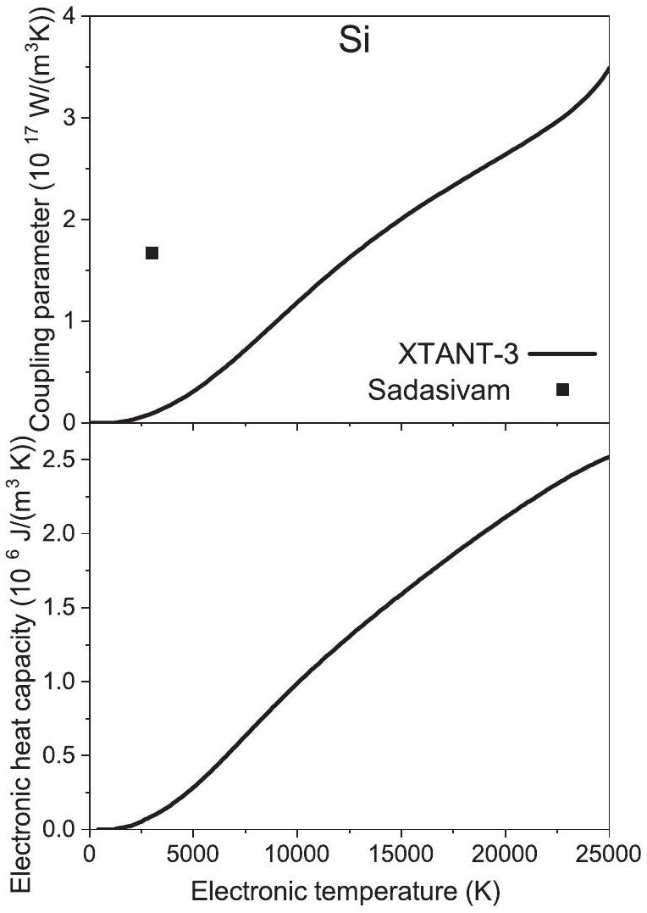
FIG. 4. Top panel: electron-phonon coupling. Bottom panel: electronic heat capacity in Si . Coupling parameter estimated from the relaxation time calculated by Sadasivam et al. is shown for comparison for $T_{e}=3000 \mathrm{~K}$ [39].

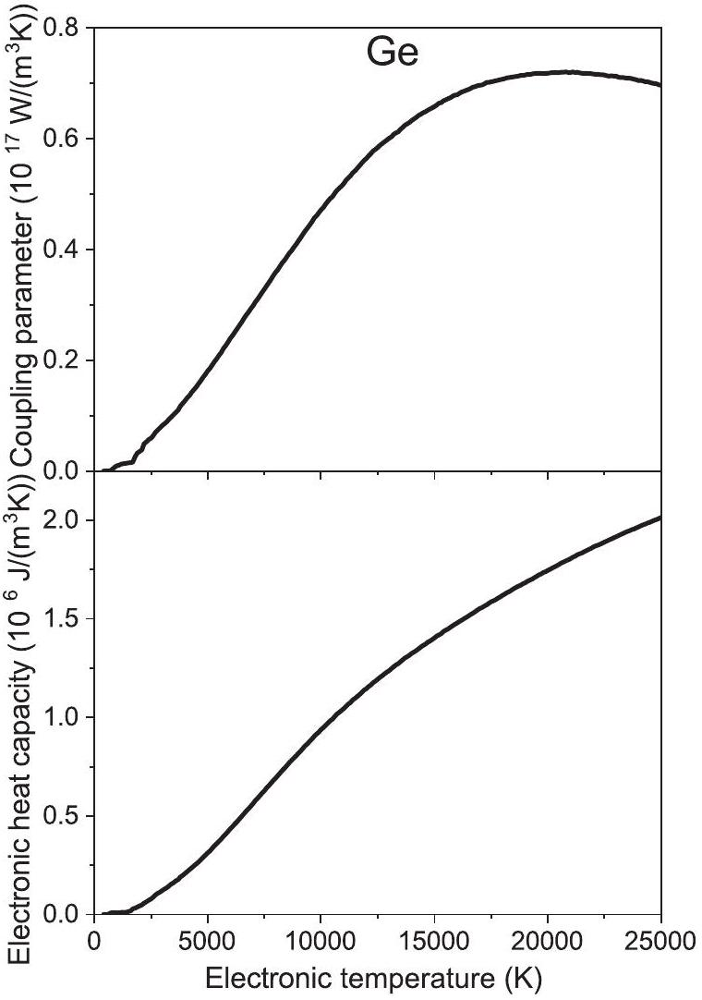
FIG. 5. Top panel: electron-phonon coupling. Bottom panel: electronic heat capacity in Ge.

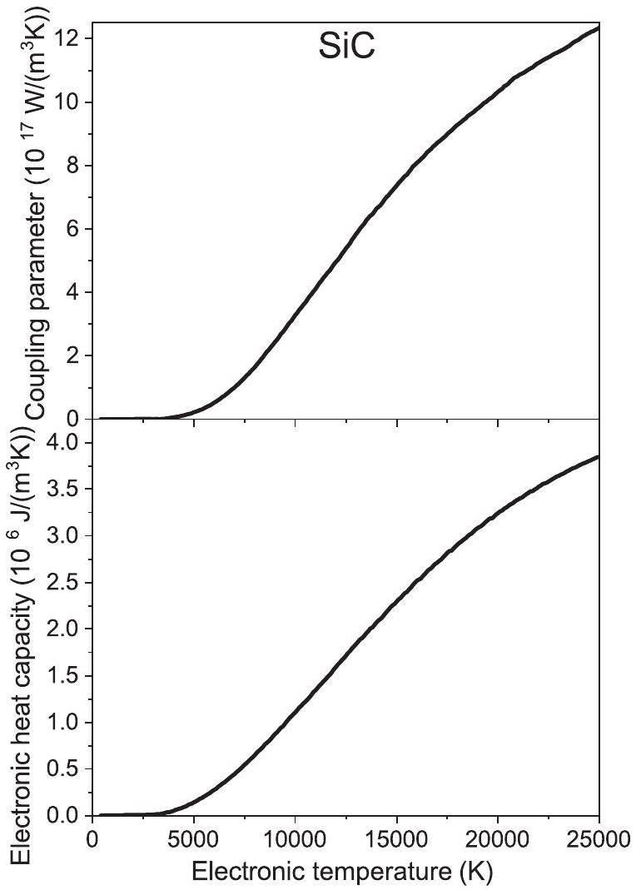
FIG. 6. Top panel: electron-phonon coupling. Bottom panel: electronic heat capacity in SiC .

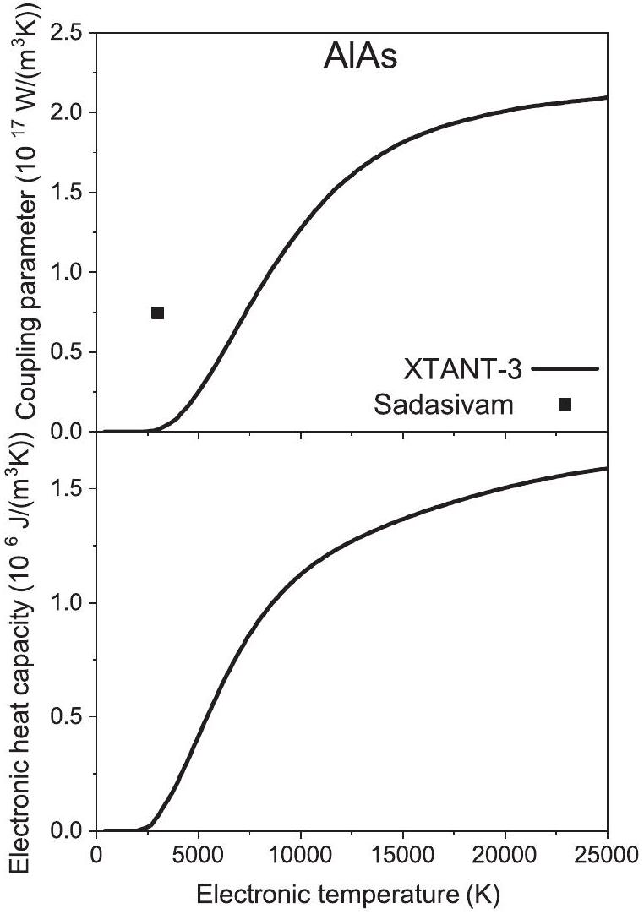
FIG. 7. Top panel: electron-phonon coupling. Bottom panel: electronic heat capacity in AlAs. Coupling parameter estimated from the relaxation time calculated by Sadasivam et al. is shown for comparison for $T_{e}=3000 \mathrm{~K}$ [39].

even more, and this self-amplifying process leads to extremely fast damage in the covalent material and equilibration of the electronic and atomic temperatures [26].

An example of the influence of the nonthermal atomic acceleration on the electron-phonon coupling in silicon is shown in Fig. 3 (calculated with 216 atoms in the simulation box, NRL tight-binding parametrization [34,35]). The coupling parameter, affected by ultrafast nonthermal atomic acceleration (reported in Ref. [21]), shows a dramatic increase around the electronic temperatures associated with the nonthermal melting ( $T_{e} \sim 17000 \mathrm{~K}$ ). If this effect is excluded, the trend of the increase of the coupling parameter does not change.

These nonthermal effects are naturally occurring in XTANT-3, as they would in any nonadiabatic ab initio simulation. They may be accounted for in other models in various ways, e.g., by directly implementing the coupling parameter with the increase at high electronic temperatures, or (more appropriately) by taking into account the dependence of the coupling parameter on the atomic temperature plus some additional terms accounting for the nonthermal acceleration upon reaching certain electronic temperature (for instance, see recently implemented classical MD simulation combined with the MC tracing transport of electrons and valence holes in [36]).

In all further simulations, we show the pure electronphonon coupling, without the additional effect of the

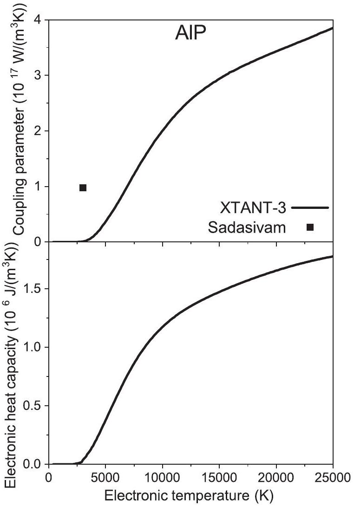
FIG. 8. Top panel: electron-phonon coupling. Bottom panel: electronic heat capacity in AIP. Coupling parameter estimated from the relaxation time calculated by Sadasivam et al. is shown for comparison for $T_{e}=3000 \mathrm{~K}$ [39].

nonthermal atomic acceleration: it is ensured that the coupling parameters are all calculated at room atomic temperature.

## C. Group-IV semiconductors

Having established that the nonequilibrium effects may often be neglected, we may proceed now with evaluation of the coupling parameters in various classes of semiconductors under the approximation of the local thermal equilibrium in the electronic ensemble (the two-temperature state). The following parameters are used to calculate the coupling parameters and electronic heat capacities: for Si and Ge , the NRL tight-binding parametrization is used with 216 atoms in the simulation box (a comparison with other available TB parametrizations is discussed in the Appendix) [34,35]; for SiC (in the hexagonal $P 6_{3} m c$ state [37]), the matsci-0-3 DFTB parametrization is used with 192 atoms in the simulation box [38].

For Si , the coupling parameters are compared with the simulations from Ref. [39], which employed the Boltzmann equation with the electron-phonon coupling matrix elements calculated from a density-functional perturbation theory (DFPT). For this comparison, the electronic temperature relaxation times from Ref. [39] were converted to the average coupling parameter $\left(G \sim C_{e} / \tau\right)$.

Figure 4 shows the XTANT-3 calculated parameters in Si . The coupling parameter from Ref. [39] is larger than that

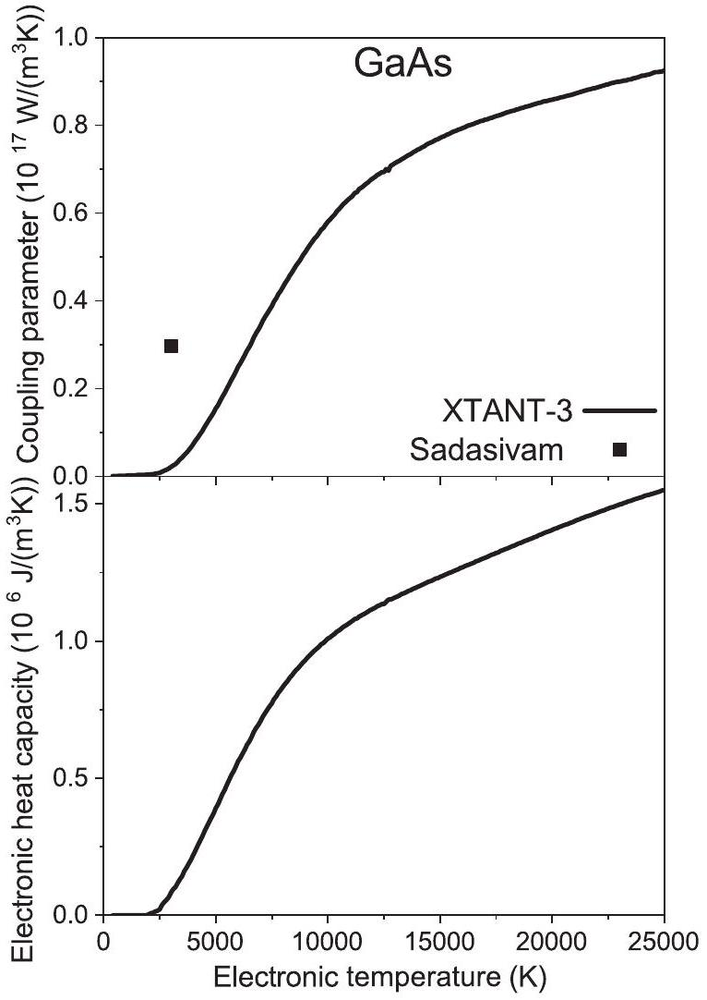
FIG. 9. Top panel: electron-phonon coupling. Bottom panel: electronic heat capacity in GaAs. Coupling parameter estimated from the relaxation time calculated by Sadasivam et al. is shown for comparison for $T_{e}=3000 \mathrm{~K}$ [39].

calculated with XTANT-3. The same situation was observed in metals: the DFPT simulations overestimate the coupling parameter with respect to XTANT-3 [21]. This discrepancy may also be a result of the band-gap problem, since the electronic temperature of $T_{e}=3000 \mathrm{~K}$, shown in Ref. [39], is rather low. The electronic heat capacity at such temperature is small and thus sensitive to the particular band-gap value. Higher heat capacities (for smaller calculated band gaps) would lead to larger coupling parameters.

XTANT-3 predicts nearly linear dependencies on the electronic temperature in both the coupling parameter and the electronic heat capacity. As was mentioned in Ref. [21], the coupling parameter is near zero up to the electronic temperature of $\sim 2000 \mathrm{~K}$-due to the presence of the band gap ( $\sim 1.17 \mathrm{eV}$ in cold Si) at lower temperatures, only an exponentially small fraction of electrons is in the conduction band and a correspondingly small number of holes in the valence band. A noticeable increase in the coupling takes place only when the electronic temperature becomes sufficient to promote a non-negligible number of electrons across the gap. Note that the nonthermal effects were excluded here, which may induce band-gap collapse at electronic temperatures $\sim 17000 \mathrm{~K}$ [40].

A similar situation is in Ge, shown in Fig. 5, but the absolute values of the electron-phonon coupling parameter are smaller than those in Si . This is in line with the trend of decreasing the coupling parameter with an increase in the

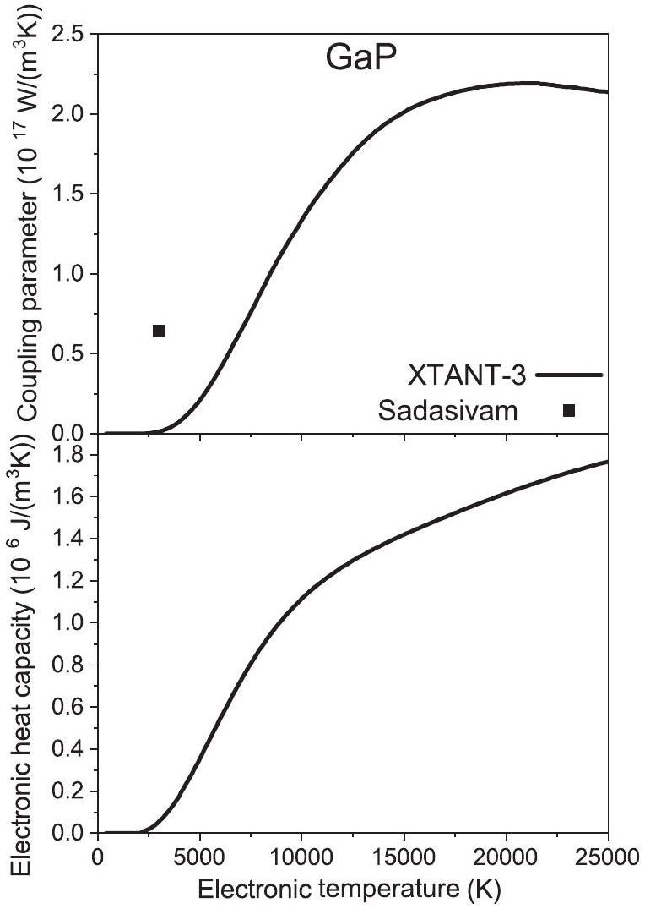
FIG. 10. Top panel: electron-phonon coupling. Bottom panel: electronic heat capacity in GaP. Coupling parameter estimated from the relaxation time calculated by Sadasivam et al. is shown for comparison for $T_{e}=3000 \mathrm{~K}$ [39].

atomic mass, discussed in Ref. [21]. The onset of the increase in both the coupling parameter and electronic heat capacity is earlier than in Si due to a smaller band gap in Ge .

The coupling in SiC, presented in Fig. 6, shows higher values, also in line with the trend: as carbon atoms are much lighter than Ge and Si , their faster motion allows for a stronger coupling with the electronic system.

## D. Group III-V semiconductors

For group III-V semiconductors (AlAs, AlP, GaAs, GaP, and GaSb) modeling, Molteni et al.'s TB parametrization was used [31,32], 216 atoms in the supercell in the zinc blende structure in each case. The AlAs calculated parameters are shown in Fig. 7, for AlP in Fig. 8, GaAs in Fig. 9, GaP in Fig. 10, and GaSb in Fig. 11.

For AlAs, AlP, GaP, and GaAs, the coupling parameters are compared with the simulations from Ref. [39] at $T_{e}=$ 3000 K , similarly to the case of Si discussed above. In all cases, the coupling parameters from Ref. [39] are larger than those calculated with XTANT-3. Nevertheless, we note that the qualitative trends in the electron-phonon coupling parameters among various materials agree with those calculated with XTANT-3: the coupling is larger in AlP than in AlAs and GaP, which are larger than the one in GaAs. Among the materials in these groups, the highest coupling is in the lightest elements: AlP, reaching $G \sim 4 \times 10^{17} \mathrm{~W} /\left(\mathrm{m}^{3} \mathrm{~K}\right)$ at the electronic

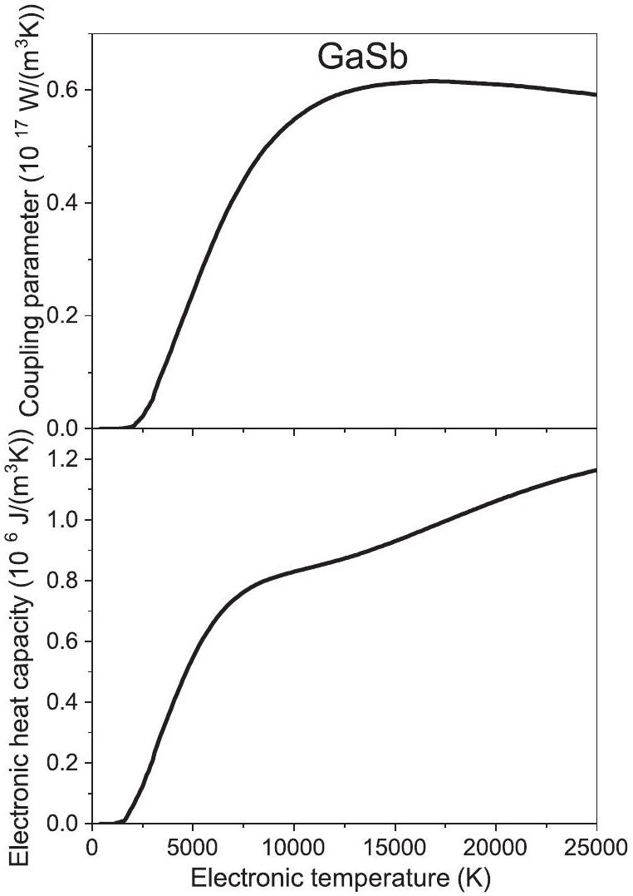
FIG. 11. Top panel: electron-phonon coupling. Bottom panel: electronic heat capacity in GaSb .

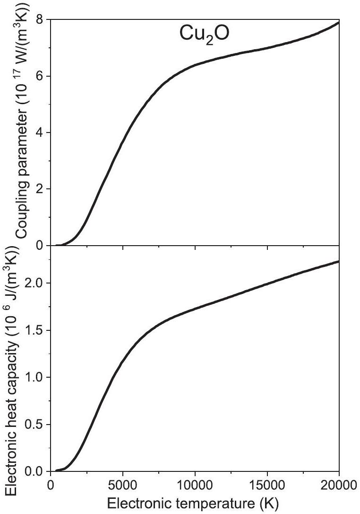
FIG. 12. Top panel: electron-phonon coupling. Bottom panel: electronic heat capacity in $\mathrm{Cu}_{2} \mathrm{O}$.

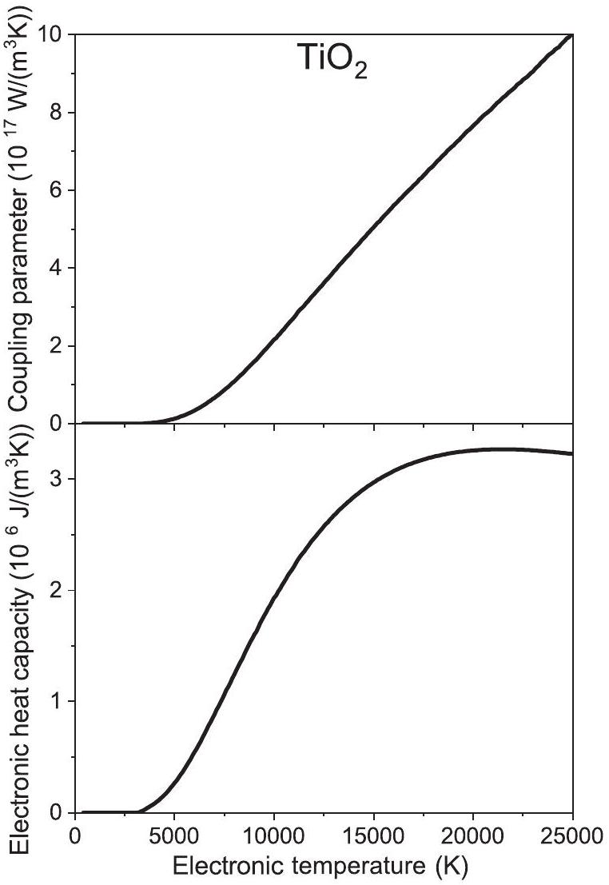
FIG. 13. Top panel: electron-phonon coupling. Bottom panel: electronic heat capacity in $\mathrm{TiO}_{2}$.

temperature of $T_{e} \sim 25000 \mathrm{~K}$; the smallest coupling, respectively, is in GaSb , reaching only $G \sim 6 \times 10^{16} \mathrm{~W} /\left(\mathrm{m}^{3} \mathrm{~K}\right)$.

## E. Oxide semiconductors

For modeling of oxide semiconductors $\mathrm{Cu}_{2} \mathrm{O}$ ( 384 atoms in the simulation box in the cubic Pn3m structure [37]) and $\mathrm{TiO}_{2}$ ( 216 atoms in the simulation box in the rutile structure), the matsci-0-3 DFTB parametrization was used [38], and the znorg-0-1 DFTB parametrization for ZnO ( 384 atoms in the hexagonal $P 6_{3} m c$ structure [37]) was employed [41].

The results for $\mathrm{Cu}_{2} \mathrm{O}$ is shown in Fig. 12, for $\mathrm{TiO}_{2}$ in Fig. 13, and for ZnO in Fig. 14. In all these materials, the coupling parameter is quite high (due to the presence of the light element-oxygen), reaching the values of $G \sim 10^{18} \mathrm{~W} /\left(\mathrm{m}^{3} \mathrm{~K}\right)$ at the electronic temperature of $T_{e} \sim$ 25000 K in $\mathrm{TiO}_{2}$. Again, aligning with the overall trend of the decreasing coupling parameter with the atomic mass, a smaller coupling is in $\mathrm{Cu}_{2} \mathrm{O}$, and the smallest is in ZnO .

## F. Other types of semiconductors

Three other types of semiconductors were also studied: $\mathrm{B}_{4} \mathrm{C}$ ( 270 atoms in the trigonal $R-3 m$ structure [37])

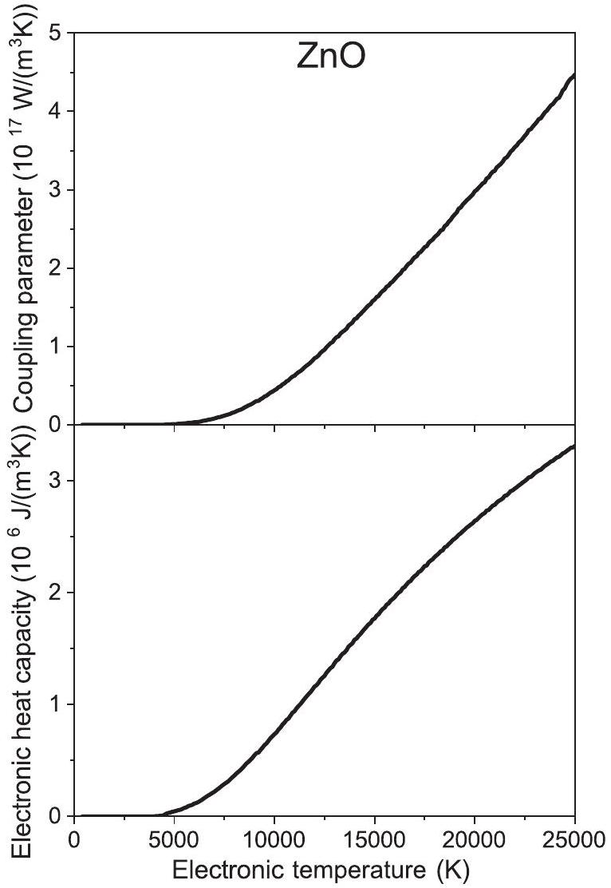
FIG. 14. Top panel: electron-phonon coupling. Bottom panel: electronic heat capacity in ZnO .

using the matsci-0-3 DFTB parametrization [38]; group IIVI semiconductor ZnS, modeled with the znorg-0-1 DFTB parametrization ( 252 atoms in the trigonal $P_{3} m_{1}$ structure [37]) [41]; and layered $\mathrm{PbI}_{2}$ (consisting of 192 atoms in the hexagonal $P 6_{3} m c$ structure [37]) with the DFTB-based parametrization from Ref. [42] with added ZBL-short-range repulsive potential similar to the method described in Ref. [43] (a detailed description of the parametrization of $\mathrm{PbI}_{2}$ will be published elsewhere).

The calculated parameters for $\mathrm{B}_{4} \mathrm{C}$ are shown in Fig. 15, for ZnS in Fig. 16, and for $\mathrm{PbI}_{2}$ in Fig. 17. Made of the lightest elements studied in this work, $\mathrm{B}_{4} \mathrm{C}$ demonstrates the highest coupling parameter, $G \sim 3.5 \times 10^{18} \mathrm{~W} /\left(\mathrm{m}^{3} \mathrm{~K}\right)$ at the electronic temperature of $T_{e} \sim 25000 \mathrm{~K}$. The electronphonon coupling parameters in $\mathrm{PbI}_{2}$ and ZnS are comparable, both reaching $G \sim 1.5 \times 10^{17} \mathrm{~W} /\left(\mathrm{m}^{3} \mathrm{~K}\right)$ at $T_{e} \sim 20000 \mathrm{~K}$. Note that $\mathrm{PbI}_{2}$ is an ionic, not covalent, compound, which does not exhibit such pronounced nonthermal effects as bandgap collapse [44], but this point is beyond the scope of the present work.

## IV. CONCLUSIONS

In this work, we analyzed the electron-ion (electronphonon) coupling parameters in various semiconductors with

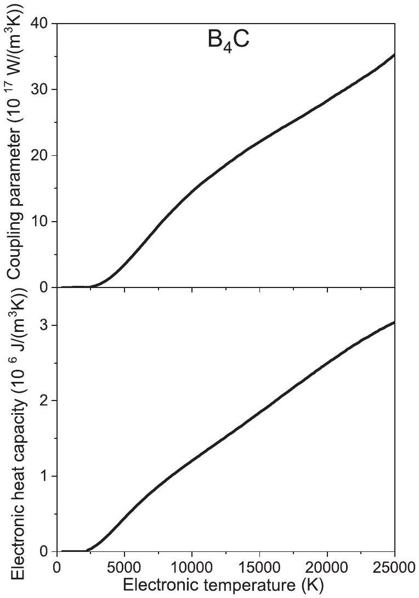
FIG. 15. Top panel: electron-phonon coupling. Bottom panel: electronic heat capacity in $\mathrm{B}_{4} \mathrm{C}$.

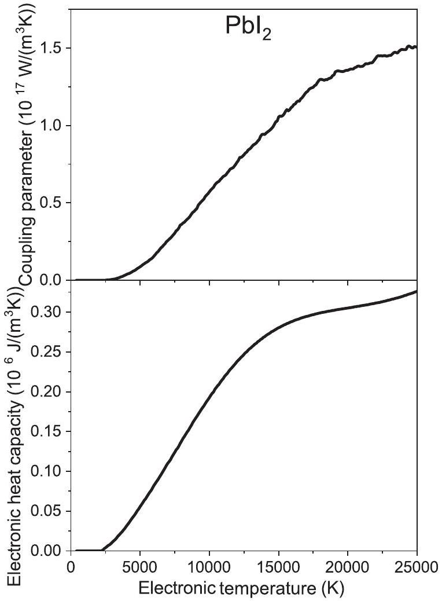
FIG. 16. Top panel: electron-phonon coupling. Bottom panel: electronic heat capacity in $\mathrm{PbI}_{2}$.

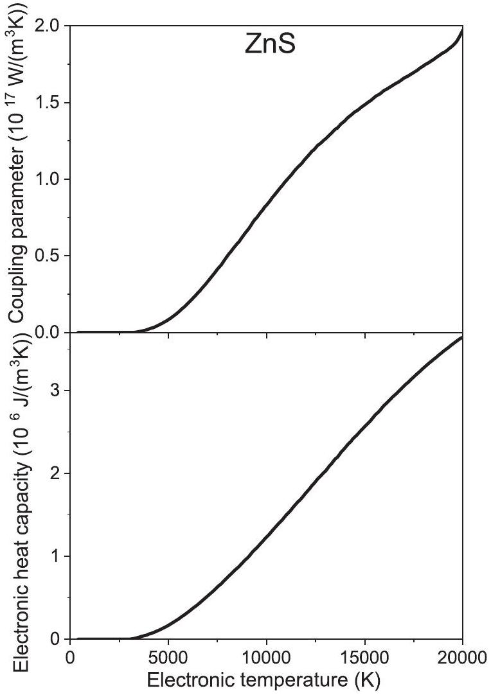
FIG. 17. Top panel: electron-phonon coupling. Bottom panel: electronic heat capacity in ZnS .

the help of the XTANT-3 hybrid model. It is based on the combined Boltzmann equation with tight-binding molecular dynamics. It employs dynamical coupling formalism to evaluate the matrix elements entering the electron-phonon coupling in the nonperturbative regime, used in the Boltzmann collision integral.

It was demonstrated that the coupling parameter is only mildly sensitive to the state of the electronic system at a constant deposited energy: fully nonequilibrium electronic distribution, partially band-resolved thermalized (separate equilibrium in the valence and the conduction bands at different temperatures and chemical potentials), and fully equilibrium Fermi-Dirac distributions, all produced the coupling parameters different only within $\sim 35 \%$ at high electronic kinetic temperature. In many cases, the difference was even smaller, suggesting that the equilibrium values of the coupling parameter could be used in the modeling of laser irradiation of semiconductors, such as the two-temperature or three-temperature models (and variations or extensions thereof).

The coupling parameters in various semiconductors as functions of the electronic temperatures were calculated up to the electronic temperatures of $\sim 25000 \mathrm{~K}$, which is typically a temperature around the onset of nonthermal melting in covalent materials. All the coupling parameters calculated follow the overall trend of decreasing coupling with the increase of the atomic mass.

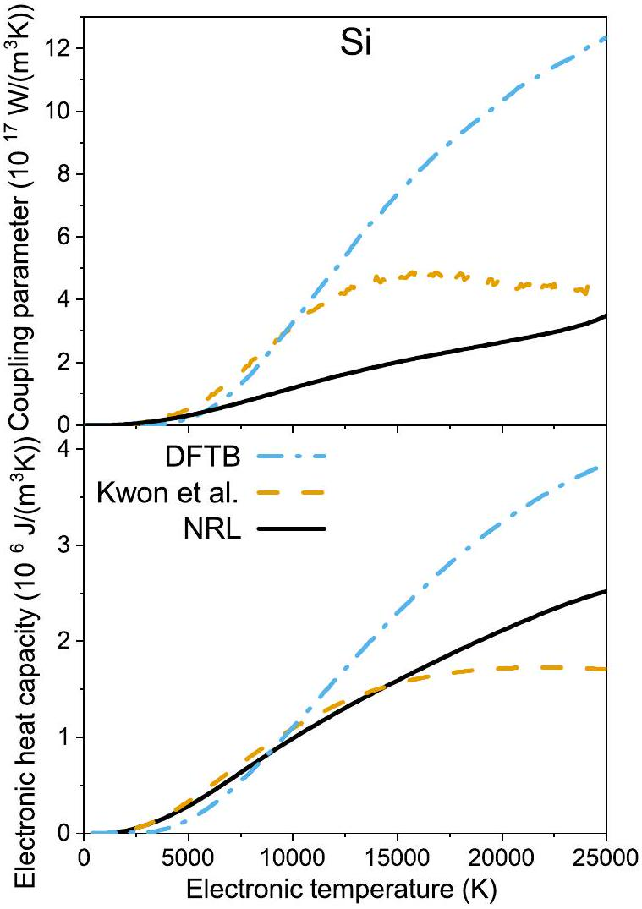
FIG. 18. Comparison of the XTANT-3 calculated coupling parameters (top panel) and electronic heat capacity (bottom panel) in Si for various TB parametrizations: NRL [35], matsci-0-3 DFTB [38], and by Kwon et al. [47].

All the calculated electron-phonon coupling parameters and electronic heat capacities are available online in [45] (together with the previous data for metals from Ref. [21] and $2 d$ carbon materials from Ref. [30]).

## ACKNOWLEDGMENTS

Computational resources were supplied by the project "e-Infrastruktura CZ" (Project No. e-INFRA LM2018140) provided within the program Projects of Large Research, Development, and Innovations Infrastructures. The author gratefully acknowledges financial support from the Czech Ministry of Education, Youth, and Sports (Grants No. LTT17015, No. LM2018114, and No. EF16_013/0001552).

## APPENDIX: EFFECT OF TB PARAMETRIZATION

It was previously demonstrated that the tight binding parametrization affects rather strongly the electron-phonon coupling in metals [46]. In semiconductors, the conclusion is the same: the TB parametrization may strongly affect the calculated electronic properties: the coupling parameter and the electronic heat capacity, see an example of Si in Fig. 18, especially at high electronic temperatures. That suggests that it is extremely important to validate the calculated parameters in future experiments at elevated electronic temperatures. As of now, unfortunately, there are no experimental data available.
[1] W. L. Brown, Laser Processing of Semiconductors, Materials Processing Theory and Practices, edited by M. Bass (Elsevier, 1983), Vol. 3, pp. 337-406.
[2] A. Elasser and T. P. Chow, Silicon carbide benefits and advantages for power electronics circuits and systems, Proc. IEEE 90, 969 (2002).
[3] Y. Siegal, E. N. Glezer, L. Huang, and E. Mazur, Laser-induced phase transitions in semiconductors, Annu. Rev. Mater. Sci. 25, 223 (1995).
[4] P. G. Neudeck, R. S. Okojie, and L. Y. Chen, High-temperature electronics - a role for wide bandgap semiconductors? Proc. IEEE 90, 1065 (2002).
[5] B. G. Rasheed and M. A. Ibrahem, Laser micro/nano machining of silicon, Micron 140, 102958 (2021).
[6] J. Wang, F. Fang, H. An, S. Wu, H. Qi, Y. Cai, and G. Guo, Laser machining fundamentals: Micro, nano, atomic and close-to-atomic scales, Int. J. Extrem. Manuf. 5, 012005 (2023).
[7] F. Rossi and T. Kuhn, Theory of ultrafast phenomena in photoexcited semiconductors, Rev. Mod. Phys. 74, 895 (2002).
[8] J. Bonse and S. Gräf, Maxwell meets marangoni-a review of theories on laser-induced periodic surface structures, Laser Photon. Rev. 14, 2000215 (2020).
[9] T.-H. Dinh, N. Medvedev, M. Ishino, T. Kitamura, N. Hasegawa, T. Otobe, T. Higashiguchi, K. Sakaue, M. Washio, T.

Hatano, A. Kon, Y. Kubota, Y. Inubushi, S. Owada, T. Shibuya, B. Ziaja, and M. Nishikino, Controlled strong excitation of silicon as a step towards processing materials at sub-nanometer precision, Commun. Phys. 2, 150 (2019).
[10] I. M. Lifshits, M. I. Kaganov, and L. V. Tanatarov, On the theory of radiation-induced changes in metals, J. Nucl. Energy. Part A: React. Sci. 12, 69 (1960).
[11] S. I. Anisimov, B. L. Kapeliovich, and T. L. Perel'man, Electron emission from metal surfaces exposed to ultrashort laser pulses, Zh. Eksp. Teor. Fiz. 66, 776 (1974) [Sov. Phys.-JETP 39, 375 (1974)].
[12] B. Rethfeld, D. S. Ivanov, M. E. Garcia, and S. I. Anisimov, Modelling ultrafast laser ablation, J. Phys. D: Appl. Phys. 50, 193001 (2017).
[13] A. Kaiser, B. Rethfeld, M. Vicanek, and G. Simon, Microscopic processes in dielectrics under irradiation by subpicosecond laser pulses, Phys. Rev. B 61, 11437 (2000).
[14] N. S. Shcheblanov and T. E. Itina, Femtosecond laser interactions with dielectric materials: Insights of a detailed modeling of electronic excitation and relaxation processes, Appl. Phys. A 110, 579 (2012).
[15] V. Lipp, B. Rethfeld, M. Garcia, and D. Ivanov, Solving a system of differential equations containing a diffusion equation
with nonlinear terms on the example of laser heating in silicon, Appl. Sci. 10, 1853 (2020).
[16] A. Rämer, O. Osmani, and B. Rethfeld, Laser damage in silicon: Energy absorption, relaxation, and transport, J. Appl. Phys. 116, 053508 (2014).
[17] P. Venkat and T. Otobe, Three-temperature modeling of laserinduced damage process in silicon, Appl. Phys. Express 15, 041008 (2022).
[18] V. Tkachenko, N. Medvedev, V. Lipp, and B. Ziaja, Picosecond relaxation of x-ray excited GaAs, High Energy Density Phys. 24, 15 (2017).
[19] P. B. Allen, Theory of thermal relaxation of electrons in metals, Phys. Rev. Lett. 59, 1460 (1987).
[20] M. Toulemonde, C. Dufour, A. Meftah, and E. Paumier, Transient thermal processes in heavy ion irradiation of crystalline inorganic insulators, Nucl. Instrum. Methods. Phys. Res. Sect. B 166, 903 (2000).
[21] N. Medvedev and I. Milov, Electron-phonon coupling in metals at high electronic temperatures, Phys. Rev. B 102, 064302 (2020).
[22] N. Medvedev, Electronic nonequilibrium effect in ultrafast-laser-irradiated solids, arXiv:2302.09098.
[23] N. Medvedev, XTANT-3: X-ray-induced thermal and nonthermal transitions in matter: Theory, numerical details, user manual, arXiv:2307.03953.
[24] J. G. Powles, G. Rickayzen, and D. M. Heyes, Temperatures: Old, new and middle aged, Mol. Phys. 103, 1361 (2005).
[25] N. Medvedev and I. Milov, Electron-phonon coupling and nonthermal effects in gold nano-objects at high electronic temperatures, Materials (Basel) 15, 4883 (2022).
[26] N. Medvedev and A. E. Volkov, Nonthermal acceleration of atoms as a mechanism of fast lattice heating in ion tracks, J. Appl. Phys. 131, 225903 (2022).
[27] C. W. Siders, A. Cavalleri, K. Sokolowski-Tinten, C. Tóth, T. Guo, M. Kammler, M. H. von Hoegen, K. R. Wilson, D. von der Linde, and C. P. J. Barty, Detection of nonthermal melting by ultrafast x-ray diffraction, Science 286, 1340 (1999).
[28] A. Rousse, C. Rischel, S. Fourmaux, I. Uschmann, S. Sebban, G. Grillon, P. Balcou, E. Förster, J. P. Geindre, P. Audebert, J. C. Gauthier, and D. Hulin, Non-thermal melting in semiconductors measured at femtosecond resolution., Nature (London) 410, 65 (2001).
[29] G. J. Martyna and M. E. Tuckerman, Symplectic reversible integrators: Predictor-corrector methods, J. Chem. Phys. 102, 8071 (1995).
[30] N. Medvedev, I. Milov, and B. Ziaja, Structural stability and electron-phonon coupling in two-dimensional carbon allotropes at high electronic and atomic temperatures, Carbon Trends 5, 100121 (2021).
[31] C. Molteni, L. Colombo, and L. Miglio, Tight-binding molecular dynamics in liquid III-V compounds. I. potential generation, J. Phys.: Condens. Matter 6, 5243 (1994).
[32] N. Medvedev, Z. Fang, C. Xia, and Z. Li, Thermal and nonthermal melting of III-V compound semiconductors, Phys. Rev. B 99, 144101 (2019).
[33] B. Rethfeld, A. Kaiser, M. Vicanek, and G. Simon, Ultrafast dynamics of nonequilibrium electrons in metals under femtosecond laser irradiation, Phys. Rev. B 65, 214303 (2002).
[34] M. J. Mehl and D. A. Papaconstantopoulos, NRL Transferable Tight-Binding Parameters Periodic Table, http://esd.cos.gmu. edu/tb/tbp.html.
[35] D. A. Papaconstantopoulos and M. J. Mehl, The slater koster tight-binding method: A computationally efficient and accurate approach, J. Phys.: Condens. Matter 15, R413(2003).
[36] N. Medvedev, F. Akhmetov, R. A. Rymzhanov, R. Voronkov, and A. E. Volkov, Modeling time-resolved kinetics in solids induced by extreme electronic excitation, Adv. Theory Simul. 5, 2200091 (2022).
[37] A. Jain, S. P. Ong, G. Hautier, W. Chen, W. D. Richards, S. Dacek, S. Cholia, D. Gunter, D. Skinner, G. Ceder, and K. A. Persson, Commentary the materials project a materials genome approach to accelerating materials innovation, APL Mater. 1 011002 (2013).
[38] J. Frenzel, A. F. Oliveira, N. Jardillier, T. Heine, and G. Seifert, Semi-relativistic, self-consistent charge Slater-Koster tables for density-functional based tight-binding (DFTB) for materials science simulations, TU-Dresden (2009).
[39] S. Sadasivam, M. K. Y. Chan, and P. Darancet, Theory of thermal relaxation of electrons in semiconductors, Phys. Rev. Lett. 119, 136602 (2017).
[40] N. Medvedev, Z. Li, and B. Ziaja, Thermal and nonthermal melting of silicon under femtosecond x-ray irradiation, Phys. Rev. B 91, 054113 (2015).
[41] N. H. Moreira, G. Dolgonos, B. Aradi, A. L. da Rosa, and T. Frauenheim, Toward an accurate density-functional tightbinding description of zinc-containing compounds, J. Chem. Theory Comput. 5, 605 (2009).
[42] DFTB Parameterization without Short-Range Repulsion, https://github.com/by-student-2017/Slater-Koster-parameters-no-repulsion_v1.
[43] W. Ding, H. He, and B. Pan, Development of a Tight-Binding model for Cu and its application to a Cu -heat-sink under irradiation, J. Mater. Sci. 50, 5684 (2015).
$[44]$ R. A. Voronkov, N. Medvedev, and A. E. Volkov, Dependence of nonthermal metallization kinetics on bond ionicity of compounds, Sci. Rep. 10, 13070 (2020).
[45] N. Medvedev, Electron-Phonon Coupling and Related Parameters Calculated with XTANT-3, https://github.com/N-Medvedev/XTANT-3_coupling_data.
[46] F. Akhmetov, N. Medvedev, I. Makhotkin, M. Ackermann, and I. Milov, Effect of atomic-temperature dependence of the electron-phonon coupling in two-temperature model, Materials (Basel) 15, 5193 (2022).
[47] I. Kwon, R. Biswas, C. Z. Wang, K. M. Ho, and C. M. Soukoulis, Transferable tight-binding models for silicon, Phys. Rev. B 49, 7242 (1994).

[^0]:    *nikita.medvedev@fzu.cz

