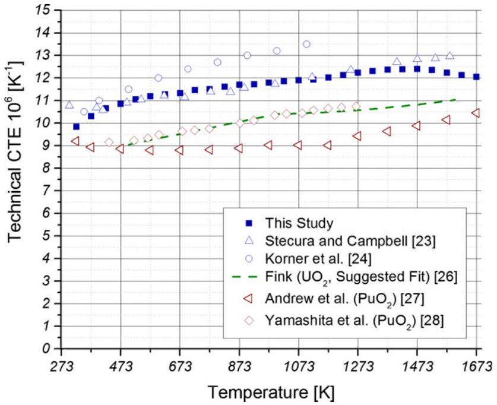
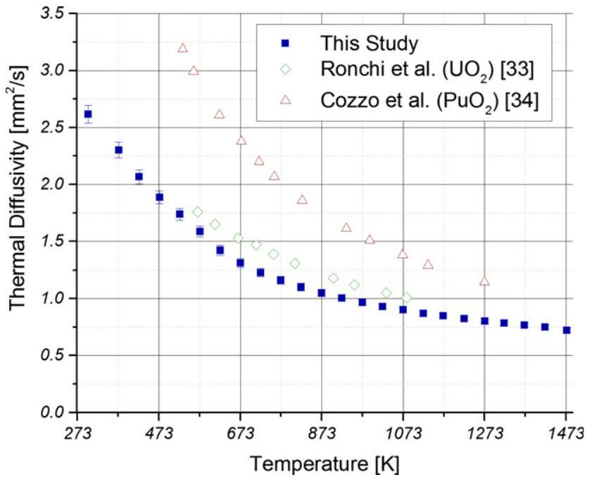
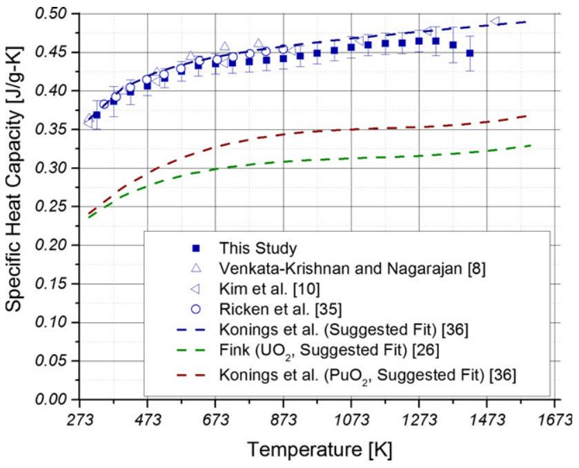
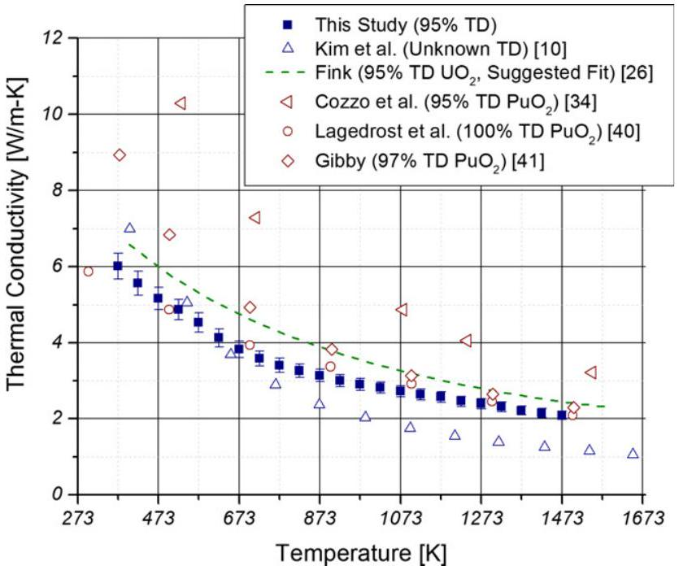
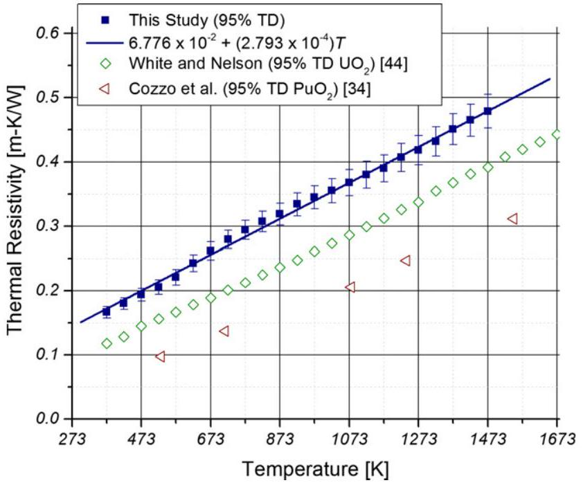

# An Evaluation of the Thermophysical Properties of Stoichiometric $\mathbf{C e O}_{\mathbf{2}}$ in Comparison to $\mathbf{U O}_{\mathbf{2}}$ and $\mathbf{P u O}_{\mathbf{2}}$ 

Andrew T. Nelson, ${ }^{\ddagger, \dagger}$ Dylan R. Rittman, ${ }^{\ddagger}$ Joshua T. White, ${ }^{\ddagger}$ John T. Dunwoody, ${ }^{\ddagger}$ Masato Kato, ${ }^{\S}$ and Kenneth J. McClellan ${ }^{\ddagger}$ ${ }^{\ddagger}$ Los Alamos National Laboratory, P.O. Box 1667, Los Alamos, 87545 New Mexico ${ }^{§}$ Japan Atomic Energy Agency, 4-33 Muramatsu Tokai-mura, Ibakari 319-1194, Japan

#### Abstract

The thermal conductivity of stoichiometric $\mathrm{CeO}_{2}$ was determined through measurement of thermal expansion from 313 to 1723 K , thermal diffusivity from 298 to 1473 K , and specific heat capacity from 313 to 1373 K . The thermal conductivity was then calculated as the product of the density, thermal diffusivity, and specific heat capacity. The thermal conductivity was found to obey an $(A+B T)^{-1}$ relationship with $A=6.776 \times 10^{-2} \mathbf{m} \cdot \mathbf{K} \cdot \mathbf{W}^{-1}$ and $B=2.793 \times 10^{-4} \mathrm{~m} \cdot \mathrm{~W}^{-1}$. Extrapolations of applied models were made to provide suggested data for the specific heat capacity, thermal diffusivity, and thermal conductivity data up to 1723 K . Results of thermal expansion and heat capacity measurements agreed well with the limited low-temperature data available in the literature. The thermal conductivity values provided in the current study are significantly higher than the only high-temperature data located for $\mathrm{CeO}_{2}$. This is attributed to the tendency of $\mathrm{CeO}_{2}$ to rapidly reduce at elevated temperatures given the available partial pressure of $\mathrm{O}_{2}$ in air at ambient pressure. The $\mathrm{CeO}_{2}$ data are compared to literature values for $\mathrm{UO}_{2}$ and $\mathrm{PuO}_{2}$ to evaluate its suitability as a surrogate in nuclear fuel systems where thermal transport is a primary criterion for performance

## I. Introduction

DEVELOPMENT and characterization of ceramic nuclear fuel forms remains an active research area given the continuing role of nuclear power in providing a significant fraction of the world's energy as well as the ongoing need to evaluate reprocessing and long-term geologic storage of used nuclear fuel. Uranium dioxide ( $\mathrm{UO}_{2}$ ) is ubiquitous as the most widely used nuclear fuel. Substitution of Pu onto the cation sites of $\mathrm{UO}_{2}$ yields mixed oxide (MOX) fuel, the most commonly used means of burning Pu or other minor actinides. Although the emphasis of MOX production is synthesis of homogeneous single phase $\mathrm{UO}_{2}-\mathrm{PuO}_{2}$ to avoid spatially dependent neutronics and properties within the fuel, the evolving thermochemical conditions encountered during burn up can result in the formation of $\mathrm{PuO}_{2}$. In addition, candidate composite fuel forms designed with reprocessing or disposition of weapons-grade materials may combine $\mathrm{PuO}_{2}$ with other second phases to improve performance. ${ }^{1}$ Ceramic-ceramic or ceramic-metal composite designs have similarly been developed over the years that include $\mathrm{UO}_{2}$ and second phases for analogous goals. ${ }^{2}$

The recognized challenge in exploration of nuclear fuel forms or processes involving $\mathrm{PuO}_{2}$ is the significant cost
A. M. White-contributing editor

[^0]escalation demanded by its toxicity, high activity, and proliferation risk. In comparison to Pu , availability of depleted uranium simplifies studies of $\mathrm{UO}_{2}$, but it remains radioactive and therefore cannot be easily utilized across all laboratories. Cerium dioxide ( $\mathrm{CeO}_{2}$ ) is therefore commonly used as a surrogate material to explore the synthesis, properties, and performance of the above actinide oxides.

Historically, $\mathrm{CeO}_{2}$ has been used as a surrogate for $\mathrm{PuO}_{2}$ more widely than for $\mathrm{UO}_{2}$ because of the obstacle of $\mathrm{PuO}_{2}$ operations in most facilities. The most familiar example has been to enable studies of behavior trends expected of MOX where solid solutions of $\mathrm{UO}_{2}-\mathrm{CeO}_{2}$ are prepared (see, for example Dörr et al.). ${ }^{3}$ This has been broadly justified based on the following: both Ce and Pu have similar atomic radii, ${ }^{4}$ only take on the $3+$ and $4+$ valance states when in their oxide form, and possess a fluorite structure $\left(\mathrm{CaF}_{2}, F m \overline{3} m\right)$ as $\mathrm{CeO}_{2}$ and $\mathrm{PuO}_{2}$. Given the importance of thermophysical properties and thermodynamic stability to the evaluation and performance of nuclear fuels, studies focused on these topics are the most prevalent uses of $\mathrm{CeO}_{2}$ as a surrogate for $\mathrm{PuO}_{2}$ encountered in the literature. A range of works employ $\mathrm{CeO}_{2}$ to explore the thermal expansion, ${ }^{5-7}$ heat capacity, ${ }^{8,9}$ thermal conductivity, ${ }^{10,11}$ and thermodynamic behavior ${ }^{12,13}$ of MOX fuels. $\mathrm{CeO}_{2}$ has also seen surrogate use in separations and waste form studies, ${ }^{14-16}$ as well as a wide range of other investigations omitted here for brevity.

Use of $\mathrm{CeO}_{2}$ as a surrogate for $\mathrm{UO}_{2}$ has been restricted to more fundamental investigations with looser linkages to the transport properties of the two materials. Recent examples in the literature range from basic structural and fabrication studies ${ }^{17,18}$ to exploration of irradiation behavior. ${ }^{19-21}$ The valence states of $\mathrm{U}(4+, 5+, 6+)$ make Ce a poor surrogate from a fabrication and thermodynamic standpoint, but to date a comprehensive comparison of the thermophysical properties of stoichiometric $\mathrm{CeO}_{2}$ and $\mathrm{UO}_{2}$ has not been possible due to a lack of data for the former.

This study was conceived to address the lack of thermophysical property data for $\mathrm{CeO}_{2}$ to provide a clear reference point from which its suitability as a surrogate for $\mathrm{PuO}_{2}$ can be assessed. Furthermore, the availability of such data will facilitate discussion of its plausibility as a thermophysical property surrogate for $\mathrm{UO}_{2}$. Experimental investigation of the properties of $\mathrm{CeO}_{2}$ at elevated temperatures is complicated by the mixed valence state of Ce . $\mathrm{CeO}_{2}$ will readily reduce in air at moderate temperatures ( $<800 \mathrm{~K}$ ). The few studies located in the literature exhibit uncertainty for many key properties; it is hypothesized that stoichiometric evolution within the samples is responsible. In this study, the thermal conductivity of stoichiometric $\mathrm{CeO}_{2}$ is determined through the use of high-temperature measurements of thermal expansion, thermal diffusivity, and heat capacity. The results are compared to the existing literature data for $\mathrm{CeO}_{2}$, accepted fits for $\mathrm{UO}_{2}$, and the more limited data for $\mathrm{PuO}_{2}$.

## II. Experimental Methodology

The thermal conductivity ( $\lambda$ ) of stoichiometric $\mathrm{CeO}_{2}$ was found by calculating the product of density ( $\rho$ ), thermal diffusivity ( $D$ ), and heat capacity ( $c_{\mathrm{P}}$ ). Each of these three parameters was measured as a function of temperature by dilatometry, laser flash analysis (LFA), and differential scanning calorimetry (DSC), respectively. The postsintering oxy-gen-to-cerium ratio ( $\mathrm{O} / \mathrm{Ce}$ ) of the pellet was confirmed through simultaneous thermal analysis (STA) measurements.

## (1) Sample Preparation

Commercial grade $\mathrm{CeO}_{2}$ powder of $99.9 \%$ purity produced by Alfa Aesar (Ward Hill, MA) with a theoretical density of $7.132 \mathrm{~g} / \mathrm{cm}^{3}$ was mixed with $0.45 \mathrm{wt} \%$ ethylene bis(stearamide) which was used as a binder. The mixture was then SPEX milled in 10 g batches using a stainless steel jar and milling balls for 30 min . This was followed by sieving through a -150 mesh sieve to create a finer powder with a mean particle size and standard deviation of 3.8 and $0.2 \mu \mathrm{~m}$, respectively. This powder was then pressed into green pellets using zinc stearate as a lubricant for the punch and die. The precise size, mass, and pressing pressure of each pellet differed depending on the experiment being conducted.

The green pellets were then heated at $10 \mathrm{~K} / \mathrm{min}$ to 1773 K and held for 4 h in stagnant air. A cooling rate of $10 \mathrm{~K} / \mathrm{min}$ was used until the furnace temperature reached 1273 K , at which point the rate was increased to $20 \mathrm{~K} / \mathrm{min}$ for the duration of the cooling. The pellets were then re-oxidized in a pure $\mathrm{O}_{2}$ atmosphere at 1473 K for 4 h using the same heating and cooling rates. This sintering profile resulted in pellets with $95 \%$ theoretical density as determined by geometric measurement and benchtop weighing.

The temperature of 1473 K was selected for heat treatment because of the emphasis on stoichiometric samples. According to the thermochemical calculations of Lindemer for the $\mathrm{Ce}-\mathrm{O}$ system, ${ }^{22}$ pure $\mathrm{O}_{2}$ at the atmospheric pressure of the laboratory ( 0.8 atm ) is unable to maintain stoichiometric $\mathrm{CeO}_{2}$ above roughly 1550 K . The importance of stoichiometry to thermal transport properties motivated verification for the samples used in this study.

A thermogravimetic balance ( 449 STA F1; Netzsch Instruments, Selb, Germany) with $\mathrm{Al}_{2} \mathrm{O}_{3}$ fixturing was used to confirm the stoichiometry of the $\mathrm{CeO}_{2}$ pellets following the prescribed processing route. A green pellet was placed in the STA and heated to 1773 K in synthetic air ( $20 \% \mathrm{O}_{2}$, balance $\mathrm{Ar})$ at a rate of $10 \mathrm{~K} / \mathrm{min}$ to replicate the sintering process used. A 4 h treatment in pure $\mathrm{O}_{2}$ at 1473 K followed. Finally, a full reduction was performed at 1773 K in $\mathrm{Ar}-6 \mathrm{H}_{2}$. This final step was performed to provide a reference point for $\mathrm{Ce}_{2} \mathrm{O}_{3}$ independent of residual organics present in the initial green pellet, or likely hypostoichiometry of the starting feedstock.

The sintering procedure described above produced pellets containing a stoichiometry of roughly $\mathrm{CeO}_{1.980}$. The hold performed under pure $\mathrm{O}_{2}$ increased the stoichiometry to $\mathrm{CeO}_{1.995}$ with an uncertainty of $\pm 0.003$. This value is slightly less than what is predicted by Lindemer's model, ${ }^{22}$ which states that better than $\mathrm{CeO}_{1.999}$ should be obtained. Cursory experimental investigation of the kinetics of oxidation at 1473 K under roughly 0.8 atm of $\mathrm{O}_{2}$ found that an extended hold performed for 50 h was only capable of producing $\mathrm{CeO}_{1.998}$. Such a synthesis technique was not practical within the constraints of the current investigation, prompting use of $\mathrm{CeO}_{1.995}$ for this work. Furthermore, the error in determination of $\mathrm{O} / \mathrm{Ce}$ in the STA cited above ( $\pm 0.003$ ) suggests that minor uncertainty in the sample $\mathrm{O} / \mathrm{Ce}$ is unavoidable. The primary cause of the uncertainty is the $\pm 0.10 \mathrm{mg}$ error of the benchtop balance, which measured the initial sample mass.

## (2) Dilatometry

A horizontal pushrod dilatometer ( 402 CD, Netzsch Instruments) with $\mathrm{Al}_{2} \mathrm{O}_{3}$ fixturing was used to monitor the fractional length change of the sample from 313 up to 1723 K . The initial sample length was measured using a micrometer, with an accuracy of 0.001 mm . A heating rate of $3 \mathrm{~K} / \mathrm{min}$ was used, and pure $\mathrm{O}_{2}$ was flowed across the sample at a rate of $100 \mathrm{~mL} / \mathrm{min}$ for the duration of the experiment. The specimen used for determination of the technical coefficient of thermal expansion ( $\alpha$ ) had a sintered height and diameter of 5.115 and 4.93 mm , respectively, and a theoretical density of $95 \%$. The faces of the samples were verified to be flat and parallel within $\pm 0.02 \mathrm{~mm}$ of the nominal length. Calculation of sample expansion was performed following baseline subtraction to account for expansion of the $\mathrm{Al}_{2} \mathrm{O}_{3}$ fixturing alone. For comparison to other data in the literature, $\alpha$ was also calculated with respect to the length at 313 K . The error in the expansion data is stated as $3 \%$.

## (3) Laser Flash Analysis

Laser flash analysis was utilized to measure thermal diffusivity of the sample from 373 to 1473 K . The LFA (427, Netzsch Instruments) was equipped with all $\mathrm{Al}_{2} \mathrm{O}_{3}$ fixturing. The elements were shielded from the sample using an $\mathrm{Al}_{2} \mathrm{O}_{3}$ protective tube. A Cowan plus pulse correction model was used to analyze the temperature rise versus time curves produced by the laser pulse. Data were obtained at 50 K intervals throughout the temperature range investigated. Three measurements were taken at each temperature step. The error is reported as that of the technique ( $3 \%$ ). The specimen used in this study measured 1.745 mm in height and 9.88 mm in diameter, and was determined to have a theoretical density of $95 \%$. Specimen height was determined by averaging 10 values obtained using a vertical micrometer, and the standard deviation from the reported height was less than 0.01 mm . As the thermal diffusivity calculation is dependent upon the square of the thickness of the sample, the thermal expansion data measured by dilatometry as described in Section II were used to correct for the changing sample length.

The samples were coated on both sides with graphite to allow for the absorption of the laser light in the near surface region. Use of a carbon coating precluded use of an oxygen-containing environment. Instead, gettered Ar possessing roughly $10^{-15}$ parts per million $\mathrm{O}_{2}$ was flowed continuously through the sample chamber at $100 \mathrm{~mL} / \mathrm{min}$ throughout the measurement. One consideration in use of this atmosphere was possible reduction of the sample during measurement. Examination of the $\mathrm{Ce}-\mathrm{O}$ thermodynamic model of Lindemer suggests that a partial pressure of $\mathrm{O}_{2}$ on the order of that available in the gettered Ar used for analysis would dictate a stoichiometry of approximately 1.95 at $1473 \mathrm{~K} .^{22}$

However, the kinetics of reduction appear to be insufficient to drive hypostoichiometry during the 10 min time interval spent by the sample at this temperature. Measurement of the thermal diffusivity was performed during heating and cooling; even slight reduction of the sample during hightemperature LFA measurement would manifest as hysteresis with lower diffusivity values observed during cooling. No deviation outside the uncertainty of the technique was observed in the overlapping low-temperature data. The sample was weighed prior to coating with graphite and again following the LFA measurement and removal of the graphite with acetone. The pre-LFA and post-LFA sample weights agreed within the error of the balance ( $\pm 0.10 \mathrm{mg}$ ). This result confirms that stoichiometry was maintained during LFA measurement to $\pm 0.003$.

## (4) Differential Scanning Calorimetry

The ratio method was used to calculate the specific heat capacity of $\mathrm{CeO}_{2}$ using a DSC (404C, Netzsch Instruments) from 313 to 1473 K with a heating rate of $20 \mathrm{~K} / \mathrm{min}$. Sample holders consisted of Pt pans with $\mathrm{Al}_{2} \mathrm{O}_{3}$ liners. The sample used in this study had a sintered height and diameter of 0.638 and 4.13 mm , respectively, and a theoretical density of $95 \%$. Pure $\mathrm{O}_{2}$ was flowed continuously through the sample chamber at $20 \mathrm{~mL} / \mathrm{min}$. A baseline, sapphire standard, and sample measurement were all recorded in the same 10 h period in order to minimize any variation in the baseline. The error in the reported data is $3 \%$.

## III. Results and Discussion

## (1) Thermal Expansion and Density

The coefficient of thermal expansion of $\mathrm{CeO}_{2}$, determined from dilatometry measurements, is plotted in Fig. 1 with numerical values reported in Table A.1. The value of $\alpha$ reported here is defined as the technical coefficient of thermal expansion, which measures the expansion of a material at a given temperature relative to a reference temperature. This value may differ from the physical coefficient of thermal expansion, defined as the slope of the thermal expansion curve at a given temperature.

Equation 1 relates how $\alpha$ was converted to density as necessary for calculation of the thermal conductivity. Here, $\rho_{0}$ is the density of $\mathrm{CeO}_{2}$ measured at room temperature and $T_{0}$ is the reference temperature at the beginning of the dilatometry measurement, which in this case is 313 K .

$$
\rho(T)=\frac{\rho_{0}}{1+\alpha\left(T-T_{0}\right)}
$$

Use of Eq. 1 results in a small error as the reference temperature used to calculate $\alpha$ is slightly above room temperature. This approach was necessary to avoid minor differences in the ambient conditions of the laboratory from day to day. However, this 10 K offset was found to contribute far less than the $3 \%$ uncertainty in the expansion data measured by the dilatometer and is therefore disregarded.

The data presented here agree well with Stecura and Campbell, ${ }^{23}$ but is lower than the data of Korner et al. at temperatures above $500 \mathrm{~K} .^{24}$ The data reported by Korner et al. are published as a secondary finding calculated during work to determine phase stability of hypostoichiometric

Fig. 1. Technical coefficients of thermal expansion determined in this study for $\mathrm{CeO}_{2}$. Values for $\mathrm{UO}_{2}$ and $\mathrm{PuO}_{2}$ are shown for comparison.

$\mathrm{CeO}_{2-X}$, and as such was determined using an order of magnitude faster heating rates. This is a possible cause for the discrepancy at higher temperatures. Sims and Blumenthal report an average $\alpha$ of $11.2 \times 10^{-6} \mathrm{~K}^{-1}$ over the range of 298 to $1273 \mathrm{~K}^{25}$, which is also in excellent agreement with the expansion data measured here ( $11.3 \pm 0.2 \times 10^{-6} K^{-1}$ over the same range).

The technical coefficient of thermal expansion for $\mathrm{UO}_{2}$ is also plotted in Fig. 1 as calculated using the fits suggested by Fink. ${ }^{26}$ Fink provides polynomial fits for both the linear expansion ( $\Delta L / L_{0}$ ) as well as the physical coefficient of thermal expansion. The fit plotted in Fig. 1 is the technical coefficient of expansion, chosen for consistency with the data presented here. The technical coefficient of expansion was calculated directly from the linear expansion equations suggested by Fink based on his review of available experimental data.

The thermal expansion of $\mathrm{PuO}_{2}$ as located in two sources is additionally plotted in Fig. 1. Significant disagreement exists between the data of Andrew et al. ${ }^{27}$ and Yamashita et al. ${ }^{28}$ at temperatures above 600 K , where a difference of $20 \%$ is present between the studies. The data of Andrew et al were obtained using dilatometry with verification that $\mathrm{O} / \mathrm{Pu}$ was within 0.01 of 2.00 . Alternatively, Yamashita et al. calculated expansion using XRD measurements of the lattice parameter of $\mathrm{PuO}_{2}$ at elevated temperatures and then referenced this to the room-temperature values to calculate $\alpha$. More recent work by Kato et al. ${ }^{29}$ that utilized molecular dynamics to augment experimental investigation to determine the thermal expansion of $\mathrm{PuO}_{2}$ agrees well with the data of Yamashita et al. Evaluation of the numerical fit suggested by Kato et al. to calculate $\alpha$ as performed above results in a value of $9.8 \pm 0.2 \times 10^{-6} \mathrm{~K}^{-1}$ from 400 to 1000 K , increasing to $10.2 \pm 0.2 \times 10^{-6} \mathrm{~K}^{-1}$ from 1100 to 1800 K . These values overlap those of Yamashita et al. with the exception of the very lowest and highest temperatures investigated. Historic studies that have investigated the effect of reduction on measured expansion of $\mathrm{PuO}_{2}$ during heating report that hypostoichiometry leads to increasing rates of expansion. ${ }^{30}$ However, $\mathrm{PuO}_{2}$ is far more resistant to reduction compared with $\mathrm{CeO}_{2}$. Unlike $\mathrm{CeO}_{2}$, which readily reduces in air at the temperatures in this study, $\mathrm{PuO}_{2}$ will remain fully stoichiometric in a partial pressure of $\mathrm{O}_{2}$ equal to 0.2 atm until roughly $2000 \mathrm{~K} .^{31,32}$

All data for both $\mathrm{UO}_{2}$ and $\mathrm{PuO}_{2}$ agree that expansion of both compounds occurs at a lower rate than $\mathrm{CeO}_{2}$. One potential concern brought about by this result would be in evaluation of fabrication techniques or the thermal stability of composite fuel concepts where $\mathrm{CeO}_{2}$ is used in place of either actinide oxide. In the case of $\mathrm{CeO}_{2}$, the larger $\alpha$ may induce stresses in the surrounding matrix and possible failures; these may not result were $\mathrm{UO}_{2}$ or $\mathrm{PuO}_{2}$ used instead. This difference could prove important in some systems despite the fact that deformation and possible failure modes of such a composite would largely be dictated by the mechanical property differences between the materials, which are not investigated in the current study.

## (2) Thermal Diffusivity

Thermal diffusivity data of $\mathrm{CeO}_{2}$ are plotted in Fig. 2, with numerical values again reported in Table A.1. No other thermal diffusivity data for $\mathrm{CeO}_{2}$ could be located in the literature, but the temperature dependence observed is consistent with that expected of an insulator. Available thermal diffusivity data for $\mathrm{UO}_{2}$ and $\mathrm{PuO}_{2}$ are also included in Fig. 2 for comparison. ${ }^{33,34}$ Despite extensive study of the thermal conductivity of $\mathrm{UO}_{2}$ and, to a lesser extent, $\mathrm{PuO}_{2}$, published data for the thermal diffusivity of either compound is comparatively sparse. It is common for researchers to forgo direct reporting of the thermal diffusivity and instead report thermal conductivity even when the LFA technique is used. Development of numeric models follows a similar trend. While thermal diffusivity can

Fig. 2. Thermal diffusivity data obtained for $95 \%$ theoretical density $\mathrm{CeO}_{2}$ compared to available data for $95 \% \mathrm{TD} \mathrm{UO}_{2}$ and $\mathrm{PuO}_{2}$.

Fig. 3. Specific heat capacity measurements of $\mathrm{CeO}_{2}$ performed in this study compared to other experimental data as well as polynomial fits for $\mathrm{UO}_{2}$ and $\mathrm{PuO}_{2}$.

be easily calculated if provided fits for the thermal conductivity, heat capacity, and density, the thermal diffusivity itself is only of engineering importance in governing the temperature dependence of thermal conductivity in these materials. Detailed discussion is therefore deferred to Section IV below.

## (3) Heat Capacity

Results from the DSC heat capacity measurements are shown in Fig. 3 and agree well with the available literature data. Numerical values are also reported in Table A.1. Heat capacity is plotted as specific heat capacity to facilitate more direct engineering application. However, theoretical discussion of heat capacity is most appropriately handled in molar units. Conversion between the two as necessary was accomplished by using 172.108, 270.018, and $276.048 \mathrm{~g} / \mathrm{mol}$ for $\mathrm{CeO}_{2}, \mathrm{UO}_{2}$, and $\mathrm{PuO}_{2}$, respectively.

A relatively linear relationship with temperature is observed across the majority of the temperature range investigated as is expected of a material at high relative temperatures (i.e., the ratio $T / \Theta_{E}$ or $T / \Theta_{D}$ approaches or exceeds unity, where $\Theta_{E}$ and $\Theta_{D}$ are the Einstein and Debye Temperatures, respectively) such that dilation is the dominant contribution to the specific heat at constant pressure.

Venkata-Krishnan et al. ${ }^{18}$ and Ricken et al. ${ }^{35}$ have published heat capacity data determined by DSC to 800 and 900 K , respectively. Kim et al. expanded on the available low-temperature experimental data with heat capacity measurements using LFA up to $1800 \mathrm{~K}^{10}$. Konings et al. have recently compiled high-temperature ( $>300 \mathrm{~K}$ ) enthalpy increment heat capacity data for $\mathrm{CeO}_{2}$. ${ }^{36}$ Divergence in our data from available literature data occurs above 1323 K , which is likely caused by radiative contribution to heat transport and differences in emissivity between $\mathrm{CeO}_{2}$ and $\mathrm{Al}_{2} \mathrm{O}_{3}$. This produces challenges for determination of high-temperature heat capacity using the ratio method where conductive heat transfer is critical to accurate measurements. The heat capacity data determined in this study also agree with the fit proposed by Konings et al. within the error of the technique, but are lower over the majority of the temperature range. The values tabulated in Table A. 1 are fit to the lower temperature data beginning at 1323 K .

Specific heat capacity data for $\mathrm{UO}_{2}$ and $\mathrm{PuO}_{2}$ are plotted in Fig. 3 as derived from the molar heat capacity polynomial fits suggested by Fink ${ }^{26}$ and Konings et al., ${ }^{36}$ respectively. The polynomial fit of Fink used here for $\mathrm{UO}_{2}$ agrees well with the more recent fit suggested by Konings et al., ${ }^{36}$ but slight ( $<3 \%$ ) differences do exist at the highest temperatures investigated in this work. The values obtained for $\mathrm{CeO}_{2}$ are about a factor of 1.5 above $\mathrm{UO}_{2}$ and 1.35 above that of $\mathrm{PuO}_{2}$ for the entire temperature range studied here. The temperature dependence differs slightly between $\mathrm{CeO}_{2}$ and $\mathrm{PuO}_{2}$; the aforementioned ratio of 1.35 approaches 1.5 at temperatures below 400 K . This is reflected by the differing Einstein Temperatures of the three compounds. $\mathrm{PuO}_{2}$ has a reported $\Theta_{E}$ of 587 K , ${ }^{37}$ while $\mathrm{UO}_{2}$ decreases to $516 \mathrm{~K} .^{37}$ Use of the numerical approximation for $\Theta_{E}$ suggested by Miller ${ }^{38}$ results in a value of approximately 450 K for $\mathrm{CeO}_{2}$. This difference in $\Theta_{E}$ results in a stronger nonlinear response in $\mathrm{PuO}_{2}$ across the lowest temperatures included in this study where a stronger $\left(T / \Theta_{E}\right)^{2}$ contribution dictates heat capacity ${ }^{\ddagger}$

## (4) Thermal Conductivity

The product of $\rho, D$, and $\mathrm{c}_{P}$ measurements provide the temper-ature-dependent thermal conductivity of stoichiometric $\mathrm{CeO}_{2}$. The data are presented here in Fig. 4 with numerical values again provided in Table A.1. The error in the thermal conductivity values was determined through a propagation of error resulting from each of the three experimental techniques. The specific values vary slightly for each temperature, but are indicated by the error bars in Fig. 4. In all cases the calculated error is about $5 \%$. The data here are not corrected to theoretical density, as all samples obtained densities of $95 \% \pm 0.5 \%$. The experimental values presented in Fig. 4 and summarized in Table A. 1 are therefore recommended for $95 \% \mathrm{TD} \mathrm{CeO}_{2}$.

Porosity has long been understood to play an important role in the thermal conductivity of insulators. The samples characterized in this study attained $95 \%$ TD after sintering; this density is a commonly used reference point for comparing the thermal conductivity of monolithic ceramics given that full density is difficult to achieve through use of conventional ceramic processing. Myriad porosity corrections exist in the literature. These vary in complexity, and are often tailored for specific materials and temperature ranges. However, use of the simple correction proposed by Francl and Kingery ${ }^{39}$ provides means to quickly assess the impact of porosity on thermal conductivity. Adjustment of the thermal conductivity measured for a sample of known density to the thermal conductivity expected of a different density is possible using the following relation:

[^1]
Fig. 4. Thermal conductivity data for $\mathrm{CeO}_{2}$ as determined here compared to the accepted fit for $\mathrm{UO}_{2}$ and available data for $\mathrm{PuO}_{2}$. The theoretical densities for the each included set of data are shown in the legend.

$$
\lambda_{2}=\lambda_{1} \frac{1-P_{2}}{1-P_{1}}
$$

In Eq. 2, $\lambda_{1}$ and $P_{1}$ are the thermal conductivity and volumetric pore fraction of the sample measured experimentally, and $\lambda_{2}$ and $P_{2}$ are the same variables for the density of interest. Recalling that $(1-P)$ is equivalent to $\% T D / 100$, it is possible to quickly explore the effect of density on thermal conductivity. The measured thermal conductivity of $95 \%$ TD $\mathrm{CeO}_{2}$ at $773 \mathrm{~K}\left[3.40 \mathrm{~W} \cdot(\mathrm{~m} \cdot \mathrm{~K})^{-1}\right]$ is calculated to increase to 3.58 at full density. Conversely, the thermal conductivity would drop to 3.22 for a $90 \%$ TD sample, and further reduce to 3.04 at $85 \%$ TD. Were the thermal conductivity of $\mathrm{CeO}_{2}$ plotted for $100 \%$ TD across all temperatures in Fig. 4, all data would increase by slightly over $5 \%$, barely exceeding the error of the measurement. The thermal conductivity values determined in this study are appreciably higher than those proposed by Kim et al. ${ }^{10}$ over the majority of the temperature range relevant to nuclear fuel studies. The density of the $\mathrm{CeO}_{2}$ samples measured in their study is not reported, but the fact that their data exhibit reasonable agreement at temperatures below 673 K but then decrease to roughly half the values produced by this study above 1273 K suggests that density differences cannot account for the discrepancy. One critical difference is that the sintering procedure used to synthesize the $\mathrm{CeO}_{2}$ characterized by Kim et al. incorporated an $\mathrm{H}_{2}$ atmosphere, and subsequent LFA measurements were performed in an inert environment. This strongly suggests that the $\mathrm{CeO}_{2}$ samples used by Kim et al. were hypostoichiometric and would therefore be expected to have degraded thermal conductivity due to vacancy scattering.

The accepted thermal conductivity values for $95 \%$ TD $\mathrm{UO}_{2}$ are also plotted in Fig. 4 according to the fit suggested by Fink. ${ }^{26}$ There is disagreement in the literature regarding the thermal conductivity of $\mathrm{PuO}_{2}$. Because of this, multiple data are included for comparison in Fig. 4. The data of Cozzo et al. ${ }^{34}$ are judged to be the most accurate, as sample stoichiometry was confirmed before each measurement for $\mathrm{PuO}_{2}$ samples of high density. The data of Lagedrost et al. ${ }^{40}$ and Gibby et al. ${ }^{41}$ report significantly lower thermal conductivities for $\mathrm{PuO}_{2}$ over the entire temperature range investigated here. The samples analyzed did contain lower density than those measured by Cozzo et al., but all are near 90\% TD and therefore density differences alone cannot account for the discrepancy. It is again likely

Fig. 5. Thermal resistivity data for $\mathrm{CeO}_{2}, \mathrm{UO}_{2}$, and $\mathrm{PuO}_{2}$ calculated as the inverse of the thermal conductivity data measured here for $\mathrm{CeO}_{2}$ or as provided in the references.

that sample hypostoichiometry is the cause of the uncertainty. The recommended thermal conductivity values for $\mathrm{PuO}_{2}$ reported by the various authors were normalized to different densities, which are reported in the legend of Fig. 4.

## (5) Evaluation of the Thermal Conductivity of $\mathrm{CeO}_{2}$ in Comparison to $\mathrm{UO}_{2}$ and $\mathrm{PuO} \mathrm{O}_{2}$

It is typical to see the temperature dependence of insulators fit to a $(A+B T)^{-1}$ numerical model despite that there is no theoretical basis for the approximation. This simplification stems from the difficulty of incorporating the complex temperature dependencies of phonon scattering in a crystalline solid as proposed by Roufosse and Klemens. ${ }^{42}$ In most cases, this approximation reasonably captures phonon scattering mechanisms at temperatures where Umklapp processes dominate. Because of this, it is common to encounter descriptions of the thermal resistivity ( $\lambda^{-1}$ ) of materials discussed in terms of $A$, the temperature-independent phonon-defect scattering term, and $B$, the temperature-dependent phonon-phonon scattering term.

Analysis of the $\mathrm{CeO}_{2}$ thermal conductivity using a least squares regression provides values for $A$ and $B$ of 6.776 $\times 10^{-2} \mathrm{~m} \cdot \mathrm{~K} \cdot \mathrm{~W}^{-1}$ and $2.793 \times 10^{-4} \mathrm{~m} \cdot \mathrm{~W}^{-1}$, respectively ( $R^{2}=0.994$ ). Figure 5 plots the thermal resistivity of $\mathrm{CeO}_{2}$ determined in this study as well as the thermal resistivity of stoichiometric $\mathrm{UO}_{2}$ as measured by White and Nelson ${ }^{43}$ and $\mathrm{PuO}_{2}{ }^{34}$ Examination of the three thermal resistivity curves reveals general agreement in the phonon-phonon scattering term, expressed as the slope of the linear fit. This can be qualitatively understood, as the phonon-phonon scattering within a uniform crystal structure would not be expected to change appreciably across the temperature range of this investigation. The specific $B$ values obtained for the $\mathrm{UO}_{2}$ and $\mathrm{PuO}_{2}$ data plotted in Fig. 5 are 2.502 and $2.097 \times 10^{-4} \mathrm{~m} /$ W, respectively.

The $A$ values are more complex to relate to physical phenomena. The fitting parameter incorporates a diverse range of fundamental material properties. In systems such as MOX fuel where Pu substitutes randomly on the cation lattice sites of the host structure, analyses using an $(A+B T)^{-1}$ model often report that $A$ increases with disorder (e.g., additional Pu content) while $B$ remains relatively constant. Systems that are nominally homogeneous, such as the materials plotted in Fig. 5, still possess an $A$ term that is interpreted in a number of ways. For example, Moore et al. ${ }^{44}$ has shown that
stoichiometric $\mathrm{UO}_{2}$ has a positive $A$ term, which was attributed to spin-phonon correlations. To the authors' knowledge, no such work has been performed for either $\mathrm{CeO}_{2}$ or $\mathrm{PuO}_{2}$.

Comparing the thermal resistivity of the three fluorite oxides, $\mathrm{PuO}_{2}$ contains the highest thermal conductivity, followed by $\mathrm{UO}_{2}$, with $\mathrm{CeO}_{2}$ being the lowest. This is contrary to elementary thermal transport theory, which states that the thermal conductivity of a given crystal structure should increase as the weights of the constituents decrease. Contributions due to the lattice spacing can be discounted, as $\mathrm{UO}_{2}$ is the clear outlier $\left(0.547 \mathrm{~nm}^{45}\right)$ compared with $\mathrm{CeO}_{2}$ ( $0.541 \mathrm{~nm}^{46}$ ) and $\mathrm{PuO}_{2}(0.540 \mathrm{~nm}) .{ }^{47}$ One additional possibility that could induce differences in the magnitude of the thermal conductivity between the oxides investigated here is differing contributions from electronic transport. The temperature dependence of the thermal conductivity curves clearly indicate that phonon-phonon scattering is dominant, but electronic contributions can play a meaningful role in the thermal conductivity of semiconductors at elevated temperatures. The thermal conductivity of $\mathrm{UO}_{2}$, for example, increases significantly at very high temperatures ${ }^{26}$; this is attributed to its electronic component of thermal conductivity that becomes relevant above roughly 1800 K and dominates above 2000 K .

Approximation of the electronic thermal conductivity of each oxide arrived at via the Wiedmann-Franz law reveals minimal expected differences between the materials. The electronic conductivities of stoichiometric $\mathrm{CeO}_{2}, \mathrm{UO}_{2}$, and $\mathrm{PuO}_{2}$ at 1273 K are nearly identical $(0.01-0.02 \mathrm{~S} / \mathrm{m}) .{ }^{48-50}$ This results in an electronic contribution to thermal conductivity on the order of $1 \times 10^{-3} \mathrm{~W} \cdot(\mathrm{~m} \cdot \mathrm{~K})^{-1}$, three orders of magnitude below the phonon contribution. Although limitations exist in applying the Wiedmann-Franz law to nonmetallic systems, this approximation and the linearity of the thermal resistivity plots for all three oxides confirm that electronic transport does not contribute meaningfully in the temperature range investigated here. It is not clear what the origin of the increased thermal conductivity in both $\mathrm{UO}_{2}$ and $\mathrm{PuO}_{2}$ compared to $\mathrm{CeO}_{2}$ might be, but for the purposes of this study it is sufficient to have captured the magnitude of the differences.

## (6) Use of $\mathrm{CeO}_{2}$ as a Surrogate for $\mathrm{UO}_{2}$ or $\mathrm{PuO}_{2}$ for Thermal Conductivity Studies

The difference in thermal conductivity between stoichiometric $\mathrm{CeO}_{2}$ and $\mathrm{PuO}_{2}$ is significant across the range of temperatures relevant to nuclear fuel performance. $\mathrm{CeO}_{2}$ contains roughly half the thermal conductivity of $\mathrm{PuO}_{2}$ at temperatures below 1000 K , with the ratio increasing slightly to twothirds at higher temperatures. The most probable impact of this difference would come if ceramic composite fuel systems are investigated using $\mathrm{CeO}_{2}$ as a surrogate. Systems where the oxides are instead dispersed in a high thermal conductivity metallic matrix or where microstructures have been optimized for heat transport dominated by other phases are less likely to have their thermal transport properties perturbed when comparatively low thermal conductivity oxide materials are interchanged.

The thermal conductivity of composite materials is more complicated than can be grasped through a simple "rule of mixtures" style approximation where the thermal conductivity of each phase present is weighted according to the respective volume fraction and summed. The importance of thermal conductivity to the design and performance of ceramic nuclear fuels suggests that it will be one of the first parameters investigated when novel fuels are explored. Use of $\mathrm{CeO}_{2}$ instead of $\mathrm{PuO}_{2}$ may not only significantly underestimate the thermal transport behavior of a composite system, but also shift the relative importance of high and low conductivity phases in governing the thermal conductivity of the system. Systems designed to incorporate strong radial texturing to increase
heat transport could suffer from similar misrepresentation. Use of modeling efforts in conjunction with experimental studies may be able to aid extrapolation of measured values of a composite system incorporating $\mathrm{CeO}_{2}$ as a surrogate using the thermal conductivities provided by this work to real systems.

Interestingly, the difference in thermal conductivity between stoichiometric $\mathrm{CeO}_{2}$ and $\mathrm{UO}_{2}$ is far smaller. The data for $\mathrm{UO}_{2}$ are $15 \%-20 \%$ higher across the majority of the temperature range investigated here, but this difference is at most $1 \mathrm{~W}(\mathrm{~m} \cdot \mathrm{~K})^{-1}$ in magnitude. This suggests that use of stoichiometric $\mathrm{CeO}_{2}$ in a composite fuel material, even one where its properties contribute strongly to the total thermal transport, would only modestly be affected if $\mathrm{UO}_{2}$ were instead included.

It is understood that the thermal transport properties of an insulator are strongly sensitive to defect structures. This fact may also impact the performance of composite systems that include $\mathrm{CeO}_{2}$, as it has been shown to readily reduce under air at temperatures often accessed during experimentation. In addition, incorporation of $\mathrm{CeO}_{2}$ into a composite fuel with metal alloys or other components that reduce the oxygen activity will rapidly introduce vacancies that significantly degrade the thermal conductivity of $\mathrm{CeO}_{2} . \mathrm{PuO}_{2}$ exhibits a similar behavior, but requires a lower oxygen potential to achieve an equivalent reduction. This could result in systems where $\mathrm{CeO}_{2}$ would quickly evolve appreciable hypostoichiometry, and therefore exhibit a vastly lower thermal conductivity than reported here. However, use of $\mathrm{PuO}_{2}$ instead of $\mathrm{CeO}_{2}$ in the same system may see only minimal oxygen loss. $\mathrm{UO}_{2}$ encounters the opposite problem. Reducing environments are instead necessary at high temperatures to maintain stoichiometry. Composite fabrication processes developed to ensure stoichiometric $\mathrm{CeO}_{2}$ through use of oxygen-rich atmospheres would likely result in rapid oxidation of $\mathrm{UO}_{2}$ to $\mathrm{U}_{3} \mathrm{O}_{8}$ were it to be substituted into an unchanged process.

The differences in high-temperature thermochemistry between these three oxides results in important differences in how each must be processed to ensure stoichiometry. This study focused only on evaluation of thermophysical property data for stoichiometric material. Utilization of the data presented here to interpret measurements made on composite samples as synthesized in the laboratory must take into account the deviations from stoichiometry that are likely to exist. The effect of excess oxygen on thermal conductivity has been explored for $\mathrm{UO}_{2+x}$ (see White and Nelson ${ }^{43}$ and references therein), but to the authors' knowledge no such systematic studies have been executed to explore the role of oxygen vacancies on thermal transport in either $\mathrm{CeO}_{2-x}$ or $\mathrm{PuO}_{2-x}$. These data are necessary to quantify the effect of off-stoichiometry on thermal conductivity of these materials.

## IV. Conclusions

Both the thermal expansion and specific heat capacity data obtained in this study for $\mathrm{CeO}_{2}$ agree well with many of the values previously published for lower temperature. No prior data could be located for the thermal diffusivity of $\mathrm{CeO}_{2}$. The thermal conductivity measured here was higher than the only other values located in the literature, and is attributed to sample stoichiometry. All thermophysical properties measured in this work exhibit significant differences from those of $\mathrm{PuO}_{2}$, but the thermal conductivity of $\mathrm{CeO}_{2}$ is generally comparable to $\mathrm{UO}_{2}$ below 1673 K .

## Appendix A. Tabulated Thermal Conductivity Values Measured in This Study

The specific values obtained for the thermophysical properties as a function of temperature for the specimens examined in this study are reported below. The error in the thermal conductivity values as determined through a propagation of
the error resulting from each of the three experimental techniques should be taken as $5 \%$. The reported temperatures are provided to $\pm 3 \mathrm{~K}$ based on the performed thermocouple calibrations.

Table A.1. Tabulated Thermophysical Properties of $\mathrm{CeO}_{2}$ Determined in This Study. Italicized Values are Extrapolated from Experimental Results using Methodology and Models Described in the Text
| $T(\mathrm{~K})$ | $\rho\left(\mathrm{g} / \mathrm{cm}^{3}\right)$ | $D\left(10^{6} \mathrm{~m}^{2} / \mathrm{s}\right)$ | $c_{\mathrm{P}}\left[\mathrm{J} \cdot(\mathrm{g} \cdot \mathrm{K})^{-1}\right]$ | $\lambda\left[\mathrm{W} \cdot(\mathrm{g} \cdot \mathrm{K})^{-1}\right]$ |
| :--- | :--- | :--- | :--- | :--- |
| 373 | 6.763 | 2.381 | 0.386 | 6.220 |
| 423 | 6.752 | 2.065 | 0.398 | 5.556 |
| 473 | 6.740 | 1.884 | 0.406 | 5.164 |
| 523 | 6.728 | 1.736 | 0.416 | 4.866 |
| 573 | 6.717 | 1.585 | 0.425 | 4.529 |
| 623 | 6.705 | 1.423 | 0.433 | 4.127 |
| 673 | 6.693 | 1.313 | 0.435 | 3.824 |
| 723 | 6.681 | 1.228 | 0.436 | 3.581 |
| 773 | 6.669 | 1.164 | 0.437 | 3.397 |
| 823 | 6.656 | 1.114 | 0.440 | 3.259 |
| 873 | 6.644 | 1.069 | 0.442 | 3.138 |
| 923 | 6.632 | 1.014 | 0.445 | 2.995 |
| 973 | 6.620 | 0.975 | 0.449 | 2.896 |
| 1023 | 6.607 | 0.942 | 0.452 | 2.816 |
| 1073 | 6.595 | 0.903 | 0.457 | 2.720 |
| 1123 | 6.583 | 0.870 | 0.459 | 2.634 |
| 1173 | 6.570 | 0.847 | 0.461 | 2.567 |
| 1223 | 6.556 | 0.811 | 0.462 | 2.458 |
| 1273 | 6.542 | 0.786 | 0.465 | 2.390 |
| 1323 | 6.529 | 0.763 | 0.467 | 2.315 |
| 1373 | 6.516 | 0.740 | 0.470 | 2.217 |
| 1423 | 6.504 | 0.737 | 0.472 | 2.151 |
| 1473 | 6.491 | 0.677 | 0.475 | 2.088 |
| 1523 | 6.481 | 0.655 | 0.478 | 2.029 |
| 1573 | 6.472 | 0.635 | 0.480 | 1.973 |
| 1623 | 6.463 | 0.615 | 0.483 | 1.920 |
| 1673 | 6.453 | 0.597 | 0.485 | 1.870 |
| 1723 | 6.441 | 0.580 | 0.488 | 1.823 |

## Acknowledgments

The support of the U.S. Department of Energy, Office of Nuclear Energy Fuel Cycle Research and Development program is gratefully acknowledged. Portions of this work were supported by the U.S. Department of Energy Nuclear Energy University Program under contract DE-NE0000711. This report was prepared as an account of work sponsored by an agency of the United States Government. Neither the United States Government nor any agency thereof, nor any of their employees, makes any warranty, express or implied, or assumes any legal liability or responsibility for the accuracy, completeness, or usefulness of any information, apparatus, product, or process disclosed, or represents that its use would not infringe privately owned rights. Reference herein to any specific commercial product, process, or service by trade name, trademark, manufacturer, or otherwise does not necessarily constitute or imply its endorsement, recommendation, or favoring by the United States Government or any agency thereof. The views and opinions of authors expressed herein do not necessarily state or reflect those of the United States Government or any agency thereof.

## References

[^2]${ }^{6}$ S. Chavan, M. D. Mathews, and A. K. Tyagi, "Phase Relations and Thermal Expansion Studies in the Ceria-Yttria System," J. Am. Ceram. Soc., 87 [10] 1977-80 (2004).
${ }^{7}$ M. Mathews, B. Ambekar, and A. Tyagi, "Bulk Thermal Expansion Studies of $\mathrm{Th}_{1-x} \mathrm{Ce}_{x} \mathrm{O}_{2}$ in the Complete Solid Solution Range," J. Nucl. Mater., 288[1] 83-5 (2001).
${ }^{8}$ R. Venkata-Krishnan and K. Nagarajan, "Heat Capacity Measurements on Uranium-Cerium Mixed Oxides by Differential Scanning Calorimetry,"Thermochimica Acta, 440[2] 141-5 (2006).
${ }^{9}$ K. Holliday, T. Hartmann, and K. Czerwinski, "Synthesis and Characterization of Zirconia-Magnesia Inert Matrix Fuel: Ce Homolog Studies," $J$. Nucl. Mater., 392[1] 487-93 (2009).
${ }^{10}$ H. S. Kim, C. Y. Joung, B. H. Lee, J. Y. Oh, Y. H. Koo, and P. Heimgartner, "Applicability of $\mathrm{CeO}_{2}$ as a Surrogate for $\mathrm{PuO}_{2}$ in a MOX Fuel Development," J. Nucl. Mater., 378[1] 98-104 (2008).
${ }^{11}$ C. Degueldre, T. Arima, and Y. Lee, "Thermal Conductivity of Zirconia Based Inert Matrix Fuel: Use and Abuse of the Formal Models for Testing New Experimental Data," J. Nucl. Mater., 319[1] 6-14 (2003).
${ }^{12}$ K. Nagarajan, R. Saha, R. Yadav, S. Rajagopalan, K. Kutty, M. Saibaba, P. Rao, and C. Mathews, "Oxygen Potential Studies on Hypostoichiometric Uranium-Cerium Mixed Oxide," J. Nucl. Mater., 130[1] 242-9 (1985).
${ }^{13}$ A. Nakamura, "A Defect-Thermodynamic Approach to $\mathrm{PuO}_{2-x}$ and $\mathrm{CeO}_{2-x}$," J. Nucl. Mater., 201[1] 17-26 (1993).
${ }^{14}$ Y. Park, D. Kolman, H. Ziraffe, C. Haertline, and D. Butt, "Gallium Removal from Weapons-Grade Plutonium and Cerium Oxide Surrogate by a Thermal Technique," Mater. Res. Soc. Symp. Proc., 556 129-34 (1999).
${ }^{15}$ J. R. Schoonover, A. Saab, J. S. Bridgewater, G. J. Havrilla, C. T. Zugatess, and P. J. Treado, "Raman/SEM Chemical Imaging of a Residual Gallium Phase in a Mixed Oxide Feed Surrogate," Appl. Spectrosc.., 54[9] 136271 (2000).
${ }^{16}$ C. Lopez, X. Deschanels, J. Bart, J. Boubals, C. D. Auwer, and E. Simoni, "Solubility of Actinide Surrogates in Nuclear Glasses,"J. Nucl. Mater., 312[1] 76-80 (2003).
${ }^{17}$ R. O'Brien, R. Ambrosi, N. Bannister, S. Howe, and H. Atkinson, "Spark Plasma Sintering of Simulated Radioisotope Materials Within Tungsten Cermets," J. Nucl. Mater., 393[1] 108-13 (2009).
${ }^{18}$ C. McNeilly, "Preparation, Characterization and Dissolution of a $\mathrm{CeO}_{2}$ Analog for $\mathrm{UO}_{2}$ Nuclear Fuel," J. Nucl. Mater., 11[1] 53-8 (1964).
${ }^{19}$ H. K. Pappas, B. J. Heuser, and M. M. Strehle, "Measurement of Radiation Enhanced Diffusion of La in Single Crystal Thin Film $\mathrm{CeO}_{2}$," J. Nucl. Mater., 405[2] 118-25 (2010).
${ }^{20}$ B. Ye, M. A. Kirk, W. Chen, A. Oaks, J. Rest, A. Yacout, and J. F. Stubbins, "TEM Investigation of Irradiation Damage in Single Crystal $\mathrm{CeO}_{2}$," $J$. Nucl. Mater., 414[2] 251-6 (2011).
${ }^{21}$ B. Ye, A. Oaks, M. Kirk, D. Yun, W.-Y. Chen, B. Holtzman, and J. F. Stubbins, "Irradiation Effects in $\mathrm{UO}_{2}$ and $\mathrm{CeO}_{2}$," J. Nucl. Mater., 441[1-3] 525-9 (2013).
${ }^{22}$ T. Lindemer, "Chemical Thermodynamic Representation of Very Nonstoichiometric Phases: CeO2-x," CALPHAD, 10[2] 129-36 (1986).
${ }^{23}$ S. Stecura and W. Campbell, "Rare-Earth Oxides-Thermal Properties"; pp. 1-53 in Thermal Expansion and Phase Inversion of Rare-Earth Oxides. Department of the Interior, Bureau of Mines, Washington, D.C., 1961
${ }^{24}$ R. Korner, M. Ricken, J. Nolting, and I. Reiss, "Phase Transformations in Reduced Ceria: Determination by Thermal Expansion Measurements," J. Solid State Chem., 78[1] 136-47 (1989).
${ }^{25}$ J. Sims and R. Blumenthal, "Defect Structure Investigation of Nonstoichiometric Cerium Dioxide: II, High Temperature Macroscopic Length Measurements," High Temp. Sci., 8[2] 111-9 (1976).
${ }^{26}$ J. Fink, "Thermophysical Properties of Uranium Dioxide," J. Nucl. Mater., 279[1] 1-18 (2000).
${ }^{27} \mathrm{~J}$. Andrew, R. Zocher, and R. Kent, "Thermal Expansion of ${ }^{238} \mathrm{PuO}_{2}$ "; Tech. Rep. LA-6232-MS, Los Alamos National Laboratory, Los Alamos, NM, 1976.
${ }^{28}$ T. Yamashita, N. Nitani, T. Tsuji, and H. Inagaki, "Thermal Expansions of $\mathrm{NpO}_{2}$ and Some Other Actinide Dioxides," J. Nucl. Mater., 245[1] 72-8 (1997).
${ }^{29}$ M. Kato, T. Uchida, T. Matsumoto, T. Sunaoshi, H. Nakamura, and M. Machida, "Thermal Expansion Measurement and Heat Capacity Evaluation of Hypo-Stoichiometric $\mathrm{PuO}_{2}$,"J. Nucl. Mater., 451[1-3] 78-81 (2014).
${ }^{30}$ E. Gardner, T. Markin, and R. Street, "The Plutonium-Oxygen Phase Diagram," J. Inorgan. Nucl. Chem., 27[3] 541-51 (1965).
${ }^{31}$ T. M. Besmann and T. B. Lindemer, "Chemical Thermodynamic Representations of $\mathrm{PuO}_{2-x}$ and $\mathrm{U}_{1-z} \mathrm{Pu}_{z} \mathrm{O}_{w}$," J. Nucl. Mater., 130, 489-504 (1985).
${ }^{32}$ C. Gueneau, C. Chatillon, and B. Sundman, "Thermodynamic Modeling of the Plutonium-Oxygen System," J. Nucl. Mater., 378[3] 257-72 (2008).
${ }^{33}$ C. Ronchi, M. Sheindlin, M. Musella and G. J. Hyland, "Thermal Conductivity of Uranium Dioxide up to 2900 K from Simultaneous Measurement of the Heat Capacity and Thermal Diffusivity," J. Appl. Phys., 85[2] 776-89 (1999).
${ }^{34}$ C. Cozzo, D. Staicu, J. Somers, A. Fernandez, and R. Konings, "Thermal Diffusivity and Conductivity of Thorium-Plutonium Mixed Oxides," J. Nucl. Mater., 416[12] 135-41 (2011).
${ }^{35}$ M. Ricken, J. Nolting, and I. Riess, "Specific Heat and Phase Diagram of Nonstoichiometric Ceria $\left(\mathrm{CeO}_{2-x}\right)$," J. Solid State Chem., 54[1] 89-99 (1984).
${ }^{36}$ R. J. M. Konings, O. Beneš, A. Kovács, D. Manara, D. Sedmidubský, L. Gorokhov, V. S. Iorish, V. Yungman, E. Shenyavskaya, and E. Osina, "The Thermodynamic Properties of the f-Elements and Their Compounds. Part 2, the Lanthanide and Actinide Oxides," J. Phys. Chem. Ref. Data, 43[1] 1-95, (2014).
${ }^{37}$ J. Fink, "Enthalpy and Heat Capacity of the Actinide Oxides,"Inter. J. Thermophys., 3, 165-200 (1982).
${ }^{38}$ A. Miller, "Theory of Specific Heat of Solids"; pp. 79-121 in Specific Heat of Solids, Edited by C. Ho. Hemisphere Publishing Company, New York, NY, 1988
${ }^{39}$ J. Francl and W. D. Kingery, "Experimental Investigation of Effect of Porosity on Thermal Conductivity," J. Am. Ceram. Soc., 37[2] 99-107 (1954).
${ }^{40}$ J. Lagedrost, D. Askey, V. Storhok, and J. Gates, "Thermal Conductivity of $\mathrm{PuO}_{2}$ as Determined from Thermal Diffusivity Measurements," Nucl. Appl. Technol., 4[1] 54-9 (1968).
${ }^{41}$ R. Gibby, "The Effect of Plutonium Content on the Thermal Conductivity of (U, Pu$) \mathrm{O}_{2}$ Solid Solutions," J. Nucl. Mater., 38[2] 163-77 (1971).
${ }^{42}$ M. Roufosse and P. Klemens, "Lattice Thermal Conductivity of Minerals at High Temperatures," J. Geophys. Res., 79[5] 703-5 (1976).
${ }^{43}$ J. White and A. Nelson, "Thermal Conductivity of $\mathrm{UO}_{2+x}$ and $\mathrm{U}_{4} \mathrm{O}_{9-y}$," J. Nucl. Mater., 443 342-50 (2013).
${ }^{44}$ J. P. Moore and D. L. McElroy, "Thermal Conductivity of Nearly Stoichiometric Single-Crystal and Polycrystalline $\mathrm{UO}_{2}$," J. Am. Ceram. Soc., 54[1] 40-6 (1971).
${ }^{45}$ T. Ohmichi, S. Fukushima, A. Maeda, and H. Watanabe, "On the Relation Between Lattice Parameter and O/M Ratio for Uranium DioxideTrivalent Rare Earth Oxide Solid Solution," J. Nucl. Mater., 102[1-2] 40-6 (1981).
${ }^{46}$ E. Tani, M. Yoshimura, and S. Somiya, "Revised Phase Diagram of the System $\mathrm{ZrO}_{2}-\mathrm{CeO}_{2}$ Below $1400^{\circ} \mathrm{C}$," J. Am. Ceram. Soc., 66[7] 506-10 (1983).
${ }^{47}$ S. Minamoto, M. Kato, K. Konashi, and Y. Kawazoe, "Calculations of Thermodynamic Properties of $\mathrm{PuO}_{2}$ by the First-Principles and Lattice Vibration,"J. Nucl. Mater., 385[1] 18-20 (2009).
${ }^{48}$ K. Eguchi, T. Setoguchi, T. Inoue, and H. Arai, "Electrical Properties of Ceria-Based Oxides and Their Application to Solid Oxide Fuel Cells,"Solid State Ionics, 52[1-3] 165-72 (1992).
${ }^{49}$ J. Bates, C. Hinman, and T. Kawada, "Electrical Conductivity of Uranium Dioxide," J. Am. Ceram. Soc., 50[12] 652-6 (1967).
${ }^{50}$ C. McNeilly, "The Electrical Properties of Plutonium Oxides,"J. Nucl. Mater., 11[1] 53-8 (1964).

[^0]:    Manuscript No. 34355. Received January 6, 2014; approved July 10, 2014.
    ${ }^{\dagger}$ Author to whom correspondence should be addressed. e-mail: atnelson@lanl.gov

[^1]:    ${ }^{\text {4 }}$ The Einstein model is employed here for simplicity. Use of the Debye model would lead to the same conclusions save for the temperature ratios being expressed in terms of $\left(T / \Theta_{D}\right)$ and $\mathrm{PuO}_{2}$ possessing a greater dependence upon the product of $\left(T / \Theta_{D}\right)^{3}$ and the Debye Function.

[^2]:    ${ }^{1}$ C. Degueldre and J. Paratte, "Concepts for an Inert Matrix Fuel, an Overview," J. Nucl. Mater., 274[1-2] 1-6 (1999).
    ${ }^{2}$ M. Meyer, R. Fielding, and J. Gan, "Fuel Development for Gas-Cooled Fast Reactors," J. Nucl. Mater., 371[1-3] 281-7 (2007).
    ${ }^{3}$ W. Dörr, S. Hellmann, and G. Mages, "Study of the Formation of $\mathrm{UO}_{2}$ $\mathrm{PuO}_{2}$ Solid Solution by Means of $\mathrm{UO}_{2}-\mathrm{CeO}_{2}$ Simulate,"J. Nucl. Mater., 140, 7-10 (1986
    ${ }^{4}$ P. Bingham, R. Hand, M. Stennett, N. Hyatt, and M. Harrison, "The Use of Surrogates in Waste Immobilization Studies: A Case Study of Plutonium," Mater. Res. Soc. Symp. Proc., 1107 421-9 (1993).
    ${ }^{5}$ D. -J. Kim, Y.-S. Kim, S. -H. Kim, J. -H. Kim, J. -H. Yang, Y. -W. Lee, and H.-S. Kim, "The Linear Thermal Expansion and the Thermal Diffusivity Measurements for Near-Stoichiometric (U,Ce)O2 Solid Solutions," Thermochimica Acta, 441[2] 127-31 (2006).

