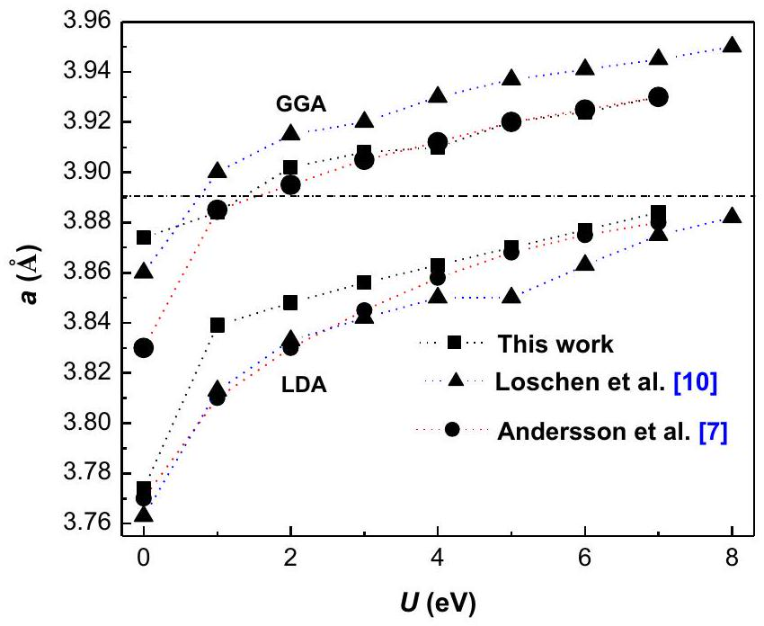
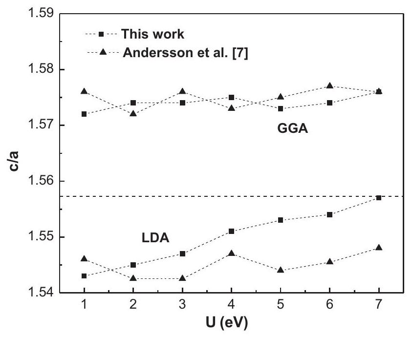
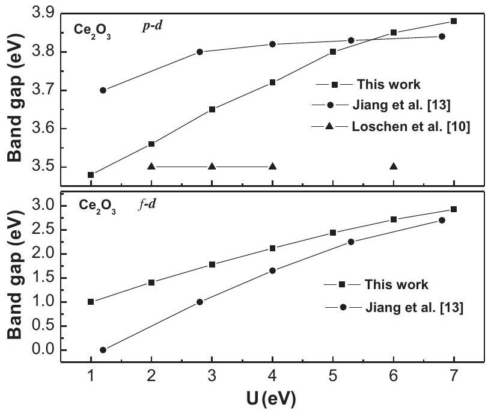
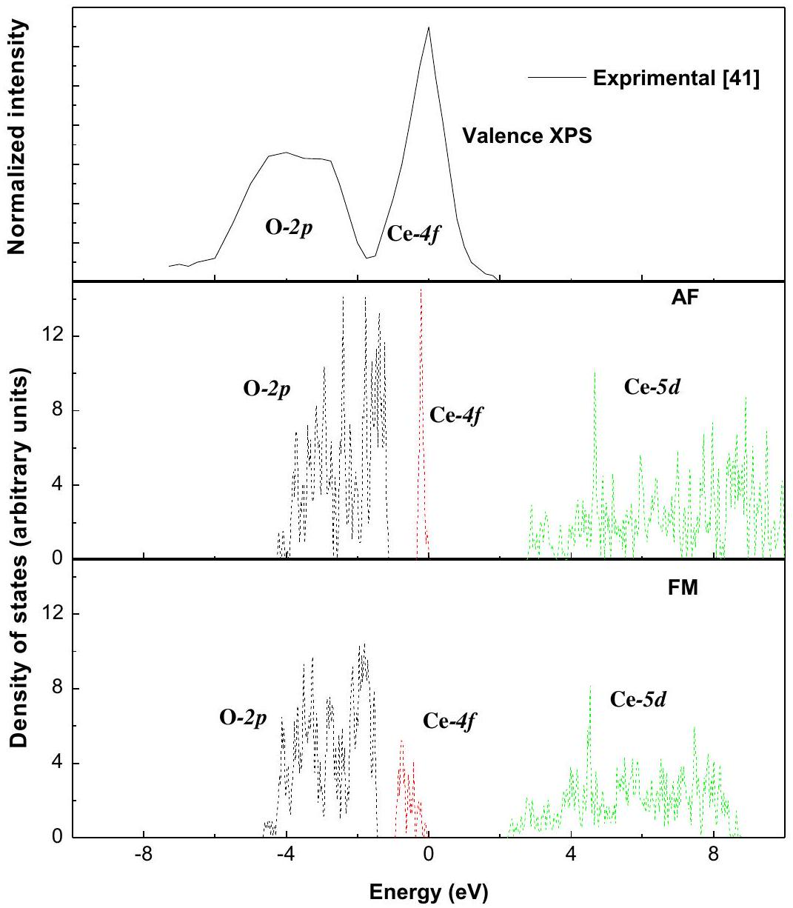

# Elastic and electronic properties of $\mathrm{Ce}_{2} \mathrm{O}_{3}$ from first principles 

Zhen-Wei Niu ${ }^{\mathrm{a}}$, Yan Cheng ${ }^{\mathrm{a}, *}$, Xiang-Rong Chen ${ }^{\mathrm{a}, \mathrm{b}}$, Kai Xu ${ }^{\mathrm{a}}$, Guang-Fu Ji ${ }^{\mathrm{c}}$ ${ }^{\mathrm{a}}$ Institute of Atomic and Molecular Physics, Sichuan University, Chengdu 610064, China ${ }^{\mathrm{b}}$ International Centre for Materials Physics, Chinese Academy of Sciences, Shenyang 110016, China ${ }^{\mathrm{c}}$ National Key Laboratory for Shock Wave and Detonation Physics Research, Institute of Fluid Physics, Chinese Academy of Engineering Physics, Mianyang 621900, China

## ARTICLE INFO

## Article history:

Received 8 July 2012
Received in revised form 30 September 2012
Accepted 3 October 2012
Available online 16 November 2012

## Keywords:

Elastic properties
Electronic structures
$\mathrm{Ce}_{2} \mathrm{O}_{3}$
Density functional theory

#### Abstract

Elastic and electronic properties of $\mathrm{Ce}_{2} \mathrm{O}_{3}$ have been investigated by performing calculations using the local-density approximation plus $U($ LDA $+U)$ scheme in the frame of density functional theory (DFT). The strong on-site Coulomb repulsion of the localized Ce $4 f$ electrons is amended by the LDA $+U$ formalism, showing that $\mathrm{Ce}_{2} \mathrm{O}_{3}$ is quite sensitive to the change of $U$; the optimized choice of $U$ is 6 eV . The calculated lattice constants, insulating gap, and bulk modulus agree well with the available experimental and other theoretical data. Moreover, the anisotropies, the compressional and shear wave velocities, Young's modulus, Poisson's ratio, as well as the Debye temperature have been calculated for $U=0,2,4$ and 6 eV . It has been found that the elastic constants, bulk modulus, shear modulus, acoustic velocities, and Debye temperature of $\mathrm{Ce}_{2} \mathrm{O}_{3}$ are consistently decreasing upon increasing the $U$ value.

© 2012 Elsevier B.V. All rights reserved.

## 1. Introduction

The properties of many technology-related materials are determined by the ability of their atomic constituents to display multiple oxidation states during different local microscopic environments $[1,2]$. The typical materials are the cerium oxides and the related compounds, which play important roles in catalysis and other applications due to their special electronic nature [1-7]. Because of the ability to store, release and transport oxygen ions, ceria is not only the support but also one of the active participants in some reactions, such as low-temperature CO and volatile organic compounds (VOC) oxidation catalysts [8]. Moreover, ceria is also an available material in microelectronics applications [9]. Thus, it is necessary to obtain an accurate description of ceria materials in theory for understanding the nature and the effective practical application in future [10].

In 2002, Skorodumova et al. [11] concluded that the $4 f$ electron states in Ce can be considered to be part in the valence band in $\mathrm{CeO}_{2}$ and to be part in a core state in $\mathrm{Ce}_{2} \mathrm{O}_{3}$. A balanced theoretical description of $\mathrm{CeO}_{2}$ and $\mathrm{Ce}_{2} \mathrm{O}_{3}$ is not straightforward [2,7]. In principle, the conventional density functional theory (DFT) techniques based on local-density approximation (LDA) or generalizedgradient approximation (GGA) can obtain a somewhat straightforward description of the insulating $\mathrm{CeO}_{2}$ owing to the unoccupied Ce $4 f$ states, but for $\mathrm{Ce}_{2} \mathrm{O}_{3}$, the standard LDA and GGA approaches

[^0]would be unable to yield a certain description because they are unable to describe the localization of the Ce $4 f$ states.

Both of the LDA and GGA approaches have a major deficiency, i.e. the delocalization error, which is particularly severe for systems with partially occupied $f$ states and can even lead to incorrect metallic ground states for many strongly correlated insulating systems [12,13]. Thus, an accurate calculation demands a modification of the usually employed DFT approaches to account for the strong localization of the $f$ electron in the formal $\mathrm{Ce}^{3+}$ [10,13]. By dividing the exact exchange interaction into two parts, i.e. short-range and long-range, some hybrid functionals partly correct the delocalization error, which significantly improves the description of the $d$ - and $f$-electron systems [14-16]. However, the dependence on the adjustable parameters remains a concern. One can get good agreement with experiment by using DFT $+U$, although DFT $+U$ relies on the choice of a particular exchange-correlation functional, in which the Hubbard $U$ is added, i.e. LDA $+U$ or GGA $+U$. The modification of the intra-atomic Coulomb interaction also depends on the value of the effective Hubbard $U$ term. Hence, the choice of $U$ is not unambiguous. It is often used to reproduce the experimental data to a certain extent, such as, the band gaps and the structural properties [7].

To date, as a study of the special $f$ electrons, cerium oxides have been widely investigated by a series of experiments and theories [6-17]. Especially, due to high sensitivity to the change of the on-site Coulomb repulsion, the balance choice of $U$ for $\mathrm{Ce}_{2} \mathrm{O}_{3}$ still remains a matter of debate. In the previous study, Anderson et al. [7] and Loschen et al. [10] reported the proper $U$ values for their LDA $+U$ calculations by VASP [18,19]. In this work, we focus
on the structures of the hexagonal $\mathrm{Ce}_{2} \mathrm{O}_{3}$ for the $U$ dependence of $\mathrm{LDA}+U$ and GGA $+U$ calculations, and then make investigations on the elastic and electronic properties of $\mathrm{Ce}_{2} \mathrm{O}_{3}$ through the Cambridge Serial Total Energy Package (CASTEP) program [20,21].

## 2. Theoretical method and computation details

### 2.1. Total energy electronic structure calculations

In our calculations, the primitive unit cell of $\mathrm{Ce}_{2} \mathrm{O}_{3}$ used consists of two Ce atoms and three O atoms. We employed the on-the-fly (OTF) pseudopotential for the interactions of electrons with the ion cores, together with the generalized gradient approximation (GGA) proposed by Perdew et al. [22,23] and the local density approximation (LDA) proposed by Vosko et al. [24] for the exchange-correlation potential. The LDA and GGA approaches have been used in the LDA $+U$ and GGA $+U$ variants, in which the orbital-dependent LDA $+U$ functional form is given as

$$
E_{\mathrm{LDA}+U}=E_{\mathrm{LDA}}+\frac{U-J}{2} \sum_{\sigma}\left[\operatorname{Tr} \rho^{\sigma}-\operatorname{Tr}\left(\rho^{\sigma} \rho^{\sigma}\right)\right]
$$

where $\rho^{\sigma}$ is the density matrix of $f$ states, $U$ is the Coulomb energy, and $J$ is the exchange energy. The Coulomb parameter $U$ and exchange parameter $J$ do not enter separately but combine into a single meaningful parameter $U\left(U_{\text {eff }}=U-J\right)$. A detailed description of this functional form can be found in Refs. [25-27]. To investigate the ferromagnetic (FM) and antiferromagnetic (AF) electronic structures of $\mathrm{Ce}_{2} \mathrm{O}_{3}$, we performed a lot of calculations starting from initial guesses of different spin symmetries, and selected the two Ce atoms with the opposite spin direction for AF states and the same spin direction for FM states.

The electronic wave functions are expanded in a plane wave basis set with an energy cut-off of 620 eV . The atomic levels $4 f^{1} 5 s^{2} 5 p^{6} 5 d^{1} 6 s^{2}$ of Ce atom and $2 s^{2} 2 p^{4}$ of O atom were treated as valence electron states. For the Brillouin-zone sampling, we used the $4 \times 4 \times 2$ Monkhorst-Pack mesh [28]. The self-consistent convergence of the total energy is $1.0 \times 10^{-6} \mathrm{eV}$ /Atom, the maximum ionic Hellmann-Feynman force within $0.01 \mathrm{eV} / \AA$, the maximum ionic displacement within $1.0 \times 10^{-4} \AA$, and the maximum stress within 0.02 GPa . These parameters are carefully tested in our calculations. It is found that these parameters are sufficient to lead to a wellconverged total energy.

### 2.2. Elastic properties

To calculate the elastic constants, we used the symmetry-dependent strains that are non-volume conserving. The elastic constants $C_{i j k l}$ with respect to the finite strain variables are defined as [29]
$C_{i j k l}=\left(\frac{\partial \sigma_{i j}(x)}{\partial e_{k l}}\right)_{X}$
where $\sigma_{i j}$ and $e_{k l}$ are the applied stress and Eulerian strain tensors, $X$ and $x$ are the coordinates before and after deformation, respectively. For the hexagonal $\mathrm{Ce}_{2} \mathrm{O}_{3}$, there are five independent elastic constants, i.e. $C_{11}, C_{12}, C_{13}, C_{33}$ and $C_{44}$.

The theoretical polycrystalline elastic modulus can be determined from the independent elastic constants above. There are two approximation methods to calculate the polycrystalline modulus, namely, the Voigt method [30] and the Reuss method [31]. For the hexagonal $\mathrm{Ce}_{2} \mathrm{O}_{3}$, the bulk and shear moduli, Voigt ( $B_{\mathrm{V}}, G_{\mathrm{V}}$ ) and Reuss ( $B_{\mathrm{R}}, G_{\mathrm{R}}$ ), are given by
$B_{\mathrm{V}}=\frac{1}{9}\left[2\left(C_{11}+C_{12}\right)+C_{33}+4 C_{13}\right]$
$B_{\mathrm{R}}=\frac{\left(C_{11}+C_{12}\right) C_{33}-2 C_{13}^{2}}{C_{11}+C_{12}+2 C_{33}-4 C_{13}}$
$G_{\mathrm{V}}=\frac{1}{30}\left(C_{11}+C_{12}+2 C_{33}-4 C_{13}+12 C_{44}+12 C_{66}\right)$
$G_{\mathrm{R}}=\frac{5}{2} \frac{\left(\left(C_{11}+C_{12}\right) C_{33}-2 C_{13}^{2}\right)^{2} C_{44} C_{66}}{3 B_{\mathrm{V}} C_{44} C_{66}+\left(\left(C_{11}+C_{12}\right) C_{33}-2 C_{13}^{2}\right)^{2}\left(C_{44}+C_{66}\right)}$
where
$C_{66}=\frac{1}{2}\left(C_{11}-C_{12}\right)$

The arithmetic average of the Voigt and the Reuss bounds is called the Voigt-Reuss-Hill (VRH) average and is commonly used to estimate elastic modulus of polycrystals. The VRH averages for shear modulus ( $G$ ) and bulk modulus ( $B$ ) are
$G=\frac{1}{2}\left(G_{\mathrm{R}}+G_{\mathrm{V}}\right)$
$B=\frac{1}{2}\left(B_{\mathrm{R}}+B_{\mathrm{V}}\right)$

The polycrystalline Young's modulus ( $E$ ) and Poisson's ratio ( $v$ ) are then calculated from the elastic constants using the following relations

$$
\begin{aligned}
E & =\frac{9 B G}{3 B+G} \\
v & =\frac{3 B-2 G}{3 B+G}
\end{aligned}
$$

From these elastic constants, one can also obtain the elastic Debye temperature $\left(\Theta_{\mathrm{D}}\right)$, which may be estimated from the average sound velocity $V_{\mathrm{m}}$ by the following equation [32]
$\Theta_{\mathrm{D}}=\frac{h}{k}\left[\frac{3 n}{4 \pi}\left(\frac{N_{\mathrm{A}} \rho}{M}\right)\right]^{1 / 3} V_{\mathrm{m}}$
where $h$ is Planck's constant, $k$ is Boltzmann's constant, $N_{\mathrm{A}}$ is Avogadro's number, $n$ is the number of atoms in the molecule, $M$ is the molecular weight, and $\rho$ is the density. The average wave velocity $V_{\mathrm{m}}$ is approximately calculated from
$V_{\mathrm{m}}=\left[\frac{1}{3}\left(\frac{2}{V_{\mathrm{s}}^{3}}+\frac{1}{V_{\mathrm{p}}^{3}}\right)\right]^{-1 / 3}$
where $V_{\mathrm{p}}$ and $V_{\mathrm{s}}$ are the compressional velocity and the shear wave velocity, respectively, which are obtained from Navier's equation [33]
$V_{\mathrm{P}}=\sqrt{\left(B+\frac{4}{3} G\right) / \rho}, \quad V_{\mathrm{s}}=\sqrt{G / \rho}$

## 3. Results and discussion

### 3.1. Structural properties of $\mathrm{Ce}_{2} \mathrm{O}_{3}$

At ambient conditions, $\mathrm{Ce}_{2} \mathrm{O}_{3}$ is one of the strongly correlated insulating systems of the hexagonal sesquioxide (with point group $P \overline{3} m 1$ ) with lattice parameters $a=3.891 \AA$ and $c=6.059 \AA$ [34-37]. As is known that, for many strongly correlated insulating systems, the conventional DFT (LDA and GGA) calculations usually have the delocalization error. To solve this problem, one needs to apply some reasonable corrections for the conventional DFT, such as, hybrid density functional (HSE) [15,16], LDA $+U$, and GGA $+U$, and so on. By using the HSE, Hay et al. [15] obtained a correct description of the insulating nature of $\mathrm{Ce}_{2} \mathrm{O}_{3}$, but not a very good picture for its geometric structure and electronic structure [15]. We here used the $\mathrm{LDA}+U$ and GGA $+U$ to investigate the structure of the hexagonal $\mathrm{Ce}_{2} \mathrm{O}_{3}$.

In the equilibrium geometry calculations, we performed the following procedures: firstly, for a fixed axial ratio $c / a$, we took a series of different values of $a$ and $c$ to calculate the total energies $E$ and the corresponding primitive cell volumes $V$, and then obtained the lowest energy $E_{\text {min }}$ for the given ratio $c / a$. This procedure was repeated over a wide range of $c / a$. Finally, by fitting our $E_{\text {min }}-V$ data to the third-order Birch-Murnaghan equation of state (EOS) [38]
$P(V)=\frac{3 B_{0}}{2}\left[\left(\frac{V_{0}}{V}\right)^{\frac{7}{3}}-\left(\frac{V_{0}}{V}\right)^{\frac{5}{3}}\right]\left\{1+\frac{3}{4}\left(B_{0}^{\prime}-4\right)\left[\left(\frac{V_{0}}{V}\right)^{\frac{2}{3}}-1\right]\right\}$
where $V_{0}$ is the equilibrium cell volume of $\mathrm{Ce}_{2} \mathrm{O}_{3}$ at 0 GPa and 0 K , and $V$ is the cell volume corresponding to the applied pressure $P$ at 0 K , we obtained the equilibrium parameters $a, c, c / a$, the bulk modulus $B_{0}$ and its pressure derivative $B_{0}^{\prime}$ of $\mathrm{Ce}_{2} \mathrm{O}_{3}$. In the LDA $+U$ and GGA $+U$ calculations, the effective $U$ changes in the range of $0-7 \mathrm{eV}$.

The obtained lattice constant $a$ and ratio $c / a$ of $\mathrm{Ce}_{2} \mathrm{O}_{3}$ as functions of $U$ are shown in Fig. 1 and Fig. 2, respectively, together with other theoretical data. It is found that the lattice parameters of $\mathrm{Ce}_{2} \mathrm{O}_{3}$ are sensitive to $U$. In general, the GGA $+U$ method slightly overestimates the parameters $a$ and $c / a$, while the LDA $+U$ method underestimates them. For the GGA $+U$ calculations, our $a$ values are in agreement with the results of Andersson et al. [7] and about $0.02 \AA$ lower than those of Loschen et al. [10]. When $U$ equals to 1 eV , we yielded a lattice constant $a=3.884 \AA$, which is better than the other results. However, as $U$ increases, the lattice constant $a$ value is far away from the experimental value ( $3.891 \AA$ ) [34-37].

For the LDA $+U$ calculations, our lattice constant $a$ is a little bigger than that of Andersson et al. [7] and Loschen et al. [10] when $U$

Fig. 1. Dependence of the lattice constant $a$ of $\mathrm{Ce}_{2} \mathrm{O}_{3}$ on $U$. The dashed line represents the experimental value.

Fig. 2. The $c / a$ ratio of $\mathrm{Ce}_{2} \mathrm{O}_{3}$ as a function of $U$. The dashed line represents the experimental value.

is increased from 0 to 3 eV , but in good agreement with the results of Andersson et al. [7] and higher than the results of Loschen et al. [10] when $U$ is increased from 4 to 7 eV . The obtained lattice constant $a$ is well consistent with the experimental value [34-37] when $U$ is increased to 7 eV . It is noted that from GGA $+U$ calculations the $c / a$ value is higher than 1.57 , while from LDA $+U$ calculations it increases with the increasing $U$ and becomes 1.557 when $U=7 \mathrm{eV}$, which is in good agreement with the measured value 1.557 [34-37]. By comparing these results with each other, we note that the LDA $+U$ method with $U=6 \mathrm{eV}$ seems to be more
suitable for investigating the structural properties of $\mathrm{Ce}_{2} \mathrm{O}_{3}$ than the GGA $+U$ method.

Using the LDA $+U$ method with $U=6 \mathrm{eV}$, we obtained the lattice parameters $a=3.877 \AA$ and $c / a=1.554$, as well as the insulating gap $E_{\text {gap }}=2.72 \mathrm{eV}$ (see Section 3.3), which are consistent with the experimental results $(a=3.891 \AA$ and $c / a=1.557$ [34-37], $E_{\text {gap }}=2.4 \mathrm{eV}$ [39]). In the following, we will mainly investigate the elastic and electronic properties of $\mathrm{Ce}_{2} \mathrm{O}_{3}$ by using the LDA $+U$ method with $U=6 \mathrm{eV}$.

### 3.2. Elastic properties of $\mathrm{Ce}_{2} \mathrm{O}_{3}$

It is known that the elastic properties of a solid not only relate to various fundamental solid state properties, such as interatomic potentials, equations of state, and phonon spectra, but also link to the specific heat, thermal expansion, Debye temperature, and Grüneisen parameter. Furthermore, the elastic constants provide valuable information about the bonding characteristic between adjacent atomic planes and the anisotropic character of the bonding and structural stability. Therefore, it is very important to know the elastic properties of $\mathrm{Ce}_{2} \mathrm{O}_{3}$. In Table 1, we present our calculated elastic constants ( $C_{11}, C_{12}, C_{13}, C_{33}, C_{44}$ ) and elastic modulus $B$, shear modulus $G$, and ratio $B / G$ of $\mathrm{Ce}_{2} \mathrm{O}_{3}$ for $U=0,2,4$ and 6 eV with the LDA $+U$ method. The calculated elastic constants of $\mathrm{Ce}_{2} \mathrm{O}_{3}$ satisfy the following mechanical stability conditions of a hexagonal crystal

$$
C_{44}>0, \quad C_{11}>\left|C_{12}\right|, \quad\left(C_{11}+2 C_{12}\right) C_{33}>2 C_{13}^{2}
$$

It is noted that though $U$ is introduced in our calculations, it has no effect on the stability of $\mathrm{Ce}_{2} \mathrm{O}_{3}$. Unfortunately, no experimental and theoretical data of $\mathrm{Ce}_{2} \mathrm{O}_{3}$ are available for comparison of our elastic constants.

According to the elastic constants obtained above, when $U$ equals to $0,2,4$ and 6 eV , the bulk modulus $B$ and shear modulus $G$ of $\mathrm{Ce}_{2} \mathrm{O}_{3}$ (denoted as $B^{u=0}, B^{u=2}, B^{u=4}, B^{u=6} ; G^{u=0}, G^{u=2}, G^{u=4}, G^{u=6}$ for $U=0,2,4$ and 6 eV , respectively) are yielded: $B^{u=0}=144.32 \mathrm{GPa}$ ( $B^{u=2}=127.15, B^{u=4}=117.80$, and $B^{u=6}=109.04 \mathrm{GPa}$ ) and $G^{u=0}= 66.94 \mathrm{GPa}\left(G^{u=2}=56.43, G^{u=4}=54.94\right.$, and $\left.G^{u=6}=50.78 \mathrm{GPa}\right)$. Our $B^{u=6}$ is smaller than other values ( $B^{u=0}, B^{u=2}$, and $B^{u=4}$ ), which is due to the fact that the equilibrium volume obtained in the LDA calculations is smaller than those in the LDA $+U$ calculations, where the equilibrium volume increases with the increasing $U$ value. Though $B^{u=6}$ has a lower value when compared with other values ( $B^{u=0}, B^{u=2}$, and $B^{u=4}$ ), it is consistent with the experimental value 111 GPa [34]. In addition, the $B / G$ ratio of $\mathrm{Ce}_{2} \mathrm{O}_{3}$ is 2.16 (2.25, 2.15 and 2.15 ) when $U$ equals to $0(2,4$, and 6$) \mathrm{eV}$, indicating that this material is still ductile since the $B / G$ ratio is larger than 1.75 [40].

The Debye temperature is an important parameter related to many physical properties of solids, such as specific heat, elastic constants, and melting temperature. In Table 1, we also list the compressional wave velocity $V_{\mathrm{S}}$, the shear wave velocity $V_{\mathrm{P}}$, and the elastic Debye temperature $\Theta_{\mathrm{D}}$ of $\mathrm{Ce}_{2} \mathrm{O}_{3}$. Moreover, we yield Young's modulus and Poisson's ratio when $U$ equals to $0,2,4$ and $6 \mathrm{eV}: E^{u=0}=173.93 \mathrm{GPa}$ ( $E^{u=2}=147.47, E^{u=4}=142.60$, and $E^{u=6}=131.87 \mathrm{GPa}$ ) and $v^{u=0}=0.299\left(v^{u=2}=0.307, v^{u=4}=0.298\right.$, and

Table 1
Calculated elastic constants $C_{\mathrm{ij}}(\mathrm{GPa})$, bulk modulus $B(\mathrm{GPa})$, shear modulus $G(\mathrm{GPa}), B / G$, acoustic velocities $V_{\mathrm{s}}$ and $V_{\mathrm{P}}(\mathrm{km} / \mathrm{s})$, and Debye temperature $\Theta_{\mathrm{D}}(\mathrm{K})$ of $\mathrm{Ce}_{2} \mathrm{O}_{3}$ at $U=0,2,4$ and 6 eV with LDA $+U$ calculations.
| $U$ | $C_{11}$ | $C_{12}$ | $C_{13}$ | $C_{33}$ | $C_{44}$ | $B$ | $G$ | B/G | $V_{\mathrm{s}}$ | $V_{\mathrm{p}}$ | $\Theta_{\mathrm{D}}$ |
| :--- | :--- | :--- | :--- | :--- | :--- | :--- | :--- | :--- | :--- | :--- | :--- |
| 0 | 232.1 | 120.6 | 97.3 | 209.6 | 82.4 | 144.3 | 66.9 | 2.16 | 3.0 | 5.5 | 406 |
| 2 | 222.8 | 127.5 | 88.0 | 142.5 | 74.8 | 127.1 | 56.4 | 2.25 | 2.8 | 5.3 | 377 |
| 4 | 213.1 | 111.0 | 81.1 | 133.0 | 67.6 | 117.8 | 54.9 | 2.15 | 2.8 | 5.2 | 372 |
| 6 | 198.5 | 99.4 | 78.0 | 119.0 | 62.7 | 109.0 | 50.8 | 2.15 | 2.7 | 5.0 | 359 |

Fig. 3. Band gaps of $\mathrm{Ce}_{2} \mathrm{O}_{3}$ as a function of $U$ from the LDA $+U$ method.

$v^{u=6}=0.298$ ), suggesting that there is no effect on Poisson's ratio but a remarkable effect on Young's modulus when $U$ is introduced.

Finally, it is found from Table 1 that the elastic constants, bulk modulus, shear modulus, acoustic velocities and Debye temperature of $\mathrm{Ce}_{2} \mathrm{O}_{3}$ consistently decrease upon increasing the $U$ value. According to the results of Loschen et al. [10], the higher $U$ values
lead to lower bonding/cohesive energies. Apparently, this also affects the elasticity and related properties of $\mathrm{Ce}_{2} \mathrm{O}_{3}$.

### 3.3. Electronic structure

Since the density of states (DOS) plays an important role in the analysis of the physical properties of materials, we here calculated the DOS to investigate the influence of $U$ on the band gaps of $\mathrm{Ce}_{2} \mathrm{O}_{3}$. An insulating gap of about 2.72 eV was obtained due to the splitting of $4 f$ band, which is in good agreement with the experimental optical band gap of 2.4 eV [39].

In Fig. 3, we show the influence of $U$ to the band gaps of $\mathrm{Ce}_{2} \mathrm{O}_{3}$ (the $4 f$ band is the occupied state). With the increasing $U$ value, the increase of the $f-d$ gap is about 2 eV , which compares reasonably to the change of Jiang et al. (about 3 eV ) [13]. Not like the $f-d$ gap, our results of the $p-d$ gap have a remarkable difference from those of Loschen et al. [10] and Jiang et al. [13]. In our calculations, the $p$ and $d$ bands are moved toward the high energy region with the increasing $U$ value while the occupied $4 f$ band stays unchanged. The increase of the $p-d$ gap is not more than 0.5 eV when $U$ increases from 0 to 7 eV . Hence, we can obtain a good description for the $f-d$ gap by using a significantly larger $U$, but cannot improve the depiction of the $p-d$ gap of $\mathrm{Ce}_{2} \mathrm{O}_{3}$.

Finally, we illustrate the partial density of states (PDOS) of $\mathrm{Ce}_{2} \mathrm{O}_{3}$ for both ferromagnetic (FM) and antiferromagnetic (AF) states with $U=6 \mathrm{eV}$ in Fig. 4, together with the X-ray photoelectron spectroscopy (XPS) spectrum of a film assigned to $\mathrm{Ce}_{2} \mathrm{O}_{3}$ [41]. It is shown in Fig. 4 that the AF state presents a higher localization of

Fig. 4. The experimental valence spectrum and the calculated PDOS of $\mathrm{Ce}_{2} \mathrm{O}_{3}$ in the FM and AF ground states from the LDA $+U$ method with $U=6 \mathrm{eV}$.

the Ce $4 f$ states as compared to the PDOS diagrams. Our results are in agreement with the XPS except the $4 f$ band width significantly narrower than the XPS. Since the PDOS in AF state is consistent with other results [7,15], we believe that this depiction is reasonable though it may be that the true bandwidth is underestimated with the LDA $+U$ approximation. Considering the different magnetic states, we found that the peak of the occupied $4 f$ band becomes lower and broader when the magnetic state changes from AF to FM . It means that, in a unit cell the variation of the electron spin orientation of $4 f$ electron can lead to a significant effect on the localization of $4 f$ band. It can be seen from Fig. 4 that the $0-2 p$ valence band will eventually merge with the occupied Ce- $4 f$ band with the increase of $U$, and there is a small admixture of them at the top of valence band (The admixture has not been shown in Fig. 4). The same phenomenon is also found in the calculation of Andersson et al. [7]. Fabris et al. [2] pointed out that this result is due to the nonorthogonality of the $\mathrm{O}-2 p$ and $\mathrm{Ce}-4 f$ states, and suggested to solve this problem by Wannier-type functions, however, it only obtained partly success owing to the absence of the nonlinear core correction to the exchange-correlation.

## 4. Conclusions

We have investigated the elastic and electronic properties of $\mathrm{Ce}_{2} \mathrm{O}_{3}$ by the local-density approximation plus $U($ LDA $+U)$ scheme in the frame of density functional theory (DFT). It is found that $\mathrm{Ce}_{2} \mathrm{O}_{3}$ is more sensitive to the change of $U$ and the optimized choice of $U$ is 6 eV . From the LDA $+U$ method with $U=6 \mathrm{eV}$, the calculated lattice constants, insulating gaps and bulk modulus agree well with the available experimental and other theoretical data. Moreover, we have obtained the bulk modulus $B^{u=6}=109.04 \mathrm{GPa}$, the compressional and shear wave velocities $V_{\mathrm{P}}=5.0 \mathrm{~km} / \mathrm{s}$ and $V_{\mathrm{S}}=2.7 \mathrm{~km} / \mathrm{s}$ as well as the Debye temperature $\Theta_{D}=359.2 \mathrm{~K}$ at $U=6 \mathrm{eV}$. By comparing the PDOS at 6 eV in both magnetic states, i.e. the AF and FM states, it is noted that the variation of the electron spin orientation of $4 f$ electron can lead to a significant influence on the localization of $4 f$ band.

## Acknowledgments

The authors would like to thank the support by the National Natural Science Foundation of China under Grant Nos. 11204192 and 11174214, the NSAF under Grant No. U1230201, the National Key Laboratory Fund for Shock Wave and Detonation Physics Research of the China Academy of Engineering Physics under Grant No. 9140C671101110C6709, the Defense Industrial Technology Development Program of China under Grant No. B1520110002, and the National Basic Research Program of China under Grant Nos. 2010CB731600 and 2011CB808201. We also acknowledge the support for the computational resources by the State Key Laboratory of Polymer Materials Engineering of China in Sichuan

University. Some calculations are performed on the ScGrid of Supercomputing Center, Computer Network Information Center of Chinese Academy of Sciences.

## References

[1] A. Trovarelli, Catalysis by Ceria and Related Materials, Imperial College Press, London, 2002.
[2] S. Fabris, S. de Cironcoli, S. Baroni, G. Vicario, G. Balducci, Phys. Rev. B 71 (2005) 041102.
[3] M.S. Dresselhaus, I.L. Thomas, Nature (London) 414 (2001) 332.
[4] Z.H. Xu, L.M. He, Y. Zhao, R.D. Mu, S.M. He, X.Q. Cao, J. Alloys Comp. 491 (2010) 729.
[5] H. Palneedi, V. Mangam, S. Das, K. Das, J. Alloys Comp. 509 (2011) 9912.
[6] C.W.M. Castleton, J. Kullgren, K. Hermansson, J. Chem. Phys. 127 (2007) 244704.
[7] D.A. Andersson, S.I. Simak, B. Johansson, I.A. Abrikosov, N.V. Skorodumova, Phys. Rev. B 75 (2007) 035109.
[8] J. Graciani, A.M. Márquez, J.J. Plata, Y. Ortega, N.C. Hernández, A. Meyer, C.M. Zicovich-Wilson, J.F. Sanz, J. Chem. Theory Comput. 7 (2011) 56.
[9] T. Yamamoto, H. Momida, T. Hamada, T. Uda, T. Ohno, Thin Solid Film 486 (2005) 136.
[10] C. Loschen, J. Carrasco, K.M. Neyman, F. Illas, Phys. Rev. B 75 (2007) 035115.
[11] N.V. Skorodumova, S.I. Simak, B.I. Lundqvist, I.A. Abrikosov, B. Johansson, Phys. Rev. Lett. 89 (2002) 16.
[12] A.J. Cohen, P. Mori-sanchez, W.T. Yang, Science 321 (2008) 792.
[13] H. Jiang, R.I. Gomez-Abal, P. Rinke, M. Scheffler, Phys. Rev. Lett. 102 (2009) 126403.
[14] I.D. Prodan, G.E. Scuseria, J.A. Sordo, K.N. Kudin, R.L. Martin, J. Chem. Phys. 123 (2005) 014703.
[15] P.J. Hay, R.L. Martin, J. Uddin, G.E. Scuseria, J. Chem. Phys. 125 (2006) 034712.
[16] J. Heyd, G.E. Scuseria, J. Chem. Phys. 120 (2004) 7274.
[17] N.V. Skorodumova, R. Ahuja, S.I. Simak, I.A. Abrikosov, B. Johansson, B.I. Lundqvist, Phys. Rev. B 64 (2001) 115108.
[18] G. Kresse, J. Hafner, Phys. Rev. B 47 (1993) 558.
[19] G. Kresse, J. Furthmüller, Phys. Rev. B 54 (1996) 11169.
[20] M.C. Payne, M.P. Teter, D.C. Allen, T.A. Arias, J.D. Joannopoulos, Rev. Mod. Phys. 64 (1992) 1045.
[21] V. Milman, B. Winkler, J.A. White, C.J. Packard, M.C. Payne, E.V. Akhmatskaya, R.H. Nobes, Int. J. Quantum Chem. 77 (2000) 895.
[22] J.P. Perdew, J.A. Chevary, S.H. Vosko, K.A. Jackson, M.R. Pederson, D.J. Singh, C. Fiolhais, Phys. Rev. B 46 (1992) 6671.
[23] J.P. Perdew, J.A. Chevary, S.H. Vosko, K.A. Jackson, M.R. Pederson, D.J. Singh, C. Fiolhais, Phys. Rev. B 48 (1993) 4978.
[24] S.H. Vosko, L. Wilk, M. Nusair, Can. J. Phys. 58 (1980) 1200.
[25] V.I. Anisimov, J. Zaanen, O.K. Andersen, Phys. Rev. B 44 (1991) 3.
[26] V.I. Anisimov, I.V. Solovyev, M.A. Korotin, Phys. Rev. B 48 (1993) 23.
[27] M. Cococcioni, S. de Gironcoli, Phys. Rev. B 71 (2005) 035105.
[28] H.J. Monkhorst, J.D. Pack, Phys. Rev. B 13 (1976) 5188.
[29] D.C. Wallace, Thermodynamics of Crystals, Wiley, New York, 1972.
[30] W. Voigt, Lehrbuch der Kristallphysik, Taubner, Leipzig, 1928.
[31] A.Z. Reuss, Angew. Math. Mech. 9 (1929) 49.
[32] O.L. Anderson, J. Phys. Chem. Solids 24 (1963) 909.
[33] K.B. Panda, K.S. Ravi Chandran, Comp. Mater. Sci. 35 (2006) 134.
[34] H. Barnighausen, G. Schiller, J. Less-Common Met. 110 (1985) 385.
[35] N. Hirosaki, S. Ogata, C. Kocer, J. Alloys Comp. 351 (2003) 31.
[36] B. Amadon, J. Phys. Condens. Matter 24 (2012) 075604.
[37] I.K. Jeong, T.W. Darling, M.J. Graf, T. Proffen, R.H. Heffner, Y. Lee, T. Vogt, J.D. Jorgensen, Phys. Rev. Lett. 92 (2004) 105702.
[38] F. Birch, J. Appl. Phys. 9 (1938) 279. Phys. Rev. 71 (1947) 809.
[39] A.V. Prokofiev, A.I. Shelykh, B.T. Melekh, J. Alloys Comp. 242 (1996) 41.
[40] S.F. Pugh, Phil. Mag. 45 (1954) 833.
[41] D.R. Mullins, S.H. Overbury, D.R. Huntley, Surf. Sci. 409 (1998) 307.

[^0]:    * Corresponding author. Tel.: +86 2885405516.

    E-mail address: ycheng@scu.edu.cn (Y. Cheng).

