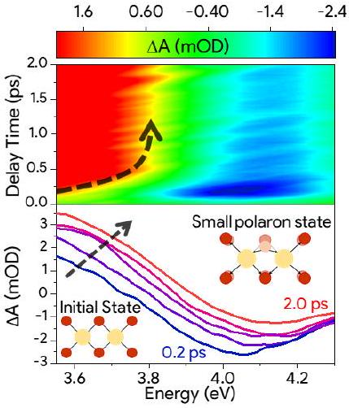
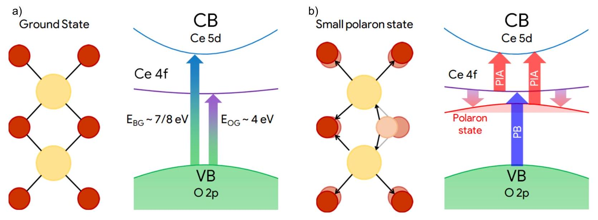
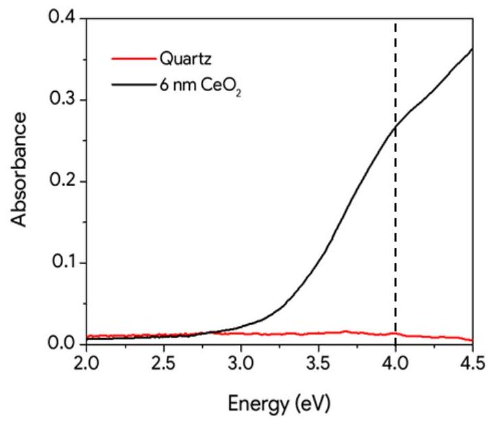
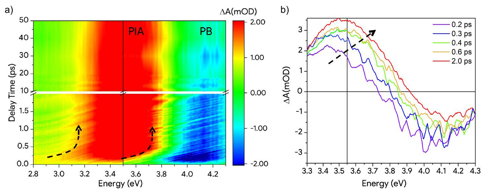
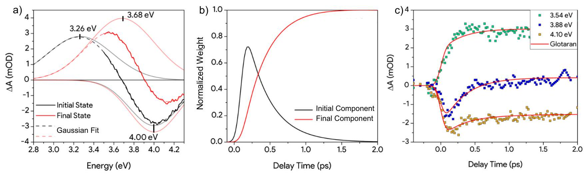

# Ultrafast Formation of Small Polarons and the 

## Optical Gap in $\mathrm{CeO}_{2}$

Jacopo Stefano Pelli Cresi ${ }^{1, *}$, Lorenzo Di Mario ${ }^{2}$, Daniele Catone ${ }^{2}$, Faustino Martelli ${ }^{3}$, Alessandra Paladini ${ }^{1}$, Stefano Turchini ${ }^{2}$, Sergio D'Addato ${ }^{4}$, Paola Luches ${ }^{5}$, and Patrick $O^{\prime} K_{e e f f e}{ }^{I}$.

1Istituto di Struttura della Materia-CNR (ISM-CNR), Division of Ultrafast Processes in Materials (FLASHit), Area della Ricerca di Roma 1, 00015 Monterotondo Scalo, Italy.
${ }^{2}$ Istituto di Struttura della Materia-CNR (ISM-CNR), Division of Ultrafast Processes in Materials (FLASHit), Area della Ricerca di Roma 2 Tor Vergata, Via del Fosso del Cavaliere 100, 00133 Rome, Italy.
${ }^{3}$ IMM, Area della Ricerca di Roma 2 Tor Vergata, Via del Fosso del Cavaliere 100, 00133 Rome, Italy.
${ }^{4}$ Università di Modena e Reggio Emilia, Via Campi 213/a, Modena, Italy.
${ }^{5}$ CNR-NANO, Centro di Ricerca S3, via G. Campi 213/a, Modena, Italy.
*corresponding author: jacopostefano.pellicresi@elettra.eu

#### Abstract

The ultrafast dynamics of excited states in cerium oxide are investigated to access the early moments of polaron formation, which can influence the photocatalytic functionality of the material. UV transient absorbance spectra of photoexcited $\mathrm{CeO}_{2}$ exhibit a bleaching of the band edge absorbance induced by the pump and a photoinduced absorbance feature assigned to Ce 4f → Ce 5d transitions. A blueshift of the spectral response of the photoinduced absorbance signal in the first picosecond after the pump excitation is attributed to the dynamical formation of small polarons with a characteristic time of 330 fs . A further important result of our work is that the combined use of steady-state and ultrafast transient absorption allows us to propose a revisited value for the optical gap for ceria ( $\mathrm{E}_{\mathrm{og}}=4 \mathrm{eV}$ ), larger than usually reported.

## TOC GRAPHIC

Transition metal oxides (TMOs) are candidates for efficient photoelectrochemical catalysts of reactions such as water splitting and reduction of $\mathrm{CO}_{2}{ }^{1-4}$. In such processes, an electron-hole pair is created by the absorption of a photon. The electrons can be used to promote reduction processes while the holes can be employed in oxidations, depending on whether the catalyst is used as photocathode or photoanode. The efficiency of these processes strongly depends on carriers lifetime and mobility.
$\mathrm{CeO}_{2}, ~ \mathrm{TiO}_{2}$ and $\mathrm{Fe}_{2} \mathrm{O}_{3}$ are good catalysts because of their electronic structure, which allows transition metal ions to undergo redox cycles quickly and repeatably. However, the use of TMOs in photocatalysis is hampered by the formation of small polarons that affect both lifetime mobility of charge carriers ${ }^{2,5-7}$. A polaron is formed when the charge carriers polarize the lattice with the ensuing changes of the charge carrier energy ${ }^{8}$. The polaron, has a larger effective mass and a smaller mobility than the bare charge carriers. Polarons are classified into two types depending on the spatial extension of the polarization field: large polarons are spread across several lattice unit cells while small polarons have the size of a single or few unit cells. The formation of small polarons has been observed in several TMOs such as $\mathrm{Fe}_{2} \mathrm{O}_{3}{ }^{9}, \mathrm{TiO}_{2}{ }^{10}, \mathrm{NiO}^{11}$, and $\mathrm{Co}_{3} \mathrm{O}_{4}{ }^{12}$. The textbook case of the small polaron model was proposed to explain electron mobility in partially reduced cerium oxide $\left(\mathrm{CeO}_{2-\mathrm{x}}\right)^{5}$. In particular, the presence of small polarons in $\mathrm{CeO}_{2}$ was suggested by the temperature dependence of the conductivity of single crystals and supported using the thermopower-conductivity relation ${ }^{13}[6]$. The results were interpreted as due to an enhanced polarization field following the removal of oxygen atoms from the lattice ${ }^{14-16}$. In this picture, the functionality of cerium oxide is linked to the mobility of oxygen ions, in turn entangled with carrier mobility via polaron hopping ${ }^{15,17}$.

While the transport mechanism of the ground state polaron is established ${ }^{6}$, only recently the formation of small polarons in photoexcited states has been studied ${ }^{2,18-20}$, in particular in haematite ${ }^{2,19}$ and $\mathrm{NiO}^{11}$. Those works have shown that the small polaron is formed by coupling between photoexcited electrons and the longitudinal optical (LO) phonons. For $\mathrm{Fe}_{2} \mathrm{O}_{3}$, a two-step process was proposed ${ }^{2}$ that takes place after photoexcitation by transferring electron density from oxygen to iron atoms. This initial coupling between excited electrons and optical phonons is followed by recombination of the phonons with the hot electrons to form small polarons. The time-constant for the process was found to be 660 fs in $\mathrm{Fe}_{2} \mathrm{O}_{3}{ }^{19}$ and $0.3-1.7 \mathrm{ps}$ in $\mathrm{NiO}^{11}$.

Here, we suggest a similar process to occur in $\mathrm{CeO}_{2}$ based on time-resolved optical absorption measurements. We have taken advantage of the peculiar electronic structure of $\mathrm{CeO}_{2}$, which involves a valence band composed mainly of oxygen 2 p states and a conduction band

Figure 1 a. The ground state of $\mathrm{CeO}_{2}$ is characterized by a fluorite structure where $\mathrm{Ce}^{4+}$ (yellow) are near 8 O atoms (here simplified to 2 dimensions). Stoichiometric $\mathrm{CeO}_{2}$ presents a VB dominated by oxygen 2p states, a CB with a $7-8 \mathrm{eV}$ bandgap and empty 4 f states between these bands ${ }^{17,38}$. The optical gap between Ce 4 f states and VB is about 4 eV . b. A photoexcitation of $\mathrm{CeO}_{2}$ induces the filling of the Ce 4 f states. This produces a polarization which deforms the lattice causing the modification of the band structure. The energy state generated by the formation of small polaron state is schematized in red. The photobleachig and photoinduced absorption transient signal are highlighted with blue and red arrows.

characterized by the cerium 5d states (Figure 1a) ${ }^{21,22}$. As shown in Figure 1a, localized unoccupied cerium 4f states lay between these bands ${ }^{21,23,24}$. The UV light absorption of $\mathrm{CeO}_{2}$ induces a transition from the oxygen 2 p states to the cerium 4 f orbitals, which is allowed by the small but non-negligible hybridization between cerium and oxygen states ${ }^{21,25}$. Here, using fast transient absorbance spectroscopy (FTAS) we explore the dynamics of the 4 f states after the photoexcitation of $\mathrm{CeO}_{2}$. We observed a fast blueshift of the photoinduced transition from Ce 4 f to the empty Ce 5d band. This behavior is interpreted as a modification of the band structure induced by small polaron formation (Figure 1b). Moreover, we will revisit the energy value of this $2 \mathrm{p}-4 \mathrm{f}$ transition as one of the outcomes of the comparison between steady-state and transient absorption measurements.

We used a 6 nm-thick film of $\mathrm{CeO}_{2}$ grown by molecular beam epitaxy (MBE) on quartz ( $\mathrm{SiO}_{2}$ ) at room temperature by evaporating metallic cerium in a partial pressure of oxygen ( $\left.10^{-6} \mathrm{mbar}\right)^{26}$. The film was characterized using UV-Vis spectrophotometry. The absorbance A was estimated by measuring the fraction of transmitted light T and of specular reflected light $\mathrm{R}(\mathrm{A}=1-\mathrm{T}-\mathrm{R})$,

Figure 2 Absorbance of the $\mathrm{CeO}_{2}$ film (black) and of the quartz substrate (red). The dashed line highlight the shoulder of the absorbance which is ascribed to the optical gap of the material.

neglecting the scattered light. As shown in Figure 2, the quartz contribution to the absorbance is negligible up to 4.5 eV , while $\mathrm{CeO}_{2}$ exhibits a strong absorbance at energies higher than 3.2 eV with a shoulder at about 4 eV (highlighted by the dashed line). The analysis of Ce 3 d XPS spectra taken in-situ after the MBE deposition reports a superficial concentration of $\mathrm{Ce}^{3+}$ lower than 5\% showing the good stoichiometry of the film (see SI).

FTAS was used to probe the dynamics of the ceria optical response after an excitation induced by a pump pulse with energy above its optical bandgap. As a function of the pump-probe delaytime, we measured the differences in absorbance of the sample when excited by the pump and when unperturbed, i.e. the transient absorbance $\Delta \mathrm{A}$. We probed the system using a visible (2.0$3.5 \mathrm{eV})$ or a soft-UV (3.5-4.3 eV) supercontinuum. The instrument response function (IRF) has been evaluated in separate experiments to be characterized by a Gaussian with a FWHM of 70 $\mathrm{fs}^{26-28}$ (see the experimental section). Figure 3a shows the false-color maps of transient absorbance as a function of probe energy and delay-time after the photoexcitation. The two falsecolored maps (VIS and UV) were joined at 3.55 eV as reported in Figure 3a. Transient spectra recorded at selected delay-times (Figure 3b) show two main dominant signals in the UV region: a prevalent photobleaching (PB) centered at about 4 eV and a prevalent photoinduced absorption (PIA) centered at 3.55 eV .

Before discussing the dynamics of $\Delta \mathrm{A}$, we bring the reader's attention to the energy position of the PB peak. Usually a PB indicates a bleaching of absorption induced by the pump and so a strong depletion of a ground state. In the first 200 fs, it occurs at about 4 eV (Figure 3b), very close to the energy of the shoulder observed in the steady-state absorbance shown in Figure 2. The independent observation of two absorption structures around the same energy leads us to suggest that the optical gap between O 2p and Ce 4f states (schemes in Figure 1) of ceria is about

4 eV . This result appears is in contrast with almost all values reported in the literature. The optical gap of ceria, usually extracted via the Tauc's method, lies in the range of $3.0-3.6 \mathrm{eV}^{22,25}$. If we apply Tauc's method to our steady-state spectrum, we obtain a gap of 3.55 eV (analysis in SI). This value agrees with the literature, confirming that our absorption spectrum is typical of high-quality ceria, but is not consistent with the narrow and peaked PB signal in our FTAS spectra. The long absorption tail observed below 4.0 eV in the steady-state absorption should be considered as the Urbach tail, a very common feature of the absorption in defected semiconductors. It must be noted that defects in ceria induce the occupation of 4 f localized states between the valence band and the 4 f empty band, drastically modifying the absorption in the region of the Urbach tail. For these reasons we propose 4 eV as the optical gap of ceria.

On the other hand, on the basis of the $\mathrm{CeO}_{2}$ band structure (see Figure 1a), we assign the PIA

Figure 3 a. False color transient absorbance smoothed map relative to the photoexcitation of the 6 nm thick $\mathrm{CeO}_{2}$ film. The low-energy part of the map was obtained using the visible probe setup (2.8-3.5 eV ) while the high energy ( $3.5-4.3 \mathrm{eV}$ ) was obtained using the UV-supercontinuum. The black arrows highlight the shift of the PIA band during the first ps. b. Transient absorbance smoothed spectra of CeO 2 in the UV region. The line at 3.55 eV represents the energy where the map recorded with the visible supercontinuum has been joined with the map recorded with the UV supercontinuum.

signal between 3.2 and 3.7 eV (Figure 3b) to the transition from the photoexcited (by the pump) partially filled Ce 4 f states to the unoccupied Ce 5 d states (Figure 1b) ${ }^{27}$. The two signals seem to be involved in a rapid spectral change (black dashed arrows in Figures 3) in the first picosecond, while at longer delay times they show only a simple decay behavior and a constant spectral shape.

The overlap between the positive PIA and negative PB signals in the UV region complicates the analysis and the deconvolution of the signals. Nevertheless, some qualitative explanation can be advanced. The visible portion of the PIA ( 2.8 to 3.5 eV ), which is far from the PB signal, suggests that the PIA slightly shifts to higher energies in the first picosecond (as underlined by the black dashed arrows in Figure 3). The origin of this blueshift can be related to a lowering of the energy of photoexcited 4 f electrons, and to a consequent increase of the energy required to further excite them into the conduction band. The decrease of photoexcited 4f electrons energy is consistent with the formation of a small-polaron state, in analogy with the experimental observations on non-stoichiometric or donor-modified ceria and with theoretical predictions ${ }^{5,15,29,30}$. Moreover, calculations by Sun et al. ${ }^{17}$ have demonstrated that localization on Ce is favorable over the delocalization of the electron across a large number of Ce 4 f orbitals. For this reason, an excess electron in a supercell of bulk $\mathrm{CeO}_{2}$ relaxes principally to a nearly localized cerium state generating a local lattice polarization and so a small polaron. Photoinduced formation of small polarons has been reported in Vis-XUV pump-probe experiments on similar oxides as $\mathrm{TiO}_{2}{ }^{10}$ and $\alpha-\mathrm{Fe}_{2} \mathrm{O}_{3}{ }^{2,9,18}$. As in these cases, the high electron density transferred by the pump from O-like to Ce-like states could accelerate the interaction of the electrons with the lattice thus forming the small polaron state ${ }^{2}$.

To extract quantitative information on the kinetics of the photoexcited ceria we implemented a global analysis of the data using the Glotaran software ${ }^{31}$. This approach is commonly used to extract the transient features of phtoinduced species and their dynamics from the data helping to disentangle different contributions in FTAS measurements. Global analysis was preferred to other approach because it takes into account the system IRF. To achieve a satisfactory fit of our data it was sufficient to assume a sequential model in which an initially photoexcited state decays into a long-lived final state. The free parameters of the analysis are the shape of the spectral responses of two photoinduced species and their decay constant. The results of the global analysis are the two spectral components reported in Figure 4a (the black and red solid lines) characterized by the sequential exponential dynamics presented in Figure 4b. These must not be confused with the transient absorbance spectra (Figure 3b): the superposition of spectral components gives a best fit of the data. The goodness of the analysis is demonstrated by the comparison between the experimental and the Glotaran extracted temporal evolutions of different energies selected from the transient absorption measurements (Figure 4c). Furthermore, the residual FTAS map obtained by subtracting the model from the experimental data shows no evident features (see the SI).

The black component in Figure 4a (identify as initial component) represents the first response of the system to the photoexcitation while the red one (identify as final state) defines the response at longer delay-times (>2 ps). Both components are characterized by the same bleaching of the band edge together with the photoinduced absorption of the photoexcited system before and after the small polaron formation (as presented in Figure 1b). As the PB signal is related to VB depletion, it is expected to have constant energy as long as the excitation persists. Therefore, we fit each spectral component extracted with Glotaran with a sum of a positive (PIA) and a
negative (PB) Gaussians. The resultant fit is reported with dashed lines in Figure 4a. Further details on the fitting procedure are reported in the SI. The centroid of the PIA-related Gaussian presents a shift of 0.42 eV (from 3.26 eV to 3.68 eV ) that takes place in the first 2 ps . Following the literature, we assign this shift to the formation of the small polaronic state via the coupling between free electrons and the LO phonons of the lattice leading to states 0.4 eV below the unperturbed Ce 4 f band $^{16,17}$. A similar behavior would have been observed also if the PIA energy shift would be due to an exciton formation instead of a polaron state. However the energy formation that we measure, 0.4 eV , is compatible with the formation energy for a polaron calculated in literature ${ }^{16,17}$ and it appears too large fro being an exciton binding energy in a polycrystalline material like ours-at room temperature. Such large binding energies are indeed observed only in 2D materials ${ }^{32}$.

The global analysis shows that the initial component (black curve in Figure 4b) rises in less than 70 fs (IRF of our system) and then decays with a time-constant of 330 fs . The decay of this component results in the formation of the final component (red curve in Figure 4b) which shows a rise-time of 330 fs and a decay-time of 310 ps. Further details are reported in SI. The dynamics of the first spectral component-dynamics is compatible with the quick electron transfer from

Figure 4 a. The solid lines are the two spectral components extracted from the global analysis. Each spectral component is fitted using two Gaussians (grey and light-red lines) in order to deconvolute the PIA and the PB contributions. The fits are reported with dashed lines. The centroid of the PIA and the PB are highlighted in the graph. b. Weight dynamics of the spectral components extracted by the global analysis. The sum of the weights is normalized to 1 out of the instant response function timing range. c. Comparison between the experimental dynamics at selected energies and the linear combination of the spectral components dynamics extracted with the Glotaran global analysis.

oxygen to metal states (O 2p → Ce 4f) which decays, compatibly with the dynamics of the first electron-optical phonon scattering/coupling events, into a small polaron state ${ }^{2,19,20}$. These kinetics and the spectral blueshift, confirm that the data are perfectly consistent with small polaron formation after photoexcitation.

The formation of small polarons after photoexcitation in $\mathrm{CeO}_{2}$ may have important consequences on its photoconductive and photochemical properties. It has been shown indeed that the presence
of polarons affects oxygen vacancy formation and mobility ${ }^{33}$, as well as the interaction with adsorbates ${ }^{34}$. Understanding the dynamics of trapping and recombination of photogenerated electron-hole pairs is relevant and challenging. As these processes compete with charge transfer to adsorbed molecules and/or supported nanoparticles and with a transient alteration of the bonding strength between cerium and oxygen that influence reactivity and reducibility, as shown for similar oxides ${ }^{35,36}$. Our study opens the way to more extensive investigations of photoexcited in $\mathrm{CeO}_{2}$-based materials aiming at understanding and optimizing the photoinduced functionalities.

To conclude, we have measured the steady-state and transient UV/Vis absorbance of MBEgrown $\mathrm{CeO}_{2}$ thin film on quartz. The photoinduced transient UV/Vis absorbance spectra revealed two features: a negative signal related to the bleaching of the band edge absorption and a positive signal which we assigned to the re-excitation of the photoexcited Ce 4f electrons to the Ce 5 d band. The analysis of the transient spectra allowed us to disentangle the dynamics of the formation of a small polaronic state and to determine its formation energy and time, being 0.4 eV and 330 fs respectively. Moreover, we suggest the revisited value of 4 eV for the optical band gap of ceria as the result of the combined use of steady-state and transient absorption spectra.

## Experimental Section

The cerium oxide film examined in this work was grown by molecular beam epitaxy (MBE) on a quartz $(\mathrm{SiO} 2)$ substrate at room temperature by evaporating metallic cerium in a partial pressure of oxygen (10-6 mbar). This procedure, already described in previous works ${ }^{26}$, was used to grow a 6 nm film of CeO 2 with almost full stoichiometry. The film thickness was determined by using cerium evaporation rate measured by a quartz crystal microbalance. The film stoichiometry was
evaluated by in-situ X-ray photoelectron spectroscopy (XPS) by fitting Ce 3d spectra using the procedure proposed by Skàla et al. ${ }^{37}$.

Steady-state UV-Vis spectrophotometry measurements were performed using a white nonpolarized light source generated by a Xenon lamp equipped with an ORIEL-MS257 monochromator and a silicon photodetector (with a $250-750 \mathrm{~nm}$ range of detection). We estimated the absorbance A by measuring the fraction of transmitted light T and of specular reflected light $\mathrm{R}(\mathrm{A}=1-\mathrm{T}-\mathrm{R})$, neglecting the scattered light.

Our setup for the transient absorption spectroscopy is composed of a femtosecond laser system consisting of a chirped-pulse amplifier ( $800 \mathrm{~nm}, 1 \mathrm{kHz}, 4 \mathrm{~mJ}, 35 \mathrm{fs}$ ) seeded by a Ti: Sa oscillator. As a pump, we used a $275 \mathrm{~nm}(4.5 \mathrm{eV})$ pulse generated by an optical parametric amplifier seeded by the amplifier. The fluence of the pump pulse was estimated to be $11 \mu \mathrm{~J} / \mathrm{cm} 2$. In order to generate the white light supercontinuum which acts as the probe in the visible range (2.00-3.60 eV ), a small portion of the amplified fundamental 800 nm radiation ( $\sim 3 \mu \mathrm{~J}$ ) was focused into a rotating CaF2 crystal ${ }^{28}$. The second harmonic ( 400 nm ) was used to drive the supercontinuum probe generation in the UV energy range ( $3.50-4.35 \mathrm{eV}$ ). In the transient absorbance maps presented in this work, the chirp of the probe pulse has been corrected. The instrument response function (IRF) has been evaluated in separate experiments to be Gaussian with a FHWM of 70 fs. Further details on the experimental setups are given elsewhere ${ }^{26,27}$.

## Supporting Information

Experimental section, analysis of Ce 3d XPS spectrum, Tauc analysis of optical absorption, discussion of spectral smoothing, global analysis of the FTAS map with residuals, and an analysis of the spectra extracted with the global fit analysis.

## Acknowledgments

We acknowledge support from the Ministero dell'Istruzione dell'Università e della Ricerca under the PRIN Grant 2015CL3APH.

## References

(1) Lai, Y.-S.; Su, Y.-H. Photon-Induced Spintronic Polaron Channel Modulator of CeO2-x NP Thin Films Hydrogen Evolution Cells. Adv. Electron. Mater. 2019, 5 (1), 1800570. https://doi.org/10.1002/aelm.201800570.
(2) Carneiro, L. M.; Cushing, S. K.; Liu, C.; Su, Y.; Yang, P.; Alivisatos, A. P.; Leone, S. R. Excitation-Wavelength-Dependent Small Polaron Trapping of Photoexcited Carriers in $\alpha$ $\mathrm{Fe}_{2} \mathrm{O}_{3}$. Nat. Mater. 2017, 16 (8), 819-825. https://doi.org/10.1038/nmat4936.
(3) Gong, M.; Zhou, W.; Tsai, M.-C.; Zhou, J.; Guan, M.; Lin, M.-C.; Zhang, B.; Hu, Y.; Wang, D.-Y.; Yang, J.; Pennycook, S. J.; Hwang, B.-J.; Dai, H. Nanoscale Nickel Oxide/Nickel Heterostructures for Active Hydrogen Evolution Electrocatalysis. Nat. Commun. 2014, 5 (1), 1-6. https://doi.org/10.1038/ncomms5695.
(4) Long, X.; Qiu, W.; Wang, Z.; Wang, Y.; Yang, S. Recent Advances in Transition Metal-Based Catalysts with Heterointerfaces for Energy Conversion and Storage. Mater. Today Chem. 2019, 11, 16-28. https://doi.org/10.1016/j.mtchem.2018.09.003.
(5) Tuller, H. L.; Nowick, A. S. Small Polaron Electron Transport in Reduced CeO 2 Single Crystals. J. Phys. Chem. Solids 1977, 38 (8), 859-867. https://doi.org/10.1016/0022-3697(77)90124-X.
(6) Rettie, A. J. E.; Chemelewski, W. D.; Emin, D.; Mullins, C. B. Unravelling Small-Polaron Transport in Metal Oxide Photoelectrodes. J. Phys. Chem. Lett. 2016, 7 (3), 471-479. https://doi.org/10.1021/acs.jpclett.5b02143.
(7) Katz, J. E.; Zhang, X.; Attenkofer, K.; Chapman, K. W.; Frandsen, C.; Zarzycki, P.; Rosso, K. M.; Falcone, R. W.; Waychunas, G. A.; Gilbert, B. Electron Small Polarons and Their Mobility in Iron (Oxyhydr)Oxide Nanoparticles. Science 2012, 337 (6099), 1200-1203. https://doi.org/10.1126/science. 1223598.
(8) Klingshirn C.F. Semiconductor Optics, I.; Springer Belin Heidelberg: New York, 2007.
(9) Vura-Weis, J.; Jiang, C.-M.; Liu, C.; Gao, H.; Lucas, J. M.; de Groot, F. M. F.; Yang, P.; Alivisatos, A. P.; Leone, S. R. Femtosecond M2,3-Edge Spectroscopy of Transition-Metal Oxides: Photoinduced Oxidation State Change in $\alpha-\mathrm{Fe} 2 \mathrm{O} 3$. J. Phys. Chem. Lett. 2013, 4 (21), 3667-3671. https://doi.org/10.1021/jz401997d.
(10) Santomauro, F. G.; Lübcke, A.; Rittmann, J.; Baldini, E.; Ferrer, A.; Silatani, M.; Zimmermann, P.; Grübel, S.; Johnson, J. A.; Mariager, S. O.; Beaud, P.; Grolimund, D.; Borca, C.; Ingold, G.; Johnson, S. L.; Chergui, M. Femtosecond X-Ray Absorption Study
of Electron Localization in Photoexcited Anatase $\mathrm{TiO}_{2}$. Sci. Rep. 2015, 5, 14834. https://doi.org/10.1038/srep14834.
(11) Biswas, S.; Husek, J.; Londo, S.; Baker, L. R. Ultrafast Electron Trapping and DefectMediated Recombination in NiO Probed by Femtosecond Extreme Ultraviolet Reflection-Absorption Spectroscopy. J. Phys. Chem. Lett. 2018, 9 (17), 5047-5054. https://doi.org/10.1021/acs.jpclett.8b01865.
(12) Smart, T. J.; Pham, T. A.; Ping, Y.; Ogitsu, T. Optical Absorption Induced by Small Polaron Formation in Transition Metal Oxides: The Case of Co3O4. Phys. Rev. Mater. 2019, 3 (10), 102401. https://doi.org/10.1103/PhysRevMaterials.3.102401.
(13) Kang, S. D.; Dylla, M.; Snyder, G. J. Thermopower-Conductivity Relation for Distinguishing Transport Mechanisms: Polaron Hopping in CeO 2 and Band Conduction in SrTiO3. Phys. Rev. B 2018, 97 (23), 235201. https://doi.org/10.1103/PhysRevB.97.235201.
(14) Kolodiazhnyi, T.; Tipsawat, P.; Charoonsuk, T.; Kongnok, T.; Jungthawan, S.; Suthirakun, S.; Vittayakorn, N.; Maensiri, S. Disentangling Small-Polaron and AndersonLocalization Effects in Ceria: Combined Experimental and First-Principles Study. Phys. Rev. B 2019, 99 (3), 035144. https://doi.org/10.1103/PhysRevB.99.035144.
(15) Plata, J. J.; Márquez, A. M.; Sanz, J. Fdez. Electron Mobility via Polaron Hopping in Bulk Ceria: A First-Principles Study. J. Phys. Chem. C 2013, 117 (28), 14502-14509. https://doi.org/10.1021/jp402594x.
(16) Castleton, C. W. M.; Lee, A.; Kullgren, J. Benchmarking Density Functional Theory Functionals for Polarons in Oxides: Properties of CeO 2 . J. Phys. Chem. C 2019, 123 (9), 5164-5175. https://doi.org/10.1021/acs.jpcc.8b09134.
(17) Sun, L.; Huang, X.; Wang, L.; Janotti, A. Disentangling the Role of Small Polarons and Oxygen Vacancies in CeO2. Phys. Rev. B 2017, 95 (24), 245101. https://doi.org/10.1103/PhysRevB.95.245101.
(18) Biswas, S.; Husek, J.; Londo, S.; Baker, L. R. Highly Localized Charge Transfer Excitons in Metal Oxide Semiconductors. Nano Lett. 2018, 18 (2), 1228-1233. https://doi.org/10.1021/acs.nanolett.7b04818.
(19) Husek, J.; Cirri, A.; Biswas, S.; Baker, L. R. Surface Electron Dynamics in Hematite ( $\alpha$ Fe2O3): Correlation between Ultrafast Surface Electron Trapping and Small Polaron Formation. Chem. Sci. 2017, 8 (12), 8170-8178. https://doi.org/10.1039/C7SC02826A.
(20) Pastor, E.; Park, J.-S.; Steier, L.; Kim, S.; Grätzel, M.; Durrant, J. R.; Walsh, A.; Bakulin, A. A. In Situ Observation of Picosecond Polaron Self-Localisation in $\alpha$-Fe 2 O 3 Photoelectrochemical Cells. Nat. Commun. 2019, 10 (1), 1-7. https://doi.org/10.1038/s41467-019-11767-9.
(21) Skorodumova, N. V.; Ahuja, R.; Simak, S. I.; Abrikosov, I. A.; Johansson, B.; Lundqvist, B. I. Electronic, Bonding, and Optical Properties of CeO 2 and Ce 2 O 3 from First Principles. Phys. Rev. B 2001, 64 (11), 115108. https://doi.org/10.1103/PhysRevB.64.115108.
(22) Guo, S.; Arwin, H.; Jacobsen, S. N.; Järrendahl, K.; Helmersson, U. A Spectroscopic Ellipsometry Study of Cerium Dioxide Thin Films Grown on Sapphire by Rf Magnetron Sputtering. J. Appl. Phys. 1995, 77 (10), 5369-5376. https://doi.org/10.1063/1.359225.
(23) Duchoň, T.; Aulická, M.; Schwier, E. F.; Iwasawa, H.; Zhao, C.; Xu, Y.; Veltruská, K.; Shimada, K.; Matolín, V. Covalent versus Localized Nature of 4f Electrons in Ceria: Resonant Angle-Resolved Photoemission Spectroscopy and Density Functional Theory. Phys. Rev. B 2017, 95 (16), 165124. https://doi.org/10.1103/PhysRevB.95.165124.
(24) Fabris, S.; Stefano de Gironcoli; Baroni, S.; Vicario, G.; Balducci, G. Taming Multiple Valency with Density Functionals: A Case Study of Defective Ceria. Phys. Rev. B 2005, 71 (4), 041102. https://doi.org/10.1103/PhysRevB.71.041102.
(25) Patsalas, P.; Logothetidis, S.; Sygellou, L.; Kennou, S. Structure-Dependent Electronic Properties of Nanocrystalline Cerium Oxide Films. Phys. Rev. B 2003, 68 (3), 035104. https://doi.org/10.1103/PhysRevB.68.035104.
(26) Luches, P.; Pagliuca, F.; Valeri, S. Morphology, Stoichiometry, and Interface Structure of CeO2 Ultrathin Films on Pt(111). J. Phys. Chem. C 2011, 115 (21), 10718-10726. https://doi.org/10.1021/jp201139y.
(27) Cresi, J. S. P.; Spadaro, M. C.; D'Addato, S.; Valeri, S.; Benedetti, S.; Bona, A. di; Catone, D.; Mario, L. D.; O'Keeffe, P.; Paladini, A.; Bertoni, G.; Luches, P. Highly Efficient Plasmon-Mediated Electron Injection into Cerium Oxide from Embedded Silver Nanoparticles. Nanoscale 2019. https://doi.org/10.1039/C9NR01390C.
(28) Toschi, F.; Catone, D.; O'Keeffe, P.; Paladini, A.; Turchini, S.; Dagar, J.; Brown, T. M. Enhanced Charge Separation Efficiency in DNA Templated Polymer Solar Cells. Adv. Funct. Mater. 2018, 28 (26), 1707126. https://doi.org/10.1002/adfm.201707126.
(29) Ganduglia-Pirovano, M. V.; Da Silva, J. L. F.; Sauer, J. Density-Functional Calculations of the Structure of Near-Surface Oxygen Vacancies and Electron Localization on CeO 2 (111). Phys. Rev. Lett. 2009, 102 (2), 026101. https://doi.org/10.1103/PhysRevLett.102.026101.
(30) Jerratsch, J. F.; Shao, X.; Nilius, N.; Freund, H. J.; Popa, C.; Ganduglia-Pirovano, M. V.; Burow, A. M.; Sauer, J. Electron Localization in Defective Ceria Films: A Study with Scanning-Tunneling Microscopy and Density-Functional Theory. Phys. Rev. Lett. 2011, 106 (24), 246801. https://doi.org/10.1103/PhysRevLett.106.246801.
(31) Snellenburg, J. J.; Laptenok, S.; Seger, R.; Mullen, K. M.; Stokkum, I. H. M. van. Glotaran: A Java-Based Graphical User Interface for the R Package TIMP. J. Stat. Softw. 2012, 49 (1), 1-22. https://doi.org/10.18637/jss.v049.i03.
(32) Hill, H. M.; Rigosi, A. F.; Roquelet, C.; Chernikov, A.; Berkelbach, T. C.; Reichman, D. R.; Hybertsen, M. S.; Brus, L. E.; Heinz, T. F. Observation of Excitonic Rydberg States in Monolayer MoS2 and WS2 by Photoluminescence Excitation Spectroscopy. Nano Lett. 2015, 15 (5), 2992-2997. https://doi.org/10.1021/nl504868p.
(33) Zhang, D.; Han, Z.-K.; Murgida, G. E.; Ganduglia-Pirovano, M. V.; Gao, Y. OxygenVacancy Dynamics and Entanglement with Polaron Hopping at the Reduced
\$ $\{$ mathrm $\{\mathrm{CeO}\}$ \}_\{2\}(111)\$ Surface. Phys. Rev. Lett. 2019, 122 (9), 096101. https://doi.org/10.1103/PhysRevLett.122.096101.

(34) Reticcioli, M.; Sokolović, I.; Schmid, M.; Diebold, U.; Setvin, M.; Franchini, C. Interplay between Adsorbates and Polarons: CO on Rutile $\$\{\mid \text { mathrm }\{\mathrm{TiO}\}\}_{-}\{2\}(110) \$$. Phys. Rev. Lett. 2019, 122 (1), 016805. https://doi.org/10.1103/PhysRevLett.122.016805.

(35) Yamada, Y.; Kanemitsu, Y. Determination of Electron and Hole Lifetimes of Rutile and Anatase TiO2 Single Crystals. Appl. Phys. Lett. 2012, 101 (13), 133907. https://doi.org/10.1063/1.4754831.
(36) Furube, A.; Asahi, T.; Masuhara, H.; Yamashita, H.; Anpo, M. Charge Carrier Dynamics of Standard TiO2 Catalysts Revealed by Femtosecond Diffuse Reflectance Spectroscopy. J. Phys. Chem. B 1999, 103 (16), 3120-3127. https://doi.org/10.1021/jp984162h.
(37) Skála, T.; Šutara, F.; Prince, K. C.; Matolín, V. Cerium Oxide Stoichiometry Alteration via Sn Deposition: Influence of Temperature. J. Electron Spectrosc. Relat. Phenom. 2009, 169 (1), 20-25. https://doi.org/10.1016/j.elspec.2008.10.003.
(38) Da Silva, J. L. F.; Ganduglia-Pirovano, M. V.; Sauer, J.; Bayer, V.; Kresse, G. Hybrid Functionals Applied to Rare-Earth Oxides: The Example of Ceria. Phys. Rev. B 2007, 75 (4), 045121. https://doi.org/10.1103/PhysRevB.75.045121.

