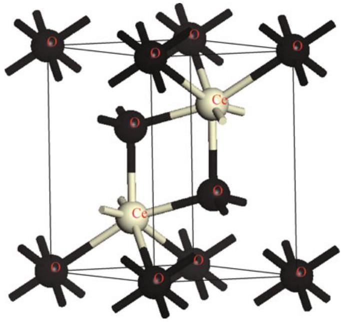
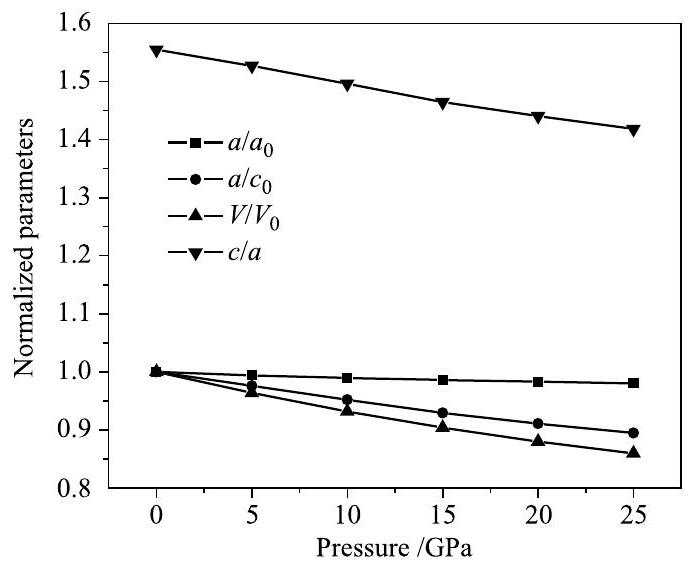
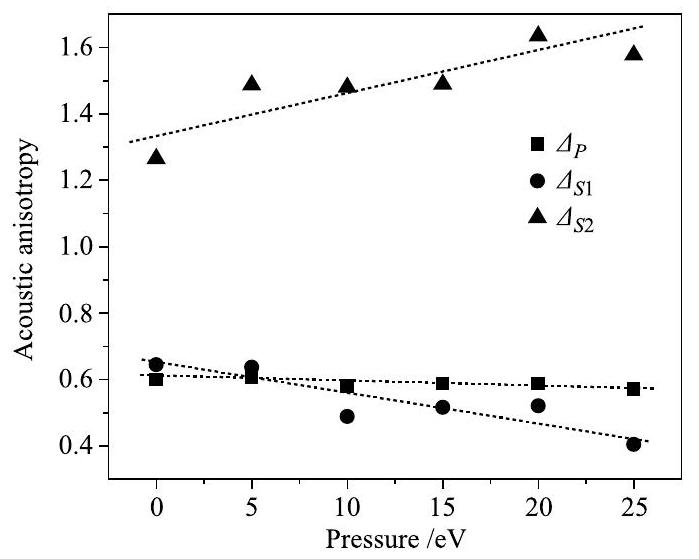
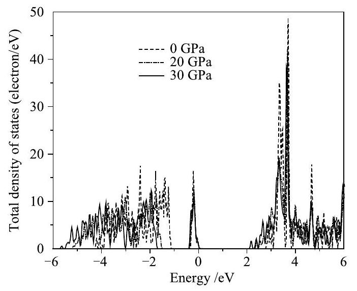
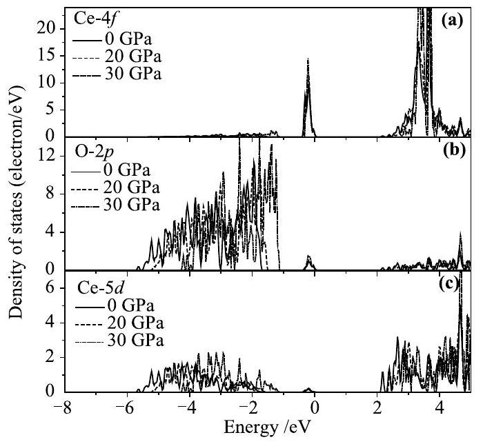

# Structural and elastic properties of $\mathrm{Ce}_{2} \mathrm{O}_{3}$ under pressure from LDA $+\boldsymbol{U}$ method 

Yuan-Yuan Qi, Zhen-Wei Niu, Cai Cheng, Yan Cheng ${ }^{\dagger}$ Institute of Atomic and Molecular Physics, Sichuan University, Chengdu 610065, China E-mail: ${ }^{\dagger}$ ycheng@scu.edu.cn

Received December 26, 2012; accepted March 4, 2013

#### Abstract

We investigate the structural and elastic properties of hexagonal $\mathrm{Ce}_{2} \mathrm{O}_{3}$ under pressure using $\mathrm{LDA}+U$ scheme in the frame of density functional theory (DFT). The obtained lattice constants and bulk modulus agree well with the available experimental and other theoretical data. The pressure dependences of normalized lattice parameters $a / a_{0}$ and $c / c_{0}$, ratio $c / a$, and normalized primitive volume $V / V_{0}$ of $\mathrm{Ce}_{2} \mathrm{O}_{3}$ are obtained. Moreover, the pressure dependences of elastic properties and three anisotropies of elastic waves of $\mathrm{Ce}_{2} \mathrm{O}_{3}$ are investigated for the first time. We find that the negative value of $C_{44}$ is indicative of the structural instability of the hexagonal structure $\mathrm{Ce}_{2} \mathrm{O}_{3}$ at zero temperature and 30 GPa . Finally, the density of states (DOS) of $\mathrm{Ce}_{2} \mathrm{O}_{3}$ under pressure is investigated.

Keywords elastic properties, high pressure, density functional theory, $\mathrm{Ce}_{2} \mathrm{O}_{3}$
PACS numbers 71.15.mb, 71.20.-b

## 1 Introduction

Cerium oxides are important materials with remarkable properties applied in a number of technological products [1, 2]. They are not only high-yield fission products but also substitutes of plutonium in nuclear fuels research [3]. Because of the ability to store, release and transport oxygen ions, ceria is not only the support but also one of the active participants in some reactions, such as lowtemperature CO and volatile organic compounds (VOC) oxidation catalysts [4]. In addition, ceria is also an available material of microelectronics applications [5]. Thus, it is necessary to obtain an accurate description of ceria materials in theory for understanding the nature and the effective applications, especially the elastic constants of cerium oxides are of primary interest in its future applications.

It is known that the elastic constants provide valuable information about the bonding characteristic between adjacent atomic planes and the anisotropic character of the bonding and structural stability. They are directly linked to the various fundamental solid-state quantities,
such as the bulk, shear, and Young's moduli, and so on. It is also an easy method to estimate the Debye temperature by using the average sound velocities, which can be calculated from the elastic constants [6]. However, to our knowledge, there are few theoretical reports about the elastic properties of $\mathrm{Ce}_{2} \mathrm{O}_{3}$ owing to the fact that the standard local density approximation (LDA) and generalized gradient approximation (GGA) approaches would be unable to yield a certain description for the localized $4 f$ states in $\mathrm{Ce}_{2} \mathrm{O}_{3}$.

In principle, the $\mathrm{Ce}^{3+}$ still remains a $4 f$ valence electron, which results in inaccurate prediction of many properties of the related material with the conventional LDA and GGA approaches. For example, such approaches predict a metallic ground state of $\mathrm{Ce}_{2} \mathrm{O}_{3}$ compared to the experimental, an insulating ground state with a band gap about 2.4 eV [7, 8]. Hence, several corrections have been added to band theory to solve the problem, such as the density functional theory (DFT) plus Hubbard corrections (DFT $+U$ ) method [9-12], dynamical mean-field theory (DMFT) [13, 14], GW quasiparticle method [15], and hybrid density-functional theory (HSE) [4, 16-18]. By using these methods, one can
obtain correct prediction for the ground state of $\mathrm{Ce}_{2} \mathrm{O}_{3}$, which makes it possible to continue a further theoretical study of the structural and electronic properties of $\mathrm{Ce}_{2} \mathrm{O}_{3}$ under high pressure. This is meaningful for geodynamics, astrophysics, and related sciences.

Since the elastic constants provide valuable information about the bonding characteristic between adjacent atomic planes and the anisotropic character of the bonding and structural stability of $\mathrm{Ce}_{2} \mathrm{O}_{3}$ under high pressure, in this work we perform a systematic study of the elastic properties of $\mathrm{Ce}_{2} \mathrm{O}_{3}$ under pressure within the $\mathrm{LDA}+U$ method through the Cambridge Serial Total Energy Package (CASTEP) program [19, 20]. This paper is organized as follows: the details of the methods used to perform the calculations are discussed in Section 2. The results and some discussion are presented in Section 3. A conclusion of our main findings is given in Section 4.

## 2 Theoretical method and computation details

### 2.1 Total energy electronic structure calculations

We employ on-the-fly (OTF) pseudopotential for the interactions of the electrons with the ion cores, together with the local density approximation (LDA) proposed by Vosko et al. [21] for the exchange-correlation potential. The LDA have been used in the LDA $+U$ variant, in which the orbital-dependent LDA $+U$ functional form is given as

$$
E_{\mathrm{LDA}+U}=E_{\mathrm{LDA}}+\frac{U-J}{2} \sum_{\sigma}\left[\operatorname{Tr}\left(\rho^{\sigma}\right)-\operatorname{Tr}\left(\rho^{\sigma} \rho^{\sigma}\right)\right]
$$

where $\rho^{\sigma}$ is the density matrix of $f$ states, $U$ is the Coulomb energy, and $J$ is the exchange energy. In this approach, the Coulomb parameter, $U$, and exchange parameter, $J$, do not enter separately, but combine into a single meaningful parameter $U\left(U_{\text {eff }}=U-J\right)$. In this work, we also use the $U=6 \mathrm{eV}$ for Ce in $\mathrm{Ce}_{2} \mathrm{O}_{3}$, which is reasonable value taken from Refs. [10, 14].

The electronic wave functions are expanded in a plane wave basis set with energy cut-off of 620 eV . The atomic levels $4 f^{1} 5 s^{2} 5 p^{6} 5 d^{1} 6 s^{2}$ of Ce atom, and $2 s^{2} 2 p^{4}$ of O atom were treated as valence electron states. For the Brillouinzone sampling, we use the $4 \times 4 \times 2$ Monkhorst-Pack mesh [22]. The self-consistent convergence of the total energy is $1.0 \times 10^{-6} \mathrm{eV} /$ Atom, the maximum ionic HellmannFeynman force within $0.01 \mathrm{eV} / \AA$, the maximum ionic displacement within $1.0 \times 10^{-4} \AA$, and the maximum stress within 0.02 GPa . These parameters are carefully tested. It is found that these parameters are sufficient to lead to a well-converged total energy.

### 2.2 Elastic properties

To calculate the elastic constants, we use the symmetrydependent strains that are non-volume conserving. The elastic constants, $C_{i j k l}$, with respect to the finite strain variables is defined as [23]

$$
C_{i j k l}=\left(\frac{\partial \sigma_{i j}(x)}{\partial e_{k l}}\right)_{X}
$$

where $\sigma_{i j}$ and $e_{k l}$ are the applied stress and Eulerian strain tensors, $X$ and $x$ are the coordinates before and after deformation, respectively. For the hexagonal structure $\mathrm{Ce}_{2} \mathrm{O}_{3}$ (with space group $P \overline{3} m 1$ ), there are five independent elastic constants, i.e., $C_{11}, C_{12}, C_{13}, C_{33}$, and $C_{44}$.

The theoretical polycrystalline elastic modulus can be determined from the independent elastic constants above. There are two approximation methods to calculate the polycrystalline modulus, namely the Voigt method [24] and the Reuss method [25]. For the hexagonal structure $\mathrm{Ce}_{2} \mathrm{O}_{3}$, the Voigt ( $B_{V}$ ) and Reuss ( $B_{R}$ ) bulk moduli and shear moduli are given by

$$
\begin{aligned}
B_{V} & =\frac{1}{9}\left[2\left(C_{11}+C_{12}\right)+C_{33}+4 C_{13}\right] \\
B_{R} & =\frac{\left(C_{11}+C_{12}\right) C_{33}-2 C_{13}^{2}}{C_{11}+C_{12}+2 C_{33}-4 C_{13}} \\
G_{V} & =\frac{1}{30}\left(C_{11}+C_{12}+2 C_{33}-4 C_{13}+12 C_{44}+12 C_{66}\right)
\end{aligned}
$$

$$
G_{R}=\frac{5}{2} \frac{C^{2} C_{44} C_{66}}{3 B_{V} C_{44} C_{66}+C^{2}\left(C_{44}+C_{66}\right)}
$$

where $C_{66}=\left(C_{11}-C_{12}\right) / 2$, and $C^{2}=\left(C_{11}+C_{12}\right) C_{33}- 2 C_{13}^{2}$. The arithmetic average of the Voigt and the Reuss bounds is called the Voigt-Reuss-Hill (VRH) average and is commonly used to estimate elastic modulus of polycrystals. The VRH averages for shear modulus ( $G$ ) and bulk modulus $(B)$ are: $G=\left(G_{R}+G_{V}\right) / 2, B= \left(B_{R}+B_{V}\right) / 2$. The polycrystalline Young's modulus ( $E$ ) and the Poisson's ratio $(\nu)$ are then calculated from these elastic constants using the following relations

$$
E=\frac{9 B G}{3 B+G}, \quad \nu=\frac{3 B-2 G}{2(3 B+G)}
$$

From the elastic constants, one can obtain the elastic Debye temperature $(\Theta)$, which may be estimated from the average sound velocity $V_{m}$ by the following equation

$$
\Theta=\frac{h}{k}\left[\frac{3 n}{4 \pi}\left(\frac{N_{A} \rho}{M}\right)\right]^{1 / 3} V_{m}
$$

where $h$ is Planck's constant, $k$ is Boltzmann's constant, $N_{A}$ is Avogadro's number, $n$ is the number of atoms in the molecule, $M$ is the molecular weight, and $\rho$ is the
density. The average wave velocity $V_{m}$ is approximately calculated from

$$
V_{m}=\left[\frac{1}{3}\left(\frac{2}{V_{S}^{3}}+\frac{1}{V_{P}^{3}}\right)\right]^{-1 / 3}
$$

where $V_{P}$ and $V_{S}$ are the compressional and shear wave velocities, respectively, which are obtained from Navier's equation [26]

$$
V_{P}=\sqrt{\left(B+\frac{4}{3} G\right) / \rho}, \quad V_{S}=\sqrt{G / \rho}
$$

Through the method described above, one has investigated successfully the elastic properties of some materials [27-32].

## 3 Results and discussion

### 3.1 Structural properties

At ambient conditions, $\mathrm{Ce}_{2} \mathrm{O}_{3}$ stabilizes in the hexagonal phase (space group: $P \overline{3} m 1$ ) with the lattice parameters $a=3.89 \AA$ and $c=6.06 \AA$ [33]. In Fig. 1, we illustrate the primitive unit cell crystal structure of the hexagonal $\mathrm{Ce}_{2} \mathrm{O}_{3}$. In the unit cell, two Ce atoms are set at positions ( $0.3333,0.6667,0.2458 ; 0.6667,0.3333,0.7542$ ), and three O atoms at positions $(0,0,0 ; 0.3333,0.6667$, $0.6457 ; 0.6667,0.3333,0.3543$ ). To obtain the most stable structure of $\mathrm{Ce}_{2} \mathrm{O}_{3}$ in the ground state, we performed the following procedures: firstly, for a fixed axial ratio $c / a$, we take a series of different values of $a$ and $c$ to calculate the total energies $E$ and the corresponding primitive cell volumes $V$, and then obtain the lowest energy $E_{\text {min }}$ for the given ratio $c / a$. This procedure is repeated over a wide range of $c / a$. Finally, by fitting the calculated energy-volume ( $E-V$ ) data to the third-order Birch-Murnaghan equation of state (EOS) [34]

$$
\begin{aligned}
\Delta E(V)= & E-E_{0}=\frac{9 V_{0} B_{0}}{16}\left\{\left[\left(\frac{V_{0}}{V}\right)^{\frac{2}{3}}-1\right]^{3} B_{0}^{\prime}\right. \\
& \left.+\left[\left(\frac{V_{0}}{V}\right)^{\frac{2}{3}}-1\right]^{2}\left[6-4\left(\frac{V_{0}}{V}\right)^{\frac{2}{3}}\right]\right\}
\end{aligned}
$$

where $E_{0}$ is the equilibrium energy, $V_{0}$ is the equilibrium cell volume of $\mathrm{Ce}_{2} \mathrm{O}_{3}$ at 0 GPa and 0 K , and $V$ is the cell volume corresponding to the applied pressure $P$ at 0 K , we obtained the equilibrium parameters $a, c, c / a$, the bulk modulus $B_{0}$ and its pressure derivative $B_{0}^{\prime}$ of $\mathrm{Ce}_{2} \mathrm{O}_{3}$. In Table 1, we list our calculated lattice parameters $a$ and $c$, bulk modulus $B_{0}$ and its pressure derivative $B_{0}^{\prime}$, and the insulating energy gap $E_{\text {Gap }}$ of the hexagonal $\mathrm{Ce}_{2} \mathrm{O}_{3}$ at 0 GPa and 0 K , together with other theoretical results $[10,14,15,18]$ and the available experimental data [ $7,8,33$ ].

Fig. 1 The primitive unit cell of the hexagonal structure of $\mathrm{Ce}_{2} \mathrm{O}_{3}$. Black and grey balls represent O and Ce atoms, respectively.

We find that our lattice parameters $a$ and $c$ from $\mathrm{LDA}+U$ method are in better agreement with the experimental values [33] than those from LDA method, with the errors less than $0.26 \%$ and $0.5 \%$ for $\mathrm{LDA}+U$, respectively. It is seen that the LDA method cannot correctly describe the energy band gap of $\mathrm{Ce}_{2} \mathrm{O}_{3}$. In addition, our calculations are somewhat better than the LDA $+U$ calculations of Andersson et al. [10] and Amadon [14]. The results of Da Silva et al. [18] showed that the hybrid density-functional theory (HSE) has nearly the same precision as LDA $+U$ and is better than the local density approximation plus dynamical mean-field theory

Table 1 The lattice parameters $(a, c)(\AA)$, bulk modulus $B_{0}(\mathrm{GPa})$ and its pressure derivative $B_{0}^{\prime}$, and the insulating gap $E_{\mathrm{Gap}}(\mathrm{eV})$ of $\mathrm{Ce}_{2} \mathrm{O}_{3}$, together with the experimental data and other calculation results.
| Methods | $a$ | $c$ | $B_{0}$ | $B_{0}^{\prime}$ | $E_{\text {Gap }}$ | References |
| :--- | :--- | :--- | :--- | :--- | :--- | :--- |
| LDA | 3.77 | 5.83 | 162 | 4.56 | 0 | Present work |
| $\mathrm{LDA}+U(6 \mathrm{eV})$ | 3.88 | 6.03 | 135 | 4.96 | 2.7 | Present work |
| $\mathrm{LDA}+U(6 \mathrm{eV})$ | 3.87 | 5.98 | 130 |  | 2.6 | Andersson et al. [10] |
| $\mathrm{LDA}+U(6 \mathrm{eV})$ | 3.85 | 6.01 | 150 |  |  | Amadon [14] |
| HSE | 3.87 | 6.08 |  |  | 2.5 | Da Silva et al. [18] |
| LDA+DMFT | 3.83 |  | 160 |  |  | Amadon [14] |
| $\mathrm{G}_{0} \mathrm{~W}_{0} @ \mathrm{LDA}+U(5.4 \mathrm{eV})$ |  |  |  |  | 1.8 | Jiang et al. [15] |
| Exp. | 3.89 | 6.06 | 111 |  | 2.4 | [7, 8, 33] |

(LDA+DMFT) method. The zero pressure bulk modulus $B_{0}$ obtained from our LDA $+U$ calculation has a higher value 135 GPa compared with the experimental value 111 GPa, but is consistent with the values of Andersson et al. [10] and Amadon [14]. In addition, the obtained insulating energy gap ( 2.7 eV ) agrees with the experimental value ( 2.4 eV ) [7, 8] and those of Andersson et al. (2.6 $\mathrm{eV})$ [10] and Da Silva et al. ( 2.5 eV ) [18]. The values are larger than that of Jiang et al. (about 1.8 eV ) [15] with the GW approach, in which the GW calculations are based on LDA ground state calculations including a Hubbard $U$ correction (denoted as $\mathrm{G}_{0} \mathrm{~W}_{0} @ \mathrm{LDA}+U$ ).

In Fig. 2, we illustrate the pressure dependences of the normalized lattice parameters $a / a_{0}$ and $c / c_{0}$, the lattice ratio $c / a$, and the normalized primitive cell volume $V / V_{0}$ of $\mathrm{Ce}_{2} \mathrm{O}_{3}$, where $a_{0}, c_{0}$ and $V_{0}$ are the zero pressure equilibrium structure parameters. As the applied pressure increases from 0 to 25 GPa , the ratio $c / a$ changes from 1.554 to 1.418 , and the normalized volume $V / V_{0}$ changes from 1.000 at zero pressure to 0.860 at 25 GPa . Also, it is noted that as the applied pressure increases from 0 to 25 GPa , the ratio $c / c_{0}$ decreases linearly and the change is about $10.5 \%$, while the change of $a / a_{0}$ is not more than $1.9 \%$, indicating that the compression along $c$-axis is larger. The compression of $V$ of $\mathrm{Ce}_{2} \mathrm{O}_{3}$ under pressure is mainly owing to the compression along the $c$-axis.

Fig. 2 The normalized parameters $a / a_{0}, c / c_{0}, c / a$ and $V / V_{0}$ of $\mathrm{Ce}_{2} \mathrm{O}_{3}$ at $T=0 \mathrm{~K}$ as a function of pressure $P$.

### 3.2 Elastic properties

The calculated pressure dependences of the elastic constants of $\mathrm{Ce}_{2} \mathrm{O}_{3}$ at 0 K are presented in Table 2. Unfortunately, no experimental and other theoretical data of elastic constants are available for our comparison. It is shown that the five elastic constants increase with the applied pressure. As the elastic constants $C_{11}$ and $C_{33}$ are related to the deformation behavior and atomic bonding characteristics of $\mathrm{Ce}_{2} \mathrm{O}_{3}$, they can be used to judge the
atomic bond strength in different plane. In our calculations, the elastic constant $C_{11}$ is greater than the elastic constant $C_{33}$ at the applied pressure, implying that the atomic bonds along the $\{100\}$ planes between nearest neighbors are stronger than those along the $\{001\}$ plane. It is noted that when the applied pressure equals to 30 GPa, the elastic constant $C_{44}$ is lower than zero and other elastic constants have big discrepancies compared to the elastic constants at 25 GPa . According to the mechanical stability conditions of a hexagonal crystal [35]

$$
\begin{aligned}
& C_{44}-P>0, \quad C_{11}-P>\left|C_{12}+P\right| \\
& \left(C_{11}+C_{12}\right)\left(C_{33}-P\right)>2\left(C_{13}+P\right)^{2}
\end{aligned}
$$

where $P$ is the applied pressure. We can judge that $\mathrm{Ce}_{2} \mathrm{O}_{3}$ is instable at the pressure of $25-30 \mathrm{GPa}$.

Table 2 The calculated elastic modulus (GPa), bulk modulus $B$ (GPa), shear modulus $G(\mathrm{GPa}), B / G$, Young's modulus $E(\mathrm{GPa})$, Poisson's ratio $\nu$, and Debye temperature $\Theta(\mathrm{K})$ of $\mathrm{Ce}_{2} \mathrm{O}_{3}$ under pressure (GPa) at 0 K .
| $P$ | 0 | 5 | 10 | 15 | 20 | 25 | 30 |
| :--- | :--- | :--- | :--- | :--- | :--- | :--- | :--- |
| $C_{11}$ | 198.5 | 230.9 | 247.8 | 272.5 | 293.5 | 316.5 | 462.0 |
| $C_{33}$ | 119.0 | 140.1 | 143.9 | 160.2 | 172.5 | 180.5 | 198.0 |
| $C_{44}$ | 62.7 | 74.3 | 82.9 | 89.6 | 95.7 | 101.7 | -163.8 |
| $C_{12}$ | 99.4 | 130.9 | 135.8 | 152.2 | 176.5 | 187.5 | 120.8 |
| $C_{13}$ | 78.0 | 90.8 | 114.8 | 123.8 | 133.4 | 166.2 | 302.7 |
| $B$ | 109.0 | 129.5 | 144.1 | 158.4 | 172.3 | 192.2 | 289.3 |
| G | 50.8 | 57.0 | 58.6 | 64.4 | 67.1 | 65.9 | -99.5 |
| $B / G$ | 2.15 | 2.27 | 2.46 | 2.46 | 2.57 | 2.92 | -2.91 |
| E | 131.9 | 149.2 | 154.9 | 170.2 | 178.1 | 177.4 | -337.2 |
| $\nu$ | 0.30 | 0.31 | 0.32 | 0.32 | 0.33 | 0.35 | 0.69 |
| $\Theta$ | 359.2 | 364.2 | 396.4 | 404.8 | 402.5 | 456.1 | - |

From the elastic constants, we can obtain the bulk modulus $B$ and shear modulus $G$ according to the Voigt-Reuss-Hill (VRH) average scheme. The aggregate elastic modulus $B$, shear modulus $G, B / G$, Young's modulus $E$, and Poisson's ratio $\nu$ are also presented in Table 2. Pugh [36] indicated that a material is brittle if the $B / G$ ratio is less than 1.75 . From Table 2, it is shown that the obtained $B / G$ ratio of $\mathrm{Ce}_{2} \mathrm{O}_{3}$ increases from 2.15 to 2.92 as the applied pressure is added from 0 to 25 GPa , and then changes to -2.91 when the pressure is up to 30 GPa , which implies the structure of $\mathrm{Ce}_{2} \mathrm{O}_{3}$ becomes more and more ductile with the increase of pressure and unstable at 30 GPa . It can also be seen that the obtained Young's modulus $E$ and Poisson's Ratio $\nu$ have small but continuous increase with the increasing pressure from 0 to 25 GPa . Strangely, there have some abnormal phenomena when the pressure increases to 30 GPa ( $E$ becomes a negative value and $\nu$ has an abrupt big increase). These suggest that the pressure has a small effect on the Poisson's ratio and Young's modulus from 0 to 25 GPa but a remarkable impact during 25 and 30 GPa .

The Debye temperature $\Theta$ is an important parameter related to many physical properties of solids, such as specific heat, elastic constants, and melting temperature. From the calculated Debye temperature in Table 2, we can clearly see that the Debye temperatures increase with the increasing pressure, and especially, the variation is more than 90 K in the pressure range of 10 to 25 GPa , which means the pressure is the main factor to Debye temperature in the pressure range of 10 to 25 GPa. We can not obtain the Debye temperature at 30 GPa because of the negative value of the yielded $G$ at 30 GPa . In addition, the obtained Debye temperature of $\mathrm{Ce}_{2} \mathrm{O}_{3}$ at 0 GPa is 359.2 K .

It is known that the acoustic velocities are related to the elastic constants by the Christoffel equation [37]

$$
\left(C_{i j k l} n_{j} n_{k}-M \delta_{i l}\right) u_{i}=0
$$

where $C_{i j k l}$ is the fourth rank tensor description of elastic constants, $n$ is the propagation direction, $\rho$ is the density, $u$ the polarization vector, $M=\rho v^{2}$ is the modulus of propagation and $v$ the velocity. The acoustic anisotropy can be described as [38]

$$
\Delta_{i}=\frac{M_{i}\left[n_{x}\right]}{M_{i}[100]}
$$

where $n_{x}$ is the extremal propagation direction other than [100] and $i$ is the three types of elastic wave index (one longitudinal and two polarizations of the shear wave). By solving Eq. (13) for $\mathrm{Ce}_{2} \mathrm{O}_{3}$, one can obtain the anisotropy of the compression wave ( $P$ )

$$
\Delta_{P}=\frac{C_{33}}{C_{11}}
$$

The anisotropies of the wave polarized perpendicular to the basal plane ( $S 1$ ) and the polarized one in the basal plane ( $S 2$ ) are written as

$$
\Delta_{S 1}=\frac{C_{11}+C_{33}-2 C_{13}}{4 C_{44}}, \quad \Delta_{S 2}=\frac{2 C_{44}}{C_{11}-C_{12}}
$$

While for $S 2$ and $P$ waves the extremum occurs along the $c$ axis, for $S 1$ it is at an angle of $45^{\circ}$ from the $c$ axis in the $a-c$ plane. Depending on the values of the elastic constants, we note that an additional extremum may occur for the compression wave propagation at intermediate directions.

In Fig. 3, we illustrate the calculated pressure dependencies of the anisotropies of the elastic waves ( $\Delta_{P}, \Delta_{S 1}$, and $\Delta_{S 2}$ ). It is found that $\Delta_{P}$ almost equals to a constant 0.6 and $\Delta_{S 1}$ descends slightly, while $\Delta_{S 2}$ ascends in the range of the applied pressures. These results can be understood in comparison to a hexagonal crystal interacting with central nearest-neighbor forces (CNNF) [39]. For this model the elastic anisotropy is independent of
the interatomic potential to lowest order in $P / C_{11}$, hence the anisotropy is only dependent on the symmetry of the crystal. We also noted that the values of $\Delta_{S 1}$ and $\Delta_{S 2}$ go away from 1.0 , which means that the anisotropies of the wave polarized perpendicular to the basal plane ( $S 1$ ) and the wave polarized in the basal plane ( $S 2$ ) become strong with the increasing pressure. These results indicate that the axial ratio $c / a$ decreases with the increasing pressure, which agrees well with our foregoing work.

Fig. 3 Calculated anisotropies $\left[\Delta_{P}\right.$ (compressional wave), $\Delta_{S 1}$ and $\Delta_{S 2}$ (shear waves)] of $\mathrm{Ce}_{2} \mathrm{O}_{3}$ as a function of pressure $P$.

### 3.3 The density of states of $\mathrm{Ce}_{2} \mathrm{O}_{3}$ under pressure

To understand the nature of the electronic structure of $\mathrm{Ce}_{2} \mathrm{O}_{3}$ under pressure, we have calculated the total density of states (TDOS) of $\mathrm{Ce}_{2} \mathrm{O}_{3}$ at 0,20 , and 30 GPa , which are shown in Fig. 4. At 0 GPa , an insulating gap of about 2.72 eV is obtained due to the splitting of $4 f$ band, which is in good agreement with the experimental optical band gap of 2.4 eV [7, 8]. It is found from Fig. 4 that the unoccupied conduction bands of $\mathrm{Ce}-4 f$ and $\mathrm{Ce}-5 d$ and the valence band of $\mathrm{O}-2 p$ are pushed down to low energy region with the increase of pressure. However, the occupied valence band of $\mathrm{Ce}-4 f$ stays in the

Fig. 4 Pressure dependencies of the total density of states (TDOS) of $\mathrm{Ce}_{2} \mathrm{O}_{3}$ at 0 K from LDA $+U$ method with $U=6 \mathrm{eV}$.

highest occupied states and unchanged with the increase of pressure. Therefore, the insulating band gap decreases with the applied pressures, which means that $\mathrm{Ce}_{2} \mathrm{O}_{3}$ may transform into a metal phase.

In Fig. 5, we illustrate the partial density of states (PDOS) of $\mathrm{Ce}_{2} \mathrm{O}_{3}$ at 0,20 , and 30 GPa . It is found that the valence band mainly comes from the $\mathrm{O}-2 p$ states, which will move to low energy region with the increase of pressure. The highest occupied valence band is mainly due to the occupied Ce- $4 f$ states. Then, the conduction band mainly comes from the $\mathrm{Ce}-4 f$ and $\mathrm{Ce}-5 d$ states and it will also move to low energy region with the increase of pressure. It is noted that, though the band decreases to low energy region, the intensities of them only suffer little impact from the pressure. All of these features agree well with our foregoing discussion about the total density of states (TDOS).

Fig. 5 The partial density of states (PDOS) of $\mathrm{Ce}_{2} \mathrm{O}_{3}$ under pressure from LDA $+U$ method with $U=6 \mathrm{eV}$ for: (a) Ce- $4 f$, (b) $\mathrm{O}-2 p$, and (c) Ce-5d.

## 4 Conclusions

We have investigated the elastic properties of $\mathrm{Ce}_{2} \mathrm{O}_{3}$ under high pressure by using local-density approximation (LDA) $+U$ correction scheme in the frame of density functional theory (DFT) with on-the-fly (OTF) pseudopotential. The lattice constants, bulk modulus obtained here are in good agreement with the available experimental and other theoretical data. The pressure dependences of the normalized lattice parameters $a / a_{0}$ and $c / c_{0}$, the ratio $c / a$, and the normalized primitive volume $V / V_{0}$ of $\mathrm{Ce}_{2} \mathrm{O}_{3}$ are obtained, which indicate that the compression of $V$ is mainly due to the compression of $c$-axis. The pressure dependences of elastic properties of $\mathrm{Ce}_{2} \mathrm{O}_{3}$ are investigated for the first time. As pressure increases the elastic constants $C_{11}, C_{33}, C_{12}$ and $C_{13}$
increase linearly, while the variation of elastic constant $C_{44}$ is not obvious. At 30 GPa , the hexagonal structure $\mathrm{Ce}_{2} \mathrm{O}_{3}$ is instable at zero temperature due to the elastic constant $C_{44}$ of less than zero. Moreover, the pressure dependences of three anisotropies of elastic waves are also predicted and the Debye temperature $\Theta=359.2 \mathrm{~K}$ is obtained at 0 GPa . Finally, from the investigation of the density of states (DOS) of $\mathrm{Ce}_{2} \mathrm{O}_{3}$ under pressure, the insulating band gap decreases with the applied pressures and this means that $\mathrm{Ce}_{2} \mathrm{O}_{3}$ may transform into a metal phase with the increase of pressure.

Acknowledgements The authors would like to thank the support by the National Natural Science Foundation of China under Grant No. 11204192. We also acknowledge the support for the computational resources by the State Key Laboratory of Polymer Materials Engineering of China in Sichuan University.

## References and notes

1. A. Trovarelli, Catalysis by Ceria and Related Materials, London: Imperial College Press, 2002
2. M. Kobayashi, and M. Ishii, Excellent radiation-resistivity of cerium-doped gadolinium silicate scintillators, Nucl. Instrum. Methods B, 1991, 61(4): 491
3. H. Kleykamp, The chemical state of the fission products in oxide fuels, J. Nucl. Mater., 1985, 131(2-3): 221
4. J. Graciani, A. M. Márquez, J. J. Plata, Y. Ortega, N. C. Hernández, A. Meyer, C. M. Zicovich-Wilson, and J. F. Sanz, Comparative study on the performance of hybrid DFT functionals in highly correlated oxides: The case of $\mathrm{CeO}_{2}$ and $\mathrm{Ce}_{2} \mathrm{O}_{3}$, J. Chem. Theory Comput., 2011, 7(1): 56
5. T. Yamamoto, H. Momida, T. Hamada, T. Uda, and T. Ohno, First-principles study of dielectric properties of cerium oxide, Thin Solid Films, 2005, 486(1-2): 136
6. O. L. Anderson, A simplified method for calculating the debye temperature from elastic constants, J. Phys. Chem. Solids, 1963, 24(7): 909
7. A. I. Shelykh, A. V. Prokofiev, and B. T. Melekh, Fiz. Tverd. Tela, 1996, 38: 91
8. A. V. Prokofiev, A. I. Shelykh, and B. T. Melekh, Periodicity in the band gap variation of $\mathrm{Ln}_{2} \mathrm{X}_{3}(\mathrm{X}=\mathrm{O}, \mathrm{S}, \mathrm{Se})$ in the lanthanide series, J. Alloy. Comp., 1996, 242(1-2): 41
9. V. I. Anisimov, J. Zaanen, and O. K. Andersen, Band theory and Mott insulators: Hubbard $U$ instead of Stoner I, Phys. Rev. B, 1991, 44(3): 943
10. D. A. Andersson, S. I. Simak, B. Johansson, I. A. Abrikosov, and N. V. Skorodumova, Modeling of $\mathrm{CeO}_{2}, ~ \mathrm{Ce}_{2} \mathrm{O}_{3}$, and $\mathrm{CeO}_{2 \mathrm{t} x}$ in the LDA+U formalism, Phys. Rev. B, 2007, 75(3): 035109
11. C. Loschen, J. Carrasco, K. M. Neyman, and F. Illas, Firstprinciples LDA $+U$ and GGA $+U$ study of cerium oxides: Dependence on the effective $U$ parameter, Phys. Rev. B, 2007, 75(3): 035115
12. J. L. F. Da Silva, Stability of the $\mathrm{Ce}_{2} \mathrm{O}_{3}$ phases: A DFT $+U$ investigation, Phys. Rev. B, 2007, 76(19): 193108
13. L. V. Pourovskii, B. Amadon, S. Biermann, and A. Georges, Self-consistency over the charge density in dynamical meanfield theory: A linear muffin-tin implementation and some physical implications, Phys. Rev. B, 2007, 76(23): 235101
14. B. Amadon, A self-consistent DFT + DMFT scheme in the projector augmented wave method: applications to cerium, $\mathrm{Ce}_{2} \mathrm{O}_{3}$ and $\mathrm{Pu}_{2} \mathrm{O}_{3}$ with the Hubbard I solver and comparison to DFT + U, J. Phys.: Condens. Matter, 2012, 24(7): 075604
15. H. Jiang, R. I. Gomez-Abal, P. Rinke, and M. Scheffler, Localized and itinerant states in lanthanide oxides united by GW@LDA+U, Phys. Rev. Lett., 2009, 102(12): 126403
16. P. J. Hay, R. L. Martin, J. Uddin, and G. E. Scuseria, Theoretical study of $\mathrm{CeO}_{2}$ and $\mathrm{Ce}_{2} \mathrm{O}_{3}$ using a screened hybrid density functional, J. Chem. Phys., 2006, 125(3): 034712
17. A. D. Becke, A new mixing of Hartree-Fock and local density-functional theories, J. Chem. Phys., 1993, 98(2): 1372
18. J. L. F. Da Silva, M. V. Ganduglia-Pirovano, and J. Sauer, Stability of the $\mathrm{Ce}_{2} \mathrm{O}_{3}$ phases: A DFT $+U$ investigation, Phys. Rev. B, 2007, 76(19): 193108
19. M. C. Payne, M. P. Teter, D. C. Allen, T. A. Arias, and J. D. Joannopoulos, Iterative minimization techniques for ab initio total-energy calculations: Molecular dynamics and conjugate gradients, Rev. Mod. Phys., 1992, 64(4): 1045
20. V. Milman, B. Winkler, J. A. White, C. J. Packard, M. C. Payne, E. V. Akhmatskaya, and R. H. Nobes, Electronic structure, properties, and phase stability of inorganic crystals: A pseudopotential plane-wave study, Int. J. Quantum Chem., 2000, 77(5): 895
21. S. H. Vosko, L. Wilk, and M. Nusair, Accurate spindependent electron liquid correlation energies for local spin density calculations: A critical analysis, Can. J. Phys., 1980, 58(8): 1200
22. H. J. Monkhorst and J. D. Pack, Special points for Brillouinzone integrations, Phys. Rev. B, 1976, 13(12): 5188
23. D. C. Wallace, Thermodynamics of Crystals, New York: Wiley, 1972
24. W. Voigt, Lehrbuch der Kristallphysik, Leipzig: Taubner, 1928
25. A. Reuss, Berechnung der Fließgrenze von Mischkristallen
auf Grund der Plastizitätsbedingung für Einkristalle, $Z$. Angew. Math. Mech., 1929, 9(1): 49
26. K. B. Panda, and K. S. Ravi Chandran, Determination of elastic constants of titanium diboride ( $\mathrm{TiB}_{2}$ ) from first principles using FLAPW implementation of the density functional theory, Comput. Mater. Sci., 2006, 35(2): 134
27. Y. J. Hao, X. R. Chen, H. L. Cui, and Y. L. Bai, Firstprinciples calculations of elastic constants of c-BN, Physica $B, 2006,382(1-2)$ : 118
28. Z. L. Liu, X. R. Chen, and Y. L. Wang, First-principles calculations of elastic properties of LiBC, Physica B, 2006, 381(1-2): 139
29. X. F. Li, G. F. Ji, F. Zhao, X. R. Chen, and D. Alfè, Firstprinciples calculations of elastic and electronic properties of $\mathrm{NbB}_{2}$ under pressure, J. Phys.: Condens. Matter, 2009, 21(2): 025505
30. X. L. Yuan, D. Q. Wei, Y. Cheng, G. F. Ji, Q. M. Zhang, and Z. Z. Gong, Pressure effects on elastic and thermodynamic properties of $\mathrm{Zr}_{3} \mathrm{Al}$ intermetallic compound, Comput. Mater. Sci., 2012, 58: 125
31. P. Wang, C. G. Piao, R. Y. Meng, Y. Cheng, and G. F. Ji, Elastic and electronic properties of $\mathrm{YNi}_{2} \mathrm{~B}_{2} \mathrm{C}$ under pressure from first principles, Physica B, 2012, 407: 227
32. P. Wang, Y. Cheng, X. H. Zhu, X. R. Chen, and G. F. Ji, First principles investigations on elastic and electronic properties of $\mathrm{BaHfN}_{2}$ under pressure, J. Alloy. Comp., 2012, 526: 74
33. H. Barnighausen and G. Schiller, The crystal structure of A- $\mathrm{Ce}_{2} \mathrm{O}_{3}$, J. Less Common Met., 1985, 110(1-2): 385
34. F. Birch, Finite elastic strain of cubic crystals, Phys. Rev., 1947, 71(11): 809
35. G. V. Sin'ko and N. A. Smirnov, Ab initio calculations of elastic constants and thermodynamic properties of bcc, fcc, and hcp Al crystals under pressure, J. Phys.: Condens. Matter, 2002, 14(29): 6989
36. S. F. Pugh, Philos. Mag., 1954, 45: 833
37. M. A. Auld, Acoustic Fields and Waves in Solids, Vol. I, New York: Wiley, 1973
38. G. Steinle-Neumann, L. Stixrude, and R. E. Cohen, Firstprinciples elastic constants for the hcp transition metals Fe , Co, and Re at high pressure, Phys. Rev. B, 1999, 60(2): 791
39. M. Born and K. Huang, Dynamical Theory of Crystal Lattices, Oxford: Clarendon, 1954
