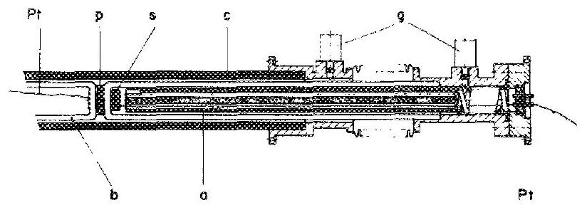
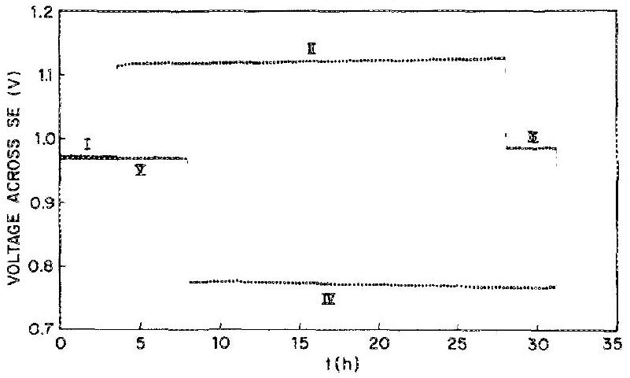
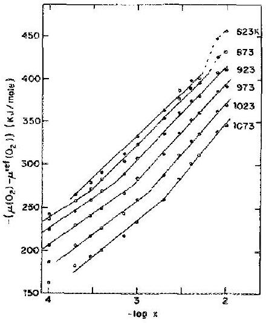
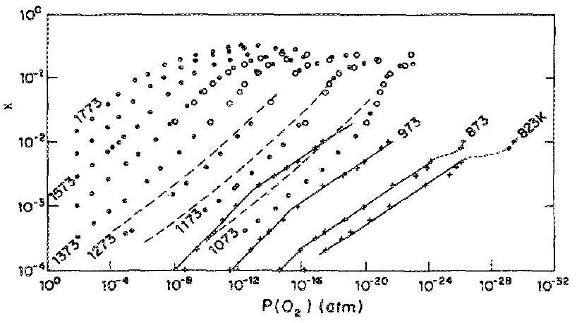

## Journal of Applied Physics

LETTER | MAY 151987

## $\mathbf{O}_{\mathbf{2}}$ chemical potential of nonstoichiometric ceria, $\mathbf{C e O}_{\mathbf{2 - x}}$, determined by a solid electrochemical method

I. Riess; H. Janczikowski; J. Nölting

Check for updates
J. Appl. Phys. 61, 4931-4933 (1987)
https://doi.org/10.1063/1.338363

## Articles You May Be Interested In

Coulometric trace humidity measurement in technical gases
Rev. Sci. Instrum. (August 2018)
Development of microcoulometry for measuring oxygen content in copper oxides
Appl. Phys. Lett. (December 2005)
Accurate oxygen-content determination method for decreased sample amounts of superconductive and other functional oxides

Appl. Phys. Lett. (July 2002)

# $\mathrm{O}_{2}$ chemical potential of nonstolchiometric ceria, $\mathrm{CeO}_{2-x}$, determined by a solid electrochemical method 

I. Riess Department of Physics, Technion-Israel Institute of Technology, Haifa 32000, Israel H. Janczikowski and J. Nölting Institute for Physical Chemistry, Göttingen University and Sonderforschungsbereich 126 GöttingenClausthal, Tammann Strasse 6, D-3400 Göttingen, Federal Republic of Germany

(Received 21 January 1986; accepted for publication 13 January 1987)
The chemical potential of oxygen in nonstoichiometric ceria, $\mathrm{CeO}_{2-x}$, was measured versus composition $x\left(10^{-4} \leqslant x \leqslant 10^{-2}\right)$ and temperature ( $823 \leqslant T \leqslant 1073 \mathrm{~K}$ ) using a novel solid electrochemical cell, utilizing yttrium stabilized zirconia. The composition of $\mathrm{CeO}_{2-x}$ was varied by coulometric titration. The $\mathrm{O}_{2}$ chemical potential was determined from the electromotive force of the cell with air used as the reference gas. With this new experimental setup, it is possible to carry out long coulometric titrations at very low oxygen partial pressures (limited by $10^{-30} \mathrm{~atm}$ at 823 K or by $10^{-13} \mathrm{~atm}$ at 1473 K ). For $x$ between $10^{-4}$ and $10^{-2}$, the $\mathrm{O}_{2}$ partial pressure in equilibrium with $\mathrm{CeO}_{2-x}$ was found to change from $10^{-8}$ to $10^{-18}$ atm at 1073 K and from $10^{-16}$ to $10^{-30}$ atm at 823 K . The oxygen vacancies in $\mathrm{CeO}_{2-x}$ were determined to be $V_{0}^{\prime \prime}$ in this ( $x, T$ ) range. The charge on aliovalent cations impurities was found to dominate the negative (effective) charge concentration for $x \leqslant 10^{-3}$. The oxygen partial molar enthalpy $\Delta \bar{H}\left(\mathrm{O}_{2}\right)$ is $870 \mathrm{~kJ} / \mathrm{mol}(9 \mathrm{eV})$ for $x \gtrsim 3 \times 10^{-3}$ decreasing for smaller $x$ to a value of $670 \mathrm{~kJ} / \mathrm{mol}(7 \mathrm{eV})$ for $x=10^{-4}$.

In investigating thermodynamic properties of an oxide, it is essential to determine the chemical potential $\mu\left(\mathrm{O}_{2}\right)$ of oxygen, and to control and measure the oxygen concentration in the solid. An accurate and convenient method to determine these two quantities is by means of solid-state electrochemical methods.

To accomplish the electrochemical measurement, a solid oxygen conductor (SE) conducting $\mathrm{O}^{2-}$ ions is placed between the oxide and a reference gas, containing oxygen with a given partial pressure, $\mathrm{P}\left(\mathrm{O}_{2}\right)$. ${ }^{1}$ The chemical potential $\mu\left(\mathrm{O}_{2}\right)$ is obtained from the voltage signal (EMF) which appears on the $\mathrm{SE}_{\text {, }}$

$$
\mathrm{EMF}=\mu\left(\mathrm{O}_{2}\right)-\mu^{\mathrm{ref}}\left(\mathrm{O}_{2}\right) / 4 F
$$

where $F$ is the Faraday constant and $\mu\left(\mathrm{O}_{2}\right)^{\text {ref }}$ is the chemical potential of oxygen in the reference gas. The temperature $T$ and the composition of the oxide can be fixed in situ. The latter is done very accurately by passing a known charge through the electrochemical cell (coulometric titration). An adequate solid electrolyte for such measurements is $\mathrm{Y}_{2} \mathrm{O}_{3}$-doped $\mathrm{ZrO}_{2}$ (YSZ) which conducts $\mathrm{O}^{2-\text { ions. To as- }}$ sure a dominant ionic conductivity, YSZ should be operated well within its electrolytic domain ${ }^{2}$ [e.g., $1 \geqslant P\left(\mathrm{O}_{2}\right) \gtrsim 10^{-30}$ atm at 829 K and $1 \geqslant P\left(\mathrm{O}_{2}\right) \gtrsim 10^{-13} \mathrm{~atm}$ at $1473 \mathrm{~K}^{3}$ ], where for practical reasons $P\left(\mathrm{O}_{2}\right)$ above 1 atm is not considered.

In the past, attempts to build a solid electrochemical cell based on YSZ revealed that the major problem was $\mathrm{O}_{2}$ leakage through unavoidable fine cracks in the SE ceramic YSZ. ${ }^{4}$ The leakage introduces uncontrolled and excessive changes in the oxide composition. The arrangement proposed by Tretyakov and Rapp ${ }^{4}$ could be operated with limited leakage with $P\left(\mathrm{O}_{2}\right)$ differences of less than four orders of magnitude. It was later suggested to reduce the leakage by maintaining
$P\left(\mathrm{O}_{2}\right)$ at the surrounding of the sample compartment as close as possible to that inside the compartment. ${ }^{5-7}$

We have constructed a novel cell for coulometric titration and EMF measurements on oxides enabling the determination of $\mu\left(\mathrm{O}_{2}\right)$ from $P\left(\mathrm{O}_{2}\right)=10^{-8}$ atm down to $P\left(\mathrm{O}_{2}\right)=10^{-30}$ atm while staying within the aforementioned electrolytic domain. A wide range of reference $P\left(\mathrm{O}_{2}\right)$ values, including room air, can be used.

The cell consists of two YSZ tubes, one for the sample (a) and the other for the reference gas (b), in Fig. 1. A YSZ pellet ( $P$ ) placed between the two tube permits ionic conduction between the two compartments. The pellet is needed to eliminate direct diffusion of $\mathrm{O}_{2}$ molecules from (b) to (a) through adjacent fine cracks in the YSZ tubes. A stream of purified Ar $\left[\mathrm{P}\left(\mathrm{O}_{2}\right)=10^{-16}-10^{-20}\right.$ atm, $P\left(\mathrm{H}_{2}\right)<10^{-5}$ atm] is passed inside an $\mathrm{Al}_{2} \mathrm{O}_{3}$ tube (c) from the sample side to the reference side, at $1 \mathrm{~cm}^{3} / \mathrm{s}$, to flush the YSZ tubes. The inside of the sample compartment (a) is held at a slight

FIG. 1. Electrochemical cell with two separated compartments. a, b; separated compartments; c: alumina tube; g: gas inlets; p: yttria-doped zirconia pellet; s: $\mathrm{CeO}_{2 \ldots x}$ sample; Pt platinum leads which end at porous Pt electrodes.

FIG. 2. Cyclic coulometric titration for leakage test of the electrochemical setup.

overpressure ( 1.01 atm ) with purified and stationary Ar. The reference compartment (b) is continuously flushed with air. The electrodes on the SE and the sample(s) are porous Pt layers. The cell is placed in an oven and positioned to eliminate a temperature difference between the electrodes.

Sample composition was limited to keep $P\left(\mathrm{O}_{2}\right)$ within the electrolyte domain of YSZ and also below $10^{-8} \mathrm{~atm}$ to minimize $\mathrm{O}_{2}$ leakage from the sample compartment into the Ar stream. Measurements of $\mu\left(\mathrm{O}_{2}\right)$ as a function of composition and temperature were carried out on nonstoichiometric cerium oxide, $\mathrm{CeO}_{2-x}$, in the high-temperature $\alpha$ phase of $\mathrm{CeO}_{2-x}$ (phase boundaries were taken from Ref. 8).

The absolute value of $x$ was determined as follows: The sample was first brought to the state with $P\left(\mathrm{O}_{2}\right)=2 \times 10^{-9}$ atm and $T=1073 \mathrm{~K}$ and $x$ was determined by extrapolation from the data in Ref. 9. Then $x$ was changed by coulometric titration and the changes in $x$ due to the titration were added to the initial value of $x$.

To demonstrate, first, the accurate and leak-free performance of the new experimental setup, the following experiment at 1073 K was carried out (see Fig. 2) :
(I) The composition of the $\mathrm{CeO}_{2 \ldots x}$ sample was brought to $x \sim 10^{-2}$ by coulometric titration. The EMF of 971 mV is observed to be stable within less than 1 mV over a period of $\sim 24 \mathrm{~h}$ (only part of which is shown in Fig. 2), indicating a leak-free system and a constant composition of the probe.
(II) A second coulometric titration was carried out over a period of $\sim 24 \mathrm{~h}$.

FIG. 3. Chemical potential of oxygen vs oxygen deficiency $x$.

FIG. 4. Oxygen equilibrium pressure of $\mathrm{CeO}_{z-x}$ vs oxygen deficiency $x$. Dashed line: Tuller and Nowick. Sanlener et al. O: Bevan and Kordis. + : this work (experimental). Solid line: this work (theoretical).

(III) After the coulometric titration was terminated the probe reached equilibrium within 15 min and remained at a constant EMF ( 13 mV higher than at stage I).
(IV) A third reverse coulometric titration with equal charge as in period II is applied.
(V) A stable EMF is observed which deviates less than 2 mV from that of the beginning. This corresponds to an error in composition $x=10^{-4}$ and $\Delta x / x=10^{-2}$ after the $62-\mathrm{h}$ lasting cyclic experiment.
$\mu\left(\mathrm{O}_{2}\right)$, the chemical potential of oxygen in equilibrium with the sample $\mathrm{CeO}_{2-x}$ at a partial pressure $P\left(\mathrm{O}_{2}\right)$ is

$$
\begin{aligned}
\mu\left(\mathrm{O}_{2}\right) & =\mu^{\phi}\left(\mathrm{O}_{2}\right)+R T \ln P\left(\mathrm{O}_{2}\right) \\
& =\mu^{\text {ref }}\left(\mathrm{O}_{2}\right)+R T \ln P\left(\mathrm{O}_{2}\right) / p^{\text {ref }}\left(\mathrm{O}_{2}\right)
\end{aligned}
$$

where $R$ is the gas constant. $\mu\left(\mathrm{O}_{2}\right)-\mu^{\mathrm{ref}}\left(\mathrm{O}_{2}\right)$ is obtained from the EMF according to Eq. (1). The composition is determined by the coulometric titration. Figure 3 experimentally presents determined values of $\mu\left(\mathrm{O}_{2}\right)-\mu^{\text {ref }}\left(\mathrm{O}_{2}\right)$ versus the deficiency in oxygen $x$ for the temperature range $823-1073 \mathrm{~K}$. The theory of low defect concentration in nonstoichiometric $\mathrm{CeO}_{2 \ldots x}$ predicts ${ }^{9}$

$$
\mu\left(\mathrm{O}_{2}\right)-\mu^{\mathrm{ref}}\left(\mathrm{O}_{2}\right)=-6 R T \ln x+\text { const } .
$$

Equation (3) holds for an undoped $\mathrm{CeO}_{2-x}$ and for dominant oxygen vacancies ( $V_{0}$ ) doubly charged with respect to the lattice. The solid straight lines for the higher $x$ value were drawn in Fig. 3 according to Eq. (3).

For lower $x$ the impurities in a concentration of 900 ppm ${ }^{10}$ cannot be neglected. If aliovalent cations in $\mathrm{CeO}_{2-x}$ are the dominant negative (effective) charges and the oxygen vacancies are $V_{o}^{\prime \prime}$ then the theory predicts ${ }^{9}$

$$
\mu\left(\mathrm{O}_{2}\right)-\mu\left(\mathrm{O}_{2}\right)=-4 R T \ln x+\text { const } .
$$

The solid straight lines for the lower $x$ values were drawn in Fig. 3 according to Eq. (4).

Combining Eqs. (2) and (3) or (4) yields linear relations between $\ln P\left(\mathrm{O}_{2}\right)$ and $\ln x$. We have added our results for the $P\left(\mathrm{O}_{2}\right)$ vs $x$ relation, to those obtained by others ${ }^{9,11,12}$ and presented them in Fig. 4. There is a quantitative agreement of our data for $T=1073 \mathrm{~K}$ with that reported by Tuller and Nowick, ${ }^{9}$ where $x$ was determined (indirectly) from conductivity and mobility measurements. The present $x$ values are, however, up to a factor of 3.5 higher than those determined by thermogravimetry. ${ }^{\text {11-13 }}$ The slope (for
$T=1073 \mathrm{~K}$ ) is also not in agreement, as seen in Fig. 4. We find $\ln x=-(1 / 4) \ln P\left(\mathrm{O}_{2}\right)+$ const for $10^{-4} \leq x \leq 10^{-3}$ and in $k=-(1 / 6) \ln P\left(\mathrm{O}_{2}\right)+$ const for $10^{-3} \leq x \leq 10^{-2}$.

The reaction of the oxygen with $\mathrm{CeO}_{2-x}$ can be written ${ }^{9} \mathrm{O}_{2} \leftrightarrow \frac{1}{2} \mathrm{O}_{2}+V_{0}^{\prime \prime}+2 e^{\prime}$. The reaction constant, $K(T)$, is included in the constant in Eq. (3). ${ }^{9}$ We find at $1073 \mathrm{~K}, K(T) =3 \times 10^{-15}$ (compared with $1.5 \times 10^{-15}$ in Ref. 9). The impurity concentration (assumed to be doubly charged, as for $\mathrm{Ca}_{\mathrm{Ce}}{ }^{\prime \prime}$ ) can be determined from the constant in Eq. (4) and from $K(T)$. This yields a concentration of $\sim 800 \mathrm{ppm}$ in accordance with the direct impurity analysis ( $900 \mathrm{ppm} \mathrm{Ca}{ }^{10}$ ).

The partial molar enthalpy of oxygen $\Delta \bar{H}\left(\mathrm{O}_{2}\right)$ was determined from $\partial\left[\mu\left(\mathrm{O}_{2}\right) / T\right] / \partial(1 / T)$ and found to be 870 $\mathrm{kJ} / \mathrm{mol}(9 \mathrm{eV})$ for $x \gtrsim 3 \times 10^{-3}$ comparable to values found by others. ${ }^{912-14} \Delta \bar{H}\left(\mathrm{O}_{2}\right)$ decreases for smaller $x$ to a value of $670 \mathrm{~kJ} / \mathrm{mol}(7 \mathrm{eV})$ for $x=10^{-4}$, this was not previously observed.

We have demonstrated that a setup for coulometric titration and EMF measurements for oxygen in a wide $P\left(\mathrm{O}_{2}\right)$ and $T$ range can be constructed and accurately and conveniently operated. We used our setup to determine thermodynamic properties of nonstoichiometric ceria ( $\mathrm{CeO}_{2} x$ ). The measurements confirm previous results, ${ }^{9,12}$ that the defects in $\mathrm{CeO}_{2-x}$ can be treated using the Boltzmann statistics (for
$x \leqslant 10^{-2}$ and $T \geqslant 800 \mathrm{~K}$ ). Our data extend the $P\left(\mathrm{O}_{2}\right)$ vs $x$ relations in $\mathrm{CeO}_{2-x}$ to lower temperatures than measured before.

The authors thank D. S. Tannhauser for helpful remarks.
${ }^{1}$ H. Rickert, Electrochemistry of Solids (Springer, Berlin, 1982), pp. 129148.
${ }^{2}$ H. Schmalzried, Z. Phys. Chem. 38, 87 (1963).
${ }^{3}$ H. Rickert, Electrochemistry of Solids (Springer, Berlin, 1982), p. 120.
${ }^{4}$ J. D. Tretyakov and D. A. Rapp, Trans. Met. Soc. AIME 245, 1235 (1969).
${ }^{5}$ U. Hölscher and H. Schmalzried, Z. Phys. Chem. 139, 69 (1984).
${ }^{\circ}$ C. M. Mari, S. Pizzini, L. Manes, and F. Toci, J. Electrochem. Soc. 124, 1831 (1977).
${ }^{7}$ Yu. D. Tretyakov, V. F. Komarov, N. A. Prosvirnina, and I. B. Kutsenok, J. Solid State Chem. 5, 157 (1972).
${ }^{8}$ M. Ricken, J. Nölting, and K. Riess, J. Solid State Chem. 54, 89 (1984), I. Riess, M. Ricken, and J. Nölting, J. Solid State Chem. 57, 314 (1985).
${ }^{9}$ H. L. Tuller and A. S. Nowick, J. Electrochem. Soc. 126, 209 (1979).
${ }^{10}$ Impurity analysis by emission spectroscopy done by KFA, Julich, indicates that the main impurities are Ca 900 ppm (and various rare-earth atoms at a possible similar total concentration).
${ }^{11}$ P. J. M. Bevan and J. Kordis, J. Inorg. Nucl. Chem. 26, 1509 (1964).
${ }^{12}$ R. J. Panlener, R. N. Blumenthal, and J. E. Garnier, J. Phys. Chem. Solids 36, 1213 (1975).
${ }^{13}$ J. W. Dawicke and R. N. Blumenthal, J. Electrochem. Soc. 133, 904 (1986).
${ }^{14}$ J. Campserveux and P. Gerdanian, J. Chem. Thermodyn. 5, 795 (1974).

# Buried transverse-junction stripe laser for optoelectronic-integrated circuits 

Jun Ohta, Ken'ichi Kuroda, Kazumasa Mitsunaga, Kazuo Kyuma, Kouichi Hamanaka, and Takashi Nakayama Central Research Laboratory, Mitsubishi Electric Corporation, 8-1-1 Tsukaguchi-Honmachi, Amagasaki, Hyogo 661, Japan

(Received 22 September 1986; accepted for publication 13 January 1987)

#### Abstract

A buried transverse-junction stripe (TIS) laser, a suitable laser diode for integration, has been fabricated using molecular-beam epitaxial growth. The fundamental characteristics of the laser were as good as those of a conventional TJS laser. We have also demonstrated a fabrication process for the laser that is compatible with that for metal-semiconductor field-effect transistors (MESFETs) to be monolithically integrated. The characteristics of the MESFETs fabricated on substrates processed for the laser were the same as those fabricated on virgin substrates when such processed substrates were etched $2 \mu \mathrm{~m}$ deep.

Optoelectronic-integrated circuits (OEICs) are promising devices for optical communication and/or signal processing systems. There have been many attempts to integrate both optical and electronic devices monolithically. ${ }^{1,2}$ The difficulties in planar integration of these devices mainly arise from the difference in their device geometry and fabrication processes including heteroepitaxy; the thickness of a laser diode (LD) is about $5 \mu \mathrm{~m}$ and that of an electronic device is less than $1 \mu \mathrm{~m}$. Therefore, the matching of these two kinds of devices is key to the realization of monolithic integration. In order to fully utilize the advantages of a pure planar struc-
ture, where the surface of the chip is flat and no steps exist, the laser should be fabricated on a semi-insulating (SI) substrate and also bear both its electrodes on the surface. These requirements can be achieved by introducing a transversejunction stripe (TJS) laser into the OEICs. Although an integrated laser of the TIS type has already been reported, there has been no clear indication of the availability of this laser in OEICs. ${ }^{3,4}$ Moreover, before integrating a TJS laser with electronic devices, such as field-effect transistors (FETs) for driving and modulation, we must examine whether the fabrication process for the laser affects the per-

