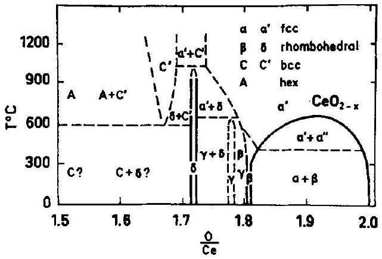
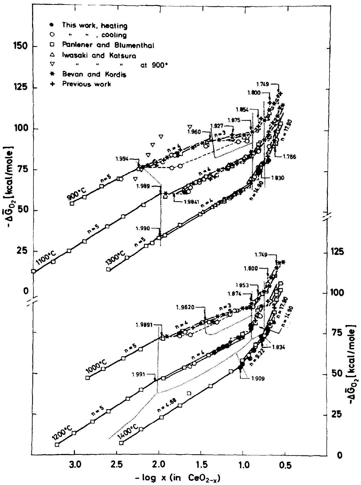
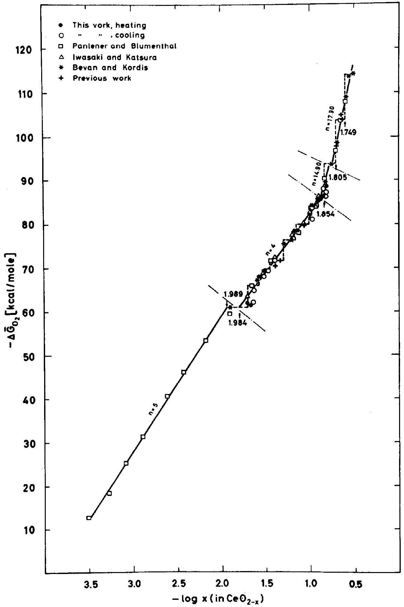
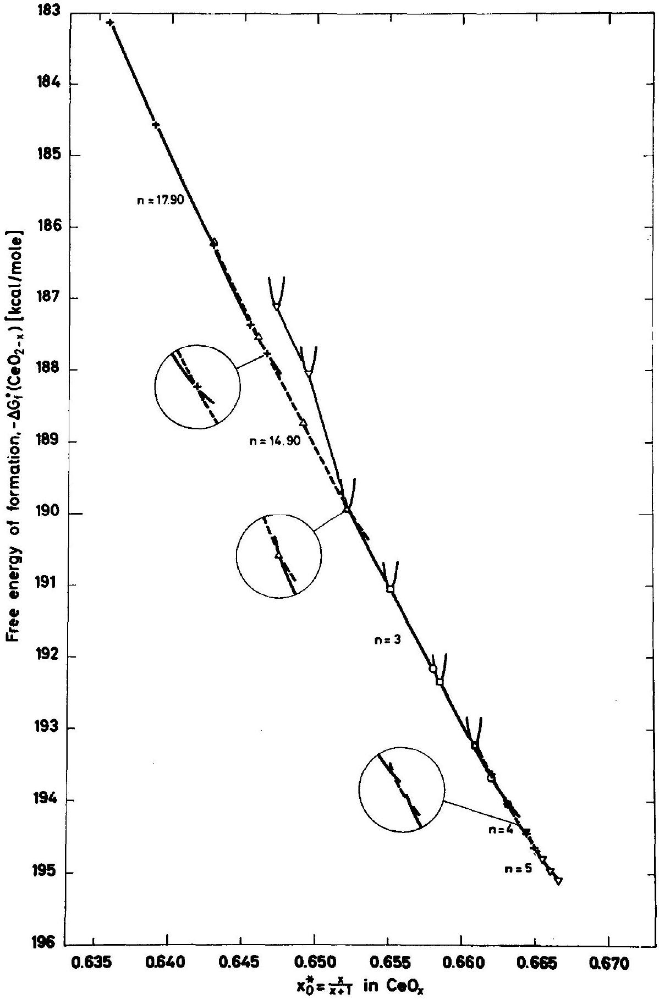
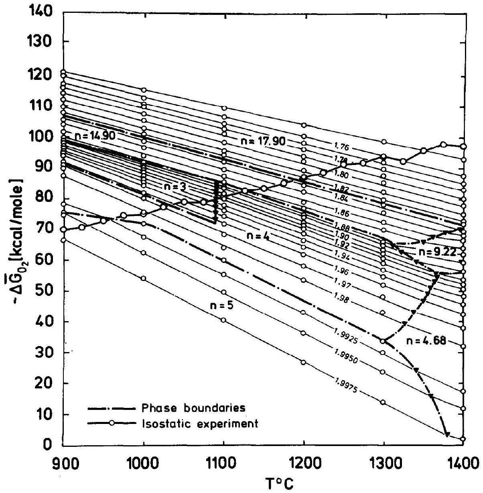
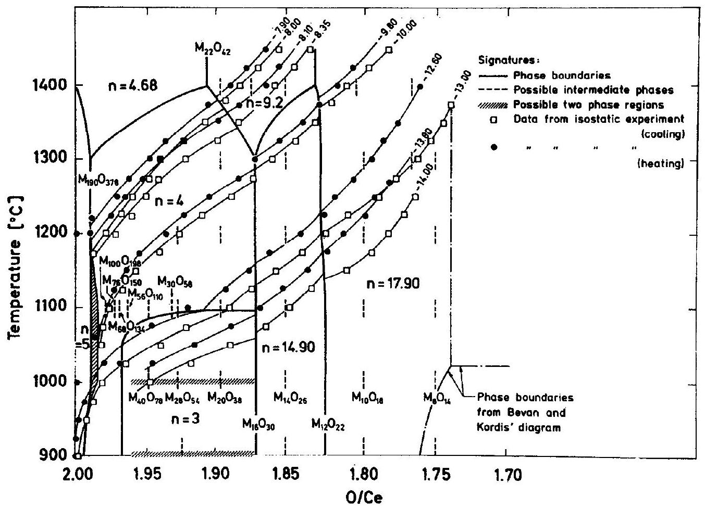
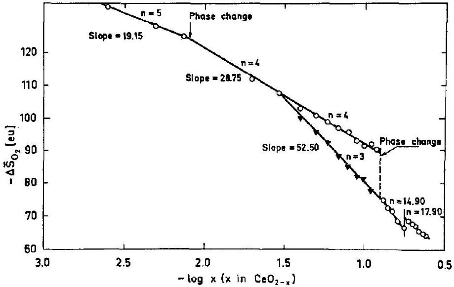
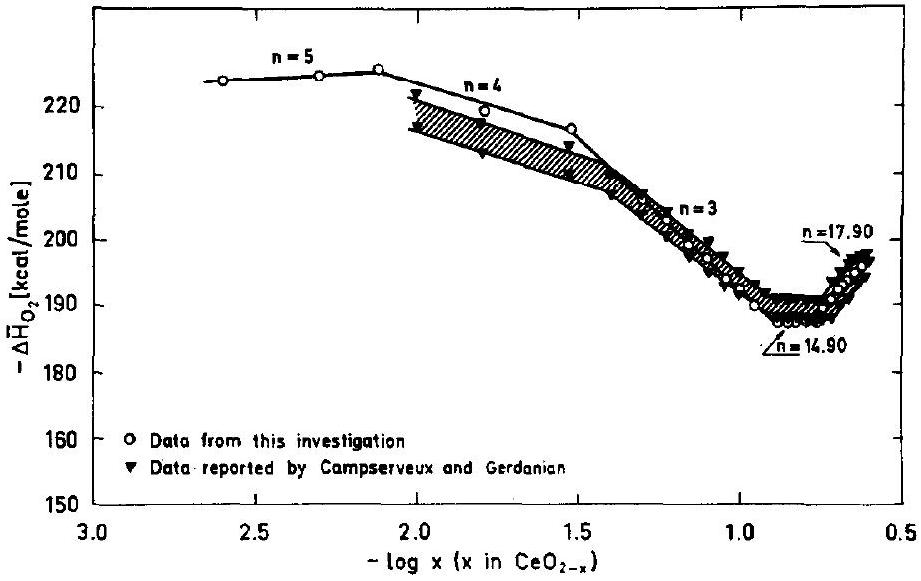
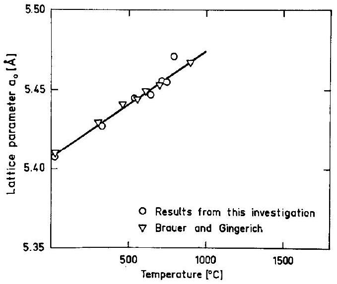

# Thermodynamic Studies of the Phase Relationships of Nonstoichiometric Cerium Oxides at Higher Temperatures 

O. TOFT SØRENSEN Danish Atomic Energy Commission, Research Establishment Riso, Roskilde, Denmark

Received November 6, 1975; in revised form February 20, 1976

#### Abstract

Partial molar thermodynamic quantities for oxygen in nonstoichiometric cerium oxides were determined by thermogravimetric analysis in $\mathrm{CO} / \mathrm{CO}_{2}$ mixtures in the temperature range $900- 1400^{\circ} \mathrm{C}$. Under these conditions compositions within the range $2.00 \geqslant \mathrm{O} / \mathrm{M} \geqslant \sim 1.75$ could be obtained. A detailed analysis of the data shows that the $\alpha^{\prime}$-phase region in the phase diagram, previously described as a grossly nonstoichiometric phase, can be divided into several subregions each consisting of an apparent nonstoichiometric single phase. The finer details of the thermodynamic data, however, suggest that some of these subregions can be further split into ordered intermediate phases with compositions following the series $M_{n} \mathrm{O}_{2 n-2}$.

Supplementary high-temperature X-ray diffraction studies under vacuum were made at temperatures up to $855^{\circ} \mathrm{C}$. At the higher temperatures between 790 and $855^{\circ} \mathrm{C}$, a new phase of low symmetry was obtained. Indexing of the powder pattern for this phase showed it to be isostructural with $\mathrm{Pr}_{6} \mathrm{O}_{11}$ and with a monoclinic unit cell with $a=6.781 \pm 0.006 \AA, b=11.893 \pm 0.009 \AA, c=15.823 \pm 0.015 \AA$, and $\beta=125.04 \pm 0.04^{\circ}$.

## 1. Introduction

Detailed thermogravimetric and structural studies of the $\mathrm{Ce}-\mathrm{O}(1), \mathrm{Pr}-\mathrm{O}(2)$, and $\mathrm{Tb}-\mathrm{O}$ (3) systems have shown that ordered "stoichiometric" phases of the series $M_{n} \mathrm{O}_{2 n-2}$ are formed at lower temperatures for these lanthanide oxides. At higher temperatures these ordered phases are transformed into nonstoichiometric phases, often with a wide compositional range as shown in Fig. 1, which gives the accepted phase diagram of the $\mathrm{CeO}_{2.00}-\mathrm{Ce}_{2} \mathrm{O}_{3}$ system proposed by Bevan and Kordis (1). Traditionally, the $\alpha^{\prime}$-phase in these systems, which extends over a considerable compositional range, has been considered as a grossly nonstoichiometric single phase with randomly distributed anion vacanies.

Recently, however, combined thermogravimetric isobaric analysis and hightemperature X-ray diffraction studies of the

Pr-O system (4) have shown that long-range ordering of the defects plays an important role even at high temperatures and that the $\alpha^{\prime}$-phase can be resolved into four subregions. For $\mathrm{CeO}_{2-x}$, phase changes in the $\alpha^{\prime}$-phase at higher temperature, indicating ordering reactions, have been reported by Sørensen (5). In this study, however, the number of experimental points was not sufficient to analyze the finer details of the system. The purpose of the present investigation is thus to provide more data, especially for the nonstoichiometric $\alpha^{\prime}$-phase, in order to examine the possible existence of subregions in nonstoichiometric cerium oxides.

In research on fuel materials for nuclear power reactors, $\mathrm{CeO}_{2}$ is often used as a model substance for $\mathrm{PuO}_{2}$ because of the close resemblance between the structures and thermodynamic properties of these oxides (6). For this work reliable thermodynamic data

Fig. 1. Phase diagram for the cerium-oxygen system.

must be available up to high temperatures, and thus, a second purpose of the present investigation was to determine these quantities for the temperature range above that covered by Bevan and Kordis $\left(636-1169^{\circ} \mathrm{C}\right)$.

In this study the thermodynamic data were determined by thermogravimetric analysis in atmospheres of controlled oxygen pressures. The temperature range covered was $900- 1400^{\circ} \mathrm{C}$ and compositions between $\mathrm{CeO}_{2.00}$ and $\mathrm{CeO}_{1.75}$ could be reached with the gas mixtures used. The data obtained are compared with the data reported by Bevan and Kordis in the temperature range where the two investigations overlap each other, as well as with other recently published data ( 7,9 , 10). By taking all available data into account, the finer details of the $\alpha^{\prime}$-phase are examined. Furthermore, in order to study the possibility of ordering in these oxides, a few hightemperature X-ray diffraction measurements were carried out. Unfortunately, it was not possible to work with gas mixtures of controlled oxygen pressures in the high-temperature X-ray equipment available, and these measurements were therefore performed under vacuum.

## 2. Previous Studies

### 2.1. Phase Relationships

Various methods have been previously used in thermodynamic studies of cerium oxides in order to determine the phase relationships of these oxides. Kuznetsov et al. (11), for instance, used the emf technique, whereas Brauer et al. (12) used a technique by which the
composition was determined by intermittent weighing at room temperature after the samples had been equilibrated in various $\mathrm{H}_{2} / \mathrm{H}_{2} \mathrm{O}$ mixtures at temperatures between 600 and $1000^{\circ} \mathrm{C}$. A better method is the thermogravimetric analysis used by Bevan and Kordis (1) in their detailed study of the cerium oxides by equilibration experiments both in $\mathrm{CO} / \mathrm{CO}_{2}$ and in $\mathrm{H}_{2} / \mathrm{H}_{2} \mathrm{O}$ mixtures in the temperature range $636-1169^{\circ} \mathrm{C}$. Based on the thermodynamic data obtained and on previous data, Bevan and Kordis constructed the phase diagram, shown in Fig. 1, that has remained the accepted diagram for the $\mathrm{CeO}_{2}-\mathrm{Ce}_{2} \mathrm{O}_{3}$ system. Using X-ray powder pattern techniques, Bevan (13) was the first to provide detailed evidence of a sequence of intermediate rhombohedral phases in this system. In this study the samples were reduced in flowing hydrogen and then annealed under vacuum at $1050^{\circ} \mathrm{C}$ before quenching for X-ray diffraction analysis at room temperature. Finally, in a later study Brauer and Gingerich (14) showed by high-temperature X-ray diffractometry that the miscibility gap below the $\alpha^{\prime}$ region, shown in the diagram, closes at $685^{\circ} \mathrm{C}$ at a composition of $\mathrm{CeO}_{1.92}$.

Recently, further thermodynamic studies on cerium oxides have been carried out in the temperature range $900-1300^{\circ} \mathrm{C}$ by Iwasaki and Katsura (9) using the thermogravimetric equilibration technique and covering the composition range $\mathrm{CeO}_{2.00}-\mathrm{CeO}_{1.70}$. Here the $\alpha^{\prime}$-phase was considered as a solid solution of $\mathrm{CeO}_{2}$ and $\mathrm{Ce}_{2} \mathrm{O}_{3}$, and the activities of these two components in the solution were calculated from the thermogravimetric data as a function of composition at the different temperatures used. For small $\mathrm{Ce}_{2} \mathrm{O}_{3}$ concentrations at temperatures above $1200^{\circ} \mathrm{C}$, it was found that the activity of $\mathrm{CeO}_{2}$ followed Raoult's law, whereas the activity of $\mathrm{Ce}_{2} \mathrm{O}_{3}$ followed Henry's law in this range. This ideal behavior was not observed at a higher concentration of $\mathrm{Ce}_{2} \mathrm{O}_{3}$ and at lower temperatures, however, and it is probably too simple to treat the $\alpha^{\prime}$-phase in this way.

Usually the relative partial enthalpies of oxygen ( $\Delta \bar{H}_{\mathrm{O}_{2}}$ ) are calculated from the measured relative partial free energies of oxygen ( $\Delta \bar{G}_{\mathrm{O}_{2}}$ ), but in a recent study Camp-
serveux and Gerdanian (10) were able to measure $\Delta \bar{H}_{\mathrm{O}_{2}}$ directly by microcalorimetry. In their study, which was carried out at $1353^{\circ} \mathrm{K}\left(1080^{\circ} \mathrm{C}\right)$, they covered the whole composition range $\mathrm{CeO}_{2}$ to $\mathrm{Ce}_{2} \mathrm{O}_{3}$. Results in good agreement with those reported by Bevan and Kordis (1) were obtained.

### 2.2. Defect Models

The nonstoichiometric cerium oxides, $\mathrm{CeO}_{2-x}$, are oxygen-deficient oxides in which, in previous studies, the nonstoichiometry has been considered to be due to either interstitial cerium ions or ionized oxygen vacancies. In these studies the compositions of the oxides are plotted as a function of their equilibrium oxygen pressures, and an oxygen pressure dependence of $x \propto P_{\mathrm{O}_{2}}^{-1 / n}$ is observed where the value of $n$ depends on the type of predominant defect present in the oxide. In a study of the electrical conductivity of $\mathrm{CeO}_{2-x}$ as a function of oxygen pressure in the temperature range $650-1400^{\circ} \mathrm{C}$, Greener et al. (15) found a pressure dependence of $P_{\mathrm{O}_{2}}^{-1 / 5}$; to explain this they suggest that the predominating defects are either quadruply ionized cerium interstitials or completely ionized oxygen vacancy pairs. Considering the data of Greener et al. together with those reported by Bevan and Kordis (1), Kevane (16), however, concluded that the results are best described by a model involving single-charged oxygen vacancies near the stoichiometric composition (high oxygen pressures) and neutral vacancies in more reduced oxides. In a similar but more extensive study of the electrical conductivity of $\mathrm{CeO}_{2-x}$ in the temperature range $800-1500^{\circ} \mathrm{C}$, Blumenthal and Laubach (17) also found a pressure dependence consistent with a vacancy model involving multiple states of ionization. However, in a later study extended to lower oxygen pressures ( $10^{-21} \mathrm{~atm}$ ), Blumenthal et al. (18) interpreted their conductivity data in terms of triply and quadruply ionized cerium interstitials. Other models also have been proposed to explain the nonstoichiometric behavior of the cerium oxides. For instance, Kofstad and Hed (19) found that the data of Bevan and Kordis could be interpreted by a model
involving singly and doubly ionized cerium interstitials and electrons localized on cerium ions on normal lattice sites. By assuming that the electrons have only a small probability of occupying nearest neighbors to the interstitial cerium ions, Kofstad and Hed introduced a site-blocking effect to explain the increase in $n$ observed at larger deviations from stoichiometry.

From none of the previous studies described was it possible to conclude firmly whether the predominant defects are interstitial cerium ions or oxygen vacancies; although the results obtained recently by Steele and Floyd (20) in measurements of the oxygen self-diffusion in $\mathrm{CeO}_{2-x}$ from $850-1150^{\circ} \mathrm{C}$ finally seem to support an oxygen vacancy model for these oxides. Unfortunately, the measurements of Steele and Floyd were not sensitive enough to detect the degree of ionization of the vacancies, but from a thermodynamic study of $\mathrm{CeO}_{2-x}$, Panlener and Blumenthal $(7,8)$ concluded that doubly ionized oxygen vacancies predominate near the stoichiometric composition. In recent papers concerning studies of the electronic conductivity of nonstoichiometric ceria, by Blumenthal and co-workers (21,22), oxygen vacancies are also finally accepted as the predominating defects in $\mathrm{CeO}_{2-x}$.

The major limitation of the studies described so far is that they assume a random distribution of the defects and neglect the long-range defect-defect interactions, which can be expected to become important at larger deviations from stoichiometry as indicated by the phase changes observed by Sørensen (5) in the $\mathrm{CeO}_{2-x} \alpha^{\prime}$-phase at higher temperatures. In order to take these effects into account, Atlas (23) proposed a statistical model in which partial ordering of singly ionized oxygen vacancies and localized electrons is considered. The $\Delta \bar{G}_{\mathrm{O}_{2}}$ values calculated from this model were compared to the data reported by Bevan and Kordis and, although they were shown to reflect the major experimental trends, quite large differences in the calculated and observed thermodynamic quantities were observed, indicating that even this model is too crude to describe the complex behavior of these oxides.

## 3. Experimental

The cerium oxide used as starting material was Fluka $\mathrm{CeO}_{2}$, reagent grade. As described in a previous publication (5), spectroscopic X-ray fluorescence analysis showed this material to be very pure. By X-ray diffraction analysis, a lattice parameter of $a_{o}=5.4115 \pm 0.0003 \AA$ was determined for this material, corresponding to the value reported by Bevan and Kordis ( 1 ) for stoichiometric, purified $\mathrm{CeO}_{2}$.
The equipment used in the thermogravimetric analysis has been described previously (5). It consists of:
(a) A Netzsch thermobalance with an accuracy of $\pm 0.2 \mathrm{mg}$ and with a temperature range of $20-1550^{\circ} \mathrm{C}$.
(b) A gas system for purification and mixing of CO and $\mathrm{CO}_{2}$ in the ratio corresponding to the desired oxygen pressure. $\mathrm{CO} / \mathrm{CO}_{2}$ ratios between 1/1000 and 1000/1 could be obtained in this equipment.
(c) $\mathrm{A} \mathrm{ZrO}_{2}(\mathrm{CaO})$ solid electrolyte cell for continuous control of the oxygen pressure of the atmospheres used. This cell was placed in a separate furnace operated at $1000^{\circ} \mathrm{C}$. In some of the runs the $\mathrm{CO} / \mathrm{CO}_{2}$ ratio was also checked intermittently by gas chromatography.

Before each run with cerium oxide, the corrections due to changes in the buoyancy with temperature were determined with an empty crucible for each atmosphere used. After correction, the experimental error in the oxide composition, $x$ in $\mathrm{CeO}_{2-x}$, can be judged to be $\pm 0.003$. For the oxygen pressures determined by the $\mathrm{ZrO}_{2}(\mathrm{CaO})$ cell, the accuracy is judged to be $\Delta\left(\log P_{\mathrm{O}_{2}}\right)= \pm 0.035$,
corresponding to an error in $\Delta \bar{G}_{\mathrm{O}_{2}}$ of $\pm 200$ cal/mole at $1000^{\circ} \mathrm{C}$.
Two types of thermogravimetric measurement were carried out:
(a) continuous heating and cooling of the sample in atmospheres of fixed composition; and
(b) continuous heating and cooling of the sample in atmospheres of fixed oxygen pressure. This was obtained by changing the $\mathrm{CO} / \mathrm{CO}_{2}$ ratio at short intervals in a precalculated manner to keep the oxygen pressure constant as the temperature changed. This type of experiment is particularly useful to establish the existence of two-phase regions and of discrete-ordered phases, as pointed out by Hyde (2).

In both experiments a slow heating rate of $1^{\circ} / \mathrm{min}$ was used in order to maintain equilibrium between the sample and the atmosphere during the run. It is, of course, questionable whether the chosen heating rate is sufficiently slow to ensure this equilibrium, but according to previous experience (1) it is generally accepted that the cerium oxides rapidly respond to changes in oxygen pressures even at relatively low temperatures. In order to check this point, several runs were carried out with the same atmosphere but with heating rates between 1 and $10^{\circ} / \mathrm{min}$. These experiments showed that there was no change in the compositions reached at given temperatures at and below a heating rate of $2^{\circ} \mathrm{C} / \mathrm{min}$, and the chosen heating rate of $1^{\circ} \mathrm{C} / \mathrm{min}$ is believed to be sufficiently low to maintain equilibrium.

The experimental conditions used in the two experiments are shown in Table I.

The high-temperature X-ray diffraction measurements were carried out in a Philips

TABLE I
Experimental Conditions for Thermogravimetric Experiments

[^0]high-temperature diffractometry attachment. In this equipment, the powdered sample is placed in a small tantalum boat supported on a tungsten rod located in the center of a small furnace made from molybdenum foils. Finally, this furnace is placed in a vacuum chamber equipped with beryllium windows. The sample temperatures can be measured with a tungsten/tungsten-rhenium thermocouple placed in a hole in the supporting rod below the sample holder. In this arrangement, where the X-rays are passed to the sample through a slit in the heating element and in the surrounding heat shield, these temperatures cannot be considered as representative sample temperatures because of the severe radiant heat loss especially from the sample surface where the actual X-ray measurements are made. In order to determine the actual sample temperatures, $\mathrm{ThO}_{2}$, where the lattice parameter is known as a function of temperature and the diffraction peaks are well separated from the cubic $\mathrm{CeO}_{2}$ peaks, was used as an internal calibrant. For reliable measurements it is, of course, necessary that the $\mathrm{ThO}_{2}$ should not react with the cerium oxides, but even at the highest temperatures used in this investigation (actual, $855^{\circ} \mathrm{C}$ ), sharp $\mathrm{ThO}_{2}$ peaks were obtained indicating that this reaction is not important in these measurements.

## 4. Results and Discussion

### 4.1. Relative Partial Free Energies, $\Delta G_{\mathrm{O}_{2}}$

According to defect theories (24), the deviation from the stoichiometric composition, $x$ in $\mathrm{CeO}_{2-x}$, shows an oxygen pressure dependence of $x \propto P_{\mathrm{O}_{2}}^{-1 / n}$, where $n$ depends on the type of predominant defects present in the oxide, as described in the literature survey. If this treatment is valid, then

$$
\Delta \bar{G}_{\mathrm{O}_{2}}=R T \ln P_{\mathrm{O}_{2}} \propto-n R T \ln x
$$

indicating that a linear relationship should be obtained when $\Delta \bar{G}_{\mathbf{O}_{2}}$ is plotted against $\ln x$ at constant temperature if $n$ is constant. The basic assumption made in this treatment is that the mass action law can be used to express the concentration of defects in terms of temperature and partial pressure of oxygen.

The conditions to be fulfilled for this law to be applicable are that the defects are randomly distributed and noninteracting, and this is probably only true at very small deviations from stoichiometry. As the concentration of defects increases, defect interaction must be expected, but even in this case the mass action law can probably still be used (25) if the defects associate into randomly distributed defect complexes that can be treated as a new separate species. At still higher defect concentrations, however, the interactions might become so great that ordered structures are formed, e.g., superstructures or perhaps even shear structures formed by an elimination of the defects by a crystallographic shearing mechanism, and at great deviations from stoichiometry it is doubtful whether the mass action law can be used. Information about the phase relationships of a system can, however, also be obtained from a $\Delta G_{\mathrm{O}_{2}}$ versus $\ln x$ plot, as described below, and in order to treat all data systematically this plot was used for the whole composition range covered in the present investigation.

Considering the phase rule criteria for a binary oxide system in equilibrium with a gas phase, this plot can give information about the phase relationships of the system (26) as follows: For a two-phase range, the system will only have one degree of freedom and a horizontal line should be observed at constant temperature. Near vertical lines can in the same way be assumed to prove the existence of discrete compounds of a narrow composition range, whereas lines with an intermediate slope indicate the existence of a single nonstoichiometric phase or a continuous sequence of ordered or partly ordered phases.

The $\Delta \bar{G}_{\mathrm{O}_{2}}$ calculated from the measured equilibrium oxygen pressures is plotted in Fig. 2 as a function of the corresponding composition of the $\mathrm{CeO}_{2-x}$ samples $(\log x)$ determined in the temperature range 900$1400^{\circ} \mathrm{C}$ both during heating (reduction) and cooling (oxidation) of the samples. As clearly demonstrated by Bursill and Hyde (27) in their studies of the $\mathrm{TiO}_{x}$ system, many data points are necessary in order to observe the finer details of a nonstoichiometric system; thus the $\mathrm{CeO}_{2-x}$ data previously reported by

FIG. 2. Relative partial free energies for oxygen, $\Delta \bar{G}_{\mathrm{O}_{2}}$, as a function of composition ( $\log x-x$ in $\mathrm{CeO}_{2-x}$ ).

FIG. 3. Relative partial free energies, $\Delta \bar{G}_{\mathrm{o}_{2}}$, at $1100^{\circ} \mathrm{C}$ of $\mathrm{CeO}_{2-x}$ as a function of composition ( $\log x$ ).

the author (5), Bevan and Kordis (1), Panlener and Blumenthal (7), and Iwasaki and Katsura (9) are also plotted in Fig. 2 in order to take into account the existing thermogravimetric data for this system.

Comparing the results obtained in previous investigations with those obtained in this work, it will be noted that good agreement exists except for the data reported by Iwasaki and Katsura at 900 and $1000^{\circ} \mathrm{C}$, of which only a few are shown in Fig. 2. Recent emf measurements on cerium oxides by Hampson (28) also disagree with Iwasaki and Katsura's results at lower temperatures, and these results were therefore omitted from this treatment.
Considering all the data points plotted in Fig. 2, it will be noted that these lie within narrow bands that closely follow a linear variation of $\Delta \bar{G}_{\mathrm{O}_{2}}$, with composition. The experimental data in the temperature and composition range covered in this investigation show that the $\alpha^{\prime}$-phase can be divided into subregions, each with a characteristic slope for the straight bands. This slope depends on the temperature but corresponds to the same $n$ in $x \propto P_{\mathrm{O}_{2}}^{-1 / n}$, indicating that a characteristic defect reaction takes place during compositional changes within each subregion. According to this description, the subregions may thus each be considered as an apparent nonstoichiometric single phase, whose macroscopic thermodynamic properties can be described by a characteristic figure $n$.
The breaks in the curves where the slope changes indicate the position of the boundaries of the subregions. In some cases, however, a horizontal curve is observed between two subregions instead of a single change in slope. From phase rule considerations this would indicate that a two-phase region exist between the two regions, but because of the scatter in the data the existence of these two-phase regions is rather uncertain. Instead of a horizontal line, a gradual change in slope should perhaps be drawn, indicating that there is a gradual change in predominant defects at the subregion boundaries.

Hysteresis, which plays an important role in other rare-earth oxide systems (2), is only observed at 900 and $1000^{\circ} \mathrm{C}$ for the cerium oxides in the composition range $1.9950-$
$1.8750(2-x)$ suggesting that the $\alpha^{\prime}+\alpha^{\prime \prime}$ miscibility gap extends to about $1000^{\circ} \mathrm{C}$ in contrast to $650^{\circ} \mathrm{C}$ as proposed by Bevan and Kordis. Even at $1000^{\circ} \mathrm{C}$ this effect is not very pronounced and at higher temperatures a high degree of reversibility was observed in accordance with the observations made by Bevan and Kordis, which showed that the cerium oxides are very reactive at higher temperatures.

The subregions with compositions in the range $2.000-1.8750$ can be characterized by $n=5,4$, and 3 up to $1300^{\circ} \mathrm{C}$, as shown in Fig. 2, whereas $n=14.90$ and 17.90 is obtained for the regions below 1.8750. Values of $n \leqslant 6$ can be explained by the formation of common defect types according to the defect theories, but this is not the case for the $n>6$ values observed below 1.8750 . Analyzing the finer details of the data points (the data obtained at $1100^{\circ} \mathrm{C}$ are shown in Fig. 3 on a larger scale), however, gives a strong indication of the existence of a whole series of discrete phases separated by two-phase regions. Also, for these phases, the thermodynamic description is apparently too crude to reveal the exact nature of the phase relationships. An interesting feature is that most of the compositions of these discrete phases seem to follow the series $M_{n} \mathrm{O}_{2 n-2}$, which also describes the intermediate phases at lower temperatures (1). Even for subregions described by $n=4$ and 3, the finer details within the bands reveal the possibility of such discrete compounds at lower temperatures, but for these regions this tendency decreases with increasing temperatures indicating that ordering is not so easily obtained at higher temperatures.

### 4.2. Free Energy of Formation of $\mathrm{CeO}_{2-x}$

In a study of the phase relationships of a system it is often helpful to consider the free energies of formation of the phases, because the most stable phases will be those with the lowest free energy. Data for the free energy of formation of $\mathrm{CeO}_{2}$ and $\mathrm{Ce}_{2} \mathrm{O}_{3}$ have been summarized by Holley et al. (29) for the temperature range $100-1400^{\circ} \mathrm{K}$, but data for $\mathrm{CeO}_{2-x}$ as a function of composition and temperature are still lacking.

Fig. 4. Free energy of formation, $\Delta G_{f}{ }^{\circ}\left(\mathrm{CeO}_{2-x}\right)$, of the subregions observed at $1000^{\circ} \mathrm{C}$ as a function of mole fraction of oxygen.

According to Balesdent (30), the standard free energy for the reaction

$$
\mathrm{CeO}_{2-x}+(x / 2) \mathrm{O}_{2}=\mathrm{CeO}_{2}
$$

can be calculated from

$$
\Delta G^{\circ}=(R T / 2) \int_{2-x}^{2.00} \ln P_{\mathrm{O}_{2}} d(2-x)
$$

It also can be expressed by the standard free energy of formation of $\mathrm{CeO}_{2}$ and $\mathrm{CeO}_{2-x}$, respectively, by

$$
\Delta G^{\circ}=\Delta G_{f}^{\circ}\left(\mathrm{CeO}_{2}\right)-\Delta G_{f}^{\circ}\left(\mathrm{CeO}_{2-x}\right)
$$

which can be rearranged to give

$$
\Delta G_{f}^{\circ}\left(\mathrm{CeO}_{2-x}\right)=\Delta G_{f}^{\circ}\left(\mathrm{CeO}_{2}\right)-\Delta G^{\circ}
$$

or, if $\Delta \bar{G}_{\mathrm{O}_{2}}=R T \ln P_{\mathrm{O}_{2}}$ is substituted into Eq. (5),

$$
\begin{aligned}
\Delta G_{f}^{\circ}\left(\mathrm{CeO}_{2-x}\right)= & \Delta G_{f}^{\circ}\left(\mathrm{CeO}_{2}\right) \\
& -\frac{1}{2} \int_{2-x}^{2.00} \Delta \bar{G}_{\mathrm{O}_{2}} d(2-x)
\end{aligned}
$$

The free energy of formation of the nonstoichiometric oxides thus can be evaluated by a graphical integration of the $\Delta \bar{G}_{\mathrm{O}_{2}}$ versus $(2-x)$ curve and from published data for $\mathrm{CeO}_{2.00}$. In the present work, $\Delta G_{f}{ }^{\circ}\left(\mathrm{CeO}_{2-x}\right)$ was only calculated at $1000^{\circ} \mathrm{C}$, at which temperature $\Delta G_{f}^{\circ}\left(\mathrm{CeO}_{2}\right)=195.100 \mathrm{cal} / \mathrm{mole}$ according to Holley et al. (29).

In Fig. 4 the free energy values obtained are plotted as a function of the mole fraction of oxygen in the oxides calculated from $x_{o}{ }^{*}= (2-x) /[1+(2-x)]$. This plot is particularly useful since the relative partial free energy of oxygen, $\Delta G_{\mathrm{O}_{2}}$, for a given composition can be found by extrapolation of the tangent to the curve to $x_{o}{ }^{*}=1$, as described by Darken and Gurry (31). For each of the subregions observed at $1000^{\circ} \mathrm{C}$ (Fig. 2), the straight bands were extrapolated outside their composition ranges in order to examine the difference in $\Delta G_{f}{ }^{\circ}\left(\mathrm{CeO}_{2-x}\right)$ where the phases overlap. Although this difference is small, so that essentially a smooth curve is obtained throughout the whole composition range covered as shown in Fig. 4, it is evident that the free energies of formation observed for each subregion are lower than those of the
neighboring regions. This indicates that these subregions have the greatest stability within their respective range of existence. For the subregion characterized by $n=3$, the $\Delta \bar{G}_{\mathrm{O}_{2}}$ versus $\log x$ plot clearly indicates the possibility of ordered discrete phases, and the free energies of formation for these compounds are also indicated in Fig. 4. The two-phase regions between the discrete phases must be drawn as a common tangent between the free energy curves, but as shown in the figure these tangents practically coincide with the smooth curve found when the subregion was considered as nonstoichiometric, and the free energy changes accompanied with ordering must be small for the cerium oxides. The $\Delta G_{f}{ }^{\circ}\left(\mathrm{CeO}_{2-x}\right)$ for the possible discrete compounds in the $n=14.90$ subregion is also indicated in the figure. In this case, however, the curve obtained when the region is considered nonstoichiometric lies well below the common tangents between the free energy curves for the discrete phases, and these phases are apparently metastable at $1000^{\circ} \mathrm{C}$.

### 4.3. Phase Relationships

In order to study the phase relationships of the sytem in greater detail, the $\Delta \bar{G}_{\mathrm{O}_{2}}$ values shown in Fig. 2 were plotted as a function of temperature for constant composition. In this plot straight lines should be obtained within each subregion, whereas a change in the slopes indicates a region boundary. The resulting plot, shown in Fig. 5, clearly demonstrates this, and the boundaries between the different subregions can easily be determined from this diagram. Previously, straight $\Delta \bar{G}_{\mathrm{O}_{2}}$ versus $T$ lines were always obtained throughout the whole nonstoichiometric $\alpha^{\prime}$ phase at higher temperature (1, 7). However, in a recent study using the emf technique, Hampson (28) found that $\Delta \bar{G}_{\mathrm{O}_{2}}$ does not vary linearly with temperature, in accordance with the results obtained in this investigation.

If the subregion boundaries shown in Fig. 5 are plotted in a $T, x$ diagram, the diagram shown in Fig. 6 is obtained. This again clearly demonstrates that the nonstoichiometric $\alpha^{\prime}$ phase should no longer be considered as a grossly nonstoichiometric phase over an extended composition range, but that it can

Fig. 5. Relative partial free energies of oxygen, $\Delta \bar{G}_{\mathrm{o}_{2}}$, as a function of temperature for constant composition.

be divided into subregions, each of which can be described thermodynamically by a figure $n$. The position of the subregion boundaries also can be confirmed by the shape of the diagonal curves in the figure, which shows the compositions obtained in the isobaric experiments. An example of the compositions obtained in these experiments is shown in the $\Delta \bar{G}_{\mathrm{O}_{2}}$ versus $T$ plot in Fig. 5, from which it is evident that an exponential variation of $x$ with temperature must be expected for the subregions as the slopes of the $\Delta \bar{G}_{\mathrm{o}_{2}}-T$ lines vary within each region. This exponential behavior of the isobaric runs is also clearly seen in Fig. 6, where a characteristic behavior is obtained for each of the single subregions and, more important,
where the exponential function describing the points seems to change where the subregion boundaries have been observed.

Finally, the possible discrete phases in the different regions are indicated in the phase diagram as well as their corresponding compositions in the series $M_{n} \mathrm{O}_{2 n-2}$. It is interesting to note that most of the phases fit into this description as well as the main boundaries for the nonstoichiometric subregions.

## 4.4. $\Delta \bar{H}_{\mathrm{O}_{2}}, \Delta \bar{S}_{\mathrm{O}_{2}}$

The relative partial entropies, $\Delta \bar{S}_{\mathbf{O}_{2}}$, and the relative partial enthalpies, $\Delta \bar{H}_{\mathrm{O}_{2}}$, were calculated from the following equations:

$$
\Delta \bar{S}_{\mathrm{O}_{2}}=-\partial\left(\Delta \bar{G}_{\mathrm{O}_{2}}\right) / \partial T
$$

Fig. 6. Diagram of subregions with possible ordered intermediate phases in the $\alpha^{\prime}$-phase for the cerium-oxygen system (see Fig. 1).

$$
\Delta \bar{H}_{\mathrm{O}_{2}}=\Delta \bar{G}_{\mathrm{O}_{2}}+T \Delta \bar{S}_{\mathrm{O}_{2}}
$$

Assuming the vibrational contribution to the entropy to be independent of composition, Panlener and Blumenthal $(7,8)$ showed that for randomly distributed oxygen vacancies

$$
\partial\left(\Delta \tilde{S}_{\mathrm{O}_{2}}\right) / \partial \ln x=2(m+1) R
$$

where $m$ represents the state of ionization of the oxygen vacancies.

The $\Delta \bar{S}_{\mathrm{O}_{2}}$ values calculated from the $\Delta \bar{G}_{\mathrm{O}_{2}}$ versus $T$ plot are shown in Fig. 7 as a function of $\log x$. From the figure it will be seen that the data points vary linearly with $\log x$ very closely for each of the subregions in accordance with Eq. (9). This indicates that the assumption of randomly distributed defects is apparently fulfilled for all the subregions and that oxygen vacancies should be considered in a thermodynamic description of at least the $n=5$ and 4 regions, where the slopes are approximately equal to $4 R$ and $6 R$, respectively.

The $\Delta \bar{H}_{\mathrm{O}_{2}}$ values calculated according to Eq. (8) are also shown in Fig. 8 as a function of $\log x$. Only for the $n=5$ and $n=14.90$ regions is $\Delta \bar{H}_{\mathrm{O}_{2}}$ almost independent of composition, as expected for randomly distributed and independent defects, whereas, for the other phases, $\Delta \bar{H}_{\mathrm{O}_{2}}$ shows linear variations with $\log x$ with substantial slopes. Apparently, in these phases there is considerable interaction and ordering of the defects that also must be taken into account. The calculation was carried out at $1353^{\circ} \mathrm{K}\left(1080^{\circ} \mathrm{C}\right)$ in order to compare the results with the $\Delta \bar{H}_{\mathrm{O}_{2}}$ values reported by Campserveux and Gardenian (10) that were determined by microcalorimetry at this temperature. It is interesting to note that the $\Delta \bar{H}_{\mathrm{O}_{2}}$ values calculated in the present study closely correspond to the experimental values, except perhaps for the $n=4$ region where the calculated values lie slightly above the experimental ones, but still on a line parallel to the experimental band of data points. The

Fig. 7. Relative partial entropy of oxygen, $\Delta \bar{S}_{\mathrm{o}_{2}}$, as a function of composition ( $\log x-x$ in $\mathrm{CeO}_{2-x}$ ).

Fig. 8. Relative partial enthalpy of oxygen, $\Delta \bar{H}_{\mathbf{O}_{\mathbf{2}}}$, calculated at $1353^{\circ} \mathrm{K}$ as a function of composition ( $\log x-x$ in $\mathrm{CeO}_{2-x}$ ).

difference, however, is small compared to the experimental errors usually obtained in thermodynamic measurements, and the close correspondence between the two data sets gives further support to the previous indications of the existence of several subregions in the $\alpha^{\prime}$-phase at higher temperatures.

### 4.5. High-temperature X-ray Diffraction

The lattice parameters for $\mathrm{ThO}_{2}$ and $\mathrm{CeO}_{2}$ and their respective standard deviations were obtained in a least-squares refinement. The results obtained at the different nominal temperatures used are shown in Table II
together with the actual temperatures determined from the lattice parameters of $\mathrm{ThO}_{2}$ earlier determined as a function of temperature by Brown and Chitty (32) and Hock and Momin (33).

Previously, Brauer and Gingerich (14) showed that the lattice parameter of $\mathrm{CeO}_{2}$ varies linearly with temperature up to $900^{\circ} \mathrm{C}$. This was also confirmed in the present investigation, as shown in Fig. 9, where the results from both investigations are shown as a function of temperature. From the figure it will be noted that the agreement between the two sets of data is excellent. Unfortunately, the

TABLE II
Lattice Parameters Calculated for Cubic CeO2 and ThO2 and the Actual Temperatures used in the High-Temperature X-Ray Experiments
| Nominal temperature $\left({ }^{\circ} \mathrm{C}\right)$ | $\mathrm{ThO}_{2}$ |  | Actual temperature $\left({ }^{\circ} \mathrm{C}\right)$ | $\mathrm{CeO}_{2}$ |  |
| :--- | :--- | :--- | :--- | :--- | :--- |
|  | $a_{o}$ | SD |  | $a_{o}$ | SD |
| Room temperature | 5.5956 | 0.0008 | - | 5.4037 | 0.0009 |
| Room temperature | 5.5966 | 0.0007 | - | 5.4078 | 0.0008 |
| 500 | 5.6119 | 0.0013 | 330 | 5.4276 | 0.0007 |
| 1000 | 5.6279 | 0.0010 | 645 | 5.4469 | 0.0002 |
| 1000 | 5.6221 | 0.0005 | 535 | 5.4446 | 0.0023 |
| 1150 | 5.6332 | 0.0007 | 750 | 5.4550 | 0.0012 |
| 1275 | 5.6311 | 0.0009 | 710 | 5.4552 | 0.0039 |
| 1300 | 5.6352 | 0.0008 | 790 | 5.4710 | 0.0010 |
| 1450 | 5.6385 | 0.0007 | 855 | - | - |

composition of the samples in the present investigation is not known precisely, but as the oxygen pressure of the vacuum employed is not sufficiently low for a substantial reduction to take place at low temperatures, it is assumed that the compositions up to an actual temperature of $750^{\circ} \mathrm{C}$ are very close to the stoichiometric composition. This is also confirmed from the shape of the X-ray peaks, which were sharp and well defined and showed no significant rhombohedral splitting of the fluorite peaks such as the presence of the rhombohedral $\beta$-phase, for instance, should give.

Fig. 9. Lattice parameter for $\mathrm{CeO}_{2}$ as a function of temperature.

At $790^{\circ} \mathrm{C}$ the fluorite peaks showed only a slight tendency to split, but in the $855^{\circ} \mathrm{C}$ experiment this splitting was substantial and additional peaks were observed between the fluorite peaks. Generally, these extra peaks were of lower intensity than the fluorite peaks, indicating that a superlattice had been formed, but in a few cases these additional peaks in fact had a higher intensity than the fluorite peaks. In a high-temperature setup like that employed in the present work, there is, however, always a risk that reflections can be obtained at high temperature from some of the construction materials (heating element, sample holder, etc.) and a closer examination of the recorded pattern showed that the "high"intensity nonfluorite peaks could be attributed in all cases to reflections arising from such materials. Neglecting these peaks, indexing was attempted under the assumption that the structure had a rhombohedral symmetry, which has been observed for many of the intermediate phases in the $\mathrm{Ce}-\mathrm{O}$ system at lower temperatures, but this proved to be impossible. The great number of peaks indicates low symmetry, and indexing was tried under the assumption that the new structure was of triclinic symmetry, as reported by Sawyer et al. (34) for the ordered phases in the $\mathrm{Pr}-\mathrm{O}$ system, but this also proved difficult. However, assuming that the structure is monoclinic with a unit cell similar to the

TABLE III
Powder Pattern for Monoclinic Superstructure (Space Group: P2 $2_{1} / n, \mathrm{C}_{2}{ }^{5} h$ ) Recorded by HighTemperature X-Ray Diffractometer at $855^{\circ} \mathrm{C}$
| Intensity ${ }^{\text {a }}$ | $d_{\text {obsd }}(\AA)$ | hkl | $\sin ^{2} \theta_{\text {obsd }}$ | $\sin ^{2} \theta_{\text {calcd }}$ |
| :--- | :--- | :--- | :--- | :--- |
| 1 | 3.3843 | 131 | 0.0516 | 0.0511 |
| 1 | 3.3223 | 202 | 0.0535 | 0.0532 |
| $s$ | 3.2328 | 004 | 0.0565 | 0.0566 |
|  | 3.2240 | 130 | 0.0569 | 0.0567 |
|  | 3.2017 | 204 | 0.0576 | 0.0578 |
| 1 | 3.0300 | 115 | 0.0644 | 0.0645 |
| 1 | 3.0141 | 211 | 0.0651 | 0.0658 |
| 2 | 2.9641 | 040 | 0.0673 | 0.0671 |
| $s$ | 2.7958 | 134 | 0.0756 | 0.0757 |
|  | 2.7726 | 200 | 0.0769 | 0.0770 |
| 4 | 2.4469 | 043 | 0.0988 | 0.0989 |
| 1 | 2.3913 | 211 | 0.1034 | 0.1037 |
| 1 | 2.2736 | 230 | 0.1144 | 0.1147 |
| $\boldsymbol{s}$ | 1.9732 | 311 | 0.1520 | 0.1525 |
|  | 1.9684 | 334 | 0.1527 | 0.1539 |
|  | 1.9597 | 061 | 0.1541 | 0.1545 |
| 3 | 1.7371 | 242 | 0.1962 | 0.1961 |
| 3 | 1.7304 | 342 | 0.1977 | 0.1976 |
| 2 | 1.7084 | 263 | 0.2029 | 0.2030 |
| 3 | 1.6746 | 037 | 0.2112 | 0.2110 |
| 2 | 1.5875 | $\overline{3} 56$ | 0.2350 | 0.2349 |
| 2 | 1.5497 | 402 | 0.2466 | 0.2463 |
| 2 | 1.5445 | 312 | 0.2483 | 0.2484 |

[^1]monoclinic cell (space group $P 2_{1} / n, C_{2}{ }^{5} h$ ) found for $\mathrm{PrO}_{1.833}\left(\mathrm{Pr}_{6} \mathrm{O}_{11}\right)$ by Lowenstein et al. (35) by single-crystal methods, it was possible to account for all the reflections as shown in Table III, which gives the observed and calculated $\sin ^{2} \theta$, as well as the indices for the different reflections. A least-squares calculation gives the following lattice parameters and their standard deviations for this unit cell at $855^{\circ} \mathrm{C}: a_{o}=6.781 \pm 0.006 \AA ; b_{o}=11.893 \pm 0.009 \AA ; c_{o}=15.823 \pm 0.015 \AA ; \beta=125.04 \pm 0.04^{\circ}$. These correspond closely to the lattice parameters reported for the monoclinic $\mathrm{PrO}_{1.833}\left(\mathrm{Pr}_{6} \mathrm{O}_{11}\right)$ cell. Lowenstein et al. have shown that this monoclinic cell can be derived
from 12 fluorite cells. Although very little reduction of the samples apparently took place at lower temperatures, some reduction must be expected with increasing temperature where the sample holder (Ta) and furnace heating element (Mo) can act as oxygen getters. The thermogravimetric measurements also indicated the possibility of an intermediate phase with the composition $\mathrm{Ce}_{6} \mathrm{O}_{11}$, and this phase was probably obtained in the high-temperature X-ray measurements.

Several models have been proposed to describe the structures of the ordered intermediate phases. Hyde et al. (36), for instance, proposed that the structural entity generating the series $M_{n} \mathrm{O}_{2 n-2}$ is a linear, infinite $M \mathrm{O}_{6}$ string along the $\langle 111\rangle$ directions surrounded by a contiguous sheath of $M \mathrm{O}_{7}$. In $\mathrm{Ce}_{7} \mathrm{O}_{12}$, $\mathrm{Ce}_{9} \mathrm{O}_{16}$ and $\mathrm{Ce}_{11} \mathrm{O}_{20}$ the strings are parallel and regularly spaced (30), whereas the strings run along all four $\langle 111\rangle$ directions in the C type oxide of $\mathrm{Ce}_{2} \mathrm{O}_{3}$, giving an ordered omission of $25 \%$ of the oxygen ions. Thornber et al. (37) subsequently suggested that the string model was incorrect and that the defects are clustered into units consisting of six sevencoordinate cations about one six-coordinate cation. In a recent high-resolution electron microscopy study by Kunzmann and Eyring (38), the diffraction patterns observed for the intermediate phases in the $\mathrm{Pr}-\mathrm{O}$ and $\mathrm{Tb}-\mathrm{O}$ systems ( $R_{n} \mathrm{O}_{2 n-2}$ with $n=4,6,7,9,10,11,12$ ) were also interpreted in terms of an ordered arrangement of oxygen vacancies within a superlattice cell, and supporting evidence for this was obtained by using the lattice image technique on a $\mathrm{Tb}_{11} \mathrm{O}_{20}$ crystal. Finally, Martin (39) introduced the concept of octahedrally coordinated anion vacancies, which gather on regularly spaced $\{213\}$ planes, but no experimental evidence has been presented yet for this model. Whether the superstructures of the ordered intermediate phases can be described by these models, or whether they can be obtained by a crystallographic shearing mechanism, as proposed by Eyring and Holmberg (40), for instance, is doubtful. Nevertheless, indications of the presence of a crystallographic-sheared structure were obtained in a recent high-resolution electron microscopy study of reduced $\mathrm{CeO}_{2}$
single crystals and the crystallographic shearing mechanism is probably also important for the fluorite-related oxides. A more detailed electron microscopy study is, however, necessary before this mechanism finally can be established for these oxides.

## Acknowledgment

Thanks are due to G. Berggren and A. Brown of the Swedish Atomic Energy Research Centre Studsvik for their help during the experimental work that was partly carried out at Studsvik. Furthermore, I am grateful to Dr. S. Andersson for his constructive comments on the manuscript.

## References

1. D. J. M. Bevan and J. Kordis, J. Inorg. Nucl. Chem. 26, 1509 (1964).
2. B. G. Hyde, D. J. M. Bevan, and L. Eyring, Philos. Trans. Roy. Soc. London, Ser. A 259, 583 (1966).
3. B. G. Hyde and L. Eyring, "Rare Earth Research" (L. Eyring, Ed.), Vol. 3, p. 623, Gordon and Breach, New York (1965).
4. M. S. Jenkins, R. P. Turcotte, and L. Eyring, "The Chemistry of Extended Defects in NonMetallic Solids" (LeRoy Eyring and M. O'Keefe, Eds.), p. 36, North-Holland, Amsterdam (1970).
5. O. Toft Sørensen, "Proceedings Third ICTA Davos", Vol. 2, p. 31, Birkhaüser Verlag, Basel (1972).
6. H. Blank, Report EUR 3563e (1967).
7. R. J. Panlener and R. N. Blumenthal, Report COD-1441-18 (1972).
8. R. J. Panlener, R. N. Blumenthal, and J. E. Garnier, J. Phys. Chem. Solids 36, 1213 (1975).
9. B. Iwasaki and T. Katsura, Bull. Chem. Soc. Japan 44, 1297 (1971).
10. J. Campserveux and P. Gerdanian, J. Chem. Thermodynamics 6, 795 (1974).
11. F. A. Kuznetsov, V. I. Beliy, and T. N. Rezukhina, Dokl. Akad. Nauk. SSSR, Ser. Fizkhim. 139, 1405 (1961).
12. G. Brauer, K. A. Gingerich, and U. Holtzschmidt, J. Inorg. Nucl. Chem. 16, 77 (1960).
13. D. J. M. Bevan, J. Inorg. Nucl. Chem. 1, 49 (1955).
14. G. Brauer and K. A. Gingerich, J. Inorg. Nucl. Chem. 16, 87 (1960).
15. E. H. Greener, J. M. Wimmer, and W. M. Hirthe, "Rare Earth Research" (K. S. Vorres, Ed.), Vol. II, p. 539, Gordon and Breach, New York (1964).
16. C. J. Kevane, Phys. Rev. 133, 5A, A1431 (1964).
17. R. N. Blumenthal and J. E. Laubach, "Anisotropy in Single Crystal Refractory Compounds" (W. Vahldick and S. A. Mersol, Eds.), p. 138, Plenum Press, New York (1968).
18. R. N. Blumenthal, P. W. Lee, and R. J. Panlener J. Electrochem. Soc. 118, 123 (1971).
19. P. Kofstad and A. Z. Hed, J. Amer. Ceram. Soc. 50, 681 (1967).
20. B. C. H. Steele and J. M. Floyd, Proc. Brit. Ceram. Soc. 19, 55 (1971).
21. R. N. Blumenthal, J. Solid State Chem. 12, 307 (1975).
22. R. N. Blumenthal and R. K. Sharma, J. Solid State Chem. 13, 360 (1975).
23. L. M. Atlas, J. Phys. Chem. Solids 29, 91 (1968).
24. P. Kofstad, "Nonstoichiometry, Diffusion and Electrical Conductivity in Binary Metal Oxides," Wiley, New York (1972).
25. F. A. Kröger, "Chemistry of Imperfect Crystals," North-Holland, Amsterdam (1964).
26. A. Muan, "The Use of Phase Diagrams in Metal, Refractory, Ceramic and Cement Technology" (A. M. Alper, Ed.), Vol. II, Academic Press, New York (1970).
27. L. A. Bursill and B. G. Hyde, "Progress in Solid State Chemistry (H. Reiss and J. O. McCaldin, Eds.), Vol. 7, p. 177, Pergamon Press, New York (1972).
28. P. J. Hampson, General Electricity Research Laboratories Report RD/L/R 1843 (1973).
29. C. E. Holley, E. J. Huber, and F. B. Baker, "Progress in the Science and Technology of the Rare Earth Research (L. Eyring, Ed.), Vol. 3, p. 343, Pergamon Press, New York (1968).
30. D. Balesdent and L. Schuffenecker, C. R. Acad. Sci. Paris Ser. C 272, 7703 (1971).
31. L. S. Darken and R. W. Gurry, "Physical Chemistry of Metals," McGraw-Hill, New York (1953).
32. A. Brown and A. Chitty, J. Nucl. Energy, Part B: Reactor Technology 1, 145 (1960).
33. M. Hoch and A. C. Momin, High TemperaturesHigh Pressures 1, 401 (1969).
34. J. O. Sawyer, B. G. Hyde, and L. Erying, Bull. Soc. Chim. Fr. 4, 1190 (1965).
35. M. Z. Lowenstein, L. Kihlborg, K. H. Lau, J. M. Haschke, and L. Eyring, "Solid State Chemistry" (R. S. Roth and S. J. Schneider, Eds.), p. 343, Nat. Bur. Standards, Washington, D.C. (1972).
36. B. G. Hyde, D. J. M. Bevan, and L. Eyring, "Internat. Conf. of Electron Diffraction and Crystal Defects," Austral Acad. Science (1965).
37. M. R. Thornber, D. J. M. Bevan, and J. Graham, Acta Crystallogr. B24, 1183 (1968).
38. P. Kunzmann and L. Eyring, J. Solid State Chem. 14, 229 (1975).
39. R. L. Martin, J. Chem. Soc. Dalton Trans. 12, 1335 (1974).
40. L. Eyring and B. Holmberg, Advances in Chemistry Series, Vol. 39, p. 46 (1963).

[^0]:    Temperature range : $900-1400^{\circ} \mathrm{C}$
    Heating/cooling rate: $1^{\circ} / \mathrm{min}$
    $\mathrm{CO}_{2} / \mathrm{CO}$ mixtures used
    (a) in experiments with fixed atmospheres: $6 / 1,4 / 1,2.5 / 1,1 / 1,1 / 2.8,1 / 4.5,1 / 6,1 / 10$
    (b) in isostatic experiments: 30/1-1/110

    Sample holder: $\mathrm{Al}_{2} \mathrm{O}_{3}$ crucible

[^1]:    ${ }^{a}$ The intensities of the stronger fluorite lines are indicated by $s$ and the intensities of the weaker superlattice reflections are visually estimated on a scale from 1 to 5.

