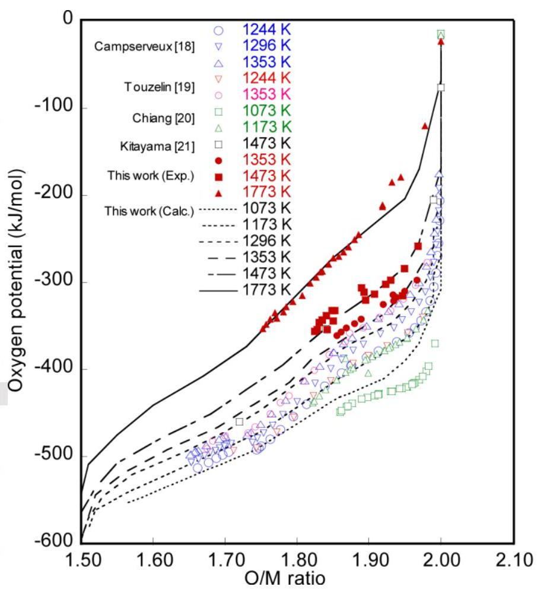
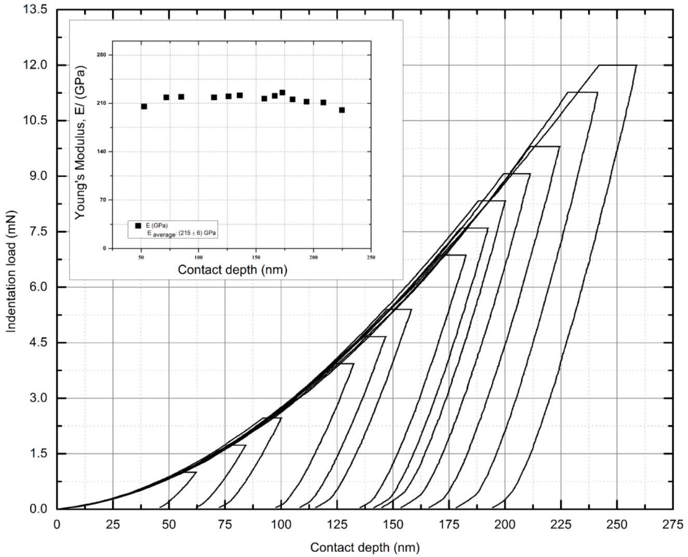
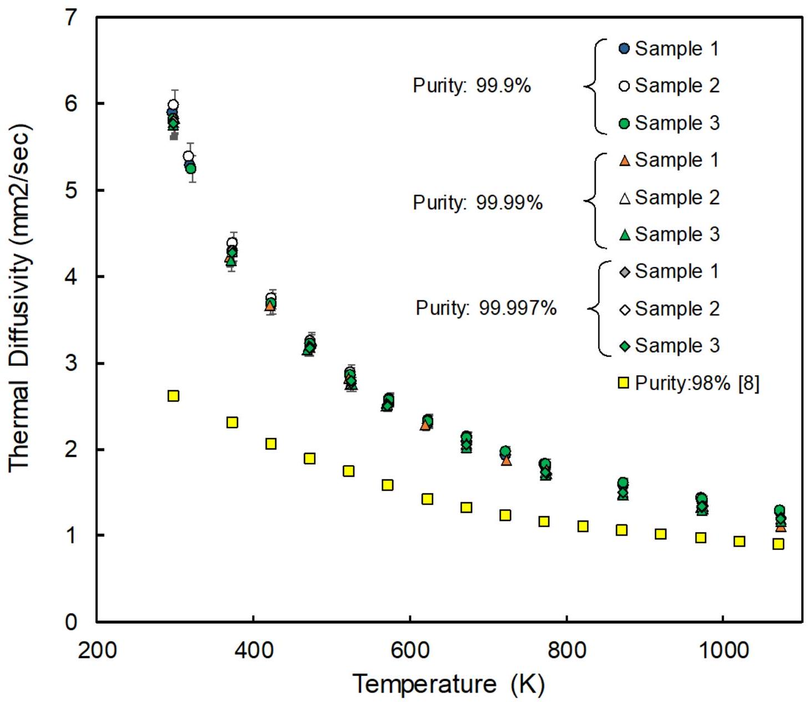
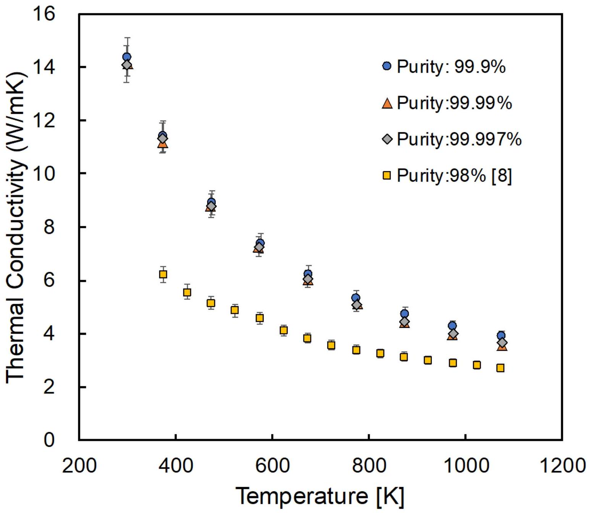
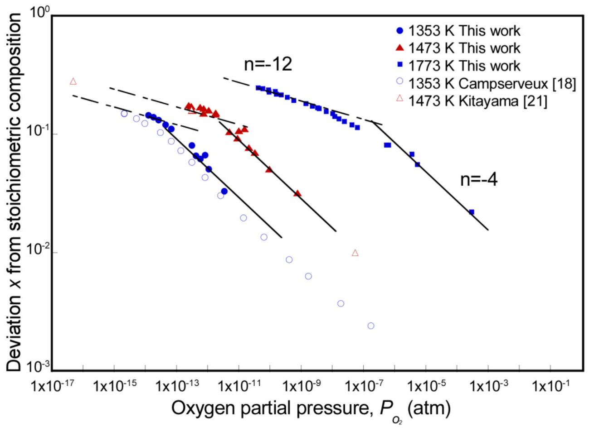
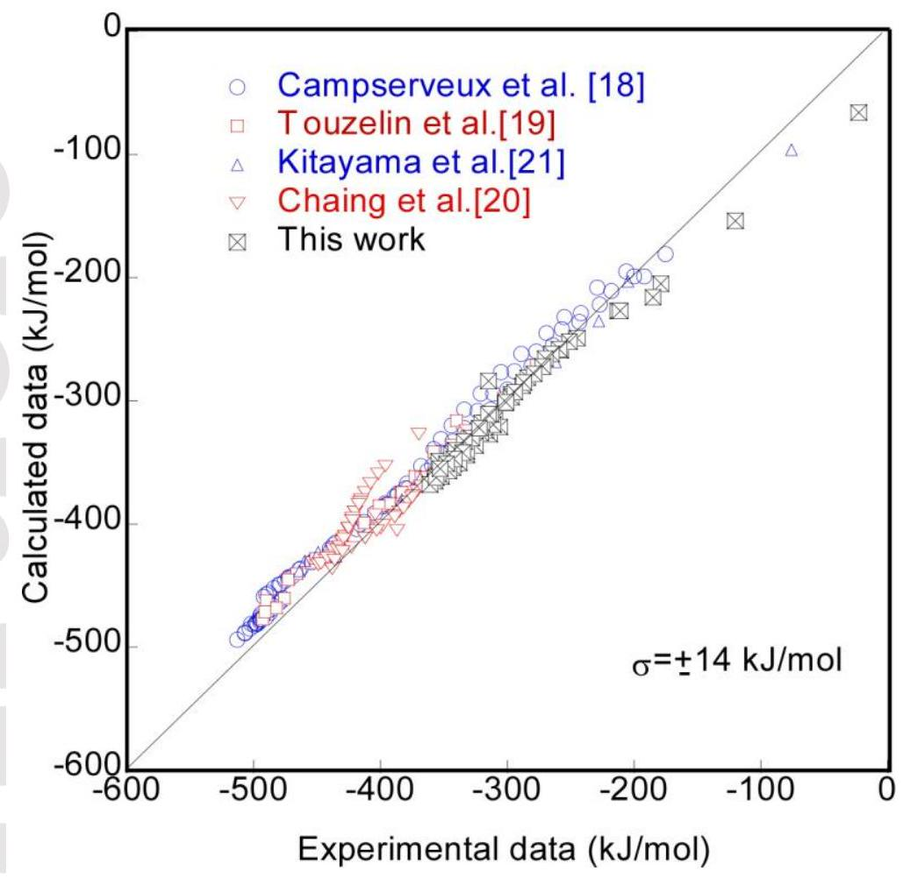
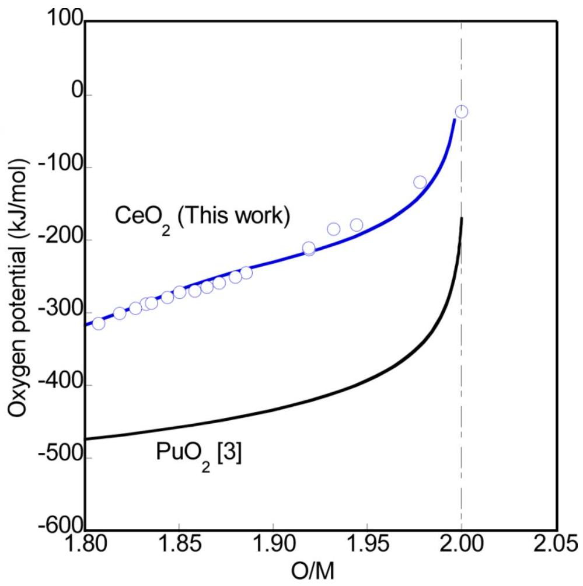
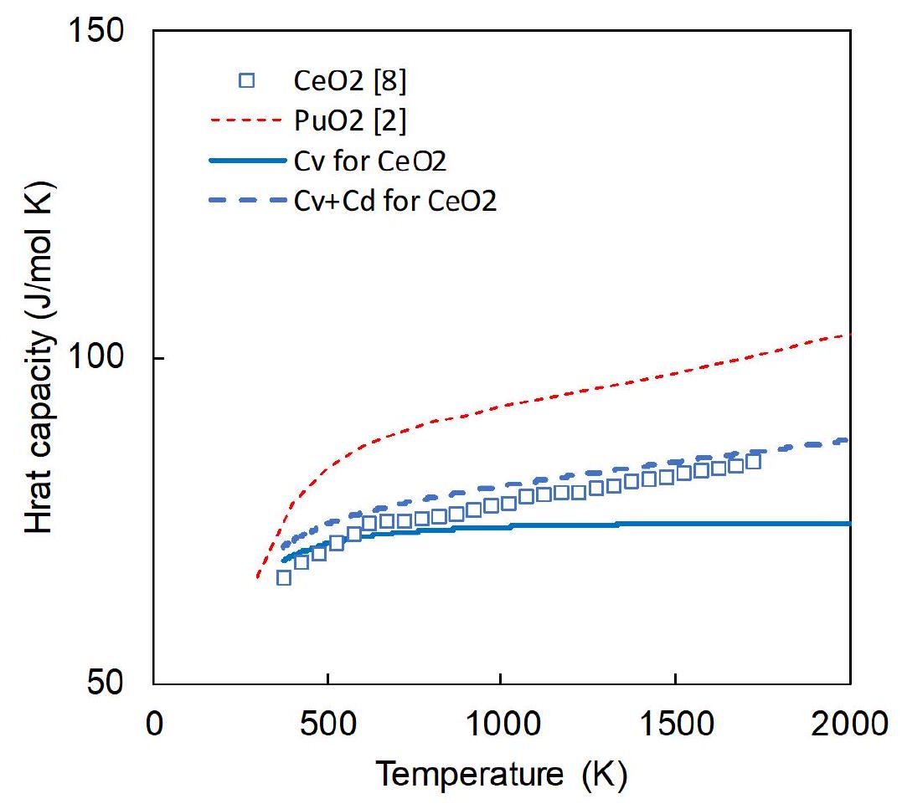
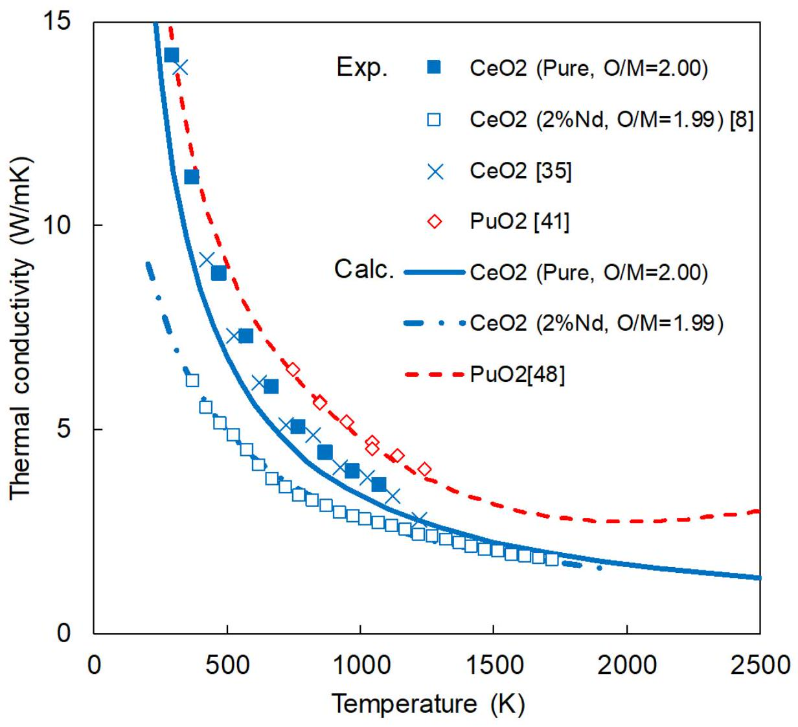

# Thermal and mechanical properties of CeO2 

Suzuki, Kiichi Kato, Masato Sunaoshi, Takeo Uno, Hiroki Carvajal Nunez, Ursula Nelson, Andrew Thomas Mcclellan, Kenneth James

Provided by the author(s) and the Los Alamos National Laboratory (2018-09-06).

To be published in: Journal of the American Ceramic Society

DOI to publisher's version: 10.1111/jace. 16055

Permalink to record: http://permalink.lanl.gov/object/view?what=info:lanl-repo/lareport/LA-UR-18-23161

## Disclaimer:

Approved for public release. Los Alamos National Laboratory, an affirmative action/equal opportunity employer, is operated by the Los Alamos National Security, LLC for the National Nuclear Security Administration of the U.S. Department of Energy under contract DE-AC52-06NA25396. Los Alamos National Laboratory strongly supports academic freedom and a researcher's right to publish; as an institution, however, the Laboratory does not endorse the viewpoint of a publication or guarantee its technical correctness.

MR. KIICHI SUZUKI (Orcid ID : 0000-0002-8782-6926)

DR ANDREW THOMAS NELSON (Orcid ID : 0000-0002-4071-3502)

Article type : Article

Thermal and mechanical properties of $\mathrm{CeO}_{2}$

Kiichi Suzuki ${ }^{*}$, Masato Kato ${ }^{\dagger}$, Takeo Sunaoshi ${ }^{\ddagger}$, Hiroki Uno ${ }^{\ddagger}$, Ursula Carvajal-Nunez ${ }^{\S}$, Andrew T. Nelson ${ }^{§}$, Kenneth J. McClellan ${ }^{§}$
${ }^{\dagger}$ Fuel Cycle Design Department, Japan Atomic Energy Agency, 4-33 Muramatsu

Tokai-mura, Ibaraki 319-1194, Japan
${ }^{\ddagger}$ Inspection Development Company, 4-33 Muramatsu, Tokai-mura, Ibaraki 319-1194,

Japan
${ }^{§}$ Los Alamos National Laboratory, P.O. BOX 1667, Los Alamos, 87545 New Mexico, USA

This article has been accepted for publication and undergone full peer review but has not been through the copyediting, typesetting, pagination and proofreading process, which may lead to differences between this version and the Version of Record. Please cite this article as doi: 10.1111/jace. 16055

This article is protected by copyright. All rights reserved.

Keywords: $\mathrm{CeO}_{2}$; Nuclear materials; Oxygen potential; Elastic properties; Heat capacity;

Thermal conductivity
*'Corresponding author. Tel.: + 81-29-282-1133; fax: + 81-29-282-3242

E-mail: suzuki-kiichi@meti.go.jp

Abstract

The thermal and mechanical properties of cerium dioxide ( $\mathrm{CeO}_{2}$ ) were assessed using
a range of experimental techniques. The oxygen potential of $\mathrm{CeO}_{2}$ was measured by the
thermogravimetric technique, and a numerical fit for the oxygen potential of $\mathrm{CeO}_{2}$ is derived based on defect chemistry. Mechanical properties of $\mathrm{CeO}_{2}$ were obtained using
sound velocity measurement, resonant ultrasound spectroscopy and nanoindentation.

The obtained mechanical properties of $\mathrm{CeO}_{2}$ are then used to evaluate the Debye
temperature and Grüneisen constant. The heat capacity and thermal conductivity of
$\mathrm{CeO}_{2}$ were also calculated using the Debye temperature and the Grüneisen constant.

Finally, the thermal conductivity was calculated based upon laser flash analysis
measurements performed on pellets fabricated using a range of feedstock purities to
resolve discrepancies in the existing literature.

This article is protected by copyright. All rights reserved.

## 1. Introduction

Cerium (3+, 4+) is stable not only as the familiar dioxide (fluorite crystal structure), but also as a large number of intermediate oxides stable at lower temperatures before giving way to a classical hypo-stoichiometric fluorite structure above approximately $900 \mathrm{~K} .^{1}$ In nuclear fuels and actinide materials research, cerium dioxide ( $\mathrm{CeO}_{2}$ ) has been used as a surrogate material for plutonium dioxide ( $\mathrm{PuO}_{2}$ ). Development of nuclear fuel materials and processes requires assessment of numerous properties that govern thermodynamic stability, heat transport, and other factors. Many recent examples exist to demonstrate such efforts to characterize $\mathrm{PuO}_{2}$ and mixed actinide oxides such as $(\mathrm{U}, \mathrm{Pu}) \mathrm{O}_{2} .^{2-7}$ Cerium dioxide has historically been considered as a surrogate due primarily to its $3+$ and $4+$ valence states, which match the readily accessible oxidation states of Pu. ${ }^{8-12}$ Assessment of material properties using Ce rather than Pu relieves the operational constraints inherent to work with transuranic elements. However, it is essential to evaluate differences between properties of the surrogate materials and that of Pu. Nelson et al. ${ }^{8}$ measured thermal conductivity, heat capacity and thermal expansion of $\mathrm{CeO}_{2}$, and compared to those of $\mathrm{PuO}_{2}$. The authors report that $\mathrm{CeO}_{2}$ would be a poor surrogate to simulate the properties and behavior of $\mathrm{PuO}_{2}$ based upon its significantly lower thermal conductivity and dissimilar thermodynamic behavior at elevated temperatures. ${ }^{8}$ More This article is protected by copyright. All rights reserved.
recently, McMurray et al. ${ }^{13}$ assessed the thermodynamic behavior of the U-Ce-O system in comparison to U-Pu-O and reached a similar conclusion.

Despite these and other assessments, many fundamental properties remain poorly characterized and discrepancies exist in even basic properties of $\mathrm{CeO}_{2}$. This limits the potential or broader assessment of its strengths and weaknesses as a surrogate for $\mathrm{PuO}_{2}$.

While the room temperature data for pure $\mathrm{CeO}_{2}$ determined by Nelson et al. ${ }^{8}$ agreed with other traditionally performed measurements, more recent studies report higher thermal conductivity data for stoichiometric $\mathrm{CeO}_{2} .{ }^{14}$ In addition to the thermophysical and thermodynamic properties, mechanical properties and elastic behavior are gaining more importance in fuel development given the recent advancements in modeling methods that require these data as basic benchmarks. Recently, Kato and McClellan reported that heat capacity and thermal conductivity can be represented by measured sound velocity. ${ }^{15}$ Hirooka et al. ${ }^{7}$ determined sound velocity of $(\mathrm{U}, \mathrm{Pu}) \mathrm{O}_{2}$ as functions of porosity of the specimen, Pu content and oxygen-to-metal (O/M) ratio. Comparable data have not yet been reported for pure $\mathrm{CeO}_{2}$.

This article is protected by copyright. All rights reserved.

It is well known that the mechanical and thermophysical properties of oxide ceramics are dictated by stoichiometry. High temperature property measurements therefore depend on an ability to not only measure but also control stoichiometry through equilibrium oxygen potential. Relevant examples of this approach can be seen in measurements of thermal conductivity of hyperstoichiometric $\mathrm{UO}_{2_{++}{ }^{16}}$ or thermal expansion in hypostoichiometric $\mathrm{PuO}_{2 \cdot x}{ }^{17}$. While the oxygen potential of $\mathrm{CeO}_{2}$ has been measured at temperatures of 1073-1473 K in previous works ${ }^{18-21}$, the present study extends these measurements to a higher temperature range by gas equilibrium method which was described in details in previous work. ${ }^{22-23}$ A thermodynamic model for oxygen potential of $\mathrm{CeO}_{2 \cdot x}$ is then derived based on defect chemistry.

The present study couples an improved understanding of the oxygen potential of $\mathrm{CeO}_{2}$ with additional property measurements to address gaps in the present literature and resolve uncertainties when present. Measurements of the sound velocity, elastic modulus, bulk modulus, shear modulus, Poisson's ratio, and $\mathrm{C}_{11}$ / $\mathrm{C}_{44}$ were performed for stoichiometric $\mathrm{CeO}_{2}$ at room temperature using a range of techniques. These data are then compared to the existing literature where available to inform ongoing and future studies of the fundamental behavior of $\mathrm{CeO}_{2}$ and conjugate mixed oxide studies. Laser flash analysis was performed to assess thermal diffusivity for $\mathrm{CeO}_{2}$ feedstocks of multiple This article is protected by copyright. All rights reserved.
purities. Finally, the above data are then used to calculate the Debye temperature and the Grüneisen constant for $\mathrm{CeO}_{2}$ to improve the ability of first principles modeling efforts to accurately capture the behavior of this system.

## 2. Experimental

### 2.1 Independent assessment of feedstock impurity levels

Nominal purity $\mathrm{CeO}_{2}$ powder (RARE METALLIC Co., LTD, 99.9 \% purity, Lot 31122-13) was prepared for oxygen potential and sound velocity measurement. Impurity analysis was performed for the powder using photoelectric emission spectrochemical analysis and inductively coupled plasma atomic emission spectrophotometry. The elements assessed were Ag , Al , B , Cd , Cr , Cu , Fe, Mg , Mn, Ni, Si, V, Zn, Ca, Mo, Pb, Sn, Ti, W, Na, Bi, Co, $\mathrm{La}_{2} \mathrm{O}_{3}, \mathrm{Pr}_{6} \mathrm{O}_{11}, \mathrm{Nd}_{2} \mathrm{O}_{3}, \mathrm{Fe}_{2} \mathrm{O}_{3}$ and $\mathrm{SiO}_{2}$.

Also, other three $\mathrm{CeO}_{2}$ feedstocks were procured for laser flash analysis, resonant ultrasound spectroscopy and nanoindentation measurement. Archived material retained from the previous investigation of the thermophysical properties of $\mathrm{CeO}_{2}{ }^{8}$ was also included in initial assessments. This material was reported to be $99.9 \%$ purity, but chemical composition was not assessed independently in the prior study. Three additional purities were produced for the present work. Alfa Aesar 99.9 \% (Lot N02B024) This article is protected by copyright. All rights reserved.
and $99.99 \%$ (Lot C09Y013) were used, along with ultra high purity $99.997 \%$ (Jiangyin Jiahua Advanced Material Resources, Lot 970907-19). Trace element analysis was performed using inductively coupled plasma mass spectroscopy (ICP-MS) and inductively coupled plasma optical emission spectroscopy (ICP-OES). Three samples of approximately 100 mg each were taken from each feedstock. For ICP-MS analysis, the 100 mg sample was dissolved in a $1: 1$ solution of nitric acid and hydrogen peroxide and stirred for approximately twelve hours. The elements assessed were $\mathrm{Cr}, \mathrm{Fe}, \mathrm{Cu}, \mathrm{Zn}, \mathrm{Y}, \mathrm{Zr}$, Pd, Ba, La, Nd, Sm, Eu, Tb, Dy, Ho, Yb, Re, Pb, Th and U. Five standards were prepared for each element in concentrations from 0.2 to 125 weight parts per billion (wppb) analyzed. Each sample was analyzed in triplicate. Separate samples were also analyzed using ICP-OES. Each feedstock was again sampled three times; 300 mg samples were dissolved using the same solution and method as above. The elements assessed were B, $\mathrm{Be}, \mathrm{Ca}, \mathrm{Na}$ and Si using 0.2 to 10 weight parts per million (wppm) standards.

### 2.2 Specimen preparation for oxygen potential and sound velocity measurement

Nominal purity $\mathrm{CeO}_{2}$ powder (RARE METALLIC Co., LTD, $99.9 \%$ purity, Lot 31122-13, particle size: 1-2 $\mu$ m) was pressed into green pellets. The green pellets had a diameter of around 10 mm and a height of around 9.2 mm . Sintering was performed in air using the This article is protected by copyright. All rights reserved.
following temperature profile. The furnace temperature was ramped to 373 K at approximately $17 \mathrm{~K} / \mathrm{min}$, then ramped to 1073 K at $12 \mathrm{~K} / \mathrm{min}$, finally ramped to 1873

K at $7 \mathrm{~K} / \min$ and held at this temperature for three hours. The furnace was subsequently cooled to 1273 K at $17 \mathrm{~K} / \mathrm{min}$ and then the furnace was cooled to room temperature with natural cooling. The density of the sintered pellets were about $91 \pm 0.5 \%$ theoretical density ratio (TD). One of the pellets was sliced using a slow speed diamond saw to produce thin disc specimens for oxygen potential and lattice parameter measurement. The weight, height and diameter of the specimen for oxygen potential measurement were $131.81 \mathrm{mg}, 1$ and 5 mm , respectively. The sectioned portion of the sample was then ground by agate mortar to measure lattice parameter by powder X-ray diffraction (XRD). The lattice parameter of $\mathrm{CeO}_{2}$ analyzed was obtained to be 0.5411 nm . This lattice parameter results in a theoretical density of $7.215 \mathrm{~g} / \mathrm{cm}^{3}$ if $172.115 \mathrm{~g} / \mathrm{mol}$ is used for the atomic mass of $\mathrm{CeO}_{2}$.

### 2.3 Sample preparation for laser flash analysis, resonant ultrasound spectroscopy and

## nanoindentation

$\mathrm{CeO}_{2}$ samples for laser flash analysis (LFA), resonant ultrasound spectroscopy (RUS), and nanoindentation were also prepared using a procedure slightly modified to that

This article is protected by copyright. All rights reserved.
reported by Nelson et al.. ${ }^{8}$ Sample preparation for all three feedstock purities was identical. Powder charges of approximately $10-15 \mathrm{~g}$ was mixed with a binding agent, 0.45 \% ethylene bis stearamide (Sigma Aldrich, Lot 1204CD). The binder and powder were homogenized using a high energy mill for thirty minutes using a zirconia jar with zirconia ball. The resulting feedstock was sieved through a -200 mesh sieve for pressing. The powder was pressed into green pellets of various sizes depending upon the intended experimental technique. Sintering was performed in air using a box furnace. The furnace temperature was first ramped to 673 K at $5 \mathrm{~K} / \min$ and held for one hour to remove the binder. Then the furnace temperature was ramped to 1873 K at $10 \mathrm{~K} / \min$ and held at this temperature for four hours. The furnace was subsequently cooled to 1473 K at $5 \mathrm{~K} / \min$ and held for four hours to remove oxygen vacancies resulting from high temperature sintering and normalize the microstructure as detailed previously. ${ }^{8}$ Finally, the furnace was cooled to room temperature at $5 \mathrm{~K} / \mathrm{min}$. The pellets were sintered on a bed of loose $\mathrm{CeO}_{2}$ powder to prevent chemical interaction with the alumina fixture. The resulting pellet geometric densities measured were $95-97 \%$ TD assuming $7.215 \mathrm{~g} / \mathrm{cm}^{3}$ as theoretical density of $\mathrm{CeO}_{2}$.

This article is protected by copyright. All rights reserved.

Samples prepared for LFA obtained a final diameter of 9.9 mm with a height ground to approximately 1.5 mm in thickness, verified to be plane / parallel to within 0.02 mm. Pellets sintered for RUS were approximately right cylinders, with diameters of 4.0 mm and heights 4.0 mm . Finally, samples used for nanoindentation were 4.0 mm in diameter and 3.0 mm in height. Nanoindentation samples were embedded in epoxy and polished using silicon carbide and consecutively finer diamond suspensions with $0.05 \mu \mathrm{~m}$-alumina used as a final polish to achieve a mirror-like surface.

Powder XRD was also performed on sample pellets using the same method as described in Section 2.2 and providing the same conclusion and confirmation of single phase material. Additionally, grain size was measured for samples of each purity. Pellets were sectioned using a slow speed diamond saw, rough ground using SiC metallography papers, and subjected to a final polish of 3 micrometer diamond lapping film. A thermal etch was then performed in air ( $1823 \mathrm{~K}, 15 \mathrm{~min}$ ) to obtain grain boundary relief on the cross section. Grain size analysis of the samples using a circular intercept proceedure according to ASTM E112-13 produced average grain sizes of 14 to 18 micrometers for samples of both the 99.99 and $99.997 \%$ feedstock puritiy. The 99.9 purity feedstock yielded slightly larger grains, measuring approximately 25 micrometers.

This article is protected by copyright. All rights reserved.

### 2.4 Oxygen potential measurement

The apparatus and procedure used for measurement of the oxygen potential of $\mathrm{CeO}_{2}$ are described in detail in previous reports. ${ }^{3,22-23}$ A brief summary is included here. A thermogravimetric analyzer (TGA) (TG-DTA 2000SA, Bruker AXS) placed in a glove box was employed for the measurement. In order to prepare desired oxygen partial pressure (Po2) during the measurement, an Ar gas mixture containing $\mathrm{Ar} / \mathrm{O}_{2}, \mathrm{Ar} / \mathrm{H}_{2}$ and moisture was used. The oxygen potential ( $\Delta \bar{G}_{O 2}$ ) of the gas was determined by adjusting the hydrogen partial pressure ( $P_{H 2}$ )-to-moisture partial pressure ( $P_{H 2 O}$ ) ratio using the following equations:
$\Delta \bar{G}_{O 2}=\mathrm{RT} \ln \mathrm{P}_{O 2} \quad(\mathrm{~J} / \mathrm{mol})$
$P_{O 2}=\left(\frac{\mathrm{P}_{H 2}}{\mathrm{P}_{H 2 O}}\right)^{-2} \exp \left(\frac{2 \Delta G_{f}}{R T}\right) \quad$ (atm)
$\Delta G_{f}=-246440+54.81 \cdot T \quad(\mathrm{~J} / \mathrm{mol})$
where $\Delta G_{f}$ is the standard Gibbs free energy of formation (J/mol), $R$ is the gas constant ( $8.3145 \mathrm{~J} / \mathrm{mol}$ K) and $T$ is temperature (K). The $P_{O 2}$ was controlled by appropriately adjusting the ( $P_{H 2} P_{H 2 O}$ ) ratio during the measurement. The $P_{O 2}$ was monitored at the inlet and outlet of the apparatuses by zirconia oxygen sensors.

Measurements of oxygen potential were carried out at 1353, 1473 and 1773 K . The terminal weight change of the sample as measured using the TGA during isothermal holds under a fixed $P_{O 2}$ was then converted to a change in O/M assuming a molecular mass of $172.115 \mathrm{~g} / \mathrm{mol}$. As the typical sample disc used in the oxygen potential measurement was approximately 140 mg and the resolution of the TGA was 0.01 mg , the error of $\mathrm{O} / \mathrm{M}$ determination as calculated using this technique is 0.0008 .

### 2.5 Sound velocity measurement

Measurements of longitudinal velocity and transverse sound velocity were carried out using the ultrasonic flaw detector (KJTD Co. Ltd. HIS-3 type, 5 MHz ). ${ }^{7}$ Five measurements were performed for each pellet. The reported values represent the average of these five measurements. Good agreement was obtained, as standard deviations for the data did not exceed $30 \mathrm{~m} / \mathrm{s}$.

### 2.6 Laser flash analysis

Laser flash analysis s (LFA 457, Netzsch Instruments) was performed on three $\mathrm{CeO}_{2}$ samples of each feedstock purity using the same methodology described previously. ${ }^{8}$

Samples were first coated with approximately 30 nm of gold using a standard sputter This article is protected by copyright. All rights reserved.
coater. A second layer of graphite spray was then applied on top of the gold layer. Laser
flash analysis was performed in an atmosphere of flowing argon to a maximum
temperature of 1073 K . Data was collected at 50 K intervals up to 773 K and 100 K
intervals from this point to the maximum temperature. Five shots were taken at each
temperature; the standard deviation of the thermal diffusivity data at each step was far below the standard error associated with the technique (3 \%). Sample weights as
measured before and after LFA did not differ beyond the accuracy of the balance, and as such it is assumed that O/M remained above 1.998.

### 2.7 Resonant ultrasound spectroscopy

RUS measurements were collected at constant amplitude on five $\mathrm{CeO}_{2}$ pellets ranging between 95.4 and 96.9 \% TD as reported in Table 1. Only samples of 99.99 \% feedstock purity were characterized using RUS. Measurements were performed using a National Instrument NI, PXIe 1075 function generator. The driving frequency ranged from 300 to 900 kHz . Both generation and acquisition lines are managed by the Resonance Inspection Techniques and Analysis (RITA©) by the commercial software. Measurements were performed with the sample corners positioned between piezoelectric transducers.

This article is protected by copyright. All rights reserved.

### 2.8 Nanoindentation

The $\mathrm{CeO}_{2}$ samples were tested using a Hysitron ${ }^{\text {TM }}$ Triboindenter ${ }^{\text {TM }}$ (Minneapolis, USA) in dual mode with a diamond Berkovich tip. The shape function for the indenter tip was obtained after calibration with aluminum, quartz, and polycarbonate standards. Young's modulus tests were performed by making roughly fifteen indents per sample under a displacement-control cycle: the load was increased from 0 to 12 mN , held constant for thirty seconds, and finally decreased at a constant rate until zero load was reached after ten additional seconds.

## 3. Results

### 3.1 Feedstock chemistry

Impurities as measured for $\mathrm{CeO}_{2}$ powder used for oxygen potential and sound velocity measurement are summarized in Table 2. Ca content was 150 ppm . Rare-earth elements $\left(\mathrm{La}_{2} \mathrm{O}_{3}, \mathrm{Pr}_{6} \mathrm{O}_{11}\right.$ and $\left.\mathrm{Nd}_{2} \mathrm{O}_{3}\right), \mathrm{Ag}, \mathrm{Al}, \mathrm{B}, \mathrm{Cd}, \mathrm{Cr}, \mathrm{Cu}, \mathrm{Fe}, \mathrm{Mg}, \mathrm{Mn}, \mathrm{Ni}, \mathrm{Si}, \mathrm{V}, \mathrm{Zn}, \mathrm{Mo}, \mathrm{Pb}, \mathrm{Sn}, \mathrm{Ti}$, W, $\mathrm{Na}, \mathrm{Bi}, \mathrm{Co}, \mathrm{Fe}_{2} \mathrm{O}_{3}$ and $\mathrm{SiO}_{2}$ content were below detection limit.

Also, impurities as measured for each of the four feedstocks used for laser flash analysis, resonant ultrasound spectroscopy and nanoindentation measurement using ICP-MS and ICP-OES are summarized in Table 3. The impurities detected for the three new This article is protected by copyright. All rights reserved.
feedstocks trend in a manner consistent with their reported impurity levels. The certificate of analysis for the 99.997 feedstock reports $\mathrm{Si}, \mathrm{Fe}, \mathrm{La}, \mathrm{Pr}, \mathrm{Nd}$ and Sm impurities at the part-per-million level, below the detection limits of the analytical technique used here. Calcium as CaO is reported at 60 wppm; this too is below the detectable limit of Ca using the ICP-OES technique as employed in the present work (500 ppm). Sodium and Al were found in the 99.997 sample at levels slightly above the detectable limit. The $99.99 \%$ sample was also found to contain Na and Al at approximately the same levels as the 99.997 \% samples. However, Fe is detected at significant levels (over 400 wppm ). The certificate of analysis provided by the supplier for the lot of $99.99 \% \mathrm{CeO}_{2}$ used here reports 410 wppm $\mathrm{Fe}_{2} \mathrm{O}_{3} . \mathrm{CaO}, \mathrm{Al}_{2} \mathrm{O}_{3}$, and $\mathrm{SiO}_{2}$ are also reported at 190, 120, and 210 wppm , respectively. Impurity levels continue to rise in the 99.9 \% sample as expected. Yttrium and lanthanum are now observed at levels above the detectable limits, and Ca is found at a concentration of nearly 1000 wppm.

Archival material from the $\mathrm{CeO}_{2}$ reported to be $99.9 \%$ as measured in previous work ${ }^{8}$ was also analyzed using the same process. Significant impurities were discovered in the feedstock, as summarized in Table 3. Many other lanthanides are present at the thousand part-per-million level. The most significant impurity is Nd, found to comprise nearly one percent of the feedstock. When summed, the impurity elements found above This article is protected by copyright. All rights reserved.
the detectable limit in the archived 99.9 \% sample show that the feedstock contains at best $98 \% \mathrm{CeO}_{2}$.

### 3.2 Oxygen potential measurement

The sample was sintered at 1873 K in air atmosphere and measured by XRD. The lattice parameter of the sample was determined to be $0.5411 \pm 0.0001 \mathrm{~nm}$ which corresponds to that of $\mathrm{O} / \mathrm{Ce}=2.00 \pm 0.0025^{25}$. The weight of the sample was 131.8 mg . The ratio of $\mathrm{O} / \mathrm{Ce}$ was determined on the assumption that the weight change was equal with $\mathrm{O} / \mathrm{Ce}$ change in the oxygen measurement. The measured data are plotted in Fig. 1 together with literature data. The equilibrium oxygen potential increases with temperature and decreases with O/M. These tendencies are consistent with literature data as indicated in the legend.

### 3.3 Sound velocity measurement

Hirooka et al. ${ }^{7}$ measured sound velocity in $\mathrm{UO}_{2}$, (U, $\mathrm{Pu} \mathrm{O}_{2}$ and $\mathrm{PuO}_{2}$ pellets, and derived the eqs.(4) - (6) that express density dependence of sound velocities using measured longitudinal sound velocity $\mathrm{V}_{\mathrm{L}}$ ' and transverse sound velocity $\mathrm{V}_{\mathrm{T}}$ ':

This article is protected by copyright. All rights reserved.
$V_{L}=\frac{V_{L^{\prime}}}{1-1.3172 p}$
$V_{T}=\frac{V_{T^{\prime}}}{1-0.8945 p}$
$p=1-\frac{\text { Bulk density }}{\text { Theoretical density }}$ (6)
$\mathrm{V}_{\mathrm{L}}$ and $\mathrm{V}_{\mathrm{T}}$ are sound velocities of longitudinal and transverse waves in the porosity free specimen, respectively. The porosity fraction of the specimen, $p$, is defined in eq. 6. In this study, the $\mathrm{V}_{\mathrm{L}}$ and $\mathrm{V}_{\mathrm{T}}$ were calculated by eqs.(4) - (6). Cerium dioxide shares a fluorite structure with $\mathrm{UO}_{2},(\mathrm{U}, \mathrm{Pu}) \mathrm{O}_{2}$ and $\mathrm{PuO}_{2}$, and possesses a generally comparable microstructure thus validating the assumptions inherent in the above equations. ${ }^{26}$ The calculated values are shown in Table 4. Literature data for $\mathrm{PuO}_{2}$ are also shown in Table 5 for comparison to $\mathrm{CeO}_{2}$ as found in the present work.

### 3.4 Resonance Ultrasound Spectroscopy

Table 1 indicates the dimensions and elastic properties for $\mathrm{CeO}_{2}$ samples measured using RUS in this work. Twenty to thirty resonances were measured for each sample, and an inversion was performed to obtain the elastic constants. ${ }^{27}$ The resulting inversion produced better than $1 \%$ error (root mean square) which assesses the deviation between experimental and calculated resonance frequencies (see Table 1). Elastic components obtained from the inversion, $\mathrm{C}_{11}$ and $\mathrm{C}_{44}$ and the bulk modulus, K , were used to calculate This article is protected by copyright. All rights reserved.

Young's modulus, E, and Poisson's ratio, v. Extrapolation of the data collected here to fully dense $\mathrm{CeO}_{2}$ results in values of 207 and 185 GPa for E and K , respectively. The values are also summarized in Table 4 alongside the same parameters as determined by sound velocity measurement.

### 3.5 Nanoindentation

Fig. 2 shows a representative load-displacement plot in the multi-indent and the Young's modulus, E, as a function of depth (Fig. 2 inset). Nanoindentation experiments were conducted up to 250 nm maximum peak displacement. Young's modulus was found to be $213 \pm 6 \mathrm{GPa}$. There is no variation in E as a function of depth. Young's modulus was determined using values of 1114 GPa and 0.07 for the modulus and Poisson's ratio of the diamond Berkovich indenter. Poisson's ratio of $\mathrm{CeO}_{2}$ was found to be 0.305 as measured using RUS measurements in this study. Young's modulus was then calculated using an average of points and the Oliver and Pharr method. ${ }^{28}$

### 3.6 Laser flash analysis

Fig. 3 plots the mean thermal diffusivity value obtained at each temperature step for the nine samples (three of each feedstock purity) analyzed in the present work. The standard This article is protected by copyright. All rights reserved.
deviation of the five data points collected at each temperature step was far smaller than the $3 \%$ standard error accepted for the LFA technique, and so the error bars plotted in

Fig. 3 are $3 \%$. The data collected for the archival $99.9 \%$ feedstock as reported by Nelson et al. ${ }^{8}$ are also plotted, which was measured in the sample of $95 \%$ TD. No significant differences are observed in the thermal diffusivity of the three different $\mathrm{CeO}_{2}$ feedstocks used in the present study, but all are significantly higher than the literature data included.

The mean thermal diffusivity values for each feedstock composition are used to calculate thermal conductivity using the specific heat capacity and density of $\mathrm{CeO}_{2}$. Values for the specific heat capacity and temperature-dependent density are taken from Reference 8.

The results are plotted in Fig. 4 in comparison to the thermal conductivity reported by Nelson et al. ${ }^{8}$ There is no density correction used, so data plotted in Fig. 4 correspond to $4-5 \%$ porosity. As with the results of thermal diffusivity plotted in Fig. 3, no significant difference is found between the three feedstock purities.

This article is protected by copyright. All rights reserved.

## 4. Discussion

### 4.1 Oxygen potential representation

The oxygen potential measurements of $\mathrm{CeO}_{2^{-x}}$ determined in this work are replotted in

Fig. 5 along with selected literature data. Instead of plotting oxygen potential against
deviation from stoichiometry, deviation from stoichiometry is plotted against oxygen
partial pressure. This allows for analysis of the governing defect chemistry. It is reported
that deviation $x$ from stoichiometric composition is proportional to $P_{O 2}{ }^{1 / \mathrm{n}} \cdot{ }^{29-31}$ Here, n is
constant value depending on the defect type. In the Fig. 5, a relationship of $\mathrm{n}=-4$ and $\mathrm{n}=$
-12 are observed in near stoichiometric and reducing (low $P_{O 2}$ ) region, respectively.

For $\mathrm{CeO}_{2-\mathrm{x}}$ at high temperatures, it is assumed that deviation from stoichiometry, $x$, is
accommodated by oxygen vacancies $\left[V^{\circ} \cdots\right]$ when the temperature is high enough that a
single phase system is retained. The lowest temperature of oxygen potential
measurement in the present work is 1073 K , well above the F1-F2 miscibility gap and
satisfying this criterion ${ }^{1}$. The oxygen potential data was then evaluated based on defect
chemistry. ${ }^{29-31}$ Defect reaction of eqs. (7) and (8) were considered to express the
relationships of $x \propto P_{O 2}^{-1 / 4}$ and $x \propto P_{O 2}^{-1 / 12}$, respectively.
$O_{O}^{\times}+C e_{C e}^{\times} \rightarrow\left(\text { Vo }^{\prime \prime} C e^{\prime}\right)^{\prime}+C e^{\prime}+\frac{1}{2} O_{2}$

This article is protected by copyright. All rights reserved.
$3 \mathrm{O}_{\mathrm{O}}^{\times}+5 \mathrm{Ce}_{\mathrm{Ce}}^{\times} \rightarrow\left(2 \mathrm{Vo}^{\cdots} \mathrm{Vo}^{\prime} 2 \mathrm{Oi}\right)^{\cdots \cdots}+5 \mathrm{Ce}^{\prime}+\frac{1}{2} \mathrm{O}_{2}$

Kröger -Vink notation can be used to describe the relevant defect reactions. The [Vo"] can be written by eqs. (9) and (10).
$\left[V o^{--}\right]_{n=-4}=\left[\left(V o \cdots C e^{\prime}\right)^{\prime}\right]=\left(K_{n=-4}\right)^{1 / 2} P_{O 2}^{-1 / 4}$
$\left.\left[V_{o}{ }^{*}\right]_{n=-12}=1 / 3\left[\left(2 V o^{*} V o^{*} 2 O i\right)\right)^{* * *}\right]=1 / 3\left(K_{n=-12}\right)^{1 / 6} P_{O 2}^{-1 / 12}$

Here, $K_{n=-4}$ and $K_{n=-12}$ are the reaction constants in the reaction of eqs. (7) and (8),
respectively. These equations show a relationship of $\left[V o{ }^{\cdot}\right] \propto P_{O 2}^{-1 / 4}$ and $\left[V o^{\cdot}\right] \propto P_{O 2}^{-1 / 12}$. The measured data were fitted by eqs. (9) and (10), and then $K_{n=-4}$ and $K_{n=-12}$ were obtained
as eqs.(11) and (12),
$K_{n=-4}=45000 \exp \left(-\frac{340000}{R T}\right)$
$K_{n=-12}=14702 \exp \left(-\frac{345000}{R T}\right)$
where R is gas constant and T is temperature. Experimental work performed in the present study is limited to the $\mathrm{CeO}_{1.75}$ to $\mathrm{CeO}_{2}$ region. It is reasonable to extrapolate the fits to slightly lower oxygen contents based on data provided by other authors as summarized in Fig. 6, but uncertainty increases as $x$ nears 0.5 , the composition of $\mathrm{Ce}_{2} \mathrm{O}_{3}$. The expressions are not valid above $x=0.5$. Equation (13) was then derived to represent the O/M ratio which is approximate for three lines of eqs.(9), (10) and $x=0.5$.

This article is protected by copyright. All rights reserved.
$x=\left[\left[V o^{\cdots}\right]_{n=-4}^{-8}+\left[V o^{\cdots}\right]_{n=-12}^{-8}+(0.5)^{-8}\right]^{-1 / 8}$

The calculated value obtained by eq. (13) is compared with the measured data in Fig. 6.

The calculated value can express $x$ within $\sigma= \pm 14 \mathrm{~kJ} / \mathrm{mol}$ as functions of $P_{O 2}$, and T. The calculated results are also shown in Fig. 1, and good agreement exists between the
experimental data and the calculation.

The oxygen potential data of $\mathrm{CeO}_{2}$ at 1773 K are plotted in Fig. 7 and compared to that of, $\mathrm{PuO}_{2} .{ }^{3}$ The oxygen potential data of $\mathrm{CeO}_{2}$ is about $200 \mathrm{~kJ} / \mathrm{mol} \mathrm{K}$ higher than that of $\mathrm{PuO}_{2}$. This indicates that under equivalent thermodynamic conditions, $\mathrm{CeO}_{2}$ will reduce more readily than $\mathrm{PuO}_{2}$.

### 4.2 Elastic Properties

Three different methods were used in the present work to assess the elastic properties of $\mathrm{CeO}_{2}$. Resonance ultrasound spectroscopy allows for determination of shear, Young's, and bulk moduli as well as Poisson's ratio. Nanoindentation allows for determination of Young's modulus when the properties of the tip material and Poisson's ratio of the test specimen are well known. Sound velocity measurements, in addition to being

This article is protected by copyright. All rights reserved.
intrinsically useful for analysis of acoustic properties of materials, can also be used to calculate elastic properties.

Shear modulus ( G ), Young's modulus ( E ), bulk modulus ( K ) and Poisson's ratio ( $v$ ) can be described using sound velocity as shown following eqs. (14) - (17) respectively.
$G=\rho V_{T}^{\prime 2}$ (14)
$E=\rho V_{T}^{\prime 2} \frac{3 V_{L}^{\prime 2}-4 V_{T}^{\prime 2}}{V_{L}^{\prime 2}-V_{T}^{\prime 2}}$ (15)
$K=\rho\left(3 V_{L}^{\prime 2}-4 V_{T}^{\prime 2}\right) / 3$
$v=\left(1-2\left(V_{T}{ }^{\prime} / V_{L}{ }^{\prime}\right)^{2}\right) /\left(2\left(1-\left(V_{T}{ }^{\prime} / V_{L}{ }^{\prime}\right)^{2}\right)\right)$

In the above equations, $\rho$ is the sample density and $V_{T}{ }^{\prime}$ and $V_{L}{ }^{\prime}$ are the transverse and longitudinal sound velocities. Table 4 includes the above properties calculated using these relationships for each of the experimental techniques.

There are important differences among the three experimental methods used to assess the elastic properties of $\mathrm{CeO}_{2}$. Nanoindentation is a surface technique. The limited penetration depth samples the elastic response of a single grain, provided assumptions This article is protected by copyright. All rights reserved.
are satisfied. First, the microstructure must be sufficiently large to greatly exceed that of the indent and the penetration depth. Second, indent placement must ensure grain boundaries, porosity, or other microstructural features do not interfere with the measurement. The grain sizes found for $\mathrm{CeO}_{2}$ samples in the present work were greater than $10 \mu \mathrm{~m}$, and both pre- and post-indent examination of the intent locations was performed to verify that grain boundaries or other surface or microstructural artifacts were avoided. Young's modulus determined through nanoindentation would therefore be expected to best match calculations made by first principles methods where microstructural features such as porosity or grain boundaries are not considered.

Determination of elastic properties using RUS or sound velocity measurement incorporates the effect of grain boundaries, porosity, and possible second phases. Elastic properties as determined by these methods would therefore be more relevant to those needed for engineering applications or continuum models.

The elastic properties summarized in Table 4 are in general agreement, but differences of up to ten percent are evident when data is compared. Resonant ultrasound spectroscopy produced the lowest mechanical property data. This is consistent with the expected property deviation between single crystal data and a bulk microstructure. The greatest This article is protected by copyright. All rights reserved.
contributor would likely be porosity; its effect is captured by RUS but not
nanoindentation.

The elastic properties determined by sound velocity measurement exhibit minor inconsistencies with the data trends expected of the three experimental methods. Sound velocity data as reported here is corrected to fully dense material, and as such porosity would not be a factor in the calculated data. Elastic properties from this technique should therefore exhibit good agreement with those produced by nanoindentation. However, Young's modulus determined by sound velocity measurement is approximately six percent higher than that determined by nanoindentation. Poisson's ratio as determined by sound velocity is also slightly higher than that found by RUS. One possible cause of this is the extrapolation required when samples containing porosity, as is often the case for monolithic ceramic materials, are used for sound velocity measurement. Equations (14)-(17) do not account for porosity; eqs (4)-(6) were used to first correct the measured sound velocity to that expected at theoretical density. It is likely that extrapolation from sound velocity measurement of samples containing $9 \%$ porosity will increase the error in the resulting elastic property data, and account for the difference

This article is protected by copyright. All rights reserved.

Elastic and mechanical property data obtained in the present study are in general agreement with available literature. As reported in Table 1, the shear modulus of $\mathrm{CeO}_{2}$ has been previously reported as 60 and $73 \mathrm{GPa},{ }^{32-33}$ while in this work 79 and 86 GPa were determined through RUS and sound velocity, respectively. A different trend is observed in the bulk modulus data; literature studies report $204-236 \mathrm{GPa},{ }^{32-35}$ while RUS produced 185 GPa . Bulk modulus calculated from sound velocity is in better agreement with the previous data, producing 208 GPa . Young's moduli reported for $\mathrm{CeO}_{2}$ in the literature range from 169 to 202 GPa , as shown in Table 4. The average of all RUS measurements performed in this work is 207 GPa , while nanoindentation provides 215 GPa and sound velocity 228 GPa.

Poisson's ratio provided by both sound velocity measurement and RUS are in good agreement as shown in Tables 1 and 3. Values for Poisson's ratio determined directly by RUS are 0.302 to 0.308; calculation of Poisson's ratio from the sound speed velocities as determined by RUS provides a slightly higher value of 0.314 . Direct measurement of sound velocity results in 0.318 . All three of these approaches yield a Poisson's ratio for $\mathrm{CeO}_{2}$ that agree within $3 \%$ of each other. It is noteworthy that the values of Poisson's ratio found in this study are significantly lower than other data reported in the literature and summarized in Table 1. A Poisson's ratio of approximately 0.3 is in better agreement This article is protected by copyright. All rights reserved.
with those reported for other fluorite oxides, and given the good agreement found through multiple independent techniques it is probable that Poisson's ratio for $\mathrm{CeO}_{2}$ is 0.31-0.32.

The elastic properties of $\mathrm{CeO}_{2}$ measured here are generally similar to those of $\mathrm{PuO}_{2}$.

Open literature mechanical property data for $\mathrm{PuO}_{2}$ is limited and is often subject to compromises necessary due to the operational and chemical challenges of the material.

For example, the sound velocity data reported for $\mathrm{PuO}_{2}$ in Table 5 was collected using samples containing $3 \%$ Am. Americium accumulates in Pu materials over time due to beta decay of $\mathrm{Pu}-241$. A comparison of the sound velocity data for $\mathrm{CeO}_{2}$ and $\mathrm{PuO}_{2}$ reported in Table 5 shows $\mathrm{CeO}_{2}$ to be superior, but it is not possible to state what role that Am content may play in this property without a more comprehensive dataset where purity is assessed.

Recently, Hirooka et al. ${ }^{7}$ reported that the bulk modulus of $\mathrm{PuO}_{2}$ to be 225 GPa
determined by sound velocity measurement. The bulk modulus of $\mathrm{CeO}_{2}$ is $185-221 \mathrm{GPa}$ in this work.

This article is protected by copyright. All rights reserved.

### 4.3 Heat capacity

The molar heat capacity at constant volume, $C_{v}$, was evaluated using the Debye model.

Debye temperature $T_{D}$ can be obtained using sound velocity as shown in the following equation:
$T_{D}=\left(\frac{h}{k_{B}}\right)\left(\frac{9 N}{4 \pi a^{3}}\right)^{1 / 3}\left(\frac{1}{V_{L}{ }^{\prime 3}}+\frac{2}{V_{T}{ }^{\prime 3}}\right)^{-1 / 3}$
where $\boldsymbol{h}$ is Plank's constant, $k_{B}$ is Boltzmann's constant, $N$ is number of atoms in the unit cell and $a$ is the lattice parameter. The calculated $T_{D}$ is 484 K using sound velocity measurement results as shown in Table 4.

Also, $\mathrm{C}_{\mathrm{v}}$ can be written by following equation using $T_{D}$ :
$C_{V}=9 n R\left(\frac{T}{T_{D}}\right)^{3} \int_{0}^{T_{D} / T} \frac{x^{4} e^{x}}{\left(e^{x}-1\right)^{2}} d x$.

The molar heat capacity $\mathrm{C}_{\mathrm{P}}$ at constant pressure can be described using dilatational term
$C_{d}$ as follows:
$C_{P}=C_{V}+C_{d}=C_{V}(1+3 \gamma \alpha T)$
where $\alpha$ is coefficient of thermal expansion. Here, $1.13 \times 10^{-6} \mathrm{~K}^{-1}$ is used as $\alpha$ value of $\mathrm{CeO}_{2}$ as reported by Nelson et al. ${ }^{8}$. The Grüneisen constant, $\zeta$, is obtained by following equation:

This article is protected by copyright. All rights reserved.
$\gamma=3 \alpha K V_{m} / C_{V}$
where $V_{m}$ is molecular volume and $K$ (bulk modulus) is calculated from eq.(16). The $V_{m}$ was calculated using ionic radii of $\mathrm{Ce}^{4+}$ and $\mathrm{O}^{2-}$, chosen as 0.9771 and $1.372 \AA$, respectively.

The $\mathrm{C}_{\mathrm{v}}$ and the $\left(\mathrm{C}_{\mathrm{v}}+\mathrm{C}_{\mathrm{d}}\right)$ contributions to heat capacity were calculated by eqs. (18) - (21) and shown in Fig. 8. The calculated molar heat capacity at constant pressure ( $\mathrm{C}_{\mathrm{v}}+\mathrm{C}_{\mathrm{d}}$ ) is in good agreement with the experimental data. In the Fig. 8, $\mathrm{C}_{\mathrm{p}}$ of $\mathrm{PuO}_{2}{ }^{36}$ is shown for comparison. It was reported that $\mathrm{C}_{\mathrm{p}}$ of $\mathrm{PuO}_{2}$ was $10-15 \mathrm{~J} / \mathrm{mol}-\mathrm{K}$ higher than that of calculated ( $\mathrm{C}_{\mathrm{v}}+\mathrm{C}_{\mathrm{d}}$ ) and this difference was caused by Schottkey term in $\mathrm{C}_{\mathrm{p}} .{ }^{37}$ Nakamura et al. ${ }^{38}$, calculated the heat capacity of $\mathrm{PuO}_{2}$ by considering Schottky term caused by the excited levels of $5 f^{\prime}$-electrons of Pu and the calculated result was good agreement with experimental value. ${ }^{37,38}$ In the case of the $\mathrm{CeO}_{2}, \mathrm{C}_{\mathrm{p}}$ was well represented by the $\left(\mathrm{C}_{\mathrm{v}}+\mathrm{C}_{\mathrm{d}}\right)$ without considering the Schottky term. It could be considered that this is because Ce has no 5f-electrons.

### 4.4 Thermal conductivity

The thermal conductivity data plotted in Fig. 4 for the three different feedstock purities investigated in the present work do not provide any differences outside of the standard error of thermal conductivity as calculated using the product of LFA, specific heat capacity, and density ( $95 \%$ TD). This provides confidence that impurity levels found across the modern pure $\mathrm{CeO}_{2}$ feedstocks ( $99.9,99.99$, and $99.997 \%$ ) as analyzed and reported in Table 3 are not capable of inducing either substitutional or stoichiometric defects that will result in measurable degradation in thermal conductivity in the temperature range of the present work. Slight differences exist in the density of the samples measured to produce the data of Fig. 4 as reported in Section 2.3, as LFA pellets ranged between 95 and $97 \%$ TD. As stated above, no difference in the measured data beyond the standard error of the technique are found. It is also important to note that structural characterization is limited to XRD and SEM-based microstructural analysis.

It is possible that impurity elements insoluble in the fluorite oxide structure have formed other oxide phases at very small levels, but their identification would require higher resolution characterization methods than employed in the present work.

This article is protected by copyright. All rights reserved.

A significant difference exists between the thermal diffusivity and thermal conductivity obtained for all three feedstock purities in the present work and that previously determined. Previous recent investigations of bulk $\mathrm{CeO}_{2}$ samples report room temperature thermal conductivity values in the $7-8 \mathrm{~W} / \mathrm{m}-\mathrm{K}$ range. ${ }^{8,39-42}$ Examination of the historic literature locates similarly wide scatter with data in this same approximate range, but room temperature values as high as $11-12 \mathrm{~W} / \mathrm{m}-\mathrm{K}$ can be located. The thermal conductivity data obtained in this study is significantly higher than any of these values; the mean thermal conductivity of all samples measured here is $14.2 \mathrm{~W} / \mathrm{m}-\mathrm{K}$ at 298 K .

While it is not possible to speculate on the causes of the lower thermal conductivity data reported in previous investigations due to limited information on the microstructure of the samples, the chemical analysis performed here of archived material as measured previously by Nelson et al. ${ }^{8}$ suggests that purity is a primary actor. Examination of Table 3 shows that cerium constitutes only $98 \%$ of the metallic content of the feedstock. The impurity elements are primarily other lanthanide elements with Nd comprising the majority. The presence of about $2 \%$ Nd will degrade thermal conductivity due not only by its ability to scatter phonons directly if position on a Ce site, but also by causing additional oxygen vacancies due to its $3+$ valence; the $\mathrm{O} / \mathrm{M}$ ratio is calculated to be 1.99 for $\mathrm{CeO}_{2}$ with 2 \% Nd .

This article is protected by copyright. All rights reserved.

The prominence of lanthanide and even actinide impurities suggests that the contaminants in the archival feedstock do not originate in the laboratory or by the experimental method utilized. Further, the general agreement of previously published studies on the thermal conductivity of $\mathrm{CeO}_{2}$ suggests a more pervasive cause rather than a single anomalous dataset. The thermal conductivity data collected here is in good agreement with a contemporary measurement performed on $99.9 \% \mathrm{CeO}_{2}$ sourced from the same supplier ${ }^{14}$. However, without further information on the production year of the original $99.9 \%$ material, as well as a broader set of historical $\mathrm{CeO}_{2}$ feedstocks it is not possible to test this hypothesis.

While broader conclusions regarding historical investigations of thermal conductivity in $\mathrm{CeO}_{2}$ are not possible, it is possible to determine whether the measured impurities could account for the measured degradation in thermal conductivity from that of nominally pure CeO 2. Thermal conductivity of $\mathrm{CeO}_{2}$ is governed by phonon conduction. Slack described phonon thermal conduction with the following equations; ${ }^{43-45}$
$\lambda=\frac{1}{A+B T}$
$\mathrm{A}=\frac{\pi^{2} V_{m} T_{D}}{3 h v_{p}{ }^{2}} \sum_{i} \Gamma_{i}$
$v_{p}=\left(\frac{2 \pi k_{B} T_{D}}{h}\right)\left(\frac{V_{m}}{6 \pi^{2}}\right)^{1 / 3}$

This article is protected by copyright. All rights reserved.

$$
\sum_{i} \Gamma_{i}=\Gamma_{c}+\Gamma_{a}
$$

$$
\Gamma_{i}=\left(1-X_{i}\right) X_{i}\left\{\left(\frac{M_{n}-M_{i}}{\bar{M}_{i}}\right)^{2}+\varepsilon_{i}\left(\frac{r_{n}-r_{i}}{r_{i}}\right)^{2}\right\}
$$

$\frac{1}{B}=\frac{3.04 \times 10^{-6} \bar{M} T_{D}{ }^{3} V_{m}{ }^{1 / 3}}{\gamma^{2} n^{2 / 3}}(27)$
where $h$ is the Planck constant, $k_{B}$ is Boltzmann constant, $\Gamma_{i}$ is the scattering cross section, $v_{p}$ is the average phonon velocity, $X_{i}$ is atomic fraction of defect in host, $\bar{M}_{i}$ is average mass of host lattice site, $M_{n}$ is mass of defect, $r_{n}$ is atomic radius of defect in
the host lattice site, $r_{i}$ is atomic radius of the host lattice site, $\varepsilon_{i}$ is an adjustable parameter and $n$ is the number of atoms per molecule. Index $i$ means cation $c$ or anion $a$.

The parameters used for these calculations are listed in Table 6.

The above model and parameters can then be used to study the impact of impurities on the thermal conductivity of $\mathrm{CeO}_{2}$. Use of Eqs. (22) - (29) and parameters reported in

Table 6 to assess pure, stoichiometric $\mathrm{CeO}_{2}$ results in the corresponding fit shown in Fig.
9. Excellent agreement exists between the fit and the experimental data below approximately 600 K , and within the $5 \%$ error of the experimental data above this temperature.

It is also possible to assess the effect of the identified impurities and associated reduction in $\mathrm{O} / \mathrm{M}$ on the thermal conductivity of nominally pure $\mathrm{CeO}_{2}$. The parameters used to provide the fit for pure $\mathrm{CeO}_{2}$ are modified to account for a composition of $\mathrm{Ce}-2 \% \mathrm{Nd}$ and an $\mathrm{O} / \mathrm{M}$ of $1.99\left(\mathrm{Ce}_{0.98} \mathrm{Nd}_{0.02}\right) \mathrm{O}_{1.99}$. Previous investigations of the solubility of Nd in $\mathrm{CeO}_{2}$ have shown that the fluorite structure can accommodate approximately $40 \% \mathrm{Nd}$ above $1300 \mathrm{~K}^{46}$, the solubility limit will reduce as temperature decreases, but room temperature investigations have confirmed that at least $10 \%$ Nd remains fully soluble ${ }^{47}$. Thus a single phase system will be retained for $\left(\mathrm{Ce}_{0.98} \mathrm{Nd}_{0.02}\right) \mathrm{O}_{1.99}$ and the model remains valid.The values used for this calculation are also reported in Table 6.

The resulting prediction for thermal conductivity is also shown in Fig. 9 along with the data provided by Nelson et al. ${ }^{8}$. The model as fit to $\left(\mathrm{Ce}_{0.98} \mathrm{Nd}_{0.02}\right) \mathrm{O}_{1.99}$ matches the experimental data well across all temperatures. This supports the conclusion that the impurities identified here are primarily responsible for the reduced thermal conductivity reported for material synthesized using this feedstock previously.

The present results confirming higher thermal conductivity data for $\mathrm{CeO}_{2}$ samples of higher purity than reported by various references historically prompts reconsideration of This article is protected by copyright. All rights reserved.
the suitability of $\mathrm{CeO}_{2}$ to act as a surrogate for $\mathrm{PuO}_{2}$ when thermal conductivity is an important metric. Examination of Fig. 9 shows that minimal difference exists in the thermal conductivity of $\mathrm{CeO}_{2}$ and $\mathrm{PuO}_{2}$ from ambient temperature to approximately 600K. Above this temperature, $\mathrm{PuO}_{2}$ exhibits slightly higher thermal conductivity. In all cases the calculated thermal conductivity matches experiment well. The suitability of $\mathrm{CeO}_{2}$ as a surrogate for $\mathrm{PuO}_{2}$ remains subject to the numerous qualifiers discussed above and elsewhere, but in the specific case of thermal conductivity the differences are less substantial than previously reported.

## 5. Conclusions

The oxygen potential, thermal, and mechanical properties of $\mathrm{CeO}_{2}$ were assessed using a range of methods. The oxygen potential representation of $\mathrm{CeO}_{2}$ as a function of $\mathrm{O} / \mathrm{M}$ ratio and temperature was derived based on defect chemistry. The oxygen potential representation of $\mathrm{CeO}_{2}$ as a function of $\mathrm{O} / \mathrm{M}$ ratio and temperature was derived based on defect chemistry. The mechanical properties of $\mathrm{CeO}_{2}$ were determined using sound velocity, RUS, and nanoindentation. The provided values were generally in uniform agreement with each other as well as the limited available literature. Finally, the thermal diffusivity of $\mathrm{CeO}_{2}$ was measured for three different feedstock purities as well as This article is protected by copyright. All rights reserved.
archival material studied previously. Measurement of $\mathrm{CeO}_{2}$ reported as 99.9, 99.99 and $99.997 \%$ pure were found to possess equivalent thermal conductivity values, all higher than historic thermal conductivity data. Elemental analysis of archival $\mathrm{CeO}_{2}$ feedstock found significant lanthanide impurities, which are likely responsible for the lower thermal conductivity values measured in previous studies. A phonon conduction model for heat transport was applied and found capable of capturing this degradation in thermal conductivity induced by both cation impurity and hypostoichiometry. In addition, the mechanical properties of $\mathrm{CeO}_{2}$ were determined using sound velocity, RUS, and nanoindentation. The provided values were generally in uniform agreement with each other as well as the limited available literature. Poisson's ratio was found to be 0.318 and 0.314 by sound velocity and RUS, respectively. These values are lower than those reported in the literature but in better agreement with values for other oxides possessing a fluorite structure. The Debye temperature and Grüneisen constant were obtained from mechanical properties and thermal expansion, and used to derive a model to represent phonon thermal conductivity.

The thermal diffusivity of $\mathrm{CeO}_{2}$ was measured for three different feedstock purities as well as archival material studied previously. Measurement of $\mathrm{CeO}_{2}$ reported as 99.9, 99.99 and 99.997 \% pure were found to possess equivalent thermal conductivity values, all higher than historic thermal conductivity data. Elemental analysis of archival This article is protected by copyright. All rights reserved.
material found significant lanthanide impurities, which are likely responsible for the lower thermal conductivity values measured in previous studies. The derived phonon conduction model for heat transport was applied and found capable of capturing this degradation in thermal conductivity induced by both cation impurity and hypostoichiometry.

The results of this study provide a comprehensive set of thermal and mechanical property data for $\mathrm{CeO}_{2}$ and therefore facilitate a more complete assessment of its suitability to act as a property or process surrogate for $\mathrm{PuO}_{2}$. The propensity of $\mathrm{CeO}_{2}$ to reduce more readily than $\mathrm{PuO}_{2}$ under equivalent thermochemical conditions is again highlighted in this work. Literature values for $\mathrm{PuO}_{2}$ elastic and mechanical properties are limited, but comparison of existing sound velocity and elastic property data shows that $\mathrm{CeO}_{2}$ exhibits key differences. However, thermal conductivity data for high purity $\mathrm{CeO}_{2}$ is in far better agreement with $\mathrm{PuO}_{2}$ than has been previously reported.

## 6. Acknowledgements

The authors wish to thank John Dunwoody for assistance in sample preparation, as well as Beth Judge and Keri Campbell for assistance in performing the feedstock impurity analyses presented here.

Portions of this work were supported by the U.S. Department of Energy, Office of Nuclear Energy's This article is protected by copyright. All rights reserved.

Nuclear Technology Research and Development Program. Portions of the research presenting in this manuscript was supported by the Laboratory Directed Research and Development program under project 20170531ER. Research performed at Los Alamos National Laboratory used resources provided by the Los Alamos National Laboratory Institutional Computing Program, which is supported by the U.S. Department of Energy National Nuclear Security Administration under Contract No. DE-AC52-06NA25396.

References
${ }^{1}$ Mogensen M, Sammes NM, Tompsett GA. Physical, chemical and electrochemical properties of pure and doped ceria. Solid State Ionics 2000;129:63-94.
${ }^{2}$ Carbajo JJ, Yoder GL, Popv SG, Ivanov VK. A review of the thermophysical properties of MOX and UO ${ }_{2}$ fuels. J. Nucl. Mater. 2001;299 181-198.
${ }^{3}$ Komeno A, Kato M, S. Hirooka S, Sunaoshi T. Oxygen potentials of $\mathrm{PuO}_{2^{-x} \text {. Pro. of }}$ Mater. Res. Soc. Symp. 2012;1444:85-89.
${ }^{4}$ Morimoto K, Kato M, Ogasawara M. Thermal diffusivity measurement of (U, Pu) $\mathrm{O}_{2^{-x} \text { at }}$ high temperatures up to 2190 K. J. Nucl. Mater. 2013;443:286-290.

This article is protected by copyright. All rights reserved.
${ }^{5}$ Uchida T, Sunaoshi T, Konashi K, Kato M. Thermal expansion of $\mathrm{PuO}_{2}$. J. Nucl. Mater. 2014;452:223-284.
${ }^{6}$ Kato M, Ikusawa Y, Sunaoshi T, Nelson AT, McClella KJ. Thermal expansion measurement of ( $\mathrm{U}, \mathrm{Pu})_{2^{-x}}$ in oxygen partial pressure-controlled atmosphere. J. Nucl.

Mater. 2016;469:223-227.
${ }^{7}$ Hirooka S, Kato M. Sound speeds in and mechanical properties of $(\mathrm{U}, \mathrm{Pu}) \mathrm{O}_{2-x}$. J. Nucl.

Sci. Tech. 2018;55:356-362.
${ }^{8}$ Nelson AT, Rittman DR, White JT, Dunwoody JT, Kato M, McClellan KJ. An evaluation of the thermophysical properties of stoichiometric $\mathrm{CeO}_{2}$ in Comparison to $\mathrm{UO}_{2}$ and $\mathrm{PuO}_{2}$, J. Am. Ceram. Soc. 2014;97:3652-3659.
${ }^{9}$ Moore ME, Tao Y. Aerosol Physics Considerations for Using Cerium Oxide $\mathrm{CeO}_{2}$ as a Surrogate for Plutonium Oxide $\mathrm{PuO}_{2}$ in Airborne Release Fraction Measurements for Storage Container Investigations. LA-UR-17-21241 2017
${ }^{10}$ Park YS, Kolman DG, Ziraffe H, Haertling C, Butt DP. Gallium removal from weapons-grade plutonium and cerium oxide surrogate by a thermal technique. Mat.

Res. Soc. Symp. Proc. 1999:556:129-134

This article is protected by copyright. All rights reserved.
${ }^{11}$ Kolman DG, Park YS, Stan M, Hanrahan RJ, Butt DP. An assessment of the validity of cerium oxide as a surrogate for plutonium oxide gallium removal studies.

LA-UR-99-491. 1991
${ }^{12}$ Kolman DG, Griego ME, James CA, Butt DP. Thermally induced gallium removal from plutonium dioxide for MOX fuel production. J. Nucl. Mater. 2000:282:454-254
${ }^{13}$ McMurray JW, Hirooka S, Murakami T, Suzuki K, White JT, Voit SL, Nelson AT, Slone BW, Besmann TM, McClellan KJ, Kato M. Thermodynamic assessment of the oxygen rich U-Ce-O system. J. Nucl. Mater. 2015;467:588-600.
${ }^{14}$ Khafizov M, Wook I, Chernatynskiy A, He L, Lin J, Moore J, Swank D, Lillo T, Phillpot S.R, El-Azab A, Hurley DH. Thermal conductivity in nanocrystalline Ceria thin films. J. Am.

Ceram. Soc. 2014;97:562-569.
${ }^{15}$ Kato M, McClellan K. Physical property model for advanced oxide fuels. Trans. Am.

Nucl. Soc. 2015;1134:613-614.
${ }^{16}$ White JT, Nelson AT. Thermal conductivity of $\mathrm{UO}_{2^{+x}}$ and $\mathrm{U}_{4} \mathrm{O}_{9-y}$. J. Nucl. Mater.

2013;443:342-350.
${ }^{17}$ Kato M, Uchida T, Matsumoto T, Sunaoshi T, Nakamura H, Machida M. Thermal expansion measurement and heat capacity evaluation of hypo-stoichiometric $\mathrm{PuO}_{2.00}$. J. Nucl. Mater. 2014;451:78-81.

This article is protected by copyright. All rights reserved.
${ }^{18}$ Campserveux J, Gerdanian P. Etude thermodynamique de I'Oxyde $\mathrm{CeO}_{2}{ }^{-}$, pour 1.5
<O/Ce < 2. J. Solid State Chem. 1978;23:73-92.
${ }^{19}$ TouzelinB. Etude par diffraction des rayons X A haute temperature en atmosphere controlee du system Ce-O. J.Nucl. Mater. 1981;101:92-99.
${ }^{20}$ Chiang HW, Blumenthal RN, Foumelle RA. A high temperature lattice parameter and dilatometer study of the defect structure of nonstoichiometric cerium dioxide. Solid State Ionics. 1993;66:85-95.
${ }^{21}$ Kitayama K, Nojiri K, Sugihara T, Katsura T. Phase equilibria in the $\mathrm{Ce}-\mathrm{O}$ and Ce-Fe-O systems. J. Solid State Chem. 1985;56:1-11.
${ }^{22}$ Kato M, Tamura T, Konashi K, Aono S. Oxygen potentials of plutonium and uranium mixed oxide. J. Nucl. Mater. 2005;344:235-239.
${ }^{23}$ Kato M, Tamura T, Konashi K. Oxygen potentials of mixed oxide fuels for fast reactors. J. Nucl. Mater. 2009;385:419-423.
${ }^{24}$ Kubaschewiski O, Alcock CB. Metallurgical Thermochemistry, $5^{\text {Th }}$ Ed., Pergamon, 1979.
${ }^{25}$ Brauer G, Gingerich KA. Über die oxide des cers - V Hochtemperatur Röntgenuntersuchungen an ceroxyden. J. Inorg. Nucl. Chem. 1960;16:87-99.

This article is protected by copyright. All rights reserved.
${ }^{26}$ Anderson OL, Schreiber E, Liebermann RC. Some elastic constant data on minerals relevant to Geophysics. Rev. Geophysics 1968;6:491-524.
${ }^{27}$ MiglioriA, Sarrao JL, Visscher WM, Bell TM, Lei M, Fisk Z, Leisure RG. Resonant ultrasound spectroscopic techniques for measurement of the elastic moduli of solids.

Physica B 1993;183:1-24
${ }^{28}$ Oliver WC, Pharr GM. An improved technique for determining hardness and elastic modulus using load and displacement sensing indentation experiments. J. Mater. Res. 1992;7:1564-1583.
${ }^{29}$ Kröger FA, Vink H. Solid State Physics. New York: Academic Press 1957
${ }^{30}$ Brouwer G. A general asymptotic solution of reaction equations common in solid-state chemistry. Philips Res. Rep. 1964;9:366-376.
${ }^{31}$ Kato M, Konashi K, Nakae N. Analysis of oxygen potential of $\left(\mathrm{U}_{0.7} \mathrm{Pu}_{0.3}\right) \mathrm{O}_{2 \pm x}$ and $\left(\mathrm{U}_{0.8} \mathrm{Pu}_{0.2}\right) \mathrm{O}_{2 \pm x}$ based on point defect chemistry. J. Nucl. Mater. 2009;389:164-169.
${ }^{32}$ Dörr W, Hellmann S, Mages G. Study of the formation of $\mathrm{UO}_{2}-\mathrm{PuO}_{2}$ solid solution by means of $\mathrm{UO}_{2}-\mathrm{CeO}_{2}$ simulate. J. Nucl. Mater. 1986;140:7-10.
${ }^{33}$ Kim HS, Joung CY, Lee BH, Oh JY, Koo YH, Heimgartner P. Applicability of $\mathrm{CeO}_{2}$ as a surrogate for $\mathrm{PuO}_{2}$ in a MOX fuel development. J. Nucl. Mater. 2008;378:98-104.

This article is protected by copyright. All rights reserved.
${ }^{34}$ Gerward L, Olsen JS, Petit L, Vaitheeswaran G, Kanchana V, Svane A. Bulk modulus of $\mathrm{CeO}_{2}$ and $\mathrm{PrO}_{2}$-An experimental and theoretical study. J. Alloys Comp. 2005;400:56-61.
${ }^{35}$ Gerward L, Olsen JS. Powder diffraction analysis of cerium dioxide at high pressure.

Powder Diffr. 1993;8;127-129.
${ }^{36}$ Oetting FL. The chemical thermodynamics of nuclear materials.VII. The high-temperature enthalpy of Plutonium dioxide. J. Nucl. Mater. 1982;105:257-261.
${ }^{37}$ Kato M, Matsumoto T. Thermal and mechanical properties of $\mathrm{UO}_{2}$ and $\mathrm{PuO}_{2}$. Nuclear Science NEA/NSC/R(2015)2. 2015:162-167.
${ }^{38}$ Nakamura H, Machida M, Kato M. First-principles calculation of phonon and Schottky heat capacities of Plutonium dioxide. J. Phys. Soc. Jpn. 2015;84:053602:1-5.
${ }^{39}$ Wu Y, Yang Y. Evaluate the thermal conductivity of off-stoichiometry Cerium oxide. Trans. of Am. Nucl. Soc.. 2015;113:629-631.
${ }^{40}$ Morimoto K, Kato M, Ogasawara M, Kashimura M, Abe T. Thermal conductivities of (U, Pu, Am) $\mathrm{O}_{2}$ solid solutions. J. Alloys Compd. 2008;452:54-60.

This article is protected by copyright. All rights reserved.
${ }^{41}$ Matsumoto T, Arima T, Inagaki Y, Idemitsu K, Kato M, Morimoto K, Ogasawara M.

Thermal conductivity measurement of $\left(\mathrm{Pu}_{1-x} \mathrm{Am}_{x}\right) \mathrm{O}_{2}(x=0.028,0.072)$. J. Nucl. Mater.

2015 ;629:92-97.
${ }^{42}$ Byler D, Henderson J, McClellan KJ, Blumm J, Kaiser G, Post E. Characterization of

Cerium oxide during sintering. LA-UR- 09-02056. 2009.
${ }^{43}$ Touloukian YS. Thermal conductivity: nonmetallic solids. in: Thermophysical

Properties of Matter, Vol. 2. IFI/Plenum Books. New York (1970).
${ }^{44}$ Slack GA. The thermal conductivity of nonmetallic crystals. Solid State Physics. 1979;

34:1-71.
${ }^{45}$ Pillai CGS, Raj P. Thermal conductivity of $\mathrm{ThO}_{2}$ and $\mathrm{Th}_{0.98} \mathrm{U}_{0.02} \mathrm{O}_{2}$. J. Nucl. Mater.
$2000 ; 277$ :116-119.
${ }^{46}$ Pieczulewski CN, Kirkpatrick KS, Mason TO. J Am Ceram Soc. 1990 ; 73; 2141-2143.
${ }^{47}$ Xia Y, Bai Y, Wu X, et al. Effect of sintering aids on the electrical properties of

Ce0.9Nd0.1O2-6. Solid State Sciences. 2012 ; 14: 805-808.
${ }^{48}$ Kato M, Nakamura H, Watanabe M, Matsumoto T, Machida M. Defect chemistry and
basic properties of non-stoichiometric $\mathrm{PuO}_{2}$. Defect and Diffusion Forum

2017 ;375:57-70

This article is protected by copyright. All rights reserved.
${ }^{49}$ Shannon RD. Revised effective ionic radii and systematic studies of interatomie distances in Halides and Chaleogenides. Actra Cryst. 1976 ;A32:751-767.

This article is protected by copyright. All rights reserved.
nanoindentation and literature values. Italicized data was calculated using the literature values from the respective references.

Table 1. Summary of the geometrical and elastic properties for $\mathrm{CeO}_{2}$ samples as determined through RUS in comparison with the
| Sample ID | mass (g) | diameter (mm) | length (mm) | $\mathbf{C}_{11}$ (GPa) | $\mathbf{C}_{44}$ (GPa) | K (GPa) | Poisson ratio | density ( $\mathrm{g} / \mathrm{cm}^{3}$ ) | E (GPa) | RMS \% |
| :--- | :--- | :--- | :--- | :--- | :--- | :--- | :--- | :--- | :--- | :--- |
| I | 0.268 | 3.54 | 3.96 | $261.3 \pm 1.5$ | $74.0 \pm 0.01$ | 162.7 | 0.302 | 6.88 | $192.8 \pm 1.5$ | 0.362 |
| II | 0.251 | 3.53 | 3.67 | $264.4 \pm 1.1$ | $74.8 \pm 0.01$ | 164.7 | 0.302 | 6.99 | $194.9 \pm 1.1$ | 0.319 |
| III | 0.276 | 3.54 | 4.07 | $268.7 \pm 2.4$ | $74.3 \pm 0.03$ | 169.6 | 0.308 | 6.94 | $194.5 \pm 2.4$ | 0.575 |
| IV | 0.259 | 3.54 | 3.77 | $270.9 \pm 0.9$ | $75.1 \pm 0.01$ | 170.8 | 0.308 | 6.98 | $196.5 \pm 0.9$ | 0.369 |
| V | 0.265 | 3.53 | 3.89 | $265.0 \pm 0.4$ | $74.6 \pm 0.01$ | 165.6 | 0.304 | 6.96 | $194.5 \pm 0.4$ | 0.264 |
| Nanoindentation |  |  |  |  |  |  |  |  | $215.0 \pm 6.0$ |  |
| Ref. $32{ }^{\text {a }}$ |  |  |  | 403 | 60 | 204 | 0.412 |  | 169 |  |
| Ref. $33{ }^{\text {b }}$ |  |  |  | 386 | 73 | 210 | 0.383 |  | 202 |  |
| Ref. $34{ }^{\text {a }}$ |  |  |  |  |  | 220 |  |  |  |  |
| Ref. $35{ }^{\text {a }}$ |  |  |  |  |  | 236 |  |  |  |  |

${ }^{\mathrm{a}}$ Experimental data for $\mathrm{CeO}_{2}$ (Full density)
${ }^{b}$ Theoretical calculations

This article is protected by copyright. All rights reserved.
potential and sound velocity measurement

Table 2. Impurities measured in $\mathrm{CeO}_{2}$ powder (reported purity: $99.9 \%$ ) used for oxygen
| Element | Content ${ }^{\mathrm{a}}$ (ppm) | Element | Content ${ }^{\mathrm{a}}$ (ppm) | Element | Content ${ }^{\mathrm{b}}$ (ppm) |
| :--- | :--- | :--- | :--- | :--- | :--- |
| Ag | < 5 | V | < 50 | $\mathrm{La}_{2} \mathrm{O}_{3}$ | < 50 |
| Al | < 100 | Zn | < 100 | $\mathrm{Pr}_{6} \mathrm{O}_{11}$ | < 50 |
| B | < 5 | Ca | 150 | $\mathrm{Nd}_{2} \mathrm{O}_{3}$ | < 50 |
| Cd | < 5 | Mo | < 50 | $\mathrm{Fe}_{2} \mathrm{O}_{3}$ | < 10 |
| Cr | < 50 | Pb | < 30 | $\mathrm{SiO}_{2}$ | < 10 |
| Cu | < 10 | Sn | < 30 |  |  |
| Fe | < 100 | Ti | < 50 |  |  |
| Mg | < 15 | W | < 50 |  |  |
| Mn | < 20 | Na | < 50 |  |  |
| Ni | < 50 | Bi | < 20 |  |  |
| Si | < 100 | Co | < 20 |  |  |

${ }^{\mathrm{a}}$ Impurity analysis was performed using photoelectric emission spectrochemical analysis.
${ }^{\mathrm{b}}$ Impurity analysis was performed using inductively coupled plasma atomic emission spectrophotometry.
ultrasound spectroscopy and nanoindentation measurement as determined by ICP-MS and ICP-OES. Only elements above the detection limit are reported in format of mean (standard deviation) wppm. The reported mean and standard deviation are based on analysis of three samples for each feedstock. A full list of elements surveyed is provided in the text. The detection limit for Si and Ca was 400 wppm. The detection limit for Mn and Fe was 80 wppm . The detection limit for all lanthanide elements was 500 wppm . The detection limits for all other elements was 5 wppm.

Table 3. Impurities measured in $\mathrm{CeO}_{2}$ feedstocks used for laser flash analysis, resonant
| $\mathrm{CeO}_{2}$ | Na | Al | Ca | Fe | Y | Nd | Others |
| :--- | :--- | :--- | :--- | :--- | :--- | :--- | :--- |
| Feedstock, Reported Purity |  |  |  |  |  |  |  |
| 99.997 | 120 (9) | 24 (1) | - | - | - | - | - |
| 99.99 | 110 (11) | 28 (3) | - | 410 (250) | - | - | - |
| 99.9 | 250 (15) | - | 940 (160) | 11 (1) | 42 (4) | 36 (1) | - |
| 99.9 (Archive) | 490 (13) | 310 (14) | 2500 (240) | 160 (24) | 1400 (10) | 11000 (100) | Mg: 300 (5), La: 3500 (51), Pr: 3100 (50), $\mathrm{Sm}: 3500$ (52), Eu: 130 (1), Gd: 1400 (110), Dy: 1500 (26), Th: 210 (3), U: 500 (5) |

This article is protected by copyright. All rights reserved.

Table 4. Properties of $\mathrm{CeO}_{2}$ (full density) at room temperature obtained in this study
|  | Sound velocity | RUS | Nanoindentatio n |
| :--- | :--- | :--- | :--- |
| $\mathrm{V}_{\mathrm{L}}(\mathrm{m} / \mathrm{s})$ | 6696 | $6341{ }^{\text {b }}$ | - |
| $\mathrm{V}_{\mathrm{T}}(\mathrm{m} / \mathrm{s})$ | 3462 | $3305^{\mathrm{b}}$ | - |
| Shear Modulus, G (GPa) | 86 | 79 | - |
| Young's Modulus, E (GPa) | 228 | 207 | $215{ }^{\text {d }}$ |
| Bulk Modulus, K (GPa) | 208 | 185 | - |
| Poisson's ratio, $v(-)$ | 0.318 | $0.314{ }^{\text {c }}$ | - |
| Debye temperature, $\mathrm{T}_{\mathrm{D}}(\mathrm{K})^{\mathrm{a}}$ | 484 | 466 | - |
| Cv (J/mol-K) ${ }^{\text {a }}$ at 300 K | 65.8 | 66.5 | - |
| Grüneisen constant, $\gamma(-)$ a | 2.51 | 2.29 | - |

${ }^{\text {a }}$ Calculation
${ }^{\text {b }}$ Calculated using E and K
${ }^{\mathrm{c}}$ Calculated using $\mathrm{V}_{\mathrm{L}}$ and $\mathrm{V}_{\mathrm{T}}$
${ }^{\text {d }} 96$ \% TD
velocity data of $\mathrm{CeO}_{2}$ as determined in this study by direct measurement.

Table 5. Sound velocities of $\mathrm{PuO}_{2}$ (full density) at room temperature ${ }^{7}$ compared with sound
|  | $\mathrm{PuO}_{2}$ | $\mathrm{CeO}_{2}$ |
| :--- | :---: | :---: |
|  | Sound velocity | Sound velocity |
| $\mathrm{V}_{\mathrm{L}}(\mathrm{m} / \mathrm{s})$ | 5545 | 6696 |
| $\mathrm{~V}_{\mathrm{T}}(\mathrm{m} / \mathrm{s})$ | 2872 | 3462 |

This article is protected by copyright. All rights reserved.

Table 6. Parameters for thermal conductivity calculation by eqs.(22)-(27)
| Parameters | Values |
| :--- | :--- |
| Lattice parameter, $a$ (Å) | $4 \sqrt{3}\left\{\bar{r}_{c}(1+0.112 x)+r_{a}\right\}$ (Ref. 48) $x$ : Deviation in $\mathrm{CeO}_{2-x}$ |
| Average ionic radius of cation, $\bar{r}_{c}(\AA)$ | $\left(1-X_{N d}\right) r_{c e}+X_{N d} r_{N d} X_{N d}$ : Nd impurity content (wt \%) |
| Ionic radius of $\mathrm{Ce}^{4+}, r_{C e}(\AA)$ | 0.97 (Ref. 49) |
| Ionic radius of $\mathrm{Nd}^{3+}, r_{N d}(\AA)$ | 1.109 (Ref. 49) |
| Ionic radius of anion $\left(\mathrm{O}^{2-}\right), r_{a}(\AA)$ | 1.372 (Ref. 48) |
| The Planck constant, $h(\mathrm{~J} / \mathrm{K})$ | $6.63 \times 10^{-34}$ |
| The Boltzmann constant, $k_{B}$ (Js) | $1.38 \times 10^{-23}$ |
| Molecular volume, $V_{m}\left(\mathrm{~m}^{3}\right)$ | $\left(1 \times 10^{-10} \cdot a\right) /(4 \cdot(1+(O / M))$ |
| Mass change of cation, $M_{n}-M_{c}$ | $M_{N d}-\bar{M}_{c}$ |
| Average mass of cation, $\bar{M}_{c}$ | $(1-X) M_{c e}+X M_{N d}$ |
| Mass of Ce, $M_{C e}$ | 140.116 |
| Mass of Nd, $M_{N d}$ | 144.242 |
| Change of cation radius, $r_{n}-r_{c}$ (Å) | $r_{N d}-\bar{r}_{c}$ |
| Adjustable parameter of cation, $\varepsilon_{c}$ | 35 |
| Oxygen vacancy content, $X_{o}$ | $x / 2$ |
| Mass change of anion, $M_{n}-M_{a}$ | -16 |
| Average mass of anion, $\bar{M}_{a}$ | $32 \times(O / M) / 2$ |
| Change of anion radius, $r_{n}-r_{a}(\AA)$ | $0.112 \cdot \bar{r}_{c}$ |
| Average radius of anion, $r_{a}(\AA)$ | $\left(\sqrt{3} \cdot \frac{a}{4}\right)-\bar{r}_{c}$ |
| Adjustable parameter of anion, $\varepsilon_{a}$ | 80 (Ref. 48) |
| Number of atoms per molecule, n | $1+(O / M)$ |

This article is protected by copyright. All rights reserved.

Fig. 1 Oxygen potential of $\mathrm{CeO}_{2-x}$ as functions of temperature and $\mathrm{O} / \mathrm{M}$ ratio.

Fig. 2 Load displacement curves ( $\mathrm{P}-\mathrm{h}$ ) under displacement control for a representative
$\mathrm{CeO}_{2}$ sample collected using nanoindentation parameters as described in the text.

The variation of $E$ as a function of penetration depth is plotted in the inset.

Fig. 3 Thermal diffusivity measured for samples synthesized using three different $\mathrm{CeO}_{2}$
feedstock purities. Three samples of each composition were analyzed. The data
reported by Nelson et al. ${ }^{8}$ is also included.

Fig. 4. Thermal conductivity of $\mathrm{CeO}_{2}$ for the three different feedstock purities analyzed in this
study as calculated using laser flash analysis data reported in Fig. 3. The thermal
conductivity data provided by by Nelson et al. ${ }^{8}$, reported to be $99.9 \% \mathrm{CeO}_{2}$ but
determined to be no better than $98 \%$ in the present study via trace element analysis as
discussed in the text, are also shown.

Fig. 5 Relationship between oxygen partial pressure and deviation $x$ in $\mathrm{CeO}_{2-x}$ derived from the oxygen potential data plotted in Fig 1.

Fig. 6 Residual error between measured and calculated oxygen potential. The calculated data
were obtained by Eqs. (1) and (13).

Fig. 7 Oxygen potential as function of $\mathrm{O} / \mathrm{M}$ ratio at 1773 K for $\mathrm{CeO}_{2}$ compared to literature
data for $\mathrm{PuO}_{2}$.
This article is protected by copyright. All rights reserved.

Fig. 8 Temperature dependence of heat capacity at constant pressure ( $\mathrm{C}_{\mathrm{P}}$ ).

Fig. 9 Temperature dependence of thermal conductivity for $\mathrm{CeO}_{2}$ as measured in this study and in a previous work. Calculations performed using the model as described in the text are also included. Similar experiment and modeling efforts are included for $\mathrm{UO}_{2}$ and $\mathrm{PuO}_{2}$.

This article is protected by copyright. All rights reserved.

[^0]

[^1]

[^2]
[^0]:    This article is protected by copyright. All rights reserved.

[^1]:    This article is protected by copyright. All rights reserved.

[^2]:    This article is protected by copyright. All rights reserved.

