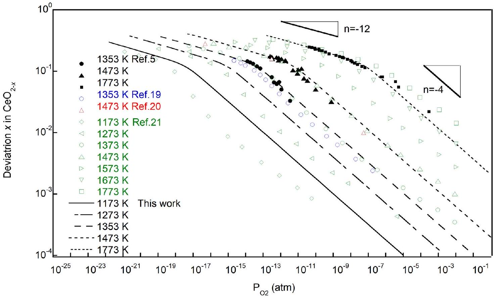
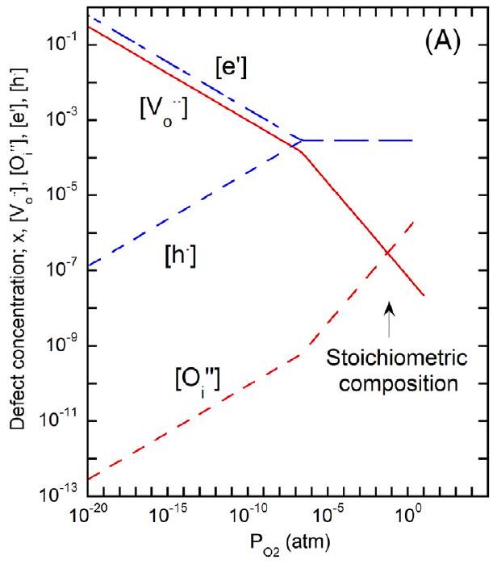
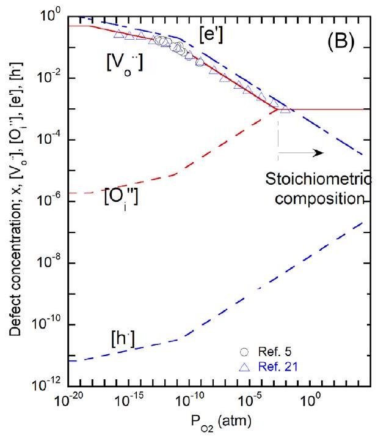
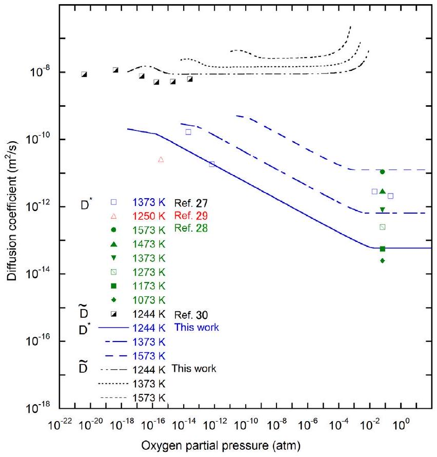
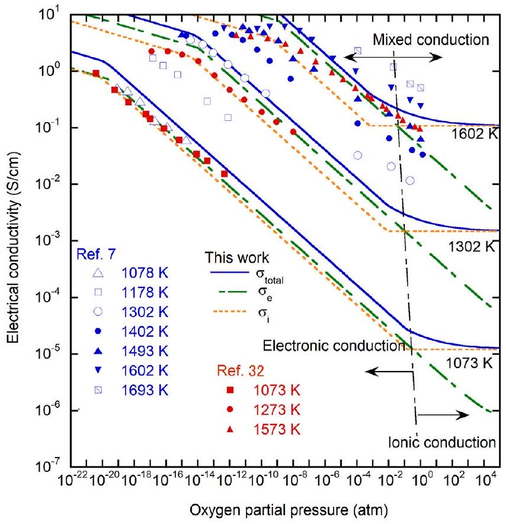
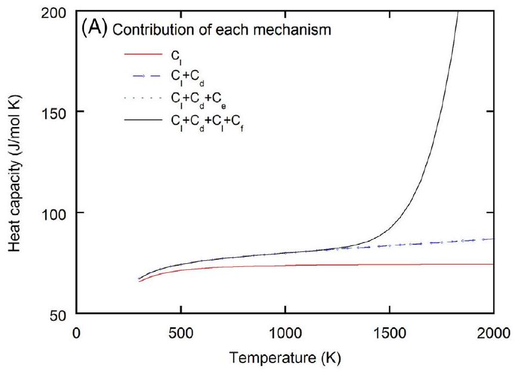
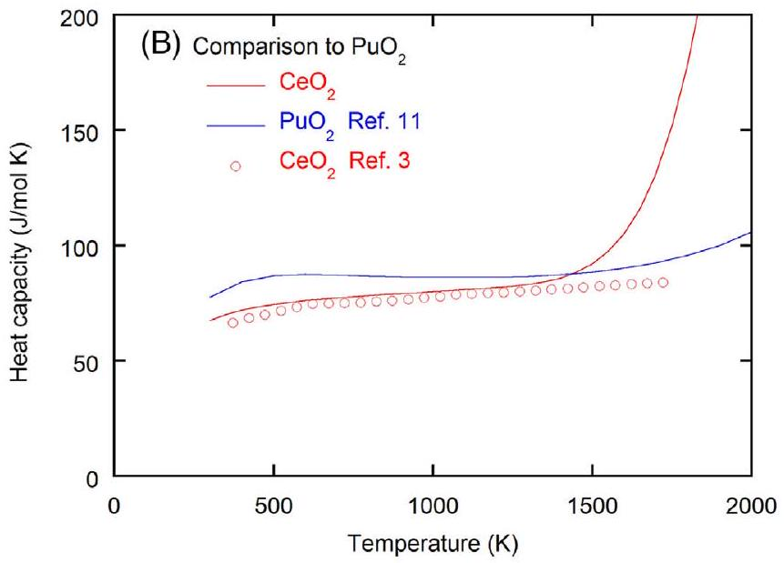
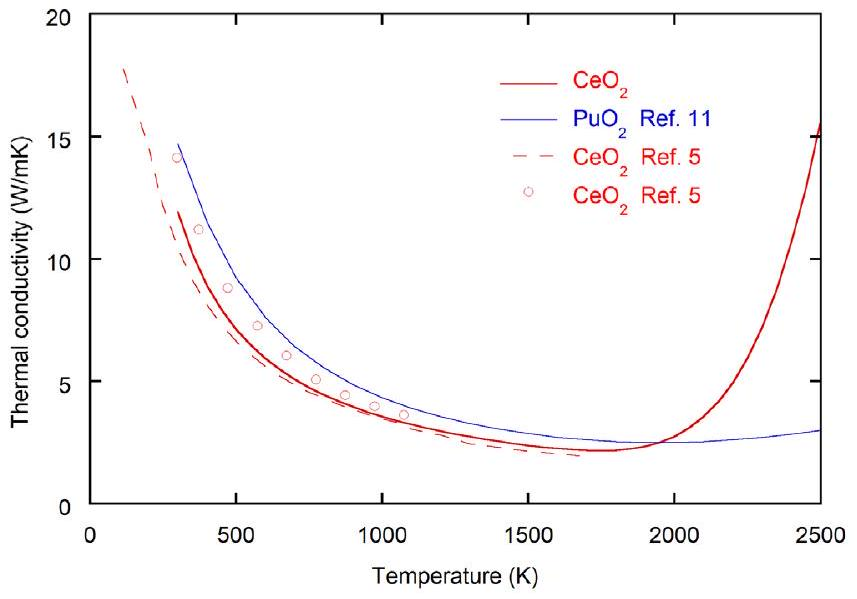

# Defect equilibria and thermophysical properties of $\mathrm{CeO}_{2-x}$ based on experimental data and density functional theory calculation result 

Masashi Watanabe ${ }^{1,3,4}$ () | Hiroki Nakamura ${ }^{2}$ | Kiichi Suzuki ${ }^{3}$ | Masahiko Machida ${ }^{2}$ | Masato Kato ${ }^{1,3,4}$

${ }^{1}$ Fuels and Materials Department, Japan Atomic Energy Agency, Oarai, Ibaraki, Japan
${ }^{2}$ Center for Computational Science and e-Systems, Japan Atomic Energy Agency, Kashiwa, Chiba, Japan
${ }^{3}$ Plutonium Fuel Development Center, Japan Atomic Energy Agency, Tokai, Ibaraki, Japan
${ }^{4}$ Nuclear Plant Innovation Promotion Office, Japan Atomic Energy Agency, Oarai, Ibaraki, Japan

## Correspondence

Masashi Watanabe, Fuels and Materials Department, Japan Atomic Energy Agency, Oarai, Ibaraki 311-1393, Japan. Email: watanabe.masashi81@jaea.go.jp

#### Abstract

Properties of $\mathrm{CeO}_{2}$ were evaluated by density functional theory (DFT) simulation to determine bandgap, Frenkel defect formation energy, and defect migration energy. Bandgap and Frenkel defect formation energy were used to analyze defect equilibria. Oxygen partial pressure dependence of defect equilibria was evaluated based on oxygen potential experimental data and DFT calculation, and a Brouwer diagram was derived. The defect formation energies, including Frenkel defect, electron-hole pair, and so on, were determined and used to evaluate the properties, including oxygen diffusion coefficients, electrical conduction, heat capacity, and thermal conductivity. Mechanisms of various properties were discussed for a deeper understanding based on defect chemistry, and the relationship among properties was systematically described.

## 1 | INTRODUCTION

Cerium dioxide has been studied for the development of catalyst and electricity storage materials. ${ }^{1}$ In research and development for advanced nuclear fuels, cerium oxide has been used as a surrogate material for $\mathrm{PuO}_{2}$ in various experiments because both materials have very similar mechanical and thermal physical properties. ${ }^{2-5}$ Both oxides of $\mathrm{CeO}_{2}$ and $\mathrm{PuO}_{2}$ have a fluorite crystal structure and are nonstoichiometric compounds that are stable over the hypo-stoichiometric composition range. In addition, chemical, thermal and mechanical properties are very similar in both materials. A significant difference in the properties of both materials is their electrical conduction mechanisms at high temperatures. $\mathrm{CeO}_{2}$ has an ionic conduction mechanism near stoichiometric composition, and its mechanism changes to electronic conduction contribution in hypo-stoichiometric composition. ${ }^{6-9}$ On the other hand, $\mathrm{PuO}_{2}$ is electronic conduction in all
compositions. ${ }^{10}$ The electric conduction mechanism is determined by the type of lattice defect which is dominant at high temperatures. These materials have similar properties, despite their completely different electrical conduction mechanisms. In order to gain a deeper understanding of the basic properties of these materials, it is of great importance to understand the relationship between the lattice defect and properties in both materials.
$\mathrm{CeO}_{2}$ has a fluorite structure and is an oxygen nonstoichiometric compound that is stable over a wide hypostoichiometric composition range as $\mathrm{PuO}_{2}$. Stoichiometry significantly affects various properties such as thermal conductivity, electrical conductivity, and so on. Recently, Suzuki et al. ${ }^{5}$ have systematically measured the mechanical and thermal properties of $\mathrm{CeO}_{2-x}$. In their paper, oxygen chemical potential data were measured and analyzed based on defect chemistry. Despite attempts to understand property change in the nonstoichiometric composition, the relationship between defect concentration and basic
properties in $\mathrm{CeO}_{2-x}$ has not yet been quantitatively evaluated.

Kato et al. reported defect chemistry and the basic properties of $\mathrm{PuO}_{2} .^{11}$ They constructed a Brouwer diagram from experimental oxygen potential data and reported that there is the same relationship between the deviation $x$, the electrical conductivity, and the oxygen diffusion coefficient depending on the oxygen partial pressure ( $P_{O_{2}}$ ) in $\mathrm{PuO}_{2-x}$. In addition, heat capacity and thermal conductivity were also evaluated. In this report, a Brouwer diagram for $\mathrm{CeO}_{2-x}$ was constructed and the relationship between lattice defect and properties, including deviation $x$, electrical conductivity, and oxygen diffusion coefficient, heat capacity, and thermal conductivity, was evaluated.

## 2 | CALCULATION METHODS

## 2.1 | Density functional theory

The analyses of defect equilibria and thermophysical properties need various physical parameters, such as defect formation energies, bandgap, elastic constants, defect migration energies, and so on. In this work, most of these parameters are evaluated by density functional theory (DFT). The calculation package adopted was Vienna Ab initio Simulation Package (VASP), ${ }^{12}$ which supports the projector augmented wave method. ${ }^{13,14}$ In these calculations, two types of exchange-correlation energy: Perdew-Burke-Ernzerhof revised for solids (PBEsol) ${ }^{15}$ and Strongly Constrained and Appropriately Normed (SCAN), ${ }^{16}$ were used. The former was a generalized gradient approximation (GGA) and the latter was metaGGA. Through this work, the energy cutoff was fixed to 500 eV .

The lattice constants for the optimized structures were obtained using the primitive cell of fluorite structure with $k$-points $15 \times 15 \times 15$. Using the optimized structure, elastic stiffness constants were evaluated from the stress tensors with finite strains. The bulk, shear, and Young's moduli and Poisson's ratio were calculated by Hill's formalism ${ }^{17}$ using the elastic stiffness constants.

## 2.2 | Defect formation and migration energies

The defect formation and migration energies were calculated with $2 \times 2 \times 2$ supercells which contain 96 atoms for stoichiometric $\mathrm{Ce}_{32} \mathrm{O}_{64}$. In the super-cell calculations, $k$ points were set to $2 \times 2 \times 2$. The lattice constants used in those calculations were fixed to those of optimized structures. For the defect formation energy, it was assumed that the charges of oxygen vacancy and oxygen interstitial were +2 and -2 , respectively, since the ionic charge of oxygen in $\mathrm{CeO}_{2}$ is expected to be -2 . The charges of defects were
controlled by increasing or decreasing the total number of electrons in the system. Thus, oxygen Frenkel defect formation energy can be described as

$$
\begin{aligned}
E_{\text {Frenkel }}= & E\left(\mathrm{Ce}_{32} \mathrm{O}_{63}-2 e\right)+E\left(\mathrm{Ce}_{32} \mathrm{O}_{65}+2 e\right) \\
& -2 E\left(\mathrm{Ce}_{32} \mathrm{O}_{64}\right),
\end{aligned}
$$

where $E\left(\mathrm{Ce}_{32} \mathrm{O}_{64+x}\right)$ is the energy of the relaxed structure of $\mathrm{Ce}_{32} \mathrm{O}_{64+x}$ obtained by DFT, and $-2 e$ means that the number of electrons is reduced by 2 .

The migration energies were calculated by the nudged elastic band method ${ }^{18}$ with 5 intermediate states for +2 charged oxygen vacancy and -2 -charged oxygen interstitial. In these calculations, we adopted only SCAN exchange-correlation energy, since SCAN reproduced lattice constants and elastic constants better than PBEsol as seen below. In the case of oxygen vacancy migration, the minimum energy path is the direct jump of oxygen vacancy to the nearest oxygen site. On the minimum energy path of oxygen interstitial, the oxygen interstitial pushes out the nearest oxygen atom, and the pushed atom moves to another interstitial site.

## 3 | RESULTS AND DISCUSSION

## 3.1 | Density functional theory

The calculated values using DFT are summarized in Table 1. Experimental data of lattice parameters and mechanical properties are also shown for comparison. The simulation with SCAN exchange-correlation energy described the experimental data very well. Therefore, the simulation with SCAN exchange-correlation energy was employed in the current analysis.

The calculated values using DFT were used to evaluate the thermophysical properties. First, defect equilibria and defect concentration were evaluated by constructing a Brouwer diagram using the calculation results of bandgap and Frenkel defect formation energies, and experimental data of oxygen potential. The Brouwer diagram could represent point defect concentration as functions of temperature and $P_{O_{2}}$. Subsequently, oxygen diffusion coefficient, electrical conduction, heat capacity, and thermal conductivity were evaluated. In the evaluation of heat capacity and thermal conductivity at high temperatures, the contribution of defect formation was considered.

## 3.2 | Brouwer diagram construction

In nonstoichiometric compounds, it is well known that various physical properties are closely related to the nature

TABLE 1 Density functional theory (DFT) calculation results of $\mathrm{CeO}_{2}$
| Exchange-correlation energy | DFT |  | Experiment ${ }^{3,5}$ |
| :--- | :--- | :--- | :--- |
|  | PBEsol | SCAN |  |
| Band gap | $1.92 \mathrm{eV}(185 \mathrm{~kJ} / \mathrm{mol})$ | $2.2 \mathrm{eV}(212 \mathrm{~kJ} / \mathrm{mol})$ | - |
| Oxygen Frenkel defect formation energy | $4.0 \mathrm{eV}(386 \mathrm{~kJ} / \mathrm{mol})$ | $4.28 \mathrm{eV}(413 \mathrm{~kJ} / \mathrm{mol})$ | - |
| Oxygen vacancy migration energy | - | $0.557 \mathrm{eV}(53.7 \mathrm{~kJ} / \mathrm{mol})$ | - |
| Interstitial oxygen migration energy | - | $0.798 \mathrm{eV}(77.0 \mathrm{~kJ} / \mathrm{mol})$ | - |
| Lattice parameter (Å) | 5.397 | 5.420 | 5.4418 |
| Young modulus (GPa) | 219 | 222 | 228 |
| Shear modulus (GPa) | 83 | 84 | 86 |
| Poisson's ratio | 0.315 | 0.317 | 0.318 |
| Bulk modulus (GPa) | 197 | 202 | 208 |
| $\mathrm{C}_{11}$ (GPa) | 366 | 380 | - |
| $\mathrm{C}_{12}(\mathrm{GPa})$ | 112 | 113 | - |
| $\mathrm{C}_{44}$ (GPa) | 63 | 61 | - |
| Longitudinal sound speed, $V_{l}(\mathrm{~m} / \mathrm{s})$ | - | 3420.3 | - |
| Transverse sound speed, $V_{t}(\mathrm{~m} / \mathrm{s})$ | - | 6612.9 | - |
| Debye temperature, $T_{D}(\mathrm{~K})$ | - | 489 | - |
| Grüneisen constant, $\gamma$ | - | 2.96 | - |
| Coefficient of thermal expansion, $\alpha\left(\mathrm{K}^{-1}\right)$ | - | - | $3.39 \times 10^{-5}$ |

FIGURE 1 Relationship between deviation $x$ in $\mathrm{CeO}_{2-x}$ and oxygen partial pressure

of defect reactions. Therefore, defect equilibria in $\mathrm{CeO}_{2-x}$ were evaluated, and then the Brouwer diagram was constructed as a first analysis.

Suzuki et al. determined the oxygen potential ( $\Delta \overline{G_{O_{2}}}$ ) of $\mathrm{CeO}_{2}$ as a function of temperature and deviation x in $\mathrm{CeO}_{2-x} \cdot{ }^{5}$ Figure 1 shows the dependence of deviation $x$ on $P_{O_{2}}$. ${ }^{5,19,20}$ In this analysis, it is well-known
that x is proportional to $P_{O 2}{ }^{1 / \mathrm{n}}$. The regions of $n=-4$ and -12 are observed with $P_{O_{2}}$ in the figure. Suzuki et al. ${ }^{5}$ assumed the following defect reactions in each region.

$$
O_{O}^{x}+C e_{C e}^{x} \rightarrow\left(V o \cdot e^{\prime}\right)+e^{\prime}+\frac{1}{2} O_{2}, \text { for } n=-4
$$

$$
3 O_{O}^{x}+5 C e_{C e}^{x} \rightarrow\left(2 V o^{\cdot \cdot V o \cdot 2 O i}\right)^{\cdots \cdots}+5 e^{\prime}+\frac{1}{2} O_{2}, \text { for } n=-12
$$

Equilibrium constants are $K_{n=-4}$ and $K_{n=-12}$, respectively, in defect reaction (1) and (2), oxygen vacancy concentration [ $V O^{\circ}$ ] can be described by Equations (4) and (5).

$$
\begin{gathered}
{\left[V o^{\cdot \cdot}\right]_{n=-4}=\left[\left(V o \cdot e^{\prime}\right)^{\cdot}\right]=\left(K_{n=-4}\right)^{1 / 2} P_{O 2}^{-1 / 4}} \\
{\left[V o^{\cdot \cdot}\right]_{n=-12}=1 / 3\left[(2 V o \cdot V o \cdot 2 O i)^{\cdots \cdot \cdot}\right]} \\
=1 / 3\left(K_{n=-12}\right)^{1 / 6} P_{O 2}^{-1 / 12}
\end{gathered}
$$

$x=\left[V o^{\cdot \cdot}\right]$ was assumed. Suzuki et al. reported that Equations (6) and (7) were obtained by fitting the experimental data with Equations (4) and (5) and derived Equation (8) to represent the deviation x as a function of temperature and $P_{O_{2}}{ }^{5}$

$$
\begin{gathered}
K_{n=-4}=45000 \exp \left(-\frac{340000}{R T}\right) \\
K_{n=-12}=14702 \exp \left(-\frac{345000}{R T}\right) \\
x=\left[\left[V o^{\cdot \cdot}\right]_{n=-4}^{-8}+\left[V o^{\cdot \cdot}\right]_{n=-12}^{-8}+(0.5)^{-8}\right]^{-1 / 8}
\end{gathered}
$$

The calculation results are shown with lines in Figure 1 as functions of temperature and $P_{O_{2}}$ and agree with the experimental data very well.

Panlener et al. investigated $\Delta \overline{G_{O_{2}}}$ of $\mathrm{CeO}_{2}$ over the wide temperature region of $1023-1773 \mathrm{~K}$, whose data are plotted in Figure 1. ${ }^{21}$ They evaluated $n$ as -5 in the near stoichiometric region; however, the figure showed that $n$ was almost the same as the previous work by Suzuki et al., ${ }^{5}$ which concluded $n=-4$. The calculation result was consistent with the data reported by Panlener et al. ${ }^{21}$ in the region of $n=-12$ and overestimated in the region of $n=-$ 4. This slight difference may be due to measurement error in $P_{O_{2}}$.

Now, the following defect reactions (9)-(12) are considered in near-stoichiometric composition.

$$
\begin{gathered}
O_{O}^{x} \rightarrow V o^{\cdot \cdot}+2 e^{\prime}+\frac{1}{2} O_{2} \\
\frac{1}{2} O_{2} \rightarrow O i^{\prime \prime}+2 h \\
n u l l \rightarrow e^{\prime}+h
\end{gathered}
$$

$$
O_{O}^{x} \rightarrow V o^{*}+O i^{\prime \prime}
$$

The equilibrium constants in each defect reaction can be described by Equations (13)-(16).

$$
\begin{gathered}
K_{V}=\left[V o^{\cdot}\right]\left[e^{\prime}\right]^{2} P_{O 2}^{1 / 2} \\
K_{O}=\left[O i^{\prime \prime}\right][h \cdot]^{2} P_{O 2}^{-1 / 2} \\
K_{i}=\left[e^{\prime}\right][h \cdot] \\
K_{F}=\left[V o^{\cdot}\right]\left[O i^{\prime \prime}\right]
\end{gathered}
$$

Two types of Brouwer diagram are proposed, in which electrical or Frenkel defects are dominant in near-stoichiometric composition. ${ }^{11,22,23}$ Measurement of electrical conductivity showed that $\mathrm{CeO}_{2}$ was an ionic conductor near stoichiometric composition. Therefore, Frenkel defect is dominant in near-stoichiometric composition, and Equation (17) holds.

$$
\left[V o^{\cdots}\right]=\left[O i^{\prime \prime}\right]
$$

The following equations were obtained from Equations (13)-(17).

$$
\begin{gathered}
{\left[V o^{\cdot}\right]_{\text {Sto. }}=\left[O i^{\prime \prime}\right]_{\text {Sto. }}=K_{F}^{1 / 2}} \\
{\left[e^{\prime}\right]_{\text {Sto. }}=K_{V}^{1 / 2} K_{F}^{-1 / 4} P_{O 2}^{1 / 4}} \\
{[h \cdot]_{\text {Sto. }}=K_{O}^{1 / 2} K_{F}^{-1 / 4} P_{O 2}^{-1 / 4}} \\
K_{i}=K_{V}^{1 / 2} K_{O}^{1 / 2} K_{F}^{-1 / 2}
\end{gathered}
$$

The equilibrium constant was expressed by,

$$
K_{m}=\exp \left(\frac{\Delta S_{m}}{R}\right) \times \exp \left(-\Delta H_{m} / R T\right)
$$

In the region of $n=-4,\left[V o^{\cdots}\right]$ is equal to $2\left[e^{\prime}\right]$, and Equation (23) was obtained.

$$
\left[e^{\prime}\right]_{n=-4}=2\left(K_{n=-4}\right)^{1 / 2} P_{O 2}^{-1 / 4}
$$

Here, it was assumed that $\left[e^{\prime}\right]_{n=-4}$ is equal to $\left[e^{\prime}\right]_{\text {Sto. }}$. under $P_{O_{2}}$, and the following equations were obtained.

$$
\Delta H_{n=-4}=\Delta H_{V}-\Delta H_{F} / 2
$$

FIGURE 2 Brouwer diagram for (A) $\mathrm{PuO}_{2}$ and (B) $\mathrm{CeO}_{2}$ at 1473 K

TABLE $2 \Delta H_{m}$ and $\Delta S_{m}$ of equilibrium constants for defect reactions
|  | $\boldsymbol{\Delta} \boldsymbol{H}_{\boldsymbol{m}} \boldsymbol{(} \mathbf{k J} \boldsymbol{/} \mathbf{m o l} \boldsymbol{)}$ | $\boldsymbol{\Delta} \boldsymbol{S}_{\boldsymbol{m}} \boldsymbol{(} \mathbf{J} \boldsymbol{/} \mathbf{m o l} \boldsymbol{\cdot} \mathbf{K} \boldsymbol{)}$ |
| :--- | :--- | :--- |
| $K_{i}$ | 212.0 | -70.0 |
| $K_{F}$ | 413.0 | 165.0 |
| $K_{V}$ | 546.5 | 183.1 |
| $K_{O}$ | 290.5 | -158.1 |
| $K_{n=-4}$ | 340.0 | 89.09 |
| $K_{n=-12}$ | 345.0 | 79.78 |

$$
\Delta S_{n=-4}=\Delta S_{V}-\Delta S_{F} / 2-2 \cdot R \cdot \ln (2)
$$

DFT calculation showed that the Frenkel defect formation energy and the bandgap should be 413 and $212 \mathrm{~kJ} / \mathrm{mol}$, and these data were input to $\Delta H_{F}$ and $\Delta H_{i}$, respectively. $\Delta S_{F}$ and $\Delta S_{i}$ were determined to construct a Brouwer diagram in a temperature region of 1073-1773 K and all parameters were obtained as shown in Table 2. Figure 2 shows the Brouwer diagram at 1473 K , which describes the defect equilibria in $\mathrm{CeO}_{2}$. The diagram represented the defect equilibria under $P_{O_{2}}$, and showed that extrinsic defects are dominant in the near-stoichiometric region and change to intrinsic defects in a $P_{O_{2}}$ region of less than about $10^{-2} \mathrm{~atm}$. It is known that dominant impurities such as lanthanide elements behave as acceptor dopants. Impurities having a valency of +3 form oxygen vacancy and reduce the upper limited Oxygen to Metal (O/M) ratio in $\mathrm{CeO}_{2}$ from 2.00 depending on the content of impurities.

In Figure 2, the Brouwer diagram of $\mathrm{PuO}_{2}$ is also shown for comparison. The figure shows that the $P_{O_{2}}$ at exact stoichiometric composition is $4 \times 10^{-2} \mathrm{~atm}$ and greater than $1.7 \times 10^{-3} \mathrm{~atm}$ in $\mathrm{PuO}_{2}$ and $\mathrm{CeO}_{2}$, respectively, which are

TABLE 3 Defect formation energies ( $\mathrm{kJ} / \mathrm{mol}$ ) in $\mathrm{CeO}_{2}$ and $\mathrm{PuO}_{2}$
|  | $\mathbf{C e O}_{\mathbf{2}}$ | $\mathbf{P u O}_{\mathbf{2}}{ }^{\mathbf{1 1}}$ |
| :--- | :--- | :--- |
| Electron-hole pair | 212.0 | 325.0 |
| Frenkel defect | 413.0 | 441.0 |
| Oxygen vacancy | 206.5 | 282.5 |
| Interstitial oxygen | 206.5 | 159.3 |
| Electron | 170.0 | 162.5 |
| Hole | 42.0 | 162.5 |

shown with arrows. Two types of Brouwer diagrams are proposed in which the Frenkel defect is dominant and the intrinsic defect is dominant at stoichiometric composition. The difference between the diagrams of $\mathrm{CeO}_{2}$ and $\mathrm{PuO}_{2}$ is the defect stability near stoichiometry composition, which corresponds to the two types of Brouwer diagram. In the case of $\mathrm{CeO}_{2}$, $\left[V o^{\cdot \cdot}\right]$ and $\left[\mathrm{Oi}^{\prime \prime}\right]$ dominate $\left[e^{\prime}\right]$ and $\left[h^{\cdot}\right]$. On the other hand, $\left[e^{\prime}\right]$ and $[h]$ are important in $\mathrm{PuO}_{2}$. Formation energies of defects in both materials are compared in Table 3. The Frenkel defect formation energy of $\mathrm{CeO}_{2}$ was evaluated as $413 \mathrm{~kJ} / \mathrm{mol}$. Beschnitt et al. reported that the energy was $399.0 \mathrm{~kJ} / \mathrm{mol}(4.14 \mathrm{eV}),{ }^{24}$ which is almost the same as the current data. It is also in good agreement with $\mathrm{PuO}_{2}$ data. The electron-hole pair formation energy of $\mathrm{CeO}_{2}$ was about $100 \mathrm{~kJ} / \mathrm{mol}$ lower than that of $\mathrm{PuO}_{2}$. To better understand the difference between the two Brower diagrams, it is necessary to investigate the behavior of lattice defects such as the Frenkel and electronic defects at high temperatures.

DFT calculation obtained that band gap energy was $212 \mathrm{~kJ} / \mathrm{mol}(2.2 \mathrm{eV})$. The calculation result was about $100 \mathrm{~kJ} / \mathrm{mol}$ lower as compared with other studies which
were reported to be $289-338 \mathrm{~kJ} / \mathrm{mol}(3-3.5 \mathrm{eV}) .^{1,25,26}$ In this paper, the bandgap energy was assumed to be the formation energy of the electron-hole pair. If $289-338 \mathrm{~kJ} / \mathrm{mol}$ was used as the bandgap energy, formation energy of $h$. and [ $h \cdot$ ] were affected, the formation energy of $h$ became $119-168 \mathrm{~kJ}-\mathrm{mol}$ and $\left[h^{\cdot}\right]$ was several orders of magnitude smaller. The evaluation result of hole formation affects properties in hyper-stoichiometric composition, but $\mathrm{CeO}_{2}$ does not exist in the hyper-stoichiometric composition range. So, the effect of bandgap energy is negligibly small in the thermophysical property evaluation described below.

## 3.3 | Oxygen diffusion coefficient

Defect concentration can be calculated as a function of temperature and $P_{O_{2}}$ using the Brouwer diagram constructed. $P_{O_{2}}$ dependence on the defect concentration of [ $V O^{\cdot}$ ] and [ $O i^{\prime \prime}$ ] correlate strongly with the diffusion coefficients. In this section, the relationship between diffusion coefficients and defect concentrations of $\left[V o^{\cdot \cdot}\right]$ and $\left[\mathrm{Oi}^{\prime \prime}\right]$ is described.

The oxygen self-diffusion coefficient has been investigated as a function of temperature and $P_{O_{2}}$. The selfdiffusion coefficient $D^{*}$ was evaluated by the following equation.

$$
D^{*}=D^{O} \times \exp \left(-\frac{E_{\text {ion }}}{R T}\right)
$$

Here, $E_{\text {ion }}$ is the activation energy, and $D^{O}$ is a constant. The self-diffusion coefficient $D^{*}$ and the chemical diffusion coefficient $\tilde{D}$ are written by

$$
\begin{aligned}
D^{*}= & D_{V O}^{O}\left[V_{O}{ }^{\cdots}\right] \times \exp \left(-\frac{\Delta_{m} H_{V O}}{R T}\right) \\
& +2 \times D_{O i}^{O}\left[O_{i}^{\prime \prime}\right] \times \exp \left(-\frac{\Delta_{m} H_{O i}}{R T}\right) \\
& \tilde{D}=-\frac{2-x}{x} D^{*}\left(\frac{\partial \log P_{O 2}}{\partial \log x}\right)
\end{aligned}
$$

The obtained $\Delta_{m} H_{V O}$ and $\Delta_{m} H_{O i}$ were 53.7 and $77 \mathrm{~kJ} / \mathrm{mol}$, respectively, by DFT calculation, as shown in Table 1. The values $\left[V_{O}{ }^{\cdots}\right],\left[O_{i}{ }^{\prime \prime}\right]$, and $\left(\frac{\partial \log P_{O 2}}{\partial \log x}\right)$ can be evaluated by equations derived by constructing a Brouwer diagram. In a near-stoichiometric region, $\left[V_{O}{ }^{. "}\right]$ and $\left[O_{i}{ }^{\prime \prime}\right]$ are obtained by Equation (18). It is considered that oxygen vacancy diffusion is dominant in self-diffusion. The activation energy $E$ can be described by,

$$
E_{i o n}=\Delta H_{F} / 2+\Delta_{m} H_{V O}
$$

FIGURE 3 Oxygen partial pressure dependence of oxygen chemical and self-diffusion coefficients

The obtained $\Delta H_{F}$ and $\Delta_{m} H_{V O}$ were 413 and $53.7 \mathrm{~kJ} / \mathrm{mol}$, respectively, by DFT calculation. $E$ was evaluated as $260.2 \mathrm{~kJ} / \mathrm{mol}$. Floyd ${ }^{27}$ measured $D^{*}$ in $\mathrm{CeO}_{2-x}$, and $E_{\text {ion }}$ for $\mathrm{CeO}_{2.00}$ was determined to be 73$104 \mathrm{~kJ} / \mathrm{mol}$ at temperatures of $1123-1423 \mathrm{~K}$. Kamiya et al. ${ }^{28}$ also measured $D^{*}$ at $P_{O_{2}}=0.07 \mathrm{~atm}$ and reported that $E_{\text {ion }}$ was $226 \mathrm{~kJ} / \mathrm{mol}$. Gotte et al. ${ }^{29}$ evaluated $D^{*}$ by molecular dynamic simulation as $E_{\text {ion }}=56 \mathrm{~kJ} / \mathrm{mol}$. The value evaluated by Kamiya et al. ${ }^{28}$ was in good agreement with the current value, which was obtained by DFT simulation. Measurement of $\tilde{D}$ was carried out by Millot and Mierry ${ }^{30}$ at 1244 K . The experimental data were plotted in Figure 3.

The $P_{O_{2}}$ dependence of $D^{*}$ and $\tilde{D}$ was calculated at 1244 , 1373, and 1573 K by Equations (27) and (28) as shown in Figure 3. The calculation agreed well with the experimental data, when $D_{V O}^{O}=2 \times 10^{-7} \cdot D^{*}$ increases with decreasing $P_{O_{2}}$, which corresponds to the decrease in the O/M ratio.

## 3.4 | Electrical conduction

The electrical conductivity of oxides can be described by electronic and ionic conduction contributions, which are evaluated by defect concentrations. The electrical conductivity mechanism depends on $P_{O_{2}}$ and was evaluated using $\left[e^{\prime}\right],\left[h^{\cdot}\right],\left[V o^{\cdot}\right]$, and $\left[O i^{\prime \prime}\right]$, which were calculated by the Brouwer diagram in this section.

The mechanism of electrical conduction was investigated. ${ }^{6-9}$ It was reported that ion conduction
and small polaron hopping conduction were dominant in a near-stoichiometric and a reduced region, respectively. Therefore, it was expected that electrical conductivity $\sigma$ of $\mathrm{CeO}_{2-x}$ would be given by the sum,

$$
\sigma_{\text {total }}=\sigma_{\text {ion }}+\sigma_{e l}
$$

Ionic and electronic-conductivities $\sigma_{\text {ion }}$ and $\sigma_{e l}$ were written by

$$
\sigma_{i o n}=C_{i o n / T} \times\left[V o^{\cdot \cdot}\right] \times \exp \left(-\frac{\Delta_{m} H_{\mathrm{V}}}{R T}\right)
$$

and

$$
\begin{aligned}
\sigma_{e l} & =\sigma_{n}+\sigma_{p}=e[\mathrm{e}] \mu_{n}+e[\mathrm{~h}] \mu_{p} \\
& =\frac{C_{\mu_{e}}}{T^{\frac{3}{2}}}[\mathrm{e}] \exp \left(\frac{E_{\mu_{e}}}{R T}\right)+\frac{C_{\mu_{h}}}{T^{\frac{3}{2}}}[\mathrm{~h}] \exp \left(\frac{E_{\mu_{h}}}{R T}\right)
\end{aligned}
$$

where $C_{\text {ion }}, C_{\mu_{e}}$, and $C_{\mu_{h}}$ are constants, and $\mu_{e}$ and $\mu_{h}$ are electron and hole mobilities, respectively. [ $V o^{\cdots}$ ], [e], and $[\mathrm{h}]$ can be calculated as functions of temperature and $P_{O_{2}}$ using Equations (18)-(23).

$$
\begin{aligned}
& E_{i o n}=\Delta H_{F} / 2+\Delta_{m} H_{\mathrm{V}} \\
& E_{n=-4}=\Delta H_{n=-4}+E_{\mu_{e}}
\end{aligned}
$$

$E_{\text {ion }}$ was obtained as $260.2 \mathrm{~kJ} / \mathrm{mol}$ in self-diffusion evaluation using Equation (26). Chiang et al. ${ }^{31}$ reported that $E_{\text {ion }}$ was $236 \mathrm{~kJ} / \mathrm{mol}(2.4 \mathrm{eV})$ in electrical conduction measurement. These values were in good agreement. Naik and Tien ${ }^{7}$ and Blumenthal et al. ${ }^{32}$ reported the $P_{O_{2}}$ dependence of electrical conductivity of $\mathrm{CeO}_{2-x}$. The data are plotted in Figure 4. ${ }^{7}$ The total electrical conductivity was evaluated by Equations (31) and (32) assuming that $\mu_{n}= \mu_{p}$. Unknown parameters were determined by fitting the experimental data. Calculation results were shown in Figure 4. Analysis showed that $E_{\mu_{e}}=80 \mathrm{~kJ} / \mathrm{mol}, C_{\mu_{e}}=3 \times 10^{6}$, and $C_{\mu_{e}}=1 \times 10^{9}$. It has been reported that $E_{\mu_{e}}$ is $20-50 \mathrm{~kJ} / \mathrm{mol}$ for small polaron hopping conduction ${ }^{6}$. The value evaluated in this work was slightly higher compared with other data. Calculation results $\sigma_{\text {total }}, \sigma_{\text {ion }}$, and $\sigma_{e l}$ are shown in Figure 4, which agree with the experimental data well. In a reducing region of less than $10^{-1}$ atm , it was shown that $\sigma_{\text {total }}$ was proportional to $\mathrm{P}_{\mathrm{O} 2}{ }^{-1 / 4}$. This relationship was consistent with the oxygen potential measurement data which were used to construct the Brouwer diagram in this work. Figure 4 shows the conduction mechanism in this region is observed as a mixed conduction region of $\sigma_{i o n}$ and $\sigma_{e l}$ in $P_{O 2}$ from $10^{-5}$ to $10^{2} \mathrm{~atm}$.

FIGURE 4 Oxygen partial pressure dependence of electrical conductivity

## 3.5 | Heat capacity

In this work, the mechanical and thermal properties of $\mathrm{CeO}_{2-x}$ were evaluated based on DFT simulation and oxygen potential experimental data. The heat capacity was represented using the evaluated data. The heat capacity $C_{p}$ of oxides was evaluated using Equation (35)

$$
C_{p}=C_{l}+C_{d}+C_{e}+C_{f}
$$

Where $C_{l}, C_{d}, C_{e}$, and $C_{f}$ are heat capacity terms related to lattice, dilatational, electronic defect formation and Frenkel defect formation, respectively. In the evaluation of $C_{p}$ of $\mathrm{PuO}_{2}$, the Schottky-type heat capacity was assumed. But, the Schottky-type heat capacity was not assumed in $\mathrm{CeO}_{2}$ because of no $f$ electrons.
$C_{l}$ is calculated using the Debye model:

$$
C_{l}=9 n R\left(\frac{T}{T_{D}}\right)^{3} \int_{0}^{T_{D} / T} \frac{x^{4} e^{x}}{\left(e^{x}-1\right)^{2}} d x
$$

The Debye temperature $T_{D}$ can be written as:

$$
T_{D}=\left(\frac{h}{k_{B}}\right)\left(\frac{9 n R}{4 \cdot \pi \cdot a^{3}}\right)^{\frac{1}{3}}\left(\frac{1}{V_{l}^{3}}+\frac{2}{V_{t}^{3}}\right)^{-\frac{1}{3}}
$$

FIGURE5 Temperature dependence of heat capacity

The value for $C_{d}$ can be obtained as:

$$
C_{d}=C_{v} \gamma \alpha T
$$

The $\gamma$ is the Grúneisen constant which is calculated by Equation (39):

$$
\gamma=\alpha K V_{m} / C_{v}
$$

Values of $T_{D}, V_{l}, V_{t}, \gamma$ and $\alpha$ are listed in Table 1. $T_{D}$ and $\gamma$ of $\mathrm{CeO}_{2}$ were obtained to be 489 K and 2.96 , respectively. $C_{e}$ and $C_{f}$ can be described by Equations (40) and (41).

$$
\begin{aligned}
C_{e} & =\frac{\Delta H_{i}^{2}}{2 \mathrm{RT}^{2}} \exp \left(\frac{-\Delta H_{i}}{2 \mathrm{RT}}\right) \exp \left(\frac{\Delta S_{i}}{2 R}\right) \\
C_{f} & =\frac{\Delta H_{f}^{2}}{\sqrt{2} \mathrm{RT}^{2}} \exp \left(\frac{-\Delta H_{f}}{2 \mathrm{RT}}\right) \exp \left(\frac{\Delta S_{f}}{2 R}\right)
\end{aligned}
$$

$\Delta H$ and $\Delta \mathrm{S}$ were already evaluated from the Brouwer diagram as shown in Table 2. Therefore, we can calculate the heat capacity of $\mathrm{CeO}_{2}$, which is shown in Figure 5. The $C_{p}$ of $\mathrm{CeO}_{2}$ rapidly increased at temperatures of more than 1300 K . Figure 5 shows that the increase was caused by the effect of $C_{f}$ and the effect of $C_{e}$ was negligibly small. This suggests that the Frenkel defect concentration rapidly increases and disorder occurs at such high temperatures. It is expected that the Bredig transition occurs in the same way as $\mathrm{UO}_{2}$ and $\mathrm{CaF}_{2}$ at high temperatures. ${ }^{33,34}$ In Figure 5B, $C_{p}$ of $\mathrm{CeO}_{2}$ is compared with other experimental data and that of $\mathrm{PuO}_{2}$. The current analysis result was in good agreement with other experimental data of $\mathrm{CeO}_{2}$, but reliability is unclear at high temperatures of more than 1500 K because of no experimental data at such high temperatures. The $C_{p}$ of $\mathrm{PuO}_{2}$ was higher than that

of $\mathrm{CeO}_{2}$ at temperatures lower than about 1400 K , which was caused by Schottky-type heat capacity. The $C_{p}$ increase observed at higher temperatures in both oxides was caused by increased concentration of lattice defects which were electronic and Frenkel defects, respectively, in $\mathrm{PuO}_{2}$ and $\mathrm{CeO}_{2}$.

## 3.6 | Thermal conductivity

Thermal conductivity can be described by phonon and electrical conduction contributions, $\lambda_{p}$ and $\lambda_{e}$, as follows.

$$
\lambda=\lambda_{p}+\lambda_{e}=\frac{1}{\mathrm{BT}}+\left(\Delta H_{F} / e\right)^{2} \times \sigma /(4 T)
$$

Phonon conduction contribution $\lambda_{p}$ was analyzed by Slack's equation ${ }^{35}$ as follows:

$$
\frac{1}{B}=3.04 \times 10^{7} \frac{\bar{M} T_{D}{ }^{3} \delta}{\gamma^{2} n^{2 / 3}}
$$

Values of $T_{D}$ and $\gamma$ are shown in Table 1. The average mass $\bar{M}$ is 172.1, the number of atoms per moleculen is 3, and $\delta$ is $\left(V_{m}\right)^{1 / 3} \cdot V_{m}$ is average volume per atom, which was calculated by,

$$
V m=\frac{a^{3}}{4 n}=1.327 \times 10^{-29} \mathrm{~m}^{3} / \mathrm{atom}
$$

The elementary charge $e$ is $96400 \mathrm{C} / \mathrm{mol}$. Electrical conductivity $\sigma$ is obtained by Equation (31), and all parameters have been obtained to describe thermal conductivity. The calculation results are shown with the solid red line in Figure 6. The $\lambda$-value of $\mathrm{CeO}_{2}$ is in good agreement with the previous data reported by Suzuki et al., ${ }^{5}$ which were corrected to full density and shown with the

FIGURE 6 Temperature dependence of thermal conductivity

red broken line. Since the calculation results of Suzuki et al. ${ }^{5}$ did not take the electrical conduction term into consideration, they did not increase at high temperatures. Although there are no experimental data on thermal conductivity and heat capacity at temperatures higher than 1600 K , the current evaluation results suggest that the thermal conductivity is increased by electrical conduction contribution.

## 4 | CONCLUSION

DFT simulation was employed to evaluate the properties of $\mathrm{CeO}_{2}$ to determine bandgap, Frenkel defect formation energy, and defect migration energy. Defect equilibria were analyzed to construct a Brouwer diagram using the oxygen potential data, and the defect formation energies of electron-hole, Frenkel defect, oxygen vacancy, interstitial oxygen, electron, and hole were determined to be 212 , $413,206.5,206.5,170.0$, and $42.0 \mathrm{~kJ} / \mathrm{mol}$, respectively. These evaluated data were applied to describe the oxygen diffusion coefficients, electrical conductivity, heat capacity, and thermal conductivity. Based on the defect equilibria, deviation $x$, oxygen diffusion coefficient, and electrical conductivity were evaluated as functions of $P_{O_{2}}$ and temperature. In a near-stoichiometric region, the obtained activation energy of electrical conduction was $260.2 \mathrm{~kJ} / \mathrm{mol}$, which is in good agreement with the activation energy for the oxygen self-diffusion coefficient. This result supports the conclusion that stoichiometric $\mathrm{CeO}_{2}$ is an ionic electrical conductor. In addition, electrical conduction in hypo-stoichiometric $\mathrm{CeO}_{2}$ was evaluated as electronic conduction due to small polaron hopping conduction. Heat capacity and thermal conductivity of $\mathrm{CeO}_{2}$ were also analyzed, and it was expected that both data would increase at high temperatures due to Frenkel
defect concentration. The mechanisms of various properties were discussed, a better understanding was achieved based on defect chemistry, and the relationship among those properties was consistently and systematically evaluated.

## ORCID

Masashi Watanabe © https://orcid.org/0000-0002-10570037

## REFERENCES

1. Montini T, Melchionna M, Monai M, Fornasiero P. Fundamentals and catalytic applications of $\mathrm{CeO}_{2}$-based materials. Chem Rev. 2016;116(10):5987-6041.
2. Park Y, Kolman DG, Ziraffe H, Haertling C, Butt DP. Gallium removal from weapons-grade plutonium and cerium oxide surrogate by a thermal technique. MRS Proc. 1999;556: 129.
3. Nelson AT, Rittman DR, White JT, Dunwoody JT, Kato M, McClellan KJ. An evaluation of the thermophysical properties of stoichiometric $\mathrm{CeO}_{2}$ in comparison to $\mathrm{UO}_{2}$ and $\mathrm{PuO}_{2}$. J Am Ceram Soc. 2014;97(11):3652-59.
4. Moore ME, Tao Y. Aerosol physics considerations for using cerium oxide ( $\mathrm{CeO}_{2}$ ) as a surrogate for plutonium oxide ( $\mathrm{PuO}_{2}$ ) in airborne release fraction measurements for storage container investigations. Los Alamos, NM: Los Alamos National Laboratory; 2017.
5. Suzuki K, Kato M, Sunaoshi T, Uno H, Carvajal-Nunez U, Nelson AT, et al. Thermal and mechanical properties of $\mathrm{CeO}_{2}$. J Am Ceram Soc. 2019;102(4):1994-2008.
6. Tuller HL, Nowick AS. Small polaron electron transport in reduced $\mathrm{CeO}_{2}$ single crystals. J Phys Chem Solids. 1977;38(8):859-67.
7. Naik IK, Tien TY. Small-polaron mobility in nonstoichiometric cerium dioxide. J Phys Chem Solids. 1978;39(3):311-15.
8. Lavik EB, Kosacki I, Tuller HL, Chiang YM, Ying JY. Nonstoichiometry and electrical conductivity of nanocrystalline $\mathrm{CeO}_{2-x} \cdot$ J Electroceram. 1997;1(1):7-14.
9. Mogensen M, Sammes NM, Tompsett GA. Physical, chemical and electrochemical properties of pure and doped ceria. Solid State Ion. 2000;129(1):63-94.
10. Naito K, Tsuji T, Ouchi K, Yahata T, Yamashita T, Tagawa H. Electrical-conductivity anomaly in near-stoichiometric plutonium dioxide. J Nucl Mater. 1980;95(1-2):181-84.
11. Kato M, Nakamura H, Watanabe M, Matsumoto T, Machida M. Defect chemistry and basic properties of non-stoichiometric $\mathrm{PuO}_{2}$. Defect Diffus Forum. 2017;375:57-70.
12. Kresse G, Furthmüller J. Efficient iterative schemes for ab initio total-energy calculations using a plane-wave basis set. Phys Rev B. 1996;54(16):11169-86.
13. Blöchl PE. Projector augmented-wave method. Phys Rev B. 1994;50(24):17953-79.
14. Kresse G, Joubert D. From ultrasoft pseudopotentials to the projector augmented-wave method. Phys Rev B. 1999;59(3):1758-75.
15. Perdew JP, Ruzsinszky A, Csonka GI, Vydrov OA, Scuseria GE, Constantin LA, et al. Restoring the density-gradient expansion for exchange in solids and surfaces. Phys Rev Lett. 2008;100(13):136406.
16. Sun J, Ruzsinszky A, Perdew JP. Strongly constrained and appropriately normed semilocal density functional. Phys Rev Lett. 2015;115(3)036402.
17. Hill R. The elastic behaviour of a crystalline aggregate. Proc Phys Soc - Sect A. 1952;65(5):349-54.
18. Mills G, Jónsson H, Schenter GK. Reversible work transition state theory: application to dissociative adsorption of hydrogen. Surface Sci. 1995;324(2):305-37.
19. Campserveux J, Gerdanian P. Etude thermodynamique de l'oxyde $\mathrm{CeO}_{2-x}$ pour $1.5<\mathrm{O} / \mathrm{Ce}<2$. J Solid State Chem. 1978;23(1):73-92.
20. Kitayama K, Nojiri K, Sugihara T, Katsura T. Phase equilibria in the Ce-O and Ce-Fe-O systems. J Solid State Chem. 1985;56(1):111.
21. Panlener RJ, Blumenthal RN, Garnier JE. A thermodynamic study of nonstoichiometric cerium dioxide. J Phys Chem Solids. 1975;36(11):1213-22.
22. Brouwer G. A general asymptotic solution of reaction equations common in solid-state chemistry. Philips Res Rep. 1954;9(50):366-76.
23. Kröger F, Vink H. Relations between the concentrations of imperfections in crystalline solids. Solid State Phys. 1956;3:307435.
24. Beschnitt S, Zacherle T, De Souza RA. Computational study of cation diffusion in ceria. J Phys Chem C. 2015;119(49):2730715.
25. Choudhury B, Chetri P, Choudhury A. Annealing temperature and oxygen-vacancy-dependent variation of lattice strain, band gap and luminescence properties of $\mathrm{CeO}_{2}$ nanoparticles. J Exp Nanosci. 2015;10(2):103-14.
26. Kim W-H, Maeng WJ, Kim M-K, Gatineau J, Kim H. Electronic structure of cerium oxide gate dielectric grown by plasma-enhanced atomic layer deposition. J Electrochem Soc. 2011;158(10):G217-20.
27. Floyd JM. Interpretation of transport phenomena in nonstoichiometric ceria. Ind J Technol. 1973;11:589-94.
28. Kamiya M, Shimada E, Ikuma Y, Komatsu M, Haneda H. Intrinsic and extrinsic oxygen diffusion and surface exchange
reaction in cerium oxide. J Electrochem Soc. 2000;147(3): 1222-27.
29. Gotte A, Spångberg D, Hermansson K, Baudin M. Molecular dynamics study of oxygen self-diffusion in reduced $\mathrm{CeO}_{2}$. Solid State Ion. 2007;178(25):1421-27.
30. Millot F, Mierry PD. A new method for the study of chemical diffusion in oxides with application to cerium oxide $\mathrm{CeO}_{2-x}$. J Phys Chem Solids. 1985;46(7):797-801.
31. Chiang H-W, Blumenthal RN, Fournelle RA. A high temperature lattice parameter and dilatometer study of the defect structure of nonstoichiometric cerium dioxide. Solid State Ion. 1993;66(1):85-95.
32. Blumenthal RN, Lee PW, Panlener RJ. Studies of the defect structure of nonstoichiometric cerium dioxide. J Electrochem Soc. 1971;118(1):123.
33. Dworkin AS, Bredig MA. Diffuse transition and melting in fluorite and antifluorite type of compounds: heat content of potassium sulfide from 298 to 1260 K. J Phys Chem. 1968;72(4):127781.
34. Pavlov TR, Wenman MR, Vlahovic L, Robba D, Konings RJM, Van Uffelen P, et al. Measurement and interpretation of the thermo-physical properties of $\mathrm{UO}_{2}$ at high temperatures: the viral effect of oxygen defects. Acta Materialia. 2017;139:138-54.
35. Slack GA. The thermal conductivity of nonmetallic crystals. In: Ehrenreich H, Seitz F, Turnbull D, editors. Solid state physics. 1st ed. Cambridge, MA: Academic Press; 1979. p. 1-71.

How to cite this article: Watanabe M, Nakamura H, Suzuki K, Machida M, Kato M. Defect equilibria and thermophysical properties of $\mathrm{CeO}_{2-x}$ based on experimental data and density functional theory calculation result.
J Am Ceram Soc. 2022;105:2248-2257.
https://doi.org/10.1111/jace. 18249

