# Early stage of the electron kinetics in swift heavy ion tracks in dielectrics 

N. A. Medvedev, ${ }^{1, *}$ A. E. Volkov, ${ }^{2}$ N. S. Shcheblanov, ${ }^{2,3,4}$ and B. Rethfeld ${ }^{1}$ ${ }^{1}$ Department of Physics and Research Center OPTIMAS, Technische Universität Kaiserslautern, Erwin-Schrödinger-Str. 46, D-67663 Kaiserslautern, Germany ${ }^{2}$ Russian Research Centre "Kurchatov Institute," Kurchatov Sq. 1, 123182 Moscow, Russia ${ }^{3}$ Moscow Engineering Physics Institute, Kashirskoe shosse 31, 115409 Moscow, Russia ${ }^{4}$ Laboratoire Hubert Curien, UMR CNRS 5516, Université de Lyon, 18 rue Benoît Lauras, Bat. F, 42000 Saint-Etienne, France

(Received 17 March 2010; published 14 September 2010)

#### Abstract

A Monte Carlo approach was applied for simulations of the early stage (first tens of femtosecond) of kinetics of the electronic subsystem of silica ( $\mathrm{SiO}_{2}$ ) in tracks of swift heavy ions ( SHIs ) decelerated in the electronic stopping regime. At the first step multiple ionizations of target atoms by a projectile $\left(\mathrm{Ca}^{+19}, E\right. =11.4 \mathrm{MeV} / \mathrm{amu}$ ) were described that gave the initial spatial distributions of free electrons having different momenta as well as distributions of holes in different atomic shells. Spatial propagation of fast electrons results in secondary ionizations of target atoms as well as in energy transfer to the lattice at times much shorter than the times of atomic oscillations (phonons). The well detected front of excitation in the electronic and ionic subsystems is formed due to this propagation which cannot be described by models based on diffusion mechanisms (e.g., parabolic equations of heat diffusion). At times $\sim 10$ fs after the projectile passage, about $\sim 0.1 \%$ of the energy is already transferred to the lattice. About $63 \%$ of the energy deposited by the ion is accumulated in holes at these times. Calculated distributions of these holes through the atomic shells are in excellent agreement with the spectroscopy experiments. Comparison with these experiments demonstrated also that relaxation of the electronic subsystem in SHI tracks in solids cannot be described adequately without taking into account intra-atomic and interatomic Auger (Knotek-Feibelman) processes.

DOI: 10.1103/PhysRevB.82.125425
PACS number(s): 61.80.Lj, 61.82.Ms, 52.65.-y

## I. INTRODUCTION

Swift heavy ions (SHIs) with energies higher than $\sim 1 \mathrm{MeV} / \mathrm{amu}$ and masses higher than $\sim 20$ proton masses stimulate structural and phase transformations in nanometric vicinities of their trajectories when penetrating various solids. These effects occur in the electronic stopping regime, when the electronic energy loss of a projectile overcomes a certain threshold ( $\sim 2-5 \mathrm{keV} / \mathrm{nm}$ in dielectrics) while the radiation damage produced by elastic recoils (nuclear stopping) is orders of magnitude too low to provide the observed structural modifications in tracks. ${ }^{1-8}$

Spatial anisotropy, nanometric spatial and subpicosecond temporal scales, as well as extremely high excitation of materials in SHI tracks supply with new tools for nanotechnologies ${ }^{3,9}$ and give new abilities for investigations of strongly nonequilibrium states of matter. ${ }^{10-19}$ Strong deviations from the equilibrium in excited SHI tracks can result in pathways of the relaxation kinetics which may be hardly described by ordinary macroscopic models based on local equilibrium conceptions. ${ }^{11,17,18}$ Furthermore, analytical descriptions of the track kinetics usually neglect effects of holes created in different atomic shells during ionization of a media by a projectile. In addition to a high energy accumulated in these holes, their decay leads to creation of secondary generations of electrons and holes that affects considerably the kinetics of the electronic subsystem in a track.

Numerical simulations can provide detailed information ${ }^{20-31}$ necessary for adequate description of the kinetics of the electronic subsystem of a solid in the nanometric vicinity of the SHI trajectory. In the present work we apply Monte Carlo simulations focused on the description of
the early stage of the electronic kinetics in wide band-gap dielectrics irradiated with swift heavy ions decelerated in the electronic stopping regime. These simulations cover the time interval from the moment of ion impact up to the typical time scales of radiative decays of holes in $K$ shells of target atoms $(\sim 30 \mathrm{fs})$. In addition to the initial spatial distribution of the energy deposited by the projectile, the investigations concentrate also on descriptions of the kinetics of spatial and temporal distributions of (a) excited free electrons having different momenta and energies as well as holes in different atomic shells, and (b) energy transferred into the lattice on these time scales.

We identify the processes governing the relaxation kinetics of the electronic subsystem in SHI tracks by a comparison of numerical results with those obtained in the spectroscopy experiments determining intensities of $K_{\alpha} L^{n}$ radiative transitions in irradiated silica. ${ }^{13,14}$ The importance of the interatomic Auger (Knotek-Feibelman) processes ${ }^{32-34}$ for this relaxation is an unexpected result of the comparison.

We demonstrate furthermore a spatial propagation of the excitation front in the electronic and ionic subsystems from the projectile trajectory. We find high concentrations of holes in different atomic shells and high energy accumulated in these holes at times up to 10 fs . This indicates that models based on assumptions of the local equilibrium can be hardly applied to the femtosecond temporal scales of relaxation of the electronic subsystem in nanometric SHI tracks in dielectrics.

## II. MODEL

We use the asymptotical trajectory Monte Carlo (ATMC) method ${ }^{29-31}$ with the binary collision approximation for de-
scription of both elastic and inelastic scatterings of a swift heavy projectile as well as for the description of free electrons generated due to ionizations of the target atoms. In the framework of this method SHI and free electrons were treated as pointlike particles having well-defined trajectories. For SHIs with energies $E_{\text {ion }}>1 \mathrm{MeV} /$ amu this approximation is always valid. For electrons the approximation requires energies higher than $E_{e} \geq 100 \mathrm{eV}$, ${ }^{23,24,27,29,30}$ however, the method is also used for lower energies of electrons. ${ }^{23-30}$ As it will be demonstrated below, the classical treatment of electrons cannot affect considerably the energy relaxation in a track on femtosecond time scales because on these time scales low-energy electrons accumulate only a negligible part of the excess energy of the electronic subsystem transferred from the projectile.

In the algorithm applied here, ${ }^{27,28}$ the velocities of primary free electrons generated due to ionizations produced by a projectile are determined at the first step of the simulation. Then, spatial spreading of these electrons and their elastic and inelastic scattering on atoms resulting in appearance of new free electrons are calculated event by event. At the same time we simulate Auger decays, which lead to redistribution of holes and creation of new secondary electrons. Modeling of elastic scattering of free electrons with atoms yields the energy transferred to the target lattice. Finally, averaging over the obtained ensembles gives the spatial distribution of electrons, holes, and their energies. The program runs many times to gain statistically trustful results.

## A. Target and projectile

A solid dielectric target is assumed here as a uniform and randomly arranged distribution of atoms. ${ }^{20-31}$ The investigated times ( $\leq 10 \mathrm{fs}$ ) are too short for appearance of collective lattice oscillations and lattice atoms are presented in the model as dynamically independent during their collisions with a SHI and electrons. ${ }^{11,35}$ We assume also that the target lattice initially does not contain any defects, which cross sections of interactions with free electrons or a SHI differ from those of lattice atoms. Creation of new stable lattice defects resulting from relaxation of electronic excitations is not considered in this research because it needs much longer times than the time scales investigated here ( $>100 \mathrm{fs}$ ).

Because of high energies transferred to electrons from the projectile, we do not take into account the difference between excitations of target electrons to the continuum or to the conduction band. The electronic band structure of the target is not taken into account and at the beginning the target electrons are considered as occupying atomic levels characterized by their ionization potentials taken from Ref. 36.

We assume that only ionization of electrons from the atomic shells provides the projectile energy losses in a dielectric target. This assumption is based on (a) a lack of free electrons in the conduction band of dielectrics resulting in negligible dynamical friction of SHI due to interaction with free electrons as well as due to a plasmon creation in the conduction band, ${ }^{23,27}$ (b) negligible stopping of a swift heavy ion due to elastic collisions with target atoms, (c) absence of

Cherenkov irradiation, and (d) negligible Bremsstrahlung irradiation from SHI as well as from excited electrons due to probabilities orders of magnitude smaller than the probabilities of impact ionizations for typical ion energies considered here. ${ }^{8}$

Because of the heavy mass of a projectile ( $M_{\text {ion }} \gg m_{e}$ ) and the perpendicular incidence, its trajectory is assumed to be a straight line and cylindrical geometry is applicable. For the calculations, the target is assumed to be a layer with a thickness of 10 nm with periodical boundary conditions.

The probability of ionization of the projectile electrons having orbital velocities higher than the SHI velocity is low due to adiabatic collisions of such electrons with lattice atoms. Therefore, after a number of collisions, a penetrating SHI reaches the equilibrium charge state keeping only fast electrons. The penetration depth when the projectile reaches the equilibrium charge state is called an equilibration depth. The equilibrium charge can be described by the Barkas formula ${ }^{8,23,29,37}$

$$
Z=Z_{i o n}\left[1-\exp \left(-\frac{V_{i o n}}{V_{0}} Z_{i o n}^{-2 / 3}\right)\right] .
$$

Here, $Z_{i o n}$ is the atomic number of the projectile; $V_{i o n}$ is its velocity; $V_{0}=\alpha c$ is the Bohr velocity; $\alpha=1 / 137$ is the finestructure constant; and $c$ is the speed of light. Formula (1) is valid for homogeneous targets. ${ }^{37}$ The equilibration depth depends on the initial charge and velocity of the ion ${ }^{38}$ and typically does not exceed $\sim 100 \mathrm{~nm},{ }^{39-41}$ which is much shorter than the total penetration depth of SHIs in solids $(\sim 100 \mu \mathrm{~m})$. We did not analyze effects of this thin surface layer and assumed that along the trajectory the projectile keeps the equilibrium charge depending on its velocity.

Silica ( $\mathrm{SiO}_{2}$ ) is chosen for simulations as the target. It has the density $\rho=2.32 \mathrm{~g} / \mathrm{cm}^{3}$ corresponding to the atomic density $n_{a t}=6.9 \times 10^{22} \mathrm{~cm}^{-3}$. Calcium ( $\mathrm{Ca}, M_{\text {ion }}=40 \cdot m_{p}, Z_{\text {ion }} =20)$ with the initial energies $E_{\text {ion }}=5,8$, and $11.4 \mathrm{MeV} / \mathrm{amu}$ is chosen as the projectile. Such energy corresponds to the parameters of UNILAC accelerator (GSI, Darmstadt). ${ }^{13,14}$ The velocity of this ion ( $V_{\text {ion }}=4.7 \times 10^{7} \mathrm{~m} / \mathrm{s}$ for $E_{\text {ion }} =11.4 \mathrm{MeV} / \mathrm{amu}$ ) is less than the speed of light in silica ( $V_{c}^{\mathrm{SiO}_{2}}=1.94 \times 10^{8} \mathrm{~m} / \mathrm{s}$ ) resulting in absence of Cherenkov emission, as it was assumed above. According to Eq. (1), such Ca ions have the equilibrium positive charge $Z=18.74$ resulting in energy losses of $S_{e}=2.66 \mathrm{keV} / \mathrm{nm}$. A Ca ion with an energy of 455.6 MeV ( $11.4 \mathrm{MeV} / \mathrm{amu}$ ) can transfer an energy up to $E_{\text {max }}=24.8 \mathrm{keV}$ to an electron. This maximum energy $E_{\text {max }}$ corresponds to the electron velocity $V_{e}^{\text {max }} =9 \times 10^{7} \mathrm{~m} / \mathrm{s}<V_{c}^{\mathrm{SiO}_{2}}$ which is also less than the speed of light in quartz.

## B. Ionization of atoms by a projectile

The following algorithm was used to obtain the parameters of collisions of a swift heavy ion with target electrons. In our multicomponent target, the particular atom, with which the SHI is colliding, is chosen according to the shortest prospective free path among those calculated for all atomic species. Therefore, first, the path lengths between sequential collisions of the projectile and atoms of different
species are calculated for the prospective collision. Second, the kind of a target atom is selected, and the impact parameter for the SHI collision with this atom is calculated. Finally, the quantum number and coordinates are generated for all electrons of this atom. As a result, the impact parameters for each electron of the atom and transferred energy to the atomic electrons interacting with the projectile during this collision are determined. The atom is considered to be ionized (and an electron to be free), when the calculated transferred energy exceeds the ionization potential for the analyzed electron. Otherwise, we conclude that no ionization occurs and no energy is transferred to this electron from the projectile.

In a homogenous target the distribution of the free path lengths $l_{\text {ion }}^{\alpha}$ between collisions of SHI with the $\alpha$ th kind of atom (Si or O for our case) is described by the Poisson law giving the following dependence of the prospective free paths $l_{\text {ion }}^{\alpha}$ on random values $\gamma_{\alpha}$ (Refs. 29-31) uniformly distributed in the interval $(0,1]$ :

$$
l_{i o n}^{\alpha}=-\ln \left(\gamma_{\alpha}\right) \cdot l_{0}^{\alpha}
$$

The mean-free path can be written as $l_{0}^{\alpha}=c_{0} \cdot\left(n_{\alpha} \sigma_{\sigma}\right)^{-1}$, where $\sigma_{\alpha}$ is the total cross section of scattering of a SHI on an $\alpha$ th atom; $n_{\alpha}$ is the volume density of such atoms; and $c_{0}$ is the fitting parameter taking into account the experimental scattering data for the used target. ${ }^{23,29}$ It should be noted that the mean-free path should not differ significantly from the mean interatomic distance of the material.

Other methods of fitting of $l_{\text {ion }}^{\alpha}$ based on different variations in the collision cross sections can also be applied. For example, it is possible to fit the impact parameter or its different combinations with the mean-free path. We have analyzed such different methods. They gave the same results for the ion energy losses. Only small differences in the initial distributions of low-energy electrons from the first generation of the free electrons were found. However, any differences vanish during relaxation already on subfemtosecond time scales.

It was assumed that because of the short time ( $<0.01 \mathrm{fs}$ ) of SHI interaction with a lattice atom, binary collisions of the ion with atomic electrons occur momentary when the distance between the projectile and the atomic nucleus is minimal (the asymptotical trajectory method ${ }^{29-31}$ ). The coordinates of atomic electron depend on the principle quantum number of the shell this electron belongs to. Due to the degeneracy of the atomic level, a number of electrons occupy the selected shell.

To describe the interaction between the projectile and an electron, we use a simplified semiclassical description. The underlying assumptions restrict the velocity of a projectile $V_{\text {ion }} \gg Z_{a}^{2 / 3} V_{0}$ (Refs. 2, 5, and 8) and agree with the requirements of ATMC. The a posteriori analysis of the obtained results confirms that the application of our comparably simple but computationally advantageous model is reasonable because small differences in the initial ionizations eliminated by relaxation processes in the exited electronic subsystem already on femtosecond scales (see Sec. III).

According to this model the impact parameter $b_{e}^{j}$ between the projectile and $j$ th electron of the selected atom ( $j$

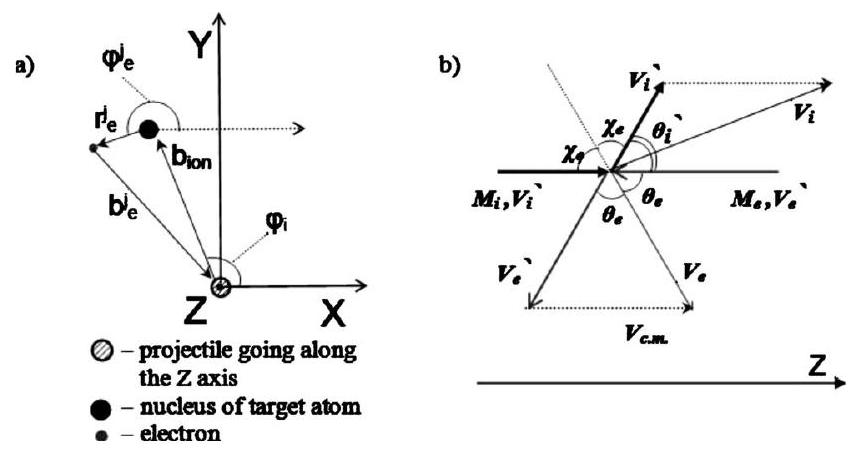
FIG. 1. (a) Scheme of the interaction of SHI with a target atom. The ion velocity vector $V_{\text {ion }}$ belongs to the $Z$ axis perpendicular to the figure plane. (b) The kinematic scheme of the collision. Primed values correspond to the center-of-mass system. Nonprimed values correspond to the laboratory system.

$=1, \ldots, Z_{\alpha}$, where $Z_{a}$ is the atomic number of the $\alpha$ th kind of atom) is fixed by the distance $b_{\text {ion }}$ between the projectile and the nucleus of the selected atom and the planar coordinates $x_{e}^{j}$ and $y_{e}^{j}$ of this electron ${ }^{29}$ [see Fig. 1(a)],

$$
\left\{\begin{array}{c}
b_{e}^{j}=\sqrt{\left(x_{e}^{j}\right)^{2}+\left(y_{e}^{j}\right)^{2}} \\
x_{e}^{j}=b_{i o n} \cos \left(\varphi_{i}\right)+r_{e}^{j} \cos \left(\varphi_{e}^{j}\right) \\
y_{e}^{j}=b_{i o n} \sin \left(\varphi_{i}\right)+r_{e}^{j} \sin \left(\varphi_{e}^{j}\right),
\end{array}\right.
$$

where $r_{e}^{j}=a_{0}\left(n_{j}^{\alpha}\right)^{2} / Z_{\alpha}$ is the Bohr radius of $j$ th electron and $n_{j}^{\alpha}$ is its principal quantum number. The angle $\varphi_{i}$, fixing the position of the $\alpha$ th atom with respect to $x$ axis [Fig. 1(a)], is chosen as a random value ranging in the interval $(0,2 \pi]$. The angle $\varphi_{e}^{j}$ lying in the ( $X, Y$ ) plane determines the position of $j$ th electron on its orbit at the moment of collision. This angle is fixed by the random value within $(0,2 \pi]$. All electrons of the atom are analyzed, i.e., the index $j$ changes from 1 to $Z_{a}$. In Eq. (3) and below in this section the index $\alpha$ is omitted because of similarity of the formulas for all kinds of atoms.

For the assumed homogeneous distribution of target atoms, the impact parameter $b_{\text {ion }}$ realized in the traced collision of the ion with the selected atom was defined by the randomly generated value $\gamma_{i}$ (Ref. 29) as follows:

$$
\gamma_{i}=P\left(b_{\text {ion }}\right)=\int_{0}^{b_{\text {ion }}} \frac{2 \pi b}{\pi b_{\max }^{2}} d b=\frac{b_{\text {ion }}^{2}}{b_{\max }^{2}} .
$$

Here $P\left(b_{\text {ion }}\right)$ is the probability of the impact-parameter value to be less then $b_{\text {ion }}$.

It is commonly assumed that in the homogeneous model, $b_{\text {max }}$ is restricted by the interatomic distance: $\pi b_{\text {max }}^{2}=n_{a t}^{-2 / 3} =d_{a t}^{2},{ }^{29}$ resulting in the following dependence of the impact parameter on the random value $\gamma_{i}$ :

$$
b_{i o n}=\sqrt{\gamma_{i}} \cdot \frac{d_{a t}}{\sqrt{\pi}} .
$$

Equations (3) and (5) give the final form of the impact parameter $b_{e}^{j}$ of the traced collision between the projectile and $j$ th electron on the Bohr orbit $r_{e}^{j}$ of the selected atom

$$
b_{e}^{j}=\sqrt{\left(\sqrt{\gamma_{i}} \cdot \frac{d_{a t}}{\sqrt{\pi}}\right)^{2}+\left(r_{e}^{j}\right)+2\left(\sqrt{\gamma_{i}} \cdot \frac{d_{a t}}{\sqrt{\pi}}\right) r_{e}^{j} \cos \left(\varphi_{i}-\varphi_{e}^{j}\right)} .
$$

According to Eq. (6), the impact parameter $b_{e}^{j} \left(j=1, \ldots, Z_{\alpha}\right)$ of $j$ th electron is fixed by (a) the random value $\gamma_{i}$ related to the distance $b_{\text {ion }}$ from the SHI trajectory to the nucleus of the selected atom which this $j$ th electron belongs to, and (b) the random angle ( $\varphi_{i}-\varphi_{e}^{j}$ ) between the radius vectors of the nucleus of the selected atom and $j$ th electron.

The assumption about the classical interaction between the projectile and an electron results in the fact that the impact parameter $b_{e}^{j}$ unambiguously determines the scattering angle $\chi_{e}^{j}$ and the energy $E_{e}^{j}$ transferred from the SHI to the $j$ th electron. The scattering angle measured in the center-ofmass system [Fig. 1(b)] is determined by ${ }^{42}$

$$
\chi_{e}^{j}=b_{e}^{j} \int_{r_{\min }}^{\infty} \frac{d r}{r^{2}}\left[1-\left(\frac{b_{e}^{j}}{r}\right)-\frac{U(r)}{E}\right]^{-1 / 2} .
$$

Here $U(r)$ is the potential energy of interaction (e.g., Coulomb potential), $r_{\text {min }}$ is the shortest distance between SHI and the selected electron, and $E=E_{\text {ion }} \cdot m_{e} /\left(M_{\text {ion }}+m_{e}\right)$ is the projectile energy in the center-of-mass system.

Since the projectile is fast, dynamical screening effects cannot be established during a collision $\left[V_{\text {ion }}>d_{a t} \cdot \omega_{p}\right.$, where $\omega_{p}=\left(4 \pi n_{v} e^{2} / m_{e}\right)^{1 / 2}$ is plasma frequency of valence electrons with a density $n_{v}$ in the target]. The dielectric function of a media related to this collision tends to the unity $[\varepsilon(\omega, k) \rightarrow 1]$ (Refs. 43 and 44) and the interaction potential can be written in the Coulomb form $U(r)=Z e^{2} / r$, where $e$ is the electron charge. In this case Eq. (7) gives

$$
\chi_{e}^{j}=\arccos \left[\frac{Z e^{2} /\left(2 E b_{e}^{j}\right)}{\sqrt{1+\left(Z e^{2} /\left(2 E b_{e}^{j}\right)\right)^{2}}}\right] .
$$

When the velocity of SHI is higher than the electron orbital velocity, the electron-scattering angle in the laboratory system $\theta_{e}^{j}$ is equal to the angle $\chi_{e}^{j}$ in the center-of-mass system [Fig. 1(b)]. This scattering angle $\theta_{e}^{j}$ is counted from the $z$ axis and belongs to the plane specified by the ion velocity vector and the position of $j$ th electron,

$$
\begin{aligned}
\theta_{e}^{j}= & \arccos \left(\frac{Z e^{2}}{2 E_{i o n} b_{e}^{j}} \cdot\left(\frac{M_{i o n}+m_{e}}{m_{e}}\right)\right. \\
& \left.\cdot\left\{1+\left[\frac{Z e^{2}}{2 E_{i o n} b_{e}^{j}}\left(\frac{M_{i o n}+m_{e}}{m_{e}}\right)\right]^{2}\right\}^{-1 / 2}\right)
\end{aligned}
$$

The energy transferred to the electron is determined by this scattering angle ${ }^{27}$ as follows:

$$
\begin{aligned}
E_{e}^{j} & =E_{i o n} \frac{4 m_{e} M_{i o n}}{\left(M_{i o n}+m_{e}\right)^{2}} \cdot \cos ^{2}\left(\theta_{e}^{j}\right) \\
& =4 E_{i o n}\left(\frac{M_{i o n}}{m_{e}}\right) \cdot\left[\left(1+\frac{M_{i o n}}{m_{e}}\right)^{2}+\left(\frac{b_{e}^{j}}{a_{0}} \frac{E_{i o n}}{Z \cdot R y}\right)^{2}\right]^{-1}
\end{aligned}
$$

Here $R y=e^{2} / 2 a_{0}=13.6 \mathrm{eV}$ is the Rydberg constant. Since the scattering angle in Eq. (9) is calculated in a general form
for the Coulomb potential, Eq. (10) does not diverge at small impact parameters but yields the maximum of the transferred energy in accordance to the conservation law.

After the collision with the projectile the atomic electron was considered as free when the transferred energy $E_{e}^{j}$ exceeds the ionization potential of this electron. The momentum of the emitted electron is uniquely determined by the momentum conservation law taking into account the initial momentum of the projectile and of the selected electron (the later is assumed as zero).

Since the SHI velocity is higher than the electron orbital velocity, collisions of SHI with atoms can be treated as momentary. Therefore, spatial propagation of all emitted electrons from the selected ionized atom starts at the same moment and ionization of any electron does not shift the energy levels occupied by other electrons during the collision. ${ }^{45-47}$ Ionized electrons are treated as independent particles with fixed energy levels.

Because of the assumption of the equilibrium charge state of a penetrating SHI, we do not take into account possible interactions of created free electrons with this projectile such as capture or further ionization of SHI, fluctuation of charge or secondary scattering of free electrons with the projectile. Therefore, Fermi shuttle processes or creations of convoy electrons ${ }^{48,49}$ are not taken into account in the presented model.

## C. Spatial propagation of electrons and secondary ionization

When spreading through a target, free electrons generated by the projectile create secondary ionizations resulting in appearance of new free electrons as well as localized holes in different atomic shells. The kinetics of spatial propagation of free electrons is mainly determined by elastic and inelastic interactions of electrons with target atoms, interactions between free electrons, and their attraction by the positively charged track core. Efficiencies of these processes depend on the achieved parameters characterizing the excited electronic ensemble in the vicinity of SHI trajectory and their temporal and spatial evolutions.

In the present model we neglect interactions between free electrons because (a) the volume density of free electrons at distances larger than 0.5 nm from the projectile trajectory in dielectrics becomes too low and (b) the kinetic and potential energies are comparable only for slowest electrons $(\sim 10 \mathrm{eV})$ located in the nearest region to the trajectory at $\sim 10 \mathrm{fs}$, and accumulating only a negligible part ( $<5 \%$ ) of the energy lost by the projectile. ${ }^{20-28}$ Also, such slow electrons cannot produce new ionizations of atomic shells. For the same reasons we do not take into account attraction between the positively charged track core and free electrons, which could affect only slow electrons. ${ }^{20-28}$ Therefore, the trajectories of free electrons between collisions with atoms and atomic electrons are considered as rectilinear.

Collisions of free electrons with atoms can be separated into two statistically independent processes, which are described by independent cross sections: (a) elastic collisions, which conserve the total kinetic energy of interacting particles and (b) inelastic collisions where this energy changes.

Inelastic collisions result in ionization of target atoms.
We neglected interactions of free electrons with already ionized atoms. ${ }^{2,20-28}$ Such interactions are possible only for such densities of free electrons and ionized atoms which are comparable with the solid density. As it was mentioned above such high densities are realized only in the nearest vicinity of the projectile trajectory (a few angstroms) decreasing fast with increasing distance from the projectile trajectory. Due to low volume densities of free electrons we also do not take into account screening of the interaction potential of the traced free electron with a target atom or target electron, respectively, by other free electrons.

In order to calculate the scattering parameters of the traced collision of the selected free electron we, first, determine the realized mode of this collision (kind of interacting atom, elastic vs inelastic, interacting atomic electron). For this purpose, we use the algorithm similar to that applied for scattering of the projectile, i.e., we calculate stochastic free path lengths for all possible scattering channels of the traced free electron and select the realized scattering channel as that having the shortest free path in this statistical sampling.

The free paths of free electrons for ionization of $\alpha$ th atom as well as for elastic collisions are generated by a number of random values $\gamma_{\beta}^{\alpha}$ uniformly distributed in $(0,1]$,

$$
l_{e}^{\alpha, \beta}=-\ln \left(\gamma_{\beta}^{\alpha}\right) \cdot l_{e, 0}^{\alpha, \beta}
$$

Here $\alpha$ indicates an $\alpha$ th atom, $l_{e}^{\alpha, \beta}$ is the path length for the collision with a particle of kind $\beta$ (symbol $\beta=e-e$ means the collision with atomic electrons and $\beta=e-a$ used for elastic collisions with atoms), $l_{e, 0}^{\alpha, \beta}=\left(n_{\beta} \sigma_{\beta}\right)^{-1}$ is the mean-free path for the collisions with a particle of kind $\beta, n_{\beta}$ is the volume density of particles $\beta, \sigma_{\beta}$ is the total cross section of interaction of the electron with particle of kind $\beta$.

The total cross section of elastic scattering of a free electron with a target atom is taken in the form proposed by Mott, see, i.e., ${ }^{30}$ as follows:

$$
\sigma_{e-a}=\pi a_{0}^{2} \frac{Z_{a}\left(Z_{a}+1\right)}{\eta_{c}\left(\eta_{c}+1\right)} \cdot \frac{R y^{2}}{E_{e}^{2}} .
$$

Here, $\eta_{c}$ is the screening parameter of the atom by its own electrons,

$$
\begin{aligned}
\eta_{c}= & 1.7 \times 10^{-5} \cdot Z_{a}^{2 / 3}\left(\frac{m_{e} c^{2}}{2 E_{e}}-1\right) \\
& \cdot\left(1.13+3.76 \frac{Z_{a}^{2}}{\alpha^{2}} \frac{m_{e} c^{2}}{2 E_{e}} / \sqrt{1+\frac{m_{e} c^{2}}{E_{e}}}\right) .
\end{aligned}
$$

Describing inelastic collisions, as it was mentioned above, we assume that (a) only the ionization of the electrons with ionization potentials $I_{j}^{\alpha}$ smaller than the kinetic energy of the traced free electron is possible, (b) the ionization cross section of a bound electron depends only on the ionization potential, ${ }^{20-30,50}$ and (c), according to the classical limitations used, atomic electrons are located in fixed points of their orbits during the collision with a free electron that restricts the energy of free electrons to $E_{e} \gg m_{e} V_{0}^{2} / 2$.

The cross sections of ionization accomplished by the emission of $j$ th electron of an $\alpha$ atom were calculated by Gryzinsky in Ref. 50 as

$$
\begin{aligned}
\sigma_{e-e}^{j}= & 4 \pi a_{0}^{2}\left(\frac{R y}{I_{j}^{\alpha}}\right)^{2} \cdot\left\{\frac{I_{j}^{\alpha}}{E_{e}} \cdot\left(\frac{E_{e}-I_{j}^{\alpha}}{E_{e}+I_{j}^{\alpha}}\right)^{3 / 2}\right. \\
& \left.\cdot\left[1+\frac{2}{3} \cdot\left(1-\frac{I_{j}^{\alpha}}{2 E_{e}}\right) \cdot \ln \left(2.7+\sqrt{\frac{E_{e}}{I_{j}^{\alpha}}-1}\right)\right]\right\} .
\end{aligned}
$$

If all the prospective path lengths of the traced free electron for inelastic collisions with atomic electrons are larger than those for elastic collisions with atoms $\left[l_{e}^{\alpha, e-a}\right. \left.<\left(l_{e}^{\alpha, e-e}\right)_{\text {min }}\right]$ the current collision of the traced free electron was considered as the elastic one. In this case the scattering angle $\theta$ and the scattering plane angle $\varphi$ were specified as random values ranging in ( $0, \pi$ ] and ( $0,2 \pi$ ], respectively. The transferred energy is unambiguously determined by the angle $\theta$. Because of the small mass ratio, the relative part of the energy transferred from free electrons to the lattice is small. However, this elastic scattering (a) affects considerably the spatial spreading of free electrons by changing their momenta and (b) results in initial lattice excitations at times shorter than those of atomic vibrations.

In the opposite case $\left[l_{e}^{e-a}>\left(l_{e, j}^{e-e}\right)_{\text {min }}\right]$ the traced electron scatters on the bound electron according to the shortest free path. The impact parameter necessary for ionization of an atom by an electron is about 30 times smaller than that for ionization by the projectile. Therefore, the probability of multiple ionizations of an atom by an energetic free electron can be neglected in our approach (more precise quantummechanical considerations of cross sections confirm this simple conclusion ${ }^{24}$ ).

The energy transferred to the bound electron during the atoms inelastic interaction with the traced electron ranges in the interval $\left[I_{j}, E_{e}\right]$ and is fixed by the stochastic choice of the impact parameter. The scattering angles are determined by the energy and momentum conservation laws. The scattering plane is given by a random angle $\varphi$ in the interval $(0,2 \pi]$. Subsequent spatial propagation of secondary free electrons and their interactions with target atoms are described in the same manner.

## D. Auger processes

In addition to free electrons, ionization of target atoms results also in the creation of holes in different atomic shells. Subsequent decay of these holes may occur via radiative decay, intra-atomic Auger processes as well as interatomic Auger (Knotik-Feibelman) processes at solidlike density of the target. ${ }^{32-34}$ These Auger processes change the distributions of holes in different atomic shells and also increase the volume density of free electrons. Some of these new electrons will have enough energy to further ionize atoms. New holes appearing in deep atomic levels will generate new Auger cascades and radiative decay processes.

The distribution of Auger decay times $t_{a u}$ of $\alpha$ th kind of atom is described by the Poisson law $t_{a u}=-\ln \left(\gamma_{a u}\right) \cdot \tau_{\alpha}$. For

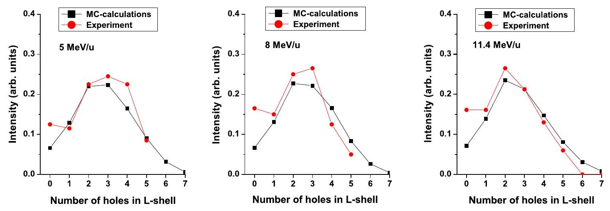
FIG. 2. (Color online) Calculated and experimental (Refs. 13 and 14) spectra of radiative decays of holes in $K$ shell of Si atoms having also a number of holes in $L$ shell. The data are presented for silica irradiated with Ca ions with different energies ( 5,8 , and $11.4 \mathrm{MeV} / \mathrm{amu}$ ). The spectra are normalized to the total number of decays of silicon atoms.

intra-atomic Auger processes we took the characteristic times $\tau_{\alpha}$ for different shells of Si and O atom from the Ref. 51. The electrons involved into the intra-Auger process of a fixed atom are chosen randomly from electrons of the upper atomic shells. The kinetic energy of an escaping Auger electron from the selected atomic shell is determined by the difference between the energy released due to filling of a hole in the deeper shell and the ionization potential of this electron.

Interatomic Auger process (Knotek-Feibelman) ${ }^{32-34}$ can be realized only for solidlike densities of targets. Before this process both electrons, one which fills the hole in the deeper shell and the other one being emitted, belong to the upper shell of a neighbor atom located in the close vicinity of the atom containing the hole. The interatomic Auger processes are especially important for atoms ionized by the projectile where multiple ionization results in a lack of electrons on the upper shells of such atoms. For our case of a $\mathrm{SiO}_{2}$ target, the only considered process corresponds to a transition of electrons from the $L$ shell of oxygen atoms to holes in the $L$ shell of neighboring silicon atoms. There is no data available of the characteristic time $\tau_{\alpha}$ of this interatomic Auger process. Thus, this time was used as the second and last fitting parameter of the model.

For radiative decays of holes a similar procedure was applied using the characteristic times from Ref. 51. However, we should note that the radiative decays do not play a role here because their relative probability is $\sim 5 \%$ of the probability of Auger process. ${ }^{51}$

## III. RESULTS AND DISCUSSIONS

## A. Verification of the model

The energy losses of Ca ion ( $11.4 \mathrm{MeV} / \mathrm{amu}$ ) in $\mathrm{SiO}_{2}$ calculated for $c_{0}=0.3$ [see Eqs. (2) and (3)] are in a good agreement with the theoretical Bethe-Bloch high-energy limit ${ }^{1-4,8,29,30,52,53}$ and with the standard codes SRIM 2008 (Ref. 53) and CASP-4. ${ }^{54}$ The good agreement indicates that our model describes the ion energy losses correctly, even for low ion energies where it reaches its limits of validity.

A detailed analysis of the governing mechanisms of initial relaxation of the electronic subsystem of the $\mathrm{SiO}_{2}$ in SHI
track is made by comparison of our numerical results with the experimental data presented in Refs. 13 and 14. In these spectroscopy experiments ionization of deep shells of silicon atoms was investigated by measuring intensities of radiative decays of $K$-shell holes in atoms having different numbers $n$ of holes in $L$ shell ( $K L^{n}$ configurations).

Figure 2 demonstrates a very good agreement between the intensities of the experimental $K_{\alpha} L^{n}$ spectral lines for three different projectile energies ( 5,8 , and $11.4 \mathrm{MeV} / \mathrm{amu}$ ) and those calculated in the presented model. We used only one free parameter, providing the best fitting for all energies of projectiles: the characteristic time ( 60 fs ) of the interatomic Auger (Knotek-Feibelman) process in which a hole in the $L$ shell of Si atom and electrons in $L$ shell of neighbor oxygen atoms are involved, as it was mentioned above (see Sec. II D). This time is close to that of radiative decay of a hole in $K$ shell of a silicon atom ( 30 fs ). It is important to note that it is not possible to reproduce the presented experimental results without taking into account interatomic Auger process. The systematic deviations between calculated and measured intensities at $n=0$ are observed because only ionizations produced by a SHI are included in Fig. 2. In a real system, a small fraction of $K$-shell ionizations with completely filled $L$ shell ( $K L^{0}$ ) is produced also by fast electrons, as it was discussed in Sec. II and will be included in Sec. III B.

To study the effects of different models of initial ionizations of a target made by SHI on the subsequent electronic kinetics, we have applied the cross sections of multiple ionization by SHI, calculated in Ref. 55 instead of those calculated in the framework of the presented semiclassical model. Figure 3 shows the comparison of the resulting intensities of $K_{\alpha} L^{n}$ spectra together with the experimental results. We see that already on the time scales of radiative decay of $K$ shell, i.e., on femtosecond time scales, differences in the initial ionizations are smoothed out to practically the same distributions of electronic configurations ( $K_{\alpha} L^{n}$ spectra) which are in very good agreement with those observed in experiments. Thus, effects of small differences in the initial ionizations on the electronic kinetics completely vanish due to intensive relaxation processes at already a few femtoseconds after the projectile passage.

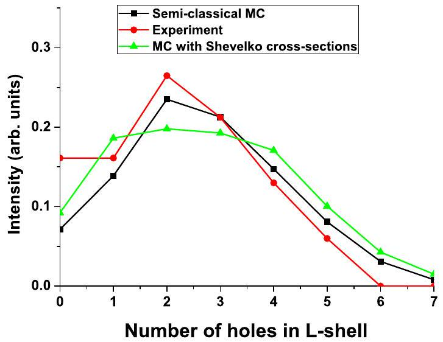
FIG. 3. (Color online) Comparison of the experimental (Refs. 13 and 14) $K_{\alpha} L^{n}$ spectra of silica irradiated with $11.4 \mathrm{MeV} / \mathrm{amu} \mathrm{Ca}$ ions with those calculated in the framework of the presented semiclassical model and quantum model of multiple ionization (Ref. 55).

This good agreement between numerical and experimental results, together with the calculated energy deposited by SHI as well as negligible effect of small differences in initial ionizations, confirm that the presented approach using a semiclassical model with binary collisions provides a reasonable description of the excitation and relaxation kinetics of the electronic subsystem of dielectrics in SHI tracks.

## B. Electronic kinetics

In the following we analyze in detail the electronic kinetics after impact of a Ca ion having the energy $E_{\text {ion }} =11.4 \mathrm{MeV} /$ amu resulting in the energy losses of $S_{e} =2.66 \mathrm{keV} / \mathrm{nm}$. Figure 4 illustrates the radial dependences of the energy densities of free electrons, of the total energy of holes (in all shells of both kinds of atoms), and of the excess energy of the lattice at $t=10 \mathrm{fs}$ after the projectile passage. We have to note that, due to the features of the Monte Carlo method, some statistical fluctuations can be observed at spatial scales comparable with the interatomic dis-

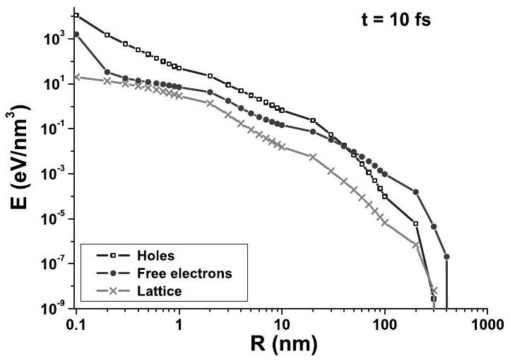
FIG. 4. Spatial distribution of the energy densities of free electrons and all holes in different atomic shells as well as the density of the excess energy of the lattice at 10 fs after the passage of a 455.6 MeV Ca ion in $\mathrm{SiO}_{2}$.

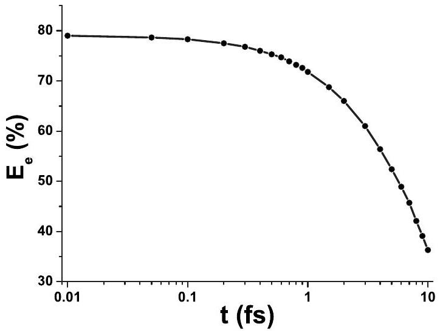
FIG. 5. The temporal dependences of the total kinetic energy of free electrons in $\mathrm{SiO}_{2}$ after the passage of a 455.6 MeV Ca ion.

tance. The densities of electrons and ionized atoms in the track core inside the radius $\sim 2.4 \AA$ might be overestimated by up to about 10\% (Refs. 23 and 27) because we neglect interactions of free electrons with already ionized atoms. Figure 4 demonstrates that about $0.1 \%$ of the excess energy of free electrons is transferred to the lattice via binary collisions with atoms at a time $\sim 10$ fs which is much smaller than the time of atomic vibrations.

Figure 5 presents the decrease in the total energy of free electrons due to conversion of a part of their energy into the energy of holes in different atomic shells. The kinetic energy of free electrons at the initial moment consists about $82 \%$ of the energy lost by the ion while $18 \%$ of this energy is spent for ionization of atomic electrons. Already at $t=1$ fs a considerable part of free-electron energy has been spent to overcome the ionization potential during secondary impact ionization processes. At this time the kinetic energy of electrons is $\sim 71.8 \%$, which means that about $28.2 \%$ of the energy lost by the projectile is spent to overcome the ionization potential and thus considered to be contained in holes. At 10 fs after the projectile passage, potential energy of holes amounts already $63 \%$ of the total energy deposited by the projectile. Therefore, models describing transformations of the excess electronic energy after SHI passage (e.g., Refs. 10, 17-19, and 56) should take into account redistribution of the energy accumulated in holes.

It should be noted that the total energy accumulated in holes in $K$ shells consists only $1.7 \%$ of the total energy of holes (or $1.16 \%$ of the energy lost by the projectile) at $t =1 \mathrm{fs}$. The main part of the potential energy is accumulated in less energetic electronic vacancies. Energy release resulting from decay of these low-energy holes takes place at times from tens of femtosecond (the shortest Auger process for $L$ shell) to hundreds of femtosecond to picosecond (for valence holes) after their appearance.

Figures 6(a) and 6(b) show the transient distributions of the densities of free electrons and their excess energy, respectively. The distributions have well pronounced fronts moving out from the central region in the direction perpendicular to the ion trajectory, revealing ballistic spatial propagation of free electrons on femtosecond time scales.

The knowledge of the transient electronic density in the track enables us to estimate the effect of interactions among

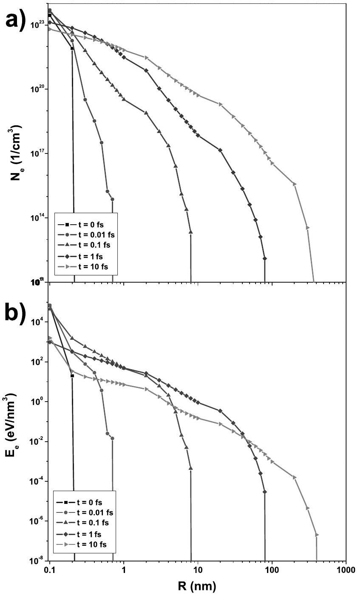
FIG. 6. The spatial and temporal distributions of the densities of (a) free electrons and (b) their energy in $\mathrm{SiO}_{2}$ after the passage of 455.6 MeV Ca ion.

free electrons on their kinetics. Indeed, the distance, at which the potential energy of interaction (Coulomb) between free electrons reaches $10 \%$ of their kinetic energy, can be estimated as $l_{e-e}=10 \cdot e^{2} / E_{e} .{ }^{57}$ With this length we obtain a criterion to estimate a maximal electronic densities, at which the interaction among free electrons can still be neglected $\left(n_{e}^{c r} \sim l_{e-e}^{-3}\right)$. For different characteristic electronic energies such critical densities are $n_{e}^{c r}=2.4 \times 10^{20} \mathrm{~cm}^{-3}$ for $E_{e} =1 \mathrm{eV} ; n_{e}^{c r}=2.4 \times 10^{23} \mathrm{~cm}^{-3}$ for $E_{e}=10 \mathrm{eV}$; and $n_{e}^{c r}=2.4 \times 10^{26} \mathrm{~cm}^{-3}$ for $E_{e}=100 \mathrm{eV}$. From Fig. 6(a) we conclude that for electrons with energies above 100 eV the interaction among free electrons can always be neglected in description of the electronic kinetics in SHI tracks. For electrons with energies in the range of 10 eV , this is true except, perhaps, the very central region of the track core (of few angstroms) at ultrashort time scales. In contrast, for free electrons with lower energies the effect of electron-electron interaction may play a role. However, because these electrons accumulate only small part of the excess energy of the excited electronic subsystem, we neglect this effect.

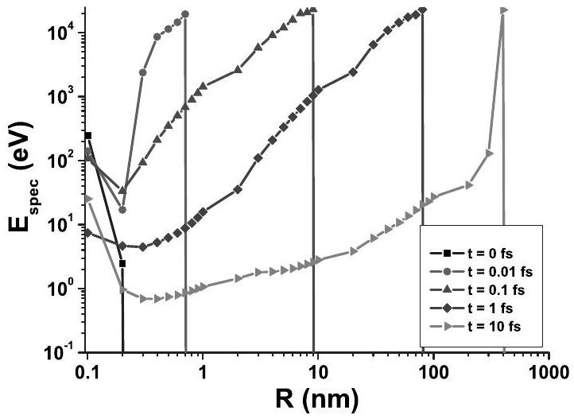
FIG. 7. The spatial and temporal distributions of the mean energy of free electrons in $\mathrm{SiO}_{2}$ after the passage of 455.6 MeV Ca ion.

The spatial distribution of the average kinetic energy of free electrons is shown in Fig. 7 for different instances of time after penetration of the projectile. Averaging was done for all free electrons inside a cylindrical layer between two neighboring points in the figure. The figure clearly shows that the fastest electrons tend to spatial separation from the slowest ones. Fast electrons eject from the track core already on femtosecond time scales and bring out a part of the excess energy. A peak of the average energy distribution occur at times $\sim 10$ fs in the central region, where the initially highest concentration of holes has appeared (mostly created by the SHI impact, cf. Fig. 11). This peak results from Auger decays of holes, increasing the density and mean energy of free electrons in the track core.

In order to investigate the spatial separation of electrons in more details, the ensemble of free electrons is divided into three groups with respect to their kinetic energy. Electrons with energies less than $1 \% E_{\text {max }}$ formed the Group 1. Electrons with intermediate kinetics energies ranging in the interval $1 \% E_{\text {max }}<E_{e}<10 \% E_{\text {max }}$ were attributed to the Group 2. Fast electrons with energies above $10 \% E_{\text {max }}$ represent Group 3. Figures $8-10$ present the temporal and spatial variations in the number and energy densities of electrons, respectively, of all these groups up to $t=10$ fs after the projectile passage. Figure 8 shows the spatial distribution of these three groups of electrons after 1 fs after the SHI im-

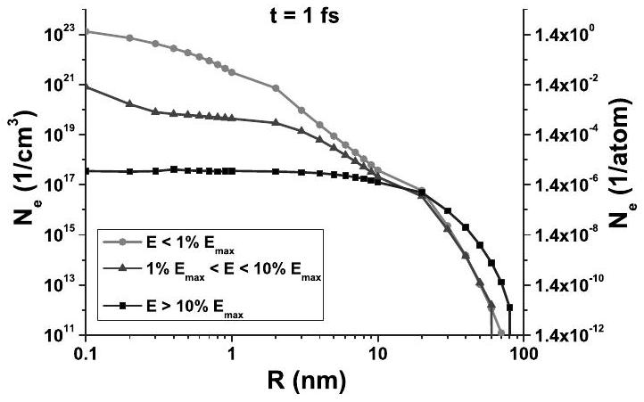
FIG. 8. The spatial distributions of the densities of three groups of different energies of free electrons in $\mathrm{SiO}_{2}$ after the passage of a 455.6 MeV Ca ion . See text for details.

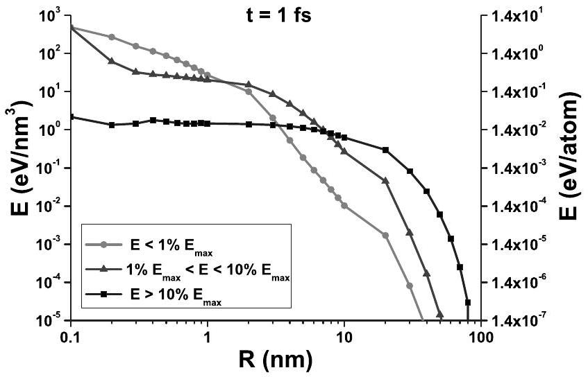
FIG. 9. The spatial distribution of the energy density of three groups of different energies of free electrons in $\mathrm{SiO}_{2}$ after the passage of a 455.6 MeV Ca ion. See text for details.

pact. It clearly demonstrates the spatial separation of fast electrons on the front from the slow electrons which remain in the central vicinity of a projectile trajectory.

Figure 9 demonstrates the energy density of the three electronic groups, where one can see that the considerable part of energy is brought out of the center by the fastest electrons. The propagation of these fastest free electrons (the third group $E>0.1 E_{\text {max }}$ ) is studied in Fig. 10, showing the special electron density at different times. The figure reveals that the fastest free electrons from the third group have a pronounced ballistic propagation front, which cannot be described in terms of the diffusion model. On femtosecond time scale these fastest electrons accumulate a part of the excess energy of free electrons (Figs. 7 and 9) and, therefore, spatial spreading of this energy cannot be described by heat diffusion. The possibility of the description of propagation of such electrons in the frame of the "mesodiffusion theory," ${ }^{17,18,58,59}$ i.e., the intermediate stage between ballistic propagation and diffusion, requires additional studies which will be made in a future. Moreover, the observed differences between the kinetics of the electronic groups indicate that description of the complete ensemble of free electrons in terms of a unique temperature field is questionable at least at times up to 10 fs after the projectile passage.

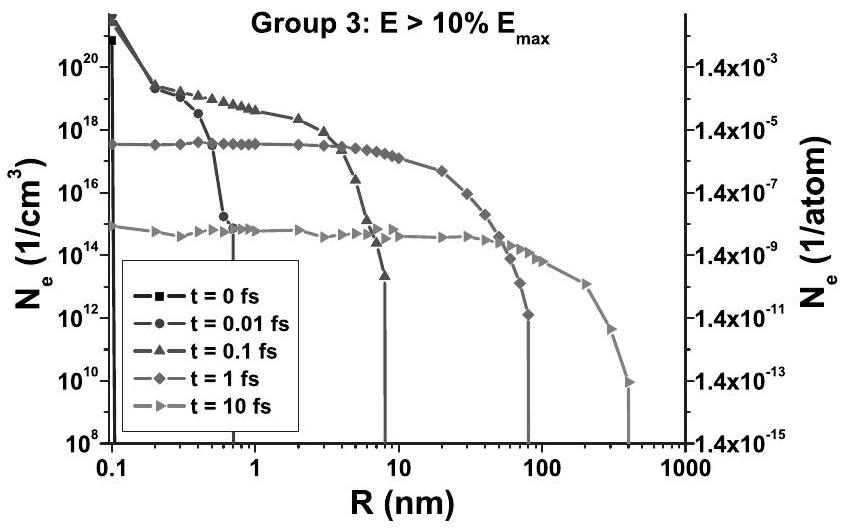
FIG. 10. The transient spatial distributions of the number density of electrons constituting the third group (with energy of $E >10 \% E_{\text {max }}$ ) in $\mathrm{SiO}_{2}$ after the passage of 455.6 MeV Ca ion.

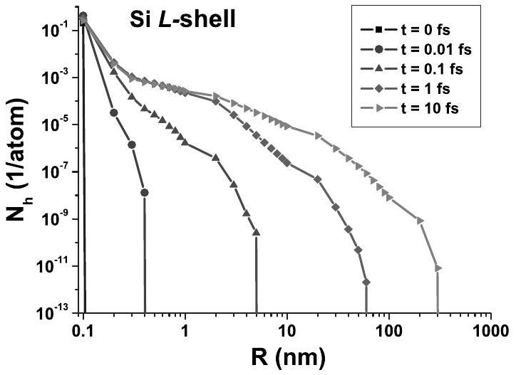
FIG. 11. The spatial and temporal distributions of the number density of holes in $L$ shell of Si subsystem in $\mathrm{SiO}_{2}$ after the passage of a 455.6 MeV Ca ion.

In our model, holes are considered as localized on atomic shells and spatial propagation of the hole density occurs only due to ionizations of target atoms by spreading free electrons. Figure 11 presents the spatial and temporal distributions of the density of holes in $L$ shell of silicon atoms. The ballistic front of the hole density can be observed, which follows the electron spreading.

The distributions of holes in different atomic shells at $t =10$ fs are demonstrated in Fig. 12. One can conclude from this figure that the largest part of the excess energy of holes is accumulated within the valence band (represented by $M$ shell of silicon and $L$ shell of oxygen), as it was already noted above.

The subsequent kinetics of holes occurs via interplay of two mechanisms: (a) impact ionizations by free electrons and (b) the Auger and Knotek-Feibelman decays. The radiative decays play a minor role here since their relative probability is $\sim 5 \%$ of the probability of Auger process. ${ }^{51}$

## IV. CONCLUSIONS

We apply a Monte Carlo approach to describe the ultrafast electronic kinetics in swift heavy ion tracks in a dielectric

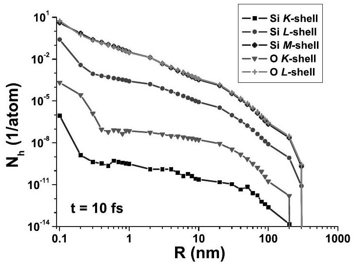
FIG. 12. The spatial distribution of the number density of holes in different shells after 10 fs in $\mathrm{SiO}_{2}$ after the passage of a 455.6 MeV Ca ion.

(after penetration of a $\mathrm{Ca}^{+19}$ ion with the energy of 11.4 $\mathrm{MeV} / \mathrm{amu}$ in $\mathrm{SiO}_{2}$ ). The spatial and temporal distributions of the number and energy densities of free electrons and holes in different atomic shells, respectively, as well as the excess energy of the lattice at times up to 10 fs after the passage of the projectile are obtained.

The results have shown that the propagation of excited free electrons and their mean energy occurs ballistically, which means that their mass and energy transport cannot be described by the classical diffusion and heat diffusion equations on femtosecond time scales. Therefore, descriptions of the initial kinetics ( $<10 \mathrm{fs}$ ) of the electronic subsystem in SHI tracks based on the conceptions of local thermal equilibrium, particle diffusion and heat diffusion are questionable.

At 10 fs after the SHI passage, a large part of the transferred energy is accumulated as a potential energy of holes. This energy is not thermalized as well, and its redistribution has to be taken into account when describing the electronic kinetics.

By comparison with spectroscopy experiments it is demonstrated that the electronic kinetics can be described well taking into account intra-atomic and interatomic (KnotekFeibelman) Auger processes of holes relaxation. Due to this relaxation, the fine details of the initial ionization have a negligible influence on the further kinetics of the electronic subsystem. The radiative spectra calculated taking into account interatomic and intra-atomic Auger processes are in good agreement with experimentally observed ones.

## ACKNOWLEDGMENTS

O. N. Rosmej (GSI, Darmstadt, Germany) and O. Osmani (Technische Universität Kaiserslautern, Germany) are greatly acknowledged for fruitful discussions. N.A.M. and B.R. would like to acknowledge the support from German grants BMBF FSP 301 FLASH, and the Emmy Noether program of the Deutsche Forschungsgemeinschaft, Grant No. RE 1141/ 11-1. A.E.V. and N.S.S. were supported by Grants No. 08-08-00603, No. 09-08-12196, and No. 09-08-00477 from Russian Foundation for Basic Research (RFBR).
*medvedev@physik.uni-kl.de
${ }^{1}$ I. A. Baranov, Yu. V. Martynenko, S. O. Tsepelevich, and Yu. N. Yavlinskiy, Usp. Fiz. Nauk 156, 178 (1988) [Sov. Phys. Usp. 31, 1015 (1988)].
${ }^{2}$ A. M. Miterev, Usp. Fiz. Nauk 172, 1131 (2002) [Phys. Usp. 45, 1019 (2002)].
${ }^{3}$ F. F. Komarov, Usp. Fiz. Nauk 173, 1287 (2003) [Phys. Usp. 46, 1253 (2003)].
${ }^{4}$ L. T. Chadderton, Radiat. Meas. 36, 13 (2003).
${ }^{5}$ P. Sigmund, Stopping of Heavy Ions, Springer Tracts of Modern Physics Vol. 204 (Springer, Berlin, 2004).
${ }^{6}$ See special issue on Fifth International Symposium on Swift Heavy Ions in Matter (SHIM 2002), Giardini Maxos, Italy [Nucl. Instrum. Methods Phys. Res. B 209, 1 (2002)].
${ }^{7}$ See special issue on Sixth International Symposium on Swift Heavy Ions in Matter (SHIM 2005), Aschaffenburg, Germany [Nucl. Instrum. Methods Phys. Res. B 2009, 1 (2005)].
${ }^{8}$ N. J. Carron, An Introduction to the Passage of Energetic Particles through Matter (Taylor and Francis Group, New York, London, 2007).
${ }^{9}$ C. P. Poole, Jr. and F. J. Owens, Introduction to Nanotechnology (Wiley Interscience, Hoboken, New Jersey, 2003).
${ }^{10}$ M. Toulemonde, C. Dufour, and E. Paumier, Phys. Rev. B 46, 14362 (1992).
${ }^{11}$ A. E. Volkov and V. A. Borodin, Nucl. Instrum. Methods Phys. Res. B 146, 137 (1998).
${ }^{12}$ G. Schiwietz, E. Luderer, and P. L. Grande, Appl. Surf. Sci. 182, 286 (2001).
${ }^{13}$ V. P. Efremov, S. A. Pikuz, Jr., A. Ya. Faenov, O. Rosmej, I. Yu. Skobelev, A. V. Shutov, D. H. H. Hoffmann, and V. E. Fortov, JETP Lett. 81, 378 (2005).
${ }^{14}$ J. Rzadkiewicz, O. Rosmej, A. Blazevic, V. P. Efremov, A. Gojska, D. H. H. Hoffmann, S. Korostiy, M. Polasik, K. Slabkowska, and A. E. Volkov, High Energy Density Phys. 3,

233 (2007).
${ }^{15}$ H. Rothard, Nucl. Instrum. Methods Phys. Res. B 225, 27 (2004).
${ }^{16}$ F. F. Komarov, O. I. Velichko, V. A. Dobrushkin, and A. M. Mironov, Phys. Rev. B 74, 035205 (2006).
${ }^{17}$ K. Schwartz, A. E. Volkov, K.-O. Voss, M. V. Sorokin, C. Trautmann, and R. Neumann, Nucl. Instrum. Methods Phys. Res. B 245, 204 (2006).
${ }^{18}$ K. Schwartz, A. E. Volkov, M. V. Sorokin, C. Trautmann, K.-O. Voss, R. Neumann, and M. Lang, Phys. Rev. B 78, 024120 (2008).
${ }^{19}$ E. Akcöltekin, S. Akcöltekin, O. Osmani, A. Duvenbeck, H. Lebius, and M. Schleberger, New J. Phys. 10, 053007 (2008).
${ }^{20}$ E. J. Kobetich and R. Katz, Phys. Rev. 170, 391 (1968).
${ }^{21}$ M. P. R. Waligórski, R. N. Hamm, and R. Katz, Nucl. Tracks Radiat. Meas. 11, 309 (1986).
${ }^{22}$ R. Katz, K. S. Loh, L. Daling, and G. R. Huang, Radiat. Eff. Defects Solids 114, 15 (1990).
${ }^{23}$ B. Gervais and S. Bouffard, Nucl. Instrum. Methods Phys. Res. B 88, 355 (1994).
${ }^{24}$ B. Gervais, M. Beuve, G. H. Olivera, and M. E. Galassi, Radiat. Phys. Chem. 75, 493 (2006).
${ }^{25}$ M. Murat, A. Akkerman, and J. Barak, IEEE Trans. Nucl. Sci. 55, 3046 (2008).
${ }^{26}$ O. Avila and M. E. Brandan, Nucl. Instrum. Methods Phys. Res. B 218, 289 (2004).
${ }^{27}$ N. A. Medvedev and A. E. Volkov, Electron Microscopy and Multiscale Modeling-EMMM-2007: An International Conference, AIP Conf. Proc. No. 999 (AIP, New York, 2008), p. 238.
${ }^{28}$ N. Medvedev and B. Rethfeld, EPL 88, 55001 (2009).
${ }^{29}$ W. Eckstein, Computer Simulations of Ion-Solid Interactions (Springer-Verlag, New York, 1991).
${ }^{30}$ A. F. Akkerman, Modeling of Charged Particles Trajectories in Matter (Nauka, Moscow, 1991) (in Russian).
${ }^{31}$ G. S. Fishman, Monte-Carlo Concepts, Algorithms and Applications (Springer-Verlag, New York, 1996).
${ }^{32}$ M. L. Knotek and P. J. Feibelman, Surf. Sci. 90, 78 (1979).
${ }^{33}$ C. N. R. Rao and D. D. Sarma, Phys. Rev. B 25, 2927 (1982).
${ }^{34}$ G. K. Wertheim, J. E. Rowe, D. N. E. Buchanan, and P. H. Citrin, Phys. Rev. B 51, 13669 (1995).
${ }^{35}$ L. Van Hove, Phys. Rev. 95, 249 (1954).
${ }^{36}$ J. A. Bearden and A. F. Burr, Rev. Mod. Phys. 39, 125 (1967).
${ }^{37}$ H.-D. Betz, Rev. Mod. Phys. 44, 465 (1972).
${ }^{38}$ M. Toulemonde, Nucl. Instrum. Methods Phys. Res. B 250, 263 (2006).
${ }^{39}$ K. Shima, T. Ishihara, T. Miyoshi, and T. Mikumo, Phys. Rev. A 28, 2162 (1983).
${ }^{40}$ G. Schiwietz, K. Czerski, M. Roth, F. Staufenbiel, and P. L. Grande, Nucl. Instrum. Methods Phys. Res. B 226, 683 (2004).
${ }^{41}$ J. P. Rozet, C. Stéphan, and D. Vernhet, Nucl. Instrum. Methods Phys. Res. B 107, 67 (1996).
${ }^{42}$ L. D. Landau and E. M. Lifshitz, Course of Theoretical Physics: Mechanics, 3rd ed. (Elsevier Science, Pergamon Press, Oxford, 1976), Vol. 1.
${ }^{43}$ A. A. Rukhadze and V. P. Silin, Usp. Fiz. Nauk 74, 223 (1961) [Sov. Phys. Usp. 4, 459 (1961)]; Usp. Fiz. Nauk 76, 79 (1962) [Sov. Phys. Usp. 5, 37 (1962)].
${ }^{44}$ V. P. Silin, Introduction to the Kinetic Theory of Gases (FIANRAS, Moscow, 1998).
${ }^{45}$ R. L. Kauffman, K. A. Jamison, T. J. Gray, and P. Richard, Phys. Rev. A 11, 872 (1975).
${ }^{46}$ J. A. Demarest and R. L. Watson, Phys. Rev. A 17, 1302 (1978).
${ }^{47}$ C. Schmiedekamp, B. L. Doyle, T. J. Gray, R. K. Gardner, K. A. Jamison, and P. Richard, Phys. Rev. A 18, 1892 (1978).
${ }^{48}$ H. Rothard, G. Lanzanò, E. De Filippo, and C. Volant, Nucl. Instrum. Methods Phys. Res. B 230, 419 (2005).
${ }^{49}$ G. Lanzanò, E. De Filippo, H. Rothard, C. Volant, A. Anzalone, N. Arena, M. Geraci, F. Giustolisi, and A. Pagano, Nucl. Instrum. Methods Phys. Res. B 233, 31 (2005).
${ }^{50}$ M. Gryziński, Phys. Rev. 138, A305 (1965); 138, A322 (1965); 138, A336 (1965).
${ }^{51}$ O. Keski-Rahkonen and M. O. Krause, At. Data Nucl. Data Tables 14, 139 (1974).
${ }^{52}$ M. Inokuti, Rev. Mod. Phys. 43, 297 (1971).
${ }^{53}$ J. F. Ziegler, J. Appl. Phys. 85, 1249 (1999).
${ }^{54}$ G. Schiwietz and P. L. Grande, Nucl. Instrum. Methods Phys. Res. B 90, 10 (1994).
${ }^{55}$ V. P. Shevelko, J. Phys. B 41, 115204 (2008).
${ }^{56}$ M. Caron, H. Rothard, M. Toulemonde, B. Gervais, and M. Beuve, Nucl. Instrum. Methods Phys. Res. B 245, 36 (2006).
${ }^{57}$ M. Biberman, V. S. Vorob'ev, and I. T. Yakubov, Kinetics of the Nonequilibrium Low-Temperature Plasma (Plenum, New York, 1987) (Nauka, Moscow, 1982 in Russian).
${ }^{58}$ D. Jou, J. Casas-Vazquez, and G. Lebon, Extended Irreversible Thermodynamics (Springer, New York, 2001).
${ }^{59}$ L. Wang, X. Zhou, and X. Wei, Heat Conduction. Mathematical Models and Analytical Solutions (Springer, New York, 2008).

