# Energy dissipation in dielectrics after swift heavy-ion impact: A hybrid model 

O. Osmani, ${ }^{1,2}$ N. Medvedev, ${ }^{1,3}$ M. Schleberger, ${ }^{2}$ and B. Rethfeld ${ }^{1}$ ${ }^{1}$ Department of Physics and OPTIMAS Research Center, Technical University of Kaiserslautern, 67653 Kaiserslautern, Germany ${ }^{2}$ Faculty of Physics, University of Duisburg-Essen and CeNIDE, 47048 Duisburg, Germany ${ }^{3}$ Center for Free-Electron Laser Science, DESY, 22607 Hamburg, Germany

(Received 18 May 2011; revised manuscript received 24 October 2011; published 12 December 2011)

#### Abstract

The energy dissipation after irradiation of dielectrics with swift heavy ions is studied applying a combination of the Monte Carlo (MC) method and the two-temperature model (TTM). Within the MC calculation the transient dynamics of the electrons in the excited dielectric is described: the primary excitation and relaxation of the target electrons as well as the creation of secondary electrons. From the MC data, it was observed that the electron system can be considered as thermalized after a time of $t \approx 100 \mathrm{fs}$ after the ion impact. Then the TTM is applied to calculate the spatial and temporal evolution of the electron and lattice temperature via the electron-phonon coupling using the MC data as initial conditions. Additionally, this MC-TTM combination allows to compute material parameters of strongly excited matter.

DOI: 10.1103/PhysRevB.84.214105
PACS number(s): 05.10.Ln, 72.10.Di, 61.80.Lj, 77.22.Gm

## I. INTRODUCTION

Charged particles lose their energy while passing through matter. This energy loss is mainly due to two dissipation channels, called electronic and nuclear stopping, respectively. The first is the excitation of target electrons, while the latter refers to elastic collisions of the projectile with the target nuclei. In the case of ions with masses of more than 20 proton masses and kinetic energies in the MeV regime, so-called swift heavy ions (SHI), electronic stopping is the main energy-loss channel. ${ }^{1,2}$

SHI are known to induce nanoscaled material modifications in insulators. These modifications, also called tracks, may reveal themselves as craters or hillocks on the surface, which can be observed, for instance, using an atomic force microscope. ${ }^{3}$ These modifications can be explained in terms of the two-temperature model (TTM), ${ }^{4}$ commonly called the inelastic thermal spike model ${ }^{5}$ in this context, which has been successfully applied for reproducing experimentally observed track radii and damage thresholds. ${ }^{3,5-7}$ Within this model, both the electronic as well as the phononic systems are described via a respective heat-diffusion equation. The two equations are coupled by an exchange term. The electrons are heated directly due to the ions energy loss, while the phononic system is heated indirectly by electron-phonon coupling. This leads to a local heating of the lattice, which may result in a molten area.

During the irradiation of an insulator, electrons are excited from the valence into the conduction band. The application of the TTM therefore suffers from the fact that the material parameters involved are often unknown and will depend on the variable electron density in the excited dielectric, i.e., these parameters depend strongly on transient excitation dynamics. A reliable theory considering the complete excitation dynamics is needed to compute these quantities. Additionally, the TTM is based on thermodynamic equations, especially the electronic temperature is used, requiring the electron system to be in an equilibrium state. It is unclear after what time after the ion impact this requirement is fulfilled.

In previous works, ${ }^{8,9}$ we introduced our developed combination of the Monte Carlo method (MC) and the TTM. We demonstrated that our combined method MC-TTM is capable
of calculating material parameters like the electron diffusivity and the electron-phonon coupling.

In this work, a detailed description of the coupling of both methods will be given. This paper is therefore constructed as follows. In the next section, the MC method and the TTM will be introduced. Then we demonstrate how to couple the MC calculation with the TTM, allowing to take advantages of the facts that the MC method is well capable of dealing with electrons in nonequilibrium and the ability of the TTM to calculate the heat transport, taking electron-phonon interactions into account on an extended timescale. Within the MC part, the transient electron dynamics after the ion impact is calculated. Using this data, we then give an estimate on the electron thermalization time after which the definition of a temperature is meaningful. In Sec. III, the MC data are analyzed and then used to calculate the transient electronic heat capacity taking the variable electron density into account. This is followed by the conclusions.

## II. MODEL

This section is divided into three parts in which the model calculations will be explained. In the first part, the Monte Carlo method, in particular, its treatment of the primary electronic excitation induced by the SHI and subsequent nonequilibrium dynamics of electrons and holes are described. This is followed by the introduction of the two-temperature model in which the heat transport and lattice heating are calculated. The final section is devoted to the coupling of these two different methods.

## A. Monte Carlo method

Invented decades ago, the Monte-Carlo method became one of the classical ways to describe particle transport in matter. ${ }^{10-17}$ Recently, it has been used for studying excitation and relaxation of electrons irradiated with SHI or laser pulses. ${ }^{8,16-20}$ Within the method, each process occurring with each particle in the system is considered event by event. Every particle undergoes a collision process with a certain probability. The probability of a particular event depends on its cross section relative to the total cross section summed over all possible interactions.

Our Monte-Carlo approach, including all applied cross sections and sampling algorithms is thoroughly described in Ref. 20. Here, we briefly recall some aspects of the algorithm, focusing on the physical background of our model. As a first step, we calculate the free paths between collisions of the incoming projectile with the target atoms; then ionization may occur for each collision, which results in the creation of the first generation of free electrons, so called $\delta$ electrons. Secondly, we calculate the free paths between all possible subsequent collisions for all free electrons. This includes scattering on bound electrons in different energy states and elastic scattering on target atoms. In case of an ionization event, the bound electron corresponding to the shortest possible path length is chosen and the transferred energy is calculated. Consequently, the free path and time for each of these electrons, i.e., for electrons with different energies, are also obtained. Each ionization of a bound electron is accomplished by the creation of a hole. The possibility of hole decay by Auger recombination and, thus, further creation of secondary electrons is also included in the MC simulation. In case of the elastic scattering, the energy transferred to an atom as well as the electron scattering angle are calculated. To obtain the resulting distributions of electrons and their energies, the simulations are repeated many times and finally averaged.

For simplicity, we assume perpendicular incidence, applying cylindrical geometry and periodic boundary conditions along the $z$ axis and neglect any nuclear stopping of the SHI. This neglection is justified for ions with energies above $\sim 1 \mathrm{MeV} / \mathrm{u}$. Since we, on the other hand, neglect relativistic effects, the model is valid for intermediate ion energies. The projectile is assumed to have an equilibrium charge state, which we describe according to the Barkas formula. ${ }^{2,17,18}$

The solid is considered as a homogeneous random arrangement of atoms. Therefore no effect like channeling or other influence of a particular material structure on particle propagation are entering the simulation. Sequential collisions of an SHI penetrating through homogeneous media is described with the Poisson law for the mean-free path. For solids, the corresponding mean-free path can be chosen equal to the mean interatomic distance. ${ }^{12-17}$ According to their energy levels, the target electrons are placed randomly around the nucleus. These target electrons are considered as not moving during the collision with the SHI. This is equivalent to a condition on the projectile velocity being much greater than the electronic Bohr velocity in the atom. The impact parameter is chosen randomly within the interatomic distance ${ }^{15,20}$ and the energy transfer is then calculated according to this impact parameter. ${ }^{18,20}$ If the energy transfer exceeds the electrons' ionization potential, this electron is considered as a free electron after collision. In the other case, no energy is transferred and the electron remains bound at the atom. The scattering angle is explicitly determined by the transferred energy, and the polar angle is uniformly distributed within the interval $[0,2 \pi)$. The ionized electrons are treated as independent particles, i.e., the transferred energies and angles of emission of electrons are uncorrelated. ${ }^{12-17}$

These resulting high-energy electrons may as well ionize target atoms. Such collisions are called inelastic collisions of free electrons with atoms in contrast to elastic collisions, which do not change the ionization state of the atoms but
solely transfer kinetic energy. To calculate the mean-free path for inelastic collisions of free electrons with atoms, we apply the Gryzinski ionization cross section, ${ }^{17,21}$ depending on the energy of the electron and the ionization potential of the bound electron. The transport and scattering of the secondary electrons, created by these ionizations, are included in the simulation in the same manner. ${ }^{18-20,22}$

In contrast to the penetrating SHI, excited electrons may loose kinetic energy to target atoms. We refer to these collisions as elastic collisions. Such collisions do not change the energy of the electron significantly, however, they change the direction of motion of the electron. This is especially important for electrons with a kinetic energy smaller than the band gap of the solid $E_{e}<E_{\text {gap }}$, since for these electrons elastic collisions are the only scattering channel. Mott's cross section with the screening parameter by Moliere for electronic scattering ${ }^{12-14,20}$ is used to calculate the mean-free path for the elastic collisions. This cross section depends on the electron energy and the atomic number of the atom. The scattering angle for this collision is defined by the transferred energy, while the polar angle is uniformly distributed in the interval $[0,2 \pi)$.

Thus, in the frame of the MC approach, electrons can loose their energy due to both, elastic or inelastic collisions. The realized free path of the electrons is chosen as the shortest possible path according to Poisson law. Thus elastic collisions with the target atoms and inelastic collisions with bound electrons at different energy levels contribute to the mean-free path. ${ }^{18,20}$ Additionally, low-energy electrons can loose their energy due to emission of phonons, ${ }^{12-14}$ which are accounted for within the TTM calculation (see Sec. II B). Phonon emission provides the main heating mechanism of the lattice, since the above mentioned elastic collisions of the electrons heat the atoms only slightly on the considered timescales.

Scattering among free electrons is not taken into account, since, apart from the very narrow track core, the free-electron density is much smaller than the density of valence band electrons and the density of atoms. ${ }^{20}$ Thus collisions with the latter two partners are the dominant electron scattering mechanisms, determining energy transport away from the track core.

After the ionization of a target atom, a hole is created. These holes then can decay due to Auger recombination. The Poisson law for the time of decay is applied to calculate this recombination process. ${ }^{20,22}$ Every atomic shell of a target atom has a characteristic Auger decay time. ${ }^{23}$ The electron, which is enabling the Auger transition, and the other electron, which gains the excess energy, are chosen randomly among the bound electrons. The difference between the energy released by the filling of the hole in a deeper shell and the electrons' own ionization potential determines its final energy after the recombination. The electrons' momentum is then chosen uniformly within the solid angle. Filling of a hole by an electron from a neighboring atom, so-called KnotekFeibelman processes, ${ }^{24-26}$ are also taken into account. The characteristic time of these processes is assumed to be equal to usual Auger recombination times. As we have shown in Ref. 18, Knotek-Feibelman processes are especially important for the atoms in the close vicinity of the SHI trajectory where multiple ionizations result in a lack of own electrons of these
atoms. The neighboring atoms can provide electrons for the energy release via such interatomic Auger decays.

To determine the spatial and temporal particle and energy distributions, we follow every electron and hole, and then average over the respective ensemble. Once the electrons exhibit a thermalized behavior, the MC part is considered to be finished, and we switch to the TTM calculations. ${ }^{6,8}$ The details of the transition from one model to the other one are described in Sec. IIC.

## B. Two-temperature model

The TTM is widely applied to describe electron-lattice relaxation after SHI or laser irradiation. ${ }^{4-6,27-29}$ Within this model the temporal and spatial evolution of the electronic and lattice temperature, $T_{e}$ and $T_{p}$, respectively, are calculated. The TTM is given as

$$
\begin{aligned}
C_{V, e}\left(T_{e}\right) \frac{\partial T_{e}}{\partial t}(\vec{r}, t)= & \nabla \cdot\left[\kappa_{e}\left(T_{e}\right) \nabla T_{e}(\vec{r}, t)\right] \\
& -g\left[T_{e}(\vec{r}, t)-T_{p}(\vec{r}, t)\right]+S(\vec{r}, t), \\
C_{V, p}\left(T_{p}\right) \frac{\partial T_{p}}{\partial t}(\vec{r}, t)= & \nabla \cdot\left[\kappa_{p}\left(T_{p}\right) \nabla T_{p}(\vec{r}, t)\right] \\
& +g\left[T_{e}(\vec{r}, t)-T_{p}(\vec{r}, t)\right] .
\end{aligned}
$$

Here, $\kappa_{e}\left(T_{e}\right)$ and $\kappa_{p}\left(T_{p}\right)$ denote the heat conductivity and $C_{V, e}\left(T_{e}\right)$ and $C_{V, p}\left(T_{p}\right)$ denote the heat capacity of the electrons and the lattice, respectively. Furthermore, $g$ is the coupling parameter between both subsystems and $S(\vec{r}, t)$ is the space-and-time-dependent energy source heating the electronic subsystem. Commonly $S(\vec{r}, t)$ is calculated using the SRIM code ${ }^{30}$ and the expression for the radial electron energy deposition given by Waligorski et al. ${ }^{16}$

Here, the finite difference method is used to solve Eqs. (1) and (2). An infinite large heat bath is used as boundary conditions. The heat conductivity can be expressed as

$$
\kappa_{e, p}\left(T_{e, p}\right)=D_{e, p}\left(T_{e, p}\right) C_{V,(e, p)}\left(T_{e, p}\right)
$$

substituting the heat conductivity with the diffusivity $D_{e, p}\left(T_{e, p}\right)$.

The electron-phonon coupling parameter $g$ controls the flux of heat or energy from the electrons to the phonons per unit time and volume. This parameter governs the heating of the lattice and is thus a crucial quantity. However, only limited experimental data are available on the electron-phonon coupling parameter for dielectrics, which is therefore often treated as a fitting parameter. Furthermore, the electronic diffusivity $D_{e}$ determines the spatial transport of the energy and thus determines the local lattice temperature. Experimental data on this property for dielectrics are lacking. Although one can extract the electron diffusivity $D_{e}$ from resistivity measurements for instance, such kind of measurements often do not reflect the transient electronic excitation during the irradiation.

In our work, we obtain both the electronic diffusivity $D_{e}\left(T_{e}\right)$ and the electron phonon-coupling parameter $g$ from the MC simulation and use these parameters within the TTM. Details on how both quantities are obtained are given in Sec. IIC.

The lattice diffusivity is given as $D_{p}=C_{V, p} / \kappa_{p}$, where we assume a linear temperature dependence of the heat
conductivity $\kappa_{p}$ and of the heat capacity $C_{V, p}$ according to Refs. 31 and 32, respectively. Thus the lattice diffusivity is given as $D_{p}=8.4 \times 10^{-3} \mathrm{~cm}^{2} / \mathrm{s}$.

In previous work, ${ }^{9}$ we demonstrated that it is important to take the energy redistribution related to Auger decay of holes into account. The effective source term in Eq. (1), heating the electronic subsystem, can be written as $S(\vec{r}, t)=S_{h}(\vec{r}, t)+ S_{\mathrm{SHI}}(\vec{r}, t)$, where $S_{\mathrm{SHI}}(\vec{r}, t)$ is the energy introduced into the electronic system by the primary ion. In our particular case, the source term $S_{\mathrm{SHI}}(\vec{r}, t)$ is substituted by an energy profile of the electrons calculated within the MC simulation, which enters our TTM approach as initial conditions. The Auger recombination is treated as an additional source of energy for the electronic system, assuming an exponential decay:

$$
S_{h}(\vec{r}, t)=E_{h}(\vec{r})\left(1-e^{-t / \tau}\right) .
$$

Here, $E_{h}(\vec{r})$ denotes the initial excess energy of the hole at position $\vec{r}$ and $\tau$ is the characteristic decay time. In the present work, $E_{h}(\vec{r})$ is calculated within the MC simulation and the time $\tau$ is chosen to be $\tau=100 \mathrm{fs}$, according to Refs. 33 and 34.

## C. MC-TTM combination

One fundamental concept for the description of ion-excited insulators is that excited electrons in the conduction band of an insulator behave like free electrons in a metal. ${ }^{1}$ Following this idea, we describe these electrons by a pseudo-Fermi distribution, a pseudo-Fermi energy $E_{F}^{*}$, and a free-electron gas DOS. The energy zero point is located at the bottom of the conduction band. This is schematically shown in Fig. 1. To combine the MC method with the TTM, we seek the appropriate Fermi distribution, which describes the density and energy of the electrons calculated within the MC simulation.

Generally speaking, one may calculate the energy density $U$ of the electrons obtained from the MC simulation and convert that into an electronic temperature. If the electron heat capacity $C_{V, e}$ is known, this conversion can be done straightforwardly. However, in the case of insulators (especially during SHI irradiation), this parameter is unknown, and we therefore proceed by analyzing the particular distribution:

$$
f\left(E, T_{e}, \mu\right)=\frac{1}{1+\exp \left[(E-\mu) / k_{B} T_{e}\right]},
$$

where $k_{B}$ is the Boltzmann constant and $\mu$ the chemical potential.

In our case, two unknown variables appear, i.e., $\mu$ and $T_{e}$. They can be determined by exploiting the zeroth and the first moment of the Fermi distribution, which read, respectively,

$$
\begin{aligned}
& N=\int_{0}^{\infty} \alpha(E) f\left(E, T_{e}, \mu\right) \mathrm{d} E \\
& U=\int_{0}^{\infty} E \alpha(E) f\left(E, T_{e}, \mu\right) \mathrm{d} E
\end{aligned}
$$

Here, $\alpha(E)$ is the free-electron DOS, $N$ and $U$ denote the particle and energy densities, respectively.

Both the particle density $N$ as well as the energy density $U$ are known from our MC calculation (see Sec. III, Figs. 5 and 6 ). With knowledge of $N$, Eq. (6) can be solved by varying $\mu$ and $T_{e}$ leading to a relation $\mu\left(T_{e}\right)$. The same procedure is repeated for Eq. (7).

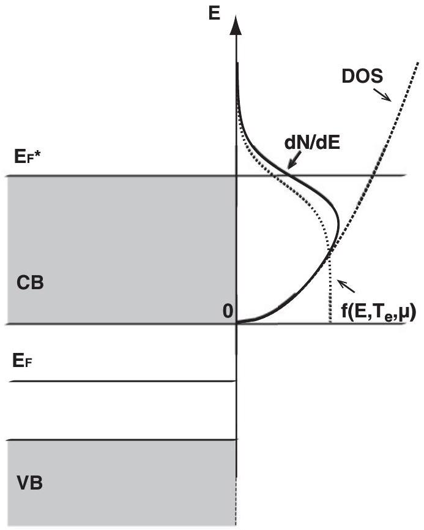
FIG. 1. Schematic description of valence and conduction bands of an insulator under irradiation with a swift heavy ion. Electrons are excited from the valence band (VB) into the conduction band (CB). The excited electrons are then treated as a free-electron gas with their appropriate pseudo-Fermi distribution $f\left(E, T_{e}, \mu\right)$, appropriate pseudo-Fermi energy $E_{F}^{*}$, and a free-electron DOS. The energy zero point is located at the bottom of the conduction band.

Figure 2 shows that for both Eqs. (6) and (7), i.e., fixing the density $N$ or the energy $U$, respectively, two independent functions $\mu\left(T_{e}\right)$ are obtained. Exemplary values for the electron density ( $N=2 \times 10^{21} \mathrm{~cm}^{-3}$ ) and the electron energy density ( $U=160 \mathrm{Jcm}^{-3}$ ) are assumed in Fig. 2. However, as the energy and particle densities are related to the same physical electron ensemble, the temperature and chemical potential have to be equal, thus $T_{e}$ and $\mu$ are given exactly at the point where both functions intersect. Here, the intersection point is a uniquely defined point as both functions as well as their first derivative are monotonically decreasing. Since the energy and particle densities are functions of the lateral radius,

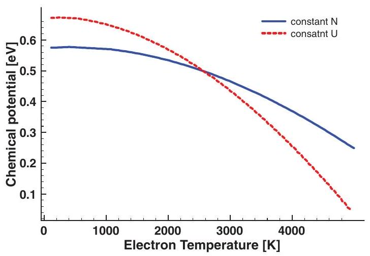
FIG. 2. (Color online) Temperature dependence of the chemical potential $\mu$ evaluated from Eq. (6) for constant density $N$ and Eq. (7) for constant energy density $U$, respectively.

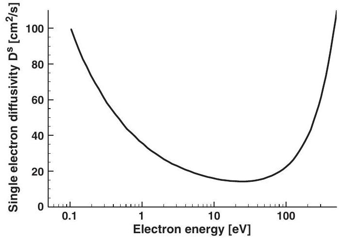
FIG. 3. Single-electron diffusivity $D_{e}^{s}(E)$ for different electron energies.

the calculations have to be performed for various sets of $N$ and $U$ to obtain $T_{e}$ and $\mu$ for all radii.

At this point, we would like to emphasize that these calculations also serve as zero-order criteria for the thermalization of the electron ensemble. From our MC simulation, the energy and particle densities can be extracted at any chosen time instant and space point. However, it is obvious that the electron system can not be thermalized if the time interval, starting from the ion impact till the measurement, is too short for the electrons to undergo enough collisions to establish a Fermi distribution. Though we do not evaluate the shape of the distribution function itself, we can judge whether the establishment of a Fermi distribution is reasonable for the obtained $N$ and $U$. This is not the case when the intersection point for Eqs. (6) and (7) results in unphysical values for the electronic temperature or the chemical potential $\mu$. In Sec. III, we elaborate the results for $\mu$ and $T_{e}$ and also discuss the nature of particle transport as a further criterion for a thermalized behavior of the excited electrons.

Next, we will discuss how the electron diffusivity $D_{e}\left(T_{e}\right)$ and the electron-phonon coupling $g$ are obtained within the MC simulations. Within the MC calculation, individual electron trajectories are followed. For each electron with a given energy $E$ or synonymously a velocity $v(E)$, the free-flight time $\tau$ between two successive collision events is calculated. This time can be readily converted into a free-flight path $\lambda$. The diffusivity follows from the product between the electron velocity and the free-flight path

$$
D_{e}^{S}(E)=\frac{1}{3} v \lambda .
$$

Here, the superscript $s$ denotes the fact that $D^{s}(E)$ is not an actual diffusivity, but it is calculated from the movement of single electrons. The electronic diffusivity $D_{e}^{s}(E)$ is shown for different electron energies in Fig. 3. It exhibits a decreasing energy dependence for small energies, which is also observed if only electron-electron scattering is considered. ${ }^{6}$ However, by taking electron-atom collisions into account, it is found that the diffusivity shows a pronounced minimum for electronic energies around 20 eV , while increasing again for larger electron energies. The reason is found in the applied Mott's cross section, which exhibits a maximum in this energy range. Thus electrons with energies around 20 eV have a significantly

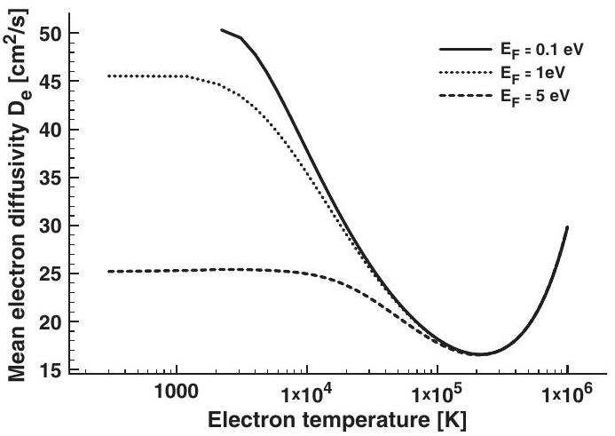
FIG. 4. Averaged electron diffusivity according to Eq. (9) for different Fermi energies, corresponding to different electron densities.

smaller free-flight path than electrons with smaller or larger energies.

As Eq. (8) reflects the single-particle free-flight path, one has to weight $D_{e}^{s}(E)$ with the appropriate Fermi distribution in order to obtain the electron diffusivity:

$$
D_{e}\left(T_{e}\right)=\frac{\int_{0}^{\infty} \alpha(E) f\left(E, T_{e}, \mu\right) D_{e}^{s}(E) \mathrm{d} E}{N} .
$$

According to Eq. (9), $D_{e}\left(T_{e}\right)$ depends on the respective Fermi distribution. The result of this averaging is shown in Fig. 4 for different Fermi energies $E_{F}$, corresponding to different electron densities $N$. The chemical potential $\mu\left(E_{F}, T_{e}\right)$ entering Eq. (9) is calculated for the curves in Fig. 4 with the condition of constant electron density. Starting with the case for $E_{F}=$ 0.1 eV , i.e., a Boltzmann gas for temperatures above $\sim 1000 \mathrm{~K}$, one finds that the overall behavior of $D_{e}^{s}(E)$ is well reproduced. With increasing $E_{F}$, the behavior of $D_{e}\left(T_{e}\right)$ deviates more and more from $D_{e}^{s}(E)$, especially for low electron temperatures. This difference stems from the fact that, at low temperatures and positive chemical potentials, electrons are in a degenerate state, thus contributions of $D_{e}^{s}(E)$ at energies below the Fermi edge are pronounced, while high-energy contributions are truncated. Consequently, this effect recovers for sufficiently large $T_{e} \gg E_{F} / k_{B}$, where ultimately the chemical potential becomes negative, i.e., the electrons are fully nondegenerate.

For the implementation in the TTM, we evaluate Eq. (9) at every space point individually, according to the local temperature $T_{e}$ and chemical potential $\mu$. The electron-phonon coupling can be estimated in a similar manner. Within the MC calculation, rates of collisions between electrons and target atoms are directly obtained. The transferred energy between electrons and atoms, $\Delta E$, in a certain time interval is calculated within the binary collision approximation. The resulting dependence of $\Delta E$ on the electron energy $E$ is linear and shown in Ref. 9 (Fig. 2 therein). Finally, the volume in which this energy is transferred is identified with the volume of one target atom. In this way, an electron-phonon coupling parameter of $g=1.2 \times 10^{18} \mathrm{~W} / \mathrm{Km}^{3}$ for $\mathrm{SiO}_{2}$, for example, is found. Since the transfer rate per energy is constant, the integration of a single electron coupling to a mean coupling parameter, similar to Eq. (9), is dispensable, and $g$ enters directly the TTM calculations.

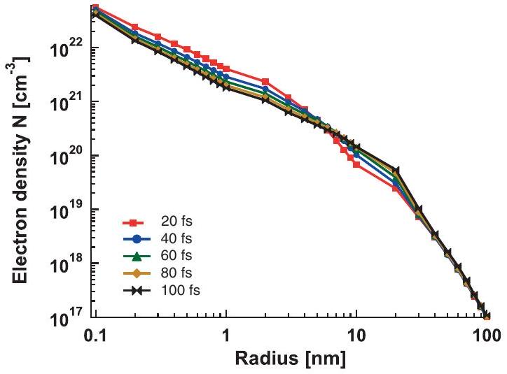
FIG. 5. (Color online) Space- and time-dependent electron density for different times after the ion impact.

## III. RESULTS AND DISCUSSION

Here, we present the results of our combined MC-TTM model for the exemplary irradiation of solid $\mathrm{SiO}_{2}$ by $\mathrm{Ca}^{19+}$ ions with a total energy of $11.4 \mathrm{MeV} / \mathrm{u}$ and a stopping power of $2.7 \mathrm{keV} / \mathrm{nm}$. This stopping power is comparable with the stopping power in $\mathrm{SiO}_{2}$ used in a recent experiment. ${ }^{35}$

Figure 5 shows the calculated electron density for different times after the ion impact obtained from the MC method. The spatial and temporal evolution of the density is governed by three major mechanisms ${ }^{8,9,20}$ following the initial excitation: the electron transport, which moves electrons away from the center of the track, the secondary electron ionizations, which increase the total number of electrons most efficiently at short timescales, and the Auger recombinations of deep atomic shells, which increase the number of electrons most pronounced in the track core.

The total electron energy density shown in Fig. 6 demonstrates a similar behavior to that of the electron density. It is decreasing in the intermediate region (between a few angstroms and a few tens of nanometers) due to the electron transport. Additionally, there is a sink of energy due to the secondary ionizations (most pronounced at the front of electron propagation, where the fastest electrons are), and the increase

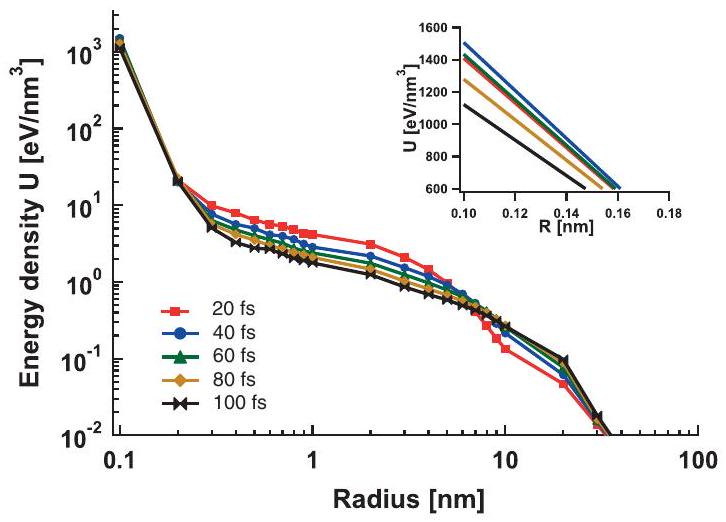
FIG. 6. (Color online) Space- and time-dependent electron energy density for different times after the ion impact. The inset shows its nonlogarithmic enlargement in the center of the ion impact point.

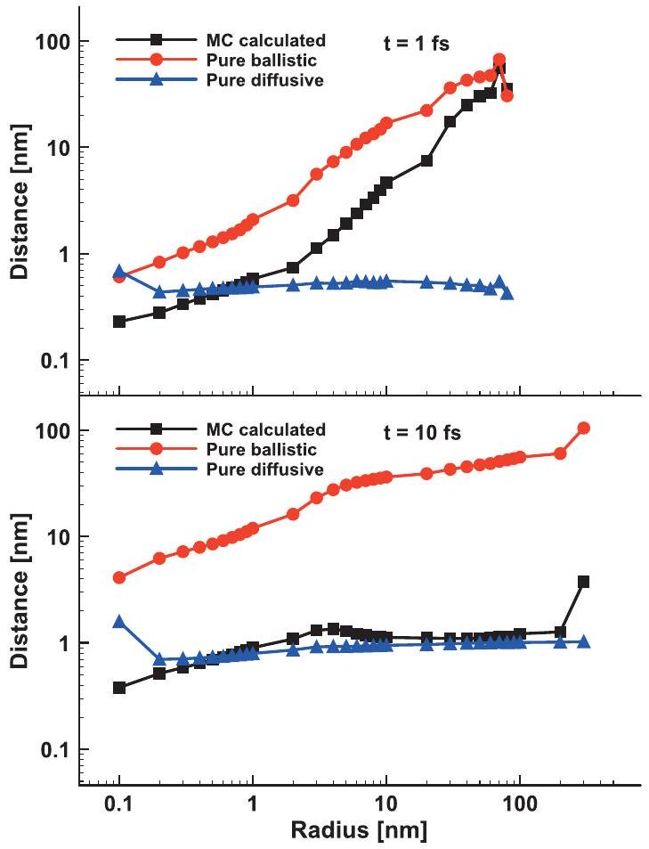
FIG. 7. (Color online) Comparison between ballistic and diffusive electron transports at 1 fs (top) and 10 fs (bottom) after the ion impact. The ordinate shows the initial position of the electrons from the ion track and the abscissa the traveled distance within ten collisions.

of the energy due to the Auger decays in the central region of a track.

Using the MC data, we can analyze the particle transport in more detail. We calculate, for each electron at a certain radius from the ion track, the traveled distance considering ten collisions. This is shown in Fig. 7, where the ordinate shows the initial position from the ion track and the abscissa the traveled distance considering the last ten collisions. This traveled distance can then be compared with (a) the distance that electron would travel purely ballistically, without scattering changing its direction of motion, and (b) with the diffusive transport, for which the distance is proportional to the square root of time:

$$
D_{e}=\frac{\Delta x^{2}}{\Delta t} \Rightarrow \Delta x \propto \sqrt{\Delta t} .
$$

In Fig. 7 (top), one can see that electrons calculated within the MC (black squares) mostly demonstrate the "intermediate" behavior between ballistic and the diffusive one. The fastest electrons at the front are of pure ballistic nature. The electrons within the narrow central region of several angstroms from the ion impact point were just created by Auger decays, and did not have time to travel a significant distance. After 10 fs (see Fig. 7, bottom), most of the electrons demonstrate already diffusive behavior, except for the very front of the excitation, and again, the central region of the track, where electrons are excited due to Auger recombination. A more detailed analysis of this nonequilibrium electron behavior within these first 10 fs has been already reported in a previous work. ${ }^{20}$

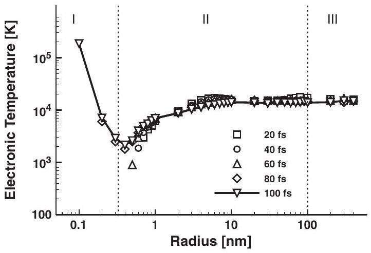
FIG. 8. Calculated electronic temperature for different track radii for different times after the ion impact evaluated from Eqs. (6) and (7). The solid line is to guide the eye.

Figure 7 thus indicates three spatial regions: one in the central region of the track, one at the very front of excitations, and an intermediate region, where the particle transport of electrons shows a diffusive behavior. There, the transport behavior is that of a thermalized electron gas in a radius $>0.2 \mathrm{~nm}$ for times $>10 \mathrm{fs}$. We now study whether it is reasonable to prescribe a Fermi distribution for the electronic system for the chosen irradiation scenario. To that end, we calculate the electron temperature $T_{e}$ and the chemical potential $\mu$ according to Eqs. (6) and (7) using the electron and the energy densities shown in Figs. 5 and 6.

The calculated electron temperatures for different track radii and different times after the ion impact are shown in Fig. 8. At $t=20 \mathrm{fs}$ after the ion impact, electron temperatures can be defined for track radii larger than 0.7 nm . For 40 and 60 fs , a temperature can be defined for track radii larger than 0.6 and 0.5 nm , respectively. By the time of 80 fs , a temperature can be calculated for the entire track. We conclude that by a time of around $80-100$ fs the TTM can be applied. Figure 8 provides snapshots of the energy profile of the electrons approaching thermal equilibrium, which is assumed after 100 fs . Such thermalization times have been also found studying excitation of nonequilibrium electrons in laser-irradiated $\mathrm{SiO}_{2} .{ }^{36}$

The three distinct zones mentioned in the discussion of Fig. 7 are reflected in the energy profile and marked in Fig. 8. Zone I is located around the track core with radius of about 0.2 nm . Within this zone, the electrons are predominantly heated by Auger recombination leading to a continuous energy deposition in that zone and thus to an elevated electronic temperature as compared to the rest of the track.

Zone II is located from 0.2 nm on and reaches up to around 100 nanometers. This zone is populated by mainly low-energy secondary electrons. These electrons thermalize much faster than electrons in the first zone; and as they have lower kinetic energies they are described by a lower temperature.

Finally, zone III is initially reached only by high-energy ballistic electrons. At later times, it is also populated by electrons originating from within the first two zones.

It can be seen in Fig. 8, that the electron temperature exhibits a nontrivial shape with respect to the radius, which differs from the expected exponential behavior. The increase of the electron temperature at radii around 0.4 nm is due to secondary electron creation. Furthermore, it can be observed that the

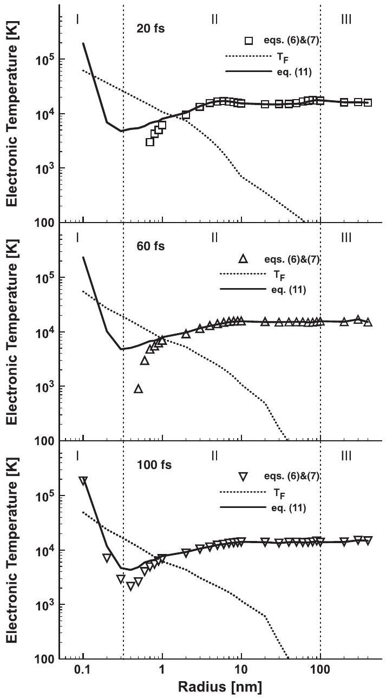
FIG. 9. Electron temperature for different radii: 20 (a), 60 (b), and 100 fs (c) after the ion impact. Symbols: calculations according to Eqs. (5) and (6). Solid line: Eq. (11). Dotted line: $T_{F}=E_{F} / k_{B}$.

electron energy at a radius of around 0.4 nm up to 1 nm increases with time, while the electron temperature decreases with time for radii larger than 2 nm . This temporal behavior of the electron temperature stems from the complex interplay between electron transport of high-energy electrons and the creation of (less energetic) secondary electrons due to impact ionization.

Up to now, we have calculated the electronic temperatures corresponding to the given set of $U$ and $N$ with the assumption that the electrons obey a Fermi distribution. For a non degenerated ideal electron gas with $k_{B} T_{e} \gg E_{F}$, however, a simpler relation holds,

$$
k_{B} T_{e}=\frac{2}{3} U / N .
$$

To further study the time evolution of the obtained temperatures, we compare the results of Eq. (11) with Eqs. (6) and (7) in Fig. 9. The three parts of the figure, (a), (b), and (c), show the spatial dependence of the calculated electronic temperatures for the time of 20,60 , and 100 fs , respectively, after the ion impact. The straight line refers to Eq. (11), while the symbols show the temperatures resulting from the implicit equations (6) and (7). For comparison, the Fermi temperature $T_{F}=E_{F} / k_{B}$,
reflecting directly the local free-electron density, is shown as dotted lines in Fig. 9. Both methods yield the same temperatures several nanometers and further away from the ion impact point. Here, the density of electrons is low, the calculated chemical potential is negative, and the electrons are nondegenerated, thus the assumed Fermi distribution (as sketched in Fig. 1) equals its Boltzmann tail and both temperatures coincide. As was pointed out above, for times shorter than around $80-100 \mathrm{fs}$, no reasonable temperatures can be defined in the near vicinity of the ion impact point using the moments of the Fermi distribution, Eqs. (6) and (7). In contrast to that, Eq. (11) has a solution everywhere, where $N$ and $U$ are given. After 100 fs , see Fig. 9(c), both methods yield an electron temperature in all the areas studied and both temperature curves exhibit a similar behavior. However, in the near vicinity of the ion impact point, the temperatures differ from each other. Figure 9 shows that the obtained temperatures are smaller than the Fermi temperature $T_{F}$. Thus the electrons are degenerated, and a Fermi distribution has to be assumed. Note that this finding is in accordance with the chemical potential, resulting from Eqs. (6) and (7), which is positive in this area. In conclusion, we find that the electron temperatures can be only described rather far away from the ion impact point using the simple relation given by Eq. (11). In contrast to that, using Eqs. (6) and (7), gives an accurate estimation of the electron temperatures for all times and radii.

Knowing temperature and chemical potential and assuming a Fermi distribution of hot electrons, we now can calculate other thermodynamical quantities like the electron heat capacity directly:

$$
C_{V, e}=\frac{\partial U}{\partial T_{e}} .
$$

The calculated temperature dependent electronic heat capacity is shown in Fig. 10 for different electronic densities corresponding to different track radii. The heat capacity is increasing with increasing electronic density and thus with decreasing track radius. This demonstrates that the common assumption of a spatially constant electronic heat capacity is not valid. The value of $C_{V, e}$ ranges from some $1000 \mathrm{~kJ} / \mathrm{m}^{-3} \mathrm{~K}^{-1}$ down to $10 \mathrm{~kJ} / \mathrm{m}^{-3} \mathrm{~K}^{-1}$ within 1 nm of the track for the irradiation scenario studied here. Furthermore, assuming a temperature independence or simple

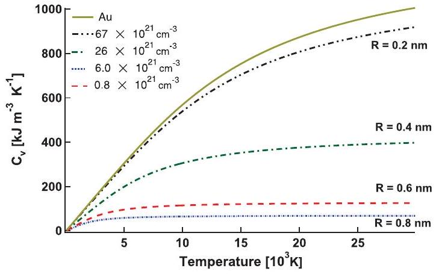
FIG. 10. (Color online) Temperature-dependent electronic heat capacity for different track radii corresponding to different electronic densities. The solid line shows the electronic heat capacity for Au $s$-band electrons.

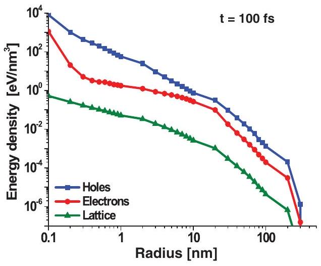
FIG. 11. (Color online) Calculated energy density for electrons, holes, and the lattice at the time of 100 fs after the ion impact. The energy density is used as initial conditions for the TTM calculation.

proportionality $C_{V, e} \propto T_{e}$ appears also not valid since the electronic temperatures are not in the low-temperature regime, as the comparison of Figs. 8 and 10 show. In general, since the evolution of the electron temperature is considered, the entire temperature interval has to be taken into account. Assuming $C_{V, e} \propto T_{e}$ underestimates electronic temperatures for high electron energies. For comparison, we have added the electronic heat capacity for gold calculated using a freeelectron density of states in Fig. 10. Please note that only the Au $s$-band electrons are considered here. The figure shows that the electron heat capacity of the irradiated $\mathrm{SiO}_{2}$ is greatly enhanced transiently.

The lifetime of this enhanced heat capacity depends on the duration of the increased electron density in the conduction band of the insulator, which is beyond the scope of the present paper. In the future, particle transport will be included in the TTM.

Finally, we apply the TTM using the initial conditions and parameters delivered by the MC method to extract data that can be directly compared to experiments. For completeness, the calculated spatial profile of the electron, hole, and the lattice energies that serve as the initial conditions for the TTM are shown in Fig. 11 at a time of 100 fs after the ion impact. As shown above, at that time, the electrons can be treated as thermalized and thus the TTM can be applied. The energy

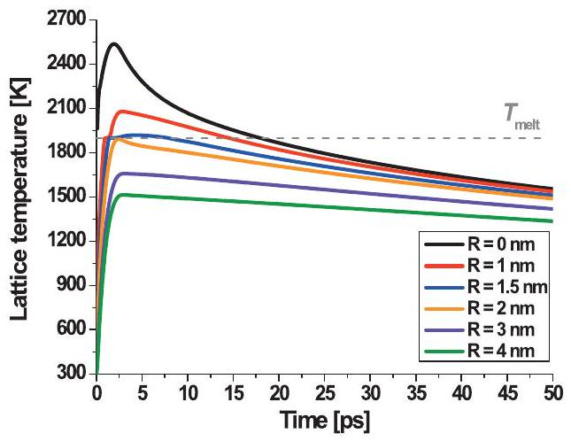
FIG. 12. (Color online) Calculated time evolution of the lattice temperature for different radii from the ion impact point. The dashed line is the melting temperature of $\mathrm{SiO}_{2}$.

density of the electrons (red circles) is used as the source term $S_{\mathrm{SHI}}(r)$ for Eq. (1), i.e., is used as initial conditions for the electrons. The energy density related to holes (blue squares) $E_{h}(\vec{r})$ is used in the time-dependent source term $S_{h}(\vec{r}, t)$ heating the electron system according to Eq. (4). During the MC simulation, energy is transferred to the target atoms due to binary electron-atom collisions. This energy density (green triangles) is used as initial conditions for the lattice in Eq. (2). The electronic diffusivity $D_{e}(T)$ and the electron-phonon coupling parameter are extracted as described in Ref. 9.

The results of the TTM calculation are shown in Fig. 12. Here, the temporal lattice temperature evolution is shown for different radii from the ion impact point. In order for the material to melt, the melting temperature $T_{\text {melt }}=1972 \mathrm{~K}$ as well as the heat of fusion $H_{\text {fusion }}=142 \mathrm{Jg}^{-1}$ have to be overcome. Both values are taken from Ref. 37. From this figure it can be seen that the molten area consists of a cylinder with a radius of around 1.5 nm around the track core. Assuming that the molten area reflects the structural modifications induced by a single-ion impact observed in the experiment, we conclude that the structural modification has a radius of around 1.5 nm , which is in good agreement with the experimentally observed modifications. ${ }^{35}$

## IV. CONCLUSION

With the MC simulation we have used a kinetic approach to simulate the initial electron dynamics. Our results show that the energy transport as well as the free-electron energy cannot be described with equilibrium concepts at early times. We find that the TTM can be applied after a time of $t \approx 100 \mathrm{fs}$ after the ion impact. Within the MC part of the calculations, all necessary (and experimentally inaccessible) material parameters are computed so that no fitting is needed within the TTM. Moreover, the detailed evaluation of the MC output revealed a strong transient increase of the electronic heat capacity, which is located around the track core.

The calculation of the electron dynamics after SHI irradiation of dielectrics has revealed that the track can be separated into three different zones. In the first zone, electrons are heated due to Auger recombination of electrons and holes. In this region, the most energetic electrons within the track

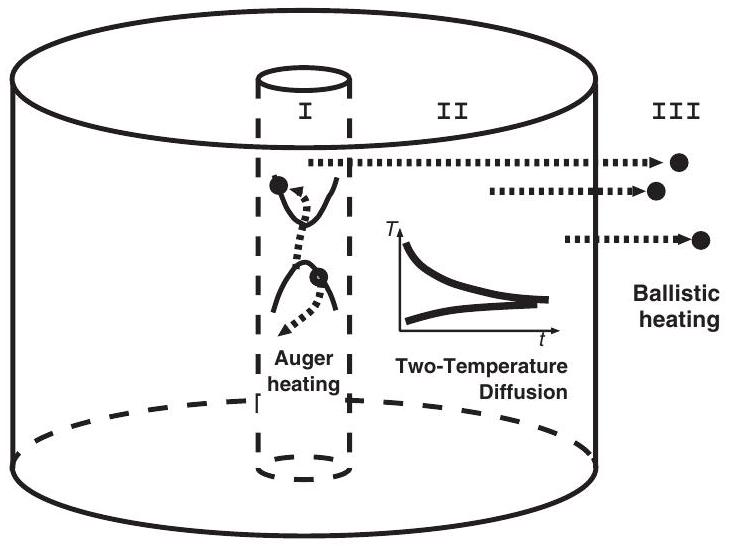
FIG. 13. Schematic view of the three distinct zones of different characteristic electron behavior.

can be found. These electrons propagate outwards and create secondary low-energy electrons exhibiting a thermal character. These thermal electrons are located in the second zone. Finally, the electrons that originate in the first zone can reach the third zone moving almost ballistically trough the crystal. Figure 13 schematically shows these three zones.

The developed combination of the Monte Carlo method with a two-temperature model (MC-TTM) is capable of describing the track creation processes in dielectric targets after swift heavy ion irradiation. ${ }^{8}$ The approach presented here is a universal method that can be applied to any irradiation of
dielectrics by SHI and should prove useful in the computation of material parameters during strong electronic excitations and the calculation of track radii and related quantities.

## ACKNOWLEDGMENTS

The authors acknowledge financial support from the Deutsche Forschungsgemeinschaft within the Sonderforschungsbereich 616 entitled "Energy dissipation at surfaces" and the Emmy Noether programm grant No. RE 1141/11-1.
${ }^{1}$ I. A. Baranov, Y. V. Martynenko, S. O. Tsepelevich, and Y. N. Yavlinski, Usp. Fiz. Nauk 156, 477 (1988).
${ }^{2}$ N. Carron, An Introduction to the Passage of Energetic Particles through Matter, 3rd ed. (Taylor and Francis Group, New York, London, 2007).
${ }^{3}$ E. Akcöltekin, T. Peters, R. Meyer, A. Duvenbeck, M. Klusmann, I. Monnet, H. Lebius, and M. Schleberger, Nat. Nanotechnology 2, 290 (2007).
${ }^{4}$ M. I. Kaganov, I. M. Lifshitz, and L. V. Tanatarov, Zh. Eksp. Teor. Fiz. 31, 232 (1956) [Sov. Phys. JETP 4, 173 (1957)].
${ }^{5}$ M. Toulemonde, C. Dufour, and E. Paumier, Phys. Rev. B 46, 14362 (1992).
${ }^{6}$ E. Akcöltekin, S. Akcöltekin, O. Osmani, A. Duvenbeck, H. Lebius, and M. Schleberger, New J. Phys. 10, 053007 (2008).
${ }^{7}$ E. M. Bringa and R. E. Johnson, Phys. Rev. Lett. 88, 165501 (2002).
${ }^{8}$ N. Medvedev, O. Osmani, B. Rethfeld, and M. Schleberger, Nucl. Instrum. Methods Phys. Res., Sect. B 268, 3160 (2010).
${ }^{9}$ O. Osmani, N. Medvedev, B. Rethfeld, and M. Schleberger, e-J. Surf. Sci. Nanotech. 8, 278 (2010).
${ }^{10}$ N. Metropolis and S. M. Ulam, J. Am. Stat. Assoc. 44, 335 (1949).
${ }^{11}$ M. J. Berger, Methods in Computational Physics, edited by B. Adler, S. Fernbach, and M. Rotenberg (Academic, New York, 1963), Vol. 1, p. 135.
${ }^{12}$ I. Plante and F. A. Cucinotta, New J. Phys. 11, 063047 (2009).
${ }^{13}$ A. Akkerman, J. Barak, and D. Emfietzoglou, Nucl. Instrum. Methods Phys. Res., Sect. B 227, 319 (2010).
${ }^{14}$ A. Akkerman, M. Murat, and J. Barak, Nucl. Instrum. Methods Phys. Res., Sect. B 269, 1630 (2011).
${ }^{15}$ W. Eckstein, Computer Simulations of Ion-Solid Interactions (Springer-Verlag, New York, 1991).
${ }^{16}$ M. P. R. Waligorski, R. N. Hamm, and R. Katz, Nucl. Tracks Radiat. Meas. 11, 309 (1986).
${ }^{17}$ B. Gervais and S. Bouffard, Nucl. Instrum. Methods Phys. Res., Sect. B 88, 355 (1994).
${ }^{18}$ N. Medvedev, A. E. Volkov, B. Rethfeld, and N. Shcheblanov, Nucl. Instrum. Methods Phys. Res., Sect. B 268, 2870 (2010).
${ }^{19}$ N. Medvedev and B. Rethfeld, New J. Phys. 12, 073037 (2010).
${ }^{20}$ N. Medvedev, A. E. Volkov, N. Shcheblanov, and B. Rethfeld, Phys. Rev. B 82, 125425 (2010).
${ }^{21}$ M. Gryziński, Phys. Rev. 138, A305 (1965); 138, A322 (1965); 138, A336 (1965).
${ }^{22}$ N. Medvedev and B. Rethfeld, Europhys. Lett. 88, 55001 (2009).
${ }^{23}$ O. Keski-Rahkonen and M. Krause, At. Data Nucl. Data Tables 14, 139 (1974).
${ }^{24}$ M. Knotek and P. Feibelman, Surf. Sci. 90, 78 (1979).
${ }^{25}$ C. Rao and D. Sarma, Phys. Rev. B 25, 2927 (1982).
${ }^{26}$ G. K. Wertheim, J. E. Rowe, D. N. E. Buchanan, and P. H. Citrin, Phys. Rev. B 51, 13669 (1995).
${ }^{27}$ S. I. Anisimov, B. L. Kapeliovich, and T. L. Perel'man, ZhETF 66, 776 (1974) [Sov. Phys. JETP 39, 375 (1974)].
${ }^{28}$ J. Chen, D. Tzou, and J. Beraun, Int. J. Heat Mass Transf. 48, 501 (2005).
${ }^{29}$ M. Caron, H. Rothard, M. Toulemonde, B. Gervais, and M. Beuve, Nucl. Instrum. Methods Phys. Res., Sect. B 245, 36 (2006).
${ }^{30}$ J. F. Ziegler and J. P. Biersack, The stopping and range of ions in matter (SRIM), [http://www.srim.org/], 2008.
${ }^{31}$ P. G. Klemens, Phys. Rev. 119, 507 (1960).
${ }^{32}$ S. Andersson and L. Dzhavadov, J. Phys. Condens. Matter 4, 6209 (1992).
${ }^{33}$ F. Quéré, S. Guizard, P. Martin, G. Petite, O. Gobert, P. Meynadier, and M. Perdrix, Appl. Phys. B 68, 459 (1999).
${ }^{34}$ P. Martin, S. Guizard, P. Daguzan, G. Petite, P. D'Oliveira, P. Meynadier, and M. Perdrix, Phys. Rev. B 55, 5799 (1997).
${ }^{35}$ P. Kluth, C. S. Schnohr, O. H. Pakarinen, F. Djurabekova, D. J. Sprouster, R. Giulian, M. C. Ridgway, A. P. Byrne, C. Trautmann, D. J. Cookson, K. Nordlund, and M. Toulemonde, Phys. Rev. Lett. 101, 175503 (2008).
${ }^{36}$ A. Kaiser, B. Rethfeld, M. Vicanek, and G. Simon, Phys. Rev. B 61, 11437 (2000).
${ }^{37}$ A. Meftah, F. Brisard, J. M. Costantini, E. Dooryhee, M. Hage-Ali, M. Hervieu, J. P. Stoquert, F. Studer, and M. Toulemonde, Phys. Rev. B 49, 12457 (1994).

