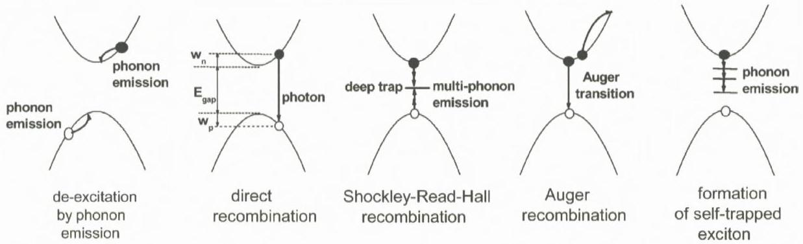
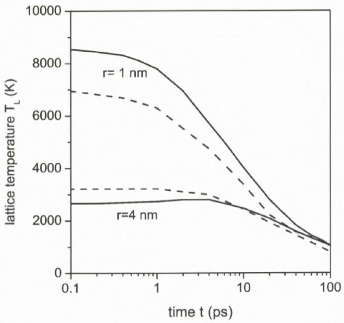
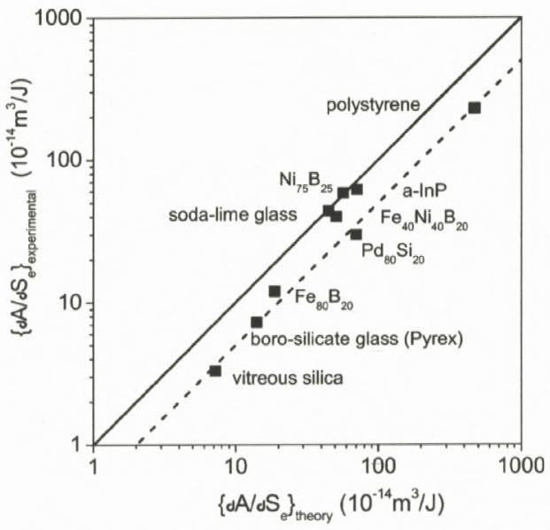
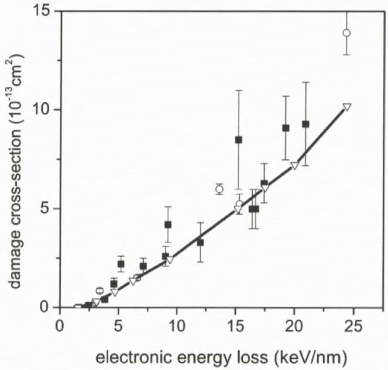
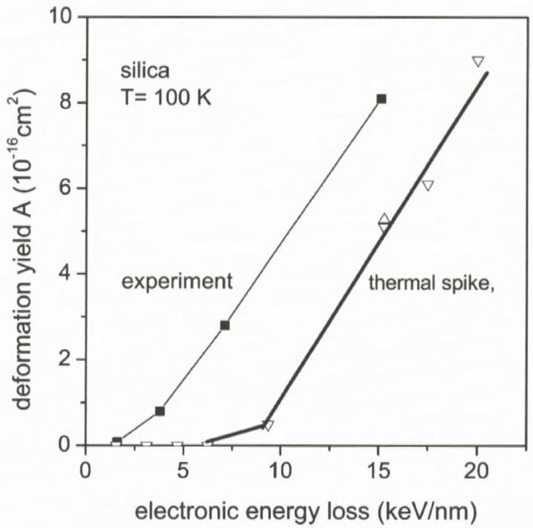
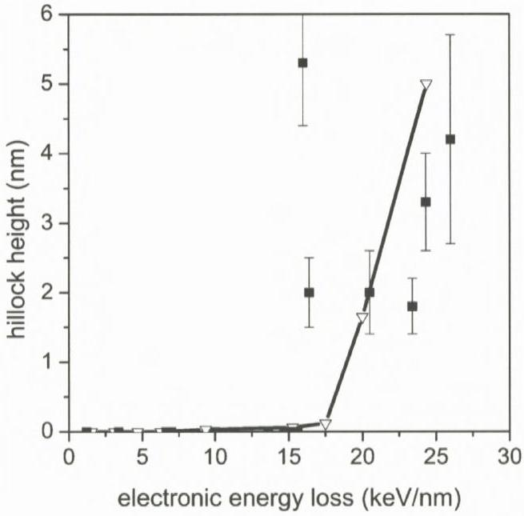

# Thermal-Spike Models for Ion Track Physics: A Critical Examination 

S. Klaumünzer* Ionenstrahllabor, Hahn-Meitner-Institut Glienicker Str. 100, 14091 Berlin, Germany

#### Abstract

Thermal-spike models are often invoked for data interpretation in ion track physics. This work is devoted to a critical examination of these models with respect to links to other fields of physics and with respect to its foundations in non-equilibrium thermodynamics. Presently used thermal-spike models treat electronic excitations in a rather undifferentiated way. Based on the experience of hot-electron energy-transport in semiconductors a more complete approach will be outlined which explicitly distinguishes electrons in conduction bands and holes in valence bands. This model provides a natural basis for the incorporation of recombination processes and is intimately linked to the physics of semiconductors and insulators. Combining a thermal spike with the appropriate constitutive equations, the motion of the fluid track matter can be followed as will be demonstrated for vitreous silica. The calculations reproduce the experiments within a factor of four. Starting from the basis of non-equilibrium thermodynamics, it will be shown that the temperature gradients appearing in the presently used thermal-spike models are too large to meet the pre-requisites of non-equilibrium thermodynamics. Therefore, thermal-spike models can only be used for qualitative to semi-quantitative data interpretation. Deviations between model and experiment by a factor of 2 to 4 must be accepted and are the tribute to the enormous simplifications made.

[^0]
## Contents

1 Introduction ..... 294
2 The Starting Point for Thermal-Spike Models ..... 296
2.1 Insulators and Semiconductors ..... 296
2.2 Metals ..... 298
3 Hydrodynamic and Energy-Transport Models ..... 299
3.1 An Energy-Transport Model for Non-Metals (Grasser et al., 2003a) ..... 299
3.2 Silicon ..... 302
3.3 Quartz and Silica ..... 303
3.4 Metals ..... 304
4 The Thermal-Spike Model of Toulemonde et al. ..... 305
5 The Thermal-Spike Model of Szenes ..... 308
6 Ion Track Mechanics ..... 310
6.1 Ion Hammering of Amorphous Materials ..... 310
6.2 The Effective-Flow-Temperature Approach (EFTA) of Trinkaus ..... 311
6.3 Trinkaus' Constitutive Equations for Ion Hammering ..... 313
7 Elements of Non-Equilibrium Thermodynamics ..... 318
8 Conclusions ..... 322
Acknowledgements ..... 323
References ..... 323

## 1. Introduction

The physics of ion tracks started in 1958, when Young reported on the etching of radiation damage in LiF (Young, 1958). A year later, Silk and Barnes (1959) published the first transmission electron microscopy images of long trails of damage created by fission fragments in mica. The combination of both discoveries generated a boom in research work stimulated by various applications in nuclear physics, geochronology, archaeology, interplanetary science, and radiation dosimetry. Soon after the discovery of ion tracks it became clear that they originated from the excitation and ionization of the target atoms and not from atomic displacements by elastic collisions, a damaging mechanism dominating at ion energies much smaller than $1 \mathrm{MeV} / \mathrm{u}$. It became also clear that the excitation and/or
ionization density had to surpass a material-dependent threshold value in order to generate continuously etchable ion tracks. For example, $1-\mathrm{MeV} \mathrm{He}$ ions were shown to generate tracks in certain polymers, while $100-\mathrm{MeV} \mathrm{Fe}$ ions are needed for track formation in the mineral olivine. At that time, tracks could be detected in many insulators but not in metals, alloys and semiconductors like silicon or germanium. The separation line between track forming and non-track-forming materials was located at an electrical resistivity between $2 \times 10^{3}$ and $2 \times 10^{4} \Omega \mathrm{~cm}$. In 1965, Fleischer, Price and Walker proposed the Coulomb-explosion spike which accounted reasonably well for all experimental data available at that time (Fleischer et al., 1965). A concurring thermal-spike mechanism, originally devised for metals by Lifshitz et al. (1960) and proposed to apply also to insulators by Chadderton (1969), was not sufficiently developed to provide useful predictions. The work of the first fifteen years after the discovery of ion tracks is exhaustively described in the monograph of Fleischer, Price and Walker (1975). The development of the subsequent fifteen years has been summarized by Spohr (1990).

Around 1980, with the advent of large heavy-ion accelerators, much higher excitation and ionization densities became easier accessible. About fifteen years later even larger excitation densities could be realized by fullerene beams. At present, it is well-established that ion tracks can be also generated in metals (Henry et al., 1992; Dammak et al., 1995), alloys (Barbu et al., 1991; Audouard et al., 1990; Trautmann et al., 1993) and semiconductors (Scholz et al., 1993; Canut et al., 1998; Dunlop et al., 1998; Wesch et al., 2004), but the thresholds for track generation are usually larger than those for insulators. Therefore, the experimental data base on ion tracks in insulators is still wider than that for metals and semiconductors.

There have been various attempts (Klaumünzer et al. 1986; Lesueur and Dunlop, 1993) to modify the Coulomb-explosion spike to include the new experimental findings. But a prerequisite for this mechanism, the occurrence of a repulsive Coulomb force of sufficient strength and lifetime, turned out to be not fulfilled since in metals electrical space charges are virtually neutralized within femtoseconds as confirmed by spectroscopy of Auger and convoy electrons (Schiwietz et al., 1992, 2004,; Xiao et al., 1996, 1997). Therefore, it is not surprising that the thermal spike mechanism underwent a renaissance, in particular by the work of Toulemonde et al. (1993a, 1993b), Dufour et al. (1993) and Szenes (1995). An overview on the current experimental situation concerning ion tracks in insulators and on thermal-spike models is given by Toulemonde et al. (2006).

Thermal-spike models are not only used in ion-track physics, but also to describe the behavior of excited carriers generated by femtosecond lasers or by strong electrical fields in submicron semiconductor devices. Though these various
models deal with similar physical problems, they do not take much notice of each other. The consequence is that knowledge, which has been gained in one field, is not transferred to the others. A severe deficiency of the currently used thermalspike models in ion track physics is the missing distinction between the two kinds of excitations in semiconductors and insulators, namely electrons in the conduction band and holes in the valence band. However, this distinction is essential to exploit the wealth of information available in the physics of semiconductors and insulators.

In Section 2, I briefly summarize what is known about electron-hole formation by fast ions in semiconductors and insulators. The key quantity is the so-called W-value which is the average energy needed to generate an electron-hole pair. With this quantity a surprising result will be obtained: the sum of the average kinetic energies of holes and electrons is independent of the radial distance from the ion trajectory. This result can be taken as the starting point for a thermalspike model, which explicitly distinguishes holes and electrons. Such a model is outlined in Section 3 and compared to the thermal-spike models of ion track physics in Sections 4 and 5.

A common basis of all thermal-spike models is the validity of classical heat transport as it is described by Fourier's law. However, guided by their molecular dynamics simulations based on a Lennard-Jones potential, Bringa and Johnson (1998) argued that energy transport after ion impact does not follow classical heat conduction. Additionally, they pointed out that the atomic motion in the track, together with energy fluctuations and inertia effects should not be ignored. While atomic motion and inertia effects can easily be incorporated into thermal-spike models (see Section 6), the inadequacy of classical heat transport remains a central and unsolved issue. In Section 7 it will be shown that the inadequacy of classical heat transport is not a peculiarity of the Lennard-Jones potential but follows from an inadequate use of non-equilibrium thermodynamics.

## 2. The Starting Point for Thermal-Spike Models

### 2.1. Insulators and Semiconductors

Most of the ion-track research has been done at kinetic ion energies between 1 and $10 \mathrm{MeV} / \mathrm{u}$, where the electronic stopping power $S_{\mathrm{e}}$ is maximal. A $5-\mathrm{MeV} / \mathrm{u}$ projectile (projectile velocity $v_{\text {ion }}=3.1 \times 10^{7} \mathrm{~m} / \mathrm{s}$ ) traverses 100 atomic layers in 1 fs and interacts primarily with the electrons of the target atoms. Thus, if the projectile charge is sufficiently large, a cylindrical trail of excited and/or ionized target atoms is created on a femtosecond time-scale. In a solid with sufficiently large gap en-
ergy $E_{\text {gap }}$ between valence band and conduction band, screening of the projectile can be ignored. The radius $b_{\text {max }}$ of the primary interaction can be obtained from Bohr's adiabatic principle (Mozumder, 1974) and is for non-relativistic ions

$$
b_{\max }=\frac{\hbar v_{\text {ion }}}{2 E_{\text {gap }}}
$$

For the ion energy range of interest, $b_{\text {max }}$ is of the order of 1 nm . Assuming Coulomb interaction between projectile and target electrons the differential crosssection $\mathrm{d} \sigma / \mathrm{d} w$ for an energy transfer between $w$ and $w+\mathrm{d} w$ is proportional to $1 / w^{2}$ (Leibfried, 1965). For a free electron gas the mean transferred energy to an electron is

$$
\langle w\rangle=\frac{\int_{w_{\min }}^{w_{\max }} w(\mathrm{~d} \sigma / \mathrm{d} w) \mathrm{d} w}{\int_{w_{\min }}^{w_{\max }}(\mathrm{d} \sigma / \mathrm{d} w) \mathrm{d} w}=w_{\min } \log \frac{w_{\max }}{w_{\min }},
$$

with the maximum transferable energy

$$
w_{\max }=4 \frac{M_{\text {ion }} m_{\mathrm{e}}}{\left(M_{\text {ion }}+m_{\mathrm{e}}\right)^{2}} E_{\text {ion }},
$$

where $M_{\text {ion }}$ and $m_{\mathrm{e}}$ denote the ion and the electron mass, respectively, and $E_{\text {ion }}$ the projectile energy. For a $5-\mathrm{MeV} / \mathrm{u}$ projectile $w_{\text {max }}$ is about 11 keV . In insulators and semiconductors the minimum transferable energy $w_{\text {min }}$ is $E_{\text {gap }}$. With these values, Equation (2) yields $\langle w\rangle=10.5 \mathrm{eV}$ for silicon ( $E_{\text {gap }}=1.15 \mathrm{eV}$ ) and $\langle w\rangle=82 \mathrm{eV}$ for quartz $\left(E_{\text {gap }}=12 \mathrm{eV}\right)$. Obviously, the primary effect of the ionelectron interaction is the production of electron-hole pairs with average kinetic energies of $\langle w\rangle-E_{\text {gap }}$. For both solids the relation $\langle w\rangle-E_{\text {gap }} \gg E_{\text {gap }}$ holds, so that further electron-hole pairs can be generated until the kinetic energy of the colliding participants falls below $E_{\text {gap }}$. The time-scale of this electron-hole production process depends on the electron-impact ionization rate, which is for electrons (holes) in silicon and quartz 5 eV above (below) the gap about $10^{14} \mathrm{~s}^{-1}$ and $10^{15} \mathrm{~s}^{-1}$, respectively (Cartier et al., 1993; Oguzman et al., 1995; Arnold et al., 1994; Kunikiyo et al., 2003). Thus, on a time-scale of 10 fs a heavy fast ion generates an electron-hole plasma, which can be described by electron and hole distribution functions $f_{n}(\mathbf{r}, \mathbf{k}, t)$ and $f_{p}(\mathbf{r}, \mathbf{k}, t)$ in the phase space $(\mathbf{r}, \mathbf{k})$ and time $t$. In principle, the further evolution of $f_{n}(\mathbf{r}, \mathbf{k}, t)$ and $f_{p}(\mathbf{r}, \mathbf{k}, t)$ has to be described by Boltzmann transport equations and requires an adequate specification of the relevant scattering processes. A full solution of these equations involves enormous computational work and has not yet been performed. An early treatment based on a hydrodynamical fluid approach of the electron-hole plasma generated by the passage of a fast ion has been given by Ritchie and Claussen (1982).

In another approach, electron-energy-transport calculations have been performed, but were limited to short times and based on Monte-Carlo methods with simplified material parameters (Hamm et al., 1979; Gervais and Bouffard, 1994; Bouffard, 1996). It is well established that momentum transfers between the projectile ion and target electrons lead to an initial electrical space charge. However, quasi-neutralization occurs within a few femtoseconds (see Section 3) and in most calculations of radial dose distributions $D(r, t)$ space charge effects are not included. Because of the importance of radiation protection, much effort has been put in calculating the radial dose distribution in water and comparing these results with measurements on tissue-equivalent gases after rescaling to the density of water. With appropriate modifications arising from different mass densities and ignoring differences in electronic band structure, these results have also been applied to solids (Katz et al., 1990). With the radial dose distribution $D\left(r, t_{0}\right)$ with $t_{0}>10 \mathrm{fs}$ after the ion's passage the number density of electrons $n\left(r, t_{0}\right)$ in the conduction band and the number density of holes $p\left(r, t_{0}\right)$ in the valence band can be obtained from

$$
n\left(r, t_{0}\right)=p\left(r, t_{0}\right)=\frac{D\left(r, t_{0}\right)}{W} .
$$

For the average energy $W$ required to generate an electron-hole pair, theory predicts $W \approx 3 E_{\text {gap }}$, a relation which is well confirmed by experiments - in silicon even up to high excitation densities (Alig and Bloom, 1975; Ogihara et al., 1986; Seidl et al., 2001). If we denote with $w_{n}\left(r, t_{0}\right)$ and $w_{p}\left(r, t_{0}\right)$ the average kinetic energies of electrons and holes, energy conservation demands

$$
n\left(r, t_{0}\right)\left(w_{n}\left(r, t_{0}\right)+w_{p}\left(r, t_{0}\right)\right)=D\left(r, t_{0}\right)-n\left(r, t_{0}\right) E_{\text {gap }}
$$

or, by dividing by $n\left(r, t_{0}\right)$

$$
w_{n}\left(r, t_{0}\right)+w_{p}\left(r, t_{0}\right) \approx 2 E_{\text {gap }} .
$$

The surprising message of relation (5) is that the average kinetic energy per electron-hole pair is independent of the distance $r$ from the ion trajectory. If we assume Boltzmann statistics for the electron-hole plasma and $w_{n}=w_{p}$ we obtain from Equation (5) an initial ( $t_{0} \sim 10 \mathrm{fs}$ ) electron temperature $T_{n}=2 E_{\text {gap }} /\left(3 k_{\mathrm{B}}\right) \approx 9 \times 10^{3} \mathrm{~K}$ for silicon and $9 \times 10^{4} \mathrm{~K}$ for quartz. A priori, there is no reason that $w_{n}$ and $w_{p}$ are equal. For quartz, $w_{p} \approx 0.5 w_{n}$ might be more appropriate (Mizuno et al., 1993 ) resulting in an electron temperature $T_{n}=8 E_{\text {gap }} /\left(9 k_{\mathrm{B}}\right) \approx 1.2 \times 10^{5} \mathrm{~K}$ and a hole temperature $T_{p} \approx 4 E_{\text {gap }} /\left(9 k_{\mathrm{B}}\right) \approx 0.6 \times 10^{5} \mathrm{~K}$. The estimate for silicon compares reasonably well with the experimental electron temperatures obtained from Auger electron spectroscopy. Depending on the interaction strength the $\mathrm{Si}- \mathrm{L}^{1} \mathrm{VV}$ transition (half-life 15 fs ) yields electron temperatures between $7 \times 10^{3}$ and
$1.6 \times 10^{4} \mathrm{~K}$ (Schiwietz et al., 2004). The same authors (Staufenbiel et al., 2005) report for the same irradiation conditions electron temperatures of $>4.9 \times 10^{4} \mathrm{~K}$. In fact, the extracted electron temperatures depend sensitively on the silicon band structure used in the data evaluation process. In the work of Staufenbiel et al. (2005), a simplified data evaluation has been performed and the obtained electron temperatures are too high (Schiwietz, 2006). Unfortunately, no experimental values are available for quartz.

### 2.2. Metals

In metals and semi-metals $b_{\text {max }}$ is limited by conduction electron screening. Applying again Bohr's adiabatic principle one obtains (Mozumder, 1974)

$$
b_{\max }=1.12 \frac{v_{\text {ion }}}{\Omega_{\text {plasma }}},
$$

where $\Omega_{\text {plasma }}$ is the plasma frequency of the electron gas. Assuming again a free electron gas, $w_{\text {min }}$ for metals and semi-metals can be estimated by (Leibfried, 1965).

$$
w_{\min }=\frac{Z_{\text {ion, eff }}^{2} q^{4}}{4 \pi^{2} \varepsilon_{0}^{2} b_{\max }^{2} w_{\max }^{2}+Z_{\text {ion, eff }}^{2} q^{4}} w_{\max },
$$

where $Z_{\text {ion, eff }}$ denotes the effective projectile charge, $\varepsilon_{0}$ the dielectric permittivity and $q$ the (positive) elementary charge. With $b_{\text {max }}$ from Equation (6) we find for a typical metal $w_{\text {min }} \sim 4 \mathrm{eV}$ and thus $\langle w\rangle \sim 30 \mathrm{eV}$. In contrast to semiconductors and insulators, the excited electrons and holes in metals belong to the same band. Thermalization within the electronic system occurred within $\sim 10$ fs and holes need not to be considered any longer. The excitation energy is shared among many conduction band electrons around the ion trajectory and, different from insulators or semiconductors, the concentration of conduction electrons is virtually independent of the distance from the ion trajectory in a spatially homogeneous material.

## 3. Hydrodynamic and Energy-Transport Models

In semiconductor devices of sub-micrometer dimensions hot electrons can be generated by strong electrical fields. For simulation of such devices, however, the Boltzmann transport equation is computationally very expensive. A common simplification is to investigate only the first three or four moments of the electron and hole distribution functions, which lead directly back to macroscopic transport
models, called in literature hydrodynamic or energy-transport models. A recent review of hydrodynamic and energy-transport models has been given by Grasser et al. (2003a). The various models differ in the number of moments considered and/or in the approximations made in the collision term of the Boltzmann equation. The advantage of these models is that their input and output can be directly taken from or compared with experiment. However, it has turned out that the first three moments are not sufficient to describe high-electron-mobility devices of dimensions of the order of $\sim 100 \mathrm{~nm}$. At present, there are models incorporating even the sixth moment of the Boltzmann transport equation (Grasser et al., 2003b). Because track formation occurs on a length scale much smaller than the currently envisaged electronic devices, it is possible that a reduction of the Boltzmann transport equation to macroscopic transport models may lead to serious errors. This problem will be readdressed in Section 7. In the following a three-moment model will be outlined in order to demonstrate a thermal-spike model for ion track formation, which explicitly distinguishes electrons and holes.

### 3.1. An Energy-Transport Model for Non-Metals (Grasser et AL., 2003A)

Assume that within $\sim 10$ fs electron-hole production has finished and electronhole collisions brought the carriers locally into thermal equilibrium. Because electrons and holes belong to different bands the corresponding energy distributions are characterized by different temperatures. The atomic motion is characterized by the lattice temperature $T_{\mathrm{L}}$. The basic equations for mobile charge carriers in semiconductors and insulators are the Poisson equation and the continuity equations:

$$
\begin{aligned}
& \operatorname{div}\left(\varepsilon_{\text {rel }} \varepsilon_{0} \operatorname{grad} \varphi\right)=q\left(n-p-c_{\text {dop }}\right), \\
& \operatorname{div} \mathbf{j}_{n}-q \frac{\partial n}{\partial t}=q\left(R_{\text {dir }}+R_{\text {SHR }}+R_{\text {Auger }}+R_{\text {self trap }}+\cdots\right), \\
& \operatorname{div} \mathbf{j}_{p}+q \frac{\partial p}{\partial t}=-q\left(R_{\text {dir }}+R_{\text {SHR }}+R_{\text {Auger }}+R_{\text {self trap }}+\cdots\right),
\end{aligned}
$$

where $\varphi$ denotes the electrostatic potential, $\varepsilon_{\text {rel }}$ the relative dielectric constant, and $c_{\text {dop }}$ the concentration of ionized dopants. In the following we assume $c_{\text {dop }}=0$. On the right hand side of formulae (9) and (10), the $R$ 's denote various recombination processes in semiconductors and insulators (Figure 1). $R_{\mathrm{dir}}$ denotes the recombination rate of charge carriers by photon emission, which transports energy out of the track region because the probability of immediate reabsorption is

Figure 1. A schematic representation of the various de-excitation and recombination mechanisms important in semiconductors and insulators.

low. Direct recombination is particularly important in direct semiconductors like InP and GaAs. Instead of photon emission, carrier recombination can also take place by the simultaneous emission of many phonons. This process, however, is extremely improbable. But the probability of carrier recombination increases by orders of magnitude when defects or impurities exist, which have electronic states in the mid-gap region (Hall, 1952; Shockley and Read, 1952). These deep traps act as catalysts for recombination, characterized by the Shockley-HallRead recombination rate $R_{\text {SHR }}$. The recombination energy is roughly $E_{\text {gap }}$ and is transferred to the lattice. The third recombination process is the internal Auger effect. It is particularly important at high carrier densities and is characterized by a recombination rate $R_{\text {Auger }}$. In this process the recombination energy contributes to electron heating. While these three recombination mechanisms are the most important ones in semiconductors, there exists another route of recombination in wide-gap insulators of low atomic density, like quartz, $\mathrm{LiNbO}_{3}$ and polymers. Due to their opposite electrical charges, electrons and holes attract each other forming exciton states in the band gap. It is possible that the nearby lattice atoms undergo successive atomic rearrangements with simultaneous phonon generation so that the electron-hole pair is strongly bound and immobilized - a self-trapped exciton. The formation rate is denoted by $R_{\text {self }}$.

In the energy-transport model the current densities for electrons and holes read

$$
\begin{aligned}
& \mathbf{j}_{n}=-q \mu_{n} n \operatorname{grad} \varphi+k_{\mathrm{B}} \mu_{n} \operatorname{grad}\left(n T_{n}\right), \\
& \mathbf{j}_{p}=-q \mu_{p} p \operatorname{grad} \varphi-k_{\mathrm{B}} \mu_{p} \operatorname{grad}\left(p T_{p}\right),
\end{aligned}
$$

where $\mu_{n}$ and $\mu_{p}$ denote the mobilities of electrons and holes, respectively. In Equations (11) and (12) it is assumed that the band structure of the material in spatially homogeneous. In bilayer or multilayer materials, additional terms have
to be added, which take into account spatial band structure variations. Energy conservation demands

$$
\begin{aligned}
\operatorname{div} \mathbf{S}_{n}= & -\mathbf{j}_{n} \operatorname{grad} \varphi-\frac{3}{2} k_{\mathrm{B}}\left(\frac{\partial\left(n T_{n}\right)}{\partial t}+\frac{T_{n}-T_{\mathrm{L}}}{\tau_{n}} n+T_{n} R_{\mathrm{dir}}\right) \\
& +R_{\text {Auger }} E_{\mathrm{gap}}, \\
\operatorname{div} \mathbf{S}_{p}= & -\mathbf{j}_{p} \operatorname{grad} \varphi-\frac{3}{2} k_{\mathrm{B}}\left(\frac{\partial\left(p T_{p}\right)}{\partial t}+\frac{T_{p}-T_{\mathrm{L}}}{\tau_{p}} p+T_{p} R_{\mathrm{dir}}\right), \\
\operatorname{div} \mathbf{S}_{\mathrm{L}}= & -\rho_{\mathrm{L}} c_{\mathrm{L}} \frac{\partial T_{\mathrm{L}}}{\partial t}+\frac{3}{2} k_{\mathrm{B}}\left(n \frac{T_{n}-T_{\mathrm{L}}}{\tau_{n}}+p \frac{T_{p}-T_{\mathrm{L}}}{\tau_{p}}\right) \\
& +R_{\mathrm{SRH}} E_{\text {gap }}+R_{\text {self trap }}\left(E_{\text {gap }}-E_{\mathrm{exc}}\right)
\end{aligned}
$$

with the energy fluxes

$$
\begin{aligned}
& \mathbf{S}_{n}=-\kappa_{n} \operatorname{grad} T_{n}-\frac{5}{2} k_{\mathrm{B}} T_{n} \frac{\mathbf{j}_{n}}{q} \\
& \mathbf{S}_{p}=-\kappa_{p} \operatorname{grad} T_{p}+\frac{5}{2} k_{\mathrm{B}} T_{p} \frac{\mathbf{j}_{p}}{q} \\
& \mathbf{S}_{\mathrm{L}}=-\kappa_{\mathrm{L}} \operatorname{grad} T_{\mathrm{L}}
\end{aligned}
$$

where it has been assumed that the carriers obey Boltzmann statistics. $\tau_{n}$ and $\tau_{p}$ are average energy relaxation times for electrons and holes, respectively, due to interaction with the lattice. The various energy terms arising from the recombination processes can be inferred from Figure 1.

Using a generalized Wiedemann-Franz law, the thermal conductivity of the electrons is given by (Stratton, 1962; Grasser et al., 2003a)

$$
\kappa_{n}=\left(\frac{5}{2}+c_{n}\right) \frac{k_{\mathrm{B}}^{2}}{q} T_{n} \mu_{n} n
$$

and that of holes

$$
\kappa_{p}=\left(\frac{5}{2}+c_{p}\right) \frac{k_{\mathrm{B}}^{2}}{q} T_{p} \mu_{p} p \text {, }
$$

where $c_{n}$ and $c_{p}$ denote correction factors, the numerical values of which depend on the details of the collision term in the Boltzmann transport equation. $\kappa_{\mathrm{L}}$ is the phonon thermal conductivity.

For insulators and semiconductors, Equations (8) to (20) represent a closed set of differential equations which, in principle, can be solved if $\mu_{n}, \tau_{n}, c_{n}, \mu_{p}, \tau_{p}, c_{p}$ and the recombination rates are specified. At least for technologically relevant semiconductors data are available in the literature. In this paper, Equations (8) to (20) will not be solved but two limiting cases will be considered. The first case is silicon in which carrier trapping and recombination do not play a role on a timescale relevant for track formation (< 100 ps ). Another limiting case is represented by quartz and vitreous silica in which the formation of self-trapped excitons is the dominating recombination process.

### 3.2. Silicon

Experiments have shown that in silicon the average energy for electron-hole production W varies by less than $5 \%$ going from low-density charge carrier production by x-ray radiation to high-density charge carrier production by 3 $\mathrm{MeV} / \mathrm{u}$ Au ion bombardment (Alig and Bloom, 1975; Ogihara et al., 1986). The concomitant small deficit in charge collection in surface-barrier silicon-detectors implies that trapping and recombination of carriers are unimportant, i.e. all $R_{i}$ terms vanish in Equations (9, 10), and (13-15). Furthermore, in silicon the energy relaxation times for electrons and holes, $\tau_{n}$ and $\tau_{p}$, are equal and are between 0.15 and 0.3 ps (Sekido et al., 1991; Bordelon et al., 1991; Roldan et al., 1996). These relaxation times are much longer than the equilibration times set by electronelectron and electron-hole collisions (Yoffa, 1980). Therefore, on a time-scale of 10 fs , the interacting electron-hole system is in a quasi-adiabatic state, which implies $T_{n}=T_{p}$.

Due to momentum transfers during the collisions between projectile ions and target electrons, there is an electrical charge proportional to $(n-p)$. The emerging electrical field in combination with the high mobility of the carriers in silicon must lead to a rapid quasi-neutralization. The neutralization time $t_{\text {neutr }}$ can be estimated from the Debye screening length and the mobility of the fastest carrier (Lifshitz and Pitajewski, 1983)

$$
t_{\text {neutr }}=\frac{\varepsilon_{0} \varepsilon_{\mathrm{rel}}}{q \mu_{n}\left(T_{\mathrm{L}}, T_{n}\right) n},
$$

where $\mu_{n}$ is given by (Grasser et al., 2003a)

$$
\mu_{0}\left(T_{\mathrm{L}}, T_{n}\right)=\frac{\mu_{n}\left(T_{\mathrm{L}}\right)}{1+\left[3 k_{\mathrm{B}} \mu_{0}\left(T_{\mathrm{L}}\right) / 2 q \tau_{n} v_{\mathrm{sat}}^{2}\right]\left(T_{n}-T_{\mathrm{L}}\right)} .
$$

Assuming a cold lattice with $T_{\mathrm{L}}=300 \mathrm{~K}$ and a hot electron-hole plasma with $T_{n}=10^{4} \mathrm{~K}$ and an electron-hole density of $n=10^{21} \mathrm{~cm}^{-3}$ we obtain $\mu_{n} \approx$
$12 \times 10^{-2} \mathrm{~cm}^{2} / \mathrm{Vs}$ and $t_{\text {neutr }} \approx 0.5 \mathrm{fs}$, where we have used the literature data for crystalline silicon $\mu_{0}(300 \mathrm{~K})=1430 \mathrm{~cm}^{2} / \mathrm{Vs}, \varepsilon_{\text {rel }}=11.9, \tau_{n}=0.15 \mathrm{ps}$, and $v_{\text {sat }}=10^{7} \mathrm{~cm} / \mathrm{s}$ (Bordelon et al., 1991). Quasi-neutralization and thermalization within the electron-hole system occur approximately on the same time-scale.

Perfect neutralization would be given by $n=p$ and any electrical field would vanish (grad $\varphi=0$ in Equation (8)). Adding Equations (9) and (10), one obtains $\operatorname{div}\left(\mathbf{j}_{n}+\mathbf{j}_{p}\right)=\partial(n-p) / \partial t=0$ implying $j_{n}=-j_{p}$. However, this relation is only compatible with formulae (11) and (12) if $\mu_{n}=\mu_{p}$ holds. This is usually not the case and charge neutralization cannot be perfect. Therefore, in crystalline silicon a small ion track potential is expected as it has been measured by Auger electron spectroscopy (Schiwietz et al., 2003). For $t>t_{\text {neutr }}$ electron and hole diffusion is coupled by an electric field; this effect is long known in semiconductor physics and called ambipolar diffusion.

### 3.3. Quartz and Silica

In silica the electrons move much faster than the holes. Using $\mu_{0}(300 \mathrm{~K})= 20 \mathrm{~cm}^{2} / \mathrm{Vs}$ (Hughes, 1973), $v_{\text {sat }} \approx 2 \times 10^{7} \mathrm{~cm} / \mathrm{s}$ (Hughes, 1975), $\varepsilon_{\text {rel }}=2.4$ and $T_{n}=1 \times 10^{5} \mathrm{~K}$ one obtains from Equations (21) and (22) $\mu_{n}=1 \mathrm{~cm}^{2} / \mathrm{Vs}$ and $\tau_{\text {neutr }}=2 \mathrm{fs}$. Like in silicon only a small track potential is expected. Electrons and holes with kinetic energies $<2 \mathrm{eV}$ couple strongly to longitudinal optical phonons. For conduction electron energies $>2 \mathrm{eV}$ acoustic phonon emission becomes also important. In this energy range, the energy relaxation time $\tau_{n}$ is about 0.1 ps (Arnold et al., 1994). After quasi-neutralization and cooling of the carriers by electron-phonon coupling the potential energy, which is still stored in electronhole pairs, is partially released by the formation of self-trapped excitons. Laser experiments have shown that the mean trapping time is about 0.15 ps (Audebert et al., 1994; Guizard et al., 1996a, 1996b), only slightly longer than the energy relaxation time. On a timescale of 0.15 ps , mobile carriers disappear ( $n=p=0$ in Equations (8) to (20)) implying that energy transport in the electron-hole system has finished and energy is dissipated only by phonons. According to IsmailBeigi and Louie (2005) the potential energy stored in the self-trapped exciton is $E_{\mathrm{exc}} \sim 7 \mathrm{eV}$. Thus, the fraction $1-f$ of the energy not yet converted to heat in the atomic system is $7 \mathrm{eV} / 3 \mathrm{E}_{\text {gap }} \approx 0.2$ (cf. Sections 5 and 6).

For $T_{\mathrm{L}}>300 \mathrm{~K}$ self-trapped excitons often relax non-radiatively and form lattice defects ( $E^{\prime}$-centers, etc.). Thus, a track may form when the density of self-trapped excitons is sufficiently large. This mechanism has been proposed by Itoh (1996). In fact, the measured track radii can be quantitatively well explained when the exciton density matches the atomic density of quartz. However, Itoh's mechanism ignores (i) the large amount of heat in the atomic system prior to
exciton formation and (ii) the interaction between the excitons which must occur at such high exciton densities. Perhaps, the correct solution is lattice instability (Stampfli, 1996).

Of course, not all wide-gap insulators exhibit self trapping of excitons. For example, laser experiments showed that in $\mathrm{Al}_{2} \mathrm{O}_{3}$ and MgO excited electrons are not trapped within 50 ps (Guizard et al., 1996a, 1996b). Nevertheless, in both materials ion track effects can be clearly detected (Canut et al., 1995; Thevenard et al., 1996). These wide-gap materials have to be treated more or less along the route as outlined for silicon.

### 3.4. Metals

In metals, the lifetime of holes in the conduction band is smaller than 20 fs , if their kinetic energy is more than 3 eV below the Fermi-energy (Campillo et al., 2000). Therefore, we have $p=0$ in Equations (8) to (20) for $t>20$ fs and all recombination processes vanish. In Equation (8), now $q c_{\text {dop }}$ denotes the charge density of the positive jellium background. In the presence of a time-dependent temperature gradient, a closer inspection of Equations (8) to (11) shows that even in metals an ion track potential must exist and $\mathbf{j}_{n}$ cannot vanish completely. From an experimental point of view we only know that the nuclear track potential for metals is below the experimental resolution limit of $\pm 0.4 \mathrm{eV}$ (Staufenbiel et al., 2005). Nevertheless, it is often assumed that terms containing $\mathbf{j}_{n}$ can be neglected. With this assumption the energy-transport model yields for metals

$$
\begin{aligned}
& C_{n} \frac{\partial T_{n}}{\partial t}=\operatorname{div}\left(\kappa_{n} \operatorname{grad} T_{n}\right)-C_{n} \frac{T_{n}-T_{\mathrm{L}}}{\tau_{n}}, \\
& C_{\mathrm{L}}=\frac{\partial T_{\mathrm{L}}}{\partial t}=\operatorname{div}\left(\kappa_{\mathrm{L}} \operatorname{grad} T_{\mathrm{L}}\right)+C_{n} \frac{T_{n}-T_{\mathrm{L}}}{\tau_{n}},
\end{aligned}
$$

where we have written $C_{n}=3 / 2 n k_{\mathrm{B}}$ as specific heat of the electron system.
The same two-temperature model is used to successfully describe the evolution of an electron gas in metals after laser excitation (Rethfeld et al., 2002). One of the basic assumptions of the energy-relaxation model is that the energy relaxation time $\tau_{n}$ is independent of the average kinetic energy of the electrons. Therefore, the energy relaxation times obtained from laser excitation experiments should be same as those used to describe ion track formation.

## 4. The Thermal-Spike Model of Toulemonde et al.

In the thermal-spike model of Toulemonde et al. (1993a, 1993b, 1996) and Meftah et al. (2005) the target solid is divided into the electronic system and the atomic system (phonons). Electrons and holes are not distinguished. Both systems are coupled by electron-phonon interaction. It is also assumed that the energy deposited in the electronic system by the projectile ion is thermalized with a time constant $\tau_{\mathrm{e}} \approx 10^{-15} \mathrm{~s}$ by electron-electron scattering. The evolution of the two systems is described by two coupled differential equations, one for the electronic system

$$
C_{n} \frac{\partial T_{n}}{\partial t}=\operatorname{div}\left(\kappa_{n} \operatorname{grad} T_{n}\right)-g\left(T_{n}-T_{\mathrm{L}}\right)+B(r, t)
$$

and one for the atomic system

$$
C_{\mathrm{L}}\left(T_{\mathrm{L}}\right) \frac{\partial T_{\mathrm{L}}}{\partial t}=\operatorname{div}\left(\kappa_{\mathrm{L}} \operatorname{grad} T_{\mathrm{L}}\right)+g\left(T_{n}-T_{\mathrm{L}}\right)
$$

where $g$ denotes the electron-phonon coupling parameter. $B(r, t)$ is the energy density per unit time deposited by an incident ion at radius $r$ and at time $t$. It is assumed that $B(r, t)$ has the form

$$
B(r, t)=c D(r) \frac{\mathrm{e}^{-t / \tau_{\mathrm{e}}}}{\tau_{\mathrm{e}}}
$$

The choice of $\tau_{\mathrm{e}}$ is not critical; variation of $\tau_{\mathrm{e}}$ by a factor of 5 does not alter the final results. The radial dose distribution $D(r)$ is usually taken from microdosimetry and the normalization constant c ensures energy conservation

$$
2 \pi \int_{t=0}^{\infty} \int_{r=0}^{\infty} B(r, t) r \mathrm{~d} r \mathrm{~d} t=S_{\mathrm{e}}
$$

Apart from $B(r, t)$, which can be simulated by appropriate initial conditions, formulae (25) and (26) are identical with Equations (23) and (24) if $g=C_{n} / \tau_{n}$ is taken. Therefore, the application of Equations (25) and (26) to metals and metallic alloys (Wang et al., 1994) is, apart from the terms $\sim \mathbf{j}_{n}$, compatible with the energy transport model. $C_{n}$ can be calculated from formulas of solid-state physics textbooks if the electron density or the density of states at the Fermi energy are known. The electron thermal conductivity $\kappa_{\mathrm{e}}$ can be calculated from the electrical conductivity $\sigma_{\mathrm{e}}$ by applying the Wiedemann-Franz law. The specific heat $C_{\mathrm{L}}$ can be taken either from measured values (after subtraction of $C_{n}$ ) or from the rule of Dulong-Petit in the case of elemental metals or Knoop's rule in the case of
alloys. Because $\kappa_{\mathrm{L}}$ is usually only a minor contribution to the total conductivity, the phonon thermal conductivity is difficult to determine from experimental data. Alternatively, $\kappa_{\mathrm{L}}$ may be determined using the relation

$$
\kappa_{\mathrm{L}}=\frac{1}{3} C_{\mathrm{L}} v_{\mathrm{ph}} \ell_{\mathrm{ph}}
$$

where $v_{\mathrm{ph}}$ denotes an appropriately averaged phonon group velocity. For $T_{\mathrm{L}}$ much larger than the Debye temperature the mean free path of the phonons $\ell_{\mathrm{ph}}$ can be estimated from (Ziman, 1975)

$$
\ell_{\mathrm{ph}}=\frac{20}{\left\langle\gamma^{2}\right\rangle} \frac{T_{M}}{T_{\mathrm{L}}} a,
$$

where $\left\langle\gamma^{2}\right\rangle$ is the squared Grüneisen parameter averaged over all phonon modes, $T_{\mathrm{m}}$ the melting temperature and $a$ the lattice constant. For most materials $\left\langle\gamma^{2}\right\rangle$ is typically between 2 and 6. Thus, at $T_{\mathrm{L}}=T_{\mathrm{m}}$, the phonon mean free path is between 1 and 3 nm . The electron-phonon coupling parameter can be obtained from the work of Lifshitz et al. (1960), in which a free-electron gas model has been used, or from the work of Allen (1987), where the modern solid-state physics language is used.

In applying their model to insulators, Toulemonde et al. (1993a, 1993b) ignore that the carriers of heat in the valence and conduction band are just the holes and electrons generated by the projectile. Hole and electron densities vary as a function of distance from the ion's path as outlined in Section 2, and, as shown in Section 3, the (assumed) diffusive motion of the carriers changes both the spatial energy density and the carrier density. The assumption $C_{n}=1 \mathrm{~J} /\left(\mathrm{cm}^{3} \mathrm{~K}\right)$ and $K_{n}=2 \mathrm{~W} / \mathrm{cmK}$ for all insulators and being independent of space and time (Toulemonde et al., 1996; Meftah et al., 2005) cannot be maintained. The assumption of constant carrier densities in space and time also implies that the energy input by the passage of the fast ion appears fully as kinetic energy of the carriers as described by formulae (27) and (28). Therefore, when electron-hole production is explicitly considered, these two equations also cannot be maintained. Without following electron-hole production in detail, the concept of the W-value provides a great simplification in answering the question in which way the energy input is partitioned in carrier production and in their kinetic energy (see Section 2).

In the thermal-spike model of Toulemonde et al., the electron-phonon parameter $g$ is treated as a free parameter and adjusted to give optimum agreement with the measured radii of amorphous tracks in crystalline solids. An amorphous track is postulated to form whenever the lattice temperature exceeds the equilibrium melting temperature $T_{\mathrm{m}}$ of the solid. With this criterion, Toulemonde et al.
(1996) and Meftah et al. (2005) succeeded in modeling track radii as a function of stopping power for a variety of insulators. Additionally, the stopping power threshold $S_{e 0}$ for track formation and the velocity effect (Toulemonde et al., 2006) could be described. Interestingly, a correlation has been found between a so-called mean diffusion length $\lambda$ and $E_{\text {gap }}$, where $\lambda$ is defined by $\lambda^{2}=\kappa_{n} \tau_{n} / C_{n}$. The larger the gap the smaller $\lambda$ is (Toulemonde et al., 2006). For example, for quartz $\lambda=4 \mathrm{~nm}$ was obtained implying $\tau_{n}=0.08 \mathrm{ps}$. This value is not too far from the energy-relaxation time of 0.1 ps as determined from laser experiments (Arnold et al., 1994). It will be interesting to see whether the discovered correlation finds a natural explanation in the energy-transport model.

The use of equilibrium melting temperatures as a criterion for the determination of track radii cannot be maintained from the viewpoint of thermodynamics, because nucleation of the new phase requires some time, leading to superheating. Classical nucleation theory predicts spontaneous decay of crystalline order when the maximum superheating temperature is exceeded. This maximum superheating temperature scales roughly with the melting temperature and is about 500 K for a material with a melting point of 2000 K and at a heating rate of $10^{14} \mathrm{~K} / \mathrm{s}$ (Luo et al., 2003). A similar problem appears upon cooling of the molten track below $T_{\mathrm{m}}$ when recrystallization starts at the melt-crystal interface and proceeds inwards, diminishing the measurable track radius. Both, the kinetics of the decay of the crystalline order and its partial reestablishment have to be followed in greater detail before a comparison with experimental track radii is justified. The importance of this statement can be nicely illustrated in the case of track formation in glasses, which have no well defined melting point but exhibit gradual softening and a continuous transition to the melt. An example will be given in Section 6.

## 5. The Thermal-Spike Model of Szenes

Instead of following the complicated history of electron-hole formation, recombination, diffusion, thermalization and trapping, Szenes (1995) rigorously simplified the problem by treating the lattice system only. Time zero is chosen when the lattice temperature on the track axis attains its maximum value. The physics at earlier times is not considered. Assuming an "initial" Gaussian lattice temperature distribution of width $a(0)$, the solution of the transport equation for heat (Equation (24) without the term arising from electron-phonon coupling yields for the temperature profile

$$
T_{\mathrm{L}}(r, t)=\frac{Q}{\pi a^{2}(t)} e^{-r^{2} / a^{2}(t)}+T_{0}
$$

where $Q=\left(f S_{\mathrm{e}}-L \rho \pi R^{2}\right) /\left(\rho C_{\mathrm{L}}\right)$ is determined by (partial) energy conservation and $a^{2}(t)=a^{2}(0)+4 \kappa_{\mathrm{L}} t /\left(\rho C_{\mathrm{L}}\right)$ denotes the width of the temperature profile at later times. The quantity $L$ is the latent heat of melting. The parameter $f$ determines the fraction of electronic excitation energy which is converted to heat at time zero. For a calculation of track diameters, Szenes uses the same melting criterion as Toulemonde et al. (1996). For insulators with amorphous tracks Szenes obtains $a(0)=4.5 \mathrm{~nm}$ independent of the material. The velocity effect is incorporated in $f$ resulting in $f \approx 0.4$ for $E_{\text {ion }}<2.2 \mathrm{MeV} / \mathrm{u}$ and $f \approx 0.17$ for $E_{\text {ion }}>8 \mathrm{MeV} / \mathrm{u}$ (Szenes, 2005). Interestingly, Szenes found a correlation between the threshold energy loss for track formation, $S_{e 0}$, and the thermal energy required to reach the melting temperature. This correlation was taken as evidence for a thermal spike. With the same model and the same parameters, Szenes (2002) was also able to explain ion beam mixing with fast heavy ions. But the originally claimed "rather uniform behavior" of insulators (Szenes, 2002) cannot be maintained because not all insulators exhibit amorphous tracks (Szenes, 2005).

Keeping in mind its simplicity, the model of Szenes is astonishingly successful, at least for insulators with amorphous tracks. If in these materials self-trapping of excitons is the prevailing and rapid mechanism, the idea of Szenes dealing only with the lattice heat transport could come close to reality. For quartz, e.g., Szenes's time zero would have to be identified with the mean trapping time of about 0.15 ps (Audebert et al., 1994; Guizard et al., 1996a, 1996b). However, prior to self-trapping the electrons (holes) should have cooled down to the bottom (top) of the conduction (valence) band and most ( $\sim 80 \%$ in quartz) of the electronic excitation energy should be transformed to lattice heat (see Section 3.3). A factor $f \approx 0.2$ to 0.4 , however, indicates the opposite trend. In Szenes's model the fate of the overwhelming part of the electronic excitation energy remains unclear.

Because the models of Toulemonde et al. and Szenes use the same track data, the same track formation criterion with same (claimed) success, the temperature profiles in the time regime of track formation should also be the same. A comparison is made in Figure 2. It turns out that the differences at the late stage $\left(t>10^{-12} \mathrm{~s}\right)$ of track formation are not big. The reason is clear. Independent of the initial shape of the excitation profile, the solution of the heat transport equation converges towards a Gaussian profile at later times. In ion track physics this is obviously the case on a picosecond time-scale. In fact, $a^{2}(t)$ can be easily rewritten to $a^{2}(t)=4 \kappa_{\mathrm{L}} /\left(\rho C_{\mathrm{L}}\right) \times\left(t_{x}+t\right)$ with $t_{x}=\rho a^{2}(0) /\left(4 \kappa_{\mathrm{L}}\right)$. For silica $t_{x}$ is about 3.6 ps . The solution for $T_{\mathrm{L}}$ of the model of Toulemonde et al., which require considerable numerical efforts, can be well approximated by a Gaussian for times in the picosecond range.

Figure 2. Lattice temperature $T_{\mathrm{L}}$ as a function of time $t$ for vitreous silica according to the ther-mal-spike model of Toulemonde et al. (lines) and Szenes (dashed lines) for two distances from track centre ( $r=1$ and 4 nm ) after the passage of an $340-\mathrm{MeV} \mathrm{Xe}$ ion ( $S_{\mathrm{e}}=15 \mathrm{keV} / \mathrm{nm}$ ). For the model of Szenes $f=0.6$ has been used.

All objections against the model of Toulemonde et al. can be repeated against the model of Szenes. In particular, the correlation between the stopping power threshold and the melting temperature can be put in question if superheating is taken into account. Either, superheating does not play an important role or the actual superheating temperatures scale with the equilibrium temperature, as it is suggested by classical nucleation theory (Luo et al., 2003). Then, a simple rescaling of the parameter $f$ towards larger values would be sufficient.

## 6. Ion Track Mechanics

### 6.1. Ion Hammering of Amorphous Materials

Additional insight into the atomic motion during track formation has been gained from the so-called ion-hammering effect. It denotes the phenomenon that during bombardment with fast heavy ions, thin amorphous targets deform in a manner as if each ion would act like a little hammer. The target dimensions $\ell_{\perp}$ perpendicular to the beam grow while the dimension parallel to the beam shrinks so that the mass density and microscopic structure remain virtually unaltered (Klaumünzer and Schumacher, 1983; Klaumünzer et al., 1989). In this context, "thin" means that the target thickness is much smaller than the projected ion range, so that
the stopping power can be taken as constant over the specimen thickness. In this case, ion hammering is characterized by the deformation yield $A=\ell_{\perp}^{-1} \partial \ell_{\perp} / \partial \Phi t$, where $\Phi t$ is the ion fluence. The deformation yield depends on irradiation temperature, on $S_{\mathrm{e}}$ and the stress state in the target. The deformation yield is maximal at low temperatures and decreases as soon as thermally activated atomic rearrangements are possible. Below the track generation threshold, $A$ is small and decreases roughly exponentially with decreasing $S_{\mathrm{e}}$. Above the track generation threshold, $A$ increases linearly with $S_{\mathrm{e}}$. Moreover, the deformation yield increases linearly with an externally applied, tensile stress. Shear stresses of the order of a few 0.1 GPa modify the deformation yield measurably (Audouard et al., 1993). Ion hammering does not occur in materials which remain crystalline during irradiation.

The link between the deformation yield and the irreversible, local radial strain $\varepsilon_{\text {loc }}$ of the ion track is given by

$$
A=\pi R_{\mathrm{T}}^{2} \varepsilon_{\mathrm{loc}},
$$

where $R_{\mathrm{T}}$ is the track radius. Typical low-temperature values for $A$ are between $10^{-14}$ and $10^{-15} \mathrm{~cm}^{2}$ (Klaumünzer et al., 1989). Taking $R_{\mathrm{T}}=3 \mathrm{~nm}$ one finds that $\varepsilon_{\text {loc }}$ is between $3 \times 10^{-2}$ and $3 \times 10^{-3}$. Assuming a characteristic deformation time of 1 ps , one obtains local rates of irreversible shear between $3 \times 10^{9}$ and $3 \times 10^{10} \mathrm{~s}^{-1}$. These high shear rates and their significant modification by shear stresses of the order of 0.1 GPa are strong arguments against deformations induced by shock, in which stresses of the order of 10 GPa have to be exceeded to induce plastic deformation.

The recently claimed shock-induced crystallization of an amorphous alloy by Dunlop et al. (2003) and Rizza et al. (2004a, 2004b) is not a compelling counter-argument. In those papers the difficult proof is missing that the observed crystallization proceeds within a few picoseconds after the ion passage. It is possible that the local deformation induced by the ion's passage can enhance locally the free energy of the amorphous phase so that thermally activated crystallization occurs during the warming-up period after ion bombardment.

### 6.2. The Effective-Flow-Temperature Approach (EFTA) of Trinkaus

The first attempt to combine a thermal spike concept with mechanical equations to follow the motion of fluid matter in a cylindrical track has been made by Ryazanov et al. (1995). However, their constitutive mechanical equations cannot explain the unsaturability of ion hammering (Trinkaus, 1998). This deficiency was removed in the papers by Trinkaus and Ryazanov (1995) and Trinkaus (1995,

Figure 3. Comparison between the experimentally determined slopes of the deformation yield $\partial A / \partial S_{\mathrm{e}}$ and the theoretical ones calculated from Equation (33) using $S_{\mathrm{e}}^{\prime}=f\left(S_{\mathrm{e}}-S_{\mathrm{e} 0}\right)$. It is obvious that all data lie between $f=1$ (solid line) and $f=0.5$ (dashed line).

1996). The basic ideas of the effective-flow-temperature approach are the following. Due to thermal expansion, which is constrained by the surrounding solid matrix, a cylindrical stress field emerges. Because an infinitely long track cannot expand axially the axial thermal stress is larger than the radial stress. If the track core is fluid (shear viscosity $\eta_{\mathrm{s}}$ ) such a situation is mechanically unstable. On a time-scale, which is determined by $\eta_{\mathrm{S}} / G_{\infty}$, the fluid must relax to a state with hydrostatic pressure only, implying an additional radial strain. Here, $G_{\infty}$ is the high-frequency shear modulus of the liquid, the numerical value of which is often close to the numerical value of the corresponding amorphous solid. Upon rapid cooling $\eta_{\mathrm{s}}$ rises dramatically and the additional radial strain may be frozen in at the effective flow temperature $T^{*}$. Neglecting inertia terms and using Eshelby's concept of elastic inclusions, Trinkaus and Ryazanov (1995) were able to obtain an analytical expression for the deformation yield. In the limit of large electronic stopping powers ( $S_{\mathrm{e}} \gg S_{\mathrm{e} 0}$ ) to ensure cylindrical geometry and with a Gaussian temperature distribution, they obtained

$$
A=0.427 \frac{1+v}{5-4 v} \frac{\alpha S_{\mathrm{e}}^{\prime}}{\rho C_{\mathrm{L}}},
$$

where $\nu$ is the Poisson number, $\alpha$ the coefficient of linear thermal expansion and $\rho$ the target density. $S_{\mathrm{e}}^{\prime}$ denotes the fraction of the stopping power $S_{\mathrm{e}}$ which is converted to heat. For comparison with experiment, $S_{\mathrm{e}}^{\prime}$ is often approximated by $S_{\mathrm{e}}^{\prime}=f\left(S_{\mathrm{e}}-S_{\mathrm{e} 0}\right)$. Figure 3 shows for a wide variety of amorphous materials the
experimentally determined values for $\partial A / \partial S_{\mathrm{e}}$ plotted versus the calculated ones assuming $f=1$. The correlation is obvious and all data lie between $f=1$ and $f=0.5$.

If during ion bombardment at normal beam incidence an in-plane stress $\sigma_{\perp}$ exists, shear relaxation at $T^{*}$ is zero when the sum of the applied stress and the thermo-elastic stress in the track yields a purely hydrostatic pressure. The EFTA yields for $\sigma_{\perp}$ (Trinkaus, 1995)

$$
\sigma_{\perp}=-1.16 \frac{1+v}{1-v} G_{\infty} \alpha\left(T^{*}-T_{0}\right) .
$$

Obviously, for $S_{\mathrm{e}} \gg S_{\mathrm{e} 0}, \sigma_{\perp}$ is independent of $S_{\mathrm{e}}$.
This in-plane stress can be determined from an experiment in which an amorphous material, the thickness of which is much larger than the projected ion range, is bombarded with track generating ions. The ion-hammering effect creates in the bombarded layer a compressive stress which bends the sample. When $\sigma_{\perp}$ has been reached in the bombarded layer, ion hammering ceases and bending attains its saturation value. The corresponding bending radius is directly proportional to $1 / \sigma_{\perp}$. After applying a correction for finite irradiation temperatures using a scaling law of Trinkaus (1998), $T^{*}$ can be calculated from Equation (34). The results are listed in Table 1 and can be compared with $T^{*}$ determined from the relation $\eta_{\mathrm{S}}\left(T^{*}\right) / G=5 \times 10^{-12} \mathrm{~s}$, where experimental data for $\eta_{\mathrm{S}}$ and $G$ have been used. Details of this experiment will be published elsewhere. The agreement is astonishingly good, which demonstrates that the EFTA is self-consistent.

In the spike models of Sections 4 and 5 and in the EFTA, a common aspect is the neglect of the kinetics of the atomic motion. In the thermal-spike models instantaneous melting occurs for $T>T_{\mathrm{m}}$ and instantaneous freezing to the amorphous phase for $T<T_{\mathrm{m}}$. In the EFTA instantaneous shear stress relaxation occurs for $T>T^{*}$ and instantaneous freezing for $T<T^{*}$. With these assumptions the evaluation of complicated time integrals can be avoided concerning the motion of the liquid-solid interface in the spike models and the strain rates in EFTA.

### 6.3. Trinkaus' Constitutive Equations for Ion Hammering

In order to remove the unphysical assumption of a viscosity jump at $T^{*}$ in EFTA, Trinkaus (1998) formulated the constitutive equations of fluid track matter in an amorphous matrix (shear modulus $G=G_{\infty}$, bulk modulus $B$ )

$$
\begin{array}{ll}
\varepsilon_{i j}=\varepsilon_{i j}^{\mathrm{el}}+\varepsilon_{i j}^{\mathrm{vis}}+\alpha\left(T-T_{0}\right) \delta_{i j} & \text { (additivity of strains) }, \\
\sigma_{i j}=B \sum_{k=1}^{3} \varepsilon_{k k}^{\mathrm{el}} \delta_{i j}+2 G \tilde{\varepsilon}_{i j}^{\mathrm{el}} & \text { (Hooke's law), }
\end{array}
$$

Table 1. In-plane stresses $\sigma_{\perp}$ as derived from bending radii after irradiation of various glasses by $340-\mathrm{MeV}$ Xe ions with $\Phi t=6 \times 10^{13} \mathrm{Xe} / \mathrm{cm}^{2}$ and $120-\mathrm{MeV} \mathrm{Kr}$ ions with $3.5 \times 10^{14} \mathrm{Kr} / \mathrm{cm}^{2}$, respectively. $T^{*}$ is calculated from Equation (34) after correction for finite irradiation temperatures $T_{i}$. The results should be compared with $T^{*}$ in the last column, calculated from the relation $\eta\left(T^{*}\right) / G=5 \times 10^{-12}$ s using experimental values for $\eta$ and $G$. Note that for $\mathrm{Fe}_{20} \mathrm{~B}_{80} T^{*}$ is independent of the stopping powers as it is predicted by Equation (34).
| $360 \mathrm{MeV} \mathrm{Xe}, \Phi t=6 \times 10^{13} \mathrm{Xe} / \mathrm{cm}^{2}$ |  |  |  |  |
| :--- | :--- | :--- | :--- | :--- |
|  | $T_{i}(\mathrm{~K})$ | $\sigma_{\perp}(\mathrm{GPa})$ exp. | $T^{*}$ from $\sigma_{\perp}$ (K) | $T^{*}$ from $\eta / G$ (K) |
| $\mathrm{Pd}_{80} \mathrm{Si}_{20}$ | 140 | -0.42 | 920 | 960 |
| $\mathrm{Fe}_{80} \mathrm{~B}_{20}$ | 145 | -1.2 | 1130 | 1130 |
| $\mathrm{Fe}_{81} \mathrm{~B}_{13.5} \mathrm{Si}_{3.5} \mathrm{C}_{2}$ | 85 | -1.6 | 1150 | 1200 |
| silica | 300 | -0.33 | 3500 | 3800 |

| $120 \mathrm{MeV} \mathrm{Kr}, \Phi t=3.5 \times 10^{14} \mathrm{Kr} / \mathrm{cm}^{2}$ |  |  |  |  |
| :--- | :--- | :--- | :--- | :--- |
|  | $T_{i}(\mathrm{~K})$ | $\sigma_{\perp}(\mathrm{GPa})$ exp. | $T^{*}$ from $\sigma_{\perp}$ (K) | $T^{*}$ from $\eta / G$ (K) |
| $\mathrm{Fe}_{80} \mathrm{~B}_{20}$ | 140 | -1.3 | 1150 | 1130 |
| $\mathrm{Be}_{40} \mathrm{Ti}_{50} \mathrm{Zr}_{10}$ | 160 | -0.60 | 1100 | 1020 |

$$
\tilde{\sigma}_{i j}=2 \eta_{\mathrm{s}} \dot{\tilde{\varepsilon}}_{i j}^{\text {vis }} \quad(\text { Newtonian flow }),
$$

where $\varepsilon_{i j}, \varepsilon_{i j}^{\mathrm{el}}$ and $\varepsilon_{i j}^{\mathrm{vis}}$ are the components of the total, elastic, and viscous strain tensors, respectively. The tilde restricts tensors to their deviatoric parts, for instance $\tilde{\sigma}_{i j}=\sigma_{i j}-\hat{\sigma} \delta_{i j}$ with $\hat{\sigma}=(1 / 3) \sum_{k=1}^{3} \sigma_{k k}$. Equations (35) to (38) have to be supplemented by the equation of motion. Trinkaus argued that in the bulk of the material, inertia terms may only be of importance at the beginning of the spike when an elastic wave packet is emitted. Thus, the equation of motion reduces to
$\operatorname{Div} \sigma=0$.

Equations (35) to (38) can be integrated if the appropriate boundary conditions and the lattice temperature field are specified.

Because numerous experimental results are available for quartz and vitreous silica and because carrier trapping proceeds very rapidly in these materials
(see Section 3.3) the lattice temperature may be reasonably well simulated by a Gaussian temperature distribution (see Section 5)

$$
T_{\mathrm{L}}(r, t)=\left(1-\mathrm{e}^{-t / \tau_{n}}\right) \frac{f S_{\mathrm{e}}}{\pi \rho C_{\mathrm{L}} a^{2}(t)} \mathrm{e}^{-r^{2} / a^{2}(t)}+T_{0}
$$

with $a^{2}(t)=a^{2}(0)+4 \kappa_{\mathrm{L}} t /\left(\rho c_{\mathrm{L}}\right)$ as in Section 5 and taking into account that amorphous materials have no latent heat. The following material parameters for silica have been used: $a(0)=4.5 \mathrm{~nm}$ (from Section 5), $\kappa_{\mathrm{L}}=2.2 \mathrm{~W} / \mathrm{mK}, B=45 \mathrm{GPa}$, $G=34 \mathrm{GPa}, C_{\mathrm{L}}=1430 \mathrm{~J} / \mathrm{kgK}, \log \left(\eta_{\mathrm{S}} / \mathrm{Pas}\right)=-6.7+2.67 \times 10^{4} / \mathrm{T}$ and $\alpha=1.7 \times 10^{-6} \mathrm{~K}^{-1}$. The integration of Equations (35) to (38) has been performed by the finite-element method using a commercially available code (PDEase by PDE Solutions Inc.). The temperature field of Equation (39) has been embedded in a large slab of "silica" of 200 nm radius so that cut-off effects of the Gaussian can be ignored. The thickness of the slab was chosen to be 200 nm and $T_{0}=100 \mathrm{~K}$ to match the experimental conditions of Rotaru (2002). Since in Rotaru's work the silica layer was on top of a thick silicon wafer, $\boldsymbol{\varepsilon}=0$ was chosen at the bottom and a free surface at the top of the "silica" with a specific surface energy of $5 \mathrm{~J} / \mathrm{m}^{2}$. The electronic energy relaxation time $\tau_{n}$ was varied between 0.02 and 0.2 ps without detecting large differences in the final results. Experimentally, the track radius $R_{\mathrm{T}}$ or the damage cross-section $\pi R_{\mathrm{T}}^{2}$ is determined from a physical quantity which is sensitive to atomic rearrangements. In Trinkaus' continuum model, irreversible atomic rearrangements are incorporated in $\boldsymbol{\varepsilon}^{\text {vis }}$. Accordingly, $R_{\mathrm{T}}$ is defined as the radial distance from the track center where $\boldsymbol{\varepsilon}^{\text {vis }}$ falls to zero at any time. The deformation yield has been determined by using relation (32) with a radially averaged value of $\varepsilon_{\mathrm{r}}^{\mathrm{vis}}$. The free surface allows for outflow of matter and subsequent hillock formation due to pressure relaxation. Depending on the electronic energy loss, freezing ( $\boldsymbol{\varepsilon}^{\mathrm{vis}} \rightarrow 0$ ) occurs between 5 and 15 ps . The calculations were extended by additional 10 ps to make sure that viscous flow has ceased completely $\left(\varepsilon^{\mathrm{vis}}=0\right)$. Then the temperature was set to $T_{0}$ in order to calculate the quantities, which are accessible to experiment.

The results for the damage cross-sections are displayed as a function of $S_{\mathrm{e}}$ in Figure 4 in comparison with the experimental values taken from Meftah et al. (1994) for quartz and from Rotaru (2002) for silica. As can be seen from Figure 4, the measured damage cross-sections and the stopping power threshold are relatively well reproduced with $f=0.6$. Even better agreement can be obtained by using $f=0.7$. With regard to the deformation yield displayed in Figure 5, the experimentally measured slope $\partial A / \partial S_{\mathrm{e}}$ is well-reproduced with $f=0.6$ but the calculated threshold is a factor of 3 to 4 too large.

At the free surface irreversible outflow of matter turns out to be undetectably small for ions with electronic energy losses below $S_{\mathrm{e}}=12 \mathrm{keV} / \mathrm{nm}$. The height

Figure 4. Damage cross-sections as a function of $S_{\mathrm{e}}$ for quartz and vitreous silica. The experimental data have been taken from Meftah et al. (1994) (full squares) and Rotaru (2002) (open circles). The open triangles represent the model calculations according to Equations (35) to (38). For the used parameters, see Section 6.3.

Figure 5. Comparison between experiment (Klaumünzer, 2004, full squares, thin line) and model calculations (open triangle, thick line) of the deformation yield $A$ for vitreous silica at $T_{0}=100 \mathrm{~K}$. For the calculations the same parameters as in Figure 4 have been used.

Figure 6. Hillock heights as measured by atomic force microscopy for vitreous silica versus $S_{\mathrm{e}}$ (Rotaru, 2002, full squares) in comparison with the model calculations of Section 6.3 using the same parameters as in Figures 4 and 5 (full line).

of hillocks due to ion impacts grows rapidly above $17 \mathrm{keV} / \mathrm{nm}$ (Figure 6). Both the height $h$ of the hillocks and the energy loss range, where they should become visible in an atomic force microscope, agree with the experiment of Rotaru (2002). However, in the experiment, not every ion impact leads to a detectable hillock. Rather, the ratio of detected hillocks to ion impacts varies unsystematically between 0.22 and 0.68 . Moreover, the experimentally measured hillock heights show no clear dependence on stopping power (see Figure 6). The origin of these "experimental fluctuations" is not yet clarified. One possibility is the desorption of matter by electronic excitations. In fact, the desorption or sputtering yield at normal beam incidence with ions of $S_{\mathrm{e}}=20 \mathrm{keV} / \mathrm{nm}$ is about $400 \mathrm{SiO}_{2}$ molecules (Matsunami et al., 2003). According to Figures 4 and 6, at this stopping power, the calculated total hillock volume is about $1 / 3 \pi R_{\mathrm{T}}^{2} h \approx 4 \times 10^{-20} \mathrm{~cm}^{3}$ containing about 900 $\mathrm{SiO}_{2}$ molecules. Therefore, sputtering and fluctuations in sputtering cannot be ignored and must have a significant effect on the measured height of the hillocks.

By using Equation (38) in the calculations, mechanical quasi-equilibrium has been assumed. However, the time dependence of $\boldsymbol{\varepsilon}$ shows that, for ions with $S_{\mathrm{e}}=20 \mathrm{keV} / \mathrm{nm}$, the matter at the track center close to the surface is accelerated to about $1000 \mathrm{~m} / \mathrm{s}$ within 1 ps . Therefore, inertia terms in the equation of motion must be included and, with regard of the calculated hillock heights at large stopping powers ( $S_{\mathrm{e}}>15 \mathrm{keV} / \mathrm{nm}$ ) the calculations have to be repeated.

The importance of inertia effects in surface vicinity has already been pointed out by Trinkaus (1998), Bringa and Johnson (1998), and Jakas and Bringa (2000).

In the bulk, for most of the time, the motion is always sufficiently slow so that inertia terms can be neglected. However, in the early phase of the thermal spike ( $t<1 \mathrm{ps}$ ), the neglect of inertia suppresses the formation of an outgoing elastic wave. Martynenko and Umansky (1994) estimated for a spherical spike that, depending on the initial temperature and the bulk modulus of the solid, between 5 and $50 \%$ of the initially deposited energy can be carried off by an elastic wave. Jakas and Bringa (2000) found for a cylindrical spike that, depending on the stopping power, this fraction varies between 5 and $30 \%$ in the time range where viscous flow occurs. Therefore, the value $f=0.6 \ldots 0.7$ used in the finite-element-calculations is quite plausible. However, those authors emphasize that f depends on the magnitude of the initial excitation. This effect has not been taken into account in the present calculation and has also been ignored in the model of Szenes. Obviously, inertia terms must be included in the calculations in order to eliminate this parameter and to come closer to energy conservation.

## 7. Elements of Non-Equilibrium Thermodynamics

The models outlined in Sections 3 to 6 are continuum models and contain "temperature" as a key quantity. Therefore, these models must be compatible with non-equilibrium thermodynamics. The basis of non-equilibrium thermodynamics is the idea that a thermodynamic system, which is not in equilibrium as a whole, can be divided into sufficiently small volume elements in which equilibrium thermodynamics applies. This idea, though not justifiable within the framework of thermodynamics, turns out to be an extremely successful physical concept. However, this concept cannot be valid down to arbitrarily small length scales and, because ion tracks are objects on the nanometer scale, special care has to be taken on the limitations of the applicability of non-equilibrium thermodynamics.

In this section the discussion is restricted to the simplest case, a homogeneous isotropic material consisting of radiation-resistant chemical building blocks and exhibiting no phase transition. Non-radiolytic amorphous materials are nature's best realization of this idealization. Sputtering, amorphization or ion-beam mixing are not considered. Furthermore, it is assumed that there exist only three degrees of freedom: temperature, a total strain tensor $\boldsymbol{\varepsilon}$, and an additional tensor $\boldsymbol{\varepsilon}^{\text {in }}$. Of course, other degrees of freedom may exist but they are not of interest in the context of this paper. Then, for a small volume element, the basic equations of thermodynamics are (Kluitenberg, 1962)

$$
\begin{array}{ll}
\frac{\mathrm{d} \rho}{\mathrm{~d} t}=-\rho \operatorname{div} \mathbf{v} & \text { (mass conservation), } \\
\rho \frac{\mathrm{d} \mathbf{v}}{\mathrm{~d} t}=\operatorname{Div} \sigma & \text { (equation of motion), } \\
\rho \frac{\mathrm{d} u}{\mathrm{~d} t}=-\operatorname{div} \mathbf{J}^{q}+\sum_{i, j=1}^{3} \sigma_{i j} \dot{\varepsilon}_{i j} & \text { (first law of thermodynamics), } \\
\rho T \frac{\mathrm{~d} s}{\mathrm{~d} t}=\frac{\mathrm{d} u}{\mathrm{~d} t}-\sum_{i, j=1}^{3} \sigma_{i j} \dot{\varepsilon}_{i j}-\sum_{i, j=1}^{3} \tau_{i j}^{\mathrm{in}} \dot{\varepsilon}_{i j}^{\mathrm{in}} & \text { (Gibbs relation). }
\end{array}
$$

In these equations $\mathbf{v}=\left(v_{i}\right)$ denotes the velocity of the volume element, $\boldsymbol{\sigma}=\left(\sigma_{i j}\right)$ the stress tensor, $u$ the specific internal energy, $\mathbf{J}^{q}$ the heat flow, and $s$ the specific entropy. The material time derivative is defined by

$$
\frac{\mathrm{d}}{\mathrm{~d} t}=\frac{\partial}{\partial t}+\sum_{i} v_{i} \frac{\partial}{\partial x_{i}}
$$

and the tensor of total strain rate by

$$
\dot{\varepsilon}_{i j}=\frac{1}{2}\left(\frac{\partial v_{i}}{\partial x_{j}}+\frac{\partial v_{j}}{\partial x_{i}}\right)
$$

Choosing as reference state the stress-free and undeformed material at uniform temperature $T_{0}, \boldsymbol{\varepsilon}^{\text {in }}$ is identified as the tensor of inelastic strain; i.e., in the context of this work, $\boldsymbol{\varepsilon}^{\text {in }}=\boldsymbol{\varepsilon}^{\text {vis }}$ from Section 6.3. Thus, in lowest order of $\boldsymbol{\varepsilon}^{\mathrm{el}}$ and $T$, Equations (35) and (36) can be recovered. Of course, the restriction to the lowest order of $\boldsymbol{\varepsilon}^{\mathrm{el}}$ implies the exclusion of shock phenomena.

Using the Onsager relations and exploiting the second law of thermodynamics, $\mathrm{d} s \geq 0$, Kluitenberg (1962) finds for a liquid without memory the following relations

$$
\begin{aligned}
& \mathbf{J}^{q}=-\lambda \operatorname{grad} T, \\
& \dot{\tilde{\varepsilon}}^{\mathrm{vis}}=\frac{1}{2 \eta_{\mathrm{S}}} \tilde{\boldsymbol{\sigma}}, \\
& \dot{\hat{\varepsilon}}^{\mathrm{vis}}=\frac{1}{2 \eta_{\mathrm{B}}} \hat{\sigma},
\end{aligned}
$$

with $\lambda, \eta_{\mathrm{S}}$ and $\eta_{\mathrm{B}}>0$ and $\boldsymbol{\tau}$ equals $\boldsymbol{\sigma}$. A liquid without memory is a liquid in which the entropy does not depend on the state of deformation or, in other words, the configurational part of the entropy is independent of the state of irreversible deformation. Equation (47) is identical with Equation (37).

Equation (48) describes an irreversible change in volume with the bulk viscosity $\eta_{\mathrm{B}}$. Because irradiation experiments are typically performed between $80 \leq T_{0} \leq 300 \mathrm{~K}$, the track temperature is usually much higher than $T_{0}$. Because the high-temperature thermal expansion coefficient is usually positive an overpressure exists in the track core resulting in a density increase if $\eta_{\mathrm{B}} / B$ matches with the lifetime of the thermal spike. With ongoing irradiation this increase must stop at some time, implying $\eta_{\mathrm{B}} \rightarrow \infty$. A change in $\eta_{\mathrm{B}}$, however, implies a structural change and possibly also a change in configurational entropy. Thus, in order to be self-consistent with the assumption that the track fluid has no memory, $\eta_{\mathrm{B}}$ must be sufficiently large for the virgin material so that ion-track-induced volume changes are zero or at least negligibly small. Therefore, in Trinkaus' constitutive equations, $\eta_{\mathrm{B}}=\infty$ is assumed. They describe the simplest case of the mechanical behavior of fluid ion track matter compatible with non-equilibrium thermodynamics. Densely packed metallic glasses seem to approach this ideal case rather well (Hou et al., 1990). In Pyrex, a borosilicate glass, tracks have the same mass density as the virgin material (Klaumünzer et al., 1987). In vitreous silica, however, the track core is approximately $3 \%$ more compact than the unirradiated glass, and $\eta_{\mathrm{B}}$ approaches infinity after the whole sample volume is covered with tracks (Klaumünzer, 2004).

Equations (42) and (43) couple the thermodynamic quantities $u$ and $s$ with the mechanical quantities $\boldsymbol{\sigma}$ and $\boldsymbol{\varepsilon}$. From ion hammering of silica one can estimate that the relation

$$
\kappa_{\mathrm{L}}|\operatorname{div}(\operatorname{grad} T)| \gg\left|\sum_{i, j=1}^{3} \sigma_{i j} \dot{\varepsilon}_{i j}\right|
$$

holds. In this case, the mechanical and thermodynamical equations can be solved independently. In metallic glasses, however, due to their large thermal expansion coefficient, the strain rates and stresses can be one to two orders of magnitude larger than in silica. In this case it is possible that for a correct calculation of the temperature distribution, the motion of the track matter has to be taken into account.

Writing $u=\rho C_{\mathrm{L}} T$ and combining Equation (42) with Equation (46), Fourier's law of heat conduction is recovered as it is used in all models of Sections 3 to 6. It is well known that Fourier's law has the deficiency to allow for infinitely large velocities of heat dissipation, in contradiction to the fact that phonons cannot
exceed the velocity of sound. There is an attempt in thermal spike calculations (Schwartz et al., 2006) to modify Fourier's law to limit heat dissipation velocities. But one should keep in mind that this specific modification is in contradiction with the second law of thermodynamics.

Application of non-equilibrium thermodynamics must be handled with care when the characteristic length of the objects of interest approaches the mean free path of the heat carriers. Limitations of Fourier's law can be derived from solutions of the Boltzmann transport equation applying large temperature gradients (Simons, 1971). Fourier's law is valid if

$$
\frac{\partial T_{\mathrm{L}}}{\partial r} \ell_{\mathrm{ph}} \ll T_{\mathrm{L}}
$$

holds. For vitreous silica and high temperatures, the mean free path between phonon-phonon collisions $\ell_{\mathrm{ph}}$ is about 1 nm (Zeller and Pohl, 1971). Taking a Gaussian temperature distribution with the parameters of Section 6.3, we find that, for all times of interest, Equation (49) is only fulfilled in the vicinity of the track center ( $r<0.5 \mathrm{~nm}$ ). The same situation is encountered in the spike of Toulemonde et al. As one can infer from Equation (30), $\ell_{\mathrm{ph}} \sim 1 \mathrm{~nm}$ holds for all materials at the melting point. Therefore, in general, the lattice temperature concept of the thermal-spike models of Sections 4 and 5 has no rigorous foundation in non-equilibrium thermodynamics. In particular, the warning of Bringa and Johnson (1998) that the use of classical heat transport in ion track physics represents only a very rough approximation, is independent of the specific potential they have used.

In the case of mass transport in fluids, the limitations of Newtonian viscous flow can be inferred from modern theories on viscous flow in dense matter (Alley and Adler, 1983; Montanero and Santos, 1996; Santos et al., 1998). Equation (47) is valid if for all $i, j=1, \ldots, 3$

$$
\dot{\varepsilon}_{i j}^{\mathrm{vis}} \ell_{\mathrm{a}} \ll v_{\mathrm{T}}
$$

holds, with $v_{\mathrm{T}}=\sqrt{2 k_{\mathrm{B}} T / m}$ the characteristic thermal velocity of the fluid atoms of mass $m$ and their mean free path $\ell_{\mathrm{a}}$ between two collisions. Even for strain rates as high as $10^{11} \mathrm{~s}^{-1}$ the inequality (50) holds, because $\ell_{\mathrm{a}}$ is smaller than a tenth of an atomic diameter (Turnbull and Cohen, 1970). Therefore, in spite of the smallness of ion tracks, continuum mechanics still provides a reliable basis for ion track mechanics.

In the energy-transport model, additional limitations have to be considered to make sure that thermodynamics holds. In analogy to Equation (49) application of thermodynamics to an electron gas presumes the relation

$$
\frac{\partial T_{n}}{\partial r} \ell_{n} \ll T_{n},
$$

where $\ell_{n}$ denotes the mean free path of the electrons in the conduction band. For the number density $n$ of electrons the condition

$$
\frac{\partial n}{\partial r} \ell_{n} \ll n
$$

must be fulfilled. Similar relations exist also for the holes of the valence band. Because the energy-transport model has not been applied yet to ion track physics, calculations have to show whether this model offers a better founded approach than the presently used thermal-spike models.

## 8. Conclusions

In the preceding section serious objections could be made against the thermalspike models presently used. On the other hand, as has been demonstrated in Section 6.3, they provide a basis for data interpretation which reproduces the correct order of magnitude of experimental results. Of course, critical tests of models containing free parameters require not only comparison with track radii but other experimental quantities should be reproduced as well. It seems that, in all thermal-spike models presently in use, Fourier's law is the weakest link. Boltzmann transport equations have to be solved in order to get more insight into the errors made by the application of Fourier's law. Model solutions of the Boltzmann equation are available if only one scattering process is dominant (Stratton, 1962). But if more than one scattering process is important, the computations become expensive. Triggered by the wealth of available experimental data, thermal-spike models have been predominantly applied to insulators. However, the comparison of the thermal-spike models with the energy-transport model has shown that track physics in metals and alloys is probably much simpler. Perhaps, both, from the experimental and theoretical side, one should concentrate more on this class of materials.

Parallel to the investigations of solutions of the Boltzmann equation Trinkaus' constitutive equations should be tested for a wider variety of materials and experimental boundary conditions. Terms describing inertia and material loss at free surfaces must be included to promote at least a semi-quantitative understanding
of surface phenomena like the giant jet-like sputtering of LiF (Toulemonde et al., 2002), droplet formation on NiO (Schattat et al., 2005), and surface dewetting of NiO on silicon (Bolse et al., 2006).

Molecular dynamics simulations can help to unveil limitations of continuum mechanics, in particular, when fluctuations dominate the processes. However, the present-state-of-art molecular dynamics cannot help to bridge the gap in our knowledge, starting from the electronic excitations and ending at the atomic motion, unless the codes allow dealing simultaneously with a great number of atoms, a great number of electronic excitations, and the concomitant variations in the interatomic potentials.

## Acknowledgements

I thank Bärbel Rethfeld, Christina Trautmann, Gregor Schiwietz and Helmut Trinkaus for numerous discussions, critical comments and suggestions which considerably improved this manuscript.

## References

Alig R.C. and Bloom S. (1975): Electron-hole pair creation energies in semiconductors. Phys Rev Lett 35, 1522-1525
Allen P.B. (1987): Theory of thermal relaxation of electrons in metals. Phys Rev Lett 59, 1460-1463
Alley W.E. and Adler B. (1983): Generalized transport coefficients for hard spheres. Phys Rev A 27, 3158-3173
Arnold D., Cartier E. and DiMaria D.J. (1994): Theory of high-field electron transport and impact ionization in silicon dioxide. Phys Rev B 49, 10278-10297
Audouard A., Balanzat E., Bouffard S., Jousset J.C., Chamberod A., Dunlop A., Lesueur D., Fuchs G., Spohr R., Vetter J. and Thome L. (1990): Evidence for amorphization of a metallic alloy by ion electronic energy loss. Phys Rev Lett 65, 875-878
Audouard A., Balanzat E., Jousset J.C., Lesueur D. and Thome L. (1993): Atomic displacements and atomic motion induced by electronic excitation in heavy-ion-irradiated amorphous metallic alloys. J Phys Condens Matter 5, 995-1018
Audebert P., Daguzan Ph., Dos Santos A., Gauthier J.C., Geindre J.P., Guizard S., Hamoniaux G., Krastev K., Martin P., Petite G. and Antonetti A. (1994): Space-time observation of an electron gas in $\mathrm{SiO}_{2}$. Phys Rev Lett 73, 1990-1993
Barbu A., Dunlop A., Lesueur D. and Averback R.S. (1991): Latent tracks do exist in metallic materials. Europhys Lett 15, 37-42
Bolse T., Elsanousi A., Paulus H. and Bolse W. (2006): Dewetting of nickel-oxide films on silicon under swift heavy ion irradiation. Nucl Instr Meth B 244, 115-119
Bordelon T.J., Wang X.L., Maziar C.M. and Tasch A.F. (1991): An evaluation of energy transport models for silicon device simulation. Solid-State Electronics 34, 617-628

Bouffard S. (1996): Relation between the basic phenomena and the observed damage. Nucl Instr Meth B 107, 91-96
Bringa E.M. and Johnson R.E. (1998): Molecular dynamics of non-equilibrium enrgy transport from a cylidrical track. I. Test of thermal-spike models. Nucl Instr Meth B 143, 513-535
Campillo I., Rubio A., Pitarke J.M., Goldmann A. and Echenique P.M. (2000): Hole dynamics in noble metals. Phys Rev Lett 85, 3241-3244
Canut B., Benyagoub A., Marest G., Meftah A., Moncoffre N., Ramos S.M.M., Studer F., Thevenard P. and Toulemonde M. (1995): Swift-uranium damage in sapphire. Phys Rev B 51, 1219412201
Canut B., Bonardi N., Ramos S.M.M. and Della-Negra S. (1998): Latent tracks formation in silicon single crys-tals irradiated with fullerenes in the electronic regime. Nucl Instr Meth B 146, 296301
Cartier E., Fischetti M.V., Eklund E.A. and McFeely F.R. (1993): Impact ionization in silicon. Appl Phys Lett 62, 3339-3341
Chadderton L. T. and Torrens I. McC. (1969): Fission Damage in Crystals. Methuen, London, pp 113 and 190
Dammak H., Dunlop A., Lesueuer D., Brunelle A., Delle-Negra S. and Le Beyec Y. (1995): Tracks in metals by MeV fullerenes. Phys Rev Lett 74, 1135-1138
Dufour C., Paumier E. and Toulemonde M (1993): A transient thermodynamic model for track formation in amorphous metallic alloys. Rad Eff Def Sol 126, 119-122
Dunlop A., Jaskierowicz G. and Della-Negra S. (1998): Latent track formation in silicon irradiated by 30 MeV fullerenes. Nucl Instr Meth B $\mathbf{1 4 6}$, 302-308
Dunlop A., Jaskierowicz G., Rizza G. and Kopcewicz M. (2003): Partial crystallization of an amorphous alloy by electronic energy deposition. Phys Rev Lett 90, 015503/1-4
Fleischer R.L., Price P.B. and Walker R.M. (1965): The ion explosion spike mechanism for formation of charged particle tracks in solids. J Appl Phys 36, 3645-3652
Fleischer R.L., Price P.B. and Walker R.M. (1975): Nuclear Tracks in Solids. University of California Press, Berkeley
Gervais B. and Bouffard S. (1994): Simulation of the primary stage of the interaction of swift heavy ions with condensed matter. Nucl Instr Meth B 88, 355-364
Grasser T., Tang T.W., Kosina H., Selberherr S. (2003a): A review of hydrodynamic and energy transport models for semiconductor device simulation. Proc IEEE 91, 251-274
Grasser T., Kosina H., Gritsch M. and Selberherr S. (2003b): Using six moments of Boltzmann transport equation for device simulation. J Appl Phys 90, 2389-2396
Guizard S., Martin P., Petite G., D'Oliveira P. and Meynadier P. (1996a): Time-resolved study of laser-induced colour centres in $\mathrm{SiO}_{2}$. J Phys Condens Matter 8, 1281-1290
Guizard S., D'Oliveira P., Daguzan P., Martin P., Meynadier P. and Petite G. (1996b): Time-resolved studies of carrier dynamics in wide-gap materials. Nucl Instr Meth B 116, 43-48
Hall R.N. (1952): Electron-hole recombination in germanium. Phys Rev 87, 387
Hamm R.N., Turner J.E., Wright H.A. and Ritchie R. H. (1979): Heavy ion track structure in silicon. IEEE Trans Nucl Sci NS-26, 4892-4895
Henry J., Barbu A., Leridon B., Lesueuer D. and Dunlop A. (1992): Electron microscopy observations of titanium irradiated with GeV heavy ions. Nucl Instr Meth B 67, 390-395
Hou M.D., Klaumünzer S. and Schumacher G. (1990): Dimensional changes of metallic glasses during bombardment with fast heavy ions. Phys Rev B 41, 1144-1157

Hughes R.C. (1973): Charge carrier transport phenomena in amorphous $\mathrm{SiO}_{2}$ : Direct measurement of the drift mobility and lifetime. Phys Rev Lett 30, 1333-1336
Hughes R.C. (1975): Hot electrons in $\mathrm{SiO}_{2}$. Phys Rev Lett 35, 449-452
Ismail-Beigi S. and Louie S.G. (2005): Self-trapped excitons in silicon dioxide: Mechanism and properties. Phys Rev Lett 95, 156401/1-4
Itoh N. (1996): Self-trapped exciton model of heavy ion track registration. Nucl Instr Meth B 116, 33-36
Jakas M.M. and Bringa E.M. (2000): Thermal-spike theory of sputtering: The influence of elastic waves in a one-dimensional cylindrical spike. Phys Rev B 62, 824-830
Katz R., Kim S.L., Luo D.L. and Huang G.R. (1990): An analytic representation of the radial distribution of dose from energetic heavy ions in water, $\mathrm{Si}, \mathrm{LiF}, \mathrm{NaI}$ and $\mathrm{SiO}_{2}$. Rad Eff Def Sol 114, 15-20
Klaumünzer S. (2004): Ion tracks in quartz and vitreous silica. Nucl Instr Meth B 225, 136-153
Klaumünzer S. and Schumacher G. (1983): Dramatic growth of glassy $\mathrm{Pd}_{80} \mathrm{Si}_{20}$ during heavy ion irradiation. Phys Rev Lett 51, 1987-1990
Klaumünzer S., Hou M.D. and Schumacher G. (1986): Coulomb explosions in a metallic glass due to the passage of fast heavy ions? Phys Rev Lett 57, 850-853
Klaumünzer S., Li C.L. and G. Schumacher (1987): Plastic flow of borosilicate glass under bombardment with heavy ions. Appl Phys Lett 51, 97-99
Klaumünzer S., Li C.L., Löffler S., Rammensee, M., Schumacher G. and Neitzert H.Ch. (1989): Ion-beam induced plastic deformation: A universal behavior of amorphous solids. Rad Eff Def Sol 108, 131-135
Kluitenberg G.A. (1962): Thermodynamic theory of elasticity and plasticity. Physica 28, 217-232
Kunikiyo T., Ishikawa K., Inoue Y., Kamakura Y., Taniguchi K. and Kotani N. (2003): Model of hole-initiated impact ionization rate in $\alpha$-quartz for a full band Monte Carlo simulation. J Appl Phys 94, 1096-1104
Leibfried G.(1965): Bestrahlungseffekte in Festkörpern. Teubner Verlagsgesellschaft, Stuttgart
Lesueur D. and Dunlop A. (1993): Damage creation via electronic excitations in metallic targets. Part II: Theoretical model. Rad Eff Def Sol 126, 163-172
Lifshitz E.M. and Pitajewski L.P. (1983): In: Landau L.D. and Lifshitz E.M. (Eds), Lehrbuch der theoretischen Physik, Band X (Physikalische Kinetik). Akademie Verlag, Berlin, pp 112-114
Lifshitz I.M., Kaganov M.I. and Tanatarov L.V. (1960): On the theory of radiation-induced changes in metals. J Nucl Energy A 12, 69-78 A12, 69
Luo S.N., Ahrens T.J., Cagin T., Strachan A., Goddard III W.A. and Swift D.C. (2003): Maximum superheating and undercooling: systematics, molecular dynamics simulations, and dynamic experiments. Phys Rev B 68, 134206/1-11
Martynenko Yu.V. and Umansky M.V. (1994): Relaxation of thermal spikes. Rad Eff Def Sol 132, 31-39
Matsunami N., Sataka M., Iwase I. and Okayasu S. (2003): Electronic excitation induced sputtering of insulating and semiconducting oxides by high energy heavy ions. Nucl Instr Meth B 209, 288-293
Meftah A., Brisard F., Costantini J.M., Dooryhee E., Hage-Ali M., Hervieu M., Stoquert J.P., Studer F. and Toulemonde M. (1994): Track formation in $\mathrm{SiO}_{2}$ quartz and the thermal spike mechanism. Phys Rev B 49, 12457-12463

Meftah A., Costantini J.M., Khalfaoui N., Boudjadar S., Stoquert J.P., Studer F. and Toulemonde M. (2005): Experimental determination of track cross-section in $\mathrm{Gd}_{3} \mathrm{Ga}_{5} \mathrm{O}_{12}$ and comparison to the inelastic thermal-spike model applied to several materials. Nucl Instr Meth B 237, 563-574
Mizuno H., Morifuji M., Taniguchi K. and Hamaguchi C. (1993): Theoretical calculation of impact ionization rate in $\mathrm{SiO}_{2}$. J Appl Phys 74, 1100-1105
Montanero J.M. and Santos A. (1996): Monte Carlo simulation method for the Enskog equation. Phys Rev E 54, 438-444
Mozumder A. (1974): Track-core radius of charged particles at relativistic speed in condensed media. J Chem Phys 60, 1145-1148
Ogihara M., Nagashima Y., Galster W. and Mikumo T. (1986): Systematic measurements of pulse height defects for heavy ions in surface barrier detectors. Nucl Instr Meth A 251, 313-320
Oguzman I.H., Wang Y., Kolnik J. and Brennan K. (1995): Theoretical study of hole initiated impactionization in bulk silicon and GaAs using a wave-vector-dependent numerical transition rate formulation within an ensemble Monte Carlo calculation. J Appl Phys 77, 225-232
Rethfeld B., Kaiser A., Vicanek M. and Simon G. (2002): Ultrafast dynamics of non-equilibrium electrons in metals under femtosecond laser irradiation. Phys Rev B 65, 214303/1-11
Ritchie E.H. and Claussen C. (1982): A core plasma model of charged particle track formation in insulators. Nucl Instr Meth 198, 133-138
Rizza G., Dunlop A., Jaskierowicz G. and Kopcewicz M. (2004a): High electronic excitationinduced crystallization in $\mathrm{Fe}_{37.5} \mathrm{Cu}_{1} \mathrm{Nb}_{3} \mathrm{Si}_{13.5} \mathrm{~B}_{9}$ amorphous alloy: I. Irradiation with swift heavy monoatomic projectiles. J Phys Condens Matter 16, 1547-1561
Rizza G., Dunlop A., Jaskierowicz G., Kopcewicz M. and Della-Negra S. (2004b): High electronic excitation-induced crystallization in $\mathrm{Fe}_{37.5} \mathrm{Cu}_{1} \mathrm{Nb}_{3} \mathrm{Si}_{13.5} \mathrm{~B}_{9}$ amorphous alloy: II. Carbon cluster irradiation. J Phys Condens Matter 16, 1563-1575
Roldan J.B., Gamiz F., Lopez-Villanueva J.A. and Carceller J.E.: A Monte Carlo study on the electron-transport propertied of high-performnce strained Si and relaxed strained $\mathrm{Si}_{1-x} \mathrm{Ge}_{x}$ channel MOSFETs. J Appl Phys 80, 5121-5128
Rotaru C. (2002): $\mathrm{SiO}_{2}$ sur silicium: comportment sous irradiation avec des ions lourds. Thesis, University of Caen, http://tel.ccsd.cnrs.fr/documents/archives0/00/00/53/99/index_fr.html
Ryazanov A.I., Volkov A.E. and Klaumünzer S. (1995): Model of track formation. Phys Rev B 51, 12107-12114
Santos A., Montanero J.M., Dufty J.W. and Brey J.J. (1998): Kinetic model for the hard-sphere fluid and solid. Phys Rev E 57, 1644-1660
Schattat B., Bolse W., Klaumünzer S., Zizak I. and Scholz R. (2005): Cylindrical nanopores in NiO induced by swift heavy ions. Appl Phys Lett 87, 173110/1-3
Schiwietz G. (2006): Private communication
Schiwietz G., Grande P., Skogvall B., Biersack J.P., Köhrbrück R., Sommer, K. and Schmoldt A. (1992): Influence of nuclear track potentials in insulators on the emission of target Auger electrons. Phys Rev Lett 69, 628-631
Schiwietz G., Roth M., Czerski K., Staufenbiel F., Rösler M. and Grande P.L. (2003): Spectroscopy of Si-Auger electrons from the center of heavy-ion tracks. Nucl Instr Meth B 209, 26-31
Schiwietz G., Czerski K., Roth M., Staufenbiel F. and Grande P.L. (2004): Femtosecond dynamics - Snapshots of the early ion track evolution. Nucl Instr Meth B 226, 683-704

Shockley, W. and Read, W.T. (1952): Statistics of the recombination of holes and electrons. Phys Rev 87, 835-842

Scholz R., Vetter J. and Hoppe S. (1993): Observation of heavy-ion latent tracks in GeS by transmission electron microscopy. Rad Eff Def Sol 126, 275-278
Schwartz K., Volkov A.E., Voss K.-O., Sorokin M.V., Trautmann C. and Neumann R. (2006): Thermal spike effect on defect evolution in NaCl irradiated with light and heavy ions at 8 K and 300 K. Nucl Instr Meth B 245, 204-209
Seidl M., Voit H., Bouneau S., Brunelle A., Della-Negra S., Depauw J., Jacquet D., Le Beyec Y. and Pautrat M. (2001): MeV carbon cluster-induced pulse height defect in a surface barrier detector. Nucl Instr Meth B 183, 502-508
Sekido M., Taniguchi K. and Hamaguchi C. (1991): Direct observation of Gaussian-type energy distribution for hot electrons in silicon. Jap J Appl Phys 30, 1149-1153
Simons S. (1971): On the use of models for phonon collision operators. J Phys C: Sol State Phys 4, 2785-2791
Silk E.C.H. and Barnes R.S. (1959): Examination of fission fragment tracks with an electron microscope. Phil Mag 4, 970-971
Spohr R. (1990): Ion Tracks and Microtechnology, Principles and Applications. Vieweg Verlag, Braunschweig
Stampfli P. (1996): Electronic excitation and structural stablity of solids. Nucl Instr Meth B 107, 138-145
Staufenbiel F., Schiwietz G., Czerski K., Roth M. and Grande P.L. (2005): Electronic energy-density effects in ion tracks of metals. Nucl Instr Meth B 230, 426-430
Stratton R. (1962): Diffusion of hot and cold electrons in semiconductor barriers. Phys Rev 126, 2002-2014
Szenes G. (1995): General features of latent track formation in magnetic insulators irradiated with swift heavy ions. Phys Rev B 51, 8026-8029
Szenes G. (2002): Thermal spike analysis of interface mixing induced by swift heavy ions. Appl Phys Lett 81, 4622-4624
Szenes G. (2005): Ion-induced amorphization in ceramic materials. J Nucl Mater 336, 81-89
Thevenard P.A., Beranger M., Canut B. and Ramos S.M.M. (1996): Damage in refractory oxides and ion beam mixing at metal-oxide interfaces induced by GeV ions and 20 MeV cluster beam. Mater Res Soc Symp Proc 396, 127-135
Toulemonde M., Dufour Ch. and Paumier E. (1993a): Transient thermal spike process after a highenergy heavy ion irradiation of amorphous metals and semiconductors. Phys Rev B 46, 1436214369
Toulemonde M., Paumier E. and Dufour Ch. (1993b): Thermal-spike model in the electronic stopping power regime. Rad Eff Def Sol 126, 201-206
Toulemonde M., Costantini J.M., Dufour Ch., Meftah A., Paumier E. and Studer F. (1996): Track creation in $\mathrm{SiO}_{2}$ and $\mathrm{BaFe}_{12} \mathrm{O}_{19}$ by swift heavy ions: A thermal spike description. Nucl Instr Meth B 116, 37-42
Toulemonde M., Assmann w., Trautmann C. and Gruner F. (2002): Jetlike component in sputtering of LiF induced by swift heavy ions. Phys Rev Lett 88, 057602/1-4
Toulemonde M., Assmann W., Dufour C., Meftah A., Studer F. and Trautmann C. (2006): Experimental phenomena and thermal spike model description of ion tracks in amorphisable inorganic insulators. Mat Fys Medd Dan Vid Selsk 52, 263-292
Trautmann, C., Andler S., Brüchle W. and Spohr R. (1993): Observation of etched tracks in an amorphous metal. Rad Eff Def Sol 126, 207-210

Trinkaus H. (1995): Local stress relaxation in thermal spikes as a possible cause for creep and macroscopic stress relaxation of amorphous solids under irradiation. J Nucl Mater 223, 196-201
Trinkaus H. (1996): Anisotropic creep and growth of amorphous solids under swift heavy ion bombardment: An asymptotic thermal spike approach. Nucl Instr Meth B 107, 155-159
Trinkaus, H. (1998): Dynamics of viscoelastic flow in ion tracks: Origin of plastic deformation of amorphous materials. Nucl Instr Meth B 146, 204-216
Trinkaus H. and Ryazanov A.I. (1995): Viscoelastic model for the plastic flow of amorphous solids under energetic ion bombardment. Phys Rev Lett 74, 5072
Turnbull D. and Cohen M.H. (1970): On the free volume model of the liquid-glass transition. J Chem Phys 52, 3038-3041
Wang Z.G., Dufour Ch., Paumier E. and Toulemonde M. (1994): The $S_{\mathrm{e}}$ sensitivity of metals under swift-heavy-ion irradiation: A transient thermal process. J Phys Condens Matter 6, 6733-6750
Wesch W., Kamarou A. and Wendler E. (2004): Effect of high electronic energy deposition in semiconductors. Nucl Instr Meth B 225, 111-128
Xiao G., Schiwietz G., Grande P.L., Schmoldt A., Grether M., Köhrbrück R., Stolterfoht N., Spieler A. and Stettner U. (1996): Evidence for convoy electron shifts due to induced potentials. Nucl Instr Meth B 115, 215-219
Xiao G., Schiwietz G., Grande P.L., Stolterfoht N., Schmoldt A., Grether M., Köhrbrück R., Spieler A. and Stettner U. (1997): Indications of nuclear track guided electrons induced by fast heavy ions in insulators. Phys Rev Lett 79, 1821-1824.
Yoffa E.J. (1980): Dynamics of dense laser-induced plasmas. Phys Rev B 21, 2415-2425
Young D.A. (1958): Etching of radiation damage in lithium flouride. Nature 182, 375-377
Zeller R.C. and Pohl R.O. (1971): Thermal conductivity and specific heat of noncrystalline solids. Phys Rev B 4, 2029
Ziman J.M. (1975): Prinzipien der Festkörpertheorie. Verlag Harry Deutsch, Frankfurt/Main, pp 228

[^0]:    * E-mail: klaumuenzer@hmi.de

