# Ion-solid interactions at the extremes of electronic energy loss: Examples for amorphous semiconductors and embedded nanostructures 

M.C. Ridgway ${ }^{\text {a, } *}$, F. Djurabekova ${ }^{\text {b }}$, K. Nordlund ${ }^{\text {b }}$ ${ }^{\mathrm{a}}$ Department of Electronic Materials Engineering, Research School of Physics and Engineering, Australian National University, Canberra, Australia ${ }^{\mathrm{b}}$ Helsinki Institute of Physics and Department of Physics, University of Helsinki, Helsinki, Finland

## ARTICLE INFO

## Article history:

Received 21 July 2014
Revised 18 September 2014
Accepted 12 October 2014
Available online 30 October 2014

## Keywords:

Swift heavy-ion irradiation Ion tracks
Irradiation-induced porosity
Irradiation-induced nanoparticle modification

#### Abstract

A selection of ion-solid interactions in the swift heavy-ion irradiation regime is reviewed. We consider the effects of electronic energy loss at tens of $\mathrm{keV} / \mathrm{nm}$ on both bulk material and nanostructures embedded in a matrix. Specific examples include ion track formation at low ion fluences in bulk Si and Ge and porous layer formation at high ion fluences in bulk Ge. In addition, the intriguing shape and phase transformations observable at high ion fluences in Ge and metallic nanoparticles embedded in bulk $\mathrm{SiO}_{2}$ are examined and compared. Experiment, modelling and simulation are combined synergistically as we seek fundamental atomistic insight into these unique yet poorly understood processes operative only at the extremes of electronic energy loss.

© 2014 Elsevier Ltd. All rights reserved.

## 1. Introduction

An energetic ion incident on a solid substrate deposits kinetic energy through elastic and inelastic interactions with substrate atoms and electrons, respectively. The former ("nuclear energy loss") results in the billiard-ball-like cascade of substrate atoms when recoiled atoms displace additional atoms while the latter ("electronic energy loss") results in the excitation and ionisation of substrate atoms. These two processes exhibit a distinct dependence on incident ion energy, as shown in Fig. 1. Nuclear energy loss $\left(S_{n}\right)$ is dominant at low ion energies with a maximum, for this example, at $\sim 0.5 \mathrm{MeV}$ while electronic energy loss ( $S_{e}$ ) is dominant at high ion energies with a maximum at $\sim 1 \mathrm{GeV}$. The extremes of electronic energy loss (tens of $\mathrm{keV} / \mathrm{nm}$ or more) are typically attained through the use of high ion energies and heavy ion masses, commonly referred to as the "swift heavy-ion irradiation" regime. Under such conditions, a fraction of the energy deposited in the electronic subsystem can be transferred to the atomic subsystem of the matrix and objects embedded therein via electron-phonon (e-p) coupling, as governed by the magnitude of the $\mathrm{e}-\mathrm{p}$ coupling constant $g$. For a given material, $g_{\text {amorphous }}$ typically exceeds $g_{\text {crystalline }}$ due to the smaller electron mean free path in the amorphous phase. The transfer of energy to the lattice induces rapid heating such that molten material is formed when the temperature exceeds that required for melting and the rapid resolidification of this transient liquid phase can

[^0]yield characteristic remnant structural modifications. For this report, we review a selection of recent examples from the swift heavy-ion irradiation regime, with the inclusion of experiment, modelling and simulation, to demonstrate the unique nature of five phenomena operative only at the extremes of electronic energy loss. Furthermore, we comment on outstanding issues to be addressed to further our understanding of these intriguing ion-solid interactions.

## 2. Ion track formation in amorphous Si

In their demonstration of a glass transition in amorphous Si (a-Si), Hedler et al. [2] invoked both liquid-phase polymorphism and the formation of ion tracks, the latter resulting from the resolidification of the long (tens of $\mu \mathrm{m}$ ), thin (tens of nm) cylinders of molten material induced by the penetration of swift heavy ions in the amorphous substrate. The common high density liquid (HDL) phase of molten Si was required to transform to a low density liquid (LDL) phase prior to the glass transition to the common low density amorphous (LDA) solid. In such a case, attaining unambiguous evidence of ion tracks is an experimental challenge given that both ion track and substrate are amorphous. (Note that ion track formation in crystalline Si ( $\mathrm{c}-\mathrm{Si}$ ) is impeded by $g_{\text {crystalline }} \ll g_{\text {amorphous }}$.) Nearly a decade after this pioneering report, Bierschenk et al. [3,4] have now experimentally identified ion track formation in a-Si using the synchrotron-based technique of small-angle X-ray scattering (SAXS) and the analytical protocols established by Kluth et al. [5,6]. Fig. 2 shows the radial density
distribution across an ion track in a-Si induced by swift heavy-ion irradiation ( $S_{e}=15.6 \mathrm{keV} / \mathrm{nm}$ ). A "core-shell" structure with core and shell over-dense and under-dense, respectively, relative to unirradiated material is apparent. The total track radius ( 7.9 nm ) is considered indicative of the maximum radial extent of the molten phase. The ion track is dominated by the over-dense core, which has a density change $\sim 15$ times greater than that of the shell. Overall, the ion track is thus of greater density than unirradiated material, necessitating a volume contraction. The latter could be accommodated by craters on the substrate surface (as measureable with atomic force microscopy (AFM)) and/or as voids within the ion track (as measureable with transmission electron microscopy (TEM)) though the latter have not been observed in a-Si. Bierschenk et al. suggested the over-dense core was potentially a structural remnant of the HDL phase, frozen in during the rapid thermal quench ( $\sim 10^{13} \mathrm{~K} / \mathrm{s}$ ), and conceivably in the form of the high density amorphous (HDA) phase reported by McMillan et al. [7]. AFM-based electrical measurements and/or Raman spectroscopy could aid in the identification of potentially metallic, non-LDA phases.

Bierschenck et al. also reported the core-shell structure is retained at a lower electronic energy loss ( $S_{e}=10.6 \mathrm{keV} / \mathrm{nm}$ ) with a reduction in total track radius ( 7.3 nm , not shown). The $S_{e}$ value of $10.6 \mathrm{keV} / \mathrm{nm}$ thus represents an upper bound to an anticipated $S_{e}$ threshold required for ion track formation in a-Si. Note that Hedler et al. determined a $S_{e}$ threshold of $14.2 \mathrm{keV} / \mathrm{nm}$ for plastic deformation (induced by ion track formation) in a-Si. Furthermore, thermal annealing of a-Si reduces point defect and dangling bond concentrations as the amorphous structure approaches the intrinsic, minimum energy configuration. This "structural relaxation" also yields a $\sim 150^{\circ} \mathrm{C}$ increase in melting temperature relative to "unrelaxed" material such as that used in the experiments cited above. An increase in melting temperature should necessarily yield a decrease in ion track radius and this too has been demonstrated by Bierschenk et al. who reported radii of 5.5 and 7.9 nm for relaxed and unrelaxed a-Si, respectively (for $S_{e}=15.6 \mathrm{keV} / \mathrm{nm}$ ).

The scattering intensity measured with SAXS is proportional to the square of the scattering amplitude. While the magnitude of the radial density distribution is determinable, the sign is not. Thus the distribution shown in Fig. 2 could equally be inverted. Complementary molecular dynamics (MD) simulations are not only an invaluable tool to garner mechanistic insight but also to guide the choice as to what is the most physically probable distribution. (Note that simulation techniques appropriate for ion irradiation effects have recently been reviewed in Ref. [8].) Ion track formation was

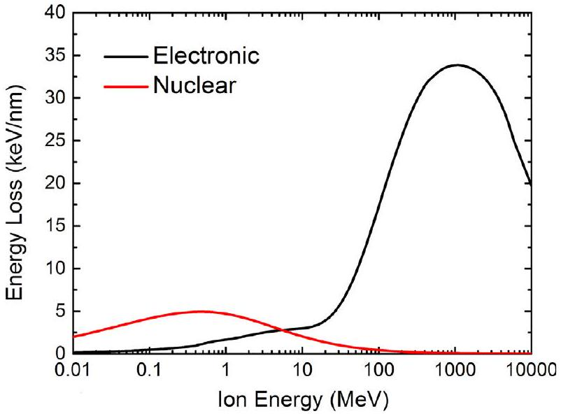
Fig. 1. Energy loss as a function of ion energy for Au ion irradiation on a Ge substrate [1].

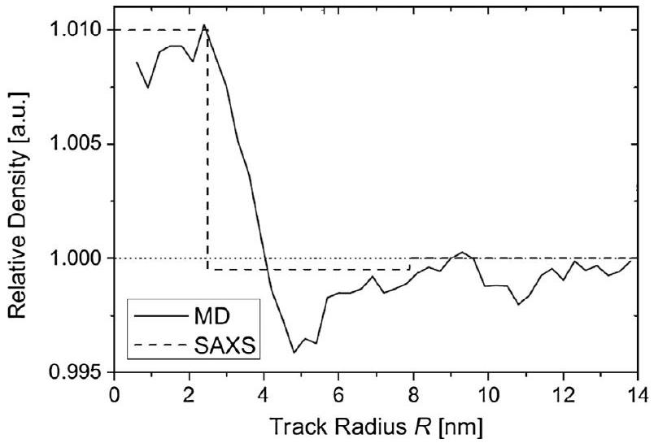
Fig. 2. SAXS measurement (dotted line) and MD simulation (solid line) of the radial density distribution across an ion track in a-Si following swift heavy-ion irradiation $\left(S_{e}=15.6 \mathrm{keV} / \mathrm{nm}\right)$ [3]. Reprinted figure with permission from T. Bierschenk, R. Giulian, B. Afra, M.D. Rodriguez, D. Schauries, S. Mudie, O.H. Pakarinen, F. Djurabekova, K. Nordlund, M. Schleberger, O. Osmani, N. Medvedev, B. Rethfeld, M.C. Ridgway and P. Kluth, Phys. Rev. B 88, 174111, 2013. Copyright (2013) by the American Physical Society. http://link.aps.org/abstract/PRB/v88/p174111.

modelled by preparing an a-Si cell free of coordination defects (following Wooten et al. [9]) that was then relaxed with the same interatomic potential subsequently used in the ion track simulations [10]. Energy was then deposited on the atoms with an energy-time distribution determined from Monte Carlo-Two Temperature Model (MC-TTM) calculations [11,12] originally performed for Ge [13]. With this approach, MC simulations of the electronic processes in the material were used to explicitly calculate the elec-tron-phonon coupling constant and heat capacity [11,14], enabling the determination of the rate of energy transfer between the electronic and atomic subsystems. These calculations yielded the kinetic energy-radial distance distribution around the ion track for the first 3 ps following the passage of a swift heavy ion. With these distributions, kinetic energy was then deposited on the atoms in the a-Si cell of size $30 \times 30 \times 20 \mathrm{~nm}$ [3]. Given the original calculations were performed for a-Ge, the a-Si distribution was rescaled by the ratio of the Si and Ge electronic energy loss.

Fig. 3 shows MD simulations of the radial density distribution across an ion track in a-Si [4]. An under-dense core/over-dense shell forms at 1.5 ps , as a result of rapid heating and thermal expansion but is then inverted at 3 ps and beyond, consistent with the formation of the HDL phase. The maximum temperature along the incident ion path occurs at 2 ps (not shown) while the maximum

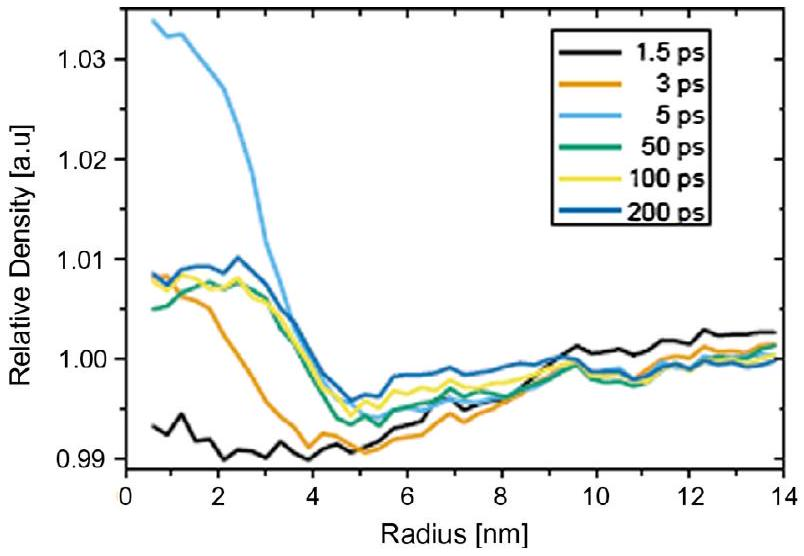
Fig. 3. MD simulations of the radial density distribution across an ion track in a- Si following the passage of a swift heavy ion [4].

relative density change occurs at 5 ps . This result is consistent with a phase transformation time of 5 ps deduced from a free-electron laser measurement [15]. As the ion track cools, the relative density change is reduced yet an over-dense core/under-dense shell is retained. A thermally-stable state is apparent at 50 ps and beyond. Further calculations suggest this stability extends to macroscopic time scales.

With reference to Fig. 2, experiment (SAXS) and simulation (MD at 200 ps , Fig. 3) are compared. The core-shell structure is derived with either methodology. Clearly experiment and simulation agree well, demonstrating the value of this approach, and together provide overwhelming evidence of ion track formation in a-Si.

## 3. Ion track formation in amorphous Ge

Given HDL and LDA phases are characteristic of both elemental Si and Ge leads to the intuitive expectation that ion tracks in a- Si and amorphous Ge ( $\mathrm{a}-\mathrm{Ge}$ ) should have much in common. As we now describe, there are as many differences as similarities. Fig. 4 shows the radial density distribution across an ion track in a-Ge following swift heavy-ion irradiation ( $S_{e}=23.6 \mathrm{keV} / \mathrm{nm}$ ) as determined from SAXS measurements [13]. Like a-Si, a core-shell morphology is again apparent, though now inverted. Unlike a-Si, the density changes in core and shell relative to unirradiated material are similar. Like $\mathrm{a}-\mathrm{Si}$, the net result is an ion track in a-Ge with greater density than the unirradiated material, again necessitating a volume contraction. Ridgway et al. [13] attributed the underdense core/over-dense shell to radially outward material flow resulting from rapid heating and thermal expansion along the ion path while Gartner et al. [16] suggested shock waves emanating from the ion-track core were responsible for local density changes.

Ion irradiation of $\mathrm{a}-\mathrm{Si}$ and $\mathrm{a}-\mathrm{Ge}$ under identical conditions ( 185 MeV Au ion irradiation) yields ion tracks of approximately 10 nm width, yet with inverted radial density distributions. Resolution of this apparent contradiction may potentially be found in a study of ion-track formation in the amorphous $\mathrm{Si}_{\chi} \mathrm{Ge}_{1-\chi}$ (a- $\mathrm{Si}_{x} \mathrm{Ge}_{1-x}$ ) alloys [4]. Indeed, while SAXS spectra for $\mathrm{a}-\mathrm{Si}_{x} \mathrm{Ge}_{1-x}$ with $0.2<x<1$ are very similar, they differ significantly from that of elemental a-Ge. The inversion of the core-shell radial density distribution appears to occur between a-Ge and a- $\mathrm{Si}_{0.2} \mathrm{Ge}_{0.8}$. None-the-less, the driving force for this inversion is unresolved and remains under investigation.

As above, an ion track in a-Ge is of greater density than unirradiated material, thus necessitating a volume contraction. The latter is accommodated by void formation, as shown in Fig. 5(a), which is a cross-section TEM image of a-Ge following swift heavy-ion irradiation $\left(S_{e}=23.6 \mathrm{keV} / \mathrm{nm}\right)$ [13]. The parallel sides of all voids were aligned with the incident-ion direction suggesting their formation mechanism was correlated with that of an ion track. Furthermore,

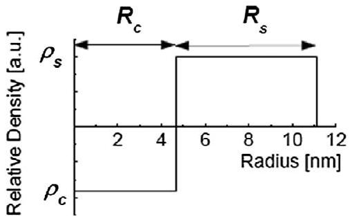
Fig. 4. Radial density distribution across an ion track in a-Ge following swift heavyion irradiation $\left(S_{e}=23.6 \mathrm{keV} / \mathrm{nm}\right)$ [13]. Reprinted figure with permission from M.C. Ridgway, T. Bierschenk, R. Giulian, B. Afra, M.D. Rodriguez, L.L. Araujo, A.P. Byrne, N. Kirby, O.H. Pakarinen, F. Djurabekova, K. Nordlund, M. Schleberger, O. Osmani, N. Medvedev, B. Rethfeld and P. Kluth, Phys. Rev. Lett. 110, 245502, 2013. Copyright (2013) by the American Physical Society. http://link.aps.org/abstract/PRL/v110/ p245502.

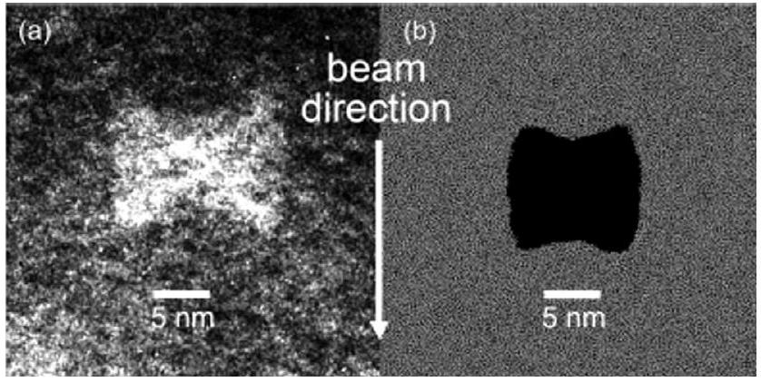
Fig. 5. TEM image (a) and MD simulation (b) of a void in a-Ge following swift heavy-ion irradiation [13]. Reprinted figure with permission from M.C. Ridgway, T. Bierschenk, R. Giulian, B. Afra, M.D. Rodriguez, L.L. Araujo, A.P. Byrne, N. Kirby, O.H. Pakarinen, F. Djurabekova, K. Nordlund, M. Schleberger, O. Osmani, N. Medvedev, B. Rethfeld and P. Kluth, Phys. Rev. Lett. 110, 245502, 2013. Copyright (2013) by the American Physical Society. http://link.aps.org/abstract/PRL/v110/p245502.

all voids were of a similar "bow-tie" shape, the only variable being the void length along the incident-ion direction. SAXS spectra were comprised of contributions from both ion tracks and voids. Meticulous experimental performance and data analysis enabled quantification for both contributions. For the ion tracks, the results are those of Fig. 4 while for the voids, the size/dimensions determined by SAXS ( 14 nm width $/ 24 \mathrm{~nm}$ length) were consistent with XTEM measurements ( 14 nm width/ $10-20 \mathrm{~nm}$ length) [13].

Void formation is not surprising given the required volume contraction. Voids form in the HDL phase and are potentially frozen in when the cooling rate is sufficiently rapid. Given the ion track is nanometers in width and can cool by heat conduction in two dimensions, rapid cooling is possible and several MD studies have shown that even with only phonon heat conduction, tracks can cool on time scales of the order of 100 ps [6,16-19]. This however cannot explain the peculiar bow-tie shape of the voids, as the minimisation of the surface energy should lead to spherical voids, or considering the asymmetric cooling in an ion track in two dimensions, possibly ellipsoidal voids. Thus, MD simulations of the evolution of a-Ge subsequent to the passage of a 185 MeV Au ion were performed to gain an understanding of the formation mechanism for this unique shape. The ion-track energy deposition was calculated with the MC-TTM model as described in the previous section. Direct application of the model yielded ion tracks of lesser width than measured experimentally, so the authors scaled the energy deposition such that the MD simulations were consistent with the SAXS measurements [13]. The evolution of the ion track was followed in a simulation cell of size $60 \times 60 \times 40 \mathrm{~nm}$ until the system cooled to ambient temperature. The ion track was initiated in the $z$ direction with cooling via the cell $x$ and $y$ boundaries. Fig. 6 shows void formation as a function of time. The incident ion passage is horizontal. 5 ps after the ion energy deposition, very small voids form in the under-dense, very-hot molten phase. These small voids coalesce to form a single large void between 30 and 100 ps . At about 100 ps , molten material in the ion track starts to cool radially inward and undergoes the HDL-to-LDA phase transformation. Given the LDA phase has a lower density [20,21], the material seeks to expand. Expansion inwards by pressing material into the voids is more favorable compared to expansion outwards into the surrounding LDA material (Fig. 6 at 180 ps ). Given the cooling is radially-inwards, the expansion is greatest at the center of the ion track and yields the unique bow-tie shape (Fig. 6 at 400 ps ). Comparing experiment and simulation in Fig. 5(a) and (b), respectively, the agreement is remarkable, again demonstrating the synergy achievable with physical characterisation and theoretical prediction.

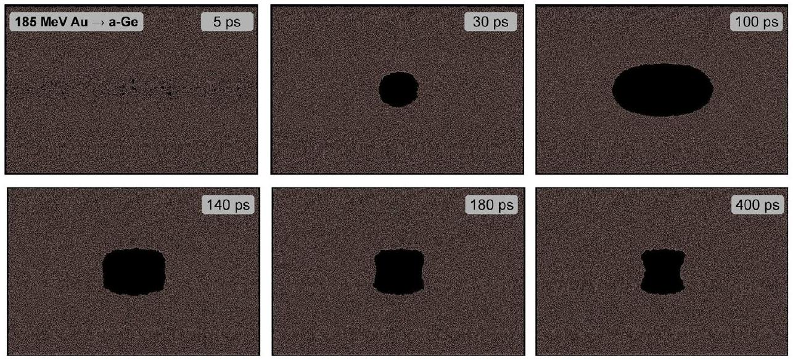
Fig. 6. Snapshots of MD simulations of void formation in a-Ge following the passage of a swift heavy ion (horizontally). The data is the same as that used in Ref. [13].

In this and the previous section, we have shown single ion impacts can yield ion tracks. In the next section, we will show the cumulative effects of multiple impacts can yield macroscopically observable changes in the form of irradiation-induced porosity.

## 4. Porous layer formation in amorphous Ge

High-fluence ion irradiation in either the nuclear [22] or electronic [23] energy-loss regimes can induce porosity in Ge and in this section we focus on the latter. Using swift heavy-ion irradiation conditions identical to those described previously for the formation of ion tracks in a-Ge, Wesch et al. [23] reported the progressive transformation of a once continuous, amorphised layer to a sponge-like porous structure, as shown in the scanning electron microscopy (SEM) images of Fig. 7. Initially the voids are approximately spherical, well separated and randomly located. An increase in ion fluence promotes void agglomeration and a macroscopic expansion of the irradiated material (as apparent in the inset of Fig. 8(a) where the right-hand side of the sample was masked during irradiation). Steinbach et al. [24] further quantified this continuous-to-porous transformation. Fig. 8(a) shows the mean step height for different irradiation conditions as a function of ion fluence. Clearly the step height $\Delta Z$ is a linear function of ion fluence $N_{I}$ such that $\Delta Z=\alpha N_{I}$ and furthermore is non-saturable, as per the ion hammering mechanism originally proposed by Klaumünzer [25] (where an amorphisable material under swift heavy-ion irradiation contracts in the dimension parallel to the
ion direction and expands in the dimension perpendicular to the ion direction with an overall volume conservation). For a given angle of incidence, $\Delta Z$ increases as the ion energy increases, consistent with an increase in $S_{e}$ (see Fig. 1). Similarly, for a given ion energy, $\Delta Z$ also increases as the angle of incidence (relative to the surface normal) increases, consistent with an increase in $S_{e}$ deposited over the extent of the a-Ge layer. Fig. 8 nicely demonstrates that porosity induced in a-Ge under swift heavy-ion irradiation is the result of electronic energy loss while the influence of nuclear energy loss is negligible. Note that disorder and/or voids were not observable in the crystalline Ge (c-Ge) immediately below the a-Ge/c-Ge interface, consistent with weaker electronphonon coupling in the crystalline phase.

Fig. 8(b) shows the slope $\alpha$, determined from Fig. 8(a), as a function of $S_{e}$. Clearly $\Delta Z$ goes to zero for $S_{e}=\sim 10.5 \mathrm{keV} / \mathrm{nm}$ indicative of an $S_{e}$ threshold for swift heavy-ion induced porous layer formation in a-Ge. Note that Steinbach et al. also determined a comparable $S_{e}$ threshold ( $S_{e}=\sim 12 \mathrm{keV} / \mathrm{nm}$ ) for plastic deformation in a-Ge [24].

In the previous section, low-fluence ion irradiation was shown to yield individual ion tracks containing voids (Fig. 5) while in this section, high-fluence ion irradiation was shown to yield porouslayer formation (Fig. 7). We thus suggest the individual voids within an ion track represent the embryonic precursors to the observed sponge-like structure. Indeed, a simple extrapolation based on the number of voids per unit length ( $\sim 2.5$ voids $/ \mu \mathrm{m}$ [13]) in an ion track yields a step-height estimate comparable with experimental measurements. Furthermore, we also suggest the $S_{e}$

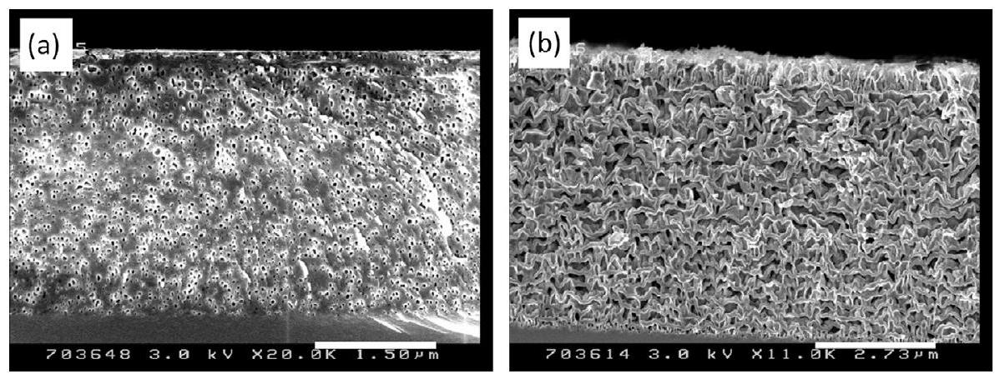
Fig. 7. Cross-section SEM images of an a-Ge layer following 185 MeV Au ion irradiation to ion fluences of (a) $9.5 \times 10^{12}$ and (b) $1.6 \times 10^{14} / \mathrm{cm}^{2}$ [23]. Note the different scale bars. Reprinted figure with permission from W. Wesch, C.S. Schnohr, P. Kluth, Z.S. Hussain, L.L. Araujo, R. Giulian, D.J. Sprouster, A.P. Byrne and M.C. Ridgway, Structural modification of swift heavy ion irradiated amorphous Ge layers, J. Phys. D: Appl. Phys. 42, 115402, 2009. Reproduced by permission of IOP Publishing. All rights reserved.

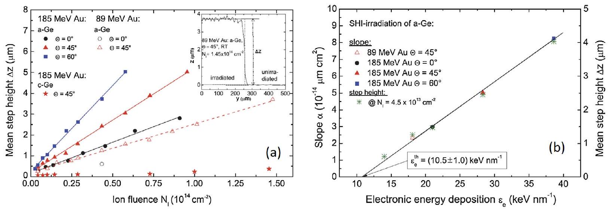
Fig. 8. Step height $\Delta Z$ as a function of ion fluence $N_{I}$ (a) and slope $\alpha$ as a function of electronic energy loss $S_{e}$ (b) where $\Delta Z=\alpha N_{I}$ for a-Ge following swift heavy-ion irradiation [24]. Reprinted figure with permission from T. Steinbach, C.S. Schnohr, W. Wesch, P. Kluth, R. Giulian, L.L. Araujo, D.J. Sprouster and M.C. Ridgway, Phys. Rev. B 83, 054113, 2011. Copyright (2011) by the American Physical Society. http://link.aps.org/abstract/PRB/v83/p054113.

threshold for porous layer formation represents the minimum electronic energy loss required for swift heavy-ion induced ion track formation in a-Ge.

The complementary MD simulations of Gartner et al. [16] provide further insight into porous-layer formation. The size of the MD cell was $8.6 \times 8.6 \times 8.6 \mathrm{~nm}$ and a-Ge was created following the method described by Weber et al. [26]. Using a Stillinger-Weber-like interatomic potential [27] splined to a repulsive pair potential for small interatomic distances [28], the calculated radial distribution function was in good agreement with that determined experimentally, validating the approach of Gartner et al. The passage of a swift heavy ion was simulated by depositing additional kinetic energy equally on each atom within a cylinder of 4 nm width and over a time interval of 1 ps . The latter is typical of the time required for the coupling of energy from the electronic to
atomic subsystems [29] while the former is consistent with the calculations of Waligorski et al. [30]. During the simulation, the MD cell was allowed to expand in the incident-ion direction, hence maintaining zero pressure, and ambient temperature was attained 100 ps after the energy deposition.

Fig. 9 shows top-view snapshots of the MD simulation as a function of time. The incident ion enters the cell vertically with the point of impact indicated by the black dot. The cylinder within which the energy is deposited is highlighted. At the point of impact, the atomic density progressively decreases as a function of time and density changes are effectively confined to the energy-deposition cylinder. At 30 ps , a stable void is readily apparent and the processes responsible for void formation have generally ceased. More detailed analysis indicated changes in mass density were the result of a shock wave, generated by the electronic energy loss deposition,

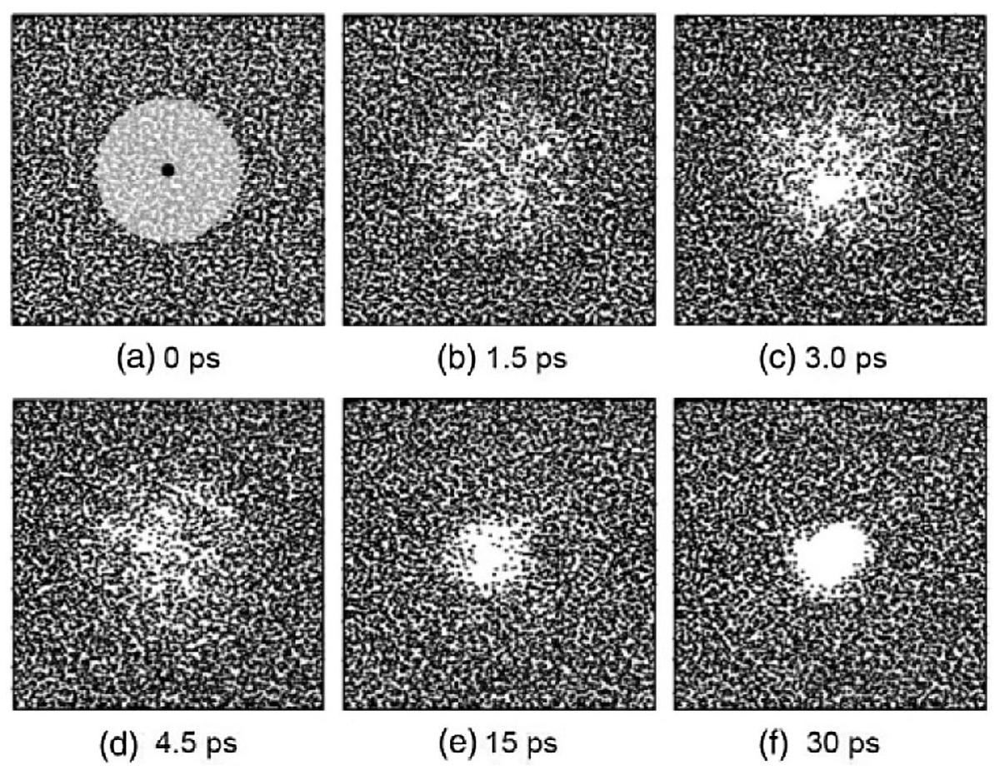
Fig. 9. Top-view snapshots of MD simulations of void formation in a-Ge following the passage of a swift heavy ion [16]. Reprinted figure with permission from K. Gartner, J. Johrens, T. Steinbach, C.S. Schnohr, M.C. Ridgway and W. Wesch, Phys. Rev. B 83, 224106, 2011. Copyright (2011) by the American Physical Society. http://link.aps.org/ abstract/PRB/v83/p224106.

emanating radially outwards. Extending the simulation to multiple ion impacts (not shown) demonstrated that the calculated swelling was governed by a competition between void formation plus growth and void shrinkage plus annihilation. The calculated swelling increased linearly with ion fluence, consistent with experiment. Note the mechanism for void formation proposed by Gartner et al. [16] (shock waves) differs from that proposed by Ridgway et al. [13] (volume contraction due to differences in density between the HDL and LDA phases). This difference requires resolution.

In the first three sections, the effects of swift heavy-ion irradiation on bulk material were considered, specifically ion-track formation at low ion fluences and porous-layer formation at high ion fluences. We now turn our attention to effects on nanostructures embedded in bulk material, specifically nanoparticle deformation. As we demonstrate, the properties of the nanostructure and the matrix both influence the deformation process. Having first examined swift heavy-ion irradiation of bulk material alone, we are subsequently able to identify the relative influences of nanostructure and matrix.

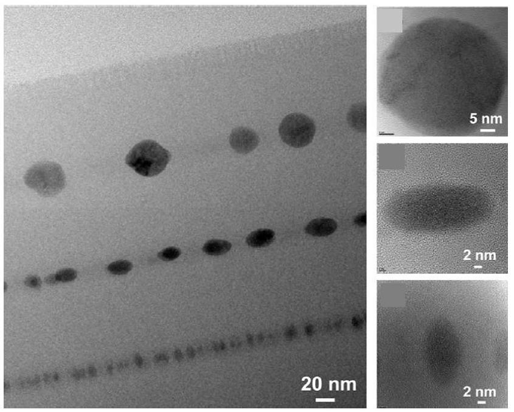
Fig. 10. XTEM images of Ge NPs in $\mathrm{SiO}_{2}$ following 38 MeV I ion irradiation to an ion fluence of $1 \times 10^{14} / \mathrm{cm}^{2}$ [39]. The incident ion direction was top to bottom. Reprinted from Nucl. Instrum. Meth. B 267, B. Schmidt, K.-H. Heinig, A. Mucklich and C. Akhmadaliev, Swift-heavy-ion-induced shaping of spherical Ge nanoparticles into discs and rods, 1345, Copyright (2009), with permission from Elsevier.

## 5. Ge nanoparticle modification in amorphous $\mathrm{SiO}_{2}$

Ge nanoparticles (NPs) embedded in a dielectric matrix of amorphous $\mathrm{SiO}_{2}$ can exhibit finite-size [31] and/or quantumconfinement [32] effects, yielding applications in electronic and photonic devices. As a consequence, the electronic [33], photonic [34], structural [35] and vibrational [36] properties of this materials system have been studied extensively. Typical fabrication methodologies include ion implantation and co-sputtering from which spherical NPs form due to the amorphous nature of the embedding matrix. As we demonstrate below, swift heavy-ion irradiation of Ge NPs embedded in $\mathrm{SiO}_{2}$ results in a spherical-to-ellipsoidal shape transformation with a preferential orientation relative to the incident ion direction. In principle, additional applications not achievable with spherical NPs should thus be enabled. (Note that ion irradiation effects in nanostructures have recently been reviewed in Ref. [37].)

Schmidt et al. [38,39] were the first to observe the swift heavyion irradiation induced shape transformation for Ge NPs in SiO2. For their specific formation and irradiation conditions, they reported "large" NPs remained spherical, "medium" NPs became oblate while "small" NPs became prolate, as illustrated in Fig. 10 [39]. (The oblate shape was consistent with the ion hammering mechanism [25], though the prolate shape was not.) Schmidt et al. also noted a NP crystalline-to-amorphous phase transformation and NP dissolution into the $\mathrm{SiO}_{2}$ matrix. NP melting was considered a prerequisite for the shape transformation and thus a NP size threshold, above which the NPs remained solid and spherical, was defined. As noted in the previous sections, molten Ge is of greater density than solid Ge [20,21], yielding a volume contraction upon melting. Schmidt et al. suggested the latter induces tensile stress in the molten NP, which is partially relieved when the molten NP/ molten $\mathrm{SiO}_{2}$ ion track interface moves axially inwards towards the molten NP center. The molten $\mathrm{SiO}_{2}$ ion track resolidifies first, with the molten Ge NP present in an under-cooled liquid state. Upon resolidification, the Ge NP cannot expand axially outwards, accounting for the oblate shape of the medium-sized NPs. A viable explanation for the prolate shape of the small-sized NPs was not offered.

Araujo et al. [40] examined the shape transformation in greater detail. While Schmidt et al. utilised sputtering to form different layers of NPs of uniform size (as shown in Fig. 10), Araujo et al. utilised ion implantation to produce a broad NP size distribution. An advantage of the latter is that spherical, oblate and prolate NPs can be viewed in a single XTEM image and size threshold(s) can be better quantified relative to an image with only three different NP

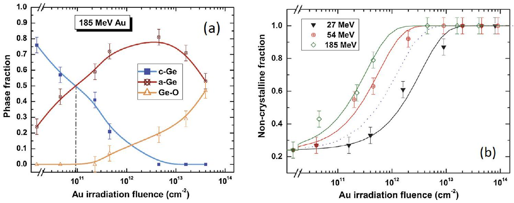
Fig. 11. Phase fractions (a) and amorphous fraction (b) as a function of ion fluence for Ge NPs embedded in $\mathrm{SiO}_{2}$ following Au ion irradiation [40]. Reprinted figure with permission from L.L. Araujo, R. Giulian, D.J. Sprouster, C.S. Schnohr, D.J. Llewellyn, B. Johannessen, A.P. Byrne and M.C. Ridgway, Phys. Rev. B 85, 235417, 2012. Copyright (2012) by the American Physical Society. http://link.aps.org/abstract/PRB/v85/p235417.

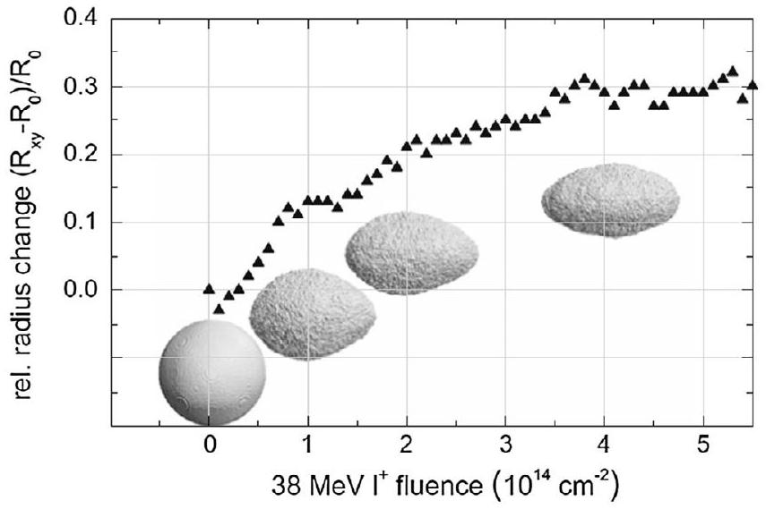
Fig. 12. MC modelling of the spherical-to-oblate shape transformation for Ge NPs embedded in $\mathrm{SiO}_{2}$ following 38 MeV I ion irradiation [39]. $R_{\mathrm{xy}}$ is the larger radius of the oblate spheroid and Ro is the original radius of the spherical NP. Reprinted from Nucl. Instrum. Meth. B 267, B. Schmidt, K.-H. Heinig, A. Mucklich and C. Akhmadaliev, Swift-heavy-ion-induced shaping of spherical Ge nanoparticles into discs and rods, 1345, Copyright (2009), with permission from Elsevier.

sizes. Using X-ray absorption near edge spectroscopy (XANES), Araujo et al. quantified the c-Ge, a-Ge and Ge-O fractions as functions of ion fluence and ion energy. (Note that Saikiran et al. [41,42] also examined NP dissolution in the swift heavy-ion irradiation regime.) Fig. 11(a) shows the three fractions as a function of ion fluence for a given ion energy ( 185 MeV Au ion irradiation) while Fig. 11(b) shows the amorphous fraction as functions of ion fluence and ion energy [40]. The ion fluences required for the NP crystal-line-to-amorphous phase transformation and NP dissolution both decreased as the ion energy increased, demonstrating electronic energy loss was responsible for the two processes. Furthermore, the phase transformation always preceded the shape transformation and dissolution. For the present case, ion-solid interactions between swift heavy ions and NPs is via electronic energy loss. Thus, the crystalline-to-amorphous phase transformation may proceed by a NP melt-and-quench mechanism (solid-liquid-solid) when the rate of cooling is sufficiently rapid such the rate of resolidification exceeds that of recrystallisation. This mechanism differs from the more conventional NP phase transformation via nuclear energy loss that proceeds by ballistic atomic displacements (solid-solid) [43].

Both Schmidt et al. and Araujo et al. sought to relate the NP size threshold(s) to the dimensions of the ion track in $\mathrm{SiO}_{2}$. (Note the latter exhibits a core-shell morphology with an under-dense core and over-dense shell relative to unirradiated material [5].) A consistent, definitive relation was not established and this issue requires further attention.

Modelling of the swift heavy-ion irradiation induced spherical-to-ellipsoid shape transformation in Ge NPs embedded in a $\mathrm{SiO}_{2}$ matrix is limited to the simple atomistic MC model of Schmidt et al. wherein the operative physical process was defined a priori [39]. As above, tensile stress results from the volume contraction upon melting of the Ge NP. In the MC model of Schmidt et al., Ge atoms at the NP/ion track interface were removed and redistributed at random elsewhere in the NP. Reasonable agreement between modelling and experiment was attained, as shown in Fig. 12 [39]. While the model can account for the spherical-to-oblate shape transformation observed for medium-sized NPs, it cannot describe the spherical-to-prolate shape transformation observed for smallsized NPs. Clearly there is a need for a more rigorous modelling effort that includes the energy transfer from swift heavy ion to NP and from electronic to atomic subsystems in addition to NP melting/solidification and NP volume contraction/expansion.

In the next section we change from semiconductor to metallic NPs. While a shape transformation is certainly induced by swift heavy-ion irradiation, significant differences are apparent relative to the observations cited in this section. As we show, these differences stem largely from the physical properties of the NP molten phase.

## 6. Metal nanoparticle modification in amorphous $\mathbf{S i O}_{\mathbf{2}}$

Swift heavy-ion irradiation of metal NPs embedded in a silica matrix induces a spherical-to-rod-like shape transformation with the major axis of the rods always aligned parallel to the incidention direction. In contrast to the shape transformation reported for semiconductor NPs, oblate ellipsoids are never observed. Since the first reports from D'Orleans et al. [44-47], this irradiationinduced shape transformation has been intensively studied under a variety of conditions and for a variety of metals (for example, see [48,49]). Fig. 13 shows representative images for three different elemental metals [49]. Fundamental insight into the processes operative during the shape transformation has again been garnered from a combination of experiment, modelling and simulation.

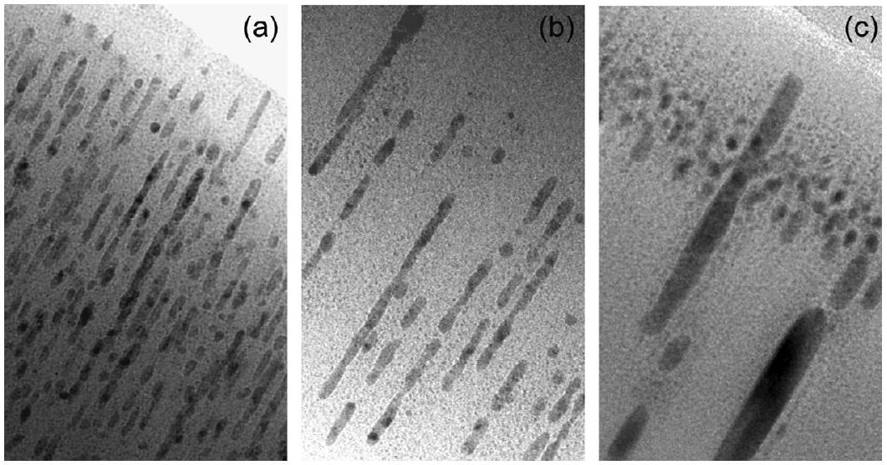
Fig. 13. XTEM images of metal NPs in $\mathrm{SiO}_{2}$, showing (a) Ni, (b) Cu and (c) Bi, following 185 MeV Au ion irradiation [49]. All NPs were initially spherical and the incident ion direction was top right to bottom left. Reprinted figure with permission from M.C. Ridgway, R. Giulian, D.J. Sprouster, P. Kluth, L.L. Araujo, D.J. Llewellyn, A.P. Byrne, F. Kremer, P.F.P. Fichtner, G. Rizza, H. Amekura and M. Toulemonde, Phys. Rev. Lett. 106, 095505, 2011. Copyright (2011) by the American Physical Society. http://link.aps.org/abstract/ PRL/v106/p095505.

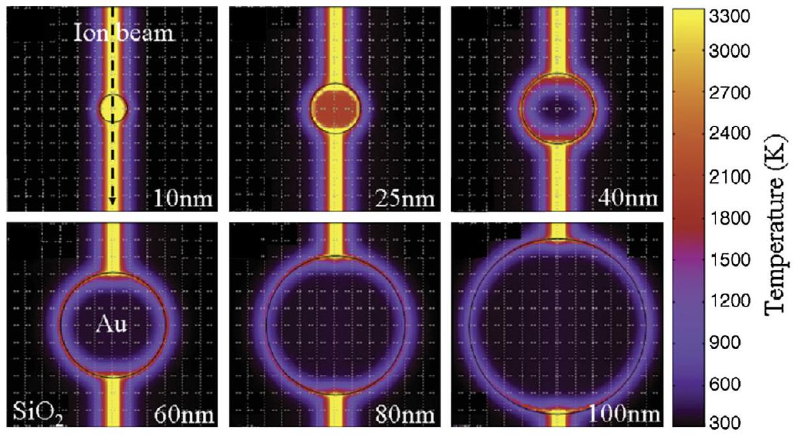
Fig. 14. Three-dimensional modelling of the maximum Au NP temperature as a function of NP size following the passage of a 74 MeV Kr ion [57]. Reprinted figure with permission from G. Rizza, P.E. Coulon, V. Khomenkov, C. Dufour, I. Monnet, M. Toulemonde, S. Perruchas, T. Gaicon, D. Mailly, X. Lafosse, C. Ulysse and E.A. Dawi, Phys. Rev. B 86, 035450, 2012. Copyright (2012) by the American Physical Society. http://link.aps.org/abstract/PRB/v86/p035450.

## Experimental characterisation has established the following:

(1) NPs must be embedded in a matrix in order to be elongated. The shape transformation is not observed for NPs adhered to a substrate surface [50], demonstrating that the substrate must play an active role in the process.
(2) The matrix must be amorphisable. The shape transformation is not observed for NPs in an unamorphisable matrix such as AlAs [51,52], suggesting ion track formation must also play an active role in the process.
(3) The shape transformation proceeds progressively with ion fluence, typically necessitating thousands of overlapping impacts for completion [53], though perceptible changes in shape are measureable following a single ion impact [54]. Excessive ion fluences result in the dissolution of the elongated NPs [55].
(4) The width of the elongated NPs saturates at a value less than or equal to the width of the ion track demonstrating the shape transformation is constrained by the ion track [56]. Smaller ion-track radii yield smaller NP saturation widths [56].
(5) The NP saturation width is metal specific and governed by thermodynamics such that metals that require higher energies for vapourisation are able to sustain lower NP saturation widths [49].
(6) NPs below a minimum size are either dissolved or vapourised and thus do not elongate [48,49], while NPs above a maximum size do not melt under swift heavy ion irradiation and also do not elongate [57]. The latter suggests a melt-and-flow process is operative.

The analytical modelling of Rizza et al. [57], utilising the three-dimensional implementation of the Thermal Spike model

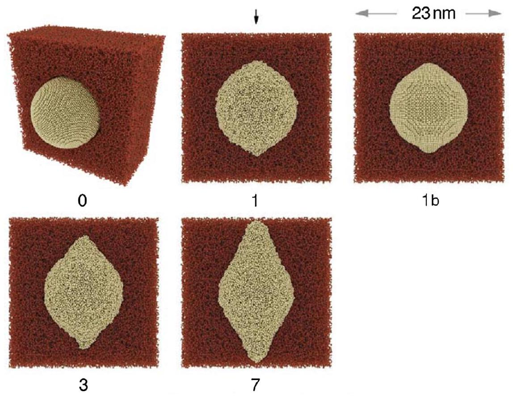
Fig. 15. Snapshots of MD simulations as a function of the number of ion impacts (0-7) for Au NP elongation in $\mathrm{SiO}_{2}$ following the passage of a swift heavy ion (vertically) [63].

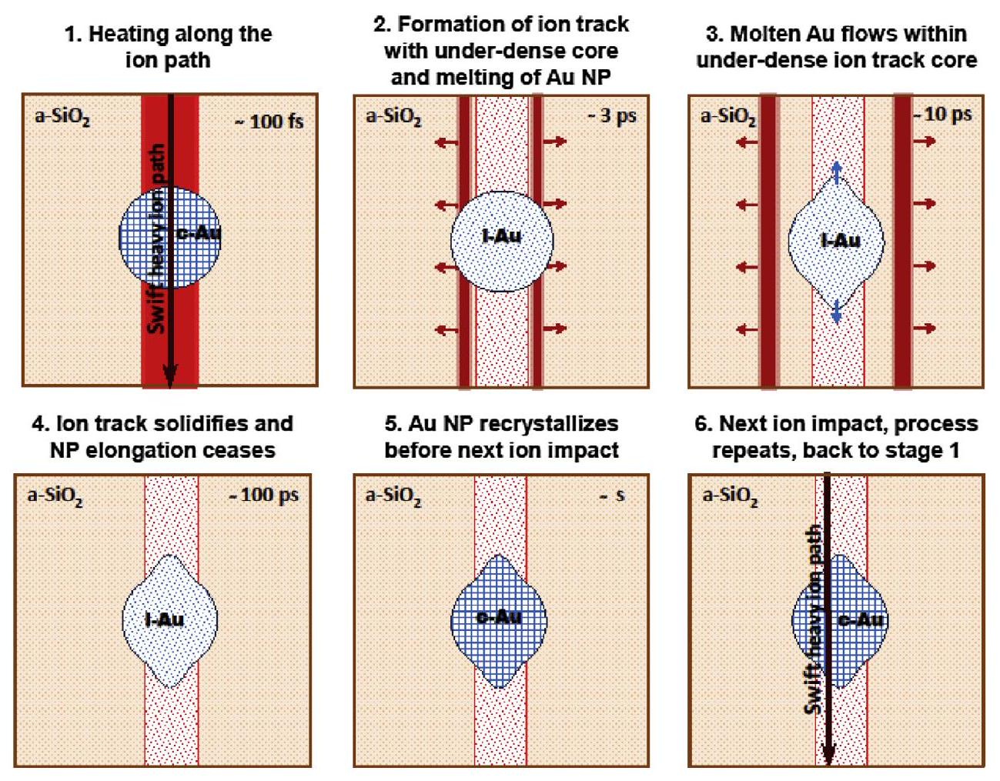
Fig. 16. Schematic diagram of the metal NP shape transformation process proposed by Leino et al. [63].

developed by Dufour et al. [58] for anisotropic and composite materials, beautifully demonstrates points 1 and 6 above. Fig. 14 shows the maximum temperature attained in Au NPs embedded in $\mathrm{SiO}_{2}$ as a function of size following a single swift heavy-ion impact. Note the hot ion track in the $\mathrm{SiO}_{2}$ matrix, with a temperature in excess of that required for vapourisation. The weak electron-phonon coupling of Au is such that only a small fraction of the ion energy deposited in the Au NP electronic subsystem is transferred to the Au NP atomic subsystem. Energy carried by the electrons rapidly diffuses to the $\mathrm{Au} / \mathrm{SiO}_{2}$ interface resulting in the formation of a hot $\mathrm{SiO}_{2}$ layer surrounding the NP. This layer acts as a diffusion barrier for energy in the Au NP electronic subsystem, enabling the transformation into heat within the Au NP atomic subsystem. Clearly the maximum NP temperature decreases as the NP size increases, such that NPs $<10 \mathrm{~nm}$ diameter are vapourised, $10-30 \mathrm{~nm}$ are completely molten, $30-80 \mathrm{~nm}$ are partially molten and finally those $>80 \mathrm{~nm}$ do not melt. Correlation with experiment demonstrated molten NPs elongated, partially molten NPs faceted, and non-molten NPs remained spherical [57].

The Thermal Spike model calculations shown above [57,58], plus others reported previously [59-61], describe the heat exchange between electronic and atomic subsystems that enables evaluation of the NP thermal evolution after a single swift heavyion impact. Inherently, these models do not allow for explicit consideration of mass transport and thus we turn to MD simulations for atomistic insight into the shape transformation process. Input for the MD simulations was derived from the TTM model, rescaled for 164 MeV Au ion irradiation, with kinetic energy deposited along the ion path in a simulation cell of $\mathrm{SiO}_{2}$ containing a Au NP of 10 nm diameter [62,63]. Fig. 15 shows MD simulations as a function of the number of ion impacts [63]. Prior to an ion impact (labelled 0), the NP is spherical and crystalline. With the first impact (labelled 1), the Au NP melts, an ion track with an underdense core/over-dense shell is formed in the $\mathrm{SiO}_{2}$ and the molten,
pressurised NP expands by longitudinal flow of Au atoms within the under-dense core until the $\mathrm{SiO}_{2}$ cools below the glass transition temperature. As shown in Fig. 15, following one impact (labelled 1), the elongated NP is amorphous as a result of the extremely rapid cooling rate in the MD simulation. Subsequent impacts on an amorphous NP did not yield elongation and thus a recrystallisation step, consistent with experiment, was implemented in the MD simulation (labelled 1b) prior to the next impact. Subsequent impacts on a crystalline NP did yield elongation, demonstrating that during NP melting, the lower density/higher volume of an amorphous NP reduces the thermal expansion pressure to a value insufficient for the shape transformation to proceed. Clearly, NP recrystallisation between impacts is a prerequisite for NP elongation. Fig. 16 shows a schematic of the shape transformation process proposed by Leino et al. [63].

Swift heavy-ion irradiation induced shape transformations for both semiconductor and metallic NPs have now been described and differences between the two are readily apparent. These clearly originate from differences in the density of the molten NP phase, which is higher than the solid phase for semiconductors yet lower than the solid phase for metals. Upon melting, the higher density of the molten semiconductor NP yields a volume contraction and an axially-inwards movement of the molten NP/molten $\mathrm{SiO}_{2}$ ion track interfaces, resulting in an oblate NP shape upon solidification. In contrast, the lower density of the molten metallic NP yields a volume expansion, with associated thermal expansion pressure, inducing the axially-outwards flow of molten material in the under-dense ion-track core (a metal melt-and-flow process), resulting in a rod-like NP shape upon solidification.

## 7. Conclusion

The extremes of electronic energy loss are attainable with swift heavy-ion irradiation, enabling the study of a unique subset of
ion-solid interactions. For this review, experiment, modelling and simulation have been synergistically brought to bear on five specific phenomena. While they may differ considerably, ion track formation is a common binding thread. Though our understanding of these ion-solid interactions is improving rapidly, we have highlighted issues that require attention including the resolution of experimental and theoretical differences. Much remains to be done in this maturing yet intriguing field of research.

## Acknowledgements

We thank the Australian Research Council, the Australian Synchrotron and the Academy of Finland for financial support and the ANU Heavy-Ion Accelerator Facility, the ANU Center for Advanced Microscopy, the Australian National Fabrication Facility and the Finnish IT Centre for Science CSC for access to equipment and computational infrastructure.

## References

[1] Ziegler JF, Ziegler MD, Biersack JP. Nucl Instrum Methods Phys Res, Sect B 2010;268:1818.
[2] Hedler A, Wesch W, Klaumunzer S. Nat Mater 2004;3:804.
[3] Bierschenk T, Giulian R, Afra B, Rodriguez MD, Schauries D, Mudie S, et al. Phys Rev B 2013;88:174111.
[4] Bierschenk T. Ph.D. Thesis, Australian National University; 2014.
[5] Kluth P, Schnohr CS, Pakarinen OH, Djurabekova F, Sprouster DJ, Giulian R, et al. Phys Rev Lett 2008;101:175503.
[6] Kluth P, Schnohr CS, Sprouster DJ, Byrne AP, Cookson DJ, Ridgway MC. Nucl Instrum Methods Phys Res, Sect B 2008;266:2994.
[7] McMillan PF, Wilson M, Daisenberger D, Machon D. Nat Mater 2005;4:680.
[8] Nordlund K, Djurabekova F. J Comput Electr 2014;13:122.
[9] Wooten F, Winer K, Weaire D. Phys Rev Lett 1985;54:1392.
[10] Tersoff J. Phys Rev B 1988;38:9902.
[11] Medvedev NA, Volkov AE, Shcheblanov NS, Rethfeld B. Phys Rev B 2010;82:125425.
[12] Toulemonde M, Assmann W, Dufour C, Meftah A, Studer F, Trautmann C. Mat Fys Medd Kong Dan Vid Selsk 2006;52:263.
[13] Ridgway MC, Bierschenk T, Giulian R, Afra B, Rodriguez MD, Araujo LL, et al. Phys Rev Lett 2013;110:245502.
[14] Medvedev NA, Volkov AE, Schwartz K, Trautmann C. Phys Rev B 2013;87:115112.
[15] Beye M, Sorgenfrei F, Schlotter WF, Wurth W, Fohlisch A, Nat P. Acad Sci 2010;107:16772.
[16] Gartner K, Johrens J, Steinbach T, Schnohr CS, Ridgway MC, Wesch W. Phys Rev B 2011;83:224106.
[17] Schwen D, Bringa EM. Nucl Instrum Methods Phys Res, Sect B 2007;256:187.
[18] Pakarinen OH, Djurabekova F, Nordlund K. Nucl Instrum Methods Phys Res, Sect B 2010;268:3163.
[19] Moreira PAFP, Devanathan R, Weber WJ. J Phys: Condens Matter 2010;22:395008.
[20] Light TB. Phys Rev Lett 1969;22:999.
[21] Lide DR. CRC handbook of chemistry and physics. 82 ed. Boca Raton, USA: CRC Press; 2001.
[22] Steinbach T, Wernecke J, Kluth P, Ridgway MC, Wesch W. Phys Rev B 2011;84:104108 [and references therein].
[23] Wesch W, Schnohr CS, Kluth P, Hussain ZS, Araujo LL, Giulian R, et al. J Phys D Appl Phys 2009;42:115402 [and references therein].
[24] Steinbach T, Schnohr CS, Wesch W, Kluth P, Giulian R, Araujo LL, et al. Phys Rev B 2011;83:054113.
[25] Klaumünzer S. Nucl Instrum Methods Phys Res, Sect B 2003;215:345.
[26] Weber B, Gartner K, Stock DM. Nucl Instrum Methods Phys Res, Sect B 1997;127(128):239.
[27] Stillinger FH, Weber TA. Phys Rev B 1985;31:5262.
[28] Gartner K, Hehl K. Phys State Solid B 1979;94:231.
[29] Dufour C, Paumir E, Toulemonde M. Radiat Eff 1993;126:119.
[30] Waligorski MPR, Hamm RN, Katz R. Int J Radiat Appl Instrum D 1986;11:309.
[31] Hornyak GL, Tibbals HF, Dutta J, Rao A. Introduction to nanoscience. Boca Raton, USA: CRC Press; 2008.
[32] Poole CP, Owens FJ. Introduction to nanotechnology. Hoboken, USA: John Wiley \& Sons; 2003.
[33] Ray SK, Das K. Opt Mater 2005;27:948.
[34] Park CJ, Cho KH, Yang WC, Cho HY, Choi SH, Elliman RG, et al. Appl Phys Lett 2006;88:071916.
[35] Araujo LL, Giulian R, Sprouster DJ, Schnohr CS, Llewellyn DJ, Kluth P, et al. Phys Rev B 2008;78:094112.
[36] Araujo LL, Kluth P, de M. Azevedo G, Ridgway MC. Phys Rev B 2006;74:184102.
[37] Krasheninnikov AV, Nordlund K. J Appl Phys (Appl Phys Rev) 2010;107:071301.
[38] Schmidt B, Mucklich A, Rontzsch L, Heinig K-H. Nucl Instrum Methods Phys Res, Sect B 2007;257:30.
[39] Schmidt B, Heinig K-H, Mucklich A, Akhmadaliev C. Nucl Instrum Methods Phys Res, Sect B 2009;267:1345.
[40] Araujo LL, Giulian R, Sprouster DJ, Schnohr CS, Llewellyn DJ, Johannessen B, et al. Phys Rev B 2012;85:235417.
[41] Saikiran V, Srinivasa Rao N, Deveraju G, Chang GS, Pathak AP. Nucl Instrum Methods Phys Res, Sect B 2013;315:161.
[42] Saikiran V, Srinivasa Rao N, Deveraju G, Pathak AP. Nucl Instrum Methods Phys Res, Sect B 2014;323:14.
[43] Backman M, Djurabekova F, Pakarinen OH, Nordlund K, Araujo LL, Ridgway MC. Phys Rev B 2009;80:144109.
[44] D'Orleans C, Stoquert JP, Estournes C, Cerruti C, Grob JJ, Guille JL, et al. Phys Rev B 2003;67:220101(R).
[45] D'Orleans C, Cerruti C, Estournes C, Grob JJ, Guille JL, Haas F, et al. Nucl Instrum Methods Phys Res, Sect B 2003;209:316.
[46] D'Orleans C, Stoquert JP, Estournes C, Grob JJ, Muller D, Guille JL, et al. Nucl Instrum Methods Phys Res, Sect B 2004;216:372.
[47] D'Orleans C, Stoquert JP, Estournes C, Grob JJ, Muller D, Cerruti C, et al. Nucl Instrum Methods Phys Res, Sect B 2003;225:154.
[48] Ridgway MC, Kluth P, Giulian R, Sprouster DJ, Araujo LL, Schnohr CS, et al. Nucl Instrum Methods Phys Res, Sect B 2009;267:931.
[49] Ridgway MC, Giulian R, Sprouster DJ, Kluth P, Araujo LL, Llewellyn DJ, et al. Phys Rev Lett 2011;106:095505.
[50] Roorda S, van Dillen T, Polman A, Graf C, van Blaaderen A, Kooi BJ. Adv Mater 2004;16:235.
[51] Harkati Kerboua C, Chicoine M, Roorda S. Nucl Instrum Methods Phys Res, Sect B 2011;269:2006.
[52] Giulian R, Kremer F, Araujo LL, Sprouster DJ, Kluth P, Fichtner PFP, et al. Phys Rev B 2010;82:113410.
[53] Giulian R, Kluth P, Araujo LL, Sprouster DJ, Byrne AP, Cookson DJ, et al. Phys Rev B 2008;78:125413.
[54] Amekura H, Ishikawa N, Okubo N, Ridgway MC, Giulian R, Mitsuishi K, et al. Phys. Rev. B 2011;83:205401.
[55] Sprouster DJ, Giulian R, Araujo LL, Kluth P, Johannessen B, Cookson DJ, et al. J Appl Phys 2011;109:113504.
[56] Kluth P, Giulian R, Sprouster DJ, Schnohr CS, Byrne AP, Cookson DJ, et al. Appl Phys Lett 2009;94:113107.
[57] Rizza G, Coulon PE, Khomenkov V, Dufour C, Monnet I, Toulemonde M, et al. Phys Rev B 2012;86:035450.
[58] Dufour C, Khomenkov V, Rizza G, Toulemonde M. J Phys D Appl Phys 2012;45:065302.
[59] Awazu K, Wang X, Fujimaki M, Tominaga J, Fujii S, Aiba H, et al. Nucl Instrum Methods Phys Res, Sect B 2009;267:941.
[60] Awazu K, Wang X, Komatsubara T, Watanabe J, Matsumoto Y, Warisawa S, et al. Nanotechnology 2009;20:325303.
[61] Kumar H, Ghosh S, Avasthi DK, Kabiraj D, Mücklich A, Zhou S, et al. Nano Res Lett 2011;6:155.
[62] Leino AA, Pakarinen OH, Djurabekova F, Nordlund K. Nucl Instrum Methods Phys Res, Sect B 2012;282:76.
[63] Leino AA, Pakarinen OH, Djurabekova F, Nordlund K, Kluth P, Ridgway MC. Mater Res Lett 2014;2:37.

[^0]:    * Corresponding author.

