# Experimental Phenomena and Thermal Spike Model Description of Ion Tracks in Amorphisable Inorganic Insulators 

M. Toulemonde ${ }^{1, \star}$, W. Assmann ${ }^{2}$, C. Dufour ${ }^{3}$, A. Meftah ${ }^{4}$, F. Studer ${ }^{5}$ and C. Trautmann ${ }^{6}$ ${ }^{1}$ CIRIL, Laboratoire commun CEA, CNRS, ENSICAEN, UCBN Bd H. Becquerel, BP 5133, 14070 Caen Cedex 5, France ${ }^{2}$ Departement of Physics, University of Munich 85748 Garching, Germany ${ }^{3}$ SIFCOM, Laboratoire commun CNRS, ENSICAEN, UCBN 6 Bd Maréchal Juin, 14050 Caen Cedex, France ${ }^{4}$ LRCPSI, Université de Skikda BP 26, Route d'El-Hadaiek, 21000 Skikda, Algeria ${ }^{5}$ CRISMAT, Laboratoire commun CNRS, ENSICAEN, UCBN 6 Bd Maréchal Juin, 14050 Caen Cedex, France ${ }^{6}$ Materialforschung/GSI, Planckstr. 1, 64291 Darmstadt, Germany

#### Abstract

Experimental investigations of ion tracks produced with energetic heavy projectiles in the electronic energy loss regime are reviewed. Focusing on amorphisable insulators as target material, we present an overview of track phenomena such as the dependence of the track size on energy loss and beam velocity, the critical energy loss for track formation, and damage morphology along the ion tracks. Different characterization techniques for track dimensions are compared including direct, e.g. microscopic observations, as well as quantification of beam-induced damage. In the second part, we present a theoretical description of track formation based on an inelastic thermal spike model. This thermodynamic approach combines the initial size of the energy deposition with the subsequent diffusion process

[^0]in the electronic subsystem of the target. The track size, resulting from the quench of a molten phase, is determined by the energy density deposited on the atoms around the ion path. Finally, we discuss the general validity of this model and its suitability to describe tracks in non-amorphisable insulators.

## Contents

1 Introduction ..... 264
2 Electronic Energy Loss of Swift Ions and Energy Density ..... 265
3 Quantification of Damage Cross Section and Track Radius ..... 268
3.1 Determination of Damage Cross Sections ..... 268
3.2 Direct Determination of Track Radii ..... 270
4 Tracks in Amorphisable Insulators ..... 272
4.1 Damage Cross Sections ..... 272
4.2 Comparison of Track Radii from Direct Measurements ..... 273
4.3 Damage Morphology ..... 273
4.4 Comparison of Damage Cross Sections and Track Radii ..... 274
4.5 Velocity Effect ..... 276
4.6 Summary of Track Observations in Amorphisable Insulators ..... 278
5 Model Calculations with the Inelastic Thermal Spike ..... 279
5.1 Introduction ..... 279
5.2 The Inelastic Thermal Spike Model ..... 279
5.3 Determination of the Electron Mean Free Path ..... 281
5.4 Effect of Beam Velocity ..... 282
5.5 Thermal Spike Description of Electronic Sputtering of Surface Atoms ..... 283
6 Conclusions ..... 285
6.1 Amorphisable Materials ..... 285
6.2 Unsolved Problems ..... 286
References ..... 287

## 1. Introduction

When swift heavy ions penetrate matter they create electronic excitations. In many solids, this process results in the formation of cylindrical damage zones, so-called ion tracks. Since their discovery in the late 50s of the last century (Young, 1958; Silk and Barnes, 1959), the understanding of track formation has
largely improved mainly due to dedicated irradiation experiments at large accelerator facilities for heavy ions developed in the 80s. Ion-induced material modifications and track studies were performed for crystalline (Iwase et al., 1987; Dufour et al., 1993b; Dunlop et al., 1994) as well as amorphous metals (Klaumünzer et al., 1986; Hou et al., 1990; Audouard et al., 1991), semiconductors (Levalois et al., 1992; Wesch et al., 2004; Szenes et al., 2002), ionic insulators (Schwartz et al., 1998; Trautmann et al., 2000a), and numerous oxide materials (Fuchs et al., 1987; Studer and Toulemonde, 1992; Meftah et al., 2005). Although a large amount of experimental data is now available, several important issues are still not clarified such as damage and track formation in semiconductors (Wesch et al., 2004), the different response of amorphisable (Toulemonde et al., 1987; Toulemonde and Studer, 1988) and non-amorphisable insulators such as ionic crystals (Khalfaoui et al., 2005; Trautmann et al., 2000a), or the role of internal and external pressure (Trautmann et al., 2000b; Glasmacher et al., 2006; Rizza et al., 2006). Finally, there is the open question, which model (Chadderton and Montagu-Pollock, 1963; Seiberling et al., 1980; Fleischer et al., 1975; Bringa and Johnson, 2002) is suitable to describe existing track phenomena.

The aim of this paper is not to present a complete overview of the present track knowledge for all different material classes, but we rather restrict the discussion to inorganic amorphisable insulators and consider the following two aspects: (1) Observation of track radii and damage cross sections and (2) the description by the inelastic thermal spike model. In the first section we discuss the energy deposition of energetic projectiles in a solid, in particular the density of the energy initially transferred to the target electrons. Section 3 describes experimental methods typically used to determine track radii and the electronic energy loss threshold for damage creation. The important role of the velocity of the incident ion on those two parameters is indicated. Section 4 gives a summary of the specific signatures and the present knowledge of tracks in amorphisable insulators. Section 5 shows how different aspects of track formation such as track size, formation threshold, and the projectile velocity effect are described by the inelastic thermal spike model. The conclusions finally resume the main features observed in amorphisable materials and point out questions concerning the specific response of non-amorphisable materials.

## 2. Electronic Energy Loss of Swift Ions and Energy Density

When a swift heavy ion of MeV to GeV energy penetrates a solid, the slowing down process is dominated by interactions with the target electrons (electronic energy loss) whereas slower projectiles of keV energy mainly undergo direct

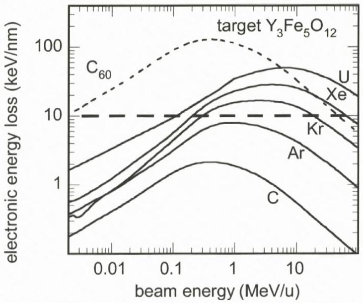
Figure 1. Electronic energy loss ( $S_{\mathrm{e}}$ ) versus specific energy for different monoatomic ions and for $\mathrm{C}_{60}$ cluster projectiles in $\mathrm{Y}_{3} \mathrm{Fe}_{5} \mathrm{O}_{12}$ target as calculated with the SRIM2003 code (for energies below $0.1 \mathrm{MeV} / \mathrm{u}$, these $S_{\mathrm{e}}$ values probably contain large uncertainties).

elastic collisions with the target atoms (nuclear energy loss). In the following we concentrate on specific aspects related to electronic stopping processes.

The electronic energy loss ( $S_{\mathrm{e}}$ ) depends on the charge state and the velocity of the projectile (see contribution by Sigmund, this volume) (Biersack and Haggmark, 1980; Huber et al., 1990; Sigmund and Schinner, 2002) typically given as specific energy, $E_{p}$, in MeV per nucleon $(\mathrm{MeV} / \mathrm{u})$. When an accelerated particle moves through a solid, it strips off those orbital electrons that are slower than the projectile velocity and acquires an equilibrium charge state $Z_{\mathrm{p}}^{*}$. Most accelerator facilities deliver ions of charge states lower than $Z_{\mathrm{p}}^{*}$, and the energy loss at the sample surface thus differs from tabulated $S_{\mathrm{e}}$ values given e.g. by the SRIM code (Ziegler, 1999). Experimentally, the equilibrium charge state can easily be obtained by inserting a thin stripper foil (e.g. carbon) in front of the target (Betz, 1972).

Figure 1 shows the electronic energy loss as a function of specific energy for different projectiles and yttrium iron garnet as target. For a given ion, the maximum energy loss is obtained at the so-called Bragg peak (at $\sim 0.5 \mathrm{MeV} / \mathrm{u}$ for carbon and $\sim 5 \mathrm{MeV} / \mathrm{u}$ for uranium). Using cluster beams of $\mathrm{C}_{60}$ projectiles, $S_{\mathrm{e}}$ values even higher than for uranium ions can be obtained, because the energy loss of a $\mathrm{C}_{60}$ cluster is in good approximation equal to the sum of the electronic energy loss of the 60 carbon constituents (Baudin et al., 1994).

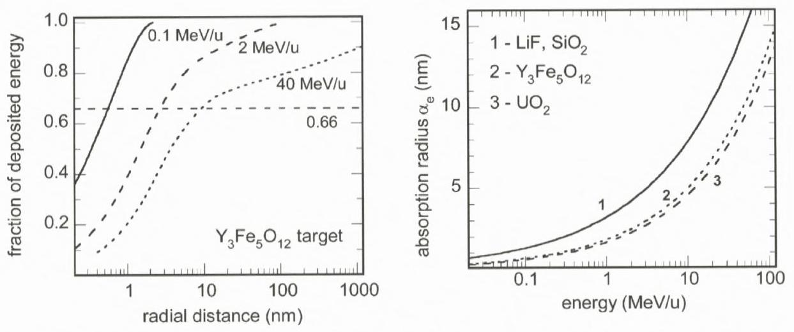
Figure 2. Left: Fraction of energy deposited on the electrons of a $\mathrm{Y}_{3} \mathrm{Fe}_{5} \mathrm{O}_{12}$ target as a function of the radial distance from the ion trajectory. The calculations assume cylindrical geometry and are based on Monte Carlo simulations. Right: Absorption radius $\alpha_{\mathrm{e}}$ defined as a cylinder radius in which 0.66 of the electronic energy loss is deposited as a function of beam velocity for different insulators.

Figure 1 also shows that a certain $S_{\mathrm{e}}$ value can be reached for a given ion either below or above the Bragg peak (see dashed line, e.g., Xe at $0.2 \mathrm{MeV} / \mathrm{u}$ and $60 \mathrm{MeV} / \mathrm{u}$ ) or for different ion species (e.g., Kr at $17 \mathrm{MeV} / \mathrm{u}$ and Xe at $60 \mathrm{MeV} / \mathrm{u}$ ). Although the nominal $S_{\mathrm{e}}$ is the same, there is a significant difference given by the deposited energy density ("velocity effect"). The target volume in which $S_{\mathrm{e}}$ is deposited depends on the maximum energy transfer to electrons which increases with beam velocity. The relative radial distribution of the energy, deposited on the electrons, is estimated by means of Monte Carlo simulations (Waligorski et al., 1986) that follow the evolution of the energy in the electron cascades (assuming free electron scattering) as a function of space ( $\sim 1 \mu \mathrm{~m}$ ) and time ( $\sim 10^{-15}$ to $10^{-14} \mathrm{~s}$ ) (Gervais and Bouffard, 1994). Figure 2 (left) shows the energy density for different beam energies versus the radial distance from the ion trajectory as calculated with an analytical formula derived from MC calculations. As criterion we defined an absorption radius $\alpha_{\mathrm{e}}$ of a cylinder in which 0.66 of the electronic energy loss is stored on the target electrons. Larger ion velocities result in larger $\alpha_{\mathrm{e}}$ values (Figure 2, left). High-velocity ions therefore spread their energy into a larger volume leading to a lower energy density. Figure 2 (right) presents $\alpha_{\mathrm{e}}$ values versus beam energy for different materials. It should be noted that the extrapolation of the analytical formula of Waligorski et al. (1986) to low energies ( $\alpha_{\mathrm{e}}<1 \mathrm{~nm}$ ) is questionable. In this regime new MC calculations are needed.

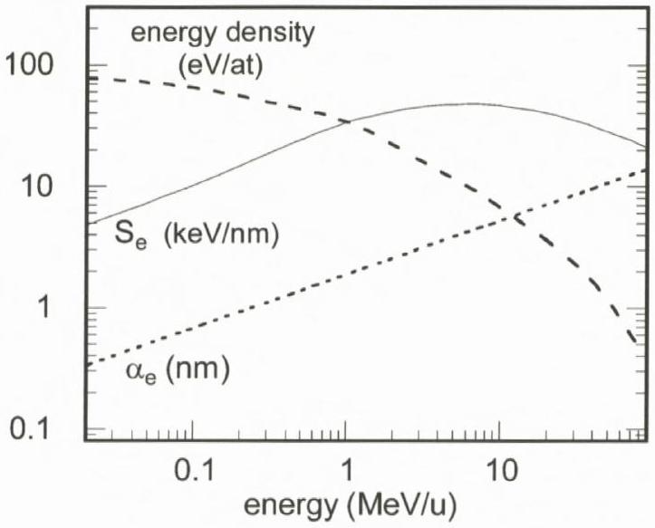
Figure 3. Electronic energy loss $S_{\mathrm{e}}$ (solid line), absorption radius $\alpha_{\mathrm{e}}$ (dotted), and energy density (given in eV per atomic volume) (dashed) in the electronic system as a function of specific beam energy for a $\mathrm{Y}_{3} \mathrm{Fe}_{5} \mathrm{O}_{12}$ target irradiated with U ions.

Combining the absorption radius $\alpha_{\mathrm{e}}$ and the energy loss $S_{\mathrm{e}}$ allows us to determine the deposited energy density. Figure 3 illustrates the dependence of $\alpha_{\mathrm{e}}, S_{\mathrm{e}}$, and the mean energy density of the electrons ( $S_{\mathrm{e}}$ divided by $N_{y} \pi \alpha_{\mathrm{e}}^{2}$, where $N_{y}$ is the atomic density of the target) for the case of $\mathrm{Y}_{3} \mathrm{Fe}_{5} \mathrm{O}_{12}$ target irradiated with U ions. In contrast to $S_{\mathrm{e}}$, the energy density steadily increases with decreasing beam energy. If we presume that the energy density in the electronic subsystem is transferred to the lattice, low beam energies should allow significant atomic motion.

## 3. Quantification of Damage Cross Section and Track Radius

### 3.1. Determination of Damage Cross Sections

Material modifications induced by swift heavy ions can be investigated by many different techniques. Structural changes, e.g., can be examined by x-ray diffraction (Chailley et al., 1996; Hémon et al., 1997) and by Channelling Rutherford Backscattering (Figure 4 left) (Meftah et al., 1993). The creation of defects are studied by electrical resistivity measurements (Costantini et al., 1993), UV (ionic crystals; Schwartz et al., 1998) or IR (vitreous $\mathrm{SiO}_{2}$; Busch et al., 1992) spectroscopy. In magnetic materials, the appearance of a paramagnetic phase (Figure 4 right) (Toulemonde et al., 1987) can be detected by Mössbauer spectrometry. Ion-induced volume changes (swelling) are quantified by surface profilometry

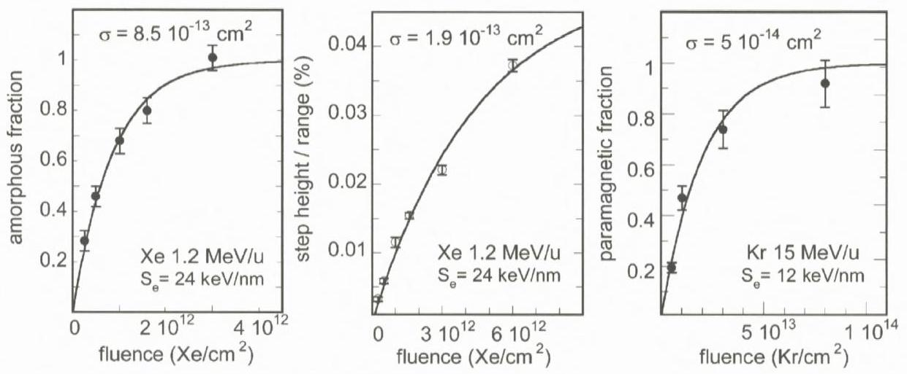
Figure 4. Evolution of special physical properties as a function of fluence for $\mathrm{Y}_{3} \mathrm{Fe}_{5} \mathrm{O}_{12}$ targets exposed to Xe and Kr ions of different energy and electronic energy loss. Left: The amorphous fractions of ion-irradiated crystals are quantified by Channeling Rutherford Backscattering. Center: Step height of out-of-plane swelling normalized by the ion range as recorded by profilometry. Right: Fraction of ion-induced paramagnetic structure deduced from Mössbauer spectrometry.

(Figure 4 center) (Trautmann et al., 2002) and anisotropic growth by optical or electron microscopy (Benyagoub et al., 1992; Klaumünzer et al., 1986). Except for Channelling Rutherford Backscattering which probes the damage close to the surface and, thus, allows an assignment of the damage to a better defined $S_{\mathrm{e}}$ value (provided that the ion projectiles used are in equilibrium charge state (Toulemonde, 2006)), most of the techniques test bulk samples and thus associate property changes with an energy loss averaged along the entire track length.

Ion-induced material changes are typically studied as a function of the ion fluence. In the regime of well separated individual tracks, the observed parameter usually follows a linear function and evolves towards saturation at high fluences due to track overlapping. Figure 4 shows the evolution of disorder obtained by Channeling Rutherford Backscattering (left), out-of-plane swelling from profilometry (center), and the fraction of a paramagnetic phase from Mössbauer spectrometry (right) for a $\mathrm{Y}_{3} \mathrm{Fe}_{5} \mathrm{O}_{12}$ target. Analyzing such a fluence evolution by a Poisson law that takes into account overlapping track regions, one can extract the damage cross section $\sigma$ and also the radius of the tracks provided that the damage is continuous and of cylindrical geometry. With increasing $S_{\mathrm{e}}$ the damage cross section typically becomes larger (cf. Figure 4 right and left). The absolute value of $\sigma$ may depend on the characterization technique (cf. Figure 4 left and center) and the kind of modification tested.

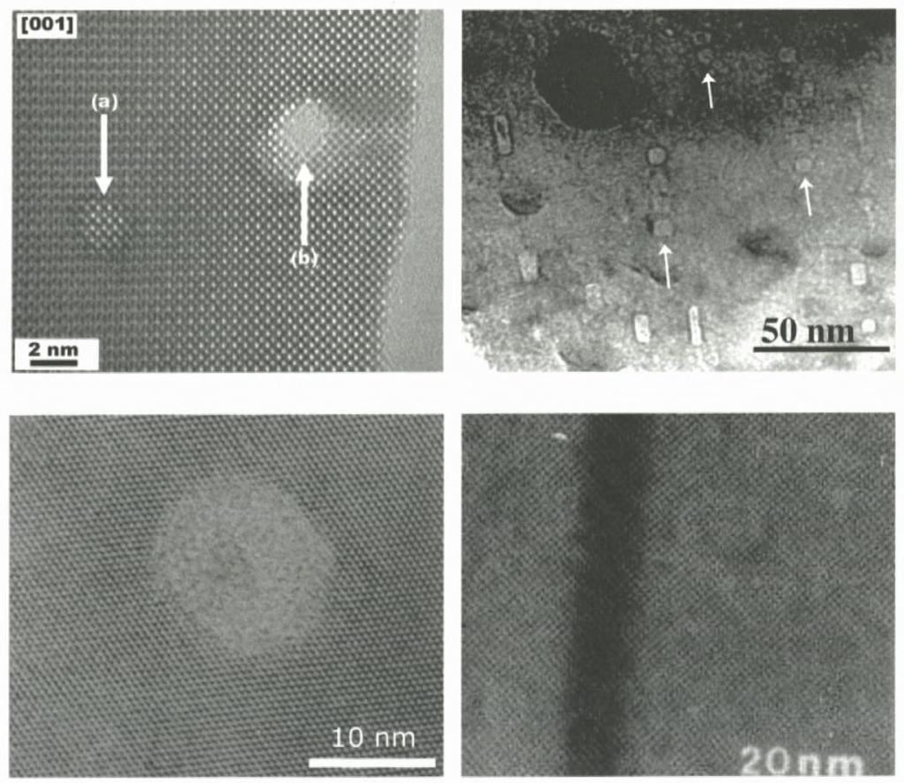
Figure 5. High-resolution transmission electron microscopy images of ion tracks in non-amorphisable (top) and amorphisable (bottom) insulators. Top left: Cross section of two tracks (a and b) in non-amorphisable $\mathrm{SnO}_{2}$ irradiated with Cd ions ( $9 \mathrm{MeV} / \mathrm{u}$ ) (Berthelot et al., 2000). Close to the border where the sample is extremely thin, the ion projectile created a hole (b). Top right: $\mathrm{CaF}_{2}$ irradiated with Bi ions of $10 \mathrm{MeV} / \mathrm{u}$. The arrows indicate the trajectories of non-continous facetted defect clusters (Khalfaoui et al., 2005). Bottom left: Cross section of a single track of a Pb ion in mica. The amorphous track zone is surrounded by the intact crystal matrix (Vetter et al., 1998). Bottom right: Continuous amorphous track region created along the trajectory of a Xe ion $(\sim 24 \mathrm{MeV} / \mathrm{u})$ in $\mathrm{Y}_{3} \mathrm{Fe}_{5} \mathrm{O}_{12}$ (Toulemonde and Studer, 1988).

### 3.2. Direct Determination of Track Radii

In the past, direct measurements of track radii were performed by visualizing tracks with Transmission Electron Microscopy (TEM) (Groult et al., 1988; Bursill and Braunshausen, 1990; Träholt et al., 1996) and scanning force microscopy (Ackermann et al., 1996; Müller et al., 2003; Khalfaoui et al., 2005; Thibaudau et al., 1991) or by applying small angle x-ray (or neutron) scattering (Albrecht et al., 1985; Schwartz et al., 1998; Saleh and Eyal, 2005).

The observation of individual tracks by TEM is limited to samples of small thickness $(<\sim 100 \mathrm{~nm})$ which can be prepared either after or before the ir-

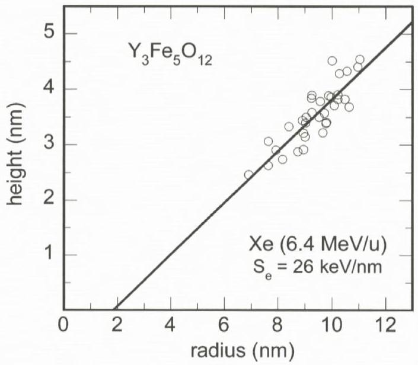
Figure 6. Height versus radius (half-width at half maximum) of hillocks on a $\mathrm{Y}_{3} \mathrm{Fe}_{5} \mathrm{O}_{12}$ surface irradiated with Xe ions. By extrapolation to height zero, the curvature radius of the scanning tip can be extracted. This allows a deconvolution of the hillock diameter and the tip size (Khalfaoui et al., 2005).

radiation. The latter case has the advantage that the $S_{\mathrm{e}}$ value is well defined but special attention should be paid to possible thickness and surface effects (Berthelot et al., 2000). If a thick sample is thinned down after beam exposure, damage by the thinning process has to be avoided. TEM reveals ion-induced changes of the material structure such as amorphous (Groult et al., 1988) or otherwise modified (Jensen et al., 1998) tracks embedded in a cristalline matrix. Figure 5 shows TEM images of tracks in non-amorphisable $\mathrm{SnO}_{2}$ and $\mathrm{CaF}_{2}$ crystals and in amorphisable materials such as mica and $\mathrm{Y}_{3} \mathrm{Fe}_{5} \mathrm{O}_{12}$ garnet.

On the sample surface, high-resolution imaging of individual tracks is possible by means of scanning force microscopy. Under suitable conditions, each ion impact produces a nanometric hillock (Thibaudau et al., 1991; Ackermann et al., 1996). The determination of the height is straightforward if the surface roughness is sufficiently small, whereas for the extraction of the hillock width (e.g. half width at half maximum) it is necessary to take into account the size of the scanning tip (typically of same order of magnitude as the hillock) (Müller et al., 2003). Figure 6 presents the height and the diameter of hillocks recorded with the same scanning tip. There is obviously a correlation, i.e. hillocks with a bigger diameter have a larger height (Khalfaoui et al., 2005).

In contrast to transmission electron and scanning force microscopy, smallangle scattering experiments give information for bulk samples averaging over

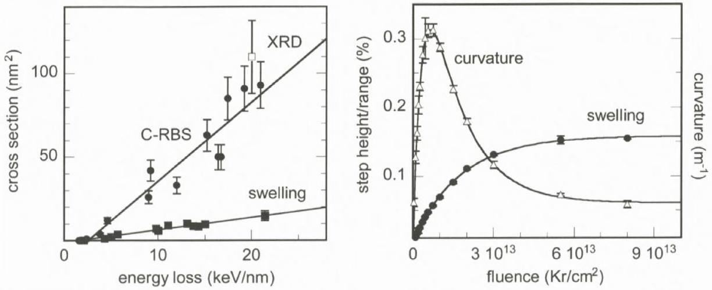
Figure 7. Left: Damage cross sections of tracks in $\mathrm{SiO}_{2}$ quartz as a function of electronic energy loss (Ziegler, 1999). The data are extracted from x-ray diffraction (XRD), Channelling Rutherford Backscattering (C-RBS), and swelling measurements. The irradiations were performed using beam energies between 1 and $4 \mathrm{MeV} / \mathrm{u}$ (Meftah et al., 1994). The lines are linear fits to the experimental cross sections. Right: Step height from out-of-plane swelling normalized by the ion range and sample curvature as a function of ion fluence of a mm thick quartz sample irradiated with $3-\mathrm{MeV} / \mathrm{u}$ Kr ions (range $\sim 24 \mu \mathrm{~m}, S_{\mathrm{e}}=11.5 \mathrm{keV} / \mathrm{nm}$ ) (the lines are guides to the eye).

many tracks along their full length (Schwartz et al., 1998). To deduce track parameters such as size and material density, the analysis requires a more or less complex geometrical model of tracks as scattering objects (Albrecht et al., 1985; Saleh and Eyal, 2005).

## 4. Tracks in Amorphisable Insulators

### 4.1. Damage Cross Sections

For a small number of solids (e.g. $\mathrm{SiO}_{2}, \mathrm{Y}_{3} \mathrm{Fe}_{5} \mathrm{O}_{12}$ ) there exists a rather broad set of track data obtained from irradiation experiments with many different ion beams and analyzed by various complementary techniques. The track size or the damage cross section is typically plotted as a function of the electronic energy loss as deduced from the TRIM or SRIM code (Ziegler, 1999) (Figure 7, left). The track data for $\mathrm{SiO}_{2}$ quartz were deduced from x-ray diffraction, Channelling Rutherford Backscattering, profilometry, and electron spin resonance measurements (Meftah et al., 1994; Trautmann et al., 1998; Douillard et al., 1992), and the linear extrapolation yields the same $S_{\mathrm{e}}$ threshold of $\sim 2 \mathrm{keV} / \mathrm{nm}$. Also the cross sections of the different techniques are in good agreement, except for swelling. The smaller swelling cross section is probably linked to stress phenomena. As a
consequence of the amorphisation of the quartz, the irradiated volume expands and stress builds up at the interface to the underlying non-irradiated substrate. Depending on the crystal thickness and ion range, the entire sample bends. Figure 7 right shows the curvature of a thick quartz sample as a function of the fluence. In the initial stage of the irradiation, the curvature increases with a high rate. Maximum bending occurs around $6 \times 10^{12}$ ions $/ \mathrm{cm}^{2}$, where swelling is still far from saturation but a large part of the irradiated volume is amorphised. At that stage, stress release becomes easier and with continuing irradiation the bending of the sample relaxes (Trautmann et al., 2002). This example demonstrates that a complete analysis of the swelling data is rather complex.

Another material for which damage cross sections and $S_{\mathrm{e}}$ threshold were deduced with different physical characterization techniques is $\mathrm{Y}_{3} \mathrm{Fe}_{5} \mathrm{O}_{12}$. Channelling Rutherford Backscattering, Mössbauer spectrometry, and magnetization measurements (Toulemonde and Studer, 1988) give consistent track size and threshold data, except that the swelling cross section is also smaller (cf. Figure 4 left and center). It remains to be clarified if this is a general property of amorphisable solids.

### 4.2. Comparison of Track Radii from Direct Measurements

Concerning track observations by direct techniques such as transmission-electron and scanning force microscopy and small angle x-ray scattering, mica is probably the most intensively studied insulator. The track zone in mica is amorphous, and the track radii obtained with these three methods show good overall agreement in a wide energy loss regime (Figure 8). However due to missing systematic data, it is not clear if this finding is universal and applies for all amorphisable crystals.

### 4.3. Damage Morphology

By combining the information from different techniques (TEM, Mössbauer spectrometry and chemical etching), the damage morphology of tracks is best investigated for $\mathrm{Y}_{3} \mathrm{Fe}_{5} \mathrm{O}_{12}$ garnet (Figure 9) (Houpert et al., 1989). Energetic projectiles of small energy loss produce individual spherical defects (of radius $R \sim 1.6 \mathrm{~nm}$ ) aligned along the ion path. For projectiles with larger energy loss, neighboring spherical defects overlap forming a discontinuous damage zone with the same radial size. Once the defects strongly percolate, further increasing of the energy loss leads to larger track radii, and the damage becomes more and more continuous and homogeneous. The evolution of this damage morphology seems to be a general characteristic and independent of the solids (Lang et al., 2004; Villa et al., 1999; Liu et al., 2001; Gaiduk et al., 2002). The peculiarity of the track morphology has

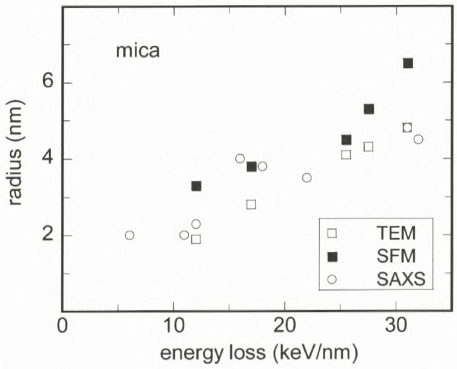
Figure 8. Track radii in mica as a function of electronic energy loss obtained by means of transmission electron microscopy (TEM), scanning force microscopy (SFM), and small angle x-ray scattering (SAXS). All irradiations were performed with beam energies around $11 \mathrm{MeV} / \mathrm{u}$.

to be kept in mind when trying to deduce the track-formation threshold from direct track measurements. Due to the discontinuous damage at small energy losses, the track diameter remains constant and an extrapolation to $R=0$ does not make sense.

At present, the discontinuous character of the track damage is not well understood, but it may result from the non-homogeneous energy deposition along the ion path since the energy transfer from the incident ion to the target atoms is a statistical process (Dartyge and Sigmund, 1985). Spherical defects may also be related to criteria responsible for the Rayleigh instability.

### 4.4. Comparison of Damage Cross Sections and Track Radii

Besides the direct visualisation of tracks, we can also deduce a track radius from measurements of the damage cross section $\sigma$ by $R_{\mathrm{e}}=\sqrt{\sigma / \pi}$. Here, $R_{\mathrm{e}}$ corresponds to an effective track radius because at small energy losses, as discussed above, the track damage deviates from cylindrical geometry and thus $R_{\mathrm{e}}$ yields values smaller than the diameter of the spherical defects. This is clearly visible in Figure 10 (left) where radii ( $R$ ) from direct measurements by high-resolution TEM are compared to effective radii ( $R_{\mathrm{e}}$ ) deduced from Mössbauer damage cross sections. Tracks larger than 2 nm show good agreement between $R$ and $R_{\mathrm{e}}$ (Toulemonde and Studer, 1988), whereas $R_{\mathrm{e}}$ is smaller than $R$ below $S_{\mathrm{e}} \sim 10 \mathrm{keV} / \mathrm{nm}$ because of the discontinuity of the damage. Figure 10 (right) shows a

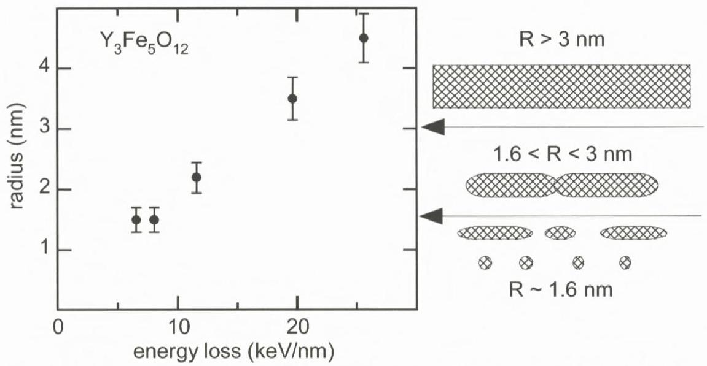
Figure 9. Damage morphology and track radii as a function of the electronic energy loss deduced from high-resolution electron microscopy (Studer and Toulemonde, 1992; Houpert et al., 1989). The irradiations of $\mathrm{Y}_{3} \mathrm{Fe}_{5} \mathrm{O}_{12}$ were performed with ions of about $15 \mathrm{MeV} / \mathrm{u}$.

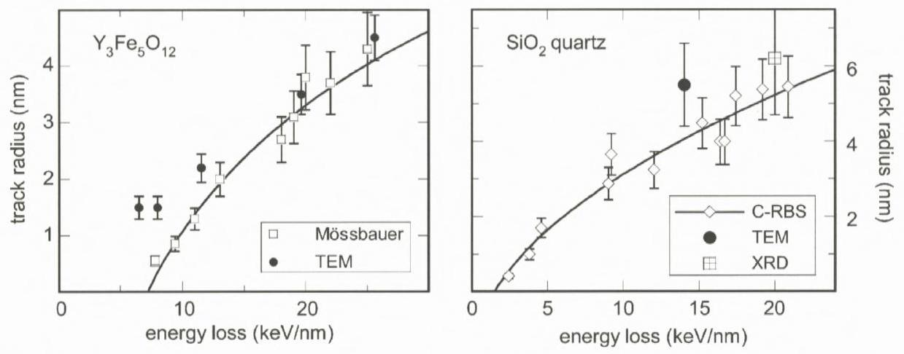
Figure 10. Track radii from transmission electron microscopy (full symbols) and effective radii ( $R_{\mathrm{e}}$ ) deduced from damage cross sections (open symbols) as a function of electronic energy loss. Left: Tracks in $\mathrm{Y}_{3} \mathrm{Fe}_{5} \mathrm{O}_{12}$ for beam energy around $15 \mathrm{MeV} / \mathrm{u} . R$ is measured by high-resolution TEM (Houpert et al., 1989) and $R_{\mathrm{e}}$ is deduced from Mössbauer spectrometry (Toulemonde et al., 1987). Right: Tracks in $\mathrm{SiO}_{2}$ quartz for beam energy between 1 and $4 \mathrm{MeV} / \mathrm{u}$. $R$ is measured by high-resolution TEM (circle) (Meftah et al., 1994) and $R_{\mathrm{e}}$ is deduced from Channelling Rutherford Backscattering (C-RBS, diamonds) (Meftah et al., 1994) and x-ray diffraction (XRD, square). The line in both plots is a square-root fit to $R_{\mathrm{e}}$.

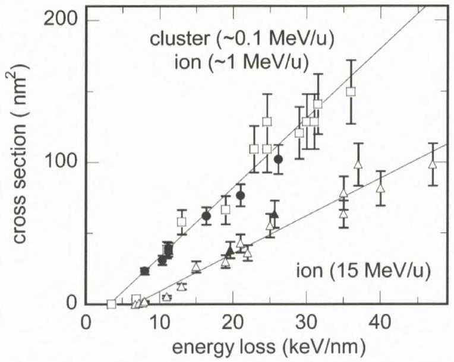
Figure 11. Damage cross sections of tracks in $\mathrm{Y}_{3} \mathrm{Fe}_{5} \mathrm{O}_{12}$ as a function of electronic energy loss. The irradiations were performed with $\mathrm{C}_{2-10}$ clusters ( $\sim 0.1 \mathrm{MeV} / \mathrm{u}$, full circles) and with ions in two different energy regimes ( $\sim 1 \mathrm{MeV} / \mathrm{u}$ and $\sim 15 \mathrm{MeV} / \mathrm{u}$ ). The damage cross section was deduced from Mössbauer spectrometry (open triangles (Toulemonde and Studer, 1988)), high-resolution TEM (full triangles (Toulemonde and Studer, 1988) and circles (Jensen et al., 1998)) assuming $\sigma=\pi R^{2}$ (restricted to $R>2 \mathrm{~nm}$ ), and Channelling Rutherford Backscattering (open squares (Meftah et al., 1993)). The lines are linear fits to the low-energy and high-energy data group.

similar comparison of direct and indirect determined track radii in $\mathrm{SiO}_{2}$ quartz. Radii obtained by means of x-ray diffraction and TEM agree well with results from Channelling Rutherford Backscattering experiments. Above the electronic energy loss threshold, the effective radius of both materials is well fitted by the square root of $S_{\mathrm{e}}$ (solid line in Figure 10) corresponding to a linear increase of the damage cross section (Figures 11 and 7 left).

### 4.5. Velocity Effect

Evidence for the velocity effect mentioned in Section 2 is given in Figure 11 showing damage cross sections as a function of energy loss for different specific beam energies. Independent of the characterization technique, the data for high-energy ions ( $\sim 15 \mathrm{MeV} / \mathrm{u}$ ) group around one line whereas low-energy ions ( $\sim 1 \mathrm{MeV} / \mathrm{u}$ ) and carbon cluster projectiles ( $C_{n}$ with $n=2-10, \sim 0.1 \mathrm{MeV} / \mathrm{u}$ ) group around a second line. The track cross sections for high-energy ions are about a factor of 2-3 smaller compared to the low-energy group. This effect is ascribed to the difference in the initial electron energy density. The relation to the beam velocity seems not to be linear because the energy density is as small as $\sim 1 \mathrm{eV}$ /at for high-energy

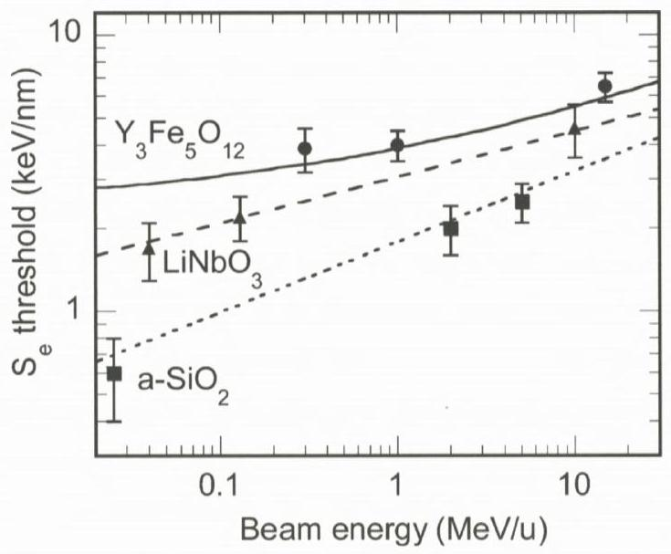
Figure 12. Electronic energy loss threshold for track formation as a function of specific beam energy for 3 different oxides $\mathrm{Y}_{3} \mathrm{Fe}_{5} \mathrm{O}_{12}$ (Meftah et al., 1993), $\mathrm{LiNbO}_{3}$ (Canut et al., 1997; Canut et al., 1996; Bentini et al., 2004), and vitreous $\mathrm{SiO}_{2}$ (Benyagoub et al., 1992; Rotaru, 2004; Van Dillen et al., 2003). The lines are the electronic stopping power threshold values versus beam energy according to calculations performed with the thermal spike model (see Section 5.4).

ions and about 10 and $100 \mathrm{eV} /$ at for $1-\mathrm{MeV} / \mathrm{u}$ monoatomic ions and $0.1-\mathrm{MeV} / \mathrm{u}$ clusters, respectively.

Also the critical electronic energy loss for track formation is sensitive to the beam velocity or energy density as illustrated in Figure 12: The threshold of several materials becomes smaller with decreasing beam energy (e.g. for $\mathrm{LiNbO}_{3}$ the threshold shifts from $4.4 \mathrm{keV} / \mathrm{nm}$ at $10 \mathrm{MeV} / \mathrm{u}$ to $1.7 \mathrm{keV} / \mathrm{nm}$ at $0.04 \mathrm{MeV} / \mathrm{u}$ ). This could be a chance for nanotechnology at smaller accelerator facilities providing typically ions of lower energy loss.

Another example for damage creation by electronic energy loss in the low-energy regime is illustrated in Figure 13 showing Channelling Rutherford Backscattering data of $\mathrm{SiO}_{2}$ quartz irradiated with Au ions of $\sim 0.02 \mathrm{MeV} / \mathrm{u}$. With increasing beam velocity, the damage rate first decreases (following the evolution of the nuclear energy loss) and then steeply increases above $0.02 \mathrm{MeV} / \mathrm{u}$ at $\sim 1.5 \mathrm{keV} / \mathrm{nm}$ (following the electronic stopping). This shows that at rather low beam velocities, synergetic effects of nuclear and electronic energy losses may play some role for damage creation.

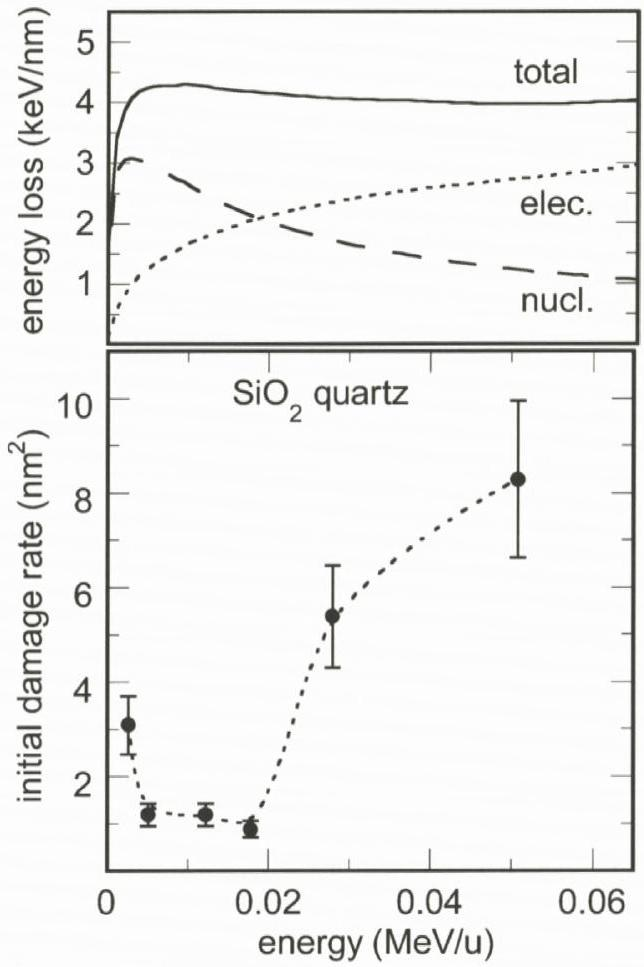
Figure 13. Nuclear, electronic, and total energy loss (top) and damage rate (bottom) as a function of specific beam energy for $\mathrm{SiO}_{2}$ quartz irradiated with Au ions and analyzed by Channelling Rutherford Backscattering (Toulemonde et al., 2001).

### 4.6. Summary of Track Observations in Amorphisable Insulators

Assuming that the results described above represent characteristic track properties for amorphisable insulators in general, the following conclusions can be made: (1) The specific energy and thus the velocity of the projectiles have a direct influence on the energy density deposited to the electrons of a given target. The higher the ion velocitiy, the more is the energy smeared out into a larger volume around the ion path. Hence for a given ion species and energy loss, the resulting damage cross sections and track radii become smaller with increasing beam velocity. To avoid misinterpretation, any data comparison should therefore only be performed within the same velocity range. (2) Damage cross sections obtained with a variety of characterization techniques show good agreement, except swelling measurements which yield smaller values. A direct relation between the
track radius and the damage cross section is restricted to tracks with continuous damage morphology. The critical track radius is of the order of 2 nm . Above this value, radii deduced from damage cross sections and from direct e.g. microscopic observations are in good agreement. (3) The energy loss threshold for a given material appears to be independent of the characterization method (including swelling measurements), but it should be extracted only from cross section data. Direct radius measurements suffer from the problem that close to the threshold, the track fragments into a discontinuous damage trail of constant radius.

## 5. Model Calculations with the Inelastic Thermal Spike

### 5.1. Introduction

Since the discovery of ion tracks several decades ago, various efforts have been made (e.g. Fleischer et al., 1975; Ithoh and Stoneham, 1998; Chadderton and Montagu-Pollock, 1963; Lesueur and Dunlop, 1993; Seiberling et al., 1980; Szenes, 1995; Trinkaus and Ryazanov, 1995) in order to give a realistic scenario of the complex track formation process and describe quantitatively experimental track data in different materials and under different irradiation conditions.

In this section we concentrate on the inelastic thermal spike model that tries to establish a link between the initial energy deposition on the electrons as described in Section 3 and the resulting damage creation in the lattice (Meftah et al., 1994). For many metallic targets, the thermal spike concept has been successfully applied predicting track recording metals and quantifying threshold values for track formation and the dependence of track radii on the electronic energy loss (Dufour et al., 1993b; Wang et al., 1994/1995). In a slightly modified version, the same concept is also used for a wide variety of insulators (Toulemonde et al., 2000; Meftah et al., 2005).

### 5.2. The Inelastic Thermal Spike Model

In this model, the electron and the lattice subsystem are included as two coupled systems. The kinetic energy of the projectiles is deposited into the electron system of the target, where thermalization occurs within about $10^{-15} \mathrm{~s}$. The hot electrons then transfer their energy by electron-phonon coupling to the cold lattice in which thermal equilibrium is reached after about $10^{-13} \mathrm{~s}$ (typical time for lattice vibrations). The heat diffusion in the electron and lattice subsystem is described by the classical heat equations with the electronic energy loss being the heat source term. The energy exchange term is given by the product $g \times\left(T_{\mathrm{e}}-T_{\mathrm{a}}\right)$ with $g$ being the coupling constant and ( $T_{\mathrm{e}}-T_{\mathrm{a}}$ ) the temperature difference between the
two subsystems. Due to the straight trajectory of energetic projectiles, the two differential heat equations are expressed in cylindrical geometry as follows:

$$
\begin{aligned}
& C_{\mathrm{e}}\left(T_{\mathrm{e}}\right) \frac{\partial T_{\mathrm{e}}}{\partial t}=\frac{1}{r} \frac{\partial}{\partial r}\left[r K_{\mathrm{e}}\left(T_{\mathrm{e}}\right) \frac{\partial T_{\mathrm{e}}}{\partial r}\right]-g\left(T_{\mathrm{e}}-T_{\mathrm{a}}\right)+A(r, t), \\
& C_{\mathrm{a}}\left(T_{\mathrm{a}}\right) \frac{\partial T_{\mathrm{a}}}{\partial t}=\frac{1}{r} \frac{\partial}{\partial r}\left[r K_{\mathrm{a}}\left(T_{\mathrm{a}}\right) \frac{\partial T_{\mathrm{a}}}{\partial r}\right]+g\left(T_{\mathrm{e}}-T_{\mathrm{a}}\right),
\end{aligned}
$$

where $T, C$, and $K$ are respectively the temperatures, the specific heat coefficients, and the thermal conductivities of the electronic (index e) and lattice subsystem (index a).
$A(r, t)$ denotes the spatiotemporal energy deposition of the projectile to the electron subsystem described by a Gaussian time distribution and a radial distribution $F(r)$ of the delta-electrons according to the Katz model (Waligorski et al., 1986)

$$
A(r, t)=b S_{\mathrm{e}} \mathrm{e}^{-\left(t-t_{0}\right)^{2} / 2 s^{2}} F(r) .
$$

The initial width of the electron cascade is described by $\alpha_{\mathrm{e}}$ (cf., Figure 2 left), and the half width $s$ of the Gaussian distribution corresponds to the time the electrons need to reach thermal equilibrium (Gervais and Bouffard, 1994). The majority of the electrons deposit their energy close to the ion path within $t_{0}=10^{-15} \mathrm{~s}$. The normalization factor b ensures that the integration of $A(r, t)$ in space and time is equal to the total electronic energy loss $S_{\mathrm{e}}$ (Dufour et al., 1993b).

In insulators the values of the thermal parameters of the electronic subsystem $C_{\mathrm{e}}$ and $K_{\mathrm{e}}=C_{\mathrm{e}} \times D_{\mathrm{e}}$ ( $D_{\mathrm{e}}$ is the electron diffusivity), are problematic since there exist no free electrons. However, according to Baranov et al. (1988), we can suppose that hot electrons in the conduction band of an insulator behave like hot free electrons in a metal and consequently $C_{\mathrm{e}} \sim 1.5 k_{\mathrm{B}} n_{\mathrm{e}},\left(\sim 1 \mathrm{~J} \mathrm{~cm}^{-3} \mathrm{~K}^{-1}\right)$ where $k_{\mathrm{B}}$ is the Boltzmann constant and $n_{\mathrm{e}}$ the number of excited electrons per atoms $(\sim 1) . D_{\mathrm{e}}$ is equal to the product of the electron Fermi velocity and the inter-atomic distance $\left(\sim 2 \mathrm{~cm}^{2} \mathrm{~s}^{-1}\right)$ (Toulemonde et al., 2000). The electron-phonon coupling constant $g$ of insulators is linked to the electron-phonon mean free path $\lambda$ by the relation $\lambda^{2}=C_{\mathrm{e}} D_{\mathrm{e}} / g$. When the electronic temperature has cooled down to $T_{\mathrm{a}}$, electrons are supposed to be trapped in the lattice and consequently the lattice cooling by cold free electrons is inhibited. The thermodynamical lattice parameters of insulators such as specific heat, thermal conductivity, solid and liquid mass density, melting and vaporisation temperatures (and corresponding latent heat values and sublimation energy) are extracted from experimental data available in the literature.

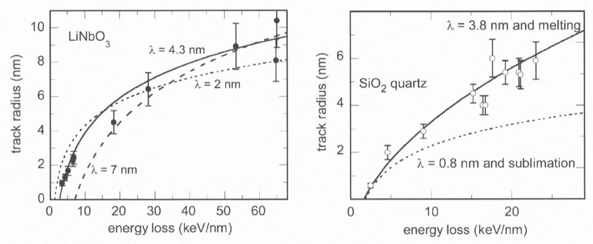
Figure 14. Left: Experimental track data for $\mathrm{LiNbO}_{3}$ irradiated with carbon clusters ( $C_{n}, n=6,8$, 60) (Canut et al., 1996, 1997) and thermal spike calculations (lines) testing different $\lambda$ values. Best agreement for the radius dependence on the electronic energy loss is obtained for $\lambda=4.3 \pm 0.3 \mathrm{~nm}$ (Meftah et al., 2005). Right: Experimental radii versus electronic energy loss for ion tracks in $\mathrm{SiO}_{2}$ quartz. A fit value of $\lambda=3.8 \pm 0.3 \mathrm{~nm}$ in combination with the melting criterion (solid line) gives best agreement with experimental data in the entire energy loss regime (Toulemonde et al., 2002). The fit fails if the sublimation energy is used as criterion for track formation (dashed line).

### 5.3. Determination of the Electron Mean Free Path

The two differential heat equations are solved numerically (Dufour et al., 1993a; Toulemonde et al., 2000) and give the lattice temperature $T_{\mathrm{a}}(t, r)$ around the projectile trajectory as a function of time $(t)$ and space $(r)$. In the thermal spike model, the track size is defined by the radial zone which contains sufficient energy for melting (defined by the energy to reach the melting temperature plus the latent heat of fusion) (Wang et al., 1994/1995; Meftah et al., 2005). Tracks are formed when during subsequent rapid cooling the molten material is quenched. In the heat equations (Equations 1a and 1b), $\lambda$ is the only free parameter to be fitted to the experimental track radii. A suitable $\lambda$ value has to describe track data in a wide range of electronic energy losses and beam velocities. Figure 14 (left) shows as example a set of experimental track data in $\mathrm{LiNbO}_{3}$ together with thermal spike calculations for different $\lambda$ values. It should be emphasized that experimental data close to the energy loss threshold (e.g. radii deduced from cross section measurements) are important for reliable extraction of the $\lambda$ value.

The dependence of the track radius on the energy loss is rather strongly influenced by the track formation criterion as demonstrated in Figure 14 (right) demonstrating that for $\mathrm{SiO}_{2}$ quartz, the melting criterion and $\lambda=3.8$ gives good agreement, whereas no suitable lambda value can be found in combination with the sublimation criterion. Such a test was also performed for other amorphisable

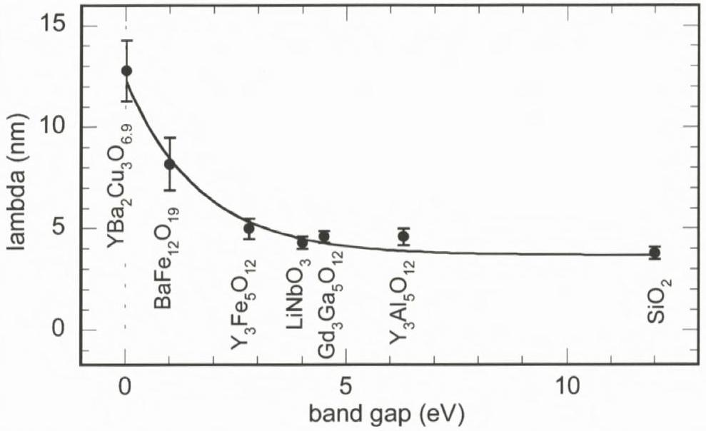
Figure 15. Electron mean free path $\lambda$ from thermal spike fitting as a function of the band gap energy for several crystalline oxide materials (Meftah et al., 2005).

insulators revealing that in all cases the melting criterion seems to yield best fit results.

Figure 15 presents $\lambda$ values of thermal spike calculations based on the melting criterion obtained by fitting track data for various oxides. The extracted values appear to be directly related to the inverse of the band gap energy (Toulemonde et al., 2000 ; Meftah et al., 2005). This evolution is reasonable if we consider that the cooling of hot electrons occurs via excitation of peripheral cold electrons from the valence to the conduction band which is directly linked to the band gap energy (Haglund and Kelly, 1992). More systematic investigations are required to show if this relation to the band gap is universal, so that the electron mean free path can be deduced for any insulator. In this case, $\lambda$ could be inserted in the heat equations as a predetermined parameter.

### 5.4. Effect of Beam Velocity

In the thermal spike code, the velocity of the ion beam enters via the initial energy distribution. The calculations should therefore describe the track radii of ions of different velocities using the same $\lambda$ value. An example is shown in Figure 16, where the experimental track data (same as shown in Figure 11) for monoatomic and cluster projectiles of low and high velocity are well described by thermal spike calculations (solid lines) for $\lambda=5 \mathrm{~nm}$. In the calculation, the energy distribution of these different beams, characterized by $\alpha_{\mathrm{e}}$, goes into the heat equations via $F(r)$ in Equation (2). During the coupling time between the electronic and lattice

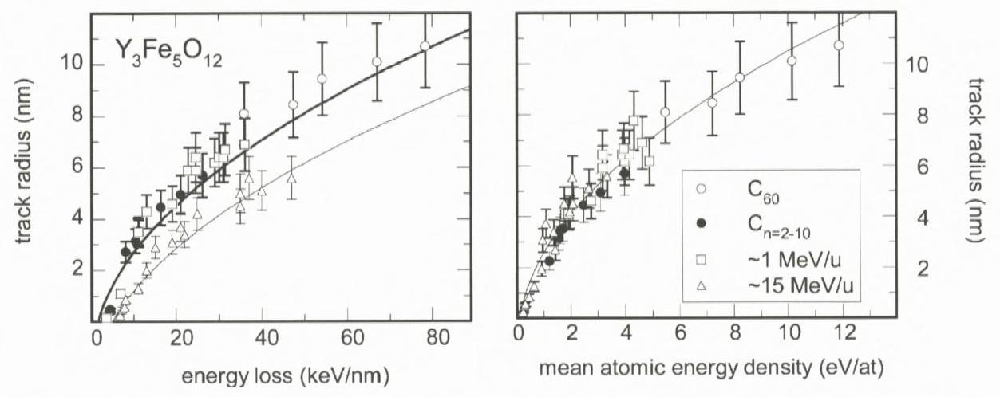
Figure 16. Track radii in $\mathrm{Y}_{3} \mathrm{Fe}_{5} \mathrm{O}_{12}$ irradiated with projectiles of different velocities (see caption of Figure 11) and thermal-spike calculations using a fixed electron-phonon mean free path of $\lambda=5 \mathrm{~nm}$ but different initial energy distributions. Left: Track radius as a function of electronic energy loss. Right: Track radius as a function of mean atomic energy density.

system, $\alpha_{\mathrm{e}}$ and the electron-phonon mean free path $\lambda$ contribute to the increase of the energy distribution in the lattice system to a radius of $\alpha_{a}=\sqrt{\lambda^{2}+\alpha_{\mathrm{e}}^{2}}$. For low-energy projectiles (including clusters), the initial energy distribution $\alpha_{\mathrm{e}}$ is much smaller than $\lambda$ and has therefore only a small influence on the resulting track radius. In contrast, for high-energy ions where $\alpha_{\mathrm{e}} \sim \lambda$, the energy spread in the lattice increases leading to smaller energy densities and smaller track radii. At extremely high beam velocities, the contribution of $\lambda$ becomes negligible and the energy distribution is governed by $\alpha_{\mathrm{e}}$. When plotting the track radius versus the atomic energy density (obtained by dividing the electronic energy loss $S_{\mathrm{e}}$ by $N_{y} \pi \alpha_{\mathrm{a}}^{2}$ with $N_{y}$ being the atomic density of the target), all data follow one universal curve as illustrated in Figure 16 (right). Thermal spike calculations of this type also confirm the experimental findings that the damage creation threshold $S_{\mathrm{e}}$ decreases for smaller beam energies (cf. Figure 12) (Meftah et al., 2005).

### 5.5. Thermal Spike Description of Electronic Sputtering of Surface Atoms

To test if the thermal spike approach can also describe surface processes such as sputtering of atoms, the thermal spike code was extended by the possibility to calculate the number of particles evaporated when an energetic ion impinges the sample surface (Mieskes et al., 2003; Toulemonde et al., 2002). As in the case of elastic-collision spikes, the evaporation is determined by the local temperature (Sigmund and Claussen, 1981). Since the temperature around the ion path decreases as a function of the radial distance, the total sputter yield $Y_{\text {tot }}$ has

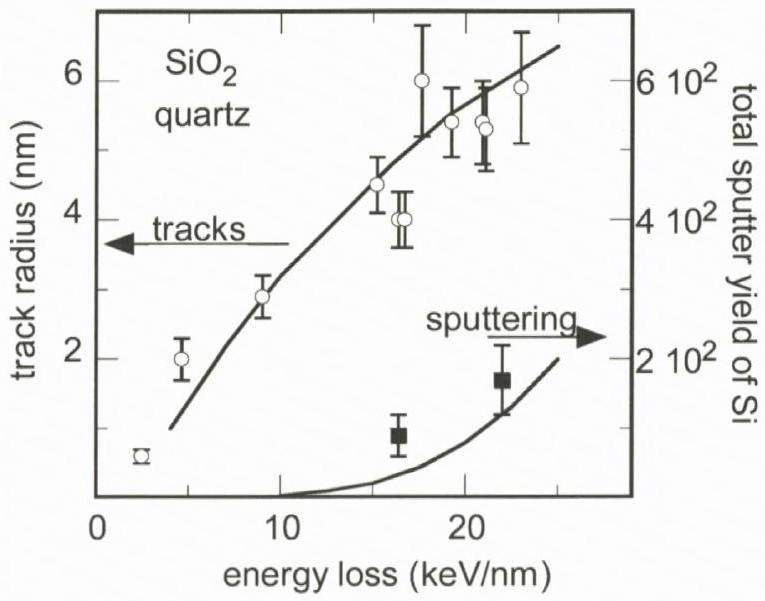
Figure 17. Track radii and total sputtering yields as a function of energy loss for $\mathrm{SiO}_{2}$ quartz. The thermal spike model calculations (solid lines) for track formation (melting) and sputtering (evaporation) are performed with the same electron mean free path $\lambda=3.8 \mathrm{~nm}$, and the known sublimation energy.

to be determined from the time and space integral of the local evaporation rate $\Phi\left(T_{\mathrm{a}}(t, r)\right)$. The temperature is calculated with the heat equations (Equations 1a and 1b) using a $\lambda$ value determined by fitting track radii as described above. The temperature dependence of the evaporation rate is given by statistical thermodynamics and the Maxwell-Boltzmann equation:

$$
\begin{aligned}
& Y_{\mathrm{tot}}=\int_{0}^{\infty} \mathrm{d} t \int_{0}^{\infty} \Phi\left(T_{\mathrm{a}}(r, t)\right) 2 \pi r \mathrm{~d} r, \\
& \Phi\left(T_{\mathrm{a}}(r, t)\right)=N_{y} \sqrt{\frac{k T_{\mathrm{a}}(t, r)}{2 \pi M}} \exp \left(\frac{-U}{k T_{\mathrm{a}}(t, r)}\right),
\end{aligned}
$$

where $N_{y}$ denotes the atomic density and $M$ the molecular mass of the target, $k$ is the Boltzmann constant, and $U$ is the surface binding energy assumed to be equal to the sublimation energy per atom or molecule (for compound materials). For temperatures above vaporization, the thermal diffusivity of the lattice is assumed to increase with the square root of the temperature as derived by Sigmund (1974/1975).

At present we can apply this approach only for $\mathrm{SiO}_{2}$ quartz because track and simultaneously sputtering data exist only for this material. ${ }^{1}$ Figure 17 shows how

[^1]well thermal spike calculations with a fixed $\lambda$ value of 3.8 nm can describe track radii and sputtering yields.

The good agreement indicates that tracks can be attributed to the appearance of a "molten" phase while sputtering is linked to "vapor" phase, i.e. to surface sublimation. To confirm this relation, additional experiments are needed to provide data of track radii (or damage cross sections) and simultaneously total sputtering yields for other materials.

## 6. Conclusions

### 6.1. Amorphisable Materials

Based on many investigations, track radii can be quantitatively determined either from direct observations or deduced from cross section measurements. The track formation threshold can be reliably extrapolated from the dependence of the cross section on electronic energy loss. Track radii deduced from different analysis techniques show overall agreement for radii larger than 2 nm . Deviations below 2 nm have to be ascribed to the discontinuous damage morphology i.e. the track shape deviates from cylindrical geometry. The overall agreement between the different characterization techniques may be linked to the fact that all these methods probe structural modifications such as ion-induced disorder or amorphization. Track radii from profilometer measurements seem to be different probably because the out-of-plane swelling includes additional effects. In any case swelling yields the same track formation threshold as other techniques.

For track formation it is important to consider the deposited energy density and not only the linear energy transfer. The energy density is given by the initial radial distribution of the recoil electrons, and the subsequent diffusion of the energy in the electronic subsystem prior its transfer to the lattice atoms. The inelastic thermal spike model considers (1) the initial energy deposition on the electrons in a cylinder of radius $\alpha_{\mathrm{e}}$, which scales with the ion velocity, and (2) the electronphonon mean free path $\lambda$ to characterize the diffusion length of the electrons in a specific material. $\lambda$ is not known a-priori and is thus the unique fit parameter in the model. Finally a clear correlation can be seen between the calculated atomic energy density and the measured track radius.

Thermal spike calculations allow a consistent description of a series of experimental track phenomena, despite the fact that the application of thermodynamics to short time events occurring in a nanometric volume and the strong simplification of the description of the energy dissipation (see chapter by Klaumünzer, this volume) may be questionable. Tracks in amorphisable insulators are ascribed

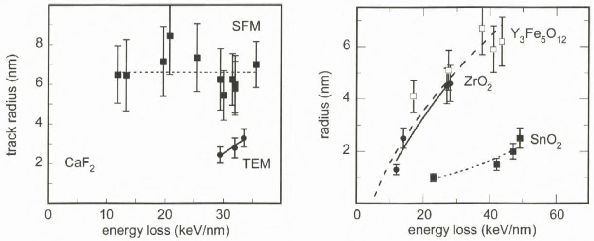
Figure 18. Track radii as a function of electronic energy loss for different materials. Left: Tracks in $\mathrm{CaF}_{2}$ observed by scanning force microscopy (SFM) and transmission electron microscopy (TEM) (Khalfaoui et al., 2005). Right: Tracks in amorphisable $\mathrm{Y}_{3} \mathrm{Fe}_{5} \mathrm{O}_{12}$ garnets (Meftah et al., 1993) and in non-amorphisable $\mathrm{ZrO}_{2}$ (Benyagoub, 2005) and $\mathrm{SnO}_{2}$ (Berthelot et al., 2000) crystals.

to a quench of a molten phase, and electronic sputtering of surface atoms is associated with thermal spike induced sublimation. For different materials, the electron-phonon mean free path values, derived from a fit to track radii and $S_{\mathrm{e}}$ thresholds, follow a monotonic decrease with the band gap energy. The model considers the effect of the ion velocity, by combining the size of the initial electron energy distribution ( $\alpha_{e}$ ) with the electron-phonon mean free path ( $\lambda$ ). Simulations show that the mean energy density deposited in the lattice is mainly governed by $\alpha_{\mathrm{e}}$ for high-velocity projectiles and by $\lambda$ for low-velocity beams.

### 6.2. Unsolved Problems

Various thermal spike calculations show that the melting concept suitable for amorphisable materials does not directly apply for tracks in non-amorphisable materials. One of the problems is given by the difficulty to define a suitable track diameter (Trautmann et al., 2000a). The response of non-amorphisable material to energetic ion beams is not just an amorphous cylindrical track but exhibits manifold effects (cf., Figure 5). For instance, in ionic crystals such as alkali and earth alkali halides, point defects and defect clusters are created. The size of hillocks formed on the surface of $\mathrm{CaF}_{2}$ is not related to tracks directly observed by transmission electron microscopy (in contrary to mica) (Figure 18, left). Also in $\mathrm{SnO}_{2}$ (Berthelot et al., 2000) and $\mathrm{UO}_{2}$ (Wiss et al., 1997), TEM reveals track sizes much smaller than typically recorded for amorphisable material (Figure 18, right). Other solids, e.g. $\mathrm{ZrO}_{2}$, change their structure from the monoclinic to the tetrag-
onal phase but with rather large cross sections (Benyagoub, 2005) (Figure 18, right). At present, it is not clear, if trends found for tracks in amorphisable crystals are of general validity.

Tracks in $\mathrm{CaF}_{2}$ and $\mathrm{SnO}_{2}$ cannot be described by thermal spike calculations using the melting criterion and a $\lambda$ value deduced from the $\lambda$ versus band gap plot (Figure 15). Triggered by the observations that energetic ions may produce empty holes in $\mathrm{SnO}_{2}$ (Figure 5 top, left), the criterion of track formation was modified to sublimation instead of melting (Berthelot et al., 2000). Under this condition, track sizes in $\mathrm{SnO}_{2}$ as well as in $\mathrm{CaF}_{2}$ could be described quantitatively (Toulemonde et al., 2000). It remains to be shown if in non-amorphisable solids tracks can be produced from a quench of a molten phase. A possible case could be $\mathrm{ZrO}_{2}$, where the track radii deduced from the cross sections of the monoclinic to tetragonal phase change is well described by the thermal spike model using the energy necessary to melt ( $\sim 1 \mathrm{eV} / \mathrm{at}$ ) and a $\lambda$ value of 4 nm . As proposed for $\mathrm{Y}_{2} \mathrm{O}_{3}$ (Hémon et al., 1997), the tracks, resulting from melt quenching, probably consist of small nanograins instable regarding the monoclinic phase (Djurado et al., 2000). Although coherent with the description made for amorphisable materials, this interpretation is in contradiction with a phase change resulting only from a rise of temperature to 1100 K , according to the phase diagram (Benyagoub, 2005) of $\mathrm{ZrO}_{2}$ (this corresponds to an energy of $\sim 0.2 \mathrm{eV}$ /at and can be fitted by the thermal spike with $\lambda \sim 10 \mathrm{~nm}$ ).

Last but not least, it should be mentioned that experiments studying track formation and electronic sputtering of surface atoms can help to shed more light onto the basic ion-matter interaction processes. Huge sputtering yields for ionic crystal and new phenomena such as jet-like sputtering normal to the surface do not have a straightforward link to the same beam and material parameters as track formation (Assmann et al., 2006; Toulemonde et al., 2002).

## References

Ackermann J., Angert N., Neumann R., Trautmann C., Dischner M., Hagen T. and Sedlacek M. (1996): Ion track diameters in mica studied with scanning force microscopy. Nucl Instr Meth B 107, 181-184
Albrecht D., Armbruster P., Spohr R., Roth M., Schaupert K. and Stuhrmann H. (1985): Investigation of heavy ion produced defect structures in insulators by small angle scattering. Appl Phys A 37, 37-46
Assmann W., Toulemonde M. and Trautmann C. (2006): Electronic sputtering with swift heavy ions. In: Behrisch R. and Eckstein W. (Eds), Sputtering by Particle Bombardment, Sputtering with Ion Energies from Threshold to MeV - Experiments and Computer Simulation. Springer, pp 313-361 (in press)

Audouard A., Balanzat E., Jousset J.C., Chamberod A., Fuchs G., Lesueur D. and Thom L. (1991): Effects of electronic energy loss in crystalline and amorphous $\mathrm{Ni}_{3} \mathrm{~B}$ irradiated by high-energy heavy ions. Phil Mag B 63, 727-738
Baranov I.A., Martynenko Yu.V., Tsepelevich S.O. and Yavlinskii Yu.N. (1988): Inelastic sputtering of solids by ions. Sov Phys Usp 31, 1015-1034
Baudin K., Brunelle A., Chabot M., Della-Negra S., Depauw J., Gardes D., Hakanson P., Le Beyec Y., Billebaud A., Fallavier M., Remilleux J., Poizat J.C. and Thomas J.P. (1994): Energy loss by MeV carbon clusters and fullerene ions in solids. Nucl Instr Meth B 94, 341-344
Bentini G.G., Bianconi M., Correra L., Chiarini M., Mazzoldi P., Sada C., Argiolas N., Bazzan M. and Guzzi R. (2004): Damage effects produced in the near-surface region of x-cut $\mathrm{LiNbO}_{3}$ by low dose, high energy implantation of nitrogen, oxygen and fluorine ions. J Appl Phys 96, 242-247
Benyagoub A. (2005): Mechanism of the monoclinic-to-tetragonal phase transition induced in zirconia and hafnia by swift heavy ions. Phys Rev B 72, 094114 (1-7)
Benyagoub A., Löffler S., Rammensee M., Klaumünzer S. and Saemann-Ischenko G. (1992): Plastic deformation in $\mathrm{SiO}_{2}$ induced by heavy-ion irradiation. Nucl Instr Meth B 65, 228-231
Berthelot A., Hémon S., Gourbilleau F., Dufour C., Domengès B. and Paumier E. (2000): Behaviour of a nanometric $\mathrm{SnO}_{2}$ powder under swift heavy-ion irradiation: from sputtering to splitting. Phil Mag A 80, 2257-2281
Betz H.D. (1972): Charge states and charge-changing cross sections of fast heavy ions penetrating through gaseous and solid media. Rev Mod Phys 44, 465-539
Biersack J.P. and Haggmark L.G. (1980): A Monte Carlo computer program for the transport of energetic ions in amorphous targets. Nucl Instr Meth 174, 257-269
Bringa E.M. and R.E Johnson R.E. (2002): Coulomb explosion and thermal spikes. Phys Rev Lett 88, 165501 (1-4)
Bursill L.A. and G. Braunshausen G. (1990): Heavy-ion irradiation tracks in zircon. Phil Mag 62, 395-420
Busch M.C., Slaoui A., Siffert P., Dooryhee E. and Toulemonde M. (1992): Structural and electrical damage induced by high-energy heavy ions in $\mathrm{SiO}_{2} / \mathrm{Si}$ structures J Appl Phys 71, 2596-2601
Canut B., Ramos S.M.M., Brenier R., Thevenard P., Loubet J.L. and Toulemonde M. (1996): Surface modifications of $\mathrm{LiNbO}_{3}$ single crystals induced by swift heavy ions. Nucl Instr Meth B 107, 194-198
Canut B., Ramos S.M.M., Bonardi N., Chaumont J., Bernas H. and Cottereau E. (1997): Defect creation by MeV clusters in $\mathrm{LiNbO}_{3}$. Nucl Instr Meth B 122, 335-338
Chadderton L.T. and Montagu-Pollock H.M. (1963): Fission fragment damage in crystal lattices: Heat-sensitive crystals. Proc R Soc London A 274, 239-252
Chailley V., Dooryhee E. and Levalois M. (1996): Amorphization of mica through the formation of GeV heavy ion tracks. Nucl Instr Meth B 107, 199-203
Costantini J.M., Brisard F., Meftah A., Studer F. and Toulemonde M. (1993): Conductivity modifications of calcium-doped yttrium iron garnet by swift heavy ion irradiations. Rad Eff Def Sol 126, 233-236
Dartyge E. and Sigmund P. (1985): Tracks of heavy ions in muscovite mica: Analysis of the rate of production of radiation defects. Phys Rev B 32, 5429-5431
Djurado E., Bouvier P. and Lucazeau G. (2000): Crystallite size effect on the tetragonal-monoclinic transition of undoped nanocrystalline zirconia studied by XRD and Raman spectrometry. J Sol St Chem 140, 399-407

Douillard L., Jollet J., Duraud J.P., Devine R.A.B. and Dooryhee E. (1992): Radiation damage produced in quartz by energetic ions. Radiat Eff Def in Sol 124, 351-370
Dufour C., Lesellier de Chezelles B., Delignon V., Toulemonde M. and Paumier E. (1993): A transient thermodynamic model for track formation in amorphous semi-conductors: A possible mechanism. In: Mazzoldi P. (Ed.), Modifications Induced by Irradiation in Glasses, Europ. Mat. Res. Soc. (E-MRS) Symp. Proc. Vol. 29. North Holland, Amsterdam, pp 61-66
Dufour C., Audouard A., Beuneu F., Dural J., Girard J.P., Hairie A., Levalois M., Paumier E. and Toulemonde M. (1993): A high resistivity phase induced by swift heavy ion irradiation of Bi: A probe for thermal spike damage. J Phys: Condens Matter 5, 4573-4584
Dunlop A., Lesueur D., Legrand P., Dammak H. and Dural J. (1994): Effects induced by high electronic excitations in pure metals: A detailed study in iron. Nucl Instr Meth Phys B 90, 330-338
Fleischer R.L., Price P.B. and Walker R.M. (1975): Nuclear Tracks in Solids, Principles and Applications, University of California Press, Berkeley
Fuchs G., Studer F., Balanzat E., Groult D., Toulemonde M. and Jousset J.C. (1987): Influence of the electronic stopping power on the damage rate on yttrium-iron garnets irradiated by high-energy heavy ions. Europhys Lett 3, 321-325
Gaiduk P.I., Nylandsted Larsen A., Trautmann C. and Toulemonde M. (2002): Discontinuous tracks in arsenic-doped crystalline $\mathrm{Si}_{0.5} \mathrm{Ge}_{0.5}$ alloy layers. Phys $\operatorname{Rev} \mathrm{B}$ 66, 045316 (1-5)
Gervais B. and Bouffard S. (1994): Simulation of the primary stage of the interaction of swift heavy ions with condensed matter. Nucl Instr Meth B 88, 355-364
Glasmacher U.A., Lang M., Keppler H., Langenhorst F., Neumann R., Schardt D., Trautmann C. and Wagner G.A. (2006): Phase transitions in solids stimulated by simultaneous exposure to high pressure and relativistic heavy ions. Phys Rev Lett 96, 195701 (1-4)
Groult D., Hervieu M., Nguyen N. and Raveau B. (1988): 3.1 GeV -Xenon latent tracks in $\mathrm{Bi}_{2} \mathrm{Fe}_{4} \mathrm{O}_{9}$ : Mössbauer and electron microscopy studies. J Sol Stat Chem 76, 248-259
Haglund R.F. and Kelly R. (1992): Electronic processes in sputtering by laser beams, Mat. Fys. Medd. Dan. Vid. Selsk 43 (1992) 527-592
Hémon S., Challey V., Dooryhée E., Dufour C., Gourbilleau F., Levesque F. and Paumier E. (1997): Phase transformation of polycrystalline $\mathrm{Y}_{2} \mathrm{O}_{3}$ under irradiation with swift heavy ions. Nucl Instr Meth B 122, 563-565
Hou M.-D., Klaumünzer S. and Schumacher G. (1990): Dimensional changes of metallic glasses during bombardment with fast heavy ions. Phys Rev B 41, 1144-1157
Houpert C., Studer F., Groult D. and Toulemonde M. (1989): Transition from localized defects to continuous latent tracks in magnetic insulators irradiated by high energy heavy ions: A HREM investigation. Nucl Instr Meth B 39, 720-723
Huber F., Bimbot R. and Gauvin H. (1990): Range and stopping power tables for 2.5 to $500 \mathrm{MeV} / \mathrm{u}$, heavy ions in solids. At Nucl Data Tables 46, 1-215
Itoh N. and Stoneham A.M. (1998): Excitonic model of track registration of energetic heavy ions in insulators. Nucl Instr Meth B 146, 362-366
Iwase A., Sasaki S., Iwata T. and Nihira T. (1987): Anomalous reduction of stage-I recovery in nickel irradiated with heavy ions in the energy range $100-120 \mathrm{MeV}$. Phys Rev Lett 58, 24502453
Jensen J., Dunlop A., Della Negra S. and Toulemonde M. (1998): A comparison between tracks created by high energy mono-atomic and cluster ions in $\mathrm{Y}_{3} \mathrm{Fe}_{5} \mathrm{O}_{12}$. Nucl Instr Meth B 146, 412-419

Kamarou A., Wendler E. and Wesch W. (2005): Charge state effect on near-surface damage formation in swift heavy ion irradiated InP. J Appl Phys 97, 123532 (1-6)
Khalfaoui N., Rotaru C.C., Bouffard S., Toulemonde M., Stoquert J.P., Haas F., Trautmann C., Jensen J. and Dunlop A. (2005): Characterization of swift heavy ion tracks in $\mathrm{CaF}_{2}$ by scanning force and transmission electron microscopy. Nucl Instr Meth B 240, 819-829
Klaumünzer S., Hou M.-D. and Schumacher G. (1986): Coulomb explosions in a metallic glass due to the passage of fast heavy ions. Phys Rev Lett 57, 850-853
Lang M., Glasmacher U.A., Moine B., Neumann R. and Wagner G.A. (2004): Etch-pit morphology of tracks caused by swift heavy ions in natural dark mica. Nucl Instr Meth B 218, 466-471
Levalois M., Bogdanski P. and Toulemonde M. (1992): Induced damage by high energy heavy ion irradiation at the GANIL accelerator in semiconductor materials. Nucl Instr Meth B 63, 14-20
Lesueur D. and Dunlop A. (1993): Damage creation via electronic excitations in metallic target Part II: A theoretical model. Radiat Eff and Def Sol 126, 163-172
Liu J., Neumann R., Trautmann C. and Müller C. (2001): Tracks of swift heavy ions in graphite studied by scanning tunneling microscopy. Phys Rev B 64, 184115 (1-7)
Meftah A., Brisard F., Costantini J.M., Hage-Ali M., Stoquert J.P. and Toulemonde M. (1993): Swift heavy ions in magnetic insulators: A damage cross section velocity effect, Phys Rev B 48, 920-925
Meftah A., Brisard F., Costantini J.M., Dooryhee E., Hage-Ali M., Hervieu M., Stoquert J.P., Studer F. and Toulemonde M. (1994): Track formation in $\mathrm{SiO}_{2}$ quartz and the thermal spike mechanism. Phys Rev B 49, 12457-12463
Meftah A., Costantini J.M., Khalfaoui N., Boudjadar S., Stoquert J.P., Studer F. and Toulemonde M. (2005): Experimental determination of track cross-section in $\mathrm{Gd}_{3} \mathrm{Ga}_{5} \mathrm{O}_{12}$ and comparison to the inelastic thermal spike model applied to several materials. Nucl Instr Meth B 237, 563-574
Mieskes H.D., Assmann W., Grüner F., Kucal H., Wang Z.G. and Toulemonde M. (2003): Electronic and nuclear thermal spike effects in sputtering of metals with energetic heavy ions. Phys Rev B 67, 155404 (1-9)
Müller C., Voss K.-O., Lang M. and Neumann R. (2003): Correction of systematic errors in scanning force microscopy images with application to ion track micrographs. Nucl Instr Meth B 212, 318-325
Rizza G., Dunlop A. and Kopcewicz M. (2006): Deformation bands in metallic glasses induced by swift heavy ions. Nucl Instr Meth B 245, 130-132
Rotaru C. (2004): $\mathrm{SiO}_{2}$ sur Silicium: Comportement sous irradiation avec des ions lourds. PhD Thesis, University of Caen, web site http://tel.archives-ouvertes.fr/tel-00005399
Saleh S.A. and Eyal Y. (2005): Porous track cores along wakes of swift Pb ions in LiF. Nucl Instr Meth B 230, 246-250
Schwartz K., Trautmann C., Steckenreiter T., Geiss O. and Krämer M. (1998): Damage and track morphology in LiF crystals irradiated with GeV ions. Phys Rev B 58, 11232-11240
Seiberling L.E., Griffith J.E. and Tombrello T.A. (1980): A thermalized ion explosion model for high energy sputtering and track registration, Rad. Eff. 52 (1980) 201-210
Silk E. and Barnes R. (1959): Examination of fission fragment tracks with electron microscopy. Phil Mag 4, 970-971
Sigmund P. (1974/1975): Energy density and time constant of heavy-ion-induced elastic-collision spikes in solids. Appl Phys Lett 25, 169-171 and Appl Phys Lett 27, 52
Sigmund P. and Claussen C. (1981): Sputtering from elastic-collision spikes in heavy-ionbombarded metals. J Appl Phys 52, 990-993

Sigmund P. and Schinner A. (2002): Binary theory of electronic stopping. Nucl Instr Meth B 195, 64-90
Studer F. and Toulemonde M. (1992): Irradiation damage in magnetic insulators. Nucl Instr Meth B 65, 560-567
Szenes G., Horvath Z.E., Pecz B., Paszti F. and Toth L. (2002): Tracks induced by swift heavy ions in semiconductors. Phys Rev B 65, 045206 (1-11)
Szenes G. (1995): Ion-velocity-dependent track formation in yttrium iron garnet: A thermal-spike analysis. Phys Rev B 52, 6154-6157
Thibaudau F., Cousty J., Balanzat E. and Bouffard S. (1991): Atomic-force-microscopy observations of tracks induced by swift Kr ions in mica. Phys Rev Lett 67, 1582-1585
Toulemonde M., Fuchs G., Nguyen N., Studer F. and Groult D. (1987): Damage processes and magnetic field orientation in ferromagnetic oxides $\mathrm{Y}_{3} \mathrm{Fe}_{5} \mathrm{O}_{12}$ and $\mathrm{BaFe}_{12} \mathrm{O}_{19}$ irradiated by high-energy heavy ions: A Mössbauer study. Phys Rev B 35, 6560-6569
Toulemonde M. and Studer F. (1988): Comparison of the radii of latent tracks induced by high-energy heavy ions in $\mathrm{Y}_{3} \mathrm{Fe}_{5} \mathrm{O}_{12}$ by HREM, channelling Rutherford backscattering and Mössbauer spectrometry. Phil Mag A 58, 799-807
Toulemonde M., Dufour Ch., Meftah A. and Paumier E. (2000): Transient thermal processes in heavy ion irradiation of crystalline inorganic insulators. Nucl Instr Meth B 166-167, 903-912
Toulemonde M., Ramos S.M.M., Bernas H., Clerc C., Canut B., Chaumont J. and Trautmann C. (2001): MeV gold irradiation induced damage in $\alpha$-quartz: competition between nuclear and electronic stopping. Nucl Instr Meth B 178, 331-336
Toulemonde M., Assmann W., Grüner F. and Trautmann C. (2002): Jetlike component in sputtering of LiF induced by swift heavy ions. Phys Rev Lett 88, 057602 (1-4)
Toulemonde M. (2006): Irradiation by swift heavy ions: Influence of the non-equilibrium projectile charge state for near surface experiments. Nucl Instr Meth 250, 263
Trinkaus H. and Ryazanov A.I. (1995): Viscoelastic model for the plastic flow of amorphous solids under energetic ion bombardment. Phys Rev Lett 74, 5072-5075
Träholt C., Wiesner J., Zandbergen H.-W., Fuess H., Wirth G. and Wen J.-G. (1996): High resolution electron microscopy of heavy-ion induced defects in superconducting Bi-2212 thin films in relation to their effect on $\mathrm{J}_{\mathrm{c}}$. Physica C 268, 161-172
Trautmann C., Costantini J.M., Meftah A., Schwartz K., Stoquert J.P. and Toulemonde M. (1998): Swelling of $\mathrm{SiO}_{2}$ quartz induced by energetic heavy ions. Mat Res Symp Proc 504, 123-128
Trautmann C., Toulemonde M., Schwartz K., Costantini J.M. and Müller A. (2000a): Damage structure in the ionic crystal LiF irradiated with swift heavy ions. Nucl Instr Meth B 164-165, 365-376
Trautmann C., Klaumünzer S. and Trinkaus H. (2000b): Effect of stress on track formation in amorphous iron boron alloy: Ion tracks as elastic inclusions. Phys Rev Lett 85, 3648-3651
Trautmann C., Boccanfuso M., Benyagoub A., Klaumünzer S., Schwartz K. and Toulemonde M. (2002): Swelling of insulators induced by swift heavy ions. Nucl Instr Meth B 191, 144-148

Van Dillen T., Polman A., van Kats C.M. and Van Blaaderen A. (2003): Ion beam-induced anisotropic plastic deformation at 300 keV . Appl Phys Lett 83, 4315-4317
Vetter J., Scholz R., Dobrev D. and Nistor L. (1998): HREM investigation of latent tracks in GeS and mica induced by high energy ions. Nucl Instr Meth B 141, 747-752
Villa F., Grivet M., Rebetez M., Dubois C., Chambaudet A., Chevarier A., Martin P., Brossard F., Blondiaux G., Sauvage T. and Toulemonde M. (1999): Damage morphology of Kr ion tracks in apatite: Dependence on $\mathrm{d} E / \mathrm{d} x$. Radiat Meas 31, 65-70

Waligorski M.P.R., Hawn R.N. and Katz R. (1986): The radial distribution of dose around the path of a heavy ion in liquid water. Nucl Track Radiat Meas 11, 309-319
Wang Z.G., Dufour Ch., Paumier E. and Toulemonde M. (1994/1995): The $S_{\mathrm{e}}$ sensitivity of metals under swift-heavy-ion irradiation: A transient thermal process. J Phys Condens Matt 6, 67336750 and 7, 2525-2526
Wesch W., Kamarou A. and Wendler E. (2004): Effect of high electronic energy deposition in semiconductors. Nucl Instr Meth B 225, 111-128
Wiss T., Matzke Hj., Trautmann C., Toulemonde M. and Klaumünzer S. (1997): Radiation damage in $\mathrm{UO}_{2}$ by swift heavy ions. Nucl Instr Meth B 122, 583-588
Young D.A. (1958): Etching of radiation damage in lithium fluoride. Nature 183, 375-377
Ziegler J.F. (1999): Stopping of energetic light ions in elemental matter. J Appl Phys 85, 1249-1272

[^0]:    * E-mail: toulemonde@ganil.fr

[^1]:    ${ }^{1}$ Sufficient data exist for $\mathrm{Y}_{3} \mathrm{Fe}_{5} \mathrm{O}_{12}$ but the sublimation energy necessary for the thermal spike calculation is not available.

