The Role of Electronic Energy Loss in Ion Beam Modification of Materials

William J. Weber ${ }^{\mathrm{a}, \mathrm{b}, *}$, Dorothy M. Duffy ${ }^{\mathrm{c}}$, Lionel Thomé ${ }^{\mathrm{d}}$, and Yanwen Zhang ${ }^{\mathrm{b}, \mathrm{a}}$ ${ }^{\mathrm{a}}$ Department of Materials Science and Engineering, The University of Tennessee, Knoxville, TN 37996, USA ${ }^{\mathrm{b}}$ Materials Science and Technology Division, Oak Ridge National Laboratory, Oak Ridge, TN 37831, USA ${ }^{\mathrm{c}}$ Department of Physics and Astronomy and The London Centre for Nanotechnology, University College London, Gower Street, London WC1E 6BT, United Kingdom ${ }^{\mathrm{d}}$ Centre de Sciences Nucléaires et de Sciences de la Matiére, CNRS-IN2P3-Université Paris-Sud, Bât. 108, F-91405 Orsay, France

#### Abstract

The interaction of energetic ions with solids results in energy loss to both atomic nuclei and electrons in the solid. In this article, recent advances in understanding and modeling the additive and competitive effects of nuclear and electronic energy loss on the response of materials to ion irradiation are reviewed. Experimental methods and large-scale atomistic simulations are used to study the separate and combined effects of nuclear and electronic energy loss on ion beam modification of materials. The results demonstrate that nuclear and electronic energy loss can lead to additive effects on irradiation damage production in some materials; while in other materials, the competitive effects of electronic energy loss leads to recovery of damage induced by elastic collision cascades. These results have significant implications for ion beam modification of materials, non-thermal recovery of ion implantation damage, and the response of materials to extreme radiation environments.

Keywords: Irradiation effects; Electronic/nuclear energy loss; Two-temperature model; Thermal spike model; Ion annealing; Synergistic effects

[^0]
## 1. Introduction

The use of energetic ion beams to synthesize and modify materials has evolved over the past several decades. Ion beam modification of materials employs energetic ions over a broad range of energies to controllably change electrical, optical, structural, mechanical and chemical properties of materials for a broad range of research and applications [1-5], including advanced electro-optical devices and engineered nanostructures. The interaction of ions with solids results in energy loss to both atomic nuclei and electrons in the solid. Energy transfer to the electronic and atomic structures, and corresponding response of materials, can be divided into three principal energy regimes. At low ion energies ( $\mathrm{E}<0.5 \mathrm{MeV}$ ), the transfer of energy to atomic nuclei (nuclear energy loss) dominates, leading to the displacement of atoms via elastic scattering collisions between atomic nuclei in ballistic collision cascades. For high energy ions exceeding $\sim 1 \mathrm{MeV}$ per nucleon ( $\mathrm{MeV} / \mathrm{u}$ ), particularly for swift heavy ions ( $\mathrm{E}>50 \mathrm{MeV}$ ), electronic energy loss dominates, leading to intense local ionization that can cause damage production [6], track formation [7] or damage recovery [8], and the formation of long, straight ion tracks with nanometer diameters by swift heavy ions has been exploited in a range of nanoscience applications [9,10]. At intermediate ion energies ( $0.5<\mathrm{E}<50 \mathrm{MeV}$ ), nuclear and electronic energy losses are of similar magnitude, which can lead to additive effects on damage production [6,11] or competitive recovery processes [12-14] that affect damage accumulation and nanostructure evolution during ion beam modification.

While it is well established that the interaction of energetic electrons, ions and neutrons with solids initiates a cascade of energy transfer processes on both the electronic and atomic structures, irradiation effects research on materials has focused largely on the separate effects of energy transfer to the atomic structure for much of the past 50 years. Due to the complexity of the problem and the heretofore limitation of available experimental and computational tools, the dynamics of energy transfer to electrons and exchange of energy between electrons and ions/atoms are much less understood. In recent years, the importance of these ionization effects and the coupling of electronic and atomic processes has become
increasingly recognized for both metals [15,16] and ceramics [12,14,17]. The development of radiationtolerant materials and the control of ion beam modification methods to create defects and nanoscale structures that tailor materials properties or create new functionalities demand a comprehensive understanding and predictive models of energy transfer and exchange processes at the level of electrons and atoms.

This review focuses on recent advances in understanding and modeling the effects of energy loss to electrons on ion beam modification of materials, with particular emphasis on the intermediate energy regime from a few hundred keV to tens MeV . The effects and applications of swift heavy ions [18,19, this issue] and cluster ions [20, this issue] are covered in companion reviews, as are advanced techniques in characterization of ion beam modified materials [21, this issue]. We will first summarize the advances in computational approaches, and then present and discuss the response of materials to single ions, to the separate effects of nuclear and electronic energy loss, and the combined effects of dual ion-beam experiments.

## 2. Advances in Computational Methods

While there is a general understanding of the physics involved in the evolution of a single ion event, detailed predictive models are lacking. This is the most fundamental and critical source term in understanding and modeling the collective response of materials to ion irradiation over a broad range of ion energies and irradiation conditions. Computational modeling provides an efficient method for studying the effects of ion irradiation in materials. Modeling complements experiments, by aiding interpretation and often providing insight into the mechanisms and effects of ion-solid interactions. Traditionally, the effect of ion irradiation on solids has been modelled using cascade simulations, which are molecular dynamics (MD) simulations in which one atom is given a high kinetic energy to initiate a radiation cascade event. Such simulations have made enormous contributions to the understanding of fundamental processes, but they suffer from the limitation that the computational time increases dramatically as the simulated ion energy increases. In addition, standard methods do not take into account
the effects of excited electrons, which limits their application to radiation events less than a few hundred keV.

As already noted, energy loss by ions in the low energy regime is dominated by nuclear energy dissipation in atomic collision cascades that are readily described by MD methods [22,23], but often without any consideration of the electronic energy losses by primary and secondary ions, which are not completely negligible. For many ionic and covalent compounds, the electronic energy losses in this energy regime can be substantial; thus, MD simulations are beginning to take the electronic energy losses into account as a friction force in order to correctly describe the energy partitioning processes [24,25]. At much higher energies where energy loss to electrons dominates, the relationship between electronic energy loss mechanisms and atomic processes can be described by an inelastic thermal spike model, originally proposed by Vineyard [26] and more fully developed recently [27]. In this model, the electrons along the ion path undergo a large degree of excitation and electron-electron scattering, and they subsequently transfer much of their energy, via electron-phonon coupling, to atoms in the same region, causing local heating. The electronic energy deposition profiles can be determined from either Monte Carlo (MC) methods [28,29] or an empirical expression [30], and energy dissipation within the electronic structure and transfer to the atomic structure is described by a two-temperature model [31]. At intermediate energies where ions transfer substantial and comparable energy to both the electronic and atomic structures, the response of materials is dependent on the complex interaction of electronic excitations, structural atoms and atomic defects. This partitioning of energy deposition, electronic excitation, and energy/heat dissipation are important to both the ion beam modification and radiation damage communities. Under ion irradiation, electronic energy transfer (electronic excitations and electron-phonon coupling) and momentum transfer (atomic collisions) are entangled with equilibrium heating and nonequilibrium excitation processes. To model such complex processes in accurate detail is a grand challenge that demands fundamental understanding of materials processes at the level of electrons and atoms over several orders of magnitude in time scale, from femtoseconds (fs) to nanoseconds (ns).

### 2.1 Two-temperature model for ion-solid interactions

While surface modification of materials using ions with energies below a few tens keV can be well modeled by simple cascade simulations, the modeling of ion beam modification processes at the higher energies of interest in this review is less developed. The dominant energy loss process for energies of several $\mathrm{MeV} / \mathrm{u}$ is inelastic electronic scattering, and this energy loss induces a narrow track of highly excited electrons. These highly excited electrons rapidly distribute their energy through electron-electron interactions (< 0.5 ps ) until the electrons are sufficiently thermalized to dissipate their energy via electron-phonon coupling to the atoms in the material ( 0.1 to 10 ps ). It is the dissipation of this energy in a local inelastic thermal spike, followed by a rapid cooling stage ( $<100 \mathrm{ps}$ ), that can result in permanent structural modifications, which can be in the form of damage production, such as defects or an ion track, or the recovery of pre-existing damage. In reality, the dissipation mechanisms are complex and strongly material dependent, but simple models have been developed that capture the dominant features.

The most widely used models are based on the premise that the excited electrons rapidly equilibrate and therefore a temperature, $T_{\mathrm{e}}$, can be assigned to the electrons. Initially the electrons are far from equilibrium with the atoms, which have a different temperature, $T_{1}$ [31]. Methods based on this twotemperature approach treat the electronic and atomistic systems as coupled continuous media, whose heat transport properties are governed by two coupled heat diffusion equations. Energy exchange between the electrons and atoms is proportional to the local temperature difference and the electron-phonon coupling constant. The coupled heat diffusion equations for the electronic and ionic temperatures are:
$C_{e} \frac{\partial T_{e}}{\partial t}=\nabla \kappa_{e} \nabla T_{e}-g_{p}\left(T_{e}-T_{l}\right)+A(\mathbf{r}, t)$
$C_{l} \frac{\partial T_{l}}{\partial t}=\nabla \kappa_{l} \nabla T_{l}+g_{p}\left(T_{e}-T_{l}\right)$

Here $C_{\mathrm{e}}$ and $C_{\mathrm{l}}$ are the electronic and lattice heat capacities, respectively, $K_{e}$ and $K_{l}$ are the electronic and lattice thermal conductivities, and $g_{p}$ is the electron-phonon coupling constant. $A(\mathbf{r}, t)$ is the energy deposited to the electronic system as a function of space (r) and time (t).

The rapid passage of energetic ions through the material allows us to impose radial symmetry around the ion track, and the equations reduce to coupled one dimensional equations that depend only on the radial distance from the center of the ion track. In this case, the source term $A(\mathbf{r}, t)$ is the energy input to the electrons due to inelastic interactions with the swift heavy ion, which can be estimated from Monte Carlo simulations [28,29] or approximated by an analytic function [30]. The time evolution of the spatial distribution of the lattice temperature, or inelastic thermal spike, is determined by numerical solution of the equations. Comparison with experimental observations is made by assuming that the observed track is formed by melting and solidification to an amorphous or highly defective structure. Thus, the spatial extent of the solid that has exceeded the melting temperature corresponds to the calculated track diameter, which can be directly compared with measured tracks.

### 2.2 Inelastic thermal spike model

The spatial distribution of thermal energy deposition to the atomic structure from electronic energy loss is determined from numerical solutions to the two-temperature model, which can be incorporated directly within MD environments to simulate inelastic thermal spikes and investigate the time evolution of the complex structural changes that occur due to the dissipation of this thermal

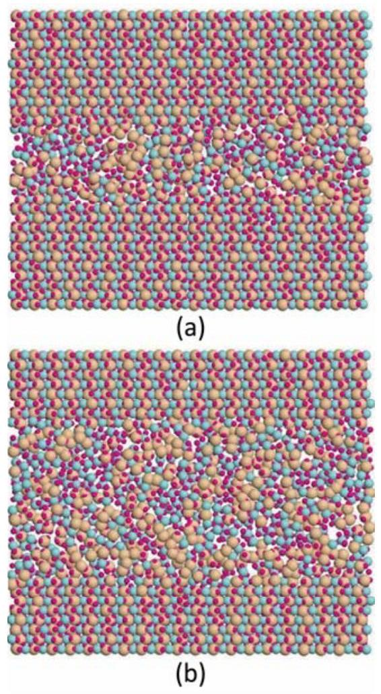
Fig. 1. Variation of amorphous track diameter with electronic stopping power in $\mathrm{ZrSiO}_{4}$ from MD simulations: (a) $3.9 \mathrm{keV} / \mathrm{nm}$ and (b) $5.94 \mathrm{keV} / \mathrm{nm}$. These results predict a threshold for track formation in $\mathrm{ZrSiO}_{4}$ of $2.55 \mathrm{keV} / \mathrm{nm}$ [33].

energy. The inelastic thermal spike model, as it is known, has been applied to metals [32] and band gap materials [6,7,27,32,33]. It reproduces the general features observed experimentally, such as the increase in track diameter with electronic stopping power and the threshold stopping power below which no permanent damage is observed, and these effects are reproduced using MD simulations based on the inelastic thermal spike model [33], as illustrated in Fig. 1. The inelastic thermal spike model can also be used to explain the velocity effect, which is the different track diameters observed for ions with the same stopping power, but different velocities [27,32,34].

The large number of assumptions involved in the development of the inelastic thermal spike model means that it should be employed with caution. These assumptions, as discussed in [35], include use of Fourier's law to describe highly non-linear or ballistic thermal transport, neglect of other energy loss mechanisms, such as shock waves and radiative processes, and neglect of superheating effects. In addition, the parameters required for the model are not accurately known and often estimated from a free electron model. In reality, these parameters have a complex, and often poorly characterized temperature dependence that needs to be included in the model. The temperature dependence of the electronic heat capacity and electron-phonon coupling have been calculated for range of metals using density functional theory [36].

The inelastic thermal spike model has been employed for band gap materials based on the argument that electrons excited to the conduction band behave in much the same way as conduction electrons in metals. Indeed, a wide range of experimental results can be reproduced using the electronic mean free path as an adjustable parameter [27]. This approach is problematic, however, as in these materials the number of carriers (electron-hole pairs) varies in space and time; therefore, additional conservation equations need to be included for an accurate description of the carrier dynamics [37]. The additional equations require even more parameters than those in the standard model. Extensive research on carrier dynamics in semiconductors has ensured that these parameters are well established for a limited number of materials. The inelastic thermal spike model has been extended, using the extra equations, and applied to silicon [38].

In summary, the inelastic thermal spike model is a useful tool for analyzing experimental results for ion beam material interactions but much more research is required on the fundamental processes involved in energy dissipation and transport to evaluate the magnitudes and temperature variations of the parameters before this can be considered as a reliable predictive model.

### 2.3 Superposition of recoil damage and inelastic thermal spike

For intermediate energy ions, electronic and nuclear energy losses are both significant, and energy transfer to electrons that returns to the atomic structure via electron-phonon coupling can either enhance damage production processes [6] or decrease damage production by enhancing recovery processes [8,12]. For ions at these energies, energy transfer and exchange along the entire ion path (microns) cannot be realistically simulated with current computational resources. However, a large-scale classical MD approach employing several million atoms has been recently demonstrated [39,40], where the secondary recoil spectrum and electronic energy loss generated by a passing ion, not the incident ion itself, are simulated over an incremental path length (tens of nanometers) of the incident ion. This approach is highly relevant to MeV ion damage in thin films (free-standing or on substrates), in TEM samples during in situ irradiation studies, and in bulk or thick films, where incremental cross-sectional characterization of damage is performed. In this approach, the binary collision approximation (BCA) [41] is used to generate files of secondary recoil spectra along a specific incremental path length of the incident ions, such as at the midpoint in a thin film. The radial distribution of electronic heating from the passing incident ion is determined using the thermal spike model [27]. While the transfer of energy from the incident ion to electrons and atomic recoils occurs simultaneously, the electronic heating of the atomic structure, via electron-phonon coupling, induced by electronic energy loss occurs on the 0.1 to 10 ps time scale, and secondary recoil collision cascades occur over a similar time scale. To capture this, MD simulations of the maximum electronic heating (i.e., thermal spike) and secondary recoil collision cascades are run simultaneously, but in a slightly delayed sequence. Kinetic energy is initially transferred to selected atoms along the ion track, consistent with a BCA recoil spectrum, and the thermal spike is included a short time
later (~ 0.1 to 1 ps ) as a radial distribution of kinetic energy given to atoms in random directions along the incident ion trajectory, as illustrated in Fig. 2, similar to the MD approaches (above) developed for thermal spike simulations of swift heavy ions. The short delay in adding the thermal spike energy is consistent with the time needed for energy dissipation and electron-phonon coupling from the two-temperature model. Using this approach, Backman et al. [39] demonstrated an additive effect of simultaneous electronic and

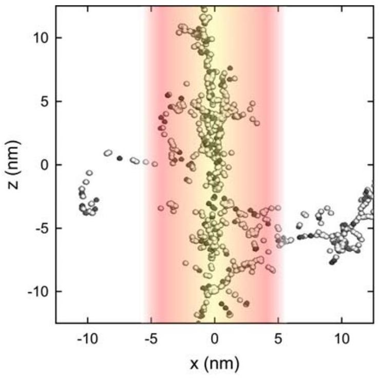
Fig. 2. Illustration of molecular dynamics approach [39] that combines recoil spectra from BCA simulations with thermal spike model.

### 2.4 Coupled two-temperature molecular dynamics model

In the previous sections, we have described the two-temperature model for coupled continuum electronic and atomic systems and MD models that evaluate the atomistic dynamics following a predetermined energy deposition into the lattice. In this section, we describe coupled two-temperature, molecular dynamics (2T-MD) models that calculate the time-dependent energy deposition into the atoms using the two-temperature model. Such hybrid models are commonly used to simulate structural modification of metals following laser irradiation [42] and they have been applied to electron emission from metal surfaces [43].

The 2T-MD methods are particularly appropriate for modeling the structural modifications resulting from ion irradiation, as they can capture the synergistic effects caused by nuclear and electronic energy dissipation. The implementation of two-way energy exchange between the atoms and the electrons ensures that the energy lost by ions due to inelastic scattering is deposited to the electrons, thereby increasing the electronic temperature. This electronic energy can diffuse not only among the electrons, but it can also be re-deposited to the atoms via electron-phonon coupling. The two-way energy exchange is achieved by implementing a modified Langevin thermostat in the MD simulation [44,45], as described the relation:

$$
m_{i} \frac{\partial \mathbf{V}_{i}}{\partial t}=\mathbf{F}_{i}-\gamma \mathbf{V}_{i}+\tilde{\mathbf{F}}
$$

Here $m_{\mathrm{i}}$ and $\mathbf{v}_{\mathrm{i}}$ are the mass and velocity, respectively, of atom $i$. The force, $\mathbf{F}_{\mathrm{i}}$, acting on atom $i$ due to interatomic interactions is supplemented by a friction term $\gamma_{i}$, which represents the energy lost to the electrons by electronic stopping. The last term, $\widetilde{\mathbf{F}}$, is a stochastic force that represents energy input to the atoms via electron-phonon coupling. The electronic temperature is defined on a grid of voxels that is superimposed on the MD simulation cell. The temporal evolution of the electronic temperature (Eq. 2) is solved using a finite difference (FD) method and the energy exchange between the electrons and the atoms is implemented at every MD time step. The energy lost by the atoms, due to the friction term, is input to the corresponding voxel of the electronic temperature grid and the energy lost by the electrons due to electron-phonon coupling is input to the atoms of the MD simulation by the stochastic force. The lattice is effectively thermostated to the evolving electronic temperature. Thus, the coupled heat transport equation for the atoms (Eq. 2) in the two-temperature model is replaced by an MD simulation (Eq. 3) with a modified Langevin thermostat in the 2T-MD model.

Different types of irradiation events can be modeled by imposing different boundary conditions for the MD and FD systems, as illustrated in Fig. 3. In cascade simulations, electronic stopping can act as an
energy sink that serves to quench the thermal spike, and the electronic energy can be fed back to the lattice via electronphonon coupling to enhance defect annealing [46]. Swift heavy ion irradiation [47] is modeled by periodic boundaries for both the MD and electronic systems in the zdirection (the direction of the swift heavy ion motion) and periodic boundaries for the MD simulation cell in the lateral ( $\mathrm{x}-\mathrm{y}$ ) directions. The electronic simulation cell is extended well beyond the atomistic cell in the lateral directions. This configuration enables the transport of electronic energy away from the simulation cell, which gives realistic description of electronic thermal transport away from the ion track. Simulations on Fe [47] noted that the lattice temperature could rise well beyond the melting temperature without any observed melting, which demonstrates previously predicted superheating [34]. This method has been extended to band gap materials and applied to Si [48], as illustrated in Fig. 4, and Ge [49]

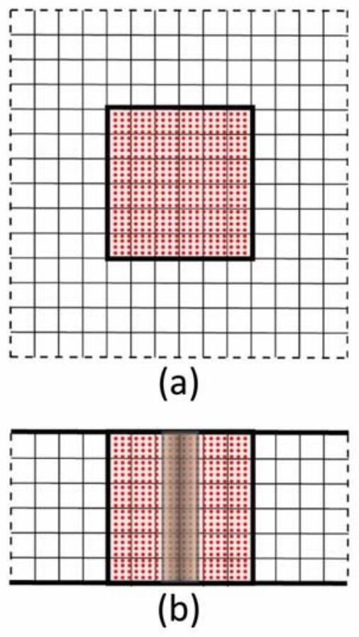
Fig. 3. Schematic of the 2T-MD configurations for cascade (a) and for swift heavy ion (b) simulations. The red squares represent the MD simulation and the overlying grid represents the voxels for the FD solution of $T_{\mathrm{e}}$. The thick lines show periodic boundary conditions and the dashed lines are fixed or Dirichlet boundary conditions. The extension of the FD cell beyond the MD cell provides a mechanism for energy transport by electronic conduction.

irradiated with swift heavy ions. The model provided results that are in good agreement with the limited available experimental data for an electron-phonon relaxation time of 0.05 ps .

The hybrid 2T-MD model addresses some of the issues related to the inelastic thermal spike model. For example, energy dissipation by shock-waves and superheating are accounted for directly. The parameters associated with the lattice are all accounted for explicitly, at least at the level of accuracy that they are given by the interatomic potentials employed in the MD simulation. The issue of the values and temperature dependence of the electronic properties remains problematic. The electron-phonon coupling

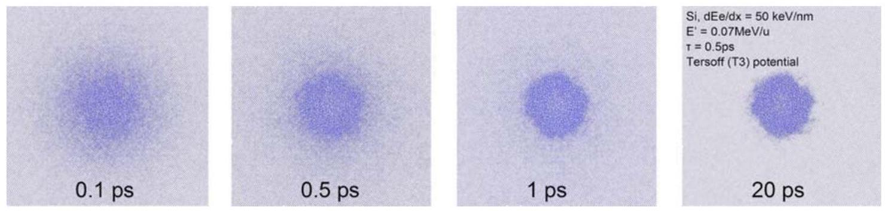
Fig. 4. Snapshots (projections along the [001] axis) of ion track evolution in Si simulated using the 2T-MD model for an electronic stopping power of $50 \mathrm{keV} / \mathrm{nm}$ [48]. Due to the scale, the individual atoms are not visible; thus, the amorphous regions appear as darker areas.

constant has been measured for several metals using laser irradiation experiments but a large amount of uncertainty remains. Theoretical methods are now in place for the calculation of this parameter and even its temperature dependence [36,50], but this has been done for only a limited number of materials. An increased effort in this area would help progress towards predictive modeling of materials modification by ion beams and related radiation effects.

Several popular MD codes have incorporated the 2T-MD methodology for radiation damage simulations. The 2T-MD version of DL_POLY [51] has the capability to implement a range of boundary conditions and, therefore, model a range of radiation effects, including cascades [25], laser irradiation [52] and swift heavy ion irradiation in metals [47] and semiconductors [49]. It is currently implemented in a beta version of the code, but not yet available in the general release version. The 2T-MD model has also been implemented in the LAMMPS MD code and applied to radiation damage in alpha quartz [53]. In the current LAMMPS implementation, the material parameters are restricted to be temperature independent, but this could be modified in the source code. In contrast to the DL_POLY implementation, 3dimensional periodic boundary conditions are imposed on both the MD simulation cell and the electronic simulation cell in LAMMPS, which somewhat restrict the applicability. The 2T-MD methodology has also been implemented in a beta version of the PARCAS code developed by Nordlund et al [54] and used to model swift heavy ion tracks in quartz [55]. The PARCAS code employs a Berensden thermostat to deposit energy to the lattice from the electron system, rather than the Langevin thermostat employed by DL_POLY and LAMMPS.

## 3. Single beam irradiations

Irradiation of single crystals, bulk materials and thin/thick films with ion beams is often utilized to modify material properties, implant ions of a specific element to a specified depth, investigate the fundamentals of ion-solid interactions, and study irradiation effects in materials under specific conditions. While MeV ions are often used to achieve large penetration depths, the irradiated region of interest for characterization may actually be closer to the surface, such as a thin film deposited on a substrate, where the ion beam passes through the thin film and is deposited into the substrate, but only the effects of irradiation in the thin film is of interest. Such an approach is useful in separating the effects of irradiation from the effects of implanted ions.

Another useful approach to investigate structural changes in materials while under ion irradiation is to employ in situ transmission electron microscopy (TEM), where an ion beam is brought into a transmission electron microscope [56]. Such in situ TEM studies often use ions of intermediate energies (several hundred keV to several MeV) such that the ions pass through the TEM samples. Under such a configuration, the ratio of electronic to nuclear energy deposition can be quite high, which can have significant impact on the dynamics of defect accumulation and microstructure evolution during ion irradiation.

### 3.1 Irradiation of thin films

Irradiations of vitreous $\mathrm{SiO}_{2}$ films on Si wafers with Au ions over the energy range from 0.3 to 168 MeV have revealed a U-shaped dependence of effective damage cross section on incident ion energy [6], and the behavior has been well described by a unified thermal spike model based on the additive combination of an elastic collision spike model (dominant at low energies) and the inelastic thermal spike model (dominant at high energies), as shown in Fig. 5, demonstrating the additive nature of electronic and nuclear energy loss on damage production. Using a combination of BCA and MD methods, as described above, Backman et al. [39,40] validated the additive nature of atomistic recoil damage and the inelastic

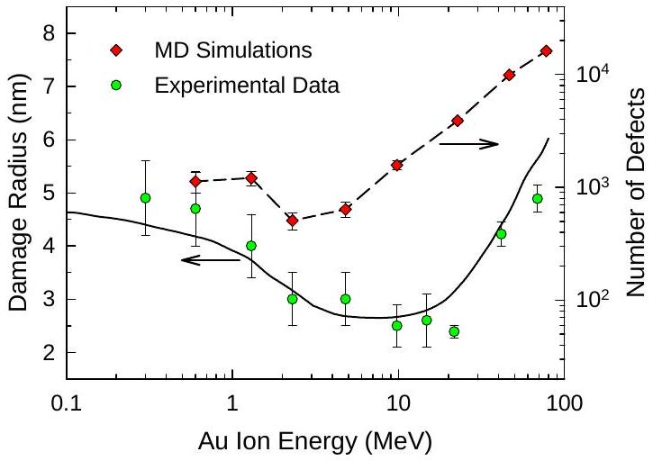
Fig. 5. Experimental damage radius [6] and MD simulation results for number of defects produced per ion in amorphous $\mathrm{SiO}_{2}$ as a function of Au ion energy [39]. Solid line is fit of unified thermal spike model to the experimental data [6].

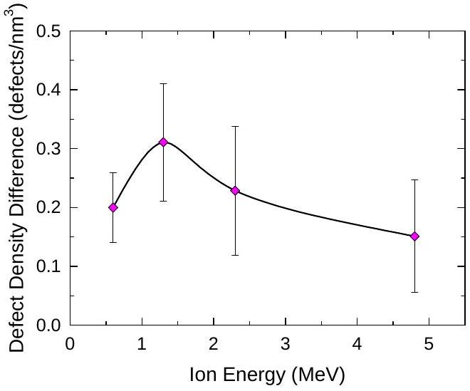
Fig. 6. Difference in defect density (within 2 nm radius of ion path) from MD simulations of simultaneous and sequential evolution of atomic recoil processes and the inelastic thermal spike [39]. Difference is simultaneous defect density minus sequential defect density.

thermal spike from single ions on damage production over the energy range for 0.6 to 76.5 MeV , as shown in Fig. 5. Over the intermediate energy range from 0.6 to 4.8 MeV , the computational results [39] further suggest that during the simultaneous evolution of the atomic recoils and thermal spike a nonlinear synergy occurs in the damage production processes. This synergy results in a higher local defect density within the core of the ion track $(\mathrm{r}<2 \mathrm{~nm})$ than would result from the sequential evolution, separated in time by 100 ps , of atomic recoil processes and the inelastic thermal spike, as shown in Fig. 6.

Irradiation-induced grain growth in nanocrystalline ceria [11,57,58] and nanocrystalline cubic (stabilizer-free) zirconia [59,60] has been studied using nanocrystalline thin films grown on Si wafers. The grain growth in ceria results in an increase in symmetric grain boundaries [58]. In the nanocrystalline zirconia, the cubic structure is stable to high irradiation doses (> 30 dpa ); however, faster grain growth is observed at 160 K compared to 400 K [59]. In both nanocrystalline ceria and zirconia films, recent experimental results have demonstrated that irradiation-induced grain growth is dependent on the total energy deposited, where the additive effect from both electronic energy loss (inelastic thermal spike) and atomic collision cascades (elastic thermal spike) contribute to the production of disorder and grain
growth, as shown in Fig. 7, and MD simulations have indicated that a high density of disorder near the grain boundaries leads to rapid local grain motion [61]. Such studies provide insights on controlling nanocrystalline grains to tailor functionalities.

### 3.2 In situ TEM irradiations

In situ TEM has been used to study the irradiation response of single crystalline and polycrystalline semiconductors and ceramics for nearly 25 years. The majority of studies have been carried out using a single ion species at intermediate energies, such that the ion produces a

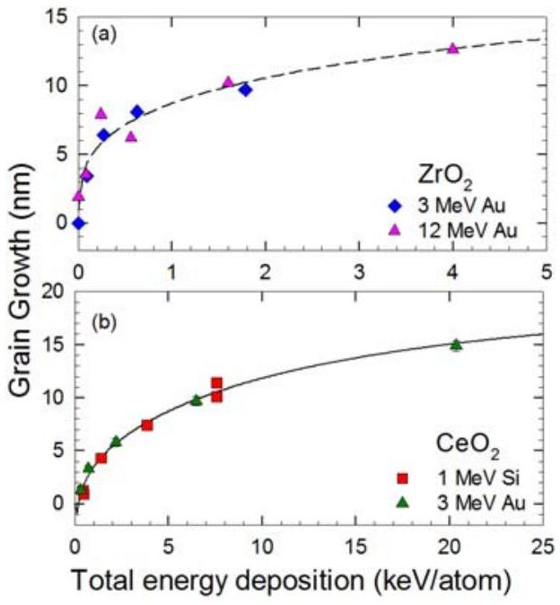
Fig. 7. Irradiation-induced grain growth as a function of total energy deposition [11]: (a) nanocrystalline $\mathrm{ZrO}_{2}$ films under 3 and 12 MeV Au irradiation; (b) nanocrystalline $\mathrm{CeO}_{2}$ films under 1 MeV Si and 3 MeV Au irradiation.

Single crystal $\mathrm{Ca}_{2} \mathrm{La}_{8}\left(\mathrm{SiO}_{4}\right)_{6} \mathrm{O}_{2}$ [12,63], single crystal 6 H -SiC [12] and polycrystalline $\mathrm{Gd}_{2} \mathrm{ZrTiO}_{7}$ [62] have been irradiated with different ions/energies to study the effects of dose, temperature, damage-energy density and in-cascade ionization rate on the dynamics of irradiation-induced amorphization. In all cases, the dose for complete amorphization increases with temperature; however, there is a significant shift in the temperature dependence to lower temperatures with decreasing ion mass, as illustrated in Fig. 8. Model fits to
the data reveal a strong dependence on the ratio of electronic energy loss to nuclear energy loss. Analysis of these data reveals that ionization processes are the dominant contributor to in-cascade recovery in $\mathrm{Ca}_{2} \mathrm{La}_{8}\left(\mathrm{SiO}_{4}\right)_{6} \mathrm{O}_{2}$ [12,63]; while in 6 H -SiC [12], ionization processes are less dominant.

## 4. Ion-induced annealing

One approach to better understand the effects of electronic and nuclear energy losses on damage production or recovery processes at intermediate energies is to conduct separate effects studies, both experimentally and computationally. This is primarily accomplished by introducing irradiation damage using ions with high ratios of nuclear to electronic energy loss, and then studying the response of this pre-existing damage to ions with very high ratios of electronic to nuclear energy loss. One of the earliest studies on ionization-induced annealing using ions was on natural fluorapatite, $\mathrm{Ca}_{10}\left(\mathrm{PO}_{4}\right)_{6} \mathrm{~F}_{2}$, which was pre-

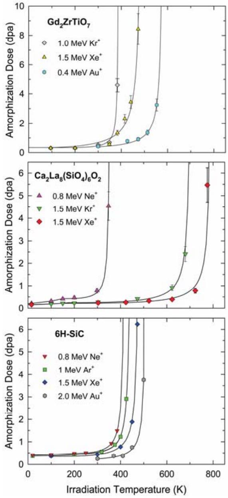
Fig. 8. Dose for full amorphization as a function of temperature and ion species [12,62,63].

Similar research with swift heavy ions has led to the recent discovery of recovery and recrystallization of highly-damaged or amorphous states in materials by intense ionization from the swift heavy ions. This is in sharp contrast to thermal annealing processes, such as solid phase epitaxy, that require high temperatures or ion-beam induced epitaxial crystallization (IBIEC), where irradiation at elevated temperatures with low-energy ions in the nuclear dominated energy loss regime leads to recovery. An interesting feature of IBIEC is that it generally occurs at elevated temperatures that are lower than those necessary for damage recovery by solid phase epitaxy [65]. The use of more energetic ion beams for recrystallization is referred to as swift heavy ion beam induced epitaxial crystallization (SHIBIEC), and this ionization-induced process involves mechanisms very different from those prevailing in IBIEC at low energies. Since SHIBIEC occurs at much lower irradiation temperatures, it appears to be more efficient than IBIEC.

The first SHIBIEC experiment leading to total recrystallization of an amorphous layer was performed on Si single crystals, in which a thick amorphous layer was created by irradiation with 200 keV Xe ions at room temperature [66]. Subsequent irradiation with 100 MeV Ag ions to a fluence of 2 x $10^{14}$ ions $/ \mathrm{cm}^{2}$ was performed over the temperature range from 473 to 623 K . The thickness of the amorphous layer decreased with increasing irradiation temperature, reflecting an increased rate of recovery per ion with increasing temperature. An activation energy of 0.25 eV was determined for the recrystallization process.

In all prior studies where the SHIBIEC process was investigated, heating the sample during swift ion irradiation was a mandatory condition. However, this phenomenon was recently shown to occur at room temperature in 6H-SiC irradiated with 827 MeV Pb ions [67]. In this study, two levels of irradiation induced peak disorder were introduced by 700 keV I ions, and both the height and width of the disorder decreased following irradiation with 827 MeV Pb ions to an ion fluence of $2 \times 10^{13}$ ions $/ \mathrm{cm}^{2}$. Although only partial recovery of damage was observed for the highest level of pre-existing disorder ( $\sim 95 \%$ ), nearly complete recovery was observed for the lower level of disorder ( $\sim 50 \%$ ). The recrystallization rate per incident ion was calculated to be a few orders of magnitude higher than those generally attained with

IBIEC at lower energies. A similar study was recently carried out using 870 MeV Pb ions on 3C-SiC predamaged with 100 keV Fe ions at room temperature, and MD simulations based on the thermal spike model were used to model the recovery processes $[8,68]$. The recovery of a partially disordered state from the MD simulations is illustrated in Fig. 9. The electronic energy loss (33 keV/nm) from the 870 MeV Pb ions results in a thermal

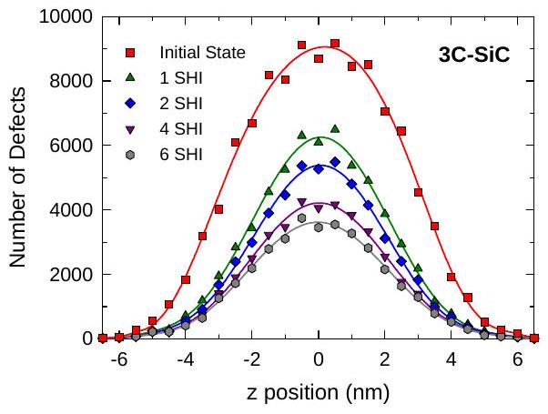
Fig. 9. MD simulation results for annealing of partially disordered state from the overlap of thermal spikes from 870 MeV Pb ions [8].

While ionization-induced recrystallization is observed in the above SHIBIEC process, similar ion beam annealing of pre-damaged, but not fully amorphous, states in SiC has been demonstrated at much lower intermediate ion energies using 21 MeV Si ions [14], which have an electronic energy loss of $5 \mathrm{keV} / \mathrm{nm}$. An example of damage annealing with intermediate energy ions is shown in Fig. 10. The initial pre-damaged state in 4 H SiC was produced by irradiation with 900 keV Si ions at room temperature to an ion fluence of $4.4 \times 10^{14} \mathrm{~cm}^{-2}$. The backscattering yield from

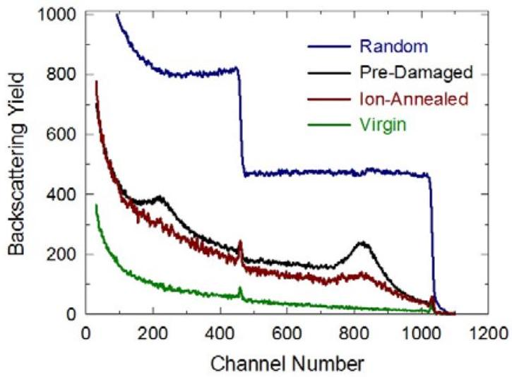
Fig. 10. Comparisons of the RBS spectra along the <0001> direction in 4H SiC for the predamaged sample before and after ion annealing with 21 MeV Si ions to an ion fluence of $1 \times 10^{15} \mathrm{~cm}^{-2}$ [14]. The virgin and random spectra are provided for reference.

damage on both the Si and C sublattices is clearly observable in the pre-damaged spectrum. Subsequent irradiation with 21 MeV Si ions resulted in recovery of the Si and C disorder, as indicated by the reduction of the damage peak on both sublattices. The results indicate that energy deposited to the target electronic system at the order of a few keV/nm can effectively anneal pre-existing damage in SiC.

## 5. Dual beam irradiations

Experiments involving dual and triple beam irradiations were essentially implemented in the 1970's for the development of fusion energy that requires the design of high-performance structural materials, insulators and windows that exhibit good resistance to fusion neutron irradiation damage and gas production [69-72]. Most of these studies focused on the combination of self-ion beams, typically with energies of a few MeV for high damage production, with He and/or H ion beams to introduce relatively high concentrations of these gas atoms in the irradiated layer. Moreover, irradiations were generally performed over a wide temperature range, i.e. from room temperature up to a thousand Kelvin. Recent studies for fission and fusion applications have included dual beam irradiations on pure iron [73], ferritic/martensitic steels containing $\operatorname{Cr}[74,75]$, nanostructured ferritic oxide dispersion strengthened (ODS) alloys [76-78], SiC fibers reinforced SiC matrix ceramic composites [79] and ceramic oxides [80]. It has been most often shown that the effect of dual-beam irradiation was to modify the mechanisms of formation and coalescence of gas bubbles and cavities via the creation of a large number of migrating defects by the self-ion beam.

The topic concerned by the present section of this review is somewhat different since it addresses the feasibility to modify or tailor the formation of defects, defect structures and phase transformations in materials when irradiated with dual ion beams via a dynamic synergy between nuclear ( $\mathrm{S}_{\mathrm{n}}$ ) and electronic ( $\mathrm{S}_{\mathrm{e}}$ ) energy losses of the incident ions. Such a study was very recently undertaken [13,81] by performing simultaneous dual beam irradiations of selected oxides (yttria-stabilized cubic zirconia - YSZ; magnesium oxide - MgO; titanate pyrochlore - $\mathrm{Gd}_{2} \mathrm{Ti}_{2} \mathrm{O}_{7}$ ) and carbides (SiC) with low energy (LE) I ions ( 900 keV ) and high energy (HE) W ions ( 36 MeV ) at room temperature. The experimental approach is
illustrated in Fig. 11 for SiC, which show that the LE and HE ions used in this study primarily lose energy by $\mathrm{S}_{\mathrm{n}}$ and $\mathrm{S}_{\mathrm{e}}$, respectively. While the results in Fig. 11 are for SiC, the $\mathrm{S}_{\mathrm{n}}$ and $\mathrm{S}_{\mathrm{e}}$ depth profiles obtained for the other materials are similar in magnitude and shape to those obtained for SiC. The damage resulting from single and dual beam irradiations was monitored and characterized by using advanced techniques, such as Rutherford backscattering spectrometry in channeling conditions (RBS/C), X-ray diffraction (XRD), Raman spectroscopy and TEM that are reviewed elsewhere

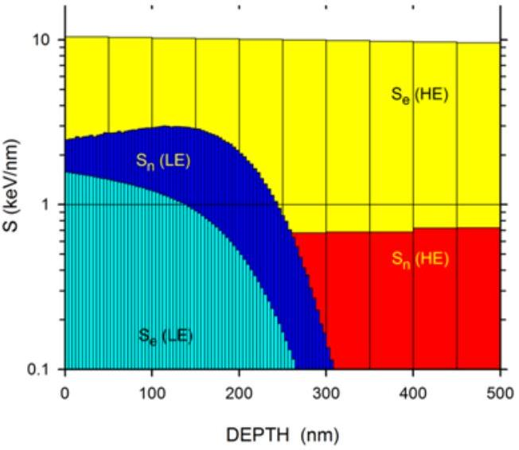
Fig. 11. Nuclear ( $\mathrm{S}_{\mathrm{n}}$ ) and electronic ( $\mathrm{S}_{\mathrm{e}}$ ) energy losses vs depth for SiC irradiated with LE ions ( 900 keV I - blue/cyan histograms) and HE ions ( $36-\mathrm{MeV}$ W red/yellow histograms) [81]. Calculations were done with the SRIM2011 code.

The accumulated damage ( $\mathrm{f}_{\mathrm{D}}$ ) measured by RBS/C in the ion-irradiated crystals is presented in Fig. 12 for different irradiation conditions: single LE ion irradiations ( $\mathrm{S}_{\mathrm{n}}$ ), single HE ion irradiations ( $\mathrm{S}_{\mathrm{e}}$ ), sequential LE and HE ion irradiations ( $\mathrm{S}_{\mathrm{n}}+\mathrm{S}_{\mathrm{e}}$ ), simultaneous dual LE/HE irradiations ( $\mathrm{S}_{\mathrm{n}}$ \& $\mathrm{S}_{\mathrm{e}}$ ). The RBS/C data unambiguously show that $f_{D}$ due to either sequential or dual beam irradiations in YSZ is roughly the sum of LE and HE contributions, whereas dual beam irradiation in SiC and MgO leads to much lower $\mathrm{f}_{\mathrm{D}}$ values than those obtained from sequential LE and HE ion irradiations or LE irradiations alone. These results demonstrate that nuclear and electronic energy losses are simply additive for damage production in certain materials (for instance YSZ), while strong $\mathrm{S}_{\mathrm{n}} / \mathrm{S}_{\mathrm{e}}$ competitive effects, induce healing of the radiation damage in other materials (SiC and MgO).

Raman and TEM data have been recorded for SiC (where the $\mathrm{S}_{\mathrm{n}} / \mathrm{S}_{\mathrm{e}}$ synergy is the most dramatic) to determine the evolution of damage microstructure in the ion-irradiated material, as shown in Fig. 13. For the sample irradiated with LE ions, the absence of fine peak structure in the $600-1000 \mathrm{~cm}^{-1}$ range and the presence of a broad signal at $1500 \mathrm{~cm}^{-1}$ in the Raman spectrum indicate that SiC is amorphized by the nuclear energy loss ( $\mathrm{S}_{\mathrm{n}}$ ), in agreement with results reported in the literature [12,14,82,83]. Similar Raman

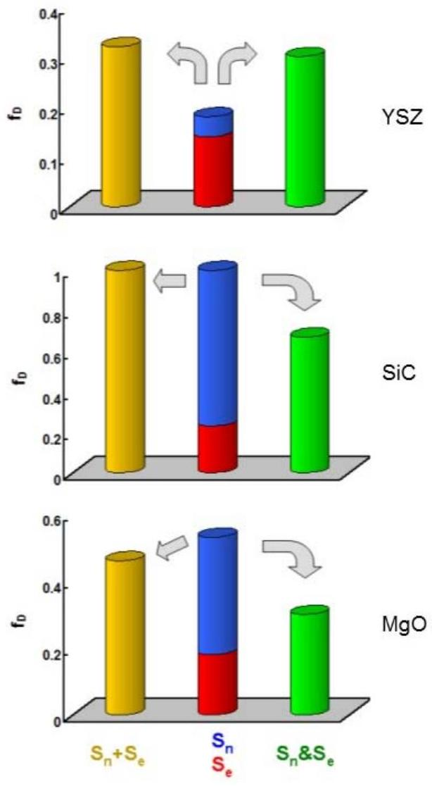
Fig. 12. Accumulated damage ( $f_{\mathrm{D}}$ ) for RT ion-irradiated YSZ, SiC and MgO crystals. The blue and red cylinders hold for single beam irradiations with LE ( $S_{\mathrm{n}}$ ) or HE ( $S_{\mathrm{e}}$ ) ions respectively. The yellow cylinders hold for sequential LE and HE irradiations ( $S_{\mathrm{n}}+S_{\mathrm{e}}$ ). The green cylinders hold for dual LE/HE beam irradiations ( $S_{\mathrm{n}} \& S_{\mathrm{e}}$ ).

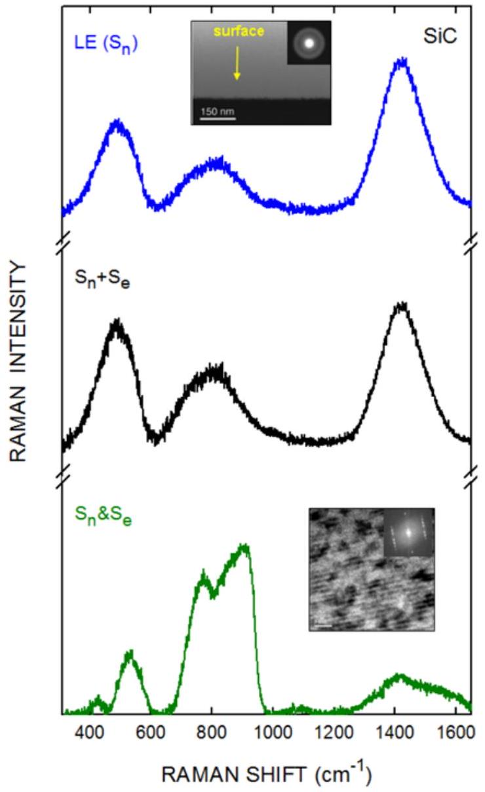
Fig. 13. Raman spectra recorded on RT ionirradiated SiC crystals. The blue line isfor single beam irradiation with $\mathrm{LE}\left(\mathrm{S}_{\mathrm{n}}\right)$ ions. The black line is for sequential LE and HE irradiation ( $\mathrm{S}_{\mathrm{n}}+\mathrm{S}_{\mathrm{e}}$ ). The green line is for dual $\mathrm{LE} / \mathrm{HE}$ beam irradiation ( $\mathrm{S}_{\mathrm{n}} \& \mathrm{~S}_{\mathrm{e}}$ ). The top inset shows a TEM image froma cross-sectional sample prepared from a SiC crystal irradiated with a single $\mathrm{LE}\left(\mathrm{S}_{\mathrm{n}}\right)$ ion beam. The bottom inset shows a plane view TEM image froma SiC crystal irradiated with a dual LE/HE ion beam ( $\mathrm{S}_{\mathrm{n}} \& \mathrm{~S}_{\mathrm{e}}$ ).

1 spectrum is obtained on the sample submitted to sequential LE and HE ion irradiations ( $\mathrm{S}_{\mathrm{n}}+\mathrm{S}_{\mathrm{e}}$ ), indicating 2 that the electronic energy deposition from the 36 MeV W ions is not sufficient to recover the nuclear 3 damage production from the LE 900 keV I ions. On the contrary, the spectrum recorded on the sample 4 irradiated simultaneously with a dual ion beam ( $\mathrm{S}_{\mathrm{n}} \& \mathrm{~S}_{\mathrm{e}}$ ) shows that amorphization is clearly suppressed in
this case, where the electronic energy deposition from the W ions is effective enough to induce partial damage recovery (annealing of some point defects and defect clusters induced by the 900 keV I). As a result of the efficient ion annealing effects from HE 36 MeV W ions during the dual-beam irradiation, the damage production leading to the amorphization observed in the cases of $S_{\mathrm{e}}$ and $S_{\mathrm{e}}+S_{\mathrm{n}}$ is suppressed.

Raman results agree fairly well with RBS/C results since $\mathrm{f}_{\mathrm{D}}=1$ in the surface region (formation of an amorphous layer) for $\mathrm{S}_{\mathrm{n}}$ and $\mathrm{S}_{\mathrm{n}}+\mathrm{S}_{\mathrm{e}}$ irradiations, while the RBS yield is strongly reduced for $\mathrm{S}_{\mathrm{n}}$ \& $\mathrm{S}_{\mathrm{e}}$ irradiation [81]. The TEM micrographs, shown as the insets in Fig. 12, confirm this interpretation: the image and the diffraction pattern obtained on a cross section prepared from the sample irradiated with LE ions confirm the formation of a surface amorphous layer; whereas the plane view image and the fast Fourier transform obtained on the sample irradiated with a dual ion beam show that the irradiated layer remains crystalline. In the latter case, the damage mainly consists of dislocations represented by the dark stripes in the TEM image.

The interpretation of this coupled nuclear/electronic energy loss effect is not straightforward, since in the dual beam irradiations there are likely no spatial or time overlaps (within the lifetime of defect production processes) between LE and HE ion trajectories. Thus, it is reasonable to conclude that this effect could be due to a process similar to the SHIBIEC mechanism discussed in the previous section. Therefore, the scenario occurring in SiC irradiated with a dual ion beam could well be the following: nuclear energy loss due to LE ion irradiation leads to the creation of scattered point defects, defect clusters and amorphous clusters that are annealed or crystallized by the electronic excitations (and subsequent thermal spike) arising along the path of the HE ions. Crystallization should occur before the defects and amorphous clusters collapse to form a thick amorphous layer that cannot be crystallized by HE ions, as in the case for SHIBIEC. This interpretation is consistent with the result for sequential LE and HE ion irradiations ( $\mathrm{S}_{\mathrm{n}}+\mathrm{S}_{\mathrm{e}}$ ) performed on SiC, where crystallization of the amorphous layer formed by the LE ions does not occur, in agreement with previous experimental and theoretical results [8].

A recent experiment has been performed where the LE (I) ion beam was unchanged, but the energy of the HE (W) ion beam was decreased (from 36 down to 20 MeV ) in order to lower the $\mathrm{S}_{\mathrm{e}}$ value (from
~10 down to $\sim 7 \mathrm{keV} / \mathrm{nm}$ ) (L Thomé et al., unpublished data). The results show that no annealing or crystallization of the damage from nuclear energy loss occurs under simultaneous LE ( 900 keV I) and HE (20 MeV W ions), suggesting that, for SiC , the $\mathrm{S}_{\mathrm{e}}$ threshold for crystallization under dual-beam irradiation ( $\mathrm{S}_{\mathrm{n}} \& \mathrm{~S}_{\mathrm{e}}$ synergy) lies between 7 and $10 \mathrm{keV} / \mathrm{nm}$, even though the $\mathrm{S}_{\mathrm{e}}$ threshold for damage recovery is below $5 \mathrm{keV} / \mathrm{nm}$, as demonstrated by the 21 MeV Si sequential ( $\mathrm{S}_{\mathrm{n}}+\mathrm{S}_{\mathrm{e}}$ ) irradiations (Fig. 10). In a similar way, increasing the dose-rate of the HE ion irradiation should enhance the $\mathrm{S}_{\mathrm{n}}$ \& $\mathrm{S}_{\mathrm{e}}$ synergy, but experimental confirmation of this statement is not easy, since irradiations are generally done at the highest available dose-rates in order to minimize the irradiation time.

In summary, a strong decrease of damage accumulation was observed in materials having quite different physico-chemical properties (SiC and MgO) under simultaneous dual-beam irradiation leading to competitive nuclear and electronic energy loss effects. This competitive effect of electronic energy loss is expected to increase with temperature, since both IBIEC and SHIBIEC processes are strongly enhanced with increasing temperature. Similar to the discussion above on ion-induced ( $\mathrm{S}_{\mathrm{n}}+\mathrm{S}_{\mathrm{e}}$ ) annealing, this $\mathrm{S}_{\mathrm{n}}$ \& $\mathrm{S}_{\mathrm{e}}$ synergy has to be considered in the testing and performance of materials and devices operating in harsh radioactive environment, since it may allow preserving the physical integrity of materials via a strong reduction of the damage production.

## 6. Perspectives and conclusions

Self-healing mechanisms due to ionization from electronic energy loss have been demonstrated in separate effects and dual beam studies. These mechanisms provide possible pathways to reducing or tailoring defect formation and phase transformations during ion implantation doping, ion-beam modification and processing for device fabrication, and in extreme radiation environments. This ionization-induced self-healing approach may be used to improve the quality of epitaxial thin films or reduce the disorder in conventional thin films. Swift heavy ion irradiation can result in the formation of long, linear nanoscale tracks in a broad range of materials, and such swift heavy ion tracks are being exploited in a variety of nanoscience applications, such as the fabrication of single and multiple
nanopores for membranes and microdevices [9,10], fabrication of templates for nanowire synthesis [9,10], shaping of nanoparticles [19], and formation of nanodots [84]. However, as demonstrated in recent work [3,6,33], such tracks can also be produced with intermediate energy ions in a number of materials, which makes the exploitation of track formation in thin films accessible to many more laboratories around the world.

While the role of electronic energy loss on ion beam modification of materials is clearly demonstrated in terms of both additive processes to damage production from nuclear energy deposition and competitive damage annealing processes, several fundamental issues remain to be clarified: (i) what material properties determine the nature and magnitude of these effects? (ii) what is the influence of irradiation temperature and ion flux? (iii) do these phenomena depend on electronic and nuclear energy deposition density, the ratio of electronic to nuclear energy deposition, or both? (iv) is there a $\mathrm{S}_{\mathrm{e}}$ threshold for these processes to occur? Concerning the materials susceptible to competitive recovery processes, the first requirement may be that they should be undamaged (or weakly damaged) by electronic energy loss at high energies, as is the case for SiC. On the other hand, additive effects might be expected for materials that exhibit high susceptibility for damage production by swift heavy ions. Since both IBIEC and SHIBIEC processes are strongly enhanced at elevated temperatures, it is also expected that competitive recovery processes at intermediate ion energies may be more effective when the temperature is increased. Experimental and theoretical studies are in progress by several groups to address these questions.

The ionization-induced damage production mechanisms and ionization-induced healing mechanisms may play important roles in the use of ion beams to mimic radiation damage processes in materials for applications in fission and fusion reactor systems or for the immobilization of nuclear waste. While strong damage recovery and recrystallization from swift heavy ions with energy above 100 MeV have been recognized for some time, the effects of electronic energy deposition by intermediate energy ions on defect production and microstructure evolution are not well understood. Intermediate energy ions are broadly used in the study of radiation effects in nuclear materials, but little consideration is given to the effects of electronic energy loss on the results obtained. The role of electronic deposition and the coupled
dynamics of electronic and atomic processes need to be studied over a range of irradiation conditions to elucidate the underlying mechanisms for different classes of materials. Damage annealing from energetic ions, as demonstrated in this review, must be taken into account in predicting material performance and integrity, as well as the design materials for future nuclear reactors.

## 7. Acknowledgements

The research of two authors (WJW, YZ) was supported by the U.S. Department of Energy, Office of Basic Energy Sciences, Materials Sciences and Engineering Division.

## 8. References

[1] Li J, Stein D, McMullan C, Branton D, Aziz MJ, Golovchenko JA. Ion-beam sculpting at nanometre length scales. Nature 2001;412:166-9.
[2] Jain IP, Agarwal G. Ion beam induced surface and interface engineering. Surface Science Reports 2011;66:77-172.
[3] Jubera M, Villarroel J, García-Cabaes A, Carrascosa M, Olivares J, Agullo-López, et al. Analysis and optimization of propagation losses in $\mathrm{LiNbO}_{3}$ optical waveguides produced by swift heavy-ion irradiation. Appl Phys B 2012;107:157-62.
[4] Akcöltekin E, Peters T, Meyer R, Duvenbeck A, Klusmann M, Monnet I, et al. Creation of multiple nanodots by single ions. Nature Nanotechnology 2007;2:290-94.
[5] Ridgway MC, Giulian R, Sprouster DJ, Kluth P, Araujo LL, Llewellyn DJ, et al. Role of thermodynamics in the shape transformation of embedded metal nanoparticles induced by swift heavy-ion irradiation. Phys Rev Lett 2011;106:095505.
[6] Toulemonde M, Weber WJ, Li G, Shutthanandan V, Kluth P, Yang T, et al. Synergy of nuclear and electronic energy losses in ion-irradiation processes: the case of vitreous silicon dioxide. Phys Rev B 2011;83:054106.
[7] Zhang J, Lang M, Ewing RC, Devanathan R, Weber WJ, Toulemonde M. Nanoscale Phase Transitions under extreme conditions within an ion track. J. Mater Res 2010;25:1344-51.
[8] Debelle A, Backman M, Thomé L, Weber WJ, Toulemonde M, Mylonas S, et al. Combined experimental and computational study of the recrystallization process induced by electronic interactions of swift heavy ions with silicon carbide crystals. Phys Rev B 2012;86:100102.
[9] Trautmann C. Micro- and nanoengineering with ion tracks. In: Hellborg R, Whitlow H, Zhang Y, editors. Ion beams in nanoscience and technology. Berlin Heidelberg: Springer-Verlag; 2009. p. 369-87.
[10] Neumann R. Science and technology on the nanoscale with swift heavy ions in matter. Nucl Instrum Methods Phys Res B 2013;314:4-10.
[11] Zhang Y, Aidhy DS, Varga T, Moll S, Edmondson PD, Namavar F, et al. The effect of electronic energy loss on irradiation-induced grain growth in nanocrystalline oxides. Phys Chem Chem Phys 2014;16:8051-59.
[12] Weber WJ, Zhang Y, Wang LM. Review of dynamic recovery effects on ion irradiation damage in ionic-covalent materials. Nucl Instrum Methods Phys Res B 2012;277:1-5.
[13] Thomé L, Debelle A, Garrido, F, Trocellier P, Serruys Y, Velisa G, et al. Combined effects of nuclear and electronic energy losses in solids irradiated with dual-ion beam. Appl Phys Lett 2013;102:141906.
[14] Zhang Y, Varga T, Ishimaru M, Edmondson PD, Xue H, Liu P, et al. Competing effects of electronic and nuclear energy loss on microstructural evolution in ionic-covalent materials. Nucl Instrum Methods Phys Res B 2014;327:33-43.
[15] Race CP, Mason DR, Sutton AP. A new directional model for the electronic frictional forces in molecular dynamics simulations of radiation damage in metals. J Nucl Mater 2012;425:33-40.
[16] Mason DR, Race CP, Foo MHF, Horsfield AP, Foulkes WMC, Sutton AP. Resonant charging and stopping power of slow channeling atoms in a crystalline metal. New J Phys 2012;14:073009.
[17] Duffy DM, Daraszewicz SL, Mulroue J. Modelling the effects of electronic excitations in ioniccovalent materials. Nucl Instrum Methods Phys Res B 2012;277:21-7.
[18] Trautmann C, Lang M, Toulemonde M, Devanathan R. Advances in understanding of swift heavyion tracks in complex ceramics. Curr Opin Solid State Mater Sci 2015; (this issue).
[19] Ridgway MC, Djurabekova F, Nordlund K. Ion-solid interactions at the extremes of electronic energy loss. Curr Opin Solid State Mater Sci 2015; (this issue).
[20] Yamada I, Matsuo J, Toyoda N, Aoki T, Seki T. Progress and applications of cluster ion beam technology. Curr Opin Solid State Mater Sci 2015; (this issue).
[21] Zhang Y, Debelle A, Boulle A, Kluth, P, Tuomisto F. Advanced techniques in characterization of ion beam modified materials. Curr Opin Solid State Mater Sci 2015; (this issue).
[22] Devanathan R, Weber WJ, Gale JD. Radiation tolerance of ceramics - insights from atomistic simulation of damage accumulation in pyrochlores. Energy Environ Sci 2010;3:1551-59.
[23] Chappell HF, Dove MT, Trachenko K, McKnight REA, Carpenter MA, Redfern SAT. Structural changes in zirconolite under $\alpha$-decay. J Phys: Condens Matter 2013;25:055401.
[24] Ullah MW, Kuronen A, Nordlund K, Djurabekova F, Karaseov PA, Titov AI. Atomistic simulation of damage production by atomic and molecular ion irradiation in GaN. J Appl Phys 2012;112:043517.
[25] Zarkadoula E, Devanathan R, Weber WJ, Seaton MA, Todorov IT, Nordlund K, et al. High-energy radiation damage in zirconia: Modeling results. J Appl Phys 2014;115:083507.
[26] Vineyard GH. Thermal spikes and activated processes. Rad Effects 1976;29:245-8.
[27] Toulemonde M, Assmann W, Dufour C, Meftah A, Studer F, Trautmann C. Experimental phenomena and thermal spike model description of ion tracks in amorphisable inorganic insulators. Mat Fys Medd K Dan Vidensk Selsk 2006;52:263-92.
[28] Osmani, O, Medvedev N, Schleberger M, Rethfeld B. Energy dissipation in dielectrics after swift heavy-ion impact: A hybrid model. Phys Rev B 2011;84:214105.
[29] Medvedev NA, Volkov AE, Shcheblanov NS, Rethfeld B. Early stage of the electron kinetics in swift heavy ion tracks in dielectrics. Phys Rev B 2010;82:125425.
[30] Wang ZG, Dufour C, Paumier E, Toulemonde M. The $\mathrm{S}_{\mathrm{e}}$ sensitivity of metals under swift-heavy-ion irradiation: a transient thermal process. J Phys: Condens Matter 1994;6:6733-50.
[31] Kaganov MI, Lifshitz IM, Tanatarov LV. Relaxation between electrons and the crystalline lattice. Sov Phys JETP 1957;4:173-78.
[32] Toulemonde M, Assmann W, Dufour C, Meftah A, Trautmann C. Nanometric transformation of the matter by short and intense electronic excitation: Experimental data versus inelastic thermal spike model. Nucl Instrum Methods Phys Res B 2012;277:28-39.
[33] Moreira, PAFP, Devanathan R, Weber WJ. Atomistic simulations of track formation by energetic recoils in zircon. J Phys Condens Matter 2010;22:395008.
[34] Meftah A, Brisard F, Costantini JM, Hage-Ali M, Stoquert JP, Studer F, et al. Swift heavy ions in magnetic insulators: A damage-cross-section velocity effect. Phys Rev B 1993;48: 920-25.
[35] Klaumanzer S. Thermal-spike models for ion track physics: a critical examination. Mat Fys Medd K Dan Vidensk Selsk 2006;52:293-328.
[36] Lin Z, Zhigilei LV, V. Celli V. Electron-phonon coupling and electron heat capacity of metals under conditions of strong electron-phonon nonequilibrium. Phys Rev B 2008;77:075133.
[37] van Driel HM. Kinetics of high-density plasmas generated in Si by 1.06 - and $0.53-\mu \mathrm{m}$ picosecond laser pulses. Phys Rev B 1987;35:8166-76.
[38] Daraszewicz SL, Duffy DM. Extending the inelastic thermal spike model for semiconductors and insulators. Nucl Instrum Methods Phys Res B 2011;269:1646-49.
[39] Backman M, Djurabekova F, Pakarinen OH, Nordlund K, Zhang Y, Toulemonde M, et al. Cooperative effect of electronic and nuclear stopping on ion irradiation damage in silica. J Phys D: Appl Phys 2012;45:505305.
[40] Backman M, Djurabekova F, Pakarinen OH, Nordlund K, Zhang Y, Toulemonde M, et al. Atomistic Simulation of MeV Ion Irradiation of Silica. Nucl Instrum Methods Phys Res B 2013;303:129-32.
[41] Robinson MT, Oen OS. Computer Studies of the Slowing Down of Energetic Atoms in Crystals. Phys Rev 1963;132:2385-98.
[42] Ivanov D, Zhigilei LV. Combined atomistic-continuum modeling of short-pulse laser melting and disintegration of metal films. Phys Rev B 2003;68:064114.
[43] Duvenbeck A, Sroubek Z, A. Wucher A. Electronic excitation in atomic collision cascades. Nucl Instr Meth Phys Res B 2005;228:325-29.
[44] Caro A, Victoria M. Ion-electron interactions in molecular-dynamics cascades. Phys Rev A 1989;40:2287-91.
[45] Duffy DM, Rutherford AM. Including the effects of electronic stopping and electron-ion interactions in radiation damage simulations. J Phys: Condens Mat 2007;19:016207.
[46] Rutherford AM, Duffy DM. The effect of electron-ion interactions on radiation damage simulations. J Phys: Condens Mat 2007;19:496201.
[47] Duffy DM, Itoh N, Rutherford AM, Stoneham AM. Making tracks in metals. J Phys: Condens Mat 2008;20:082201.
[48] Daraszewicz SL, The modeling of electronic effects in molecular dynamics simulations. PhD Dissertation. University College London 2014.
[49] Daraszewicz SL, Duffy DM. Hybrid continuum-atomistic modelling of swift heavy ion radiation damage in germanium. Nucl Instrum Methods Phys Res B 2013;303:112-15.
[50] Arnaud B, Giret Y. Electron cooling and the Debye Waller factor in photoexcited bismuth. Phys Rev Lett 2013;110:016505.
[51] Todorov IT, Smith W, Trachenko K, Dove MT. DL POLY 3: new dimensions in molecular dynamics simulations via massive parallelism. J Mater Chem 2006;16:
[52] Giret Y, Naruse N, Daraszewicz SL, Murooka Y, Yang J, Duffy DM, et al. Transient atomic structure determination of laser excited materials from time-resolved diffraction data. Appl Phys Lett 2013;103:253107.
[53] Phillips CL, Magyar RJ, Crozier PS. A two temperature model of radiation damage in alpha-quartz. J Chem Phys 2010;133:14471.
[54] Nordlund K, Ghaly M, Averback RS, Caturla M, Diaz de la Rubia T, Tarus J. Defect production in collision cascades in elemental semiconductors and fcc metals. Phys Rev B 1998;57:7556-70.
[55] Leino A, Daraszewicz SL, Pakarinen OH, Djurabekova F, Nordlund K, Afra B, et al. Structural analysis of simulated swift heavy ion tracks in quartz. Nucl Instr Meth Phys Res B 2014;326: 289-93.
[56] Hinks J. A review of transmission electron microscopes with in situ ion irradiation. Nucl Instr Meth Phys Res B 2009;267:3652-62.
[57] Zhang Y, Edmondson PD, Varga T, Moll S, Namavar F, Lan C, et al. Structural modification of nanocrystalline ceria by ion beams. Phys Chem Chem Phys 2011;13:11946-50.
[58] Edmondson PD, Zhang Y, Moll S, Varga T, Namavar F, Weber WJ. Irradiation effects on microstructure change in nanocrystalline ceria - Phase, lattice stress, grain size and boundaries. Acta Mater 2012;60:5408-16.
[59] Zhang Y, Jiang W, Wang C, Namavar F, Edmondson PD, Zhu Z, et al. Grain growth and phase stability of nanocrystalline cubic zirconia under ion irradiation. Phys Rev B 2010;82:184105.
[60] Edmondson PD, Weber WJ, Namavar F, Zhang Y. Lattice distortions and oxygen vacancies produced in $\mathrm{Au}^{+}$-irradiated nanocrystalline cubic zirconia. Scripta Mater 2011;65:675-8.
[61] Aidhy DS, Zhang Y, Weber WJ. A fast grain-growth mechanism revealed in nanocrystalline ceramic oxides. Scripta Materialia 2014;83:9-12.
[62] Ewing RC, Weber WJ, Lian J. Nuclear Waste Disposal - Pyrochlore ( $\mathrm{A}_{2} \mathrm{~B}_{2} \mathrm{O}_{7}$ ): A Nuclear Waste Form for the Immobilization of Plutonium and the "Minor" Actinides. J. Appl Phys 2004;95:5949-71.
[63] Weber WJ, Zhang Y, Xiao HY, Wang LM. Dynamic recovery in silicate-apatite structures under irradiation and implications for long-term immobilization of actinides. RSC Advances 2012;2:595-604.
[64] Ouchani S, Dran J-C, Chaumont J. Evidence of ionization annealing upon helium ion irradiation of pre-damaged fluorapatite. Nucl Instrum Methods Phys Res B 1997;132:447-51.
[65] Kinomura A, Chayahara A, Mokuno Y, Tsubouchi N, Horino Y. Enhanced annealing of damage in ion-implanted 4H-SiC by MeV ion-beam irradiation. J Appl Phys 2005;97:103538.
[66] Sahoo PK, Som T, Kanjilal D, Kulkarni VN. Swift heavy ion beam induced recrystallization of amorphous Si Layers. Nucl Instr Meth Phys Res B 2005;240:239-44.
[67] Benyagoub A, Audren A, Thomé L, F. Garrido F. Athermal crystallization induced by electronic excitation in ion-irradiated silicon carbide. Appl Phys Lett 2006;89:241914.
[68] Backman M, Toulemonde M, Pakarinen OH, Juslin N, Djurabekova F, Nordlund K, et al. Molecular dynamics simulations of swift heavy ion induced defect recovery in SiC. Comput Mater Sci 2013;67:261-
5.
[69] Lewis MB, Packan NH, Wells GF, Buhl RA. Improved techniques for heavy-ion simulation of neutron radiation damage. Nucl Instrum Meth 1979;167:233-47.
[70] Kohno Y, Asano K, Kohyama A, Hasegawa K, Igata N. New dual-ion irradiation station at the University of Tokyo. J Nucl Mat 1986;141-143:794-98.
[71] Lewis MB, Allen WR, Buhl RA, Packan NH, Cook SW, Mansur LK. Triple ion beam irradiation facility. Nucl Instrum Methods Phys Res B 1989;43:243-53.
[72] Zinkle SJ, Möslang A. Evaluation of irradiation facility options for fusion materials research and development. Fusion Engin Design 2013;88:472-482.
[73] Brimbal D, Decamps B, Barbu A, Meslin E, Henry J. Dual-beam irradiation of $\alpha$-iron: heterogeneous bubble formation on dislocation loops. J Nucl Mat 2011;418:313-15.
[74] Seto H, Hashimoto N, Kinoshita H, Ohnuki S. Effects of multi-beam irradiation on defect formation in Fe-Cr alloys. J Nucl Mat 2011;417:1018-1021.
[75] Prokhodtseva A, Décamps B, Ramar A, Schäublin R. Impact of He and Cr on defect accumulation in ion-irradiated ultrahigh-purity Fe(Cr) alloys. Acta Mater 2013;61:6958-71.
[76] Chen CL, Richter A, Kogler R. The effect of dual Fe/He ion beam irradiation on microstructural changes in FeCrAl ODS alloys. J Alloys Compounds 2014;586:S173-79.
[77] Zhang Y, Qian X, Wang X, Liu S, Wang C, Li T, et al. Mechanical and Raman spectroscopic studies of multi-ion-beam irradiated 12,18Cr-oxide dispersion strengthened steels. Nucl Instrum Methods Phys Res B 2013;297:35-8.
[78] Himei Y, Yabuuchi K, Kasada R, Noh S, Noto H, Nagasaka T, et al. Ion-irradiation hardening of brazed joints of tungsten and oxide dispersion strengthened (ODS) ferritic steel. Mater Trans 2013;54:446-50.
[79] Chen, KF, Chen CH, Zeng ZH, Chen FR, Kai JJ. Quantifying helium distribution in dual-ion beam irradiated SiC(f)/SiC composites by electron energy loss spectroscopy. Progr Nucl Energy 2012;57:46-51.
[80] Ou X, Kögler R, Zhou HB, Anwand W, Grenzer J, Hübner R, et al. Release of helium from vacancy defects in yttria-stabilized zirconia under irradiation. Phys Rev B 2012;86:224103.
[81] Thomé L, Velisa G, Debelle A, Miro S, Garrido F, Trocellier P, et al. Behavior of nuclear materials irradiated with a dual ion beam. Nucl Instrum Methods Phys Res B 2014;326:219-22.
[82] Debelle A, Thomé L, Dompoint D, Boulle A, Garrido F, Jagielski J, et al. Characterization and modelling of the ion-irradiation induced disorder in 6H-SiC and 3C-SiC single crystals. J Phys D Appl Phys 2010;43:455408.
[83] Wesch W, Wendler E, Schnohr CS. Damage evolution and amorphisation in semiconductors under ion irradiation. Nucl Instrum Methods Phys Res B 2012;277:58-62.
[84] Akcöltekin E, Peters T, Meyer R, Duvenbeck A, Klusmann M, Monnet I, et al. Creation of multiple nanodots by single ions. Nature Nanotechnol 2007;2:290-94.

## Figure Captions

Fig. 1. Variation of amorphous track diameter with electronic stopping power in $\mathrm{ZrSiO}_{4}$ from MD simulations: (a) $3.9 \mathrm{keV} / \mathrm{nm}$ and (b) $5.94 \mathrm{keV} / \mathrm{nm}$. These results predict a threshold for track formation in $\mathrm{ZrSiO}_{4}$ of $2.55 \mathrm{keV} / \mathrm{nm}$ [33].

Fig. 2. Illustration of molecular dynamics approach [39] that combines recoil spectra from BCA simulations with thermal spike model.

Fig. 3. Schematic of the 2T-MD configurations for cascade (a) and for swift heavy ion (b) simulations. The red squares represent the MD simulation and the overlying grid represents the voxels for the FD solution of $T_{\mathrm{e}}$. The thick lines show periodic boundary conditions and the dashed lines are fixed or Dirichlet boundary conditions. The extension of the FD cell beyond the MD cell provides a mechanism for energy transport by electronic conduction.

Fig. 4. Snapshots (projections along the [001] axis) of ion track evolution in Si simulated using the 2TMD model for an electronic stopping power of $50 \mathrm{keV} / \mathrm{nm}$ [48]. Due to the scale, the individual atoms are not visible; thus, the amorphous regions appear as darker areas.

Fig. 5. Experimental damage radius [6] and MD simulation results for number of defects produced per ion in amorphous $\mathrm{SiO}_{2}$ as a function of Au ion energy [39]. Solid line is fit of unified thermal spike model to the experimental data [6].

Fig. 6. Difference in defect density (within 2 nm radius of ion path) from MD simulations of simultaneous and sequential evolution of atomic recoil processes and the inelastic thermal spike [39]. Difference is simultaneous defect density minus sequential defect density.

Fig. 7. Irradiation-induced grain growth as a function of total energy deposition [11]: (a) nanocrystalline $\mathrm{ZrO}_{2}$ films under 3 and 12 MeV Au irradiation; (b) nanocrystalline $\mathrm{CeO}_{2}$ films under 1 MeV Si and 3 MeV Au irradiation.

Fig. 8. Dose for full amorphization as a function of temperature and ion species [12,62,63].
Fig. 9. MD simulation results for annealing of partially disordered state from the overlap of thermal spikes from 870 MeV Pb ions [8].

Fig. 10. Comparisons of the RBS spectra along the <0001> direction in 4 H SiC for the pre-damaged sample before and after ion annealing with 21 MeV Si ions to an ion fluence of $1 \times 10^{15} \mathrm{~cm}^{-2}$ [14]. The virgin and random spectra are provided for reference.

Fig. 11. Nuclear ( $\mathrm{S}_{\mathrm{n}}$ ) and electronic ( $\mathrm{S}_{\mathrm{e}}$ ) energy losses vs depth for SiC irradiated with LE ions ( 900 keV I - blue/cyan histograms) and HE ions (36-MeV W - red/yellow histograms) [81]. Calculations were done with the SRIM2011 code.

Fig. 12. Accumulated damage ( $f_{\mathrm{D}}$ ) for RT ion-irradiated YSZ , SiC and MgO crystals. The blue and red cylinders hold for single beam irradiations with LE ( $S_{n}$ ) or HE ( $S_{e}$ ) ions respectively. The yellow cylinders hold for sequential LE and HE irradiations ( $S_{\mathrm{n}}+S_{\mathrm{e}}$ ). The green cylinders hold for dual LE/HE beam irradiations ( $S_{n} \& S_{e}$ ).

Fig. 13. Raman spectra recorded on RT ion-irradiated SiC crystals. The blue line isfor single beam irradiation with LE ( $\mathrm{S}_{\mathrm{n}}$ ) ions. The black line is for sequential LE and HE irradiation ( $\mathrm{S}_{\mathrm{n}}+\mathrm{S}_{\mathrm{e}}$ ). The green
line is for dual LE/HE beam irradiation ( $\mathrm{S}_{\mathrm{n}} \& \mathrm{~S}_{\mathrm{e}}$ ). The top inset shows a TEM image froma cross-sectional sample prepared from a SiC crystal irradiated with a single LE ( $\mathrm{S}_{\mathrm{n}}$ ) ion beam. The bottom inset shows a plane view TEM image froma SiC crystal irradiated with a dual LE/HE ion beam ( $\mathrm{S}_{\mathrm{n}} \& \mathrm{~S}_{\mathrm{e}}$ ).

[^0]:    * Corresponding author. Tel. +1 8659740415

    E-mail addresses: wjweber@utk.edu (W.J. Weber), d.duffy@ucl.ac.uk (D. M. Duffy), Lionel.Thome@csnsm.in2p3.fr (L. Thomé), Zhangy1@ornl.gov (Y. Zhang)

