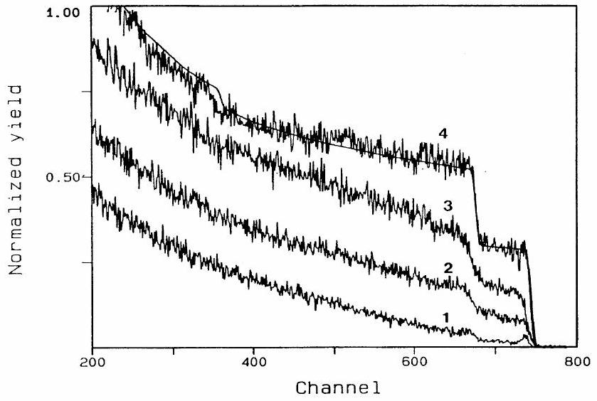
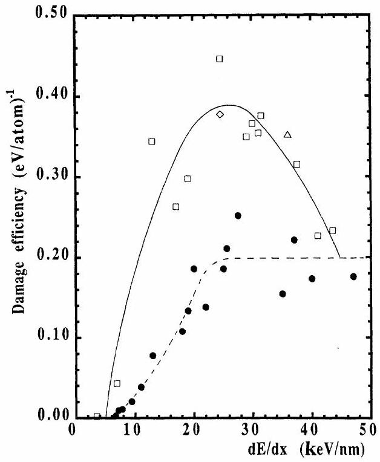
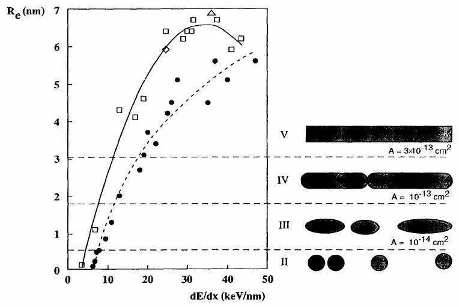
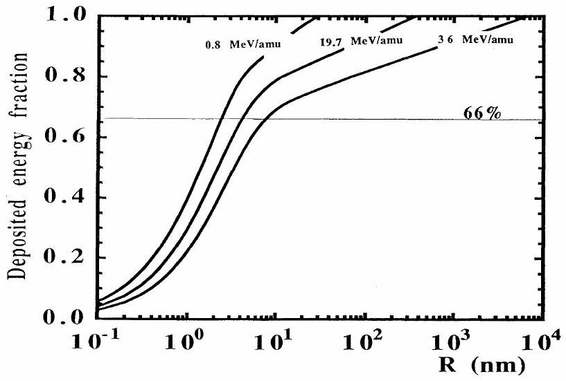
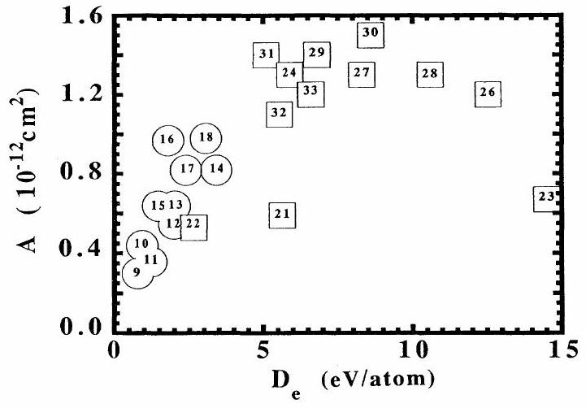

# Swift heavy ions in magnetic insulators: A damage-cross-section velocity effect 

A. Meftah Centre Interdisciplinaire de Recherches avec les Ions Lourds, BP 5133, F-14040 Caen CEDEX, France F. Brisard and J. M. Costantini Commissariat à l'Energie Atomique, Service PTN, BP 12, F-91680 Bruyères le Châtel, France M. Hage-Ali and J. P. Stoquert Centre de Recherches Nucléaires, Groupe Phase, F-67037 Strasbourg CEDEX, France F. Studer Crismat-Institut des Sciences de la Matiere et du Rayonnement, Université de Caen, 14032 Caen CEDEX, France M. Toulemonde Centre Interdisciplinaire de Recherches avec les Ions Lourds, BP 5133, F-14040 Caen CEDEX, France

(Received 19 November 1992; revised manuscript received 25 March 1993)

#### Abstract

The damage in ferrimagnetic yttrium iron garnet, $\mathrm{Y}_{3} \mathrm{Fe}_{5} \mathrm{O}_{12}$ or YIG , induced by energetic heavy-ion bombardment in the electronic stopping-power regime has been studied in the low-velocity range (for a beam energy $E \leq 3.6 \mathrm{MeV} / \mathrm{amu}$ ). Epitaxial thin films of YIG on [111]- $\mathrm{Gd}_{3} \mathrm{Ga}_{5} \mathrm{O}_{12}$ substrates were thus irradiated at room temperature with $15-\mathrm{MeV}{ }^{19} \mathrm{~F}, 50-\mathrm{MeV}{ }^{32} \mathrm{~S}, 650-\mathrm{MeV}{ }^{181} \mathrm{Ta}, 750-\mathrm{MeV}{ }^{208} \mathrm{~Pb}$, and 666$\mathrm{MeV}{ }^{238} \mathrm{U}$. The damage-cross-section $A$ is extracted from channeling-Rutherford-backscattering spectroscopy and compared to previous works. All the experimental results show that at one given value of $d E / d x$, the damage cross section is higher for low-velocity ions than for high-velocity ions over a large range of $d E / d x$. At constant $d E / d x$, the larger the difference between the ion velocities is, the larger the difference between the damage cross sections. Such a deviation might be explained by the effect of the energy deposition being more localized for the low-velocity ions than for the high-velocity ions. This work clearly indicates that the electronic stopping power is not the only key parameter in the creation of ion tracks, and that the damage cross section depends on the lateral distribution of the energy deposition.

## I. INTRODUCTION

The effects of heavy ions in yttrium garnet $\mathrm{Y}_{3} \mathrm{Fe}_{5} \mathrm{O}_{12}$, abbreviated as YIG, have been extensively studied for the past ten years. ${ }^{1-19}$ Swift heavy ions penetrating into matter lose their energy ( $d E / d x$ ) by elastic collisions with the target atom nuclei (the nuclear stopping power), and by interaction with the target electrons (the electronic stopping power). For ions at a higher energy ( $\geq 100 \mathrm{keV} / \mathrm{amu}$ ), the energy (a few $\mathrm{keV} / \AA$ ) is mainly deposited via ionization and electronic excitation processes. In most insulators, when the highly localized energy deposited on electrons is transferred from the electrons to the target atoms, an extended damage is induced along the ion path: the so-called latent track.

The first observations of induced damage by swift heavy ions in yttrium garnet were carried out by Hansen and Heitmann ${ }^{1,2}$ using Xe and U beams at an energy of $1.4 \mathrm{MeV} / \mathrm{amu}$ and at $d E / d x=24$ and $36 \mathrm{keV} / \mathrm{nm}$, respectively. They used the conversion electron Mössbauer spectroscopy (CEMS) in order to deduce the damage cross section $A$ and, assuming a cylindrical geometry for the defects, a radius of the latent track was calculated. This work was completed using other physical characterizations of the damage yield: channeling-Rutherford-
backscattering spectrometry (CRBS), ${ }^{5}$ electron microscopy, ${ }^{4}$ and Faraday rotation. ${ }^{3}$ Therefore, in the investigation range of $d E / d x$ the radii of latent tracks ranged between 5 and 8.7 nm as quoted in Table I. On the basis of these results, an extensive study of the damage creation in yttrium garnet was undertaken using the Grand Accélérateur National d'Ions Lourds (GANIL) accelerator at Caen. In a wide range of the electronic stopping power $(6<d E / d x<47 \mathrm{keV} / \mathrm{nm})$, the damage cross section and the damage morphology were deduced using several physical characterizations and observations (transmission Mössbauer spectrometry, high-resolution electron microscopy, saturation magnetization, CRBS, and chemical etching ${ }^{6-17}$ ). In the regime where the la-

TABLE I. Radius of latent tracts as determined in Refs. 2, 4, and $5 . R_{e}$ is the effective radius.
| Ion | $d E / d x$ (keV/m) | Beam energy (MeV/amu) | $\boldsymbol{R}_{e}$ (nm) | Experimental characterizations |
| :--- | :--- | :--- | :--- | :--- |
| Xe | 24 | 1.4 | 5 | Electron microscopy (Ref. 4) |
|  |  | 1.4 | 6.7 | CEMS (Ref. 2) |
| U | 36 | 1.4 | 5 | RBS (Ref. 5) |
|  |  | 1.4 | 8.7 | CEMS (Ref. 2) |

tent tracks are long and cylindrical (zone V in Ref. 14), the extracted radii (Table II) are lower than the previous determinations ${ }^{1-5}$ for the same values of $d E / d x$ (Table I). The only difference between both works is the ion energy. In the latter case the ion energy ranged between 5 and 39 MeV /amu and was quite a bit higher than the beam energy used by Hansen, Heitman, and Smit (1.4 $\mathrm{MeV} / \mathrm{amu}$ ). In the electronic stopping-power regime, it is known that $d E / d x$ is only the linear energy transfer and does not characterize the energy density deposited in the matter. From the calculations performed by Katz and Kobetich ${ }^{20}$ and by Waligorski, Hamm, and Katz, ${ }^{21}$ the energy density is higher at low velocity than at high velocity. More recently Costantini et al. ${ }^{18,19}$ have confirmed the track radius for the same $d E / d x$ and ion energy as Hansen, Heitmann, and Smit. ${ }^{2}$ These authors thus confirm that the latent track radii (determined from CRBS and high-resolution electronic microscopy, HREM) are larger for low-energy ions than for highenergy ions for the same values of $d E / d x$. In this work yttrium garnet was irradiated by several ions at low energies in order to cover a wide range of $d E / d x (3.5<d E / d x<43.5 \mathrm{keV} / \mathrm{nm})$. The deduced damage cross sections are compared with the previous ones (Refs. 6-17 and Table II). Since at low energy the variation of $d E / d x$ versus energy cannot be constant in a thick sample, the characterization technique of the damage used here was the CRBS method which is a near surface analysis ( $\approx 0.5-1 \mu \mathrm{~m}$ under the surface). This experimental technique was previously used for samples irradiated by high-energy ions ${ }^{10}$ and it has been shown that the latent track radii deduced from CRBS were in fairly good agreement with the data deduced from transmission

Mössbauer spectrometry ${ }^{14}$ and high-resolution electron microscopy. ${ }^{10}$

## II. EXPERIMENTAL TECHNIQUES AND DAMAGE ANALYSIS

Epitaxial thin films of YIG on [111]- $\mathrm{Gd}_{3} \mathrm{Ga}_{5} \mathrm{O}_{12}$ have been used for these experiments. Several different irradiations were performed at room temperature at the 7-MV Van de Graaff tandem of Bruyères-Le-Châtel ${ }^{18}$ and at the GANIL accelerator in Caen using the medium-energy line facility. ${ }^{22}$ The irradiated surface of the target was defined with good accuracy by means of horizontal and vertical sweeping magnets and using adjustable slits placed along the ion-beam path. The irradiation was always performed perpendicularly to the sample. The different experimental conditions are the following for the Van de Graaff accelerator: ${ }^{19} \mathrm{~F},{ }^{32} \mathrm{~S}$ beams were used at incident energies of 15 and 50 MeV , respectively. Beams were scanned over the sample surface $\left(1 \mathrm{~cm}^{2}\right)$. The fluence is determined by measuring the backscattered particles on a thin film of gold evaporated on a small area ( $6 \mathrm{~mm}^{2}$ ) of the target, after calibration by means of the Faraday cup. For the GANIL accelerator, the beams were ${ }^{181} \mathrm{Ta},{ }^{208} \mathrm{~Pb}$, and ${ }^{238} \mathrm{U}$ at incident energies of 650,750 , and 666 MeV , respectively. The particle flux is continuously monitored by collecting the secondary electrons emitted from a thin foil of titanium inserted in the ion flow after calibration by means of the Faraday cup. The beam flux was of the order of $10^{9}$ particles $/ \mathrm{s} \mathrm{cm}^{2}$ at the Van de Graaff tandem and $3.10^{8}$ particles $/ \mathrm{s} \mathrm{cm}^{2}$ at the GANIL accelerator. Several fluences were always used in order to follow the damage

TABLE II. Experimental data in the high-velocity ion regime. $A, R_{e}$, and $D_{e}$ are the damage cross section, the effective radius, and the mean energy deposited, respectively. $R_{d}$ is the cylinder radius in which $66 \%$ of $d E / d x$ is deposited. $v$ and $c$ are the ion velocity and the light velocity, respectively.
| Sample No. | Ion | $d E / d x$ ( $\mathrm{keV} / \mathrm{nm}$ ) | Mean energy (MeV/amu) | Relative velocity ( $\beta=v / c$ ) | $A$ ( $\mathrm{cm}^{2}$ ) | $R_{e}$ (nm) | $D_{e}$ (eV/atom) | $R_{d}$ (nm) | Ref. ${ }^{\text {a }}$ |
| :--- | :--- | :--- | :--- | :--- | :--- | :--- | :--- | :--- | :--- |
| 1 | Ar | 6.2 | 5 | 0.10 | $(6.0 \pm 2.0) 10^{-16}$ | $0.14 \pm 0.03$ |  | 4.6 | 9 |
| 2 | Kr | 6.7 | 38.7 | 0.29 | $(2.1 \pm 0.5) 10^{-15}$ | $0.26 \pm 0.03$ |  | 9.7 | 14 |
| 3 | Kr | 7.2 | 33.3 | 0.27 | $(8.1 \pm 1.6) 10^{-15}$ | $0.51 \pm 0.05$ |  | 9.3 | 14 |
| 4 | Kr | 7.8 | 29.0 | 0.25 | $(1.0 \pm 0.2) 10^{-14}$ | $0.56 \pm 0.06$ |  | 8.8 | 14 |
| 5 | Kr | 9.4 | 21.4 | 0.21 | $(2.3 \pm 0.5) 10^{-14}$ | $0.86 \pm 0.10$ |  | 7.9 | 8 |
| 6 | Kr | 11 | 15.7 | 0.18 | $(5.0 \pm 1.0) 10^{-14}$ | $1.3 \pm 0.2$ |  | 7.1 | 14 |
| 7 | Kr | 13 | 10.7 | 0.15 | $(1.2 \pm 0.4) 10^{-13}$ | $2.0 \pm 0.4$ |  | 6.3 | 14 |
| 8 | Mo | 18 | 8.0 | 0.13 | $(2.3 \pm 0.7) 10^{-13}$ | $2.7 \pm 0.4$ |  | 5.6 | 10 |
| 9 | Xe | 19 | 19.6 | 0.21 | $(3.0 \pm 0.6) 10^{-13}$ | $3.1 \pm 0.3$ | 0.8 | 7.7 | 8 |
| 10 | Xe | 20 | 17.4 | 0.19 | $(4.4 \pm 0.4) 10^{-13}$ | $3.7 \pm 0.2$ | 0.9 | 7.3 | 8,14,10 |
| 11 | Xe | 22 | 13.6 | 0.17 | $(3.6 \pm 0.4) 10^{-13}$ | $3.4 \pm 0.2$ | 1.2 | 6.7 | 14, 10 |
| 12 | Xe | 25 | 8.3 | 0.13 | $(5.5 \pm 0.5) 10^{-13}$ | $4.2 \pm 0.2$ | 2.0 | 5.6 | 8,10 |
| 13 | Xe | 25.6 | 7.6 | 0.13 | $(6.4 \pm 0.7) 10^{-13}$ | $4.5 \pm 0.3$ | 2.0 | 5.6 | 10 |
| 14 | Xe | 27.5 | 4.9 | 0.10 | $(8.2 \pm 1.0) 10^{-13}$ | $5.1 \pm 0.6$ | 3.4 | 4.5 | 10 |
| 15 | Pb | 35 | 19.7 | 0.21 | $(6.4 \pm 1.0) 10^{-13}$ | $4.5 \pm 0.4$ | 1.5 | 7.7 | 16 |
| 16 | Pb | 37 | 16.5 | 0.19 | $(9.7 \pm 0.9) 10^{-13}$ | $5.6 \pm 0.3$ | 1.8 | 7.2 | 16 |
| 17 | Pb | 40 | 12.0 | 0.16 | $(8.2 \pm 1.5) 10^{-13}$ | $5.1 \pm 0.5$ | 2.4 | 6.5 | 16 |
| 18 | U | $47{ }^{\text {b }}$ | 10.5 | 0.15 | $(9.8 \pm 1.4) 10^{-13}$ | $5.6 \pm 0.4$ | 3.0 | 6.2 | 14 |

[^0]yield evolution. The maximum fluences are between $10^{12}$ to $10^{15} \mathrm{p} / \mathrm{cm}^{2}$ depending on the induced damage yield. A degrador has been used whenever possible for covering different values of $d E / d x$ in the same irradiation for $\mathrm{Xe},{ }^{18} \mathrm{Ta}, \mathrm{Pb}$, and U irradiations. The $d E / d x$ values were calculated using the TRIM91 code. ${ }^{23}$

For the analysis of the radiation damage, channeling Rutherford backscattering (CRBS) was performed on all the samples at the 4-MV Van de Graaff accelerator at the Centre de Recherches Nucléaires of Strasbourg. Typical results are presented on Fig. 1 showing CRBS spectra for yttrium iron garnet $\mathrm{Y}_{3} \mathrm{Fe}_{5} \mathrm{O}_{12}$ in channeling conditions for the irradiated and nonirradiated parts of the same sample in the [111] direction. The random spectrum is also plotted out (Fig. 1) and simulated with the SAM program ${ }^{24}$ using the present experimental conditions (particle detector at $160^{\circ}$, solid angle of 0.65 mrad and a number of particles of $6.3 \times 10^{13} \alpha$ ). Using the surface approximation, the backscattering yield $\chi$ was measured by extrapolating the energy evolution of $\chi$ over the first 60 nm thickness up to the mean energy of the random edge. The evolution of the fraction of damaged material $F_{d}$ can be calculated by $\left(\chi_{i}-\chi_{v}\right) /\left(\chi_{r}-\chi_{v}\right)$, where $\chi_{i}, \chi_{v}, \chi_{r}$ are, respectively, the backscattering yields of the irradiated sample and the virgin sample in channeling conditions and in random orientation. The damage cross section $A$ was extracted using a Poisson's law $F_{d}=1-\exp (-A \phi t)$, where $\phi$ is the flux and $t$ is the irradiation time. In the present work, $A$ defines the cross section of a cylinder in which is created an amorphous phase as observed by electron microscopy. ${ }^{4,10}$ It has been shown that the radius $R$ of latent track cylinder determined by high-resolution electron microscopy ${ }^{10,13}$ is directly correlated to the damage cross section ${ }^{5,10}$ deduced from CRBS, ${ }^{5,10}$ or from Mössbauer spectrometry ${ }^{10}$ for values of $A$ bigger than $3 \times 10^{-13} \mathrm{~cm}^{2}$ (Ref. 14) through the relation $A=\pi R^{2}$.

FIG. 1. Energy spectrum of backscattered ${ }^{4} \mathrm{He}$ on yttrium garnet thin film $\mathrm{Y}_{3} \mathrm{Fe}_{5} \mathrm{O}_{12}$. Curve 1: Virgin sample in channeling conditions. Curve 4: Random oriented (experimental and simulation [Ref. 24]). Curves 2 and 3: $666-\mathrm{MeV}^{238} \mathrm{U}$ irradiated, respectively, $4 \times 10^{11} \mathrm{p} / \mathrm{cm}^{2}$ and $9 \times 10^{11} \mathrm{p} / \mathrm{cm}^{2}$.

## III. RESULTS AND DISCUSSION

## A. Damage cross section and damage morphology

The damage cross sections $A$ deduced from the lowenergy experiments are given in Table III. Systematically for the same value of $d E / d x$, the damage cross section deduced from the low-energy experiments is higher than the one deduced from the high-energy experiments (Table II). The damage cross section reaches a maximum value of approximately $1.5 \times 10^{-12} \mathrm{~cm}^{2}$, which was not observed in the high-energy regime. ${ }^{14}$ Moreover for the same value of $d E / d x$, the larger the difference between

TABLE III. Experimental data in the low-velocity ion regime. $A, R_{e}$, and $D_{e}$ are the damage cross section, the effective radius, and the mean energy deposited, respectively. $R_{d}$ is the cylinder radius in which $66 \%$ of $d E / d x$ is deposited. $v$ and $c$ are the ion velocity and the light velocity, respectively.
| Sample No. | Ion | $d E / d x$ (keV/nm) | Mean energy (MeV/amu) | Relative velocity ( $\beta=v / c$ ) | $A$ ( $\mathrm{cm}^{2}$ ) | $R_{e}$ (nm) | $D_{e}$ (eV/atom) | $R_{d}$ (nm) | Ref. |
| :--- | :--- | :--- | :--- | :--- | :--- | :--- | :--- | :--- | :--- |
| 19 | F | 3.5 | 0.8 | 0.041 | $(7.9 \pm 0.8) 10^{-16}$ | $0.16 \pm 0.01$ |  | 2.4 | Present work |
| 20 | S | 6.9 | 1.56 | 0.058 | $(3.5 \pm 0.4) 10^{-14}$ | $1.1 \pm 0.1$ |  | 3.3 | Present work |
| 21 | Cu | $13{ }^{\text {a }}$ | 0.8 | 0.042 | $(5.3 \pm 0.9) 10^{-13}$ | $4.3 \pm 0.4$ | 5.6 | 2.4 | 18 |
| 22 | Kr | 17 | 2.8 | 0.078 | $(5.3 \pm 0.8) 10^{-13}$ | $4.1 \pm 0.4$ | 2.6 | 4.0 | 18 |
| 23 | Xe | 19 | 0.42 | 0.031 | $(6.7 \pm 1.0) 10^{-13}$ | $4.6 \pm 0.4$ | 14.5 | 1.8 | 18 |
| 24 | Xe | $24.6{ }^{\text {a }}$ | 1.4 | 0.055 | $(1.3 \pm 0.2) 10^{-12}$ | $6.4 \pm 0.5$ | 5.9 | 3.2 | 18 |
| 25 | Xe | 24.6 | 1.4 | 0.055 | $(1.1 \pm 0.2) 10^{-12}$ | $5.9 \pm 1.0$ | 5.9 | 3.2 | Mean value of Table I |
| 26 | U | 29 | 0.8 | 0.042 | $(1.2 \pm 0.3) 10^{-12}$ | $6.2 \pm 0.8$ | 12.5 | 2.4 | Present work |
| 27 | Ta | 30 | 1.3 | 0.047 | $(1.3 \pm 0.3) 10^{-12}$ | $6.4 \pm 0.8$ | 8.3 | 3.0 | Present work |
| 28 | Pb | 31 | 1 | 0.047 | $(1.3 \pm 0.3) 10^{-12}$ | $6.4 \pm 0.8$ | 10.6 | 2.7 | Present work |
| 29 | Ta | 31.5 | 1.6 | 0.059 | $(1.4 \pm 0.3) 10^{-12}$ | $6.7 \pm 0.8$ | 6.8 | 3.4 | Present work |
| 30 | U | 36 | 1.4 | 0.055 | $(1.5 \pm 0.4) 10^{-12}$ | $6.9 \pm 1.5$ | 8.6 | 3.2 | Mean value of Table I |
| 31 | Ta | 37.5 | 3.6 | 0.088 | $(1.4 \pm 0.3) 10^{-12}$ | $6.7 \pm 0.8$ | 5.9 | 4.3 | Present work |
| 32 | Pb | 41 | 3.6 | 0.088 | $(1.1 \pm 0.3) 10^{-12}$ | $5.9 \pm 0.8$ | 5.5 | 4.3 | Present work |
| 33 | U | 43.5 | 2.8 | 0.078 | $(1.2 \pm 0.3) 10^{-12}$ | $6.2 \pm 0.8$ | 6.6 | 4.0 | Present work |

[^1]the ion velocities is, the larger the difference between the damage cross sections. For example, at $d E / d x \approx 13 \mathrm{keV} / \mathrm{nm}$, the difference in the damage cross section is large: $5.3 \times 10^{-13} \mathrm{~cm}^{2}$ and $1.2 \times 10^{-13} \mathrm{~cm}^{2}$ for beam energies of 0.8 and $10.7 \mathrm{MeV} / \mathrm{amu}$, respectively, while the difference is small at $d E / d x \approx 40 \mathrm{keV} / \mathrm{nm}$ where the measured damage cross sections are $11 \times 10^{-13}$ and $8.2 \times 10^{-13}$ for beam energies of 3.6 and 12 MeV /amu, respectively. This result confirms the previous experiments ${ }^{1-5,18,19}$ over a larger range of $d E / d x$. The systematic difference between the low- and the high-velocity ion regimes is only due to the fact that for the same value of $d E / d x$, there are only two measurements of the damage cross section corresponding to beam energies which are around 2 MeV /amu for the lower-energy irradiation and around 20 MeV /amu for the higher ones. Thus at constant $d E / d x$ one should observe a monotonical increase of the damage cross section when the energy of the different ions used decreases monotonically.

Studer et al. ${ }^{14}$ have linked the damage morpholo-$\mathrm{gy}^{13-25}$ to the damage efficiency $\epsilon=A / d E / d x$ (Fig. 2). The appearance of a plateau in the high-velocity ion regime was correlated to the existence of long and cylindrical latent tracks. In the present experiment, the damage efficiency is larger than in the previous experiments and the plateau has disappeared (Fig. 2). A decrease of $\epsilon$ from 0.44 to $0.23(\mathrm{eV} / \text { atom })^{-1}$ for $d E / d x$ ranging between 25 and $43.5 \mathrm{keV} / \mathrm{nm}$ is observed. Therefore, the correlation between the damage efficiency and the damage morphology is velocity dependent and another phenomenological description has to be found.

Another representation is to calculate the effective radius $R_{e}$ from the amorphization cross section $A=\pi R_{e}^{2}$.

FIG. 2. Damage efficiency $(A / d E / d x)$ vs $d E / d x$ for the high-velocity regime (black dots) and the low-velocity regime: (口) present work and Ref. 18; $(\triangle, \vee)$ from Refs. 2, 4 and 5. The lines are only to guide the eyes.

This radius $R_{e}$ corresponds to a cylinder in which the amorphous phase is concentrated and is plotted versus $d E / d x$ (Fig. 3). In the high-velocity ion regime, four ranges of $R_{e}$ are defined taking into account the HREM observations ${ }^{13}$ and the chemical etching experiments. ${ }^{25}$ It is only for $R_{e}>3.1 \mathrm{~nm}$ that $R_{e}$ equals the radius of the latent track observed by HREM. ${ }^{10}$ Applying this description to the low-velocity ion regime, long and continuous cylindrical tracks should appear for $d E / d x>9 \mathrm{keV} / \mathrm{nm}$. This is in good agreement with an HREM observation carried out on the sample labeled 21 corresponding to $d E / d x=13 \mathrm{keV} / \mathrm{nm} .^{19}$ In this representation (Fig. 3) in the low-velocity ion regime the extrapolation to $R_{e}=0$ gives a $d E / d x$ threshold value of 3 $\mathrm{keV} / \mathrm{nm}$ for the appearance of cylindrical latent tracks. This value is much lower than the one determined previously. ${ }^{7}$ It confirms a higher efficiency of the damage creation with a low-velocity beam.

Such a description is valid for other materials in the high- and low-velocity ion regimes. In the high-velocity ion regime, knowing that the damage cross section in an amorphous metallic alloy ( $a-\mathrm{Fe}_{85} \mathrm{~B}_{15}$ (Ref. [26]) is larger than $3 \times 10^{-13} \mathrm{~cm}^{2}$ (i.e., $R_{e}>3 \mathrm{~nm}$ ) for $d E / d x>32 \mathrm{keV} / \mathrm{nm}$, the chemical etching was successfully undertak$\mathrm{en}^{27}$ at $d E / d x \approx 55 \mathrm{keV} / \mathrm{nm}$. In the low-velocity ion regime, the same conclusion arises for $\mathrm{SiO}_{2}$ quartz. ${ }^{28,29}$ Chemical etching appears at $d E / d x \geq 4.5 \mathrm{keV} / \mathrm{nm},^{28}$ when the damage cross section is of the order of $10^{-13} \mathrm{cm}^{2}$ (i.e., for $R_{e}=1.8 \mathrm{~nm}$ ). ${ }^{29}$ This phenomenological description seems to be rather universal.

FIG. 3. Effective radius $R_{e}={ }^{2} \sqrt{A / \pi}$ vs $d E / d x$ and the corresponding damage morphology. The symbols have the same significance as in Fig. 2. The lines are only to guide the eye. Range II: For $R_{e}<0.56 \mathrm{~nm} ; A<10^{-14} \mathrm{~cm}^{2}$, the electronic damage overcomes the nuclear damage. The extended defects are nearly spherical with a diameter of 3 nm . Range III: For $0.56<R_{e}<1.8 \mathrm{~nm} ; 10^{-14}<A<10^{-13} \mathrm{~cm}^{2}$, by overlapping spherical effects, cylindrical defects of 3-nm diameter appear. Range IV: For $1.8<R_{e}<3.1 \mathrm{~nm} ; 10^{-13}<A<3 \times 10^{-13} \mathrm{~cm}^{2}$, the cylindrical defects overlap and the chemical etching of latent tracks begin to be efficient. Range V: For $R_{e}>3.1 \mathrm{~nm}$; $A>3 \times 10^{-13} \mathrm{~cm}^{2}$, the defects are long cylinders of amorphous material and the damage is homogeneous inside the cylinder. The range I where the damage arises from nuclear collisions ( $A \approx 10^{-19}-10^{-16} \mathrm{~cm}^{2}$ ) is not represented on the figure.

## B. Damage cross section and localization of the electronic energy deposition

This result clearly shows that $d E / d x$ is not the most relevant parameter to explain the damage evolution since the spatial distribution of the energy deposited in the lattice is velocity dependent. ${ }^{20,21}$ Semiempirical calculations and numerical Monte Carlo simulations ${ }^{20,21,30}$ have predicted the initial radial distribution of the deposited energy $D(r)$. Waligorski, Hamm, and Katz ${ }^{21}$ have proposed an analytical formulation of $D(r)$ by fitting the Monte Carlo simulations. By integrating $D(r)$ in a cylindrical geometry, the fraction of the energy deposited in a cylinder $R$ is calculated and plotted in Fig. 4. The larger the ion velocity, the larger is the volume in which $d E / d x$ is deposited. Two regimes appear: the core in which approximately $66 \%$ of the energy is deposited in a small volume and a crown in which the remaining energy is deposited in a large volume. The energy density $D_{e}$ deposited in the core ranges between 1 and 10 eV /atom while in the crown it is between 0.01 and 0.1 eV /atom or less. This large difference in the deposited energy in the two volumes leads us to assume that the core energy could be the driving force for the latent track appearance in nonradiolytic materials. Thus for each incident ion we determine the cylinder radius $R_{d}$ (Tables II and III) in which $66 \%$ of $d E / d x$ is deposited and we calculate the mean energy density $D_{e}$. For latent tracks with a radius bigger than 3 nm (i.e., only for long and cylindrical latent tracks, regime $V$ in Fig. 3) the damage cross section is plotted versus $D_{e}$ (Fig. 5). The overall behavior of the curve in Fig. 5 is independent of the initial conditions needed to calculate $D_{e}$. There is only a change in the $D_{e}$ scale. Within the experimental scattering of the data points, this representation is enticing since the larger $D_{e}$ is the larger $A$ up to a saturation value. Moreover, in this representation the damage-cross-section value corresponding to the lowest $D_{e}$ value in the low-velocity ion

FIG. 4. Fraction of the deposited energy in a cylindrical radius $R$ vs the cylinder radius $R$ deduced from Waligorski, Hamm, and Katz (Ref. 21). The energies quoted on the figure correspond to the irradiation conditions of samples 26, 32 (Table III), and 15 (Table III), respectively.

FIG. 5. Damage cross section $A$ vs the energy density $D_{e}$ in the core of the spatial distribution of the deposited energy. (•) High-velocity ion regime; ( $\square$ ) low-velocity ion regime. The number in the symbols corresponds to the sample number (first columns of Tables II and III).

regime ( Kr , sample 22 ) is in agreement with the ones measured in the high-velocity regime for same value $D_{e}$. But two points are still out of the frame and lead to questions: (1) The xenon irradiation (sample 23) shows a decrease of $A$ for the highest value of $D_{e}$. Other experiments have to be done to confirm this decrease. (2) The copper irradiation (sample 21) has shown a damage cross section out of the general behavior. It should be noted that these two results correspond to the lowest velocity used and, if confirmed, this could show the limits of the present explanation. Consequently one can assume that energy density $D_{e}$ would be a better scale of the damage-cross-section $A$ evolution since it takes into account the linear energy transfer and the spatial energy distribution. Secondary ion emissions were greatly used in order to study the effect of intense electronic excitation ${ }^{31-38}$ and the same velocity effects were also observed: The yields of atoms desorbed do not follow the $d E / d x$ evolution and the maxima are shifted toward lower velocities. However, a correlation ${ }^{38}$ on the same material between the yields of atoms desorbed and the radius of latent track is lacking in the damage morphology range corresponding to a long and cylindrical amorphous phase $\left(R_{e} \geq 3 \mathrm{~nm}\right)$ even for $\mathrm{SiO}_{2}$ quartz. ${ }^{10,28,29,36}$ So a detailed experimental comparison between bulk latent tracks and secondary ion emissions by intense electronic excitation is presently not possible.

## IV. CONCLUSIONS

Yttrium iron garnet has been irradiated by several ions at low energy ( $E_{i}=0.8-3.6 \mathrm{MeV} /$ amu for $d E / d x$ ranging from 3.5 to $43.5 \mathrm{keV} / \mathrm{nm}$ ) and is compared with previous works $\left(5 \leq E_{i} \leq 38.7 \mathrm{MeV} / \mathrm{amu}\right.$ and $6.2<d E / d x<47 \mathrm{keV} / \mathrm{nm}$ ). At the same value of $d E / d x$, the damage cross section deduced from present experiments is higher than the previous determination over a wide range of $d E / d x$. It can be observed that the higher the difference in the beam velocity is, the higher the difference in the damage cross section. An effective
radius $R_{e}$ has been extracted from the amorphization cross section and has been plotted versus $d E / d x$. The extrapolation to $R_{e}=0$ has given a threshold value ( $\approx 3.0 \mathrm{keV} / \mathrm{nm}$ ) which confirms a higher efficiency of the damage creation with low-velocity heavy ion beam. Using the analytical formulation developed by Waligorski et al., we have determined the cylinder in which $66 \%$ of $d E / d x$ is deposited. The damage cross section is plotted versus the deposited energy density $D_{e}$. It has been shown that for
the high-energy regime, the damage cross section linearly increases versus $D_{e}$ while the damage cross section in the high-energy regime reaches a saturation value. This work indicates that the electronic stopping power is not the only key parameter in the creation of tracks. The energy density has to be determined provided that the spatial energy distribution is dependent on the ion velocity, and the damage cross section is dependent on the lateral distribution of the energy deposition.
${ }^{1}$ P. Hansen and H. Heitmann, Phys. Rev. Lett. 43, 1444 (1979).
${ }^{2}$ P. Hansen, H. Heitmann, and P. M. Smit, Phys. Rev. B 26, 3539 (1982).
${ }^{3}$ H. Heitmann and P. Hansen, J. Appl. Phys. 53, 7321 (1982).
${ }^{4}$ M. P. A. Viegers, J. Electron Microsc. 2, 187 (1982).
${ }^{5}$ A. Timm and B. Strocka, Nucl. Instrum. Methods B 12, 479 (1985).
${ }^{6}$ G. Fuchs, F. Studer, E. Balanzat, D. Groult, M. Toulemonde, and J. C. Jousset, Europhys. Lett. 3, 321 (1987).
${ }^{7}$ F. Studer, D. Groult, N. Nguyen, and M. Toulemonde, Nucl. Instrum. Methods B 19-20, 856 (1987).
${ }^{8}$ M. Toulemonde, G. Fuchs, N. Nguyen, F. Studer, and D. Groult, Phys. Rev. B 35, 6560 (1987).
${ }^{9}$ D. Groult, M. Hervieu, N. Nguyen, F. Studer, and M. Toulemonde, Defect Diff. Forum 57, 391 (1988).
${ }^{10}$ M. Toulemonde and F. Studer, Philos. Mag. A 58, 799 (1988).
${ }^{11}$ F. Studer, C. Houpert, D. Groult, and M. Toulemonde, Radiat. Eff. Def. Solids 110, 55 (1989).
${ }^{12}$ J. M. Costantini, J. L. Flament, D. Groult, L. Sinopoli, F. Studer, M. Toulemonde, J. Trochon, and J. L. Uzureau, Radiat. Eff. 110, 193 (1989).
${ }^{13}$ C. Houpert, F. Studer, D. Groult, and M. Toulemonde, Nucl. Instrum. Methods B 39, 720 (1989).
${ }^{14}$ F. Studer, C. Houpert, H. Pascard, R. Spohr, J. Vetter, Jin Yun Fan, and M. Toulemonde, Radiat. Eff. Def. Solids 116, 59 (1991).
${ }^{15}$ F. Studer, C. Houpert, M. Toulemonde, and E. Dartyge, J. Solid State Chem. 81, 238 (1991).
${ }^{16}$ A. Meftah, N. Merrien, N. Nguyen, F. Studer, H. Pascard, and M. Toulemonde, Nucl. Instrum. Methods B 59, 605 (1991).
${ }^{17}$ F. Studer and M. Toulemonde, Nucl. Instrm. Methods B 65, 560 (1992).
${ }^{18}$ J. M. Costantini, F. Brisard, J. L. Flament, A. Meftah, M. Toulemonde, and M. Hage-Ali, Nucl. Instrum. Methods B 65, 568 (1992).
${ }^{19}$ J. M. Costantini, F. Ravel, F. Brisard, M. Caput, and C.

Cluzeau, Nucl. Instrum. Methods B (to be published).
${ }^{20}$ R. Katz and E. J. Kobetich, Phys. Rev. 186, 344 (1969).
${ }^{21}$ M. P. R. Waligorski, R. N. Hamm, and R. Katz, Nucl. Tracks Radiat. Meas. 11, 309 (1986).
${ }^{22}$ S. Bouffard, J. Dural, F. Levesque, and J. M. Ramillon, Ann. Phys. (Paris) 14, 385 (1989).
${ }^{23}$ J. P. Biersack and L. G. Haggmark, Nucl. Instrum. Methods 174, 257 (1980).
${ }^{24}$ J. P. Stoquert, A. Amokrane, H. Beaumevieille, and J. C. Oberlin, Nucl. Instrum. Methods 179, 343 (1981).
${ }^{25}$ M. Toulemonde, N. Enault, Jin Yun Fan, and F. Studer, J. Appl. Phys. 68, 1545 (1990).
${ }^{26}$ A. Audouard, E. Balanzat, J. C. Jousset, G. Fuchs, D. Lesueuer, and L. Thomé, Mat. Sci. Forum 97-99, 631 (1192).
${ }^{27}$ C. Trautmann, S. Andler, W. Brüchle, R. Spohr, and M. Toulemonde, Radiat. Eff. Def. 126, 207 (1993).
${ }^{28}$ A. Sigrist and R. Balzer, Helv. Phys. Acta 50, 49 (1977).
${ }^{29}$ M. Toulemonde, E. Balanzat, S. Bouffard, J. J. Grob, M. Hage-Ali, and J. P. Stoquert, Nucl. Instrum. Methods Phys. Res. B 46, 64 (1990).
${ }^{30}$ J. Fain, M. Monin, and M. Montret, Radiat. Res. 57, 379 (1974).
${ }^{31}$ S. Della Negra and Y. Lebeyec, Nucl. Sci. Appl. 1, 569 (1983).
${ }^{32}$ E. Nieschler, B. Nees, H. Voit, P. Beining, and J. Scheer, Phys. Rev. B 37, 9197 (1988).
${ }^{33}$ A. Albers, K. Weiin, P. Dück, W. Treu, and H. Voit, Nucl. Instrum. Methods 198, 69 (1982).
${ }^{34}$ J. E. Griffith, R. A. Weller, L. E. Seiberling, and T. A. Tombrello, Radiat. Eff. 51, 223 (1980).
${ }^{35}$ C. K. Meins, J. E. Griffith, Y. Qiu, M. H. Mendenhall, L. E. Seiberling, and T. A. Tombrello, Radiat. Eff. 71, 13 (1983).
${ }^{36}$ Yuanxun Qiu, J. E. Griffith, Wenn Jin Meng, and T. A. Tombrello, Radiat. Eff. 70, 231 (1983).
${ }^{37}$ Yuanxun Qui, J. E. Griffith, and T. A. Tombrello, Radiat. Eff. 64, 111 (1982).
${ }^{38}$ T. A. Tombrello, Nucl. Instrum. Methods Phys. Res. B 2, 555 (1984).

[^0]:    ${ }^{\text {a }}$ When several references are quoted, a mean value of $A$ was adopted.
    ${ }^{\mathrm{b}}$ Recalculated with TRIM91.

[^1]:    ${ }^{\text {a }}$ Surface approximation (CRBS value).

