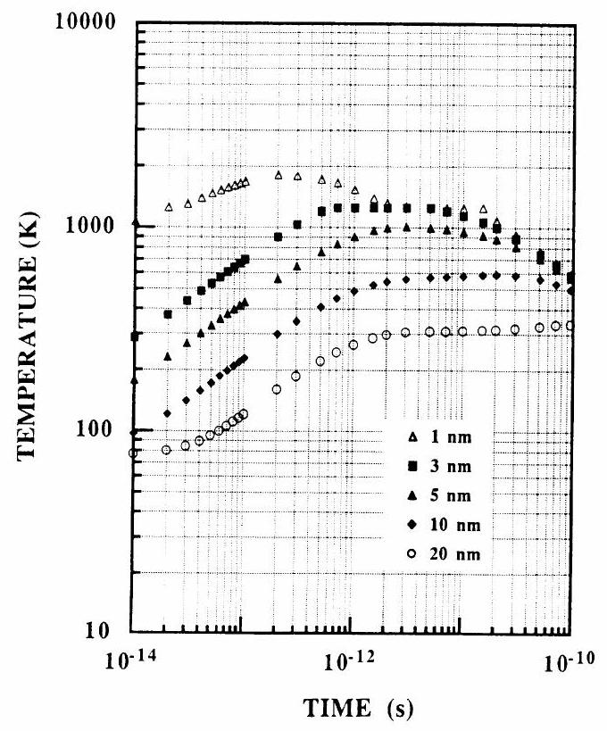
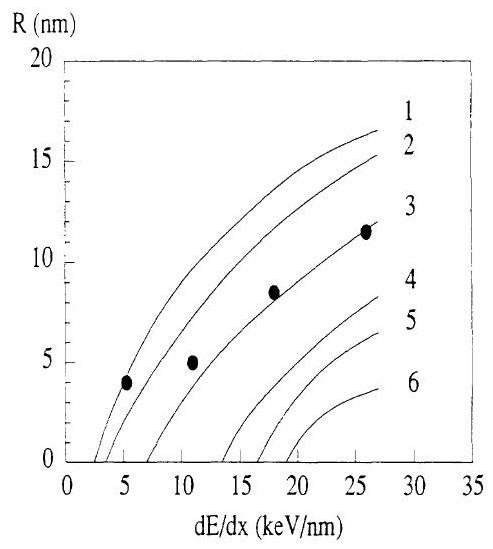
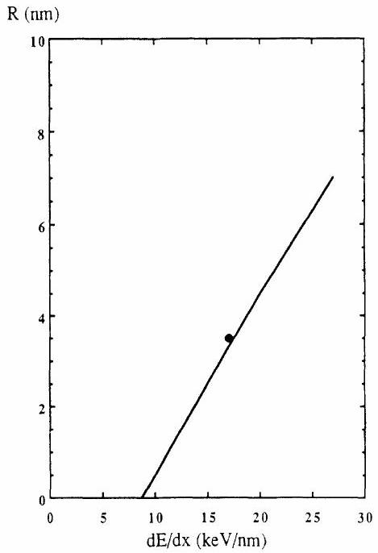
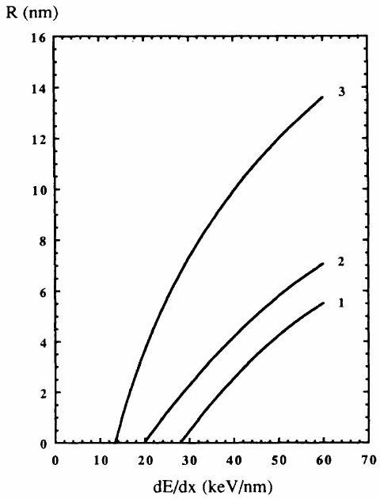
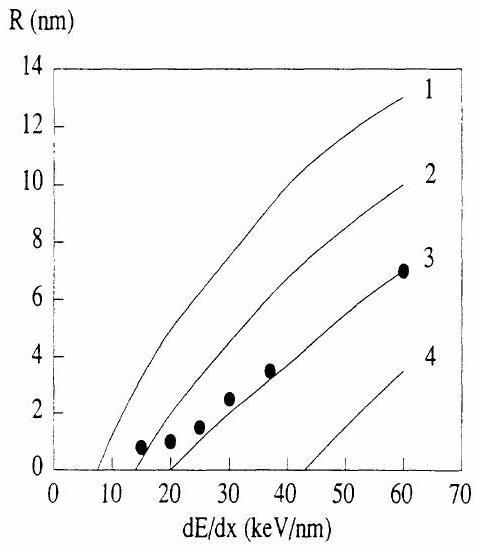

# Transient thermal process after a high-energy heavy-ion irradiation of amorphous metals and semiconductors 

M. Toulemonde and C. Dufour Centre Interdisciplinaire de Recherches avec les Ions Lourds, rue Claude Bloch, Boîte Postale 5133, 14040 Caen CEDEX, France E. Paumier Centre Interdisciplinaire de Recherches avec les Ions Lourds, rue Claude Bloch, Boîte Postale 5133, 14040 Caen CEDEX, France and Laboratoire d'Etudes et de Recherches sur les Matériaux, Institut des Sciences de la Matiere et du Rayonnement, Boulevard du Maréchal Juin, 14050 Caen CEDEX, France

(Received 8 November 1990; revised manuscript received 7 October 1992)

#### Abstract

Following a description used to explain a phase transformation observed after pulsed femtosecond laser irradiation, a transient thermal process is used to describe latent-track formation after high electronic excitation induced by energetic ( GeV ) heavy ions. The transient thermal calculation is restricted to the amorphous materials $a$ - $\mathrm{Ge}, a$ - Si , and $a$ - $\mathrm{Fe}_{85} \mathrm{~B}_{15}$, for which nearly all latent-track radii and/or macroscopic thermodynamic properties are known. The heat-flow equation is solved numerically in cylindrical geometry. The time-dependent heat-generation term is assumed to be due to the electron-atom interaction. The characteristic length $\lambda$ of the energy transport by secondary electrons is taken as the only free parameter and the maximum diameter of the cylinder of liquid matter is considered as the diameter of the observed latent track. Using the single value $\lambda=14 \mathrm{~nm}$, we have been able to calculate these diameters in $a$ - Si and $a$ - Ge in reasonable agreement with experimental track diameters, taking into account the large differences between the macroscopic thermodynamic parameters of both materials. This $\lambda$ value is less than that for the crystalline state. In the case of $a-\mathrm{Fe}_{85} \mathrm{~B}_{15}$, the diameters calculated with use of $\lambda=19 \mathrm{~nm}$ are in agreement with the ones determined recently by electrical-resistivity change.

## I. INTRODUCTION

The recent and systematic use of heavy-ion accelerators has increased the total number of materials found to be sensitive in bulk to the electronic excitation induced by high-energy heavy-ion irradiation. ${ }^{1-22}$ The most striking results are for metals and semiconductors for which the amorphous phases are more sensitive to electronic excitation ${ }^{16-18}$ than the crystalline phases. ${ }^{19-22}$ One relevant difference is the smaller electron mobility in the amorphous phase. In pure metals and semiconductors, ${ }^{2}$ the large electron mobility has been suggested as the main reason for which significant atomic rearrangement does not occur in response to electronic excitation. ${ }^{23}$ In the amorphous phases the lower electron mobility may allow the energy deposited in the electronic system to be confined long enough to form a transiently heated region. Following earlier works, ${ }^{6-8,23,24}$ we attempt to use a thermal-spike calculation to describe the effects produced following the electronic excitation of amorphous metals and semiconductors $a-\mathrm{Si}, a-\mathrm{Ge}$, and $a$ $\mathrm{Fe}_{85} \mathrm{~B}_{15}$.

In the first section we give arguments which motivated a transient thermal calculation. In the second part a transient thermal calculation is developed and applied to amorphous germanium. ${ }^{16}$ In the third part the calculation is extended to two other amorphous materials, $a$ - Si and $a-\mathrm{Fe}_{85} \mathrm{~B}_{15}$.

## II. ARGUMENTS MOTIVATING A TRANSIENT THERMAL CALCULATION

A transient thermal calculation is developed in order to account for the following experimental results obtained in the electronic-stopping-power ( $d E / d x$ ) regime. In amorphous Si and Ge (Ref. 16) prepared by vacuum evaporation, bulk latent-track diameters have been determined by electron microscopy. The electron-diffraction patterns from the track areas exhibited ring patterns in addition to halo patterns, suggesting that the tracks consist of small recrystallized particles. In the framework of the present model, we assume that a latent track results from the rapid quenching of a cylinder of molten matter. ${ }^{16}$ In amorphous $\mathrm{Fe}_{85} \mathrm{~B}_{15}$, the $d E / d x$ threshold value ${ }^{17}$ for bulk damage creation is measured. This threshold is associated with the energy needed to induce a liquid phase along the heavy-ion path. Moreover, nearly all the macroscopic thermodynamic parameters of these amorphous materials are known. This allows quantitative comparisons between calculated and measured values of track diameters and thresholds.

The thermal-spike model ${ }^{5-8,23-29}$ was initially proposed to explain track formation in thin films or in small-size grains of pure materials. Quantitative development of this model was performed by Izui. ${ }^{6}$ He suggested that the energy is shared between the electrons in a time of the order of $10^{-15} \mathrm{~s}$ and that the electron energy
is transferred to the atoms via an electron-atom interaction in a time of $5 \times 10^{-13} \mathrm{~s}$. In this model the main parameter is the grain size, which is considered as reducing the thermal conductivity ${ }^{6}$ or limiting the motion of the excited electron clouds. ${ }^{7}$ These two effects confine the energy in a small volume of the material, which is then warmed up very rapidly into a liquid and even a vapor phase. At that time that model was speculative because of the scarcity of the experimental data and because of the lack of precision of the thermodynamic parameters for this kind of material. Later on, the thermal-spike model was developed in order to explain the track formation in insulators ${ }^{30}$ using a set of two equations describing hydrodynamic propagation of energy in electron fluid and ionic fluid, respectively. A time of $10^{-12} \mathrm{~s}$ is estimated for heating up solid argon ${ }^{30}$ ions to an energy of 1 eV . Even if a complete analysis of this core plasma varying in space and time is not straightforward, ${ }^{30}$ the time necessary to heat the argon ions is in agreement with the estimate of Izui. ${ }^{6}$

More recently, a transient thermal model was developed to explain the phase transformation of silicon surfaces observed after femtosecond (fs) laser irradiation. With the recent development of fs pulse techniques, it is possible to supply energy to the electronic carriers in a time shorter than the characteristic time for energy exchange with the lattice. ${ }^{31-46}$ Laser irradiation would thus initially create an extremely hot carrier gas in a cold lattice as for a heavy-ion irradiation. ${ }^{47}$ In a fs laser irradiation, the increment of the lattice temperature is due to the electron-atom interaction after the thermalization of the energy deposited on the electron system. The measured electron thermalization time ${ }^{34}$ is less than $10^{-14} \mathrm{~s}$, time which decreases when the deposited energy increases. Such a value was assumed by Izui in the thermal-spike model. Then the hot electrons are cooled down by sharing their energy with the cold electrons and also by an electron-atom interaction inducing a lattice temperature increase ${ }^{32,34,36,37,40,45,46}$ as observed in the fs laser experiments. These experimental observations support the statement that the energy deposited during electron excitation is rapidly shared with the lattice even if the electron temperature may be sustained ${ }^{30}$ by refilling the electronic holes. The measured electron-atom energy-transfer time follows an exponential decay ${ }^{34,46}$ with a characteristic time between 0.5 and 3 ps in agreement with the previous estimate with either a metal or a semiconductor. Moreover, if atomic motion could occur before melting, ${ }^{32}$ the fs laser experiments show that, as a matter of fact, a subsequent increase of temperature would arise anyway.

Thus, following the same idea, the phase transformation induced by heavy-ion irradiation may result from an increase of the lattice temperature due to a two-step process: thermalization of the deposited energy on the electron system via electron-electron interaction and transfer of this energy to the lattice via electron-atom interaction. As the electron and atom systems are not in thermal equilibrium with each other, the space and time evolutions of electronic system and lattice temperatures, $T_{e}$ and $T$, respectively, are governed by a set of coupled non-
linear differential equations ${ }^{36}$ in cylindrical geometry:

$$
\begin{aligned}
\rho C_{e}\left(T_{e}\right) \frac{\delta T_{e}}{\delta t}= & \frac{\delta}{\delta r}\left[K_{e}\left(T_{e}\right) \frac{\delta T_{e}}{\delta r}\right]+\frac{K_{e}\left(T_{e}\right)}{r} \frac{\delta T_{e}}{\delta r} \\
& -g\left(T_{e}-T\right)+A(r) \\
\rho C(T) \frac{\delta T}{\delta t}= & \frac{\delta}{\delta r}\left(K(T) \frac{\delta T}{\delta r}\right)+\frac{K(T)}{r} \frac{\delta T}{\delta r}+g\left(T_{e}-T\right)
\end{aligned}
$$

where $C_{e}, C$ and $K_{e}, K$ are the specific heat and thermal conductivity for the electronic system and lattice, respectively, $\rho$ is the material density, $g$ is the electron-atom coupling, $A(r)$ is the energy brought on the electronic system in a time considerably less than the electronic thermalization time, and $r$ is the radius in cylindrical geometry with the heavy-ion path as the axis.

As a phase change in the material may occur, the two differential equations can be solved only numerically. If we use the explicit method, ${ }^{48-51}$ a convergence criterion links the time step $\Delta t$ to the thickness $h$ of the considered slice of matter. The criterion is $K \Delta t<\rho C h^{2} / 2$, where $K$ and $C$ can be applied either for the electronic or atomic system. Applying it to the electronic system with $h=1 \mathrm{nm}, \Delta t$ should be less than $10^{-16} \mathrm{~s}$. With this time step the calculation is computer time consuming. As our main objective is the transient thermal process on the atoms, we shall limit ourselves to Eq. (2), replacing $g\left(T_{e}-T\right)$ by $N(r, t)$, which is the energy density generated per unit time in the lattice by the excited electrons. It is an analytical solution of Eq. (1) with the assumption of mean values of the electron diffusivity $D_{e}=K_{e}\left(T_{e}\right) / \rho C_{e}\left(T_{e}\right)$ and of the electron-atom interaction time $\tau_{a}=\rho C_{e}\left(T_{e}\right) / g$ over a large range of electron temperature. This approximation is valid because the electron-electron interaction time is at least one order of magnitude less than the electron-atom interaction time, and consequently the solution of Eq. (1) can be assumed to be in a steady state as compared with the solution of Eq. (2). Hence the main parameter will be $\lambda=\sqrt{D_{e} \tau_{a}}$, which is the mean free path of electron scattering, taking into account electron-electron and electron-phonon interactions.

As the energy deposited on the electronic system is transferred to the atoms in a cylindrical geometry with a characteristic time of the order of $10^{-12} \mathrm{~s}$, the quenching rate of the molten cylinder will be governed by the thermal properties of the amorphous materials. In that case it will be shown later by calculation that the quenching rate is of the order of $10^{13} \mathrm{~K} / \mathrm{s}$. The amorphous metallic alloys $a-\mathrm{Fe}_{85} \mathrm{~B}_{15}$ used by Audouard et al. ${ }^{17}$ were obtained by melt spinning with a quenching rate of $10^{6} \mathrm{~K} / \mathrm{s}$. With a larger quenching rate, it is known that another amorphous phase can be obtained. ${ }^{52}$ In the case of amorphous semiconductors irradiated by ns laser pulses, it is known that the nonequilibrium melting and solidification are a complex problem. ${ }^{53}$ Experimentally, Izui and Furuno ${ }^{16}$ have observed that tracks consist of small recrystallized particles. This can be explained as resulting from a lower thermal conductivity in amorphous materi-
als than in crystalline materials. The amorphous phase surrounding the ion track can severely impede the heat flow, leading to a lower cooling rate than the one resulting from vacuum evaporation. In the framework of the transient thermal calculation, the crytallization will be a consequence of the very high mobility of the lattice atoms in the liquid phase.

However, it is known that it is necessary to have a source of defects, such as a surface, ${ }^{54-57}$ in order to induce melting. In the case of amorphous materials, the existing free volume can act as a source of defects. It is for this reason that we limit the present calculation to amorphous materials only. Moreover, in the case of silicon, the liquid density is higher than the solid density. If the pressure is increased in the volume, the melting temperature decreases and melting will not be hindered. Another difficulty arises from the very fast energy generation in the lattice: Superheating can occur. ${ }^{38,58}$ Pulsed laser irradiations ${ }^{38}$ have shown that the total energy necessary for melting does not exceed the energy needed to raise the temperature up to the melting point plus the heat of fusion. In the following we shall admit that criterion.

## III. NUMERICAL ANALYSIS: APPLICATION TO AMORPHOUS GERMANIUM

## A. Numerical analysis

Following the finite-difference method outlined in previous works, ${ }^{48-51}$ Eq. (2) is developed numerically:

$$
T_{i}(t+\Delta t)=T_{i}(t)+\left[Q\left(T_{i}\right)+N_{i}(r, t)\right] \frac{\Delta t}{\rho C\left(T_{i}\right)}
$$

It means that the temperature $T_{i}(t+\Delta t)$ of the slice of matter with a thickness $h$, labeled $i$, at a time $t+\Delta t$ and at a distance $r$ from the cylinder axis is equal to the temperature $T_{i}(t)$ of the same slice at a time $t$ increased by the effects of the thermal diffusion $Q\left(T_{i}\right)$ and of the heat generation $N_{i}(r, t)$. To take into account the discontinuities due to the phase change, thermal diffusion is defined as

$$
\begin{aligned}
Q\left(T_{i}\right)= & \frac{K_{s}\left(T_{i}\right)}{h^{2}}\left(T_{i-1}-T_{i}\right)+\frac{K_{r}\left(T_{i}\right)}{h^{2}}\left(T_{i+1}-T_{i}\right) \\
& +\frac{K_{s}\left(T_{i}\right)}{2 r h}\left(T_{i}-T_{i-1}\right)+\frac{K_{r}\left(T_{i}\right)}{2 r h}\left(T_{i+1}-T_{i}\right)
\end{aligned}
$$

with

$$
\begin{aligned}
& K_{s}\left(T_{i}\right)=\left[K\left(T_{i-1}\right)+K\left(T_{i}\right)\right] / 2, \\
& K_{r}\left(T_{i}\right)=\left[K\left(T_{i+1}\right)+K\left(T_{i}\right)\right] / 2 .
\end{aligned}
$$

The definition of $K_{s}\left(T_{i}\right)$ and $K_{r}\left(T_{i}\right)$ is useful when the slice $i$ is being melted. In that case $K\left(T_{i}\right)$ is taken in either liquid (liq) or solid (sol) state depending on the phase state of the neighboring slice, i.e., $K_{r}=K_{\text {sol }}$ and $K_{s}=K_{\text {liq }}$. For the slice $i=1$, the first boundary condition implies $K_{s}\left(T_{1}\right)=0$, and for the last slice, the second boundary condition gives $K_{r}\left(T_{i}\right)=0$ for $i \rightarrow \infty$. When $T_{i}$ reaches the melting temperature $T_{m}$, the heat entering the slice $i$
is used for the latent heat of fusion and not for raising the temperature. The temperature is maintained equal to $T_{m}$ until the slice $i$ is completely melted. The initial temperature is the substrate temperature $T_{s}$ and $T(r, t)$ for $r \rightarrow \infty$ is constant and equal to $T_{s}$.

The quantity $N_{i}(r, t)$ is the heat density generated by the electrons per unit time in the slice $i$ at a distance $r$ from the axis and at a time $t$. It fulfills two criteria: The spatial expansion of the electron energy is a solution of Eq. (1), and the energy deposition from electrons to atoms follows an exponential decay: ${ }^{46}$

$$
N_{i}(r, t)=\frac{d E}{d x} \exp \left(-t / \tau_{a}\right) B_{i}(r) / \tau_{a}
$$

where $\tau_{a}$ is the electron-atom relaxation time taken equal to $10^{-12} \mathrm{~s}$ as deduced from observations after pulsed laser irradiations in the fs range, ${ }^{31,34,36,37,40,41,45,46,59} B_{i}(r)$ is the spatial energy distribution at a time $t$ in the slice $i$ at a distance $r$,

$$
B_{i}(r)=A \exp \left(-r^{2} / 4 \sigma^{2}\right),
$$

and $d E / d x$ is the electronic-stopping-power value. The slowing down process results in electron ionizations (localized electron plasma) and electron excitation. ${ }^{30}$ The transfer of electron excitation to the localized electron plasma occurs in a very short time ( $10^{-15} \mathrm{~s}$ ). ${ }^{30}$ Consequently, it is the total value of $d E / d x$ (Refs. 60 and 61) which has been taken into account.

The constant $A=1 / 4 \pi \sigma^{2}$ is given by the condition $\int_{0}^{+\infty} B_{i}(r) 2 \pi r d r=1 . \quad \sigma^{2}=(L / 2 \ln 2)^{2}+D_{e} t, D_{e} \quad$ is the diffusivity of the energy on the electronic system, taking into account the electron-electron and electron-atom collisions. ${ }^{62}$ As the collision frequency of the electronelectron interaction is two orders of magnitude larger than the electron-atom interaction, ${ }^{62} D_{e}$ mainly reflects the electron-electron energy transfer. $L$ is the half width of the initial radial distribution of the energy deposition ${ }^{63,64}$ and varies from 1.5 to 5 nm for incident ion energy ranging from 0.5 to $100 \mathrm{MeV} /$ amu .

The material parameters ${ }^{49,50,65,66}$ are reported in Table I. For silicon they are well known for both crystalline and amorphous phases. The comparison between the parameters of crystalline and amorphous silicon is used to evaluate the unknown parameters of amorphous germanium and amorphous $\mathrm{Fe}_{85} \mathrm{~B}_{15}$ from their values in the crystalline state. To our knowledge, the thermal conductivity of the amorphous germanium is unknown. But its value may be assumed to be nearly the same as the one determined for silicon. ${ }^{66}$ It will be seen later that $\lambda$ is larger than 10 nm . During a time of the order of $\tau_{a}$, the diffusion length of heat through matrix atoms is about 1 nm , which is quite small compared with $\lambda$. Thus we do not need the exact value of thermal conductivity.

The net result of the calculation is the lattice temperature evolution in $\mathrm{Fe}_{85} \mathrm{~B}_{15}$, as an example, versus time (Fig. 1). From that calculation we can extract the radius of the molten cylinder and the time of occurrence of the liquid phase. The plateau corresponds to the latent-heat absorption (or release in the case of solidification). In order to determine the maximum value of the radius of the

TABLE I. Thermodynamic parameters of the different materials used in the calculation. Those of $a-\mathrm{Ge}, c-\mathrm{Si}$, and $a-\mathrm{Si}$ are found in literature. For $\mathrm{Fe}_{85} \mathrm{~B}_{15}$ the choice of the two sets of parameters is explained in the text. In the case of $\mathrm{Fe}_{85} \mathrm{~B}_{15}$ (2), the specific heat of the solid is taken equal to the one of the crystal $\mathrm{Fe}_{85} \mathrm{~B}_{15}$ (1).
|  | $a$-Ge | $c-\mathrm{Si}$ | $a-\mathrm{Si}$ | $\mathrm{Fe}_{85} \mathrm{~B}_{15}$ (1) | $\mathrm{Fe}_{85} \mathrm{~B}_{15}$ (2) |
| :--- | :--- | :--- | :--- | :--- | :--- |
| Density ( $\mathrm{g} \mathrm{cm}^{-3}$ ) |  |  |  |  |  |
| Solid | 5.32 | 2.32 | 2.3 | 7.5 | 7.5 |
| Liquid | 5.20 | 2.5 | 2.5 | 7.3 | 7.3 |
| Heat of fusion ( $\mathrm{cal} \mathrm{g}^{-1}$ ) | 84[65] | 430 | 329[65] | 65 | 45 |
| Heat of vaporization | 1065 | 2535 | 2535 | 1454 | 1454 |
| Melting temperature (K) | 965[65] | 1683 | 1420[65] | 1520 | 1220 |
| Vaporization temperature | 2628 | 3107 | 3107 | 3133 | 3133 |
| Thermal conductivity (cal s-1 $\mathrm{cm}^{-1} \mathrm{~K}^{-1}$ ) |  |  |  |  |  |
| Solid | 0.005[50] | $T<1200: \quad 364 / T^{1.226}$   $T>1200: \quad 2.15 / T^{0.502}$ | 0.005[50][66] | 0.005 | 0.005 |
| Liquid | 0.05 | 0.14 | 0.14 | 0.1 | 0.1 |
| Specific heat ( $\mathrm{cal} \mathrm{g}^{-1} \mathrm{~K}^{-1}$ ) |  |  |  |  |  |
| Solid | [65],[50] | $0.17 \exp \left(2.38 \times 10^{-4} T\right)$ | [65],[50] | $0.16+2.7 \times 10^{-5} T-1.1 / \sqrt{T}$ | ? |
| Liquid | 0.25[49] | 0.20 | 0.2 | 0.2 | 0.2 |

molten cylinder, we only need to know the thermodynamic parameters of the amorphous and liquid phases.

## B. Amorphous germanium

The first calculation has been performed for amorphous germanium. The molten cylinder radius $R$ is re-

FIG. 1. Temperature vs time in $a$ - $\mathrm{Fe}_{85} \mathrm{~B}_{15}$ at different distances (see inset) perpendicular to the heavy-ion axis for a stopping power equal to $30 \mathrm{keV} / \mathrm{nm}$ and $\lambda=19 \mathrm{~nm}$. Open triangles overlap solid squares for times larger than 2 ps .

ported for different $\lambda$ values versus the electronic stopping power (Fig. 2). The measured values of latent-track diameter ${ }^{16}$ have also been reported, and they are fitted by the curve obtained with $\lambda=14 \mathrm{~nm}$. This value is much larger than the electron-electron mean free path ${ }^{67}$ and is in agreement with the previously reported values in $a$-Ge (Ref. 68) determined by pulsed laser irradiation. The use of the highest value of $L(5 \mathrm{~nm})$ instead of the lowest one ( 1.5 nm ) leads to a $10 \%$ change of the molten cylinder radius at the most.

The value of $\lambda$ can also be compared with the "at-

FIG. 2. Radius of the cylinder of liquid matter vs stopping power in $a$-Ge for different values of $\lambda .1,2,3,4,5$, and 6 correspond to $\lambda=7,9,14,19,21$, and 25 nm , respectively. The substrate temperature is $T_{s}=300 \mathrm{~K}$. The points are the experimental values obtained by Izui and Furuno (Ref. 16).

tenuation length" of hot electrons generated in crystal during internal photoemission experiments. ${ }^{69-71}$ The measured attenuation length is of the order of 70 nm , larger than the one we have determined in an amorphous material. With $\tau_{a}=10^{-12} \mathrm{~s}$ and $\lambda=14 \mathrm{~nm}$, the calculation of $D_{e}$ yields $2 \mathrm{~cm}^{2} / \mathrm{s}$. This value cannot precisely reflect the electron energy diffusivity in bulk material since the $a$-Ge irradiation was performed on thin films. However, it is reasonable to find a value for an amorphous material which is lower than the one which can be expected in a crystal ( $150 \mathrm{~cm}^{2}$, for example, in gold ${ }^{72}$ or $100 \mathrm{~cm}^{2} / \mathrm{s}$ for crystalline silicon ${ }^{73}$ ).

Figure 2 shows that the curve obtained with $\lambda=14 \mathrm{~nm}$ does not agree with the lowest value track diameter measured. ${ }^{16}$ Consequently the calculated threshold is higher than the experimental value which lies in between 1.3 and $5.3 \mathrm{keV} / \mathrm{nm}$ for $a$-Ge. ${ }^{16}$

## IV. APPLICATION TO $\boldsymbol{a}$-Si AND $\boldsymbol{a}$ - $\mathbf{F e}_{\mathbf{8 5}} \mathbf{B}_{\mathbf{1 5}}$

## A. Amorphous silicon

Using the parameters of $a$-Si (Table I) and $\lambda=14 \mathrm{~nm}$ determined from fitting the $a$-Ge results, the radius of the molten cylinder is reported in Fig. 3 versus the electronic stopping power at room temperature. The result is quite in agreement with the experimental value. ${ }^{16}$

For silicon, the melting temperature decreases if the pressure increases since the liquid density is higher than the solid density (Table I); thus fusion is not inhibited by a pressure increase. Germanium presents the opposite behavior, and consequently fusion could be inhibited by a pressure increase. However, the overall agreement between the experimental and calculated results obtained with the same $\lambda$ value in $a$ - Si and $a$-Ge indicates that there is no superheating effect in $a$-Ge. Thus it seems that the free volume in the amorphous materials is the

FIG. 3. Radius of the cylinder of liquid matter vs stopping power in $a$ - Si . Calculation was performed using the parameters of $a-\mathrm{Si}$ in Table I for a substrate temperature $T_{s}=300 \mathrm{~K}$.

source of defects which can initiate the transition into the liquid phase.

A calculation was performed using the parameters of crystalline silicon (Table I) in order to determine the $\lambda$ value for which no melting occurs in a cylinder of $1-\mathrm{nm}$ radius for a stopping power of $25 \mathrm{keV} / \mathrm{nm}$, excluding the superheating effect: It was found that $\lambda$ should be larger than 40 nm . If $\tau_{a}=10^{-12} \mathrm{~s}$, it corresponds to $D_{e}>42 \mathrm{cm}^{2} / \mathrm{s}$, consistent with the determined value ( $100 \mathrm{~cm}^{2} / \mathrm{s}$ ) of the ambipolar diffusion in silicon. ${ }^{73}$

## B. Amorphous iron-boron alloys

The thermodynamic parameters of this particular amorphous metallic alloy were not known. Therefore several calculations are performed with an initial sample temperature of 80 K and with different sets of parameters. The first calculation [Table I, $a-\mathrm{Fe}_{85} \mathrm{~B}_{15}$ (1)] corresponds to the thermodynamic parameters of crystalline iron, except for the thermal conductivity for which we use the amorphous silicon values and except for the melting temperature for which we use $\mathrm{Fe}_{85} \mathrm{~B}_{15}$ eutectic value. In the second calculation [Table I, $a-\mathrm{Fe}_{85} \mathrm{~B}_{15}$ (2)], the melting temperature and latent heat are decreased by a factor of $20 \%$ and $30 \%$, respectively, as they are for $a$-Ge and $a$-Si compared with their crystalline phases. This latter set of parameters is the one used for $a-\mathrm{Fe}_{85} \mathrm{~B}_{15}$, giving the temperature-time evolution (Fig. 1) for different distances with respect to the ion path. Melting a cylinder of radius 3 nm takes about $7 \times 10^{-13} \mathrm{~s}$. This molten cylinder is then cooled in about $10^{-11} \mathrm{~s}$. With such a quenching rate, the liquid should be stabilized in an amorphous phase. If we do not have any information about the melting temperature of $a-\mathrm{Fe}_{85} \mathrm{~B}_{15}$, some indications about the decrease of the latent heat come from the measurement of the enthalpy of crystallization, $\Delta H_{R}$, of amorphous metallic alloys such as $\mathrm{Fe}_{78} \mathrm{~B}_{22-x} \mathrm{Si}_{x} .{ }^{74}$ In that case $\Delta H_{R}$ is of the order of $20 \mathrm{cal} / \mathrm{g}$, and consequently the latent heat to transform the amorphous phase into the liquid one should be of the order of $45 \mathrm{cal} / \mathrm{g}$. A third calculation is performed using $T_{m}=800 \mathrm{~K}$ for the melting point and $L_{H}=30 \mathrm{cal} / \mathrm{g}$ for the latent heat in order to follow the evolution of the results when the energy necessary to melt is divided by about a factor 2 as compared with the case $\mathrm{Fe}_{85} \mathrm{~B}_{15}$ (1) in Table I. For all these cases we have taken the specific heat of the crystalline phase. Figure 4 shows the results of the different calculations. The melting threshold varies by $20 \%$ according to the various calculations, whereas at high electronic stopping power, the maximum radii for melting can vary by a factor 2.

Figure 5 shows the molten cylinder radius versus the stopping power for different values of $\lambda$, taking the second set of thermodynamic parameters for $a-\mathrm{Fe}_{85} \mathrm{~B}_{15}$ in Table I. As it was observed for $a$-Si and $a$-Ge, the calculated electronic-stopping-power threshold is very sensitive to the $\lambda$ value. As the experimental threshold is 13 $\mathrm{keV} / \mathrm{nm},{ }^{17}$ a good agreement is obtained with $\lambda=14 \mathrm{~nm}$.

Hou, Klaumünzer, and Schumacher ${ }^{75}$ and Audouard et al. ${ }^{76}$ have shown that the anisotropic growth of amorphous samples (insulator and metallic materials) appears

FIG. 4. Radius of the cylinder of liquid matter vs electronic stopping power for different values of thermodynamic parameters in $\mathrm{Fe}_{85} \mathrm{~B}_{15}$. Curve 1 corresponds to $\mathrm{Fe}_{85} \mathrm{~B}_{15}$ (1) of Table $I$ and curve 2 to $\mathrm{Fe}_{85} \mathrm{~B}_{15}$ (2) of Table I. For curve 3 the latent heat of fusion is taken equal to $L_{H}=30 \mathrm{cal} / \mathrm{g}$ and the melting point to $T_{m}=800 \mathrm{~K}$. For all the calculations, $\lambda$ is taken equal to 19 nm . The substrate temperature is $T_{s}=80 \mathrm{~K}$.

after an incubation fluence. This incubation fluence is associated with a defect production. ${ }^{76}$ In the framework of the present transient thermal calculation applied to amorphous metallic alloys prepared by melt spinning (quenching rate $10^{6} \mathrm{~K} / \mathrm{s}$ ), the incubation fluence would correspond to the fluence needed to create a new amorphous material, corresponding to a quenching rate of the order of $10^{13} \mathrm{~K} / \mathrm{s}$. In fact, the defect production is saturated ${ }^{77}$ at $F=7 \times 10^{12} \mathrm{Xe} / \mathrm{cm}^{2}$ for an irradiation performed with a substrate temperature of 80 K . Thus, from this fluence, we can calculate the cross section $\sigma=1 / F$ for creating this other amorphous phase, i.e., $\sigma=1.4 \times 10^{-13} \mathrm{~cm}^{2}$. If we assume that the damage zone

FIG. 5. Radius of the cylinder of liquid matter vs electronic stopping power in $a-\mathrm{Fe}_{85} \mathrm{~B}_{15}$ for different values of $\lambda=7,14,19$, and 25 nm , labeled $1,2,3$, and 4 , respectively. The substrate temperature is $T_{s}=80 \mathrm{~K}$. The points are extracted from the results of Audouard et al. (Ref. 79).

is a cylinder with radius $R$, the radius will be equal to 2.1 nm for $d E / d x=27 \mathrm{keV} / \mathrm{nm}$, in fair agreement with the one calculated (curve 3 of Fig. 5). In our calculation the energy necessary to melt the material if the substrate temperature $T_{s}$ is 220 K is only $5 \%$ less than if $T_{s}=80$ K . This is consistent with the fact that the incubation fluence for saturating the resistivity will be nearly the same at 220 as 80 K . This has been observed by Audouard et al. ${ }^{77}$

Very recently Audouard et al. ${ }^{78,79}$ have developed a model in order to simulate the resistance evolution induced by high-energy heavy-ion irradiation versus the fluence. With this model they are able to determine the initial high electronic excitation damage cross section $S_{d}$ in amorphous $\mathrm{Fe}_{85} \mathrm{~B}_{15}$. Then the radius $R$ of the cylinder of matter in which there is an increase of resistivity is calculated as $S_{d}=\pi R^{2}$. The values of the radii have been reported in Fig. 5 and are also quite in agreement with the calculation performed with $\lambda=19 \mathrm{~nm}$ (curve 3 of Fig. $5)$. As for amorphous germanium the calculated $d E / d x$ threshold value with $\lambda=19 \mathrm{~nm}$ is larger than the experimental one.

Another interesting feature is the time $t$ during which a cylinder around the heavy-ion path remains melted. The mean value of $t$ is of the order of 20 ps for a stopping power of $60 \mathrm{keV} / \mathrm{nm}$. As the impurity diffusivity in a liquid is of the order of $10^{-4}-10^{-5} \mathrm{~cm}^{2} / \mathrm{s}$, their mean free path during this time is between 0.5 to 0.2 nm , respectively, i.e., of the order of one atomic distance.

## V. DISCUSSION

Using the transient thermal calculation, we have obtained a quantitative determination of track radii in amorphous materials which are insensitive to a single electronic excitation. The question is, can we extend the calculation to electronic sputtering ${ }^{80-85}$ and to bulk damage in other materials such as amorphous insulators or nonradiolytic crystalline materials, which are not very sensitive to single electronic excitation? Klaumünzer et al. ${ }^{86,87}$ have shown that all amorphous materials, either metals, semiconductors, or insulators, ${ }^{87}$ are highly sensitive to high electronic excitation. We have applied the transient thermal calculation to the first two kinds of material. In insulators the electrons can readily interact with the polar and acoustic modes of lattice vibrations, suggesting a strong electron-atom interaction. In the present formalism this will be described by decreasing the value of $\lambda$. As the energy needed to melt $a$ - Ge and $a-\mathrm{SiO}_{2}$ is nearly the same, it is necessary to use a lower value of $\lambda$ in order to reproduce the fact that the electronic-stopping-power threshold of damage creation in vitreous silica is lower than the one calculated for $a$-Ge.

It is tempting to extend such a calculation to nonradiolytic crystalline materials since it has been shown by Sigrist and Balzer ${ }^{5}$ that the latent-track etchability threshold can be better scaled by the thermodynamic parameters than by the parameters which drive the Coulomb explosion displacement. We have not performed it since bulk melting needs a source of defects. This objection is no longer valid in the case of sputtering
by fast heavy ions since the surface is a source of defects. From the experimental point of view, the sputtering yield and bulk damage cross section ${ }^{88} A\left(A=\pi R^{2}\right)$ follow $(d E / d x)^{n}$ power laws. In the case of sputtering, $n$ varies between 2 and 3. ${ }^{80-85}$ For the bulk damage cross section, it varies between 1 and 5 (Ref. 88) over a large range of $d E / d x$ for several materials. The value $n=5$ is obtained just above the ( $d E / d x$ ) threshold in $a-\mathrm{Fe}_{85} \mathrm{~B}_{15}$, and the value $n=1$ is obtained in $a$-Ge when the damage efficiency ( $A / d E / d x$ ) is maximum. Hence this large range for bulk damage creation cannot be taken into account by sputtering models.

## VI. CONCLUSION

Following the description of the phase change induced by fs laser pulse irradiation, a set of coupled nonlinear differential equations has been solved in order to determine the track radius and electronic-stopping-power threshold value in $a$ - $\mathrm{Ge}, a$ - Si , and $a$ - $\mathrm{Fe}_{85} \mathrm{~B}_{15}$, which have been determined after heavy-ion irradiation. The first equation which corresponds to the energy flow in the electronic system is solved analytically using several approximations. This result is used as the energy-
generation term in the second equation is solved numerically, which corresponds to the heat flow in the material. The free parameter is $\lambda$, the mean spatial expansion of the energy of electrons interacting with lattice atoms. In $a$-Ge and $a$-Si almost all the macroscopic thermodynamic parameters are known and the calculated results fit the experimental values of the track radii if $\lambda$ is taken as equal to 14 nm for both materials. Thus it seems that there is no effect of the pressure increase in the bulk since such an increase would result in a decrease of the melting temperature of silicon, whereas it would increase that of germanium. Taking realistic values of the thermodynamic parar eters for $a$ - $\mathrm{Fe}_{85} \mathrm{~B}_{15}$, the radii of the latent tracks are calculated using a larger value of $\lambda(19 \mathrm{~nm})$. The calculated radii are in agreement with the ones extracted from a phenomenological model which reproduces the resistance increase with the fluence.

## ACKNOWLEDGMENTS

The authors are very grateful to Dr. G. Szenes for a helpful discussion. The work is partially supported by Region de Basse Normandie and Commissariat á l'Energie Atomique.
${ }^{1}$ E. C. H. Silk and R. S. Barnes, Philos. Mag. 4, 970 (1959).
${ }^{2}$ R. L. Fleisher, P. B. Price, and R. M. Walker, Nuclear Tracks in Solids (University of California Press, Berkeley, 1979).
${ }^{3}$ E. Dartyge, M. Lambert, and M. Maurette, J. Phys. (Paris) 37, 939 (1976).
${ }^{4}$ E. Dartyge, J. P. Duraud, Y. Langevin, and M. Maurette, Phys. Rev. B 23, 5213 (1981).
${ }^{5}$ A. Sigrist and R. Balzer, Helv. Phys. Acta 50, 49 (1977).
${ }^{6}$ K. Izui, J. Phys. Soc. Jpn. 20, 945 (1965).
${ }^{7}$ K. Merkle, Phys. Rev. Lett. 9, 150 (1962).
${ }^{8}$ L. T. Chadderton and H. M. Montagu-Pollock, Proc. R. Soc. London A 274, 239 (1986).
${ }^{9}$ D. Albrecht, P. Armbruster, R. Spohr, M. Roth, K. Schaupert, and H. Stuhrmann, Appl. Phys. A 37, 37 (1985).
${ }^{10}$ M. Toulemonde, G. Fuchs, N. Nguyen, F. Studer, and D. Groult, Phys. Rev. B 35, 6560 (1987).
${ }^{11}$ F. Studer, D. Groult, N. Nguyen, and M. Toulemonde, Nucl. Instrum. Methods B 19/20, 856 (1987).
${ }^{12}$ M. Toulemonde and F. Studer, Philos. Mag. 58, 799 (1988).
${ }^{13}$ F. Studer, H. Pascard, D. Groult, C. Houpert, N. Nguyen, and M. Toulemonde, Nucl. Instrum. Methods B 32, 389 (1988).
${ }^{14}$ C. Houpert, M. Hervieu, D. Groult, F. Studer, and M. Toulemonde, Nucl. Instrum. Methods B 32, 393 (1988).
${ }^{15}$ C. Houpert, F. Studer, D. Groult, and M. Toulemonde, Nucl. Instrum. Methods B 39, 720 (1989).
${ }^{16} \mathrm{~K}$. Izui and S. Furuno, in Proceedings of the XIth International Congress on Electron Microscopy, Kyoto, 1986, edited by T. Imura, S. Maruse, and T. Suzuki (The Japanese Society of Electron Microscopy, Tokyo, 1986), p. 1299.
${ }^{17}$ A. Audouard, E. Balanzat, G. Fuchs, J. C. Jousset, D. Lesueur, and L. Thomé, Europhys. Lett. 3, 327 (1987).
${ }^{18}$ S. Klaumünzer, Ming-Dong Hou, and S. Shumacher, Phys. Rev. Lett. 51, 850 (1983).
${ }^{19}$ A. Dunlop, L. Boulanger, D. Lesueur, N. Lorenzelli, and M.

Toulemonde, Mater. Sci. Forum 15-18, 1117 (1987).
${ }^{20}$ A. Dunlop, D. Lesueur, and J. Dural, Nucl. Instrum. Methods B 42, 182 (1989).
${ }^{21}$ M. Toulemonde, J. Dural, G. Nouet, P. Mary, J. F. Hamet, M. F. Beaufort, J. C. Desoyer, C. Blanchard, and J. Auleytner, Phys. Status Solidi A 114, 467 (1989).
${ }^{22}$ S. A. Karamyan, Y. T. Oganessian, and V. N. Bugrov, Nucl. Instrum. Methods B 43, 153 (1989).
${ }^{23}$ F. Seitz and J. S. Koehler, in Solid State Physics, edited by F. Seitz and D. Turnbull (Academic, New York, 1956), Vol. 2, p. 305.
${ }^{24}$ F. Desauer, Z. Phys. 12, 38 (1923).
${ }^{25}$ I. M. Lifshits, M. I. Kaganov, and L. V. Tanatarov, J. Nucl. Energy A 12, 69 (1960).
${ }^{26}$ G. Bonfiglioli, A. Ferro, and A. Mojoni, J. Appl. Phys. 32, 2499 (1961).
${ }^{27}$ T. S. Noggle and J. O. Steigler, J. Appl. Phys. 33, 1726 (1962).
${ }^{28}$ F. Seitz, Phys. Rev. 76, 1376 (1949).
${ }^{29}$ L. T. Chadderton, D. V. Morgan, I. M. Torrens, and D. Van Vliet, Philos. Mag. 13, 185 (1966).
${ }^{30}$ R. H. Ritchie and C. Claussen, Nucl. Instrum. Methods 198, 133 (1982).
${ }^{31}$ D. Hulin, A. Antonetti, A. Migus, and C. Tanguy, in Energy Beam-Solid Interactions and Transient Processing, edited by V. T. Nguyen and A. G. Cullis (Les Editions de Physique, les Ulis, 1985), p. 71.
${ }^{32}$ H. W. K. Tom, G. D. Aumiller, and C. H. Brito-Cruz, Phys. Rev. Lett. 60, 1438 (1988).
${ }^{33}$ D. Hulin, M. Combescot, J. Bok, A. Migus, J. Y. Vinet, and A. Antonetti, Phys. Rev. Lett. 22, 1998 (1984).
${ }^{34}$ W. Z. Lin, J. G. Fujimoto, E. P. Ippen, and R. A. Logan, Appl. Phys. Lett. 50, 124 (1987).
${ }^{35}$ W. H. Knox, D. S. Chemla, G. Livescu, J. E. Cunningham, and J. E. Henry, Phys. Rev. Lett. 61, 1290 (1988).
${ }^{36}$ J. G. Fujimoto, J. M. Liu, E. P. Ippen, and N. Bloembergen,

Phys. Rev. Lett. 53, 1837 (1984).
${ }^{37}$ A. M. Malvezzi, J. M. Liu, and N. Bloembergen, Appl. Phys. Lett. 45, 1019 (1984).
${ }^{38}$ P. Hermes, B. Danielzik, N. Fabricius, D. von der Linde, J. Luhl, Y. Heppner, B. Stritzker, and A. Pospieszczyk, Appl. Phys. A 39, 9 (1986).
${ }^{39}$ C. Tanguy, D. Hulin, A. Mourchid, P. M. Fauchet, and S. Wagner, Appl. Phys. Lett. 53, 880 (1988).
${ }^{40}$ C. V. Shank, R. Yen, and C. Hirlimann, Phys. Rev. Lett. 50, 454 (1983).
${ }^{41}$ C. V. Shank, R. Yen, and C. Hirlimann, Phys. Rev. Lett. 51, 900 (1983).
${ }^{42}$ R. W. Schoenlein, W. Z. Lin, E. P. Ippen, and J. G. Fujimoto, Appl. Phys. Lett. 51, 1442 (1987).
${ }^{43}$ J. C. Tsang and J. A. Kash, Phys. Rev. B 34, 6003 (1986).
${ }^{44}$ S. D. Brorson, J. G. Fujimoto, and E. P. Ippen, Phys. Rev. Lett. 59, 1962 (1987).
${ }^{45}$ R. W. Schoenlein, W. Z. Lin, J. G. Fujimoto, and G. L. Eesley, Phys. Rev. Lett. 58, 1680 (1987).
${ }^{46}$ W. Z. Lin, R. W. Schoenlein, S. D. Brorson, E. P. Ippen, and J. G. Fujimoto, in Fundamentals of Beam-Solid Interactions and Transient Thermal Processing, edited by M. T. Aziz, L. E. Rehn, and B. Stritzker, MRS Symp. Proc. No. 100 (Materials Research Society, Pittsburgh, 1988), p. 461.
${ }^{47}$ S. J. Lewandowski, E. Paumier, Y. Quéré, R. Soboleswki, M. Toulemonde, J. Konopka, J. Dural, H. BielskaLewandowska, P. Gierlowski, G. Jung, and Jin Fun Yan, Europhys. Lett. 6, 425 (1988).
${ }^{48}$ M. S. Carslaw and J. C. Jaeger, Conduction of Heat in Solids, 2nd ed. (Clarendon, Oxford 1959), p. 10.
${ }^{49}$ R. O. Bell, M. Toulemonde, and P. Siffert, Appl. Phys. 19, 313 (1979).
${ }^{50}$ M. Toulemonde, S. Unamuno, R. Heddache, M. O. Lampert, M. Hage-Ali, and P. Siffert, Appl. Phys. A 36, 31 (1985).
${ }^{51}$ M. Perchais (unpublished).
${ }^{52}$ C. J. Lin and F. Spaepen, Appl. Phys. Lett. 41, 721 (1982).
${ }^{53}$ R. F. Wood and G. A. Geist, Phys. Rev. B 34, 2606 (1986).
${ }^{54}$ J. W. M. Frenken and J. F. van der Veen, Phys. Rev. Lett. 54, 134 (1985).
${ }^{55}$ M. Bienfait, J. P. Coulomb, and J. P. Palmeri, Suf. Sci. 182, 557 (1987).
${ }^{56}$ C. J. Rossouw and S. E. Donnelly, Phys. Rev. Lett. 55, 2960 (1985).
${ }^{57}$ H. H. Andersen, J. Bohr, A. Johansen, E. Johson, L. SarholtKristensen, and V. Surganov, Phys. Rev. Lett. 59, 1589 (1987).
${ }^{58}$ S. Williamson, G. Mourou, and J. C. M. Li, Phys. Rev. Lett. 52, 2364 (1984).
${ }^{59}$ R. H. M. Groeneveld, R. Sprik, and A. Lagendijk, Phys. Rev. Lett. 64, 784 (1990).
${ }^{60}$ J. F. Ziegler, The Stopping and Ranges of Ions in Matter (Pergamon, New York, 1980), Vol. 5.
${ }^{61}$ F. Hubert, A. Fleury, R. Bimbot, and D. Gardès, Ann. Phys. (Paris) Suppl. 5, 1 (1980).
${ }^{62}$ P. B. Corkum, F. Brunel, N. K. Sherman, and T. Srinivasan Rao, Phys. Rev. Lett. 61, 2886 (1988).
${ }^{63}$ R. Katz and E. J. Kobetich, Phys. Rev. 186, 344 (1969).
${ }^{64}$ M. P. R. Waligorski, R. N. Hamm, and R. Katz, Nucl. Tracks Radiat. Meas. 11, 309 (1986).
${ }^{65}$ E. P. Donovan, F. Spaepen, D. Turnbull, J. M. Poate, and D. C. Jacobson, J. Appl. Phys. 57, 1795 (1985).
${ }^{66}$ M. C. Webber, A. C. Cullis, and N. G. Chew, J. Appl. Phys. 45, 669 (1983).
${ }^{67}$ H. M. Milchberg, R. R. Freeman, S. C. Davey, and R. M. More, Phys. Rev. Lett. 61, 61 (1988).
${ }^{68}$ W. Marine and P. Mathiez, IEEE J. Quantum Electron. QE22, 1404 (1986).
${ }^{69}$ S. M. Sze, J. L. Moll, and T. Sugano, Solid State Electron. 7, 509 (1964).
${ }^{70}$ W. G. Spitzer, C. R. Crowell, and M. M. Atalla, Phys. Rev. Lett. 8, 57 (1962).
${ }^{71}$ C. R. Crowell, W. G. Spitzer, L. E. Howarth, and E. E. LaBate, Phys. Rev. Lett. 127, 2006 (1962).
${ }^{72}$ N. W. Ashcroft and N. D. Mermin, Solid State Physics, (Holt-Saunders International Editions, Philadelphia, 1976),
${ }^{73}$ E. J. Yoffa, Phys. Rev. B 21, 2415 (1980).
${ }^{74}$ S. Surinach, M. D. Baro, and N. Clavaguera, Rapidly Quenched Metals (Elsevier, New York, 1985), p. 323.
${ }^{75}$ Ming dong Hou, S. Klaumünzer, and G. Schumacher, Phys. Rev. B 41, 1144 (1990).
${ }^{76}$ A. Audouard, E. Balanzat, G. Fuchs, J. C. Jousset, D. Lesueur, and L. Thomé, Europhys. Lett. 5, 241 (1988).
${ }^{77}$ A. Audouard, E. Balanzat, J. C. Jousset, G. Fuchs, D. Lesueur, and L. Thomé, Radiat. Eff. Defects Solids 110, 109 (1989).
${ }^{78}$ A. Audouard, E. Balanzat, J. C. Jousset, A. Chamberod, G. Fuchs, D. Lesueur, and L. Thomé, Philos. Mag. B 63, 727 (1991).
${ }^{79}$ A. Audouard, E. Balanzat, J. C. Jousset, G. Fuchs, D. Lesueur, and L. Thomé, Mater. Sci. Forum 97-99, 631 (1992).
${ }^{80}$ L. E. Seiberling, C. K. Meins, B. H. Cooper, J. E. Griffith, M. H. Mendenhall, and T. A. Tombrello, Nucl. Instrum. Methods 198, 17 (1982).
${ }^{81}$ W. Guthier, in Proceedings of the Third International Workshop on Ion Formation from Organic Solids, Springer Proceedings in Physics, 1986, edited by A. Benninghoven (Springer-Verlag, Berlin), Vol. 9, p. 17.
${ }^{82}$ B. Cooper and T. A. Tombrello, Radiat. Eff. 80, 203 (1984).
${ }^{83}$ J. Benit, J. P. Bibring, S. Della Nagra, Y. Le Beyec, M. Mendenhall, F. Rocard, and K. Standing, Nucl. Instrum. Methods B 19/20, 838 (1987).
${ }^{84}$ R. E. Johnson, B. U. R. Sundquist, A. Hedin, and D. Fenyö, Phys. Rev. B 40, 49 (1989).
${ }^{85}$ G. C. Watson and T. A. Tombrello, Radiat. Eff. 89, 263 (1985).
${ }^{86}$ S. Klaumünzer, Changli Li, S. Löffler, M. Rammensee, G. Schumacher, and H. Cl. Neitzer, Radiat. Eff. Defects Solids 108, 131 (1989).
${ }^{87}$ S. Klaumünzer, Changli Li, S. Löffler, M. Rammensee, and G. Schumacher, Nucl. Instrum. Methods B 39, 665 (1989).
${ }^{88}$ A. Meftah, N. Merrien, N. Nguyen, F. Studer, H. Pascard, and M. Toulemonde, Nucl. Instrum. Methods B 59/60, 605 (1991).

