# Heavy Ion Track-Structure Calculations for Radial Dose in Arbitrary Materials 

Francis A. Cucinotta Langley Research Center • Hampton, Virginia Robert Katz University of Nebraska • Lincoln, Nebraska John W. Wilson Langley Research Center • Hampton, Virginia Rajendra R. Dubey Old Dominion University • Norfolk, Virginia

The use of trademarks or names of manufacturers in this report is for accurate reporting and does not constitute an official endorsement, either expressed or implied, of such products or manufacturers by the National Aeronautics and Space Administration.

This publication is available from the following sources:

NASA Center for AeroSpace Information
800 Elkridge Landing Road
Linthicum Heights, MD 21090-2934
(301) 621-0390

National Technical Information Service (NTIS)
5285 Port Royal Road
Springfield, VA 22161-2171
(703) 487-4650

#### Abstract

The $\delta$-ray theory of track structure is compared with experimental data for the radial dose from heavy ion irradiation. The effects of electron transmission and the angular dependence of secondary electron ejection are included in the calculations. Several empirical formulas for electron range and energy are compared in a wide variety of materials in order to extend the application of the track-structure theory. The model of Rudd for the secondary electron spectrum in proton collisions, which is based on a modified classical kinematics binary encounter model at high energies and a molecular promotion model at low energies, is employed. For heavier projectiles, the secondary electron spectrum is found by scaling the effective charge. Radial dose calculations for carbon, water, silicon, and gold are discussed. The theoretical data agreed well with the experimental data.

## Introduction

The $\delta$-ray theory of track structure attributes the radiation damage from and the detection of the passage of heavy ions through matter to the ejection of electrons ( $\delta$ rays) from the material by the passing ion (refs. 1-5). The track-structure theory has a long history of providing the correct description of a variety of phenomena associated with heavy ion irradiation. Track-structure theory provided the first description of the spatial distribution of energy deposition from ions by a formula for the radial distribution of dose, as introduced by Butts and Katz (ref. 1) and Kobetich and Katz (ref. 2). This description led to many experimental measurements of the radial dose (refs. 6-10). The response of physical detectors, such as organic scintillators (ref. 5), thermoluminescence detectors (TLD's) (ref. 5), alanine (ref. 11), nuclear emulsion (ref. 12), and the Fricke dosimeter (refs. 5 and 13), to heavy ions has been described with trackstructure theory. Many biological effects, such as the thindown of mammalian cells (ref. 5), which was predicted nearly 20 years prior to the first experimental observation (ref. 14) have also been described. Trackstructure theory is used to develop improved lithography methods by using ion beams for applications in microelectronics and microtechnology (ref. 15).

The radial dose distribution and the geometry of a target site are used in track-structure theory to map $\gamma$-ray response to ion response. The radial dose for intermediate distances from the track structure is known to decrease with the inverse square of the radial distance to the path of the ion, which has led to simplified formulas for many applications (refs. $1,5,16$, and 17 ). The radial dose both near and far from the path of the ion is difficult to predict because of uncertainties in the electron range and energy relation, the angular dependence of the secondary electron production cross section, and the effects of $\delta$-ray transport in matter, especially for
condensed-phase matter. However, many track-structure calculations have used simple, analytic forms for the radial dose from ions. The electron transmission and the angular dependence of electron ejection are ignored and simplified electron range-energy relations are used. In this paper, these factors are considered by following the method described in references 2,3 , and 17 and comparisons are made to experimental data for radial dose distributions. Substantial changes in the physical inputs of the calculations were made. These changes include an improved model for the secondary electron spectrum for proton collisions with atoms and molecules (ref. 19) and improved formulas for the electron range-energy and the stopping power.

## Radial Dose Formalism

The calculation of the radial dose $D(t)$ as a function of the radial distance of the path of an ion of charge number $Z$ and velocity $\beta$ was formulated in references 2 to 4 and 18. In formulating the spatial distribution of energy deposition as charged particles pass through matter, the dominant mode of energy loss is assumed to be ionization due to electron ejection from the atoms of the target material. Electrons of range $r$ that penetrate into a material a distance $t$ have residual energy $W$, which is given by the energy $\omega$ to go the residual range $r-t$. The residual energy of an ejected electron ( $\delta$ ray) is written in functional form as

$$
W(r, t)=\omega(r-t)
$$

In equation (1), $r$ is the practical range (determined by extrapolating the linear portion of the absorption curve to the abscissa) of an ejected electron with energy $\omega$. When the range-energy relation in a given target material is known, the residual energy is then evaluated with equation (1).

The energy dissipated $E$ at a depth $t$ by a beam containing one electron per $\mathrm{cm}^{2}$ is represented in reference 2 as

$$
E=\frac{d}{d t}(\eta W)
$$

where $\eta$ is the probability of transmission of the electrons.

As noted in reference 4, equation (2) neglects several effects. First, it may neglect backscatter, although it may be argued that the energy lost from a layer $d t$ by backscatter is compensated by energy gained from backscatter from later layers. Second, all electrons are represented by an underscatter class. Third, the energy deposited by the electrons that penetrate to a thickness $t>r$ is neglected. Such shortcomings could be overcome by direct solution of the electron transport (ref. 20) or through the use of Monte Carlo methods (ref. 21). However, the model of Kobetich and Katz from reference 2 has the advantage of simplicity with reasonable accuracy.

The transmission function used is based on the expressions of Dupouy et al. (ref. 22) as modified by Kobetich and Katz (ref. 4) and is given by

$$
\eta(r, t)=\exp \left[-(q t / r)^{p}\right]
$$

with

$$
q=0.0059 Z_{T}^{0.98}+1.1
$$

and

$$
p=1.8\left(\log _{10} Z_{T}\right)^{-1}+0.31
$$

where $Z_{T}$ is the atomic number of the target material, and $r$ and $t$ are in units of $\mathrm{g} / \mathrm{cm}^{2}$.

In order to estimate the number of free electrons ejected by an ion per unit length of ion path with energies between $\omega$ and $\omega+d \omega$, the formula given by Bradt and Peters (ref. 23) was used by Kobetich and Katz (ref. 2)

$$
\frac{d n}{d \omega}=\frac{2 \pi N Z^{* 2} e^{4}}{m c^{2} \beta^{2}} \frac{1}{\omega^{2}}\left[1-\frac{\beta^{2} \omega}{\omega_{m}}+\frac{\pi \beta Z^{* 2}}{137} \sqrt{\frac{\omega}{\omega_{m}}}\left(1-\frac{\omega}{\omega_{m}}\right)\right]
$$

where $e$ and $m$ are the electron charge and mass, $N$ is the number of free electrons per $\mathrm{cm}^{2}$ in the target, and $\omega_{m}$ is the classical kinematic value for the maximum energy that an ion can transfer to a free electron and is given by

$$
\omega_{m}=\frac{2 m c^{2} \beta^{2}}{1-\beta^{2}}
$$

In equation (6), $Z^{*}$ is the effective charge number of the ion, which was represented in reference 24 as

$$
Z^{*}=Z\left[1-\exp \left(\frac{-125 \beta}{Z^{2 / 3}}\right)\right]
$$

The electron-binding effects were considered by Kobetich and Katz (ref. 2) after the experimental findings of Rudd et al. (ref. 25), who found that $\omega$ may be interpreted as the total energy imparted to the ejected electron with a kinetic energy of $W$, so that $\omega$ in equation (6) is replaced by

$$
\omega=W+I
$$

Results from equation (6) must be summed for composite materials. The average charge and mass number and the density of several materials are listed in table 1. Values of mean excitation $I_{i}$ from references 26 and 27 and values for electron density $N_{i}$ are listed in table 2 .

Rudd has provided a parameterization of the electron spectrum after proton impact that was based on a binary encounter model modified to agree with the Bethe theory at high energies and with the molecular promotion model at low energies (ref. 19). For water, the contributions from five shells are included (ref. 19). This model of Rudd is considered herein and scaled to heavy ions by using effective charge. In figure 1, the secondary electron spectrum from equation (6) and the model of Rudd for several proton energies are shown. Large differences between the models occur for all electron energies below proton energies of about 1 MeV and for small electron energies at all proton energies.

Electrons of energy $\omega$ are ejected at an angle $\theta$ relative to the path of a moving ion and described by classical kinematics as

$$
\cos ^{2} \theta=\frac{\omega}{\omega_{m}}
$$

for the collision between a free electron and an ion. Equation (10) indicates that close to the path of the ion, where distances are substantially less than the range of $\delta$ rays ( $\omega \ll \omega_{m}$ ) , it is sufficient to consider that all $\delta$ rays are normally ejected. The energy that the electrons dissipate in cylindrical shells with an axis along the path of the ion may then be found from the energy dissipation of normally incident electrons. If the $\delta$ rays far from the path of an ion have an important role in a particular response, then the angular dependence, as well as the dependence of electron range, on the velocity of the ion becomes crucial.

If $\varepsilon$ is the energy flux carried by $\delta$ rays through a cylindrical surface of radius $t$ whose axis is the path of
the ion, the energy density $E$ deposited in a cylindrical shell of unit length and mean radius $t$ is given by

$$
E=\frac{-1}{2 \pi t} \frac{d \varepsilon}{d t}
$$

The total energy flux is found by integrating the energy flux carried by a single electron, given by $\eta W$, over the distribution of the $\delta$ ray and summing the contributions of all atoms in the material

$$
\varepsilon(t)=\sum_{i} \int_{\omega_{t}}^{\omega_{m}-I_{i}} d \omega W(t, \omega) \eta(t, \omega) \frac{d n_{i}}{d \omega}
$$

In equation (12), the lower limit $\omega_{t}$ is the energy for an electron to travel a distance $t$, and the upper limit $\omega_{m}-I_{i}$ is the maximum kinetic energy that can be given to the electron by the passing ion. Using equation (11) and equation (12), the energy density distribution may be written as

$$
E(t)=\frac{-1}{2 \pi t} \sum_{i} \int_{\omega_{i}}^{\omega_{m}-I_{i}} d \omega \frac{\partial}{\partial t}[\eta(t, \omega) W(t, \omega)] \frac{d n_{i}}{d \omega}
$$

and $E(t)$ is identified as the radial distribution of dose.
To consider the angular dependence of the ejected electrons, the energy deposited by a ray ejected at an angle $\theta$ in a cylindrical shell of radius $t$ centered on the path of the ion is assumed to be the same as the energy deposited by an electron normally incident on a slab at depth $t / \sin \theta$, as shown in figure 2. Kobetich and Katz assume that differences between the geometry of the slab and the cylindrical shell do not greatly affect the energy density distribution, because the differences in the energy density at $t$ caused by the electrons scattered in path A are compensated by those scattered in path B of figure 2 (ref. 3).

The energy density distribution, which includes an angular distribution of the ejected electrons, is assumed to be

$$
\begin{aligned}
E(t)= & \frac{-1}{2 \pi t} \sum_{i} \int d \Omega \int_{\omega_{i}(\theta)}^{\omega_{m}-I_{i}} d \omega \frac{\partial}{\partial t} \\
& \times[\eta(t, \omega, \theta) W(t, \omega, \theta)] \frac{d n_{i}}{d \omega d \Omega}
\end{aligned}
$$

The angular dependence of $\omega_{t}, \eta$, and $W$ is shown in equation (10). Experimental measurements for the double differential cross section of electron ejection are available for only a few ions and mostly at modest ion energies of $<10 \mathrm{MeV}$ /amu (refs. 28-31).

A qualitative model for the angular distribution of the secondary electrons assumes that distribution peaked
about the classical kinematic ejection value described by equation (10), so that

$$
\frac{d n}{d \omega d \Omega}=\frac{d n}{d \omega} f(\theta, \omega)
$$

where

$$
f(\theta, \omega)=\frac{N}{\left[\theta-\theta_{c}(\omega)\right]^{2}+\frac{K}{\omega}}
$$

with $\theta_{c}(\omega)$ determined as the root of equation (10), $N$ is a normalization constant, and $K$ is a constant. The constant $K$ may have some dependence on the energy of the incident ion and target material; however, $K$ is estimated as 0.015 keV from the data of references 28 to 31 . Results of equations (15) and (16), which use the model of Rudd (ref. 19) for $d n / d \omega$ in equation (15), are shown in figures 3(a) and 3(b).

## Range and Energy Formula in Arbitrary Media

The electron range and energy relationship is difficult to evaluate theoretically and, because of the complexity of the electron transport problem, empirical expressions based on experimental measurements have been developed (refs. 2, 4, and 32-36). Over a limited energy range, a power law of the form $r=k \omega^{\alpha}$ will be approximately correct and is used in references 1, 34, and 36. The residual range of the power law is easily found by inversion and leads to an analytic form for the radial distribution of dose with the simplifying assumptions of normal ejection and unit electron transmission. A more accurate form, which is given in reference 32 and modified in reference 4, is the formula

$$
r=A \omega\left[1-\frac{B}{1+C \omega}\right]
$$

where

$$
\begin{gathered}
A=\left(0.81 Z_{T}^{-0.38}+0.18\right) \times 10^{-3} \mathrm{~g}\left(\mathrm{~cm}^{2} \cdot \mathrm{keV}\right)^{-1} \\
B=0.21 Z_{T}^{-0.555}+0.78 \\
C=\left(1.1 Z_{T}^{0.29}+0.21\right) \times 10^{-3} \mathrm{keV}^{-1}
\end{gathered}
$$

which was determined by extensive comparison with experimental data for practical range in many materials. Equation (17) is inverted to provide $\omega=\omega(r)$.

As a final parameterization, the range formula of reference 33 is considered

$$
r=a_{1}\left[\frac{1}{a_{2}} \log \left(1+a_{2} \tau\right)-a_{3} \tau\left(1+a_{4} \tau^{a_{5}}\right)\right]
$$

where

$$
\begin{aligned}
\tau & =\omega / m \\
a_{1} & =b_{1} A_{T} / Z_{T}^{b_{2}} \\
a_{2} & =b_{3} Z_{T} \\
a_{3} & =b_{4}-b_{5} Z_{T} \\
a_{4} & =b_{6}-b_{7} Z_{T} \\
a_{5} & =b_{8} / Z_{T}^{b_{9}}
\end{aligned}
$$

The values of $b_{i}$ from reference 33 are listed in table 3. Equation (21) reduces to equation (17) when $a_{2} \tau \ll 1$ and $a_{5}=1$. A parameterization of the inversion of equation (21) is provided in reference 33 as

$$
\tau=c_{1}\left(\exp \left\{r\left[c_{2}+c_{3} /\left(1+c_{4} r^{c_{5}}\right)\right] / c_{1}\right\}-1\right)
$$

where

$$
\begin{aligned}
& c_{1}=d_{1} / Z_{T} \\
& c_{2}=d_{2} Z_{T}^{d_{3} / A_{T}} \\
& c_{3}=d_{4}-d_{5} Z_{T} \\
& c_{4}=d_{6} / Z_{T}^{d_{7}} \\
& c_{5}=d_{8} / Z_{T}^{d_{9}}
\end{aligned}
$$

with $d_{i}$ listed in table 3.
A logarithm and polynomial relationship has been used by Iskef, et al. (ref. 35 ) and more recently by Zhang, et al. (ref. 36). This, however, is less useful for the radial dose model because the inversion formula for $\omega=\omega(r)$ is not found easily.

In figures 4 to 6 , electron range and the energy of the ion from equation (7) is plotted for several materials. In the low to intermediate energy range, the formula agrees closely; however, large differences occur below $1 \mathrm{MeV} /$ amu, especially for lighter materials. Above $1000 \mathrm{MeV} /$ amu, large differences also occur which grow with the increasing charge of the target material. In figure 7 , the formulas of Iskef et al. (ref. 35), Waligorski et al.
(ref. 37), Kobetich and Katz (ref. 4), and Tabata et al. (ref. 33) for water are also shown. In figure $8, d W / d r$ from equation (17) or equation (21) is compared with experimental data from references 38 and 39 for stopping power of an electron in water. The model of Tabata et al. (ref. 33) agrees well with experimental data to about 1.0 keV . This model will be used for the electron range energy in radial-dose calculations.

## Calculations of Radial Dose

In figures 9(a) and 9(b), the effects of electron transmission on calculations of radial dose in water are shown. Calculations are for proton projectiles; however, the radial dose is determined approximately by $Z^{* 2} / \beta^{2}$ from which results for other ions can be found. Figures 9(a) and 9(b) illustrate that the transmission factor affects the radial dose calculation only very close to and very far from the path of the ion. The normalization and the expected decrease of radial dose with increasing distance as $1 / t^{2}$ are unchanged by including the transmission factor.

In figure 10, the radial dose calculations are compared with experimental data from references 6 to 9 for several projectiles with ion energies from 0.25 to $377 \mathrm{MeV} /$ amu . Figure 10 illustrates the decrease in radial dose with increasing distance $1 / t^{2}$ in the intermediate distance range. Close to the ion track ( $t<10 \mathrm{~nm}$ ) a contribution to the radial dose from molecular excitations, as discussed in reference 37, is expected but is not included in the present calculations. It is important to keep the contributions from excitation and ionizations distinct, because the secondary electron dose from ionization is assumed to be responsible for physical effects by heavy ions.

At large distances, the inclusion of angular dependence in equation (14) offers a substantial improvement in the accuracy of calculations. Equation (15) provides an improvement in accuracy over the ejection angle model of classical kinematics (eq. (10)) at lower energies ( $<2 \mathrm{MeV} / \mathrm{amu}$ ). At higher energies, equation (15) appears to underestimate the radial dose at large distances. Clearly, more information on the double differential cross section for electron ejection is required.

In figures 11(a) to 11(c), the effects of the radial dose calculations for several velocities in carbon, silicon, and gold are illustrated. The data shown in figure II were determined with equation (6) from the secondary electron spectrum. This model is capable of providing the radial dose for an arbitrary ion in a wide variety of materials.

## Concluding Remarks

A model for the radial distribution of energy deposited about the path of a heavy ion developed prior to most experimental measurements of this distribution was improved. Theoretical results from the improved model were compared with experimental data for a variety of ions. Improved models of electron-range energy and stopping power and the electron-ejection spectra and angular distribution were used in calculations. Excellent agreement with experimental data was found; however, more information on the double differential cross section for electron ejection is required. Calculations of the radial dose from heavy ions in several materials of interest for spacecraft design and microelectronics are presented. The radial dose model developed in this report is useful in determining the response of many detectors and components to space radiations.

NASA Langley Research Center
Hampton, VA 23681-0001
December 2, 1994

## References

1. Butts, J. J.; and Katz, Robert: Theory of RBE for Heavy Ion Bombardment of Dry Enzymes and Viruses. Radiat. Res., vol. 30, no. 4, Apr. 1967, pp. 855-871.
2. Kobetich, E. J.; and Katz, Robert: Energy Deposition by Electron Beams and $\delta$ Rays. Phys. Rev., vol. 170, no. 2, June 10, 1968, pp. 391-396.
3. Kobetich, E. J.; and Katz, Robert: Width of Heavy-Ion Tracks in Emulsion. Phys. Rev., vol. 170, no. 2, June 10, 1968, pp. 405-411.
4. Kobetich, E. J.; and Katz, R.: Electron Energy Dissipation. Nucl. Instrum. Methods, vol. 71, no. 2, June 1, 1959, pp. 226-230.
5. Katz, Robert; Sharma, S. C.; and Homayoonfar, M.: The Structure of Particle Tracks. Topics in Radiation Dosimetry, Supplement 1, F. H. Attix, ed., Academic Press, Inc., 1972, pp. 317-383.
6. Baum, J. W.; Kuehner, A. V.; and Stone, S. L.: Radial Distribution of Dose Along Heavy Ion Tracks, LET. Paper Presented at the Symposium on Microdosimetry, (Ispra, Italy), AEC, 1967, pp. 269-281.
7. Varma, M. N.; Baum, J. W.; and Kuehner, A. V.: Energy Deposition by Heavy Ions in a "Tissue Equivalent" Gas. Radiat. Res., vol. 62, no. 1, Apr. 1975, pp. 1-11.
8. Varma, Matesh N.; and Baum, John W.: Energy Deposition in Nanometer Regions by $377 \mathrm{MeV} /$ Nucleon ${ }^{20} \mathrm{Ne}$ Ions ${ }^{1}$. Radiat. Res., vol. 81, 1980, pp. 355-363.
9. Wingate, Catharine L.; and Baum, John W.: Measured Radial Distributions of Dose and LET for Alpha and Proton Beams
in Hydrogen and Tissue-Equivalent Gas. Radiat. Res., vol. 65, 1976, pp. 1-19.
10. Metting, N. F.; Rossi, H. H.; Braby, L. A.; Kliauga, P. J.; Howard, J.; Zaider, M.: Schimmerling, W.; Wong, M.; and Rapkin, M.: Microdosimetry Near the Trajectory of High-Energy Heavy Ions. Radiat. Res., vol. 116, 1988, pp. 183-195.
11. Hansen, J. W.; and Olsen, K. J.: Theoretical and Experimental Radiation Effectiveness of the Free Radial Dosimeter Alanine to Irradiation With Heavy Charged Particles. Radiat. Res., vol. 104, 1985, pp. 15-27.
12. Katz, Robert; and Kobetich, E. J.: Particle Tracks in Emulsion. Phys. Rev., vol. 186, second ser., no. 2, Oct. 10, 1969, pp. 344-351.
13. Katz, R.; Sinclair, G. L.; and Waligorski, M. P. R.: The Fricke Dosimeter as a 1-Hit Detector. Nucl. Tracks Radiat. Meas., vol. 11, no. 6, 1986, pp. 301-307.
14. Kiefer, J.: Cellular and Subcellular Effects of Very Heavy Ions. Int. J. Radiat. Biol., vol. 48, no. 6, Dec. 1985, pp. 873-892.
15. Spohr, Reimar: Ion Tracks and Microtechnology-Principles and Applications. Friedr. Vieweg and Son, 1990.
16. Chunxiang, Zhang; Dunn, D. E.; and Katz, R.: Radial Distribution of Dose and Cross-Sections for the Inactivation of Dry Enzymes and Viruses. Radiat. Prot. Dosim., vol. 13, nos. 1-4, May 1985, pp. 215-218.
17. Kobetich, E. J.: Interaction of Heavy Ions in Matter. Ph.D. Thesis, Univ. of Nebraska, July 1968.
18. Chatterjee, A.: Microdosimetric Structure of Heavy Ion Tracks in Tissue. Radiat. \& Environ. Biophys., vol. 13, no. 3, 1976, pp. 215-227.
19. Rudd, M. Eugene: User-Friendly Model for the Energy Distribution of Electrons From Proton or Electron Collisions. Nucl. Tracks Radiat. Meas., vol. 16, no. 2/3, 1989, pp. 213-218.
20. Spencer, L. V.; and Fano, U.: Energy Spectrum Resulting From Electron Slowing Down. Phys. Rev., vol. 93, no. 6, Mar. 5, 1954, pp. 1172-1181.
21. Paretzke, Herwig G.: Comparison of Track Structure Calculations With Experimental Results. Proceedings of the 4th Symposium on Microdosimetry, J. Booz, H. G. Ebert, R. Eickel, and A. Walekr, eds., Commission of the European Communities, 1974, pp. 141-168.
22. Dupouy, G.; Perrier, F.; Verdier, P.; and Arnal, F.: Transmission of Monoenergetic Electrons Through Thin Metal Foils. C. R. Acad. Sci., vol. 258, no. 14, Apr. 6, 1964, pp. 3655-3660.
23. Bradt, H. L.; and Peters, B.: Investigation of the Primary Cosmic Radiation With Nuclear Photographic Emulsions. Phys. Rev., vol. 74, no. 12, Dec. 15, 1948. pp. 1828-1840.
24. Barkas, Walter H.: Nuclear Research Emulsions-1. Techniques and Theory: Academic Press, Inc., 1963.
25. Rudd, M. E.; Sautter, C. A.; and Bailey, C. L.: Energy and Angular Distributions of Electrons Ejected From Hydrogen and Helium by $100-$ to $300-\mathrm{keV}$ Protons. Phys. Rev., vol. 151, no. 1, Nov. 4, 1966, pp. 20-27.
26. Berger, Martin J.; and Seltzer, Stephen M.: Tables of EnergyLosses and Ranges of Electrons and Positrons. Studies in Penetration of Charged Particles in Matter. Publ. 1138, National Academy of Sciences-National Research Council, 1964, pp. 205-268.
27. Errera, Maurice; and Forssberg, Arne, eds.: Mechanisms in Radiohiology. Volume 1, Academic Press, 1961.
28. Toburen, L. H.; and Wilson, W. E.: Energy and Angular Distributions of Electrons Ejected From Water Vapor by 0.31.5 MeV Protons. J. Chem. Phys., vol. 66, no. 11, June 1, 1977, pp. 5202-5213.
29. Schmidt, S.; Kelbch, C.; Schmidt-Böcking, H.; and Kraft, G.: Delta-Electron Emission in Heavy Ion Collisions. Terrestrial Space Radiation and its Biological Effects, Percival D. McCormack, Charles E. Swenberg, and Hürst Bucker, eds., Plenum Press, 1988, pp. 205-212.
30. Rudd, M. E.; Toburen, L. H.; and Stolterfoht, N.: Differential Cross Sections for Ejection of Electrons From Helium by Protons. Atomic Data and Nucl. Data Tables, vol. 18, no. 5, Nov. 1976, pp. 413-432.
31. Toburen, L. H.: Distribution in Energy and Angle of Electrons Ejected From Xenon by 0.3 - to $2.0-\mathrm{MeV}$ Protons. Phys. Rev. A, vol. 9, no. 6, June 1974, pp. 2505-2517.
32. Weber, K. H.: A Simple Range-Energy Relation for Electrons in the 3 deV to 3 keV Region. Nucl. Inst. Methods, vol. 25, no. 2, Jan. 1964, pp. 261-264.
33. Tabata, T.; Ito, R.; and Okabe, S.: Generalized Semiempirical Equations for the Extrapolated Range of Electrons. Clear Instrum. \& Methods, vol. 103, 1972, pp. 85-91.
34. Kiefer, Jurgen; and Straaten, Hermann: A Model of Ion Track Structure Based on Classical Collision Dynamics. Phys. Med. Biol., vol. 31, no. 11, 1986, pp. 1201-1209.
35. Iskef, H.; Cunningham, J. W.; and Watt, D. E.: Projected Ranges and Effective Stopping Powers of Electrons With Energy Between 20 eV and 10 keV . Phys. Med. Biol., vol. 28, no. 5, 1983, pp. 535-545.
36. Zhang, C. X.; Liu, X. W.; Li, M. F.; and Luo, K. D.: Numerical Calculation of the Radial Distribution of Dose Around the Path of a Heavy Ion. Radiation Protection DosimetryMicrodosimetry, Nucl. Tech. Publ., 1994.
37. Waligorski, M. P. R.; Hamm, R. N.; and Katz, R.: The Radial Distribution of Dose Around the Path of a Heavy Ion in Liquid Water. Nucl. Tracks \& Radiat. Meas., vol. 11, no. 6, 1986, pp. 309-319.
38. Rau, A. R. P.; and Fano, U.: Transition Matrix Elements for Large Momentum or Energy Transfer. Phys. Rev., vol. 162, no. I, Oct. 5, 1967, pp. 68-70.
39. Cole, A.: Absorption of $20-\mathrm{eV}$ to $50000-\mathrm{eV}$ Electron Beams in Air and Plastic. Radiat. Res., vol. 38, no. 1, Apr. 1969, pp. 7-33.

Table 1. Average Atomic Number $(\bar{Z})$, Average Mass Number $(\bar{A})$, and Density of Materials
| Material | Composition ${ }^{\text {a }}$ | $\bar{Z}$ | $\bar{A}$ | Density, $\mathrm{g} / \mathrm{cm}^{3}$ |
| :--- | :--- | :--- | :--- | :--- |
| Carbon | C | 6.0 | 12.0 | 1.95 |
| Aluminum | Al | 13.0 | 27.0 | 2.702 |
| Silicon | Si | 14.0 | 28.0 | 2.33 |
| Copper | Cu | 29.0 | 63.0 | 8.92 |
| Tin | Sn | 50.0 | 120.0 | 7.28 |
| Gold | Au | 79.0 | 197.0 | 19.30 |
| Lead | Pb | 82.0 | 208.0 | 11.34 |
| Lexan Polycarbonate | $\mathrm{C}_{16} \mathrm{H}_{14} \mathrm{O}_{3}$ | 6.1 | 12.1 | 1.20 |
| Cellulose Nitrate | $\mathrm{C}_{6} \mathrm{H}_{8} \mathrm{O}_{9} \mathrm{~N}_{2}$ | 7.02 | 14.0 | 1.35 |
| Water | $\mathrm{H}_{2} \mathrm{O}$ | 7.22 | 14.3 | 1.0 |
| Air | $0.755 \mathrm{~N}, 0.232 \mathrm{O}, 0.013 \mathrm{Ar}$ | 7.52 | 15.1 | 0.001293 |
| Quartz | $\mathrm{SiO}_{2}$ | 10.8 | 21.7 | 2.66 |
| Muscovite Mica | $\mathrm{KAl}_{3} \mathrm{Si}_{3} \mathrm{O}_{16}(\mathrm{OH})_{2}$ | 11.0 | 22.4 | 2.8 |
| Sodium Iodide | NaI | 46.6 | 111.0 | 3.67 |
| Ilford G-5 Emulsion | 0.41 H | 35.8 | 81.1 | 3.815 |
|  | 0.07226C |  |  |  |
|  | 0.01932 N |  |  |  |
|  | 0.06611 O |  |  |  |
|  | 0.01189 S |  |  |  |
|  | 0.3491 Br |  |  |  |
|  | 0.4741 Ag |  |  |  |
|  | 0.00312I |  |  |  |

[^0]Table 2. Electron Density and Binding Energy of Several Materials
| Materials | Composition | ${ }^{\text {a }}$ Electron density $\times 10^{23}$, electrons $/ \mathrm{cm}^{3}$ | ${ }^{\text {a }}$ Mean excitation energy $\times 10^{10}$, ergs/electron |
| :--- | :--- | :--- | :--- |
| Carbon | C | 5.86 | 1.11 |
| Aluminum | Al | 7.85 | 2.61 |
| Silicon | Si | 7.00 | 3.84 |
| Copper | Cu | 24.50 | 5.03 |
| Tin | Sn | 18.40 | 8.27 |
| Gold | Au | 46.60 | 12.23 |
| Lead | Pb | 27.10 | 13.23 |
| Lexan Polycarbonate | C | 2.73 | 1.11 |
|  | H | 0.397 | 0.248 |
|  | O | 0.685 | 1.43 |
| Cellulose Nitrate | C | 1.15 | 1.11 |
|  | H | 0.256 | 0.248 |
|  | O | 2.30 | 1.43 |
|  | N | 0.447 | 1.36 |
| Water | H | 0.675 | 0.248 |
|  | O | 2.69 | 1.43 |
| Air | N | 0.00299 | 1.36 |
|  | O | 0.000904 | 1.43 |
|  | Ar | 0.0000456 | 2.72 |
| Quartz | Si | 3.73 | 2.72 |
|  | O | 4.27 | 1.43 |
| Muscovite Mica | K | 0.671 | 3.36 |
|  | Al | 1.38 | 2.61 |
|  | Si | 1.48 | 2.72 |
|  | O | 5.08 | 1.43 |
|  | H | 0.0706 | 0.248 |
| Sodium Iodide | Na | 1.62 | 2.40 |
|  | I | 7.80 | 8.65 |
| Ilford G-5 Emulsion | H | 0.322 | 0.248 |
|  | C | 0.830 | 1.11 |
|  | N | 0.222 | 1.36 |
|  | O | 0.760 | 1.43 |
|  | S | 0.0214 | 3.04 |
|  | Br | 3.51 | 5.93 |
|  | Ag | 4.74 | 7.80 |
|  | I | 0.0299 | 8.65 |

[^1]Table 3. Values of Constants $b_{i}$ and $d_{i}$
| $i$ | $b_{i}{ }^{\text {a }}$ | $d_{i}{ }^{\text {a }}$ |
| :--- | :--- | :--- |
| 1 | $0.2335 \pm 0.0091$ | $(2.98 \pm 0.30) \times 10^{3}$ |
| 2 | $1.290 \pm 0.015$ | $6.14 \pm 0.29$ |
| 3 | $(1.78 \pm 0.36) \times 10^{-4}$ | $1.026 \pm 0.020$ |
| 4 | $0.9891 \pm 0.0010$ | $(2.57 \pm 0.12) \times 10^{3}$ |
| 5 | $(3.01 \pm 0.35) \times 10^{-4}$ | $0.34 \pm 0.19$ |
| 6 | $1.468 \pm 0.090$ | $(1.47 \pm 0.19) \times 10^{3}$ |
| 7 | $(1.180 \pm 0.097) \times 10^{-2}$ | $0.692 \pm 0.039$ |
| 8 | $1.232 \pm 0.067$ | $0.905 \pm 0.031$ |
| 9 | $0.109 \pm 0.017$ | $0.1874 \pm 0.0086$ |

${ }^{\mathrm{a}}$ From reference 33.

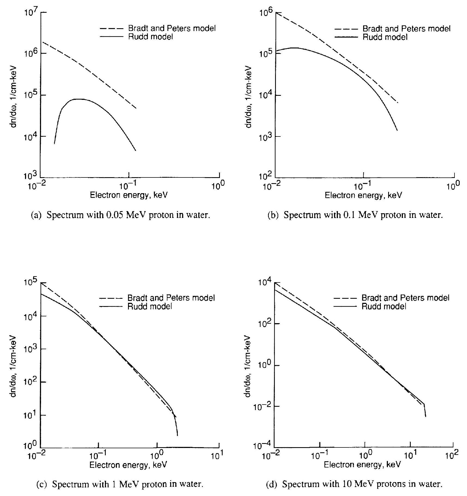
Figure 1. Secondary electron spectrum from incident protons in water.

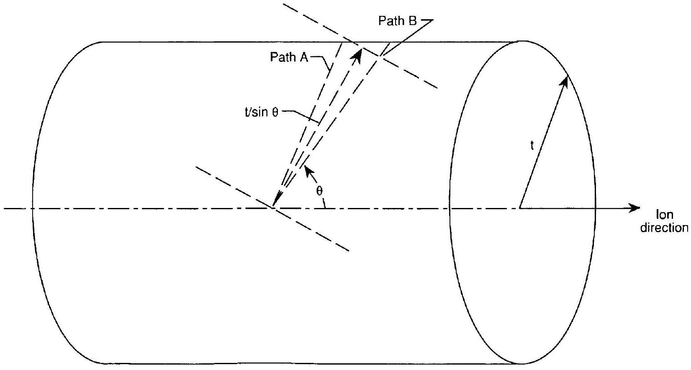
Figure 2. Transmission of electrons ejected at an angle to path of ion through cylindrical surface.

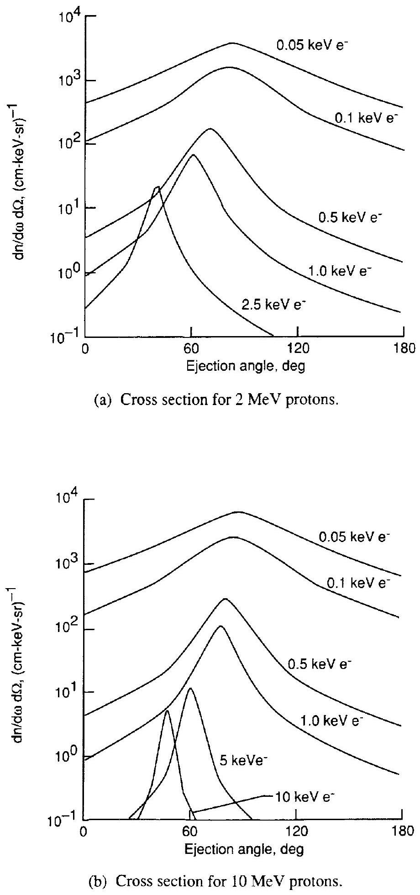
Figure 3. Double differential cross section for electron ejection in water.

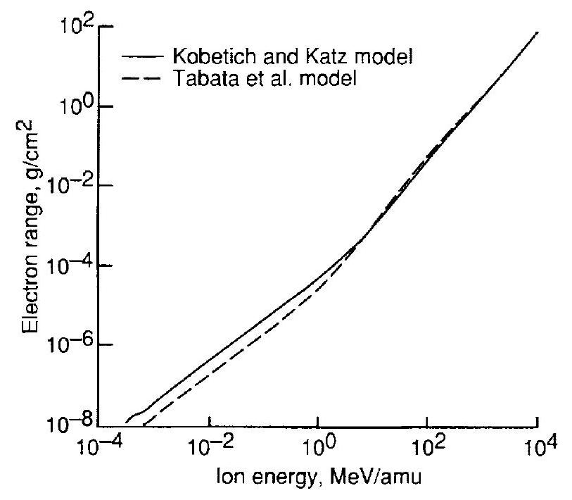
Figure 4. Electron range as function of ion energy in carbon.

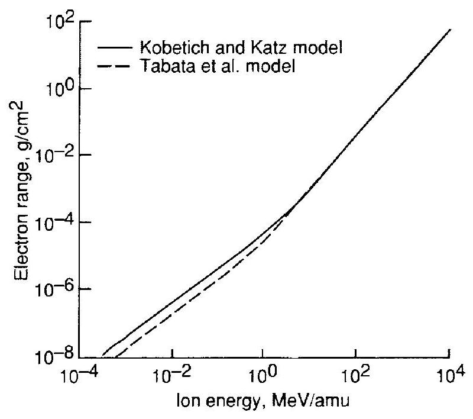
Figure 5. Electron range as function of ion energy in silicon.

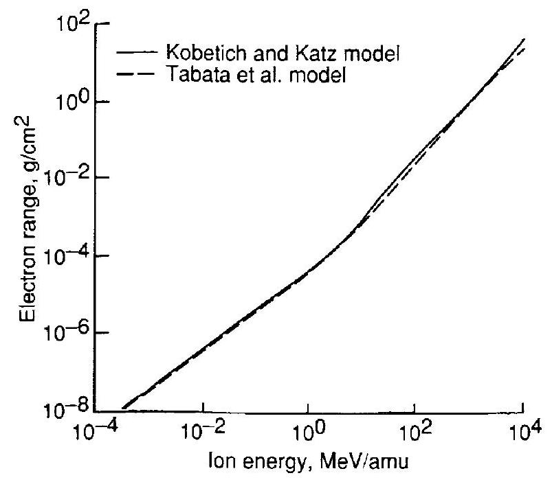
Figure 6. Electron range as function of ion energy in gold.

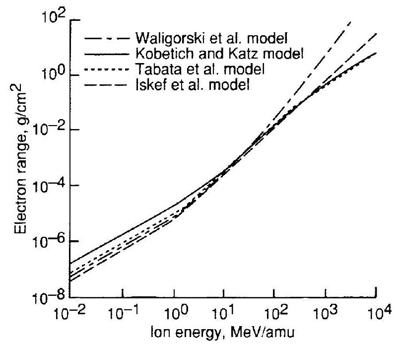
Figure 7. Electron range as function of ion energy in water.

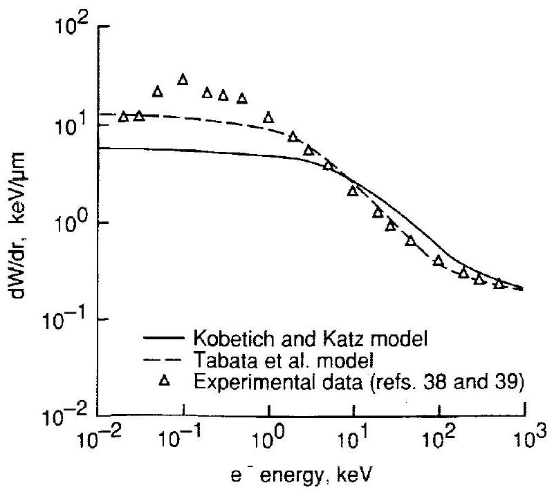
Figure 8. Theoretical and experimental data of $d W / d r$ in water.

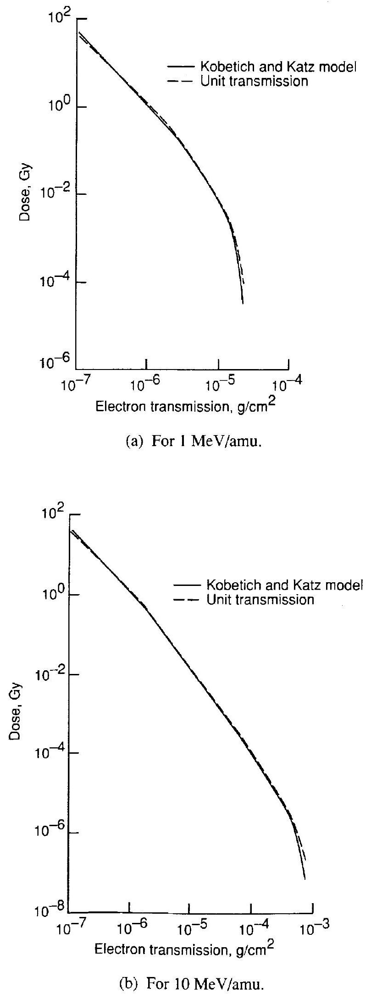
Figure 9. Effects of electron transmission on calculation of radial dose in water.

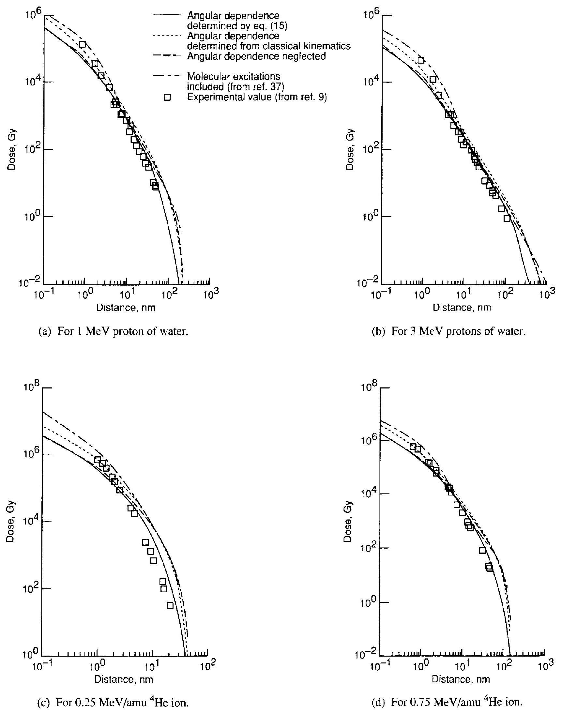
Figure 10. Calculations and experimental data of radial dose.

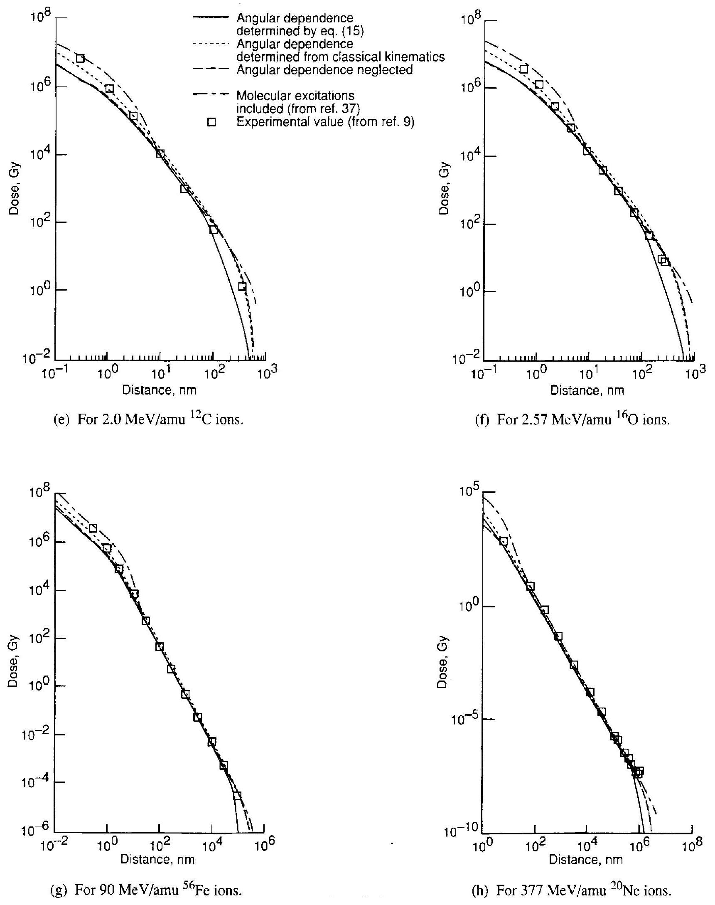
Figure 10. Concluded.

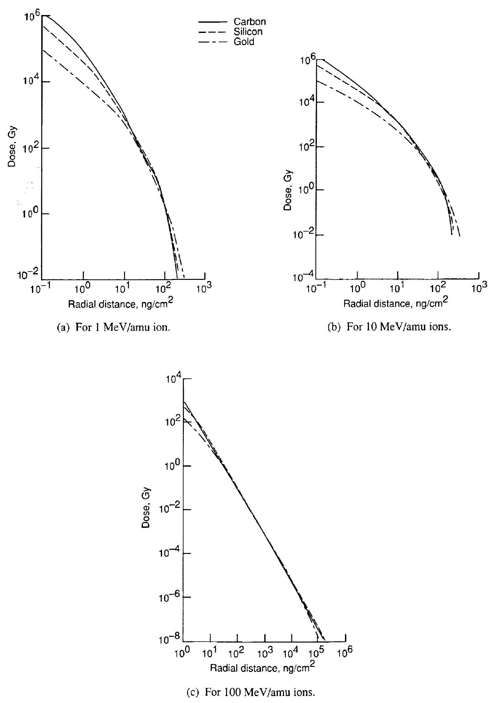
Figure 11. Radial dose in carbon, silicon, and gold.

|  | REPORT DOCUMENTATION PAGE |  |  | Form Approved OMB No. 0704-0188 |
| :--- | :--- | :--- | :--- | :--- |
| Public reporting burden for this collection of information is estimated to average 1 hour per response, including the time for reviewing instructions, searching existing data sources. gathering and maintaining the data needed, and completing and reviewing the collection of information. Send comments regarding this burden estimate or any other aspect of this collection of information, including suggestions for reducing this burden, to Washington Headquarters Services, Directorate for Information Operations and Reports, 1215 Jefferson Davis Highway, Suite 1204, Arlington, VA 22202-4302, and to the Office of Management and Budget, Paperwork Reduction Project (0704-0188), Washington. DC 20503. |  |  |  |  |
| 1. AGENCY USE ONLY (Leave blank) | 2. REPORT DATE February 1995 | 3. REPORT TYPE AND DATES COVERED Technical Paper |  |  |
| 4. TITLE AND SUBTITLE   Heavy Ion Track-Structure Calculations for Radial Dose in Arbitrary Materials |  |  | 5. FUNDING NUMBERS   WU 199-45-16-11 |  |
| 6. AUTHOR(S)   Francis A. Cucinotta, Robert Katz, John W. Wilson, Rajendra R. Dubey |  |  |  |  |
| 7. PERFORMING ORGANZATION NAME(S) AND ADDRESS(ES)   NASA Langley Research Center   Hampton, VA 23681-0001 |  |  |  | 8. PERFORMING ORGANIZATION REPORT NUMBER   L-17424 |
| 9. SPONSORIING/MONITORING AGENCY NAME(S) AND ADDRESS(ES)   National Aeronautics and Space Administration   Washington, DC 20546-0001 |  |  |  | 10. SPONSORING/MONITORING AGENCY REPORT NUMBER   NASA TP-3497 |
| 11. SUPPLEMENTARY NOTES   Cucinotta and Wilson: Langley Research Center, Hampton, VA; Katz: University of Nebraska, Lincoln, NE; Dubey: Old Dominion University, Norfolk, VA. |  |  |  |  |
| 12a. DISTRIBUTION/AVAILABILITY STATEMENT   Unclassified-Unlimited   Subject Category 72   Availability: NASA CASI (301) 621-0390 |  |  |  | 12b. DISTRIBUTION CODE |
| 13. ABSTRACT (Maximum 200 words)   The $\delta$-ray theory of track structure is compared with experimental data for the radial dose from heavy ion irradiation. The effects of electron transmission and the angular dependence of secondary electron ejection are included in the calculations. Several empirical formulas for electron range and energy are compared in a wide variety of materials in order to extend the application of the track-structure theory. The model of Rudd for the secondary electronspectrum in proton collisions, which is based on a modified classical kinematics binary encounter model at high energies and a molecular promotion model at low energies, is employed. For heavier projectiles, the secondary electron spectrum is found by scaling the effective charge. Radial dose calculations for carbon, water, silicon, and gold are discussed. The theoretical data agreed well with the experimental data. |  |  |  |  |
| 14. SUBJECT TERMS   Space radiations; Track structure; Heavy ions |  |  |  | 15. NUMBER OF PAGES   19 |
| 17. SECURITY CLASSIFICATION OF REPORT   Unclassified | 18. SECURITY CLASSIFICATION OF THIS PAGE   Unclassified | 19. SECURITY CLASSIFICATION OF ABSTRACT   Unclassified |  | 20. LIMITATION   OF ABSTRACT |

$=$
•

[^0]:    ${ }^{\text {a }}$ Composition listed by percentage weight.

[^1]:    ${ }^{\mathrm{a}}$ From references 26 and 27.

