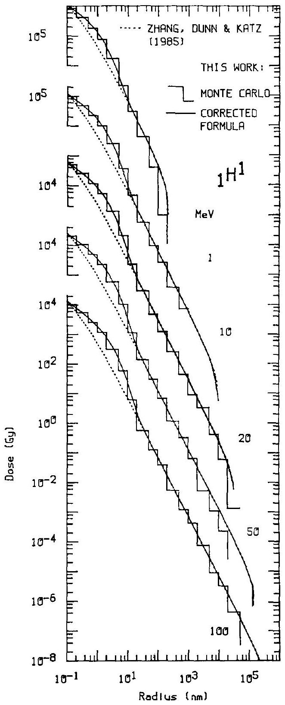
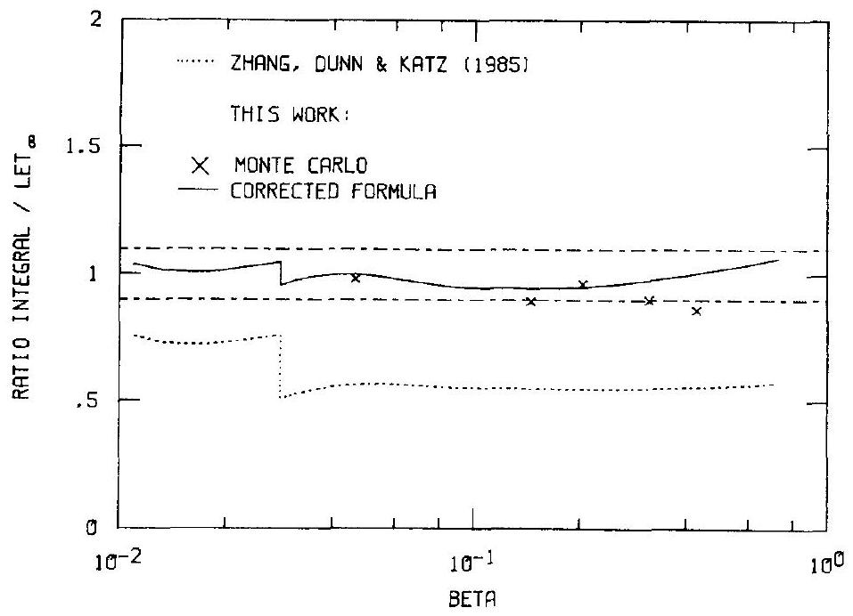
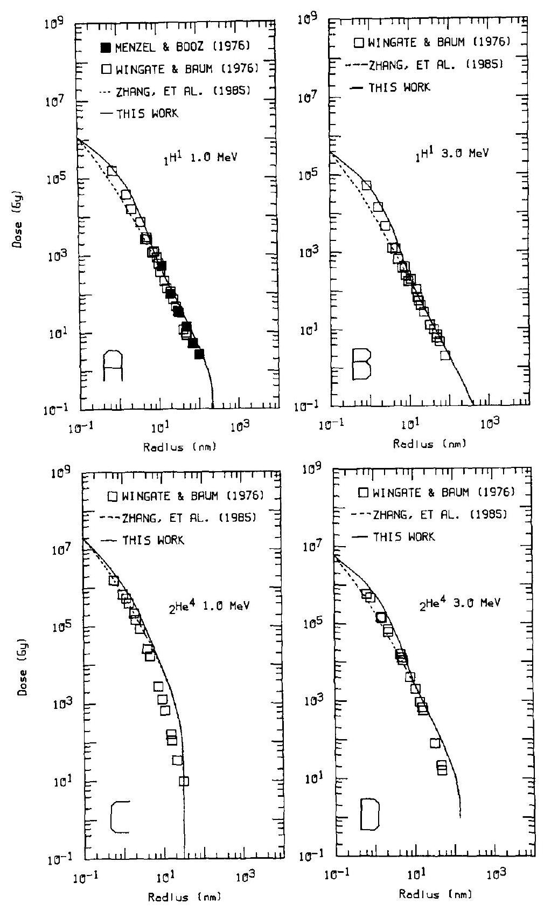
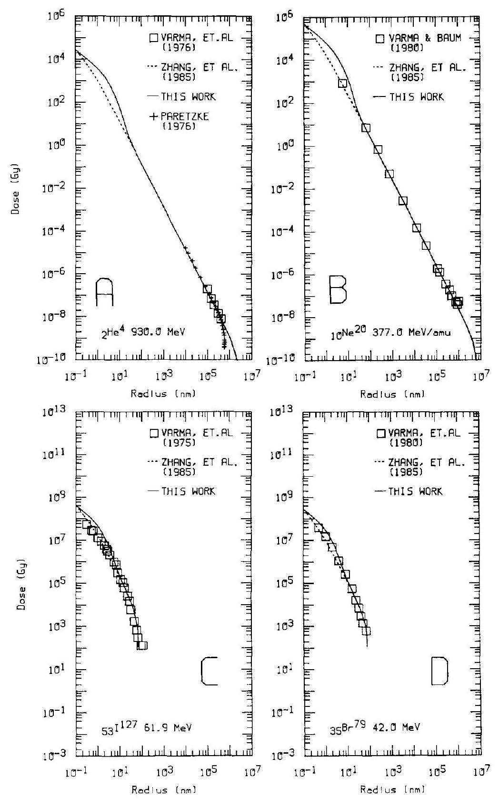
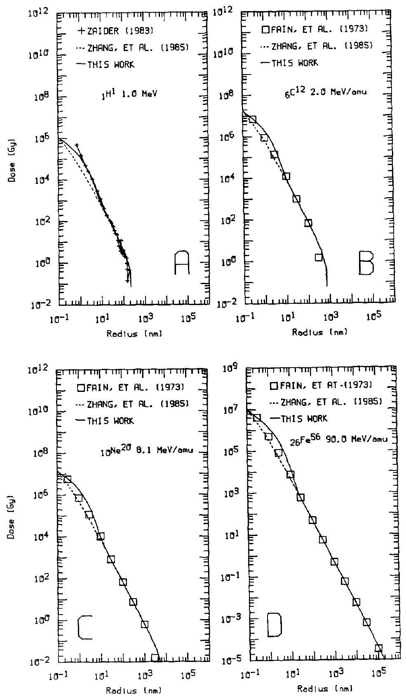
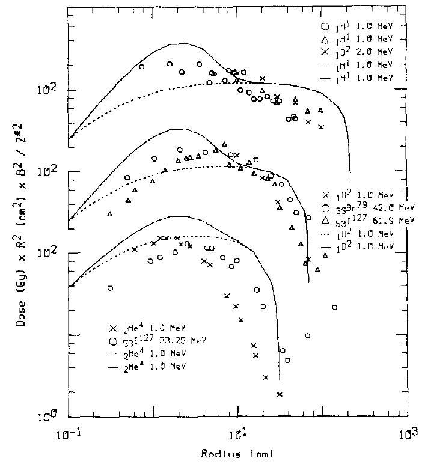
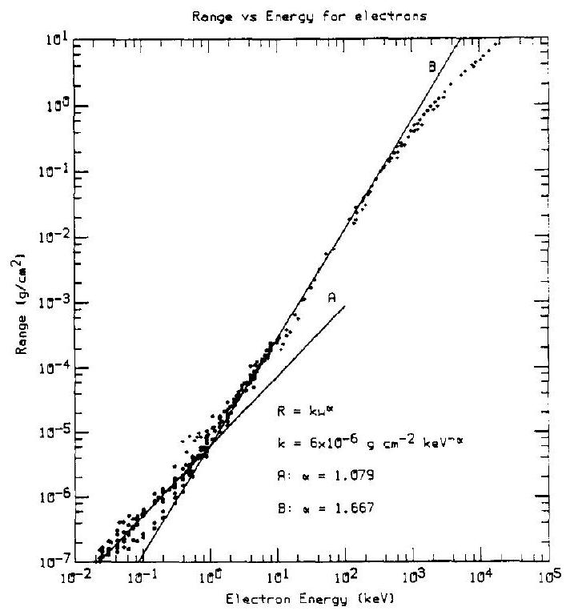

# THE RADIAL DISTRIBUTION OF DOSE AROUND THE PATH OF A HEAVY ION IN LIQUID WATER 

M. P. R. Waligórski,* R. N. Hamm † and R. Katz ‡ Behlen Laboratory of Physics, University of Nebraska, Lincoln, NE 68588, U.S.A.

(Received 31 July 1986; in revised form 25 November 1986)

#### Abstract

Monte Carlo calculations of the radial distribution of dose in liquid water, incorporating energy deposition due to primary excitations and ionizations, have been performed for protons of energy 1,10 , 20 , 50 and 100 MeV . By combining these results with earlier semi-empirical formulae used in track structure theory calculations, a corrected analytic formulation has been developed which on radial integration closely reproduces the value of stopping power for protons in the energy range $0.1-1000 \mathrm{MeV}$. After including a $\beta$-dependent 'effective charge' formula, this corrected formulation is tested against all published measurements of radial distribution of dose from energetic ions in gaseous media. Though some inconsistencies at the closest and the farthest reaches of the radial distribution of dose remain, the overall agreement is very satisfactory, indicating that the 'effective charge' $Z^{*}$, and $Z^{* 2} / \beta^{2}$ scaling are phenomenologically valid concepts for describing the radial dose from heavy ions of energies above $\sim 0.5 \mathrm{MeV} / \mathrm{amu}$.

## 1. INTRODUCTION

The delta-ray theory of track structure (Butts and Katz, 1967; Katz and Kobetich, 1969; Katz et al., 1972; Katz, 1978) makes no attempt at following the detailed pathways from the initial array of excitations and ionizations around the path of a heavy ion penetrating the detector medium, to the finally observed physical or biological endpoint. Instead, the approximation is made that the detector may be calibrated by exposing it to gamma-rays, whereby the targets in the detector are bathed in a uniform field of secondary electrons following the gamma irradiation. The response of a detector to a given dose of gamma-rays is interpreted as the fraction of available targets which have been affected by radiation, or as the probability that a target will be activated at this gamma-ray dose. If the average radial distribution of dose from delta-rays about the ions's path is known, the gamma-ray calibration serves to approximate the radial distribution of effect, i.e. the radial probability of target activation. Except as inherently present in the calibrating dose-response function, fluctuations for gamma-rays and delta-rays are neglected. The expectation value of the single-particle action crosssection can then be specified as the integral of this radial probability over all radii, and the fraction of targets in the detector activated to the observed endpoint, i.e. the response of a detector after a measured fluence of particles, calculated.

In this scheme, the radial distribution of delta-ray dose around the path of a heavy ion represents a transfer function, relating the (non-linear) response of a detector after uniform doses of secondary electrons generated by gamma-rays, to the response of this detector after a non-uniformly distributed dose of delta-rays accompanying the passage of charged heavy particles through the detector medium.

How good an approximation is the calibration of a detector with gamma-rays? Since the response of a detector to electrons can be expected to depend on their energies, one should calibrate the detector with electrons whose energy spectrum approximates the energy spectrum of the delta-rays. In practice, however, the electron energy spectrum varies from shell to shell with radial distance from the ion's path, making it impossible to perform a suitably matched exact calibration.

Ultimately, neglecting the difference between the radially varying electron energy spectrum from deltarays and the energy spectrum of the secondary electrons following gamma-ray irradiation can be justified by the considerable success of this first-order model in describing the response of physical detectors, such as the appearance of tracks in nuclear emulsions (Katz and Kobetich, 1969), the light output of scintillators (Katz and Kobetich, 1968), or thermoluminescent dosimeters (Waligórski and Katz, 1980), and the response of biological systems: inactivation of enzymes and viruses (Butts and Katz,

[^0]1967), survival of mammalian cells (Roth et al., 1976; Katz et al., 1985) or generation of neoplastic transformations in such cells (Waligórski and Katz, 1986), after high-LET irradiations.

At the time the model was conceived (Butts and Katz, 1967), no measurements of the radial distribution of dose were available. The original formula was constructed using a number of simplifying assumptions, among which were the use of a linear energyrange relationship for electrons in aluminium, normal electron ejection and the Rutherford formula for the distribution of delta-rays.

Since then, several measurements of this distribution have been made, in air (Varma et al., 1976), hydrogen (Baum et al., 1968), and tissue-equivalent gas (Baum et al., 1974; Wingate and Baum, 1976; Menzel and Booz, 1976; Varma et al., 1977, 1980; Varma and Baum, 1980), and corresponding calculations performed using the Monte Carlo technique (Berger et al., 1972; Paretzke et al., 1974; Hamm et al., 1976; Turner et al., 1980, 1980a; Todo et al., 1982; Zaider et al., 1983).

Recently, using more accurate power-law energyrange relationships for electrons and a selected value for the ionization potential of electrons in the detector, a more accurate formula describing the radial distribution of delta-ray dose has been developed (Zhang et al., 1985).

Over the last few years a Monte Carlo code has been developed to calculate proton and alpha-particle tracks, with the inclusion of all primary excitation and ionization events accompanying the passage of these ions through liquid water (Hamm et al., 1985).

The aim of the present work is to develop a semi-empirical analytic formula for the radial distribution of delta-ray dose which adequately reproduces the results of these Monte Carlo calculations for protons, extending continuously over a wide range of proton energies and which has been so adjusted that on radial integration it approximates the value of proton stopping power. By incorporating the previously used (Butts and Katz, 1967; Zhang et al., 1985) energy-dependent effective charge formula, $Z^{*}=Z^{*}(\beta)$ (where $\beta$ is the relative velocity of the ion) and the $Z^{* 2} / \beta^{2}$ factor, we are able to calculate the radial distribution of dose for any ion species of any energy within the applicable energy range $(0.1-1000 \mathrm{MeV} / \mathrm{amu})$. Our formula is then compared to the available measurements of radial distribution of dose (Varma et al., 1976; Baum et al., 1974; Wingate and Baum, 1976; Menzel and Booz, 1976; Varma et al., 1977, 1980; Varma and Baum, 1980), to other semi-empirical calculations (Fain et al., 1974, 1974a; Chatterjee et al., 1973) and to other Monte Carlo calculations (Paretzke et al., 1974; Zaider et al., 1983).

Within our approximative scheme, we assume that the corrected formula includes all primary excitation and ionization events close to the ion's path. Use of this formula may be justified if better agreement is
achieved between track theory calculations and experimentally measured high-LET detector response. We show that this is indeed so for the inactivation of dry enzymes and viruses (Waligórski et al., 1986) and for the ferrous sulphate (Fricke) (Katz et al., 1986) and alanine (Waligórski et al., 1986) dosimeters. We may then address the question of the contribution of primary effects to the response of physical and biological detectors.

## 2. THE MONTE CARLO CALCULATION

The Monte Carlo computer code OREC (Hamm et al., 1985; Hamm et al., 1985, and references therein) was used to calculate the passage of a heavy charged particle or electron and all secondary electrons through the initial physical stage of interactions ( $10^{-15} \mathrm{~s}$ ) in liquid water. A complex dielectric response function, $\epsilon(\omega, q)$ was developed for liquid water, where $\hbar \omega$ and $\hbar q$ are the energy and momentum transferred by the charged particle (proton) to the medium ( $\hbar$ is Planck's constant $/ 2 \pi$ ). Collective effects in the condensed phase have thus been included a priori. The macroscopic cross-sections, or inverse mean free paths, for any kind of inelastic interaction are then obtained directly from $-\operatorname{Im}(1 / \epsilon)$, the negative of the imaginary part of $1 / \epsilon$. In contrast to vapour, energy can be shared collectively by large numbers of electrons in liquid water. A suitable algorithm for treating initially delocalized excitations in the liquid has been developed and applied, under the assumption that the probability of a given mode of de-excitation is proportional to - $\operatorname{Im}(1 / \epsilon)$ and depends on the distance from the particle track. The electronic transitions were divided into six specific excitation and five ionization events. The numeric information assembled in the proton energy range $1-100 \mathrm{MeV}$ leads to electronic stopping powers for protons which differ less than $10 \%$ from tabulated values.

To obtain the cross-sections needed for the transport of secondary electrons in water, the angular distributions of electrons produced in inelastic collisions were computed by a simple algorithm, giving an isotropic distribution for small values of energy transfer and a 'free electron' distribution at large energy transfers. To account for the appreciable changes of the directions of electron travel at low energies, elastic scattering of electrons of those energies was computed on the basis of phase-shift analysis and joined to the Thomas-Fermi model at higher energies. Also, in contrast to heavy ions, electron exchange was taken into account explicitly.

Tracks of protons of energy 1, 10, 20, 50 and 100 Mev were calculated using the OREC code. The energy deposited was added in several concentric cylindrical shells around the proton's path. Thus, histograms representing the radial distribution of energy deposited were obtained. These are shown in Fig. 1.

## 3. THE CORRECTED FORMULA FOR THE RADIAL DISTRIBUTION OF DOSE

Zhang, Dunn and Katz (1985) have developed the following formula describing the radial distribution of dose around the path of a heavy ion (see Appendix 1).

$$
D_{1}(t)=\frac{N e^{4} Z^{* 2}}{\alpha m c^{2} \beta^{2} t}\left[\frac{\left(1-\frac{t+\theta}{T+\theta}\right)^{1 / \alpha}}{t+\theta}\right]
$$

where $D_{1}(t)$ is the dose deposited in a coaxial cylindrical shell of thickness $\mathrm{d} t$ at a distance $t$ from the path of an ion of effective charge $Z^{*}$ moving with a relative velocity $\beta=v / c$ ( $c$ is the speed of light) through the detector medium containing $N$ electrons per $\mathrm{cm}^{3} . m$ is the mass of the electron. The Rutherford cross-section for delta-ray production from atoms having ionization potential $I=10 \mathrm{eV}$, normal ejection and power law range (r)-energy ( $w$ ) relationship for electrons, are assumed. The range-energy relationship is based on a twocomponent fit to the available experimental data (Kobetich and Katz, 1968; Iskef et al., 1983, see Appendix 1) concerning ranges of electrons in aluminium:

$$
r=k w^{\alpha}
$$

where

$$
k=6 \times 10^{-6} \mathrm{~g} \mathrm{~cm}^{-2} \mathrm{keV}^{-\alpha}
$$

For $w<1 \mathrm{keV} \quad \alpha=1.079$, and for $w>1 \mathrm{keV}$

$$
\alpha=1.667
$$

$\theta$ is the 'range' of an electron of energy $w=I$

$$
\theta=k(0.010 \mathrm{keV})^{1.079}=4.17 \times 10^{-8} \mathrm{~g} \mathrm{~cm}^{-2}
$$

The kinematically limited maximum delta-ray energy is

$$
W=2 m c^{2} \beta^{2} /\left(1-\beta^{2}\right)
$$

This translates to the maximum range of delta-rays:

$$
T=k W^{\alpha}
$$

where the choice of $\alpha$ (see equation (4)) depends on the velocity $\beta$ of the ion. We calculate
for $\beta<0.03 \alpha=1.079$, and
for $\beta>0.03 \alpha=1.667$.

For water

$$
\frac{2 \pi N e^{4}}{m c^{2}}=1.369 \times 10^{-7} \frac{\mathrm{erg}}{\mathrm{~cm}}=8.5 \mathrm{keV} \mathrm{~mm}^{-1}
$$

Like in the earlier work of Butts and Katz (1967) and of Zhang et al. (1985), the effective charge of an ion of $Z$ elementary charges, moving with a relative velocity $\beta$ is calculated from the expression of Barkas (1963)

$$
Z^{*}=Z\left[1-\exp \left(-125 \beta Z^{-2 / 3}\right)\right] .
$$

The radial distribution of delta-ray dose in water, calculated for protons of energies $1,10,20,50$ and 100 MeV using expression (1) are compared in Fig. 1 with results of the Monte Carlo calculation. Results of radial integration of equation (1), expressed as the ratio of the proton stopping power ( $\mathrm{LET}_{\infty}$ ) at the corresponding proton velocity, $\beta$, for $\beta$ ranging from $\sim 0.01$ to 0.9 (corresponding to proton energies in the range $0.05-1000 \mathrm{MeV}$ ), are shown in Fig. 2. The algorithm used for calculating LET $_{\infty}$, based on the tables of Janni (1982) is given in Appendix 2.

Fig. 1. Radial distribution of energy deposited around the path of protons of energies $1,10,20,50$ and 100 MeV . Monte Carlo calculations (in liquid water) are presented as histograms. Full lines: equation (11), dotted lines: equation (1).

Fig. 2. Ratios of the radially integrated distributions of energy of Fig. 1 ( $\times$-Monte Carlo calculations for $1,10,20,50$ and 100 MeV , full line: equation (11), dotted line: equation (1)), to proton stopping power, $\mathrm{LET}_{\infty}$, plotted vs relative speed of proton, $\beta$. Broken lines represent $10 \%$ error limits.

To account for the 'missing' radial dose due to primary events in the region of $t=1-10 \mathrm{~nm}$ (see Fig. 1 ), we seek a correction to equation (1) in the form

$$
D_{2}(t)=D_{1}(t)(1+K(t))
$$

where we find it convenient to seek an expression of the type $K(t)=$ at $\exp (-a t)$.

After making some semi-empirical adjustments, we arrive at the following expression:
(a) for $t>B=0.1 \mathrm{~nm}$

$$
K(t)=A\left(\frac{t-B}{C}\right) \exp -\left(\frac{t-B}{C}\right)
$$

where

$$
\begin{aligned}
& B=0.1 \mathrm{~nm} \\
& C=1.5 \mathrm{~nm}+5 \mathrm{~nm} \times \beta
\end{aligned}
$$

and

$$
A=8 \times \beta^{1 / 3}, \text { for } \beta<0.03
$$

or

$$
A=19 \times \beta^{1 / 3}, \text { for } \beta>0.03 .
$$

(b) for $t<B=0.1 \mathrm{~nm}$

$$
K(t)=0 .
$$

The corrected expression for $D_{2}(t)$ (equations (11) and (12)) features a 'hump' at radial distances $t=1-10 \mathrm{~nm}$ and reduces to the expression of Zhang et al. (1985) (equation (1)) at greater $t$.

## 4. RESULTS

The results of Monte Carlo calculations of radial distribution of dose in liquid water around the path of protons of energies $1,10,20,50$ and 100 MeV are
presented as nested histograms in Fig. 1, together with the corresponding radial distributions of dose calculated using equation (1) and equation (11). These distributions, after radial integration, are compared with proton stopping power $\mathrm{LET}_{\infty}$, calculated using the algorithm described in Appendix 2. In Fig. 2 the results of integrating the Monte Carlo histograms and equations (1) and (11), are presented in the form of ratios of $\mathrm{LET}_{\infty}$, as a function of $\beta$, the relative speed of the proton. The corrected formula reproduces the proton stopping power to within $10 \%$ over the range of $\beta$ from 0.015 to 0.9 , while the original formula (equation (1)) yields about half of this value. The 'step' at $\beta=0.03$ results from changing the electron range power law constant $\alpha$ from 1.079 to 1.667 (see equation (4), equation (8) and equation (12)).

We compare the radial dose distributions calculated using both formulae with the measured distributions, for light particles (Fig. 3), and for relativistic and slow heavy particles (Fig. 4(A, B) and Fig. 4(C, D) respectively). Comparison with other Monte Carlo calculations of Paretzke (1974), of Zaider et al. (1983), and with semi-empirical calculations of Fain et al. (1974, 1974a) are presented in Fig. 3(A), Fig. 4(A) and Fig. 4(B, C, D) respectively.

The complete set of published experimental data on the radial distribution of dose measured in air, tissue-equivalent gas, hydrogen and water vapour, consists of 15 different sets of measurements. For reasons of economy in publication, only nine of these have been illustrated, in Figs 3 and 4.

## 5. DISCUSSION

The published measurements of the radial distribution of dose span a fairly wide range of ion species

Fig. 3. Comparison of measured radial distributions of dose for $\mathrm{A}: 1 \mathrm{MeV}$ protons (Baum et al., 1974; Wingate and Baum, 1976), B: 3 MeV protons (Wingate and Baum, 1976), C: $1 \mathrm{MeV} \alpha$-particles (Wingate and Baum, 1976), D: $3 \mathrm{MeV} \alpha$-particles (Wingate and Baum, 1976), with equation (11): full lines, and equation (1): dotted lines.

and energies. Measurements of this distribution have been made for protons of energies 1 MeV ((Wingate and Baum, 1976; Menzel and Booz, 1976), Fig. 3(A)), 2 MeV (Wingate and Baum, 1976; Menzel and Booz, 1976) and 3 MeV ((Wingate and Baum, 1976), Fig. 3(B)), deuterons of 1 MeV and 2 MeV (Menzel and Booz, 1976) and helions of energies 1 MeV (Fig. 3(C)), 2 MeV and 3 MeV (Fig. 3(D)) (Wingate and Baum, 1976). While our formulae reproduce the measurements made for helions somewhat less accu-
rately (see Figs 3(C) and 3(D)), the agreement between our calculations and the remaining measurements, including those not shown, is quite adequate.

The same is true for measurements of energetic helions of 930 MeV ((Varma et al., 1976), Fig. 4(A)) and $377 \mathrm{MeV} / \mathrm{amu}{ }_{18}^{40} \mathrm{Ne}$ ions ((Varma and Baum, 1980a), Fig. 4(B)) as well as for slow heavy ions: $42 \mathrm{MeV}{ }_{35}^{79} \mathrm{Br}$ ((Varma et al., 1980), Fig. 4(C)), $61.9 \mathrm{MeV}{ }_{53}^{127} \mathrm{I}$ ((Baum et al., 1974), Fig. 4(D)),

Fig. 4. Comparison of measured radial distributions of dose for A: $930 \mathrm{MeV} \alpha$-particles (Varma et al., 1976), B: $377 \mathrm{MeV} /$ amu $\alpha$-particles (Varma and Baum, 1980), C: 61.9 MeV iodine 127 (Baum et al., 1974), D: 42 MeV bromine 79 ions (Varma et al., 1980) with equation (11): full lines, and equation (1): dotted lines. Crosses in panel A indicate the Monte Carlo calculation of Paretzke (Varma et al., 1976).

$41.1 \mathrm{MeV}{ }_{8}^{16} \mathrm{O}$ (Varma et al., 1977), $38.4 \mathrm{MeV}{ }_{8}^{16} \mathrm{O}$ and $33.25{ }_{53}^{127} \mathrm{I}$ ions (Baum et al., 1974).

We also find good agreement between results of our calculations and those of Fain et al. (1974, 1974a) for $2 \mathrm{MeV} / \mathrm{amu}{ }_{6}^{12} \mathrm{C}, 8.1 \mathrm{MeV} / \mathrm{amu}{ }_{20}^{40} \mathrm{Ne}$ and 90 MeV /amu ${ }_{26}^{56} \mathrm{Fe}$ ions, as shown in Figs 5(B), 5(C) and 5(D), respectively. In the region below $\sim 30 \mathrm{~nm}$, results of these calculations lie between our 'corrected' and 'uncorrected' distributions.

Our corrected formula (equation (11)) appears to
reproduce very well the result of the Monte Carlo calculation of Zaider et al. (1983) (Fig. 5(A)), except for the region below $\sim 1.5 \mathrm{~nm}$. This indicates that the differences between the PROTON and DELTA codes (Zaider et al., 1983) which apply to water vapour, and the OREC code for liquid water on which our corrected formula is based, need to be clarified in the region where primary effects are important.

The overall results are somewhat surprising though gratifying. We use a rather simplistic calculation of

Fig. 5. Comparison of calculated radial distributions of dose for $\mathrm{A}: 1 \mathrm{MeV}$ protons (Zaider et al., 1983), B: 2 MeV /amu carbon 12, C: 8.1 MeV /amu neon 20, and D: 90 MeV /amu iron 56 ions with equation (11): full lines, and equation (1): dotted lines. Data in panels B, C and D are from Fain et al. (1974, 1974a).

the radial distribution of dose in which all components are greatly oversimplified. We compare our calculations to measurements made in a variety of gases. Our principal electron data (equation (3) and (4)) are taken from measurements of electron ranges in aluminium. The electron density constant (equation (9)) is for liquid water. We assume normal ejection of delta-rays and use an arbitrary value of ionization potential (equation (5)). We exploit an 'effective charge' formula (equation (10)) originally
fitted to range and stopping power experiments in nuclear emulsion.

It seems that the radial distribution of dose is relatively insensitive to these details, except for (a) ion energies below $0.05 \mathrm{MeV} / \mathrm{amu}$, and (b) both very small and very large radial distances.

Judging from the appearance of Figs 3, 4 and 5, in the region of radial distances below 30 nm , our 'uncorrected' formula (equation (1)) appears to fit experimental data better than the corrected one.

However, only the latter reproduces the proton stopping power. It appears that in the region where primary effects are important, energy-corrected values of $W$, the energy to form an ion pair, rather than a single value of $W$ for all radial distances, should be used experimentally. This point has already been raised by Fain (Fain et al., 1974, 1974a) and by Paretzke (Paretzke et al., 1974). The available data do not permit us to suggest any form of radial correction of the $W$ value.

In Fig. 6 we display experimental data as plots of radial dose multiplied by the square of the radial distance and by $\beta^{2} / Z^{* 2}$, where the 'effective charge', $Z^{*}$, is calculated using equation (10). Data are displayed in groups of similar $\beta$. Three such groups, of energies 1, 0.5 and 0.25 MeV /amu were selected. Here, differences between the measured data points and our distributions can be visualized more readily. The 1 MeV /amu group consists of particles of charge 1 with practically no 'effective charge' correction. The distribution of data points provides us with a measure of the overall consistency of the experimental technique. Judging from the roughly similar spread of data points around our calculation for the 0.5 MeV /amu group, we conclude that the 'effective charge' formula appears to describe the effects of the complicated process of charge exchange to present experimental precision. Whether the same conclusion

FIG. 6. Measured radial distributions of dose, multiplied by the square of the radial distance and by $\beta^{2} / Z^{* 2}$, for ions of $1 \mathrm{MeV} /$ amu (uppermost group), $0.5 \mathrm{MeV} /$ amu (central group) and 0.25 MeV /amu (lowest group). Full lines represent equation (11), dotted lines equation (1). Key to sources of data: 1 MeV H ; circles-Wingate and Baum (1976); Triangles-Menzel and Booz (1976); 2 MeV D-Menzel and Booz (1976); 1 MeV D-Menzel and Booz (1976) 42 MeV Br -Varma et al. (1980); 61.9 MeV I -Baum et al. (1974); 1 MeV He -Wingate and Baum (1976); 33.25 MeV I-Baum et al. (1974).

can be drawn for the 0.25 MeV /amu data points, is debatable, at least until further measurements are made. Some anomalous data points for the 61.9 MeV and the $33.25 \mathrm{MeV}{ }_{53}^{127} \mathrm{I}$ ions are attributed by the authors of these measurements (Baum et al., 1974) to scattered gas atoms and Auger electrons ejected from the incident ion.

The existence of a 'track core' in the radial distribution of dose has been postualated by some authors (Mozumder and Magee, 1966; Magee and Chatterjee. 1980; Chatterjee and Magee, 1980), as connected with the Bohr adiabatic radius (e.g. Brandt and Ritchie, 1974). Our Monte Carlo calculations performed for liquid water do not confirm the existence of such a core at any region close to the ion's path.

## 6. CONCLUSIONS

Our corrected formula for the radial distribution of dose, despite its simplicity, offers a surprisingly good description of the available experimental data. We are able to adequately reproduce the ion's stopping power over a wide and continuous range of ion charges and speeds. The 'effective charge' formula appears to represent a valid phenomenological description of the speed-dependent charge exchange process, for ions up to iodine at energies exceeding $0.5 \mathrm{MeV} / \mathrm{amu}$, for purposes of calculating the radial distribution of dose. Clearly, more experimental data and more accurate Monte Carlo calculations would help us to further clarify the validity of our formula at regions close to the ion's path and near the outer reaches of the distribution of radial dose.

The original 'uncorrected' formula has been shown to reproduce quite accurately the measured crosssections for enzyme and virus inactivation (Zhang et al., 1985), even though the radial integration of this formula yields only about half of the ion's stopping power. This gives rise to an interesting speculation that the response of some detectors may be basically related to the effects of the dose deposited by secondary processes, while other detectors may be 'sensitive' also to energy depositions due to primary excitations close to the ion's path.

Our dose calculations and our consequent calculations of the detector response are based on averaged quantities. The success of these calculations suggests that knowledge of the detailed spectrum of energy depositions in nanometer or micrometer subvolumes and of its dependence on the separation of these volumes, may be superfluous when interpreting experimental data which are accurate at best to about $15 \%$.
Acknowledgements-We thank Dr Dan Schlitt for his advice on software and hardware problems, and Gary Sinclair. Kim Sun Loh, Givargis Danialy and Ali Hosseini for their extensive help with computations and graphics. One of the authors (MPRW) has been supported by a fellowship from the International Atomic Energy Agency (Vienna). This work has been supported by the United States Department of Energy.

## REFERENCES

Barkas W. H. (1963) Nuclear Research Emulsions-I. Techniques and Theory. Academic Press, New York.
Barkas W. H. and Berger M. J. (1964) Studies in penetration of charged particles in matter. In Tables of Energy Losses and Ranges of Heavy Charged Particles, pp. 103-172. NAS NRC, Washington DC.
Baum J. W., Stone S. L. and Kuehner A. V. (1968) Radial distribution of dose along heavy ion tracks, LET, In Proc. First Symposium on Microdosimetry (Edited by Ebert H. G.). Commission of the European Communities, Brussels.
Baum J. W., Varma M. N., Wingate C. L. and Kuehner A. V. (1974) Nanometer dosimetry of heavy ion tracks. In Proc. Fourth Symposium on Microdosimetry (Edited by Booz J., Ebert H. G., Eickel R. and Waker A.). Commission of the European Communities, Luxembourg.
Berger M. J. (1972) Energy deposition by low-energy electrons: delta-ray effects in track structure and microdosimetric event size spectra. In Proc. Third Symposium on Microdosimetry (Edited by Ebert H. G.). Commission of the European Communities, Luxembourg.
Brandt W. and Ritchie R. H. (1974) Primary processes in the physical stage. In Proc. Conf. Physical Mechanisms in Radiation Biology, Airlie VA 1972 CONF 721001 USAEC NTIS USDC. Springfield, VA.
Butts J. J. and Katz R. (1967) Theory of RBE for heavy ion bombardment of dry enzymes and viruses. Radiat. Res. 30, 855-871.
Chatterjee A., Maccabee H. D. and Tobias C. A. (1973) Radial cutoff dose calculations for heavy charged particles in water. Radiat. Res. 54, 479494.
Chatterjee A. and Magee J. L. (1980) Radiation chemistry of heavy-particle tracks-2. Fricke dosimeter system. J. Phys. Chem. 84, 3537-3543.

Fain J., Monnin M. and Montret M. (1974) Energy deposited by a heavy ion around its path. In Proc. Fourth Symposium on Microdosimetry (Edited by Booz J., Ebert H. G., Eickel R. and Waker A.). Commission of the European Communities, Luxembourg.
Fain J., Monnin M. and Montret M. (1974a) Spatial energy distribution around heavy-ion path. Radiat. Res. 57, 379-389.
Hamm R. N., Wright H. A., Ritchie R. H., Turner J. E. and Turner T. P. (1976) Monte Carlo calculation of transport of electrons through liquid water. In Proc. Fifth Symposium on Microdosimetry (Edited by Booz J., Ebert H. G. and Smith B. G. R.). Commission of the European Communities, Luxembourg.
Hamm R. N., Turner J. E., Ritchie R. H. and Wright H. A. (1985) Calculation of heavy-ion tracks in liquid water. Radiat. Res. 104, S-20-S-26.
Hamm R. N., Turner J. E. and Wright H. A. (1985) Statistical fluctuations in heavy charged particle tracks. Radiat. Protect. Dos. 13, 83-86.
Iskef H., Cunningham J. W. and Watt D. E. (1983) Projected ranges and effective stopping powers of electrons with energy between 20 eV and 10 keV . Phys. Med. Biol. 28, 535-545.
Janni J. F. (1982) Proton range energy tables, $1 \mathrm{keV}-10 \mathrm{GeV}$. At. Data Nucl. Data Tables 27, 147-529.
Katz R. and Kobetich E. J. (1968) Response of NaI(T1) to energetic heavy ions. Phys. Rev. 170, 397-400.
Katz R. and Kobetich E. J. (1969) Particle tracks in emulsion. Phys. Rev. 186, 344-351.
Katz R., Sharma S. C. and Homayoonfar M. (1972) The structure of particle tracks. In Topics in Radiation Dosimetry, Supplement 1 (Edited by Attix F. H.), Academic Press, New York.

Katz R. (1978) Track structure in radiobiology and in radiation protection. Nucl. Track Detection 2, 1-28.
Katz R., Dunn D. E. and Sinclair G. (1985) Thindown in radiobiology. Radiat. Protect. Dos. 13, 281-284.
Katz R. (1985) Stopping power and range-energy tables for heavy ions in water, Dept. of Physics, University of Nebraska, October 1985 (unpublished).
Katz R., Sinclair G. L. and Waligórski M. P. R. (1986) The Fricke dosimeter as a 1-hit detector. Nucl. Tracks 11, 301-307.
Kobetich E. J. and Katz R. (1968) Energy deposition by electron beams and $\delta$ rays. Phys. Rev. 170, 391-396.
Magee J. L. and Chatterjee A. (1980) Radiation chemistry of heavy-particle tracks-1. General considerations. $J$. Phys. Chem. 84, 3529-3536.
Menzel H. G. and Booz J. (1976) Measurement of radial energy deposition spectra for protons and deuterons in tissue equivalent gas. In Proc. Fifth Symposium on Microdosimetry (Edited by Booz, J., Ebert H. G. and Smith B. G. R.). Commission of the European Communities, Luxembourg.
Mozumder A. and Magee J. L. (1966) Model of tracks of ionizing radiations for radical reaction mechanisms. Radiat. Res. 28, 203-214.
Paretzke H. G., Leuthold G., Burger G. and Jacobi W. (1974) Approaches to physical track structure calculations. In: Fourth Symposium on Microdosimetry (Edited by Booz J., Ebert H. G., Eickel R. and Waker A.). Commission of the European Communities, Luxembourg.
Roth R. A., Sharma S. C. and Katz R. (1976) Systematic evaluation of cellular radiosensitivity parameters. Phys. Med. Biol. 21, 491-503.
Todo A. S., Hiromoto T., Turner J. E., Hamm R. N. and Wright H. A. (1982) Monte Carlo calculations of initial energies of electrons in water irradiated by photons with energies up to 1 GeV . Hlth Phys. 43, 845-852.
Turner J. E., Magee J. L., Hamm R. N., Chatterjee A., Wright H. A. and Ritchie R. H. (1980) Early events in irradiated water. In Proc. Seventh Symposium on Microdosimetry (Edited by Booz J., Ebert H. G. and Hartfiel H. D.). Harwood Academic, Chun, Switzerland.
Turner J. E., Hamm R. N., Wright H. A., Modolo J. T. and Sordi G. M. A. A. (1980) Monte Carlo calculation of initial energies of Compton electrons and photoelectrons in water irradiated by photons with energies up to 2 MeV . Hlth Phys. 39, 49-55.
Varma M. N., Paretzke H. G., Baum J. W., Lyman J. T. and Howard J. (1976) Dose as a function of radial distance from a $930 \mathrm{MeV}{ }^{4} \mathrm{He}$ ion beam. In Proc. Fifth Symposium on Microdosimetry (Edited by Booz J., Ebert H. G. and Smith B. G. R.). Commission of the European Communities, Luxembourg.
Varma M. N., Baum J. W. and Kuehner A. V. (1977) Radial dose, LET and $W$ for ${ }^{18} \mathrm{O}$ ions in $\mathrm{N}_{2}$ and tissueequivalent gases. Radiat. Res. 70, 511-518.
Varma M. N., Baum J. W. and Kuehner A. V. (1980) Stopping power and radial dose distribution for 42 MeV bromine ions. Phys. Med. Biol. 25, 651-656.
Varma M. N. and Baum J. W. (1980) Energy deposition in nanometer regions by $377 \mathrm{MeV} /$ nucleon ${ }^{20} \mathrm{Ne}$ ions. Radiat. Res. 81, 355-363.
Waligórski M. P. R. and Katz R. (1980) Supralinearity of peak 5 and peak 6 in TLD-700. Nucl. Instrum. Methods 172, 463-470.
Waligórski M. P. R. (1985) LRW-LET and range in water (HP-41C version)-program description (unpublished).
Waligórski M. P. R. and Katz R. (1986) Neoplastic cell transformations by energetic heavy ions. Submitted to Radiat. Res.

Waligórski M. P. R., Loh Kim Sun and Katz R. (1986) Inactivation of dry enzymes and viruses by energetic heavy ions. In preparation.
Waligórski M. P. R., Danialy G., Loh Kim Sun and Katz R. (1986) Response of the alanine dosimeter to charged particle and neutron irradiations. In preparation.
Wingate C. L. and Baum J. W. (1976) Measured radial distributions of dose and LET for alpha and proton beams in hydrogen and tissue-equivalent gas. Radiat. Res. 65, 1-19.
Zaider M., Brenner D. J. and Wilson W. E. (1983) The application of track calculations to radiobiology-I. Monte Carlo simulation of proton tracks. Radiat. Res. 95, 231-247.
Zhang Chunxiang, Dunn D. E. and Katz R. (1985) Radial distribution of dose and cross-sections for the inactivation of dry enzymes and viruses. Radiat. Protect. Dos. 13, 215-218.

## APPENDIX 1. DEVELOPMENT OF THE RADIAL DISTRIBUTION OF DOSE FORMULA

The expression (1) for the radial dose distribution

$$
D_{1}(t)=\frac{N e^{4} Z^{* 2}}{\alpha m c^{2} \beta^{2} t}\left(\frac{\left(1-\frac{t+\theta}{T+\theta}\right)^{1 / x}}{t+\theta}\right)
$$

is developed by the comparison of two calculations. In one of these the electrons of the medium are assumed to be initially bound with ionization potential $I$ (which we have arbitrarily taken to be 10 eV ), and the electron range-energy relation is linear. In the other the electrons are assumed to be free and the range-energy relation is given by a power law. The two-component power law fit to the range vs energy data for electrons in aluminium is shown in Fig. A.1. In both cases all secondary electrons (delta-rays) are assumed to be ejected normally and to travel in straight line paths. Primary energy deposition is neglected.

We start with the Rutherford formula for delta-ray production from a medium containing $N$ electrons per unit

Fig. A.1. Range vs energy for electrons in aluminium, as fitted by two power law segments. Data from Kobetich and Katz (1968) and Iskef et al. (1983).

volume, bound with ionization potential I

$$
\mathrm{d} n=\frac{2 \pi N e^{4} Z^{* 2}}{m c^{2} \beta^{2}}\left(\frac{\mathrm{~d} w}{(w+I)^{2}}\right)
$$

where $\mathrm{d} n$ is the number of delta-rays per unit pathlength of energy between $w$ and $w+\mathrm{d} w, Z^{*}$ is the 'effective charge number' of the ion, $e$ is the electron charge and $\beta$ is the ion's speed relative to the speed of light.

## Case 1

We write the range( $r$ )-energy( $w$ ) relation for electrons as

$$
r=k w
$$

so that

$$
\frac{\mathrm{d} w}{\mathrm{~d} r}=\frac{1}{k}
$$

If $w_{t}$ is the energy of an electron of initial energy $w$, range $r$ after penetrating thickness $t$ of material

$$
w_{t}=k(r-t)
$$

and

$$
\frac{\mathrm{d} w_{t}}{\mathrm{~d} t}=-k
$$

Thus, we may write an expression for the dose $D_{0}(t)$ in a cylindrical shell of radius $t$, thickness $\mathrm{d} t$, whose axis is the ion's path as

$$
D_{0}(t)=\frac{1}{2 \pi t \mathrm{~d} t} \int_{w_{t}}^{w}\left(-\frac{\mathrm{d} w_{t}}{\mathrm{~d} t}\right) \mathrm{d} t \frac{\mathrm{~d} n}{\mathrm{~d} w} \mathrm{~d} w
$$

where

$$
W=2 m c^{2} \beta^{2} /\left(1-\beta^{2}\right)
$$

is the (kinematically limited) maximum delta-ray energy. Straightforward integration leads to

$$
D_{0}(t)=\frac{N e^{4} Z^{* 2}}{m c^{2} \beta^{2} t}\left(\frac{1}{t+\theta}-\frac{1}{T+\theta}\right)
$$

where we have written

$$
k w_{t}=t ; \quad k I=\theta ; \quad k W=T .
$$

As compared to the earlier work of Butts and Katz (1967), where $I=0$, the effect of the ionization potential has been to replace $t$ and $T$ in the final bracket by $t+\theta$ and $T+\theta$, respectively.

## Case 2

When the range-energy relation is

$$
r=k w^{\alpha}
$$

we note that

$$
\frac{\mathrm{d} r}{r}=\alpha \frac{\mathrm{d} w}{w}
$$

and

$$
\begin{gathered}
k w_{\mathrm{t}}^{\alpha}=r-t \\
w_{\mathrm{t}}=\left(\frac{r-t}{k}\right)^{1 / \alpha}=w\left(1-\frac{l}{r}\right)^{1 / x}
\end{gathered}
$$

whence

$$
-\frac{\mathrm{d} w_{t}}{\mathrm{~d} t}=\frac{w}{\alpha r}\left(1-\frac{t}{r}\right)^{1 / \alpha-1}
$$

Taking $I=0$ in equation (A.2) we find

$$
D(t)=\frac{N e^{4}}{\alpha m c^{2}} \frac{Z^{* 2}}{\beta^{2}} \frac{1}{t} \int_{w, t}^{w} \frac{1}{r}\left(1-\frac{t}{r}\right)^{1, \alpha-1} \frac{\mathrm{~d} w}{w}
$$

Table A.1. Power expansion coefficients for LET $(E)$ and range, $R(E)$ for protons in water. Units of LET:
| $\mathrm{MeV} \mathrm{g}^{-1} \mathrm{~cm}^{2}$, units of range: $\mathrm{g} \mathrm{cm}^{-1}$, units of proton energy $E: \mathrm{MeV} / \mathrm{amu}$ |  |  |  |  |
| :--- | :--- | :--- | :--- | :--- |
|  | 1. $E-3<E<6 . E-2$ | $6 . E-2<E<1 . E+1$ | 1. $E+1<E<1 . E+3$ | 1. $E+3<E$ |
| $k$ | 1 | 2 | 3 | 4 |
| $a_{0}$ | $-0.374474 E+1^{*}$ | $+0.553740 E+1$ | +0.549002 $E+1$ | $+0.163141 E+2$ |
| $a_{1}$ | $-0.115638 E+2$ | $-0.712500 E 0$ | $-0.670708 E 0$ | $-0.541066 E+1$ |
| $a_{2}$ | $-0.471453 E+1$ | $+0.886293 E-3$ | $-0.210655 E-1$ | $+0.618546 E 0$ |
| $a_{3}$ | $-0.911414 E 0$ | $+0.190340 E-2$ | $-0.501344 E-2$ | $-0.232769 E-1$ |
| $a_{4}$ | $-0.869548 E-1$ | $-0.108231 E-1$ | $+0.113600 E-2$ | 0.0 |
| $a_{5}$ | $-0.328797 E-2$ | +0.141793 $E-2$ | 0.0 | 0.0 |
| $a_{6}$ | 0.0 | +0.649495 E-3 | 0.0 | 0.0 |
| $b_{0}$ | $-0.664955 E+1$ | $-0.603737 E+1$ | $-0.608610 E+1$ | $-0.141562 E+2$ |
| $b_{1}$ | $+0.157200 E+\mathrm{I}$ | $+0.163896 E+1$ | $+0.171916 E+1$ | $+0.498610 E+1$ |
| $b_{2}$ | $+0.338162 E 0$ | $+0.770354 E-1$ | $-0.493530 E-2$ | $-0.390014 E 0$ |
| $b_{3}$ | $+0.536396 E-1$ | $-0.350977 E-1$ | $+0.860489 E-2$ | $+0.124950 E-1$ |
| $b_{4}$ | $+0.283165 E-2$ | $+0.304331 E-2$ | $-0.114098 E-2$ | 0.0 |
| $b_{5}$ | 0.0 | $+0.192069 E-2$ | 0.0 | 0.0 |
| $b_{6}$ | 0.0 | 0.0 | 0.0 | 0.0 |

*Powers of 10 are given as numbers following $E$ (e.g. $10^{-2}=1.0 E-2,10^{2}=1.0 E+2$ ).

Substituting from equation (A.12)

$$
D(t)=\frac{N e^{4}}{\alpha^{2} m c^{2}} \frac{Z^{* 2}}{\beta^{2}} \frac{1}{t} \int_{t}^{T}\left(1-\frac{t}{r}\right)^{1 / \alpha-1} \frac{\mathrm{~d} r}{r^{2}}
$$

which is integrated by the substitution $y=1 / r$ to yield

$$
D(t)=\frac{N e^{4} Z^{* 2}}{\alpha m c^{2} \beta^{2} t}\left(\frac{\left(1-\frac{t}{T}\right)^{1 / \alpha}}{t}\right) .
$$

From case 1 we note that the transition from the free to the bound electron case is made by replacing $t$ and $T$ within the final bracket by $t+\theta$ and $T+\theta$, respectively. We make the same substitution in equation (A.18) to yield equation (A.1).

Thus, while equation (A.1) is not derived directly, by integration, for the case of bound electrons, it is written so as to yield the correct functional form in the limiting cases; where $\alpha=1$ and where $I=0$. The use of the ionization potential makes it possible to find the total energy deposited by delta-rays by radial integration of the dose without an even more arbitrary specification of the lower limit of integration.

## APPENDIX 2. ALGORITHM FOR CALCULATING STOPPING POWER AND RANGE OF HEAVY IONS IN WATER

Least squares polynomials were fitted to the values of stopping power $\mathrm{LET}_{p}$ and range $R_{p}$ of protons in water, as given in the tables of Janni (1982)
proton LET ( $\mathrm{MeV} \mathrm{cm}^{2} \mathrm{~g}^{-2}$ ).

$$
\ln \operatorname{LET}_{p}\left(E_{k}\right)=a_{k 0}+\sum_{j=1}^{6} \mathrm{a}_{k j}\left(\ln E_{k}\right)^{j}
$$

proton range ( $g \mathrm{~cm}^{-1}$ )

$$
\ln R_{p}\left(E_{k}\right)=b_{k 0}+\sum_{j=1}^{6} b_{k j}\left(\ln E_{k}\right)^{j}
$$

where the values of energy ranges $E_{k}$ and power expansion coefficients are given in Table A.1.

To calculate the values of $\mathrm{LET}(E)$ and range $R(E)$ for an ion of atomic mass amu and energy $E$ ( $\mathrm{MeV} / \mathrm{amu}$ ), 'rest' charge $Z$ and relative speed $\beta$, select the appropriate energy range $E_{k}\left(E_{k-1}<E<E_{k+1}\right.$, and use the expressions (Barkas and Berger, 1964):

$$
\begin{aligned}
\operatorname{LET}(E) & =\left(Z^{*} / Z_{p}^{*}\right)^{2} \operatorname{LET}_{p}(E) \\
R(E) & =(\mathrm{amu} / Z)^{2}\left(R_{p}+C\right)
\end{aligned}
$$

where

$$
\text { if } \beta<Z / 69 \text { then } C=2.284 \times 10^{-3} \beta Z^{5 / 3}
$$

else

$$
C=3.341 \times 10^{-5} Z^{8 / 3}
$$

$Z^{*}$ and $Z_{p}^{*}$ are calculated using the 'effective charge' formula (equation (10)) for the ion 'rest' charge $Z$ and proton 'rest' charge $Z_{p}=1$, respectively.

Tables of stopping power and range of ions in water have been generated (Katz, 1985), and a program using this algorithm implemented on the Hewlett-Packard HP-41C pocket calculator (Waligórski, 1985). Both are available from the authors on request.

[^0]:    *IAEA Fellow, permanent address: Institute of Nuclear Physics, Radzikowskiego 152, 31-342 Kraków, Poland.
    †Health and Safety Research Division, Oak Ridge National Laboratory, Oak Ridge TN 37831.
    ‡ All correspondence should be sent to: Dr Robert Katz, Behlen Laboratory of Physics, University of Nebraska-Lincoln, Lincoln, NE 68588-0111.

